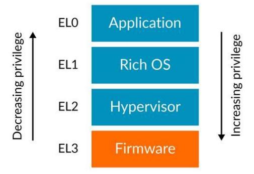
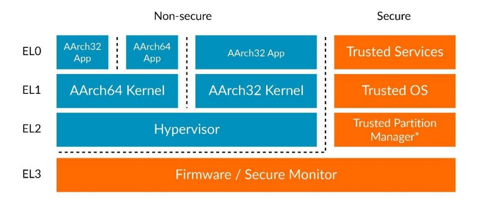
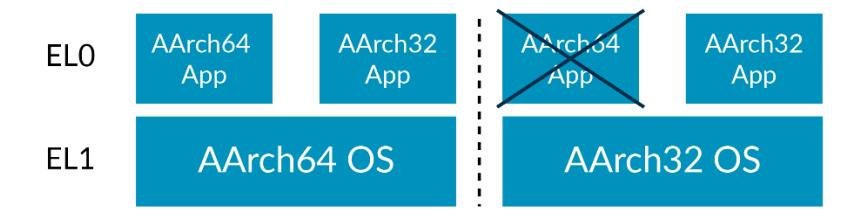
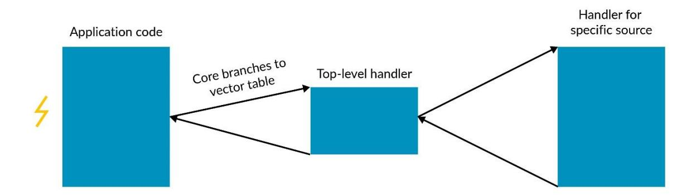
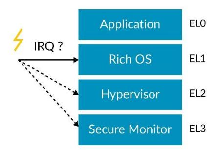

### **Exception model**

Version 1.0

#### Exception model

Copyright © 2019 Arm Limited (or its affiliates). All rights reserved.

#### **Release Information**

#### **Document History**

| Version | Date            | Confidentiality  | Change |
|---------|-----------------|------------------|--------|
| 1.0     | 08 January 2020 | Non-Confidential | 1      |

#### Non-Confidential Proprietary Notice

This document is protected by copyright and other related rights and the practice or implementation of the information contained in this document may be protected by one or more patents or pending patent applications. No part of this document may be reproduced in any form by any means without the express prior written permission of Arm. **No license, express or implied, by estoppel or otherwise to any intellectual property rights is granted by this document unless specifically stated.**

Your access to the information in this document is conditional upon your acceptance that you will not use or permit others to use the information for the purposes of determining whether implementations infringe any third party patents.

THIS DOCUMENT IS PROVIDED "AS IS". ARM PROVIDES NO REPRESENTATIONS AND NO WARRANTIES, EXPRESS, IMPLIED OR STATUTORY, INCLUDING, WITHOUT LIMITATION, THE IMPLIED WARRANTIES OF MERCHANTABILITY, SATISFACTORY QUALITY, NON-INFRINGEMENT OR FITNESS FOR A PARTICULAR PURPOSE WITH RESPECT TO THE DOCUMENT. For the avoidance of doubt, Arm makes no representation with respect to, and has undertaken no analysis to identify or understand the scope and content of, patents, copyrights, trade secrets, or other rights.

This document may include technical inaccuracies or typographical errors.

TO THE EXTENT NOT PROHIBITED BY LAW, IN NO EVENT WILL ARM BE LIABLE FOR ANY DAMAGES, INCLUDING WITHOUT LIMITATION ANY DIRECT, INDIRECT, SPECIAL, INCIDENTAL, PUNITIVE, OR CONSEQUENTIAL DAMAGES, HOWEVER CAUSED AND REGARDLESS OF THE THEORY OF LIABILITY, ARISING OUT OF ANY USE OF THIS DOCUMENT, EVEN IF ARM HAS BEEN ADVISED OF THE POSSIBILITY OF SUCH DAMAGES.

This document consists solely of commercial items. You shall be responsible for ensuring that any use, duplication or disclosure of this document complies fully with any relevant export laws and regulations to assure that this document or any portion thereof is not exported, directly or indirectly, in violation of such export laws. Use of the word "partner" in reference to Arm's customers is not intended to create or refer to any partnership relationship with any other company. Arm may make changes to this document at any time and without notice.

If any of the provisions contained in these terms conflict with any of the provisions of any click through or signed written agreement covering this document with Arm, then the click through or signed written agreement prevails over and supersedes the conflicting provisions of these terms. This document may be translated into other languages for convenience, and you agree that if there is any conflict between the English version of this document and any translation, the terms of the English version of the Agreement shall prevail.

The Arm corporate logo and words marked with ® or ™ are registered trademarks or trademarks of Arm Limited (or its subsidiaries) in the US and/or elsewhere. All rights reserved. Other brands and names mentioned in this document may be the trademarks of their respective owners. Please follow Arm's trademark usage guidelines at 33T**<http://www.arm.com/company/policies/trademarks>** 33T.

Copyright © 2019 Arm Limited (or its affiliates). All rights reserved.

Arm Limited. Company 02557590 registered in England.

110 Fulbourn Road, Cambridge, England CB1 9NJ.

LES-PRE-20349

#### Confidentiality Status

This document is Non-Confidential. The right to use, copy and disclose this document may be subject to license restrictions in accordance with the terms of the agreement entered into by Arm and the party that Arm delivered this document to.

Unrestricted Access is an Arm internal classification.

#### Product Status

The information in this document is Final, that is for a developed product.

#### Web Address

33T**[http://www.arm.com](http://www.arm.com/)**33T

### **Contents**

| 1 Overview                                                      | 5  |
|-----------------------------------------------------------------|----|
| 2 Privilege and Exception levels                                | 5  |
| 2.1. Types of privilege                                         | 6  |
| 2.2. Memory privilege                                           | 6  |
| 2.3. Register access                                            | 7  |
| 3 Execution and Security states                                 | 8  |
| 3.1. Execution states                                           | 8  |
| 3.2. Security state                                             | 8  |
| 3.3. Changing Execution state                                   | 9  |
| 3.4. Changing Security state                                    | 9  |
| 3.5. Implemented Exception levels and Execution states          | 9  |
| 4 Exception types                                               | 11 |
| 4.1. Synchronous exceptions                                     | 11 |
| 4.2. Asynchronous exceptions                                    | 11 |
| 4.3. IRQ and FIQ                                                | 12 |
| 4.4. SError                                                     | 12 |
| 5 Handling exceptions                                           | 13 |
| 5.1. Exception terminology                                      | 13 |
| 5.2. Taking an exception                                        | 13 |
| 5.3. Routing asynchronous exceptions                            | 14 |
| 5.4. Determining which Execution state an exception is taken to | 14 |
| 5.5. Returning from an exception                                | 14 |
| 5.6. Exception stacks                                           | 15 |
| 6 The vector tables                                             | 16 |
| 7 Check your knowledge                                          | 17 |
| 8 Related information                                           | 18 |
| O Novt stone                                                    | 10 |

## **1 Overview**

This guide introduces the exception and privilege model in Armv8-A. This guide covers the different types of exceptions in the Arm architecture, and the behavior of the processor when it receives an exception.

This guide is suitable for developers of low-level code, such as boot code or drivers. It is particularly relevant to anyone writing code to set up or manage the exceptions.

At the end of this guide you can **[check your knowledge](#page-16-0)**. You will be able to list the Exception levels in and state how execution can move between them, and name and describe the Execution states. You will also be able to create a simple AArch64 vector table and exception handler.

## **2 Privilege and Exception levels**

Before we explain the details of the Armv8-A exception model, let's start by introducing the concept of privilege. Modern software expects to be split into different modules, each with a different level of access to system and processor resources. An example of this is the split between the operating system kernel, which has a high level of access to system resources, and user applications, which have a more limited ability to configure the system.

Armv8-A enables this split by implementing different levels of privilege. The current level of privilege can only change when the processor takes or returns from an exception. Therefore, these privilege levels are referred to as Exception levels in the Armv8-A architecture. Each Exception level is numbered, and the higher levels of privilege have higher numbers.

As shown in the following diagram, the Exception levels are referred to as EL<x>, with x as a number between 0 and 3. For example, the lowest level of privilege is referred to as EL0.

A common usage model has application code running at EL0, with an operating system running at EL1. EL2 is used by a hypervisor, with EL3 being reserved by low-level firmware and security code.

**Note:** The architecture does not enforce this software model, but standard software assumes this model. For this reason, the rest of this guide assumed this usage model.

### **2.1. Types of privilege**

There are two types of privilege relevant to this topic. The first is privilege in the memory system, and the second is privilege from the point of view of accessing processor resources. Both are affected by the current Exception level.

### **2.2. Memory privilege**

Armv8-A implements a virtual memory system, in which a Memory Management Unit (MMU) allows software to assign attributes to regions of memory. These attributes include read/write permissions, which can be configured with two degrees of freedom. This configuration allows separate access permissions for privileged and unprivileged accesses.

Memory access initiated when the processor is executing in EL0 will be checked against the Unprivileged access permissions. Memory accesses from EL1, EL2 and EL3 will be checked against the privileged access permissions.

Because this memory configuration is programmed by software using the MMU's translation tables, you should consider the privilege necessary to program those tables. The MMU configuration is stored in System registers, and the ability to access those registers is also controlled by the current Exception level.

#### **2.3. Register access**

Configuration settings for Armv8-A processors are held in a series of registers known as System registers. The combination of settings in the System registers define the current processor Context. Access to the System registers is controlled by the current Exception level.

The name of the System register indicates the lowest Exception level from which that register can be accessed. For instance, TTBR0\_EL1 is the register that holds the base address of the translation table used by EL0 and EL1. This register cannot be accessed from EL0, and any attempt to do so will cause an exception to be generated.

The architecture has many registers with conceptually similar functions that have names that differ only by their Exception level suffix. These are independent, individual registers that have their own encodings in the instruction set and will be implemented separately in hardware. For example, the following registers all perform MMU configuration for different translation regimes. The registers have similar names to reflect that they perform similar tasks, but they are entirely independent registers with their own access semantics:

- SCTLR\_EL1 Top level system control for EL0 and EL1
- SCTLR\_EL2 Top level system control for EL2
- SCTLR\_EL3 Top level system control for EL3

**Note:** EL1 and EL0 share the same MMU configuration and control is restricted to privileged code running at EL1. Therefore, there is no SCTLR\_EL0 and all control is from the EL1 accessible register. This model is generally followed for other control registers.

Higher Exception levels have the privilege to access registers that control lower levels. For example, EL2 has the privilege to access SCTLR\_EL1 if necessary. In the general operation of the system, the privileged Exception levels will usually control their own configuration. However, more privileged levels will sometimes access registers associated with lower Exception levels to for example, implement virtualization features or to read and write the register set as part of a save-and-restore operation during a context switch or power management operation.

# **3 Execution and Security states**

The current state of an Armv8-A processor is determined by the Exception level and two other important states. The current Execution state defines the standard width of the general-purpose register and the available instruction sets.

Execution state also affects aspects of the memory models and how exceptions are managed.

The current Security state controls which Exception levels are currently valid, which areas of memory can currently be accessed, and how those accesses are represented on the system memory bus.

This diagram shows the Exception levels and Security states, with different Execution states being used:

#### **3.1. Execution states**

Armv8-A has two available Execution states:

- AArch32: The 32-bit Execution state. Operation in this state is compatible with Armv7-A. There are two available instruction sets: T32 and A32. The standard register width is 32 bits.
- AArch64: The 64-bit Execution state. There is one available instruction set: A64. The standard register width is 64 bits.

### **3.2. Security state**

The Armv8-A architecture allows for implementation of two Security states. This allows a further partitioning of software to isolate and compartmentalize trusted software.

The two Security states are:

- Secure state: In this state, a Processing Element (PE) can access both the Secure and Non-secure physical address spaces. In this state, the PE can access Secure and Non-secure System registers. Software running in this state can only acknowledge Secure interrupts.
- Non-secure state: In this state, a PE can only access the Non-secure physical address space. The PE can also only access System registers that allow non-secure accesses. Software running in this state can only acknowledge Non-secure interrupts.

The uses of these Security states will be described in more detail in our **[TrustZone guide](https://developer.arm.com/architectures/learn-the-architecture/trustzone-for-armv8-a)**.

#### **3.3. Changing Execution state**

A PE can only change Execution state on reset or when the Exception level changes.

The Execution state on reset is determined by an IMPLEMENTATION DEFINED mechanism. Some implementations fix the Execution state at reset. For example, Cortex-A32 will always reset into AArch32 state. In most implementations of Armv8-A, the Executions state after reset is controlled by a signal that is sampled at reset. This allows the reset Execution state to be controlled at the system-on-chip level.

When the PE changes between Exception levels, it is also possible to change Execution state. Transitioning between AArch32 and AArch64 is only allowed subject to certain rules.

- When moving from a lower Exception level to a higher level, the Execution state can stay the same or change to AArch64.
- When moving from a higher Exception level to a lower level, the Execution state can stay the same or change to AArch32.

Putting these two rules together means that a 64-bit layer can host a 32-bit layer, but not the other way around. For example, a 64-bit OS kernel can host both 64-bit and 32-bit applications, while a 32-bit OS kernel could only host 32-bit applications. This is illustrated here:

In this example we have used an OS and applications, but the same rules apply to all Exception levels. For example, a 32-bit hypervisor at EL2 could only host 32-bit virtual machines at EL1.

### **3.4. Changing Security state**

EL3 is always considered to be executing in Secure state. Using SCR\_EL3, EL3 code can change the Security state of all lower Exception levels. If software uses SCR\_EL3 to change the Security state of the lower Exception levels, the PE will not change Security state until it changes to a lower Exception level.

Changing Security state is discussed in more detail in our **[TrustZone guide](https://developer.arm.com/architectures/learn-the-architecture/trustzone-for-armv8-a)**.

### **3.5. Implemented Exception levels and Execution states**

The Armv8-A architecture allows an implementation to choose whether all Exception levels are implemented, and to choose which Execution states are allowed for each implemented Exception level.

EL0 and EL1 are the only Exception levels that must be implemented. EL2 and EL3 are optional. Choosing not to implement EL3 or EL2 has important implications.

EL3 is the only level that can change Security state. If an implementation chooses not to implement EL3, that PE would not have access to a single Security state.

Similarly, EL2 contains much of the virtualization functionality. Implementations that do not have EL2 have access to these features. All current Arm implementations of the architecture implement all Exception levels, and it would be impossible to use most standard software without all Exception levels.

An implementation can also choose which Execution states are valid for each Exception level. If AArch32 is allowed at an Exception level, it must be allowed all lower Exception levels. For example, if EL3 allows AArch32, then it must be allowed at all lower Exception levels.

Many implementations allow all Executions states and all Exception levels, but there are existing implementations with limitations. For example, Cortex-A32 only allows AArch32 at any Exception level.

Some modern implementations, such as Cortex-A55, implement all Exception levels but only allow AArch32 at EL0. The other exception levels, EL1, EL2, and EL3, must be AArch64.

# **4 Exception types**

An exception is any event that can cause the currently executing program to be suspended and cause a change in state to execute code to handle that exception. Other processor architectures might describe this as an interrupt. In the Armv8-A architecture, interrupts are a type of externally generated exception. The Armv8-A architecture categorizes exceptions into two broad types: synchronous exceptions and asynchronous exceptions.

#### **4.1. Synchronous exceptions**

Synchronous exceptions are exceptions that can be caused by, or related to, the instruction that has just been executed. This means that synchronous exceptions are synchronous to the execution stream.

Synchronous exceptions can be caused by attempting to execute an invalid instruction, either one that is not allowed at the current Exception level or one that has been disabled.

Synchronous exceptions can also be caused by memory accesses, as a result of either a misaligned address or because one of the MMU permissions checks has failed. Because these errors are synchronous, the exception can be taken before the memory access is attempted. Memory accesses can also generate asynchronous exceptions, which are discussed in this section. Memory access errors are discussed in more detail in the Memory Management guide.

The Armv8-A architecture has a family of exception-generating instructions: SVC, HVC**,** and SMC. These instructions are different from a simple invalid instruction, because they target different exception levels and are treated differently when prioritizing exceptions. These instructions are used to implement system call interfaces to allow less privileged code to request services from more privileged code.

Debug exceptions are also synchronous. Debug exceptions are discussed in the Debug overview guide.

### **4.2. Asynchronous exceptions**

Some types of exceptions are generated externally, and therefore are not synchronous with the current instruction stream. This means that it is not possible to guarantee exactly when an asynchronous exception will be taken. The Armv8-A architecture requires only for it to happen in a finite time. Asynchronous exceptions can also be temporarily masked. This means that asynchronous exceptions can be left in a pending state before the exception is taken.

The asynchronous exception types are:

Physical interrupts

- SError (System Error)
- IRQ
- FIQ

#### Virtual Interrupts

- vSError (Virtual System Error)
- vIRQ (Virtual IRQ)
- vFIQ (Virtual FIQ)

The physical interrupts are generated in response to signal generated outside the PE. The virtual interrupts may be externally generated or may be generated by software executing at EL2. Virtual interrupts will be discussed in the Virtualization guide.

Let's look at the different types of physical interrupts.

#### **4.3. IRQ and FIQ**

The Armv8-A architecture has two exception types, IRQ and FIQ, that are intended to be used to generate peripheral interrupts. In other versions of the Arm architecture, FIQ is used as a higher priority fast interrupt. This is different from Armv8-A, in which FIQ has the same priority as IRQ.

IRQ and FIQ have independent routing controls and are often used to implement Secure and Non-secure interrupts, as discussed in the Generic Interrupt Controller guide.

#### **4.4. SError**

SError is an exception type that is intended to be generated by the memory system in response to erroneous memory accesses. A typical use of SError is what was previously referred to as External, asynchronous abort, for example a memory access which has passed all the MMU checks but encounters an error on the memory bus. This may be reported asynchronously because the instruction may have already been retired. SError interrupts may also be caused by parity or Error Correction Code (ECC) checking on some RAMs, for example those in the built-in caches.

# **5 Handling exceptions**

When an exception occurs, the current program flow is interrupted. The Processing Element (PE) will update the current state and branch to a location in the vector table. Usually this location will contain generic code to push the state of the current program onto the stack and then branch to further code. This is illustrated here:

#### **5.1. Exception terminology**

The state that the processor is in when the exception is recognized is known as the state the exception is taken from. The state the PE is in immediately after the exception is the state the exception is taken to. For example, it is possible to take an exception from AArch32 EL0 to AArch64 EL1.

The Armv8-A architecture has instructions that trigger an exception return. In that case, the state that the PE is in when that instruction is executed is the state that the exception return from. The state after the exception return instruction has executed is the state that the exception return to.

Each exception type targets an Exception level. Asynchronous exceptions can be routed to different exception levels.

### **5.2. Taking an exception**

When an exception is taken, the current state must be preserved so that it can be returned to. The PE will automatically preserve the exception return address and the current PSTATE.

The state stored in the general-purpose registers must be preserved by software. The PE will then update the current PSTATE to the one defined in the architecture for that exception type, and branch to the exception handler in the vector table.

The PSTATE the exception was taken from is stored in the System register SPSR\_ELx, where <x> is the number of the Exception level that the exception was taken to. The exception return address is stored in ELR\_ELx, where <x> is the Exception level that the exception was taken to.

#### **5.3. Routing asynchronous exceptions**

The three physical interrupt types can be independently routed to one of the privileged Exception levels, EL1, EL2 or EL3. The diagram below uses IRQs as an example:

This routing is configured using SCR\_EL3 and HCR\_EL2. Routing configurations made using SCR\_EL3 will override routing configurations made using HCR\_EL2. These controls allow different interrupt types to be routed to different software.

Exceptions that are routed to a lower Exception level than the level being executed are implicitly masked. The exception will be pended until the PE changes to an Exception level equal to, or lower than, the one routed to.

#### **5.4. Determining which Execution state an exception is taken to**

The Execution state of an Exception level that an exception is taken to is determined by a higher Exception level. Assuming all Exception levels are implemented the following table shows how the Execution state is determined:

| Exception level taken to: | Exception level determined by:              |
|---------------------------|---------------------------------------------|
| Non-secure EL1            | HCR_EL2.RW                                  |
| Secure EL1                | SCR_EL3 or HCR_EL2 if Secure EL2 is enabled |
| EL2                       | SCR_EL3.RW                                  |
| EL3                       | Reset state of EL3                          |

### **5.5. Returning from an exception**

Software can initiate a return from an exception by executing an ERET instruction from AArch64. This will cause the Exception level returned to be configured based on the value of SPSR\_ELx, where <x> is the level being returned from. SPSR\_ELx contains the target level to be returned to and the target Execution state.

Note that the Execution state specified in SPSR\_ELx must match the configuration in either SCR\_EL3.RW or HCR\_EL2.RW, or this will generate an illegal exception return.

On execution of the ERET instruction, the state will be restored from SPSR\_ELx, and the program counter will be updated to the value in ELR\_ELx. These two updates will be performed atomically and indivisibly so that the PE will not be left in an undefined state.

#### **5.6. Exception stacks**

When executing in AArch64, the architecture allows a choice of two stack pointer registers; SP\_EL0 or SP\_ELx, where <x> is the current Exception level. For example, at EL1 it is possible to select SP\_EL0 or SP\_EL1.

During general execution, it is expected that all code uses SP\_EL0. When taking an exception, SP\_ELx is initially selected. This allows a separate stack to be maintained for initial exception handling. This is useful for maintaining a valid stack when handling exceptions caused by stack overflows.

## **6 The vector tables**

In Armv8-A, vector tables are an area of normal memory containing instructions. The processor element (PE) holds the base address of the table in a System register, and each exception type has a defined offset from that base.

The privileged Exception levels each have their own vector table defined by a Vector Base Address Register, VBAR\_ELx, where <x> is 1,2, or 3.

The values of the VBAR registers are undefined after reset, so they must be configured before interrupts are enabled.

The format of the vector table is shown below:

|            | 0x780 | SError / vSError |                                                                                                    |  |
|------------|-------|------------------|----------------------------------------------------------------------------------------------------|--|
|            | 0x700 | FIQ / vFIQ       | Exception from a lower EL and all lower ELs are AArch32.                                           |  |
|            | 0x680 | IRQ / vIRQ       |                                                                                                    |  |
|            | 0x600 | Synchronous      |                                                                                                    |  |
| 0          | 0x580 | SError / vSError | Exception from a lower EL and at least one lower EL is AArch64.                                    |  |
|            | 0x500 | FIQ / vFIQ       |                                                                                                    |  |
|            | 0x480 | IRQ / vIRQ       |                                                                                                    |  |
|            | 0x400 | Synchronous      |                                                                                                    |  |
|            | 0x380 | SError / vSError | Exception from the current EL while using SP_ELx  Exception from the current EL while using SP_EL0 |  |
|            | 0x300 | FIQ / vFIQ       |                                                                                                    |  |
|            | 0x280 | IRQ / vIRQ       |                                                                                                    |  |
|            | 0x200 | Synchronous      |                                                                                                    |  |
|            | 0x180 | SError / vSError |                                                                                                    |  |
|            | 0x100 | FIQ / vFIQ       |                                                                                                    |  |
|            | 0x080 | IRQ / vIRQ       |                                                                                                    |  |
| VBAR_ELn + | 0x000 | Synchronous      |                                                                                                    |  |

Each exception type can cause a branch to one of four locations based on the state of the Exception level the exception was taken from.

# **7 Check your knowledge**

Q: what Exception levels are implemented in Armv8-A?

A: EL0 and EL1 are mandatory. EL2 and EL3 are optional but implemented by most designs.

Q: What are the Execution states?

A: AArch32 and AArch64

Q: Which stack is used on exception entry?

A: SP\_ELx is automatically selected to provide a safe exception stack.

Q: How are the vector tables implemented in AArch64?

A: The PE holds the base address of the table in VBAR\_ELx. The table itself is instruction memory.

## **8 Related information**

Here are some resources related to material in this guide:

- **[Arm architecture and reference manuals](https://developer.arm.com/docs) –** Find technical manuals and documentation relating to this guide and other similar topics.
- **[Arm Community](https://community.arm.com/) –** Ask development questions, and find articles and blogs on specific topics from Arm experts
- **[TrustZone](https://developer.arm.com/architectures/learn-the-architecture/trustzone-for-armv8-a)**

#### **Useful links to training**

- Armv8 Architecture
- **[Introduction to Armv8-A](https://training.developer.arm.com/topics/33842?_ga=2.128817676.1294456372.1581063889-1530727830.1550057146)**

Here are some resources related to topics in this guide:

#### **Exception types**

- **[Before debugging](https://developer.arm.com/architectures/learn-the-architecture/before-debugging)**
- **[Generic Interrupt Controller](https://developer.arm.com/architectures/learn-the-architecture/arm-corelink-generic-interrupt-controller-v3-and-v4-overview)**
- **[Memory management](https://developer.arm.com/architectures/learn-the-architecture/memory-management)**
- **[Armv8-A virtualization](https://developer.arm.com/architectures/learn-the-architecture/armv8-a-virtualization)**

# **9 Next steps**

This guide has introduced the concept of the Armv8-A Exception model and exception handling using AArch64. We have looked at Execution and Security states, exception types, exception handling, and the vector table.

This knowledge will be useful as you begin to learn more about the architecture, how interrupts work, and the flow of processor behavior. You can put your knowledge into action in developing embedded code, creating the vector table and exception handlers.

You can explore some of these concepts in our bare metal boot exercise (coming soon).