#### ARM® Cortex® -A Series

**Version: 1.0**

**Programmer's Guide for ARMv8-A**


#### **ARM Cortex-A Series Programmer's Guide for ARMv8-A**

Copyright © 2015 ARM. All rights reserved.

#### **Release Information**

The following changes have been made to this book.

#### **Change history**

| Date          | Issue | Confidentiality  | Change        |
|---------------|-------|------------------|---------------|
| 24 March 2015 | A     | Non-Confidential | First release |

#### **Proprietary Notice**

This document is protected by copyright and other related rights and the practice or implementation of the information contained in this document may be protected by one or more patents or pending patent applications. No part of this document may be reproduced in any form by any means without the express prior written permission of ARM. No license, express or implied, by estoppel or otherwise to any intellectual property rights is granted by this document unless specifically stated.

Your access to the information in this document is conditional upon your acceptance that you will not use or permit others to use the information for the purposes of determining whether implementations infringe any third party patents.

THIS DOCUMENT IS PROVIDED "AS IS". ARM PROVIDES NO REPRESENTATIONS AND NO WARRANTIES, EXPRESS, IMPLIED OR STATUTORY, INCLUDING, WITHOUT LIMITATION, THE IMPLIED WARRANTIES OF MERCHANTABILITY, SATISFACTORY QUALITY, NON-INFRINGEMENT OR FITNESS FOR A PARTICULAR PURPOSE WITH RESPECT TO THE DOCUMENT. For the avoidance of doubt, ARM makes no representation with respect to, and has undertaken no analysis to identify or understand the scope and content of, third party patents, copyrights, trade secrets, or other rights.

This document may include technical inaccuracies or typographical errors.

TO THE EXTENT NOT PROHIBITED BY LAW, IN NO EVENT WILL ARM BE LIABLE FOR ANY DAMAGES, INCLUDING WITHOUT LIMITATION ANY DIRECT, INDIRECT, SPECIAL, INCIDENTAL, PUNITIVE, OR CONSEQUENTIAL DAMAGES, HOWEVER CAUSED AND REGARDLESS OF THE THEORY OF LIABILITY, ARISING OUT OF ANY USE OF THIS DOCUMENT, EVEN IF ARM HAS BEEN ADVISED OF THE POSSIBILITY OF SUCH DAMAGES.

This document consists solely of commercial items. You shall be responsible for ensuring that any use, duplication or disclosure of this document complies fully with any relevant export laws and regulations to assure that this document or any portion thereof is not exported, directly or indirectly, in violation of such export laws. Use of the word "partner" in reference to ARM's customers is not intended to create or refer to any partnership relationship with any other company. ARM may make changes to this document at any time and without notice.

If any of the provisions contained in these terms conflict with any of the provisions of any signed written agreement covering this document with ARM, then the signed written agreement prevails over and supersedes the conflicting provisions of these terms. This document may be translated into other languages for convenience, and you agree that if there is any conflict between the English version of this document and any translation, the terms of the English version of the Agreement shall prevail.

Words and logos marked with ® or ™ are registered trademarks or trademarks of ARM Limited or its affiliates in the EU and/or elsewhere. All rights reserved. Other brands and names mentioned in this document may be the trademarks of their respective owners. Please follow ARM's trademark usage guidelines at http://www.arm.com/about/trademark-usage-guidelines.php

Copyright © 2015, ARM Limited or its affiliates. All rights reserved.

ARM Limited. Company 02557590 registered in England.

110 Fulbourn Road, Cambridge, England CB1 9NJ.

#### **Confidentiality Status**

This document is Non-Confidential. The right to use, copy and disclose this document may be subject to license restrictions in accordance with the terms of the agreement entered into by ARM and the party that ARM delivered this document to.

#### **Product Status**

The information in this document is final, that is for a developed product.

#### **Web Address**

http://www.arm.com

### Contents

# ARM Cortex-A Series Programmer's Guide for ARMv8-A

|           | Preta | ace                                |     |
|-----------|-------|------------------------------------|-----|
|           |       | Glossary                           | ix  |
|           |       | References                         |     |
|           |       | Feedback on this book              |     |
| Chapter 1 | Intro | oduction                           |     |
| •         | 1.1   | How to use this book               | 1-3 |
| Chapter 2 | ARN   | /Iv8-A Architecture and Processors |     |
| -         | 2.1   | ARMv8-A                            | 2-3 |
|           | 2.2   | ARMv8-A Processor properties       | 2-5 |
| Chapter 3 | Fund  | damentals of ARMv8                 |     |
| -         | 3.1   | Execution states                   | 3-4 |
|           | 3.2   | Changing Exception levels          |     |
|           | 3.3   | Changing execution state           |     |
| Chapter 4 | ARN   | /Iv8 Registers                     |     |
| •         | 4.1   | AArch64 special registers          | 4-3 |
|           | 4.2   | Processor state                    |     |
|           | 4.3   | System registers                   |     |
|           | 4.4   | Endianness                         |     |
|           | 4.5   | Changing execution state (again)   |     |
|           | 4.6   | NEON and floating-point registers  |     |
|           |       |                                    |     |

| Chapter<br>5<br>An Introduction to the ARMv8 Instruction Sets |            |                                                                           |  |
|---------------------------------------------------------------|------------|---------------------------------------------------------------------------|--|
|                                                               | 5.1        | The ARMv8 instruction sets 5-2                                            |  |
|                                                               | 5.2        | C/C++ inline assembly 5-9                                                 |  |
|                                                               | 5.3        | Switching between the instruction sets 5-10                               |  |
| Chapter<br>6                                                  |            | The A64 instruction set                                                   |  |
|                                                               | 6.1        | Instruction mnemonics 6-2                                                 |  |
|                                                               |            |                                                                           |  |
|                                                               | 6.2        | Data processing instructions 6-3                                          |  |
|                                                               | 6.3        | Memory access instructions 6-12                                           |  |
|                                                               | 6.4<br>6.5 | Flow control 6-19<br>System control and other instructions 6-21           |  |
|                                                               |            |                                                                           |  |
| Chapter<br>7                                                  |            | AArch64 Floating-point and NEON                                           |  |
|                                                               | 7.1        | New features for NEON and Floating-point in AArch64 7-2                   |  |
|                                                               | 7.2        | NEON and Floating-Point architecture 7-4                                  |  |
|                                                               | 7.3        | AArch64 NEON instruction format 7-9                                       |  |
|                                                               | 7.4        | NEON coding alternatives 7-14                                             |  |
| Chapter<br>8                                                  |            | Porting to A64                                                            |  |
|                                                               | 8.1        | Alignment 8-3                                                             |  |
|                                                               | 8.2        | Data types 8-4                                                            |  |
|                                                               | 8.3        | Issues when porting code from a 32-bit to 64-bit environment 8-8          |  |
|                                                               | 8.4        | Recommendations for new C code 8-10                                       |  |
| Chapter<br>9                                                  |            | The ABI for ARM 64-bit Architecture                                       |  |
|                                                               | 9.1        | Register use in the AArch64 Procedure Call Standard 9-3                   |  |
| Chapter<br>10                                                 |            | AArch64 Exception Handling                                                |  |
|                                                               |            |                                                                           |  |
|                                                               | 10.1       | Exception handling registers 10-4                                         |  |
|                                                               | 10.2       | Synchronous and asynchronous exceptions 10-7                              |  |
|                                                               | 10.3       | Changes to execution state and Exception level caused by exceptions 10-10 |  |
|                                                               | 10.4       | AArch64 exception table 10-12                                             |  |
|                                                               | 10.5       | Interrupt handling 10-14                                                  |  |
|                                                               | 10.6       | The Generic Interrupt Controller 10-17                                    |  |
| Chapter<br>11                                                 | Caches     |                                                                           |  |
|                                                               | 11.1       | Cache terminology 11-3                                                    |  |
|                                                               | 11.2       | Cache controller 11-8                                                     |  |
|                                                               | 11.3       | Cache policies 11-9                                                       |  |
|                                                               | 11.4       | Point of coherency and unification 11-11                                  |  |
|                                                               | 11.5       | Cache maintenance 11-13                                                   |  |
|                                                               | 11.6       | Cache discovery 11-18                                                     |  |
| Chapter<br>12                                                 |            | The Memory Management Unit                                                |  |
|                                                               | 12.1       | The Translation Lookaside Buffer 12-4                                     |  |
|                                                               | 12.2       | Separation of kernel and application Virtual Address spaces 12-7          |  |
|                                                               | 12.3       | Translating a Virtual Address to a Physical Address 12-9                  |  |
|                                                               |            |                                                                           |  |
|                                                               | 12.4       | Translation tables in ARMv8-A 12-14                                       |  |
|                                                               | 12.5       | Translation table configuration 12-18                                     |  |
|                                                               | 12.6       | Translations at EL2 and EL3 12-20                                         |  |
|                                                               | 12.7       | Access permissions 12-23                                                  |  |
|                                                               | 12.8       | Operating system use of translation table descriptors 12-25               |  |
|                                                               | 12.9       | Security and the MMU 12-26                                                |  |
|                                                               | 12.10      | Context switching 12-27                                                   |  |
|                                                               | 12.11      | Kernel access with user permissions 12-29                                 |  |
| Chapter<br>13                                                 |            | Memory Ordering                                                           |  |
|                                                               | 13.1       | Memory types 13-3                                                         |  |
|                                                               |            |                                                                           |  |

| 13.3 |                                                                                                                              |                                                                                                                                                                                                                                                                                                                                                                                                                                                                                                                                                                                                                                                                                                                                                                                                                                                                                                                                                     |  |
|------|------------------------------------------------------------------------------------------------------------------------------|-----------------------------------------------------------------------------------------------------------------------------------------------------------------------------------------------------------------------------------------------------------------------------------------------------------------------------------------------------------------------------------------------------------------------------------------------------------------------------------------------------------------------------------------------------------------------------------------------------------------------------------------------------------------------------------------------------------------------------------------------------------------------------------------------------------------------------------------------------------------------------------------------------------------------------------------------------|--|
|      |                                                                                                                              |                                                                                                                                                                                                                                                                                                                                                                                                                                                                                                                                                                                                                                                                                                                                                                                                                                                                                                                                                     |  |
|      |                                                                                                                              |                                                                                                                                                                                                                                                                                                                                                                                                                                                                                                                                                                                                                                                                                                                                                                                                                                                                                                                                                     |  |
|      |                                                                                                                              |                                                                                                                                                                                                                                                                                                                                                                                                                                                                                                                                                                                                                                                                                                                                                                                                                                                                                                                                                     |  |
|      |                                                                                                                              |                                                                                                                                                                                                                                                                                                                                                                                                                                                                                                                                                                                                                                                                                                                                                                                                                                                                                                                                                     |  |
| 14.4 |                                                                                                                              |                                                                                                                                                                                                                                                                                                                                                                                                                                                                                                                                                                                                                                                                                                                                                                                                                                                                                                                                                     |  |
|      |                                                                                                                              |                                                                                                                                                                                                                                                                                                                                                                                                                                                                                                                                                                                                                                                                                                                                                                                                                                                                                                                                                     |  |
|      |                                                                                                                              |                                                                                                                                                                                                                                                                                                                                                                                                                                                                                                                                                                                                                                                                                                                                                                                                                                                                                                                                                     |  |
|      |                                                                                                                              |                                                                                                                                                                                                                                                                                                                                                                                                                                                                                                                                                                                                                                                                                                                                                                                                                                                                                                                                                     |  |
|      |                                                                                                                              |                                                                                                                                                                                                                                                                                                                                                                                                                                                                                                                                                                                                                                                                                                                                                                                                                                                                                                                                                     |  |
| 15.4 |                                                                                                                              |                                                                                                                                                                                                                                                                                                                                                                                                                                                                                                                                                                                                                                                                                                                                                                                                                                                                                                                                                     |  |
|      |                                                                                                                              |                                                                                                                                                                                                                                                                                                                                                                                                                                                                                                                                                                                                                                                                                                                                                                                                                                                                                                                                                     |  |
|      |                                                                                                                              |                                                                                                                                                                                                                                                                                                                                                                                                                                                                                                                                                                                                                                                                                                                                                                                                                                                                                                                                                     |  |
|      |                                                                                                                              |                                                                                                                                                                                                                                                                                                                                                                                                                                                                                                                                                                                                                                                                                                                                                                                                                                                                                                                                                     |  |
| 16.3 |                                                                                                                              |                                                                                                                                                                                                                                                                                                                                                                                                                                                                                                                                                                                                                                                                                                                                                                                                                                                                                                                                                     |  |
|      |                                                                                                                              |                                                                                                                                                                                                                                                                                                                                                                                                                                                                                                                                                                                                                                                                                                                                                                                                                                                                                                                                                     |  |
|      |                                                                                                                              |                                                                                                                                                                                                                                                                                                                                                                                                                                                                                                                                                                                                                                                                                                                                                                                                                                                                                                                                                     |  |
|      |                                                                                                                              |                                                                                                                                                                                                                                                                                                                                                                                                                                                                                                                                                                                                                                                                                                                                                                                                                                                                                                                                                     |  |
|      |                                                                                                                              |                                                                                                                                                                                                                                                                                                                                                                                                                                                                                                                                                                                                                                                                                                                                                                                                                                                                                                                                                     |  |
| 17.4 |                                                                                                                              |                                                                                                                                                                                                                                                                                                                                                                                                                                                                                                                                                                                                                                                                                                                                                                                                                                                                                                                                                     |  |
|      |                                                                                                                              |                                                                                                                                                                                                                                                                                                                                                                                                                                                                                                                                                                                                                                                                                                                                                                                                                                                                                                                                                     |  |
|      |                                                                                                                              |                                                                                                                                                                                                                                                                                                                                                                                                                                                                                                                                                                                                                                                                                                                                                                                                                                                                                                                                                     |  |
|      |                                                                                                                              |                                                                                                                                                                                                                                                                                                                                                                                                                                                                                                                                                                                                                                                                                                                                                                                                                                                                                                                                                     |  |
| 18.3 |                                                                                                                              |                                                                                                                                                                                                                                                                                                                                                                                                                                                                                                                                                                                                                                                                                                                                                                                                                                                                                                                                                     |  |
|      |                                                                                                                              |                                                                                                                                                                                                                                                                                                                                                                                                                                                                                                                                                                                                                                                                                                                                                                                                                                                                                                                                                     |  |
|      |                                                                                                                              |                                                                                                                                                                                                                                                                                                                                                                                                                                                                                                                                                                                                                                                                                                                                                                                                                                                                                                                                                     |  |
|      |                                                                                                                              |                                                                                                                                                                                                                                                                                                                                                                                                                                                                                                                                                                                                                                                                                                                                                                                                                                                                                                                                                     |  |
| 19.3 | The Base Platform FVP 19-16                                                                                                  |                                                                                                                                                                                                                                                                                                                                                                                                                                                                                                                                                                                                                                                                                                                                                                                                                                                                                                                                                     |  |
|      | 13.2<br>14.1<br>14.2<br>14.3<br>15.1<br>15.2<br>15.3<br>16.1<br>16.2<br>17.1<br>17.2<br>17.3<br>18.1<br>18.2<br>19.1<br>19.2 | Barriers 13-6<br>Memory attributes 13-11<br>Multi-core processors<br>Multi-processing systems 14-3<br>Cache coherency 14-10<br>Multi-core cache coherency within a cluster 14-13<br>Bus protocol and the Cache Coherent Interconnect 14-17<br>Power Management<br>Idle management 15-3<br>Dynamic voltage and frequency scaling 15-6<br>Assembly language power instructions 15-7<br>Power State Coordination Interface 15-8<br>big.LITTLE Technology<br>Structure of a big.LITTLE system 16-2<br>Software execution models in big.LITTLE 16-4<br>big.LITTLE MP 16-7<br>Security<br>TrustZone hardware architecture 17-3<br>Switching security worlds through interrupts 17-5<br>Security in multi-core systems 17-6<br>Switching between Secure and Non-secure state 17-8<br>Debug<br>ARM debug hardware 18-3<br>ARM trace hardware 18-9<br>DS-5 debug and trace 18-12<br>ARMv8 Models<br>ARM Fast Models 19-2<br>ARMv8-A Foundation Platform 19-4 |  |

### <span id="page-6-0"></span>**Preface**

In 2013, ARM released its 64-bit ARMv8 architecture, the first major change to the ARM architecture since ARMv7 in 2007, and the most fundamental and far reaching change since the original ARM architecture was created.

Development of the architecture has continued for some years. Early versions were being used before the *Cortex-A Series Programmer's Guide for ARMv7-A* was first released. The first of the Programmer's Guide series from ARM, it post-dated the introduction of the 32-bit ARMv7 architecture by some years. Almost immediately there were requests for a version to cover the ARMv8 architecture. It was intended from the outset that a guide to ARMv8 should be available as soon as possible.

This book was started when the first versions of the ARMv8 architecture were being tested and codified. As always, moving from a system that is known and understood to something new and unknown can present a number of problems. The engineers who supplied information for the present book are, by and large, the same engineers who supplied the information for the original *Cortex-A Series Programmer's Guide*. This book has been made richer by their observations and insights as they use, and solve the problems presented by the new architecture.

The Programmer's Guides are meant to complement, rather than replace, other ARM documentation available, such as the *Technical Reference Manuals* (TRMs) for the processors themselves, documentation for individual devices or boards or, most importantly, the *ARM Architecture Reference Manual* (the ARM ARM). They are intended to provide a gentle introduction to the ARM architecture, and cover all the main concepts that you need to know about, in an easy to read format, with examples of actual code in both C and assembly language, and with hints and tips for writing your own code.

It might be argued that if you are an application developer, you do not need to know what goes on inside a processor. ARM Application processors can easily be regarded as black boxes which simply run your code when you say go. Instead, this book provides a single guide, bringing

together information from a wide variety of sources, for those programmers who get the system to the point where application developers can run applications, such as those involved in ASIC verification, or those working on boot code and device drivers.

During bring-up of a new board or *System-on-Chip* (SoC), engineers may have to investigate issues with the hardware. Memory system behavior is among the most common places for these to manifest, for example, deadlocks where the processor cannot make forward progress because of memory system lock. Debugging these problems requires an understanding of the operation and effect of cache or MMU use. This is different from debugging a failing piece of code.

In a similar vein, system architects (usually hardware engineers) make choices early in the design about the implementation of DMA, frame buffers and other parts of the memory system where an understanding of data flow between agents in required. In this case it is difficult to make sensible decisions about it if you do not understand when a cache will help you and when it gets in the way, or how the OS will use the MMU. Similar considerations apply in many other places.

This is not an introductory level book, nor is it a purely technical description of the architecture and processors, which merely state the facts with little or no explanation of 'how' and 'why'. ARM and all who have collaborated on this book hope it successfully navigates between the two extremes, while attempting to explain some of the more intricate aspects of the architecture.

#### <span id="page-8-0"></span>**Glossary**

Abbreviations and terms used in this document are defined here.

**AAPCS** ARM Architecture Procedure Call Standard.

**AArch32 state** The ARM 32-bit execution state that uses 32-bit general-purpose registers,

and a 32-bit *Program Counter* (PC), *Stack Pointer* (SP), and *Link Register* (LR). AArch32 execution state provides a choice of two instruction sets, A32 and T32, previously called the ARM and Thumb instruction sets.

**AArch64 state** The ARM 64-bit execution state that uses 64-bit general-purpose registers,

and a 64-bit *Program Counter* (PC), *Stack Pointer* (SP), and *Exception Link Registers* (ELR). AArch64 execution state provides a single

instruction set, A64.

**ABI** Application Binary Interface.

**ACE** AXI Coherency Extensions.

**AES** Advanced Encryption Standard.

**AMBA®** Advanced Microcontroller Bus Architecture.

**AMP** Asymmetric Multi-Processing.

**ARM ARM** The ARM Architecture Reference Manual.

**ASIC** Application Specific Integrated Circuit.

**ASID** Address Space ID.

**AXI** Advanced eXtensible Interface.

**BE8** Byte Invariant Big-Endian Mode.

**BTAC** Branch Target Address Cache.

**BTB** Branch Target Buffer.

**CCI** Cache Coherent Interface.

**CHI** Coherent Hub Interface.

**CP15** Coprocessor 15 for AArch32 and ARMv7-A- System control coprocessor.

**DAP** Debug Access Port.

**DMA** Direct Memory Access.

**DMB** Data Memory Barrier.

**DS-5™** The ARM Development Studio.

**DSB** Data Synchronization Barrier.

**DSP** Digital Signal Processing.

**DSTREAM** An ARM debug and trace unit.

**DVFS** Dynamic Voltage/Frequency Scaling.

**EABI** Embedded ABI.

**ECC** Error Correcting Code.

**ECT** Embedded Cross Trigger.

**EL0** Exception level used to execute user applications.

**EL1** Exception level normally used to run operating systems.

**EL2** Hypervisor Exception level. In the Normal world, or Non-Secure state,

this is used to execute hypervisor code.

**EL3** Secure Monitor exception level.This is used to execute the code that

guards transitions between the Secure and Normal worlds.

**ETB** Embedded Trace Buffer™.

**ETM** Embedded Trace Macrocell™.

**Execution state** The operational state of the processor, either 64-bit (AArch64) or 32-bit

(AArch32).

**FIQ** An interrupt type (formerly fast interrupt).

**FPSCR** Floating-Point Status and Control Register.

**GCC** GNU Compiler Collection. **GIC** Generic Interrupt Controller.

#### **Harvard architecture**

Architecture with physically separate storage and signal pathways for

instructions and data.

**HCR** Hyp Configuration Register.

**HMP** Heterogenous Multi-Processing.

#### **IMPLEMENTATION DEFINED**

Some properties of the processor are defined by the manufacturer.

**IPA** Intermediate Physical Address.

**IRQ** Interrupt Request, normally for external interrupts.

**ISA** Instruction Set Architecture.

**ISB** Instruction Synchronization Barrier.

**ISR** Interrupt Service Routine.

**Jazelle™** The ARM bytecode acceleration technology.

**LLP64** Indicates the size in bits of basic C data types. Under LLP64 int and long

data types are 32 bit, pointers and long long are 64 bits.

**LP64** Indicates the size in bits of basic C data types. Under LP64 int types are

32 bits, all others are 64 bits.

**LPAE** Large Physical Address Extension.

**LSB** Least Significant Bit.

**MESI** A cache coherency protocol with four states that are Modified, Exclusive,

Shared and Invalid.

**MMU** Memory Management Unit.

**MOESI** A cache coherency protocol with five states that are Modified, Owned,

Exclusive, Shared and Invalid.

**Monitor mode** When EL3 is using AArch32, the PE mode in which the Secure Monitor

must execute. This mode guards transitions between the Secure and

Normal worlds.

**MPU** Memory Protection Unit.

**NEON™** The ARM Advanced SIMD Extensions.

**NIC** Network InterConnect.

**Normal world** The execution environment when the processor is in the Non-secure state.

**PCS** Procedure Call Standard.

**PIPT** Physically Indexed, Physically Tagged.

**PoC** Point of Coherency. **PoU** Point of Unification.

**PSR** Program Status Register.

**SCU** Snoop Control Unit.

**Secure world** The execution environment when the processor is in the Secure State.

**SIMD** Single Instruction, Multiple Data.

**SMC** Secure Monitor Call. An ARM assembler instruction that causes an

exception that is taken synchronously to EL3.

**SMC32** 32-bit SMC calling convention **SMC64** 64-bit SMC calling convention

**SMC Function Identifier** 

A 32-bit integer which identifies which function is being invoked by this

SMC call. Passed in R0 or W0 to every SMC call

**SMMU** System MMU.

**SMP** Symmetric Multi-Processing.

**SoC** System on Chip.

**SP** Stack Pointer.

**SPSR** Saved Program Status Register.

**Streamline** A graphical performance analysis tool.

**SVC** Supervisor Call instruction.

**SYS** System Mode.

**Thumb®** An instruction set extension to ARM.

**Thumb-2** A technology extending the Thumb instruction set to support both 16-bit

and 32-bit instructions.

**TLB** Translation Lookaside Buffer.

**TrustedOS** This is the operating system running in the Secure World. It supports the

execution of trusted applications in Secure EL0. When EL3 is using AArch64 it executes in Secure EL1. When EL3 is using AArch32 it

executes in Secure EL3 modes other than Monitor mode.

**TrustZone®** The ARM security extension.

**TTB** Translation Table Base.

**TTBR** Translation Table Base Register.

**UART** Universal Asynchronous Receiver/Transmitter.

**UEFI** Unified Extensible Firmware Interface.

**U-Boot** A Linux Bootloader.

**UNK** Unknown.

**UNKNOWN** Values in a register cannot be known before they are reset.

**UNPREDICTABLE** 

The value taken cannot be predicted.

**USR** User mode, a non-privileged processor mode.

**VFP** The ARM floating-point instruction set. Before ARMv7, the VFP

extension was called the Vector Floating-Point architecture, and was used

for vector operations.

**VIPT** Virtually Indexed, Physically Tagged.

**VMID** Virtual Machine Identifier.

**XN** Execute Never.

#### <span id="page-12-0"></span>**References**

ANSI/IEEE Std 754-1985, "*IEEE Standard for Binary Floating-Point Arithmetic*".

ANSI/IEEE Std 754-2008, "*IEEE Standard for Binary Floating-Point Arithmetic*".

ANSI/IEEE Std 1003.1-1990, "*Standard for Information Technology - Portable Operating System Interface (POSIX) Base Specifications*, Issue 7".

ANSI/IEEE Std 1149.1-2001, "*IEEE Standard Test Access Port and Boundary-Scan Architecture*".

The ARMv8 *Architecture Reference Manual*, known as the ARM ARM, fully describes the ARMv8 instruction set architecture, programmer's model, system registers, debug features and memory model. It forms a detailed specification to which all implementations of ARM processors must adhere.

References to the *ARM Architecture Reference Manual* in this document are to:

*ARM® Architecture Reference Manual - ARMv8, for ARMv8-A architecture profile* (ARM DDI 0487).

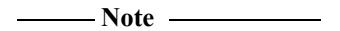

 In the event of a contradiction between this book and the ARM ARM, the ARM ARM is definitive and must take precedence. In most instances, however, the ARM ARM and the Cortex-A Series Programmer's Guide for ARMv8-A cover two separate world views. The most likely scenario is that this book describes something in a way that does not cover all architecturally permitted behaviors, or simply rewords an abstract concept in more practical terms.

*ARM® Cortex®-A Series Programmer's Guide for ARMv7-A* (DEN 0013).

*ARM® NEON™ Programmer's Guide* (DEN 0018).

*ARM® Cortex®-A53 MPCore Processor Technical Reference Manual (DDI 0500)*.

*ARM® Cortex®-A57 MPCore Processor Technical Reference Manual (DDI 0488)*.

*ARM® Generic Interrupt Controller Architecture Specification (ARM IHI 0048)*.

*ARM® Compiler armasm Reference Guide v6.01 (DUI 0802)*.

*ARM® Compiler Software Development Guide v5.05 (DUI 0471)*.

*ARM® C Language Extensions (IHI 0053)*.

*ELF for the ARM® Architecture* (ARM IHI 0044).

[The individual processor Technical Reference Manuals provide a detailed description of the](http://infocenter.arm.com)  [processor behavior. They can be obtained from the ARM website documentation area](http://infocenter.arm.com) http://infocenter.arm.com.

#### **Connected community**

The ARM Connected Community makes it easier to design using ARM processors and IP. It is an interactive platform containing information, discussions and blogs which help you to develop an ARM-based design efficiently, in collaboration with ARM engineers and our 1200+

ecosystem Partners and enthusiasts. Visitors also use the community to find new companies to work with from the many ARM Partners who first introduced their products and services in their dedicated area. You can join the Connected Community on <http://community.arm.com>.

#### <span id="page-14-0"></span>**Feedback on this book**

ARM hopes you find the *Cortex-A Series Programmer's Guide for ARMv8-A* easy to read while in enough depth to provide the comprehensive introduction to using the processors.

If you have any comments on this book, don't understand our explanations, think something is missing, or think that it is incorrect, send an e-mail to errata@arm.com. Give:

- The title.
- The number, ARM DEN0024A.
- The page number(s) to which your comments apply.
- What you think needs to be changed.

ARM also welcomes general suggestions for additions and improvements.

## <span id="page-15-0"></span>Chapter 1 **Introduction**

ARMv8-A is the latest generation of the ARM architecture that is targeted at the Applications Profile. In this book, the name ARMv8 is used to describe the overall architecture, which now includes both 32-bit execution and 64-bit *execution states*. ARMv8 introduces the ability to perform execution with 64-bit wide registers, but provides mechanisms for backwards compatibility to enable existing ARMv7 software to be executed.

*AArch64* is the name used to describe the 64-bit execution state of the ARMv8 architecture. *AArch32* describes the 32-bit execution state of the ARMv8 architecture, which is almost identical to ARMv7. GNU and Linux documentation (except for Redhat and Fedora distributions) sometimes refers to AArch64 as ARM64.

Because many of the concepts of the ARMv8-A architecture are shared with the ARMv7-A architecture, the details of all those concepts are not covered here. As a general introduction to the ARMv7-A architecture, refer to the *ARM® Cortex®-A Series Programmer's Guide*. This guide can also help you to familiarize yourself with some of the concepts discussed in this volume. However, the ARMv8-A architecture profile is backwards compatible with earlier iterations, like most versions of the ARM architecture. Therefore, there is a certain amount of overlap between the way the ARMv8 architecture and previous architectures function. The general principles of the ARMv7 architecture are only covered to explain the differences between the ARMv8 and earlier ARMv7 architectures.

Cortex-A series processors now include both ARMv8-A and ARMv7-A implementations:

- The Cortex-A5, Cortex-A7, Cortex-A8, Cortex-A9, Cortex-A15, and Cortex-A17 processors all implement the ARMv7-A architecture.
- The Cortex-A53 and Cortex-A57 processors implement the ARMv8-A architecture.

ARMv8 processors still support software (with some exceptions) written for the ARMv7-A processors. This means, for example, that 32-bit code written for the ARMv7 Cortex-A series processors also runs on ARMv8 processors such as the Cortex-A57. However, the code will only run when the ARMv8 processor is in the AArch32 execution state. The A64 64-bit instruction set, however, does not run on ARMv7 processors, and *only* runs on the ARMv8 processors.

Some knowledge of the C programming language and microprocessors is assumed of the readers of this book. There are pointers to further reading, referring to books and websites that can give you a deeper level of background to the subject matter.

#### **The change from 32-bit to 64-bit**

There are several performance gains derived from moving to a 64-bit processor.

- The A64 instruction set provides some significant performance benefits, including a larger register pool. The additional registers and the *ARM Architecture Procedure Call Standard* (AAPCS) provide a performance boost when you must pass more than four registers in a function call. On ARMv7, this would require using the stack, whereas in AArch64 up to eight parameters can be passed in registers.
- Wider integer registers enable code that operates on 64-bit data to work more efficiently. A 32-bit processor might require several operations to perform an arithmetic operation on 64-bit data. A 64-bit processor might be able to perform the same task in a single operation, typically at the same speed required by the same processor to perform a 32-bit operation. Therefore, code that performs many 64-bit sized operations is significantly faster.
- 64-bit operation enables applications to use a larger virtual address space. While the *Large Physical Address Extension* (LPAE) extends the physical address space of a 32-bit processor to 40-bit, it does not extend the virtual address space. This means that even with LPAE, a single application is limited to a 32-bit (4GB) address space. This is because some of this address space is reserved for the operating system.
- Software running on a 32-bit architecture might need to map some data in or out of memory while executing. Having a larger address space, with 64-bit pointers, avoids this problem. However, using 64-bit pointers does incur some cost. The same piece of code typically uses more memory when running with 64-pointers than with 32-bit pointers. Each pointer is stored in memory and requires eight bytes instead of four. This might sound trivial, but can add up to a significant penalty. Furthermore, the increased usage of memory space associated with a move to 64-bits can cause a drop in the number of accesses that hit in the cache. This in turn can reduce performance.

The larger virtual address space also enables memory-mapping larger files. This is the mapping of the file contents into the memory map of a thread. This can occur even though the physical RAM might not be large enough to contain the whole file.

#### <span id="page-17-0"></span>**1.1 How to use this book**

This book provides a single guide for programmers who want to use the Cortex-A series processors that implement the ARMv8 architecture. The guide brings together information from a wide variety of sources that is useful to both ARM assembly language and C programmers. It is meant to complement rather than replace other ARM documentation available for ARMv8 processors. The other documents for specific information includes the ARM *Technical Reference Manuals* (TRMs) for the processors themselves, documentation for individual devices or boards or, most importantly, the *ARM Architecture Reference Manual - ARMv8, for ARMv8-A architecture profile* - the ARM ARM.

This book is not written at an introductory level. It assumes some knowledge of the C programming language and microprocessors. Hardware concepts such as caches and Memory Management Units are covered, but only where this knowledge is valuable to the application writer. The book looks at the way operating systems utilize ARMv8 features, and how to take full advantage of the capabilities of the ARMv8 processors. Some chapters contain pointers to additional reading. We also refer to books and web sites that can give a deeper level of background to the subject matter, but often the main focus is the ARM-specific detail. No assumptions are made on the use of any particular toolchain, and both GNU and ARM tools are mentioned throughout the book.

If you are new to the ARMv8 architecture, Chapter 2 *[ARMv8-A Architecture and Processors](#page-19-1)* describes the previous 32-bit ARM architectures, introduces ARMv8, and describes some of the properties of the ARMv8 processors. Next, Chapter 3 *[Fundamentals of ARMv8](#page-27-1)* describes the building blocks of the architecture in the form of Exception levels and Execution states. Chapter 4 *[ARMv8 Registers](#page-36-1)* then describes the registers available to you in the ARMv8 architecture.

One of the most significant changes introduced in the ARMv8 architecture is the addition of a 64-bit instruction set, which complements the existing 32-bit architecture. [Chapter 5](#page-56-1) *An [Introduction to the ARMv8 Instruction Sets](#page-56-1)* describes the differences between the *Instruction Set Architecture* (ISA) of ARMv7 (A32), and that of the A64 instruction set. [Chapter 6](#page-66-1) *The A64 [instruction set](#page-66-1)* looks at the Instruction Set and its use in more detail. In addition to a new instruction set for general operation, ARMv8 also has a changed NEON and floating-point instruction set. Chapter 7 *[AArch64 Floating-point and NEON](#page-89-1)* describes the changes in ARMv8 to ARM Advanced SIMD (NEON) and floating-point instructions. For a more detailed guide to NEON and its capabilities at ARMv7, refer to the *ARM® NEON™ Programmer's Guide.*

Chapter 8 *[Porting to A64](#page-103-1)* of this book covers the problems you might encounter when porting code from other architectures, or previous ARM architectures to ARMv8. [Chapter 9](#page-115-1) *The ABI [for ARM 64-bit Architecture](#page-115-1)* describes the *Application Binary Interface* (ABI) for the ARM architecture specification. The ABI is a specification for all the programming behavior of an ARM target, which governs the form your 64-bit code takes. Chapter 10 *[AArch64 Exception](#page-122-1)  [Handling](#page-122-1)* describes the exception handling behavior of ARMv8 in AArch64 state.

Following this, the focus moves to the internal architecture of the processor. [Chapter 11](#page-142-1) *Caches* describes the design of caches and how the use of caches can improve performance.

An important motivating factor behind ARMv8 and moving to a 64-bit architecture is potentially enabling access to larger address space than is possible using just 32 bits. [Chapter 12](#page-161-1)  *[The Memory Management Unit](#page-161-1)* describes how the MMU converts virtual memory addresses to physical addresses.

Chapter 13 *[Memory Ordering](#page-190-1)* describes the weakly-ordered model of memory in the ARMv8 architecture. Generally, this means that the order of memory accesses is not required to be the same as the program order for load and store operations. Only some programmers must be aware of memory ordering issues. If your code interacts directly with the hardware or with code

executing on other cores, directly loads or writes instructions to be executed, or modifies page tables, then you might have to think about ordering and barriers. This also applies if you are implementing your own synchronization functions or lock-free algorithms.

Chapter 14 *[Multi-core processors](#page-203-1)* describes how the ARMv8-A architecture supports systems with multiple cores. Systems that use the ARMv8 processors are almost always implemented in such a way. Chapter 15 *[Power Management](#page-223-1)* describes how ARM cores use their hardware that can reduce power use. A further aspect of power management, applied to multi-core and multi-cluster systems is covered in Chapter 16 *[big.LITTLE Technology](#page-231-1)*. This chapter describes how big.LITTLE technology from ARM couples together an energy efficient *LITTLE* core with a high performance *big* core, to provide a system with high performance and power efficiency.

[Chapter 17](#page-240-1) *Security* describes how the ARMv8 processors can create a Secure, or trusted system that protects assets such as passwords or credit card details from unauthorized copying or damage. The main part of the book then concludes with [Chapter 18](#page-249-1) *Debug* describing the standard debug and trace features available in the Cortex-A53 and Cortex-A57 processors.

### <span id="page-19-1"></span><span id="page-19-0"></span>Chapter 2

### **ARMv8-A Architecture and Processors**

The ARM architecture dates back to 1985, but it has not stayed static. On the contrary, it has developed massively since the early ARM cores, adding features and capabilities at each step:

#### **ARMv4 and earlier**

These early processors used only the ARM 32-bit instruction set.

<span id="page-19-3"></span>**ARMv4T** The ARMv4T architecture added the Thumb 16-bit instruction set to the ARM 32-bit instruction set. This was the first widely licensed architecture. It was implemented by the ARM7TDMI® and ARM9TDMI® processors.

<span id="page-19-4"></span>**ARMv5TE** The ARMv5TE architecture added improvements for DSP-type operations, saturated arithmetic, and for ARM and Thumb interworking. The ARM926EJ-S® implements this architecture.

<span id="page-19-5"></span>**ARMv6** ARMv6 made several enhancements, including support for unaligned memory accesses, significant changes to the memory architecture and for multi-processor support. Additionally, some support for SIMD operations operating on bytes or halfwords within the 32-bit registers was included. The ARM1136JF-S® implements this architecture. The ARMv6 architecture also provided some optional extensions, notably Thumb-2 and Security Extensions (TrustZone®). Thumb-2 extends Thumb to be a mixed length 16-bit and 32-bit instruction set.

<span id="page-19-6"></span>**ARMv7-A** The ARMv7-A architecture makes the Thumb-2 extensions mandatory and adds the Advanced SIMD extensions (NEON). Before ARMv7, all cores conformed to essentially the same architecture or feature set. To help address an increasing range of differing applications, ARM introduced a set of architecture profiles:

> <span id="page-19-2"></span>• ARMv7-A provides all the features necessary to support a platform Operating System such as Linux.

- <span id="page-20-1"></span><span id="page-20-0"></span>• ARMv7-R provides predictable real-time high-performance.
- ARMv7-M is targeted at deeply-embedded microcontrollers. An M profile was also added to the ARMv6 architecture to enable features for the older architecture. The ARMv6M profile is used by low-cost microprocessors with low power consumption.

#### <span id="page-21-0"></span>**2.1 ARMv8-A**

The ARMv8-A architecture is the latest generation ARM architecture targeted at the Applications Profile. The name ARMv8 is used to describe the overall architecture, which now includes both 32-bit execution and 64-bit execution. It introduces the ability to perform execution with 64-bit wide registers, while preserving backwards compatibility with existing ARMv7 software.

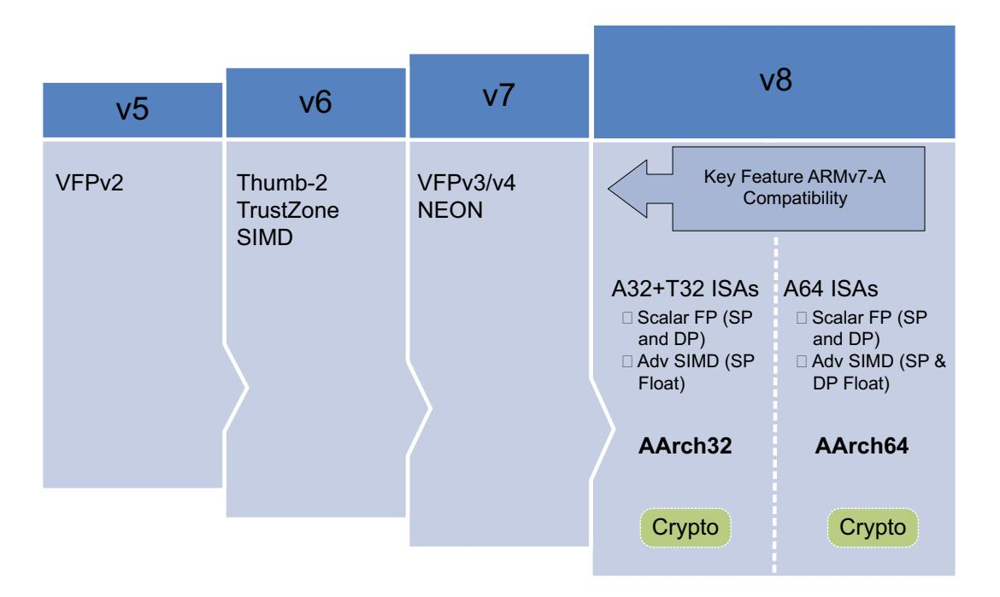

**Figure 2-1 Development of the ARMv8 architecture**

The ARMv8-A architecture introduces a number of changes, which enable significantly higher performance processor implementations to be designed.

#### **Large physical address**

This enables the processor to access beyond 4GB of physical memory.

#### **64-bit virtual addressing**

This enables virtual memory beyond the 4GB limit. This is important for modern desktop and server software using memory mapped file I/O or sparse addressing.

#### **Automatic event signaling**

This enables power-efficient, high-performance spinlocks.

#### **Larger register files**

Thirty-one 64-bit general-purpose registers increase performance and reduce stack use.

#### **Efficient 64-bit immediate generation**

There is less need for literal pools.

#### **Large PC-relative addressing range**

A +/-4GB addressing range for efficient data addressing within shared libraries and position-independent executables.

#### **Additional 16KB and 64KB translation granules**

This reduces *Translation Lookaside Buffer* (TLB) miss rates and depth of page walks.

#### **New exception model**

This reduces OS and hypervisor software complexity.

#### **Efficient cache management**

User space cache operations improve dynamic code generation efficiency. Fast Data cache clear using a Data Cache Zero instruction.

#### **Hardware-accelerated cryptography**

Provides 3× to 10× better software encryption performance. This is useful for small granule decryption and encryption too small to offload to a hardware accelerator efficiently, for example https.

#### **Load-Acquire, Store-Release instructions**

Designed for C++11, C11, Java memory models. They improve performance of thread-safe code by eliminating explicit memory barrier instructions.

#### **NEON double-precision floating-point advanced SIMD**

This enables SIMD vectorization to be applied to a much wider set of algorithms, for example, scientific computing, *High Performance Computing* (HPC) and supercomputers.

#### <span id="page-23-0"></span>**2.2 ARMv8-A Processor properties**

<span id="page-23-1"></span>[Table 2-1](#page-23-1) compares the properties of the processor implementations from ARM that support the ARMv8-A architecture.

<span id="page-23-3"></span><span id="page-23-2"></span>**Table 2-1 Comparison of ARMv8-A processors**

|                                  | Processor                                            |                                                       |
|----------------------------------|------------------------------------------------------|-------------------------------------------------------|
|                                  | Cortex-A53                                           | Cortex-A57                                            |
| Release date                     | July 2014                                            | January 2015                                          |
| Typical clock speed              | 2GHz on 28nm                                         | 1.5 to 2.5 GHz on 20nm                                |
| Execution order                  | In-order                                             | Out of order, speculative<br>issue, superscalar       |
| Cores                            | 1 to 4                                               | 1 to 4                                                |
| Integer Peak throughput          | 2.3MIPS/MHz                                          | 4.1 to 4.76MIPS/MHza                                  |
| Floating-point Unit              | Yes                                                  | Yes                                                   |
| Half-precision                   | Yes                                                  | Yes                                                   |
| Hardware Divide                  | Yes                                                  | Yes                                                   |
| Fused Multiply Accumulate        | Yes                                                  | Yes                                                   |
| Pipeline stages                  | 8                                                    | 15+                                                   |
| Return stack entries             | 4                                                    | 8                                                     |
| Generic Interrupt Controller     | External                                             | External                                              |
| AMBA interface                   | 64-bit I/F AMBA 4<br>(Supports AMBA 4<br>and AMBA 5) | 128-bit I/F AMBA 4<br>(Supports AMBA 4 and<br>AMBA 5) |
| L1 Cache size (Instruction)      | 8KB to 64 KB                                         | 48KB                                                  |
| L1 Cache structure (Instruction) | 2-way set associative                                | 3-way set associative                                 |
| L1 Cache size (Data)             | 8KB to 64KB                                          | 32KB                                                  |
| L1 Cache structure (Data)        | 4-way set associative                                | 2-way set associative                                 |
| L2 Cache                         | Optional                                             | Integrated                                            |
| L2 Cache size                    | 128KB to 2MB                                         | 512KB to 2MB                                          |
| L2 Cache structure               | 16-way set associative                               | 16-way set associative                                |
| Main TLB entries                 | 512                                                  | 1024                                                  |
| uTLB entries                     | 10                                                   | 48 I-side<br>32 D-side                                |

A. IMPLEMENTATION DEFINED

#### **2.2.1 ARMv8 processors**

This section describes each of the processors that implement the ARMv8-A architecture. It only gives a general description in each case. For more specific information on each processor, see [Table 2-1 on page 2-5](#page-23-1).

#### <span id="page-24-0"></span>**The Cortex-A53 processor**

The Cortex-A53 processor is a mid-range, low-power processor with between one and four cores in a single cluster, each with an L1 cache subsystem, an optional integrated GICv3/4 interface, and an optional L2 cache controller.

The Cortex-A53 processor is an extremely power efficient processor capable of supporting 32-bit and 64-bit code. It delivers significantly higher performance than the highly successful Cortex-A7 processor. It is capable of deployment as a standalone applications processor, or paired with the Cortex-A57 processor in a big.LITTLE configuration for optimum performance, scalability, and energy efficiency.

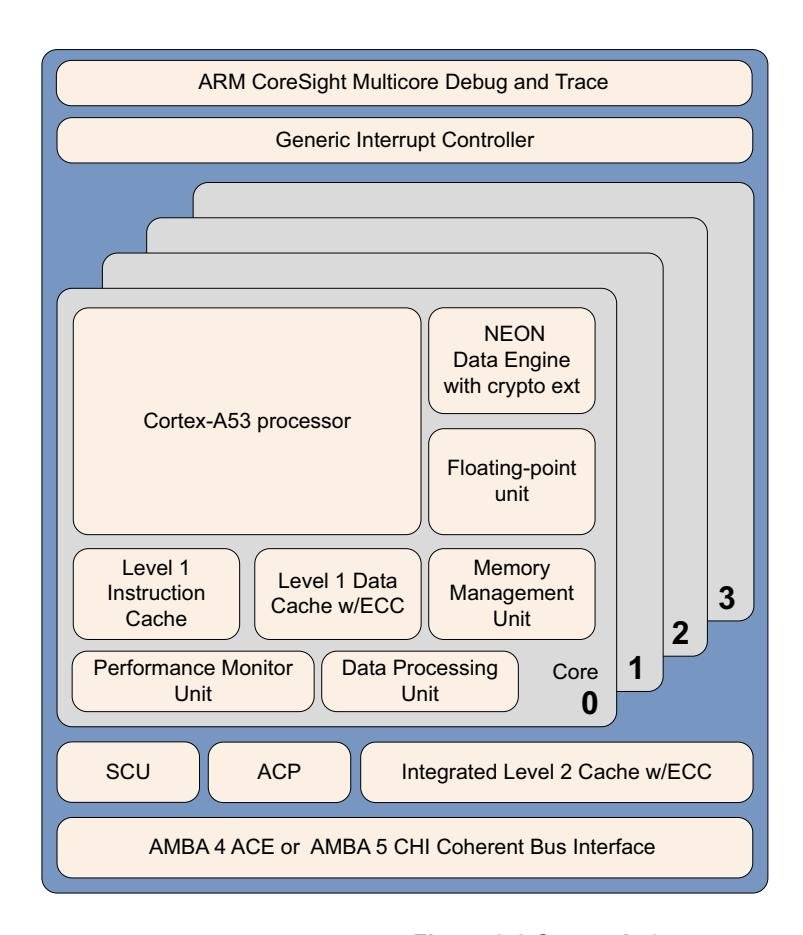

**Figure 2-2 Cortex-A53 processor**

The Cortex-A53 processor has the following features:

- In-order, eight stage pipeline.
- Lower power consumption from the use of hierarchical clock gating, power domains, and advanced retention modes.
- Increased dual-issue capability from duplication of execution resources and dual instruction decoders.

• Power-optimized L2 cache design delivers lower latency and balances performance with efficiency.

#### <span id="page-25-0"></span>**The Cortex-A57 processor**

The Cortex-A57 processor is targeted at mobile and enterprise computing applications including compute intensive 64-bit applications such as high end computer, tablet, and server products. It can be used with the Cortex-A53 processor into an ARM big.LITTLE configuration, for scalable performance and more efficient energy use.

The Cortex-A57 processor features cache coherent interoperability with other processors, including the ARM Mali™ family of *Graphics Processing Units* (GPUs) for GPU compute and provides optional reliability and scalability features for high-performance enterprise applications. It provides significantly more performance than the ARMv7 Cortex-A15 processor, at a higher level of power efficiency. The inclusion of cryptography extensions improves performance on cryptography algorithms by 10 times over the previous generation of processors.

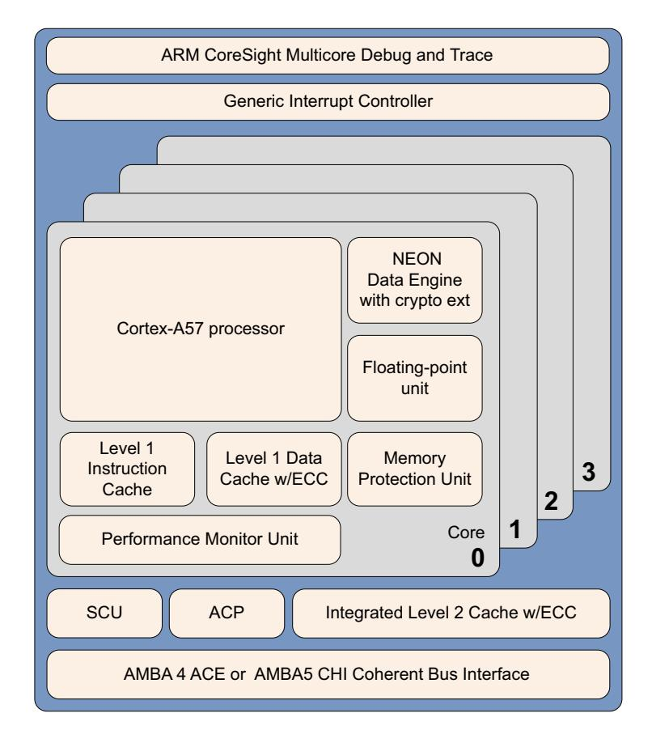

**Figure 2-3 Cortex-A57 processor core**

The Cortex-A57 processor fully implements the ARMv8-A architecture. It enables multi-core operation with between one and four cores multi-processing within a single cluster. Multiple coherent SMP clusters are possible, through AMBA5 CHI or AMBA 4 ACE technology. Debug and trace are available through CoreSight technology.

The Cortex-A57 processor has the following features:

• Out-of-order, 15+ stage pipeline.

- Power-saving features include way-prediction, tag-reduction, and cache-lookup suppression.
- Increased peak instruction throughput through duplication of execution resources. Power-optimized instruction decode with localized decoding, 3-wide decode bandwidth.
- Performance optimized L2 cache design enables more than one core in the cluster to access the L2 at the same time.

## <span id="page-27-1"></span><span id="page-27-0"></span>Chapter 3 **Fundamentals of ARMv8**

In ARMv8, execution occurs at one of four *Exception levels*. In AArch64, the Exception level determines the level of privilege, in a similar way to the privilege levels defined in ARMv7. The Exception level determines the privilege level, so execution at EL*n* corresponds to privilege PL*n*. Similarly, an Exception level with a larger value of *n* than another one is at a higher Exception level. An Exception level with a smaller number than another is described as being at a lower Exception level.

Exception levels provide a logical separation of software execution privilege that applies across all operating states of the ARMv8 architecture. It is similar to, and supports the concept of, hierarchical protection domains common in computer science.

<span id="page-27-2"></span>The following is a typical example of what software runs at each Exception level:

| EL0 |  | Normal user applications. |
|-----|--|---------------------------|
|-----|--|---------------------------|

<span id="page-27-3"></span>**EL1** Operating system kernel typically described as *privileged*.

<span id="page-27-6"></span><span id="page-27-4"></span>**EL2** Hypervisor.

<span id="page-27-7"></span><span id="page-27-5"></span>**EL3** Low-level firmware, including the Secure Monitor.

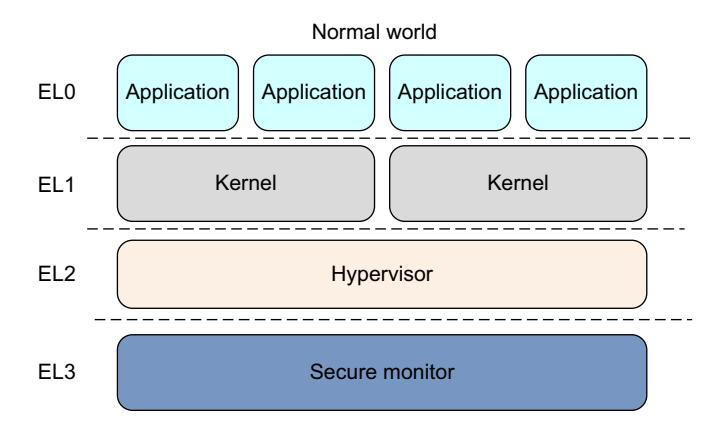

**Figure 3-1 Exception levels**

In general, a piece of software, such as an application, the kernel of an operating system, or a hypervisor, occupies a single Exception level. An exception to this rule is in-kernel hypervisors such as KVM, which operate across *both* EL2 and EL1.

<span id="page-28-2"></span>ARMv8-A provides two security states, Secure and Non-secure. The Non-secure state is also referred to as the *Normal World*. This enables an Operating System (OS) to run in parallel with a trusted OS on the same hardware, and provides protection against certain software attacks and hardware attacks. ARM TrustZone technology enables the system to be partitioned between the Normal and Secure worlds. As with the ARMv7-A architecture, the Secure monitor acts as a gateway for moving between the Normal and Secure worlds.

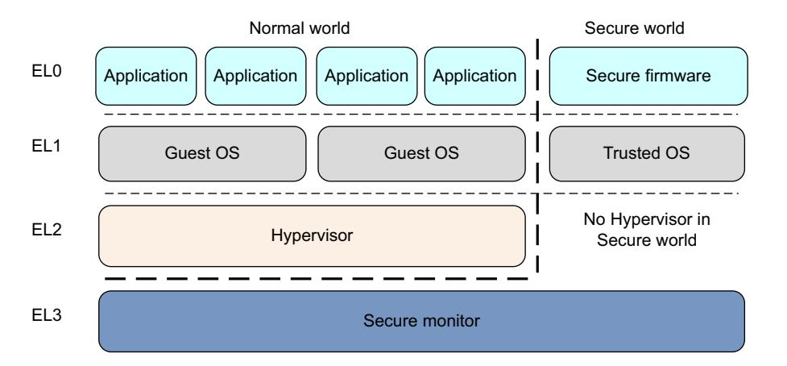

<span id="page-28-3"></span>**Figure 3-2 ARMv8 Exception levels in the Normal and Secure worlds**

<span id="page-28-1"></span><span id="page-28-0"></span>ARMv8-A also provides support for virtualization, though only in the Normal world. This means that hypervisor, or *Virtual Machine Manager* (VMM) code can run on the system and host multiple guest operating systems. Each of the guest operating systems is, essentially, running on a virtual machine. Each OS is then unaware that it is sharing time on the system with other guest operating systems.

<span id="page-29-0"></span>The Normal world (which corresponds to the Non-secure state) has the following privileged components:

#### **Guest OS kernels**

Such kernels include Linux or Windows running in Non-secure EL1. When running under a hypervisor, the rich OS kernels can be running as a guest or host depending on the hypervisor model.

#### **Hypervisor**

This runs at EL2, which is always Non-secure. The hypervisor, when present and enabled, provides virtualization services to rich OS kernels.

<span id="page-29-1"></span>The Secure world has the following privileged components:

#### **Secure firmware**

On an application processor, this firmware must be the first thing that runs at boot time. It provides several services, including platform initialization, the installation of the trusted OS, and routing of Secure monitor calls.

#### **Trusted OS**

Trusted OS provides Secure services to the Normal world and provides a runtime environment for executing Secure or trusted applications.

The Secure monitor in the ARMv8 architecture is at a higher Exception level and is more privileged than all other levels. This provides a logical model of software privilege.

[Figure 3-2 on page 3-2](#page-28-0) shows that a Secure version of EL2 is not available.

#### <span id="page-30-0"></span>**3.1 Execution states**

<span id="page-30-3"></span><span id="page-30-2"></span><span id="page-30-1"></span>The ARMv8 architecture defines two *Execution States*, *AArch64* and *AArch32*. Each state is used to describe execution using 64-bit wide general-purpose registers or 32-bit wide general-purpose registers, respectively. While ARMv8 AArch32 retains the ARMv7 definitions of privilege, in AArch64, privilege level is determined by the Exception level. Therefore, execution at EL*n* corresponds to privilege PL*n*.

When in AArch64 state, the processor executes the A64 instruction set. When in AArch32 state, the processor can execute either the A32 (called ARM in earlier versions of the architecture) or the T32 (Thumb) instruction set.

The following diagrams show the organization of the Exception levels in AArch64 and AArch32.

In AArch64:


**Figure 3-3 Exception levels in AArch64**

In AArch32:

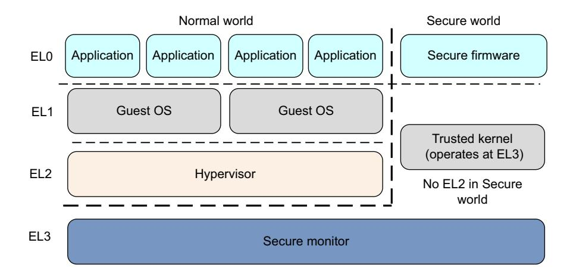

**Figure 3-4 Exception levels in AArch32**

In AArch32 state, Trusted OS software executes in Secure EL3, and in AArch64 state it primarily executes in Secure EL1.

#### <span id="page-31-1"></span><span id="page-31-0"></span>**3.2 Changing Exception levels**

In the ARMv7 architecture, the processor *mode* can change under privileged software control or automatically when taking an exception. When an exception occurs, the core saves the current execution state and the return address, enters the required mode, and possibly disables hardware interrupts.

This is summarized in the following table. Applications operate at the lowest level of privilege, PL0, previously unprivileged mode. Operating systems run at PL1, and the Hypervisor in a system with the Virtualization extensions at PL2. The Secure monitor, which acts as a gateway for moving between the Secure and Non-secure (Normal) worlds, also operates at PL1.

<span id="page-31-10"></span><span id="page-31-8"></span><span id="page-31-7"></span><span id="page-31-6"></span><span id="page-31-5"></span><span id="page-31-4"></span>**Table 3-1 ARMv7 processor modes**

<span id="page-31-11"></span><span id="page-31-9"></span><span id="page-31-3"></span><span id="page-31-2"></span>

| Mode                | Function                                                                                                                                                   | Security<br>state | Privilege<br>level |
|---------------------|------------------------------------------------------------------------------------------------------------------------------------------------------------|-------------------|--------------------|
| User (USR)          | Unprivileged mode in which most applications run                                                                                                           | Both              | PL0                |
| FIQ                 | Entered on an FIQ interrupt exception                                                                                                                      | Both              | PL1                |
| IRQ                 | Entered on an IRQ interrupt exception                                                                                                                      | Both              | PL1                |
| Supervisor<br>(SVC) | Entered on reset or when a Supervisor Call instruction (SVC)<br>is executed                                                                                | Both              | PL1                |
| Monitor (MON)       | Entered when the SMC instruction (Secure Monitor Call) is<br>executed or when the processor takes an exception which is<br>configured for secure handling. | Secure only       | PL1                |
|                     | Provided to support switching between Secure and<br>Non-secure states.                                                                                     |                   |                    |
| Abort (ABT)         | Entered on a memory access exception                                                                                                                       | Both              | PL1                |
| Undef (UND)         | Entered when an undefined instruction is executed                                                                                                          | Both              | PL1                |
| System (SYS)        | Privileged mode, sharing the register view with User mode<br>Both                                                                                          |                   | PL1                |
| Hyp (HYP)           | Entered by the Hypervisor Call and Hyp Trap exceptions.<br>Non-secure only                                                                                 |                   | PL2                |

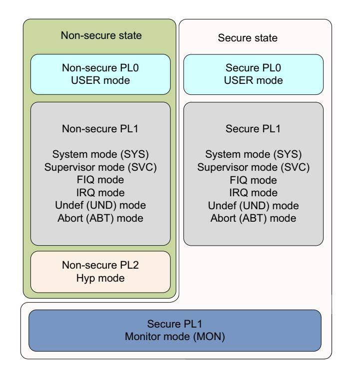

**Figure 3-5 ARMv7 privilege levels**

<span id="page-32-2"></span>In AArch64, the processor modes are mapped onto the Exception levels as in [Figure 3-6.](#page-32-0) As in ARMv7 (AArch32) when an exception is taken, the processor changes to the Exception level (mode) that supports the handling of the exception.

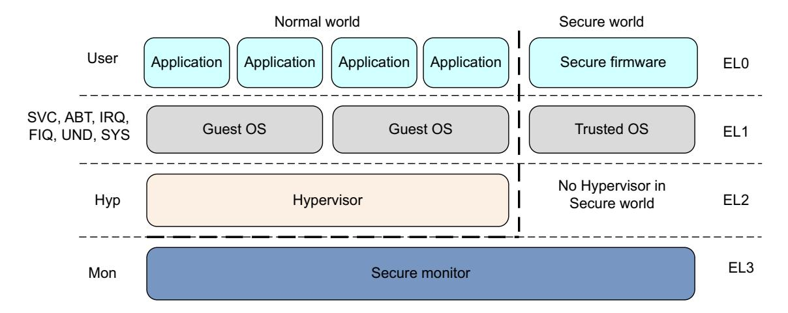

**Figure 3-6 AArch32 processor modes**

<span id="page-32-1"></span><span id="page-32-0"></span>Movement between Exception levels follows these rules:

- Moves to a higher Exception level, such as from EL0 to EL1, indicate increased software execution privilege.
- An exception cannot be taken to a lower Exception level.
- There is no exception handling at level EL0, exceptions must be handled at a higher Exception level.

- An exception causes a change of program flow. Execution of an exception handler starts, at an Exception level higher than EL0, from a defined vector that relates to the exception taken. Exceptions include:
  - Interrupts such as IRQ and FIQ.
  - Memory system aborts.
  - Undefined instructions.
  - System calls. These permit unprivileged software to make a system call to an operating system.
  - Secure monitor or hypervisor traps.
- Ending exception handling and returning to the previous Exception level is performed by executing the ERET instruction.
- Returning from an exception can stay at the same Exception level or enter a lower Exception level. It cannot move to a higher Exception level.
- The security state does change with a change of Exception level, except when retuning from EL3 to a Non-secure state. See *[Switching between Secure and Non-secure state](#page-247-0)* on [page 17-8](#page-247-0).

#### <span id="page-34-0"></span>**3.3 Changing execution state**

There are times when you must change the execution state of your system. This could be, for example, if you are running a 64-bit operating system, and want to run a 32-bit application at EL0. To do this, the system must change to AArch32.

When the application has completed or execution returns to the OS, the system can switch back to AArch64. [Figure 3-7 on page 3-9](#page-35-0) shows that you cannot do it the other way around. An AArch32 operating system cannot host a 64-bit application.

To change between execution states at the same Exception level, you have to switch to a higher Exception level then return to the original Exception level. For example, you might have 32-bit and 64-bit applications running under a 64-bit OS. In this case, the 32-bit application can execute and generate a *Supervisor Call* (SVC) instruction, or receive an interrupt, causing a switch to EL1 and AArch64. (See *[Exception handling instructions](#page-86-1)* on page 6-21.) The OS can then do a task switch and return to EL0 in AArch64. Practically speaking, this means that you cannot have a mixed 32-bit and 64-bit application, because there is no direct way of calling between them.

You can only change execution state by changing Exception level. Taking an exception might change from AArch32 to AArch64, and returning from an exception may change from AArch64 to AArch32.

Code at EL3 cannot take an exception to a higher exception level, so cannot change execution state, except by going through a reset.

The following is a summary of some of the points when changing between AArch64 and AArch32 execution states:

- <span id="page-34-2"></span><span id="page-34-1"></span>• Both AArch64 and AArch32 execution states have Exception levels that are generally similar, but there are some differences between Secure and Non-secure operation. The execution state the processor is in when the exception is generated can limit the Exception levels available to the other execution state.
- Changing to AArch32 requires going from a higher to a lower Exception level. This is the result of exiting an exception handler by executing the ERET instruction. See *[Exception](#page-86-1)  [handling instructions](#page-86-1)* on page 6-21.
- Changing to AArch64 requires going from a lower to a higher Exception level. The exception can be the result of an instruction execution or an external signal.
- If, when taking an exception or returning from an exception, the Exception level remains the same, the execution state cannot change.
- Where an ARMv8 processor operates in AArch32 execution state at a particular Exception level, it uses the same exception model as in ARMv7 for exceptions taken to that Exception level. In the AArch64 execution state, it uses the exception handling model described in Chapter 10 *[AArch64 Exception Handling](#page-122-1)*.

Interworking between the two states is therefore performed at the level of the Secure monitor, hypervisor or operating system. A hypervisor or operating system executing in AArch64 state can support AArch32 operation at lower privilege levels. This means that an OS running in AArch64 can host both AArch32 and AArch64 applications. Similarly, an AArch64 hypervisor can host both AArch32 and AArch64 guest operating systems. However, a 32-bit operating system cannot host a 64-bit application and a 32-bit hypervisor cannot host a 64-bit guest operating system.

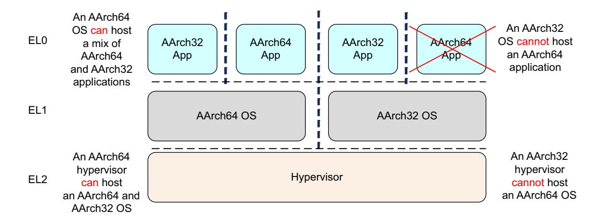

**Figure 3-7 Moving between AArch32 and AArch64**

<span id="page-35-0"></span>For the highest implemented Exception level (EL3 on the Cortex-A53 and Cortex-A57 processors), which execution state to use for each Exception level when taking an exception is fixed. The Exception level can only be changed by resetting the processor. For EL2 and EL1, it is controlled by the *[System registers](#page-42-0)* on page 4-7.

## <span id="page-36-1"></span><span id="page-36-0"></span>Chapter 4 **ARMv8 Registers**

The AArch64 execution state provides 31 × 64-bit general-purpose registers accessible at all times and in all Exception levels.

Each register is 64 bits wide and they are generally referred to as registers X0-X30.

|                         | X0/W0     |
|-------------------------|-----------|
|                         | X1/W1     |
|                         | X2/W2     |
|                         | X3/W3     |
|                         | X4/W4     |
|                         | X5/W5     |
|                         | X6/W6     |
|                         | X7/W7     |
|                         | X8/W8     |
|                         | X9/W9     |
|                         | X10/W10   |
|                         | X11/W11   |
|                         | X12/W12   |
|                         | X13/W13   |
|                         | X14/W14   |
|                         | X15/W15   |
|                         | X16/W16   |
|                         | X17/W17   |
|                         | X18/W18   |
|                         | X19/W19   |
|                         | X20/W20   |
|                         | X21/W21   |
|                         | X22/W22   |
|                         | X23/W23   |
|                         | X24/W24   |
|                         | X25/W25   |
|                         | X26/W26   |
|                         | X27/W27   |
|                         | X28/W28   |
| Frame pointer           | X29/W29   |
| Procedure link register | X30/W30   |
|                         | EL0, EL1, |
|                         | EL2, EL3  |
|                         |           |

**Figure 4-1 AArch64 general-purpose registers**

<span id="page-37-2"></span>Each AArch64 64-bit general-purpose register (X0-X30) also has a 32-bit (W0-W30) form.

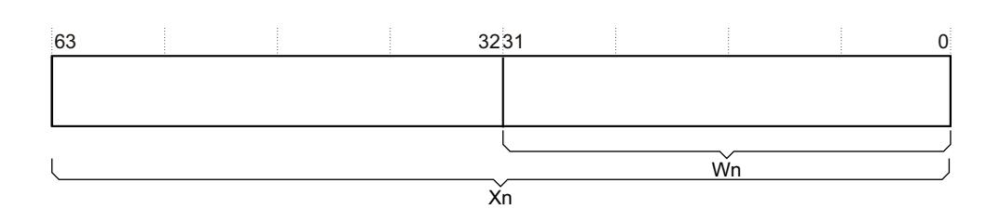

<span id="page-37-0"></span>**Figure 4-2 64-bit register with W and X access.**

<span id="page-37-1"></span>The 32-bit W register forms the lower half of the corresponding 64-bit X register. That is, W0 maps onto the lower word of X0, and W1 maps onto the lower word of X1.

Reads from W registers disregard the higher 32 bits of the corresponding X register and leave them unchanged. Writes to W registers set the higher 32 bits of the X register to zero. That is, writing 0xFFFFFFFF into W0 sets X0 to 0x00000000FFFFFFFF.

#### <span id="page-38-0"></span>**4.1 AArch64 special registers**

In addition to the 31 core registers, there are also several special registers.

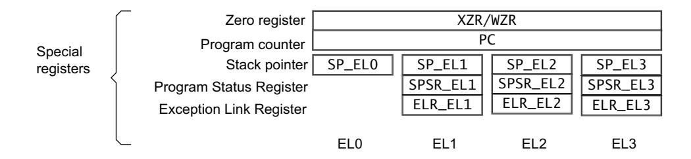

**Figure 4-3 AArch64 special registers**

**Note**

 There is no register called X31 or W31. Many instructions are encoded such that the number 31 represents the zero register, ZR (WZR/XZR). There is also a restricted group of instructions where one or more of the arguments are encoded such that number 31 represents the *Stack Pointer* (SP).

When accessing the zero register, all writes are ignored and all reads return 0. Note that the 64-bit form of the SP register does not use an X prefix.

**Table 4-1 Special registers in AArch64**

| Name | Size    | Description           |
|------|---------|-----------------------|
| WZR  | 32 bits | Zero register         |
| XZR  | 64 bits | Zero register         |
| WSP  | 32 bits | Current stack pointer |
| SP   | 64 bits | Current stack pointer |
| PC   | 64 bits | Program counter       |

In the ARMv8 architecture, when executing in AArch64, the exception return state is held in the following dedicated registers for each Exception level:

- *Exception Link Register* (ELR).
- *Saved Processor State Register* (SPSR).

There is a dedicated SP per Exception level, but it is not used to hold return state.

**Table 4-2 Special registers by Exception level**

|                                      | EL0    | EL1      | EL2      | EL3      |
|--------------------------------------|--------|----------|----------|----------|
| Stack Pointer (SP)                   | SP_EL0 | SP_EL1   | SP_EL2   | SP_EL3   |
| Exception Link Register (ELR)        |        | ELR_EL1  | ELR_EL2  | ELR_EL3  |
| Saved Process Status Register (SPSR) |        | SPSR_EL1 | SPSR_EL2 | SPSR_EL3 |

#### <span id="page-39-3"></span>**4.1.1 Zero register**

The zero register reads as zero when used as a source register and discards the result when used as a destination register. You can use the zero register in most, but not all, instructions.

#### <span id="page-39-2"></span>**4.1.2 Stack pointer**

In the ARMv8 architecture, the choice of stack pointer to use is separated to some extent from the Exception level. By default, taking an exception selects the stack pointer for the target Exception level, SP\_EL*n*. For example, taking an exception to EL1 selects SP\_EL1. Each Exception level has its own stack pointer, SP\_EL0, SP\_EL1, SP\_EL2, and SP\_EL3.

When in AArch64 at an Exception level other than EL0, the processor can use either:

- A dedicated 64-bit stack pointer associated with that Exception level (SP\_EL*n*).
- The stack pointer associated with EL0 (SP\_EL0).

EL0 can only ever access SP\_EL0.

**Table 4-3 AArch64 Stack pointer options**

| Exception<br>level | Options    |
|--------------------|------------|
| EL0                | EL0t       |
| EL1                | EL1t, EL1h |
| EL2                | EL2t, EL2h |
| EL3                | EL3t, EL3h |

The *t* suffix indicates that the SP\_EL0 stack pointer is selected. The *h* suffix indicates that the SP\_EL*n* stack pointer is selected.

The SP cannot be referenced by most instructions. However, some forms of arithmetic instructions, for example, the ADD instruction, can read and write to the current stack pointer to adjust the stack pointer in a function. For example:

ADD SP, SP, #0x10 // Adjust SP to be 0x10 bytes before its current value

#### <span id="page-39-1"></span>**4.1.3 Program Counter**

One feature of the original ARMv7 instruction set was the use of R15, the *Program Counter* (PC) as a general-purpose register. The PC enabled some clever programming tricks, but it introduced complications for compilers and the design of complex pipelines. Removing direct access to the PC in ARMv8 makes return prediction easier and simplifies the ABI specification.

The PC is never accessible as a named register. Its use is implicit in certain instructions such as PC-relative load and address generation. The PC cannot be specified as the destination of a data processing instruction or load instruction.

#### <span id="page-39-0"></span>**4.1.4 Exception Link Register (ELR)**

The *Exception Link Register* holds the exception return address.

#### <span id="page-40-0"></span>**4.1.5 Saved Process Status Register**

When taking an exception, the processor state is stored in the relevant *Saved Program Status Register* (SPSR), in a similar way to the CPSR in ARMv7. The SPSR holds the value of PSTATE before taking an exception and is used to restore the value of PSTATE when executing an exception return.

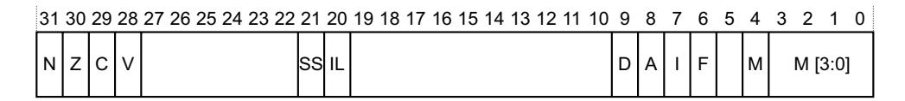

**Figure 4-4 SPSR**

The individual bits represent the following values for AArch64:

- **N** Negative result (N flag).
- **Z** Zero result (Z) flag.
- **C** Carry out (C flag).
- **V** Overflow (V flag).
- **SS** Software Step. Indicates whether software step was enabled when an exception was taken.
- **IL** Illegal Execution State bit. Shows the value of PSTATE.IL immediately before the exception was taken.
- **D** Process state Debug mask. Indicates whether debug exceptions from watchpoint, breakpoint, and software step debug events that are targeted at the Exception level the exception occurred in were masked or not.
- **A** SError (System Error) mask bit.
- **I** IRQ mask bit.
- **F** FIQ mask bit.
- **M[4]** Execution state that the exception was taken from. A value of 0 indicates AArch64.
- **M[3:0]** Mode or Exception level that an exception was taken from.

In ARMv8, the SPSR written to depends on the Exception level. If the exception is taken in EL1, then SPSR\_EL1 is used. If the exception is taken in EL2, then SPSR\_EL2 is used, and if the exception is taken in EL3, SPSR\_EL3 is used. The core populates the SPSR when taking an exception.

| Note                                                                                       |
|--------------------------------------------------------------------------------------------|
| The register pairs ELR_ELn and SPSR_ELn that are associated with an Exception level retain |
| their state during execution at a lower Exception level.                                   |

#### <span id="page-41-0"></span>**4.2 Processor state**

AArch64 does not have a direct equivalent of the ARMv7 *Current Program Status Register*  (CPSR). In AArch64, the components of the traditional CPSR are supplied as fields that can be made accessible independently. These are referred to collectively as *Processor State* (PSTATE).

<span id="page-41-1"></span>The Processor State, or PSTATE fields, for AArch64 have the following definitions:

**Table 4-4 PSTATE field definitions**

<span id="page-41-2"></span>

| Name   | Description                                         |
|--------|-----------------------------------------------------|
| N      | Negative condition flag.                            |
| Z      | Zero condition flag.                                |
| C      | Carry condition flag.                               |
| V      | oVerflow condition flag.                            |
| D      | Debug mask bit.                                     |
| A      | SError mask bit.                                    |
| I      | IRQ mask bit.                                       |
| F      | FIQ mask bit.                                       |
| SS     | Software Step bit.                                  |
| IL     | Illegal execution state bit.                        |
| EL (2) | Exception level.                                    |
| nRW    | Execution state<br>0 = 64-bit                       |
|        | 1 = 32-bit                                          |
| SP     | Stack Pointer selector.<br>0 = SP_EL0<br>1 = SP_ELn |

In AArch64, you return from an exception by executing the ERET instruction, and this causes the SPSR\_EL*n* to be copied into PSTATE. This restores the ALU flags, execution state, Exception level, and the processor branches. From here, you continue execution from the address in ELR\_EL*n*.

<span id="page-41-3"></span>The PSTATE.{N, Z, C, V} fields can be accessed at EL0. All other PSTATE fields can be executed at EL1 or higher and are UNDEFINED at EL0.

#### <span id="page-42-0"></span>**4.3 System registers**

In AArch64, system configuration is controlled through system registers, and accessed using MSR and MRS instructions. This contrasts with ARMv7-A, where such registers were typically accessed through coprocessor 15 (CP15) operations. The name of a register tells you the lowest Exception level that it can be accessed from.

#### For example:

- TTBR0\_EL1 is accessible from EL1, EL2, and EL3.
- TTBR0\_EL2 is accessible from EL2 and EL3.

Registers that have the suffix *\_ELn* have a separate, banked copy in some or all of the levels, though usually not EL0. Few system registers are accessible from EL0, although the *Cache Type Register* (CTR\_EL0) is an example of one that can be accessible.

Code to access system registers takes the following form:

```
MRS x0, TTBR0_EL1 // Move TTBR0_EL1 into x0
MSR TTBR0_EL1, x0 // Move x0 into TTBR0_EL1
```

Previous versions of the ARM architecture have used coprocessors for system configuration. However, AArch64 does not include support for coprocessors. [Table 4-5](#page-42-1) lists only the system registers mentioned in this book.

For a complete list, see Appendix J of the *ARM Architecture Reference Manual - ARMv8, for ARMv8-A architecture profile*.

<span id="page-42-1"></span>The table shows the Exception levels that have separate copies of each register. For example, separate *Auxiliary Control Registers* (ACTLRs) exist as ACTLR\_EL1, ACTLR\_EL2 and ACTLR\_EL3.

**Table 4-5 System registers**

<span id="page-42-7"></span><span id="page-42-6"></span><span id="page-42-5"></span><span id="page-42-4"></span><span id="page-42-3"></span><span id="page-42-2"></span>

| Name        | Register                                    | Description                                                                                                                                                                                                                | Allowed<br>values of n |
|-------------|---------------------------------------------|----------------------------------------------------------------------------------------------------------------------------------------------------------------------------------------------------------------------------|------------------------|
| ACTLR_ELn   | Auxiliary Control<br>Register               | Controls processor-specific features.                                                                                                                                                                                      | 1, 2, 3                |
| CCSIDR_ELn  | Current Cache<br>Size ID Register           | Provides information about the architecture of the currently<br>selected cache. See Cache discovery on page 11-18.                                                                                                         | 1                      |
| CLIDR_ELn   | Cache Level ID<br>Register                  | The type of cache, or caches, implemented at each level.<br>The Level of Coherency and Level of Unification for the cache<br>hierarchy.<br>See Cache maintenance on page 11-13.                                            | 1, 2, 3                |
| CNTFRQ_ELn  | Counter-timer<br>Frequency<br>Register      | Reports the frequency of the system timer. See Timers on<br>page 14-5.                                                                                                                                                     | 0                      |
| CNTPCT_ELn  | Counter-timer<br>Physical Count<br>Register | Holds the 64-bit current count value. See Timers on page 14-5.                                                                                                                                                             | 0                      |
| CNTKCTL_ELn | Counter-timer<br>Kernel Control<br>Register | Controls the generation of an event stream from the virtual<br>counter. Also controls access from EL0 to the physical counter,<br>virtual counter, EL1 physical timers, and the virtual timer. See<br>Timers on page 14-5. | 1                      |

**Table 4-5 System registers (continued)**

<span id="page-43-14"></span><span id="page-43-13"></span><span id="page-43-12"></span><span id="page-43-11"></span><span id="page-43-10"></span><span id="page-43-9"></span><span id="page-43-8"></span><span id="page-43-7"></span><span id="page-43-6"></span><span id="page-43-5"></span><span id="page-43-4"></span><span id="page-43-3"></span><span id="page-43-2"></span><span id="page-43-1"></span><span id="page-43-0"></span>

| Name          | Register                                                     | Description                                                                                                                                                                                                     | Allowed<br>values of n |  |
|---------------|--------------------------------------------------------------|-----------------------------------------------------------------------------------------------------------------------------------------------------------------------------------------------------------------|------------------------|--|
| CNTP_CVAL_ELn | Counter-timer<br>Physical Timer<br>Compare Value<br>Register | Holds the compare value for the EL1 physical timer. See Timers<br>on page 14-5.                                                                                                                                 | 0                      |  |
| CPACR_ELn     | Coprocessor<br>Access Control<br>Register                    | Controls access to Trace, floating-point, and NEON<br>functionality. See ISB in more detail on page 13-9.                                                                                                       | 1                      |  |
| CSSELR_ELn    | Cache Size<br>Selection Register                             | Selects the current Cache Size ID Register, CCSIDR_EL1, by<br>specifying the required cache level and the cache type, either<br>instruction or data cache. See Cache discovery on page 11-18.                   | 1                      |  |
| CNTP_CTL_ELn  | Counter-timer<br>Physical Control<br>Register                | Control register for the EL1 physical timer. See Timers on<br>page 14-5.                                                                                                                                        | 0                      |  |
| CTR_ELn       | Cache Type<br>Register                                       | Information about the architecture of the integrated caches. See<br>Cache discovery on page 11-18.                                                                                                              | 0                      |  |
| DCZID_ELn     | Data Cache Zero<br>ID Register                               | Indicates the block size written with byte values of 0 by the Data<br>Cache Zero by Virtual Address (DCZVA) system instruction.<br>See Cache discovery on page 11-18.                                           | 0                      |  |
| ELR_ELn       | Exception Link<br>Register                                   | Holds the address of the instruction which caused the exception.                                                                                                                                                | 1, 2, 3                |  |
| ESR_ELn       | Exception<br>Syndrome<br>Register                            | Includes information about the reasons for the exception. See<br>The Exception Syndrome Register on page 10-9.                                                                                                  | 1, 2, 3                |  |
| FAR_ELn       | Fault Address<br>Register                                    | Holds the virtual faulting address. See Handling synchronous<br>exceptions on page 10-7.                                                                                                                        | 1, 2, 3                |  |
| FPCR          | Floating-point<br>Control Register                           | Controls floating-point extension behavior. The fields in this<br>register map to the equivalent fields in the AArch32 FPSCR.<br>See New features for NEON and Floating-point in AArch64 on<br>page 7-2.        | -                      |  |
| FPSR          | Floating-point<br>Status Register                            | Provides floating-point system status information. The fields in<br>this register map to the equivalent fields in the AArch32<br>FPSCR. See New features for NEON and Floating-point in<br>AArch64 on page 7-2. | -                      |  |
| HCR_ELn       | Hypervisor<br>Configuration<br>Register                      | Controls virtualization settings and trapping of exceptions to<br>EL2. See Exception handling on page 18-8.                                                                                                     | 2                      |  |
| MAIR_ELn      | Memory Attribute<br>Indirection<br>Register                  | Provides the memory attribute encodings corresponding to the<br>possible values in a Long-descriptor format translation table<br>entry for stage 1 translations at ELn. See Memory types on<br>page 13-3.       | 1, 2, 3                |  |
| MIDR_ELn      | Main ID Register                                             | The type of processor the code is running on (part number and<br>revision).                                                                                                                                     | 1                      |  |
| MPIDR_ELn     | Multiprocessor<br>Affinity Register                          | The processor and cluster IDs, in multi-core or cluster systems.<br>See Determining which core the code is running on on<br>page 14-3.                                                                          | 1                      |  |

**Table 4-5 System registers (continued)**

<span id="page-44-6"></span><span id="page-44-5"></span><span id="page-44-4"></span><span id="page-44-2"></span><span id="page-44-1"></span><span id="page-44-0"></span>

| Name<br>Register |                                                      | Description                                                                                                                                                                                                                                                                                                                                                                  | Allowed<br>values of n        |  |
|------------------|------------------------------------------------------|------------------------------------------------------------------------------------------------------------------------------------------------------------------------------------------------------------------------------------------------------------------------------------------------------------------------------------------------------------------------------|-------------------------------|--|
| SCR_ELn          | Secure<br>Configuration<br>Register                  | Controls Secure state and trapping of exceptions to EL3. See<br>Handling synchronous exceptions on page 10-7.                                                                                                                                                                                                                                                                | 3                             |  |
| SCTLR_ELn        | System Control<br>Register                           | Controls architectural features, for example the MMU, caches<br>and alignment checking.                                                                                                                                                                                                                                                                                      | 0, 1, 2, 3                    |  |
| SPSR_ELn         | Saved Program<br>Status Register                     | Holds the saved processor state when an exception is taken to<br>this mode or Exception level.                                                                                                                                                                                                                                                                               | abt, fiq, irq,<br>und, 1,2, 3 |  |
| TCR_ELn          | Translation<br>Control Register                      | Determines which of the Translation Table Base Registers<br>define the base address for a translation table walk required for<br>the stage 1 translation of a memory access from ELn. Also<br>controls the translation table format and holds cacheability and<br>shareability information. See Separation of kernel and<br>application Virtual Address spaces on page 12-7. | 1, 2, 3                       |  |
| TPIDR_ELn        | User Read/Write<br>Thread ID<br>Register             | Provides a location where software executing at ELn can store<br>thread identifying information, for OS management purposes.<br>See Context switching on page 12-27.                                                                                                                                                                                                         | 0, 1, 2, 3                    |  |
| TPIDRRO_ELn      | User Read-Only<br>Thread ID<br>Register              | Provides a location where software executing at EL1 or higher<br>can store thread identifying information. This informaton is<br>visible to software executing at EL0, for OS management<br>purposes. See Context switching on page 12-27.                                                                                                                                   | 0                             |  |
| TTBR0_ELn        | Translation Table<br>Base Register 0                 | Holds the base address of translation table 0, and information<br>about the memory it occupies. This is one of the translation<br>tables for the stage 1 translation of memory accesses at ELn. See<br>Separation of kernel and application Virtual Address spaces on<br>page 12-7.                                                                                          | 1, 2, 3                       |  |
| TTBR1_ELn        | Translation Table<br>Base Register 1                 | Holds the base address of translation table 1, and information<br>about the memory it occupies. This is one of the translation<br>tables for the stage 1 translation of memory accesses at EL0 and<br>EL1. See Separation of kernel and application Virtual Address<br>spaces on page 12-7.                                                                                  | 1                             |  |
| VBAR_ELn         | Vector Based<br>Address Register                     | Holds the exception base address for any exception that is taken<br>to ELn. See AArch64 exception table on page 10-12.                                                                                                                                                                                                                                                       | 1, 2, 3                       |  |
| VTCR_ELn         | Virtualization<br>Translation<br>Control Register    | Controls the translation table walks required for the stage 2<br>translation of memory accesses from Non-secure EL0 and EL1.<br>Also holds cacheability and shareability information for the<br>accesses. See Translations at EL2 and EL3 on page 12-20.                                                                                                                     | 2                             |  |
| VTTBR_ELn        | Virtualization<br>Translation Table<br>Base Register | Holds the base address of the translation table for the stage 2<br>translation of memory accesses from Non-secure EL0 and EL1.<br>See Memory translation on page 18-3.                                                                                                                                                                                                       | 2                             |  |

#### <span id="page-44-11"></span><span id="page-44-10"></span><span id="page-44-9"></span><span id="page-44-8"></span><span id="page-44-7"></span><span id="page-44-3"></span>**4.3.1 The system control register**

The System Control Register (SCTLR) is a register that controls standard memory, system facilities and provides status information for functions that are implemented in the core.

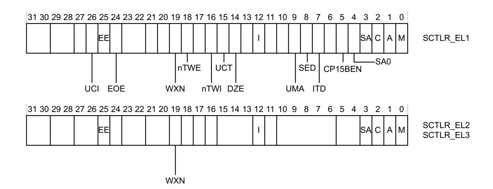

Figure 4-5 SCTLR bit assignments

Not all bits are available above EL1. The individual bits represent the following:

UCI When set, enables EL0 access in AArch64 for DC CVAU, DC CIVAC, DC CVAC, and IC IVAU instructions. See *Cache maintenance* on page 11-13.

**EE** Exception endianness. See *Endianness* on page 4-12.

<span id="page-45-0"></span>**0** Little endian.

1 Big endian.

**EOE** Endianness of explicit data accesses at EL0. The possible values of this bit are:

**0** Explicit data accesses at EL0 are little-endian.

1 Explicit data accesses at EL0 are big-endian.

WXN Write permission implies XN (eXecute Never). See *Access permissions* on page 12-23.

**0** Regions with write permission are not forced to XN.

1 Regions with write permission are forced to XN.

**nTWE** Not trap WFE. A value of 1 means that WFE instructions are executed as normal.

**nTWI** Not trap WFI. A value of 1 means that WFI instructions are executed as normal.

UCT When set, enables EL0 access in AArch64 to the CTR\_EL0 register.

**DZE** Access to DC ZVA instruction at EL0. See *Cache maintenance* on page 11-13.

**0** Execution prohibited.

1 Execution allowed.

I Instruction cache enable. This is an enable bit for instruction caches at EL0 and EL1. Instruction accesses to cacheable Normal memory are cached.

UMA User Mask Access. Controls access to interrupt masks from EL0, when EL0 is using AArch64.

**SED** SETEND Disable. Disables SETEND instructions at EL0 using AArch32.

**0** SETEND instructions are enabled.

1 The SETEND instruction is disabled.

**ITD** IT Disable. The possible values of this bit are:

**0** The IT instruction is available.

**1** The IT instruction is treated as a 16-bit instruction. Only another 16-bit instruction, or the first half of a 32-bit instruction, can follow. This depends upon the implementation.

**CP15BEN** CP15 barrier enable. If implemented, it is an enable bit for the AArch32 CP15

DMB, DSB, and ISB barrier operations.

**SA0** Stack Alignment Check Enable for EL0.

**SA** Stack Alignment Check Enable.

**C** Data cache enable. This is an enable bit for data caches at EL0 and EL1. Data

accesses to cacheable Normal memory are cached.

**A** Alignment check enable bit.

**M** Enable the MMU.

#### **Accessing the SCTLR**

```
To access the SCTLR_ELn, use:
```

```
MRS <Xt>, SCTLR_ELn // Read SCTLR_ELn into Xt
MSR SCTLR_ELn, <Xt> // Write Xt to SCTLR_ELn
```

For example:

#### **Example 4-1 Setting bits in the SCTLR**

```
MRS X0, SCTLR_EL1 // Read System Control Register configuration data
ORR X0, X0, #(1 << 2) // Set [C] bit and enable data caching
ORR X0, X0, #(1 << 12) // Set [I] bit and enable instruction caching
MSR SCTLR_EL1, X0 // Write System Control Register configuration data
```

**Note**

 The caches in the processor must be invalidated before caching of data and instructions is enabled in any of the Exception levels.

#### <span id="page-47-1"></span><span id="page-47-0"></span>**4.4 Endianness**

There are two basic ways of viewing bytes in memory, either as *Little-Endian* (LE) or *Big-Endian* (BE). On big-endian machines, the most significant byte of an object in memory is stored at the lowest address, that is the address closest to zero. On little-endian machines, the least significant byte is stored at the lowest address. The term byte-ordering can also be used rather than endianness.

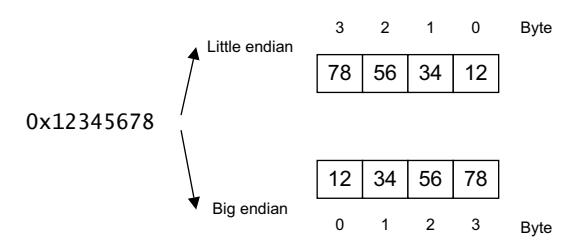

**Figure 4-6**

This data endianness is controlled independently for each Execution level. For EL3, EL2 and EL1, the relevant register of SCTLR\_EL*n*.EE sets the endianness. The additional bit at EL1, SCTLR\_EL1.E0E controls the data endian setting for EL0. In the AArch64 execution state, data accesses can be LE or BE, while instruction fetches are always LE.

Whether a processor supports both LE and BE depends upon the implementation of the processor. If only little-endianness is supported, then the EE and E0E bits are always 0. Similarly, if only big-endianness is supported, then the EE and E0E bits are at a static 1 value.

When using AArch32, having the CPSR.E bit have a different value to the equivalent System Control register EE bit when in EL1, EL2, or EL3 is now deprecated. The use of the ARMv7 SETEND instruction is also deprecated. It is possible to cause the Undef exception to be taken upon executing a SETEND instruction, by setting the SCTLR.SED bit.

#### <span id="page-48-0"></span>**4.5 Changing execution state (again)**

In *[Changing execution state](#page-34-0)* on page 3-8, we described the change between AArch64 and AArch32 in terms of Exception levels. Now we consider the change from the point of view of the registers.

On entry to an Exception level using AArch64 from an Exception level using AArch32:

- The values of the upper 32 bits of registers that were accessible to any lower Exception level using AArch32 execution are UNKNOWN.
- The registers that are not accessible during AArch32 execution retain the state that they had before AArch32 execution.
- On exception entry to EL3, when EL2 has been using AArch32, the values of the upper 32 bits of the ELR\_EL2 are UNKNOWN.
- AArch64 Stack Pointers (SPs) and Exception Link Registers (ELRs) associated with an Exception level that is not accessible during AArch32 execution, at that Exception level, retain the state that they had before AArch32 execution. This applies to the following registers:
  - SP\_EL0.
  - SP\_EL1.
  - SP\_EL2.
  - ELR\_EL1.

In general, application programmers write applications for either AArch32 or AArch64. It is only the OS that must take account of the two execution states and the switch between them.

#### <span id="page-48-3"></span>**4.5.1 Registers at AArch32**

Being virtually identical to ARMv7 means AArch32 must match ARMv7 privilege levels. It also means that AArch32 only deals with ARMv7 32-bit general-purpose registers. Therefore, there must be some correspondence between the ARMv8 architecture, and the view of it provided by the AArch32 execution state.

Remember that in the ARMv7 architecture there are sixteen 32-bit general-purpose registers (R0-R15) for software use. Fifteen of them (R0-R14) can be used for general-purpose data storage. The remaining register, R15, is the program counter (PC) whose value is altered as the core executes instructions. Software can also access the CPSR, and the saved copy of the CPSR from the previously executed mode, is the SPSR. On taking an exception, the CPSR is copied to the SPSR of the mode to which the exception is taken.

<span id="page-48-2"></span><span id="page-48-1"></span>Which of these registers is accessed, and where, depends upon the processor mode the software is executing in and the register itself. This is called *banking*, and the shaded registers in [Figure 4-7 on page 4-14](#page-49-0) are banked. They use physically distinct storage and are usually accessible only when a process is executing in that particular mode.

| R0             | R0          | R0               | R0               | R0               | R0               | R0               | R0               | R0                          |
|----------------|-------------|------------------|------------------|------------------|------------------|------------------|------------------|-----------------------------|
| R1             | R1          | R1               | R1               | R1               | R1               | R1               | R1               | R1                          |
| R2             | R2          | R2               | R2               | R2               | R2               | R2               | R2               | R2                          |
| R3             | R3          | R3               | R3               | R3               | R3               | R3               | R3               | R3                          |
| R4             | R4          | R4               | R4               | R4               | R4               | R4               | R4               | R4                          |
| R5             | R5          | R5               | R5               | R5               | R5               | R5               | R5               | R5                          |
| R6             | R6          | R6               | R6               | R6               | R6               | R6               | R6               | R6                          |
| R7             | R7          | R7               | R7               | R7               | R7               | R7               | R7               | R7                          |
| R8             | R8          | R8_fiq           | R8               | R8               | R8               | R8               | R8               | R8                          |
| R9             | R9          | R9_fiq           | R9               | R9               | R9               | R9               | R9               | R9                          |
| R10            | R10         | R10_fiq          | R10              | R10              | R10              | R10              | R10              | R10                         |
| R11            | R11         | R11_fiq          | R11              | R11              | R11              | R11              | R11              | R11                         |
| R12            | R12         | R12_fiq          | R12              | R12              | R12              | R12              | R12              | R12                         |
| R13<br>(sp)    | R13<br>(sp) | SP_fiq           | SP_irq           | SP_abt           | SP_svc           | SP_und           | SP_mon           | SP_hyp                      |
| R14<br>(lr)    | R14<br>(lr) | LR_fiq           | LR_irq           | LR_abt           | LR_svc           | LR_und           | LR_mon           | LR_hyp                      |
| R15<br>(pc)    | R15<br>(pc) | R15<br>(pc)      | R15<br>(pc)      | R15<br>(pc)      | R15<br>(pc)      | R15<br>(pc)      | R15<br>(pc)      | R15<br>(pc)                 |
| (A/C)PSR       | CPSR        | CPSR<br>SPSR_fiq | CPSR<br>SPSR_irq | CPSR<br>SPSR_abt | CPSR<br>SPSR_svc | CPSR<br>SPSR_und | CPSR<br>SPSR_mon | CPSR<br>SPSR_hyp<br>ELR_hyp |
| User<br>Banked | Sys         | FIQ              | IRQ              | ABT              | SVC              | UND              | MON              | HYP                         |

**Figure 4-7 The ARMv7 register set showing banked registers**

<span id="page-49-0"></span>Banking is used in ARMv7 to reduce the latency for exceptions. However, this also means that of a considerable number of possible registers, fewer than half can be used at any one time.

In contrast, the AArch64 execution state has 31 × 64-bit general-purpose registers accessible at all times and in all Exception levels. A change in execution state between AArch64 and AArch32 means that the AArch64 registers must necessarily map onto the AArch32 (ARMv7) register set. This mapping is shown in [Figure 4-8 on page 4-15.](#page-50-0)

The upper 32 bits of the AArch64 registers are inaccessible when executing in AArch32. If the processor is operating in AArch32 state, it uses the 32-bit W registers, which are equivalent to the 32-bit ARMv7 registers.

AArch32 maps the banked registers to AArch64 registers that would otherwise be inaccessible.

| WO                        | R0       | RO       | RO       | RO       | RO       | RO       | RO       | R0       |
|---------------------------|----------|----------|----------|----------|----------|----------|----------|----------|
| W1                        | R1       | R1       | R1       | R1       | R1       | R1       | R1       | R1       |
| W2                        | R2       | R2       | R2       | R2       | R2       | R2       | R2       | R2       |
| W3                        | R3       | R3       | R3       | R3       | R3       | R3       | R3       | R3       |
| W4                        | R4       | R4       | R4       | R4       | R4       | R4       | R4       | R4       |
| W5                        | R5       | R5       | R5       | R5       | R5       | R5       | R5       | R5       |
| W6                        | R6       | R6       | R6       | R6       | R6       | R6       | R6       | R6       |
| W7                        | R7       | R7       | R7       | R7       | R7       | R7       | R7       | R7       |
| W8                        | R8       | W24      | R8       | R8       | R8       | R8       | R8       | R8       |
| W9                        | R9       | W25      | R9       | R9       | R9       | R9       | R9       | R9       |
| W10                       | R10      | W26      | R10      | R10      | R10      | R10      | R10      | R10      |
| W11                       | R11      | W27      | R11      | R11      | R11      | R11      | R11      | R11      |
| W12                       | R12      | W28      | R12      | R12      | R12      | R12      | R12      | R12      |
| W13                       | R13 (sp) | W29      | W17      | W21      | W19      | W23      | R13      | W15      |
| W14                       | R14 (7r) | W30      | W16      | W20      | W18      | W22      | R14      | R14      |
| R15                       | R15 (pc) | R15 (pc) | R15 (pc) | R15 (pc) | R15 (pc) | R15 (pc) | R15 (pc) | R15 (pc) |
| (A/C)PSR                  | CPSR     | CPSR     | CPSR     | CPSR     | CPSR     | CPSR     | CPSR     | CPSR     |
| ( ) -> -                  |          | SPSR_fiq | SPSR_irq | SPSR_abt | SPSR_EL1 | SPSR_und | SPSR_EL3 | SPSR_EL2 |
|                           |          |          |          |          |          |          |          | ELR_EL2  |
| User                      | Sys      | FIQ      | IRQ      | ABT      | SVC      | UND      | MON      | HYP      |
| Inaccessible from AArch64 |          |          |          |          |          |          |          |          |

<span id="page-50-1"></span>Figure 4-8 AArch64 to AArch32 register mapping

<span id="page-50-0"></span>The SPSR and ELR\_Hyp registers in AArch32 are additional registers that are accessible using system instructions only. They are not mapped into the general-purpose register space of the AArch64 architecture. Some of these registers are mapped between AArch32 and AArch64:

- <span id="page-50-7"></span>SPSR\_svc maps to SPSR\_EL1.
- <span id="page-50-5"></span><span id="page-50-2"></span>SPSR\_hyp maps to SPSR\_EL2.
- ELR hyp maps to ELR EL2.

The following registers are only used during AArch32 execution. However, because of the execution at EL1 using AArch64, they retain their state despite them being inaccessible during AArch64 execution at that Exception level.

- <span id="page-50-8"></span><span id="page-50-3"></span>SPSR\_abt.
- SPSR und.
- <span id="page-50-6"></span>SPSR\_irq.
- <span id="page-50-4"></span>SPSR\_fiq.

The SPSR registers are only accessible during AArch64 execution at higher Exception levels for context switching.

Again, if an exception is taken to an Exception level in AArch64 from an Exception level in AArch32, the top 32 bits of the AArch64 ELR ELn are all zero.

#### <span id="page-51-0"></span>**4.5.2 PSTATE at AArch32**

In AArch64, the different components of the traditional CPSR are presented as Processor State (PSTATE) fields that can be made accessible independently. At AArch32, there are extra fields corresponding to the ARMv7 CPSR bits.

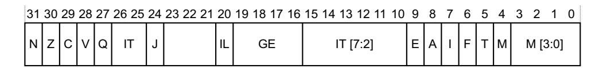

**Figure 4-9 CPSR bit assignments in AArch32**

Giving additional PSTATE bits which are accessible only at AArch32:

**Table 4-6 PSTATE bit definitions**

| Name   | Description                          |
|--------|--------------------------------------|
| Q      | Cumulative saturation (sticky) flag. |
| GE (4) | Greater than or Equal flags.         |
| IT (8) | If-Then execution bits.              |
| J      | J bit.                               |
| T      | T32 bit.                             |
| E      | Endianness bit.                      |
| M      | Mode field.                          |

#### <span id="page-52-0"></span>4.6 NEON and floating-point registers

In addition to the general-purpose registers, ARMv8 also has 32 128-bit floating-point registers labeled V0-V31. The 32 registers are used to hold floating-point operands for scalar floating-point instructions and both scalar and vector operands for NEON operations. NEON and floating-point registers are also covered in Chapter 7 AArch64 Floating-point and NEON.

#### <span id="page-52-1"></span>4.6.1 Floating-point register organization in AArch64

In NEON and floating-point instructions that operate on scalar data, the floating-point and NEON registers behave similarly to the main general-purpose integer registers. Therefore, only the lower bits are accessed, with the unused high bits ignored on a read and set to zero on a write. The qualified names for scalar floating-point and NEON names indicate the number of significant bits as follows, where n is a register number 0-31.

Table 4-7 Operand name for differently sized floats

| Precision | Size (bits) | Name |
|-----------|-------------|------|
| Half      | 16          | Hn   |
| Single    | 32          | Sn   |
| Double    | 64          | Dn   |

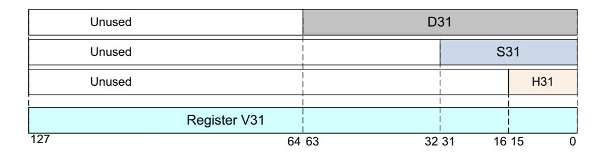

Unused D0

Unused S0

Unused H0

Register V0

127

64 63

32 31

16 15

Figure 4-10 Arrangement of floating-point values

\_\_\_\_\_Note \_\_\_\_\_

16-bit floating-point is supported, but only as a format to be converted from or to. It is not supported for data processing operations.

The F prefix and the float size is specified by the floating-point ADD instruction:

FADD Sd, Sn, Sm // Single-precision FADD Dd, Dn, Dm // Double-precision

The half-precision floating-point instructions are for converting between different sizes:

```
FCVT Sd, Hn // half-precision to single-precision FCVT Dd, Hn // half-precision to double-precision FCVT Hd, Sn // single-precision to half-precision FCVT Hd, Dn // double-precision to half-precision
```

#### <span id="page-53-3"></span>4.6.2 Scalar register sizes

In AArch64, the mapping for the integer scalars has changed from what is used in ARMv7-A to the mapping shown in Figure 4-11:

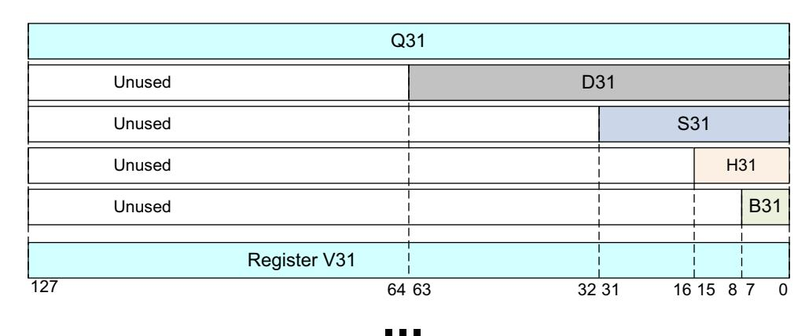

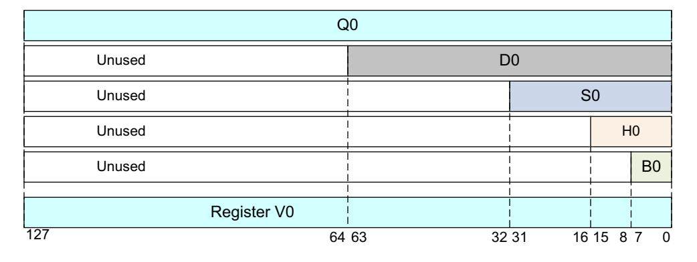

Figure 4-11 Arrangement of ARMv8 registers when holding scalar values

<span id="page-53-0"></span>In Figure 4-11 S0 is the bottom half of D0, which is the bottom half of Q0. S1 is the bottom half of D1, which is the bottom half of Q1, and so on. This eliminates many of the problems compilers have in auto-vectorizing high-level code.

- <span id="page-53-1"></span>• The bottom 64-bits of each of the Q registers can also be viewed as D0-D31, 32 64-bit wide registers for floating-point and NEON use.
- The bottom 32-bits of each of the Q registers can also be viewed as S0-S31, 32 32-bit wide registers for floating-point and NEON use.
- <span id="page-53-2"></span>• The bottom 16-bits of each of the S registers can also be viewed as H0-H31, 32 16-bit wide registers for floating-point and NEON use.
- The bottom 8-bits of each of the H registers can also be viewed as B0-B31, 32 8-bit wide registers for NEON use.

**Note**

 Only the bottom bits of each register set are used in each case. The rest of the register space is ignored when read, and filled with zeros when written.

A consequence of this mapping is that if a program executing in AArch64 is interpreting D or S registers from AArch32 execution. Then the program must unpack the D or S registers from the V registers before using them.

For the scalar ADD instruction:

ADD Vd, Vn, Vm

If the size was, for example, 32 bits, the instruction would be:

ADD Sd, Sn, Sm

**Table 4-8 Operand name for differently sized scalars**

| Word size  | Size (bits) | Name |
|------------|-------------|------|
| Byte       | 8           | Bn   |
| Halfword   | 16          | Hn   |
| Word       | 32          | Sn   |
| Doubleword | 64          | Dn   |
| Quadword   | 128         | Qn   |

#### <span id="page-54-1"></span>**4.6.3 Vector register sizes**

Vectors can be 64-bits wide with one or more elements or 128-bits wide with two or more elements as shown in [Figure 4-12](#page-54-0):

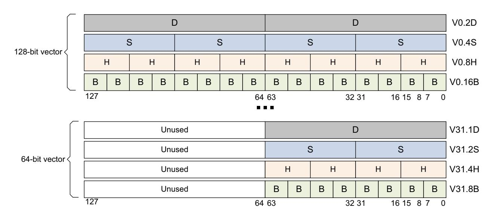

**Figure 4-12 Vector sizes**

<span id="page-54-0"></span>For the vector ADD instruction:

ADD Vd.T, Vn.T, Vm.T

For 32-bit vectors this time, with 4 lanes, the instruction becomes:

ADD Vd.4S, Vn.4S, Vm.4S

**Table 4-9 Operand names for different size vectors**

| Name   | Shape                                      |
|--------|--------------------------------------------|
| Vn.8B  | 8 lanes, each containing an 8-bit element  |
| Vn.16B | 16 lanes, each containing an 8-bit element |
| Vn.4H  | 4 lanes, each containing a 16-bit element  |
| Vn.8H  | 8 lanes, each containing a 16-bit element  |
| Vn.2S  | 2 lanes, each containing a 32-bit element  |
| Vn.4S  | 4 lanes, each containing a 32-bit element  |
| Vn.1D  | 1 lane containing a 64-bit element         |
| Vn.2D  | 2 lanes, each containing a 64-bit element  |

When these registers are used in a specific instruction form, the names must be further qualified to indicate the data shape. More specifically, this means the data element size and the number of elements or lanes held within them.

#### <span id="page-55-0"></span>**4.6.4 NEON in AArch32 execution state.**

In AArch32, the smaller registers are packed into larger ones (D0 and D1 are combined to form Q1, for instance). This introduces some tricky loop-carried dependencies which can reduce the ability of the compiler to vectorize loop structures.

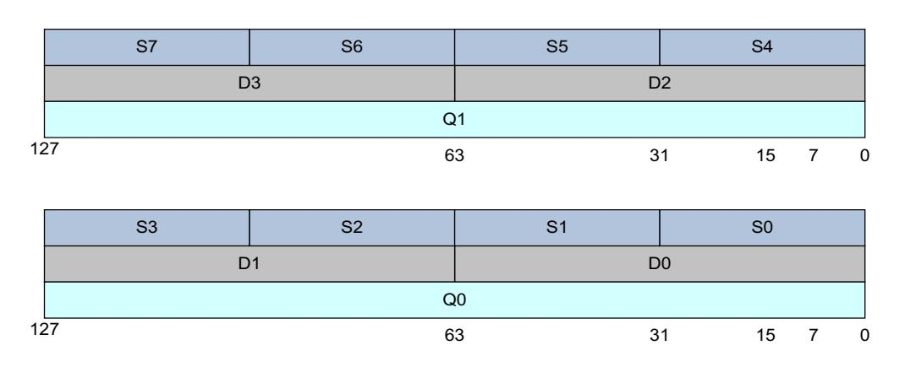

**Figure 4-13 Arrangement of ARMv7 SIMD registers**

The floating-point and Advanced SIMD registers in AArch32 are mapped into the AArch64 FP and SIMD registers. This is done to allow the floating-point and NEON registers of an application or a virtual machine to be interpreted (and, as necessary, modified) by a higher level of system software, for example, the OS or the Hypervisor.

The AArch64 V16-V31 FP and NEON registers are not accessible from AArch32. As with the general-purpose registers, during execution in an Exception level using AArch32 these registers retain their state from the previous execution using AArch64.

### <span id="page-56-1"></span><span id="page-56-0"></span>Chapter 5

### **An Introduction to the ARMv8 Instruction Sets**

<span id="page-56-4"></span>One of the most significant changes introduced in the ARMv8 architecture is the addition of a 64-bit instruction set. This set complements the existing 32-bit instruction set architecture. This addition provides access to 64-bit wide integer registers and data operations, and the ability to use 64-bit sized pointers to memory. The new instructions are known as *A64* and execute in the AArch64 execution state. ARMv8 also includes the original ARM instruction set, now called *A32*, and the Thumb (*T32*) instruction set. Both A32 and T32 execute in AArch32 state, and provide backward compatibility with ARMv7.

<span id="page-56-5"></span><span id="page-56-3"></span>Although ARMv8-A provides backward compatibility with the 32-bit ARM Architectures, the A64 instruction set is separate and distinct from the older ISA and is encoded differently. A64 adds some additional capabilities while also removing other features that would potentially limit the speed or energy efficiency of high performance implementations. The ARMv8 architecture includes some enhancements to the 32-bit instruction sets (A32 and T32) as well. However, code that makes use of such features is not compatible with older ARMv7 implementations. Instruction opcodes in the A64 instruction set, however, are still 32 bits long, not 64 bits.

<span id="page-56-2"></span>Programmers seeking a more detailed description of A64 assembly language can also refer to the *ARM® Compiler armasm Reference Guide v6.01*.

#### <span id="page-57-0"></span>**5.1 The ARMv8 instruction sets**

The new A64 instruction set is similar to the existing A32 instruction set. Instructions are 32 bits wide and have similar syntax.

The instruction sets use a generic naming convention within the ARMv8 architecture, so that the original 32-bit instruction set states are now called:

- <span id="page-57-2"></span><span id="page-57-1"></span>**A32** When in AArch32 state, the instruction set is largely compatible with ARMv7, though there are differences. See, *ARMv8-A Architecture Reference Manual.* It also provides some new instructions to align with some of the features that are introduced in the A64 instruction set.
- <span id="page-57-5"></span><span id="page-57-4"></span>**T32** The Thumb instruction set was first included in the ARM7TDMI processor and originally contained only 16-bit instructions. 16-bit instructions gave much smaller programs at the cost of some performance. ARMv7 processors, including those in the Cortex-A series, support Thumb-2 technology, which extends the Thumb instruction set to provide a mix of 16-bit and 32-bit instructions. This gives performance similar to that of ARM, while retaining the reduced code size. Because of its size and performance advantages, it is increasingly common for all 32-bit code to be compiled or assembled to take advantage of Thumb-2 technology.

A new instruction set has been introduced that the core can use when in AArch64 state. In keeping with the naming convention, and reflecting the 64-bit operation, this instruction set is called:

<span id="page-57-3"></span>**A64** A64 provides similar functionality to the A32 and T32 instruction sets in AArch32 or ARMv7. The design of the new A64 instruction set allowed several improvements:

#### **A consistent encoding scheme**

The late addition of some instructions in A32 resulted in some inconsistency in the encoding scheme. For example, LDR and STR support for halfwords is encoded slightly differently to the mainstream byte and word transfer instructions. The result of this is that the addressing modes are slightly different.

#### **Wide range of constants**

A64 instructions provide a huge range of options for constants, each tailored to the requirements of specific instruction types.

- Arithmetic instructions generally accept a 12-bit immediate constant.
- Logical instructions generally accept a 32-bit or 64-bit constant, which has some constraints in its encoding.
- MOV instructions accept a 16-bit immediate, which can be shifted to any 16-bit boundary.
- Address generation instructions are geared to addresses aligned to a 4KB page size.

There are slightly more complex rules for constants that are used in bit manipulation instructions. However, bitfield manipulation instructions can address any contiguous sequence of bits, in either the source or destination operand.

A64 provides flexible constants, but encoding them, even determining whether a particular constant can be legally encoded in a particular context, can be non-trivial.

#### **Data types are easier**

A64 deals naturally with 64-bit signed and unsigned data types in that it offers more concise and efficient ways of manipulating 64-bit integers. This can be advantageous for all languages which provide 64-bit integers such as C or Java.

#### **Long offsets**

A64 instructions generally provide longer offsets, both for PC-relative branches and for offset addressing.

The increased branch range makes it easier to manage inter-section jumps. Dynamically generated code is generally placed on the heap so it can, in practice, be located anywhere. The runtime system finds it much easier to manage this with increased branch ranges, and fewer fix-ups are required.

The need for literal pools (blocks of literal data embedded in the code stream) has long been a feature of ARM instruction sets. This still exists in A64. However, the larger PC-relative load offset helps considerably with the management of literal pools, making it possible to use one per compilation unit. This removes the need to manufacture locations for multiple pools in long code sequences.

**Pointers** Pointers are 64-bit in AArch64, which allows larger amounts of virtual memory to be addressed and gives more freedom for address mapping. However, using 64-bit pointers does incur some costs. The same piece of code typically uses more memory when running with 64-pointers than with 32-bit pointers. Each pointer is stored in memory and requires eight bytes instead of four. This might sound trivial, but can add up to a significant penalty. Additionally, the increased use of memory space that is associated with a move to 64 bits can cause a drop in the number of accesses that hit in cache. This drop of cache hits can reduce performance.

> Some languages can be implemented with compressed pointers, such as Java, to circumvent the performance issue.

#### **Conditional constructs are used instead of IT blocks**

IT blocks are a useful feature of T32, enabling efficient sequences that avoid the need for short forward branches around unexecuted instructions. However, they are sometimes difficult for hardware to handle efficiently. A64 removes these blocks and replaces them with conditional instructions such as CSEL, or Conditional Select and CINC, or Conditional Increment. These conditional constructs are more straightforward and easier to handle without special cases.

#### **Shift and rotate behavior is more intuitive**

The A32 or T32 shift and rotate behavior does not always map easily to the behavior expected by high-level languages.

ARMv7 provides a barrel shifter that can be used as part of data processing instructions. However, specifying the type of shift and the amount to shift requires a certain number of opcode bits, which could be used elsewhere.

A64 instructions therefore remove options that were rarely used, and instead adds new explicit instructions to carry out more complicated shift operations.

#### **Code generation**

When generating code, both statically and dynamically, for common arithmetic functions, A32 and T32 often require different instructions, or instruction sequences. This is to cope with different data types. These operations in A64 are much more consistent so it is much easier to generate common sequences for simple operations on differently sized data types.

For example, in T32 the same instruction can have different encodings depending on what registers are used (either a low register or a high register).

The A64 instruction set encodings are much more regular and rationalized. Consequently, an assembler for A64 typically requires fewer lines of code than an assembler for T32.

#### **Fixed-length instructions**

All A64 instructions are the same length, unlike T32, which is a variable-length instruction set. This makes management and tracking of generated code sequences easier, particularly affecting dynamic code generators.

#### **Three operands map better**

A32, in general, preserves a true three-operand structure for data-processing operations. T32, on the other hand, contains a significant number of two-operand instruction formats, which make it slightly less flexible when generating code. A64 sticks to a consistent three-operand syntax, which further contributes to the regularity and homogeneity of the instruction set for the benefit of compilers.

#### **5.1.1 Distinguishing between 32-bit and 64-bit A64 instructions**

<span id="page-59-0"></span>Most integer instructions in the A64 instruction set have two forms, which operate on either 32-bit or 64-bit values within the 64-bit general-purpose register file.

When looking at the register name that the instruction uses:

- If the register name starts with X, it is a 64-bit value.
- If the register name starts with W, it is a 32-bit value.

Where a 32-bit instruction form is selected, the following facts hold true:

- Right shifts and rotates inject at bit 31, instead of bit 63.
- The condition flags, where set by the instruction, are computed from the lower 32 bits.
- Writes to the W register set bits [63:32] of the X register to zero.

This distinction applies even when the results of a 32-bit instruction form would be indistinguishable from the lower 32 bits computed by the equivalent 64-bit instruction form. For example, a 32-bit bitwise ORR could be performed using a 64-bit ORR and simply ignoring the top 32 bits of the result. The A64 instruction set includes separate 32 and 64-bit forms of the ORR instruction.

The C and C++ LP64 and LLP64 data models are expected to be the most commonly used on AArch64. They both define the frequently used int, short, and char types to be 32 bits or less. By maintaining this semantic information in the instruction set, implementations can exploit this information. For example, to avoid expending energy or cycles to compute, forward, and store the unused upper 32 bits of such data types. Implementations are free to exploit this freedom in whatever way they choose to save energy.

So the new A64 instruction set provides distinct sign and zero-extend instructions. Additionally. the A64 instruction set means it is possible to extend and shift the final source register of an ADD, SUB, CMN, or CMP instruction and the index register of a Load or Store instruction. This results in efficient implementation of array index calculations involving a 64-bit array pointer and 32-bit array index.

#### <span id="page-60-0"></span>**5.1.2 Addressing**

When the processor can store 64-bit values in a single register, it becomes much simpler to access large amounts of memory within a program. A single thread executing on a 32-bit core is limited to accessing 4GB of address space. Large parts of that addressable space are reserved for use by the OS kernel, library code, peripherals, and more. As a result, lack of space means that the program might need to map some data in or out of memory while executing. Having a larger address space, with 64-bit pointers, avoids this problem. It also makes techniques such as memory-mapped files more attractive and convenient to use. The file contents are mapped into the memory map of a thread, even though the physical RAM might not be large enough to contain the whole file.

Other improvements to addressing include the following:

#### <span id="page-60-1"></span>**Exclusive accesses**

Exclusive load-store of a byte, halfword, word and doubleword. Exclusive access to a pair of doublewords permits atomic updates of a pair of pointers, for example circular list inserts. All exclusive accesses must be naturally aligned, and exclusive pair access must be aligned to twice the data size, that is, 128 bits for a pair of 64-bit values.

#### **Increased PC-relative offset addressing**

<span id="page-60-2"></span>PC-relative literal loads have an offset range of ±1MB. Compared to the PC-relative loads of A32, this reduces the number of literal pools, and increases sharing of literal data between functions. In turn, this reduces I-cache and TLB pollution.

Most conditional branches have a range of ±1MB, expected to be sufficient for the majority of conditional branches that take place within a single function.

Unconditional branches, including branch and link, have a range of ±128MB, expected to be sufficient to span the static code segment of most executable load modules and shared objects, without needing linker-inserted *veneers*.


The linker can reuse a veneer generated for a previous call, for other calls to the same function if it is in range from both calls. Occasionally, such veneers can be a performance factor.

If you have a loop that calls multiple functions through veneers, you will get many pipeline flushes and therefore sub-optimal performance. Placing related code together in memory can avoid this.

PC-relative load and store and address generation with a range of ±4GB can be performed inline using only two instructions, that is, without the need to load an offset from a literal pool.

#### <span id="page-61-3"></span>**Unaligned address support**

Except for exclusive and ordered accesses, all loads and stores support the use of unaligned addresses when accessing normal memory. This simplifies porting code to A64.

#### <span id="page-61-1"></span>**Bulk transfers**

The LDM, STM, PUSH, and POP instructions do not exist in A64. Bulk transfers can be constructed using the LDP and STP instructions. These instructions load and store a pair of independent registers from consecutive memory locations.

The LDNP and STNP instructions provide a streaming or non-temporal hint, that the data does not need to be retained in caches.

The PRFM, or prefetch memory instructions enable targeting of a prefetch to a specific cache level.

#### <span id="page-61-2"></span>**Load/Store**

All Load/Store instructions now support consistent addressing modes. This makes it much easier, for example, to treat char, short, int and long long in the same way when loading and storing quantities from memory.

The floating-point and NEON registers now support the same addressing modes as the core registers, making it easier to use the two register banks interchangeably.

#### <span id="page-61-0"></span>**Alignment checking**

When executing in AArch64, additional alignment checking is performed on instruction fetches and on loads or stores using the stack pointer, enabling misalignment checking of the PC or the current SP.

This approach is preferable to forcing the correct alignment of the PC or SP, because a misalignment of the PC or SP commonly indicates a software error, such as corruption of an address in software.

There are a number of types of alignment checking:

• Program Counter alignment checking generates an exception associated with instruction fetch whenever an attempt is made to execute an instruction fetched with a misaligned PC in AArch64.

A misaligned PC is defined to be one where bits [1:0] of the PC are not 00.

A PC misalignment is identified in the exception syndrome register associated with the target Exception level.

When the exception is handled using AArch64, the associated exception link register holds the entire PC in its misaligned form, as does the *Fault Address Register,* FAR\_EL*n,* for the Exception level in which the exception is taken.

PC alignment checking is performed in AArch64, and in AArch32 as part of Data Abort exception handling.

• *Stack Pointer* (SP) alignment checking generates an exception associated with data memory access whenever a load or store using the stack pointer as a base address in AArch64 is attempted.

A misaligned stack pointer is one where bits [3:0] of the stack pointer, used as the base address of the calculation, are not 0000. The stack pointer must be 16-byte aligned whenever it is usedas a base address.

Stack pointer alignment checking is only performed in AArch64, and can be enabled independently for each Exception level:

— EL0 and EL1 are controlled by two separate bits in SCTLR\_EL1.

- EL2 is controlled by a bit in SCTLR\_EL2.
- EL3 is controlled by a bit in SCTLR\_EL3.

#### **5.1.3 Registers**

The A64 64-bit register bank helps reduce register pressure in most applications.

<span id="page-62-1"></span>The A64 *Procedure Call Standard* (PCS) passes up to eight parameters in registers (X0-X7). In contrast, A32 and T32 pass only four arguments in registers, with any excess being passed on the stack.

The PCS also defines a dedicated *Frame Pointer* (FP), which makes debugging and call-graph profiling easier by making it possible to reliably unwind the stack. Refer to [Chapter 9](#page-115-1) *The ABI [for ARM 64-bit Architecture](#page-115-1)* for further information.

A consequence of adopting 64-bit wide integer registers is the varying widths of variables used by programming languages. A number of standard models are currently in use, which differ mainly in the size defined for integers, longs, and pointers:

**Table 5-1 Variable width**

<span id="page-62-0"></span>

| Type      | ILP32 | LP64 | LLP64 |
|-----------|-------|------|-------|
| char      | 8     | 8    | 8     |
| short     | 16    | 16   | 16    |
| int       | 32    | 32   | 32    |
| long      | 32    | 64   | 32    |
| long long | 64    | 64   | 64    |
| size_t    | 32    | 64   | 64    |
| pointer   | 32    | 64   | 64    |

64-bit Linux implementations use LP64 and this is supported by the A64 Procedure Call Standard. Other PCS variants are defined that can be used by other operating systems.

#### <span id="page-62-2"></span>**Zero register**

The zero register (WZR/XZR) is used for a few encoding tricks. For example, there is no plain multiply encoding, just multiply-add. The instruction MUL W0, W1, W2 is identical to MADD W0, W1, W2, WZR which uses the zero register. Not all instructions can use the XZR/WZR. As we mentioned in [Chapter 4](#page-36-1), the zero register shares the same encoding as the stack pointer. This means that, for some arguments, for a very limited number of instructions, WZR/XZR is not available, but WSP/SP is used instead.

**Example 5-1 Using the Zero register to write a zero to memory**

```
In A32:
  mov r0, #0
  str r0, [...]
In A64 using the zero register:
  str wzr, [...]
```

No need for a spare register. Or write 16 bytes of zeros using:

A convenient side-effect of the zero register is that there are many NOP instructions with large immediate fields. For example, ADR XZR, #<imm> alone gives you 21 bits of data in an instruction with no other side effects. This is very useful for JIT compilers, where code can be patched at runtime.

#### <span id="page-63-2"></span>**Stack pointer**

The *Stack Pointer* (SP) cannot be referenced by most instructions. Some forms of arithmetic instructions can read or write the current stack pointer. This might be done to adjust the stack pointer in a function prologue or epilogue. For example:

ADD SP, SP, 
$$\#256$$
 // SP = SP + 256

#### <span id="page-63-0"></span>**Program counter**

The current *Program Counter* (PC) cannot be referred to by number as if part of the general register file and therefore cannot be used as the source or destination of arithmetic instructions, or as the base, index or transfer register of load and store instructions.

The only instructions that read the PC are those whose function it is to compute a PC-relative address (ADR, ADRP, literal load, and direct branches), and the branch-and-link instructions that store a return address in the link register (BL and BLR). The only way to modify the program counter is using branch, exception generation and exception return instructions.

Where the PC is read by an instruction to compute a PC-relative address, then its value is the address of that instruction. Unlike A32 and T32, there is no implied offset of 4 or 8 bytes.

#### **FP and NEON registers**

The most significant update to the NEON registers is that NEON now has 32 16-byte registers, instead of the 16 registers it had before. The simpler mapping scheme between the different register sizes in the floating-point and NEON register bank make these registers much easier to use. The mapping is easier for compilers and optimizers to model and analyze.

#### <span id="page-63-1"></span>**Register indexed addressing**

The A64 instruction set provides additional addressing modes with respect to A32, allowing a 64-bit index register to be added to the 64-bit base register, with optional scaling of the index by the access size. Additionally, it provides sign or zero-extension of a 32-bit value within an index register, again with optional scaling.

#### <span id="page-64-0"></span>**5.2 C/C++ inline assembly**

In this section, we briefly cover how to include assembly code within C or C++ language modules.

The asm keyword can incorporate inline GCC syntax assembly code into a function. For example:

```
#include <stdio.h>
int add(int i, int j)
{
  int res = 0;
  asm (
     "ADD %w[result], %w[input_i], %w[input_j]" //Use `%w[name]` to operate on W
                                                     // registers (as in this case).
                                                     // You can use `%x[name]` for X
                                                     // registers too, but this is the
                                                     // default.
     : [result] "=r" (res)
     : [input_i] "r" (i), [input_j] "r" (j)
     );
     return res;
}
int main(void)
{
  int a = 1;
  int b = 2;
  int c = 0;
  c = add(a,b)
  printf("Result of %d + %d = %d\n, a, b, c);
}
```

The general form of an asm inline assembly statement is:

```
asm(code [: output_operand_list [: input_operand_list [: clobber_list]]]);
```

where:

code is the assembly code. In our example, this is "ADD %[result], %[input\_i], %[input\_j]".

output\_operand\_list is an optional list of output operands, separated by commas. Each operand consists of a symbolic name in square brackets, a constraint string, and a C expression in parentheses. In this example, there is a single output operand: [result] "=r" (res).

input\_operand\_list is an optional list of input operands, separated by commas. Input operands use the same syntax as output operands. In this example, there are two input operands: [input\_i] "r" (i) and [input\_j] "r" (j).

clobber\_list is an optional list of clobbered registers, or other values. In our example, this is omitted.

When calling functions between C/C++ and assembly code, you must follow the AAPCS64 rules.

For further information, see:

[https://gcc.gnu.org/onlinedocs/gcc/Using-Assembly-Language-with-C.html#Using-Assembly-L](https://gcc.gnu.org/onlinedocs/gcc/Using-Assembly-Language-with-C.html#Using-Assembly-Language-with-C) [anguage-with-C](https://gcc.gnu.org/onlinedocs/gcc/Using-Assembly-Language-with-C.html#Using-Assembly-Language-with-C)

#### <span id="page-65-0"></span>**5.3 Switching between the instruction sets**

It is not possible to use code from the two execution states within a single application. There is no interworking between A64 and A32 or T32 instruction sets in ARMv8 as there is between A32 and T32 instruction sets. Code written in A64 for the ARMv8 processors cannot run on ARMv7 Cortex-A series processors. However, code written for ARMv7-A processors can run on ARMv8 processors in the AArch32 execution state. This is summarized in [Figure 5-1.](#page-65-1)

<span id="page-65-1"></span>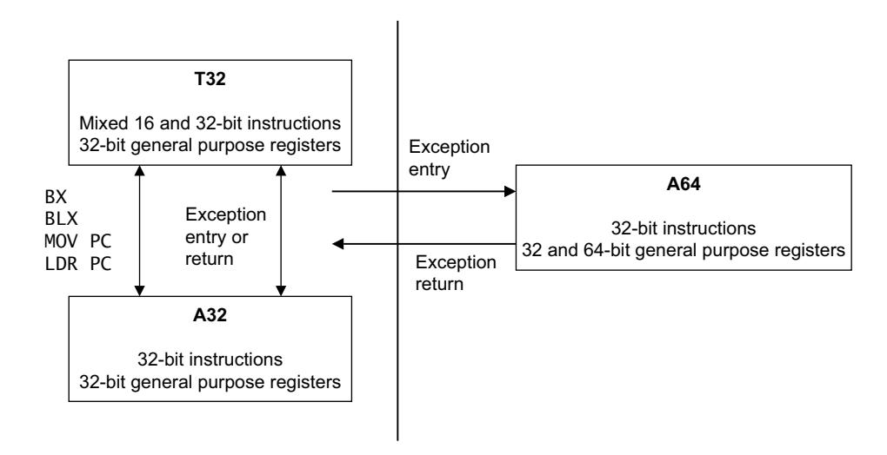

**Figure 5-1 Switching between instruction sets**

## <span id="page-66-1"></span><span id="page-66-0"></span>Chapter 6 **The A64 instruction set**

Many programmers writing at the application level do not need to write code in assembly language. However, assembly code can be useful in cases where highly optimized code is required. This is the case when when writing compilers, or where use of low level features not directly available in C is needed. It might be required for portions of boot code, device drivers, or when developing operating systems. Finally, it can be useful to be able to read assembly code when debugging C, and particularly, to understand the mapping between assembly instructions and C statements.

### <span id="page-67-0"></span>**6.1 Instruction mnemonics**

The A64 assembly language overloads instruction mnemonics, and distinguishes between the different forms of an instruction based on the operand register names. For example, the ADD instructions below all have different encodings, but you only have to remember one mnemonic, and the assembler automatically chooses the correct encoding based on the operands.

```
ADD W0, W1, W2 // add 32-bit registers
ADD X0, X1, X2 // add 64-bit registers
ADD X0, X1, W2, SXTW // add sign extended 32-bit register to 64-bit extended 
 // register
ADD X0, X1, #42 // add immediate to 64-bit register
ADD V0.8H, V1.8H, V2.8H // NEON 16-bit add, in each of 8 lanes
```

#### <span id="page-68-0"></span>**6.2 Data processing instructions**

These are the fundamental arithmetic and logical operations of the processor and operate on values in the general-purpose registers, or a register and an immediate value. *[Multiply and](#page-69-0)  [divide instructions](#page-69-0)* on page 6-4 can be considered special cases of these instructions.

Data processing instructions mostly use one destination register and two source operands. The general format can be considered to be the instruction, followed by the operands, as follows:

```
Instruction Rd, Rn, Operand2
```

The second operand might be a register, a modified register, or an immediate value. The use of R indicates that it can be either an X or a W register.

The data processing operations include:

- Arithmetic and logical operations.
- Move and shift operations.
- Instructions for sign and zero extension.
- Bit and bitfield manipulation.
- <span id="page-68-3"></span>• Conditional comparison and data processing.

#### <span id="page-68-2"></span>**6.2.1 Arithmetic and logical operations**

<span id="page-68-1"></span>[Table 6-1](#page-68-1) shows some of the available arithmetic and logical operations.

**Table 6-1 Arithmetic and logical operations**

| Type       | Instructions                 |
|------------|------------------------------|
| Arithmetic | ADD, SUB, ADC, SBC, NEG      |
| Logical    | AND, BIC, ORR, ORN, EOR, EON |
| Comparison | CMP, CMN, TST                |
| Move       | MOV, MVN                     |

Some instructions also have an S suffix, indicating that the instruction sets flags. Of the instructions in [Table 6-1,](#page-68-1) this includes ADDS, SUBS, ADCS, SBCS, ANDS, and BICS. There are other flag setting instructions, notably CMP, CMN and TST, but these do not take an S suffix.

The operations ADC and SBC perform additions and subtractions that also use the carry condition flag as an input.

```
ADC{S}: Rd = Rn + Rm + C
SBC{S}: Rd = Rn - Rm - 1 + C
```

**Example 6-1 Arithmetic instructions**

```
ADD W0, W1, W2, LSL #3 // W0 = W1 + (W2 << 3)
SUBS X0, X4, X3, ASR #2 // X0 = X4 - (X3 >> 2), set flags
MOV X0, X1 // Copy X1 to X0
CMP W3, W4 // Set flags based on W3 - W4
ADD W0, W5, #27 // W0 = W5 + 27
```

The logical operations are essentially the same as the corresponding boolean operators operating on individual bits of the register.

The BIC (Bitwise bit Clear) instruction performs an AND of the register that is the first after the destination register, with the inverted value of the second operand. For example, to clear bit [11] of register X0, use:

MOV X1, #0x800 BIC X0, X0, X1

ORN and EON perform an OR or EOR respectively with a bitwise-NOT of the second operand.

The comparison instructions only modify the flags and have no other effect. The range of immediate values for these instructions is 12 bits, and this value can be optionally shifted 12 bits to the left.

#### <span id="page-69-2"></span><span id="page-69-0"></span>**6.2.2 Multiply and divide instructions**

The multiply instructions provided are broadly similar to those in ARMv7-A, but with the ability to perform 64-bit multiplies in a single instruction.

**Table 6-2 Multiplication operations in assembly language**

<span id="page-69-3"></span>

| Opcode                | Description                           |  |  |  |  |
|-----------------------|---------------------------------------|--|--|--|--|
| Multiply instructions |                                       |  |  |  |  |
| MADD                  | Multiply add                          |  |  |  |  |
| MNEG                  | Multiply negate                       |  |  |  |  |
| MSUB                  | Multiply subtract                     |  |  |  |  |
| MUL                   | Multiply                              |  |  |  |  |
| SMADDL                | Signed multiply-add long              |  |  |  |  |
| SMNEGL                | Signed multiply-negate long           |  |  |  |  |
| SMSUBL                | Signed multiply-subtract long         |  |  |  |  |
| SMULH                 | Signed multiply returning high half   |  |  |  |  |
| SMULL                 | Signed multiply long                  |  |  |  |  |
| UMADDL                | Unsigned multiply-add long            |  |  |  |  |
| UMNEGL                | Unsigned multiply-negate long         |  |  |  |  |
| UMSUBL                | Unsigned multiply-subtract long       |  |  |  |  |
| UMULH                 | Unsigned multiply returning high half |  |  |  |  |
| UMULL                 | Unsigned multiply long                |  |  |  |  |
| Divide instructions   |                                       |  |  |  |  |
| SDIV                  | Signed divide                         |  |  |  |  |
| UDIV                  | Unsigned divide                       |  |  |  |  |
|                       |                                       |  |  |  |  |

<span id="page-69-1"></span>There are multiply instructions that operate on 32-bit or 64-bit values and return a result of the same size as the operands. For example, two 64-bit registers can be multiplied to produce a 64-bit result with the MUL instruction.

```
MUL X0, X1, X2 // X0 = X1 * X2
```

There is also the ability to add or subtract an accumulator value in a third source register, using the MADD or MSUB instructions.

The MNEG instruction can be used to negate the result, for example:

```
MNEG X0, X1, X2 // X0 = -(X1 * X2)
```

Additionally, there are a range of multiply instructions that produce a long result, that is, multiplying two 32-bit numbers and generating a 64-bit result. There are both signed and unsigned variants of these long multiplies (UMULL, SMULL). There are also options to accumulate a value from another register (UMADDL, SMADDL) or to negate (UMNEGL, SMNEGL).

Including 32-bit and 64-bit multiply with optional accumulation give a result size the same size as the operands:

- 32 ± (32 × 32) gives a 32-bit result.
- 64 ± (64 × 64) gives a 64-bit result.
- ± (32 × 32) gives a 32-bit result.
- ± (64 × 64) gives a 64-bit result.

Widening multiply, that is signed and unsigned, with accumulation gives a single 64-bit result:

- 64 ± (32 × 32) gives a 64-bit result.
- ± (32 × 32) gives a 64-bit result.

A 64 × 64 to 128-bit multiply requires a sequence of two instructions to generate a pair of 64-bit result registers:

- ± (64 × 64) gives the lower 64 bits of the result [63:0].
- (64 × 64) gives the higher 64 bits of the result [127:64].

```
Note
```

 The list contains no 32 × 64 options. You cannot directly multiply a 32-bit W register by a 64-bit X register.

The ARMv8-A architecture has support for signed and unsigned division of 32-bit and 64-bit sized values. For example:

```
UDIV W0, W1, W2 // W0 = W1 / W2 (unsigned, 32-bit divide)
SDIV X0, X1, X2 // X0 = X1 / X2 (signed, 64-bit divide)
```

Overflow and divide-by-zero are not trapped:

- Any integer division by zero returns zero.
- Overflow can only occur in SDIV:
  - INT\_MIN / -1 returns INT\_MIN, where INT\_MIN is the smallest negative number that can be encoded in the registers used for the operation. The result is always rounded towards zero, as in most C/C++ dialects.

#### <span id="page-71-0"></span>**6.2.3 Shift operations**

The following instructions are specifically for shifting:

- *Logical Shift Left* (LSL). The LSL instruction performs multiplication by a power of 2.
- *Logical Shift Right* (LSR). The LSR instruction performs division by a power of 2.
- *Arithmetic Shift Right* (ASR). The ASR instruction performs division by a power of 2, preserving the sign bit.
- *Rotate right* (ROR). The ROR instruction performs a bitwise rotation, wrapping the bits rotated from the LSB into the MSB.

**Table 6-3 Shift and move operations**

| Instruction | Description            |  |  |
|-------------|------------------------|--|--|
| Shift       |                        |  |  |
| ASR         | Arithmetic shift right |  |  |
| LSL         | Logical shift left     |  |  |
| LSR         | Logical shift right    |  |  |
| ROR         | Rotate right           |  |  |
| Move        |                        |  |  |
| MOV         | Move                   |  |  |
| MVN         | Bitwise NOT            |  |  |

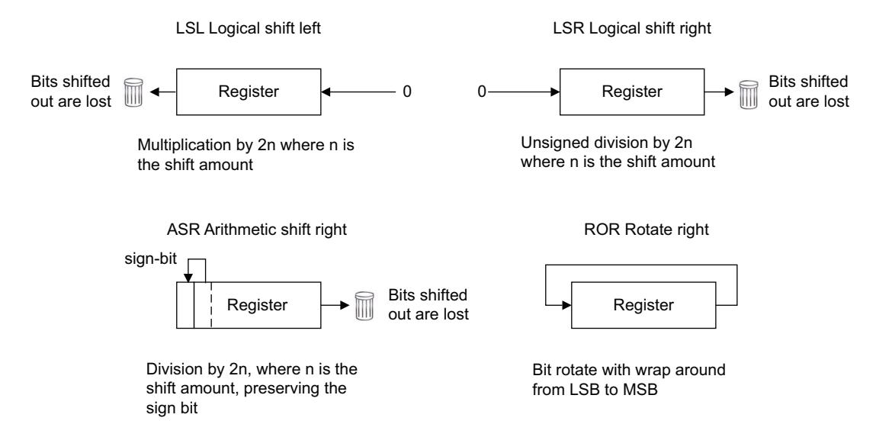

**Figure 6-1 Shift operations**

The register that is specified for a shift can be 32-bit or 64-bit. The amount to be shifted can be specified either as an immediate, that is up to register size minus one, or by a register where the value is taken only from the bottom five (modulo-32) or six (modulo-64) bits.

#### **6.2.4 Bitfield and byte manipulation instructions**

<span id="page-72-0"></span>There are instructions that extend a byte, halfword, or word to register size, which can be either X or W. These instructions exist in both signed (SXTB, SXTH, SXTW) and unsigned (UXTB, UXTH) variants and are aliases to the appropriate bitfield manipulation instruction.

Both the signed and unsigned variants of these instructions extend a byte, halfword, or word (although only SXTW operates on a word) to register size. The source is always a W register. The destination register is either an X or a W register, except for SXTW which must be an X register.

For example:

```
SXTB X0, W1 // Sign extend the least significant byte of register W1 
                  // from 8-bits to 64-bit by repeating the leftmost bit of the
                  // byte.
```

Bitfield instructions are similar to those that exist in ARMv7 and include *Bit Field Insert* (BFI), and signed and unsigned *Bit Field Extract* ((S/U)BFX). There are extra bitfield instructions too, such as BFXIL (Bit Field Extract and Insert Low), UBFIZ (Unsigned Bit Field Insert in Zero), and SBFIZ (Signed Bit Field Insert in Zero).

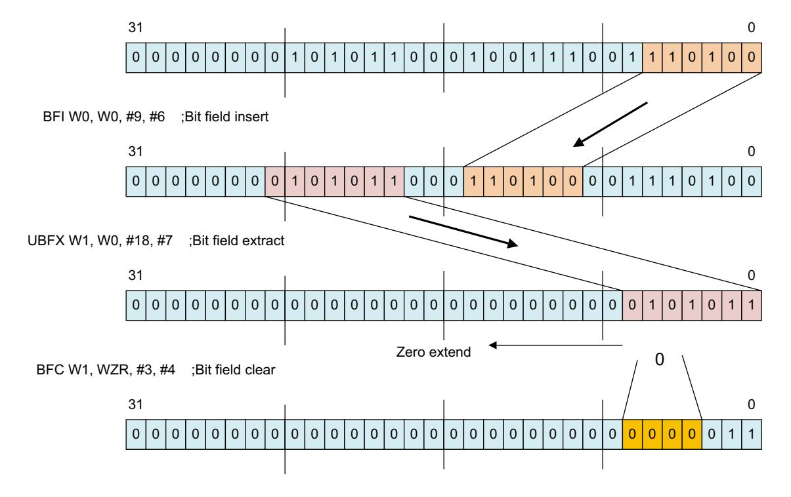

**Figure 6-2 Bit manipulation instructions**

**Note**

 There are also BFM, UBFM, and SBFM instructions. These are *Bit Field Move* instructions, which are new for ARMv8. However, the instructions do not need to be used explicitly, as aliases are provided for all cases. These aliases are the bitfield operations already described: [SU]XT[BHWX], ASR/LSL/LSR immediate, BFI, BFXIL, SBFIZ, SBFX, UBFIZ, and UBFX.

If you are familiar with the ARMv7 architecture, you might recognize the other bit manipulation instruction:

• CLZ Count leading zero bits in a register.

Similarly, the same byte manipulation instructions:

- RBIT Reverse all bits.
- REV Reverse the byte order of a register.
- REV16 Reverse the byte order of each halfword in a register.

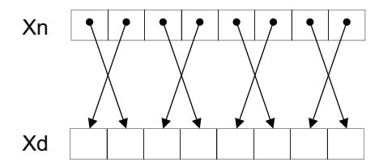

**Figure 6-3 REV16 instruction**

• REV32 Reverse the byte order of each word in a register.

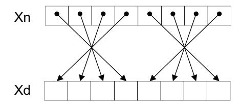

**Figure 6-4 REV32 instruction**

These operations can be performed on either word (32-bit) or doubleword (64-bit) sized registers, except for REV32, which applies only to 64-bit registers.

#### <span id="page-73-1"></span>**6.2.5 Conditional instructions**

The A64 instruction set does not support conditional execution for every instruction. Predicated execution of instructions does not offer sufficient benefit to justify its significant use of opcode space.

<span id="page-73-0"></span>*[Processor state](#page-41-0)* on page 4-6, describes the four status flags, Zero (Z), Negative (N), Carry (C) and Overflow (V). [Table 6-4](#page-73-0) indicates the value of these bits for flag setting operations.

**Table 6-4 Condition flag**

| Flag | Name     | Description                                                                                                                             |
|------|----------|-----------------------------------------------------------------------------------------------------------------------------------------|
| N    | Negative | Set to the same value as bit[31] of the result. For a 32-bit signed integer, bit[31] being set indicates<br>that the value is negative. |
| Z    | Zero     | Set to 1 if the result is zero, otherwise it is set to 0.                                                                               |
| C    | Carry    | Set to the carry-out value from result, or to the value of the last bit shifted out from a shift<br>operation.                          |
| V    | Overflow | Set to 1 if signed overflow or underflow occurred, otherwise it is set to 0.                                                            |

The C flag is set if the result of an unsigned operation overflows the result register.

The V flag operates in the same way as the C flag, but for signed operations.

| Note |  |
|------|--|
|------|--|

 The condition flags (NZCV) and the condition codes are the same as in A32 and T32. However, A64 adds NV (0b1111), though it behaves the same as its complement, AL (0b1110). This differs from A32, which did not assign any meaning to 0b1111.

**Table 6-5 Condition codes**

| Code | Encoding | Meaning (when set by CMP)<br>Meaning (when set by FCMP) |                                                            | Condition flags    |  |
|------|----------|---------------------------------------------------------|------------------------------------------------------------|--------------------|--|
| EQ   | 0b0000   | Equal to.                                               | Equal to.                                                  | Z =1               |  |
| NE   | 0b0001   | Not equal to.                                           | Unordered, or not equal to.                                | Z = 0              |  |
| CS   | 0b0010   | Carry set (identical to HS).                            | Greater than, equal to, or unordered (identical<br>to HS). | C = 1              |  |
| HS   | 0b0010   | Greater than, equal to (unsigned)<br>(identical to CS). | Greater than, equal to, or unordered (identical<br>to CS). | C = 1              |  |
| CC   | 0b0011   | Carry clear (identical to LO).                          | Less than (identical to LO).                               | C = 0              |  |
| LO   | 0b0011   | Unsigned less than (identical to<br>CC).                | Less than (identical to CC).                               | C = 0              |  |
| MI   | 0b0100   | Minus, Negative.                                        | Less than.                                                 | N = 1              |  |
| PL   | 0b0101   | Positive or zero.                                       | Greater than, equal to, or unordered.                      | N = 0              |  |
| VS   | 0b0110   | Signed overflow.                                        | Unordered. (At least one argument was NaN).                | V = 1              |  |
| VC   | 0b0111   | No signed overflow.                                     | Not unordered. (No argument was NaN).                      | V = 0              |  |
| HI   | 0b1000   | Greater than (unsigned).                                | Greater than or unordered.                                 | (C = 1) && (Z = 0) |  |
| LS   | 0b1001   | Less than or equal to (unsigned).                       | Less than or equal to.                                     | (C = 0)    (Z = 1) |  |
| GE   | 0b1010   | Greater than or equal to (signed).                      | Greater than or equal to.                                  | N==V               |  |
| LT   | 0b1011   | Less than (signed).                                     | Less than or unordered.                                    | N!=V               |  |
| GT   | 0b1100   | Greater than (signed).                                  | Greater than.                                              | (Z==0) && (N==V)   |  |
| LE   | 0b1101   | Less than or equal to (signed).                         | Less than, equal to or unordered.                          | (Z==1)    (N!=V)   |  |
| AL   | 0b1110   | Always executed.                                        | Default. Always executed.                                  | Any                |  |
| NV   | 0b1111   | Always executed.                                        | Always executed.                                           | Any                |  |

There are a small set of conditional data processing instructions. These instructions are unconditionally executed but use the condition flags as an extra input to the instruction. This set has been provided to replace common usage of conditional execution in ARM code.

The instructions types which read the condition flags are:

#### **Add/subtract with carry**

The traditional ARM instructions, for example, for multi-precision arithmetic and checksums.

#### **Conditional select with optional increment, negate, or invert**

Conditionally select between one source register and a second incremented, negated, inverted, or unmodified source register.

These are the most common uses of single conditional instructions in A32 and T32. Typical uses include conditional counting or calculating the absolute value of a signed quantity.

#### **Conditional operations**

The A64 instruction set enables conditional execution of only program flow control branch instructions. This is in contrast to A32 and T32 where most instructions can be predicated with a condition code. These can be summarized as follows:

#### **Conditional select (move)**

- CSEL Select between two registers based on a condition. Unconditional instructions, followed by a conditional select, can replace short conditional sequences.
- CSINC Select between two registers based on a condition. Return the first source register or the second source register incremented by one.
- CSINV Select between two registers based on a condition. Return the first source register or the inverted second source register.
- CSNEG Select between two registers based on a condition. Return the first source register or the negated second source register.

#### **Conditional set**

Conditionally select between 0 and 1 (CSET) or 0 and -1 (CSETM). Used, for example, to set the condition flags as a boolean value or mask in a general register.

#### **Conditional compare**

(CMP and CMN) Sets the condition flags to the result of a comparison if the original condition is true. If not true, the conditional flags are set to a specified condition flag state. The conditional compare instruction is very useful for expressing nested or compound comparisons.

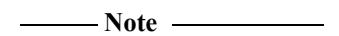

 Conditional select and conditional compare are also available for floating-point registers using the FCSEL and FCCMP instructions.

For example:

```
CSINC X0, X1, X0, NE // Set the return register X0 to X1 if Zero flag clear,
 // else increment X0
```

Some aliases to the example instructions are provided, where either the zero register is used, or the same register is used as both destination and both source registers for the instruction.

For example:

```
CINC X0, X0, LS // If less than or same (LS) then X0 = X0 + 1
CSET W0, EQ // If the previous comparison was equal (Z=1) then W0 = 1, 
                      // else W0 = 0
CSETM X0, NE // If not equal then X0 = -1, else X0 = 0
```

This class of instructions provides a powerful way to avoid the use of branches or conditionally executed instructions. Compilers, or assembly programmers, might adopt a technique of performing the operations for both branches of an if-then-else statement. Then the correct result is selected at the end.

For example, consider the simple C code:

```
if (i == 0) r = r + 2; else r = r - 1;
```

This might produce code similar to:

```
CMP w0, #0 // if (i == 0)
SUB w2, w1, #1 // r = r - 1
ADD w1, w1, #2 // r = r + 2
CSEL w1, w1, w2, EQ // select between the two results
```

#### <span id="page-77-0"></span>**6.3 Memory access instructions**

As with all prior ARM processors, the ARMv8 architecture is a Load/Store architecture. This means that no data processing instruction operates directly on data in memory. The data must first be loaded into registers, modified, and then stored to memory. The program must specify an address, the size of data to be transferred, and a source or destination register. There are additional Load and Store instructions which provide further options, such as non-temporal Load/Store, Load/Store exclusives, and Acquire/Release.

Memory instructions can access Normal memory in an unaligned fashion (see [Chapter 13](#page-190-1)  *[Memory Ordering](#page-190-1)*). This is not supported by exclusive accesses, load acquire or store release variants. If unaligned accesses are not desired, they can be configured to be faulted.

#### <span id="page-77-1"></span>**6.3.1 Load instruction format**

The general form of a Load instruction is as follows:

LDR Rt, <addr>

For loads into integer registers, you can choose a size to load. For example, to load a size smaller than the specified register value, append one of the following suffixes to the LDR instruction:

- LDRB (8-bit, zero extended).
- LDRSB (8-bit, sign extended).
- LDRH (16-bit, zero extended).
- LDRSH (16-bit, sign extended).
- LDRSW (32-bit, sign extended).

There are also unscaled-offset forms such as LDUR<type> (see *[Specifying the address for a Load](#page-79-0)  [or Store instruction](#page-79-0)* on page 6-14). Programmers will not normally need to use the LDUR form explicitly, because most assemblers can select the appropriate version based on the offset used.

You do not need to specify a zero-extended load to an X register, because writing a W register effectively zero extends to the entire register width.

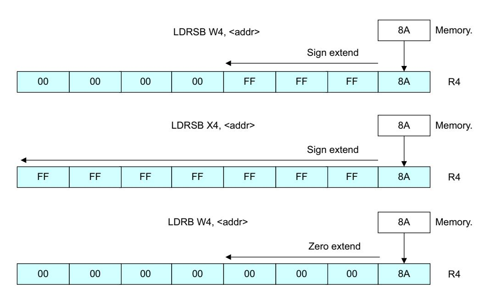

**Figure 6-5 Load instructions**

#### <span id="page-78-3"></span>**6.3.2 Store instruction format**

Similarly, the general form of a Store instruction is as follows:

STR Rn, <addr>

There are also unscaled-offset forms such as STUR<type> (see *[Specifying the address for a Load](#page-79-0)  [or Store instruction](#page-79-0)* on page 6-14). Programmers will not normally need to use the STUR form explicitly, as most assemblers can select the appropriate version based on the offset used.

The size to be stored might be smaller than the register. You specify this by adding a B or H suffix to the STR. It is always the least significant part of the register that is stored in such a case.

#### <span id="page-78-2"></span>**6.3.3 Floating-point and NEON scalar loads and stores**

Load and Store instructions can also access floating-point/NEON registers. Here, the size is determined only by the register being loaded or stored, which can be any of the B, H, S, D, or Q registers. This information is summarized in [Table 6-6](#page-78-0), and [Table 6-7.](#page-78-1)

<span id="page-78-0"></span>For Load instructions:

**Table 6-6 Memory bits written by Load instructions**

| Load  | Xt  | Wt | Qt  | Dt  | St | Ht | Bt |
|-------|-----|----|-----|-----|----|----|----|
| LDR   | 64  | 32 | 128 | 64  | 32 | 16 | 9  |
| LDP   | 128 | 64 | 256 | 128 | 64 | -  | -  |
| LDRB  | -   | 8  | -   | -   | -  | -  | -  |
| LDRH  | -   | 16 | -   | -   | -  | -  | -  |
| LDRSB | 8   | 8  | -   | -   | -  | -  | -  |
| LDRSH | 16  | 16 | -   | -   | -  | -  | -  |
| LDRSW | 32  | -  | -   | -   | -  | -  | -  |
| LDPSW | -   | -  | -   | -   | -  | -  | -  |

<span id="page-78-1"></span>For Store instructions:

**Table 6-7 Memory bits read by Store instructions**

| Store | Xt  | Wt | Qt  | Dt  | St | Ht | Bt |
|-------|-----|----|-----|-----|----|----|----|
| STR   | 64  | 32 | 126 | 64  | 32 | 16 | 8  |
| STP   | 128 | 64 | 256 | 128 | 64 | -  | -  |
| STRB  | -   | 8  | -   | -   | -  | -  | -  |
| STRH  | -   | 16 | -   | -   | -  | -  | -  |

No sign-extension options are available for loads into FP/SIMD registers. Addresses for such loads are still specified using the general-purpose registers.

For example:

LDR D0, [X0, X1]

Loads register D0 with the doubleword at the memory address pointed to by X0 plus X1.

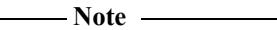

 Floating-point and scalar NEON Loads and Stores use the same addressing modes as integer Loads and Stores.

#### <span id="page-79-0"></span>**6.3.4 Specifying the address for a Load or Store instruction**

<span id="page-79-1"></span>The addressing modes available to A64 are similar to those in A32 and T32. There are some additional restrictions as well as some new features, but the addressing modes available to A64 will not be surprising to someone familiar with A32 or T32.

In A64, the base register of an address operand must always be an X register. However, several instructions support zero-extension or sign-extension so that a 32-bit offset can be provided as a W register.

#### **Offset modes**

Offset addressing modes add an immediate value or an optionally-modified register value to a 64-bit base register to generate an address.

**Table 6-8 Offset addressing modes**

| Example instruction        | Description                                   |
|----------------------------|-----------------------------------------------|
| LDR X0, [X1]               | Load from the address in X1                   |
| LDR X0, [X1, #8]           | Load from address X1 + 8                      |
| LDR X0, [X1, X2]           | Load from address X1 + X2                     |
| LDR X0, [X1, X2, LSL, #3]  | Load from address X1 + (X2 << 3)              |
| LDR X0, [X1, W2, SXTW]     | Load from address X1 + sign_extend(W2)        |
| LDR X0, [X1, W2, SXTW, #3] | Load from address X1 + (sign_extend(W2) << 3) |

Typically, when specifying a shift or extension option, the shift amount can be either 0 (the default) or log2 of the access size in bytes (so that Rn << <shift> multiplies Rn by the access size). This supports common array-indexing operations.

```
// A C example showing accesses that a compiler is likely to generate.
void example_dup(int32_t a[], int32_t length) {
 int32_t first = a[0]; // LDR W3, [X0]
 for (int32_t i = 1; i < length; i++) {
 a[i] = first; // STR W3, [X0, W2, SXTW, #2]
 }
}
```

#### **Index modes**

Index modes are similar to offset modes, but they also update the base register. The syntax is the same as in A32 and T32, but the set of operations is more restrictive. Usually, only immediate offsets can be provided for index modes.

There are two variants: pre-index modes which apply the offset *before* accessing the memory, and post-index modes which apply the offset *after* accessing the memory.

**Table 6-9 Index addressing modes**

| Example instruction     | Description                                                                           |
|-------------------------|---------------------------------------------------------------------------------------|
| LDR X0, [X1, #8]!       | Pre-index: Update X1 first (to X1 + #8), then load from the new address               |
| LDR X0, [X1], #8        | Post-index: Load from the unmodified address in X1 first, then update X1 (to X1 + #8) |
| STP X0, X1, [SP, #-16]! | Push X0 and X1 to the stack.                                                          |
| LDP X0, X1, [SP], #16   | Pop X0 and X1 off the stack.                                                          |

These options map cleanly onto some common C operations:

```
// A C example showing accesses that a compiler is likely to generate.
void example_strcpy(char * dst, const char * src) 
{
char c;
do {
   c = *(src++); // LDRB W2, [X1], #1
   *(dst++) = c; // STRB W2, [X0], #1
   } while (c != '\0');
}
```

#### **PC-relative modes (load-literal)**

A64 adds another addressing mode specifically for accessing literal pools. Literal pools are blocks of data encoded in an instruction stream. The pools are not executed, but their data can be accessed from surrounding code using PC-relative memory addresses. Literal pools are often used to encode constant values that do not fit into a simple move-immediate instruction.

In A32 and T32, the PC can be read like a general-purpose register, so a literal pool can be accessed simply by specifying PC as the base register.

In A64, PC is not generally accessible, but instead there is a special addressing mode (for load instructions only) that accesses a PC-relative address. This special-purpose addressing mode also has a much greater range than the PC-relative loads in A32 and T32 could achieve, so literal pools can be positioned more sparsely.

**Table 6-10**

| Example instruction       | Description                                               |  |
|---------------------------|-----------------------------------------------------------|--|
| LDR W0, <label></label>   | Load 4 bytes from <label> into W0</label>                 |  |
| LDR X0, <label></label>   | Load 8 bytes from <label> into X0</label>                 |  |
| LDRSW X0, <label></label> | Load 4 bytes from <label> and sign-extend into X0</label> |  |
| LDR S0, <label></label>   | Load 4 bytes from <label> into S0</label>                 |  |
| LDR D0, <label></label>   | Load 8 bytes from <label> into D0</label>                 |  |
| LDR Q0, <label></label>   | Load 16 bytes from <label> into Q0</label>                |  |

**Note**

<label> must be 4-byte-aligned for all variants.

#### <span id="page-81-2"></span>**6.3.5 Accessing multiple memory locations**

A64 does not include the Load Multiple (LDM) or Store Multiple (STM) instructions that are available to A32 and T32 code.

<span id="page-81-3"></span>In A64 code, there are the *Load Pair* (LDP) and *Store Pair* (STP) instructions. Unlike the A32 LDRD and STRD instructions, any two integer registers can be read or written. Data is read or written to or from adjacent memory locations. The addressing mode options provided for these instructions are more restrictive than for other memory access instructions. LDP and STP instructions can only use a base register with a scaled 7-bit signed immediate value, with optional pre- or post-increment. Unaligned accesses are possible for LDP and STP, unlike the 32-bit LDRD and STRD.

<span id="page-81-4"></span>**Table 6-11 Register Load/Store pair**

| Load and Store pair      | Description                                                                                                                                 |  |
|--------------------------|---------------------------------------------------------------------------------------------------------------------------------------------|--|
| LDP W3, W7, [X0]         | Loads word at address X0 into W3 and word at<br>address X0 + 4 into W7. See Figure 6-6.                                                     |  |
| LDP X8, X2, [X0, #0x10]! | Loads doubleword at address X0 + 0x10 into X8<br>and the doubleword at address X0 + 0x10 + 8<br>into X2 and add 0x10 to X0. See Figure 6-7. |  |
| LDPSW X3, X4, [X0]       | Loads word at address X0 into X3 and word at<br>address X0 + 4 into X4, and sign extends both<br>to doubleword size.                        |  |
| LDP D8, D2, [X11], #0x10 | Loads doubleword at address X11 into D8 and<br>the doubleword at address X11 + 8 into D2 and<br>adds 0x10 to X11.                           |  |
| STP X9, X8, [X4]         | Stores the doubleword in X9 to address X4 and<br>stores the doubleword in X8 to address X4 + 8.                                             |  |

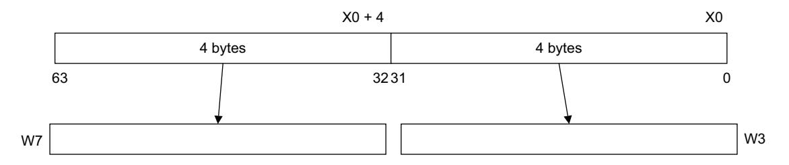

**Figure 6-6 LDP W3, W7 [X0]**

<span id="page-81-1"></span><span id="page-81-0"></span>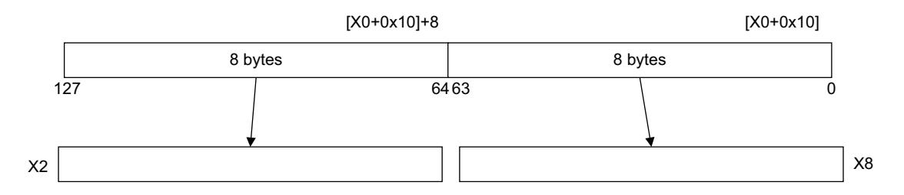

**Figure 6-7 LDP X8, X2, [X0 + #0x10]!**

#### <span id="page-82-3"></span>**6.3.6 Unprivileged access**

The A64 LDTR and STTR instructions perform an unprivileged Load or Store (see LDTR and STTR in *ARMv8-A Architecture Reference Manual*):

- At EL0, EL2 or EL3, they behave as normal Loads or Stores.
- When executed at EL1, they behave as if they had been executed at privilege level EL0. These instructions are equivalent to the A32 LDRT and STRT instructions.

#### **6.3.7 Prefetching memory**

*Prefetch from Memory* (PRFM) enables code to provide a hint to the memory system that data from a particular address will be used by the program soon. The effect of this hint is IMPLEMENTATION DEFINED, but typically, it results in data or instructions being loaded into one of the caches.

The instruction syntax is:

```
PRFM <prfop>, <addr> | label
```

Where prfop is a concatenation of the following options:

Type PLD or PST (prefetch for load or store).

Target L1, L2, or L3 (which cache to target).

Policy KEEP or STRM (keep in cache, or streaming data).

For example, PLDL1KEEP.

These instructions are similar to the A32 PLD and PLI instructions.

#### <span id="page-82-0"></span>**6.3.8 Non-temporal load and store pair**

<span id="page-82-2"></span><span id="page-82-1"></span>A new concept in ARMv8 is the *non-temporal* load and store. These are the LDNP and STNP instructions that perform a read or write of a pair of register values. They also give a hint to the memory system that caching is not useful for this data. The hint does not prohibit memory system activity such as caching of the address, preload, or gathering. However, it indicates that caching is unlikely to increase performance. A typical use case might be streaming data, but take note that effective use of these instructions requires an approach specific to the microarchitecture.

Non-temporal loads and stores relax the memory ordering requirements. In the above case, the LDNP instruction might be observed before the preceding LDR instruction, which can result in reading from an uncertain address in X0.

For example:

```
LDR X0, [X3]
LDNP X2, X1, [X0] // Xo may not be loaded when the instruction executes!
```

To correct the above, you need an explicit load barrier:

```
LDR X0, [X3]
DMB nshld
LDNP X2, X1, [X0]
```

#### <span id="page-83-1"></span>**6.3.9 Memory access atomicity**

An aligned memory access, using a single general-purpose register, is guaranteed to be atomic. Load pair and store pair instructions to a pair of general-purpose registers, using an aligned memory address are guaranteed to appear as two individual atomic accesses. Unaligned accesses are not atomic, as they typically require two separate accesses. Additionally, floating-point and SIMD memory accesses are not guaranteed to be atomic.

#### <span id="page-83-0"></span>**6.3.10 Memory barrier and fence instructions**

Both ARMv7 and ARMv8 provide support for different barrier operations. These are described in more detail in Chapter 13 *[Memory Ordering](#page-190-1)*:

- <span id="page-83-2"></span>• *Data Memory Barrier* (DMB). This forces all earlier-in-program-order memory accesses to become globally visible before any subsequent accesses.
- <span id="page-83-3"></span>• *Data Synchronization Barrier* (DSB). All pending loads and stores, cache maintenance instructions, and all TLB maintenance instructions, are completed before program execution continues. A DSB behaves like a DMB, but with additional properties.
- <span id="page-83-4"></span>• *Instruction Synchronization Barrier* (ISB). This instruction flushes the CPU pipeline and prefetch buffers, causing instructions after the ISB to be fetched (or re-fetched) from cache or memory.

<span id="page-83-6"></span><span id="page-83-5"></span>ARMv8 introduces one-sided *fences*, which are associated with the Release Consistency model. These are called *Load-Acquire* (LDAR) and *Store-Release* (STLR) and are address-based synchronization primitives. (See *[One-way barriers](#page-197-0)* on page 13-8.) The two operations can be paired to form a full fence. Only base register addressing is supported for these instructions, no offsets or other kinds of indexed addressing are provided.

#### <span id="page-83-7"></span>**6.3.11 Synchronization primitives**

ARMv7-A and ARMv8-A architectures both provide support for exclusive memory accesses. In A64, this is the *Load/Store exclusive* (LDXR/STXR) pair.

The LDXR instruction loads a value from a memory address and attempts to silently claim an exclusive lock on the address. The Store-Exclusive instruction then writes a new value to that location only if the lock was successfully obtained and held. The LDXR/STXR pairing is used to construct standard synchronization primitives such as spinlocks. A paired set of LDXRP and STXRP instructions is provided, to allow code to atomically update a location that spans two registers. Byte, halfword, word, and doubleword options are available. Like the Load Acquire/Store Release pairing, only base register addressing, without any offsets, is supported.

The CLREX instruction clears the monitors, but unlike in ARMv7, exception entry or return also clears the monitor. The monitor might also be cleared spuriously, for example by cache evictions or other reasons not directly related to the application. Software must avoid having any explicit memory accesses, system control register updates, or cache maintenance instructions between paired LDXR and STXR instructions.

There is also an exclusive pair of Load Acquire/Store Release instructions called LDAXR and STLXR. See *Synchronization* on page 14-6.

#### <span id="page-84-0"></span>**6.4 Flow control**

<span id="page-84-3"></span>The A64 instruction set provides a number of different kinds of branch instructions (see [Table 6-12\)](#page-84-1). For simple relative branches, that is those to an offset from the current address, the B instruction is used. Unconditional simple relative branches can branch backward or forward up to 128MB from the current program counter location. Conditional simple relative branches, where a condition code is appended to the B, have a smaller range of ±1MB.

<span id="page-84-4"></span><span id="page-84-1"></span>Calls to subroutines, where it is necessary for the return address to be stored in the link register (X30), use the BL instruction. This does not have a conditional version. BL behaves as a B instruction with the additional effect of storing the return address, which is the address of the instruction after the BL, in register X30.

<span id="page-84-5"></span><span id="page-84-2"></span>**Table 6-12 Branch instructions**

| Branch instructions |                                                                                                                                                                       |  |
|---------------------|-----------------------------------------------------------------------------------------------------------------------------------------------------------------------|--|
| B (offset)          | Program relative branch forward or back 128MB.<br>A conditional version, for example B.EQ, has a 1MB range.                                                           |  |
| BL (offset)         | As B but store the return address in X30, and hint to branch prediction logic<br>that this is a function call.                                                        |  |
| BR Xn               | Absolute branch to address in Xn.                                                                                                                                     |  |
| BLR Xn              | As BR but store the return address in X30, and hint to branch prediction<br>logic that this is a function call.                                                       |  |
| RET{Xn}             | As BR, but hint to branch prediction logic that this is a function return.<br>Returns to the address in X30 by default, but a different register can be<br>specified. |  |
|                     | Conditional branch instructions                                                                                                                                       |  |
| CBZ Rt, label       | Compare and branch if zero. If Rt is zero, branch forward or back up to<br>1MB.                                                                                       |  |
| CBNZ Rt, label      | Compare and branch if non-zero. If Rt is not zero, branch forward or back<br>up to 1MB.                                                                               |  |
| TBNZ Rt, bit, label | Test and branch if zero. Branch forward or back up to 32kB.                                                                                                           |  |
| TBNZ Rt, bit, label | Test and branch if non-zero. Branch forward or back up to 32kB.                                                                                                       |  |

<span id="page-84-6"></span>In addition to these PC-relative instructions, the A64 instruction set includes two absolute branches. The BR Xn instruction performs an absolute branch to the address in Xn while BLR Xn has the same effect, but also stores the return address in X30 (the link register). The RET instruction behaves like BR Xn, but it hints to branch prediction logic that it is a function return. RET branches to the address in X30 by default, though other registers can be specified..

<span id="page-84-9"></span>The A64 instruction set includes some special conditional branches. These allow improved code density in some cases because an explicit comparison is not necessary.

```
• CBZ Rt, label // Compare and branch if zero
• CBNZ Rt, label // Compare and branch if not zero
```

These instructions compare the source register, either 32-bit or 64-bit, with zero and then conditionally perform a branch. The branch offset has a range of ± 1MB. These instructions do not read or write the condition code flags (NZCV).

There are two similar test and branch instructions

<span id="page-84-10"></span>• TBZ Rt, bit, label // Test and branch if Rt<bit> zero

<span id="page-85-0"></span>• TBNZ Rt, bit, label // Test and branch if Rt<bit> is not zero

These instructions test the bit in the source register at the bit position specified by the immediate and conditionally branch depending on whether the bit is set or clear. The branch offset has a range of ±32kB. As with CBZ/CBNZ, these instructions do not read or write the condition code flags (NZCV).

#### <span id="page-86-0"></span>**6.5 System control and other instructions**

The A64 instruction set contains instructions that relate to:

- Exception handling.
- System register access.
- Debug.
- *Hint* instructions, which in many systems have power management applications.

#### <span id="page-86-1"></span>**6.5.1 Exception handling instructions**

There are three exception handling instructions whose purpose it is to cause an exception to be taken. These are used to make a call to code that runs in a higher Exception level in the OS (EL1), the Hypervisor (EL2), or Secure Monitor (EL3):

```
• SVC #imm16 // Supervisor call, allows application program to call the kernel
                 // (EL1).
• HVC #imm16 // Hypervisor call, allows OS code to call hypervisor (EL2).
• SMC #imm16 // Secure Monitor call, allows OS or hypervisor to call Secure
                 // Monitor (EL3).
```

<span id="page-86-2"></span>The immediate value is made available to the handler in the *Exception Syndrome Register*. This is a change from ARMv7, where the immediate value had to be determined by reading the opcode of the calling instruction. See Chapter 10 *[AArch64 Exception Handling](#page-122-1)* for further information.

To return from an exception, use the ERET instruction. This instruction restores processor state by copying SPSR\_EL*n* to PSTATE and branches to the saved return address in ELR\_EL*n*.

#### <span id="page-86-3"></span>**6.5.2 System register access**

Two instructions are provided for system register access:

```
• MRS Xt, <system register> // This copies a system register into a general
                              // purpose register
     For example
     MRS X4, ELR_EL1 // Copies ELR_EL1 to X4
• MSR <system register>, Xt // This copies a general-purpose register into a 
                               // system register
     For example
     MSR SPSR_EL1, X0 // Copies X0 to SPSR_EL1
```

Individual fields of PSTATE can also be accessed with MSR or MRS. For example, to select the Stack Pointer associated with EL0 or the current Exception level:

```
• MSR SPSel, #imm // A value of 0 or 1 in this register is used to select
                           // between using EL0 stack pointer or the current exception 
                           // level stack pointer
```

There are special forms of these instructions that can be used to clear or set individual exception mask bits (see *[Saved Process Status Register](#page-40-0)* on page 4-5):

- MSR DAIFClr, #imm4
- MSR DAIFSet, #imm4

See *[System registers](#page-42-0)* on page 4-7.

#### <span id="page-87-0"></span>**6.5.3 Debug instructions**

There are two debug-related instructions:

- BRK #imm16 // Enters monitor mode debug, where there is on-chip debug monitor // code
- HLT #imm16 // Enters halt mode debug, where external debug hardware is connected

For information on debugging, see [Chapter 18](#page-249-1) *Debug*.

#### <span id="page-87-2"></span>**6.5.4 Hint instructions**

HINT instructions can legally be treated as a NOP, but they can have implementation-specific effects:

```
• NOP // No operation - not guaranteed to take time to execute
• YIELD // Hint that the current thread is performing a task that 
              // can be swapped out
• WFE // Wait for Event
• WFI // Wait for interrupt
• SEV // Send Event
• SEVL // Send Event Local
```

These concepts are also covered in Chapter 14 *[Multi-core processors](#page-203-1)* and [Chapter 15](#page-223-1) *Power [Management](#page-223-1)*.

#### <span id="page-87-3"></span>**6.5.5 NEON instructions**

The NEON instruction set also has several enhancements, some of which are quite significant. Chapter 7 *[AArch64 Floating-point and NEON](#page-89-1)* describes these in more detail.

Changes to NEON in A64 include

- Support for double precision floating-point, enabling C code using double precision floating-point to be vectorized.
- New instructions to operate on scalar data stored in NEON registers.
- New instructions to insert and extract vector elements.
- New instructions for type conversion and saturating integer arithmetic.
- New instructions for normalization of floating-point values.
- New cross-lane instructions for vector reduction, summation, and taking the minimum or maximum value.
- Instructions to perform actions such as compare, add, find absolute value, and negate have been extended to be able to operate on 64-bit integer elements.

#### <span id="page-87-1"></span>**6.5.6 Floating-point instructions**

A64 provides a similar set of floating-point instructions to those of the ARMv7-A VFPv4 extension, which provides single and double precision mathematical operations on scalar floating-point values. There are a number of changes and new features:

• Floating-point comparisons set the condition flags (NZCV) directly. In A64 there is no need to explicitly transfer the comparison results from floating-point to integer flags.

- Instructions have been added relating to the IEEE754-2008 standard, for example to calculate the minimum and maximum of a pair of numbers.
- A rounding mode can now be explicitly specified when converting from integer to floating-point formats. It is no longer necessary to set the global FPCR flags when simple conversions are required in a particular rounding mode. Some of these options are also available to ARMv8 A32 and T32.
- Instructions have been added to support conversions between 64-bit integers and floating-point formats.
- In A64, floating-point operations involving integer types work directly on integer registers. There is no need to manually transfer integer values between floating-point and integer registers for conversion operations.

#### <span id="page-88-0"></span>**6.5.7 Cryptographic instructions**

An optional extension for ARMv8 adds cryptographic instructions that significantly improve performance on tasks such as AES encryption and SHA1 and SHA256 hashing.

## <span id="page-89-1"></span><span id="page-89-0"></span>Chapter 7 **AArch64 Floating-point and NEON**

<span id="page-89-2"></span>The ARM Advanced SIMD architecture, its associated implementations, and supporting software, are commonly referred to as NEON technology. There are NEON instruction sets for both AArch32 (equivalent to the ARMv7 NEON instructions) and for AArch64. Both can be used to significantly accelerate repetitive operations on large data sets. This can be useful in applications such as media codecs.

The NEON architecture for AArch64 uses 32 × 128-bit register, twice as many as for ARMv7. These are the same registers used by the floating-point instructions. All compiled code and subroutines conforms to the EABI, which specifies which registers can be corrupted and which registers must be preserved within a particular subroutine. The compiler is free to use any NEON/VFP registers for floating-point values or NEON data at any point in the code.

Both floating-point and NEON are required in all standard ARMv8 implementations. However, implementations targeting specialized markets may support the following combinations:

- No NEON or floating-point.
- Full floating-point and SIMD support with exception trapping.
- Full floating-point and SIMD support without exception trapping.

#### <span id="page-90-0"></span>**7.1 New features for NEON and Floating-point in AArch64**

AArch64 NEON is based upon the existing AArch32 NEON, with the following changes:

- There are now thirty-two 128-bit registers, rather than the 16 available for ARMv7.
- Smaller registers are no longer packed into larger registers, but are mapped one-to-one to the lower-order bits of the 128-bit register. A single precision floating-point value uses the lower 32 bits, while double precision value uses the lower 64 bits of the 128-bit register. See *[NEON and Floating-Point architecture](#page-92-1)* on page 7-4.
- The V prefix present in ARMv7-A NEON instructions has been removed.
- Writes of 64 bits or less to a vector register result in the higher bits being zeroed.
- In AArch64, there are no SIMD or saturating arithmetic instructions which operate on the general-purpose registers. Such operations use the NEON registers.
- New lane insert and extract instructions have been added to support the new register packing scheme.
- Additional instructions are provided for generating or consuming the top 64 bits of a 128-bit vector register. Data-processing instructions, which would generate more than one result register (widening to a 256-bit vector), or consume two sources (narrowing to a 128-bit vector), have been split into separate instructions.
- A new set of vector reduction operations provide across-lane sum, minimum and maximum.
- Some existing instructions have been extended to support 64-bit integer values. For example, comparison, addition, absolute value and negate, including saturating versions.
- Saturating instructions have been extended to include Unsigned Accumulate into Signed, and Signed into Unsigned Accumulate.
- Support is provided in AArch64 NEON for double-precision floating-point and full IEEE754 operation including rounding modes, denormalized numbers, and NaN handling.

Floating-point has been enhanced in AArch64 with the following changes:

- The V prefix present in ARMv7-A floating-point instructions has been replaced with an F.
- Support for both single-precision (32-bit) and double-precision (64-bit) floating-point vector data types and arithmetic as defined by the IEEE 754 floating-point standard, honoring the FPCR Rounding Mode field, the Default NaN control, the Flush-to-Zero control, and (where supported by the implementation) the Exception trap enable bits.
- Load/Store addressing modes for FP/NEON registers are identical to integer Load/Stores, including the ability to Load or Store a pair of floating-point registers.
- Floating-point FCSEL and Select and Compare instructions, equivalent to the integer CSEL and CCMP have been added.
  - Floating-point FCMP, FCMPE, FCCMP, and FCCMP set the PSTATE.{N, Z, C, V} flags based on the result of the floating-point comparison and do not modify the condition flags in the *Floating-Point Status Register* (FPSR), as is the case in ARMv7.
- <span id="page-90-1"></span>• All floating-point Multiply-Add and Multiply-Subtract instructions are *fused*.

Fused multiply was introduced in VFPv4 and means that the result of the multiply is not rounded before being used in the addition. In earlier ARM floating-point architectures, a Multiply Accumulate operation would perform rounding of both the intermediate result and final results, which could potentially cause a small loss of precision.

• Additional conversion operations are provided, for example, between 64-bit integer and floating-point and between half-precision and double-precision.

Convert float to integer (FCVTxU, FCVTxS) instructions encode a directed rounding mode:

- Towards zero.
- Towards +∞.
- Towards –∞.
- Nearest with ties to even.
- Nearest with ties to away.
- Round float to nearest integer in floating-point format (FRINTx) has been added, with the same directed rounding modes, as well as rounding according to the ambient rounding mode.
- A new double to single precision Down-Convert instruction with inexact *rounding to odd*, suitable for ongoing down-conversion to half-precision with correct rounding (FCVTXN).
- FMINNM and FMAXNM instructions have been added which implement the IEEE754-2008 minNum() and maxNum() operations. These return the numerical value if one of the operands is a quiet NaN.
- Instructions to accelerate floating-point vector normalization have been added (FRECPX, FMULX).

#### <span id="page-92-1"></span><span id="page-92-0"></span>**7.2 NEON and Floating-Point architecture**

<span id="page-92-3"></span>The contents of the NEON registers are *vectors* of *elements* of the same data type. A vector is divided into *lanes* and each lane contains a data value called an *element*.

The number of lanes in a NEON vector depends on the size of the vector and the data elements in the vector.

Usually, each NEON instruction results in n operations occurring in parallel, where n is the number of lanes that the input vectors are divided into. There cannot be a carry or overflow from one lane to another. Ordering of elements in the vector is from the least significant bit. This means that element 0 uses the least significant bits of the register.

NEON and floating-point instructions operate on elements of the following types:

• 32-bit single precision and 64-bit double precision floating-point.

**Note**

 16-bit floating-point is supported, but only as a format to be converted from or to. It is not supported for data processing operations.

- 8-bit, 16-bit, 32-bit, or 64-bit unsigned and signed integers.
- 8-bit and 16-bit polynomials.

<span id="page-92-4"></span>The polynomial type is for code, such as error correction, that uses power-of-two finite fields or simple polynomials over {0,1}. Normal ARM integer code typically uses a lookup table for finite field arithmetic. AArch64 NEON provides instructions to use large lookup tables.

Polynomial operations are hard to synthesize out of other operations, so it is useful having a basic multiply operation from which other, larger operations can be synthesized.

The NEON unit views the register file as:

32 × 128-bit quadword registers, V0-V31, each of which can be viewed as in [Figure 7-1](#page-92-2):

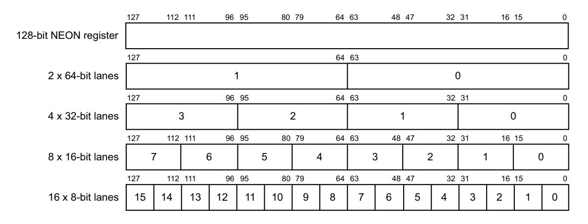

<span id="page-92-5"></span>**Figure 7-1 Divisions of the V register**

<span id="page-92-2"></span>Thirty-two 64-bit D, or doubleword, registers, D0-D31, each of which can be viewed as in [Figure 7-2 on page 7-5](#page-93-0):

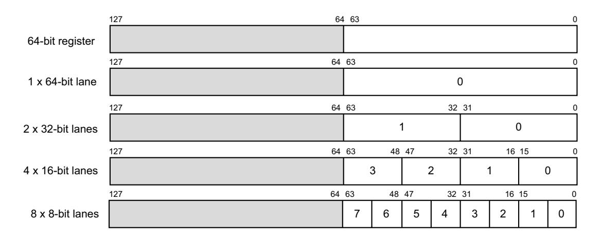

<span id="page-93-1"></span>**Figure 7-2 Divisions of the D register**

<span id="page-93-0"></span>All of these registers are accessible at any time. Software does not have to explicitly switch between them because the instruction used determines the appropriate view.

#### <span id="page-94-2"></span>7.2.1 Floating-point

In AArch64 the floating-point unit views the NEON register file as:

- <span id="page-94-4"></span><span id="page-94-1"></span><span id="page-94-0"></span>32 × 64-bit D registers D0-D31. The D registers are called double-precision registers and contain double-precision floating-point values.
- 32 × 32-bit S registers S0-S31. The S registers are called single-precision registers and contain single-precision floating-point values.
- <span id="page-94-3"></span>• 32 × 16-bit H registers H0-H31. The H registers are called half-precision registers and contain half-precision floating-point values.
- A combination of registers from the above views.

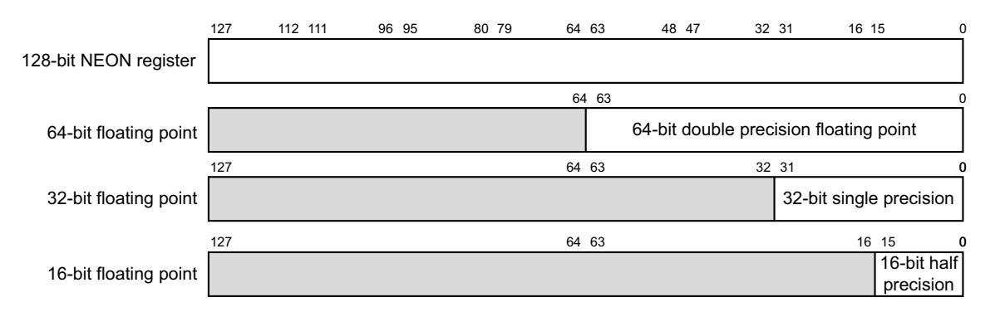

<span id="page-94-6"></span>Figure 7-3 Floating-point register divisions

#### <span id="page-94-5"></span>7.2.2 Scalar data and NEON

Scalar data refers to a single value instead of a vector containing multiple values. Some NEON instructions use a scalar operand. A scalar inside a register is accessed by index into the vector of values.

The general array notation to access individual elements of a vector is:

<Instruction> Vd.Ts[index1], Vn.Ts[index2]

where:

Vd is the destination register.

Vn is the first source register.

Ts is the size specifier for the element.

index is the element index.

As in the following example:

INS V0.S[1], V1.S[0]

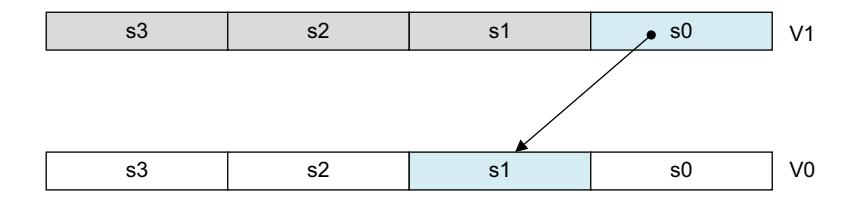

**Figure 7-4 Inserting an element into a vector (INS V0.S[1], V1.S[0])**

In the MOV V0.B[3], W0 instruction, the least significant byte of register W0 is copied into the fourth byte in register V0.

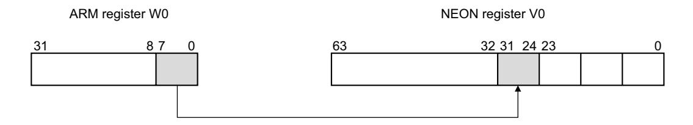

**Figure 7-5 Moving a scalar to a lane (MOV V0.B[3], W0)**

NEON scalars can be 8-bit, 16-bit, 32-bit, or 64-bit values. Other than multiply instructions, instructions that access scalars can access any element in the register file.

Multiply instructions only allow 16-bit or 32-bit scalars, and can only access the first 128 scalars in the register file:

- 16-bit scalars are restricted to registers V*n*.H[*x*], with 0 ≤ *n* ≤ 15.
- 32-bit scalars are restricted to registers Vn.S[*x*].

#### <span id="page-95-0"></span>**7.2.3 Floating-point parameters**

Floating-point values are passed to (and returned from) functions using the floating-point registers. Both integer (general-purpose) and floating-point registers can be used at the same time. This means that the floating-point parameters are passed in the floating-point H, S or D registers and other parameters are passed in integer X or W registers. The AArch64 *Procedure Call Standard* mandates hardware floating-point wherever floating-point arithmetic is required, so there is no software floating-point linkage in AArch64 state.

A detailed list of instructions is given in the *ARMv8-A Architecture Reference Manual*, but the main floating-point data processing operations are listed here to show the kind of things that can be done:

**Table 7-1**

| FABS Sd, Sn     | Calculates the absolute value. |  |
|-----------------|--------------------------------|--|
| FNEG Sd, Sn     | Negates the value.             |  |
| FSQRT Sd, Sn    | Calculates the square root.    |  |
| FADD Sd, Sn, Sm | Adds values.                   |  |
| FSUB Sd, Sn, Sm | Subtracts values.              |  |
| FDIV Sd, Sn, Sm | Divides one value by another.  |  |

#### **Table 7-1 (continued)**

| FMUL Sd, Sn, Sm            | Multiplies two values.                                                                                  |  |
|----------------------------|---------------------------------------------------------------------------------------------------------|--|
| FNMUL Sd, Sn, Sm           | Multiplies and negates.                                                                                 |  |
| FMADD Sd, Sn, Sm, Sa       | Multiplies and adds (fused).                                                                            |  |
| FMSUB Sd, Sn, Sm, Sa       | Multiplies, negates and subtracts (fused).                                                              |  |
| FNMADD Sd, Sn, Sm, Sa      | Multiplies, negates and adds (fused).                                                                   |  |
| FNMSUB Sd, Sn, Sm, Sa      | Multiplies, negates and subtracts (fused).                                                              |  |
| FPINTy Sd, Sn              | Rounds to an integral in floating-point format (where y<br>is one of a number of rounding mode options) |  |
| FCMP Sn, Sm                | Performs a floating-point compare.                                                                      |  |
| FCCMP Sn, Sm, #uimm4, cond | Performs a floating-point conditional compare.                                                          |  |
| FCSEL Sd, Sn, Sm, cond     | Floating-point conditional select if (cond) Sd = Sn else<br>Sd = Sm.                                    |  |
| FCVTSty Rn, Sm             | Converts a floating-point value to an integer value (ty<br>specifies type of rounding).                 |  |
| SCVTF Sm, Ro               | Converts an integer value to a floating-point value.                                                    |  |

#### <span id="page-97-0"></span>**7.3 AArch64 NEON instruction format**

<span id="page-97-1"></span>A number of changes have been made in the syntax of NEON and floating-point instructions to harmonize with the AArch64 core integer and scalar floating-point instruction set syntax. The instruction mnemonics are based closely on ARMv7 NEON.

• The V prefix of ARMv7 NEON instructions has been removed.

Some mnemonics have been renamed where the removal of the V prefix caused a clash with the ARM core instruction set mnemonics.

This means, for example, that there are now instructions with the same name which do the same thing, and can be ARM core instructions, NEON, or floating-point, depending on the syntax of the instruction, for example:

```
ADD W0, W1, W2{, shift #amount}}
and
  ADD X0, X1, X2{, shift #amount}}
are A64 base instructions.
 ADD D0, D1, D2
is a scalar floating-point instruction, and 
 ADD V0.4H, V1.4H, V2.4H
is a NEON vector instruction.
```

<span id="page-97-2"></span>• An S, U, F or P *prefix* has been added to indicate Signed, Unsigned, Floating-point, or Polynomial (only one of these) data types. This mnemonic indicates the data type of the operation. For example:

```
PMULL V0.8B, V1.8B, V2.8B
```

• The vector organization (element size and number of lanes) is described by the register qualifiers. For example:

```
ADD Vd.T, Vn.T, Vm.T
```

where Vd, Vn and Vm are the register names and T is the subdivision of the register to be used. For this example, T is the arrangement specifier and is one of 8B, 16B, 4H, 8H, 2S, 4S or 2D. Any of these can be used, depending on whether 64, 32, 16 or 8-bit data is used, and whether 64 bits or 128 bits of the register are used.

```
To add 2 × 64 bit lanes, use
 ADD V0.2D, V1.2D, V2.2D
```

- <span id="page-97-4"></span>• As in ARMv7, some NEON data processing instructions are available in Normal, Long, Wide, Narrow and Saturating variants. Long, Wide and Narrow variants are shown by a suffix:
  - *Normal* instructions can operate on any vector types, and produce result vectors the same size, and usually the same type, as the operand vectors.
  - *Long* or *Lengthening* instructions operate on doubleword vector operands and produce a quadword vector result. The result elements are twice the width of the operands. Long instructions are specified using an L appended to the instruction. For example:

```
SADDL V0.4S, V1.4H, V2.4H
```

[Figure 7-6 on page 7-10](#page-98-0) shows this, with input operands being promoted before the operation.

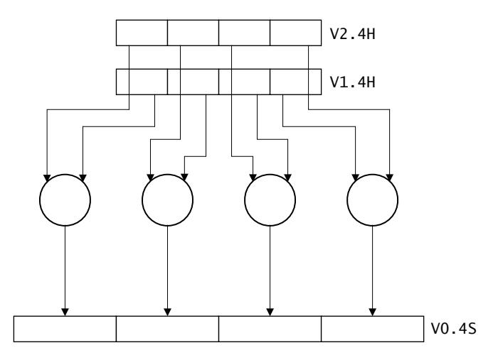

**Figure 7-6 NEON long instructions**

<span id="page-98-3"></span><span id="page-98-0"></span>— *Wide* or *Widening* instructions operate on a doubleword vector operand and a quadword vector operand, producing a quadword vector result. The result elements and the first operand are twice the width of the second operand elements. Wide instructions have a W appended to the instruction. For example:

SADDW V0.4S, V1.4H, V2.4S

[Figure 7-7](#page-98-1) shows this, with the input doubleword operands being promoted before the operation.

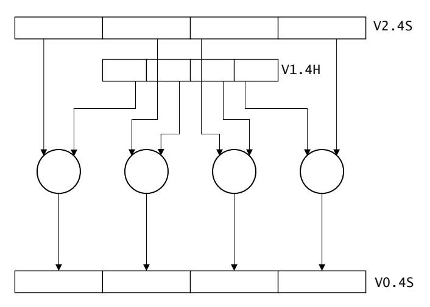

**Figure 7-7 NEON wide instructions**

<span id="page-98-2"></span><span id="page-98-1"></span>— *Narrow* or *Narrowing* instructions operate on quadword vector operands, and produce a doubleword vector result. The result elements are usually half the width of the operand elements. Narrow instructions are specified using an N appended to the instruction. For example:

SUBHN V0.4H, V1.4S, V2.4S

[Figure 7-8 on page 7-11](#page-99-0) shows this, with input operands being demoted before the operation.

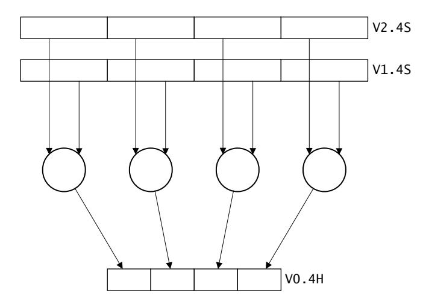

**Figure 7-8 NEON narrow instructions**

<span id="page-99-2"></span><span id="page-99-0"></span>• Signed and unsigned *saturating* variants (identified by an SQ or UQ prefix) are available for a number of instructions, as with SQADD and UQADD. If a result would exceed the maximum or minimum values of the datatype, saturating instructions return that maximum or minimum value. The saturation limits depend on the datatype of the instruction.

**Table 7-2 Saturation ranges**

| Data type                 | Saturation range of x |
|---------------------------|-----------------------|
| Signed byte (S8)          | -27 <= x < 27         |
| Signed halfword (S16)     | -215 <= x < 215       |
| Signed word (S32)         | -231 <= x < 231       |
| Signed doubleword (S64)   | -263 <= x < 263       |
| Unsigned byte (U8)        | 0 <= x < 28           |
| Unsigned halfword (U16)   | 0 <= x < 216          |
| Unsigned word (U32)       | 0 <= x < 232          |
| Unsigned doubleword (U64) | 0 <= x < 264          |

<span id="page-99-1"></span>• The ARMv7 P prefix for *pairwise* operations is now a suffix in ARMv8, as for example, in ADDP. Pairwise instructions operate on adjacent pairs of doubleword or quadword operands. For example:

ADDP V0.4S, V1.4S, V2.4S

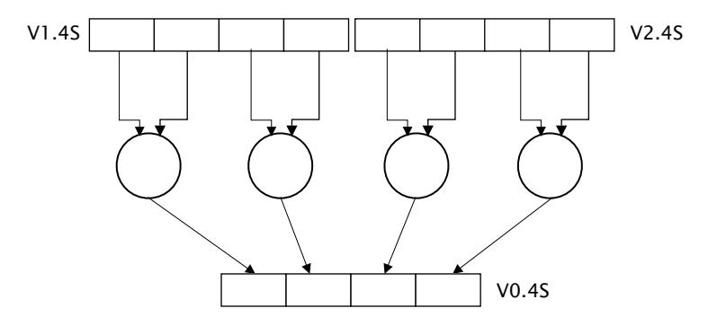

**Figure 7-9 Pairwise operation**

<span id="page-100-0"></span>• A V suffix has been added for an across-all-lanes (whole register) operation, for example, as in ADDV. For example:

ADDV S0, V1.4S

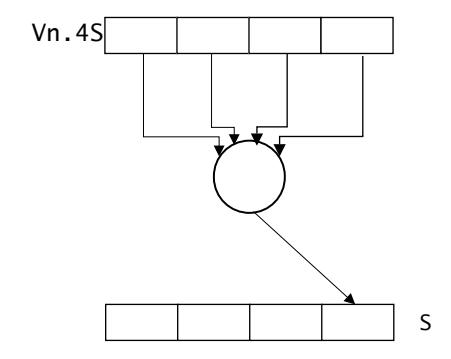

**Figure 7-10 Across all lanes operation**

- <span id="page-100-1"></span>• A 2 suffix, known as the second and upper half specifier, has been added for the new widening, narrowing or lengthening *second part* instructions. If present, it causes the operation to be performed on the upper 64 bits of the registers holding the narrower elements:
  - Widening instructions with a 2 suffix get their input data from the high numbered lanes of the vector that contains the narrower values, and write the expanded results to the 128-bit destination. For example:

SADDW2 V0.2D, V1.2D, V2.4S

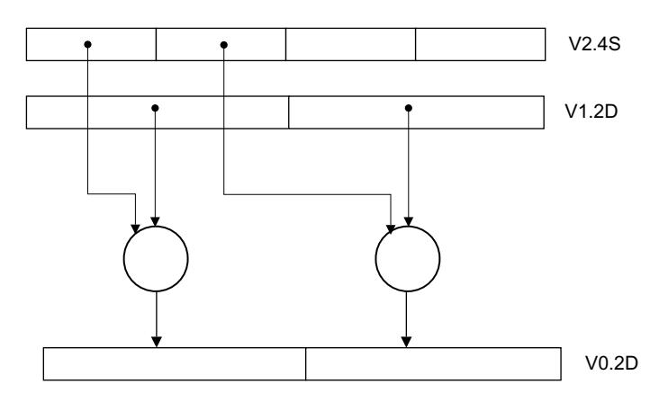

**Figure 7-11 SADDW2**

— Narrowing instructions with a 2 suffix get their input data from the 128-bit source operands and insert their narrowed results into the high numbered lanes of the 128-bit destination, leaving the lower lanes unchanged. For example:

XTN2 V0.4S, V1.2D

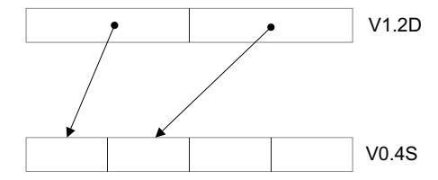

**Figure 7-12 XTN2**

— Lengthening instructions with a 2 suffix get their input data from the high numbered lanes of the 128-bit source vectors and write the lengthened results to the 128-bit destination. For example:

SADDL2 V0.2D, V1.4S, V2.4S

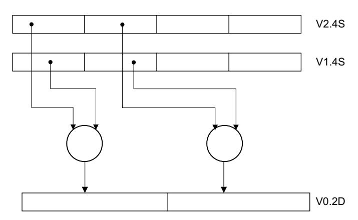

**Figure 7-13 SADDL2**

<span id="page-101-0"></span>• Comparison instructions now use the condition code names to indicate what the condition is and whether (if it applies) the condition is signed or unsigned, for example, CMGT and CMHI, CMGE and CMHS.

#### <span id="page-102-0"></span>**7.4 NEON coding alternatives**

NEON code may be written in a number of ways. These are briefly listed here (but see the *ARM NEON Programmers Guide* for details). These include the use of intrinsics, automatic vectorization of C code, the use of libraries and of course directly writing in assembly language.

Intrinsics are C or C++ pseudo-function calls that the compiler replaces with the appropriate NEON instructions. This allows you to use the data types and operations available in the NEON implementation, while allowing the compiler to handle instruction scheduling and register allocation. These intrinsics are defined in the *ARM C Language Extensions* document.

Auto-vectorization is controlled with the -fvectorize option in ARM Compiler 6, but is enabled automatically at higher optimization levels (-O2 and above). Auto-vectorization is disabled at -O0 even if you specify -fvectorize. Therefore, you would use the following to enable auto-vectorization at -O1:

```
armclang --target=armv8a-arm-none-eabi -fvectorize -O1 -c file.c
```

There are various libraries available which can use NEON code. The exact status of such libraries changes over time and so current support is not covered in this guide.

Although it is technically possible to optimize NEON assembly by hand, this can be very difficult because the pipeline and memory access timings have complex inter-dependencies. Instead of hand assembly, ARM strongly recommends the use of intrinsics:

- It is easier to write code using instrinsics than using assembly mnemonics.
- Instrinsics provide good portability for cross-platform development.
- There is no need to worry about pipeline and memory access timings.
- For most cases, the result is good performance.

If you are not an experienced assembly language programmer, intrinsics can often achieve better performance than assembly. Intrinsics provide almost as much control as writing assembly language, but leave the allocation of registers to the compiler, so that you can focus on the algorithms. This leads to more maintainable source code than using assembly language.

## <span id="page-103-1"></span><span id="page-103-0"></span>Chapter 8 **Porting to A64**

This chapter is not intended to act as an exhaustive guide to writing portable code for all systems, however, this should cover the main areas that application engineers should know for code porting on ARM specific machines. There are some significant differences that you should be aware of when moving code to the A64 instruction set in AArch64 from A32 and T32 instruction sets:

- <span id="page-103-3"></span>• Most instructions in the A32 instruction set can be executed conditionally. That is, it is possible to append a condition code to the instruction and have the instruction execute (or not) based on the outcome of a previous flag setting instruction. Although this enables programming tricks to reduce code size and cycle count, this significantly complicates the design of high performance processors with out-of-order execution.
  - The necessary bits reserved in the opcode field to denote the predication could usefully be put to other purposes (for example, providing the space for selecting from a larger pool of general-purpose registers). In A64 code therefore, only a small set of instructions can be executed conditionally, while some comparison and selection operations depend upon a condition. See *[Conditional instructions](#page-73-1)* on page 6-8.
- <span id="page-103-5"></span>• Many A64 instructions can apply an arbitrary constant shift to the source register or registers limited only by the size of the operand. In addition, A64 provides extended-register forms which can be very useful. Explicit instructions are required to handle more complicated cases such as variable shifts. T32 is also more restrictive than A32, so in some ways A64 is a continuation of the same principles. The flexible Operand2 of A32 does not exist as such in A64, but individual instruction classes have their own options.
- <span id="page-103-4"></span><span id="page-103-2"></span>• There are some changes to the available addressing modes for load and store instructions. The offset, pre-index and post-index forms from A32 and T32 are still available in A64. There is a new, PC-relative addressing mode, as the PC cannot be accessed in the same

<span id="page-104-1"></span><span id="page-104-0"></span>way as a general-purpose register. A64 loads can shift the register inline (though not with as much flexibility as in A32), and they can use some of the extend modes too (so you can have a 32-bit array index, for example).

- A64 removes all multiple memory access instructions (Load or Store Multiple) from previous ARM architectures, which were able to read or write an arbitrary list of registers from memory. Load Pair (LDP) and Store Pair (STP) instructions, which can operate on any two registers, should be used instead. PUSH and POP have also been removed.
- ARMv8 adds load and store instructions that include a unidirectional memory barrier: load-acquire and store-release. These are available in ARMv8 A32 and T32 as well as A64. A load-acquire instruction requires that any subsequent memory accesses (in program order) are only visible after the load-acquire. A store-release ensures that all earlier memory accesses are visible before the store-release becomes visible. See *[Memory barrier and fence instructions](#page-83-0)* on page 6-18.
- AArch64 does not support the concept of coprocessors, including CP15. New system instructions allow access the registers that are accessed via CP15 coprocessor instructions in AArch32.
- The CPSR does not exist in AArch64 as a single register. Instead, PSTATE fields (such as NZCV) can be accessed using special-purpose registers.

For many applications, porting code from older versions of the ARM Architecture, or other processor architectures, to A64 means simply recompiling the source code. However, there are a number of areas where C code is not fully portable.

The similarity between A64 and A32/T32 is illustrated in the following example. The three sequences below show a simple C function and the output code in first T32 and then A64. The correspondence between the two is very easy to see.

```
//C code
         int foo(int val)
         {
          int newval = bar(val);
          return val + newval;
         }
//T32 //A64
foo: foo:
sub sp, sp, #8 sub sp, sp #16
strd r4, r14, [sp] stp x19, x30, [sp]
mov r4, r0 mov w19, w0
bl bar bl bar
add r0, r0, r4 add w0, w0, w19
ldrd r4, r14, [sp] ldp x19, x30, [sp]
add sp, sp, #8 add sp, sp, #16
bx lr ret
```

The general-purpose functionality provided by A64 has evolved from that found in A32 and T32, so porting code between the two is fairly straightforward. Translating A32 assembly code to A64 is also generally straightforward. Most instructions map easily between these instruction sets and many sequences become simpler in A64.

#### <span id="page-105-0"></span>**8.1 Alignment**

Data and code must be aligned to appropriate boundaries. The alignment of accesses can affect performance on ARM cores and can represent a portability problem when moving code from an earlier architecture to ARMv8-A. It is worth being aware of alignment issues for performance reasons, or when porting code that makes assumptions about pointers or 32-bit and 64-bit integer variables.

Previous versions of the ARM compiler syntax assembly provide the ALIGN n directive, where n specifies the alignment boundary in bytes. For example, the directive ALIGN 128 aligns addresses to 128-byte boundaries.

The GNU assember syntax (ARM Complier 6 syntax) provides the .balign n directive, which uses the same format as ALIGN.

| Note                                                                                           |
|------------------------------------------------------------------------------------------------|
| GNU syntax assembly also provides the .align n directive. However, the format of n varies from |
| system to system. The .balign directive provides the same alignment functionality as .align    |

with a consistent behavior across all architectures

You should convert all instances of ALIGN n to .balign n whn moving from the older compilers to ARM Compiler 6.

#### <span id="page-106-0"></span>**8.2 Data types**

In many programming environments for C and C-derived languages on 64-bit machines, int variables are still 32 bits wide, but long integers and pointers are 64 bits wide. These are described as having an LP64 data model. This chapter assumes LP64, though other data models are available, see [Table 5-1 on page 5-7](#page-62-0).

The ARM ABI defines a number of basic data types for LP64. Some of these can vary between architectures, and are included in the following:

<span id="page-106-1"></span>**Table 8-1 Basic data types**

| Type                        | A32                                          | A64             | Description                          |  |
|-----------------------------|----------------------------------------------|-----------------|--------------------------------------|--|
| int/long                    | 32-bit                                       | 32-bit          | integer                              |  |
| short                       | 16-bit                                       | 16-bit          | integer                              |  |
| char                        | 8-bit                                        | 8-bit           | byte                                 |  |
| long long                   | 64-bit                                       | 64-bit          | integer                              |  |
| float                       | 32-bit                                       | 32-bit          | single-precision IEEE floating-point |  |
| double                      | 64-bit                                       | 64-bit          | double-precision IEEE floating-point |  |
| bool                        | 8-bit                                        | 8-bit           | Boolean                              |  |
| wchar_ta                    | 16-bit unsigned                              | 16-bit unsigned | short (compiler dependent)           |  |
|                             | 32-bit unsigned                              | 32-bit unsigned | int (compiler dependent)             |  |
| void* pointer               | 32-bit                                       | 64-bit          | addresses to data or code            |  |
| enumerated types            | 32-bit                                       | 32-bitb         | signed or unsigned integer           |  |
| bit fields                  | not larger than their natural container size |                 |                                      |  |
| ABI defined extension types |                                              |                 |                                      |  |
| int128/uint128              | 128-bit                                      | 128-bit         | signed/unsigned quadword             |  |
| f16                         | 16-bit                                       | 16-bit          | half precision                       |  |

a. Environment-dependent. In GNU-based systems (such as Linux) this type is always 32-bit.

When comparing AArch64 with previous versions of the ARM architecture, 64-bit data types can typically be handled more efficiently, because of 64-bit general-purpose registers and operations. An int is still 32-bit, which can be handled efficiently through the available 32-bit view of the general-purpose registers (W registers). Pointers, however, are 64-bit addresses to data or code. The ARM ABI defines char to be unsigned by default. This is also true for previous versions of the architecture.

Porting is simplified if your code does not manipulate pointers in non-portable ways, such as cases of casting to or from non-pointer types or performing pointer arithmetic. This means you have never stored a pointer in an int variable (with the possible exception of intptr\_t and uintptr\_t) and have never cast a pointer to an int. For more information on this, see *[Issues when](#page-110-1)  [porting code from a 32-bit to 64-bit environment](#page-110-1)* on page 8-8.

b. If the set of values in an enumerated type cannot be represented using either int or unsigned int as a container type, and the language permits extended enumeration sets, then a long long or unsigned long long container may be used.

Among other effects, this changes the size, and possibly the alignment of structures and parameter lists. Use the int32\_t and int64\_t types from stdint.h in cases where storage size matters. Note that size\_t and ssize\_t are both 64 bit in AAPCS64-LP64.

For performance reasons, the compiler tries to align data on natural size boundaries. Most compilers try to optimize the layout of global data within a compilation module.

AArch64 provides support for 16, 32, 64 and 128-bit data unaligned accesses, where the address used is not a multiple of the quantity to be loaded or stored. However, exclusive load or store and load-acquire or store-release instructions can only access aligned addresses. This means that variables used to construct semaphores and other locking mechanisms must typically be aligned.

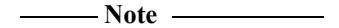

 Under normal circumstances all variables should be aligned. Unaligned access are still less efficient on average than aligned access in most cases.

Unaligned accesses are never guaranteed to be atomic with respect to other CPUs or bus masters in the system.

The only major exception to this rule is access to packed data structures -- this can save significant effort when marshaling data to/from the outside world, via files or network connection etc.

<span id="page-107-1"></span>Unaligned accesses might have a performance impact when compared with aligned accesses. Data aligned on a natural size boundary is accessed more efficiently and unaligned accesses might cost additional bus or cache cycles. The packed attribute ( \_\_attribute\_\_((packed, aligned(1))) should be used to warn the compiler of potential unaligned accesses, for example when manually casting pointers pointing to different data types.

#### <span id="page-107-0"></span>**8.2.1 Assembly code**

Many A32 assembly instructions can be easily replaced with similar A64 instructions. Unfortunately there is no automated mechanism. However, much can be fairly simply translated. The following table shows the close match in many areas between the A32/T32 and A64 instruction sets.

**Table 8-2 Instructions that are similar for A32 and A64**

| A32                  | A64                  |  |
|----------------------|----------------------|--|
| ADD Rd,Rn,#7         | ADD Wd,Wn,#7         |  |
| ADDS Rd,Rn,Rm,LSL #2 | ADDS Wd,Wn,Wm,LSL #2 |  |
| B label              | B label              |  |
| BFI Rd,Rn,#lsb,#wid  | BFI Wd,Wn,#lsb,#wid  |  |
| BL label             | BL label             |  |
| CBZ Rn,label         | CBZ Wn,label         |  |
| CLZ Rd,Rm            | CLZ Wd,Wm            |  |
| LDR Rt,[Rn,#imm]     | LDR Wt,[Xn,#imm]     |  |
| LDR Rt,[Rn,#imm]!    | LDR Wt,[Xn,#imm]!    |  |

**Table 8-2 Instructions that are similar for A32 and A64 (continued)**

| A32          | A64          |
|--------------|--------------|
| MOV Rd,#imm  | MOV Wd,#imm  |
| MUL Rd,Rn,Rm | MUL Wd,Wn,Wm |
| RBIT Rd,Rm   | RBIT Wd,Wm   |

However, there are differences in many areas that require rewrites. The following tables show some of these.

**Table 8-3 Instructions that differ between A32 and A64**

| A32                                                                           | A64                     |  |
|-------------------------------------------------------------------------------|-------------------------|--|
| LDM/STM and PUSH/POP instructions are replaced with LDP/STP (Load/Store Pair) |                         |  |
| PUSH {r0-r1}                                                                  | STP X0, X1, [SP, #-16]! |  |
| POP {r0-r1}                                                                   | LDP X0, X1, [SP], #16   |  |
| LDMIA r0, {r1, r2}                                                            | LDP X1, X2, [X0], #8    |  |
| STMIA r0, {r1, r2}                                                            | STP X1, X2, [X0], #8    |  |
| MLA                                                                           | MADD                    |  |
| BX <reg></reg>                                                                | BR <reg></reg>          |  |
| MOV pc, lr                                                                    | RET                     |  |
| BX lr                                                                         |                         |  |
| MOVW                                                                          | MOVZ                    |  |
| MOVT                                                                          | MOVK                    |  |

**Note**

The 64-bit APCS requires 128-bit (16 byte) stack alignment.

<span id="page-108-0"></span>[Table 8-4](#page-108-0) shows how the CPSR is replaced by named fields within PSTATE.

**Table 8-4 Use of named fields**

|                                                              | A32                                                               | A64                                                                                                                                                                                      |  |
|--------------------------------------------------------------|-------------------------------------------------------------------|------------------------------------------------------------------------------------------------------------------------------------------------------------------------------------------|--|
| CPSR is replaced with a set of separate registers and fields |                                                                   |                                                                                                                                                                                          |  |
| Disable IRQ                                                  | MRS R0, CPSR<br>ORR R0, R0, #IRQ_Bit<br>MSR CPSR_c, R0<br>CPSID i | MSR DAIFSET, #IRQ_bit                                                                                                                                                                    |  |
| ALU Flags                                                    | MRS R0, CPSR<br>MSR CPSR_f, R0                                    | MRS X0, NZCV<br>MSR NZCV, X0                                                                                                                                                             |  |
| Set Endianness                                               | SETEND BE                                                         | SCTLR_ELn.EE controls ELn data endianness<br>SCTLR_EL1.E0E controls EL0 data endianness<br>MRS X0, SCTLR_EL1<br>ORR X0, X0, #EE_bit<br>MSR SCTLR_EL1, X0<br>See Endianness on page 4-12. |  |

The T32 conditional execution scheme compiles to the sequence as shown in the A32 column of [Table 8-4 on page 8-6](#page-108-0). In A64, it makes use of the new conditional select instructions as shown in the A64 column.

The difference between conditional execution in the two instruction sets (T32 and A64) is illustrated by the following example:

```
//C code
               int gcd (int a, int b)
               {
                while (a ! = b)
                {
                  if (a >b)
 {
                   a = a - b;
                  }
                  else
                  {
                   b = b - a;
                  }
                return a;
                }
     //A32 //A64
     gcd: gcd:
      CMP R0, R1 SUBS W2, W0, W1
      ITE CSEL W0, W2, W0, gt
      SUBGT R0, R0, R1 CSNEG W1, W1, W2, gt
      SUBLE R1, R1, R0 BNE gcd
      BNE gcd RET
      BX lr
```

#### <span id="page-110-1"></span><span id="page-110-0"></span>**8.3 Issues when porting code from a 32-bit to 64-bit environment**

<span id="page-110-4"></span>There are some common problems that can arise when migrating C code to run in a 64-bit environment. These are not specific to ARM.

- Take care with pointers and integers, as they might not be of the same size. ARM recommends using uintptr\_t or intptr\_t from stdint.h for handling pointer types as integral values. Offsets used in pointer arithmetic should be declared as ptrdiff\_t, as using an int could produce an incorrect result.
- A 64-bit system has a much larger potential memory reach and it is possible that a 32-bit int might not be large enough to index all entries in an array.
- <span id="page-110-2"></span>• Implicit type conversions in C expressions can have some unexpected effects. Take care to ensure that any constant values used have the same type as the mask itself.
- <span id="page-110-7"></span>• Take care when performing operations with data types of differing length or sign. For example, when unsigned and signed 32-bit integers are mixed in an expression and the result assigned to a signed long, it might be necessary to explicitly cast one of the operands to its 64-bit type. This causes all of the other operands to be promoted to 64 bits, too. Note that longs are typically 64-bit types on A64 (LP64).

#### <span id="page-110-5"></span>**8.3.1 Recompile or rewrite code**

<span id="page-110-6"></span>Any port inevitably requires an element of both re-compiling as well as rewriting code. The objective in most cases is to maximize the former and minimize the latter.

The good news is that much code simply recompiles. However, exercise due caution as the size of many fundamental types will have changed. Although well-written C code should not have many dependencies on the size of individual types, it is likely that you will come across some.

So, best practice must be to enable all warnings and errors when recompiling and make sure you take notice of any warnings issued by the compiler, even if the code appears to compile error-free.

Pay very close attention to any explicit type casts in your code as these are often the source of errors when the sizes of the underlying types change.

#### <span id="page-110-3"></span>**8.3.2 ARM Compiler 6 options for ARMv8-A**

It is important to supply the correct options to the compiler to allow code generation or an ARMv8-A target, . The following are options are available, use:

--target

to generate code for the specified target.

The --target option is mandatory and has no default. You must always specify a target architecture.

#### **Syntax**

--target=triple

where:

triple has the form architecture-vendor-OS-abi.

Supported targets are as follows:

aarch64-arm-none-eabi

The AArch64 state of the ARMv8-A architecture.

armv8a-arm-none-eabi

The AArch32 state of the ARMv8-A architecture.

armv7a-arm-none-eabi

The ARMv7-A architecture.

For example:

--target=armv8a-arm-none-eabi

**Note**

 The --target option is an armclang option. For all of the other tools, such as armasm and armlink, use the --cpu and --fpu options to specify target processors and architectures.

Use the --mcpu option to enable code generation for a specific ARM processor. See

```
-mcpu=<processor>+(no)crc - enable or disable crc instructions
```

where <processor> is either cortex-a53 or cortex-a57.

Compiling code for AArch32 produces very similar code to compiling for ARMv7-A. Although AArch32 has some new instructions (such as Load-Acquire and Store-Release), and the SWP instruction has been removed, these are not instructions generally generated by a compiler.

Compiling with the +nosimd option avoids any use of NEON/floating-point instructions or registers. This might be useful for systems in which the NEON unit is not powered up or for particular code segments, for example reset code and exception handlers, in which it is important to ensure that NEON/floating-point is not used. The default is for no cryptographic extension, but with NEON.

<sup>-</sup>mcpu=<processor>+(no)crypto - enable or disable crytographic extension

<sup>-</sup>mcpu=<processor>+(no)fp - enable or disable the floating point extension

<sup>-</sup>mcpu=<processor>+(no)simd - enable or disable the NEON extension

### <span id="page-112-0"></span>**8.4 Recommendations for new C code**

• Use sizeof() instead of a constant for example:

```
(void**) calloc(4,100)
becomes
(void**) calloc(sizeof(void *), 100)
or better still
void *a;
(void**) calloc(sizeof(a), 100);
```

- Where an explicit type is needed, use the types from stdint.h.
- If you need to cast a pointer to an integer, use a type that is guaranteed to be able to hold it, such as uintptr\_t.
  - atype \*bob; bob++ ; is however still preferred if you are not concerned with the actual pointer's representation. Pointer arithmetic behaves appropriately for the underlying type.
- Where data size and layout are important, take care when ordering structure members. For example, the code:

```
struct { void *a; int b; int c} bob
is preferred over:
struct { int b; void *a; int c;} 
as in AAPCS64 the element a has 32 bits of padding inserted before it to keep it 64-bit
```

• Use size\_t appropriately.

aligned.

- Use limits.h where appropriate; be careful when making assumptions about data types.
- Use the appropriate functions/macros/built-ins for the type you are using. For example, consider using long atol(char \*) instead of int atoi(char \*).
- When using atomic operations, use the correct 64-bit functions to carry them out against 64-bit types.
- Don't assume operations to different bitfields in the same structure are handled independently - more bits can be read and written on a 64-bit platform than on a 32-bit platform.
- Postfix literals with L for long when they are 32-bit on 32-bit compiles and 64 bit on 64-bit compiles. This makes sure that they match the long type:

```
long value = 1L << SOMANY;
```

For literals that are 64-bit on 32 and 64-bit compilers, postfix with LL or ULL.

• Alternatively, you could use the macros provided by stdint.h in C99, (for example, INT64\_C and UINT64\_C) which allow the definition of a literal without explicitly postfixing using L and LL.

```
For example:
size_t value = UINT64_C(1) << SOMANY;
```

#### <span id="page-113-1"></span>**8.4.1 Explicit and implicit type conversions**

The internal promotion and type conversion in C/C++ can cause some unexpected problems when data types of different length and/or sign are mixed in expressions. In particular, it is sometimes important to understand at what point conversions are made in the evaluation of an expression.

For example:

```
int + long => long;
unsigned int + signed int => unsigned int
int64_t + uint32_t => int64_t
```

If the loss of sign conversion is carried out before the promotion to long then the result might be incorrect when assigned to a signed long.

In cases where unsigned and signed 32-bit integers are mixed in an expression and the result assigned to a signed 64-bit integer, cast one of the operands to its 64-bit type. This causes the other operands to be promoted to 64 bits and no further conversion is required when the expression is assigned. Another solution is to cast the entire expression so that sign extension occurs on assignment. However, there is no one-size-fits-all solution for these problems. In practice, the best way to fix them is to understand what the code is trying to do.

Consider this example, in which you would expect the result -1 for a:

```
long a;
int b; 
unsigned int c; 
b = -2;
c = 1;
a = b + c;
```

This gives a result of a = -1 (represented as 0xFFFFFFFF) for 32-bit longs, and a = 0x00000000FFFFFFFF (or 4 294 967 295 in decimal) for 64-bit longs. Clearly an unexpected and very wrong result! This is because b is converted to unsigned int before the addition (to match c), so the result of the addition is an unsigned int.

One possible solution is to cast to the longer type before the addition.

```
long a; 
int b; 
unsigned int c;
b = -2;
c = 1;
a = (long)b + c;
```

This gives a result of -1 (or 0xFFFFFFFFFFFFFFFF) in two's complement representation, and is the expected result. The calculation is carried out in 64-bit arithmetic and the conversion to signed now gives the correct result.

#### <span id="page-113-0"></span>**8.4.2 Bit manipulation operations**

Take care to ensure that bitmasks are of the correct width. There is the possibility that implicit type conversions in C expressions can have some unexpected effects. Consider the following function for setting a specified bit in a 64-bit variable:

```
long SetBitN(long value, unsigned bitNum)
{
   long mask; 
   mask = 1 << bitNum;
   return value | mask;
}
```

This function works fine in a 32-bit environment and allows bits [31:0] to be set. To port it to a 64-bit system, you might think it sufficient to change the type of mask to allow bits [63:0] to be set, as follows:

```
long long SetBitN(long long value, unsigned bitNum)
{
   long long mask; 
   mask = 1 << bitNum;
   return value | mask;
}
```

Again, this does not work correctly as the numeric literal 1 has int type. The exact behavior depends on the configuration and assumptions of the individual compiler.

To make the code function correctly, you need to give the constant the same type as the mask:

```
long long SetBitN(long long value, unsigned bitNum)
{
   long long mask; 
   mask = 1LL << bitNum;
   return value | mask;
}
```

If you need an integer that is a particular size, use types such as uint32\_t and the UINT32\_C family of macros, which are defined in stdint.h.

#### <span id="page-114-0"></span>**8.4.3 Indexes**

When using large arrays or objects in a 64-bit environment, be aware that an int might no longer be large enough to index all entries. In particular, be careful when iterating over an array using an int index.

```
static char array[BIG_NUMBER];
for (unsigned int index = 0; index != BIG_NUMBER; index++) ...
```

Since size\_t is a 64-bit type and unsigned int is a 32-bit type, it is possible to define the size of the object so that the loop never terminates.

### <span id="page-115-2"></span><span id="page-115-1"></span><span id="page-115-0"></span>Chapter 9

### **The ABI for ARM 64-bit Architecture**

The Application Binary Interface (ABI) for the ARM Architecture specifies fundamental rules to which all executable native code modules must adhere so that they can work correctly together. These fundamental rules are supplemented by additional rules for specific programming languages (for example, C++). Individual operating systems or execution environments (for example, Linux) may specify additional rules to meet their own specific requirements, beyond those rules specified by the ARM ABI.

There are a number of components to the ABI for the AArch64 architecture:

#### <span id="page-115-4"></span>**Executable and Linkable Format (ELF)**

*ELF for the ARM 64-bit Architecture (AArch64)* specifies the object and executable format.

#### <span id="page-115-5"></span>**Procedure Call Standard (PCS)**

*Procedure Call Standard for the ARM 64-bit Architecture (AArch64) ABI release* specifies how subroutines can be separately written, compiled and assembled to work together. It specifies the contract between a calling routine and a callee, or between a routine and its execution environment, for example, the obligations when calling a routine or stack layout.

**DWARF** This is a widely used standardized debugging data format. AArch64 DWARF is based on DWARF 3.0, but with some additional rules. See *DWARF for the ARM 64-bit Architecture (AArch64)* for details.

#### **C and C++ libraries**

<span id="page-115-3"></span>*ARM Compiler ARM C and C++ Libraries and Floating-Point Support User Guide* describes the ARM C and C++ libraries.

**C++ ABI** *C++ Application Binary Interface Standard for the ARM 64-bit Architecture* describes the generic C++ ABI.

#### <span id="page-117-0"></span>**9.1 Register use in the AArch64 Procedure Call Standard**

<span id="page-117-9"></span>It can be useful to have knowledge of the standards for register use. Understanding how parameters are passed can help you to:

- Write more efficient C code.
- Understand disassembled code.
- Write assembly code.
- Call functions written in a different language.

#### **9.1.1 Parameters in general-purpose registers**

For the purposes of function calls, the general-purpose registers are divided into four groups:

#### <span id="page-117-1"></span>**Argument registers (X0-X7)**

These are used to pass parameters to a function and to return a result. They can be used as scratch registers or as caller-saved register variables that can hold intermediate values within a function, between calls to other functions. The fact that 8 registers are available for passing parameters reduces the need to spill parameters to the stack when compared with AArch32.

#### <span id="page-117-3"></span>**Caller-saved temporary registers (X9-X15)**

If the caller requires the values in any of these registers to be preserved across a call to another function, the caller must save the affected registers in its own stack frame. They can be modified by the called subroutine without the need to save and restore them before returning to the caller.

#### <span id="page-117-2"></span>**Callee-saved registers (X19-X29)**

These registers are saved in the callee frame. They can be modified by the called subroutine as long as they are saved and restored before returning.

#### <span id="page-117-10"></span>**Registers with a special purpose (X8, X16-X18, X29, X30)**

- <span id="page-117-5"></span>• X8 is the indirect result register. This is used to pass the address location of an indirect result, for example, where a function returns a large structure.
- <span id="page-117-6"></span>• X16 and X17 are IP0 and IP1, intra-procedure-call temporary registers. These can be used by call veneers and similar code, or as temporary registers for intermediate values between subroutine calls. They are corruptible by a function. Veneers are small pieces of code which are automatically inserted by the linker, for example when the branch target is out of range of the branch instruction.
- <span id="page-117-8"></span>• X18 is the platform register and is reserved for the use of platform ABIs. This is an additional temporary register on platforms that don't assign a special meaning to it.
- <span id="page-117-7"></span><span id="page-117-4"></span>• X29 is the frame pointer register (FP).
- X30 is the link register (LR).

[Figure 9-1 on page 9-4](#page-118-0) shows the 64-bit X registers. For more information on registers, see [Chapter 4.](#page-36-1) For information on floating-point parameters, see *Floating-point parameters* on page 7-7.

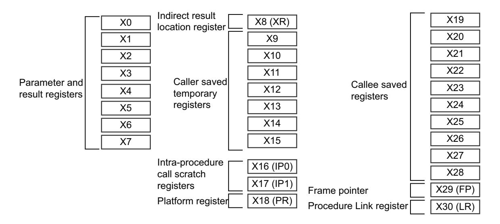

**Figure 9-1 General-purpose register use in the ABI**

#### <span id="page-118-1"></span><span id="page-118-0"></span>**9.1.2 Indirect result location**

To reiterate, the X8 (XR) register is used to pass the indirect result location. Here is some code:

```
//test.c//
  struct struct_A
  {
      int i0;
      int i1;
      double d0;
      double d1;
  } AA;
  struct struct_A foo(int i0, int i1, double d0, double d1)
  {
      struct struct_A A1;
      A1.i0 = i0;
      A1.i1 = i1;
      A1.d0 = d0;
      A1.d1 = d1;
      return A1;
  }
  void bar()
  {
      AA = foo(0, 1, 1.0, 2.0);
  }
and that can be compiled using:
  armclang -target aarch64-arm-none-eabi -c test.c
```

fromelf-c test.o

**Note**

 This code is compiled without optimization to demonstrate the mechanisms and principles involved. It is possible that with optimization, the compiler might remove all of this.

```
foo//
    SUB SP, SP, #0x30
    STR W0, [SP, #0x2C]
    STR W1, [SP, #0x28]
    STR D0, [SP, #0x20]
    STR D1, [SP, #0x18]
    LDR W0, [SP, #0x2C]
    STR W0, [SP, #0]
    LDR W0, [SP, #0x28]
    STR W0, [SP, #4]
    LDR W0, [SP, #0x20]
    STR W0, [SP, #8]
    LDR W0, [SP, #0x18]
    STR W0, [SP, #10]
    LDR X9, [SP, #0x0]
    STR X9, [X8, #0]
    LDR X9, [SP, #8]
    STR X9, [X8, #8]
    LDR X9, [SP, #0x10]
    STR X9, [X8, #0x10]
    ADD SP, SP, #0x30
    RET
bar//
    STP X29, X30, [SP, #0x10]!
    MOV X29, SP
    SUB SP, SP, #0x20
    ADD X8, SP, #8
    MOV W0, WZR
    ORR W1, WZR, #1
    FMOV D0, #1.00000000
    FMOV D1, #2.00000000
    BL foo:
    ADRP X8, {PC}, 0x78
    ADD X8, X8, #0
    LDR X9, [SP, #8]
    STR X9, [X8, #0]
    LDR X9, [SP, #0x10]
    STR X9, [X8, #8]
    LDR X9, [SP, #0x18]
    STR X9, [X8, #0x10]
    MOV SP, X29
    LDP X20, X30, [SP], #0x10
    RET
```

In this example, the structure contains more than 16 bytes. According to the AAPCS for AArch64, the returned object is written to the memory pointed to by XR.

The generated code shows:

- W0, W1, D0 and D1 are used to pass the integer and double parameters.
- bar() makes space on the stack for the return structure value of foo() and puts sp into X8.
- bar() passes X8, together with the parameters in W0, W1, D0 and D1 into foo() before foo() takes the address for further operations.
- foo() might corrupt X8, so bar() accesses the return structure using SP.

The advantage of using X8 (XR) is that it does not reduce the availability of registers for passing the function parameters.

<span id="page-120-1"></span>An AAPC64 stack frame shown in [Figure 9-2](#page-120-0). The frame pointer (X29) should point to the previous frame pointer saved on stack, with the saved LR (X30) stored after it. The final frame pointer in the chain should be set to 0. The Stack Pointer must always be aligned on a 16 byte boundary. There can be some variation of the exact layout of a stack frame, particularly in the case of variadic or frameless functions. Consult the AAPCS64 document for details.

<span id="page-120-2"></span>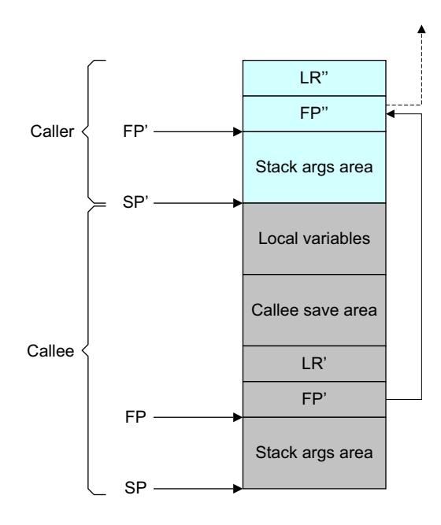

**Figure 9-2 Stack frame**

**Note**

<span id="page-120-0"></span> The AAPCS only specifies the FP, LR block layout and how these blocks are chained together. Everything else in [Figure 9-2](#page-120-0) (including the precise location of the boundary between frames of the two functions) is unspecified, and can be freely chosen by the compiler.

[Figure 9-2](#page-120-0) illustrates a frame that uses two callee-saved registers (X19 and X20) and one temporary variable, with the following layout (number on left is offset from the FP in bytes):

```
40: <padding>
32: temp
24: X20
16: X19
 8: LR'
 0: FP'
```

The padding is necessary to maintain the 16 byte alignment of the Stack Pointer.

```
function:
       STP X29, X30, [SP, #-48]! // Push down stack pointer and store FP and LR
       MOV X29, SP // Set the frame pointer to the bottom of the new
                               // frame
       STP X19, X20, [X29, #16] // Save X19 and X20
       : :
       Main body of code
       : :
```

```
LDP X19, X20, [X29, #16] // Restore X19 and X29
LDP X29, X30, [SP], #48 // Restore FP' and LR' before setting the stack
                       // pointer to its original position
RET // Return to caller
```

#### <span id="page-121-1"></span>**9.1.3 Parameters in NEON and floating-point registers**

The ARM 64-bit architecture also has thirty-two registers, v0-v31, which can be used by NEON and floating-point operations. The name used to refer to the register changes indicating the size of the access.

**Note** Unlike in AArch32, in AArch64 the 128-bit and 64-bit views of a NEON and floating-point register do not overlap multiple registers in a narrower view, so q1, d1 and s1 all refer to the same entry in the register bank.

v0 v16 v1 v2 v3 v4 v5 v6 v7 v8 v9 v10 v11 v12 v13 v14 v15 Parameter and result registers v17 v18 v19 v20 v21 v22 v23 v24 v25 v26 v27 v28 v29 v30 Callee must preserve lower 64 bits across subroutine calls Not preserved by callee Caller should preserve these before calls if the registers are in use v31

**Figure 9-3 SIMD and floating-point registers in the ABI**

- V0-V7 are used to pass argument values into a subroutine and to return result values from a function. They may also be used to hold intermediate values within a routine (but, in general, only between subroutine calls).
- V8-V15 must be preserved by a callee across subroutine calls. Only the bottom 64 bits of each value stored in V8-V15 need to be preserved.
- V16-V31 do not need to be preserved (or should be preserved by the caller).

## <span id="page-122-1"></span><span id="page-122-0"></span>Chapter 10 **AArch64 Exception Handling**

Strictly speaking, an *interrupt* is something that interrupts the flow of software execution. However, in ARM terminology, that is actually an *exception*. Exceptions are conditions or system events that require some action by privileged software (an exception handler) to ensure smooth functioning of the system. There is an exception handler associated with each exception type. Once the exception has been handled, privileged software prepares the core to resume whatever it was doing before taking the exception.

<span id="page-122-2"></span>The following types of exception exist:

**Interrupts** There are two types of interrupts called IRQ and FIQ.

FIQ is higher priority than IRQ. Both of these kinds of exception are typically associated with input pins on the core. External hardware asserts an interrupt request line and the corresponding exception type is raised when the current instruction finishes executing (although some instructions, those that can load multiple values, can be interrupted), assuming that the interrupt is not disabled.

Both FIQ and IRQ are physical signals to the core, and when asserted, the core takes the corresponding exception if it is currently enabled. On almost all systems, various interrupt sources are connected using an interrupt controller. The interrupt controller arbitrates and prioritizes interrupts, and in turn, provides a serialized single signal that is then connected to the FIQ or IRQ signal of the core. For more information see *[The Generic Interrupt Controller](#page-138-1)* on page 10-17.

Because the occurrence of IRQ and FIQ interrupts are not directly related to the software being executed by the core at any given time, they are classified as *asynchronous* exceptions.

<span id="page-123-0"></span>**Aborts** Aborts can be generated either on failed instruction fetches (instruction aborts) or failed data accesses (Data Aborts). They can come from the external memory system giving an error response on a memory access (indicating perhaps that the specified address does not correspond to real memory in the system). Alternatively, the abort can be generated by the *Memory Management Unit* (MMU) of the core. An OS can use MMU aborts to dynamically allocate memory to applications.

> <span id="page-123-2"></span>An instruction can be marked within the pipeline as aborted, when it is fetched. The instruction abort exception is taken only if the core then tries to execute it. The exception takes place before the instruction executes. If the pipeline is flushed before the aborted instruction reaches the execute stage of the pipeline, the abort exception will not occur. A Data Abort exception happens as a result of a load or store instruction and is considered to happen after the data read or write has been attempted.

> An abort is described as *synchronous* if it is generated as a result of execution or attempted execution of the instruction stream, and where the return address provides details of the instruction that caused it.

An *asynchronous* abort is not generated by executing instructions, while the return address might not always provide details of what caused the abort. In ARMv8-A, the instruction and Data Aborts are synchronous. The asynchronous exceptions are IRQ/FIQ and System errors (SError). See *[Synchronous and](#page-128-2)  [asynchronous exceptions](#page-128-2)* on page 10-7.

**Reset** Reset is treated as a special vector for the highest implemented Exception level. This is the location of the instruction that the ARM processor jumps to when an exception is raised. This vector uses an IMPLEMENTATION DEFINED address. RVBAR\_EL*n* contains this reset vector address, where *n* is the number of the highest implemented Exception level.

> All cores have a reset input and take the reset exception immediately after they have been reset. It is the highest priority exception and cannot be masked. This exception is used to execute code on the core to initialize it, after power-up.

#### <span id="page-123-1"></span>**Exception generating instructions**

Execution of certain instructions can generate exceptions. Such instructions are typically executed to request a service from software that runs at a higher privilege level:

- The *Supervisor Call* (SVC) instruction enables User mode programs to request an OS service.
- The *Hypervisor Call* (HVC) instruction enables the guest OS to request hypervisor services.
- The *Secure monitor Call* (SMC) instruction enables the Normal world to request Secure world services.

If the resulting exception was generated as a result of an instruction fetch at EL0, it is taken as an exception to EL1, unless the HCR\_EL2.TGE bit is set in the Non-secure state, in which case it is taken to EL2.

If the exception was generated as a result of an instruction fetch at any other Exception level, the Exception level remains unchanged.

Earlier in the book, we saw that the ARMv8-A architecture has four Exception levels. Processor execution can only move between Exception levels by taking, or returning from, an exception. When the processor moves from a higher to a lower Exception level, the execution state can stay the same, or it can switch from AArch64 to AArch32. Conversely, when moving from a lower to a higher Exception level, the execution state can stay the same or switch from AArch32 to AArch64.

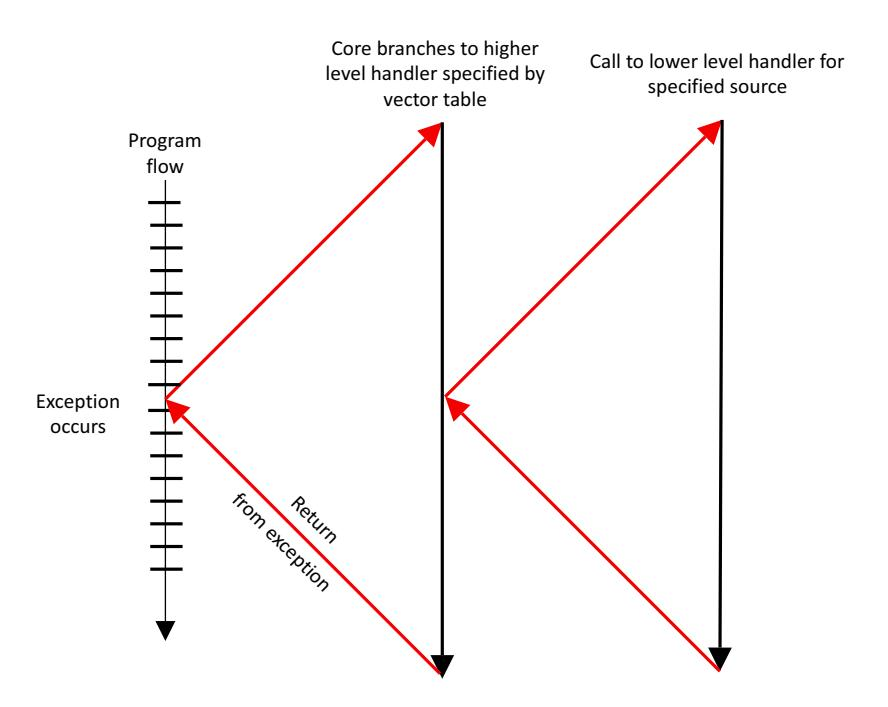

**Figure 10-1 Exception flow**

<span id="page-124-0"></span>[Figure 10-1](#page-124-0) shows schematically the program flow associated with an exception occurring when running an application. The processor branches to a vector table which contains entries for each exception type. The vector table contains a dispatch code which typically identifies the cause of the exception, and select and call the appropriate function to handle it. This code completes execution and then return to the high-level handler which then executes the ERET instruction to return to the application.

#### <span id="page-125-0"></span>**10.1 Exception handling registers**

[Chapter 4](#page-36-1) describes how the current state of the processor is stored within separate PSTATE fields. If an exception is taken, the PSTATE information is saved in the *Saved Program Status Register* (SPSR\_EL*n*) which exists as SPSR\_EL3, SPSR\_EL2 and SPSR\_EL1.

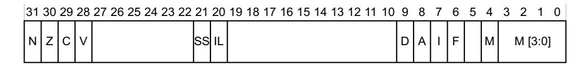

**Figure 10-2 When exceptions are taken from AArch64**

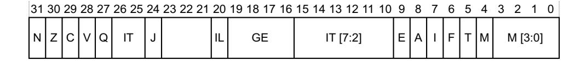

**Figure 10-3 When exceptions are taken from AArch32**

The SPRSR.M field (bit 4) is used to record the execution state (0 indicates AArch64 and 1 indicates AArch32).

**Table 10-1 PSTATE fields**

| PSTATE fields | Description                                      |
|---------------|--------------------------------------------------|
| NZCV          | Condition flags                                  |
| Q             | Cumulative saturation bit                        |
| DAIF          | Exception mask bits                              |
| SPSel         | SP selection (EL0 or ELn), not applicable to EL0 |
| E             | Data endianness (AArch32 only)                   |
| IL            | Illegal flag                                     |
| SS            | Software stepping bit                            |

The exception bit mask bits (DAIF) allow the exception events to be masked. The exception is not taken when the bit is set.

**D** Debug exceptions mask.

**A** SError interrupt Process state mask, for example, asynchronous External Abort.

**I** IRQ interrupt Process state mask.

**F** FIQ interrupt Process state mask.

The SPSel field selects whether the current Exception level Stack Pointer or SP\_EL0 should be used. This can be done at any Exception level, except EL0. This is discussed later in the chapter.

The IL field, when set, causes execution of the next instruction to trigger an exception. It is used in illegal execution returns, for example, trying to return to EL2 as AArch64 when it is configured for AArch32.

The Software Stepping (SS) bit is covered in [Chapter 18](#page-249-1) *Debug*. It is used by debuggers to execute a single instruction and then take a debug exception on the following instruction.

Some of these separate fields (CurrentEL, DAIF, NZCV and so on) are copied into a compact form in SPSR\_EL*n* when taking an exception (and the other way around when returning).

When an event which causes an exception occurs, the processor hardware automatically performs certain actions. The SPSR\_EL*n* is updated, (where *n* is the Exception level where the exception is taken), to store the PSTATE information required to correctly return at the end of the exception. PSTATE is updated to reflect the new processor status (and this may mean that the Exception level is raised, or it may stay the same). The return address to be used at the end of the exception is stored in ELR\_EL*n*.

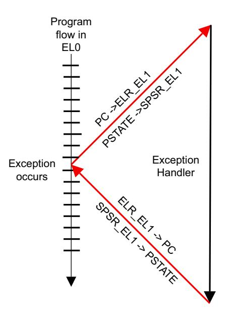

**Figure 10-4 Exception handling**

Remember that the \_EL*n* suffix on register names denotes that there are multiple copies of these registers existing at different Exception levels. For example, SPSR\_EL1 is a different physical register to SPSR\_EL2. Additionally, in the case of a synchronous or SError exception, ESR\_EL*n* is also updated with a value which indicates the cause of the exception.

The processor has to be told when to return from an exception by software. This is done by executing the ERET instruction. This restores the pre-exception PSTATE from SPSR\_EL*n* and returns program execution back to the original location by restoring the PC from ELR\_EL*n*.

We have seen how the SPSR records the necessary state information for an exception return. We will now look at the link register(s) used to store the program address information. The architecture provides separate link registers for function calls and for exception returns.

As we saw in Chapter 6 *[The A64 instruction set](#page-66-1)*, register X30 is used (in conjunction with the RET instruction) to return from subroutines. Its value is updated with the address of the instruction to return back to, whenever we execute a branch with link instruction (BL or BLR.)

The ELR\_EL*n* register is used to store the return address from an exception. The value in this register (actually several registers, as we have seen) is automatically written upon entry to an exception and is written to the PC as one of the effects of executing the ERET instruction used to return from exceptions.

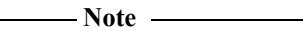

 When returning from an exception, you will see an error if the value in the SPSR conflicts with the settings in the System Registers.

ELR\_EL*n* contains the return address which is preferred for the specific exception type. For some exceptions, this is the address of the next instruction after the one which generated the exception. For example, when an SVC (system call) instruction is executed, we simply wish to return to the following instruction in the application. In other cases, we may wish to re-execute the instruction that generated the exception.

For asynchronous exceptions, the ELR\_EL*n* points to the address of the first instruction that has not been executed, or executed fully, as a result of taking the interrupt. Handler code is permitted to modify the ELR\_E*n* if, for example, it was necessary to return to the instruction after an aborting a synchronous exception. The ARMv8-A model is significantly simpler than that used in ARMv7-A, where for backward compatibility reasons, it was necessary to subtract 4 or 8 from the Link register value when returning from certain types of exception.

In addition to the SPSR and ELR registers, each Exception level has its own dedicated Stack Pointer register. These are named SP\_EL0, SP\_EL1, SP\_EL2 and SP\_EL3. These registers are used to point to a dedicated stack that can, for example, be used to store registers which are corrupted by the exception handler, so that they can be restored to their original value before returning to the original code.

Handler code may switch from using SP\_EL*n* to SP\_EL0. For example, it may be that SP\_EL1 points to a piece of memory which holds a small stack that the kernel can guarantee to always be valid. SP\_EL0 might point to a kernel task stack which is larger, but not guaranteed to be safe from overflow. This switching is controlled by writing to the [SPSel] bit, as shown in the following code:

```
 MSR SPSel, #0 // switch to SP_EL0
 MSR SPSel, #1 // switch to SP_ELn
```

#### <span id="page-128-2"></span><span id="page-128-0"></span>**10.2 Synchronous and asynchronous exceptions**

In AArch64, exceptions may be either synchronous, or asynchronous. An exception is described as *synchronous* if it is generated as a result of execution or attempted execution of the instruction stream, and where the return address provides details of the instruction that caused it. An *asynchronous* exception is not generated by executing instructions, while the return address might not always provide details of what caused the exception.

Sources of asynchronous exceptions are IRQ (normal priority interrupt), FIQ (fast interrupt) or SError (System Error). System errors have a number of possible causes, the most common being asynchronous Data Aborts (for example, an abort triggered by writeback of dirty data from a cache line to external memory).

There are a number of sources of Synchronous exceptions:

- Instruction aborts from the MMU. For example, by reading an instruction from a memory location marked as Execute Never.
- Data Aborts from the MMU. For example, Permission failure or alignment checking.
- SP and PC alignment checking.
- Synchronous external aborts. For example, an abort when reading translation table.
- Unallocated instructions.
- Debug exceptions.

#### **10.2.1 Synchronous aborts**

Synchronous exceptions can occur for a number of possible reasons:

- Aborts from the MMU. For example, permission failures or memory areas marked as Access flag fault.
- SP and PC alignment checking.
- Unallocated instructions.
- Service Calls (SVCs, SMCs and HVCs).

Such exceptions may be part of the normal operation of the OS. For example, in Linux, when a task wishes to request allocation of a new memory page, this is handled through the MMU abort mechanism.

In the ARMv7-A architecture, the prefetch abort, Data Abort and undef exceptions are separate items. In AArch64, all of these events generate a Synchronous abort. The exception handler may then read the syndrome and FAR registers to obtain the necessary information to distinguish between them (described in more detail later.)

#### <span id="page-128-1"></span>**10.2.2 Handling synchronous exceptions**

<span id="page-128-5"></span><span id="page-128-4"></span>Registers are provided to supply information to exception handlers about the cause of a synchronous exception. The *Exception Syndrome Register* (ESR\_EL*n*) gives information about the reasons for the exception. The *Fault Address Register* (FAR\_EL*n*) holds the faulting virtual address for all synchronous instruction and Data Aborts and alignment faults.

<span id="page-128-3"></span>The *Exception Link Register* (ELR\_EL*n*) holds the address of the instruction which caused the aborting data access (for Data Aborts). This is generally updated after a memory fault, but are set in other circumstances, for example, by branching to a misaligned address.

If an exception is taken from an Exception level using AArch32 into an Exception level using AArch64, and that exception writes the Fault Address Register associated with the target Exception level, the top 32 bits of the FAR\_EL*n* are all set to zero.

For systems which implement EL2 (Hypervisor) or EL3 (Secure Kernel), Synchronous exceptions are normally taken in the current or a higher Exception level. Asynchronous exceptions can (if required) be routed to a higher Exception level to be dealt with by a Hypervisor or Secure kernel. The SCR\_EL3 register specifies which exceptions are to be routed to EL3 and similarly, HCR\_EL2 specifies which exceptions are to be routed to EL2. There are separate bits which allow individual control over routing of IRQ, FIQ and SError.

#### **10.2.3 System calls**

Some instructions or system functions can only be carried out at a specific Exception level. If code running at a lower Exception level needs to perform a privileged operation, for example, when application code requests functionality from the kernel. One way to do this is by using the SVC instruction. This allows applications to generate an exception. Parameters may be passed in registers, or coded within the System call.

#### **10.2.4 System calls to EL2/EL3**

We saw earlier how SVC may be used to call from user applications at EL0 to the kernel at EL1. The HVC and SMC system call instructions move the processor in a similar fashion to EL2 and EL3. When the processor is executing at EL0 (Application), it cannot call directly into the hypervisor (EL2) or Secure monitor (EL3). This is only possible from EL1 and above. Applications must therefore use SVC to call into kernel and allow the kernel to call into higher Exception levels on their behalf.

From the OS kernel (EL1), software can call the hypervisor (EL2) with the HVC instruction, or call the Secure monitor (EL3) with the SMC instruction. If the processor is implemented with EL3, the ability to have EL2 trap SMC instructions from EL1 is provided. If there is no EL3, the SMC is unallocated and triggers at the current Exception level.

Similarly, from hypervisor code (EL2), the program can call the Secure monitor (EL3) with the SMC instruction. If you make an SVC call when in EL2 or EL3 it will still cause a synchronous exception at the same Exception level, and the handler for that Exception level can decide how to respond.

#### <span id="page-129-0"></span>**10.2.5 Unallocated instructions**

Unallocated instructions cause a Synchronous Abort in AArch64. This exception type is generated when the processor executes one of the following:

- An instruction opcode that is not allocated.
- An instruction that requires a higher level of privilege than the current Exception level.
- An instruction that has been disabled.
- Any instruction when the PSTATE.IL field is set.

#### <span id="page-130-0"></span>**10.2.6 The Exception Syndrome Register**

The *Exception Syndrome Register*, ESR\_EL*n*, contains information which allows the exception handler to determine the reason for the exception. It is updated only for synchronous exceptions and SError. It is not updated for IRQ or FIQ as these interrupt handlers typically obtain status information from registers in the *Generic Interrupt Controller* (GIC). (See *[The Generic](#page-138-1)  [Interrupt Controller](#page-138-1)* on page 10-17.) The bit coding for the register is:

- Bits [31:26] of ESR\_EL*n* indicate the exception class which allows the handler to distinguish between the various possible exception causes (such as unallocated instruction, exceptions from MCR/MRC to CP15, exception from FP operation, SVC, HVC or SMC executed, Data Aborts, and alignment exceptions).
- Bit [25] indicates the length of the trapped instruction (0 for a 16-bit instruction or 1 for a 32-bit instruction) and is also set for certain exception classes.
- Bits [24:0] form the Instruction Specific Syndrome (ISS) field containing information specific to that exception type. For example, when a system call instruction (SVC, HVC or SMC) is executed, the field contains the immediate value associated with the opcode such as 0x123456 for SVC 0x123456.

#### <span id="page-131-0"></span>**10.3 Changes to execution state and Exception level caused by exceptions**

When an exception is taken, the processor may change execution state (from AArch64 to AArch32) or stay in the same execution state. For example, an external source may generate an IRQ (interrupt) exception while executing an application running in AArch32 mode and then execute the IRQ handler within the OS Kernel running in AArch64 mode.

The SPSR includes the execution state and Exception level to return back to. This is automatically set by the processor when an exception is taken. However, the execution state for exceptions in each Exception level is controlled as follows:

- The reset execution state of the highest Exception level (not necessarily EL3) is determined typically by a hardware configuration input. But this is not fixed as we have the RMR\_EL*n* register to change the execution state (register width) of the highest Exception level at run-time (causing a soft reset).
  - Remember that EL3 is associated with Secure monitor code. The monitor is a small trusted piece of code that always runs in a specific state.
- For EL2 and EL1, the execution state is controlled by the SCR\_EL3.RW and HCR\_EL2.RW bits. The SCR\_EL3.RW bit is programmed in EL3 (Secure monitor) and sets the state of the next lower level (EL2). The HCR\_EL2.RW bit may be programmed in EL2 or EL3, and sets the state of EL1/0.
- You never take an exception in EL0, (remembering that EL0 is the lowest priority level, used for application code).

Consider an application running in EL0, which is interrupted by an IRQ as in [Figure 10-5.](#page-131-1) The Kernel IRQ handler runs at EL1. The processor determines which execution state to set when it takes the IRQ exception. It does this by looking at the RW bit of the control register for the Exception level *above* the one that the exception is being handled in. So, in the example, where the exception is taken in EL1, it is HCR\_EL2.RW which controls the execution state for the handler.

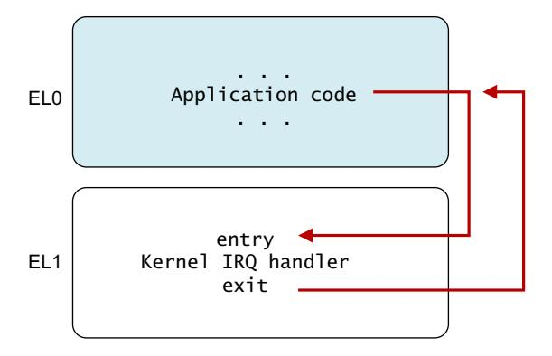

**Figure 10-5 Exception to EL1**

<span id="page-131-1"></span>We must now consider what Exception level an exception is taken at. Again, when an exception is taken, the Exception level may stay the same, or it can get higher. Exceptions are never taken to EL0, as we have already seen.

Synchronous exceptions are normally taken in the current or a higher Exception level. However, asynchronous exceptions can be routed to a higher Exception level. For secure code, SCR\_EL3 specifies which exceptions are to be routed to EL3. For hypervisor code, HCR\_EL2 specifies exceptions to be routed to EL2.

In both cases, there are separate bits to control routing of IRQ, FIQ and SError. The processor only takes the exception into the Exception level to which it is routed. The Exception level can never go down by taking an exception. Interrupts are always masked at the Exception level where the interrupt is taken.

When taking an exception from AArch32 to AArch64, there are some special considerations. AArch64 handler code may require access to AArch32 registers and the architecture therefore defines mappings to allow access to AArch32 registers.

AArch32 registers R0 to R12 are accessed as X0 to X12. The banked versions of the SP and LR in the various AArch32 modes are accessed through X13 to X23, while the banked R8 to R12 FIQ registers are accessed as X24 to X29. Bits [63:32] of these registers are not available in AArch32 state and contains either 0 or the last value written in AArch64. There is no architectural guarantee on which value it is. It is therefore usual to access registers as W registers.

### <span id="page-133-0"></span>**10.4 AArch64 exception table**

When an exception occurs, the processor must execute handler code which corresponds to the exception. The location in memory where the handler is stored is called the *exception vector*. In the ARM architecture, exception vectors are stored in a table, called the *exception vector table*. Each Exception level has its own vector table, that is, there is one for each of EL3, EL2 and EL1. The table contains instructions to be executed, rather than a set of addresses. Vectors for individual exceptions are located at fixed offsets from the beginning of the table. The virtual address of each table base is set by the *Vector Based Address Register*s VBAR\_EL3, VBAR\_EL2 and VBAR\_EL1.

Each entry in the vector table is 16 instructions long. This in itself represents a significant change compared to ARMv7, where each entry was 4 bytes. This spacing of the ARMv7 vector table meant that each entry would almost always be some form of branch to the actual exception handler elsewhere in memory. In AArch64, the vectors are spaced more widely, so that the top-level handler can be written directly in the vector table.

[Table 10-2](#page-133-1) shows one of the vector tables. The base address is given by VBAR\_EL*n* and then each entry has a defined offset from this base address. Each table has 16 entries, with each entry being 128 bytes (32 instructions) in size. The table effectively consists of 4 sets of 4 entries. Which entry is used depends upon a number of factors:

- The type of exception (SError, FIQ, IRQ or Synchronous)
- If the exception is being taken at the same Exception level, the Stack Pointer to be used (SP0 or SPx)
- <span id="page-133-1"></span>• If the exception is being taken at a lower Exception level, the execution state of the next lower level (AArch64 or AArch32)

**Table 10-2 Vector table offsets from vector table base address**

| Address          | Exception type | Description            |
|------------------|----------------|------------------------|
| VBAR_ELn + 0x000 | Synchronous    | Current EL with SP0    |
| + 0x080          | IRQ/vIRQ       |                        |
| + 0x100          | FIQ/vFIQ       |                        |
| + 0x180          | SError/vSError |                        |
| + 0x200          | Synchronous    | Current EL with SPx    |
| + 0x280          | IRQ/vIRQ       |                        |
| + 0x300          | FIQ/vFIQ       |                        |
| + 0x380          | SError/vSError |                        |
| + 0x400          | Synchronous    | Lower EL using AArch64 |
| + 0x480          | IRQ/vIRQ       |                        |
| + 0x500          | FIQ/vFIQ       |                        |
| + 0x580          | SError/vSError |                        |

**Table 10-2 Vector table offsets from vector table base address (continued)**

| Address | Exception type | Description            |
|---------|----------------|------------------------|
| + 0x600 | Synchronous    | Lower EL using AArch32 |
| + 0x680 | IRQ/vIRQ       |                        |
| + 0x700 | FIQ/vFIQ       |                        |
| + 0x780 | SError/vSError |                        |
|         |                |                        |

Considering an example might make this easier to understand.

If kernel code is executing at EL1 and an IRQ interrupt is signaled, an IRQ exception occurs. This particular interrupt is not associated with the hypervisor or secure environment and is also handled within the kernel, also at SP\_EL1, and the SPSel bit is set, so you are using SP\_EL1. Execution is therefore from address VBAR\_EL1 + 0x280.

In the absence of LDR PC, [PC, #offset] in the ARMv8-A architecture, you must use more instructions to enable the destination to be read from a table of registers. The choice of spacing of the vectors is designed to avoid cache pollution for typical sized instruction cache lines from vectors that are not being used. The Reset Address is a completely separate address, which is IMPLEMENTATION DEFINED, and is typically set by hardwired configuration within the core. This address is visible in the RVBAR\_EL1/2/3 register.

Having a separate exception vector for each exception, either from the current Exception level or from the lower Exception level, gives the flexibility for the OS or hypervisor to determine the AArch64 and AArch32 state of the lower Exception levels. The SP\_EL*n* is used for exceptions generated from lower levels. However, the software can switch to use SP\_EL0 inside the handler. When you use this mechanism, it facilitates access to the values from the thread in the handler.

#### <span id="page-135-0"></span>**10.5 Interrupt handling**

ARM commonly uses interrupt to mean *interrupt signal*. On ARM A-profile and R-profile processors, that means an external IRQ or FIQ interrupt signal. The architecture does not specify how these signals are used. FIQ is often reserved for secure interrupt sources. In earlier architecture versions, FIQ and IRQ were used to denote high and standard interrupt priority, but this is not the case in ARMv8-A.

When the processor takes an exception to AArch64 execution state, all of the PSTATE interrupt masks is set automatically. This means that further exceptions are disabled. If software is to support nested exceptions, for example, to allow a higher priority interrupt to interrupt the handling of a lower priority source, then software needs to explicitly re-enable interrupts.

For the following instruction:

```
MSR DAIFClr, #imm
```

This immediate value is in fact a 4-bit field, as there are also masks for:

- PSTATE.A (for SError)
- PSTATE.D (for Debug)

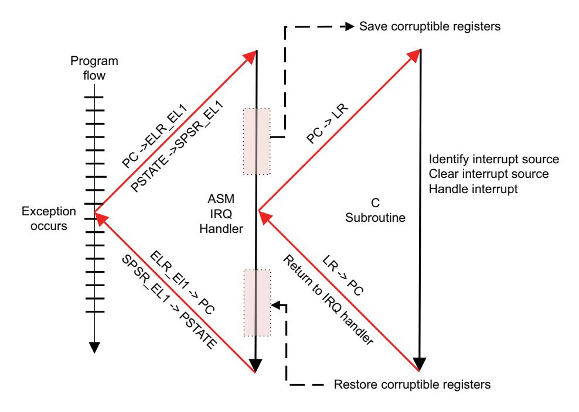

**Figure 10-6 Interrupt handler in C code**

An example assembly language IRQ handler might look like this:

IRQ\_Handler

```
 // Stack all corruptible registers 
 STP X0, X1, [SP, #-16]! // SP = SP -16
   ...
 STP X2, X3, [SP, #-16]! // SP = SP - 16
 // unlike in ARMv7, there is no STM instruction and so 
 // we may need several STP instructions
 BL read_irq_source // a function to work out why we took an interrupt
```

```
 // and clear the request
 BL C_irq_handler // the C interrupt handler
 // restore from stack the corruptible registers 
 LDP X2, X3, [SP], #16 // S = SP + 16
 LDP X0, X1, [SP], #16 // S = SP + 16
 … 
 ERET
```

However, from a performance point of view, the following sequence might be preferable:

```
IRQ_Handler
   SUB SP, SP, #<frame_size> // SP = SP - <frame_size>
 STP X0, X1, [SP} // Store X0 and X1 at the base of the frame
 STP X2, X3, [SP] // Store X2 and X3 at the base of the frame + 16 bytes
 ... // more register storing
   ...
 // Interrupt handling
 BL read_irq_source // a function to work out why we took an interrupt 
 // and clear the request
 BL C_irq_handler // the C interrupt handler
 // restore from stack the corruptible registers 
   LDP X0, X1, [SP] // Load X0 and X1 at the base of the frame
 LDP X2, X3, [SP] // Load X2 and X3 at the base of the frame + 16 bytes
   ... // more register loading
   ADD SP, SP, #<frame_size> // Restore SP at its original value
 … 
 ERET
```

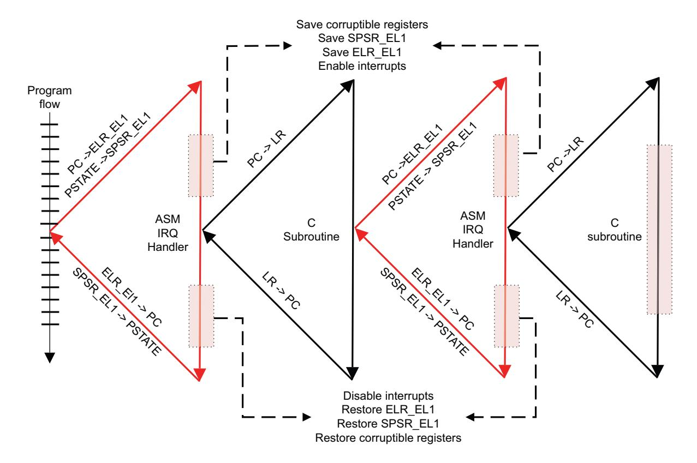

**Figure 10-7 Handling nested interrupts**

The nested handler requires a little extra code. It must preserve on the stack the contents of SPSR\_EL1 and ELR\_EL1. We must also re-enable IRQs after determining (and clearing) the interrupt source. However (unlike in ARMv7-A), as the link register for subroutine calls is different to the link register for exceptions, we avoid having to do anything special with LR or modes.

#### <span id="page-138-1"></span><span id="page-138-0"></span>**10.6 The Generic Interrupt Controller**

ARM provides a standard interrupt controller which can be used for ARMv8-A systems. The programming interface to this interrupt controller is defined in the GIC Architecture. There are multiple versions of the GIC Architecture Specification. This document concentrates on version 2 (GICv2). ARMv8-A processors are typically connected to a GIC, for example the GIC-400 or GIC-500. The *Generic Interrupt Controller* (GIC) supports routing of software generated, private and shared peripheral interrupts between cores in a multi-core system.

The GIC architecture provides registers that can be used to manage interrupt sources and behavior and (in multi-core systems) for routing interrupts to individual cores. It enables software to mask, enable and disable interrupts from individual sources, to prioritize (in hardware) individual sources and to generate software interrupts. The GIC accepts interrupts asserted at the system level and can signal them to each core it is connected to, potentially resulting in an IRQ or FIQ exception being taken.

From a software perspective, a GIC has two major functional blocks:

#### <span id="page-138-2"></span>**Distributor**

To which all interrupt sources in the system are connected. The Distributor has registers to control the properties of individual interrupts such as priority, state, security, routing information and enable status. The Distributor determines which interrupt is to be forwarded to a core, through the attached CPU interface.

#### **CPU Interface**

Through which a core receives an interrupt. The CPU interface hosts registers to mask, identify and control states of interrupts forwarded to that core. There is a separate CPU interface for each core in the system.

Interrupts are identified in the software by a number, called an *interrupt ID*. An interrupt ID uniquely corresponds to an interrupt source. Software can use the interrupt ID to identify the source of interrupt and to invoke the corresponding handler to service the interrupt. The exact interrupt ID presented to the software is determined by the system design,

Interrupts can be of a number of different types:

#### <span id="page-138-5"></span>**Software Generated Interrupt (SGI)**

This is generated explicitly by software by writing to a dedicated Distributor register, the *Software Generated Interrupt Register* (GICD\_SGIR). It is most commonly used for inter-core communication. SGIs can be targeted at all, or a selected group of cores in the system. Interrupt IDs 0-15 are reserved for this. The interrupt ID used for a given interrupt is set by the software that generated it..

#### <span id="page-138-3"></span>**Private Peripheral Interrupt (PPI)**

This is a global peripheral interrupt that the Distributor can route to a specified core or cores. Interrupt IDs16-31 are reserved for this. These identify interrupt sources private to the core, and is independent of the same source on another core, for example, a per-core timer.

#### <span id="page-138-4"></span>**Shared Peripheral Interrupt (SPI)**

This is generated by a peripheral that the GIC can route to more than one core. Interrupt numbers 32-1020 are used for this. SPIs are used to signal interrupts from various peripherals accessible across the whole the system.

#### **Locality-specific Peripheral Interrupt (LPI)**

These are message-based interrupts that are routed to a particular core. LPIs are not supported in GICv2 or GICv1.

Interrupts can either be edge-triggered (considered to be asserted when the GIC detects a rising edge on the relevant input, and to remain asserted until cleared) or level-sensitive (considered to be asserted only when the relevant input to the GIC is HIGH).

An interrupt can be in a number of different states:

- *Inactive* this means that the interrupt is not currently asserted.
- *Pending* this means that the interrupt source has been asserted, but is waiting to be handled by a core. Pending interrupts are candidates to be forwarded to the CPU interface and then later on to the core.
- *Active* this means that the interrupt that has been acknowledged by a core and is currently being serviced.
- *Active and pending* this describes the situation where a core is servicing the interrupt and the GIC also has a pending interrupt from the same source.

The priority and list of cores to which an interrupt can be delivered to are all configured in the Distributor. An interrupt asserted to the Distributor by a peripheral is in the Pending state (or Active and Pending if it was already Active). The Distributor determines the highest priority pending interrupt that can be delivered to a core and forwards that to the CPU interface of the core. At the CPU interface, the interrupt is in turn signaled to the core, at which point the core takes the FIQ or IRQ exception.

The core executes the exception handler in response. The handler must query the interrupt ID from a CPU interface register and begin servicing the interrupt source. When finished, the handler must write to a CPU interface register to report the end of processing.

For a given interrupt the typical sequence is:

- Inactive -> Pending When the interrupt is asserted by the peripheral.
- Pending -> Active When the handler acknowledges the interrupt.
- Active -> Inactive When the handle has finished dealing with the interrupt.

The Distributor provides registers which report the current state of the different interrupt IDs..

In mutli-core/multi-processor systems, a single GIC can be shared by multiple cores (up to eight in GICv2). The GIC provides registers to control which core, or cores, a SPI is targeted at. This mechanism enables the operating system to share and distribute interrupts across cores and coordinate activities.

More detailed information on GIC behavior can be found in the TRMs for the individual processor types and in the ARM *Generic Interrupt Controller Architecture* specification.

#### <span id="page-139-0"></span>**10.6.1 Configuration**

The GIC is accessed as a memory-mapped peripheral. All cores can access the common Distributor, but the CPU interface is banked, that is, each core uses the same address to access its own private CPU interface. It is not possible for a core to access the CPU interface of another core.

The Distributor hosts a number of registers that you can use to configure the properties of individual interrupts. These configurable properties are:

- An interrupt priority (GICD\_IPRIORITY<n>). The distributor uses this to determine which interrupt is next forwarded to the CPU interface.
- An interrupt configuration (GICD\_ICFGR<n>). This determines if an interrupt is level or edge-sensitive. Not applicable to SGIs.
- An interrupt target (GICD\_ITARGETSR<n>). This determines a list of cores to which an interrupt can be forwarded. Only applicable to SPIs.
- Interrupt enable or disable status (GICD\_ISENABLER<n> and GICD\_ICENABLER<n>). Only those interrupts that are enabled in the distributor are eligible to be forwarded when they become pending.
- Interrupt security (GICD\_IGROUPR<n>) determines whether the interrupt is allocated to Secure or Normal world software.
- An Interrupt state.

The Distributor also provides priority masking by which interrupts below a certain priority are prevented from reaching the core. The distributor uses this when determining whether a pending interrupt can be forwarded to a particular core.

The CPU interfaces on each core helps with fine-tuning interrupt control and handling on that core.

#### <span id="page-140-0"></span>**10.6.2 Initialization**

Both the Distributor and the CPU interfaces are disabled at reset. The GIC must be initialized after reset before it can deliver interrupts to the core.

In the Distributor, software must configure the priority, target, security and enable individual interrupts. The Distributor must subsequently be enabled through its control register (GICD\_CTLR). For each CPU interface, software must program the priority mask and preemption settings.

Each CPU interface block itself must be enabled through its control register (GICD\_CTLR). This prepares the GIC to deliver interrupts to the core.

Before interrupts are expected in the core, software prepares the core to take interrupts by setting a valid interrupt vector in the vector table, and clearing interrupt mask bits in PSTATE, and setting the routing controls..

The entire interrupt mechanism in the system can be disabled by disabling the Distributor. Interrupt delivery to an individual core can be disabled by disabling its CPU interface. Individual interrupts can also be disabled (or enabled) in the distributor.

For an interrupt to reach the core, the individual interrupt, Distributor and CPU interface must all be enabled. The interrupt also needs to be of sufficient priority, that is, higher than the core's priority mask.

#### <span id="page-140-1"></span>**10.6.3 Interrupt handling**

When the core takes an interrupt, it jumps to the top-level interrupt vector obtained from the vector table and begins execution.

The top-level interrupt handler reads the *Interrupt Acknowledge Register* from the CPU Interface block to obtain the interrupt ID.

As well as returning the interrupt ID, the read causes the interrupt to be marked as active in the Distributor. Once the interrupt ID is known (identifying the interrupt source), the top-level handler can now dispatch a device-specific handler to service the interrupt.

When the device-specific handler finishes execution, the top-level handler writes the same interrupt ID to the *End of Interrupt* (EoI) register in the CPU Interface block, indicating the end of interrupt processing.

Apart from removing the active status, which makes the final interrupt status either Inactive, or Pending (if the state was Active and Pending), this enables the CPU Interface to forward more pending interrupts to the core. This concludes the processing of a single interrupt.

It is possible for there to be more than one interrupt waiting to be serviced on the same core, but the CPU Interface can signal only one interrupt at a time. The top-level interrupt handler could repeat the above sequence until it reads the special interrupt ID value 1023, indicating that there are no more interrupts pending at this core. This special interrupt ID is called the *spurious interrupt ID*.

The spurious interrupt ID is a reserved value, and cannot be assigned to any device in the system. When the top-level handler has read the spurious interrupt ID it can complete its execution, and prepare the core to resume the task it was doing before taking the interrupt.

A *Generic Interrupt Controller* (GIC) generally manages input from multiple interrupt sources and distributes them to IRQ or FIQ requests.

## <span id="page-142-1"></span><span id="page-142-0"></span>Chapter 11 **Caches**

When the ARM architecture was first developed, the clock speed of the processor and the access speeds of memory were broadly similar. Processor cores today are much more complicated and can be clocked orders of magnitude faster. However, the frequency of external buses and of memory devices has not scaled to the same extent. It is possible to implement small blocks of on-chip SRAM that can operate at the same speeds as the core, but such RAM is very expensive in comparison to standard DRAM blocks, which can have thousands of times more capacity. In many ARM processor-based systems, access to external memory takes tens or even hundreds of core cycles.

A cache is a small, fast block of memory that sits between the core and main memory. It holds copies of items in main memory. Accesses to the cache memory occur significantly faster than those to main memory. Whenever the core reads or writes a particular address, it first looks for it in the cache. If it finds the address in the cache, it uses the data in the cache, rather than performing an access to main memory. This significantly increases the potential performance of the system, by reducing the effect of slow external memory access times. It also reduces the power consumption of the system, by avoiding the need to drive external signals.

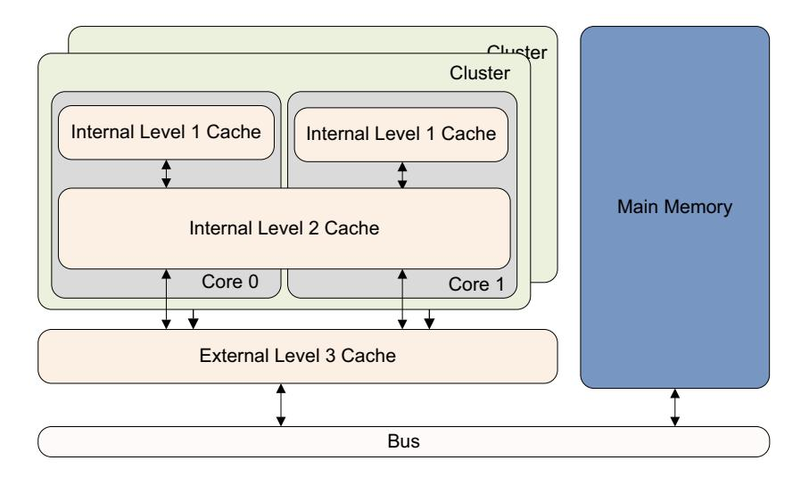

**Figure 11-1 A basic cache arrangement**

<span id="page-143-0"></span>Processors that implement the ARMv8-A Architecture are usually implemented with two or more levels of cache. This typically means that the processor has small L1 Instruction and Data caches for each core. The Cortex-A53 and Cortex-A57 processors are normally implemented with two or more levels of cache, that is a small L1 Instruction and Data cache and a larger, unified L2 cache, which is shared between multiple cores in a cluster. Additionally, there can be an external L3 cache as an external hardware block, shared between clusters.

The initial access that provided the data to the cache is no faster than normal. It is any subsequent accesses to the cached values that are faster, and it is from this that the performance increase derives. The core hardware checks all instruction fetches and data reads or writes in the cache, although you must mark some parts of memory, such as those containing peripheral devices, for example, as non-cacheable. Because the cache holds only a subset of main memory, you require a way to determine quickly whether the address you are looking for is in the cache.

<span id="page-143-1"></span>Occasionally, data and instructions in the cache and data in external memory might not be the same; this is because the processor can update the cache contents, which have not yet been written back to main memory. Alternatively, an agent might update main memory after a core has taken its own copy. This is a problem with *coherency*, which is described in [Chapter 14](#page-203-1). This can be a particular problem when you have multiple cores or memory agents such as an external DMA controller.

#### <span id="page-144-0"></span>11.1 Cache terminology

In a von Neumann architecture, a single cache is used for instruction and data (a unified cache). A modified Harvard architecture has separate instruction and data buses and therefore there are two caches, an instruction cache (I-cache) and a data cache (D-cache). In the ARMv8 processors, there are distinct instruction and data L1 caches backed by a unified L2 cache.

The cache is required to hold an address, some data and some status information.

The following is a brief summary of some of the terms used and a diagram illustrating the fundamental structure of a cache:

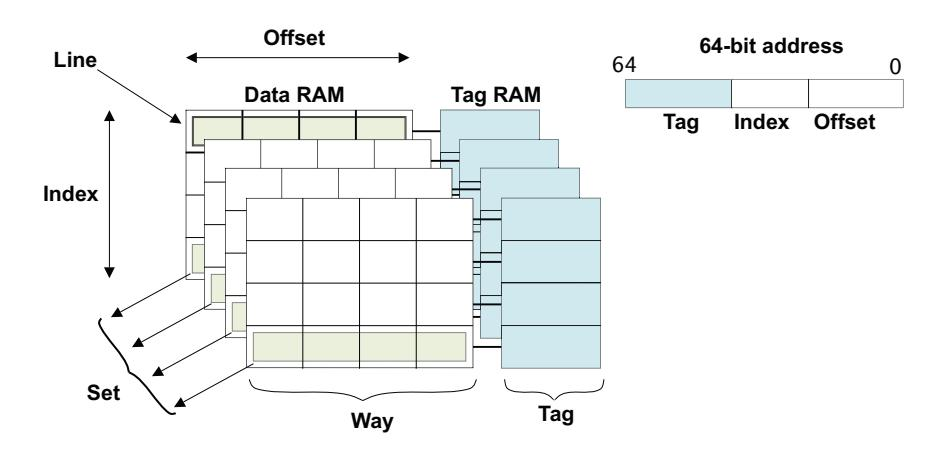

Figure 11-2 Cache terminology

- <span id="page-144-4"></span>• The *tag* is the part of a memory address stored within the cache that identifies the main memory address associated with a line of data.
  - The top bits of the 64-bit address tell the cache where the information came from in main memory and is known as the tag. The total cache size is a measure of the amount of data it can hold, although the RAMs used to hold tag values are not included in the calculation. The tag does, however, take up physical space in the cache.
- <span id="page-144-2"></span>• It would be inefficient to hold one word of data for each tag address, so several locations are typically grouped together under the same tag. This logical block is commonly known as a cache *line*, and refers to the smallest loadable unit of a cache, a block of contiguous words from main memory. A cache line is said to be valid when it contains cached data or instructions, and invalid when it does not.
  - Associated with each line of data are one or more status bits. Typically, you have a valid bit that marks the line as containing data that can be used. This means that the address tag represents some real value. In a data cache, you might also have one or more dirty bits that mark whether the cache line (or part of it) holds data that is not the same as (newer than) the contents of main memory.
- <span id="page-144-1"></span> The index is the part of a memory address that determines in which lines of the cache the address can be found.
  - The middle bits of the address, or index, identify the line. The index is used as address for the cache RAMs and does not require storage as a part of the tag. This is covered in more detail later in this chapter.
- <span id="page-144-5"></span><span id="page-144-3"></span>• A *way* is a subdivision of a cache, each way being of equal size and indexed in the same fashion. A *set* consists of the cache lines from all ways sharing a particular index.

• This means that the bottom few bits of the address, called the offset, are not required to be stored in the tag. You require the address of a whole line, not of each byte within the line, so the five or six least significant bits are always 0.

#### <span id="page-145-1"></span>**11.1.1 Set associative caches and ways**

<span id="page-145-2"></span>The main caches of ARM cores are always implemented using a set of associative caches. This significantly reduces the likelihood of the cache thrashing seen with direct mapped caches, improving program execution speed and giving more deterministic execution. It comes at the cost of increased hardware complexity and a slight increase in power, because multiple tags are compared on each cycle.

With this kind of cache organization, the cache is divided into a number of equally-sized pieces, called *ways*. A memory location can then map to a way rather than a line. The index field of the address continues to be used to select a particular line, but now it points to an individual line in each way. Commonly, there are two or four ways for an L1 Data cache. The Cortex-A57 has a 3-way L1 Instruction cache. It is common for an L2 cache to have 16 ways.

An external L3 cache implementation, such as the ARM CCN-504 Cache Coherent Network (See *[Compute subsystems and mobile applications](#page-220-0)* on page 14-18), can have larger numbers of ways, that is higher associativity, because of their much larger size. The cache lines with the same index value are said to belong to a set. To check for a hit, you must look at each of the tags in the set.

In [Figure 11-3,](#page-145-0) a 2-way cache is shown. Data from address 0x00, 0x40 or 0x80 might be found in line 0 of either, but not both of the two cache ways.

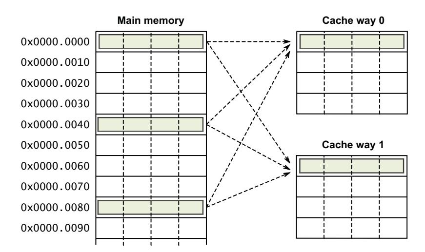

**Figure 11-3 A 2-way set-associative cache**

<span id="page-145-0"></span>Increasing the associativity of the cache reduces the probability of thrashing. The ideal case is a fully associative cache, where any main memory location can map anywhere within the cache. However, building such a cache is impractical for anything other than very small caches, for example, those associated with MMU TLBs. In practice, performance improvements are minimal for above 8-way, with 16-way associativity being more useful for larger L2 caches.

#### <span id="page-146-2"></span>11.1.2 Cache tags and Physical Addresses

<span id="page-146-1"></span>Each line has a tag associated with it which records the Physical Address in external memory associated with that line. The size of a cache line is implementation defined. However, all the cores should have the same cache line size because of the interconnect.

<span id="page-146-3"></span>The Physical Address of the access is used to determine the location of data in cache. The least significant bits are used to select the relevant item within a cache line. The middle bits are used as an index to select a specific line within a cache set. The most significant bits identify the remainder of the address and are used for comparison with the stored tag for that line. In ARMv8, data caches are normally *Physically Indexed, Physically Tagged* (PIPT), but can also be non-aliasing *Virtually Indexed, Physically Tagged* (VIPT).

<span id="page-146-4"></span>Each line in the cache includes:

- A tag value from the associated Physical Address.
- Valid bits to indicate whether the line exists in the cache, that is whether the tag is valid.
   Valid bits can also be state bits for MESI state if the cache is coherent across multiple cores.
- Dirty data bits to indicate whether the data in the cache line is not coherent with external memory.

ARM caches are set associative. This means that there are multiple possible cache locations, or ways, for any given address. A set associative cache significantly reduces the likelihood of cache thrashing and so improves program execution speed, but at the cost of increased hardware complexity and a slight increase in power.

A simplified four-way set associative 32KB L1 cache (such as the data cache of the Cortex-A57 processor), with a 16-word (64 byte) cache line length, is shown in Figure 11-4:

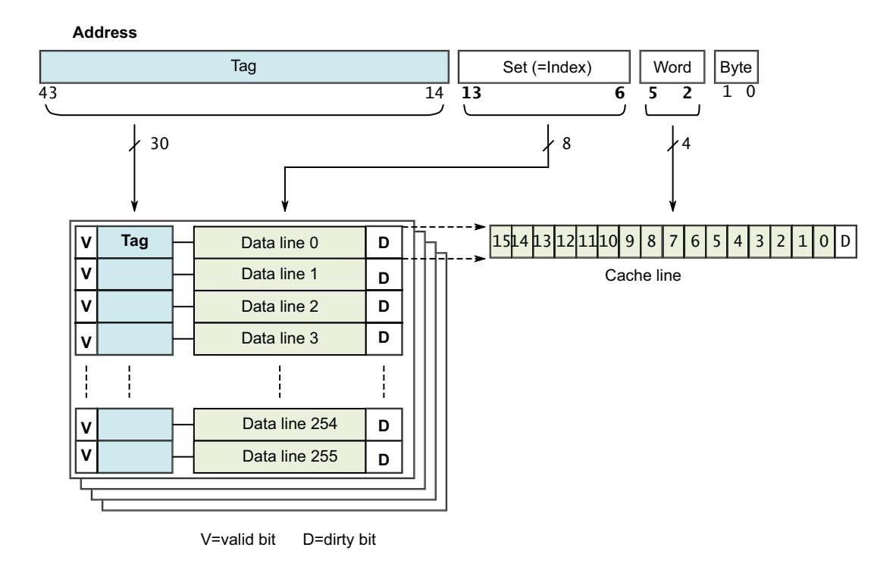

<span id="page-146-0"></span>Figure 11-4 A 32KB 4-way set associative data cache

#### <span id="page-147-1"></span>**11.1.3 Inclusive and exclusive caches**

<span id="page-147-0"></span>Consider a simple memory read, for example, LDR X0, [X1] in a single core processor.

- If X1 points to a location in memory, which is marked as cacheable, then there is a cache lookup in the L1 data cache.
- If the address is found within the L1 cache, then data is read from the L1 cache and returned to the core.

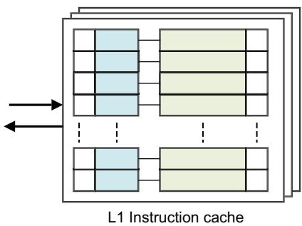

**Figure 11-5 Found in the L1 cache**

• If the address is not found in the L1 cache, but is in the L2 cache, then the cache line is loaded into the L1 cache from the L2 cache and the data is returned to the core. This can cause a line to be evicted from the L1 to make room, but it might still be present in the larger L2 cache.

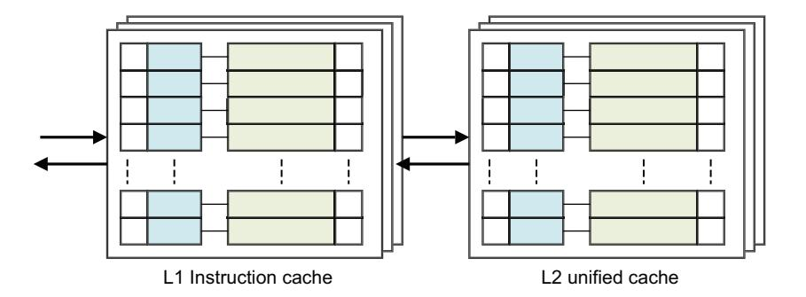

**Figure 11-6 Found in the L2 cache**

• If the address is not in either the L1 or L2 caches, data is loaded into both the L1 and L2 caches from external memory and supplied to the core. This can cause lines to be evicted.

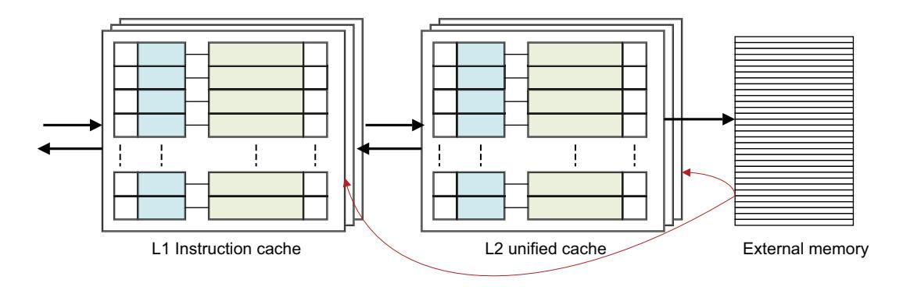

**Figure 11-7 Found in external memory**

This is a rather simplistic view. For multi-core and multi-cluster systems, before performing a load from external memory, the caches of L2 or L1 caches of cores within the cluster or of other clusters might also be checked. In addition, there is no consideration of either L3 or system caches at this point.

<span id="page-148-1"></span><span id="page-148-0"></span>This is an *inclusive* cache model, where the same data can be present in both the L1 and L2 caches. In an *exclusive* cache, data can be present in only one cache and an address cannot be found in both the L1 and L2 caches at the same time.

#### <span id="page-149-0"></span>**11.2 Cache controller**

The cache controller is a hardware block responsible for managing the cache memory, in a way that is largely invisible to the program. It automatically writes code or data from main memory into the cache. It takes read and write memory requests from the core and performs the necessary actions to the cache memory or the external memory.

<span id="page-149-1"></span>When it receives a request from the core, it must check to see whether the requested address is to be found in the cache. This is known as a *cache look-up*. It does this by comparing a subset of the address bits of the request with tag values associated with lines in the cache. If there is a match, known as a hit, and the line is marked valid, then the read or write occurs using the cache memory.

<span id="page-149-2"></span>When the core requests instructions or data from a particular address, but there is no match with the cache tags, or the tag is not valid, a cache *miss* results and the request must be passed to the next level of the memory hierarchy, an L2 cache, or external memory. It can also cause a cache linefill. A cache linefill causes the contents of a piece of main memory to be copied into the cache. At the same time, the requested data or instructions are streamed to the core. This process occurs transparently and is not directly visible to a software developer. The core need not wait for the linefill to complete before using the data. The cache controller typically accesses the *critical word* within the cache line first. For example, if you perform a load instruction that misses in the cache and triggers a cache linefill, the core first retrieves that part of the cache line that contains the requested data. This critical data is supplied to the core pipeline, while the cache hardware and external bus interface then read the rest of the cache line, in the background.

#### <span id="page-150-0"></span>**11.3 Cache policies**

The cache policies enable us to describe when a line should be allocated to the data cache and what should happen when a store instruction is executed that hits in the data cache.

The cache allocation policies are:

#### <span id="page-150-2"></span>**Write allocation (WA)**

A cache line is allocated on a write miss. This means that executing a store instruction on the processor might cause a burst read to occur. There is a linefill to obtain the data for the cache line, before the write is performed. The cache contains the whole line, which is its smallest loadable unit, even if you are only writing to a single byte within the line.

#### <span id="page-150-1"></span>**Read allocation (RA)**

A cache line is allocated on a read miss.

The cache update policies are:

#### <span id="page-150-3"></span>**Write-back (WB)**

A write updates the cache only and marks the cache line as dirty. External memory is updated only when the line is evicted or explicitly cleaned.

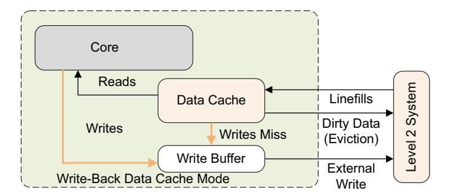

**Figure 11-8 Write-back**

#### <span id="page-150-4"></span>**Write-through (WT)**

A write updates both the cache and the external memory system. This does not mark the cache line as dirty.

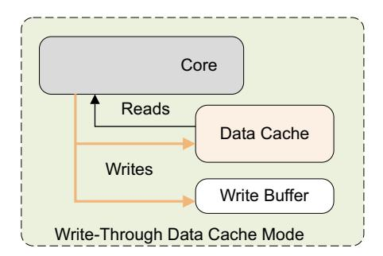

**Figure 11-9 Write-through**

Data reads which hit in the cache behave the same in both WT and WB cache modes.

The cacheable properties of normal memory are specified separately as *inner* and *outer* attributes. The divide between inner and outer is IMPLEMENTATION DEFINED and is covered in greater detail in Chapter 13. Typically, inner attributes are used by the integrated caches, and outer attributes are made available on the processor memory bus for use by external caches.

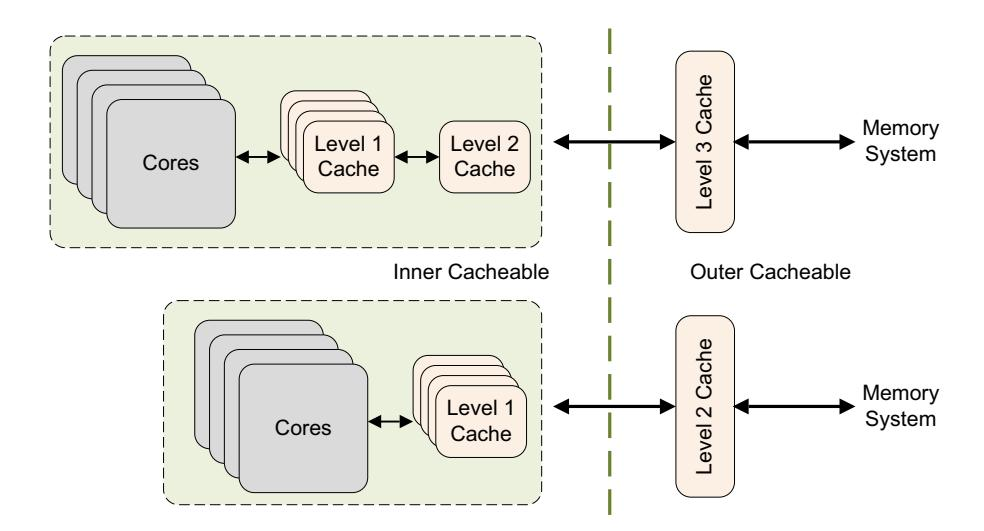

<span id="page-151-0"></span>Figure 11-10 Cacheable properties of memory

Normal memory can be speculatively accessed by the processor and this means that it can potentially automatically load data into the cache without the programmer having explicitly requested a specific address. This is covered in more detail in Chapter 13 *Memory Ordering*. However, it is also possible for the programmer to give an indication to the core about which data is used in the future. The ARMv8-A provides preload hint instructions. It is IMPLEMENTATION DEFINED whether the caches support speculation and preload. The following instructions are available:

- AArch64: PRFM PLDL1KEEP, [Xm, #imm]; This indicates a Prefetch for a load from Xm + offset into the L1 cache as a *temporal prefetch*, which means that the data might be used more than once.
- AArch32: PLD Rm // Preload data from address in Rm to cache

<type><target><policy> | #uimm5

More generally, the A64 instruction to prefetch memory has the following form:

PRFM <prfop>, addr

#### Where:

<prfop>

uimm5

<type> PLD for prefetch for load

Represents the hint encodings as a 5-bit immediate. These are optional.

#### <span id="page-152-0"></span>**11.4 Point of coherency and unification**

For set-based and way-based clean and invalidate, the operation is performed on a specific level of cache. For operations that use a Virtual Address, the architecture defines two points:

<span id="page-152-1"></span>• *Point of Coherency* (PoC). For a particular address, the PoC is the point at which all observers, for example, cores, DSPs, or DMA engines, that can access memory, are guaranteed to see the same copy of a memory location. Typically, this is the main external system memory.

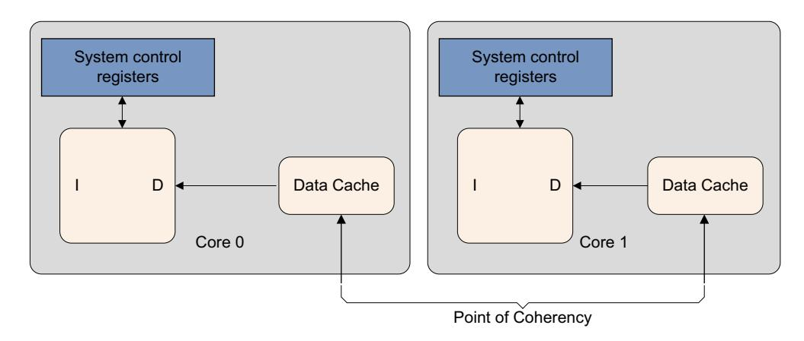

**Figure 11-11 Point of Coherency**

<span id="page-152-2"></span>• *Point of Unification* (PoU). The PoU for a core is the point at which the instruction and data caches and translation table walks of the core are guaranteed to see the same copy of a memory location. For example, a unified level 2 cache would be the point of unification in a system with Harvard level 1 caches and a TLB for caching translation table entries. If no external cache is present, main memory would be the Point of Unification.

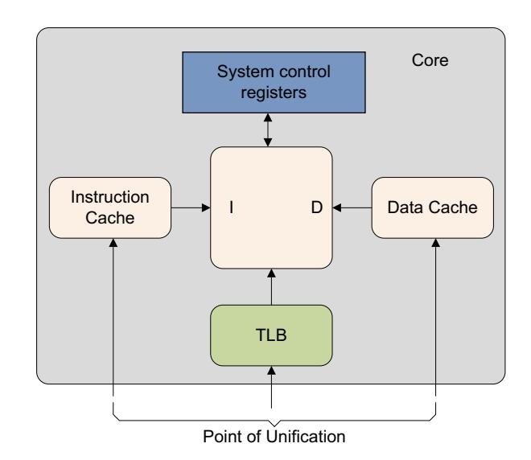

**Figure 11-12 Point of Unification**

Knowledge of the PoU enables self-modifying code to ensure future instruction fetches are correctly made from the modified version of the code. They can do this by using a two-stage process:

• Clean the relevant data cache entries by address.

• Invalidate instruction cache entries by address.

The ARM architecture does not require the hardware to ensure coherency between instruction caches and memory, even for locations of shared memory.

#### <span id="page-154-1"></span><span id="page-154-0"></span>**11.5 Cache maintenance**

It is sometimes necessary for software to clean or invalidate a cache. This might be required when the contents of external memory have been changed and it is necessary to remove stale data from the cache. It can also be required after MMU-related activity such as changing access permissions, cache policies, or virtual to Physical Address mappings, or when I and D-caches must be synchronized for dynamically generated code such as JIT-compilers and dynamic library loaders.

- Invalidation of a cache or cache line means to clear it of data, by clearing the valid bit of one or more cache lines. The cache must always be invalidated after reset as its contents are undefined. This can also be viewed as a way of making changes in the memory domain outside the cache visible to the user of the cache.
- Cleaning a cache or cache line means writing the contents of cache lines that are marked as dirty, out to the next level of cache, or to main memory, and clearing the dirty bits in the cache line. This makes the contents of the cache line coherent with the next level of the cache or memory system. This is only applicable for data caches in which a write-back policy is used. This is also a way of making changes in the cache visible to the user of the outer memory domain, but is only available for data cache.
- Zero. This zeroes a block of memory within the cache, without the need to first of all read its contents from the outer domain. This is only available for data cache.

For each of these operations, you can select which of the entries the operation should apply to:

- All, means the entire cache and is not available for the data or unified cache
- *Modified Virtual Addres*s (MVA), another name for VA, is the cache line that contains a specific Virtual Address
- Set or Way is a specific cache line selected by its position within the cache structure

<span id="page-154-2"></span>AArch64 cache maintenance operations are performed using instructions which have the following general form:

```
<cache> <operation>{, <Xt>}
```

A number of operations are available.

**Table 11-1 Data cache, instruction cache, and unified cache operations**

| Cache | Operation | Description                                                   | AArch32<br>Equivalent |
|-------|-----------|---------------------------------------------------------------|-----------------------|
| DC    | CISW      | Clean and invalidate by Set/Way                               | DCCISW                |
|       | CIVAC     | Clean and Invalidate by Virtual Address to Point of Coherency | DCCIMVAC              |
|       | CSW       | Clean by Set/Way                                              | DCCSW                 |
|       | CVAC      | Clean by Virtual Address to Point of Coherency                | DCCMVAC               |
|       | CVAU      | Clean by Virtual Address to Point of Unification              | DCCMVAU               |
|       | ISW       | Invalidate by Set/Way                                         | DCISW                 |
|       | IVAC      | Invalidate by Virtual Address, to Point of Coherency          | DCIMVAC               |
| DC    | ZVA       | Cache zero by Virtual Address                                 | -                     |

**Table 11-1 Data cache, instruction cache, and unified cache operations (continued)**

| Cache | Operation | Description                                              | AArch32<br>Equivalent |
|-------|-----------|----------------------------------------------------------|-----------------------|
| IC    | IALLUIS   | Invalidate all, to Point of Unification, Inner Sharable  | ICIALLUIS             |
|       | IALLU     | Invalidate all, to Point of Unification, Inner Shareable | ICIALLU               |
|       | IVAU      | Invalidate by Virtual Address to Point of Unification    | ICIMVAU               |

Those instructions that accept an address argument take a 64-bit register which holds the Virtual Address to be maintained. No alignment restrictions apply for this address. Instructions that take a Set/Way/Level argument, take a 64-bit register whose lower 32-bits follow the format described in the ARMv7 architecture. The AArch64 Data Cache invalidate instruction by address, DC IVAC, requires write permission or else a permission fault is generated.

All instruction cache maintenance instructions can execute in any order relative to other instruction cache maintenance instructions, data cache maintenance instructions, and loads and stores, unless a DSB is executed between the instructions.

Data cache operations, other than DC ZVA, that specify an address are only guaranteed to execute in program order relative to each other if they specify the same address. Those operations that specify an address execute in program order relative to all maintenance operations that do not specify an address.

Consider the following code sequence.

#### **Example 11-1 Cache invalidate and clean to PoU**

| IC IVAU, X0<br>DC CVAC, X0<br>IC IVAU, X1 | // Instruction Cache Invalidate by address to Point of Unification<br>// Data Cache Clean by address to Point of Coherency<br>// Might be out of order relative to the previous operations if<br>// x0 and x1 differ |
|-------------------------------------------|----------------------------------------------------------------------------------------------------------------------------------------------------------------------------------------------------------------------|
|                                           |                                                                                                                                                                                                                      |

The first two instructions execute in order, as they refer to the same address. However, the final instruction might be re-ordered relative to the previous operations, as it refers to a different address.

#### **Example 11-2 Cache invalidate to PoU**

```
IC IVAU, X0 // I cache Invalidate by address to Point of Unification 
 IC IALLU // I cache Invalidate All to Point of Unification 
 // Operations execute in order
```

This only applies to issuing the instruction. Completion is only guaranteed after a DSB instruction.

The ability to preload the data cache with zero values using the DC ZVA instruction is new in ARMv8-A. Processors can operate significantly faster than external memory systems and it can sometimes take a long time to load a cache line from memory.

Cache line zeroing behaves in a similar fashion to a prefetch, in that it is a way of hinting to the processor that certain addresses are likely to be used in the future. However, a zeroing operation can be much quicker as there is no need to wait for external memory accesses to complete.

Instead of getting the actual data from memory read into the cache, you get cache lines filled with zeros. It enables hinting to the processor that the code completely overwrites the cache line contents, so there is no need for an initial read.

Consider the case where you need a large temporary storage buffer or are initializing a new structure. You could have code simply start using the memory, or you could write code that prefetched it before using it. Both would use a lot of cycles and memory bandwidth in reading the initial contents to the cache. By using a cache zero option, you could potentially save this wasted bandwidth and execute the code faster.

The point at which a cache maintenance instruction takes place can be defined depending on whether the instruction operates by VA or by Set/Way.

You can choose the scope, which can be either PoC or PoU, and for operations that can be broadcast, see Chapter 14 *[Multi-core processors](#page-203-1)*, you can select the Shareability.

The following example code illustrates a generic mechanism for cleaning the entire data or unified cache to the PoC.

#### **Example 11-3 Cleaning to Point of Coherency**

```
MRS X0, CLIDR_EL1
      AND W3, W0, #0x07000000 // Get 2 x Level of Coherence
      LSR W3, W3, #23
      CBZ W3, Finished
      MOV W10, #0 // W10 = 2 x cache level
      MOV W8, #1 // W8 = constant 0b1
Loop1: ADD W2, W10, W10, LSR #1 // Calculate 3 x cache level
      LSR W1, W0, W2 // extract 3-bit cache type for this level
      AND W1, W1, #0x7
      CMP W1, #2
      B.LT Skip // No data or unified cache at this level
      MSR CSSELR_EL1, X10 // Select this cache level
      ISB // Synchronize change of CSSELR
      MRS X1, CCSIDR_EL1 // Read CCSIDR
      AND W2, W1, #7 // W2 = log2(linelen)-4
      ADD W2, W2, #4 // W2 = log2(linelen)
      UBFX W4, W1, #3, #10 // W4 = max way number, right aligned
      CLZ W5, W4 /* W5 = 32-log2(ways), bit position of way in DC 
                              operand */
      LSL W9, W4, W5 /* W9 = max way number, aligned to position in DC
                              operand */
      LSL W16, W8, W5 // W16 = amount to decrement way number per iteration
Loop2: UBFX W7, W1, #13, #15 // W7 = max set number, right aligned
      LSL W7, W7, W2 /* W7 = max set number, aligned to position in DC
                            operand */
      LSL W17, W8, W2 // W17 = amount to decrement set number per iteration
Loop3: ORR W11, W10, W9 // W11 = combine way number and cache number...
      ORR W11, W11, W7 // ... and set number for DC operand
      DC CSW, X11 // Do data cache clean by set and way
      SUBS W7, W7, W17 // Decrement set number
      B.GE Loop3
      SUBS X9, X9, X16 // Decrement way number
      B.GE Loop2
Skip: ADD W10, W10, #2 // Increment 2 x cache level
      CMP W3, W10
      DSB /* Ensure completion of previous cache maintenance
                             operation */
      B.GT Loop1
```

#### Finished:

#### Some points to note:

- Under normal circumstances, cleaning or invalidating the entire cache is something that only the firmware should be doing, as part of the core's power-up or power-down sequence. It can also take significant time, the number of lines in the L2 cache can be quite large, and it is necessary to loop over them one by one.
  - Therefore this kind of clean is definitely for special occasions only!
- Cache maintenance operations such as DC CSW are described in *[Cache maintenance](#page-154-1)* on [page 11-13.](#page-154-1)
- The caches must be disabled at the start of the sequence to prevent the allocation of new lines mid-sequence. If the caches were exclusive, a line could migrate between levels.
- In an SMP system, another core might be able to take dirty cache lines from the cache mid-sequence, preventing them from reaching the PoC. Both the Cortex-A53 and Cortex-A7 processors can do this.
- If there is an EL3, then the caches must be invalidated from the Secure world as some of the entries could be 'secure dirty' data which cannot be invalidated from the Normal world. If left untouched, 'secure dirty' data can corrupt the memory system when it is evicted because of normal cache use in the Secure or Normal worlds.

If software requires coherency between instruction execution and memory, it must manage this coherency using the ISB and DSB memory barriers and cache maintenance instructions. The code sequence shown in [Example 11-4](#page-157-0) can be used for this purpose.

#### **Example 11-4 Cleaning a line of self-modifying code**

```
/* Coherency example for data and instruction accesses within the same Inner
  Shareable domain. Enter this code with <Wt> containing a new 32-bit instruction,
  to be held in Cacheable space at a location pointed to by Xn. */
STR Wt, [Xn]
DC CVAU, Xn // Clean data cache by VA to point of unification (PoU)
DSB ISH // Ensure visibility of the data cleaned from cache
IC IVAU, Xn // Invalidate instruction cache by VA to PoU
DSB ISH // Ensure completion of the invalidations
ISB // Synchronize the fetched instruction stream
```

This code sequence is only valid for an instruction sequence that fits into a single I or D-cache line.

The code cleans and invalidates data and instruction caches by Virtual Address for a region starting at the base address given in x0 and length given in x1.

#### **Example 11-5 Cleaning by Virtual Address**

```
//
// X0 = base address
// X1 = length (we assume the length is not 0)
//
// Calculate end of the region
ADD x1, x1, x0 // Base Address + Length
```

```
//
 // Clean the data cache by MVA
 //
 MRS X2, CTR_EL0 // Read Cache Type Register
 // Get the minimun data cache line
 //
 UBFX X4, X2, #16, #4 // Extract DminLine (log2 of the cache line)
 MOV X3, #4 // Dminline iss the number of words (4 bytes)
 LSL X3, X3, X4 // X3 should contain the cache line
 SUB X4, X3, #1 // get the mask for the cache line
 BIC X4, X0, X4 // Aligned the base address of the region
clean data cache:
 DC CVAU, X4 // Clean data cache line by VA to PoU
 ADD X4, X4, X3 // Next cache line
 CMP X4, X1 // Is X4 (current cache line) smaller than the end 
                          // of the region
 B.LT clean_data_cache // while (address < end_address)
 DSB ISH // Ensure visibility of the data cleaned from cache
 //
 //Clean the instruction cache by VA
 //
 // Get the minimum instruction cache line (X2 contains ctr_el0)
 AND X2, X2, #0xF // Extract IminLine (log2 of the cache line)
 MOV X3, #4 // IminLine is the number of words (4 bytes)
 LSL X3, X3, X2 // X3 should contain the cache line
 SUB x4, x3, #1 // Get the mask for the cache line
 BIC X4, X0, X4 // Aligned the base address of the region
clean_instruction_cache:
 IC IVAU, X4 // Clean instruction cache line by VA to PoU
 ADD X4, X4, X3 // Next cache line
 CMP X4, X1 // Is X4 (current cache line) smaller than the end 
                         // of the region
 B.LT clean_instruction_cache // while (address < end_address)
 DSB ISH // Ensure completion of the invalidations
 ISB // Synchronize the fetched instruction stream
```

#### <span id="page-159-0"></span>**11.6 Cache discovery**

Cache maintenance operations can be performed either by cache set, or way, or by Virtual Address. Code that is platform-independent might need to know the size of a cache, the size of the cache lines, numbers of sets and ways, and how many levels of cache there are in the system. This requirement is most likely to arise for post-reset cache invalidation and zero operations. All other operations on architectural caches are likely to be made on a PoC or PoU basis.

There are a number of system control registers that contain this information:.

- The number of cache levels present can be determined by having software read the *Cache Level ID Register* (CLIDR\_EL1).
- The cache line size is given in the *Cache Type Register* (CTR\_EL0).
- If this needs to be accessed by user code, running at execution level EL0, this can be done by setting the UCT bit of the *System Control Register* (SCTLR/SCTLR\_EL1).

Exception level accesses to two separate registers are required to determine the number of sets and ways in a cache.

- 1. Code must first write to the *Cache Size Selection Register* (CSSELR\_EL1) to select which cache you want the information for.
- 2. Code then reads the *Cache Size ID Register* (CCSIDR/CCSIDR\_EL1).
- 3. The *Data cache Zero ID Register* (DCZID\_EL0) contains the block size to be zeroed for Zero operations.
- 4. The [DZE] bit of the SCTLR/SCTLR\_EL1 and the [TDZ] bit in the *Hypervisor Configuration Register* (HCR/HCR\_EL2) control which execution levels and which worlds can access DCZID\_EL0. CLIDR\_EL1, CSSELR\_EL1, and CCSIDR\_EL1 are only accessible via privileged code, that is, PL1 or higher in AArch32, or EL1 or higher in AArch64.
- 5. If execution of the *Data Cache Zero by Virtual Address* (DC ZVA) instruction is prohibited at an Exception level, as controlled for EL0 by the SCTLR\_EL1.DZE bit, and for Non-secure execution in EL1 and EL0 by the HCR\_EL2.TDZ bit, then reading this register returns a value that indicates that the instruction is not supported.
- 6. The CLIDR register is only aware of how many levels of cache are integrated into the processor itself. It cannot provide information about any caches in the external memory system.

For example, if only L1 and L2 are integrated, CLIDR/CLIDR\_EL1 identifies two levels of cache and the processor is unaware of any external L3 cache.

It might be necessary to take into account non-integrated caches when performing cache maintenance, or code that is maintaining coherency with integrated caches.

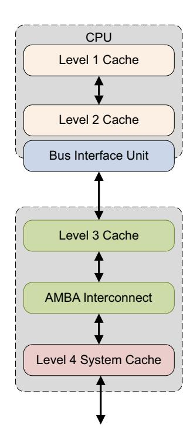

**Figure 11-13**

In addition, in a big.LITTLE system, the described cache hierarchy can differ from core to core, for example, the Cortex-A53 and Cortex-A57 processors have different CTR.L1IP fields.

### <span id="page-161-1"></span><span id="page-161-0"></span>Chapter 12

### **The Memory Management Unit**

An important function of the *Memory Management Unit* (MMU) is to enable the system to run multiple tasks, as independent programs running in their own private virtual memory space. They do not need any knowledge of the physical memory map of the system, that is, the addresses that are actually used by the hardware, or about other programs that might execute at the same time.

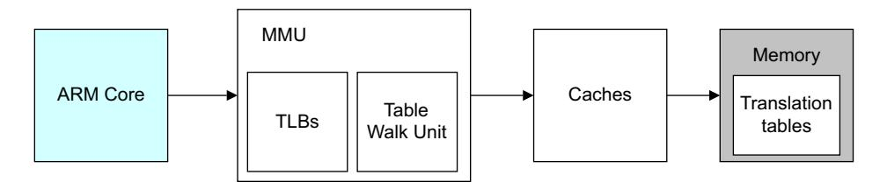

Figure 12-1 The Memory Management Unit

You can use the same virtual memory address space for each program. You can also work with a contiguous virtual memory map, even if the physical memory is fragmented. This Virtual Address space is separate from the actual physical map of memory in the system. You can write, compile, and link applications to run in the virtual memory space.

An example system, illustrating the virtual and physical views of memory, is shown in Figure 12-2 on page 12-2. Different processors and devices in a single system might have different virtual and Physical Address maps. The OS programs the MMU to translate between these two views of memory.

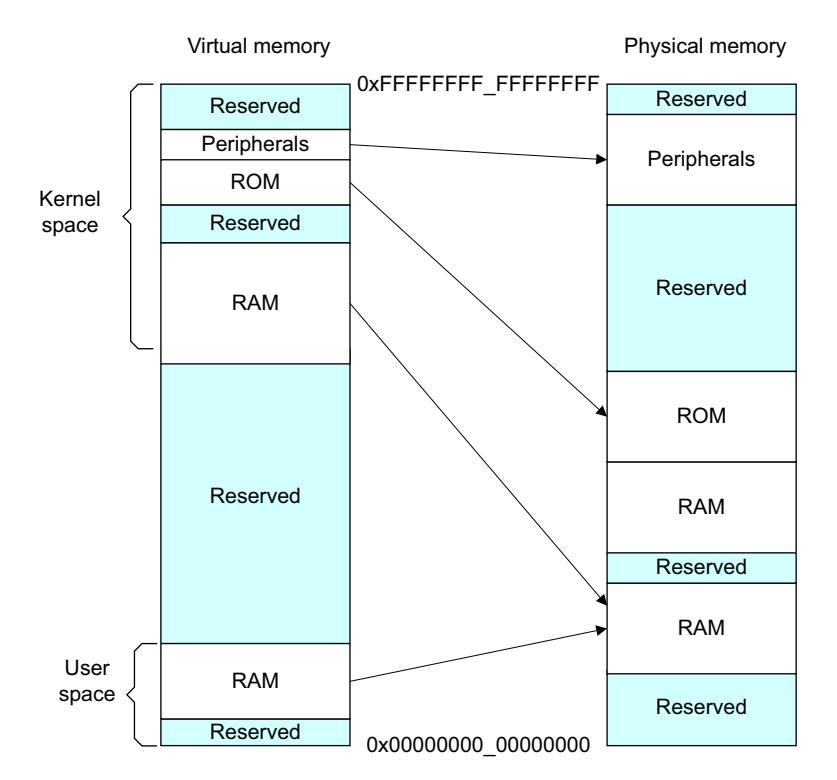

**Figure 12-2 Virtual and physical memory**

<span id="page-162-0"></span>To do this, the hardware in a virtual memory system must provide address translation, which is the translation of the Virtual Address issued by the processor to a Physical Address in the main memory.

<span id="page-162-2"></span><span id="page-162-1"></span>*Virtual Addresses* are those used by you, and the compiler and linker, when placing code in memory. *Physical Addresses* are those used by the actual hardware system.

The MMU uses the most significant bits of the Virtual Address to index entries in a *translation table* and establish which block is being accessed. The MMU translates the Virtual Addresses of code and data to the Physical Addresses in the actual system. The translation is carried out automatically in hardware and is transparent to the application. In addition to address translation, the MMU controls memory access permissions, memory ordering, and cache policies for each region of memory.

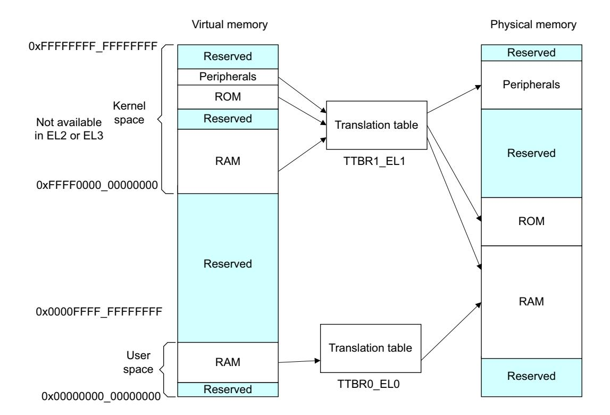

**Figure 12-3 Address translation using translation tables**

The MMU enables tasks or applications to be written in a way that requires them to have no knowledge of the physical memory map of the system, or about other programs that might be running simultaneously. This allows you to use the same virtual memory address space for each program.

It also lets you work with a contiguous virtual memory map, even if the physical memory is fragmented. This Virtual Address space is separate from the actual physical map of memory in the system. Applications are written, compiled and linked to run in the virtual memory space.

#### <span id="page-164-0"></span>**12.1 The Translation Lookaside Buffer**

<span id="page-164-2"></span>The *Translation Lookaside Buffer* (TLB) is a cache of recently accessed page translations in the MMU. For each memory access performed by the processor, the MMU checks whether the translation is cached in the TLB. If the requested address translation causes a hit within the TLB, the translation of the address is immediately available.

Each TLB entry typically contains not just physical and Virtual Addresses, but also attributes such as memory type, cache policies, access permissions, the *Address Space ID* (ASID), and the *Virtual Machine ID* (VMID). If the TLB does not contain a valid translation for the Virtual Address issued by the processor, known as a TLB miss, an external translation table walk or lookup is performed. Dedicated hardware within the MMU enables it to read the translation tables in memory. The newly loaded translation can then be cached in the TLB for possible reuse if the translation table walk does not result in a page fault. The exact structure of the TLB differs between implementations of the ARM processors.

If the OS modifies translation entries that may have been cached in the TLB, it is then the responsibility of the OS to invalidate these stale TLB entries.

<span id="page-164-1"></span>When executing A64 code, there is a TLBI, which is a TLB invalidate instruction.

```
TLBI <type><level>{IS} {, <Xt>}
```

The following list gives some of the more common selections for the type field. A complete list is given in [Table 12-1 on page 12-5.](#page-165-0)

**ALL** All TLB entries.

**VMALL** All TLB entries. This is stage 1 for current guest OS.

**VMALLS12** All TLB entries. This is stage 1 and 2 for current guest OS.

**ASID** Entries that match ASID in Xt.

**VA** Entry for Virtual Address and ASID specified in Xt.

**VAA** Entries for Virtual Address specified in Xt, with any ASID.

Each Exception level, that is EL3, EL2, or EL1, has its own Virtual Address space that the operation applies to. The IS field specifies that this is only for Inner Shareable entries.

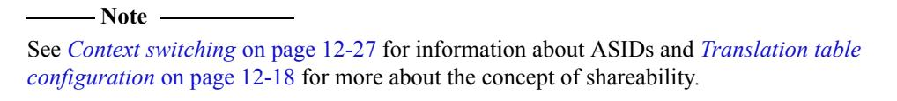

The <level> field simply specifies the Exception level Virtual Address space (can be 3, 2 or 1) that the operation should apply to.

<span id="page-165-0"></span>The IS field specifies that this is only for Inner Shareable entries.

**Table 12-1 TLB configuration instructions**

| TLB<br>invalidate | Variant      | Description                                                                  |
|-------------------|--------------|------------------------------------------------------------------------------|
| TLBI              | ALLEn        | TLB invalidate All, ELn.                                                     |
|                   | ALLEnIS      | TLB invalidate All, ELn, Inner Shareable.                                    |
|                   | ASIDE1       | TLB invalidate by ASID, EL1.                                                 |
|                   | ASIDE1IS     | TLB invalidate by ASID, EL1, Inner Shareable.                                |
|                   | IPAS2E1      | TLB invalidate by IPA, Stage 2, EL1.                                         |
|                   | IPAS2E1IS    | TLB invalidate by IPA, Stage 2, EL1, Inner Shareable.                        |
|                   | IPAS2LE1IS   | TLB invalidate by IPA, Stage 2, Last level, EL1, Inner<br>Shareable.         |
|                   | VAAE1        | TLB invalidate by VA, All ASID, EL1.                                         |
|                   | VAAE1IS      | TLB invalidate by VA, All ASID, EL1, Inner Shareable.                        |
|                   | VAALE1IS     | TLB invalidate for the Last level, by VA, All ASID, EL1,<br>Inner Shareable. |
|                   | VAEn         | TLB invalidate by VA, ELn.                                                   |
|                   | VAEnIS       | TLB invalidate by VA, ELn, Inner Shareable.                                  |
|                   | VALEn        | TLB invalidate by VA, Last level, ELn.                                       |
|                   | VALEnIS      | TLB invalidate by VA, Last level, ELn, Inner Shareable.                      |
|                   | VMALLE1      | TLB invalidate by VMID, All at stage 1, EL1.                                 |
|                   | VMALLE1IS    | TLB invalidate by VMID, EL1, Inner Shareable.                                |
|                   | VMALLS12E1   | TLB invalidate by VMID, All at Stage 1 and 2, EL1.                           |
|                   | VMALLS12E1   | TLB invalidate by VMID, All at Stage 1 and 2, EL1.                           |
|                   | VMALLS12E1IS | TLB invalidate by VMID, All at Stage 1 and 2, EL1 Inner<br>Shareable.        |
|                   | VMALLS12E1IS | TLB invalidate by VMID, All at Stage 1 and 2, EL1 Inner<br>Shareable.        |

The following code example shows a sequence for writes to translation tables backed by inner shareable memory:

```
<< Writes to Translation Tables >>
DSB ISHST // ensure write has completed
TLBI ALLE1 // invalidate all TLB entries
DSB ISH // ensure completion of TLB invalidation
ISB // synchronize context and ensure that no instructions are
                 // fetched using the old translation
```

See *Barriers* [on page 13-6](#page-195-0) for more information about the DSB and ISB barrier instructions shown in the example.

For a change to a single entry, for example, use the instruction:

TLBI VAE1, X0

which invalidates an entry associated with the address specified in the register X0.

<span id="page-166-0"></span>The TLB can hold a fixed number of entries. You can achieve best performance by minimizing the number of external memory accesses caused by translation table traversal and obtaining a high TLB hit rate. The ARMv8-A architecture provides a feature known as *contiguous block entries* to efficiently use TLB space. Translation table block entries each contain a *contiguous bit*. When set, this bit signals to the TLB that it can cache a single entry covering translations for multiple blocks. A lookup can index anywhere into an address range covered by a contiguous block. The TLB can therefore cache one entry for a defined range of addresses, making it possible to store a larger range of Virtual Addresses within the TLB than is otherwise possible.

To use a contiguous bit, the contiguous blocks must be adjacent, that is they must correspond to a contiguous range of Virtual Addresses. They must start on an aligned boundary, have consistent attributes, and point to a contiguous output address range at the same level of translation. The required alignment is that VA[20:16] for a 4KB granule or VA[28:21] for a 64KB granule, are the same for all addresses. The following numbers of contiguous blocks are required:

- 16 × 4KB adjacent blocks giving a 64KB entry with 4KB granule.
- 32 × 32MB adjacent blocks giving a 1GB entry for L2 descriptors, 128 × 16KB giving a 2MB entry for L3 descriptors when using a 16KB granule.
- 32 × 64Kb adjacent blocks giving a 2MB entry with a 64KB granule.

If these conditions are not met, a programming error occurs, which can cause TLB aborts or corrupted lookups. Possible examples of such an error include:

- One or more of the table entries do not have the contiguous bit set.
- The output of one of the entries points outside the aligned range.

With the ARMv8 architecture, incorrect use does not allow permissions checks outside of EL0 and EL1 valid address space to be escaped, or to erroneously provide access to EL3 space.

### <span id="page-167-0"></span>**12.2 Separation of kernel and application Virtual Address spaces**

Operating systems typically have a number of applications or tasks running concurrently. Each of these has its own unique set of translation tables and the kernel switches from one to another as part of the process of switching context between one task and another. However, much of the memory system is used only by the kernel and has fixed virtual to Physical Address mappings where the translation table entries rarely change. The ARMv8 architecture provides a number of features to efficiently handle this requirement.

<span id="page-167-4"></span><span id="page-167-3"></span><span id="page-167-2"></span>The table base addresses are specified in the *Translation Table Base Registers* (TTBR0\_EL1) and (TTBR1\_EL1). The translation table pointed to by TTBR0 is selected when the upper bits of the VA are all 0. TTBR1 is selected when the upper bits of the VA are all set to 1. You can enable VA tagging to exclude the top eight bits from the check.

The Virtual Address from the processor of an instruction fetch or data access is 64 bits. However, you must map both of the two regions defined above within a single 48-bit Physical Address memory map.

EL2 and EL3 have a TTBR0, but no TTBR1. This means:

- If EL2 is using AArch64, it can only use Virtual Addresses in the range 0x0 to 0x0000FFFF\_FFFFFFFF.
- If EL3 is using AArch64, it can only use Virtual Addresses in the range 0x0 to 0x0000FFFF\_FFFFFFFF.

[Figure 12-4](#page-167-1) shows how the kernel space can be mapped to the most significant area of memory and the Virtual Address space associated with each application mapped to the least significant area of memory. However, both of these are mapped to a much smaller Physical Address space.

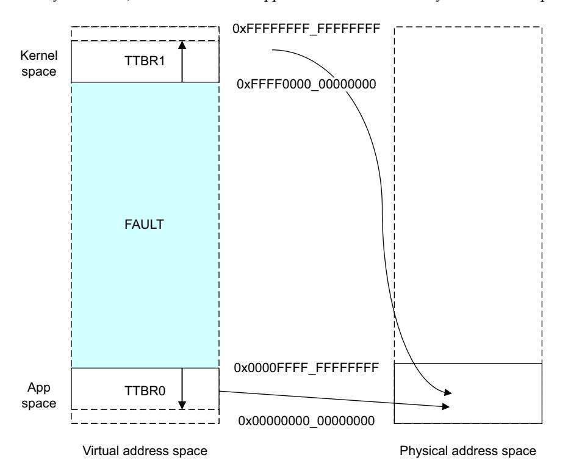

<span id="page-167-1"></span>**Figure 12-4 Kernel and application memory mapping**

<span id="page-168-2"></span>The *Translation Control Register* TCR\_EL1 defines the exact number of most significant bits that are checked. TCR\_EL1 contains the size fields T0SZ[5:0] and T1SZ[5:0]. The integer in the field gives the number of the most significant bits that must be either all 0s or all 1s. There are specified minimum and maximum values for these fields, which vary with granule size and starting table level. Therefore, you must always use both spaces and at least two translation tables are required in all systems. A simple bare metal system without an OS still requires a small upper table that contains only fault entries.

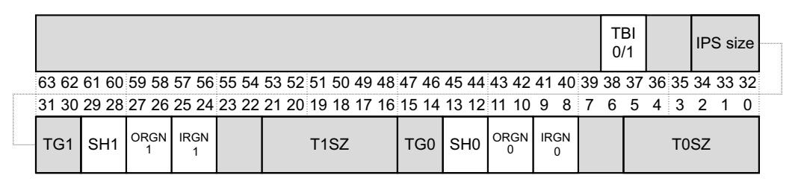

Figure 12-5 Translation table control configuration

TCR\_EL1 controls other memory management features at EL1 and EL0. Figure 12-5 shows only those fields that control address ranges and granule size.

<span id="page-168-0"></span>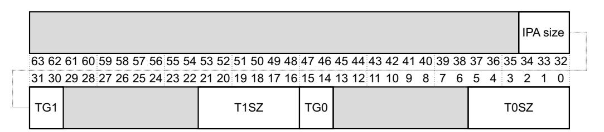

<span id="page-168-3"></span>Figure 12-6 Translation table control register

<span id="page-168-1"></span>The *Intermediate Physical Address Size* (IPS) field controls the maximum output address size. If translations specify output addresses outside this range, then access is faulted, 000=32 bits of Physical Address, 101=48 bits. The two-bit *Translation Granule* (TG) TG1 and TG0 fields give the granule size for kernel or user space respectively, 00=4KB, 01=16KB, 11=64KB.

You can configure the level of translation table that is used for the first lookup. The full translation process can require three or four levels of tables. You need not implement all levels.. The first level of lookup is, in effect, determined by the granule size and TCR\_ELn.TxSZ fields. You can configure it separately for TTBR0\_EL1 and TTBR1\_EL1.

#### <span id="page-169-0"></span>**12.3 Translating a Virtual Address to a Physical Address**

When the processor issues a 64-bit Virtual Address for an instruction fetch, or data access, the MMU hardware translates the Virtual Address to the corresponding Physical Address. For a Virtual Address the top 16 bits [63:47] must be all 0s or 1s, otherwise the address triggers a fault.

The least significant bits are then used to give an offset within the selected section, so that the MMU combines the Physical Address bits from the block table entry with the least significant bits from the original address to produce the final address.

The architecture also supports tagged addresses. This is where the most significant eight bits of the address are ignored (treated as not being part of the address). This means that the bits can be used for something else, for example, recording information about a pointer.

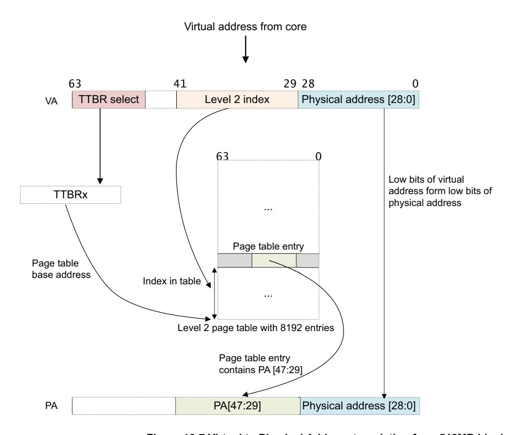

**Figure 12-7 Virtual to Physical Address translation for a 512MB block**

<span id="page-169-1"></span>In a simple address translation involving only one level of look-up. It assumes we are using a 64KB granule with a 42-bit Virtual Address. The MMU translates a Virtual Address as follows:

- 1. If VA[63:42] = 1 then TTBR1 is used for the base address for the first page table. When VA[63:42] = 0, TTBR0 is used for the base address for the first page table.
- 2. The page table contains 8192 64-bit page table entries, and is indexed using VA[41:29]. The MMU reads the pertinent level 2 page table entry from the table.
- 3. The MMU checks the page table entry for validity and whether or not the requested memory access is allowed. Assuming it is valid, the memory access is allowed.

- 4. In Figure 12-7 on page 12-9, the page table entry refers to a 512MB page (it is a block descriptor).
- 5. Bits [47:29] are taken from this page table entry and form bits [47:29] of the Physical Address.
- 6. Because we have a 512MB page, bits [28:0] of the VA are taken to form PA[28:0]. See *Effect of granule sizes on translation tables* on page 12-15.
- 7. The full PA[47:0] is returned, along with additional information from the page table entry.

In practice, such a simple translation process severely limits how finely you can divide up your address space. Instead of using only this first-level translation table, a first-level table entry can also point to a second-level page table.

In this way, an OS can further divide a large section of virtual memory into smaller pages. For a second-level table, the first-level descriptor contains the physical base address of the second-level page table. The Physical Address that corresponds to the Virtual Address requested by the processor, is found in the second-level descriptor.

Figure 12-8 shows an example of translation for a 64-bit granule starting at stage 1, level 2 for a normal 64KB page.

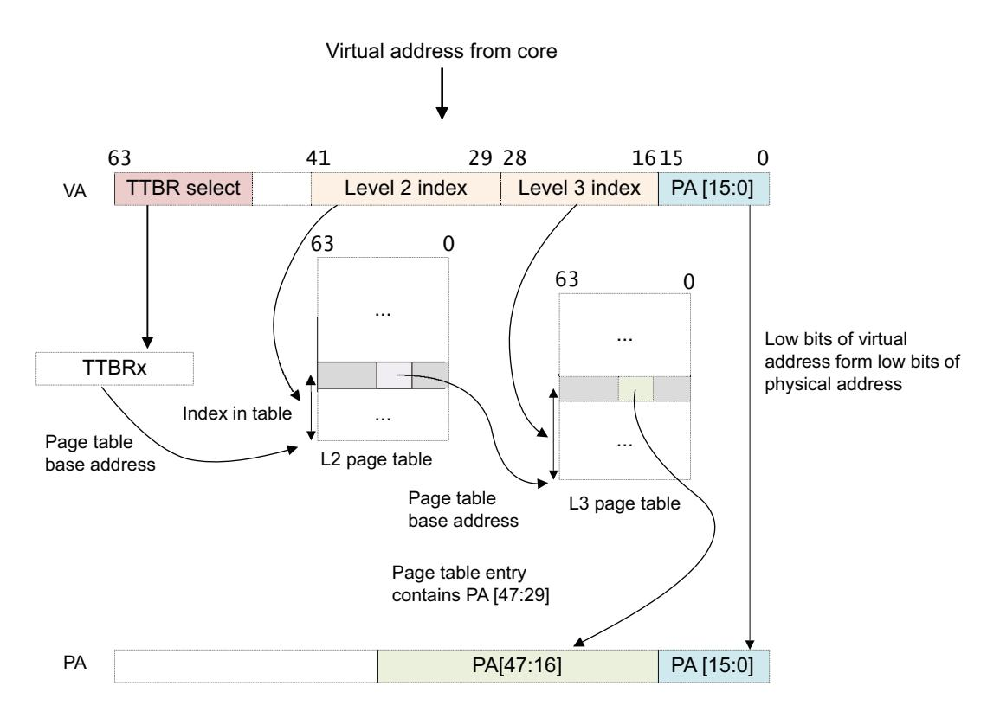

Figure 12-8 Virtual to Physical Address translation for a 64KB page

<span id="page-170-0"></span>Each second-level table is associated with one or more first-level entries. You can have multiple first-level descriptors that point to the same second-level table, which means you can alias several virtual locations to the same Physical Address.

[Figure 12-8 on page 12-10](#page-170-0) describes a situation where there are two levels of look-up. Again, this assumes a 64KB granule and 42-bit Virtual Address space.

- 1. If VA[63:42] = 1 then TTBR1 is used for the base address for the first page table. When VA[63:42] = 0, TTBR0 is used for the base address for the first page table.
- 2. The page table contains 8192 64-bit page table entries, and is indexed via VA[41:29]. The MMU reads the pertinent level 2 page table entry from the table.
- 3. The MMU checks the level 2 page table entry for validity and whether or not the requested memory access is allowed. Assuming it is valid, the memory access is allowed.
- 4. In [Figure 12-8 on page 12-10,](#page-170-0) the level 2 page table entry refers to the address of the level 3 page table (it is a table descriptor).
- 5. Bits [47:16] are taken from the level 2 page table entry and form the base address of the level 3 page table.
- 6. Bits [28:16] of the VA are used to index the level 3 page table entry. The MMU reads the pertinent level 3 page table entry from the table.
- 7. The MMU checks the level 3 page table entry for validity and whether or not the requested memory access is allowed. Assuming it is valid, the memory access is allowed.
- 8. In [Figure 12-8 on page 12-10](#page-170-0), the level 3 page table entry refers to a 64KB page (it is a page descriptor).
- 9. Bits [47:16] are taken from the level 3 page table entry and used to form PA[47:16].
- 10. Because we have a 64KB page, VA[15:0] is taken to form PA[15:0].
- 11. The full PA[47:0] is returned, along with additional information from the page table entries.

#### <span id="page-171-1"></span>**12.3.1 Secure and Non-secure addresses**

<span id="page-171-0"></span>In theory the Secure and Non-secure Physical Address spaces are independent of each other, and exist in parallel. A system could be designed to have two entirely separate memory systems. However, most real systems treat Secure and Non-secure as an attribute for access control. The Normal (Non-secure) world can only access the Non-secure Physical Address space. The Secure world can access both Physical Address spaces. Again this is controlled through translation tables.

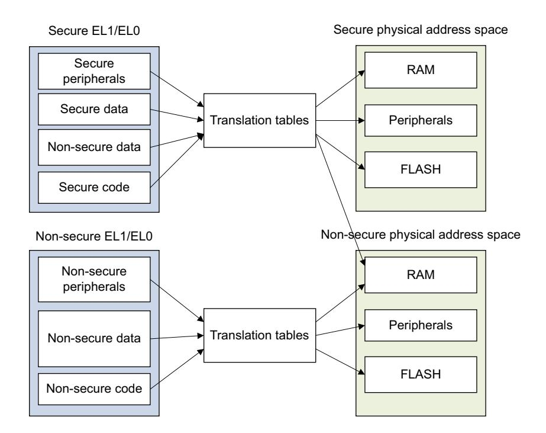

**Figure 12-9 Physical Address spaces**

This also has cache coherency implications. For example, because Secure 0x8000 and Non-secure 0x8000 are, technically speaking, different Physical Addresses, they could both be in the cache at the same time.

In a system where Secure and Non-secure memory are in different locations, there would be no problem. It is more likely that they would be in the same location. Ideally a memory system would block Secure accesses to Non-secure memory and Non-secure accesses to Secure memory. In practice most only block Non-secure access to Secure memory. Again, this means you could end up with the same physical memory in the cache twice, Secure and Non-secure. This is always a programming error. To avoid this the Secure world must always use Non-secure accesses to Non-secure memory.

#### <span id="page-172-0"></span>**12.3.2 Configuring and enabling the MMU**

Writes to the system registers controlling the MMU are context-changing events and there are no ordering requirements between them. The results of these events are not guaranteed to be seen until a context synchronization event (See *Barriers* [on page 13-6](#page-195-0)).

```
MSR TTBR0_EL1, X0 // Set TTBR0
MSR TTBR1_EL1, X1 // Set TTBR1
MSR TCR_EL1, X2 // Set TCR
ISB // The ISB forces these changes to be seen before /
                        // the MMU is enabled.
MRS X0, SCTLR_EL1 // Read System Control Register configuration data
ORR X0, X0, #1 // Set [M] bit and enable the MMU.
MSR SCTLR_EL1, X0 // Write System Control Register configuration data
ISB // The ISB forces these changes to be seen by the /
                        // next instruction
```

This is aside from the requirement for flat mapping, which is to make sure we know which instruction is executed directly after the write to SCTLR\_EL1.M. If we see the result of the write it is the instruction at VA+4 using the new translation regime. If we don't see the result it is still the instruction at VA+4 but where the VA = PA. The ISB doesn't help here as we cannot guarantee it is the next instruction executed unless we flat map.

#### <span id="page-173-0"></span>**12.3.3 Operation when the Memory Management Unit is disabled**

When the stage 1 MMU is disabled, for Non-secure EL0 and EL1 accesses when the HCR\_EL2.DC bit is set to enable the data cache, the default memory type is Normal Non-shareable, Inner Write-Back Read-Write Allocate, Outer Write-Back Read-Write Allocate.

#### <span id="page-174-0"></span>**12.4 Translation tables in ARMv8-A**

The ARMv8-A architecture provides support for three different sets of translation table format:

- ARMv8-A AArch64 Long Descriptor format.
- ARMv7-A Long Descriptor format such as the *Large Physical Address Extension* (LPAE) to the ARMv7-A architecture, found in, for example, the ARM Cortex-A15 processor.
- ARMv7-A Short Descriptor format.

In AArch32 state, you can use the existing ARMv7-A long and short descriptor formats to run existing guest operating systems and existing application code without modification. The ARMv7-A short descriptors can only be used at EL0 and EL1 stage 1 translations. They cannot therefore be used by hypervisors or Secure monitor code.

Always use the ARMv8-A long descriptor format in AArch64 execution state. This is very similar to the ARMv7-A long descriptor format with large Physical Address extensions. It uses the same 64-bit long-descriptor format, but with some changes. It introduces a new level 0 table index, which uses the same descriptor format as the level 1 table. There is added support for up to 48-bit input and output addresses. The input Virtual Address now comes from a 64-bit register. However, as the architecture does not support full 64-bit addressing, bits 63:48 of the address must all be the same, that is, all 0s or all 1s, or the top eight bits can be used for VA tagging.

AArch64 supports three different translation granules. These define the block size at the lowest level of translation table and control the size of translation tables in use. Larger granule sizes reduce the number of levels of page table required and this can become an important consideration in systems using a hypervisor to provide virtualization.

The supported granule sizes are 4KB, 16KB, and 64KB, and it is IMPLEMENTATION DEFINED which of the three are supported. Code that creates page tables is able to read the system register ID\_AA64MMFR0\_EL1, to find out which are the supported sizes. The Cortex-A53 processor supports all three sizes, but this is not the case for early versions of some processors, such as the Cortex-A57, which did not support the 16K granule size. The size is configurable for each translation table within the *Translation Control Register* (TCR\_EL1).

#### <span id="page-174-1"></span>**12.4.1 AArch64 descriptor format**

<span id="page-174-2"></span>You can use the descriptor format in all levels of table, from level 0 to level 3. Level 0 descriptors can only output the address of a level 1 table. Level 3 descriptors cannot point to another table and can only output block addresses. The format of the table is therefore slightly different for level 3.

[Figure 12-10 on page 12-15](#page-175-1) shows that the table descriptor type is identified by bits 1:0 of the entry and can refer to either:

- The address of a next level table, in which case memory can be further subdivided into smaller blocks.
- The address of a variable sized block of memory.
- Table entries, which can be marked Fault, or Invalid.

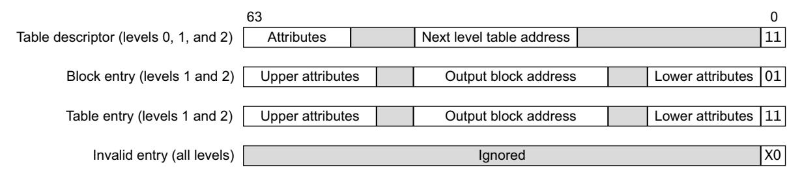

**Figure 12-10 A64 Table descriptor type**

**Note** For purposes of clarity, this diagram does not specify the width of bit fields.

#### <span id="page-175-2"></span><span id="page-175-1"></span><span id="page-175-0"></span>**12.4.2 Effect of granule sizes on translation tables**

<span id="page-175-3"></span>The three different granule sizes can affect the number and size of translation tables required.

**Note**

In all cases, you can omit the first level of table if the VA input range is restricted to 42 bits.

Depending on the size of the possible VA range, there can be even fewer levels. With a 4KB granule, for example, if the TTBCR is set so that low addresses span only 1GB, then levels 0 and 1 are not required and the translation starts at level 2, going down to level 3 for 4KB pages.

**4KB** When you use a 4kB granule size, the hardware can use a 4-level look up process. The 48-bit address has nine address bits per level translated, that is 512 entries each, with the final 12 bits selecting a byte within the 4kB coming directly from the original address.

> Bits 47:39 of the Virtual Address index into the 512 entry L0 table. Each of these table entries spans a 512 GB range and points to an L1 table. Within that 512 entry L1 table, bits 38:30 are used as index to select an entry and each entry points to either a 1GB block or an L2 table. Bits 29:21 index into a 512 entry L2 table and each entry points to a 2MB block or next table level. At the last level, bits 20:12 index into a 512 entry L2 table and each entry points to a 4kB block.

| VA bits [47:39]                             | VA bits [38:30]                                           | VA bits [29:21]                                           | VA bits [20:12]                             | VA bits [11:0] |  |
|---------------------------------------------|-----------------------------------------------------------|-----------------------------------------------------------|---------------------------------------------|----------------|--|
| Level 0 Table Index<br>Each entry contains: | Level 1 Table Index<br>Each entry contains:               | Level 2 Table Index<br>Each entry contains:               | Level 3 Table Index<br>Each entry contains: | Block offset   |  |
| Pointer to L1 table<br>(No block entry)     | Pointer to L2 table<br>Base address of 1GB<br>block (IPA) | Pointer to L3 table<br>Base address of 2MB<br>block (IPA) | Base address off 4KB<br>block (IPA)         | and PA [11:0]  |  |

<span id="page-175-4"></span>**Figure 12-11 4KB Granule**

**16KB** When you use a 16kB granule size, the hardware can use a 4-level look up process. The 48-bit address has 11 address bits per level translated, that is 2048 entries each, with the final 14 bits selecting a byte within the 4kB coming directly from the original address. The level 0 table contains only two entries. Bit 47 of the Virtual Address selects a descriptor from the two entry L0 table. Each of these table entries spans a 128 TB range and points to an L1 table. Within that 2048 entry L1 table, bits 46:36 are used as an index to select an entry and each entry

points to an L2 table. Bits 35:25 index into a 2048 entry L2 table and each entry points to a 32 MB block or next table level. At the final translation stage, bits 24:14 index into a 2048 entry L2 table and each entry points to a 16kB block.

| VA bit [47]                                                                            | VA bits [46:36]                                                    | VA bits [35:25]                                                                                           | VA bits [24:14]                                                                     | VA bits [13:0]                |
|----------------------------------------------------------------------------------------|--------------------------------------------------------------------|-----------------------------------------------------------------------------------------------------------|-------------------------------------------------------------------------------------|-------------------------------|
| Level 0 Table Index<br>Each entry contains:<br>Pointer to L1 table<br>(No block entry) | Level 1 Table Index<br>Each entry contains:<br>Pointer to L2 table | Level 2 Table Index<br>Each entry contains:<br>Pointer to L3 table<br>Base address of 32MB<br>block (IPA) | Level 3 Table Index<br>Each entry contains:<br>Base address off<br>16KB block (IPA) | Block offset<br>and PA [13:0] |

<span id="page-176-1"></span>**Figure 12-12 16KB Granule**

**64KB** When you use a 64kB granule size, the hardware can use a 3-level look up process. The level 1 table contains only 64 entries.

> Bits 47:42 of the Virtual Address select a descriptor from the 64 entry L1 table. Each of these table entries spans a 4TB range and points to an L2 table. Within that 8192 entry L2 table, bits 41:29 are used as index to select an entry and each entry points to either a 512 MB block or an L2 table. At the final translation stage, bits 28:16 index into an 8192 entry L3 table and each entry points to a 64kB block.

| VA bit [47:42]                              | VA bits [41:29]                                             | VA bits [28:16]                                      | VA bits [15:0] |
|---------------------------------------------|-------------------------------------------------------------|------------------------------------------------------|----------------|
| Level 1 Table Index<br>Each entry contains: | Level 2 Table Index<br>Each entry contains:                 | Level 3 Table Index<br>Each entry contains:          | Block offset   |
| Pointer to L2 table<br>(No block entry)     | Pointer to L2 table<br>Base address of<br>512MB block (IPA) | and PA [15:0]<br>Base address of 64KB<br>block (IPA) |                |

<span id="page-176-2"></span>**Figure 12-13 64KB Granule**

#### <span id="page-176-0"></span>**12.4.3 Cache configuration**

The MMU uses translation tables and translation registers to control which memory locations are cacheable. The MMU controls the cache policy, memory attributes, and access permissions, and provides Virtual to Physical Address translation.

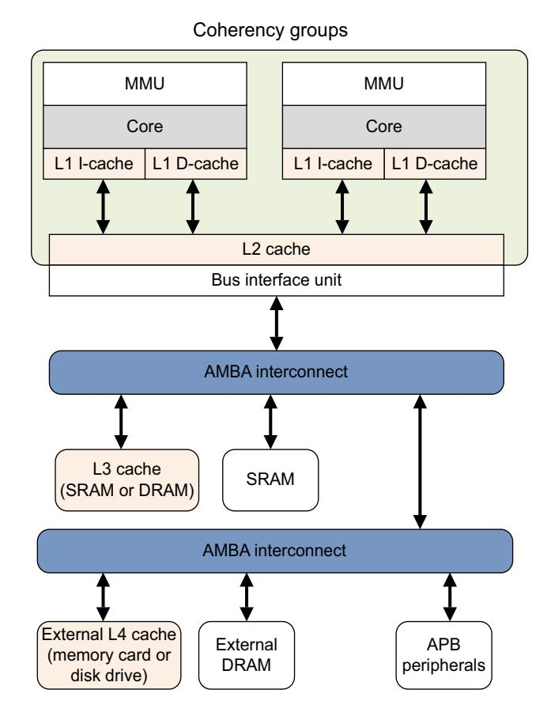

**Figure 12-14 Memory busses and caches**

Software configuration is performed by system registers (some of which are listed in [Chapter 4](#page-36-1)  *[ARMv8 Registers](#page-36-1)*.)

In some designs, the external memory system might contain further implementation-specific caches of external memories.

#### <span id="page-177-0"></span>**12.4.4 Cache policies**

The MMU translation tables also define the cache policy for each block within the memory system. Memory regions that are defined as Normal might be marked as cacheable or non-cacheable. Bits [4:2] from the translation table entry refer to one of the eight memory attribute encodings in the *Memory Attribute Indirection Register* (MAIR). The memory attribute encodings then specify the cache policies to use when accessing that memory. These are hints to the processor and it is IMPLEMENTATION DEFINED whether all cache policies are supported in a particular implementation and which cache data is regarded as coherent. A memory region can be defined in terms of its *shareability* property.

#### <span id="page-178-1"></span><span id="page-178-0"></span>**12.5 Translation table configuration**

In addition to storing individual translations within the TLB, you can configure the MMU to store translation tables in cacheable memory. This usually provides much faster access to tables than always reading from external memory. TCR\_EL1 has additional fields that control this.

<span id="page-178-2"></span>The additional fields specify the cacheability and shareability of translation tables for TTBR0 and TTBR1. The relevant fields are called SH0/1 Shareability, IRGN0/1 Inner Cacheable, and ORGN0/1 Outer Cacheable. [Table 12-2](#page-178-2) shows the permitted settings for cacheability.

**Table 12-2 Cacheability settings**

| IRGN/ORGN bits for<br>TTBR0/TTBR1 | Cacheable Property                                             |  |
|-----------------------------------|----------------------------------------------------------------|--|
| 00                                | Normal memory, Inner Non-cacheable                             |  |
| 01                                | Normal memory, Inner Write-Back Write-Allocate Cacheable       |  |
| 10                                | Normal memory, Inner Write-Through Cacheable                   |  |
| 11                                | Normal memory, Inner Write-Back no Write-Allocate<br>Cacheable |  |

The corresponding table for shareability of memory is associated with translation table walks. For a device or strongly-ordered memory region, the value is ignored.

**Table 12-3 Memory shareability**

<span id="page-178-3"></span>

| SH0 bits[13:12] | Shareability    |  |
|-----------------|-----------------|--|
| 00              | Non-shareable   |  |
| 01              | UNPREDICTABLE   |  |
| 10              | Outer shareable |  |
| 11              | Inner shareable |  |

The attributes specified in the TCR\_EL1 must be the same as those specified for the virtual memory region in which the translation tables are stored. Caching the translation tables is the normal default behavior.

#### <span id="page-178-4"></span>**12.5.1 Virtual Address tagging**

The Translation Control Register, TCR\_EL*n* has an additional field called *Top Byte Ignore* (TBI) that provides tagged addressing support. general-purpose registers are 64 bits wide, but the most significant 16 bits of an address must be all 0xFFFF or 0x0000. Any attempt to use a different bit value triggers a fault.

When tagged addressing support is enabled, the top eight bits, that is [63:56] of the Virtual Address are ignored by the processor. It internally sets bit [55] to sign extend address to 64-bit format. The top eight bits of a Virtual Address can then be used to pass data. These bits are ignored for addressing and translation faults. The TCR\_EL1 has separate enable bits for EL0 and EL1. ARM does not specify or mandate a specific use case for tagged addressing.

An example use case might be in support of object-oriented programming languages. As well as having a pointer to an object, it might be necessary to keep a reference count that keeps track of the number of references or pointers or handles that refer to the object, for example, so that

automatic garbage collection code can de-allocate objects that are no longer referenced. This reference count can be stored as part of the tagged address, rather than in a separate table, speeding up the process of creating or destroying objects.

#### <span id="page-180-0"></span>**12.6 Translations at EL2 and EL3**

<span id="page-180-4"></span>The virtualization extensions to the ARMv8-A architecture introduce a second stage of translation. When a hypervisor is present in the system, one or more guest operating systems might be present. These continue to use TTBRn\_EL1 as previously described and MMU operation appears unchanged.

<span id="page-180-3"></span>The hypervisor must perform some extra translation steps in a two stage process to share the physical memory system between the different guest operating systems. In the first stage, a *Virtual Address* (VA) is translated to an *Intermediate Physical Address* (IPA). This is usually under OS control. A second stage, controlled by the hypervisor, then performs translation of the IPA to the final *Physical Address* (PA).

The hypervisor and Secure monitor also have their set of stage 1 translation tables for their own code and data, which perform mapping directly from VA to PA.

**Note**

 The Architecture Reference Manual uses the term *Translation Regimes* to refer to these different tables.

[Figure 12-15](#page-180-1) summarizes this two stage translation process.

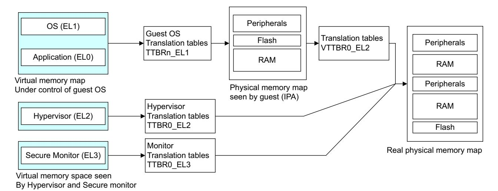

<span id="page-180-7"></span><span id="page-180-5"></span>**Figure 12-15 Two stage translation process**

<span id="page-180-2"></span><span id="page-180-1"></span>The stage 2 translations, which convert an intermediate physical address to a Physical Address, use an extra set of tables under control of the hypervisor. These must be explicitly enabled by writing to the *Hypervisor Configuration Register* HCR\_EL2. This process only applies to Non-secure EL1/0 accesses.

<span id="page-180-6"></span>The base address of this stage 2 translation table is specified in the *Virtualization Translation Table Base Register* VTTBR0\_EL2. It specifies a single contiguous address space at the bottom of memory. The size of the supported address space is specified in the TSZ[5:0] field of the *Virtualization Translation Control Register*, VTCR\_EL2.

The TG field of this register specifies the granule size while the SL0 field controls the first level of table lookup. Any access outside the defined address range causes a translation fault.

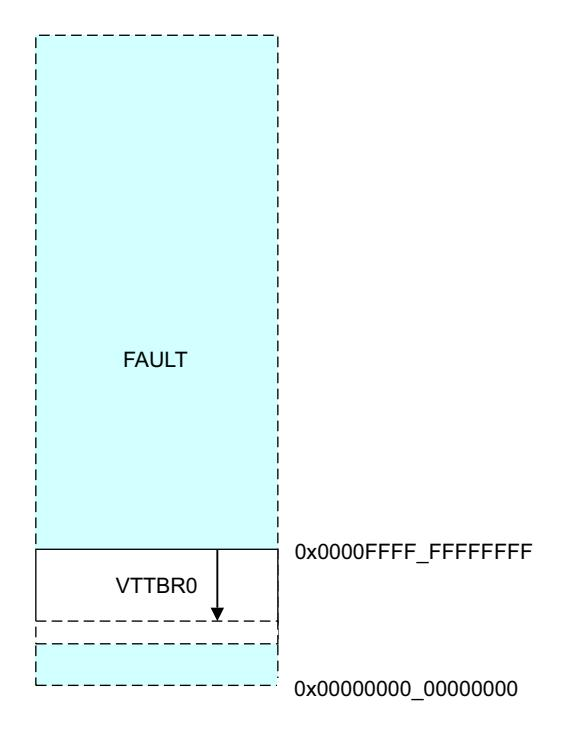

**Figure 12-16 Maximum IPA space**

The hypervisor EL2 and Secure monitor EL3 have their own level 1 tables, which map directly from virtual to Physical Address space. The table base address is specified in TTBR0\_EL2 and TTBR0\_EL3 respectively, enabling a single contiguous address space of variable size at the bottom of memory. The TG field specifies the granule size and the SL0 field controls the first level of table lookup. Any access outside the defined address range causes a translation fault.

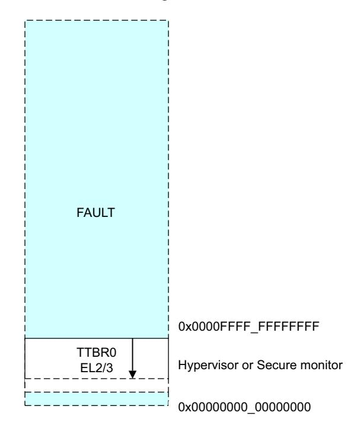

**Figure 12-17 Maximum Virtual Address space**

The Secure monitor EL3 has its own dedicated translation tables. The table base address is specified in TTBR0\_EL3 and configured via TCR\_EL3. Translation tables are capable of accessing both Secure and Non-secure Physical Addresses. TTBR0\_EL3 is used only in Secure monitor EL3 mode, not by the trusted kernel itself. When the transition to Secure world has completed, the trusted kernel uses the EL1 translations, that is, the translation tables pointed to by TTBR0\_EL1 and TTBR1\_EL1. As these registers are not banked in AArch64, Secure monitor code must configure new tables for the Secure world and save and restore copies of TTBR0\_EL1 and TTBR1\_EL1.

The EL1 translation regime behaves differently in Secure state, compared to its normal operation in Non-secure state. The second stage of translation is disabled and the EL1 translation regime is now able to point to both Secure or Non-secure Physical Addresses. There is no virtualization in the Secure world so that the IPA is always the same as the final PA.

Entries in the TLB are tagged as Secure or Non-secure, so that no TLB maintenance is ever required when you transition between Secure and Normal worlds.

### <span id="page-183-0"></span>**12.7 Access permissions**

<span id="page-183-1"></span>Access permissions are controlled through translation table entries. Access permissions control whether a region is readable or writeable, or both, and can be set separately to EL0 for unprivileged and to EL1, EL2, and EL3 for privileged accesses, as shown in [Table 12-4.](#page-183-1)

**Table 12-4 Access permissions**

| AP | Unprivileged (EL0) | Privileged (EL1/2/3) |
|----|--------------------|----------------------|
| 00 | No access          | Read and write       |
| 01 | Read and write     | Read and write       |
| 10 | No access          | Read-only            |
| 11 | Read-only          | Read-only            |

The operating system kernel runs in execution level EL1. It defines the translation table mappings, which are used by the kernel itself and by the applications that run at EL0. Distinction between unprivileged and privileged access permissions is required as the kernel specifies different permissions for its own code and for applications. The hypervisor, which runs at execution level EL2, and Secure monitor EL3 only have translation schemes for their own use and therefore there is no need for a privileged and unprivileged split in permissions.

<span id="page-183-2"></span>Another kind of access permission is the executable attribute. Blocks can be marked as *executable* or *non-executable* (*Execute Never* (XN)). You can set the attributes *Unprivileged Execute Never* (UXN) and *Privileged Execute Never* (PXN) separately and use this to prevent, for example, application code running with kernel privilege, or attempts to execute kernel code while in an unprivileged state. Setting these attributes prevents the processor from performing speculative instruction fetches to the memory location and ensures that speculative instruction fetches do not accidentally access locations that might be perturbed by such an access, for example, a *First in, First out* (FIFO) page replacement queue. Therefore, *device* regions must always be marked as *Execute Never*.

<span id="page-183-3"></span>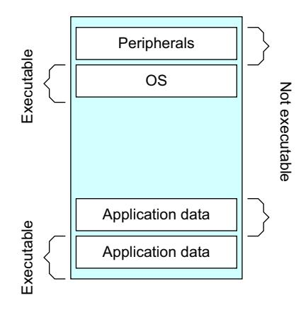

**Figure 12-18 Device regions**

You can configure the processor to treat writeable regions as Execute Never, using the following bits within the SCTLR registers:

- SCTLR\_EL1.WXN. Regions writable at EL0 are treated as XN at EL0 and EL1. Regions writable at EL1 are treated as XN at EL1.
- SCTLR\_EL2 and 3.WXN. Regions writable at EL*n* are treated as XN at EL*n*.

• SCTLR.UWXN. Regions writable at EL0 are treated as XN at EL1. This is for AArch32 only.

The SCTLR\_EL*n* bits can be cached in a TLB entry. Therefore, changing the bit in the SCTLR might not affect entries already in the TLBs. When modifying these bits, a TLB invalidate and ISB sequence is necessary. See *Barriers* [on page 13-6](#page-195-0) for information about the ISB barrier.

#### <span id="page-185-0"></span>**12.8 Operating system use of translation table descriptors**

<span id="page-185-2"></span><span id="page-185-1"></span>Another memory attribute bit in the descriptor, the *Access Flag* (AF), indicates when a block entry is used for the first time.

- AF = 0: This block entry has not yet been used.
- AF = 1: This block entry has been used.

Operating systems use an access flag bit to keep track of which pages are being used. Software manages the flag. When the page is first created, its entry has AF set to 0. The first time the page is accessed by code, if it has AF at 0, this triggers an MMU fault. The Page fault handler records that this page is now being used and manually sets the AF bit in the table entry. For example, the Linux kernel uses the [AF] bit for PTE\_AF on ARM64 (the Linux kernel name for AArch64), which is used to check whether a page has ever been accessed. This influences some of the kernel memory management choices. For example, when a page must be swapped out of memory, it is less likely to swap out pages that are being actively used.

Bits [58:55] of the descriptor are marked as *Reserved for Software Use* and can be used to record OS-specific information in the translation tables. For example, the Linux kernel uses one of these bits to mark an entry as *clean* or *dirty*. The dirty status records whether the page has been written to. If the page is later swapped out of memory, a clean page can simply be discarded, but a dirty page must have its contents saved first.

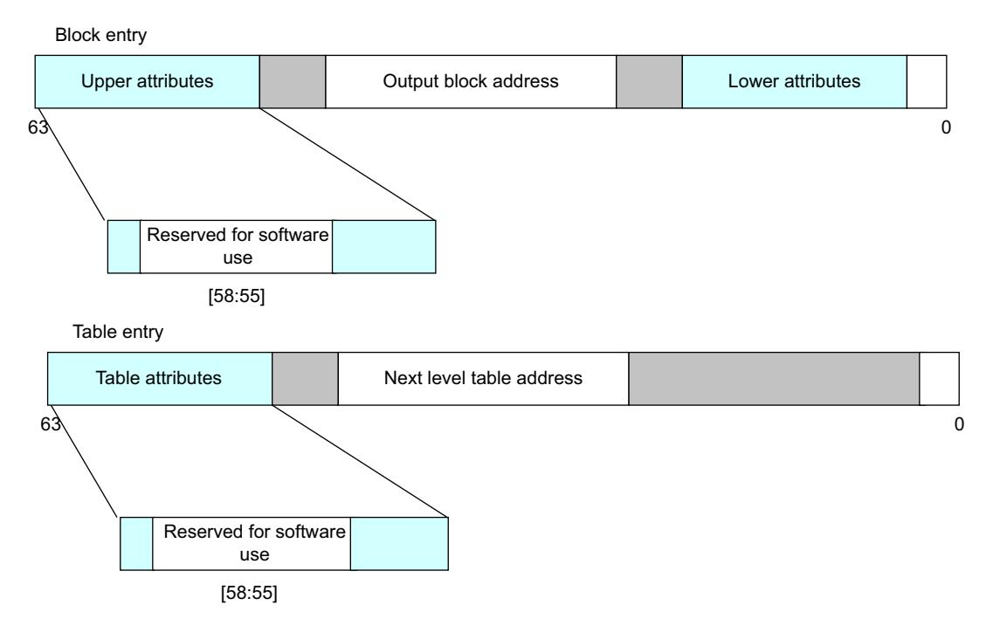

**Figure 12-19 Translation table descriptors**

See Chapter 13 *[Memory Ordering](#page-190-1)* for information about other memory attributes that specify the memory type and its cacheability and shareability properties.

#### <span id="page-186-0"></span>**12.9 Security and the MMU**

The ARMv8-A architecture defines two security states, Secure and Non-secure. It also defines two Physical Address spaces: Secure and Non-secure, such that the Normal world can only access the Non-secure Physical Address space. The Secure world can access both the Secure and Non-secure Physical Address spaces.

In Non-secure state, the NS bits and NSTable bits in translation tables are ignored. Only Non-secure memory can be accessed. In Secure state, the NS bits and NSTable bits control whether a Virtual Address translates to a Secure or Non-secure Physical Address. You can use SCR\_EL3.CIF to prevent the Secure world from executing from any Virtual Address that translates to a Non-secure Physical Address. Additionally, when in the Secure world, you can use the SCR.CIF bit to control whether Secure instruction fetches can be made to Non-secure physical memory.

#### <span id="page-187-1"></span><span id="page-187-0"></span>**12.10 Context switching**

Processors that implement the ARMv8-A Architecture are typically used in systems running a complex operating system with many applications or tasks that run concurrently. Each process has its own unique translation tables residing in physical memory. When an application starts, the operating system allocates it a set of translation table entries that map both the code and data used by the application to physical memory. These tables can subsequently be modified by the kernel, for example, to map in extra space, and are removed when the application is no longer running.

There might therefore be multiple tasks present in the memory system. The kernel scheduler periodically transfers execution from one task to another. This is called a *context switch* and requires the kernel to save all execution state associated with the process and to restore the state of the process to be run next. The kernel also switches translation table entries to those of the next process to be run. The memory of the tasks that are not currently running is completely protected from the task that is running.

Exactly what has to be saved and restored varies between different operating systems, but typically a process context switch includes saving or restoring some or all of the following elements:

- general-purpose registers X0-X30.
- Advanced SIMD and Floating-point registers V0 V31.
- Some status registers.
- TTBR0\_EL1 and TTBR0.
- Thread Process ID (TPIDxxx) Registers.
- Address Space ID (ASID).

For EL0 and EL1, there are two translation tables. TTBR0\_EL1 provides translations for the bottom of Virtual Address space, which is typically application space and TTBR1\_EL1 covers the top of Virtual Address space, typically kernel space. This split means that the OS mappings do not have to be replicated in the translation tables of each task.

Translation table entries contain a *non-global* (nG) bit. If the nG bit is set for a particular page, it is associated with a specific task or application. If the bit is marked as 0, then the entry is global and applies to all tasks.

For non-global entries, when the TLB is updated and the entry is marked as non-global, a value is stored in the TLB entry in addition to the normal translation information. This value is called the *Address Space ID* (ASID), which is a number assigned by the OS to each individual task. Subsequent TLB look-ups only match on that entry if the current ASID matches with the ASID that is stored in the entry. This permits multiple valid TLB entries to be present for a particular page marked as non-global, but with different ASID values. In other words, we do not necessarily need to flush the TLBs when we context switch.

In AArch64, this ASID value can be specified as either an 8-bit or 16-bit value, controlled by the TCR\_EL1.AS bit. The current ASID value is specified in either TTBR0\_EL1 or TTBR1\_EL1. TCR\_EL1 controls which TTBR holds the ASID, but it is normally TTBR0\_EL1, as this corresponds to application space.

| Note |  |
|------|--|
|------|--|

 Having the current value of the ASID stored in the translation table register means that you can atomically modify both the translation tables as well as the ASID in a single instruction. This simplifies the process of changing the table and ASID when compared with the ARMv7-A Architecture.

Additionally, the ARMv8-A Architecture provides Thread ID registers for use by operating system software. These have no hardware significance and are typically used by threading libraries as a base pointer to per-thread data. This is often referred to as *Thread Local Storage* (TLS). For example, the pthreads library uses this feature and includes the following registers:

- User Read and Write Thread ID Register (TPIDR\_EL0).
- User Read-Only Thread ID Register (TPIDRRO\_EL0).
- Thread ID Register, privileged accesses only (TPIDR\_EL1).

#### <span id="page-189-0"></span>**12.11 Kernel access with user permissions**

There are instructions that allow code executing at EL1 (for example, an OS) to perform memory accesses with EL0 or application permissions. This can be used, for example, to de-reference pointers provided with system calls and to enable the OS to check that only data accessible to the application is accessed. This can be achieved using the LDTR or STTR instructions. When executed at EL1, these instructions perform the load or store as if executed at EL0. At all other Exception levels, LDTR and STTR behave like regular LDR or STR instructions. There are the usual size and signed and unsigned variants as normal load and store instructions, but with a smaller offset and restricted indexing options.

## <span id="page-190-1"></span><span id="page-190-0"></span>Chapter 13 **Memory Ordering**

If your code interacts directly either with the hardware or with code executing on other cores, or if it directly loads or writes instructions to be executed, or modifies page tables, you need to be aware of memory ordering issues.

If you are an application developer, hardware interaction is probably through a device driver, the interaction with other cores is through Pthreads or another multithreading API, and the interaction with a paged memory system is through the operating system. In all of these cases, the memory ordering issues are taken care of for you by the relevant code. However, if you are writing the operating system kernel or device drivers, or implementing a hypervisor, JIT compiler, or multithreading library, you must have a good understanding of the memory ordering rules of the ARM Architecture. You must ensure that where your code requires explicit ordering of memory accesses, you are able to achieve this through the correct use of barriers.

<span id="page-190-3"></span>The ARMv8 architecture employs a *weakly-ordered* model of memory. In general terms, this means that the order of memory accesses is not required to be the same as the program order for load and store operations. The processor is able to re-order memory read operations with respect to each other. Writes may also be re-ordered (for example, write combining) .As a result, hardware optimizations, such as the use of cache and write buffer, function in a way that improves the performance of the processor, which means that the required bandwidth between the processor and external memory can be reduced and the long latencies associated with such external memory accesses are hidden.

<span id="page-190-2"></span>Reads and writes to Normal memory can be re-ordered by hardware, being subject only to data dependencies and explicit memory barrier instructions. Certain situations require stronger ordering rules. You can provide information to the core about this through the memory type attribute of the translation table entry that describes that memory.

Very high performance systems might support techniques such as speculative memory reads, multiple issuing of instructions, or out-of-order execution and these, along with other techniques, offer further possibilities for hardware re-ordering of memory access:

#### **Multiple issue of instructions**

A processor might issue and execute multiple instructions per cycle, so that instructions that are after each other in program order can be executed at the same time.

#### <span id="page-191-1"></span>**Out-of-order execution**

Many processors support out-of-order execution of non-dependent instructions. Whenever an instruction is stalled while it waits for the result of a preceding instruction, the processor can execute subsequent instructions that do not have a dependency.

<span id="page-191-2"></span>**Speculation** When the processor encounters a conditional instruction, such as a branch, it can speculatively begin to execute instructions before it knows for sure whether that particular instruction must be executed or not. The result is, therefore, available sooner if conditions resolve to show the speculation was correct.

#### **Speculative loads**

If a load instruction that reads from a cacheable location is speculatively executed, this can result in a cache linefill and the potential eviction of an existing cache line.

#### <span id="page-191-0"></span>**Load and store optimizations**

As reads and writes to external memory can have a long latency, processors can reduce the number of transfers by, for example, merging together a number of stores into one larger transaction.

#### **External memory systems**

In many complex *System on Chip* (SoC) devices, there are a number of agents capable of initiating transfers and multiple routes to the slave devices that are read or written. Some of these devices, such as a DRAM controller, might be capable of accepting simultaneous requests from different masters. Transactions can be buffered, or re-ordered by the interconnect. This means that accesses from different masters might therefore take varying numbers of cycles to complete and might overtake each other.

#### **Cache coherent multi-core processing**

In a multi-core processor, hardware cache coherency can migrate cache lines between cores. Different cores might therefore see updates to cached memory locations in a different order to each other.

#### **Optimizing compilers**

An optimizing compiler can re-order instructions to hide latencies or make best use of hardware features. It can often move a memory access forwards, to make it earlier, and give it more time to complete before the value is required.

In a single core system, the effects of such re-ordering are generally transparent to the programmer, as the individual processor can check for hazards and ensure that data dependencies are respected. However, in cases where you have multiple cores that communicate through shared memory, or share data in other ways, memory ordering considerations become more important. This chapter discusses several topics that relate to *Multiprocessing* (MP) operation and synchronization of multiple execution threads. It also discusses memory types and rules defined by the architecture and how these are controlled.

#### <span id="page-192-0"></span>**13.1 Memory types**

The ARMv8 architecture defines two mutually-exclusive memory types. All regions of memory are configured as one or the other of these two types, which are *Normal* and *Device*. A third memory type, *Strongly Ordered*, is part of the ARMv7 architecture. The differences between this type and Device memory are few and it is therefore now omitted in ARMv8. (See *[Device](#page-193-0)  memory* [on page 13-4.](#page-193-0))

In addition to the memory type, attributes also provide control over cacheability, shareability, access, and execution permissions. Shareable and cache properties pertain only to Normal memory. Device regions are always deemed to be non-cacheable and outer-shareable. For cacheable locations, you can use attributes to indicate cache allocation policy to the processor.

The memory type is not directly encoded in the translation table entry. Instead, each block entry specifies a 3-bit index into a table of memory types. This table is stored in the *Memory Attribute Indirection Register* MAIR\_EL*n*. This table has eight entries and each of those entries has eight bits, as shown in [Figure 13-1.](#page-192-1)

Although the translation table block entry itself does not directly contain the memory type encoding, the TLB entry inside the processor usually stores this information for a specific entry. Therefore, changes to MAIR\_EL*n* might not be observed until after both an ISB instruction barrier and a TLB invalidate operation.

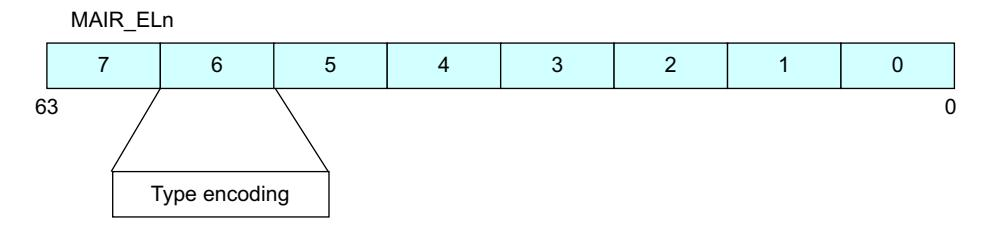

<span id="page-192-2"></span>**Figure 13-1 Type encoding**

#### <span id="page-192-3"></span><span id="page-192-1"></span>**13.1.1 Normal memory**

You can use Normal memory for all code and for most data regions in memory. Examples of Normal memory include areas of RAM, Flash, or ROM in physical memory. This kind of memory provides the highest processor performance as it is weakly ordered and has fewer restrictions placed on the processor. The processor can re-order, repeat, and merge accesses to Normal memory.

Furthermore, address locations that are marked as Normal can be accessed speculatively by the processor, so that data or instructions can be read from memory without being explicitly referenced in the program, or in advance of the actual execution of an explicit reference. Such speculative accesses can occur as a result of branch prediction, speculative cache linefills, out-of-order data loads, or other hardware optimizations.

For best performance, always mark application code and data as Normal and in circumstances where an enforced memory ordering is required, you can achieve it through the use of explicit barrier operations. Normal memory implements a weakly-ordered memory mode. There is no requirement for Normal accesses to complete in order with respect to either other Normal accesses or to Device accesses.

However, the processor must always handle hazards caused by address dependencies.

For example, consider the following simple code sequence:

STR X0, [X2] LDR X1, [X2] The processor always ensures that the value placed in X1 is the value that was written to the address stored in X2.

This of course applies to more complex dependencies.

Consider the following code:

```
ADD X4, X3, #3
ADD X5, X3, #2
STR X0, [X3]
STRB W1, [X4]
LDRH W2, [X5]
```

In this case, the accesses take place to addresses that overlap each other. The processor must ensure that the memory is updated as if the STR and STRB occurred in order, so that the LDRH returns the most up-to-date value. It would still be valid for the processor to merge the STR and STRB into a single access that contained the latest, correct data to be written.

#### <span id="page-193-1"></span><span id="page-193-0"></span>**13.1.2 Device memory**

You can use Device memory for all memory regions where an access might have a side-effect. For example, a read to a FIFO location or timer is not repeatable, as it returns different values for each read. A write to a control register might trigger an interrupt. It is typically only used for peripherals in the system. The Device memory type imposes more restrictions on the core. Speculative data accesses cannot be performed to regions of memory marked as Device. There is a single, uncommon exception to this. If NEON operations are used to read bytes from Device memory, the processor might read bytes not explicitly referenced if they are within an aligned 16-byte block that contains one or more bytes that are explicitly referenced.

Trying to execute code from a region marked as Device, is generally UNPREDICTABLE. The implementation might either handle the instruction fetch as if it were to a memory location with the Normal non-cacheable attribute, or it might take a permission fault.

There are four different types of device memory, to which different rules apply.

- Device-nGnRnE most restrictive (equivalent to Strongly Ordered memory in the ARMv7 architecture).
- Device-nGnRE
- Device-nGRE
- Device-GRE least restrictive

The letter suffixes refer to the following three properties:

#### **Gathering or non Gathering (G or nG)**

<span id="page-193-2"></span>This property determines whether multiple accesses can be merged into a single bus transaction for this memory region. If the address is marked as *non Gathering* (nG), then the number and size of accesses on the memory bus performed to that location must exactly match the number and size of explicit accesses in the code. If the address is marked as *Gathering* (G), then the processor can, for example, merge two byte writes into a single half-word write.

For a region marked as *Gathering*, multiple memory accesses to the same memory location can also be merged. For example, if the program reads the same location twice, the core only needs to perform the read once and can return the

same result for both instructions. For reads from regions marked as *non Gathering*, the data value must come from the end device. It cannot be snooped from a write-buffer or other location.

#### **Re-ordering (R or nR)**

This determines whether accesses to the same device can be re-ordered with respect to each other. If the address is marked as *non Re-ordering* (nR), then accesses within the same block always appear on the bus in program order. The size of this block is IMPLEMENTATION DEFINED. Where the size of this block is large, it could span several table entries. In this case, the ordering rule is observed with respect to any other accesses also marked as nR.

#### **Early Write Acknowledgement (E or nE)**

This determines whether an intermediate write buffer between the processor and the slave device being accessed is allowed to send an acknowledgement of a write completion. If the address is marked as *non Early Write Acknowledgement* (nE), then the write response must come from the peripheral. If the address is marked as *Early Write Acknowledgement* (E), then it is permissible for a buffer in the interconnect logic to signal write acceptance, in advance of the write actually being received by the end device. This is essentially a message to the external memory system.

#### <span id="page-195-0"></span>**13.2 Barriers**

The ARM architecture includes barrier instructions to force access ordering and access completion at a specific point. In some architectures, similar instructions are known as a fence.

If you are writing code where ordering is important, see *Appendix J7 Barrier Litmus Tests* in the *ARM Architecture Reference Manual - ARMv8, for ARMv8-A architecture profile* and *Appendix G Barrier Litmus Tests* in the *ARM Architecture Reference Manual ARMv7-A/R Edition*, which includes many worked examples.

The *ARM Architecture Reference Manual* defines certain key words, in particular, the terms *observe* and *must be observed*. In typical systems, this defines how the bus interface of a master, for example, a core or GPU and the interconnect, must handle bus transactions. Only masters are able to *observe* transfers. All bus transactions are initiated by a master. The order that a master performs transactions in is not necessarily the same order that such transactions complete at the slave device, because transactions might be re-ordered by the interconnect unless some ordering is explicitly enforced.

A simple way to describe observability is to say that "I have observed your write when I can read what you wrote and I have observed your read when I can no longer change the value you read" where both I and you refer to cores or other masters in the system.

There are three types of barrier instruction provided by the architecture:

#### <span id="page-195-2"></span>**Instruction Synchronization Barrier (ISB)**

This is used to guarantee that any subsequent instructions are fetched, again, so that privilege and access are checked with the current MMU configuration. It is used to ensure any previously executed context-changing operations, such as writes to system control registers, have completed by the time the ISB completes. In hardware terms, this might mean that the instruction pipeline is flushed, for example. Typical uses of this would be in memory management, cache control, and context switching code, or where code is being moved about in memory.

#### <span id="page-195-1"></span>**Data Memory Barrier (DMB)**

This prevents re-ordering of data accesses instructions across the barrier instruction. All data accesses, that is, loads or stores, but not instruction fetches, performed by this processor before the DMB, are visible to all other masters within the specified shareability domain before any of the data accesses after the DMB.

```
For example:
```

```
LDR x0, [x1] // Must be seen by the memory system before the STR below.
DMB ISHLD
ADD x2, #1 // May be executed before or after the memory system sees 
LDR.
STR x3, [x4] // Must be seen by the memory system after the LDR above.
It also ensures that any explicit preceding data or unified cache maintenance 
operations have completed before any subsequent data accesses are executed.
DC CSW, x5 // Data clean by Set/way
LDR x0, [x1] // Effect of data cache clean might not be seen by this
             // instruction
DMB ISH
LDR x2, [x3] // Effect of data cache clean will be seen by this 
instruction
```

#### <span id="page-196-1"></span>**Data Synchronization Barrier (DSB)**

This enforces the same ordering as the Data Memory Barrier, but has the additional effect of blocking execution of any further instructions, not just loads or stores, or both, until synchronization is complete. This can be used to prevent execution of a SEV instruction, for instance, that would signal to other cores that an event occurred. It waits until all cache, TLB and branch predictor maintenance operations issued by this processor have completed for the specified shareability domain.

#### For example:

```
DC ISW, x5 // operation must have completed before DSB can complete
STR x0, [x1] // Access must have completed before DSB can complete
DSB ISH
ADD x2, x2, #3 // Cannot be executed until DSB completes
```

As you can see from the above examples, the DMB and DSB instructions take a parameter which specifies the types of access to which the barrier operates, before or after, and a shareability domain to which it applies.

The available options are listed in the table.

<span id="page-196-0"></span>**Table 13-1 Barrier parameters**

| <option></option> | Ordered Accesses (before – after) | Shareability Domain |
|-------------------|-----------------------------------|---------------------|
| OSHLD             | Load – Load, Load – Store         | Outer shareable     |
| OSHST             | Store – Store                     |                     |
| OSH               | Any – Any                         |                     |
| NSHLD             | Load – Load, Load – Store         | Non-shareable       |
| NSHST             | Store – Store                     |                     |
| NSH               | Any – Any                         |                     |
| ISHLD             | Load –Load, Load – Store          | Inner shareable     |
| ISHST             | Store – Store                     |                     |
| ISH               | Any – Any                         |                     |
| LD                | Load –Load, Load – Store          | Full system         |
| ST                | Store – Store                     |                     |
| SY                | Any – Any                         |                     |

The ordered access field specifies which classes of accesses the barrier operates on. There are three options.

#### **Load - Load/Store**

This means that the barrier requires all loads to complete before the barrier but does not require stores to complete. Both loads and stores that appear after the barrier in program order must wait for the barrier to complete.

#### **Store - Store**

This means that the barrier only affects store accesses and that loads can still be freely re-ordered around the barrier.

#### **Any - Any**

This means that both loads and stores must complete before the barrier. Both loads and stores that appear after the barrier in program order must wait for the barrier to complete.

Barriers are used to prevent unsafe optimizations from occurring and to enforce a specific memory ordering. Use of unnecessary barrier instructions can therefore reduce software performance. Consider carefully whether a barrier is necessary in a specific situation, and if so, which is the correct barrier to use.

A more subtle effect of the ordering rules is that the instruction interface, data interface, and MMU table walker of a core are considered as separate observers. This means that you might need, for example, to use DSB instructions to ensure that an access one interface is guaranteed to be observable on a different interface.

If you execute a data cache clean and invalidate instruction, for example DCCVAU, X0, you must insert a DSB instruction after this to be sure that subsequent page table walks, modifications to translation table entries, instruction fetches, or updates to instructions in memory, can all see the new values.

For example, consider an update of the translation tables:

```
STR X0, [X1] // update a translation table entry
DSB ISHST // ensure write has completed
TLBI VAE1IS, X2 // invalidate the TLB entry for the entry that changes
DSB ISH // ensure TLB invalidation is complete
ISB // synchronize context on this processor
```

A DSB is required to ensure that the maintenance operations complete and an ISB is required to ensure that the effects of those operations are seen by the instructions that follow.

The processor might speculatively access an address marked as Normal at any time. So when considering whether barriers are required, don't just consider explicit accesses generated by load or store instructions.

#### <span id="page-197-0"></span>**13.2.1 One-way barriers**

AArch64 adds new load and store instructions with implicit barrier semantics. These require that all loads and stores before or after the implicit barrier are observed in program order.

#### <span id="page-197-1"></span>**Load-Acquire (LDAR)**

All loads and stores that are after an LDAR in program order, and that match the shareability domain of the target address, must be observed after the LDAR.

#### <span id="page-197-2"></span>**Store-Release (STLR)**

All loads and stores preceding an STLR that match the shareability domain of the target address, must be observed before the STLR.

There are also exclusive versions of the above, LDAXR and STLXR, available.

Unlike the data barrier instructions, which take a qualifier to control which shareability domains see the effect of the barrier, the LDAR and STLR instructions use the attribute of the address accessed.

An LDAR instruction guarantees that any memory access instructions after the LDAR, are only visible after the load-acquire. A store-release guarantees that all earlier memory accesses are visible before the store-release becomes visible and that the store is visible to all parts of the system capable of storing cached data at the same time.

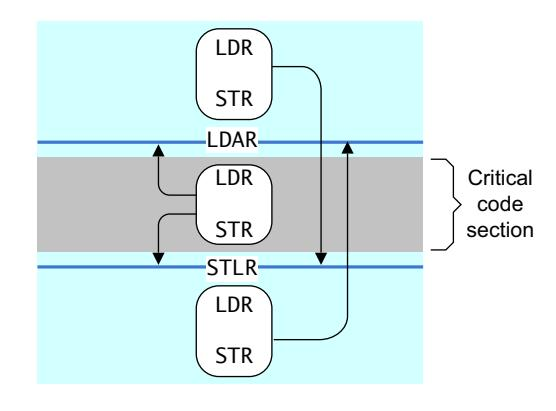

**Figure 13-2 One-way barriers**

The diagram shows how accesses can cross a one-way barrier in one direction but not in the other.

#### <span id="page-198-0"></span>**13.2.2 ISB in more detail**

The ARMv8 architecture defines *context* as the state of the system registers and *context-changing operations* as things like cache, TLB, and branch predictor maintenance operations, or changes to system control registers, for example, SCTLR\_EL1, TCR\_EL1, and TTBRn\_EL1. The effect of such a context-changing operation is only guaranteed to be seen after a *context synchronization event*.

There are three kinds of context synchronization event:

- Taking an exception.
- Returning from an exception.
- Instruction Synchronization Barrier (ISB).

An ISB flushes the pipeline, and re-fetches the instructions from the cache or memory and ensures that the effects of any completed context-changing operation before the ISB are visible to any instruction after the ISB. It also ensures that any context-changing operations after the ISB instruction only take effect after the ISB has been executed and are not seen by instructions before the ISB. This does not mean that an ISB is required after each instruction that modifies a processor register. For example, reads or writes to PSTATE fields, ELRs, SPs and SPSRs occur in program order relative to other instructions.

This example shows how to enable the floating-point unit and NEON, which you can do in AArch64 by writing to bit [20] of the CPACR\_EL1 register. The ISB is a context synchronization event that guarantees that the enable is complete before any subsequent or NEON instructions are executed.

```
MRS X1, CPACR_EL1
ORR X1, X1, #(0x3 << 20)
MSR CPACR_EL1, X1
ISB
```

#### <span id="page-198-1"></span>**13.2.3 Use of barriers in C code**

The C11 and C++11 languages have a good platform-independent memory model that is preferable to intrinsics if possible.

All versions of C and C++ have *sequence points*, but C11 and C++11 also provide memory models. Sequence points only prevent the compiler from re-ordering C++ source code. There is nothing to stop the processor re-ordering instructions in the generated object code, or for read and write buffers to re-order the sequence in which data transfers are sent to the cache. In other words, they are only relevant for single-threaded code. For multi-threaded code, then either use the memory model features of C11 / C++11, or other synchronization mechanisms such as mutexes which are provided by the operating system. Typically, a compiler cannot re-arrange statements across a sequence point and restrict what optimizations the compiler can make. Examples of sequence points in code include function calls and accesses to volatile variables.

The C language specification defines sequence points as follows:

"At certain specified points in the execution sequence called sequence points, all side effects of previous evaluations shall be complete and no side effects of subsequent evaluations shall have taken place."

#### <span id="page-199-0"></span>**Barriers in Linux**

The Linux kernel includes a number of platform independent barrier functions. See the Linux kernel documentation in the memory-barriers.txt [file at:](https://git.kernel.org/cgit/linux/kernel/git/torvalds/linux.git/tree/Documentation/) 

https://git.kernel.org/cgit/linux/kernel/git/torvalds/linux.git/tree/Documentation/ for more details.

#### <span id="page-199-1"></span>**13.2.4 Non-temporal load and store pair**

<span id="page-199-3"></span><span id="page-199-2"></span>A new concept in ARMv8 is the *non-temporal* load and store. These are the LDNP and STNP instructions that perform a read or write of a pair of register values. They also give a hint to the memory system that caching is not useful for this data. The hint does not prohibit memory system activity such as caching of the address, preload or gathering, but simply indicates that caching is unlikely to increase performance. A typical use case might be streaming data, but you should note that effective use of these instructions requires an approach specific to the microarchitecture.

Non-temporal loads and stores relax the memory ordering requirements. In the above case, the LDNP instruction might be observed before the preceding LDR instruction, which can result in reading from an unpredictable address in X0.

For example:

```
LDR X0, [X3]
LDNP X2, X1, [X0]
```

To correct the above, you need an explicit load barrier:

```
LDR X0, [X3]
DMB NSHLD
LDNP X2, X1, [X0]
```

#### <span id="page-200-0"></span>**13.3 Memory attributes**

The memory map of a system is partitioned into a number of regions. Each region might need different memory attributes, such as access permissions that include read and write permissions for different privilege levels, memory type, and cache policies. Functional pieces of code and data are generally grouped together in the memory map and the attributes for each of these areas controlled separately. This function is performed by the Memory Management Unit. Translation table entries enable the MMU hardware to translate Virtual Addresses to Physical Addresses. In addition, they specify a number of attributes associated with each page.

[Figure 13-3](#page-200-1) shows how memory attributes are specified in a stage 1 block entry. The block entry in the translation table defines the attributes for each memory region. Stage 2 entries have a different layout.

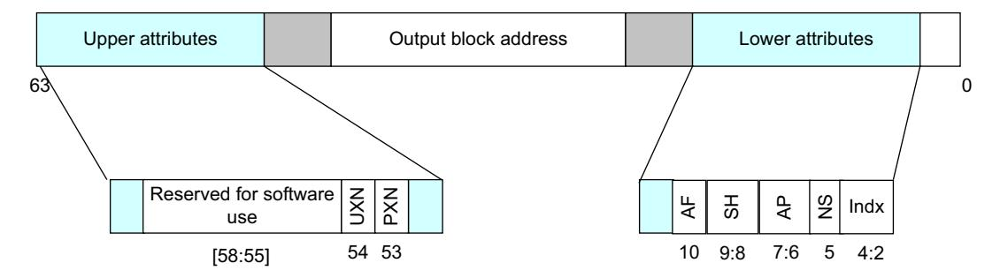

**Figure 13-3 Stage 1 block memory attributes**

#### <span id="page-200-1"></span>Where:

- UXN and PXN are execution permissions
- AF is the access flag
- SH is the shareable attribute
- AP is the access permission
- <span id="page-200-3"></span>• NS is the security bit, but only at EL3 and Secure EL1
- Indx is the index into the *Memory Attribute Indirection Register* MAIR\_EL*n*

**Note** For clarity, not all bits are shown in the figure.

The descriptor format provides support for hierarchical attributes, so that an attribute set at one

level can be inherited by lower levels. It means that a table entry in an L0, L1, or L2 table can override one or more attributes specified in the table that it points to. This can be used for access permissions, security, and execution permissions. For example, an entry in the L1 table that has NSTable=1 means that the NS bits in the L2 and L3 tables that it points to are ignored and all of the entries are treated as having NS=1. This feature only restricts subsequent levels of look-up for the same stage of translation.

#### <span id="page-200-2"></span>**13.3.1 Cacheable and shareable memory attributes**

Regions of memory marked as Normal can be specified as either cached or non-cached. See Chapter 14 *[Multi-core processors](#page-203-1)* for more information about cacheable memory. Memory caching can be separately controlled through *inner* and *outer* attributes, for multiple levels of cache. The division between inner and outer is IMPLEMENTATION DEFINED, but typically the set of inner attributes is used by caches that are integrated into the processor, whereas the outer attributes are exported from the processor to the external memory bus and are therefore potentially used by cache hardware external to the core or cluster.

The shareable attribute is used to define whether a location is shared with multiple cores. Marking a region as Non-shareable means that it is only used by this core, whereas marking it as inner shareable or outer shareable, or both, means that the location is shared with other observers, for example, a GPU or DMA device might be considered another observer. In the same way, the division between inner and outer is IMPLEMENTATION DEFINED. The architectural definition of these attributes is that they enable us to define sets of observers for which the shareability attributes make the data or unified caches transparent for data accesses. This means that the system provides hardware coherency management so that two cores in the inner shareable domain must see a coherent copy of locations marked as inner shareable. If a processor or other master in the system does not support coherency, then it must treat the shareable regions as non-cacheable.

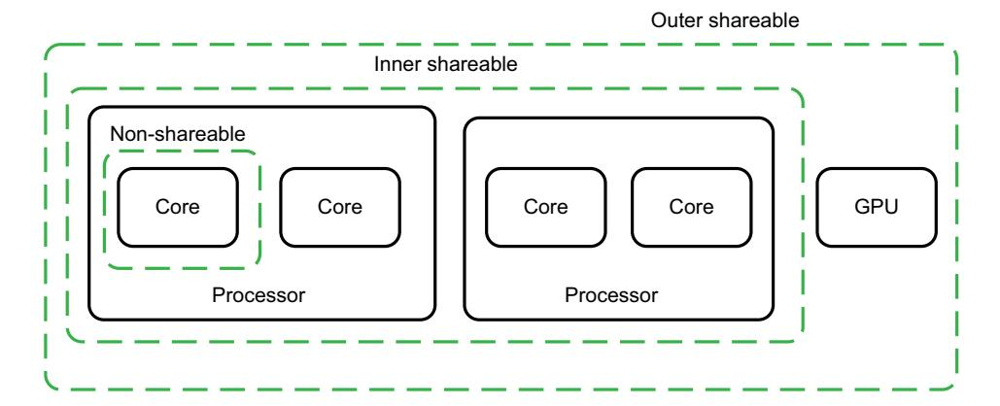

**Figure 13-4 Inner and outer shareable domains**

There is a certain overhead associated with cache coherency hardware. Data memory accesses can take longer and consume more power than they otherwise would do. This overhead can be minimized by maintaining coherency between smaller numbers of masters and ensuring that they are physically close together in silicon. For this reason, the architecture splits the system into domains, making it possible to limit the overhead to just those locations where the coherency is required.

The following shareability domain options are available:

#### <span id="page-201-1"></span>**Non-shareable**

This represents memory accessible only by a single processor or other agent, so memory accesses never need to be synchronized with other processors. This domain is not typically used in SMP systems.

#### <span id="page-201-0"></span>**Inner shareable**

This represents a shareability domain that can be shared by multiple processors, but not necessarily all of the agents in the system. A system might have multiple Inner Shareable domains. An operation that affects one Inner Shareable domain does not affect other Inner Shareable domains in the system. An example of such a domain might be a quad-core Cortex-A57 cluster.

#### <span id="page-202-0"></span>**Outer shareable**

An *outer shareable* (OSH) domain re-orderis shared by multiple agents and can consist of one or more inner shareable domains. An operation that affects an outer shareable domain also implicitly affects all inner shareable domains inside it. However, it does not otherwise behave as an inner shareable operation.

#### **Full system**

An operation on the *full system* (SY) affects all observers in the system.

## <span id="page-203-1"></span><span id="page-203-0"></span>Chapter 14 **Multi-core processors**

The ARMv8-A architecture provides a significant level of support for systems containing multiple processing elements. An ARM multi-core processor such as the Cortex-A57MPCore and Cortex-A53MPCore processors can contain between one and four cores. Systems that use the Cortex-A57 or Cortex-A53 processors are almost always implemented in this way. A multi-core processor might contain several cores capable of independent instruction execution that can be treated as a single unit or *cluster*. ARM multi-core technology enables any of the four component cores within a cluster to shut down when not in use to save power, for example when the device is lightly loaded or in standby mode. When higher performance is required, every processor is in use to meet the demand while still sharing the workload to keep power consumption as low as possible.

Multi-processing can be defined as running two or more sequences of instructions simultaneously within a single device containing two or more cores. It is now a widely adopted technique in both systems intended for general-purpose application processors and in areas that are more traditionally defined as embedded systems.

The overall energy consumption of a multi-core system can be significantly lower than that of a system based on a single processor core. Multiple cores may enable execution to be completed faster and so some elements of the system might be completely powered down for longer periods. Alternatively, a system with multiple cores might be able to operate at a lower frequency than that required by a single processor to achieve the same throughput. A lower power silicon process or a lower supply voltage can result in lower power consumption and reduced energy usage. Most current systems do not permit the frequency of cores to be changed independently. However, each core can be dynamically clock gated, giving additional power and energy savings.

Having multiple cores at our disposal also enables more options for system configuration. For example, you might have a system that uses separate cores, one to handle a hard real-time requirement and another for an application requiring high, uninterrupted performance. These could be consolidated into a single multi-processor system.

A multi-core device is also likely to be more responsive than one with a single core. When interrupts are distributed between cores there is more than one core available to respond to an interrupt and fewer interrupts per core to be serviced. Multiple cores also enable an important background process to progress simultaneously with an important but unrelated foreground process.

#### <span id="page-205-0"></span>**14.1 Multi-processing systems**

We can distinguish between systems that contain:

- A single processor containing a single core.
- A multi-core processor, such as the Cortex-A53, with several cores capable of independent instruction execution, and can be externally viewed as a single unit or *cluster*, either by the system designer or by an operating system that can abstract the underlying resources from the application layer.
- Multiple clusters (such as that shown in [Figure 14-1 on page 14-8](#page-210-0)), in which each cluster contains multiple cores.

The descriptions of multi-processing systems which follow define terms as they are used in this book. On other operating systems they may have different meanings.

#### <span id="page-205-1"></span>**14.1.1 Determining which core the code is running on**

Some software operations are dependent on which core the code is running on. For example, global initialization is typically performed by code running on a single core, followed by local initialization on all cores.

The *Multi-Processor Affinity Register* (MPIDR\_EL1) enables software to determine on which core it is executing, both within a cluster and in a system with multiple clusters, where it determines on which core and in which cluster it is executing.

The *U bit* in some processor configurations indicates whether this is a single core or a multi-core cluster. The affinity fields give a hierarchical description of the core's location relative to other cores. Typically, Affinity 0 is the core ID within the cluster, and Affinity 1 is the cluster ID.

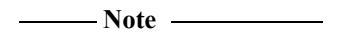

 Software running at EL1 may be running inside a virtual machine managed by a hypervisor. In order to configure a virtual machine, EL2 or EL3 can set MPIDR\_EL1 to different values at run-time, so that a particular virtual machine sees a consistent, unique value for each virtual core. The relationship between virtual and physical cores is controlled by the hypervisor, and may change over time.

MIPDR\_EL3 contains the unchangeable ID of each physical core. No two cores share the same MPIDR\_EL3 value.

#### <span id="page-205-2"></span>**14.1.2 Symmetric multi-processing**

*Symmetric Multi-Processing* (SMP) is a software architecture that dynamically determines the roles of individual cores. Each core in the cluster has the same view of memory and of shared hardware. Any application, process, or task can run on any core and the operating system scheduler can dynamically migrate tasks between cores to achieve optimal system load. A multi-threaded application can run on several cores at once. The operating system can hide much of the complexity from applications.

In this guide, each running instance of an application under an operating system is referred to as a *process*. An application performs many operations through calls to a system library that provides certain functions from library code, but also acts a wrapper for system calls to kernel operations. Individual processes have associated resources, including stack, heap and constant data areas, and properties such as scheduling priority settings. The kernel view of a process is called a *task*. Processes are collections of tasks that share certain common resources. Other operating systems may have different definitions.

When describing SMP operation, we use the term *kernel* to represent that portion of the operating system that contains exception handlers, device drivers, and other resource and process management code. We also assume the presence of a task scheduler that is typically called using a timer interrupt. The scheduler is responsible for time-slicing the available cycles on cores between multiple tasks, dynamically determining the priority of individual tasks, and deciding which task to run next.

*Threads* are separate tasks executing within the same process space that enable separate parts of the application to execute in parallel on different cores. They also permit one part of an application to keep executing while another part is waiting for a resource.

In general, all threads within a process share several global resources (including the same memory map and access to any open file and resource handles). Threads also have their own local resources, including their own stacks and register usage that are saved and restored by the kernel on a context switch. However, the fact that these resources are local does not mean that the local resources of any thread are guaranteed to be protected from incorrect accesses by other threads. Threads are scheduled individually and can have different priority levels even within a single process.

An SMP-capable OS provides an abstracted view of the available core resources to the application. Multiple applications can run concurrently in an SMP system without recompilation or source code changes. A conventional multitasking OS enables the system to perform several tasks or activities at the same time, in either single-core or multi-core processors. In a multi-core system, we can have true concurrency where multiple tasks are actually run at the same time, in parallel, on separate cores. The role of managing the distribution of such tasks across the available cores is performed by the OS.

Typically, the OS task scheduler can distribute tasks across available cores in the system. This feature, which is known as load balancing, is aimed at obtaining better performance, or energy savings or even both. For example, with certain types of workloads, energy savings can be achieved if the tasks making up the workload are scheduled on fewer cores. This would allow more resources to be left idling for longer periods, thereby saving energy.

In other cases, the performance of the workload could be increased if the tasks were spread across more cores. These tasks could make faster forward progress, without getting perturbed by each other, than if they ran on fewer cores.

In another case, it might be worth running tasks on more cores at reduced frequencies as compared to fewer cores at higher frequencies. Doing this could provide a better trade-off between energy savings and performance.

The scheduler in an SMP system can dynamically reprioritize tasks. This *dynamic task prioritization* enables other tasks to run while the current task sleeps. In Linux, for example, tasks whose performance is bound by processor activity can have their priority decreased in favor of tasks whose performance is limited by I/O activity. The I/O-bound process interrupts the compute-bound process so it can launch its I/O operation and then go back to sleep, and the processor can execute the compute-bound code when the I/O operation completes.

Interrupt handling can also be load balanced across cores. This can help improve performance or save energy. Balancing interrupts across cores or reserving cores for particular types of interrupts can result in reduced interrupt latency. This might also result in reduced cache use which helps improve performance.

Using fewer cores for handling interrupts could result in more resources idling for longer periods, resulting in an energy saving at the cost of reduced performance. The Linux kernel does not support automatic interrupt load balancing. However, the kernel provides mechanisms to change the binding of interrupts to particular cores. There are open source projects such as irqbalance ( https://github.com/Irqbalance/irqbalance ) which use these mechanisms to

arrange a spread of interrupts across the available cores. irqbalance is made aware of system attributes such as the shared cache hierarchy (which cores have a common cache) and power domain layout (which cores can be powered off independently). It can then determine the best interrupt-to-core binding.

An SMP system, by definition, has shared memory between cores in the cluster. To maintain the required level of abstraction to application software, the hardware must take care of providing a consistent and coherent view of memory for you.

Changes to shared regions of memory must be visible to all cores without any explicit software coherency management, although synchronization instructions such as barriers are required to ensure that the updates are seen in the right order. Likewise, any updates to the memory map, (for example, because of demand paging, allocation of new memory, or mapping a device into the current virtual address space) of either the kernel or applications, must be consistently presented to all cores.

#### <span id="page-207-0"></span>**14.1.3 Timers**

An operating system kernel that supports SMP operation typically has a task scheduler, which is responsible for time-slicing the available cycles on cores between multiple tasks. It dynamically determines the priority of individual tasks and decides which task to run next on each core. A timer is typically required in order to enable execution of the active task on each core to be interrupted periodically, giving the scheduler a chance to select different tasks to progress.

There can be problems when all cores compete for the same critical resource. Each core runs the scheduler to decide which task it should execute and this occurs at at fixed intervals. The kernel scheduler code requires the use of some shared data, such as a list of tasks, which can be protected against concurrent access through *exclusion* (provided by *mutexes*). A mutex permits only one core to usefully run the scheduler at any one time.

The System Timer Architecture describes a common system counter that provides up to four timer channels per core. This system counter should be at a fixed clock frequency. There are Secure and Non-secure physical timers and two timers for virtualization purposes. Each channel has a comparator, which compares against a system-wide 64-bit count, which counts up from zero. You can configure the timers so that an interrupt is generated when the count is greater than or equal to the programmed comparator value.

Although the system timer must have a fixed frequency, typically in MHz, varying update granularity is permitted. This means that instead of incrementing the count by 1, on every clock tick, you can increment the timer by a larger amount such as 10 or 100, at a correspondingly reduced rate, every 10 or 100 cycles. This gives the same effective frequency, but with a reduced update granularity. This can be useful for implementing a lower power state.

The CNTFRQ\_EL0 register reports the frequency of the system timer.

A common misconception is that CNTFRQ\_EL0 is shared by all cores. It is only the register that is per-core, and then only from the point of view of the firmware: all other software should see this register already initialised to the correct common value on all cores. The counter frequency however, is global and fixed for all cores. CNTFRQ\_EL0 provides a convenient way for boot ROM or firmware to tell other software what the global counter frequency is, but does not control any aspect of hardware behaviour.

The CNTPCT\_EL0 register reports the current count value. CNTKCTL\_EL1 controls whether EL0 can access the system timer.

To configure the timer, complete the following steps:

1. Write a comparator value to CNTP\_CVAL\_EL0, a 64-bit register.

- 2. Enable the counter and interrupt generation in CNTP\_CTL\_EL0.
- 3. Poll CTP\_CTL\_EL0 to report the raw status of the EL0 timer interrupt.

You can use the system timer as a countdown timer. In this case, the required count is written to the 32-bit CNTP\_TVAL\_EL0 register. The hardware calculates the correct CNTP\_CVAL\_EL0 value for you.

#### **14.1.4 Synchronization**

In an SMP system, data accesses must frequently be restricted to one modifier at any particular time. This can be true for peripheral devices, but also for global variables and data structures accessed by more than one thread or process. Protection of such shared resources is often through a method known as mutual exclusion. In a multi-core system, you can use a spinlock, which is effectively a shared flag with an atomic indivisible mechanism, to test and set its value.

The ARM architecture provides three instructions relating to exclusive access, and variants of these instructions, that operate on byte, halfword, word, or doubleword sized data.

The instructions rely on the ability of the core or memory system to tag particular addresses for exclusive access monitoring by that core, using an exclusive access monitor. The use of these instructions is common in multi-core systems, but is also found in single core systems, to implement synchronization operations between threads running on the same core.

The A64 instruction set has instructions for implementing such synchronization functions:

- Load Exclusive (LDXR): LDXR W|Xt, [Xn]
- Store Exclusive (STXR): STXR Ws, W|Xt, [Xn] where Ws indicates whether the store completed successfully. 0 = success.
- Clear Exclusive access monitor (CLREX) This is used to clear the state of the Local Exclusive Monitor.

LDXR performs a load of memory, but also tags the Physical Address to be monitored for exclusive access by that core. STXR performs a conditional store to memory, succeeding only if the target location is tagged as being monitored for exclusive access by that core. This instruction returns non-zero in the general-purpose register Ws if the store does not succeed, and a value of 0 if the store is successful. In the assembler syntax, it is always specified as a W register, that is, not an X register. In addition, the STXR clears the exclusive tag.

Load exclusive and store exclusive operations are only guaranteed to function for Normal Memory which is mapped with all the following attributes:

- Inner or Outer Shareable.
- Inner Write-Back.
- Outer Write-Back.
- Read and Write allocate hints.
- Not transient.

A mutex or spinlock can be used to control access to a peripheral. The lock location would be in normal RAM. You do not use load or store exclusives to access the peripheral itself.

Each core can only have one address tagged. The exclusive monitor does NOT prevent another core or thread from reading or writing the monitored location, but simply monitors whether the location has been written since the LDXR.

Although the architecture and hardware support implementations of exclusive access, they are dependent on the programmer enforcing correct software behavior. A mutex is simply a flag and the exclusive access mechanism enables this flag to be accessed in an atomic fashion. Any thread or program that accesses the flag can know that it is set correctly. However, the actual resource that the mutex is controlling can still be accessed directly by software that behaves incorrectly. Similarly, the memory that is used to store mutexes has no special properties. When the exclusive access sequence is complete, it is just another piece of data in memory. Furthermore, when writing code that uses mutex for resource protection, it is vital to understand the weakly ordered memory model. For example, without correct use of barriers and other memory ordering considerations, speculation might mean that data has been loaded before a mutex is granted, or that the mutex is released before the critical resource has been updated. For more information about memory ordering considerations, see Chapter 13 *[Memory Ordering](#page-190-1)*.

#### <span id="page-209-0"></span>**14.1.5 Asymmetric multi-processing**

An *Asymmetric Multi-processing* (AMP) system enables you to statically assign individual roles to a core within a cluster so that, in effect, you have separate cores, each performing separate jobs within each cluster. This is known as a function-distribution software architecture and typically means that you have a separate OS running on the individual cores. The system can appear to you as a single-core system with dedicated accelerators for certain critical system services. AMP does not refer to systems in which tasks or interrupts are associated with a particular core.

In an AMP system, each task can have a different view of memory and there is no scope for a core that is highly loaded to pass work to one that is lightly loaded. There is no requirement for hardware cache coherency in such systems, although there are typically mechanisms for communication between the cores through shared resources, possibly requiring dedicated hardware. The system described in *[Cache coherency](#page-212-1)* on page 14-10 can help reduce the overheads associated with sharing data between the systems.

Reasons for implementing an AMP system using a multi-core processor might include security, a requirement for guaranteeing meeting of real-time deadlines, or because individual cores are dedicated to perform specific tasks.

There are classes of systems that have both SMP and AMP features. This means that there are two or more cores running an SMP OS, but the system has additional elements that do not operate as part of the SMP system. The SMP sub-system can be regarded as one element within the AMP system. Cache coherency is implemented between the SMP cores, but not necessarily between SMP cores and AMP elements within the system. In this way, independent subsystems can be implemented within the same cluster.

It is entirely possible (and normal) to build AMP systems in which individual cores are running different operating systems (these are called Multi-OS systems).

| Note                                                                                                                                                                                                                                                                                                                                                                                  |  |
|---------------------------------------------------------------------------------------------------------------------------------------------------------------------------------------------------------------------------------------------------------------------------------------------------------------------------------------------------------------------------------------|--|
| Where synchronization is required between these separate cores, it can be provided through<br>message passing communication protocols, for example, the Multicore Communications<br>Association API (MCAPI). These can be implemented by using shared memory to pass data<br>packets and by the use of software-triggered interrupts to implement a so-called door-bell<br>mechanism. |  |

#### <span id="page-210-1"></span>**14.1.6 Heterogeneous multi-processing**

The term *Heterogeneous multi-processing* (HMP) finds application in many different contexts. It is often conflated with AMP to describe systems that are composed of different types of processors, such as a multi-core ARM applications processor and an application-specific processor (such as a baseband controller chip or an audio codec chip).

ARM uses HMP to mean a system composed of clusters of application processors that are 100% identical in their instruction set architecture but very different in their microarchitecture. All the processors are fully cache coherent and a part of the same coherency domain.

This is best explained using the ARM implementation of HMP technology known as big.LITTLE. In a big.LITTLE system, the energy efficient LITTLE cores are coherently coupled with high performance big cores to form a system that can accomplish both high intensity and low intensity tasks in the most energy efficient manner.

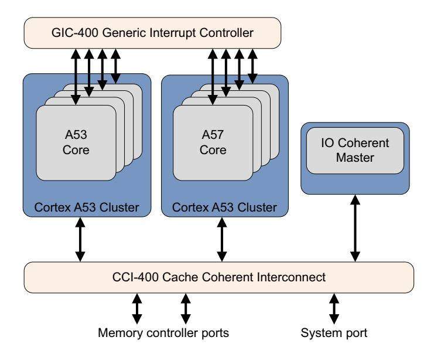

**Figure 14-1 A typical big.LITTLE system**

The central principle of big.LITTLE is that application software can run unmodified on either type of processor. For a detailed overview of big.LITTLE technology, and its software execution models see [Chapter 16.](#page-231-1)

#### <span id="page-210-0"></span>**14.1.7 Exclusive monitor system location**

A typical multi-core system might include multiple exclusive monitors. Each core has its own local monitor and there are one or more global monitors. The shareable and cacheable attributes of the translation table entry relating to the location used for the exclusive load or store instruction determines which exclusive monitor is used.

In hardware, the core includes a device named the local monitor. This monitor observes the core. When the core performs an exclusive load access, it records that fact in the local monitor. When it performs an exclusive store, it checks that a previous exclusive load was performed and fails the exclusive store if this was not the case. The architecture enables individual implementations to determine the level of checking performed by the monitor. The core can only tag one Physical Address at a time.

The local exclusive monitor gets cleared on every exception return, that is, on execution of the ERET instruction. In the Linux kernel multiple tasks run in kernel context at EL1, and can be context-switched without an exception return. Only when we return to a userspace thread within the context of its associated kernel task do we perform the exception return. This is different to the ARMv7 architecture, where the kernel task scheduler must explicitly clear the exclusive access monitor on each task switch. It is IMPLEMENTATION DEFINED whether the resetting of the local exclusive monitor also resets the global exclusive monitor.

The local monitor is used when the location used for the exclusive access is marked as non-shareable, that is, threads running on the same core only. Local monitors can also handle the case where accesses are marked as inner shareable, for example, a mutex protecting a resource shared between SMP threads running on any core within the shareable domain. For threads running on different, non-coherent cores, the mutex location is marked as normal, non-cacheable and requires a global access monitor in the system.

A system might not include a global monitor, or a global monitor might only be available for certain address regions. It is IMPLEMENTATION DEFINED what happens if an exclusive access is performed to a location for which no suitable monitor exists in the system. The following are some of the permitted options:

- The instruction generates an External Abort.
- The instruction generates an MMU fault.
- The instruction is treated as a NOP.
- The exclusive instruction is treated as a standard LDR/STR instruction, the value held in the result register of the store exclusive instruction becomes UNKNOWN.

The *Exclusives Reservation Granule* (ERG) is the granularity of the exclusive monitor. Its size is IMPLEMENTAION DEFINED, but is typically one cache line. It gives the minimum spacing between addresses for the monitor to distinguish between them. Placing two mutexes within a single ERG can lead to false negatives, where executing a STXR instruction to either mutex clears the exclusive tag of both. This does not prevent architecturally-correct software from functioning correctly but it might be less efficient. The size of the ERG of the exclusive monitor on a specific core might be read from the *Cache Type Register*, CTR\_EL0.

### <span id="page-212-1"></span><span id="page-212-0"></span>**14.2 Cache coherency**

[Chapter 11](#page-142-1) *Caches* only considers the effect of the caches within a single processor. The Cortex-A53 and Cortex-A57 processors support coherency management between the different cores in a cluster. This requires address regions to be marked with the correct shareable attribute. These processors permit systems containing multi-core clusters to be built, where coherency can be maintained for data shared between clusters. Such system-level coherency requires a cache coherent interconnect, such as the ARM CCI-400, which implements the AMBA 4 ACE bus specification. See [Figure 14-2.](#page-212-2)

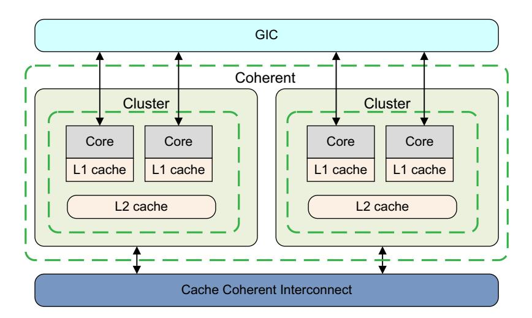

**Figure 14-2 Cache coherency groups**

<span id="page-212-2"></span>The coherency support in a system depends on hardware design decisions and many possible configurations exist. For example, coherency can only be supported within a single cluster. A dual cluster big.LITTLE system is posssible in which the inner domain includes the cores of both clusters, or a multi-cluster system where the inner domain includes the cluster and the outer domain includes the other clusters. For more information about big.LITTLE systems, see Chapter 16 *[big.LITTLE Technology](#page-231-1)*.

In addition to hardware, which maintains data coherency between caches, you must be able to broadcast cache maintenance activity performed by code running on one core to other parts of the system. There are hardware configuration signals, sampled at reset, which control whether inner or outer or both cache maintenance operations are broadcast and whether system barrier instructions are broadcast. The AMBA 4 ACE protocol allows signaling of barriers to other masters, so that ordering of maintenance and coherency operations is maintained. The Interconnect logic might require initialization by boot code.

Software must define which address regions are to be used by which group of masters, that is which other masters are sharing this address, by creating appropriate translation table entries. For Normal cacheable regions, this means setting the shareable attribute to one of Non-shareable, Inner Shareable, or Outer Shareable. For non-cacheable regions, the shareable attribute is ignored.

In a multi-core system it is not possible to know whether a specific core has a line covering a particular address in one of its caches (especially where the interconnect features caches, such as CCN-50x).

Maintenance may need to be broadcast to the interconnect. This means that software on one core can issue a cache clean or invalidate operation to an address that might currently be stored in the data cache of a different core that holds the address. When a maintenance operation is broadcast as shown in [Figure 14-3](#page-213-0), the operation is performed by all the cores in a particular shareability domain.

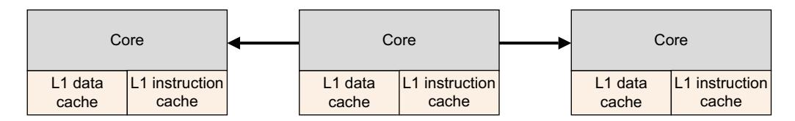

**Figure 14-3 Broadcasting cache operations to other cores**

<span id="page-213-0"></span>SMP operating systems typically rely on being able to broadcast cache and TLB maintenance operations. Consider the situation where an external DMA engine is able to modify the contents of external memory.

The SMP operating system running on a particular core does not know which core has which data. It simply requires an address range to be invalidated wherever it is in the cluster. If operations are not broadcast, the operating system must issue the clean or invalidate operations locally on each core. A DSB barrier instruction makes a core wait for the broadcasted operation it has issued to complete. The barrier does *not* force operations received by broadcast to complete. For more information about barrier instructions, see Chapter 13 *[Memory Ordering](#page-190-1)*.

<span id="page-213-1"></span>[Table 14-1](#page-213-1) lists the cache maintenance operations described in [Chapter 11](#page-142-1) and whether they are broadcast.

| Instructions | Description                                                     | Broadcast?       |
|--------------|-----------------------------------------------------------------|------------------|
| IC IALLUIS   | I-cache invalidate all to Point of Unification, Inner Shareable | Yes (inner only) |
| IC IALLU     | I-cache invalidate all to Point of Unification                  | Noa              |
| IC IVAU, Xt  | I-cache invalidate by address to Point of Unification           | Maybeb           |
| DC ZVA, Xt   | D-cache zero by address                                         | No               |
| DC IVAC, Xt  | D-cache invalidate by address to Point of Coherency             | Yes              |
| DC ISW, Xt   | D-cache invalidate by Set/Way                                   | No               |
| DC CVAC, Xt  | D-cache clean by address to Point of Coherency                  | Maybeb           |
| DC CSW, Xt   | D-cache clean by Set/Way                                        | No               |
| DC CVAU, Xt  | D-cache clean by address to Point of Unification                | Maybeb           |
|              |                                                                 |                  |

<span id="page-213-2"></span>**Table 14-1 Instructions with broadcast**

DC CIVAC, Xt D-cache clean and invalidate by address to Point of Coherency Yes DC CISW, Xt D-cache clean and invalidate by Set/Way No

b. Broadcast determined by shareability of memory region

a. Broadcast in Non-secure EL1 if HCR/HCR\_EL2 FB bit is set, overriding normal behavior. This bit causes the following instructions to be broadcast within the Inner shareable domain when executed from Non-secure:

EL1: TLBI VMALLE1, TLBI VAE1, TLBI ASIDE1, TLBI VAAE1, TLBI VALE1, TLBI VAALE1, IC IALLU.

For the IC instruction, that is the instruction cache maintenance operation, IS indicates that the function applies to all instruction caches within the Inner Shareable domain.

#### <span id="page-215-1"></span><span id="page-215-0"></span>**14.3 Multi-core cache coherency within a cluster**

Coherency means ensuring that all processors or bus masters within a system have the same view of shared memory. It means that changes to data held in the cache of one core are visible to the other cores, making it impossible for cores to see stale or old copies of data. This can be handled by simply not caching, that is disabling caches for shared memory locations, but this typically has a high performance cost.

#### **Software managed coherency**

Software managed coherency is a more common way to handle data sharing. Data is cached, but software, usually device drivers, must clean dirty data or invalidate old data from caches. This takes time, adds to software complexity, and can reduce performance when there are high rates of sharing

#### **Hardware managed coherency**

Hardware maintains coherency between level 1 data caches within a cluster. A core automatically participates in the coherency scheme when it is powered up, has its D-cache and MMU enabled, and an address is marked as coherent. However, this cache coherency logic does NOT maintain coherency between data and instruction caches.

In the ARMv8-A architecture and associated implementations, there are likely to be hardware managed coherent schemes. These ensure that any data marked as *shareable* in a hardware coherent system has the same value seen by all cores and bus masters in that shareability domain. This adds some hardware complexity to the interconnect and to clusters, but greatly simplifies the software and enables applications that would otherwise not be possible using only software coherency.

There are a number of standard ways in which cache coherency schemes can operate. The ARMv8 processors use the MOESI protocol. ARMv8 processors can also be connected to AMBA 5 CHI interconnects, for which the cache coherency protocol is similar to (but not identical to) MOESI.

Depending on which protocol is in use, the SCU marks each line in the cache with one of the following attributes: M (Modified), O (Owned), E (Exclusive), S (Shared) or I (Invalid). These are described below:

| Modified | The most up-to-date version of the cache line is within this cache. No other |
|----------|------------------------------------------------------------------------------|
|----------|------------------------------------------------------------------------------|

copies of the memory location exist within other caches. The contents of

the cache line are no longer coherent with main memory.

**Owned** This describes a line that is dirty and in possibly more than one cache. A

cache line in the owned state holds the most recent, correct copy of the data. Only one core can hold the data in the owned state. The other cores

can hold the data in the shared state.

**Exclusive** The cache line is present in this cache and coherent with main memory. No

other copies of the memory location exist within other caches.

**Shared** The cache line is present in this cache and is not necessarily coherent with

memory, given that the definition of Owned allows for a dirty line to be duplicated into shared lines. It will, however, have the most recent version of the data. Copies of it can also exist in other caches in the coherency

scheme.

**Invalid** The cache line is invalid.

The following rules apply for the standard implementation of the protocol:

- A write can only be performed if the cache line is in a *Modified* or *Exclusive* state. If it is in a *Shared* state, all other cached copies must be invalidated first. A write moves the line into a Modified state.
- A cache can discard a shared line at any time, changing it to an Invalid state. A Modified line is written back first.
- If a cache holds a line in a Modified state, reads from other caches in the system receive the updated data from the cache. Conventionally, this is achieved by first writing the data to main memory and then changing the cache line to a Shared state, before performing a read.
- A cache that has a line in an Exclusive state must move the line to a Shared state when another cache reads that line.
- A Shared state might not be precise. If one cache discards a Shared line, another cache might not be aware that it can now move the line to an Exclusive state.

The processor cluster contains a *Snoop Control Unit* (SCU) that contains duplicate copies of the tags stored in the individual L1 Data Caches. The cache coherency logic therefore:

- Maintains coherency between L1 data caches.
- Arbitrates accesses to L2 interfaces, for both instructions and data.
- Has duplicated Tag RAMs to keep track of what data is allocated in each core's data.

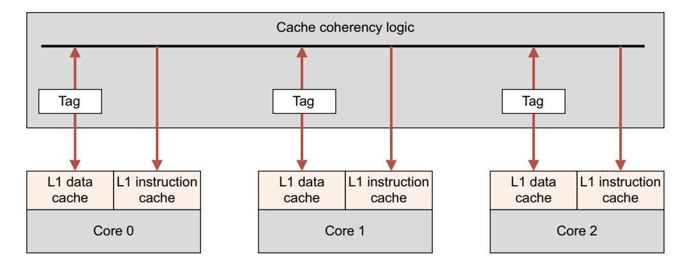

**Figure 14-4 Cache coherency logic**

<span id="page-216-0"></span>Each core in [Figure 14-4](#page-216-0) has its own data and instruction cache. The cache coherency logic contains a local copy of the tags from the D-caches. However, the instruction caches don't take part in coherency. There is 2-way communication between data cache and coherency logic.

ARM multi-core processors also implement optimizations that can copy clean data and move dirty data directly between participating L1 caches, without having to access and wait for external memory. This activity is handled in multi-core systems by the SCU.

Key facets of the multi-core technology are:

#### **14.3.1 Snoop Control Unit**

<span id="page-216-1"></span> The *Snoop Control Unit* (SCU) maintains coherency between the L1 data cache of each core and is responsible for managing the following interconnect actions:

• Arbitration.

- Communication.
- Cache-2-cache and system memory transfers.

The processor also exposes these capabilities to other system accelerators and non-cached DMA-driven peripherals to increase performance and reduce system-wide power consumption. This system coherence also reduces the software complexity involved when maintaining software coherence within each OS driver.

Each core can be individually configured to take part, or not, in a data cache coherency management scheme. The SCU device inside the processor automatically maintains level 1 data cache coherency between cores within the cluster. See *[Cache coherency](#page-212-1)* on page 14-10 and *[Multi-core cache coherency within a cluster](#page-215-1)* on page 14-13 for more information.

Since executable code changes much less frequently, this functionality is not extended to the L1 instruction caches. The coherency management is implemented using a MOESI-based protocol, optimized to decrease the number of external memory accesses. In order for the coherency management to be active for a memory access, all of the following must be true:

- The SCU is enabled, through its control register located in the private memory region. The SCU has configurable access control, restricting which processors can configure it.
- The MMU is enabled.
- The page being accessed is marked as Normal Shareable, with a cache policy of *write-back*, *write-allocate*. Device and Strongly-ordered memory, however, are not cacheable, and write-through caches behave like uncached memory from the point of view of the core.

The SCU can only maintain coherency within a single cluster. If there are additional processors or other bus masters in the system, explicit software synchronization is required when these share memory with the MP block.

#### **14.3.2 Accelerator coherency port**

This AMBA 4 AXI-compatible slave interface on the SCU provides an interconnect point for masters that are interfaced directly with the ARMv8 processors:

- The interface supports all standard read and write transactions without additional coherence requirements. However, any read transactions to a coherent region of memory interact with the SCU to test whether the information is already stored in the L1 caches.
- The SCU enforces write coherence before the write is forwarded to the memory system and might allocate into the L2 cache, removing the power and performance impact of writing directly to off-chip memory.

#### **14.3.3 Cache coherency between clusters**

*[Multi-core cache coherency within a cluster](#page-215-1)* on page 14-13 shows how hardware can maintain coherency between data that is shared between multiple processor caches in the same cluster. Systems can also contain hardware that maintains coherency between clusters, by handling shareable data transactions and broadcasting barrier and maintenance operations. Clusters can be added or removed from coherency management dynamically, for example, when an entire cluster, including the L2 cache, is powered down. The operating system can monitor activity on the coherent interconnect through built-in *Performance Monitoring Unit*s (PMUs).

#### **14.3.4 Domains**

In the ARMv8-A Architecture, the term *domain* is used to refer to a set of primary bus masters. Domains determine which of the masters are *snooped*, for coherent transactions. Snooping is the checking of the master's cache to see whether the requested location is stored there. There are four defined domain types:

- Non-shareable.
- Inner Shareable.
- Outer Shareable.
- System.

Typical system use is that masters running under the same operating system are in the same Inner Shareable domain. Masters that are sharing cacheable data, but that are not so closely coupled, are in the same Outer Shareable domain. Masters in the same inner domain must also be in the same outer domain. Domain selection for memory accesses is controlled through entries in the page tables.

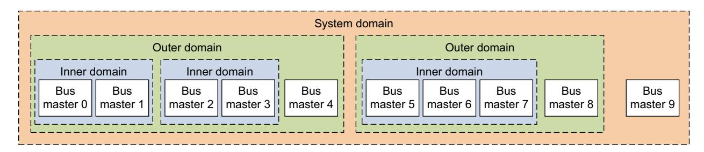

**Figure 14-5 Bus master coherency domains**

#### <span id="page-219-0"></span>**14.4 Bus protocol and the Cache Coherent Interconnect**

Extending hardware coherency to a multi-cluster system requires a coherent bus protocol. The AMBA 4 ACE specification includes the *AXI Coherency Extensions* (ACE). The full ACE interface enables hardware coherency between clusters and enables an SMP operating system to run on many cores.

If you have more than one cluster, any shared access to memory in one cluster can snoop into the cache of the other clusters to see if the data is there, or whether it must be loaded from external memory. The AMBA 4 ACE-Lite interface is a subset of the full interface, designed for one-way IO coherent system masters such as DMA engines, network interfaces, and GPUs.

These devices might not have any caches of their own, but can read shared data from the ACE processors. Caches for non-core masters are not typically kept coherent with the core caches. For example, in many systems the core cannot snoop inside the cache of a GPU on a slave port. But the reverse is not always true.

ACE-Lite permits other masters to snoop inside the caches of other clusters. This means that for shareable locations, reads are fulfilled from a coherent cache if necessary and shareable writes are merged with a forced clean and invalidate from a coherent cache line. The ACE specification enables TLB and I-Cache maintenance operations to be broadcast to all devices capable of receiving them. Data Barriers are sent to slave interfaces to ensure that they are programmatically complete.

The CoreLink CCI-400 Cache Coherent Interface was one of the first implementations of AMBA 4 ACE and supports up to two ACE clusters enabling up to eight cores to see the same view of memory and run an SMP operating system, for example, a big.LITTLE combination such as a Cortex-A57 processor and Cortex-A53 processor, as in [Figure 14-6](#page-219-1).

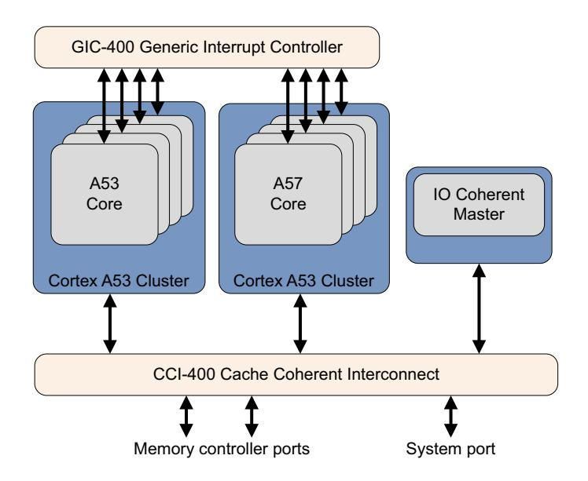

**Figure 14-6 Multi-cluster system**

<span id="page-219-1"></span>It also has three ACE-lite coherent interfaces that can be used, for example, by a DMA controller or GPUs.

[Figure 14-7](#page-220-1) shows coherent data being read from the Cortex-A53 cluster to the Cortex-A57 cluster.

- 1. The Cortex-A53 cluster issues a Coherent Read Request.
- 2. The CCI-400 passes the request to the Cortex-A53 processor to snoop into Cortex-A57 cluster cache.
- 3. When the request is received, the Cortex-A57 cluster checks its data caches availability and responds with the required information.
- 4. If the requested data is in the cache, the CCI-400 moves the data from the Cortex-A57 cluster to the Cortex-A53 cluster, resulting in a cache linefill in the Cortex-A53 cluster.

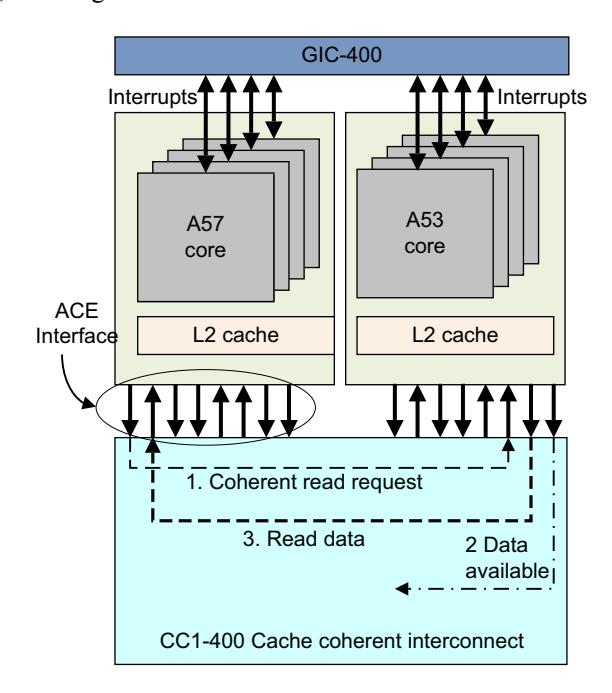

**Figure 14-7 CCI snoop request**

<span id="page-220-1"></span>The CCI-400 and the ACE protocol enable full coherency between the Cortex-A57 and Cortex-A53 clusters, enabling data sharing to take place without external memory transactions.

The ARM CoreLink interconnect and memory controller system IP addresses the critical challenge of efficiently moving and storing data between Cortex-A series processors, high performance media processors, and dynamic memories to optimize the system performance and power consumption of the *System-on-Chip* (SoC). The CoreLink system IP enables SoC designers to maximize the utilization of system memory bandwidth and reduce static and dynamic latencies.

#### <span id="page-220-0"></span>**14.4.1 Compute subsystems and mobile applications**

The following figure shows an example mobile applications processor with Cortex-A57 and Cortex-A53 series processors, CoreLink MMU-500 System MMU, and a range of CoreLink 400 system IP.

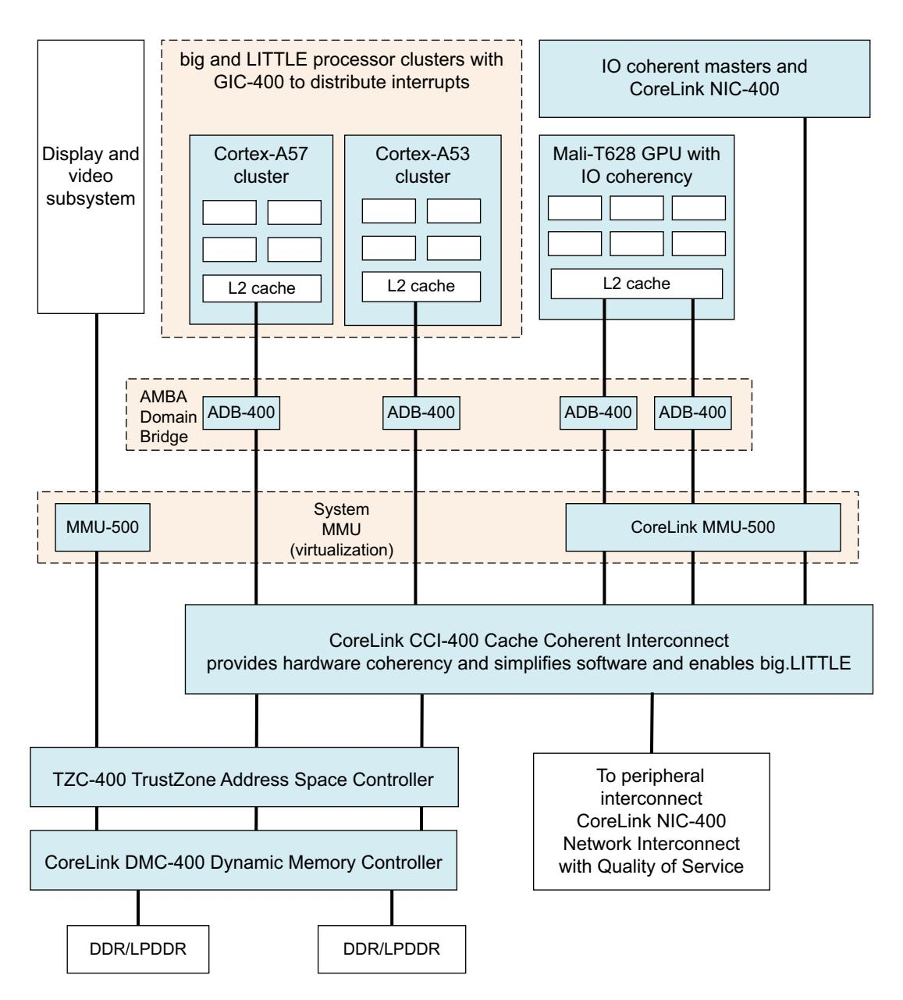

**Figure 14-8 Example mobile applications processor with CoreLink IP**

In this system, the ARM Cortex-A57 and Cortex-A53 processors provide a big.LITTLE cluster combination and are connected to the CCI-400 with AMBA 4 ACE to provide full hardware coherency. The ARM Mali®-T628 GPU and IO coherent masters connect to the CCI-400 through AMBA 4 ACE-Lite interfaces.

ARM provides different interconnect options for maintaining cross cluster coherency:

#### **CoreLink CCI-400 Cache Coherent Interconnect**

This supports two multi-core clusters and uses the AMBA 4 and AMBA Coherency Extensions or ACE. ACE uses a MOESI state machine for cross-cluster coherency.

#### **CoreLink CCN-504 Cache Coherent Network**

This supports up to four multi-core clusters and includes integrated L3 caches and two channel 72-bit DDR.

The ARM CoreLink CCN-504 Cache Coherent Network provides optimum system bandwidth and latency. The CCN family of interconnects are designed for cores to attach using AMBA 5 CHI, though there is some AMBA 4 ACE support. The CCN-504 in particular, provides *AMBA 4 AXI Coherency Extensions* (ACE) compliant ports for full coherency between multiple Cortex-A series processors, better utilization of caches and simplification of software development. This feature is essential for high bandwidth applications including gaming servers and networking that require clusters of coherent single and multi-core processors. Combined with the ARM CoreLink network interconnect and memory controller IP, the CCN increases system performance and power efficiency.

#### **CoreLink CCN-508 Cache Coherent Network**

This supports up to eight multi-core clusters, 32 cores and includes integrated L3 caches and four channel 72-bit DDR

#### **CoreLink MMU-500 System MMU**

This provides address translation for system components, see [Chapter 12](#page-161-1) *The [Memory Management Unit](#page-161-1)*.

#### **CoreLink TZC-400 TrustZone Address Space Controller**

This performs security checks on transactions to memory or peripherals and permits regions of memory to be marked as secure.

#### **CoreLink DMC-400 Dynamic Memory Controller**

This provides dynamic memory scheduling and interfacing to external DDR2/3 or LPDDR2 memory.

#### **CoreLink NIC-400 Network Interconnect**

This is a highly configurable and enables you to create a complete high performance, optimized, and AMBA-compliant network infrastructure.

The possible configurations for the CoreLink NIC-400 Network Interconnect can range from a single bridge component, for example an AHB to AXI protocol conversion bridge, to a complex interconnect that consists of up to 128 masters and 64 slaves of AMBA protocols.

## <span id="page-223-1"></span><span id="page-223-0"></span>Chapter 15 **Power Management**

Many ARM systems are mobile devices and powered by batteries. In such systems, optimization of power use, and total energy use, is a key design constraint. Programmers often spend significant amounts of time trying to save battery life in such systems.

Power-saving can also be of concern even in systems that do not use batteries. For example, you might want to minimize energy use for reduction of electricity costs to the consumer, for environmental reasons, or to minimize the heat that the device generates.

Built into ARM cores are many hardware design methods aimed at reducing power use.

Energy use can be divided into two components:

**Static** Static power consumption, also often called leakage, occurs whenever the core

logic or RAM blocks have power applied to them. In general terms, the leakage currents are proportional to the total silicon area, meaning that the bigger the chip, the higher the leakage. The proportion of power consumption from leakage gets

significantly higher as you move to smaller fabrication geometries.

**Dynamic** Dynamic power consumption occurs because of transistor switching and is a

function of the core clock speed and the numbers of transistors that change state per cycle. Clearly, higher clock speeds and more complex cores consume more

power.

Power management-aware operating systems dynamically change the power states of cores, balancing the available compute capacity to the current workload, while attempting to use the minimum amount of power. Some of these techniques dynamically switch cores on and off, or place them into quiescent states, where they no longer perform computation. This means that they consume very little power. The main examples of these techniques are:

- *[Idle management](#page-225-1)* on page 15-3.
- *[Dynamic voltage and frequency scaling](#page-228-1)* on page 15-6.

### <span id="page-225-1"></span><span id="page-225-0"></span>**15.1 Idle management**

When a core is idle, the *Operating System Power Management* (OSPM) transitions it into a low-power state. Typically, a choice of states is available, with different entry and exit latencies, and different levels of power consumption, associated with each state. The state that is used typically depends on how quickly the core is required again. The power states that can be used at any one time might also depend on the activity of other components in an SoC, beside the cores. Each state is defined by the set of components that are clock-gated or power-gated when the state is entered.

The time required to move from a low-power state to a running state, known as the wakeup latency, is longer in deeper states. Although idle power management is driven by thread behavior on a core, the OSPM can place the platform into states that affect many other components beyond the core itself. If the last core in a cluster becomes idle, the OSPM can target power states that affect the whole cluster. Equally, if the last core in an SoC becomes idle, the OSPM can target power states that affect the whole SoC. The choice is also driven by the use of other components in the system. A typical example is placing memory in self-refresh when all cores, and any other bus masters, are idle.

The OSPM has to provide the necessary power management software infrastructure to determine the correct choice of state. In idle management, when a core or cluster has been placed into a low-power state, it can be reactivated at any time by a core wakeup event. That is, an event that can wake up a core from a low-power state, such as an interrupt. No explicit command is required by the OSPM to bring the core or cluster back into operation. The OSPM considers the affected core or cores to be available at all times even if they are currently in a low-power state.

#### <span id="page-225-2"></span>**15.1.1 Power and clocking**

One way that can reduce energy use is to remove power, which removes both dynamic and static currents (sometimes called *power-gating*), or to stop the clock of the core which removes dynamic power consumption only and can be referred to as *clock-gating*.

ARM cores typically support several levels of power management, as follows:

- Standby.
- Retention.
- Power down.
- Dormant mode.
- Hotplug.

For certain operations, there is a requirement to save and restore the state before and after removing power. Both the time taken to do the save and restore, and the power consumed by this extra work can be an important factor in software selection of the appropriate power management activity.

The SoC device that includes the core can have additional low-power states, with names such as *STOP* and *Deep sleep*. These refer to the ability for the hardware *Phase Locked Loop* (PLL) and voltage regulators to be controlled by power management software.

#### <span id="page-226-2"></span>**15.1.2 Standby**

In the standby mode of operation, the core is left powered-up, but most of its clocks are stopped, or *clock-gated*. This means that almost all parts of the core are in a static state and the only power drawn is because of leakage currents and the clocking of the small amount of logic that looks out for the wake-up condition.

This mode is entered using either the WFI (Wait For Interrupt) or WFE (Wait For Event) instructions. ARM recommends the use of a Data Synchronization Barrier (DSB) instruction before WFI or WFE, to ensure that pending memory transactions complete before changing state.

If a debug channel is active, it remains active. The core stops execution until a wakeup event is detected. The wakeup condition is dependent on the entry instruction. For WFI, an interrupt or external debug request wakes the core. For WFE, a number of specified events exist, including another core in the cluster executing the SEV instruction.

A request from the *Snoop Control Unit* (SCU) can also wake up the clock for a cache coherency operation in a multi-core system. This means that the cache of a core that is in standby state continues to be coherent with caches of other cores (but the core in standby does not necessarily execute the next instruction). A core reset always forces the core to exit from the standby condition.

Various forms of dynamic clock gating can also be implemented in hardware. For example, the SCU, GIC, timers, instruction pipeline or NEON blocks can be automatically clock gated when an idle condition is detected, to save power.

Standby mode can be entered and exited quickly (typically in two-clock-cycles). It therefore has an almost negligible effect on the latency and responsiveness of the core.

To an OSPM, a standby state is mostly indistinguishable from a retention state. The difference is evident to an external debugger and in hardware implementation, but not evident to the idle management subsystem of an operating system.

#### <span id="page-226-1"></span>**15.1.3 Retention**

The core state, including the debug settings, is preserved in low-power structures, enabling the core to be at least partially turned off. Changing from low-power retention to running operation does not require a reset of the core. The saved core state is restored on changing from low-power retention state to running operation. From an operating system point of view, there is no difference between a retention state and standby state, other than method of entry, latency and use-related constraints. However, from an external debugger point of view, the states differ as External Debug Request debug events stay pending and debug registers in the core power domain cannot be accessed.

#### <span id="page-226-0"></span>**15.1.4 Power down**

In this state, the core is powered off. Software on the device must save all core state, so that it can be preserved over the power-down. Changing from power-down to running operation must include:

- A reset of the core, after the power level has been restored.
- Restoring the saved core state.

The defining characteristic of power down states is that they are destructive of context. This affects all the components that are switched off in a given state, including the core, and in deeper states other components of the system such as the GIC or platform-specific IP. Depending on how debug and trace power domains are organized, one or both of debug and trace context might be lost in some power-down states. Mechanisms must be provided to enable the operating system to perform the relevant context saving and restoring for each given state. Resumption of execution starts at the reset vector, and after this each OS must restore its context.

#### <span id="page-227-0"></span>**15.1.5 Dormant mode**

Dormant mode is an implementation of a power-down state. In dormant mode, the core logic is powered down, but the cache RAMs are left powered up. Often the RAMs are held in a low-power retention state where they hold their contents but are not otherwise functional. This provides a far faster restart than complete shutdown, as live data and code persists in the caches. Again, in a multi-core system, individual cores can be placed in dormant mode.

In a multi-core system that permits individual cores within the cluster to go into dormant mode, there is no scope for maintaining coherency while the core has its power removed. Such cores must therefore first isolate themselves from the coherence domain. They clean all dirty data before doing this and are typically woken up using another core signaling the external logic to re-apply power.

The woken core must then restore the original core state before rejoining the coherency domain. Because the memory state might have changed while the core was in dormant mode, it might have to invalidate the caches anyway. Dormant mode is therefore much more likely to be useful in a single core environment rather than in a cluster. This is because of the additional expense of leaving and rejoining the coherency domain. In a cluster, dormant mode is typically likely to be used only by the last core when the other cores have already been shut down.

#### <span id="page-227-1"></span>**15.1.6 Hotplug**

CPU hotplug is a technique that can dynamically switch cores on or off. Hotplug can be used by the OSPM to change available compute capacity based on current compute requirements. Hotplug is also sometimes used for reliability reasons. There are a number of differences between hotplug and use of a power-down state for idle:

- 1. When a core is hot unplugged, the supervisory software stops all use of that core in interrupt and thread processing. The core is no longer considered to be available by the calling OS.
- 2. The OSPM has to issue an explicit command to bring a core back online, that is, hotplug a core. The appropriate supervisory software only starts scheduling on or enabling interrupts to that core after this command.

Operating systems typically perform much of the kernel boot process on one primary core, bringing secondary cores online at a later stage. Secondary boot behaves very similarly to hotplugging a core into the system. The operations in both cases are almost identical.

#### <span id="page-228-1"></span><span id="page-228-0"></span>**15.2 Dynamic voltage and frequency scaling**

Many systems operate under conditions where their workload is variable. Therefore it is useful to have the ability to reduce or increase the core performance to match the expected core workload. Clocking the core more slowly reduces dynamic power consumption.

*Dynamic Voltage and Frequency Scaling* (DVFS) is an energy saving technique that exploits:

- The linear relationship between power consumption and operational frequency.
- The quadratic relationship between power consumption and operational voltage.

This relationship is given as:

$$P = C \times V^2 \times f$$

Where:

**P** Is the dynamic power.

**C** Is the switching capacitance of the logic circuit in question.

**V** Is the operational voltage.

*f* Is the operational frequency.

Power savings are achieved by adjusting the frequency of a core clock.

At lower frequencies the core can also operate at lower voltages. The advantage of reducing supply voltage is that it reduces both dynamic and static power.

There is an IMPLEMENTATION SPECIFIC relationship between the operational voltage for a given circuit and the range of frequencies that circuit can safely operate at. A given frequency of operation together with its corresponding operational voltage is expressed as a tuple and is known as an *Operating Performance Point* (OPP). For a given system, the range of attainable OPPs are collectively termed as the system DVFS curve.

Operating systems use DVFS to save energy and, where necessary, keep within thermal limits. The OS provides DVFS policies to manage the power consumed and the required performance. A policy aimed at high-performance selects higher frequencies and uses more energy. A policy aimed at saving energy selects lower frequencies and therefore results in lower performance.

#### <span id="page-229-0"></span>**15.3 Assembly language power instructions**

ARM assembly language includes instructions that can be used to place the core in a low-power state. The architecture defines these instructions as *hints*, meaning that the core is not required to take any specific action when it executes them. In the Cortex-A processor family, however, these instructions are implemented in a way that shuts down the clock to almost all parts of the core. This means that the power consumption of the core is significantly reduced so that only static leakage currents are drawn, and there is no dynamic power consumption.

<span id="page-229-2"></span>The WFI instruction has the effect of suspending execution until the core is woken up by one of the following conditions:

- <span id="page-229-3"></span><span id="page-229-1"></span>• An IRQ interrupt, even if the PSTATE I-bit is set.
- An FIQ interrupt, even if the PSTATE F-bit is set.
- An asynchronous abort.

In the event of the core being woken by an interrupt when the relevant PSTATE interrupt flag is disabled, the core implements the next instruction after WFI.

The WFI instruction is widely used in systems that are battery powered. For example, mobile telephones can place the core in standby mode many times a second, while waiting for you to press a button.

WFE is similar to WFI. It suspends execution until an event occurs. This can be one the event conditions listed or an event signaled by another core in a cluster. Other cores can signal events by executing the SEV instruction. SEV signals an event to all cores. The generic timer can also be programmed to trigger periodic events that wake up a core from WFE.

### <span id="page-230-0"></span>**15.4 Power State Coordination Interface**

The *Power State Coordination Interface* (PSCI) provides an OS agnostic method for implementing power management use cases where cores can be powered up or down. This includes:

- Core idle management.
- Dynamic addition and removal of cores (hotplug), and secondary core boot.
- big.LITTLE migration.
- System shutdown and reset.

The messages sent using this interface are received by all relevant levels of execution. That is, if EL2 and EL3 are implemented, a message sent by a Rich OS executing in a guest must be received by a hypervisor. If the hypervisor sends it, the message must be received by the secure firmware that then coordinates with a Trusted OS. This allows each operating system to determine whether context saving is required.

For more information, see the *Power State Coordination Interface (PSCI)* specification.

## <span id="page-231-1"></span><span id="page-231-0"></span>Chapter 16 **big.LITTLE Technology**

Modern software stacks place conflicting requirements on mobile systems. On the one hand is a demand for very high performance for tasks such as games, while on the other is a continuing requirement to be frugal with energy reserves for low intensity applications like audio playback.

Traditionally, it has not been possible to have a single processor design that can be capable of both high peak performance as well as high energy efficiency. This meant that a lot of energy was wasted because the high performance core would be used for low intensity tasks leading to reduced battery life. Performance would itself be affected by the thermal limits at which the cores could run for sustained periods.

big.LITTLE technology from ARM solves this problem by coupling together energy-efficient *LITTLE* cores with high-performance *big* cores. big.LITTLE is an example of a heterogeneous processing system. Such systems typically include several different processor types with different microarchitectures, like general-purpose processors and specialized ASICs.

big.LITTLE takes the heterogeneity one step further in that it includes general-purpose processors that are different in their micro-architecture but compatible in their instruction set architecture. A term that is often used with such systems is *Heterogeneous Multiprocessing* (HMP) (See *[Heterogeneous multi-processing](#page-210-1)* on page 14-8). What makes HMP different from *Asymmetric Multiprocessing* (AMP) (*[Asymmetric multi-processing](#page-209-0)* on page 14-7) is that all the processors in an HMP system are fully coherent and run the same operating system image.

Software can run on big or the LITTLE processors (or both) depending on performance requirements. When peak performance is required software can be moved to run only on big processors. For normal tasks, software can be run perfectly well on LITTLE processors. Through this combination, big.LITTLE provides a solution capable of delivering the peak performance required by the latest mobile devices, within the thermal bounds of the system, and with maximum energy efficiency.

#### <span id="page-232-0"></span>**16.1 Structure of a big.LITTLE system**

Both types of core in a big.LITTLE system are fully cache coherent and share the same instruction set architecture (ISA). The same application binary runs unmodified on either. Differences in the internal microarchitecture of the processors enable them to provide the different power and performance characteristics that are fundamental to the big.LITTLE concept. These are typically managed by the operating system.

big.LITTLE software models require transparent and efficient transfer of data between big and LITTLE clusters. Hardware coherency enables this, transparently to the software. Coherency between clusters is provided by a cache-coherent interconnect such as the ARM CoreLink CCI-400 described in [Chapter 14.](#page-203-1) Without hardware coherency, the transfer of data between big and LITTLE cores would always occur through main memory but this would be slow and not power efficient. In addition, it would require complex cache management software, to enable data coherency between big and LITTLE clusters.

In addition, such a system also requires a shared interrupt controller, such as the GIC-400, enabling interrupts to be migrated between any cores in the clusters. All cores can signal each other using distributed interrupt controllers such as the CoreLink GIC-400. Task switching is typically handled entirely within the OS scheduler, and invisible to the application software. An example system is shown in [Figure 16-1](#page-232-1).

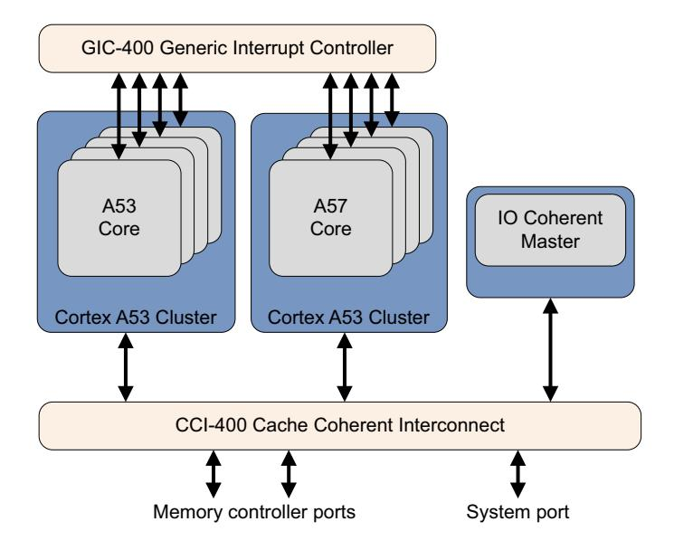

**Figure 16-1 Typical big.LITTLE system**

#### <span id="page-232-2"></span><span id="page-232-1"></span>**16.1.1 big.LITTLE configurations**

A number of big.LITTLE configurations are possible, [Figure 16-1](#page-232-1) uses Cortex-A57 cores as the big cluster and Cortex-A53 cores as the LITTLE cluster, though other configurations are possible.

The LITTLE cluster is capable of handling most low intensity tasks such as audio playback, web-page scrolling, operating system events, and other always on, always connected tasks. As such, it is likely that the LITTLE cluster is where the software stack remains until intensive tasks such as gaming or video processing are run.

The big cluster can be utilized for heavy workloads such as certain high performance game graphics. Web page rendering is another common example. A coupling of these two cluster types provides opportunities to save energy and satisfy the increasing performance demands of applications stacks in mobile devices.

#### <span id="page-234-0"></span>**16.2 Software execution models in big.LITTLE**

There are two primary execution models for big.LITTLE:

**Migration** Migration models are a natural extension to power-performance management techniques such as DVFS, (see *[Dynamic voltage and frequency scaling](#page-228-0)* on [page 15-6](#page-228-0)).

<span id="page-234-3"></span>The migration model has two types:

- Cluster migration.
- CPU migration.

A migration action is similar to a DVFS operating point transition. Operating points on the DVFS curve of a core are traversed in response to load variations. When the current core (or cluster) has attained the highest operating point, if the software stack requires more performance, a core (or cluster) migration action is effected. Execution then continues on the other core (or cluster) with the operating points on this core (or cluster) being traversed. When performance is not required, execution can switch back.

#### **Global Task Scheduling**

In Global Task Scheduling (see *[Global Task Scheduling](#page-235-0)* on page 16-5), the operating system task scheduler is aware of the differences in compute capacity between big and LITTLE cores. The scheduler tracks the performance requirement for each individual software thread, and uses that information to decide which type of core to use for each. Unused cores can be powered off. This approach has a number of advantages over the migration models.

#### <span id="page-234-1"></span>**16.2.1 Cluster migration**

Only one cluster, either big or LITTLE, is active at any one time, except very briefly during a cluster context switch to the other cluster. To achieve the best power and performance efficiency, the software stack runs mostly on the energy-efficient LITTLE cluster and only runs for short time periods on the big cluster. This model requires the same number of cores in both clusters.

This model does not cope well with unbalanced software workloads, that is, workloads that place significantly different loads on cores within a cluster. In such situations, cluster migration results in a complete switch to the big cluster even though not all the cores need that level of performance. For this reason cluster migration is less popular than other methods.

#### <span id="page-234-2"></span>**16.2.2 CPU migration**

In this model, each big core is paired with a LITTLE core. Only one core in each pair is active at any one time, with the inactive core being powered down. The active core in the pair is chosen according to current load conditions. Using the example in [Figure 16-2 on page 16-5](#page-235-1), the operating system sees four logical cores. Each logical core can physically be a big or LITTLE core. This choice is driven by *Dynamic Voltage and Frequency Scaling* (DVFS). This model requires the same number of cores in both the clusters.

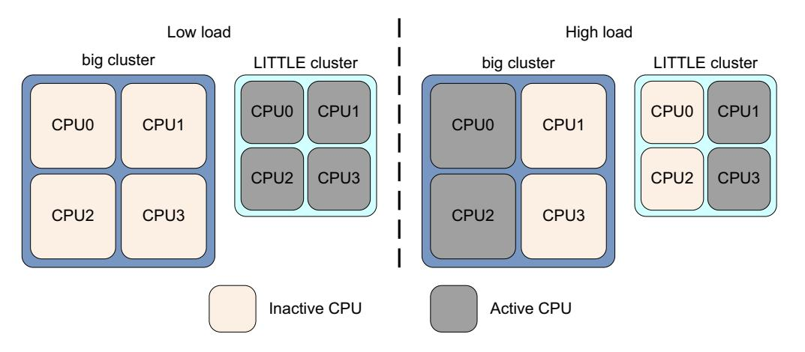

**Figure 16-2 CPU migration**

The system actively monitors the load on each core. High load causes the execution context to be moved to the big core, and conversely, when the load is low, the execution is moved to the LITTLE core. Only one core in the pairing can be active at any time. When the load is moved from an outbound core (the core the load leaves) to an inbound core (the core it arrives at), the former is switched off. This model allows a mix of big and LITTLE cores to be active at any one time.

#### <span id="page-235-3"></span><span id="page-235-1"></span><span id="page-235-0"></span>**16.2.3 Global Task Scheduling**

Through the development of big.LITTLE technology, ARM has evolved the software models starting with various migration models through to *Global Task Scheduling* (GTS) that forms the basis for all future development in big.LITTLE technology. The ARM implementation of GTS is called big.LITTLE *Multiprocessing* (MP).

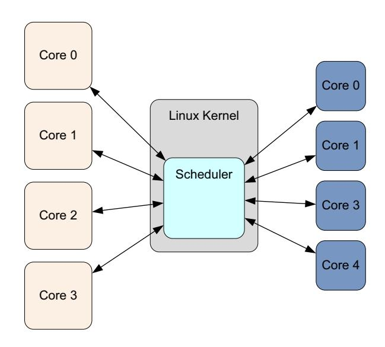

**Figure 16-3 Global Task Scheduling**

<span id="page-235-2"></span>In this model the operating system task scheduler is aware of the differences in compute capacity between big and LITTLE cores. Using statistical data, the scheduler tracks the performance requirement for each individual software thread, and uses that information to decide which type of core to use for each. This model can work on a big.LITTLE system with any number of cores in any cluster. This is shown in [Figure 16-3 on page 16-5](#page-235-2). This approach has a number of advantages over the migration models, such as:

- The system can have different numbers of big and LITTLE cores.
- Unlike the migration model, any number of cores can be active at any one time. This can increase the maximum compute capacity available if peak performance is required.
- It is possible to isolate the big cluster for the exclusive use of intensive threads, while light threads run on the LITTLE cluster. This enables heavy compute tasks to complete faster, as there are no additional background threads.
- It is possible to target interrupts individually to big or LITTLE cores.

#### <span id="page-237-0"></span>**16.3 big.LITTLE MP**

For big.LITTLE MP on the Linux kernel the fundamental requirement is for the scheduler to decide when a software thread can run on a LITTLE core or a big core. The scheduler does this by comparing the tracked load of software threads against tunable load thresholds, an *up migration threshold* and a *down migration threshold* as shown in [Figure 16-4](#page-237-2).

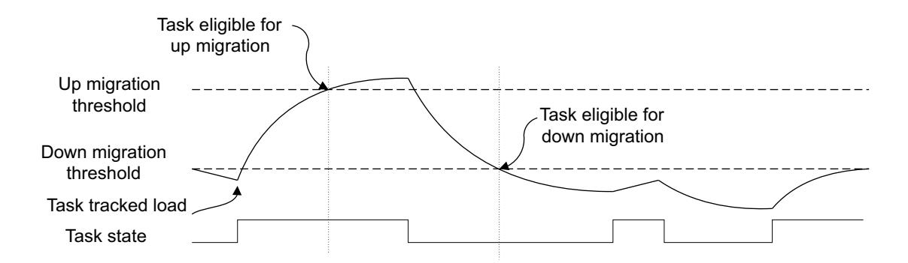

**Figure 16-4 Migration thresholds**

<span id="page-237-2"></span>When the tracked load average of a thread currently allocated to a LITTLE core exceeds the up migration threshold, the thread is considered eligible for migration to a big core. Conversely, when the load average of a thread that is currently allocated to a big core drops below the down migration threshold, it is considered eligible for migration to a LITTLE core. In big.LITTLE MP, these basic rules govern task migration between big and LITTLE cores. Within the clusters, standard Linux scheduler load balancing applies. This tries to keep the load balanced across all the cores in one cluster.

The model is refined by adjusting the tracked load metric based on the current frequency of a core. A task that is running when the core is running at half speed, accrues tracked load at half the rate that it would if the core was running at full speed. This enables big.LITTLE MP and DVFS management to work together in harmony.

big.LITTLE MP uses several mechanisms to determine when to migrate a task between big and LITTLE cores:

#### <span id="page-237-3"></span>**16.3.1 Fork migration**

This operates when the fork system call is used to create a new software thread. At this point, clearly no historical load information is available. The system defaults to a big core for new threads on the assumption that a *light* thread migrates quickly down to a LITTLE core as a result of *[Wake migration](#page-237-1)*.

Fork migration benefits demanding tasks without being expensive. Threads that are low intensity and persistent, such as Android system services, are only moved to big cores at creation time, quickly moving to more suitable LITTLE cores thereafter. Threads that are clearly demanding throughout, are not penalized by being made to launch on LITTLE cores first. Threads that run occasionally, but tend to require performance, benefit from being launched on the big cluster and continuing to run there as required.

#### <span id="page-237-4"></span><span id="page-237-1"></span>**16.3.2 Wake migration**

When a task that was previously idle becomes ready to run, the scheduler must decide which cluster executes the task. To choose between big and LITTLE, big.LITTLE MP uses the tracked load history of a task. Generally, the assumption is that the task resumes on the same cluster as before. The load metric is not updated for a task that is sleeping. Therefore, when scheduler checks the load metric of a task at wake up, before choosing a cluster to execute it on, the metric has the value it had when the task last ran. This property means that tasks that are sufficiently busy always tend to wake up on a big core. An audio playback task, for example, is periodically busy. But this is typically an undemanding task, so the overall load may fit comfortably on a little core. A task has to actually modify its behavior to change cluster.

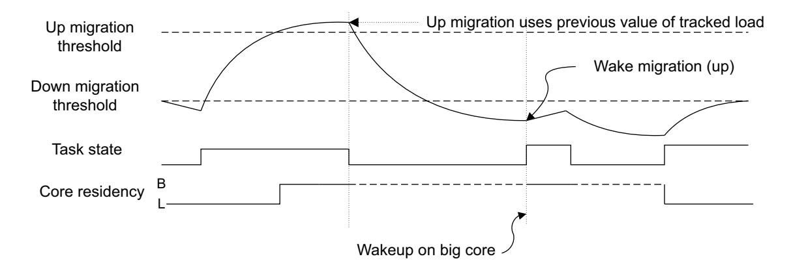

**Figure 16-5 Wake migration on a big core**

<span id="page-238-0"></span>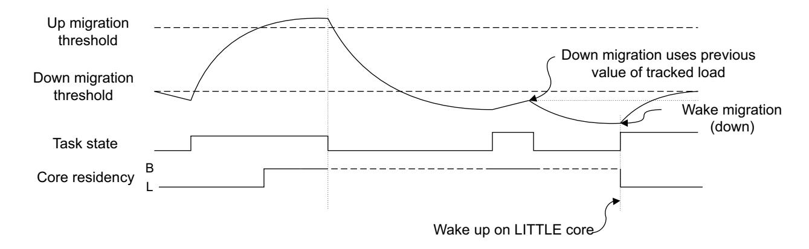

**Figure 16-6 Wake migration on a LITTLE core**

If a task modifies its behavior, and the load metric has crossed either of the up or down migration thresholds, the task can be allocated to a different cluster. [Figure 16-5](#page-238-0) and [Figure 16-6](#page-238-1) illustrate this process. Rules are defined that ensure that big cores generally only run a single intensive thread and run it to completion, so upward migration only occurs to big cores which are idle. When migrating downwards, this rule does not apply and multiple software threads can be allocated to a little core.

#### <span id="page-238-2"></span><span id="page-238-1"></span>**16.3.3 Forced migration**

Forced migration deals with the problem of long running software threads that do not sleep, or do not sleep very often. The scheduler periodically checks the current thread running on each LITTLE core. If the tracked load exceeds the up migration threshold the task is transferred to a big core, as in [Figure 16-7 on page 16-9.](#page-239-0)

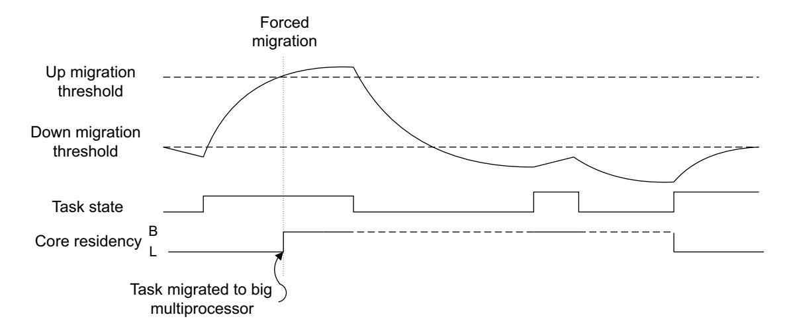

**Figure 16-7 Forced migration**

#### <span id="page-239-1"></span><span id="page-239-0"></span>**16.3.4 Idle pull migration**

Idle pull migration is designed to make best use of active big cores. When a big core has no task to run, a check is made on all LITTLE cores to see if a currently running task on a LITTLE core has a higher load metric than the up migration threshold. Such a task can then be immediately migrated to the idle big core. If no suitable task is found, then the big core can be powered down. This technique ensures that big cores, when they are running, always take the most intensive tasks in a system and run them to completion.

#### <span id="page-239-2"></span>**16.3.5 Offload migration**

Offload migration requires that normal scheduler load balancing be disabled. The downside of this is that long-running threads can concentrate on the big cores, leaving the LITTLE cores idle and under-utilized. Overall system performance, in this situation, can clearly be improved by utilizing all the cores.

Offload migration works to periodically migrate threads downwards to LITTLE cores to make use of unused compute capacity. Threads that are migrated downwards in this way remain candidates for up migration if they exceed the threshold at the next scheduling opportunity.

## <span id="page-240-1"></span><span id="page-240-0"></span>Chapter 17 **Security**

<span id="page-240-3"></span>A system that offers a certain level of security, a *trusted* system, is one that protects assets, for example passwords and cryptographic keys, or credit card details, from a range of plausible attacks, to prevent them from being copied or damaged, or made unavailable.

Security is usually defined by the principles of Confidentiality, Integrity, and Availability. Confidentiality is a key security concern for assets such as passwords and cryptographic keys. Defense against modification and proof of authenticity is vital for security software and on-chip secrets used for security. Examples of trusted systems might include entry of passwords for mobile payments, digital rights management, and e-ticketing. Security is harder to achieve in the world of open systems, where you can download a wide range of software onto a platform, inadvertently also downloading malicious or untrusted code, which can tamper with your system.

Mobile devices can be used to view videos, listen to music, play games, or for browsing the Web and accessing financial services. This requires both the user and the bank or service provider to trust the device. The device runs a complex OS with high levels of connectivity and might be vulnerable to attack by malicious software. You can achieve some measure of security through software system design, but you can obtain higher levels of protection through the CPU and system level memory partitioning.

<span id="page-240-2"></span>ARM processors include specific hardware extensions to enable construction of trusted systems. Writing a trusted OS or *Trusted Execution Environment* (TEE) systems is outside the scope of this book. However, if you set the Security fractional field to implement the ARMv7 Security Extensions, be aware that this imposes some restrictions on the OS and on unprivileged code, in other words, code that is not part of the trusted system.

Software and hardware attacks can be classified into the following categories:

#### <span id="page-241-2"></span>**Software attacks**

Attacks by malicious software typically do not require physical access to the device and can exploit vulnerabilities in the operating system or an application.

#### <span id="page-241-0"></span>**Simple hardware attacks**

These are usually passive, mostly non-destructive attacks that require access to the device and exposure to the electronics, and use commonly available tools such as logic probes and JTAG run-control units.

#### <span id="page-241-1"></span>**Laboratory hardware attack**

This kind of attack requires sophisticated and expensive tools, such as Focused Ion Beam (FIB) techniques or power analysis techniques, and is more commonly used against smartcard devices.

TrustZone technology is designed to protect against software and simple hardware attacks.

#### <span id="page-242-0"></span>**17.1 TrustZone hardware architecture**

The TrustZone architecture provides a means for system designers to help secure systems, using the TrustZone security extensions, and secure peripherals. Low-level programmers must understand the restrictions placed on the system by the TrustZone architecture, even if they do not use the security features.

<span id="page-242-3"></span><span id="page-242-2"></span>The ARM security model divides up device hardware and software resources, so that they exist in either the *Secure world* for the security subsystem, or the *Normal world* for everything else. System hardware ensures that no Secure world assets can be accessed from the Normal world. A Secure design places all sensitive resources in the Secure world, and ideally has robust software running that can protect assets against a wide range of possible software attacks.

<span id="page-242-1"></span>The *ARM Architecture Reference Manual* uses the terms *Secure* and *Non-secure* to refer to system security *states*. A *Non-secure state* does not automatically mean security vulnerability, but rather normal operation and is therefore the same as the *Normal world*. Normally, there is a master and slave relationship between Non-secure and Secure worlds, and so the Secure world is only executed when the Normal world performs a *Secure Monitor Call* (SMC), (see SMC instruction in *ARMv8-A Architecture Reference Manual*). The use of the word *world* is really used to describe not just the execution state, but also all memory and peripherals that are only accessible in that state.

The additions to the architecture mean that a single physical core can execute code from both the Normal world and the Secure world in a time-sliced fashion, although this depends on the availability of interrupt-generating peripherals that can be configured to be accessible only by the Secure World. For example, a Secure timer interrupt could be used to guarantee some execution time for the Secure world, in a manner resembling preemptive multitasking. Such peripherals may or may not be available, depending on the level of security and use cases that the platform designer intends to support.

Alternatively, an execution model closer to cooperative multitasking can be used. In this case, although the Secure world is independent of the Normal world in terms of the resources each world can access, the scheduling of execution time is typically interdependent between the two worlds.

Like firmware or any other piece of system software, software in the Secure world must be careful to minimize its impact on other parts of the system. For example, consumption of significant execution time should usually be avoided unless performing some action requested by the Normal world, and Non-secure interrupts should be signaled to the Normal world as quickly as possible. This helps to ensure good performance and responsiveness of Normal world software without the need for extensive porting.

The memory system is divided by means of an additional bit that accompanies the address of peripherals and memory. This bit, called the NS-bit, indicates whether the access is Secure or Non-secure. This bit is added to all memory system transactions, including cache tags and access to system memory and peripherals. This additional address bit gives a physical address space for the Secure world and a completely separate physical address space for the Normal world. Software running in the Normal World can only make Non-secure accesses to memory, because the core always sets the NS bit to 1 in any memory transaction generated by the Normal World. Software running in the Secure world usually makes only Secure memory accesses, but can also make Non-secure accesses for specific memory mappings using the NS and NSTable flags in its page table entries.

Trying to perform a Non-secure access to cached data that is marked as Secure causes a cache miss. Trying to perform a Non-secure access to external memory marked as Secure causes the memory system to disallow the request and the slave device returns an error response. There is no indication to the Non-secure system that the error is caused by an attempted access to Secure memory.

In AArch64, EL3 has its own translation tables, governed by the registers TTBR0\_EL3 and TCR\_EL3. Only stage one translations are allowed in the Secure world and there is no TTBR1\_EL3. The AArch64 EL1 translation table registers are not banked between security states and therefore the value of TTBR0\_EL1, TTBR1\_EL1, and TCR\_EL1 must be saved and restored for each world as part of the Secure Monitor's context switching operation. This enables each world to have a local set of translation tables, with the Secure world mappings hidden and protected from the Normal world. Entries in the Secure World translation tables contain NS and NSTable attribute bits that determine whether particular accesses can access the Secure or Non-secure physical address space.

Secure and Non-secure entries can co-exist within the caches and *Translation Lookaside Buffers* (TLBs). There is no need to invalidate cache data when switching between worlds. The Normal world can only generate Non-secure accesses, so can only hit on cache lines marked as Non-secure, whereas the Secure world can generate both Secure and Non-secure accesses. Entries in the TLB record which world generates a particular entry, and although Non-secure state can never operate on Secure data, the Secure world can cause allocation of NS lines into the cache. Additionally, the caches are enabled and disabled separately for each of the Exception levels. Cache control is independent for the two worlds, but is not independent for all exception levels, so EL0 can never enable or disable the caches directly, and EL2 can override behavior for Non-secure EL1.

#### <span id="page-244-0"></span>**17.2 Switching security worlds through interrupts**

As the cores execute code from the two worlds, context switching between them occurs through execution of the *Secure Monitor* (SMC) instruction or by hardware exception mechanisms, such as interrupts. ARM processors have two interrupt types, FIQ and IRQ.

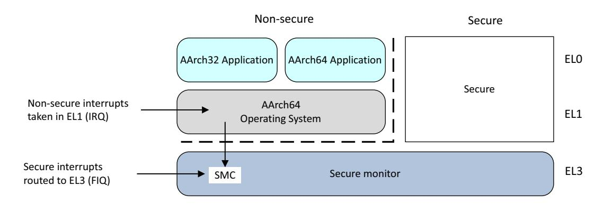

<span id="page-244-1"></span>**Figure 17-1 Non-secure interrupts**

There is explicit support for Secure interrupts in the form of controls for redirecting exceptions and interrupts to EL3, independently of the current DAIF. However, these controls only distinguish between the main interrupt types: IRQ, FIQ and asynchronous aborts. Finer grained control requires interrupts to be filtered into Secure and Non-secure groups. Doing this efficiently requires support from the GIC, which has explicit facilities for this.

A typical use case is for FIQs to be used as Secure interrupts, by mapping Secure interrupt sources as FIQ within the interrupt controller. The relevant peripheral and interrupt controller registers must be marked as Secure access only, to prevent the Normal World from reconfiguring these interrupts.

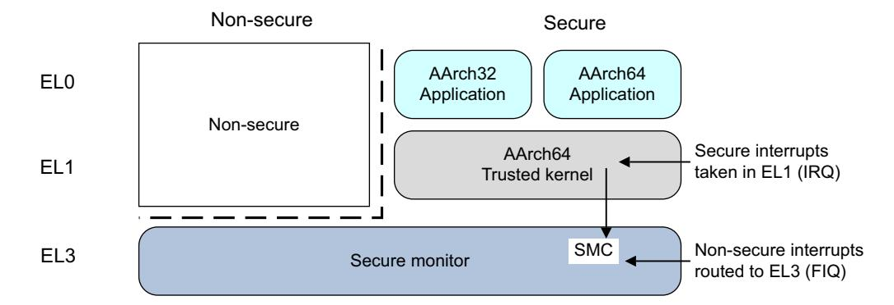

<span id="page-244-2"></span>**Figure 17-2 Secure interrupts**

These Secure FIQ interrupts must be routed to handlers in the Secure execution state.

Implementations that use security extensions typically have a light-weight trusted kernel that hosts secure services, such as encryption, in the Secure world. A full operating system runs in the Normal world and is able to access the Secure services using the SMC instruction. In this way, the Normal world gets access to service functions without risking exposure of secure assets, such as key material or other protected data, to arbitrary code executing in the Normal world.

#### <span id="page-245-0"></span>**17.3 Security in multi-core systems**

Each core in a multi-core system has the same security features as described in this chapter. Any number of the cores in the cluster can be executing in the Secure world at any point in time, and cores are able to transition between the worlds independently of each other. Additional registers control whether Normal world code can modify *Snoop Control Unit* (SCU) settings. Similarly, the GIC that distributes prioritized interrupts across the multi-core cluster must be configured to be aware of security concerns.

#### <span id="page-245-2"></span>**17.3.1 Interaction of Normal and Secure worlds**

If you are writing code in a system that contains some Secure services, it can be useful to understand how these are used. A typical system has a light-weight kernel or TEE hosting services, for example, encryption in the Secure world. This interacts with a full OS in the Normal world that can access the Secure services using the SMC call. In this way, the Normal world has access to service functions, without exposing the keys to risk.

Generally, application developers do not directly interact with security extensions, TEEs, or Trusted Services. Instead, they use a high-level API such as, for example, authenticate(), provided by a Normal world library. The library is provided by the same vendor as the Trusted Service, for example, a credit card company, and handles the low-level interactions. [Figure 17-3](#page-245-1) shows this interaction in the form of a flow from the user application calling the API that makes an appropriate OS call, which then passes to the driver code, and then passes execution into the TEE through the Secure monitor.

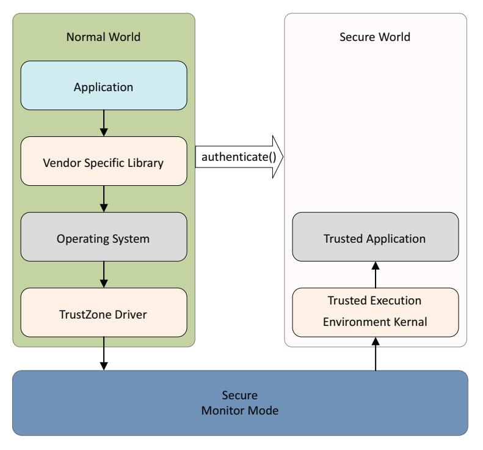

**Figure 17-3 Interaction with Security Extension**

<span id="page-245-1"></span>It is common to pass data between the Secure and Normal worlds. For example, in the Secure world you might have a signature checker. The Normal world can request that the Secure world verifies the signature of a downloaded update, using the SMC call. The Secure world requires access to the memory used by the Normal world. The Secure world can use the NS-bit in its translation table descriptors to ensure that it uses Non-secure accesses to read the data. This is important because data relating to the package might already be in the caches, because of the

accesses executed by the Normal world with addresses marked as Non-secure. The security attribute can be thought of as an additional address bit. If the core uses Secure memory accesses to try to read the package, it does not hit on Non-secure data already in the cache.

If you are a Normal world programmer, in general, you can ignore what happens in the Secure world, as its operation is hidden from you. One side effect is that interrupt latency can increase slightly, if an interrupt occurs in the Secure world, but this increase is small compared to the overall latency on a typical OS. Note that quality-of-service issues of this type depend on good design and implementation of the Secure World OS.

The details of creating that Secure world OS and applications are beyond the scope of this book.

#### <span id="page-246-0"></span>**17.3.2 Secure debug**

The security system also controls availability of debug provision. You can configure separate hardware over full JTAG debug and trace control for Normal and Secure software worlds, so that no information about the trusted system leaks. You can control hardware configuration options through a Secure peripheral or you can hardwire them and control them using the following signals:

- Secure Privileged Invasive Debug Enable (**SPIDEN**): JTAG debug.
- Secure Privileged Non-Invasive Debug Enable (**SPNIDEN**): Trace and Performance Monitor.

#### <span id="page-247-0"></span>17.4 Switching between Secure and Non-secure state

<span id="page-247-2"></span>With the ARMv7 Security Extensions, Monitor mode is used by software to switch between the Secure and Non-secure state. This mode is a peer of the other privileged modes within the Secure state.

For the ARMv8 architecture, when EL3 is using AArch32 the system behaves as ARMv7 to ensure full compatibility, with the result that all the privileged modes within the Secure state are treated as being at EL3.

The security model for AArch32 is shown in Figure 17-4. In this scenario, AArch32 is using EL3 to provide a Secure OS and monitor.

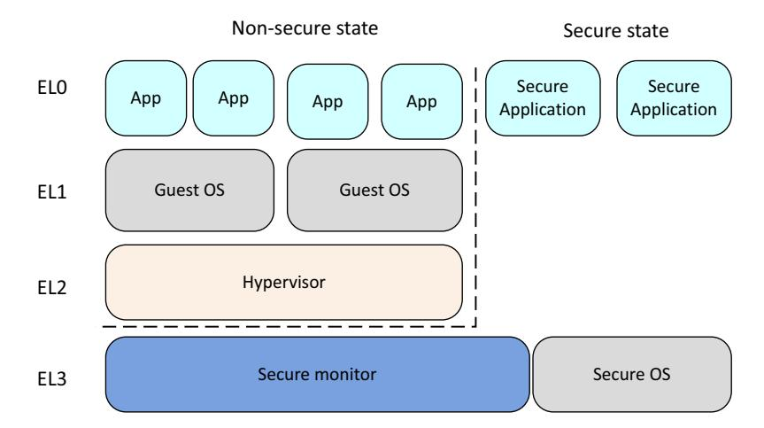

Figure 17-4 Security model when EL3 is using AArch32

<span id="page-247-1"></span>In keeping with the ARMv7 architecture, the Secure state EL1 and EL0 have a different Virtual Address space from the Non-secure state EL1 and EL0. This permits secure side code from the ARMv7 32-bit architecture to be used in a system with a 64-bit operating system or hypervisor running on the Non-secure side.

Figure 17-5 on page 17-9 shows the security model when AArch64 is using EL3 to provide a Secure monitor. The EL3 state is not available to AArch32, but EL1 can be used for the secure OS. When EL3 is using AArch64, the EL3 level is used to execute the code responsible for switching between the Non-secure state and the Secure state.

<span id="page-248-0"></span>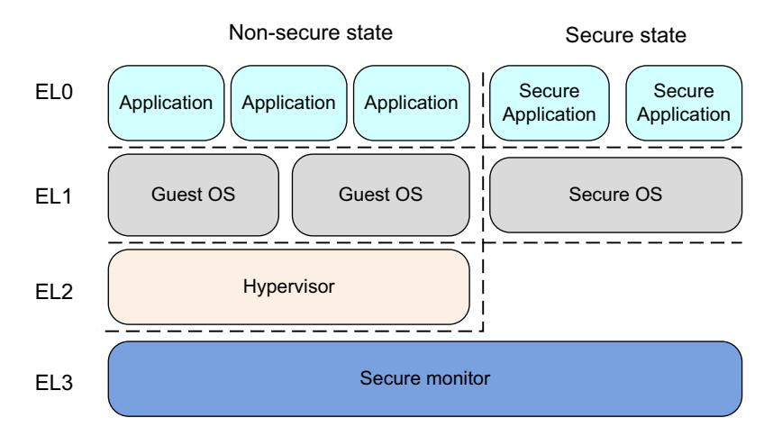

**Figure 17-5 Security model when EL3 is using AArch64**

## <span id="page-249-1"></span><span id="page-249-0"></span>Chapter 18 **Debug**

Debugging is a key part of software development and is often considered to be the most time-consuming, and therefore expensive, part of the process. It enables software developers to create applications, middleware, and platform software that meets the three key criteria of high performance, lower power consumption, and reliability. However, bugs can be difficult to detect, reproduce, and fix. It can also be difficult to predict the length of time required to resolve a defect. The cost of resolving problems grows significantly when the product is delivered to a customer. In many cases, when a product has a small time window for sales, if the product is late, it can miss the market opportunity. Therefore, the debug facilities provided by a system are a vital consideration for any developer.

Many embedded systems using ARM processors have limited input/output facilities. This means that traditional desktop debug methods (such as use of printf()) might not be appropriate. In such systems in the past, developers might have used expensive hardware tools like logic analyzers or oscilloscopes to observe the behavior of programs. The processors described in this book are part of a complex System-on-Chip (SoC) containing memory, caches, and many other blocks. There might be no processor signals that are visible off-chip and therefore no ability to monitor behavior by connecting up a logic analyzer (or similar). For this reason, ARM systems typically include dedicated hardware to provide wide-ranging control and observation facilities for debug.

<span id="page-249-2"></span>External debug features were first introduced on ARMv4 architecture processors to support developers using embedded and deeply embedded processors, and have evolved into a broad portfolio of debug and trace features. Support for rich application software platforms, in particular, support for self-hosted debug and performance profiling, has been a more recent addition in the ARMv6 and ARMv7-A architectures.

<span id="page-250-0"></span>ARMv8 processors provide hardware features that enable debug tools to provide significant levels of control over core activity and to non-invasively collect large amounts of data about program execution. There are two broad classes of hardware features, *invasive* and *non-invasive*.

#### <span id="page-251-0"></span>**18.1 ARM debug hardware**

Invasive debug provides facilities that enable you to stop programs and step through them line by line, either at the C source level, or stepping through assembly language instructions. This can be by means of an external device that connects to the core using the chip JTAG pins, or by means of debug monitor code.

| Note                                                                                             |
|--------------------------------------------------------------------------------------------------|
| JTAG stands for Joint Test Action Group and refers to the IEEE-1149.1 specification, originally  |
| designed to standardize testing of electronic devices on boards, but now widely re-used for core |

debug connection.

#### **18.1.1 Overview**

The debugger gives the ability to control execution of the program, enabling you to run code to a certain point, halt the core, step through code, and resume execution. You can set breakpoints on specific instructions, causing the debugger to take control when the core reaches that instruction. These work using one of two different methods. Software breakpoints work by replacing the instruction with the opcode of the HLT or BRK instructions.

The HLT instruction causes the core to enter debug state if an external debugger is connected and relevant security permissions permit entry to debug state. The BRK instruction in AArch64 generates a synchronous debug exception but does not cause the core to enter debug state. For more information on debug state, see *Debug events* [on page 18-4](#page-252-0).

Obviously, these can only be used on code that is stored in RAM, but have the advantage that they can be used in large numbers. The debug software must keep track of where it has placed software breakpoints and what opcodes were originally located at those addresses, so that it can put the correct code back when you want to execute the breakpointed instruction. Hardware breakpoints use comparators built into the core and stop execution when execution reaches the specified address. These can be used anywhere in memory, as they do not require changes to code, but the hardware provides limited numbers of hardware breakpoint units.

Debug tools can support more complex breakpoints, for example, stopping on any instruction in a range of addresses, or only when a specific sequence of events occurs or when hardware is in a specific state. Data watchpoints give a debugger control when a particular data address or address range is read or written. These can also be called data breakpoints. The Cortex-A57 processor, for example, has six hardware breakpoints and four watchpoints available in hardware resources. See the *Debug ID Register* (DBGDIDR) to obtain these values for a given implementation.

<span id="page-251-1"></span>Single step refers to the ability of the debugger to move through a piece of code, one instruction at a time. The difference between Step-In and Step-Over can be explained with reference to a function call. If you Step-Over the function call, the entire function is executed as one step, enabling you to continue after a function that you do not want to step through. Step-In would mean that you single step through the function instead.

On hitting a breakpoint, or when single-stepping, you can inspect and change the contents of ARM registers and memory. A special case of changing memory is code download. Debug tools typically enable you to change your code, recompile, and then download the new image to the system.

#### <span id="page-252-1"></span>**18.1.2 Halting or Self-hosted debug**

Invasive debug may be divided into *halting debug* (also known as external debug) and *monitor debug* (also known as self-hosted debug). In either case, the debug logic of the core generates a *debug event* in response to some circumstance, such as a breakpoint being hit. The handling of that debug event is what distinguishes monitor debug from halting debug.

In halting debug, the debug event causes the core to enter *debug state*. In debug state, the core is halted, meaning that it no longer fetches instructions. Instead, the core executes instructions under the direction of a debugger running on a different host connected through JTAG, or another external interface.

In monitor debug, the debug event causes a *debug exception* to be raised. The exception must be handled by dedicated debug monitor software running on the same core. Monitor debug presupposes software support.

#### <span id="page-252-2"></span><span id="page-252-0"></span>**18.1.3 Debug events**

The debug logic of the processor is responsible for generating debug events. A debug event is some part of the process being debugged that causes the system to notify the debugger. Debug events include events such as a breakpoint unit matching the address of an instruction against the address stored in its registers. They can be synchronous or asynchronous. Breakpoints, the BRK and HLT instructions, and Watchpoints are all synchronous debug events. The processor turns a debug event into one of a number of actions, namely:

- A *debug exception*.
  - Debug exceptions are the basis of the self-hosted debug model.
- Enter a special *debug state*.
  - Debug state is the basis of the external debug model.
- Ignore the debug event.
- Pend the debug event and convert it into an action later.
- Enter one of two debug modes, depending on the setup of the *External Debug Status and Control Register* (EDSCR)
  - Monitor debug mode.
  - Halting Debug mode.

The conversion of debug events into exceptions or entry to Debug state depends on the configuration of the debug logic and the type of debug event. For example, some debug events never cause entry to Debug state and others never cause a debug exception. A debug event is never converted into both a debug exception and an entry to Debug state.

Sometimes the processor is not able to convert the debug event into one of these actions, despite the configuration of the debug logic. This is because to do so would breach the security model of the processor. If the processor is executing in Secure state and the external debugger attached to it is not trusted, the processor does not allow entry to debug state.

#### <span id="page-252-3"></span>**Software debug events**

Software debug events are:

- Breakpoint debug events.
- Watchpoint debug events.

- Software Step debug events.
- Software Breakpoint Instruction debug events.
- Vector Catch debug events.

Other than the cases described in Use of breakpoints and watchpoints by external debug below, breakpoint and watchpoint debug events:

- Generate a debug exception to the debug exception target Exception level if enabled for the current security state and Exception level.
- Software Step debug events are generated only when debug exceptions are enabled.
- Software Breakpoint Instruction debug events always generate a debug exception.

#### <span id="page-253-0"></span>**Breakpoint debug event**

Address breakpoints generate debug events by comparing values held in system registers with instruction addresses.

Some breakpoints are context-aware and can be programmed as Context breakpoints that compare with the values of the context ID or (in Non-secure state) *Virtual Machine Identifier* (VMID).

A breakpoint can be programmed to match only in certain modes, Exception levels and security states. Address breakpoints can be linked to Context breakpoints.

The number of breakpoints in a processor is IMPLEMENTATION DEFINED.

#### <span id="page-253-2"></span>**Watchpoint debug event**

Address watchpoints generate debug events by comparing values held in system registers with data addresses generated by load and store instructions.

A watchpoint can be programmed to match only in certain modes, Exception levels and security states. Address watchpoints can be linked to Context breakpoints.

Watchpoints can also be programmed to match on access type; that is, match only loads, match only stores, or match both loads and stores. Watchpoints do not match against instruction fetches.

The number of watchpoints in a processor is defined by the implementation.

#### <span id="page-253-1"></span>**Software Step debug event**

A Software Step debug event is used to single-step an instruction, that is to execute a single instruction and then return control to the debugger. To single-step an instruction:

- 1. The debugger software enables Software Step.
- 2. The debugger software sets the PC to the instruction to be stepped.
- 3. The processor executes that single instruction.
- 4. A Software Step exception is taken on the next instruction.

However, another synchronous exception may be generated whilst the instruction is being stepped.

#### <span id="page-254-3"></span>**Software breakpoint instruction debug event**

The A64 instruction set defines a software breakpoint instruction.

BRK #<immediate>

The A32 and T32 instruction sets define software breakpoint instructions.

BKPT #<immediate>

Software breakpoint instructions generate synchronous debug exceptions that cannot be masked.

#### <span id="page-254-2"></span>**Vector Catch debug event**

Vector Catch debug events are only generated in an AArch32 stage 1 translation regime, and only generate debug exceptions. Vector Catch exceptions are only generated from AArch32 state.

#### <span id="page-254-0"></span>**18.1.4 External debug**

A complex system requires much of its hardware and software to be functional before any standard interfaces can be used for debug. It is very important to get debug on a system without relying on the system being debugged. For this you need reliable external debug, that is, hardware-assisted, run-control debug and trace features. All of this can be controlled without the need for software operating on the platform but often this is needed very early in the product design cycle.

Self-hosted tools usually require layers of software support, making it difficult to debug parts of the software, or making debugging too invasive for diagnosing some kinds of bug. Low-cost external debug interfaces, such as *Serial Wire Debug* (SWD), also help extend the range of applications where external debug is attractive. See *CoreSight* [on page 18-9](#page-257-1) for more information.

#### <span id="page-254-1"></span>**18.1.5 Halting debug mode**

In *halting debug* mode, a debug event causes the core to enter *debug* state. The core is halted and isolated from the rest of the system. This means that the debugger displays memory as seen by the core, and the effects of memory management and cache operations become visible. In debug state, the core stops executing instructions from the location indicated by the program counter, and is instead controlled through the external debug interface. This enables an external agent, such as a debugger, to interrogate core context and control all subsequent instruction execution. Both the core and system state can be modified. Because the core is stopped, no interrupts are handled until execution is restarted by the debugger.

The basic principles of halting debug remain unchanged from ARMv7-A. That is:

- When programmed for halting debug, a debug event causes entry to a special Debug state.
- In Debug state, the core does not fetch instructions from memory, but from a special Instruction Transfer Register.
- Data Transfer Registers are used to move register and memory contents between host and target.

An important characteristic of an external debugger is that it is operating concurrently and (possibly) independently of the process or processor being debugged, and debugging must be possible out of device reset. As such an external authentication interface is also used for external debuggers in ARMv8-A.

#### <span id="page-255-2"></span>**18.1.6 Self-hosted debug**

We have seen how the ARM architecture provides a wide range of features accessible to an external debugger. Many of these facilities can also be used by software running on the core, a debug monitor that is resident on the target system. Monitor systems can be inexpensive, as they might not require any additional hardware. However, they take up memory space in the system and can only be used if the target system itself is actually running. They are of little value on a system that does not at least boot correctly.

To assist developers creating applications, platforms require development tools that often run, at least in part, on the application processor itself rather than requiring expensive interface hardware to connect a second host computer. The ARMv8-A architecture refines the architecture support for this self-hosted form of debug. On existing desktop platforms, self-hosting is the prevalent method for software development.

#### <span id="page-255-0"></span>**18.1.7 Debugging Linux applications**

Linux is a multi-tasking operating system in which each process has its own process address space, complete with private translation table mappings. This can make debug of some kinds of problems quite tricky.

Broadly speaking, there are two different debug approach used in Linux systems.

Linux applications are typically debugged using a GDB debug server running on the target, communicating with a host computer, usually through Ethernet. The kernel continues to operate normally while the debug session takes place. This method of debug does not provide access to the built-in hardware debug facilities. The target system is permanently in a running state. The server receives a connection request from the host debugger and then receives commands and provides data back to the host.

The host debugger sends a load request to the GDB server, which responds by starting a new process to run the application being debugged. Before execution begins, it uses the system call ptrace() to control the application process. All signals from this process are forwarded to the GDB server. Signals sent to the application instead go to the GDB server that can deal with the signal or forward it to the application being debugged.

To set a breakpoint, the GDB server inserts code that generates the SIGTRAP signal at the required location in the code. When this is executed, the GDB server is called and can then perform classic debugger tasks such as examining call stack information, variables or register contents.

#### <span id="page-255-1"></span>**18.1.8 Debugging Linux kernel**

For kernel debug, a JTAG-based debugger is used. The system is halted when a breakpoint is executed. This is the easiest way to examine problems such as device driver loading or incorrect operation or the kernel boot failure. Another common method is through printk() function calls. The strace tool shows information about user system calls.

Kgdb is a source-level debugger for the Linux kernel that works with GDB on a separate machine and enables inspection of stack traces and view of kernel state (such as PC value, timer contents, and memory). The device/dev/kmem enables run-time access to the kernel memory.

Of course, a Linux-aware JTAG debugger can be used to debug threads. It is usually possible only to halt all processes; one cannot halt an individual thread or process and leave others running. A breakpoint can be set either for all threads, or it can be set only on a specific thread. As the memory map depends on which process is active, software breakpoints can usually only be set when a particular process is mapped in. The ARM DS-5 Debugger is able to debug Linux applications using gdbserver and to debug Linux kernel and Linux kernel modules using JTAG. The debug and trace features of DS-5 Debugger are described in the next section.

#### **18.1.9 The call stack**

<span id="page-256-0"></span>Application code uses the call stack to pass parameters, store local data and store return addresses. The data each function pushes on the stack is organized into a stack frame. When a debugger stops a core, it might be able to analyze the data on the stack to provide you with a call stack, that is, a list of function calls leading up to the current situation. This can be extremely useful when debugging, as it enables you to determine why the application has reached a particular state.

To reconstruct the call stack, the debugger must be able to determine which entries on the stack contain return address information. This information might be contained in debugger information (DWARF debug tables) if the code was built with these included, or by following a chain of frame pointers pushed on the stack by the application. To do this, the code must be built to use frame pointers. If neither of these types of information are present, the call stack can not be constructed.

In multi-threaded applications, each thread has its own stack. The call stack information therefore only relates to the particular thread being examined.

#### <span id="page-256-1"></span>**18.1.10 Semihosting debug**

Semihosting is a mechanism that enables code running on an ARM target to use the facilities provided on a host computer running a debugger.

Examples of this might include keyboard input, screen output, and disk I/O. For example, you might use this mechanism to enable C library functions, such as printf() and scanf(), to use the screen and keyboard of the host. Development hardware often does not have a full range of input and output facilities, but semihosting enables the host computer to provide these facilities.

Semihosting is implemented by a set of defined software instructions that generate an exception. The application invokes the appropriate semihosting call and the Debug Agent then handles the exception. The Debug Agent provides the required communication with the host.

The specification used by semihosting is not the same for ARMv8 processors as it was for processors that implemented ARMv7. DS-5 Debugger handles semihosting by intercepting HLT 0xF000 in AArch64.

Of course, outside of the development environment, a debugger running on a host is not normally connected to the system. It is therefore necessary for the developer to re-target any C library functions that use semihosting, for example, by using fputc(). This would involve replacing the library code that used an SVC call with code that could output a character.

#### <span id="page-257-0"></span>**18.2 ARM trace hardware**

<span id="page-257-3"></span>Non-invasive debug, enables observation of the core behavior while it is executing. Although there are different kinds of non-invasive debug, this section describes trace and trace hardware in particular. It is possible to record memory accesses performed (including address and data values) and generate a real-time trace of the program, seeing peripheral accesses, stack and heap accesses and changes to variables. For many real-time systems, it is not possible to use invasive debug methods. Consider, for example, an engine management system, where although you can stop the core at a particular point, the engine keeps moving and you will not be able to do useful debug. Even in systems with less onerous real-time requirements, trace can be very useful.

<span id="page-257-5"></span>Trace is typically provided by an internal hardware block connected to the core. This is known as an *Embedded Trace Macrocell* (ETM) and is part of most ARM processor-based systems. In some cases, there is one ETM per core. System-on-Chip designers can omit this block from their silicon to reduce costs. These blocks observe, but do not affect, core behavior and are able to monitor instruction execution and data accesses.

There are two main problems with capturing trace. The first is that with current very high core clock speeds, even a few seconds of operation can mean trillions of cycles of execution. Clearly, to make sense of this volume of information would be extremely difficult.

The second, related problem is that current cores can potentially perform one or more 64-bit cache accesses per cycle, and to record both the data address and data values can require a large bandwidth. This presents a problem in that typically, only a few pins might be provided on the chip and these outputs can be switched at significantly lower rates than the core can be clocked. If the core generates 100 bits of information every cycle at a speed of 1GHz, but the chip can only output four bits of trace at a speed of 200MHz, then there is a problem.

To solve this latter problem, the trace macrocell tries to compress information to reduce the bandwidth required. However, the main method to deal with these issues is to control the trace block so that only selected trace information is gathered. For example, you might trace only execution, without recording data values.

<span id="page-257-4"></span>In addition, it is common to store trace information in an on-chip memory buffer (the *Embedded Trace Buffer* (ETB)). This alleviates the problem of getting information off-chip at speed, but has an additional cost in terms of silicon area (and therefore price of the chip) and also provides a fixed limit on the amount of trace that can be captured.

The ETB stores the compressed trace information in a circular fashion, continuously capturing trace information until stopped. The size of the ETB varies between chip implementations, but a buffer of 8 or 16KB is typically enough to hold a few thousand lines of program trace. When a program fails, if the trace buffer is enabled, you can see a portion of program history. With this program history, it is easier to walk back through your program to see what happened before the point of failure. This is particularly useful for investigating intermittent and real-time failures that can be difficult to identify through traditional debug methods that require stopping and starting the core. The use of hardware tracing can significantly reduce the amount of time required to find these failures, as the trace shows exactly what was executed, what the timing was and what data accesses occurred.

#### <span id="page-257-2"></span><span id="page-257-1"></span>**18.2.1 CoreSight**

The ARM CoreSight™ technology expands on the capabilities provided by the ETM. Again its presence and capabilities in a particular system are defined by the system designer. CoreSight provides a number of extremely powerful debug facilities. It enables debug of multi-core systems (both asymmetric and SMP) that can share debug access and trace pins, with full control of which cores are being traced at which times. The embedded cross trigger mechanism enables tools to control multiple cores in a synchronized fashion, so that, for example when one core hits a breakpoint, all of the other cores will also be stopped.

Profiling tools can use the data to show where the program is spending its time and what performance bottlenecks exist. Code coverage tools can use trace data to provide call graph exploration. Operating system aware debuggers can make use of trace, and in some cases, additional code instrumentation to provide high-level system context information. A brief description of some of the available CoreSight components follows:

#### <span id="page-258-5"></span>**Debug Access Port (DAP)**

<span id="page-258-1"></span>The DAP is an optional part of an ARM CoreSight system. Not every device contains a DAP. It enables an external debugger to directly access the memory space of the system without having to put the core into debug state. To read or write memory without a DAP might require the debugger to stop the core and have it execute Load or Store instructions. The DAP gives an external debug tool access to all of the JTAG scan chains in a system and therefore to debug and trace configuration registers of the available cores and other components.

#### <span id="page-258-6"></span>**Embedded Cross Trigger (ECT)**

<span id="page-258-2"></span>The ECT block is a CoreSight component that can be included within in a CoreSight system. Its purpose is to link together the debug capabilities of multiple devices in the system. For example, you can have two cores that run independently of each other. When you set a breakpoint on a program running on one core, it would be useful to be able to specify that when that core stops at the breakpoint, the other one must also be stopped (regardless of the instruction it is currently executing). The Cross Trigger Matrix and Interface within the ECT enable debug status and control information to be propagated between cores and trace macrocells.

A cross trigger block is always required in ARMv8 processor systems, because it provides the only way to restart execution of the processor after it has entered halt mode.

#### <span id="page-258-0"></span>**CoreSight Serial Wire**

CoreSight Serial Wire Debug gives a 2-pin connection using a *Debug Access Port* (DAP) that is equivalent in function to a 5-pin JTAG interface.

#### <span id="page-258-7"></span>**System Trace Macrocell (STM)**

<span id="page-258-3"></span>This provides a way for multiple cores (and processes) to perform printf() style debugging. Software running on any master in the system is able to access STM channels without having to be aware of use by others, using very simple fragments of code. This enables timestamped software instrumentation of both kernel and user space code. The timestamp information gives a delta with respect to previous events and can be extremely useful.

#### <span id="page-258-8"></span>**Trace Memory Controller (TMC)**

<span id="page-258-4"></span>As already described, adding additional pins to a packaged IC can significantly increase its cost. In situations where you have multiple cores (or other blocks capable of generating trace information) on a single device, it is likely that economics preclude the possibility of providing multiple trace ports. The CoreSight Trace Memory Controller is a trace funnel, with the ability to combine multiple trace sources into a single bus in system memory. Controls are provided to enable, prioritize and select

between these multiple input sources. The trace information can be exported off-chip using a dedicated trace port, through the JTAG or serial wire interface or by re-using I/O ports of the SoC. Trace information can be stored in an ETB or in system memory.

#### <span id="page-260-0"></span>**18.3 DS-5 debug and trace**

<span id="page-260-3"></span>DS-5 Debugger provides a powerful tool for debugging applications on both hardware targets and models using ARM architecture-based processors. You can have complete control over the flow of the execution so that you can quickly isolate and correct errors.

DS-5 Debugger provides a wide range of debug features such as:

- Loading images and symbols.
- Running images.
- Breakpoints and watchpoints.
- Source and instruction level stepping.
- Controlling variables and register values.
- Viewing the call stack.
- Support for handling exceptions and Linux signals.
- Debug of multi-threaded Linux and Android applications.
- Debug of Linux, kernel and Android modules, boot code and kernel porting.
- Application rewind, that allows you to debug backwards as well as forwards through Linux and Android applications.

The debugger supports a comprehensive set of DS-5 Debugger commands that can be executed in the Eclipse IDE, script files, or a command-line console. In addition, there is a small subset of CMM-style commands sufficient for running target initialization scripts.

DS-5 Debugger supports bare-metal debug using JTAG, Linux application debug using gdbserver, Linux kernel debug and kernel module debug using JTAG. Debug and trace support for bare-metal SMP systems, including cross-triggering and core-dependent views and breakpoints, PTM trace, and up to 4 GB trace with DSTREAM. This support is described in the following sections.

In addition, DS-5 Debugger supports ARM CoreSight ETM, PTM, ETB and STM, to provide non-intrusive program trace that enables you to review instructions (and the associated source code) as they have occurred. It also provides the ability to debug time-sensitive issues that would otherwise not be picked up with conventional intrusive stepping techniques.

#### <span id="page-260-2"></span>**18.3.1 Debugging Linux or Android applications using DS-5**

Debugging Linux or Android applications requires a debug server such as gdbserver to be installed and running on the target. You can use a TCP or serial connection to the target running the OS, which can be either real target hardware or a software model.

DS-5 Debugger takes care of downloading and connecting to the debug server. Developers simply specify the platform and the IP address. This reduces a complex task using several applications and a terminal to a couple of steps in the IDE.

#### <span id="page-260-1"></span>**18.3.2 Debugging Linux kernel modules**

Linux kernel modules provide a way to extend the functionality of the kernel, and are typically used for things such as device and filesystem drivers. Modules can either be built into the kernel or can be compiled as a loadable module and then dynamically inserted and removed from a running kernel during development without having to frequently recompile the kernel.

However, some modules must be built into the kernel and are not suitable for loading dynamically. An example of a built-in module is one that is required during kernel boot and must be available prior to the root filesystem being mounted.

You can use DS-5 Debugger to set source-level breakpoints in a module provided that the debug information is loaded into the debugger. Attempts to set a breakpoint in a module before it is inserted into the kernel results in the breakpoint being pended.

When debugging a module, you must ensure that the module on your target is the same as that on your host. The code layout must be identical, but the module on your target does not have to contain debug information.

#### **Built in module**

To debug a module that has been built into the kernel using DS-5 Debugger, the procedure is the same as for debugging the kernel itself:

- 1. Compile the kernel together with the module.
- 2. Load the kernel image on to the target.
- 3. Load the related kernel image with debug information into the debugger.
- 4. Debug the module as you would for any other kernel code.

#### **Loadable module**

The procedure for debugging a loadable kernel module is more complex. From a Linux terminal shell, you can use the insmod and rmmod commands to insert and remove a module. Debug information for both the kernel and the loadable module must be loaded into the debugger. When you insert and remove a module, DS-5 Debugger automatically resolves memory locations for debug information and existing breakpoints.

To do this, DS-5 Debugger intercepts calls within the kernel to insert and remove modules. This introduces a small delay for each action while the debugger stops the kernel to interrogate various data structures.

#### <span id="page-261-0"></span>**18.3.3 Debugging Linux kernels using DS-5**

To debug a Linux kernel module, you can use a debug hardware agent such as DSTREAM connected between the host workstation and the running target. To be able to debug the kernel at source level, you need to load the vmlinux file containing the debug symbols into the debugger.

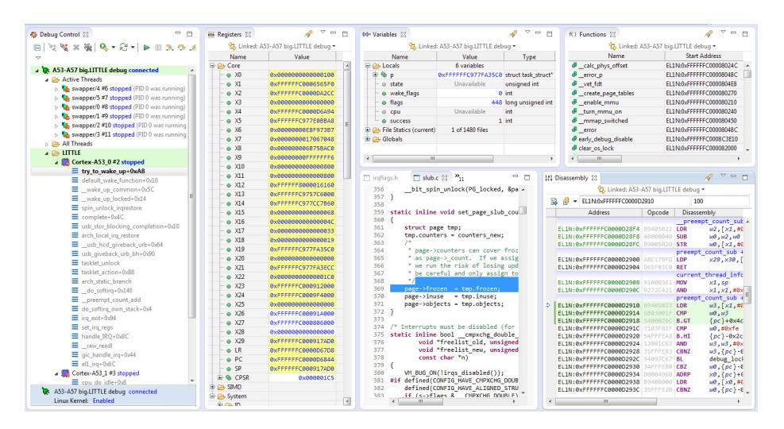

**Figure 18-1 Debugging a kernel using DS-5**

#### <span id="page-262-0"></span>**18.3.4 Debugging a multi-threaded application using DS-5**

DS-5 Debugger tracks the current thread using the debugger variable, \$thread. You can use this variable in print commands or in expressions. Threads are displayed in the Debug Control view with a unique ID that is used by the debugger and a unique ID from the operating system. For example:

Thread 1 (OS ID 1036)

where Thread 1 is the ID used by the debugger, and OS ID 1036 is the ID from the OS.

A separate call stack is maintained for each thread and the selected stack frame is shown in bold text. All the views in the DS-5 Debug perspective are associated with the selected stack frame and are updated when you select another frame.

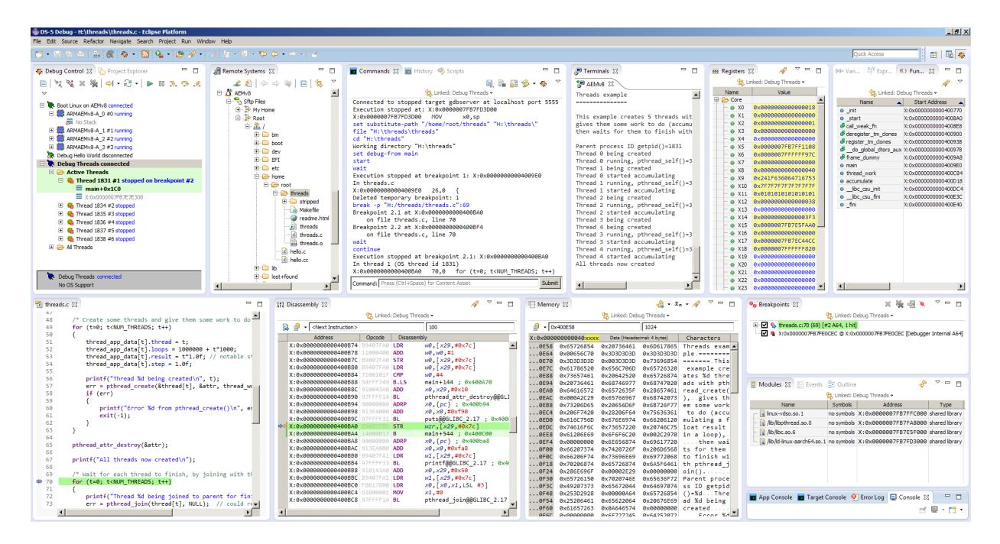

**Figure 18-2 Threading call stacks in the DS-5 Debug Control view**

#### <span id="page-263-1"></span>**18.3.5 Debugging shared libraries**

Shared libraries enable parts of your application to be dynamically loaded at runtime. You must ensure that the shared libraries on your target are the same as those on your host. The code layout must be identical, but the shared libraries on your target do not have to contain debug information.

You can set standard execution breakpoints in a shared library but not until it is loaded by the application and the debug information is loaded into the debugger. Pending breakpoints however, enable you to set execution breakpoints in a shared library before it is loaded by the application.

When a new shared library is loaded DS-5 Debugger re-evaluates all pending breakpoints, those with addresses that it can resolve, are set as standard execution breakpoints. Unresolved addresses remain as pending breakpoints.

The debugger automatically changes any breakpoints in a shared library to a pending breakpoint when the library is unloaded by your application.

#### <span id="page-263-0"></span>**18.3.6 Trace support in DS-5**

DS-5 enables you to perform trace on your application or system. You can capture in real time a historical, non-intrusive trace of instructions. Tracing is a powerful tool that enables you to investigate problems while the system runs at full speed. These problems can be intermittent, and are difficult to identify through traditional debugging methods that require starting and stopping the core. Tracing is also useful when trying to identify potential bottlenecks or to improve performance-critical areas of your application.

#### **Trace view**

When the trace has been captured the debugger extracts the information from the trace stream and decompresses it to provide a full disassembly, with symbols, of the executed code.

This view shows a graphical navigation chart that displays function executions with a navigational timeline. In addition, the disassembly trace shows function calls with associated addresses and if selected, instructions. Clicking a specific time in the chart synchronizes the disassembly view.

In the left-hand column of the chart, percentages are shown for each function of the total trace. For example, if a total of 1000 instructions are executed and 300 of these instructions are associated with myFunction() then this function is displayed with 30%.

In the navigational timeline, the color coding is a "heat" map showing the executed instructions and the number of instructions each function executes in each timeline. The darker red color showing more instructions and the lighter yellow color showing fewer instructions. At a scale of 1:1, however, the color scheme changes to display memory access instructions as a darker red color, branch instructions as a medium orange color, and all the other instructions as a lighter green color.

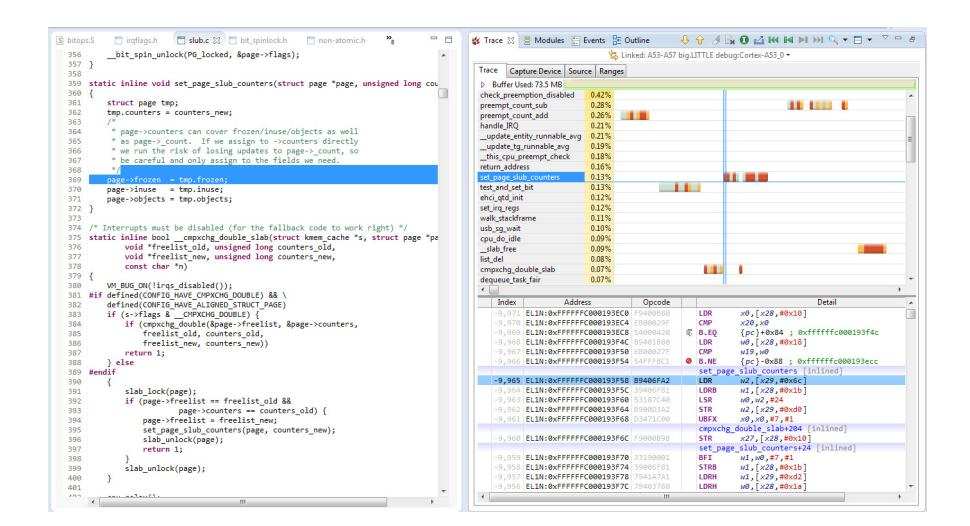

**Figure 18-3 DS-5 Debugger Trace view**

#### **Trace-based profiling**

Based on trace data received from the target, DS-5 Debugger can generate timeline charts with information to help developers to quickly understand how their software executes on the target and which functions are using the core the most. The timeline offers various zoom levels, and can display a heat-map based on the number of instructions per time unit or, at its highest resolution, provide per-instruction visualization color-coded by the typical latency of each group of instructions.

## <span id="page-265-0"></span>Chapter 19 **ARMv8 Models**

Platform models, such as the models described in this chapter, enable development of software without the requirement for actual hardware. Software models provide models of processors and devices from the perspective of a programmer. The functional behavior of a model is equivalent to real hardware.

Absolute timing accuracy is sacrificed to achieve fast simulated execution speed. This means that you can use the PV models for confirming software functionality, but you must not rely on the accuracy of cycle counts, low-level component interactions, or other hardware-specific behavior.

The processors in the ARMv8-A Foundation Platform are not based on any existing processor design, but still conform to the ARMv8-A architectural specifications. The ARMv8-A Foundation Platform uses ARM Fast Model technology and forms part of the suite of modeling solutions for ARM processors. These modelling solutions are available in the portfolio of models delivered through ARM Fast Models.

The processors modeled in the Base Platform FVP can be configured to behave like the Cortex-A53 and Cortex-A57 processors.

#### <span id="page-266-0"></span>**19.1 ARM Fast Models**

Fast Models is an environment for the creation of virtual platform models that execute with high simulation speeds. They provide access to ARM-based systems suitable for early software development before the silicon is available. Used in conjunction with ARM Development Studio 5 (DS-5), Fast Models can help developers debug, analyze, and optimize their applications throughout the development cycle.

These virtual platforms can then be conveniently distributed to software developers for early software development without the need for expensive development boards. They:

- Execute up to 250 million ARM instructions per second, which is comparable to actual hardware.
- Have performance and accuracy tailored for applications and firmware as well as early driver development.
- Boot operating systems such as Linux and Android quickly.
- Provide SystemC *Transaction Level Messaging* (TLM) 2.0 Export of ARM processor-based subsystems
- Have functionally accurate ARM Instruction Set Models, fully validated against ARM processor designs.
- Model advanced ARM technologies such as caches, MMU, LPAE, virtualization, TrustZone and VFP.
- Model peripherals, for example, Ethernet, LCD, keyboard and mouse.

Generated platforms are equipped with the *Component Architecture Debug Interface* (CADI) and can run stand-alone or from a suitable debugger. Fast Models automatically generates the required interfaces for both standalone and integrated platforms.

Fast Models are available for many ARM Processors and System Controllers, and for classic ARM processors and CoreLink system controllers.

Fast Models are only concerned with accuracy from the point of view of the program running on the processors. They do not attempt to accurately model bus transactions, nor do they model instruction timing accurately. The simulation as a whole has a very accurate concept of timing, but the *Code Translation* (CT) processors do not claim to dispatch instructions with device-like timing.

Fast Models attempt to accurately model the hardware, but compromises exist between speed of execution, accuracy and other criteria. A processor model might not match the hardware under certain conditions.

#### Fast Models can:

- Accurately model instructions.
- Correctly execute architecturally correct code.

However, Fast Models cannot:

- Validate the hardware.
- Model all architecturally UNPREDICTABLE behavior.
- Model cycle counting.
- Model timing sensitive behavior.

- Model SMP instruction scheduling.
- Measure software performance.
- Mimic bus traffic.

Fast Models aim to be accurate to the view of the system programmer. Software is able to detect differences between hardware and the model, but these differences generally depend on behavior that is not precisely specified. For example, it is possible to detect differences in the exact timings of instructions and bus transactions, effects of speculative prefetch and cache victim selection. Certain classes of behavior are specified as UNPREDICTABLE and these cases are detectable by software. A program that relies on such behavior, even unintentionally, is not guaranteed to work reliably on any device, or on a Fast Model. Programs that exploit this behavior might execute differently between the hardware and the model.

In general, a processor issues a set of instructions (a quantum) at the same point in simulation time, and then waits for some amount of time before executing the next quantum. The timing is arranged so that the processor averages one instruction per clock tick.

The consequences of this are:

- The perceived performance of software running on the model differs from real-world software. In particular, memory accesses and arithmetic operations all take a significant amount of time.
- A program might be able to detect the quantized execution behavior of a processor, for example by polling a high-resolution timer.

#### **19.1.1 Where to get ARM Fast Models**

[Details of how to purchase ARM Fast Models can be found at](http://www.arm.com/fastmodels) http://www.arm.com/fastmodels.

#### <span id="page-268-0"></span>**19.2 ARMv8-A Foundation Platform**

The ARMv8-A Foundation Platform is a test platform for the ARMv8-A architecture. It is a simple platform model capable of running bare-metal semihosted applications and booting a full operating system.

It is supplied as a platform model with configuration of the simulation from the command line and control using peripherals in the platform.

The Foundation Platform has:

- An ARMv8-A processor cluster model containing 1-4 cores that implements:
  - AArch64 at all Exception levels.
  - AArch32 support at EL0 and EL1.
  - Little and big endian at all Exception levels.
  - Generic timers.
  - Self-hosted debug.
  - GICv2, and optional GICv3 memory-mapped processor interfaces and distributor.
- 8GB of RAM.

The platform simulates up to 8GB of RAM.

To simulate a system with 4GB of RAM, you require a host with at least 8GB of RAM. To simulate a system with 8GB of RAM, you require a host with at least 12GB of RAM.

- Four PL011 UARTs connected to xterms.
- Platform peripherals including a Real-time clock, Watchdog timer, Real-time timer, and Power controller.
- Secure peripherals including a Trusted watchdog, Random number generator, Non-volatile counters, and Root-key storage.
- A network device model connected to host network resources.
- A block storage device implemented as a file on the host.
- A small system register block with LEDs and switches visible using a web server.
- A simple web interface to indicate the status of the model. See *[Web interface](#page-277-0)* on [page 19-13](#page-277-0).
- Host filesystem access implemented as Plan 9 Filesystem.

Caches are modeled as stateless and there are no write buffers. This gives the effect of perfect memory coherence on the data side. The instruction side has a variable size prefetch buffer so requires correct barriers to be used in target code to operate correctly.

The platform runs as fast as possible unless all the cores in the cluster are *Wait for Interrupt* (WFI) or *Wait for Exception* (WFE), in which case, the platform idles until an interrupt or external event occurs.

The Foundation Platform has been revised to support the ARM T*rusted Base System Architecture* (TBSA) and *Server Base System Architecture* (SBSA). A number of peripheral devices have been added, with corresponding changes to the memory map. It has also been

updated to align more closely with peripherals present in the Versatile Express baseboard and the ARM Fast Models. Where appropriate, the original Foundation Model is now referred to as either *Foundation v1* or *Foundation v2* and the Foundation Platform is *Foundation v9.1*.

Software written to target the previous versions of the platform will work unmodified on the platform using the default --no-gicv3 configuration option. Only software that uses the early blocks of RAM is likely to require some adjustments.

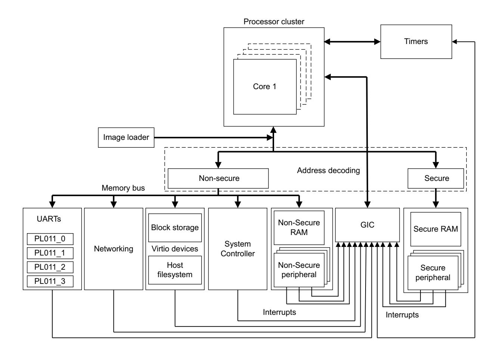

Figure 19-1 Block diagram of ARMv8-A Foundation Platform

\_\_\_\_\_Note \_\_\_\_\_

The behavior of the address decoding block depends on whether the --secure-memory command-line option is used.

The platform provides the following types of network support:

NAT, IPv4 based

NAT, IPv4-based networking provides limited IP connectivity by using user-level IP services. This requires no extra privileges to set up or use, but has inherent limitations. System-level services, or services conflicting with those on the host, can be provided using port remapping.

**Bridged** 

Bridged networking requires the setup of an ethernet bridge device to bridge between the ethernet port on the host and the network interface that the platform provides. This usually requires administrator privileges. See the documentation in the Linux bridge-utils package for more information.

#### **19.2.1 Limitations of the Foundation Platform**

The following restrictions apply to the ARMv8-A Foundation Platform:

- Write buffers are not modeled.
- Interrupts are not taken at every instruction boundary.
- Caches are modeled as stateless.
- There is no *Component Architecture Debug Interface* (CADI), CADI Server, Trace, or other plug-in support.
- There is no support for Thumb2EE.
- There is no support for the ARMv8 cryptography extensions.

#### **19.2.2 Software requirements**

The software required to run the ARMv8-A Foundation Platform is as follows:

#### **Operating Systems**

- Red Hat Enterprise Linux version 5.x for 64-bit Intel architectures.
- Red Hat Enterprise Linux version 6.x for 64-bit Intel architectures.
- Ubuntu 10.04 or later for 64-bit Intel architectures.

| Note |  |
|------|--|
|      |  |

 At present, there is no support for running the platform on other operating systems. However, the model should run on any recent x86 64-bit Linux OS provided glibc v2.3.2, or higher, and libstdc++ 6.0.0, or higher, are present.

#### **UART Output**

For the *Universal Asynchronous Receiver/Transmitter* (UART) output to be visible, both xterm and telnet must be installed on the host, and be specified in your PATH.

#### **19.2.3 Where to get the ARM Foundation Platform**

[The ARMv8-A Foundation Platform is an open source platform, which can be freely](http://www.arm.com/fvp)  [downloaded from](http://www.arm.com/fvp) http://www.arm.com/fvp.

#### **19.2.4 Verifying the installation**

The Foundation Platform is available only as a prebuilt platform binary. The installation directory structure is as follows:

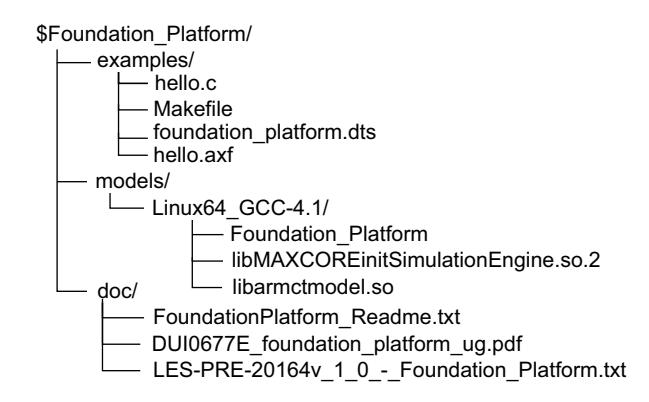

**Figure 19-2 Installed files**

Where:

examples Includes a C version and .axf file of the example program that *[Running the](#page-271-0)  [example program](#page-271-0)* describes. It also includes the Makefile and the example source code for the device tree Foundation\_Platform.dts.

Foundation\_Platform

The ARMv8-A Foundation Platform executable file.

libMAXCOREInitSimulationEngine.so

Helper library required by the platform.

libarmctmodel.so

Code translation library.

FoundationPlatform\_Readme.txt

Read me file. A short summary of this user guide.

#### **DUI0677E\_foundation\_platform\_ug.pdf**

Documentation.

LES-PRE-20164\_V1\_-\_Foundation\_Platform.txt

End User License Agreement text.

#### <span id="page-271-0"></span>**19.2.5 Running the example program**

The example program supplied can be used to confirm that the ARMv8-A Foundation Platform is working correctly.

Run the platform with the following command line:

```
./Foundation_v8 --image hello.axf
```

Add --quiet to suppress everything except for the output from the example program.

It should print output similar to the following:

```
terminal_0: Listening for serial connection on port 5000
terminal_1: Listening for serial connection on port 5001
terminal_2: Listening for serial connection on port 5002
terminal_3: Listening for serial connection on port 5003
```

Simulation is started

```
Hello, 64-bit world!
Simulation is terminating. Reason: Simulation stopped
```

The example demonstrates that the platform initializes correctly, loads and executes the example program, and that the semihosting calls to print output and stop the platform working.

#### **19.2.6 Troubleshooting the example program**

- If you attempt to run the example program on a 32-bit Linux host, it gives an error similar to the following:
  - ./Foundation\_Platform: /lib64/ld-linux-x86-64.so.2: bad ELF interpreter: No such file or directory
- If libstdc++ is not installed on your system, you get the following error on startup: ./Foundation\_Platform: error while loading shared libraries: libstdc++.so.6: cannot open shared object file
- If your system glibc is too old, or your libstdc++ is too old, you get the following messages:
  - ./Foundation\_Platform: /usr/lib64/libstdc++.so.6: version `GLIBCXX\_3.4' not found (required by Foundation\_Platform)
  - ./Foundation\_v8: /lib64/libc.so.6: version `GLIBC\_2.3.2' not found (required by Foundation\_Platform)
  - ./Foundation\_Platform: /lib64/libc.so.6: version `GLIBC\_2.2.5' not found (required by Foundation\_Platform)

libstdc++ and glibc are normally part of your core OS installation.

#### **19.2.7 The kernel**

No kernel is provided with the ARMv8 Foundation Platform. However, AArch64 (ARM64) patches are available. When these are used the mainline kernel should function correctly in the ARMv8 Foundation Platform without requiring extra patches. You will require a cross-toolchain to build the ARM64 kernel. The default kernel configuration works in the Foundation Platform without any changes.

#### **19.2.8 Configuring the kernel command line**

A common way of configuring a kernel command line on most Linux systems is by using the boot loader. As the Foundation Platform boots a kernel directly without calling an intermediate boot loader, the configuration has to be carried out a different way. When you have built a kernel image, you must add a boot wrapper. This adds extra configuration to the kernel image in a way that the Platform can use, including:

- The kernel command line.
- The Flattened Device Tree (FDT) blob representing the hardware configuration of the Platform.
- An initramfs image (if required).

An example boot wrapper source code is supplied along with the kernel. Configure it by editing the included Makefile. There are a number of settings that can be changed, but in common use most of them work without requiring any changes. The settings most likely to be useful for configuration are:

#### **INITRD\_FLAGS**

Set this to -DUSE\_INITRD to append an initramfs filesystem.

#### **FILESYSTEM**

The path to the initramfs image to be used if INITRD\_FLAGS is set to -DUSE\_INITRD.

#### **BOOTARGS**

The kernel command line.

Use make after configuration and the boot wrapper will link the kernel and its configuration together into a file ready for the model to use, typically linux-system.axf.

#### **19.2.9 Choice of root filesystem**

Using initramfs with the kernel is a simple option, but will use much more memory as it must also store the filesystem. For a bigger and more useful filesystem, ARM recommends using a virtual block device (using the --block-device option, see *[Command-line overview](#page-276-0)* on [page 19-12](#page-276-0)) or an NFS root. If you are cross-building programs and testing in the Platform, using an NFS root is the more convenient route to follow, but it will require more complex configuration.

#### **19.2.10 Setting up a block device image for a root file system**

This method assumes that you have created a compressed filesystem for the files you want to add to the root file system.

To set up a block device image for a root file system:

- 1. Create an empty file (filename) of the correct size using:
  - # dd if=/dev/zero of=<filename> bs=1M count=<number of megabytes>
- 2. Make a filesystem inside that file using:
  - # mkfs.ext4 <filename>
- 3. Mount the filesystem on your host system using:

```
# mkdir /mnt/AArch64
# mount -o loop <filename> /mnt/AArch64
```

4. Extract your filesystem onto the device using:

```
# cd /mnt/AArch64
# zcat /path/to/filesystem.cpio.gz | cpio -divmu --no-absolute-filenames
# cd /
```

5. Unmount the device using:

```
# umount /mnt/AArch64
```

6. Your block-device image is ready for use. To use it in the Platform, configure the root device in the boot wrapper Makefile as root=/dev/vda and rebuild the boot wrapper.

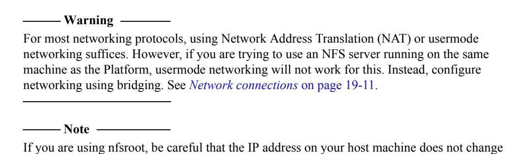

while you are using it. Poorly-configured DHCP servers can cause unexpected address changes to happen. This causes problems if you are relying on an NFS server for the root filesystem.

#### **19.2.11 Starting the Foundation platform**

For more information see *[Command-line overview](#page-276-0)* on page 19-12.

#### **Starting the model using ARM Trusted Firmware, UEFI, Linux kernel and filesystem on a block device**

To start the model, use:

```
./Foundation_Platform \
--data=fvp_bl1.bin@0x0 \
--data=fvp_fip.bin@0x8000000 \
--block-device=filesystem.img
```

fvp\_bl1.bin and fvp\_fip.bin [can be downloaded from the Linaro website](http://releases.linaro.org/latest/openembedded/aarch64/)  [at](http://releases.linaro.org/latest/openembedded/aarch64/) http://releases.linaro.org/latest/openembedded/aarch64/.

#### **Starting the model using a kernel and initramfs**

To start the model with a kernel and initramfs:

- 1. Build an initramfs in to the kernel.
- 2. Use the boot-wrapper to create an AXF (probably called linux-system.axf).
- 3. Launch the AXF on the Foundation Platform using: ./Linux64\_Foundation\_v8/Foundation\_v8 --image linux-system.axf

#### **Starting the model using usermode networking**

Use:

```
./Foundation_v8 --network=nat --image linux-system.axf
```

#### **Starting the model using a kernel and filesystem on a block device**

Use:

```
./Foundation_v8 --image linux-system.axf --block-device filesystem.img
```

The Linux kernel must be compiled with CONFIG\_VIRTIO, CONFIG\_VIRTIO\_MMIO, CONFIG\_VIRTIO\_RING, and CONFIG\_VIRTIO\_BLK and the kernel boot arguments provided in the boot wrapper must include root=/dev/vda. This is the device name of the virtio system block.

#### <span id="page-275-0"></span>**19.2.12 Network connections**

|         | This section describes how to set up a network connection, and then to configure the networking<br>environment for use on a Linux platform. The following instructions assume that your network<br>provides IP addresses by DHCP. If this is not the case, consult your network administrator.                                                                                                                                                                                                                                                                                         |
|---------|----------------------------------------------------------------------------------------------------------------------------------------------------------------------------------------------------------------------------------------------------------------------------------------------------------------------------------------------------------------------------------------------------------------------------------------------------------------------------------------------------------------------------------------------------------------------------------------|
|         | Note                                                                                                                                                                                                                                                                                                                                                                                                                                                                                                                                                                                   |
|         | NAT, IPv4 based networking provides limited IP connectivity by using user level IP services.<br>This requires no extra privileges to set up or use but has inherent limitations. System level<br>services, or services conflicting with those on the host can be provided using port remapping.                                                                                                                                                                                                                                                                                        |
|         | Note                                                                                                                                                                                                                                                                                                                                                                                                                                                                                                                                                                                   |
|         | NAT (user mode) network support has known issues that intermittently cause networking to<br>slow down.                                                                                                                                                                                                                                                                                                                                                                                                                                                                                 |
|         | One problem with using user mode networking is that, since it is acting as a NAT router between<br>the virtual network in the model and the host network, it remaps the source port of a guest<br>connection. This can cause problems with NFS servers. These usually default to a configuration<br>that rejects client connections from source ports with port numbers greater than1023. With the<br>NFS servers provided with most Linux distributions, this problem can be solved by adding the<br>insecure option to the configuration entry for the NFS export you wish to mount. |
|         | Note                                                                                                                                                                                                                                                                                                                                                                                                                                                                                                                                                                                   |
|         | In the /etc/exports directory is a list of local filesystem paths that are exported using NFS (NFS<br>exports). The insecure option can be specified for any entry in /etc/exports, using:                                                                                                                                                                                                                                                                                                                                                                                             |
|         | /pub<br>*(ro,insecure,all_squash)                                                                                                                                                                                                                                                                                                                                                                                                                                                                                                                                                      |
|         |                                                                                                                                                                                                                                                                                                                                                                                                                                                                                                                                                                                        |
| 19.2.13 | Setting up a network connection                                                                                                                                                                                                                                                                                                                                                                                                                                                                                                                                                        |
|         | NAT networking will cover most requirements for the Platform, but in some cases, for example,<br>with local nfsroot, bridging will be required instead. The network configuration on the host<br>Linux machine must be updated to allow this. There are several stages to this:                                                                                                                                                                                                                                                                                                        |
|         | 1.<br>Make sure that you have installed the brctl utility on your system.                                                                                                                                                                                                                                                                                                                                                                                                                                                                                                              |
|         | Note                                                                                                                                                                                                                                                                                                                                                                                                                                                                                                                                                                                   |
|         | ARM recommends using the standard Linux bridge utilities included in the Linux<br>distribution. For more information about the Linux bridge utilities see:                                                                                                                                                                                                                                                                                                                                                                                                                             |
|         | http://www.linuxfoundation.org/collaborate/workgroups/networking/bridge                                                                                                                                                                                                                                                                                                                                                                                                                                                                                                                |
|         | 2.<br>Disable the current ethernet device (eth0 in this case) using:                                                                                                                                                                                                                                                                                                                                                                                                                                                                                                                   |
|         | # ifconfig eth0 down                                                                                                                                                                                                                                                                                                                                                                                                                                                                                                                                                                   |
|         | Note                                                                                                                                                                                                                                                                                                                                                                                                                                                                                                                                                                                   |
|         | You must turn off Network Manager to do this. It does not support advanced networking<br>options such as bridging.                                                                                                                                                                                                                                                                                                                                                                                                                                                                     |
|         |                                                                                                                                                                                                                                                                                                                                                                                                                                                                                                                                                                                        |

3. To turn off Network Manager, use: /etc/init.d/NetworkManager stop

| Note |  |
|------|--|
|      |  |

 Turning off Network Manager can differ from system to system. Check your OS documentation for how to disable Network Manager.

- 4. Add a new virtual device (the <bridge\_name>, in this case tap0) using:
  - # ip tuntap add dev tap0 mode tap
- 5. Add a new bridge device using eth0 and tap0, and enable it, using:
  - # brctl addbr br0
  - # brctl addif br0 eth0
  - # brctl addif br0 tap0
- 6. Enable the new bridge device and request an IP address using DHCP using:
  - # ifconfig br0 up
  - # dhclient br0
- 7. This new network device br0 should work like the existing eth0 device, but will share the physical network connection between eth0 and tap0. The tap0 virtual device is used by the model to access the network.
- 8. Run the model with the command-line options --network=bridged
  - --network-bridge=<bridge name>
    - where <bridge\_name> = tap0.
- 9. Check that the network facility is present by pinging any suitable website.

#### <span id="page-276-0"></span>**19.2.14 Command-line overview**

Command-line arguments provide all model configuration. Run the model with --help to obtain a summary of the available commands.

The syntax to use on the command line is:

./Foundation\_v8 [OPTIONS...]

<span id="page-276-1"></span>[Table 19-1](#page-276-1) shows the options.

**Table 19-1 Command-line options**

| help               | Display this help message and quit.                                                                              |
|--------------------|------------------------------------------------------------------------------------------------------------------|
| version            | Display the version and build numbers and quit.                                                                  |
| quiet              | Suppress any non-simulated output on stdout or stderr.                                                           |
| cores=N            | Specify the number of cores, where N is 1 to 4. The default is 1. See<br>Multicore configuration on page 19-14.  |
| bigendian          | Start processors in big endian mode. The default is little endian.                                               |
| (no-)secure-memory | Enable or disable separate Secure and Non-secure address spaces.<br>The default is disabled.                     |
| (no-)gicv3         | Enable GICv3 or legacy compatible GICv2 as interrupt controller.<br>The default isno-gicv3, that is, GICv2 mode. |
| block-device=file  | Image file to use as persistent block storage.                                                                   |
| read-only          | Mount block device image in read-only mode.                                                                      |

**Table 19-1 Command-line options (continued)**

| Executable and Linking Format (ELF) image to load.                                                                                                                   |
|----------------------------------------------------------------------------------------------------------------------------------------------------------------------|
| Raw file to load at an address in Secure memory.                                                                                                                     |
| Raw file to load at an address in Non-secure memory.                                                                                                                 |
| Enable or disable semihosting support. The default is enabled. See<br>Semihosting on page 19-15.                                                                     |
| A string used as the semihosting command line. See Semihosting<br>on page 19-15.                                                                                     |
| Attempt to listen on a free TCP port in the range P to P+100 for<br>each UART. The default is 5000.                                                                  |
| Configure mode of network access. The default is none.                                                                                                               |
| Subnet used for NAT networking. The default is 172.20.51.0/24.                                                                                                       |
| Optional comma-separated list of NAT port mappings in the form:<br>host_port=model_port, for example, 8022=22.                                                       |
| MAC address to use for networking. The default is<br>00:02:f7:ef:f6:74.                                                                                              |
| Bridged network device name. The default is ARM0.                                                                                                                    |
| Initial setting of switches in the system register block (default: 0).                                                                                               |
| Starts a small web server to visualize platform state. The default is<br>disabled. See Web interface.                                                                |
| Sets the generic timer registers to report a view of real time as it is<br>seen on the host platform, irrespective of how slow or fast the<br>simulation is running. |
|                                                                                                                                                                      |
|                                                                                                                                                                      |

If more than one --image, --data, or, --nsdata option is provided, the images and data are loaded in the order that they appear on the command line, and the simulation starts from the entry point of the last ELF specified, or address 0 if no ELF images are provided. You can specify more than one --image, --data or --nsdata option.

#### <span id="page-277-0"></span>**19.2.15 Web interface**

The syntax to use on the command line is as follows:

```
./Foundation_v8 --visualization
```

or

./Foundation\_v8 --no-visualization

Running the model with the --visualization option, and without the --quiet option, shows the additional output:

```
terminal_0: Listening for serial connection on port 5000
terminal_1: Listening for serial connection on port 5001
terminal_2: Listening for serial connection on port 5002
terminal_3: Listening for serial connection on port 5003
```

Visualization web server started on port 2001

The terminal\_n lines relate to the UARTs. See *[UARTs](#page-278-1)*.

Use your web browser to go to the address http://127.0.0.1:2001

The browser displays a visualization window as in [Figure 19-3.](#page-278-2)

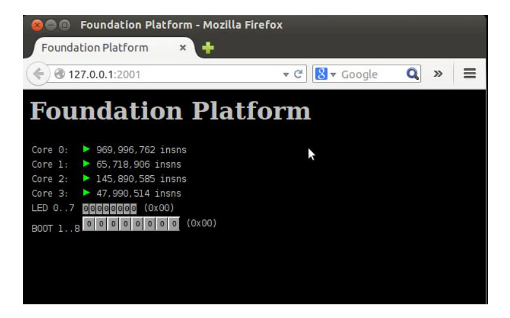

**Figure 19-3 Visualization window**

The visualization window provides a dynamic view of the state of various parts of the model and the ability to change the state of platform switches.

#### <span id="page-278-2"></span><span id="page-278-1"></span>**19.2.16 UARTs**

When the Foundation Platform starts, it initializes four UARTs. For each UART, it searches for a free TCP port to use for telnet access to the UART. It does this by sequentially scanning a range of 100 ports and using the first free port. The start port defaults to 5000 and you can change it using the --uart-start-port command-line parameter.

Connecting a terminal or program to the given port displays and receives output from the associated UART and permits input to the UART.

If no terminal or program is connected to the port when data is output from the UART, a terminal is started automatically.


#### **19.2.17 UART output**

For the UART output to be visible, both xterm and telnet must be installed on the host, and be specified in your PATH.

#### <span id="page-278-0"></span>**19.2.18 Multicore configuration**

By default, the model starts up with a single processor that begins executing from the entry point in the last provided ELF image, or address 0, if no ELF images are provided.

You can configure the model using --cores=N to have up to four processor cores. Each core starts executing the same set of images, starting at the same address. The --visualization command-line option, used with the multicore option, results in a visualization window as in [Figure 19-4.](#page-279-1)

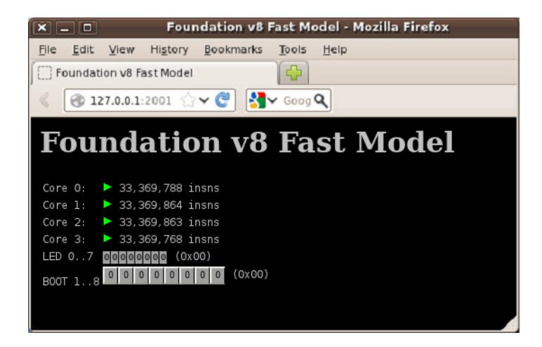

**Figure 19-4 Multicore option with number of cores = 4**

#### <span id="page-279-1"></span><span id="page-279-0"></span>**19.2.19 Semihosting**

Semihosting enables code running on a platform model to directly access the I/O facilities on a host computer. Examples of these facilities include console I/O and file I/O. For more information on semihosting, see the *ARM® Compiler Software Developement Guide.*

The simulator handles semihosting by either:

- Intercepting SVC 0x123456 or 0xAB in AArch32 depending on whether the processor is in the ARM or Thumb state.
- Intercepting HLT 0xF000 in AArch64.

#### **19.2.20 Semihosting configuration**

The syntax to use on the command line to enable or disable semihosting is as follows:

```
./Foundation_v8 --(no-)semihost
```

The syntax to use on the command line to set the semihosting command-line string is as follows:

```
./Foundation_v8 --semihost-cmd=<command string>
```

#### <span id="page-280-0"></span>**19.3 The Base Platform FVP**

<span id="page-280-1"></span>*Fixed Virtual Platform*s (FVPs) enable you to develop software without the requirement for actual hardware. The AEMv8-A Base Platform FVP enables you to run software applications on a virtual implementation of an ARMv8 development platform and provides a standard reference platform for development, distribution, and demonstration of ARM software deliverables.

It contains two processor clusters of the fully featured ARM v8 *Architecture Envelope Model* (AEMv8-A) and a standard peripheral set designed to enable software development and porting. The platform is an evolution of the earlier VE *Real Time System Model*s (RTSMs), based on the *Versatile™ Express* (VE) hardware development platform produced by ARM.

#### The AEMv8-A Base Platform FVP has:

- Two configurable clusters of up to four AEMv8-A Multiprocessor models that implement:
  - AArch64 at all Exception levels.
  - Configurable AArch32 support at all Exception levels.
  - Configurable support for little and big endian at all Exception levels.
  - Generic timers.
  - Self-hosted debug.
  - CADI debug.
  - GICv3 memory-mapped processor interfaces and distributor.
- Peripherals for multimedia or networking environments.
- Four PL011 UARTs.
- A CoreLink CCI-400 Cache Coherent Interconnect.
- Architectural GICv3 model.
- ARM High Definition LCD Display Controller, 1920 ×1080 resolution at 60fps, with single I2S and four stereo channels.
- 64 MB NOR flash and board peripherals.
- CoreLink TZC-400 TrustZone Address Space Controller.

#### **19.3.1 Software requirements**

The platform should have the following software components installed:

#### **Linux**

The following software is supported:

#### **Operating systems**

- Red Hat Enterprise Linux version 5.x for 64-bit and 32-bit architectures.
- Red Hat Enterprise Linux version 6.x for 64-bit and 32-bit architectures.

**Shell** A shell compatible with sh, such as bash or tcsh.

The model should run on any recent x86 64-bit Linux OS provided glibc v2.3.2 (or greater) and libstdc++ 6.0.0 (or greater), are present.

#### **Microsoft Windows**

The following software is required for Microsoft Windows:

#### **Operating system**

- Microsoft Windows 7 with Service Pack 1. 32-bit or 64-bit.
- Microsoft Visual C++ 2008 Redistributable Package ATL Security Update (KB973551).

**Adobe Acrobat reader** Version 8 or higher.

#### **19.3.2 Verifying the installation**

The AEMv8-A Base Platform FVP is available only as a prebuilt platform binary. The installation directory has the following form:

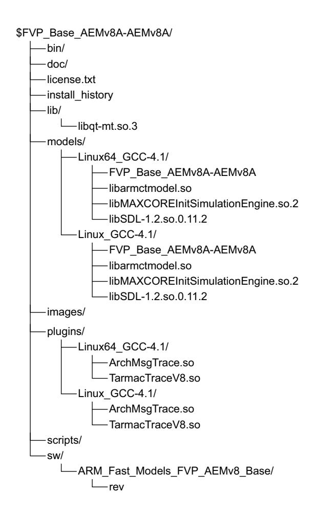

**Figure 19-5 AEMv8-A Base Platform FVP directory tree**

Where:

bin Model Debugger executables. For more information, see the *Model Debugger for* 

*Fast Models User Guide*.

doc Documentation for the model and tools.

license.txt License terms for use of the model.

install\_history

Installer log file.

images Source code and executable for a simple demonstration program.

lib libqt-mt.so.3

Model Debugger support library.

models

compiler

FVP\_Base\_AEMv8A-AEMv8A

The AEMv8-A Base Platform FVP executable file.

libarmctmodel.so

Code translation library.

libMAXCOREInitSimulationEngine.so.2

Helper library required by the model.

libSDL-1.2.so.0.11.2

Helper library required by the model.

plugins

TarmacTraceV8

Plug-in to generate text trace output of executed code.

ArchMsgTrace

Plug-in to generate warnings when the model detects that target code is using IMPLEMENTATION DEFINED or UNPREDICTABLE behaviors of the processor.

scripts

Setup scripts for using the TAP form of model networking.

sw

ARM\_Fast\_Models\_FVP\_AEMv8\_Base

rev

Model build number and revision identifier.

#### **19.3.3 Semihosting support**

Semihosting enables code running on a platform model to directly access the I/O facilities on a host computer. Examples of these facilities include console I/O and file I/O. See the *ARM® Compiler Software Development Guide*.

The simulator handles semihosting by either:

- Intercepting SVC 0x123456 or 0xAB in AArch32 depending on whether the processor is in the ARM or Thumb state.
- Intercepting HLT 0xF000 in AArch64.

#### **19.3.4 Using a configuration GUI in your debugger**

In your debugger, it might be possible to configure FVP parameters before you connect to the model and start it. See the documentation that accompanies your debugger.

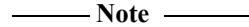

To connect to the AEMv8-A Base Platform FVP, your debugger must have a CADI interface.

#### **19.3.5 Setting model configuration options from Model Shell**

You can control the initial state of the AEMv8-A Base Platform FVP by configuration settings provided on the command line or in the CADI properties for the model.

#### **Using a configuration file**

To configure a model that you start from the command line with Model Shell, include a reference to an optional plain text configuration file when you start the AEMv8-A Base Platform FVP.

Comment lines in the configuration file must begin with a # character.

Each non-comment line of the configuration file contains:

- The name of the component instance.
- The parameter to be modified and its value.

You can set boolean values using either true/false or 1/0. You must enclose strings in double quotation marks if they contain whitespace.

#### **Example 19-1 Typical configuration file**

```
# Disable semihosting using true/false syntax
semihosting-enable=false
#
# Enable the boot switch using 1/0 syntax
bp.sp810_sysctrl.use_s8=1
#
# Set the boot switch position
bp.ve_sysregs.user_switches_value=1
```

You can get the full list of model parameters by passing the -l switch.

#### For example:

```
models/Linux64_GCC-4.1/FVP_Base_AEMv8A-AEMv8A -l
# Parameters:
# instance.parameter=value #(type, mode) default = 'def value' : description : 
[min..max]
#----------------------------------------------------------------------------------------------
cache_state_modelled=1 # (bool, init-time) default = '1' // Enabled d-cache and 
                                                                // i-cache state for 
                                                                // all components
cluster0.NUM_CORES=0x4 # (int , init-time) default = '0x4' // Number of cores in 
                                                                // cluster0:[0x1..0x4]
cluster1.NUM_CORES=0x4 # (int , init-time) default = '0x4' // Number of cores in 
                                                                // cluster1:[0x0..0x4]
gicv3.gicv2-only=0 # (bool, init-time) default = '0' // When using the
                                                                // GICv3 model,pretend
                                                                // to be a GICv2
                                                                // system.
semihosting-enable=1 # (bool, init-time) default = '1' // Enable semihosting 
                                                                // for all cores
```

```
spiden=1 # (bool, init-time) default = '1' // Debug authentication 
                                                     // signal spiden
spniden=1 # (bool, init-time) default = '1' // Debug authentication 
                                                     // signal spniden
<output truncated>
```

#### **Using the command line**

You can use the -C switch to define model parameters when you invoke the model. You can also use --parameter as a synonym for the -C switch. Use the same syntax as for a configuration file, but precede each parameter with the -C switch.

#### **19.3.6 Loading and running an application on the AEMv8-A Base Platform FVP**

Example applications are provided for use with the AEMv8-A Base Platform FVP.

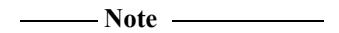

 These applications are provided for demonstration purposes only and are not supported by ARM. The number of examples or implementation details might change with different versions of the system model.

A useful example application that runs on all versions of the AEMv8-A Base Platform FVP is:

brot\_ve\_64.axf This application provides a demonstration of rendering an image to the CLCD display. Source code is supplied.

The examples are in the %PVLIB\_HOME%\images directory.

#### **19.3.7 Running the example program from the command line**

- 1. Open a terminal window and navigate to the installation directory.
- 2. Use the following command to open and run the supplied example program:

```
models/Linux64_GCC-4.1/FVP_Base_AEMv8A-AEMv8A \
 -a cluster\*.cpu\*=images/brot_ve_64.axf \
-C bp.secure_memory=false
models/Linux64_GCC-4.1/FVP_Base_AEMv8A-AEMv8A
```

Is the model executable file. This version works only on 64-bit host computers. The file in Linux\_GCC-4.1 works on 32-bit and 64-bit host computers.

-a cluster\\*.cpu\\*

Instructs the model to start the image, setting the initial value of pc for all cores of all clusters.

-C bp.secure\_memory=false

Disables access control of DRAM by the CoreLink TZC-400. This is required because this simple example image does not contain a firmware implementation that initializes the TZC-400.

#### **19.3.8 Running the example program using Model Debugger**

- 1. Start Model debugger. This is located in bin/modeldebugger in the installation directory or by using the **Start** menu in Windows.
- 2. Select **File** → **Debug Isim System**.

A dialog box appears.

- 3. For System, select the following model executable file: models/Linux64\_GCC-4.1/FVP\_Base\_AEMv8A-AEMv8A
- 4. In Additional command-line options, type:
  - -C bp.secure\_memory=false

Click **OK**.

- 5. Select one or more of the targets in cluster0 and click **OK**.
- 6. In the Load Application dialog, ensure that Enable SMP Application Loading is checked, then locate and select the images/brot\_ve\_64.axf file.
- 7. Click **Run** on one of the open ModelDebugger windows.

#### **19.3.9 Using the CLCD window**

When the AEMv8-A Base Platform FVP starts, the FVP CLCD window opens, representing the contents of the simulated color LCD frame buffer. It automatically resizes to match the horizontal and vertical resolution set in the CLCD peripheral registers.

[Figure 19-6](#page-285-0) shows the FVP CLCD in its default state, immediately after being started.

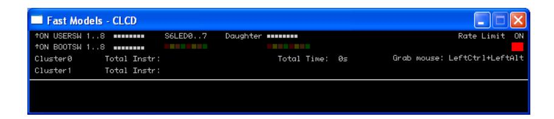

**Figure 19-6 CLCD window at startup**

<span id="page-285-0"></span>The top section of the CLCD window displays the following status information:

**Total Instr** A counter showing the total number of instructions executed.

**Total Time** A counter showing the total elapsed time, in seconds.

This is wall clock time, not simulated time.

**Rate Limit** This option limits the rate of simulated time when the cores are in WFI, reset, or otherwise idle.

> Rate Limit is enabled by default. Simulation time is restricted so that it more closely matches real time.

Click the square button to disable or enable Rate Limit. The text changes from ON to OFF and the colored box becomes darker when Rate Limit is disabled. [Figure 19-7 on page 19-22](#page-286-0) shows the CLCD with Rate Limit disabled.

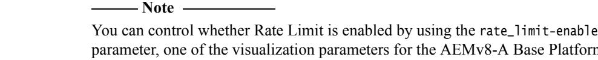

parameter, one of the visualization parameters for the AEMv8-A Base Platform FVP Visualization component, when instantiating the model.

**Instr/sec** Shows the number of instructions executed per second of wall clock time.

**Perf Index** The ratio of real time to simulation time. The larger the ratio, the faster the simulation runs. If you enable the Rate Limit feature, the Perf Index approaches unity.

#### **CLCD display**

The large area at the bottom of the window displays the contents of the CLCD buffer, as in [Figure 19-7](#page-286-0).

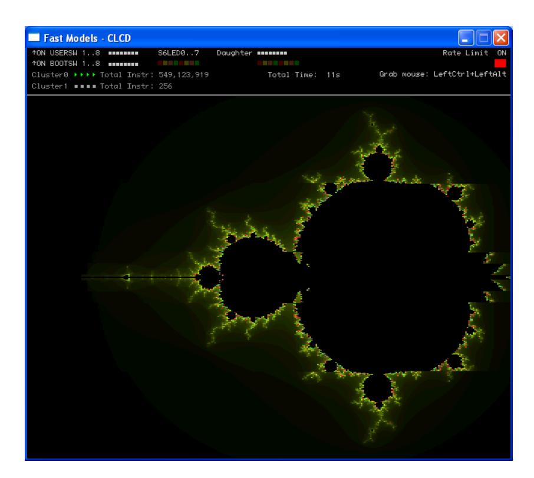

**Figure 19-7 CLCD window active**

**Table 19-2 Core run state icon descriptions**

<span id="page-286-0"></span>

| Icon | State label | Description                                                                  |
|------|-------------|------------------------------------------------------------------------------|
|      | UNKNOWN     | Run status unknown, that is, simulation has not started.                     |
|      | RUNNING     | The core is running, is not idle, and is executing instructions.             |
|      | HALTED      | An external halt signal is asserted.                                         |
|      | STANDBY_WFE | The last instruction executed was WFE, and standby mode has been<br>entered. |
|      | STANDBY_WFI | The last instruction executed was WFI and standby mode has been<br>entered.  |

**Table 19-2 Core run state icon descriptions (continued)**

| Icon | State label | Description                           |
|------|-------------|---------------------------------------|
|      |             |                                       |
|      | IN_RESET    | An external reset signal is asserted. |
|      | DORMANT     | Partial core power down.              |
|      | SHUTDOWN    | Complete core power down.             |
|      |             |                                       |

**Note**

The icons do not appear until you start the simulation.

You can hide the host mouse pointer by pressing the Left Ctrl+Left Alt keys. Press the keys again to redisplay the host mouse pointer. Only the Left Ctrl key is operational. The Ctrl key on the right-hand side of the keyboard does not have the same effect.

If you prefer to use a different key, use the trap\_key configuration option, one of the visualization parameters for the Visualization component.

#### **19.3.10 Using Ethernet with the AEMv8-A Base Platform FVP**

The AEMv8-A Base Platform FVPs provide you with a virtual Ethernet component. This is a model of the SMSC91C111 Ethernet controller, and uses a TAP device to communicate with the network. By default, the Ethernet component is disabled.

The AEMv8-A Base Platform FVP includes a software implementation of the SMSC91C111 Ethernet controller. Your target OS must therefore include a driver for this specific device, and you must configure the kernel to use the SMSC chip. Linux is the operating system that supports the SMSC91C111.

There are three configurable SMSC91C111 component parameters:

- enabled
- mac\_address
- promiscuous

#### **enabled**

When the device is disabled, the kernel cannot detect it. For more information, see the SMSC\_91C111 component section in the *Fast Models Reference Manual*. [Figure 19-8 on](#page-288-0)  [page 19-24](#page-288-0) shows a block diagram of the model networking structure.

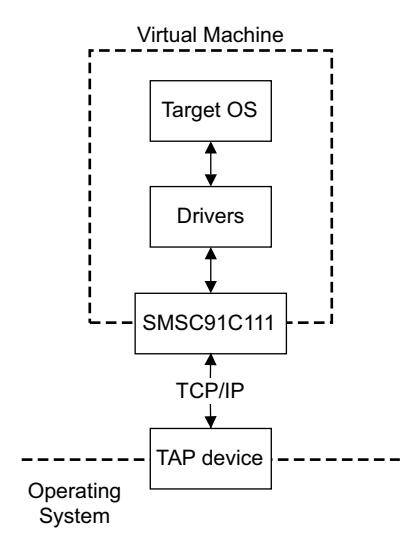

**Figure 19-8 Model networking structure block diagram**

<span id="page-288-0"></span>You must configure a HostBridge component to perform read and write operations on the TAP device. The HostBridge component is a virtual programmers view model, acting as a networking gateway to exchange Ethernet packets with the TAP device on the host, and to forward packets to NIC models.

#### **mac\_address**

If a MAC address is not specified, when the simulator is run, it takes a default MAC address, that is randomly-generated. This provides some degree of MAC address uniqueness when running models on multiple hosts on a local network.

#### **promiscuous**

The Ethernet component starts in promiscuous mode by default. This means that it receives all network traffic, even any not specifically addressed to the device. You must use this mode if you are using a single network device for multiple MAC addresses. Use this mode if, for example, you are sharing the same network card between your host OS and the AEMv8-A Base Platform FVP Ethernet component.

By default, the Ethernet device on the AEMv8-A Base Platform FVP has a randomly-generated MAC address and starts in promiscuous mode.

#### **19.3.11 Compatibility with VE model and platform**

Software that ran on the previous VE model should be compatible with the AEMv8-A Base Platform FVP, but might require changes to the following configuration options:

- GICv2.
- GICv3.
- System global counter.
- Disable platform security.

#### **GICv2**

The AEMv8-A Base Platform FVP uses GICv3 by default. It can be configured to use GICv2 or GICv2m compatibility modes.

To configure the model as GICv2m, set the following:

```
-C gicv3.gicv2-only=1 \
-C cluster0.gic.GICD-offset=0x10000 \
-C cluster0.gic.GICC-offset=0x2F000 \
-C cluster0.gic.GICH-offset=0x4F000 \
-C cluster0.gic.GICH-other-CPU-offset=0x50000 \
-C cluster0.gic.GICV-offset=0x6F000 \
-C cluster0.gic.PERIPH-size=0x80000 \
-C cluster1.gic.GICD-offset=0x10000 \
-C cluster1.gic.GICC-offset=0x2F000 \
-C cluster1.gic.GICH-offset=0x4F000 \
-C cluster1.gic.GICH-other-CPU-offset=0x50000 \
-C cluster1.gic.GICV-offset=0x6F000 \
-C cluster1.gic.PERIPH-size=0x80000 \
-C gic_distributor.GICD-alias=0x2c010000
```

To configure the model as GICv2, set the following:

```
-C gicv3.gicv2-only=1 \
-C cluster0.gic.GICD-offset=0x1000 \
-C cluster0.gic.GICC-offset=0x2000 \
-C cluster0.gic.GICH-offset=0x4000 \
-C cluster0.gic.GICH-other-CPU-offset=0x5000 \
-C cluster0.gic.GICV-offset=0x6000 \
-C cluster0.gic.PERIPH-size=0x8000 \
-C cluster1.gic.GICD-offset=0x1000 \
-C cluster1.gic.GICC-offset=0x2000 \
-C cluster1.gic.GICH-offset=0x4000 \
-C cluster1.gic.GICH-other-CPU-offset=0x5000 \
-C cluster1.gic.GICV-offset=0x6000 \
-C cluster1.gic.PERIPH-size=0x8000 \
-C gic_distributor.GICD-alias=0x2c010000
```

To configure MSI frames for GICv2m, extra parameters are available to set the base address and configuration of each of 16 possible frames, eight Secure and eight Non-secure:

```
-C gic_distributor.MSI_S-frame0-base=ADDRESS \
-C gic_distributor.MSI_S-frame0-min-SPI=NUM \
-C gic_distributor.MSI_S-frame0-max-SPI=NUM
```

In this example, you can replace MSI\_S with MSI\_NS, for NS frames, and you can replace frame0 with frame1 to frame7 for each of the possible 16 frames. If the base address is not specified for a given frame, or the SPI numbers are out of range, the corresponding frame is not instantiated.

#### **GICv3**

The AEMv8-A core model includes an implementation of the GICv3 system registers. This is enabled by default.

The GIC distributor and CPU interface have several parameters to allow configuration of the model to match different implementation options. Use --list-params to get a full list. Configuration options for the GIC model should be available under:

- cpu/cluster.gic.\*
- cpu/cluster.gicv3.\*
- gic\_distributor.\*

#### **System global counter**

The VE model did not provide a memory-mapped interface to the system global counter, and enabled the free-running timer from reset. However, the architectural requirement is that such a counter is not enabled at reset. This means that the Generic Timer registers of the cores do not operate unless either:

- Software enables the counter peripheral by writing the FCREQ[0] and EN bits in CNTCR at 0x2a43000. This is the preferred approach.
- The -C bp.refcounter.non\_arch\_start\_at\_default=1 parameter is set. This is a backup approach for compatibility with older software.

#### **Disable platform security**

The VE model optionally restricted accesses according to a fixed security map. In the AEMv8-A Base Platform FVP, the security map for peripherals is enhanced and is now enabled by default. Software must program the TZC-400 to make any accesses to DRAM, because all accesses are blocked in the reset configuration.

For compatibility with software that has not been updated to program the TZC-400, the following parameter is provided, and this causes all accesses to be permitted regardless of security state:

-C bp.secure\_memory=false

#### **19.3.12 Where to get the ARMv8-A Base Platform FVP**

[Details of the ARMv8-A Base Platform FVP can be found at](http://www.arm.com/fvp) http://www.arm.com/fvp.

### **Index**

| A                                            | ARM debug hardware 18-2, 18-3<br>ARM Fast Models 19-2 | B                                  |
|----------------------------------------------|-------------------------------------------------------|------------------------------------|
| A profile processors 2-1                     | ARM Instruction Set 5-2                               | Banked registers ARMv7 4-13        |
| AAPC64 stack frame 9-6                       | ARM Processors 2-1, 2-5                               | Barriers 13-6                      |
| AArch32 registers 4-13                       | ARM Registers 4-1                                     | In C code 13-9                     |
| AArch64 descriptor format 12-14              | ARMv4T architecture 2-1                               | In Linux 13-10                     |
| AArch64 registers 4-3                        | ARMv5TE architecture 2-1                              | Parameters 13-7                    |
| ABI 9-1                                      | ARMv6 architecture 2-1                                | Base Platform FVP 19-16            |
| Access Flag (AF) 12-25                       | ARMv7 NEON 7-1                                        | Basic data types 8-4               |
| Access permissions 12-23                     | ARMv7-A architecture 2-1                              | big.LITTLE                         |
| Accessing multiple memory locations 6-16     | ARMv8 Instruction Set 5-1                             | big.LITTLE MP 16-7                 |
| Address for a load or store instruction 6-14 | ARMv8 Models                                          | Cluster migration 16-4             |
| Addressing 5-5                               | Models 19-1                                           | Configuration 16-2                 |
| Addressing modes                             | ARMv8 NEON 7-1                                        | CPU migration 16-4                 |
| Load/Store instructions 8-1                  | New features 7-2                                      | DVFS 16-4                          |
| Alignment 8-3                                | ARMv8 to ARMv7 register mapping 4-15                  | Execution modes 16-4               |
| Checking 5-6                                 | ARMv8-A architecture 2-3                              | Forced migration 16-8              |
| AMP 14-7                                     | ARMv8-A Foundation Platform 19-4                      | Fork migration 16-7                |
| Architecture                                 | Assembly code 8-5                                     | Global Task Scheduling 16-5        |
| ARMv4T 2-1                                   | Asymmetric multi-processing 14-7                      | Idle pull migration 16-9           |
| ARMv5TE 2-1                                  | Atomicity                                             | Managing a system 16-2             |
| ARMv6 2-1                                    | Memory access                                         | Offload migration 16-9             |
| ARMv7-A 2-1                                  | Atomicity 6-18                                        | Structure of s system 16-2         |
| ARMv8-A 2-3                                  | Attacks                                               | Wake migration 16-7                |
| Argument registers 9-3                       | Hardware 17-2                                         | Bit manipulation instructions 8-11 |
| Arithmetic operations 6-3                    | Laboratory 17-2                                       | Bitmask widths 8-8                 |
| ARM Architecture 2-1, 2-5                    | Software 17-2                                         | Branch instructions 6-19           |
| ARM Assembler                                | Auxiliary Control Register (ACTLR) 4-7                | Absolute branches 6-19             |
| Power instructions 15-7                      | A32 5-1, 5-2                                          | B 6-19                             |
| ARM Compiler toolchain 5-1                   | A64 5-1, 5-2                                          | BL 6-19                            |
|                                              |                                                       |                                    |

| BLR 6-19                                                                  | Cortex-A53 processor 2-5, 2-6                                              | Divide 6-4                                       |
|---------------------------------------------------------------------------|----------------------------------------------------------------------------|--------------------------------------------------|
| BR 6-19                                                                   | Cortex-A57 processor 2-5, 2-7                                              | DMA 11-2                                         |
| CBNZ 6-19                                                                 | Counter-timer Frequency Register                                           | Dormant mode 15-5                                |
| CBZ 6-19                                                                  | (CNTFRQ) 4-7                                                               | Double-precision registers 7-6                   |
| Conditional branches 6-19                                                 | Counter-timer Kernel Control Register                                      | DS-5                                             |
| TBNZ 6-20                                                                 | (CNTKCTL) 4-7                                                              | Debugger 18-12                                   |
| TBZ 6-19                                                                  | Counter-timer Physical Control Register                                    | Trace support in 18-15                           |
| Bulk transfers 5-6                                                        | (CNTP_CTL) 4-8                                                             | DS-5 Debugger                                    |
| Byte manipulation instructions 6-7                                        | Counter-timer Physical Count Register<br>(CNTPCT) 4-7                      | Debugging Linux or Android<br>applications 18-12 |
| C                                                                         | Counter-timer Physical Timer Compare<br>Value Register (CNTP_CVAL) 4-8     | Debugging multi-threaded applications<br>18-14   |
|                                                                           | CPU migration (big.LITTLE) 16-4                                            | Debugging shared libraries 18-15                 |
| Cache Level ID Register (CLIDR) 4-7<br>Cache maintenance operations 11-13 | Cryptographic instructions 6-23<br>Current Cache Size ID Register (CCSIDR) | DVFS 15-6<br>DWARF 3.0 9-1                       |
|                                                                           |                                                                            |                                                  |
| Cache policies 11-9                                                       | 4-7                                                                        | Dynamic Voltage/Frequency Scaling 15-6           |
| Read allocation 11-9                                                      |                                                                            |                                                  |
| Write allocation 11-9                                                     |                                                                            |                                                  |
| Write-back 11-9                                                           | D                                                                          | E                                                |
| Write-through 11-9                                                        |                                                                            |                                                  |
| Cache Size Selection Register (CSSELR)                                    | D registers 7-5, 7-6                                                       | ECT 18-10                                        |
| 4-8                                                                       | DAP 18-10                                                                  | Effect of granule sizes 12-15                    |
| Cache Typet Register (CTR) 4-8                                            | Data Cache Zero ID Register (DCZID) 4-8                                    | ELR (Exception Link register) 4-4                |
| Cacheable memory attributes 13-11                                         | Data Memory Barrier (DMB) 6-18, 13-6                                       | ELR_hyp 4-15                                     |
| Caches 11-1                                                               | Data processing instructions 6-3                                           | EL0 3-1                                          |
| Basic layout 11-2                                                         | Data Synchronization Barrier (DSB) 6-18,                                   | EL1 3-1                                          |
| Cache controller 11-8                                                     | 13-7                                                                       | EL2 3-1                                          |
| Cache look-up 11-8                                                        | Debug 18-1                                                                 | EL3 3-1                                          |
| Cache miss 11-8                                                           | Debug Access Port (DAP) 18-10                                              | Embedded and inline assembly 5-9                 |
| Discovery 11-18                                                           | Debug and Trace 18-12                                                      | Embedded Cross Trigger 18-10                     |
| Exclusive 11-6, 11-7                                                      | Debugging Linux 18-7                                                       | Embedded Trace Buffer 18-9                       |
| Inclusive 11-6, 11-7                                                      | Debugging Linux kernel 18-7                                                | Embedded Trace Macrocell 18-9                    |
| Maintenance 11-13                                                         | Embedded cross trigger 18-10                                               | Endianness 4-10, 4-12                            |
| Physical addresses 11-5                                                   | External 18-1, 18-6                                                        | Exception handling instructions 6-21             |
| Set associative 11-4                                                      | Halting 18-4, 18-6                                                         | Exception levels                                 |
| Tags 11-5                                                                 | Hardware 18-2, 18-3                                                        | Changing 3-5, 3-6                                |
| Terminology                                                               | Invasive 18-2                                                              | Exception Link Register 10-7                     |
| Index 11-3                                                                | Non-invasive 18-2, 18-9                                                    | Exception Link Register (ELR) 4-8                |
| Line 11-3                                                                 | Self-hosted 18-4, 18-7                                                     | Exception Syndrome Register 10-7, 10-9           |
| Set 11-3                                                                  | Semihosting 18-8                                                           | Exception Syndrome Register (ESR) 4-8,           |
| Tag 11-3                                                                  | System trace macrocell 18-10                                               | 6-21                                             |
| Way 11-3                                                                  | Trace memory controller 18-10                                              | Exceptions                                       |
| Ways 11-4                                                                 | Debug Access Port 18-10                                                    | Types                                            |
| Call stack 18-8                                                           | Debug event                                                                | Aborts 10-2                                      |
| Callee-saved registers 9-3                                                | Vector catch 18-6                                                          | Exceptional instructrions 10-2                   |
| Caller-saved temporary registers 9-3                                      | Debug events 18-4                                                          | Interrupts 10-1                                  |
| Changing Exception level 3-5                                              | Breakpoint 18-5                                                            | Reset 10-2                                       |
| Changing execution state 3-8, 4-13                                        | Software 18-4                                                              | Exclusive accesses 5-5                           |
| Cluster migration (big.LITTLE) 16-4                                       | Software breakpoint instruction 18-6                                       | Excution state                                   |
| Comparison instructions                                                   | Software step 18-5                                                         | Changing 3-8, 4-13                               |
| NEON 7-13                                                                 | Watchpoint 18-5                                                            | Executable and Linkable Format (ELF) 9-1         |
| Compiler options 8-8                                                      | Debug ID Register 18-3                                                     | Execution states 3-4                             |
| Conditional instructons 8-1                                               | Debug instructions 6-22                                                    | AArch32 3-4, 3-8                                 |
| Configuring and enabling the MMU 12-12                                    | Debugging 18-13                                                            | AArch64 3-4, 3-8                                 |
| Context switching 12-27                                                   | Debugging Linux kernel modules 18-12                                       | Explicit and implicit type conversions 8-11      |
| Contiguous Block Entries 12-6                                             | Debugging Linux or Android applications                                    | External debug 18-6                              |
| CoProcessor Access Control Register                                       | 18-12                                                                      |                                                  |
| (CPACR) 4-8                                                               | Descriptor format                                                          |                                                  |
| CoreSight 18-9                                                            | AArch64 12-14                                                              | F                                                |
| CoreSight Serial Wire 18-10                                               | Device memory 13-4                                                         |                                                  |
| Cortex-A series architecture                                              | Direct Memory Access 11-2                                                  | Fault Address Register 10-7                      |
| Cortex-A53 2-6                                                            | Divide instructions                                                        | Fault Address Register (FAR) 4-8                 |
| Cortex-A57 2-7                                                            | Instructions                                                               | FIQ 10-1, 15-7                                   |
|                                                                           |                                                                            |                                                  |

| Floating 6-13<br>Floating point instructions 6-22                                  | Indirect result register (X8) 9-3<br>Inner shareable 13-12             | Inner sharebale 13-12<br>Non-shareable 13-12                             |
|------------------------------------------------------------------------------------|------------------------------------------------------------------------|--------------------------------------------------------------------------|
| Floating-point and NEON scalar loads and                                           | Instruction mnemonics 6-2                                              | Outer sharebale 13-13                                                    |
| stores 6-13                                                                        | Instruction sets                                                       | Shareable 13-11                                                          |
| Floating-point architecture 7-4                                                    | ARM 5-2                                                                | Memory barrier and fence instructions 6-18                               |
| Floating-point Control Register (FPCR)                                             | Thumb 5-2                                                              | Memory ordering 13-1                                                     |
| 4-8                                                                                | Instruction Synchronization Barrier (ISB)                              | Memory types 13-3                                                        |
| Floating-point parameter 7-7<br>Floating-point registers 7-6                       | 6-18, 13-6, 13-9<br>Instructions                                       | Device 13-4<br>Normal 13-3                                               |
| Organization in AArch64 4-17                                                       | Bit manipulation 8-11                                                  | Strongly Ordered 13-4                                                    |
| Parameters 9-7                                                                     | Branch 6-19                                                            | MMU                                                                      |
| Floating-point Status Register (FPSR) 4-8                                          | Byte manipulation 6-7                                                  | Cache configuration 12-16                                                |
| Forced migration 16-8                                                              | Cryptographic 6-23                                                     | Cache policies 12-17                                                     |
| Fork migration 16-7<br>Frame pointer register (X29) 9-3                            | Data processing 6-3<br>Debug 6-22                                      | Configuring and enabling 12-12<br>Operation when disabled 12-13          |
| Frame pointer (X29) 9-6                                                            | Exception handling 6-21                                                | Security 12-26                                                           |
| Fundamentals of ARMv8 3-1                                                          | Floating-point 6-22                                                    | Models                                                                   |
| Fused instructions                                                                 | Memory access 6-12                                                     | Base Platform FVP 19-16                                                  |
| Multiply-add 7-2                                                                   | Multiply and divide 6-4                                                | Fast Models 19-2                                                         |
| Multiply-subtract 7-2                                                              | SVC 10-2<br>WFI 15-7                                                   | Foundation Platform 19-4<br>Monitor mode 3-5                             |
|                                                                                    | Intermediate Physical Address (IPA) 12-20                              | M-profile processors 2-2                                                 |
| G                                                                                  | Intra-procedure-call temporary registers                               | Multiply 6-4                                                             |
|                                                                                    | (X16, X17) 9-3                                                         | Multiply and divide instructions 6-4                                     |
| Generic Interrupt Controller 10-17, 10-18,                                         | Intrinsics                                                             | Multiply instructions 6-4                                                |
| 10-19                                                                              | NEON 7-14                                                              | Multi-processing                                                         |
| Configuration 10-18<br>Distributor 10-17                                           | IRQ 10-1, 15-7                                                         | Asymmetric 14-7<br>Heterogenous 14-8                                     |
| Initialization 10-19                                                               |                                                                        | Symmetric 14-3                                                           |
| Interrupt handling 10-19                                                           | K                                                                      | Multiprocessor Affinity Register (MPIDR)                                 |
| Private Peripheral Interrupt (PPI) 10-17                                           |                                                                        | 4-8                                                                      |
| Shared Peripheral Interrupt (PPI) 10-17<br>Shared Peripheral Interrupt (SPI) 10-17 | Kernel access 12-29                                                    |                                                                          |
| Software Generated Interrupt (SGI)                                                 |                                                                        | N                                                                        |
| 10-17                                                                              | L                                                                      |                                                                          |
| GIC 10-17, 10-18, 10-19                                                            |                                                                        | NEON 7-1                                                                 |
| Global Task Scheduling (big.LITTLE)                                                | Laboratory hardware attack 17-2                                        | All register operations 7-12                                             |
| 16-5                                                                               | Link register (X30) 9-3                                                | Architecture 7-4                                                         |
| Granule sizes 12-15                                                                | Linux<br>Debugging 18-7                                                | Coding alternatives 7-14<br>Comparison instructions 7-13                 |
|                                                                                    | Debugging the kernel 18-7                                              | Instruction format 7-9                                                   |
| H                                                                                  | Load 6-12                                                              | Instruction prefix 7-9                                                   |
|                                                                                    | Load and Store 5-6                                                     | Intrinsics 7-14                                                          |
| H registers 7-6                                                                    | Non-temporal 6-17, 13-10                                               | Long instructions 7-9                                                    |
| Halting debug mode 18-6                                                            | Load and store optimization 13-2                                       | Narrow instructions 7-10                                                 |
| Heterogeneous multi-processing 14-8<br>Hint instructions 6-22                      | Load instruction format 6-12<br>Load Pair (LDP) instructions 6-16, 8-2 | New features 7-2<br>Normal instructions 7-9                              |
| Hotplug                                                                            | Load-Acquire (LDAR) 13-8                                               | Pairwise instructions 7-11                                               |
| Power management 15-5                                                              | Logical operations 6-3                                                 | Parameters 9-7                                                           |
| Hyp mode 3-5                                                                       |                                                                        |                                                                          |
| Hypervisor 3-1, 3-2                                                                |                                                                        | Polynomials 7-4                                                          |
| Hypervisor Configuraation Register (HCR)                                           |                                                                        | Saturating instructions 7-11                                             |
| 4-8                                                                                | M                                                                      | Wide instructions 7-10                                                   |
|                                                                                    |                                                                        | 2 suffix 7-12                                                            |
| Hypervisor Configuration Register 12-20                                            | Main ID Register (MIDR) 4-8                                            | NEON at AArch32 4-20                                                     |
|                                                                                    | Memory 6-12<br>Memory access                                           | NEON instructions 6-22<br>Non-invasive debug 18-9                        |
|                                                                                    | Instructions 6-12                                                      | Non-secure addresses 12-11                                               |
| I                                                                                  | Memory Attribute Indirection Register                                  | Non-secure interrupts 17-5                                               |
| Idle management                                                                    | 13-3, 13-11                                                            | Non-secure state 17-3                                                    |
| Power management 15-3                                                              | Memory Attribute Indirection Register                                  | Switch to Secure 17-8                                                    |
| Idle pull migration 16-9<br>Indexes 8-12                                           | (MAIR) 4-8<br>Memory attributes 13-11                                  | Non-temporal load 6-17, 13-10<br>Non-temporal load and store 6-17, 13-10 |

| Normal memory 13-1, 13-3<br>Normal world 3-3, 17-3 | PSTATE 4-6<br>Bit definitions 4-6              | S                                                                  |
|----------------------------------------------------|------------------------------------------------|--------------------------------------------------------------------|
|                                                    | PSTATE at AArch32 4-16                         | S registers 4-18, 7-6<br>Saved Program Status Register (SPSR) 4-5, |
| O                                                  |                                                | 4-9                                                                |
| Offload migration 16-9                             | Q                                              | Scalar data 7-6<br>Scalar register sizes 4-18                      |
| One way barriers 13-8                              | Q registers 4-18                               | SCU 14-14                                                          |
| One-sided fences 6-18                              |                                                | Second and upper half specifier 7-12                               |
| Load-Acquire 6-18                                  |                                                | Secure addresses 12-11                                             |
| Store-Release 6-18                                 | R                                              | Secure Configuration Register (SCR) 4-9                            |
| Outer shareable 13-13                              |                                                | Secure debug 17-7                                                  |
| Out-of-order execution 13-2                        | Re-compilation 8-8                             | Secure interrupts 17-5                                             |
|                                                    | Register indexed addressing 5-8                | Secure monitor 3-1                                                 |
|                                                    | Registers 4-1                                  | Secure state                                                       |
| P                                                  | AArch32 4-13                                   | Switch to Non-secure 17-8                                          |
|                                                    | AArch64 4-3                                    | Secure world 3-3, 17-3                                             |
| Parameters in floating-point registers 9-7         | ACTLR 4-7                                      | Security 17-1                                                      |
| Parameters in NEON registers 9-7                   | Banked ARMv7 4-13                              | MMU 12-26                                                          |
| PC-relative 8-1                                    | CCSIDR 4-7                                     | Normal world 17-6                                                  |
| Offset addressing 5-5                              | CLIDR 4-7                                      | Secure world 17-6                                                  |
| Physical address<br>Translation from VA 12-9       | CNTFRQ 4-7<br>CNTKCTL 4-7                      | Security in multi-core systems 17-6<br>Self-hosted debug 18-7      |
| Physical address size (IPA) 12-8                   | CNTPCT 4-7                                     | Semihosting debug 18-8                                             |
| Physical addresses 12-2                            | CNTP_CTL 4-8                                   | Set associative caches 11-4                                        |
| Physically Indexed, Physically Tagged              | CNTP_CVAL 4-8                                  | Shareable memory attributes 13-11                                  |
| (PIPT) 11-5                                        | CPACR 4-8                                      | Shared Peripheral Interrupt (SPI) 10-17                            |
| Platform register (X18) 9-3                        | CSSELR 4-8                                     | Shift instructions 6-6, 8-1                                        |
| PL1 privilege level 3-5                            | CTR 4-8                                        | Simple hardware attacks 17-2                                       |
| PL2 privilege level 3-5                            | DCZID 4-8                                      | Single-precision registers 7-6                                     |
| PoC 11-11                                          | ELR (Exception Link register) 4-8              | SMC instruction 3-5                                                |
| Point of Coherency 11-11                           | ESR 4-8, 6-21                                  | Snoop Control Unit (SCU) 14-14                                     |
| Point of Unification 11-11                         | Exception Link Register 4-4                    | Software attacks 17-2                                              |
| Porting                                            | FAR 4-8                                        | Software Generated Interrupt (SGI) 10-17                           |
| Issues 8-8                                         | Floating-point 4-17                            | Special registers 9-3                                              |
| Porting to AArch64 8-1                             | FPCR 4-8                                       | Speculation 13-2                                                   |
| PoU 11-11                                          | FPSR 4-8                                       | SPSR_abt 4-15                                                      |
| Power and Clocking 15-3                            | HCR 4-8                                        | SPSR_fiq 4-15                                                      |
| Power down 15-4                                    | MAIR 4-8                                       | SPSR_hyp 4-15                                                      |
| Power management 15-1                              | MIDR 4-8                                       | SPSR_irq 4-15                                                      |
| DVFS 15-6                                          | MPIDR 4-8                                      | SPSR_svc 4-15                                                      |
| Hotplug 15-5<br>Idle management 15-3               | NEON 4-17<br>Saved Program Status Register 4-5 | SPSR_und. 4-15<br>Stack pointer 5-8                                |
| Power State Coordination Interface (PSCI)          | SCR 4-9                                        | Stack pointers 4-4                                                 |
| 15-8                                               | SCTLR 4-9                                      | Standby mode 15-4                                                  |
| Preload hints 11-10                                | SPSR 4-9                                       | STM 18-10                                                          |
| Private Peripheral Interrupt (PPI) 10-17           | SP_ELn 4-4                                     | Store 6-13                                                         |
| Privilege level 3-4                                | Stack pointers 4-4                             | Store instruction format 6-13                                      |
| PL2 3-5                                            | System Control Register 4-6, 4-9               | Store Pair (STP) instructions 6-16, 8-2                            |
| Privilege levels                                   | TCR 4-9                                        | Store-Release (STLR) 13-8                                          |
| PL0 3-5                                            | TPIDR 4-9                                      | Supervisor Call 3-5                                                |
| PL1 3-5                                            | TPIDRRO 4-9                                    | SVC instruction 3-5                                                |
| PL2 3-5                                            | TTBR0 4-9                                      | SVC (Instruction) 10-2                                             |
| Privileged Execute Never (PXN) 12-23               | TTBR1 4-9                                      | Switching between instruction sets 5-10                            |
| Procedure Call Standard                            | VTCR 4-9                                       | Switching security worlds 17-5                                     |
| Register use 9-3                                   | VTTBR 4-9                                      | Symmetric multi-processing 14-3                                    |
| Procedure Call Standard (PCS) 5-7, 9-1             | W registers 4-2                                | Synchronization primitives 6-18                                    |
| Processor modes 4-1                                | X registers 4-2                                | Synchronous exceptions 10-7                                        |
| ARMv7 3-5                                          | Registers at AArch32 4-13                      | System Control Register (SCTLR) 4-6, 4-9                           |
| Mapped onto Exception levels 3-6                   | Retention 15-4                                 | System control registers 4-7                                       |
| Processor state 4-6                                | Re-writing code 8-8                            | System register access 6-21                                        |
| Program counter 4-4, 5-8                           | R-profile processors 2-2                       | System Trace Macrocell 18-10                                       |

[PSCI 15-8](#page-230-0)

#### T [Thread ID Register Read Only \(TPIDRRO\)](#page-44-6) 4-9 [Thread ID Register \(TPIDR\) 4-9](#page-44-5) [TLB maintenance operations 12-4](#page-164-1) [TLBI instruction 12-4](#page-164-1) [TMC 18-10](#page-258-4) [Top Byte Ignore \(TBI\) 12-18](#page-178-3) [Trace hardware 18-9](#page-257-0) [Trace Memory Controller 18-10](#page-258-8) [Translating a VA to a PA 12-9](#page-169-0) [Translation Control Register 12-8](#page-168-2) [Translation Control Register \(TCR\) 4-9](#page-44-4) [Translation Granule \(TG\) 12-8](#page-168-3) [Translation Lookaside Buffer 12-4](#page-164-2) [Translation Table Base Register 12-7](#page-167-2) [Translation Table Base Register 0 \(TTBR0\)](#page-44-7) 4-9 [Translation Table Base Register 1 \(TTBR1\)](#page-44-8) 4-9 [Translation table configuration 12-18](#page-178-0) Translation table descriptors [OS use 12-25](#page-185-2) [Translation tables 12-14](#page-174-0) [Translations at EL2 12-20](#page-180-0) [Translations at EL3 12-20](#page-180-4) [Trusted Execution Environment \(TEE\)](#page-240-2) 17-1 [Trusted systems 17-1](#page-240-3) [TrustZone 3-2](#page-28-2) [TrustZone hardware architecture 17-3](#page-242-0) [TTBR0 12-7](#page-167-3) [TTBR1 12-7](#page-167-4) [Two stage translation 12-20](#page-180-5) [Type conversion and promotion 8-8](#page-110-7) [T32 5-1,](#page-56-5) [5-2](#page-57-5) U [Unaligned accesses 8-5](#page-107-1) [Unaligned address support 5-6](#page-61-3) [Unallocated Instructions 10-8](#page-129-0) [Unprivileged access 6-17](#page-82-3) [Unprivileged Execute Never 12-23](#page-183-3) V [V register 7-4](#page-92-5) Vector Based Address Register (VBAR) Registers [VBAR 4-9](#page-44-11) [Vector register sizes 4-19](#page-54-1) Virtual address [Translating to PA 12-9](#page-169-0) [Virtual address tagging 12-18](#page-178-4) [Virtual addresses 12-2](#page-162-2)

[Virtualization Translation Control Register](#page-180-6)  12-20 [Virtualization Translation Table Base](#page-180-7)  Register 12-20 [Virtualizaton Translation Control Register](#page-44-9)  (VTCR) 4-9 [Virtualizaton Translation Table Base](#page-44-10)  Register (VTTBR) 4-9 [Virtually Indexed, Physically Tagged](#page-146-4)  (VIPT) 11-5

### W

[Wake migration 16-7](#page-237-4) [Weakly-ordered model 13-1](#page-190-3) [WFI \(Instruction\) 15-7](#page-229-2) [W-registers 4-2](#page-37-2)

### X

[X-registers 4-2](#page-37-2)

### Z

[Zero register 4-4,](#page-39-3) [5-7](#page-62-2)

### Numerics

[16KB Granule 12-16](#page-176-1) [32-bit and 64-bit instructions 5-4](#page-59-0) [4KB Granule 12-15](#page-175-4) [64KB Granule 12-16](#page-176-2)

[Separation of kernel and application](#page-167-0) 

[Virtual machine Manager \(VMM\) 3-2](#page-28-3)

addresses 12-7