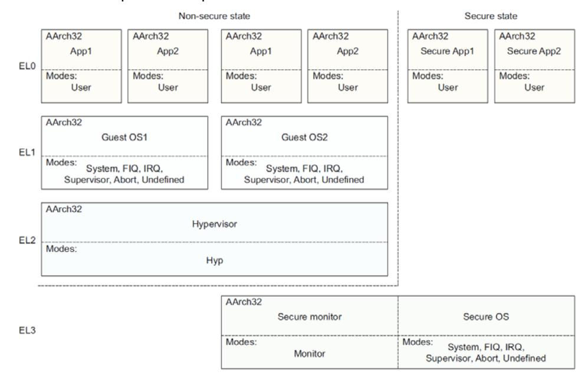

# Application Note **Bare-metal Boot Code for ARMv8-A Processors**

Version 1.0

**Non-Confidential**


Document Number: ARM DAI 0527A Non-Confidential Version: 1.0 Page 1 of 53

## Bare-metal Boot Code for ARMv8-A Processors

Copyright © 2017 ARM. All rights reserved.

#### **Release Information**

The following changes have been made to this Application Note.

**Document History**

| Date       | Issue | Confidentiality  | Change        |
|------------|-------|------------------|---------------|
| 31/03/2017 | A     | Non-Confidential | First release |

#### **Non-Confidential Proprietary Notice**

This document is protected by copyright and other related rights and the practice or implementation of the information contained in this document may be protected by one or more patents or pending patent applications. No part of this document may be reproduced in any form by any means without the express prior written permission of ARM. **No license, express or implied, by estoppel or otherwise to any intellectual property rights is granted by this document unless specifically stated.**

Your access to the information in this document is conditional upon your acceptance that you will not use or permit others to use the information for the purposes of determining whether implementations infringe any third party patents.

THIS DOCUMENT IS PROVIDED "AS IS". ARM PROVIDES NO REPRESENTATIONS AND NO WARRANTIES, EXPRESS, IMPLIED OR STATUTORY, INCLUDING, WITHOUT LIMITATION, THE IMPLIED WARRANTIES OF MERCHANTABILITY, SATISFACTORY QUALITY, NON-INFRINGEMENT OR FITNESS FOR A PARTICULAR PURPOSE WITH RESPECT TO THE DOCUMENT. For the avoidance of doubt, ARM makes no representation with respect to, and has undertaken no analysis to identify or understand the scope and content of, third party patents, copyrights, trade secrets, or other rights.

This document may include technical inaccuracies or typographical errors.

TO THE EXTENT NOT PROHIBITED BY LAW, IN NO EVENT WILL ARM BE LIABLE FOR ANY DAMAGES, INCLUDING WITHOUT LIMITATION ANY DIRECT, INDIRECT, SPECIAL, INCIDENTAL, PUNITIVE, OR CONSEQUENTIAL DAMAGES, HOWEVER CAUSED AND REGARDLESS OF THE THEORY OF LIABILITY, ARISING OUT OF ANY USE OF THIS DOCUMENT, EVEN IF ARM HAS BEEN ADVISED OF THE POSSIBILITY OF SUCH DAMAGES.

This document consists solely of commercial items. You shall be responsible for ensuring that any use, duplication or disclosure of this document complies fully with any relevant export laws and regulations to assure that this document or any portion thereof is not exported, directly or indirectly, in violation of such export laws. Use of the word "partner" in reference to ARM's customers is not intended to create or refer to any partnership relationship with any other company. ARM may make changes to this document at any time and without notice.

If any of the provisions contained in these terms conflict with any of the provisions of any signed written agreement covering this document with ARM, then the signed written agreement prevails over and supersedes the conflicting provisions of these terms. This document may be translated into other languages for convenience, and you agree that if there is any conflict between the English version of this document and any translation, the terms of the English version of the Agreement shall prevail.

Words and logos marked with ® or ™ are registered trademarks or trademarks of ARM Limited or its affiliates in the EU and/or elsewhere. All rights reserved. Other brands and names mentioned in this document may be the trademarks of their respective owners. Please follow ARM's trademark usage guidelines at *[http://www.arm.com/about/trademark](http://www.arm.com/about/trademark-usage-guidelines.php)[usage-guidelines.php](http://www.arm.com/about/trademark-usage-guidelines.php)*

Copyright © [2017], ARM Limited or its affiliates. All rights reserved.

ARM Limited. Company 02557590 registered in England.

110 Fulbourn Road, Cambridge, England CB1 9NJ.

LES-PRE-20349

Document Number: ARM DAI 0527A Non-Confidential Version: 1.0 Page 2 of 53

#### **Confidentiality Status**

This document is Non-Confidential. The right to use, copy and disclose this document may be subject to license restrictions in accordance with the terms of the agreement entered into by ARM and the party that ARM delivered this document to.

#### **Product Status**

The information in this document is Final, that is for a developed product.

#### **Web Address**

*[http://www.arm.com](http://www.arm.com/)*

Document Number: ARM DAI 0527A Non-Confidential Version: 1.0 Page 3 of 53

# Contents

# **Bare-metal Boot Code for ARMv8-A Processors**

| 1   | Conventions and Feedback         | 5  |
|-----|----------------------------------|----|
| 2   | Preface                          | 7  |
| 2.1 | References                       | 8  |
| 2.2 | Terms and abbreviations          | 9  |
| 3   | Introduction                     | 10 |
| 3.1 | Document purpose                 | 11 |
| 3.2 | Document scope                   | 12 |
| 4   | Boot code for AArch32 mode       | 13 |
| 4.1 | Initializing exceptions          | 14 |
| 4.2 | Initializing registers           | 16 |
| 4.3 | Configuring the MMU and caches   | 21 |
| 4.4 | Enabling NEON and Floating Point | 28 |
| 4.5 | Changing modes                   | 30 |
| 5   | Boot code for AArch64 mode       | 35 |
| 5.1 | Initializing exceptions          | 36 |
| 5.2 | Initializing registers           | 41 |
| 5.3 | Configuring the MMU and caches   | 45 |
| 5.4 | Enabling NEON and Floating Point | 50 |
| 5.5 | Changing Exception levels        | 51 |

# **1 Conventions and Feedback**

The following section describes the typographical conventions and how to give feedback:

#### **Typographical conventions**

The following typographical conventions are used:

monospace denotes text that can be entered at the keyboard, such as commands, file and program names, and source code.

monospace denotes a permitted abbreviation for a command or option. The

underlined text can be entered instead of the full command or option

name.

*monospace italic*

denotes arguments to commands and functions where the argument

is to be replaced by a specific value.

**monospace bold**

denotes language keywords when used outside example code.

*italic* highlights important notes, introduces special terminology, denotes

internal cross-references, and citations.

**bold** highlights interface elements, such as menu names. Also used for

emphasis in descriptive lists, where appropriate, and for ARM®

processor signal names.

#### **Feedback on documentation**

If you have comments on the documentation, e-mail errata@arm.com. Give:

- The title.
- The number, ARM DAI 0527A.
- If viewing a PDF version of a document, the page numbers to which your comments apply.
- A concise explanation of your comments.

ARM also welcomes general suggestions for additions and improvements.

ARM periodically provides updates and corrections to its documentation on the ARM Information Center, together with knowledge articles and *Frequently Asked Questions* (FAQs).

#### **Other information**

- ARM Information Center, [http://infocenter.arm.com/help/index.jsp.](http://infocenter.arm.com/help/index.jsp)
- ARM Technical Support Knowledge Articles, [http://infocenter.arm.com/help/topic/com.arm.doc.faqs/index.html.](http://infocenter.arm.com/help/topic/com.arm.doc.faqs/index.html)
- ARM Support and Maintenance, [http://www.arm.com/support/services/support](http://www.arm.com/support/services/support-maintenance.php)[maintenance.php.](http://www.arm.com/support/services/support-maintenance.php)

Document Number: ARM DAI 0527A Non-Confidential Version: 1.0 Page 5 of 53

| • | ARM Glossary, http://infocenter.arm.com/help/topic/com.arm.doc.aeg0014-/index.html. |
|---|-------------------------------------------------------------------------------------|
|   |                                                                                     |
|   |                                                                                     |
|   |                                                                                     |
|   |                                                                                     |
|   |                                                                                     |
|   |                                                                                     |
|   |                                                                                     |
|   |                                                                                     |
|   |                                                                                     |
|   |                                                                                     |
|   |                                                                                     |
|   |                                                                                     |
|   |                                                                                     |
|   |                                                                                     |
|   |                                                                                     |
|   |                                                                                     |

Document Number: ARM DAI 0527A Non-Confidential Version: 1.0 Page 6 of 53

# **2 Preface**

This preface contains the following topics:

- *[References](#page-7-0)* [on page 8.](#page-7-0)
- *[Terms and abbreviations](#page-8-0)* [on page 9.](#page-8-0)

Document Number: ARM DAI 0527A Non-Confidential Version: 1.0 Page 7 of 53

# <span id="page-7-0"></span>**2.1 References**

- *ARM® Architecture Reference Manual ARMv8, for ARMv8-A architecture profile* (ARM DDI 0487).
- *ARM® Cortex™-A Series Programmer's Guide* for ARMv7-A (ARM DEN 0013).
- *ARM® Cortex®-A Series Programmer's Guide for ARMv8-A* (ARM DEN0024).

Document Number: ARM DAI 0527A Non-Confidential Version: 1.0 Page 8 of 53

# <span id="page-8-0"></span>**2.2 Terms and abbreviations**

Abbreviations and terms used in this document are defined here.

**EL** Exception level.

**MMU** Memory Management Unit.

**PL** Privilege Level.

**SoC** System on Chip.

**SP** Stack Pointer.

**TRM** Technical Reference Manual.

Document Number: ARM DAI 0527A Non-Confidential Version: 1.0 Page 9 of 53

# **3 Introduction**

This chapter describes the purpose and scope of this application note. It contains the following topics:

- *[Document purpose](#page-10-0)* on page [11.](#page-10-0)
- *[Document scope](#page-11-0)* on page [12.](#page-11-0)

Document Number: ARM DAI 0527A Non-Confidential Version: 1.0 Page 10 of 53

# <span id="page-10-0"></span>**3.1 Document purpose**

Hardware verification engineers often run bare-metal tests to verify core-related function in a *System on Chip* (SoC). However, it can be challenging to write boot code for a baremetal system, without a basic understanding of software development on the ARM architecture.

This application note assumes that you are not familiar with ARM software development. It is intended to help you write boot code for ARMv8-A processors.

You can reference the boot code examples in this application note, and write your own boot code for a bare-metal system that is based on ARMv8-A processors.

Document Number: ARM DAI 0527A Non-Confidential Version: 1.0 Page 11 of 53

## <span id="page-11-0"></span>**3.2 Document scope**

This application note provides code examples for the following important operations that are involved in booting a bare-metal system:

- Initializing exceptions.
- Initializing registers.
- Configuring the MMU and caches.
- Enabling NEON and Floating Point.
- Changing Exception levels.

The code examples are written with the GNU assembly grammar and are tested on the Cortex-A53, Cortex-A72, and Cortex-A73 processors. They also apply to other ARMv8-A processors.

The ARMv8-A architecture supports two different Execution states:

- AArch32.
- AArch64.

This application note provides boot code examples for each Execution state.

For boot code examples applicable to ARMv7-A processors, see the *ARM*® *Cortex*TM*-A Series Programmer's Guide* for ARMv7-A*.*

Document Number: ARM DAI 0527A Non-Confidential Version: 1.0 Page 12 of 53

# **4 Boot code for AArch32 mode**

Read this chapter for boot code examples for AArch32.

It contains the following topics:

- *[Initializing exceptions](#page-13-0) on page [14.](#page-13-0)*
- *[Initializing registers](#page-15-0) [on page 16.](#page-15-0)*
- *Configuring [the MMU and Caches](#page-20-0) [on page 21.](#page-20-0)*
- *[Enabling NEON and Floating Point](#page-27-0) [on page 28.](#page-27-0)*
- *[Changing modes](#page-29-0) [on page 30.](#page-29-0)*

Document Number: ARM DAI 0527A Non-Confidential Version: 1.0 Page 13 of 53

## <span id="page-13-0"></span>**4.1 Initializing exceptions**

Exception initialization requires setting up the vector tables and enabling asynchronous exceptions.

## **4.1.1 Setting up a vector table**

When booting a processor in AArch32 mode, the value of SCTLR.V sets the location of the reset vector:

- When SCTLR.V is 0, the processor starts execution at address 0x00000000.
- When SCTLR.V is 1, the processor starts execution at address 0xFFFF0000.

You can use the hardware input **VINITHI** to set the reset value of SCTLR.V.

For exceptions other than reset, the processor looks up vector tables, which can be placed at customized places by programming vector base address registers. There are up to four vector tables. The corresponding vector base address registers are:

- *Vector Base Address Register* (VBAR) (Secure).
- *Monitor Vector Base Address Register* (MVBAR).
- *Hyp Vector Base Address Register* (HVBAR).
- VBAR (Non-secure).

Example 4-1 shows a typical vector table that is used for reset and other exceptions.

**Example 4-1 Typical vector table**

```
.balign 0x20
vector_table_base_address:
```

- B reset\_handler
- B undefined\_handler
- B svc\_handler
- B prefetch\_handler
- B data\_handler

NOP

B IRQ\_handler

// You can place the FIQ handler code here.

The vector entries in the four tables might be different. For details, see the section, *Exception vectors and the exception base address,* in the *ARM® Architecture Reference Manual ARMv8, for ARMv8-A architecture profile.*

You must initialize the four vector tables, and program the vector table base address registers before using the vector tables. The base addresses of vector tables must be 32 byte aligned.

Example 4-2 shows you how to initialize VBAR and MVBAR after reset.

Document Number: ARM DAI 0527A Non-Confidential Version: 1.0 Page 14 of 53

#### **Example 4-2 VBAR and MVBAR initialization**

```
LDR R1, =secure_vector_table_base_address
MCR P15, 0, R1, C12, C0, 0 // Initialize VBAR (Secure).
LDR R1, =monitor_vector_table_base_address
MCR P15, 0, R1, C12, C0, 1 // Initialize MVBAR.
```

## **4.1.2 Enabling asynchronous exceptions**

Asynchronous exceptions include asynchronous abort, IRQ and FIQ. They can be masked by CPSR.{A,I,F} register bits after reset. Therefore, if asynchronous aborts, IRQ and FIQ are to be taken, the CPSR.{A,I,F} bits must be cleared.

To enable interrupts, you must also initialize the external interrupt controller to deliver the interrupt to the processor, but it is not covered in this document.

Example 4-3 shows you how to enable asynchronous abort, IRQ and FIQ.

## **Example 4-3 Asynchronous abort, IRQ and FIQ exceptions enablement**

```
// Enable asynchronous aborts, interrupts, and fast interrupts.
CPSIE aif
```

Document Number: ARM DAI 0527A Non-Confidential Version: 1.0 Page 15 of 53

# <span id="page-15-0"></span>**4.2 Initializing registers**

Register initialization involves initializing the following registers:

- General purpose registers.
- Stack pointer registers.
- System control registers.

## **4.2.1 Initializing general purpose registers**

Some registers in ARM processors use non-reset flip-flops. This can cause X-propagation issues in hardware simulations. Register initialization reduces the possibility of this issue. Note This initialization is not required on silicon chips because X status only exists in hardware simulations.

Example 4-4 shows you how to initialize general-purpose registers after reset. Because there are banked general-purpose registers for different modes in AArch32, the example code changes to different modes and initializes them all.

**Example 4-4 General-purpose registers initialization**

```
// Processors are in Secure SVC mode after reset.
MOV R0, #0
MOV R1, #0
MOV R2, #0
MOV R3, #0
MOV R4, #0
MOV R5, #0
MOV R6, #0
MOV R7, #0
MOV R8, #0
MOV R9, #0
MOV R10, #0
MOV R11, #0
MOV R12, #0
MOV R13, #0
MOV R14, #0
CPS #0x11 // Change to FIQ mode.
MOV R8, #0
MOV R9, #0
MOV R10, #0
MOV R11, #0
MOV R12, #0
```

Document Number: ARM DAI 0527A Non-Confidential Version: 1.0 Page 16 of 53

```
MOV R13, #0
MOV R14, #0
CPS #0x12 // Change to IRQ mode.
MOV R13, #0
MOV R14, #0
CPS #0x1F // Change to System mode.
MOV R13, #0 // System and User modes reuse the same banking 
MOV R14, #0 // of r13 and r14.
CPS #0x17 // Change to Abort mode.
MOV R13, #0
MOV R14, #0
CPS #0x1B // Change to Undef mode.
MOV R13, #0
MOV R14, #0
CPS #0x16 // Change to Monitor mode.
MOV R13, #0
MOV R14, #0
MOV R0, #0 // Use MSR in Monitor Mode.
MSR SP_hyp, R0 // Initialize Hyp mode R13.
```

If a processor implements NEON technology and FP extensions, floating-point registers must be initialized as well.

Example 4-5 shows you how to initialize floating-point registers after reset.

#### **Example 4-5 Floating-point registers initialization**

```
// Enable access to FP registers.
MOV R1, #(0xF << 20)
MCR P15, 0, R1, C1, C0, 2 // CPACR full access to cp11 and cp10.
MOV R1, #(0x1 << 30)
// Enable Floating point and Neon unit.
VMSR FPEXC, R1 // Set FPEXC.EN.
```

Document Number: ARM DAI 0527A Non-Confidential Version: 1.0 Page 17 of 53 ISB // Ensure the enable operation takes effect.

MOV R1, #0

MOV R2, #0

VMOV.F64 D0, R1, R2

VMOV.F64 D1, D0

VMOV.F64 D2, D0

VMOV.F64 D3, D0

VMOV.F64 D4, D0

VMOV.F64 D5, D0

VMOV.F64 D6, D0

VMOV.F64 D7, D0

VMOV.F64 D8, D0

VMOV.F64 D9, D0

VMOV.F64 D10, D0

VMOV.F64 D11, D0

VMOV.F64 D12, D0

VMOV.F64 D13, D0

VMOV.F64 D14, D0

VMOV.F64 D15, D0

VMOV.F64 D16, D0

VMOV.F64 D17, D0

VMOV.F64 D18, D0

VMOV.F64 D19, D0

VMOV.F64 D20, D0

VMOV.F64 D21, D0

VMOV.F64 D22, D0

VMOV.F64 D23, D0

VMOV.F64 D24, D0

VMOV.F64 D25, D0

VMOV.F64 D26, D0

VMOV.F64 D27, D0

VMOV.F64 D28, D0

VMOV.F64 D29, D0

VMOV.F64 D30, D0

VMOV.F64 D31, D0

Document Number: ARM DAI 0527A Non-Confidential Version: 1.0 Page 18 of 53

## **4.2.2 Initializing stack pointer registers**

The stack pointer register (r13) is implicitly used in some instructions, for example, push and pop. You must initialize it with a proper value before using it.

In an MPCore system, different *Stack Pointers* (SPs) must point to different memory addresses to avoid overwriting the stack area. If SPs are used in different modes, you must initialize all of them.

Example 4-6 initializes an SP for one mode. The stack that is pointed to by the SP is located at *stack\_top*, and the stack size is *CPU\_STACK\_SIZE* bytes.

#### **Example 4-6 SP initialization**

```
// Initialize the stack pointer.
LDR R13, =stack_top
ADD R13, R13, #4 
MRC P15, 0, R0, C0, C0, 5 // Read MPIDR.
AND R0, R0, #0xFF // R0 == core number.
MOV R2, #CPU_STACK_SIZE
MUL R1, R0, R2 // Create separate stack spaces 
SUB R13, R13, R1 // for each processor.
```

### **4.2.3 Initializing system control registers**

For some system control registers, such as the *Saved Program Status Register* (SPSR) and *Exception Link Register Hype mode* (ELR\_hyp), the architecture does not define reset values for them. Therefore, you must initialize the registers before using them.

Example 4-7 shows you how to initialize SPSR and ELR\_hyp in Monitor mode.

### **Example 4-7 SPSR and ELR\_hyp initialization**

```
// Initialize SPSR in all modes.
MOV R0, #0
MSR SPSR, R0
MSR SPSR_svc, R0
MSR SPSR_und, R0
MSR SPSR_hyp, R0
MSR SPSR_abt, R0
MSR SPSR_irq, R0
MSR SPSR_fiq, R0
// Initialize ELR_hyp.
MOV R0, #0
MSR ELR_hyp, R0
```

Document Number: ARM DAI 0527A Non-Confidential Version: 1.0 Page 19 of 53 Example 4-7 does not cover all system registers that must be initialized. Theoretically, you must initialize all system registers that do not have architecturally defined reset values.

However, some registers can have IMPLEMENTATION-DEFINED reset values, depending on the implementation of a particular processor. For details, see the section, *General system control registers,* in the *ARM® Architecture Reference Manual ARMv8, for ARMv8-A architecture profile* and the *Technical Reference Manual* (TRM) of the relevant processor.

Document Number: ARM DAI 0527A Non-Confidential Version: 1.0 Page 20 of 53

# <span id="page-20-0"></span>**4.3 Configuring the MMU and caches**

The MMU and Cache configuration involves the following operations:

- *[Cleaning and invalidating](#page-20-1)* the caches on page [21.](#page-20-1)
- *[Setting up the MMU](#page-21-0)* on page [22.](#page-21-0)
- *[Enabling the MMU and caches](#page-26-0)* on pag[e 27.](#page-26-0)

## <span id="page-20-1"></span>**4.3.1 Cleaning and invalidating the caches**

The content in cache RAM is invalid after reset, so you must perform invalidation operations to initialize all caches in a processor.

In some ARMv7-A processors such as the Cortex-A9 processor, you must use software to invalidate all cache RAMs. In ARMv8-A processors and most ARMv7-A processors, you do not have to do this because hardware automatically invalidates all cache RAMs after reset. However, you must use software to clean and invalidate data cache in some situations, such as the core powerdown process.

Example 4-8 shows you how to clean and invalidate L1 data cache by using looped DCCISW instructions. You can easily modify the code for other level caches or other cache operations.

**Example 4-8 Clean and invalidate L1 data cache** 

```
// Disable L1 Caches.
MRC P15, 0, R1, C1, C0, 0 // Read SCTLR.
BIC R1, R1, #(0x1 << 2) // Disable D Cache.
MCR P15, 0, R1, C1, C0, 0 // Write SCTLR.
// Invalidate Data cache to create general-purpose code. Calculate the
// cache size first and loop through each set + way.
MOV R0, #0x0 // R0 = 0x0 for L1 dcache 0x2 for L2 dcache.
MCR P15, 2, R0, C0, C0, 0 // CSSELR Cache Size Selection Register.
MRC P15, 1, R4, C0, C0, 0 // CCSIDR read Cache Size.
AND R1, R4, #0x7
ADD R1, R1, #0x4 // R1 = Cache Line Size.
LDR R3, =0x7FFF
AND R2, R3, R4, LSR #13 // R2 = Cache Set Number – 1.
LDR R3, =0x3FF
AND R3, R3, R4, LSR #3 // R3 = Cache Associativity Number – 1.
CLZ R4, R3 // R4 = way position in CISW instruction.
MOV R5, #0 // R5 = way loop counter.
way_loop:
MOV R6, #0 // R6 = set loop counter.
set_loop:
ORR R7, R0, R5, LSL R4 // Set way.
```

Document Number: ARM DAI 0527A Non-Confidential Version: 1.0 Page 21 of 53

```
ORR R7, R7, R6, LSL R1 // Set set.
MCR P15, 0, R7, C7, C6, 2 // DCCISW R7.
ADD R6, R6, #1 // Increment set counter.
CMP R6, R2 // Last set reached yet?
BLE set_loop // If not, iterate set_loop,
ADD R5, R5, #1 // else, next way.
CMP R5, R3 // Last way reached yet?
BLE way_loop // if not, iterate way_loop.
```

## <span id="page-21-0"></span>**4.3.2 Setting up the MMU**

ARMv8-A processors use VMSAv8-32 to perform the following operations in AArch32:

- Translate physical address to virtual address.
- Determine memory attributes and check access permission.

Address translation is defined by the translation table and managed by the *Memory Management Unit* (MMU). Before enabling the MMU, you must set up the translation table and translation table walk rules.

Every *Privilege Level* (PL) has dedicated translation tables and control registers. You must set up all translation tables and control registers before use.

For details, see the section, *About VMSAv8-32*, in the *ARM® Architecture Reference Manual ARMv8, for ARMv8-A architecture profile*.

AArch32 supports two translation table formats:

- The VMSAv8-32 short-descriptor format.
- The VMSAv8-32 long-descriptor format.

In ARMv8-A, the hierarchy of software execution privilege, within a Security state, is defined by the *Exception Level* (EL). For relationship between PLs and ELs, please see the section, *Execution privilege, Exception levels, and AArch32 Privilege levels*, in *ARM Architecture Reference Manual ARMv8, for ARMv8-A architecture profile*.

#### **VMSAv8-32 short-descriptor format**

The short-descriptor format uses 32-bit descriptor entries in the translation tables, and supports:

- 32-bit input addresses.
- Output addresses of up to 40 bits.
- Address lookup of up to two levels.
- 4KB granule size.

You can use the short-descriptor format only in stage 1 translation at PL0 and PL1. For details, see the section, *The VMSAv8-32 Short-descriptor translation table format*, in the *ARM® Architecture Reference Manual ARMv8, for ARMv8-A architecture profile*.

Example 4-9 uses the short-descriptor format to build a translation table covering 4GB memory space.

- 0-1GB is configured as Normal Cacheable memory.
- 1-4GB is configured as Device-nGnRnE memory.

The translation table contains 4096 x 1MB sections, and is placed at the address defined by TTBR0.

Document Number: ARM DAI 0527A Non-Confidential Version: 1.0 Page 22 of 53

#### **Example 4-9 Translation table using the VMSAv8-32 short-descriptor format**

```
// Initialize TTBCR.
MOV R0, #0 // Use short descriptor.
MCR P15, 0, R0, C2, C0, 2 // Base address is 16KB aligned.
 // Perform translation table walk for TTBR0.
// Initialize DACR.
LDR R1, =0x55555555 // Set all domains as clients.
MCR P15, 0, R1, C3, C0, 0 // Accesses are checked against the 
 // permission bits in the translation tables. 
// Initialize SCTLR.AFE.
MRC P15, 0, R1, C1, C0, 0 // Read SCTLR.
BIC R1, R1, #(0x1 <<29) // Set AFE to 0 and disable Access Flag.
MCR P15, 0, R1, C1, C0, 0 // Write SCTLR.
// Initialize TTBR0.
LDR R0, =ttb0_base // ttb0_base must be a 16KB-aligned address.
MOV R1, #0x2B // The translation table walk is normal, inner
ORR R1, R0, R1 // and outer cacheable, WB WA, and inner 
MCR P15, 0, R1, C2, C0, 0 // shareable.
// Set up translation table entries in memory
LDR R4, =0x00100000 // Increase 1MB address each time.
LDR R2, =0x00015C06 // Set up translation table descriptor with 
 // Secure, global, full accessibility,
 // executable.
 // Domain 0, Shareable, Normal cacheable memory
LDR R3, =1024 // executes the loop 1024 times to set up 
 // 1024 descriptors to cover 0-1GB memory.
loop: 
STR R2, [R0], #4 // Build a page table section entry.
ADD R2, R2, R4 // Update address part for next descriptor.
SUBS R3, #1
BNE loop
LDR R2, =0x40010C02 // Set up translation table descriptors with
 // secure, global, full accessibility, 
 // Domain=0 Shareable Device-nGnRnE Memory.
LDR R3, =3072 // Executes loop 3072 times to set up 3072
```

Document Number: ARM DAI 0527A Non-Confidential Version: 1.0 Page 23 of 53

```
 // descriptors to cover 1-4GB memory.
loop2:
STR R2, [R0], #4 // Build a translation table section entry.
ADD R2, R2, R4 // Update address part for next descriptor.
SUBS R3, #1
BNE loop2
```

## **VMSAv8-32 long-descriptor format**

The long-descriptor format uses 64-bit descriptor entries in the translation tables, and supports:

- Input and output addresses of up to 40 bits.
- Address lookup of up to three levels.
- 4KB granule size.

You can use the long-descriptor format for all PLs and stages translation. For details, see the section, *The VMSAv8-32 Long-descriptor translation table format*, in the *ARM® Architecture Reference Manual ARMv8, for ARMv8-A architecture profile*.

Example 4-10 and Example 4-11 use the long-descriptor format to build a translation table covering 4GB memory space:

- 0-1GB memory is configured as Normal Cacheable memory.
- 1-4GB memory is configured as Device-nGnRnE memory.

The translation table contains 512 level2 blocks of 2MB size and 3 level1 blocks of 1GB size.

Example 4-10 initializes translation table control registers, and then uses looped store instructions to build a translation table, which is easier to port.

**Example 4-10 Translation table using the VMSAv8-64 long-descriptor format**

```
// Initialize translation table control registers
LDR R1, =0xFF440400 // ATTR0 is Device-nGnRnE. ATTR1 is Device.
 // ATTR2 is Normal Non-Cacheable. 
 // ATTR3 is Normal Cacheable.
MCR P15, 0, R1, C10, C2, 0 // Only use MAIR0.
LDR R0, =0xB0003500 // Use TTBR0 and long descriptor formant.
MCR P15, 0, R0, C2, C0, 2 // translation table walk is Inner-shareable
 // Normal Inner and Outer cacheable.
LDR R0, =ttb0_base
MOV R1, #0
MCRR P15, 0, R0, R1, C2 // TTBR0 ASID=0.
// Set up translation table entries in memory with looped store instructions.
// Set a level 1 translation table.
```

Document Number: ARM DAI 0527A Non-Confidential Version: 1.0 Page 24 of 53

```
// The first entry points to level2_pagetable.
LDR R1, =level2_pagetable // Must be a 4KB-aligned address.
LDR R2, =0xFFFFF000
AND R2, R1, R2
ORR R2, R2, #0x3
MOV R3, #0 // NSTable=0 APTable=0 XNTable=0 PXNTable=0.
STRD R2, R3, [R0], #8 
// The second entry is 1GB block, 0x40000000 - 0x7FFFFFFF.
MOV R3, #0 // XN=0 PXN=0.
LDR R2, =0x40000741 // nG=0 AF=1 Inner and Outer Shareable.
STRD R2, R3, [R0], #8 // R/W at all ELs secure memory. 
// The third entry is 1GB block, 0x80000000 - 0xBFFFFFFF.
LDR R2, =0x80000741 // AttrIdx=000 Device-nGnRnE.
STRD R2, R3, [R0], #8
// The fourth entry is 1GB block, 0xC0000000 - 0xFFFFFFFF.
LDR R2, =0xC0000741 // AttrIdx=000 Device-nGnRnE.
STRD R2, R3, [R0], #8 
// Set level 2 translation table.
LDR R0, =level2_pagetable // R0 is the base address of level2_pagetable.
LDR R2, =0x0000074D // nG=0 AF=1 Inner and Outer Shareable.
 // R/W at all ELs secure memory.
 // AttrIdx=011 Normal Cacheable.
MOV R3, #0 // XN=0 PXN=0.
MOV R4, #512 // Set 512 level2 block entries.
LDR R5, =0x00200000 // Increase 2MB address each time.
loop: 
STRD R2, R3, [R0], #8 // Each entry occupies two words.
ADD R2, R2, R5
SUBS R4, #1
BNE loop
```

Example 4-11 creates a section as a translation table at compile time. This method is fast for simulations. It is written with the GNU assembly grammar. The code to initialize translation table control registers in example 4-10 is still required.

Document Number: ARM DAI 0527A Non-Confidential Version: 1.0 Page 25 of 53

```
// Put a 64-bit value with little endianness.
.macro PUT_64B high, low
.word \low
.word \high
.endm
// Create an entry pointing to a next-level table.
.macro TABLE_ENTRY PA, ATTR
PUT_64B \ATTR, (\PA) + 0x3
.endm
// Create an entry for a 1GB block.
.macro BLOCK_1GB PA, ATTR_HI, ATTR_LO
PUT_64B \ATTR_HI, ((\PA) & 0xC0000000) | \ATTR_LO | 0x1
.endm
// Create an entry for a 2MB block.
.macro BLOCK_2MB PA, ATTR_HI, ATTR_LO
PUT_64B \ATTR_HI, ((\PA) & 0xFFE00000) | \ATTR_LO | 0x1
.endm
.align 12
ttb0_base:
TABLE_ENTRY level2_pagetable, 0
BLOCK_1GB 0x40000000, 0, 0x740
BLOCK_1GB 0x80000000, 0, 0x740
BLOCK_1GB 0xC0000000, 0, 0x740
.align 12
level2_pagetable:
.set ADDR, 0x000 // The current page address.
.rept 0x200
BLOCK_2MB (ADDR << 20), 0, 0x74C
.set ADDR, ADDR+2
.endr
```

Document Number: ARM DAI 0527A Non-Confidential Version: 1.0 Page 26 of 53

## <span id="page-26-0"></span>**4.3.3 Enabling the MMU and caches**

You must initialize the MMU and caches before enabling them. You must set the SMPEN bit before enabling the MMU and cache for all ARMv8-A processors, to support hardware coherency.

Example 4-12 shows you how to set the SMPEN bit and enable the MMU and caches.

### **Example 4-12 SMPEN bit setting and the MMU and cache enablement**

```
// SMP is implemented in the CPUECTLR register.
MRRC P15, 1, R0, R1, C15 // Read CPUECTLR.
ORR R0, R0, #(0x1 << 6) // Set SMPEN.
MCRR P15, 1, R0, R1, C15 // Write CPUECTLR.
// Enable caches and the MMU.
MRC P15, 0, R1, C1, C0, 0 // Read SCTLR.
ORR R1, R1, #(0x1 << 2) // The C bit (data cache).
ORR R1, R1, #(0x1 << 12) // The I bit (instruction cache).
ORR R1, R1, #0x1 // The M bit (MMU).
MCR P15, 0, R1, C1, C0, 0 // Write SCTLR.
DSB
ISB
```

Document Number: ARM DAI 0527A Non-Confidential

Version: 1.0 Page 27 of 53

# <span id="page-27-0"></span>**4.4 Enabling NEON and Floating Point**

In AArch32 mode, access to NEON technology and FP functionality is disabled by default, so it must be explicitly enabled. For details, see the section, *Enabling Advanced SIMD and floating-point support,* in the *ARM® Architecture Reference Manual ARMv8, for ARMv8-A architecture profile.*

This section describes how to enable general NEON technology and FP functionality in both the Secure world and the Non-secure world.

## **4.4.1 Enabling general NEON and FP functionality**

Example 4-13 shows you how to enable general NEON technology and FP functionality after reset.

#### **Example 4-13 NEON and FP function enablement**

```
// Enable access to NEON/FP by enabling access to Coprocessors 10 and 11.
// Enable Full Access in both privileged and non-privileged modes.
MOV R0, #(0xF << 20) // Enable CP10 & CP11 function
MCR P15, 0, R0, C1, C0, 2 // Write the Coprocessor Access Control 
ISB // Register (CPACR).
// Switch on the FP and NEON hardware.
MOV R1, #(0x1 << 30)
VMSR FPEXC, R1
```

#### **4.4.2 Enabling access to the NEON and FP functionality in the Non-secure world**

Access to NEON technology and FP functionality from the Non-secure world is disabled after reset. If software requires access to the NEON and FP registers in the Non-secure world, *Non-secure Access Control Register* (NSACR) must be initialized in EL3.

Example 4-14 shows you how to configure the NSACR after reset.

## **Example 4-14 NSACR configuration**

```
// Enable access NEON/FP in Non-secure world.
MOV R1, #(0x3 << 10) // Enable Non-secure access to CP10 & CP11.
MCR P15, 0, R1, C1, C1, 2 // Write NSACR.
```

### **4.4.3 Enabling access to the NEON and FP functionality in Non-secure EL1 and EL0**

Access to the NEON and FP functionality from Non-secure EL1 or EL0 can be trapped to Hypervisor mode. The trap must be disabled if a program must access NEON and FP functionality in Non-secure EL1 or EL0. The trap function is disabled by default after core reset, so this step might be unnecessary.

Example 4-15 shows you how to disable trap of accesses to NEON technology and FP functionality from Non-secure EL1 or EL0 by programming the *Hyp Architectural Feature Trap Register* (HCPTR) register.

Document Number: ARM DAI 0527A Non-Confidential Version: 1.0 Page 28 of 53

## **Example 4-15 Enable access to the NEON and FP function**

| // Enable access to NEON and FP in Non-secure EL1 and EL0. |                                       |  |
|------------------------------------------------------------|---------------------------------------|--|
| LDR                                                        | R1, =0x33FF                           |  |
| MCR                                                        | P15, 4, R1, C1, C1, 2 // Write HCPTR. |  |
|                                                            |                                       |  |
| Note                                                       |                                       |  |
| The HCPTR register can be accessed in EL2 and EL3 (NS=1).  |                                       |  |

Document Number: ARM DAI 0527A Non-Confidential Version: 1.0 Page 29 of 53

# <span id="page-29-0"></span>**4.5 Changing modes**

If the Security Extension is implemented, AArch32 has two security states and nine processor modes:

• Security states:

Secure state.

Non-secure state.

• Processor modes

User.

System.

FIQ.

IRQ.

Supervisor.

Abort.

Undefined.

Hyp

Monitor.

The following figure shows how the security states and processor modes are structured and their relationship with Exception levels in AArch32.



**Figure 4-1 Security states and processor modes**

For details, see the section, *Security state*, in the *ARM® Architecture Reference Manual ARMv8, for ARMv8-A architecture profile.*

The following sections describe how to change between these modes when a processor runs in AArch32:

- *[Changing between User, System, FIQ, IRQ, Supervisor, Abort, Undefined modes](#page-30-0)* on page [31.](#page-30-0)
- *[Changing between Secure world and Non-secure](#page-30-1) world* on page [31.](#page-30-1)

Document Number: ARM DAI 0527A Non-Confidential Version: 1.0 Page 30 of 53 • *[Changing between Hypervisor mode and other modes](#page-32-0)* on page [33.](#page-32-0)

## <span id="page-30-0"></span>**4.5.1 Changing between User, System, FIQ, IRQ, Supervisor, Abort, Undefined modes**

When booting in AArch32 mode, processors enter secure Supervisor mode after reset.

Normally, processors take or return exceptions to change to other modes. To simplify the test, it can be done by directly changing the CPSR.M bits in a bare-metal test.

Example 4-16 shows you how to change from a non-User mode to other modes.

#### **Example 4-16 Mode change**

```
.equ Mode_USR, 0x10
.equ Mode_FIQ, 0x11
.equ Mode_IRQ, 0x12
.equ Mode_SVC, 0x13
.equ Mode_MNT, 0x16
.equ Mode_ABT, 0x17
.equ Mode_HYP, 0x1A
.equ Mode_UND, 0x1B
.equ Mode_SYS, 0x1F
// When a processor is in Monitor, System, FIQ, IRQ, Supervisor, Abort
// or Undefined mode, use the CPS instruction to change modes.
CPS #Mode_FIQ
```

Example 4-17 shows you how to change from User mode to Supervisor mode.

## **Example 4-17 Mode switch from User mode to Supervisor mode**

```
// When processors are in User mode, use SVC to change from User mode 
// to SVC mode. Make sure that VBAR is initialized before executing SVC.
SVC #0
```

## <span id="page-30-1"></span>**4.5.2 Changing between the Secure world and Non-secure world**

All transitions between Secure and Non-secure world pass through Monitor mode. Therefore, to change Security status, you must first execute an SMC instruction to enter Monitor mode.

| Note |                                           |  |
|------|-------------------------------------------|--|
|      | Monitor mode belongs in the Secure world. |  |

Example 4-18 shows you how to use the SMC instruction to enter Monitor mode.

Document Number: ARM DAI 0527A Non-Confidential Version: 1.0 Page 31 of 53

```
// Use an SMC to change to Monitor mode. 
// Make sure that MVBAR is initialized before executing the SMC.
SMC #0
```

To switch from the Secure world to the Non-secure world, the processor must set SCR.NS to 1 in Monitor mode. After that, the processor returns to Non-secure world with an exception return.

Example 4-19 shows you how to switch to Non-secure Supervisor mode when the processor is in Monitor mode.

#### **Example 4-19 Switch from Secure world to Non-secure world**

```
// Use an exception return in the Monitor exception handler to 
// enter the Non-secure world.
MRC P15, 0, R1, C1, C1, 0 // Read Secure Configuration Register
 // (SCR).
ORR R1, R1, #(1 << 0) // Set SCR.NS (bit 0).
BIC R1, R1, #(1 << 7) // Clear SCR.SCD (bit 7).
MCR P15, 0, R1, C1, C1, 0 // Write SCR.
// Initialize registers to save values.
MOV R0, #0
MCR P15, 0, R0, C1, C0, 0 // SCTLR(NS).
LDR R1, =vector_table_base_address
MCR P15, 0, R1, C12, C0, 0 // VBAR(NS).
// Exception return.
MSR SPSR_cxsf, #Mode_SVC // entering supervisor mode(NS).
LDR R14, =SVC_entry // SVC_entry points to the first 
 // instruction of SVC mode code.
ERET
```

To switch from the Non-secure world to the Secure world, the processor performs the following steps:

- 1. Enter Monitor mode.
- 2. Set SCR.NS to 0 in Monitor mode.
- 3. Switch to other modes in the Secure world.

Example 4-20 shows you how to clear the SCR.NS bit when the processor is in Monitor mode.

Document Number: ARM DAI 0527A Non-Confidential Version: 1.0 Page 32 of 53

```
MRC P15, 0, R1, C1, C1, 0 // Read SCR.
BIC R1, R1, #(1 << 0) // Set SCR.NS (bit 0).
MCR P15, 0, R1, C1, C1, 0 // Write SCR.
```

## <span id="page-32-0"></span>**4.5.3 Changing between Hypervisor mode and other modes**

To enter Hypervisor mode, use an exception return from Monitor mode (NS=1) or take an exception in any of the Non-secure System, FIQ, IRQ, Supervisor, Abort, or Undefined modes.

Example 4-21 shows you how to enter Hypervisor mode from Monitor mode.

#### **Example 4-21 Switch from Monitor mode to Hypervisor mode**

```
// Enter Hypervisor mode by using an exception return when the processor 
// is in Monitor mode.
MRC P15, 0, R1, C1, C1, 0 // Read SCR.
ORR R1, R1, #(1 << 0) // Set SCR.NS (bit 0).
ORR R1, R1, #(1 << 8) // Set SCR.HCE (bit 8) and enable HVC.
MCR P15, 0, R1, C1, C1, 0 // Write SCR.
// Initialize registers to save values before changing to Hypervisor mode.
MOV R0, #0
MCR P15, 4, R0, C1, C0, 0 // HSCTLR.
MCR P15, 4, R0, C1, C1, 0 // HCR.
MCR P15, 4, R0, C1, C1, 4 // HCR2.
LDR R1, = hyp_vector_table_base_address
MCR P15, 4, R1, C12, C0, 0 // HVBAR.
MSR SPSR_cxsf, #Mode_HYP
LDR R14, =Hyp_entry // Hyp_entry points to the first
 // instruction of Hypervisor mode code. 
ERET
```

Example 4-22 shows you how to enter Hypervisor mode from any of the Non-secure System, FIQ, IRQ, Supervisor, Abort, or Undefined modes.

## **Example 4-22 Enter Hypervisor mode**

```
// Use an HVC to call hypervisor exception.
// Make sure that HVBAR is initialized before executing the HVC.
HVC #0
```

Document Number: ARM DAI 0527A Non-Confidential Version: 1.0 Page 33 of 53 To exit Hypervisor mode, use an SMC instruction to enter Monitor mode or use an exception to return to Non-secure EL1 or EL0 mode, see *[Changing between the Secure](#page-30-1)  [world and Non-secure world](#page-30-1)*.

Document Number: ARM DAI 0527A Non-Confidential Version: 1.0 Page 34 of 53

# **5 Boot code for AArch64 mode**

Read this chapter for boot code examples for AArch64.

It contains the following topics:

- *[Initializing exceptions](#page-35-0)* [on page 36.](#page-35-0)
- *[Initializing registers](#page-40-0)* [on page 41.](#page-40-0)
- *[Configuring the MMU and c](#page-44-0)aches* [on page 45.](#page-44-0)
- *[Enabling NEON and](#page-49-0) Floating Point* [on page 50.](#page-49-0)
- *[Changing Exception levels](#page-50-0)* [on page 51.](#page-50-0)

Document Number: ARM DAI 0527A Non-Confidential Version: 1.0 Page 35 of 53

# <span id="page-35-0"></span>**5.1 Initializing exceptions**

Exception initialization requires:

- Setting up the vector table.
- Asynchronous exceptions routing and masking configurations.

## **5.1.1 Setting up a vector table**

In AArch64, a reset vector is no longer part of the exception vector table. There are dedicated configure input pins and registers for the reset vector. Other exception vectors are stored in the vector table.

## **Reset vector**

In AArch64, the processor starts execution from an IMPLEMENTAION-DEFINED address, which is defined by the hardware input pins **RVBARADDR** and can be read by the RVBAR\_EL3 register. You must place boot code at this address.

## **Vector table**

There are dedicated vector tables for each exception level:

- VBAR\_EL3.
- VBAR\_EL2.
- VBAR\_EL1.

The vector table in AArch64 is different from that in AArch32. The vector table in AArch64 mode contains 16 entries. Each entry is 128B in size and contains at most 32 instructions. Vector tables must be placed at a 2KB-aligned address. The addresses are specified by initializing VBAR\_ELn registers.

For more details about the vector table, see the section, *Exception vectors,* in the *ARM® Architecture Reference Manual ARMv8, for ARMv8-A architecture profile.*

The following figure shows you how the vector table is structured.

| 0x780          | SError/vSError | Lower EL using AArch32                      |  |
|----------------|----------------|---------------------------------------------|--|
| 0x700          | FIQ/vFIQ       |                                             |  |
| 0x680          | IRQ/vIRQ       |                                             |  |
| 0x600          | Synchronous    |                                             |  |
| 0x580          | SError/vSError |                                             |  |
| 0x500<br>0x480 | FIQ/vFIQ       | Lower EL using AArch64  Current EL with SPx |  |
|                | IRQ/vIRQ       |                                             |  |
| 0x400          | Synchronous    |                                             |  |
| 0x380          | SError/vSError |                                             |  |
| 0x300          | FIQ/vFIQ       |                                             |  |
| 0x280          | IRQ/vIRQ       |                                             |  |
| 0x200          | Synchronous    |                                             |  |
| 0x180          | SError/vSError |                                             |  |
| 0x100          | FIQ/vFIQ       | Current EL with SP0                         |  |
| 0x080          | IRQ/vIRQ       | Current EL with SPO                         |  |
| Ln + 0x000     | Synchronous    |                                             |  |
|                |                |                                             |  |

**Figure 5-1 vector table structure**

Document Number: ARM DAI 0527A Non-Confidential Version: 1.0 Page 36 of 53 Example 5-1 shows you how to initialize VBAR\_EL3, VBAR\_EL2, and VBAR\_EL1 after reset.

### **Example 5-1 Vector Base Address registers initialization**

```
// Initialize VBAR_EL3.
LDR X1, = vector_table_el3
MSR VBAR_EL3, X1
LDR X1, = vector_table_el2
MSR VBAR_EL2, X1
LDR X1, = vector_table_el1
MSR VBAR_EL1, X1
```

Example 5-2 shows a typical vector table for exceptions in AArch64.

#### **Example 5-2 Exception vector table**

```
// Typical exception vector table code.
.balign 0x800
Vector_table_el3:
curr_el_sp0_sync: // The exception handler for the synchronous
 // exception from the current EL using SP0.
.balign 0x80
curr_el_sp0_irq: // The exception handler for the IRQ exception
 // from the current EL using SP0.
.balign 0x80
curr_el_sp0_fiq: // The exception handler for the FIQ exception
 // from the current EL using SP0.
.balign 0x80
curr_el_sp0_serror: // The exception handler for the system error 
 // exception from the current EL using SP0.
.balign 0x80
curr_el_spx_sync: // The exception handler for the synchronous
 // exception from the current EL using the
 // current SP.
.balign 0x80
curr_el_spx_irq: // The exception handler for IRQ exception 
 // from the current EL using the current SP.
```

Document Number: ARM DAI 0527A Non-Confidential Version: 1.0 Page 37 of 53

```
.balign 0x80
curr_el_spx_fiq: // The exception handler for the FIQ exception 
 // from the current EL using the current SP.
.balign 0x80
curr_el_spx_serror: // The exception handler for the system error 
 // exception from the current EL using the
 // current SP.
.balign 0x80
lower_el_aarch64_sync: // The exception handler for the synchronous
 // exception from a lower EL (AArch64).
.balign 0x80
lower_el_aarch64_irq: // The exception handler for the IRQ exception 
 // from a lower EL (AArch64).
.balign 0x80
lower_el_aarch64_fiq: // The exception handler for the FIQ exception 
 // from a lower EL (AArch64).
.balign 0x80
lower_el_aarch64_serror: // The exception handler for the system error 
 // exception from a lower EL(AArch64).
.balign 0x80
lower_el_aarch32_sync: // The exception handler for the synchronous
 // exception from a lower EL(AArch32).
.balign 0x80
lower_el_aarch32_irq: // The exception handler for the IRQ exception 
 // from a lower EL (AArch32).
.balign 0x80
lower_el_aarch32_fiq: // The exception handler for the FIQ exception 
 // from a lower EL (AArch32).
.balign 0x80
lower_el_aarch32_serror: // The exception handler for the system error
 // exception from a lower EL(AArch32).
```

Document Number: ARM DAI 0527A Non-Confidential Version: 1.0 Page 38 of 53

## **5.1.2 Enabling asynchronous exceptions**

Asynchronous exceptions including SError, IRQ and FIQ. They are default masked after reset. Therefore, if SError, IRQ and FIQ are to be taken, the routing rules must be set and the mask must be cleared.

To enable interrupts, you must also initialize the external interrupt to deliver the interrupt to the processor, but it is not covered in this document.

## **Asynchronous exceptions routing**

Asynchronous exception routing determines which Exception level is used to handle an asynchronous exception.

To route an asynchronous exception to EL3, you must set SCR\_EL3.{EA,IRQ,FIQ}.

Example 5-3 shows how to route SError, IRQ and FIQ to EL3.

**Example 5-3 SError, IRQ and FIQ routing enablement in EL3**

```
MRS X0, SCR_EL3
ORR X0, X0, #(1<<3) // The EA bit.
ORR X0, X0, #(1<<1) // The IRQ bit.
ORR X0, X0, #(1<<2) // The FIQ bit.
MSR SCR_EL3, X0
```

To route an asynchronous exception to EL2 rather than EL3, you must set HCR\_EL2.{AMO,FMO,IMO} and clear SCR\_EL3.{EA,IRQ,FIQ}.

Example 5-4 shows you how to route SError, IRQ and FIQ to EL2.

**Example 5-4 SError, IRQ and FIQ routing enablement in EL2**

```
MRS X0, HCR_EL2
ORR X0, X0, #(1<<5) // The AMO bit.
ORR X0, X0, #(1<<4) // The IMO bit.
ORR X0, X0, #(1<<3) // The FMO bit.
MSR HCR_EL2, X0
```

If an interrupt is not routed to EL3 or EL2, it is routed to EL1 by default.

#### **Asynchronous exceptions mask**

Whether an asynchronous exception is masked depends on the following factors:

- The target Exception level to which the interrupt is routed.
- The PSTATE.{A,I,F} value.

When a target Exception level is lower than the current Exception level, the asynchronous exception is masked implicitly, regardless of the PSTATE.{A,I,F} value.

When a target Exception level is same as the current Exception level, the asynchronous exception is masked if PSTATE.{A,I,F} is 1.

Document Number: ARM DAI 0527A Non-Confidential Version: 1.0 Page 39 of 53 When a target Exception level is higher than the current Exception level and the target Exception level is EL2 or EL3, the asynchronous exception is taken, regardless of the PSTATE.{A,I,F} value.

When a target Exception level is higher than the current Exception level and the target Exception level is EL1, the asynchronous exception is masked if PSTATE.{A,I,F} is 1.

Example 5-5 shows you how to clear the mask of SError, IRQ and FIQ in PSTATE.

**Example 5-5 Enable SError, IRQ and FIQ**

```
// Enable SError, IRQ and FIQ
MSR DAIFClr, #0x7
```

For more details about enabling asynchronous exceptions, see the section, *Asynchronous exception types, routing, masking and priorities,* in the *ARM® Architecture Reference Manual ARMv8, for ARMv8-A architecture profile.*

Document Number: ARM DAI 0527A Non-Confidential Version: 1.0 Page 40 of 53

# <span id="page-40-0"></span>**5.2 Initializing registers**

Register initialization involves initializing the following registers:

- General-purpose registers.
- Stack pointer registers.
- System control registers.

### **5.2.1 Initializing general purpose registers**

ARM processors use some non-reset flip-flops. This can cause X-propagation issues in simulations. Register initialization helps reduce the possibility of the issue. Note This initialization is not required on silicon chips because X status only exists in hardware simulations.

Example 5-6 shows you how to initialize general-purpose registers after reset.

**Example 5-6 Register bank initialization** 

```
// Initialize the register bank.
MOV X0, XZR
MOV X1, XZR
MOV X2, XZR
MOV X3, XZR
MOV X4, XZR
MOV X5, XZR
MOV X6, XZR
MOV X7, XZR
MOV X8, XZR
MOV X9, XZR
MOV X10, XZR
MOV X11, XZR
MOV X12, XZR
MOV X13, XZR
MOV X14, XZR
MOV X15, XZR
MOV X16, XZR
MOV X17, XZR
MOV X18, XZR
MOV X19, XZR
MOV X20, XZR
MOV X21, XZR
MOV X22, XZR
```

Document Number: ARM DAI 0527A Non-Confidential Version: 1.0 Page 41 of 53

```
MOV X23, XZR
MOV X24, XZR
MOV X25, XZR
MOV X26, XZR
MOV X27, XZR
MOV X28, XZR
MOV X29, XZR
MOV X30, XZR
```

If a processor implements the NEON and FP extension, floating-point registers must be initialized as well.

Example 5-7 shows you how to initialize floating-point registers after reset.

**Example 5-7 Floating-point registers initialization**

| MSR  | CPTR_EL3, XZR |  |
|------|---------------|--|
| MSR  | CPTR_EL2, XZR |  |
| FMOV | D0, XZR       |  |
| FMOV | D1, XZR       |  |
| FMOV | D2, XZR       |  |
| FMOV | D3, XZR       |  |
| FMOV | D4, XZR       |  |
|      | FMOV D5, XZR  |  |
| FMOV | D6, XZR       |  |
| FMOV | D7, XZR       |  |
| FMOV | D8, XZR       |  |
| FMOV | D9, XZR       |  |
| FMOV | D10, XZR      |  |
| FMOV | D11, XZR      |  |
| FMOV | D12, XZR      |  |
| FMOV | D13, XZR      |  |
| FMOV | D14, XZR      |  |
| FMOV | D15, XZR      |  |
| FMOV | D16, XZR      |  |
| FMOV | D17, XZR      |  |
| FMOV | D18, XZR      |  |
| FMOV | D19, XZR      |  |
| FMOV | D20, XZR      |  |

Document Number: ARM DAI 0527A Non-Confidential Version: 1.0 Page 42 of 53

```
FMOV D21, XZR
FMOV D22, XZR
FMOV D23, XZR
FMOV D24, XZR
FMOV D25, XZR
FMOV D26, XZR
FMOV D27, XZR
FMOV D28, XZR
FMOV D29, XZR
FMOV D30, XZR
FMOV D31, XZR
```

## **5.2.2 Initializing stack pointer registers**

The stack pointer register is implicitly used in some instructions, for example, push and pop. You must initialize it with a proper value before using it.

In an MPCore system, different stack pointers must point to different memory addresses to avoid overwriting the stack area. If SPs in different Exception levels are used, you must initialize all of them.

Example 5-8 shows you how to initialize an SP for the current Exception level. The stack pointed to by the SP is at *stack\_top*, and the stack size is *CPU\_STACK\_SIZE* bytes.

**Example 5-8 SP initialization in the current Exception level**

```
// Initialize the stack pointer.
ADR X1, stack_top
ADD X1, X1, #4
MRS X2, MPIDR_EL1
AND X2, X2, #0xFF // X2 == CPU number.
MOV X3, #CPU_STACK_SIZE
MUL X3, X2, X3 // Create separated stack spaces 
SUB X1, X1, X3 // for each processor
MOV SP, X1
```

#### **5.2.3 Initializing system control registers**

Some system control registers do not have architectural reset values. Therefore, you must initialize the registers based on your software requirements before using them.

Example 5-9 shows how to initialize HCR\_EL2, SCTLR\_EL2, and SCTLR\_EL1 after reset.

**Example 5-9 System control registers initialization**

```
MSR HCR_EL2, XZR
```

Document Number: ARM DAI 0527A Non-Confidential Version: 1.0 Page 43 of 53 LDR X1, =0x30C50838 MSR SCTLR\_EL2, X1 MSR SCTLR\_EL1, X1

This example does not cover all system registers that need initialization. Theoretically, you must initialize all system registers that do not have architecturally defined reset values. However, some registers can have IMPLEMENTATION-DEFINED reset values, depending on the implementation of a particular processor. For details, see the section, *General system control registers,* in the *ARM® Architecture Reference Manual ARMv8, for ARMv8-A architecture profile* and the *TRM* of the relevant processor.

Document Number: ARM DAI 0527A Non-Confidential Version: 1.0 Page 44 of 53

# <span id="page-44-0"></span>**5.3 Configuring the MMU and caches**

The MMU and cache configuration involves the following operations:

- *[Cleaning and invalidating caches](#page-44-1)* on page [45.](#page-44-1)
- *[Setting up the](#page-45-0) MMU* on page [46.](#page-45-0)
- *[Enabling the MMU and caches](#page-48-0)* on pag[e 49.](#page-48-0)

## <span id="page-44-1"></span>**5.3.1 Cleaning and invalidating the caches**

The content in cache RAM is invalid after reset. ARMv8-A processors implement hardware that automatically invalidates all cache RAMs after reset, so software invalidation is unnecessary after reset. However, cleaning and invalidating data cache is still necessary in some situations, such as the core powerdown process.

Example 5-10 shows you how to clean and invalidate the L1 date cache by using looped DC CISW instructions in EL3. You can easily modify the code for other level caches or other cache operations.

**Example 5-10 Clean and invalidate L1 data cache**

```
// Disable L1 Caches
MRS X0, SCTLR_EL3 // Read SCTLR_EL3.
BIC X0, X0, #(0x1 << 2) // Disable D Cache.
MSR SCTLR_EL3, X0 // Write SCTLR_EL3.
// Invalidate Data cache to make the code general purpose. 
// Calculate the cache size first and loop through each set +
// way.
MOV X0, #0x0 // X0 = Cache level 
MSR CSSELR_EL1, x0 // 0x0 for L1 Dcache 0x2 for L2 Dcache.
MRS X4, CCSIDR_EL1 // Read Cache Size ID.
AND X1, X4, #0x7
ADD X1, X1, #0x4 // X1 = Cache Line Size.
LDR X3, =0x7FFF
AND X2, X3, X4, LSR #13 // X2 = Cache Set Number – 1.
LDR X3, =0x3FF
AND X3, X3, X4, LSR #3 // X3 = Cache Associativity Number – 1.
CLZ W4, W3 // X4 = way position in the CISW instruction.
MOV X5, #0 // X5 = way counter way_loop.
way_loop:
MOV X6, #0 // X6 = set counter set_loop.
set_loop:
LSL X7, X5, X4
```

Document Number: ARM DAI 0527A Non-Confidential Version: 1.0 Page 45 of 53

```
ORR X7, X0, X7 // Set way.
LSL X8, X6, X1
ORR X7, X7, X8 // Set set.
DC cisw, X7 // Clean and Invalidate cache line.
ADD X6, X6, #1 // Increment set counter.
CMP X6, X2 // Last set reached yet?
BLE set_loop // If not, iterate set_loop,
ADD X5, X5, #1 // else, next way.
CMP X5, X3 // Last way reached yet?
BLE way_loop // If not, iterate way_loop.
```

## <span id="page-45-0"></span>**5.3.2 Setting up the MMU**

ARMv8-A processors use VMSAv8-64 to perform the following operations at AArch64:

- Translate physical address to virtual address.
- Determine memory attributes and check access permission.

Address translation is defined by a translation table and managed by the MMU. Each Exception level has a dedicated translation page table. The translation tables must be set up before enabling the MMU.

VMSAv8-64 uses 64-bit descriptor format entries in the translation tables. It supports

- Up to 48-bit input and output addresses.
- Three granule sizes: 4KB, 16KB, and 64KB.
- Address lookup of up to four levels.

For details, see the section, *The AArch64 Virtual Memory System Architecture,* in the *ARM® Architecture Reference Manual ARMv8, for ARMv8-A architecture profile.*

Example 5-11 and Example 5-12 build an EL3 translation table with a 4KB granule size covering 4GB memory space:

- 0-1GB memory is configured as Normal cacheable memory.
- 1-4GB memory is configured as Device-nGnRnE memory.

The translation table contains 512 level2 blocks of 2MB size and 3 level1 blocks of 1GB size.

Example 5-11 first initializes translation table control registers, and then uses looped store instructions to build a translation table, which is easier to port.

**Example 5-11 Build translation tables using looped store instructions**

```
// Initialize translation table control registers
LDR X1, =0x3520 // 4GB space 4KB granularity 
 // Inner-shareable.
MSR TCR_EL3, X1 // Normal Inner and Outer Cacheable.
LDR X1, =0xFF440400 // ATTR0 Device-nGnRnE ATTR1 Device.
MSR MAIR_EL3, X1 // ATTR2 Normal Non-Cacheable.
```

Document Number: ARM DAI 0527A Non-Confidential Version: 1.0 Page 46 of 53

```
 // ATTR3 Normal Cacheable.
ADR X0, ttb0_base // ttb0_base must be a 4KB-aligned address.
MSR TTBR0_EL3, X0
// Set up translation table entries in memory with looped store
// instructions.
// Set the level 1 translation table.
// The first entry points to level2_pagetable.
LDR X1, = level2_pagetable // Must be a 4KB align address.
LDR X2, =0xFFFFF000
AND X2, X1, X2 // NSTable=0 APTable=0 XNTable=0 PXNTable=0.
ORR X2, X2, 0x3
STR X2, [X0], #8 
// The second entry is 1GB block from 0x40000000 to 0x7FFFFFFF.
LDR X2, =0x40000741 // Executable Inner and Outer Shareable.
STR X2, [X0], #8 // R/W at all ELs secure memory
 // AttrIdx=000 Device-nGnRnE.
// The third entry is 1GB block from 0x80000000 to 0xBFFFFFFF.
LDR X2, =0x80000741
STR X2, [X0], #8
// The fourth entry is 1GB block from 0xC0000000 to 0xFFFFFFFF. 
LDR X2, =0xC0000741
STR X2, [X0], #8 
// Set level 2 translation table.
LDR X0, =level2_pagetable // Base address of level2_pagetable.
LDR X2, =0x0000074D // Executable Inner and Outer Shareable.
 // R/W at all ELs secure memory.
 // AttrIdx=011 Normal Cacheable.
MOV X4, #512 // Set 512 level2 block entries.
LDR X5, =0x00200000 // Increase 2MB address each time.
loop:
STR X2, [X0], #8 // Each entry occupies 2 words.
ADD X2, X2, X5
SUBS X4, X4, #1
BNE loop
```

Document Number: ARM DAI 0527A Non-Confidential Version: 1.0 Page 47 of 53 Example 5-12 creates a section as a translation table at compile time. This method is fast for simulations. It is written with the GNU assembly grammar. The code to initialize translation table control registers in example 5-11 is still required.

#### **Example 5-12 Build translation tables using sections at compile time**

```
// Put a 64-bit value with little endianness.
.macro PUT_64B high, low
.word \low
.word \high
.endm
// Create an entry pointing to a next-level table.
.macro TABLE_ENTRY PA, ATTR
PUT_64B \ATTR, (\PA) + 0x3
.endm
// Create an entry for a 1GB block.
.macro BLOCK_1GB PA, ATTR_HI, ATTR_LO
PUT_64B \ATTR_HI, ((\PA) & 0xC0000000) | \ATTR_LO | 0x1
.endm
// Create an entry for a 2MB block.
.macro BLOCK_2MB PA, ATTR_HI, ATTR_LO
PUT_64B \ATTR_HI, ((\PA) & 0xFFE00000) | \ATTR_LO | 0x1
.endm
.align 12 // 12 for 4KB granule.
ttb0_base:
TABLE_ENTRY level2_pagetable, 0
BLOCK_1GB 0x40000000, 0, 0x740
BLOCK_1GB 0x80000000, 0, 0x740
BLOCK_1GB 0xC0000000, 0, 0x740
.align 12 // 12 for 4KB granule.
level2_pagetable:
.set ADDR, 0x000 // The current page address.
.rept 0x200
BLOCK_2MB (ADDR << 20), 0, 0x74C
.set ADDR, ADDR+2
```

Document Number: ARM DAI 0527A Non-Confidential Version: 1.0 Page 48 of 53 .endr

## <span id="page-48-0"></span>**5.3.3 Enabling the MMU and caches**

You must initialize the MMU and caches before enabling them. All ARMv8-A processors require the SMPEN bit to be set before enabling the MMU and cache to support hardware coherency.

Example 5-13 shows you how to set the SMPEN bit and enable the MMU and cache.

**Example 5-13 Set the SMPEN bit and enable the MMU and Cache**

```
// It is implemented in the CPUECTLR register.
MRS X0, S3_1_C15_C2_1
ORR X0, X0, #(0x1 << 6) // The SMP bit.
MSR S3_1_C15_C2_1, X0
// Enable caches and the MMU.
MRS X0, SCTLR_EL3
ORR X0, X0, #(0x1 << 2) // The C bit (data cache).
ORR X0, X0, #(0x1 << 12) // The I bit (instruction cache).
ORR X0, X0, #0x1 // The M bit (MMU).
MSR SCTLR_EL3, X0
DSB SY
ISB
```

Document Number: ARM DAI 0527A Non-Confidential Version: 1.0 Page 49 of 53

# <span id="page-49-0"></span>**5.4 Enabling NEON and Floating Point**

In AArch64, you do not need to enable access to the NEON and FP registers. However, access to the NEON and FP registers can still be trapped.

Example 5-14 shows how to disable access trapping to NEON and FP registers in all Exception levels.

**Example 5-14 disable access trapping to NEON and FP registers**

```
// Disable trapping of accessing in EL3 and EL2.
MSR CPTR_EL3, XZR
MSR CPTR_EL3, XZR
// Disable access trapping in EL1 and EL0.
MOV X1, #(0x3 << 20) // FPEN disables trapping to EL1.
MSR CPACR_EL1, X1
ISB
```

Document Number: ARM DAI 0527A Non-Confidential Version: 1.0 Page 50 of 53

# <span id="page-50-0"></span>**5.5 Changing Exception levels**

The ARMv8-A architecture introduces four *Exception levels*.

- EL0.
- EL1.
- EL2.
- EL3.

Sometimes, you must change between these Exception levels in test cases. Processors change Exception levels when an exception is taken or returned. For details about Exception Levels, see the section, *Exception levels,* in the *ARM® Architecture Reference Manual ARMv8, for ARMv8-A architecture profile.*

## **5.5.1 AArch64 EL3 to AArch64 EL0**

Processors enter EL3 after reset. The control register and exception status of lower Exception levels are not defined. To enter a lower Exception level, you must initialize Execution state and control registers, and then use a fake exception return by executing ERET instruction.

Example 5-15 shows how to switch from EL3 to Non-secure EL0.

**Example 5-15 Switch from EL3 to Non-secure EL0**

```
// Initialize SCTLR_EL2 and HCR_EL2 to save values before entering EL2.
MSR SCTLR_EL2, XZR
MSR HCR_EL2, XZR
// Determine the EL2 Execution state.
MRS X0, SCR_EL3
ORR X0, X0, #(1<<10) // RW EL2 Execution state is AArch64.
ORR X0, X0, #(1<<0) // NS EL1 is Non-secure world.
MSR SCR_EL3, x0
MOV X0, #0b01001 // DAIF=0000 
MSR SPSR_EL3, X0 // M[4:0]=01001 EL2h must match SCR_EL3.RW
// Determine EL2 entry.
ADR X0, el2_entry // el2_entry points to the first instruction of 
MSR ELR_EL3, X0 // EL2 code.
ERET
el2_entry:
// Initialize the SCTLR_EL1 register before entering EL1.
MSR SCTLR_EL1, XZR 
// Determine the EL1 Execution state.
```

Document Number: ARM DAI 0527A Non-Confidential Version: 1.0 Page 51 of 53

```
MRS X0, HCR_EL2
ORR X0, X0, #(1<<31) // RW=1 EL1 Execution state is AArch64.
MSR HCR_EL2, X0
MOV X0, #0b00101 // DAIF=0000 
MSR SPSR_EL2, X0 // M[4:0]=00101 EL1h must match HCR_EL2.RW.
ADR X0, el1_entry // el1_entry points to the first instruction of 
MSR ELR_EL2, X0 // EL1 code.
ERET
el1_entry:
// Determine the EL0 Execution state.
MOV X0, #0b00000 // DAIF=0000 M[4:0]=00000 EL0t.
MSR SPSR_EL1, X0
ADR x0, el0_entry // el1_entry points to the first instruction of 
MSR ELR_EL1, X0 // EL0 code.
ERET
el0_entry:
// EL0 code here.
```

### **5.5.2 AArch64 EL2 to AArch32 EL1**

It is possible to have a mix of Execution states in different Exception levels. When a higher Exception level uses AArch64, lower Exception levels are allowed to use either AArch64 or AArch32. Therefore, it is possible to change from higher Exception levels in AArch64 to lower Exception levels in AArch32.

Example 5-16 shows you how to change from AArch64 EL2 to AArch32 EL1.

#### **Example 5-16 Switch from AArch64 EL2 to AArch32 EL1**

```
// Initialize the SCTLR_EL1 register before entering EL1.
MSR SCTLR_EL1, XZR 
MRS X0, HCR_EL2
BIC X0, X0, #(1<<31) // RW=0 EL1 Execution state is AArch32.
MSR HCR_EL2, X0
```

Document Number: ARM DAI 0527A Non-Confidential Version: 1.0 Page 52 of 53

```
MOV X0, #0b10011 // DAIF=0000
MSR SPSR_EL2, X0 // M[4:0]=10011 EL1 is SVC mode must match HCR_EL2.RW.
// Determine EL1 Execution state.
ADR X0, el1_entry // el1_entry points to the first instruction of SVC
MSR ELR_EL2, X0 // mode code.
ERET
el1_entry:
// EL1 code here.
```

Document Number: ARM DAI 0527A Non-Confidential Version: 1.0 Page 53 of 53