# PrimeCell® UART (PL011)

**Revision: r1p5**

**Technical Reference Manual**

### **PrimeCell UART (PL011) Technical Reference Manual**

Copyright © 2000, 2001, 2005, 2007 ARM Limited. All rights reserved.

#### **Release Information**

The *[Change history](#page-1-0)* table lists the changes made to this manual.

#### **Change history**

| Date             | Issue | Confidentiality  | Change                                                                                                                                                |
|------------------|-------|------------------|-------------------------------------------------------------------------------------------------------------------------------------------------------|
| 12 July 2000     | A     | Open Access      | First release.                                                                                                                                        |
| 18 August 2000   | B     | Open Access      | Change to signal names in Fig 2-1, changes to bits in Figs 4-1, 4-3.                                                                                  |
| 9 February 2001  | C     | Open Access      | Change to Figure 2-7. Note added to para 3.3.6.                                                                                                       |
| 15 February 2001 | D     | Open Access      | Text change to pages 2-9, and 2-12.                                                                                                                   |
| 14 December 2001 | E     | Open Access      | Text changes to pages 3-13, 3-14, and 3-17.                                                                                                           |
| 01 November 2005 | F     | Non-confidential | Update to add Errata 01, history of product revision, fix for defect 326409.                                                                          |
| 18 December 2007 | G     | Non-confidential | Update for r1p5. Text changes to Clock signals on page 2-10 and UARTTXINTR on page 2-23. Buffer depth of the receive and transmit FIFOs increased. |

#### **Proprietary Notice**

Words and logos marked with ® or ™ are registered trademarks or trademarks of ARM Limited in the EU and other countries, except as otherwise stated below in this proprietary notice. Other brands and names mentioned herein may be the trademarks of their respective owners.

Neither the whole nor any part of the information contained in, or the product described in, this document may be adapted or reproduced in any material form except with the prior written permission of the copyright holder.

The product described in this document is subject to continuous developments and improvements. All particulars of the product and its use contained in this document are given by ARM in good faith. However, all warranties implied or expressed, including but not limited to implied warranties of merchantability, or fitness for purpose, are excluded.

This document is intended only to assist the reader in the use of the product. ARM Limited shall not be liable for any loss or damage arising from the use of any information in this document, or any error or omission in such information, or any incorrect use of the product.

Where the term ARM is used it means "ARM or any of its subsidiaries as appropriate".

#### **Confidentiality Status**

This document is Non-Confidential. The right to use, copy and disclose this document may be subject to license restrictions in accordance with the terms of the agreement entered into by ARM and the party that ARM delivered this document to.

#### **Product Status**

The information in this document is final, that is for a developed product.

#### **Web Address**

http://www.arm.com

# Contents

# PrimeCell UART (PL011) Technical Reference Manual

|           | Preta               |                                       |     |  |
|-----------|---------------------|---------------------------------------|-----|--|
|           |                     | About this manual                     | xi  |  |
|           |                     | Feedback                              | xv  |  |
| Chapter 1 | Introduction        |                                       |     |  |
| •         | 1.1                 | About the UART                        | 1-2 |  |
|           | 1.2                 | Product revisions                     | 1-5 |  |
| Chapter 2 | Functional Overview |                                       |     |  |
|           | 2.1                 | Overview                              | 2-2 |  |
|           | 2.2                 | Functional description                | 2-4 |  |
|           | 2.3                 | IrDA SIR ENDEC functional description | 2-8 |  |
|           | 2.4                 | Operation                             |     |  |
|           | 2.5                 | UART modem operation                  |     |  |
|           | 2.6                 | UART hardware flow control            |     |  |
|           | 2.7                 | UART DMA interface                    |     |  |
|           | 2.8                 | Interrupts                            |     |  |
| Chapter 3 | Programmers Model   |                                       |     |  |
| •         | 3.1                 | About the programmers model           | 3-2 |  |
|           |                     |                                       |     |  |

|            | 3.2 3.3 | Summary of registers Register descriptions |      |
|------------|------------|--------------------------------------------|------|
| Chapter 4  | Prog       | grammers Model for Test                    |      |
|            | 4.1        | Test harness overview                      | 4-2  |
|            | 4.2        | Scan testing                               | 4-3  |
|            | 4.3        | Summary of test registers                  | 4-4  |
|            | 4.4        | Test register descriptions                 | 4-5  |
|            | 4.5        | Integration testing of block inputs        |      |
|            | 4.6        | Integration testing of block outputs       | 4-11 |
|            | 4.7        | Integration test summary                   | 4-14 |
| Appendix A | Sign       | nal Descriptions                           |      |
|            | A.1        | AMBA APB signals                           | A-2  |
|            | A.2        | On-chip signals                            | A-3  |
|            | A.3        | Signals to pads                            | A-5  |

# List of Tables **PrimeCell UART (PL011) Technical Reference Manual**

|            | Change history ii                                                             |  |
|------------|-------------------------------------------------------------------------------|--|
| Table 2-1  | Receive FIFO bit functions 2-13                                               |  |
| Table 2-2  | Function of the modem input/output signals in DTE and DCE modes 2-16          |  |
| Table 2-3  | Control bits to enable and disable hardware flow control 2-17                 |  |
| Table 2-4  | DMA trigger points for the transmit and receive FIFOs 2-21                    |  |
| Table 3-1  | UART register summary 3-3                                                     |  |
| Table 3-2  | UARTDR Register 3-6                                                           |  |
| Table 3-3  | UARTRSR/UARTECR Register 3-7                                                  |  |
| Table 3-4  | UARTFR Register 3-8                                                           |  |
| Table 3-5  | UARTILPR Register 3-9                                                         |  |
| Table 3-6  | UARTIBRD Register 3-9                                                         |  |
| Table 3-7  | UARTFBRD Register 3-10                                                        |  |
| Table 3-8  | Typical baud rates and integer divisors when UARTCLK=7.3728MHz 3-11           |  |
| Table 3-9  | Integer and fractional divisors for typical baud rates when UARTCLK=4MHz 3-12 |  |
| Table 3-10 | UARTLCR_H Register 3-13                                                       |  |
| Table 3-11 | Parity truth table 3-14                                                       |  |
| Table 3-12 | UARTCR Register 3-15                                                          |  |
| Table 3-13 | UARTIFLS Register 3-17                                                        |  |
| Table 3-14 | UARTIMSC Register 3-18                                                        |  |
| Table 3-15 | UARTRIS Register 3-19                                                         |  |
| Table 3-16 | UARTMIS Register 3-20                                                         |  |
|            |                                                                               |  |

| Table 3-17 | UARTICR Register            | 3-21 |
|------------|-----------------------------|------|
| Table 3-18 | UARTDMACR Register          | 3-22 |
| Table 3-19 | UARTPeriphID0 Register      | 3-23 |
| Table 3-20 | UARTPeriphID1 Register      | 3-24 |
| Table 3-21 | UARTPeriphID2 Register      | 3-24 |
| Table 3-22 | UARTPeriphID3 Register      | 3-25 |
| Table 3-23 | UARTPCellID0 Register       | 3-26 |
| Table 3-24 | UARTPCellID1 Register       | 3-26 |
| Table 3-25 | UARTPCellID2 Register       | 3-26 |
| Table 3-26 | UARTPCellID3 Register       | 3-27 |
| Table 4-1  | Test registers summary      | 4-4  |
| Table 4-2  | UARTTCR register            |      |
| Table 4-3  | UARTITIP register           | 4-6  |
| Table 4-4  | UARTITOP register           | 4-7  |
| Table 4-5  | UARTTDR register            |      |
| Table 4-6  | Integration test strategy   | 4-14 |
| Table A-1  | APB slave interface signals |      |
| Table A-2  | On-chip signals             | A-3  |
| Table A-3  | Pad signal descriptions     |      |

# List of Figures **PrimeCell UART (PL011) Technical Reference Manual**

|            | Key to timing diagram conventions xiv                    |  |
|------------|----------------------------------------------------------|--|
| Figure 2-1 | UART block diagram 2-4                                   |  |
| Figure 2-2 | IrDA SIR ENDEC block diagram 2-8                         |  |
| Figure 2-3 | Baud rate divisor 2-11                                   |  |
| Figure 2-4 | UART character frame 2-15                                |  |
| Figure 2-5 | IrDA data modulation (3/16) 2-15                         |  |
| Figure 2-6 | Hardware flow control between two similar devices 2-17   |  |
| Figure 2-7 | DMA transfer waveforms 2-21                              |  |
| Figure 3-1 | Peripheral Identification Register bit assignments 3-23  |  |
| Figure 3-2 | PrimeCell Identification Register bit assignments 3-25   |  |
| Figure 4-1 | Input integration test harness 4-9                       |  |
| Figure 4-2 | Output integration test harness, intra-chip outputs 4-12 |  |
| Figure 4-3 | Output integration test harness, primary outputs 4-13    |  |

*List of Figures*

# **Preface**

This preface introduces the *PrimeCell UART (PL011) Technical Reference Manual*. It contains the following sections:

- *[About this manual](#page-11-1)* on page xii
- *[Additional reading](#page-14-0)* on page xv
- *Feedback* [on page xvi.](#page-15-1)

# **About this manual**

This is the *Technical Reference Manual* (TRM) for the *PrimeCell UART (PL011)*.

#### **Product revision status**

The r*n*p*n* identifier indicates the revision status of the product described in this manual, where:

**r***n* Identifies the major revision of the product.

**p***n* Identifies the minor revision or modification status of the product.

#### **Intended audience**

This manual has been written for hardware and software engineers implementing System-on-Chip designs. It provides information to enable designers to integrate the peripheral into a target system as quickly as possible.

#### **Using this manual**

This manual is organized into the following chapters:

#### **Chapter 1** *[Introduction](#page-16-1)*

Read this chapter for an introduction to the UART.

#### **Chapter 2** *[Functional Overview](#page-22-1)*

Read this chapter for a description of the major functional blocks of the UART.

#### **Chapter 3** *[Programmers Model](#page-46-1)*

Read this chapter for a description of the UART memory map and registers.

#### **Chapter 4** *[Programmers Model for Test](#page-74-1)*

Read this chapter for a description of the logic in the UART for integration testing.

#### **Appendix A** *[Signal Descriptions](#page-90-1)*

Read this appendix for a description of the UART input and output signals.

#### **Conventions**

Conventions that this manual can use are described in:

- *[Typographical](#page-12-0)*
- *[Timing diagrams](#page-12-1)*
- *Signals* [on page xiv](#page-13-1)
- *Numbering* [on page xiv.](#page-13-2)

#### **Typographical**

The typographical conventions are:

*italic* Highlights important notes, introduces special terminology,

denotes internal cross-references, and citations.

**bold** Highlights interface elements, such as menu names. Denotes

signal names. Also used for terms in descriptive lists, where

appropriate.

monospace Denotes text that you can enter at the keyboard, such as

commands, file and program names, and source code.

monospace Denotes a permitted abbreviation for a command or option. You

can enter the underlined text instead of the full command or option

name.

monospace italic Denotes arguments to monospace text where the argument is to be

replaced by a specific value.

**monospace bold** Denotes language keywords when used outside example code.

 **< and >** Enclose replaceable terms for assembler syntax where they appear

in code or code fragments. For example:

MRC p15, 0 <Rd>, <CRn>, <CRm>, <Opcode\_2>

#### **Timing diagrams**

The figure named *[Key to timing diagram conventions](#page-13-3)* on page xiv explains the components used in timing diagrams. Variations, when they occur, have clear labels. You must not assume any timing information that is not explicit in the diagrams.

Shaded bus and signal areas are undefined, so the bus or signal can assume any value within the shaded area at that time. The actual level is unimportant and does not affect normal operation.

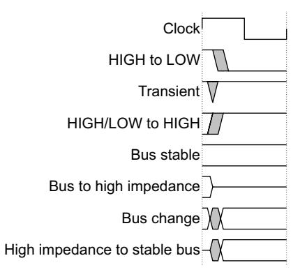

#### **Key to timing diagram conventions**

#### **Signals**

The signal conventions are:

**Signal level** The level of an asserted signal depends on whether the signal is

active-HIGH or active-LOW. Asserted means:

• HIGH for active-HIGH signals

• LOW for active-LOW signals.

**Lower-case n** At the start or end of a signal name denotes an active-LOW signal.

**Prefix H** Denotes *Advanced High-performance Bus* (AHB) signals.

**Prefix P** Denotes Advanced Peripheral Bus (APB) signals.

#### **Numbering**

The numbering convention is:

#### **<size in bits>'<base><number>**

This is a Verilog® method of abbreviating constant numbers. For example:

- 'h7B4 is an unsized hexadecimal value.
- 'o7654 is an unsized octal value.
- 8'd9 is an eight-bit wide decimal value of 9.
- 8'h3F is an eight-bit wide hexadecimal value of 0x3F. This is equivalent to b00111111.
- 8'b1111 is an eight-bit wide binary value of b00001111.

#### **Additional reading**

This section lists publications by ARM and by third parties. You can access ARM documentation at:

http://infocenter.arm.com/help/index.jsp

#### **ARM publications**

This manual contains information that is specific to the UART. See the following documents for other relevant information:

- *AMBA® Specification (Rev 2.0)* (ARM IHI 0011)
- *ARM PrimeCell UART (PL011) Design Manual* (PL011 DDES 0000)
- *ARM PrimeCell UART (PL011) Integration Manual* (PL011 INTM 0000).

#### **Other publications**

This section lists relevant documents published by third parties.

- Infrared Data Association®, *IrDA® Physical Layer Specification v1.1*, obtainable at http://www.irda.org
- Agilent Technologies, *Agilent IrDA Data Link Design Guide* (5988-9321E. March 2003), obtainable at http://www.agilent.com.

# **Feedback**

ARM welcomes feedback on the PrimeCell UART (PL011) and its documentation.

#### **Feedback on this product**

If you have any comments or suggestions about this product, contact your supplier and give:

- the product name
- a concise explanation.

#### **Feedback on this manual**

If you have any comments on this manual, send an email to errata@arm.com. Give:

- the title
- the number
- the relevant page number(s) to which your comments apply
- a concise explanation of your comments.

ARM also welcomes general suggestions for additions and improvements.

# Chapter 1 **Introduction**

This chapter introduces the UART (PL011). It contains the following sections:

- *[About the UART](#page-17-1)* on page 1-2.
- *[Product revisions](#page-20-1)* on page 1-5.

# **1.1 About the UART**

The UART is an *Advanced Microcontroller Bus Architecture* (AMBA) compliant *System-on-Chip* (SoC) peripheral that is developed, tested, and licensed by ARM.

The UART is an AMBA slave module that connects to the *Advanced Peripheral Bus* (APB). The UART includes an *Infrared Data Association* (IrDA) *Serial InfraRed* (SIR) protocol *ENcoder/DECoder* (ENDEC).

The features of the UART are described in the following sections:

- *[Features](#page-17-2)*
- *[Programmable parameters](#page-18-0)* on page 1-3
- *[Variations from the 16C650 UART](#page-19-0)* on page 1-4.

| Note                                                                           |
|--------------------------------------------------------------------------------|
| Because of changes in the programmers model, the UART (PL011) is not backwards |
| compatible with the previous PrimeCell UART (PL010).                           |

#### **1.1.1 Features**

The UART provides:

- Compliance to the *AMBA Specification (Rev 2.0)* onwards for easy integration into SoC implementation.
- Programmable use of UART or IrDA SIR input/output.
- Separate 32×8 transmit and 32×12 receive *First-In, First-Out* (FIFO) memory buffers to reduce CPU interrupts.
- Programmable FIFO disabling for 1-byte depth.
- Programmable baud rate generator. This enables division of the reference clock by (1×16) to (65535×16) and generates an internal ×16 clock. The divisor can be a fractional number enabling you to use any clock with a frequency >3.6864MHz as the reference clock.
- Standard asynchronous communication bits (start, stop and parity). These are added prior to transmission and removed on reception.
- Independent masking of transmit FIFO, receive FIFO, receive timeout, modem status, and error condition interrupts.
- Support for *Direct Memory Access* (DMA).
- False start bit detection.

- Line break generation and detection.
- Support of the modem control functions CTS, DCD, DSR, RTS, DTR, and RI.
- Programmable hardware flow control.
- Fully-programmable serial interface characteristics:
  - data can be 5, 6, 7, or 8 bits
  - even, odd, stick, or no-parity bit generation and detection
  - 1 or 2 stop bit generation
  - baud rate generation, dc up to **UARTCLK**/16
- IrDA SIR ENDEC block providing:
  - programmable use of IrDA SIR or UART input/output
  - support of IrDA SIR ENDEC functions for data rates up to 115200 bps half-duplex
  - support of normal 3/16 and low-power (1.41-2.23µs) bit durations
  - programmable division of the **UARTCLK** reference clock to generate the appropriate bit duration for low-power IrDA mode.
- Identification registers that uniquely identify the UART. These can be used by an operating system to automatically configure itself.

### **1.1.2 Programmable parameters**

The following key parameters are programmable:

- communication baud rate, integer, and fractional parts
- number of data bits
- number of stop bits
- parity mode
- FIFO enable (32 deep) or disable (1 deep)
- FIFO trigger levels selectable between 1/8, 1/4, 1/2, 3/4, and 7/8
- internal nominal 1.8432MHz clock frequency (1.42-2.12MHz) to generate low-power IrDA mode shorter bit duration
- hardware flow control.

Additional test registers and modes are implemented for integration testing.

#### **1.1.3 Variations from the 16C650 UART**

The UART varies from the industry-standard 16C650 UART device as follows:

- receive FIFO trigger levels are 1/8, 1/4, 1/2, 3/4, and 7/8
- transmit FIFO trigger levels are 1/8, 1/4, 1/2, 3/4, and 7/8
- the internal register map address space, and the bit function of each register differ
- the deltas of the modem status signals are not available.

The following 16C650 UART features are not supported:

- 1.5 stop bits (1 or 2 stop bits only are supported)
- independent receive clock.

# **1.2 Product revisions**

This section describes the differences in functionality between product revisions of the UART:

**r1p0-r1p1** Contains the following differences in functionality:

• The Revision field in the *[UARTPeriphID2 Register](#page-69-2)* on page 3-24 bits [7:4] now reads back as 0x1.

**r1p1-r1p3** Contains the following differences in functionality:

• The Revision field in the *[UARTPeriphID2 Register](#page-69-2)* on page 3-24 bits [7:4] now reads back as 0x2.

**r1p3-r1p4** Contains the following differences in functionality:

• The Revision field in the *[UARTPeriphID2 Register](#page-69-2)* on page 3-24 bits [7:4] now reads back as 0x2.

**r1p4-r1p5** Contains the following differences in functionality:

- The receive and transmit FIFOs are increased to a depth of 32.
- The Revision field in the *[UARTPeriphID2 Register](#page-69-2)* on page 3-24 bits [7:4] now reads back as 0x3.

**Note**

 See the engineering errata that accompanies the product deliverables, for information about any functional differences that a later revision provides.

*Introduction* 

# Chapter 2 **Functional Overview**

This chapter describes the major functional blocks of the UART. It contains the following sections:

- *Overview* [on page 2-2](#page-23-1)
- *[Functional description](#page-25-2)* on page 2-4
- *[IrDA SIR ENDEC functional description](#page-29-2)* on page 2-8
- *Operation* [on page 2-10](#page-31-2)
- *[UART modem operation](#page-37-2)* on page 2-16
- *[UART hardware flow control](#page-38-3)* on page 2-17
- *[UART DMA interface](#page-40-1)* on page 2-19
- *Interrupts* [on page 2-22.](#page-43-1)

# **2.1 Overview**

#### The UART performs:

- serial-to-parallel conversion on data received from a peripheral device
- parallel-to-serial conversion on data transmitted to the peripheral device.

The CPU reads and writes data and control/status information through the AMBA APB interface. The transmit and receive paths are buffered with internal FIFO memories enabling up to 32-bytes to be stored independently in both transmit and receive modes.

#### The UART:

- includes a programmable baud rate generator that generates a common transmit and receive internal clock from the UART internal reference clock input, **UARTCLK**
- offers similar functionality to the industry-standard 16C650 UART device
- supports the following maximum baud rates:
  - 921600 bps, in UART mode
    - 460800 bps, in IrDA mode
    - 115200 bps, in low-power IrDA mode.

The UART operation and baud rate values are controlled by the *[Line Control Register,](#page-57-1)  [UARTLCR\\_H](#page-57-1)* on page 3-12 and the baud rate divisor registers (*[Integer Baud Rate](#page-54-2)  [Register, UARTIBRD](#page-54-2)* on page 3-9 and *[Fractional Baud Rate Register, UARTFBRD](#page-55-1)* on [page 3-10](#page-55-1)).

#### The UART can generate:

- individually-maskable interrupts from the receive (including timeout), transmit, modem status and error conditions
- a single combined interrupt so that the output is asserted if any of the individual interrupts are asserted, and unmasked
- DMA request signals for interfacing with a *Direct Memory Access* (DMA) controller.

If a framing, parity, or break error occurs during reception, the appropriate error bit is set, and is stored in the FIFO. If an overrun condition occurs, the overrun register bit is set immediately and FIFO data is prevented from being overwritten.

You can program the FIFOs to be 1-byte deep providing a conventional double-buffered UART interface.

The modem status input signals *Clear To Send* (CTS), *Data Carrier Detect* (DCD), *Data Set Ready* (DSR), and *Ring Indicator* (RI) are supported. The output modem control lines, *Request To Send* (RTS), and *Data Terminal Ready* (DTR) are also supported.

There is a programmable hardware flow control feature that uses the **nUARTCTS** input and the **nUARTRTS** output to automatically control the serial data flow.

#### **2.1.1 IrDA SIR block**

The IrDA *Serial InfraRed* (SIR) block contains an IrDA SIR protocol ENDEC. The SIR protocol ENDEC can be enabled for serial communication through signals **nSIROUT** and **SIRIN** to an infrared transducer instead of using the UART signals **UARTTXD** and **UARTRXD**.

If the SIR protocol ENDEC is enabled, the **UARTTXD** line is held in the passive state (HIGH) and transitions of the modem status, or the **UARTRXD** line have no effect. The SIR protocol ENDEC can receive and transmit, but it is half-duplex only, so it cannot receive while transmitting, or transmit while receiving.

The IrDA SIR physical layer specifies a minimum 10ms delay between transmission and reception.

# 2.2 Functional description

Figure 2-1 shows a block diagram of the UART.

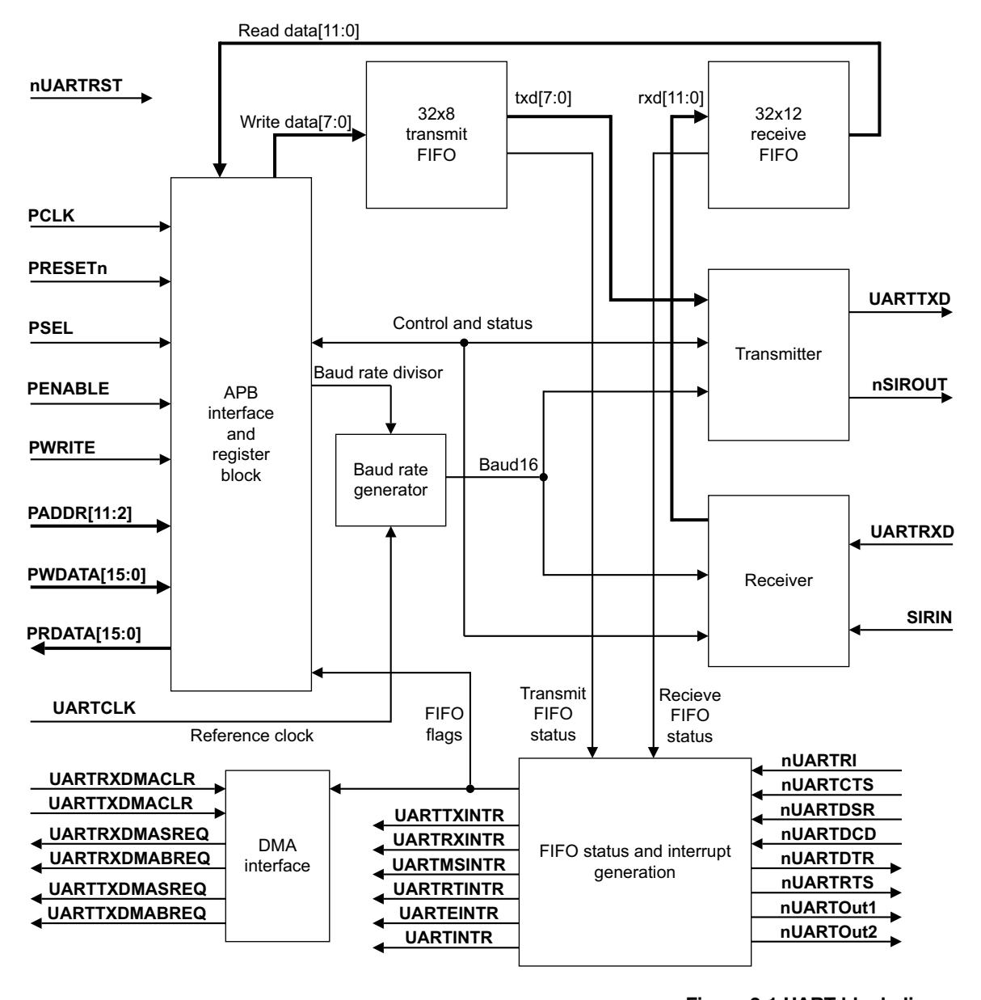

Figure 2-1 UART block diagram

| Note |  |
|------|--|
|------|--|

Test logic is not shown for clarity.

The functions of the UART are described in the following sections:

- *[AMBA APB interface](#page-26-0)*
- *[Register block](#page-26-1)*
- *[Baud rate generator](#page-26-2)*
- *[Transmit FIFO](#page-26-3)*
- *[Receive FIFO](#page-27-0)* on page 2-6
- *[Transmit logic](#page-27-1)* on page 2-6
- *[Receive logic](#page-27-2)* on page 2-6
- *[Interrupt generation logic](#page-27-3)* on page 2-6
- *[DMA interface](#page-27-4)* on page 2-6
- *[Synchronizing registers and logic](#page-28-0)* on page 2-7
- *[Test registers and logic](#page-28-1)* on page 2-7.

#### **2.2.1 AMBA APB interface**

The AMBA APB interface generates read and write decodes for accesses to status/control registers, and the transmit and receive FIFOs.

#### **2.2.2 Register block**

The register block stores data written, or to be read across the AMBA APB interface.

#### **2.2.3 Baud rate generator**

The baud rate generator contains free-running counters that generate the internal ×16 clocks, **Baud16** and **IrLPBaud16** signals. **Baud16** provides timing information for UART transmit and receive control. **Baud16** is a stream of pulses with a width of one **UARTCLK** clock period and a frequency of 16 times the baud rate. **IrLPBaud16** provides timing information to generate the pulse width of the IrDA encoded transmit bit stream when in low-power IrDA mode.

#### **2.2.4 Transmit FIFO**

The transmit FIFO is an 8-bit wide, 32 location deep, FIFO memory buffer. CPU data written across the APB interface is stored in the FIFO until read out by the transmit logic. You can disable the transmit FIFO to act like a one-byte holding register.

#### **2.2.5 Receive FIFO**

The receive FIFO is a 12-bit wide, 32 location deep, FIFO memory buffer. Received data and corresponding error bits, are stored in the receive FIFO by the receive logic until read out by the CPU across the APB interface. The receive FIFO can be disabled to act like a one-byte holding register.

#### **2.2.6 Transmit logic**

The transmit logic performs parallel-to-serial conversion on the data read from the transmit FIFO. Control logic outputs the serial bit stream beginning with a start bit, data bits with the *Least Significant Bit* (LSB) first, followed by the parity bit, and then the stop bits according to the programmed configuration in control registers.

#### **2.2.7 Receive logic**

The receive logic performs serial-to-parallel conversion on the received bit stream after a valid start pulse has been detected. Overrun, parity, frame error checking, and line break detection are also performed, and their status accompanies the data that is written to the receive FIFO.

#### **2.2.8 Interrupt generation logic**

Individual maskable active HIGH interrupts are generated by the UART. A combined interrupt output is also generated as an OR function of the individual interrupt requests.

You can use the single combined interrupt with a system interrupt controller that provides another level of masking on a per-peripheral basis. This enables you to use modular device drivers that always know where to find the interrupt source control register bits.

You can also use the individual interrupt requests with a system interrupt controller that provides masking for the outputs of each peripheral. In this way, a global interrupt service routine can read the entire set of sources from one wide register in the system interrupt controller. This is attractive where the time to read from the peripheral registers is significant compared to the CPU clock speed in a real-time system.

See *Interrupts* [on page 2-22](#page-43-1) for more information.

#### **2.2.9 DMA interface**

The UART provides an interface to connect to the DMA controller as *[UART DMA](#page-40-1)  interface* [on page 2-19](#page-40-1) describes.

#### **2.2.10 Synchronizing registers and logic**

The UART supports both asynchronous and synchronous operation of the clocks, **PCLK** and **UARTCLK**. Synchronization registers and handshaking logic have been implemented, and are active at all times. This has a minimal impact on performance or area. Synchronization of control signals is performed on both directions of data flow, that is from the **PCLK** to the **UARTCLK** domain, and from the **UARTCLK** to the **PCLK** domain.

#### **2.2.11 Test registers and logic**

There are registers and logic for functional block verification, and integration testing using TicTalk or code based vectors.

Test registers must not be read or written to during normal use.

The integration testing verifies that the UART has been wired into a system correctly. It enables each input and output to be both written to and read.

# **2.3 IrDA SIR ENDEC functional description**

The IrDA SIR ENDEC comprises:

- *[IrDA SIR transmit encoder](#page-29-3)*
- *[IrDA SIR receive decoder](#page-30-0)* on page 2-9.

[Figure 2-2](#page-29-4) shows a block diagram of the IrDA SIR ENDEC.

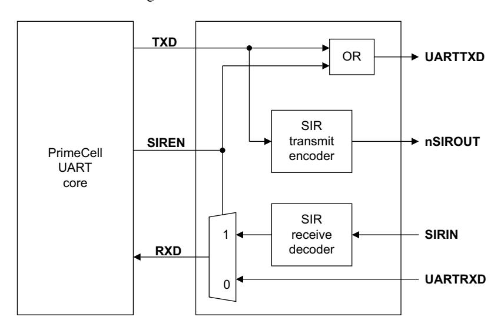

**Figure 2-2 IrDA SIR ENDEC block diagram**

#### **2.3.1 IrDA SIR transmit encoder**

The SIR transmit encoder modulates the *Non Return-to-Zero* (NRZ) transmit bit stream output from the UART. The IrDA SIR physical layer specifies use of a *Return To Zero, Inverted* (RZI) modulation scheme that represents logic 0 as an infrared light pulse. The modulated output pulse stream is transmitted to an external output driver and infrared *Light Emitting Diode* (LED).

In IrDA mode the transmitted pulse width is specified as three times the period of the internal ×16 clock (**Baud16**), that is, 3/16 of a bit period.

In low-power IrDA mode the transmit pulse width is specified as 3/16 of a 115200 bps bit period. This is implemented as three times the period of a nominal 1.8432MHz clock (**IrLPBaud16**) derived from dividing down of **UARTCLK** clock. The frequency of **IrLPBaud16** is set up by writing the appropriate divisor value to the *[IrDA Low-Power](#page-54-3)  [Counter Register, UARTILPR](#page-54-3)* on page 3-9.

The active low encoder output is normally LOW for the marking state (no light pulse). The encoder outputs a high pulse to generate an infrared light pulse representing a logic 0 or spacing state.

In normal and low-power IrDA modes, when the fractional baud rate divider is used, the transmitted SIR pulse stream includes an increased amount of jitter. This jitter is because the **Baud16** pulses cannot be generated at regular intervals when fractional division is used. That is, the **Baud16** cycles have a different number of **UARTCLK** cycles. It can be shown that the worst case jitter in the SIR pulse stream can be up to three **UARTCLK** cycles. This is within the limits of the SIR IrDA Specification where the maximum amount of jitter permitted is 13%, provided the **UARTCLK** is > 3.6864MHz and the maximum baud rate used for IrDA mode is ≤ 115200 bps. With these conditions, the jitter is less than 9%.

#### **2.3.2 IrDA SIR receive decoder**

The SIR receive decoder demodulates the return-to-zero bit stream from the infrared detector and outputs the received NRZ serial bit stream to the UART received data input. The decoder input is normally HIGH (marking state) in the idle state. The transmit encoder output has the opposite polarity to the decoder input.

A start bit is detected when the decoder input is LOW.

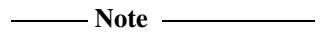

 To prevent the UART from responding to glitches on the received data input then it ignores **SIRIN** pulses that are less than:

- 3/16 of **Baud16**, in IrDA mode
- 3/16 of **IrLPBaud16**, in low-power IrDA mode.

# **2.4 Operation**

The operation of the UART is described in the following sections:

- *[Interface reset](#page-31-3)*
- *[Clock signals](#page-31-4)*
- *[UART operation](#page-32-1)* on page 2-11
- *[IrDA SIR operation](#page-35-0)* on page 2-14
- *[UART character frame](#page-36-2)* on page 2-15
- *[IrDA data modulation](#page-36-3)* on page 2-15.

#### **2.4.1 Interface reset**

The UART and IrDA SIR ENDEC are reset by the global reset signal **PRESETn** and a block-specific reset signal **nUARTRST**. An external reset controller must use **PRESETn** to assert **nUARTRST** asynchronously and negate it synchronously to **UARTCLK**. **PRESETn** must be asserted LOW for a period long enough to reset the slowest block in the on-chip system, and then be taken HIGH again. The UART requires **PRESETn** to be asserted LOW for at least one period of **PCLK**.

The values of the registers after reset are described in Chapter 3 *[Programmers Model](#page-46-1)*.

#### **2.4.2 Clock signals**

The frequency selected for **UARTCLK** must accommodate the required range of baud rates:

- **FUARTCLK** (min) ≥ 16 × baud\_rate(max)
- **FUARTCLK**(max) ≤ 16 × 65535 × baud\_rate(min)

For example, for a range of baud rates from 110 baud to 460800 baud the **UARTCLK** frequency must be between 7.3728MHz to 115.34MHz.

The frequency of **UARTCLK** must also be within the required error limits for all baud rates to be used.

There is also a constraint on the ratio of clock frequencies for **PCLK** to **UARTCLK**. The frequency of **UARTCLK** must be no more than 5/3 times faster than the frequency of **PCLK**:

• **FUARTCLK** ≤ 5/3 × **FPCLK**

For example, in UART mode, to generate 921600 baud when **UARTCLK** is 14.7456MHz then **PCLK** must be greater than or equal to 8.85276MHz. This ensures that the UART has sufficient time to write the received data to the receive FIFO.

#### **2.4.3 UART operation**

Control data is written to the UART Line Control Register, UARTLCR. This register is 30-bits wide internally, but is externally accessed through the APB interface by writes to the following registers:

**UARTLCR\_H** Defines the:

- transmission parameters
- word length
- buffer mode
- number of transmitted stop bits
- parity mode
- break generation.

**UARTIBRD** Defines the integer baud rate divider

**UARTFBRD** Defines the fractional baud rate divider

#### **Fractional baud rate divider**

The baud rate divisor is a 22-bit number consisting of a 16-bit integer and a 6-bit fractional part. This is used by the baud rate generator to determine the bit period. The fractional baud rate divider enables the use of any clock with a frequency >3.6864MHz to act as **UARTCLK**, while it is still possible to generate all the standard baud rates.

The 16-bit integer is written to the *[Integer Baud Rate Register, UARTIBRD](#page-54-2)* on page 3-9. The 6-bit fractional part is written to the *[Fractional Baud Rate Register, UARTFBRD](#page-55-1)* [on page 3-10](#page-55-1). The Baud Rate Divisor has the following relationship to **UARTCLK**:

• Baud Rate Divisor = **UARTCLK**/(16×Baud Rate) = BRDI + BRDF where BRDI is the integer part and BRDF is the fractional part separated by a decimal point as [Figure 2-3](#page-32-2) shows.

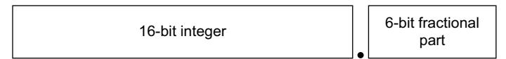

**Figure 2-3 Baud rate divisor**

You can calculate the 6-bit number (m) by taking the fractional part of the required baud rate divisor and multiplying it by 64 (that is, 2n, where n is the width of the UARTFBRD Register) and adding 0.5 to account for rounding errors:

• m = integer(BRDF × 2n + 0.5) See [Example 3-1 on page 3-10](#page-55-2) for an example divisor value calculation. An internal clock enable signal, **Baud16**, is generated, and is a stream of one **UARTCLK** wide pulses with an average frequency of 16 times the required baud rate. This signal is then divided by 16 to give the transmit clock. A low number in the baud rate divisor gives a short bit period, and a high number in the baud rate divisor gives a long bit period.

#### **Data transmission or reception**

Data received or transmitted is stored in two 32-byte FIFOs, though the receive FIFO has an extra four bits per character for status information.

For transmission, data is written into the transmit FIFO. If the UART is enabled, it causes a data frame to start transmitting with the parameters indicated in the *[Line](#page-57-1)  [Control Register, UARTLCR\\_H](#page-57-1)* on page 3-12. Data continues to be transmitted until there is no data left in the transmit FIFO. The **BUSY** signal goes HIGH as soon as data is written to the transmit FIFO (that is, the FIFO is non-empty) and remains asserted HIGH while data is being transmitted. **BUSY** is negated only when the transmit FIFO is empty, and the last character has been transmitted from the shift register, including the stop bits. **BUSY** can be asserted HIGH even though the UART might no longer be enabled.

For each sample of data, three readings are taken and the majority value is kept. In the following paragraphs the middle sampling point is defined, and one sample is taken either side of it.

When the receiver is idle (**UARTRXD** continuously 1, in the marking state) and a LOW is detected on the data input (a start bit has been received), the receive counter, with the clock enabled by **Baud16**, begins running and data is sampled on the eighth cycle of that counter in UART mode, or the fourth cycle of the counter in SIR mode to allow for the shorter logic 0 pulses (half way through a bit period).

The start bit is valid if **UARTRXD** is still LOW on the eighth cycle of **Baud16**, otherwise a false start bit is detected and it is ignored.

If the start bit was valid, successive data bits are sampled on every 16th cycle of **Baud16** (that is, one bit period later) according to the programmed length of the data characters. The parity bit is then checked if parity mode was enabled.

Lastly, a valid stop bit is confirmed if **UARTRXD** is HIGH, otherwise a framing error has occurred. When a full word is received, the data is stored in the receive FIFO, with any error bits associated with that word (see [Table 2-1 on page 2-13\)](#page-34-1).

#### **Error bits**

Three error bits are stored in bits [10:8] of the receive FIFO, and are associated with a particular character. There is an additional error that indicates an overrun error and this is stored in bit 11 of the receive FIFO.

#### **Overrun bit**

The overrun bit is not associated with the character in the receive FIFO. The overrun error is set when the FIFO is full, and the next character is completely received in the shift register. The data in the shift register is overwritten, but it is not written into the FIFO. When an empty location is available in the receive FIFO, and another character is received, the state of the overrun bit is copied into the receive FIFO along with the received character. The overrun state is then cleared. [Table 2-1](#page-34-1) lists the bit functions of the receive FIFO.

**Table 2-1 Receive FIFO bit functions**

| FIFO bit | Function          |
|----------|-------------------|
| 11       | Overrun indicator |
| 10       | Break error       |
| 9        | Parity error      |
| 8        | Framing error     |
| 7:0      | Received data     |

#### **Disabling the FIFOs**

Additionally, you can disable the FIFOs. In this case, the transmit and receive sides of the UART have 1-byte holding registers (the bottom entry of the FIFOs). The overrun bit is set when a word has been received, and the previous one was not yet read. In this implementation, the FIFOs are not physically disabled, but the flags are manipulated to give the illusion of a 1-byte register. When the FIFOs are disabled, a write to the data register bypasses the holding register unless the transmit shift register is already in use.

### **System and diagnostic loopback testing**

You can perform loopback testing for UART data by setting the *Loop Back Enable* (LBE) bit to 1 in the *[Control Register, UARTCR](#page-60-1)* on page 3-15.

Data transmitted on **UARTTXD** is received on the **UARTRXD** input.

#### **2.4.4 IrDA SIR operation**

The IrDA SIR ENDEC provides functionality that converts between an asynchronous UART data stream, and half-duplex serial SIR interface. No analog processing is performed on-chip. The role of the SIR ENDEC is to provide a digital encoded output, and decoded input to the UART. There are two modes of operation:

- In IrDA mode, a zero logic level is transmitted as high pulse of 3/16th duration of the selected baud rate bit period on the **nSIROUT** signal, while logic one levels are transmitted as a static LOW signal. These levels control the driver of an infrared transmitter, sending a pulse of light for each zero. On the reception side, the incoming light pulses energize the photo transistor base of the receiver, pulling its output LOW. This drives the **SIRIN** signal LOW.
- In low-power IrDA mode, the width of the transmitted infrared pulse is set to three times the period of the internally generated **IrLPBaud16** signal (1.63µs, assuming a nominal 1.8432MHz frequency) by setting the SIRLP bit in the *[Control Register, UARTCR](#page-60-1)* on page 3-15.

In normal and low-power IrDA modes:

- during transmission, the UART data bit is used as the base for encoding
- during reception, the decoded bits are transferred to the UART receive logic.

The IrDA SIR physical layer specifies a half-duplex communication link, with a minimum 10ms delay between transmission and reception. This delay must be generated by software because it is not supported by the UART. The delay is required because the Infrared receiver electronics might become biased, or even saturated from the optical power coupled from the adjacent transmitter LED. This delay is known as latency, or receiver setup time.

The **IrLPBaud16** signal is generated by dividing down the **UARTCLK** signal according to the low-power divisor value written to the *[IrDA Low-Power Counter](#page-54-3)  [Register, UARTILPR](#page-54-3)* on page 3-9.

The low-power divisor value is calculated as:

• Low-power divisor = (**FUARTCLK** / **FIrLPBaud16**) where **FIrLPBaud16** is nominally 1.8432MHz.

The divisor must be chosen so that 1.42MHz < **FIrLPBaud16** < 2.12MHz.

#### **System and diagnostic loopback testing**

It is possible to perform loopback testing for SIR data by:

• setting the LBE bit to 1 in the *[Control Register, UARTCR](#page-60-1)* on page 3-15.

• setting the SIRTEST bit to 1 in the *[Test Control Register, UARTTCR](#page-78-2)* on page 4-5.

Data transmitted on **nSIROUT** is received on the **SIRIN** input.

**Note**

This is the only occasion that a test register is accessed during normal operation.

### **2.4.5 UART character frame**

[Figure 2-4](#page-36-4) shows the UART character frame.

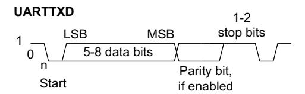

**Figure 2-4 UART character frame**

#### **2.4.6 IrDA data modulation**

[Figure 2-5](#page-36-5) shows the effect of IrDA 3/16 data modulation.

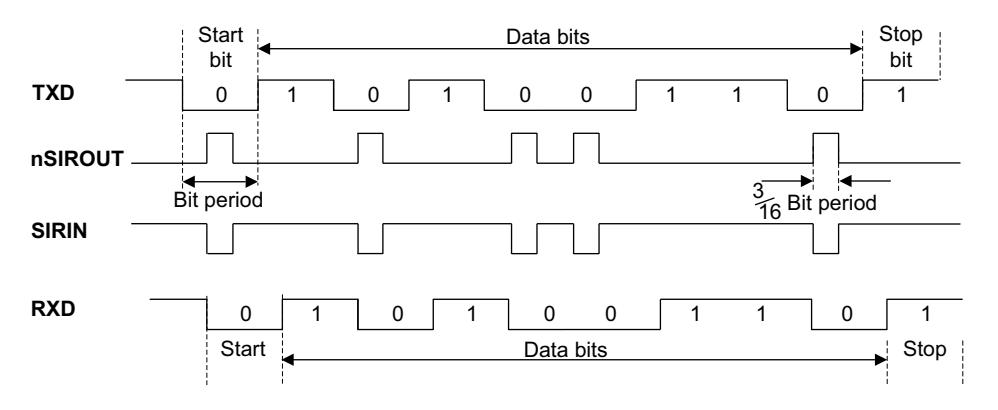

**Figure 2-5 IrDA data modulation (3/16)**

# **2.5 UART modem operation**

You can use the UART to support both the *Data Terminal Equipment* (DTE) and *Data Communication Equipment* (DCE) modes of operation. [Figure 2-1 on page 2-4](#page-25-3) shows the modem signals in the DTE mode. For DCE mode, [Table 2-2](#page-37-3) lists the function of the signals.

**Table 2-2 Function of the modem input/output signals in DTE and DCE modes**

|           | Function            |                     |  |
|-----------|---------------------|---------------------|--|
| Signal    | DTE                 | DCE                 |  |
| nUARTCTS  | Clear to send       | Request to send     |  |
| nUARTDSR  | Data set ready      | Data terminal ready |  |
| nUARTDCD  | Data carrier detect | -                   |  |
| nUARTRI   | Ring indicator      | -                   |  |
| nUARTRTS  | Request to send     | Clear to send       |  |
| nUARTDTR  | Data terminal ready | Data set ready      |  |
| nUARTOUT1 | -                   | Data carrier detect |  |
| nUARTOUT2 | -                   | Ring indicator      |  |

# **2.6 UART hardware flow control**

The hardware flow control feature is fully selectable, and enables you to control the serial data flow by using the **nUARTRTS** output and **nUARTCTS** input signals. [Figure 2-6](#page-38-4) shows how two devices can communicate with each other using hardware flow control.

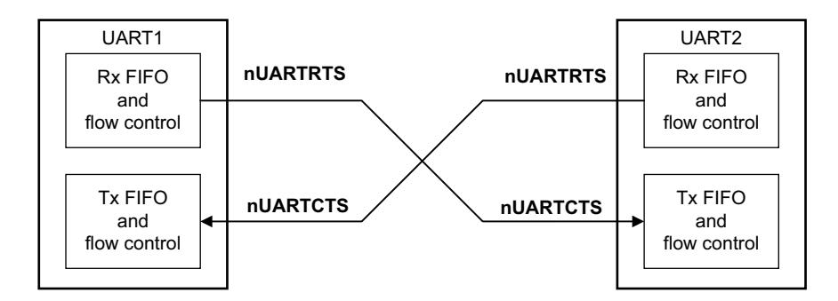

**Figure 2-6 Hardware flow control between two similar devices**

When the RTS flow control is enabled, **nUARTRTS** is asserted until the receive FIFO is filled up to the programmed watermark level. When the CTS flow control is enabled, the transmitter can only transmit data when **nUARTCTS** is asserted.

The hardware flow control is selectable using the RTSEn and CTSEn bits in the *[Control](#page-60-1)  [Register, UARTCR](#page-60-1)* on page 3-15. [Table 2-3](#page-38-5) lists how you must set the bits to enable RTS and CTS flow control both simultaneously, and independently.

**Table 2-3 Control bits to enable and disable hardware flow control**

|       | UARTCR Register bits |                                        |
|-------|----------------------|----------------------------------------|
| CTSEn | RTSEn                | Description                            |
| 1     | 1                    | Both RTS and CTS flow control enabled  |
| 1     | 0                    | Only CTS flow control enabled          |
| 0     | 1                    | Only RTS flow control enabled          |
| 0     | 0                    | Both RTS and CTS flow control disabled |

**Note**

 When RTS flow control is enabled, the software cannot use the RTSEn bit in the *[Control Register, UARTCR](#page-60-1)* on page 3-15 to control the status of **nUARTRTS**.

#### **2.6.1 RTS flow control**

The RTS flow control logic is linked to the programmable receive FIFO watermark levels. When RTS flow control is enabled, the **nUARTRTS** is asserted until the receive FIFO is filled up to the watermark level. When the receive FIFO watermark level is reached, the **nUARTRTS** signal is deasserted, indicating that there is no more room to receive any more data. The transmission of data is expected to cease after the current character has been transmitted.

The **nUARTRTS** signal is reasserted when data has been read out of the receive FIFO so that it is filled to less than the watermark level. If RTS flow control is disabled and the UART is still enabled, then data is received until the receive FIFO is full, or no more data is transmitted to it.

#### **2.6.2 CTS flow control**

If CTS flow control is enabled, then the transmitter checks the **nUARTCTS** signal before transmitting the next byte. If the **nUARTCTS** signal is asserted, it transmits the byte otherwise transmission does not occur.

The data continues to be transmitted while **nUARTCTS** is asserted, and the transmit FIFO is not empty. If the transmit FIFO is empty and the **nUARTCTS** signal is asserted no data is transmitted.

If the **nUARTCTS** signal is deasserted and CTS flow control is enabled, then the current character transmission is completed before stopping. If CTS flow control is disabled and the UART is enabled, then the data continues to be transmitted until the transmit FIFO is empty.

# **2.7 UART DMA interface**

The UART provides an interface to connect to a DMA controller. The DMA operation of the UART is controlled using the *[DMA Control Register, UARTDMACR](#page-67-1)* on [page 3-22.](#page-67-1) The DMA interface includes the following signals:

For receive:

#### **UARTRXDMASREQ**

Single character DMA transfer request, asserted by the UART. For receive, one character consists of up to 12 bits. This signal is asserted when the receive FIFO contains at least one character.

#### **UARTRXDMABREQ**

Burst DMA transfer request, asserted by the UART. This signal is asserted when the receive FIFO contains more characters than the programmed watermark level. You can program the watermark level for each FIFO using the *[Interrupt FIFO Level Select Register, UARTIFLS](#page-62-1)* on [page 3-17](#page-62-1).

#### **UARTRXDMACLR**

DMA request clear, asserted by a DMA controller to clear the receive request signals. If DMA burst transfer is requested, the clear signal is asserted during the transfer of the last data in the burst.

For transmit:

#### **UARTTXDMASREQ**

Single character DMA transfer request, asserted by the UART. For transmit one character consists of up to eight bits. This signal is asserted when there is at least one empty location in the transmit FIFO.

#### **UARTTXDMABREQ**

Burst DMA transfer request, asserted by the UART. This signal is asserted when the transmit FIFO contains less characters than the watermark level. You can program the watermark level for each FIFO using the *[Interrupt FIFO Level Select Register, UARTIFLS](#page-62-1)* on page 3-17.

#### **UARTTXDMACLR**

DMA request clear, asserted by a DMA controller to clear the transmit request signals. If DMA burst transfer is requested, the clear signal is asserted during the transfer of the last data in the burst.

The burst transfer and single transfer request signals are not mutually exclusive, they can both be asserted at the same time. For example, when there is more data than the watermark level in the receive FIFO, the burst transfer request and the single transfer request are asserted. When the amount of data left in the receive FIFO is less than the watermark level, the single request only is asserted. This is useful for situations where the number of characters left to be received in the stream is less than a burst.

For example, if 19 characters have to be received and the watermark level is programmed to be four. The DMA controller then transfers four bursts of four characters and three single transfers to complete the stream.

| Note                                                                         |  |  |
|------------------------------------------------------------------------------|--|--|
| For the remaining three characters the UART cannot assert the burst request. |  |  |

Each request signal remains asserted until the relevant **DMACLR** signal is asserted. After the request clear signal is deasserted, a request signal can become active again, depending on the conditions described previously. All request signals are deasserted if the UART is disabled or the relevant DMA enable bit, TXDMAE or RXDMAE, in the *[DMA Control Register, UARTDMACR](#page-67-1)* on page 3-22 is cleared.

If you disable the FIFOs in the UART then it operates in character mode and only the DMA single transfer mode can operate, because only one character can be transferred to, or from the FIFOs at any time. **UARTRXDMASREQ** and **UARTTXDMASREQ** are the only request signals that can be asserted. See the *[Line Control Register,](#page-57-1)  [UARTLCR\\_H](#page-57-1)* on page 3-12 for information about disabling the FIFOs.

When the UART is in the FIFO enabled mode, data transfers can be made by either single or burst transfers depending on the programmed watermark level and the amount of data in the FIFO. [Table 2-4](#page-42-3) lists the trigger points for **UARTRXDMABREQ** and **UARTTXDMABREQ** depending on the watermark level, for the transmit and receive FIFOs.

**Table 2-4 DMA trigger points for the transmit and receive FIFOs**

|                 | Burst length                            |                                         |  |  |  |  |
|-----------------|-----------------------------------------|-----------------------------------------|--|--|--|--|
| Watermark level | Transmit (number of empty locations) | Receive (number of filled locations) |  |  |  |  |
| 1/8             | 28                                      | 4                                       |  |  |  |  |
| 1/4             | 24                                      | 8                                       |  |  |  |  |
| 1/2             | 16                                      | 16                                      |  |  |  |  |
| 3/4             | 8                                       | 24                                      |  |  |  |  |
| 7/8             | 4                                       | 28                                      |  |  |  |  |

In addition, the DMAONERR bit in the *[DMA Control Register, UARTDMACR](#page-67-1)* on [page 3-22](#page-67-1) supports the use of the receive error interrupt, **UARTEINTR**. It enables the DMA receive request outputs, **UARTRXDMASREQ** or **UARTRXDMABREQ**, to be masked out when the UART error interrupt, **UARTEINTR**, is asserted. The DMA receive request outputs remain inactive until the **UARTEINTR** is cleared. The DMA transmit request outputs are unaffected.

[Figure 2-7](#page-42-2) shows the timing diagram for both a single transfer request and a burst transfer request with the appropriate **DMACLR** signal. The signals are all synchronous to **PCLK**. For the sake of clarity it is assumed that there is no synchronization of the request signals in the DMA controller.

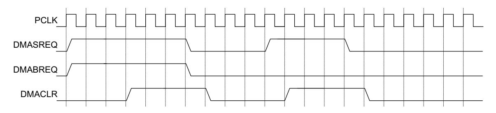

**Figure 2-7 DMA transfer waveforms**

# **2.8 Interrupts**

There are eleven maskable interrupts generated in the UART. These are combined to produce five individual interrupt outputs and one that is the OR of the individual outputs:

- **UARTRXINTR**
- **UARTTXINTR**
- **UARTRTINTR**
- **UARTMSINTR**, that can be caused by:
  - **UARTRIINTR**, because of a change in the **nUARTRI** modem status
  - **UARTCTSINTR**, because of a change in the **nUARTCTS** modem status
  - **UARTDCDINTR**, because of a change in the **nUARTDCD** modem status
  - **UARTDSRINTR**, because of a change in the **nUARTDSR** modem status.
- **UARTEINTR**, that can be caused by:
  - **UARTOEINTR**, because of an overrun error
  - **UARTBEINTR**, because of a break in the reception
  - **UARTPEINTR**, because of a parity error in the received character
  - **UARTFEINTR**, because of a framing error in the received character.
- **UARTINTR**, this is an OR function of the five individual masked outputs.

You can enable or disable the individual interrupts by changing the mask bits in the *[Interrupt Mask Set/Clear Register, UARTIMSC](#page-62-2)* on page 3-17. Setting the appropriate mask bit HIGH enables the interrupt.

Provision of individual outputs and the combined interrupt output, enables you to use either a global interrupt service routine, or modular device drivers to handle interrupts.

The transmit and receive dataflow interrupts **UARTRXINTR** and **UARTTXINTR** have been separated from the status interrupts. This enables you to use **UARTRXINTR** and **UARTTXINTR** so that data can be read or written in response to the FIFO trigger levels.

The error interrupt, **UARTEINTR**, can be triggered when there is an error in the reception of data. A number of error conditions are possible.

The modem status interrupt, **UARTMSINTR**, is a combined interrupt of all the individual modem status signals.

The status of the individual interrupt sources can be read either from the *[Raw Interrupt](#page-64-1)  [Status Register, UARTRIS](#page-64-1)* on page 3-19 or from the *[Masked Interrupt Status Register,](#page-65-1)  UARTMIS* [on page 3-20.](#page-65-1)

#### **2.8.1 UARTMSINTR**

The modem status interrupt is asserted if any of the modem status signals (**nUARTCTS**, **nUARTDCD**, **nUARTDSR**, and **nUARTRI**) change. It is cleared by writing a 1 to the corresponding bit(s) in the *[Interrupt Clear Register, UARTICR](#page-66-1)* on [page 3-21,](#page-66-1) depending on the modem status signals that generated the interrupt.

#### **2.8.2 UARTRXINTR**

The receive interrupt changes state when one of the following events occurs:

- If the FIFOs are enabled and the receive FIFO reaches the programmed trigger level. When this happens, the receive interrupt is asserted HIGH. The receive interrupt is cleared by reading data from the receive FIFO until it becomes less than the trigger level, or by clearing the interrupt.
- If the FIFOs are disabled (have a depth of one location) and data is received thereby filling the location, the receive interrupt is asserted HIGH. The receive interrupt is cleared by performing a single read of the receive FIFO, or by clearing the interrupt.

#### **2.8.3 UARTTXINTR**

The transmit interrupt changes state when one of the following events occurs:

- If the FIFOs are enabled and the transmit FIFO is equal to or lower than the programmed trigger level then the transmit interrupt is asserted HIGH. The transmit interrupt is cleared by writing data to the transmit FIFO until it becomes greater than the trigger level, or by clearing the interrupt.
- If the FIFOs are disabled (have a depth of one location) and there is no data present in the transmitters single location, the transmit interrupt is asserted HIGH. It is cleared by performing a single write to the transmit FIFO, or by clearing the interrupt.

To update the transmit FIFO you must:

• Write data to the transmit FIFO, either prior to enabling the UART and the interrupts, or after enabling the UART and interrupts.

| Note                                                                                         |
|----------------------------------------------------------------------------------------------|
| The transmit interrupt is based on a transition through a level, rather than on the level    |
| itself. When the interrupt and the UART is enabled before any data is written to the         |
| transmit FIFO the interrupt is not set. The interrupt is only set, after written data leaves |
| the single location of the transmit FIFO and it becomes empty.                               |

#### **2.8.4 UARTRTINTR**

The receive timeout interrupt is asserted when the receive FIFO is not empty, and no more data is received during a 32-bit period. The receive timeout interrupt is cleared either when the FIFO becomes empty through reading all the data (or by reading the holding register), or when a 1 is written to the corresponding bit of the *[Interrupt Clear](#page-66-1)  [Register, UARTICR](#page-66-1)* on page 3-21.

#### **2.8.5 UARTEINTR**

The error interrupt is asserted when an error occurs in the reception of data by the UART. The interrupt can be caused by a number of different error conditions:

- framing
- parity
- break
- overrun.

You can determine the cause of the interrupt by reading the *[Raw Interrupt Status](#page-64-1)  [Register, UARTRIS](#page-64-1)* on page 3-19 or the *[Masked Interrupt Status Register, UARTMIS](#page-65-1)* on [page 3-20](#page-65-1). It can be cleared by writing to the relevant bits of the *[Interrupt Clear](#page-66-1)  [Register, UARTICR](#page-66-1)* on page 3-21 (bits 7 to 10 are the error clear bits).

#### **2.8.6 UARTINTR**

The interrupts are also combined into a single output, that is an OR function of the individual masked sources. You can connect this output to a system interrupt controller to provide another level of masking on a individual peripheral basis.

The combined UART interrupt is asserted if any of the individual interrupts are asserted and enabled.

# Chapter 3 **Programmers Model**

This chapter describes the memory map and registers of the UART. It contains the following sections:

- *[About the programmers model](#page-47-1)* on page 3-2
- *[Summary of registers](#page-48-2)* on page 3-3
- *[Register descriptions](#page-50-1)* on page 3-5.

# **3.1 About the programmers model**

The following information applies to the UART registers:

- The base address of the UART is not fixed, and can be different for any particular system implementation. The offset of each register from the base address is fixed.
- Do not attempt to access reserved or unused address locations. Attempting to access these location can result in Unpredictable behavior of the UART.
- Unless otherwise stated in the accompanying text:
  - do not modify undefined register bits
  - ignore undefined register bits on reads
  - all register bits are reset to a logic 0 by a system or power-on reset.
- The Type column in [Table 3-1 on page](#page-48-3) 3-3 describes the access types as follows:
  - **RW** Read and write.
  - **RO** Read only.
  - **WO** Write only.

# **3.2 Summary of registers**

[Table 3-1](#page-48-3) lists the UART registers.

**Table 3-1 UART register summary**

| Offset      | Name                | Type | Reset    | Width | Description                                                                  |
|-------------|---------------------|------|----------|-------|------------------------------------------------------------------------------|
| 0x000       | UARTDR              | RW   | 0x       | 12/8  | Data Register, UARTDR on page 3-5                                            |
| 0x004       | UARTRSR/ UARTECR | RW   | 0x0      | 4/0   | Receive Status Register/Error Clear Register, UARTRSR/UARTECR on page 3-6 |
| 0x008-0x014 | -                   | -    | -        | -     | Reserved                                                                     |
| 0x018       | UARTFR              | RO   | 0b-10010 | 9     | Flag Register, UARTFR on page 3-8                                            |
| 0x01C       | -                   | -    | -        | -     | Reserved                                                                     |
| 0x020       | UARTILPR            | RW   | 0x00     | 8     | IrDA Low-Power Counter Register, UARTILPR on page 3-9                     |
| 0x024       | UARTIBRD            | RW   | 0x0000   | 16    | Integer Baud Rate Register, UARTIBRD on page 3-9                          |
| 0x028       | UARTFBRD            | RW   | 0x00     | 6     | Fractional Baud Rate Register, UARTFBRD on page 3-10                      |
| 0x02C       | UARTLCR_H           | RW   | 0x00     | 8     | Line Control Register, UARTLCR_H on page 3-12                                |
| 0x030       | UARTCR              | RW   | 0x0300   | 16    | Control Register, UARTCR on page 3-15                                        |
| 0x034       | UARTIFLS            | RW   | 0x12     | 6     | Interrupt FIFO Level Select Register, UARTIFLS on page 3-17               |
| 0x038       | UARTIMSC            | RW   | 0x000    | 11    | Interrupt Mask Set/Clear Register, UARTIMSC on page 3-17                  |
| 0x03C       | UARTRIS             | RO   | 0x00-    | 11    | Raw Interrupt Status Register, UARTRIS on page 3-19                       |
| 0x040       | UARTMIS             | RO   | 0x00-    | 11    | Masked Interrupt Status Register, UARTMIS on page 3-20                    |
| 0x044       | UARTICR             | WO   | -        | 11    | Interrupt Clear Register, UARTICR on page 3-21                               |
| 0x048       | UARTDMACR           | RW   | 0x00     | 3     | DMA Control Register, UARTDMACR on page 3-22                              |
| 0x04C-0x07C | -                   | -    | -        | -     | Reserved                                                                     |

**Table 3-1 UART register summary (continued)**

| Offset      | Name          | Type | Reset | Width | Description                         |
|-------------|---------------|------|-------|-------|-------------------------------------|
| 0x080-0x08C | -             | -    | -     | -     | Reserved for test purposes          |
| 0x090-0xFCC | -             | -    | -     | -     | Reserved                            |
| 0xFD0-0xFDC | -             | -    | -     | -     | Reserved for future ID expansion    |
| 0xFE0       | UARTPeriphID0 | RO   | 0x11  | 8     | UARTPeriphID0 Register on page 3-23 |
| 0xFE4       | UARTPeriphID1 | RO   | 0x10  | 8     | UARTPeriphID1 Register on page 3-24 |
| 0xFE8       | UARTPeriphID2 | RO   | 0x_4a | 8     | UARTPeriphID2 Register on page 3-24 |
| 0xFEC       | UARTPeriphID3 | RO   | 0x00  | 8     | UARTPeriphID3 Register on page 3-25 |
| 0xFF0       | UARTPCellID0  | RO   | 0x0D  | 8     | UARTPCellID0 Register on page 3-26  |
| 0xFF4       | UARTPCellID1  | RO   | 0xF0  | 8     | UARTPCellID1 Register on page 3-26  |
| 0xFF8       | UARTPCellID2  | RO   | 0x05  | 8     | UARTPCellID2 Register on page 3-26  |
| 0xFFC       | UARTPCellID3  | RO   | 0xB1  | 8     | UARTPCellID3 Register on page 3-27  |

a. The value depends on the revision of the UART. See [Table 3-21 on page 3-24.](#page-69-5)

# **3.3 Register descriptions**

This section describes the UART registers. The test registers are described in [Chapter 4](#page-74-1)  *[Programmers Model for Test](#page-74-1)*. [Table 3-1 on page 3-3](#page-48-3) lists the cross references to individual registers.

#### **3.3.1 Data Register, UARTDR**

The UARTDR Register is the data register.

For words to be transmitted:

- if the FIFOs are enabled, data written to this location is pushed onto the transmit FIFO
- if the FIFOs are not enabled, data is stored in the transmitter holding register (the bottom word of the transmit FIFO).

The write operation initiates transmission from the UART. The data is prefixed with a start bit, appended with the appropriate parity bit (if parity is enabled), and a stop bit. The resultant word is then transmitted.

For received words:

- if the FIFOs are enabled, the data byte and the 4-bit status (break, frame, parity, and overrun) is pushed onto the 12-bit wide receive FIFO
- if the FIFOs are not enabled, the data byte and status are stored in the receiving holding register (the bottom word of the receive FIFO).

The received data byte is read by performing reads from the UARTDR Register along with the corresponding status information. The status information can also be read by a read of the UARTRSR/UARTECR Register as shown in [Table 3-3 on page 3-7.](#page-52-1)

**Table 3-2 UARTDR Register**

| Bits  | Name | Function                                                                                                                                                                                                                                                                                          |
|-------|------|---------------------------------------------------------------------------------------------------------------------------------------------------------------------------------------------------------------------------------------------------------------------------------------------------|
| 15:12 | -    | Reserved.                                                                                                                                                                                                                                                                                         |
| 11    | OE   | Overrun error. This bit is set to 1 if data is received and the receive FIFO is already full. This is cleared to 0 once there is an empty space in the FIFO and a new character can be written to it.                                                                                          |
| 10    | BE   | Break error. This bit is set to 1 if a break condition was detected, indicating that the received data input was held LOW for longer than a full-word transmission time (defined as start, data, parity and stop bits).                                                                     |
|       |      | In FIFO mode, this error is associated with the character at the top of the FIFO. When a break occurs, only one 0 character is loaded into the FIFO. The next character is only enabled after the receive data input goes to a 1 (marking state), and the next valid start bit is received. |
| 9     | PE   | Parity error. When set to 1, it indicates that the parity of the received data character does not match the parity that the EPS and SPS bits in the Line Control Register, UARTLCR_H on page 3-12 select. In FIFO mode, this error is associated with the character at the top of the FIFO. |
| 8     | FE   | Framing error. When set to 1, it indicates that the received character did not have a valid stop bit (a valid stop bit is 1).                                                                                                                                                                  |
|       |      | In FIFO mode, this error is associated with the character at the top of the FIFO.                                                                                                                                                                                                                 |
| 7:0   | DATA | Receive (read) data character. Transmit (write) data character.                                                                                                                                                                                                                                |

**Note**

 You must disable the UART before any of the control registers are reprogrammed. When the UART is disabled in the middle of transmission or reception, it completes the current character before stopping.

### **3.3.2 Receive Status Register/Error Clear Register, UARTRSR/UARTECR**

The UARTRSR/UARTECR Register is the receive status register/error clear register.

Receive status can also be read from the UARTRSR Register. If the status is read from this register, then the status information for break, framing and parity corresponds to the data character read from the *[Data Register, UARTDR](#page-50-2)* on page 3-5 prior to reading the UARTRSR Register. The status information for overrun is set immediately when an overrun condition occurs.

A write to the UARTECR Register clears the framing, parity, break, and overrun errors. All the bits are cleared to 0 on reset. [Table 3-3](#page-52-1) lists the bit assignment of the UARTRSR/UARTECR Register.

#### **Table 3-3 UARTRSR/UARTECR Register**

| Bits | Name | Function                                                                                                                                                                                                                                                                                                                                                                                                                                                                                                                                                                              |
|------|------|---------------------------------------------------------------------------------------------------------------------------------------------------------------------------------------------------------------------------------------------------------------------------------------------------------------------------------------------------------------------------------------------------------------------------------------------------------------------------------------------------------------------------------------------------------------------------------------|
| 7:0  | -    | A write to this register clears the framing, parity, break, and overrun errors. The data value is not important.                                                                                                                                                                                                                                                                                                                                                                                                                                                                   |
| 7:4  | -    | Reserved, unpredictable when read.                                                                                                                                                                                                                                                                                                                                                                                                                                                                                                                                                    |
| 3    | OE   | Overrun error. This bit is set to 1 if data is received and the FIFO is already full. This bit is cleared to 0 by a write to UARTECR. The FIFO contents remain valid because no more data is written when the FIFO is full, only the contents of the shift register are overwritten. The CPU must now read the data, to empty the FIFO.                                                                                                                                                                                                                                      |
| 2    | BE   | Break error. This bit is set to 1 if a break condition was detected, indicating that the received data input was held LOW for longer than a full-word transmission time (defined as start, data, parity, and stop bits). This bit is cleared to 0 after a write to UARTECR. In FIFO mode, this error is associated with the character at the top of the FIFO. When a break occurs, only one 0 character is loaded into the FIFO. The next character is only enabled after the receive data input goes to a 1 (marking state) and the next valid start bit is received. |
| 1    | PE   | Parity error. When set to 1, it indicates that the parity of the received data character does not match the parity that the EPS and SPS bits in the Line Control Register, UARTLCR_H on page 3-12 select. This bit is cleared to 0 by a write to UARTECR. In FIFO mode, this error is associated with the character at the top of the FIFO.                                                                                                                                                                                                                                  |
| 0    | FE   | Framing error. When set to 1, it indicates that the received character did not have a valid stop bit (a valid stop bit is 1). This bit is cleared to 0 by a write to UARTECR. In FIFO mode, this error is associated with the character at the top of the FIFO.                                                                                                                                                                                                                                                                                                              |

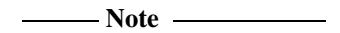

 The received data character must be read first from the *[Data Register, UARTDR](#page-50-2)* on [page 3-5](#page-50-2) before reading the error status associated with that data character from the UARTRSR Register. This read sequence cannot be reversed, because the UARTRSR Register is updated only when a read occurs from the UARTDR Register. However, the status information can also be obtained by reading the UARTDR Register.

#### **3.3.3 Flag Register, UARTFR**

The UARTFR Register is the flag register. After reset TXFF, RXFF, and BUSY are 0, and TXFE and RXFE are 1. [Table 3-4](#page-53-2) lists the register bit assignments.

**Table 3-4 UARTFR Register**

| Bits | Name | Function                                                                                                                                                                                                                                                                                                                                                                                          |
|------|------|---------------------------------------------------------------------------------------------------------------------------------------------------------------------------------------------------------------------------------------------------------------------------------------------------------------------------------------------------------------------------------------------------|
| 15:9 | -    | Reserved, do not modify, read as zero.                                                                                                                                                                                                                                                                                                                                                            |
| 8    | RI   | Ring indicator. This bit is the complement of the UART ring indicator, nUARTRI, modem status input. That is, the bit is 1 when nUARTRI is LOW.                                                                                                                                                                                                                                                 |
| 7    | TXFE | Transmit FIFO empty. The meaning of this bit depends on the state of the FEN bit in the Line Control Register, UARTLCR_H on page 3-12. If the FIFO is disabled, this bit is set when the transmit holding register is empty. If the FIFO is enabled, the TXFE bit is set when the transmit FIFO is empty. This bit does not indicate if there is data in the transmit shift register. |
| 6    | RXFF | Receive FIFO full. The meaning of this bit depends on the state of the FEN bit in the UARTLCR_H Register. If the FIFO is disabled, this bit is set when the receive holding register is full. If the FIFO is enabled, the RXFF bit is set when the receive FIFO is full.                                                                                                                 |
| 5    | TXFF | Transmit FIFO full. The meaning of this bit depends on the state of the FEN bit in the UARTLCR_H Register. If the FIFO is disabled, this bit is set when the transmit holding register is full. If the FIFO is enabled, the TXFF bit is set when the transmit FIFO is full.                                                                                                              |
| 4    | RXFE | Receive FIFO empty. The meaning of this bit depends on the state of the FEN bit in the UARTLCR_H Register. If the FIFO is disabled, this bit is set when the receive holding register is empty. If the FIFO is enabled, the RXFE bit is set when the receive FIFO is empty.                                                                                                              |
| 3    | BUSY | UART busy. If this bit is set to 1, the UART is busy transmitting data. This bit remains set until the complete byte, including all the stop bits, has been sent from the shift register. This bit is set as soon as the transmit FIFO becomes non-empty, regardless of whether the UART is enabled or not.                                                                              |
| 2    | DCD  | Data carrier detect. This bit is the complement of the UART data carrier detect, nUARTDCD, modem status input. That is, the bit is 1 when nUARTDCD is LOW.                                                                                                                                                                                                                                     |
| 1    | DSR  | Data set ready. This bit is the complement of the UART data set ready, nUARTDSR, modem status input. That is, the bit is 1 when nUARTDSR is LOW.                                                                                                                                                                                                                                               |
| 0    | CTS  | Clear to send. This bit is the complement of the UART clear to send, nUARTCTS, modem status input. That is, the bit is 1 when nUARTCTS is LOW.                                                                                                                                                                                                                                                 |

#### **3.3.4 IrDA Low-Power Counter Register, UARTILPR**

The UARTILPR Register is the IrDA low-power counter register. This is an 8-bit read/write register that stores the low-power counter divisor value used to generate the **IrLPBaud16** signal by dividing down of **UARTCLK**. [Table 3-5](#page-54-6) lists the register bit assignments.

**Table 3-5 UARTILPR Register**

| Bits | Name    | Function                                                                                                    |
|------|---------|-------------------------------------------------------------------------------------------------------------|
| 7:0  | ILPDVSR | 8-bit low-power divisor value. These bits are cleared to 0 at reset.                                     |
|      |         | Note Zero is an illegal value. Programming a zero value results in no IrLPBaud16 pulses being generated. |

The **IrLPBaud16** signal is generated by dividing down the **UARTCLK** signal according to the low-power divisor value written to the UARTILPR Register.

The low-power divisor value is calculated as follows:

• low-power divisor (ILPDVSR) = (**FUARTCLK** / **FIrLPBaud16**) where **FIrLPBaud16** is nominally 1.8432MHz.

You must select the divisor so that 1.42MHz < **FIrLPBaud16** < 2.12MHz, results in a low-power pulse duration of 1.41-2.11µs (three times the period of **IrLPBaud16**).

**Note**

 In low-power IrDA mode the UART rejects random noise on the received serial data input by ignoring **SIRIN** pulses that are less than 3 periods of **IrLPBaud16**.

# **3.3.5 Integer Baud Rate Register, UARTIBRD**

The UARTIBRD Register is the integer part of the baud rate divisor value. [Table 3-6](#page-54-7) lists the register bit assignments.

**Table 3-6 UARTIBRD Register**

| Bits | Name        | Function                                                                |
|------|-------------|-------------------------------------------------------------------------|
| 15:0 | BAUD DIVINT | The integer baud rate divisor. These bits are cleared to 0 on reset. |

#### **3.3.6 Fractional Baud Rate Register, UARTFBRD**

The UARTFBRD Register is the fractional part of the baud rate divisor value. [Table 3-7](#page-55-4)  lists the register bit assignments.

**Table 3-7 UARTFBRD Register**

| Bits | Name         | Function                                                                   |
|------|--------------|----------------------------------------------------------------------------|
| 5:0  | BAUD DIVFRAC | The fractional baud rate divisor. These bits are cleared to 0 on reset. |

The baud rate divisor is calculated as follows:

• Baud rate divisor BAUDDIV = (**FUARTCLK**/(16×Baud rate)) where **FUARTCLK** is the UART reference clock frequency.

The BAUDDIV is comprised of the integer value (BAUD DIVINT) and the fractional value (BAUD DIVFRAC).

#### **Note**

- The contents of the UARTIBRD and UARTFBRD registers are not updated until transmission or reception of the current character is complete.
- The minimum divide ratio possible is 1 and the maximum is 65535(216 1). That is, UARTIBRD = 0 is invalid and UARTFBRD is ignored when this is the case.
- Similarly, when UARTIBRD = 65535 (that is 0xFFFF), then UARTFBRD must not be greater than zero. If this is exceeded it results in an aborted transmission or reception.

[Example 3-1](#page-55-5) is an example of how to calculate the divisor value.

**Example 3-1 Calculating the divisor value**

If the required baud rate is 230400 and **UARTCLK** = 4MHz then:

Baud Rate Divisor = (4×106)/(16×230400) = 1.085

This means BRDI = 1 and BRDF = 0.085.

Therefore, fractional part, m = integer((0.085×64)+0.5) = 5

Generated baud rate divider = 1+5/64 = 1.078

Generated baud rate = (4×106)/(16×1.078) = 231911

Error = (231911-230400)/230400 × 100 = 0.656%

The maximum error using a 6-bit UARTFBRD Register = 1/64×100 = 1.56%. This occurs when m = 1, and the error is cumulative over 64 clock ticks.

[Table 3-8](#page-56-1) lists some typical bit rates and their corresponding divisors when **UARTCLK** is 7.3728MHz. These values do not use the fractional divider so the value in the UARTFBRD Register is zero.

**Table 3-8 Typical baud rates and integer divisors when UARTCLK=7.3728MHz**

| Programmed integer divisor | Bit rate (bps) |
|----------------------------|----------------|
| 0x1                        | 460800         |
| 0x2                        | 230400         |
| 0x4                        | 115200         |
| 0x6                        | 76800          |
| 0x8                        | 57600          |
| 0xC                        | 38400          |
| 0x18                       | 19200          |
| 0x20                       | 14400          |
| 0x30                       | 9600           |
| 0xC0                       | 2400           |
| 0x180                      | 1200           |
| 0x105D                     | 110            |

[Table 3-9](#page-57-3) lists some required bit rates and their corresponding integer and fractional divisor values and generated bit rates when **UARTCLK** is 4MHz.

**Table 3-9 Integer and fractional divisors for typical baud rates when UARTCLK=4MHz**

| Programmed integer divisor | Programmed fractional divisor | Required bit rate (bps) | Generated bit rate (bps) | Error % |
|-------------------------------|----------------------------------|----------------------------|-----------------------------|---------|
| 0x1                           | 0x5                              | 230400                     | 231911                      | 0.656   |
| 0x2                           | 0xB                              | 115200                     | 115101                      | 0.086   |
| 0x3                           | 0x10                             | 76800                      | 76923                       | 0.160   |
| 0x6                           | 0x21                             | 38400                      | 38369                       | 0.081   |
| 0x11                          | 0x17                             | 14400                      | 14401                       | 0.007   |
| 0x68                          | 0xB                              | 2400                       | 2400                        | ~0      |
| 0x8E0                         | 0x2F                             | 110                        | 110                         | ~0      |

#### **3.3.7 Line Control Register, UARTLCR\_H**

The UARTLCR\_H Register is the line control register. This register accesses bits 29 to 22 of the UART Line Control Register, UARTLCR.

All the bits are cleared to 0 when reset. [Table 3-10](#page-58-1) lists the register bit assignments.

#### **Table 3-10 UARTLCR\_H Register**

| Bits | Name | Function                                                                                                                                                                                                                                                                                                                                                                                                                                                    |
|------|------|-------------------------------------------------------------------------------------------------------------------------------------------------------------------------------------------------------------------------------------------------------------------------------------------------------------------------------------------------------------------------------------------------------------------------------------------------------------|
| 15:8 | -    | Reserved, do not modify, read as zero.                                                                                                                                                                                                                                                                                                                                                                                                                      |
| 7    | SPS  | Stick parity select. 0 = stick parity is disabled 1 = either: • if the EPS bit is 0 then the parity bit is transmitted and checked as a 1 • if the EPS bit is 1 then the parity bit is transmitted and checked as a 0. This bit has no effect when the PEN bit disables parity checking and generation. See Table 3-11 on page 3-14 for the parity truth table.                                                                     |
| 6:5  | WLEN | Word length. These bits indicate the number of data bits transmitted or received in a frame as follows: b11 = 8 bits b10 = 7 bits b01 = 6 bits b00 = 5 bits.                                                                                                                                                                                                                                                                                    |
| 4    | FEN  | Enable FIFOs: 0 = FIFOs are disabled (character mode) that is, the FIFOs become 1-byte-deep holding registers 1 = transmit and receive FIFO buffers are enabled (FIFO mode).                                                                                                                                                                                                                                                                          |
| 3    | STP2 | Two stop bits select. If this bit is set to 1, two stop bits are transmitted at the end of the frame. The receive logic does not check for two stop bits being received.                                                                                                                                                                                                                                                                                 |
| 2    | EPS  | Even parity select. Controls the type of parity the UART uses during transmission and reception: 0 = odd parity. The UART generates or checks for an odd number of 1s in the data and parity bits. 1 = even parity. The UART generates or checks for an even number of 1s in the data and parity bits. This bit has no effect when the PEN bit disables parity checking and generation. See Table 3-11 on page 3-14 for the parity truth table. |
| 1    | PEN  | Parity enable: 0 = parity is disabled and no parity bit added to the data frame 1 = parity checking and generation is enabled. See Table 3-11 on page 3-14 for the parity truth table.                                                                                                                                                                                                                                                             |
| 0    | BRK  | Send break. If this bit is set to 1, a low-level is continually output on the UARTTXD output, after completing transmission of the current character. For the proper execution of the break command, the software must set this bit for at least two complete frames. For normal use, this bit must be cleared to 0.                                                                                                                               |

The UARTLCR\_H, UARTIBRD, and UARTFBRD registers form the single 30-bit wide UARTLCR Register that is updated on a single write strobe generated by a UARTLCR\_H write. So, to internally update the contents of UARTIBRD or UARTFBRD, a UARTLCR\_H write must always be performed at the end.

#### **Note**

- To update the three registers there are two possible sequences:
  - UARTIBRD write, UARTFBRD write, and UARTLCR\_H write
  - UARTFBRD write, UARTIBRD write, and UARTLCR\_H write.
- To update UARTIBRD or UARTFBRD only:
  - UARTIBRD write, or UARTFBRD write, and UARTLCR\_H write.

[Table 3-11](#page-59-1) is a truth table for the *Stick Parity Select* (SPS), *Even Parity Select* (EPS), and *Parity ENable* (PEN) bits of the *[Line Control Register, UARTLCR\\_H](#page-57-2)* on page 3-12.

**Table 3-11 Parity truth table**

| PEN | EPS | SPS | Parity bit (transmitted or checked) |
|-----|-----|-----|-------------------------------------|
| 0   | x   | x   | Not transmitted or checked          |
| 1   | 1   | 0   | Even parity                         |
| 1   | 0   | 0   | Odd parity                          |
| 1   | 0   | 1   | 1                                   |
| 1   | 1   | 1   | 0                                   |

#### **Note**

- The UARTLCR\_H, UARTIBRD, and UARTFBRD registers must not be changed:
  - when the UART is enabled
  - when completing a transmission or a reception when it has been programmed to become disabled.
- The FIFO integrity is not guaranteed under the following conditions:
  - after the BRK bit has been initiated
  - if the software disables the UART in the middle of a transmission with data in the FIFO, and then re-enables it.

#### **3.3.8 Control Register, UARTCR**

The UARTCR Register is the control register. All the bits are cleared to 0 on reset except for bits 9 and 8 that are set to 1. [Table 3-12](#page-60-3) lists the register bit assignments.

**Table 3-12 UARTCR Register**

| Bits | Name  | Function                                                                                                                                                                                                                                                                                                                                                                                                                                                                                                                                                                                                                                                                                                |  |
|------|-------|---------------------------------------------------------------------------------------------------------------------------------------------------------------------------------------------------------------------------------------------------------------------------------------------------------------------------------------------------------------------------------------------------------------------------------------------------------------------------------------------------------------------------------------------------------------------------------------------------------------------------------------------------------------------------------------------------------|--|
| 15   | CTSEn | CTS hardware flow control enable. If this bit is set to 1, CTS hardware flow control is enabled. Data is only transmitted when the nUARTCTS signal is asserted.                                                                                                                                                                                                                                                                                                                                                                                                                                                                                                                                      |  |
| 14   | RTSEn | RTS hardware flow control enable. If this bit is set to 1, RTS hardware flow control is enabled. Data is only requested when there is space in the receive FIFO for it to be received.                                                                                                                                                                                                                                                                                                                                                                                                                                                                                                               |  |
| 13   | Out2  | This bit is the complement of the UART Out2 (nUARTOut2) modem status output. That is, when the bit is programmed to a 1, the output is 0. For DTE this can be used as Ring Indicator (RI).                                                                                                                                                                                                                                                                                                                                                                                                                                                                                                           |  |
| 12   | Out1  | This bit is the complement of the UART Out1 (nUARTOut1) modem status output. That is, when the bit is programmed to a 1 the output is 0. For DTE this can be used as Data Carrier Detect (DCD).                                                                                                                                                                                                                                                                                                                                                                                                                                                                                                      |  |
| 11   | RTS   | Request to send. This bit is the complement of the UART request to send, nUARTRTS, modem status output. That is, when the bit is programmed to a 1 then nUARTRTS is LOW.                                                                                                                                                                                                                                                                                                                                                                                                                                                                                                                             |  |
| 10   | DTR   | Data transmit ready. This bit is the complement of the UART data transmit ready, nUARTDTR, modem status output. That is, when the bit is programmed to a 1 then nUARTDTR is LOW.                                                                                                                                                                                                                                                                                                                                                                                                                                                                                                                     |  |
| 9    | RXE   | Receive enable. If this bit is set to 1, the receive section of the UART is enabled. Data reception occurs for either UART signals or SIR signals depending on the setting of the SIREN bit. When the UART is disabled in the middle of reception, it completes the current character before stopping.                                                                                                                                                                                                                                                                                                                                                                                            |  |
| 8    | TXE   | Transmit enable. If this bit is set to 1, the transmit section of the UART is enabled. Data transmission occurs for either UART signals, or SIR signals depending on the setting of the SIREN bit. When the UART is disabled in the middle of transmission, it completes the current character before stopping.                                                                                                                                                                                                                                                                                                                                                                                   |  |
| 7    | LBE   | Loopback enable. If this bit is set to 1 and the SIREN bit is set to 1 and the SIRTEST bit in the Test Control Register, UARTTCR on page 4-5 is set to 1, then the nSIROUT path is inverted, and fed through to the SIRIN path. The SIRTEST bit in the test register must be set to 1 to override the normal half-duplex SIR operation. This must be the requirement for accessing the test registers during normal operation, and SIRTEST must be cleared to 0 when loopback testing is finished. This feature reduces the amount of external coupling required during system test. If this bit is set to 1, and the SIRTEST bit is set to 0, the UARTTXD path is fed through to the |  |
|      |       | UARTRXD path. In either SIR mode or UART mode, when this bit is set, the modem outputs are also fed through to                                                                                                                                                                                                                                                                                                                                                                                                                                                                                                                                                                                       |  |
|      |       | the modem inputs.                                                                                                                                                                                                                                                                                                                                                                                                                                                                                                                                                                                                                                                                                       |  |
|      |       | This bit is cleared to 0 on reset, to disable loopback.                                                                                                                                                                                                                                                                                                                                                                                                                                                                                                                                                                                                                                                 |  |

#### **Table 3-12 UARTCR Register (continued)**

| Bits | Name   | Function                                                                                                                                                                                                                                                                                                                                                                                                                                                          |
|------|--------|-------------------------------------------------------------------------------------------------------------------------------------------------------------------------------------------------------------------------------------------------------------------------------------------------------------------------------------------------------------------------------------------------------------------------------------------------------------------|
| 2    | SIRLP  | SIR low-power IrDA mode. This bit selects the IrDA encoding mode. If this bit is cleared to 0, low-level bits are transmitted as an active high pulse with a width of 3/16th of the bit period. If this bit is set to 1, low-level bits are transmitted with a pulse width that is 3 times the period of the IrLPBaud16 input signal, regardless of the selected bit rate. Setting this bit uses less power, but might reduce transmission distances. |
| 1    | SIREN  | SIR enable: 0 = IrDA SIR ENDEC is disabled. nSIROUT remains LOW (no light pulse generated), and signal transitions on SIRIN have no effect. 1 = IrDA SIR ENDEC is enabled. Data is transmitted and received on nSIROUT and SIRIN. UARTTXD remains HIGH, in the marking state. Signal transitions on UARTRXD or modem status inputs have no effect. This bit has no effect if the UARTEN bit disables the UART.                                  |
| 0    | UARTEN | UART enable: 0 = UART is disabled. If the UART is disabled in the middle of transmission or reception, it completes the current character before stopping. 1 = the UART is enabled. Data transmission and reception occurs for either UART signals or SIR signals depending on the setting of the SIREN bit.                                                                                                                                          |

**Note**

 To enable transmission, the TXE bit and UARTEN bit must be set to 1. Similarly, to enable reception, the RXE bit and UARTEN bit, must be set to 1.

**Note**

Program the control registers as follows:

- 1. Disable the UART.
- 2. Wait for the end of transmission or reception of the current character.
- 3. Flush the transmit FIFO by setting the FEN bit to 0 in the *[Line Control Register,](#page-57-2)  [UARTLCR\\_H](#page-57-2)* on page 3-12.
- 4. Reprogram the UARTCR Register.
- 5. Enable the UART.

#### **3.3.9 Interrupt FIFO Level Select Register, UARTIFLS**

The UARTIFLS Register is the interrupt FIFO level select register. You can use this register to define the FIFO level that triggers the assertion of **UARTTXINTR** and **UARTRXINTR**.

The interrupts are generated based on a transition through a level rather than being based on the level. That is, the interrupts are generated when the fill level progresses through the trigger level.

The bits are reset so that the trigger level is when the FIFOs are at the half-way mark. [Table 3-13](#page-62-5) lists the register bit assignments.

**Table 3-13 UARTIFLS Register**

| Bits | Name     | Function                                                                                                                                                                                                                                                                                                                                                           |
|------|----------|--------------------------------------------------------------------------------------------------------------------------------------------------------------------------------------------------------------------------------------------------------------------------------------------------------------------------------------------------------------------|
| 15:6 | -        | Reserved, do not modify, read as zero.                                                                                                                                                                                                                                                                                                                             |
| 5:3  | RXIFLSEL | Receive interrupt FIFO level select. The trigger points for the receive interrupt are as follows: b000 = Receive FIFO becomes ≥ 1/8 full b001 = Receive FIFO becomes ≥ 1/4 full b010 = Receive FIFO becomes ≥ 1/2 full b011 = Receive FIFO becomes ≥ 3/4 full b100 = Receive FIFO becomes ≥ 7/8 full b101-b111 = reserved.        |
| 2:0  | TXIFLSEL | Transmit interrupt FIFO level select. The trigger points for the transmit interrupt are as follows: b000 = Transmit FIFO becomes ≤ 1/8 full b001 = Transmit FIFO becomes ≤ 1/4 full b010 = Transmit FIFO becomes ≤ 1/2 full b011 = Transmit FIFO becomes ≤ 3/4 full b100 = Transmit FIFO becomes ≤ 7/8 full b101-b111 = reserved. |

#### **3.3.10 Interrupt Mask Set/Clear Register, UARTIMSC**

The UARTIMSC Register is the interrupt mask set/clear register. It is a read/write register.

On a read this register returns the current value of the mask on the relevant interrupt. On a write of 1 to the particular bit, it sets the corresponding mask of that interrupt. A write of 0 clears the corresponding mask.

All the bits are cleared to 0 when reset. [Table 3-14](#page-63-1) lists the register bit assignments.

#### **Table 3-14 UARTIMSC Register**

| Bits  | Name   | Function                                                                                                                                                                                         |
|-------|--------|--------------------------------------------------------------------------------------------------------------------------------------------------------------------------------------------------|
| 15:11 | -      | Reserved, read as zero, do not modify.                                                                                                                                                           |
| 10    | OEIM   | Overrun error interrupt mask. A read returns the current mask for the UARTOEINTR interrupt. On a write of 1, the mask of the UARTOEINTR interrupt is set. A write of 0 clears the mask.       |
| 9     | BEIM   | Break error interrupt mask. A read returns the current mask for the UARTBEINTR interrupt. On a write of 1, the mask of the UARTBEINTR interrupt is set. A write of 0 clears the mask.         |
| 8     | PEIM   | Parity error interrupt mask. A read returns the current mask for the UARTPEINTR interrupt. On a write of 1, the mask of the UARTPEINTR interrupt is set. A write of 0 clears the mask.        |
| 7     | FEIM   | Framing error interrupt mask. A read returns the current mask for the UARTFEINTR interrupt. On a write of 1, the mask of the UARTFEINTR interrupt is set. A write of 0 clears the mask.       |
| 6     | RTIM   | Receive timeout interrupt mask. A read returns the current mask for the UARTRTINTR interrupt. On a write of 1, the mask of the UARTRTINTR interrupt is set. A write of 0 clears the mask.     |
| 5     | TXIM   | Transmit interrupt mask. A read returns the current mask for the UARTTXINTR interrupt. On a write of 1, the mask of the UARTTXINTR interrupt is set. A write of 0 clears the mask.            |
| 4     | RXIM   | Receive interrupt mask. A read returns the current mask for the UARTRXINTR interrupt. On a write of 1, the mask of the UARTRXINTR interrupt is set. A write of 0 clears the mask.             |
| 3     | DSRMIM | nUARTDSR modem interrupt mask. A read returns the current mask for the UARTDSRINTR interrupt. On a write of 1, the mask of the UARTDSRINTR interrupt is set. A write of 0 clears the mask. |
| 2     | DCDMIM | nUARTDCD modem interrupt mask. A read returns the current mask for the UARTDCDINTR interrupt. On a write of 1, the mask of the UARTDCDINTR interrupt is set. A write of 0 clears the mask. |
| 1     | CTSMIM | nUARTCTS modem interrupt mask. A read returns the current mask for the UARTCTSINTR interrupt. On a write of 1, the mask of the UARTCTSINTR interrupt is set. A write of 0 clears the mask. |
| 0     | RIMIM  | nUARTRI modem interrupt mask. A read returns the current mask for the UARTRIINTR interrupt. On a write of 1, the mask of the UARTRIINTR interrupt is set. A write of 0 clears the mask.    |

#### **3.3.11 Raw Interrupt Status Register, UARTRIS**

The UARTRIS Register is the raw interrupt status register. It is a read-only register. This register returns the current raw status value, prior to masking, of the corresponding interrupt. A write has no effect.

**Caution**

 All the bits, except for the modem status interrupt bits (bits 3 to 0), are cleared to 0 when reset. The modem status interrupt bits are undefined after reset.

[Table 3-15](#page-64-3) lists the register bit assignments.

**Table 3-15 UARTRIS Register**

| Bits  | Name    | Function                                                                                            |  |
|-------|---------|-----------------------------------------------------------------------------------------------------|--|
| 15:11 | -       | Reserved, read as zero, do not modify.                                                              |  |
| 10    | OERIS   | Overrun error interrupt status. Returns the raw interrupt state of the UARTOEINTR interrupt.        |  |
| 9     | BERIS   | Break error interrupt status. Returns the raw interrupt state of the UARTBEINTR interrupt.          |  |
| 8     | PERIS   | Parity error interrupt status. Returns the raw interrupt state of the UARTPEINTR interrupt.         |  |
| 7     | FERIS   | Framing error interrupt status. Returns the raw interrupt state of the UARTFEINTR interrupt.        |  |
| 6     | RTRIS   | a Receive timeout interrupt status. Returns the raw interrupt state of the UARTRTINTR interrupt. |  |
| 5     | TXRIS   | Transmit interrupt status. Returns the raw interrupt state of the UARTTXINTR interrupt.             |  |
| 4     | RXRIS   | Receive interrupt status. Returns the raw interrupt state of the UARTRXINTR interrupt.              |  |
| 3     | DSRRMIS | nUARTDSR modem interrupt status. Returns the raw interrupt state of the UARTDSRINTR interrupt.   |  |
| 2     | DCDRMIS | nUARTDCD modem interrupt status. Returns the raw interrupt state of the UARTDCDINTR interrupt.   |  |
| 1     | CTSRMIS | nUARTCTS modem interrupt status. Returns the raw interrupt state of the UARTCTSINTR interrupt.   |  |
| 0     | RIRMIS  | nUARTRI modem interrupt status. Returns the raw interrupt state of the UARTRIINTR interrupt.     |  |

a. In this case the raw interrupt cannot be set unless the mask is set, this is because the mask acts as an enable for power saving. That is, the same status can be read from UARTMIS and UARTRIS for the receive timeout interrupt.

#### **3.3.12 Masked Interrupt Status Register, UARTMIS**

The UARTMIS Register is the masked interrupt status register. It is a read-only register. This register returns the current masked status value of the corresponding interrupt. A write has no effect.

All the bits except for the modem status interrupt bits (bits 3 to 0) are cleared to 0 when reset. The modem status interrupt bits are undefined after reset. [Table 3-16](#page-65-3) lists the register bit assignments.

**Table 3-16 UARTMIS Register**

| Bits  | Name    | Function                                                                                                    |  |
|-------|---------|-------------------------------------------------------------------------------------------------------------|--|
| 15:11 | -       | Reserved, read as zero, do not modify                                                                       |  |
| 10    | OEMIS   | Overrun error masked interrupt status. Returns the masked interrupt state of the UARTOEINTR interrupt.   |  |
| 9     | BEMIS   | Break error masked interrupt status. Returns the masked interrupt state of the UARTBEINTR interrupt.     |  |
| 8     | PEMIS   | Parity error masked interrupt status. Returns the masked interrupt state of the UARTPEINTR interrupt.    |  |
| 7     | FEMIS   | Framing error masked interrupt status. Returns the masked interrupt state of the UARTFEINTR interrupt.   |  |
| 6     | RTMIS   | Receive timeout masked interrupt status. Returns the masked interrupt state of the UARTRTINTR interrupt. |  |
| 5     | TXMIS   | Transmit masked interrupt status. Returns the masked interrupt state of the UARTTXINTR interrupt.        |  |
| 4     | RXMIS   | Receive masked interrupt status. Returns the masked interrupt state of the UARTRXINTR interrupt.         |  |
| 3     | DSRMMIS | nUARTDSR modem masked interrupt status. Returns the masked interrupt state of the UARTDSRINTR interrupt. |  |
| 2     | DCDMMIS | nUARTDCD modem masked interrupt status. Returns the masked interrupt state of the UARTDCDINTR interrupt. |  |
| 1     | CTSMMIS | nUARTCTS modem masked interrupt status. Returns the masked interrupt state of the UARTCTSINTR interrupt. |  |
| 0     | RIMMIS  | nUARTRI modem masked interrupt status. Returns the masked interrupt state of the UARTRIINTR interrupt.   |  |

#### **3.3.13 Interrupt Clear Register, UARTICR**

The UARTICR Register is the interrupt clear register and is write-only. On a write of 1, the corresponding interrupt is cleared. A write of 0 has no effect. [Table 3-17](#page-66-3) lists the register bit assignments.

**Table 3-17 UARTICR Register**

| Bits  | Name     | Function                                                          |  |
|-------|----------|-------------------------------------------------------------------|--|
| 15:11 | Reserved | Reserved, read as zero, do not modify.                            |  |
| 10    | OEIC     | Overrun error interrupt clear. Clears the UARTOEINTR interrupt.   |  |
| 9     | BEIC     | Break error interrupt clear. Clears the UARTBEINTR interrupt.     |  |
| 8     | PEIC     | Parity error interrupt clear. Clears the UARTPEINTR interrupt.    |  |
| 7     | FEIC     | Framing error interrupt clear. Clears the UARTFEINTR interrupt.   |  |
| 6     | RTIC     | Receive timeout interrupt clear. Clears the UARTRTINTR interrupt. |  |
| 5     | TXIC     | Transmit interrupt clear. Clears the UARTTXINTR interrupt.        |  |
| 4     | RXIC     | Receive interrupt clear. Clears the UARTRXINTR interrupt.         |  |
| 3     | DSRMIC   | nUARTDSR modem interrupt clear. Clears the UARTDSRINTR interrupt. |  |
| 2     | DCDMIC   | nUARTDCD modem interrupt clear. Clears the UARTDCDINTR interrupt. |  |
| 1     | CTSMIC   | nUARTCTS modem interrupt clear. Clears the UARTCTSINTR interrupt. |  |
| 0     | RIMIC    | nUARTRI modem interrupt clear. Clears the UARTRIINTR interrupt.   |  |

#### **3.3.14 DMA Control Register, UARTDMACR**

The UARTDMACR Register is the DMA control register. It is a read/write register. All the bits are cleared to 0 on reset. [Table 3-18](#page-67-3) lists the register bit assignments.

#### **Table 3-18 UARTDMACR Register**

| Bits | Name     | Function                                                                                                                                                           |
|------|----------|--------------------------------------------------------------------------------------------------------------------------------------------------------------------|
| 15:3 | -        | Reserved, read as zero, do not modify.                                                                                                                             |
| 2    | DMAONERR | DMA on error. If this bit is set to 1, the DMA receive request outputs, UARTRXDMASREQ or UARTRXDMABREQ, are disabled when the UART error interrupt is asserted. |
| 1    | TXDMAE   | Transmit DMA enable. If this bit is set to 1, DMA for the transmit FIFO is enabled.                                                                                |
| 0    | RXDMAE   | Receive DMA enable. If this bit is set to 1, DMA for the receive FIFO is enabled.                                                                                  |

#### **3.3.15 Peripheral Identification Registers, UARTPeriphID0-3**

The UARTPeriphID0-3 Registers are four 8-bit registers, that span address locations 0xFE0 - 0xFEC. The registers can conceptually be treated as a 32-bit register. The read only registers provide the following options of the peripheral:

**PartNumber[11:0]** Identifies the peripheral. This is 0x011 for the UART.

**Designer ID[19:12]** Identifies the designer. This is set to 0x41, to indicate that ARM designed the peripheral.

**Revision[23:20]** The peripheral revision number is revision-dependent. See [Table 3-21 on page 3-24](#page-69-5).

#### **Configuration[31:24]**

The configuration option of the peripheral. The configuration value is 0.

[Figure 3-1 on page 3-23](#page-68-3) shows the bit assignment for the UARTPeriphID0-3 Registers.

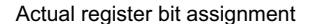

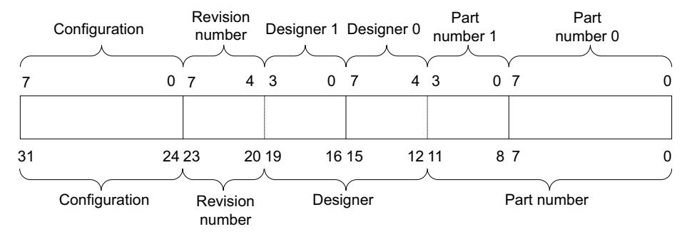

Conceptual register bit assignment

Figure 3-1 Peripheral Identification Register bit assignments

—— Note ———

When you design a systems memory map you must remember that the register has a 4KB memory footprint. All memory accesses to the Peripheral Identification Registers must be 32-bit, using the LDR and STR instructions.

The four, 8-bit Peripheral Identification Registers are described in the following subsections:

- UARTPeriphID0 Register
- UARTPeriphID1 Register on page 3-24
- *UARTPeriphID2 Register* on page 3-24
- *UARTPeriphID3 Register* on page 3-25.

#### **UARTPeriphID0** Register

The UARTPeriphID0 Register is hard coded and the fields in the register determine the reset value. Table 3-19 lists the register bit assignments.

Table 3-19 UARTPeriphID0 Register

| Bits | Name        | Description                                 |
|------|-------------|---------------------------------------------|
| 15:8 | -           | Reserved, read undefined must read as zeros |
| 7:0  | PartNumber0 | These bits read back as 0x11                |

#### **UARTPeriphID1 Register**

The UARTPeriphID1 Register is hard coded and the fields in the register determine the reset value. [Table 3-20](#page-69-6) lists the register bit assignments.

**Table 3-20 UARTPeriphID1 Register**

| Bits | Name        | Description                                  |
|------|-------------|----------------------------------------------|
| 15:8 | -           | Reserved, read undefined, must read as zeros |
| 7:4  | Designer0   | These bits read back as 0x1                  |
| 3:0  | PartNumber1 | These bits read back as 0x0                  |

#### **UARTPeriphID2 Register**

The UARTPeriphID2 Register is hard coded and the fields in the register determine the reset value. [Table 3-21](#page-69-5) lists the register bit assignments.

**Table 3-21 UARTPeriphID2 Register**

| Bits | Name      | Description                                     |     |
|------|-----------|-------------------------------------------------|-----|
| 15:8 | -         | Reserved, read undefined, must read as zeros    |     |
| 7:4  | Revision  | This field depends on the revision of the UART: |     |
|      |           | r1p0                                            | 0x0 |
|      |           | r1p1                                            | 0x1 |
|      |           | r1p3                                            | 0x2 |
|      |           | r1p4                                            | 0x2 |
|      |           | r1p5                                            | 0x3 |
| 3:0  | Designer1 | These bits read back as 0x4                     |     |

#### **UARTPeriphID3 Register**

The UARTPeriphID3 Register is hard coded and the fields in the register determine the reset value. [Table 3-22](#page-70-3) lists the register bit assignments.

**Table 3-22 UARTPeriphID3 Register**

| Bits | Name          | Description                                  |
|------|---------------|----------------------------------------------|
| 15:8 | -             | Reserved, read undefined, must read as zeros |
| 7:0  | Configuration | These bits read back as 0x00                 |

### **3.3.16 PrimeCell Identification Registers, UARTPCellID0-3**

The UARTPCellID0-3 Registers are four 8-bit wide registers, that span address locations 0xFF0-0xFFC. The registers can conceptually be treated as a 32-bit register. The register is used as a standard cross-peripheral identification system. The UARTPCellID Register is set to 0xB105F00D. [Figure 3-2](#page-70-4) shows the bit assignment for the UARTPCellID0-3 Registers.

\$FWXDOUHJLVWHUELWDVVLJQPHQW

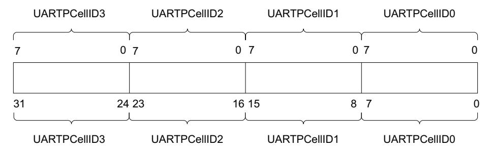

&RQFHSWXDOUHJLVWHUELWDVVLJQPHQW

**Figure 3-2 PrimeCell Identification Register bit assignments**

The four, 8-bit PrimeCell Identification Registers are described in the following subsections:

- *[UARTPCellID0 Register](#page-71-3)* on page 3-26
- *[UARTPCellID1 Register](#page-71-4)* on page 3-26
- *[UARTPCellID2 Register](#page-71-5)* on page 3-26
- *[UARTPCellID3 Register](#page-72-1)* on page 3-27.

#### **UARTPCellID0 Register**

The UARTPCellID0 Register is hard coded and the fields in the register determine the reset value. [Table 3-23](#page-71-6) lists the register bit assignments.

**Table 3-23 UARTPCellID0 Register**

| Bits | Name         | Description                                  |
|------|--------------|----------------------------------------------|
| 15:8 | -            | Reserved, read undefined, must read as zeros |
| 7:0  | UARTPCellID0 | These bits read back as 0x0D                 |

#### **UARTPCellID1 Register**

The UARTPCellID1 Register is hard coded and the fields in the register determine the reset value. [Table 3-24](#page-71-7) lists the register bit assignments.

**Table 3-24 UARTPCellID1 Register**

| Bits | Name         | Description                                  |
|------|--------------|----------------------------------------------|
| 15:8 | -            | Reserved, read undefined, must read as zeros |
| 7:0  | UARTPCellID1 | These bits read back as 0xF0                 |

#### **UARTPCellID2 Register**

The UARTPCellID2 Register is hard coded and the fields in the register determine the reset value. [Table 3-25](#page-71-8) lists the register bit assignments.

**Table 3-25 UARTPCellID2 Register**

| Bits | Name         | Description                                  |
|------|--------------|----------------------------------------------|
| 15:8 | -            | Reserved, read undefined, must read as zeros |
| 7:0  | UARTPCellID2 | These bits read back as 0x05                 |

#### **UARTPCellID3 Register**

The UARTPCellID3 Register is hard coded and the fields in the register determine the reset value. [Table 3-26](#page-72-2) lists the register bit assignments.

**Table 3-26 UARTPCellID3 Register**

| Bits | Name         | Description                                  |
|------|--------------|----------------------------------------------|
| 15:8 | -            | Reserved, read undefined, must read as zeros |
| 7:0  | UARTPCellID3 | These bits read back as 0xB1                 |

*Programmers Model* 

# Chapter 4 **Programmers Model for Test**

This chapter describes the additional logic for integration testing. It contains the following sections:

- *[Test harness overview](#page-75-1)* on page 4-2
- *Scan testing* [on page 4-3](#page-76-1)
- *[Summary of test registers](#page-77-2)* on page 4-4
- *[Test register descriptions](#page-78-3)* on page 4-5
- *[Integration testing of block inputs](#page-82-2)* on page 4-9
- *[Integration testing of block outputs](#page-84-1)* on page 4-11
- *[Integration test summary](#page-87-2)* on page 4-14.

# **4.1 Test harness overview**

The additional logic for functional verification and integration vectors enables:

- capture of input signals to the block
- stimulation of the output signals.

The integration vectors provide a way of verifying that the UART is correctly wired into a system. This is done by separately testing three groups of signals:

#### **AMBA signals**

These are tested by checking the connections of all the address and data bits.

#### **Primary input/output signals**

These are tested using a simple trickbox that can demonstrate the correct connection of the input/output signals to external pads.

#### **Intra-chip signals (such as interrupt sources)**

The tests for these signals are system-specific, and enable you to write the necessary tests. Additional logic is implemented enabling you to read and write to each intra-chip input/output signal.

These test features are controlled by test registers. This enables you to test the UART in isolation from the rest of the system using only transfers from the AMBA APB.

Off-chip test vectors are supplied using a 32-bit parallel *External Bus Interface* (EBI) and converted to internal AMBA bus transfers. The application of test vectors is controlled through the *Test Interface Controller* (TIC) AMBA bus master module.

# **4.2 Scan testing**

The UART has been designed to simplify:

- insertion of scan test cells
- use of *Automatic Test Pattern Generation* (ATPG).

This provides an alternative method of manufacturing test.

# **4.3 Summary of test registers**

[Table 4-1](#page-77-3) lists the UART test registers.

**Table 4-1 Test registers summary**

| Offset | Name     | Type | Reset | Width | Description                                            |
|--------|----------|------|-------|-------|--------------------------------------------------------|
| 0x080  | UARTTCR  | RW   | 0x0   | 3     | Test Control Register, UARTTCR on page 4-5             |
| 0x084  | UARTITIP | RW   | 0x00  | 8     | Integration Test Input Register, UARTITIP on page 4-6  |
| 0x088  | UARTITOP | RW   | 0x000 | 14    | Integration Test Output Register, UARTITOP on page 4-7 |
| 0x08C  | UARTTDR  | RW   | 0x    | 11    | Test Data Register, UARTTDR on page 4-8                |

# **4.4 Test register descriptions**

This section describes the UART test registers and [Table 4-1 on page 4-4](#page-77-3) lists the cross references to individual registers.

#### **4.4.1 Test Control Register, UARTTCR**

UARTTCR is the test control register. This general test register controls operation of the UART under test conditions. [Table 4-2](#page-78-5) lists the register bit assignments.

**Table 4-2 UARTTCR register**

| Bits | Name     | Function                                                                                                                                                                                                                                                                                                                 |
|------|----------|--------------------------------------------------------------------------------------------------------------------------------------------------------------------------------------------------------------------------------------------------------------------------------------------------------------------------|
| 16:3 | -        | Reserved, unpredictable when read.                                                                                                                                                                                                                                                                                       |
| 2    | SIRTEST  | SIR test enable. Setting this bit to 1 enables the receive data path during IrDA transmission (SIR full-duplex operation is only available when testing). This bit must be set to 1 to enable SIR system loopback testing, and you must also set the LBE bit to 1 in the Control Register, UARTCR on page 3-15. |
|      |          | Clearing this bit to 0 disables the receive logic when the SIR is transmitting (normal operation).                                                                                                                                                                                                                       |
|      |          | This bit defaults to 0 for normal operation (half-duplex operation).                                                                                                                                                                                                                                                     |
| 1    | TESTFIFO | Test FIFO enable. When this bit it 1, a write to the Test Data Register, UARTTDR on page 4-8 writes data into the receive FIFO, and reads from the UARTTDR register reads data out of the transmit FIFO.                                                                                                           |
|      |          | When this bit is 0, data cannot be read directly from the transmit FIFO or written directly to the receive FIFO (normal operation).                                                                                                                                                                                   |
|      |          | The reset value is 0.                                                                                                                                                                                                                                                                                                    |
| 0    | ITEN     | Integration test enable. When this bit is 1, the UART is placed in integration test mode, otherwise it is in normal operation.                                                                                                                                                                                        |

#### **4.4.2 Integration Test Input Register, UARTITIP**

UARTITIP is the integration test input read/set register. It is a a read/write register. In integration test mode it enables inputs to be both written to and read from. [Table 4-3](#page-79-2) lists the register bit assignments.

**Table 4-3 UARTITIP register**

| Bits | Name         | Function                                                                                                                                                                                                   |
|------|--------------|------------------------------------------------------------------------------------------------------------------------------------------------------------------------------------------------------------|
| 16:8 | -            | Reserved, unpredictable when read.                                                                                                                                                                         |
| 7    | UARTTXDMACLR | Writes to this bit specify the value to be driven on the intra-chip input, UARTTXDMACLR, in the integration test mode. Reads return the value of UARTTXDMACLR at the output of the test multiplexor. |
| 6    | UARTRXDMACLR | Writes to this bit specify the value to be driven on the intra-chip input, UARTRXDMACLR, in the integration test mode. Reads return the value of UARTRXDMACLR at the output of the test multiplexor. |
| 5    | nUARTRI      | Reads return the value of the nUARTRI primary input.                                                                                                                                                       |
| 4    | nUARTDCD     | Reads return the value of the nUARTDCD primary input.                                                                                                                                                      |
| 3    | nUARTCTS     | Reads return the value of the nUARTCTS primary input.                                                                                                                                                      |
| 2    | nUARTDSR     | Reads return the value of the nUARTDSR primary input.                                                                                                                                                      |
| 1    | SIRIN        | Reads return the value of the SIRIN primary input.                                                                                                                                                         |
| 0    | UARTRXD      | Reads return the value of the UARTRXD primary input.                                                                                                                                                       |

#### **4.4.3 Integration Test Output Register, UARTITOP**

UARTITOP is the integration test output read/set register. The primary outputs are read only and the intra-chip outputs are read/write. In integration test mode it enables outputs to be both written to and read from. [Table 4-4](#page-80-2) lists the register bit assignments.

**Table 4-4 UARTITOP register**

| Bits | Name          | Function                                                                                                                                                     |
|------|---------------|--------------------------------------------------------------------------------------------------------------------------------------------------------------|
| 15   | UARTTXDMASREQ | Intra-chip output. Writes specify the value to be driven on UARTTXDMASREQ. Reads return the value of UARTTXDMASREQ at the output of the test multiplexor. |
| 14   | UARTTXDMABREQ | Intra-chip output. Writes specify the value to be driven on UARTTXDMABREQ. Reads return the value of UARTTXDMABREQ at the output of the test multiplexor. |
| 13   | UARTRXDMASREQ | Intra-chip output. Writes specify the value to be driven on UARTRXDMASREQ. Reads return the value of UARTRXDMASREQ at the output of the test multiplexor. |
| 12   | UARTRXDMABREQ | Intra-chip output. Writes specify the value to be driven on UARTDMABREQ. Reads return the value of UARTDMABREQ at the output of the test multiplexor.     |
| 11   | UARTMSINTR    | Intra-chip output. Writes specify the value to be driven on UARTMSINTR. Reads return the value of UARTMSINTR at the output of the test multiplexor.       |
| 10   | UARTRXINTR    | Intra-chip output. Writes specify the value to be driven on UARTRXINTR. Reads return the value of UARTRXINTR at the output of the test multiplexor.       |
| 9    | UARTTXINTR    | Intra-chip output. Writes specify the value to be driven on UARTTXINTR. Reads return the value of UARTTXINTR at the output of the test multiplexor.       |
| 8    | UARTRTINTR    | Intra-chip output. Writes specify the value to be driven on UARTRTINTR. Reads return the value of UARTRTINTR at the output of the test multiplexor.       |
| 7    | UARTEINTR     | Intra-chip output. Writes specify the value to be driven on UARTEINTR. Reads return the value of UARTEINTR at the output of the test multiplexor.         |
| 6    | UARTINTR      | Intra-chip output. Writes specify the value to be driven on UARTINTR. Reads return the value of UARTINTR at the output of the test multiplexor.           |
| 5    | nUARTOut2     | Primary output. Writes specify the value to be driven on nUARTOut2.                                                                                          |
| 4    | nUARTOut1     | Primary output. Writes specify the value to be driven on nUARTOut1.                                                                                          |
| 3    | nUARTRTS      | Primary output. Writes specify the value to be driven on nUARTRTS.                                                                                           |

**Table 4-4 UARTITOP register (continued)**

| Bits | Name     | Function                                                           |
|------|----------|--------------------------------------------------------------------|
| 2    | nUARTDTR | Primary output. Writes specify the value to be driven on nUARTDTR. |
| 1    | nSIROUT  | Primary output. Writes specify the value to be driven on nSIROUT.  |
| 0    | UARTTXD  | Primary output. Writes specify the value to be driven on UARTTXD.  |

#### **4.4.4 Test Data Register, UARTTDR**

UARTTDR is the test data register. It enables data to be written into the receive FIFO and read out from the transmit FIFO for test purposes. This test function is enabled by the TESTFIFO bit in the *[Test Control Register, UARTTCR](#page-78-4)* on page 4-5. [Table 4-5](#page-81-2) lists the register bit assignments.

**Table 4-5 UARTTDR register**

| Bits  | Name | Function                                                                                                      |
|-------|------|---------------------------------------------------------------------------------------------------------------|
| 16:11 | -    | Reserved, unpredictable when read                                                                             |
| 10:0  | DATA | When the TESTFIFO bit is set to 1, data is written into the receive FIFO and read out of the transmit FIFO |

# **4.5 Integration testing of block inputs**

The following sections describe the integration testing for the block inputs:

- *[Intra-chip inputs](#page-82-4)*
- *[Primary inputs](#page-83-0)* on page 4-10.

#### **4.5.1 Intra-chip inputs**

[Figure 4-1](#page-82-3) shows the implementation of the input integration test harness. The ITEN bit in the *[Test Control Register, UARTTCR](#page-78-4)* on page 4-5 controls the multiplexor, that is used in the read path of the **UARTTXDMACLR** and **UARTRXDMACLR** intra-chip inputs. If the ITEN bit is deasserted, the **UARTTXDMACLR** and

**UARTRXDMACLR** intra-chip inputs are routed as the internal **UARTTXDMACLR** and **UARTRXDMACLR** inputs respectively, otherwise the stored register values are driven on the internal line. All other read-only bits in the *[Integration Test Input](#page-79-1)  [Register, UARTITIP](#page-79-1)* on page 4-6 are connected directly to the primary input pins.

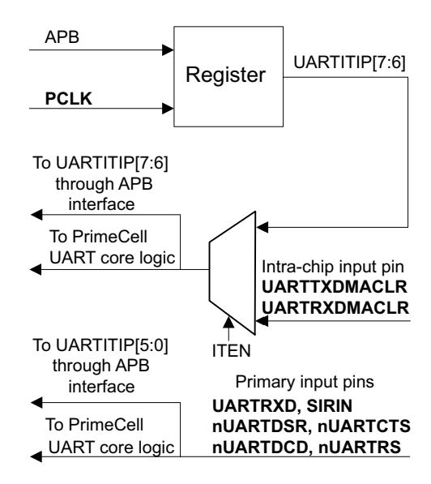

**Figure 4-1 Input integration test harness**

When you run integration tests with the UART in a standalone test setup:

• Write a 1 to the ITEN bit in the *[Test Control Register, UARTTCR](#page-78-4)* on page 4-5. This selects the test path from the UARTITIP[7:6] register bits to the **UARTRXDMACLR** and **UARTTXDMACLR** signals.

• Write a 1 and then a 0 to each of the UARTITIP[7:6] register bits, and read the same register bits to ensure that the value written is read out.

When you run integration tests with the UART as part of an integrated system:

- Write a 0 to the ITEN bit in the *[Test Control Register, UARTTCR](#page-78-4)* on page 4-5. This selects the normal path from the external **UARTRXDMACLR** pin to the internal **UARTRXDMACLR** signal, and the path from the external **UARTTXDMACLR** pin to the internal **UARTTXDMACLR** pin.
- Write a 1 and then a 0 to the internal test registers of the DMA controller to toggle the **UARTRXDMACLR** signal connection between the DMA controller and the UART. Read the UARTRXDMACLR bit in the *[Integration Test Input Register,](#page-79-1)  UARTITIP* [on page 4-6](#page-79-1) to verify that the value written into the DMA controller, is read out through the UART.

Similarly, write a 1 and then a 0 to the internal registers of the DMA controller to toggle the **UARTTXDMACLR** signal connection between the DMA controller and the UART. Read the UARTTXDMACLR bit in the *[Integration Test Input](#page-79-1)  [Register, UARTITIP](#page-79-1)* on page 4-6 to verify that the value written into the DMA controller, is read out through the UART.

#### **4.5.2 Primary inputs**

The primary inputs are tested using the integration vector trickbox by looping back primary outputs as follows:

- **UARTTXD** to **UARTRXD**
- **nSIROUT** to **SIRIN**
- **nUARTRTS** to **nUARTCTS**
- **nUARTOUT1** to **nUARTDCD**
- **nUARTDTR** to **nUARTDSR**
- **nUARTOUT2** to **nUARTRI**.

Write a 1 to the ITEN bit in the *[Test Control Register, UARTTCR](#page-78-4)* on page 4-5. Using the *[Integration Test Output Register, UARTITOP](#page-80-1)* on page 4-7 program bits [5:0] to drive HIGHs and LOWs on the primary output signals and read back the status using bits [5:0] in the *[Integration Test Input Register, UARTITIP](#page-79-1)* on page 4-6.

# **4.6 Integration testing of block outputs**

The following sections describe the integration testing for the block outputs:

- *[Intra-chip outputs](#page-84-2)*
- *[Primary outputs](#page-85-1)* on page 4-12.

#### **4.6.1 Intra-chip outputs**

Use this test for the following outputs:

- **UARTTXDMASREQ**
- **UARTTXDMABREQ**
- **UARTRXDMASREQ**
- **UARTRXDMABREQ**
- **UARTINTR**
- **UARTMSINTR**
- **UARTRXINTR**
- **UARTTXINTR**
- **UARTRTINTR**
- **UARTEINTR**.

When you run integration tests with the UART in a standalone test setup:

- Write a 1 to the ITEN bit in the *[Test Control Register, UARTTCR](#page-78-4)* on page 4-5. This selects the test path from the UARTITOP0[15:6] register bits to the intra-chip output signals.
- Write a 1 and then a 0 to the UARTITOP0[15:6] register bits, and read the same register bits to verify that the value written is read out.

When you run integration tests with the UART as part of an integrated system:

- Write a 1 to the ITEN bit in the *[Test Control Register, UARTTCR](#page-78-4)* on page 4-5. This selects the test path from the UARTITOP0[15:6] register bits to the intra-chip output signals.
- Write a 1 and then a 0 to the UARTITOP0[15:6] register bits to toggle the signal connections between the DMA controller/interrupt controller and the UART. Read from the internal test registers of the DMA controller/interrupt controller to verify that the value written into the UARTITOP0[15:6] register bits is read out through the UART.

[Figure 4-2 on page 4-12](#page-85-2) shows the implementation of the output integration test harness for intra-chip outputs.

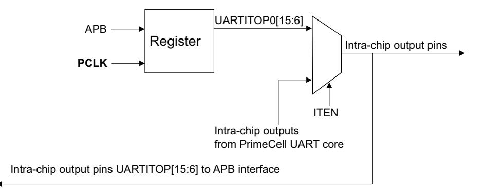

**Figure 4-2 Output integration test harness, intra-chip outputs**

#### **4.6.2 Primary outputs**

Integration testing of primary outputs and primary inputs is carried out using the integration vector trickbox. Use this test for the following outputs:

- **UARTTXD**
- **nSIROUT**
- **nUARTDTR**
- **nUARTRTS**
- **nUARTOut1**
- **nUARTOut2**.

Verify the primary input and output pin connections as follows:

The primary output pins are looped back to the primary input pins through the integration vector trickbox.

- All the primary outputs can be accessed using the *[Integration Test Output](#page-80-1)  [Register, UARTITOP](#page-80-1)* on page 4-7. You can use this register to write different data patterns to the output pins.
- The looped back data is read back using the *[Integration Test Input Register,](#page-79-1)  UARTITIP* [on page 4-6](#page-79-1).

[Figure 4-3 on page 4-13](#page-86-1) shows the implementation of the output integration test harness for primary outputs.

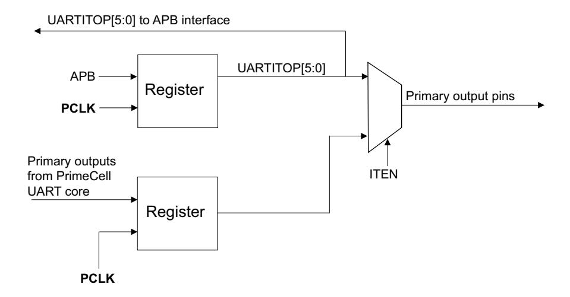

**Figure 4-3 Output integration test harness, primary outputs**

# **4.7 Integration test summary**

[Table 4-6](#page-87-3) lists the integration test strategy for all UART pins.

**Table 4-6 Integration test strategy**

| Name          | Type   | Source/ destination | Test strategy                                                 |
|---------------|--------|------------------------|---------------------------------------------------------------|
| PRESETn       | Input  | Reset controller       | Not tested using integration test vectors                     |
| PADDR[11:2]   | Input  |                        |                                                               |
| PCLK          | Input  |                        | Register read/write                                           |
| PENABLE       | Input  |                        |                                                               |
| PRDATA[15:0]  | Output | APB                    |                                                               |
| PSEL          | Input  |                        |                                                               |
| PWDATA[15:0]  | Input  |                        |                                                               |
| PWRITE        | Input  |                        |                                                               |
| UARTCLK       | Input  | Clock generator        | Not tested using integration test vectors                     |
| nUARTRST      | Input  | Reset controller       |                                                               |
| UARTMSINTR    | Output | Interrupt controller   |                                                               |
| UARTRXINTR    | Output | Interrupt controller   |                                                               |
| UARTTXINTR    | Output | Interrupt controller   |                                                               |
| UARTRTINTR    | Output | Interrupt controller   |                                                               |
| UARTEINTR     | Output | Interrupt controller   | Use Integration Test Output Register, UARTITOP on page 4-7 |
| UARTTXDMASREQ | Output | DMA controller         |                                                               |
| UARTRXDMASREQ | Output | DMA controller         |                                                               |
| UARTTXDMABREQ | Output | DMA controller         |                                                               |
| UARTRXDMABREQ | Output | DMA controller         |                                                               |
| UARTTXDMACLR  | Input  | DMA controller         |                                                               |
| UARTRXDMACLR  | Input  | DMA controller         | Use Integration Test Input Register, UARTITIP on page 4-6     |

**Table 4-6 Integration test strategy (continued)**

| Name        | Type   | Source/ destination | Test strategy                                                                                           |
|-------------|--------|------------------------|---------------------------------------------------------------------------------------------------------|
| UARTINTR    | Output | Interrupt controller   | Use Integration Test Output Register, UARTITOP on page 4-7                                           |
| SCANENABLE  | Input  | Test controller        | Not tested using integration test vectors                                                               |
| SCANINPCLK  | Input  | Test controller        |                                                                                                         |
| SCANINUCLK  | Input  | Test controller        |                                                                                                         |
| SCANOUTPCLK | Output | Test controller        |                                                                                                         |
| SCANOUTUCLK | Output | Test controller        |                                                                                                         |
| nUARTCTS    | Input  |                        | Use the integration vector trickbox with: • Integration Test Input Register, UARTITIP on page 4-6 |
| nUARTDCD    | Input  |                        |                                                                                                         |
| nUARTDSR    | Input  |                        |                                                                                                         |
| nUARTRI     | Input  |                        |                                                                                                         |
| UARTRXD     | Input  |                        |                                                                                                         |
| SIRIN       | Input  |                        |                                                                                                         |
| UARTTXD     | Output | PAD                    | Integration Test Output Register, UARTITOP on •                                                      |
| nSIROUT     | Output |                        | page 4-7                                                                                                |
| nUARTDTR    | Output |                        |                                                                                                         |
| nUARTRTS    | Output |                        |                                                                                                         |
| nUARTOut1   | Output |                        |                                                                                                         |
| nUARTOut2   | Output |                        |                                                                                                         |

*Programmers Model for Test* 

# Appendix A **Signal Descriptions**

This appendix describes the signals that interface with the UART block. It contains the following sections:

- *[AMBA APB signals](#page-91-2)* on page A-2
- *[On-chip signals](#page-92-2)* on page A-3
- *[Signals to pads](#page-94-2)* on page A-5.

# **A.1 AMBA APB signals**

[Table A-1](#page-91-3) lists the signals that the APB slave interface provides.

**Table A-1 APB slave interface signals**

| Name         | Type   | Source/ destination | Description                                                                                                                                                                         |
|--------------|--------|------------------------|-------------------------------------------------------------------------------------------------------------------------------------------------------------------------------------|
| PRESETn      | Input  | Reset controller       | Bus reset signal, active LOW.                                                                                                                                                       |
| PADDR[11:2]  | Input  | APB                    | Subset of AMBA APB address bus.                                                                                                                                                     |
| PCLK         | Input  | APB                    | APB clock, used to time all bus transfers.                                                                                                                                          |
| PENABLE      | Input  | APB                    | APB enable signal. PENABLE is asserted HIGH for one cycle of PCLK to enable a bus transfer.                                                                                      |
| PRDATA[15:0] | Output | APB                    | Subset of unidirectional AMBA APB read data bus.                                                                                                                                    |
| PSEL         | Input  | APB                    | UART and SIR ENDEC select signal from decoder. When set HIGH this signal indicates the slave device is selected by the AMBA APB bridge, and that a data transfer is required. |
| PWDATA[15:0] | Input  | APB                    | Subset of unidirectional AMBA APB write data bus.                                                                                                                                   |
| PWRITE       | Input  | APB                    | APB transfer direction signal, indicates a write access when HIGH, read access when LOW.                                                                                         |

See the *AMBA Specification (Rev 2.0)* for more information about the APB signals.

# **A.2 On-chip signals**

A free-running reference clock, **UARTCLK**, must be provided. By default it is assumed to be asynchronous to **PCLK**. The **UARTCLK** clock must have a frequency between 1.42MHz to 542.72MHz to ensure that the low-power IrDA mode transmit pulse duration complies with the *IrDA SIR specification*.

The reset inputs are asynchronously asserted but synchronously removed for each of the clock domains in the UART. This ensures that logic is reset even if clocks are not present, to avoid any static power consumption problems at power up. Each clock domain has a individual reset to simplify the process of inserting scan test cells.

[Table A-2](#page-92-3) lists the on-chip signals that the UART provides.

**Table A-2 On-chip signals**

| Name          | Type   | Source/ destination | Description                                                                                                                                                                                                         |
|---------------|--------|------------------------|---------------------------------------------------------------------------------------------------------------------------------------------------------------------------------------------------------------------|
| UARTCLK       | Input  | Clock generator        | UART reference clock.                                                                                                                                                                                               |
| nUARTRST      | Input  | Reset controller       | UART reset signal to UARTCLK clock domain, active LOW. The reset controller must use PRESETn to assert nUARTRST asynchronously but negate it synchronously with UARTCLK.                                   |
| UARTMSINTR    | Output | Interrupt controller   | UART modem status interrupt, active HIGH.                                                                                                                                                                           |
| UARTRXINTR    | Output | Interrupt controller   | UART receive FIFO interrupt, active HIGH.                                                                                                                                                                           |
| UARTTXINTR    | Output | Interrupt controller   | UART transmit FIFO interrupt, active HIGH.                                                                                                                                                                          |
| UARTRTINTR    | Output | Interrupt controller   | UART receive timeout interrupt, active HIGH.                                                                                                                                                                        |
| UARTEINTR     | Output | Interrupt controller   | UART error interrupt, active HIGH.                                                                                                                                                                                  |
| UARTINTR      | Output | Interrupt controller   | UART interrupt, active HIGH. A single combined interrupt generated as an OR function of the following interrupts: • UARTMSINTR • UARTRXINTR • UARTTXINTR UARTRTINTR • • UARTEINTR. |
| UARTTXDMASREQ | Output | DMA controller         | UART transmit DMA single request, active HIGH.                                                                                                                                                                      |
| UARTRXDMASREQ | Output | DMA controller         | UART receive DMA single request, active HIGH.                                                                                                                                                                       |

**Table A-2 On-chip signals (continued)**

| Name          | Type   | Source/ destination | Description                                                                                                                                                                                                           |
|---------------|--------|------------------------|-----------------------------------------------------------------------------------------------------------------------------------------------------------------------------------------------------------------------|
| UARTTXDMABREQ | Output | DMA controller         | UART transmit DMA burst request, active HIGH.                                                                                                                                                                         |
| UARTRXDMABREQ | Output | DMA controller         | UART receive DMA burst request, active HIGH.                                                                                                                                                                          |
| UARTTXDMACLR  | Input  | DMA controller         | DMA request clear, asserted by the DMA controller to clear the transmit request signals. If DMA burst transfer is requested, the clear signal is asserted during the transfer of the last data in the burst. |
| UARTRXDMACLR  | Input  | DMA controller         | DMA request clear, asserted by the DMA controller to clear the receive request signals. If DMA burst transfer is requested, the clear signal is asserted during the transfer of the last data in the burst.  |
| SCANENABLE    | Input  | Test controller        | UART scan enable signal for both clock domains.                                                                                                                                                                       |
| SCANINPCLK    | Input  | Test controller        | UART input scan signal for the PCLK domain.                                                                                                                                                                           |
| SCANINUCLK    | Input  | Test controller        | UART input scan signal for the UARTCLK domain.                                                                                                                                                                        |
| SCANOUTPCLK   | Output | Test controller        | UART output scan signal for the PCLK domain.                                                                                                                                                                          |
| SCANOUTUCLK   | Output | Test controller        | UART output scan signal for the UARTCLK domain.                                                                                                                                                                       |

### **A.3 Signals to pads**

[Table A-3](#page-94-3) describes the signals from the UART and IrDA SIR ENDEC to input/output pads of the chip. You must make proper use of the peripheral pins to meet the exact interface requirements.

**Table A-3 Pad signal descriptions**

| Name      | Type   | Pad type | Description                                                                                                                                                                                                                     |
|-----------|--------|----------|---------------------------------------------------------------------------------------------------------------------------------------------------------------------------------------------------------------------------------|
| nUARTCTS  | Input  | PAD      | UART Clear To Send modem status input, active LOW. The status of this signal can be read using the Flag Register, UARTFR on page 3-8.                                                                                        |
| nUARTDCD  | Input  | PAD      | UART Data Carrier Detect modem status input, active LOW. The status of this signal can be read using the UARTFR register.                                                                                                    |
| nUARTDSR  | Input  | PAD      | UART Data Set Ready modem status input, active LOW. The status of this signal can be read using the UARTFR register.                                                                                                         |
| nUARTRI   | Input  | PAD      | UART Ring Indicator modem status input, active LOW. The status of this signal can be read using the UARTFR register.                                                                                                         |
| UARTRXD   | Input  | PAD      | UART Received Serial Data input.                                                                                                                                                                                                |
| SIRIN     | Input  | PAD      | SIR Received Serial Data Input. In the idle state, the signal remains HIGH, in the marking state. When a light pulse is received that represents a logic 0, this signal is LOW.                                           |
| UARTTXD   | Output | PAD      | UART Transmitted Serial Data output. Defaults to HIGH, the marking state, when reset.                                                                                                                                        |
| nSIROUT   | Output | PAD      | SIR Transmitted Serial Data Output, active LOW. In the idle state, this signal remains LOW (the marking state). When this signal is HIGH, an infrared light pulse is generated that represents a logic 0 (spacing state). |
| nUARTDTR  | Output | PAD      | UART Data Terminal Ready modem status output, active LOW. The reset value is 0.                                                                                                                                              |
| nUARTRTS  | Output | PAD      | UART Request to Send modem status output, active LOW. The reset value is 0.                                                                                                                                                  |
| nUARTOut1 | Output | PAD      | UART Out1 modem status output, active LOW. The reset value is 0.                                                                                                                                                             |
| nUARTOut2 | Output | PAD      | UART Out2 modem status output, active LOW. The reset value is 0.                                                                                                                                                             |

*Signal Descriptions*