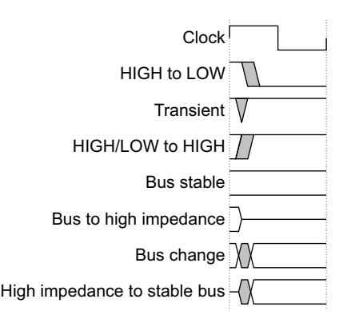
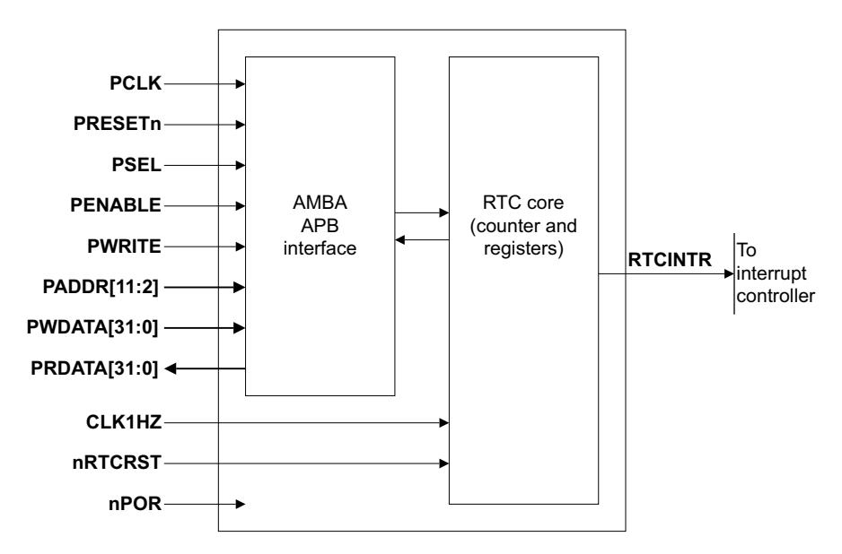
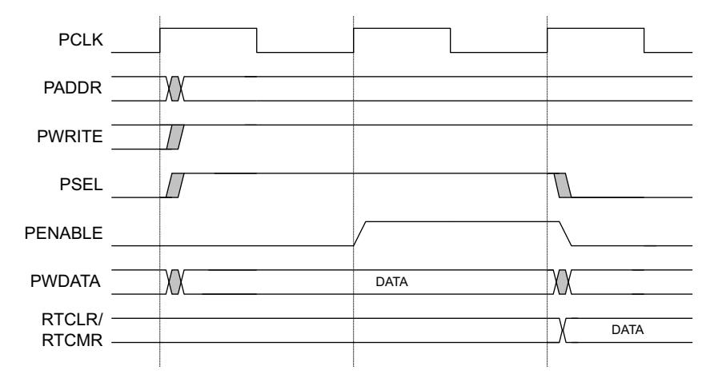
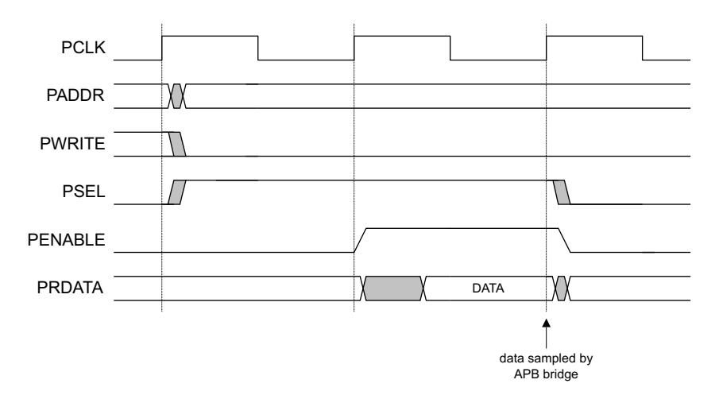
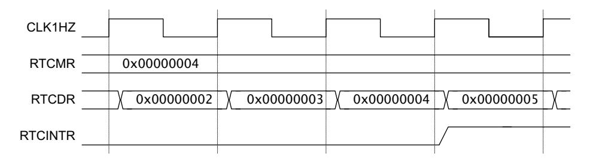
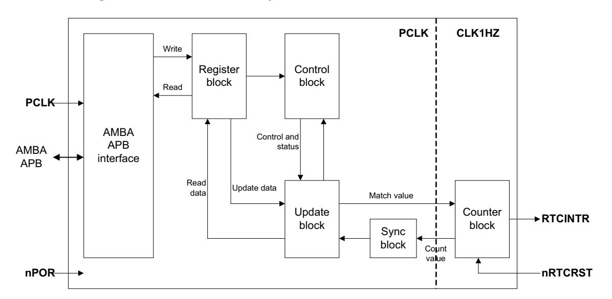
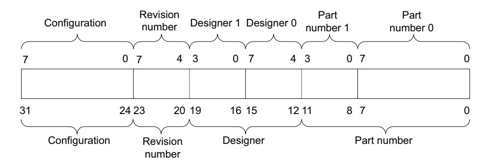
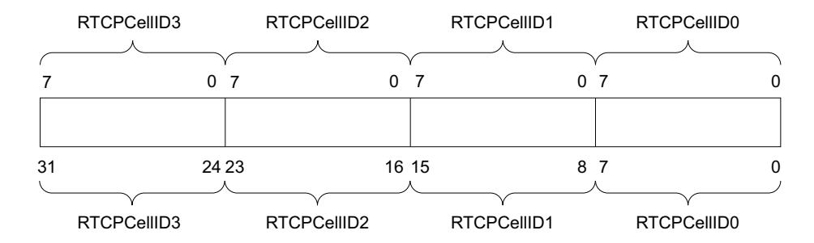
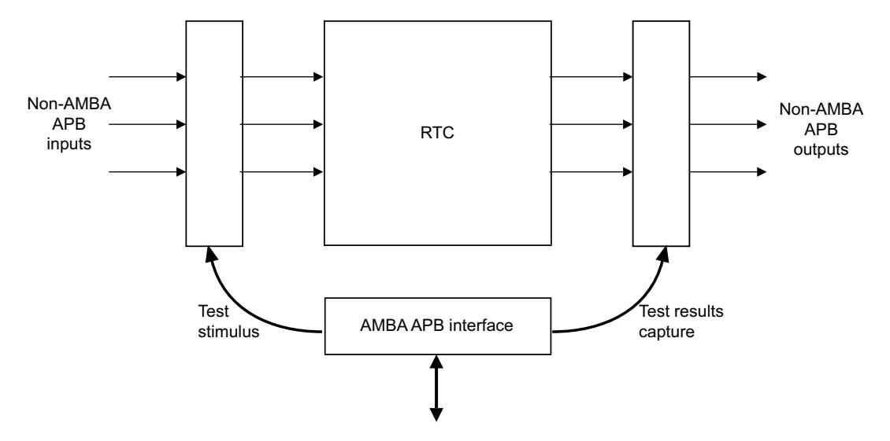
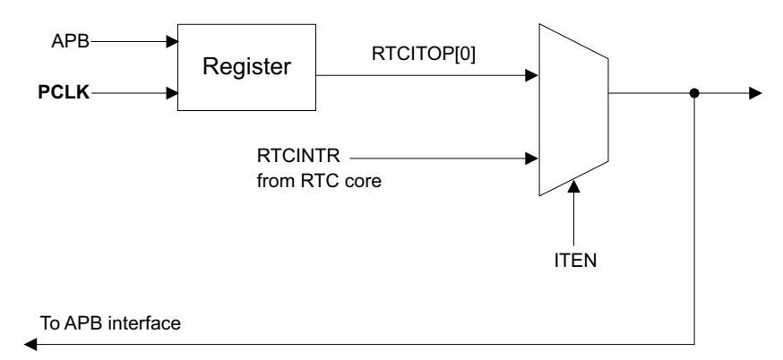

## ARM® PrimeCell Real Time Clock (PL031)

**Revision: r1p3**

**Technical Reference Manual**

## **ARM PrimeCell Real Time Clock (PL031) Technical Reference Manual**

Copyright © 2001, 2017 ARM Limited or its affiliates. All rights reserved.

#### **Release Information**

The *[Change history](#page-1-0)* table lists the changes that have been made to this book.

#### **Change history**

| Date         | Issue | Confidentiality  | Change                 |
|--------------|-------|------------------|------------------------|
| August 2001  | A     | Non-Confidential | First release for 1.0. |
| October 2001 | B     | Non-Confidential | Second release for 1.0 |
| 23 May 2017  | C     | Non-Confidential | First release for r1p3 |

#### **Proprietary Notice**

This document is protected by copyright and other related rights and the practice or implementation of the information contained in this document may be protected by one or more patents or pending patent applications. No part of this document may be reproduced in any form by any means without the express prior written permission of ARM. No license, express or implied, by estoppel or otherwise to any intellectual property rights is granted by this document unless specifically stated.

Your access to the information in this document is conditional upon your acceptance that you will not use or permit others to use the information for the purposes of determining whether implementations infringe any third party patents.

THIS DOCUMENT IS PROVIDED "AS IS". ARM PROVIDES NO REPRESENTATIONS AND NO WARRANTIES, EXPRESS, IMPLIED OR STATUTORY, INCLUDING, WITHOUT LIMITATION, THE IMPLIED WARRANTIES OF MERCHANTABILITY, SATISFACTORY QUALITY, NON-INFRINGEMENT OR FITNESS FOR A PARTICULAR PURPOSE WITH RESPECT TO THE DOCUMENT. For the avoidance of doubt, ARM makes no representation with respect to, and has undertaken no analysis to identify or understand the scope and content of, third party patents, copyrights, trade secrets, or other rights.

This document may include technical inaccuracies or typographical errors.

TO THE EXTENT NOT PROHIBITED BY LAW, IN NO EVENT WILL ARM BE LIABLE FOR ANY DAMAGES, INCLUDING WITHOUT LIMITATION ANY DIRECT, INDIRECT, SPECIAL, INCIDENTAL, PUNITIVE, OR CONSEQUENTIAL DAMAGES, HOWEVER CAUSED AND REGARDLESS OF THE THEORY OF LIABILITY, ARISING OUT OF ANY USE OF THIS DOCUMENT, EVEN IF ARM HAS BEEN ADVISED OF THE POSSIBILITY OF SUCH DAMAGES.

This document consists solely of commercial items. You shall be responsible for ensuring that any use, duplication or disclosure of this document complies fully with any relevant export laws and regulations to assure that this document or any portion thereof is not exported, directly or indirectly, in violation of such export laws. Use of the word "partner" in reference to ARM's customers is not intended to create or refer to any partnership relationship with any other company. ARM may make changes to this document at any time and without notice.

If any of the provisions contained in these terms conflict with any of the provisions of any signed written agreement covering this document with ARM, then the signed written agreement prevails over and supersedes the conflicting provisions of these terms.

Words and logos marked with ® or ™ are registered trademarks or trademarks of ARM Limited or its affiliates in the EU and/or elsewhere. All rights reserved. Other brands and names mentioned in this document may be the trademarks of their respective owners. Please follow ARM's trademark usage guidelines at http://www.arm.com/about/trademarks/guidelines/index.php

Copyright © 2001, 2017 ARM Limited or its affiliates. All rights reserved.

ARM Limited. Company 02557590 registered in England.

110 Fulbourn Road, Cambridge, England CB1 9NJ.

LES-PRE-20349

#### **Confidentiality Status**

This document is Non-Confidential. The right to use, copy and disclose this document may be subject to license restrictions in accordance with the terms of the agreement entered into by ARM and the party that ARM delivered this document to.

#### **Product Status**

The information in this document is final, that is for a developed product.

#### **Web Address**

http://www.arm.com

## Contents

## **ARM PrimeCell Real Time Clock (PL031) Technical Reference Manual**

|              | Preface           |                                                         |  |  |
|--------------|-------------------|---------------------------------------------------------|--|--|
|              |                   | About this book vii                                     |  |  |
|              |                   | Feedback x                                              |  |  |
| Chapter 1 |                   | Introduction                                            |  |  |
|              | 1.1               | About the Real Time Clock 1-2                           |  |  |
| Chapter 2 |                   | Functional overview                                     |  |  |
|              | 2.1               | Real Time Clock overview 2-2                            |  |  |
|              | 2.2               | RTC functional description 2-4                          |  |  |
|              | 2.3               | RTC operation 2-8                                       |  |  |
| Chapter 3 | Programmers model |                                                         |  |  |
|              | 3.1               | About the programmers model 3-2                         |  |  |
|              | 3.2               | Summary of RTC registers 3-3                            |  |  |
|              | 3.3               | General registers 3-4                                   |  |  |
|              | 3.4               | Peripheral identification registers, RTCPeriphID0-3 3-7 |  |  |
|              | 3.5               | PrimeCell identification registers, RTCPCellID0-3 3-9   |  |  |
|              | 3.6               | Interrupts 3-11                                         |  |  |
| Chapter 4 |                   | Programmers model for test                              |  |  |
|              | 4.1               | RTC test harness overview 4-2                           |  |  |
|              | 4.2               | Scan testing 4-3                                        |  |  |
|              | 4.3               | Test registers 4-4                                      |  |  |
|              | 4.4               | Integration testing of block inputs 4-6                 |  |  |
|              | 4.5               | Integration testing of block outputs 4-7                |  |  |
|              |                   |                                                         |  |  |

| Appendix B | Revisions           |                                             |  |  |  |
|---------------|---------------------|---------------------------------------------|--|--|--|
|               | A.1 A.2          | AMBA APB signals A-2 On-chip signals A-3 |  |  |  |
| Appendix A | Signal descriptions |                                             |  |  |  |
|               | 4.6                 | Integration test summary 4-8                |  |  |  |

## **Preface**

This preface introduces the *ARM® PrimeCell Real Time Clock (PL031)*. It contains the following sections:

- *[About this book](#page-6-1)* on page vii.
- *Feedback* [on page x.](#page-9-1)

## **About this book**

This book is for the Real Time Clock (PL031).

#### **Product revision status**

The r*m*p*n* identifier indicates the revision status of the product that this book describes, for example, r1p2, where:

**r***m* Identifies the major revision of the product, for example, r1.

**p***n* Identifies the minor revision or modification status of the product, for example,

p2.

## **Intended audience**

This document has been written for experienced hardware and software engineers who are implementing a basic alarm function or long time base counter using the Real Time Clock (PL031).

## **Using this book**

This book is organized into the following chapters:

#### **Chapter 1** *Introduction*

Read this chapter for an introduction to the *Real Time Clock* (RTC) and its features.

#### **Chapter 2** *Functional overview*

Read this chapter for a description of the major functional blocks of the RTC.

#### **Chapter 3** *Programmers model*

Read this chapter for a description of the RTC registers and programming information.

#### **Chapter 4** *Programmers model for test*

Read this chapter for a description of the logic in the RTC for functional verification and production testing.

#### **Appendix A** *Signal descriptions*

Read this appendix for a description of the RTC signals.

#### **Appendix B** *Revisions*

Read this appendix for a description of the technical changes between released issues of this document.

#### **Glossary**

The *ARM® Glossary* is a list of terms that are used in ARM documentation, together with definitions for those terms. The *ARM® Glossary* does not contain terms that are industry standard unless the ARM meaning differs from the generally accepted meaning.

See *ARM® Glossary* http://infocenter.arm.com/help/topic/com.arm.doc.aeg0014-/index.html.

## **Conventions**

This book uses the conventions that are described in:

- *[Typographical conventions](#page-7-0)*.
- *[Timing diagrams](#page-7-1)*.
- *Signals* [on page ix.](#page-8-0)

#### **Typographical conventions**

The following table describes the typographical conventions:

#### **Typographical conventions**

| Style            | Purpose                                                                                                                                                                                                      |  |  |
|------------------|--------------------------------------------------------------------------------------------------------------------------------------------------------------------------------------------------------------|--|--|
| italic           | Introduces special terminology, denotes cross-references, and citations.                                                                                                                                     |  |  |
| bold             | Highlights interface elements, such as menu names. Denotes signal names. Also used for terms in descriptive lists, where appropriate.                                                                     |  |  |
| monospace        | Denotes text that you can enter at the keyboard, such as commands, file and program names, and source code.                                                                                                  |  |  |
| monospace        | Denotes a permitted abbreviation for a command or option. You can enter the underlined text instead of the full command or option name.                                                                   |  |  |
| monospace italic | Denotes arguments to monospace text where the argument is to be replaced by a specific value.                                                                                                                |  |  |
| monospace bold   | Denotes language keywords when used outside example code.                                                                                                                                                    |  |  |
| <and></and>      | Encloses replaceable terms for assembler syntax where they appear in code or code fragments. For example: MRC p15, 0 <rd>, <crn>, <crm>, <opcode_2></opcode_2></crm></crn></rd>                           |  |  |
| SMALL CAPITALS   | Used in body text for a few terms that have specific technical meanings, that are defined in the ARM® Glossary. For example, IMPLEMENTATION DEFINED, IMPLEMENTATION SPECIFIC, UNKNOWN, and UNPREDICTABLE. |  |  |

#### **Timing diagrams**

The figure *[Key to timing diagram conventions](#page-7-2)* explains the components that are used in timing diagrams. Variations, when they occur, have clear labels. You must not assume any timing information that is not explicit in the diagrams.

Shaded bus and signal areas are UNDEFINED, so the bus or signal can assume any value within the shaded area at that time. The actual level is unimportant and does not affect normal operation.

**Key to timing diagram conventions**

## **Signals**

The signal conventions are:

**Signal level** The level of an asserted signal depends on whether the signal is

active-HIGH or active-LOW. Asserted means:

• HIGH for active-HIGH signals.

• LOW for active-LOW signals.

**Lowercase n** At the start or end of a signal name denotes an active-LOW signal.

#### **Additional reading**

This section lists publications by ARM and by third parties.

See *Infocenter* http://infocenter.arm.com, for access to ARM documentation.

### **ARM publications**

This book contains information that is specific to this product. See the following documents for other relevant information:

• *ARM® AMBA® Specification (Rev 2.0)* (ARM IHI 0011).

The following confidential books are only available to licensees:

- *ARM® PrimeCell RTC (PL031) Integration Manual* (PL031 INTM 0000).
- *ARM® PrimeCell RTC (PL031) Design Manual* (PL031 DDES 0000).

## **Feedback**

ARM welcomes feedback on this product and its documentation.

#### **Feedback on this product**

If you have any comments or suggestions about this product, contact your supplier and give:

- The product name.
- The product revision or version.
- An explanation with as much information as you can provide. Include symptoms and diagnostic procedures if appropriate.

### **Feedback on content**

If you have comments on content then send an e-mail to errata@arm.com. Give:

ARM also welcomes general suggestions for additions and improvements.

- The title.
- The number, ARM DDI 0224C.
- The page numbers to which your comments apply.
- A concise explanation of your comments.

**Note** ARM tests the PDF only in Adobe Acrobat and Acrobat Reader, and cannot guarantee the quality of the represented document when used with any other PDF reader.

# Chapter 1 **Introduction**

This chapter introduces the Real Time Clock. It contains the following section:

• *[About the Real Time Clock](#page-11-1)* on page 1-2.

## **1.1 About the Real Time Clock**

The *Real Time Clock* (RTC) is an *Advanced Microcontroller Bus Architecture* (AMBA) compliant *System-on-a-Chip* (SoC) peripheral that is developed, tested, and licensed by ARM.

The RTC is an AMBA 2 slave module that connects to the *Advanced Peripheral Bus* (APB).

The RTC can be used to provide a basic alarm function or long time base counter. This is achieved by generating an interrupt signal after counting for a programmed number of cycles of a real-time clock input. Counting in one second intervals is achieved by use of a 1Hz clock input to the RTC. [Figure 1-1](#page-11-2) shows the connections to the RTC.

**Figure 1-1 RTC connection diagram**

#### **1.1.1 Features of the RTC**

The features of the RTC are:

- Compliance to the *ARM® AMBA® Specification (Rev 2.0)* onwards for easy integration into SoC implementation.
- 32-bit up counter (free-running counter).
- Programmable 32-bit match compare register.
- Software maskable interrupt when counter and compare registers are identical.

Additional test registers and modes are implemented for functional verification and manufacturing test.

## Chapter 2 **Functional overview**

This chapter describes the major functional blocks of the Real Time Clock. It contains the following sections:

- *[Real Time Clock overview](#page-13-1)* on page 2-2.
- *[RTC functional description](#page-15-1)* on page 2-4.
- *[RTC operation](#page-19-1)* on page 2-8.

## **2.1 Real Time Clock overview**

The RTC comprises:

- An AMBA 2 APB interface.
- A 32-bit counter.
- A 32-bit Match Register.
- A 32-bit comparator.

An external processor can use the AMBA APB interface to read and write data to the RTC, and access its control and status information.

The 32-bit counter is incremented on successive rising edges of the input clock **CLK1HZ**. Counting in one second intervals is achieved by using a 1Hz clock signal for **CLK1HZ**. The counter is free-running and cannot be loaded. On reset, the counter:

- Counts up from one.
- Reaches the maximum value, 0xFFFFFFFF.
- Wraps around to zero and continues incrementing.

RTC is loaded or updated by writing to the Load Register, RTCLR.

Reading the Data Register, RTCDR, gives the current value of the RTC.

The Match Register is programmed by writing to RTCMR. The counter and match values are compared in a comparator. When both values are equal, the **RTCINTR** interrupt is asserted HIGH. An external processor can use the interrupt to implement a basic time alarm function. The interrupt is cleared by writing any data value to the Interrupt Clear Register, RTCICR. The value in the Match Register can be read at any time.

The **RTCINTR** interrupt can be masked by writing to the interrupt match set or clear register, RTCIMSC. The raw status of the interrupt can be obtained by reading the RTCRIS register, and the masked version can be read from the RTCMIS register.

Synchronization logic is implemented to prevent propagation of metastable values when reading RTCDR. This ensures the stability of the data, even at the point that the counter is incrementing.

[Figure 2-1](#page-13-2) shows an AMBA APB write access.

**Figure 2-1 AMBA APB write access**

[Figure 2-2 on page 2-3](#page-14-0) shows an AMBA APB read access.

**Figure 2-2 AMBA APB read access**

[Figure 2-3](#page-14-1) shows the interrupt generation when the current RTC value (RTCDR) equals the Match Register value.

**Figure 2-3 Interrupt generation**

## **2.2 RTC functional description**

[Figure 2-4](#page-15-2) shows the functionality of the RTC.

**Figure 2-4 RTC block diagram**

The functions of the RTC are described in the following sections:

- *[AMBA APB interface](#page-16-0)* on page 2-5.
- *[Register block](#page-16-1)* on page 2-5.
- *[Control block](#page-16-2)* on page 2-5.
- *[Update block](#page-16-3)* on page 2-5.
- *[Synchronization block](#page-16-4)* on page 2-5.
- *[Counter block](#page-17-0)* on page 2-6.
- *[Test register and logic](#page-18-0)* on page 2-7.

### **2.2.1 AMBA APB interface**

The AMBA 2 APB interface generates read and write decodes for accesses to data, and control and status registers.

The AMBA APB is a local secondary bus which provides a low-power extension to the higher bandwidth *Advanced High-performance Bus* (AHB) or *Advanced eXtensible Interface* (AXI), within the AMBA system hierarchy. The AMBA APB groups narrow-bus peripherals to avoid loading the system bus and provides an interface using memory-mapped registers that are accessed under programmed control.

## **2.2.2 Register block**

The register block stores data, written or to be read across the AMBA APB interface.

## **2.2.3 Control block**

The control block is in the **PCLK** domain. Control and status signals from the control block are applied to the update block to control the generation of the RTC value and any updates to it.

#### **2.2.4 Update block**

The update block is used to calculate the update value of the RTC. The update block also generates an *equivalent match value* to be compared with the counter value in the **CLK1HZ** domain.

There is a distinction between the RTC value and counter value:

- An update value (through the RTCLR register) is applied to the counter value in the update block. The resulting offset is applied to the current counter value to generate an updated RTC value.
- Reads from the Data Register, RTCDR, return the current value of the RTC alone and not that of the counter, as they are different.

Generally, an update to the absolute RTC value occurs after two rising clock edges of **PCLK**.

Also, an RTC enable bit is set when 1 is written to bit[0] of the Control Register. When set, the RTC is started but any subsequent write resets the current RTC value. A read of bit[0] indicates the status of the RTC enable signal. See *[Control Register, RTCCR](#page-24-0)* on page 3-5.

 The Offset register is zero on reset. It clocks through the offset value only when an update value is written to the Load Register and holds that value until the next update is written.

#### **2.2.5 Synchronization block**

The RTC contains a synchronization block because **PCLK** and **CLK1HZ** can be asynchronous. The synchronization logic prevents the propagation of metastable values when there is transfer of data or control signals from one clock domain to another.

#### **CLK1HZ to PCLK**

The signals to be synchronized are:

**Counter value** This value in the Update block is used to calculate updates to the value of the RTC and to calculate the equivalent match value.

#### **Raw and masked interrupts**

These interrupts are synchronized to the **PCLK** domain registers:

**RTCRIS** Raw Interrupt Status register. **RTCMIS** Masked Interrupt Status register.

## **2.2.6 Counter block**

The counter is a free-running 32-bit counter that increments by one on each rising **CLK1HZ** edge. The counter wraps from 0xFFFFFFFF to 0x00000000 on overflow and continues incrementing. The counter is free-running and cannot be loaded directly. It counts up from 0x00000001 on reset.

A comparator is used to assert the **RTCINTR** interrupt when the current RTC value and match-compare register values are identical.

## **2.2.7 Test register and logic**

There are test registers and logic that is implemented for functional block verification, and manufacturing and production testing using test vectors, that are applied through a *Test Interface Controller* (TIC) AMBA bus master block.

The test logic allows generation of a test clock enable signal, that propagates test vectors to the input signals of the block and captures values on the block outputs.

| Note |                                                                  |  |
|------|------------------------------------------------------------------|--|
|      | Test registers must not be read or written to during normal use. |  |

## **2.3 RTC operation**

The operation of the RTC is described in the following sections:

- *[Interface reset](#page-19-2)*.
- *[Clock signals](#page-19-3)*.
- *[RTC operation](#page-19-4)*.

#### **2.3.1 Interface reset**

The RTC requires three reset signals to reset the various parts, **nRTCRST**, **nPOR**, and **PRESETn**. **PRESETn** must be asserted LOW for a period long enough to reset the slowest block in the on-chip system, and then be taken HIGH again. The RTC requires **PRESETn** to be asserted LOW for at least one **PCLK** period. **PRESETn** is used to reset most of the logic that is clocked by **PCLK**.

The interrupt output **RTCINTR** is LOW after reset.

Power on Reset (**nPOR**) resets the Match Register and offset register, and must therefore be deasserted synchronously to **PCLK**.

**nRTCRST** is used to reset the logic in the **CLK1HZ** domain, and must therefore be deasserted synchronously to **CLK1HZ**. In addition, **nRTCRST** must only be generated as a result of **nPOR**, and not a soft reset. Failure to do this results in the loss of the RTC value. **PRESETn** can be generated as a result of either **nPOR** or a soft reset.

The values of registers after reset are defined in Chapter 3 *Programmers model*.

## **2.3.2 Clock signals**

The period of the clock signal **CLK1HZ** must be selected to determine the resolution of the RTC. For example, selecting a 1Hz clock signal produces a one second counter resolution.

There is a constraint on the ratio of clock frequencies for **PCLK** to **CLK1HZ**. The frequency of **PCLK** must be greater than three times the frequency of **CLK1HZ**.

FPCLK > 3 × FCLK1HZ.

#### **2.3.3 RTC operation**

After reset, values must be written to the Load Register, RTCLR, and Match Register, RTCMR.

The counter increments by 1 on the rising edge of **CLK1HZ**.

To enable the interrupt, set the RTCIMSC register by writing a 1.

When the counter and match registers are identical, and the interrupt is not masked, the **RTCINTR** interrupt is asserted HIGH. The interrupt is cleared by writing 1 to the Interrupt Clear Register, RTCICR.

By using a 1Hz clock signal for **CLK1HZ**, the counter increments in one second intervals. This can be used to implement a real-time clock function in software and a basic alarm time function.

## Chapter 3 **Programmers model**

This chapter describes the Real Time Clock registers and provides details that are required when programming the microcontroller. It contains the following sections:

- *[About the programmers model](#page-21-1)* on page 3-2.
- *[Summary of RTC registers](#page-22-1)* on page 3-3.
- *[General registers](#page-23-1)* on page 3-4.
- *[Peripheral identification registers, RTCPeriphID0-3](#page-26-1)* on page 3-7.
- *[PrimeCell identification registers, RTCPCellID0-3](#page-28-1)* on page 3-9.
- *Interrupts* [on page 3-11.](#page-30-1)

## **3.1 About the programmers model**

The following information applies to the RTC registers:

- The base address is not fixed, and can be different for any particular system implementation. The offset of each register from the base address is fixed.
- Do not attempt to access reserved or unused address locations. Attempting to access these locations can result in Unpredictable behavior.
- Unless otherwise stated in the accompanying text:
  - Do not modify undefined register bits.
  - Ignore undefined register bits on reads.
  - All register bits are reset to a logic 0 by a system or powerup reset.
- Access type in [Table 3-1 on page 3-3](#page-22-2) is described as follows:

**RW** Read and write. **RO** Read only.

**WO** Write only.

## **3.2 Summary of RTC registers**

The RTC registers are shown in [Table 3-1.](#page-22-2)

**Table 3-1 RTC register summary**

| Address     | Type | Width | Reset value | Name         | Description                                               |
|-------------|------|-------|----------------|--------------|-----------------------------------------------------------|
| 0x000       | RO   | 32    | 0x00000000     | RTCDR        | Data Register, RTCDR on page 3-4                          |
| 0x004       | RW   | 32    | 0x00000000     | RTCMR        | Match Register, RTCMR on page 3-4                         |
| 0x008       | RW   | 32    | 0x00000000     | RTCLR        | Load Register, RTCLR on page 3-4                          |
| 0x00C       | RW   | 1     | 0x00000000     | RTCCR        | Control Register, RTCCR on page 3-5                       |
| 0x010       | RW   | 1     | 0x00000000     | RTCIMSC      | Interrupt Mask Set or Clear register, RTCIMSC on page 3-5 |
| 0x014       | RO   | 1     | 0x00000000     | RTCRIS       | Raw Interrupt Status, RTCRIS on page 3-5                  |
| 0x018       | RO   | 1     | 0x00000000     | RTCMIS       | Masked Interrupt Status, RTCMIS on page 3-5               |
| 0x01C       | WO   | 1     | 0x00000000     | RTCICR       | Interrupt Clear Register, RTCICR on page 3-6              |
| 0x020-0x07C | -    | -     | -              | -            | Reserved                                                  |
| 0x080-0x090 | -    | -     | -              | -            | Reserved for test purposes, see Table 4-1 on page 4-4     |
| 0x094-0xFCC | -    | -     | -              | -            | Reserved.                                                 |
| 0xFD0-0xFDC | -    | -     | -              | -            | Reserved for future ID expansion                          |
| 0xFE0       | RO   | 8     | 0x31           | RTCPeriphID0 | Peripheral ID register bits[7:0]                          |
| 0xFE4       | RO   | 8     | 0x10           | RTCPeriphID1 | Peripheral ID register bits[15:8]                         |
| 0xFE8       | RO   | 8     | 0x04           | RTCPeriphID2 | Peripheral ID register bits[23:16]                        |
| 0xFEC       | RO   | 8     | 0x00           | RTCPeriphID3 | Peripheral ID register bits[31:24]                        |
| 0xFF0       | RO   | 8     | 0D             | RTCPCellID0  | PrimeCell ID register bits[7:0]                           |
| 0xFF4       | RO   | 8     | F0             | RTCPCellID1  | PrimeCell ID register bits[15:8]                          |
| 0xFF8       | RO   | 8     | 05             | RTCPCellID2  | PrimeCell ID register bits[23:16]                         |
| 0xFFC       | RO   | 8     | B1             | RTCPCellID3  | PrimeCell ID register bits[31:24]                         |

## **3.3 General registers**

The following registers are described in this section:

- *[Data Register, RTCDR](#page-23-2)*.
- *[Match Register, RTCMR](#page-23-3)*.
- *[Load Register, RTCLR](#page-23-4)*.
- *[Control Register, RTCCR](#page-24-1)* on page 3-5.
- *[Interrupt Mask Set or Clear register, RTCIMSC](#page-24-2)* on page 3-5.
- *[Raw Interrupt Status, RTCRIS](#page-24-3)* on page 3-5.
- *[Masked Interrupt Status, RTCMIS](#page-24-4)* on page 3-5.
- *[Interrupt Clear Register, RTCICR](#page-25-0)* on page 3-6.

The Peripheral identification registers are described in *[Peripheral identification registers,](#page-26-1)  [RTCPeriphID0-3](#page-26-1)* on page 3-7.

The PrimeCell identification registers are described in *[PrimeCell identification registers,](#page-28-1)  [RTCPCellID0-3](#page-28-1)* on page 3-9.

## **3.3.1 Data Register, RTCDR**

RTCDR is a 32-bit read data register. Reads from this register return the current value of the RTC. [Table 3-2](#page-23-5) shows the bit assignments for the RTCDR register.

**Table 3-2 RTCDR register**

| Bits   | Name              | Type | Function                       |
|--------|-------------------|------|--------------------------------|
| [31:0] | RTC data register | RO   | Returns the current RTC value. |

#### **3.3.2 Match Register, RTCMR**

RTCMR is a 32-bit read/write match register. Writes to this register load the match register, and reads return the last written value. An equivalent match value is derived from this register. The derived value is compared with the counter value in the **CLK1HZ** domain to generate an interrupt. [Table 3-3](#page-23-6) shows the bit assignments for the RTCMR register.

**Table 3-3 RTCMR register**

| Bits   | Name               | Type | Function       |
|--------|--------------------|------|----------------|
| [31:0] | RTC match register | RW   | Match register |

### **3.3.3 Load Register, RTCLR**

RTCLR is a 32-bit read/write load register. Writes to this register load an update value into the RTC Update logic block where the updated value of the RTC is calculated. Reads return the last written value. [Table 3-4](#page-23-7) shows the bit assignments for the RTCLR register.

**Table 3-4 RTCLR register**

| Bits   | Name              | Type | Function      |
|--------|-------------------|------|---------------|
| [31:0] | RTC load register | RW   | Load register |

## **3.3.4 Control Register, RTCCR**

RTCCR is a 1-bit control register. When bit[0] == 1, the *counter enable* signal is asserted to enable the counter. [Table 3-5](#page-24-5) shows the bit assignments for the RTCCR register.

**Table 3-5 RTCCR register**

| Bits   | Name      | Type | Function                                                                                                                                                                          |
|--------|-----------|------|-----------------------------------------------------------------------------------------------------------------------------------------------------------------------------------|
| [31:1] | -         | -    | Reserved. Read unpredictable. Must be written as 0.                                                                                                                               |
| [0]    | RTC start | RW   | If set to 1, the RTC is enabled. After the RTC is enabled, do not write to this bit otherwise the current RTC value is reset to zero. A read returns the status of the RTC. |

### **3.3.5 Interrupt Mask Set or Clear register, RTCIMSC**

RTCIMSC is a 1-bit read/write register, and controls the masking of the interrupt that the RTC generates. Writing to bit[0] sets or clears the mask. Reading this register returns the current value of the mask on the **RTCINTR** interrupt. [Table 3-6](#page-24-6) shows the bit assignments for the RTIMSC register.

**Table 3-6 RTCIMSC register**

| Bits   | Name    | Type | Function                                               |  |
|--------|---------|------|--------------------------------------------------------|--|
| [31:1] | -       | -    | Reserved. Read as zero. Must be written as 0.          |  |
| [0]    | RTCIMSC | RW   | Writing 1 sets the mask. Writing 0 clears the mask. |  |

#### **3.3.6 Raw Interrupt Status, RTCRIS**

RTCRIS is read-only register. Reading this register gives the current raw status value of the corresponding interrupt, prior to masking. A write has no effect. [Table 3-7](#page-24-7) shows the bit assignments for the RTCRIS register.

**Table 3-7 RTCRIS register**

| Bits   | Name   | Type | Function                                                                 |
|--------|--------|------|--------------------------------------------------------------------------|
| [31:1] | -      | -    | Reserved. Read as zero.                                                  |
| [0]    | RTCRIS | RO   | Gives the raw interrupt state (before masking) of the RTCINTR interrupt. |

#### **3.3.7 Masked Interrupt Status, RTCMIS**

RTCMIS is a 1-bit masked interrupt status register. It is a read-only register. Reading this register gives the current masked status value of the corresponding interrupt. A write has no effect. [Table 3-8](#page-24-8) shows the bit assignments for the RTCMIS register.

**Table 3-8 RTCMIS register**

| Bits   | Name   | Type | Function                                                                    |
|--------|--------|------|-----------------------------------------------------------------------------|
| [31:1] | -      | -    | Reserved. Read as zero.                                                     |
| [0]    | RTCMIS | RO   | Gives the masked interrupt status (after masking) of the RTCINTR interrupt. |

## **3.3.8 Interrupt Clear Register, RTCICR**

RTCICR is the interrupt clear register and is write only. Writing 1 to bit[0] clears the interrupt. Writing 0 has no effect. [Table 3-9](#page-25-1) shows the bit assignments for the RTCICR register.

**Table 3-9 RTCICR register**

| Bits   | Name   | Type | Function                                                                                  |
|--------|--------|------|-------------------------------------------------------------------------------------------|
| [31:1] | -      | -    | Reserved. Must be written as 0.                                                           |
| [0]    | RTCICR | WO   | Clears the RTCINTR interrupt. Writing 1 clears the interrupt. Writing 0 has no effect. |

## 3.4 Peripheral identification registers, RTCPeriphID0-3

The RTCPeriphID0-3 registers are four, 8-bit registers that span address locations 0xFE0 to 0xFEC. The registers can conceptually be treated as a 32-bit register. Figure 3-1 shows the bit assignments for the RTCPeriphID0-3 registers.

## Actual register bit assignment

Conceptual register bit assignment

Figure 3-1 Peripheral identification register bit assignment

The read-only registers provide the following options of the peripheral, as shown in Table 3-10.

Table 3-10 Read-only registers

| Bits  | Assignment    | Description                                                                          |
|-------|---------------|--------------------------------------------------------------------------------------|
| 11:0  | Part number   | Identifies the peripheral, using the 3-digit product code 0x031.                     |
| 19:12 | Designer ID   | Identifies the designer of the peripheral. ARM Limited is 0x41 (ASCII A).            |
| 23:20 | Revision      | Identifies the revision number of the peripheral. The revision number starts from 0. |
| 31:24 | Configuration | Identifies the configuration option of the peripheral.                               |

## 3.4.1 RTCPeriphID0 register

The RTCPeriphID0 register is hard-coded. The fields in the register control the reset value. Table 3-11 shows the bit assignments for the RTCPeriphID0 register.

Table 3-11 RTCPeriphID0 register

| Bits   | Name        | Description                   |
|--------|-------------|-------------------------------|
| [15:8] | -           | Reserved. Read as zero.       |
| [7:0]  | PartNumber0 | These bits read back as 0x31. |

## **3.4.2 RTCPeriphID1 register**

The RTCPeriphID1 register is hard-coded. The fields in the register control the reset value. [Table 3-12](#page-27-0) shows the bit assignments for the RTCPeriphID1 register.

**Table 3-12 RTCPeriphID1 register**

| Bits   | Name        | Description             |
|--------|-------------|-------------------------|
| [15:8] | -           | Reserved. Read as zero. |
| [7:4]  | Designer0   | These bits return 0x1.  |
| [3:0]  | PartNumber1 | These bits return 0x0.  |

## **3.4.3 RTCPeriphID2 register**

The RTCPeriphID2 register is hard-coded. The fields in the register control the reset value. [Table 3-13](#page-27-1) shows the bit assignments for the RTCPeriphID2 register.

**Table 3-13 RTCPeriphID2 register**

| Bits   | Name      | Description                                                      |
|--------|-----------|------------------------------------------------------------------|
| [15:8] | -         | Reserved. Read as zero.                                          |
| [7:4]  | Revision  | These bits return the revision number: Indicates r1p3. 0x0 |
| [3:0]  | Designer1 | These bits return 0x4.                                           |

## **3.4.4 RTCPeriphID3 register**

The RTCPeriphID3 register is hard-coded. The fields in the register control the reset value. [Table 3-14](#page-27-2) shows the bit assignments for the RTCPeriphID3 register.

**Table 3-14 RTCPeriphID3 register**

| Bits   | Name          | Description             |
|--------|---------------|-------------------------|
| [15:8] | -             | Reserved. Read as zero. |
| [7:0]  | Configuration | These bits return 0x00. |

## **3.5 PrimeCell identification registers, RTCPCellID0-3**

The RTCPCellID0-3 registers are four, 8-bit wide registers that span address locations 0xFF0 to 0xFFC. The registers can conceptually be treated as a 32-bit register, which is used as a standard cross-peripheral identification system. The RTCPCellID register is set to 0xB105F00D.

[Figure 3-2](#page-28-2) shows the bit assignments for the RTCPCellID0-3 registers.

### Actual register bit assignment

Conceptual register bit assignment

**Figure 3-2 PrimeCell identification register bit assignment**

#### **3.5.1 RTCPCellID0 register**

The RTCPCellID0 register is hard-coded. The fields in the register control the reset value. [Table 3-15](#page-28-3) shows the bit assignments for the RTCPCellID0 register.

**Table 3-15 RTCPCellID0 register**

| Bits   | Name        | Description             |
|--------|-------------|-------------------------|
| [15:8] | -           | Reserved. Read as zero. |
| [7:0]  | RTCPCellID0 | These bits return 0x0D. |

#### **3.5.2 RTCPCellID1 register**

The RTCPCellID1 register is hard-coded. The fields in the register control the reset value. [Table 3-16](#page-28-4) shows the bit assignments for the RTCPCellID1 register.

**Table 3-16 RTCPCellID1 register**

| Bits   | Name        | Description             |
|--------|-------------|-------------------------|
| [15:8] | -           | Reserved. Read as zero. |
| [7:0]  | RTCPCellID1 | These bits return 0xF0. |

## **3.5.3 RTCPCellID2 register**

The RTCPCellID2 register is hard-coded. The fields in the register control the reset value. [Table 3-17](#page-29-0) shows the bit assignments for the RTCPCellID2 register.

**Table 3-17 RTCPCellID2 register**

| Bits   | Name        | Description             |
|--------|-------------|-------------------------|
| [15:8] | -           | Reserved. Read as zero. |
| [7:0]  | RTCPCellID2 | These bits return 0x05. |

### **3.5.4 RTCPCellID3 register**

The RTCPCellID3 register is hard-coded. The fields in the register control the reset value. [Table 3-18](#page-29-1) shows the bit assignments for the RTCPCellID3 register.

**Table 3-18 RTCPCellID3 register**

| Bits   | Name        | Description             |
|--------|-------------|-------------------------|
| [15:8] | -           | Reserved. Read as zero. |
| [7:0]  | RTCPCellID3 | These bits return 0xB1. |

## **3.6 Interrupts**

A single, maskable, active HIGH interrupt, **RTCINTR**, that the RTC generates when a match occurs between the counter and the equivalent match value:

- This interrupt is enabled or disabled by changing the mask bit in RTCIMSC. To enable the interrupt, set bit[0] HIGH.
- The status of the interrupt mask can be read from bit[0] of RTCMIS.
- Writing 1 to bit[0] of RTCICR clears the RTCINTR flag.
- The RTC interrupt, RTCINTR, is output through an output pin.

# Chapter 4

## **Programmers model for test**

This chapter describes the additional logic for functional verification and production testing. It contains the following sections:

- *[RTC test harness overview](#page-32-1)* on page 4-2.
- *Scan testing* [on page 4-3.](#page-33-1)
- *[Test registers](#page-34-1)* on page 4-4.
- *[Integration testing of block inputs](#page-36-1)* on page 4-6.
- *[Integration testing of block outputs](#page-37-1)* on page 4-7.
- *[Integration test summary](#page-38-1)* on page 4-8.

## **4.1 RTC test harness overview**

The test harness provides integration vectors to enable:

- Checking of input signals to the block.
- Stimulation of output signals.

The integration vectors provide a way of verifying that the RTC is correctly wired into a system. This is done by testing three groups of signals:

### **AMBA signals**

These signals are tested by checking the connections of all address and data bits.

## **Primary input and output signals**

These signals are tested using a simple trickbox that demonstrates the correct connection of the input and output signals to external pads.

#### **Intra-chip signals**

The tests for these signals are system-specific and require the necessary tests to be written. Additional logic can be implemented to allow reads and writes to each intra-chip signal.

These test features are controlled by a test register. This allows testing of the RTC in isolation from the rest of the system using only transfers from the AMBA APB.

Off-chip integration test vectors are supplied using a 32-bit parallel *External Bus Interface* (EBI) and converted to internal AMBA bus transfers. The application of test vectors is controlled through the *Test Interface Controller* (TIC) AMBA bus master module.

[Figure 4-1](#page-32-2) shows a block diagram of the RTC test harness.

**Figure 4-1 RTC test harness**

## **4.2 Scan testing**

The RTC has been designed to simplify the insertion of scan test cells and the use of *Automatic Test Pattern Generation* (ATPG) for an alternative method of manufacturing test.

The scan test pins are arranged to take account of the two clock domains, **PCLK** and **CLK1HZ**:

- **SCANENABLE**
- **SCANINPCLK** and **SCANOUTPCLK**
- **SCANINCLK1HZ** and **SCANOUTCLK1HZ**.

## **4.3 Test registers**

The RTC test registers are memory-mapped as shown in [Table 4-1.](#page-34-2)

**Table 4-1 Test registers memory map**

| Address | Type | Width | Reset value | Description                                           |
|---------|------|-------|-------------|-------------------------------------------------------|
| 0x080   | RW   | 3     | 0x00000000  | Integration Test Control Register, RTCITCR            |
| 0x084   | RW   | 0     | 0x00000000  | Integration Test Input register, RTCITIP              |
| 0x088   | RW   | 1     | 0x00000000  | Integration Test Output register, RTCITOP on page 4-5 |
| 0x08C   | RW   | 32    | 0x00000000  | Test Offset register, RTCTOFFSET on page 4-5          |
| 0x090   | RW   | 32    | 0x00000000  | Test Count register, RTCTCOUNT on page 4-5            |

**Note**

Test registers must not be accessed during normal operation.

### **4.3.1 Integration Test Control Register, RTCITCR**

RTCITCR is the test control register. This general test register controls the operation of the RTC under test conditions. [Table 4-2](#page-34-5) shows the bit assignments for the RTCITCR register.

**Table 4-2 RTCITCR register**

| Bits   | Name       | Description                                                                                                                                                                                                                                                          |  |  |
|--------|------------|----------------------------------------------------------------------------------------------------------------------------------------------------------------------------------------------------------------------------------------------------------------------|--|--|
| [31:3] | -          | Reserved. Read as zero. Must be written as 0.                                                                                                                                                                                                                        |  |  |
| [2]    | TESTOFFSET | Test offset enable. When this bit is set to 1, data can be written to and read from the offset register for test purposes. When this bit is set to 0, data cannot be written to or read from the offset register (normal operation). The reset value is 0.  |  |  |
| [1]    | TESTCOUNT  | Test count enable. When this bit is set to 1, data can be written to and read from the counter register for test purposes. When this bit is set to 0, data cannot be written to or read from the counter register (normal operation). The reset value is 0. |  |  |
| [0]    | ITEN       | Integration test enable. When this bit is 1, the RTC is placed in integration test mode, otherwise it is in normal mode.                                                                                                                                          |  |  |

#### **4.3.2 Integration Test Input register, RTCITIP**

RTCITIP is the integration test input register. It is reserved for future use.

## **4.3.3 Integration Test Output register, RTCITOP**

RTCITOP is the integration test output read or set register. The primary outputs are read only and the intra-chip outputs are read/write. In integration test mode, it allows outputs to be both written to and read from. [Table 4-3](#page-35-3) shows the bit assignments for the RTCITOP register.

**Table 4-3 RTCITOP register**

| Bits   | Name    | Description                                                                                                                                                                          |  |
|--------|---------|--------------------------------------------------------------------------------------------------------------------------------------------------------------------------------------|--|
| [31:1] | -       | Reserved. Read as zero.                                                                                                                                                              |  |
| [0]    | RTCINTR | Intra-chip output. Writes specify the value to be driven on the RTCINTR signal in integration test mode. Reads return the value of RTCINTR at the output of the test multiplexer. |  |

## **4.3.4 Test Offset register, RTCTOFFSET**

RTCTOFFSET is the test offset register. It allows data to be written into the offset register for test purposes. [Table 4-4](#page-35-4) shows the bit assignments for the RTCTOFFSET register.

**Table 4-4 RTCTOFFSET register**

| Bits   | Name   | Description                                                                             |  |
|--------|--------|-----------------------------------------------------------------------------------------|--|
| [31:0] | OFFSET | Read/write register allowing reads and writes to the offset register for test purposes. |  |

#### **4.3.5 Test Count register, RTCTCOUNT**

RTCTCOUNT is the test count register. It allows data to be written into the counter register for test purposes. [Table 4-5](#page-35-5) shows the bit assignments for the RTCTCOUNT register.

**Table 4-5 RTCTCOUNT register**

| Bits   | Name  | Description                                                                              |  |
|--------|-------|------------------------------------------------------------------------------------------|--|
| [31:0] | COUNT | Read/write register allowing reads and writes to the counter register for test purposes. |  |

## **4.4 Integration testing of block inputs**

There are no intra-chip inputs or block inputs to the RTC.

## **4.5 Integration testing of block outputs**

This section describes the integration testing for the block intra-chip output. There are no primary outputs from the RTC.

#### **4.5.1 Intra-chip outputs**

Use this test for the **RTCINTR** output.

When you run integration tests with the RTC in a standalone test setup:

- Write a 1 to the ITEN bit in the Integration Test Control Register. This selects the test path from the RTCITOP register to the intra-chip output signal.
- Write a 1 and then a 0 to the RTCITOP register bit, and read the same register bit to verify that the value that is written is read out.

When you run integration tests with the RTC as part of an integrated system:

- Write a 1 to the ITEN bit in the Integration Test Control Register. This selects the test path from the RTCITOP register bit to the intra-chip output signal.
- Write a 1 and then a 0 to the RTCITOP register bit to toggle the signal connections between the interrupt controller and the RTC. Read from the internal test registers of the interrupt controller to verify that the value that is written into the RTCITOP register bit is read out through the RTC.

[Figure 4-2](#page-37-2) shows the implementation details of the output integration test harness for intra-chip outputs.

**Figure 4-2 Output integration test harness, intra-chip outputs**

## **4.6 Integration test summary**

[Table 4-6](#page-38-2) summarizes the integration test strategy for all RTC signals.

**Table 4-6 RTC integration test strategy**

| Name          | Type   | Source/destination   | Test strategy                             |
|---------------|--------|----------------------|-------------------------------------------|
| PRESETn       | Input  | Reset controller     | Not tested using integration test vectors |
| PADDR         | Input  | APB                  | Register read/write                       |
| PCLK          | Input  | APB                  | Register read/write                       |
| PENABLE       | Input  | APB                  | Register read/write                       |
| PRDATA        | Output | APB                  | Register read/write                       |
| PSEL          | Input  | APB                  | Register read/write                       |
| PWDATA        | Input  | APB                  | Register read/write                       |
| PWRITE        | Input  | APB                  | Register read/write                       |
| CLK1HZ        | Input  | Clock generator      | Not tested using integration test vectors |
| nRTCRST       | Input  | Reset controller     | Not tested using integration test vectors |
| nPOR          | Input  | Reset controller     | Not tested using integration test vectors |
| RTCINTR       | Output | Interrupt controller | Tested using RTCITOP register             |
| SCANENABLE    | Input  | Test controller      | Not tested using integration test vectors |
| SCANINPCLK    | Input  | Test controller      | Not tested using integration test vectors |
| SCANINCLK1HZ  | Input  | Test controller      | Not tested using integration test vectors |
| SCANOUTPCLK   | Output | Test controller      | Not tested using integration test vectors |
| SCANOUTCLK1HZ | Output | Test controller      | Not tested using integration test vectors |

# Appendix A **Signal descriptions**

This appendix describes the signals that interface with the Real Time Clock. It contains the following sections:

- *[AMBA APB signals](#page-40-1)* on page A-2.
- *[On-chip signals](#page-41-1)* on page A-3.

## **A.1 AMBA APB signals**

The RTC is connected to the AMBA APB as a bus slave. [Table A-1](#page-40-2) describes the APB signals that are used and produced.

**Table A-1 APB signal descriptions**

| Name         | Type   | Source or destination | Description                                                                                                                                                           |
|--------------|--------|--------------------------|-----------------------------------------------------------------------------------------------------------------------------------------------------------------------|
| PCLK         | Input  | Clock generator          | APB clock, used to time all bus transfers.                                                                                                                            |
| PRESETn      | Input  | Reset controller         | Bus reset signal (active LOW).                                                                                                                                        |
| PSEL         | Input  | APB bridge               | When HIGH, this signal indicates that the RTC module has been selected by the AMBA APB bridge.                                                                     |
| PENABLE      | Input  | APB bridge               | APB enable signal. PENABLE is asserted HIGH for one PCLK cycle, to enable a bus transfer cycle.                                                                    |
| PWRITE       | Input  | APB bridge               | When HIGH, this signal indicates a write to a peripheral and when LOW, a read from a peripheral. This signal has the same timing as the peripheral address bus. |
| PADDR[11:2]  | Input  | APB bridge               | Subset of AMBA APB address bus.                                                                                                                                       |
| PWDATA[31:0] | Input  | APB bridge               | APB write data bus.                                                                                                                                                   |
| PRDATA[31:0] | Output | APB bridge               | APB read data bus.                                                                                                                                                    |

## **A.2 On-chip signals**

[Table A-2](#page-41-2) shows the non-AMBA signals of the RTC.

#### **Table A-2 On-chip signals**

| Name          | Type   | Source or destination | Description                                                                                                                                                            |
|---------------|--------|--------------------------|------------------------------------------------------------------------------------------------------------------------------------------------------------------------|
| CLK1HZ        | Input  | Clock generator          | 1Hz clock input. This signal clocks the counter during normal operation.                                                                                               |
| nRTCRST       | Input  | Reset controller         | RTC reset signal (active LOW). It can be asserted asynchronously, but must be deasserted synchronously to CLK1HZ.                                                   |
| nPOR          | Input  | Reset controller         | RTC power-on reset signal for RTCMR and offset registers. These registers must retain their value over the bus reset signal PRESETn.                                |
| RTCINTR       | Output | Interrupt controller     | Interrupt signal to the interrupt controller. When HIGH, this signal indicates that a valid match has occurred between the counter value and the Match Register. |
| SCANENABLE    | Input  | Test controller          | Placeholder for scan enable input signal.                                                                                                                              |
| SCANINPCLK    | Input  | Test controller          | Placeholder for scan data input signal (PCLK domain).                                                                                                                  |
| SCANOUTPCLK   | Input  | Test controller          | Placeholder for scan data output signal (PCLK domain).                                                                                                                 |
| SCANINCLK1HZ  | Input  | Test controller          | Placeholder for scan data input signal (CLK1HZ domain).                                                                                                                |
| SCANOUTCLK1HZ | Input  | Test controller          | Placeholder for scan data output signal (CLK1HZ domain).                                                                                                               |

## Appendix B **Revisions**

This appendix describes the technical changes between released issues of this book.

#### **Table B-1 Differences between issue A and issue B**

| Change                                  | Location                    | Affects       |
|-----------------------------------------|-----------------------------|---------------|
| Changed signal name nRtcRST to nRTCRST. | Throughout the book         | All revisions |
| Added interface reset information.      | Interface reset on page 2-8 |               |

#### **Table B-2 Differences between issue B and issue C**

| Change                                                                                                    | Location                                                                  | Affects       |
|-----------------------------------------------------------------------------------------------------------|---------------------------------------------------------------------------|---------------|
| Updated the description of the functional behavior, when subsequent writes to the RTC start bit occur. | • Update block on page 2-5 • Control Register, RTCCR on page 3-5 | All revisions |