#### ARM® Cortex® -A57 MPCore Processor

**Revision: r1p3**

**Technical Reference Manual**


#### **ARM® Cortex® -A57 MPCore Processor**

# **Technical Reference Manual**

Copyright © 2013, 2014 ARM. All rights reserved.

#### **Release Information**

#### **Document History**

| Issue | Date             | Confidentiality  | Change                                |
|-------|------------------|------------------|---------------------------------------|
| A     | 04 June 2013     | Confidential     | First release for r0p0                |
| B     | 04 October 2013  | Confidential     | First release for r0p1                |
| C     | 09 December 2013 | Non-Confidential | First release for r1p0                |
| D     | 27 January 2014  | Non-Confidential | First release for r1p1                |
| E     | 30 April 2014    | Non-Confidential | First release for r1p2                |
| F     | 30 June 2014     | Non-Confidential | Second documentation release for r1p2 |
| G     | 31 August 2014   | Non-Confidential | First release for r1p3                |

#### **Non-Confidential Proprietary Notice**

This document is protected by copyright and other related rights and the practice or implementation of the information contained in this document may be protected by one or more patents or pending patent applications. No part of this document may be reproduced in any form by any means without the express prior written permission of ARM. **No license, express or implied, by estoppel or otherwise to any intellectual property rights is granted by this document unless specifically stated.**

Your access to the information in this document is conditional upon your acceptance that you will not use or permit others to use the information for the purposes of determining whether implementations infringe any third party patents.

THIS DOCUMENT IS PROVIDED "AS IS". ARM PROVIDES NO REPRESENTATIONS AND NO WARRANTIES, EXPRESS, IMPLIED OR STATUTORY, INCLUDING, WITHOUT LIMITATION, THE IMPLIED WARRANTIES OF MERCHANTABILITY, SATISFACTORY QUALITY, NON-INFRINGEMENT OR FITNESS FOR A PARTICULAR PURPOSE WITH RESPECT TO THE DOCUMENT. For the avoidance of doubt, ARM makes no representation with respect to, and has undertaken no analysis to identify or understand the scope and content of, third party patents, copyrights, trade secrets, or other rights.

This document may include technical inaccuracies or typographical errors.

TO THE EXTENT NOT PROHIBITED BY LAW, IN NO EVENT WILL ARM BE LIABLE FOR ANY DAMAGES, INCLUDING WITHOUT LIMITATION ANY DIRECT, INDIRECT, SPECIAL, INCIDENTAL, PUNITIVE, OR CONSEQUENTIAL DAMAGES, HOWEVER CAUSED AND REGARDLESS OF THE THEORY OF LIABILITY, ARISING OUT OF ANY USE OF THIS DOCUMENT, EVEN IF ARM HAS BEEN ADVISED OF THE POSSIBILITY OF SUCH DAMAGES.

This document consists solely of commercial items. You shall be responsible for ensuring that any use, duplication or disclosure of this document complies fully with any relevant export laws and regulations to assure that this document or any portion thereof is not exported, directly or indirectly, in violation of such export laws. Use of the word "partner" in reference to ARM's customers is not intended to create or refer to any partnership relationship with any other company. ARM may make changes to this document at any time and without notice.

If any of the provisions contained in these terms conflict with any of the provisions of any signed written agreement covering this document with ARM, then the signed written agreement prevails over and supersedes the conflicting provisions of these terms. This document may be translated into other languages for convenience, and you agree that if there is any conflict between the English version of this document and any translation, the terms of the English version of the Agreement shall prevail.

Words and logos marked with ® or ™ are registered trademarks or trademarks of ARM Limited or its affiliates in the EU and/or elsewhere. All rights reserved. Other brands and names mentioned in this document may be the trademarks of their respective owners. Please follow ARM's trademark usage guidelines at *<http://www.arm.com/about/trademark-usage-guidelines.php>*

Copyright © [2013, 2014], ARM Limited or its affiliates. All rights reserved.

ARM Limited. Company 02557590 registered in England.

110 Fulbourn Road, Cambridge, England CB1 9NJ.

LES-PRE-20349

#### **Confidentiality Status**

This document is Non-Confidential. The right to use, copy and disclose this document may be subject to license restrictions in accordance with the terms of the agreement entered into by ARM and the party that ARM delivered this document to.

Unrestricted Access is an ARM internal classification.

#### **Product Status**

The information in this document is Final, that is for a developed product.

#### **Web Address**

*<http://www.arm.com>*

# Contents

# **ARM® Cortex®-A57 MPCore Processor Technical Reference Manual**

|           | Pret                   | face table to the second second second second second second second second second second second second second s |      |
|-----------|------------------------|----------------------------------------------------------------------------------------------------------------|------|
|           |                        | About this book                                                                                                | g    |
|           |                        | Feedback                                                                                                       |      |
| Chapter 1 | Intro                  | oduction                                                                                                       |      |
|           | 1.1                    | About the Cortex-A57 processor                                                                                 | 1-14 |
|           | 1.2                    | Compliance                                                                                                     | 1-15 |
|           | 1.3                    | Features                                                                                                       | 1-17 |
|           | 1.4                    | Interfaces                                                                                                     | 1-18 |
|           | 1.5                    | Implementation options                                                                                         | 1-19 |
|           | 1.6                    | Test features                                                                                                  | 1-20 |
|           | 1.7                    | Product documentation and design flow                                                                          | 1-21 |
|           | 1.8                    | Product revisions                                                                                              | 1-23 |
| Chapter 2 | Functional Description |                                                                                                                |      |
|           | 2.1                    | About the Cortex-A57 processor functions                                                                       | 2-25 |
|           | 2.2                    | Interfaces                                                                                                     | 2-29 |
|           | 2.3                    | Clocking and resets                                                                                            | 2-32 |
|           | 2.4                    | Power management                                                                                               | 2-42 |
| Chapter 3 | Prog                   | grammers Model                                                                                                 |      |
|           | 3.1                    | About the programmers model                                                                                    | 3-60 |

|            | 3.2                    | ARMv8-A architecture concepts            | 3-61   |  |
|------------|------------------------|------------------------------------------|--------|--|
|            | 3.3                    | ThumbEE instruction set                  |        |  |
|            | 3.4                    | Jazelle implementation                   | 3-70   |  |
|            | 3.5                    | Memory model                             | 3-72   |  |
| Chapter 4  | Sys                    | tem Control                              |        |  |
| -          | 4.1                    | About system control                     | 4-74   |  |
|            | 4.2                    | AArch64 register summary                 | 4-75   |  |
|            | 4.3                    | AArch64 register descriptions            | 4-88   |  |
|            | 4.4                    | AArch32 register summary                 | 4-213  |  |
|            | 4.5                    | AArch32 register descriptions            | 4-238  |  |
| Chapter 5  | Memory Management Unit |                                          |        |  |
|            | 5.1                    | About the MMU                            | 5-276  |  |
|            | 5.2                    | TLB organization                         | 5-277  |  |
|            | 5.3                    | TLB match process                        | 5-278  |  |
|            | 5.4                    | Memory access sequence                   | 5-279  |  |
|            | 5.5                    | MMU enabling and disabling               |        |  |
|            | 5.6                    | Intermediate table walk caches           |        |  |
|            | 5.7                    | External aborts                          | 5-283  |  |
| Chapter 6  | Leve                   | el 1 Memory System                       |        |  |
| -          | 6.1                    | About the L1 memory system               | 6-285  |  |
|            | 6.2                    | Cache organization                       |        |  |
|            | 6.3                    | L1 instruction memory system             | 6-287  |  |
|            | 6.4                    | L1 data memory system                    |        |  |
|            | 6.5                    | Program flow prediction                  |        |  |
|            | 6.6                    | L1 RAM memories                          |        |  |
| Chapter 7  | Leve                   | el 2 Memory System                       |        |  |
| -          | 7.1                    | About the L2 memory system               | 7-299  |  |
|            | 7.2                    | Cache organization                       |        |  |
|            | 7.3                    | L2 RAM memories                          |        |  |
|            | 7.4                    | L2 cache prefetcher                      |        |  |
|            | 7.5                    | Cache coherency                          |        |  |
|            | 7.6                    | Asynchronous errors                      |        |  |
|            | 7.7                    | External coherent interfaces             |        |  |
|            | 7.8                    | ACP                                      |        |  |
| Chapter 8  | Gen                    | neric Interrupt Controller CPU Interface |        |  |
| •          | 8.1                    | About the GIC                            | 8-319  |  |
|            | 8.2                    | GIC functional description               |        |  |
|            | 8.3                    | GIC programmers model                    |        |  |
| Chapter 9  | Gen                    | neric Timer                              |        |  |
| •          | 9.1                    | About the Generic Timer                  | 9-339  |  |
|            | 9.2                    | Generic Timer functional description     |        |  |
|            | 9.3                    | Generic Timer register summary           |        |  |
| Chapter 10 | Deb                    | oug                                      |        |  |
| •          | 10.1                   | About debug                              | 10-344 |  |
|            |                        |                                          |        |  |

|            | 10.2                             | Debug register interfaces 10-346                                        |  |  |
|------------|----------------------------------|-------------------------------------------------------------------------|--|--|
|            | 10.3                             | AArch64 debug register summary 10-348                                   |  |  |
|            | 10.4                             | AArch64 debug register descriptions 10-350                              |  |  |
|            | 10.5                             | AArch32 debug register summary 10-356                                   |  |  |
|            | 10.6                             | AArch32 debug register descriptions 10-358                              |  |  |
|            | 10.7                             | Memory-mapped register summary 10-362                                   |  |  |
|            | 10.8                             | Memory-mapped register descriptions 10-366                              |  |  |
|            | 10.9                             | Debug events 10-381                                                     |  |  |
|            | 10.10                            | External debug interface 10-382                                         |  |  |
|            | 10.11                            | ROM table 10-385                                                        |  |  |
| Chapter 11 |                                  | Performance Monitor Unit                                                |  |  |
|            | 11.1                             | About the PMU 11-397                                                    |  |  |
|            | 11.2                             | PMU functional description 11-398                                       |  |  |
|            | 11.3                             | AArch64 PMU register summary 11-400                                     |  |  |
|            | 11.4                             | AArch64 PMU register descriptions 11-402                                |  |  |
|            | 11.5                             | AArch32 PMU register summary 11-407                                     |  |  |
|            | 11.6                             | Memory-mapped register summary 11-409                                   |  |  |
|            | 11.7                             | Memory-mapped register descriptions 11-412                              |  |  |
|            | 11.8                             | Events 11-429                                                           |  |  |
|            | 11.9                             | Interrupts 11-433                                                       |  |  |
|            | 11.10                            | Exporting PMU events 11-434                                             |  |  |
| Chapter 12 | Cross Trigger                    |                                                                         |  |  |
|            | 12.1                             | About the cross trigger 12-436                                          |  |  |
|            | 12.2                             | Trigger inputs and outputs 12-437                                       |  |  |
|            | 12.3                             | CTI 12-438                                                              |  |  |
|            | 12.4                             | CTM 12-439                                                              |  |  |
|            | 12.5                             | Cross trigger register summary 12-440                                   |  |  |
|            | 12.6                             | Cross trigger register descriptions 12-443                              |  |  |
| Chapter 13 | Embedded Trace Macrocell         |                                                                         |  |  |
|            | 13.1                             | About ETM 13-460                                                        |  |  |
|            | 13.2                             | ETM trace generation options and resources 13-461                       |  |  |
|            | 13.3                             | ETM functional description 13-463                                       |  |  |
|            | 13.4                             | Reset 13-464                                                            |  |  |
|            | 13.5                             | ETM register interfaces 13-465                                          |  |  |
|            | 13.6                             | Register summary 13-466                                                 |  |  |
|            | 13.7                             | Register descriptions 13-470                                            |  |  |
|            | 13.8                             | Interaction with debug and the Performance Monitor Unit 13-512          |  |  |
| Chapter 14 | Advanced SIMD and Floating-point |                                                                         |  |  |
|            | 14.1                             | About Advanced SIMD and Floating-point 14-514                           |  |  |
|            | 14.2                             | Programmers model for Advanced SIMD and Floating-point 14-515           |  |  |
|            |                                  |                                                                         |  |  |
|            | 14.3                             | AArch64 register summary 14-516                                         |  |  |
|            | 14.4                             | AArch64 register descriptions 14-517                                    |  |  |
|            | 14.5<br>14.6                     | AArch32 register summary 14-526<br>AArch32 register descriptions 14-527 |  |  |
|            |                                  |                                                                         |  |  |
| Appendix A | A.1                              | Signal Descriptions<br>About the signal descriptions Appx-A-532         |  |  |
|            |                                  |                                                                         |  |  |

|            | A.2                             | Clock signals                   | Appx-A-533 |
|------------|---------------------------------|---------------------------------|------------|
|            | A.3                             | Reset signals                   | Appx-A-534 |
|            | A.4                             | Configuration signals           | Appx-A-535 |
|            | A.5                             | GIC CPU interface signals       | Appx-A-537 |
|            | A.6                             | Generic Timer signals           | Appx-A-539 |
|            | A.7                             | Power control signals           | Appx-A-540 |
|            | A.8                             | ACE and CHI interface signals   | Appx-A-542 |
|            | A.9                             | CHI interface signals           | Appx-A-545 |
|            | A.10                            | ACE interface signals           | Appx-A-550 |
|            | A.11                            | ACP interface signals           |            |
|            | A.12                            | Debug interface signals         | Appx-A-558 |
|            | A.13                            | ETM interface                   | Appx-A-561 |
|            | A.14                            | Cross trigger channel interface | Appx-A-563 |
|            | A.15                            | PMU signals                     |            |
|            | A.16                            | DFT and MBIST signals           |            |
| Appendix B | AArch32 Unpredictable Behaviors |                                 |            |
| • •        | B.1                             | Unpredictable behaviors         | Appx-B-567 |
|            | B.2                             | Debug UNPREDICTABLE behaviors   |            |
| Appendix C | Revis                           | sions                           |            |
| • •        | C.1                             | Revisions                       | Appx-C-576 |

# <span id="page-7-0"></span>**Preface**

This preface introduces the *ARM® Cortex® -A57 MPCore Processor Technical Reference Manual*. It contains the following:

- *[About this book](#page-8-0)* on page 9.
- *Feedback* [on page 12.](#page-11-0)

# <span id="page-8-0"></span>**About this book**

This document describes the ARM Cortex-A57 processor.

# **Product revision status**

The r*m*p*n* identifier indicates the revision status of the product described in this book, for example, r*1*p*2*, where:

r*m* Identifies the major revision of the product, for example, r1.

p*n* Identifies the minor revision or modification status of the product, for example, p2.

#### **Intended audience**

This document is written for system designers, system integrators, and programmers who are designing or programming a System-on-Chip (SoC) that uses the Cortex-A57 processor.

#### **Using this book**

This book is organized into the following chapters:

## *[Chapter 1 Introduction](#page-12-0)*

This chapter introduces the Cortex-A57 processor and its features.

## *[Chapter 2 Functional Description](#page-23-0)*

This chapter describes the functionality of the Cortex-A57 processor.

# *[Chapter 3 Programmers Model](#page-58-0)*

This chapter describes the processor registers and provides information for programming the processor.

## *[Chapter 4 System Control](#page-72-0)*

This chapter describes the System registers, their structure, operation, and how to use them.

#### *[Chapter 5 Memory Management Unit](#page-274-0)*

This section describes the *Memory Management Unit* (MMU).

# *[Chapter 6 Level 1 Memory System](#page-283-0)*

This section describes the *Level 1* (L1) memory system.

# *[Chapter 7 Level 2 Memory System](#page-297-0)*

This chapter describes the *Level 2* (L2) memory system.

# *[Chapter 8 Generic Interrupt Controller CPU Interface](#page-317-0)*

This section describes the Cortex-A57 processor implementation of the GIC CPU interface.

#### *[Chapter 9 Generic Timer](#page-337-0)*

This chapter describes the Cortex-A57 processor implementation of the ARM Generic Timer.

#### *[Chapter 10 Debug](#page-342-0)*

This section describes the Cortex-A57 processor debug registers and shows examples of how to use them.

#### *[Chapter 11 Performance Monitor Unit](#page-395-0)*

This section describes the *Performance Monitor Unit* (PMU) and the registers that it uses.

#### *[Chapter 12 Cross Trigger](#page-434-0)*

This chapter describes the cross trigger interfaces for the Cortex-A57 processor.

# *[Chapter 13 Embedded Trace Macrocell](#page-458-0)*

This section describes the *Embedded Trace Macrocell* (ETM) for the Cortex-A57 processor.

#### *[Chapter 14 Advanced SIMD and Floating-point](#page-512-0)*

This chapter describes the Advanced SIMD and Floating-point features and registers in the Cortex-A57 processor.

# *[Appendix A Signal Descriptions](#page-530-0)*

This section describes the Cortex-A57 processor signals.

# *[Appendix B AArch32 Unpredictable Behaviors](#page-565-0)*

This appendix describes specific Cortex-A57 processor UNPREDICTABLE behaviors that are of particular interest.

# *[Appendix C Revisions](#page-574-0)*

This appendix describes the technical changes between released issues of this book.

# **Glossary**

The ARM Glossary is a list of terms used in ARM documentation, together with definitions for those terms. The ARM Glossary does not contain terms that are industry standard unless the ARM meaning differs from the generally accepted meaning.

See the *[ARM Glossary](http://infocenter.arm.com/help/topic/com.arm.doc.aeg0014-/index.html)* for more information.

## **Typographic conventions**

*italic*

Introduces special terminology, denotes cross-references, and citations.

# **bold**

Highlights interface elements, such as menu names. Denotes signal names. Also used for terms in descriptive lists, where appropriate.

#### monospace

Denotes text that you can enter at the keyboard, such as commands, file and program names, and source code.

## monospace

Denotes a permitted abbreviation for a command or option. You can enter the underlined text instead of the full command or option name.

#### *monospace italic*

Denotes arguments to monospace text where the argument is to be replaced by a specific value.

#### **monospace bold**

Denotes language keywords when used outside example code.

<and>

Encloses replaceable terms for assembler syntax where they appear in code or code fragments. For example:

```
MRC p15, 0 <Rd>, <CRn>, <CRm>, <Opcode_2>
```

#### SMALL CAPITALS

Used in body text for a few terms that have specific technical meanings, that are defined in the *ARM glossary*. For example, IMPLEMENTATION DEFINED, IMPLEMENTATION SPECIFIC, UNKNOWN, and UNPREDICTABLE.

#### **Timing diagrams**

The following figure explains the components used in timing diagrams. Variations, when they occur, have clear labels. You must not assume any timing information that is not explicit in the diagrams.

Shaded bus and signal areas are undefined, so the bus or signal can assume any value within the shaded area at that time. The actual level is unimportant and does not affect normal operation.

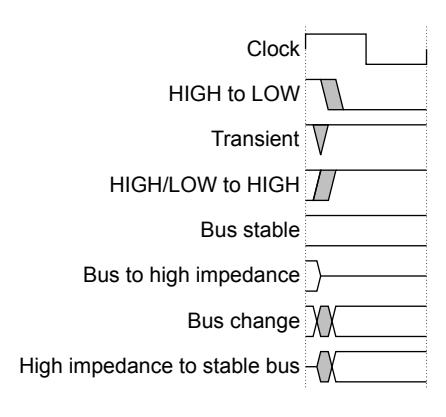

**Figure 1 Key to timing diagram conventions**

# <span id="page-10-0"></span>**Signals**

The signal conventions are:

# **Signal level**

The level of an asserted signal depends on whether the signal is active-HIGH or active-LOW. Asserted means:

- HIGH for active-HIGH signals.
- LOW for active-LOW signals.

# **Lower-case n**

At the start or end of a signal name denotes an active-LOW signal.

# **Additional reading**

This book contains information that is specific to this product. See the following documents for other relevant information.

#### **ARM publications**

- *ARM® AMBA® APB Protocol Specification* (ARM IHI 0024).
- *ARM® AMBA® 3 ATB Protocol Specification* (ARM IHI 0032).
- *ARM® AMBA® AXI and ACE Protocol Specification* (ARM IHI 0022).
- *ARM® AMBA® AXI4-Stream Protocol Specification* (ARM IHI 0051).
- *ARM® Architecture Reference Manual ARMv8, for ARMv8-A architecture profile* (ARM DDI 0487).
- *ARM® CoreSight™ SoC-400 Technical Reference Manual* (ARM DII 0480).
- *ARM® Debug Interface Architecture Specification ADIv5.0 to ADIv5.2* (ARM IHI 0031).
- *ARM® Embedded Trace Macrocell Architecture Specification, ETMv4* (ARM IHI 0064).
- *ARM® Generic Interrupt Controller Architecture Specification GICv3* (ARM IHI 0048).

The following confidential books are only available to licensees:

- *ARM® CoreSight™ Architecture Specification* (ARM IHI 0029).
- *ARM® AMBA® 5 CHI Protocol Specification* (ARM IHI 0050).
- *ARM® Cortex® -A57 MPCore Processor Configuration and Sign-off Guide* (ARM DII 0279).
- *ARM® Cortex® -A57 MPCore Processor Integration Manual* (ARM DII 0280).
- *ARM® Cortex® -A57 MPCore Processor Cryptography Extension Technical Reference Manual* (ARM DDI 0514).

## **Other publications**

- *ANSI/IEEE, IEEE Standard for Binary Floating-Point Arithmetic, Std 754-1985*.
- *ANSI/IEEE, IEEE Standard for Floating-Point Arithmetic, Std 754-2008*.

# <span id="page-11-0"></span>**Feedback**

# **Feedback on this product**

If you have any comments or suggestions about this product, contact your supplier and give:

- The product name.
- The product revision or version.
- An explanation with as much information as you can provide. Include symptoms and diagnostic procedures if appropriate.

# **Feedback on content**

If you have comments on content then send an e-mail to *[errata@arm.com](mailto:errata@arm.com)*. Give:

- The title.
- The number ARM DDI0488G.
- The page number(s) to which your comments refer.
- A concise explanation of your comments.

ARM also welcomes general suggestions for additions and improvements.

| Note                                                                                                                                                             |  |
|------------------------------------------------------------------------------------------------------------------------------------------------------------------|--|
| ARM tests the PDF only in Adobe Acrobat and Acrobat Reader, and cannot guarantee the quality of the<br>represented document when used with any other PDF reader. |  |

# <span id="page-12-0"></span>Chapter 1 **Introduction**

This chapter introduces the Cortex-A57 processor and its features.

It contains the following sections:

- *[1.1 About the Cortex-A57 processor](#page-13-0)* on page 1-14.
- *[1.2 Compliance](#page-14-0)* on page 1-15.
- *1.3 Features* [on page 1-17.](#page-16-0)
- *1.4 Interfaces* [on page 1-18.](#page-17-0)
- *[1.5 Implementation options](#page-18-0)* on page 1-19.
- *[1.6 Test features](#page-19-0)* on page 1-20.
- *[1.7 Product documentation and design flow](#page-20-0)* on page 1-21.
- *[1.8 Product revisions](#page-22-0)* on page 1-23.

# <span id="page-13-0"></span>1.1 About the Cortex-A57 processor

The Cortex-A57 processor is a high-performance, low-power processor that implements the ARMv8-A architecture. It has one to four cores in a single processor device with L1 and L2 cache subsystems.

The following figure shows an example block diagram of a Cortex-A57 processor configuration with four cores

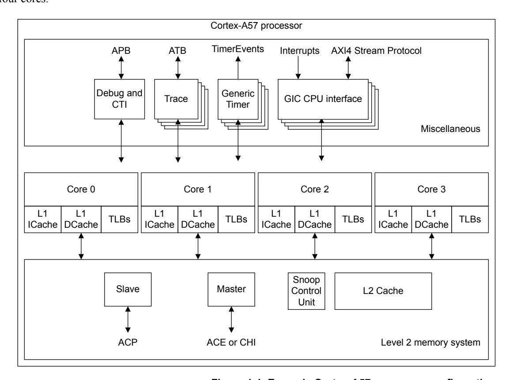

Figure 1-1 Example Cortex-A57 processor configuration

See 2.1.1 Components of the processor on page 2-26 for a description of the Cortex-A57 processor functional components.

# <span id="page-14-0"></span>**1.2 Compliance**

The Cortex-A57 processor complies with, or implements, the specifications described in this section.

This TRM complements architecture reference manuals, architecture specifications, protocol specifications, and relevant external standards. It does not duplicate information from these sources.

This section contains the following subsections:

- *1.2.1 ARM architecture* on page 1-15.
- *1.2.2 Advanced Microcontroller Bus Architecture (AMBA)* on page 1-15.
- *1.2.3 CHI architecture* on page 1-15.
- *1.2.4 Generic Interrupt Controller architecture* on page 1-15.
- *[1.2.5 Generic Timer architecture](#page-15-0)* on page 1-16.
- *[1.2.6 Debug architecture](#page-15-0)* on page 1-16.
- *[1.2.7 Embedded Trace Macrocell architecture](#page-15-0)* on page 1-16.

# **1.2.1 ARM architecture**

The Cortex-A57 processor implements the ARMv8-A architecture. This includes:

- Support for both AArch32 and AArch64 Execution states.
- Support for all Exception levels, EL0, EL1, EL2, and EL3, in each Execution state.
- The A32 instruction set, previously called the ARM instruction set.
- The T32 instruction set, previously called the Thumb instruction set.
- The A64 instruction set.

The Cortex-A57 processor supports the following features:

- Advanced *Single Instruction Multiple Data* (SIMD) operations.
- Floating-point operations.
- Optional Cryptography Extension.

The Cortex-A57 processor does not support the T32EE (ThumbEE) instruction set.

See the *ARM® Architecture Reference Manual ARMv8, for ARMv8-A architecture profile* for more information.

# **1.2.2 Advanced Microcontroller Bus Architecture (AMBA)**

The Cortex-A57 processor complies with the:

- AMBA 4 *AXI Coherency Extensions* (ACE) protocol if the processor memory interface implements an ACE bus interface. See the *ARM® AMBA® AXI and ACE Protocol Specification*.
- AMBA 4 *Advanced eXtensible Interface* (AXI) protocol for the *Accelerator Coherency Port* (ACP) slave interface. See the *ARM® AMBA® AXI and ACE Protocol Specification*.
- AMBA 3 *Advanced Peripheral Bus* (APB) protocol. See the *ARM® AMBA® APB Protocol Specification*.
- AMBA 3 *Advanced Trace Bus* (ATB) protocol. See the *ARM® AMBA® 3 ATB Protocol Specification*.

# **1.2.3 CHI architecture**

The processor complies with the CHI architecture if the memory interface implements a CHI bus interface.

#### **1.2.4 Generic Interrupt Controller architecture**

The Cortex-A57 processor implements the ARM *Generic Interrupt Controller* (GIC) v3 architecture.

The processor includes only the GIC CPU interface. See the *ARM® Generic Interrupt Controller Architecture Specification, GICv3*.

# <span id="page-15-0"></span>**1.2.5 Generic Timer architecture**

The processor implements the ARM Generic Timer architecture. See the *ARM® Architecture Reference Manual ARMv8* for more information.

# **1.2.6 Debug architecture**

The processor implements version 8 of the ARM Debug architecture that complies with the CoreSight architecture.

See the following for more information:

- *ARM® CoreSight™ Architecture Specification*.
- *ARM® Architecture Reference Manual ARMv8, for ARMv8-A architecture profile*.

#### **1.2.7 Embedded Trace Macrocell architecture**

The processor implements the ETMv4 architecture. See the *ARM® Embedded Trace Macrocell Architecture Specification, ETMv4*.

# <span id="page-16-0"></span>**1.3 Features**

The Cortex-A57 processor includes the following features:

- Full implementation of the ARMv8-A architecture profile. See *[1.2 Compliance](#page-14-0)* on page 1-15.
- Superscalar, variable-length, out-of-order pipeline.
- Dynamic branch prediction with *Branch Target Buffer* (BTB) and *Global History Buffer* (GHB) RAMs, a return stack, and an indirect predictor.
- 48-entry fully-associative L1 instruction *Translation Lookaside Buffer* (TLB) with native support for 4KB, 64KB, and 1MB page sizes.
- 32-entry fully-associative L1 data TLB with native support for 4KB, 64KB, and 1MB page sizes.
- 4-way set-associative unified 1024-entry *Level 2* (L2) TLB in each processor.
- Fixed 48K L1 instruction cache and 32K L1 data cache.
- Shared L2 cache of 512KB, 1MB, or 2MB configurable size.
- Fixed *Error Correction Code* (ECC) protection for L2 cache, and optional ECC protection for L1 data cache and parity protection for L1 instruction cache.

requires licensees to have contractual rights to obtain the Cortex-A57 processor Cryptography engine.

- AMBA 4 *AXI Coherency Extensions* (ACE) or CHI master interface.
- *Accelerator Coherency Port* (ACP) implemented as an AXI4 slave interface.
- *Embedded Trace Macrocell* (ETM) based on the ETMv4 architecture.
- *Performance Monitor Unit* (PMU) support based on the PMUv3 architecture.
- *Cross Trigger Interface* (CTI) for multiprocessor debugging.
- Optional Cryptography engine.
- *Generic Interrupt Controller* (GIC) CPU interface.
- Support for power management with multiple power domains.


ARM DDI0488G *Copyright © 2013, 2014 ARM. All rights reserved.* 1-17 *Non-Confidential*

# <span id="page-17-0"></span>**1.4 Interfaces**

The Cortex-A57 processor has the following external interfaces:

- Memory interface that implements either an ACE or CHI interface.
- ACP that implements an AXI slave interface.
- GIC CPU interface that implements an AXI4-Stream interface
- Debug interface that implements an APB slave interface.
- Trace interface that implements an ATB interface.
- PMU interface.
- Generic Timer interface.
- Cross trigger interface.
- Power management interface.
- *Design For Test* (DFT).
- *Memory Built-In Self Test* (MBIST).

See *2.2 Interfaces* [on page 2-29](#page-28-0) for more information.

# <span id="page-18-0"></span>**1.5 Implementation options**

The following table lists the options that the implementer can choose when implementing the Cortex-A57 processor in an SoC.

**Table 1-1 Cortex-A57 processor implementation options**

| Feature                       | Range of options                   |
|-------------------------------|------------------------------------|
| Number of cores               | 1-4                                |
| Cryptography engine           | Included or Not                    |
| L2 cache size                 | 512KB, 1MB, or 2MB                 |
| L2 Tag RAM register slice     | 0 or 1                             |
| L2 Data RAM register slice    | 0, 1, or 2                         |
| L2 arbitration register slice | 0 or 1                             |
| L2 FEQ sizea                  | 0=16 entries, 1=20 entries         |
| Regional gated clock b        | Included or Not                    |
| ECC or parity support         | Supported in L1 and L2, or L2 only |
| Bus interface                 | ACE or CHI                         |
|                               |                                    |

# **Note**

- All the cores share an integrated L2 cache and GIC CPU interface. Each core has the same configuration for the Cryptography engine and L1 ECC or parity.
- The optional Cryptography engine is not included in the base product of the Cortex-A57 processor. ARM requires licensees to have contractual rights to obtain the Cortex-A57 processor Cryptography engine.
- The L2 Tag RAM register slice option adds register slices to the L2 Tag RAMs. The L2 Data RAM register slice option adds register slices to the L2 Data RAMs. The following table lists valid combinations of the L2 Tag RAM and L2 Data RAM register slice options.

**Table 1-2 Valid combinations of L2 Tag and Data RAM register slice**

| L2 Tag RAM register slice | L2 Data RAM register slice |
|---------------------------|----------------------------|
| 0                         | 0                          |
| 0                         | 1                          |
| 0                         | 2                          |
| 1                         | 1                          |
| 1                         | 2                          |

- If the L2 arbitration register slice is included then it adds an additional pipeline stage in the processor-L2 arbitration logic interface.
- The Cortex-A57 processor must be configured with a CHI interface to connect to a CHI interconnect.

a This implementation option is available only in r1p0 and later revisions.

b See *[Regional clock gating](#page-49-0)* on page 2-50 for more information.

# <span id="page-19-0"></span>**1.6 Test features**

The Cortex-A57 processor provides test signals that enable the use of both *Automatic Test Pattern Generation* (ATPG) and MBIST to test the processor and its memory arrays. See *[A Signal Descriptions](#page-530-0)* [on page Appx-A-531](#page-530-0) for more information.

# <span id="page-20-0"></span>**1.7 Product documentation and design flow**

This section describes the Cortex-A57 processor books and how they relate to the design flow in documentation and design flow.

See *[Additional reading](#page-10-0)* on page 11 for more information about the books described in this section. For information on the relevant architectural standards and protocols, see *[1.2 Compliance](#page-14-0)* on page 1-15.

This section contains the following subsections:

- *1.7.1 Documentation* on page 1-21.
- *[1.7.2 Design flow](#page-21-0)* on page 1-22.

#### **1.7.1 Documentation**

The Cortex-A57 processor documentation is as follows:

## **Technical Reference Manual**

The *Technical Reference Manual* (TRM) describes the functionality and the effects of functional options on the behavior of the processor. It is required at all stages of the design flow. The choices made in the design flow can mean that some behavior described in the TRM is not relevant. If you are programming the multiprocessor, additional information must be obtained from:

- The implementer to determine the build configuration of the implementation.
- The integrator to determine the pin configuration of the device that you are using.

**Note**

- The out-of-order design of the Cortex-A57 processor pipeline makes it impossible to provide accurate timing information for complex instructions. The timing of an instruction can be affected by factors such as:
  - Other concurrent instructions.
  - Memory system activity.
  - Events outside the instruction flow.
- Timing information has been provided in the past for some ARM processors to assist in the hand tuning of performance critical code sequences or in the development of an instruction scheduler within a compiler. This timing information is not required for producing optimized instruction sequences on the Cortex-A57 processor. The out-of-order pipeline of the processor can schedule and execute the instructions in an optimal fashion without any instruction reordering required.

#### **Configuration and Sign-off Guide**

The *Configuration and Sign-off Guide* (CSG) describes:

- The available build configuration options and related issues in selecting them.
- How to configure the *Register Transfer Level* (RTL) source files with the build configuration options.
- How to integrate RAM arrays.
- How to run test vectors.
- The processes to sign off the configured design.

The ARM product deliverables include reference scripts and information about using them to implement your design. Reference methodology flows supplied by ARM are example reference implementations. For EDA tool support, contact your EDA vendor.

The CSG is a confidential book that is only available to licensees.

# <span id="page-21-0"></span>**Integration Manual**

The *Integration Manual* (IM) describes how to integrate the processor into an SoC. It describes the signals that the integrator must tie off to configure the macrocell for the required integration. Some of the implementation options might affect which integration options are available.

The IM is a confidential book that is only available to licensees.

## **1.7.2 Design flow**

The Cortex-A57 processor is delivered as synthesizable RTL. Before the processor can be used in a product, it must go through the following process:

#### **Implementation**

The implementer configures and synthesizes the RTL to produce a hard macrocell. This might include integrating the cache RAMs into the design.

## **Integration**

The integrator connects the configured design into a SoC. This includes connecting it to a memory system and peripherals.

#### **Programming**

This is the last process. The system programmer develops the:

- Software to configure the Cortex-A57 processor.
- Software to initialize the Cortex-A57 processor.
- Application software and the SoC tests.

#### Each process:

- Can be performed by a different party.
- Can include implementation and integration choices that affect the behavior and features of the processor.

The operation of the final device depends on:

#### **Build configuration**

The implementer chooses the options that affect how the RTL source files are preprocessed. These options usually include or exclude logic that can affect one or more of the area, maximum frequency, and features of the resulting macrocell.

#### **Configuration inputs**

The integrator configures some features of the processor by tying inputs to specific values. These configurations affect the start-up behavior before any software configuration is made. They can also limit the options available to the software.

#### **Software configuration**

The programmer configures the processor by programming particular values into registers. This affects the behavior of the processor.

| Note                                                                                                                                                                                                                                                                                                                                 |  |
|--------------------------------------------------------------------------------------------------------------------------------------------------------------------------------------------------------------------------------------------------------------------------------------------------------------------------------------|--|
| This manual refers to IMPLEMENTATION DEFINED features that apply to build configuration options.<br>Reference to a feature that is included means that the appropriate build and signal configuration options<br>have been selected. Reference to an enabled feature means that the feature has also been configured by<br>software. |  |

# <span id="page-22-0"></span>**1.8 Product revisions**

This section describes the differences in functionality between product revisions.

**r0p0** First release.

**r0p1** Minor updates:

- Updated the reset value of MIDR\_EL1 and ID\_ISAR4\_EL1.
- Added CPUACTLR\_EL1.[39] to disable instruction merging.

**r1p0** The following changes have been made in this release:

- Updated the reset value of MIDR\_EL1, TRCIDR1, and Peripheral ID2 Registers.
- Added the L2FEQ 20-entry implementation option.
- Added L2 Inclusion PF RAM.
- Added the **DBGL1RSTDISABLE** input signal

**r1p1** The following changes have been made in this release:

- Updated the reset value of MIDR\_EL1.
- **r1p2** Reset **RVBARADDR** sampling.
  - Updated the reset value of MIDR\_EL1, TRCIDR1, and Peripheral ID2 Registers.
  - Changed polarity of CPUACTLR\_EL1.
  - Added implementation-defined SError Interrupt exception classes to Exception Syndrome Registers EL1, EL2, and EL3.

**r1p3** The following changes have been made in this release:

- Updated the reset value of MIDR\_EL1.
- Updated ACE supported transfers for Strongly-ordered or Device transactions.

# <span id="page-23-0"></span>Chapter 2 **Functional Description**

This chapter describes the functionality of the Cortex-A57 processor.

It contains the following sections:

- *[2.1 About the Cortex-A57 processor functions](#page-24-0)* on page 2-25.
- *2.2 Interfaces* [on page 2-29.](#page-28-0)
- *[2.3 Clocking and resets](#page-31-0)* on page 2-32.
- *[2.4 Power management](#page-41-0)* on page 2-42.

# <span id="page-24-0"></span>2.1 About the Cortex-A57 processor functions

The following figure shows a top-level functional diagram of the Cortex-A57 processor.

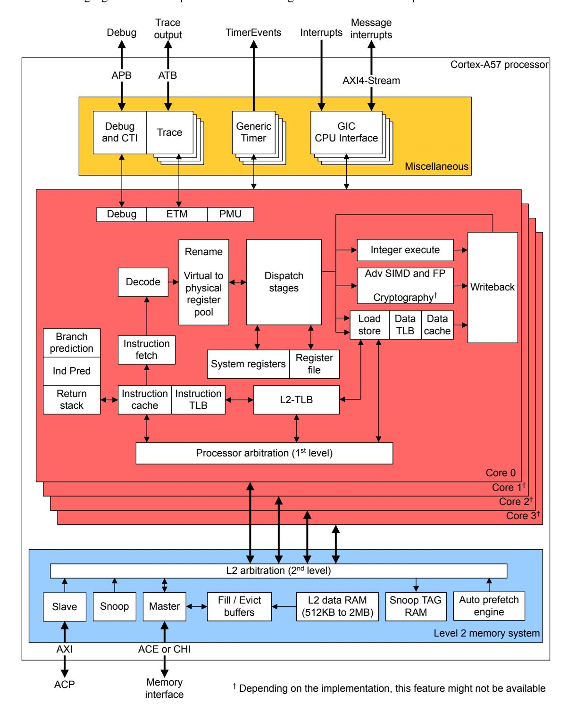

Figure 2-1 Block diagram

This section contains the following subsections:

• 2.1.1 Components of the processor on page 2-26.

# <span id="page-25-0"></span>**2.1.1 Components of the processor**

The main components of the processor are:

- Instruction fetch.
- Instruction decode.
- Instruction dispatch.
- Integer execute.
- Load/Store unit.
- L2 memory system.
- Advanced SIMD and Floating-point unit.
- GIC CPU interface.
- Generic Timer.
- Debug and trace.

## **Instruction fetch**

The instruction fetch unit fetches instructions from L1 instruction cache and delivers up to three instructions per cycle to the instruction decode unit. It supports dynamic and static branch prediction.

The instruction fetch unit includes:

- L1 instruction cache that is a 48KB 3-way set-associative cache with a 64-byte cache line and optional dual-bit parity protection per 32 bits in the Data RAM and 36 bits in the Tag RAM.
- 48-entry fully-associative L1 instruction *Translation Lookaside Buffer* (TLB) with native support for 4KB, 64KB, and 1MB page sizes.
- 2-level dynamic predictor with *Branch Target Buffer* (BTB) for fast target generation.
- Static branch predictor.
- Indirect predictor.
- Return stack.

# **Instruction decode**

The instruction decode unit decodes the following instruction sets:

- A32.
- T32.
- A64.

The instruction decode unit supports the A32, T32, and A64 Advanced SIMD and Floating-point instruction sets. The instruction decode unit also performs register renaming to facilitate out-of-order execution by removing *Write-After-Write* (WAW) and *Write-After-Read* (WAR) hazards.

## **Instruction dispatch**

The instruction dispatch unit controls when the decoded instructions are dispatched to the execution pipelines and when the returned results are retired. It includes:

- The ARM core general-purpose registers.
- The Advanced SIMD and Floating-point register set.
- The AArch32 CP15 and AArch64 System registers.

# **Integer execute**

The integer execute unit includes:

- Two symmetric *Arithmetic Logical Unit* (ALU) pipelines.
- Integer multiply-accumulate and ALU pipelines.
- Iterative integer divide hardware.
- Branch and instruction condition codes resolution logic.
- Result forwarding and comparator logic.

# **Load/Store unit**

The *Load/Store* (LS) execution unit executes load and store instructions and encompasses the L1 data side memory system. It also services memory coherency requests from the L2 memory system.

The load/store unit includes:

- L1 data cache that is a 32KB 2-way set-associative cache with a 64-byte cache line and optional *Error Correction Code* (ECC) protection per 32 bits.
- 32-entry fully-associative L1 data TLB with native support for 4KB, 64KB, and 1MB page sizes.

#### **L2 memory system**

The L2 memory system services L1 instruction and data cache misses from each processor. It manages requests on the AMBA 4 *AXI Coherency Extension*s (ACE) or CHI master interface and the *Accelerator Coherency Port* (ACP) slave interface.

The L2 memory system includes:

- L2 cache that is:
  - 512KB, 1MB, or 2MB configurable size.
  - 16-way set-associative cache with data ECC protection per 64 bits.
- Duplicate copy of L1 data cache Tag RAMs from each processor for handling snoop requests.
- 4-way set-associative of 1024-entry L2 TLB in each processor.
- Automatic hardware prefetcher with programmable instruction fetch and load/store data prefetch distances.

### **Related information**

*[7 Level 2 Memory System](#page-297-0)* on page 7-298*.*

# **Advanced SIMD and Floating-point unit**

The Advanced SIMD and Floating-point unit provides support for the ARMv8 Advanced SIMD and Floating-point execution. In addition, the Advanced SIMD and Floating-point unit provides support for the optional Cryptography engine.

| Note |  |
|------|--|
|------|--|

The optional Cryptography engine is not included in the base product of the Cortex-A57 processor. ARM requires licensees to have contractual rights to obtain the Cortex-A57 processor Cryptography engine.

#### **Related information**

*[14 Advanced SIMD and Floating-point](#page-512-0)* on page 14-513*.*

# **GIC CPU interface**

The *Generic Interrupt Controller* (GIC) CPU interface delivers interrupts to the processor.

## **Related information**

*[8 Generic Interrupt Controller CPU Interface](#page-317-0)* on page 8-318*.*

#### **Generic Timer**

The Generic Timer provides the ability to schedule events and trigger interrupts.

# **Related information**

*[9 Generic Timer](#page-337-0)* on page 9-338*.*

# **Debug and trace**

The debug and trace unit includes:

- Support for ARMv8 Debug architecture with an AMBA *Advanced Peripheral Bus* (APB) slave interface for access to the debug registers.
- *Performance Monitor Unit* (PMU) based on the PMUv3 architecture.
- *Embedded Trace Macrocell* (ETM) based on the ETMv4 architecture and an AMBA *Advanced Trace Bus* (ATB) interface for each processor.
- Cross trigger interfaces for core debugging.

# **Related information**

*10 Debug* [on page 10-343](#page-342-0)*.*

*[11 Performance Monitor Unit](#page-395-0)* on page 11-396*.*

*[12 Cross Trigger](#page-434-0)* on page 12-435*.*

*[13 Embedded Trace Macrocell](#page-458-0)* on page 13-459*.*

# <span id="page-28-0"></span>**2.2 Interfaces**

This section describes the external interfaces within the Cortex-A57 processor.

This section contains the following subsections:

- *2.2.1 Memory interface* on page 2-29.
- *2.2.2 Accelerator Coherency Port* on page 2-29.
- *2.2.3 GIC CPU interface* on page 2-29.
- *2.2.4 Debug interface* on page 2-29.
- *[2.2.5 Trace interface](#page-29-0)* on page 2-30.
- *[2.2.6 PMU interface](#page-29-0)* on page 2-30.
- *[2.2.7 Generic Timer interface](#page-29-0)* on page 2-30.
- *[2.2.8 Cross trigger interface](#page-29-0)* on page 2-30.
- *[2.2.9 Power management interface](#page-29-0)* on page 2-30.
- *2.2.10 DFT* [on page 2-30.](#page-29-0)
- *2.2.11 MBIST* [on page 2-30.](#page-29-0)

# **2.2.1 Memory interface**

The processor has a memory interface that implements either an AMBA 4 ACE or CHI bus interface:

- ACE is an extension to the *Advanced eXtensible Interface* (AXI) protocol and provides the following enhancements:
  - Support for hardware cache coherency.
  - Barrier transactions that guarantee transaction ordering.
  - Distributed virtual memory messaging, enabling management of a virtual memory system.

See the *ARM® AMBA® AXI and ACE Protocol Specification* for more information.

• CHI is a protocol that provides an architecture for connecting multiple nodes using a scalable interconnect. The nodes on the interconnect might be cores, core clusters, I/O bridges, memory controllers, or graphics processors. See the *ARM® AMBA® 5 CHI Protocol Specification*.

# **2.2.2 Accelerator Coherency Port**

The processor implements an *Accelerator Coherency Port* (ACP). This is an AMBA 4 AXI slave interface.

The ACP slave interface supports memory coherent accesses to the Cortex-A57 processor memory system, but cannot receive coherent requests, barriers, or distributed virtual memory messages.

# **Related information**

*[10.10 External debug interface](#page-381-0)* on page 10-382*. [AMBA AXI and ACE Protocol Specification.](http://infocenter.arm.com/help/index.jsp?topic=/com.arm.doc.ihi0022e/index.html)*

# **2.2.3 GIC CPU interface**

The processor implements an AMBA AXI-4 Stream interface that enables access to the GIC CPU interface.

See *[8 Generic Interrupt Controller CPU Interface](#page-317-0)* on page 8-318 for more information.

#### **2.2.4 Debug interface**

The Cortex-A57 processor implements an AMBA 3 APB slave interface that enables access to the debug registers.

# **Related information**

*[10.10 External debug interface](#page-381-0)* on page 10-382*.*

# <span id="page-29-0"></span>**2.2.5 Trace interface**

The processor implements dedicated AMBA 3 ATB interfaces for each core that outputs trace information for debugging. The ATB interface is compatible with the CoreSight architecture.

#### **Related information**

*[13.3 ETM functional description](#page-462-0)* on page 13-463*.*

# **2.2.6 PMU interface**

The processor implements Performance Monitors and provides an interrupt output and an event interface for each core.

#### **Related information**

*[11 Performance Monitor Unit](#page-395-0)* on page 11-396*.*

# **2.2.7 Generic Timer interface**

The processor has a global timer input and each core has four timer interrupt outputs.

## **Related information**

*[9 Generic Timer](#page-337-0)* on page 9-338*.*

## **2.2.8 Cross trigger interface**

The processor implements a single cross trigger channel interface. This external interface is connected to the CoreSight *Cross Trigger Interface* (CTI) corresponding to each core through a simplified *Cross Trigger Matrix* (CTM).

## **Related information**

*[12 Cross Trigger](#page-434-0)* on page 12-435*.*

## **2.2.9 Power management interface**

The processor provides Q-channel interfaces that enable an external power controller to control the retention state of each core and the L2 RAMs.

# **Related information**

*[Processor dynamic retention](#page-45-0)* on page 2-46*. [L2 RAMs dynamic retention](#page-47-0)* on page 2-48*.*

#### **2.2.10 DFT**

The processor implements a *Design For Test* (DFT) interface that enables an industry-standard *Automatic Test Pattern Generation* (ATPG) tool to test logic outside of the embedded memories.

# **Related information**

*A.16.1 DFT signals* [on page Appx-A-565](#page-564-0)*. ARM Cortex-A57 MPCore Processor Integration Manual.*

# **2.2.11 MBIST**

The *Memory Built-In Self Test* (MBIST) interface provides support for manufacturing testing of the memories embedded in the Cortex-A57 processor. MBIST is the industry-standard method of testing embedded memories. MBIST works by performing sequences of reads and writes to the memory based on test algorithms.

# **Related information**

*[A.16 DFT and MBIST signals](#page-564-0)* on page Appx-A-565*. ARM Cortex-A57 MPCore Processor Integration Manual.*

# <span id="page-31-0"></span>**2.3 Clocking and resets**

Clocks and resets used within the processor are described in this section.

This section contains the following subsections:

- *2.3.1 Clocks* on page 2-32.
- *2.3.2 Resets* [on page 2-36.](#page-35-0)

# **2.3.1 Clocks**

The processor has the following clock inputs:

# **CLK**

This is the main clock of the Cortex-A57 processor. All cores, the shared L2 memory system logic, the GIC, and the Generic Timer are clocked with a distributed version of **CLK**.

# **PCLKDBG**

This is the APB clock that controls the Debug APB, CTI, and CTM logic in the **PCLKDBG** domain. **PCLKDBG** is asynchronous to **CLK**.

The processor has the following clock enable inputs:

maintained.

# **ACLKENM**

The AXI master interface is a synchronous AXI interface that can operate at any integer multiple that is equal to or slower than the processor clock, **CLK**, using the **ACLKENM** signal. For example, you can set the **CLK** to **ACLKM** frequency ratio to 1:1, 2:1, or 3:1, where **ACLKM** is the AXI master clock. **ACLKENM** asserts one **CLK** cycle prior to the rising edge of **ACLKM**. The **CLK** to **ACLKM** frequency ratio can be changed dynamically using **ACLKENM**.

The following figure shows a timing example of **ACLKENM** that changes the **CLK** to **ACLKM** frequency ratio from 3:1 to 1:1.

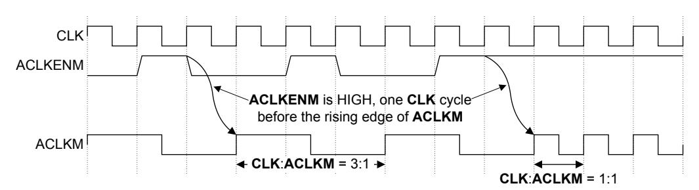

**Figure 2-2 ACLKENM with CLK:ACLKM ratio changing from 3:1 to 1:1**


## **SCLKEN**

The CHI interface is a synchronous interface that can operate at any integer multiple that is equal to or slower than the processor clock, **CLK**, using the **SCLKEN** signal. For example, you can set the **CLK** to **SCLK** frequency ratio to 1:1, 2:1, or 3:1, where **SCLK** is the CHI clock. **SCLKEN** asserts one **CLK** cycle prior to the rising edge of **SCLK**. The **CLK** to **SCLK** frequency ratio can be changed dynamically using **SCLKEN**.

The following figure shows a timing example of **SCLKEN** that changes the **CLK** to **SCLK** frequency ratio from 3:1 to 1:1.

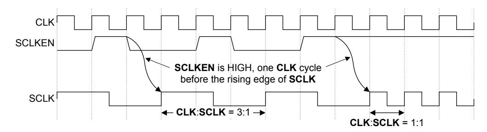

**Figure 2-3 SCLKEN with CLK:SCLK ratio changing from 3:1 to 1:1**

**Note**

- The previous figure shows the timing relationship between the CHI clock, **SCLK** and **SCLKEN**, where **SCLKEN** asserts one **CLK** cycle before the rising edge of **SCLK**. It is important that the relationship between **SCLK** and **SCLKEN** is maintained.
- The input signal **SCLKEN** exists in the processor if it is configured to include the CHI interface.

# **ACLKENS**

ACP is a synchronous AXI slave interface that can operate at any integer multiple that is equal to or slower than the processor clock, **CLK**, using the **ACLKENS** signal. For example, the **CLK** to **ACLKS** frequency ratio can be 1:1, 2:1, or 3:1, where **ACLKS** is the AXI slave clock. **ACLKENS** asserts one **CLK** cycle before the rising edge of **ACLKS**. The **CLK** to **ACLKS** frequency ratio can be changed dynamically using **ACLKENS**.

The following figure shows a timing example of **ACLKENS** that changes the **CLK** to **ACLKS** frequency ratio from 3:1 to 1:1.

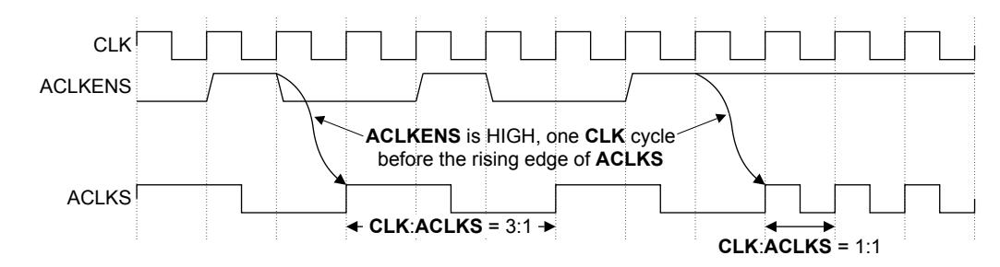

**Figure 2-4 ACLKENS with CLK:ACLKS ratio changing from 3:1 to 1:1**

**Note**

The previous figure shows the timing relationship between the ACP clock, **ACLKS** and **ACLKENS**, where **ACLKENS** asserts one **CLK** cycle before the rising edge of **ACLKS**. It is important that the relationship between **ACLKS** and **ACLKENS** is maintained.

## **PCLKENDBG**

The Debug APB interface is an asynchronous interface that can operate at any integer multiple that is equal to or slower than the APB clock, **PCLKDBG**, using the **PCLKENDBG** signal. For example, the **PCLKDBG** to internal **PCLKDBG** frequency ratio can be 1:1, 2:1, or 3:1. **PCLKENDBG** asserts one **PCLKDBG** cycle before the rising edge of the internal **PCLKDBG**. The **PCLKDBG** to internal **PCLKDBG** frequency ratio can be changed dynamically using **PCLKENDBG**.

The following figure shows a timing example of **PCLKENDBG** that changes the **PCLKDBG** to internal **PCLKDBG** frequency ratio from 2:1 to 1:1.

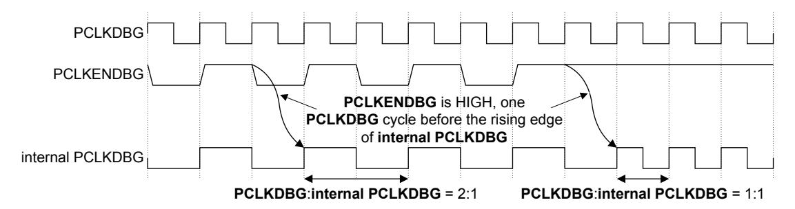

**Figure 2-5 PCLKENDBG with PCLKDBG:internal PCLKDBG ratio changing from 2:1 to 1:1**

#### **ATCLKEN**

The ATB interface is a synchronous interface that can operate at any integer multiple that is slower than the processor clock, **CLK**, using the **ATCLKEN** signal. For example, the **CLK** to **ATCLK** frequency ratio can be 2:1, 3:1, or 4:1, where **ATCLK** is the ATB bus clock. **ATCLKEN** asserts three **CLK** cycles before the rising edge of **ATCLK**. Three **CLK** cycles are required to allow propagation delay from the **ATCLKEN** input to the processor. The **CLK** to **ATCLK** frequency ratio can be changed dynamically using **ATCLKEN**.

The following figure shows a timing example of **ATCLKEN** where the **CLK** to **ATCLK** frequency ratio is 2:1.

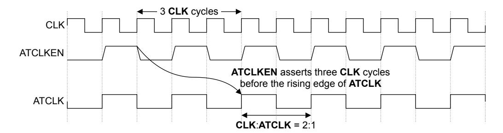

**Figure 2-6 ATCLKEN with CLK:ATCLK ratio at 2:1**

#### **CNTCLKEN**

The **CNTVALUEB** is a synchronous 64-bit binary encoded counter value that can operate at any integer multiple that is equal to or slower than the processor clock, **CLK**, using the **CNTCLKEN** signal. For example, you can set the **CLK** to **CNTCLK** frequency ratio to 1:1, 2:1, or 3:1, where **CNTCLK** is the system counter clock. **CNTCLKEN** asserts one **CLK** cycle prior to the rising edge of **CNTCLK**.

The following figure shows a timing example of **CNTCLKEN** where the **CLK** to **CNTCLK** frequency ratio is 2:1.

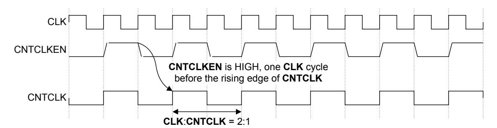

**Figure 2-7 CNTCLKEN with CLK:CNTCLK ratio at 2:1**

#### **CLKEN**

This is the clock enable for all internal clocks in the processor that are derived from **CLK**. The **CLKEN** signal must be asserted at least one cycle before applying **CLK** to the processor.

When all the cores and L2 are in WFI low-power state, you can place the processor in a lowpower state using the **CLKEN** input. Setting **CLKEN** LOW disables all of the internal clocks, excluding the asynchronous Debug APB **PCLKDBG** domain.

# **Related information**

*[L2 Wait for Interrupt](#page-43-0)* on page 2-44*.*

# <span id="page-35-0"></span>**2.3.2 Resets**

The Cortex-A57 processor has the following reset inputs:

# **nCPUPORESET[N:0]**

Initializes the entire core logic, including Debug, ETM, breakpoint and watchpoint logic in the processor **CLK** domain. Each core has one **nCPUPORESET** reset input.

# **nCORERESET[N:0]**

Initializes the entire core but excludes the Debug, ETM, breakpoint and watchpoint logic. Each core has one **nCORERESET** reset input.

#### **nPRESETDBG**

Initializes the shared Debug APB, CTI, and CTM logic in the **PCLKDBG** domain.

# **nL2RESET**

Initializes the shared L2 memory system, GIC, and Timer logic.

#### **nMBISTRESET**

Performs an MBIST mode reset.

All resets are active-LOW inputs. The reset signals enable you to reset different areas of the processor independently. The following table shows the areas of the processor controlled by the various reset signals.

**Table 2-1 Areas that the reset signals control**

| Reset signal | Corec<br>(CLK) | Debug and<br>ETM (CLK) | Debug APB, CTI, and<br>CTM (PCLKDBG) | L2 memory system,<br>shared GIC and<br>Timer logic | Individual processor<br>GIC and Timer logic |
|--------------|----------------|------------------------|--------------------------------------|----------------------------------------------------|---------------------------------------------|
| nCPUPORESET  | Reset          | Reset                  | -                                    | -                                                  | Reset                                       |
| nCORERESET   | Reset          | -                      | -                                    | -                                                  | Reset                                       |
| nPRESETDBG   | -              | -                      | Reset                                | -                                                  | -                                           |
| nL2RESET     | -              | -                      | -                                    | Reset                                              | Reset                                       |

The following table shows the valid reset combinations the processor supports. The core which is being reset is indicated by [n].

**Table 2-2 Valid reset combinations**

| Reset combination                                              | Signals          | Value    | Description                                                                               |
|----------------------------------------------------------------|------------------|----------|-------------------------------------------------------------------------------------------|
| Full powerup reset for the                                     | nCPUPORESET[N:0] | all = 0  | All logic is held in reset.                                                               |
| processor                                                      | nCORERESET[N:0]  | all = 0  |                                                                                           |
|                                                                | nPRESETDBG       | 0        |                                                                                           |
|                                                                | nL2RESET         | 0        |                                                                                           |
|                                                                | nMBISTRESET      | 1        |                                                                                           |
| Individual core powerup reset<br>with Debug (PCLKDBG)<br>reset | nCPUPORESET[N:0] | [n] = 0  | Individual core in the CLK domain and Debug in the PCLKDBG                                |
|                                                                | nCORERESET[N:0]  | [n] = 0d | domain are held in reset, so that the core and Debug PCLKDBG<br>domain can be powered up. |
|                                                                | nPRESETDBG       | 0        |                                                                                           |
|                                                                | nL2RESET         | 1        |                                                                                           |
|                                                                | nMBISTRESET      | 1        |                                                                                           |

c Core logic, excluding Debug, ETM, breakpoint, and watchpoint logic.

d For powerup reset or core reset, **nCPUPORESET** must be asserted. **nCORERESET** can be asserted, but is not required.

**Table 2-2 Valid reset combinations (continued)**

| Reset combination                                    | Signals          | Value    | Description                                                           |
|------------------------------------------------------|------------------|----------|-----------------------------------------------------------------------|
| All core and L2 reset with<br>Debug (PCLKDBG) active | nCPUPORESET[N:0] | all = 0  | All cores and L2 are held in reset, so they can be powered up. This   |
|                                                      | nCORERESET[N:0]  | all = 0d | enables external debug over powerdown for all cores.                  |
|                                                      | nPRESETDBG       | 1        |                                                                       |
|                                                      | nL2RESET         | 0        |                                                                       |
|                                                      | nMBISTRESET      | 1        |                                                                       |
| Individual core powerup reset                        | nCPUPORESET[N:0] | [n] = 0  | Individual core is held in reset, so that the core can be powered up. |
| with Debug (PCLKDBG)                                 | nCORERESET[N:0]  | [n] = 0d | This enables external debug over powerdown for the processor that     |
| active                                               | nPRESETDBG       | 1        | is held in reset.                                                     |
|                                                      | nL2RESET         | 1        |                                                                       |
|                                                      | nMBISTRESET      | 1        |                                                                       |
| All cores Warm reset                                 | nCPUPORESET[N:0] | all = 1  | All logic, excluding Debug and ETM (CLK and PCLKDBG) and              |
|                                                      | nCORERESET[N:0]  | all = 0  | L2, is held in reset. All breakpoints and watchpoints are retained.   |
|                                                      | nPRESETDBG       | 1        |                                                                       |
|                                                      | nL2RESET         | 1        |                                                                       |
|                                                      | nMBISTRESET      | 1        |                                                                       |
| All cores Warm reset and L2                          | nCPUPORESET[N:0] | all = 1  | All logic, excluding Debug and ETM (CLK and PCLKDBG), is              |
| reset                                                | nCORERESET[N:0]  | all = 0  | held in reset. All breakpoints and watchpoints are retained.          |
|                                                      | nPRESETDBG       | 1        |                                                                       |
|                                                      | nL2RESET         | 0        |                                                                       |
|                                                      | nMBISTRESET      | 1        |                                                                       |
| Individual core Warm reset                           | nCPUPORESET[N:0] | [n] = 1  | Individual core logic, excluding the ETM and Debug in the CLK         |
|                                                      | nCORERESET[N:0]  | [n] = 0  | domain, is held in reset. Breakpoints and watchpoints for that core   |
|                                                      | nPRESETDBG       | 1        | are retained.                                                         |
|                                                      | nL2RESET         | 1        |                                                                       |
|                                                      | nMBISTRESET      | 1        |                                                                       |
| Debug (PCLKDBG) reset                                | nCPUPORESET[N:0] | all = 1  | Debug in the PCLKDBG domain is held in reset, so that the             |
|                                                      | nCORERESET[N:0]  | all = 1  | Debug PCLKDBG domain can be powered up.                               |
|                                                      | nPRESETDBG       | 0        |                                                                       |
|                                                      | nL2RESET         | 1        |                                                                       |
|                                                      | nMBISTRESET      | 1        |                                                                       |
| Run mode                                             | nCPUPORESET[N:0] | 1        | No logic is held in reset.                                            |
|                                                      | nCORERESET[N:0]  | 1        |                                                                       |
|                                                      | nPRESETDBG       | 1        |                                                                       |
|                                                      | nL2RESET         | 1        |                                                                       |
|                                                      |                  |          |                                                                       |

**Note**

- **nL2RESET** resets the shared L2 memory system logic, GIC, and Generic Timer that is common to all cores. This reset must not assert while any individual processor is active.
- **nPRESETDBG** resets the shared Debug, **PCLKDBG**, that is common to all cores. This reset must not assert while any individual core is actively being debugged in normal operating mode or during external debug over powerdown.

There are specific requirements that you must meet to reset each reset area listed in *[Table 2-1 Areas that](#page-35-0) [the reset signals control](#page-35-0)* on page 2-36. Not adhering to these requirements can lead to a reset area that is not functional.

The reset sequences in the following sections are the only reset sequences that ARM recommends. Any deviation from these sequences might cause an improper reset of that reset domain. The supported reset sequences are:

- *Powerup reset* on page 2-38.
- *Warm reset* [on page 2-39](#page-38-0).
- *[Debug PCLKDBG reset](#page-39-0)* on page 2-40.
- *[WARMRSTREQ and DBGRSTREQ](#page-39-0)* on page 2-40.
- *[Memory arrays reset](#page-39-0)* on page 2-40.

#### **Powerup reset**

Powerup reset is also known as Cold reset. This section describes the sequence for:

- A full powerup reset.
- An individual core powerup reset.

The full powerup reset initializes all logic in the processor. You must apply powerup reset to the processor when power is first applied to the SoC. Logic in all clock domains are placed in a benign state following the deassertion of the reset sequence.

The following figure shows the full powerup reset sequence for the Cortex-A57 processor.

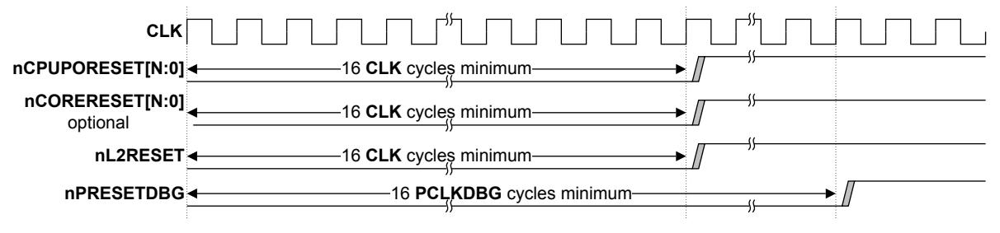

**Figure 2-8 Powerup reset timing**

On full powerup reset for the processor, perform the following reset sequence:

- 1. Apply **nCPUPORESET**, **nL2RESET**, and **nPRESETDBG**. The remaining core reset, **nCORERESET** can assert, but is not required.
- 2. **nCPUPORESET** and **nL2RESET** must assert for at least 16 **CLK** cycles. **nPRESETDBG** must assert for at least 16 **PCLKDBG** cycles. Holding the resets for this duration ensures that the resets propagate to all locations within the processor.
- 3. **nL2RESET** must deassert in the same cycle as the core resets, or before any of the core resets deassert.

<span id="page-38-0"></span>Individual core powerup reset initializes all logic in a single core. You must apply the powerup reset when the individual core is being powered up, so that power to the core can be safely applied. You must apply the correct sequence before applying a powerup reset to that core.

For individual core powerup reset:

- **nCPUPORESET** for that core must assert for at least 16 **CLK** cycles.
- **nL2RESET** must not assert while any individual core is active.
- **nPRESETDBG** must not assert while any individual core is actively being debugged in normal operating mode or during external debug over powerdown.

| Note |  |
|------|--|
|      |  |

If core dynamic retention using the CPU Q-channel interface is used, the core must be in quiescent state with **STANDBYWFI** asserted and **CPUQREQn**, **CPUQACCEPTn**, and **CPUQACCEPT** must be LOW before **nCPUPORESET** is applied.

#### **Warm reset**

The Warm reset initializes all logic in the individual core apart from the Debug and ETM logic in the **CLK** domain. All breakpoints and watchpoints are retained during a Warm reset sequence.

The following figure shows the Warm reset sequence for the Cortex-A57 processor.

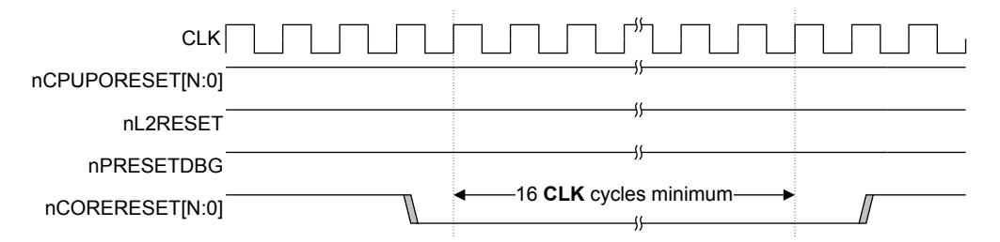

**Figure 2-9 Warm reset timing**

Individual core Warm reset initializes all logic in a single core apart from its Debug, ETM, breakpoint, and watchpoint logic. Breakpoints and watchpoints for that core are retained. You must apply the correct sequence before applying Warm reset to that core.

For individual processor Warm reset:

- You must apply steps *1* [page 2-53](#page-52-0) to *11* [page 2-53](#page-52-0) in the core powerdown sequence, see *[Individual core powerdown](#page-52-0)* on page 2-53, and wait until **STANDBYWFI** is asserted, indicating that the core is idle, before asserting **nCORERESET** for that core.
- **nCORERESET** for that core must assert for at least 16 **CLK** cycles.
- **nL2RESET** must not assert while any individual core is active.
- **nPRESETDBG** must not assert while any individual core is actively being debugged in normal operating mode.

| Note |  |  |  |  |
|------|--|--|--|--|
|      |  |  |  |  |
|      |  |  |  |  |

If core dynamic retention using the CPU Q-channel interface is used, the core must be in quiescent state with **STANDBYWFI** asserted and **CPUQREQn**, **CPUQACCEPTn**, and **CPUQACCEPT** must be LOW before **nCORERESET** is applied.

# <span id="page-39-0"></span>**Debug PCLKDBG reset**

Use **nPRESETDBG** to reset the Debug APB, CTI, and CTM logic in the **PCLKDBG** domain. This reset holds the Debug **PCLKDBG** unit in a reset state so that the power to the unit can be safely applied during powerup.

To safely reset the Debug **PCLKDBG** unit, **nPRESETDBG** must assert for a minimum of 16 **PCLKDBG** cycles.

The following figure shows the Debug **PCLKDBG** reset sequence.

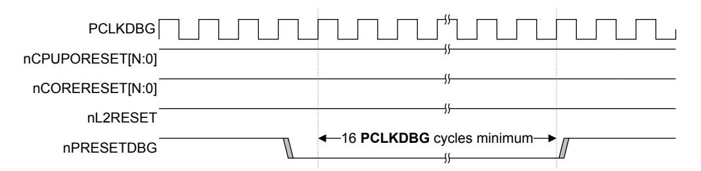

**Figure 2-10 Debug PCLKDBG reset timing**

## **WARMRSTREQ and DBGRSTREQ**

The ARMv8-A architecture provides a mechanism to configure whether a processor uses AArch32 or AArch64 at EL3 as a result of a Warm reset. When the Reset Request bit in the RMR or RMR\_EL3 register is set to 1, the processor asserts the **WARMRSTREQ** signal and the SoC reset controller can use this request to trigger a Warm reset of the core and change the register width state. The AA64 bit in the RMR or RMR\_EL3 register selects the register width at the next Warm reset, at the highest Exception level, EL3.

See the *ARM® Architecture Reference Manual ARMv8, for ARMv8-A architecture profile* for information about the recommended code sequence to use, to request a Warm reset.

You must apply steps *1* [page 2-53](#page-52-0) to *11* [page 2-53](#page-52-0) in the core powerdown sequence, and wait until **STANDBYWFI** asserts indicating the processor is idle, before asserting **nCORERESET** for that core. **nCORERESET** must satisfy the timing requirements described in the Warm reset section.

The *Core Warm Reset Request* (CWRR) bit in the External Debug Power/Reset Control Register, EDPRCR, controls the **DBGRSTREQ** signal. An external debugger can use this bit to request a Warm reset of the processor, if it does not have access to the core Warm reset signal. See the *ARM® Architecture Reference Manual ARMv8, for ARMv8-A architecture profile* for more information about the EDPRCR.

#### **Related information**

*[4.3.61 Reset Management Register, EL3](#page-175-0)* on page 4-176*. [Individual core powerdown](#page-52-0)* on page 2-53*. Warm reset* [on page 2-39](#page-38-0)*.*

# **Memory arrays reset**

During a core reset, the following memory arrays in the core are invalidated:

- Branch Prediction arrays such as BTB, GHB, and Indirect Predictor.
- L1 instruction and data TLBs.
- L1 instruction and data caches.
- L2 unified TLB.

In addition to these core memory arrays, during a powerup reset, the following shareable memory arrays are invalidated:

- L2 duplicate Snoop Tag RAM.
- L2 prefetch stride queue RAM.
- L2 unified cache RAM, if **L2RSTDISABLE** is tied LOW.

The L1 instruction and data cache resets can take up to 128 **CLK** cycles after the deasserting edge of the reset signals, with each array being reset in parallel. Depending on the size of the L2 cache, the L2 cache reset can take 640 **CLK** cycles for a 512KB L2 cache or 2560 **CLK** cycles for a 2MB L2 cache. The L2 cache reset occurs in the background, in parallel with the L1 cache resets. The core can begin execution in Non-cacheable state, but any attempt to perform Cacheable transactions stalls the core until the appropriate cache reset is complete.

The branch prediction arrays require 512 **CLK** cycles to reset after the deasserting edge of reset. The core begins execution with branch prediction disabled, any resolved branches do not update the branch predictor until the reset sequence completes.

The processor input signal, **L2RSTDISABLE**, controls the L2 cache hardware reset process. The usage models for the **L2RSTDISABLE** signal are as follows:

- When the processor powers up for the first time, **L2RSTDISABLE** must be held LOW to invalidate the L2 cache using the L2 cache hardware reset mechanism.
- For systems that do not retain the L2 cache RAM contents while the L2 memory system is powered down, **L2RSTDISABLE** must be held LOW to invalidate the L2 cache using the L2 cache hardware reset mechanism.
- For systems that retain the L2 cache RAM contents while the L2 memory system is powered down, **L2RSTDISABLE** must be held HIGH to disable the L2 cache hardware reset mechanism.

The **L2RSTDISABLE** signal is sampled during **nL2RESET** assertion and must be held a minimum of 32 **CLK** cycles after the deasserting edge of **nL2RESET**.

# <span id="page-41-0"></span>**2.4 Power management**

The Cortex-A57 processor provides mechanisms and support to control both dynamic and static power dissipation.

This section contains the following subsections:

- *2.4.1 Dynamic power management* on page 2-42.
- *[2.4.2 Power domains](#page-50-0)* on page 2-51.
- *[2.4.3 Power modes](#page-51-0)* on page 2-52.
- *[2.4.4 Using SMPEN as a power mode indicator](#page-57-0)* on page 2-58.

# **2.4.1 Dynamic power management**

This section describes the following dynamic power management features in the processor:

- *Core Wait for Interrupt* on page 2-42.
- *[Core Wait for Event](#page-42-0)* on page 2-43.
- *[Event communication using WFE and SEV instructions](#page-42-0)* on page 2-43.
- *[CLREXMON request and acknowledge signaling](#page-42-0)* on page 2-43.
- *[L2 Wait for Interrupt](#page-43-0)* on page 2-44.
- *[L2 hardware cache flush](#page-44-0)* on page 2-45.
- *[Processor dynamic retention](#page-45-0)* on page 2-46.
- *[L2 RAMs dynamic retention](#page-47-0)* on page 2-48.
- *[Advanced SIMD and FP clock gating](#page-48-0)* on page 2-49.
- *[L2 control and tag banks clock gating](#page-48-0)* on page 2-49.
- *[Regional clock gating](#page-49-0)* on page 2-50.

# **Core Wait for Interrupt**

*Wait for Interrupt* (WFI) is a feature of the ARMv8-A architecture that puts the core in a low-power state by disabling the clocks in the core while keeping the core powered up. This reduces the power drawn to the static leakage when the core is in WFI low-power state.

A core enters into WFI low-power state by executing the WFI instruction.

When executing the WFI instruction, the core waits for all instructions in the core to retire before entering the idle or low-power state. The WFI instruction ensures that all explicit memory accesses occurred before the WFI instruction in program order, have retired. For example, the WFI instruction ensures that the following instructions receive the required data or responses from the L2 memory system:

- Load instructions.
- Cache and TLB maintenance operations.
- Store-Exclusive instructions.

In addition, the WFI instruction ensures that store instructions update the cache or are issued to the L2 memory system.

While the core is in WFI low-power state, the clocks in the core are temporarily enabled without causing the core to exit WFI low-power state, when any of the following events are detected:

- An L2 snoop request that must be serviced by the core L1 data cache.
- A cache, TLB, or BTB maintenance operation that must be serviced by the core L1 instruction cache, data cache, instruction TLB, data TLB, or BTB.
- An APB access to the debug or trace registers residing in the core power domain.

The core exits from WFI low-power state when it detects a reset or a WFI wake-up event occurs. See the *ARM® Architecture Reference Manual ARMv8, for ARMv8-A architecture profile* for information about the various WFI wake-up events.

<span id="page-42-0"></span>On entry into WFI low-power state, **STANDBYWFI** for that core is asserted. **STANDBYWFI** continues to assert even if the clocks in the core are temporarily enabled because of an L2 snoop request, cache, TLB, and BTB maintenance operation or an APB access.

# **Core Wait for Event**

*Wait for Event* (WFE) is a feature of the ARMv8-A architecture that uses a locking mechanism based on events to put the core in a low-power state by disabling the clocks in the core while keeping the core powered up. This reduces the power drawn to the static leakage current, when the core is in WFE lowpower state.

A core enters into WFE low-power state by executing the WFE instruction. When executing the WFE instruction, the core waits for all instructions in the core to complete before entering the idle or lowpower state. The WFE instruction ensures that all explicit memory accesses occurred before the WFE instruction in program order, have completed.

While the core is in WFE low-power state, the clocks in the core are temporarily enabled without causing the core to exit WFE low-power state, when any of the following events are detected:

- An L2 snoop request that must be serviced by the core L1 data cache.
- A cache, TLB, or BTB maintenance operation that must be serviced by the core L1 instruction cache, data cache, instruction TLB, data TLB, or BTB.
- An APB access to the debug or trace registers residing in the core power domain.

The cores exits from WFE low-power state when:

- It detects a reset.
- The **EVENTI** input signal asserts.
- The **CLREXMONREQ** input signal asserts.
- A WFE wake-up event occurs. See the *ARM® Architecture Reference Manual ARMv8, for ARMv8-A architecture profile* for information about the various WFE wake-up events.

On entry into WFE low-power state, **STANDBYWFE** for that core is asserted. **STANDBYWFE** continues to assert even if the clocks in the core are temporarily enabled because of an L2 snoop request, cache, TLB, and BTB maintenance operation or an APB access.

#### **Event communication using WFE and SEV instructions**

The **EVENTI** signal enables an external agent to participate in the WFE and SEV event communication. When this signal is asserted, it sends an event message to all the cores in the processor. This is similar to executing an SEV instruction on one core in the processor. This enables the external agent to signal to the core that it has released a semaphore and that the core can leave the WFE low-power state. The **EVENTI** input signal must remain HIGH for at least one **CLK** cycle to be visible by the cores.

The external agent can determine that at least one of the cores in the processor has executed an SEV instruction by checking the **EVENTO** signal. When any of the cores in the processor executes an SEV instruction, an event is signaled to all the cores in the processor, and the **EVENTO** signal is asserted. This signal is asserted HIGH for three **CLK** cycles when any of the cores executes an SEV instruction.

#### **CLREXMON request and acknowledge signaling**

The **CLREXMONREQ** signal has a corresponding **CLREXMONACK** response signal. This forms a standard 2-wire, 4-phase handshake that can be used to signal across the voltage and frequency boundary between the core and system.

When the **CLREXMONREQ** input is asserted, it signals the clearing of an external global exclusive monitor and acts as WFE wake-up event to all the cores in the processor.

The following figure shows the **CLREXMON** request and acknowledge handshake. When the request signal is asserted, it continues to assert until an acknowledge is received. When the request is deasserted, the acknowledge can then deassert.

<span id="page-43-0"></span>

**Figure 2-11 CLREXMON request and acknowledge handshake**

#### **L2 Wait for Interrupt**

When all the cores are in WFI low-power state, the shared L2 memory system logic that is common to all the cores can also enter a WFI low-power state.

**CLREXMONACK**

Entry into L2 WFI low-power state can only occur if specific requirements are met and the following sequence applied:

- 1. All cores are in the WFI low-power state, so all the core **STANDBYWFI** outputs are asserted.
- 2. When all outstanding ACP requests are complete, the SoC asserts the **AINACTS** input to idle the ACP slave interface. When **AINACTS** has been asserted, the SoC must not assert **ARVALIDS**, **AWVALIDS**, or **WVALIDS**.
- 3. If the processor implements:

# **An ACE interface**

When all outstanding snoop requests are complete, the SoC asserts the **ACINACTM** input signal to idle the AXI master snoop interface. This prevents the L2 memory system from accepting any new requests from the AXI master snoop interface. When ACINACTM has been asserted, the SoC must not assert ACVALIDM.

## **A CHI interface**

When all outstanding snoop requests are complete, the SoC asserts the **SINACT** input signal indicating that the processor is removed from the coherency domain and does not receive any more snoops. This triggers the L2 to deactivate the TX and RX links. When the TX and RX links are in their respective stop states, the L2 memory system does not accept any new requests from the CHI interface.

- 4. When the L2 memory system completes the outstanding transactions for ACE and CHI interfaces, it can then enter the L2 WFI low-power state. On entry into L2 WFI low-power state, **STANDBYWFIL2** is asserted. Assertion of **STANDBYWFIL2** guarantees that the L2 is idle and does not accept any new transactions.
- 5. The SoC can then choose to deassert the **CLKEN** input to the processor to stop all remaining internal clocks within the core that are derived from **CLK**. All clocks in the shared L2 memory system logic, GIC, and Timer, are disabled.

If **CLKEN** is deasserted, the SoC must assert the **CLKEN** input on a WFI wake-up event to enable the L2 memory system and potentially the core. There are two classes of wake-up events:

- An event that requires only the L2 memory system to be enabled.
- An event that requires both the L2 memory and the core to be enabled.

The following wake-up events cause both the L2 memory system and the core to exit WFI low-power state:

- A physical IRQ or FIQ interrupt.
- A debug event.
- Powerup or Warm reset.

The following wake-up events cause only the L2 memory system to exit WFI low-power state:

- If the device is configured to have an ACE interface, deassertion of **ACINACTM** to service an external snoop request on the AXI master snoop interface.
- If the device is configured to have a CHI interface:

- Deassertion of **SINACT** to service an external snoop request.
- Activation of TX or RX links.
- <span id="page-44-0"></span>• Deassertion of **AINACTS** to service an ACP transaction on the slave interface.

When the core exits from WFI low-power state **STANDBYWFI** for that core is deasserted. When the L2 memory system logic exits from WFI low-power state, **STANDBYWFIL2** is deasserted.

The following figure shows the L2 WFI timing for a 4-core configuration.

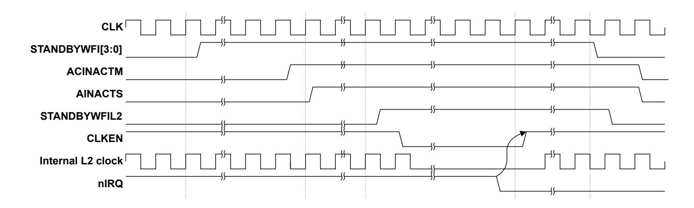

**Figure 2-12 L2 Wait For Interrupt timing**

#### **L2 hardware cache flush**

The processor provides an efficient way to fully clean and invalidate the L2 cache in preparation for powering it down without requiring the waking of a core to perform the clean and invalidate through software.

Use of L2 hardware cache flush can only occur if specific requirements are met and the following sequence applied:

- 1. Disable L2 prefetches by writing zeros to bits[38, 36:35, 33:32] of the CPU Extended Control Register.
- 2. Execute an ISB instruction to ensure the CPU Extended Control Register write is complete.
- 3. Execute a DSB instruction to ensure completion of any prior prefetch requests.
- 4. All cores are in the WFI low-power state, so all the core **STANDBYWFI** outputs are asserted.
- 5. When all outstanding ACP transactions are complete, the SoC asserts the **AINACTS** signal to idle the ACP. This is necessary to prevent ACP transactions from allocating new entries in the L2 cache while the hardware cache flush is occurring. When **AINACTS** has been asserted, the SoC must not assert **ARVALIDS**, **AWVALIDS**, or **WVALIDS**.
- 6. The SoC can now assert the **L2FLUSHREQ** input.
- 7. The L2 performs a series of internal clean and invalidate operations to each set and way of the L2 cache. Any dirty cache lines are written back to the system using WriteBack or WriteNoSnoop operations. Clean cache lines can cause Evict or WriteEvict transactions if the L2 is configured.
- 8. When the L2 completes the clean and invalidate sequence, it asserts the **L2FLUSHDONE** signal. The SoC can now deassert **L2FLUSHREQ** signal and then the L2 deasserts **L2FLUSHDONE**.
- 9. When all outstanding snoop transactions are completed, the SoC can assert the **ACINACTM** signal in an ACE implementation or the **SINACT** signal in a CHI implementation. In response, the L2 asserts the **STANDBYWFIL2** signal.

It is possible to terminate the L2 hardware cache flush by deasserting the **L2FLUSHREQ** signal before the **L2FLUSHDONE** signal is asserted. This causes the L2 to abort the hardware cache flush. This feature can be used when the SoC does not power down the core and must wake up the core quickly.

The following figure shows the L2 hardware cache flush timing.

<span id="page-45-0"></span>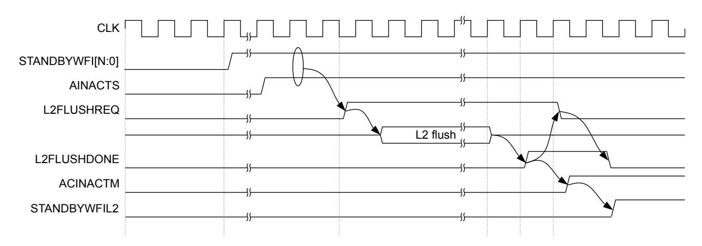

**Figure 2-13 L2 hardware cache flush timing**

# **Related information**

*[4.3.67 CPU Extended Control Register, EL1](#page-204-0)* on page 4-205*.*

# **Processor dynamic retention**

When a core is in WFI low-power state or WFE low-power state, the clocks to the core are stopped. During these low-power states, the core might start the clocks for short periods of time to allow it to handle snoops or other short events but it remains in the low-power state.

Whenever the clocks to a core are stopped, it is possible for an external power controller to place the core in a retention state to reduce leakage power consumption without state loss.

Each core in the processor has a CPU Q-channel interface that allows an external power controller to place the core into a retention state. This interface consists of four pins:

- **CPUQACTIVE**.
- **CPUQREQn**.
- **CPUQACCEPTn**.
- **CPUQDENY**.

The operational relationship of these signals are:

- **CPUQREQn** can only go LOW, if **CPUQACCEPTn** is HIGH and **CPUQDENY** is LOW.
- After **CPUQREQn** goes LOW, it must remain LOW until either **CPUQACCEPTn** goes LOW or **CPUQDENY** goes HIGH.
- **CPUQREQn** can then go HIGH, and must remain HIGH until both **CPUQACCEPTn** is HIGH and **CPUQDENY** is LOW.
- Each **CPUQREQn** request is followed by the assertion of either **CPUQACCEPTn** or **CPUQDENY**, but not both. **CPUQACCEPTn** cannot be asserted LOW at the same time as **CPUQDENY** is asserted HIGH.

A typical sequence of the external power controller successfully placing the core in retention state is:

- 1. The core executes a WFI instruction. The clocks in the core are stopped and **STANDBYWFI** is asserted. After the programmed number of Generic Timer **CNTVALUEB** ticks specified by **CPUECTLR[2:0]** field has elapsed, the **CPUQACTIVE** for that core is deasserted. This hints that retention is possible for that core.
- 2. The external power controller asserts **CPUQREQn** to indicate that it wants to put that core into retention state.
- 3. While the core is still in WFI low-power state and the clocks are stopped, the core accepts the retention request by asserting **CPUQACCEPTn**.
- 4. While **CPUQREQn** and **CPUQACCEPTn** are both asserted, the core is in quiescent state and the external power controller can safely put the core into retention state.

- 5. During retention, if a snoop occurs to access the cache of the quiescent core, the **CPUQACTIVE** signal is asserted to request exit from retention.
- 6. The external power controller brings the core out of retention and deasserts **CPUQREQn**.
- 7. The core deasserts **CPUQACCEPTn** to complete the handshake.
- 8. The clocks in the core are restarted temporarily to allow the snoop request to the core to proceed.
- 9. After the snoop access is complete, the core deasserts **CPUQACTIVE**.
- 10. **CPUQREQn** and **CPUQACCEPTn** are then asserted. The core has reentered quiescent state and the external power controller can put the core into retention state again.
- 11. When the core is ready to exit WFI low-power state, **CPUQACTIVE** is asserted.
- 12. **CPUQREQn** is then deasserted, the core exits WFI low-power state, and **CPUQACCEPTn** is deasserted.

The following figure shows a typical sequence where the external power controller successfully places the core in retention state.

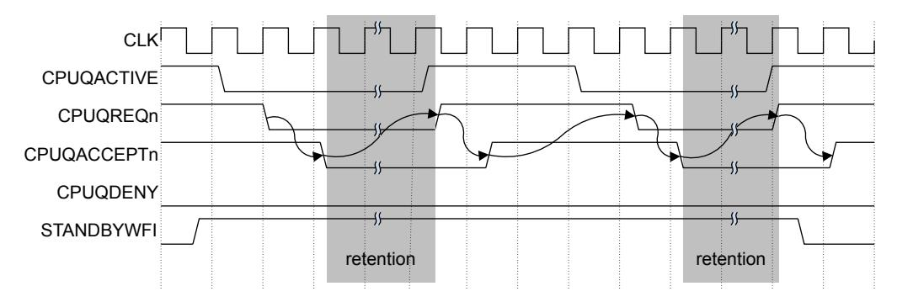

**Figure 2-14 Successful retention timing**

The core enters WFI low-power state and deasserts **CPUQACTIVE**. The external power controller asserts **CPUQREQn**. If the core cannot safely enter quiescent state, it asserts **CPUQDENY** instead of **CPUQACCEPTn**. When this occurs, the external power controller cannot put that core into retention state. The external power controller must then deassert **CPUQREQn**, then the core deasserts **CPUQDENY**.

The following figure shows a sequence where the external power controller attempts to put a core in retention state but the core denies the request.

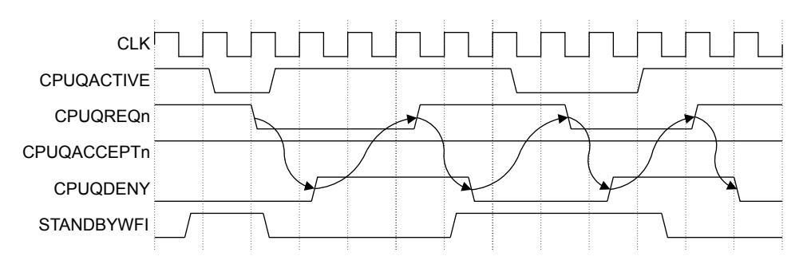

**Figure 2-15 Denied retention timing**

# **Guidelines on the use of core dynamic retention**

As cores generally only stay in WFE low-power state for a short period of time, ARM recommends that you only take a core into retention when it is in WFI low-power state.

If the L1 data cache of a core that is in WFI low-power state contains data that is likely to be the target of frequent snoops from other cores, entering quiescent state and retention is likely to be inefficient.

<span id="page-47-0"></span>When using the core retention feature, you must consider the following points:

- During core reset, **CPUQREQn** must be deasserted HIGH while **CPUQACCEPTn** is asserted LOW.
- The Processor dynamic retention control field in the CPU Extended Control Register, CPUECTLR, must be set to a nonzero value to enable this feature. If this field is 0b000, all assertions of **CPUQREQn** LOW receive **CPUQDENY** responses.
- If the core dynamic retention feature is not used, **CPUQREQn** must be tied HIGH and the CPUECTLR retention control field set to disabled.

| Note |  |
|------|--|
|      |  |

If you use the core dynamic retention feature then the CPU Auxiliary Control Register, CPUACTLR[30:29] bits must be zero.

## **Related information**

*[4.3.66 CPU Auxiliary Control Register, EL1](#page-194-0)* on page 4-195*. [4.3.67 CPU Extended Control Register, EL1](#page-204-0)* on page 4-205*.*

# **L2 RAMs dynamic retention**

L2 RAM dynamic retention mode provides a way of saving power in an idle processor while allowing quick wake-up to service a snoop from ACE or CHI. The core supports dynamic retention of the L2 Data, Dirty, Tag, Inclusion PF, and Snoop Tag RAMs.

The processor has an L2 Q-channel interface that allows an external power controller to place the L2 RAMs into a retention state.

L2 RAM dynamic retention mode is entered and exited using the following sequence of events:

- 1. All cores are in WFI or WFE low-power state and therefore, all the cores **STANDBYWFI** or **STANDBYWFE** outputs are asserted.
- 2. When all pending L2 activity is complete, and the L2 remains idle for the programmed number of Generic Timer **CNTVALUEB** ticks, as specified by L2ECTLR[2:0] field, the L2 deasserts **L2QACTIVE**.
- 3. The external power controller asserts **L2QREQn** to indicate that it wants to put the L2 RAMs into retention state.
- 4. If the L2 is still idle, it accepts the retention request by asserting **L2QACCEPTn**.
- 5. While **L2QREQn** and **L2QACCEPTn** are both asserted, the power controller can safely put the L2 RAMs into retention state.
- 6. If the L2 detects that one or more cores have exited WFI low-power state, the ACP becomes active or a snoop request must be serviced, the L2 asserts **L2QACTIVE** to request exit from retention.
- 7. The power controller brings the L2 RAMs out of retention and deasserts **L2QREQn**.
- 8. The L2 deasserts **L2QACCEPTn** to complete the handshake.

The following figure shows the L2 dynamic retention timing.

<span id="page-48-0"></span>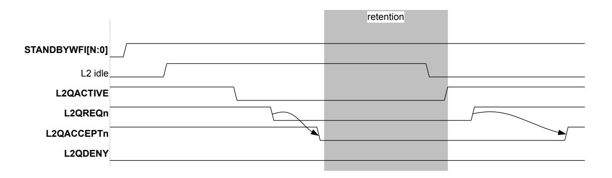

**Figure 2-16 L2 dynamic retention timing**

If the L2 exits idle in step *4* [page 2-48](#page-47-0), it asserts **L2QDENY** instead of **L2QACCEPTn**. In response, the power controller must deassert **L2QREQn**, causing the L2 to deassert **L2QDENY**.

The L2 dynamic retention control field in the L2 Extended Control Register, L2ECTLR, must be set to a nonzero value to enable this feature. If this field is 0b000, all assertions of **L2QREQn** LOW receive **L2QDENY** responses.

If the L2 dynamic retention feature is not used, **L2QREQn** must be tied HIGH and the L2ECTLR retention control field set to disabled.

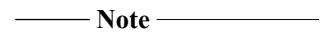

If you use the L2 dynamic retention feature then the L2 Auxiliary Control Register, L2ACTLR[28:27] bits must be zero.

#### **Related information**

*[4.3.59 L2 Extended Control Register, EL1](#page-172-0)* on page 4-173*. [4.3.65 L2 Auxiliary Control Register, EL1](#page-188-0)* on page 4-189*.*

# **Advanced SIMD and FP clock gating**

The processor supports dynamic high-level clock gating of the Advanced SIMD and FP unit to reduce dynamic power dissipation.

The clock to the Advanced SIMD and FP unit is enabled when an Advanced SIMD or FP instruction is detected in the pipeline, and is disabled otherwise.

You can set bit[29] of the CPU Auxiliary Control Register, CPUACTLR\_EL1, to 1 to disable dynamic clock gating of the Advanced SIMD or FP unit.

#### **Related information**

*[4.3.66 CPU Auxiliary Control Register, EL1](#page-194-0)* on page 4-195*.*

#### **L2 control and tag banks clock gating**

The processor supports dynamic high-level clock gating of the shared L2 control logic and the two L2 tag banks to reduce dynamic power dissipation.

The L2 tag bank clocks are only enabled when a corresponding access to the L2 tag bank is detected in the pipeline.

The L2 control logic is disabled after 256 consecutive idle cycles. It is then enabled when an L2 access is detected, with an additional 4-cycle penalty for the wake up before the access is serviced.

You can set bit[28] of the L2 Auxiliary Control Register, L2ACTLR\_EL1, to 1 to disable dynamic clock gating of the L2 tag banks.

<span id="page-49-0"></span>You can set bit[27] of the L2 Auxiliary Control Register, L2ACTLR\_EL1, to 1 to disable dynamic clock gating of the L2 control logic.

# **Related information**

*[4.3.65 L2 Auxiliary Control Register, EL1](#page-188-0)* on page 4-189*.*

# **Regional clock gating**

In addition to extensive local clock gating to register flops, you can configure the processor to include *Regional Clock Gates* (RCGs) that can perform additional clock gating of logic blocks such as the register banks to reduce dynamic power dissipation.

You can set bit[63] of the CPUACTLR\_EL1 to 1 to disable regional clock gating for each processor.

You can set bit[26] of the L2ACTLR\_EL1 to 1 to disable regional clock gating in the L2, GIC, and Timer.

# **Related information**

*[4.3.66 CPU Auxiliary Control Register, EL1](#page-194-0)* on page 4-195*. [4.3.65 L2 Auxiliary Control Register, EL1](#page-188-0)* on page 4-189*.*

# <span id="page-50-0"></span>**2.4.2 Power domains**

The processor supports the following power domains:

- Each core in the device.
- The L2 cache and Snoop Tag RAMs.
- A domain for:
  - The L2 control.
  - The GIC CPU interface.
  - The Generic Timer logic.
- The **PCLKDBG** domain for:
  - The Debug APB interface.
  - The CTI logic.
  - The CTM logic.

# **Note**

- The design does not support a separate power domain for the L1 cache and branch prediction RAMs within the core. It does not support L1 cache retention when the core is powered down.
- For L2 RAMs dynamic retention, the L2 Data, Dirty, Tag, Inclusion PF, and Snoop Tag RAMs are retained. For L2 cache Dormant mode, the L2 Data, Dirty, Tag, and Inclusion PF RAMs are retained.
- The L2 Inclusion PF RAM is available only in r1p0 and later revisions.

The following figure shows the supported power domains in the processor and the placeholders where you can insert clamps for a core.

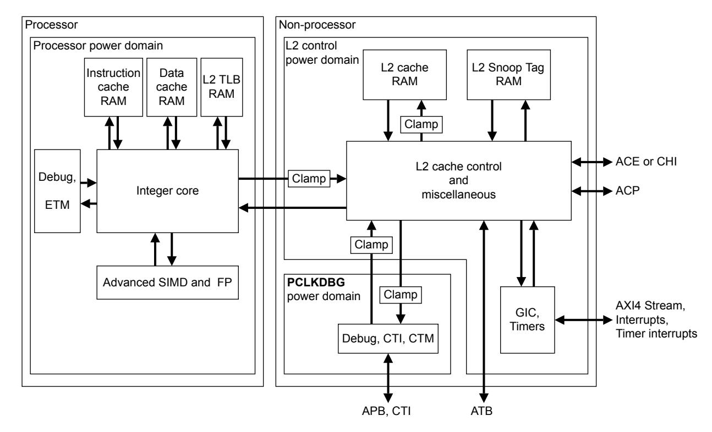

**Figure 2-17 Power domains**

#### <span id="page-51-0"></span>2.4.3 Power modes

The power domains can be controlled independently to give different combinations of powered-up and powered-down domains. However, only some powered-up and powered-down domain combinations are valid and supported.

The following table shows the valid powered-up and powered-down domain combinations for the different possible modes of operation. The table uses the following terms:

Off Block is powered down.

**WFx** Block is in WFI or WFE low-power state.

**Ret** Logic or RAM retention power only.

On Block is powered up.

Table 2-3 Valid power modes

| Mode                                    | Core <sup>e</sup> (CLK) | Debug APB, CTI, and CTM (PCLKDBG) | L2 RAMs <sup>f</sup> (CLK) | L2 control, GIC,<br>Timer (CLK) |
|-----------------------------------------|-------------------------|-----------------------------------|----------------------------|---------------------------------|
| L2 control powerup and L2 RAMs powerup  | On   WFx   Ret   Off g  | Off   On                          | On                         | On                              |
| L2 control powerup and L2 RAMs retained | WFx   Ret   Off h       | Off   On                          | Ret                        | On                              |
| L2 cache Dormant mode                   | All Off                 | Off   On                          | On   Ret                   | Off                             |
| PCLKDBG powerup                         | All Off                 | On                                | Off                        | Off                             |
| Processor shutdown                      | All Off                 | Off                               | Off                        | Off                             |

There are specific requirements that you must meet to power up and power down each power domain within the core. The supported powerup and powerdown sequences are:

- Individual core powerdown on page 2-53.
- Processor powerdown without system driven L2 flush on page 2-53.
- Processor powerdown with system driven L2 flush on page 2-55.
- Dormant mode on page 2-55.
- *Debug powerdown* on page 2-57.
- External debug over powerdown on page 2-57.

#### ----- Note ------

- The powerup and powerdown sequences in the following sections are the only power sequences that ARM recommends. Any deviation from these sequences can lead to unpredictable results.
- The powerup and powerdown sequences require that you isolate the powerup domain before power is removed from the powerdown domain. You must clamp the outputs of the powerdown domain to benign values to prevent data corruption or unpredictable behavior in the powerup domain.

Core, which includes the Advanced SIMD and FP, Debug, ETM, breakpoint and watchpoint (CLK) logic.
 For L2 RAMs dynamic retention, the L2 Data, Dirty, Tag, Inclusion PF, and Snoop Tag RAMs are retained.

For L2 cache Dormant mode, the L2 Data, Dirty, Tag, and Inclusion PF RAMs are retained.

This power mode requires all the cores to be in one of On, WFI, WFE, Retention, or Off state. Each core can be in a different one of these states.

This power mode requires all the cores to be in one of WFI, WFE, Retention, or Off state. Each core can be in a different one of these states.

# <span id="page-52-0"></span>**Individual core powerdown**

If an individual core is not required, you can reduce leakage power by turning off the power to the core. The core refers to all core logic, including Advanced SIMD and FP unit, L1 RAMs, Debug, ETM, breakpoint and watchpoint logic.

To enable the core to be powered down, the implementation must place the core on a separately controlled power supply. In addition, you must clamp the outputs of the core to benign values while the core is powered down.

To power down the core power domain, apply the following sequence:

- 1. Clear the appropriate System Control Register C bit, data or unified cache enable, to prevent additional data cache allocation.
- 2. Disable L2 prefetches by writing a one to bit [38] and zeros to bits[36:35, 33:32] of the CPU Extended Control Register.
- 3. Execute an ISB instruction to ensure the CPU Extended Control Register write is complete.
- 4. Execute a DSB instruction to ensure completion of any prior prefetch requests.
- 5. Clean and invalidate all data from the L1 data cache. The L2 duplicate Snoop Tag RAM for this core is now empty. This prevents any new data cache snoops or data cache maintenance operations from other processors in the processor being issued to this core.
- 6. Clear the CPUECTLR.SMPEN bit. Clearing the SMPEN bit enables the core to be taken out of coherency by preventing the core from receiving instruction cache, TLB, or BTB maintenance operations broadcast by other processors in the multiprocessor.
- 7. Ensure that the system does not send interrupts to the core that is being powered down.
- 8. Set the DBGOSDLR.DLK, Double lock control bit, that forces the debug interfaces to be quiescent.
- 9. Execute an ISB instruction to ensure that all of the System register changes from the previous steps have been committed.
- 10. Execute a DSB instruction to ensure that all instruction cache, TLB, and branch predictor maintenance operations issued by any core in the processor before the SMPEN bit was cleared have completed.
- 11. Execute a WFI instruction and wait until the **STANDBYWFI** output asserts to indicate that the core is idle and in the WFI low-power state.
- 12. Activate the core output clamps.
- 13. Remove power from the core power domain.

To power up the core power domain, apply the following sequence:

- 1. Assert **nCPUPORESET**.
- 2. Apply power to the core power domain while keeping **nCPUPORESET** asserted. When power is restored, continue to hold **nCPUPORESET** for 16 **CLK** cycles to allow the reset to propagate.
- 3. Release the core output clamps.
- 4. Deassert **nCPUPORESET**.

# **Related information**

*[4.3.67 CPU Extended Control Register, EL1](#page-204-0)* on page 4-205*.*

# **Processor powerdown without system driven L2 flush**

The Cortex-A57 processor supports processor powerdown where all the processor power domains are shut down and all state is lost. In this section, a lead core is defined as the last core to powerdown, or the first core to powerup.

To power down the processor, apply the following sequence:

- 1. Ensure all non-lead processors are in shutdown mode, see *Individual core powerdown* on page 2-53.
- 2. For the lead processor, follow steps *1* page 2-53 to *4* page 2-53 in *Individual core powerdown* on page 2-53.

- 3. When all outstanding ACP transactions are complete, the SoC can assert **AINACTS** to idle the ACP. When **AINACTS** has been asserted, the SoC must not assert **ARVALIDS**, **AWVALIDS**, or **WVALIDS**.
- 4. Clean and invalidate all data from the L2 data cache.
- 5. If the core implements:

### **An ACE interface**

When all outstanding snoop transactions are complete, the SoC can assert **ACINACTM**.

# **A CHI interface**

When all outstanding snoop transactions are complete, the SoC can assert **SINACT**.

- 6. Ensure system interrupts to the processor are disabled.
- 7. Follow steps *6* [page 2-53](#page-52-0) to *13* [page 2-53](#page-52-0) in *[Individual core powerdown](#page-52-0)* on page 2-53.
- 8. Wait until **STANDBYWFIL2** asserts to indicate that the L2 memory system is idle.
- 9. Activate the output clamps of the processor in the SoC.
- 10. Remove power from the L2 control and L2 RAM power domains.

To power up the Cortex-A57 processor, apply the following sequence:

- 1. For each core in the MPCore device, assert **nCPUPORESET** LOW.
- 2. For the lead core in the MPCore device, assert **nPRESETDBG** and **nL2RESET** LOW, and hold **L2RSTDISABLE** LOW.
- 3. Apply power to the processor, L2 control, L2 RAM and debug power domains while keeping the signals described in steps *1* [page 2-53](#page-52-0) and *2* [page 2-53](#page-52-0) LOW.
- 4. Release the output clamps of the processor in the SoC.
- 5. Continue a normal powerup reset sequence.

# <span id="page-54-0"></span>**Processor powerdown with system driven L2 flush**

The Cortex-A57 processor supports processor powerdown where all the processor power domains are shut down and all state is lost. In this section, a lead processor is defined as the last core to powerdown, or the first core to powerup.

To power down the processor, apply the following sequence:

- 1. Ensure all non-lead cores are in shutdown mode, see *[Individual core powerdown](#page-52-0)* on page 2-53.
- 2. For the lead core, follow steps *1* [page 2-53](#page-52-0) to *4* [page 2-53](#page-52-0) in *[Individual core powerdown](#page-52-0)* [on page 2-53](#page-52-0).
- 3. When all outstanding ACP transactions are complete, the SoC can assert **AINACTS** to idle the ACP. When **AINACTS** has been asserted, the SoC must not assert **ARVALIDS**, **AWVALIDS**, or **WVALIDS**.
- 4. Ensure system interrupts to the processor are disabled.
- 5. Follow steps *6* [page 2-53](#page-52-0) to *13* [page 2-53](#page-52-0) in *[Individual core powerdown](#page-52-0)* on page 2-53.
- 6. The SoC can now assert the **L2FLUSHREQ** input.
- 7. The L2 performs a series of internal clean and invalidate operations to each set and way of the L2 cache.
- 8. When the L2 completes the clean and invalidate sequence, it asserts the **L2FLUSHDONE** signal. The SoC can now deassert **L2FLUSHREQ** signal and then the L2 deasserts **L2FLUSHDONE**.
- 9. If the core implements:

## **An ACE interface**

When all outstanding snoop transactions are complete, the SoC can assert **ACINACTM** to idle the AXI master interface. When ACINACTM has been asserted, the SoC must not assert ACVALIDM..

#### **A CHI interface**

When all outstanding snoop transactions are complete, the SoC can assert **SINACT**.

- 10. Wait until **STANDBYWFIL2** asserts to indicate that the L2 memory system is idle.
- 11. Activate the output clamps of the processor in the SoC.
- 12. Remove power from the L2 control and L2 RAM power domains.

To power up the Cortex-A57 processor, apply the following sequence:

- 1. For each core in the MPCore device, assert **nCPUPORESET** LOW.
- 2. For the lead core in the MPCore device, assert **nPRESETDBG** and **nL2RESET** LOW, and hold **L2RSTDISABLE** LOW.
- 3. Apply power to the core, L2 control, L2 RAM and debug power domains while keeping the signals described in steps *1* page 2-55 and *2* page 2-55 LOW.
- 4. Release the output clamps of the processor in the SoC.
- 5. Continue a normal powerup reset sequence.

### **Dormant mode**

The Cortex-A57 processor supports Dormant mode, where all the processors, debug **PCLKDBG**, and L2 control logic are powered down while the L2 cache RAMs are powered up and retain state.

This reduces the energy cost of writing dirty lines back to memory and improves response time on powerup. In Dormant mode, the L2 cache is not kept hardware coherent with other masters in the system.

The RAM blocks that remain powered up and retained during Dormant mode are:

- L2 Tag RAMs.
- L2 Dirty RAMs.
- L2 Data RAMs.
- L2 Inclusion PF RAMs.

To support Dormant mode, the L2 cache RAMs must be implemented in a separate power domain. In addition, you must clamp all inputs to the L2 cache RAMs to benign values, to avoid corrupting data when the processors and L2 control power domains enter and exit powerdown state.

Before entering Dormant mode, the architectural state of the processor, excluding the contents of the L2 cache RAMs that remain powered up, must be saved to external memory.

To exit from Dormant mode to Run mode, the SoC must perform a full powerup reset sequence. The SoC must assert the reset signals until power is restored. After power is restored, the processor exits the powerup reset sequence, and the architectural state must be restored.

To enter Dormant mode, apply the following sequence:

- 1. Clear the appropriate System Control Register C bit, data or unified cache enable, to prevent additional data cache allocation.
- 2. Clean and invalidate all data from the L1 data cache. The L2 duplicate Snoop Tag RAM for this core is now empty. This prevents any new data cache snoops or data cache maintenance operations from other processors in the processor being issued to this core.
- 3. Clear the CPUECTLR.SMPEN bit. Clearing the SMPEN bit enables the core to be taken out of coherency by preventing the core from receiving instruction cache, TLB, or BTB maintenance operations broadcast by other processors in the MPCore device.
- 4. Ensure that the system does not send interrupts to the core that is being powered down.
- 5. Save architectural state, if required. These state saving operations must ensure that the following occur:
  - All ARM registers, including the core state, are saved.
  - All System registers are saved.
  - All debug related state is saved.
- 6. Set the DBGOSDLR.DLK, Double lock control bit, that forces the debug interfaces to be quiescent.
- 7. Execute an ISB instruction to ensure that all of the System register changes from the previous steps have been committed.
- 8. Execute a DSB instruction to ensure that all instruction cache, TLB, and branch predictor maintenance operations issued by any core in the processor before the SMPEN bit was cleared have completed. In addition, this ensures that all state saving has completed.
- 9. Execute a WFI instruction and wait until the **STANDBYWFI** output is asserted, to indicate that the core is in idle and low-power state.
- 10. Repeat the previous steps for all processors, and wait for all **STANDBYWFI** outputs to assert.
- 11. If the processor implements:

## **An ACE interface**

When all outstanding snoop transactions are complete, the SoC asserts **ACINACTM**. When ACINACTM has been asserted, the SoC must not assert ACVALIDM.

# **A CHI interface**

When all outstanding snoop transactions are complete, the SoC asserts **SINACT**.

When all outstanding ACP transactions are complete, the SoC asserts **AINACTS**. When **AINACTS** has been asserted, the SoC must not assert **ARVALIDS**, **AWVALIDS**, or **WVALIDS**.

When the L2 completes the outstanding transactions for the AXI, or CHI, interface then **STANDBYWFIL2** asserts to indicate that the L2 memory system is idle.

- 12. When all of the core **STANDBYWFI** signals and the **STANDBYWFIL2** are asserted, the processor is ready to enter Dormant mode.
- 13. Activate the L2 cache RAM input clamps.
- 14. Remove power from the cores, debug **PCLKDBG**, and L2 control power domains.

To exit Dormant mode, apply the following sequence:

- <span id="page-56-0"></span>1. Apply a normal powerup reset sequence. You must apply resets to the cores, debug **PCLKDBG**, and the L2 memory system logic until power is restored. During this reset sequence, **L2RSTDISABLE** must be held HIGH to disable the L2 cache hardware reset mechanism.
- 2. When power is restored, release the L2 cache RAM input clamps.
- 3. Continue a normal powerup reset sequence with **L2RSTDISABLE** held HIGH. The **L2RSTDISABLE** must be held HIGH for a minimum of 32 **CLK** cycles after the deasserting edge of **nL2RESET**.
- 4. The architectural state must be restored, if required.

# **Debug powerdown**

If the Cortex-A57 processor runs in an environment where debug facilities are not required for any of its cores then you can reduce leakage power by turning off the power to the debug unit in the **PCLKDBG** domain.

To enable the debug unit in the **PCLKDBG** domain to be powered down, the implementation must place the debug unit on a separately controlled power supply. In addition, you must clamp the outputs of the debug unit to benign values while the debug unit is powered down.

To power down the debug **PCLKDBG** power domain, apply the following sequence:

- 1. Activate the debug output clamps.
- 2. Remove power from the debug **PCLKDBG** domain.

|  | Note |  |
|--|------|--|
|--|------|--|

If the debug output clamps are released without following the specified debug powerup sequence, the results are unpredictable.

To power up the debug **PCLKDBG** power domain, apply the following sequence:

- 1. Assert **nPRESETDBG**.
- 2. Apply power to the debug **PCLKDBG** power domain while keeping **nPRESETDBG** asserted.
- 3. Release the debug output clamps.
- 4. If the SoC uses the debug hardware, deassert **nPRESETDBG**.

#### **External debug over powerdown**

The Cortex-A57 processor provides support for external debug over powerdown. If any or all of the cores are powered down, the SoC can still use the debug facilities if the debug **PCLKDBG** domain is powered up.

To enable external debug over powerdown, the implementation must place the core and the debug **PCLKDBG** unit on separately controlled power supplies. If the core is powered down while the debug **PCLKDBG** unit is powered up, you must clamp all outputs from the core power domain to the debug power domain to benign values.

To power down the core power domain for external debug over powerdown support, apply the following additional step to the core powerdown sequence, as described in *[Individual core powerdown](#page-52-0)* [on page 2-53](#page-52-0), after **STANDBYWFI** is asserted in step *11* [page 2-53](#page-52-0), and before core clamps are activated in step *12* [page 2-53:](#page-52-0)

• Deassert **DBGPWRDUP** to indicate that the core debug resources are not available for APB accesses.

When power is removed from the core power domain, keep the debug **PCLKDBG** unit powered up.

To power up the core power domain after external debug over powerdown support is no longer required, apply the following additional step to the core powerup sequence, as described in *[Individual core](#page-52-0) powerdown* [on page 2-53](#page-52-0), after **nCPUPORESET** is deasserted in step *4* [page 2-53.](#page-52-0)

• Assert **DBGPWRDUP** to indicate that processor debug resources are available.

# **Related information**

*[Dormant mode](#page-54-0)* on page 2-55*.*

# <span id="page-57-0"></span>**2.4.4 Using SMPEN as a power mode indicator**

You can use the **SMPEN** output to differentiate between a retention and powerdown opportunity. However, this is not a requirement and this communication might occur because of other methods such as message passing between the core and external power controller.

If **SMPEN** is HIGH, the core is still in coherency with the other cores in the processor and therefore only retention is appropriate. If **SMPEN** is LOW it indicates the core can be powered down.

If the **SMPEN** is sampled LOW when the CPU Q-Channel handshake has completed the transition to retention, the core can be returned to the active state using the Q-Channel, then if **CPUQACTIVE** is still LOW, the power controller can start a powerdown transition of the core.

# <span id="page-58-0"></span>Chapter 3 **Programmers Model**

This chapter describes the processor registers and provides information for programming the processor.

It contains the following sections:

- *[3.1 About the programmers model](#page-59-0)* on page 3-60.
- *[3.2 ARMv8-A architecture concepts](#page-60-0)* on page 3-61.
- *[3.3 ThumbEE instruction set](#page-68-0)* on page 3-69.
- *[3.4 Jazelle implementation](#page-69-0)* on page 3-70.
- *[3.5 Memory model](#page-71-0)* on page 3-72.

# <span id="page-59-0"></span>**3.1 About the programmers model**

The Cortex-A57 processor implements the ARMv8-A architecture. This includes:

- Support for all the Exception levels, EL3-EL0.
- Support for both Execution states, AArch64 and AArch32, at each Exception level.
- The following instruction sets:

## **AArch64 Execution state**

The A64 instruction set.

#### **AArch32 Execution state**

The T32 and A32 instruction sets.

The processor supports the following features:

- A32, T32, and A64 Advanced *Single Instruction Multiple Data* (SIMD) instructions.
- A32, T32, and A64 Floating-point instructions.
- A32, T32, and A64 optional Cryptography Extension instructions.
- Generic Timer.

The processor does not support the T32EE (ThumbEE) instruction set.

| Note                                                                                                                                                                                                |
|-----------------------------------------------------------------------------------------------------------------------------------------------------------------------------------------------------|
| The optional Cryptography engine is not included in the base product of the processor. ARM requires<br>licensees to have contractual rights to obtain the Cortex-A57 processor Cryptography engine. |
|                                                                                                                                                                                                     |

# <span id="page-60-0"></span>**3.2 ARMv8-A architecture concepts**

Introduces both the ARMv8-A architectural concepts and the associated terminology.

The following sections describe the ARMv8-A architectural concepts. Each section introduces the corresponding terms that are used to describe the architecture.

| Note |  |
|------|--|
|      |  |

A thorough understanding of the terminology defined in this section is a prerequisite for reading the remainder of this manual.

This section contains the following subsections:

- *3.2.1 Execution state* on page 3-61.
- *[3.2.2 Exception levels](#page-61-0)* on page 3-62.
- *[3.2.3 Security state](#page-62-0)* on page 3-63.
- *[3.2.4 Rules for changing Exception state](#page-63-0)* on page 3-64.
- *[3.2.5 Stack Pointer selection](#page-64-0)* on page 3-65.
- *[3.2.6 ARMv8 security model](#page-64-0)* on page 3-65.
- *[3.2.7 Instruction set state](#page-66-0)* on page 3-67.
- *[3.2.8 AArch32 execution modes](#page-66-0)* on page 3-67.

#### **3.2.1 Execution state**

The Execution state defines the processor execution environment, including:

- Supported register widths.
- Supported instruction sets.
- Significant aspects of:
  - The execution model.
  - The *Virtual Memory System Architecture* (VMSA).
  - The programmers model.

The Execution states are:

# **AArch64**

The 64-bit Execution state. This Execution state:

- Features 31 64-bit general-purpose registers, with a 64-bit *Program Counter* (PC), *Stack Pointer* (SP), and *Exception Link Register*s (ELRs).
- Provides a single instruction set, A64.
- Defines the ARMv8 exception model, with four Exception levels, EL0-EL3, that provide an execution privilege hierarchy.
- Features 48-bit *Virtual Address* (VA), held in 64-bit registers. The Cortex-A57 processor VMSA maps these to 44-bit *Physical Address* (PA) maps.
- Defines a number of elements that hold the *processor state* (PSTATE). The A64 instruction set includes instructions that operate directly on various PSTATE elements.
- Names each System register using a suffix that indicates the lowest Exception level that the register can be accessed.

# <span id="page-61-0"></span>**AArch32**

The 32-bit Execution state. This Execution state is backwards-compatible with implementations of the ARMv7-A architecture profile that include the Security Extensions and the Virtualization Extensions. This Execution state:

- Features 13 32-bit general purpose registers, and a 32-bit PC, SP, and *Link Register* (LR). Some of these registers have multiple Banked instances for use in different processor modes.
- Provides 32 64-bit registers for Advanced SIMD and Floating-point support.
- Provides two instruction sets, A32 and T32.
- Provides an exception model that maps the ARMv7 exception model onto the ARMv8 exception model and Exception levels. For exceptions taken to an Exception level that is using AArch32, this supports the ARMv7 exception model use of processor *modes*.
- Features 32-bit VAs. The VMSA maps these to 40-bit PAs.
- Collects processor state into the *Current Processor State Register* (CPSR).

The processor can move between Execution states only on a change of Exception level, and subject to the rules given in *[3.2.4 Rules for changing Exception state](#page-63-0)* on page 3-64. This means different software layers, such as an application, an operating system kernel, and a hypervisor, executing at different Exception levels, can execute in different Execution states.

# **Related information**

*[3.2.7 Instruction set state](#page-66-0)* on page 3-67*.*

# **3.2.2 Exception levels**

The ARMv8 exception model defines Exception levels EL0-EL3, where:

- EL0 has the lowest software execution privilege, and execution at EL0 is called unprivileged execution.
- Increased values of n, from 1 to 3, indicate increased software execution privilege.
- EL2 provides support for processor virtualization.
- EL3 provides support for two security states.

The Cortex-A57 processor implements all the Exception levels, EL0-EL3, and supports both Execution states, AArch64 and AArch32, at each Exception level.

Execution can move between Exception levels only on taking an exception, or on returning from an exception:

- On taking an exception, the Exception level either increases or remains the same. The Exception level cannot decrease on taking an exception.
- On returning from an exception, the Exception level either decreases or remains the same. The Exception level cannot increase on returning from an exception.

The Exception level that execution changes to, or remains in, on taking an exception, is called the *target Exception level* of the exception and:

- Every exception type has a target Exception level that is either:
  - Implicit in the nature of the exception.
  - Defined by configuration bits in the System registers.
- An exception cannot target the EL0 Exception level.

Exception levels, and privilege levels, are defined within a particular Security state, and *[3.2.6 ARMv8](#page-64-0) [security model](#page-64-0)* on page 3-65 describes the permitted combinations of Security state and Exception level.

# <span id="page-62-0"></span>**Exception terminology**

This section defines terms used to describe the navigation between Exception levels.

#### **Terminology for taking an exception**

An exception is generated when the processor first responds to an exceptional condition. The processor state at this time is the state the exception is *taken from*. The processor state immediately after taking the exception is the state the exception is *taken to*.

#### **Terminology for returning from an exception**

To return from an exception, the processor must execute an exception return instruction.The processor state when an exception return instruction is committed for execution is the state the exception *returns from*. The processor state immediately after the execution of that instruction is the state the exception *returns to*.

#### **Exception level terminology**

An Exception level, EL*n*, with a larger value of *n* than another Exception level, is described as being a *higher* Exception level than the other Exception level. For example, EL3 is a higher Exception level than EL1.

An Exception level with a smaller value of *n* than another Exception level is described as being a *lower* Exception level than the other Exception level. For example, EL0 is a lower Exception level than EL1.

An Exception level is described as:

# **Using AArch64**

When execution in that Exception level is in AArch64 Execution state.

#### **Using AArch32**

When execution in that Exception level is in AArch32 Execution state.

#### **Typical Exception level usage model**

The architecture does not specify how software can use the different Exception levels but the following is a common usage model for the Exception levels:

- **EL0** Applications.
- **EL1** OS kernel and associated functions that are typically described as *privileged*.
- **EL2** Hypervisor.
- **EL3** Secure monitor.

# **Related information**

*3.2.3 Security state* on page 3-63*.*

# **3.2.3 Security state**

An ARMv8 implementation that includes the EL3 Exception level provides the following Security states, each with an associated memory address space:

## <span id="page-63-0"></span>**Secure state**

In Secure state, the processor:

- Can access both the Secure and the Non-secure memory address space.
- When executing at EL3, can access all the system control resources.

## **Non-secure state**

In Non-secure state, the processor:

- Can access only the Non-secure memory address space.
- Cannot access the Secure system control resources.

The AArch32 Security state model is unchanged from the model for an ARMv7-A architecture profile implementation that includes the Security Extensions and the Virtualization Extensions. When the implementation uses the AArch32 state for all Exception levels, many System registers are Banked to provide Secure and Non-secure instances, and:

- The Secure instance is accessible only at EL3.
- The Non-secure instance is accessible at EL1 or higher.
- The two instances of a Banked register have the same name.

The *[3.2.6 ARMv8 security model](#page-64-0)* on page 3-65 describes how the Security state interacts with other aspects of the ARMv8 architectural state.

# **3.2.4 Rules for changing Exception state**

This introduction to moving between Execution states does not consider exceptions caused by debug events.

The Execution state, AArch64 or AArch32, can change only on a change of Exception level, meaning it can change only on either:

- Taking an exception to a higher Exception level.
- Returning from an exception to a lower Exception level.

| Note |  |
|------|--|
|      |  |

The Execution state cannot change if, on taking an exception or on returning from an exception, the Exception level remains the same.

On taking an exception to a higher Exception level, the Execution state:

- Can either:
  - Remain the same.
  - Change from AArch32 state to AArch64 state.
- Cannot change from AArch64 state to AArch32 state.

On returning from an exception to a lower Exception level, the Execution state:

- Can either:
  - Remain the same.
  - Change from AArch64 state to AArch32 state.
- Cannot change from AArch32 state to AArch64 state.

On powerup and on reset, the processor enters EL3, the highest Exception level. The Execution state for this Exception level is controlled by the configuration input signal, **AA64nAA32**. For the other Exception levels the Execution state is determined as follows:

• For an exception return to EL0, the EL0 Execution state is specified as part of the exception return, subject to the rules given in this section.

• Otherwise, the Execution state is determined by one or more System register configuration bits, that can be set only in a higher Exception level.

# <span id="page-64-0"></span>**3.2.5 Stack Pointer selection**

Stack Pointer behavior depends on the Execution state, as follows:

#### **AArch64**

In EL0, the *Stack Pointer* (SP) maps to the SP\_EL0 Stack Pointer register.

Taking an exception selects the default Stack Pointer for the target Exception level, meaning SP maps to the SP\_EL*x* Stack Pointer register, where *x* is the Exception level.

Software executing in the target Exception level can execute an MSR SPSel, #Imm1 instruction to select whether to use the default SP\_EL*x* Stack Pointer or the SP\_EL0 Stack Pointer.

The selected Stack Pointer can be indicated by a suffix to the Exception level:

- **t** Indicates use of the SP0 Stack Pointer.
- **h** Indicates use of the SP*x* Stack Pointer.

| Note                                                                                                |
|-----------------------------------------------------------------------------------------------------|
| The t and h suffixes are based on the terminology of thread and handler, introduced in ARMv7-<br>M. |
|                                                                                                     |

The following table shows the set of AArch64 Stack Pointer options.

**Table 3-1 AArch64 Stack Pointer options**

| Exception level | AArch64 Stack Pointer options |
|-----------------|-------------------------------|
| EL0             | EL0t                          |
| EL1             | EL1t, EL1h                    |
| EL2             | EL2t, EL2h                    |
| EL3             | EL3t, EL3h                    |

# **AArch32**

In AArch32 state, each mode that can be the target of an exception has its own Banked copy of the Stack Pointer. For example, the Banked Stack Pointer for Hyp mode is called SP\_hyp. Software executing in one of these modes uses the Banked Stack Pointer for that mode.

The modes that have Banked copies of the Stack Pointer are FIQ mode, IRQ mode, Supervisor mode, Abort mode, Undefined mode, Hyp mode, and Monitor mode. Software executing in User mode or System mode uses the User mode Stack Pointer, SP\_usr.

# **Related information**

*[3.2.8 AArch32 execution modes](#page-66-0)* on page 3-67*.*

## **3.2.6 ARMv8 security model**

The Cortex-A57 processor implements all of the Exception levels. This means:

- EL3 exists only in Secure state and a change from Secure state to Non-secure state is made only by an exception return from EL3.
- EL2 exists only in Non-secure state.

To provide compatibility with ARMv7, the Exception levels available in Secure state are modified when EL3 is using AArch32. The following sections describe the security model:

- <span id="page-65-0"></span>• *Security model when EL3 is using AArch64* on page 3-66.
- *Security model when EL3 is using AArch32* on page 3-66.

### **Security model when EL3 is using AArch64**

When EL3 is using AArch64, The following figure shows the security model, and the expected use of the different Exception levels. This figure shows how instances of EL0 and EL1 are present in both Security states. The figure also shows the expected software usage of the Exception levels.

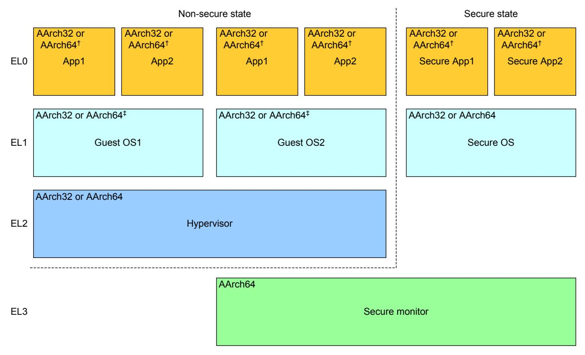

- † AArch64 permitted only if EL1 is using AArch64
- ‡ AArch64 permitted only if EL2 is using AArch64

**Figure 3-1 ARMv8 security model when EL3 is using AArch64**

# **Security model when EL3 is using AArch32**

To provide software compatibility with VMSAv7 implementations that include the Security Extensions, in Secure AArch32 state, all modes other than User mode must have the same execution privilege. This means that, in an implementation where EL3 is using AArch32, the security model is as shown in following figure. This figure also shows the expected use of the different Exception levels and processor modes.

<span id="page-66-0"></span>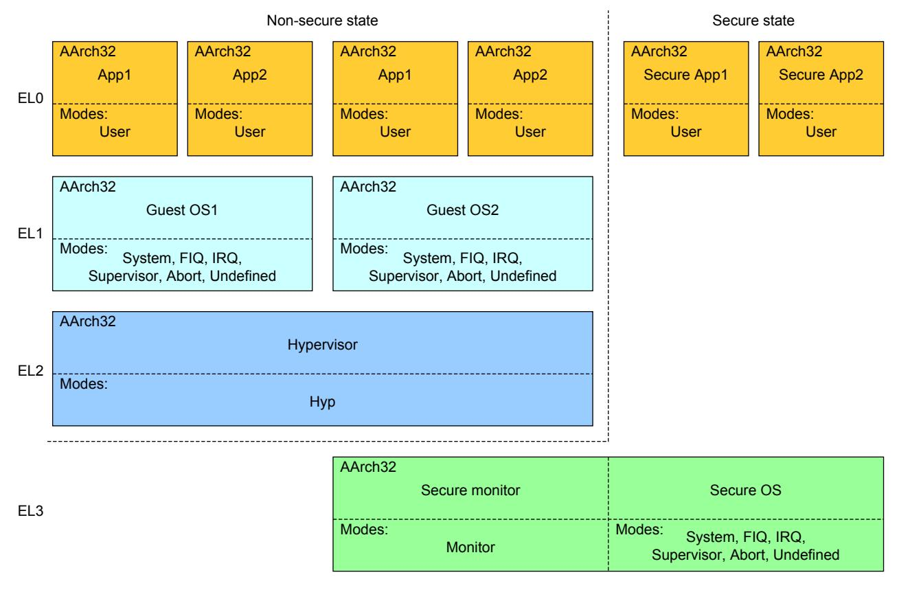

**Figure 3-2 ARMv8 security model when EL3 is using AArch32**

For more information about the AArch32 processor modes see *3.2.8 AArch32 execution modes* on page 3-67.

# **3.2.7 Instruction set state**

The processor instruction set state determines the instruction set that the processor executes. The possible instruction sets depend on the Execution state:

# **AArch64**

AArch64 state supports only a single instruction set, called A64. This is a fixed-width instruction set that uses 32-bit instruction encoding.

#### **AArch32**

AArch32 state supports the following instruction sets:

**A32**

This is a fixed-length instruction set that uses 32-bit instruction encodings. It is compatible with the ARMv7 ARM instruction set.

**T32**

This is a variable-length instruction set that uses both 16-bit and 32-bit instruction encodings. It is compatible with the ARMv7 Thumb instruction set.

#### **3.2.8 AArch32 execution modes**

ARMv7 and earlier versions of the ARM architecture, define a set of named processor modes, including modes that correspond to different exception types. For compatibility, AArch32 state retains these processor modes.

The following table shows the AArch32 processor modes, and the Exception level of each mode.

**Table 3-2 AArch32 processor modes and associated Exception levels**

| AArch32 processor mode        | EL3 using          | Security state       | Exception level |
|-------------------------------|--------------------|----------------------|-----------------|
| User                          | AArch32 or AArch64 | Non-secure or Secure | EL0             |
| System, FIQ, IRQ, Supervisor, | AArch64            | Non-secure or Secure | EL1             |
| Abort, Undefined              | AArch32            | Non-secure           | EL1             |
|                               |                    | Secure               | EL3             |
| Hyp                           | AArch32 or AArch64 | Non-secure only      | EL2             |
| Monitor                       | AArch32            | Secure only          | EL3             |

When the EL3 using column of The following table shows:

**AArch64** The row refers to information shown in figure *[Figure 3-1 ARMv8 security model when EL3](#page-65-0) [is using AArch64](#page-65-0)* on page 3-66.

**AArch32** The row refers to information shown in figure *[Figure 3-2 ARMv8 security model when EL3](#page-66-0) [is using AArch32](#page-66-0)* on page 3-67.

A processor mode name does not indicate the current Security state. To distinguish between a mode in Secure state and the equivalent mode in Non-secure state, the mode name is qualified as Secure or Nonsecure. For example, a description of AArch32 operation in EL1 might relate to the Secure FIQ mode, or to the Non-secure FIQ mode.

# <span id="page-68-0"></span>**3.3 ThumbEE instruction set**

The *Thumb Execution Environment* (ThumbEE) extension is a variant of the Thumb instruction set that is designed as a target for dynamically generated code.

The processor does not implement the T32EE (ThumbEE) instruction set.

In AArch32 state, access to the ThumbEE Configuration Register, TEECR, and ThumbEE Handler Base Register, TEEHBR, results in an Undefined Instruction trap.

In AArch64 state, these registers are named TEECR32\_EL1 and TEEHBR32\_EL1 respectively, and access to these registers results in an Undefined Instruction trap.

# <span id="page-69-0"></span>**3.4 Jazelle implementation**

AArch32 state supports a trivial Jazelle implementation.

This means:

- Jazelle state is not supported.
- The BXJ instruction behaves as a BX instruction.

See the *ARM® Architecture Reference Manual ARMv8* for more information.

# **3.4.1 Register summary**

The following table gives a summary of the processor Jazelle registers that are accessed through the CP14 coprocessor in the AArch32 state. These registers are not implemented in the AArch64 state.

**Table 3-3 Summary of Jazelle registers**

| CRn | op1 | CRm | op2 | Name  | Reset      | Description                         |
|-----|-----|-----|-----|-------|------------|-------------------------------------|
| c0  | 7   | c0  | 0   | JIDR  | 0x00000000 | Jazelle Identity Register           |
| c1  | 7   | c0  | 0   | JOSCR | 0x00000000 | Jazelle OS Control Register         |
| c2  | 7   | c0  | 0   | JMCR  | 0x00000000 | Jazelle Main Configuration Register |

# **Related information**

*Jazelle Identity Register* on page 3-70*.*

*[Jazelle OS Control Register](#page-70-0)* on page 3-71*.*

*[Jazelle Main Configuration Register](#page-70-0)* on page 3-71*.*

#### **3.4.2 Register description**

This section describes the processor Jazelle Extension registers. The following table provides crossreferences to individual registers.

# **Jazelle Identity Register**

The JIDR characteristics are:

#### **Purpose**

Enables software to determine the implementation of the Jazelle Extension provided by the processor.

## **Usage constraints**

The JIDR is:

- A read-only register
- Accessible from all Exception levels in AArch32.

#### **Configurations**

Available in all configurations.

#### **Attributes**

See the register summary in table *Table 3-3 Summary of Jazelle registers* on page 3-70.

The JIDR is a 32-bit register with all bits[31:0] as RES0. Writes are ignored, and all bits read as zero.

To access the JIDR in the AArch32 state, read the register with:

MRC p14, 7, <Rd>, c0, c0, 0; Read Jazelle Identity Register

# <span id="page-70-0"></span>**Jazelle OS Control Register**

The JOSCR characteristics are:

#### **Purpose**

Provides operating system control of the use of the Jazelle Extension.

#### **Usage constraints**

The JOSCR is:

- A read/write register
- Accessible only from PL1 or higher.

## **Configurations**

Available in all configurations.

# **Attributes**

See the register summary in table *[Table 3-3 Summary of Jazelle registers](#page-69-0)* on page 3-70.

The JOSCR is a 32-bit register with all bits[31:0] as RES0. Writes are ignored, and all bits read as zero.

To access the JOSCR in the AArch32 state, read or write the register with:

```
MRC p14, 7, <Rd>, c1, c0, 0; Read Jazelle OS Control Register
MCR p14, 7, <Rd>, c1, c0, 0; Write Jazelle OS Control Register
```

# **Jazelle Main Configuration Register**

The JMCR characteristics are:

#### **Purpose**

Provides control of the Jazelle Extension features.

#### **Usage constraints**

The JMCR is:

- A read/write register, with access rights that depend on the current privilege level:
  - Write-only in unprivileged level
  - Read-write at EL1 or higher in the AArch32 state.

#### **Configurations**

Available in all configurations.

# **Attributes**

See the register summary in table *[Table 3-3 Summary of Jazelle registers](#page-69-0)* on page 3-70.

The JMCR is a 32-bit register with all bits[31:0] as RES0. Writes are ignored, and all bits read as zero.

To access the JMCR in the AArch32 state, read or write the register with:

```
MRC p14, 7, <Rd>, c2, c0, 0; Read Jazelle Main Configuration Register
MCR p14, 7, <Rd>, c2, c0, 0; Write Jazelle Main Configuration Register
```

# <span id="page-71-0"></span>**3.5 Memory model**

The Cortex-A57 processor views memory as a linear collection of bytes numbered in ascending order from zero.

For example, bytes 0-3 hold the first stored word, and bytes 4-7 hold the second stored word.

The processor can store words in memory as either:

- Big-endian format.
- Little-endian format.

| See the ARM®           |  |  | Architecture Reference Manual ARMv8 for more information about big-endian and little |  |
|------------------------|--|--|--------------------------------------------------------------------------------------|--|
| endian memory systems. |  |  |                                                                                      |  |

| Note                                              |  |  |
|---------------------------------------------------|--|--|
| Instructions are always treated as little-endian. |  |  |

# <span id="page-72-0"></span>Chapter 4 **System Control**

This chapter describes the System registers, their structure, operation, and how to use them.

It contains the following sections:

- *[4.1 About system control](#page-73-0)* on page 4-74.
- *[4.2 AArch64 register summary](#page-74-0)* on page 4-75.
- *[4.3 AArch64 register descriptions](#page-87-0)* on page 4-88.
- *[4.4 AArch32 register summary](#page-212-0)* on page 4-213.
- *[4.5 AArch32 register descriptions](#page-237-0)* on page 4-238.

# <span id="page-73-0"></span>**4.1 About system control**

The System registers control and provide status information for the functions implemented in the processor.

The main functions of the System registers are:

- Overall system control and configuration.
- *Memory Management Unit* (MMU) configuration and management.
- Cache configuration and management.
- System performance monitoring.
- *Generic Interrupt Controller* (GIC) configuration and management.

The System registers are accessible in AArch32 and AArch64 states. The Execution states are described in the *[3.2 ARMv8-A architecture concepts](#page-60-0)* on page 3-61. The System register access in AArch64 state is characterized by three possible scenarios. These scenarios are:

- The AArch64 register is unique and described for the AArch64 state in *[4.3 AArch64 register](#page-87-0) descriptions* [on page 4-88.](#page-87-0)
- The AArch64 register is architecturally mapped to an AArch32 register but has different bit or bit field assignments. There a separate descriptions for each Execution state in *[4.3 AArch64 register](#page-87-0) descriptions* [on page 4-88](#page-87-0) and *[4.5 AArch32 register descriptions](#page-237-0)* on page 4-238.
- The AArch64 register is architecturally mapped to an AArch32 register with the same bit and bit field assignments. There is one description for both Execution states in the *[4.3 AArch64 register](#page-87-0) descriptions* [on page 4-88](#page-87-0) and cross-referenced from the *[4.4 AArch32 register summary](#page-212-0)* [on page 4-213](#page-212-0).

The System registers accessed in AArch32 state are described in the *[4.5 AArch32 register descriptions](#page-237-0)* [on page 4-238](#page-237-0).

Some of the System registers can be accessed through the memory-mapped or external debug interfaces.

Bits in the System registers that are described in the ARMv7 architecture are redefined in the ARMv8-A architecture:

- UNK/SBZP, RAZ/SBZP, and RAZ/WI are redefined as RES0.
- UNK/SBOP and RAO/SBOP are redefined as RES1.

RES0 and RES1 are described in the *ARM® Architecture Reference Manual ARMv8, for ARMv8-A architecture profile*.

This section contains the following subsections:

• *4.1.1 Registers affected by CP15SDISABLE* on page 4-74.

## **4.1.1 Registers affected by CP15SDISABLE**

The **CP15SDISABLE** signal disables write access to certain secure copies of System registers when EL3 is using AArch32. For a list of registers affected by **CP15SDISABLE**, see the *ARM® Architecture Reference Manual ARMv8*.

The Cortex-A57 processor does not have any IMPLEMENTATION DEFINED registers that are affected by **CP15SDISABLE**.

# <span id="page-74-0"></span>**4.2 AArch64 register summary**

This section gives a summary of the System registers in AArch64 state.

For more information about using the System registers, see the *ARM® Architecture Reference Manual ARMv8*.

This section contains the following subsections:

- *4.2.1 AArch64 identification registers* on page 4-75.
- *[4.2.2 AArch64 exception handling registers](#page-76-0)* on page 4-77.
- *[4.2.3 AArch64 virtual memory control registers](#page-77-0)* on page 4-78.
- *[4.2.4 AArch64 other System registers](#page-78-0)* on page 4-79.
- *[4.2.5 AArch64 cache maintenance operations](#page-78-0)* on page 4-79.
- *[4.2.6 AArch64 TLB maintenance operations](#page-79-0)* on page 4-80.
- *[4.2.7 AArch64 address translation operations](#page-79-0)* on page 4-80.
- *[4.2.8 AArch64 miscellaneous operations](#page-80-0)* on page 4-81.
- *[4.2.9 AArch64 Performance Monitors registers](#page-81-0)* on page 4-82.
- *[4.2.10 AArch64 reset registers](#page-81-0)* on page 4-82.
- *[4.2.11 Security registers](#page-81-0)* on page 4-82.
- *[4.2.12 AArch64 virtualization registers](#page-82-0)* on page 4-83.
- *[4.2.13 AArch64 EL2 TLB maintenance operations](#page-84-0)* on page 4-85.
- *[4.2.14 Generic Timer registers](#page-84-0)* on page 4-85.
- *4.2.15 AArch64 [IMPLEMENTATION DEFINED](#page-84-0) registers* on page 4-85.

# **4.2.1 AArch64 identification registers**

The following table shows the identification registers in AArch64 state. Bits[63:32] are reset to 0x00000000 for all 64-bit registers in the table.

**Table 4-1 AArch64 identification registers**

| Name        | Type | Reset       | Width | Description                                                        |
|-------------|------|-------------|-------|--------------------------------------------------------------------|
| MIDR_EL1    | RO   | 411FD073    | 32    | 4.3.1 Main ID Register,<br>EL1 on page 4-89                        |
| MPIDR_EL1   | RO   | 0x80000003i | 64    | 4.3.2 Multiprocessor<br>Affinity Register, EL1<br>on page 4-91     |
| REVIDR_EL1  | RO   | 0x00000000  | 32    | 4.3.3 Revision ID<br>Register, EL1<br>on page 4-92                 |
| ID_PFR0_EL1 | RO   | 0x00000131  | 32    | 4.3.4 AArch32 Processor<br>Feature Register 0, EL1<br>on page 4-93 |
| ID_PFR1_EL1 | RO   | 0x00011011j | 32    | 4.3.5 AArch32 Processor<br>Feature Register 1, EL1<br>on page 4-94 |

i The reset value depends on the primary inputs, **CLUSTERIDAFF1** and **CLUSTERIDAFF2**, and the number of cores that the processor implements. The value shown is for a four-core implementation, with **CLUSTERIDAFF1** and **CLUSTERIDAFF2** set to zero.

j The reset value depends on the primary input **GICCDISABLE**. The value shown assumes the **GICCDISABLE** signal is tied HIGH.

**Table 4-1 AArch64 identification registers (continued)**

| Name         | Type | Reset       | Width | Description                                                                     |
|--------------|------|-------------|-------|---------------------------------------------------------------------------------|
| ID_DFR0_EL1  | RO   | 0x03010066  | 32    | 4.3.6 AArch32 Debug<br>Feature Register 0, EL1<br>on page 4-95                  |
| ID_AFR0_EL1  | RO   | 0x00000000  | 32    | 4.3.7 AArch32 Auxiliary<br>Feature Register 0, EL1<br>on page 4-97              |
| ID_MMFR0_EL1 | RO   | 0x10101105  | 32    | 4.3.8 AArch32 Memory<br>Model Feature Register<br>0, EL1 on page 4-97           |
| ID_MMFR1_EL1 | RO   | 0x40000000  | 32    | 4.3.9 AArch32 Memory<br>Model Feature Register<br>1, EL1 on page 4-98           |
| ID_MMFR2_EL1 | RO   | 0x01260000  | 32    | 4.3.10 AArch32 Memory<br>Model Feature Register<br>2, EL1 on page 4-100         |
| ID_MMFR3_EL1 | RO   | 0x02102211  | 32    | 4.3.11 AArch32 Memory<br>Model Feature Register<br>3, EL1 on page 4-102         |
| ID_ISAR0_EL1 | RO   | 0x02101110  | 32    | 4.3.12 AArch32<br>Instruction Set Attribute<br>Register 0, EL1<br>on page 4-103 |
| ID_ISAR1_EL1 | RO   | 0x13112111  | 32    | 4.3.13 AArch32<br>Instruction Set Attribute<br>Register 1, EL1<br>on page 4-105 |
| ID_ISAR2_EL1 | RO   | 0x21232042  | 32    | 4.3.14 AArch32<br>Instruction Set Attribute<br>Register 2, EL1<br>on page 4-106 |
| ID_ISAR3_EL1 | RO   | 0x01112131  | 32    | 4.3.15 AArch32<br>Instruction Set Attribute<br>Register 3, EL1<br>on page 4-108 |
| ID_ISAR4_EL1 | RO   | 0x00011142  | 32    | 4.3.16 AArch32<br>Instruction Set Attribute<br>Register 4, EL1<br>on page 4-109 |
| ID_ISAR5_EL1 | RO   | 0x00010001k | 32    | 4.3.17 AArch32<br>Instruction Set Attribute<br>Register 5, EL1<br>on page 4-111 |

k The reset value is 0x00011121 if the Cryptography engine is implemented.

Table 4-1 AArch64 identification registers (continued)

<span id="page-76-0"></span>

| Name             | Type | Reset                   | Width | Description                                                             |
|------------------|------|-------------------------|-------|-------------------------------------------------------------------------|
| ID_AA64PFR0_EL1  | RO   | 0x00002222              | 64    | 4.3.18 AArch64 Processor Feature Register 0, EL1 on page 4-112          |
| ID_AA64DFR0_EL1  | RO   | 0x10305106              | 64    | 4.3.19 AArch64 Debug<br>Feature Register 0, EL1<br>on page 4-113        |
| ID_AA64ISAR0_EL1 | RO   | 0x00010000 <sup>1</sup> | 64    | 4.3.20 AArch64 Instruction Set Attribute Register 0, EL1 on page 4-115  |
| ID_AA64MMFR0_EL1 | RO   | 0x00001124              | 64    | 4.3.21 AArch64 Memory<br>Model Feature Register<br>0, EL1 on page 4-116 |
| CCSIDR_EL1       | RO   | UNK                     | 32    | 4.3.22 Cache Size ID<br>Register, EL1<br>on page 4-117                  |
| CLIDR_EL1        | RO   | 0x0A200023              | 32    | 4.3.23 Cache Level ID<br>Register, EL1<br>on page 4-119                 |
| AIDR_EL1         | -    | 0×00000000              | 32    | 4.3.24 Auxiliary ID<br>Register, EL1<br>on page 4-120                   |
| CSSELR_EL1       | RW   | UNK                     | 32    | 4.3.25 Cache Size<br>Selection Register, EL1<br>on page 4-120           |
| CTR_EL0          | RO   | 0x8444C004              | 32    | 4.3.26 Cache Type<br>Register, EL0<br>on page 4-122                     |
| DCZID_EL0        | RO   | 0x00000004              | 32    | 4.3.27 Data Cache Zero ID, EL0 on page 4-123                            |
| VPIDR_EL2        | RW   | _m                      | 32    | 4.3.28 Virtualization Processor ID Register, EL2 on page 4-124          |
| VMPIDR_EL2       | RO   | _n                      | 64    | 4.3.2 Multiprocessor Affinity Register, EL1 on page 4-91                |

#### 4.2.2 AArch64 exception handling registers

The following table shows the fault handling registers in AArch64 state. Bits[63:32] are reset to 0x00000000 for all 64-bit registers in the following table.

The reset value is **0x00011120** if the Cryptography engine is implemented. The reset value is the value of the Main ID Register.

The reset value is the value of the Multiprocessor Affinity Register.

Table 4-2 AArch64 exception handling registers

<span id="page-77-0"></span>

| Name       | Туре | Reset      | Width | Description                                                                                                     |
|------------|------|------------|-------|-----------------------------------------------------------------------------------------------------------------|
| AFSR0_EL1  | RW   | RES0       | 32    | 4.3.48 Auxiliary Fault Status Register 0, EL1 and EL3 on page 4-157                                             |
| AFSR1_EL1  | RW   | RES0       | 32    | 4.3.49 Auxiliary Fault Status Register 1, EL1 and EL3 on page 4-157                                             |
| ESR_EL1    | RW   | UNK        | 32    | 4.3.50 Exception Syndrome Register, EL1 and EL3 on page 4-157                                                   |
| IFSR32_EL2 | RW   | UNK        | 32    | 4.3.51 Instruction Fault Status Register, EL2 on page 4-160                                                     |
| AFSR0_EL2  | RW   | RES0       | 32    | 4.3.52 Auxiliary Fault Status Register 0, EL2 and Hyp Auxiliary Data Fault Status Register on page 4-163        |
| AFSR1_EL2  | RW   | RES0       | 32    | 4.3.53 Auxiliary Fault Status Register 1, EL2 and Hyp Auxiliary Instruction Fault Status Register on page 4-163 |
| ESR_EL2    | RW   | UNK        | 32    | 4.3.54 Exception Syndrome Register, EL2 on page 4-163                                                           |
| AFSR0_EL3  | RW   | RES0       | 32    | 4.3.55 Physical Address Register, EL1 on page 4-165                                                             |
| AFSR1_EL3  | RW   | RES0       | 32    | 4.3.49 Auxiliary Fault Status Register 1, EL1 and EL3 on page 4-157                                             |
| ESR_EL3    | RW   | UNK        | 32    | 4.3.50 Exception Syndrome Register, EL1 and EL3 on page 4-157                                                   |
| FAR_EL1    | RW   | UNK        | 64    | Fault Address Register, EL1                                                                                     |
| FAR_EL2    | RW   | UNK        | 64    | Fault Address Register, EL2 °                                                                                   |
| HPFAR_EL2  | RW   | 0x00000000 | 64    | Hyp IPA Fault Address Register, EL2 °                                                                           |
| FAR_EL3    | RW   | UNK        | 64    | Fault Address Register, EL3 °                                                                                   |
| VBAR_EL1   | RW   | UNK        | 64    | Vector Base Address Register, EL1 °                                                                             |
| ISR_EL1    | RO   | UNK        | 32    | Interrupt Status Register <sup>o</sup>                                                                          |
| VBAR_EL2   | RW   | UNK        | 64    | Vector Base Address Register, EL2 °                                                                             |

# 4.2.3 AArch64 virtual memory control registers

The following table shows the virtual memory control registers in AArch64 state. Bits[63:32] are reset to 0x00000000 for all 64-bit registers in the following table.

Table 4-3 AArch64 virtual memory control registers

| Туре | Reset          | Width                                                                                                                                                       | Description                                                                                                                                                                                                                                                    |
|------|----------------|-------------------------------------------------------------------------------------------------------------------------------------------------------------|----------------------------------------------------------------------------------------------------------------------------------------------------------------------------------------------------------------------------------------------------------------|
| RW   | 0x00C50838     | 32                                                                                                                                                          | 4.3.30 System Control Register, EL1 on page 4-126                                                                                                                                                                                                              |
| RW   | 0x30C50838     | 32                                                                                                                                                          | System Control Register, EL2                                                                                                                                                                                                                                   |
| RW   | 0x00C50838 p   | 32                                                                                                                                                          | 4.3.38 System Control Register, EL3 on page 4-142                                                                                                                                                                                                              |
| RW   | UNK            | 64                                                                                                                                                          | Translation Table Base Address Register 0, EL1 <sup>q</sup>                                                                                                                                                                                                    |
| RW   | UNK            | 64                                                                                                                                                          | Translation Table Base Address Register 1, EL1 <sup>q</sup>                                                                                                                                                                                                    |
| RW   | UNK            | 64                                                                                                                                                          | 4.3.41 Translation Control Register, EL1 on page 4-146                                                                                                                                                                                                         |
| RW   | UNK            | 64                                                                                                                                                          | Translation Table Base Address Register 0, EL2 q                                                                                                                                                                                                               |
| RW   | UNK            | 32                                                                                                                                                          | 4.3.42 Translation Control Register, EL2 on page 4-149                                                                                                                                                                                                         |
|      | RW RW RW RW RW | RW         0x30C50838           RW         0x00C50838 P           RW         UNK           RW         UNK           RW         UNK           RW         UNK | RW       0x00C50838       32         RW       0x30C50838       32         RW       0x00C50838 P       32         RW       UNK       64         RW       UNK       64         RW       UNK       64         RW       UNK       64         RW       UNK       64 |

O See the ARM\* Architecture Reference Manual ARMv8 for more information.

P The reset value depends on primary input CFGTE. Table 4-3 AArch64 virtual memory control registers on page 4-78 assumes this signal is LOW.

See the ARM® Architecture Reference Manual ARMv8 for more information.

**Table 4-3 AArch64 virtual memory control registers (continued)**

<span id="page-78-0"></span>

| Name           | Type | Reset | Width | Description                                                                          |
|----------------|------|-------|-------|--------------------------------------------------------------------------------------|
| VTTBR_EL2      | RW   | UNK   | 64    | Virtualization Translation Table Base Address Register, EL2 q                        |
| VTCR_EL2       | RW   | UNK   | 32    | 4.3.43 Virtualization Translation Control Register, EL2 on page 4-151                |
| TTBR0_EL3      | RW   | UNK   | 64    | Translation Table Base Address Register 0, EL3 q                                     |
| TCR_EL3        | RW   | UNK   | 32    | 4.3.47 Translation Control Register, EL3 on page 4-155                               |
| MAIR_EL1       | RW   | UNK   | 64    | Memory Attribute Indirection Register, EL1 q                                         |
| AMAIR_EL1      | RW   | RES0  | 64    | 4.3.56 Auxiliary Memory Attribute Indirection Register, EL1 and EL3<br>on page 4-169 |
| MAIR_EL2       | RW   | UNK   | 64    | Memory Attribute Indirection Register, EL2 q                                         |
| AMAIR_EL2      | RW   | RES0  | 64    | 4.3.57 Auxiliary Memory Attribute Indirection Register, EL2 on page 4-169            |
| MAIR_EL3       | RW   | UNK   | 64    | Memory Attribute Indirection Register, EL3 q                                         |
| AMAIR_EL3      | RW   | RES0  | 64    | 4.3.56 Auxiliary Memory Attribute Indirection Register, EL1 and EL3<br>on page 4-169 |
| CONTEXTIDR_EL1 | RW   | UNK   | 32    | Context ID Register, EL1 q                                                           |

# **4.2.4 AArch64 other System registers**

The following table shows the other System registers in AArch64 state.

**Table 4-4 AArch64 other System registers**

| Name      | Type | Reset      | Width | Description                                                             |
|-----------|------|------------|-------|-------------------------------------------------------------------------|
| ACTLR_EL1 | RW   | 0x00000000 | 32    | 4.3.31 Auxiliary Control Register, EL1 on page 4-129                    |
| CPACR_EL1 | RW   | 0x00000000 | 32    | 4.3.32 Architectural Feature Access Control Register, EL1 on page 4-129 |
| ACTLR_EL2 | RW   | 0x00000000 | 32    | 4.3.33 Auxiliary Control Register, EL2 on page 4-130                    |

#### **4.2.5 AArch64 cache maintenance operations**

The following table shows the System instructions for cache and maintenance operations in AArch64 state. See the *ARM® Architecture Reference Manual ARMv8* for more information about these operations.

**Table 4-5 AArch64 cache maintenance operations**

| Name       | Description                                                 |  |  |  |  |
|------------|-------------------------------------------------------------|--|--|--|--|
| IC IALLUIS | Instruction cache invalidate all to PoUr<br>Inner Shareable |  |  |  |  |
| IC IALLU   | Instruction cache invalidate all to PoU                     |  |  |  |  |
| IC IVAU    | Instruction cache invalidate by virtual address (VA) to PoU |  |  |  |  |
| DC IVAC    | Data cache invalidate by VA to PoCs                         |  |  |  |  |
| DC ISW     | Data cache invalidate by set/way                            |  |  |  |  |

r PoU = Point of Unification. PoU is set by the **BROADCASTINNER** signal and can be in the L1 data cache or outside of the processor, in which case PoU is dependent on the external memory system.

s PoC = Point of Coherence. The PoC is always outside of the processor and is dependent on the external memory system.

**Table 4-5 AArch64 cache maintenance operations (continued)**

| Name     | Description                                  |  |
|----------|----------------------------------------------|--|
| DC CSW   | Data cache clean by set/way                  |  |
| DC CISW  | Data cache clean and invalidate by set/way   |  |
| DC ZVA   | Data cache zero by VA                        |  |
| DC CVAC  | Data cache clean by VA to PoC                |  |
| DC CVAU  | Data cache clean by VA to PoU                |  |
| DC CIVAC | Data cache clean and invalidate by VA to PoC |  |

# <span id="page-79-0"></span>**4.2.6 AArch64 TLB maintenance operations**

The following table shows the System instructions for TLB maintenance operations in AArch64 state. See the *ARM® Architecture Reference Manual ARMv8* for more information about these operations.

**Table 4-6 AArch64 TLB maintenance operations**

| Description                                                                                                                                                                     |  |  |  |  |  |
|---------------------------------------------------------------------------------------------------------------------------------------------------------------------------------|--|--|--|--|--|
| TLBI VMALLE1IS<br>Invalidate all stage 1 translations used at EL1 with the current virtual machine identifier (VMID) in the Inner<br>Shareable                                  |  |  |  |  |  |
| Invalidate translation used at EL1 for the specified VA and Address Space Identifier (ASID) and the current<br>VMID, Inner Shareable                                            |  |  |  |  |  |
| Invalidate all translations used at EL1 with the current VMID and the supplied ASID, Inner Shareable                                                                            |  |  |  |  |  |
| Invalidate all translations used at EL1 for the specified address and current VMID and for all ASID values, Inner<br>Shareable                                                  |  |  |  |  |  |
| Invalidate all entries from the last level of stage 1 translation table walk used at EL1 with the supplied ASID and<br>current VMID, Inner Shareable                            |  |  |  |  |  |
| Invalidate all entries from the last level of stage 1 translation table walk used at EL1 for the specified address and<br>current VMID and for all ASID values, Inner Shareable |  |  |  |  |  |
| Invalidate all stage 1 translations used at EL1 with the current VMID                                                                                                           |  |  |  |  |  |
| Invalidate translation used at EL1 for the specified VA and ASID and the current VMID                                                                                           |  |  |  |  |  |
| Invalidate all translations used at EL1 with the current VMID and the supplied ASID                                                                                             |  |  |  |  |  |
| Invalidate all translations used at EL1 for the specified address and current VMID and for all ASID values                                                                      |  |  |  |  |  |
| Invalidate all entries from the last level of stage 1 translation table walk used at EL1 with the supplied ASID and<br>current VMID                                             |  |  |  |  |  |
| Invalidate all entries from the last level of stage 1 translation table walk used at EL1 for the specified address and<br>current VMID and for all ASID values                  |  |  |  |  |  |
|                                                                                                                                                                                 |  |  |  |  |  |

The Virtualization registers include additional TLB operations for use in Hyp mode. For more information, see *[4.2.13 AArch64 EL2 TLB maintenance operations](#page-84-0)* on page 4-85.

## **4.2.7 AArch64 address translation operations**

The following table shows the address translation register in AArch64 state.

**Table 4-7 AArch64 address translation register**

<span id="page-80-0"></span>

| Name    | Type | Reset | Width | Description                                               |
|---------|------|-------|-------|-----------------------------------------------------------|
| PAR_EL1 | RW   | UNK t | 64    | 4.3.55 Physical Address<br>Register, EL1<br>on page 4-165 |

The following table shows the System instructions for address translation operations in AArch64 state. See the *ARM® Architecture Reference Manual ARMv8* for more information.

**Table 4-8 AArch64 address translation operations**

| Name      | Description                                  |
|-----------|----------------------------------------------|
| AT S1E1R  | Stage 1 current state EL1 read               |
| AT S1E1W  | Stage 1 current state EL1 write              |
| AT S1E0R  | Stage 1 current state unprivileged read      |
| AT S1E0W  | Stage 1 current state unprivileged write     |
| AT S1E2R  | Stage 1 Hyp mode read                        |
| AT S1E2W  | Stage 1 Hyp mode write                       |
| AT S12E1R | Stages 1 and 2 Non-secure EL1 read           |
| AT S12E1W | Stages 1 and 2 Non-secure EL1 write          |
| AT S12E0R | Stages 1 and 2 Non-secure unprivileged read  |
| AT S12E0W | Stages 1 and 2 Non-secure unprivileged write |
| AT S1E3R  | Stage 1 current state EL3 read               |
| AT S1E3W  | Stage 1 current state EL3 write              |
|           |                                              |

#### **4.2.8 AArch64 miscellaneous operations**

The following table shows the miscellaneous operations in AArch64 state. See the *ARM® Architecture Reference Manual ARMv8* for more information about these operations.

**Table 4-9 AArch64 miscellaneous System operations**

| Name        | Type | Reset | Width | Description                                  |
|-------------|------|-------|-------|----------------------------------------------|
| TPIDR_EL0   | RW   | UNK   | 64    | Thread Pointer / ID Register, EL0            |
| TPIDR_EL1   | RW   | UNK   | 64    | Thread Pointer / ID Register, EL1            |
| TPIDRRO_EL0 | RW u | UNK   | 64    | Thread Pointer / ID Register, Read-Only, EL0 |
| TPIDR_EL2   | RW   | UNK   | 64    | Thread Pointer / ID Register, EL2            |
| TPIDR_EL3   | RW   | UNK   | 64    | Thread Pointer / ID Register, EL3            |

t Bits[63:32] are reset to 0x00000000.

u RO at EL0.

# <span id="page-81-0"></span>4.2.9 AArch64 Performance Monitors registers

The following table shows the Performance Monitors registers in AArch64 state. Bits[63:32] are reset to 0x00000000 for all 64-bit registers in the following table.

Table 4-10 AArch64 Performance Monitors registers

| Name           | Туре | Reset      | Width | Description                                                                            |
|----------------|------|------------|-------|----------------------------------------------------------------------------------------|
| PMCR_EL0       | RW v | 0x41013000 | 32    | 11.4.1 Performance Monitors Control Register, EL0 on page 11-402                       |
| PMCNTENSET_EL0 | RW   | UNK        | 32    | Performance Monitors Count Enable Set Register                                         |
| PMCNTENCLR_EL0 | RW   | UNK        | 32    | Performance Monitors Enable Count Clear Register w                                     |
| PMOVSCLR_EL0   | RW   | UNK        | 32    | Performance Monitors Overflow Flag Status Register w                                   |
| PMSWINC_EL0    | WO   | -          | 32    | Performance Monitors Software Increment Register w                                     |
| PMSELR_EL0     | RW   | UNK        | 32    | Performance Monitors Event Counter Selection Register w                                |
| PMCEID0_EL0    | RO   | 0x7FFF0F3F | 32    | 11.4.2 Performance Monitors Common Event Identification Register 0, EL0 on page 11-404 |
| PMCEID1_EL0    | RO   | 0x00000000 | 32    | Performance Monitors Common Event Identification Register 1 w                          |
| PMCCNTR_EL0    | RW   | UNK        | 64    | Performance Monitors Cycle Count Register w                                            |
| PMXEVTYPER_EL0 | RW   | UNK        | 32    | Performance Monitors Selected Event Type Register w                                    |
| PMCCFILTR_EL0  | RW   | 0x00000000 | 32    | Performance Monitors Cycle Count Filter Register w                                     |
| PMXEVCNTR_EL0  | RW   | UNK        | 32    | Performance Monitors Selected Event Count Register w                                   |
| PMUSERENR_EL0  | RW   | 0x00000000 | 32    | Performance Monitors User Enable Register w                                            |
| PMINTENSET_EL1 | RW   | UNK        | 32    | Performance Monitors Interrupt Enable Set Register w                                   |
| PMINTENCLR_EL1 | RW   | UNK        | 32    | Performance Monitors Interrupt Enable Clear Register w                                 |
| PMOVSSET_EL0   | RW   | UNK        | 32    | Performance Monitors Overflow Flag Status Set Register w                               |
| -              | -    |            |       |                                                                                        |

## 4.2.10 AArch64 reset registers

The following table shows the reset registers in AArch64 state.

Table 4-11 AArch64 reset registers

| Name      | Type | Reset                   | Width | Description                                         |
|-----------|------|-------------------------|-------|-----------------------------------------------------|
| RVBAR_EL3 | RO   | _ X                     | 64    | 4.3.60 Reset Vector Base Address, EL3 on page 4-175 |
| RMR_EL3   | RW   | 0x00000000 <sup>y</sup> | 32    | 4.3.61 Reset Management Register, EL3 on page 4-176 |

# 4.2.11 Security registers

The following table shows the Security registers in AArch64 state.

Access permissions also depend on the access condition. See 11.2.5 External register access permissions on page 11-399.

W See the ARM® Architecture Reference Manual ARMv8 for more information.

The reset value depends on the RVBARADDR signal. Bits[63:32] are reset to 0x000000000.

For a Cold reset, the AA64nAA32 signal sets the value of bit[0]. The following table assumes this signal is LOW.

Table 4-12 AArch64 security registers

<span id="page-82-0"></span>

| Name       | Туре | Reset             | Width | Description                                                         |  |
|------------|------|-------------------|-------|---------------------------------------------------------------------|--|
| SCR_EL3    | RW   | 0x00000000        | 32    | Secure Configuration Register, EL3                                  |  |
| SDER32_EL3 | RW   | 0x00000000        | 32    | Secure Debug Register, EL3 <sup>z</sup>                             |  |
| CPTR_EL3   | RW   | 0x00000400        | 32    | 4.3.40 Architectural Feature Trap Register, EL3 on page 4-145       |  |
| MDCR_EL3   | RW   | 0x00000000        | 32    | 2 Monitor Debug Configuration Register, EL3 <sup>z</sup>            |  |
| AFSR0_EL3  | RW   | RES0              | 32    | 4.3.48 Auxiliary Fault Status Register 0, EL1 and EL3 on page 4-157 |  |
| AFSR1_EL3  | RW   | RES0              | 32    | 4.3.49 Auxiliary Fault Status Register 1, EL1 and EL3 on page 4-157 |  |
| VBAR_EL3   | RW   | UNK <sup>aa</sup> | 64    | Vector Base Address Register, EL3 <sup>z</sup>                      |  |

# 4.2.12 AArch64 virtualization registers

The following table shows the virtualization registers in AArch64 state. Bits[63:32] are reset to 0x00000000 for all 64-bit registers in the following table.

Table 4-13 AArch64 virtualization registers

| Name       | Туре | Reset                    | Width | Description                                                                  |
|------------|------|--------------------------|-------|------------------------------------------------------------------------------|
| VPIDR_EL2  | RW   | <u>_</u> ab              | 32    | 4.3.28 Virtualization Processor ID Register, EL2 on page 4-124               |
| VMPIDR_EL2 | RW   | _ac                      | 64    | 4.3.29 Virtualization<br>Multiprocessor ID<br>Register, EL2<br>on page 4-125 |
| SCTLR_EL2  | RW   | 0x30C50838               | 32    | Secure Control Register,<br>EL3                                              |
| ACTLR_EL2  | RW   | 0×0000000                | 32    | 4.3.33 Auxiliary Control<br>Register, EL2<br>on page 4-130                   |
| HCR_EL2    | RW   | 0×00000000               | 64    | 4.3.34 Hypervisor<br>Configuration Register,<br>EL2 on page 4-132            |
| MDCR_EL2   | RW   | 0x00000006 <sup>ae</sup> | 32    | Monitor Debug<br>Configuration Register,<br>EL2 ad                           |
| CPTR_EL2   | RW   | 0x000033FF               | 32    | 4.3.35 Architectural Feature Trap Register, EL2 on page 4-138                |

See the ARM® Architecture Reference Manual ARMv8 for more information.

The reset value of bits [63:32] is  $0 \times 000000000$ .

b The reset value is the value of the Main ID Register.

The reset value is the value of the Multiprocessor Affinity Register.

See the ARM® Architecture Reference Manual ARMv8 for more information.

The reset value for bit[7] is UNK.

**Table 4-13 AArch64 virtualization registers (continued)**

| Name       | Type | Reset      | Width | Description                                                                                                                 |
|------------|------|------------|-------|-----------------------------------------------------------------------------------------------------------------------------|
| HSTR_EL2   | RW   | 0x00000000 | 32    | 4.3.36 Hypervisor System<br>Trap Register<br>on page 4-139                                                                  |
| HACR_EL2   | RW   | 0x00000000 | 32    | 4.3.37 Hyp Auxiliary<br>Configuration Register<br>on page 4-142                                                             |
| TTBR0_EL2  | RW   | UNK        | 64    | Translation Table Base<br>Address Register 0, EL3 ad                                                                        |
| TCR_EL2    | RW   | UNK        | 32    | 4.3.42 Translation Control<br>Register, EL2<br>on page 4-149                                                                |
| VTTBR_EL2  | RW   | UNK        | 64    | Virtualization Translation<br>Table Base Address<br>Register, EL2 ad                                                        |
| VTCR_EL2   | RW   | UNK        | 32    | 4.3.43 Virtualization<br>Translation Control<br>Register, EL2<br>on page 4-151                                              |
| DACR32_EL2 | RW   | 0x00000000 | 32    | Domain Access Control<br>Register, EL2 ad                                                                                   |
| AFSR0_EL2  | RW   | RES0       | 32    | 4.3.52 Auxiliary Fault<br>Status Register 0, EL2 and<br>Hyp Auxiliary Data Fault<br>Status Register<br>on page 4-163        |
| AFSR1_EL2  | RW   | RES0       | 32    | 4.3.53 Auxiliary Fault<br>Status Register 1, EL2 and<br>Hyp Auxiliary Instruction<br>Fault Status Register<br>on page 4-163 |
| ESR_EL2    | RW   | 0x00000000 | 32    | Exception Syndrome<br>Register, EL2 ad                                                                                      |
| FAR_EL2    | RW   | UNK        | 64    | Fault Address Register,<br>EL2 ad                                                                                           |
| HPFAR_EL2  | RW   | 0x00000000 | 64    | Hyp IPA Fault Address<br>Register, EL2 ad                                                                                   |
| MAIR_EL2   | RW   | UNK        | 64    | Memory Attribute<br>Indirection Register,<br>EL2 ad                                                                         |
| AMAIR_EL2  | RW   | RES0       | 64    | 4.3.57 Auxiliary Memory<br>Attribute Indirection<br>Register, EL2<br>on page 4-169                                          |
| VBAR_EL2   | RW   | UNK        | 64    | Vector Base Address<br>Register, EL2 ad                                                                                     |

# <span id="page-84-0"></span>**4.2.13 AArch64 EL2 TLB maintenance operations**

The following table shows the System instructions for TLB maintenance operations added in AArch64 state. See the *ARM® Architecture Reference Manual ARMv8* for more information about these operations.

**Table 4-14 AArch64 TLB maintenance operations**

| Name              | Description                                                                                                                                          |  |  |  |
|-------------------|------------------------------------------------------------------------------------------------------------------------------------------------------|--|--|--|
| TLBI IPAS2E1IS    | Invalidate stage 2 only translations used at EL1 for the specified IPA for the current VMID, Inner Shareable                                         |  |  |  |
| TLBI IPAS2LE1IS   | Invalidate entries from the last level of stage 2 only translation used at EL1 for the specified IPA for the<br>current VMID, Inner Shareable        |  |  |  |
| TLBI ALLE2IS      | Invalidate all stage 1 translations used at EL2, Inner Shareable                                                                                     |  |  |  |
| TLBI VAE2IS       | Invalidate translation used at EL2 for the specified VA and ASID and the current VMID, Inner Shareable                                               |  |  |  |
| TLBI ALLE1IS      | Invalidate all stage 1 translations used at EL1, Inner Shareable                                                                                     |  |  |  |
| TLBI VALE2IS      | Invalidate all entries from the last level of stage 1 translation table walk used at EL2 with the supplied ASID<br>and current VMID, Inner Shareable |  |  |  |
| TLBI VMALLS12E1IS | Invalidate all stage 1 and 2 translations used at EL1 with the current VMID, Inner Shareable                                                         |  |  |  |
| TLBI IPAS2E1      | Invalidate stage 2 only translations used at EL1 for the specified IPA for the current VMID                                                          |  |  |  |
| TLBI IPAS2LE1     | Invalidate entries from the last level of stage 2 only translation used at EL1 for the specified IPA for the<br>current VMID                         |  |  |  |
| TLBI ALLE2        | Invalidate all stage 1 translations used at EL2                                                                                                      |  |  |  |
| TLBI VAE2         | Invalidate translation used at EL2 for the specified VA and ASID and the current VMID                                                                |  |  |  |
| TLBI ALLE1        | Invalidate all stage 1 translations used at EL1                                                                                                      |  |  |  |
| TLBI VALE2        | Invalidate all entries from the last level of stage 1 translation table walk used at EL2 with the supplied ASID<br>and current VMID                  |  |  |  |
| TLBI VMALLS12E1   | Invalidate all stage 1 and 2 translations used at EL1 with the current VMID                                                                          |  |  |  |
| TLBI ALLE3IS      | Invalidate all stage 1 translations used at EL3, Inner Shareable                                                                                     |  |  |  |
| TLBI VAE3IS       | Invalidate translation used at EL3 for the specified VA and ASID and the current VMID, Inner Shareable                                               |  |  |  |
| TLBI VALE3IS      | Invalidate all entries from the last level of stage 1 translation table walk used at EL3 with the supplied ASID<br>and current VMID, Inner Shareable |  |  |  |
| TLBI ALLE3        | Invalidate all stage 1 translations used at EL3                                                                                                      |  |  |  |
| TLBI VAE3         | Invalidate translation used at EL3 for the specified VA and ASID and the current VMID                                                                |  |  |  |
| TLBI VALE3        | Invalidate all entries from the last level of stage 1 translation table walk used at EL3 with the supplied ASID<br>and current VMID                  |  |  |  |
|                   |                                                                                                                                                      |  |  |  |

#### **4.2.14 Generic Timer registers**

See *[9 Generic Timer](#page-337-0)* on page 9-338 for information on the Generic Timer registers.

# **4.2.15 AArch64 IMPLEMENTATION DEFINED registers**

The following table shows the IMPLEMENTATION DEFINED registers in AArch64 state. These registers provide test features and any required configuration options specific to the Cortex-A57 processor. If a register is not indicated as mapped to an AArch32 64-bit register, bits[63:32] are 0x00000000.

Table 4-15 AArch64 IMPLEMENTATION DEFINED registers

<span id="page-85-0"></span>

| Name           | Туре | Reset                             | Width | Description                                                                                                        |
|----------------|------|-----------------------------------|-------|--------------------------------------------------------------------------------------------------------------------|
| ACTLR_EL1      | RW   | RES0                              | 32    | 4.3.31 Auxiliary Control Register, EL1 on page 4-129                                                               |
| ACTLR_EL2      | RW   | 0x00000000                        | 32    | 4.3.33 Auxiliary Control Register, EL2 on page 4-130                                                               |
| ACTLR_EL3      | RW   | 0×00000000                        | 32    | 4.3.39 Auxiliary Control Register, EL3 on page 4-144                                                               |
| AFSR0_EL1      | RW   | RES0                              | 32    | 4.3.48 Auxiliary Fault Status Register 0, EL1 and EL3 on page 4-157                                                |
| AFSR1_EL1      | RW   | RES0                              | 32    | 4.3.49 Auxiliary Fault Status Register 1, EL1 and EL3 on page 4-157                                                |
| AFSR0_EL2      | RW   | RES0                              | 32    | 4.3.52 Auxiliary Fault Status Register 0, EL2 and Hyp Auxiliary<br>Data Fault Status Register on page 4-163        |
| AFSR1_EL2      | RW   | RES0                              | 32    | 4.3.53 Auxiliary Fault Status Register 1, EL2 and Hyp Auxiliary<br>Instruction Fault Status Register on page 4-163 |
| AFSR0_EL3      | RW   | RES0                              | 32    | 4.3.48 Auxiliary Fault Status Register 0, EL1 and EL3 on page 4-157                                                |
| AFSR1_EL3      | RW   | RES0                              | 32    | 4.3.49 Auxiliary Fault Status Register 1, EL1 and EL3 on page 4-157                                                |
| AMAIR_EL1      | RW   | RES0                              | 64    | 4.3.56 Auxiliary Memory Attribute Indirection Register, EL1 and EL3 on page 4-169                                  |
| AMAIR_EL2      | RW   | RES0                              | 64    | 4.3.57 Auxiliary Memory Attribute Indirection Register, EL2 on page 4-169                                          |
| AMAIR_EL3      | RW   | RES0                              | 64    | 4.3.57 Auxiliary Memory Attribute Indirection Register, EL2 on page 4-169                                          |
| L2CTLR_EL1     | RW   | 0x00000000 <sup>af</sup>          | 32    | 4.3.58 L2 Control Register, EL1 on page 4-169                                                                      |
| L2ECTLR_EL1    | RW   | 0×00000000                        | 32    | 4.3.59 L2 Extended Control Register, EL1 on page 4-173                                                             |
| IL1DATA0_EL1   | RW   | UNK                               | 32    | 4.3.62 Instruction L1 Data n Register, EL1 on page 4-177                                                           |
| IL1DATA1_EL1   |      | UNK                               | -     |                                                                                                                    |
| IL1DATA2_EL1   | _    | UNK                               | -     |                                                                                                                    |
| IL1DATA3_EL1   | _    | UNK                               | -     |                                                                                                                    |
| DL1DATA0_EL1   | RW   | UNK                               | 32    | 4.3.63 Data L1 Data n Register, EL1 on page 4-178                                                                  |
| DL1DATA1_EL1   |      | UNK                               | -     |                                                                                                                    |
| DL1DATA2_EL1   | _    | UNK                               | -     |                                                                                                                    |
| DL1DATA3_EL1   | _    | UNK                               | -     |                                                                                                                    |
| DL1DATA4_EL1   | _    | UNK                               | -     |                                                                                                                    |
| RAMINDEX       | WO   | -                                 | 32    | 4.3.64 RAM Index operation on page 4-179                                                                           |
| L2ACTLR_EL1    | RW   | 0x00000000000000010 <sup>ag</sup> | 32    | 4.3.65 L2 Auxiliary Control Register, EL1 on page 4-189                                                            |
| CPUACTLR_EL1   | RW   | 0x0000 0000 0000 0000             | 64    | 4.3.66 CPU Auxiliary Control Register, EL1 on page 4-195                                                           |
| CPUECTLR_EL1ah | RW   | 0x0000 001B 0000 0000             | 64    | 4.3.67 CPU Extended Control Register, EL1 on page 4-205                                                            |

The reset value depends on the processor implementation and the state of the **L2RSTDISABLE** signal. This is the reset value for an ACE interface. For a CHI interface the reset value is **0x00000000000000000000000000000000000** af

#### **Table 4-15 AArch64 IMPLEMENTATION DEFINED registers (continued)**

| Name            | Type | Reset | Width | Description                                                     |
|-----------------|------|-------|-------|-----------------------------------------------------------------|
| CPUMERRSR_EL1ah | RW   | UNK   | 64    | 4.3.68 CPU Memory Error Syndrome Register, EL1<br>on page 4-208 |
| L2MERRSR_EL1ah  | RW   | UNKai | 64    | 4.3.69 L2 Memory Error Syndrome Register, EL1 on page 4-209     |
| CBAR_EL1        | RO   | UNKaj | 64    | 4.3.70 Configuration Base Address Register, EL1 on page 4-211   |

ai Bits[47:40, 39:32, 31] are reset to zero.

aj The reset value depends on the primary input, **PERIPHBASE[43:18]**.

# <span id="page-87-0"></span>**4.3 AArch64 register descriptions**

This section describes all the System registers when the processor is in AArch64 state.

*[Table 4-1 AArch64 identification registers](#page-74-0)* on page 4-75 through *[Table 4-15 AArch64 implementation](#page-85-0) [defined registers](#page-85-0)* on page 4-86 provide cross-references to individual registers.

This section contains the following subsections:

- *[4.3.1 Main ID Register, EL1](#page-88-0)* on page 4-89.
- *[4.3.2 Multiprocessor Affinity Register, EL1](#page-90-0)* on page 4-91.
- *[4.3.3 Revision ID Register, EL1](#page-91-0)* on page 4-92.
- *[4.3.4 AArch32 Processor Feature Register 0, EL1](#page-92-0)* on page 4-93.
- *[4.3.5 AArch32 Processor Feature Register 1, EL1](#page-93-0)* on page 4-94.
- *[4.3.6 AArch32 Debug Feature Register 0, EL1](#page-94-0)* on page 4-95.
- *[4.3.7 AArch32 Auxiliary Feature Register 0, EL1](#page-96-0)* on page 4-97.
- *[4.3.8 AArch32 Memory Model Feature Register 0, EL1](#page-96-0)* on page 4-97.
- *[4.3.9 AArch32 Memory Model Feature Register 1, EL1](#page-97-0)* on page 4-98.
- *[4.3.10 AArch32 Memory Model Feature Register 2, EL1](#page-99-0)* on page 4-100.
- *[4.3.11 AArch32 Memory Model Feature Register 3, EL1](#page-101-0)* on page 4-102.
- *[4.3.12 AArch32 Instruction Set Attribute Register 0, EL1](#page-102-0)* on page 4-103.
- *[4.3.13 AArch32 Instruction Set Attribute Register 1, EL1](#page-104-0)* on page 4-105.
- *[4.3.14 AArch32 Instruction Set Attribute Register 2, EL1](#page-105-0)* on page 4-106.
- *[4.3.15 AArch32 Instruction Set Attribute Register 3, EL1](#page-107-0)* on page 4-108.
- *[4.3.16 AArch32 Instruction Set Attribute Register 4, EL1](#page-108-0)* on page 4-109.
- *[4.3.17 AArch32 Instruction Set Attribute Register 5, EL1](#page-110-0)* on page 4-111.
- *[4.3.18 AArch64 Processor Feature Register 0, EL1](#page-111-0)* on page 4-112.
- *[4.3.19 AArch64 Debug Feature Register 0, EL1](#page-112-0)* on page 4-113.
- *[4.3.20 AArch64 Instruction Set Attribute Register 0, EL1](#page-114-0)* on page 4-115.
- *[4.3.21 AArch64 Memory Model Feature Register 0, EL1](#page-115-0)* on page 4-116.
- *[4.3.22 Cache Size ID Register, EL1](#page-116-0)* on page 4-117.
- *[4.3.23 Cache Level ID Register, EL1](#page-118-0)* on page 4-119.
- *[4.3.24 Auxiliary ID Register, EL1](#page-119-0)* on page 4-120.
- *[4.3.25 Cache Size Selection Register, EL1](#page-119-0)* on page 4-120.
- *[4.3.26 Cache Type Register, EL0](#page-121-0)* on page 4-122.
- *[4.3.27 Data Cache Zero ID, EL0](#page-122-0)* on page 4-123.
- *[4.3.28 Virtualization Processor ID Register, EL2](#page-123-0)* on page 4-124.
- *[4.3.29 Virtualization Multiprocessor ID Register, EL2](#page-124-0)* on page 4-125.
- *[4.3.30 System Control Register, EL1](#page-125-0)* on page 4-126.
- *[4.3.31 Auxiliary Control Register, EL1](#page-128-0)* on page 4-129.
- *[4.3.32 Architectural Feature Access Control Register, EL1](#page-128-0)* on page 4-129.
- *[4.3.33 Auxiliary Control Register, EL2](#page-129-0)* on page 4-130.
- *[4.3.34 Hypervisor Configuration Register, EL2](#page-131-0)* on page 4-132.
- *[4.3.35 Architectural Feature Trap Register, EL2](#page-137-0)* on page 4-138.
- *[4.3.36 Hypervisor System Trap Register](#page-138-0)* on page 4-139.
- *[4.3.37 Hyp Auxiliary Configuration Register](#page-141-0)* on page 4-142.
- *[4.3.38 System Control Register, EL3](#page-141-0)* on page 4-142.
- *[4.3.39 Auxiliary Control Register, EL3](#page-143-0)* on page 4-144.
- *[4.3.40 Architectural Feature Trap Register, EL3](#page-144-0)* on page 4-145.
- *[4.3.41 Translation Control Register, EL1](#page-145-0)* on page 4-146.
- *[4.3.42 Translation Control Register, EL2](#page-148-0)* on page 4-149.
- *[4.3.43 Virtualization Translation Control Register, EL2](#page-150-0)* on page 4-151.

- <span id="page-88-0"></span>• *[4.3.44 Translation Table Base Register 0, EL1](#page-152-0)* on page 4-153.
- *[4.3.45 Translation Table Base Register 0, EL3](#page-153-0)* on page 4-154.
- *[4.3.46 Translation Table Base Register 1, EL1](#page-153-0)* on page 4-154.
- *[4.3.47 Translation Control Register, EL3](#page-154-0)* on page 4-155.
- *[4.3.48 Auxiliary Fault Status Register 0, EL1 and EL3](#page-156-0)* on page 4-157.
- *[4.3.49 Auxiliary Fault Status Register 1, EL1 and EL3](#page-156-0)* on page 4-157.
- *[4.3.50 Exception Syndrome Register, EL1 and EL3](#page-156-0)* on page 4-157.
- *[4.3.51 Instruction Fault Status Register, EL2](#page-159-0)* on page 4-160.
- *[4.3.52 Auxiliary Fault Status Register 0, EL2 and Hyp Auxiliary Data Fault Status Register](#page-162-0)* [on page 4-163.](#page-162-0)
- *[4.3.53 Auxiliary Fault Status Register 1, EL2 and Hyp Auxiliary Instruction Fault Status Register](#page-162-0)* [on page 4-163.](#page-162-0)
- *[4.3.54 Exception Syndrome Register, EL2](#page-162-0)* on page 4-163.
- *[4.3.55 Physical Address Register, EL1](#page-164-0)* on page 4-165.
- *[4.3.56 Auxiliary Memory Attribute Indirection Register, EL1 and EL3](#page-168-0)* on page 4-169.
- *[4.3.57 Auxiliary Memory Attribute Indirection Register, EL2](#page-168-0)* on page 4-169.
- *[4.3.58 L2 Control Register, EL1](#page-168-0)* on page 4-169.
- *[4.3.59 L2 Extended Control Register, EL1](#page-172-0)* on page 4-173.
- *[4.3.60 Reset Vector Base Address, EL3](#page-174-0)* on page 4-175.
- *[4.3.61 Reset Management Register, EL3](#page-175-0)* on page 4-176.
- *[4.3.62 Instruction L1 Data n Register, EL1](#page-176-0)* on page 4-177.
- *[4.3.63 Data L1 Data n Register, EL1](#page-177-0)* on page 4-178.
- *[4.3.64 RAM Index operation](#page-178-0)* on page 4-179.
- *[4.3.65 L2 Auxiliary Control Register, EL1](#page-188-0)* on page 4-189.
- *[4.3.66 CPU Auxiliary Control Register, EL1](#page-194-0)* on page 4-195.
- *[4.3.67 CPU Extended Control Register, EL1](#page-204-0)* on page 4-205.
- *[4.3.68 CPU Memory Error Syndrome Register, EL1](#page-207-0)* on page 4-208.
- *[4.3.69 L2 Memory Error Syndrome Register, EL1](#page-208-0)* on page 4-209.
- *[4.3.70 Configuration Base Address Register, EL1](#page-210-0)* on page 4-211.

# **4.3.1 Main ID Register, EL1**

The MIDR\_EL1 characteristics are:

# **Purpose**

Provides identification information for the processor, including an implementer code for the device and a device ID number.

#### **Usage constraints**

The accessibility to the MIDR\_EL1 by Exception level is:

| EL0 | EL1(NS) | EL1(S) | EL2 | EL3(SCR.NS = 1) | EL3(SCR.NS = 0) |
|-----|---------|--------|-----|-----------------|-----------------|
| -   | RO      | RO     | RO  | RO              | RO              |

The external debug accessibility to the MIDR by condition code is:

| Off | DLK | OSLK | EDAD | SLK | Default |
|-----|-----|------|------|-----|---------|
| RO  | RO  | RO   | RO   | RO  | RO      |

*[Table 10-1 External register access conditions](#page-346-0)* on page 10-347 describes the condition codes.

# **Configurations**

The MIDR\_EL1 is:

- Common to Secure and Non-secure states.
- Architecturally mapped to the AArch32 MIDR register.
- Architecturally mapped to external MIDR register.

# **Attributes**

See the register summary in *[Table 4-1 AArch64 identification registers](#page-74-0)* on page 4-75.

The following figure shows the MIDR\_EL1 bit assignments.

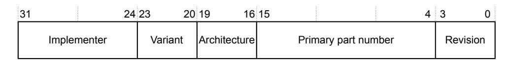

**Figure 4-1 MIDR\_EL1 bit assignments**

The following table shows the MIDR\_EL1 bit assignments.

**Table 4-16 MIDR\_EL1 bit assignments**

| Bits                                                                       | Name                | Function                                          |                                                                                                                                                                                    |  |  |
|----------------------------------------------------------------------------|---------------------|---------------------------------------------------|------------------------------------------------------------------------------------------------------------------------------------------------------------------------------------|--|--|
| [31:24]                                                                    | Implementer         | Indicates the implementer code. This value is:    |                                                                                                                                                                                    |  |  |
|                                                                            |                     | 0x41                                              | ARM Limited.                                                                                                                                                                       |  |  |
| [23:20]<br>Variant                                                         |                     |                                                   | Indicates the variant number of the processor. This is the major revision number n in the rn part of the<br>rnpn description of the product revision status. This value is:        |  |  |
|                                                                            |                     | 1                                                 | Major revision number.                                                                                                                                                             |  |  |
| [19:16]<br>Architecture<br>Indicates the architecture code. This value is: |                     |                                                   |                                                                                                                                                                                    |  |  |
|                                                                            |                     | 0xF                                               | Defined by CPUID scheme.                                                                                                                                                           |  |  |
| [15:4]                                                                     | Primary part number | Indicates the primary part number. This value is: |                                                                                                                                                                                    |  |  |
|                                                                            |                     | 0xD07                                             | Cortex-A57 processor.                                                                                                                                                              |  |  |
| [3:0]<br>Revision                                                          |                     |                                                   | Indicates the minor revision number of the processor. This is the minor revision number n in the pn<br>part of the rnpn description of the product revision status. This value is: |  |  |
|                                                                            |                     | 3                                                 | Minor revision number.                                                                                                                                                             |  |  |

To access the MIDR\_EL1 in AArch64 state, read the register with:

MRS <Xt>, MIDR\_EL1; Read Main ID Register

To access the MIDR in AArch32 state, read the CP15 register with:

MRC p15, 0, <Rt>, c0, c0, 0; Read Main ID Register

The MIDR can be accessed through the memory-mapped interface and the external debug interface, offset 0xD00.

# <span id="page-90-0"></span>**4.3.2 Multiprocessor Affinity Register, EL1**

The MPIDR\_EL1 characteristics are:

# **Purpose**

Provides an additional core identification mechanism for scheduling purposes in a cluster system. EDDEVAFF0 is a read-only copy of MPIDR\_EL1[31:0] accessible from the external debug interface.

# **Usage constraints**

The accessibility to the MPIDR\_EL1 by Exception level is:

| EL0 | EL1 (NS) | EL1 (S) | EL2 | EL3 (SCR.NS = 1) | EL3 (SCR.NS = 0) |
|-----|----------|---------|-----|------------------|------------------|
| -   | RO       | RO      | RO  | RO               | RO               |

The external debug accessibility to the EDDEVAFF0 by condition code is:

| Off | DLK | OSLK | EDAD | SLK | Default |
|-----|-----|------|------|-----|---------|
| -   | -   | -    | -    | -   | RO      |

*[Table 10-1 External register access conditions](#page-346-0)* on page 10-347 describes the condition codes.

# **Configurations**

The MPIDR\_EL1[31:0] is:

- Architecturally mapped to the AArch32 MPIDR register. See *[4.5.3 Multiprocessor Affinity](#page-238-0) Register* [on page 4-239](#page-238-0) for more information.
- Architecturally mapped to external EDDEVAFF0 register.

## **Attributes**

See the register summary in *[Table 4-1 AArch64 identification registers](#page-74-0)* on page 4-75.

The following figure shows the MPIDR\_EL1 bit assignments.

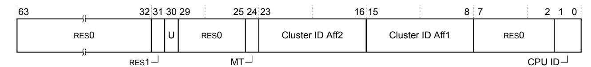

**Figure 4-2 MPIDR\_EL1 bit assignments**

The following table shows the MPIDR\_EL1 bit assignments.

**Table 4-17 MPIDR\_EL1 bit assignments**

| Bits    | Name | Function<br>Reserved, RES0.                                                                                                                                                                                                              |  |
|---------|------|------------------------------------------------------------------------------------------------------------------------------------------------------------------------------------------------------------------------------------------|--|
| [63:32] | -    |                                                                                                                                                                                                                                          |  |
| [31]    | -    | RES1.                                                                                                                                                                                                                                    |  |
| [30]    | U    | Indicates a single core system, as distinct from processor 0 in a cluster. This<br>value is:<br>0<br>Core is part of a cluster.                                                                                                          |  |
| [29:25] | -    | Reserved, RES0.                                                                                                                                                                                                                          |  |
| [24]    | MT   | Indicates whether the lowest level of affinity consists of logical cores that are<br>implemented using a multi-threading type approach. This value is:<br>0<br>Performance of cores at the lowest affinity level is largely independent. |  |

**Table 4-17 MPIDR\_EL1 bit assignments (continued)**

<span id="page-91-0"></span>

| Bits    | Name            | Function                                              |                                                                            |  |  |
|---------|-----------------|-------------------------------------------------------|----------------------------------------------------------------------------|--|--|
| [23:16] | Cluster ID Aff2 |                                                       | Affinity level 2. Second highest level affinity field.                     |  |  |
|         |                 | configuration signal.                                 | Indicates the value read in at reset, from the CLUSTERIDAFF2               |  |  |
| [15:8]  | Cluster ID Aff1 | Affinity level 1. Third highest level affinity field. |                                                                            |  |  |
|         |                 | configuration signal.                                 | Indicates the value read in at reset, from the CLUSTERIDAFF1               |  |  |
| [7:2]   | -               | Reserved, RES0.                                       |                                                                            |  |  |
| [1:0]   | CPU ID          | are:                                                  | Indicates the core number in the Cortex-A57 processor. The possible values |  |  |
|         |                 | 0x0                                                   | A cluster with one processor only.                                         |  |  |
|         |                 | 0x0, 0x1                                              | A cluster with two processors.                                             |  |  |
|         |                 | 0x0, 0x1, 0x2                                         | A cluster with three processors.                                           |  |  |
|         |                 | 0x0, 0x1, 0x2, 0x3                                    | A cluster with four processors.                                            |  |  |

To access the MPIDR\_EL1 in AArch64 state, read the register with:

MRS <Xt>, MPIDR\_EL1; Read Multiprocessor Affinity Register

The EDDEVAFF0 can be accessed through the memory-mapped interface and the external debug interface, offset 0xFA8.

#### **4.3.3 Revision ID Register, EL1**

The REVIDR\_EL1 characteristics are:

#### **Purpose**

Provides implementation-specific minor revision information that can only be interpreted in conjunction with the MIDR\_EL1.

# **Usage constraints**

The accessibility to the REVIDR\_EL1 by Exception level is:

| EL0 | EL1(NS) | EL1(S) | EL2 | EL3(SCR.NS = 1) | EL3(SCR.NS = 0) |
|-----|---------|--------|-----|-----------------|-----------------|
| -   | RO      | RO     | RO  | RO              | RO              |

# **Configurations**

The REVIDR\_EL1 is:

- Common to Secure and Non-secure states.
- Architecturally mapped to the AArch32 REVIDR register.

The REVIDR\_EL1 is a 32-bit register.

#### **Attributes**

See the register summary in *[Table 4-1 AArch64 identification registers](#page-74-0)* on page 4-75.

The following figure shows the REVIDR\_EL1 bit assignments.

<span id="page-92-0"></span>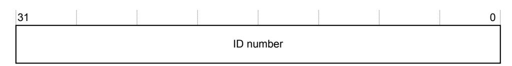

**Figure 4-3 REVIDR\_EL1 bit assignments**

The following table shows the REVIDR\_EL1 bit assignments.

**Table 4-18 REVIDR\_EL1 bit assignments**

| Bits   | Name      | Function                                                                                                                            |
|--------|-----------|-------------------------------------------------------------------------------------------------------------------------------------|
| [31:0] | ID number | Implementation-specific revision information. The reset value is determined by the specific Cortex-A57 processor<br>implementation. |

To access the REVIDR\_EL1 in AArch64 state, read the register with:

MRS <Xt>, REVIDR\_EL1; Read Revision ID Register

To access the REVIDR in AArch32 state, read the CP15 register with:

MRC p15, 0, <Rt>, c0, c0, 6; Read Revision ID Register

#### **4.3.4 AArch32 Processor Feature Register 0, EL1**

The ID\_PFR0\_EL1 characteristics are:

## **Purpose**

Provides information about the instruction sets supported by the processor in AArch32 state.

# **Usage constraints**

The ID\_PFR0\_EL1 must be interpreted with the ID\_PFR1\_EL1.

The accessibility to the ID\_PFR0\_EL1 by Exception level is:


#### **Configurations**

The ID\_PFR0\_EL1 is:

- Common to Secure and Non-secure states.
- Architecturally mapped to the AArch32 ID\_PFR0 register.

#### **Attributes**

See the register summary in *[Table 4-1 AArch64 identification registers](#page-74-0)* on page 4-75.

The following figure shows the ID\_PFR0\_EL1 bit assignments.

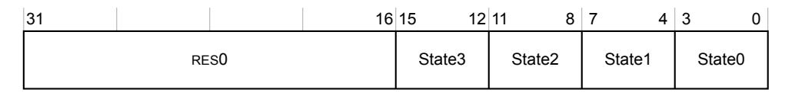

**Figure 4-4 ID\_PFR0\_EL1 bit assignments**

The following table shows the ID\_PFR0\_EL1 bit assignments.

## **Table 4-19 ID\_PFR0\_EL1 bit assignments**

<span id="page-93-0"></span>

| Bits                                                                         | Name                                                                | Function                                                                                                                                      |  |  |  |  |
|------------------------------------------------------------------------------|---------------------------------------------------------------------|-----------------------------------------------------------------------------------------------------------------------------------------------|--|--|--|--|
| [31:16]                                                                      | -                                                                   | Reserved, RES0.                                                                                                                               |  |  |  |  |
| [15:12]                                                                      | State3                                                              | Indicates support for Thumb Execution Environment (ThumbEE) instruction set. This value is:                                                   |  |  |  |  |
|                                                                              |                                                                     | Processor does not implement the ThumbEE instruction set.<br>0x0                                                                              |  |  |  |  |
| [11:8]                                                                       | State2<br>Indicates support for Jazelle extension. This value is:   |                                                                                                                                               |  |  |  |  |
|                                                                              |                                                                     | Processor supports trivial implementation of Jazelle.<br>0x1                                                                                  |  |  |  |  |
| [7:4]<br>State1<br>Indicates support for T32 instruction set. This value is: |                                                                     |                                                                                                                                               |  |  |  |  |
|                                                                              |                                                                     | Processor supports T32 encoding after the introduction of Thumb-2 technology, and for all 16-bit and 32-bit<br>0x3<br>T32 basic instructions. |  |  |  |  |
| [3:0]                                                                        | State0<br>Indicates support for A32 instruction set. This value is: |                                                                                                                                               |  |  |  |  |
|                                                                              |                                                                     | Processor implements the A32 instruction set.<br>0x1                                                                                          |  |  |  |  |

To access the ID\_PFR0\_EL1 in AArch64 state, read the register with:

MRS <Xt>, ID\_PFR0\_EL1; Read AArch32 Processor Feature Register 0

To access the ID\_PFR0 in AArch32 state, read the CP15 register with:

MRC p15, 0, <Rt>, c0, c1, 0; Read AArch32 Processor Feature Register 0

#### **4.3.5 AArch32 Processor Feature Register 1, EL1**

The ID\_PFR1\_EL1 characteristics are:

#### **Purpose**

Provides information about the programmers model and extensions support in AArch32.

#### **Usage constraints**

The ID\_PFR1\_EL1 must be interpreted with the ID\_PFR0\_EL1.

The accessibility to the ID\_PFR1\_EL1 by Exception level is:

| EL0 | EL1(NS) | EL1(S) | EL2 | EL3(SCR.NS = 1) | EL3(SCR.NS = 0) |
|-----|---------|--------|-----|-----------------|-----------------|
| -   | RO      | RO     | RO  | RO              | RO              |

## **Configurations**

The ID\_PFR1\_EL1 is:

- Common to Secure and Non-secure states.
- Architecturally mapped to the AArch32 ID\_PFR1 register.

## **Attributes**

See the register summary in *[Table 4-1 AArch64 identification registers](#page-74-0)* on page 4-75.

The following figure shows the ID\_PFR1\_EL1 bit assignments.

<span id="page-94-0"></span>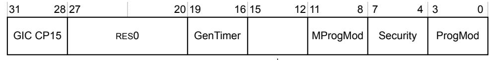

Virtualization —

Figure 4-5 ID\_PFR1\_EL1 bit assignments

The following table shows the ID PFR1 EL1 bit assignments.

Table 4-20 ID\_PFR1\_EL1 bit assignments

| Bits    | Name           | Function                                                                                 |                                                                                                                                                           |  |  |  |  |  |
|---------|----------------|------------------------------------------------------------------------------------------|-----------------------------------------------------------------------------------------------------------------------------------------------------------|--|--|--|--|--|
| [31:28] | GIC CP15       | Indicates support                                                                        | for the GIC CP15 interface. The possible values are:                                                                                                      |  |  |  |  |  |
|         |                | 0×0                                                                                      | No GIC CP15 registers are supported. This is the reset value when ${\bf GICCDISABLE}$ is tied HIGH.                                                       |  |  |  |  |  |
|         |                | 0x1                                                                                      | GICv3 CP15 registers are supported. This is the reset value when <b>GICCDISABLE</b> is tied LOW.                                                          |  |  |  |  |  |
| [27:20] | -              | Reserved, RESO.                                                                          |                                                                                                                                                           |  |  |  |  |  |
| [19:16] | GenTimer       | Indicates support for Generic Timer Extension. This value is:                            |                                                                                                                                                           |  |  |  |  |  |
|         |                | 0x1                                                                                      | Processor supports Generic Timer Extension.                                                                                                               |  |  |  |  |  |
| [15:12] | Virtualization | n Indicates support for Virtualization Extensions. This value is:                        |                                                                                                                                                           |  |  |  |  |  |
|         |                | 0x1                                                                                      | Processor supports Virtualization Extensions.                                                                                                             |  |  |  |  |  |
| [11:8]  | MProgMod       | Indicates support                                                                        | for M-profile programmers model. This value is:                                                                                                           |  |  |  |  |  |
|         |                | 0x0                                                                                      | Processor does not support M-profile programmers model.                                                                                                   |  |  |  |  |  |
| [7:4]   | Security       | Indicates support for Security Extensions. This value is:                                |                                                                                                                                                           |  |  |  |  |  |
|         |                | 0x1                                                                                      | Processor supports Security Extensions. This includes support for Monitor mode and the SMC instruction.                                                   |  |  |  |  |  |
| [3:0]   | ProgrMod       | Indicates support for the standard programmers model for ARMv4 and later. This value is: |                                                                                                                                                           |  |  |  |  |  |
|         |                | 0x1                                                                                      | Processor supports the standard programmers model for ARMv4 and later. The model supports User, FIQ, IRQ, Supervisor, Abort, Undefined, and System modes. |  |  |  |  |  |

To access the ID\_PFR1\_EL1 in AArch64 state, read the register with:

MRS <Xt>, ID\_PFR1\_EL1; Read AArch32 Processor Feature Register 1

To access the ID PFR1 in AArch32 state, read the CP15 register with:

MRC p15, 0, <Rt>, c0, c1, 1; Read AArch32 Processor Feature Register 1

# 4.3.6 AArch32 Debug Feature Register 0, EL1

The ID\_DFR0\_EL1 characteristics are:

#### **Purpose**

Provides top-level information about the debug system in AArch32 state.

# **Usage constraints**

The ID\_DFR0\_EL1 must be interpreted with the MIDR\_EL1.

The accessibility to the ID\_DFR0\_EL1 by Exception level is:

| EL0 | EL1(NS) | EL1(S) | EL2 | EL3(SCR.NS = 1) | EL3(SCR.NS = 0) |
|-----|---------|--------|-----|-----------------|-----------------|
| -   | RO      | RO     | RO  | RO              | RO              |

## **Configurations**

The ID\_DFR0\_EL1 is:

- Common to Secure and Non-secure states.
- Architecturally mapped to the AArch32 ID\_DFR0 register.

#### **Attributes**

See the register summary in *[Table 4-1 AArch64 identification registers](#page-74-0)* on page 4-75.

The following figure shows the ID\_DFR0\_EL1 bit assignments.

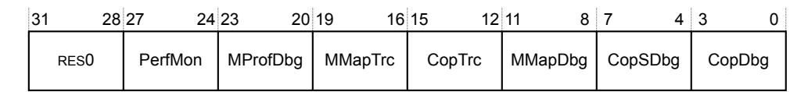

**Figure 4-6 ID\_DFR0\_EL1 bit assignments**

The following table shows the ID\_DFR0\_EL1 bit assignments.

**Table 4-21 ID\_DFR0\_EL1 bit assignments**

| Bits    | Name     | Function                                                                                   |  |  |  |  |  |
|---------|----------|--------------------------------------------------------------------------------------------|--|--|--|--|--|
| [31:28] | -        | Reserved, RES0.                                                                            |  |  |  |  |  |
| [27:24] | PerfMon  | Indicates support for coprocessor-based ARM Performance Monitors Extension. This value is: |  |  |  |  |  |
|         |          | Processor supports Performance Monitors Extension, PMUv3 System registers.<br>0x3          |  |  |  |  |  |
| [23:20] | MProfDbg | Indicates support for memory-mapped debug model for M-profile processors. This value is:   |  |  |  |  |  |
|         |          | Processor does not support M-profile Debug architecture, with memory-mapped access.<br>0x0 |  |  |  |  |  |
| [19:16] | MMapTrc  | Indicates support for memory-mapped trace model. This value is:                            |  |  |  |  |  |
|         |          | Processor supports ARM trace architecture, with memory-mapped access.<br>0x1               |  |  |  |  |  |
| [15:12] | CopTrc   | Indicates support for coprocessor-based trace model. This value is:                        |  |  |  |  |  |
|         |          | Processor does not support ARM trace architecture, with CP14 access.<br>0x0                |  |  |  |  |  |
| [11:8]  | MMapDbg  | Indicates support for memory-mapped debug model. This value is:                            |  |  |  |  |  |
|         |          | Processor does not support the memory-mapped debug model.<br>0x0                           |  |  |  |  |  |
| [7:4]   | CopSDbg  | Indicates support for coprocessor-based Secure debug model. This value is:                 |  |  |  |  |  |
|         |          | Processor supports v8-A Debug architecture, with CP14 access.<br>0x6                       |  |  |  |  |  |
| [3:0]   | CopDbg   | Indicates support for coprocessor-based debug model. This value is:                        |  |  |  |  |  |
|         |          | Processor supports v8-A Debug architecture, with CP14 access.<br>0x6                       |  |  |  |  |  |

<span id="page-96-0"></span>To access the ID\_DFR0\_EL1 in AArch64 state, read the register with:

MRS <Xt>, ID\_DFR0\_EL1; Read AArch32 Debug Feature Register 0

To access the ID\_DFR0 in AArch32 state, read the CP15 register with:

MRC p15, 0, <Rt>, c0, c1, 2; Read AArch32 Debug Feature Register 0

# **4.3.7 AArch32 Auxiliary Feature Register 0, EL1**

The processor does not implement ID\_AFR0\_EL1. This register is always RES0.

## **4.3.8 AArch32 Memory Model Feature Register 0, EL1**

The ID\_MMFR0\_EL1 characteristics are:

## **Purpose**

Provides information about the implemented memory model and memory management support in AArch32.

# **Usage constraints**

The ID\_MMFR0\_EL1 must be interpreted with:

- ID\_MMFR1\_EL1.
- ID\_MMFR2\_EL1.
- ID\_MMFR3\_EL1.

The accessibility to the ID\_MMFR0\_EL1 by Exception level is:

| EL0 | EL1(NS) | EL1(S) | EL2 | EL3(SCR.NS = 1) | EL3(SCR.NS = 0) |
|-----|---------|--------|-----|-----------------|-----------------|
| -   | RO      | RO     | RO  | RO              | RO              |

# **Configurations**

The ID\_MMFR0\_EL1 is:

- Common to Secure and Non-secure states.
- Architecturally mapped to the AArch32 ID\_MMFR0 register.

## **Attributes**

See the register summary in *[Table 4-1 AArch64 identification registers](#page-74-0)* on page 4-75.

The following figure shows the ID\_MMFR0\_EL1 bit assignments.

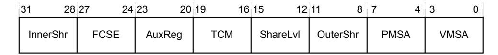

**Figure 4-7 ID\_MMFR0\_EL1 bit assignments**

The following table shows the ID\_MMFR0\_EL1 bit assignments.

#### **Table 4-22 ID\_MMFR0\_EL1 bit assignments**

<span id="page-97-0"></span>

| Bits    | Name     | Function                                                                          |                                                                                          |  |  |  |  |  |  |
|---------|----------|-----------------------------------------------------------------------------------|------------------------------------------------------------------------------------------|--|--|--|--|--|--|
| [31:28] | InnerShr | Indicates the innermost shareability domain implemented. This value is:           |                                                                                          |  |  |  |  |  |  |
|         |          | 0x1                                                                               | Processor implements hardware coherency support.                                         |  |  |  |  |  |  |
| [27:24] | FCSE     | Indicates support for Fast Context Switch Extension (FCSE). This value is:        |                                                                                          |  |  |  |  |  |  |
|         |          | 0x0                                                                               | Processor does not support FCSE.                                                         |  |  |  |  |  |  |
| [23:20] | AuxReg   | Indicates support for Auxiliary registers. This value is:                         |                                                                                          |  |  |  |  |  |  |
|         |          | 0x1                                                                               | Processor supports the ACTLR. See 4.3.39 Auxiliary Control Register, EL3 on page 4-144.  |  |  |  |  |  |  |
| [19:16] | TCM      |                                                                                   | Indicates support for TCMs and associated DMAs. This value is:                           |  |  |  |  |  |  |
|         |          | 0x0                                                                               | Processor does not support TCM.                                                          |  |  |  |  |  |  |
| [15:12] | ShareLvl | Indicates the number of shareability levels implemented. This value is:           |                                                                                          |  |  |  |  |  |  |
|         |          | 0x1                                                                               | Processor implements two levels of shareability.                                         |  |  |  |  |  |  |
| [11:8]  | OuterShr |                                                                                   | Indicates the outermost shareability domain implemented. This value is:                  |  |  |  |  |  |  |
|         |          | 0x1                                                                               | Processor supports hardware coherency.                                                   |  |  |  |  |  |  |
| [7:4]   | PMSA     |                                                                                   | Indicates support for a Protected Memory System Architecture (PMSA). This value is:      |  |  |  |  |  |  |
|         |          | 0x0                                                                               | Processor does not support PMSA.                                                         |  |  |  |  |  |  |
| [3:0]   | VMSA     | Indicates support for a Virtual Memory System Architecture (VMSA). This value is: |                                                                                          |  |  |  |  |  |  |
|         |          | 0x5                                                                               | Processor supports:                                                                      |  |  |  |  |  |  |
|         |          |                                                                                   | •<br>VMSAv7, with support for remapping and the Access flag                              |  |  |  |  |  |  |
|         |          |                                                                                   | •<br>Privileged Execute Never (PXN) bit in the Short-descriptor translation table format |  |  |  |  |  |  |
|         |          |                                                                                   | •<br>The Long-descriptor translation table format.                                       |  |  |  |  |  |  |

To access the ID\_MMFR0\_EL1 in AArch64 state, read the register with:

MRS <Xt>, ID\_MMFR0\_EL1; Read AArch32 Memory Model Feature Register 0

To access the ID\_MMFR0 in AArch32 state, read the CP15 register with:

MRC p15, 0, <Rt>, c0, c1, 4; Read AArch32 Memory Model Feature Register 0

#### **4.3.9 AArch32 Memory Model Feature Register 1, EL1**

The ID\_MMFR1\_EL1 characteristics are:

## **Purpose**

Provides information about the implemented memory model and memory management support in AArch32.

# **Usage constraints**

The ID\_MMFR1\_EL1 must be interpreted with:

- ID\_MMFR0\_EL1.
- ID\_MMFR2\_EL1.
- ID\_MMFR3\_EL1.

The accessibility to the ID\_MMFR1\_EL1 by Exception level is:

| EL0 | EL1(NS) | EL1(S) | EL2 | EL3(SCR.NS = 1) | EL3(SCR.NS = 0) |
|-----|---------|--------|-----|-----------------|-----------------|
| -   | RO      | RO     | RO  | RO              | RO              |

# **Configurations**

The ID\_MMFR1\_EL1 is:

- Common to Secure and Non-secure states.
- Architecturally mapped to the AArch32 ID\_MMFR1 register.

# **Attributes**

See the register summary in *[Table 4-1 AArch64 identification registers](#page-74-0)* on page 4-75.

The following figure shows the ID\_MMFR1\_EL1 bit assignments.

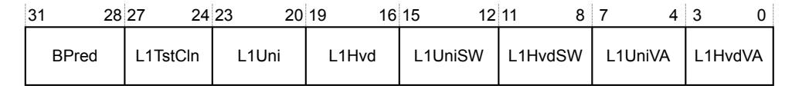

**Figure 4-8 ID\_MMFR1\_EL1 bit assignments**

The following table shows the ID\_MMFR1 bit assignments.

**Table 4-23 ID\_MMFR1\_EL1 bit assignments**

| Bits    | Name     | Function                                                                                                                        |                                                                                                                |  |  |  |  |  |
|---------|----------|---------------------------------------------------------------------------------------------------------------------------------|----------------------------------------------------------------------------------------------------------------|--|--|--|--|--|
| [31:28] | BPred    | Indicates branch predictor management requirements. This value is:                                                              |                                                                                                                |  |  |  |  |  |
|         |          | 0x4                                                                                                                             | Branch predictor does not require flushing at any time.                                                        |  |  |  |  |  |
| [27:24] | L1TstCln | Indicates the supported L1 data cache test and clean operations, for Harvard or unified cache implementation.<br>This value is: |                                                                                                                |  |  |  |  |  |
|         |          | 0x0                                                                                                                             | Not supported.                                                                                                 |  |  |  |  |  |
| [23:20] | L1Uni    | is:                                                                                                                             | Indicates the supported entire L1 cache maintenance operations, for a unified cache implementation. This value |  |  |  |  |  |
|         |          | 0x0                                                                                                                             | Not supported.                                                                                                 |  |  |  |  |  |
| [19:16] | L1Hvd    | is:                                                                                                                             | Indicates the supported entire L1 cache maintenance operations, for a Harvard cache implementation. This value |  |  |  |  |  |
|         |          | 0x0                                                                                                                             | Not supported.                                                                                                 |  |  |  |  |  |
| [15:12] | L1UniSW  | Indicates the supported L1 cache line maintenance operations by set/way, for a unified cache implementation.<br>This value is:  |                                                                                                                |  |  |  |  |  |
|         |          | 0x0                                                                                                                             | Not supported.                                                                                                 |  |  |  |  |  |

## **Table 4-23 ID\_MMFR1\_EL1 bit assignments (continued)**

<span id="page-99-0"></span>

| Bits   | Name    | Function<br>Indicates the supported L1 cache line maintenance operations by set/way, for a Harvard cache implementation.<br>This value is: |                |  |  |  |
|--------|---------|--------------------------------------------------------------------------------------------------------------------------------------------|----------------|--|--|--|
| [11:8] | L1HvdSW |                                                                                                                                            |                |  |  |  |
|        |         | 0x0                                                                                                                                        | Not supported. |  |  |  |
| [7:4]  | L1UniVA | Indicates the supported L1 cache line maintenance operations by VA, for a unified cache implementation. This<br>value is:                  |                |  |  |  |
|        |         | 0x0                                                                                                                                        | Not supported. |  |  |  |
| [3:0]  | L1HvdVA | Indicates the supported L1 cache line maintenance operations by VA, for a Harvard cache implementation. This<br>value is:                  |                |  |  |  |
|        |         | 0x0                                                                                                                                        | Not supported. |  |  |  |

To access the ID\_MMFR1\_EL1 in AArch64 state, read the register with:

MRS <Xt>, ID\_MMFR1\_EL1; Read AArch32 Memory Model Feature Register 1

To access the ID\_MMFR1 in AArch32 state, read the CP15 register with:

MRC p15, 0, <Rt>, c0, c1, 5; Read AArch32 Memory Model Feature Register 1

## **4.3.10 AArch32 Memory Model Feature Register 2, EL1**

The ID\_MMFR2\_EL1 characteristics are:

#### **Purpose**

Provides information about the implemented memory model and memory management support of the processor in AArch32.

# **Usage constraints**

The ID\_MMFR2\_EL1 must be interpreted with:

- ID\_MMFR0\_EL1.
- ID\_MMFR1\_EL1.
- ID\_MMFR3\_EL1.

The accessibility to the ID\_MMFR2\_EL1 by Exception level is:

| EL0 | EL1(NS) | EL1(S) | EL2 | EL3(SCR.NS = 1) | EL3(SCR.NS = 0) |
|-----|---------|--------|-----|-----------------|-----------------|
| -   | RO      | RO     | RO  | RO              | RO              |

#### **Configurations**

The ID\_MMFR2\_EL1 is:

- Common to Secure and Non-secure states.
- Architecturally mapped to the AArch32 ID\_MMFR2 register.

# **Attributes**

See the register summary in *[Table 4-1 AArch64 identification registers](#page-74-0)* on page 4-75.

The following figure shows the ID\_MMFR2\_EL1 bit assignments.

| 31<br>28 27 | 24 23    | 20 19   | 16 15  | 12 11  | 8        | 7<br>4  | 3<br>0  |
|-------------|----------|---------|--------|--------|----------|---------|---------|
| HWAccFlg    | WFIStall | MemBarr | UniTLB | HvdTLB | L1HvdRng | L1HvdBG | L1HvdFG |

**Figure 4-9 ID\_MMFR2\_EL1 bit assignments**

The following table shows the ID\_MMFR2\_EL1 bit assignments.

**Table 4-24 ID\_MMFR2\_EL1 bit assignments**

| Bits    | Name     | Function                                                                                                        |  |  |  |  |  |
|---------|----------|-----------------------------------------------------------------------------------------------------------------|--|--|--|--|--|
| [31:28] | HWAccFlg | Indicates support for Hardware Access flag. This value is:                                                      |  |  |  |  |  |
|         |          | Not supported.<br>0x0                                                                                           |  |  |  |  |  |
| [27:24] | WFIStall | Indicates support for Wait For Interrupt (WFI) stalling. This value is:                                         |  |  |  |  |  |
|         |          | Processor supports WFI stalling.<br>0x1                                                                         |  |  |  |  |  |
| [23:20] | MemBarr  | Indicates the supported CP15 memory barrier operations. This value is:                                          |  |  |  |  |  |
|         |          | Processor supports:<br>0x2                                                                                      |  |  |  |  |  |
|         |          | •<br>Data Synchronization Barrier (DSB).                                                                        |  |  |  |  |  |
|         |          | •<br>Instruction Synchronization Barrier (ISB).                                                                 |  |  |  |  |  |
|         |          | •<br>Data Memory Barrier (DMB).                                                                                 |  |  |  |  |  |
|         |          | ARM deprecates the use of these CP15 operations. Instead, use the DMB, DSB, and ISB barrier instructions.       |  |  |  |  |  |
| [19:16] | UniTLB   | Indicates the supported TLB maintenance operations. This value is:                                              |  |  |  |  |  |
|         |          | Processor supports:<br>0x6                                                                                      |  |  |  |  |  |
|         |          | •<br>Invalidate all entries in the TLB.                                                                         |  |  |  |  |  |
|         |          | •<br>Invalidate TLB entry by VA.                                                                                |  |  |  |  |  |
|         |          | •<br>Invalidate TLB entries by ASID match.                                                                      |  |  |  |  |  |
|         |          | •<br>Invalidate instruction TLB and data TLB entries by VA All ASID. This is a shared<br>unified TLB operation. |  |  |  |  |  |
|         |          | •<br>Invalidate Hyp mode unified TLB entry by VA.                                                               |  |  |  |  |  |
|         |          | •<br>Invalidate entire Non-secure PL1 and PL0 unified TLB.                                                      |  |  |  |  |  |
|         |          | •<br>Invalidate entire Hyp mode unified TLB.                                                                    |  |  |  |  |  |
|         |          | •<br>Invalidate TLB entry by VA, Last Level.                                                                    |  |  |  |  |  |
|         |          | •<br>Invalidate TLB entry by VA and ASID, Last Level.                                                           |  |  |  |  |  |
|         |          | •<br>Invalidate Stage 2 TLB only by IPA.                                                                        |  |  |  |  |  |
|         |          | •<br>Invalidate Stage 2 TLB only by IPA, Last Level.                                                            |  |  |  |  |  |
| [15:12] | HvdTLB   | Indicates support for Harvard TLB maintenance operations. This value is:                                        |  |  |  |  |  |
|         |          | Not supported.<br>0x0                                                                                           |  |  |  |  |  |
| [11:8]  | L1HvdRng | Indicates support for Harvard L1 cache maintenance range operations. This value is:                             |  |  |  |  |  |
|         |          | Not supported.<br>0x0                                                                                           |  |  |  |  |  |

## **Table 4-24 ID\_MMFR2\_EL1 bit assignments (continued)**

<span id="page-101-0"></span>

| Bits  | Name    | Function                                                                           |                                                                                    |  |  |
|-------|---------|------------------------------------------------------------------------------------|------------------------------------------------------------------------------------|--|--|
| [7:4] | L1HvdBG |                                                                                    | Indicates support for Harvard L1 cache background fetch operations. This value is: |  |  |
|       |         | 0x0                                                                                | Not supported.                                                                     |  |  |
| [3:0] | L1HvdFG | Indicates support for Harvard L1 cache foreground fetch operations. This value is: |                                                                                    |  |  |
|       |         | 0x0                                                                                | Not supported.                                                                     |  |  |

To access the ID\_MMFR2\_EL1 in AArch64 state, read the register with:

MRS <Xt>, ID\_MMFR2\_EL1; Read AArch32 Memory Model Feature Register 2

To access the ID\_MMFR2 in AArch32 state, read the CP15 register with:

MRC p15, 0, <Rt>, c0, c1, 6; Read AArch32 Memory Model Feature Register 2

#### **4.3.11 AArch32 Memory Model Feature Register 3, EL1**

The ID\_MMFR3\_EL1 characteristics are:

#### **Purpose**

Provides information about the implemented memory model and memory management support of the processor in AArch32.

# **Usage constraints**

The ID\_MMFR3\_EL1 must be interpreted with:

- ID\_MMFR0\_EL1.
- ID\_MMFR1\_EL1.
- ID\_MMFR2\_EL1.

The accessibility to the ID\_MMFR3\_EL1 by Exception level is:

| EL0 | EL1(NS) | EL1(S) | EL2 | EL3(SCR.NS = 1) | EL3(SCR.NS = 0) |
|-----|---------|--------|-----|-----------------|-----------------|
| -   | RO      | RO     | RO  | RO              | RO              |

#### **Configurations**

The ID\_MMFR3\_EL1 is:

- Common to Secure and Non-secure states.
- Architecturally mapped to the AArch32 ID\_MMFR3 register.

#### **Attributes**

See the register summary in *[Table 4-1 AArch64 identification registers](#page-74-0)* on page 4-75.

The following figure shows the ID\_MMFR3\_EL1 bit assignments.

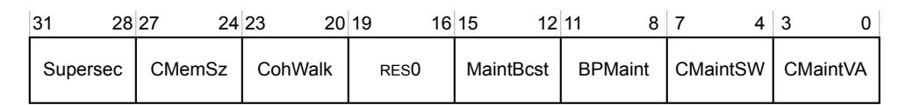

**Figure 4-10 ID\_MMFR3\_EL1 bit assignments**

The following table shows the ID\_MMFR3\_EL1 bit assignments.

#### **Table 4-25 ID\_MMFR3\_EL1 bit assignments**

<span id="page-102-0"></span>

| Bits    | Name      | Function                                                                                                |                                                                                                                                                     |  |  |  |  |  |
|---------|-----------|---------------------------------------------------------------------------------------------------------|-----------------------------------------------------------------------------------------------------------------------------------------------------|--|--|--|--|--|
| [31:28] | Supersec  | Indicates support for supersections. This value is:                                                     |                                                                                                                                                     |  |  |  |  |  |
|         |           | 0x0                                                                                                     | Processor supports supersections.                                                                                                                   |  |  |  |  |  |
| [27:24] | CMemSz    | Indicates the physical memory size supported by the processor caches. This value is:                    |                                                                                                                                                     |  |  |  |  |  |
|         |           | 0x2                                                                                                     | Processor caches support 40-bit physical address range.                                                                                             |  |  |  |  |  |
| [23:20] | CohWalk   | Indicates whether translation table updates require a clean to the point of unification. This value is: |                                                                                                                                                     |  |  |  |  |  |
|         |           | 0x1                                                                                                     | Updates to the translation tables do not require a clean to the point of unification to ensure<br>visibility by subsequent translation table walks. |  |  |  |  |  |
| [19:16] | -         | Reserved, RES0.                                                                                         |                                                                                                                                                     |  |  |  |  |  |
| [15:12] | MaintBcst |                                                                                                         | Indicates whether cache, TLB and branch predictor operations are broadcast. This value is:                                                          |  |  |  |  |  |
|         |           | 0x2                                                                                                     | Cache, TLB and branch predictor operations affect structures according to shareability and<br>defined behavior of instructions.                     |  |  |  |  |  |
| [11:8]  | BPMaint   | Indicates the supported branch predictor maintenance operations. This value is:                         |                                                                                                                                                     |  |  |  |  |  |
|         |           | Processor supports:<br>0x2                                                                              |                                                                                                                                                     |  |  |  |  |  |
|         |           |                                                                                                         | •<br>Invalidate all branch predictors.                                                                                                              |  |  |  |  |  |
|         |           |                                                                                                         | •<br>Invalidate branch predictors by VA.                                                                                                            |  |  |  |  |  |
| [7:4]   | CMaintSW  | Indicates the supported cache maintenance operations by set/way. This value is:                         |                                                                                                                                                     |  |  |  |  |  |
|         |           | 0x1                                                                                                     | Processor supports:                                                                                                                                 |  |  |  |  |  |
|         |           |                                                                                                         | •<br>Invalidate data cache by set/way.                                                                                                              |  |  |  |  |  |
|         |           |                                                                                                         | •<br>Clean data cache by set/way.                                                                                                                   |  |  |  |  |  |
|         |           |                                                                                                         | •<br>Clean and invalidate data cache by set/way.                                                                                                    |  |  |  |  |  |
| [3:0]   | CMaintVA  | Indicates the supported cache maintenance operations by VA. This value is:                              |                                                                                                                                                     |  |  |  |  |  |
|         |           | Processor supports:<br>0x1                                                                              |                                                                                                                                                     |  |  |  |  |  |
|         |           |                                                                                                         | •<br>Invalidate data cache by VA.                                                                                                                   |  |  |  |  |  |
|         |           |                                                                                                         | •<br>Clean data cache by VA.                                                                                                                        |  |  |  |  |  |
|         |           |                                                                                                         | •<br>Clean and invalidate data cache by VA.                                                                                                         |  |  |  |  |  |
|         |           |                                                                                                         | •<br>Invalidate Instruction Cache by VA.                                                                                                            |  |  |  |  |  |
|         |           |                                                                                                         | •<br>Invalidate all Instruction Cache entries.                                                                                                      |  |  |  |  |  |

To access the ID\_MMFR3\_EL1 in AArch64 state, read the register with:

MRS <Xt>, ID\_MMFR3\_EL1; Read AArch32 Memory Model Feature Register 3

To access the ID\_MMFR3 in AArch32 state, read the CP15 register with:

MRC p15, 0, <Rt>, c0, c1, 7; Read AArch32 Memory Model Feature Register 3

# **4.3.12 AArch32 Instruction Set Attribute Register 0, EL1**

The ID\_ISAR0\_EL1 characteristics are:

## **Purpose**

Provides information about the instruction set that the processor supports in AArch32.

## **Usage constraints**

The ID\_ISAR0\_EL1 must be interpreted with:

- ID\_ISAR1\_EL1.
- ID\_ISAR2\_EL1.
- ID\_ISAR3\_EL1.
- ID\_ISAR4\_EL1.
- ID\_ISAR5\_EL1.

The accessibility to the ID\_ISAR0\_EL1 by Exception level is:

| EL0 | EL1(NS) | EL1(S) | EL2 | EL3(SCR.NS = 1) | EL3(SCR.NS = 0) |
|-----|---------|--------|-----|-----------------|-----------------|
| -   | RO      | RO     | RO  | RO              | RO              |

# **Configurations**

The ID\_ISAR0\_EL1 is:

- Common to Secure and Non-secure states.
- Architecturally mapped to the AArch32 ID\_ISAR0 register.

#### **Attributes**

See the register summary in *[Table 4-1 AArch64 identification registers](#page-74-0)* on page 4-75.

The following figure shows the ID\_ISAR0\_EL1 bit assignments.

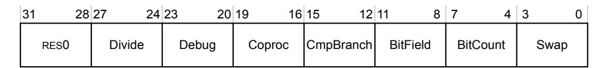

**Figure 4-11 ID\_ISAR0\_EL1 bit assignments**

The following table shows the ID\_ISAR0\_EL1 bit assignments.

**Table 4-26 ID\_ISAR0\_EL1 bit assignments**

| Bits    | Name      | Function                                                                                                                                                                        |  |
|---------|-----------|---------------------------------------------------------------------------------------------------------------------------------------------------------------------------------|--|
| [31:28] | -         | Reserved, RES0.                                                                                                                                                                 |  |
| [27:24] | Divide    | Returns 0x2 to indicate the processor implements the following divide instructions:                                                                                             |  |
|         |           | •<br>SDIV and UDIV in the T32 instruction set.                                                                                                                                  |  |
|         |           | •<br>SDIV and UDIV in the A32 instruction set.                                                                                                                                  |  |
| [23:20] | Debug     | Returns 0x1 to indicate the processor implements the BKPT debug instruction.                                                                                                    |  |
| [19:16] | Coproc    | Returns 0x0 to indicate the processor implements no coprocessor instructions, except for separately attributed<br>architectures including CP15, CP14, and Advanced SIMD and FP. |  |
| [15:12] | CmpBranch | Returns 0x1 to indicate the processor implements the CBNZ and CBZ, Compare and Branch, instructions in the<br>T32 instruction set.                                              |  |
| [11:8]  | Bitfield  | Returns 0x1 to indicate the processor implements the BFC, BFI, SBFX, and UBFX, bit field instructions.                                                                          |  |
| [7:4]   | BitCount  | Returns 0x1 to indicate the processor implements the CLZ bit counting instruction.                                                                                              |  |
| [3:0]   | Swap      | Returns 0x0 to indicate the processor implements no swap instructions in the A32 instruction set.                                                                               |  |

<span id="page-104-0"></span>To access the ID\_ISAR0\_EL1 in AArch64 state, read the register with:

MRS <Xt>, ID\_ISAR0\_EL1; Read AArch32 Instruction Set Attribute Register 0

To access the ID\_ISAR0 in AArch32 state, read the CP15 register with:

MRC p15, 0, <Rt>, c0, c2, 0; Read AArch32 Instruction Set Attribute Register 0

# **4.3.13 AArch32 Instruction Set Attribute Register 1, EL1**

The ID\_ISAR1\_EL1 characteristics are:

## **Purpose**

Provides information about the instruction set that the processor supports in AArch32.

#### **Usage constraints**

The ID\_ISAR1\_EL1 must be interpreted with:

- ID\_ISAR0\_EL1.
- ID\_ISAR2\_EL1.
- ID\_ISAR3\_EL1.
- ID\_ISAR4\_EL1.
- ID\_ISAR5\_EL1.

The accessibility to the ID\_ISAR1\_EL1 by Exception level is:

| EL0 | EL1(NS) | EL1(S) | EL2 | EL3(SCR.NS = 1) | EL3(SCR.NS = 0) |
|-----|---------|--------|-----|-----------------|-----------------|
| -   | RO      | RO     | RO  | RO              | RO              |

# **Configurations**

The ID\_ISAR1\_EL1 is:

- Common to Secure and Non-secure states.
- Architecturally mapped to the AArch32 ID\_ISAR1 register.

# **Attributes**

See the register summary in *[Table 4-1 AArch64 identification registers](#page-74-0)* on page 4-75.

The following figure shows the ID\_ISAR1\_EL1 bit assignments.


**Figure 4-12 ID\_ISAR1\_EL1 bit assignments**

The following table shows the ID\_ISAR1\_EL1 bit assignments.

**Table 4-27 ID\_ISAR1\_EL1 bit assignments**

| Bits<br>Name         | Function                                                                                                                                                                                                                                                                                                                                              |  |  |  |  |
|----------------------|-------------------------------------------------------------------------------------------------------------------------------------------------------------------------------------------------------------------------------------------------------------------------------------------------------------------------------------------------------|--|--|--|--|
| [31:28]<br>Jazelle   | Returns 0x1 to indicate the processor implements the BXJ instruction, and the J bit in the PSR.                                                                                                                                                                                                                                                       |  |  |  |  |
| [27:24]<br>Interwork | Returns 0x3 to indicate the processor implements the following interworking instructions:<br>•<br>BX instruction, and the T bit in the PSR.<br>•<br>BLX instruction, and PC loads have BX-like behavior.<br>•<br>Data-processing instructions in the A32 instruction set with the PC as the destination and the S bit clear have<br>BX-like behavior. |  |  |  |  |

#### **Table 4-27 ID\_ISAR1\_EL1 bit assignments (continued)**

<span id="page-105-0"></span>

| Bits    | Name      | Function                                                                                                                                                                                   |  |  |
|---------|-----------|--------------------------------------------------------------------------------------------------------------------------------------------------------------------------------------------|--|--|
| [23:20] | Immediate | Returns 0x1 to indicate the processor implements the following data-processing instructions with long<br>immediates:                                                                       |  |  |
|         |           | •<br>MOVT instruction.                                                                                                                                                                     |  |  |
|         |           | •<br>MOV instruction encoding with zero-extended 16-bit immediates.                                                                                                                        |  |  |
|         |           | •<br>Thumb ADD and SUB instruction encoding with zero-extended 12-bit immediates, and other ADD, ADR, and<br>SUB encoding cross-referenced by the pseudocode for those encodings.          |  |  |
| [19:16] | IfThen    | Returns 0x1 to indicate the processor implements the IT instruction and the IT bits in the PSRs, in the T32<br>instruction set.                                                            |  |  |
| [15:12] | Extend    | Returns 0x2 to indicate the processor implements the following Extend instructions:                                                                                                        |  |  |
|         |           | •<br>SXTB, SXTH, UXTB, and UXTH instructions.                                                                                                                                              |  |  |
|         |           | •<br>SXTB16, SXTAB, SXTAB16, SXTAH, UXTB16, UXTAB, UXTAB16, and UXTAH instructions. See the ARM®<br>Architecture Reference Manual ARMv8 for more information.                              |  |  |
| [11:8]  | Except_AR | Returns 0x1 to indicate the processor implements the SRS, RFE, and CPS exception-handling instructions.                                                                                    |  |  |
| [7:4]   | Except    | Returns 0x1 to indicate the processor implements the LDM (exception return), LDM (user registers), and STM<br>(user registers) exception-handling instructions in the A32 instruction set. |  |  |
| [3:0]   | Endian    | Returns 0x1 to indicate the processor implements the SETEND instruction, and the E bit in the PSRs.                                                                                        |  |  |

To access the ID\_ISAR1\_EL1 in AArch64 state, read the register with:

MRS <Xt>, ID\_ISAR1\_EL1; Read AArch32 Instruction Set Attribute Register 1

To access the ID\_ISAR1 in AArch32 state, read the CP15 register with:

MRC p15, 0, <Rt>, c0, c2, 1; Read AArch32 Instruction Set Attribute Register 1

#### **4.3.14 AArch32 Instruction Set Attribute Register 2, EL1**

The ID\_ISAR2\_EL1 characteristics are:

#### **Purpose**

Provides information about the instruction set that the processor supports in AArch32.

# **Usage constraints**

The ID\_ISAR2 must be interpreted with:

- ID\_ISAR0\_EL1.
- ID\_ISAR1\_EL1.
- ID\_ISAR3\_EL1.
- ID\_ISAR4\_EL1.
- ID\_ISAR5\_EL1.

The accessibility to the ID\_ISAR2\_EL1 by Exception level is:

| EL0 | EL1(NS) | EL1(S) | EL2 | EL3(SCR.NS = 1) | EL3(SCR.NS = 0) |
|-----|---------|--------|-----|-----------------|-----------------|
| -   | RO      | RO     | RO  | RO              | RO              |

# **Configurations**

The ID\_ISAR2\_EL1 is:

- Common to Secure and Non-secure states.
- Architecturally mapped to the AArch32 ID\_ISAR2 register.

#### **Attributes**

See the register summary in *[Table 4-1 AArch64 identification registers](#page-74-0)* on page 4-75.

The following figure shows the ID\_ISAR2\_EL1 bit assignments.

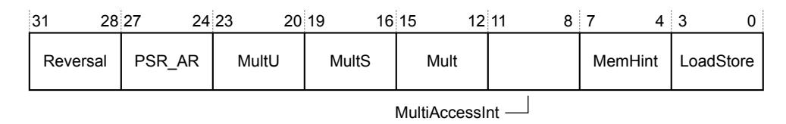

**Figure 4-13 ID\_ISAR2\_EL1 bit assignments**

The following table shows the ID\_ISAR2\_EL1 bit assignments.

**Table 4-28 ID\_ISAR2\_EL1 bit assignments**

| Bits    | Name           | Function                                                                                                                                                                                       |  |  |  |
|---------|----------------|------------------------------------------------------------------------------------------------------------------------------------------------------------------------------------------------|--|--|--|
| [31:28] | Reversal       | Returns 0x2 to indicate the processor implements the following Reversal instructions:                                                                                                          |  |  |  |
|         |                | •<br>REV, REV16, and REVSH.                                                                                                                                                                    |  |  |  |
|         |                | •<br>RBIT.                                                                                                                                                                                     |  |  |  |
| [27:24] | PSR_AR         | Returns 0x1 to indicate the processor implements the following instructions that can manipulate the PSR:                                                                                       |  |  |  |
|         |                | •<br>Processor supports MRS and MSR instructions, and the exception return forms of data-processing<br>instructions. See the ARM®<br>Architecture Reference Manual ARMv8 for more information. |  |  |  |
| [23:20] | MultU          | Returns 0x2 to indicate the processor implements the UMULL, UMLAL, and UMAAL unsigned multiply<br>instructions.                                                                                |  |  |  |
| [19:16] | MultS          | Returns 0x3 to indicate the processor implements the following signed multiply instructions:                                                                                                   |  |  |  |
|         |                | •<br>SMULL and SMLAL instructions                                                                                                                                                              |  |  |  |
|         |                | •<br>SMLABB, SMLABT, SMLALBB,SMLALBT, SMLALTB, SMLALTT, SMLATB, SMLATT, SMLAWB, SMLAWT,                                                                                                        |  |  |  |
|         |                | SMULBB, SMULBT, SMULTB, SMULTT, SMULWB, SMULWT instructions, and the Q bit in the PSRs.                                                                                                        |  |  |  |
|         |                | •<br>SMLAD, SMLADX, SMLALD, SMLALDX, SMLSD, SMLSDX, SMLSLD, SMLSLDX, SMMLA, SMMLAR, SMMLS,<br>SMMLSR, SMMUL, SMMULR, SMUAD, SMUADX, SMUSD, and SMUSDX instructions.                            |  |  |  |
| [15:12] | Mult           | Returns 0x2 to indicate the processor implements the MUL, MLA, and MLS multiply instructions.                                                                                                  |  |  |  |
| [11:8]  | MultiAccessInt | Returns 0x0 to indicate no support for interruptible multi-access instructions. This means that the LDM and<br>STM instructions are not interruptible.                                         |  |  |  |
| [7:4]   | MemHint        | Returns 0x4 to indicate the processor implements the PLD, PLI (NOP), and PLDW memory hint instructions.                                                                                        |  |  |  |
| [3:0]   | LoadStore      | Returns 0x2 to indicate the processor implements the following additional load/store instructions and Load<br>Acquire/Store-Release instructions:                                              |  |  |  |
|         |                | •<br>LDRD and STRD load/store instructions.                                                                                                                                                    |  |  |  |
|         |                | •<br>STRLB, STRLH, STRL, LDRAB, LDRAH, and LDRA Load-Acquire and Store-Release instructions.                                                                                                   |  |  |  |

To access the ID\_ISAR2\_EL1 in AArch64 state, read the register with:

MRS <Xt>, ID\_ISAR2\_EL1; Read AArch32 Instruction Set Attribute Register 2

To access the ID\_ISAR2 in AArch32 state, read the CP15 register with:

MRC p15, 0, <Rt>, c0, c2, 2; Read AArch32 Instruction Set Attribute Register 2

## <span id="page-107-0"></span>**4.3.15 AArch32 Instruction Set Attribute Register 3, EL1**

The ID\_ISAR3\_EL1 characteristics are:

# **Purpose**

Provides information about the instruction set that the processor supports in AArch32.

#### **Usage constraints**

The ID\_ISAR3 must be interpreted with:

- ID\_ISAR0\_EL1.
- ID\_ISAR1\_EL1.
- ID\_ISAR2\_EL1.
- ID\_ISAR4\_EL1.
- ID\_ISAR5\_EL1.

The accessibility to the ID\_ISAR3\_EL1 by Exception level is:

| EL0 | EL1(NS) | EL1(S) | EL2 | EL3(SCR.NS = 1) | EL3(SCR.NS = 0) |
|-----|---------|--------|-----|-----------------|-----------------|
| -   | RO      | RO     | RO  | RO              | RO              |

#### **Configurations**

The ID\_ISAR3\_EL1 is:

- Common to Secure and Non-secure states.
- Architecturally mapped to the AArch32 ID\_ISAR3 register.

# **Attributes**

See the register summary in *[Table 4-1 AArch64 identification registers](#page-74-0)* on page 4-75.

The following figure shows the ID\_ISAR3\_EL1 bit assignments.

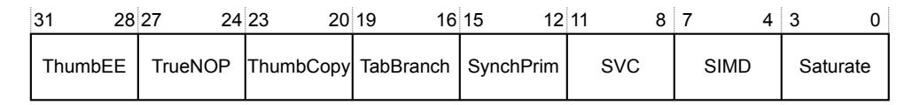

**Figure 4-14 ID\_ISAR3\_EL1 bit assignments**

The following table shows the ID\_ISAR3\_EL1 bit assignments.

**Table 4-29 ID\_ISAR3\_EL1 bit assignments**

| Bits    | Name      | Function                                                                                                                                                            |
|---------|-----------|---------------------------------------------------------------------------------------------------------------------------------------------------------------------|
| [31:28] | ThumbEE   | Returns 0x0 to indicate no support for Thumb Execution Environment (ThumbEE) extension instructions.                                                                |
| [27:24] | TrueNOP   | Returns 0x1 to indicate the processor implements true NOP instructions in both the A32 and T32 instruction<br>sets, and additional NOP-compatible hints.            |
| [23:20] | ThumbCopy | Returns 0x1 to indicate the processor supports T32 instruction set encoding T1 of the MOV (register)<br>instruction, copying from a low register to a low register. |
| [19:16] | TabBranch | Returns 0x1 to indicate the processor implements the TBB and TBH table branch instructions in the T32<br>instruction set.                                           |

## **Table 4-29 ID\_ISAR3\_EL1 bit assignments (continued)**

<span id="page-108-0"></span>

| Bits    | Name      | Function                                                                                                                                                                                                                                                                                                                                                                                                                                                                                         |  |  |  |  |
|---------|-----------|--------------------------------------------------------------------------------------------------------------------------------------------------------------------------------------------------------------------------------------------------------------------------------------------------------------------------------------------------------------------------------------------------------------------------------------------------------------------------------------------------|--|--|--|--|
| [15:12] | SynchPrim | This field is used with the SynchPrim_frac field of ID_ISAR4 to indicate the supported Synchronization<br>Primitive instructions. This value is:                                                                                                                                                                                                                                                                                                                                                 |  |  |  |  |
|         |           | Processor supports:<br>0x2                                                                                                                                                                                                                                                                                                                                                                                                                                                                       |  |  |  |  |
|         |           | •<br>LDREX and STREX instructions.                                                                                                                                                                                                                                                                                                                                                                                                                                                               |  |  |  |  |
|         |           | •<br>CLREX, LDREXB, LDREXH, STREXB, and STREXH instructions.                                                                                                                                                                                                                                                                                                                                                                                                                                     |  |  |  |  |
|         |           | •<br>LDREXD and STREXD instructions.                                                                                                                                                                                                                                                                                                                                                                                                                                                             |  |  |  |  |
| [11:8]  | SVC       | Returns 0x1 to indicate the processor implements the SVC instruction.                                                                                                                                                                                                                                                                                                                                                                                                                            |  |  |  |  |
| [7:4]   | SIMD      | Returns 0x3 to indicate the processor implements the following Single Instruction Multiple Data (SIMD)<br>instructions:                                                                                                                                                                                                                                                                                                                                                                          |  |  |  |  |
|         |           | •<br>SSAT and USAT instructions, and the Q bit in the PSRs.<br>•<br>PKHBT, PKHTB, QADD16, QADD8, QASX, QSUB16, QSUB8, QSAX, SADD16, SADD8, SASX, SEL, SHADD16,<br>SHADD8, SHASX, SHSUB16, SHSUB8, SHSAX, SSAT16, SSUB16, SSUB8, SSAX, SXTAB16, SXTB16,<br>UADD16, UADD8, UASX, UHADD16, UHADD8, UHASX, UHSUB16, UHSUB8, UHSAX, UQADD16, UQADD8,<br>UQASX, UQSUB16, UQSUB8, UQSAX, USAD8, USADA8, USAT16, USUB16, USUB8, USAX, UXTAB16, UXTB16<br>instructions, and the GE[3:0] bits in the PSRs. |  |  |  |  |
|         |           | See the ARM®<br>Architecture Reference Manual ARMv8 for more information.                                                                                                                                                                                                                                                                                                                                                                                                                        |  |  |  |  |
| [3:0]   | Saturate  | Returns 0x1 to indicate the processor implements the QADD, QDADD, QDSUB, QSUB saturate instructions and the<br>Q bit in the PSRs.                                                                                                                                                                                                                                                                                                                                                                |  |  |  |  |

MRS <Xt>, ID\_ISAR3\_EL1; Read AArch32 Instruction Set Attribute Register 3

To access the ID\_ISAR3 in AArch32 state, read the CP15 register with:

MRC p15, 0, <Rt>, c0, c2, 3; Read AArch32 Instruction Set Attribute Register 3

# **4.3.16 AArch32 Instruction Set Attribute Register 4, EL1**

The ID\_ISAR4\_EL1 characteristics are:

## **Purpose**

Provides information about the instruction set that the processor supports in AArch32.

## **Usage constraints**

The ID\_ISAR4\_EL1 must be interpreted with:

- ID\_ISAR0\_EL1.
- ID\_ISAR1\_EL1.
- ID\_ISAR2\_EL1.
- ID\_ISAR3\_EL1.
- ID\_ISAR5\_EL1.

The accessibility to the ID\_ISAR4\_EL1 by Exception level is:

|   | EL0 | EL1(NS) | EL1(S) | EL2 | EL3(SCR.NS = 1) | EL3(SCR.NS = 0) |
|---|-----|---------|--------|-----|-----------------|-----------------|
| - |     | RO      | RO     | RO  | RO              | RO              |

# **Configurations**

The ID\_ISAR4\_EL1 is:

- Common to Secure and Non-secure states.
- Architecturally mapped to the AArch32 ID\_ISAR4 register.

## **Attributes**

See the register summary in *[Table 4-1 AArch64 identification registers](#page-74-0)* on page 4-75.

The following figure shows the ID\_ISAR4\_EL1 bit assignments.

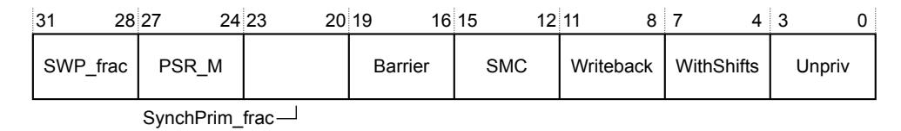

**Figure 4-15 ID\_ISAR4\_EL1 bit assignments**

The following table shows the ID\_ISAR4\_EL1 bit assignments.

**Table 4-30 ID\_ISAR4\_EL1 bit assignments**

| Bits    | Name           | Function                                                                                                                                        |  |  |  |
|---------|----------------|-------------------------------------------------------------------------------------------------------------------------------------------------|--|--|--|
| [31:28] | SWP_frac       | Returns 0x0 to indicate that SWP or SWPB instructions are not implemented.                                                                      |  |  |  |
| [27:24] | PSR_M          | Returns 0x0 to indicate that M-profile instructions, that modify the PSRs, are not implemented.                                                 |  |  |  |
| [23:20] | SynchPrim_frac | This field is used with the SynchPrim field of ID_ISAR3_EL1 to indicate the supported Synchronization<br>Primitive instructions. This value is: |  |  |  |
|         |                | Processor supports:<br>0x0                                                                                                                      |  |  |  |
|         |                | •<br>LDREX and STREX instructions.                                                                                                              |  |  |  |
|         |                | •<br>CLREX, LDREXB, LDREXH, STREXB, and STREXH instructions.                                                                                    |  |  |  |
|         |                | •<br>LDREXD and STREXD instructions.                                                                                                            |  |  |  |
| [19:16] | Barrier        | Returns 0x1 to indicate the processor implements the DMB, DSB, and ISB barrier instructions in the A32 and<br>T32 instruction sets.             |  |  |  |
| [15:12] | SMCs           | Returns 0x1 to indicate the processor implements the SMC instruction.                                                                           |  |  |  |
| [11:8]  | Writeback      | Returns 0x1 to indicate the processor supports all writeback addressing modes defined in ARMv8<br>architecture.                                 |  |  |  |
| [7:4]   | WithShifts     | Returns 0x4 to indicate the processor supports the following instructions with shifts:                                                          |  |  |  |
|         |                | •<br>Shifts of loads and stores over the range LSL 0-3.                                                                                         |  |  |  |
|         |                | •<br>Constant shift options, both on load/store and other instructions.                                                                         |  |  |  |
|         |                | •<br>Register-controlled shift options.                                                                                                         |  |  |  |
|         |                | See the ARM®<br>Architecture Reference Manual ARMv8 for more information.                                                                       |  |  |  |
| [3:0]   | Unpriv         | Returns 0x2 to indicate the processor implements the following unprivileged instructions:                                                       |  |  |  |
|         |                | •<br>LDRBT, LDRT, STRBT, and STRT.                                                                                                              |  |  |  |
|         |                | •<br>LDRHT, LDRSBT, LDRSHT, and STRHT.                                                                                                          |  |  |  |

To access the ID\_ISAR4\_EL1 in AArch64 state, read the register with:

MRS <Xt>, ID\_ISAR4\_EL1; Read AArch32 Instruction Set Attribute Register 4

To access the ID\_ISAR4 in AArch32 state, read the CP15 register with:

MRC p15, 0, <Rt>, c0, c2, 4; Read AArch32 Instruction Set Attribute Register 4

## <span id="page-110-0"></span>**4.3.17 AArch32 Instruction Set Attribute Register 5, EL1**

The ID\_ISAR5\_EL1 characteristics are:

# **Purpose**

Provides information about the Cryptography Extension instruction set that the processor can support in AArch32.

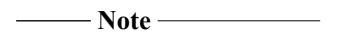

- The optional Cryptography engine is not included in the base product of the processor. ARM requires licensees to have contractual rights to obtain the Cortex-A57 Cryptography engine.
- The SHA1, SHA2, and AES fields of ID\_ISAR5\_EL1 are 0x0 if the Cryptography engine is not included or **CRYPTODISABLE** is tied HIGH.

# **Usage constraints**

The ID\_ISAR5\_EL1 must be interpreted with:

- ID\_ISAR0\_EL1.
- ID\_ISAR1\_EL1.
- ID\_ISAR2\_EL1.
- ID\_ISAR3\_EL1.
- ID\_ISAR4\_EL1.

The accessibility to the ID\_ISAR5\_EL1 by Exception level is:

| EL0 | EL1(NS) | EL1(S) | EL2 | EL3(SCR.NS = 1) | EL3(SCR.NS = 0) |
|-----|---------|--------|-----|-----------------|-----------------|
| -   | RO      | RO     | RO  | RO              | RO              |

# **Configurations**

The ID\_ISAR5\_EL1 is:

- Common to Secure and Non-secure states.
- Architecturally mapped to the AArch32 ID\_ISAR5 register.

# **Attributes**

See the register summary in *[Table 4-1 AArch64 identification registers](#page-74-0)* on page 4-75.

The following figure shows the ID\_ISAR5\_EL1 bit assignments.

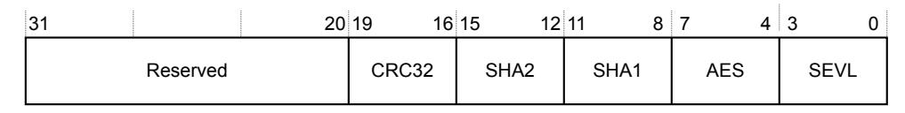

**Figure 4-16 ID\_ISAR5\_EL1 bit assignments**

The following table shows the ID\_ISAR5\_EL1 bit assignments.

# **Table 4-31 ID\_ISAR5\_EL1 bit assignments**

<span id="page-111-0"></span>

| Bits         | Name  | Function                                                                                       |  |  |  |
|--------------|-------|------------------------------------------------------------------------------------------------|--|--|--|
| [31:20]      | -     | Reserved, RES0.                                                                                |  |  |  |
| [19:16]      | CRC32 | Returns 0x1 to indicate that CRC32 instructions are implemented in AArch32 state.              |  |  |  |
| [15:12]      | SHA2  | Indicates whether SHA2 instructions are implemented in AArch32 state. The possible values are: |  |  |  |
|              |       | SHA2 instructions are not implemented in AArch32 state.<br>0x0                                 |  |  |  |
|              |       | SHA256H, SHA256H2, SHA256SU0, and SHA256SU1 instructions are implemented.<br>0x1               |  |  |  |
|              |       | All other values are reserved.                                                                 |  |  |  |
| [11:8]       | SHA1  | Indicates whether SHA1 instructions are implemented in AArch32 state. The possible values are: |  |  |  |
|              |       | SHA1 instructions are not implemented in AArch32 state.<br>0x0                                 |  |  |  |
|              |       | SHA1C, SHA1P, SHA1M, SHA1H, SHA1SU0, and SHA1SU1 instructions are implemented.<br>0x1          |  |  |  |
|              |       | All other values are reserved.                                                                 |  |  |  |
| [7:4]<br>AES |       | Indicates whether AES instructions are implemented in AArch32 state. The possible values are:  |  |  |  |
|              |       | AES instructions are not implemented in AArch32 state.<br>0x0                                  |  |  |  |
|              |       | AESE, AESD, AESMC, AESIMC, and PMULL/PMULL2 instructions operating on 64-bit data.<br>0x2      |  |  |  |
|              |       | All other values are reserved.                                                                 |  |  |  |
| [3:0]        | SEVL  | Returns 0x1 to indicate that the SEVL instruction is implemented in AArch32 state.             |  |  |  |

To access the ID\_ISAR5\_EL1 in AArch64 state, read the register with:

MRS <Xt>, ID\_ISAR5\_EL1; Read AArch32 Instruction Set Attribute Register 5

To access the ID\_ISAR5 in AArch32 state, read the CP15 register with:

MRC p15, 0, <Rt>, c0, c2, 5; Read AArch32 Instruction Set Attribute Register 5

#### **4.3.18 AArch64 Processor Feature Register 0, EL1**

The ID\_AA64PFR0\_EL1 characteristics are:

## **Purpose**

Provides information on the exception handling of the processor in AArch64 state.

#### **Usage constraints**

The accessibility to the ID\_AA64PFR0\_EL1 by Exception level is:

| EL0 | EL1(NS) | EL1(S) | EL2 | EL3(SCR.NS = 1) | EL3(SCR.NS = 0) |
|-----|---------|--------|-----|-----------------|-----------------|
| -   | RO      | RO     | RO  | RO              | RO              |

The external debug accessibility to ID\_AA64PFR0\_EL1[63:32] and ID\_AA64PFR0\_EL1[31:0] by condition code is:

| Off | DLK | OSLK | EDAD | SLK | Default |
|-----|-----|------|------|-----|---------|
| -   | -   | -    | -    | -   | RO      |

*[Table 11-1 External register access conditions](#page-398-0)* on page 11-399 describes the condition codes.

#### <span id="page-112-0"></span>Configurations

The ID AA64PFR0 is architecturally mapped as follows:

- [63:32] to external ID AA64PFR0[63:32] register.
- [31:0] to external ID AA64PFR0[31:0] register.

#### Attributes

See the register summary in *Table 4-1 AArch64 identification registers* on page 4-75.

The following figure shows the ID AA64PFR0 EL1 bit assignments.

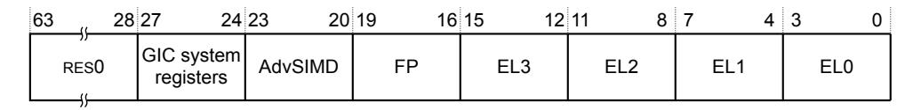

Figure 4-17 ID AA64PFR0 EL1 bit assignments

The following table shows the ID AA64PFR0 EL1 bit assignments.

Table 4-32 ID\_AA64PFR0\_EL1 bit assignments

| Bits    | Name                 | Function                                                                                                 |  |  |  |  |
|---------|----------------------|----------------------------------------------------------------------------------------------------------|--|--|--|--|
| [63:28] | -                    | Reserved, RESO.                                                                                          |  |  |  |  |
| [27:24] | GIC system registers | s Indicates support for the GIC System register interface. The possible values are:                      |  |  |  |  |
|         |                      | 0x0 No GIC System registers are supported. This is the reset value when <b>GICCDISABLE</b> is tied HIGH. |  |  |  |  |
|         |                      | 0x1 GICv3 System registers are supported. This is the reset value when GICCDISABLE is tied LOW.          |  |  |  |  |
| [23:20] | AdvSIMD              | Returns 0x0 to indicate support for Advanced SIMD.                                                       |  |  |  |  |
| [19:16] | FP                   | Returns 0x0 to indicate support for Floating-point.                                                      |  |  |  |  |
| [15:12] | EL3                  | Returns 0x2 to indicate EL3 supports AArch64 state or AArch32 state.                                     |  |  |  |  |
| [11:8]  | EL2                  | Returns 0x2 to indicate EL2 supports AArch64 state or AArch32 state.                                     |  |  |  |  |
| [7:4]   | EL1                  | Returns 0x2 to indicate EL1 supports AArch64 state or AArch32 state.                                     |  |  |  |  |
| [3:0]   | EL0                  | Returns 0x2 to indicate EL0 supports AArch64 state or AArch32 state.                                     |  |  |  |  |

To access the ID AA64PFR0 EL1 in AArch64 state, read the register with:

MRS <Xt>, ID\_AA64PFR0\_EL1; Read AArch64 Processor Feature Register 0

The ID\_AA64PFR0[31:0] can be accessed through the memory-mapped interface and the external debug interface, offset 0xD20.

The ID\_AA64PFR0[63:32] can be accessed through the memory-mapped interface and the external debug interface, offset 0xD24.

# 4.3.19 AArch64 Debug Feature Register 0, EL1

The ID AA64DFR0 EL1 characteristics are:

#### Purpose

Provides top-level information of the debug system in AArch64 state.

# **Usage constraints**

The accessibility to the ID\_AA64DFR0\_EL1 by Exception level is:

| EL0 | EL1(NS) | EL1(S) | EL2 | EL3(SCR.NS = 1) | EL3(SCR.NS = 0) |
|-----|---------|--------|-----|-----------------|-----------------|
| -   | RO      | RO     | RO  | RO              | RO              |

The external debug accessibility to the ID\_AA64DFR0[63:32] and the ID\_AA64DFR0[31:0] by condition code is:

| Off | DLK | OSLK | EDAD | SLK | Default |
|-----|-----|------|------|-----|---------|
| -   | -   | -    | -    | -   | RO      |

*[Table 11-1 External register access conditions](#page-398-0)* on page 11-399 describes the condition codes.

# **Configurations**

The ID\_AA64DFR0\_EL1 is architecturally mapped as follows:

- [63:32] to external ID\_AA64DFR0[63:32] register.
- [31:0] to external ID\_AA64DFR0[31:0] register.

#### **Attributes**

See the register summary in *[Table 4-1 AArch64 identification registers](#page-74-0)* on page 4-75.

The following figure shows the ID\_AA64DFR0\_EL1 bit assignments.

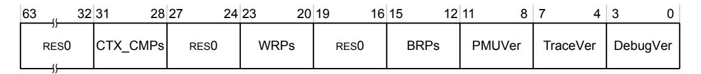

**Figure 4-18 ID\_AA64DFR0\_EL1 bit assignments**

The following table shows the ID\_AA64DFR0\_EL1 bit assignments.

**Table 4-33 ID\_AA64DFR0\_EL1 bit assignments**

| Bits    | Name     | Function                                                                                       |
|---------|----------|------------------------------------------------------------------------------------------------|
| [63:32] | -        | Reserved, RES0                                                                                 |
| [31:28] | CTX_CMPs | Returns 0x1 to indicate support for two context-aware breakpoints                              |
| [27:24] | -        | Reserved, RES0                                                                                 |
| [23:20] | WRPs     | Returns 0x3 to indicate support for four watchpoints                                           |
| [19:16] | -        | Reserved, RES0                                                                                 |
| [15:12] | BRPs     | Returns 0x5 to indicate support for six breakpoints                                            |
| [11:8]  | PMUVer   | Returns 0x1 to indicate that the Performance Monitors (PMUv3) System registers are implemented |
| [7:4]   | TraceVer | Returns 0x0 to indicate that the Trace System registers are not implemented                    |
| [3:0]   | DebugVer | Returns 0x6 to indicate that the v8-A Debug architecture is implemented                        |

To access the ID\_AA64DFR0\_EL1 in AArch64 state, read the register with:

MRS <Xt>, ID\_AA64DFR0\_EL1; Read AArch64 Debug Feature Register 0

The ID\_AA64DFR0[31:0] can be accessed through the memory-mapped interface and the external debug interface, offset 0xD28.

The ID\_AA64DFR0[63:32] can be accessed through the memory-mapped interface and the external debug interface, offset 0xD2C.

#### <span id="page-114-0"></span>4.3.20 AArch64 Instruction Set Attribute Register 0, EL1

The ID AA64ISAR0 EL1 characteristics are:

#### **Purpose**

Provides information about the Cryptography Extension instruction set that the processor can support.


- The optional Cryptography engine is not included in the base product of the processor. ARM requires licensees to have contractual rights to obtain the Cortex-A57 processor Cryptography engine.
- The SHA1, SHA2, and AES fields of ID\_AA64ISAR0\_EL1 are 0x0 if the Cryptography engine is not included or **CRYPTODISABLE** is HIGH.

#### **Usage constraints**

The accessibility to the ID\_AA64ISAR0\_EL1 by Exception level is:

| EL0 | EL1(NS) | EL1(S) | EL2 | EL3(SCR.NS = 1) | EL3(SCR.NS = 0) |
|-----|---------|--------|-----|-----------------|-----------------|
| -   | RO      | RO     | RO  | RO              | RO              |

The external debug accessibility to the ID\_AA64ISAR0[63:32] and the ID\_AA64ISAR0[31:0] by condition code is:

| Off | DLK | OSLK | EDAD | SLK | Default |
|-----|-----|------|------|-----|---------|
| -   | -   | -    | -    | -   | RO      |

Table 11-1 External register access conditions on page 11-399 describes the condition codes.

#### **Configurations**

The ID AA64ISAR0 EL1 is architecturally mapped as follows:

- [63:32] to external ID AA64ISAR0[63:32] register.
- [31:0] to external ID AA64ISAR0[31:0] register.

#### **Attributes**

See the register summary in *Table 4-1 AArch64 identification registers* on page 4-75.

The following figure shows the ID\_AA64ISAR0\_EL1 bit assignments.

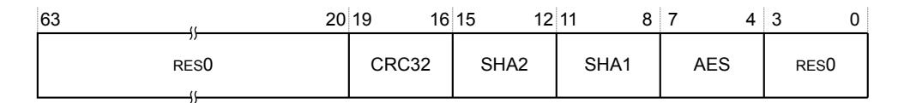

Figure 4-19 ID\_AA64ISAR0\_EL1 bit assignments

The following table shows the ID AA64ISAR0 EL1 bit assignments.

## **Table 4-34 ID\_AA64ISAR0\_EL1 bit assignments**

<span id="page-115-0"></span>

| Bits    | Name  | Function                                                                                       |  |  |  |  |  |
|---------|-------|------------------------------------------------------------------------------------------------|--|--|--|--|--|
| [63:20] | -     | Reserved, RES0.                                                                                |  |  |  |  |  |
| [19:16] | CRC32 | Returns 0x1 to indicate that CRC32 instructions are implemented in AArch64 state.              |  |  |  |  |  |
| [15:12] | SHA2  | Indicates whether SHA2 instructions are implemented in AArch64 state. The possible values are: |  |  |  |  |  |
|         |       | No SHA2 instructions implemented.<br>0x0                                                       |  |  |  |  |  |
|         |       | SHA256H, SHA256H2, SHA256U0, and SHA256U1 instructions implemented.<br>0x1                     |  |  |  |  |  |
| [11:8]  | SHA1  | Indicates whether SHA1 instructions are implemented in AArch64 state. The possible values are: |  |  |  |  |  |
|         |       | No SHA1 instructions implemented.<br>0x0                                                       |  |  |  |  |  |
|         |       | SHA1C, SHA1P, SHA1M, SHA1SU0, and SHA1SU1 instructions implemented.<br>0x1                     |  |  |  |  |  |
| [7:4]   | AES   | Indicates whether AES instructions are implemented in AArch64 state. The possible values are:  |  |  |  |  |  |
|         |       | No AES instructions implemented.<br>0x0                                                        |  |  |  |  |  |
|         |       | AESE, AESD, AESMC, AESIMC and PMULL/PMULL2 instructions implemented.<br>0x2                    |  |  |  |  |  |
| [3:0]   | -     | Reserved, RES0.                                                                                |  |  |  |  |  |

To access the ID\_AA64ISAR0\_EL1 in AArch64 state, read the register with:

MRS <Xt>, ID\_AA64ISAR0\_EL1; Read AArch64 Instruction Set Attribute Register 0

The ID\_AA64ISAR0[31:0] can be accessed through the memory-mapped interface and the external debug interface, offset 0xD30.

The ID\_AA64ISAR0[63:32] can be accessed through the memory-mapped interface and the external debug interface, offset 0xD34.

#### **4.3.21 AArch64 Memory Model Feature Register 0, EL1**

The ID\_AA64MMFR0\_EL1 characteristics are:

#### **Purpose**

Provides information about the implemented memory model and memory management support in AArch64 state.

#### **Usage constraints**

The accessibility of the ID\_AA64MMFR0\_EL1 by Exception level is:

| EL0 | EL1(NS) | EL1(S) | EL2 | EL3(SCR.NS = 1) | EL3(SCR.NS = 0) |
|-----|---------|--------|-----|-----------------|-----------------|
| -   | RO      | RO     | RO  | RO              | RO              |

The external debug accessibility to the ID\_AA64MMFR0[63:32] and the ID\_AA64MMFR0[31:0] by condition code is:

| Off | DLK | OSLK | EDAD | SLK | Default |
|-----|-----|------|------|-----|---------|
| -   | -   | -    | -    | -   | RO      |

*[Table 10-1 External register access conditions](#page-346-0)* on page 10-347 describes the condition codes.

#### <span id="page-116-0"></span>Configurations

The ID\_AA64MMFR0\_EL1 is architecturally mapped as follows:

- [63:32] to external ID AA64MMFR0[63:32] register.
- [31:0] to external ID AA64MMFR0[31:0] register.

#### Attributes

See the register summary in *Table 4-1 AArch64 identification registers* on page 4-75.

The following figure shows the ID AA64MMFR0 EL1 bit assignments.

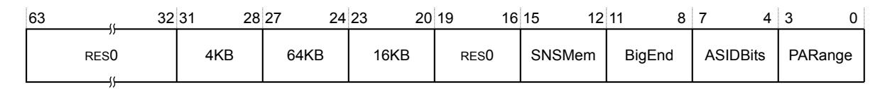

Figure 4-20 ID AA64MMFR0 EL1 bit assignments

The following table shows the ID AA64MMFR0 EL1 bit assignments.

Table 4-35 ID\_AA64MMFR0\_EL1 bit assignments

| Bits    | Name     | Function                                                                                                                                     |
|---------|----------|----------------------------------------------------------------------------------------------------------------------------------------------|
| [63:32] | -        | Reserved, RESO.                                                                                                                              |
| [31:28] | 4KB      | Returns 0x0 to indicate that the 4KB granule is supported.                                                                                   |
| [27:24] | 64KB     | Returns 0x0 to indicate that the 64KB granule is supported.                                                                                  |
| [23:20] | 16KB     | Returns 0x0 to indicate that the 16KB granule is not supported.                                                                              |
| [19:16] | -        | Reserved, RESO.                                                                                                                              |
| [15:12] | SNSMem   | Returns 0x1 to indicate that the processor supports a distinction between Secure and Non-secure memory.                                      |
| [11:8]  | BigEnd   | Returns 0x1 to indicate that the processor supports a mixed-endian configuration. The SCTLR_ELx.EE and SCTLR_EL1.E0E bits can be configured. |
| [7:4]   | ASIDBits | Returns 0x2 to indicate that the processor supports 16 ASID bits.                                                                            |
| [3:0]   | PARange  | Returns <b>0x4</b> to indicate that the processor supports a 44-bit physical address range, that is, 16TByte.                                |

To access the ID AA64MMFR0 EL1 in AArch64 state, read the register with:

MRS <Xt>, ID\_AA64MMFR0\_EL1; Read AArch64 Memory Model Feature Register 0

The ID\_AA64MMFR0[31:0] can be accessed through the memory-mapped interface and the external debug interface, offset 0xD38.

The ID\_AA64MMFR0[63:32] can be accessed through the memory-mapped interface and the external debug interface, offset 0xD3C.

### 4.3.22 Cache Size ID Register, EL1

The CCSIDR EL1 characteristics are:

## **Purpose**

Provides information about the architecture of the caches. There is one Cache Size ID Register for each cache that the processor can access. CSSELR\_EL1 selects which Cache Size ID Register is accessible.

# **Usage constraints**

The accessibility to the CCSIDR\_EL1 by Exception level is:

| EL0 | EL1(NS) | EL1(S) | EL2 | EL3(SCR.NS = 1) | EL3(SCR.NS = 0) |
|-----|---------|--------|-----|-----------------|-----------------|
| -   | RO      | RO     | RO  | RO              | RO              |

If CSSELR\_EL1 indicates a cache that is not implemented, reading the Cache Size ID Register returns an UNKNOWN value.

## **Configurations**

The CCSIDR\_EL1 is:

- Common to Secure and Non-secure states.
- Architecturally mapped to the AArch32 CCSIDR register.

#### **Attributes**

See the register summary in *[Table 4-1 AArch64 identification registers](#page-74-0)* on page 4-75.

The following figure shows the CCSIDR\_EL1 bit assignments.

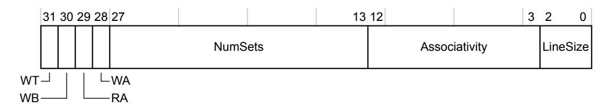

**Figure 4-21 CCSIDR\_EL1 bit assignments**

The following table shows the CCSIDR\_EL1 bit assignments.

**Table 4-36 CCSIDR\_EL1 bit assignments**

| Bits    | Name          | Function                                                                                                                                                   |         |  |  |  |  |  |  |
|---------|---------------|------------------------------------------------------------------------------------------------------------------------------------------------------------|---------|--|--|--|--|--|--|
| [31]    | WT            | Returns 0b0 to indicate that the cache level does not support Write-Through.                                                                               |         |  |  |  |  |  |  |
| [30]    | WB            | Indicates support for Write-Back. The possible values are:                                                                                                 |         |  |  |  |  |  |  |
|         |               | 0<br>Cache level does not support Write-Back.                                                                                                              |         |  |  |  |  |  |  |
|         |               | 1<br>Cache level supports Write-Back.                                                                                                                      |         |  |  |  |  |  |  |
| [29]    | RA            | Returns 0b1 to indicate that the cache level supports Read-Allocation.                                                                                     |         |  |  |  |  |  |  |
| [28]    | WA            | Indicates support for Write-Allocation. The possible values are:                                                                                           |         |  |  |  |  |  |  |
|         |               | 0<br>Cache level does not support Write-Allocation.                                                                                                        |         |  |  |  |  |  |  |
|         |               | 1<br>Cache level supports Write-Allocation.                                                                                                                |         |  |  |  |  |  |  |
| [27:13] | NumSets       | Indicates the (number of sets in cache) – 1. Therefore, a value of 0 indicates 1 set in the cache. The number of<br>sets does not have to be a power of 2. |         |  |  |  |  |  |  |
| [12:3]  | Associativity | Indicates the associativity of the selected cache level. The possible values are:                                                                          |         |  |  |  |  |  |  |
|         |               | 0b0000000001                                                                                                                                               | 2-way.  |  |  |  |  |  |  |
|         |               | 0b0000000010                                                                                                                                               | 3-way.  |  |  |  |  |  |  |
|         |               | 0b0000001111                                                                                                                                               | 16-way. |  |  |  |  |  |  |
| [2:0]   | LineSize      | Returns 0b010 to indicate that the cache line size is 64 bytes.                                                                                            |         |  |  |  |  |  |  |

The CSSELR\_EL1 determines which Cache Size ID Register to select.

The following table shows the individual bit field and complete register encoding for the CCSIDR\_EL1.

**Table 4-37 Encoding of the Cache Size ID Register**

<span id="page-118-0"></span>

| CSSELR_EL1<br>Size |        | Complete register encoding | Register bit field encoding |    |    |    |         |               |          |
|--------------------|--------|----------------------------|-----------------------------|----|----|----|---------|---------------|----------|
|                    |        |                            | WT                          | WB | RA | WA | NumSets | Associativity | LineSize |
| 0x0                | 32KB   | 0x701FE00A                 | 0                           | 1  | 1  | 1  | 0x0FF   | 0x1           | 0x2      |
| 0x1                | 48KB   | 0x201FE012                 | 0                           | 0  | 1  | 0  | 0x0FF   | 0x2           | 0x2      |
| 0x2                | 512KB  | 0x703FE07A                 | 0                           | 1  | 1  | 1  | 0x1FF   | 0xF           | 0x2      |
|                    | 1024KB | 0x707FE07A                 | 0                           | 1  | 1  | 1  | 0x3FF   | 0xF           | 0x2      |
|                    | 2048KB | 0x70FFE07A                 | 0                           | 1  | 1  | 1  | 0x7FF   | 0xF           | 0x2      |
| 0x3-0xF            | -      | -                          | Reserved                    |    |    |    |         |               |          |

To access the CCSIDR\_EL1 in AArch64 state, read the register with:

MRS <Xt>, CCSIDR\_EL1; Read Cache Size ID Register

To access the CCSIDR in AArch32 state, read the CP15 register with:

MRC p15, 1, <Rt>, c0, c0, 0; Read Cache Size ID Register

#### **4.3.23 Cache Level ID Register, EL1**

The CLIDR\_EL1 characteristics are:

## **Purpose**

Identifies:

- The type of cache, or caches, implemented at each level, up to a maximum of seven levels
- The Level of Coherency and Level of Unification for the cache hierarchy.

#### **Usage constraints**

The accessibility to the CLIDR\_EL1 by Exception level is:

| EL0 | EL1(NS) | EL1(S) | EL2 | EL3(SCR.NS = 1) | EL3(SCR.NS = 0) |
|-----|---------|--------|-----|-----------------|-----------------|
| -   | RO      | RO     | RO  | RO              | RO              |

#### **Configurations**

The CLIDR\_EL1 is:

- Common to Secure and Non-secure states.
- Architecturally mapped to the AArch32 CLIDR register.

#### **Attributes**

See the register summary in *[Table 4-1 AArch64 identification registers](#page-74-0)* on page 4-75.

The following figure shows the CLIDR\_EL1 bit assignments.

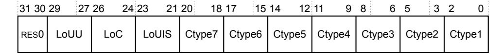

**Figure 4-22 CLIDR\_EL1 bit assignments**

The following table shows the CLIDR\_EL1 bit assignments.

## **Table 4-38 CLIDR\_EL1 bit assignments**

<span id="page-119-0"></span>

| Bits    | Name   | Function                                                                                |                                                                                                                                                         |  |  |  |  |  |
|---------|--------|-----------------------------------------------------------------------------------------|---------------------------------------------------------------------------------------------------------------------------------------------------------|--|--|--|--|--|
| [31:30] | -      | Reserved, RES0.                                                                         |                                                                                                                                                         |  |  |  |  |  |
| [29:27] | LoUU   | Indicates the Level of Unification Uniprocessor for the cache hierarchy. This value is: |                                                                                                                                                         |  |  |  |  |  |
|         |        | 0b001                                                                                   | L1 cache is the last level of cache that must be cleaned or invalidated when cleaning or<br>invalidating to the point of unification for the processor. |  |  |  |  |  |
| [26:24] | LoC    |                                                                                         | Indicates the Level of Coherency for the cache hierarchy. This value is:                                                                                |  |  |  |  |  |
|         |        | 0b010                                                                                   | L3 cache.                                                                                                                                               |  |  |  |  |  |
| [23:21] | LoUIS  |                                                                                         | Indicates the Level of Unification Inner Shareable for the cache hierarchy. This value is:                                                              |  |  |  |  |  |
|         |        | 0b001                                                                                   | L2 cache.                                                                                                                                               |  |  |  |  |  |
| [20:18] | Ctype7 |                                                                                         | Indicates the type of cache implemented at level 7. This value is:                                                                                      |  |  |  |  |  |
|         |        | 0b000                                                                                   | No cache.                                                                                                                                               |  |  |  |  |  |
| [17:15] | Ctype6 | Indicates the type of cache implemented at level 6. This value is:                      |                                                                                                                                                         |  |  |  |  |  |
|         |        | No cache.<br>0b000                                                                      |                                                                                                                                                         |  |  |  |  |  |
| [14:12] | Ctype5 | Indicates the type of cache implemented at level 5. This value is:                      |                                                                                                                                                         |  |  |  |  |  |
|         |        | 0b000                                                                                   | No cache.                                                                                                                                               |  |  |  |  |  |
| [11:9]  | Ctype4 | Indicates the type of cache implemented at level 4. This value is:                      |                                                                                                                                                         |  |  |  |  |  |
|         |        | 0b000                                                                                   | No cache.                                                                                                                                               |  |  |  |  |  |
| [8:6]   | Ctype3 | Indicates the type of cache implemented at level 3. This value is:                      |                                                                                                                                                         |  |  |  |  |  |
|         |        | 0b000                                                                                   | No cache.                                                                                                                                               |  |  |  |  |  |
| [5:3]   | Ctype2 | Indicates the type of cache implemented at level 2. This value is:                      |                                                                                                                                                         |  |  |  |  |  |
|         |        | 0b100                                                                                   | Unified cache.                                                                                                                                          |  |  |  |  |  |
| [2:0]   | Ctype1 | Indicates the type of cache implemented at level 1. This value is:                      |                                                                                                                                                         |  |  |  |  |  |
|         |        | 0b011                                                                                   | Separate instruction and data caches.                                                                                                                   |  |  |  |  |  |
|         |        |                                                                                         |                                                                                                                                                         |  |  |  |  |  |

To access the CLIDR\_EL1 in AArch64 state, read the register with:

MRS <Xt>, CLIDR\_EL1; Read Cache Level ID Register

To access the CLIDR in AArch32 state, read the CP15 register with:

MRC p15, 1, <Rt>, c0, c0, 1; Read Cache Level ID Register

#### **4.3.24 Auxiliary ID Register, EL1**

The processor does not implement AIDR\_EL1. This register is always RES0.

#### **4.3.25 Cache Size Selection Register, EL1**

The CSSELR\_EL1 characteristics are:

# **Purpose**

Selects the current CCSIDR\_EL1, by specifying:

- The required cache level.
- The cache type, either instruction or data cache.

#### **Usage constraints**

The accessibility to the CSSELR\_EL1 by Exception level is:

| EL0 | EL1(NS) | EL1(S) | EL2 | EL3(SCR.NS = 1) | EL3(SCR.NS = 0) |
|-----|---------|--------|-----|-----------------|-----------------|
| -   | RW      | RW     | RW  | RW              | RW              |

If the CSSELR\_EL1 level field is programmed to a cache level that is not implemented, then a read of CSSELR\_EL1 returns an UNKNOWN value in CSSELR\_EL1.Level.

# **Configurations**

The CSSELR\_EL1 is:

- Banked for the Secure and Non-secure states.
- Architecturally mapped to the Non-secure AArch32 CSSELR register.

#### **Attributes**

See the register summary in *[Table 4-1 AArch64 identification registers](#page-74-0)* on page 4-75.

The following figure shows the CSSELR\_EL1 bit assignments.

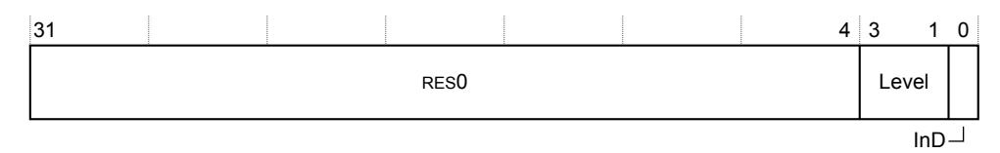

**Figure 4-23 CSSELR\_EL1 bit assignments**

The following table shows the CSSELR\_EL1 bit assignments.

**Table 4-39 CSSELR\_EL1 bit assignments**

| Bits   | Name  | Function                       |                        |  |  |  |  |  |
|--------|-------|--------------------------------|------------------------|--|--|--|--|--|
| [31:4] | -     | Reserved, RES0.                |                        |  |  |  |  |  |
| [3:1]  | Level | Cache level of required cache: |                        |  |  |  |  |  |
|        |       | 0b000                          | Level 1.               |  |  |  |  |  |
|        |       | 0b001                          | Level 2.               |  |  |  |  |  |
|        |       | All other values are reserved. |                        |  |  |  |  |  |
| [0]    | InD   | Instruction not Data bit:      |                        |  |  |  |  |  |
|        |       | 0                              | Data or unified cache. |  |  |  |  |  |
|        |       | 1                              | Instruction cache.     |  |  |  |  |  |

To access the CSSELR\_EL1 in AArch64 state, read or write the register with:

```
MRS <Xt>, CSSELR_EL1; Read Cache Size Selection Register
MSR CSSELR_EL1, <Xt>; Write Cache Size Selection Register
```

To access the CSSELR in AArch32 state, read or write the CP15 register with:

```
MRC p15, 2, <Rt>, c0, c0, 0; Read Cache Size Selection Register
MCR p15, 2, <Rt>, c0, c0, 0; Write Cache Size Selection Register
```

# **Related information**

*[4.3.22 Cache Size ID Register, EL1](#page-116-0)* on page 4-117*.*

# <span id="page-121-0"></span>**4.3.26 Cache Type Register, EL0**

The CTR\_EL0 characteristics are:

# **Purpose**

Provides information about the architecture of the caches.

# **Usage constraints**

The accessibility to the CTR\_EL0 in AArch64 state by Exception level is:

| EL0    | EL1(NS) | EL1(S) | EL2 | EL3(SCR.NS = 1) | EL3(SCR.NS = 0) |
|--------|---------|--------|-----|-----------------|-----------------|
| Config | RO      | RO     | RO  | RO              | RO              |

The accessibility to the CTR in AArch32 state by Exception level is:

| EL0 | EL1(NS) | EL1(S) | EL2 | EL3(SCR.NS = 1) | EL3(SCR.NS = 0) |
|-----|---------|--------|-----|-----------------|-----------------|
| -   | RO      | RO     | RO  | RO              | RO              |

#### **Configurations**

The CTR\_EL0 is:

- Common to Secure and Non-secure states.
- Architecturally mapped to the AArch32 CTR register.

#### **Attributes**

See the register summary in *[Table 4-1 AArch64 identification registers](#page-74-0)* on page 4-75.

The following figure shows the CTR\_EL0 bit assignments.

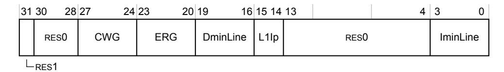

**Figure 4-24 CTR\_EL0 bit assignments**

The following table shows the CTR\_EL0 bit assignments.

**Table 4-40 CTR\_EL0 bit assignments**

| Bits    | Name | Function                                                                                                                                                                                                                    |  |  |  |  |  |
|---------|------|-----------------------------------------------------------------------------------------------------------------------------------------------------------------------------------------------------------------------------|--|--|--|--|--|
| [31]    | -    | Reserved, RES1.                                                                                                                                                                                                             |  |  |  |  |  |
| [30:28] | -    | Reserved, RES0.                                                                                                                                                                                                             |  |  |  |  |  |
| [27:24] | CWG  | Cache Writeback Granule. Log2<br>of the number of words of the maximum size of memory that can be overwritten<br>as a result of the eviction of a cache entry that has had a memory location in it modified. This value is: |  |  |  |  |  |
|         |      | Cache writeback granule size is 16 words.<br>0x4                                                                                                                                                                            |  |  |  |  |  |
| [23:20] | ERG  | Exclusives Reservation Granule. Log2<br>of the number of words of the maximum size of the reservation granule<br>that has been implemented for the Load-Exclusive and Store-Exclusive instructions. This value is:          |  |  |  |  |  |
|         |      | Exclusive reservation granule size is 16 words.<br>0x4                                                                                                                                                                      |  |  |  |  |  |

<span id="page-122-0"></span>

| Bits    | Name Function |                                                                                                                                                   |                                                                                                   |  |  |  |  |
|---------|---------------|---------------------------------------------------------------------------------------------------------------------------------------------------|---------------------------------------------------------------------------------------------------|--|--|--|--|
| [19:16] | DminLine      | Log <sub>2</sub> of the number of words in the smallest cache line of all the data and unified caches that the processor controls. This value is: |                                                                                                   |  |  |  |  |
|         |               | 0x4                                                                                                                                               | Smallest data cache line size is 16 words.                                                        |  |  |  |  |
| [15:14] | L1lp          | Level 1 Instruction value is:                                                                                                                     | on Cache policy. Indicates the indexing and tagging policy for the L1 Instruction Cache. This     |  |  |  |  |
|         |               | 0b11                                                                                                                                              | Physical index, physical tag (PIPT).                                                              |  |  |  |  |
| [13:4]  | -             | Reserved, RESO.                                                                                                                                   |                                                                                                   |  |  |  |  |
| [3:0]   | IminLine      | Log <sub>2</sub> of the numb<br>This values is:                                                                                                   | per of words in the smallest cache line of all the Instruction Caches that the processor controls |  |  |  |  |
|         |               | 0x4                                                                                                                                               | Smallest Instruction Cache line size is 16 words.                                                 |  |  |  |  |

To access the CTR EL0 in AArch64 state, read the register with:

MRS <Xt>, CTR\_EL0; Read Cache Type Register

To access the CTR in AArch32 state, read the CP15 register with:

MRC p15, 0, <Rt>, c0, c0, 1; Read Cache Type Register

#### 4.3.27 Data Cache Zero ID, EL0

The DCZID EL0 characteristics are:

#### Purnose

Indicates the block size written with byte values of 0 by the DC ZVA, Data Cache Zero by Address, system instruction.

#### **Usage constraints**

The accessibility of the DCZID EL0 by Exception level is:

| EL0 | EL1(NS) | EL1(S) | EL2 | EL3(SCR.NS = 1) | EL3(SCR.NS = 0) |
|-----|---------|--------|-----|-----------------|-----------------|
| RO  | RO      | RO     | RO  | RO              | RO              |

# Configurations

The DCZID\_EL0 is a 32-bit register.

#### **Attributes**

See the register summary in *Table 4-1 AArch64 identification registers* on page 4-75.

The following figure shows the DCZID EL0 bit assignments.

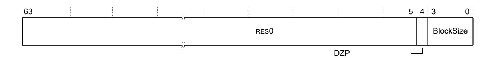

Figure 4-25 DCZID EL0 bit assignments

The following table shows the DCZID\_EL0 bit assignments.

# **Table 4-41 DCZID\_EL0 bit assignments**

<span id="page-123-0"></span>

| Bits   | Name | Function                                                    |  |  |  |  |  |  |
|--------|------|-------------------------------------------------------------|--|--|--|--|--|--|
| [63:5] | -    | Reserved, RES0.                                             |  |  |  |  |  |  |
| [4]    | DZP  | Prohibit the DC ZVA instruction. The possible values are:   |  |  |  |  |  |  |
|        |      | 0<br>DC ZVA instruction permitted. This is the reset value. |  |  |  |  |  |  |
|        |      | 1<br>DC ZVA instruction prohibited.                         |  |  |  |  |  |  |
| [3:0]  | BS   | Returns 0x4 to indicate that the block size is 16 words.    |  |  |  |  |  |  |

To access the DCZID\_EL0 in AArch64 state, read or write the register with:

MRS <Xt>, DCZID\_EL0; Read Data Cache Zero ID Register

# **4.3.28 Virtualization Processor ID Register, EL2**

The VPIDR\_EL2 characteristics are:

#### **Purpose**

Holds the value of the Virtualization Processor ID. A Non-secure read of the MIDR from EL1 returns the value of this register.

# **Usage constraints**

The accessibility to the VPIDR\_EL2 in AArch64 state by Exception level is:

| EL0 | EL1(NS) | EL1(S) | EL2 | EL3(SCR.NS = 1) | EL3(SCR.NS = 0) |
|-----|---------|--------|-----|-----------------|-----------------|
| -   | -       | -      | RW  | RW              | RW              |

The accessibility to the VPIDR in AArch32 state by Exception level is:

| EL0 | EL1(NS) | EL1(S) | EL2 | EL3(SCR.NS = 1) | EL3(SCR.NS = 0) |
|-----|---------|--------|-----|-----------------|-----------------|
| -   | -       | -      | RW  | RW              | -               |

#### **Configurations**

The VPIDR\_EL2 is:

- A Banked EL2 register.
- Architecturally mapped to the AArch32 VPIDR register.

#### **Attributes**

See the register summary in *[Table 4-13 AArch64 virtualization registers](#page-82-0)* on page 4-83.

The following figure shows the VPIDR\_EL2 bit assignments.

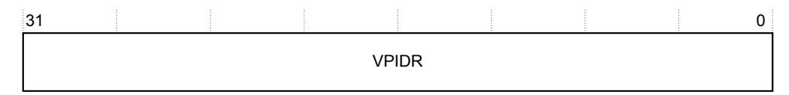

**Figure 4-26 VPIDR\_EL2 bit assignments**

The following table shows the VPIDR\_EL2 bit assignments.

# **Table 4-42 VPIDR\_EL2 bit assignments**

## <span id="page-124-0"></span>**Bits Name Function**

[31:0] VPIDR MIDR value returned by Non-secure EL1 reads of the MIDR. For information on the subdivision of this value, see *[4.3.1 Main ID Register, EL1](#page-88-0)* on page 4-89.

To access the VPIDR\_EL2 in AArch64 state, read or write the register with:

```
MRS <Xt>, VPIDR_EL1; Read Virtualization Processor ID Register
MSR VPIDR_EL1, <Xt>; Write Virtualization Processor ID Register
```

To access the VPIDR, read or write the CP15 register with:

```
MRC p15, 4, <Rt>, c0, c0, 0; Read Virtualization Processor ID Register
MCR p15, 4, <Rt>, c0, c0, 0; Write Virtualization Processor ID Register
```

#### **Related information**

*[4.3.1 Main ID Register, EL1](#page-88-0)* on page 4-89*.*

#### **4.3.29 Virtualization Multiprocessor ID Register, EL2**

The VMPIDR\_EL2 characteristics are:

#### **Purpose**

Holds the value of the Virtualization Multiprocessor ID. This is the value returned by Nonsecure EL1 reads of MPIDR\_EL1.

## **Usage constraints**

The accessibility of the VMPIDR\_EL2 by Exception level is:

| EL0 | EL1(NS) | EL1(S) | EL2 | EL3(SCR.NS = 1) | EL3(SCR.NS = 0) |
|-----|---------|--------|-----|-----------------|-----------------|
| -   | -       | -      | RW  | RW              | RW              |

#### **Configurations**

The VMPIDR\_EL2 is Architecturally mapped to the Non-secure AArch32 VMPIDR register.

#### **Attributes**

See the register summary in *[Table 4-13 AArch64 virtualization registers](#page-82-0)* on page 4-83.

The following figure shows the VMPIDR\_EL2 bit assignments.

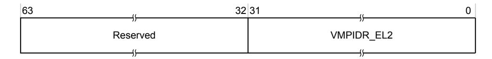

**Figure 4-27 VMPIDR\_EL2 bit assignments**

The following table shows the VMPIDR\_EL2 bit assignments.

**Table 4-43 VMPIDR\_EL2 bit assignments**

| Bits    | Name       | Function                                                                                                                                                                      |
|---------|------------|-------------------------------------------------------------------------------------------------------------------------------------------------------------------------------|
| [63:32] | -          | Reserved, RES0.                                                                                                                                                               |
| [31:0]  | VMPIDR_EL2 | MPIDR value returned by Non-secure EL1 reads of the MPIDR_EL1. For information on the subdivision of<br>this value, see 4.5.3 Multiprocessor Affinity Register on page 4-239. |

<span id="page-125-0"></span>To access the VMPIDR EL2 in AArch64 state, read or write the register with:

MRS <Xt>, VMPIDR\_EL1; Read Virtualization Multiprocessor ID Register
MSR VMPIDR\_EL1, <Xt>; Write Virtualization Multiprocessor ID Register

#### **Related information**

4.5.4 Virtualization Multiprocessor ID Register on page 4-240.

## 4.3.30 System Control Register, EL1

The SCTLR EL1 characteristics are:

#### **Purpose**

Provides top-level control of the system, including its memory system at EL1 in AArch64 state.

#### **Usage constraints**

The accessibility of the SCTLR EL1 by Exception level is:

| EL0 | EL1(NS) | EL1(S) | EL2 | EL3(SCR.NS = 1) | EL3(SCR.NS = 0) |
|-----|---------|--------|-----|-----------------|-----------------|
| -   | RW      | RW     | RW  | RW              | RW              |

## **Configurations**

The SCTLR EL1 is:

- A 32-bit register in AArch64 state.
- Architecturally mapped to the Non-secure AArch32 SCTLR register.

#### Attributes

See the register summary in Table 4-3 AArch64 virtual memory control registers on page 4-78.

The following figure shows the SCTLR EL1 bit assignments.

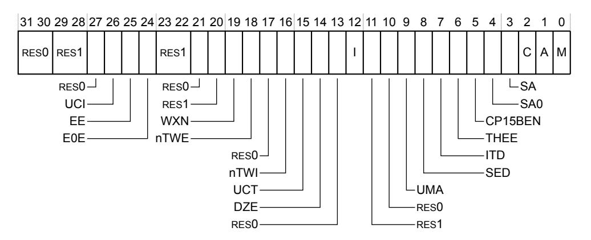

Figure 4-28 SCTLR\_EL1 bit assignments

The following table shows the SCTLR\_EL1bit assignments.

Table 4-44 SCTLR\_EL1 bit assignments

| Bits    | Name | Function        |
|---------|------|-----------------|
| [31:30] | -    | Reserved, RESO. |
| [29:28] | -    | Reserved, RES1. |
| [27]    | -    | Reserved, RESO. |

| Bits    | Name | Function                                                                                                                                                                                                     |                                                                                                                                                                                                           |  |  |  |  |  |
|---------|------|--------------------------------------------------------------------------------------------------------------------------------------------------------------------------------------------------------------|-----------------------------------------------------------------------------------------------------------------------------------------------------------------------------------------------------------|--|--|--|--|--|
| [26]    | UCI  | Enables EL0 access to the DC CVAU, DC CIVAC, DC CVAC and IC IVAU instructions in AArch64 state. The<br>values are:                                                                                           |                                                                                                                                                                                                           |  |  |  |  |  |
|         |      | 0                                                                                                                                                                                                            | EL0 access disabled. This is the reset value.                                                                                                                                                             |  |  |  |  |  |
|         |      | 1                                                                                                                                                                                                            | EL0 access enabled.                                                                                                                                                                                       |  |  |  |  |  |
| [25]    | EE   | Exception endianness. Indicates the endianness of the translation table data for the translation table lookups. The<br>EE bit is permitted to be cached in a TLB. The values are:                            |                                                                                                                                                                                                           |  |  |  |  |  |
|         |      | 0                                                                                                                                                                                                            | Little-endian.                                                                                                                                                                                            |  |  |  |  |  |
|         |      | 1                                                                                                                                                                                                            | Big-endian.                                                                                                                                                                                               |  |  |  |  |  |
| [24]    | E0E  |                                                                                                                                                                                                              | Endianness of explicit data access at EL0. The values are:                                                                                                                                                |  |  |  |  |  |
|         |      | 0                                                                                                                                                                                                            | Explicit data accesses at EL0 are little-endian. This is reset value.                                                                                                                                     |  |  |  |  |  |
|         |      | 1                                                                                                                                                                                                            | Explicit data accesses at EL0 are big-endian.                                                                                                                                                             |  |  |  |  |  |
| [23:22] | -    | Reserved, RES1.                                                                                                                                                                                              |                                                                                                                                                                                                           |  |  |  |  |  |
| [21]    | -    | Reserved, RES0.                                                                                                                                                                                              |                                                                                                                                                                                                           |  |  |  |  |  |
| [20]    | -    | Reserved, RES1.                                                                                                                                                                                              |                                                                                                                                                                                                           |  |  |  |  |  |
| [19]    | WXN  | Write permission implies Execute Never (XN). You can use this bit to require all memory regions with write<br>permissions are treated as XN. The WXN bit is permitted to be cached in a TLB. The values are: |                                                                                                                                                                                                           |  |  |  |  |  |
|         |      | 0                                                                                                                                                                                                            | Regions with write permission are not forced to be XN. This is the reset value.                                                                                                                           |  |  |  |  |  |
|         |      | 1                                                                                                                                                                                                            | Regions with write permissions are forced to be XN.                                                                                                                                                       |  |  |  |  |  |
| [18]    | nTWE | WFE non-trapping. The values are:                                                                                                                                                                            |                                                                                                                                                                                                           |  |  |  |  |  |
|         |      | 0                                                                                                                                                                                                            | A WFE instruction executed at EL0 that causes suspended execution as if the event register is<br>not set and there is no pending WFE wake-up event, is treated as an exception with error code<br>of 0x1. |  |  |  |  |  |
|         |      | 1                                                                                                                                                                                                            | WFE instructions executed as normal. This is the reset value.                                                                                                                                             |  |  |  |  |  |
|         |      | Conditional WFE instructions that fail their condition do not cause an exception if this bit is 0.                                                                                                           |                                                                                                                                                                                                           |  |  |  |  |  |
| [17]    | -    | Reserved, RES0.                                                                                                                                                                                              |                                                                                                                                                                                                           |  |  |  |  |  |
| [16]    | nTWI | WFI non-trapping. The values are:                                                                                                                                                                            |                                                                                                                                                                                                           |  |  |  |  |  |
|         |      | 0                                                                                                                                                                                                            | A WFI instruction executed at EL0 that causes suspended execution as if there is no pending<br>WFI wake-up event, is treated as an exception with error code of 0x1.                                      |  |  |  |  |  |
|         |      | 1                                                                                                                                                                                                            | WFI instructions executed as normal. This is the reset value.                                                                                                                                             |  |  |  |  |  |
|         |      | Conditional WFI instructions that fail their condition do not cause an exception if this bit is 0.                                                                                                           |                                                                                                                                                                                                           |  |  |  |  |  |
| [15]    | UCT  | Enables EL0 access to the CTR_EL0 register in AArch64 state. The values are:                                                                                                                                 |                                                                                                                                                                                                           |  |  |  |  |  |
|         |      | 0                                                                                                                                                                                                            | Disables EL0 access to the CTR_EL0 register. This is the reset value.                                                                                                                                     |  |  |  |  |  |
|         |      | 1                                                                                                                                                                                                            | Enables EL0 access to the CTR_EL0 register.                                                                                                                                                               |  |  |  |  |  |
| [14]    | DZE  |                                                                                                                                                                                                              | Enables access to the DC ZVA instruction at EL0. The values are:                                                                                                                                          |  |  |  |  |  |
|         |      | 0                                                                                                                                                                                                            | Disables execution access to the DC ZVA instruction at EL0. Access is treated as UNDEFINED.                                                                                                               |  |  |  |  |  |
|         |      | 1                                                                                                                                                                                                            | This is the reset value.<br>Enables execution access to the DC ZVA instruction at EL0.                                                                                                                    |  |  |  |  |  |
|         |      |                                                                                                                                                                                                              |                                                                                                                                                                                                           |  |  |  |  |  |

| Bits | Name    | Function                                                                                                                                                                                                                                                         |                                                                       |  |  |  |  |  |
|------|---------|------------------------------------------------------------------------------------------------------------------------------------------------------------------------------------------------------------------------------------------------------------------|-----------------------------------------------------------------------|--|--|--|--|--|
| [13] | -       | Reserved, RES0.                                                                                                                                                                                                                                                  |                                                                       |  |  |  |  |  |
| [12] | I       |                                                                                                                                                                                                                                                                  | Instruction cache enable. The values are:                             |  |  |  |  |  |
|      |         | 0                                                                                                                                                                                                                                                                | Instruction caches disabled. This is the reset value.                 |  |  |  |  |  |
|      |         | 1                                                                                                                                                                                                                                                                | Instruction caches enabled.                                           |  |  |  |  |  |
| [11] | -       | Reserved, RES1.                                                                                                                                                                                                                                                  |                                                                       |  |  |  |  |  |
| [10] | -       | Reserved, RES0.                                                                                                                                                                                                                                                  |                                                                       |  |  |  |  |  |
| [9]  | UMA     | User Mask Access. Controls access to interrupt masks from EL0, when EL0 is using AArch64. The values are:                                                                                                                                                        |                                                                       |  |  |  |  |  |
|      |         | 0                                                                                                                                                                                                                                                                | Disables access to the interrupt masks from EL0.                      |  |  |  |  |  |
|      |         | 1                                                                                                                                                                                                                                                                | Enables access to the interrupt masks from EL0.                       |  |  |  |  |  |
| [8]  | SED     |                                                                                                                                                                                                                                                                  | SETEND instruction disable. The values are:                           |  |  |  |  |  |
|      |         | 0                                                                                                                                                                                                                                                                | The SETEND instruction is enabled. This is the reset value.           |  |  |  |  |  |
|      |         | 1                                                                                                                                                                                                                                                                | The SETEND instruction is UNALLOCATED.                                |  |  |  |  |  |
| [7]  | ITD     |                                                                                                                                                                                                                                                                  | IT instruction disable. The values are:                               |  |  |  |  |  |
|      |         | 0                                                                                                                                                                                                                                                                | The IT instruction functionality is enabled. This is the reset value. |  |  |  |  |  |
|      |         | 1                                                                                                                                                                                                                                                                | All encodings of the IT instruction are UNDEFINED when either:        |  |  |  |  |  |
|      |         |                                                                                                                                                                                                                                                                  | •<br>hw[3:0] are not equal to 0b1000.                                 |  |  |  |  |  |
|      |         |                                                                                                                                                                                                                                                                  | •<br>IT instructions with a subsequent 32-bit instruction.            |  |  |  |  |  |
|      |         |                                                                                                                                                                                                                                                                  | •<br>Subsequent PC reading or writing instruction.                    |  |  |  |  |  |
| [6]  | THEE    | ThumbEE enable:                                                                                                                                                                                                                                                  |                                                                       |  |  |  |  |  |
|      |         | 0                                                                                                                                                                                                                                                                | ThumbEE is not implemented.                                           |  |  |  |  |  |
| [5]  | CP15BEN | AArch32 CP15 barrier enable. The values are:                                                                                                                                                                                                                     |                                                                       |  |  |  |  |  |
|      |         | 0                                                                                                                                                                                                                                                                | CP15 barrier operations disabled. Their encodings are UNDEFINED.      |  |  |  |  |  |
|      |         | 1                                                                                                                                                                                                                                                                | CP15 barrier operations enabled. This is the reset value.             |  |  |  |  |  |
| [4]  | SA0     | Enable EL0 Stack Alignment check. When set, use of the Stack Pointer as the base address in a load/store<br>instruction at EL0 must align to a 16-byte boundary, or a Stack Alignment Fault exception is raised. The values<br>are:                              |                                                                       |  |  |  |  |  |
|      |         | 0                                                                                                                                                                                                                                                                | Disable EL0 Stack Alignment check.                                    |  |  |  |  |  |
|      |         | 1                                                                                                                                                                                                                                                                | Enable EL0 Stack Alignment check. This is the reset value.            |  |  |  |  |  |
| [3]  | SA      | Enable Stack Alignment check. When set, use of the Stack Pointer as the base address in a load/store instruction<br>at the Exception level of this register must align to a 16-byte boundary, or a Stack Alignment Fault exception is<br>raised. The values are: |                                                                       |  |  |  |  |  |
|      |         | 0                                                                                                                                                                                                                                                                | Disable Stack Alignment check.                                        |  |  |  |  |  |
|      |         | 1                                                                                                                                                                                                                                                                | Enable Stack Alignment check. This is the reset value.                |  |  |  |  |  |
| [2]  | C       | Cache enable. The values are:                                                                                                                                                                                                                                    |                                                                       |  |  |  |  |  |
|      |         | 0                                                                                                                                                                                                                                                                | Data and unified caches disabled. This is the reset value.            |  |  |  |  |  |
|      |         | 1                                                                                                                                                                                                                                                                | Data and unified caches enabled.                                      |  |  |  |  |  |

<span id="page-128-0"></span>

| Bits | Name | Function                    |                                                             |  |  |  |
|------|------|-----------------------------|-------------------------------------------------------------|--|--|--|
| [1]  | A    |                             | Alignment check enable. The values are:                     |  |  |  |
|      |      | 0                           | Alignment fault checking disabled. This is the reset value. |  |  |  |
|      |      | 1                           | Alignment fault checking enabled.                           |  |  |  |
| [0]  | M    | MMU enable. The values are: |                                                             |  |  |  |
|      |      | 0                           | EL1 and EL0 stage 1 MMU disabled. This is the reset value.  |  |  |  |
|      |      | 1                           | EL1 and EL0 stage 1 MMU enabled.                            |  |  |  |
|      |      |                             |                                                             |  |  |  |

To access SCTLR\_EL1 in AArch64 state, read or write the register with:

```
MRS <Xt>, SCTLR_EL1; Read EL1 System Control Register
MSR SCTLR_EL1, <Xt>; Write EL1 System Control Register
```

# **Related information**

*[4.5.5 System Control Register](#page-240-0)* on page 4-241*.*

#### **4.3.31 Auxiliary Control Register, EL1**

The processor does not implement the ACTLR\_EL1 register. This register is always RES0.

# **4.3.32 Architectural Feature Access Control Register, EL1**

The CPACR\_EL1 characteristics are:

#### **Purpose**

Controls access to trace functionality and access to registers associated with Floating-point and Advanced SIMD execution.

# **Usage constraints**

The accessibility of the CPACR\_EL1 by Exception level is:

| EL0 | EL1(NS) | EL1(S) | EL2 | EL3(SCR.NS = 1) | EL3(SCR.NS = 0) |
|-----|---------|--------|-----|-----------------|-----------------|
| -   | RW      | RW     | RW  | RW              | RW              |

#### **Configurations**

The CPACR\_EL1 is:

- A32-bit register in AArch64 state.
- Architecturally mapped to the Non-secure AArch32 CPACR register.

#### **Attributes**

See the register summary in *[Table 4-4 AArch64 other System registers](#page-78-0)* on page 4-79.

The following figure shows the CPACR\_EL1 bit assignments.

<span id="page-129-0"></span>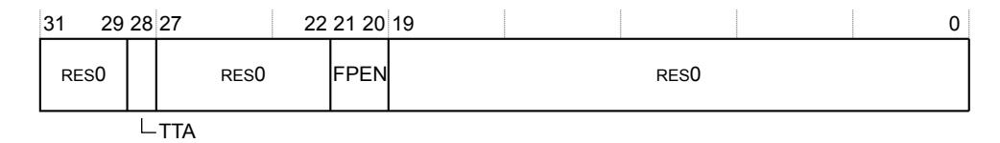

Figure 4-29 CPACR\_EL1 bit assignments

The following table shows the CPACR EL1 bit assignments.

Table 4-45 CPACR\_EL1 bit assignments

| Bits    | Name | Function                                                                                                                                                                       |  |  |  |
|---------|------|--------------------------------------------------------------------------------------------------------------------------------------------------------------------------------|--|--|--|
| [31:29] | -    | Reserved, RESO.                                                                                                                                                                |  |  |  |
| [28]    | TTA  | Traps trace functionality to EL1 when executing from EL0 or EL1. The value is:                                                                                                 |  |  |  |
|         |      | <b>0</b> System register access to trace functionality is not supported. This bit is RESO.                                                                                     |  |  |  |
| [27:22] | -    | Reserved, RESO.                                                                                                                                                                |  |  |  |
| [21:20] | FPEN | Traps instructions that access registers associated with floating-point and SIMD execution to trap to EL1 when executed from EL0 or EL1. The possible values are:              |  |  |  |
|         |      | <ul><li>Ob00 Trap any instruction in EL0 or EL1 that use registers associated with floating-point and Advanced SIMD</li><li>Ob10 execution. The reset value is Ob00.</li></ul> |  |  |  |
|         |      | <b>0b01</b> Trap any instruction in EL0 that use registers associated with floating-point and Advanced SIMD execution. Instructions in EL1 are not trapped.                    |  |  |  |
|         |      | <b>0b11</b> No instructions are trapped.                                                                                                                                       |  |  |  |
| [19:0]  | -    | Reserved, RESO.                                                                                                                                                                |  |  |  |

To access the CPACR\_EL1 in AArch64 state, read or write the register with:

MRS <Xt>, CPACR\_EL1; Read EL1 Architectural Feature Access Control Register MSR CPACR\_EL1, <Xt>; Write EL1 Architectural Feature Access Control Register

## **Related information**

4.5.6 Architectural Feature Access Control Register on page 4-246.

## 4.3.33 Auxiliary Control Register, EL2

The ACTLR\_EL2 characteristics are:

#### **Purpose**

Controls access to IMPLEMENTATION DEFINED registers in Non-secure EL1.

## **Usage constraints**

The accessibility to ACTLR\_EL2 in AArch64 state by Exception level is:

| EL0 | EL1(NS) | EL1(S) | EL2 | EL3(SCR.NS = 1) | EL3(SCR.NS = 0) |
|-----|---------|--------|-----|-----------------|-----------------|
| -   | _       | -      | RW  | RW              | RW              |

The accessibility to the HACTLR in AArch32 state by Exception level is:

| EL0 | EL1(NS) | EL1(S) | EL2 | EL3(SCR.NS = 1) | EL3(SCR.NS = 0) |
|-----|---------|--------|-----|-----------------|-----------------|
| -   | -       | -      | RW  | RW              | -               |

# **Configurations**

The ACTLR\_EL2 is:

- A Banked EL2 register.
- Architecturally mapped to the AArch32 HACTLR register.

#### **Attributes**

See the register summary in *[Table 4-4 AArch64 other System registers](#page-78-0)* on page 4-79.

The following figure shows the ACTLR\_EL2 bit assignments.

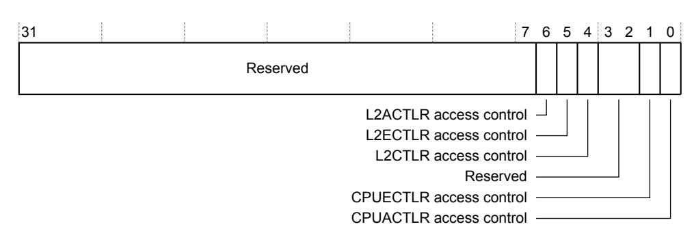

**Figure 4-30 ACTLR\_EL2 bit assignments**

The following table shows the ACTLR\_EL2 bit assignments.

**Table 4-46 ACTLR\_EL2 bit assignments**

| Bits   | Name                    | Function                                                 |  |  |
|--------|-------------------------|----------------------------------------------------------|--|--|
| [31:7] | -                       | Reserved, RES0.                                          |  |  |
| [6]    | L2ACTLR access control  | L2ACTLR access control. The possible values are:         |  |  |
|        |                         | 0<br>The register is not accessible from Non-secure EL1. |  |  |
|        |                         | 1<br>The register is accessible from Non-secure EL1.     |  |  |
| [5]    | L2ECTLR access control  | L2ECTLR access control. The possible values are:         |  |  |
|        |                         | 0<br>The register is not accessible from Non-secure EL1. |  |  |
|        |                         | 1<br>The register is accessible from Non-secure EL1.     |  |  |
| [4]    | L2CTLR access control   | L2CTLR access control. The possible values are:          |  |  |
|        |                         | 0<br>The register is not accessible from Non-secure EL1. |  |  |
|        |                         | 1<br>The register is accessible from Non-secure EL1.     |  |  |
| [3:2]  | -                       | Reserved, RES0.                                          |  |  |
| [1]    | CPUECTLR access control | CPUECTLR access control. The possible values are:        |  |  |
|        |                         | 0<br>The register is not accessible from Non-secure EL1. |  |  |
|        |                         | 1<br>The register is accessible from Non-secure EL1.     |  |  |
| [0]    | CPUACTLR access control | CPUACTLR access control. The possible values are:        |  |  |
|        |                         | 0<br>The register is not accessible from Non-secure EL1. |  |  |
|        |                         | 1<br>The register is accessible from Non-secure EL1.     |  |  |

<span id="page-131-0"></span>To access the ACTLR\_EL2 in AArch64 state, read or write the register with:

```
MRS <Xt>, ACTLR_EL2; Read EL2 Auxiliary Control Register
MSR ACTLR_EL2, <Xt>; Write EL2 Auxiliary Control Register
```

To access the HACTLR in AArch32 state, read or write the CP15 register with:

```
MRC p15, 4, <Rt>, c1, c0, 1; Read Hypervisor Auxiliary Control Register
MCR p15, 4, <Rt>, c1, c0, 1; Write Hypervisor Auxiliary Control Register
```

## **4.3.34 Hypervisor Configuration Register, EL2**

The HCR\_EL2 characteristics are:

#### **Purpose**

Provides configuration control for virtualization, including whether various Non-secure operations are trapped to EL2.

# **Usage constraints**

The accessibility of the HCR\_EL2 by Exception level is:

| EL0 | EL1(NS) | EL1(S) | EL2 | EL3(SCR.NS = 1) | EL3(SCR.NS = 0) |
|-----|---------|--------|-----|-----------------|-----------------|
| -   | -       | -      | RW  | RW              | RW              |

#### **Configurations**

The HCR\_EL2 is architecturally mapped as follows:

- [63:32] to the AArch32 HCR2 register.
- [31:0] to the AArch32 HCR register.

### **Attributes**

See the register summary in *[Table 4-13 AArch64 virtualization registers](#page-82-0)* on page 4-83.

The following figure shows the HCR\_EL2 bit assignments.

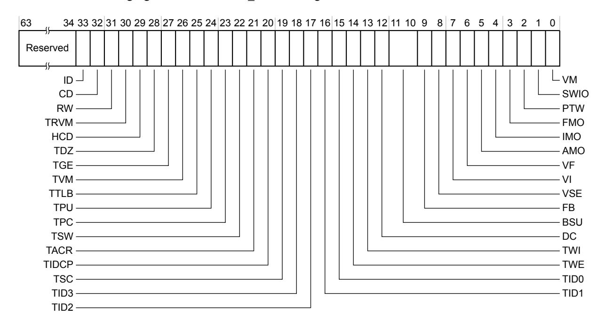

**Figure 4-31 HCR\_EL2 bit assignments**

The following table shows the HCR\_EL2 bit assignments.

## **Table 4-47 HCR\_EL2 bit assignments**

| Bits    | Name | Function                                                                                                                                                                                                                           |                                                                                                                                                           |  |  |  |  |
|---------|------|------------------------------------------------------------------------------------------------------------------------------------------------------------------------------------------------------------------------------------|-----------------------------------------------------------------------------------------------------------------------------------------------------------|--|--|--|--|
| [63:34] | -    | Reserved, RES0.                                                                                                                                                                                                                    |                                                                                                                                                           |  |  |  |  |
| [33]    | ID   | Disables stage 2 Instruction Cache. When HCR_EL2.VM is 1, this forces all stage 2 translations for instruction<br>accesses to Normal memory to be Non-cacheable for the EL1/EL0 translation regimes. The values are:               |                                                                                                                                                           |  |  |  |  |
|         |      | 0                                                                                                                                                                                                                                  | Has no effect on stage 2 EL1/EL0 translation regime for instruction accesses. This is the reset<br>value.                                                 |  |  |  |  |
|         |      | 1                                                                                                                                                                                                                                  | Forces all stage 2 translations for instruction accesses to Normal memory to be Non-cacheable<br>for the EL1/EL0 translation regime.                      |  |  |  |  |
| [32]    | CD   | Disables stage 2 data cache. When HCR_EL2.VM is 1, this forces all stage 2 translations for data accesses and<br>translation table walks to Normal memory to be Non-cacheable for the EL1/EL0 translation regimes. The values are: |                                                                                                                                                           |  |  |  |  |
|         |      | 0                                                                                                                                                                                                                                  | Has no effect on stage 2 EL1/EL0 translation regime for data access or translation table walks.<br>This is the reset value.                               |  |  |  |  |
|         |      | 1                                                                                                                                                                                                                                  | Forces all stage 2 translations for data accesses and translation table walks to Normal memory to<br>be Non-cacheable for the EL1/EL0 translation regime. |  |  |  |  |
| [31]    | RW   | Register width control for lower Exception levels. The values are:                                                                                                                                                                 |                                                                                                                                                           |  |  |  |  |
|         |      | 0                                                                                                                                                                                                                                  | Lower levels are all AArch32. This is the reset value.                                                                                                    |  |  |  |  |
|         |      | 1                                                                                                                                                                                                                                  | EL1 is AArch64. EL0 is determined by the register width described in the current processing<br>state when executing at EL0.                               |  |  |  |  |
| [30]    | TRVM | Trap Read of Virtual Memory controls. When 1, this causes reads to the EL1 virtual memory control registers from<br>EL1 to be trapped to EL2. This covers the following registers:                                                 |                                                                                                                                                           |  |  |  |  |
|         |      | AArch32                                                                                                                                                                                                                            | SCTLR, TTBR0, TTBR1, TTBCR, DACR, DFSR, IFSR, DFAR, IFAR, ADFSR, AIFSR,<br>PRRR/MAIR0, NMRR/MAIR1, AMAIR0, AMAIR1, and CONTEXTIDR.                        |  |  |  |  |
|         |      | AArch64                                                                                                                                                                                                                            | SCTLR_EL1, TTBR0_EL1, TTBR1_EL1, TCR_EL1, ESR_EL1, FAR_EL1, AFSR0_EL1,<br>AFSR1_EL1, MAIR_EL1, AMAIR_EL1, and CONTEXTIDR_EL1.                             |  |  |  |  |
|         |      | The reset value is 0.                                                                                                                                                                                                              |                                                                                                                                                           |  |  |  |  |
| [29]    | HCD  | Disables Hyp call. The processor implements EL3. This bit is RES0.                                                                                                                                                                 |                                                                                                                                                           |  |  |  |  |
| [28]    | TDZ  | Traps DC ZVA instruction. The values are:                                                                                                                                                                                          |                                                                                                                                                           |  |  |  |  |
|         |      | 0                                                                                                                                                                                                                                  | DC ZVA instruction is not trapped.                                                                                                                        |  |  |  |  |
|         |      | 1                                                                                                                                                                                                                                  | DC ZVA instruction is trapped to EL2 when executed in Non-secure EL1 or EL0.                                                                              |  |  |  |  |
| [27]    | TGE  |                                                                                                                                                                                                                                    | Traps general exceptions. If this bit is set, and SCR_EL3.NS is set, then:                                                                                |  |  |  |  |
|         |      | •<br>All EL1 exceptions are routed to EL2.                                                                                                                                                                                         |                                                                                                                                                           |  |  |  |  |
|         |      | •<br>For EL1, the SCTLR_EL1.M bit is treated as 0 regardless of its actual state other than the purpose of reading the                                                                                                             |                                                                                                                                                           |  |  |  |  |
|         |      | bit.<br>•<br>The HCR_EL2.FMO, HCR_EL2.IMO, and HCR_AMO bits are treated as 1 regardless of their actual state other                                                                                                                |                                                                                                                                                           |  |  |  |  |
|         |      | than for the purpose of reading the bits.                                                                                                                                                                                          |                                                                                                                                                           |  |  |  |  |
|         |      | •<br>All virtual interrupts are disabled.                                                                                                                                                                                          |                                                                                                                                                           |  |  |  |  |
|         |      | •<br>Any IMPLEMENTATION DEFINED mechanisms for signaling virtual interrupts are disabled.                                                                                                                                          |                                                                                                                                                           |  |  |  |  |
|         |      | •<br>An exception return to EL1 is treated as an illegal exception return.                                                                                                                                                         |                                                                                                                                                           |  |  |  |  |

| Bits | Name | Function                                                                                                                                                                                                                                                                                          |                                                                                                                                                                                                           |  |  |  |  |
|------|------|---------------------------------------------------------------------------------------------------------------------------------------------------------------------------------------------------------------------------------------------------------------------------------------------------|-----------------------------------------------------------------------------------------------------------------------------------------------------------------------------------------------------------|--|--|--|--|
| [26] | TVM  | Trap Virtual Memory controls. When 1, this causes writes to the EL1 virtual memory control registers from EL1 to<br>be trapped to EL2. This covers the following registers:                                                                                                                       |                                                                                                                                                                                                           |  |  |  |  |
|      |      | AArch32                                                                                                                                                                                                                                                                                           | SCTLR, TTBR0, TTBR1, TTBCR, DACR, DFSR, IFSR, DFAR, IFAR, ADFSR, AIFSR,<br>PRRR/MAIR0, NMRR/MAIR1, AMAIR0, AMAIR1, and CONTEXTIDR.                                                                        |  |  |  |  |
|      |      | AArch64                                                                                                                                                                                                                                                                                           | SCTLR_EL1, TTBR0_EL1, TTBR1_EL1, TCR_EL1, ESR_EL1, FAR_EL1, AFSR0_EL1,<br>AFSR1_EL1, MAIR_EL1, AMAIR_EL1, and CONTEXTIDR_EL1.                                                                             |  |  |  |  |
|      |      | The reset value is 0.                                                                                                                                                                                                                                                                             |                                                                                                                                                                                                           |  |  |  |  |
| [25] | TTLB | Trap TLB maintenance instructions. When 1, this causes TLB maintenance instructions executed from EL1 that are<br>not UNDEFINED to be trapped to EL2. This covers the following instructions:                                                                                                     |                                                                                                                                                                                                           |  |  |  |  |
|      |      | AArch32                                                                                                                                                                                                                                                                                           | TLBIALLIS, TLBIMVAIS, TLBIASIDIS, TLBIMVAAIS, ITLBIALL, DTLBIALL, TLBIALL,<br>ITLBIMVA, DTLBIMVA, TLBIMVA, ITLBIASID, DTLBIASID, TLBIASID, TLBIMVAA,<br>TLBIMVALIS, TLBIMVAALIS, TLBIMVAL, and TLBIMVAAL. |  |  |  |  |
|      |      | AArch64                                                                                                                                                                                                                                                                                           | TLBI VAMLLE1, TLBI VAE1, TLBI ASIDE1, TLBI VAAE1, TLBI VALE1, TLBI VAALE1,<br>TLBI VMALLE1IS, TLBI VAE1IS, TLBI ASIDE1IS, TLBI VAAE1IS, TLBI VALE1IS, and<br>TLBI VAALE1IS.                               |  |  |  |  |
|      |      | The reset value is 0.                                                                                                                                                                                                                                                                             |                                                                                                                                                                                                           |  |  |  |  |
| [24] | TPU  | Trap Cache maintenance instructions to Point of Unification. When 1, this causes Cache maintenance instructions to<br>the point of unification executed from EL1 or EL0 that are not UNDEFINED to be trapped to EL2. This covers the<br>following instructions:                                   |                                                                                                                                                                                                           |  |  |  |  |
|      |      | AArch32                                                                                                                                                                                                                                                                                           | ICIMVAU, ICIALLU, ICIALLUIS, and DCCMVAU.                                                                                                                                                                 |  |  |  |  |
|      |      | AArch64                                                                                                                                                                                                                                                                                           | IC IVAU, IC IALLU, IC IALLUIS, and DC CVAU.                                                                                                                                                               |  |  |  |  |
|      |      | The reset value is 0.                                                                                                                                                                                                                                                                             |                                                                                                                                                                                                           |  |  |  |  |
| [23] | TPC  | Trap Data/Unified Cache maintenance operations to point of coherency. When 1, this causes Data or Unified Cache<br>maintenance instructions by address to the point of coherency executed from EL1 or EL0 that are not UNDEFINED to<br>be trapped to EL2. This covers the following instructions: |                                                                                                                                                                                                           |  |  |  |  |
|      |      | AArch32                                                                                                                                                                                                                                                                                           | DCIMVAC, DCCIMVAC, and DCCMVAC.                                                                                                                                                                           |  |  |  |  |
|      |      | AArch64                                                                                                                                                                                                                                                                                           | DC IVAC, DC CIVAC, and DC CVCA.                                                                                                                                                                           |  |  |  |  |
|      |      | The reset value is 0.                                                                                                                                                                                                                                                                             |                                                                                                                                                                                                           |  |  |  |  |
| [22] | TSW  | Trap Data/Unified Cache maintenance operations by Set/Way. When 1, this causes Data or Unified Cache<br>maintenance instructions by set/way executed from EL1 that are not UNDEFINED to be trapped to EL2. This covers<br>the following instructions:                                             |                                                                                                                                                                                                           |  |  |  |  |
|      |      | AArch32                                                                                                                                                                                                                                                                                           | DCISW, DCCSW, and DCCISW.                                                                                                                                                                                 |  |  |  |  |
|      |      | AArch64                                                                                                                                                                                                                                                                                           | DC ISW, DC CSW, and DC CISW.                                                                                                                                                                              |  |  |  |  |
|      |      | The reset value is 0.                                                                                                                                                                                                                                                                             |                                                                                                                                                                                                           |  |  |  |  |
| [21] | TACR |                                                                                                                                                                                                                                                                                                   | Traps Auxiliary Control registers. The values are:                                                                                                                                                        |  |  |  |  |
|      |      | 0                                                                                                                                                                                                                                                                                                 | Accesses to the Auxiliary Control registers are not trapped.                                                                                                                                              |  |  |  |  |
|      |      | 1                                                                                                                                                                                                                                                                                                 | Accesses to the ACTLR in AArch32 state or the ACTLR_EL1 in AArch64 state from EL1 are<br>trapped to EL2.                                                                                                  |  |  |  |  |

| Bits | Name  | Function                                                                                                                                                    |                                                                                                                                                                                                                                                                                                                                         |  |  |  |  |
|------|-------|-------------------------------------------------------------------------------------------------------------------------------------------------------------|-----------------------------------------------------------------------------------------------------------------------------------------------------------------------------------------------------------------------------------------------------------------------------------------------------------------------------------------|--|--|--|--|
| [20] | TIDCP | Trap Implementation Dependent functionality. When 1, this causes accesses to the following instruction set space<br>executed from EL1 to be trapped to EL2: |                                                                                                                                                                                                                                                                                                                                         |  |  |  |  |
|      |       | AArch32                                                                                                                                                     | All CP15 MCR and MRC instructions as follows:                                                                                                                                                                                                                                                                                           |  |  |  |  |
|      |       |                                                                                                                                                             | •<br>CRn is 9, op1 is 0 to 7, CRm is c0, c1, c2, c5, c6, c7, or c8, and op2 is 0 to 7.                                                                                                                                                                                                                                                  |  |  |  |  |
|      |       |                                                                                                                                                             | •<br>CRn is 10, op1 is 0 to 7, CRm is c0, c1, c4, or c8, and op2 is 0 to 7.                                                                                                                                                                                                                                                             |  |  |  |  |
|      |       |                                                                                                                                                             | •<br>CRn is 11, op1 is 0 to 7, CRm is c0 to c8, or c15, and op2 is 0 to 7.                                                                                                                                                                                                                                                              |  |  |  |  |
|      |       | AArch64<br>Reserved control space for IMPLEMENTATION DEFINED functionality.                                                                                 |                                                                                                                                                                                                                                                                                                                                         |  |  |  |  |
|      |       |                                                                                                                                                             | Accesses from EL0 are UNDEFINED. The reset value is 0.                                                                                                                                                                                                                                                                                  |  |  |  |  |
| [19] | TSC   | Traps SMC instruction. The values are:                                                                                                                      |                                                                                                                                                                                                                                                                                                                                         |  |  |  |  |
|      |       | 0                                                                                                                                                           | SMC instruction is not trapped.                                                                                                                                                                                                                                                                                                         |  |  |  |  |
|      |       | 1                                                                                                                                                           | SMC instruction executed in EL1 is trapped to EL2 for AArch32 and AArch64 states.                                                                                                                                                                                                                                                       |  |  |  |  |
| [18] | TID3  |                                                                                                                                                             | Trap ID Group 3. When 1, this causes reads to the following registers executed from EL1 to be trapped to EL2:                                                                                                                                                                                                                           |  |  |  |  |
|      |       | AArch32                                                                                                                                                     | ID_PFR0, ID_PFR1, ID_DFR0, ID_AFR0, ID_MMFR0, ID_MMFR1, ID_MMFR2,<br>ID_MMFR3, ID_ISAR0, ID_ISAR1, ID_ISAR2, ID_ISAR3, ID_ISAR4, ID_ISAR5, MVFR0,<br>MVFR1, and MVFR2 and MRC instructions to the following locations:                                                                                                                  |  |  |  |  |
|      |       |                                                                                                                                                             | •<br>op1 is 0, CRn is 0, CRm is c3, c4, c5, c6, or c7, and op2 is 0 or 1.                                                                                                                                                                                                                                                               |  |  |  |  |
|      |       |                                                                                                                                                             | •<br>op1 is 0, CRn is 0, CRm is c3, and op2 is 2.                                                                                                                                                                                                                                                                                       |  |  |  |  |
|      |       |                                                                                                                                                             | •<br>op1 is 0, CRn is 0, CRm is 5, and op2 is 4 or 5.                                                                                                                                                                                                                                                                                   |  |  |  |  |
|      |       | AArch64                                                                                                                                                     | ID_PFR0_EL1, ID_PFR1_EL1, ID_DFR0_EL1, ID_AFR0_EL1, ID_MMFR0_EL1,<br>ID_MMFR1_EL1, ID_MMFR2_EL1, ID_MMFR3_EL1, ID_ISAR0_EL1, ID_ISAR1_EL1,<br>ID_ISAR2_EL1, ID_ISAR3_EL1, ID_ISAR4_EL1, ID_ISAR5_EL1, MVFR0_EL1,<br>MVFR1_EL1, MVFR2_EL1, ID_AA64PFRn_EL1, ID_AA64DFRn_EL1,<br>ID_AA64ISARn_EL1, ID_AA64MMFRn_EL1, and ID_AA64AFRn_EL1. |  |  |  |  |
|      |       | The reset value is 0.                                                                                                                                       |                                                                                                                                                                                                                                                                                                                                         |  |  |  |  |
| [17] | TID2  |                                                                                                                                                             | Trap ID Group 2. When 1, this causes reads or writes to CSSELR/CSSELR_EL1, to the following registers executed<br>from EL1 or EL0 that are UNDEFINED to be trapped to EL2:                                                                                                                                                              |  |  |  |  |
|      |       | AArch32                                                                                                                                                     | CTR, CCSIDR, CLIDR, and CSSELR.                                                                                                                                                                                                                                                                                                         |  |  |  |  |
|      |       | AArch64                                                                                                                                                     | CTR_EL0, CCSIDR_EL1, CLIDR_EL1, and CSSELR_EL1.                                                                                                                                                                                                                                                                                         |  |  |  |  |
|      |       | The reset value is 0.                                                                                                                                       |                                                                                                                                                                                                                                                                                                                                         |  |  |  |  |
| [16] | TID1  | Trap ID Group 1. When 1, this causes reads to the following registers executed from EL1 to be trapped to EL2:                                               |                                                                                                                                                                                                                                                                                                                                         |  |  |  |  |
|      |       | AArch32                                                                                                                                                     | TCMTR, TLBTR, AIDR, and REVIDR.                                                                                                                                                                                                                                                                                                         |  |  |  |  |
|      |       | AArch64                                                                                                                                                     | AIDR_EL1, and REVIDR_EL1.                                                                                                                                                                                                                                                                                                               |  |  |  |  |
|      |       | The reset value is 0.                                                                                                                                       |                                                                                                                                                                                                                                                                                                                                         |  |  |  |  |
| [15] | TID0  | to be trapped to EL2:                                                                                                                                       | Trap ID Group 0. When 1, this causes reads to the following registers executed from EL1 or EL0 that are UNDEFINED                                                                                                                                                                                                                       |  |  |  |  |
|      |       | AArch32                                                                                                                                                     | FPSID and JIDR.                                                                                                                                                                                                                                                                                                                         |  |  |  |  |
|      |       | AArch64                                                                                                                                                     | None.                                                                                                                                                                                                                                                                                                                                   |  |  |  |  |
|      |       |                                                                                                                                                             |                                                                                                                                                                                                                                                                                                                                         |  |  |  |  |

| Bits    | Name | Function                                                                                                                                                                                                     |                                                                                                                             |  |  |  |  |
|---------|------|--------------------------------------------------------------------------------------------------------------------------------------------------------------------------------------------------------------|-----------------------------------------------------------------------------------------------------------------------------|--|--|--|--|
| [14]    | TWE  | Traps WFE instruction if it would cause suspension of execution. For example, if there is no pending WFE event:                                                                                              |                                                                                                                             |  |  |  |  |
|         |      | 0                                                                                                                                                                                                            | WFE instruction is not trapped.                                                                                             |  |  |  |  |
|         |      | 1                                                                                                                                                                                                            | WFE instruction executed in EL1 or EL0 is trapped to EL2 for AArch32 and AArch64 states.                                    |  |  |  |  |
| [13]    | TWI  |                                                                                                                                                                                                              | Traps WFI instruction if it would cause suspension of execution. For example, if there is no pending WFI event:             |  |  |  |  |
|         |      | 0                                                                                                                                                                                                            | WFI instruction is not trapped.                                                                                             |  |  |  |  |
|         |      | 1                                                                                                                                                                                                            | WFI instruction executed in EL1 or EL0 is trapped to EL2 for AArch32 and AArch64 states.                                    |  |  |  |  |
| [12]    | DC   | Default Cacheable. When this bit is set to 1 the memory type and attributes determined by stage 1 translation is<br>Normal, Non-shareable, Inner Write-Back Write-Allocate, Outer Write-Back Write-Allocate. |                                                                                                                             |  |  |  |  |
|         |      | with the behavior when:                                                                                                                                                                                      | When executing in Non-secure EL0 or EL1 and the HCR_EL2.DC bit is set, the behavior of processor is consistent              |  |  |  |  |
|         |      | •<br>The SCTLR_EL1.M bit is clear, regardless of the actual value of the SCTLR.M bit.                                                                                                                        |                                                                                                                             |  |  |  |  |
|         |      |                                                                                                                                                                                                              | — An explicit read of the SCTLR_EL1.M bit returns its actual value.                                                         |  |  |  |  |
|         |      | •                                                                                                                                                                                                            | The HCR_EL2.VM bit is set, regardless of the actual value of the HCR_EL2.VM bit.                                            |  |  |  |  |
|         |      |                                                                                                                                                                                                              | — An explicit read of the HCR_EL2.VM bit returns its actual value.                                                          |  |  |  |  |
|         |      | The reset value is 0.                                                                                                                                                                                        |                                                                                                                             |  |  |  |  |
| [11:10] | BSU  | Barrier shareability upgrade. Determines the minimum shareability domain that is supplied to any barrier executed<br>from EL1 or EL0. The values are:                                                        |                                                                                                                             |  |  |  |  |
|         |      | 0b00                                                                                                                                                                                                         | No effect.                                                                                                                  |  |  |  |  |
|         |      | 0b01                                                                                                                                                                                                         | Inner Shareable.                                                                                                            |  |  |  |  |
|         |      | 0b10                                                                                                                                                                                                         | Outer Shareable.                                                                                                            |  |  |  |  |
|         |      | 0b11                                                                                                                                                                                                         | Full system.                                                                                                                |  |  |  |  |
|         |      | This value is combined with the specified level of the barrier held in its instruction, according to the algorithm for<br>combining shareability attributes.                                                 |                                                                                                                             |  |  |  |  |
| [9]     | FB   | Force broadcast. When 1, this causes the following instructions to be broadcast within the Inner Shareable domain<br>when executed from Non-secure EL1:                                                      |                                                                                                                             |  |  |  |  |
|         |      | AArch32                                                                                                                                                                                                      | ITLBIALL, DTLBIALL, TLBIALL, ITLBIMVA, DTLBIMVA, TLBIMVA, ITLBIASID, DTLBIASID,<br>TLBIASID, TLBIMVAA, BPIALL, and ICIALLU. |  |  |  |  |
|         |      | AArch64                                                                                                                                                                                                      | TLBI VMALLE1, TLBI VAE1, TLBI ASIDE1, TLBI VAAE1, TLBI VALE1, TLBI VAALE1,<br>and IC IALLU.                                 |  |  |  |  |
|         |      | The reset value is 0.                                                                                                                                                                                        |                                                                                                                             |  |  |  |  |
| [8]     | VSE  |                                                                                                                                                                                                              | Virtual System Error/Asynchronous Abort. The values are:                                                                    |  |  |  |  |
|         |      | 0                                                                                                                                                                                                            | Virtual System Error/Asynchronous Abort is not pending by this mechanism.                                                   |  |  |  |  |
|         |      | 1<br>Virtual System Error/Asynchronous Abort is pending by this mechanism.                                                                                                                                   |                                                                                                                             |  |  |  |  |
|         |      |                                                                                                                                                                                                              |                                                                                                                             |  |  |  |  |

| Bits | Name<br>Function |                                                                                                                                                                                                                                                                         |                                                                                                                                                                                                         |  |  |  |  |
|------|------------------|-------------------------------------------------------------------------------------------------------------------------------------------------------------------------------------------------------------------------------------------------------------------------|---------------------------------------------------------------------------------------------------------------------------------------------------------------------------------------------------------|--|--|--|--|
| [7]  | VI               | Virtual IRQ interrupt. The values are:                                                                                                                                                                                                                                  |                                                                                                                                                                                                         |  |  |  |  |
|      |                  | 0                                                                                                                                                                                                                                                                       | Virtual IRQ is not pending by this mechanism.                                                                                                                                                           |  |  |  |  |
|      |                  | 1                                                                                                                                                                                                                                                                       | Virtual IRQ is pending by this mechanism.                                                                                                                                                               |  |  |  |  |
|      |                  | The virtual IRQ is only enabled when the HCR_EL2.IMO bit is set.                                                                                                                                                                                                        |                                                                                                                                                                                                         |  |  |  |  |
| [6]  | VF               | Virtual FIQ interrupt. The values are:                                                                                                                                                                                                                                  |                                                                                                                                                                                                         |  |  |  |  |
|      |                  | 0                                                                                                                                                                                                                                                                       | Virtual FIQ is not pending by this mechanism.                                                                                                                                                           |  |  |  |  |
|      |                  | 1                                                                                                                                                                                                                                                                       | Virtual FIQ is pending by this mechanism.                                                                                                                                                               |  |  |  |  |
|      |                  | The virtual FIQ is only enabled when the HCR_EL2.FMO bit is set.                                                                                                                                                                                                        |                                                                                                                                                                                                         |  |  |  |  |
| [5]  | AMO              | Asynchronous abort and error interrupt routing. The values are:                                                                                                                                                                                                         |                                                                                                                                                                                                         |  |  |  |  |
|      |                  | 0                                                                                                                                                                                                                                                                       | Asynchronous external Aborts and SError Interrupts while executing at Exception levels lower<br>than EL2 are not taken at EL2. Virtual System Error/Asynchronous Abort is disabled.                     |  |  |  |  |
|      |                  | 1                                                                                                                                                                                                                                                                       | Asynchronous external Aborts and SError Interrupts while executing at EL2 or lower are taken<br>in EL2 unless routed by SCTLR_EL3.EA bit to EL3. Virtual System Error/Asynchronous Abort<br>is enabled. |  |  |  |  |
| [4]  | IMO              | Physical IRQ routing. The values are:                                                                                                                                                                                                                                   |                                                                                                                                                                                                         |  |  |  |  |
|      |                  | 0                                                                                                                                                                                                                                                                       | Physical IRQ while executing at Exception levels lower than EL2 are not taken at EL2. Virtual<br>IRQ interrupt is disabled.                                                                             |  |  |  |  |
|      |                  | 1                                                                                                                                                                                                                                                                       | Physical IRQ while executing at EL2 or lower are taken in EL2 unless routed by<br>SCTLR_EL3.IRQ bit to EL3. Virtual IRQ interrupt is enabled.                                                           |  |  |  |  |
| [3]  | FMO              | Physical FIQ routing. The values are:                                                                                                                                                                                                                                   |                                                                                                                                                                                                         |  |  |  |  |
|      |                  | 0                                                                                                                                                                                                                                                                       | Physical FIQ while executing at Exception levels lower than EL2 are not taken at EL2. Virtual<br>FIQ interrupt is disabled.                                                                             |  |  |  |  |
|      |                  | 1                                                                                                                                                                                                                                                                       | Physical FIQ while executing at EL2 or lower are taken in EL2 unless routed by<br>SCTLR_EL3.FIQ bit to EL3. Virtual FIQ interrupt is enabled.                                                           |  |  |  |  |
| [2]  | PTW              | Protected Table Walk. When this bit is set, if stage 2 translation of a translation table access, made as part of a stage<br>1 translation table walk at EL0 or EL1, maps to Strongly-ordered or Device memory, the access is faulted as a stage<br>2 Permission fault. |                                                                                                                                                                                                         |  |  |  |  |
| [1]  | SWIO             | Set/Way Invalidation Override. EL1 execution of the data cache invalidate by set/way instruction is treated as data<br>cache clean and invalidate by set/way. When this bit is set:                                                                                     |                                                                                                                                                                                                         |  |  |  |  |
|      |                  | •<br>DCISW is treated as DCCISW when in AArch32 state<br>•<br>DC ISW is treated as DC CISW when in AArch64 state.                                                                                                                                                       |                                                                                                                                                                                                         |  |  |  |  |
| [0]  | VM               |                                                                                                                                                                                                                                                                         | Enables second stage of translation. The values are:                                                                                                                                                    |  |  |  |  |
|      |                  | 0                                                                                                                                                                                                                                                                       | Disables second stage translation.                                                                                                                                                                      |  |  |  |  |
|      |                  | 1                                                                                                                                                                                                                                                                       | Enables second stage translation for execution in EL1 and EL0.                                                                                                                                          |  |  |  |  |

MRS <Xt>, HCR\_EL2; Read EL2 Hypervisor Configuration Register MRS HCR\_EL2, <Xt>; Write EL2 Hypervisor Configuration Register

#### <span id="page-137-0"></span>Related information

4.5.11 Hyp Configuration Register 2 on page 4-259. 4.5.10 Hyp Configuration Register on page 4-254.

# 4.3.35 Architectural Feature Trap Register, EL2

The CPTR EL2 characteristics are:

#### **Purpose**

Controls trapping to EL2 for accesses to the CPACR, Trace functionality and registers associated with floating-point and Advanced SIMD execution. Controls EL2 access to this functionality.

# **Usage constraints**

The accessibility of the CPTR\_EL2 by Exception level is:

| EL0 | EL1(NS) | EL1(S) | EL2 | EL3(SCR.NS = 1) | EL3(SCR.NS = 0) |
|-----|---------|--------|-----|-----------------|-----------------|
| -   | -       | -      | RW  | RW              | RW              |

## Configurations

The CPTR\_EL2 is:

- A 32-bit register in AArch64 state.
- Architecturally mapped to the AArch32 HCPTR register.

#### **Attributes**

See the register summary in *Table 4-13 AArch64 virtualization registers* on page 4-83.

The following figure shows the CPTR EL2 bit assignments.

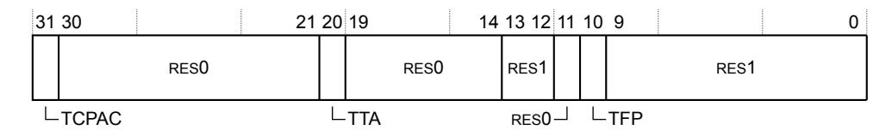

Figure 4-32 CPTR\_EL2 bit assignments

The following table shows the CPTR\_EL2 bit assignments.

Table 4-48 CPTR\_EL2 bit assignments

| Bits    | Name  | Function                                                                                        |  |  |  |
|---------|-------|-------------------------------------------------------------------------------------------------|--|--|--|
| [63:32] | -     | Reserved, RESO.                                                                                 |  |  |  |
| [31]    | TCPAC | Traps direct access to CPACR from EL1 to EL2. The possible values are:                          |  |  |  |
|         |       | <b>0</b> Access to CPACR is not trapped. This is the reset value.                               |  |  |  |
|         |       | 1 Access to CPACR is trapped.                                                                   |  |  |  |
| [30:21] | -     | Reserved, RESO.                                                                                 |  |  |  |
| [20]    | TTA   | This bit is RES0. The processor does not support System register access to trace functionality. |  |  |  |
| [19:14] | -     | Reserved, RESO.                                                                                 |  |  |  |
| [13:12] | -     | Reserved, RES1.                                                                                 |  |  |  |
| [11]    | -     | Reserved, RESO.                                                                                 |  |  |  |
|         | -     |                                                                                                 |  |  |  |

Dita

Namo

Eunction

<span id="page-138-0"></span>

| Bits  | Name | Function                                                                                                                                                                           |  |  |  |  |  |
|-------|------|------------------------------------------------------------------------------------------------------------------------------------------------------------------------------------|--|--|--|--|--|
| [10]  | TFP  | Traps instructions that access registers associated with floating-point and SIMD execution from a lower Exception<br>level to EL2, unless trapped to EL1. The possible values are: |  |  |  |  |  |
|       |      | 0<br>Instructions are not trapped. This is the reset value.                                                                                                                        |  |  |  |  |  |
|       |      | 1<br>Instructions are trapped.                                                                                                                                                     |  |  |  |  |  |
| [9:0] | -    | Reserved, RES1.                                                                                                                                                                    |  |  |  |  |  |

To access the CPTR\_EL2 in AArch64 state, read or write the register with:

MRS <Xt>, CPTR\_EL2; Read EL2 Architectural Feature Trap Register MSR CPTR\_EL2, <Xt>; Write EL2 Architectural Feature Trap Register

# **Related information**

*[4.5.13 Hyp Architectural Feature Trap Register](#page-262-0)* on page 4-263*.*

## **4.3.36 Hypervisor System Trap Register**

The HSTR\_EL2 characteristics are:

## **Purpose**

Controls trapping to Hyp mode of Non-secure accesses, at EL1 or lower, of use of Jazelle or the CP15 primary coprocessor registers, c0, c1, c2, c3, c5, c6, c7, c8, c9, c10, c11, c12, c13, or c15 in AArch32 state.

## **Usage constraints**

The accessibility to the HSTR\_EL2 in AArch64 state by Exception level is:

| EL0 | EL1(NS) | EL1(S) | EL2 | EL3(SCR.NS = 1) | EL3(SCR.NS = 0) |
|-----|---------|--------|-----|-----------------|-----------------|
| -   | -       | -      | RW  | RW              | RW              |

The accessibility to the HSTR in AArch32 state by Exception level is:

| EL0 | EL1(NS) | EL1(S) | EL2 | EL3(SCR.NS = 1) | EL3(SCR.NS = 0) |
|-----|---------|--------|-----|-----------------|-----------------|
| -   | -       | -      | RW  | RW              | -               |

#### **Configurations**

The HSTR\_EL2 is:

- A Banked EL2 register.
- Architecturally mapped to AArch32 HSTR register.

# **Attributes**

See the register summary in *[Table 4-13 AArch64 virtualization registers](#page-82-0)* on page 4-83.

The following figure shows the HSTR\_EL2 bit assignments.

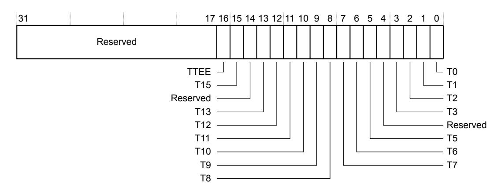

Figure 4-33 HSTR\_EL2 bit assignments

The following table shows the HSTR\_EL2 bit assignments.

Table 4-49 HSTR\_EL2 bit assignments

| Bits    | Name | Function                                                                                                           |
|---------|------|--------------------------------------------------------------------------------------------------------------------|
| [31:17] | -    | Reserved, RESO.                                                                                                    |
| [16]    | TEEE | Trap ThumbEE. This value is:                                                                                       |
|         |      | ThumbEE is not supported.                                                                                          |
| [15]    | T15  | Trap coprocessor primary register CRn = 15. The possible values are:                                               |
|         |      | <b>0</b> Has no effect on Non-secure accesses to CP15 coprocessor registers. This is the reset value.              |
|         |      | 1 Trap valid Non-secure accesses to coprocessor primary register CRn = c15 in AArch32 state to Hyp mode.           |
| [14]    | -    | Reserved, RESO.                                                                                                    |
| [13]    | T13  | Trap coprocessor primary register CRn = 13. The possible values are:                                               |
|         |      | <b>0</b> Has no effect on Non-secure accesses to CP15 coprocessor registers. This is the reset value.              |
|         |      | 1 Trap valid Non-secure accesses to coprocessor primary register CRn = c13 in AArch32 state to Hyp mode.           |
| [12]    | T12  | Trap coprocessor primary register CRn = 12. The possible values are:                                               |
|         |      | <b>0</b> Has no effect on Non-secure accesses to CP15 coprocessor registers. This is the reset value.              |
|         |      | 1 Trap valid Non-secure accesses to coprocessor primary register CRn = c12 in AArch32 state to Hyp mode.           |
| [11]    | T11  | Trap coprocessor primary register CRn = 11. The possible values are:                                               |
|         |      | <b>0</b> Has no effect on Non-secure accesses to CP15 coprocessor registers. This is the reset value.              |
|         |      | 1 Trap valid Non-secure accesses to coprocessor primary register CRn = c11 in AArch32 state to Hyp mode.           |
| [10]    | T10  | Trap coprocessor primary register CRn = 10. The possible values are:                                               |
|         |      | <b>0</b> Has no effect on Non-secure accesses to CP15 coprocessor registers. This is the reset value.              |
|         |      | 1 Trap valid Non-secure EL0 or EL1 accesses to coprocessor primary register CRn = c10 in AArch32 state to Hypmode. |
| [9]     | Т9   | Trap coprocessor primary register CRn = 9. The possible values are:                                                |
|         |      | <b>0</b> Has no effect on Non-secure accesses to CP15 coprocessor registers. This is the reset value.              |
|         |      | 1 Trap valid Non-secure EL0 or EL1 accesses to coprocessor primary register CRn = c9 in AArch32 state to Hyp mode. |

| Bits | Name | Function                                                                                                                 |  |  |  |  |  |  |
|------|------|--------------------------------------------------------------------------------------------------------------------------|--|--|--|--|--|--|
| [8]  | T8   | Trap coprocessor primary register CRn = 8. The possible values are:                                                      |  |  |  |  |  |  |
|      |      | 0<br>Has no effect on Non-secure accesses to CP15 coprocessor registers. This is the reset value.                        |  |  |  |  |  |  |
|      |      | 1<br>Trap valid Non-secure EL0 or EL1 accesses to coprocessor primary register CRn = c8 in AArch32 state to Hyp<br>mode. |  |  |  |  |  |  |
| [7]  | T7   | Trap coprocessor primary register CRn = 7. The possible values are:                                                      |  |  |  |  |  |  |
|      |      | 0<br>Has no effect on Non-secure accesses to CP15 coprocessor registers. This is the reset value.                        |  |  |  |  |  |  |
|      |      | 1<br>Trap valid Non-secure EL0 or EL1 accesses to coprocessor primary register CRn = c7 in AArch32 state to Hyp<br>mode. |  |  |  |  |  |  |
| [6]  | T6   | Trap coprocessor primary register CRn = 6. The possible values are:                                                      |  |  |  |  |  |  |
|      |      | 0<br>Has no effect on Non-secure accesses to CP15 coprocessor registers. This is the reset value.                        |  |  |  |  |  |  |
|      |      | 1<br>Trap valid Non-secure EL0 or EL1 accesses to coprocessor primary register CRn = c6 in AArch32 state to Hyp<br>mode. |  |  |  |  |  |  |
| [5]  | T5   | Trap coprocessor primary register CRn = 5. The possible values are:                                                      |  |  |  |  |  |  |
|      |      | 0<br>Has no effect on Non-secure accesses to CP15 coprocessor registers. This is the reset value.                        |  |  |  |  |  |  |
|      |      | 1<br>Trap valid Non-secure EL0 or EL1 accesses to coprocessor primary register CRn = c5 in AArch32 state to Hyp<br>mode. |  |  |  |  |  |  |
| [4]  | -    | Reserved, RES0.                                                                                                          |  |  |  |  |  |  |
| [3]  | T3   | Trap coprocessor primary register CRn = 3. The possible values are:                                                      |  |  |  |  |  |  |
|      |      | 0<br>Has no effect on Non-secure accesses to CP15 coprocessor registers. This is the reset value.                        |  |  |  |  |  |  |
|      |      | 1<br>Trap valid Non-secure EL0 or EL1 accesses to coprocessor primary register CRn = c3 in AArch32 state to Hyp<br>mode. |  |  |  |  |  |  |
| [2]  | T2   | Trap coprocessor primary register CRn = 2. The possible values are:                                                      |  |  |  |  |  |  |
|      |      | 0<br>Has no effect on Non-secure accesses to CP15 coprocessor registers. This is the reset value.                        |  |  |  |  |  |  |
|      |      | 1<br>Trap valid Non-secure EL0 or EL1 accesses to coprocessor primary register CRn = c2 in AArch32 state to Hyp<br>mode. |  |  |  |  |  |  |
| [1]  | T1   | Trap coprocessor primary register CRn = 1. The possible values are:                                                      |  |  |  |  |  |  |
|      |      | 0<br>Has no effect on Non-secure accesses to CP15 coprocessor registers. This is the reset value.                        |  |  |  |  |  |  |
|      |      | 1<br>Trap valid Non-secure EL0 or EL1 accesses to coprocessor primary register CRn = c1 in AArch32 state to Hyp<br>mode. |  |  |  |  |  |  |
| [0]  | T0   | Trap coprocessor primary register CRn = 0. The possible values are:                                                      |  |  |  |  |  |  |
|      |      | 0<br>Has no effect on Non-secure accesses to CP15 coprocessor registers. This is the reset value.                        |  |  |  |  |  |  |
|      |      | 1<br>Trap valid Non-secure EL0 or EL1 accesses to coprocessor primary register CRn = c0 in AArch32 state to Hyp<br>mode. |  |  |  |  |  |  |

To access the HSTR\_EL2 in AArch64 state, read or write the register with:

MRS <Xt>, HSTR\_EL2; Read Hyp System Trap Register MSR HSTR\_EL2, <Xt>; Write Hyp System Trap Register To access the HSTR in AArch32 state, read or write the CP15 register with:

```
MRC p15, 4, <Rt>, c1, c1, 3; Read Hyp System Trap Register MCR p15, 4, <Rt>, c1, c1, 3; Write Hyp System Trap Register
```

# <span id="page-141-0"></span>4.3.37 Hyp Auxiliary Configuration Register

The processor does not implement HACR\_EL2 in AArch64 state. This register is RESO in EL2 and EL3.

The processor does not implement HACR in AArch32 state. This register is RESO in Hyp mode and in Monitor mode when SCR.NS is 1.

# 4.3.38 System Control Register, EL3

The SCTLR EL3 characteristics are:

#### **Purpose**

Provides top-level control of the system, including its memory system at EL3 in AArch64 state.

# Usage constraints

The accessibility of the SCTLR\_EL3 by Exception level is:

| EL0 | EL1(NS) | EL1(S) | EL2 | EL3(SCR.NS = 1) | EL3(SCR.NS = 0) |
|-----|---------|--------|-----|-----------------|-----------------|
| -   | -       | -      | -   | RW              | RW              |

#### **Configurations**

The SCTLR\_EL3 is:

- A 32-bit register in AArch64 state.
- Architecturally mapped to Secure AArch32 SCTLR register.

#### Attributes

See the register summary in Table 4-3 AArch64 virtual memory control registers on page 4-78.

The following figure shows the SCTLR\_EL3 bit assignments.

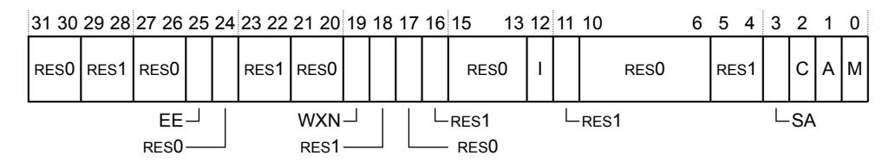

Figure 4-34 SCTLR\_EL3 bit assignments

The following table shows the SCTLR\_EL3 bit assignments.

Table 4-50 SCTLR\_EL3 bit assignments

| Bits    | Name | Function        |
|---------|------|-----------------|
| [63:30] | -    | Reserved, RESO. |
| [29:28] | -    | Reserved, RES1. |
| [27:26] | -    | Reserved, RESO. |

| Bits    | Name | Function                                                                           |                                                                                     |  |  |  |  |  |  |
|---------|------|------------------------------------------------------------------------------------|-------------------------------------------------------------------------------------|--|--|--|--|--|--|
| [25]    | EE   | Exception endianness. The values are:                                              |                                                                                     |  |  |  |  |  |  |
|         |      | 0                                                                                  | Little-endian.                                                                      |  |  |  |  |  |  |
|         |      | 1                                                                                  | Big-endian.                                                                         |  |  |  |  |  |  |
|         |      |                                                                                    | The reset value depends on the primary input CFGEND.                                |  |  |  |  |  |  |
| [24]    | -    | Reserved, RES0.                                                                    |                                                                                     |  |  |  |  |  |  |
| [23:22] | -    | Reserved, RES1.                                                                    |                                                                                     |  |  |  |  |  |  |
| [21:20] | -    | Reserved, RES0.                                                                    |                                                                                     |  |  |  |  |  |  |
| [19]    | WXN  |                                                                                    | Force treatment of all memory regions with write permissions as XN. The values are: |  |  |  |  |  |  |
|         |      | 0<br>Regions with write permissions are not forced to XN. This is the reset value. |                                                                                     |  |  |  |  |  |  |
|         |      | 1                                                                                  | Regions with write permissions are forced to XN.                                    |  |  |  |  |  |  |
| [18]    | -    | Reserved, RES1.                                                                    |                                                                                     |  |  |  |  |  |  |
| [17]    | -    | Reserved, RES0.                                                                    |                                                                                     |  |  |  |  |  |  |
| [16]    | -    | Reserved, RES1.                                                                    |                                                                                     |  |  |  |  |  |  |
| [15:13] | -    | Reserved, RES0.                                                                    |                                                                                     |  |  |  |  |  |  |
| [12]    | I    | Global instruction cache enable. The values are:                                   |                                                                                     |  |  |  |  |  |  |
|         |      | 0<br>Instruction caches disabled.                                                  |                                                                                     |  |  |  |  |  |  |
|         |      | 1                                                                                  | Instruction caches enabled.                                                         |  |  |  |  |  |  |
| [11]    | -    | Reserved, RES1.                                                                    |                                                                                     |  |  |  |  |  |  |
| [10:6]  | -    | Reserved, RES0.                                                                    |                                                                                     |  |  |  |  |  |  |
| [5:4]   | -    | Reserved, RES1.                                                                    |                                                                                     |  |  |  |  |  |  |
| [3]     | SA   | Enables Stack Alignment check. The values are:                                     |                                                                                     |  |  |  |  |  |  |
|         |      | 0                                                                                  | Disables Stack Alignment check. This is the reset value                             |  |  |  |  |  |  |
|         |      | 1                                                                                  | Enables Stack Alignment check.                                                      |  |  |  |  |  |  |
| [2]     | C    | Global enable for data and unified caches. The values are:                         |                                                                                     |  |  |  |  |  |  |
|         |      | 0                                                                                  | Disables data and unified caches. This is the reset value.                          |  |  |  |  |  |  |
|         |      | 1                                                                                  | Enables data and unified caches.                                                    |  |  |  |  |  |  |
| [1]     | A    | Enable Alignment fault check. The values are:                                      |                                                                                     |  |  |  |  |  |  |
|         |      | 0                                                                                  | Disables Alignment fault checking. This is the reset value.                         |  |  |  |  |  |  |
|         |      | 1                                                                                  | Enables Alignment fault checking.                                                   |  |  |  |  |  |  |
| [0]     | M    |                                                                                    | Global enable for the EL1 and EL0 stage 1 MMU. The values are:                      |  |  |  |  |  |  |
|         |      | 0                                                                                  | Disables EL1 and EL0 stage 1 MMU. This is the reset value.                          |  |  |  |  |  |  |
|         |      | 1                                                                                  | Enables EL1 and EL0 stage 1 MMU.                                                    |  |  |  |  |  |  |

<span id="page-143-0"></span>To access the SCTLR\_EL3 in AArch64 state, read or write the register with:

```
MRS <Xt>, SCTLR_EL3; Read EL3 System Control Register
MSR SCTLR_EL3, <Xt>; Write EL3 System Control Register
```

## **Related information**

*[4.5.5 System Control Register](#page-240-0)* on page 4-241*.*

# **4.3.39 Auxiliary Control Register, EL3**

The ACTLR\_EL3 characteristics are:

## **Purpose**

Enables access to the control registers for the L2 cache and the processor control registers. ACTLR\_EL3 is used in conjunction with the ACTLR\_EL2 register.

#### **Usage constraints**

The accessibility to the ACTLR\_EL3 in AArch64 state by Exception level is:

| EL0 | EL1(NS) | EL1(S) | EL2 | EL3(SCR.NS = 1) | EL3(SCR.NS = 0) |
|-----|---------|--------|-----|-----------------|-----------------|
| -   | -       | -      | -   | RW              | RW              |

The accessibility to the ACTLR in AArch32 state by Exception level is:

| EL0 | EL1(NS) | EL1(S) | EL2 | EL3(SCR.NS = 1) | EL3(SCR.NS = 0) |
|-----|---------|--------|-----|-----------------|-----------------|
| -   | RW      | RW     | RW  | RW              | RW              |

#### **Configurations**

The ACTLR\_EL3 is:

- A Banked register.
- Mapped to the Secure AArch32 ACTLR register.

# **Attributes**

See the register summary in *[Table 4-4 AArch64 other System registers](#page-78-0)* on page 4-79.

The following figure shows the ACTLR\_EL3 bit assignments.

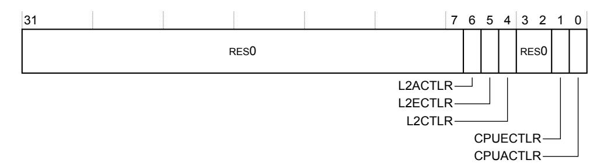

**Figure 4-35 ACTLR\_EL3 bit assignments**

The following table shows the ACTLR\_EL3 bit assignments.

# **Table 4-51 ACTLR\_EL3 bit assignments**

<span id="page-144-0"></span>

| Bits   | Name     | Function                                                                                   |  |  |  |  |
|--------|----------|--------------------------------------------------------------------------------------------|--|--|--|--|
| [31:7] | -        | Reserved, RES0.                                                                            |  |  |  |  |
| [6]    | L2ACTLR  | L2 Auxiliary Control Register. The possible values are:                                    |  |  |  |  |
|        |          | 0<br>The register is not accessible from a lower Exception level. This is the reset value. |  |  |  |  |
|        |          | 1<br>The register is accessible from a lower Exception level.                              |  |  |  |  |
| [5]    | L2ECTLR  | L2 Extended Control Register. The possible values are:                                     |  |  |  |  |
|        |          | 0<br>The register is not accessible from a lower Exception level. This is the reset value. |  |  |  |  |
|        |          | 1<br>The register is accessible from a lower Exception level.                              |  |  |  |  |
| [4]    | L2CTLR   | L2 Control Register. The possible values are:                                              |  |  |  |  |
|        |          | 0<br>The register is not accessible from a lower Exception level. This is the reset value. |  |  |  |  |
|        |          | 1<br>The register is accessible from a lower Exception level.                              |  |  |  |  |
| [3:2]  | -        | Reserved, RES0.                                                                            |  |  |  |  |
| [1]    | CPUECTLR | CPU Extended Control Register. The possible values are:                                    |  |  |  |  |
|        |          | 0<br>The register is not accessible from a lower Exception level. This is the reset value. |  |  |  |  |
|        |          | 1<br>The register is accessible from a lower Exception level.                              |  |  |  |  |
| [0]    | CPUACTLR | CPU Auxiliary Control Register. The possible values are:                                   |  |  |  |  |
|        |          | 0<br>The register is not accessible from a lower Exception level. This is the reset value. |  |  |  |  |
|        |          | 1<br>The register is accessible from a lower Exception level.                              |  |  |  |  |
|        |          |                                                                                            |  |  |  |  |

To access the ACTLR\_EL3 in AArch64 state, read or write the register with:

```
MRS <Xt>, ACTLR_EL3; Read Auxiliary Control Register
MSR ACTLR_EL3, <Xt>; Write Auxiliary Control Register
```

To access the ACTLR in AArch32 state, read or write the CP15 register with:

```
MRC p15, 0, <Rt>, c1, c0, 1; Read Auxiliary Control Register
MCR p15, 0, <Rt>, c1, c0, 1; Write Auxiliary Control Register
```

## **Related information**

*[4.3.33 Auxiliary Control Register, EL2](#page-129-0)* on page 4-130*.*

#### **4.3.40 Architectural Feature Trap Register, EL3**

The CPTR\_EL3 characteristics are:

#### **Purpose**

Controls trapping to EL3 for accesses to the CPACR\_EL1 register, trace functionality and registers associated with floating-point and SIMD execution. Also controls EL3 access to this functionality.

# **Usage constraints**

The accessibility of the CPTR\_EL3 by Exception level is:

| EL0 | EL1(NS) | EL1(S) | EL2 | EL3(SCR.NS = 1) | EL3(SCR.NS = 0) |
|-----|---------|--------|-----|-----------------|-----------------|
| -   | -       | -      | -   | RW              | RW              |

#### <span id="page-145-0"></span>Configurations

The CPTR EL3 is a 32-bit register.

#### Attributes

See the register summary in *Table 4-12 AArch64 security registers* on page 4-83.

The following figure shows the CPTR EL3 bit assignments.

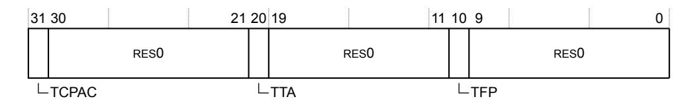

Figure 4-36 CPTR\_EL3 bit assignments

The following table shows the CPTR\_EL3 bit assignments.

Table 4-52 CPTR\_EL3 bit assignments

| Bits       | Name | Function                                                                                                                                                                                 |  |  |  |  |
|------------|------|------------------------------------------------------------------------------------------------------------------------------------------------------------------------------------------|--|--|--|--|
| [63:32]    | -    | Reserved, RESO.                                                                                                                                                                          |  |  |  |  |
| [31] TCPAC |      | Traps direct access to CPACR_EL1 from EL1 to EL3. The possible values are:                                                                                                               |  |  |  |  |
|            |      | <b>0</b> Access to CPACR_EL1 is not trapped. This is the reset value.                                                                                                                    |  |  |  |  |
|            |      | 1 Access to CPACR_EL1 is trapped.                                                                                                                                                        |  |  |  |  |
| [30:21]    | -    | Reserved, RESO.                                                                                                                                                                          |  |  |  |  |
| [20]       | TTA  | This bit is RES0. The processor does not support System register access to trace functionality.                                                                                          |  |  |  |  |
| [19:11]    | -    | Reserved, RESO.                                                                                                                                                                          |  |  |  |  |
| [10]       | TFP  | Traps instructions that access registers associated with floating-point and Advanced SIMD execution from a lower Exception level to EL3, unless trapped to EL1. The possible values are: |  |  |  |  |
|            |      | <b>0</b> Instructions that access registers associated with floating-point and Advanced SIMD execution are not trapped.                                                                  |  |  |  |  |
|            |      | 1 Instructions that access registers associated with floating-point and Advanced SIMD execution are trapped.<br>This is the reset value.                                                 |  |  |  |  |
| [9:0]      | -    | Reserved, RESO.                                                                                                                                                                          |  |  |  |  |

To access the CPTR EL3 in AArch64 state, read or write the register with:

MRS <Xt>, CPTR\_EL3; Read EL3 Architectural Feature Trap Register MSR CPTR\_EL3, <Xt>; Write EL3 Architectural Feature Trap Register

# 4.3.41 Translation Control Register, EL1

The TCR EL1 characteristics are:

### **Purpose**

Controls which Translation Base Register defines the base address register for a translation table walk required for stage 1 translation of a memory access from EL0 or EL1. Also controls the translation table format and holds cacheability and shareability information.

#### **Usage constraints**

The accessibility of the TCR\_EL1 by Exception level is:

| EL0 | EL1(NS) | EL1(S) | EL2 | EL3(SCR.NS = 1) | EL3(SCR.NS = 0) |
|-----|---------|--------|-----|-----------------|-----------------|
| -   | RW      | RW     | RW  | RW              | RW              |

# Configurations

TCR EL1[31:0] is architecturally mapped to the Non-secure AArch32 TTBCR register.

#### Attributes

See the register summary in *Table 4-3 AArch64 virtual memory control registers* on page 4-78.

The following figure shows the TCR EL1 bit assignments.

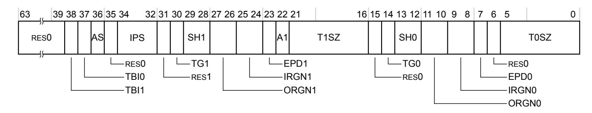

Figure 4-37 TCR\_EL1 bit assignments

The following table shows the TCR EL1 bit assignments.

Table 4-53 TCR\_EL1 bit assignments

| Bits    | Name | Function                                                                                                                          |                                              |  |  |  |  |  |  |
|---------|------|-----------------------------------------------------------------------------------------------------------------------------------|----------------------------------------------|--|--|--|--|--|--|
| [63:39] | -    | Reserved, RESO.                                                                                                                   |                                              |  |  |  |  |  |  |
| [38]    | TBI1 | Top Byte Ignored. Indicates whether the top byte of the input address is used for address match for region. The values are:       |                                              |  |  |  |  |  |  |
|         |      | 0                                                                                                                                 | Top byte used in the address calculation.    |  |  |  |  |  |  |
|         |      | 1                                                                                                                                 | Top byte ignored in the address calculation. |  |  |  |  |  |  |
| [37]    | TBI0 | Top Byte Ignored. Indicates whether the top byte of the input address is used for address match for the T region. The values are: |                                              |  |  |  |  |  |  |
|         |      | Top byte used in the address calculation.                                                                                         |                                              |  |  |  |  |  |  |
|         |      | 1                                                                                                                                 | Top byte ignored in the address calculation. |  |  |  |  |  |  |
| [36]    | AS   | ASID size. The values are:                                                                                                        |                                              |  |  |  |  |  |  |
|         |      | 0                                                                                                                                 | 8-bit.                                       |  |  |  |  |  |  |
|         |      | 1                                                                                                                                 | 16-bit.                                      |  |  |  |  |  |  |
| [35]    | -    | Reserved, RESO.                                                                                                                   |                                              |  |  |  |  |  |  |
| [34:32] | IPS  | Intermediate Physical Address Size. The possible values are:                                                                      |                                              |  |  |  |  |  |  |
|         |      | 0b000                                                                                                                             | 32-bit, 4GBytes.                             |  |  |  |  |  |  |
|         |      | 0b001                                                                                                                             | 36-bit, 64GBytes.                            |  |  |  |  |  |  |
|         |      | 0b010                                                                                                                             | 40-bit, 1TByte.                              |  |  |  |  |  |  |
|         |      | 0b011                                                                                                                             | 42-bit, 4TBytes.                             |  |  |  |  |  |  |
|         |      | 0b100                                                                                                                             | 44-bit, 16TBytes.                            |  |  |  |  |  |  |
|         |      | 0b101                                                                                                                             | 48-bit, 256TBytes.                           |  |  |  |  |  |  |
| [31]    | -    | Reserved, RES1.                                                                                                                   |                                              |  |  |  |  |  |  |
| [30]    | TG1  | TTBR1_EL1 gra                                                                                                                     | nule size. The values are:                   |  |  |  |  |  |  |
|         |      | 0                                                                                                                                 | 4KB.                                         |  |  |  |  |  |  |
|         |      | 1                                                                                                                                 | 64KB.                                        |  |  |  |  |  |  |

| Bits    | Name  | Function                                                                                                                                                                                       |                                                                                                                          |  |  |  |  |  |  |
|---------|-------|------------------------------------------------------------------------------------------------------------------------------------------------------------------------------------------------|--------------------------------------------------------------------------------------------------------------------------|--|--|--|--|--|--|
| [29:28] | SH1   |                                                                                                                                                                                                | Shareability attribute for memory associated with translation table walks using TTBR1. The values are:                   |  |  |  |  |  |  |
|         |       | 0b00                                                                                                                                                                                           | Non-shareable.                                                                                                           |  |  |  |  |  |  |
|         |       | 0b01                                                                                                                                                                                           | Reserved.                                                                                                                |  |  |  |  |  |  |
|         |       | 0b10                                                                                                                                                                                           | Outer Shareable.                                                                                                         |  |  |  |  |  |  |
|         |       | 0b11                                                                                                                                                                                           | Inner Shareable.                                                                                                         |  |  |  |  |  |  |
| [27:26] | ORGN1 |                                                                                                                                                                                                | Outer cacheability attribute for memory associated with translation table walks using TTBR1. The values are:             |  |  |  |  |  |  |
|         |       | 0b00                                                                                                                                                                                           | Normal memory, Outer Non-cacheable.                                                                                      |  |  |  |  |  |  |
|         |       | 0b01                                                                                                                                                                                           | Normal memory, Outer Write-Back Write-Allocate Cacheable.                                                                |  |  |  |  |  |  |
|         |       | 0b10                                                                                                                                                                                           | Normal memory, Outer Write-Through Cacheable.                                                                            |  |  |  |  |  |  |
|         |       | 0b11                                                                                                                                                                                           | Normal memory, Outer Write-Back no Write-Allocate Cacheable.                                                             |  |  |  |  |  |  |
| [25:24] | IRGN1 |                                                                                                                                                                                                | Inner cacheability attribute for memory associated with translation table walks using TTBR1. The values are:             |  |  |  |  |  |  |
|         |       | 0b00                                                                                                                                                                                           | Normal memory, Inner Non-cacheable.                                                                                      |  |  |  |  |  |  |
|         |       | 0b01                                                                                                                                                                                           | Normal memory, Inner Write-Back Write-Allocate Cacheable.                                                                |  |  |  |  |  |  |
|         |       | 0b10                                                                                                                                                                                           | Normal memory, Inner Write-Through Cacheable.                                                                            |  |  |  |  |  |  |
|         |       | 0b11                                                                                                                                                                                           | Normal memory, Inner Write-Back no Write-Allocate Cacheable.                                                             |  |  |  |  |  |  |
| [23]    | EPD1  | Translation table walk disable for translations using TTBR1. Controls if a translation table walk is performed on a<br>TLB miss for an address that is translated using TTBR1. The values are: |                                                                                                                          |  |  |  |  |  |  |
|         |       | 0                                                                                                                                                                                              | Perform translation table walk using TTBR1.                                                                              |  |  |  |  |  |  |
|         |       | 1                                                                                                                                                                                              | A TLB miss on an address translated from TTBR1 generates a Translation fault. No translation<br>table walk is performed. |  |  |  |  |  |  |
| [22]    | A1    |                                                                                                                                                                                                | Selects whether TTBR0 or TTBR1 defines the ASID. The values are:                                                         |  |  |  |  |  |  |
|         |       | 0                                                                                                                                                                                              | TTBR0.ASID defines the ASID.                                                                                             |  |  |  |  |  |  |
|         |       | 1                                                                                                                                                                                              | TTBR1.ASID defines the ASID.                                                                                             |  |  |  |  |  |  |
| [21:16] | T1SZ  |                                                                                                                                                                                                | Size offset of the memory region addressed by TTBR1. The region size is 2(64–TSIZE) bytes.                               |  |  |  |  |  |  |
| [15]    | -     | Reserved, RES0.                                                                                                                                                                                |                                                                                                                          |  |  |  |  |  |  |
| [14]    | TG0   |                                                                                                                                                                                                | TTBR0_EL1 granule size. The values are:                                                                                  |  |  |  |  |  |  |
|         |       | 0                                                                                                                                                                                              | 4KB.                                                                                                                     |  |  |  |  |  |  |
|         |       | 1                                                                                                                                                                                              | 64KB.                                                                                                                    |  |  |  |  |  |  |
| [13:12] | SH0   |                                                                                                                                                                                                | Shareability attribute for memory associated with translation table walks using TTBR0. The values are:                   |  |  |  |  |  |  |
|         |       | 0b00                                                                                                                                                                                           | Non-shareable.                                                                                                           |  |  |  |  |  |  |
|         |       | 0b01                                                                                                                                                                                           | Reserved.                                                                                                                |  |  |  |  |  |  |
|         |       | 0b10                                                                                                                                                                                           | Outer Shareable.                                                                                                         |  |  |  |  |  |  |
|         |       | 0b11                                                                                                                                                                                           | Inner Shareable.                                                                                                         |  |  |  |  |  |  |

<span id="page-148-0"></span>

| Bits    | Name  | Function                                                                                                     |                                                              |  |  |  |  |
|---------|-------|--------------------------------------------------------------------------------------------------------------|--------------------------------------------------------------|--|--|--|--|
| [11:10] | ORGN0 | Outer cacheability attribute for memory associated with translation table walks using TTBR0. The values are: |                                                              |  |  |  |  |
|         |       | 0b00                                                                                                         | Normal memory, Outer Non-cacheable.                          |  |  |  |  |
|         |       | 0b01                                                                                                         | Normal memory, Outer Write-Back Write-Allocate Cacheable.    |  |  |  |  |
|         |       | 0b10                                                                                                         | Normal memory, Outer Write-Through Cacheable.                |  |  |  |  |
|         |       | 0b11                                                                                                         | Normal memory, Outer Write-Back no Write-Allocate Cacheable. |  |  |  |  |
| [9:8]   | IRGN0 | Inner cacheability attribute for memory associated with translation table walks using TTBR0. The values are: |                                                              |  |  |  |  |
|         |       | 0b00                                                                                                         | Normal memory, Inner Non-cacheable.                          |  |  |  |  |
|         |       | 0b01                                                                                                         | Normal memory, Inner Write-Back Write-Allocate Cacheable.    |  |  |  |  |
|         |       | 0b10                                                                                                         | Normal memory, Inner Write-Through Cacheable.                |  |  |  |  |
|         |       | 0b11                                                                                                         | Normal memory, Inner Write-Back no Write-Allocate Cacheable. |  |  |  |  |
| [7:6]   | -     | Reserved, RES0.                                                                                              |                                                              |  |  |  |  |
| [5:0]   | T0SZ  | Size offset of the memory region addressed by TTBR0. The region size is 2(64–TSIZE) bytes.                   |                                                              |  |  |  |  |

To access the TCR\_EL1 in AArch64 state, read or write the register with:

```
MRS <Xt>, TCR_EL1; Read EL1 Translation Control Register
MSR TCR_EL1, <Xt>; Write EL1 Translation Control Register
```

# **Related information**

*[4.5.15 Translation Table Base Control Register](#page-264-0)* on page 4-265*.*

# **4.3.42 Translation Control Register, EL2**

The TCR\_EL2 characteristics are:

#### **Purpose**

Controls translation table walks required for stage 1 translation of a memory access from EL2 and holds cacheability and shareability information.

## **Usage constraints**

The accessibility of the TCR\_EL2 by Exception level is:

| EL0 | EL1(NS) | EL1(S) | EL2 | EL3(SCR.NS = 1) | EL3(SCR.NS = 0) |
|-----|---------|--------|-----|-----------------|-----------------|
| -   | -       | -      | RW  | RW              | RW              |

#### **Configurations**

The TCR\_EL2 is architecturally mapped to the AArch32 HCTR register.

# **Attributes**

See the register summary in *[Table 4-3 AArch64 virtual memory control registers](#page-77-0)* on page 4-78.

The following figure shows the TCR\_EL2 bit assignments.


Figure 4-38 TCR\_EL2 bit assignments

The following table shows the TCR\_EL2 bit assignments.

Table 4-54 TCR\_EL2 bit assignments

| d, RES1. d, RES0. d, RES1. d, RES0. e Ignored. Indicates whether the top byte of the input address is used for address match. The values are:  Top byte used in the address calculation.  Top byte ignored in the address calculation. d, RES0.  Address size. The possible values are:  32-bit, 4GBytes. |  |  |  |  |
|-----------------------------------------------------------------------------------------------------------------------------------------------------------------------------------------------------------------------------------------------------------------------------------------------------------|--|--|--|--|
| d, RES1.  d, RES0.  e Ignored. Indicates whether the top byte of the input address is used for address match. The values are:  Top byte used in the address calculation.  Top byte ignored in the address calculation.  d, RES0.  Address size. The possible values are:                                  |  |  |  |  |
| d, RESO.  e Ignored. Indicates whether the top byte of the input address is used for address match. The values are:  Top byte used in the address calculation.  Top byte ignored in the address calculation.  d, RESO.  Address size. The possible values are:                                            |  |  |  |  |
| Top byte used in the address calculation.  Top byte ignored in the address calculation.  Top byte ignored in the address calculation.  Address size. The possible values are:                                                                                                                             |  |  |  |  |
| Top byte used in the address calculation.  Top byte ignored in the address calculation.  d, RESO.  Address size. The possible values are:                                                                                                                                                                 |  |  |  |  |
| Top byte ignored in the address calculation.  d, RESO.  Address size. The possible values are:                                                                                                                                                                                                            |  |  |  |  |
| d, RESO.  Address size. The possible values are:                                                                                                                                                                                                                                                          |  |  |  |  |
| Address size. The possible values are:                                                                                                                                                                                                                                                                    |  |  |  |  |
|                                                                                                                                                                                                                                                                                                           |  |  |  |  |
| 32-bit, 4GBytes.                                                                                                                                                                                                                                                                                          |  |  |  |  |
|                                                                                                                                                                                                                                                                                                           |  |  |  |  |
| 36-bit, 64GBytes.                                                                                                                                                                                                                                                                                         |  |  |  |  |
| 40-bit, 1TByte.                                                                                                                                                                                                                                                                                           |  |  |  |  |
| 42-bit, 4TBytes.                                                                                                                                                                                                                                                                                          |  |  |  |  |
| 44-bit, 16TBytes.                                                                                                                                                                                                                                                                                         |  |  |  |  |
| 48-bit, 256TBytes.                                                                                                                                                                                                                                                                                        |  |  |  |  |
| values are reserved.                                                                                                                                                                                                                                                                                      |  |  |  |  |
| 1, RESO.                                                                                                                                                                                                                                                                                                  |  |  |  |  |
| TTBR0_EL2 granule size. The values are:                                                                                                                                                                                                                                                                   |  |  |  |  |
| 4KByte.                                                                                                                                                                                                                                                                                                   |  |  |  |  |
| 64KByte.                                                                                                                                                                                                                                                                                                  |  |  |  |  |
| lity attribute for memory associated with translation table walks using TTBR0. The values are:                                                                                                                                                                                                            |  |  |  |  |
| Non-shareable.                                                                                                                                                                                                                                                                                            |  |  |  |  |
| Reserved.                                                                                                                                                                                                                                                                                                 |  |  |  |  |
| Outer Shareable.                                                                                                                                                                                                                                                                                          |  |  |  |  |
| Inner Shareable.                                                                                                                                                                                                                                                                                          |  |  |  |  |
|                                                                                                                                                                                                                                                                                                           |  |  |  |  |

<span id="page-150-0"></span>

| Bits    | Name  | Function                                                                                                     |                                                              |  |  |  |  |
|---------|-------|--------------------------------------------------------------------------------------------------------------|--------------------------------------------------------------|--|--|--|--|
| [11:10] | ORGN0 | Outer cacheability attribute for memory associated with translation table walks using TTBR0. The values are: |                                                              |  |  |  |  |
|         |       | 0b00                                                                                                         | Normal memory, Outer Non-cacheable.                          |  |  |  |  |
|         |       | 0b01                                                                                                         | Normal memory, Outer Write-Back Write-Allocate Cacheable.    |  |  |  |  |
|         |       | 0b10                                                                                                         | Normal memory, Outer Write-Through Cacheable.                |  |  |  |  |
|         |       | 0b11                                                                                                         | Normal memory, Outer Write-Back no Write-Allocate Cacheable. |  |  |  |  |
| [9:8]   | IRGN0 | Inner cacheability attribute for memory associated with translation table walks using TTBR0. The values are: |                                                              |  |  |  |  |
|         |       | 0b00                                                                                                         | Normal memory, Inner Non-cacheable.                          |  |  |  |  |
|         |       | 0b01                                                                                                         | Normal memory, Inner Write-Back Write-Allocate Cacheable.    |  |  |  |  |
|         |       | 0b10                                                                                                         | Normal memory, Inner Write-Through Cacheable.                |  |  |  |  |
|         |       | 0b11                                                                                                         | Normal memory, Inner Write-Back no Write-Allocate Cacheable. |  |  |  |  |
| [7:6]   | -     | Reserved, RES0.                                                                                              |                                                              |  |  |  |  |
| [5:0]   | T0SZ  | Size offset of the memory region addressed by TTBR0. The region size is 2(64–TSIZE) bytes.                   |                                                              |  |  |  |  |

To access the TCR\_EL2 in AArch64 state, read or write the register with:

```
MRS <Xt>, TCR_EL2; Read EL2 Translation Control Register
MSR TCR_EL2, <Xt>; Write EL2 Translation Control Register
```

# **Related information**

*[4.5.16 Hyp Translation Control Register](#page-265-0)* on page 4-266*.*

# **4.3.43 Virtualization Translation Control Register, EL2**

The VTCR\_EL2 characteristics are:

# **Purpose**

Controls the translation table walks required for the stage 2 translation of memory accesses from Non-secure EL0 and EL1, and holds cacheability and shareability information for the accesses.

#### **Usage constraints**

The accessibility to the VTCR\_EL2 by Exception level is:

| EL0 | EL1(NS) | EL1(S) | EL2 | EL3(SCR.NS = 1) | EL3(SCR.NS = 0) |
|-----|---------|--------|-----|-----------------|-----------------|
| -   | -       | -      | RW  | RW              | RW              |

#### **Configurations**

The VTCR\_EL2 is:

- A32-bit register in AArch64 state.
- Architecturally mapped to the AArch32 VTCR register.

## **Attributes**

See the register summary in *[Table 4-3 AArch64 virtual memory control registers](#page-77-0)* on page 4-78.

The following figure shows the VTCR\_EL2 bit assignments.

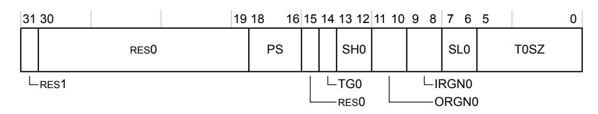

Figure 4-39 VTCR\_EL2 bit assignments

The following table shows the VTCR\_EL2 bit assignments.

Table 4-55 VTCR\_EL2 bit assignments

| Bits    | Name  | Function                                                                               |                                                                             |  |  |  |  |  |
|---------|-------|----------------------------------------------------------------------------------------|-----------------------------------------------------------------------------|--|--|--|--|--|
| [31]    | -     | Reserved, RES1.                                                                        |                                                                             |  |  |  |  |  |
| [30:19] | -     | Reserved, RESO.                                                                        |                                                                             |  |  |  |  |  |
| [18:16] | PS    | Physical Address Size. The possible values are:                                        |                                                                             |  |  |  |  |  |
|         |       | 0b000                                                                                  | 32-bit, 4GBytes.                                                            |  |  |  |  |  |
|         |       | 0b001                                                                                  | 36-bit, 64GBytes.                                                           |  |  |  |  |  |
|         |       | 0b010                                                                                  | 40-bit, 1TByte.                                                             |  |  |  |  |  |
|         |       | 0b011                                                                                  | 42-bit, 4TBytes.                                                            |  |  |  |  |  |
|         |       | 0b100                                                                                  | 44-bit, 16TBytes.                                                           |  |  |  |  |  |
|         |       | 0b101                                                                                  | 48-bit, 256TBytes.                                                          |  |  |  |  |  |
|         |       | All other values are reserved.                                                         |                                                                             |  |  |  |  |  |
| [15]    | -     | Reserved, RESO.                                                                        |                                                                             |  |  |  |  |  |
| [14]    | TG0   | Granule size for t                                                                     | he corresponding TTBR0_ELx.                                                 |  |  |  |  |  |
|         |       | 0                                                                                      | 4KB.                                                                        |  |  |  |  |  |
|         |       | 1                                                                                      | 64KB.                                                                       |  |  |  |  |  |
| [13:12] | SH0   | Shareability attribute for memory associated with translation table walks using TTBR0: |                                                                             |  |  |  |  |  |
|         |       | 0b00                                                                                   | Non-shareable.                                                              |  |  |  |  |  |
|         |       | 0b01                                                                                   | Reserved.                                                                   |  |  |  |  |  |
|         |       | 0b11                                                                                   | Outer Shareable.                                                            |  |  |  |  |  |
|         |       | 0b11                                                                                   | Inner Shareable.                                                            |  |  |  |  |  |
| [11:10] | ORGN0 | Outer cacheability                                                                     | y attribute for memory associated with translation table walks using TTBR0. |  |  |  |  |  |
|         |       | 0b00                                                                                   | Normal memory, Outer Non-cacheable.                                         |  |  |  |  |  |
|         |       | 0b01                                                                                   | Normal memory, Outer Write-Back Write-Allocate Cacheable.                   |  |  |  |  |  |
|         |       | 0b11                                                                                   | Normal memory, Outer Write-Through Cacheable.                               |  |  |  |  |  |
|         |       | 0b11                                                                                   | Normal memory, Outer Write-Back no Write-Allocate Cacheable.                |  |  |  |  |  |
| [9:8]   | IRGN0 | Inner cacheability                                                                     | attribute for memory associated with translation table walks using TTBR0.   |  |  |  |  |  |
|         |       | 0b00                                                                                   | Normal memory, Inner Non-cacheable.                                         |  |  |  |  |  |
|         |       | 0b01                                                                                   | Normal memory, Inner Write-Back Write-Allocate Cacheable.                   |  |  |  |  |  |
|         |       | 0b11                                                                                   | Normal memory, Inner Write-Through Cacheable.                               |  |  |  |  |  |
|         |       | 0b11                                                                                   | Normal memory, Inner Write-Back no Write-Allocate Cacheable.                |  |  |  |  |  |

<span id="page-152-0"></span>

| Bits  | Name | Function                                                                                                  |  |  |  |
|-------|------|-----------------------------------------------------------------------------------------------------------|--|--|--|
| [7:6] | SL0  | Starting level of the VTCR_EL2 addressed region.                                                          |  |  |  |
| [5:0] | T0SZ | The size offset of the memory region addressed by TTBR0. The region size is 2 <sup>(64–T0SZ)</sup> bytes. |  |  |  |

To access the VTCR\_EL2 in AArch64 state, read or write the register with:

MRS <Xt>, VTCR\_EL2; Read EL2 Virtualization Translation Control Register MSR VTCR\_EL2, <Xt>; Write EL2 Virtualization Translation Control Register

## 4.3.44 Translation Table Base Register 0, EL1

The TTBR0 EL1 characteristics are:

#### **Purpose**

Holds the base address of translation table 0, and information about the memory it occupies. This is one of the translation tables for the stage 1 translation of memory accesses at EL1 if the highest Exception level is in AArch64 state.

# Usage constraints

The TTBR0\_EL1 is used in conjunction with TCR\_EL1.

The accessibility to the TTBR0 EL1 by Exception level is:

| EL0 | EL1(NS) | EL1(S) | EL2 | EL3(SCR.NS = 1) | EL3(SCR.NS = 0) |
|-----|---------|--------|-----|-----------------|-----------------|
| -   | RW      | RW     | RW  | RW              | RW              |

#### **Configurations**

TTBR0 EL1 is architecturally mapped to the Non-secure AArch32 register TTBR0.

## Attributes

See the register summary in Table 4-3 AArch64 virtual memory control registers on page 4-78.

The following figure shows the TTBR0\_EL1 bit assignments.

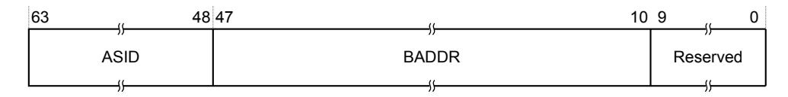

Figure 4-40 TTBR0\_EL1 bit assignments

The following table shows the TTBR0\_EL1 bit assignments.

Table 4-56 TTBR0\_EL1 bit assignments

| Bits    | Name                                            | Function                                                                                                      |
|---------|-------------------------------------------------|---------------------------------------------------------------------------------------------------------------|
| [63:48] | An ASID for the translation table base address. |                                                                                                               |
|         |                                                 | The TCR_EL1.A1 field selects either the TTBR0.ASID or the TTBR1.ASID.                                         |
|         |                                                 | The TCR_EL1.AS bit selects whether all 16-bits [63:48] or the lower 8-bits [55:48] indicate the current ASID. |
| [47:10] | BADDR                                           | Translation table base address. Defining the translation table base address width.                            |
| [9:0]   | -                                               | Reserved, RESO.                                                                                               |

To access the TTBR0 EL1 in AArch64 state, read or write the register with:

```
MRS <Xt>, TTBR0_EL1; Read EL1 Translation Table Base Register 0
MSR TTBR0_EL1, <Xt>; Write EL1 Translation Table Base Register 0
```

# <span id="page-153-0"></span>4.3.45 Translation Table Base Register 0, EL3

The TTBR0\_EL3 characteristics are:

#### **Purpose**

Holds the base address of the translation table for the stage 1 translation of memory accesses from EL3.

# **Usage constraints**

The accessibility to the TTBR0 EL3 by Exception level is:

| EL0 | EL1(NS) | EL1(S) | EL2 | EL3(SCR.NS = 1) | EL3(SCR.NS = 0) |
|-----|---------|--------|-----|-----------------|-----------------|
| -   | -       | -      | -   | RW              | RW              |

#### **Configurations**

TTBR0 EL3 is mapped to the Secure AArch32 TTBR0 register.

#### **Attributes**

See the register summary in *Table 4-3 AArch64 virtual memory control registers* on page 4-78.

The following figure shows the TTBR0 EL3 bit assignments.

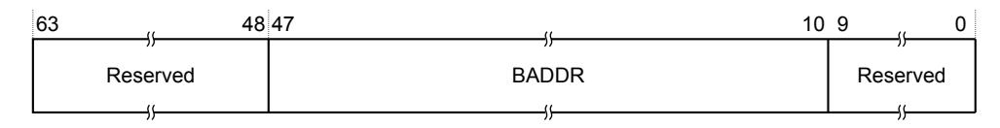

Figure 4-41 TTBR0\_EL3 bit assignments

The following table shows the TTBR0 EL3 bit assignments.

Table 4-57 TTBR0\_EL3 bit assignments

| Bits    | Name  | Function                                                                           |
|---------|-------|------------------------------------------------------------------------------------|
| [63:48] | -     | Reserved, RES0.                                                                    |
| [47:10] | BADDR | Translation table base address. Defining the translation table base address width. |
| [9:0]   | -     | Reserved, UNK/RES0.                                                                |

To access the TTBR0 EL3 in AArch64 state, read or write the register with:

```
MRS <Xt>, TTBR0_EL3; Read EL3 Translation Table Base Register 0
MSR TTBR0_EL3, <Xt>; Write EL3 Translation Table Base Register 0
```

# 4.3.46 Translation Table Base Register 1, EL1

The TTBR1\_EL1 characteristics are:

#### **Purpose**

Holds the base address of translation table 1, and information about the memory it occupies. This is one of the translation tables for the stage 1 translation of memory accesses at EL0 and EL1. This is one of the translation tables for the stage 1 translation of memory accesses at EL1 if the highest Exception level is in AArch64 state.

#### <span id="page-154-0"></span>**Usage constraints**

The TTBR1 EL1 is used in conjunction with TCR EL1.

The accessibility to the TTBR1 EL1 by Exception level is:

| EL0 | EL1(NS) | EL1(S) | EL2 | EL3(SCR.NS = 1) | EL3(SCR.NS = 0) |
|-----|---------|--------|-----|-----------------|-----------------|
| -   | RW      | RW     | RW  | RW              | RW              |

#### **Configurations**

TTBR1 EL1 is architecturally mapped to the Non-secure AArch32 register TTBR1.

## **Attributes**

See the register summary in Table 4-3 AArch64 virtual memory control registers on page 4-78.

The following figure shows the TTBR1 EL1 bit assignments.

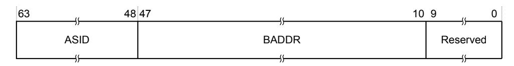

Figure 4-42 TTBR1 EL1 bit assignments

The following table shows the TTBR0 EL1 bit assignments.

Table 4-58 TTBR1\_EL1 bit assignments

| Bits    | Name  | Function                                                                                                      |
|---------|-------|---------------------------------------------------------------------------------------------------------------|
| [63:48] | ASID  | An ASID for the translation table base address.                                                               |
|         |       | The TCR_EL1.A1 field selects either the TTBR0.ASID or the TTBR1.ASID.                                         |
|         |       | The TCR_EL1.AS bit selects whether all 16-bits [63:48] or the lower 8-bits [55:48] indicate the current ASID. |
| [47:10] | BADDR | Translation table base address. Defining the translation table base address width.                            |
| [9:0]   | -     | Reserved, RES0.                                                                                               |

To access the TTBR0\_EL1 in AArch64 state, read or write the register with:

```
MRS <Xt>, TTBR1_EL1; Read EL1 Translation Table Base Register 1
MSR TTBR1_EL1, <Xt>; Write EL1 Translation Table Base Register 1
```

# 4.3.47 Translation Control Register, EL3

The TCR EL3 characteristics are:

#### **Purpose**

Controls translation table walks required for stage 1 translation of memory accesses from EL3 and holds cacheability and shareability information for the accesses.

#### **Usage constraints**

The accessibility of the TCR EL3 by Exception level is:

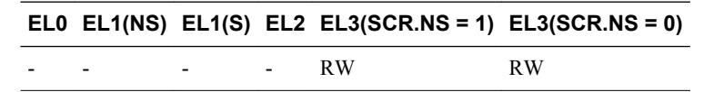

#### **Configurations**

The TCR EL3 is architecturally mapped to the Secure AArch32 TTBCR register.

#### **Attributes**

See the register summary in Table 4-3 AArch64 virtual memory control registers on page 4-78.

The following figure shows the TCR EL3 bit assignments.

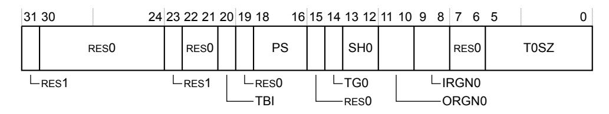

Figure 4-43 TCR\_EL3 bit assignments

The following table shows the TCR\_EL3 bit assignments.

Table 4-59 TCR\_EL3 bit assignments

| Bits    | Name  | Function                                                                                                  |                                                                                                  |  |  |  |  |  |  |  |
|---------|-------|-----------------------------------------------------------------------------------------------------------|--------------------------------------------------------------------------------------------------|--|--|--|--|--|--|--|
| [31]    | -     | Reserved, RES1.                                                                                           |                                                                                                  |  |  |  |  |  |  |  |
| [30:24] | -     | Reserved, RESO.                                                                                           |                                                                                                  |  |  |  |  |  |  |  |
| [23]    | -     | Reserved, RES1.                                                                                           |                                                                                                  |  |  |  |  |  |  |  |
| [22:21] | -     | Reserved, RESO.                                                                                           |                                                                                                  |  |  |  |  |  |  |  |
| [20]    | TBI   | Top Byte Ignored                                                                                          | . Indicates whether the top byte of the input address is used for address match. The values are: |  |  |  |  |  |  |  |
|         |       | 0                                                                                                         | Top byte used in the address calculation.                                                        |  |  |  |  |  |  |  |
|         |       | 1                                                                                                         | Top byte ignored in the address calculation.                                                     |  |  |  |  |  |  |  |
| [19]    | -     | Reserved, RESO.                                                                                           |                                                                                                  |  |  |  |  |  |  |  |
| [18:16] | PS    | Physical Address                                                                                          | size. The possible values are:                                                                   |  |  |  |  |  |  |  |
|         |       | 0b000                                                                                                     | 32 bits, 4GBytes.                                                                                |  |  |  |  |  |  |  |
|         |       | 0b001                                                                                                     | 36 bits, 64GBytes.                                                                               |  |  |  |  |  |  |  |
|         |       | 0b010                                                                                                     | 40 bits, 1TByte.                                                                                 |  |  |  |  |  |  |  |
|         |       | 0b011                                                                                                     | 42 bits, 4TBytes.                                                                                |  |  |  |  |  |  |  |
|         |       | 0b100                                                                                                     | 44 bits, 16TBytes.                                                                               |  |  |  |  |  |  |  |
|         |       | 0b101                                                                                                     | 48 bits, 256TBytes.                                                                              |  |  |  |  |  |  |  |
| [15]    | -     | Reserved, RESO.                                                                                           |                                                                                                  |  |  |  |  |  |  |  |
| [14]    | TGO   | TTBR0_EL3 granule size. The values are:                                                                   |                                                                                                  |  |  |  |  |  |  |  |
|         |       | <b>0</b> 4KByte.                                                                                          |                                                                                                  |  |  |  |  |  |  |  |
|         |       | 1                                                                                                         | 64KByte.                                                                                         |  |  |  |  |  |  |  |
| [13:12] | SH0   | Shareability attribute for memory associated with translation table walks using TTBR0. The values a       |                                                                                                  |  |  |  |  |  |  |  |
|         |       | 0b00                                                                                                      | Non-shareable.                                                                                   |  |  |  |  |  |  |  |
|         |       | 0b01                                                                                                      | Reserved.                                                                                        |  |  |  |  |  |  |  |
|         |       | 0b10                                                                                                      | Outer Shareable.                                                                                 |  |  |  |  |  |  |  |
|         |       | 0b11                                                                                                      | Inner Shareable.                                                                                 |  |  |  |  |  |  |  |
| [11:10] | ORGN0 | 0 Outer cacheability attribute for memory associated with translation table walks using TTBR0. The values |                                                                                                  |  |  |  |  |  |  |  |
|         |       | 0b00                                                                                                      | Normal memory, Outer Non-cacheable.                                                              |  |  |  |  |  |  |  |
|         |       | 0b01                                                                                                      | Normal memory, Outer Write-Back Write-Allocate Cacheable.                                        |  |  |  |  |  |  |  |
|         |       | 0b10                                                                                                      | Normal memory, Outer Write-Through Cacheable.                                                    |  |  |  |  |  |  |  |
|         |       | 0b11                                                                                                      | Normal memory, Outer Write-Back no Write-Allocate Cacheable.                                     |  |  |  |  |  |  |  |

<span id="page-156-0"></span>

| Bits  | Name  | Function                                                                                                     |                                                                                            |  |  |
|-------|-------|--------------------------------------------------------------------------------------------------------------|--------------------------------------------------------------------------------------------|--|--|
| [9:8] | IRGN0 | Inner cacheability attribute for memory associated with translation table walks using TTBR0. The values are: |                                                                                            |  |  |
|       |       | 0b00                                                                                                         | Normal memory, Inner Non-cacheable.                                                        |  |  |
|       |       | 0b01                                                                                                         | Normal memory, Inner Write-Back Write-Allocate Cacheable.                                  |  |  |
|       |       | 0b10                                                                                                         | Normal memory, Inner Write-Through Cacheable.                                              |  |  |
|       |       | 0b11                                                                                                         | Normal memory, Inner Write-Back no Write-Allocate Cacheable.                               |  |  |
| [7:6] | -     | Reserved, RES0.                                                                                              |                                                                                            |  |  |
| [5:0] | T0SZ  |                                                                                                              | Size offset of the memory region addressed by TTBR0. The region size is 2(64–TSIZE) bytes. |  |  |

To access the TCR\_EL3 in AArch64 state, read or write the register with:

```
MRS <Xt>, TCR_EL3; Read EL3 Translation Control Register
MRS TCR_EL3, <Xt>; Read EL3 Translation Control Register
```

# **Related information**

*[4.5.15 Translation Table Base Control Register](#page-264-0)* on page 4-265*.*

# **4.3.48 Auxiliary Fault Status Register 0, EL1 and EL3**

The processor does not implement AFSR0\_EL1, AFSR0\_EL3, and ADFSR. These registers are RES0.

# **4.3.49 Auxiliary Fault Status Register 1, EL1 and EL3**

The processor does not implement AFSR1\_EL1, AFSR1\_EL3, and AIFSR. These registers are RES0.

# **4.3.50 Exception Syndrome Register, EL1 and EL3**

The ESR\_EL1 and ESR\_EL3 characteristics are:

#### **Purpose**

ESR\_EL1 holds syndrome information for an exception taken to EL1.

ESR\_EL3 holds syndrome information for an exception taken to EL3.

#### **Usage constraints**

The accessibility to the ESR\_EL1 by Exception level is:

| EL0 | EL1(NS) | EL1(S) | EL2 | EL3(SCR.NS = 1) | EL3(SCR.NS = 0) |
|-----|---------|--------|-----|-----------------|-----------------|
| -   | RW      | RW     | RW  | RW              | RW              |

The accessibility to the ESR\_EL3 by Exception level is:

| EL0 | EL1(NS) | EL1(S) | EL2 | EL3(SCR.NS = 1) | EL3(SCR.NS = 0) |
|-----|---------|--------|-----|-----------------|-----------------|
| -   | -       | -      | -   | RW              | RW              |

#### **Configurations**

The ESR\_EL1 is architecturally mapped to the Non-secure AArch32 DFSR register.

The ESR\_EL3 is mapped to the Secure AArch32 DFSR register.

# **Attributes**

See the register summary in *[Table 4-2 AArch64 exception handling registers](#page-77-0)* on page 4-78.

# EC==0b100000 and EC==0b100001, Instruction Aborts

This section describes the IMPLEMENTATION DEFINED behavior of the EA bit for Instruction Abort exceptions.

The following figure shows the ESR\_EL1 and ESR\_EL3 bit assignments for the Instruction Abort exception classes, that is, when EC==0b100000 or EC==0b100001.

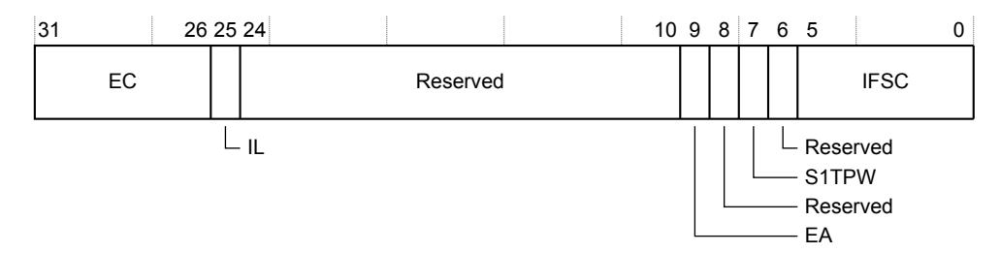

Figure 4-44 ESR\_EL1 and ESR\_EL3 bit assignments

The following table shows the ESR\_EL1 and ESR\_EL3 bit assignments for the Instruction Abort exception class.

Table 4-60 ESR\_EL1 and ESR\_EL3 bit assignments

| Bits    | Name  | Function                                                                                                               |  |  |  |  |
|---------|-------|------------------------------------------------------------------------------------------------------------------------|--|--|--|--|
| [31:26] | EC    | Exception Class:                                                                                                       |  |  |  |  |
|         |       | <b>0b100000</b> Instruction Abort that caused entry from a lower Exception level in AArch32 or AArch64.                |  |  |  |  |
|         |       | <b>0b100001</b> Instruction Abort that caused entry from a current Exception level in AArch64.                         |  |  |  |  |
| [25]    | IL    | Instruction Length for synchronous exceptions.                                                                         |  |  |  |  |
| [24:10] | -     | Reserved, RESO.                                                                                                        |  |  |  |  |
| [9]     | EA    | External abort type. This bit indicates whether an AXI decode or slave error caused an abort. The possible values are: |  |  |  |  |
|         |       | <b>0</b> External abort marked as DECERR.                                                                              |  |  |  |  |
|         |       | 1 External abort marked as SLVERR.                                                                                     |  |  |  |  |
|         |       | For aborts other than external aborts this bit always returns 0.                                                       |  |  |  |  |
| [8]     | -     | Reserved, RESO.                                                                                                        |  |  |  |  |
| [7]     | S1PTW | When 1, indicates the instruction fault came from a second stage fault during a first stage translation table walk.    |  |  |  |  |

## **Table 4-60 ESR\_EL1 and ESR\_EL3 bit assignments (continued)**

| Bits  | Name | Function                                                                                                      |                                                                                 |  |  |  |  |
|-------|------|---------------------------------------------------------------------------------------------------------------|---------------------------------------------------------------------------------|--|--|--|--|
| [6]   | -    | Reserved, RES0.                                                                                               |                                                                                 |  |  |  |  |
| [5:0] | IFSC | Instruction Fault Status Code. This field indicates the type of exception generated. The possible values are: |                                                                                 |  |  |  |  |
|       |      | 0b000000                                                                                                      | Address size fault in TTBR0 or TTBR1.                                           |  |  |  |  |
|       |      | 0b000101                                                                                                      | Translation fault, 1st level.                                                   |  |  |  |  |
|       |      | 00b00110                                                                                                      | Translation fault, 2nd level.                                                   |  |  |  |  |
|       |      | 00b00111                                                                                                      | Translation fault, 3rd level.                                                   |  |  |  |  |
|       |      | 0b001001                                                                                                      | Access flag fault, 1st level.                                                   |  |  |  |  |
|       |      | 0b001010                                                                                                      | Access flag fault, 2nd level.                                                   |  |  |  |  |
|       |      | 0b001011                                                                                                      | Access flag fault, 3rd level.                                                   |  |  |  |  |
|       |      | 0b001101                                                                                                      | Permission fault, 1st level.                                                    |  |  |  |  |
|       |      | 0b001110                                                                                                      | Permission fault, 2nd level.                                                    |  |  |  |  |
|       |      | 0b001111                                                                                                      | Permission fault, 3rd level.                                                    |  |  |  |  |
|       |      | 0b010000                                                                                                      | Synchronous external abort.                                                     |  |  |  |  |
|       |      | 0b011000                                                                                                      | Synchronous parity error on memory access.                                      |  |  |  |  |
|       |      | 0b010101                                                                                                      | Synchronous external abort on translation table walk, 1st level.                |  |  |  |  |
|       |      | 0b010110                                                                                                      | Synchronous external abort on translation table walk, 2nd level.                |  |  |  |  |
|       |      | 0b010111                                                                                                      | Synchronous external abort on translation table walk, 3rd level.                |  |  |  |  |
|       |      | 0b011101                                                                                                      | Synchronous parity error on memory access on translation table walk, 1st level. |  |  |  |  |
|       |      | 0b011110                                                                                                      | Synchronous parity error on memory access on translation table walk, 2nd level. |  |  |  |  |
|       |      | 0b011111                                                                                                      | Synchronous parity error on memory access on translation table walk, 3rd level. |  |  |  |  |
|       |      | 0b100001                                                                                                      | Alignment fault.                                                                |  |  |  |  |
|       |      | 0b100010                                                                                                      | Debug event.                                                                    |  |  |  |  |
|       |      | All other values are reserved.                                                                                |                                                                                 |  |  |  |  |

The lookup level associated with a fault is:

- For a fault generated on a translation table walk, the lookup level of the walk being performed.
- For a Translation fault, the lookup level of the translation table that gave the fault. If a fault occurs because an MMU is disabled, or because the input address is outside the range specified by the appropriate base address register or registers, the fault is reported as a First level fault.
- For an Access flag fault, the lookup level of the translation table that gave the fault.
- For a Permission fault, including a Permission fault cased by hierarchical permissions, the lookup level of the final level of translation table accessed for the translation. That is, the lookup level of the translation table that returned a Block or Page descriptor.

All exception classes except the Instruction Abort are architecturally defined in the *ARM® Architecture Reference Manual ARMv8*. The SError Interrupt exception classes are architecturally defined in the *ARM® Generic Interrupt Controller Architecture Specification, GICv3* with the exception of four bits.

The following changes are Cortex-A57 implementation-defined and only apply to SError Interrupt exception classes.

**Table 4-61 ESR\_EL1 and ESR\_EL3 Cortex-A57 implementation-defined SError Interrupt exception classes bit assignments**

<span id="page-159-0"></span>

| Bits  | Name                        | Function |                                                                                              |
|-------|-----------------------------|----------|----------------------------------------------------------------------------------------------|
| [15]  | Unattributable System Error | 0b1      | Unattributable - cannot be attributed to the processing element counting the<br>event.       |
|       |                             | 0b0      | Attributable - can be attributed to the processing element counting the event.               |
| [14]  | Uncontainable System Error  | 0b1      | Uncontainable – an event which cannot be contained to a particular code<br>sequence.         |
|       |                             | 0b0      | Containable - an Attributable event which can be contained to a particular code<br>sequence. |
| [1:0] | System Error Source         | 0b00     | Decode error                                                                                 |
|       |                             | 0b01     | ECC error                                                                                    |
|       |                             | 0b10     | Slave error                                                                                  |
|       |                             | 0b11     | Reserved                                                                                     |

# **4.3.51 Instruction Fault Status Register, EL2**

The IFSR32\_EL2 characteristics are:

#### **Purpose**

Holds status information about the last instruction fault.

#### **Usage constraints**

The accessibility to the IFSR32\_EL2 in AArch64 state by Exception level is:

| EL0 | EL1(NS) | EL1(S) | EL2 | EL3(SCR.NS = 1) | EL3(SCR.NS = 0) |
|-----|---------|--------|-----|-----------------|-----------------|
| -   | -       | -      | RW  | RW              | RW              |

The accessibility to the IFSR in AArch32 state by Exception level is:

| EL0 | EL1(NS) | EL1(S) | EL2 | EL3(SCR.NS = 1) | EL3(SCR.NS = 0) |
|-----|---------|--------|-----|-----------------|-----------------|
| -   | RW      | RW     | RW  | RW              | RW              |

#### **Configurations**

The IFSR32\_EL2 is:

- Banked for Secure and Non-secure states.
- Mapped to the Non-secure AArch32 IFSR register.

# **Attributes**

See the register summary in *[Table 4-2 AArch64 exception handling registers](#page-77-0)* on page 4-78.

There are two formats for this register. The value of TTBCR.EAE selects which format of the register is used. The two formats are:

- IFSR32\_EL2 format when using the Short-descriptor translation table format.
- IFSR32\_EL2 format when using the Long-descriptor translation table format.

# **IFSR32\_EL2 format when using the Short-descriptor translation table format**

The following figure shows the IFSR32\_EL2 bit assignments when using the Short-descriptor translation table format.

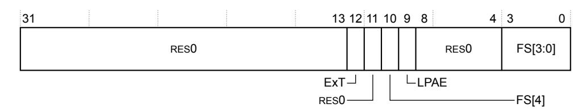

**Figure 4-45 IFSR32\_EL2 bit assignments for Short-descriptor translation table format**

The following table shows the IFSR32\_EL2 bit assignments when using the Short-descriptor translation table format.

**Table 4-62 IFSR32\_EL2 bit assignments for Short-descriptor translation table format**

| Bits    | Name    | Function                                                                                                                    |                                                                          |  |  |  |  |  |
|---------|---------|-----------------------------------------------------------------------------------------------------------------------------|--------------------------------------------------------------------------|--|--|--|--|--|
| [31:13] | -       | Reserved, RES0.                                                                                                             |                                                                          |  |  |  |  |  |
| [12]    | ExT     | External abort type. This field indicates whether an AXI decode or slave error caused an abort. The possible values<br>are: |                                                                          |  |  |  |  |  |
|         |         | 0<br>External abort marked as DECERR.                                                                                       |                                                                          |  |  |  |  |  |
|         |         | 1                                                                                                                           | External abort marked as SLVERR.                                         |  |  |  |  |  |
|         |         |                                                                                                                             | For aborts other than external aborts this bit always returns 0.         |  |  |  |  |  |
| [11]    | -       | Reserved, RES0.                                                                                                             |                                                                          |  |  |  |  |  |
| [10]    | FS[4]   |                                                                                                                             | MSB of the Fault Status field. See bits[3:0] in this table.              |  |  |  |  |  |
| [9]     | LPAE    |                                                                                                                             | Large physical address extension. The value of the format descriptor is: |  |  |  |  |  |
|         |         | 0                                                                                                                           | Short-descriptor translation table formats.                              |  |  |  |  |  |
| [8:4]   | -       | Reserved, RES0.                                                                                                             |                                                                          |  |  |  |  |  |
| [3:0]   | FS[3:0] | Fault Status bits. This field indicates the type of exception generated. The possible values are:                           |                                                                          |  |  |  |  |  |
|         |         | 0b00001                                                                                                                     | Alignment fault.                                                         |  |  |  |  |  |
|         |         | 0b01100                                                                                                                     | Synchronous external abort on translation table walk, 1st level.         |  |  |  |  |  |
|         |         | 0b01110                                                                                                                     | Synchronous external abort on translation table walk, 2nd level.         |  |  |  |  |  |
|         |         | 0b11100                                                                                                                     | Synchronous parity error on translation table walk, 1st level.           |  |  |  |  |  |
|         |         | 0b11110                                                                                                                     | Synchronous parity error on translation table walk, 2nd level.           |  |  |  |  |  |
|         |         | 0b00101                                                                                                                     | Translation fault, 1st level.                                            |  |  |  |  |  |
|         |         | 0b00111                                                                                                                     | Translation fault, 2nd level.                                            |  |  |  |  |  |
|         |         | 0b00011                                                                                                                     | Access flag fault, 1st level.                                            |  |  |  |  |  |
|         |         | 0b00110                                                                                                                     | Access flag fault, 2nd level.                                            |  |  |  |  |  |
|         |         | 0b01001                                                                                                                     | Domain fault, 1st level.                                                 |  |  |  |  |  |
|         |         | 0b01011                                                                                                                     | Domain fault, 2nd level.                                                 |  |  |  |  |  |
|         |         | 0b01101                                                                                                                     | Permission fault, 1st level.                                             |  |  |  |  |  |
|         |         | 0b01111                                                                                                                     | Permission fault, 2nd level.                                             |  |  |  |  |  |
|         |         | 0b00010                                                                                                                     | Debug event.                                                             |  |  |  |  |  |
|         |         | 0b01000                                                                                                                     | Synchronous external abort, non-translation.                             |  |  |  |  |  |
|         |         | 0b11001                                                                                                                     | Synchronous parity error on memory access.                               |  |  |  |  |  |
|         |         | All other values are reserved.                                                                                              |                                                                          |  |  |  |  |  |

# <span id="page-161-0"></span>**IFSR32\_EL2 format when using the Long-descriptor translation table format**

The following figure shows the IFSR32\_EL2 bit assignments when using the Long-descriptor translation table format.


**Figure 4-46 IFSR32\_EL2 bit assignments for Long-descriptor translation table format**

The following table shows the IFSR32\_EL2 bit assignments when using the Long-descriptor translation table format.

**Table 4-63 IFSR32\_EL2 bit assignments for Long-descriptor translation table format**

| Bits    | Name   | Function                                                                                                                    |  |  |  |  |  |  |
|---------|--------|-----------------------------------------------------------------------------------------------------------------------------|--|--|--|--|--|--|
| [31:13] | -      | Reserved, res0.                                                                                                             |  |  |  |  |  |  |
| [12]    | ExT    | External abort type. This field indicates whether an AXI decode or slave error caused an abort. The possible values<br>are: |  |  |  |  |  |  |
|         |        | 0<br>External abort marked as DECERR.                                                                                       |  |  |  |  |  |  |
|         |        | 1<br>External abort marked as SLVERR.                                                                                       |  |  |  |  |  |  |
|         |        | For aborts other than external aborts this bit always returns 0.                                                            |  |  |  |  |  |  |
| [11:10] | -      | Reserved, res0.                                                                                                             |  |  |  |  |  |  |
| [9]     | LPAE   | Large physical address extension. The value of the format descriptor is:                                                    |  |  |  |  |  |  |
|         |        | 1<br>Long-descriptor translation table formats.                                                                             |  |  |  |  |  |  |
| [8:6]   | -      | Reserved, res0.                                                                                                             |  |  |  |  |  |  |
| [5:0]   | Status | Fault Status bits. This field indicates the type of exception generated. The possible values are:                           |  |  |  |  |  |  |
|         |        | Address size fault, LL bits indicate level.<br>0b0000LL                                                                     |  |  |  |  |  |  |
|         |        | Translation fault, LL bits indicate level.<br>0b0001LL                                                                      |  |  |  |  |  |  |
|         |        | Access flag fault, LL bits indicate level.<br>0b0010LL                                                                      |  |  |  |  |  |  |
|         |        | Permission fault, LL bits indicate level.<br>0b0011LL                                                                       |  |  |  |  |  |  |
|         |        | Synchronous external abort.<br>0b010000                                                                                     |  |  |  |  |  |  |
|         |        | Synchronous parity error on memory access.<br>0b011000                                                                      |  |  |  |  |  |  |
|         |        | Synchronous external abort on translation table walk, LL bits indicate level.<br>0b0101LL                                   |  |  |  |  |  |  |
|         |        | Synchronous parity error on memory access on translation table walk, LL bits indicate level.<br>0b0111LL                    |  |  |  |  |  |  |
|         |        | Alignment fault.<br>0b100001                                                                                                |  |  |  |  |  |  |
|         |        | Debug event.<br>0b100010                                                                                                    |  |  |  |  |  |  |
|         |        | All other values are reserved.                                                                                              |  |  |  |  |  |  |

The following table shows how the LL bits in the Status field encode the lookup level associated with the MMU fault.

## **Table 4-64 Encodings of LL bits associated with the MMU fault**

| LL bits | Meaning      |
|---------|--------------|
| 00      | Level 0      |
| 01      | First level  |
| 10      | Second level |
| 11      | Third level  |

<span id="page-162-0"></span>**Note**

If a Data Abort exception is generated by an Instruction Cache maintenance operation, the fault is reported as a Cache Maintenance fault in the DFSR or HSR with the appropriate Fault Status code. For such exceptions reported in the DFSR, the corresponding IFSR is UNKNOWN.

To access the IFSR32\_EL2 in AArch64 state, read or write the register with:

MRS <Xt>, IFSR32\_EL2; Read EL2 Instruction Fault Status Register MSR IFSR32\_EL2, <Xt>; Write EL2 Instruction Fault Status Register

To access the IFSR in AArch32 state, read or write the CP15 register with:

MRC p15, 0, <Rt>, c5, c0, 1; Read Instruction Fault Status Register MCR p15, 0, <Rt>, c5, c0, 1; Write Instruction Fault Status Register

# **Related information**

*[IFSR32\\_EL2 format when using the Short-descriptor translation table format](#page-159-0)* on page 4-160*. [IFSR32\\_EL2 format when using the Long-descriptor translation table format](#page-161-0)* on page 4-162*.*

# **4.3.52 Auxiliary Fault Status Register 0, EL2 and Hyp Auxiliary Data Fault Status Register**

The processor does not implement and AFSR0\_EL2 and HADFSR. These registers are always RES0.

#### **4.3.53 Auxiliary Fault Status Register 1, EL2 and Hyp Auxiliary Instruction Fault Status Register**

The processor does not implement AFSR1\_EL2 and HAIFSR. These registers are always RES0.

## **4.3.54 Exception Syndrome Register, EL2**

The ESR\_EL2 characteristics are:

**Purpose** Holds syndrome information for an exception taken to EL2.

**Usage constraints** The accessibility to the ESR\_EL2 in AArch64 state by Exception level is:

**EL0 EL1(NS) EL1(S) EL2 EL3(SCR.NS = 1) EL3(SCR.NS = 0)**

- - - RW RW RW

The accessibility to the HSR in AArch32 state by Exception level is:

**EL0 EL1(NS) EL1(S) EL2 EL3(SCR.NS = 1) EL3(SCR.NS = 0)** - - - RW RW -

# **Configurations** The ESR\_EL2 is:

- A Banked EL2 register.
- Architecturally mapped to the AArch32 HSR register.

**Attributes** See the register summary in *[Table 4-2 AArch64 exception handling registers](#page-77-0)* [on page 4-78.](#page-77-0)

The following figure shows the ESR\_EL2 bit assignments.

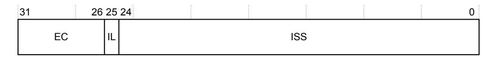

**Figure 4-47 ESR\_EL2 bit assignments**

The following table shows the ESR\_EL2 bit assignments.

**Table 4-65 ESR\_EL2 bit assignments**

| Bits    | Name | Function                                                                                                                                                                                                                                                                                       |  |  |  |  |
|---------|------|------------------------------------------------------------------------------------------------------------------------------------------------------------------------------------------------------------------------------------------------------------------------------------------------|--|--|--|--|
| [31:26] | EC   | Exception class. The exception class for the exception that is taken in Hyp mode.                                                                                                                                                                                                              |  |  |  |  |
|         |      | When zero, this field indicates that the reason for the exception is not known. In this case, the other fields in this<br>register are UNKNOWN. Otherwise, the field holds the exception class for the exception. See the ARM®<br>Architecture<br>Reference Manual ARMv8 for more information. |  |  |  |  |
| [25]    | IL   | Instruction length. Indicates the size of the instruction that has been trapped to Hyp mode. The values are:                                                                                                                                                                                   |  |  |  |  |
|         |      | 0<br>16-bit instruction.                                                                                                                                                                                                                                                                       |  |  |  |  |
|         |      | 1<br>32-bit instruction.                                                                                                                                                                                                                                                                       |  |  |  |  |
|         |      | This field is not valid for:                                                                                                                                                                                                                                                                   |  |  |  |  |
|         |      | •<br>Instruction Aborts.                                                                                                                                                                                                                                                                       |  |  |  |  |
|         |      | •<br>Data Aborts that do not have ISS information, or for which the ISS is not valid.                                                                                                                                                                                                          |  |  |  |  |
|         |      | In these cases the field is RES0.                                                                                                                                                                                                                                                              |  |  |  |  |
| [24:0]  | ISS  | Instruction specific syndrome. The interpretation of this field depends on the value of the EC field. See Encoding of<br>ISS[24:20] when HSR[31:30] is 0b00 on page 4-165>.                                                                                                                    |  |  |  |  |

All exception classes except the Instruction Abort are architecturally defined in the *ARM® Architecture Reference Manual ARMv8*. The SError Interrupt exception classes are architecturally defined in the *ARM® Generic Interrupt Controller Architecture Specification, GICv3* with the exception of four bits.

The following changes are Cortex-A57 implementation-defined and only apply to SError Interrupt exception classes.

**Table 4-66 ESR\_EL2 Cortex-A57 implementation-defined SError Interrupt exception classes bit assignments**

<span id="page-164-0"></span>

| Bits  | Name<br>Unattributable System Error | Function                     |                                                                                                                                                                                |  |
|-------|-------------------------------------|------------------------------|--------------------------------------------------------------------------------------------------------------------------------------------------------------------------------|--|
| [15]  |                                     | 0b1<br>0b0                   | Unattributable - cannot be attributed to the processing element counting the event.<br>Attributable - can be attributed to the processing element counting the event.          |  |
| [14]  | Uncontainable System Error          | 0b1<br>0b0                   | Uncontainable – an event which cannot be contained to a particular code sequence.<br>Containable - an Attributable event which can be contained to a particular code sequence. |  |
| [1:0] | System Error Source                 | 0b00<br>0b01<br>0b10<br>0b11 | Decode error<br>ECC error<br>Slave error<br>Reserved                                                                                                                           |  |

# **Encoding of ISS[24:20] when HSR[31:30] is 0b00**

For EC values that are nonzero and have the two most-significant bits 0b00, ISS[24:20] provides the condition field for the trapped instruction, together with a valid flag for this field. The encoding of this part of the ISS field is:

**CV, ISS[24]** Condition valid. Possible values of this bit are:

**0** The COND field is not valid.

**1** The COND field is valid.

When an instruction is trapped, CV is set to 1.

# **COND, ISS[23:20]**

The Condition field for the trapped instruction. This field is valid only when CV is set to 1.

If CV is set to 0, this field is UNK/RES0.

When an instruction is trapped, the COND field is 0xE.

To access the ESR\_EL2 in AArch64 state, read or write the register with:

```
MRS <Xt>, ESR_EL2; Read EL2 Exception Syndrome Register
MSR ESR_EL2, <Xt>; Write EL2 Exception Syndrome Register
```

To access the HSR in AArch32 state, read or write the CP15 register with:

```
MRC p15, 4, <Rt>, c5, c1, 0; Read Hyp Syndrome Register
MCR p15, 4, <Rt>, c5, c1, 0; Write Hyp Syndrome Register
```

#### **4.3.55 Physical Address Register, EL1**

The PAR\_EL1 characteristics are:

#### **Purpose**

The Physical Address returned from an address translation.

#### **Usage constraints**

The accessibility of the PAR\_EL1 by Exception level is:

| EL0 | EL1(NS) | EL1(S) | EL2 | EL3(SCR.NS = 1) | EL3(SCR.NS = 0) |
|-----|---------|--------|-----|-----------------|-----------------|
| -   | RW      | RW     | RW  | RW              | RW              |

## Configurations

The architectural mapping of the PAR EL1 is to the Non-secure AArch32 PAR register.

#### Attributes

See the register summary in Table 4-8 AArch64 address translation operations on page 4-81.

The following figure shows the PAR\_EL1 bit assignments when the Virtual Address to Physical Address conversion completes successfully.

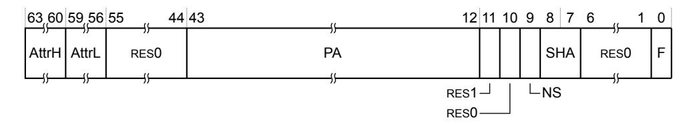

Figure 4-48 PAR\_EL1 pass bit assignments

The following table shows the PAR\_EL1 bit assignments when the Virtual Address to Physical Address conversion completes successfully.

## **Table 4-67 PAR\_EL1 pass bit assignments**

| Bits    | Name  | Function                                                                                                                                   |  |  |  |  |
|---------|-------|--------------------------------------------------------------------------------------------------------------------------------------------|--|--|--|--|
| [63:60] | AttrH | Defines Device memory or Normal memory plus Outer cacheability. Must be used in conjunction with AttrL. The<br>possible values are:        |  |  |  |  |
|         |       | Device memory, see AttrL.<br>0x0                                                                                                           |  |  |  |  |
|         |       | Normal memory, Outer Non-cacheable.<br>0x4                                                                                                 |  |  |  |  |
|         |       | Normal memory, Outer Write-Through Cacheable.<br>0x8                                                                                       |  |  |  |  |
|         |       | Normal memory, Outer Write-Through Cacheable, Outer Write-Allocate.<br>0x9                                                                 |  |  |  |  |
|         |       | Normal memory, Outer Write-Through Cacheable, Outer Read-Allocate.<br>0xA                                                                  |  |  |  |  |
|         |       | Normal memory, Outer Write-Through Cacheable, Outer Write-Allocate, Outer Read-Allocate.<br>0xB                                            |  |  |  |  |
|         |       | Normal memory, Outer Write-Back Cacheable.<br>0xC                                                                                          |  |  |  |  |
|         |       | Normal memory, Outer Write-Back Cacheable, Outer Write-Allocate.<br>0xD                                                                    |  |  |  |  |
|         |       | Normal memory, Outer Write-Back Cacheable, Outer Read-Allocate.<br>0xE                                                                     |  |  |  |  |
|         |       | Normal memory, Outer Write-Back Cacheable, Outer Write-Allocate, Outer Read-Allocate.<br>0xF                                               |  |  |  |  |
|         |       | All other values are reserved.                                                                                                             |  |  |  |  |
| [59:56] | AttrL | Defines Device memory or Normal memory plus Inner cacheability. Must be interpreted in conjunction with AttrH.<br>The possible values are: |  |  |  |  |
|         |       | Device-nGnRnE memory if AttrH is 0x0. Otherwise this value is reserved.<br>0x0                                                             |  |  |  |  |
|         |       | Device memory if AttrH is 0x0. Otherwise, Normal memory, Inner Non-cacheable.<br>0x4                                                       |  |  |  |  |
|         |       | Reserved if AttrH is 0x0. Otherwise, Normal memory, Inner Write-Through Cacheable.<br>0x8                                                  |  |  |  |  |
|         |       | Reserved if AttrH is 0x0. Otherwise, Normal memory, Inner Write-Through Cacheable, Inner Write-Allocate.<br>0x9                            |  |  |  |  |
|         |       | Reserved if AttrH is 0x0. Otherwise, Normal memory, Inner Write-Through Cacheable, Inner Read-Allocate.<br>0xA                             |  |  |  |  |
|         |       | Reserved if AttrH is 0x0. Otherwise, Normal memory, Inner Write-Through Cacheable, Inner Write-Allocate,<br>0xB<br>Inner Read-Allocate.    |  |  |  |  |
|         |       | Reserved if AttrH is 0x0. Otherwise, Normal memory, Inner Write-Back Cacheable.<br>0xC                                                     |  |  |  |  |
|         |       | Reserved if AttrH is 0x0. Otherwise, Normal memory, Inner Write-Back Cacheable, Inner Write-Allocate.<br>0xD                               |  |  |  |  |
|         |       | Reserved if AttrH is 0x0. Otherwise, Normal memory, Inner Write-Back Cacheable, Inner Read-Allocate.<br>0xE                                |  |  |  |  |
|         |       | Reserved if AttrH is 0x0. Otherwise, Normal memory, Inner Write-Through Cacheable, Inner Write-Allocate,<br>0xF<br>Inner Read-Allocate.    |  |  |  |  |
|         |       | All other values are reserved.                                                                                                             |  |  |  |  |
| [55:44] | -     | Reserved, RES0.                                                                                                                            |  |  |  |  |
| [43:12] | PA    | Physical address. The Physical Address corresponding to the supplied Virtual Address. Returns address bits[31:12].                         |  |  |  |  |
| [11]    | -     | Reserved, RES1.                                                                                                                            |  |  |  |  |
| [10]    | -     | Reserved, RES0.                                                                                                                            |  |  |  |  |
| [9]     | NS    | Non-secure. The NS attribute for a translation table entry read from Secure state.                                                         |  |  |  |  |
|         |       | This bit is UNKNOWN for a translation table entry from Non-secure state.                                                                   |  |  |  |  |

## Table 4-67 PAR\_EL1 pass bit assignments (continued)

| Bits  | Name | Function                                                                                                 |                                                     |  |  |  |  |
|-------|------|----------------------------------------------------------------------------------------------------------|-----------------------------------------------------|--|--|--|--|
| [8:7] | SHA  | Shareability attribute for the Physical Address returned from a translation table entry. The values are: |                                                     |  |  |  |  |
|       |      | 0b00                                                                                                     | Non-shareable.                                      |  |  |  |  |
|       |      | 0b01                                                                                                     | Reserved.                                           |  |  |  |  |
|       |      | 0b10                                                                                                     | Outer Shareable.                                    |  |  |  |  |
|       |      | 0b11                                                                                                     | Inner Shareable.                                    |  |  |  |  |
|       |      | Note                                                                                                     |                                                     |  |  |  |  |
|       |      | The SHA bit takes the value of <b>0b10</b> for:                                                          |                                                     |  |  |  |  |
|       |      | Any type of device memory.                                                                               |                                                     |  |  |  |  |
|       |      | Normal memory with both Inner Non-cacheable and Outer-cacheable attributes.                              |                                                     |  |  |  |  |
|       |      |                                                                                                          |                                                     |  |  |  |  |
| [6:1] | -    | Reserved, RESO.                                                                                          |                                                     |  |  |  |  |
| [0]   | F    | Pass/Fail bit. Indicates whether the conversion completed successfully. This value is:                   |                                                     |  |  |  |  |
|       |      | 0 Virtual Address to                                                                                     | Physical Address conversion completed successfully. |  |  |  |  |

The following figure shows the PAR\_EL1 bit assignments when the Virtual Address to Physical Address conversion aborts.

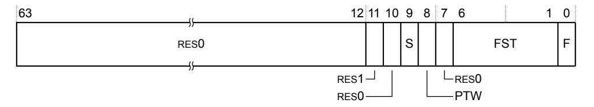

Figure 4-49 PAR\_EL1 fail bit assignments

The following table shows the PAR\_EL1 bit assignments when the Virtual Address to Physical Address conversion aborts.

Table 4-68 PAR\_EL1 fail bit assignments

| Bits                                               | Name | Function                                                                           |  |
|----------------------------------------------------|------|------------------------------------------------------------------------------------|--|
| [63:12]                                            | -    | Reserved, RESO.                                                                    |  |
| [11]                                               | -    | Reserved, RES1.                                                                    |  |
| [10]                                               | -    | Reserved, RESO.                                                                    |  |
| [9]                                                | S    | Stage of fault. Indicates the state where the translation aborted. The values are: |  |
|                                                    |      | <b>0</b> Translation aborted because of a fault in stage 1 translation.            |  |
|                                                    |      | 1 Translation aborted because of a fault in stage 2 translation.                   |  |
| [8] PTW Indicates a stage 2 fault during a stage 1 |      | Indicates a stage 2 fault during a stage 1 table walk. The values are:             |  |
|                                                    |      | <b>0</b> No stage 2 fault during a stage 1 table walk.                             |  |
|                                                    |      | 1 Translation aborted because of a stage 2 fault during a stage 1 table walk.      |  |
| [7]                                                | -    | Reserved, RESO.                                                                    |  |
| <u>[7]</u>                                         | -    | Reserved, RES0.                                                                    |  |

# **Table 4-68 PAR\_EL1 fail bit assignments (continued)**

<span id="page-168-0"></span>

| Bits  | Name<br>Function |                                                                                                                                                       |  |
|-------|------------------|-------------------------------------------------------------------------------------------------------------------------------------------------------|--|
| [6:1] | FST              | Fault status code, as shown in the Data Abort ESR encoding. See the ARM®<br>Architecture Reference Manual ARMv8<br>for more information.              |  |
| [0]   | F                | Pass/Fail bit. Indicates whether the conversion completed successfully. The value is:<br>1<br>Virtual Address to Physical Address conversion aborted. |  |

To access the PAR\_EL1 in AArch64 state, read or write the register with:

```
MRS <Xt>, PAR_EL1; Read EL1 Physical Address Register
MSR PAR_EL1, <Xt>; Write EL1 Physical Address Register
```

# **Related information**

*[4.5.18 Physical Address Register](#page-271-0)* on page 4-272*.*

# **4.3.56 Auxiliary Memory Attribute Indirection Register, EL1 and EL3**

The processor does not set any IMPLEMENTATION DEFINED attributes in the Auxiliary Memory Attribute Indirection Registers. AMAIR\_EL1 and AMAIR\_EL3 are RES0.

AMAIR\_EL1[31:0] is architecturally mapped to the Non-secure AArch32 AMAIR0 register.

AMAIR\_EL1[63:32] is architecturally mapped to the Non-secure AArch32 AMAIR1 register.

AMAIR\_EL3[31:0] is architecturally mapped to the Secure AArch32 AMAIR0 register.

AMAIR\_EL3[63:32] is architecturally mapped to the Secure AArch32 AMAIR1 register.

The Non-secure and Secure AArch32 AMAIR0 and AMAIR1 registers are RES0.

#### **4.3.57 Auxiliary Memory Attribute Indirection Register, EL2**

The processor does not set any IMPLEMENTATION DEFINED attributes in the Auxiliary Memory Attribute Indirection Register, EL2. AMAIR\_EL2 is RES0.

AMAIR\_EL2[31:0] is architecturally mapped to the AArch32 HAMAIR0 register.

AMAIR\_EL2[63:32] is architecturally mapped to the AArch32 HAMAIR1 register.

The AArch32 HMAIR0 and HAMAIR1 registers are RES0.

#### **4.3.58 L2 Control Register, EL1**

The L2CTLR\_EL1 characteristics are:

#### **Purpose**

Provides IMPLEMENTATION DEFINED control options for the L2 memory system and ECC/parity support. There is one L2 Control Register for the Cortex-A57 processor.

# **Usage constraints**

The accessibility to the L2CTLR\_EL1 by Exception level is:

| EL0 | EL1(NS) | EL1(S) | EL2  | EL3(SCR.NS = 1) | EL3(SCR.NS = 0) |
|-----|---------|--------|------|-----------------|-----------------|
| -   | RW      | RWak   | RWal | RW              | RW              |

**Note**

The L2CTLR\_EL1 must be set statically and not dynamically changed.

The L2 Control Register can only be written when the L2 memory system is idle. ARM recommends that you write to this register after a powerup reset before the MMU is enabled and before any ACE, CHI, or ACP traffic begins.

If the register must be modified after a powerup reset sequence, you must idle the L2 memory system with the following sequence:

- 1. Disable the MMU from each processor followed by an ISB to ensure the MMU disable operation is complete, then execute a DSB to drain previous memory transactions.
- 2. Ensure that the system has no outstanding AC channel or CHI RXRSP coherence requests to the processor.
- 3. Ensure that the system has no outstanding ACP requests to the processor.

When the L2 is idle, the processor can update the L2 Control Register followed by an ISB. After the L2 Control Register is updated, you can enable the MMUs and normal ACE or CHI and ACP traffic can resume.

#### **Configurations**

The L2CTLR\_EL1 is:

- Common to the Secure and Non-secure states.
- A 32-bit register in AArch64 state.
- Architecturally mapped to the AArch32 L2CTLR register.

# **Attributes**

See the register summary in *[Table 4-15 AArch64 implementation defined registers](#page-85-0)* [on page 4-86](#page-85-0).

The following figure shows the L2CTLR\_EL1 bit assignments.

ak Write access if ACTLR\_EL3.L2CTLR is 1 and ACTLR\_EL2.L2CTLR is 1, or, ACTLR\_EL3.L2CTLR is 1 and the Secure SCR.NS is 0. al Write access if ACTLR\_EL3.L2CTLR is 1.

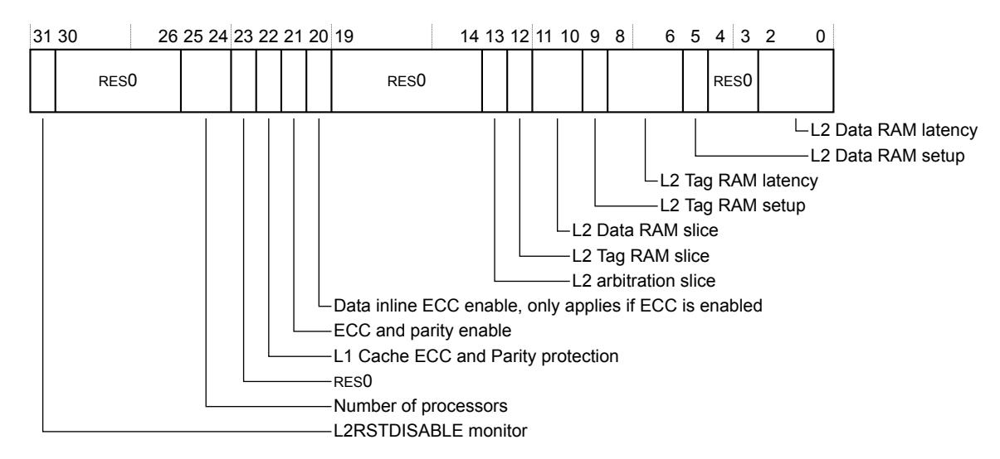

**Figure 4-50 L2CTRL\_EL1 bit assignments**

The following table shows the L2CTLR\_EL1 bit assignments.

**Table 4-69 L2CTLR\_EL1 bit assignments**

| Bits    | Name                                  | Function                                                                                                                                                                                                                                    |  |  |
|---------|---------------------------------------|---------------------------------------------------------------------------------------------------------------------------------------------------------------------------------------------------------------------------------------------|--|--|
| [31]    | L2RSTDISABLE monitor                  | Monitors the L2 hardware reset disable signal, L2RSTDISABLE. The values are:                                                                                                                                                                |  |  |
|         |                                       | 0<br>L2 valid RAM contents are reset by hardware.                                                                                                                                                                                           |  |  |
|         |                                       | 1<br>L2 valid RAM contents are not reset by hardware.                                                                                                                                                                                       |  |  |
|         |                                       | This bit is read-only. The primary input L2RSTDISABLE controls the reset value.                                                                                                                                                             |  |  |
| [30:26] | -                                     | Reserved, RES0.                                                                                                                                                                                                                             |  |  |
| [25:24] | Number of processors                  | Number of processors present. These bits are read-only and set to the number of processors<br>present in the implementation. The values are:                                                                                                |  |  |
|         |                                       | One processor, CPU0.<br>0b00                                                                                                                                                                                                                |  |  |
|         |                                       | Two processors, CPU0 and CPU1.<br>0b01                                                                                                                                                                                                      |  |  |
|         |                                       | Three processors, CPU0, CPU1, and CPU2.<br>0b10                                                                                                                                                                                             |  |  |
|         |                                       | Four processors, CPU0, CPU1, CPU2, and CPU3.<br>0b11                                                                                                                                                                                        |  |  |
| [23]    | -                                     | Reserved, RES0.                                                                                                                                                                                                                             |  |  |
| [22]    | L1 Cache ECC and Parity<br>protection | This bit is read-only and is set if the processor implementation supports L1 cache ECC and parity<br>protection. The L1 cache ECC and parity protection is a configurable implementation option in<br>Cortex-A57 processor. The values are: |  |  |
|         |                                       | 0<br>L1 data cache ECC and L1 instruction cache parity is not supported.                                                                                                                                                                    |  |  |
|         |                                       | 1<br>L1 data cache ECC and L1 instruction cache parity is supported.                                                                                                                                                                        |  |  |

| Bits    | Name                                                         | Function                                                                                                                                                                                                                                                              |  |  |  |
|---------|--------------------------------------------------------------|-----------------------------------------------------------------------------------------------------------------------------------------------------------------------------------------------------------------------------------------------------------------------|--|--|--|
| [21]    | ECC and parity enable                                        | ECC and parity enable. The values are:                                                                                                                                                                                                                                |  |  |  |
|         |                                                              | 0<br>Disables ECC and parity. This is the reset value.                                                                                                                                                                                                                |  |  |  |
|         |                                                              | 1<br>Enables ECC and parity.                                                                                                                                                                                                                                          |  |  |  |
|         |                                                              | If Cortex-A57 is implemented with L1 Cache ECC and parity protection, L2CTLR[21] can be<br>programmed to enable or disable both L1 and L2 ECC and parity protection.                                                                                                  |  |  |  |
|         |                                                              | If Cortex-A57 is implemented with no L1 Cache ECC and parity protection, L2CTLR[21] can be<br>programmed to enable or disable only L2 ECC and parity protection.                                                                                                      |  |  |  |
| [20]    | Data inline ECC enable,<br>only applies if ECC is<br>enabled | Force inline ECC for Instruction Fetch (IF) and Load/Store (LS) read requests that hit the L2<br>cache increasing the L2 hit latency by 2 cycles. Avoids requirement of flushing requests<br>associated with L2 cache single-bit ECC errors. The possible values are: |  |  |  |
|         |                                                              | 0<br>Performance optimization reducing L2 hit latency by 2 cycles allowing uncorrected data for<br>IF and LS read requests that hit the L2 cache. This is the reset value.                                                                                            |  |  |  |
|         |                                                              | 1<br>Forward only corrected data for L2 cache hits avoiding flushing request for single-bit ECC<br>errors.                                                                                                                                                            |  |  |  |
| [19:14] | -                                                            | Reserved, RES0.                                                                                                                                                                                                                                                       |  |  |  |
| [13]    | L2 arbitration slice                                         | L2 arbitration slice. This is a read-only bit that is set if the L2 arbitration slice is present in the<br>implementation. The values are:                                                                                                                            |  |  |  |
|         |                                                              | 0<br>L2 arbitration slice is not present.                                                                                                                                                                                                                             |  |  |  |
|         |                                                              | 1<br>One L2 arbitration slice is present.                                                                                                                                                                                                                             |  |  |  |
| [12]    | L2 Tag RAM slice                                             | L2 Tag RAM slice. This is a read-only bit that is set if the Tag RAM slice is present in the<br>implementation. The values are:                                                                                                                                       |  |  |  |
|         |                                                              | 0<br>L2 Tag RAM slice is not present.                                                                                                                                                                                                                                 |  |  |  |
|         |                                                              | 1<br>One L2 Tag RAM slice is present.                                                                                                                                                                                                                                 |  |  |  |
| [11:10] | L2 Data RAM slice                                            | L2 Data RAM slice. These are read-only bits that are set to the number of Data RAM slices<br>present in the implementation. The values are:                                                                                                                           |  |  |  |
|         |                                                              | L2 Data RAM slices are not present.<br>0b00                                                                                                                                                                                                                           |  |  |  |
|         |                                                              | One L2 Data RAM slice is present.<br>0b01                                                                                                                                                                                                                             |  |  |  |
|         |                                                              | Two L2 Data RAM slices are present.<br>0b10                                                                                                                                                                                                                           |  |  |  |
|         |                                                              | Invalid value.<br>0b11                                                                                                                                                                                                                                                |  |  |  |
| [9]     | L2 Tag RAM setup                                             | L2 Tag RAM setup. The values are:                                                                                                                                                                                                                                     |  |  |  |
|         |                                                              | 0<br>0 cycle. This the reset value.                                                                                                                                                                                                                                   |  |  |  |
|         |                                                              | 1<br>1 cycle.                                                                                                                                                                                                                                                         |  |  |  |

<span id="page-172-0"></span>

| Bits  | Name                | Function                                                                                                                                                                                                                     |  |  |  |
|-------|---------------------|------------------------------------------------------------------------------------------------------------------------------------------------------------------------------------------------------------------------------|--|--|--|
| [8:6] | L2 Tag RAM latency  | L2 Tag RAM latency. The L2 Tag RAM programmable setup and latency bits only affect the L2<br>Tag RAM. See 7.2.5 Register slice support for large cache sizes on page 7-301 for more<br>information. The possible values are: |  |  |  |
|       |                     | 2 cycles. This is the reset value.<br>0b000                                                                                                                                                                                  |  |  |  |
|       |                     | 2 cycles.<br>0b001                                                                                                                                                                                                           |  |  |  |
|       |                     | 3 cycles.<br>0b010                                                                                                                                                                                                           |  |  |  |
|       |                     | 4 cycles.<br>0b011                                                                                                                                                                                                           |  |  |  |
|       |                     | 5 cycles.<br>0b1xx                                                                                                                                                                                                           |  |  |  |
| [5]   | L2 Data RAM setup   | L2 Data RAM setup. The values are:                                                                                                                                                                                           |  |  |  |
|       |                     | 0<br>0 cycle. This the reset value.                                                                                                                                                                                          |  |  |  |
|       |                     | 1<br>1 cycle.                                                                                                                                                                                                                |  |  |  |
| [4:3] | -                   | Reserved, RES0.                                                                                                                                                                                                              |  |  |  |
| [2:0] | L2 Data RAM latency | L2 Data RAM latency.am The L2 Data RAM programmable setup & latency bits affect only the<br>L2 Data RAM. See 7.2.5 Register slice support for large cache sizes on page 7-301 for more<br>information. The values are:       |  |  |  |
|       |                     | 2 cycles. This is the reset value.<br>0b000                                                                                                                                                                                  |  |  |  |
|       |                     | 2 cycles.<br>0b001                                                                                                                                                                                                           |  |  |  |
|       |                     | 3 cycles.<br>0b010                                                                                                                                                                                                           |  |  |  |
|       |                     | 4 cycles.<br>0b011                                                                                                                                                                                                           |  |  |  |
|       |                     | 5 cycles.<br>0b100                                                                                                                                                                                                           |  |  |  |
|       |                     | 6 cycles.<br>0b101                                                                                                                                                                                                           |  |  |  |
|       |                     | 7 cycles.<br>0b110                                                                                                                                                                                                           |  |  |  |
|       |                     | 8 cycles.<br>0b111                                                                                                                                                                                                           |  |  |  |

To access the L2CTLR\_EL1 in AArch64 state, read or write the register with:

```
MRS <Xt>, S3_1_c11_c0_2; Read L2 Control Register
MSR S3_1_c11_c0_2, <Xt>; Write L2 Control Register
```

To access the L2CTLR in AArch32 state, read or write the CP15 register with:

```
MRC p15, 1, <Rt>, c9, c0, 2; Read L2 Control Register
MCR p15, 1, <Rt>, c9, c0, 2; Write L2 Control Register
```

#### **4.3.59 L2 Extended Control Register, EL1**

The L2ECTLR\_EL1 characteristics are:

# **Purpose**

Provides additional IMPLEMENTATION DEFINED control options for the L2 memory system. There is one L2 Extended Control Register for the Cortex-A57 processor.

am Slice and Set-up have priority over programmed latency in determining total adjusted pipeline depth.

# **Usage constraints**

The accessibility to the L2ECTLR\_EL1 by Exception level is:

| EL0 | EL1(NS) | EL1(S) | EL2  | EL3(SCR.NS = 1) | EL3(SCR.NS = 0) |
|-----|---------|--------|------|-----------------|-----------------|
| -   | RW      | RWan   | RWao | RW              | RW              |

The L2ECTLR\_EL1 can be written dynamically.

#### **Configurations**

The L2ECTLR\_EL1 is:

- Common to the Secure and Non-secure states.
- A 32-bit register in AArch64 state.
- Architecturally mapped to the AArch32 L2ECTLR register.

#### **Attributes**

See the register summary in *[Table 4-15 AArch64 implementation defined registers](#page-85-0)* [on page 4-86](#page-85-0).

The following figure shows the L2ECTLR bit assignments.

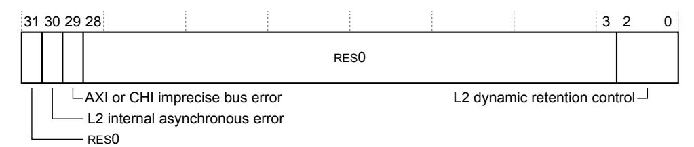

**Figure 4-51 L2ECTLR\_EL1 bit assignments**

The following table shows the L2ECTLR\_EL1 bit assignments.

**Table 4-70 L2ECTLR\_EL1 bit assignments**

| Bits | Name                              | Function                                                                                                                                                                                                                                                             |  |  |  |  |
|------|-----------------------------------|----------------------------------------------------------------------------------------------------------------------------------------------------------------------------------------------------------------------------------------------------------------------|--|--|--|--|
| [31] | -                                 | Reserved, RES0.                                                                                                                                                                                                                                                      |  |  |  |  |
| [30] | L2 internal<br>asynchronous error | L2 internal asynchronous error caused by L2 RAM double-bit ECC error. The possible values are:<br>0<br>No pending asynchronous error. This is the reset value.<br>1<br>An asynchronous error has occurred.<br>A write of 0 clears this bit. A write of 1 is ignored. |  |  |  |  |
| [29] | AXI or CHI<br>asynchronous error  | AXI or CHI asynchronous error indication. The possible values are:<br>0<br>No pending asynchronous error. This is the reset value.<br>1<br>An asynchronous error has occurred.<br>A write of 0 clears this bit. A write of 1 is ignored.                             |  |  |  |  |

an Write access if ACTLR\_EL3.L2ECTLR is 1 and ACTLR\_EL2.L2ECTLR is 1, or ACTLR\_EL3.L2ECTLR is 1 and the Secure SCR.NS is 0. ao Write access if ACTLR\_EL3.L2ECTLR is 1.

<span id="page-174-0"></span>

| Bits   | Name                 | Function                                               |                                                          |  |  |  |
|--------|----------------------|--------------------------------------------------------|----------------------------------------------------------|--|--|--|
| [28:3] | -                    | Reserved, RES0.                                        |                                                          |  |  |  |
| [2:0]  | L2 dynamic retention | L2 dynamic retention control. The possible values are: |                                                          |  |  |  |
|        | control              | 0b000                                                  | L2 dynamic retention disabled. This is the reset value.  |  |  |  |
|        |                      | 0b001                                                  | 2 Generic Timer ticks required before retention entry.   |  |  |  |
|        |                      | 0b010                                                  | 8 Generic Timer ticks required before retention entry.   |  |  |  |
|        |                      | 0b011                                                  | 32 Generic Timer ticks required before retention entry.  |  |  |  |
|        |                      | 0b100                                                  | 64 Generic Timer ticks required before retention entry.  |  |  |  |
|        |                      | 0b101                                                  | 128 Generic Timer ticks required before retention entry. |  |  |  |
|        |                      | 0b110                                                  | 256 Generic Timer ticks required before retention entry. |  |  |  |
|        |                      | 0b111                                                  | 512 Generic Timer ticks required before retention entry. |  |  |  |

To access the L2ECTLR\_EL1 in AArch32 state, read or write the CP15 register with:

```
MRS <Xt>, S3_1_c11_c0_3; Read L2 Extended Control Register
MSR S3_1_c11_c0_3, <Xt>; Write L2 Extended Control Register
```

To access the L2ECTLR in AArch32 state, read or write the CP15 register with:

```
MRC p15, 1, <Rt>, c9, c0, 3; Read L2 Extended Control Register
MCR p15, 1, <Rt>, c9, c0, 3; Write L2 Extended Control Register
```

# **Related information**

*[L2 RAMs dynamic retention](#page-47-0)* on page 2-48*.*

# **4.3.60 Reset Vector Base Address, EL3**

The RVBAR\_EL3 characteristics are:

#### **Purpose**

Defines the address that execution starts from after reset when executing in the AArch64 state.

RVBAR\_EL3 is part of the reset management registers functional group.

## **Usage constraints**

The accessibility of the RVBAR\_EL3 by Exception level is:

| EL0 | EL1(NS) | EL1(S) | EL2 | EL3(SCR.NS = 1) | EL3(SCR.NS = 0) |
|-----|---------|--------|-----|-----------------|-----------------|
| -   | -       | -      | -   | RO              | RO              |

#### **Configurations**

Only implemented if the highest Exception level implemented is EL3.

# **Attributes**

See the register summary in *[Table 4-11 AArch64 reset registers](#page-81-0)* on page 4-82.

The following figure shows the RVBAR\_EL3 bit assignments.

<span id="page-175-0"></span>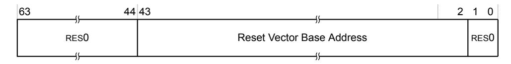

**Figure 4-52 RVBAR\_EL3 bit assignments**

The following table shows the RVBAR\_EL3 bit assignments.

**Table 4-71 RVBAR\_EL3 bit assignments**

| Bits    | Name                      | Function                                                                                                                                          |
|---------|---------------------------|---------------------------------------------------------------------------------------------------------------------------------------------------|
| [63:44] | -                         | Reserved, RES0.                                                                                                                                   |
| [43:2]  | Reset Vector Base Address | Reset Vector Base Address when executing in the AArch64 state. The reset address for<br>processor n is set by the RVBARADDRn[43:2] input signals. |
| [1:0]   | -                         | Reserved, RES0.                                                                                                                                   |

To access the RVBAR\_EL3 in AArch64 state, read the register with:

MRS <Xt>, RVBAR\_EL3; Read RVBAR\_EL3 Reset Vector Base Address Register

# **4.3.61 Reset Management Register, EL3**

The RMR\_EL3 characteristics are:

# **Purpose**

Controls the Execution state that the processor boots into and allows request of a Warm reset.

# **Usage constraints**

The accessibility to the RMR\_EL3 by Exception level is:

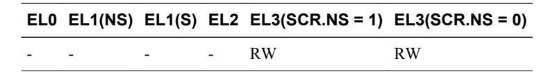

#### **Configurations**

The RMR\_EL3 is

- Common to the Secure and Non-secure states.
- Architecturally mapped to the AArch32 RMR register.

#### **Attributes**

Write access to RMR\_EL3 is disabled when the **CP15SDISABLE** signal is HIGH and EL3 is using AArch32.

See the register summary in *[Table 4-11 AArch64 reset registers](#page-81-0)* on page 4-82.

The following figure shows the RMR\_EL3 bit assignments.

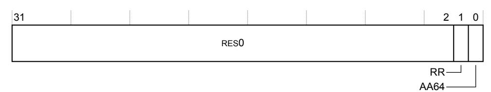

**Figure 4-53 RMR\_EL3 bit assignments**

The following table shows the RMR\_EL3 bit assignments.

## **Table 4-72 RMR\_EL3 bit assignments**

<span id="page-176-0"></span>

| Bits   | Name   | Function                                                                                                  |  |  |  |
|--------|--------|-----------------------------------------------------------------------------------------------------------|--|--|--|
| [31:2] | -      | Reserved, RES0.                                                                                           |  |  |  |
| [1]    | RR     | Reset Request. The values are:                                                                            |  |  |  |
|        |        | 0<br>This is the reset value. It is set to zero by either a Cold or Warm reset.                           |  |  |  |
|        |        | 1<br>Requests a Warm reset.                                                                               |  |  |  |
| [0]    | AA64ap | Determines the Execution state at processor boot time. The values are:                                    |  |  |  |
|        |        | 0<br>AArch32 state.                                                                                       |  |  |  |
|        |        | 1<br>AArch64 state.                                                                                       |  |  |  |
|        |        | If software requests a Warm reset by setting RR=1 then it can use the AA64 bit to change Execution state. |  |  |  |

To access the RMR\_EL3 in AArch64 state, read or write the register with:

```
MRS <Xt>, RMR_EL3; Read EL3 Reset Management Register
MSR RMR_EL3, <Xt>; Write EL3 Reset Management Register
```

To access the RMR, in AArch32 state, read or write the CP15 register with:

MRC p15, 0, <Rt>, c12, c0, 2; Read Reset Management Register MCR p15, 0, <Rt>, c12, c0, 2; Write Reset Management Register

# **4.3.62 Instruction L1 Data n Register, EL1**

The IL1DATA*n*\_EL1, where *n* is from 0 to 3, characteristics are:

#### **Purpose**

Holds the instruction side L1 array information returned by the RAMINDEX system operation.

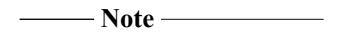

Because all of the I-side arrays are greater than 32-bit wide, the processor contains multiple IL1DATA registers, to hold the array information.

#### **Usage constraints**

The accessibility to the IL1DATA*n*\_EL1 by Exception level is:

| EL0 | EL1(NS) | EL1(S) | EL2 | EL3(SCR.NS = 1) | EL3(SCR.NS = 0) |
|-----|---------|--------|-----|-----------------|-----------------|
| -   | RW      | RW     | RW  | RW              | RW              |

#### **Configurations**

The IL1DATA*n*\_EL1 is:

- Common to the Secure and Non-secure states.
- A 32-bit register in AArch64 state.
- Architecturally mapped to the AArch32 IL1DATA*n* registers.

#### **Attributes**

See the register summary in *[Table 4-15 AArch64 implementation defined registers](#page-85-0)* [on page 4-86](#page-85-0).

The following figure shows the IL1DATA*n*\_EL1 bit assignments.

ap For a Cold reset, the value of this bit is set by the **AA64nAA32** signal.

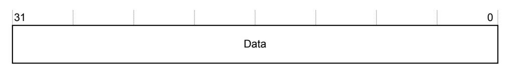

**Figure 4-54 IL1DATA**

<span id="page-177-0"></span>The following table shows the IL1DATA*n*\_EL1 bit assignments.

**Table 4-73 IL1DATAn\_EL1 bit assignments**

| Bits   | Name | Function                                        |
|--------|------|-------------------------------------------------|
| [31:0] | Data | Holds the instruction side L1 array information |

To access the IL1DATA*n*\_EL1 in AArch64 state, read or write the registers with:

```
MRS <Xt>, s3_0_c15_c0_n; Read EL1 Instruction L1 Data n Register
MSR s3_0_c15_c0_n, <Xt>; Write EL1 Instruction L1 Data n Register
```

*n* is 0, 1, 2, or 3 for Opcode2 of IL1DATA*n*\_EL1 registers.

To access the IL1DATA*n* in AArch32 state, read or write the CP15 registers with:

```
MRC p15, 0, <Rt>, c15, c0, n; Read Instruction L1 Data n Register
MCR p15, 0, <Rt>, c15, c0, n; Write Instruction L1 Data n Register
```

*n* is 0, 1, 2, or 3 for Opcode2 of IL1DATA*n* registers.

# **Related information**

*[4.3.64 RAM Index operation](#page-178-0)* on page 4-179*.*

# **4.3.63 Data L1 Data n Register, EL1**

The DL1DATA*n*\_EL1, where *n* is from 0 to 4, characteristics are:

# **Purpose**

Holds the data side L1 or L2 array information returned by the RAMINDEX write operation.

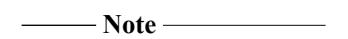

Because the Data, Tag, and TLB arrays are greater than 32-bit wide, the processor contains multiple DL1DATA registers, to hold the array information.

# **Usage constraints**

The accessibility to the DL1DATA*n*\_EL1 by Exception level is:

| EL0 | EL1(NS) | EL1(S) | EL2 | EL3(SCR.NS = 1) | EL3(SCR.NS = 0) |
|-----|---------|--------|-----|-----------------|-----------------|
| -   | RW      | RW     | RW  | RW              | RW              |

#### **Configurations**

The DL1DATA*n*\_EL1 is:

- Common to the Secure and Non-secure states.
- A 32-bit register in AArch64 state.
- Architecturally mapped to the AArch32 DL1DATA*n* registers.

# **Attributes**

See the register summary in *[Table 4-15 AArch64 implementation defined registers](#page-85-0)* [on page 4-86](#page-85-0).

<span id="page-178-0"></span>The following figure shows the DL1DATA*n*\_EL1 bit assignments.

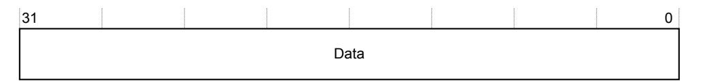

**Figure 4-55 DL1DATA**

The following table shows the DL1DATA*n*\_EL1 bit assignments.

**Table 4-74 DL1DATAn\_EL1 bit assignments**

| Bits   | Name | Function                                       |
|--------|------|------------------------------------------------|
| [31:0] | Data | Holds the data side L1 or L2 array information |

To access the DL1DATA*n*\_EL1 in AArch64 state, read or write the registers with:

```
MRS <Xt>, s3_0_c15_c1_n; Read EL1 Data L1 Data n Register
MSR s3_0_c15_c1_n, <Xt>; Write EL1 Data L1 Data n Register
```

*n* is 0, 1, 2, 3, or 4 for Opcode2 of the DL1DATA*n*\_EL1 registers.

To access the DL1DATA*n* in AArch32 state, read or write the CP15 registers with:

```
MRC p15, 0, <Rt>, c15, c1, n; Read Data L1 Data n Register
MCR p15, 0, <Rt>, c15, c1, n; Write Data L1 Data n Register
```

*n* is 0, 1, 2, 3, or 4 for Opcode2 of the DL1DATA*n* registers.

# **Related information**

*4.3.64 RAM Index operation* on page 4-179*.*

#### **4.3.64 RAM Index operation**

The RAMINDEX characteristics are:

#### **Purpose**

Read the instruction side L1 array contents into the IL1DATA*n* register or read the data side L1 or L2 array contents into the DL1DATA*n* register.

# **Usage constraints**

The accessibility to the RAMINDEX by Exception level is:

| EL0 | EL1(NS) | EL1(S) | EL2 | EL3(SCR.NS = 1) | EL3(SCR.NS = 0) |
|-----|---------|--------|-----|-----------------|-----------------|
| -   | WO      | WO     | WO  | WO              | WO              |

#### **Configurations**

The RAMINDEX operates in the Secure and Non-secure states.

The RAMINDEX command takes one argument or source register. You must write an ARM core register with the bit pattern described in the following figure for each RAM listed in the following table.

A 32-bit register in AArch64 state.

#### **Attributes**

See the register summary in *[Table 4-15 AArch64 implementation defined registers](#page-85-0)* [on page 4-86](#page-85-0).

The following figure shows the RAMINDEX bit assignments.

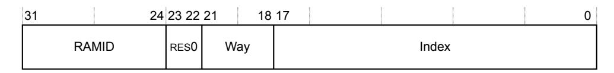

**Figure 4-56 RAMINDEX bit assignments**

The following table shows the RAMINDEX bit assignments.

**Table 4-75 RAMINDEX bit assignments**

| Bits    | Name  |                                                                                               | Function                                                                    |  |  |  |  |  |
|---------|-------|-----------------------------------------------------------------------------------------------|-----------------------------------------------------------------------------|--|--|--|--|--|
| [31:24] | RAMID | RAM identifier. This field indicates which RAM is being accessed. The possible values are aq: |                                                                             |  |  |  |  |  |
|         |       | 0x00                                                                                          | L1-I Tag RAM, see L1-I Tag RAM on page 4-181.                               |  |  |  |  |  |
|         |       | 0x01                                                                                          | L1-I Data RAM, see L1-I Data RAM on page 4-181.                             |  |  |  |  |  |
|         |       | 0x02                                                                                          | L1-I BTB RAM, see L1-I BTB RAM on page 4-182.                               |  |  |  |  |  |
|         |       | 0x03                                                                                          | L1-I GHB RAM, see L1-I GHB RAM on page 4-182.                               |  |  |  |  |  |
|         |       | 0x04                                                                                          | L1-I TLB array, see L1-I TLB array on page 4-182.                           |  |  |  |  |  |
|         |       | 0x05                                                                                          | L1-I indirect predictor RAM, see L1-I indirect predictor RAM on page 4-183. |  |  |  |  |  |
|         |       | 0x08                                                                                          | L1-D Tag RAM, see L1-D Tag RAM on page 4-184.                               |  |  |  |  |  |
|         |       | 0x09                                                                                          | L1-D Data RAM, see L1-D Data RAM on page 4-184.                             |  |  |  |  |  |
|         |       | 0x0A                                                                                          | L1-D TLB array, see L1-D TLB array on page 4-184.                           |  |  |  |  |  |
|         |       | 0x10                                                                                          | L2 Tag RAM, see L2 Tag RAM on page 4-185.                                   |  |  |  |  |  |
|         |       | 0x11                                                                                          | L2 Data RAM, see L2 Data RAM on page 4-186.                                 |  |  |  |  |  |
|         |       | 0x12                                                                                          | L2 Snoop Tag RAM, see L2 Snoop Tag RAM on page 4-187.                       |  |  |  |  |  |
|         |       | 0x13                                                                                          | L2 Data ECC RAM, see L2 Data ECC RAM on page 4-187.                         |  |  |  |  |  |
|         |       | 0x14                                                                                          | L2 Dirty RAM, see L2 Dirty RAM on page 4-188.                               |  |  |  |  |  |
|         |       | 0x18                                                                                          | L2 TLB RAM, see L2 TLB RAM on page 4-188.                                   |  |  |  |  |  |
|         |       |                                                                                               | All other values are reserved.                                              |  |  |  |  |  |
| [23:22] | -     | Reserved, RES0.                                                                               |                                                                             |  |  |  |  |  |
| [21:18] | Way   | Indicates the way of the RAM that is being accessed.                                          |                                                                             |  |  |  |  |  |
| [17:0]  | Index | Indicates the index address of the RAM that is being accessed.                                |                                                                             |  |  |  |  |  |

#### **Note**

- Executing a RAMINDEX operation with a reserved value of RAMID, Way, or Index results in the corruption of the IL1DATA*n* or DL1DATA*n* register contents.
- In Non-secure EL1 and EL2, the RAMINDEX operation returns the contents of the RAM only if the entry is marked valid and Non-secure. Entries that are marked invalid or Secure update the IL1DATA*n* or DL1DATA*n* registers with 0x0 values.
- In Secure EL1 or EL3, the RAMINDEX operation returns the contents of the RAM, regardless of whether the entry is marked valid or invalid, and Secure or Non-secure.
- When the RAMID field is set to L1-I BTB RAM in Non-secure EL1 and EL2, the RAMINDEX operation always returns zero.
- The L1-I, L1-D, L2 TLB, and L2 Snoop Tag RAMs can only be accessed by the processor where the RAM resides or that owns the RAM.

aq All other values reserved.

<span id="page-180-0"></span>• The L2 Tag, Data, and Dirty RAMs can be accessed by any processor.

#### L1-I Tag RAM

The following figure shows the RAMINDEX register bit assignments for accessing L1-I Tag RAM.

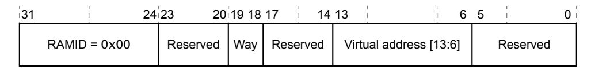

Figure 4-57 RAMINDEX bit assignments for L1-I Tag RAM

The RAMINDEX address bits for accessing L1-I Tag RAM are:

Way[1:0] Way select.

----- Note -----

The instruction cache is 3-way set-associative. Setting the way field to a value of 3, reads way 2 of the cache.

VA[13:7] Row select.

VA[6] Bank select.

The data returned from accessing L1-I Tag RAM are:

ILDATA1[1] Valid bit.

**ILDATA1[0]** Non-secure identifier for the physical address.

**ILDATA0** Physical address tag [43:12].

#### L1-I Data RAM

The following figure shows the RAMINDEX bit assignments for accessing L1-I Data RAM.

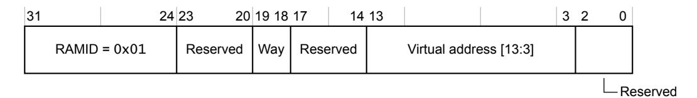

Figure 4-58 RAMINDEX bit assignments for L1-I Data RAM

The RAMINDEX address bits for accessing L1-I Data RAM are:

Way[1:0] Way select.

----- Note ------

The instruction cache is 3-way set-associative. Setting the Way field to 3, reads way 2 of the cache.

\_\_\_\_\_

VA[13:6] Set select.

VA[5:4] Bank select.

**VA[3]** Upper or lower doubleword within the quadword.

The data returned from accessing L1-I Data RAM are:

<span id="page-181-0"></span>

 ILDATA1[31:0]
 Data word 1.

 ILDATA0[31:0]
 Data word 0.

#### L1-I BTB RAM

The following figure shows the RAMINDEX bit assignments for accessing L1-I BTB RAM.

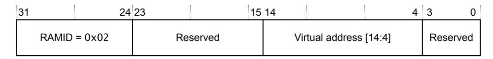

Figure 4-59 RAMINDEX bit assignments for L1-I BTB RAM

The RAMINDEX address bits for accessing L1-I BTB RAM are:

VA[14:6] Row select.
VA[5:4] Bank select.

ARM does not disclose the format of the returned data.

#### L1-I GHB RAM

The following figure shows the RAMINDEX bit assignments for accessing L1-I GHB RAM.

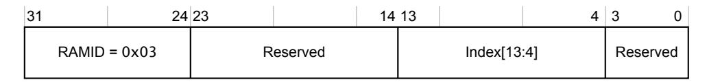

Figure 4-60 RAMINDEX bit assignments for L1-I GHB RAM

The RAMINDEX address bits for accessing L1-I GHB RAM are:

Index[13:5]Row select.Index[4]Bank select.

ARM does not disclose the format of the returned data.

# L1-I TLB array

The following figure shows the RAMINDEX bit assignments for accessing L1-I TLB array.

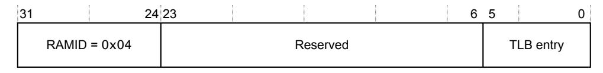

Figure 4-61 RAMINDEX bit assignments for L1-I TLB array

The RAMINDEX address bits for accessing L1-I TLB array are:

**TLB entry** Selects one of the 48 entries.

The data returned from accessing L1-I TLB array are:

ILDATA3[27] Valid bit

ILDATA3[26:25] Shareability attribute:

9b99

Non-Shareable.

0b01

Reserved.

0b10

Outer Shareable.

0b11

Inner Shareable.

<span id="page-182-0"></span>ILDATA3[15:14] VA memory space ID:

0b00

Secure EL1

0b01

EL3, AArch64 only.

0b10

Non-secure EL1.

0b11

Non-secure EL2.

ILDATA3[13:6]Virtual Machine ID (VMID).{ILDATA3[5:0], ILDATA2[31:22]}Address Space ID (ASID).

ILDATA2[21:14] Memory Attribute Indirection Register.

ILDATA2[11:10] Page size:

0b00

4KB.

0b01

64KB.

0b10

1MB.

0b11

Reserved.

ILDATA2[9:6] Domain ID.

**ILDATA2**[5] Non-secure identifier for the physical address.

**{ILDATA2[4:0], ILDATA1[31:5]}** Physical address [43:12]. **{ILDATA1[4:0], ILDATA0[31:0]}** Virtual address [48:12].

# L1-I indirect predictor RAM

The following figure shows the RAMINDEX bit assignments for accessing L1-I indirect predictor RAM.

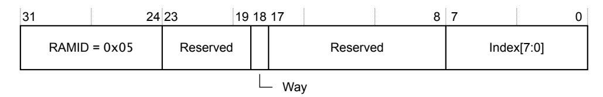

Figure 4-62 RAMINDEX bit assignments for L1-I indirect predictor RAM

The RAMINDEX address bits for accessing L1-I indirect predictor RAM are:

Way select.

Index[7:0] Indirect predictor entry.

ARM does not disclose the format of the returned data.

#### <span id="page-183-0"></span>L1-D Tag RAM

The following figure shows the RAMINDEX bit assignments for accessing L1-D Tag RAM.

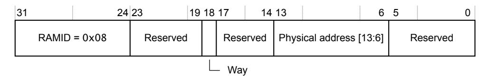

Figure 4-63 RAMINDEX bit assignments for L1-D Tag RAM

The RAMINDEX address bits for accessing L1-D Tag RAM are:

Way Way select.

PA[13:8] Row select.

PA[7:6] Bank select.

The data returned from accessing L1-D Tag RAM are:

**DL1DATA1[1:0]** MESI state:

0b00 Invalid.
0b01 Exclusive.
0b10 Shared.
0b11 Modified.

**DL1DATA0[30]** Non-secure identifier for the physical address.

**DL1DATA0[29:0]** Physical address tag [43:14].

#### L1-D Data RAM

The following figure shows the RAMINDEX bit assignments for accessing L1-D Data RAM.

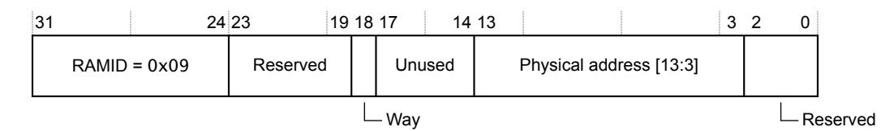

Figure 4-64 RAMINDEX bit assignments for L1-D Data RAM

The RAMINDEX address bits for accessing L1-D Data RAM are:

Way Way select.
PA[13:6] Set select.
PA[5:4] Bank select.

**PA[3]** Upper or lower doubleword within the quadword.

The data returned from accessing L1-D Data RAM are:

**DL1DATA1[31:0] DL1DATA0[31:0]**Data word 1. **DL1DATA0[31:0]**Data word 0.

# L1-D TLB array

The following figure shows the RAMINDEX bit assignments for accessing L1-D TLB array.

31 24 23 0 RAMID = 0x0A Reserved TLB entry 5 4

**Figure 4-65 RAMINDEX bit assignments for L1-D TLB array**

<span id="page-184-0"></span>The RAMINDEX address bits for accessing L1-D TLB array are:

**TLB entry** Selects one of the 32 entries.

The data returned from accessing L1-D TLB array are:

**DL1DATA3[12]** Valid bit.

**DL1DATA3[11:10]** VA memory space ID:

0b00

Secure EL1.

0b01

EL3, AArch64 only.

0b10

Non-secure EL1.

0b11

Non-secure EL2.

**DL1DATA3[1:0]** Shareability attribute:

0b00

Non-Shareable.

0b01

Reserved.

0b10

Outer Shareable.

0b11

Inner Shareable.

**DL1DATA2[31:24]** Memory Attribute Indirection Register.

**DL1DATA2[23:22]** Page size:

0b00

4KB.

0b01

64KB.

0b10

1MB.

0b11

Reserved.

**DL1DATA2[21:18]** Domain ID.

**DL1DATA2[5]** Non-secure identifier for the physical address.

**{DL1DATA2[4:0], DL1DATA1[31:5]}** Physical address [43:12]. **{DL1DATA1[4:0], DL1DATA0[31:0]}** Virtual address [48:12].

#### **L2 Tag RAM**

The following figure shows the RAMINDEX bit assignments for accessing L2 Tag RAM.

<span id="page-185-0"></span>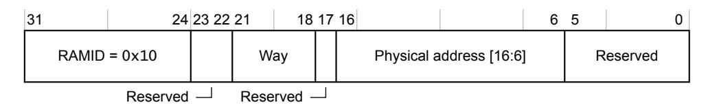

**Figure 4-66 RAMINDEX bit assignments for L2 Tag RAM**

The RAMINDEX address bits for accessing L2 Tag RAM are:

**Way[3:0]** Way select. **PA[16:7]** Row select. **PA[6]** Tag bank select.

The data returned from accessing L2 Tag RAM are:

**DL1DATA0[31]** Non-secure identifier for the physical address.

**DL1DATA0[30:2]** Physical address tag [43:15].

**DL1DATA0[1:0]** MOESI state:

0b00

Invalid.

0b01

Exclusive or Modified.

0b10

Reserved.

0b11

Shared or Owned.

**Note**

The Dirty bit in the L2 Dirty RAM must be used to differentiate between the Exclusive, Modified, Shared, and Owned states.

# **L2 Data RAM**

The following figure shows the RAMINDEX bit assignments for accessing L2 Data RAM.

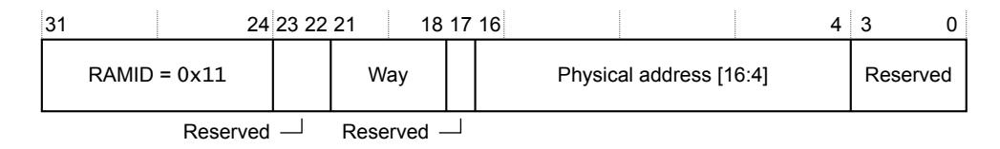

**Figure 4-67 RAMINDEX bit assignments for L2 Data RAM**

The RAMINDEX address bits for accessing L2 Data RAM are:

**Way[3:0]** Way select. **PA[16:7]** Row select. **PA[6]** Tag bank select. **PA[5:4]** Data bank select.

The data returned from accessing L2 Data RAM are:

**DL1DATA3** Data[127:96]. **DL1DATA2** Data[95:64].

<span id="page-186-0"></span>

| DL1DATA1 | Data[63:32]. |
|----------|--------------|
| DL1DATA0 | Data[31:0].  |

## L2 Snoop Tag RAM

The following figure shows the RAMINDEX bit assignments for accessing L2 Snoop Tag RAM.

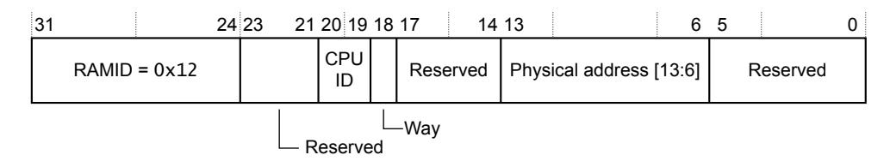

Figure 4-68 RAMINDEX bit assignments for L2 Snoop Tag RAM

The RAMINDEX address bits for accessing L2 Snoop Tag RAM are:

**CPUID**[1:0] Processor ID of the executing processor that has access to the L2 Snoop Tag RAM.

Way Way select.
PA[13:7] Row select.
PA[6] Bank select.

The data returned from accessing L2 Snoop Tag RAM are:

**DL1DATA1[0]** Non-secure identifier for the physical address.

**DL1DATA0[31:2]** Physical address tag [43:14].

**DL1DATA0[1:0]** MESI state:

0b00

Invalid.

0b01

Exclusive or Modified.

0b10

Reserved.

0b11

Shared.

#### L2 Data ECC RAM

The following figure shows the RAMINDEX bit assignments for accessing L2 Data ECC RAM.

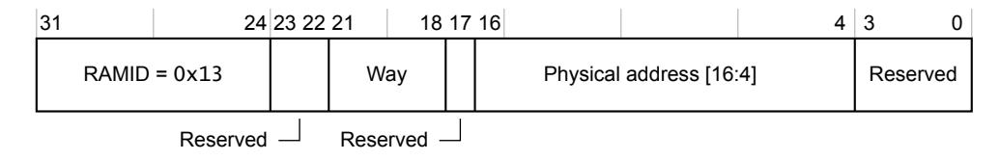

Figure 4-69 RAMINDEX bit assignments for L2 Data ECC RAM

The RAMINDEX address bits for accessing L2 Data ECC RAM are:

Way [3:0] Way select.

PA[16:7] Row select.

PA[6] Tag bank select.

PA[5:4] Data bank select.

<span id="page-187-0"></span>ARM does not disclose the format of the returned data.

#### L2 Dirty RAM

The following figure shows the RAMINDEX bit assignments for accessing L2 Dirty RAM.

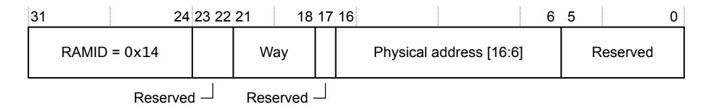

Figure 4-70 RAMINDEX bit assignments for L2 Dirty RAM

The RAMINDEX address bits for accessing L2 Dirty RAM are:

Way [3:0] Way select.
PA[16:7] Row select.
PA[6] Tag bank select.

The data returned from accessing L2 Dirty RAM are:

DL1DATA0[7] Outer Shareable page attribute.

DL1DATA0[6] Read Allocate page attribute.

DL1DATA0[5] Write Allocate page attribute.

DL1DATA0[4] Inner Shareable page attribute.

**DL1DATA0[0]** Dirty bit indicator.

#### **L2 TLB RAM**

The following figure shows the RAMINDEX bit assignments for accessing L2 TLB RAM.


Figure 4-71 RAMINDEX bit assignments for L2 TLB RAM

The RAMINDEX address bits for accessing L2 TLB RAM are:

Way select.

**TLB entry** Selects one of the 256 entries in each way.

The data returned from accessing L2 TLB RAM are:

**DL1DATA3[31]** Valid bit for EL3 AArch64 only.

**DL1DATA3[30]** Valid bit for EL2.

DL1DATA3[29] Valid bit for Secure EL1.

DL1DATA3[28] Valid bit for Non-secure EL1.

----- Note ------

Only a single bit in DLDATA3[31:28] is set to 1.

**DL1DATA3[27:20]** VMID. **DL1DATA3[19:4]** ASID.

<span id="page-188-0"></span>**{DL1DATA3[3:0], DL1DATA2[31:6]}** Virtual address [48:19]. **DL1DATA2[5]** Non-secure identifier for the physical address. **{DL1DATA2[4:0], DL1DATA1[31:5]}** Physical address [43:12]. **{DL1DATA1[1:0], DL1DATA0[31]}** Fully resolved page size: 0b000 4KB. 0b001 64KB. 0b010 1MB. 0b011 2MB. 0b100 16MB. 0b101 1GB.

**DL1DATA0[13:10]** Domain ID.

**DL1DATA0[9:8]** Shareability attribute:

0b00 Non-Shareable. 0b01 Reserved. 0b10 Outer Shareable. 0b11 Inner Shareable.

**DL1DATA0[7:0]** Memory Attribute Indirection Register.

For example, to read an entry in the instruction side TLB in AArch64 state:

```
LDR X0, =0x0000000001000D80
SYS #0, c15, c4, #0, X0
DSB SY
ISB
MRS X1, S3_0_c15_c0_0 ; Move ILData0 register to X1
MRS X2, S3_0_c15_c0_1 ; Move ILData1 register to X2
MRS X3, S3_0_c15_c0_2 ; Move ILData2 register to X3
MRS X4, S3_0_c15_c0_3 ; Move ILData3 register to X4
```

To complete the RAMINDEX operation in AArch64 state, use the following instruction:

```
SYS #0, c15, c4, #0, X0 ; Execute RAMINDEX operation
```

For example, to read one entry in the instruction side L1 data array in AArch32 state:

```
LDR R0, =0x01000D80;
MCR p15, 0, R0, c15, c4, 0; Read I-L1 TLB data into IL1DATA0-2
DSB
ISB
MRC p15, 0, R1, c15, c0, 0; Move IL1DATA0 Register to R1
MRC p15, 0, R2, c15, c0, 1; Move IL1DATA1 Register to R2
MRC p15, 0, R3, c15, c0, 2; Move IL1DATA2 Register to R3
```

To complete the RAMINDEX operation in AArch32 state, use the following instruction:

```
MCR p15, 0, <Rt>, c15, c4, 0; Execute RAMINDEX operation
```

#### **4.3.65 L2 Auxiliary Control Register, EL1**

The L2ACTLR\_EL1 characteristics are:

**Purpose** Provides IMPLEMENTATION DEFINED configuration and control options for the L2 memory system. There is one L2 Auxiliary Control Register for the Cortex-A57 processor.

# **Usage constraints**

The accessibility to the L2ACTLR by Exception level is:

| EL0 | EL1(NS) | EL1(S) | EL2  | EL3(SCR.NS = 1) | EL3(SCR.NS = 0) |
|-----|---------|--------|------|-----------------|-----------------|
| -   | RW      | RWar   | RWas | RW              | RW              |

**Note**

The L2ACTLR\_EL1 must be set statically and not dynamically changed.

The L2 Auxiliary Control Register can only be written when the L2 memory system is idle. ARM recommends that you write to this register after a powerup reset, before the MMU is enabled, and before any ACE, CHI, or ACP traffic begins.

If the register must be modified after a powerup reset sequence, you must to idle the L2 memory system with the following sequence:

- 1. Disable the MMU from each core followed by an ISB to ensure the MMU disable operation is complete, then execute a DSB to drain previous memory transactions.
- 2. Ensure that the system has no outstanding ACE AC channel or CHI RXRSP coherence requests to the Cortex-A57 processor.
- 3. Ensure that the system has no outstanding ACP requests to the Cortex-A57 processor.

When the L2 is idle, the processor can update the L2 Auxiliary Control Register followed by an ISB. After the L2 Auxiliary Control Register is updated, you can enable the MMUs and normal ACE or CHI and ACP traffic can resume.

#### **Configurations** The L2ACTLR\_EL1 is:

- Common to the Secure and Non-secure states.
- A 32 bit register in AArch64 state.
- Architecturally mapped to the AArch32 L2ACTLR register.

**Attributes** See the register summary in *[Table 4-15 AArch64 implementation defined registers](#page-85-0)* [on page 4-86](#page-85-0).

The following figure shows the L2ACTLR\_EL1 bit assignments.

ar Write access if ACTLR\_EL3.L2ACTLR is 1 and ACTLR\_EL2.L2ACTLR is 1, or ACTLR\_EL3.L2ACTLR is 1 and the Secure SCR.NS is 0. as Write access if ACTLR\_EL3.L2ACTLR is 1.

<span id="page-190-0"></span>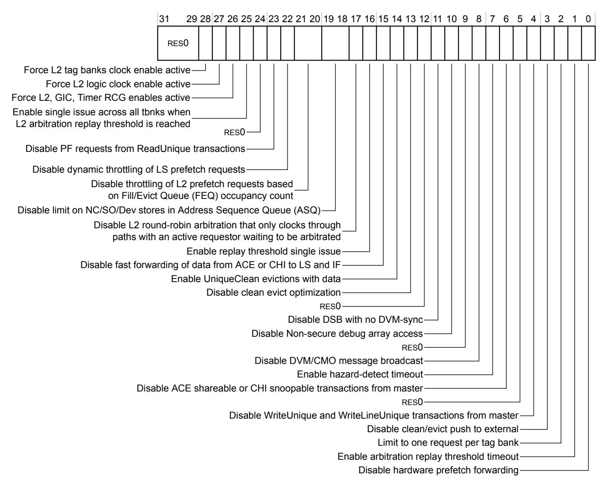

**Figure 4-72 L2ACTLR\_EL1 bit assignments**

The following table shows the L2ACTLR\_EL1 bit assignments.

**Table 4-76 L2ACTLR\_EL1 bit assignments**

| Bits    | Name                           | Function                                                                                                               |
|---------|--------------------------------|------------------------------------------------------------------------------------------------------------------------|
| [31:29] | -                              | Reserved, RES0.                                                                                                        |
| [28]    | Force L2 tag bank clock enable | Forces L2 tag bank clock enable active:                                                                                |
|         | active                         | 0<br>Does not prevent the clock generator from stopping the L2 tag bank clock. This is the<br>reset value.             |
|         |                                | 1<br>Prevents the clock generator from stopping the L2 tag bank clock.                                                 |
|         |                                | This bit applies to each of the two L2 cache tag bank clocks.                                                          |
|         |                                | See L2 control and tag banks clock gating on page 2-49.                                                                |
|         |                                | If the L2 dynamic retention feature is used then this bit must be zero. See L2 RAMs<br>dynamic retention on page 2-48. |

at This bit is provided for debugging and characterization purpose only. For normal operation, ARM recommends that you do not change the value of this bit from its reset value.

| Bits   | Name                                                                                       | Function                                                                                                                                                                          |
|--------|--------------------------------------------------------------------------------------------|-----------------------------------------------------------------------------------------------------------------------------------------------------------------------------------|
| [27]at | Force L2 logic clock enable                                                                | Forces L2 logic clock enable active:                                                                                                                                              |
|        | active                                                                                     | 0<br>Does not prevent the clock generator from stopping the L2 logic clock. This is the<br>reset value.                                                                           |
|        |                                                                                            | 1<br>Prevents the clock generator from stopping the L2 logic clock.                                                                                                               |
|        |                                                                                            | See L2 control and tag banks clock gating on page 2-49.                                                                                                                           |
|        |                                                                                            | If the L2 dynamic retention feature is used then this bit must be zero. See L2 RAMs<br>dynamic retention on page 2-48.                                                            |
| [26]at | Force L2, GIC, Timer RCG<br>enables active                                                 | Forces L2, GIC CPU interface, and Timer Regional Clock Gate (RCG) enables active:                                                                                                 |
|        |                                                                                            | 0<br>Enables L2, GIC CPU interface, and Timer RCGs for additional clock gating and<br>potentially reduce dynamic power dissipation. This is the reset value.                      |
|        |                                                                                            | 1<br>Forces L2, GIC CPU interface, and Timer RCG enables HIGH.                                                                                                                    |
|        |                                                                                            | Setting this bit to 1 has no effect if the processor is configured to not include RCGs. See<br>Regional clock gating on page 2-50.                                                |
| [25]at | Enable single issue across all<br>tbnks when L2 arbitration replay<br>threshold is reached | Enables single issue across all tag banks when the L2 arbitration replay threshold is<br>reached, so that only one request can be active across both tag banks at any given time: |
|        |                                                                                            | 0<br>Disables single issue across the tag banks when the L2 arbitration replay threshold is<br>reached. This is the reset value.                                                  |
|        |                                                                                            | 1<br>Enables single issue across the tag banks when the L2 arbitration replay threshold is<br>reached.                                                                            |
| [24]   | -                                                                                          | Reserved, RES0.                                                                                                                                                                   |
| [23]at | Disable prefetch requests from<br>ReadUnique transactions                                  | Disables prefetch requests from ReadUnique transactions:                                                                                                                          |
|        |                                                                                            | 0<br>Enables prefetch requests to be generated by ReadUnique transactions. This is the<br>reset value.                                                                            |
|        |                                                                                            | 1<br>Disables prefetch requests to be generated by ReadUnique transactions.                                                                                                       |
| [22]at | Disable dynamic throttling of                                                              | Disables dynamic throttling of load/store prefetch requests:                                                                                                                      |
|        | load/store prefetch requests                                                               | 0<br>Enables dynamic throttling of load/store prefetch requests. This is the reset value.                                                                                         |
|        |                                                                                            | 1<br>Disables dynamic throttling of load/store prefetch requests.                                                                                                                 |

| Bits    | Name                                                                                | Function                                                                                                                                                                                              |
|---------|-------------------------------------------------------------------------------------|-------------------------------------------------------------------------------------------------------------------------------------------------------------------------------------------------------|
| [21:20] | Disable throttling of L2 prefetch                                                   | Disables throttling of L2 prefetch requests based on FEQ occupancy count:                                                                                                                             |
|         | requests based on Fill/Evict<br>Queue (FEQ) occupancy countau                       | 00<br>For a 16-entry FEQ implementation, enables throttling of L2 prefetch requests when<br>FEQ count exceeds 12.                                                                                     |
|         |                                                                                     | For a 20-entry FEQ implementation, enables throttling of L2 prefetch requests when<br>FEQ count exceeds 16.                                                                                           |
|         |                                                                                     | This is the reset value.                                                                                                                                                                              |
|         |                                                                                     | 01<br>For a 16-entry FEQ implementation, enables throttling of L2 prefetch requests when<br>FEQ count exceeds 10.                                                                                     |
|         |                                                                                     | For a 20-entry FEQ implementation, enables throttling of L2 prefetch requests when<br>FEQ count exceeds 14.                                                                                           |
|         |                                                                                     | 10<br>For a 16-entry FEQ implementation, enables throttling of L2 prefetch requests when<br>FEQ count exceeds 8.                                                                                      |
|         |                                                                                     | For a 20-entry FEQ implementation, enables throttling of L2 prefetch requests when<br>FEQ count exceeds 12.                                                                                           |
|         | 11<br>Disables throttling of L2 prefetch requests based on FEQ occupancy count.     |                                                                                                                                                                                                       |
| [19:18] | Disable limit on NC/SO/Dev<br>stores in Address Sequence<br>Queue (ASQ)             | Disables limit on NC/SO/Dev stores in ASQ:                                                                                                                                                            |
|         |                                                                                     | 00<br>NC/SO/Dev stores limited to 12 entries in the ASQ. This is the reset value.                                                                                                                     |
|         |                                                                                     | 01<br>NC/SO/Dev stores limited to 10 entries in the ASQ.                                                                                                                                              |
|         |                                                                                     | 10<br>NC/SO/Dev stores limited to 8 entries in the ASQ.                                                                                                                                               |
|         |                                                                                     | 11<br>There is no limit on NC/SO/Dev stores in the ASQ.                                                                                                                                               |
| [17]at  | Disable L2 round-robin<br>arbitration that only clocks<br>waiting to be arbitrated: | Disable L2 round-robin arbitration that only clocks through paths with an active requestor                                                                                                            |
|         | through paths with an active<br>requestor waiting to be arbitrated                  | 0<br>Enables L2 round-robin arbitration that only clocks through paths with an active<br>requestor waiting to be arbitrated. This is the reset value.                                                 |
|         |                                                                                     | 1<br>Disables L2 round-robin arbitration that only clocks through paths with an active<br>requestor waiting to be arbitrated.                                                                         |
| [16]at  | Enable replay threshold single                                                      | Enables replay threshold single issue:                                                                                                                                                                |
|         | issue                                                                               | 0<br>Disables replay threshold single issue. This is the reset value.                                                                                                                                 |
|         |                                                                                     | 1<br>Enables replay threshold single issue. If there are 32 consecutive transactions on a tag<br>bank replay, then single issue is forced until a transaction successfully passes hazard<br>checking. |
| [15]at  | Disable fast forwarding of data                                                     | Disables fast forwarding of data from ACE or CHI to LS and IF:                                                                                                                                        |
|         | from ACE or CHI to LS and IF                                                        | 0<br>Enables fast forwarding of data from ACE or CHI to LS and IF. This is the reset<br>value.                                                                                                        |
|         |                                                                                     | 1<br>Disables fast forwarding of data from ACE or CHI to LS and IF.                                                                                                                                   |

au The 20-entry FEQ implementation option is available only in r1p0 and later revisions.

| Enable UniqueClean evictions<br>Disable clean evict optimization | Enables UniqueClean evictions with data:<br>0<br>Disables UniqueClean evictions with data. This is the reset value if the multiprocessor<br>implements the ACE interface.<br>1<br>Enables UniqueClean evictions with data. This is the reset value if the multiprocessor<br>implements the CHI interface. |
|------------------------------------------------------------------|-----------------------------------------------------------------------------------------------------------------------------------------------------------------------------------------------------------------------------------------------------------------------------------------------------------|
|                                                                  |                                                                                                                                                                                                                                                                                                           |
|                                                                  |                                                                                                                                                                                                                                                                                                           |
|                                                                  |                                                                                                                                                                                                                                                                                                           |
|                                                                  | Disables clean evict optimization:                                                                                                                                                                                                                                                                        |
|                                                                  | 0<br>Enables clean evict optimization. This is the reset value.                                                                                                                                                                                                                                           |
|                                                                  | 1<br>Disables clean evict optimization.                                                                                                                                                                                                                                                                   |
|                                                                  | Reserved, RES0.                                                                                                                                                                                                                                                                                           |
|                                                                  | Disables Data Synchronization Barrier (DSB) with no Distributed Virtual Memory<br>(DVM) synchronization:                                                                                                                                                                                                  |
|                                                                  | 0<br>Enables DSB with no DVM synchronization. This is the reset value.                                                                                                                                                                                                                                    |
|                                                                  | A DSB does not cause a DVM Sync message to occur. However, if a TLB<br>maintenance operation, cache maintenance operation, or branch predictor maintenance<br>operation occurs after the previous DSB then a DVM Sync message is generated<br>regardless of the setting of this bit.                      |
|                                                                  | 1<br>Disables DSB with no DVM synchronization. Therefore, a DSB always causes a<br>DVM Sync message to occur.                                                                                                                                                                                             |
|                                                                  | Disables Non-secure debug array read:                                                                                                                                                                                                                                                                     |
|                                                                  | 0<br>Enables Non-secure debug array read access to Non-secure memory. This is the reset<br>value.                                                                                                                                                                                                         |
|                                                                  | 1<br>Disables Non-secure debug array read access.                                                                                                                                                                                                                                                         |
|                                                                  | Reserved, RES0.                                                                                                                                                                                                                                                                                           |
|                                                                  | Disables DVM transactions and cache maintenance operation message broadcast:                                                                                                                                                                                                                              |
|                                                                  | 0<br>Enables DVM and cache maintenance operation message broadcast. This is the reset<br>value.                                                                                                                                                                                                           |
|                                                                  | 1<br>Disables DVM and cache maintenance operation message broadcast.                                                                                                                                                                                                                                      |
|                                                                  | Enables hazard detect timeout:                                                                                                                                                                                                                                                                            |
|                                                                  | 0<br>Disables hazard detect timeout. This is the reset value.                                                                                                                                                                                                                                             |
|                                                                  | 1<br>Enables hazard detect timeout.                                                                                                                                                                                                                                                                       |
| Disable ACE shareable or CHI                                     | Disables shareable or snoopable transactions from master:                                                                                                                                                                                                                                                 |
|                                                                  |                                                                                                                                                                                                                                                                                                           |
| snoopable transactions from                                      | 0<br>Enables ACE shareable or CHI snoopable transactions from master. This is the reset<br>value.                                                                                                                                                                                                         |
|                                                                  | 1<br>Disables ACE shareable or CHI snoopable transactions from master.                                                                                                                                                                                                                                    |
|                                                                  | Disable DSB with no DVM<br>Disable Non-secure debug array<br>Disable DVM and cache<br>maintenance operation message<br>Enable hazard detect timeout                                                                                                                                                       |

<span id="page-194-0"></span>

| Bits  | Name                                                                   | Function                                                                                                                           |
|-------|------------------------------------------------------------------------|------------------------------------------------------------------------------------------------------------------------------------|
| [4]   | Disable WriteUnique and<br>WriteLineUnique transactions<br>from master | Disables WriteUnique and WriteLineUnique transactions from master:                                                                 |
|       |                                                                        | 0<br>Enables WriteUnique and WriteLineUnique transactions from master.                                                             |
|       |                                                                        | 1<br>Disables WriteUnique and WriteLineUnique transactions from master. This is the<br>reset value.                                |
| [3]   | Disable clean/evict push to<br>external                                | Disables clean/evict push to external:                                                                                             |
|       |                                                                        | 0<br>Enables clean/evict to be pushed out to external. This is the reset value if the<br>processor implements the ACE interface.   |
|       |                                                                        | 1<br>Disables clean/evict from being pushed to external. This is the reset value if the<br>processor implements the CHI interface. |
| [2]at | Limit to one request per tag bank                                      | Limit to one request per tag bank:                                                                                                 |
|       |                                                                        | 0<br>Normal behavior permitting parallel requests to the tag banks. This is the reset value.                                       |
|       |                                                                        | 1<br>Limits to one request per tag bank.                                                                                           |
| [1]at | Enable arbitration replay<br>threshold timeout                         | Enables arbitration replay threshold timeout:                                                                                      |
|       |                                                                        | 0<br>Disables arbitration replay threshold timeout. This is the reset value.                                                       |
|       |                                                                        | 1<br>Enables arbitration replay threshold timeout.                                                                                 |
| [0]at | Disable hardware prefetch<br>forwarding                                | Disables hardware prefetch forwarding:                                                                                             |
|       |                                                                        | 0<br>Enables hardware prefetch forwarding. This is the reset value.                                                                |
|       |                                                                        | 1<br>Disables hardware prefetch forwarding.                                                                                        |

To access the L2ACTLR\_EL1 in AArch64 state, read or write the register with:

```
MRS <Xt>, s3_1_c15_c0_0; Read EL1 L2 Auxiliary Control Register
MSR s3_1_c15_c0_0, <Xt>; Write EL1 L2 Auxiliary Control Register
```

To access the L2ACTLR in AArch32 state, read or write the CP15 register with:

```
MRC p15, 1, <Rt>, c15, c0, 0; Read L2 Auxiliary Control Register
MCR p15, 1, <Rt>, c15, c0, 0; Write L2 Auxiliary Control Register
```

#### **4.3.66 CPU Auxiliary Control Register, EL1**

The CPUACTLR\_EL1 characteristics are:

#### **Purpose**

Provides IMPLEMENTATION DEFINED configuration and control options for the processor. There is one 64-bit CPU Auxiliary Control Register for each core in the cluster.

#### **Usage constraints**

The accessibility to the CPUACTLR EL1 by Exception level is:

| EL0 | EL1(NS) | EL1(S) | EL2  | EL3(SCR.NS = 1) | EL3(SCR.NS = 0) |
|-----|---------|--------|------|-----------------|-----------------|
| -   | RW      | RWav   | RWaw | RW              | RW              |

The CPU Auxiliary Control Register can only be written when the system is idle. ARM recommends that you write to this register after a powerup reset, before the MMU is enabled, and before any ACE or ACP traffic begins.

| Note |
|------|
|------|

Setting many of these bits can cause significantly lower performance on your code. Therefore, it is suggested that you do not modify this register unless directed by ARM.

# **Configurations**

CPUACTLR EL1 is:

- Common to the Secure and Non-secure states.
- A 64-bit read/write register.
- Architecturally mapped to the AArch32 CPUACTLR register.

#### Attributes

See the register summary in *Table 4-15 AArch64 implementation defined registers* on page 4-86.

The following figure shows the CPUACTLR\_EL1[63:32] bit assignments.

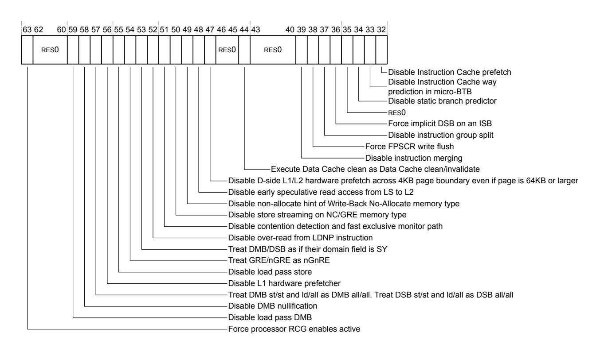

Figure 4-73 CPUACTLR EL1[63:32] bit assignments

The following table shows the CPUACTLR\_EL1[63:32] bit assignments.

Write access if ACTLR\_EL3.CPUACTLR is 1 and ACTLR\_EL2.CPUACTLR is 1, or ACTLR\_EL3.CPUACTLR is 1 and SCR.NS is 0.
 Write access if ACTLR\_EL3.CPUACTLR is 1.

# **Table 4-77 CPUACTLR\_EL1[63:32] bit assignments**

<span id="page-196-0"></span>

| Bits             | Name                                                                                                   | Function                                                                                                                                                                                                                                                                                                                                                                     |
|------------------|--------------------------------------------------------------------------------------------------------|------------------------------------------------------------------------------------------------------------------------------------------------------------------------------------------------------------------------------------------------------------------------------------------------------------------------------------------------------------------------------|
| [63]             | Force processor RCG enables<br>active                                                                  | Forces processor RCG enables active:<br>0<br>Enables the processor RCGs for additional clock gating and potentially reduce<br>dynamic power dissipation. This is the reset value.<br>1<br>Forces the processor RCG enables HIGH.<br>Setting this bit to 1 has no effect if the processor is configured to not include RCGs. See<br>Regional clock gating on page 2-50.       |
| [62:60]          | -                                                                                                      | Reserved, RES0.                                                                                                                                                                                                                                                                                                                                                              |
| [59]ax           | Disable load pass DMB                                                                                  | Disables load pass DMB. This does not include the implicit barrier from Load-Acquire and<br>Load-Acquire Exclusive. The possible values are:<br>0<br>Enables load pass DMB. This is the reset value.<br>1                                                                                                                                                                    |
|                  |                                                                                                        | Disables load pass DMB.                                                                                                                                                                                                                                                                                                                                                      |
| [58]ax<br>[57]ax | Disable DMB nullification                                                                              | Disables DMB nullification. This includes the implicit barrier from Store-Release and Store<br>Release Exclusive:<br>0<br>Enables DMB nullification. This is the reset value.<br>1<br>Disables DMB nullification.                                                                                                                                                            |
|                  | Treat DMB st/st and DMB<br>ld/all as DMB all/all.<br>Treat DSB st/st and DSB<br>ld/all as DSB all/all. | Treats DMB st/st and DMB ld/all as DMB all/all. Treat DSB st/st and DSB<br>ld/all as DSB all/all. This does not include the implicit barrier from Load-Acquire/<br>Store-Release. The possible values are:<br>0<br>Normal behavior. This the reset value.<br>1<br>•<br>Treat DMB st/st and DMB ld/all as DMB all/all.<br>•<br>Treat DSB st/st and DSB ld/all as DSB all/all. |
| [56]ax           | Disable L1 Data Cache<br>hardware prefetcher                                                           | Disables L1 Data Cache hardware prefetcher:<br>0<br>Enables L1 Data Cache hardware prefetcher. This the reset value.<br>1<br>Disables L1 Data Cache hardware prefetcher.                                                                                                                                                                                                     |
| [55]ax           | Disable load pass store                                                                                | Disables load pass store:<br>0<br>Enables load pass store. This the reset value.<br>1<br>Disables load pass store.                                                                                                                                                                                                                                                           |

ax This bit is used internally for debugging and characterization purposes only. For normal operation, ARM recommends that you do not change the value of this bit from its reset value.

#### **Table 4-77 CPUACTLR\_EL1[63:32] bit assignments (continued)**

| Bits   | Name                                                                         | Function                                                                                                                                                                                                                               |  |
|--------|------------------------------------------------------------------------------|----------------------------------------------------------------------------------------------------------------------------------------------------------------------------------------------------------------------------------------|--|
| [54]ax | Treat GRE/nGRE as nGnRE                                                      | Treat GRE and nGRE as nGnRE:<br>0<br>Enables optimization for GRE and nGRE load/store. This is the reset value.<br>1<br>Treats GRE and nGRE as nGnRE. Disables optimization for GRE and nGRE load/<br>store.                           |  |
| [53]ax | Treat DMB and DSB as if their<br>domain field is SY                          | Treats DMB and DSB as if their domain field is SY. The possible values are:<br>0<br>Normal behavior. This is the reset value.<br>1<br>Treat DMB NSH, DMB ISH, and DMB OSH as DMB SY.<br>Treat DSB NSH, DSB ISH, and DSB OSH as DSB SY. |  |
| [52]ax | Disable over-read from LDNP<br>instruction                                   | Disables over-read from LDNP instruction:<br>0<br>Enables the over-read from LDNP instruction. This is the reset value.<br>1<br>Disables the over-read from LDNP instruction.                                                          |  |
| [51]ax | Enable contention detection<br>and fast exclusive monitor<br>path            | Enables contention detection and fast exclusive monitor path:<br>0<br>Disables contention detection and fast exclusive monitor path. This is the reset<br>value.<br>1<br>Enables contention detection and fast exclusive monitor path. |  |
| [50]ax | Disable store streaming on<br>NC/GRE memory type                             | Disables store streaming on NC/GRE memory type:<br>0<br>Enables store streaming on NC/GRE memory type. This is the reset value.<br>1<br>Disables store streaming on NC/GRE memory type.                                                |  |
| [49]ax | Disable non-allocate hint of<br>Write-Back No-Allocate<br>(WBNA) memory type | Disables non-allocate hint of Write-Back No-Allocate memory type:<br>0<br>Enables non-allocate hint of WBNA memory type. This is the reset value.<br>1<br>Disables non-allocate hint of WBNA memory type.                              |  |
| [48]ax | Disable early speculative<br>read access from LS to L2                       | Disables early speculative read access from LS to L2:<br>0<br>Enables speculative early read access from LS to L2. This is the reset value.<br>1<br>Disables speculative early read access from LS to L2.                              |  |

# **Table 4-77 CPUACTLR\_EL1[63:32] bit assignments (continued)**

| Bits           | Name                                                                                                     | Function                                                                                                                                                                                                                                                                                                                                           |  |
|----------------|----------------------------------------------------------------------------------------------------------|----------------------------------------------------------------------------------------------------------------------------------------------------------------------------------------------------------------------------------------------------------------------------------------------------------------------------------------------------|--|
| [47]ax         | Disable D-side L1/L2<br>hardware prefetch across<br>4KB page boundary even if<br>page is 64KB or larger. | Disables L1 and L2 hardware prefetch across 4KB page boundary even if page is 64KB or<br>larger:<br>0<br>Enables D-side L1/L2 hardware prefetch across 4KB page boundary if the page is<br>64KB or larger. This is the reset value.<br>1<br>Disables D-sideL1/L2 hardware prefetch across 4KB page boundary even if the<br>page is 64KB or larger. |  |
| [46:45]        | -                                                                                                        | Reserved, RES0.                                                                                                                                                                                                                                                                                                                                    |  |
| [44]ax         | Enable data cache clean as<br>data cache clean/invalidate                                                | Enables data cache clean as data cache clean and invalidate:<br>0<br>Normal behavior, executes data cache clean as data cache clean.<br>This is the reset value.<br>1<br>Executes data cache clean as data cache clean and invalidate.                                                                                                             |  |
| [43:40]        | -                                                                                                        | Reserved, RES0.                                                                                                                                                                                                                                                                                                                                    |  |
| [39]axay       | Disable instruction merging                                                                              | Disables instruction merging:<br>0<br>Enables instruction merging. This is the reset value.<br>1<br>Disables instruction merging.                                                                                                                                                                                                                  |  |
| [38]ax         | Force FPSCR write flush                                                                                  | Forces FPSCR write flush:<br>0<br>Normal behavior for FPSCR writes. This is the reset value.<br>1<br>Forces synchronizing flush on all FPSCR writes.                                                                                                                                                                                               |  |
| [37]ax         | Disable instruction group<br>split                                                                       | Disables instruction group split:<br>0<br>Enables instruction group split. This is the reset value.<br>1<br>Disables instruction group split.                                                                                                                                                                                                      |  |
| [36]ax<br>[35] | Force implicit DSB on an ISB<br>event<br>-                                                               | Forces implicit DSB on ISB event:<br>0<br>Normal behavior. This is the reset value.<br>1<br>Force implicit DSB on an ISB event.<br>Reserved, RES0.                                                                                                                                                                                                 |  |

ay This is bit is not available in revisions prior to r0p1.

#### **Table 4-77 CPUACTLR\_EL1[63:32] bit assignments (continued)**

| Bits   | Name<br>Disable Static Branch<br>Predictor                  | Function<br>Disables static branch predictor:                                   |  |  |
|--------|-------------------------------------------------------------|---------------------------------------------------------------------------------|--|--|
| [34]ax |                                                             |                                                                                 |  |  |
|        |                                                             | 0                                                                               |  |  |
|        |                                                             | Enables static branch predictor. This is the reset value.                       |  |  |
|        |                                                             | 1<br>Disables static branch predictor.                                          |  |  |
| [33]ax | Disable L1 Instruction Cache<br>way prediction in micro-BTB | Disables L1 Instruction Cache way prediction in micro-BTB:                      |  |  |
|        |                                                             | 0                                                                               |  |  |
|        |                                                             | Enables Instruction Cache way prediction in micro-BTB. This is the reset value. |  |  |
|        |                                                             | 1<br>Disables Instruction Cache way prediction in micro-BTB.                    |  |  |
| [32]ax | Disable L1 Instruction Cache<br>prefetch                    | Disables L1 Instruction Cache prefetch:                                         |  |  |
|        |                                                             | 0                                                                               |  |  |
|        |                                                             | Enables Instruction Cache prefetch. This is the reset value.                    |  |  |
|        |                                                             | 1<br>Disables Instruction Cache prefetch.                                       |  |  |

The following figure shows the CPUACTLR\_EL1[31:0] bit assignments.

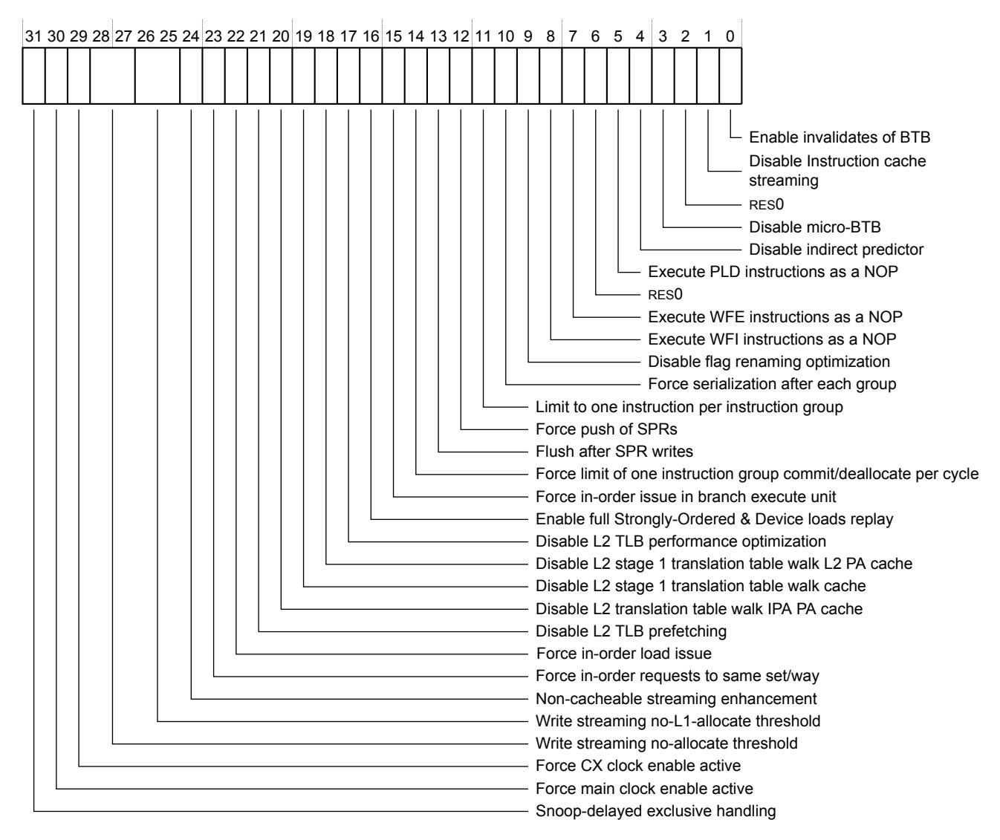

**Figure 4-74 CPUACTLR\_EL1[31:0] bit assignments**

The following table shows the CPUACTLR\_EL1[31:0] bit assignments.

# **Table 4-78 CPUACTLR\_EL1[31:0] bit assignments**

<span id="page-201-0"></span>

| Bits    | Name                                                             | Function                                                                                                                                                                                                          |  |  |
|---------|------------------------------------------------------------------|-------------------------------------------------------------------------------------------------------------------------------------------------------------------------------------------------------------------|--|--|
| [31]    | Snoop-delayed exclusive                                          | Snoop-delayed exclusive handling. The possible values are:                                                                                                                                                        |  |  |
|         | handling                                                         | 0<br>Normal exclusive handling behavior. This is the reset value.                                                                                                                                                 |  |  |
|         |                                                                  | 1<br>Modifies exclusive handling behavior by delaying certain snoop requests.                                                                                                                                     |  |  |
| [30]az  | Force main clock enable<br>active                                | Forces main clock enable active. The possible values are:                                                                                                                                                         |  |  |
|         |                                                                  | 0<br>Does not prevent the clock generator from stopping the processor clock. This is the reset<br>value.                                                                                                          |  |  |
|         |                                                                  | 1<br>Prevents the clock generator from stopping the processor clock.                                                                                                                                              |  |  |
|         |                                                                  | If the processor dynamic retention feature is used then this bit must be zero. See Processor<br>dynamic retention on page 2-46.                                                                                   |  |  |
| [29]az  | Force Advanced SIMD<br>and floating-point clock<br>enable active | Forces Advanced SIMD and Floating-point clock enable active. The possible values are:                                                                                                                             |  |  |
|         |                                                                  | 0<br>Does not prevent the clock generator from stopping the Advanced SIMD and Floating-point<br>clock. This is the reset value.                                                                                   |  |  |
|         |                                                                  | 1<br>Prevents the clock generator from stopping the Advanced SIMD and Floating-point clock.                                                                                                                       |  |  |
|         |                                                                  | See Advanced SIMD and FP clock gating on page 2-49.                                                                                                                                                               |  |  |
|         |                                                                  | If the processor dynamic retention feature is used then this bit must be zero. See Processor<br>dynamic retention on page 2-46.                                                                                   |  |  |
| [28:27] | Write streaming no                                               | Write streaming no-allocate threshold. The possible values are:                                                                                                                                                   |  |  |
|         | allocate threshold                                               | 12th consecutive streaming cache line does not allocate in the L1 or L2 cache. This is the<br>0b00<br>reset value.                                                                                                |  |  |
|         |                                                                  | 128th consecutive streaming cache line does not allocate in the L1 or L2 cache.<br>0b01                                                                                                                           |  |  |
|         |                                                                  | 512th consecutive streaming cache line does not allocate in the L1 or L2 cache.<br>0b10                                                                                                                           |  |  |
|         |                                                                  | 0b11<br>Disables streaming. All Write-Allocate lines allocate in the L1 or L2 cache.                                                                                                                              |  |  |
| [26:25] | Write streaming no-L1-<br>allocate threshold                     | Write streaming no-L1-allocate threshold. The possible values are:                                                                                                                                                |  |  |
|         |                                                                  | th consecutive streaming cache line does not allocate in the L1 cache. This is the reset<br>4<br>0b00<br>value.                                                                                                   |  |  |
|         |                                                                  | 64th consecutive streaming cache line does not allocate in the L1 cache.<br>0b01                                                                                                                                  |  |  |
|         |                                                                  | 128th consecutive streaming cache line does not allocate in the L1 cache.<br>0b10                                                                                                                                 |  |  |
|         |                                                                  | 0b11<br>Disables streaming. All Write-Allocate lines allocate in the L1 cache.                                                                                                                                    |  |  |
| [24]    | Non-cacheable streaming<br>enhancement                           | Non-cacheable streaming enhancement. You can set this bit only if your memory system meets<br>the requirement that cache line fill requests from the Cortex-A57 processor are atomic. The<br>possible values are: |  |  |
|         |                                                                  | 0<br>Disables higher performance Non-cacheable load forwarding. This is the reset value.                                                                                                                          |  |  |
|         |                                                                  | 1<br>Enables higher performance Non-cacheable load forwarding. See 6.4.4 Non-cacheable<br>streaming enhancement on page 6-292 for more information.                                                               |  |  |
| [23]az  | Force in-order requests to                                       | Forces in-order requests to the same set and way. The possible values are:                                                                                                                                        |  |  |
|         | the same set and way                                             | 0<br>Does not force in-order requests to the same set and way. This is the reset value.                                                                                                                           |  |  |
|         |                                                                  | 1<br>Forces in-order requests to the same set and way.                                                                                                                                                            |  |  |

az This bit is used internally for debugging and characterization purposes only. For normal operation, ARM recommends that you do not change the value of this bit from its reset value.

# **Table 4-78 CPUACTLR\_EL1[31:0] bit assignments (continued)**

| Bits   | Name                                                        | Function                                                                                                                        |  |  |  |
|--------|-------------------------------------------------------------|---------------------------------------------------------------------------------------------------------------------------------|--|--|--|
| [22]az | Force in-order load issue                                   | Forces in-order load issue. The possible values are:                                                                            |  |  |  |
|        |                                                             | 0<br>Does not force in-order load issue. This is the reset value.                                                               |  |  |  |
|        |                                                             | 1<br>Forces in-order load issue.                                                                                                |  |  |  |
| [21]az | Disable L2 TLB                                              | Disables L2 TLB prefetching. The possible values are:                                                                           |  |  |  |
|        | prefetching                                                 | 0<br>Enables L2 TLB prefetching. This is the reset value.                                                                       |  |  |  |
|        |                                                             | 1<br>Disables L2 TLB prefetching.                                                                                               |  |  |  |
| [20]az | Disable L2 translation<br>table walk IPA PA cache           | Disables L2 translation table walk Immediate Physical Address (IPA) to Physical Address (PA)<br>cache. The possible values are: |  |  |  |
|        |                                                             | 0<br>Enables L2 translation table walk IPA to PA cache. This is the reset value.                                                |  |  |  |
|        |                                                             | 1<br>Disables L2 translation table walk IPA to PA cache.                                                                        |  |  |  |
| [19]az | Disable L2 stage 1                                          | Disables L2 stage 1 translation table walk cache. The possible values are:                                                      |  |  |  |
|        | translation table walk                                      | 0<br>Enables L2 stage 1 translation table walk cache. This is the reset value.                                                  |  |  |  |
|        | cache                                                       | 1<br>Disables L2 stage 1 translation table walk cache.                                                                          |  |  |  |
| [18]az | Disable L2 stage 1<br>translation table walk L2<br>PA cache | Disables L2 stage 1 translation table walk L2 PA cache. The possible values are:                                                |  |  |  |
|        |                                                             | 0<br>Enables L2 stage 1 translation table walk L2 PA cache. This is the reset value.                                            |  |  |  |
|        |                                                             | 1<br>Disables L2 stage 1 translation table walk L2 PA cache.                                                                    |  |  |  |
| [17]az | Disable L2 TLB                                              | Disables L2 TLB performance optimization. The possible values are                                                               |  |  |  |
|        | performance optimization                                    | 0<br>Enables L2 TLB optimization. This is the reset value.                                                                      |  |  |  |
|        |                                                             | 1<br>Disables L2 TLB optimization.                                                                                              |  |  |  |
| [16]az | Enable full Strongly<br>ordered and Device load<br>replay   | Enables full Strongly-ordered or Device load replay. The possible values are:                                                   |  |  |  |
|        |                                                             | 0<br>Disables full Strongly-ordered or Device load replay. This is the reset value.                                             |  |  |  |
|        |                                                             | 1<br>Enables full Strongly-ordered or Device load replay.                                                                       |  |  |  |
| [15]az | Force in-order issue in                                     | Forces in-order issue in branch execute unit. The possible values are:                                                          |  |  |  |
|        | branch execute unit                                         | 0<br>Disables forced in-order issue. This is the reset value.                                                                   |  |  |  |
|        |                                                             | 1<br>Forces in-order issue.                                                                                                     |  |  |  |
| [14]az | Force limit of one<br>instruction group                     | Forces limit of one instruction group to commit and de-allocate per cycle. The possible values                                  |  |  |  |
|        |                                                             | are:                                                                                                                            |  |  |  |
|        | commit/de-allocate per<br>cycle                             | 0<br>Normal commit and de-allocate behavior. This is the reset value.                                                           |  |  |  |
|        |                                                             | 1<br>Limits commit and de-allocate to one instruction group per cycle.                                                          |  |  |  |
| [13]az | Flush after Special                                         | Flushes after certain SPR writes. The possible values are:                                                                      |  |  |  |
|        | Purpose Register (SPR)<br>writes                            | 0<br>Normal behavior for SPR writes. This is the reset value.                                                                   |  |  |  |
|        |                                                             | 1<br>Flushes after certain SPR writes.                                                                                          |  |  |  |

# **Table 4-78 CPUACTLR\_EL1[31:0] bit assignments (continued)**

| Bits   | Name                                            | Function                                                                                                                           |  |
|--------|-------------------------------------------------|------------------------------------------------------------------------------------------------------------------------------------|--|
| [12]az | Force push of SPRs                              | Forces push of certain SPRs from local dispatch copies to shadow copies. The possible values<br>are:                               |  |
|        |                                                 | 0<br>Normal behavior for SPRs. This is the reset value.                                                                            |  |
|        |                                                 | 1<br>Pushes certain SPRs from local dispatch copies to shadow copies.                                                              |  |
|        |                                                 | Note                                                                                                                               |  |
|        |                                                 | Setting this bit to 1 forces the processor to behave as if bit[13] is set to 1.                                                    |  |
|        |                                                 |                                                                                                                                    |  |
| [11]az | Limit to one instruction                        | Limits to one instruction per instruction group. The possible values are:                                                          |  |
|        | per instruction group                           | 0<br>Normal instruction grouping. This is the reset value.                                                                         |  |
|        |                                                 | 1<br>Limits to one instruction per instruction group.                                                                              |  |
| [10]az | Force serialization after                       | Forces serialization after each instruction group. The possible values are:                                                        |  |
|        | each instruction group                          | 0<br>Disables forced serialization after each instruction group. This is the reset value.                                          |  |
|        |                                                 | 1<br>Forces serialization after each instruction group.                                                                            |  |
|        |                                                 | Note                                                                                                                               |  |
|        |                                                 | Setting this bit to 1 forces the processor to behave as if bit[11] is set to 1.                                                    |  |
|        |                                                 |                                                                                                                                    |  |
| [9]az  | Disable flag renaming                           | Disables flag renaming optimization. The possible values are:                                                                      |  |
|        | optimization                                    | 0<br>Enables normal flag renaming optimization. This is the reset value.                                                           |  |
|        |                                                 | 1<br>Disables normal flag renaming optimization.                                                                                   |  |
| [8]az  | Execute WFI instruction<br>as a NOP instruction | Executes WFI instruction as a NOP instruction. The possible values are:                                                            |  |
|        |                                                 | 0<br>Executes WFI instruction as defined in the ARM®<br>Architecture Reference Manual ARMv8.<br>This is the reset value.           |  |
|        |                                                 | 1<br>Executes WFI instruction as a NOP instruction, and does not put the processor in WFI low                                      |  |
|        |                                                 | power state.                                                                                                                       |  |
| [7]az  | Execute WFE instruction<br>as a NOP instruction | Executes WFE instruction as a NOP instruction. The possible values are:                                                            |  |
|        |                                                 | 0<br>Executes WFE instruction as defined in the ARM®<br>Architecture Reference Manual ARMv8.<br>This is the reset value.           |  |
|        |                                                 | 1<br>Executes WFE instruction as a NOP instruction, and does not put the processor in WFE low                                      |  |
|        |                                                 | power state.                                                                                                                       |  |
| [6]    | -                                               | Reserved, RES0.                                                                                                                    |  |
| [5]az  | Execute PLD and PLDW<br>instructions as a NOP   | Executes PLD and PLDW instructions as a NOP instruction. The possible values are:                                                  |  |
|        |                                                 | 0<br>Executes PLD and PLDW instructions as defined in the ARM®<br>Architecture Reference Manual<br>ARMv8. This is the reset value. |  |
|        |                                                 | 1<br>Executes PLD and PLDW instructions as a NOP instruction.                                                                      |  |
|        |                                                 |                                                                                                                                    |  |
| [4]az  | Disable indirect predictor                      | Disables indirect predictor. The possible values are:                                                                              |  |
|        |                                                 | 0<br>Enables indirect predictor. This is the reset value.                                                                          |  |
|        |                                                 | 1<br>Disables indirect predictor.                                                                                                  |  |

# **Table 4-78 CPUACTLR\_EL1[31:0] bit assignments (continued)**

<span id="page-204-0"></span>

| Bits                                                 | Name<br>Disable micro-BTB | Function<br>Disables micro-Branch Target Buffer (BTB). The possible values are:                                                                                                                                                                                                                                                                                                                                 |  |  |
|------------------------------------------------------|---------------------------|-----------------------------------------------------------------------------------------------------------------------------------------------------------------------------------------------------------------------------------------------------------------------------------------------------------------------------------------------------------------------------------------------------------------|--|--|
| [3]az                                                |                           |                                                                                                                                                                                                                                                                                                                                                                                                                 |  |  |
|                                                      |                           | 0<br>Enables micro-BTB. This is the reset value.<br>1<br>Disables micro-BTB.                                                                                                                                                                                                                                                                                                                                    |  |  |
| [2]                                                  | -                         | Reserved, RES0.                                                                                                                                                                                                                                                                                                                                                                                                 |  |  |
| [1]az<br>Disable Instruction Cache<br>miss streaming |                           | Disables Instruction Cache miss streaming. The possible values are:<br>0<br>Enables Instruction Cache miss streaming. Sequential fetches resulting from Instruction<br>Cache misses wait until individual packets arrive. This is the reset value.<br>1<br>Disables Instruction Cache miss streaming. Sequential fetches resulting from Instruction<br>Cache misses internally generate misses for each packet. |  |  |
| [0]az                                                | Enable invalidates of BTB | Enables invalidate of BTB. The possible values are:<br>0<br>The Invalidate Instruction Cache All and Invalidate Instruction Cache by VA instructions<br>only invalidates the instruction cache array. This is the reset value.<br>1<br>The Invalidate Instruction Cache All and Invalidate Instruction Cache by VA instructions<br>invalidates the instruction cache array and branch target buffer.            |  |  |

To access the CPUACTLR\_EL1 in AArch64 state, read or write the register with:

```
MRS <Xt>, S3_1_c15_c2_0; Read EL1 CPU Auxiliary Control Register
MSR S3_1_c15_c2_0, <Xt>; Write EL1 CPU Auxiliary Control Register
```

To access the CPUACTLR in AArch32 state, read or write the CP15 register with:

```
MRRC p15, 0, <Rt>, <Rt2>, c15; Read CPU Auxiliary Control Register
MCRR p15, 0, <Rt>, <Rt2>, c15; Write CPU Auxiliary Control Register
```

#### **4.3.67 CPU Extended Control Register, EL1**

The CPUECTLR\_EL1 characteristics are:

# **Purpose**

Provides additional IMPLEMENTATION DEFINED configuration and control options for the processor.

## **Usage constraints**

The accessibility to the CPUECTLR\_EL1 by Exception level is:

|   | EL0 | EL1(NS) | EL1(S) | EL2  | EL3(SCR.NS = 1) | EL3(SCR.NS = 0) |
|---|-----|---------|--------|------|-----------------|-----------------|
| - |     | RW      | RWba   | RWbb | RW              | RW              |

The CPUECTLR\_EL1 can be written dynamically.

# **Configurations**

The CPUECTLR\_EL1 is:

- Common to the Secure and Non-secure states.
- A 64-bit read/write register.
- Architecturally mapped to the AArch32 CPUECTLR register.

#### **Attributes**

See the register summary in *[Table 4-15 AArch64 implementation defined registers](#page-85-0)* [on page 4-86](#page-85-0).

ba Write access if ACTLR\_EL3.CPUECTLR is 1 and ACTLR\_EL2.CPUECTLR is 1, or ACTLR\_EL3.CPUECTLR is 1 and SCR.NS is 0. bb Write access if ACTLR\_EL3.CPUECTLR is 1.

The following figure shows the CPUECTLR EL1 bit assignments.

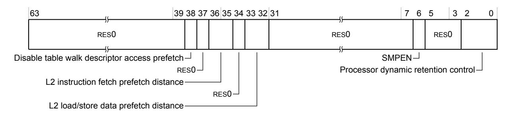

Figure 4-75 CPUECTLR\_EL1 bit assignments

The following table shows the CPUECTLR\_EL1 bit assignments.

Table 4-79 CPUECTLR\_EL1 bit assignments

| Bits    | Name                                                                                                                                                                                                       | Function                                                                                                                                                                                                                                                                                                                                                                                           |  |
|---------|------------------------------------------------------------------------------------------------------------------------------------------------------------------------------------------------------------|----------------------------------------------------------------------------------------------------------------------------------------------------------------------------------------------------------------------------------------------------------------------------------------------------------------------------------------------------------------------------------------------------|--|
| [63:39] | -                                                                                                                                                                                                          | Reserved, RESO.                                                                                                                                                                                                                                                                                                                                                                                    |  |
| [38]    | Disable table<br>walk descriptor<br>access prefetch                                                                                                                                                        | Disables table walk descriptor access prefetch. The possible values are:  0 Enables table walk descriptor access prefetch. This is the reset value.  1 Disables table walk descriptor access prefetch.                                                                                                                                                                                             |  |
| [37]    | -                                                                                                                                                                                                          | Reserved, RESO.                                                                                                                                                                                                                                                                                                                                                                                    |  |
| [36:35] | Indicates the L2 instruction fetch prefetch distance. It is the number of requests by which the ahead of the demand request stream. It also specifies the maximum number of prefetch requests are:    0b00 |                                                                                                                                                                                                                                                                                                                                                                                                    |  |
| [34]    | -                                                                                                                                                                                                          | Reserved, RESO.                                                                                                                                                                                                                                                                                                                                                                                    |  |
| [33:32] | L2 load/store<br>data prefetch<br>distance                                                                                                                                                                 | Indicates the L2 load/store data prefetch distance. It is the number of requests by which the prefetcher is ahead of the demand request stream. It also specifies the maximum number of prefetch requests generated on a demand miss. The possible values are:  0b00 0 requests, disables load/store data prefetch.  0b01 2 requests.  0b10 4 requests.  0b11 8 requests. This is the reset value. |  |
|         |                                                                                                                                                                                                            | Reserved, RESO.                                                                                                                                                                                                                                                                                                                                                                                    |  |

| Bits  | Name                                      | Function                                                                                                                                                          |  |  |  |  |
|-------|-------------------------------------------|-------------------------------------------------------------------------------------------------------------------------------------------------------------------|--|--|--|--|
| [6]   | SMPEN                                     | Enables the processor to receive instruction cache and TLB maintenance operations broadcast from other<br>processors in the cluster.                              |  |  |  |  |
|       |                                           | You must set this bit before enabling the caches and MMU, or performing any cache and TLB<br>maintenance operations.                                              |  |  |  |  |
|       |                                           | You must clear this bit during a processor power down sequence. See 2.4 Power management<br>on page 2-42.                                                         |  |  |  |  |
|       |                                           | The possible values are:                                                                                                                                          |  |  |  |  |
|       |                                           | 0<br>Disables receiving of instruction cache and TLB maintenance operations. This is the reset value.<br>1                                                        |  |  |  |  |
|       |                                           | Enables receiving of instruction cache and TLB maintenance operations.                                                                                            |  |  |  |  |
|       |                                           | Note                                                                                                                                                              |  |  |  |  |
|       |                                           | •<br>Any processor instruction cache and TLB maintenance operations can execute the request, regardless<br>of the value of the SMPEN bit.                         |  |  |  |  |
|       |                                           | •<br>This bit has no impact on data cache maintenance operations.                                                                                                 |  |  |  |  |
|       |                                           | •<br>In the Cortex-A57 processor, the L1 data cache and L2 cache are always coherent, for shared or non<br>shared data, regardless of the value of the SMPEN bit. |  |  |  |  |
| [5:3] | -                                         | Reserved, RES0.                                                                                                                                                   |  |  |  |  |
| [2:0] | Processor<br>dynamic<br>retention control | Processor dynamic retention control. The possible values are:                                                                                                     |  |  |  |  |
|       |                                           | 0b000                                                                                                                                                             |  |  |  |  |
|       |                                           | Processor dynamic retention disabled. This is the reset value.                                                                                                    |  |  |  |  |
|       |                                           | 0b001                                                                                                                                                             |  |  |  |  |
|       |                                           | 2 Generic Timer ticks required before retention entry.<br>0b010                                                                                                   |  |  |  |  |
|       |                                           | 8 Generic Timer ticks required before retention entry.                                                                                                            |  |  |  |  |
|       |                                           | 0b011                                                                                                                                                             |  |  |  |  |
|       |                                           | 32 Generic Timer ticks required before retention entry.<br>0b100                                                                                                  |  |  |  |  |
|       |                                           | 64 Generic Timer ticks required before retention entry.                                                                                                           |  |  |  |  |
|       |                                           | 0b101                                                                                                                                                             |  |  |  |  |
|       |                                           | 128 Generic Timer ticks required before retention entry.                                                                                                          |  |  |  |  |
|       |                                           | 0b110<br>256 Generic Timer ticks required before retention entry.                                                                                                 |  |  |  |  |
|       |                                           | 0b111                                                                                                                                                             |  |  |  |  |
|       |                                           | 512 Generic Timer ticks required before retention entry.                                                                                                          |  |  |  |  |
|       |                                           | All other values are reserved.                                                                                                                                    |  |  |  |  |

To access the CPUECTLR\_EL1 in AArch64 state, read or write the register with:

```
MRS <Xt>, S3_1_c15_c2_1; Read EL1 CPU Extended Control Register
MSR S3_1_c15_c2_1, <Xt>; Write EL1 CPU Extended Control Register
```

To access the CPUECTLR in AArch32 state, read or write the CP15 register with:

```
MRRC p15, 1, <Rt>, <Rt2>, c15; Read CPU Extended Control Register
MCRR p15, 1, <Rt>, <Rt2>, c15; Write CPU Extended Control Register
```

# <span id="page-207-0"></span>4.3.68 CPU Memory Error Syndrome Register, EL1

The CPUMERRSR EL1 characteristics are:

#### **Purpose**

Holds the number of memory errors that have occurred in the following L1 and L2 RAMs:

- L1-I Tag RAM.
- L1-I Data RAM.
- L1-D Tag RAM.
- L1-D Data RAM.
- L2 TLB RAM.

A write of any value to the register updates the register to zero.

#### **Usage constraints**

The accessibility to the CPUMERRSR EL1 by Exception level is:

| EL0 | EL1(NS) | EL1(S) | EL2 | EL3(SCR.NS = 1) | EL3(SCR.NS = 0) |
|-----|---------|--------|-----|-----------------|-----------------|
| -   | RW      | RW     | RW  | RW              | RW              |

## Configurations

The CPUMERRSR\_EL1 is:

- Common to the Secure and Non-secure states.
- A 64-bit read/write register.
- Architecturally mapped to the AArch32 CPUMERRSR register.

#### **Attributes**

See the register summary in *Table 4-15 AArch64 implementation defined registers* on page 4-86.

The following figure shows the CPUMERRSR EL1 bit assignments.

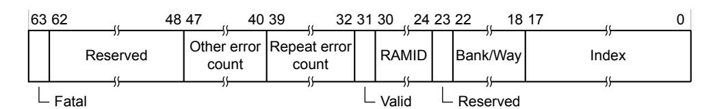

Figure 4-76 CPUMERRSR\_EL1 bit assignments

The following table shows the CPUMERRSR EL1 bit assignments.

Table 4-80 CPUMERRSR\_EL1 bit assignments

| Bits    | Name               | Function                                                                                                                                                                                                                         |
|---------|--------------------|----------------------------------------------------------------------------------------------------------------------------------------------------------------------------------------------------------------------------------|
| [63]    | Fatal              | Fatal bit. This bit is set to 1 on the first memory error that caused a Data Abort. It is a sticky bit so that after it is set, it remains set until the register is written. The reset value is 0.                              |
| [62:48] | -                  | Reserved, RESO.                                                                                                                                                                                                                  |
| [47:40] | Other error count  | This field is set to 0 on the first memory error and is incremented on any memory error that does not match the RAMID, bank, way, or index information in this register while the sticky Valid bit is set. The reset value is 0. |
| [39:32] | Repeat error count | This field is set to 0 on the first memory error and is incremented on any memory error that exactly matches the RAMID, bank, way or index information in this register while the sticky Valid bit is set. The reset value is 0. |

# **Table 4-80 CPUMERRSR\_EL1 bit assignments (continued)**

<span id="page-208-0"></span>

| Bits             | Name     | Function                                                                                                                                                                      |                |  |
|------------------|----------|-------------------------------------------------------------------------------------------------------------------------------------------------------------------------------|----------------|--|
| [31]             | Valid    | Valid bit. This bit is set to 1 on the first memory error. It is a sticky bit so that after it is set, it remains set<br>until the register is written. The reset value is 0. |                |  |
| [30:24]<br>RAMID |          | RAM Identifier. Indicates the RAM, the first memory error occurred in. The possible values are:                                                                               |                |  |
|                  |          | 0x00                                                                                                                                                                          | L1-I Tag RAM.  |  |
|                  |          | 0x01                                                                                                                                                                          | L1-I Data RAM. |  |
|                  |          | 0x08                                                                                                                                                                          | L1-D Tag RAM.  |  |
|                  |          | 0x09                                                                                                                                                                          | L1-D Data RAM. |  |
|                  |          | 0x18                                                                                                                                                                          | L2 TLB RAM.    |  |
| [23]             | -        | Reserved, RES0.                                                                                                                                                               |                |  |
| [22:18]          | Bank/Way | Indicates the bank or way of the RAM where the first memory error occurred.                                                                                                   |                |  |
| [17:0]           | Index    | Indicates the index address of the first memory error.                                                                                                                        |                |  |

| Note |  |
|------|--|

- If two or more memory errors in the same RAM occur in the same cycle, only one error is reported.
- If two or more first memory error events from different RAMs occur in the same cycle, one of the errors is selected arbitrarily, while the Other error count field is only incremented by one.
- If two or more memory error events from different RAMs, that do not match the RAMID, bank, way, or index information in this register while the sticky Valid bit is set, occur in the same cycle, the Other error count field is only incremented by one.

To access the CPUMERRSR\_EL1 in AArch64 state, read or write the register with:

```
MRS <Xt>, S3_1_c15_c2_2 ; Read EL1 CPU Memory Error Syndrome Register
MSR S3_1_c15_c2_2 , <Xt>; Write EL1 CPU Memory Error Syndrome Register
```

To access the CPUMERRSR in AArch32 state, read or write the CP15 register with:

```
MRRC p15, 2, <Rt>, <Rt2>, c15; Read CPU Memory Error Syndrome Register
MCRR p15, 2, <Rt>, <Rt2>, c15; Write CPU Memory Error Syndrome Register
```

#### **4.3.69 L2 Memory Error Syndrome Register, EL1**

The L2MERRSR\_EL1 characteristics are:

**Purpose** Holds the number of memory errors that have occurred in the following L2 RAMs:

- L2 Tag RAM.
- L2 Data RAM.
- L2 Snoop Tag RAM.
- L2 Dirty RAM.
- L2 Inclusion PF RAM.

**Note** The L2 Inclusion PF RAM is available only in r1p0 and later revisions.

A write of any value to the register updates the register to zero.

Usage constraints

The accessibility to the L2MERRSR EL1 by Exception level is:

| EL0 | EL1(NS) | EL1(S) | EL2 | EL3(SCR.NS = 1) | EL3(SCR.NS = 0) |
|-----|---------|--------|-----|-----------------|-----------------|
| -   | RW      | RW     | RW  | RW              | RW              |

# **Configurations** The L2MERRSR\_EL1 is:

- Common to the Secure and Non-secure states.
- A 64-bit read/write register.
- Architecturally mapped to the AArch32 L2MERRSR register.

#### **Attributes**

See the register summary in *Table 4-15 AArch64 implementation defined registers* on page 4-86.

The following figure shows the L2MERRSR\_EL1 bit assignments.

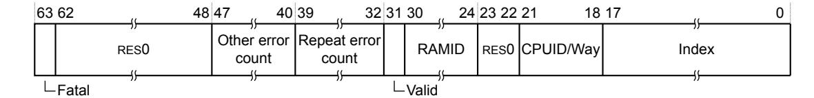

Figure 4-77 L2MERRSR\_EL1 bit assignments

The following table shows the L2MERRSR EL1 bit assignments.

#### Table 4-81 L2MERRSR\_EL1 bit assignments

| Bits          | Name               | Function                                                                                                                                                                                                                         |                      |  |
|---------------|--------------------|----------------------------------------------------------------------------------------------------------------------------------------------------------------------------------------------------------------------------------|----------------------|--|
| [63]          | Fatal              | Fatal bit. This bit is set to 1 on the first memory error that caused a Data Abort. It is a sticky bit so that after it is set, it remains set until the register is written. The reset value is 0.                              |                      |  |
| [62:48]       | -                  | Reserved, RESO.                                                                                                                                                                                                                  |                      |  |
| [47:40]       | Other error count  | This field is set to 0 on the first memory error and is incremented on any memory error that does not match the RAMID, bank, way, or index information in this register while the sticky Valid bit is set. The reset value is 0. |                      |  |
| [39:32]       | Repeat error count | This field is set to 0 on the first memory error and is incremented on any memory error that exactly matches the RAMID, bank, way or index information in this register while the sticky Valid bit is set. The reset value is 0. |                      |  |
| [31]          | Valid              | Valid bit. This bit is set to 1 on the first memory error. It is a sticky bit so that after it is set, it remains set until the register is written. The reset value is 0.                                                       |                      |  |
| [30:24] RAMID |                    | RAM Identifier. Indicates the RAM where the first memory error occurred. The possible values are:                                                                                                                                |                      |  |
|               |                    | 0b001 0000                                                                                                                                                                                                                       | L2 Tag RAM.          |  |
|               |                    | 0b001 0001                                                                                                                                                                                                                       | L2 Data RAM.         |  |
|               |                    | 0b001 0010                                                                                                                                                                                                                       | L2 Snoop Tag RAM.    |  |
|               |                    | 0b001 0100                                                                                                                                                                                                                       | L2 Dirty RAM.        |  |
|               |                    | 0b0011000                                                                                                                                                                                                                        | L2 Inclusion PF RAM. |  |
| [23:22]       | -                  | Reserved, RESO.                                                                                                                                                                                                                  |                      |  |

# **Table 4-81 L2MERRSR\_EL1 bit assignments (continued)**

<span id="page-210-0"></span>

| Bits    | Name      | Function                                                                                                                 |                  |  |  |
|---------|-----------|--------------------------------------------------------------------------------------------------------------------------|------------------|--|--|
| [21:18] | CPUID/Way | Indicates which processor and way of the RAM where the first memory error occurred.                                      |                  |  |  |
|         |           | For L2 Tag, Data, and Dirty RAMs, bits[21:18] indicate one of 16 ways, from way 0 to way 15. The possible<br>values are: |                  |  |  |
|         |           | 0b0000                                                                                                                   | CPU0 tag, way 0. |  |  |
|         |           | 0b0001                                                                                                                   | CPU0 tag, way 1. |  |  |
|         |           | 0b0010                                                                                                                   | CPU1 tag, way 0. |  |  |
|         |           | 0b0011                                                                                                                   | CPU1 tag, way 1. |  |  |
|         |           | 0b0100                                                                                                                   | CPU2 tag, way 0. |  |  |
|         |           | 0b0101                                                                                                                   | CPU2 tag, way 1. |  |  |
|         |           | 0b0110                                                                                                                   | CPU3 tag, way 0. |  |  |
|         |           | 0b0111                                                                                                                   | CPU3 tag, way 1. |  |  |
|         |           | For L2 Snoop Tag RAM:                                                                                                    |                  |  |  |
|         |           | •<br>Bits[20:19] indicate which processor of the L1 Tag RAM.                                                             |                  |  |  |
|         |           | •<br>Bit[18] indicates which way of the Tag RAM.                                                                         |                  |  |  |
| [17:0]  | Index     | Indicates the index address of the first memory error.                                                                   |                  |  |  |

#### **Note**

- If two or more memory errors in the same RAM occur in the same cycle, only one error is reported.
- If two or more first memory error events from different RAMs occur in the same cycle, one of the errors is selected arbitrarily, while the Other error count field is only incremented by one.
- If two or more memory error events from different RAMs, that do not match the RAMID, bank, way, or index information in this register while the sticky Valid bit is set, occur in the same cycle, the Other error count field is only incremented by one.

To access the L2MERRSR\_EL1 in AArch64 state, read or write the register with:

```
MRS <Xt>, S3_1_c15_c2_3 ; Read EL1 L2 Memory Error Syndrome Register
MSR S3_1_c15_c2_3, <Xt> ; Write EL1 L2 Memory Error Syndrome Register
```

To access the L2MERRSR in AArch32 state, read or write the CP15 register with:

```
MRRC p15, 3, <Rt>, <Rt2>, c15; Read L2 Memory Error Syndrome Register
MCRR p15, 3, <Rt>, <Rt2>, c15; Write L2 Memory Error Syndrome Register
```

#### **4.3.70 Configuration Base Address Register, EL1**

The CBAR\_EL1 characteristics are:

## **Purpose**

Holds the physical base address of the memory-mapped GIC CPU interface registers.

#### **Usage constraints**

The accessibility to the CBAR\_EL1 by Exception level is:

| EL0 | EL1(NS) | EL1(S) | EL2 | EL3(SCR.NS = 1) | EL3(SCR.NS = 0) |
|-----|---------|--------|-----|-----------------|-----------------|
| -   | RO      | RO     | RO  | RO              | RO              |

# **Configurations**

The CBAR\_EL1 is:

- Common to the Secure and Non-secure states.
- A 64-bit register in AArch64 state.

# **Attributes**

See the register summary in *[Table 4-15 AArch64 implementation defined registers](#page-85-0)* [on page 4-86](#page-85-0).

The following figure shows the CBAR\_EL1 bit assignments.

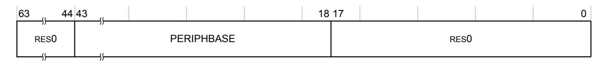

**Figure 4-78 CBAR\_EL1 bit assignments**

The following table shows the CBAR\_EL1 bit assignments.

**Table 4-82 CBAR\_EL1 bit assignments**

| Bits    | Name       | Function                                                       |
|---------|------------|----------------------------------------------------------------|
| [63:44] | -          | Reserved, RES0                                                 |
| [43:18] | PERIPHBASE | The primary input PERIPHBASE[43:18] determines the reset value |
| [17:0]  | -          | Reserved, RES0                                                 |

To access the CBAR\_EL1 in AArch64 state, read the register with:

MRS <Xt>, s3\_1\_c15\_c3\_0; Read EL1 Configuration Base Address Register

# <span id="page-212-0"></span>**4.4 AArch32 register summary**

This section gives a summary of the System registers in AArch32 state.

The System registers are a set of registers that you can write to and read from. Some of the registers permit more than one type of operation.

The registers are accessed by the MCR and MRC instructions for 32-bit registers and the MCRR and MRRC instructions for 64-bit registers. The following sections describe the System registers grouped by CRn in the order of op1, CRm, and op2:

- *[4.4.1 c0 registers](#page-213-0)* on page 4-214.
- *[4.4.2 c1 registers](#page-214-0)* on page 4-215.
- *[4.4.3 c2 registers](#page-215-0)* on page 4-216.
- *[4.4.4 c3 registers](#page-215-0)* on page 4-216.
- *[4.4.5 c5 registers](#page-216-0)* on page 4-217.
- *[4.4.6 c6 registers](#page-216-0)* on page 4-217.
- *[4.4.7 c7 register](#page-216-0)* on page 4-217.
- *[4.4.8 c7 System operations](#page-217-0)* on page 4-218.
- *[4.4.9 c8 System operations](#page-218-0)* on page 4-219.
- *[4.4.10 c9 registers](#page-219-0)* on page 4-220.
- *[4.4.11 c10 registers](#page-220-0)* on page 4-221.
- *[4.4.12 c12 registers](#page-220-0)* on page 4-221.
- *[4.4.13 c13 registers](#page-220-0)* on page 4-221.
- *[4.4.14 c14 registers](#page-221-0)* on page 4-222.
- *[4.4.15 c15 registers](#page-222-0)* on page 4-223.

The following subsection describes the 64-bit registers and provides cross-references to individual register descriptions:

• *[4.4.16 64-bit registers](#page-222-0)* on page 4-223.

In addition to listing the System registers by CRn ordering, the following subsections describe the System registers by functional group:

- *[4.4.17 Identification registers](#page-223-0)* on page 4-224.
- *[4.4.18 CPUID registers](#page-225-0)* on page 4-226.
- *[4.4.19 Virtual memory control registers](#page-226-0)* on page 4-227.
- *[4.4.20 Fault and Exception handling registers](#page-227-0)* on page 4-228.
- *[4.4.21 Other System registers](#page-228-0)* on page 4-229.
- *[4.4.22 Cache maintenance operations](#page-229-0)* on page 4-230.
- *[4.4.23 TLB maintenance operations](#page-229-0)* on page 4-230.
- *[4.4.24 Address translation operations](#page-230-0)* on page 4-231.
- *[4.4.25 Miscellaneous operations](#page-231-0)* on page 4-232.
- *[4.4.26 Performance Monitors registers](#page-231-0)* on page 4-232.
- *[4.4.27 Security registers](#page-232-0)* on page 4-233.
- *[4.4.28 Virtualization registers](#page-232-0)* on page 4-233.
- *[4.4.29 Hyp mode TLB maintenance operations](#page-234-0)* on page 4-235.
- *[4.4.30 Generic Timer registers](#page-234-0)* on page 4-235.
- *[4.4.31 Implementation defined registers](#page-234-0)* on page 4-235.

The following table describes the column headings that the System register summary tables use throughout AArch32 state. These correspond to fields within the MCR and MRC instruction mnemonics:

```
MCR p15, op1, Rt, CRn, CRm, op2
MRC p15, op1, Rt, CRn, CRm, op2
```

<span id="page-213-0"></span>**Table 4-83 Column headings definition for System register summary tables**

| Column name | Description                                                        |  |  |
|-------------|--------------------------------------------------------------------|--|--|
| CRn         | Register number within the System registers                        |  |  |
| op1         | Opcode_1 value for the register                                    |  |  |
| CRm         | Operational register number within CRn                             |  |  |
| op2         | Opcode_2 value for the register                                    |  |  |
| Name        | Short form architectural, operation, or code name for the register |  |  |
| Type        | One of:                                                            |  |  |
|             | •<br>Read-only (RO).                                               |  |  |
|             | •<br>Write-only (WO).                                              |  |  |
|             | •<br>Read/write (RW).                                              |  |  |
| Reset       | Reset value of register                                            |  |  |
| Description | Cross-reference to register description                            |  |  |

# **4.4.1 c0 registers**

The following table shows the CP15 System registers when CRn is c0 and the processor is in AArch32 state.

**Table 4-84 c0 register summary**

| op1 | CRm | op2  | Name     | Type | Reset        | Description                                                                                              |
|-----|-----|------|----------|------|--------------|----------------------------------------------------------------------------------------------------------|
| 0   | c0  | 0    | MIDR     | RO   | 411FD073     | Main ID Register. See 4.3.1 Main ID Register, EL1 on page 4-89.                                          |
|     |     | 1    | CTR      | RO   | 0x8444C004   | Cache Type Register. See 4.3.26 Cache Type Register, EL0 on page 4-122.                                  |
|     |     | 2    | TCMTR    | -    | 0x00000000   | 4.5.1 TCM Type Register on page 4-238.                                                                   |
|     |     | 3    | TLBTR    | RO   | 0x00000000   | 4.5.2 TLB Type Register on page 4-238.                                                                   |
|     |     | 4, 7 | MIDR     | RO   | 411FD073     | Aliases of Main ID Register, see 4.3.1 Main ID Register, EL1 on page 4-89.                               |
|     |     | 5    | MPIDR    | RO   | 0x80000003bc | 4.5.3 Multiprocessor Affinity Register on page 4-239.                                                    |
|     |     | 6    | REVIDR   | RO   | 0x00000000   | Revision ID Register. See 4.3.3 Revision ID Register, EL1 on page 4-92.                                  |
|     | c1  | 0    | ID_PFR0  | RO   | 0x00000131   | Processor Feature Register 0. See 4.3.4 AArch32 Processor Feature<br>Register 0, EL1 on page 4-93.       |
|     |     | 1    | ID_PFR1  | RO   | 0x00011011bd | Processor Feature Register 1. See 4.3.5 AArch32 Processor Feature<br>Register 1, EL1 on page 4-94.       |
|     |     | 2    | ID_DFR0  | RO   | 0x03010066   | Debug Feature Register 0. See 4.3.6 AArch32 Debug Feature Register 0,<br>EL1 on page 4-95.               |
|     |     | 3    | ID_AFR0  | RO   | 0x00000000   | Auxiliary Feature Register 0. See 4.3.7 AArch32 Auxiliary Feature Register<br>0, EL1 on page 4-97.       |
|     |     | 4    | ID_MMFR0 | RO   | 0x10101105   | Memory Model Feature Register 0. See 4.3.8 AArch32 Memory Model<br>Feature Register 0, EL1 on page 4-97. |

bc The reset value depends on the primary inputs, **CLUSTERIDAFF1** and **CLUSTERIDAFF2**, and the number of cores that the device implements. The value shown is for a four processor implementation, with **CLUSTERIDAFF1** and **CLUSTERIDAFF2** set to zero.

bd The reset value depends on the primary input **GICCDISABLE**. The value shown assumes the **GICCDISABLE** signal is tied HIGH.

# Table 4-84 c0 register summary (continued)

<span id="page-214-0"></span>

| op1 | CRm | op2 | Name     | Type | Reset                    | Description                                                                                                       |
|-----|-----|-----|----------|------|--------------------------|-------------------------------------------------------------------------------------------------------------------|
|     |     | 5   | ID_MMFR1 | RO   | 0×40000000               | Memory Model Feature Register 1. See 4.3.9 AArch32 Memory Model Feature Register 1, EL1 on page 4-98.             |
|     |     | 6   | ID_MMFR2 | RO   | 0x01260000               | Memory Model Feature Register 2. See 4.3.10 AArch32 Memory Model Feature Register 2, EL1 on page 4-100.           |
|     |     | 7   | ID_MMFR3 | RO   | 0x02102211               | Memory Model Feature Register 3. See 4.3.11 AArch32 Memory Model Feature Register 3, EL1 on page 4-102.           |
|     | c2  | 0   | ID_ISAR0 | RO   | 0x02101110               | Instruction Set Attribute Register 0. See 4.3.12 AArch32 Instruction Set Attribute Register 0, EL1 on page 4-103. |
|     |     | 1   | ID_ISAR1 | RO   | 0x13112111               | Instruction Set Attribute Register 1. See 4.3.13 AArch32 Instruction Set Attribute Register 1, EL1 on page 4-105. |
|     |     | 2   | ID_ISAR2 | RO   | 0x21232042               | Instruction Set Attribute Register 2. See 4.3.14 AArch32 Instruction Set Attribute Register 2, EL1 on page 4-106. |
|     |     | 3   | ID_ISAR3 | RO   | 0x01112131               | Instruction Set Attribute Register 3. See 4.3.15 AArch32 Instruction Set Attribute Register 3, EL1 on page 4-108. |
|     | ,   | 4   | ID_ISAR4 | RO   | 0x00011142               | Instruction Set Attribute Register 4. See 4.3.16 AArch32 Instruction Set Attribute Register 4, EL1 on page 4-109. |
|     |     | 5   | ID_ISAR5 | RO   | 0x00010001 <sup>be</sup> | Instruction Set Attribute Register 5. See 4.3.17 AArch32 Instruction Set Attribute Register 5, EL1 on page 4-111. |
|     | c0  | 0   | CCSIDR   | RO   | UNK                      | Cache Size ID Register. See 4.3.22 Cache Size ID Register, EL1 on page 4-117.                                     |
|     |     | 1   | CLIDR    | RO   | 0x0A200023               | Cache Level ID Register. See 4.3.23 Cache Level ID Register, EL1 on page 4-119.                                   |
|     |     | 7   | AIDR     | -    | 0x00000000               | Auxiliary ID Register. See 4.3.24 Auxiliary ID Register, EL1 on page 4-120.                                       |
| 2   | c0  | 0   | CSSELR   | RW   | UNK                      | Cache Size Selection Register. See 4.3.25 Cache Size Selection Register, EL1 on page 4-120.                       |
| ļ   | c0  | 0   | VPIDR    | RW   | _bf                      | Virtualization Processor ID Register. See 4.3.28 Virtualization Processor ID Register, EL2 on page 4-124.         |
|     |     | 5   | VMPIDR   | RO   | _bg                      | Virtualization Multiprocessor ID Register. See 4.5.4 Virtualization Multiprocessor ID Register on page 4-240.     |

#### 4.4.2 c1 registers

The following table shows the System registers when CRn is c1 and the processor is in AArch32 state.

The reset value is **0x00011121** if the Cryptography engine is implemented. The reset value is the value of the Main ID Register.

The reset value is the value of the Multiprocessor Affinity Register.

bg

Table 4-85 c1 register summary

<span id="page-215-0"></span>

| op1 | CRm | op2 | Name   | Type  | Reset                    | Description                                                                               |
|-----|-----|-----|--------|-------|--------------------------|-------------------------------------------------------------------------------------------|
| 0   | c0  | 0   | SCTLR  | RW    | 0x00C50838 <sup>bh</sup> | 4.5.5 System Control Register on page 4-241.                                              |
|     | •   | 1   | ACTLR  | -     | 0x00000000               | Auxiliary Control Register. See 4.3.39 Auxiliary Control Register, EL3 on page 4-144.     |
|     | -   | 2   | CPACR  | RW    | 0x00000000               | 4.5.6 Architectural Feature Access Control Register on page 4-246.                        |
|     | c1  | 0   | SCR    | RW    | 0x00000000               | 4.5.7 Secure Configuration Register on page 4-248.                                        |
|     | -   | 1   | SDER   | RW    | 0x00000000               | Secure Debug Enable Register.                                                             |
|     | -   | 2   | NSACR  | RW bj | 0x00000000               | 4.5.8 Non-secure Access Control Register on page 4-251.                                   |
|     | c3  | 1   | SDCR   | RW    | 0x00000000               | 4.5.9 Secure Debug Configuration Register on page 4-252.                                  |
| 1   | c0  | 0   | HSCTLR | RW    | 0x30C50838               | Hyp System Control Register. bi                                                           |
|     | -   | 1   | HACTLR | RW    | 0x00000000               | Hyp Auxiliary Control Register. See 4.3.33 Auxiliary Control Register, EL2 on page 4-130. |
|     | c1  | 0   | HCR    | RW    | 0x00000000               | 4.5.10 Hyp Configuration Register on page 4-254.                                          |
|     | -   | 1   | HDCR   | RW    | 0x00000006 <sup>bk</sup> | 4.5.12 Hyp Debug Control Register on page 4-261.                                          |
|     | -   | 2   | HCPTR  | RW    | 0x000033FF               | 4.5.13 Hyp Architectural Feature Trap Register on page 4-263.                             |
|     |     | 3   | HSTR   | RW    | 0x00000000               | Hyp System Trap Register. See 4.3.36 Hypervisor System Trap Register on page 4-139.       |
|     | -   | 4   | HCR2   | RW    | 0x00000000               | 4.5.11 Hyp Configuration Register 2 on page 4-259.                                        |
|     | =   | 7   | HACR   | RW    | 0x00000000               | 4.3.37 Hyp Auxiliary Configuration Register on page 4-142.                                |

# 4.4.3 c2 registers

The following table shows the System registers when CRn is c2 and the processor is in AArch32 state.

Table 4-86 c2 register summary

| op1 | CRm | op2 | Name  | Туре | Reset         | Description                                                                                   |
|-----|-----|-----|-------|------|---------------|-----------------------------------------------------------------------------------------------|
| 0   | c0  | 0   | TTBR0 | RW   | UNK           | A 5 1 A Tomorphism Table Dana Designation O and Designation Language A 265                    |
|     |     | 1   | TTBR1 | RW   | UNK           | 4.5.14 Translation Table Base Register 0 and Register 1 on page 4-265                         |
|     |     | 2   | TTBCR | RW   | 0x000000000bl | 4.5.15 Translation Table Base Control Register on page 4-265                                  |
| 4   | c0  | 2   | HTCR  | RW   | UNK           | 4.5.16 Hyp Translation Control Register on page 4-266                                         |
|     | c1  | 2   | VTCR  | RW   | UNK           | Virtualization Translation Control Register, see the ARM® Architecture Reference Manual ARMv8 |

# 4.4.4 c3 registers

The following table shows the System registers when CRn is c3 and the processor is in AArch32 state.

The reset value depends on primary input, CFGEND. The value shown assumes this signal is set to zero.

bi See the ARM® Architecture Reference Manual ARMv8 for more information.

bj RO at EL2 and EL0(NS).

The reset value for bit[7] is UNK.

The reset value is 0x00000000 for the Secure copy of the register. The reset value for the EAE bit of the Non-secure copy of the register is 0b0. You must program the Non-secure copy of the register with the required initial value, as part of the processor boot sequence.

## **Table 4-87 c3 register summary**

<span id="page-216-0"></span>

| op1 | CRm | op2 | Name | Type | Reset | Description                                                                         |
|-----|-----|-----|------|------|-------|-------------------------------------------------------------------------------------|
| 0   | c0  | 0   | DACR | RW   | UNK   | Domain Access Control Register, see the ARM®<br>Architecture Reference Manual ARMv8 |

# **4.4.5 c5 registers**

The following table shows the System registers when CRn is c5 and the processor is in AArch32 state.

**Table 4-88 c5 register summary**

| op1 | CRm | op2 | Name   | Type | Reset      | Description                                                                                                                                                                 |
|-----|-----|-----|--------|------|------------|-----------------------------------------------------------------------------------------------------------------------------------------------------------------------------|
| 0   | c0  | 0   | DFSR   | RW   | UNK        | 4.5.17 Data Fault Status Register on page 4-267.                                                                                                                            |
|     |     | 1   | IFSR   | RW   | UNK        | Instruction Fault Status Register. See 4.3.51 Instruction Fault Status Register,<br>EL2 on page 4-160.                                                                      |
|     | c1  | 0   | ADFSR  | RW   | 0x00000000 | Auxiliary Data Fault Status Register. See 4.3.48 Auxiliary Fault Status Register<br>0, EL1 and EL3 on page 4-157.                                                           |
|     |     | 1   | AIFSR  | RW   | 0x00000000 | Auxiliary Instruction Fault Status Register. See 4.3.49 Auxiliary Fault Status<br>Register 1, EL1 and EL3 on page 4-157.                                                    |
| 4   | c1  | 0   | HADFSR | RW   | 0x00000000 | Hyp Auxiliary Data Fault Status Register. See 4.3.52 Auxiliary Fault Status<br>Register 0, EL2 and Hyp Auxiliary Data Fault Status Register on page 4-163.                  |
|     |     | 1   | HAIFSR | RW   | 0x00000000 | Hyp Auxiliary Instruction Fault Status Register. See 4.3.53 Auxiliary Fault<br>Status Register 1, EL2 and Hyp Auxiliary Instruction Fault Status Register<br>on page 4-163. |
|     | c2  | 0   | HSR    | RW   | UNK        | Hyp Syndrome Register. See 4.3.54 Exception Syndrome Register, EL2<br>on page 4-163.                                                                                        |

# **4.4.6 c6 registers**

The following table shows the System registers when CRn is c6 and the processor is in AArch32 state. See the *ARM® Architecture Reference Manual ARMv8* for more information about these registers.

**Table 4-89 c6 register summary**

| op1 | CRm | op2 | Name  | Type | Reset | Description                            |
|-----|-----|-----|-------|------|-------|----------------------------------------|
| 0   | c0  | 0   | DFAR  | RW   | UNK   | Data Fault Address Register            |
|     |     | 2   | IFAR  | RW   | UNK   | Instruction Fault Address Register     |
| 4   | c0  | 0   | HDFAR | RW   | UNK   | Hyp Data Fault Address Register        |
|     |     | 2   | HIFAR | RW   | UNK   | Hyp Instruction Fault Address Register |
|     |     | 4   | HPFAR | RW   | UNK   | Hyp IPA Fault Address Register         |

#### **4.4.7 c7 register**

The following table shows the System registers when CRn is c7 and the processor is in AArch32 state.

**Table 4-90 c7 register summary**

| op1 | CRm | op2 | Name | Type | Reset | Description                                    |
|-----|-----|-----|------|------|-------|------------------------------------------------|
| 0   | c4  | 0   | PAR  | RW   | UNK   | 4.5.18 Physical Address Register on page 4-272 |

# <span id="page-217-0"></span>**4.4.8 c7 System operations**

The following table shows the System operations when CRn is c7 and the processor is in AArch32 state. See the *ARM® Architecture Reference Manual ARMv8* for more information about these operations.

**Table 4-91 c7 System operation summary**

| op1 | CRm | op2 | Name       | Description                                                                            |
|-----|-----|-----|------------|----------------------------------------------------------------------------------------|
| 0   | c1  | 0   | ICIALLUIS  | Invalidate all instruction caches Inner Shareable to PoUbm                             |
|     |     | 6   | BPIALLIS   | Invalidate all entries from branch predictors Inner Shareable                          |
|     | c5  | 0   | ICIALLU    | Invalidate all Instruction Caches to PoU                                               |
|     |     | 1   | ICIMVAU    | Invalidate Instruction Caches by VA to PoU                                             |
|     |     | 4   | CP15ISB    | Instruction Synchronization Barrier operation, this operation is deprecated in ARMv8-A |
|     |     | 6   | BPIALL     | Invalidate all entries from branch predictors                                          |
|     |     | 7   | BPIMVA     | Invalidate VA from branch predictors                                                   |
|     | c6  | 1   | DCIMVAC    | Invalidate data cache line by VA to PoCbn                                              |
|     |     | 2   | DCISW      | Invalidate data cache line by set/way                                                  |
|     | c8  | 0   | ATS1CPR    | Stage 1 current state PL1 read                                                         |
|     |     | 1   | ATS1CPW    | Stage 1 current state PL1 write                                                        |
|     |     | 2   | ATS1CUR    | Stage 1 current state unprivileged read                                                |
|     |     | 3   | ATS1CUW    | Stage 1 current state unprivileged write                                               |
|     |     | 4   | ATS12NSOPR | Stages 1 and 2 Non-secure only PL1 read                                                |
|     |     | 5   | ATS12NSOPW | Stages 1 and 2 Non-secure only PL1 write                                               |
|     |     | 6   | ATS12NSOUR | Stages 1 and 2 Non-secure only unprivileged read                                       |
|     |     | 7   | ATS12NSOUW | Stages 1 and 2 Non-secure only unprivileged write                                      |
|     | c10 | 1   | DCCMVAC    | Clean data cache line by VA to PoC                                                     |
|     |     | 2   | DCCSW      | Clean data cache line by set/way                                                       |
|     |     | 4   | CP15DSB    | Data Synchronization Barrier operation, this operation is deprecated in ARMv8-A        |
|     |     | 5   | CP15DMB    | Data Memory Barrier operation, this operation is deprecated in ARMv8-A                 |
|     | c11 | 1   | DCCMVAU    | Clean data cache line by VA to PoU                                                     |
|     | c14 | 1   | DCCIMVAC   | Clean and invalidate data cache line by VA to PoC                                      |
|     |     | 2   | DCCISW     | Clean and invalidate data cache line by set/way                                        |

bm PoU = Point of Unification. PoU is set by the **BROADCASTINNER** signal and can be in the L1 data cache or outside of the processor, in which case PoU is dependent on the external memory system.

bn PoC = Point of Coherence. The PoC is always outside of the processor and is dependent on the external memory system.

**Table 4-91 c7 System operation summary (continued)**

<span id="page-218-0"></span>

| op1 | CRm | op2 | Name   | Description            |
|-----|-----|-----|--------|------------------------|
| 4   | c8  | 0   | ATS1HR | Stage 1 Hyp mode read  |
|     |     | 1   | ATS1HW | Stage 1 Hyp mode write |

#### **4.4.9 c8 System operations**

The following table shows the System operations when CRn is c8 and the processor is in AArch32 state. See the *ARM® Architecture Reference Manual ARMv8* for more information about these operations.

**Table 4-92 c8 System operations summary**

| op1 | CRm                    | op2 | Name          | Description                                                                                 |
|-----|------------------------|-----|---------------|---------------------------------------------------------------------------------------------|
| 0   | c3                     | 0   | TLBIALLIS     | Invalidate entire TLB Inner Shareable                                                       |
|     |                        | 1   | TLBIMVAIS     | Invalidate unified TLB entry by VA and ASID Inner Shareable                                 |
|     |                        | 2   | TLBIASIDIS    | Invalidate unified TLB by ASID match Inner Shareable                                        |
|     |                        | 3   | TLBIMVAAIS    | Invalidate unified TLB entry by VA all ASID Inner Shareable                                 |
|     |                        | 5   | TLBIMVALIS    | Invalidate unified TLB entry by VA Inner Shareable, Last level                              |
|     |                        | 7   | TLBIMVAALIS   | Invalidate unified TLB by VA all ASID Inner Shareable, Last level                           |
|     | c5                     | 0   | ITLBIALL      | Invalidate instruction TLB                                                                  |
|     |                        | 1   | ITLBIMVA      | Invalidate instruction TLB entry by VA and ASID                                             |
|     |                        | 2   | ITLBIASID     | Invalidate instruction TLB by ASID match                                                    |
|     | c6                     | 0   | DTLBIALL      | Invalidate data TLB                                                                         |
|     |                        | 1   | DTLBIMVA      | Invalidate data TLB entry by VA and ASID                                                    |
|     |                        | 2   | DTLBIASID     | Invalidate data TLB by ASID match                                                           |
|     | c7                     | 0   | TLBIALL       | Invalidate unified TLB                                                                      |
|     |                        | 1   | TLBIMVA       | Invalidate unified TLB by VA and ASID                                                       |
|     |                        | 2   | TLBIASID      | Invalidate unified TLB by ASID match                                                        |
|     |                        | 3   | TLBIMVAA      | Invalidate unified TLB entries by VA all ASID                                               |
|     |                        | 5   | TLBIMVAL      | Invalidate last level of stage 1 TLB entry by VA                                            |
|     |                        | 7   | TLBIMVAAL     | Invalidate last level of stage 1 TLB entry by VA all ASID                                   |
| 4   | c0<br>1<br>TLBIIPAS2IS |     |               | TLB Invalidate entry by Intermediate Physical Address, Stage 2, Inner Shareable             |
|     |                        | 5   | TLBIIPAS2LIS  | TLB Invalidate entry by Intermediate Physical Address, Stage 2, Last level, Inner Shareable |
|     | c3                     | 0   | TLBIALLHIS    | Invalidate entire Hyp unified TLB Inner Shareable                                           |
|     |                        | 1   | TLBIMVAHIS    | Invalidate Hyp unified TLB entry by VA Inner Shareable                                      |
|     |                        | 4   | TLBIALLNSNHIS | Invalidate entire Non-secure non-Hyp unified TLB Inner Shareable                            |
|     |                        | 5   | TLBIMVALHIS   | Invalidate Unified Hyp TLB entry by VA Inner Shareable, Last level                          |
|     | c4                     | 1   | TLBIIPAS2     | TLB Invalidate entry by Intermediate Physical Address, Stage 2                              |
|     |                        | 5   | TLBIIPAS2L    | TLB Invalidate entry by Intermediate Physical Address, Stage 2, Last level                  |

Table 4-92 c8 System operations summary (continued)

<span id="page-219-0"></span>

| op1 | CRm        | op2 | Name        | Description                                        |
|-----|------------|-----|-------------|----------------------------------------------------|
|     | <b>c</b> 7 | 0   | TLBIALLH    | Invalidate entire Hyp unified TLB                  |
|     | -          | 1   | TLBIMVAH    | Invalidate Hyp unified TLB entry by VA             |
|     | -          | 4   | TLBIALLNSNH | Invalidate entire Non-secure non-Hyp unified TLB   |
|     | -          | 5   | TLBIMVALH   | Invalidate Unified Hyp TLB entry by VA, Last level |

#### 4.4.10 c9 registers

The following table shows the System registers when CRn is c9 and the processor is in AArch32 state.

Table 4-93 c9 register summary

| op1 | CRm | op2 | Name       | Type | Reset                    | Description                                                                                                                                             |
|-----|-----|-----|------------|------|--------------------------|---------------------------------------------------------------------------------------------------------------------------------------------------------|
| 0   | c12 | 0   | PMCR       | RW   | 0x41013000               | Performance Monitors Control Register. See 11.4.1 Performance<br>Monitors Control Register, EL0 on page 11-402.                                         |
|     | -   | 1   | PMCNTENSET | RW   | UNK                      | Performance Monitors Count Enable Set Register.                                                                                                         |
|     | -   | 2   | PMCNTENCLR | RW   | UNK                      | Performance Monitors Count Enable Clear Register. bo                                                                                                    |
|     | -   | 3   | PMOVSR     | RW   | UNK                      | Performance Monitors Overflow Flag Status Register. bo                                                                                                  |
|     | -   | 4   | PMSWINC    | WO   | -                        | Performance Monitors Software Increment Register. bo                                                                                                    |
|     | -   | 5   | PMSELR     | RW   | UNK                      | Performance Monitors Event Counter Selection Register. bo                                                                                               |
|     | -   | 6   | PMCEID0    | RO   | 0x7FFF0F3F               | Performance Monitors Common Event Identification Register 0. See 11.4.2 Performance Monitors Common Event Identification Register 0 EL0 on page 11-404. |
|     | -   | 7   | PMCEID1    | RO   | 0x00000000               | Performance Monitors Common Event Identification Register 1. bo                                                                                         |
|     | c13 | 0   | PMCCNTR    | RW   | UNK                      | Performance Monitors Cycle Counter Register. bo                                                                                                         |
|     | -   | 1   | PMXEVTYPER | RW   | UNK                      | Performance Monitors Selected Event Type Register. bo                                                                                                   |
|     | -   |     | PMCCFILTR  | RW   | 0x00000000               | Performance Monitors Cycle Count Filter Register. bo                                                                                                    |
|     | -   | 2   | PMXEVCNTR  | RW   | UNK                      | Performance Monitors Selected Event Count Register. bo                                                                                                  |
|     | c14 | 0   | PMUSERENR  | RW   | 0x00000000               | Performance Monitors User Enable Register. bo                                                                                                           |
|     | -   | 1   | PMINTENSET | RW   | UNK                      | Performance Monitors Interrupt Enable Set Register. bo                                                                                                  |
|     | -   | 2   | PMINTENCLR | RW   | UNK                      | Performance Monitors Interrupt Event Clear Register. bo                                                                                                 |
|     | -   | 3   | PMOVSSET   | RW   | UNK                      | Performance Monitors Overflow Flag Status Set Register. bo                                                                                              |
| l   | c0  | 2   | L2CTLR     | RW   | 0x00000000 <sup>bp</sup> | L2 Control Register. See 4.3.58 L2 Control Register, EL1 on page 4-169.                                                                                 |
|     | -   | 3   | L2ECTLR    | RW   | 0x00000000               | L2 Extended Control Register. See 4.3.59 L2 Extended Control Register, EL1 on page 4-173.                                                               |

See the ARM\* Architecture Reference Manual ARMv8 for more information.

The reset value depends on the processor implementation and the state of the L2RSTDISABLE signal.

# <span id="page-220-0"></span>4.4.11 c10 registers

The following table shows the System registers when CRn is c10 and the processor is in AArch32 state.

Table 4-94 c10 register summary

| op1 | CRm | op2 | Name    | Type   | Reset      | Description                                                                                                                                |  |  |  |
|-----|-----|-----|---------|--------|------------|--------------------------------------------------------------------------------------------------------------------------------------------|--|--|--|
| 0   | c2  | 0   | PRRR    | RW     | 0x00098AA4 | 4.5.19 Primary Region Remap Register on page 4-272.                                                                                        |  |  |  |
|     | -   | 0   | MAIR0   | RW     | UNK        | 4.5.20 Memory Attribute Indirection Register 0 on page 4-273.                                                                              |  |  |  |
|     | -   | 1   | NMRR    | RW     | 0x44E048E0 | 4.5.21 Normal Memory Remap Register. on page 4-273.                                                                                        |  |  |  |
|     | -   | 1   | MAIR1   | RW     | UNK        | 4.5.22 Memory Attribute Indirection Register 1 on page 4-274.                                                                              |  |  |  |
|     | c3  | 0   | AMAIR0  | RW UNK |            | Auxiliary Memory Attribute Indirection Register 0. See 4.3.56 Auxiliary  Memory Attribute Indirection Register, EL1 and EL3 on page 4-169. |  |  |  |
|     | -   | 1   | AMAIR1  | RW     | UNK        | Auxiliary Memory Attribute Indirection Register 1. See 4.3.56 Auxiliary  Memory Attribute Indirection Register, EL1 and EL3 on page 4-169. |  |  |  |
| 1   | c2  | 0   | HMAIR0  | RW     | UNK        | Hyp Memory Attribute Indirection Register 0, See 4.3.57 Auxiliary Memory Attribute Indirection Register, EL2 on page 4-169.                |  |  |  |
|     | -   | 1   | HMAIR1  | RW     | UNK        | Hyp Memory Attribute Indirection Register 1, See 4.3.57 Auxiliary Memory Attribute Indirection Register, EL2 on page 4-169.                |  |  |  |
|     | c3  | 0   | HAMAIR0 | RW     | UNK        | Hyp Auxiliary Memory Attribute Indirection Register 0. See 4.3.57 Auxiliary Memory Attribute Indirection Register, EL2 on page 4-169.      |  |  |  |
|     | -   | 1   | HAMAIR1 | RW     | UNK        | Hyp Auxiliary Memory Attribute Indirection Register 1. See 4.3.57 Auxiliary Memory Attribute Indirection Register, EL2 on page 4-169.      |  |  |  |

# **4.4.12** c12 registers

The following table shows the System registers when CRn is c12 and the processor is in AArch32 state.

Table 4-95 c12 register summary

| op1 | CRm | op2 | Name  | Туре | Reset                             | Description                                                                         |  |
|-----|-----|-----|-------|------|-----------------------------------|-------------------------------------------------------------------------------------|--|
| 0   | c0  | 0   | VBAR  | RW   | 0x00000000bq                      | Vector Base Address Register.                                                       |  |
|     |     | 1   | MVBAR | RW   | UNK                               | Monitor Vector Base Address Register. br                                            |  |
|     |     | 2   | RMR   | RW   | 0x00000000 <sup>bs</sup>          | Reset Management Register. See 4.3.61 Reset Management Register, EL3 on page 4-176. |  |
|     | c1  | 0   | ISR   | RO   | UNK Interrupt Status Register. br |                                                                                     |  |
| 4   | c0  | 0   | HVBAR | RW   | UNK                               | JNK Hyp Vector Base Address Register. br                                            |  |

# 4.4.13 c13 registers

The following table shows the System registers when CRn is c13 and the processor is in AArch32 state.

The reset value is **0x00000000** for the Secure copy of the register. You must program the Non-secure copy of the register with the required initial value, as part of the processor boot sequence.

See the ARM® Architecture Reference Manual ARMv8 for more information.

The reset value of bit[0] depends on the AA64nAA32 signal. The following table assumes this signal is LOW.

Table 4-96 c13 register summary

<span id="page-221-0"></span>

| op1 | CRm | op2 | Name       | Туре  | Reset      | Description                                          |
|-----|-----|-----|------------|-------|------------|------------------------------------------------------|
| 0   | c0  | 0   | FCSEIDR    | RW    | 0×00000000 | 4.5.23 FCSE Process ID<br>Register on page 4-274     |
|     |     | 1   | CONTEXTIDR | RW    | UNK        | Context ID Register                                  |
|     |     | 2   | TPIDRURW   | RW    | UNK        | User Read/Write Thread<br>Pointer ID Register bt     |
|     |     | 3   | TPIDRURO   | RW bu | UNK        | User Read-Only Thread<br>Pointer ID Register bt      |
|     |     | 4   | TPIDRPRW   | RW    | UNK        | EL1 only Thread Pointer ID<br>Register <sup>bt</sup> |
| 4   | c0  | 2   | HTPIDR     | RW    | UNK        | Hyp Thread Pointer ID<br>Register <sup>bt</sup>      |

#### 4.4.14 c14 registers

The following table shows the System registers when CRn is C14 and the processor is in AArch32 state. See the ARM® Architecture Reference Manual ARMv8 for more information about these registers.

Table 4-97 c14 register summary

| op1 | CRm | op2 | Name      | Type  | Reset | Description                                |
|-----|-----|-----|-----------|-------|-------|--------------------------------------------|
| 0   | c0  | 0   | CNTFRQ    | RW bv | UNK   | Timer Counter Frequency register           |
|     | c1  | 0   | CNTKCTL   | RW    | _bw   | EL1 Timer Control register                 |
|     | c2  | 0   | CNTP_TVAL | RW    | UNK   | EL1 Physical Timer TimerValue register     |
|     | -   | 1   | CNTP_CTL  | RW    | -     | EL1 Physical Timer Control register        |
|     | c3  | 0   | CNTV_TVAL | RW    | UNK   | Virtual Timer TimerValue register          |
|     |     | 1   | CNTV_CTL  | RW    | _bx   | Virtual Timer Control register             |
|     | c8  | 0   | PMEVCNTR0 | RW    | UNK   | Performance Monitors Event Count Registers |
|     |     | 1   | PMEVCNTR1 | =     |       |                                            |
|     |     | 2   | PMEVCNTR2 | -     |       |                                            |
|     |     | 3   | PMEVCNTR3 | -     |       |                                            |
|     |     | 4   | PMEVCNTR4 | -     |       |                                            |
|     |     | 5   | PMEVCNTR5 | -     |       |                                            |
|     |     |     |           | -     |       |                                            |

See the ARM® Architecture Reference Manual ARMv8 for more information. bu

RO at EL0.

Ar EL3(S) only, otherwise it is RO.

The reset value for bits[9:8, 2:0] is 0b000000.

The reset value for bit[0] is 0.

Table 4-97 c14 register summary (continued)

<span id="page-222-0"></span>

| op1 | CRm | op2 | Name       | Туре | Reset      | Description                                      |
|-----|-----|-----|------------|------|------------|--------------------------------------------------|
|     | c12 | 0   | PMEVTYPER0 | RW   | UNK        | Performance Monitors Event Type Registers        |
|     |     | 1   | PMEVTYPER1 |      |            |                                                  |
|     |     | 2   | PMEVTYPER2 | •    |            |                                                  |
|     |     | 3   | PMEVTYPER3 | -    |            |                                                  |
|     |     | 4   | PMEVTYPER4 |      |            |                                                  |
|     |     | 5   | PMEVTYPER5 | •    |            |                                                  |
|     | c15 | 7   | PMCCFILTR  | RW   | 0x00000000 | Performance Monitors Cycle Count Filter Register |
| 4   | c1  | 0   | CNTHCTL    | RW   | _by        | EL2 Timer Control register                       |
|     | c2  | 0   | CNTHP_TVAL | RW   | UNK        | EL2 Physical Timer TimerValue register           |
|     | -   | 1   | CNTHP_CTL  | RW   | _bx        | EL2 Physical Timer Control register              |

# 4.4.15 c15 registers

The following table shows the System registers when CRn is c15 and the processor is in AArch32 state.

Table 4-98 c15 register summary

| op1 | CRm | op2 | Name       | Туре | Reset                    | Description                                                                                 |
|-----|-----|-----|------------|------|--------------------------|---------------------------------------------------------------------------------------------|
| 0   | c0  | 0   | IL1DATA0   | RW   | UNK                      | 4.3.62 Instruction L1 Data n Register, EL1 on page 4-177.                                   |
|     | -   | 1   | IL1DATA1   | -    |                          |                                                                                             |
|     | -   | 2   | IL1DATA2   | -    |                          |                                                                                             |
|     | -   | 3   | IL1DATA3   | -    |                          |                                                                                             |
|     | c1  | 0   | DL1DATA0   | RW   | UNK                      | 4.3.63 Data L1 Data n Register, EL1 on page 4-178.                                          |
|     | -   | 1   | DL1DATA1   | -    |                          |                                                                                             |
|     | -   | 2   | DL1DATA2   | -    |                          |                                                                                             |
|     | -   | 3   | DL1DATA3   | -    |                          |                                                                                             |
|     | -   | 4   | DL1DATA4   |      |                          |                                                                                             |
|     | c4  | 0   | RAMINDEXbz | WO   | -                        | 4.3.64 RAM Index operation on page 4-179.                                                   |
| 1   | c0  | 0   | L2ACTLR    | RW   | 0x00000010 <sup>ca</sup> | L2 Auxiliary Control Register. See 4.3.65 L2 Auxiliary Control Register, EL1 on page 4-189. |
|     | c3  | 0   | CBAR       | RO   | _cb                      | 4.5.24 Configuration Base Address Register on page 4-274.                                   |

# 4.4.16 64-bit registers

The following table gives a summary of the 64-bit wide System registers, accessed by the MCRR and MRRC instructions when the processor is in AArch32 state.

by The reset value for bit[2] is 0 and for bits[1:0] is **0b11**.

bz RAMINDEX is a system operation.

The reset value is 0x00000010 for an ACE interface and 0x00004018 for a CHI interface.

cb The reset value depends on the primary input, PERIPHBASE[43:18].

Table 4-99 64-bit register summary

<span id="page-223-0"></span>

| CRn | op1 | CRm | op2 | Name       | Type | Reset             | Description                                                                                           |
|-----|-----|-----|-----|------------|------|-------------------|-------------------------------------------------------------------------------------------------------|
| -   | 0   | c2  | -   | TTBR0      | RW   | UNK               | Translation Table Base Register 0.                                                                    |
| -   | 1   | c2  | -   | TTBR1      | RW   | UNK               | Translation Table Base Register 1. cc                                                                 |
| -   | 4   | c2  | -   | HTTBR      | RW   | UNK               | Hyp Translation Table Base Register. cc                                                               |
| -   | 6   | c2  | -   | VTTBR      | RW   | UNK <sup>cd</sup> | Virtualization Translation Table Base Register. cc                                                    |
| -   | 0   | c7  | -   | PAR        | RW   | UNK               | 4.5.18 Physical Address Register on page 4-272.                                                       |
| -   | 0   | c9  | -   | PMCCNTR    | RW   | -                 | Performance Monitors Cycle Count Register. cc                                                         |
| -   | 0   | c14 | -   | CNTPCT     | RO   | UNK               | Physical Timer Count register. cc                                                                     |
| -   | 1   | c14 | -   | CNTVCT     | RO   | UNK               | Virtual Timer Count register. cc                                                                      |
| -   | 2   | c14 | -   | CNTP_CVAL  | RW   | UNK               | EL1 Physical Timer CompareValue register. cc                                                          |
| -   | 3   | c14 | -   | CNTV_CVAL  | RW   | UNK               | Virtual Timer CompareValue register. cc                                                               |
| -   | 4   | c14 | -   | CNTVOFF    | RW   | UNK               | Virtual Timer Offset register. cc                                                                     |
| -   | 6   | c14 | -   | CNTHP_CVAL | RW   | UNK               | EL2 Physical Timer CompareValue register. cc                                                          |
|     | 0   | c15 | -   | CPUACTLR   | RW   | _ce               | CPU Auxiliary Control Register. See 4.3.66 CPU Auxiliary Control Register, EL1 on page 4-195.         |
|     | 1   | c15 | -   | CPUECTLR   | RW   | _cf               | CPU Extended Control Register. See 4.3.67 CPU Extended Control Register, EL1 on page 4-205.           |
| -   | 2   | c15 | -   | CPUMERRSR  | RW   | -                 | CPU Memory Error Syndrome Register. See 4.3.68 CPU Memory Error Syndrome Register, EL1 on page 4-208. |
| -   | 3   | c15 | -   | L2MERRSR   | RW   | _cg               | L2 Memory Error Syndrome Register. See 4.3.69 L2 Memory Error Syndrome Register, EL1 on page 4-209.   |

# 4.4.17 Identification registers

The following table shows the Identification registers in AArch32 state.

Table 4-100 Identification registers

| Name  | CRn | op1 | CRm | op2 | Type | Reset                    | Description                                                             |
|-------|-----|-----|-----|-----|------|--------------------------|-------------------------------------------------------------------------|
| MIDR  | c0  | 0   | c0  | 0   | RO   | 411FD073                 | Main ID Register. See 4.3.1 Main ID Register, EL1 on page 4-89.         |
| CTR   |     |     |     | 1   | RO   | 0x8444C004               | Cache Type Register. See 4.3.26 Cache Type Register, EL0 on page 4-122. |
| TCMTR |     |     |     | 2   | -    | 0x00000000               | 4.5.1 TCM Type Register on page 4-238.                                  |
| TLBTR |     |     |     | 3   | RO   | 0x00000000               | 4.5.2 TLB Type Register on page 4-238.                                  |
| MPIDR |     |     |     | 5   | RO   | 0x80000003 <sup>ch</sup> | 4.5.3 Multiprocessor Affinity Register on page 4-239.                   |

See the ARM® Architecture Reference Manual ARMv8 for more information.

cd The reset value for bits[55:48] is zero.

The reset value is zero.

The reset value is **0x0000 001B 0000 0000**.

The reset value for bits[63,47:40,39:32,31] is zero.

The reset value depends on the primary inputs, **CLUSTERIDAFF1**, and the number of processors that the MPCore device implements. The value shown is for a four processor implementation, with **CLUSTERIDAFF1** set to zero.

## **Table 4-100 Identification registers (continued)**

| Name     | CRn | op1 | CRm | op2  | Type | Reset        | Description                                                                                                          |
|----------|-----|-----|-----|------|------|--------------|----------------------------------------------------------------------------------------------------------------------|
| REVIDR   |     |     |     | 6    | RO   | 0x00000000   | Revision ID Register. See 4.3.3 Revision ID Register, EL1<br>on page 4-92.                                           |
| MIDR     |     |     |     | 4, 7 | RO   | 411FD073     | Aliases of Main ID Register, see 4.3.1 Main ID Register, EL1<br>on page 4-89.                                        |
| ID_PFR0  |     |     | c1  | 0    | RO   | 0x00000131   | Processor Feature Register 0. See 4.3.4 AArch32 Processor Feature<br>Register 0, EL1 on page 4-93.                   |
| ID_PFR1  |     |     |     | 1    | RO   | 0x00011011ci | Processor Feature Register 1. See 4.3.5 AArch32 Processor Feature<br>Register 1, EL1 on page 4-94.                   |
| ID_DFR0  |     |     |     | 2    | RO   | 0x03010066   | Debug Feature Register 0. See 4.3.6 AArch32 Debug Feature<br>Register 0, EL1 on page 4-95.                           |
| ID_AFR0  |     |     |     | 3    | RO   | 0x00000000   | Auxiliary Feature Register 0. See 4.3.7 AArch32 Auxiliary Feature<br>Register 0, EL1 on page 4-97.                   |
| ID_MMFR0 |     |     |     | 4    | RO   | 0x10101105   | Memory Model Feature Register 0. See 4.3.8 AArch32 Memory<br>Model Feature Register 0, EL1 on page 4-97.             |
| ID_MMFR1 |     |     |     | 5    | RO   | 0x40000000   | Memory Model Feature Register 1. See 4.3.9 AArch32 Memory<br>Model Feature Register 1, EL1 on page 4-98.             |
| ID_MMFR2 |     |     |     | 6    | RO   | 0x01260000   | Memory Model Feature Register 2. See 4.3.10 AArch32 Memory<br>Model Feature Register 2, EL1 on page 4-100.           |
| ID_MMFR3 |     |     |     | 7    | RO   | 0x02102211   | Memory Model Feature Register 3. See 4.3.11 AArch32 Memory<br>Model Feature Register 3, EL1 on page 4-102.           |
| ID_ISAR0 |     |     | c2  | 0    | RO   | 0x02101110   | Instruction Set Attribute Register 0. See 4.3.12 AArch32 Instruction<br>Set Attribute Register 0, EL1 on page 4-103  |
| ID_ISAR1 |     |     |     | 1    | RO   | 0x13112111   | Instruction Set Attribute Register 1. See 4.3.13 AArch32 Instruction<br>Set Attribute Register 1, EL1 on page 4-105. |
| ID_ISAR2 |     |     |     | 2    | RO   | 0x21232042   | Instruction Set Attribute Register 2. See 4.3.14 AArch32 Instruction<br>Set Attribute Register 2, EL1 on page 4-106. |
| ID_ISAR3 |     |     |     | 3    | RO   | 0x01112131   | Instruction Set Attribute Register 3. See 4.3.15 AArch32 Instruction<br>Set Attribute Register 3, EL1 on page 4-108. |
| ID_ISAR4 |     |     |     | 4    | RO   | 0x00011142   | Instruction Set Attribute Register 4. See 4.3.16 AArch32 Instruction<br>Set Attribute Register 4, EL1 on page 4-109. |
| ID_ISAR5 |     |     |     | 5    | RO   | 0x00010001cj | Instruction Set Attribute Register 5. See 4.3.17 AArch32 Instruction<br>Set Attribute Register 5, EL1 on page 4-111. |
| CCSIDR   |     | 1   | c0  | 0    | RO   | UNK          | Cache Size ID Register. See 4.3.22 Cache Size ID Register, EL1<br>on page 4-117.                                     |
| CLIDR    |     |     |     | 1    | RO   | 0x0A200023   | Cache Level ID Register. See 4.3.23 Cache Level ID Register, EL1<br>on page 4-119.                                   |
| AIDR     |     |     |     | 7    | -    | 0x00000000   | Auxiliary ID Register. See 4.3.24 Auxiliary ID Register, EL1<br>on page 4-120.                                       |
| CSSELR   |     | 2   | c0  | 0    | RW   | UNK          | Cache Size Selection Register. See 4.3.25 Cache Size Selection<br>Register, EL1 on page 4-120.                       |

ci The reset value depends on the primary input **GICCDISABLE**. The value shown assumes the **GICCDISABLE** signal is tied HIGH.

cj The reset value is 0x00011121 if the Cryptography engine is implemented.

# Table 4-100 Identification registers (continued)

<span id="page-225-0"></span>

| Name   | CRn | op1 | CRm | op2 | Туре | Reset | Description                                                                                                   |
|--------|-----|-----|-----|-----|------|-------|---------------------------------------------------------------------------------------------------------------|
| VPIDR  |     | 4   | c0  | 0   | RW   | _ck   | Virtualization Processor ID Register. See 4.3.28 Virtualization Processor ID Register, EL2 on page 4-124.     |
| VMPIDR |     |     |     | 5   | RO   | _cl   | Virtualization Multiprocessor ID Register. See 4.5.4 Virtualization Multiprocessor ID Register on page 4-240. |

# 4.4.18 CPUID registers

The following table shows the CPUID registers in AArch32 state.

Table 4-101 CPUID registers

| Name     | CRn | op1 | CRm | op2 | Туре | Reset                   | Description                                                                                             |
|----------|-----|-----|-----|-----|------|-------------------------|---------------------------------------------------------------------------------------------------------|
| ID_PFR0  | c0  | 0   | c1  | 0   | RO   | 0x00000131              | Processor Feature Register 0. See 4.3.4 AArch32 Processor Feature Register 0, EL1 on page 4-93.         |
| ID_PFR1  | _   |     |     | 1   | RO   | 0x00011011 <sup>c</sup> | Processor Feature Register 1. See 4.3.5 AArch32 Processor Feature Register 1, EL1 on page 4-94.         |
| ID_DFR0  | _   |     |     | 2   | RO   | 0x03010066              | Debug Feature Register 0. See 4.3.6 AArch32 Debug Feature Register 0, EL1 on page 4-95.                 |
| ID_AFR0  | _   |     |     | 3   | RO   | 0x00000000              | Auxiliary Feature Register 0. See 4.3.7 AArch32 Auxiliary Feature Register 0, EL1 on page 4-97.         |
| ID_MMFR0 | _   |     |     | 4   | RO   | 0x10101105              | Memory Model Feature Register 0. See 4.3.8 AArch32 Memory Model Feature Register 0, EL1 on page 4-97.   |
| ID_MMFR1 | _   |     |     | 5   | RO   | 0x40000000              | Memory Model Feature Register 1. See 4.3.9 AArch32 Memory Model Feature Register 1, EL1 on page 4-98.   |
| ID_MMFR2 | _   |     |     | 6   | RO   | 0x01260000              | Memory Model Feature Register 2. See 4.3.10 AArch32 Memory Model Feature Register 2, EL1 on page 4-100. |
| ID_MMFR3 | _   |     |     | 7   | RO   | 0x02102211              | Memory Model Feature Register 3. See 4.3.11 AArch32 Memory Model Feature Register 3, EL1 on page 4-102. |

ck The reset value is the value of the Main ID Register. See 4.3.1 Main ID Register, EL1 on page 4-89 for more information.

The reset value is the value of the Multiprocessor Affinity Register.

The reset value depends on the primary input GICCDISABLE. The value shown assumes the GICCDISABLE signal is tied HIGH.

Table 4-101 CPUID registers (continued)

<span id="page-226-0"></span>

| Name     | CRn | op1 | CRm | op2 | Туре | Reset                    | Description                                                                                                       |
|----------|-----|-----|-----|-----|------|--------------------------|-------------------------------------------------------------------------------------------------------------------|
| ID_ISAR0 | c0  | 0   | c2  | 0   | RO   | 0x02101110               | Instruction Set Attribute Register 0. See 4.3.12 AArch32 Instruction Set Attribute Register 0, EL1 on page 4-103. |
| ID_ISAR1 | _   |     |     | 1   | RO   | 0x13112111               | Instruction Set Attribute Register 1. See 4.3.13 AArch32 Instruction Set Attribute Register 1, EL1 on page 4-105. |
| ID_ISAR2 | _   |     |     | 2   | RO   | 0x21232042               | Instruction Set Attribute Register 2. See 4.3.14 AArch32 Instruction Set Attribute Register 2, EL1 on page 4-106. |
| ID_ISAR3 |     |     |     | 3   | RO   | 0x01112131               | Instruction Set Attribute Register 3. See 4.3.15 AArch32 Instruction Set Attribute Register 3, EL1 on page 4-108. |
| ID_ISAR4 | _   |     |     | 4   | RO   | 0x00011142               | Instruction Set Attribute Register 4. See 4.3.16 AArch32 Instruction Set Attribute Register 4, EL1 on page 4-109. |
| ID_ISAR5 | _   |     |     | 5   | RO   | 0x00000001 <sup>cn</sup> | Instruction Set Attribute Register 5. See 4.3.17 AArch32 Instruction Set Attribute Register 5, EL1 on page 4-111. |

# 4.4.19 Virtual memory control registers

The following table shows the Virtual memory control registers in AArch32 state.

Table 4-102 Virtual memory control registers

| Name   | CRn | op1 | CRm | op2 | Туре | Reset                    | Width  | Description                                                   |
|--------|-----|-----|-----|-----|------|--------------------------|--------|---------------------------------------------------------------|
| SCTLR  | c1  | 0   | c0  | 0   | RW   | 0x00C50838 <sup>co</sup> | 32-bit | 4.5.5 System Control Register on page 4-241.                  |
| HSCTLR | c1  | 4   | c0  | 0   | RW   | 0x30C50838               | 32-bit | Hyp System Control Register.                                  |
| TTBR0  | c2  | 0   | c0  | 0   | RW   | UNK                      | 32-bit | Translation Table Page Posictor 0 CD                          |
|        | -   | 0   | c2  | -   | =    |                          | 64-bit | - Translation Table Base Register 0. cp                       |
| TTBR1  | c2  | 0   | c0  | 1   | RW   | UNK                      | 32-bit | Translation Table Dage Desigton 1 CD                          |
|        | -   | 1   | c2  | -   | -    |                          | 64-bit | - Translation Table Base Register 1. cp                       |
| TTBCR  | c2  | 0   | c0  | 2   | RW   | 0x00000000°q             | 32-bit | 4.5.15 Translation Table Base Control Register on page 4-265. |
| HTCR   | c2  | 4   | c0  | 2   | RW   | UNK                      | 32-bit | 4.5.16 Hyp Translation Control Register on page 4-266.        |
| VTCR   |     | -   | c1  | 2   | RW   | UNK                      | 32-bit | Virtualization Translation Control Register. cp               |
| DACR   | c3  | 0   | c0  | 0   | RW   | UNK                      | 32-bit | Domain Access Control Register. cp                            |

cn The reset value is 0x00001121 if the Cryptography engine is implemented.

CO The reset value depends on primary inputs, CFGTE, CFGEND, and VINITHI. Table 4-102 Virtual memory control registers on page 4-227 assumes these signals are LOW.

cp See the ARM® Architecture Reference Manual ARMv8 for more information.

The reset value is **0x00000000** for the Secure copy of the register. The reset value for the EAE bit of the Non-secure copy of the register is **0x0**. You must program the Non-secure copy of the register with the required initial value, as part of the processor boot sequence.

**Table 4-102 Virtual memory control registers (continued)**

<span id="page-227-0"></span>

| Name       | CRn | op1 | CRm | op2 | Type | Reset      | Width  | Description                                                                                                                                     |
|------------|-----|-----|-----|-----|------|------------|--------|-------------------------------------------------------------------------------------------------------------------------------------------------|
| PRRR       | c10 | 0   | c2  | 0   | RW   | 0x00098AA4 | 32-bit | 4.5.19 Primary Region Remap Register on page 4-272.                                                                                             |
| MAIR0      |     |     |     | 0   | RW   | UNK        | 32-bit | 4.5.20 Memory Attribute Indirection Register 0<br>on page 4-273.                                                                                |
| NMRR       |     |     |     | 1   | RW   | 0x44E048E0 | 32-bit | 4.5.21 Normal Memory Remap Register. on page 4-273.                                                                                             |
| MAIR1      |     |     |     | 1   | RW   | UNK        | 32-bit | 4.5.22 Memory Attribute Indirection Register 1<br>on page 4-274.                                                                                |
| AMAIR0     |     |     | c3  | 0   | RW   | UNK        | 32-bit | Auxiliary Memory Attribute Indirection Register 0. See<br>4.3.56 Auxiliary Memory Attribute Indirection Register,<br>EL1 and EL3 on page 4-169. |
| AMAIR1     |     |     |     | 1   | RW   | UNK        | 32-bit | Auxiliary Memory Attribute Indirection Register 1. See<br>4.3.56 Auxiliary Memory Attribute Indirection Register,<br>EL1 and EL3 on page 4-169. |
| HMAIR0     |     | 4   | c2  | 0   | RW   | UNK        | 32-bit | Hyp Memory Attribute Indirection Register 0. cp                                                                                                 |
| HMAIR1     |     |     |     | 1   | RW   | UNK        | 32-bit | Hyp Memory Attribute Indirection Register 1. cp                                                                                                 |
| HAMAIR0    |     |     | c3  | 0   | RW   | UNK        | 32-bit | Hyp Auxiliary Memory Attribute Indirection Register 0.<br>See 4.3.57 Auxiliary Memory Attribute Indirection<br>Register, EL2 on page 4-169.     |
| HAMAIR1    |     |     |     | 1   | RW   | UNK        | 32-bit | Hyp Auxiliary Memory Attribute Indirection Register 1.<br>See 4.3.57 Auxiliary Memory Attribute Indirection<br>Register, EL2 on page 4-169.     |
| CONTEXTIDR | c13 | 0   | c0  | 1   | RW   | UNK        | 32-bit | Context ID Register. cp                                                                                                                         |

# **4.4.20 Fault and Exception handling registers**

The following table shows the Fault handling registers in AArch32 state.

**Table 4-103 Fault and Exception handling registers**

| Name  | CRn | op1 | CRm | op2 | Type | Reset | Description                                                                                                              |
|-------|-----|-----|-----|-----|------|-------|--------------------------------------------------------------------------------------------------------------------------|
| DFSR  | c5  | 0   | c0  | 0   | RW   | UNK   | 4.5.17 Data Fault Status Register on page 4-267.                                                                         |
| IFSR  |     |     |     | 1   | RW   | UNK   | Instruction Fault Status Register. See 4.3.51 Instruction Fault Status<br>Register, EL2 on page 4-160.                   |
| ADFSR |     |     | c1  | 0   | RW   | UNK   | Auxiliary Data Fault Status Register. See 4.3.48 Auxiliary Fault Status<br>Register 0, EL1 and EL3 on page 4-157.        |
| AIFSR |     |     |     | 1   | RW   | UNK   | Auxiliary Instruction Fault Status Register. See 4.3.49 Auxiliary Fault<br>Status Register 1, EL1 and EL3 on page 4-157. |

Table 4-103 Fault and Exception handling registers (continued)

<span id="page-228-0"></span>

| Name   | CRn | op1 | CRm | op2 | Type | Reset         | Description                                                                                                                                                           |
|--------|-----|-----|-----|-----|------|---------------|-----------------------------------------------------------------------------------------------------------------------------------------------------------------------|
| HADFSR |     | 4   | c1  | 0   | RW   | UNK           | Hyp Auxiliary Data Fault Status Register. See 4.3.52 Auxiliary Fault Status Register 0, EL2 and Hyp Auxiliary Data Fault Status Register on page 4-163.               |
| HAIFSR |     | •   |     | 1   | RW   | UNK           | Hyp Auxiliary Instruction Fault Status Register. See 4.3.53 Auxiliary Fault Status Register 1, EL2 and Hyp Auxiliary Instruction Fault Status Register on page 4-163. |
| HSR    |     | -   | c2  | 0   | RW   | UNK           | Hyp Syndrome Register. See 4.3.54 Exception Syndrome Register, EL2 on page 4-163.                                                                                     |
| DFAR   | c6  | 0   | c0  | 0   | RW   | UNK           | Data Fault Address Register.                                                                                                                                          |
| IFAR   |     |     | -   | 2   | RW   | UNK           | Instruction Fault Address Register. cr                                                                                                                                |
| HDFAR  |     | 4   | c0  | 0   | RW   | UNK           | Hyp Data Fault Address Register. cr                                                                                                                                   |
| HIFAR  |     |     | -   | 2   | RW   | UNK           | Hyp Instruction Fault Address Register. cr                                                                                                                            |
| HPFAR  |     |     | -   | 4   | RW   | UNK           | Hyp IPA Fault Address Register. <sup>cr</sup>                                                                                                                         |
| VBAR   | c12 | 0   | c0  | 0   | RW   | 0x000000000cs | Vector Base Address Register. cr                                                                                                                                      |
| MVBAR  |     |     | -   | 1   | RW   | UNK           | Monitor Vector Base Address Register. cr                                                                                                                              |
| RMR    |     |     | =   | 2   | RW   | 0x00000000°t  | Reset Management Register. See 4.3.53 Auxiliary Fault Status Register 1, EL2 and Hyp Auxiliary Instruction Fault Status Register on page 4-163.                       |
| ISR    |     |     | c1  | 0   | RO   | UNK           | Instruction Status Register. cr                                                                                                                                       |
| HVBAR  |     | 4   | c0  | 2   | RW   | UNK           | Hyp Vector Base Address Register. cr                                                                                                                                  |

The Virtualization registers include additional fault handling registers. For more information see 4.4.28 Virtualization registers on page 4-233.

# 4.4.21 Other System registers

The following table shows the other System registers in AArch32 state.

Table 4-104 Other System registers

| Name    | CRn | op1 | CRm | op2 | Туре | Reset      | Description                                                                                      |
|---------|-----|-----|-----|-----|------|------------|--------------------------------------------------------------------------------------------------|
| ACTLR   | c1  | 0   | c0  | 1   | -    | 0x00000000 | Auxiliary Control Register. See 4.3.39 Auxiliary Control Register, EL3 on page 4-144.            |
| CPACR   |     |     |     | 2   | RW   | 0x00000000 | 4.5.6 Architectural Feature Access Control Register on page 4-246.                               |
| HACTLR  |     | 4   | c0  | 1   | RW   | 0x00000000 | Hyp Auxiliary Control Register. See 4.3.33 Auxiliary Control Register, <i>EL2</i> on page 4-130. |
| FCSEIDR | c13 | 0   | c0  | 0   | RW   | 0x00000000 | 4.5.23 FCSE Process ID Register on page 4-274.                                                   |

cr See the ARM® Architecture Reference Manual ARMv8 for more information.

The reset value is **0x00000000** for the Secure copy of the register. You must program the Non-secure copy of the register with the required initial value, as part of the processor boot sequence.

Ct The reset value of bit[0] depends on the AA64nAA32 signal. Table 4-103 Fault and Exception handling registers on page 4-228 assumes this signal is LOW.

# <span id="page-229-0"></span>**4.4.22 Cache maintenance operations**

The following table shows the System instructions for cache and branch predictor maintenance operations in AArch32 state. See the *ARM® Architecture Reference Manual ARMv8* for more information about these operations.

**Table 4-105 Cache and branch predictor maintenance operations**

| Name      | CRn | op1 | CRm | op2 | Description                                               |
|-----------|-----|-----|-----|-----|-----------------------------------------------------------|
| ICIALLUIS | c7  | 0   | c1  | 0   | Instruction Cache invalidate all to PoUcu Inner Shareable |
| BPIALLIS  |     |     |     | 6   | Branch predictor invalidate all Inner Shareable           |
| ICIALLU   |     |     | c5  | 0   | Instruction Cache invalidate all to PoU                   |
| ICIMVAU   |     |     |     | 1   | Instruction Cache invalidate by VA to PoU                 |
| BPIALL    |     |     |     | 6   | Branch predictor invalidate all                           |
| BPIMVA    |     |     |     | 7   | Branch predictor invalidate by VA                         |
| DCIMVAC   |     |     | c6  | 1   | Data cache invalidate by VA to PoCcv                      |
| DCISW     |     |     |     | 2   | Data cache invalidate by set/way                          |
| DCCMVAC   |     |     | c10 | 1   | Data cache clean by VA to PoC                             |
| DCCSW     |     |     |     | 2   | Data cache clean by set/way                               |
| DCCMVAU   |     |     | c11 | 1   | Data cache clean by VA to PoU                             |
| DCCIMVAC  |     |     | c14 | 1   | Data cache clean and invalidate by VA to PoC              |
| DCCISW    |     |     |     | 2   | Data cache clean and invalidate by set/way                |
|           |     |     |     |     |                                                           |

#### **4.4.23 TLB maintenance operations**

The following table shows the System instructions for TLB maintenance operations in AArch32 state. See the *ARM® Architecture Reference Manual ARMv8* for more information about these operations.

**Table 4-106 TLB maintenance operations**

| Name        | CRn | op1 | CRm | op2 | Description                                                       |  |
|-------------|-----|-----|-----|-----|-------------------------------------------------------------------|--|
| TLBIALLIS   | c8  | 0   | c3  | 0   | Invalidate entire unified TLB Inner Shareable                     |  |
| TLBIMVAIS   |     |     |     | 1   | Invalidate unified TLB by VA and ASID Inner Shareable             |  |
| TLBIASIDIS  |     |     |     | 2   | Invalidate unified TLB by ASID Inner Shareable                    |  |
| TLBIMVAAIS  |     |     |     | 3   | Invalidate unified TLB by VA all ASID Inner Shareable             |  |
| TLBIMVALIS  |     |     |     | 5   | Invalidate unified TLB entry by VA Inner Shareable, Last level    |  |
| TLBIMVAALIS |     |     |     | 7   | Invalidate unified TLB by VA all ASID Inner Shareable, Last level |  |
| ITLBIALL    |     |     | c5  | 0   | Invalidate entire instruction TLB                                 |  |
| ITLBIMVA    |     |     |     | 1   | Invalidate instruction TLB entry by VA and ASID                   |  |
| ITLBIASID   |     |     |     | 2   | Invalidate instruction TLB by ASID                                |  |

cu PoU = Point of Unification. PoU is set by the **BROADCASTINNER** signal and can be in the L1 data cache or outside of the processor, in which case PoU is dependent on the external memory system.

cv PoC = Point of Coherence. The PoC is always outside of the processor and is dependent on the external memory system.

**Table 4-106 TLB maintenance operations (continued)**

<span id="page-230-0"></span>

| Name      | CRn | op1 | CRm | op2 | Description                                       |
|-----------|-----|-----|-----|-----|---------------------------------------------------|
| DTLBIALL  |     |     | c6  | 0   | Invalidate entire data TLB                        |
| DTLBIMVA  |     |     |     | 1   | Invalidate data TLB entry by VA and ASID          |
| DTLBIASID |     |     |     | 2   | Invalidate data TLB by ASID                       |
| TLBIALL   |     |     | c7  | 0   | Invalidate entire unified TLB                     |
| TLBIMVA   |     |     |     | 1   | Invalidate unified TLB by VA and ASID             |
| TLBIASID  |     |     |     | 2   | Invalidate unified TLB by ASID                    |
| TLBIMVAA  |     |     |     | 3   | Invalidate unified TLB by VA all ASID             |
| TLBIMVAL  |     |     |     | 5   | Invalidate unified TLB entry by VA, Last level    |
| TLBIMVAAL |     |     |     | 7   | Invalidate unified TLB by VA all ASID, Last level |

The Virtualization registers include additional TLB operations for use in Hyp mode.

# **Related information**

*[4.2.13 AArch64 EL2 TLB maintenance operations](#page-84-0)* on page 4-85*.*

## **4.4.24 Address translation operations**

The following table shows the address translation register in AArch32 state.

**Table 4-107 Address translation register**

| Name | CRn | op1 | CRm | op2 | Reset | Width  | Description                                    |
|------|-----|-----|-----|-----|-------|--------|------------------------------------------------|
| PAR  | c7  | 0   | c4  | 0   | UNK   | 32-bit | 4.5.18 Physical Address Register on page 4-272 |
|      | -   | 0   | c7  | -   |       | 64-bit |                                                |

The following table shows the System instructions for address translation operations in AArch32 state.

**Table 4-108 Address translation operations**

| Name       | CRn | op1 | CRm | op2 | Reset | Width  | Description                                     |
|------------|-----|-----|-----|-----|-------|--------|-------------------------------------------------|
| ATS1CPR    | c7  | 0   | c8  | 0   | UNK   | 32-bit | Stage 1 current state EL1 read                  |
| ATS1CPW    |     |     |     | 1   | UNK   | 32-bit | Stage 1 current state EL1 write cw              |
| ATS1CUR    |     |     |     | 2   | UNK   | 32-bit | Stage 1 current state unprivileged read cw      |
| ATS1CUW    |     |     |     | 3   | UNK   | 32-bit | Stage 1 current state unprivileged write cw     |
| ATS12NSOPR |     |     |     | 4   | UNK   | 32-bit | Stages 1 and 2 Non-secure EL1 read cw           |
| ATS12NSOPW |     |     |     | 5   | UNK   | 32-bit | Stages 1 and 2 Non-secure EL1 write cw          |
| ATS12NSOUR |     |     |     | 6   | UNK   | 32-bit | Stages 1 and 2 Non-secure unprivileged read cw  |
| ATS12NSOUW |     |     |     | 7   | UNK   | 32-bit | Stages 1 and 2 Non-secure unprivileged write cw |
| ATS1HR     |     | 4   | c8  | 0   | UNK   | 32-bit | Stage 1 Hyp mode read cw                        |
| ATS1HW     |     |     |     | 1   | UNK   | 32-bit | Stage 1 Hyp mode write cw                       |

cw See the *ARM® Architecture Reference Manual ARMv8* for more information.

# <span id="page-231-0"></span>4.4.25 Miscellaneous operations

The following table shows the System instructions and the registers for miscellaneous operations in AArch32 state.

Table 4-109 Miscellaneous System operations

| Name     | CRn | op1 | CRm | op2 | Туре  | Reset | Description                                                                            |
|----------|-----|-----|-----|-----|-------|-------|----------------------------------------------------------------------------------------|
| CP15ISB  | c7  | 4   | c5  | 4   | -     | UNK   | Instruction Synchronization Barrier operation, this operation is deprecated in ARMv8-A |
| CP15DSB  |     | -   | c10 | 4   | -     | UNK   | Data Synchronization Barrier operation, this operation is deprecated in ARMv8-A        |
| CP15DMB  |     | -   |     | 5   | -     | UNK   | Data Memory Barrier operation, this operation is deprecated in ARMv8-A                 |
| TPIDRURW | c13 | 0   | c0  | 2   | RW    | UNK   | User Read/Write Thread ID Register                                                     |
| TPIDRURO |     | -   |     | 3   | RW cy | UNK   | EL1 only Thread ID Register <sup>cx</sup>                                              |
| TPIDRPRW |     | -   |     | 4   | RW    | UNK   | Hyp Software Thread ID Register <sup>cx</sup>                                          |
| HTPIDR   |     | 4   | c0  | 2   | RW    | UNK   | User Read-Only Thread ID Register cx                                                   |

# 4.4.26 Performance Monitors registers

The following table shows the Performance Monitors registers in AArch32 state.

**Table 4-110 Performance Monitors registers** 

| Name       | CRn | op1 | CRm | op2 | Туре | Reset      | Description                                                                                                                                              |
|------------|-----|-----|-----|-----|------|------------|----------------------------------------------------------------------------------------------------------------------------------------------------------|
| PMCR       | c9  | 0   | c12 | 0   | RW   | 0x41013000 | Performance Monitors Control Register. See 11.4.1 Performance Monitors Control Register, EL0 on page 11-402.                                             |
| PMCNTENSET |     |     | -   | 1   | RW   | UNK        | Performance Monitors Count Enable Set Register.                                                                                                          |
| PMCNTENCLR |     |     | -   | 2   | RW   | UNK        | Performance Monitors Count Enable Clear Register. cz                                                                                                     |
| PMOVSR     |     |     | -   | 3   | RW   | UNK        | Performance Monitors Overflow Flag Status Register. cz                                                                                                   |
| PMSWINC    |     |     | -   | 4   | WO   | -          | Performance Monitors Software Increment Register. cz                                                                                                     |
| PMSELR     |     |     | -   | 5   | RW   | UNK        | Performance Monitors Event Counter Selection Register. cz                                                                                                |
| PMCEID0    |     |     | -   | 6   | RO   | 0x7FFF0F3F | Performance Monitors Common Event Identification Register 0. See 11.4.2 Performance Monitors Common Event Identification Register 0, EL0 on page 11-404. |
| PMCEID1    |     |     | -   | 7   | RO   | UNK        | Performance Monitors Common Event Identification Register 1. cz                                                                                          |
| PMCCNTR    |     |     | c13 | 0   | RW   | UNK        | Performance Monitors Cycle Count Register. cz                                                                                                            |
| PMXEVTYPER |     |     | -   | 1   | RW   | UNK        | Performance Monitors Selected Event Type Register. cz                                                                                                    |
| PMCCFILTR  |     |     | -   |     | RW   | 0x00000000 | Performance Monitors Cycle Count Filter Register. cz                                                                                                     |
| PMXEVCNTR  |     |     | -   | 2   | RW   | UNK        | Performance Monitors Selected Event Count Register. <sup>cz</sup>                                                                                        |

CX See the ARM® Architecture Reference Manual ARMv8 for more information.

cy RO at EL0.

CZ See the ARM® Architecture Reference Manual ARMv8 for more information.

**Table 4-110 Performance Monitors registers (continued)** 

<span id="page-232-0"></span>

| Name       | CRn | op1 | CRm | op2 | Type | Reset      | Description                                                |
|------------|-----|-----|-----|-----|------|------------|------------------------------------------------------------|
| PMUSERENR  |     |     | c14 | 0   | RW   | 0x00000000 | Performance Monitors User Enable Register. cz              |
| PMINTENSET |     |     | =   | 1   | RW   | UNK        | Performance Monitors Interrupt Enable Set Register. cz     |
| PMINTENCLR |     |     | -   | 2   | RW   | UNK        | Performance Monitors Interrupt Enable Clear Register. cz   |
| PMOVSSET   |     |     | -   | 3   | RW   | UNK        | Performance Monitors Overflow Flag Status Set Register. cz |

# 4.4.27 Security registers

The following table shows the 32-bit wide Security registers in AArch32 state.

Table 4-111 Security registers

| Name  | CRn | op1 | CRm | op2 | Туре | Reset        | Description                                             |
|-------|-----|-----|-----|-----|------|--------------|---------------------------------------------------------|
| SCR   | c1  | 0   | c1  | 0   | RW   | 0x00000000   | 4.5.7 Secure Configuration Register on page 4-248       |
| SDER  |     |     | -   | 1   | RW   | 0x00000000   | Secure Debug Enable Register                            |
| NSACR |     |     | -   | 2   | RW   | 0x00000000   | 4.5.8 Non-secure Access Control Register on page 4-251  |
| SDCR  |     |     | c3  | 1   | RW   | 0x00000000   | 4.5.9 Secure Debug Configuration Register on page 4-252 |
| VBAR  | c12 | 0   | c0  | 0   | RW   | 0x00000000db | Vector Base Address Register da                         |
| MVBAR |     | •   |     | 1   | RW   | UNK          | Monitor Vector Base Address Register da                 |
| ISR   |     |     | c1  | 0   | RO   | UNK          | Interrupt Status Register da                            |

# 4.4.28 Virtualization registers

The following table shows the Virtualization registers in AArch32 state.

Table 4-112 Virtualization registers

| Name   | CRn | op1 | CRm | op2 | Type | Reset | Width  | Description                                                                                               |
|--------|-----|-----|-----|-----|------|-------|--------|-----------------------------------------------------------------------------------------------------------|
| VPIDR  | c0  | 4   | c0  | 0   | RW   | _dc   | 32-bit | Virtualization Processor ID Register. See 4.3.28 Virtualization Processor ID Register, EL2 on page 4-124. |
| VMPIDR |     |     |     | 5   | RO   | _dd   | 32-bit | 4.5.4 Virtualization Multiprocessor ID Register on page 4-240.                                            |

da See the ARM® Architecture Reference Manual ARMv8 for more information.

The reset value is **0x00000000** for the Secure copy of the register. You must program the Non-secure copy of the register with the required initial value, as part of the processor boot sequence.

The reset value is the value of the Main ID Register.

The reset value is the value of the Multiprocessor Affinity Register.

**Table 4-112 Virtualization registers (continued)** 

| Name    | CRn | op1 | CRm | op2 | Type | Reset                    | Width  | Description                                                                                                                                                           |
|---------|-----|-----|-----|-----|------|--------------------------|--------|-----------------------------------------------------------------------------------------------------------------------------------------------------------------------|
| HSCTLR  | c1  | 4   | c0  | 0   | RW   | 0x30C50838               | 32-bit | Hyp System Control Register.                                                                                                                                          |
| HACTLR  |     | -   |     | 1   | RW   | 0×00000000               | 32-bit | Hyp Auxiliary Control Register. See 4.3.33 Auxiliary Control Register, EL2 on page 4-130.                                                                             |
| HCR     |     | -   | c1  | 0   | RW   | 0x00000000               | 32-bit | 4.5.10 Hyp Configuration Register on page 4-254.                                                                                                                      |
| HDCR    |     | -   |     | 1   | RW   | 0x00000006 <sup>df</sup> | 32-bit | 4.5.12 Hyp Debug Control Register on page 4-261.                                                                                                                      |
| HCPTR   |     | -   |     | 2   | RW   | 0x000033FF               | 32-bit | 4.5.13 Hyp Architectural Feature Trap Register on page 4-263.                                                                                                         |
| HSTR    |     | -   |     | 3   | RW   | 0x00000000               | 32-bit | Hyp System Trap Register. See 4.3.36 Hypervisor System Trap Register on page 4-139.                                                                                   |
| HCR2    |     | -   |     | 4   | RW   | 0x00000000               | 32-bit | 4.5.11 Hyp Configuration Register 2 on page 4-259.                                                                                                                    |
| HACR    |     | -   |     | 7   | RW   | 0x00000000               | 32-bit | 4.3.37 Hyp Auxiliary Configuration Register on page 4-142.                                                                                                            |
| HTCR    | c2  | 4   | c0  | 2   | RW   | UNK                      | 32-bit | 4.5.16 Hyp Translation Control Register on page 4-266.                                                                                                                |
| VTCR    |     |     | c1  | 2   | RW   | UNK                      | 32-bit | Virtualization Translation Control Register. de                                                                                                                       |
| HTTBR   | -   | 4   | c2  | -   | RW   | UNK                      | 64-bit | Hyp Translation Table Base Register. de                                                                                                                               |
| VTTBR   | -   | 6   | c2  | -   | RW   | UNK <sup>dg</sup>        | 64-bit | Virtualization Translation Table Base Register. de                                                                                                                    |
| HADFSR  | c5  | 4   | c1  | 0   | RW   | UNK                      | 32-bit | Hyp Auxiliary Data Fault Status Register. See  4.3.52 Auxiliary Fault Status Register 0, EL2 and Hyp Auxiliary Data Fault Status Register on page 4-163.              |
| HAIFSR  |     |     | -   | 1   | RW   | UNK                      | 32-bit | Hyp Auxiliary Instruction Fault Status Register. See 4.3.53 Auxiliary Fault Status Register 1, EL2 and Hyp Auxiliary Instruction Fault Status Register on page 4-163. |
| HSR     |     |     | c2  | 0   | RW   | UNK                      | 32-bit | Hyp Syndrome Register. See 4.3.54 Exception Syndrome Register, EL2 on page 4-163.                                                                                     |
| HDFAR   | c6  | 4   | c0  | 0   | RW   | _dh                      | 32-bit | Hyp Data Fault Address Register. de                                                                                                                                   |
| HIFAR   |     |     | -   | 2   | RW   | _di                      | 32-bit | Hyp Instruction Fault Address Register. de                                                                                                                            |
| HPFAR   |     |     | -   | 4   | RW   | UNK                      | 32-bit | Hyp IPA Fault Address Register. de                                                                                                                                    |
| HMAIR0  | c10 | 4   | c2  | 0   | RW   | UNK                      | 32-bit | Hyp Memory Attribute Indirection Register 0. de                                                                                                                       |
| HMAIR1  |     |     | -   | 1   | RW   | UNK                      | 32-bit | Hyp Memory Attribute Indirection Register 1. de                                                                                                                       |
| HAMAIR0 |     |     | c3  | 0   | RW   | UNK                      | 32-bit | Hyp Auxiliary Memory Attribute Indirection Register 0. See 4.3.57 Auxiliary Memory Attribute Indirection Register, EL2 on page 4-169.                                 |
| HAMAIR1 |     |     | -   | 1   | RW   | UNK                      | 32-bit | Hyp Auxiliary Memory Attribute Indirection Register 1. See 4.3.57 Auxiliary Memory Attribute Indirection Register, EL2 on page 4-169.                                 |
| HVBAR   | c12 | 4   | c0  | 0   | RW   | UNK                      | 32-bit | Hyp Vector Base Address Register. de                                                                                                                                  |

See the ARM® Architecture Reference Manual ARMv8 for more information.

The reset value for bit[7] is UNK.

The reset value for bits[55:48] is **0b00000000**.

The reset value is the value of the Secure copy of the DFAR register.

The reset value is the value of the Secure copy of the IFR register.

# <span id="page-234-0"></span>**4.4.29 Hyp mode TLB maintenance operations**

The following table shows the System instructions for TLB maintenance operations added for Virtualization in AArch32 state. See the *ARM® Architecture Reference Manual ARMv8* for more information about these operations.

**Table 4-113 Hyp mode TLB maintenance operations**

| Name          | CRn | op1 | CRm | op2 | Description                                                                                    |
|---------------|-----|-----|-----|-----|------------------------------------------------------------------------------------------------|
| TLBIIPAS2IS   | c8  | 4   | c0  | 1   | TLB Invalidate entry by Intermediate Physical Address, Stage 2, Inner Shareable                |
| TLBIIPAS2LIS  |     |     |     | 5   | TLB Invalidate entry by Intermediate Physical Address, Stage 2, Last level, Inner<br>Shareable |
| TLBIALLHIS    |     |     | c3  | 0   | Invalidate entire Hyp unified TLB Inner Shareable                                              |
| TLBIMVAHIS    |     |     |     | 1   | Invalidate Hyp unified TLB by VA Inner Shareable                                               |
| TLBIALLNSNHIS |     |     |     | 4   | Invalidate entire Non-secure Non-Hyp unified TLB Inner Shareable                               |
| TLBIMVALHIS   |     |     |     | 5   | Invalidate Unified Hyp TLB entry by VA Inner Shareable, Last level                             |
| TLBIIPAS2     |     |     | c4  | 1   | TLB Invalidate entry by Intermediate Physical Address, Stage 2                                 |
| TLBIIPAS2L    |     |     |     | 5   | TLB Invalidate entry by Intermediate Physical Address, Stage 2, Last level                     |
| TLBIALLH      | c8  | 4   | c7  | 0   | Invalidate entire Hyp unified TLB                                                              |
| TLBIMVAH      |     |     |     | 1   | Invalidate Hyp unified TLB by VA                                                               |
| TLBIALLNSNH   |     |     |     | 4   | Invalidate entire Non-secure Non-Hyp unified TLB                                               |
| TLBIMVALH     |     |     |     | 5   | Invalidate Unified Hyp TLB entry by VA, Last level                                             |

#### **4.4.30 Generic Timer registers**

See *[9.3 Generic Timer register summary](#page-340-0)* on page 9-341 for information on the Generic Timer registers.

## **4.4.31 Implementation defined registers**

The following table shows the IMPLEMENTATION DEFINED registers in AArch32 state. These registers provide test features and any required configuration options specific to the Cortex-A57 processor.

**Table 4-114 IMPLEMENTATION DEFINED registers**

| Name   | CRn | op1 | CRm | op2 | Type | Reset      | Width  | Description                                                                                  |
|--------|-----|-----|-----|-----|------|------------|--------|----------------------------------------------------------------------------------------------|
| AIDR   | c0  | 1   | c0  | 7   | -    | 0x00000000 | 32-bit | Auxiliary ID Register. See 4.3.24 Auxiliary ID Register,<br>EL1 on page 4-120.               |
| ACTLR  | c1  | 0   | c0  | 1   | -    | 0x00000000 | 32-bit | Auxiliary Control Register. See 4.3.39 Auxiliary Control<br>Register, EL3 on page 4-144.     |
| HACTLR |     | 4   | c0  | 1   | RW   | 0x00000000 | 32-bit | Hyp Auxiliary Control Register. See 4.3.33 Auxiliary<br>Control Register, EL2 on page 4-130. |

Table 4-114 IMPLEMENTATION DEFINED registers (continued)

| Name     | CRn | op1 | CRm | op2 | Type | Reset                    | Width  | Description                                                                                                                                                    |
|----------|-----|-----|-----|-----|------|--------------------------|--------|----------------------------------------------------------------------------------------------------------------------------------------------------------------|
| HADFSR   | c5  | 4   | c1  | 0   | RW   | UNK                      | 32-bit | Hyp Auxiliary Data Fault Status Register. See 4.3.52 Auxiliary Fault Status Register 0, EL2 and Hyp Auxiliary Data Fault Status Register on page 4-163.        |
| HAIFSR   | _   |     |     | 1   | RW   | UNK                      | 32-bit | Hyp Auxiliary Instruction Fault Status Register. See 4.3.52 Auxiliary Fault Status Register 0, EL2 and Hyp Auxiliary Data Fault Status Register on page 4-163. |
| L2CTLR   | c9  | 1   | c0  | 2   | RW   | 0x00000000 <sup>dj</sup> | 32-bit | L2 Control Register. See 4.3.58 L2 Control Register, EL1 on page 4-169.                                                                                        |
| L2ECTLR  | _   |     |     | 3   | RW   | 0x00000000               | 32-bit | L2 Extended Control Register. See 4.3.59 L2 Extended Control Register, EL1 on page 4-173.                                                                      |
| AMAIR0   | c10 | 0   | c3  | 0   | RW   | UNK                      | 32-bit | Auxiliary Memory Attribute Indirection Register 0. See 4.3.56 Auxiliary Memory Attribute Indirection Register, EL1 and EL3 on page 4-169.                      |
| AMAIR1   | _   |     |     | 1   | RW   | UNK                      | 32-bit | Auxiliary Memory Attribute Indirection Register 1. See 4.3.56 Auxiliary Memory Attribute Indirection Register, EL1 and EL3 on page 4-169.                      |
| HAMAIR0  | _   |     |     | 0   | RW   | UNK                      | 32-bit | Hyp Auxiliary Memory Attribute Indirection Register 0. See 4.3.57 Auxiliary Memory Attribute Indirection Register, EL2 on page 4-169.                          |
| HAMAIR1  | =   |     |     | 1   | RW   | UNK                      | 32-bit | Hyp Auxiliary Memory Attribute Indirection Register 1. See 4.3.57 Auxiliary Memory Attribute Indirection Register, EL2 on page 4-169.                          |
| IL1DATA0 | c15 | 0   | c0  | 0   | RW   | UNK                      | 32-bit | 4.3.62 Instruction L1 Data n Register, EL1 on page 4-177                                                                                                       |
| IL1DATA1 |     |     | _   | 1   | -    |                          |        |                                                                                                                                                                |
| IL1DATA2 |     |     | -   | 2   | -    |                          |        |                                                                                                                                                                |
| IL1DATA3 |     |     | -   | 3   | -    |                          |        |                                                                                                                                                                |
| DL1DATA0 |     |     | c1  | 0   | RW   | UNK                      | 32-bit | 4.3.63 Data L1 Data n Register, EL1 on page 4-178.                                                                                                             |
| DL1DATA1 |     |     | -   | 1   | -    |                          |        |                                                                                                                                                                |
| DL1DATA2 |     |     | -   | 2   | -    |                          |        |                                                                                                                                                                |
| DL1DATA3 |     |     | -   | 3   | -    |                          |        |                                                                                                                                                                |
| DL1DATA4 |     |     | -   | 4   | -    |                          |        |                                                                                                                                                                |
| RAMINDEX |     |     | c4  | 0   | WO   | -                        | 32-bit | 4.3.64 RAM Index operation on page 4-179.                                                                                                                      |
| L2ACTLR  |     | 1   | c0  | 0   | RW   | 0x00000010 <sup>dk</sup> | 32-bit | L2 Auxiliary Control Register. See 4.3.65 L2 Auxiliary Control Register, EL1 on page 4-189.                                                                    |
| CBAR     |     | 4   | c0  | 0   | RO   | _dl                      | 32-bit | 4.5.24 Configuration Base Address Register on page 4-274>.                                                                                                     |

The reset value depends on the processor implementation and the state of the L2RSTDISABLE signal. The reset value is 0x00000010 for an ACE interface and 0x00004018 for a CHI interface. The reset value depends on the primary input, PERIPHBASE[43:18].

# Table 4-114 IMPLEMENTATION DEFINED registers (continued)

| Name      | CRn | op1 | CRm | op2 | Туре | Reset | Width  | Description                                                                                            |
|-----------|-----|-----|-----|-----|------|-------|--------|--------------------------------------------------------------------------------------------------------|
| CPUACTLR  | -   | 0   | c15 | -   | RW   | _dm   | 64-bit | CPU Auxiliary Control Register. See 4.3.66 CPU Auxiliary Control Register, EL1 on page 4-195.          |
| CPUECTLR  | -   | 1   | -   | -   | RW   | _dn   | 64-bit | CPU Extended Control Register. See 4.3.67 CPU Extended Control Register, EL1 on page 4-205.            |
| CPUMERRSR | -   | 2   | -   | -   | RW   | -     | 64-bit | CPU Memory Error Syndrome Register. See 4.3.68 CPU  Memory Error Syndrome Register, EL1 on page 4-208. |
| L2MERRSR  | -   | 3   | -   | -   | RW   | _do   | 64-bit | L2 Memory Error Syndrome Register. See 4.3.69 L2  Memory Error Syndrome Register, EL1 on page 4-209.   |

dm

# <span id="page-237-0"></span>**4.5 AArch32 register descriptions**

This section describes all the System registers in register number order when the processor is in AArch32 state.

*[Table 4-84 c0 register summary](#page-213-0)* on page 4-214 to *[Table 4-99 64-bit register summary](#page-223-0)* on page 4-224 provide cross-references to individual registers.

This section contains the following subsections:

- *4.5.1 TCM Type Register* on page 4-238.
- *4.5.2 TLB Type Register* on page 4-238.
- *[4.5.3 Multiprocessor Affinity Register](#page-238-0)* on page 4-239.
- *[4.5.4 Virtualization Multiprocessor ID Register](#page-239-0)* on page 4-240.
- *[4.5.5 System Control Register](#page-240-0)* on page 4-241.
- *[4.5.6 Architectural Feature Access Control Register](#page-245-0)* on page 4-246.
- *[4.5.7 Secure Configuration Register](#page-247-0)* on page 4-248.
- *[4.5.8 Non-secure Access Control Register](#page-250-0)* on page 4-251.
- *[4.5.9 Secure Debug Configuration Register](#page-251-0)* on page 4-252.
- *[4.5.10 Hyp Configuration Register](#page-253-0)* on page 4-254.
- *[4.5.11 Hyp Configuration Register 2](#page-258-0)* on page 4-259.
- *[4.5.12 Hyp Debug Control Register](#page-260-0)* on page 4-261.
- *[4.5.13 Hyp Architectural Feature Trap Register](#page-262-0)* on page 4-263.
- *[4.5.14 Translation Table Base Register 0 and Register 1](#page-264-0)* on page 4-265.
- *[4.5.15 Translation Table Base Control Register](#page-264-0)* on page 4-265.
- *[4.5.16 Hyp Translation Control Register](#page-265-0)* on page 4-266.
- *[4.5.17 Data Fault Status Register](#page-266-0)* on page 4-267.
- *[4.5.18 Physical Address Register](#page-271-0)* on page 4-272.
- *[4.5.19 Primary Region Remap Register](#page-271-0)* on page 4-272.

• *[4.5.21 Normal Memory Remap Register.](#page-272-0)* on page 4-273.

- *[4.5.20 Memory Attribute Indirection Register 0](#page-272-0)* on page 4-273.
- *[4.5.22 Memory Attribute Indirection Register 1](#page-273-0)* on page 4-274.
- *[4.5.23 FCSE Process ID Register](#page-273-0)* on page 4-274.
- *[4.5.24 Configuration Base Address Register](#page-273-0)* on page 4-274.

#### **4.5.1 TCM Type Register**

The processor does not implement instruction or data *Tightly Coupled Memory* (TCM), so this register is always RES0.

### **4.5.2 TLB Type Register**

The TLBTR characteristics are:

# **Purpose**

Provides information about the TLB implementation.

#### **Usage constraints**

The accessibility to the TLBTR by Exception level is:

| EL0 | EL1(NS) | EL1(S) | EL2 | EL3(SCR.NS = 1) | EL3(SCR.NS = 0) |
|-----|---------|--------|-----|-----------------|-----------------|
| -   | RO      | RO     | RO  | RO              | RO              |

# <span id="page-238-0"></span>**Configurations**

The TLBTR is Common to Secure and Non-secure states.

# **Attributes**

See the register summary in *[Table 4-84 c0 register summary](#page-213-0)* on page 4-214.

The following figure shows the TLBTR bit assignments.

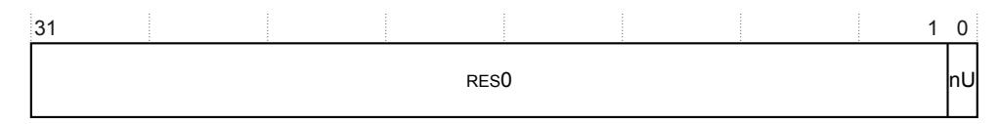

**Figure 4-79 TLBTR bit assignments**

The following table shows the TLBTR bit assignments.

**Table 4-115 TLBTR bit assignments**

| Bits   | Name | Function                                                                           |                              |  |  |  |
|--------|------|------------------------------------------------------------------------------------|------------------------------|--|--|--|
| [31:1] | -    | Reserved, RES0.                                                                    |                              |  |  |  |
| [0]    | nU   | Not Unified. Indicates whether the implementation has a unified TLB. The value is: |                              |  |  |  |
|        |      | 0                                                                                  | Processor has a unified TLB. |  |  |  |

To access the TLBTR in AArch32 state, read the CP15 register with:

MRC p15, 0, <Rt>, c0, c0, 3; Read TLB Type Register

# **4.5.3 Multiprocessor Affinity Register**

The MPIDR characteristics are:

#### **Purpose**

Provides an additional core identification mechanism for scheduling purposes in a cluster.

#### **Usage constraints**

The accessibility to the MPIDR by Exception level is:

| EL0 | EL1(NS) | EL1(S) | EL2 | EL3(SCR.NS = 1) | EL3(SCR.NS = 0) |
|-----|---------|--------|-----|-----------------|-----------------|
| -   | RO      | RO     | RO  | RO              | RO              |

# **Configurations**

The MPIDR is:

- Common to Secure and Non-secure states.
- Architecturally mapped to the AArch64 MPIDR\_EL1[31:0] register.

#### **Attributes**

See the register summary in *[Table 4-84 c0 register summary](#page-213-0)* on page 4-214.

The following figure shows the MPIDR bit assignments.

<span id="page-239-0"></span>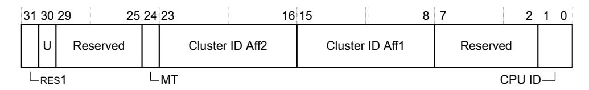

Figure 4-80 MPIDR bit assignments

The following table shows the MPIDR bit assignments.

Table 4-116 MPIDR bit assignments

| Bits    | Name            | Function                                                                                                                                                                              |                                       |  |
|---------|-----------------|---------------------------------------------------------------------------------------------------------------------------------------------------------------------------------------|---------------------------------------|--|
| [31]    | -               | Reserved, RES1.                                                                                                                                                                       |                                       |  |
| [30]    | U               | Indicates a single processor system, as distinct from core 0 in a cluster. This values:                                                                                               |                                       |  |
|         |                 | <b>0</b> Processor is part of                                                                                                                                                         | a multicore system.                   |  |
| [29:25] | -               | Reserved, RESO.                                                                                                                                                                       |                                       |  |
| [24]    | MT              | Indicates whether the lowest level of affinity consists of logical cores that are implemented using a multi-threading type approach:                                                  |                                       |  |
|         |                 | <b>0</b> Performance of cores at the lowest affinity level is largely independent.                                                                                                    |                                       |  |
|         |                 | 1 Performance of cores at the lowest affinity level is very interdependent.                                                                                                           |                                       |  |
| [23:16] | Cluster ID Aff2 | Indicates the value read in at reset, from the <b>CLUSTERIDAFF2</b> configuration signal. It identifies a Cortex-A57 device in a system with more than one Cortex-A57 device present. |                                       |  |
| [15:8]  | Cluster ID Aff1 | Indicates the value read in at reset, from the <b>CLUSTERIDAFF1</b> configuration signal. It identifies a Cortex-A57 device in a system with more than one Cortex-A57 device present. |                                       |  |
| [7:2]   | -               | Reserved, RESO.                                                                                                                                                                       |                                       |  |
| [1:0]   | CPU ID          | Indicates the core number in the Cortex-A57 device. The possible values are:                                                                                                          |                                       |  |
|         |                 | 0x0                                                                                                                                                                                   | An MPCore device with one core only.  |  |
|         |                 | 0x0, 0x1                                                                                                                                                                              | A Cortex-A57 device with two cores.   |  |
|         |                 | 0x0, 0x1, 0x2                                                                                                                                                                         | A Cortex-A57 device with three cores. |  |
|         |                 | 0x0, 0x1, 0x2, 0x3                                                                                                                                                                    | A Cortex-A57 device with four cores.  |  |

To access the MPIDR in AArch32 state, read the CP15 registers with:

MRC p15, 0, <Rt>, c0, c0, 5; Read Multiprocessor Affinity Register

#### **Related information**

4.3.2 Multiprocessor Affinity Register, EL1 on page 4-91.

## 4.5.4 Virtualization Multiprocessor ID Register

The VMPIDR characteristics are:

#### **Purpose**

Holds the value of the Virtualization Multiprocessor ID. This is the value returned by Non-secure EL1 reads of MPIDR. .

# <span id="page-240-0"></span>**Usage constraints**

The accessibility to the VMPIDR in AArch32 state by Exception level is:

| EL0 | EL1(NS) | EL1(S) | EL2 | EL3(SCR.NS = 1) | EL3(SCR.NS = 0) |
|-----|---------|--------|-----|-----------------|-----------------|
| -   | -       | -      | RW  | RW              | -               |

#### **Configurations**

The VMPIDR is:

- A Banked EL2 register.
- Architecturally mapped to the AArch64 VMPIDR\_EL2 register.

#### **Attributes**

See the register summary in *[Table 4-84 c0 register summary](#page-213-0)* on page 4-214.

The following figure shows the VMPIDR bit assignments.

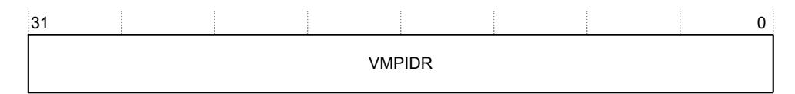

**Figure 4-81 VMPIDR bit assignments**

The following table shows the VMPIDR bit assignments.

**Table 4-117 VMPIDR bit assignments**

| Bits   | Name   | Function                                                                                                     |
|--------|--------|--------------------------------------------------------------------------------------------------------------|
| [31:0] | VMPIDR | MPIDR value returned by Non-secure EL1 reads of the MPIDR. For information on the subdivision of this value, |
|        |        | see 4.5.3 Multiprocessor Affinity Register on page 4-239.                                                    |

To access the VMPIDR, read or write the CP15 register with:

```
MRC p15, 4, <Rt>, c0, c0, 5; Read Virtualization Multiprocessor ID Register
MCR p15, 4, <Rt>, c0, c0, 5; Write Virtualization Multiprocessor ID Register
```

#### **Related information**

*[4.5.3 Multiprocessor Affinity Register](#page-238-0)* on page 4-239*.*

*[4.3.29 Virtualization Multiprocessor ID Register, EL2](#page-124-0)* on page 4-125*.*

#### **4.5.5 System Control Register**

The SCTLR characteristics are:

# **Purpose**

Provides the top-level control of the system, including its memory system.

# **Usage constraints**

The accessibility to the SCTLR by Exception level is:

| EL0 | EL1(NS) | EL1(S) | EL2 | EL3(SCR.NS = 1) | EL3(SCR.NS = 0) |
|-----|---------|--------|-----|-----------------|-----------------|
| -   | RW      | RW     | RW  | RW              | RW              |

Control bits in the SCTLR that are not applicable to a VMSA implementation read as the value that most closely reflects that implementation, and ignore writes.

Some bits in the register are read-only. These bits relate to non-configurable features of an implementation, and are provided for compatibility with other versions of the architecture.

Write access to the Secure copy of SCTLR is disabled when the CP15SDISABLE signal is HIGH.

#### **Configurations**

The SCTLR is Banked for Secure and Non-secure states.

The architectural mapping of the SCTLR is:

- The Non-secure SCTLR is mapped to the AArch64 SCTLR\_EL1.
- The Secure SCTLR is mapped to the AArch64 SCTLR EL3.

#### Attributes

See the register summary in *Table 4-85 c1 register summary* on page 4-216.

The following figure shows the SCTLR bit assignments.

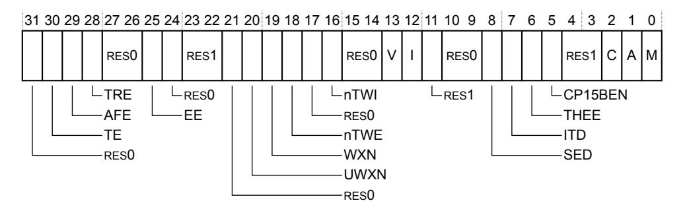

Figure 4-82 SCTLR bit assignments

The following table shows the SCTLR bit assignments.

Table 4-118 SCTLR bit assignments

| Bits | Name | Access | Function                                                                                                                      |
|------|------|--------|-------------------------------------------------------------------------------------------------------------------------------|
| [31] | -    | -      | Reserved, RESO.                                                                                                               |
| [30] | TE   | Banked | Thumb Exception enable. This bit controls whether exceptions are taken in ARM or Thumb state:                                 |
|      |      |        | <ul><li>Exceptions, including reset, taken in ARM state.</li><li>Exceptions, including reset, taken in Thumb state.</li></ul> |
|      |      |        | The primary input <b>CFGTE</b> defines the reset value of the TE bit of the Secure Banked register.                           |

| Bits    | Name | Access | Function                                                                                                                                                                                                                                                                                                                                          |
|---------|------|--------|---------------------------------------------------------------------------------------------------------------------------------------------------------------------------------------------------------------------------------------------------------------------------------------------------------------------------------------------------|
| [29]    | AFE  | Banked | Access flag enable. This bit enables use of the AP[0] bit in<br>the translation table descriptors as the Access flag. It also<br>restricts access permissions in the translation table<br>descriptors to the simplified model as described in the ARM®<br>Architecture Reference Manual ARMv8. In the translation<br>table descriptors, AP[0] is: |
|         |      |        | 0<br>An access permissions bit. The full range of access<br>permissions is supported. No access flag is implemented.<br>This is the reset value.                                                                                                                                                                                                  |
|         |      |        | 1<br>The Access flag. Only the simplified model for access<br>permissions is supported.                                                                                                                                                                                                                                                           |
|         |      |        | When TTBCR.EAE is set to 1, to enable use of the Long<br>descriptor translation table format, this bit is UNK/RES1.                                                                                                                                                                                                                               |
|         |      |        | This bit is permitted to be cached in a TLB.                                                                                                                                                                                                                                                                                                      |
| [28]    | TRE  | Banked | TEX remap enable. This bit enables remapping of the<br>TEX[2:1] bits for use as two translation table bits that can be<br>managed by the operating system. Enabling this remapping<br>also changes the scheme that describes the memory region<br>attributes in the VMSA. The possible values are:                                                |
|         |      |        | 0<br>TEX remap disabled. TEX[2:0] are used, with the C and<br>B bits, to describe the memory region attributes. This is<br>the reset value.                                                                                                                                                                                                       |
|         |      |        | 1<br>TEX remap enabled. TEX[2:1] are reassigned for use as<br>bits managed by the operating system. The TEX[0], C<br>and B bits describe the memory region attributes, with<br>the MMU remap registers.                                                                                                                                           |
|         |      |        | When TTBCR.EAE is set to 1, to enable use of the Long<br>descriptor translation table format, this bit is UNK/RES1.                                                                                                                                                                                                                               |
|         |      |        | This bit is permitted to be cached in a TLB.                                                                                                                                                                                                                                                                                                      |
| [27:26] | -    | -      | Reserved, RES0.                                                                                                                                                                                                                                                                                                                                   |
| [25]    | EE   | Banked | Exception Endianness. The value of this bit defines the value<br>of the CPSR.E bit on entry to an exception vector, including<br>reset. This value also indicates the endianness of the<br>translation table data for translation table lookups. The values<br>are:                                                                               |
|         |      |        | 0<br>Little endian.                                                                                                                                                                                                                                                                                                                               |
|         |      |        | 1<br>Big endian.                                                                                                                                                                                                                                                                                                                                  |
|         |      |        | The primary input CFGEND defines the reset value of the<br>EE bit of the Secure Banked register.                                                                                                                                                                                                                                                  |
| [24]    | -    | -      | Reserved, RES0.                                                                                                                                                                                                                                                                                                                                   |
| [23:22] | -    | -      | Reserved, RES1.                                                                                                                                                                                                                                                                                                                                   |
| [21]    | -    | -      | Reserved, RES0.                                                                                                                                                                                                                                                                                                                                   |

| Bits    | Name | Access | Function                                                                                                                                                                                                                                                                        |
|---------|------|--------|---------------------------------------------------------------------------------------------------------------------------------------------------------------------------------------------------------------------------------------------------------------------------------|
| [20]    | UWXN | Banked | Unprivileged write permission implies EL1 Execute Never<br>(XN). You can use this bit to require all memory regions with<br>unprivileged write permissions are treated as XN for accesses<br>from software executing at EL1. Regions with unprivileged<br>write permission are: |
|         |      |        | 0<br>Not forced to be XN. This is the reset value.                                                                                                                                                                                                                              |
|         |      |        | 1<br>Forced to be XN for accesses from software executing at<br>EL1.                                                                                                                                                                                                            |
|         |      |        | This bit is permitted to be cached in a TLB.                                                                                                                                                                                                                                    |
| [19]    | WXN  | Banked | Write permission implies Execute Never (XN). You can use<br>this bit to require all memory regions with write permissions<br>are treated as XN. Regions with write permission are:                                                                                              |
|         |      |        | 0<br>Not forced to be XN. This is the reset value.                                                                                                                                                                                                                              |
|         |      |        | 1<br>Forced to be XN.                                                                                                                                                                                                                                                           |
|         |      |        | This bit is permitted to be cached in a TLB.                                                                                                                                                                                                                                    |
| [18]    | nTWE | Banked | WFE trap. The values are:                                                                                                                                                                                                                                                       |
|         |      |        | 0<br>A WFE instruction executed at EL0 that causes suspended<br>execution as if the event register is not set and there is no<br>pending WFE wake-up event. It is treated as UNDEFINED.                                                                                         |
|         |      |        | 1<br>WFE instructions executed as normal. This is the reset<br>value.                                                                                                                                                                                                           |
| [17]    | -    | -      | Reserved, RES0.                                                                                                                                                                                                                                                                 |
| [16]    | nTWI | Banked | WFI trap. The values are:                                                                                                                                                                                                                                                       |
|         |      |        | 0<br>A WFI instruction executed at EL0 that causes suspended<br>execution as if there is not a pending WFI wake-up<br>event. It is treated as UNDEFINED.                                                                                                                        |
|         |      |        | 1<br>WFE instructions executed as normal. This is the reset<br>value.                                                                                                                                                                                                           |
| [15:14] | -    | -      | Reserved, RES0.                                                                                                                                                                                                                                                                 |
| [13]    | V    | Banked | Vectors bit. This bit selects the base address of the exception<br>vectors:                                                                                                                                                                                                     |
|         |      |        | 0<br>Normal exception vectors, base address 0x00000000.<br>This base address can be remapped.                                                                                                                                                                                   |
|         |      |        | 1<br>High exception vectors, base address 0xFFFF0000. This<br>base address is never remapped.                                                                                                                                                                                   |
|         |      |        | The primary input VINITHI defines the reset value of the V<br>bit of the Secure Banked register.                                                                                                                                                                                |

| Bits   | Name    | Access | Function                                                                         |
|--------|---------|--------|----------------------------------------------------------------------------------|
| [12]   | I       | Banked | Instruction Cache enable. This is a global enable bit for<br>Instruction Caches: |
|        |         |        | 0<br>Instruction Caches disabled. This is the reset value.                       |
|        |         |        | 1<br>Instruction Caches enabled.                                                 |
| [11]   | -       | -      | Reserved, RES1.                                                                  |
| [10:9] | -       | -      | Reserved, RES0.                                                                  |
| [8]    | SED     | Banked | SETEND instruction disable. The values are:                                      |
|        |         |        | 0<br>SETEND instruction is enabled. This is the reset value.                     |
|        |         |        | 1<br>SETEND instruction is UNALLOCATED.                                          |
| [7]    | ITD     | Banked | IT instruction disable. The values are:                                          |
|        |         |        | 0<br>IT instruction functionality is enabled. This is the reset<br>value.        |
|        |         |        | 1<br>All encodings of the IT instruction are UNDEFINED when<br>either:           |
|        |         |        | •<br>hw[3:0] are not equal to 0b1000.                                            |
|        |         |        | •<br>IT instructions with a subsequent 32-bit instruction.                       |
|        |         |        | •<br>Subsequent PC reading or writing instruction.                               |
| [6]    | THEE    | Banked | ThumbEE enable. This value is:                                                   |
|        |         |        | 0<br>ThumbEE is not implemented.                                                 |
| [5]    | CP15BEN | Banked | AArch32 CP15 barrier enable. The values are:                                     |
|        |         |        | 0<br>CP15 barrier operations disabled. Their encodings are<br>UNDEFINED.         |
|        |         |        | 1<br>CP15 barrier operations enabled. This is the reset value.                   |
| [4:3]  | -       | -      | Reserved, RES1.                                                                  |
| [2]    | C       | Banked | Cache enable. This is a global enable bit for data and unified<br>caches:        |
|        |         |        | 0<br>Data and unified caches disabled. This is the reset value.                  |
|        |         |        | 1<br>Data and unified caches enabled.                                            |

<span id="page-245-0"></span>

| Bits | Name | Access | Function                                                                        |
|------|------|--------|---------------------------------------------------------------------------------|
| [1]  | A    | Banked | Alignment check enable. This is the enable bit for Alignment<br>fault checking: |
|      |      |        | 0<br>Alignment fault checking disabled. This is the reset<br>value.             |
|      |      |        | 1<br>Alignment fault checking enabled.                                          |
| [0]  | M    | Banked | MMU enable. This is a global enable bit for the EL1 and EL0<br>stage 1 MMU:     |
|      |      |        | 0<br>EL1 and EL0 stage 1 MMU disabled. This is the reset<br>value.              |
|      |      |        | 1<br>EL1 and EL0 stage 1 MMU enabled.                                           |

To access the SCTLR in AArch32 state, read or write the CP15 register with:

```
MRC p15, 0, <Rt>, c1, c0, 0; Read System Control Register
MCR p15, 0, <Rt>, c1, c0, 0; Write System Control Register
```

To access the SCTLR\_EL1 in AArch64 state, read or write the register with:

```
MRS <Xt>, SCTLR_EL1; Read System Control Register
MSR SCTLR_EL1, <Xt>; Write System Control Register
```

To access the SCTLR\_EL3 in AArch64 state, read or write the register with:

```
MRS <Xt>, SCTLR_EL3; Read System Control Register
MSR SCTLR_EL3, <Xt>; Write System Control Register
```

# **Related information**

*[4.3.30 System Control Register, EL1](#page-125-0)* on page 4-126*. [4.3.38 System Control Register, EL3](#page-141-0)* on page 4-142*.*

# **4.5.6 Architectural Feature Access Control Register**

The CPACR characteristics are:

#### **Purpose**

Controls access to the CP10 and CP11 coprocessors. It also enables software to check for the presence of coprocessors CP10 to CP11.

#### **Usage constraints**

The accessibility to the CPACR by Exception level is:

| EL0 | EL1(NS) | EL1(S) | EL2 | EL3(SCR.NS = 1) | EL3(SCR.NS = 0) |
|-----|---------|--------|-----|-----------------|-----------------|
| -   | RW      | RW     | RW  | RW              | RW              |

The CPACR has no effect on instructions executed in Hyp mode.

# **Configurations**

The CPACR is:

- Common to the Secure and Non-secure states.
- Architecturally mapped to the AArch64 CPACR\_EL1 register.

**Note**

The NSACR controls Non-secure access to the CPACR fields.

#### **Attributes**

See the register summary in *[Table 4-85 c1 register summary](#page-215-0)* on page 4-216.

The following figure shows the CPACR bit assignments.

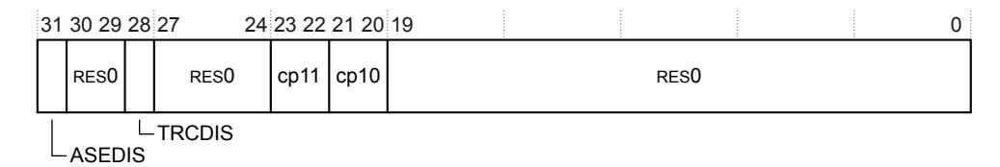

**Figure 4-83 CPACR bit assignments**

The following table shows the CPACR bit assignments.

**Table 4-119 CPACR bit assignments**

| Bits    | Name                                                              | Function                                                                                                                                                    |  |  |  |  |
|---------|-------------------------------------------------------------------|-------------------------------------------------------------------------------------------------------------------------------------------------------------|--|--|--|--|
| [31]    | ASEDIS                                                            | Disables Advanced SIMD functionality:                                                                                                                       |  |  |  |  |
|         |                                                                   | 0<br>All Advanced SIMD and FP instructions execute normally. This is the reset value.                                                                       |  |  |  |  |
|         |                                                                   | 1<br>All instruction encodings that are part of Advanced SIMD, but not FP instructions, are UNDEFINED.                                                      |  |  |  |  |
| [30:29] | -                                                                 | Reserved, RES0.                                                                                                                                             |  |  |  |  |
| [28]    | TRCDIS                                                            | Disable CP14 access to trace registers:                                                                                                                     |  |  |  |  |
|         |                                                                   | 0<br>CP14 access to trace registers is not supported. This bit is RES0.                                                                                     |  |  |  |  |
| [27:24] | -                                                                 | Reserved, RES0.                                                                                                                                             |  |  |  |  |
| [23:22] | cp11                                                              | Defines the access rights for coprocessor 11. The values are:                                                                                               |  |  |  |  |
|         |                                                                   | Access denied. Any attempt to access the coprocessor generates an Undefined Instruction exception. This<br>0b00<br>is the reset value.                      |  |  |  |  |
|         |                                                                   | Access at EL1 or higher only. Any attempt to access the coprocessor from software executing at EL0<br>0b01<br>generates an Undefined Instruction exception. |  |  |  |  |
|         |                                                                   | Reserved.<br>0b10                                                                                                                                           |  |  |  |  |
|         |                                                                   | Full access. The meaning of full access is defined by the appropriate coprocessor.<br>0b11                                                                  |  |  |  |  |
|         | If NSACR[11:10] is 0b00 in Non-secure state, these bits are RES0. |                                                                                                                                                             |  |  |  |  |

<span id="page-247-0"></span>

| Bits    | Name | Function                                                                                                                                                    |  |  |  |  |  |
|---------|------|-------------------------------------------------------------------------------------------------------------------------------------------------------------|--|--|--|--|--|
| [21:20] | cp10 | Defines the access rights for coprocessor 10. The values are:                                                                                               |  |  |  |  |  |
|         |      | Access denied. Any attempt to access the coprocessor generates an Undefined Instruction exception. This<br>0b00<br>is the reset value.                      |  |  |  |  |  |
|         |      | Access at EL1 or higher only. Any attempt to access the coprocessor from software executing at EL0<br>0b01<br>generates an Undefined Instruction exception. |  |  |  |  |  |
|         |      | Reserved.<br>0b10                                                                                                                                           |  |  |  |  |  |
|         |      | Full access. The meaning of full access is defined by the appropriate coprocessor.<br>0b11                                                                  |  |  |  |  |  |
|         |      | If NSACR[11:10] is 0b00 in Non-secure state, these bits are RES0.                                                                                           |  |  |  |  |  |
| [19:0]  | -    | Reserved, RES0.                                                                                                                                             |  |  |  |  |  |

**Note**

If the values of the cp11 and cp10 fields are not the same, the behavior is same as if both fields were set to the value of cp10, in all respects other than the value read back by explicitly reading cp11.

To access the CPACR in AArch32 state, read or write the CP15 register with:

MRC p15, 0, <Rt>, c1, c0, 2; Read Architectural Feature Access Control Register MCR p15, 0, <Rt>, c1, c0, 2; Write Architectural Feature Access Control Register

# **Related information**

*[4.3.32 Architectural Feature Access Control Register, EL1](#page-128-0)* on page 4-129*.*

*[4.5.8 Non-secure Access Control Register](#page-250-0)* on page 4-251*.*

#### **4.5.7 Secure Configuration Register**

The SCR characteristics are:

**Purpose** Defines the configuration of the current Security state. It specifies:

- The Security state of the processor, Secure or Non-secure.
- What mode the processor branches to, if an IRQ, FIQ, or external abort occurs.
- Whether the CPSR.F and CPSR.A bits can be modified when SCR.NS is 1.

If EL3 is using AArch64, accesses to this register from Secure EL1 using AArch32 are trapped to EL3.

**Usage constraints** The accessibility to the SCR by Exception level is:

| EL0 | EL1(NS) | EL1(S) | EL2 | EL3(SCR.NS = 1) | EL3(SCR.NS = 0) |
|-----|---------|--------|-----|-----------------|-----------------|
| -   | -       | TRAP   | -   | RW              | RW              |

**Configurations** The SCR is a Restricted access register that exists only in the Secure state.

The SCR is mapped to the AArch64 SCR\_EL3 register.

**Attributes** See the register summary in *[Table 4-85 c1 register summary](#page-215-0)* on page 4-216.

The following figure shows the SCR bit assignments.

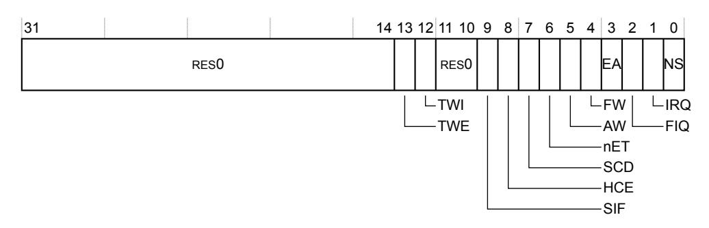

**Figure 4-84 SCR bit assignments**

The following table shows the SCR bit assignments.

**Table 4-120 SCR bit assignments**

| Bits         | Name | Function                                                                                                                                                                                                                                                                                                                 |  |  |
|--------------|------|--------------------------------------------------------------------------------------------------------------------------------------------------------------------------------------------------------------------------------------------------------------------------------------------------------------------------|--|--|
| [31:14]<br>- |      | Reserved, RES0.                                                                                                                                                                                                                                                                                                          |  |  |
| [13]         | TWE  | Trap WFE instructions. The possible values are:                                                                                                                                                                                                                                                                          |  |  |
|              |      | 0<br>WFE instructions are not trapped. This is the reset value.                                                                                                                                                                                                                                                          |  |  |
|              |      | 1<br>WFE instructions executed in any mode other than Monitor mode that<br>would cause suspended execution as if the event register is not set, there<br>is not a pending WFE wake-up event and the instruction does not cause<br>another exception, is trapped to Monitor mode using the UNDEFINED<br>exception vector. |  |  |
| [12]         | TWI  | Trap WFI instructions. The possible values are:                                                                                                                                                                                                                                                                          |  |  |
|              |      | 0<br>WFI instructions are not trapped. This is the reset value.                                                                                                                                                                                                                                                          |  |  |
|              |      | 1<br>WFI instructions executed in any mode other than Monitor mode that<br>would cause suspended execution, as if there is no pending WFI wake<br>up event and the instruction does not cause another exception, is trapped<br>to Monitor mode using the UNDEFINED exception vector.                                     |  |  |
| [11:10]      | -    | Reserved, RES0.                                                                                                                                                                                                                                                                                                          |  |  |
| [9]          | SIF  | Secure Instruction Fetch. When the processor is in Secure state, this bit<br>disables instruction fetches from Non-secure memory. The possible values<br>are:                                                                                                                                                            |  |  |
|              |      | 0<br>Secure state instruction fetches from Non-secure memory permitted.<br>This is the reset value.                                                                                                                                                                                                                      |  |  |
|              |      | 1<br>Secure state instruction fetches from Non-secure memory not permitted.                                                                                                                                                                                                                                              |  |  |
| [8]          | HCE  | Hyp Call enable. This bit enables the use of HVC instruction. The possible<br>values are:                                                                                                                                                                                                                                |  |  |
|              |      | 0<br>The HVC instruction is UNDEFINED in any mode. This is the reset value.<br>1<br>The HVC instruction enabled in Non-secure EL1 or EL2, and performs a<br>Hyp Call.                                                                                                                                                    |  |  |

| Bits | Name | Function                                                                                                                                                                                 |
|------|------|------------------------------------------------------------------------------------------------------------------------------------------------------------------------------------------|
| [7]  | SCD  | Secure Monitor Call disable. This bit causes the SMC instruction to be<br>UNDEFINED in all privileged modes. The possible values are:                                                    |
|      |      | 0<br>The SMC instruction executes normally from privileged modes, and<br>performs a Secure Monitor Call. This is the reset value.                                                        |
|      |      | 1<br>The SMC instruction is UNDEFINED in any mode.                                                                                                                                       |
|      |      | A trap of the SMC instruction to Hyp mode from Non-secure EL1 takes<br>priority over the value of this bit. See the ARM®<br>Architecture Reference<br>Manual ARMv8 for more information. |
| [6]  | nET  | Not Early Termination. This bit disables early termination.                                                                                                                              |
|      |      | This bit is not implemented, RES0.                                                                                                                                                       |
| [5]  | AW   | A bit writable. This bit controls whether CPSR.A can be modified in Non<br>secure state. For the Cortex-A57 processor:                                                                   |
|      |      | •<br>This bit has no effect on whether CPSR.A can be modified in Non<br>secure state. The AW bit can be modified in either Security state.                                               |
|      |      | •<br>This bit, with the HCR.AMO bit, determines whether CPSR.A has any<br>effect on exceptions that are routed to a Non-secure mode.                                                     |
| [4]  | FW   | F bit writable. This bit controls whether CPSR.F can be modified in Non<br>secure state. For the Cortex-A57 processor:                                                                   |
|      |      | •<br>This bit has no effect on whether CPSR.F can be modified in Non<br>secure state. The FW bit can be modified in either Security state.                                               |
|      |      | •<br>This bit, with the HCR.FMO bit, determines whether CPSR.F has any<br>effect on exceptions that are routed to a Non-secure mode.                                                     |
| [3]  | EA   | External Abort handler. This bit controls which mode takes external aborts.<br>The possible values are:                                                                                  |
|      |      | 0<br>External aborts taken in Abort mode. This is the reset value.                                                                                                                       |
|      |      | 1<br>External aborts taken in Monitor mode.                                                                                                                                              |
| [2]  | FIQ  | FIQ handler. This bit controls which mode takes FIQ exceptions. The<br>possible values are:                                                                                              |
|      |      | 0<br>FIQs taken in FIQ mode. This is the reset value.                                                                                                                                    |
|      |      | 1<br>FIQs taken in Monitor mode.                                                                                                                                                         |

<span id="page-250-0"></span>

| Name | Function                                                                                                                                           |
|------|----------------------------------------------------------------------------------------------------------------------------------------------------|
| IRQ  | IRQ handler. This bit controls which mode takes IRQ exceptions. The<br>possible values are:                                                        |
|      | 0<br>IRQs taken in IRQ mode. This is the reset value.                                                                                              |
|      | 1<br>IRQs taken in Monitor mode.                                                                                                                   |
| NS   | Non-secure bit. Except when the processor is in Monitor mode, this bit<br>determines the Security state of the processor. The possible values are: |
|      | 0<br>Secure. This is the reset value.                                                                                                              |
|      | 1<br>Non-secure.                                                                                                                                   |
|      | Note                                                                                                                                               |
|      | When the processor is in Monitor mode, it is always in Secure state,<br>regardless of the value of the NS bit.                                     |
|      |                                                                                                                                                    |

To access the SCR in AArch32 state, read or write the CP15 register with:

MRC p15, 0, <Rt>, c1, c1, 0; Read Secure Configuration Register data MCR p15, 0, <Rt>, c1, c1, 0; Write Secure Configuration Register data

# **4.5.8 Non-secure Access Control Register**

The NSACR characteristics are:

# **Purpose**

Defines the Non-secure access permission to the CP10 and CP11 coprocessors and controls Non-secure Advanced SIMD functionality.

## **Usage constraints**

The accessibility to the NSACR by Exception level is:

| EL0 | EL1(NS) | EL1(S) | EL2 | EL3(SCR.NS = 1) | EL3(SCR.NS = 0) |
|-----|---------|--------|-----|-----------------|-----------------|
| -   | RO      | TRAP   | RO  | RO              | RW              |

If EL3 is using AArch64, accesses to this register from Secure EL1 using AArch32 are trapped to EL3.

# **Configurations**

The NSACR:

- Is a Restricted access register that exists only in the Secure state but can be read from the Non-secure state.
- Functionality is replaced by the behavior in the CPTR\_EL3 register in AArch64 state.

When EL3 is using AArch64, reads of the NSACR from Non-secure EL2 or Non-secure EL1 using AArch32, return a fixed value of 0x00000C00.

#### **Attributes**

See the register summary in *[Table 4-85 c1 register summary](#page-215-0)* on page 4-216.

The following figure shows the NSACR bit assignments.

<span id="page-251-0"></span>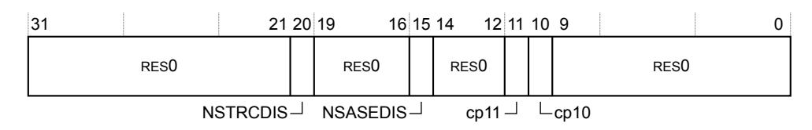

**Figure 4-85 NSACR bit assignments**

The following table shows the NSACR bit assignments.

**Table 4-121 NSACR bit assignments**

| Bits         | Name     | Function                                                                                                                                                                                                                                                                                    |
|--------------|----------|---------------------------------------------------------------------------------------------------------------------------------------------------------------------------------------------------------------------------------------------------------------------------------------------|
| [31:21]      | -        | Reserved, RES0.                                                                                                                                                                                                                                                                             |
| [20]         | NSTRCDIS | Disable Non-secure access to CP14 trace registers:                                                                                                                                                                                                                                          |
|              |          | 0<br>CP14 access to trace registers is not supported. This bit is RES0.                                                                                                                                                                                                                     |
| [19:16]      | -        | Reserved, RES0.                                                                                                                                                                                                                                                                             |
| [15]         | NSASEDIS | Disables Non-secure Advanced SIMD functionality. The values are:                                                                                                                                                                                                                            |
|              |          | 0<br>This bit has no effect on the ability to write to the CAPCR.ASEDIS bit. This is the reset value.                                                                                                                                                                                       |
|              |          | 1<br>When executing in Non-secure state, the CPACR.ASEDIS bit is RES1.                                                                                                                                                                                                                      |
| [14:12]      | -        | Reserved, RES0.                                                                                                                                                                                                                                                                             |
| [11]<br>cp11 |          | Non-secure access to coprocessor 11 enable. The values are:                                                                                                                                                                                                                                 |
|              |          | 0<br>Secure access only. Any attempt to access coprocessor 11 in Non-secure state results in an Undefined<br>Instruction exception. If the processor is in Non-secure state, the corresponding bits in the CPACR ignore<br>writes and read as 0b00, access denied. This is the reset value. |
|              |          | 1<br>Access from any Security state.                                                                                                                                                                                                                                                        |
| [10]         | cp10     | Non-secure access to coprocessor 10 enable. The values are:                                                                                                                                                                                                                                 |
|              |          | 0<br>Secure access only. Any attempt to access coprocessor 10 in Non-secure state results in an Undefined<br>Instruction exception. If the processor is in Non-secure state, the corresponding bits in the CPACR ignore<br>writes and read as 0b00, access denied. This is the reset value. |
|              |          | 1<br>Access from any Security state.                                                                                                                                                                                                                                                        |
| [9:0]        | -        | Reserved, RES0.                                                                                                                                                                                                                                                                             |

To access the NSACR in AArch32 state, read or write the CP15 register with:

```
MRC p15, 0, <Rt>, c1, c1, 2; Read Non-secure Access Control Register data
MCR p15, 0, <Rt>, c1, c1, 2; Write Non-secure Access Control Register data
```

#### **Related information**

*[4.3.40 Architectural Feature Trap Register, EL3](#page-144-0)* on page 4-145*.*

# **4.5.9 Secure Debug Configuration Register**

The SDCR characteristics are:

# **Purpose**

Controls the trapping to Hyp mode of Secure accesses, at EL1 or lower, to functions provided by the debug and trace architectures.

If EL3 is using AArch64, accesses to this register from Secure EL1 using AArch32 are trapped to EL3.

#### **Usage constraints**

The accessibility to the SDCR by Exception level is:

| EL0 | EL1(NS) | EL1(S) | EL2 | EL3(SCR.NS = 1) | EL3(SCR.NS = 0) |
|-----|---------|--------|-----|-----------------|-----------------|
| -   | -       | TRAP   | -   | RW              | RW              |

# **Configurations**

The SDCR is a Restricted access register that only exists in the Secure state.

The SDCR is mapped to the AArch64 MDCR\_EL3 register.

# **Attributes**

See the register summary in *[Table 4-85 c1 register summary](#page-215-0)* on page 4-216.

The following figure shows the SDCR bit assignments.

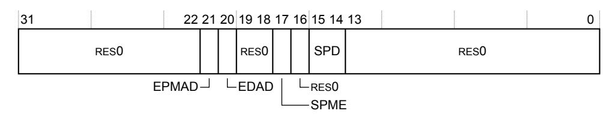

**Figure 4-86 SDCR bit assignments**

The following table shows the SDCR bit assignments

**Table 4-122 SDCR bit assignments**

| Bits    | Name  | Function                                                                                                                                         |
|---------|-------|--------------------------------------------------------------------------------------------------------------------------------------------------|
| [31:22] | -     | Reserved, RES0.                                                                                                                                  |
| [21]    | EPMAD | Disables access to the performance monitor configuration registers by an external debugger:                                                      |
|         |       | 0<br>External debugger access to the performance monitor configuration registers enabled. This is the reset value.                               |
|         |       | 1<br>External debugger access to the performance monitor configuration registers disabled, unless overridden by the<br>authentication interface. |
|         |       | Resets to 0 on Warm reset.                                                                                                                       |
| [20]    | EDAD  | Disables access to the breakpoint and watchpoint registers by an external debugger:                                                              |
|         |       | 0<br>External debugger access to the breakpoint and watchpoint registers enabled. This is the reset value.                                       |
|         |       | 1<br>External debugger access to the breakpoint and watchpoint registers disabled, unless overridden by the<br>authentication interface.         |
|         |       | Resets to 0 on Warm reset.                                                                                                                       |
| [19:18] | -     | Reserved, RES0.                                                                                                                                  |

<span id="page-253-0"></span>

| Bits             | Name | Function                                                                                                                                                                                            |  |  |  |
|------------------|------|-----------------------------------------------------------------------------------------------------------------------------------------------------------------------------------------------------|--|--|--|
| [17]             | SPME | Enables Secure performance monitor:                                                                                                                                                                 |  |  |  |
|                  |      | 0<br>Performance monitors disabled in Secure state, no events are counted. This is the reset value.                                                                                                 |  |  |  |
|                  |      | 1<br>Performance monitors enabled in Secure state.                                                                                                                                                  |  |  |  |
|                  |      | Resets to 0 on Warm reset.                                                                                                                                                                          |  |  |  |
| [16]             | -    | Reserved, RES0.                                                                                                                                                                                     |  |  |  |
| SPDdp<br>[15:14] |      | AArch32 Secure privileged debug. Enables or disables debug exceptions from Secure state if Secure EL1 is using<br>AArch32, other than Software breakpoint instructions. The possible values are:    |  |  |  |
|                  |      | Legacy mode. Debug exceptions from Secure EL1 are enabled if<br>0b00<br>AArch32SelfHostedSecurePrivilegedInvasiveDebugEnabled() is true.                                                            |  |  |  |
|                  |      | Secure privileged debug disabled. Debug exceptions from Secure EL1 are disabled.<br>0b10                                                                                                            |  |  |  |
|                  |      | Secure privileged debug enabled. Debug exceptions from Secure EL1 are enabled.<br>0b11                                                                                                              |  |  |  |
|                  |      | The value 0b01 is reserved.                                                                                                                                                                         |  |  |  |
|                  |      | Note                                                                                                                                                                                                |  |  |  |
|                  |      | If debug exceptions from Secure EL1 are enabled, then debug exceptions from Secure EL0 are also enabled.<br>Otherwise, debug exceptions from Secure EL0 are enabled only if SDER32_EL3.SUIDEN is 1. |  |  |  |
|                  |      | Ignored if Secure EL1 is using AArch64 and in Non-secure state. Debug exceptions from Software breakpoint<br>instruction debug events are always enabled.                                           |  |  |  |
|                  |      |                                                                                                                                                                                                     |  |  |  |
|                  |      | Resets to 0 on Warm reset.                                                                                                                                                                          |  |  |  |
| [13:0]           | -    | Reserved, RES0.                                                                                                                                                                                     |  |  |  |

To access the SDCR in AArch32 state, read or write the CP15 register with:

MRC p15, 0, <Rt>, c1, c3, 1; Read Secure Debug Configuration Register MCR p15, 0, <Rt>, c1, c3, 1; Write Secure Debug Configuration Register

# **4.5.10 Hyp Configuration Register**

The HCR characteristics are:

**Purpose** Provides configuration controls for virtualization, including defining whether various

Non-secure operations are trapped to Hyp mode.

**Usage** The accessibility to the HCR in AArch32 state by Exception level is:

**constraints**

**EL0 EL1(NS) EL1(S) EL2 EL3(SCR.NS = 1) EL3(SCR.NS = 0)** - - - RW RW -

**Configurations** The HCR is:

• A Banked EL2 register

• Architecturally mapped to the AArch64 HCR\_EL2[31:0] register.

**Attributes** See the register summary in *[Table 4-85 c1 register summary](#page-215-0)* on page 4-216.

dp SPD only applies in Secure state and when either Secure EL1 or EL3 is using AArch32.

The following figure shows the HCR bit assignments.

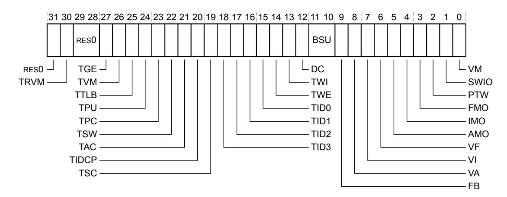

**Figure 4-87 HCR bit assignments**

The following table shows the HCR bit assignments.

**Table 4-123 HCR bit assignments**

| Bits    | Name | Function                                                                                                                                                                                                                                                           |  |
|---------|------|--------------------------------------------------------------------------------------------------------------------------------------------------------------------------------------------------------------------------------------------------------------------|--|
| [31]    | -    | Reserved, RES0.                                                                                                                                                                                                                                                    |  |
| [30]    | TRVM | Trap Read of Virtual Memory controls. When 1, this causes reads to the<br>EL1 virtual memory control registers from EL1 to be trapped to EL2.<br>This covers the following registers:                                                                              |  |
|         |      | AArch32<br>SCTLR, TTBR0, TTBR1, TTBCR, DACR, DFSR, IFSR,<br>DFAR, IFAR, ADFSR, AIFSR, PRRR/MAIR0, NMRR/<br>MAIR1, AMAIR0, AMAIR1, and CONTEXTIDR.                                                                                                                  |  |
|         |      | The reset value is 0.                                                                                                                                                                                                                                              |  |
| [29:28] | -    | Reserved, RES0.                                                                                                                                                                                                                                                    |  |
| [27]    | TGE  | Trap general exceptions. When this bit is set to 1, and the processor is<br>executing at EL0 in Non-secure state, Undefined Instruction exceptions,<br>Supervisor Call exceptions, synchronous External aborts and some<br>Alignment faults are taken in Hyp mode. |  |
|         |      | The SCTLR.M bit is treated as being 0 regardless of its actual state,<br>other than for the purpose of reading the bit.                                                                                                                                            |  |
|         |      | When the processor is executing at EL1 in Non-secure state, and this bit<br>is set to 1, the Illegal Exception Return mechanism is invoked.                                                                                                                        |  |
|         |      | The reset value is 0.                                                                                                                                                                                                                                              |  |
| [26]    | TVM  | Trap Virtual Memory controls. When 1, this causes writes to the EL1<br>virtual memory control registers from EL1 to be trapped to EL2. This<br>covers the following registers:                                                                                     |  |
|         |      | AArch32<br>SCTLR, TTBR0, TTBR1, TTBCR, DACR, DFSR, IFSR,<br>DFAR, IFAR, ADFSR, AIFSR, PRRR/MAIR0, NMRR/<br>MAIR1, AMAIR0, AMAIR1, and CONTEXTIDR.                                                                                                                  |  |
|         |      | The reset value is 0.                                                                                                                                                                                                                                              |  |

| Bits | Name  | Function                                                                                                                                                                                                                                                                                             |
|------|-------|------------------------------------------------------------------------------------------------------------------------------------------------------------------------------------------------------------------------------------------------------------------------------------------------------|
| [25] | TTLB  | Trap TLB maintenance instructions. When 1, this causes TLB<br>maintenance instructions executed from EL1 that are not UNDEFINED to<br>be trapped to EL2. This covers the following instructions:                                                                                                     |
|      |       | AArch32<br>TLBIALLIS, TLBIMVAIS, TLBIASIDIS, TLBIMVAAIS,<br>ITLBIALL, DTLBIALL, TLBIALL, ITLBIMVA, DTLBIMVA,<br>TLBIMVA, ITLBIASID, DTLBIASID, TLBIASID,<br>TLBIMVAA, TLBIMVALIS, TLBIMVAALIS, TLBIMVAL, and<br>TLBIMVAAL.                                                                           |
|      |       | The reset value is 0.                                                                                                                                                                                                                                                                                |
| [24] | TPU   | Trap Cache maintenance instructions to Point of Unification. When 1,<br>this causes Cache maintenance instructions to the point of unification<br>executed from EL1 or EL0 that are not UNDEFINED to be trapped to EL2.<br>This covers the following instructions:                                   |
|      |       | AArch32<br>ICIMVAU, ICIALLU, ICIALLUIS, and DCCMVAU.                                                                                                                                                                                                                                                 |
|      |       | The reset value is 0.                                                                                                                                                                                                                                                                                |
| [23] | TPC   | Trap Data/Unified Cache maintenance operations to Point of Coherency.<br>When 1, this causes Data or Unified Cache maintenance instructions by<br>address to the point of coherency executed from EL1 or EL0 that are not<br>UNDEFINED to be trapped to EL2. This covers the following instructions: |
|      |       | AArch32<br>DCIMVAC, DCCIMVAC, and DCCMVAC.                                                                                                                                                                                                                                                           |
|      |       | The reset value is 0.                                                                                                                                                                                                                                                                                |
| [22] | TSW   | Trap Data/Unified Cache maintenance operations by Set/Way. When 1,<br>this causes Data or Unified Cache maintenance instructions by set/way<br>executed from EL1 that are not UNDEFINED to be trapped to EL2. This<br>covers the following instructions:                                             |
|      |       | AArch32<br>DCISW, DCCSW, and DCCISW.                                                                                                                                                                                                                                                                 |
|      |       | The reset value is 0.                                                                                                                                                                                                                                                                                |
| [21] | TAC   | Trap ACTLR accesses. When this bit is set to 1, any valid Non-secure<br>access to the ACTLR is trapped to Hyp mode.                                                                                                                                                                                  |
|      |       | The reset value is 0.                                                                                                                                                                                                                                                                                |
| [20] | TIDCP | Trap Implementation Dependent functionality. When 1, this causes<br>accesses to the following instruction set space executed from EL1 to be<br>trapped to EL2:                                                                                                                                       |
|      |       | AArch32<br>All CP15 MCR and MRC instructions as follows:                                                                                                                                                                                                                                             |
|      |       | •<br>CRn is 9, op1 is 0-7, CRm is c0, c1, c2, c5, c6, c7, or<br>c8, and op2 is 0-7.                                                                                                                                                                                                                  |
|      |       | •<br>CRn is 10, op1 is 0-7, CRm is c0, c1, c4, or c8, and op2<br>is 0-7.                                                                                                                                                                                                                             |
|      |       | •<br>CRn is 11, op1 is 0-7, CRm is c0 to c8, or c15, and op2<br>is 0-7.                                                                                                                                                                                                                              |
|      |       | The reset value is 0.                                                                                                                                                                                                                                                                                |

| Bits | Name | Function                                                                                                                                                                                                                                |  |
|------|------|-----------------------------------------------------------------------------------------------------------------------------------------------------------------------------------------------------------------------------------------|--|
| [19] | TSC  | Trap SMC instruction. When this bit is set to 1, any attempt from Non<br>secure EL1 to execute an SMC instruction, that passes its condition check<br>if it is conditional, is trapped to Hyp mode.                                     |  |
|      |      | The reset value is 0.                                                                                                                                                                                                                   |  |
| [18] | TID3 | Trap ID Group 3. When 1, this causes reads to the following registers<br>executed from EL1 to be trapped to EL2:                                                                                                                        |  |
|      |      | AArch32<br>ID_PFR0, ID_PFR1, ID_DFR0, ID_AFR0, ID_MMFR0,<br>ID_MMFR1, ID_MMFR2, ID_MMFR3, ID_ISAR0,<br>ID_ISAR1, ID_ISAR2, ID_ISAR3, ID_ISAR4, ID_ISAR5,<br>MVFR0, MVFR1, and MVFR2 and MRC instructions to the<br>following locations: |  |
|      |      | •<br>op1 is 0, CRn is 0, CRm is c3, c4, c5, c6, or c7, and op2<br>is 0 or 1.<br>•<br>op1 is 0, CRn is 0, CRm is c3, and op2 is 2.<br>•<br>op1 is 0, CRn is 0, CRm is 5, and op2 is 4 or 5.                                              |  |
|      |      | The reset value is 0.                                                                                                                                                                                                                   |  |
| [17] | TID2 | Trap ID Group 2. When 1, this causes reads (or writes to CSSELR/<br>CSSELR_EL1) to the following registers executed from EL1 or EL0 if<br>not UNDEFINED to be trapped to EL2:                                                           |  |
|      |      | AArch32<br>CTR, CCSIDR, CLIDR, and CSSELR.                                                                                                                                                                                              |  |
|      |      | The reset value is 0.                                                                                                                                                                                                                   |  |
| [16] | TID1 | Trap ID Group 1. When 1, this causes reads to the following registers<br>executed from EL1 to be trapped to EL2:                                                                                                                        |  |
|      |      | AArch32<br>TCMTR, TLBTR, AIDR, and REVIDR.                                                                                                                                                                                              |  |
|      |      | The reset value is 0.                                                                                                                                                                                                                   |  |
| [15] | TID0 | Trap ID Group 0. When 1, this causes reads to the following registers<br>executed from EL1 or EL0 if not UNDEFINED to be trapped to EL2:                                                                                                |  |
|      |      | AArch32<br>FPSID and JIDR.                                                                                                                                                                                                              |  |
|      |      | The reset value is 0.                                                                                                                                                                                                                   |  |
| [14] | TWE  | Traps WFE instruction if it would cause suspension of execution. For<br>example, if there is no pending WFE event:                                                                                                                      |  |
|      |      | 0<br>WFE instruction is not trapped. This is the reset value.                                                                                                                                                                           |  |
|      |      | 1<br>WFE instruction executed in Non-secure EL1 or EL0 is trapped to<br>EL2.                                                                                                                                                            |  |
| [13] | TWI  | Traps WFI instruction if it would cause suspension of execution. For<br>example, if there is no pending WFI event:                                                                                                                      |  |
|      |      | 0<br>WFI instruction is not trapped. This is the reset value.                                                                                                                                                                           |  |
|      |      | 1<br>WFI instruction executed in Non-secure EL1 or EL0 is trapped to<br>EL2.                                                                                                                                                            |  |

| Bits    | Name | Function                                                                                                                                                                                                                       |  |  |
|---------|------|--------------------------------------------------------------------------------------------------------------------------------------------------------------------------------------------------------------------------------|--|--|
| [12]    | DC   | Default Cacheable. When this bit is set to 1 the memory type and<br>attributes determined by the stage 1 translation is Normal, Non<br>shareable, Inner Write-Back Write-Allocate, Outer Write-Back Write<br>Allocate.         |  |  |
|         |      | When executing in a Non-secure mode other than Hyp mode and the<br>HCR.DC bit is set, the processor behavior is consistent with the<br>behavior when:                                                                          |  |  |
|         |      | •<br>The SCTLR.M bit is clear, regardless of the actual value of the<br>SCTLR.M bit.                                                                                                                                           |  |  |
|         |      | — An explicit read of the SCTLR.M bit returns its actual value.<br>•<br>The HCR.VM bit is set, regardless of the actual value of the<br>HCR.VM bit.                                                                            |  |  |
|         |      | — An explicit read of the HCR.VM bit returns its actual value.                                                                                                                                                                 |  |  |
|         |      | The reset value is 0.                                                                                                                                                                                                          |  |  |
| [11:10] | BSU  | Barrier Shareability upgrade. The value in this field determines the<br>minimum shareability domain that is applied to any barrier executed<br>from EL1 or EL0. The values are:                                                |  |  |
|         |      | No effect.<br>0b00                                                                                                                                                                                                             |  |  |
|         |      | Inner Shareable.<br>0b01                                                                                                                                                                                                       |  |  |
|         |      | Outer Shareable.<br>0b10                                                                                                                                                                                                       |  |  |
|         |      | Full System.<br>0b11                                                                                                                                                                                                           |  |  |
|         |      | The reset value is 0.                                                                                                                                                                                                          |  |  |
| [9]     | FB   | Force broadcast. When 1, this causes the following instructions to be<br>broadcast within the Inner Shareable domain when executed from Non<br>secure EL1:                                                                     |  |  |
|         |      | AArch32<br>ITLBIALL, DTLBIALL, TLBIALL, ITLBIMVA, DTLBIMVA,<br>TLBIMVA, ITLBIASID, DTLBIASID, TLBIASID,<br>TLBIMVAA, BPIALL, and ICIALLU.                                                                                      |  |  |
|         |      | The reset value is 0.                                                                                                                                                                                                          |  |  |
| [8]     | VA   | Virtual Asynchronous Abort exception. Setting this bit signals a virtual<br>Asynchronous Abort exception to the Guest OS, when the AMO bit is<br>set to 1 and the processor is executing in Non-secure state at EL0 or<br>EL1. |  |  |
|         |      | The Guest OS cannot distinguish the virtual exception from the<br>corresponding physical exception.                                                                                                                            |  |  |
|         |      | The reset value is 0.                                                                                                                                                                                                          |  |  |
| [7]     | VI   | Virtual IRQ exception. Setting this bit signals a virtual IRQ exception to<br>the Guest OS, when the IMO bit is set to 1 and the processor is<br>executing in Non-secure state at EL0 or EL1.                                  |  |  |
|         |      | The Guest OS cannot distinguish the virtual exception from the<br>corresponding physical exception.                                                                                                                            |  |  |
|         |      | The reset value is 0.                                                                                                                                                                                                          |  |  |

<span id="page-258-0"></span>

| Bits | Function |                                                                                                                                                                                                                                                                                     |
|------|----------|-------------------------------------------------------------------------------------------------------------------------------------------------------------------------------------------------------------------------------------------------------------------------------------|
| [6]  | VF       | Virtual FIQ exception. Setting this bit signals a virtual FIQ exception to<br>the Guest OS, when the FMO bit is set to 1 and the processor is<br>executing in Non-secure state at EL0 or EL1.                                                                                       |
|      |          | The Guest OS cannot distinguish the virtual exception from the<br>corresponding physical exception.                                                                                                                                                                                 |
|      |          | The reset value is 0.                                                                                                                                                                                                                                                               |
| [5]  | AMO      | Asynchronous Abort Mask Override. When this bit is set to 1, it<br>overrides the effect of CPSR.A, and enables virtual exception signaling<br>by the VA bit.                                                                                                                        |
|      |          | The reset value is 0.                                                                                                                                                                                                                                                               |
| [4]  | IMO      | IRQ Mask Override. When this bit is set to 1, it overrides the effect of<br>CPSR.I, and enables virtual exception signaling by the VI bit.                                                                                                                                          |
|      |          | The reset value is 0.                                                                                                                                                                                                                                                               |
| [3]  | FMO      | FIQ Mask Override. When this bit is set to 1, it overrides the effect of<br>CPSR.F, and enables virtual exception signaling by the VF bit.                                                                                                                                          |
|      |          | The reset value is 0.                                                                                                                                                                                                                                                               |
| [2]  | PTW      | Protected Table Walk. When 1, if the stage 2 translation of a translation<br>table access made as part of a stage 1 translation table walk at Non<br>secure EL0 or EL1 maps that translation table access to Device memory,<br>the access is faulted as a stage 2 Permission fault. |
|      |          | The reset value is 0.                                                                                                                                                                                                                                                               |
| [1]  | SWIO     | Set/Way Invalidation Override. When 1, this causes EL1 execution of<br>the Data Cache Invalidate by Set/Way instruction to be treated as Data<br>Cache Clean and Invalidate by Set/Way. The affected instructions are:                                                              |
|      |          | AArch32<br>DCISW is executed as DCCISW.                                                                                                                                                                                                                                             |
|      |          | The reset value is 0.                                                                                                                                                                                                                                                               |
| [0]  | VM       | Second stage of Translation enable. When 1, this enables the second<br>stage of translation for execution in EL1 and EL0. This bit is permitted<br>to be cached in a TLB.                                                                                                           |
|      |          | The reset value is 0.                                                                                                                                                                                                                                                               |
|      |          |                                                                                                                                                                                                                                                                                     |

To access the HCR in AArch32 state, read or write the CP15 register with:

MRC p15, 4, <Rt>, c1, c1, 0; Read Hyp Configuration Register MCR p15, 4, <Rt>, c1, c1, 0; Write Hyp Configuration Register

# **Related information**

*[4.3.34 Hypervisor Configuration Register, EL2](#page-131-0)* on page 4-132*.*

#### **4.5.11 Hyp Configuration Register 2**

The HCR2 characteristics are:

## **Purpose**

Provides additional configuration controls for virtualization.

## **Usage constraints**

The accessibility to the HCR2 in AArch32 state by Exception level is:

| EL0 | EL1(NS) | EL1(S) | EL2 | EL3(SCR.NS = 1) | EL3(SCR.NS = 0) |
|-----|---------|--------|-----|-----------------|-----------------|
| -   | -       | -      | RW  | RW              | -               |

# **Configurations**

The HCR2 is:

- A Banked EL2 register.
- Architecturally mapped to the AArch64 HCR\_EL2[63:31] register.

#### **Attributes**

See the register summary in *[Table 4-85 c1 register summary](#page-215-0)* on page 4-216.

The following figure shows the HCR2 bit assignments.

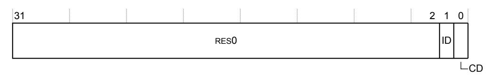

**Figure 4-88 HCR2 bit assignments**

The following table shows the HCR2 bit assignments.

**Table 4-124 HCR2 bit assignments**

| Bits   | Name | Function                                                                                                                                                                                                                        |  |  |  |  |  |
|--------|------|---------------------------------------------------------------------------------------------------------------------------------------------------------------------------------------------------------------------------------|--|--|--|--|--|
| [31:2] | -    | Reserved, RES0.                                                                                                                                                                                                                 |  |  |  |  |  |
| [1]    | ID   | Stage 2 Instruction Cache disable. When HCR_EL2.VM is 1, this forces all stage2 translations for instruction accesses<br>to Normal memory to be Non-cacheable for the EL1/EL0 translation regime. The values are:               |  |  |  |  |  |
|        |      | 0<br>No effect on the stage 2 of the EL1/EL0 translation regime for instruction accesses. This is the reset value.                                                                                                              |  |  |  |  |  |
|        |      | 1<br>Forces all stage 2 translations for instruction accesses to Normal memory to be Non-cacheable for the EL0/EL1<br>translation regime.                                                                                       |  |  |  |  |  |
| [0]    | CD   | Stage 2 Data cache disable. When HCR_EL2.VM is 1, this forces all stage2 translations for data accesses and<br>translation table walks to Normal memory to be Non-cacheable for the EL1/EL0 translation regime. The values are: |  |  |  |  |  |
|        |      | 0<br>No effect on the stage 2 of the EL1/EL0 translation regime for data accesses and translation table walks. This is<br>the reset value.                                                                                      |  |  |  |  |  |
|        |      | 1<br>Forces all stage 2 translations for data accesses and translation table walks to Normal memory to be Non<br>cacheable for the EL0/EL1 translation regime.                                                                  |  |  |  |  |  |

To access the HCR2 in AArch32 state, read or write the CP15 register with:

```
MRC p15, 4, <Rt>, c1, c1, 4; Read Hyp Configuration Register 2
MCR p15, 4, <Rt>, c1, c1, 4; Write Configuration Register 2
```

#### **Related information**

*[4.3.34 Hypervisor Configuration Register, EL2](#page-131-0)* on page 4-132*.*

# <span id="page-260-0"></span>**4.5.12 Hyp Debug Control Register**

The HDCR characteristics are:

#### **Purpose**

Controls the trapping to Hyp mode of Non-secure accesses, at EL1 or lower, to functions provided by the debug and trace architectures.

#### **Usage constraints**

The accessibility to the HDCR in AArch32 state by Exception level is:

| EL0 | EL1(NS) | EL1(S) | EL2 | EL3(SCR.NS = 1) | EL3(SCR.NS = 0) |
|-----|---------|--------|-----|-----------------|-----------------|
| -   | -       | -      | RW  | RW              | -               |

#### **Configurations**

The HDCR is:

- A Banked EL2 register.
- Architecturally mapped to the AArch64 MDCR\_EL2 register.

#### **Attributes**

See the register summary in *[Table 4-85 c1 register summary](#page-215-0)* on page 4-216.

The following figure shows the HDCR bit assignments.

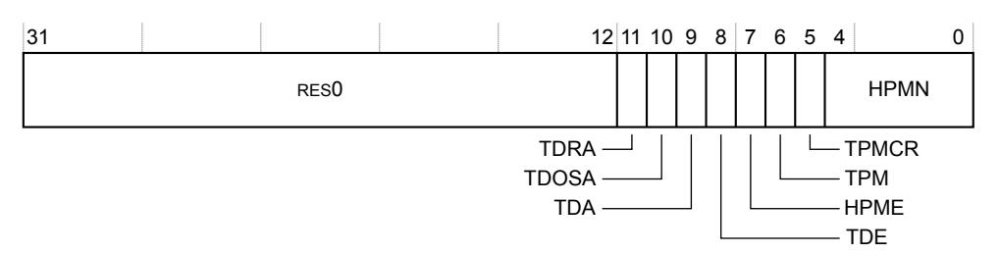

**Figure 4-89 HDCR bit assignments**

The following table shows the HDCR bit assignments.

**Table 4-125 HDCR bit assignments**

| Bits    | Name | Function                                                                                                                                 |  |  |  |  |
|---------|------|------------------------------------------------------------------------------------------------------------------------------------------|--|--|--|--|
| [31:12] | -    | Reserved, RES0.                                                                                                                          |  |  |  |  |
| [11]    | TDRA | Trap Debug ROM Access. The values are:                                                                                                   |  |  |  |  |
|         |      | 0<br>Has no effect on Debug ROM accesses. This is the reset value.                                                                       |  |  |  |  |
|         |      | 1<br>Trap valid Non-secure EL0 or EL1 Debug ROM accesses to Hyp mode.                                                                    |  |  |  |  |
|         |      | When this bit is set to 1, any valid Non-secure access to DBGDRAR or DBGDSAR is trapped to Hyp mode.                                     |  |  |  |  |
|         |      | If bit[8], TDE, is set, or if the HCR.TGE bit is set, the TDRA value is ignored and the processor behaves as if this<br>bit is set to 1. |  |  |  |  |

| Bits | Name  | Function                                                                                                                                                                                                                                                                          |  |  |  |  |
|------|-------|-----------------------------------------------------------------------------------------------------------------------------------------------------------------------------------------------------------------------------------------------------------------------------------|--|--|--|--|
| [10] | TDOSA | Trap Debug OS-related register Access. The values are:                                                                                                                                                                                                                            |  |  |  |  |
|      |       | 0<br>Has no effect on accesses to CP14 Debug registers. This is the reset value.                                                                                                                                                                                                  |  |  |  |  |
|      |       | 1<br>Trap valid EL0 or EL1 Non-secure accesses to CP14 OS-related Debug registers to Hyp mode.                                                                                                                                                                                    |  |  |  |  |
|      |       | When this bit is set to 1, any valid Non-secure CP14 access to the following OS-related Debug registers is trapped<br>to Hyp mode:                                                                                                                                                |  |  |  |  |
|      |       | •<br>DBGOSLSR.<br>•<br>DBGOSLAR.<br>•<br>DBGOSDLR.<br>•<br>DBGPRCR.                                                                                                                                                                                                               |  |  |  |  |
|      |       | If bit[8], TDE, is set, or if the HCR.TGE bit is set, the TDRA value is ignored and the processor behaves as if this<br>bit is set to 1.                                                                                                                                          |  |  |  |  |
| [9]  | TDA   | Trap Debug Access. The values are:                                                                                                                                                                                                                                                |  |  |  |  |
|      |       | 0<br>Has no effect on accesses to CP14 Debug registers. This is the reset value.                                                                                                                                                                                                  |  |  |  |  |
|      |       | 1<br>Trap valid EL0 or EL1 Non-secure accesses to CP14 Debug registers to Hyp mode.                                                                                                                                                                                               |  |  |  |  |
|      |       | When this bit is set to 1, any valid Non-secure access to the CP14 Debug registers, other than the registers trapped<br>by the TDRA and TDOSA bits, is trapped to Hyp mode.                                                                                                       |  |  |  |  |
|      |       | If bit[8], TDE, is set, or if the HCR.TGE bit is set, the TDRA value is ignored and the processor behaves as if this<br>bit is set to 1.                                                                                                                                          |  |  |  |  |
| [8]  | TDE   | Trap Debug Exceptions. The values are:                                                                                                                                                                                                                                            |  |  |  |  |
|      |       | 0<br>Has no effect on Debug exceptions. This is the reset value.                                                                                                                                                                                                                  |  |  |  |  |
|      |       | 1<br>Trap valid Non-secure Debug exceptions to Hyp mode.                                                                                                                                                                                                                          |  |  |  |  |
|      |       | When this bit is set to 1, any Debug exception taken in Non-secure state is trapped to Hyp mode.                                                                                                                                                                                  |  |  |  |  |
|      |       | When this bit is set to 1, the TRA, TDOSA, and TDA bits are treated as if they are set to 1, irrespective of the value<br>stored in the register. If the HCR.TGE bit is set to 1, this bit is treated as if it was set to 1, irrespective of the value<br>stored in the register. |  |  |  |  |
| [7]  | HPME  | Hypervisor Performance Monitors Enable. The values are:                                                                                                                                                                                                                           |  |  |  |  |
|      |       | 0<br>Hyp mode Performance Monitors counters disabled. This is the reset value.                                                                                                                                                                                                    |  |  |  |  |
|      |       | 1<br>Hyp mode Performance Monitors counters enabled.                                                                                                                                                                                                                              |  |  |  |  |
|      |       | When this bit is set to 1, access to the Performance Monitors counters that are reserved for use from Hyp mode is<br>enabled. For more information, see the description of the HPMN field.                                                                                        |  |  |  |  |
| [6]  | TPM   | Trap Performance Monitors accesses. The values are:                                                                                                                                                                                                                               |  |  |  |  |
|      |       | 0<br>Has no effect on Performance Monitors accesses. This is the reset value.                                                                                                                                                                                                     |  |  |  |  |
|      |       | 1<br>Trap valid Non-secure Performance Monitors accesses to Hyp mode.                                                                                                                                                                                                             |  |  |  |  |
|      |       | When this bit is set to 1, any valid Non-secure EL0 or EL1 access to the Performance Monitors registers is trapped<br>to Hyp mode.                                                                                                                                                |  |  |  |  |

<span id="page-262-0"></span>

| Bits  | Name  | Function                                                                                                                                                   |  |  |  |  |
|-------|-------|------------------------------------------------------------------------------------------------------------------------------------------------------------|--|--|--|--|
| [5]   | TPMCR | Trap Performance Monitors Control Register accesses. The values are:                                                                                       |  |  |  |  |
|       |       | 0<br>Has no effect on PMCR accesses. This is the reset value.                                                                                              |  |  |  |  |
|       |       | 1<br>Trap valid Non-secure PMCR accesses to Hyp mode.                                                                                                      |  |  |  |  |
|       |       | When this bit is set to 1, any valid Non-secure access to the PMCR is trapped to Hyp mode.                                                                 |  |  |  |  |
| [4:0] | HPMN  | Defines the number of Performance Monitors counters that are accessible from Non-secure EL1, and from Non<br>secure EL0 if unprivileged access is enabled. |  |  |  |  |
|       |       | This field behaves as if it contains an UNKNOWN value of less than or equal to PMCR.N, in all ways other than<br>when reading back this field if:          |  |  |  |  |
|       |       | •<br>This field is set to 0.                                                                                                                               |  |  |  |  |
|       |       | •<br>This field is set to a value greater than PMCR.N.                                                                                                     |  |  |  |  |
|       |       | In Non-secure state, HPMN divides the Performance Monitors counters as follows:                                                                            |  |  |  |  |
|       |       | If PMXEVCNTR is accessing Performance Monitors counter n then, in Non-secure state:                                                                        |  |  |  |  |
|       |       | •<br>If n is in the range 0 ≤ n < HPMN, the counter is accessible from EL1 and EL2, and from EL0 if unprivileged<br>access to the counters is enabled.     |  |  |  |  |
|       |       | •<br>If n is in the range HPMN ≤ n < PMCR.N, the counter is accessible only from EL2. The HPME bit enables<br>access to the counters in this range.        |  |  |  |  |

To access the HDCR in AArch32 state, read or write the CP15 register with:

```
MRC p15, 4, <Rt>, c1, c1, 1; Read Hyp Debug Configuration Register
MCR p15, 4, <Rt>, c1, c1, 1; Write Hyp Debug Configuration Register
```

To access the MDCR\_EL2 in AArch64 state, read or write the register with:

MRS <Xt>, MDCR\_EL2; Read Monitor Debug Configuration Register MSR MDCR\_EL2, <Xt>; Write Monitor Debug Configuration Register

#### **4.5.13 Hyp Architectural Feature Trap Register**

The HCPTR characteristics are:

This field resets to 0x6, the value of PMCR.N.

#### **Purpose**

Controls the trapping to Hyp mode of Non-secure accesses, at EL1 or lower, to coprocessors other than CP14 and CP15 and to floating-point and Advanced SIMD functionality. The HCPTR also controls the access to this functionality from Hyp mode.

## **Usage constraints**

The accessibility to the HCPTR by Exception level is:

| EL0 | EL1(NS) | EL1(S) | EL2 | EL3(SCR.NS = 1) | EL3(SCR.NS = 0) |
|-----|---------|--------|-----|-----------------|-----------------|
| -   | -       | -      | RW  | RW              | -               |

If a bit in the NSACR prohibits a Non-secure access, then the corresponding bit in the HCPTR behaves as RES1 for Non-secure accesses. See the bit descriptions for more information.

# Configurations

The HCPTR is:

- A Banked EL2 register.
- Architecturally mapped to the AArch64 CPTR EL2 register.

## Attributes

See the register summary in *Table 4-85 c1 register summary* on page 4-216.

The following figure shows the HCPTR bit assignments.

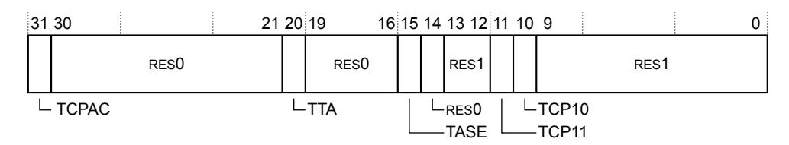

Figure 4-90 HCPTR bit assignments

The following table shows the HCPTR bit assignments.

Table 4-126 HCPTR bit assignments

| Bits    | Name  | Function  Trap Coprocessor Access Control Register accesses. When this bit is set to 1, any valid Non-secure EL1 accesses to the CPACR is trapped to Hyp mode. The values are:                         |  |  |  |  |  |
|---------|-------|--------------------------------------------------------------------------------------------------------------------------------------------------------------------------------------------------------|--|--|--|--|--|
| [31]    | TCPAC |                                                                                                                                                                                                        |  |  |  |  |  |
|         |       | <b>0</b> Has no effect on CPACR accesses. This is the reset value.                                                                                                                                     |  |  |  |  |  |
|         |       | 1 Trap valid Non-secure EL1 CPACR accesses to Hyp mode.                                                                                                                                                |  |  |  |  |  |
| [30:21] | -     | Reserved, UNK/RES0.                                                                                                                                                                                    |  |  |  |  |  |
| [20]    | TTA   | Trap Trace Access. This value is:                                                                                                                                                                      |  |  |  |  |  |
|         |       | O CP14 access to the trace registers is not supported.                                                                                                                                                 |  |  |  |  |  |
| [19:16] | -     | Reserved, UNK/RES0.                                                                                                                                                                                    |  |  |  |  |  |
| [15]    | TASE  | Trap Advanced SIMD use. If NSACR.NSASEDIS is set to 1, this bit behaves as RES1 on Non-secure accesses. The values are:                                                                                |  |  |  |  |  |
|         |       | <b>0</b> If the NSACR settings permit Non-secure use of the Advanced SIMD functionality then Hyp mode can access that functionality, regardless of any settings in the CPACR. This is the reset value. |  |  |  |  |  |
|         |       | Note                                                                                                                                                                                                   |  |  |  |  |  |
|         |       | This bit value has no effect on possible use of the Advanced SIMD functionality from Non-secure EL1 and EL0.                                                                                           |  |  |  |  |  |
|         |       | 1 Trap valid Non-secure accesses to Advanced SIMD functionality to Hyp mode.                                                                                                                           |  |  |  |  |  |
|         |       | When this bit is set to 1, any otherwise-valid access to Advanced SIMD functionality from:                                                                                                             |  |  |  |  |  |
|         |       | A Non-secure EL1 or EL0 access is trapped to Hyp mode.                                                                                                                                                 |  |  |  |  |  |
|         |       | Hyp mode generates an UNDEFINED Instruction exception, taken in Hyp mode.                                                                                                                              |  |  |  |  |  |
|         |       | Note                                                                                                                                                                                                   |  |  |  |  |  |
|         |       | If TCP10 and TCP11 are set to 1, then all Advanced SIMD use is trapped to Hyp mode, regardless of the value of this field.                                                                             |  |  |  |  |  |

<span id="page-264-0"></span>

| Bits    | Name  | Function                                                                                                                          |  |  |  |  |  |  |
|---------|-------|-----------------------------------------------------------------------------------------------------------------------------------|--|--|--|--|--|--|
| [14]    | -     | Reserved, RES0.                                                                                                                   |  |  |  |  |  |  |
| [13:12] | -     | Reserved, RES1.                                                                                                                   |  |  |  |  |  |  |
| [11]    | TCP11 | Trap coprocessor 11. The values are:                                                                                              |  |  |  |  |  |  |
|         |       | 0<br>If NSACR.CP11 is set to 1, then Hyp mode can access CP11, regardless of the value of CPACR.CP11. This is<br>the reset value. |  |  |  |  |  |  |
|         |       | Note<br>This bit value has no effect on possible use of CP11 from Non-secure EL1 and EL0.                                         |  |  |  |  |  |  |
|         |       | 1<br>Trap valid Non-secure accesses to CP11 to Hyp mode.                                                                          |  |  |  |  |  |  |
|         |       | When TCP11 is set to 1, any otherwise-valid access to CP11 from:                                                                  |  |  |  |  |  |  |
|         |       | •<br>A Non-secure EL1 or EL0 access is trapped to Hyp mode.                                                                       |  |  |  |  |  |  |
|         |       | •<br>Hyp mode generates an Undefined Instruction exception, taken in Hyp mode.                                                    |  |  |  |  |  |  |
| [10]    | TCP10 | Trap coprocessor 10. The possible values are:                                                                                     |  |  |  |  |  |  |
|         |       | 0<br>If NSACR.CP10 is set to 1, then Hyp mode can access CP10, regardless of the value of CPACR.CP10. This is<br>the reset value. |  |  |  |  |  |  |
|         |       | Note                                                                                                                              |  |  |  |  |  |  |
|         |       | This bit value has no effect on possible use of CP10 from Non-secure EL1 and EL0.                                                 |  |  |  |  |  |  |
|         |       | 1<br>Trap valid Non-secure accesses to CP10 to Hyp mode.                                                                          |  |  |  |  |  |  |
|         |       | When TCP10 is set to 1, any otherwise-valid access to CP10 from:                                                                  |  |  |  |  |  |  |
|         |       | •<br>A Non-secure EL1 or EL0 access is trapped to Hyp mode.                                                                       |  |  |  |  |  |  |
|         |       | •<br>Hyp mode generates an Undefined Instruction exception, taken in Hyp mode.                                                    |  |  |  |  |  |  |
| [9:0]   | -     | Reserved, RES1.                                                                                                                   |  |  |  |  |  |  |

To access the HCPTR in AArch32 state, read or write the CP15 register with:

```
MRC p15, 4, <Rt>, c1, c1, 2; Read Hyp Architectural Feature Trap Register
MCR p15, 4, <Rt>, c1, c1, 2; Write Hyp Architectural Feature Trap Register
```

#### **Related information**

*[4.5.8 Non-secure Access Control Register](#page-250-0)* on page 4-251*. [4.3.35 Architectural Feature Trap Register, EL2](#page-137-0)* on page 4-138*.*

# **4.5.14 Translation Table Base Register 0 and Register 1**

The processor does not use any IMPLEMENTATION DEFINED bits in the 32-bit TTBR0 and TTBR1 format, so these bits are RES0.

# **4.5.15 Translation Table Base Control Register**

The TTBCR characteristics are:

# <span id="page-265-0"></span>**Purpose**

Controls which Translation Table Base Register defines the base address for a translation table walk required for the stage 1 translation of a memory access from any mode other than Hyp mode in AArch32 state. This register also controls the translation table format and, when using the Long-descriptor translation table format, holds cacheability and shareability information.

The processor does not use the IMPLEMENTATION DEFINED bit, TTBCR[30], when using the Longdescriptor translation table format, so this bit is RES0.

# **Usage constraints**

The accessibility to the TTBCR by Exception level is:

| EL0 | EL1(NS) | EL1(S) | EL2 | EL3(SCR.NS = 1) | EL3(SCR.NS = 0) |
|-----|---------|--------|-----|-----------------|-----------------|
| -   | RW      | RW     | RW  | RW              | RW              |

Write access to the Secure copy of SCTLR is disabled when the **CP15SDISABLE** signal is HIGH.

#### **Configurations**

The TTBCR is Banked in the Secure and Non-secure states.

The architectural mapping of the TTBCR is:

- The Non-secure TTBCR is mapped to the AArch64 TCR\_EL1[31:0] register.
- The Secure TTBCR is mapped to the AArch64 TCR\_EL3[31:0] register

# **Attributes**

See the register summary in *[Table 4-85 c1 register summary](#page-215-0)* on page 4-216.

See the *ARM® Architecture Reference Manual ARMv8* for more information.

To access the TTBCR in AArch32 state, read or write the CP15 register with:

```
MRC p15, 0, <Rt>, c2, c0, 2; Read Translation Table Base Control Register
MCR p15, 0, <Rt>, c2, c0, 2; Write Translation Table Base Control Register
```

# **Related information**

```
4.3.41 Translation Control Register, EL1 on page 4-146.
4.3.47 Translation Control Register, EL3 on page 4-155.
```

#### **4.5.16 Hyp Translation Control Register**

The processor does not use the IMPLEMENTATION DEFINED bit, HTCR[30], so this bit is RES0.

The HTCR characteristics are:

#### **Purpose**

Controls translation table walks required for the stage 1 translation of memory accesses from Hyp mode, and holds cacheability and shareability information for the accesses.

# **Usage constraints**

The accessibility to the HTCR by Exception level is:

| EL0 | EL1(NS) | EL1(S) | EL2 | EL3(SCR.NS = 1) | EL3(SCR.NS = 0) |
|-----|---------|--------|-----|-----------------|-----------------|
| -   | -       | -      | RW  | RW              | -               |

# <span id="page-266-0"></span>**Configurations**

The HTCR is:

- A Banked EL2 register.
- Architecturally mapped to the AArch64 TCR\_EL2.

The TCR\_EL2 is a 32-bit register in AArch64 state.

#### **Attributes**

See the register summary in *[Table 4-85 c1 register summary](#page-215-0)* on page 4-216.

See the *ARM® Architecture Reference Manual ARMv8* for more information.

To access the HTCR in AArch32 state, read or write the CP15 register with:

```
MRC p15, 4, <Rt>, c2, c0, 2; Read Hyp Translation Control Register
MCR p15, 4, <Rt>, c2, c0, 2; Write Hyp Translation Control Register
```

# **Related information**

*[4.3.42 Translation Control Register, EL2](#page-148-0)* on page 4-149*.*

## **4.5.17 Data Fault Status Register**

The DFSR characteristics are:

#### **Purpose**

Holds status information about the last data fault.

#### **Usage constraints**

The accessibility to the DFSR by Exception level is:

| EL0 | EL1(NS) | EL1(S) | EL2 | EL3(SCR.NS = 1) | EL3(SCR.NS = 0) |
|-----|---------|--------|-----|-----------------|-----------------|
| -   | RW      | RW     | RW  | RW              | RW              |

#### **Configurations**

The DFSR is Banked for Secure and Non-secure states.

The architectural mapping of the DFSR is:

- The Non-secure DFSR is mapped to the AArch64 ESR\_EL1 register.
- The Secure DFSR is mapped to the AArch64 ESR\_EL3 register.

#### **Attributes**

See the register summary in *[Table 4-2 AArch64 exception handling registers](#page-77-0)* on page 4-78.

There are two formats for this register. The value of TTBCR.EAE selects which format of the register is used. The two formats are:

- *[DFSR format when using the Short-descriptor translation table format](#page-267-0)* on page 4-268.
- *[DFSR format when using the Long-descriptor translation table format](#page-269-0)* on page 4-270.

# <span id="page-267-0"></span>**DFSR format when using the Short-descriptor translation table format**

The following figure shows the DFSR bit assignments when using the Short-descriptor translation table format.

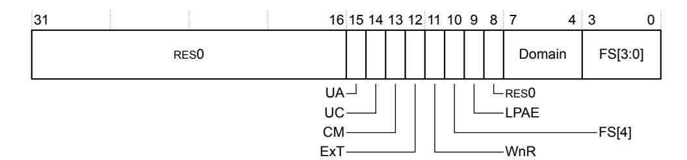

**Figure 4-91 DFSR bit assignments for Short-descriptor translation table format**

The following table shows the DFSR bit assignments when using the Short-descriptor translation table format.

**Table 4-127 DFSR bit assignments for Short-descriptor translation table format**

| Bits    | Name | Function                                                                                                                                             |  |
|---------|------|------------------------------------------------------------------------------------------------------------------------------------------------------|--|
| [31:16] | -    | Reserved, RES0.                                                                                                                                      |  |
| [15]    | UA   | Unattributable fault. This bit is only set for System Errors. For other<br>faults, it is RES0. The values are:                                       |  |
|         |      | 0<br>Attributable, can be attributed to the processing element counting<br>the event.                                                                |  |
|         |      | 1<br>Unattributable, cannot be attributed to any particular processor.                                                                               |  |
| [14]    | UC   | Uncontainable fault. This bit is only set for System Errors. For other<br>faults, it is RES0. The values are:                                        |  |
|         |      | 0<br>Containable, an attributable event that can be contained to a<br>particular code sequence.                                                      |  |
|         |      | 1<br>Uncontainable, cannot be contained to a particular code sequence.                                                                               |  |
|         |      | Unattributable events are Uncontainable.                                                                                                             |  |
| [13]    | CM   | Cache maintenance fault. For synchronous faults, this bit indicates<br>whether a cache maintenance operation generated the fault. The values<br>are: |  |
|         |      | 0<br>Abort not caused by a cache maintenance operation.                                                                                              |  |
|         |      | 1<br>Abort caused by a cache maintenance operation.                                                                                                  |  |
|         |      | On an asynchronous fault, this bit is UNKNOWN.                                                                                                       |  |
| [12]    | ExT  | External abort type. This field indicates whether an AXI decode or slave<br>error caused an abort:                                                   |  |
|         |      | 0<br>External abort marked as DECERR.                                                                                                                |  |
|         |      | 1<br>External abort marked as SLVERR.                                                                                                                |  |
|         |      | For aborts other than external aborts this bit always returns 0.                                                                                     |  |

**Table 4-127 DFSR bit assignments for Short-descriptor translation table format (continued)**

| Bits  | Name    | Function                                                                                                                                 |  |
|-------|---------|------------------------------------------------------------------------------------------------------------------------------------------|--|
| [11]  | WnR     | Write not Read bit. This field indicates whether a write or a read access<br>caused the abort:                                           |  |
|       |         | 0<br>Abort caused by a read access.                                                                                                      |  |
|       |         | 1<br>Abort caused by a write access.                                                                                                     |  |
|       |         | For faults on CP15 cache maintenance operations, including the VA to<br>PA translation operations, this bit always returns a value of 1. |  |
| [10]  | FS[4]   | Part of the Fault Status field. See bits[3:0] in this table.                                                                             |  |
| [9]   | LPAE    | Large physical address extension. The value of the format descriptor is:                                                                 |  |
|       |         | 0<br>Short-descriptor translation table formats.                                                                                         |  |
| [8]   | -       | Reserved, RES0.                                                                                                                          |  |
| [7:4] | Domain  | The domain of the fault address. Use of the field is deprecated.                                                                         |  |
| [3:0] | FS[3:0] | Fault Status bits. This field indicates the type of exception generated.<br>The possible values are:                                     |  |
|       |         | Alignment fault.<br>0b00001                                                                                                              |  |
|       |         | Synchronous external abort on translation table walk, 1st<br>0b01100<br>level.                                                           |  |
|       |         | Synchronous external abort on translation table walk, 2nd<br>0b01110<br>level.                                                           |  |
|       |         | Synchronous parity error on translation table walk, 1st<br>0b11100<br>level.                                                             |  |
|       |         | Synchronous parity error on translation table walk, 2nd<br>0b11110<br>level.                                                             |  |
|       |         | Translation fault, 1st level.<br>0b00101                                                                                                 |  |
|       |         | Translation fault, 2nd level.<br>0b00111                                                                                                 |  |
|       |         | Access flag fault, 1st level.<br>0b00011                                                                                                 |  |
|       |         | Access flag fault, 2nd level.<br>0b00110                                                                                                 |  |
|       |         | Domain fault, 1st level.<br>0b01001                                                                                                      |  |
|       |         | Domain fault, 2nd level.<br>0b01011                                                                                                      |  |
|       |         | Permission fault, 1st level.<br>0b01101                                                                                                  |  |
|       |         | Permission fault, 2nd level.<br>0b01111                                                                                                  |  |
|       |         | Debug event.<br>0b00010                                                                                                                  |  |
|       |         | Synchronous external abort, non-translation.<br>0b01000                                                                                  |  |
|       |         | Synchronous parity error on memory access.<br>0b11001                                                                                    |  |
|       |         | Asynchronous external abort.<br>0b10110                                                                                                  |  |
|       |         | Asynchronous parity error on memory access.<br>0b11000                                                                                   |  |
|       |         | All other values are reserved.                                                                                                           |  |

# <span id="page-269-0"></span>DFSR format when using the Long-descriptor translation table format

The following figure shows the DFSR bit assignments when using the Long-descriptor translation table format.

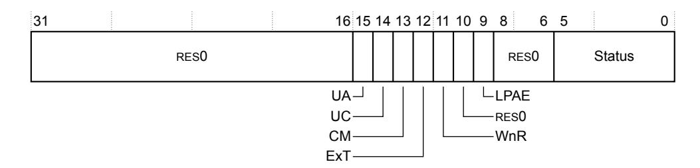

Figure 4-92 DFSR bit assignments for Long-descriptor translation table format

The following table shows the DFSR bit assignments when using the Long-descriptor translation table format.

Table 4-128 DFSR bit assignments for Long-descriptor translation table format

| Bits    | Name | Function                                                                                                                       |  |
|---------|------|--------------------------------------------------------------------------------------------------------------------------------|--|
| [31:16] | -    | Reserved, RES0.                                                                                                                |  |
| [15]    | UA   | Unattributable fault. This bit is only set for System Errors. For other faults, it is RESO. The values are:                    |  |
|         |      | <b>0</b> Attributable, can be attributed to the processing element counting the event.                                         |  |
|         |      | 1 Unattributable, cannot be attributed to any particular processor.                                                            |  |
| [14]    | UC   | Uncontainable fault. This bit is only set for System Errors. For other faults, it is RESO. The values are:                     |  |
|         |      | Ocontainable, an attributable event that can be contained to a particular code sequence.                                       |  |
|         |      | 1 Uncontainable, cannot be contained to a particular code sequence.                                                            |  |
|         |      | Unattributable events are Uncontainable.                                                                                       |  |
| [13]    | СМ   | Cache maintenance fault. For synchronous faults, this bit indicates whether a cache maintenance operation generated the fault: |  |
|         |      | <b>0</b> Abort not caused by a cache maintenance operation.                                                                    |  |
|         |      | 1 Abort caused by a cache maintenance operation.                                                                               |  |
|         |      | On an asynchronous fault, this bit is UNKNOWN.                                                                                 |  |
| [12]    | ExT  | External abort type. This field indicates whether an AXI decode or slave error caused an abort:                                |  |
|         |      | <b>0</b> External abort marked as DECERR.                                                                                      |  |
|         |      | 1 External abort marked as SLVERR.                                                                                             |  |
|         |      | For aborts other than external aborts this bit always returns 0.                                                               |  |

**Table 4-128 DFSR bit assignments for Long-descriptor translation table format (continued)**

| Bits        | Name   | Function                                                                                                                                 |  |  |
|-------------|--------|------------------------------------------------------------------------------------------------------------------------------------------|--|--|
| [11]        | WnR    | Write not Read bit. This field indicates whether a write or a read access<br>caused the abort:                                           |  |  |
|             |        | 0<br>Abort caused by a read access.                                                                                                      |  |  |
|             |        | 1<br>Abort caused by a write access.                                                                                                     |  |  |
|             |        | For faults on CP15 cache maintenance operations, including the VA to<br>PA translation operations, this bit always returns a value of 1. |  |  |
| [10]        | -      | Reserved, RES0.                                                                                                                          |  |  |
| [9]<br>LPAE |        | Large physical address extension. The value of the format descriptor is:                                                                 |  |  |
|             |        | 1<br>Long-descriptor translation table formats.                                                                                          |  |  |
| [8:6]       | -      | Reserved, RES0.                                                                                                                          |  |  |
| [5:0]       | Status | Fault Status bits. This field indicates the type of exception generated.<br>The possible values are:                                     |  |  |
|             |        | Address size fault, LL bits indicate level.<br>0b0000LL                                                                                  |  |  |
|             |        | Translation fault, LL bits indicate level.<br>0b0001LL                                                                                   |  |  |
|             |        | Access flag fault, LL bits indicate level.<br>0b0010LL                                                                                   |  |  |
|             |        | Permission fault, LL bits indicate level.<br>0b0011LL                                                                                    |  |  |
|             |        | Synchronous external abort.<br>0b010000                                                                                                  |  |  |
|             |        | Synchronous parity error on memory access.<br>0b011000                                                                                   |  |  |
|             |        | Asynchronous external abort.<br>0b010001                                                                                                 |  |  |
|             |        | Asynchronous parity error on memory access.<br>0b011001                                                                                  |  |  |
|             |        | Synchronous external abort on translation table walk, LL<br>0b0101LL<br>bits indicate level.                                             |  |  |
|             |        | Synchronous parity error on memory access on translation<br>0b0111LL<br>table walk, LL bits indicate level.                              |  |  |
|             |        | Alignment fault.<br>0b100001                                                                                                             |  |  |
|             |        | Debug event.<br>0b100010                                                                                                                 |  |  |
|             |        | All other values are reserved.                                                                                                           |  |  |

The following table shows how the LL bits in the Status field encode the lookup level associated with the MMU fault.

**Table 4-129 Encodings of LL bits associated with the MMU fault**

| LL bits | Meaning       |
|---------|---------------|
| 00      | Level 0 fault |
| 01      | First level   |
| 10      | Second level  |
| 11      | Third level   |

<span id="page-271-0"></span>To access the DFSR in AArch32 state, read or write the CP15 register with:

```
MRC p15, 0, <Rt>, c5, c0, 0; Read Data Fault Status Register
MCR p15, 0, <Rt>, c5, c0, 0; Write Data Fault Status Register
```

# **Related information**

*[4.3.50 Exception Syndrome Register, EL1 and EL3](#page-156-0)* on page 4-157*.*

## **4.5.18 Physical Address Register**

The PAR characteristics are:

## **Purpose**

Receives the PA from any address translation operation.

#### **Usage constraints**

The accessibility to the PAR by Exception level is:

| EL0 | EL1(NS) | EL1(S) | EL2 | EL3(SCR.NS = 1) | EL3(SCR.NS = 0) |
|-----|---------|--------|-----|-----------------|-----------------|
| -   | RW      | RW     | RW  | RW              | RW              |

# **Configurations**

The PAR is Banked for the Secure and Non-secure states.

The Non-secure PAR is architecturally mapped to AArch64 PAR\_EL1 register.

The PAR[63:32] is RES0 when using the Short-descriptor translation format.

#### **Attributes**

The processor does not use any IMPLEMENTATION DEFINED bits in the 32-bit or 64-bit format PAR or the PAR\_EL1, so these bits are RES0.

See the register summary in *[Table 4-90 c7 register summary](#page-217-0)* on page 4-218.

See the *ARM® Architecture Reference Manual ARMv8* for more information.

To access the PAR in AArch32 state when using the Short-descriptor translation format, read or write the CP15 register with:

```
MRC p15, 0, <Rt>, c7, c4, 0; Read Physical Address Register
MCR p15, 0, <Rt>, c7, c4, 0; Write Physical Address Register
```

To access the PAR in AArch32 state when using the Long-descriptor translation format, read or write the CP15 register with:

```
MRRC p15, 0, <Rt>, <Rt2>, c7; Read Physical Address Register
MCRR p15, 0, <Rt>, <Rt2>, c7; Write Physical Address Register
```

# **Related information**

*[4.3.55 Physical Address Register, EL1](#page-164-0)* on page 4-165*.*

## **4.5.19 Primary Region Remap Register**

The PRRR characteristics are:

# **Purpose**

Controls the top-level mapping of the TEX[0], C, and B memory region attributes.

# <span id="page-272-0"></span>**Usage constraints**

The accessibility to the PRRR by Exception level is:

| EL0 | EL1(NS) | EL1(S) | EL2 | EL3(SCR.NS = 1) | EL3(SCR.NS = 0) |
|-----|---------|--------|-----|-----------------|-----------------|
| -   | RW      | RW     | RW  | RW              | RW              |

Write access to the Secure copy of PRRR is disabled when the **CP15SDISABLE** signal is HIGH.

## **Configurations**

The PRRR is:

- Banked for the Secure and Non-secure states.
- Only relevant if the TTBCR.EAE bit is 0.
- Architecturally mapped to the MAIR0 register in AArch32 state.

The Non-secure PRRR is architecturally mapped to the AArch64 MAIR\_EL1[31:0] register.

The Secure PRRR is mapped to the AArch64 MAIR\_EL3[31:0] register.

#### **Attributes**

See the register summary in *[Table 4-94 c10 register summary](#page-220-0)* on page 4-221.

See the *ARM® Architecture Reference Manual ARMv8* for more information.

To access the PRRR in AArch32 state when TTBCR.EAE is 0, read or write the CP15 register with:

```
MRC p15, 0, <Rt>, c10, c2, 0; Read Primary Region Remap Register
MCR p15, 0, <Rt>, c10, c2, 0; Write Primary Region Remap Register
```

# **4.5.20 Memory Attribute Indirection Register 0**

The processor does not set any IMPLEMENTATION DEFINED attributes with the *Memory Attribute Indirection Register 0* (MAIR0).

#### **4.5.21 Normal Memory Remap Register.**

The NMRR characteristics are:

# **Purpose**

Provides additional mapping controls for memory regions that are mapped as Normal memory by their entry in the PRRR.

#### **Usage constraints**

The accessibility to the NMRR by Exception level is:

| EL0 | EL1(NS) | EL1(S) | EL2 | EL3(SCR.NS = 1) | EL3(SCR.NS = 0) |
|-----|---------|--------|-----|-----------------|-----------------|
| -   | RW      | RW     | RW  | RW              | RW              |

Write access to the Secure copy of NMRR is disabled when the **CP15SDISABLE** signal is HIGH.

#### **Configurations**

The NMRR is:

- Banked for the Secure and Non-secure states.
- Only relevant if the TTBCR.EAE bit is 0.
- Architecturally mapped on to the MAIR1 register in AArch32 state.

The Non-secure NMRR is architecturally mapped to the AArch64 MAIR\_EL1[63:32] register.

The Secure NMRR is mapped to the AArch64 MAIR\_EL3[63:32] register.

# <span id="page-273-0"></span>**Attributes**

See the register summary in *[Table 4-94 c10 register summary](#page-220-0)* on page 4-221.

See the *ARM® Architecture Reference Manual ARMv8* for more information.

To access the NMRR in AArch32 state, read or write the CP15 register with:

```
MRC p15, 0, <Rt>, c10, c2, 1; Read Normal Memory Remap Register
MCR p15, 0, <Rt>, c10, c2, 1; Write Normal Memory Remap Register
```

# **4.5.22 Memory Attribute Indirection Register 1**

The processor does not set any IMPLEMENTATION DEFINED attributes with the *Memory Attribute Indirection Register 1* (MAIR1).

# **4.5.23 FCSE Process ID Register**

The processor does not implement *Fast Context Switch Extension* (FCSE), so this register is always RES0.

# **4.5.24 Configuration Base Address Register**

The CBAR characteristics are:

#### **Purpose**

Holds the physical base address of the memory-mapped GIC CPU interface registers.

#### **Usage constraints**

The accessibility to the CBAR by Exception level is:

| EL0 | EL1(NS) | EL1(S) | EL2 | EL3(SCR.NS = 1) | EL3(SCR.NS = 0) |
|-----|---------|--------|-----|-----------------|-----------------|
| -   | RO      | RO     | RO  | RO              | RO              |

#### **Configurations**

The CBAR is Common to the Secure and Non-secure states.

# **Attributes**

See the register summary in *[Table 4-98 c15 register summary](#page-222-0)* on page 4-223.

The following figure shows the CBAR bit assignments.

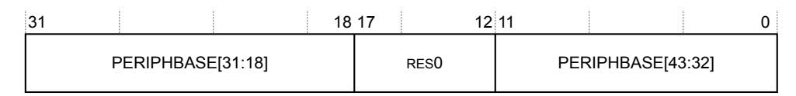

**Figure 4-93 CBAR bit assignments**

The following table shows the CBAR bit assignments.

**Table 4-130 CBAR bit assignments**

| Bits    | Name              | Function                                                        |
|---------|-------------------|-----------------------------------------------------------------|
| [31:18] | PERIPHBASE[31:18] | The primary input PERIPHBASE[31:18] determines the reset value. |
| [17:12] | -                 | Reserved, RES0.                                                 |
| [11:0]  | PERIPHBASE[43:32] | The primary input PERIPHBASE[43:32] determines the reset value. |

To access the CBAR in AArch32 state, read the CP15 register with:

MRC p15, 1, <Rt>, c15, c3, 0; Read Configuration Base Address Register

# <span id="page-274-0"></span>Chapter 5 **Memory Management Unit**

This section describes the *Memory Management Unit* (MMU).

It contains the following sections:

- *[5.1 About the MMU](#page-275-0)* on page 5-276.
- *[5.2 TLB organization](#page-276-0)* on page 5-277.
- *[5.3 TLB match process](#page-277-0)* on page 5-278.
- *[5.4 Memory access sequence](#page-278-0)* on page 5-279.
- *[5.5 MMU enabling and disabling](#page-280-0)* on page 5-281.
- *[5.6 Intermediate table walk caches](#page-281-0)* on page 5-282.
- *[5.7 External aborts](#page-282-0)* on page 5-283.

# <span id="page-275-0"></span>**5.1 About the MMU**

The Cortex-A57 processor is an ARMv8 compliant processor that supports execution in both the AArch64 and AArch32 states.

In AArch32 state, the ARMv8 address translation system resembles the ARMv7 address translation system with LPAE and Virtualization Extensions. In AArch64 state, the ARMv8 address translation system resembles an extension to the Long Descriptor Format address translation system to support the expanded virtual and physical address spaces. For more information regarding the address translation formats, see the *ARM® Architecture Reference Manual ARMv8*. Key differences between the AArch64 and AArch32 address translation systems are that the AArch64 state provides the ability to:

- Select the translation granule to either be 4KB or 64KB. In AArch32, the translation granule is limited to be 4KB.
- Configure the ASID size to be either 8-bit or 16-bit. In AArch32, the ASID is limited to an 8-bit value.

The maximum supported physical address size is:

- 44-bit in AArch64 state.
- 40-bit in AArch32 state.

The MMU controls table walk hardware that accesses translation tables in memory. The MMU works with the L1 and L2 memory system to translate a *Virtual Address* (VA) to a *Physical Address* (PA). The MMU enables fine-grained memory system control through a set of virtual-to-physical address mappings and memory attributes held in the L1 and L2 *Translation Look-aside Buffers* (TLBs).

The MMU has the following features:

- 48-entry fully-associative L1 instruction TLB.
- 32-entry fully-associative L1 data TLB for data load and store pipelines.
- 4-way set-associative 1024-entry L2 TLB in each processor.
- Intermediate table walk caches.
- The TLB entries contain a global indicator or an *Address Space Identifier* (ASID) to permit context switches without TLB flushes.
- The TLB entries contain a *Virtual Machine Identifier* (VMID) to permit virtual machine switches without TLB flushes.

# <span id="page-276-0"></span>**5.2 TLB organization**

The Cortex-A57 processor implements a 2-level TLB structure.

The TLBs, at either the L1 or the L2 level, do not require to be flushed on a context or virtual machine switch. The MMU does not support the locking of TLB entries at either Level 1 or Level 2.

This section contains the following subsections:

- *5.2.1 L1 instruction TLB* on page 5-277.
- *5.2.2 L1 data TLB* on page 5-277.
- *5.2.3 L2 TLB* on page 5-277.

#### **5.2.1 L1 instruction TLB**

The L1 instruction TLB is a 48-entry fully-associative structure. This TLB caches entries of three different page sizes, natively 4KB, 64KB, and 1MB, of VA to PA mappings. If the page tables map the memory region to a larger granularity than 1MB, it only allocates one mapping for the particular 1MB region to which the current access corresponds.

A hit in the instruction TLB provides a single **CLK** cycle access to the translation, and returns the PA to the instruction cache for comparison. It also checks the access permissions to signal a Prefetch Abort.

## **5.2.2 L1 data TLB**

The L1 data TLB is a 32-entry fully-associative TLB that is used for data loads and stores. This TLB caches entries of three different page sizes, natively 4KB, 64KB, and 1MB, of VA to PA mappings.

A hit in the data TLB provides a single **CLK** cycle access to the translation, and returns the PA to the data cache for comparison. It also checks the access permissions to signal a Data Abort.

## **5.2.3 L2 TLB**

Misses from the L1 instruction and data TLBs are handled by a unified L2 TLB. This is a 1024-entry 4 way set-associative structure. The L2 TLB supports the page sizes of 4K, 64K, 1MB and 16MB. It also supports page sizes of 2MB and 1GB for the long descriptor format translation in AArch32 state and in AArch64 state when using the 4KB translation granule. In addition, the L2 TLB supports the 512MB page map size defined for the AArch64 translations that use a 64KB translation granule.

Accesses to the L2 TLB take a variable number of cycles, based on the competing requests from each of the L1 TLBs, TLB maintenance operations in flight, and the different page size mappings in use.

# <span id="page-277-0"></span>**5.3 TLB match process**

The ARMv8-A architecture provides for multiple VA spaces that are translated differently.

The TLB entries store all the required context information to facilitate a match and avoid the requirement for a TLB flush on a context or virtual machine switch. Each TLB entry contains a VA, page size, PA, and a set of memory properties that include the memory type and access permissions. Each entry is associated with a particular ASID, or as global for all application spaces. The TLB entry also contains a field to store the VMID in the entry, applicable to accesses made from the Non-secure state. There is also a memory space identifier that records whether the request occurred at the EL3 Exception level, Nonsecure EL2 Exception level, or Secure and Non-secure EL0 or EL1 Exception levels. A TLB entry match occurs when the following conditions are met:

- Its VA, moderated by the page size such as the VA bits[48:N], where N is log<sup>2</sup> of the page size for that translation stored in the TLB entry, matches that of the requested address.
- The memory space matches the memory space state of the requests. The memory space can be one of four values:
  - Secure EL3.
  - Non-secure EL2.
  - Secure EL0 or EL1.
  - Non-secure EL0 or EL1.
- The ASID matches the current ASID held in the CONTEXTIDR, TTBR0, or TTBR1 register or the entry is marked global.
- The VMID matches the current VMID held in the VTTBR register.


- For a request originating from EL2 or EL3, the ASID and VMID match are ignored.
- For a request originating from Secure state, the VMID match is ignored.

# <span id="page-278-0"></span>**5.4 Memory access sequence**

When the processor generates a memory access, the MMU:

- 1. Performs a lookup for the requested VA, current ASID, current VMID, and memory space in the relevant L1 instruction or data TLB.
- 2. Performs a lookup for the requested VA, current ASID, current VMID, and memory space in the unified L2 TLB if there is a miss in the relevant L1 TLB.
- 3. Performs a hardware translation table walk if there is a miss in the L2 TLB.

When executing in AArch64 at a particular Exception level, you can configure the hardware translation table walk to use either the 4KB translation granule or the 64KB translation granule. Program the Translation Granule bit, TG0, in the appropriate translation control register:

- TCR\_EL1.
- TCR\_EL2.
- TCR\_EL3.
- VTCR\_EL2.

When executing in AArch32 in a particular mode, you can configure the MMU to perform translation table walks using either the Short Descriptor Translation Table or the Long Descriptor Translation table format, by programming the Extended Address Enable bit, EAE, in the appropriate translation table control register. Only the Long Descriptor Translation format is supported in Hyp mode.

You can configure the MMU to perform translation table walks in Cacheable regions, by programming the IRGN bits:

- **AArch32** Translation table base registers (TTBR0/TTBR1\_EL*x*) when using the Short Descriptor translation table format.
  - TCR\_EL*x* register when using the Long Descriptor translation table format.

**AArch64** In the appropriate TCR\_EL*x* register.

For Stage2 translations, the IRGN bits must be programmed in the VTCR\_EL2 register.

If the encoding of the IRGN bits is WriteBack, an L2 data cache lookup is performed and data is read from the data cache. If the encoding of the IRGN bits is Write-Through or Non-cacheable, an access to external memory is performed.

In the case of an L2TLB miss, the hardware does a translation table walk provided the MMU is enabled, and the translation using the base register has not been disabled by:

- Setting the PD0 or PD1 bit in the *[4.5.15 Translation Table Base Control Register](#page-264-0)* on page 4-265, to disallow translation using either TTBR0 or TTBR1 respectively, when using AArch32 along with the Short Descriptor Format.
- Setting of the EPD0 or EPD1 bit in the TCR\_EL1 register when using AArch64 or when using the Long Descriptor format in AArch32.

If the translation table walk is disabled for a particular base register, the processor returns a Translation Fault. If the TLB finds a matching entry, it uses the information in the entry as follows:

- The access permission bits and the domain, when using the Short Descriptor format in AArch32 state, determine if the access is permitted. If the matching entry does not pass the permission checks, the MMU signals a Permission fault. See the *ARM® Architecture Reference Manual ARMv8* for:
  - A description of the various faults.
  - The fault codes.
  - Information regarding the registers where the fault codes are set.
- The memory region attributes specified in the TLB entry determine if the access is:
  - Secure or Non-secure.

- Inner, Outer or not Cacheable.
- Normal Memory or Device type, Strongly-ordered or Device type when using the Short Descriptor Format in AArch32.
- One of the four different device memory types defined for ARMv8:

**Device-nGnRnE** Device non-Gathering, non-Reordering, No Early Write Acknowledgment. **Device-nGnRE** Device non-Gathering, non-Reordering, Early Write Acknowledgment. **Device-nGRE** Device non-Gathering, Reordering, Early Write Acknowledgment. **Device-GRE** Device Gathering, Reordering, Early Write Acknowledgment.

• The TLB translates the VA to a PA for the memory access.

# <span id="page-280-0"></span>**5.5 MMU enabling and disabling**

You can enable or disable the MMU. See the ARM Architecture Reference Manual ARMv8 for more information.

You must set CPUECTLR.SMPEN to 1 before the caches and MMU are enabled, or any instruction cache or TLB maintenance operations are performed.

# **Related information**

*[4.3.67 CPU Extended Control Register, EL1](#page-204-0)* on page 4-205*.*

# <span id="page-281-0"></span>**5.6 Intermediate table walk caches**

The Cortex-A57 processor implements dedicated caches that store intermediate levels of translation table entries as part of a table walk.

Cached entries are associated with an ASID and a VMID where applicable for Non-secure EL1 translations.

Care is required when using the reserved ASID method for context switch. See the *ARM® Architecture Reference Manual ARMv8* for more information.

The following example shows how to synchronize ASID and TTBR changes using a reserved ASID.

#### **Using a reserved ASID to synchronize ASID and TTBR changes**

In this example, the operating system uses a particular reserved ASID value for the synchronization of the ASID and the Translation Table Base Register. You can use this approach only when the size of the mapping for any given Virtual Address is the same in the old and new translation tables. The example uses the value of 0.

The software uses the following sequences that must be executed from memory marked as global:

```
Change ASID to 0
ISB
Change Translation Table Base Register
ISB
Change ASID to new value
ISB
```

If the code relies on only leaf translation table entries that are cached, it can incorrectly assume that entries tagged with the reserved ASID are not required to be flushed. For example:

- Global leaf entries that remain valid or must be flushed for all ASIDs when modified
- Non-global leaf entries that are not used because the reserved ASID is not set outside the context switch code.

The incorrect assumption leads to the following failure:

- The context switch code sets the ASID to the reserved value.
- Speculative fetching reads and caches the first level page table entry, using the current TTBR, and tagging the entry with the reserved ASID. This is a pointer to a second level table.
- Context switch completes.
- Processing continues, and the process with the page tables terminates. The OS frees and reallocates the page table memory.
- A later context switch sets the ASID to the reserved value
- Speculative fetching makes use of the cached first level page table entry, because it is tagged with the reserved ASID, and uses it to fetch a second level page table entry. Because the memory is reallocated and reused, the entry contains random data that can appear to be a valid, global entry. This second level page table entry is cached.
- Context switch completes, and application execution continues.
- The application references the address range covered by the cached second level page table entry. Because the entry is marked as global, a match occurs and so data is fetched from a random address.

| Note                                                                                                  |  |  |
|-------------------------------------------------------------------------------------------------------|--|--|
| When you use a reserved ASID, you must invalidate the TLB to deallocate the translation table memory. |  |  |

# <span id="page-282-0"></span>**5.7 External aborts**

External memory errors are defined as those that occur in the memory system rather than those that the MMU detects.

External memory errors are extremely rare. External errors are caused by errors flagged by the AXI interfaces or generated because of an uncorrected ECC error in the L1 data cache or L2 cache arrays when the request is external to the Cortex-A57 MPCore processor. You can configure external aborts to trap to Monitor mode by setting the EA bit in the Secure Configuration Register to 1.

This section contains the following subsections:

- *5.7.1 External aborts on data read or write* on page 5-283.
- *5.7.2 Synchronous and asynchronous aborts* on page 5-283.

## **5.7.1 External aborts on data read or write**

Externally generated errors during a data read or write can be asynchronous. This means that the ELR\_EL1, ELR\_EL2, ELR\_EL3, of r14 entry into the abort handler on such an abort might not hold the address of the instruction that caused the abort.

The DFAR is UNPREDICTABLE when an asynchronous abort occurs.

For a load multiple or store multiple operation, the address captured in the DFAR is that of the address that generated the synchronous external abort.

# **5.7.2 Synchronous and asynchronous aborts**

To determine a fault type, check the Execution state. If the abort handler code targeted by the exception is in AArch64 state, read the appropriate ESR\_EL*x* register. If the abort handler code is an AArch32 hypervisor, see *[4.3.54 Exception Syndrome Register, EL2](#page-162-0)* on page 4-163. If the abort handler code is not an AArch32 non-hypervisor, see *[4.3.51 Instruction Fault Status Register, EL2](#page-159-0)* on page 4-160 for an Instruction Abort or the ">*[4.5.17 Data Fault Status Register](#page-266-0)* on page 4-267 for a Data Abort.

# **Related information**

*[4.5.7 Secure Configuration Register](#page-247-0)* on page 4-248*.*

# <span id="page-283-0"></span>Chapter 6 **Level 1 Memory System**

This section describes the *Level 1* (L1) memory system.

It contains the following sections:

- *[6.1 About the L1 memory system](#page-284-0)* on page 6-285.
- *[6.2 Cache organization](#page-285-0)* on page 6-286.
- *[6.3 L1 instruction memory system](#page-286-0)* on page 6-287.
- *[6.4 L1 data memory system](#page-288-0)* on page 6-289.
- *[6.5 Program flow prediction](#page-294-0)* on page 6-295.
- *[6.6 L1 RAM memories](#page-296-0)* on page 6-297.

# <span id="page-284-0"></span>**6.1 About the L1 memory system**

The L1 memory system consists of separate instruction and data caches.

The L1 instruction memory system has the following features:

- 48KB 3-way set-associative instruction cache.
- Fixed line length of 64 bytes.
- Parity protection per 16 bits.
- Instruction cache that behaves as *Physically-indexed and physically-tagged* (PIPT).
- *Least Recently Used* (LRU) cache replacement policy.
- MBIST support.

The L1 data memory system has the following features:

- 32KB 2-way set-associative data cache.
- Fixed line length of 64 bytes.
- ECC protection per 32 bits.
- Data cache that is PIPT.
- Out-of-order, speculative, non-blocking load requests to Normal memory and non-speculative, nonblocking load requests to Device memory.
- LRU cache replacement policy.
- MBIST support.

| Note |  |
|------|--|
|      |  |

The Cortex-A57 processor does not support cache lockdown.

# <span id="page-285-0"></span>**6.2 Cache organization**

You can disable each cache independently.

On a cache miss, critical word-first filling of the cache is performed.

## **Related information**

*[4.5.5 System Control Register](#page-240-0)* on page 4-241*.*

# <span id="page-286-0"></span>**6.3 L1 instruction memory system**

The instruction cache can source up to 128 bits per fetch depending on alignment.

Sequential cache read operations reduce the number of full cache reads. This has the benefit of reducing power consumption. If a cache read is sequential to the previous cache read, and the read is within the same cache line, only the data RAM way that was previously read is accessed.

The L1 instruction cache appears to software as a physically tagged, physically indexed array. Therefore, the instruction cache is only required to be flushed when writing new data to an instruction address.

This section contains the following subsections:

- *6.3.1 Instruction cache disabled behavior* on page 6-287.
- *6.3.2 Instruction cache speculative memory accesses* on page 6-287.
- *6.3.3 Fill buffers* on page 6-287.
- *[6.3.4 Non-cacheable fetching](#page-287-0)* on page 6-288.
- *[6.3.5 Parity error handling](#page-287-0)* on page 6-288.
- *[6.3.6 Hardware L1 I-cache prefetching](#page-287-0)* on page 6-288.

# **6.3.1 Instruction cache disabled behavior**

The SCTLR.I bit enables or disables the L1 instruction cache. If the I bit is disabled, fetches cannot access any of the instruction cache arrays. An exception to this rule is the instruction cache system operations. If the instruction cache is disabled, the instruction cache maintenance operations can still execute normally.

# **Related information**

*[4.5.5 System Control Register](#page-240-0)* on page 4-241*.*

#### **6.3.2 Instruction cache speculative memory accesses**

An instruction remains in the pipeline between the fetch and the execute stages. Because there can be several unresolved branches in the pipeline, instruction fetches are speculative, meaning there is no guarantee that they are executed. A branch or exceptional instruction in the code stream can cause a pipeline flush, discarding the currently fetched instructions.

Because of the aggressive prefetching behavior, you must not place read-sensitive devices in the same page as code. Pages with Device memory type attributes are treated as Non-cacheable Normal Memory. You must mark pages that contain read-sensitive devices with the TLB *Execute Never* (XN) attribute bit.

To avoid speculative fetches to read sensitive devices when address translation is disabled, these devices and code that are fetched must be separated in the physical memory map. See the *ARM® Architecture Reference Manual ARMv8* for more information. To avoid speculative fetches to potential non-code regions, the static predictor is disabled and branches are forced to resolve in order when address translation is disabled.

#### **6.3.3 Fill buffers**

The instruction cache is fed by three fill buffers that hold instructions returned from the L2 cache on a linefill operation, or instructions from Non-cacheable regions. The fill buffers are non-blocking. An instruction cache hit can bypass an in-progress cache miss, even before the critical word is returned. A line at a given Physical Address remains in a fill buffer until the fill buffer must be reclaimed. At this time, the fill buffer contents are either transferred to the main instruction cache or discarded if no fetch has occurred to the address of the line over the lifetime of the line in the fill buffer.

# <span id="page-287-0"></span>**6.3.4 Non-cacheable fetching**

Fetches occurring when the instruction cache is disabled, or from a page with attributes not indicating Inner Cacheable, do not result in the line entering the instruction cache.

Incoming instructions from the L2 cache are stored in the fill buffers until the fetch reaches the end of the cache line or a nonsequential fetch occurs, whichever occurs first. Therefore, multiple sequential fetches from the same 64-byte region, corresponding to a cache line, can occur without incurring multiple L2 requests when a region is not given Cacheable attributes.

# **6.3.5 Parity error handling**

The instruction cache implements one parity bit per 16-bits of instruction data. The instruction cache Tag array is also protected by two parity bits per tag entry. Parity errors invalidate the offending cache line, and force a fetch from the L2 cache on the next access. No aborts are generated on parity errors that occur within the instruction cache. The location of a parity error is reported in the CPU Memory Error Syndrome Register. Because the data cache shares this register, there is no guarantee that this register contains the location of the last instruction side parity error.

# **Related information**

*[4.3.68 CPU Memory Error Syndrome Register, EL1](#page-207-0)* on page 4-208*.*

# **6.3.6 Hardware L1 I-cache prefetching**

The processor implements speculative prefetching on the instruction side. Following an L1 I-cache miss, the next sequential line is looked up in the L1 instruction cache. If a miss is indicated, and no pipeline flushes have occurred, a second L2 request is initiated for the next sequential line. This line is not committed to the instruction cache unless actually demanded by a fetch. This is the default behavior.

# <span id="page-288-0"></span>**6.4 L1 data memory system**

The L1 data memory system executes all memory operations in the Cortex-A57 processor.

In addition, it handles cache maintenance operations, TLB maintenance operations, and exclusive operations using the Load-Exclusive, Store-Exclusive and Clear-Exclusive instructions.

The L1 memory system supports out-of-order execution of instructions. Loads can be executed and return their data while they are still speculative and might be flushed. Stores can be executed, but not committed to memory, while they are still speculative. Speculative loads can forward data from older speculative stores.

The L1 memory system is non-blocking and supports hit-under-miss. For Normal memory, up to six 64 byte cache line requests can be outstanding at a time. While those requests are waiting for memory, loads to different cache lines can hit the cache and return their data.

The L1 data memory system includes the following:

- L1 data cache.
- Address generation logic.
- The L1 TLB.
- Buffering for stores that have not been written to the cache or memory.
- Fill buffers for processing cache line fills and Non-cacheable reads.
- Coherence logic for handling snoop requests.

This section contains the following subsections:

- *6.4.1 Behavior for different memory types* on page 6-289.
- *[6.4.2 Coherence](#page-290-0)* on page 6-291.
- *[6.4.3 Cache disabled behavior](#page-291-0)* on page 6-292.
- *[6.4.4 Non-cacheable streaming enhancement](#page-291-0)* on page 6-292.
- *[6.4.5 Synchronization primitives](#page-291-0)* on page 6-292.
- *[6.4.6 Load/Store unprivileged instructions](#page-292-0)* on page 6-293.
- *[6.4.7 Preload instruction behavior](#page-292-0)* on page 6-293.
- *[6.4.8 Error Correction Code](#page-292-0)* on page 6-293.

#### **6.4.1 Behavior for different memory types**

The L1 data memory system uses memory attributes from the MMU to determine the behaviors of memory transactions to regions of memory.

The L1 data memory system uses the following memory types:

- *[Write-Back Read-Write-Allocate](#page-289-0)* on page 6-290.
- *[Write-Back No-Allocate](#page-290-0)* on page 6-291.
- *[Write-Through](#page-290-0)* on page 6-291.
- *[Non-cacheable](#page-290-0)* on page 6-291.
- *Device* [on page 6-291.](#page-290-0)

| Note                                                                                  |  |  |
|---------------------------------------------------------------------------------------|--|--|
| Some attribute combinations are only available if the LPAE page table format is used. |  |  |

*[Table 6-1 Memory attribute combinations](#page-289-0)* on page 6-290 shows the memory attribute combinations available.

**Table 6-1 Memory attribute combinations**

<span id="page-289-0"></span>

| Outer MemAttr | Inner MemAttr                  | Cortex-A57 processor internal memory type |
|---------------|--------------------------------|-------------------------------------------|
| Device        | nGnRnE                         | Device nGnRnE                             |
| Device        | nGnRE                          | Device nGnRE                              |
| Device        | nGRE                           | Device nGRE                               |
| Device        | GRE                            | Device GRE                                |
| Non-cacheable | Non-cacheable                  | Non-cacheable                             |
| Non-cacheable | Write-Through                  | Non-cacheable                             |
| Non-cacheable | Write-Back                     | Non-cacheable                             |
| Write-Through | Non-cacheable                  | Non-cacheable                             |
| Write-Through | Write-Through                  | Non-cacheable                             |
| Write-Through | Write-Back                     | Non-cacheable                             |
| Write-Back    | Non-cacheable                  | Non-cacheable                             |
| Write-Back    | Write-Through                  | Non-cacheable                             |
| Write-Back    | Write-Back No-Allocate         | Write-Back No-Allocate                    |
| Write-Back    | Write-Back Read-Allocate       | Write-Back Read-Write-Allocate            |
| Write-Back    | Write-Back Write-Allocate      | Write-Back Read-Write-Allocate            |
| Write-Back    | Write-Back Read-Write-Allocate | Write-Back Read-Write-Allocate            |

The L1 and L2 data memory system use the internal memory type to determine its behavior in addition to the value of the **ARCACHE**, **AWCACHE**, and **TXREQFLIT**[MemAttr] signals. The L1 and L2 caches use allocation hints from the inner memory attributes and the **ARCACHE**, **AWCACHE**, and **TXREQ**[MemAttr] signals use allocation hints from the outer memory attributes.

| Note |                                                                                               |  |  |
|------|-----------------------------------------------------------------------------------------------|--|--|
|      | The Cortex-A57 processor provides the raw memory attributes from the MMU on external signals. |  |  |

If any memory instruction crosses a 4KB page boundary between two pages with different memory types such as Normal and Device memory, the result is unpredictable and an abort might be triggered or incorrect data delivered.

If any given Physical Address is mapped to Virtual Addresses with different memory types or different cacheability such as Non-cacheable, Write-Through, or Write-Back, the result is unpredictable. This can occur if two Virtual Addresses are mapped to the same Physical Address at the same time with different memory type or cacheability, or if the same Virtual Address has its memory type or cacheability changed over time without the appropriate cache cleaning or barriers.

## **Write-Back Read-Write-Allocate**

This is expected to be the most common and highest performance memory type. Any read or write to this memory type searches the cache to determine if the line is resident. If it is, the line is read or updated. A store that hits a Write-Back cache line does not update main memory.

If the required cache line is not in the cache, one or more cache lines is requested from the L2 cache. The L2 cache can obtain the lines from its cache, from another coherent L1 cache, or from memory. The line is then placed in the L1 cache, and the operation completes from the L1 cache.

# <span id="page-290-0"></span>**Write-Back No-Allocate**

Use Write-Back No-Allocate memory to access data that might be in the cache because other virtual pages that are mapped to the same Physical Address are Write-Back Read-Write-Allocate. Write-Back No-Allocate memory avoids polluting the caches when accessing large memory structures that are used only one time. The cache is searched and the correct data is delivered or updated if the data resides in one of the caches. However, if the request misses the L1 or L2 cache, the line is not allocated into that cache. For a read that misses all caches, the required data is read to satisfy the memory request, but the line is not added to the cache. For a write that misses in all caches, the modified bytes are updated in memory.

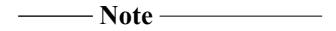

The No-Allocate allocation hint is only a performance hint. The processor might in some cases, allocate Write-Back No-Allocate lines into the L1 data cache or the L2.

**Write-Through**

# **Non-cacheable**

Normal Non-cacheable memory is not looked up in any cache. The requests are sent directly to memory. Read requests might over-read in memory, for example, reading 64 bytes of memory for a 4-byte access, and a single external memory access might satisfy multiple memory requests. Write requests might merge with other write requests to the same bytes or nearby bytes.

The Cortex-A57 processor memory system treats all Write-Through pages as Non-cacheable.

#### **Device**

Device memory types are used for communicating with input and output devices and memory-mapped peripherals. They are not looked up in any cache.

All the memory operations for a single instruction can be sent to the interconnect as multiple naturally aligned requests.

# **Related information**

*[5 Memory Management Unit](#page-274-0)* on page 5-275*. [A.8 ACE and CHI interface signals](#page-541-0)* on page Appx-A-542*.*

#### **6.4.2 Coherence**

All memory requests for pages that are marked as Inner Shareable in the page tables and are Write-Back Cacheable, regardless of allocation policy, are coherent in all the caches that comprise the inner domain. At a minimum, this includes the L1 data cache of the executing core, the L2 cache, and all other L1 data caches in the processor. The inner domain might contain additional caches outside the processor depending on how the system is configured.

It is unpredictable whether memory requests for pages that are marked as Inner Non-shareable are coherent with the processor. No code must assume that Non-shareable pages are incoherent among the caches.

The L1 data cache implements a MESI coherence protocol.

# <span id="page-291-0"></span>**6.4.3 Cache disabled behavior**

When you clear the C bit in the CP15 System Control Register for a given processor, data caching is disabled and no new cache lines are allocated to the L1 data cache and L2 cache because of requests from that processor. This is important when cleaning and invalidating the caches for power down. Cache lines can be allocated from memory requests of other processors, unless their cache enable bits are also cleared. The effect on the L1 memory system is that all Write-Back Read-Write-Allocate pages are treated as Non-cacheable pages.

When you disable the cache, all Write-Back Cacheable requests do not look up the L1 cache. L1 cache still services the snoops from the L2 cache.

#### **Related information**

*[4.5.5 System Control Register](#page-240-0)* on page 4-241*.*

#### **6.4.4 Non-cacheable streaming enhancement**

You can enable the CPUACTLR[24], Non-cacheable streaming enhancement bit, only if your memory system meets the requirement that cache line fill requests from the processor are atomic. Specifically, if the processor requests a cache line fill on the AXI master read address channel, any given write request from a different master is ordered completely before or after the cache line fill read. This means that after the memory read for the cache line fill starts, writes from any other master to the same cache line are stalled until that memory read completes. Setting this bit enables higher performance for applications with streaming reads from memory types that do not allocate into the cache.

Because it is possible to build an AXI interconnect that does not comply with the specified requirement, the CPUACTLR[24] bit defaults to disabled.

#### **6.4.5 Synchronization primitives**

The L1 memory system supports the Load-Exclusive, Store-Exclusive, and Clear-Exclusive synchronization primitive instructions. For all Non-shareable memory pages, the synchronization primitives are supported with a local monitor that is in each L1 memory system. For Shareable memory pages, the local monitor is used in conjunction with a global monitor. Where the global monitor resides depends on the memory type and cacheability.

#### **Internal coherent global monitor**

If synchronization primitives are used for memory pages that are Shareable Normal Write-Back and the cache is enabled, SCTLR.C is 1, the external monitor on AXI is not used. Instead, the global monitor function is handled in the L1 cache using the cache coherence information.

#### **External global monitor**

If synchronization primitives are used for memory pages that are Device, or Inner-Shareable Normal Non-cacheable, a global monitor must be provided in the interconnect. See the *ARM® Architecture Reference Manual ARMv8, for ARMv8-A architecture profile* for more information. The memory requests are sent on the AXI interface as Read-Exclusive or Write-Exclusive. See the *ARM® AMBA® AXI and ACE Protocol Specification* for more information.

| Note                                                                                                  |  |
|-------------------------------------------------------------------------------------------------------|--|
| Use of synchronization primitives on addresses in regions marked as Device memory is UNPREDICTABLE in |  |
| the ARMv8-A architecture. Code that makes such accesses is not portable.                              |  |

# <span id="page-292-0"></span>**6.4.6 Load/Store unprivileged instructions**

The load/store unprivileged instructions are used in privileged modes to emulate User mode instructions and to enforce User mode permissions. These instructions are for all memory types when enforcing permission checking against the permissions that the page table specifies. The User mode permissions from the page table are used instead of the privileged mode permissions.

You can also use these instructions to modify the privileged and user information on the **ARPROT** and **AWPROT** signals on the AXI. This is required if external permission checking hardware exists in the fabric memory.

The LDRT and STRT instructions for Strongly-ordered and Device pages appear on the AXI with an **AxPROT** value that indicates User mode access. However, the same instructions for Normal Memory might not always result in AXI transactions with an **AxPROT** value that indicates User mode access. This is because any Normal Memory page permits speculative prefetching at any time. Those prefetch requests, either caused by hardware prefetching or speculative prefetching triggered by flushed memory instructions, can have a value of the **AxPROT** field that indicates privileged mode access. This reflects the mode of the processor during the prefetch.

For Normal Write-Through Cacheable or Non-cacheable memory, the processor can still access the memory speculatively, and can merge multiple stores together before issuing them to the AXI. Because of this, you must use the LDRT and STRT instructions to present User mode on **AxPROT** if the LDRT and STRT instructions are preceded and followed by DMB instructions:

- DMB.
- LDRT or STRT.
- DMB.

The DMB instructions prevent the LDRT or STRT instruction from hitting any previously requested read data, or from merging with any other requests. The DMB instructions can be DMBSY, DMBISH, DMBISH, and DMBOSH.

# **6.4.7 Preload instruction behavior**

The multiprocessor supports the PLD, PLDW, and PRFM prefetch hint instructions. For Normal Write-Back Cacheable memory page, the PLD, PLDW, and PRFM L1 instructions cause the line to be allocated to the L1 data cache of the executing processor. The PLD instruction brings the line into the cache in Exclusive or Shared state and the PLDW instruction brings the line into the cache in Exclusive state. The preload instruction cache, PLDI, is treated as a NOP. PLD and PLDW instructions are performance hints instructions only and might be dropped in some cases.

# **6.4.8 Error Correction Code**

The L1 data cache supports optional single bit correct and double bit detect error correction logic in both the Tag and Data arrays. The ECC granularity for the Tag array is the tag for a single cache line and the ECC granularity for the Data array is a 32-bit word.

Because of the ECC granularity in the Data array, a write to the array cannot update a portion of a 4-byte aligned memory location because there is not enough information to calculate the new ECC value. This is the case for any store instruction that does not write one or more aligned 4-byte regions of memory. In this case, the L1 data memory system reads the existing data in the cache, merges in the modified bytes, and calculates the ECC from the merged value. The L1 memory system attempts to merge multiple stores together to meet the aligned 4-byte ECC granularity and to avoid the read-modify-write requirement.

Single bit ECC errors in the Tag or cache are corrected in the background. Because the line is removed from the L1 cache as part of the correction process, no software intervention is required. No exception or interrupt is generated. The CPU Memory Error Syndrome Register is updated to indicate a nonfatal error. Double bit ECC errors in the Tag or cache are detected and an imprecise Data Abort is triggered. The line that contains the error is evicted from the cache. When a double bit error is reported, you must assume that data corruption has occurred and handle this appropriately.

For any detected ECC error in the L1 memory system, the CPU Memory Error Syndrome Register is updated. For the first error reported, the register is updated with information for the RAM, bank, way, and index that contain the error. If that same location reports multiple errors, the repeat error count is incremented. If any other RAM locations report errors, the other error count is incremented. Double-bit ECC errors set the fatal bit. When the register is written with zeros, the register clears all counts and starts to monitor for a new first error again.

# **Related information**

*[4.3.68 CPU Memory Error Syndrome Register, EL1](#page-207-0)* on page 4-208*.*

# <span id="page-294-0"></span>**6.5 Program flow prediction**

The Cortex-A57 processor contains program flow prediction hardware, also known as *branch prediction*.

With program flow prediction disabled, all taken branches incur a penalty associated with flushing the pipeline. To avoid this penalty, the branch prediction hardware operates at the front of the instruction pipeline. The branch prediction hardware consists of:

- A *Branch Target Buffer* (BTB) to identify branches and provide targets for direct branches.
- 2-level global history-based direction predictor.
- Indirect predictor to provide targets for indirect branches.
- Return stack.
- Static predictor.

The combination of global history-based direction predictor and BTB are called *dynamic predictor*.

This section contains the following subsections:

- *6.5.1 Predicted and non-predicted instructions* on page 6-295.
- *6.5.2 Return stack predictions* on page 6-295.
- *[6.5.3 Indirect predictor](#page-295-0)* on page 6-296.
- *[6.5.4 Static predictor](#page-295-0)* on page 6-296.
- *[6.5.5 Enabling program flow prediction](#page-295-0)* on page 6-296.
- *[6.5.6 BTB invalidation and context switches](#page-295-0)* on page 6-296.

## **6.5.1 Predicted and non-predicted instructions**

This section describes the instructions that the processor predicts.

Unless otherwise specified, the list applies to A32, T32, and A64 instructions. As a general rule, the branch prediction hardware predicts all branch instructions regardless of the addressing mode, including:

- Conditional branches.
- Unconditional branches.
- Indirect branches.
- Branches that switch between ARM and Thumb states.
- PC destination data processing operations.
- BXJ, because of the inclusion of the trivial Jazelle implementation, this degenerates to a BX instruction. There is no BXJ instruction in A64.

However, the following branch instructions are not predicted:

- AArch32 instructions with the *S* suffix are not predicted because they are typically used when returning from exceptions and have side effects that can change privilege mode and Security state.
- All mode or Exception level changing instructions.

In Thumb state, you can make a branch that is normally encoded as unconditional conditional by including an *If-Then* (IT) block. It is then treated as a normal conditional branch.

#### **6.5.2 Return stack predictions**

The return stack stores the address and the ARM or Thumb state of the instruction after a function-call type branch instruction. This address is the same as the Link Register value stored in r14 in AArch32 state or X30 in AArch64 state. The following instructions cause a return stack push if predicted:

- BL immediate.
- BLX(1) immediate in AArch32 state.
- BLX(2) register in AArch32 state.
- BLR register in AArch64 state.

<span id="page-295-0"></span>The following AArch32 instructions cause a return stack pop if predicted:

- BX r14
- MOV pc, r14.
- LDMIA sp!, {..pc}.
- LDR pc, [sp], #4.

The LDMIA and LDR instruction address modes are correspondent with popping the return address of a full descending stack. In AArch64 state, the RET instruction causes a return stack pop. There is no dependency on a specific return address target register, for example X30.

Because return-from-exception instructions can change the processor privilege mode and Security state, they are not predicted. This includes the ERET, RFE, and LDM(3) instruction, and the MOVS pc, r14 instruction.

# **6.5.3 Indirect predictor**

The indirect predictor can predict indirect branches that are not return-type instructions.

This predictor augments the branch address with an additional state that predicts the target address of an indirect branch. The conditional branch predictor still predicts the direction of conditional indirect branches. The indirect predictor only provides the address on a predicted taken conditional indirect branch.

# **6.5.4 Static predictor**

Branches must be resolved one time to be predicted by the dynamic predictor. To accelerate cold startup of code, the processor includes a static predictor that detects branches in the code stream as follows:

- Direct unconditional branches, B immediate, are predicted taken.
- Direct unconditional call-type branches, BL immediate and BLX immediate, are predicted taken, and the preferred return address value is pushed on the return stack.
- Unconditional return-type branches are predicted taken and the target is popped from the return stack.

To avoid potential illegal speculation, the static predictor is disabled when the MMU is disabled.

#### **Related information**

*[6.5.2 Return stack predictions](#page-294-0)* on page 6-295*.*

#### **6.5.5 Enabling program flow prediction**

Program flow prediction is always enabled and no programming is required to take advantage of program flow prediction.

When reset, the processor:

- Invalidates the BTB.
- Resets the GHB and indirect predictor to a known state.

No software intervention is required to prepare the prediction logic before enabling program flow prediction.

# **6.5.6 BTB invalidation and context switches**

The BTB is tagged by all memory space information required to uniquely identify a virtual memory space, ASID, VMID, security, and Exception level. All predictions are checked at branch resolution time to ensure that a legal branch is resolved. Therefore, flushing the BTB on a context switch is not required. AArch64 state does not implement BTB flush instructions.

The processor automatically invalidates the BTB when either stage of the MMU is disabled.

# <span id="page-296-0"></span>**6.6 L1 RAM memories**

The L1 memory system contains several RAM memories that can be configured to use ECC or parity error detection mechanisms.

Any RAM memory that uses ECC support can perform single bit error correction and double bit error detection. Contents of the RAM memories with parity support can invalidate entries if a parity error is detected because this data is associated with read-only structures.

The following table shows all RAM memories contained in the L1 memory system.

**Table 6-2 L1 RAM memories**

| RAM memory                            | ECC or Parity |
|---------------------------------------|---------------|
| L1 instruction Tag RAM                | Parity        |
| L1 instruction Data RAM               | Parity        |
| L1 instruction BTB RAM                | None          |
| L1 instruction GHB RAM                | None          |
| L1 instruction indirect predictor RAM | None          |
| L1 data Tag RAM                       | ECC           |
| L1 Data RAM                           | ECC           |
| L2 TLB RAMdq                          | Parity        |

# <span id="page-297-0"></span>Chapter 7 **Level 2 Memory System**

This chapter describes the *Level 2* (L2) memory system.

It contains the following sections:

- *[7.1 About the L2 memory system](#page-298-0)* on page 7-299.
- *[7.2 Cache organization](#page-299-0)* on page 7-300.
- *[7.3 L2 RAM memories](#page-304-0)* on page 7-305.
- *[7.4 L2 cache prefetcher](#page-305-0)* on page 7-306.
- *[7.5 Cache coherency](#page-306-0)* on page 7-307.
- *[7.6 Asynchronous errors](#page-307-0)* on page 7-308.
- *[7.7 External coherent interfaces](#page-308-0)* on page 7-309.
- *7.8 ACP* [on page 7-316.](#page-315-0)

# <span id="page-298-0"></span>**7.1 About the L2 memory system**

The L2 memory system consists of a tightly-coupled L2 cache and an integrated *Snoop Control Unit* (SCU), connecting up to four cores within a cluster and a configurable coherent external interface supporting AMBA4 (ACE) or CHI architectures.

The L2 memory system also interfaces with an *Accelerator Coherency Port* (ACP) that is implemented as an AXI slave interface.

The features of the L2 memory system include:

- Configurable L2 cache size of 512KB, 1MB, and 2MB.
- Fixed line length of 64 bytes.
- Physically indexed and tagged cache.
- 16-way set-associative cache structure.
- Banked pipeline structures.
- Inclusion property with L1 data caches.
- Random cache-replacement policy.
- Configurable 128-bit wide ACE or 128-bit wide CHI interface with support for multiple outstanding requests.
- 128-bit wide ACP with support for multiple incoming requests.
- Duplicate copies of the L1 data cache directories for coherency support.
- Configurable number of *Fill/Eviction Queue* (FEQ) entries to 16 or 20.
- *Error Correction Code* (ECC) support.
- Optional hardware prefetch support.
- Software-programmable variable latency RAMs.
- Register slice support for large L2 cache sizes to minimize impact on routing delays.
- MBIST support.

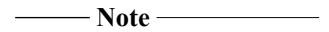

- The Cortex-A57 processor does not support TLB or cache lockdown.
- The L2 FEQ20 implementation option is available only in r1p0 and later revisions.

# **Related information**

- *[7.2.2 Strictly-enforced inclusion property with L1 data caches](#page-299-0)* on page 7-300*.*
- *[7.2.4 Error Correction Code](#page-300-0)* on page 7-301*.*
- *[7.2.5 Register slice support for large cache sizes](#page-300-0)* on page 7-301*.*

# <span id="page-299-0"></span>**7.2 Cache organization**

The L2 cache is 16-way set-associative of configurable size. The cache is physically-addressed. The cache sizes are configurable with sizes of 512KB, 1MB, and 2MB.

You can configure the L2 memory system pipeline to insert wait states to take into account the latencies of the compiled memories for the implementation of the RAMs.

The L2 cache incorporates a single dirty bit per cache line. A write to a cache line results in the line being written back to memory after the line is evicted from the L2 cache.

This section contains the following subsections:

- *7.2.1 L2 cache bank structure* on page 7-300.
- *7.2.2 Strictly-enforced inclusion property with L1 data caches* on page 7-300.
- *[7.2.3 Enabling and disabling the L2 cache](#page-300-0)* on page 7-301.
- *[7.2.4 Error Correction Code](#page-300-0)* on page 7-301.
- *[7.2.5 Register slice support for large cache sizes](#page-300-0)* on page 7-301.

## **7.2.1 L2 cache bank structure**

The L2 cache is partitioned into multiple banks to enable parallel operations. The following levels of banking exist:

- The Tag array is partitioned into multiple banks to enable up to two requests to access different tag banks of the L2 cache simultaneously.
- Each tag bank is partitioned into multiple data banks to enable streaming accesses to the data banks. Each tag bank consists of four data banks.

*Figure 7-1 L2 cache bank structure* on page 7-300 shows the logical representation of an L2 cache bank structure with a configuration of all possible tag and data bank combinations.

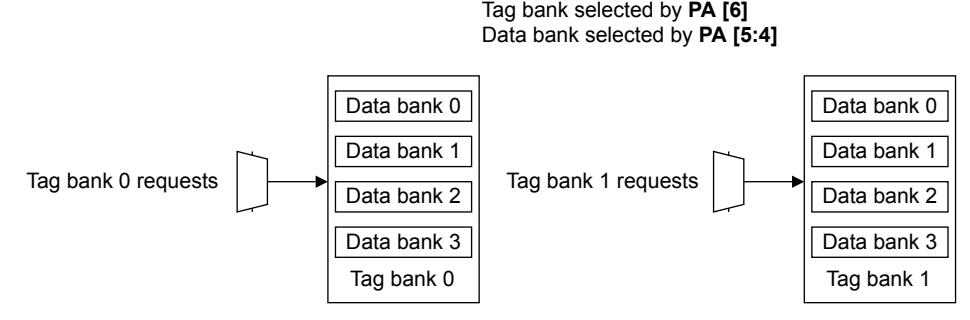

**Figure 7-1 L2 cache bank structure**

#### **7.2.2 Strictly-enforced inclusion property with L1 data caches**

The L2 memory system requires support for inclusion between the L1 data caches and the L2 cache. A line that resides in any of the L1 data caches must also reside in the L2 cache. However, the data can differ between the two caches when the L1 cache line is in a dirty state. If another agent, a core in the cluster or another cluster, accesses this line in the L2 then it knows the line is present in the L1 of a processor and then it queries that core for the most recent data.

This strictly-enforced inclusion property has the following benefits:

• Any AXI or CHI ReadClean operation that results in a line being in shared state in the L1 data caches can be returned from the L2 cache. This yields the highest performance for delivering data to a core.

• When powering down the processor, it reduces the time to clean and invalidate the entire L1 data cache.

# <span id="page-300-0"></span>**7.2.3 Enabling and disabling the L2 cache**

For processor requests, the L2 cache is enabled when the C bit of the SCTLR register is enabled. The cache attributes are provided with each request, taking into account the page attributes that the MMU page tables provided and overriding these attributes if the corresponding cache enable bit in the SCTLR is disabled.

To enable the L2 cache to cache both instructions and data following the reset sequence, you must:

- 1. Complete the processor reset sequence.
- 2. Enable L2 ECC, if required, by programming bit[21] of the L2 Control Register.
- 3. Program the I bit and C bit of the SCTLR.

To disable the L2 cache, you must use the following sequence:

- 1. Disable the C bit.
- 2. Clean and invalidate the L1 and L2 caches.

For ACP requests, the L2 cache is enabled if the request uses Normal Write-Back memory attributes. The processor searches the L2 cache to determine if the request is valid before allocating the line for Normal Write-Back Read-Write-Allocate memory.

#### **Related information**

*[4.5.5 System Control Register](#page-240-0)* on page 4-241*. [4.3.58 L2 Control Register, EL1](#page-168-0)* on page 4-169*.*

## **7.2.4 Error Correction Code**

The L2 cache supports ECC in most of its memories. For core instruction and data accesses resulting in an L2 cache hit, where a single-bit error is detected on the Data array, the L2 memory system supports in-line ECC correction. Uncorrected data is forwarded to the requesting unit, and in parallel, the ECC circuitry checks for accuracy. If a single-bit error is detected, any uncorrected data returned within two cycles before the error indicator must be discarded. The L2 memory system begins to stream corrected data to the requestor.

When there is no data transfers, the L2 memory system shifts back to return uncorrected data until it detects the next single-bit error. Forwarding uncorrected data can be disabled by programming bit[20] of the L2 Control Register. This avoids the requirement to flush requests associated with single-bit ECC errors on L2 cache hits, but adds an additional 2 cycles to the L2 hit latency.

For all other single-bit ECC errors detected, the request is flushed from the L2 pipeline and is forced to reissue. The tag bank where the single-bit error occurred, performs a read-modify-write sequence to correct the single-bit error in the array. The request is then reissued.

#### **Related information**

*[4.3.68 CPU Memory Error Syndrome Register, EL1](#page-207-0)* on page 4-208*.*

#### **7.2.5 Register slice support for large cache sizes**

As the L2 cache size is increased, the area of the implementation increases. This increase adds significant route delays to and from the RAM memories. This increase can impact the maximum frequency of the implementation.

To counter this, you can insert register slices before and after the RAM memories to offset the longer route delays. This enables the frequency target of the implementation to remain high. Additional slices can impact the overall L2 hit latency but they can enable requests to be streamed in a more efficient manner. You can increase the programmed latency values of the RAMs to cover the additional route

<span id="page-301-0"></span>delays without adding the slices. However, this method has an impact on performance because requests cannot be streamed as efficiently.

The L2 Data RAMs support up to two inserted register slices, whereas all other L2 RAMs can only support one inserted register slice. Each register slice introduces a pair of registers, one before the RAM and one after the RAM.

Bits[12:10] of the CP15 L2 Control Register, L2CTLR, indicate the number of RAM register slices in the design. In addition, the L2CTLR contains bits to program the setup and latency for the L2 Tag and Data RAMs.

# **Overall RAM latency calculation**

The RAM latency is a function of the following:

- Programmed latency in the L2 Control Register.
- Additional strobe clock setup required value in the L2CTLR.
- Number of slices added.

RAM latency = programmed value + strobe setup + 2×N, where *N* is the number of register slices to insert.

The following table shows the adjusted L2 Tag RAM latency with the register slice and setup factored in.

**Table 7-1 L2 Tag RAM latency with slice and setup factored in**

| L2CTLR[8:6] register bits | Total adjusted Tag RAM latency |              |              |              |  |
|---------------------------|--------------------------------|--------------|--------------|--------------|--|
|                           | Tag slice =0                   | Tag slice =0 | Tag slice =1 | Tag slice =1 |  |
|                           | Tag setup =0                   | Tag setup =1 | Tag setup =0 | Tag setup =1 |  |
| 000dr                     | 2                              | 3            | 4            | 5            |  |
| 001                       | 2                              | 3            | 4            | 5            |  |
| 010                       | 3                              | 4            | 5            | 5            |  |
| 011                       | 4                              | 5            | 5            | 5            |  |
| 100                       | 5                              | 5            | 5            | 5            |  |
| 1xx, ≥ 4                  | 5                              | 5            | 5            | 5            |  |

# **Note**

- The L2 Tag RAM total latency is set to a maximum of 5 cycles.
- Each tag slice adds 2 cycles and affects the L2 Tag, Snoop Tag, Dirty, Inclusion PF, and prefetch stride queue RAMs.
- Setting tag setup to 1 adds 1 cycle.
- Slice and setup have priority over programmed latency in determining the total adjusted RAM latency.

The following example shows a Tag RAM access with 3 cycles total RAM latency.

# **Examples**

# **Tag RAM access with 3 cycles total latency**

When tag slice = 0, L2CTLR[9] = 0, L2CTLR[8:6] = 0b010, the following applies:

- No slice cycle.
- No setup cycle.
- 3 cycles Tag RAM access.
- 3 cycles total Tag RAM latency.

The following example shows a Tag RAM access with 5 cycles total RAM latency.

**Examples** 

## **Tag RAM access with 5 cycles total latency**

When tag slice = 1, L2CTLR[9] = 1, L2CTLR[8:6] = 0b010, the following applies:

- 2 slice cycles.
- 1 setup cycle.
- 2 cycles Tag RAM access adjusted because of slice and setup values.
- 5 cycles total Tag RAM latency.

The following table shows the adjusted L2 Data RAM latency with the register slice and setup factored in.

**Table 7-2 L2 Data RAM latency with slice and setup factored in**

| L2CTLR[2:0] register<br>bits | Total adjusted Data RAM latency |               |               |               |               |               |
|------------------------------|---------------------------------|---------------|---------------|---------------|---------------|---------------|
|                              | Data slice =0                   | Data slice =0 | Data slice =1 | Data slice =1 | Data slice =2 | Data slice =2 |
|                              | Data setup =0                   | Data setup =1 | Data setup =0 | Data setup =1 | Data setup =0 | Data setup =1 |
| 000ds                        | 2                               | 3             | 4             | 5             | 6             | 7             |
| 001                          | 2                               | 3             | 4             | 5             | 6             | 7             |
| 010                          | 3                               | 4             | 5             | 6             | 7             | 8             |
| 011                          | 4                               | 5             | 6             | 7             | 8             | 8             |
| 100                          | 5                               | 6             | 7             | 8             | 8             | 8             |
| 101                          | 6                               | 7             | 8             | 8             | 8             | 8             |
| 110                          | 7                               | 8             | 8             | 8             | 8             | 8             |
| 111                          | 8                               | 8             | 8             | 8             | 8             | 8             |

**Note**

- The L2 Data RAM total latency is set to a maximum of 8 cycles.
- Each data slice adds 2 cycles and affects the L2 data and data ECC RAMs.
- Setting data setup to 1 adds 1 cycle.

• Slice and setup have priority over programmed latency in determining the total adjusted RAM latency.

The following example shows a Data RAM access with 4 cycles total RAM latency.

#### **Data RAM access with 4 cycles total latency**

When data slice = 0, L2CTLR[5] = 0, L2CTLR[2:0] = 0b011, the following applies:

- No slice cycle.
- No setup cycle.
- 4 cycles Data RAM access.
- 4 cycles total Data RAM latency.

The following example shows a Data RAM access with 8 cycles total RAM latency.

# **Data RAM access with 8 cycles total latency**

When data slice = 2, L2CTLR[5] = 1, L2CTLR[2:0] = 0b011, the following applies:

- 4 slice cycles.
- 1 setup cycle.
- 3 cycles Data RAM access adjusted because of slice and setup values.
- 8 cycles total Data RAM latency.

#### **Related information**

*[4.3.58 L2 Control Register, EL1](#page-168-0)* on page 4-169*.*

# **Related information**

*[4.3.58 L2 Control Register, EL1](#page-168-0)* on page 4-169*.*

# **Related information**

*[4.5.5 System Control Register](#page-240-0)* on page 4-241*.*

# <span id="page-304-0"></span>**7.3 L2 RAM memories**

The L2 memory system contains several RAM memories that support ECC or parity error detection mechanisms.

Any RAM memory that uses ECC support can perform single-bit error correction and double-bit error detection. Contents of the RAM memories with parity support can invalidate entries if a parity error is detected because this data is associated with read-only structures.

The following table shows all RAM memories contained in the L2 memory system.

**Table 7-3 L2 RAM memories**

| RAM memory            | ECC or Parity |
|-----------------------|---------------|
| L2 Tag RAM            | ECC           |
| L2 Snoop Tag RAM      | ECC           |
| L2 Data RAM           | ECC           |
| L2 Dirty RAM          | ECC           |
| L2 prefetch RAM       | Parity        |
| L2 Inclusion PF RAMdt | ECC           |

# <span id="page-305-0"></span>**7.4 L2 cache prefetcher**

The Cortex-A57 processor includes a hardware L2 prefetcher.

Some of the key features are:

- Software-programmable prefetches on any L2 miss of 0, 2, 4, or 8 prefetches for load-store misses and 0, 1, 2, or 3 prefetches for instruction fetch misses. All prefetches are allocated into the L2 cache.
- Separate mechanisms to detect and prefetch:
  - Load-store streams, to stride detection within a 4K page when pages are mapped at 4KB granularity, else within the 64KB page.
  - Instruction fetch streams, to fetch consecutive cache lines on an L2 instruction fetch miss or an L2 cache prefetch hit.
  - Table walk descriptor, to fetch the consecutive cache line on an L2 table walk descriptor miss.

| Note |  |
|------|--|

The prefetcher is limited to prefetch within the 4KB page of the current request, if the page has been mapped at a 4KB granularity. If the page has been mapped at a 64KB or larger granularity, then the prefetcher is limited to issuing prefetch within the 64KB page of the current request.

- A 10-entry prefetch request queue per processor that holds the prefetch requests generated by either the load-store, instruction fetch, or table walk prefetchers.
- A throttle mechanism to limit a maximum of 12 outstanding prefetch requests from consuming all of the shared resources that handle the data transfer to and from memory.
- Support for forwarding from prefetched requests. If a read request was sent over AXI because of a prefetch request, and a demand access for the same line was received, the read data can be forwarded from the internal data buffers to the demand request, before waiting for the line to be allocated to the cache.

You can program the CPUECTLR register to indicate the maximum number of prefetches to be allocated in the PRQ on the following:

- An instruction fetch miss in the L2 cache by programming CPUECTLR\_EL1[36:35].
- A load-store miss with a stride match in the L2 cache by programming CPUECTLR\_EL1[33:32].

The programmed distance is also used as the skip distance for any load-store or instruction fetch read with a stride match that hits in the L2 cache. In these cases, a single prefetch request is allocate in the PRQ as:

| prefetch address = current address + (stride × programmed distance) |  |  |  |
|---------------------------------------------------------------------|--|--|--|
| Note                                                                |  |  |  |

The stride for an instruction fetch access is always one cache line.

# **Related information**

*[4.3.65 L2 Auxiliary Control Register, EL1](#page-188-0)* on page 4-189*. [4.3.67 CPU Extended Control Register, EL1](#page-204-0)* on page 4-205*.*

# <span id="page-306-0"></span>**7.5 Cache coherency**

The SCU uses hybrid *Modified Exclusive Shared Invalid* (MESI) and *Modified Owned Exclusive Shared Invalid* (MOESI) protocols to maintain coherency between the individual L1 data caches and the L2 cache.

The L1 data caches support the MESI protocol. The L2 memory system contains a Snoop Tag array that is a duplicate copy of each of the L1 data cache directories. The Snoop Tag array reduces the amount of snoop traffic between the L2 memory system and the L1 memory system. Any line that resides in the Snoop Tag array in the Modified/Exclusive state belongs to the L1 memory system. Any access that hits against a line in this state must be serviced by the L1 memory system and passed to the L2 memory system. If the line is invalid or in the shared state in the Snoop Tag array, then the L2 cache can supply the data.

The SCU contains buffers that can handle direct cache-to-cache transfers between processors without reading or writing any data on the ACE or CHI interface. Lines can migrate back and forth without any change to the MOESI state of the line in the L2 cache.

Shareable transactions on the ACP are also coherent, so the Snoop Tag arrays are queried as a result of ACP transactions. For reads where the Shareable line resides in one of the L1 data caches in the Modified/Exclusive state, the line is transferred from the L1 memory system to the L2 memory system and passed back on the ACP.

# <span id="page-307-0"></span>**7.6 Asynchronous errors**

The L2 memory system has two outputs that indicate asynchronous error conditions.

An asynchronous external error condition exists when either:

- The **nEXTERRIRQ** output is LOW.
- The **nINTERRIRQ** output is LOW.

If an asynchronous error condition is detected, the corresponding bit in the L2 Extended Control Register is asserted. The asynchronous error condition can be cleared by writing 0b0 to the corresponding bit of the L2ECTLR. Software can only clear the L2ECTLR. Any attempt to assert the error by writing the L2ECTLR is ignored.

Any external error associated with a load instruction is reported back to the requestor along with an error response and this might trigger an abort. Any external error associated with a Device, Non-cacheable, or non-allocating write that misses in the L2, or a cache maintenance operation is reported to the core that issued the transaction through a processor-specific interrupt request to the GIC.

## **Related information**

*[4.3.59 L2 Extended Control Register, EL1](#page-172-0)* on page 4-173*.*

# <span id="page-308-0"></span>**7.7 External coherent interfaces**

The Cortex-A57 processor provides configurable options for either AMBA4 *AXI Coherency Extension*s (ACE) or CHI interconnect architectures.

Each interface option provides a 128-bit wide data interface to the system and supports 1:1 clock ratios with respect to the processor clock and N:1, integer multiple clock ratios, of the core clock.

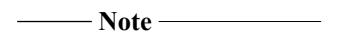

ACE is supported with the following restriction:

• **ARQOS** and **AWQOS** signals are not present.

This section contains the following subsections:

- *7.7.1 L2 memory interface attributes* on page 7-309.
- *[7.7.2 Interface modes](#page-309-0)* on page 7-310.
- *[7.7.3 Snoop filter support](#page-310-0)* on page 7-311.
- *[7.7.4 Distributed virtual memory transactions](#page-310-0)* on page 7-311.
- *[7.7.5 External memory attributes](#page-310-0)* on page 7-311.
- *[7.7.6 ACE ARID and AWID assignment](#page-311-0)* on page 7-312.
- *[7.7.7 CHI LPID assignment](#page-312-0)* on page 7-313.
- *[7.7.8 ACE supported transfers](#page-312-0)* on page 7-313.
- *[7.7.9 CHI link layer flow control](#page-313-0)* on page 7-314.
- *[7.7.10 CHI DVM acceptance capability](#page-313-0)* on page 7-314.
- *[7.7.11 L2 Auxiliary Control Register settings](#page-313-0)* on page 7-314.

# **7.7.1 L2 memory interface attributes**

The following table shows the L2 memory interface attributes for the processor. The table lists the maximum possible values for the read and write issuing capabilities.

**Table 7-4 L2 memory interface attributes**

| Attribute                      | Value                                                                                                                                                                                                    | Description                                                                                                            |                                                                                                            |  |
|--------------------------------|----------------------------------------------------------------------------------------------------------------------------------------------------------------------------------------------------------|------------------------------------------------------------------------------------------------------------------------|------------------------------------------------------------------------------------------------------------|--|
| Write issuing<br>capability    | 16                                                                                                                                                                                                       | 16 outstanding writes supported that can be evictions, single writes, or write bursts of any memory<br>type.           |                                                                                                            |  |
| Read issuing<br>capability     | 15 or 19                                                                                                                                                                                                 | If the core implements:                                                                                                |                                                                                                            |  |
|                                |                                                                                                                                                                                                          | 16-entry FEQ                                                                                                           | 15 outstanding reads supported that can be line fills,<br>single reads, or read bursts of any memory type. |  |
|                                |                                                                                                                                                                                                          | 20-entry FEQ. The 20-entry L2 FEQ<br>implementation option is available only<br>in r1p0 and later revisions.           | 19 outstanding reads supported that can be line fills,<br>single reads, or read bursts of any memory type. |  |
| Snoop acceptance<br>capability | 20                                                                                                                                                                                                       | Up to 20 outstanding snoop requests are accepted on the AC channel in response to those requests<br>on the CR channel. |                                                                                                            |  |
| DVM issuing<br>capability      | 30 or 38<br>If the processor implements:<br>16-entry FEQ<br>30 DVM Message transactions supported (15 two-part messages)<br>20-entry FEQ<br>38 DVM Message transactions supported (19 two-part messages) |                                                                                                                        |                                                                                                            |  |

# <span id="page-309-0"></span>**7.7.2 Interface modes**

The ACE and CHI coherent interconnect interfaces can be configured through input signals to change the interface behavior. The multiprocessor implements the following configuration signals:

- *SYSBARDISABLE* on page 7-310.
- *BROADCASTINNER* on page 7-310.
- *BROADCASTOUTER* on page 7-310.
- *[BROADCASTCACHEMAINT](#page-310-0)* on page 7-311.

#### **SYSBARDISABLE**

**SYSBARDISABLE** controls issuing barrier transactions on the coherent interconnect.

When **SYSBARDISABLE** is deasserted, barriers are broadcast on the coherent interconnect as a Memory Barrier or Synchronization Barrier for an ACE interface, or an EOBarrier or ECBarrier for a CHI interface.

When **SYSBARDISABLE** is asserted, barriers are not broadcast on the coherent interconnect. Barriers are enforced internally to the Cortex-A57 processor by observing completion of transactions through the Read data channel and Write response channel for an ACE interface, or the RXDAT data channel and RXRSP response channel for a CHI interface. Systems that use this mode must ensure that ACE write responses or CHI RXRSP completion responses guarantee that the transaction has been globally observed and that barrier broadcasts are not required for any other system functionality.

For ACE configurations that require AXI3 compatibility you must:

- Assert **SYSBARDISABLE**.
- Deassert **BROADCASTINNER**.
- Deassert **BROADCASTOUTER**.
- Deassert **BROADCASTCACHEMAINT**.

## **BROADCASTINNER**

**BROADCASTINNER** controls issuing coherent transactions targeting the Inner Shareable domain on the coherent interconnect. When **BROADCASTINNER** is asserted, the processor is considered to be part of an Inner Shareable domain that extends beyond the processor and any transaction that requires coherency with other masters in this domain is broadcast on the ACE or CHI interface.

When **BROADCASTINNER** is asserted, **BROADCASTOUTER** must also be asserted. In this configuration, coherent masters can share memory in the Inner or Outer Shareable domains.

When **BROADCASTINNER** is deasserted, the processor does not issue DVM requests on the ACE AR channel or CHI TXREQ channel.

# **BROADCASTOUTER**

**BROADCASTOUTER** controls issuing coherent transactions targeting the outer shareability domain on the coherent interconnect. When **BROADCASTOUTER** is asserted, the processor is considered to be part of the Outer Shareable domain and any transaction that requires coherency with other masters in this domain is broadcast on the ACE or CHI interface.

It is possible to assert **BROADCASTOUTER** without asserting **BROADCASTINNER**. This selects a configuration that limits coherent masters to sharing memory only in the outer shareability domain. However, cores within the cluster can still share memory in the Inner Shareable domain.

When **BROADCASTOUTER** is deasserted, **BROADCASTINNER** must also be deasserted.

<span id="page-310-0"></span>When **BROADCASTINNER** and **BROADCASTOUTER** are both deasserted, the processor does not issue coherent read or write requests on the ACE AR and AW channels, or the CHI TXREQ channel.

# **BROADCASTCACHEMAINT**

**BROADCASTCACHEMAINT** controls issuing cache maintenance transactions, such as CleanShared, CleanInvalid and MakeInvalid, on the coherent interconnect. When **BROADCASTCACHEMAINT** is asserted, cache maintenance instructions might cause cache maintenance transactions on ACE or CHI interconnect. The cache maintenance transactions are broadcast even if the memory location is Nonshareable or when the **BROADCASTINNER** or **BROADCASTOUTER** signals normally prevent such a broadcast. This configuration allows the management of an external L3 cache that might cache Nonshareable data.

When **BROADCASTCACHEMAINT** is deasserted, only those cache maintenance transactions required for coherency as determined by Inner and Outer shareability and the **BROADCASTINNER** and **BROADCASTOUTER** signals are issued on the coherent interconnect.

Systems that utilize a L3 cache that supports caching of Non-shareable memory must assert **BROADCASTCACHEMAINT**.

# **7.7.3 Snoop filter support**

In general, the processor can issue a Write-Back, WriteEvict, or an Evict transaction for any cache line that is removed from the L2 cache. You can use these messages to manage an external snoop filter. However, the snoop filter logic must not depend on such a message for every clean line dropped from the processor caches, because in some circumstances the processor might not signal an eviction. For example, clean evictions are not guaranteed to occur in cases involving L1 or L2 tag ECC errors.

#### **7.7.4 Distributed virtual memory transactions**

In a system where the processor can receive a *Distributed Virtual Memory* (DVM) synchronization message over the AXI master snoop address channel, **BRESP** for any write transaction must not be asserted to the core until all AXI masters that might have initiated the DVM synchronization request observe the transaction.


### **7.7.5 External memory attributes**

The Cortex-A57 processor uses a combination of inner and outer memory attributes from the MMU to determine how its memory system handles each combination. *[Table 6-1 Memory attribute combinations](#page-289-0)* [on page 6-290](#page-289-0) shows the Inner and Outer memory attributes used by the L1 and L2 caches to form the internal memory types. *Table 7-5 External memory attributes* on page 7-311 shows how these attributes are used to form the external memory type presented on **ARCACHE**, **AWCACHE**, or **TXREQFLIT**[MemAttr].

**Table 7-5 External memory attributes**

| Outer MemAttr | Inner MemAttr | External memory type | ARCACHE | AWCACHE | TREQFLIT[MemAttr] |
|---------------|---------------|----------------------|---------|---------|-------------------|
| Device        | nGnRnE        | Strongly-ordered     | 0b0000  | 0b0000  | 0b0010            |
| Device        | nGnRE         | Device               | 0b0001  | 0b0001  | 0b0011            |

**Table 7-5 External memory attributes (continued)**

<span id="page-311-0"></span>

| Outer MemAttr                     | Inner MemAttr | External memory type              | ARCACHE | AWCACHE | TREQFLIT[MemAttr] |
|-----------------------------------|---------------|-----------------------------------|---------|---------|-------------------|
| Device                            | nGRE          | Device                            | 0b0001  | 0b0001  | 0b0011            |
| Device                            | GRE           | Device                            | 0b0001  | 0b0001  | 0b0011            |
| Non-cacheable                     | Non-cacheable | Non-cacheable Bufferable          | 0b0011  | 0b0011  | 0b0001            |
| Non-cacheable                     | Write-Through | Non-cacheable Bufferable          | 0b0011  | 0b0011  | 0b0001            |
| Non-cacheable                     | Write-Back    | Non-cacheable Bufferable          | 0b0011  | 0b0011  | 0b0001            |
| Write-Through                     | Non-cacheable | Non-cacheable Bufferable          | 0b0011  | 0b0011  | 0b0001            |
| Write-Through                     | Write-Through | Non-cacheable Bufferable          | 0b0011  | 0b0011  | 0b0001            |
| Write-Through                     | Write-Back    | Non-cacheable Bufferable          | 0b0011  | 0b0011  | 0b0001            |
| Write-Back                        | Non-cacheable | Non-cacheable Bufferable          | 0b0011  | 0b0011  | 0b0001            |
| Write-Back                        | Write-Through | Non-cacheable Bufferable          | 0b0011  | 0b0011  | 0b0001            |
| Write-Back No-Allocate            | Write-Back    | Write-Back No-Allocate            | 0b1011  | 0b0111  | 0b0101            |
| Write-Back Read-Allocate          | Write-Back    | Write-Back Read-Allocate          | 0b1111  | 0b0111  | 0b1101            |
| Write-Back Write-Allocate         | Write-Back    | Write-Back Write-Allocate         | 0b1011  | 0b1111  | 0b1101            |
| Write-Back Read-Write<br>Allocate | Write-Back    | Write-Back Read-Write<br>Allocate | 0b1111  | 0b1111  | 0b1101            |

In addition to **ARCACHE**, **AWCACHE**, and **TXREQFLIT**[MemAttr] the processor also presents the raw outer memory attributes, inner memory type, and Inner and Outer Shareable on dedicated external interface signals **RDMEMATTR**, **WRMEMATTR**, and **REQMEMATTR** corresponding to transactions on ACE read channel, ACE write channel and CHI TXREQ channel, respectively.

# **Related information**

*[A.9 CHI interface signals](#page-544-0)* on page Appx-A-545*. [A.10 ACE interface signals](#page-549-0)* on page Appx-A-550*.*

#### **7.7.6 ACE ARID and AWID assignment**

When the system issues multiple requests on the AR channel with the same **ARID**, or on the AW channel with the same **AWID**, it must follow the appropriate ordering rules as described in the *ARM® AMBA® AXI and ACE Protocol Specification*.

For certain transactions, the system must be able to identify which core generated the request. This applies to requests affecting the global exclusive monitor in addition to Strongly-ordered or Device memory type accesses to peripherals.

**ARCACHEM[3:0]** and **AWCACHEM[3:0]** identify whether the memory types are Strongly-ordered, Device, or Normal Non-cacheable. See the *ARM® AMBA® AXI and ACE Protocol Specification*. For these memory types, if **ARIDM[2]** or **AWIDM[2]** is LOW, then the request is generated from one of the cores. **ARIDM[1:0]** or **AWIDM[1:0]** indicate which core generated the request. If **ARIDM[2]** or **AWIDM[2]** is HIGH, the request originates from the master connected to the ACP slave port.

For an exclusive read transaction such as **ARLOCK** asserted, **ARID[1:0]** indicates which core generated the request. Only cores can generate exclusive read requests, and not the ACP or any other source.

For an exclusive write transaction such as **AWLOCK** asserted, **AWID[1:0]** indicates which core generated the request. Only cores can generate exclusive write requests, and not the ACP or any other source.

The system does not rely on specific values of **ARID** or **AWID** that correspond with specific transaction sources or transaction types other than the information described in this section.

# <span id="page-312-0"></span>**7.7.7 CHI LPID assignment**

CHI TXREQ transactions include the *Logical Processor ID* (LPID) field. This field uniquely identifies the logical core that generated the request transaction.

The processor uses the following LPID values:

| 0b000 | Core 0 request.            |
|-------|----------------------------|
| 0b001 | Core 1 request.            |
| 0b010 | Core 2 request.            |
| 0b011 | Core 3 request.            |
| 0b100 | ACP request.               |
| 0b111 | L2 hardware flush request. |

Secondary transactions such as copybacks from the L2, because of cache fills caused by core or ACP access L2 misses, use the LPID of the request that caused the copyback.

## **7.7.8 ACE supported transfers**

For Normal Inner-Cacheable memory transfers initiated from one of the Cortex-A57 processors, the following transfers are supported on the ACE:

- WRAP 4× 128-bit read transfers.
- WRAP 4× 128-bit write transfers.

For Normal Non-Cacheable memory transfers initated from one of the Cortex-A57 processors, the following transfers are supported on the ACE:

- WRAP 4× 128-bit read transfers.
- WRAP 4× 128-bit write transfers.
- INCR 1× 128-bit read transfers.
- INCR 1× 128-bit write transfers.

For Strongly-ordered or Device transactions initiated from one of the Cortex-A57 processors, the following transfers are supported on the ACE:

- INCR 1× 8-bit read transfers.
- INCR 1× 16-bit read transfers.
- INCR 1× 32-bit read transfers.
- INCR 1× 64-bit read transfers.
- INCR N (N:1 or 4) 128-bit read transfers.
- INCR 1× 8-bit write transfers.
- INCR 1× 16-bit write transfers.
- INCR 1× 32-bit write transfers.
- INCR 1× 64-bit write transfers.
- INCR N (N:1 or 4) 128-bit write transfers.

The following table describes the use of the burst types for Non-Cacheable and Cacheable but not allocated memory attributes.

**Table 7-6 Use of WRAP and INCR burst types for Non-Cacheable and Cacheable but not allocated transactions**

<span id="page-313-0"></span>

| Burst type | Used by                                                                                                                                                                                                        |  |  |  |  |
|------------|----------------------------------------------------------------------------------------------------------------------------------------------------------------------------------------------------------------|--|--|--|--|
| WRAP       | •<br>Non-Cacheable read transactions, excluding tablewalk or exclusive accesses.<br>•<br>Cacheable but not allocated read transactions initiated from one of the Cortex-A57 processors issued on AR-channel.   |  |  |  |  |
| INCR       | •<br>Non-cacheable tablewalk and exclusive read transactions.<br>•<br>Non-Cacheable or Cacheable but not allocated write transactions initiated from one of the Cortex-A57 processors<br>issued on AW-channel. |  |  |  |  |

If there are requests on the ACP interface, the following transfers can be generated on the ACE if comparable requests are received on the ACP:

- WRAP N 4× 128-bit read transfers.
- WRAP 4× 128-bit write transfers.
- INCR 1× 128-bit read transfers.
- INCR 1× 128-bit write transfers.

# **7.7.9 CHI link layer flow control**

CHI link layer flow control uses a counter on each link to track the number of outstanding link layer credits. The Cortex-A57 processor can receive a maximum of 15 link-layer credits on the TXREQ, TXRSP, and TXDAT links and issues a maximum of nine link layer credits on the RXSNP, RXRSP, and RXDAT links.

## **7.7.10 CHI DVM acceptance capability**

The Cortex-A57 processor can have a maximum of four outstanding DVM transactions on its snoop interface. When this limit is reached, the system cannot send any more DVM transactions on the RXRSP link until the processor has provided a response to an older DVM transaction on the TXRSP link

#### **7.7.11 L2 Auxiliary Control Register settings**

This section describes the recommended performance settings for the Cortex-A57 L2 Auxiliary Control Register in various system configurations.

## **Evict transactions**

Evict and WriteEvict transactions indicate that a shareable cache line has been evicted from the master's local caches. The downstream snoop filter can use this information to update its directory to indicate that the issuing master no longer contains a copy of the cache line.

WriteEvict carries data and can be used to allow allocation into a system or Level 3 cache. In general, ARM recommends the following:

- A system that contains a snoop filter enables Evict transactions.
- A system that contains a L3 cache that wants to behave like a victim cache for cache lines in the Unique state enables WriteEvict transactions.

The Cortex-A57 L2ACTLR\_EL1 register contains bits that can enable or disable Evict and WriteEvict transactions individually. See L2ACTLR\_EL1[3] and L2ACTLR\_EL1[14], respectively, in the *[4.3.65 L2](#page-188-0) [Auxiliary Control Register, EL1](#page-188-0)* on page 4-189.

When the Cortex-A57 processor is used with the ARM CCI-400 in an ACE-based system, ARM recommends that you set L2ACTLR\_EL1[3] to 1 to disable Evict transactions. The reset value of L2ACTLR[3] is 0 in Cortex-A57 ACE configurations. WriteEvict transactions are disabled by default in Cortex-A57 ACE configurations.

When the Cortex-A57 processor is used with the ARM CCN-504 in a CHI-based system, no change is required from the default reset value of L2ACTLR\_EL1. By default, Cortex-A57 CHI configurations generate WriteEvict transactions for allocating into the CCN-504 L3 cache but do not generate Evict transactions because the CCN-504 snoop filter does not require them.

## **WriteUnique and WriteLineUnique transactions**

If the Cortex-A57 processor is implemented in an ACE-based system that does not contain a snoop filter, WriteUnique and WriteLineUnique transactions can be enabled to provide a small increase in the performance of the processor. To enable WriteUnique and WriteLineUnique transactions, clear L2ACTLR\_EL1[4]. The reset value of L2ACTLR[4] is 1.

If the Cortex-A57 processor is implemented in an ACE-based system that does contain a snoop filter or in a CHI based system, no change is required from the default value.

# **Related information**

*[4.3.65 L2 Auxiliary Control Register, EL1](#page-188-0)* on page 4-189*.*

# <span id="page-315-0"></span>**7.8 ACP**

The *Accelerator Coherency Port* (ACP) is implemented as an AXI4 slave interface with the following restrictions:

- 128-bit read and write interfaces.
- **ARCACHE** and **AWCACHE** are restricted to Normal, Write-Back, Read-Write-Allocate, Read-Allocate, Write-Allocate, and No-Allocate memory. **ARCACHE** and **AWCACHE** are limited to the values 0b0111, 0b1011, and 0b1111. Other values cause a SLVERR response on **RRESP** or **BRESP**.
- Exclusive accesses are not supported.
- Barriers are not supported. **BRESP** indicates global observation of all writes.
- **ARSIZE** and **AWSIZE** signals are not present and assume a value of 0b100,16 bytes.
- **ARBURST** and **AWBURST** signals are not present and assume a value of INCR.
- **ARLOCK** and **AWLOCK** signals are not present.
- **ARQOS** and **AWQOS** signals are not present.
- **ARLEN** and **AWLEN** are limited to values 0 and 3.

This section contains the following subsections:

- *7.8.1 Transfer size support* on page 7-316.
- *[7.8.2 ACP ARUSER and AWUSER signals](#page-316-0)* on page 7-317.

# **7.8.1 Transfer size support**

ACP supports the following read-request transfer size and length combinations:

- 64-byte INCR request characterized by:
  - **ARLEN** is 0x03, 4 beats.
  - **ARADDR** aligned to 64-byte boundary, so **ARADDR[5:0]** is 0b00 0000.
  - **ARSIZE** and **ARBURST** assume values of 0b100 and INCR respectively.
- 16-byte INCR request characterized by:
  - **ARLEN** is 0x00, 1 beat.
  - **ARADDR** aligned to 16-byte boundary, so **ARADDR[3:0]** is 0x0.

ACP supports the following write-request transfer size and length combinations:

- 64-byte INCR request characterized by:
  - **AWLEN** is 0x03, 4 beats.
  - **AWADDR** aligned to 64-byte boundary, so **AWADDR[5:0]** is 0b00 0000.
  - **AWSIZE** and **AWBURST** assume values of 0b100 and INCR respectively.
  - **WSTRB** for all beats must be the same and either all asserted or all deasserted.
- 16-byte INCR request characterized by:
  - **AWLEN** is 0x00, 1 beat.
  - **AWADDR** aligned to 16-byte boundary, so **AWADDR[3:0]** is 0x0.
  - **AWSIZE** and **AWBURST** assume values of 0b100 and INCR respectively.
  - **WSTRB** can take any value.

Requests not meeting these restrictions cause a SLVERR response on **RRESP** or **BRESP**.

# <span id="page-316-0"></span>**7.8.2 ACP ARUSER and AWUSER signals**

ACP transactions can cause coherent requests to the system. Therefore ACP requests must pass the Inner and Outer Shareable attributes to the L2. To pass the Inner Shareable attribute, use **ARUSER[0]** and **AWUSER[0]**. To pass the Outer Shareable attribute, use **ARUSER[1]** and **AWUSER[1]**.

The setting of **AxUSER[1:0]** to 0b11 is not allowed and causes a SLVERR response.

# <span id="page-317-0"></span>Chapter 8 **Generic Interrupt Controller CPU Interface**

This section describes the Cortex-A57 processor implementation of the GIC CPU interface.

It contains the following sections:

- *[8.1 About the GIC](#page-318-0)* on page 8-319.
- *[8.2 GIC functional description](#page-319-0)* on page 8-320.
- *[8.3 GIC programmers model](#page-324-0)* on page 8-325.

# <span id="page-318-0"></span>**8.1 About the GIC**

The GIC is a resource for supporting and managing interrupts in a cluster system.

It implements the GIC CPU interface and provides:

- Registers for managing:
  - Interrupt sources.
  - Interrupt behavior.
  - Interrupt routing to one or more processors.

# The GIC supports:

- Two Security states.
- Interrupt virtualization.
- *Software-generated Interrupts* (SGIs).
- *System Error Interrupts* (SEIs).
- Message-based interrupts.
- System register access.
- Memory-mapped register access.
- Interrupt masking and prioritization.
- Interrupt routing based on processor affinity, in multiprocessor environments.
- Interrupt routing based on specifying target processors.
- Wake-up events in power-management environments.

The GIC includes interrupt grouping functionality that supports:

- Configuring each interrupt to belong to an interrupt group.
- Signaling Group 1 interrupts to the target processor using either the IRQ or the FIQ exception request.
- Signaling Group 0 interrupts to the target processor using the FIQ exception request only.
- A unified scheme for handling the priority of Group 0 and Group 1 interrupts.

The Cortex-A57 processor implements the GIC CPU interface as described in the Generic Interrupt Controller (GICv3) architecture. It can interface with a GICv3 Distributor component in the system.

This chapter only describes features that are specific to the Cortex-A57 processor implementation.

# <span id="page-319-0"></span>**8.2 GIC functional description**

Provides a functional description of the GIC.

The GIC is a single functional unit in the Cortex-A57 processor. The GIC consists of a common block and several CPU interface blocks. For each core in the system, there is:

- A CPU interface.
- A virtual interface control block.
- A virtual CPU interface.

This section contains the following subsections:

- *8.2.1 GIC memory map* on page 8-320.
- *[8.2.2 Interrupt sources](#page-321-0)* on page 8-322.
- *[8.2.3 Interrupt priority levels](#page-321-0)* on page 8-322.
- *[8.2.4 GIC bypass modes](#page-322-0)* on page 8-323.
- *[8.2.5 nIRQ and nVFIQ inputs](#page-322-0)* on page 8-323.

#### **8.2.1 GIC memory map**

The GIC registers are memory-mapped, with a physical base address specified by **PERIPHBASE[43:18]**. This input must be tied to a constant value. The **PERIPHBASE** value is sampled during reset into the Configuration Base Address Register (CBAR) for each processor in the MPCore device.

The GIC registers are grouped into three contiguous 64KB pages. These blocks include the CPU interface, virtual interface control, and virtual CPU interface blocks.

Memory regions used for these registers must be marked as Device, nGnRnE, nGnRE, nGRE, or GRE in the translation tables. Memory regions marked as Normal memory cannot access any of the GIC registers, but can access caches or external memory as required.

Access to these registers must be with the single word load and store instructions. Load/store-multiple, load/store-double, and load/store exclusive instructions result in a Data Abort exception to the requesting processor.

The *Accelerator Coherency Port* (ACP) cannot access any of the GIC registers. The registers must be accessed through one of the processors. Any access from ACP to the GIC registers goes to external memory and no Data Abort exception is generated.

The following table shows the GIC memory map of a Cortex-A57 processor. An external standalone GIC such as the ARM GIC-400 or other proprietary GIC might differ.

The following table shows the GIC memory map of a Cortex-A57 processor. An external standalone GIC such as the ARM GIC-400 or other proprietary GIC might differ. It lists the address offsets for the GIC blocks relative to the **PERIPHBASE** base address.

**Table 8-1 Cortex-A57 processor GIC memory map**

| Offset range from PERIPHBASE[43:18] | GIC block                               |
|-------------------------------------|-----------------------------------------|
| 0x00000-0x01FFF                     | CPU interface                           |
| 0x02000-0x0FFFF                     | Reserved                                |
| 0x10000-0x10FFF                     | Virtual interface control               |
| 0x11000-0x1FFFF                     | Reserved                                |
| 0x20000-0x21FFF                     | Virtual CPU interface (4KB page offset) |
|                                     |                                         |

#### **Table 8-1 Cortex-A57 processor GIC memory map (continued)**

| Offset range from PERIPHBASE[43:18] | GIC block                                                   |
|-------------------------------------|-------------------------------------------------------------|
| 0x22000-0x2EFFF                     | Reserved                                                    |
| 0x2F000-0x30FFF                     | Alias of the Virtual CPU interface (64KB page offset alias) |
| 0x31FFF-0x3FFFF                     | Reserved                                                    |

# **Related information**

- *[4.3.70 Configuration Base Address Register, EL1](#page-210-0)* on page 4-211*.*
- *[4.5.24 Configuration Base Address Register](#page-273-0)* on page 4-274*.*

# <span id="page-321-0"></span>**8.2.2 Interrupt sources**

The GIC CPU interface receives interrupts on the following signals:

**nSEI**, **nREI**, These signals generate *System Error Interrupts* (SEIs).

**nVSEI**

**nIRQ**, **nFIQ** When the GIC CPU interface is in bypass mode, these signals provide legacy IRQ and

FIQ inputs to the processor.

**nVIRQ**, These signals enable an external source to generate virtual IRQ and FIQ interrupts.

**nVFIQ**

**AMBA** GICv3 interrupt messages that are sent by an external Distributor. Each interrupt message

**AXI4** has a unique interrupt ID.

**Stream interface**

The interrupt message types are:

*Local* An interrupt generated by a peripheral that is destined for one or more

*Peripheral Interrupt*s (LPIs) processors within a specific affinity hierarchy.

*Private* An interrupt generated by a peripheral that is specific to a single

*Peripheral Interrupt*s (PPIs) processor. All PPIs must connect directly to the external Distributor.

*Shared Peripheral* An interrupt generated by a peripheral that is destined for one or more processors. All SPIs must connect directly to the external Distributor.

*Interrupt*s (SPIs). *Software Generated* SGIs are generated by:

• Writing to the ICC\_SGI0R, ICC\_SGI1R, or ICC\_ASGI1R registers in the CPU interface when in System-register mode.

• Writing to the Software Generated Interrupt Register, GICD\_SGIR, in the external Distributor when in memory-mapped mode.

A maximum of 16 SGIs, ID0-ID15, can be generated for each processor interface. An SGI has edge-triggered properties. The software triggering of the interrupt is equivalent to the edge transition of the interrupt signal on a peripheral input.

*System Error Interrupt*s (SEIs)

*Interrupt*s (SGIs)

> System Errors can be generated internally using the **nSEI**, **nVSEI**, or **nREI** signals. See the *ARM® Generic Interrupt Controller*

*Architecture Specification, GICv3* for more information.

*Virtual Local Peripheral Interrupt*s (vLPIs)

A virtual interrupt generated by a write to the Distributor that is destined for one or more processors within a specific affinity hierarchy. See the *ARM® Generic Interrupt Controller Architecture*

*Specification, GICv3* for more information.

#### **Related information**

*[A.5 GIC CPU interface signals](#page-536-0)* on page Appx-A-537*.*

# **8.2.3 Interrupt priority levels**

The processor implements a 5-bit version of the interrupt priority field, so it can support 32 interrupt priority levels in Secure state.

# <span id="page-322-0"></span>**8.2.4 GIC bypass modes**

This section describes the two GIC bypass modes. The bypass modes are:

- *GICCDISABLE bypass mode* on page 8-323.
- *Software bypass mode* on page 8-323.

# **GICCDISABLE bypass mode**

When using an external standalone interrupt controller such as the ARM GIC-400 or a proprietary interrupt controller, you must set the **GICCDISABLE** signal HIGH. This forces the GIC CPU interface to operate in bypass mode as described in the *ARM® Generic Interrupt Controller Architecture Specification, GICv3*.

When the **GICCDISABLE** signal is tied HIGH, the **PERIPHBASE[43:18]** value can be read in the Configuration Base Address Register, to permit software to read the location of the GIC if it exists in the system external to the Cortex-A57 processor.

When the **GICCDISABLE** signal is HIGH, you must tie these CPU interface input signals LOW:

- **ICDTVALID**.
- **ICDTDATA**.
- **ICDTLAST**.
- **ICDTDEST**.
- **ICCTREADY**.

When the **GICCDISABLE** signal is HIGH, you must leave these CPU interface output signals unconnected:

- **ICCTVALID**.
- **ICCTDATA**.
- **ICCTLAST**.
- **ICCTID**.
- **ICDTREADY**.
- **nVCPUMNTIRQ[N:0]**.

If **GICCDISABLE** is tied HIGH, the **nVIRQ** and **nVFIQ** inputs can be:

- Tied off to HIGH if they are not in use.
- Driven by an external GIC in the SoC.

#### **Related information**

*[4.5.24 Configuration Base Address Register](#page-273-0)* on page 4-274*. 8.2.5 nIRQ and nVFIQ inputs* on page 8-323*.*

#### **Software bypass mode**

The GIC CPU interface supports software interrupt bypass mode through interrupt disable bypass bits for both memory-mapped and System-register modes. Unlike the **GICCDISABLE** bypass mode, the software bypass mode does not fully disable the internal GIC CPU interface. For more information, see the *ARM® Generic Interrupt Controller Architecture Specification, GICv3*.

#### **8.2.5 nIRQ and nVFIQ inputs**

The Cortex-A57 processor includes the virtual interrupt signals, **nVIRQ** and **nVFIQ**. There is one **nVIRQ** and one **nVFIQ** for each core.

- If **GICCDISABLE** is tied HIGH, **nVIRQ** and **nVFIQ** can be:
  - Tied off to HIGH if they are not in use.
  - Driven by an external GIC in the SoC.
- If **GICCDISABLE** is tied LOW and the GIC virtual CPU interface is enabled and in use, ARM recommends to tie **nVIRQ** and **nVFIQ** off to HIGH. This is because the internal GIC CPU interface generates the virtual interrupt signals to the cores.

# <span id="page-324-0"></span>8.3 GIC programmers model

Describes the GIC programmers model for the Cortex-A57 processor.

This section contains the following subsections:

- 8.3.1 CPU interface register summary on page 8-325.
- 8.3.2 CPU interface memory-mapped register descriptions on page 8-328.
- 8.3.3 CPU interface System register descriptions on page 8-330.
- 8.3.4 Virtual interface control register summary on page 8-331.
- 8.3.5 Virtual interface control register descriptions on page 8-333.
- 8.3.6 Virtual CPU interface register summary on page 8-335.
- 8.3.7 Virtual CPU interface register descriptions on page 8-336.

# 8.3.1 CPU interface register summary

Each GIC CPU interface block provides the interface for an Cortex-A57 processor that operates with the GIC. Each CPU interface provides a programming interface for:

- Enabling the signaling of interrupt requests by the CPU interface.
- · Acknowledging an interrupt.
- Indicating completion of the processing of an interrupt.
- Setting an interrupt priority mask for the core.
- Defining the preemption policy for the core.
- Determining the highest priority pending interrupt for the core.

For more information on CPU interfaces, see the ARM® Generic Interrupt Controller Architecture Specification, GICv3.

## AArch32 GIC CPU interface memory-mapped register summary

The following table shows the GIC CPU interface register address offsets of the Cortex-A57 processor. For information about an external standalone GIC such as the ARM GIC-400 or other proprietary GIC, see the documentation of that product.

The following table shows the register memory map for the CPU interface in AArch32. The offsets in this table are relative to the CPU interface block base address as shown in *Table 8-1 Cortex-A57* processor GIC memory map on page 8-320.

All the registers in the following table are word-accessible. Registers not described in this table are Reserved

Table 8-2 GIC CPU interface memory-mapped register summary

| Offset | Name      | Type | Reset                         | Description                                  |
|--------|-----------|------|-------------------------------|----------------------------------------------|
| 0x0000 | GICC_CTLR | RW   | 0×00000000                    | CPU Interface Control Register <sup>du</sup> |
| 0x0004 | GICC_PMR  | RW   | 0x00000000                    | Interrupt Priority Mask Register             |
| 0x0008 | GICC_BPR  | RW   | 0x00000002 (S) <sup>dv</sup>  | Binary Point Register                        |
|        |           |      | 0x00000003 (NS) <sup>dw</sup> |                                              |
| 0x000C | GICC_IAR  | RO   | 0x000003FF                    | Interrupt Acknowledge Register               |
| 0x0010 | GICC_EOIR | WO   | -                             | End Of Interrupt Register                    |

du See the ARM® Generic Interrupt Controller Architecture Specification, GICv3 for more information.

S = Secure MS = Non-

W NS = Non-secure

**Table 8-2 GIC CPU interface memory-mapped register summary (continued)**

| Offset | Name        | Type | Reset      | Description                                         |
|--------|-------------|------|------------|-----------------------------------------------------|
| 0x0014 | GICC_RPR    | RO   | 0x000000FF | Running Priority Register                           |
| 0x0018 | GICC_HPPIR  | RO   | 0x000003FF | Highest Priority Pending Interrupt Register         |
| 0x001C | GICC_ABPR   | RW   | 0x00000003 | Aliased Binary Point Register                       |
| 0x0020 | GICC_AIAR   | RO   | 0x000003FF | Aliased Interrupt Acknowledge Register              |
| 0x0024 | GICC_AEOIR  | WO   | -          | Aliased End of Interrupt Register                   |
| 0x0028 | GICC_AHPPIR | RO   | 0x000003FF | Aliased Highest Priority Pending Interrupt Register |
| 0x00D0 | GICC_APR0   | RW   | 0x00000000 | Active Priority Register on page 8-328              |
| 0x00E0 | GICC_NSAPR0 | RW   | 0x00000000 | Non-secure Active Priority Register on page 8-329   |
| 0x00FC | GICC_IIDR   | RO   | 0x0074043B | CPU Interface Identification Register on page 8-329 |
| 0x1000 | GICC_DIR    | WO   | -          | Deactivate Interrupt Register                       |

# **AArch32 GIC CPU interface System register summary**

The following table shows the System register map for the CPU interface in AArch32. See the *ARM® Generic Interrupt Controller Architecture Specification, GICv3* for more information about the registers.

**Table 8-3 AArch32 GIC CPU interface System register summary**

| Name       | CRn | op1 | CRm | op2 | Type | Description                                        |
|------------|-----|-----|-----|-----|------|----------------------------------------------------|
| ICC_PMR    | c4  | 0   | c6  | 0   | RW   | Priority Mask Register                             |
| ICC_IAR0   | c12 | 0   | c8  | 0   | RO   | Group0 Interrupt Acknowledge Register              |
| ICC_EOIR0  |     |     |     | 1   | WO   | Group0 End of Interrupt Register                   |
| ICC_HPPIR0 |     |     |     | 2   | RO   | Group0 Highest Priority Pending Interrupt Register |
| ICC_BPR0   |     |     |     | 3   | RW   | Group0 Binary Pointer Register                     |
| ICC_AP0R0  |     |     |     | 4   | RW   | Active Priority Group0 Register on page 8-330      |
| ICC_AP1R0  |     |     | c9  | 0   | RW   | Active Priority Group1 Register on page 8-331      |
| ICC_DIR    |     |     | c11 | 1   | WO   | Deactivate Register                                |
| ICC_RPR    |     |     |     | 3   | RO   | Running Priority Register                          |

**Table 8-3 AArch32 GIC CPU interface System register summary (continued)**

<span id="page-326-0"></span>

| Name        | CRn | op1 | CRm | op2 | Type   | Description                                          |
|-------------|-----|-----|-----|-----|--------|------------------------------------------------------|
| ICC_IAR1    |     |     | c12 | 0   | RO     | Group1 Interrupt Acknowledge Register                |
| ICC_EOIR1   |     |     |     | 1   | WO     | Group1 End of Interrupt Register                     |
| ICC_HPPIR1  |     |     |     | 2   | RO     | Group1 Highest Priority Pending Interrupt Register   |
| ICC_BPR1    |     |     |     | 3   | RW Bdx | Group1 Binary Pointer Register                       |
| ICC_CTLR    |     |     |     | 4   | RW B   | Control Register                                     |
| ICC_SRE     |     |     |     | 5   | RW B   | System Register Enable                               |
| ICC_IGRPEN0 |     |     |     | 6   | RW     | Group0 Interrupt Group Enable                        |
| ICC_IGRPEN1 |     |     |     | 7   | RW B   | Group1 Interrupt Group Enable                        |
| ICC_SGI1Rdy |     |     |     | -   | WO     | Group1 Software Generated Interrupt Register         |
| ICC_ASGI1R  |     | 0   | c12 | -   | WO     | Aliased Group1 Software Generated Interrupt Register |
| ICC_SGI0R   |     | 2   | c12 | -   | WO     | Group0 Software Generated Interrupt Register         |
| ICC_MCTLR   |     | 6   | c12 | 4   | RW     | Monitor Control Register                             |
| ICC_MSRE    |     |     |     | 5   | RW     | Monitor System Register Enable                       |
| ICC_MGRPEN1 |     |     |     | 7   | RW     | Monitor Group1 Interrupt Group Enable                |

# **AArch64 GIC CPU interface System register summary**

The following table shows the System register map for the GIC CPU interface in AArch64. See the *ARM® Generic Interrupt Controller Architecture Specification, GICv3* for more information about the registers.

**Table 8-4 AArch64 GIC CPU interface System register summary**

| Name           | Type | Description                                          |
|----------------|------|------------------------------------------------------|
| ICC_PMR_EL1    | RW   | Priority Mask Register                               |
| ICC_IAR0_EL1   | RO   | Group0 Interrupt Acknowledge Register                |
| ICC_EOIR0_EL1  | WO   | Group0 End of Interrupt Register                     |
| ICC_HPPIR0_EL1 | RO   | Group0 Highest Priority Pending Interrupt Register   |
| ICC_BPR0_EL1   | RW   | Group0 Binary Pointer Register                       |
| ICC_AP0R0_EL1  | RW   | Active Priority Group0 Register on page 8-330        |
| ICC_AP1R0_EL1  | RW   | Active Priority Group1 Register on page 8-331        |
| ICC_DIR_EL1    | WO   | Deactivate Register                                  |
| ICC_RPR_EL1    | RO   | Running Priority Register                            |
| ICC_SGI1R_EL1  | WO   | Group1 Software Generated Interrupt Register         |
| ICC_ASGI1R_EL1 | WO   | Aliased Group1 Software Generated Interrupt Register |

dx When operating in EL3, accesses to Banked EL1 registers access the copy designated by the current value of the SCR\_EL3.NS. When EL3 is using AArch32, there is no Secure EL1 interrupt regime and accesses in any Secure EL3 mode, except Monitor mode, access the Secure copy.

dy Use MCRR instructions to access this register in AArch32 state.

# **Table 8-4 AArch64 GIC CPU interface System register summary (continued)**

<span id="page-327-0"></span>

| Name            | Type   | Description                                        |
|-----------------|--------|----------------------------------------------------|
| ICC_SGI0R_EL1   | WO     | Group0 Software Generated Interrupt Register       |
| ICC_IAR1_EL1    | RO     | Group1 Interrupt Acknowledge Register              |
| ICC_EOIR1_EL1   | WO     | Group1 End of Interrupt Register                   |
| ICC_HPPIR1_EL1  | RO     | Group1 Highest Priority Pending Interrupt Register |
| ICC_BPR1_EL1    | RW Bdz | Group1 Binary Pointer Register                     |
| ICC_CTLR_EL1    | RW B   | Control Register                                   |
| ICC_SRE_EL1     | RW B   | System Register Enable                             |
| ICC_IGRPEN0_EL1 | RW     | Group0 Interrupt Group Enable Register             |
| ICC_IGRPEN1_EL1 | RW B   | Group1 Interrupt Group Enable                      |
| ICC_CTLR_EL3    | RW     | EL3 Control Register                               |
| ICC_SRE_EL3     | RW     | EL3 System Register Enable                         |
| ICC_GRPEN1_EL3  | RW     | EL3 Group1 Interrupt Group Enable                  |

# **8.3.2 CPU interface memory-mapped register descriptions**

This section only describes registers whose implementation is specific to the Cortex-A57 processor. All other registers are described in the *ARM® Generic Interrupt Controller Architecture Specification, GICv3*. *[Table 8-2 GIC CPU interface memory-mapped register summary](#page-324-0)* on page 8-325 provides crossreferences to individual registers.

# **Active Priority Register**

The GICC\_APR0 characteristics are:

# **Purpose**

Provides support for preserving and restoring state in power-management applications.

## **Usage constraints**

This register is Banked to provide Secure and Non-secure copies. This ensures that Non-secure accesses do not interfere with Secure operation.

#### **Configurations**

Available if the GIC is implemented and setup for memory-mapped accesses.

# **Attributes**

See the register summary in *[Table 8-2 GIC CPU interface memory-mapped register summary](#page-324-0)* [on page 8-325](#page-324-0).

The processor implements the GICC\_APR0 according to the recommendations described in the *ARM® Generic Interrupt Controller Architecture Specification, GICv3*.

The following table shows the Cortex-A57 processor GICC\_APR0 implementation.

dz When operating in EL3, accesses to Banked EL1 registers access the copy designated by the current value of the SCR\_EL3.NS. When EL3 is using AArch32, there is no Secure EL1 interrupt regime and accesses in any Secure EL3 mode, except Monitor mode, access the Secure copy.

Table 8-5 Active Priority Register implementation

<span id="page-328-0"></span>

| Number of group priority bits | Preemption<br>levels | Minimum legal<br>value of Secure<br>GICC_BPR | Minimum legal<br>value of Non-<br>secure<br>GICC_BPR | Active Priority<br>Registers<br>implemented | View of Active Priority<br>Registers for Non-secure<br>accesses |
|-------------------------------|----------------------|----------------------------------------------|------------------------------------------------------|---------------------------------------------|-----------------------------------------------------------------|
| 5                             | 32                   | 2                                            | 3                                                    | GICC_APR0[31:0]                             | GICC_NSAPR0[31:16] appears as GICC_APR0[15:0]                   |

## **Non-secure Active Priority Register**

The GICC NSAPR0 characteristics are:

#### **Purpose**

Provides support for preserving and restoring state in power-management applications.

#### **Usage constraints**

This register is only accessible from a Secure access.

#### **Configurations**

Available if the GIC is implemented.

#### **Attributes**

See the register summary in *Table 8-2 GIC CPU interface memory-mapped register summary* on page 8-325.

The processor implements the GICC\_NSAPR0 according to the recommendations described in the *ARM*<sup>®</sup> *Generic Interrupt Controller Architecture Specification, GICv3*. It is consistent with the GICC\_APR0 Register.

#### **CPU Interface Identification Register**

The GICC IIDR characteristics are:

#### **Purpose**

Provides information about the implementer and revision of the CPU interface.

## Usage constraints.

There are no usage constraints.

## Configurations

Available if the GIC is implemented.

#### **Attributes**

See the register summary in *Table 8-2 GIC CPU interface memory-mapped register summary* on page 8-325.

The following figure shows the GICC IIDR bit assignments.

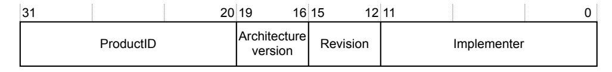

Figure 8-1 GICC\_IIDR bit assignments

The following table shows the GICC IIDR bit assignments.

#### **Table 8-6 GICC\_IIDR bit assignments**

<span id="page-329-0"></span>

| Bit                   | Name                 | Function                                              |                                                                                        |  |
|-----------------------|----------------------|-------------------------------------------------------|----------------------------------------------------------------------------------------|--|
| [31:20]               | ProductID            | Identifies the product:                               |                                                                                        |  |
|                       |                      | 0x007                                                 | Product ID.                                                                            |  |
| [19:16]               | Architecture version | Identifies the architecture version of the GIC:       |                                                                                        |  |
|                       |                      | 0x4                                                   | Version 4.                                                                             |  |
| [15:12]               | Revision             | Identifies the revision number for the CPU interface: |                                                                                        |  |
|                       |                      | 0x0                                                   | Revision 0.                                                                            |  |
| [11:0]<br>Implementer |                      | implementation, these values are:                     | Contains the JEP106 code of the company that implemented the CPU interface. For an ARM |  |
|                       |                      | Bits[11:8] = 0x4                                      | The JEP106 continuation code of the implementer.                                       |  |
|                       |                      | Bit[7]                                                | Always 0.                                                                              |  |
|                       |                      | Bits[6:0] = 0x3B                                      | The JEP106 identity code of the implementer.                                           |  |

# **8.3.3 CPU interface System register descriptions**

This section only describes registers whose implementation is specific to the Cortex-A57 processor. All other registers are described in the *ARM® Generic Interrupt Controller Architecture Specification, GICv3*. *[Table 8-4 AArch64 GIC CPU interface System register summary](#page-326-0)* on page 8-327 provides crossreferences to individual registers.

#### **Active Priority Group0 Register**

The ICC\_AP0R0\_EL1 characteristics are:

#### **Purpose**

Provides support for preserving and restoring state in power-management applications.

#### **Usage constraints**

Accessibility and constraints on this register are described in the *ARM® Generic Interrupt Controller Architecture Specification, GICv3*.

#### **Configurations**

Available if the GIC is implemented for System register mode.

## **Attributes**

See the register summary in *[Table 8-4 AArch64 GIC CPU interface System register summary](#page-326-0)* [on page 8-327](#page-326-0).

The multiprocessor implements the ICC\_AP0R0\_EL1 according to the recommendations described in the *ARM® Generic Interrupt Controller Architecture Specification, GICv3*.

The following table shows the Cortex-A57 MPCore processor ICC\_AP0R0\_EL1 implementation.

**Table 8-7 Active Priority Group0 Register implementation**

| Number of group priority | Preemption levels | Minimum legal value of | Active Priority Group0 Registers |
|--------------------------|-------------------|------------------------|----------------------------------|
| bits                     |                   | BPR                    | implemented                      |
| 5                        | 32                | 2                      | ICC_AP0R0_EL1[31:0]              |

# <span id="page-330-0"></span>**Active Priority Group1 Register**

The ICC\_AP1R0\_EL1 characteristics are:

#### **Purpose**

Provides support for preserving and restoring state in power-management applications.

# **Usage constraints**

This register is Banked to provide Secure and Non-secure copies. This ensures that Non-secure accesses do not interfere with Secure operation. Accessibility and constraints on this register are described in the *ARM® Generic Interrupt Controller Architecture Specification, GICv3*.

## **Configurations**

Available if the GIC is implemented for System register mode.

## **Attributes**

See the register summary in *[Table 8-4 AArch64 GIC CPU interface System register summary](#page-326-0)* [on page 8-327](#page-326-0).

The multiprocessor implements the ICC\_AP1R0\_EL1 according to the recommendations described in the *ARM® Generic Interrupt Controller Architecture Specification, GICv3*.

The following table shows the Cortex-A57 processor ICC\_AP1R0\_EL1 implementation.

**Table 8-8 Active Priority Group1 Register implementation**

| Number of group | Preemption | Minimum legal value | Minimum legal value | Active Priority Group1 |
|-----------------|------------|---------------------|---------------------|------------------------|
| priority bits   | levels     | of Secure BPR       | of Non-secure BPR   | Registers implemented  |
| 5               | 32         | 2                   | 3                   | ICC_AP1R0_EL1[31:0]    |

#### **8.3.4 Virtual interface control register summary**

The virtual interface control registers are management registers. The processor configuration software must ensure that these registers are accessible only by a hypervisor, or similar software.

#### **Virtual interface control register summary**

The following table shows the register map for the virtual interface control registers. The offsets in this table are relative to the virtual interface control registers block base address as shown in *[Table 8-1](#page-319-0)  [Cortex-A57 processor GIC memory map](#page-319-0)* on page 8-320.

All the registers in the following table are word-accessible. Registers not described in this table are Reserved.

**Table 8-9 Virtual interface control register summary**

| Offset | Name       | Type | Reset      | Description                                    |
|--------|------------|------|------------|------------------------------------------------|
| 0x000  | GICH_HCR   | RW   | 0x00000000 | Hypervisor Control Register ea                 |
| 0x004  | GICH_VTR   | RO   | 0x90000003 | VGIC Type Memory-Mapped Register on page 8-333 |
| 0x008  | GICH_VMCR  | RW   | 0x004C0000 | Virtual Machine Control Register ea            |
| 0x010  | GICH_MISR  | RO   | 0x00000000 | Maintenance Interrupt Status Register ea       |
| 0x020  | GICH_EISR0 | RO   | 0x00000000 | End of Interrupt Status Register ea            |
| 0x030  | GICH_ELSR0 | RO   | 0x0000000F | Empty List Register Status Register ea         |

ea See the *ARM® Generic Interrupt Controller Architecture Specification GICv3* for more information.

**Table 8-9 Virtual interface control register summary (continued)**

| Offset | Name     | Type | Reset      | Description                   |
|--------|----------|------|------------|-------------------------------|
| 0x0F0  | GICH_APR | RW   | 0x00000000 | Active Priorities Register ea |
| 0x100  | GICH_LR0 | RW   | 0x00000000 | List Register 0 ea            |
| 0x104  | GICH_LR1 | RW   | 0x00000000 | List Register 1 ea            |
| 0x108  | GICH_LR2 | RW   | 0x00000000 | List Register 2 ea            |
| 0x10C  | GICH_LR3 | RW   | 0x00000000 | List Register 3 ea            |

## **AArch32 virtual interface System register summary**

The following table shows the register map for the AArch32 virtual interface System registers. The offsets in this table are relative to the virtual interface control registers block base address as shown in *[Table 8-1 Cortex-A57 processor GIC memory map](#page-319-0)* on page 8-320.

All the registers in the following table are word-accessible. Registers not described in this table are Reserved.

**Table 8-10 AArch32 virtual interface System register summary**

| Name      | CRn | op1 | CRm | op2 | Type | Description                             |
|-----------|-----|-----|-----|-----|------|-----------------------------------------|
| ICH_APR0  | c12 | 4   | c8  | 0   | RW   | Hypervisor Active Priority Register 0   |
| ICH_APR1  |     |     | c9  | 0   | RW   | Hypervisor Active Priority Register 1   |
| ICH_VSEIR |     |     |     | 4   | RW   | Virtual System Error Interrupt Register |
| ICH_SRE   |     |     |     | 5   | RW   | Hypervisor System Register              |
| ICH_HCR   |     | 4   | c11 | 0   | RW   | Hypervisor Control Register             |
| ICH_VTR   |     |     |     | 1   | RO   | VGIC Type Register                      |
| ICH_MISR  |     |     |     | 2   | RO   | Maintenance Interrupt Status Register   |
| ICH_EISR  |     |     |     | 3   | RO   | End of Interrupt Status Register        |
| ICH_ELSR  |     |     |     | 5   | RO   | Empty List Register Status Register     |
| ICH_VMCR  |     |     |     | 7   | RW   | Virtual Machine Control Register        |
| ICH_LR0   |     |     | c12 | 0   | RW   | List Register 0 to 3                    |
| ICH_LR1   |     |     |     | 1   | RW   |                                         |
| ICH_LR2   |     |     |     | 2   | RW   |                                         |
| ICH_LR3   |     |     |     | 3   | RW   |                                         |
| ICH_LRC0  |     |     | c14 | 0   | RW   | List Register Extension 0 to 3          |
| ICH_LRC1  |     |     |     | 1   | RW   |                                         |
| ICH_LRC2  |     |     |     | 2   | RW   |                                         |
| ICH_LRC3  |     |     |     | 3   | RW   |                                         |

# <span id="page-332-0"></span>**AArch64 virtual interface System register summary**

The following table shows the register map for the AArch64 virtual interface System registers. The offsets in this table are relative to the virtual interface control registers block base address as shown in *[Table 8-1 Cortex-A57 processor GIC memory map](#page-319-0)* on page 8-320.

All the registers in the following table are word-accessible. Registers not described in this table are Reserved.

**Table 8-11 AArch64 virtual interface System register summary**

| Name          | Type | Description                             |
|---------------|------|-----------------------------------------|
| ICH_APR0_EL2  | RW   | Hypervisor Active Priority Register     |
| ICH_VSEIR_EL2 | RW   | Virtual System Error Interrupt Register |
| ICH_HCR_EL2   | RW   | Hypervisor Control Register             |
| ICH_VTR_EL2   | RO   | VGIC Type Register                      |
| ICC_SRE_EL2   | RW   | Hypervisor System Register Enable       |
| ICH_MISR_EL2  | RO   | Maintenance Interrupt Status Register   |
| ICH_EISR_EL2  | RO   | End of Interrupt Status Register        |
| ICH_ELSR_EL2  | RO   | Empty List Register Status Register     |
| ICH_VMCR_EL2  | RW   | Virtual Machine Control Register        |
| ICH_LR0_EL2   | RW   | List Register 0                         |
| ICH_LR1_EL2   | RW   | List Register 1                         |
| ICH_LR2_EL2   | RW   | List Register 2                         |
| ICH_LR3_EL2   | RW   | List Register 3                         |
|               |      |                                         |

# **8.3.5 Virtual interface control register descriptions**

This section only describes registers whose implementation is specific to the Cortex-A57 processor. All other registers are described in the *ARM® Generic Interrupt Controller Architecture Specification, GICv3*.

#### **VGIC Type Memory-Mapped Register**

The GICH\_VTR characteristics are:

#### **Purpose**

Holds information on number of priority bits, number of preemption bits, and number of List Registers implemented.

# **Usage constraints**

There are no usage constraints.

## **Configurations**

Available if the GIC is implemented and setup for memory-mapped accesses.

#### **Attributes**

See the register summary in *[Table 8-9 Virtual interface control register summary](#page-330-0)* [on page 8-331](#page-330-0).

The following figure shows the GICH\_VTR bit assignments.

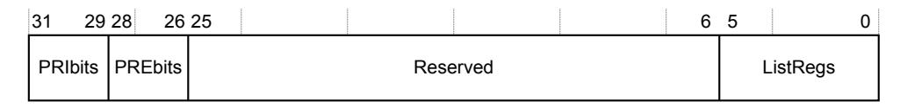

Figure 8-2 GICH\_VTR bit assignments

The following table shows the GICH VTR bit assignments.

Table 8-12 GICH\_VTR bit assignments

| Bit     | Name     | Description                                                     |  |  |  |  |  |
|---------|----------|-----------------------------------------------------------------|--|--|--|--|--|
| [31:29] | PRIbits  | Indicates the number of priority bits implemented, minus one:   |  |  |  |  |  |
|         |          | Ob100 Five bits of priority and 32 priority levels.             |  |  |  |  |  |
| [28:26] | PREbits  | Indicates the number of preemption bits implemented, minus one: |  |  |  |  |  |
|         |          | Ob100 Five bits of preemption and 32 preemption levels.         |  |  |  |  |  |
| [25:6]  | -        | Reserved, RAZ.                                                  |  |  |  |  |  |
| [5:0]   | ListRegs | Indicates the number of implemented List Registers, minus one:  |  |  |  |  |  |
|         |          | 0b00 0011Four List Registers.                                   |  |  |  |  |  |

## **VGIC Type System Register**

The ICH\_VTR\_EL2 characteristics are:

#### **Purpose**

Holds information on number of priority bits, number of preemption bits, and number of List Registers implemented.

## **Usage constraints**

There are no usage constraints.

# Configurations

Available if the GIC is implemented and setup for System register accesses.

#### **Attributes**

See the register summary in *Table 8-9 Virtual interface control register summary* on page 8-331..

The following figure shows the ICH VTR EL2 bit assignments.

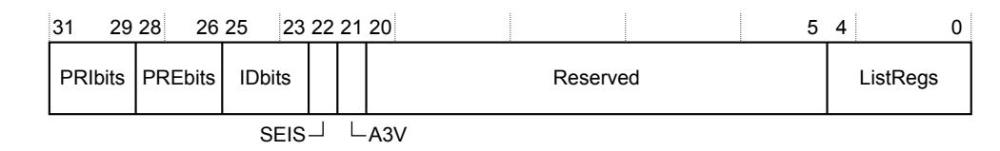

Figure 8-3 ICH\_VTR\_EL2 bit assignments

The following table shows the ICH VTR EL2 bit assignments.

## **Table 8-13 ICH\_VTR\_EL2 bit assignments**

<span id="page-334-0"></span>

| Bit     | Name     | Description                                                                         |  |  |  |  |  |
|---------|----------|-------------------------------------------------------------------------------------|--|--|--|--|--|
| [31:29] | PRIbits  | Indicates the number of priority bits implemented, minus one:                       |  |  |  |  |  |
|         |          | Five bits of priority and 32 priority levels.<br>0b100                              |  |  |  |  |  |
| [28:26] | PREbits  | Indicates the number of preemption bits implemented, minus one:                     |  |  |  |  |  |
|         |          | Five bits of preemption and 32 preemption levels.<br>0b100                          |  |  |  |  |  |
| [25:23] | IDbits   | Indicates the number of virtual interrupt identifier bits supported:                |  |  |  |  |  |
|         |          | 16 bits of virtual interrupt identifier.<br>0b000                                   |  |  |  |  |  |
| [22]    | SEIS     | Indicates if locally generated virtual System Errors are supported:                 |  |  |  |  |  |
|         |          | Locally generated virtual System Errors are not supported.<br>0b0                   |  |  |  |  |  |
| [21]    | A3V      | Indicates if affinity level 3 is supported in SGI generation from System registers: |  |  |  |  |  |
|         |          | SGI generation from System registers does not support affinity level 3.<br>0b0      |  |  |  |  |  |
| [20:5]  | -        | Reserved, RAZ.                                                                      |  |  |  |  |  |
| [4:0]   | ListRegs | Indicates the number of implemented List Registers, minus one:                      |  |  |  |  |  |
|         |          | Four List Registers.<br>0b000011                                                    |  |  |  |  |  |

# **8.3.6 Virtual CPU interface register summary**

The virtual CPU interface forwards virtual interrupts to a connected Cortex-A57 processor, subject to the normal GIC handling and prioritization rules. The virtual interface control registers control virtual CPU interface operation, and in particular, the virtual CPU interface uses the contents of the List registers to determine when to signal virtual interrupts. When a core accesses the virtual CPU interface, the List registers are updated.

For more information on virtual CPU interface, see the *ARM® Generic Interrupt Controller Architecture Specification, GICv3*.

The following table shows the register map for the virtual CPU interface. The offsets in this table are relative to the virtual CPU interface block base address as shown in *[Table 8-1 Cortex-A57 processor](#page-319-0) [GIC memory map](#page-319-0)* on page 8-320.

All the registers in the following table are word-accessible. Registers not described in this table are Reserved.

**Table 8-14 Virtual CPU interface register summary**

| Offset | Name      | Type | Reset      | Description                          |
|--------|-----------|------|------------|--------------------------------------|
| 0x0000 | GICV_CTLR | RW   | 0x00000000 | VM Control Register                  |
| 0x0004 | GICV_PMR  | RW   | 0x00000000 | VM Priority Mask Register eb         |
| 0x0008 | GICV_BPR  | RW   | 0x00000002 | VM Binary Point Register eb          |
| 0x000C | GICV_IAR  | RO   | 0x000003FF | VM Interrupt Acknowledge Register eb |
| 0x0010 | GICV_EOIR | WO   | -          | VM End Of Interrupt Register eb      |

eb See the *ARM® Generic Interrupt Controller Architecture Specification GICv3* for more information. The System register counterparts of these registers are described in the *ARM® Generic Interrupt Controller Architecture Specification GICv3*. The virtual CPU interface System registers do not have a separate encoding from the physical CPU interface System registers but access is controlled from the appropriate system controls that the *ARM® Generic Interrupt Controller Architecture Specification GICv3* describes.

**Table 8-14 Virtual CPU interface register summary (continued)**

<span id="page-335-0"></span>

| Offset | Name         | Type | Reset      | Description                                               |
|--------|--------------|------|------------|-----------------------------------------------------------|
| 0x0014 | GICV_RPR     | RO   | 0x000000FF | VM Running Priority Register eb                           |
| 0x0018 | GICV_HPPIR   | RO   | 0x000003FF | VM Highest Priority Pending Interrupt Register eb         |
| 0x001C | GICV_ABPR    | RW   | 0x00000003 | VM Aliased Binary Point Register eb                       |
| 0x0020 | GICV_AIAR    | RO   | 0x000003FF | VM Aliased Interrupt Acknowledge Register eb              |
| 0x0024 | GICV_AEOIR   | WO   | -          | VM Aliased End of Interrupt Register eb                   |
| 0x0028 | GICV_AHPPIR  | RO   | 0x000003FF | VM Aliased Highest Priority Pending Interrupt Register eb |
| 0x002C | GICV_STATUSR | RW   | -          | VM Error Reporting Status Register eb                     |
| 0x00D0 | GICV_APR0    | RW   | 0x00000000 | VM Active Priority Register on page 8-336                 |
| 0x00FC | GICV_IIDR    | RO   | 0x0074043B | VM CPU Interface Identification Register on page 8-336    |
| 0x1000 | GICV_DIR     | WO   | -          | VM Deactivate Interrupt Register eb                       |

# **8.3.7 Virtual CPU interface register descriptions**

This section only describes registers whose implementation is specific to the Cortex-A57 processor.

All other registers are described in the *ARM® Generic Interrupt Controller Architecture Specification, GICv3*. *[Table 8-14 Virtual CPU interface register summary](#page-334-0)* on page 8-335 provides cross-references to individual registers.

#### **VM Active Priority Register**

The GICV\_APR0 characteristics are:

#### **Purpose**

For software compatibility, this register is present in the virtual CPU interface. However, in virtualized system, it is not used in the preserving and restoring state.

#### **Usage constraints**

Reading the content of this register and then writing the same values must not change any state because there is no requirement to preserve and restore state during a power down.

# **Configurations**

Available if the GIC is implemented.

#### **Attributes**

See the register summary in *[Table 8-14 Virtual CPU interface register summary](#page-334-0)* on page 8-335.

The multiprocessor implements the GICV\_APR0 as an alias of GICH\_APR.

#### **VM CPU Interface Identification Register**

The GICV\_IIDR characteristics are:

# **Purpose**

Provides information about the implementer and revision of the virtual CPU interface.

# **Usage constraints**

There are no usage constraints.

#### **Configurations**

Available if the GIC is implemented.

## **Attributes**

See the register summary in *[Table 8-14 Virtual CPU interface register summary](#page-334-0)* on page 8-335.

The bit assignments for the VM CPU Interface Identification Register are identical to the corresponding register in the CPU interface.

# **Related information**

*[CPU Interface Identification Register](#page-328-0)* on page 8-329*.*

# <span id="page-337-0"></span>Chapter 9 **Generic Timer**

This chapter describes the Cortex-A57 processor implementation of the ARM Generic Timer.

It contains the following sections:

- *[9.1 About the Generic Timer](#page-338-0)* on page 9-339.
- *[9.2 Generic Timer functional description](#page-339-0)* on page 9-340.
- *[9.3 Generic Timer register summary](#page-340-0)* on page 9-341.

# <span id="page-338-0"></span>**9.1 About the Generic Timer**

The Generic Timer in the Cortex-A57 processor can schedule events and trigger interrupts based on an incrementing counter value.

It provides:

- Generation of timer events as interrupt outputs.
- Generation of event streams.

The Generic Timer is compliant with the *ARM® Architecture Reference Manual ARMv8, for ARMv8-A architecture profile*.

This chapter only describes features that are specific to the Cortex-A57 processor implementation.

# <span id="page-339-0"></span>**9.2 Generic Timer functional description**

The Cortex-A57 processor provides a set of timers for each core in the processor.

The timers are:

- A Non-secure EL1 physical timer.
- A Secure EL1 physical timer.
- A Non-secure EL2 physical timer.
- A virtual timer.

The processor does not include the system counter that resides in the SoC. The system counter value is distributed to the Cortex-A57 processor with a synchronous binary encoded 64-bit bus, **CNTVALUEB[63:0]**.

Because **CNTVALUEB** is generated from a system counter that typically operates at a slower frequency than the main processor **CLK**, the **CNTCLKEN** input is provided as a clock enable for the **CNTVALUEB** bus.

Each timer provides an active-LOW interrupt output that is an external pin to the SoC.

The following table shows the signals that are the external interrupt output pins.

**Table 9-1 Generic Timer signals**

| Signalec        | Description                             |
|-----------------|-----------------------------------------|
| nCNTPNSIRQ[n:0] | Non-secure EL1 physical timer interrupt |
| nCNTPSIRQ[n:0]  | Secure EL1 physical timer interrupt     |
| nCNTHPIRQ[n:0]  | Non-secure EL2 physical timer interrupt |
| nCNTVIRQ[n:0]   | Virtual timer interrupt                 |

# **Related information**

*2.3.1 Clocks* [on page 2-32](#page-31-0)*.*

*2.3.1 Clocks* [on page 2-32](#page-31-0)*.*

# <span id="page-340-0"></span>9.3 Generic Timer register summary

Within each core, a set of Generic Timer registers are allocated to the CP15 coprocessor space.

The Generic Timer registers are either 32-bit or 64-bit wide and accessible in the AArch32 and AArch64 states.

This section contains the following subsections:

- 9.3.1 AArch64 Generic Timer register summary on page 9-341.
- 9.3.2 AArch32 Generic Timer register summary on page 9-341.

# 9.3.1 AArch64 Generic Timer register summary

The following table shows the AArch64 Generic Timer registers. See the *ARM*® *Architecture Reference Manual ARMv8* for information about these registers.

Table 9-2 AArch64 Generic Timer registers

| Name           | Туре  | Reset | Width  | Description                                       |
|----------------|-------|-------|--------|---------------------------------------------------|
| CNTKCTL_EL1    | RW    | _ed   | 32-bit | Timer Control register (EL1)                      |
| CNTFRQ_EL0     | RW ee | UNK   | 32-bit | Timer Counter Frequency register                  |
| CNTPCT_EL0     | RO    | UNK   | 64-bit | Physical Timer Count register                     |
| CNTVCT_EL0     | RO    | UNK   | 64-bit | Virtual Timer Count register                      |
| CNTP_TVAL_EL0  | RW    | UNK   | 32-bit | Physical Timer TimerValue (EL0)                   |
| CNTP_CTL_EL0   | RW    | _ef   | 32-bit | Physical Timer Control register (EL0)             |
| CNTP_CVAL_EL0  | RW    | UNK   | 64-bit | Physical Timer CompareValue register (EL0)        |
| CNTV_TVAL_EL0  | RW    | UNK   | 32-bit | Virtual Timer TimerValue register                 |
| CNTV_CTL_EL0   | RW    | _ef   | 32-bit | Virtual Timer Control register                    |
| CNTV_CVAL_EL0  | RW    | UNK   | 64-bit | Virtual Timer CompareValue register               |
| CNTVOFF_EL2    | RW    | UNK   | 64-bit | Virtual Timer Offset register                     |
| CNTHCTL_EL2    | RW    | _eg   | 32-bit | Timer Control register (EL2)                      |
| CNTHP_TVAL_EL2 | RW    | UNK   | 32-bit | Physical Timer TimerValue register (EL2)          |
| CNTHP_CTL_EL2  | RW    | _ef   | 32-bit | Physical Timer Control register (EL2)             |
| CNTHP_CVAL_EL2 | RW    | UNK   | 64-bit | Physical Timer CompareValue register (EL2)        |
| CNTPS_TVAL_EL1 | RW    | UNK   | 32-bit | Physical Timer TimerValue register (EL2)          |
| CNTPS_CTL_EL1  | RW    | _ef   | 32-bit | Physical Secure Timer Control register (EL1)      |
| CNTPS_CVAL_EL1 | RW    | UNK   | 64-bit | Physical Secure Timer CompareValue register (EL1) |

# 9.3.2 AArch32 Generic Timer register summary

The following table shows the AArch32 Generic Timer registers.

See the ARM® Architecture Reference Manual ARMv8 for information about these registers.

ed The reset value for bits[9:8, 2:0] is 0b00000

ee Only at EL3, otherwise this register is RO.

ef The reset value for bit[0] is 0.

eg The reset value for bit[2] is 0 and for bits[1:0] is 0b11.

# Table 9-3 AArch32 Generic Timer registers

| Name       | CRn | op1 | CRm | op2 | Туре  | Reset | Width  | Description                              |  |
|------------|-----|-----|-----|-----|-------|-------|--------|------------------------------------------|--|
| CNTFRQ     | c14 | 0   | c0  | 0   | RW eh | UNK   | 32-bit | Timer Counter Frequency register         |  |
| CNTPCT     | -   | 0   | c14 | -   | RO    | UNK   | 64-bit | Physical Timer Count register            |  |
| CNTKCTL    | c14 | 0   | c1  | 0   | RW    | _ei   | 32-bit | EL1 Timer Control register               |  |
| CNTP_TVAL  |     |     | c2  | 0   | RW    | UNK   | 32-bit | EL1 Physical Timer TimerValue register   |  |
| CNTP_CTL   |     |     |     | 1   | RW    | _ej   | 32-bit | EL1 Physical Timer Control register      |  |
| CNTV_TVAL  |     |     | c3  | 0   | RW    | UNK   | 32-bit | Virtual Timer TimerValue register        |  |
| CNTV_CTL   |     |     |     | 1   | RW    | ej    | 32-bit | Virtual Timer Control register           |  |
| CNTVCT     | -   | 1   | c14 | -   | RO    | UNK   | 64-bit | Virtual Timer Count register             |  |
| CNTP_CVAL  |     | 2   |     |     | RW    | UNK   | 64-bit | EL1 Physical Timer CompareValue register |  |
| CNTV_CVAL  |     | 3   |     |     | RW    | UNK   | 64-bit | Virtual Timer CompareValue register      |  |
| CNTVOFF    |     | 4   |     |     | RW    | UNK   | 64-bit | Virtual Timer Offset register            |  |
| CNTHCTL    | c14 | 4   | c1  | 0   | RW    | _ek   | 32-bit | EL2 Timer Control register               |  |
| CNTHP_TVAL |     |     | c2  | 0   | RW    | UNK   | 32-bit | EL2 Physical Timer TimerValue register   |  |
| CNTHP_CTL  |     |     |     | 1   | RW    | ej    | 32-bit | EL2 Physical Timer Control register      |  |
| CNTHP_CVAL | -   | 6   | c14 | -   | RW    | UNK   | 64-bit | EL2 Physical Timer CompareValue register |  |

Non-Confidential

Only at EL3, otherwise this register is RO.
The reset value for bits[9:8, 2:0] is 0b00000.
The reset value for bit[0] is 0.
The reset value for bit[2] is 0 and for bits[1:0] is 0b11.

# <span id="page-342-0"></span>Chapter 10 **Debug**

This section describes the Cortex-A57 processor debug registers and shows examples of how to use them.

#### It contains the following sections:

- *[10.1 About debug](#page-343-0)* on page 10-344.
- *[10.2 Debug register interfaces](#page-345-0)* on page 10-346.
- *[10.3 AArch64 debug register summary](#page-347-0)* on page 10-348.
- *[10.4 AArch64 debug register descriptions](#page-349-0)* on page 10-350.
- *[10.5 AArch32 debug register summary](#page-355-0)* on page 10-356.
- *[10.6 AArch32 debug register descriptions](#page-357-0)* on page 10-358.
- *[10.7 Memory-mapped register summary](#page-361-0)* on page 10-362.
- *[10.8 Memory-mapped register descriptions](#page-365-0)* on page 10-366.
- *[10.9 Debug events](#page-380-0)* on page 10-381.
- *[10.10 External debug interface](#page-381-0)* on page 10-382.
- *[10.11 ROM table](#page-384-0)* on page 10-385.

# <span id="page-343-0"></span>**10.1 About debug**

Provides an overview of debug and describes the debug components.

The processor forms one component of a debug system. You can use the following invasive debug methods:

# **Conventional JTAG debug (external debug)**

The processor halts execution when breakpoints and watchpoints are triggered. A debug connection enables you to examine and modify registers and memory, and provide single-step execution.

# **Conventional monitor debug (self-hosted debug)**

The processor runs a debug monitor that resides in memory.

The following figure shows a typical JTAG debug system.

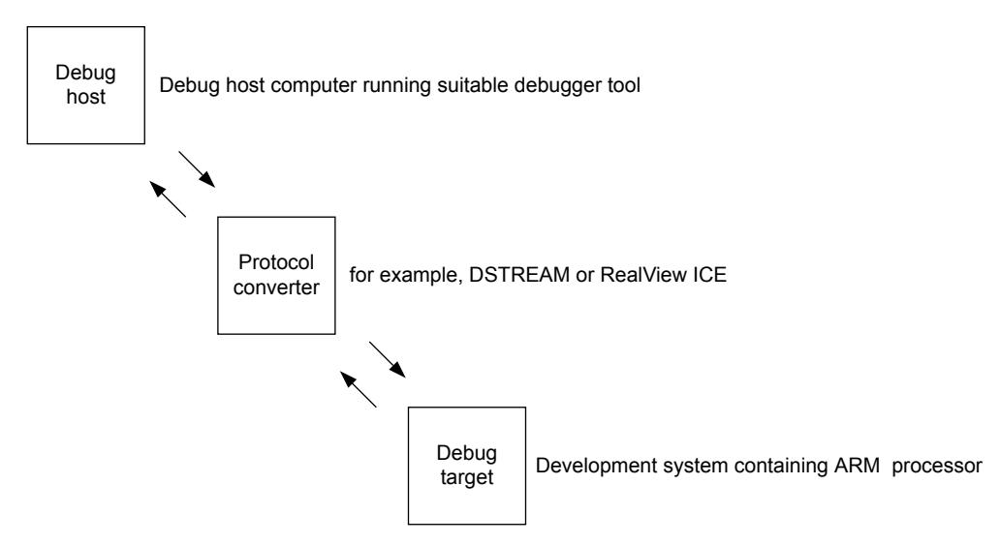

**Figure 10-1 Typical debug system**

This section contains the following subsections:

- *10.1.1 Debug host* on page 10-344.
- *10.1.2 Protocol converter* on page 10-344.
- *[10.1.3 Debug target](#page-344-0)* on page 10-345.
- *[10.1.4 The debug unit](#page-344-0)* on page 10-345.
- *[10.1.5 Self-hosted debug](#page-344-0)* on page 10-345.

#### **10.1.1 Debug host**

The debug host is a computer, for example a personal computer, running a software debugger such as the DS-5 Debugger. The debug host enables you to issue high-level commands such as setting breakpoint at a certain location, or examining the contents of a memory address.

## **10.1.2 Protocol converter**

The debug host sends messages to the debug target using an interface such as Ethernet. However, the debug target typically implements a different interface protocol. A device such as DSTREAM is required to convert between the two protocols.

# <span id="page-344-0"></span>**10.1.3 Debug target**

The debug target is the lowest level of the system. An example of a debug target is a development system with a test chip or a silicon part with a processor.

The debug target implements system support for the protocol converter to access the debug unit using the AMBA *Advanced Peripheral Bus* (APB) slave interface.

# **10.1.4 The debug unit**

The processor debug unit assists in debugging software running on the processor. You can use the processor debug unit, in combination with a software debugger program, to debug:

- Application software.
- Operating systems.
- Hardware systems based on an ARM processor.

The debug unit enables you to:

- Stop program execution.
- Examine and alter process and coprocessor state.
- Examine and alter memory and input/output peripheral state.
- Restart the processor.

# **10.1.5 Self-hosted debug**

For self-hosted debug, the debug target runs additional debug monitor software, and uses the on-chip bus fabric to send messages to the APB slave interface on the debug unit.

# <span id="page-345-0"></span>**10.2 Debug register interfaces**

This section describes the debug architecture and debug events of the processor.

The processor implements the ARMv8 Debug architecture and debug events as described in the *ARM® Architecture Reference Manual ARMv8*.

The Debug architecture defines a set of debug registers. The debug register interfaces provide access to these registers from:

- Software running on the processor.
- An external debugger.

This section contains the following subsections:

- *10.2.1 Processor interfaces* on page 10-346.
- *10.2.2 Breakpoints and watchpoints* on page 10-346.
- *10.2.3 Effects of resets on debug registers* on page 10-346.
- *[10.2.4 External access permissions](#page-346-0)* on page 10-347.

## **10.2.1 Processor interfaces**

System register access allows the processor to directly access certain debug registers. The external debug interface allows both external and self-hosted debug agents to access debug registers.

Access to the debug registers is partitioned as follows:

#### **Debug registers**

This interface is System register based and memory-mapped. You can access the debug register map using the APB slave port.

#### **Performance monitor**

This interface is System register based and memory-mapped. You can access the performance monitor registers using the APB slave port.

#### **Trace registers**

This interface is memory-mapped.

# **Related information**

*[10.10 External debug interface](#page-381-0)* on page 10-382*.*

# **10.2.2 Breakpoints and watchpoints**

The processor supports six hardware breakpoints, four watchpoints, and a standard *Debug Communications Channel* (DCC). Four of the breakpoints match only to Virtual Address and the other two match against either Virtual Address or context ID, or *Virtual Machine Identifier* (VMID). All the watchpoints can be linked to two breakpoints to enable a memory request to be trapped in a given process context.

# **10.2.3 Effects of resets on debug registers**

The processor has the following reset signals that affect the debug registers:

# **nCPUPORESET**

This signal initializes the processor logic, including the debug, *Embedded Trace Macrocell* (ETM), breakpoint, watchpoint logic, and performance monitors logic. This maps to a Cold reset that covers reset of the processor logic and the integrated debug functionality.

#### <span id="page-346-0"></span>**nCORERESET**

This signal resets some of the debug and performance monitor logic. This maps to a Warm reset that covers reset of the processor logic.

# **nPRESETDBG**

This signal initializes the shared debug APB, *Cross Trigger Interface* (CTI), and *Cross Trigger Matrix* (CTM) logic. This maps to an external debug reset that covers the resetting of the external debug interface and has no impact on the processor functionality.

## **10.2.4 External access permissions**

External access permission to the debug registers is subject to the conditions at the time of the access. The following table describe the processor response to accesses through the external debug interface.

**Table 10-1 External register access conditions**

| Condition | Condition trigger                     | Description                                                                                                                                                                                            |  |
|-----------|---------------------------------------|--------------------------------------------------------------------------------------------------------------------------------------------------------------------------------------------------------|--|
| Off       | EDPRSR.PU is 0                        | Core power domain is completely off, or in a low-power state where the<br>Core power domain registers cannot be accessed.                                                                              |  |
|           |                                       | Note                                                                                                                                                                                                   |  |
|           |                                       | If debug power is off then all external debug and memory-mapped register<br>accesses return an error.                                                                                                  |  |
| DLK       | EDPRSR.DLK is 1                       | OS Double Lock is locked.                                                                                                                                                                              |  |
| OSLK      | OSLSR_EL1.OSLK is 1                   | OS Lock is locked.                                                                                                                                                                                     |  |
| EDAD      | AllowExternalDebugAccess()<br>==FALSE | External debug access disabled. When an error is returned because of the<br>EDAD condition, and this is the highest priority error condition,<br>EDPRSR.SDAD is set to 1. Otherwise SDAD is unchanged. |  |
| SLK       | Memory-mapped interface only          | Software Lock is locked. For the external debug interface, ignore this<br>condition.                                                                                                                   |  |
| Default   | -                                     | None of the conditions apply, normal access.                                                                                                                                                           |  |

The following table shows an example of external register access conditions for access to a Performance Monitors register. To determine the access permission for the register, scan the columns from left to right. Stop at the first column whose condition is true, the entry gives the access permission of the register and scanning stops.

**Table 10-2 External register access conditions example**

| Off | DLK | OSLK | EDAD | SLK   | Default |
|-----|-----|------|------|-------|---------|
| -   | -   | -    | -    | RO/WI | RO      |

# <span id="page-347-0"></span>**10.3 AArch64 debug register summary**

Provides a summary of the debug control registers in the AArch64 state.

The following table shows the debug control registers that are accessible in AArch64 state. These registers are accessed by the MRS and MSR instructions.

The table also shows the offset address for the AArch64 registers that are accessible from the internal memory-mapped interface or the external debug interface. See *[10.7 Memory-mapped register summary](#page-361-0)* [on page 10-362](#page-361-0) for a complete list of registers accessible from the internal memory-mapped or the external debug interface.

**Table 10-3 AArch64 debug register summary**

| Offset | Name         | Type | Width  | Description                                                   |  |
|--------|--------------|------|--------|---------------------------------------------------------------|--|
| -      | DBGDTR_EL0   | RW   | 64-bit | Debug Data Transfer Register, half-duplex el                  |  |
| -      | DBGVCR32_EL2 | RW   | 32-bit | Debug Vector Catch Register el                                |  |
| -      | MDCCINT_EL1  | RW   | 32-bit | Monitor Debug Comms Channel Interrupt Enable Register el      |  |
| -      | MDCCSR_EL0   | RO   | 32-bit | Monitor Debug Comms Channel Status Register el                |  |
| -      | MDRAR_EL1    | RO   | 64-bit | Monitor Debug ROM Address Register el                         |  |
| -      | MDSCR_EL1    | RW   | 32-bit | Monitor Debug System Control Register el                      |  |
| -      | OSDTRRX_EL1  | RW   | 32-bit | OS Lock Data Transfer Register, Receive, External View        |  |
| -      | OSDTRTX_EL1  | RW   | 32-bit | OS Lock Data Transfer Register, Transmit, External View el    |  |
| -      | OSDLR_EL1    | RW   | 32-bit | OS Double Lock Register el                                    |  |
| -      | OSLSR_EL1    | RO   | 32-bit | OS Lock Status Register                                       |  |
| 0x080  | DBGDTRRX_EL0 | RO   | 32-bit | Debug Data Transfer Register, Receive, Internal View el       |  |
| 0x08C  | DBGDTRTX_EL0 | WO   | 32-bit | Debug Data Transfer Register, Transmit, Internal View el      |  |
| 0x098  | OSECCR_EL1   | RW   | 32-bit | OS Lock Exception Catch Control Register el                   |  |
| 0x310  | DBGPRCR_EL1  | RW   | 32-bit | Debug Power/Reset Control Register el                         |  |
| 0x400  | DBGBVR0_EL1  | RW   | 64-bit | Debug Breakpoint Value Register 0 el                          |  |
| 0x408  | DBGBCR0_EL1  | RW   | 32-bit | 10.4.1 Debug Breakpoint Control Registers, EL1 on page 10-350 |  |
| 0x410  | DBGBVR1_EL1  | RW   | 64-bit | Debug Breakpoint Value Register 1 el                          |  |
| 0x418  | DBGBCR1_EL1  | RW   | 32-bit | 10.4.1 Debug Breakpoint Control Registers, EL1 on page 10-350 |  |
| 0x420  | DBGBVR2_EL1  | RW   | 64-bit | Debug Breakpoint Value Register 2 el                          |  |
| 0x428  | DBGBCR2_EL1  | RW   | 32-bit | 10.4.1 Debug Breakpoint Control Registers, EL1 on page 10-350 |  |
| 0x430  | DBGBVR3_EL1  | RW   | 64-bit | Debug Breakpoint Value Register 3 el                          |  |
| 0x438  | DBGBCR3_EL1  | RW   | 32-bit | 10.4.1 Debug Breakpoint Control Registers, EL1 on page 10-350 |  |
| 0x440  | DBGBVR4_EL1  | RW   | 64-bit | Debug Breakpoint Value Register 4 el                          |  |
| 0x448  | DBGBCR4_EL1  | RW   | 32-bit | 10.4.1 Debug Breakpoint Control Registers, EL1 on page 10-350 |  |
| 0x450  | DBGBVR5_EL1  | RW   | 64-bit | Debug Breakpoint Value Register 5 el                          |  |
| 0x458  | DBGBCR5_EL1  | RW   | 32-bit | 10.4.1 Debug Breakpoint Control Registers, EL1 on page 10-350 |  |

el See the *ARM® Architecture Reference Manual ARMv8* for more information.

#### **Table 10-3 AArch64 debug register summary (continued)**

| Offset | Name              | Type | Width  | Description                                                   |
|--------|-------------------|------|--------|---------------------------------------------------------------|
| 0x800  | DBGWVR0_EL1       | RW   | 64-bit | Debug Watchpoint Value Register 0 el                          |
| 0x808  | DBGWCR0_EL1       | RW   | 32-bit | 10.4.2 Debug Watchpoint Control Registers, EL1 on page 10-353 |
| 0x810  | DBGWVR1_EL1       | RW   | 64-bit | Debug Watchpoint Value Register 1 el                          |
| 0x818  | DBGWCR1_EL1       | RW   | 32-bit | 10.4.2 Debug Watchpoint Control Registers, EL1 on page 10-353 |
| 0x820  | DBGWVR2_EL1       | RW   | 64-bit | Debug Watchpoint Value Register 2 el                          |
| 0x828  | DBGWCR2_EL1       | RW   | 32-bit | 10.4.2 Debug Watchpoint Control Registers, EL1 on page 10-353 |
| 0x830  | DBGWVR3_EL1       | RW   | 64-bit | Debug Watchpoint Value Register 3 el                          |
| 0x838  | DBGWCR3_EL1       | RW   | 32-bit | 10.4.2 Debug Watchpoint Control Registers, EL1 on page 10-353 |
| 0xFA0  | DBGCLAIMSET_EL1   | RW   | 32-bit | Debug Claim Tag Set Register el                               |
| 0xFA4  | DBGCLAIMCLR_EL1   | RW   | 32-bit | Debug Claim Tag Clear Register el                             |
| 0xFB0  | OSLAR_EL1         | WO   | 32-bit | Debug OS Lock Access Register el                              |
| 0xFD8  | DBGAUTHSTATUS_EL1 | RO   | 32-bit | Debug Authentication Status Register el                       |

# <span id="page-349-0"></span>**10.4 AArch64 debug register descriptions**

This section describes the debug registers in AArch64 state.

*[10.3 AArch64 debug register summary](#page-347-0)* on page 10-348 provides cross-references to the individual registers.

This section contains the following subsections:

- *10.4.1 Debug Breakpoint Control Registers, EL1* on page 10-350.
- *[10.4.2 Debug Watchpoint Control Registers, EL1](#page-352-0)* on page 10-353.

## **10.4.1 Debug Breakpoint Control Registers, EL1**

The DBGBCR*n*\_EL1characteristics are:

#### **Purpose**

Holds control information for a breakpoint. Each DBGBVR\_EL1 is associated with a DBGBCR\_EL1 to form a *Breakpoint Register Pair* (BRP). DBGBVR*n*\_EL1 is associated with DBGBCR*n*\_EL1to form BRP*n*.

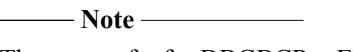

The range of *n* for DBGBCR*n*\_EL1 is 0 to 5.

#### **Usage constraints**

The accessibility to the DBGBCR*n*\_EL1 by Exception level is:

| EL0 | EL1(NS) | EL1(S) | EL2 | EL3(SCR.NS = 1) | EL3(SCR.NS = 0) |
|-----|---------|--------|-----|-----------------|-----------------|
| -   | RW      | RW     | RW  | RW              | RW              |

The external debug accessibility to the DBGBCR*n*\_EL1 by condition code is:

| Off   | DLK   | OSLK  | EDAD  | SLK | Default |
|-------|-------|-------|-------|-----|---------|
| Error | Error | Error | Error | RO  | RW      |

*[Table 11-1 External register access conditions](#page-398-0)* on page 11-399 describes the access conditions.

#### **Configurations**

The DBGBCR*n*\_EL1 is Common to Secure and Non-secure states and architecturally mapped to:

- The AArch32 DBGBCR*n* registers.
- The external DBGBCR*n*\_EL1 registers.

# **Attributes**

See the register summary in *[Table 10-3 AArch64 debug register summary](#page-347-0)* on page 10-348.

The debug logic reset value of a DBGBCR*n*\_EL1 is UNKNOWN.

The following figure shows the DBGBCR*n*\_EL1bit assignments.

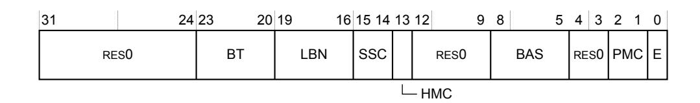

**Figure 10-2 DBGBCR**

The following table shows the DBGBCR*n*\_EL1 bit assignments.

**Table 10-4 DBGBCRn\_EL1 bit assignments**

| Bits    | Name | Function                                                                                                                                                                                                                                                                                                                                                    |                                                                                                                                                                                                                                 |  |  |  |  |  |  |
|---------|------|-------------------------------------------------------------------------------------------------------------------------------------------------------------------------------------------------------------------------------------------------------------------------------------------------------------------------------------------------------------|---------------------------------------------------------------------------------------------------------------------------------------------------------------------------------------------------------------------------------|--|--|--|--|--|--|
| [31:24] | -    | Reserved, RES0.                                                                                                                                                                                                                                                                                                                                             |                                                                                                                                                                                                                                 |  |  |  |  |  |  |
| [23:20] | BT   | Breakpoint Type. This field controls the behavior of Breakpoint debug event generation. This includes the meaning<br>of the value held in the associated DBGBVR, indicating whether it is an instruction address match or mismatch or a<br>Context match. It also controls whether the breakpoint is linked to another breakpoint. The possible values are: |                                                                                                                                                                                                                                 |  |  |  |  |  |  |
|         |      | 0b0000                                                                                                                                                                                                                                                                                                                                                      | Unlinked instruction address match.                                                                                                                                                                                             |  |  |  |  |  |  |
|         |      | 0b0001                                                                                                                                                                                                                                                                                                                                                      | Linked instruction address match.                                                                                                                                                                                               |  |  |  |  |  |  |
|         |      | 0b0010                                                                                                                                                                                                                                                                                                                                                      | Unlinked ContextIDR match.                                                                                                                                                                                                      |  |  |  |  |  |  |
|         |      | 0b0011                                                                                                                                                                                                                                                                                                                                                      | Linked ContextIDR match.                                                                                                                                                                                                        |  |  |  |  |  |  |
|         |      | 0b0100                                                                                                                                                                                                                                                                                                                                                      | Unlinked instruction address mismatch.                                                                                                                                                                                          |  |  |  |  |  |  |
|         |      | 0b0101                                                                                                                                                                                                                                                                                                                                                      | Linked instruction address mismatch.                                                                                                                                                                                            |  |  |  |  |  |  |
|         |      | 0b1000                                                                                                                                                                                                                                                                                                                                                      | Unlinked VMID match.                                                                                                                                                                                                            |  |  |  |  |  |  |
|         |      | 0b1001                                                                                                                                                                                                                                                                                                                                                      | Linked VMID match.                                                                                                                                                                                                              |  |  |  |  |  |  |
|         |      | 0b1010                                                                                                                                                                                                                                                                                                                                                      | Unlinked VMID + CONTEXTIDR match.                                                                                                                                                                                               |  |  |  |  |  |  |
|         |      | 0b1011                                                                                                                                                                                                                                                                                                                                                      | Linked VMID + CONTEXTIDR match.                                                                                                                                                                                                 |  |  |  |  |  |  |
|         |      | All other values are reserved.                                                                                                                                                                                                                                                                                                                              |                                                                                                                                                                                                                                 |  |  |  |  |  |  |
|         |      | The field break down is:                                                                                                                                                                                                                                                                                                                                    |                                                                                                                                                                                                                                 |  |  |  |  |  |  |
|         |      | BT[0]                                                                                                                                                                                                                                                                                                                                                       | Enable linking.                                                                                                                                                                                                                 |  |  |  |  |  |  |
|         |      | BT[3,1]                                                                                                                                                                                                                                                                                                                                                     | Base type. If the breakpoint is not context-aware, these bits are RES0. Otherwise, the possible values are:                                                                                                                     |  |  |  |  |  |  |
|         |      |                                                                                                                                                                                                                                                                                                                                                             | Match address.<br>0b00                                                                                                                                                                                                          |  |  |  |  |  |  |
|         |      |                                                                                                                                                                                                                                                                                                                                                             | Match context ID.<br>0b01                                                                                                                                                                                                       |  |  |  |  |  |  |
|         |      |                                                                                                                                                                                                                                                                                                                                                             | Match VMID.<br>0b10                                                                                                                                                                                                             |  |  |  |  |  |  |
|         |      |                                                                                                                                                                                                                                                                                                                                                             | Match VMID and context ID.<br>0b11                                                                                                                                                                                              |  |  |  |  |  |  |
|         |      | BT[2]                                                                                                                                                                                                                                                                                                                                                       | Mismatch. This bit is ignored in AArch64 state, and in EL0 if EL1 is using AArch64. If EL1 using<br>AArch32 is not implemented, this bit is RES0. The address in DBGBVRn_EL1 is the address of an<br>instruction to be stepped. |  |  |  |  |  |  |
| [19:16] | LBN  | Linked breakpoint number. For Linked address matching breakpoints, this specifies the index of the Context<br>matching breakpoint linked to.                                                                                                                                                                                                                |                                                                                                                                                                                                                                 |  |  |  |  |  |  |
| [15:14] | SSC  |                                                                                                                                                                                                                                                                                                                                                             | Security State Control. Determines the Security states that a breakpoint debug event for breakpoint n is generated.<br>This field must be interpreted along with the AMC and PMC fields.                                        |  |  |  |  |  |  |
|         |      | This field is used with the Higher Mode Control (HMC), and Privileged Mode Control (PMC), fields to determine<br>the mode and Security states that can be tested.                                                                                                                                                                                           |                                                                                                                                                                                                                                 |  |  |  |  |  |  |
|         |      | See the ARM®<br>Architecture Reference Manual ARMv8 for possible values of the fields.                                                                                                                                                                                                                                                                      |                                                                                                                                                                                                                                 |  |  |  |  |  |  |

## **Table 10-4 DBGBCRn\_EL1 bit assignments (continued)**

| Bits   | Name  | Function                                                                                                                                                                                            |  |  |  |  |  |  |
|--------|-------|-----------------------------------------------------------------------------------------------------------------------------------------------------------------------------------------------------|--|--|--|--|--|--|
| [13]   | HMC   | Hyp Mode Control bit. Determines the debug perspective for deciding when a breakpoint debug event for breakpoint<br>n is generated. This bit must be interpreted along with the SSC and PMC fields. |  |  |  |  |  |  |
|        |       | This bit is used with the SSC and PMC fields to determine the mode and Security states that can be tested.                                                                                          |  |  |  |  |  |  |
|        |       | See the ARM®<br>Architecture Reference Manual ARMv8 for possible values of the fields.                                                                                                              |  |  |  |  |  |  |
| [12:9] | -     | Reserved, RES0.                                                                                                                                                                                     |  |  |  |  |  |  |
| [8:5]  | BASem | Byte Address Select. Defines which halfwords a regular breakpoint matches, regardless of the instruction set and<br>Execution state. A debugger must program this field as follows:                 |  |  |  |  |  |  |
|        |       | Match the T32 instruction at DBGBVRn.<br>0x3                                                                                                                                                        |  |  |  |  |  |  |
|        |       | 0xC<br>Match the T32 instruction at DBGBVRn+2.                                                                                                                                                      |  |  |  |  |  |  |
|        |       | Match the A64 or A32 instruction at DBGBVRn, or context match.<br>0xF                                                                                                                               |  |  |  |  |  |  |
|        |       | All other values are reserved.                                                                                                                                                                      |  |  |  |  |  |  |
|        |       | Note                                                                                                                                                                                                |  |  |  |  |  |  |
|        |       | ARMv8 does not support direct execution of Java bytecodes. BAS[3] and BAS[1] ignore writes and on reads return<br>the values of BAS[2] and BAS[0] respectively.                                     |  |  |  |  |  |  |
| [4:3]  | -     | Reserved, RES0.                                                                                                                                                                                     |  |  |  |  |  |  |
| [2:1]  | PMC   | Privileged Mode Control. Determines the Exception level or levels that a breakpoint debug event for breakpoint n is<br>generated. This field must be interpreted along with the SSC and AMC fields. |  |  |  |  |  |  |
|        |       | This field is used with the SSC and HMC fields to determine the mode and Security states that can be tested.                                                                                        |  |  |  |  |  |  |
|        |       | See the ARM®<br>Architecture Reference Manual ARMv8 for possible values of the fields.                                                                                                              |  |  |  |  |  |  |
|        |       | Note                                                                                                                                                                                                |  |  |  |  |  |  |
|        |       | Bits[2:1] has no effect for accesses made in Hyp mode.                                                                                                                                              |  |  |  |  |  |  |
| [0]    | E     | Enable breakpoint. This bit enables the BRP:                                                                                                                                                        |  |  |  |  |  |  |
|        |       | 0<br>BRP disabled.                                                                                                                                                                                  |  |  |  |  |  |  |
|        |       | 1<br>BRP enabled.                                                                                                                                                                                   |  |  |  |  |  |  |
|        |       | A BRP never generates a Breakpoint debug event when it is disabled.                                                                                                                                 |  |  |  |  |  |  |
|        |       | Note                                                                                                                                                                                                |  |  |  |  |  |  |
|        |       | The value of DBGBCR.E is UNKNOWN on reset. A debugger must ensure that DBGBCR.E has a defined value before<br>it programs DBGDSCR.MDBGen and DBGDSCR.HDBGen to enable debug.                        |  |  |  |  |  |  |
|        |       | To access the DBGBCRn_EL1 in AArch64 state, read or write the register with:                                                                                                                        |  |  |  |  |  |  |
|        |       | MRS <xt>, DBGBCRn_EL1; Read Debug Breakpoint Control Register n<br/>MSR DBGBCRn_EL1, <xt>; Write Debug Breakpoint Control Register n</xt></xt>                                                      |  |  |  |  |  |  |
|        |       | To access the DBGBCRn in AArch32 state, read or write the CP14 register with:                                                                                                                       |  |  |  |  |  |  |
|        |       | MRC p14, 0, <rt>, c0, cn, 4; Read Debug Breakpoint Control Register n<br/>MCR p14, 0, <rt>, c0, cn, 4; Write Debug Breakpoint Control Register n</rt></rt>                                          |  |  |  |  |  |  |
|        |       |                                                                                                                                                                                                     |  |  |  |  |  |  |

em See the *ARM® Architecture Reference Manual ARMv8* for more information on how the BAS field is interpreted by hardware.

The DBGBCR*n*\_EL1 can be accessed through the internal memory-mapped interface and the external debug interface, offset 0x4n8.

# <span id="page-352-0"></span>10.4.2 Debug Watchpoint Control Registers, EL1

The DBGWCRn EL1characteristics are:

#### **Purpose**

Holds control information for a watchpoint. Each DBGWCR\_EL1 is associated with a DBGWVR\_EL1 to form a *Watchpoint Register Pair* (WRP). DBGWCRn\_EL1 is associated with DBGWVRn\_EL1 to form WRPn.

----- Note -----

The range of *n* for DBGBCR*n*\_EL1is 0 to 3.

# Usage constraints

The accessibility to the DBGWCRn EL1 by Exception level is:

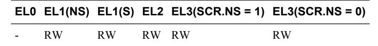

The external debug accessibility to the DBGWCRn\_EL1 by condition code is:

| Off   | DLK   | OSLK  | EDAD  | SLK | Default |
|-------|-------|-------|-------|-----|---------|
| Error | Error | Error | Error | RO  | RW      |

*Table 11-1 External register access conditions* on page 11-399 describes the access conditions.

#### Configurations

The DBGWCR*n*\_EL1 is Common to Secure and Non-secure states and architecturally mapped to:

- The AArch32 DBGWCRn registers.
- The external DBGWCRn EL1 registers.

#### **Attributes**

See the register summary in *Table 10-3 AArch64 debug register summary* on page 10-348.

The debug logic reset value of a DBGWCR EL1 is UNKNOWN.

The following figure shows the DBGWCRn\_EL1 bit assignments.

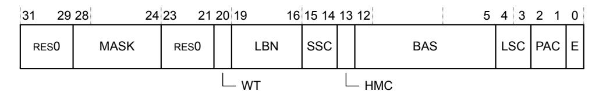

Figure 10-3 DBGWCR

The following table shows the DBGWCRn EL1 bit assignments.

## **Table 10-5 DBGWCRn\_EL1 bit assignments**

| Bits    | Name | Function                                                                                                                                                                                                                                                                                                                                                 |  |  |  |  |  |  |  |
|---------|------|----------------------------------------------------------------------------------------------------------------------------------------------------------------------------------------------------------------------------------------------------------------------------------------------------------------------------------------------------------|--|--|--|--|--|--|--|
| [31:29] | -    | Reserved, RES0.                                                                                                                                                                                                                                                                                                                                          |  |  |  |  |  |  |  |
| [28:24] | MASK | Address range mask. The processor supports watchpoint address range masking. This field can set a watchpoint on a<br>range of addresses by masking lower order address bits out of the watchpoint comparison. The value of this field is<br>the number of low order bits of the address that are masked off, except that values of 1 and 2 are reserved. |  |  |  |  |  |  |  |
|         |      | See the ARM®<br>Architecture Reference Manual ARMv8 for the meanings of watchpoint address range mask values.                                                                                                                                                                                                                                            |  |  |  |  |  |  |  |
| [23:21] | -    | Reserved, RES0.                                                                                                                                                                                                                                                                                                                                          |  |  |  |  |  |  |  |
| [20]    | WT   | Watchpoint Type. This bit is set to 1 to link the watchpoint to a breakpoint to create a linked watchpoint that requires<br>both data address matching and Context matching:                                                                                                                                                                             |  |  |  |  |  |  |  |
|         |      | 0<br>Unlinked data address match.                                                                                                                                                                                                                                                                                                                        |  |  |  |  |  |  |  |
|         |      | 1<br>Linked data address match.                                                                                                                                                                                                                                                                                                                          |  |  |  |  |  |  |  |
|         |      | When this bit is set to 1 the linked BRP number field indicates the BRP that this WRP is linked. See the ARM®<br>Architecture Reference Manual ARMv8 for more information.                                                                                                                                                                               |  |  |  |  |  |  |  |
| [19:16] | LBN  | Linked Breakpoint Number. If this watchpoint is programmed with the watchpoint type set to linked, then this field<br>must be programmed with the number of the breakpoint that defines the Context match to be combined with data<br>address comparison. Otherwise, this field must be programmed to 0b0000.                                            |  |  |  |  |  |  |  |
|         |      | Reading this register returns an UNKNOWN value for this field, and the generation of Watchpoint debug events is<br>UNPREDICTABLE, if either:                                                                                                                                                                                                             |  |  |  |  |  |  |  |
|         |      | •<br>This watchpoint does not have linking enabled and this field is not programmed to 0x0.<br>•<br>This watchpoint has linking enabled and the breakpoint indicated by this field does not support Context<br>matching, is not programmed for Context matching, or does not exist.                                                                      |  |  |  |  |  |  |  |
|         |      | See the ARM®<br>Architecture Reference Manual ARMv8 for more information.                                                                                                                                                                                                                                                                                |  |  |  |  |  |  |  |
| [15:14] | SSC  | Security State Control. This field enables the watchpoint to be conditional on the Security state of the processor. This<br>field is used with the Hyp Mode Control (HMC) and Privileged Access Control (PAC) fields.                                                                                                                                    |  |  |  |  |  |  |  |
|         |      | See the ARM®<br>Architecture Reference Manual ARMv8 for possible values of the fields, and the access modes and<br>Security states that can be tested.                                                                                                                                                                                                   |  |  |  |  |  |  |  |
| [13]    | HMC  | Hyp Mode Control. This field is used with the Security State Control (SSC) and PAC fields. The value of<br>DBGWCR.PAC has no effect for accesses made in Hyp mode.                                                                                                                                                                                       |  |  |  |  |  |  |  |
|         |      | See the ARM®<br>Architecture Reference Manual ARMv8 for possible values of the fields, and the access modes and<br>Security states that can be tested.                                                                                                                                                                                                   |  |  |  |  |  |  |  |
| [12:5]  | BAS  | Byte Address Select. The processor implements an 8-bit Byte address select field, DBGWCR[12:5].                                                                                                                                                                                                                                                          |  |  |  |  |  |  |  |
|         |      | A DBGWVR is programmed with a word-aligned address. This field enables the watchpoint to hit only if certain<br>bytes of the addressed word are accessed. The watchpoint hits if an access hits any byte being watched, even if:                                                                                                                         |  |  |  |  |  |  |  |
|         |      | •<br>The access size is larger than the size of the region being watched.<br>•<br>The access is unaligned, and the base address of the access is not in the same word of memory as the address in<br>the DBGWVR.                                                                                                                                         |  |  |  |  |  |  |  |
|         |      | •<br>The access size is smaller than the size of region being watched.                                                                                                                                                                                                                                                                                   |  |  |  |  |  |  |  |
|         |      | See the ARM®<br>Architecture Reference Manual ARMv8 for more information.                                                                                                                                                                                                                                                                                |  |  |  |  |  |  |  |

## **Table 10-5 DBGWCRn\_EL1 bit assignments (continued)**

| Bits  | Name | Function                                                                                                                                                                                                                                                                                          |                                                                                                        |  |  |  |  |  |  |
|-------|------|---------------------------------------------------------------------------------------------------------------------------------------------------------------------------------------------------------------------------------------------------------------------------------------------------|--------------------------------------------------------------------------------------------------------|--|--|--|--|--|--|
| [4:3] | LSC  | Load/store access control. This field enables watchpoint matching for the type of access. The possible values are:                                                                                                                                                                                |                                                                                                        |  |  |  |  |  |  |
|       |      | Reserved.<br>0b00                                                                                                                                                                                                                                                                                 |                                                                                                        |  |  |  |  |  |  |
|       |      | 0b01                                                                                                                                                                                                                                                                                              | Match on any load, Load-Exclusive, or swap.                                                            |  |  |  |  |  |  |
|       |      | 0b10                                                                                                                                                                                                                                                                                              | Match on any store, Store-Exclusive, or swap.                                                          |  |  |  |  |  |  |
|       |      | 0b11                                                                                                                                                                                                                                                                                              | Match on all type of access.                                                                           |  |  |  |  |  |  |
| [2:1] | PAC  | Privileged Access Control. This field enables watchpoint matching conditional on the mode of the processor. This<br>field is used with the SSC and PAC fields.                                                                                                                                    |                                                                                                        |  |  |  |  |  |  |
|       |      | See the ARM®<br>Architecture Reference Manual ARMv8 for possible values of the fields, and the access modes and<br>Security states that can be tested.                                                                                                                                            |                                                                                                        |  |  |  |  |  |  |
|       |      | Note                                                                                                                                                                                                                                                                                              |                                                                                                        |  |  |  |  |  |  |
|       |      | •<br>For all cases the match refers to the privilege level of the access, not the mode of the processor. For example, if<br>the watchpoint is configured to match only accesses at PL1 or higher, and the processor executes an LDRT<br>instruction in a PL1 mode, the watchpoint does not match. |                                                                                                        |  |  |  |  |  |  |
|       |      | •<br>permitted.                                                                                                                                                                                                                                                                                   | Permitted values of this field are not identical to those for the DBGBCR. In the DBGBCR the value 0b00 |  |  |  |  |  |  |
| [0]   | E    |                                                                                                                                                                                                                                                                                                   | Watchpoint Enable. This bit enables the watchpoint:                                                    |  |  |  |  |  |  |
|       |      | 0                                                                                                                                                                                                                                                                                                 | Watchpoint disabled.                                                                                   |  |  |  |  |  |  |
|       |      | 1                                                                                                                                                                                                                                                                                                 | Watchpoint enabled.                                                                                    |  |  |  |  |  |  |
|       |      | A watchpoint never generates a Watchpoint debug event when it is disabled.                                                                                                                                                                                                                        |                                                                                                        |  |  |  |  |  |  |
|       |      | Note                                                                                                                                                                                                                                                                                              |                                                                                                        |  |  |  |  |  |  |
|       |      | The value of DBGWCR.E is UNKNOWN on reset. A debugger must ensure that DBGWCR.E has a defined value<br>before it programs DBGDSCR[15:14] to enable debug.                                                                                                                                         |                                                                                                        |  |  |  |  |  |  |
|       |      |                                                                                                                                                                                                                                                                                                   |                                                                                                        |  |  |  |  |  |  |

To access the DBGWCR*n* in AArch32 state, read or write the CP14 register with:

```
MRC p14, 0, <Rt>, c0, cn, 7; Read Debug Watchpoint Control Register n
MCR p14, 0, <Rt>, c0, cn, 7; Write Debug Watchpoint Control Register n
```

To access the DBGWCR*n*\_EL1 in AArch64 state, read or write the register with:

```
MRS <Xt>, DBGWCRn_EL1; Read Debug Watchpoint Control Register n
MSR DBGWCRn_EL1, <Xt>; Write Debug Watchpoint Control Register n
```

The DBGWCR*n*\_EL1 can be accessed through the internal memory-mapped interface and the external debug interface, offset 0x8n8. The range of *n* for DBGWCRn\_EL1 is 0 to 3.

# <span id="page-355-0"></span>**10.5 AArch32 debug register summary**

The following table summarizes the 32-bit and 64-bit debug control registers that are accessible in AArch32 state from the internal CP14 interface.

These registers are accessed by the MCR and MRC instructions in the order of CRn, op1, CRm, op2 or MCRR and MRRC instructions in the order of CRm, op1.

The table also shows the offset address for the AArch32 registers that are accessible from the internal memory-mapped interface and the external debug interface. See *[10.7 Memory-mapped register summary](#page-361-0)* [on page 10-362](#page-361-0) for a complete list of registers accessible from the internal memory-mapped and the external debug interface.

**Table 10-6 AArch32 debug register summary**

| Offset | CRn                                            | op1 | CRm                                            | op2 | Name        | Type | Width  | Description                                                      |  |
|--------|------------------------------------------------|-----|------------------------------------------------|-----|-------------|------|--------|------------------------------------------------------------------|--|
| -      | c0                                             | 0   | c0                                             | 0   | DBGDIDR     | RO   | 32-bit | 10.6.1 Debug ID Register on page 10-358                          |  |
| -      |                                                |     |                                                | 2   | DBGDTRRXext | RW   | 32-bit | Debug Data Transfer Register, Receive, External View             |  |
| 0x400  |                                                |     |                                                | 4   | DBGBVR0     | RW   | 32-bit | Debug Breakpoint Value Register 0 en                             |  |
| 0x408  |                                                |     |                                                | 5   | DBGBCR0     | RW   | 32-bit | 10.4.1 Debug Breakpoint Control Registers, EL1<br>on page 10-350 |  |
| 0x800  |                                                |     |                                                | 6   | DBGWVR0     | RW   | 32-bit | Debug Watchpoint Value Register 0 en                             |  |
| 0x808  |                                                |     |                                                | 7   | DBGWCR0     | RW   | 32-bit | 10.4.2 Debug Watchpoint Control Registers, EL1<br>on page 10-353 |  |
| -      |                                                |     | c1                                             | 0   | DBGDSCRint  | RO   | 32-bit | Debug Status and Control Register, Internal View en              |  |
| 0x410  |                                                |     |                                                | 4   | DBGBVR1     | RW   | 32-bit | Debug Breakpoint Value Register 1 en                             |  |
| 0x418  |                                                |     |                                                | 5   | DBGBCR1     | RW   | 32-bit | 10.4.1 Debug Breakpoint Control Registers, EL1<br>on page 10-350 |  |
| 0x810  |                                                |     |                                                | 6   | DBGWVR1     | RW   | 32-bit | Debug Watchpoint Value Register 1 en                             |  |
| 0x818  |                                                |     |                                                | 7   | DBGWCR1     | RW   | 32-bit | 10.4.2 Debug Watchpoint Control Registers, EL1<br>on page 10-353 |  |
| -      |                                                |     | c2                                             | 0   | DBGDCCINT   | RW   | 32-bit | Debug Comms Channel Interrupt Enable Register en                 |  |
| -      |                                                |     |                                                | 2   | DBGDSCRext  | RW   | 32-bit | Debug Status and Control Register, External View en              |  |
| 0x420  |                                                |     |                                                | 4   | DBGBVR2     | RW   | 32-bit | Debug Breakpoint Value Register 2 en                             |  |
| 0x428  |                                                |     |                                                | 5   | DBGBCR2     | RW   | 32-bit | 10.4.1 Debug Breakpoint Control Registers, EL1<br>on page 10-350 |  |
| 0x820  |                                                |     |                                                | 6   | DBGWVR2     | RW   | 32-bit | Debug Watchpoint Value Register 2 en                             |  |
| 0x828  | 7<br>DBGWCR2<br>RW<br>32-bit<br>on page 10-353 |     | 10.4.2 Debug Watchpoint Control Registers, EL1 |     |             |      |        |                                                                  |  |

en See the *ARM® Architecture Reference Manual ARMv8* for more information.

**Table 10-6 AArch32 debug register summary (continued)**

| Offset | CRn | op1 | CRm | op2 | Name            | Type | Width  | Description                                                      |  |
|--------|-----|-----|-----|-----|-----------------|------|--------|------------------------------------------------------------------|--|
| -      |     |     | c3  | 2   | DBGDTRTXext     | RW   | 32-bit | Debug Data Transfer Register, Transmit, External View en         |  |
| 0x430  |     |     |     | 4   | DBGBVR3         | RW   | 32-bit | Debug Breakpoint Value Register 3 en                             |  |
| 0x438  |     |     |     | 5   | DBGBCR3         | RW   | 32-bit | 10.4.1 Debug Breakpoint Control Registers, EL1<br>on page 10-350 |  |
| 0x830  |     |     |     | 6   | DBGWVR3         | RW   | 32-bit | Debug Watchpoint Value Register 3 en                             |  |
| 0x838  |     |     |     | 7   | DBGWCR3         | RW   | 32-bit | 10.4.2 Debug Watchpoint Control Registers, EL1<br>on page 10-353 |  |
| 0x440  |     |     | c4  | 4   | DBGBVR4         | RW   | 32-bit | Debug Breakpoint Value Register 4 en                             |  |
| 0x448  |     |     |     | 5   | DBGBCR4         | RW   | 32-bit | 10.4.1 Debug Breakpoint Control Registers, EL1<br>on page 10-350 |  |
| 0x08C  | c0  | 0   | c5  | 0   | DBGDTRTXint     | WO   | 32-bit | Debug Data Transfer Register, Transmit, Internal View en         |  |
|        |     |     |     |     | DBGDTRRXint     | RO   | 32-bit | Debug Data Transfer Register, Receive, Internal View en          |  |
| 0x450  |     |     |     | 4   | DBGBVR5         | RW   | 32-bit | Debug Breakpoint Value Register 5 en                             |  |
| 0x458  |     |     |     | 5   | DBGBCR5         | RW   | 32-bit | 10.4.1 Debug Breakpoint Control Registers, EL1<br>on page 10-350 |  |
| -      |     |     | c6  | 0   | DBGWFAR         | RW   | 32-bit | Debug Watchpoint Fault Address Registereo<br>, RES0.             |  |
| 0x098  |     |     |     | 2   | DBGOSECCR       | RW   | 32-bit | Debug OS Lock Exception Catch Control Register en                |  |
| -      |     |     | c7  | 0   | DBGVCR          | RW   | 32-bit | Debug Vector Catch Register en                                   |  |
| -      | c1  | 0   | c0  | 0   | DBGDRAR[31:0]   | RO   | 32-bit | Debug ROM Address Register en                                    |  |
| -      | -   | 0   | c1  | -   | DBGDRAR[63:0]   |      | 64-bit |                                                                  |  |
| 0x300  | c1  | 0   | c0  | 4   | DBGOSLAR        | WO   | 32-bit | Debug OS Lock Access Register en                                 |  |
| -      |     |     | c1  | 4   | DBGOSLSR        | RO   | 32-bit | Debug OS Lock Status Register en                                 |  |
| -      |     |     | c3  | 4   | DBGOSDLR        | RW   | 32-bit | Debug OS Double Lock Register en                                 |  |
| 0x444  |     |     | c4  | 1   | DBGBXVR4        | RW   | 32-bit | Debug Breakpoint Extended Value Register 4 en                    |  |
| 0x310  |     |     |     | 4   | DBGPRCR         | RW   | 32-bit | Debug Power/Reset Control Register en                            |  |
| 0x454  |     |     | c5  | 1   | DBGBXVR5        | RW   | 32-bit | Debug Breakpoint Extended Value Register 5 en                    |  |
| -      | c2  | 2   | c0  | 0   | DBGDSAR[31:0]   | RO   | 32-bit | Debug Self Address Registerep RES0                               |  |
| -      | -   | 0   | c2  | -   | DBGDSAR[63:0]ep |      | 64-bit |                                                                  |  |
| -      | c7  | 0   | c0  | 7   | DBGDEVID2       | RO   | 32-bit | Debug Device ID Register 2, RES0                                 |  |
| -      |     |     | c1  | 7   | DBGDEVID1       | RO   | 32-bit | 10.6.2 Debug Device ID Register 1 on page 10-359                 |  |
| -      |     |     | c2  | 7   | DBGDEVID        | RO   | 32-bit | 10.6.3 Debug Device ID Register on page 10-360                   |  |
| 0xFA0  |     |     | c8  | 6   | DBGCLAIMSET     | RW   | 32-bit | Debug Claim Tag Set Register en                                  |  |
| 0xFA4  |     |     | c9  | 6   | DBGCLAIMCLR     | RW   | 32-bit | Debug Claim Tag Clear Register en                                |  |
| 0xFB8  |     |     | c14 | 6   | DBGAUTHSTATUS   | RO   | 32-bit | Debug Authentication Status Register en                          |  |
|        |     |     |     |     |                 |      |        |                                                                  |  |

eo Previously returned information about the address of the instruction that accessed a watchpoint address. This register is now deprecated and is RES0.

ep Previously defined the offset from the base address defined in DBGDRAR of the physical base address of the debug registers for the processor. This register is now deprecated and RES0.

# <span id="page-357-0"></span>**10.6 AArch32 debug register descriptions**

This section describes the debug registers in AArch32 state.

*[10.5 AArch32 debug register summary](#page-355-0)* on page 10-356 provides cross-references to the individual registers.

This section contains the following subsections:

- *10.6.1 Debug ID Register* on page 10-358.
- *[10.6.2 Debug Device ID Register 1](#page-358-0)* on page 10-359.
- *[10.6.3 Debug Device ID Register](#page-359-0)* on page 10-360.

## **10.6.1 Debug ID Register**

The DBGDIDR characteristics are:

**Purpose** Specifies:

- The version of the Debug architecture that is implemented.
- Some features of the debug implementation.

**Usage constraints** The accessibility to the DBGDIDR by Exception level is:

| EL0 | EL1(NS) | EL1(S) | EL2 | EL3(SCR.NS = 1) | EL3(SCR.NS = 0) |
|-----|---------|--------|-----|-----------------|-----------------|
| RO  | RO      | RO     | RO  | RO              | RO              |

**Configurations** The DBGDIDR is Common to Secure and Non-secure states.

**Attributes** See the register summary in *[Table 10-6 AArch32 debug register summary](#page-355-0)*

[on page 10-356.](#page-355-0)

The following figure shows the DBGDIDR bit assignments.

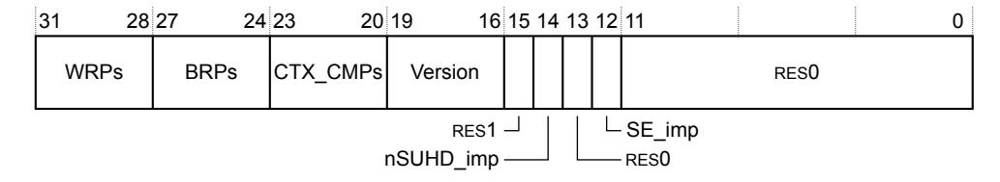

**Figure 10-4 DBGDIDR bit assignments**

The following table shows the DBGDIDR bit assignments.

**Table 10-7 DBGDIDR bit assignments**

| Bits                                                                | Name | Function                                                                                                                                              |
|---------------------------------------------------------------------|------|-------------------------------------------------------------------------------------------------------------------------------------------------------|
| [31:28]                                                             | WRPs | The number of Watchpoint Register Pairs (WRPs) implemented. The number of implemented WRPs is one<br>more than the value of this field. The value is: |
|                                                                     |      | The processor implements 4 WRPs.<br>0x3                                                                                                               |
|                                                                     |      | This field has the same value as ID_AA64DFR0_EL1.WRPs.                                                                                                |
| [27:24]<br>BRPs<br>more than the value of this field. The value is: |      | The number of Breakpoint Register Pairs (BRPs) implemented. The number of implemented BRPs is one                                                     |
|                                                                     |      | The processor implements 6 BRPs.<br>0x5                                                                                                               |
|                                                                     |      | This field has the same value as ID_AA64DFR0_EL1.BRPs.                                                                                                |

## **Table 10-7 DBGDIDR bit assignments (continued)**

<span id="page-358-0"></span>

| Bits    | Name      | Function                                                                                                                  |  |
|---------|-----------|---------------------------------------------------------------------------------------------------------------------------|--|
| [23:20] | CTX_CMPs  | The number of BRPs that can be used for Context matching. This is one more than the value of this field. The<br>value is: |  |
|         |           | The processor implements two Context matching breakpoints, breakpoints 4 and 5.<br>0x1                                    |  |
|         |           | This field has the same value as ID_AA64DFR0_EL1.CTX_CMPs.                                                                |  |
| [19:16] | Version   | The Debug architecture version.                                                                                           |  |
|         |           | The processor implements ARMv8 Debug architecture.<br>0x6                                                                 |  |
| [15]    | -         | Reserved, RES1.                                                                                                           |  |
| [14]    | nSUHD_imp | Secure User Halting Debug not implemented bit. The value is:                                                              |  |
|         |           | 1<br>The processor does not implement Secure User Halting Debug.                                                          |  |
| [13]    | -         | Reserved, RES0.                                                                                                           |  |
| [12]    | SE_imp    | Security Extensions implemented bit. The value is:                                                                        |  |
|         |           | 1<br>The processor implements Security Extensions.                                                                        |  |
| [11:0]  | -         | Reserved, RES0.                                                                                                           |  |

To access the DBGDIDR in AArch32 state, read or write the CP14 register with:

MRC p14, 0, <Rt>, c0, c0, 0; Read Debug ID Register

#### **10.6.2 Debug Device ID Register 1**

The DBGDEVID1 characteristics are:

#### **Purpose**

Adds to the information given by the DBGDIDR by describing other features of the debug implementation.

# **Usage constraints**

The accessibility to the DBGDEVID1 by Exception level is:

| EL0 | EL1(NS) | EL1(S) | EL2 | EL3(SCR.NS = 1) | EL3(SCR.NS = 0) |
|-----|---------|--------|-----|-----------------|-----------------|
| -   | RO      | RO     | RO  | RO              | RO              |

#### **Configurations**

The DBGDEVID1 is Common to Secure and Non-secure states.

# **Attributes**

See the register summary in *[Table 10-6 AArch32 debug register summary](#page-355-0)* on page 10-356.

The following figure shows the DBGDEVID1 bit assignments.

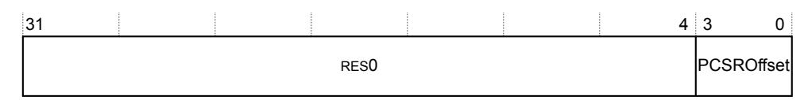

**Figure 10-5 DBGDEVID1 bit assignments**

The following table shows the DBGDEVID1 bit assignments.

## **Table 10-8 DBGDEVID1 bit assignments**

<span id="page-359-0"></span>

| Bits   | Name       | Function                                                                                                       |  |
|--------|------------|----------------------------------------------------------------------------------------------------------------|--|
| [31:4] | -          | Reserved, RES0.                                                                                                |  |
| [3:0]  | PCSROffset | Indicates the offset applied to PC samples returned by reads of EDPCSR. The value is:                          |  |
|        |            | EDPCSR samples have no offset applied and do not sample the instruction set state in the AArch32 state.<br>0x2 |  |

To access the DBGDEVID1 in AArch32 state, read the CP14 register with:

MRC p14, 0, <Rt>, c7, c1, 47 Read Debug Device ID Register 1

#### **10.6.3 Debug Device ID Register**

The DBGDEVID characteristics are:

**Purpose** Specifies the version of the Debug architecture is implemented, and some features of

the debug implementation.

**Usage constraints** The accessibility to the DBGDEVID by Exception level is:

**EL0 EL1(NS) EL1(S) EL2 EL3(SCR.NS = 1) EL3(SCR.NS = 0)** - RO RO RO RO RO

**Configurations** The DBGDEVID is Common to Secure and Non-secure states.

**Attributes** See the register summary in *[Table 10-6 AArch32 debug register summary](#page-355-0)*

[on page 10-356.](#page-355-0)

The following figure shows the DBGDEVID bit assignments.

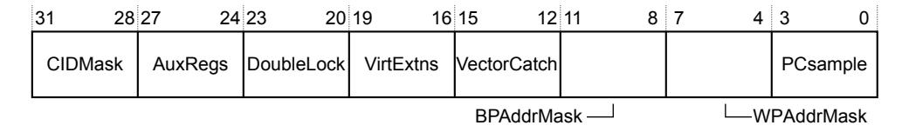

**Figure 10-6 DBGDEVID bit assignments**

The following table shows the DBGDEVID bit assignments.

**Table 10-9 DBGDEVID bit assignments**

| Bits    | Name       | Function                                                                                                 |  |  |  |
|---------|------------|----------------------------------------------------------------------------------------------------------|--|--|--|
| [31:28] | CIDMask    | Specifies the level of support for the Context ID matching breakpoint masking capability. This value is: |  |  |  |
|         |            | Context ID masking is not implemented.<br>0x0                                                            |  |  |  |
| [27:24] | AuxRegs    | Specifies support for the Debug External Auxiliary Control Register. This value is:                      |  |  |  |
|         |            | The processor supports Debug External Auxiliary Control Register.<br>0x1                                 |  |  |  |
| [23:20] | DoubleLock | Specifies support for the Debug OS Double Lock Register. This value is:                                  |  |  |  |
|         |            | The processor supports Debug OS Double Lock Register.<br>0x1                                             |  |  |  |
| [19:16] | VirExtns   | Specifies whether EL2 is implemented. This value is:                                                     |  |  |  |
|         |            | The processor implements EL2.<br>0x1                                                                     |  |  |  |

## **Table 10-9 DBGDEVID bit assignments (continued)**

| Bits                                                                                             | Name       | Function                                                                                                                         |
|--------------------------------------------------------------------------------------------------|------------|----------------------------------------------------------------------------------------------------------------------------------|
| [15:12]<br>VectorCatch<br>Defines the form of the vector catch event implemented. This value is: |            |                                                                                                                                  |
|                                                                                                  |            | The processor implements address matching form of vector catch.<br>0x0                                                           |
| [11:8]                                                                                           | BPAddrMask | Indicates the level of support for the Immediate Virtual Address (IVA) matching breakpoint masking<br>capability. This value is: |
|                                                                                                  |            | Breakpoint address masking not implemented. DBGBCRn[28:24] are UNK/SBZP.<br>0xF                                                  |
| [7:4]                                                                                            | WPAddrMask | Indicates the level of support for the DVA matching watchpoint masking capability. This value is:                                |
|                                                                                                  |            | Watchpoint address mask implemented.<br>0x1                                                                                      |
| [3:0]                                                                                            | PCSample   | Indicates the level of support for Program Counter sampling using debug registers 40 and 41. This value is:                      |
|                                                                                                  |            | EDPCSR, EDCIDSR and EDVIDSR are implemented as debug registers 40, 41, and 42.<br>0x3                                            |

To access the DBGDEVID in AArch32 state, read the CP14 register with:

MRC p14, 0, <Rt>, c7, c2, 7; Read Debug Device ID Register 0

# <span id="page-361-0"></span>**10.7 Memory-mapped register summary**

The following table shows the offset address for the registers that are accessible from the internal memory-mapped interface or the external debug interface.

**Table 10-10 Memory-mapped debug register summary**

| Offset      | Name               | Type | Width  | Description                                                      |
|-------------|--------------------|------|--------|------------------------------------------------------------------|
| 0x000-0x01C | -                  | -    | -      | Reserved                                                         |
| 0x020       | EDESR              | RW   | 32-bit | External Debug Event Status Register                             |
| 0x024       | EDECR              | RW   | 32-bit | External Debug Execution Control Register eq                     |
| 0x028-0x02C | -                  | -    | -      | Reserved                                                         |
| 0x030       | EDWARlo            | RO   | 32-bit | External Debug Watchpoint Address Register, low word eq          |
| 0x034       | EDWARhi            | RO   | 32-bit | External Debug Watchpoint Address Register, high word eq         |
| 0x038-0x07C | -                  | -    | -      | Reserved                                                         |
| 0x080       | DBGDTRRX_EL0       | RW   | 32-bit | Debug Data Transfer Register, Receive eq                         |
| 0x084       | EDITR              | WO   | 32-bit | External Debug Instruction Transfer Register eq                  |
| 0x088       | EDSCR              | RW   | 32-bit | External Debug Status and Control Register eq                    |
| 0x08C       | DBGDTRTX_EL0       | RW   | 32-bit | Debug Data Transfer Register, Transmit eq                        |
| 0x090       | EDRCR              | WO   | 32-bit | External Debug Reserve Control Register eq                       |
| 0x094       | EDACR              | RW   | 32-bit | 10.8.2 External Debug Auxiliary Control Register on page 10-367. |
| 0x098       | EDECCR             | RW   | 32-bit | External Debug Exception Catch Control Register eq               |
| 0x09C       | -                  | -    | -      | Reserved                                                         |
| 0x0A0       | EDPCSRlo           | RO   | 32-bit | External Debug Program Counter Sample Register, low word eq      |
| 0x0A4       | EDCIDSR            | RO   | 32-bit | External Debug Context ID Sample Register eq                     |
| 0x0A8       | EDVIDSR            | RO   | 32-bit | External Debug Virtual Context Sample Register eq                |
| 0x0AC       | EDPCSRhi           | RO   | 32-bit | External Debug Program Counter Sample Register, high word eq     |
| 0x0B0-0x2FC | -                  | -    | -      | Reserved                                                         |
| 0x300       | OSLAR_EL1          | WO   | 32-bit | Debug OS Lock Access Register eq                                 |
| 0x304-0x30C | -                  | -    | -      | Reserved                                                         |
| 0x310       | EDPRCR             | RW   | 32-bit | External Debug Power/Reset Control Register eq                   |
| 0x314       | EDPRSR             | RO   | 32-bit | External Debug Processor Status Register eq                      |
| 0x318-0x3FC | -                  | -    | -      | Reserved                                                         |
| 0x400       | DBGBVR0_EL1[31:0]  | RW   | 32-bit | Debug Breakpoint Value Register 0 eq                             |
| 0x404       | DBGBVR0_EL1[63:32] |      |        |                                                                  |
| 0x408       | DBGBCR0_EL1        | RW   | 32-bit | 10.4.1 Debug Breakpoint Control Registers, EL1 on page 10-350    |
| 0x40C       | -                  | -    | -      | Reserved                                                         |
|             |                    |      |        |                                                                  |

eq See the *ARM® Architecture Reference Manual ARMv8* for more information.

**Table 10-10 Memory-mapped debug register summary (continued)**

| Offset      | Name               | Type | Width  | Description                                                   |
|-------------|--------------------|------|--------|---------------------------------------------------------------|
| 0x410       | DBGBVR1_EL1[31:0]  | RW   | 32-bit | Debug Breakpoint Value Register 1 eq                          |
| 0x414       | DBGBVR1_EL1[63:32] |      |        |                                                               |
| 0x418       | DBGBCR1_EL1        | RW   | 32-bit | 10.4.1 Debug Breakpoint Control Registers, EL1 on page 10-350 |
| 0x41C       | -                  | -    | -      | Reserved                                                      |
| 0x420       | DBGBVR2_EL1[31:0]  | RW   | 32-bit | Debug Breakpoint Value Register 2 eq                          |
| 0x424       | DBGBVR2_EL1[63:32] |      |        |                                                               |
| 0x428       | DBGBCR2_EL1        | RW   | 32-bit | 10.4.1 Debug Breakpoint Control Registers, EL1 on page 10-350 |
| 0x42C       | -                  | -    | -      | Reserved                                                      |
| 0x430       | DBGBVR3_EL1[31:0]  | RW   | 32-bit | Debug Breakpoint Value Register 3 eq                          |
| 0x434       | DBGBVR3_EL1[63:32] |      |        |                                                               |
| 0x438       | DBGBCR3_EL1        | RW   | 32-bit | 10.4.1 Debug Breakpoint Control Registers, EL1 on page 10-350 |
| 0x43C       | -                  | -    | -      | Reserved                                                      |
| 0x440       | DBGBVR4_EL1[31:0]  | RW   | 32-bit | Debug Breakpoint Value Register 4 eq                          |
| 0x444       | DBGBVR4_EL1[63:32] |      |        |                                                               |
| 0x448       | DBGBCR4_EL1        | RW   | 32-bit | 10.4.1 Debug Breakpoint Control Registers, EL1 on page 10-350 |
| 0x44C       | -                  | -    | -      | Reserved                                                      |
| 0x450       | DBGBVR5_EL1[31:0]  | RW   | 32-bit | Debug Breakpoint Value Register 5 eq                          |
| 0x454       | DBGBVR5_EL1[63:32] |      |        |                                                               |
| 0x458       | DBGBCR5_EL1        | RW   | 32-bit | 10.4.1 Debug Breakpoint Control Registers, EL1 on page 10-350 |
| 0x45C-0x7FC | -                  | -    | -      | Reserved                                                      |
| 0x800       | DBGWVR0_EL1[31:0]  | RW   | 32-bit | Debug Watchpoint Value Register 0 eq                          |
| 0x804       | DBGWVR0_EL1[63:32] |      |        |                                                               |
| 0x808       | DBGWCR0_EL1        | RW   | 32-bit | 10.4.2 Debug Watchpoint Control Registers, EL1 on page 10-353 |
| 0x80C       | -                  | -    | -      | Reserved                                                      |
| 0x810       | DBGWVR1_EL1[31:0]  | RW   | 32-bit | Debug Watchpoint Value Register 1 eq                          |
| 0x814       | DBGWVR1_EL1[63:32] |      |        |                                                               |
| 0x818       | DBGWCR1_EL1        | RW   | 32-bit | 10.4.2 Debug Watchpoint Control Registers, EL1 on page 10-353 |
| 0x81C       | -                  | -    | -      | Reserved                                                      |
| 0x820       | DBGWVR2_EL1[31:0]  | RW   | 32-bit | Debug Watchpoint Value Register 2 eq                          |
| 0x824       | DBGWVR2_EL1[63:32] |      |        |                                                               |
| 0x828       | DBGWCR2_EL1        | RW   | 32-bit | 10.4.2 Debug Watchpoint Control Registers, EL1 on page 10-353 |
| 0x82C       | -                  | -    | -      | Reserved                                                      |
| 0x830       | DBGWVR3_EL1[31:0]  | RW   | 32-bit | Debug Watchpoint Value Register 3 eq                          |
| 0x834       | DBGWVR3_EL1[63:32] |      |        |                                                               |
| 0x838       | DBGWCR3_EL1        | RW   | 32-bit | 10.4.2 Debug Watchpoint Control Registers, EL1 on page 10-353 |

## **Table 10-10 Memory-mapped debug register summary (continued)**

| Offset      | Name                    | Type | Width  | Description                                                                                                |
|-------------|-------------------------|------|--------|------------------------------------------------------------------------------------------------------------|
| 0x83C-0xCFC | -                       | -    | -      | Reserved                                                                                                   |
| 0xD00       | MIDR_EL1                | RO   | 32-bit | 4.3.1 Main ID Register, EL1 on page 4-89                                                                   |
| 0xD04-0xD1C | -                       | -    | -      | Reserved                                                                                                   |
| 0xD20       | ID_AA64PFR0_EL1[31:0]   | RO   | 32-bit | 4.3.18 AArch64 Processor Feature Register 0, EL1 on page 4-112                                             |
| 0xD24       | ID_AA64PFR0_EL1[63:32]  | RO   | 32-bit |                                                                                                            |
| 0xD28       | ID_AA64DFR0_EL1[31:0]   | RO   | 32-bit | 4.3.19 AArch64 Debug Feature Register 0, EL1 on page 4-113                                                 |
| 0xD2C       | ID_AA64DFR0_EL1[63:32]  | RO   | 32-bit |                                                                                                            |
| 0xD30       | ID_AA64ISAR0_EL1[31:0]  | RO   | 32-bit | 4.3.20 AArch64 Instruction Set Attribute Register 0, EL1                                                   |
| 0xD34       | ID_AA64ISAR0_EL1[63:32] | RO   | 32-bit | on page 4-115                                                                                              |
| 0xD38       | ID_AA64MMFR0_EL1[31:0]  | RO   | 32-bit | 4.3.21 AArch64 Memory Model Feature Register 0, EL1                                                        |
| 0xD3C       | ID_AA64MMFR0_EL1[63:32] | RO   | 32-bit | on page 4-116                                                                                              |
| 0xD40       | ID_AA64PFR1_EL1[31:0]   | RO   | 32-bit | AArch64 Processor Feature Register 1 low word, RES0                                                        |
| 0xD44       | ID_AA64PFR1_EL1[63:32]  | RO   | 32-bit | AArch64 Processor Feature Register 1 high word, RES0                                                       |
| 0xD48       | ID_AA64DFR1_EL1[31:0]   | RO   | 32-bit | AArch64 Debug Feature Register 1 low word, RES0                                                            |
| 0xD4C       | ID_AA64DFR1_EL1[63:32]  | RO   | 32-bit | AArch64 Debug Feature Register 1 high word, RES0                                                           |
| 0xD50       | ID_AA64ISAR1_EL1[31:0]  | RO   | 32-bit | AArch64 Instruction Set Attribute Register 1 low word, RES0                                                |
| 0xD54       | ID_AA64ISAR1_EL1[63:32] | RO   | 32-bit | AArch64 Instruction Set Attribute Register 1 high word, RES0                                               |
| 0xD58       | ID_AA64MMFR1_EL1[31:0]  | RO   | 32-bit | AArch64 Memory Model Feature Register 1 low word, RES0                                                     |
| 0xD5C       | ID_AA64MMFR1_EL1[63:32] | RO   | 32-bit | AArch64 Memory Model Feature Register 1 high word, RES0                                                    |
| 0xD60-0xEF4 | -                       | -    | -      | Reserved                                                                                                   |
| 0xEF8       | EDITOCTRL               | WO   | 32-bit | 10.8.3 External Debug Integration Output Control Register<br>on page 10-368                                |
| 0xEFC       | EDITISR                 | RO   | 32-bit | 10.8.4 External Debug Integration Input Status Register<br>on page 10-369                                  |
| 0xF00       | EDITCTRL                | RW   | 32-bit | 10.8.5 External Debug Integration Mode Control Register<br>on page 10-370                                  |
| 0xF04-0xF9C | -                       | -    | -      | Reserved                                                                                                   |
| 0xFA0       | DBGCLAIMSET_EL1         | RW   | 32-bit | Debug Claim Tag Set Register eq                                                                            |
| 0xFA4       | DBGCLAIMCLR_EL1         | RW   | 32-bit | Debug Claim Tag Clear Register eq                                                                          |
| 0xFA8       | EDDEVAFF0               | RO   | 32-bit | External Debug Device Affinity Register 0. See 4.3.2 Multiprocessor<br>Affinity Register, EL1 on page 4-91 |
| 0xFAC       | EDDEVAFF1               | RO   | 32-bit | External Debug Device Affinity Register 1, RES0                                                            |
| 0xFB0       | EDLAR                   | WO   | 32-bit | External Debug Lock Access Register eq                                                                     |
| 0xFB4       | EDLSR                   | RO   | 32-bit | External Debug Lock Status Register eq                                                                     |
| 0xFB8       | DBGAUTHSTATUS_EL1       | RO   | 32-bit | Debug Authentication Status Register eq                                                                    |
| 0xFBC       | EDDEVARCH               | RO   | 32-bit | External Debug Device Architecture Register eq                                                             |

# **Table 10-10 Memory-mapped debug register summary (continued)**

| Offset      | Name      | Type | Width  | Description                                                             |
|-------------|-----------|------|--------|-------------------------------------------------------------------------|
| 0xFC0       | EDDEVID2  | RO   | 32-bit | External Debug Device ID Register 2, RES0                               |
| 0xFC4       | EDDEVID1  | RO   | 32-bit | 10.8.6 External Debug Device ID Register 1 on page 10-371               |
| 0xFC8       | EDDEVID   | RO   | 32-bit | 10.8.7 External Debug Device ID Register 0 on page 10-372               |
| 0xFCC       | EDDEVTYPE | RO   | 32-bit | External Debug Device Type Register eq                                  |
| 0xFD0       | EDPIDR4   | RO   | 32-bit | External Debug Peripheral Identification Register 4 on page 10-376      |
| 0xFD4-0xFDC | EDPIDR5-7 | RO   | 32-bit | External Debug Peripheral Identification Register 5-7<br>on page 10-377 |
| 0xFE0       | EDPIDR0   | RO   | 32-bit | External Debug Peripheral Identification Register 0 on page 10-373      |
| 0xFE4       | EDPIDR1   | RO   | 32-bit | External Debug Peripheral Identification Register 1 on page 10-374      |
| 0xFE8       | EDPIDR2   | RO   | 32-bit | External Debug Peripheral Identification Register 2 on page 10-375      |
| 0xFEC       | EDPIDR3   | RO   | 32-bit | External Debug Peripheral Identification Register 3 on page 10-375      |
| 0xFF0       | EDCIDR0   | RO   | 32-bit | External Debug Component Identification Register 0<br>on page 10-377    |
| 0xFF4       | EDCIDR1   | RO   | 32-bit | External Debug Component Identification Register 1<br>on page 10-378    |
| 0xFF8       | EDCIDR2   | RO   | 32-bit | External Debug Component Identification Register 2<br>on page 10-379    |
| 0xFFC       | EDCIDR3   | RO   | 32-bit | External Debug Component Identification Register 3<br>on page 10-379    |

# <span id="page-365-0"></span>**10.8 Memory-mapped register descriptions**

This section describes the Cortex-A57 processor debug registers.

*[10.7 Memory-mapped register summary](#page-361-0)* on page 10-362 provides cross-references to the individual registers.

This section contains the following subsections:

- *10.8.1 External Debug Reserve Control Register* on page 10-366.
- *[10.8.2 External Debug Auxiliary Control Register](#page-366-0)* on page 10-367.
- *[10.8.3 External Debug Integration Output Control Register](#page-367-0)* on page 10-368.
- *[10.8.4 External Debug Integration Input Status Register](#page-368-0)* on page 10-369.
- *[10.8.5 External Debug Integration Mode Control Register](#page-369-0)* on page 10-370.
- *[10.8.6 External Debug Device ID Register 1](#page-370-0)* on page 10-371.
- *[10.8.7 External Debug Device ID Register 0](#page-371-0)* on page 10-372.
- *[10.8.8 External Debug Peripheral Identification Registers](#page-372-0)* on page 10-373.
- *[10.8.9 External Debug Component Identification Registers](#page-376-0)* on page 10-377.

# **10.8.1 External Debug Reserve Control Register**

The EDRCR characteristics are:

**Purpose** Used to cancel bus requests and clear sticky bits in the EDSCR. **Usage** Accessible through the internal memory-mapped interface and the external debug

**constraints** interface. The access conditions are:

| Off   | DLK   | OSLK  | EDAD | SLK | Default |
|-------|-------|-------|------|-----|---------|
| ERROR | ERROR | ERROR | -    | WI  | WO      |

*[Table 10-1 External register access conditions](#page-346-0)* on page 10-347 describes the access

conditions.

**Configurations** The EDRCR is in the Core power domain.

**Attributes** See the register summary in *[Table 10-10 Memory-mapped debug register summary](#page-361-0)*

[on page 10-362](#page-361-0).

The following figure shows the EDRCR bit assignments.

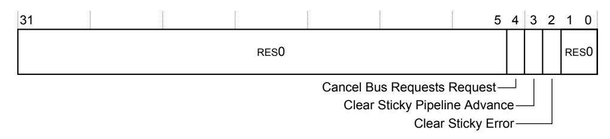

**Figure 10-7 EDRCR bit assignments**

The following table shows the EDRCR bit assignments.

**Table 10-11 EDRCR bit assignments**

| Bits   | Name  | Function        |
|--------|-------|-----------------|
| [31:5] | -     | Reserved, RES0. |
| [4]    | CBRRQ | Reserved.RES0.  |

## **Table 10-11 EDRCR bit assignments (continued)**

<span id="page-366-0"></span>

| Bits  | Name | Function                                                                                                      |  |  |  |
|-------|------|---------------------------------------------------------------------------------------------------------------|--|--|--|
| [3]   | CSPA | Clear Sticky Pipeline Advance. This bit is used to clear the EDSCR.PipeAdv bit to 0. The possible values are: |  |  |  |
|       |      | 0<br>No action.                                                                                               |  |  |  |
|       |      | 1<br>Clear the EDSCR.PipeAdv bit to 0.                                                                        |  |  |  |
| [2]   | CSE  | Clear Sticky Error. Used to clear the EDSCR cumulative error bits to 0. The possible values:                  |  |  |  |
|       |      | 0<br>No action.                                                                                               |  |  |  |
|       |      | 1<br>Clear the EDSCR.{TXU, RXO, ERR} bits, and, if the processor is in Debug state, the EDSCR.ITO bit, to 0.  |  |  |  |
| [1:0] | -    | Reserved, RES0.                                                                                               |  |  |  |

# **10.8.2 External Debug Auxiliary Control Register**

The EDACR characteristics are:

#### **Purpose**

Provides IMPLEMENTATION DEFINED configuration and control options.

#### **Usage constraints**

Accessible through the internal memory-mapped interface and the external debug interface. The access conditions are:

| Off | DLK | OSLK | EDAD | SLK | Default |
|-----|-----|------|------|-----|---------|
| -   | -   | -    | -    | RO  | RW      |

*[Table 11-1 External register access conditions](#page-398-0)* on page 11-399 describes the access conditions.

# **Configurations**

The EDACR is in the Debug power domain.

# **Attributes**

See *[10.7 Memory-mapped register summary](#page-361-0)* on page 10-362.

The following figure shows the EDACR bit assignments.

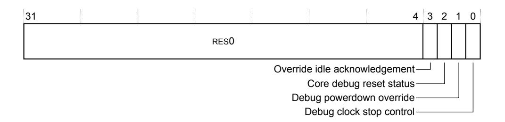

**Figure 10-8 EDACR bit assignments**

The following table shows the EDACR bit assignments.

## **Table 10-12 EDACR bit assignments**

<span id="page-367-0"></span>

| Bits   | Name                            | Function                                                                                                                                                                           |  |  |  |  |
|--------|---------------------------------|------------------------------------------------------------------------------------------------------------------------------------------------------------------------------------|--|--|--|--|
| [31:4] | -                               | Reserved, RES0.                                                                                                                                                                    |  |  |  |  |
| [3]    | Override idle<br>Acknowledgment | Override idle Acknowledgment signal to processor. The possible values are:                                                                                                         |  |  |  |  |
|        |                                 | 0<br>Processor waits for the debug register access logic to go idle before it enters the idle state.<br>This is the reset value.                                                   |  |  |  |  |
|        |                                 | 1<br>Processor does not wait for the debug register access logic to go idle before it enters the idle<br>state.                                                                    |  |  |  |  |
| [2]    | Core debug reset status         | Read-only status bit that reflects the current reset state of the debug logic in the processor power<br>domain:                                                                    |  |  |  |  |
|        |                                 | 0<br>Debug logic in processor power domain is not in reset state.                                                                                                                  |  |  |  |  |
|        |                                 | 1<br>Debug logic in processor power domain is currently in reset state.                                                                                                            |  |  |  |  |
| [1]    | Debug powerdown<br>override     | Debug powerdown control bit. If debug is enabled and this bit is:                                                                                                                  |  |  |  |  |
|        |                                 | 0<br>Error response is generated for APB accesses to the processor domain debug registers when<br>the processor is powered down or OS Double Lock is set. This is the reset value. |  |  |  |  |
|        |                                 | 1<br>APB accesses to the processor domain debug registers proceed normally when the processor<br>is powered down or OS Double Lock is set.                                         |  |  |  |  |
| [0]    | Debug clock stop control        | Debug clock control bit. If debug is enabled and this bit is:                                                                                                                      |  |  |  |  |
|        |                                 | 0<br>Does not prevent the clock generator from stopping the processor clock. This is the reset<br>value.                                                                           |  |  |  |  |
|        |                                 | 1<br>Prevents the clock generator from stopping the processor clock.                                                                                                               |  |  |  |  |

#### **10.8.3 External Debug Integration Output Control Register**

The EDITOCTRL characteristics are:

#### **Purpose**

Controls signal outputs when EDITCTRL.IME is set.

#### **Usage constraints**

Accessible through the internal memory-mapped interface and the external debug interface. The access conditions are:

| Off   | DLK   | OSLK  | EDAD | SLK | Default |
|-------|-------|-------|------|-----|---------|
| Error | Error | Error | -    | WI  | WO      |

*[Table 11-1 External register access conditions](#page-398-0)* on page 11-399 describes the access conditions.

#### **Configurations**

EDITOCTRL is in the Core power domain.

# **Attributes**

See *[10.7 Memory-mapped register summary](#page-361-0)* on page 10-362.

The following figure shows the EDITOCTRL bit assignments.

<span id="page-368-0"></span>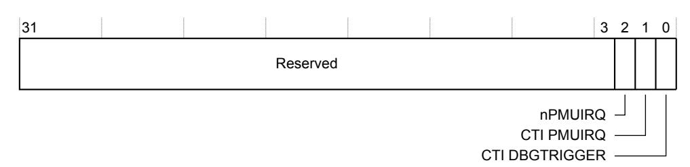

**Figure 10-9 EDITOCTRL bit assignments**

The following table shows the EDITOCTRL bit assignments.

**Table 10-13 EDITOCTRL bit assignments**

| Bits   | Name           | Function                                                                                                                    |
|--------|----------------|-----------------------------------------------------------------------------------------------------------------------------|
| [31:3] | -              | Reserved, RES0.                                                                                                             |
| [2]    | nPMUIRQ        | Controls the nPMUIRQ output. When this bit is set to 1, the corresponding nPMUIRQ signal goes<br>LOW. The reset value is 0. |
| [1]    | CTI PMUIRQ     | Controls the internal signal equivalent to PMUIRQ that goes from the PMU to the CTI. The reset value<br>is 0.               |
| [0]    | CTI DBGTRIGGER | Controls the internal signal equivalent to DBGTRIGGER that goes from the Debug unit to the CTI.<br>The reset value is 0.    |

# **Related information**

*[10.8.5 External Debug Integration Mode Control Register](#page-369-0)* on page 10-370*.*

#### **10.8.4 External Debug Integration Input Status Register**

The EDITISR characteristics are:

# **Purpose**

Enables the values of signal inputs to be read when EDITCTRL.IME is set.

#### **Usage constraints**

Accessible through the internal memory-mapped interface and the external debug interface. The access conditions are:

| Off   | DLK   | OSLK  | EDAD | SLK | Default |
|-------|-------|-------|------|-----|---------|
| Error | Error | Error | -    | -   | RO      |

*[Table 11-1 External register access conditions](#page-398-0)* on page 11-399 describes the access conditions.

## **Configurations**

EDITISR is in the Core power domain.

#### **Attributes**

See *[10.7 Memory-mapped register summary](#page-361-0)* on page 10-362.

The following figure shows the EDITISR bit assignments.

<span id="page-369-0"></span>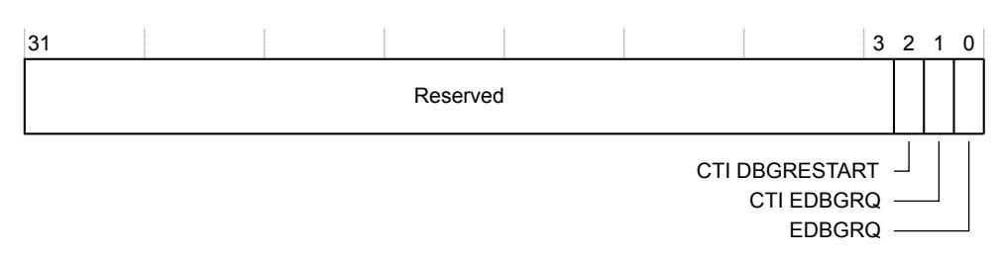

**Figure 10-10 EDITISR bit assignments**

The following table shows the EDITISR bit assignments.

**Table 10-14 EDITISR bit assignments**

| Bits   | Name           | Function                                                                                                               |
|--------|----------------|------------------------------------------------------------------------------------------------------------------------|
| [31:3] | -              | Reserved, RES0.                                                                                                        |
| [2]    | CTI DBGRESTART | CTI debug restart bit. This bit reads the state of the debug restart input coming from the CTI into the<br>debug unit. |
| [1]    | CTI EDBGRQ     | CTI debug request bit. This bit reads the state of the debug request input coming from the CTI into the<br>debug unit. |
| [0]    | EDBGRQ         | This bit reads the state of the EDBGRQ input.                                                                          |

# **Related information**

*10.8.5 External Debug Integration Mode Control Register* on page 10-370*.*

# **10.8.5 External Debug Integration Mode Control Register**

The EDITCTRL characteristics are:

# **Purpose**

Enables the external debug to switch from its default mode into integration mode, where test software can control directly the inputs and outputs of the processor, for integration testing or topology detection.

#### **Usage constraints**

Accessible through the internal memory-mapped interface and the external debug interface. The access conditions are:

| Off   | DLK   | OSLK  | EDAD | SLK | Default |
|-------|-------|-------|------|-----|---------|
| Error | Error | Error | -    | RO  | RW      |

*[Table 11-1 External register access conditions](#page-398-0)* on page 11-399 describes the access conditions.

#### **Configurations**

EDITCTRL is in the Core power domain.

# **Attributes**

See *[10.7 Memory-mapped register summary](#page-361-0)* on page 10-362.

The following figure shows the EDITCTRL bit assignments.

<span id="page-370-0"></span>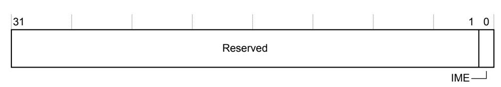

**Figure 10-11 EDITCTRL bit assignments**

The following table shows the EDITCTRL bit assignments.

**Table 10-15 EDITCTRL bit assignments**

| Bits   | Name | Function                                                                                                             |  |  |
|--------|------|----------------------------------------------------------------------------------------------------------------------|--|--|
| [31:1] | -    | Reserved, RES0.                                                                                                      |  |  |
| [0]    | IME  | When IME is set to 1, the device reverts to an integration mode to enable integration testing or topology detection: |  |  |
|        |      | 0<br>Normal operation.                                                                                               |  |  |
|        |      | 1<br>Integration mode enabled.                                                                                       |  |  |
|        |      |                                                                                                                      |  |  |

#### **10.8.6 External Debug Device ID Register 1**

The EDDEVID1 characteristics are:

#### **Purpose**

Provides extra information for external debuggers about features of the debug implementation.

#### **Usage constraints**

Accessible through the internal memory-mapped interface and the external debug interface. The access conditions are:


*[Table 11-1 External register access conditions](#page-398-0)* on page 11-399 describes the access conditions.

#### **Configurations**

The EDDEVID1 is in the Debug power domain.

# **Attributes**

See *[10.7 Memory-mapped register summary](#page-361-0)* on page 10-362.

The following figure shows the EDDEVID1 bit assignments.

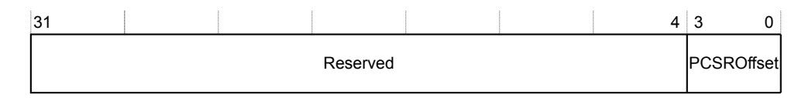

**Figure 10-12 EDDEVID1 bit assignments**

The following table shows the EDDEVID1 bit assignments.

## Table 10-16 EDDEVID1 bit assignments

<span id="page-371-0"></span>

| Bits   | Name       | Function                                                                                                |  |
|--------|------------|---------------------------------------------------------------------------------------------------------|--|
| [31:4] | -          | Reserved, RESO.                                                                                         |  |
| [3:0]  | PCSROffset | Indicates the offset applied to PC samples returned by reads of EDPCSR. For ARMv8 the value is:         |  |
|        |            | 0x2 EDPCSR samples have no offset applied and do not sample the instruction set state in AArch32 state. |  |

# 10.8.7 External Debug Device ID Register 0

The EDDEVID characteristics are:

## **Purpose**

Provides extra information for external debuggers about features of the debug implementation.

#### **Usage constraints**

Accessible through the internal memory-mapped interface and the external debug interface. The access conditions are:

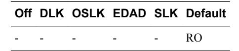

Table 11-1 External register access conditions on page 11-399 describes the access conditions.

#### **Configurations**

The EDDEVID is in the Debug power domain.

#### Attributes

See 10.7 Memory-mapped register summary on page 10-362.

The following figure shows the EDDEVID bit assignments.

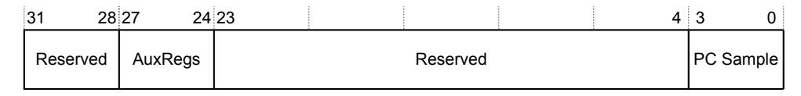

Figure 10-13 EDDEVID bit assignments

The following table shows the EDDEVID bit assignments.

Table 10-17 EDDEVID bit assignments

| Bits                                                                                                   | Name    | Function                                                                                                                                    |  |  |
|--------------------------------------------------------------------------------------------------------|---------|---------------------------------------------------------------------------------------------------------------------------------------------|--|--|
| [31:28]                                                                                                | -       | Reserved, RESO.                                                                                                                             |  |  |
| [27:24]                                                                                                | AuxRegs | Indicates support for auxiliary registers. The possible values are:                                                                         |  |  |
|                                                                                                        |         | <b>0x1</b> External Debug Auxiliary Control Register, EDACR, is implemented.                                                                |  |  |
| [23:4]                                                                                                 | -       | Reserved, RESO.                                                                                                                             |  |  |
| [3:0] PC Sample Indicates the level of sample-based profiling support using of this field in v8-A are: |         | Indicates the level of sample-based profiling support using external debug registers 40 through 43. Valid values of this field in v8-A are: |  |  |
|                                                                                                        |         | 0x3 EDPCSR, EDCIDSR, and EDVIDSR are implemented.                                                                                           |  |  |

# <span id="page-372-0"></span>**10.8.8 External Debug Peripheral Identification Registers**

The External Debug Peripheral Identification Registers provide standard information required for all components that conform to the *ARM® Debug Interface Architecture Specification ADIv5.0 to ADIv5.2*. They are a set of eight registers, listed in register number order in the following table.

**Table 10-18 Summary of the External Debug Peripheral Identification Registers**

| Register | Value | Offset |
|----------|-------|--------|
| EDPIDR4  | 0x04  | 0xFD0  |
| EDPIDR5  | 0x00  | 0xFD4  |
| EDPIDR6  | 0x00  | 0xFD8  |
| EDPIDR7  | 0x00  | 0xFDC  |
| EDPIDR0  | 0x07  | 0xFE0  |
| EDPIDR1  | 0xBD  | 0xFE4  |
| EDPIDR2  | 0x3B  | 0xFE8  |
| EDPIDR3  | 0x00  | 0xFEC  |

Only bits[7:0] of each External Debug Peripheral ID Register are used, with bits[31:8] reserved. Together, the eight External Debug Peripheral ID Registers define a single 64-bit Peripheral ID.

The External Debug Peripheral ID registers are:

- *External Debug Peripheral Identification Register 0* on page 10-373.
- *[External Debug Peripheral Identification Register 1](#page-373-0)* on page 10-374.
- *[External Debug Peripheral Identification Register 2](#page-374-0)* on page 10-375.
- *[External Debug Peripheral Identification Register 3](#page-374-0)* on page 10-375.
- *[External Debug Peripheral Identification Register 4](#page-375-0)* on page 10-376.
- *[External Debug Peripheral Identification Register 5-7](#page-376-0)* on page 10-377.

#### **External Debug Peripheral Identification Register 0**

The EDPIDR0 characteristics are:

# **Purpose**

Provides information to identify an external debug component.

#### **Usage constraints**

Accessible through the internal memory-mapped interface and the external debug interface. The access conditions are:

| Off | DLK | OSLK | EDAD | SLK | Default |
|-----|-----|------|------|-----|---------|
| -   | -   | -    | -    | -   | RO      |

*[Table 11-1 External register access conditions](#page-398-0)* on page 11-399 describes the access conditions.

# **Configurations**

The EDPIDR0 is in the Debug power domain.

#### **Attributes**

See *[10.7 Memory-mapped register summary](#page-361-0)* on page 10-362.

The following figure shows the EDPIDR0 bit assignments.

<span id="page-373-0"></span>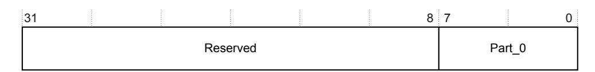

**Figure 10-14 EDPIDR0 bit assignments**

The following table shows the EDPIDR0 bit assignments.

**Table 10-19 EDPIDR0 bit assignments**

| Bits   | Name   | Function        |                                                  |  |
|--------|--------|-----------------|--------------------------------------------------|--|
| [31:8] | -      | Reserved, RES0. |                                                  |  |
| [7:0]  | Part_0 | 0x07            | Least significant byte of the debug part number. |  |

# **External Debug Peripheral Identification Register 1**

The EDPIDR1 characteristics are:

### **Purpose**

Provides information to identify an external debug component.

#### **Usage constraints**

Accessible through the internal memory-mapped interface and the external debug interface. The access conditions are:

| Off | DLK | OSLK | EDAD | SLK | Default |
|-----|-----|------|------|-----|---------|
| -   | -   | -    | -    | -   | RO      |

*[Table 11-1 External register access conditions](#page-398-0)* on page 11-399 describes the access conditions.

## **Configurations**

The EDPIDR1 is in the Debug power domain.

# **Attributes**

See *[10.7 Memory-mapped register summary](#page-361-0)* on page 10-362.

The following figure shows the EDPIDR1 bit assignments.

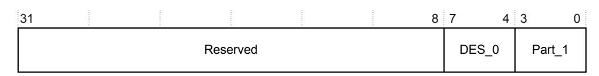

**Figure 10-15 EDPIDR1 bit assignments**

The following table shows the EDPIDR1 bit assignments.

**Table 10-20 EDPIDR1 bit assignments**

| Bits   | Name   | Function                                                                    |  |  |
|--------|--------|-----------------------------------------------------------------------------|--|--|
| [31:8] | -      | Reserved, RES0.                                                             |  |  |
| [7:4]  | DES_0  | ARM Limited. This is the least significant nibble of JEP106 ID code.<br>0xB |  |  |
| [3:0]  | Part_1 | Most significant nibble of the debug part number.<br>0xD                    |  |  |

#### <span id="page-374-0"></span>**External Debug Peripheral Identification Register 2**

The EDPIDR2 characteristics are:

#### **Purpose**

Provides information to identify an external debug component.

#### **Usage constraints**

Accessible through the internal memory-mapped interface and the external debug interface. The access conditions are:

| Off | DLK | OSLK | EDAD | SLK | Default |
|-----|-----|------|------|-----|---------|
| -   | -   | -    | -    | -   | RO      |

Table 11-1 External register access conditions on page 11-399 describes the access conditions.

#### Configurations

The EDPIDR2 is in the Debug power domain.

## **Attributes**

See 10.7 Memory-mapped register summary on page 10-362.

The following figure shows the EDPIDR2 bit assignments.

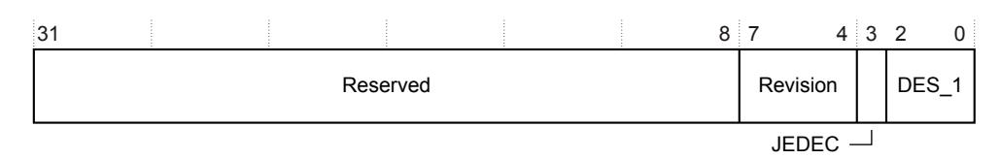

Figure 10-16 EDPIDR2 bit assignments

The following table shows the EDPIDR2 bit assignments.

Table 10-21 EDPIDR2 bit assignments

| Bits   | Name     | Function    |                                                                     |  |  |
|--------|----------|-------------|---------------------------------------------------------------------|--|--|
| [31:8] | -        | Reserved, I | Reserved, RES0.                                                     |  |  |
| [7:4]  | Revision | 3           | Part major revision.                                                |  |  |
| [3]    | JEDEC    | 0b1         | RAO. Indicates a JEP106 identity code is used.                      |  |  |
| [2:0]  | DES_1    | 0b011       | ARM Limited. This is the most significant nibble of JEP106 ID code. |  |  |

#### **External Debug Peripheral Identification Register 3**

The EDPIDR3 characteristics are:

## **Purpose**

Provides information to identify an external debug component.

# Usage constraints

Accessible through the internal memory-mapped interface and the external debug interface. The access conditions are:

| Off | DLK | OSLK | EDAD | SLK | Default |
|-----|-----|------|------|-----|---------|
| -   | -   | -    | -    | -   | RO      |

Table 11-1 External register access conditions on page 11-399 describes the access conditions.

# **Configurations**

The EDPIDR3 is in the Debug power domain.

# <span id="page-375-0"></span>**Attributes**

See *[10.7 Memory-mapped register summary](#page-361-0)* on page 10-362.

The following figure shows the EDPIDR3 bit assignments.

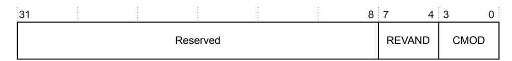

**Figure 10-17 EDPIDR3 bit assignments**

The following table shows the EDPIDR3 bit assignments.

**Table 10-22 EDPIDR3 bit assignments**

| Bits   | Name   | Function        |                      |
|--------|--------|-----------------|----------------------|
| [31:8] | -      | Reserved, RES0. |                      |
| [7:4]  | REVAND | 0x0             | Part minor revision. |
| [3:0]  | CMOD   | 0x0             | Customer modified.   |

# **External Debug Peripheral Identification Register 4**

The EDPIDR4 characteristics are:

#### **Purpose**

Provides information to identify an external debug component.

#### **Usage constraints**

Accessible through the internal memory-mapped interface and the external debug interface. The access conditions are:

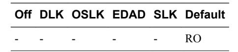

*[Table 11-1 External register access conditions](#page-398-0)* on page 11-399 describes the access conditions.

#### **Configurations**

The EDPIDR4 is in the Debug power domain.

# **Attributes**

See *[10.7 Memory-mapped register summary](#page-361-0)* on page 10-362.

The following figure shows the EDPIDR4 bit assignments.

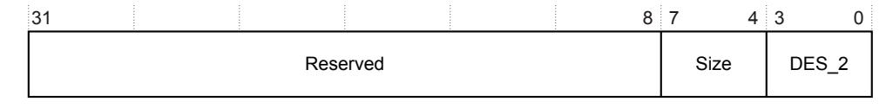

**Figure 10-18 EDPIDR4 bit assignments**

The following table shows the EDPIDR4 bit assignments.

# **Table 10-23 EDPIDR4 bit assignments**

<span id="page-376-0"></span>

| Bits                           | Name  |     | Function                                                                                                                         |  |  |
|--------------------------------|-------|-----|----------------------------------------------------------------------------------------------------------------------------------|--|--|
| [31:8]<br>-<br>Reserved, RES0. |       |     |                                                                                                                                  |  |  |
| [7:4]                          | Size  | 0x0 | Size of the component. Log2 the number of 4KB pages from the start of the component to the end of the<br>component ID registers. |  |  |
| [3:0]                          | DES_2 | 0x4 | ARM Limited. This is the least significant nibble JEP106 continuation code.                                                      |  |  |

# **External Debug Peripheral Identification Register 5-7**

No information is held in the Peripheral ID5, Peripheral ID6, and Peripheral ID7 Registers. They are reserved for future use and are RES0.

# **10.8.9 External Debug Component Identification Registers**

There are four read-only External Debug Component Identification Registers, Debug Component ID0 through Debug Component ID3. The following table shows these registers.

**Table 10-24 Summary of the External Debug Component Identification Registers**

| Register      | Value | Offset |
|---------------|-------|--------|
| Component ID0 | 0x0D  | 0xFF0  |
| Component ID1 | 0x90  | 0xFF4  |
| Component ID2 | 0x05  | 0xFF8  |
| Component ID3 | 0xB1  | 0xFFC  |

The External Debug Component Identification Registers identify Debug as an ARM Debug Interface v5 component. The External Debug Component ID registers are:

- *External Debug Component Identification Register 0* on page 10-377.
- *[External Debug Component Identification Register 1](#page-377-0)* on page 10-378.
- *[External Debug Component Identification Register 2](#page-378-0)* on page 10-379.
- *[External Debug Component Identification Register 3](#page-378-0)* on page 10-379.

#### **External Debug Component Identification Register 0**

The EDCIDR0 characteristics are:

## **Purpose**

Provides information to identify an external debug component.

#### **Usage constraints**

Accessible through the internal memory-mapped interface and the external debug interface. The access conditions are:

| Off | DLK | OSLK | EDAD | SLK | Default |
|-----|-----|------|------|-----|---------|
| -   | -   | -    | -    | -   | RO      |

*[Table 11-1 External register access conditions](#page-398-0)* on page 11-399 describes the access conditions.

## **Configurations**

The EDCIDR0 is in the Debug power domain.

#### **Attributes**

See *[10.7 Memory-mapped register summary](#page-361-0)* on page 10-362.

The following figure shows the EDCIDR0 bit assignments.

<span id="page-377-0"></span>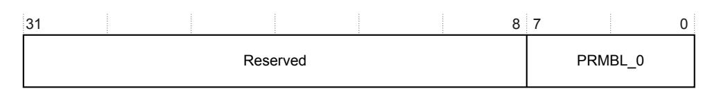

**Figure 10-19 EDCIDR0 bit assignments**

The following table shows the EDCIDR0 bit assignments.

**Table 10-25 EDCIDR0 bit assignments**

| Bits<br>Name |         | Function                 |
|--------------|---------|--------------------------|
| [31:8]<br>-  |         | Reserved, RES0.          |
| [7:0]        | PRMBL_0 | Preamble byte 0.<br>0x0D |

# **External Debug Component Identification Register 1**

The EDCIDR1 characteristics are:

# **Purpose**

Provides information to identify an external debug component.

#### **Usage constraints**

Accessible through the internal memory-mapped interface and the external debug interface. The access conditions are:

| Off | DLK | OSLK | EDAD | SLK | Default |
|-----|-----|------|------|-----|---------|
| -   | -   | -    | -    | -   | RO      |

*[Table 11-1 External register access conditions](#page-398-0)* on page 11-399 describes the access conditions.

#### **Configurations**

The EDCIDR1 is in the Debug power domain.

#### **Attributes**

See *[10.7 Memory-mapped register summary](#page-361-0)* on page 10-362.

The following figure shows the EDCIDR1 bit assignments.

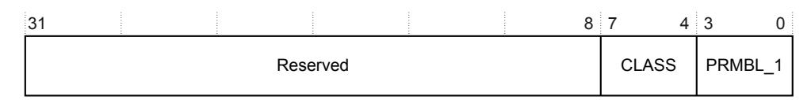

**Figure 10-20 EDCIDR1 bit assignments**

The following table shows the EDCIDR1 bit assignments.

**Table 10-26 EDCIDR1 bit assignments**

| Bits   | Name    | Function        |                  |
|--------|---------|-----------------|------------------|
| [31:8] | -       | Reserved, RES0. |                  |
| [7:4]  | CLASS   | 0x9             | Debug component. |
| [3:0]  | PRMBL_1 | 0x0             | Preamble.        |

# <span id="page-378-0"></span>**External Debug Component Identification Register 2**

The EDCIDR2 characteristics are:

### **Purpose**

Provides information to identify an external debug component.

# **Usage constraints**

Accessible through the internal memory-mapped interface and the external debug interface. The access conditions are:

| Off | DLK | OSLK | EDAD | SLK | Default |
|-----|-----|------|------|-----|---------|
| -   | -   | -    | -    | -   | RO      |

*[Table 11-1 External register access conditions](#page-398-0)* on page 11-399 describes the access conditions.

# **Configurations**

The EDCIDR2 is in the Debug power domain.

# **Attributes**

See *[10.7 Memory-mapped register summary](#page-361-0)* on page 10-362.

The following figure shows the EDCIDR2 bit assignments.


**Figure 10-21 EDCIDR2 bit assignments**

The following table shows the EDCIDR2 bit assignments.

**Table 10-27 EDCIDR2 bit assignments**

| Bits<br>Name     | Function        |                  |
|------------------|-----------------|------------------|
| [31:8]<br>-      | Reserved, RES0. |                  |
| [7:0]<br>PRMBL_2 | 0x05            | Preamble byte 2. |

# **External Debug Component Identification Register 3**

The EDCIDR3 characteristics are:

#### **Purpose**

Provides information to identify an external debug component.

#### **Usage constraints**

Accessible through the internal memory-mapped interface and the external debug interface. The access conditions are:

| Off | DLK | OSLK | EDAD | SLK | Default |
|-----|-----|------|------|-----|---------|
| -   | -   | -    | -    | -   | RO      |

*[Table 11-1 External register access conditions](#page-398-0)* on page 11-399 describes the access conditions.

#### **Configurations**

The EDCIDR3 is in the Debug power domain.

#### **Attributes**

See *[10.7 Memory-mapped register summary](#page-361-0)* on page 10-362.

The following figure shows the EDCIDR3 bit assignments.

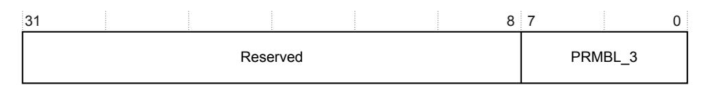

**Figure 10-22 EDCIDR3 bit assignments**

The following table shows the EDCIDR3 bit assignments.

**Table 10-28 EDCIDR3 bit assignments**

| Bits<br>Name     | Function        |                  |
|------------------|-----------------|------------------|
| [31:8]<br>-      | Reserved, RES0. |                  |
| [7:0]<br>PRMBL_3 | 0xB1            | Preamble byte 3. |

# <span id="page-380-0"></span>**10.9 Debug events**

Describes debug events in the processor.

A debug event can be either:

- A software debug event.
- A halting debug event.

A processor responds to a debug event in one of the following ways:

- Ignores the debug event.
- Takes a debug exception.
- Enters Debug state.

See the *ARM® Architecture Reference Manual ARMv8* for more information on debug events.

This section contains the following subsections:

- *10.9.1 Watchpoint debug events* on page 10-381.
- *10.9.2 Debug OS Lock* on page 10-381.

# **10.9.1 Watchpoint debug events**

In the Cortex-A57 processor, watchpoint debug events are always synchronous. Memory hint instructions and cache clean operations, except DC ZVA, DC IVAC, and DC IVAU do not generate watchpoint debug events. Store exclusive instructions generate a watchpoint debug event even when the check for the control of exclusive monitor fails.

For watchpoint debug events, the value reported in DFAR is guaranteed to be no lower than the address of the watchpointed location rounded down to a multiple of 16 bytes.

## **10.9.2 Debug OS Lock**

Debug OS Lock is set by the powerup reset, **nCPUPORESET**. For normal behavior of debug events and debug register accesses, Debug OS Lock must be cleared. For more information, see the *ARM® Architecture Reference Manual ARMv8*.

# **Related information**

*2.3.2 Resets* [on page 2-36](#page-35-0)*.*

# <span id="page-381-0"></span>10.10 External debug interface

The system can access memory-mapped debug registers through the APB interface.

The APB interface is compliant with the AMBA 3 APB interface.

The following figure shows the debug interface implemented in the Cortex-A57 processor. For more information on these signals, see the  $ARM^{\$}$  CoreSight<sup>™</sup> Architecture Specification.

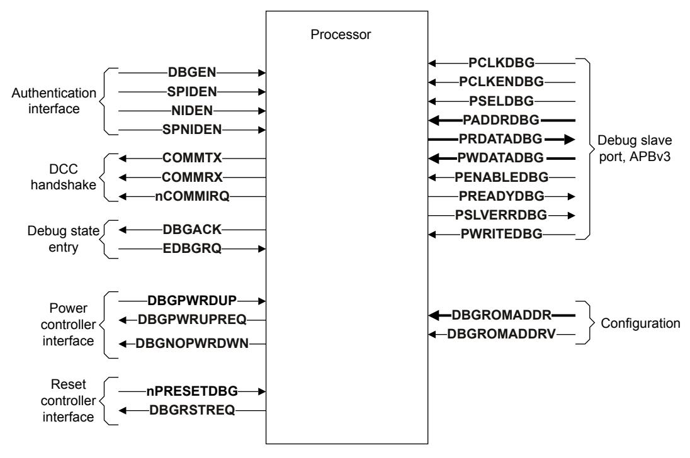

Figure 10-23 External debug interface, including APBv3 slave port

This section contains the following subsections:

- 10.10.1 Debug memory map on page 10-382.
- 10.10.2 DBGPWRDUP debug signal on page 10-383.
- 10.10.3 DBGL1RSTDISABLE debug signal on page 10-383.
- 10.10.4 Changing the authentication signals on page 10-384.

# 10.10.1 Debug memory map

The memory map supports up to four cores in a cluster. The following table shows the address mapping for the debug trace components.

Table 10-29 Address mapping for debug trace components

| Address range       | Component er |
|---------------------|--------------|
| 0x000000 - 0x00FFFF | ROM table    |
| 0x010000 - 0x01FFFF | Core 0 Debug |
| 0x020000 - 0x02FFFF | Core 0 CTI   |
| 0x030000 - 0x03FFFF | Core 0 PMU   |
| 0x040000 - 0x04FFFF | Core 0 Trace |

er Indicates the mapped component if present, otherwise reserved.

# **Table 10-29 Address mapping for debug trace components (continued)**

<span id="page-382-0"></span>

| Address range       | Component er |
|---------------------|--------------|
| 0x050000 - 0x10FFFF | Reserved     |
| 0x110000 - 0x11FFFF | Core 1 Debug |
| 0x120000 - 0x12FFFF | Core 1 CTI   |
| 0x130000 - 0x13FFFF | Core 1 PMU   |
| 0x140000 - 0x14FFFF | Core 1 Trace |
| 0x150000 - 0x20FFFF | Reserved     |
| 0x210000 - 0x21FFFF | Core 2 Debug |
| 0x220000 - 0x22FFFF | Core 2 CTI   |
| 0x230000 - 0x23FFFF | Core 2 PMU   |
| 0x240000 - 0x24FFFF | Core 2 Trace |
| 0x250000 - 0x30FFFF | Reserved     |
| 0x310000 - 0x31FFFF | Core 3 Debug |
| 0x320000 - 0x32FFFF | Core 3 CTI   |
| 0x330000 - 0x33FFFF | Core 3 PMU   |
| 0x340000 - 0x34FFFF | Core 3 Trace |
| 0x350000 - 0x3FFFFF | Reserved     |

# **10.10.2 DBGPWRDUP debug signal**

This section describes the **DBGPWRDUP** debug input signal.

# **DBGPWRDUP**

You must set the **DBGPWRDUP** signal LOW before removing power to the core domain. After power is restored to the core domain, the **DBGPWRDUP** signal must be asserted HIGH. The EDPRSR.PU bit reflects the value of this **DBGPWRDUP** signal.

| Note |
|------|
|      |

**DBGPWRDUP** must be tied HIGH if the particular implementation does not support separate core and debug power domains.

#### **10.10.3 DBGL1RSTDISABLE debug signal**

When set HIGH, the **DBGL1RSTDISABLE** input signal disables the automatic hardware controlled invalidation of the L1 data cache after the processor is reset using **nCORERESET** or **nCPUPORESET**. It also disables the automatic hardware-controlled invalidation of the L2 snoop tag RAMs after the L2 is reset using **nL2RESET**.

The **DBGL1RSTDISABLE** must be used only to assist debug of an external watchdog triggered reset by allowing the contents of the L1 data cache before the reset to be observable after the reset. If reset is

[er](#page-381-0) Indicates the mapped component if present, otherwise reserved.

<span id="page-383-0"></span>asserted, while an L1 data cache eviction or L1 data cache fetch is performed, the accuracy of those cache entries is not guaranteed. Similarly, the contents of the L2 snoop tag RAMs might be observed following reset of the L2 if **DBGL1RSTDISABLE** is asserted before resetting the L2.

You must not use the **DBGL1RSTDISABLE** signal to disable automatic hardware-controlled invalidation of the L1 data cache or the L2 snoop tag RAMs in normal processor powerup sequences. This is because synchronization of the L1 data cache invalidation sequence with the duplicate L1 tags in the Level 2 Memory System is not guaranteed.

The **DBGL1RSTDISABLE** signal applies to all processors in the multiprocessor. Each processor samples the signal when **nCORERESET** or **nCPUPORESET** is asserted. The L2 samples the signal when **nL2RESET** is asserted.

| If the functionality offered by the DBGL1RSTDISABLE input signal is not required, the input must be |  |  |
|-----------------------------------------------------------------------------------------------------|--|--|
| tied to LOW.                                                                                        |  |  |
|                                                                                                     |  |  |

| Note                                                        |  |  |
|-------------------------------------------------------------|--|--|
| This feature is available only in r1p0 and later revisions. |  |  |

#### **10.10.4 Changing the authentication signals**

The **NIDEN**, **DBGEN**, **SPIDEN**, and **SPNIDEN** input signals are either tied off to some fixed value or controlled by some external device.

If software running on the processor has control over an external device that drives the authentication signals, it must make the change using a safe sequence:

- 1. Execute an implementation-specific sequence of instructions to change the signal value. For example, this might be a single STR instruction that writes certain value to a control register in a system peripheral.
- 2. If the prior step involves any memory operation, issue a DSB instruction.
- 3. Poll the DBGAUTHSTATUS\_EL1 register to check whether the processor has already detected the changed value of these signals. This is required because the system might not issue the signal change to the processor until several cycles after the DSB instruction completes.
- 4. Issue an ISB instruction or exception entry or exception return.

The software cannot perform debug or analysis operations that depend on the new value of the authentication signals until this procedure is complete. The same rules apply when the debugger has control of the processor through the Instruction Transfer Register, EDITR, while in Debug state. The relevant combinations of the **DBGEN**, **NIDEN**, **SPIDEN**, and **SPNIDEN** values can be determined by polling DBGAUTHSTATUS\_EL1.

# <span id="page-384-0"></span>**10.11 ROM table**

This section provides details on the processor's ROM table.

The Cortex-A57 processor includes a ROM table that complies with the *ARM® CoreSight™ Architecture Specification*. This table contains a list of components such as processor debug units, processor *Cross Trigger Interface*s (CTIs), processor *Performance Monitoring Unit*s (PMUs) and processor *Embedded Trace Macrocell*s (ETMs). Debuggers can use the ROM table to determine which components are implemented inside the processor.

If a component is not included in your configuration of the processor, the corresponding debug APB ROM table entry is still present but the component is marked as not present.

This section contains the following subsections:

- *10.11.1 ROM table register interface* on page 10-385.
- *10.11.2 ROM table register summary* on page 10-385.
- *[10.11.3 ROM table register descriptions](#page-385-0)* on page 10-386.
- *[10.11.4 ROM table Debug Peripheral Identification Registers](#page-387-0)* on page 10-388.
- *[10.11.5 ROM table Debug Component Identification Registers](#page-391-0)* on page 10-392.

## **10.11.1 ROM table register interface**

The interface to the ROM table entries is the APB slave port.

# **Related information**

*[10.10 External debug interface](#page-381-0)* on page 10-382*.*

## **10.11.2 ROM table register summary**

The following table shows the offsets from the physical base address of the ROM table.

**Table 10-30 ROM table registers**

| Offset | Name       | Type | Description                                          |
|--------|------------|------|------------------------------------------------------|
| 0x000  | ROMENTRY0  | RO   | Core 0 Debug, see ROM entry registers on page 10-386 |
| 0x004  | ROMENTRY1  | RO   | Core 0 CTI, see ROM entry registers on page 10-386   |
| 0x008  | ROMENTRY2  | RO   | Core 0 PMU, see ROM entry registers on page 10-386   |
| 0x00C  | ROMENTRY3  | RO   | Core 0 ETM, see ROM entry registers on page 10-386   |
| 0x010  | ROMENTRY4  | RO   | Core 1 Debug, see ROM entry registers on page 10-386 |
| 0x014  | ROMENTRY5  | RO   | Core 1 CTI, see ROM entry registers on page 10-386   |
| 0x018  | ROMENTRY6  | RO   | Core 1 PMU, see ROM entry registers on page 10-386   |
| 0x01C  | ROMENTRY7  | RO   | Core 1 ETM, see ROM entry registers on page 10-386   |
| 0x020  | ROMENTRY8  | RO   | Core 2 Debug, see ROM entry registers on page 10-386 |
| 0x024  | ROMENTRY9  | RO   | Core 2 CTI, see ROM entry registers on page 10-386   |
| 0x028  | ROMENTRY10 | RO   | Core 2 PMU, see ROM entry registers on page 10-386   |
| 0x02C  | ROMENTRY11 | RO   | Core 2 ETM, see ROM entry registers on page 10-386   |
| 0x030  | ROMENTRY12 | RO   | Core 3 Debug, see ROM entry registers on page 10-386 |
| 0x034  | ROMENTRY13 | RO   | Core 3 CTI, see ROM entry registers on page 10-386   |

## **Table 10-30 ROM table registers (continued)**

<span id="page-385-0"></span>

| Offset      | Name       | Type | Description                                                           |
|-------------|------------|------|-----------------------------------------------------------------------|
| 0x038       | ROMENTRY14 | RO   | Core 3 PMU, see ROM entry registers on page 10-386                    |
| 0x03C       | ROMENTRY15 | RO   | Core 3 ETM, see ROM entry registers on page 10-386                    |
| 0x040-0xFCC | -          | RO   | Reserved, RES0                                                        |
| 0xFD0       | ROMPIDR4   | RO   | ROM table Debug Peripheral Identification Register 4 on page 10-391   |
| 0xFD4       | ROMPIDR5   | RO   | ROM table Debug Peripheral Identification Register 5-7 on page 10-392 |
| 0xFD8       | ROMPIDR6   | RO   |                                                                       |
| 0xFDC       | ROMPIDR7   | RO   |                                                                       |
| 0xFE0       | ROMPIDR0   | RO   | ROM table Debug Peripheral Identification Register 0 on page 10-388   |
| 0xFE4       | ROMPIDR1   | RO   | ROM table Debug Peripheral Identification Register 1 on page 10-389   |
| 0xFE8       | ROMPIDR2   | RO   | ROM table Debug Peripheral Identification Register 2 on page 10-390   |
| 0xFEC       | ROMPIDR3   | RO   | ROM table Debug Peripheral Identification Register 3 on page 10-391   |
| 0xFF0       | ROMCIDR0   | RO   | ROM table Debug Component Identification Register 0 on page 10-393    |
| 0xFF4       | ROMCIDR1   | RO   | ROM table Debug Component Identification Register 1 on page 10-393    |
| 0xFF8       | ROMCIDR2   | RO   | ROM table Debug Component Identification Register 2 on page 10-394    |
| 0xFFC       | ROMCIDR3   | RO   | ROM table Debug Component Identification Register 3 on page 10-394    |

## **10.11.3 ROM table register descriptions**

This section describes the ROM table registers. *[10.11.2 ROM table register summary](#page-384-0)* on page 10-385 provides cross-references to individual registers.

# **ROM entry registers**

The characteristics of the ROMENTRY*n* are:

| Purpose<br>Indicates to a debugger whether the debug component is present in the processor's |
|----------------------------------------------------------------------------------------------|
|----------------------------------------------------------------------------------------------|

debug logic. There are 16 ROMENTRY registers in the Cortex-A57 processor.

**Usage** The accessibility to the ROMENTRY*n* by condition code is:

**constraints**

| Off | DLK | OSLK | EDAD | SLK | Default |
|-----|-----|------|------|-----|---------|
| -   | -   | -    | -    | -   | RO      |

*[Table 11-1 External register access conditions](#page-398-0)* on page 11-399 describes the access

conditions.

**Configurations** The ROMENTRY*n* is Common to Secure and Non-secure states.

**Attributes** See the register summary in *[Table 10-30 ROM table registers](#page-384-0)* on page 10-385.

The following figure shows the ROMENTRY bit assignments.

<span id="page-386-0"></span>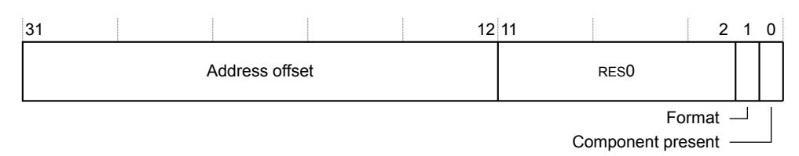

Figure 10-24 ROMENTRY bit assignments

The following table shows the ROMENTRY bit assignments.

Table 10-31 ROMENTRY bit assignments

| Bits    | Name                | Function                                                                                   |  |  |
|---------|---------------------|--------------------------------------------------------------------------------------------|--|--|
| [31:12] | Address offset      | Address offset for the debug component.                                                    |  |  |
|         |                     | Note                                                                                       |  |  |
|         |                     | Negative values of address offsets are permitted using the two's complement of the offset. |  |  |
| [11:2]  | -                   | Reserved, RESO.                                                                            |  |  |
| [1]     | Format              | Format of the ROM table entry. The value for all ROMENTRY registers is:                    |  |  |
|         |                     | 0 End marker.                                                                              |  |  |
|         |                     | 1 32-bit format.                                                                           |  |  |
| [0]     | Component presentes | Indicates whether the component is present:                                                |  |  |
|         |                     | O Component is not present.                                                                |  |  |
|         |                     | 1 Component is present.                                                                    |  |  |

The Physical Address of a debug component is determined by shifting the address offset 12 places to the left and adding the result to Physical Address of processor ROM table.

The following table shows the offset values for all ROMENTRY values. If a processor is not implemented, the ROMENTRY registers for its debug, CTI, PMU, and ETM components are 0x00000000.

Table 10-32 ROMENTRY values

| Name      | Debug component   | Offset value | ROMENTRY value           |
|-----------|-------------------|--------------|--------------------------|
|           | = ::::: 3 : 5 ::: |              |                          |
| ROMENTRY0 | Core 0 Debug      | 0x00010      | 0x00010003               |
| ROMENTRY1 | Core 0 CTI        | 0x00020      | 0x00020003               |
| ROMENTRY2 | Core 0 PMU        | 0x00030      | 0x00030003               |
| ROMENTRY3 | Core 0 ETM        | 0x00040      | 0x00040003               |
| ROMENTRY4 | Core 1 Debug      | 0x00110      | 0x00110003               |
| ROMENTRY5 | Core 1 CTI        | 0x00120      | 0x00120003 <sup>et</sup> |
| ROMENTRY6 | Core 1 PMU        | 0x00130      | 0x00130003 <sup>et</sup> |
| ROMENTRY7 | Core 1 ETM        | 0x00140      | 0x00140003 <sup>et</sup> |
| ROMENTRY8 | Core 2 Debug      | 0x00210      | 0x00210003 <sup>et</sup> |
|           |                   |              |                          |

core 0 is always present. The component entries for core 1, 2, and 3 depend on your configuration.
 If the component is present.

**Table 10-32 ROMENTRY values (continued)**

| Name       | Debug component | Offset value | ROMENTRY value |
|------------|-----------------|--------------|----------------|
| ROMENTRY9  | Core 2 CTI      | 0x00220      | 0x00220003et   |
| ROMENTRY10 | Core 2 PMU      | 0x00230      | 0x00230003et   |
| ROMENTRY11 | Core 2 ETM      | 0x00240      | 0x00240003et   |
| ROMENTRY12 | Core 3 Debug    | 0x00310      | 0x00310003et   |
| ROMENTRY13 | Core 3 CTI      | 0x00320      | 0x00320003et   |
| ROMENTRY14 | Core 3 PMU      | 0x00330      | 0x00330003et   |
| ROMENTRY15 | Core 3 ETM      | 0x00340      | 0x00340003et   |
|            |                 |              |                |

# <span id="page-387-0"></span>**10.11.4 ROM table Debug Peripheral Identification Registers**

The ROM table Debug Peripheral Identification Registers provide standard information required for all components that conform to the *ARM® Debug Interface Architecture Specification ADIv5.0 to ADIv5.2*. There is a set of eight registers, listed in register number order in the following table.

**Table 10-33 Summary of the ROM table Debug Peripheral Identification Registers**

| Register | Value | Offset |  |
|----------|-------|--------|--|
| ROMPID4  | 0x04  | 0xFD0  |  |
| ROMPID5  | 0x00  | 0xFD4  |  |
| ROMPID6  | 0x00  | 0xFD8  |  |
| ROMPID7  | 0x00  | 0xFDC  |  |
| ROMPID0  | 0xA2  | 0xFE0  |  |
| ROMPID1  | 0xB4  | 0xFE4  |  |
| ROMPID2  | 0x3B  | 0xFE8  |  |
| ROMPID3  | 0x00  | 0xFEC  |  |
|          |       |        |  |

Only bits[7:0] of each ROM table Debug Peripheral ID Register are used, with bits[31:8] reserved. Together, the eight ROM table Debug Peripheral ID Registers define a single 64-bit Peripheral ID.

The ROM table Debug Peripheral ID registers are:

- *ROM table Debug Peripheral Identification Register 0* on page 10-388.
- *[ROM table Debug Peripheral Identification Register 1](#page-388-0)* on page 10-389.
- *[ROM table Debug Peripheral Identification Register 2](#page-389-0)* on page 10-390.
- *[ROM table Debug Peripheral Identification Register 3](#page-390-0)* on page 10-391.
- *[ROM table Debug Peripheral Identification Register 4](#page-390-0)* on page 10-391.
- *[ROM table Debug Peripheral Identification Register 5-7](#page-391-0)* on page 10-392.

#### **ROM table Debug Peripheral Identification Register 0**

The ROMPIDR0 characteristics are:

## **Purpose**

Provides information to identify an external debug component.

## <span id="page-388-0"></span>**Usage constraints**

Accessible through the internal memory-mapped interface and the external debug interface. The access conditions are:

| Off | DLK | OSLK | EDAD | SLK | Default |
|-----|-----|------|------|-----|---------|
| -   | -   | -    | -    | -   | RO      |

*[Table 11-1 External register access conditions](#page-398-0)* on page 11-399 describes the access conditions.

## **Configurations**

The ROMPIDR0 is in the Debug power domain.

## **Attributes**

See the register summary in *[Table 10-30 ROM table registers](#page-384-0)* on page 10-385.

The following figure shows the ROMPIDR0 bit assignments.

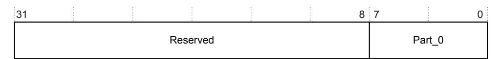

**Figure 10-25 ROMPIDR0 bit assignments**

The following table shows the ROMPIDR0 bit assignments.

**Table 10-34 ROMPIDR0 bit assignments**

| Bits   | Name   | Function        |                                                      |
|--------|--------|-----------------|------------------------------------------------------|
| [31:8] | -      | Reserved, RES0. |                                                      |
| [7:0]  | Part_0 | 0xA2            | Least significant byte of the ROM table part number. |

#### **ROM table Debug Peripheral Identification Register 1**

The ROMPIDR1 characteristics are:

#### **Purpose**

Provides information to identify an external debug component.

## **Usage constraints**

Accessible through the internal memory-mapped interface and the external debug interface. The access conditions are:

| Off | DLK | OSLK | EDAD | SLK | Default |
|-----|-----|------|------|-----|---------|
| -   | -   | -    | -    | -   | RO      |

*[Table 11-1 External register access conditions](#page-398-0)* on page 11-399 describes the access conditions.

# **Configurations**

The ROMPIDR1 is in the Debug power domain.

# **Attributes**

See the register summary in *[Table 10-30 ROM table registers](#page-384-0)* on page 10-385.

The following figure shows the ROMPIDR1 bit assignments.

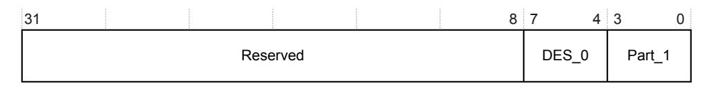

Figure 10-26 ROMPIDR1 bit assignments

The following table shows the ROMPIDR1 bit assignments.

Table 10-35 ROMPIDR1 bit assignments

<span id="page-389-0"></span>

| Bits   | Name   | Functio  | on                                                           |
|--------|--------|----------|--------------------------------------------------------------|
| [31:8] | -      | Reserved | d, reso.                                                     |
| [7:4]  | DES_0  | 0xB      | Least significant nibble of JEP106 ID code. For ARM Limited. |
| [3:0]  | Part_1 | 0x4      | Most significant nibble of the ROM table part number.        |

## **ROM table Debug Peripheral Identification Register 2**

The ROMPIDR2 characteristics are:

#### Purpose

Provides information to identify an external debug component.

#### **Usage constraints**

Accessible through the internal memory-mapped interface and the external debug interface. The access conditions are:

| Off | DLK | OSLK | EDAD | SLK | Default |
|-----|-----|------|------|-----|---------|
| -   | -   | -    | -    | -   | RO      |

Table 11-1 External register access conditions on page 11-399 describes the access conditions.

## Configurations

The ROMPIDR2 is in the Debug power domain.

## **Attributes**

See the register summary in *Table 10-30 ROM table registers* on page 10-385.

The following figure shows the ROMPIDR2 bit assignments.

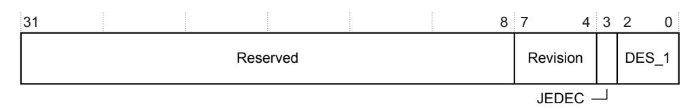

Figure 10-27 ROMPIDR2 bit assignments

The following table shows the ROMPIDR2 bit assignments.

Table 10-36 ROMPIDR2 bit assignments

| Bits   | Name     | Function        |                      |  |
|--------|----------|-----------------|----------------------|--|
| [31:8] | -        | Reserved, RESO. |                      |  |
| [7:4]  | Revision | 3               | Part major revision. |  |

## **Table 10-36 ROMPIDR2 bit assignments (continued)**

<span id="page-390-0"></span>

| Bits  | Name  | Function |                                                                     |
|-------|-------|----------|---------------------------------------------------------------------|
| [3]   | JEDEC | 0b1      | RAO. Indicates a JEP106 identity code is used.                      |
| [2:0] | DES_1 | 0b011    | Designer, most significant bits of JEP106 ID code. For ARM Limited. |

# **ROM table Debug Peripheral Identification Register 3**

The ROMPIDR3 characteristics are:

#### **Purpose**

Provides information to identify an external debug component.

#### **Usage constraints**

Accessible through the internal memory-mapped interface and the external debug interface. The access conditions are:

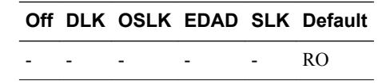

*[Table 11-1 External register access conditions](#page-398-0)* on page 11-399 describes the access conditions.

#### **Configurations**

The ROMPIDR3 is in the Debug power domain.

# **Attributes**

See the register summary in *[Table 10-30 ROM table registers](#page-384-0)* on page 10-385.

The following figure shows the ROMPIDR3 bit assignments.

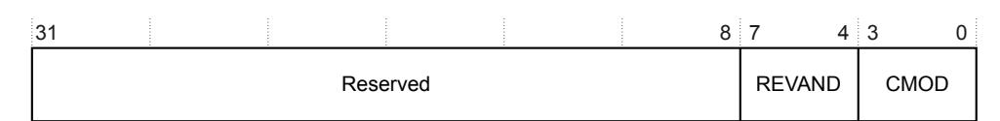

**Figure 10-28 ROMPIDR3 bit assignments**

The following table shows the ROMPIDR3 bit assignments.

#### **Table 10-37 ROMPIDR3 bit assignments**

| Bits   | Name   | Function        |                      |
|--------|--------|-----------------|----------------------|
| [31:8] | -      | Reserved, RES0. |                      |
| [7:4]  | REVAND | 0x0             | Part minor revision. |
| [3:0]  | CMOD   | 0x0             | Customer modified.   |

#### **ROM table Debug Peripheral Identification Register 4**

The ROMPIDR4 characteristics are:

**Purpose** Provides information to identify an external debug component.

<span id="page-391-0"></span>**Usage constraints** Accessible through the internal memory-mapped interface and the external debug interface. The access conditions are:

| Off | DLK | OSLK | EDAD | SLK | Default |
|-----|-----|------|------|-----|---------|
| -   | -   | -    | -    | -   | RO      |

*[Table 11-1 External register access conditions](#page-398-0)* on page 11-399 describes the access conditions.

**Configurations** The ROMPIDR4 is in the Debug power domain.

**Attributes** See the register summary in *[Table 10-30 ROM table registers](#page-384-0)* on page 10-385.

The following figure shows the ROMPIDR4 bit assignments.

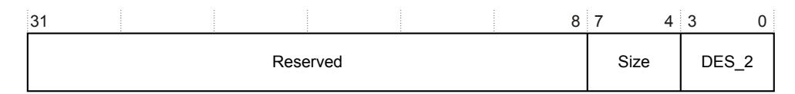

**Figure 10-29 ROMPIDR4 bit assignments**

The following table shows the ROMPIDR4 bit assignments.

**Table 10-38 ROMPIDR4 bit assignments**

| Bits   | Name  | Function        |                                                                                                                                  |  |  |  |
|--------|-------|-----------------|----------------------------------------------------------------------------------------------------------------------------------|--|--|--|
| [31:8] | -     | Reserved, RES0. |                                                                                                                                  |  |  |  |
| [7:4]  | Size  | 0x0             | Size of the component. Log2 the number of 4KB pages from the start of the component to the end of the<br>component ID registers. |  |  |  |
| [3:0]  | DES_2 | 0x4             | Designer, JEP106 continuation code, least significant nibble. For ARM Limited.                                                   |  |  |  |

#### **ROM table Debug Peripheral Identification Register 5-7**

No information is held in the Peripheral ID5, Peripheral ID6, and Peripheral ID7 Registers. They are reserved for future use and are RES0.

#### **10.11.5 ROM table Debug Component Identification Registers**

There are four read-only Component Identification Registers, Component ID0 through Component ID3. The following table shows these registers.

**Table 10-39 Summary of the ROM table Debug Component Identification registers**

| Register | Value | Offset |
|----------|-------|--------|
| ROMCIDR0 | 0x0D  | 0xFF0  |
| ROMCIDR1 | 0x10  | 0xFF4  |
| ROMCIDR2 | 0x05  | 0xFF8  |
| ROMCIDR3 | 0xB1  | 0xFFC  |

The ROM table Debug Component Identification Registers identify Debug as an ARM Debug Interface v5 component. The ROM table Component ID registers are:

- *[ROM table Debug Component Identification Register 0](#page-392-0)* on page 10-393.
- *[ROM table Debug Component Identification Register 1](#page-392-0)* on page 10-393.

- <span id="page-392-0"></span>• *[ROM table Debug Component Identification Register 2](#page-393-0)* on page 10-394.
- *[ROM table Debug Component Identification Register 3](#page-393-0)* on page 10-394.

# **ROM table Debug Component Identification Register 0**

The ROMCIDR0 characteristics are:

#### **Purpose**

Provides information to identify an external debug component.

## **Usage constraints**

Accessible through the internal memory-mapped interface and the external debug interface. The access conditions are:

| Off | DLK | OSLK | EDAD | SLK | Default |
|-----|-----|------|------|-----|---------|
| -   | -   | -    | -    | -   | RO      |

*[Table 11-1 External register access conditions](#page-398-0)* on page 11-399 describes the access conditions.

#### **Configurations**

The ROMCIDR0 is in the Debug power domain.

#### **Attributes**

See the register summary in *[Table 10-30 ROM table registers](#page-384-0)* on page 10-385.

The following figure shows the ROMCIDR0 bit assignments.

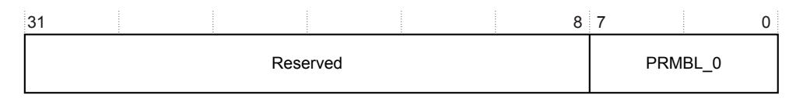

**Figure 10-30 ROMCIDR0 bit assignments**

The following table shows the ROMCIDR0 bit assignments.

**Table 10-40 ROMCIDR0 bit assignments**

| Bits<br>Name     | Function       |                 |
|------------------|----------------|-----------------|
| [31:8]<br>-      | Reserved, RES0 |                 |
| [7:0]<br>PRMBL_0 | 0x0D           | Preamble byte 0 |

# **ROM table Debug Component Identification Register 1**

The ROMCIDR1 characteristics are:

**Purpose** Provides information to identify an external debug component.

**Usage constraints** Accessible through the internal memory-mapped interface and the external debug

interface. The access conditions are:

| Off | DLK | OSLK | EDAD | SLK | Default |
|-----|-----|------|------|-----|---------|
| -   | -   | -    | -    | -   | RO      |

*[Table 11-1 External register access conditions](#page-398-0)* on page 11-399 describes the access

conditions.

**Configurations** The ROMCIDR1 is in the Debug power domain.

**Attributes** See the register summary in *[Table 10-30 ROM table registers](#page-384-0)* on page 10-385.

The following figure shows the ROMCIDR1 bit assignments.


**Figure 10-31 ROMCIDR1 bit assignments**

The following table shows the ROMCIDR1 bit assignments.

**Table 10-41 ROMCIDR1 bit assignments**

<span id="page-393-0"></span>

| Bits   | Name    | Function        |                                   |
|--------|---------|-----------------|-----------------------------------|
| [31:8] | -       | Reserved, RES0. |                                   |
| [7:4]  | CLASS   | 0x1             | Component Class. For a ROM table. |
| [3:0]  | PRMBL_1 | 0x0             | Preamble.                         |

## **ROM table Debug Component Identification Register 2**

The ROMCIDR2 characteristics are:

**Purpose** Provides information to identify an external debug component.

**Usage constraints** Accessible through the internal memory-mapped interface and the external debug

interface. The access conditions are:

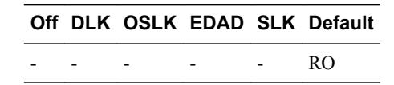

*[Table 11-1 External register access conditions](#page-398-0)* on page 11-399 describes the access conditions.

**Configurations** The ROMCIDR2 is in the Debug power domain.

**Attributes** See the register summary in *[Table 10-30 ROM table registers](#page-384-0)* on page 10-385.

The following figure shows the ROMCIDR2 bit assignments.


**Figure 10-32 ROMCIDR2 bit assignments**

The following table shows the ROMCIDR2 bit assignments.

**Table 10-42 ROMCIDR2 bit assignments**

| Bits   | Name    | Function       |                 |
|--------|---------|----------------|-----------------|
| [31:8] | -       | Reserved, RES0 |                 |
| [7:0]  | PRMBL_2 | 0x05           | Preamble byte 2 |

#### **ROM table Debug Component Identification Register 3**

The ROMCIDR3 characteristics are:

#### **Purpose**

Provides information to identify an external debug component.

## **Usage constraints**

Accessible through the internal memory-mapped interface and the external debug interface. The access conditions are:

| Off | DLK | OSLK | EDAD | SLK | Default |
|-----|-----|------|------|-----|---------|
| -   | -   | -    | -    | -   | RO      |

*[Table 11-1 External register access conditions](#page-398-0)* on page 11-399 describes the access conditions.

## **Configurations**

The ROMCIDR3 is in the Debug power domain.

## **Attributes**

See the register summary in *[Table 10-30 ROM table registers](#page-384-0)* on page 10-385.

The following figure shows the ROMCIDR3 bit assignments.

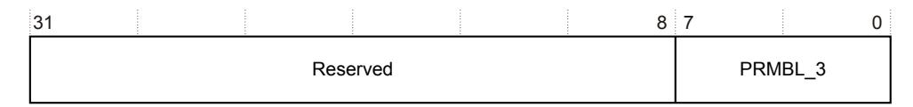

**Figure 10-33 ROMCIDR3 bit assignments**

The following table shows the ROMCIDR3 bit assignments.

**Table 10-43 ROMCIDR3 bit assignments**

| Bits   | Name    | Function       |                 |
|--------|---------|----------------|-----------------|
| [31:8] | -       | Reserved, RES0 |                 |
| [7:0]  | PRMBL_3 | 0xB1           | Preamble byte 3 |

# <span id="page-395-0"></span>Chapter 11 **Performance Monitor Unit**

This section describes the *Performance Monitor Unit* (PMU) and the registers that it uses.

It contains the following sections:

- *[11.1 About the PMU](#page-396-0)* on page 11-397.
- *[11.2 PMU functional description](#page-397-0)* on page 11-398.
- *[11.3 AArch64 PMU register summary](#page-399-0)* on page 11-400.
- *[11.4 AArch64 PMU register descriptions](#page-401-0)* on page 11-402.
- *[11.5 AArch32 PMU register summary](#page-406-0)* on page 11-407.
- *[11.6 Memory-mapped register summary](#page-408-0)* on page 11-409.
- *[11.7 Memory-mapped register descriptions](#page-411-0)* on page 11-412.
- *11.8 Events* [on page 11-429.](#page-428-0)
- *11.9 Interrupts* [on page 11-433.](#page-432-0)
- *[11.10 Exporting PMU events](#page-433-0)* on page 11-434.

# <span id="page-396-0"></span>**11.1 About the PMU**

The processor includes logic to gather various statistics on the operation of the processor and memory system during runtime, based on PMUv3 architecture.

These events provide useful information about the behavior of the processor that you can use when debugging or profiling code.

The processor PMU provides six counters. Each counter can count any of the events available in the processor. The absolute counts recorded might vary because of pipeline effects. This has negligible effect except in cases where the counters are enabled for a very short time.

# <span id="page-397-0"></span>**11.2 PMU functional description**

Describes the functionality of the PMU.

The following figure shows the PMU block diagram.

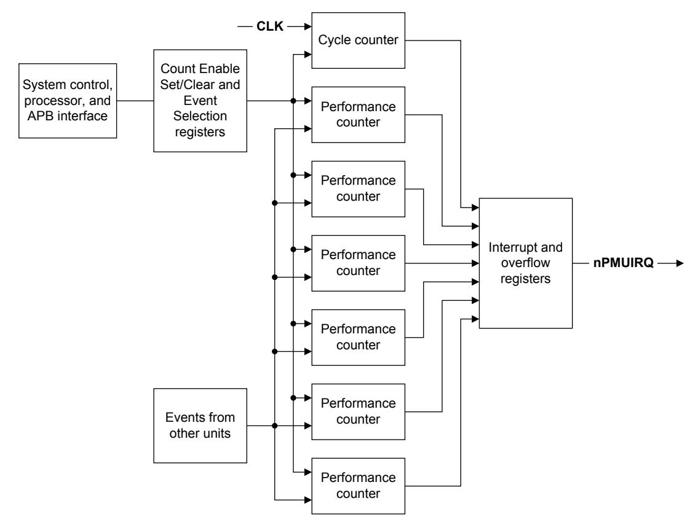

**Figure 11-1 PMU block diagram**

This section contains the following subsections:

- *11.2.1 Event interface* on page 11-398.
- *11.2.2 System register and APB interface* on page 11-398.
- *11.2.3 Counters* on page 11-398.
- *[11.2.4 PMU register interfaces](#page-398-0)* on page 11-399.
- *[11.2.5 External register access permissions](#page-398-0)* on page 11-399.

# **11.2.1 Event interface**

Events from all other units from across the design are provided to the PMU.

## **11.2.2 System register and APB interface**

You can program the PMU registers using the System registers or the external APB interface.

#### **11.2.3 Counters**

The Cortex-A57 processor has six counters. Each counter can count any of the events available in the processor.

# <span id="page-398-0"></span>**11.2.4 PMU register interfaces**

The Cortex-A57 processor supports access to the Performance Monitor registers from the System registers and a memory-mapped interface. External access to the Performance Monitor registers is also provided with the APB slave interface.

#### **Related information**

*[10.10 External debug interface](#page-381-0)* on page 10-382*.*

## **11.2.5 External register access permissions**

External access permission to the PMU registers is subject to the conditions at the time of the access. The following table describes the processor response to accesses through the external debug and memorymapped interfaces.

**Table 11-1 External register access conditions**

| Condition | Condition trigger                    | Description                                                                                                                                                                                                              |  |  |
|-----------|--------------------------------------|--------------------------------------------------------------------------------------------------------------------------------------------------------------------------------------------------------------------------|--|--|
| Off       | EDPRSR.PU is 0                       | Core power domain is completely off, or in a low-power state where the<br>Core power domain registers cannot be accessed.                                                                                                |  |  |
|           |                                      | Note                                                                                                                                                                                                                     |  |  |
|           |                                      | If debug power is off then all external debug and memory-mapped register<br>accesses return an error.                                                                                                                    |  |  |
| DLK       | EDPRSR.DLK is 1                      | OS Double Lock is locked.                                                                                                                                                                                                |  |  |
| OSLK      | OSLSR_EL1.OSLK is 1                  | OS Lock is locked.                                                                                                                                                                                                       |  |  |
| EPMAD     | AllowExternalPMUAccess() ==<br>FALSE | External performance monitors access disabled. When an error is returned<br>because of the EPMAD condition, and this is the highest priority error<br>condition, EDPRSR.SPMAD is set to 1. Otherwise SPMAD is unchanged. |  |  |
| SLK       | Memory-mapped interface only         | Software Lock is locked. For the external debug interface, ignore this<br>condition.                                                                                                                                     |  |  |
| Default   | -                                    | None of the conditions apply, normal access.                                                                                                                                                                             |  |  |

The following table shows an example of external register access conditions for access to a Performance Monitors register. To determine the access permission for the register, scan the columns from left to right. Stop at the first column whose condition is true, the entry gives the register's access permission and scanning stops.

**Table 11-2 External register access conditions example**

| Off | DLK | OSLK | EPMAD | SLK   | Default |
|-----|-----|------|-------|-------|---------|
| -   | -   | -    | -     | RO/WI | RO      |

# <span id="page-399-0"></span>11.3 AArch64 PMU register summary

The PMU counters and their associated control registers are accessible in AArch64 state with MRS and MSR instructions.

The following table shows the PMU registers in AArch64 state. It also shows the offset address for the registers that are accessible from the internal memory-mapped interface or the external debug interface.

Table 11-3 PMU register summary in AArch64 state

| Offset | Name           | Туре | Width  | Description                                                                            |
|--------|----------------|------|--------|----------------------------------------------------------------------------------------|
| 0xE04  | PMCR_EL0       | RW   | 32-bit | 11.4.1 Performance Monitors Control Register, EL0 on page 11-402                       |
| 0xC00  | PMCNTENSET_EL0 | RW   | 32-bit | Performance Monitors Count Enable Set Register                                         |
| 0xC20  | PMCNTENCLR_EL0 | RW   | 32-bit | Performance Monitors Count Enable Clear Register eu                                    |
| 0xC80  | PMOVSCLR_EL0   | RW   | 32-bit | Performance Monitors Overflow Flag Status Register eu                                  |
| 0хСА0  | PMSWINC_EL0    | WO   | 32-bit | Performance Monitors Software Increment Register eu                                    |
| -      | PMSELR_EL0     | RW   | 32-bit | Performance Monitors Event Counter Selection Register eu                               |
| 0xE20  | PMCEID0_EL0    | RO   | 32-bit | 11.4.2 Performance Monitors Common Event Identification Register 0, EL0 on page 11-404 |
| 0xE24  | PMCEID1_EL0    | RO   | 32-bit | Performance Monitors Common Event ID Register 1 eu                                     |
| -      | PMCCNTR_EL0    | RW   | 64-bit | Performance Monitors Cycle Count Register eu                                           |
| -      | PMXEVTYPER_EL0 | RW   | 32-bit | Performance Monitors Selected Event Type Register eu                                   |
| 0x47C  | PMCCFILTR_EL0  | RW   | 32-bit | Performance Monitors Cycle Count Filter Register eu ev                                 |
| -      | PMXEVCNTR0_EL0 | RW   | 32-bit | Performance Monitors Selected Event Count Register eu                                  |
| -      | PMUSERENR_EL0  | RW   | 32-bit | Performance Monitors User Enable Register <sup>eu</sup>                                |
| 0xC40  | PMINTENSET_EL1 | RW   | 32-bit | Performance Monitors Interrupt Enable Set Register eu                                  |
| 0xC60  | PMINTENCLR_EL1 | RW   | 32-bit | Performance Monitors Interrupt Enable Clear Register eu                                |
| 0xCC0  | PMOVSSET_EL0   | RW   | 32-bit | Performance Monitors Overflow Flag Status Set Register eu                              |
| 0x000  | PMEVCNTR0_EL0  | RW   | 32-bit | Performance Monitors Event Count Registers eu                                          |
| 0x008  | PMEVCNTR1_EL0  | •    |        |                                                                                        |
| 0x010  | PMEVCNTR2_EL0  | •    |        |                                                                                        |
| 0x018  | PMEVCNTR3_EL0  |      |        |                                                                                        |
| 0x020  | PMEVCNTR4_EL0  |      |        |                                                                                        |
| 0x028  | PMEVCNTR5_EL0  | •    |        |                                                                                        |

eu See the ARM® Architecture Reference Manual ARMv8 for more information.

ev The CP15 encoding provides access to PMCCFILTR\_EL0 only when PMSELR\_EL0.SEL==31.

## **Table 11-3 PMU register summary in AArch64 state (continued)**

| Offset | Name           | Type | Width  | Description                                         |
|--------|----------------|------|--------|-----------------------------------------------------|
| 0x400  | PMEVTYPER0_EL0 | RW   | 32-bit | Performance Monitors Event Type Registers eu        |
| 0x404  | PMEVTYPER1_EL0 |      |        |                                                     |
| 0x408  | PMEVTYPER2_EL0 |      |        |                                                     |
| 0x40C  | PMEVTYPER3_EL0 |      |        |                                                     |
| 0x410  | PMEVTYPER4_EL0 |      |        |                                                     |
| 0x414  | PMEVTYPER5_EL0 |      |        |                                                     |
| 0x47C  | PMCCFILTR_EL0  | RW   | 32-bit | Performance Monitors Cycle Count Filter Register eu |

# <span id="page-401-0"></span>**11.4 AArch64 PMU register descriptions**

This section describes the Cortex-A57 processor PMU registers in AArch64 state.

*[Table 11-3 PMU register summary in AArch64 state](#page-399-0)* on page 11-400 provides cross-references to individual registers.

This section contains the following subsections:

- *11.4.1 Performance Monitors Control Register, EL0* on page 11-402.
- *[11.4.2 Performance Monitors Common Event Identification Register 0, EL0](#page-403-0)* on page 11-404.

# **11.4.1 Performance Monitors Control Register, EL0**

The PMCR\_EL0 characteristics are:

**Purpose** Provides information on the Performance Monitors implementation, including the

number of counters implemented, and configures and controls the counters.

**Usage constraints** The accessibility of the PMCR\_EL0 by Exception level is:

| EL0    | EL1(NS) | EL1(S) | EL2 | EL3(SCR.NS = 1) | EL3(SCR.NS = 0) |
|--------|---------|--------|-----|-----------------|-----------------|
| Config | RW      | RW     | RW  | RW              | RW              |

The external accessibility to the PMCR\_EL0 by condition code is:

| Off   | DLK   | OSLK  | EPMAD | SLK   | Default |
|-------|-------|-------|-------|-------|---------|
| Error | Error | Error | Error | RO/WI | RW      |

*[Table 11-1 External register access conditions](#page-398-0)* on page 11-399 describes the access conditions.

**Configurations** The PMCR\_EL0 is Common to Secure and Non-secure states and architecturally mapped to:

- The AArch32 PMCR register.
- The external PMCR\_EL0 register.

**Attributes** See the register summary in *[Table 11-3 PMU register summary in AArch64 state](#page-399-0)* [on page 11-400](#page-399-0).

The following figure shows the PMCR\_EL0 bit assignments for a System register access.

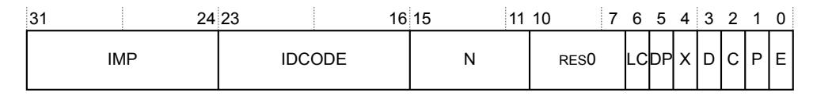

**Figure 11-2 PMCR\_EL0 bit assignments**

The following table shows the PMCR\_EL0 bit assignments for a System register access.

## **Table 11-4 PMCR\_EL0 bit assignments**

<span id="page-402-0"></span>

| Bits    | Name   | Function                                                                                                                                                                                     |  |  |  |  |  |  |  |
|---------|--------|----------------------------------------------------------------------------------------------------------------------------------------------------------------------------------------------|--|--|--|--|--|--|--|
| [31:24] | IMP    | Implementer code:                                                                                                                                                                            |  |  |  |  |  |  |  |
|         |        | ARM.<br>0x41                                                                                                                                                                                 |  |  |  |  |  |  |  |
|         |        | This is a read-only field.                                                                                                                                                                   |  |  |  |  |  |  |  |
| [23:16] | IDCODE | Identification code:                                                                                                                                                                         |  |  |  |  |  |  |  |
|         |        | Cortex-A57 processor.<br>0x01                                                                                                                                                                |  |  |  |  |  |  |  |
|         |        | This is a read-only field.                                                                                                                                                                   |  |  |  |  |  |  |  |
| [15:11] | N      | Number of event counters.                                                                                                                                                                    |  |  |  |  |  |  |  |
|         |        | In Non-secure modes other than Hyp mode, this field reads the value of HDCR.HPMN. See 4.5.12 Hyp Debug<br>Control Register on page 4-261.                                                    |  |  |  |  |  |  |  |
|         |        | In Secure state and Hyp mode, this field returns 0x6 that indicates the number of counters implemented.                                                                                      |  |  |  |  |  |  |  |
|         |        | This is a read-only field.                                                                                                                                                                   |  |  |  |  |  |  |  |
| [10:7]  | -      | Reserved, RES0.                                                                                                                                                                              |  |  |  |  |  |  |  |
| [6]     | LC     | Long cycle count enable. Selects which PMCCNTR_EL0 bit generates an overflow recorded in PMOVSR[31]:                                                                                         |  |  |  |  |  |  |  |
|         |        | 0<br>Overflow on increment that changes PMCCNTR_EL0[31] from 1 to 0.                                                                                                                         |  |  |  |  |  |  |  |
|         |        | 1<br>Overflow on increment that changes PMCCNTR_EL0[63] from 1 to 0.                                                                                                                         |  |  |  |  |  |  |  |
| [5]     | DP     | Disable cycle counter, PMCCNTR_EL0 when event counting is prohibited:                                                                                                                        |  |  |  |  |  |  |  |
|         |        | 0<br>Cycle counter operates regardless of the non-invasive debug authentication settings.                                                                                                    |  |  |  |  |  |  |  |
|         |        | 1<br>Cycle counter is disabled if non-invasive debug is not permitted and enabled.                                                                                                           |  |  |  |  |  |  |  |
|         |        | This bit is read/write.                                                                                                                                                                      |  |  |  |  |  |  |  |
| [4]     | X      | Export enable. This bit permits events to be exported to another debug device, such as a trace macrocell, over an<br>event bus:                                                              |  |  |  |  |  |  |  |
|         |        | 0<br>Export of events is disabled.                                                                                                                                                           |  |  |  |  |  |  |  |
|         |        | 1<br>Export of events is enabled.                                                                                                                                                            |  |  |  |  |  |  |  |
|         |        | This bit is read/write and does not affect the generation of Performance Monitors interrupts, that can be<br>implemented as a signal exported from the processor to an interrupt controller. |  |  |  |  |  |  |  |
| [3]     | D      | Clock divider:                                                                                                                                                                               |  |  |  |  |  |  |  |
|         |        | 0<br>When enabled, PMCCNTR_EL0 counts every clock cycle.                                                                                                                                     |  |  |  |  |  |  |  |
|         |        | 1<br>When enabled, PMCCNTR_EL0 counts every 64 clock cycles.                                                                                                                                 |  |  |  |  |  |  |  |
|         |        | This bit is read/write.                                                                                                                                                                      |  |  |  |  |  |  |  |

<span id="page-403-0"></span>

| Bits | Name | Function                                                                                                                                                                                                                             |  |  |  |  |  |  |
|------|------|--------------------------------------------------------------------------------------------------------------------------------------------------------------------------------------------------------------------------------------|--|--|--|--|--|--|
| [2]  | C    | Clock counter reset:                                                                                                                                                                                                                 |  |  |  |  |  |  |
|      |      | 0<br>No action.                                                                                                                                                                                                                      |  |  |  |  |  |  |
|      |      | 1<br>Reset PMCCNTR_EL0 to 0.                                                                                                                                                                                                         |  |  |  |  |  |  |
|      |      | Note                                                                                                                                                                                                                                 |  |  |  |  |  |  |
|      |      | Resetting PMCCNTR does not clear the PMCCNTR_EL0 overflow bit to 0. See the ARM®<br>Architecture Reference<br>Manual ARMv8 for more information.                                                                                     |  |  |  |  |  |  |
|      |      | This bit is write-only, and always RAZ.                                                                                                                                                                                              |  |  |  |  |  |  |
| [1]  | P    | Event counter reset:                                                                                                                                                                                                                 |  |  |  |  |  |  |
|      |      | 0<br>No action.                                                                                                                                                                                                                      |  |  |  |  |  |  |
|      |      | 1<br>Reset all event counters, not including PMCCNTR_EL0, to 0.                                                                                                                                                                      |  |  |  |  |  |  |
|      |      | In Non-secure modes other than Hyp mode, a write of 1 to this bit does not reset event counters that the<br>HDCR.HPMN field reserves for Hyp mode use. See 4.5.12 Hyp Debug Control Register on page 4-261.                          |  |  |  |  |  |  |
|      |      | In Secure state and Hyp mode, a write of 1 to this bit resets all the event counters.                                                                                                                                                |  |  |  |  |  |  |
| [0]  | E    | Enable bit. This bit does not disable or enable, counting by event counters reserved for Hyp mode by<br>HDCR.HPMN. It also does not suppress the generation of performance monitor overflow interrupt requests by<br>those counters: |  |  |  |  |  |  |
|      |      | 0<br>All counters, including PMCCNTR_EL0, are disabled. This is the reset value.                                                                                                                                                     |  |  |  |  |  |  |
|      |      | 1<br>All counters are enabled.                                                                                                                                                                                                       |  |  |  |  |  |  |
|      |      | This bit is read/write.                                                                                                                                                                                                              |  |  |  |  |  |  |

To access the PMCR\_EL0 in AArch64 state, read or write the register with:

```
MRS <Xt>, PMCR_EL0; Read Performance Monitors Control Register
MSR PMCR_EL0, <Xt>; Write Performance Monitors Control Register
```

To access the PMCR in AArch32 state, read or write the CP15 registers with:

```
MRC p15, 0, <Rt>, c9, c12, 0; Read Performance Monitors Control Register
MCR p15, 0, <Rt>, c9, c12, 0; Write Performance Monitors Control Register
```

See *[11.7.1 Performance Monitors Control Register, EL0](#page-411-0)* on page 11-412 for information about accessing the PMCR\_EL0 through the internal memory-mapped interface and the external debug interface.

## **11.4.2 Performance Monitors Common Event Identification Register 0, EL0**

The PMCEID0\_EL0 characteristics are:

# **Purpose**

Defines which common architectural and common micro-architectural feature events are implemented.

# **Usage constraints**

The accessibility to the PMCEID0 EL0 by Exception level is:

| EL0 (NS) | EL0 (S) | EL1(NS) | EL1(S) | EL2 | EL3(SCR.NS = 1) | EL3(SCR.NS = 0) |
|----------|---------|---------|--------|-----|-----------------|-----------------|
| Config   | Config  | RO      | RO     | RO  | RO              | RO              |

The external accessibility to the PMCEID0\_EL0 by condition code is:

| Off   | DLK   | OSLK  | EPMAD | SLK | Default |
|-------|-------|-------|-------|-----|---------|
| Error | Error | Error | Error | RO  | RO      |

Table 11-1 External register access conditions on page 11-399 describes the condition codes.

## Configurations

The PMCEID0\_EL0 is Common to Secure and Non-secure states and architecturally mapped to:

- The AArch32 PMCEID0 register.
- The external PMCEID0\_EL0 register.

#### **Attributes**

See the register summary in *Table 11-3 PMU register summary in AArch64 state* on page 11-400.

The following figure shows the PMCEID0\_EL0 bit assignments

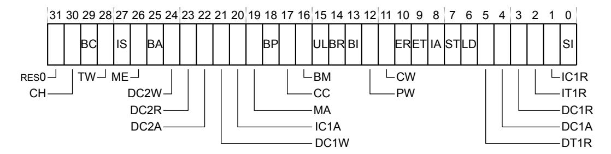

Figure 11-3 PMCEID0\_EL0 bit assignments

The following table shows the PMCEID0\_EL0 bit assignments with event implemented or not implemented when the associated bit is set to 1 or 0.

PMCEID1 EL0[31:0] is reserved.

Table 11-5 Common Event Identification Register 0 bit assignments

| Bit  | Name | Event number | Value | Event implemented if bit set to 1 or not implemented if bit set to 0                                                                                     |
|------|------|--------------|-------|----------------------------------------------------------------------------------------------------------------------------------------------------------|
| [31] | -    | 0x1F         | 0     | Reserved, RESO.                                                                                                                                          |
| [30] | СН   | 0x1E         | 1     | Chain. ew An odd-numbered counter increments when an overflow occurs on the preceding even-numbered counter. For even-numbered counters, does not count. |
| [29] | BC   | 0x1D         | 1     | Bus cycle.                                                                                                                                               |
| [28] | TW   | 0x1C         | 1     | TTBR write, architecturally executed, condition check pass - write to translation table base.                                                            |
| [27] | IS   | 0x1B         | 1     | Instruction speculatively executed.                                                                                                                      |
| [26] | ME   | 0x1A         | 1     | Local memory error.                                                                                                                                      |
| [25] | BA   | 0x19         | 1     | Bus access.                                                                                                                                              |
|      |      |              |       |                                                                                                                                                          |

ew See the ARM® Architecture Reference Manual ARMv8 for more information about the chain event.

**Table 11-5 Common Event Identification Register 0 bit assignments (continued)**

| Bit  | Name | Event number | Value | Event implemented if bit set to 1 or not implemented if bit set to 0                    |  |  |  |
|------|------|--------------|-------|-----------------------------------------------------------------------------------------|--|--|--|
| [24] | DC2W | 0x18         | 1     | Level 2 data cache Write-Back.                                                          |  |  |  |
| [23] | DC2R | 0x17         | 1     | Level 2 data cache refill.                                                              |  |  |  |
| [22] | DC2A | 0x16         | 1     | Level 2 data cache access.                                                              |  |  |  |
| [21] | DC1W | 0x15         | 1     | Level 1 data cache Write-Back.                                                          |  |  |  |
| [20] | IC1A | 0x14         | 1     | Level 1 instruction cache access.                                                       |  |  |  |
| [19] | MA   | 0x13         | 1     | Data memory access.                                                                     |  |  |  |
| [18] | BP   | 0x12         | 1     | Predictable branch speculatively executed.                                              |  |  |  |
| [17] | CC   | 0x11         | 1     | Cycle.                                                                                  |  |  |  |
| [16] | BM   | 0x10         | 1     | Mispredicted or not predicted branch speculatively executed.                            |  |  |  |
| [15] | UL   | 0x0F         | 0     | Instruction architecturally executed, condition check pass - unaligned load or store.   |  |  |  |
| [14] | BR   | 0x0E         | 0     | Instruction architecturally executed, condition check pass - procedure return.          |  |  |  |
| [13] | BI   | 0x0D         | 0     | Instruction architecturally executed - immediate branch.                                |  |  |  |
| [12] | PW   | 0x0C         | 0     | Instruction architecturally executed, condition check pass - software change of the PC. |  |  |  |
| [11] | CW   | 0x0B         | 1     | Instruction architecturally executed, condition check pass - write to CONTEXTIDR.       |  |  |  |
| [10] | ER   | 0x0A         | 1     | Instruction architecturally executed, condition check pass - exception return.          |  |  |  |
| [9]  | ET   | 0x09         | 1     | Exception taken.                                                                        |  |  |  |
| [8]  | IA   | 0x08         | 1     | Instruction architecturally executed.                                                   |  |  |  |
| [7]  | ST   | 0x07         | 0     | Instruction architecturally executed, condition check pass - store.                     |  |  |  |
| [6]  | LD   | 0x06         | 0     | Instruction architecturally executed, condition check pass - load.                      |  |  |  |
| [5]  | DT1R | 0x05         | 1     | Level 1 data TLB refill.This event is implemented.                                      |  |  |  |
| [4]  | DC1A | 0x04         | 1     | Level 1 data cache access.                                                              |  |  |  |
| [3]  | DC1R | 0x03         | 1     | Level 1 data cache refill.                                                              |  |  |  |
| [2]  | IT1R | 0x02         | 1     | Level 1 instruction TLB refill.                                                         |  |  |  |
| [1]  | IC1R | 0x01         | 1     | Level 1 instruction cache refill.                                                       |  |  |  |
| [0]  | SI   | 0x00         | 1     | Instruction architecturally executed, condition check pass - software increment.        |  |  |  |
|      |      |              |       |                                                                                         |  |  |  |

To access the PMCEID0\_EL0 in AArch64 state, read or write the register with:

MRS <Xt>, PMCEID0\_EL0; Read Performance Monitors Common Event Identification Register 0

To access the PMCEID0 in AArch32 state, read or write the CP15 register with:

MRC p15, 0, <Rt>, c9, c12, 6; Read Performance Monitors Common Event Identification Register 0

The PMCEID0\_EL0 can be accessed through the internal memory-mapped interface and the external debug interface, offset 0xE20.

# <span id="page-406-0"></span>**11.5 AArch32 PMU register summary**

The PMU counters and their associated control registers are accessible in AArch32 state from the System registers with MCR and MRC instructions for 32-bit registers and MCRR and MRRC for 64-bit registers.

The following table gives a summary of the PMU registers in AArch32 state.

The table also shows the offset address for the AArch32 registers that are accessible from the internal memory-mapped interface or the external debug interface.

See *[11.7 Memory-mapped register descriptions](#page-411-0)* on page 11-412 for a complete list of registers that are accessible from the internal memory-mapped interface or the external debug interface.

**Table 11-6 PMU register summary in AArch32 state**

| Offset | CRn | op1 | CRm | op2 | Name           | Type | Width  | Description                                                                               |
|--------|-----|-----|-----|-----|----------------|------|--------|-------------------------------------------------------------------------------------------|
| 0xE04  | c9  | 0   | c12 | 0   | PMCR           | RW   | 32-bit | 11.4.1 Performance Monitors Control Register, EL0<br>on page 11-402                       |
| 0xC00  |     |     |     | 1   | PMCNTENSET     | RW   | 32-bit | Performance Monitors Count Enable Set Register                                            |
| 0xC20  |     |     |     | 2   | PMCNTENCLR     | RW   | 32-bit | Performance Monitors Count Enable Clear Register ex                                       |
| 0xC80  |     |     |     | 3   | PMOVSR         | RW   | 32-bit | Performance Monitors Overflow Flag Status Register ex                                     |
| 0xCA0  |     |     |     | 4   | PMSWINC        | WO   | 32-bit | Performance Monitors Software Increment Register ex                                       |
| -      |     |     |     | 5   | PMSELR         | RW   | 32-bit | Performance Monitors Event Counter Selection Register ex                                  |
| 0xE20  |     |     |     | 6   | PMCEID0        | RO   | 32-bit | 11.4.2 Performance Monitors Common Event Identification<br>Register 0, EL0 on page 11-404 |
| 0xE24  |     |     |     | 7   | PMCEID1        | RO   | 32-bit | Performance Monitors Common Event Identification Register<br>1 ex                         |
| 0x0F8  | c9  | 0   | c13 | 0   | PMCCNTR[31:0]  | RW   | 32-bit | Performance Monitors Cycle Count Register ex                                              |
| 0x0FC  | -   | -   | -   | -   | PMCCNTR[63:32] |      |        |                                                                                           |
| -      | -   | 0   | c9  | -   | PMCCNTR[63:0]  |      | 64-bit |                                                                                           |
| -      | c9  | 0   | c13 | 1   | PMXEVTYPER     | RW   | 32-bit | Performance Monitors Selected Event Type Register ex                                      |
| 0x47C  |     |     |     |     | PMCCFILTR      | RW   | 32-bit | Performance Monitors Cycle Count Filter Register ex                                       |
| -      | c9  | 0   | c13 | 2   | PMXEVCNTR      | RW   | 32-bit | Performance Monitors Selected Event Count Register ex                                     |
| -      |     |     | c14 | 0   | PMUSERENR      | RW   | 32-bit | Performance Monitors User Enable Register ex                                              |
| 0xC40  |     |     |     | 1   | PMINTENSET     | RW   | 32-bit | Performance Monitors Interrupt Enable Set Register ex                                     |
| 0xC60  |     |     |     | 2   | PMINTENCLR     | RW   | 32-bit | Performance Monitors Interrupt Enable Clear Register ex                                   |
| 0xCC0  |     |     |     | 3   | PMOVSSET       | RW   | 32-bit | Performance Monitors Overflow Flag Status Set Register ex                                 |
| 0x000  | c14 | 0   | c8  | 0   | PMEVCNTR0      | RW   | 32-bit | Performance Monitors Event Count Registers ex                                             |
| 0x008  |     |     |     | 1   | PMEVCNTR1      |      |        |                                                                                           |
| 0x010  |     |     |     | 2   | PMEVCNTR2      |      |        |                                                                                           |
| 0x018  |     |     |     | 3   | PMEVCNTR3      |      |        |                                                                                           |
| 0x020  |     |     |     | 4   | PMEVCNTR4      |      |        |                                                                                           |
| 0x028  |     |     |     | 5   | PMEVCNTR5      |      |        |                                                                                           |

ex See the *ARM® Architecture Reference Manual ARMv8* for more information.

#### **Table 11-6 PMU register summary in AArch32 state (continued)**

| Offset | CRn | op1 | CRm | op2 | Name       | Type | Width  | Description                                         |
|--------|-----|-----|-----|-----|------------|------|--------|-----------------------------------------------------|
| 0x400  |     |     | c12 | 0   | PMEVTYPER0 | RW   | 32-bit | Performance Monitors Event Type Registers ex        |
| 0x404  |     |     |     | 1   | PMEVTYPER1 |      |        |                                                     |
| 0x408  |     |     |     | 2   | PMEVTYPER2 |      |        |                                                     |
| 0x40C  |     |     |     | 3   | PMEVTYPER3 |      |        |                                                     |
| 0x410  |     |     |     | 4   | PMEVTYPER4 |      |        |                                                     |
| 0x414  |     |     |     | 5   | PMEVTYPER5 |      |        |                                                     |
| 0x47C  |     |     | c15 | 7   | PMCCFILTR  | RW   | 32-bit | Performance Monitors Cycle Count Filter Register ex |

# <span id="page-408-0"></span>**11.6 Memory-mapped register summary**

The following table shows the PMU registers that are accessible through the internal memory-mapped interface and the external debug interface.

**Table 11-7 Memory-mapped PMU register summary**

| Offset      | Name               | Type | Width  | Description                                                                   |
|-------------|--------------------|------|--------|-------------------------------------------------------------------------------|
| 0x000       | PMEVCNTR0_EL0      | RW   | 32-bit | Performance Monitors Event Count Register 0                                   |
| 0x004       | -                  | -    | -      | Reserved                                                                      |
| 0x008       | PMEVCNTR1_EL0      | RW   | 32-bit | Performance Monitors Event Count Register 1 ey                                |
| 0x00C       | -                  | -    | -      | Reserved                                                                      |
| 0x010       | PMEVCNTR2_EL0      | RW   | 32-bit | Performance Monitors Event Count Register 2 ey                                |
| 0x014       | -                  | -    | -      | Reserved                                                                      |
| 0x018       | PMEVCNTR3_EL0      | RW   | 32-bit | Performance Monitors Event Count Register 3 ey                                |
| 0x01C       | -                  | -    | -      | Reserved                                                                      |
| 0x020       | PMEVCNTR4_EL0      | RW   | 32-bit | Performance Monitors Event Count Register 4 ey                                |
| 0x024       | -                  | -    | -      | Reserved                                                                      |
| 0x028       | PMEVCNTR5_EL0      | RW   | 32-bit | Performance Monitors Event Count Register 5 ey                                |
| 0x02C-0x0F4 | -                  | -    | -      | Reserved                                                                      |
| 0x0F8       | PMCCNTR_EL0[31:0]  | RW   | 32-bit | Performance Monitors Cycle Count Register ey                                  |
| 0x0FC       | PMCCNTR_EL0[63:32] | RW   | 32-bit |                                                                               |
| 0x100-0x3FC | -                  |      | -      | Reserved                                                                      |
| 0x400       | PMEVTYPER0_EL0     | RW   | 32-bit | Performance Monitors Event Type Register ey                                   |
| 0x404       | PMEVTYPER1_EL0     |      |        |                                                                               |
| 0x408       | PMEVTYPER2_EL0     |      |        |                                                                               |
| 0x40C       | PMEVTYPER3_EL0     |      |        |                                                                               |
| 0x410       | PMEVTYPER4_EL0     |      |        |                                                                               |
| 0x414       | PMEVTYPER5_EL0     |      |        |                                                                               |
| 0x418-0x478 | -                  | -    | -      | Reserved                                                                      |
| 0x47C       | PMCCFILTR_EL0      | RW   | 32-bit | Performance Monitors Cycle Count Filter Register ey                           |
| 0x480-0x5FC | -                  | -    | -      | Reserved                                                                      |
| 0x600       | PMPCSR[31:0]       | RO   | 32-bit | 11.7.2 Performance Monitors Program Counter Sample Register                   |
| 0x604       | PMPCSR[63:32]      |      |        | on page 11-413                                                                |
| 0x608       | PMCIDSR            | RO   | 32-bit | 11.7.3 Performance Monitors Context ID Sample Register on page 11-413         |
| 0x60C       | PMVIDSR            | RO   | 32-bit | 11.7.4 Performance Monitors Virtual Context Sample Register<br>on page 11-414 |
| 0x610       | PMSSR              | RO   | 32-bit | 11.7.5 Performance Monitors Snapshot Status Register on page 11-414           |
|             |                    |      |        |                                                                               |

ey See the *ARM® Architecture Reference Manual ARMv8* for more information.

**Table 11-7 Memory-mapped PMU register summary (continued)**

| Offset                   | Name           | Type | Width  | Description                                                                               |
|--------------------------|----------------|------|--------|-------------------------------------------------------------------------------------------|
| 0x614                    | PMOVSSR        | RO   | 32-bit | 11.7.6 Performance Monitors Overflow Status Snapshot Register<br>on page 11-415           |
| 0x618                    | PMCCNTSR[31:0] | RO   | 32-bit | 11.7.7 Performance Monitors Cycle Counter Snapshot Register                               |
| 0x61C<br>PMCCNTSR[63:32] |                | RO   | 32-bit | on page 11-416                                                                            |
| 0x620                    | PMEVCNTSR0     | RO   | 32-bit | 11.7.8 Performance Monitors Event Counters Snapshot Registers                             |
| 0x624                    | PMEVCNTSR1     |      |        | on page 11-416                                                                            |
| 0x628                    | PMEVCNTSR2     |      |        |                                                                                           |
| 0x62C                    | PMEVCNTSR3     |      |        |                                                                                           |
| 0x630                    | PMEVCNTSR4     |      |        |                                                                                           |
| 0x634                    | PMEVCNTSR5     |      |        |                                                                                           |
| 0x638-0x6EC              | -              | -    | -      | Reserved                                                                                  |
| 0x6F0                    | PMSCR          | WO   | 32-bit | 11.7.9 Performance Monitors Snapshot Control Register on page 11-417                      |
| 0x6F4                    | PMSRR          | RW   | 32-bit | 11.7.10 Performance Monitors Snapshot Reset Register on page 11-418                       |
| 0x6F8-0xBFC              | -              | -    | -      | Reserved                                                                                  |
| 0xC00                    | PMCNTENSET_EL0 | RW   | 32-bit | Performance Monitors Count Enable Set Register ey                                         |
| 0xC04-0xC1C              | -              | -    | -      | Reserved                                                                                  |
| 0xC20                    | PMCNTENCLR_EL0 | RW   | 32-bit | Performance Monitors Count Enable Clear Register ey                                       |
| 0xC24-0xC3C              | -              | -    | -      | Reserved                                                                                  |
| 0xC40                    | PMINTENSET_EL1 | RW   | 32-bit | Performance Monitors Interrupt Enable Set Register ey                                     |
| 0xC44-0xC5C              | -              | -    | -      | Reserved                                                                                  |
| 0xC60                    | PMINTENCLR_EL1 | RW   | 32-bit | Performance Monitors Interrupt Enable Clear Register ey                                   |
| 0xC64-0xC7C              | -              | -    | -      | Reserved                                                                                  |
| 0xC80                    | PMOVSCLR_EL0   | RW   | 32-bit | Performance Monitors Overflow Flag Status Register ey                                     |
| 0xC84-0xC9C              | -              | -    | -      | Reserved                                                                                  |
| 0xCA0                    | PMSWINC_EL0    | WO   | 32-bit | Performance Monitors Software Increment Register ey                                       |
| 0xCA4-0xCBC              | -              | -    | -      | Reserved                                                                                  |
| 0xCC0                    | PMOVSSET_EL0   | RW   | 32-bit | Performance Monitors Overflow Flag Status Set Register ey                                 |
| 0xCC4-0xDFC              | -              | -    | -      | Reserved                                                                                  |
| 0xE00                    | PMCFGR         | RO   | 32-bit | 11.7.11 Performance Monitors Configuration Register on page 11-419                        |
| 0xE04                    | PMCR_EL0       | RW   | 32-bit | 11.7.1 Performance Monitors Control Register, EL0 on page 11-412                          |
| 0xE08-0xE1C              | -              | -    | -      | Reserved                                                                                  |
| 0xE20                    | PMCEID0_EL0    | RO   | 32-bit | 11.4.2 Performance Monitors Common Event Identification Register 0, EL0<br>on page 11-404 |
| 0xE24                    | PMCEID1_EL0    | RO   | 32-bit | Performance Monitors Common Event Identification Register 1 ey                            |
| 0xE28-0xFA4              | -              | -    | -      | Reserved                                                                                  |

**Table 11-7 Memory-mapped PMU register summary (continued)**

| Offset           | Name         | Type | Width  | Description                                                                                                      |
|------------------|--------------|------|--------|------------------------------------------------------------------------------------------------------------------|
| 0xFA8            | PMDEVAFF0    | RO   | 32-bit | Performance Monitors Device Affinity Register 0, see 4.3.2 Multiprocessor<br>Affinity Register, EL1 on page 4-91 |
| 0xFAC            | PMDEVAFF1    | RO   | 32-bit | Performance Monitors Device Affinity Register 1, RES0.                                                           |
| 0xFB0            | PMLAR        | WO   | 32-bit | Performance Monitors Lock Access Register ey                                                                     |
| 0xFB4            | PMLSR        | RO   | 32-bit | Performance Monitors Lock Status Register ey                                                                     |
| 0xFB8            | PMAUTHSTATUS | RO   | 32-bit | Performance Monitors Authentication Status Register ey                                                           |
| 0xFBC            | PMDEVARCH    |      | 32-bit | Performance Monitors Device Architecture Register ey                                                             |
| 0xFC0-0xFC8      | -            | -    | -      | Reserved                                                                                                         |
| 0xFCC            | PMDEVTYPE    | RO   | 32-bit | Performance Monitors Device Type Register ey                                                                     |
| 0xFD0            | PMPIDR4      | RO   | 32-bit | Performance Monitors Peripheral Identification Register 4 on page 11-424                                         |
| 0xFD4<br>PMPIDR5 |              | RO   | 32-bit | Performance Monitors Peripheral Identification Register 5-7<br>on page 11-425                                    |
| 0xFD8<br>PMPIDR6 |              |      |        |                                                                                                                  |
| 0xFDC            | PMPIDR7      |      |        |                                                                                                                  |
| 0xFE0            | PMPIDR0      | RO   | 32-bit | Performance Monitors Peripheral Identification Register 0 on page 11-421                                         |
| 0xFE4            | PMPIDR1      | RO   | 32-bit | Performance Monitors Peripheral Identification Register 1 on page 11-421                                         |
| 0xFE8            | PMPIDR2      | RO   | 32-bit | Performance Monitors Peripheral Identification Register 2 on page 11-422                                         |
| 0xFEC            | PMPIDR3      | RO   | 32-bit | Performance Monitors Peripheral Identification Register 3 on page 11-423                                         |
| 0xFF0            | PMCIDR0      | RO   | 32-bit | Performance Monitors Component Identification Register 0<br>on page 11-425                                       |
| 0xFF4            | PMCIDR1      | RO   | 32-bit | Performance Monitors Component Identification Register 1<br>on page 11-426                                       |
| 0xFF8            | PMCIDR2      | RO   | 32-bit | Performance Monitors Component Identification Register 2<br>on page 11-427                                       |
| 0xFFC            | PMCIDR3      | RO   | 32-bit | Performance Monitors Component Identification Register 3<br>on page 11-428                                       |

# <span id="page-411-0"></span>**11.7 Memory-mapped register descriptions**

This section describes the Cortex-A57 processor PMU registers accessible through the memory-mapped and debug interfaces.

*[11.6 Memory-mapped register summary](#page-408-0)* on page 11-409 provides cross-references to individual registers.

This section contains the following subsections:

- *11.7.1 Performance Monitors Control Register, EL0* on page 11-412.
- *[11.7.2 Performance Monitors Program Counter Sample Register](#page-412-0)* on page 11-413.
- *[11.7.3 Performance Monitors Context ID Sample Register](#page-412-0)* on page 11-413.
- *[11.7.4 Performance Monitors Virtual Context Sample Register](#page-413-0)* on page 11-414.
- *[11.7.5 Performance Monitors Snapshot Status Register](#page-413-0)* on page 11-414.
- *[11.7.6 Performance Monitors Overflow Status Snapshot Register](#page-414-0)* on page 11-415.
- *[11.7.7 Performance Monitors Cycle Counter Snapshot Register](#page-415-0)* on page 11-416.
- *[11.7.8 Performance Monitors Event Counters Snapshot Registers](#page-415-0)* on page 11-416.
- *[11.7.9 Performance Monitors Snapshot Control Register](#page-416-0)* on page 11-417.
- *[11.7.10 Performance Monitors Snapshot Reset Register](#page-417-0)* on page 11-418.
- *[11.7.11 Performance Monitors Configuration Register](#page-418-0)* on page 11-419.
- *[11.7.12 Performance Monitors Peripheral Identification Registers](#page-419-0)* on page 11-420.
- *[11.7.13 Performance Monitors Component Identification Registers](#page-424-0)* on page 11-425.

# **11.7.1 Performance Monitors Control Register, EL0**

The PMCR\_EL0 characteristics are:

#### **Purpose**

Configures and controls the counters.

#### **Usage constraints**

The external accessibility to the PMCR\_EL0 by condition code is:

| Off   | DLK   | OSLK  | EPMAD | SLK   | Default |
|-------|-------|-------|-------|-------|---------|
| Error | Error | Error | Error | RO/WI | RW      |

*[Table 11-1 External register access conditions](#page-398-0)* on page 11-399 describes the access conditions.

#### **Configurations**

The PMCR\_EL0 is Common to Secure and Non-secure states and architecturally mapped to:

- The AArch32 PMCR register.
- The external PMCR\_EL0 register.

#### **Attributes**

See the register summary in *[Table 11-7 Memory-mapped PMU register summary](#page-408-0)* [on page 11-409](#page-408-0).

The following figure shows the PMCR\_EL0 bit assignments for a memory-mapped access.

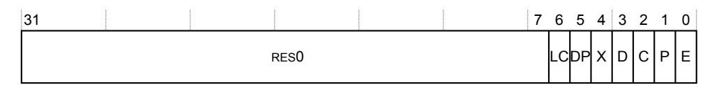

**Figure 11-4 PMCR\_EL0 bit assignments, memory-mapped view**

The following table shows the PMCR\_EL0 bit assignments for a memory-mapped access.

#### **Table 11-8 PMCR\_EL0 bit assignments, memory-mapped view**

<span id="page-412-0"></span>

| Bits   | Name | Function                                                                                                    |
|--------|------|-------------------------------------------------------------------------------------------------------------|
| [31:7] | -    | Reserved, RES0.                                                                                             |
| [6]    | LC   | The function of these bits is the same as when a System register access occurs. See Table 11-4 PMCR_EL0 bit |
| [5]    | DP   | assignments on page 11-403 for a description of these bits.                                                 |
| [4]    | X    |                                                                                                             |
| [3]    | D    |                                                                                                             |
| [2]    | C    |                                                                                                             |
| [1]    | P    |                                                                                                             |
| [0]    | E    |                                                                                                             |

The PMCR\_EL0 can be accessed through the internal memory-mapped interface and the external debug interface, offset 0xE04.

# **11.7.2 Performance Monitors Program Counter Sample Register**

The PMPCSR characteristics are:

# **Purpose**

The PMPCSR registers are aliases of the EDPCSR debug registers. Reads of the PMPCSR registers return a copy of the EDPCSR debug registers but does not:

- Cause a new EDPCSR capture.
- Change the EDCIDSR and EDVIDSR registers.

## **Usage constraints**

The external accessibility to the PMPCSR by condition code is:

| Off   | DLK   | OSLK | EPMAD | SLK | Default |
|-------|-------|------|-------|-----|---------|
| Error | Error | RO   | RO    | RO  | RO      |

*[Table 11-1 External register access conditions](#page-398-0)* on page 11-399 describes the condition codes.

#### **Configurations**

PMPCSR[31:0] copies the EDPCSRlo debug register.

PMPCSR[63:32] copies the EDPCSRhi debug register.

#### **Attributes**

See the register summary in *[Table 11-7 Memory-mapped PMU register summary](#page-408-0)* [on page 11-409](#page-408-0).

See the *ARM® Architecture Reference Manual ARMv8* for more information about the EDPCSR debug registers.

PMPCSR[31:0] can be accessed through the internal memory-mapped interface and the external debug interface, offset 0x600.

PMPCSR[63:32] can be accessed through the internal memory-mapped interface and the external debug interface, offset 0x604.

#### **11.7.3 Performance Monitors Context ID Sample Register**

The PMCIDSR characteristics are:

#### <span id="page-413-0"></span>**Purpose**

The PMCIDSR register is an alias of the EDCIDSR debug register. Reads of the PMCIDSR return a copy of the EDCIDSR debug register.

# **Usage constraints**

The external accessibility to the PMCIDSR by condition code is:

| Off   | DLK   | OSLK | EPMAD | SLK | Default |
|-------|-------|------|-------|-----|---------|
| Error | Error | RO   | RO    | RO  | RO      |

*[Table 11-1 External register access conditions](#page-398-0)* on page 11-399 describes the condition codes.

# **Configurations**

There is no configuration information for PMCIDSR.

## **Attributes**

See the register summary in *[Table 11-7 Memory-mapped PMU register summary](#page-408-0)* [on page 11-409](#page-408-0).

See the *ARM® Architecture Reference Manual ARMv8* for more information about the EDCIDSR debug register.

PMCIDSR can be accessed through the internal memory-mapped interface and the external debug interface, offset 0x608.

# **11.7.4 Performance Monitors Virtual Context Sample Register**

The PMVIDSR characteristics are:

# **Purpose**

The PMVIDSR register is an alias of the EDVIDSR debug register. Reads of the PMVIDSR return a copy of the EDVIDSR debug register.

#### **Usage constraints**

The external accessibility to the PMVIDSR by condition code is:

| Off   | DLK   | OSLK | EPMAD | SLK | Default |
|-------|-------|------|-------|-----|---------|
| Error | Error | RO   | RO    | RO  | RO      |

*[Table 11-1 External register access conditions](#page-398-0)* on page 11-399 describes the condition codes.

#### **Configurations**

There is no configuration information for PMVIDSR.

# **Attributes**

See the register summary in *[Table 11-7 Memory-mapped PMU register summary](#page-408-0)* [on page 11-409](#page-408-0).

See the *ARM® Architecture Reference Manual ARMv8* for more information about the EDVIDSR debug register.

PMVIDSR can be accessed through the internal memory-mapped interface and the external debug interface, offset 0x60C.

#### **11.7.5 Performance Monitors Snapshot Status Register**

The PMSSR characteristics are:

# **Purpose**

Provides status information on whether the PMU counters have been captured.

#### <span id="page-414-0"></span>**Usage constraints**

The external accessibility to the PMSSR by condition code is:

| Off   | DLK   | OSLK | EPMAD | SLK | Default |
|-------|-------|------|-------|-----|---------|
| Error | Error | RO   | RO    | RO  | RO      |

*[Table 11-1 External register access conditions](#page-398-0)* on page 11-399 describes the condition codes.

A security violation prevents the capture of the event counters.

The external monitor must keep track of whether the snapshot registers were captured by the processor.

To prevent loss of data, software must save and restore the PMU state, including the PMSCR and PMSRR registers, when capturing over a reset or power down.

# **Configurations**

There is no configuration information for PMSSR.

# **Attributes**

See the register summary in *[Table 11-7 Memory-mapped PMU register summary](#page-408-0)* [on page 11-409](#page-408-0).

The following figure shows the PMSSR bit assignments.

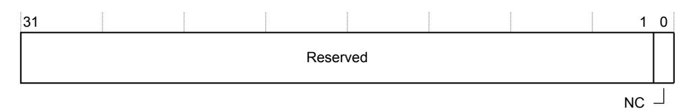

**Figure 11-5 PMSSR bit assignments**

The following table shows the PMSSR bit assignments.

**Table 11-9 PMSSR bit assignments**

| Bits                           | Name | Function                                                                           |
|--------------------------------|------|------------------------------------------------------------------------------------|
| [31:1]<br>-<br>Reserved, RES0. |      |                                                                                    |
| [0]                            | NC   | No capture. The possible values are:                                               |
|                                |      | 0<br>PMU counters captured.                                                        |
|                                |      | 1<br>PMU counters not captured.                                                    |
|                                |      | The NC bit:                                                                        |
|                                |      | •<br>Is reset to 1 by a Warm reset but overwritten at the first capture.           |
|                                |      | •<br>Does not reflect the status of the captured Program Counter Sample registers. |

PMSSR can be accessed through the internal memory-mapped interface and the external debug interface, offset 0x610.

#### **11.7.6 Performance Monitors Overflow Status Snapshot Register**

The PMOVSSR characteristics are:

# **Purpose**

Captures a copy of the PMOVSR register. After capture, writes to PMOVSSET\_EL0 and PMOVSCLR\_EL0 do not affect the PMOVSSR value.

#### <span id="page-415-0"></span>**Usage constraints**

The external accessibility to the PMOVSSR by condition code is:

| Off   | DLK   | OSLK | EPMAD | SLK | Default |
|-------|-------|------|-------|-----|---------|
| Error | Error | RO   | RO    | RO  | RO      |

*[Table 11-1 External register access conditions](#page-398-0)* on page 11-399 describes the condition codes.

#### **Configurations**

There is no configuration information for PMOVSSR.

#### **Attributes**

See the register summary in *[Table 11-7 Memory-mapped PMU register summary](#page-408-0)* [on page 11-409](#page-408-0).

See the *ARM® Architecture Reference Manual ARMv8* for more information about the PMOVSR register.

PMOVSSR can be accessed through the internal memory-mapped interface and the external debug interface, offset 0x614.

# **11.7.7 Performance Monitors Cycle Counter Snapshot Register**

The PMCCNTSR characteristics are:

#### **Purpose**

Captures a copy of the PMCCNTR\_EL0 register. After capture, writes to PMCCNTR\_EL0 and PMCR\_EL0.C do not affect the PMCCNTSR value.

#### **Usage constraints**

The external accessibility to the PMCCNTSR by condition code is:

| Off   | DLK   | OSLK | EPMAD | SLK | Default |
|-------|-------|------|-------|-----|---------|
| Error | Error | RO   | RO    | RO  | RO      |

*[Table 11-1 External register access conditions](#page-398-0)* on page 11-399 describes the condition codes.

# **Configurations**

There is no configuration information for PMCCNTSR.

# **Attributes**

See the register summary in *[Table 11-7 Memory-mapped PMU register summary](#page-408-0)* [on page 11-409](#page-408-0).

See the *ARM® Architecture Reference Manual ARMv8* for more information about the PMCCNTR\_EL0 register.

PMCCNTSR[31:0] can be accessed through the internal memory-mapped interface and the external debug interface, offset 0x618.

PMCCNTSR[63:32] can be accessed through the internal memory-mapped interface and the external debug interface, offset 0x61C.

## **11.7.8 Performance Monitors Event Counters Snapshot Registers**

The PMEVCNTSR*n* characteristics are:

## <span id="page-416-0"></span>**Purpose**

Captures a copies of the PMEVCNTR*n*\_EL0 registers. After capture, writes to PMEVCNTR*n*\_EL0 and PMCR\_EL0.P do not affect the PMEVCNTSR*n* value.

**Note**

The range of *n* for PMEVCNTSR*n* is 0 to 5.

#### **Usage constraints**

The external accessibility to the PMEVCNTSR*n* by condition code is:

| Off   | DLK   | OSLK | EPMAD | SLK | Default |
|-------|-------|------|-------|-----|---------|
| Error | Error | RO   | RO    | RO  | RO      |

*[Table 11-1 External register access conditions](#page-398-0)* on page 11-399 describes the condition codes.

# **Configurations**

There is no configuration information for PMEVCNTSR*n*.

# **Attributes**

See the register summary in *[Table 11-7 Memory-mapped PMU register summary](#page-408-0)* [on page 11-409](#page-408-0).

See the *ARM® Architecture Reference Manual ARMv8* for more information about the PMEVCNTR*n*\_EL0 registers.

The PMEVCNTR*n*\_EL0 registers can be accessed through the internal memory-mapped interface and the external debug interface, offsets 0x620-0x634.

# **11.7.9 Performance Monitors Snapshot Control Register**

The PMSCR characteristics are:

#### **Purpose**

Initiates an immediate capture.

#### **Usage constraints**

The external accessibility to the PMSCR by condition code is:

| Off   | DLK   | OSLK | EPMAD | SLK | Default |
|-------|-------|------|-------|-----|---------|
| Error | Error | WO   | WO    | WO  | WO      |

*[Table 11-1 External register access conditions](#page-398-0)* on page 11-399 describes the condition codes.

#### **Configurations**

There is no configuration information for PMSCR.

# **Attributes**

See the register summary in *[Table 11-7 Memory-mapped PMU register summary](#page-408-0)* [on page 11-409](#page-408-0).

The following figure shows the PMSCR bit assignments.

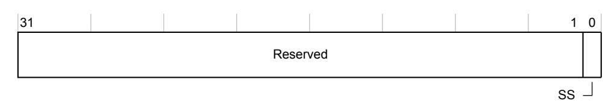

**Figure 11-6 PMSCR bit assignments**

The following table shows the PMSCR bit assignments.

## Table 11-10 PMSCR bit assignments

<span id="page-417-0"></span>

| Bits   | Name | Function           | ction                              |  |  |  |  |
|--------|------|--------------------|------------------------------------|--|--|--|--|
| [31:1] | -    | Reserved, RES      | d, RESO.                           |  |  |  |  |
| [0]    | SS   | Capture now.       | ture now. The possible values are: |  |  |  |  |
|        |      | O Capture ignored. |                                    |  |  |  |  |
|        |      | 1 Initiat          | Initiate a capture immediately.    |  |  |  |  |
|        |      | 1 Initiat          | e a capture immediately.           |  |  |  |  |

The PMSCR can be accessed through the internal memory-mapped interface and the external debug interface, offset 0x6F0.

## 11.7.10 Performance Monitors Snapshot Reset Register

The PMSRR characteristics are:

**Purpose** Reset the cycle counter and the performance counters.

Usage constraints The external accessibility to the PMSRR by condition code is:

| Off   | DLK   | OSLK | <b>EPMAD</b> | SLK | Default |
|-------|-------|------|--------------|-----|---------|
| Error | Error | RW   | RW           | RW  | RW      |

Table 11-1 External register access conditions on page 11-399 describes the

condition codes.

**Configurations** There is no configuration information for PMSRR.

Attributes See the register summary in Table 11-7 Memory-mapped PMU register summary

on page 11-409.

The following figure shows the PMSRR bit assignments.

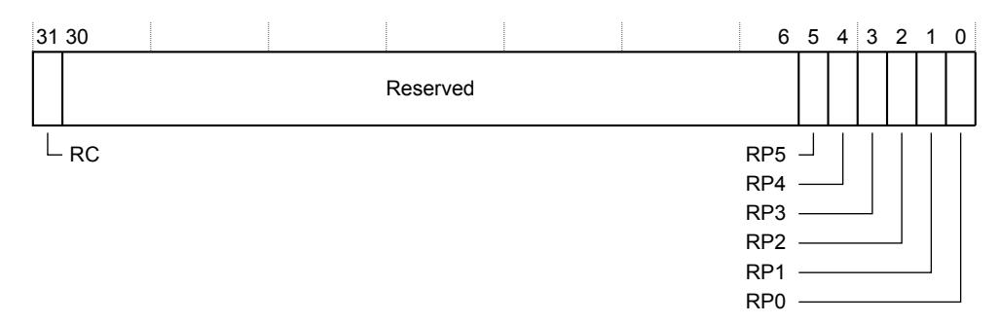

Figure 11-7 PMSRR bit assignments

The following table shows the PMSRR bit assignments.

Table 11-11 PMSRR bit assignments

| Bits   | Name | Function                                                                                         |  |  |
|--------|------|--------------------------------------------------------------------------------------------------|--|--|
| [31]   | RC   | Reset cycle counter. Indicates whether the PMCCNTR_EL0 and PMOVSR[31] are reset after a capture: |  |  |
|        |      | <b>0</b> PMCCNTR_EL0 and PMOVSR[31] are not reset on capture.                                    |  |  |
|        |      | 1 PMCCNTR_EL0 and PMOVSR[31] are reset on capture.                                               |  |  |
| [30:6] | -    | Reserved, RESO.                                                                                  |  |  |

## **Table 11-11 PMSRR bit assignments (continued)**

<span id="page-418-0"></span>

| Bits | Name | Function                                                                                              |  |  |  |  |  |  |
|------|------|-------------------------------------------------------------------------------------------------------|--|--|--|--|--|--|
| [5]  | RP5  | Reset performance counter 5. Indicates whether PMEVCNTR5_EL0 and PMOVSR[5] are reset after a capture: |  |  |  |  |  |  |
|      |      | 0<br>PMEVCNTR5_EL0 and PMOVSR[5] are not reset on capture.                                            |  |  |  |  |  |  |
|      |      | 1<br>PMEVCNTR5_EL0 and PMOVSR[5] are reset on capture.                                                |  |  |  |  |  |  |
| [4]  | RP4  | Reset performance counter 4. Indicates whether PMEVCNTR4_EL0 and PMOVSR[4] are reset after a capture: |  |  |  |  |  |  |
|      |      | 0<br>PMEVCNTR4_EL0 and PMOVSR[4] are not reset on capture.                                            |  |  |  |  |  |  |
|      |      | 1<br>PMEVCNTR4_EL0 and PMOVSR[4] are reset on capture.                                                |  |  |  |  |  |  |
| [3]  | RP3  | Reset performance counter 3. Indicates whether PMEVCNTR3_EL0 and PMOVSR[3] are reset after a capture: |  |  |  |  |  |  |
|      |      | 0<br>PMEVCNTR3_EL0 and PMOVSR[3] are not reset on capture.                                            |  |  |  |  |  |  |
|      |      | 1<br>PMEVCNTR3_EL0 and PMOVSR[3] are reset on capture.                                                |  |  |  |  |  |  |
| [2]  | RP2  | Reset performance counter 2. Indicates whether PMEVCNTR2_EL0 and PMOVSR[2] are reset after a capture: |  |  |  |  |  |  |
|      |      | 0<br>PMEVCNTR2_EL0 and PMOVSR[2] are not reset on capture.                                            |  |  |  |  |  |  |
|      |      | 1<br>PMEVCNTR2_EL0 and PMOVSR[2] are reset on capture.                                                |  |  |  |  |  |  |
| [1]  | RP1  | Reset performance counter 1. Indicates whether PMEVCNTR1_EL0 and PMOVSR[1] are reset after a capture: |  |  |  |  |  |  |
|      |      | 0<br>PMEVCNTR1_EL0 and PMOVSR[1] are not reset on capture.                                            |  |  |  |  |  |  |
|      |      | 1<br>PMEVCNTR1_EL0 and PMOVSR[1] are reset on capture.                                                |  |  |  |  |  |  |
| [0]  | RP0  | Reset performance counter 0. Indicates whether PMEVCNTR0_EL0 and PMOVSR[0] are reset after a capture: |  |  |  |  |  |  |
|      |      | 0<br>PMEVCNTR0_EL0 and PMOVSR[0] are not reset on capture.                                            |  |  |  |  |  |  |
|      |      | 1<br>PMEVCNTR0_EL0 and PMOVSR[0] are reset on capture.                                                |  |  |  |  |  |  |

The PMSRR can be accessed through the internal memory-mapped interface and the external debug interface, offset 0x6F4.

#### **11.7.11 Performance Monitors Configuration Register**

The PMCFGR characteristics are:

## **Purpose**

Contains PMU specific configuration data.

#### **Usage constraints**

The accessibility to the PMCFGR by condition code is:

| Off   | DLK   | OSLK  | EPMAD | SLK | Default |
|-------|-------|-------|-------|-----|---------|
| Error | Error | Error | Error | RO  | RO      |

*[Table 11-1 External register access conditions](#page-398-0)* on page 11-399 describes the condition codes.

# **Configurations**

The PMCFGR is in the Core power domain.

#### **Attributes**

See the register summary in *[Table 11-7 Memory-mapped PMU register summary](#page-408-0)* [on page 11-409](#page-408-0).

The following figure shows the PMCFGR bit assignments.

<span id="page-419-0"></span>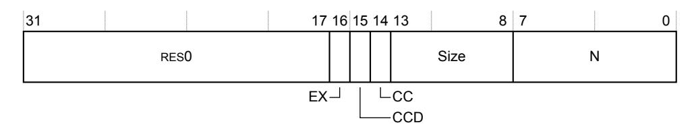

**Figure 11-8 PMCFGR bit assignments**

The following table shows the PMCFGR bit assignments.

**Table 11-12 PMCFGR bit assignments**

| Bits    | Name | Function                                             |  |  |
|---------|------|------------------------------------------------------|--|--|
| [31:17] | -    | Reserved, RES0.                                      |  |  |
| [16]    | EX   | Export supported. The value is:                      |  |  |
|         |      | 1<br>Export is supported. PMCR_EL0.EX is read/write. |  |  |
| [15]    | CCD  | Cycle counter has pre-scale. The value is:           |  |  |
|         |      | 1<br>PMCR_EL0.D is read/write.                       |  |  |
| [14]    | CC   | Dedicated cycle counter supported. The value is:     |  |  |
|         |      | 1<br>Dedicated cycle counter is supported.           |  |  |
| [13:8]  | Size | Counter size. The value is:                          |  |  |
|         |      | 64-bit counters.<br>0b111111                         |  |  |
| [7:0]   | N    | Number of event counters. The value is:              |  |  |
|         |      | Six counters.<br>0x06                                |  |  |

The PMCFGR can be accessed through the internal memory-mapped interface and the external debug interface, offset 0xE00.

# **11.7.12 Performance Monitors Peripheral Identification Registers**

The Performance Monitors Peripheral Identification Registers provide standard information required for all components that conform to the ARM PMUv3 architecture. There is a set of eight registers, listed in register number order in the following table.

**Table 11-13 Summary of the Performance Monitors Peripheral Identification Registers**

| Register | Value | Offset |
|----------|-------|--------|
| PMPIDR4  | 0x04  | 0xFD0  |
| PMPIDR5  | 0x00  | 0xFD4  |
| PMPIDR6  | 0x00  | 0xFD8  |
| PMPIDR7  | 0x00  | 0xFDC  |
| PMPIDR0  | 0xD7  | 0xFE0  |
| PMPIDR1  | 0xB9  | 0xFE4  |
| PMPIDR2  | 0x3B  | 0xFE8  |
| PMPIDR3  | 0x00  | 0xFEC  |
|          |       |        |

<span id="page-420-0"></span>Only bits[7:0] of each PMU Peripheral ID Register are used, with bits[31:8] reserved. Together, the eight PMU Peripheral ID Registers define a single 64-bit Peripheral ID.

The PMU Peripheral ID registers are:

- *Performance Monitors Peripheral Identification Register 0* on page 11-421.
- *Performance Monitors Peripheral Identification Register 1* on page 11-421.
- *[Performance Monitors Peripheral Identification Register 2](#page-421-0)* on page 11-422.
- *[Performance Monitors Peripheral Identification Register 3](#page-422-0)* on page 11-423.
- *[Performance Monitors Peripheral Identification Register 4](#page-423-0)* on page 11-424.
- *[Performance Monitors Peripheral Identification Register 5-7](#page-424-0)* on page 11-425.

# **Performance Monitors Peripheral Identification Register 0**

The PMPIDR0 characteristics are:

# **Purpose**

Provides information to identify a Performance Monitors component.

## **Usage constraints**

The PMPIDR0 can be accessed through the internal memory-mapped interface and the external debug interface.

The accessibility to the PMPIDR0 by condition code is:

| Off | DLK | OSLK | EPMAD | SLK | Default |
|-----|-----|------|-------|-----|---------|
| -   | -   | -    | -     | RO  | RO      |

*[Table 11-1 External register access conditions](#page-398-0)* on page 11-399 describes the condition codes.

#### **Configurations**

The PMPIDR0 is in the Debug power domain.

# **Attributes**

See the register summary in *[Table 11-7 Memory-mapped PMU register summary](#page-408-0)* [on page 11-409](#page-408-0).

The following figure shows the PMPIDR0 bit assignments.

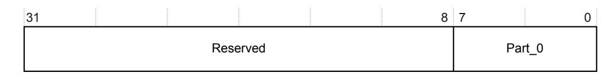

**Figure 11-9 PMPIDR0 bit assignments**

The following table shows the PMPIDR0 bit assignments.

**Table 11-14 PMPIDR0 bit assignments**

| Bits   | Name   | Function       |                                                               |  |
|--------|--------|----------------|---------------------------------------------------------------|--|
| [31:8] | -      | Reserved, RES0 |                                                               |  |
| [7:0]  | Part_0 | 0xD7           | Least significant byte of the performance monitor part number |  |

The PMPIDR0 can be accessed through the internal memory-mapped interface and the external debug interface, offset 0xFE0.

#### **Performance Monitors Peripheral Identification Register 1**

The PMPIDR1 characteristics are:

## <span id="page-421-0"></span>**Purpose**

Provides information to identify a Performance Monitors component.

## **Usage constraints**

The PMPIDR1 can be accessed through the internal memory-mapped interface and the external debug interface.

The accessibility to the PMPIDR1 by condition code is:

| Off | DLK | OSLK | EPMAD | SLK | Default |
|-----|-----|------|-------|-----|---------|
| -   | -   | -    | -     | RO  | RO      |

*[Table 11-1 External register access conditions](#page-398-0)* on page 11-399 describes the condition codes.

# **Configurations**

The PMPIDR1 is in the Debug power domain.

# **Attributes**

See the register summary in *[Table 11-7 Memory-mapped PMU register summary](#page-408-0)* [on page 11-409](#page-408-0).

The following figure shows the PMPIDR1 bit assignments.

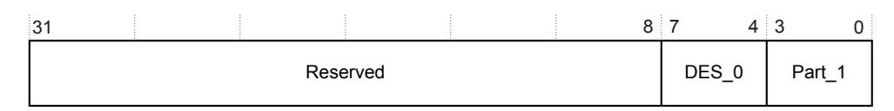

**Figure 11-10 PMPIDR1 bit assignments**

The following table shows the PMPIDR1 bit assignments.

**Table 11-15 PMPIDR1 bit assignments**

| Bits   | Name   | Function                                                                    |  |  |
|--------|--------|-----------------------------------------------------------------------------|--|--|
| [31:8] | -      | Reserved, RES0.                                                             |  |  |
| [7:4]  | DES_0  | ARM Limited. This is the least significant nibble of JEP106 ID code.<br>0xB |  |  |
| [3:0]  | Part_1 | Most significant nibble of the performance monitor part number.<br>0x9      |  |  |

The PMPIDR1 can be accessed through the internal memory-mapped interface and the external debug interface, offset 0xFE4.

# **Performance Monitors Peripheral Identification Register 2**

The PMPIDR2 characteristics are:

#### **Purpose**

Provides information to identify a Performance Monitors component.

# **Usage constraints**

The accessibility to the PMPIDR2 by condition code is:

| Off | DLK | OSLK | EPMAD | SLK | Default |
|-----|-----|------|-------|-----|---------|
| -   | -   | -    | -     | RO  | RO      |

*[Table 11-1 External register access conditions](#page-398-0)* on page 11-399 describes the condition codes.

The PMPIDR2 can be accessed through the internal memory-mapped interface and the external debug interface.

#### <span id="page-422-0"></span>Configurations

The PMPIDR2 is in the Debug power domain.

#### Attributes

See the register summary in *Table 11-7 Memory-mapped PMU register summary* on page 11-409.

The following figure shows the PMPIDR2 bit assignments.

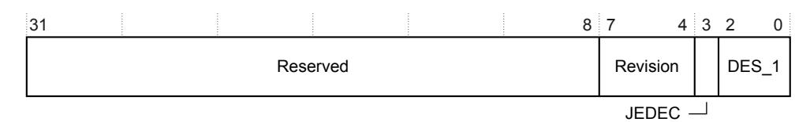

Figure 11-11 PMPIDR2 bit assignments

The following table shows the PMPIDR2 bit assignments.

Table 11-16 PMPIDR2 bit assignments

| Bits   | Name     | Function        |                                                                     |  |
|--------|----------|-----------------|---------------------------------------------------------------------|--|
| [31:8] | -        | Reserved, RESO. |                                                                     |  |
| [7:4]  | Revision | 3               | Part major revision.                                                |  |
| [3]    | JEDEC    | 0b1             | RAO. Indicates a JEP106 identity code is used.                      |  |
| [2:0]  | DES_1    | 0b011           | ARM Limited. This is the most significant nibble of JEP106 ID code. |  |

The PMPIDR2 can be accessed through the internal memory-mapped interface and the external debug interface, offset 0xFE8.

#### Performance Monitors Peripheral Identification Register 3

The PMPIDR3 characteristics are:

#### **Purpose**

Provides information to identify a Performance Monitors component.

## **Usage constraints**

The PMPIDR3 can be accessed through the internal memory-mapped interface and the external debug interface.

The accessibility to the PMPIDR3 by condition code is:

| Off | DLK | OSLK | EPMAD | SLK | Default |
|-----|-----|------|-------|-----|---------|
| -   | -   | -    | -     | RO  | RO      |

Table 11-1 External register access conditions on page 11-399 describes the condition codes.

#### **Configurations**

The PMPIDR3 is in the Debug power domain.

## **Attributes**

See the register summary in *Table 11-7 Memory-mapped PMU register summary* on page 11-409.

The following figure shows the PMPIDR3 bit assignments.

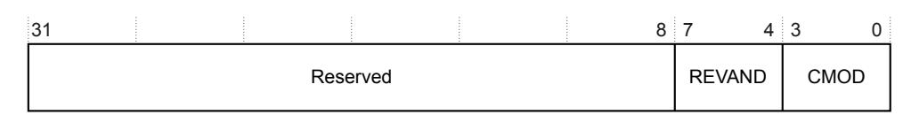

**Figure 11-12 PMPIDR3 bit assignments**

The following table shows the PMPIDR3 bit assignments.

**Table 11-17 PMPIDR3 bit assignments**

<span id="page-423-0"></span>

| Bits   | Name   | Function       |                     |
|--------|--------|----------------|---------------------|
| [31:8] | -      | Reserved, RES0 |                     |
| [7:4]  | REVAND | 0x0            | Part minor revision |
| [3:0]  | CMOD   | 0x0            | Customer modified   |

The PMPIDR3 can be accessed through the internal memory-mapped interface and the external debug interface, offset 0xFEC.

# **Performance Monitors Peripheral Identification Register 4**

The PMPIDR4 characteristics are:

#### **Purpose**

Provides information to identify a Performance Monitors component.

#### **Usage constraints**

PMPIDR4 can be accessed through the internal memory-mapped interface and the external debug interface.

The accessibility to the PMPIDR4 by condition code is:

| Off | DLK | OSLK | EPMAD | SLK | Default |
|-----|-----|------|-------|-----|---------|
| -   | -   | -    | -     | RO  | RO      |

*[Table 11-1 External register access conditions](#page-398-0)* on page 11-399 describes the condition codes.

# **Configurations**

The PMPIDR4 is in the Debug power domain.

#### **Attributes**

See the register summary in *[Table 11-7 Memory-mapped PMU register summary](#page-408-0)* [on page 11-409](#page-408-0).

The following figure shows the PMPIDR4 bit assignments.

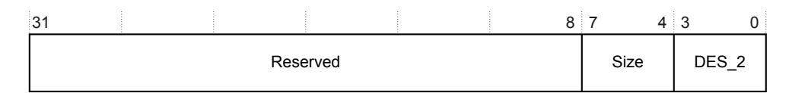

**Figure 11-13 PMPIDR4 bit assignments**

The following table shows the PMPIDR4 bit assignments.

# **Table 11-18 PMPIDR4 bit assignments**

<span id="page-424-0"></span>

| Bits   | Name  | Function |                                                                                                                                  |  |  |
|--------|-------|----------|----------------------------------------------------------------------------------------------------------------------------------|--|--|
| [31:8] | -     |          | Reserved, RES0.                                                                                                                  |  |  |
| [7:4]  | Size  | 0x0      | Size of the component. Log2 the number of 4KB pages from the start of the component to the end of the<br>component ID registers. |  |  |
| [3:0]  | DES_2 | 0x4      | ARM Limited. This is the least significant nibble JEP106 continuation code.                                                      |  |  |

The PMPIDR4 can be accessed through the internal memory-mapped interface and the external debug interface, offset 0xFD0.

## **Performance Monitors Peripheral Identification Register 5-7**

No information is held in the Performance Monitors Peripheral ID5, Performance Monitors Peripheral ID6, and Performance Monitors Peripheral ID7 Registers. They are reserved for future use and are RES0.

# **11.7.13 Performance Monitors Component Identification Registers**

There are four read-only Performance Monitors Component Identification Registers, Performance Monitors Component ID0 through Performance Monitors Component ID3. The following table shows these registers.

**Table 11-19 Summary of the Performance Monitors Component Identification Registers**

| Register | Value | Offset |
|----------|-------|--------|
| PMCIDR0  | 0x0D  | 0xFF0  |
| PMCIDR1  | 0x90  | 0xFF4  |
| PMCIDR2  | 0x05  | 0xFF8  |
| PMCIDR3  | 0xB1  | 0xFFC  |

The Performance Monitors Component Identification Registers identify Performance Monitors as ARM PMUv3 architecture. The Component ID registers are:

- *Performance Monitors Component Identification Register 0* on page 11-425.
- *[Performance Monitors Component Identification Register 1](#page-425-0)* on page 11-426.
- *[Performance Monitors Component Identification Register 2](#page-426-0)* on page 11-427.
- *[Performance Monitors Component Identification Register 3](#page-427-0)* on page 11-428.

#### **Performance Monitors Component Identification Register 0**

The PMCIDR0 characteristics are:

## **Purpose**

Provides information to identify a Performance Monitors component.

#### **Usage constraints**

The PMCIDR0 can be accessed through the internal memory-mapped interface and the external debug interface.

The accessibility to the PMCIDR0 by condition code is:

| Off | DLK | OSLK | EPMAD | SLK | Default |
|-----|-----|------|-------|-----|---------|
| -   | -   | -    | -     | RO  | RO      |

*[Table 11-1 External register access conditions](#page-398-0)* on page 11-399 describes the condition codes.

#### <span id="page-425-0"></span>**Configurations**

The PMCIDR0 is in the Debug power domain.

# **Attributes**

See the register summary in *[Table 11-7 Memory-mapped PMU register summary](#page-408-0)* [on page 11-409](#page-408-0).

The following figure shows the PMCIDR0 bit assignments.

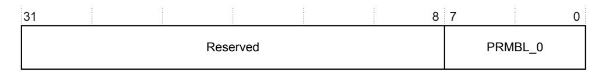

**Figure 11-14 PMCIDR0 bit assignments**

The following table shows the PMCIDR0 bit assignments.

**Table 11-20 PMCIDR0 bit assignments**

| Bits   | Name    | Function       |                 |
|--------|---------|----------------|-----------------|
| [31:8] | -       | Reserved, RES0 |                 |
| [7:0]  | PRMBL_0 | 0x0D           | Preamble byte 0 |

The PMCIDR0 can be accessed through the internal memory-mapped interface and the external debug interface, offset 0xFF0.

# **Performance Monitors Component Identification Register 1**

The PMCIDR1 characteristics are:

#### **Purpose**

Provides information to identify a Performance Monitors component.

# **Usage constraints**

The PMCIDR1 can be accessed through the internal memory-mapped interface and the external debug interface.

The accessibility to the PMCIDR1 by condition code is:


*[Table 11-1 External register access conditions](#page-398-0)* on page 11-399 describes the condition codes.

#### **Configurations**

The PMCIDR1 is in the Debug power domain.

# **Attributes**

See the register summary in *[Table 11-7 Memory-mapped PMU register summary](#page-408-0)* [on page 11-409](#page-408-0).

The following figure shows the PMCIDR1 bit assignments.

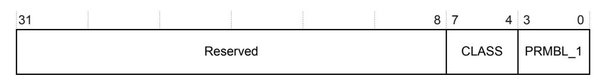

**Figure 11-15 PMCIDR1 bit assignments**

The following table shows the PMCIDR1 bit assignments.

## **Table 11-21 PMCIDR1 bit assignments**

<span id="page-426-0"></span>

| Bits   | Name    | Function       |                 |
|--------|---------|----------------|-----------------|
| [31:8] | -       | Reserved, RES0 |                 |
| [7:4]  | CLASS   | 0x9            | Debug component |
| [3:0]  | PRMBL_1 | 0x0            | Preamble        |

The PMCIDR1 can be accessed through the internal memory-mapped interface and the external debug interface, offset 0xFF4.

# **Performance Monitors Component Identification Register 2**

The PMCIDR2 characteristics are:

# **Purpose**

Provides information to identify a Performance Monitors component.

## **Usage constraints**

The PMCIDR2 can be accessed through the internal memory-mapped interface and the external debug interface.

The accessibility to the PMCIDR2 by condition code is:

| Off | DLK | OSLK | EPMAD | SLK | Default |
|-----|-----|------|-------|-----|---------|
| -   | -   | -    | -     | RO  | RO      |

*[Table 11-1 External register access conditions](#page-398-0)* on page 11-399 describes the condition codes.

#### **Configurations**

The PMCIDR2 is in the Debug power domain.

#### **Attributes**

See the register summary in *[Table 11-7 Memory-mapped PMU register summary](#page-408-0)* [on page 11-409](#page-408-0).

The following figure shows the PMCIDR2 bit assignments.

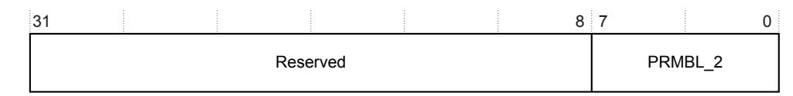

**Figure 11-16 PMCIDR2 bit assignments**

The following table shows the PMCIDR2 bit assignments.

**Table 11-22 PMCIDR2 bit assignments**

| Bits<br>Name             | Function       |                 |
|--------------------------|----------------|-----------------|
| [31:8]<br>-              | Reserved, RES0 |                 |
| [7:0]<br>PRMBL_2<br>0x05 |                | Preamble byte 2 |

The PMCIDR2 can be accessed through the internal memory-mapped interface and the external debug interface, offset 0xFF8.

# <span id="page-427-0"></span>**Performance Monitors Component Identification Register 3**

The PMCIDR3 characteristics are:

### **Purpose**

Provides information to identify a Performance Monitors component.

# **Usage constraints**

The PMCIDR3 can be accessed through the internal memory-mapped interface and the external debug interface.

The accessibility to the PMCIDR3 by condition code is:

| Off | DLK | OSLK | EPMAD | SLK | Default |
|-----|-----|------|-------|-----|---------|
| -   | -   | -    | -     | RO  | RO      |

*[Table 11-1 External register access conditions](#page-398-0)* on page 11-399 describes the condition codes.

## **Configurations**

The PMCIDR3 is in the Debug power domain.

#### **Attributes**

See the register summary in *[Table 11-7 Memory-mapped PMU register summary](#page-408-0)* [on page 11-409](#page-408-0).

The following figure shows the PMCIDR3 bit assignments.

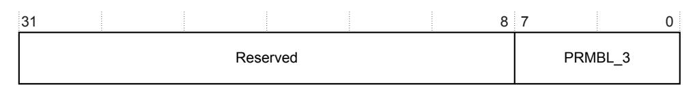

**Figure 11-17 PMCIDR3 bit assignments**

The following table shows the PMCIDR3 bit assignments.

**Table 11-23 PMCIDR3 bit assignments**

| Bits<br>Name             | Function       |                 |
|--------------------------|----------------|-----------------|
| [31:8]<br>-              | Reserved, RES0 |                 |
| [7:0]<br>PRMBL_3<br>0xB1 |                | Preamble byte 3 |

The PMCIDR3 can be accessed through the internal memory-mapped interface and the external debug interface, offset 0xFFC.

# <span id="page-428-0"></span>**11.8 Events**

The following table shows the events that are generated and the numbers that the PMU uses to reference the events.

The table also shows the bit position of each event on the event bus. Event reference numbers that are not listed are reserved.

**Table 11-24 PMU events**

| Event<br>number | Event mnemonic    | PMUEVENTx[24:0]<br>busez | PMU event<br>bus (to<br>trace)ez | Event name                                                                              |
|-----------------|-------------------|--------------------------|----------------------------------|-----------------------------------------------------------------------------------------|
| 0x00            | SW_INCR           | -                        | [0]                              | Instruction architecturally executed<br>(condition check pass) - Software<br>increment  |
| 0x01            | L1I_CACHE_REFILL  | [0]                      | [1]                              | Level 1 instruction cache refill                                                        |
| 0x02            | L1I_TLB_REFILL    | [1]                      | [2]                              | Level 1 instruction TLB refill                                                          |
| 0x03            | L1D_CACHE_REFILL  | [2]                      | [3]                              | Level 1 data cache refill                                                               |
| 0x04            | L1D_CACHE         | -                        | [5:4]                            | Level 1 data cache access                                                               |
| 0x05            | L1D_TLB_REFILL    | -                        | [7:6]                            | Level 1 data TLB refill                                                                 |
| 0x08            | INST_RETIRED      | [6:3]                    | [11:8]                           | Instruction architecturally executed                                                    |
| 0x09            | EXC_TAKEN         | [7]                      | [12]                             | Exception taken                                                                         |
| 0x0A            | EXC_RETURN        | [8]                      | [13]                             | Instruction architecturally executed<br>(condition check pass) - Exception<br>return    |
| 0x0B            | CID_WRITE_RETIRED | -                        | [14]                             | Instruction architecturally executed<br>(condition check pass) - Write to<br>CONTEXTIDR |
| 0x10            | BR_MIS_PRED       | [9]                      | [15]                             | Mispredicted or not predicted branch<br>speculatively executed                          |
| 0x11            | CPU_CYCLES        | -                        | [16]                             | Cycle                                                                                   |
| 0x12            | BR_PRED           | [10]                     | [17]                             | Predictable branch speculatively<br>executed                                            |
| 0x13            | MEM_ACCESS        | -                        | [19:18]                          | Data memory access                                                                      |
| 0x14            | L1I_CACHE         | [11]                     | [20]                             | Level 1 instruction cache access                                                        |
| 0x15            | L1D_CACHE_WB      | [12]                     | [21]                             | Level 1 data cache Write-Back                                                           |
| 0x16            | L2D_CACHE         | -                        | [23:22]                          | Level 2 data cache access                                                               |
| 0x17            | L2D_CACHE_REFILL  | [13]                     | [24]                             | Level 2 data cache refill                                                               |
| 0x18            | L2D_CACHE_WB      | [14]                     | [25]                             | Level 2 data cache Write-Back                                                           |
| 0x19            | BUS_ACCESS        | -                        | [27:26]                          | Bus access                                                                              |
| 0x1A            | MEMORY_ERROR      | -                        | [28]                             | Local memory error                                                                      |
| 0x1B            | INST_SPEC         | -                        | [30:29]                          | Operation speculatively executed                                                        |

ez Event count is encoded as a plain binary number to accommodate count values of more than one in the same cycle.

**Table 11-24 PMU events (continued)**

<span id="page-429-0"></span>

| Event<br>number | Event mnemonic        | PMUEVENTx[24:0]<br>busez | PMU event<br>bus (to<br>trace)ez | Event name                                                                                          |
|-----------------|-----------------------|--------------------------|----------------------------------|-----------------------------------------------------------------------------------------------------|
| 0x1C            | TTBR_WRITE_RETIRED    | -                        | [31]                             | Instruction architecturally executed<br>(condition check pass) - Write to<br>translation table base |
| 0x1D            | BUS_CYCLES            | -                        | [32]                             | Bus cycle                                                                                           |
| 0x1E            | CHAIN                 | -                        | [33]                             | Odd performance counter chain mode                                                                  |
| 0x40            | L1D_CACHE_LD          | [15]                     | [34]                             | Level 1 data cache access - Read                                                                    |
| 0x41            | L1D_CACHE_ST          | [16]                     | [35]                             | Level 1 data cache access - Write                                                                   |
| 0x42            | L1D_CACHE_REFILL_LD   | -                        | [36]                             | Level 1 data cache refill - Read                                                                    |
| 0x43            | L1D_CACHE_REFILL_ST   | -                        | [37]                             | Level 1 data cache refill - Write                                                                   |
| 0x46            | L1D_CACHE_WB_VICTIM   | -                        | [38]                             | Level 1 data cache Write-back -<br>Victim                                                           |
| 0x47            | L1D_CACHE_WB_CLEAN    | -                        | [39]                             | Level 1 data cache Write-back -<br>Cleaning and coherency                                           |
| 0x48            | L1D_CACHE_INVAL       | -                        | [40]                             | Level 1 data cache invalidate                                                                       |
| 0x4C            | L1D_TLB_REFILL_LD     | [17]                     | [41]                             | Level 1 data TLB refill - Read                                                                      |
| 0x4D            | L1D_TLB_REFILL_ST     | [18]                     | [42]                             | Level 1 data TLB refill - Write                                                                     |
| 0x50            | L2D_CACHE_LD          | [19]                     | [43]                             | Level 2 data cache access - Read                                                                    |
| 0x51            | L2D_CACHE_ST          | [20]                     | [44]                             | Level 2 data cache access - Write                                                                   |
| 0x52            | L2D_CACHE_REFILL_LD   | -                        | [45]                             | Level 2 data cache refill - Read                                                                    |
| 0x53            | L2D_CACHE_REFILL_ST   | -                        | [46]                             | Level 2 data cache refill - Write                                                                   |
| 0x56            | L2D_CACHE_WB_VICTIM   | -                        | [47]                             | Level 2 data cache Write-back -<br>Victim                                                           |
| 0x57            | L2D_CACHE_WB_CLEAN    | -                        | [48]                             | Level 2 data cache Write-back -<br>Cleaning and coherency                                           |
| 0x58            | L2D_CACHE_INVAL       | -                        | [49]                             | Level 2 data cache invalidate                                                                       |
| 0x60            | BUS_ACCESS_LD         | -                        | [50]                             | Bus access - Read                                                                                   |
| 0x61            | BUS_ACCESS_ST         | -                        | [51]                             | Bus access - Write                                                                                  |
| 0x62            | BUS_ACCESS_SHARED     | -                        | [53:52]                          | Bus access - Normal                                                                                 |
| 0x63            | BUS_ACCESS_NOT_SHARED | -                        | [55:54]                          | Bus access - Not normal                                                                             |
| 0x64            | BUS_ACCESS_NORMAL     | -                        | [57:56]                          | Bus access - Normal                                                                                 |
| 0x65            | BUS_ACCESS_PERIPH     | -                        | [59:58]                          | Bus access - Peripheral                                                                             |
| 0x66            | MEM_ACCESS_LD         | -                        | [60]                             | Data memory access - Read                                                                           |
|                 | MEM_ACCESS_ST         | -                        | [61]                             | Data memory access - Write                                                                          |
| 0x67            |                       |                          |                                  |                                                                                                     |

[ez](#page-428-0) Event count is encoded as a plain binary number to accommodate count values of more than one in the same cycle. fa For this event, unaligned access means data access related memory operation that crosses line boundary.

## **Table 11-24 PMU events (continued)**

| Event<br>number | Event mnemonic      | PMUEVENTx[24:0]<br>busez | PMU event<br>bus (to<br>trace)ez | Event name                                                      |
|-----------------|---------------------|--------------------------|----------------------------------|-----------------------------------------------------------------|
| 0x69fa          | UNALIGNED_ST_SPEC   | -                        | [63]                             | Unaligned access - Write                                        |
| 0x6Afa          | UNALIGNED_LDST_SPEC | -                        | [65:64]                          | Unaligned access                                                |
| 0x6C            | LDREX_SPEC          | [21]                     | [66]                             | Exclusive operation speculatively<br>executed - LDREX           |
| 0x6D            | STREX_PASS_SPEC     | [22]                     | [67]                             | Exclusive instruction speculatively<br>executed - STREX pass    |
| 0x6E            | STREX_FAIL_SPEC     | [23]                     | [68]                             | Exclusive operation speculatively<br>executed - STREX fail      |
| 0x70            | LD_SPEC             | -                        | [70:69]                          | Operation speculatively executed -<br>Load                      |
| 0x71            | ST_SPEC             | -                        | [72:71]                          | Operation speculatively executed -<br>Store                     |
| 0x72            | LDST_SPEC           | -                        | [74:73]                          | Operation speculatively executed -<br>Load or store             |
| 0x73            | DP_SPEC             | -                        | [76:75]                          | Operation speculatively executed -<br>Integer data processing   |
| 0x74            | ASE_SPEC            | -                        | [78:77]                          | Operation speculatively executed -<br>Advanced SIMD             |
| 0x75            | VFP_SPEC            | -                        | [80:79]                          | Operation speculatively executed -<br>VFP                       |
| 0x76            | PC_WRITE_SPEC       | -                        | [82:81]                          | Operation speculatively executed -<br>Software change of the PC |
| 0x77            | CRYPTO_SPEC         | -                        | [84:83]                          | Operation speculatively executed,<br>crypto data processing     |
| 0x78            | BR_IMMED_SPEC       | -                        | [85]                             | Branch speculatively executed -<br>Immediate branch             |
| 0x79            | BR_RETURN_SPEC      | -                        | [86]                             | Branch speculatively executed -<br>Procedure return             |
| 0x7A            | BR_INDIRECT_SPEC    | -                        | [87]                             | Branch speculatively executed -<br>Indirect branch              |
| 0x7C            | ISB_SPEC            | -                        | [88]                             | Barrier speculatively executed - ISB                            |
| 0x7D            | DSB_SPEC            | [24]                     | [89]                             | Barrier speculatively executed - DSB                            |
| 0x7E            | DMB_SPEC            | [24]                     | [90]                             | Barrier speculatively executed - DMB                            |
| 0x81            | EXC_UNDEF           | -                        | [91]                             | Exception taken, other synchronous                              |
| 0x82            | EXC_SVC             | -                        | [92]                             | Exception taken, Supervisor Call                                |
| 0x83            | EXC_PABORT          | -                        | [93]                             | Exception taken, Instruction Abort                              |
| 0x84            | EXC_DABORT          | -                        | [94]                             | Exception taken, Data Abort or SError                           |
|                 |                     |                          |                                  |                                                                 |

[ez](#page-428-0) Event count is encoded as a plain binary number to accommodate count values of more than one in the same cycle.

## **Table 11-24 PMU events (continued)**

| Event<br>number | Event mnemonic  | PMUEVENTx[24:0]<br>busez | PMU event<br>bus (to<br>trace)ez | Event name                                                                   |
|-----------------|-----------------|--------------------------|----------------------------------|------------------------------------------------------------------------------|
| 0x86            | EXC_IRQ         | -                        | [95]                             | Exception taken, IRQ                                                         |
| 0x87            | EXC_FIQ         | -                        | [96]                             | Exception taken, FIQ                                                         |
| 0x88            | EXC_SMC         | -                        | [97]                             | Exception taken, Secure Monitor Call                                         |
| 0x8A            | EXC_HVC         | -                        | [98]                             | Exception taken, Hypervisor Call                                             |
| 0x8B            | EXC_TRAP_PABORT | -                        | [99]                             | Exception taken, Instruction Abort not<br>taken locally                      |
| 0x8C            | EXC_TRAP_DABORT | -                        | [100]                            | Exception taken, Data Abort, or<br>SError not taken locally                  |
| 0x8D            | EXC_TRAP_OTHER  | -                        | [101]                            | Exception taken – Other traps not<br>taken locally                           |
| 0x8E            | EXC_TRAP_IRQ    | -                        | [102]                            | Exception taken, IRQ not taken<br>locally                                    |
| 0x8F            | EXC_TRAP_FIQ    | -                        | [103]                            | Exception taken, FIQ not taken locally                                       |
| 0x90            | RC_LD_SPEC      | -                        | [104]                            | Release consistency instruction<br>speculatively executed – Load<br>Acquire  |
| 0x91            | RC_ST_SPEC      | -                        | [105]                            | Release consistency instruction<br>speculatively executed – Store<br>Release |

[ez](#page-428-0) Event count is encoded as a plain binary number to accommodate count values of more than one in the same cycle.

# <span id="page-432-0"></span>**11.9 Interrupts**

The Cortex-A57 processor asserts the **nPMUIRQ** signal when an interrupt is generated by the PMU.

You can route this signal to an external interrupt controller for prioritization and masking. This is the only mechanism that signals this interrupt to the processor.

Interrupt is also driven as a trigger input to the CTI.

# **Related information**

*[12 Cross Trigger](#page-434-0)* on page 12-435*.*

# <span id="page-433-0"></span>**11.10 Exporting PMU events**

This section describes exporting PMU events.

This section contains the following subsections:

- *11.10.1 External hardware* on page 11-434.
- *11.10.2 Debug trace hardware* on page 11-434.

# **11.10.1 External hardware**

In addition to the counters in the processor, some of the events that *11.8 Events* [on page 11-429](#page-428-0) describes are exported on the **PMUEVENT** bus and can be connected to external hardware.

# **11.10.2 Debug trace hardware**

Some of the events that *11.8 Events* [on page 11-429](#page-428-0) describes are exported to the ETM unit, other external debug, or trace hardware, to enable the events to be monitored.

# **Related information**

*[12 Cross Trigger](#page-434-0)* on page 12-435*.*

*[13 Embedded Trace Macrocell](#page-458-0)* on page 13-459*.*

# <span id="page-434-0"></span>Chapter 12 **Cross Trigger**

This chapter describes the cross trigger interfaces for the Cortex-A57 processor.

It contains the following sections:

- *[12.1 About the cross trigger](#page-435-0)* on page 12-436.
- *[12.2 Trigger inputs and outputs](#page-436-0)* on page 12-437.
- *12.3 CTI* [on page 12-438.](#page-437-0)
- *12.4 CTM* [on page 12-439.](#page-438-0)
- *[12.5 Cross trigger register summary](#page-439-0)* on page 12-440.
- *[12.6 Cross trigger register descriptions](#page-442-0)* on page 12-443.

# <span id="page-435-0"></span>**12.1 About the cross trigger**

The Cortex-A57 processor has a single external cross trigger channel interface.

This external interface is connected to the CoreSight CTI interface corresponding to each processor through a simplified *Cross Trigger Matrix* (CTM). A number of *Embedded Cross Trigger* (ECT), trigger inputs and trigger outputs are connected between debug components in the processor and CoreSight CTI blocks.

The CoreSight *Cross Trigger Interface* (CTI) enables the debug logic, ETM, and PMU, to interact with each other and with other CoreSight components. This is called cross triggering. For example, you configure the CTI to generate an interrupt when the ETM trigger event occurs.

The following figure shows the debug system components and the available trigger inputs and trigger outputs.

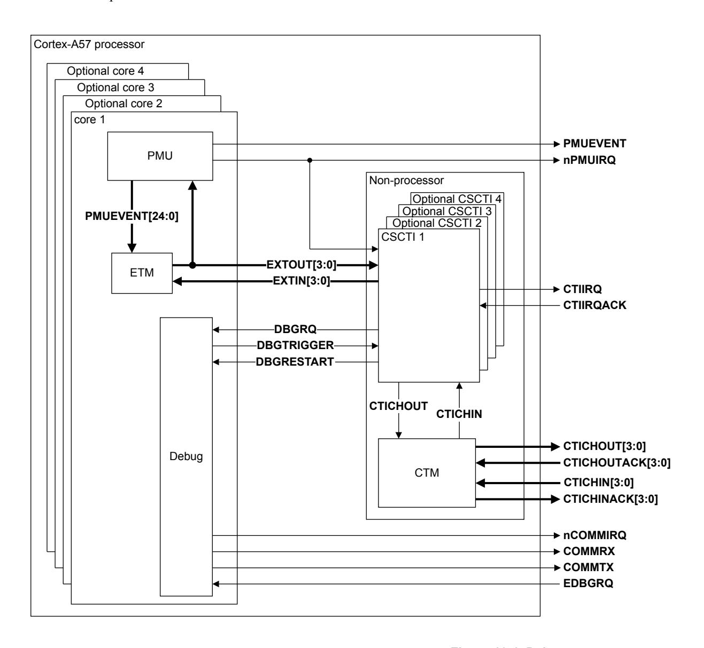

**Figure 12-1 Debug system components**

# <span id="page-436-0"></span>**12.2 Trigger inputs and outputs**

This section describes the trigger inputs and outputs that are available to the CTI.

The following table shows the CTI inputs.

**Table 12-1 Trigger inputs**

| CTI input | Name               | Description                    |
|-----------|--------------------|--------------------------------|
| 0         | DBGTRIGGER, pulsed | Pulsed on entry to Debug state |
| 1         | PMUIRQfb           | PMU generated interrupt        |
| 2         | -                  | -                              |
| 3         | -                  | -                              |
| 4         | EXTOUT[0]          | ETM external output            |
| 5         | EXTOUT[1]          | ETM external output            |
| 6         | EXTOUT[2]          | ETM external output            |
| 7         | EXTOUT[3]          | ETM external output            |

The following table shows the CTI outputs.

**Table 12-2 Trigger outputs**

| CTI output | Name       | Description                               |
|------------|------------|-------------------------------------------|
| 0          | EDBGRQ     | Causes the processor to enter Debug state |
| 1          | DBGRESTART | Causes the processor to exit Debug state  |
| 2          | CTIIRQ     | CTI interrupt                             |
| 3          | -          | -                                         |
| 4          | EXTIN[0]   | ETM external input                        |
| 5          | EXTIN[1]   | ETM external input                        |
| 6          | EXTIN[2]   | ETM external input                        |
| 7          | EXTIN[3]   | ETM external input                        |

# <span id="page-437-0"></span>**12.3 CTI**

In the Cortex-A57 processor, the CTI operates in the **PCLKDBG** domain and it synchronizes the trigger inputs and outputs to **PCLKDBG**.

Handshaking is required for all trigger outputs. Because the simplified CTM is implemented in the same clock domain, synchronization and handshaking is not required for channel interface. In addition, APB synchronization is not required. Trigger inputs are not masked by internal **NIDEN**. Trigger outputs are not masked by internal **DBGEN**.

# <span id="page-438-0"></span>**12.4 CTM**

The CoreSight CTI channel signals from all the cores are combined using a simplified *Cross Trigger Matrix* (CTM) so that a single cross trigger channel interface is presented in the Cortex-A57 processor.

The CTM can combine up to four internal channel interfaces, corresponding to each core, and one external channel interface.

In the simplified CTM:

- The external channel output is driven by the OR output of all internal channel outputs.
- Each internal channel input is driven by the OR output of the internal channel outputs of all other CTIs, in addition to the external channel input.

The internal channel acknowledgment signals from the CTIs are not used because the CTIs and the CTM are in the same **PCLKDBG** domain.

# <span id="page-439-0"></span>**12.5 Cross trigger register summary**

This section describes the cross trigger registers in the Cortex-A57 processor.

These registers are accessed through the internal memory-mapped interface or the external debug interface.

The following table shows the cross trigger registers in the Cortex-A57 processor.

**Table 12-3 Cross trigger register summary**

| Offset      | Name             | Type | Width  | Description                                             |  |  |
|-------------|------------------|------|--------|---------------------------------------------------------|--|--|
| 0x000       | CTICONTROL       | RW   | 32-bit | CTI Control register                                    |  |  |
| 0x000-0x00C | -                | -    | -      | Reserved                                                |  |  |
| 0x010       | CTIINTACK        | WO   | 32-bit | CTI Output Trigger Acknowledge register fc              |  |  |
| 0x014       | CTIAPPSET        | RW   | 32-bit | CTI Application Trigger Set register fc                 |  |  |
| 0x018       | CTIAPPCLEAR      | WO   | 32-bit | CTI Application Trigger Clear register fc               |  |  |
| 0x01C       | CTIAPPPULSE      | WO   | 32-bit | CTI Application Pulse register fc                       |  |  |
| 0x020       | CTIINEN0         | RW   | 32-bit | CTI Input Trigger to Output Channel Enable registers fc |  |  |
| 0x024       | CTIINEN1         |      |        |                                                         |  |  |
| 0x028       | CTIINEN2         |      |        |                                                         |  |  |
| 0x02C       | CTIINEN3         |      |        |                                                         |  |  |
| 0x030       | CTIINEN4         |      |        |                                                         |  |  |
| 0x034       | CTIINEN5         |      |        |                                                         |  |  |
| 0x038       | CTIINEN6         |      |        |                                                         |  |  |
| 0x03C       | CTIINEN7         |      |        |                                                         |  |  |
| 0x040-0x09C | -                | -    | -      | Reserved                                                |  |  |
| 0x0A0       | CTIOUTEN0        | RW   | 32-bit | CTI Input Channel to Output Trigger Enable registers fc |  |  |
| 0x0A4       | CTIOUTEN1        |      |        |                                                         |  |  |
| 0x0A8       | CTIOUTEN2        |      |        |                                                         |  |  |
| 0x0AC       | CTIOUTEN3        |      |        |                                                         |  |  |
| 0x0B0       | CTIOUTEN4        |      |        |                                                         |  |  |
| 0x0B4       | CTIOUTEN5        |      |        |                                                         |  |  |
| 0x0B8       | CTIOUTEN6        |      |        |                                                         |  |  |
| 0x0BC       | CTIOUTEN7        |      |        |                                                         |  |  |
| 0x0C0-0x12C | -                | -    | -      | Reserved                                                |  |  |
| 0x130       | CTITRIGINSTATUS  | RO   | 32-bit | CTI Trigger In Status register fc                       |  |  |
| 0x134       | CTITRIGOUTSTATUS | RO   | 32-bit | CTI Trigger Out Status register fc                      |  |  |
| 0x138       | CTICHINSTATUS    | RO   | 32-bit | CTI Channel In Status register fc                       |  |  |
| 0x13C       | CTICHOUTSTATUS   | RO   | 32-bit | CTI Channel Out Status register fc                      |  |  |

fc See the *ARM® Architecture Reference Manual ARMv8* for more information.

**Table 12-3 Cross trigger register summary (continued)**

| Offset      | Name            | Type | Width  | Description                                                                    |  |  |
|-------------|-----------------|------|--------|--------------------------------------------------------------------------------|--|--|
| 0x140       | CTIGATE         | RW   | 32-bit | CTI Channel Gate Enable register fc                                            |  |  |
| 0x144-0xED8 | -               | -    | -      | Reserved                                                                       |  |  |
| 0xEDC       | CTIITCHINACK    | WO   | 32-bit | 12.6.3 CTI Integration Test Channel In Acknowledge register<br>on page 12-445  |  |  |
| 0xEE0       | CTIITTRIGINACK  | WO   | 32-bit | 12.6.4 CTI Integration Test Trigger In Acknowledge register<br>on page 12-445  |  |  |
| 0xEE4       | CTIITCHOUT      | WO   | 32-bit | 12.6.5 CTI Integration Test Channel Out register on page 12-446                |  |  |
| 0xEE8       | CTIITTRIGOUT    | WO   | 32-bit | 12.6.6 CTI Integration Test Trigger Out register on page 12-447                |  |  |
| 0xEEC       | CTIITCHOUTACK   | RO   | 32-bit | 12.6.7 CTI Integration Test Channel Out Acknowledge register<br>on page 12-447 |  |  |
| 0xEF0       | CTIITTRIGOUTACK | RO   | 32-bit | 12.6.8 CTI Integration Test Trigger Out Acknowledge register<br>on page 12-448 |  |  |
| 0xEF4       | CTIITCHIN       | RO   | 32-bit | 12.6.9 CTI Integration Test Channel In register on page 12-449                 |  |  |
| 0xEF8       | CTIITTRIGIN     | RO   | 32-bit | 12.6.10 CTI Integration Test Trigger In register on page 12-449                |  |  |
| 0xEFC-0xF7C | -               | -    | -      | Reserved                                                                       |  |  |
| 0xF00       | CTIICTRL        | RW   | 32-bit | 12.6.2 CTI Integration Mode Control register on page 12-444                    |  |  |
| 0xF04-0xFAC | -               | -    | -      | Reserved                                                                       |  |  |
| 0xFB0       | CTILAR          | WO   | 32-bit | CTI Lock Access Register fc                                                    |  |  |
| 0xFB4       | CTILSR          | RO   | 32-bit | CTI Lock Status Register fc                                                    |  |  |
| 0xFB8       | CTIAUTHSTATUS   | RO   | 32-bit | CTI Authentication Status register fc                                          |  |  |
| 0xFBC-0xFC4 | -               | -    | -      | Reserved                                                                       |  |  |
| 0xFC8       | CTIDEVID        | RO   | 32-bit | 12.6.1 CTI Device Identification register on page 12-443                       |  |  |
| 0xFCC       | CTIDEVTYPE      | RO   | 32-bit | CTI Device Type register fc                                                    |  |  |
| 0xFD0       | CTIPIDR4        | RO   | 32-bit | CTI Peripheral Identification Register 4 on page 12-454                        |  |  |
| 0xFD4       | CTIPIDR5        | RO   | 32-bit | CTI Peripheral Identification Register 5-7 on page 12-454                      |  |  |
| 0xFD8       | CTIPIDR6        |      |        |                                                                                |  |  |
| 0xFDC       | CTIPIDR7        |      |        |                                                                                |  |  |
| 0xFE0       | CTIPIDR0        | RO   | 32-bit | CTI Peripheral Identification Register 0 on page 12-451                        |  |  |
| 0xFE4       | CTIPIDR1        | RO   | 32-bit | CTI Peripheral Identification Register 1 on page 12-451                        |  |  |
| 0xFE8       | CTIPIDR2        | RO   | 32-bit | CTI Peripheral Identification Register 2 on page 12-452                        |  |  |
| 0xFEC       | CTIPIDR3        | RO   | 32-bit | CTI Peripheral Identification Register 3 on page 12-453                        |  |  |
| 0xFF0       | CTICIDR0        | RO   | 32-bit | CTI Component Identification Register 0 on page 12-455                         |  |  |
| 0xFF4       | CTICIDR1        | RO   | 32-bit | CTI Component Identification Register 1 on page 12-456                         |  |  |
| 0xFF8       | CTICIDR2        | RO   | 32-bit | CTI Component Identification Register 2 on page 12-456                         |  |  |
| 0xFFC       | CTICIDR3        | RO   | 32-bit | CTI Component Identification Register 3 on page 12-457                         |  |  |

This section contains the following subsections:

• *12.5.1 External register access permissions* on page 12-442.

#### **12.5.1 External register access permissions**

External access permission to the cross trigger registers is subject to the conditions at the time of the access. The following table describe the processor response to accesses through the external debug and memory-mapped interfaces.

**Table 12-4 External register access conditions**

| Condition<br>code | Condition                             | Description                                                                                                                                                                                                           |  |  |
|-------------------|---------------------------------------|-----------------------------------------------------------------------------------------------------------------------------------------------------------------------------------------------------------------------|--|--|
| Off               | EDPRSR.PU is 0                        | Core power domain is completely off, or in a low-power state where<br>the core power domain registers cannot be accessed.                                                                                             |  |  |
|                   |                                       | Note                                                                                                                                                                                                                  |  |  |
|                   |                                       | If debug is powered down, all external debug and memory-mapped<br>register accesses return an error.                                                                                                                  |  |  |
| DLK               | EDPRSR.DLK is 1                       | OS Double Lock is locked.                                                                                                                                                                                             |  |  |
| OSLK              | OSLSR_EL1.OSLK is 1                   | OS Lock is locked.                                                                                                                                                                                                    |  |  |
| EDAD              | AllowExternalDebugAccess()<br>==FALSE | External debug access disabled. When an error is returned because of<br>the EDAD condition code, and this is the highest priority error<br>condition, EDPRSR.SDAD is set to 1. Otherwise EDPRSR.SDAD is<br>unchanged. |  |  |
| SLK               | Memory-mapped interface only          | Software Lock is locked. For the external debug interface, ignore this<br>code.                                                                                                                                       |  |  |
| Default           | -                                     | None of the conditions apply, normal access.                                                                                                                                                                          |  |  |

The following table shows an example of external register access conditions for access to a cross trigger register. To determine the access permission for the register, scan the columns from left to right. Stop at the first column whose condition is true, the entry gives the access permission of the register and scanning stops.

**Table 12-5 External register access conditions example**

| Off | DLK | OSLK | EDAD | SLK   | Default |
|-----|-----|------|------|-------|---------|
| -   | -   | -    | -    | RO/WI | RO      |

# <span id="page-442-0"></span>12.6 Cross trigger register descriptions

This section describes the Cortex-A57 processor cross trigger registers.

12.5 Cross trigger register summary on page 12-440 provides cross-references to the individual registers.

The Integration Test registers are provided to simplify the process of verifying the integration of the ECT with other devices in a CoreSight system. These registers enable direct control of outputs and the ability to read the value of inputs. You must only use these registers when the CTIITCTRL.IME bit is set to 1. See the *ARM® Architecture Reference Manual ARMv8* for more information.

This section contains the following subsections:

- 12.6.1 CTI Device Identification register on page 12-443.
- 12.6.2 CTI Integration Mode Control register on page 12-444.
- 12.6.3 CTI Integration Test Channel In Acknowledge register on page 12-445.
- 12.6.4 CTI Integration Test Trigger In Acknowledge register on page 12-445.
- 12.6.5 CTI Integration Test Channel Out register on page 12-446.
- 12.6.6 CTI Integration Test Trigger Out register on page 12-447.
- 12.6.7 CTI Integration Test Channel Out Acknowledge register on page 12-447.
- 12.6.8 CTI Integration Test Trigger Out Acknowledge register on page 12-448.
- 12.6.9 CTI Integration Test Channel In register on page 12-449.
- 12.6.10 CTI Integration Test Trigger In register on page 12-449.
- 12.6.11 CTI Peripheral Identification Registers on page 12-450.
- 12.6.12 CTI Component Identification Registers on page 12-455.

#### 12.6.1 CTI Device Identification register

The CTIDEVID characteristics are:

#### Purpose

Describes the CTI component to the debugger.

#### **Usage constraints**

Accessible through the internal memory-mapped interface and the external debug interface. The access conditions are:

| Off | DLK | OSLK | EDAD | SLK | Default |
|-----|-----|------|------|-----|---------|
| -   | -   | -    | -    | RO  | RO      |

Table 12-3 Cross trigger register summary on page 12-440 describes the access conditions.

#### **Configurations**

CTIDEVID is in the Debug power domain.

#### **Attributes**

See 12.5 Cross trigger register summary on page 12-440.

The following figure shows the CTIDEVID bit assignments.

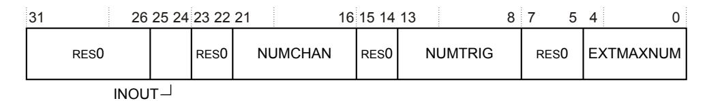

Figure 12-2 CTIDEVID bit assignments

The following table shows the CTIDEVID bit assignments.

## **Table 12-6 CTIDEVID bit assignments**

<span id="page-443-0"></span>

| Bits    | Name      | Function                                                                                    |  |  |  |
|---------|-----------|---------------------------------------------------------------------------------------------|--|--|--|
| [31:26] | -         | Reserved, RES0.                                                                             |  |  |  |
| [25:24] | INOUT     | Input and output options. Indicates the presence of an input gate. The possible values are: |  |  |  |
|         |           | CTIGATE does not mask propagation of input events from external channels.<br>0b00           |  |  |  |
|         |           | CTIGATE masks propagation of input events from external channels.<br>0b01                   |  |  |  |
| [23:22] | -         | Reserved, RES0.                                                                             |  |  |  |
| [21:16] | NUMCHAN   | Number of channels implemented. The value is:                                               |  |  |  |
|         |           | Four channels implemented.<br>0b000100                                                      |  |  |  |
| [15:14] | -         | Reserved, RES0.                                                                             |  |  |  |
| [13:8]  | NUMTRIG   | Number of triggers implemented. The value is:                                               |  |  |  |
|         |           | Eight triggers implemented.<br>0b001000                                                     |  |  |  |
| [7:5]   | -         | Reserved, RES0.                                                                             |  |  |  |
| [4:0]   | EXTMAXNUM | Maximum number of external triggers implemented. The value is:                              |  |  |  |
|         |           | No external triggers implemented.<br>0b00000                                                |  |  |  |

# **12.6.2 CTI Integration Mode Control register**

The CTIITCTRL characteristics are:

#### **Purpose**

Enables the CTI to switch from its default mode into integration mode, where test software can control directly the inputs and outputs of the processor, for integration testing or topology detection.

## **Usage constraints**

Accessible through the internal memory-mapped interface and the external debug interface. The access conditions are:

| Off | DLK | OSLK | EDAD | SLK   | Default |
|-----|-----|------|------|-------|---------|
| -   | -   | -    | -    | RO/WI | RW      |

*[Table 12-3 Cross trigger register summary](#page-439-0)* on page 12-440 describes the access conditions.

## **Configurations**

CTIITCTRL is in the Debug power domain.

#### **Attributes**

See *[12.5 Cross trigger register summary](#page-439-0)* on page 12-440.

shows the CTIITCTRL bit assignments.

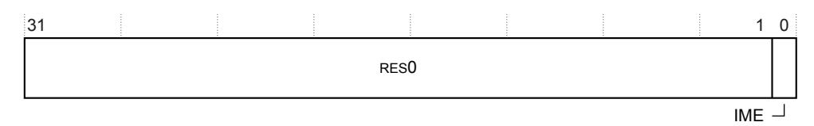

**Figure 12-3 CTIITCTRL bit assignment**

The following table shows the CTIITCTRL bit assignments.

## **Table 12-7 CTIITCTRL bit assignment**

<span id="page-444-0"></span>

| Bits   | Name | Function                                 |  |  |
|--------|------|------------------------------------------|--|--|
| [31:1] | -    | Reserved, RES0.                          |  |  |
| [0]    | IME  | Integration mode enable. The values are: |  |  |
|        |      | 0<br>Normal operation.                   |  |  |
|        |      | 1<br>Enables integration mode.           |  |  |

## **12.6.3 CTI Integration Test Channel In Acknowledge register**

The CTIITCHINACK characteristics are:

# **Purpose**

Provides direct control of the channel in acknowledge signals.

# **Usage constraints**

Accessible through the internal memory-mapped interface and the external debug interface. The access conditions are:


*[Table 12-3 Cross trigger register summary](#page-439-0)* on page 12-440 describes the access conditions.

# **Configurations**

CTIITCHINACK is in the Debug power domain.

# **Attributes**

See *[12.5 Cross trigger register summary](#page-439-0)* on page 12-440.

The following figure shows the CTIITCHINACK bit assignments.

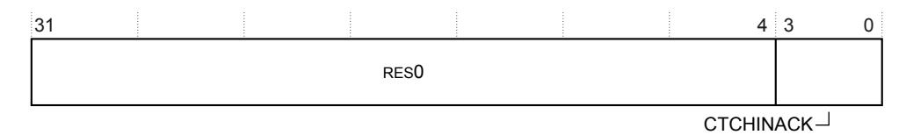

**Figure 12-4 CTIITCHINACK bit assignments**

The following table shows the CTIITCHINACK bit assignments.

**Table 12-8 CTIITCHINACK bit assignments**

| Bits   | Name      | Function                                |
|--------|-----------|-----------------------------------------|
| [31:4] | -         | Reserved, RES0.                         |
| [3:0]  | CTCHINACK | Set the value of the CTCHINACK outputs. |

#### **12.6.4 CTI Integration Test Trigger In Acknowledge register**

The CTIITTRIGINACK characteristics are:

#### **Purpose**

Provides direct control of the trigger in acknowledge signals.

# <span id="page-445-0"></span>**Usage constraints**

Accessible through the internal memory-mapped interface and the external debug interface. The access conditions are:

| Off | DLK | OSLK | EDAD | SLK | Default |
|-----|-----|------|------|-----|---------|
| -   | -   | -    | -    | WI  | WO      |

*[Table 12-3 Cross trigger register summary](#page-439-0)* on page 12-440 describes the access conditions.

## **Configurations**

CTIITTRIGINACK is in the Debug power domain.

## **Attributes**

See *[12.5 Cross trigger register summary](#page-439-0)* on page 12-440.

The following figure shows the CTIITTRIGINACK bit assignments.

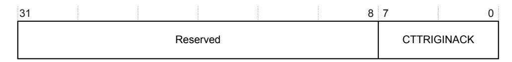

**Figure 12-5 CTIITTRIGINACK bit assignments**

The following table shows the CTIITTRIGINACK bit assignments.

**Table 12-9 CTIITTRIGINACK bit assignments**

| Bits   | Name        | Function                                  |
|--------|-------------|-------------------------------------------|
| [31:8] | -           | Reserved, RES0.                           |
| [7:0]  | CTTRIGINACK | Set the value of the CTTRIGINACK outputs. |

# **12.6.5 CTI Integration Test Channel Out register**

The CTIITCHOUT characteristics are:

# **Purpose**

Provides direct control of the channel out signals.

## **Usage constraints**

Accessible through the internal memory-mapped interface and the external debug interface. The access conditions are:

| Off | DLK | OSLK | EDAD | SLK | Default |
|-----|-----|------|------|-----|---------|
| -   | -   | -    | -    | WI  | WO      |

*[Table 12-3 Cross trigger register summary](#page-439-0)* on page 12-440 describes the access conditions.

# **Configurations**

CTIITCHOUT is in the Debug power domain.

#### **Attributes**

See *[12.5 Cross trigger register summary](#page-439-0)* on page 12-440.

The following figure shows the CTIITCHOUT bit assignments.

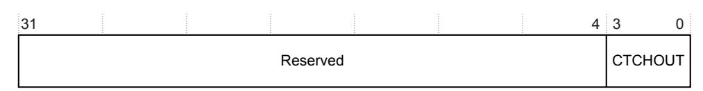

**Figure 12-6 CTIITCHOUT bit assignments**

<span id="page-446-0"></span>The following table shows the CTIITCHOUT bit assignments.

**Table 12-10 CTIITCHOUT bit assignments**

| Bits   | Name    | Function                              |
|--------|---------|---------------------------------------|
| [31:4] | -       | Reserved, RES0.                       |
| [3:0]  | CTCHOUT | Set the value of the CTCHOUT outputs. |

# **12.6.6 CTI Integration Test Trigger Out register**

The CTIITTRIGOUT characteristics are:

# **Purpose**

Provides direct observation of the trigger out signals.

# **Usage constraints**

Accessible through the internal memory-mapped interface and the external debug interface. The access conditions are:

| Off | DLK | OSLK | EDAD | SLK | Default |
|-----|-----|------|------|-----|---------|
| -   | -   | -    | -    | WI  | WO      |

*[Table 12-3 Cross trigger register summary](#page-439-0)* on page 12-440 describes the access conditions.

#### **Configurations**

CTIITTRIGOUT is in the Debug power domain.

# **Attributes**

See *[12.5 Cross trigger register summary](#page-439-0)* on page 12-440.

The following figure shows the CTIITTRIGOUT bit assignments.


**Figure 12-7 CTIITTRIGOUT bit assignments**

The following table shows the CTIITTRIGOUT bit assignments.

**Table 12-11 CTIITTRIGOUT bit assignments**

| Bits   | Name      | Function                                |
|--------|-----------|-----------------------------------------|
| [31:8] | -         | Reserved, RES0.                         |
| [7:0]  | CTTRIGOUT | Set the value of the CTTRIGOUT outputs. |

#### **12.6.7 CTI Integration Test Channel Out Acknowledge register**

The CTIITCHOUTACK characteristics are:

## <span id="page-447-0"></span>**Purpose**

Provides direct observation of the channel out acknowledge signals.

## **Usage constraints**

Accessible through the internal memory-mapped interface and the external debug interface. The access conditions are:

| Off | DLK | OSLK | EDAD | SLK | Default |
|-----|-----|------|------|-----|---------|
| -   | -   | -    | -    | RO  | RO      |

*[Table 12-3 Cross trigger register summary](#page-439-0)* on page 12-440 describes the access conditions.

## **Configurations**

CTIITCHOUTACK is in the Debug power domain.

#### **Attributes**

See *[12.5 Cross trigger register summary](#page-439-0)* on page 12-440.

The following figure shows the CTIITCHOUTACK bit assignments.

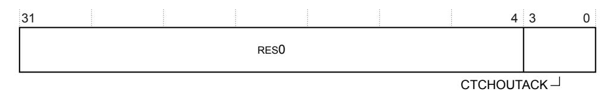

**Figure 12-8 CTIITCHOUTACK bit assignments**

The following table shows the CTIITCHOUTACK bit assignments.

**Table 12-12 CTIITCHOUTACK bit assignments**

| Bits   | Name       | Function                               |
|--------|------------|----------------------------------------|
| [31:4] | -          | Reserved, RES0.                        |
| [3:0]  | CTCHOUTACK | Read values of the CTCHOUTACK signals. |

# **12.6.8 CTI Integration Test Trigger Out Acknowledge register**

The CTIITTRIGOUTACK characteristics are:

#### **Purpose**

Provides direct observation of the trigger out acknowledge signals.

# **Usage constraints**

Accessible through the internal memory-mapped interface and the external debug interface. The access conditions are:

| Off | DLK | OSLK | EDAD | SLK | Default |
|-----|-----|------|------|-----|---------|
| -   | -   | -    | -    | RO  | RO      |

*[Table 12-3 Cross trigger register summary](#page-439-0)* on page 12-440 describes the access conditions.

# **Configurations**

CTIITTRIGOUTACK is in the Debug power domain.

#### **Attributes**

See *[12.5 Cross trigger register summary](#page-439-0)* on page 12-440.

The following figure shows the CTIITTRIGOUTACK bit assignments.

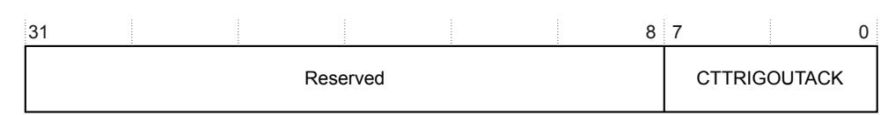

**Figure 12-9 CTIITTRIGOUTACK bit assignments**

<span id="page-448-0"></span>The following table shows the CTIITTRIGOUTACK bit assignments.

**Table 12-13 CTIITTRIGOUTACK bit assignments**

| Bits   | Name         | Function                                |
|--------|--------------|-----------------------------------------|
| [31:8] | -            | Reserved, RES0                          |
| [7:0]  | CTTRIGOUTACK | Read values of the CTTRIGOUTACK signals |

# **12.6.9 CTI Integration Test Channel In register**

The CTIITCHIN characteristics are:

## **Purpose**

Provides direct observation of the channel in signals.

# **Usage constraints**

Accessible through the internal memory-mapped interface and the external debug interface. The access conditions are:

| Off | DLK | OSLK | EDAD | SLK | Default |
|-----|-----|------|------|-----|---------|
| -   | -   | -    | -    | RO  | RO      |

*[Table 12-3 Cross trigger register summary](#page-439-0)* on page 12-440 describes the access conditions.

# **Configurations**

CTIITCHIN is in the Debug power domain.

# **Attributes**

See *[12.5 Cross trigger register summary](#page-439-0)* on page 12-440.

The following figure shows the CTIITCHIN bit assignments.

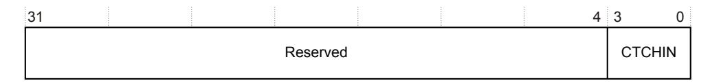

**Figure 12-10 CTIITCHIN bit assignments**

The following table shows the CTIITCHIN bit assignments.

**Table 12-14 CTIITCHIN bit assignments**

| Bits   | Name   | Function                          |
|--------|--------|-----------------------------------|
| [31:4] | -      | Reserved, RES0                    |
| [3:0]  | CTCHIN | Read values of the CTCHIN signals |

#### **12.6.10 CTI Integration Test Trigger In register**

The CTIITTRIGIN characteristics are:

## <span id="page-449-0"></span>**Purpose**

Provides direct observation of the trigger in signals.

## **Usage constraints**

Accessible through the internal memory-mapped interface and the external debug interface. The access conditions are:

| Off | DLK | OSLK | EDAD | SLK | Default |
|-----|-----|------|------|-----|---------|
| -   | -   | -    | -    | RO  | RO      |

*[Table 12-3 Cross trigger register summary](#page-439-0)* on page 12-440 describes the access conditions.

# **Configurations**

CTIITTRIGIN is in the Debug power domain.

## **Attributes**

See *[12.5 Cross trigger register summary](#page-439-0)* on page 12-440.

The following figure shows the CTIITTRIGIN bit assignments.


**Figure 12-11 CTIITTRIGIN bit assignments**

The following table shows the CTIITTRIGIN bit assignments.

**Table 12-15 CTIITTRIGIN bit assignments**

| Bits   | Name     | Function                            |
|--------|----------|-------------------------------------|
| [31:8] | -        | Reserved, RES0                      |
| [7:0]  | CTTRIGIN | Read values of the CTTRIGIN signals |

#### **12.6.11 CTI Peripheral Identification Registers**

The Peripheral Identification Registers provide standard information required for all components that conform to the ARM CoreSight architecture. There is a set of eight registers, listed in register number order in the following table.

**Table 12-16 Summary of the CTI Peripheral Identification Registers**

| Register | Value | Offset |
|----------|-------|--------|
| CTIPIDR4 | 0x04  | 0xFD0  |
| CTIPIDR5 | 0x00  | 0xFD4  |
| CTIPIDR6 | 0x00  | 0xFD8  |
| CTIPIDR7 | 0x00  | 0xFDC  |
| CTIPIDR0 | 0x06  | 0xFE0  |
| CTIPIDR1 | 0xB9  | 0xFE4  |
| CTIPIDR2 | 0x4B  | 0xFE8  |
| CTIPIDR3 | 0x00  | 0xFEC  |
|          |       |        |

Only bits[7:0] of each CTI Peripheral ID Register are used, with bits[31:8] reserved. Together, the eight CTI Peripheral ID Registers define a single 64-bit Peripheral ID.

# <span id="page-450-0"></span>The CTI Peripheral ID registers are:

- *CTI Peripheral Identification Register 0* on page 12-451.
- *CTI Peripheral Identification Register 1* on page 12-451.
- *[CTI Peripheral Identification Register 2](#page-451-0)* on page 12-452.
- *[CTI Peripheral Identification Register 3](#page-452-0)* on page 12-453.
- *[CTI Peripheral Identification Register 4](#page-453-0)* on page 12-454.
- *[CTI Peripheral Identification Register 5-7](#page-453-0)* on page 12-454.

#### **CTI Peripheral Identification Register 0**

The CTIPIDR0 characteristics are:

**Purpose** Provides information to identify a CTI component.

**Usage constraints** Accessible through the internal memory-mapped interface and the external debug

interface. The access conditions are:

| Off | DLK | OSLK | EPMAD | SLK | Default |
|-----|-----|------|-------|-----|---------|
| -   | -   | -    | -     | RO  | RO      |

*[Table 12-3 Cross trigger register summary](#page-439-0)* on page 12-440 describes the access

conditions.

**Configurations** CTIPIDR0 is in the Debug power domain.

CTIPIDR0 is optional to implement in the external register interface.

**Attributes** See *[12.5 Cross trigger register summary](#page-439-0)* on page 12-440.

The following figure shows the CTIPIDR0 bit assignments.

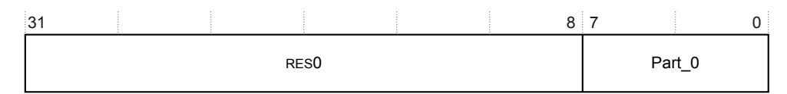

**Figure 12-12 CTIPIDR0 bit assignments**

The following table shows the CTIPIDR0 bit assignments.

**Table 12-17 CTIPIDR0 bit assignments**

| Bits   | Name   | Function       |                                                         |  |  |
|--------|--------|----------------|---------------------------------------------------------|--|--|
| [31:8] | -      | Reserved, RES0 |                                                         |  |  |
| [7:0]  | Part_0 | 0x06           | Least significant byte of the cross trigger part number |  |  |

# **CTI Peripheral Identification Register 1**

The CTIPIDR1 characteristics are:

# **Purpose**

Provides information to identify a CTI component.

# <span id="page-451-0"></span>**Usage constraints**

Accessible through the internal memory-mapped interface and the external debug interface. The access conditions are:

| Off | DLK | OSLK | EPMAD | SLK | Default |
|-----|-----|------|-------|-----|---------|
| -   | -   | -    | -     | RO  | RO      |

*[Table 12-3 Cross trigger register summary](#page-439-0)* on page 12-440 describes the access conditions.

# **Configurations**

CTIPIDR1 is in the Debug power domain.

CTIPIDR1 is optional to implement in the external register interface.

## **Attributes**

See *[12.5 Cross trigger register summary](#page-439-0)* on page 12-440.

The following figure shows the CTIPIDR1 bit assignments.

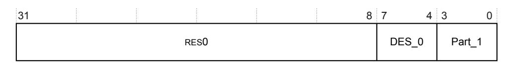

**Figure 12-13 CTIPIDR1 bit assignments**

The following table shows the CTIPIDR1 bit assignments.

#### **Table 12-18 CTIPIDR1 bit assignments**

| Bits   | Name   |                 | Function                                                             |  |  |
|--------|--------|-----------------|----------------------------------------------------------------------|--|--|
| [31:8] | -      | Reserved, RES0. |                                                                      |  |  |
| [7:4]  | DES_0  | 0xB             | ARM Limited. This is the least significant nibble of JEP106 ID code. |  |  |
| [3:0]  | Part_1 | 0x9             | Most significant nibble of the cross trigger interface part number.  |  |  |

# **CTI Peripheral Identification Register 2**

The CTIPIDR2 characteristics are:

**Purpose** Provides information to identify a CTI component.

**Usage constraints** Accessible through the internal memory-mapped interface and the external debug

interface. The access conditions are:

| Off | DLK | OSLK | EPMAD | SLK | Default |
|-----|-----|------|-------|-----|---------|
| -   | -   | -    | -     | RO  | RO      |

*[Table 12-3 Cross trigger register summary](#page-439-0)* on page 12-440 describes the access

conditions.

**Configurations** CTIPIDR2 is in the Debug power domain.

CTIPIDR2 is optional to implement in the external register interface.

**Attributes** See *[12.5 Cross trigger register summary](#page-439-0)* on page 12-440.

The following figure shows the CTIPIDR2 bit assignments.

<span id="page-452-0"></span>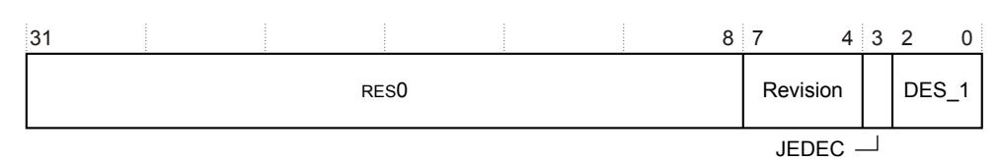

Figure 12-14 CTIPIDR2 bit assignments

The following table shows the CTIPIDR2 bit assignments.

Table 12-19 CTI PIDR2 bit assignments

| Bits   | Name     | Function      |                                                                     |
|--------|----------|---------------|---------------------------------------------------------------------|
| [31:8] | -        | Reserved, RE  | S0.                                                                 |
| [7:4]  | Revision | 0x4           | Part major revision.                                                |
| [3]    | JEDEC    | <b>0</b> b1 R | RES1. Indicates a JEP106 identity code is used.                     |
| [2:0]  | DES_1    | 0b011         | ARM Limited. This is the most significant nibble of JEP106 ID code. |

# CTI Peripheral Identification Register 3

The CTIPIDR3 characteristics are:

#### **Purpose**

Provides information to identify a CTI component.

#### **Usage constraints**

Accessible through the internal memory-mapped interface and the external debug interface. The access conditions are:


Table 12-3 Cross trigger register summary on page 12-440 describes the access conditions.

# **Configurations**

CTIPIDR3 is in the Debug power domain.

CTIPIDR3 is optional to implement in the external register interface.

#### **Attributes**

See 12.5 Cross trigger register summary on page 12-440.

The following figure shows the CTIPIDR3 bit assignments.

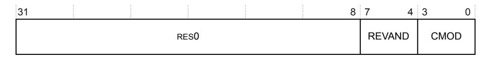

Figure 12-15 CTIPIDR3 bit assignments

The following table shows the CTIPIDR3 bit assignments.

## **Table 12-20 CTIPIDR3 bit assignments**

<span id="page-453-0"></span>

| Bits   | Name   | Function       |                     |
|--------|--------|----------------|---------------------|
| [31:8] | -      | Reserved, RES0 |                     |
| [7:4]  | REVAND | 0x0            | Part minor revision |
| [3:0]  | CMOD   | 0x0            | Customer modified   |

#### **CTI Peripheral Identification Register 4**

The CTIPIDR4 characteristics are:

#### **Purpose**

Provides information to identify a CTI component.

## **Usage constraints**

Accessible through the internal memory-mapped interface and the external debug interface. The access conditions are:


*[Table 12-3 Cross trigger register summary](#page-439-0)* on page 12-440 describes the access conditions.

# **Configurations**

CTIPIDR4 is in the Debug power domain.

CTIPIDR4 is optional to implement in the external register interface.

# **Attributes**

See *[12.5 Cross trigger register summary](#page-439-0)* on page 12-440.

The following figure shows the CTIPIDR4 bit assignments.

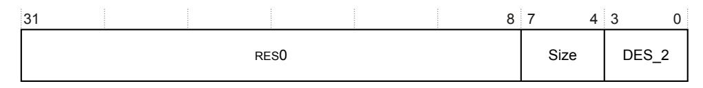

**Figure 12-16 CTIPIDR4 bit assignments**

The following table shows the CTIPIDR4 bit assignments.

**Table 12-21 CTIPIDR4 bit assignments**

| Bits   | Name  | Function        |                                                                                                                                  |  |
|--------|-------|-----------------|----------------------------------------------------------------------------------------------------------------------------------|--|
| [31:8] | -     | Reserved, RES0. |                                                                                                                                  |  |
| [7:4]  | Size  | 0x0             | Size of the component. Log2 the number of 4KB pages from the start of the component to the end of the<br>component ID registers. |  |
| [3:0]  | DES_2 | 0x4             | ARM Limited. This is the least significant nibble JEP106 continuation code.                                                      |  |

#### **CTI Peripheral Identification Register 5-7**

No information is held in the Peripheral ID5, Peripheral ID6, and Peripheral ID7 Registers. They are reserved for future use and are RES0.

# <span id="page-454-0"></span>**12.6.12 CTI Component Identification Registers**

There are four read-only CTI Component Identification Registers, Component ID0 through Component ID3. The following table shows these registers.

**Table 12-22 Summary of the CTI Component Identification Registers**

| Register | Value | Offset |
|----------|-------|--------|
| CTICIDR0 | 0x0D  | 0xFF0  |
| CTICIDR1 | 0x90  | 0xFF4  |
| CTICIDR2 | 0x05  | 0xFF8  |
| CTICIDR3 | 0xB1  | 0xFFC  |

The CTI Component ID registers are:

- *CTI Component Identification Register 0* on page 12-455.
- *[CTI Component Identification Register 1](#page-455-0)* on page 12-456.
- *[CTI Component Identification Register 2](#page-455-0)* on page 12-456.
- *[CTI Component Identification Register 3](#page-456-0)* on page 12-457.

## **CTI Component Identification Register 0**

The CTICIDR0 characteristics are:

#### **Purpose**

Provides information to identify a CTI component.

#### **Usage constraints**

Accessible through the internal memory-mapped interface and the external debug interface. The access conditions are:

| Off | DLK | OSLK | EPMAD | SLK | Default |
|-----|-----|------|-------|-----|---------|
| -   | -   | -    | -     | RO  | RO      |

*[Table 12-3 Cross trigger register summary](#page-439-0)* on page 12-440 describes the access conditions.

#### **Configurations**

CTICIDR0 is in the Debug power domain.

CTICIDR0 is optional to implement in the external register interface.

#### **Attributes**

See *[12.5 Cross trigger register summary](#page-439-0)* on page 12-440.

The following figure shows the CTICIDR0 bit assignments.

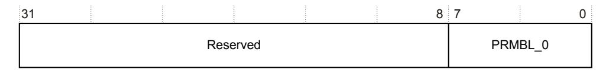

**Figure 12-17 CTICIDR0 bit assignments**

The following table shows the CTICIDR0 bit assignments.

#### **Table 12-23 CTICIDR0 bit assignments**

<span id="page-455-0"></span>

| Bits   | Name    | Function       |                 |
|--------|---------|----------------|-----------------|
| [31:8] | -       | Reserved, RES0 |                 |
| [7:0]  | PRMBL_0 | 0x0D           | Preamble byte 0 |

# **CTI Component Identification Register 1**

The CTICIDR1 characteristics are:

# **Purpose**

Provides information to identify a CTI component.

# **Usage constraints**

Accessible through the internal memory-mapped interface and the external debug interface. The access conditions are:

| Off | DLK | OSLK | EPMAD | SLK | Default |
|-----|-----|------|-------|-----|---------|
| -   | -   | -    | -     | RO  | RO      |

*[Table 12-3 Cross trigger register summary](#page-439-0)* on page 12-440 describes the access conditions.

# **Configurations**

CTICIDR1 is in the Debug power domain.

CTICIDR1 is optional to implement in the external register interface.

#### **Attributes**

See *[12.5 Cross trigger register summary](#page-439-0)* on page 12-440.

The following figure shows the CTICIDR1 bit assignments.

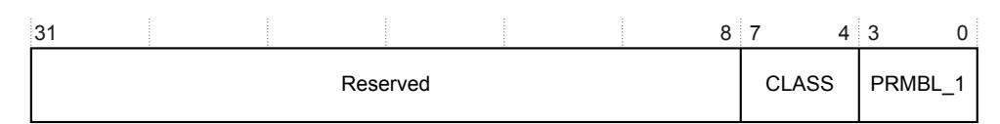

**Figure 12-18 CTICIDR1 bit assignments**

The following table shows the CTICIDR1 bit assignments.

**Table 12-24 CTICIDR1 bit assignments**

| Bits   | Name    | Function       |                 |
|--------|---------|----------------|-----------------|
| [31:8] | -       | Reserved, RES0 |                 |
| [7:4]  | CLASS   | 0x9            | Debug component |
| [3:0]  | PRMBL_1 | 0x0            | Preamble        |

#### **CTI Component Identification Register 2**

The CTICIDR2 characteristics are:

#### **Purpose**

Provides information to identify a CTI component.

#### <span id="page-456-0"></span>**Usage constraints**

Accessible through the internal memory-mapped interface and the external debug interface. The access conditions are:

| Off | DLK | OSLK | EPMAD | SLK | Default |
|-----|-----|------|-------|-----|---------|
| -   | -   | -    | -     | RO  | RO      |

*[Table 12-3 Cross trigger register summary](#page-439-0)* on page 12-440 describes the access conditions.

## **Configurations**

CTICIDR2 is in the Debug power domain.

CTICIDR2 is optional to implement in the external register interface.

## **Attributes**

See *[12.5 Cross trigger register summary](#page-439-0)* on page 12-440.

The following figure shows the CTICIDR2 bit assignments.


**Figure 12-19 CTICIDR2 bit assignments**

The following table shows the CTICIDR2 bit assignments.

**Table 12-25 CTICIDR2 bit assignments**

| Bits   | Name    | Function       |                 |
|--------|---------|----------------|-----------------|
| [31:8] | -       | Reserved, RES0 |                 |
| [7:0]  | PRMBL_2 | 0x05           | Preamble byte 2 |

# **CTI Component Identification Register 3**

The CTICIDR3 characteristics are:

#### **Purpose**

Provides information to identify a CTI component.

# **Usage constraints**

Accessible through the internal memory-mapped interface and the external debug interface. The access conditions are:

| Off | DLK | OSLK | EPMAD | SLK | Default |
|-----|-----|------|-------|-----|---------|
| -   | -   | -    | -     | RO  | RO      |

*[Table 12-3 Cross trigger register summary](#page-439-0)* on page 12-440 describes the access conditions.

# **Configurations**

CTICIDR3 is in the Debug power domain.

CTICIDR3 is optional to implement in the external register interface.

#### **Attributes**

See *[12.5 Cross trigger register summary](#page-439-0)* on page 12-440.

The following figure shows the CTICIDR3 bit assignments.

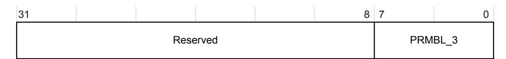

**Figure 12-20 CTICIDR3 bit assignments**

The following table shows the CTICIDR3 bit assignments.

**Table 12-26 CTICIDR3 bit assignments**

| Bits<br>Name     | Function       |                 |
|------------------|----------------|-----------------|
| [31:8]<br>-      | Reserved, RES0 |                 |
| [7:0]<br>PRMBL_3 | 0xB1           | Preamble byte 3 |

# <span id="page-458-0"></span>Chapter 13 **Embedded Trace Macrocell**

This section describes the *Embedded Trace Macrocell* (ETM) for the Cortex-A57 processor.

It contains the following sections:

- *13.1 About ETM* [on page 13-460.](#page-459-0)
- *[13.2 ETM trace generation options and resources](#page-460-0)* on page 13-461.
- *[13.3 ETM functional description](#page-462-0)* on page 13-463.
- *13.4 Reset* [on page 13-464.](#page-463-0)
- *[13.5 ETM register interfaces](#page-464-0)* on page 13-465.
- *[13.6 Register summary](#page-465-0)* on page 13-466.
- *[13.7 Register descriptions](#page-469-0)* on page 13-470.
- *[13.8 Interaction with debug and the Performance Monitor Unit](#page-511-0)* on page 13-512.

# <span id="page-459-0"></span>**13.1 About ETM**

Describes the Embedded Trace Macrocell used in the Cortex-A57 processor.

The ETM is a module that performs real-time instruction flow tracing based on the *ARM® Embedded Trace Macrocell Architecture Specification, ETMv4*. The ETM is a CoreSight component, and is an integral part of the ARM Real-time Debug solution, RealView. See the CoreSight SoC-400 documentation for more information.

# <span id="page-460-0"></span>**13.2 ETM trace generation options and resources**

The following table shows the trace generation options that the Cortex-A57 processor implements.

**Table 13-1 ETM trace generation options implemented**

| Description                                                       | Configuration   |
|-------------------------------------------------------------------|-----------------|
| Instruction address size in bytes                                 | 8               |
| Data address size in bytes                                        | 0               |
| Data value size in bytes                                          | 0               |
| Virtual Machine ID size in bytes                                  | 1               |
| Context ID size in bytes                                          | 4               |
| Support for conditional instruction tracing                       | Not implemented |
| Support for tracing of data                                       | Not implemented |
| Support for tracing of load and store instructions as P0 elements | Not implemented |
| Support for cycle counting in the instruction trace               | Implemented     |
| Support for branch broadcast tracing                              | Implemented     |
| Exception Levels implemented in Non-secure state                  | 0b0111          |
| Exception Levels implemented in Secure state                      | 0b1011          |
| Number of events supported in the trace                           | 4               |
| Return stack support                                              | Implemented     |
| Tracing of SError exception support                               | Implemented     |
| Instruction trace cycle counting minimum threshold                | 4               |
| Size of Trace ID                                                  | 7-bit           |
| Synchronization period support                                    | Read-write      |
| Global timestamp size                                             | 64-bit          |
| Number of cores available for tracing                             | 1               |
| ATB trigger support                                               | Implemented     |
| Low power behavior override                                       | Not implemented |
| Stall control support                                             | Not implemented |
| Support for no overflows in the trace                             | Not implemented |
|                                                                   |                 |

The following table shows the ETM resources that the Cortex-A57 processor implements.

**Table 13-2 ETM resources implemented**

| Description                                    | Configuration             |
|------------------------------------------------|---------------------------|
| Number of resource selection pairs implemented | 8                         |
| Number of external input selectors implemented | 4                         |
| Number of external inputs implemented          | 110, 4 external + 106 PMU |
| Number of counters implemented                 | 2                         |

## **Table 13-2 ETM resources implemented (continued)**

| Description                                          | Configuration   |
|------------------------------------------------------|-----------------|
| Reduced function counter implemented                 | Not implemented |
| Number of sequencer states implemented               | 4               |
| Number of Virtual Machine ID comparators implemented | 1               |
| Number of Context ID comparators implemented         | 1               |
| Number of address comparator pairs implemented       | 4               |
| Number of single-shot comparator controls            | 1               |
| Number of processor comparator inputs implemented    | 0               |
| Data address comparisons implemented                 | Not implemented |
| Number of data value comparators implemented         | 0               |

# <span id="page-462-0"></span>13.3 ETM functional description

Describes the functional blocks of the ETM

The following figure shows the main functional blocks of the ETM.

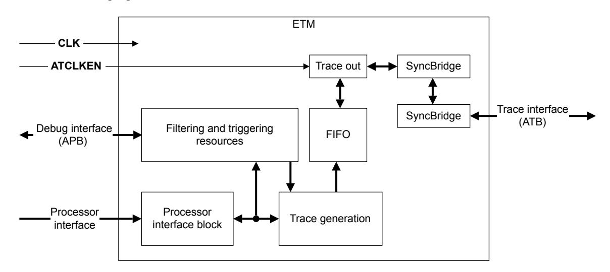

Figure 13-1 ETM functional blocks

The ETM blocks are:

#### **Processor interface**

This block monitors the behavior of the processor and generates P0 elements that are essentially executed instructions and exceptions traced in program order.

#### **Trace generation**

The trace generation block generates various trace packets based on P0 elements.

# Filtering and triggering resources

You can filter the ETM trace such as configuring it to trace only in certain address ranges. More complicated logic analyzer style filtering options are also available.

The ETM can also generate a trigger that is a signal to the trace capture device to stop capturing trace.

#### FIFO

The trace generated by the ETM is in a highly-compressed form. The FIFO enables trace bursts to be flattened out. When the FIFO becomes full, the FIFO signals an overflow. The trace generation logic does not generate any new trace until the FIFO is emptied. This causes a gap in the trace when viewed in the debugger.

#### Trace out

Trace from FIFO is output on the synchronous AMBA Advanced Trace Bus (ATB) interface.

#### Syncbridge

The ATB interface from the trace out block goes through two slices of the CoreSight SoC ATB Syncbridge IP.

See the ARM® AMBA® 3 ATB Protocol Specification for information about the ATB protocol.

# <span id="page-463-0"></span>**13.4 Reset**

The reset for ETM is the same as Cold reset for processor.

The ETM is not reset when a Warm reset is applied to processor, so that tracing through the reset is possible.

If the ETM is reset, tracing stops until the ETM is reprogrammed and re-enabled. However, if the processor is reset using a Warm reset, the last few instructions provided by the processor before the reset might not be traced.

# <span id="page-464-0"></span>**13.5 ETM register interfaces**

The reset for ETM is the same as Cold reset for processor.

This section contains the following subsections:

• *13.5.1 Access permissions* on page 13-465.

# **13.5.1 Access permissions**

See the *ARM® Embedded Trace Macrocell Architecture Specification, ETMv4* for information on the behaviors on register accesses for different trace unit states and the different access mechanisms.

# **Related information**

*[10.10 External debug interface](#page-381-0)* on page 10-382*.*

# <span id="page-465-0"></span>**13.6 Register summary**

This section summarizes the ETM registers.

For full descriptions of the ETM registers, see:

• *[10.10 External debug interface](#page-381-0)* on page 10-382, for the IMPLEMENTATION DEFINED registers and the *ARM® Embedded Trace Macrocell Architecture Specification, ETMv4*, for the other registers.

**Note**

• In the following table, access type is described as follows:

**RW** Read and write. **RO** Read only. **WO** Write only.

All ETM registers are 32 bits wide. The following table lists all of the registers and their offsets from a base address. The base address is defined by the system integrator when placing the ETM in the Debug-APB memory map.

**Table 13-3 ETM register summary**

| Offset       | Name          | Type | Description                                                 |
|--------------|---------------|------|-------------------------------------------------------------|
| 0x000        | -             | -    | Reserved                                                    |
| 0x004        | TRCPRGCTLR    | RW   | Trace Programming Control Register                          |
| 0x008        | -             | -    | Reserved                                                    |
| 0x00C        | TRCSTATR      | RO   | Trace Status Register                                       |
| 0x010        | TRCCONFIGR    | RW   | 13.7.1 Trace Configuration Register on page 13-471          |
| 0x014        | -             | -    | Reserved                                                    |
| 0x018        | TRCAUXCTLR    | RW   | 13.7.2 Trace Auxiliary Control Register on page 13-472      |
| 0x01C        | -             | -    | Reserved                                                    |
| 0x020        | TRCEVENTCTL0R | RW   | 13.7.3 Trace Event Control 0 Register on page 13-474        |
| 0x024        | TRCEVENTCTL1R | RW   | 13.7.4 Trace Event Control 1 Register on page 13-475        |
| 0x028-0x2C   | -             | -    | Reserved                                                    |
| 0x030        | TRCTSCTLR     | RW   | Global Timestamp Control Register                           |
| 0x034        | TRCSYNCPR     | RW   | 13.7.5 Trace Synchronization Period Register on page 13-476 |
| 0x038        | TRCCCCTLR     | RW   | 13.7.6 Trace Cycle Count Control Register on page 13-476    |
| 0x03C        | TRCBBCTLR     | RW   | Branch Broadcast Control Register                           |
| 0x040        | TRCTRACEIDR   | RW   | 13.7.7 Trace ID Register on page 13-477                     |
| 0x044 -0x07C | -             | -    | Reserved                                                    |
| 0x080        | TRCVICTLR     | RW   | 13.7.8 ViewInst Main Control Register on page 13-478        |
| 0x084        | TRCVIIECTLR   | RW   | ViewInst Include-Exclude Control Register                   |
| 0x088        | TRCVISSCTLR   | RW   | ViewInst Start-Stop Control Register                        |
| 0x08C -0x0FC | -             | -    | Reserved                                                    |
|              |               |      |                                                             |

## **Table 13-3 ETM register summary (continued)**

| Offset       | Name         | Type | Description                                              |
|--------------|--------------|------|----------------------------------------------------------|
| 0x100        | TRCSEQEVR0   | RW   | Sequencer State Transition Control Register 0            |
| 0x104        | TRCSEQEVR1   | RW   | Sequencer State Transition Control Register 1            |
| 0x108        | TRCSEQEVR2   | RW   | Sequencer State Transition Control Register 2            |
| 0x10C -0x114 | -            | -    | Reserved                                                 |
| 0x118        | TRCSEQRSTEVR | RW   | Sequencer Reset Control Register                         |
| 0x11C        | TRCSEQSTR    | RW   | Sequencer State Register                                 |
| 0x120        | TRCEXTINSELR | RW   | 13.7.9 External Input Select Register on page 13-480     |
| 0x124 -0x13C | -            | -    | Reserved                                                 |
| 0x140        | TRCCNTRLDVR0 | RW   | Counter Reload Value Register 0                          |
| 0x144        | TRCCNTRLDVR1 | RW   | Counter Reload Value Register 1                          |
| 0x148-0x14C  | -            | -    | Reserved                                                 |
| 0x150        | TRCCNTCTLR0  | RW   | Counter Control Register 0                               |
| 0x154        | TRCCNTCTLR1  | RW   | Counter Control Register 1                               |
| 0x158-0x15C  | -            | -    | Reserved                                                 |
| 0x160        | TRCCNTVR0    | RW   | Counter Value Register 0                                 |
| 0x164        | TRCCNTVR1    | RW   | Counter Value Register 1                                 |
| 0x168-0x16C  | -            | -    | Reserved                                                 |
| 0x170 -0x17C | -            | -    | Reserved                                                 |
| 0x180        | TRCIDR8      | RO   | 13.7.10 ID Register 8 on page 13-480                     |
| 0x184        | TRCIDR9      | RO   | 13.7.11 ID Register 9 on page 13-481                     |
| 0x188        | TRCIDR10     | RO   | 13.7.12 ID Register 10 on page 13-481                    |
| 0x18C        | TRCIDR11     | RO   | 13.7.13 ID Register 11 on page 13-482>                   |
| 0x190        | TRCIDR12     | RO   | 13.7.14 ID Register 12 on page 13-483                    |
| 0x194        | TRCIDR13     | RO   | 13.7.15 ID Register 13 on page 13-483                    |
| 0x198-0x1BC  | -            | -    | Reserved                                                 |
| 0x1C0        | TRCIMSPEC0   | RW   | 13.7.16 Implementation Defined Register 0 on page 13-484 |
| 0x1C4-0x1DC  | -            | -    | Reserved                                                 |
| 0x1E0        | TRCIDR0      | RO   | 13.7.17 Trace ID Register 0 on page 13-485               |
| 0x1E4        | TRCIDR1      | RO   | 13.7.18 Trace ID Register 1 on page 13-486               |
| 0x1E8        | TRCIDR2      | RO   | 13.7.19 Trace ID Register 2 on page 13-487               |
| 0x1EC        | TRCIDR3      | RO   | 13.7.20 Trace ID Register 3 on page 13-489               |
| 0x1F0        | TRCIDR4      | RO   | 13.7.21 Trace ID Register 4 on page 13-490               |
| 0x1F4        | TRCIDR5      | RO   | 13.7.22 Trace ID Register 5 on page 13-491               |
| 0x1F8 -0x204 | -            | -    | Reserved                                                 |
|              |              |      |                                                          |

## **Table 13-3 ETM register summary (continued)**

| Offset       | Name          | Type   | Description                                                                  |
|--------------|---------------|--------|------------------------------------------------------------------------------|
| 0x208-0x23C  | TRCRSCTLRn    | RW     | 13.7.23 Resource Selection Control Registers on page 13-493, n is 2, 15      |
| 0x240-0x27C  | -             | -      | Reserved                                                                     |
| 0x280        | TRCSSCCR0     | RW     | Single-shot Comparator Control Register 0                                    |
| 0x284-0x29C  | -             | -      | Reserved                                                                     |
| 0x2A0        | TRCSSCSR0     | RW, RO | Single-shot Comparator Status Register 0                                     |
| 0x2A4-0x2FC  | -             | -      | Reserved                                                                     |
| 0x300        | TRCOSLAR      | WO     | OS Lock Access Register                                                      |
| 0x304        | TRCOSLSR      | RO     | OS Lock Status Register                                                      |
| 0x308 -0x30C | -             | -      | Reserved                                                                     |
| 0x310        | TRCPDCR       | RW     | PowerDown Control Register                                                   |
| 0x314        | TRCPDSR       | RO     | PowerDown Status Register                                                    |
| 0x318 -0x3FC | -             | -      | Reserved                                                                     |
| 0x400-0x438  | TRCACVRn      | RW     | Address Comparator Value Register n, n = 0 to 7                              |
| 0x440-0x47C  | -             | -      | Reserved                                                                     |
| 0x480-0x4B8  | TRCACATRn     | RW     | 13.7.24 Address Comparator Access Type Registers on page 13-494, n is 0 to 7 |
| 0x4C0-0x5FC  | -             | -      | Reserved                                                                     |
| 0x600        | TRCCIDCVR0    | RW     | 13.7.25 Context ID Comparator Value Register 0 on page 13-496                |
| 0x608-0x63F  | -             | -      | Reserved                                                                     |
| 0x640        | TRCVMIDCVR0   | RW     | 13.7.26 VMID Comparator Value Register 0 on page 13-497                      |
| 0x648-0x67F  | -             | -      | Reserved                                                                     |
| 0x680        | TRCCIDCCTLR0  | RW     | 13.7.27 Context ID Comparator Control Register 0 on page 13-497              |
| 0x684-0xED8  | -             | -      | Reserved                                                                     |
| 0xEDC        | TRCITMISCOUT  | WO     | 13.7.28 Trace Integration Miscellaneous Outputs Register on page 13-498      |
| 0xEE0        | TRCITMISCIN   | RO     | 13.7.29 Trace Integration Miscellaneous Input Register on page 13-499        |
| 0xEE4-0xEE8  | -             | -      | Reserved                                                                     |
| 0xEEC        | TRCITATBDATA0 | WO     | 13.7.30 Trace Integration Test ATB Data Register 0 on page 13-500            |
| 0xEF0        | TRCITATBCTR2  | RO     | 13.7.31 Trace Integration Test ATB Control Register 2 on page 13-500         |
| 0xEF4        | TRCITATBCTR1  | WO     | 13.7.32 Trace Integration Test ATB Control Register 1 on page 13-501         |
| 0xEF8        | TRCITATBCTR0  | WO     | 13.7.33 Trace Integration Test ATB Control Register 0 on page 13-502         |
| 0xEFC        | -             | -      | Reserved                                                                     |
| 0xF00        | TRCITCTRL     | RW     | 13.7.34 Trace Integration Mode Control register on page 13-503               |
| 0xF04 -0xF9C | -             | -      | Reserved                                                                     |
| 0xFA0        | TRCCLAIMSET   | RW     | Trace Claim Tag Set register                                                 |
| 0xFA4        | TRCCLAIMCLR   | RW     | Trace Claim Tag Clear register                                               |

#### **Table 13-3 ETM register summary (continued)**

| Offset       | Name          | Type | Description                                                 |
|--------------|---------------|------|-------------------------------------------------------------|
| 0xFA8        | TRCDEVAFF0    | RO   | 13.7.35 Trace Device Affinity register 0 on page 13-503     |
| 0xFAC        | TRCDEVAFF1    | RO   | 13.7.36 Trace Device Affinity register 1 on page 13-504     |
| 0xFB0        | TRCLAR        | WO   | Trace Software Lock Access Register                         |
| 0xFB4        | TRCLSR        | RO   | Trace Software Lock Status Register                         |
| 0xFB8        | TRCAUTHSTATUS | RO   | Trace Authentication Status register                        |
| 0xFBC        | TRCDEVARCH    | RO   | Trace Device Architecture register                          |
| 0xFC0 -0xFC4 | -             | -    | Reserved                                                    |
| 0xFC8        | TRCDEVID      | RO   | Trace Device ID register                                    |
| 0xFCC        | TRCDEVTYPE    | RO   | Trace Device Type register                                  |
| 0xFD0        | TRCPIDR4      | RO   | Trace Peripheral Identification Register 4 on page 13-508   |
| 0xFD4        | TRCPIDR5      | RO   | Trace Peripheral Identification Register 5-7 on page 13-508 |
| 0xFD8        | TRCPIDR6      | RO   |                                                             |
| 0xFDC        | TRCPIDR7      | RO   |                                                             |
| 0xFE0        | TRCPIDR0      | RO   | Trace Peripheral Identification Register 0 on page 13-505   |
| 0xFE4        | TRCPIDR1      | RO   | Trace Peripheral Identification Register 1 on page 13-506   |
| 0xFE8        | TRCPIDR2      | RO   | Trace Peripheral Identification Register 2 on page 13-506   |
| 0xFEC        | TRCPIDR3      | RO   | Trace Peripheral Identification Register 3 on page 13-507   |
| 0xFF0        | TRCCIDR0      | RO   | Trace Component Identification Register 0 on page 13-509    |
| 0xFF4        | TRCCIDR1      | RO   | Trace Component Identification Register 1 on page 13-510    |
| 0xFF8        | TRCCIDR2      | RO   | Trace Component Identification Register 2 on page 13-510    |
| 0xFFC        | TRCCIDR3      | RO   | Trace Component Identification Register 3 on page 13-511    |
|              |               |      |                                                             |

## **Related information**

*[10.11 ROM table](#page-384-0)* on page 10-385*.*

# <span id="page-469-0"></span>**13.7 Register descriptions**

This section describes the implementation-specific ETM registers in the Cortex-A57 processor.

*[13.6 Register summary](#page-465-0)* on page 13-466 provides cross-references to individual registers.

The *ARM® Embedded Trace Macrocell Architecture Specification, ETMv4* describes the other ETM registers.

This section contains the following subsections:

- *[13.7.1 Trace Configuration Register](#page-470-0)* on page 13-471.
- *[13.7.2 Trace Auxiliary Control Register](#page-471-0)* on page 13-472.
- *[13.7.3 Trace Event Control 0 Register](#page-473-0)* on page 13-474.
- *[13.7.4 Trace Event Control 1 Register](#page-474-0)* on page 13-475.
- *[13.7.5 Trace Synchronization Period Register](#page-475-0)* on page 13-476.
- *[13.7.6 Trace Cycle Count Control Register](#page-475-0)* on page 13-476.
- *[13.7.7 Trace ID Register](#page-476-0)* on page 13-477.
- *[13.7.8 ViewInst Main Control Register](#page-477-0)* on page 13-478.
- *[13.7.9 External Input Select Register](#page-479-0)* on page 13-480.
- *[13.7.10 ID Register 8](#page-479-0)* on page 13-480.
- *[13.7.11 ID Register 9](#page-480-0)* on page 13-481.
- *[13.7.12 ID Register 10](#page-480-0)* on page 13-481.
- *[13.7.13 ID Register 11](#page-481-0)* on page 13-482.
- *[13.7.14 ID Register 12](#page-482-0)* on page 13-483.
- *[13.7.15 ID Register 13](#page-482-0)* on page 13-483.
- *[13.7.16 Implementation Defined Register 0](#page-483-0)* on page 13-484.
- *[13.7.17 Trace ID Register 0](#page-484-0)* on page 13-485.
- *[13.7.18 Trace ID Register 1](#page-485-0)* on page 13-486.
- *[13.7.19 Trace ID Register 2](#page-486-0)* on page 13-487.
- *[13.7.20 Trace ID Register 3](#page-488-0)* on page 13-489.
- *[13.7.21 Trace ID Register 4](#page-489-0)* on page 13-490.
- *[13.7.22 Trace ID Register 5](#page-490-0)* on page 13-491.
- *[13.7.23 Resource Selection Control Registers](#page-492-0)* on page 13-493.
- *[13.7.24 Address Comparator Access Type Registers](#page-493-0)* on page 13-494.
- *[13.7.25 Context ID Comparator Value Register 0](#page-495-0)* on page 13-496.
- *[13.7.26 VMID Comparator Value Register 0](#page-496-0)* on page 13-497.
- *[13.7.27 Context ID Comparator Control Register 0](#page-496-0)* on page 13-497.
- *[13.7.28 Trace Integration Miscellaneous Outputs Register](#page-497-0)* on page 13-498.
- *[13.7.29 Trace Integration Miscellaneous Input Register](#page-498-0)* on page 13-499.
- *[13.7.30 Trace Integration Test ATB Data Register 0](#page-499-0)* on page 13-500.
- *[13.7.31 Trace Integration Test ATB Control Register 2](#page-499-0)* on page 13-500.
- *[13.7.32 Trace Integration Test ATB Control Register 1](#page-500-0)* on page 13-501.
- *[13.7.33 Trace Integration Test ATB Control Register 0](#page-501-0)* on page 13-502.
- *[13.7.34 Trace Integration Mode Control register](#page-502-0)* on page 13-503.
- *[13.7.35 Trace Device Affinity register 0](#page-502-0)* on page 13-503.
- *[13.7.36 Trace Device Affinity register 1](#page-503-0)* on page 13-504.
- *[13.7.37 Trace Peripheral Identification Registers](#page-503-0)* on page 13-504.
- *[13.7.38 Trace Component Identification Registers](#page-508-0)* on page 13-509.

# <span id="page-470-0"></span>**13.7.1 Trace Configuration Register**

The TRCCONFIGR characteristics are:

#### **Purpose**

Controls the tracing options.

#### **Usage constraints**

Only accepts writes when the trace unit is disabled.

#### **Configurations**

Available in all configurations.

# **Attributes**

A 32-bit RW trace register.

See *[13.6 Register summary](#page-465-0)* on page 13-466.

The following figure shows the TRCCONFIGR bit assignments.

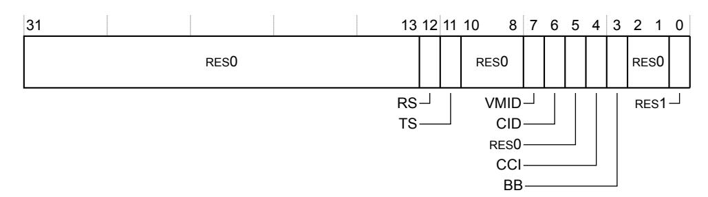

**Figure 13-2 TRCCONFIGR bit assignments**

The following table shows the TRCCONFIGR bit assignments.

**Table 13-4 TRCCONFIGR bit assignments**

| Bits    | Name | Function                                                   |
|---------|------|------------------------------------------------------------|
| [31:13] | -    | Reserved, RES0.                                            |
| [12]    | RS   | Enables the return stack. The possible values are:         |
|         |      | 0<br>Disables the return stack.                            |
|         |      | 1<br>Enables the return stack.                             |
| [11]    | TS   | Enables global timestamp tracing. The possible values are: |
|         |      | 0<br>Disables global timestamp tracing.                    |
|         |      | 1<br>Enables global timestamp tracing.                     |
| [10:8]  | -    | Reserved, RES0.                                            |
| [7]     | VMID | Enables VMID tracing. The possible values are:             |
|         |      | 0<br>Disables VMID tracing.                                |
|         |      | 1<br>Enables VMID tracing.                                 |
| [6]     | CID  | Enables context ID tracing. The possible values are:       |
|         |      | 0<br>Disables context ID tracing.                          |
|         |      | 1<br>Enables context ID tracing.                           |
| [5]     | -    | Reserved, RES0.                                            |

## **Table 13-4 TRCCONFIGR bit assignments (continued)**

<span id="page-471-0"></span>

| Bits  | Name | Function                                                           |
|-------|------|--------------------------------------------------------------------|
| [4]   | CCI  | Enables cycle counting instruction trace. The possible values are: |
|       |      | 0<br>Disables cycle counting instruction trace                     |
|       |      | 1<br>Enables cycle counting instruction trace                      |
| [3]   | BB   | Enables branch broadcast mode. The possible values are:            |
|       |      | 0<br>Disables branch broadcast mode.                               |
|       |      | 1<br>Enables branch broadcast mode.                                |
| [2:1] | -    | Reserved, RES0.                                                    |
| [0]   | -    | Reserved, RES1.                                                    |

The TRCCONFIGR can be accessed through the internal memory-mapped interface and the external debug interface, offset 0x010.

# **13.7.2 Trace Auxiliary Control Register**

The TRCAUXCTLR characteristics are:

## **Purpose**

The function of this register is to provide IMPLEMENTATION DEFINED configuration and control options.

#### **Usage constraints**

There are no usage constraints.

#### **Configurations**

Available in all configurations.

#### **Attributes**

A 32-bit RW trace register. This register is set to zero on a trace unit reset. Resetting this register to zero ensures that none of the features are enabled by default, and that the trace unit resets to a known state.

See *[13.6 Register summary](#page-465-0)* on page 13-466.

The following figure shows the TRCAUXCTLR bit assignments.

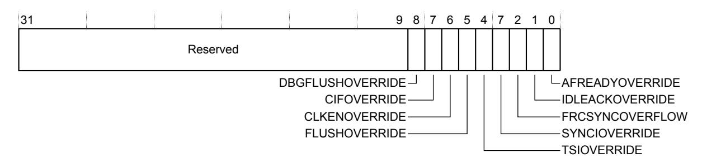

**Figure 13-3 TRCAUXCTLR bit assignments**

The following table shows the TRCAUXCTLR bit assignments.

## **Table 13-5 TRCAUXCTLR bit assignments**

| Bits   | Name             | Function                                                                                                                                                                                                            |
|--------|------------------|---------------------------------------------------------------------------------------------------------------------------------------------------------------------------------------------------------------------|
| [31:9] | -                | Reserved, RES0.                                                                                                                                                                                                     |
| [8]    | DBGFLUSHOVERRIDE | Override ETM flush behavior on Debug state entry. The possible values are:<br>0                                                                                                                                     |
|        |                  | ETM FIFO is flushed when the processor enters Debug state.<br>1<br>ETM FIFO is not flushed when the processor enters Debug state. This trace unit behavior<br>deviates from the architecturally-specified behavior. |
| [7]    | CIFOVERRIDE      | Override core interface register repeater clock enable. The possible values are:<br>0                                                                                                                               |
|        |                  | Core interface is clock gated when DBGEN or NIDEN is LOW.<br>1                                                                                                                                                      |
|        |                  | Core interface is not clock gated when DBGEN or NIDEN is LOW.                                                                                                                                                       |
| [6]    | CLKENOVERRIDE    | Override ETM clock enable. The possible values are:<br>0                                                                                                                                                            |
|        |                  | ETM clock gating is enabled.<br>1                                                                                                                                                                                   |
|        |                  | ETM clock gating is disabled.                                                                                                                                                                                       |
| [5]    | FLUSHOVERRIDE    | Override ETM flush behavior. The possible values are:                                                                                                                                                               |
|        |                  | 0<br>ETM FIFO is flushed and ETM enters idle state when DBGEN or NIDEN is LOW.<br>1                                                                                                                                 |
|        |                  | ETM FIFO is not flushed and ETM does not enter idle state when DBGEN or NIDEN is<br>LOW.                                                                                                                            |
|        |                  | When this bit is set to 1, the trace unit behavior deviates from architecturally-specified behavior.                                                                                                                |
| [4]    | TSIOVERRIDE      | Override TS packet insertion behavior. The possible values are:                                                                                                                                                     |
|        |                  | 0<br>Timestamp packets are inserted into FIFO when trace activity is LOW.<br>1                                                                                                                                      |
|        |                  | Timestamp packets are inserted into FIFO irrespective of trace activity.                                                                                                                                            |
| [3]    | SYNCIOVERRIDE    | Override SYNC packet insertion behavior. The possible values are:                                                                                                                                                   |
|        |                  | 0<br>SYNC packets are inserted into FIFO when trace activity is LOW.<br>1                                                                                                                                           |
|        |                  | SYNC packets are inserted into FIFO irrespective of trace activity.                                                                                                                                                 |
| [2]    | FRCSYNCOVERFLOW  | Force overflows to output synchronization packets. The possible values are:                                                                                                                                         |
|        |                  | 0<br>No FIFO overflow when SYNC packets are delayed.<br>1                                                                                                                                                           |
|        |                  | Forces FIFO overflow when SYNC packets are delayed.                                                                                                                                                                 |
|        |                  | When this bit is set to 1, the trace unit behavior deviates from architecturally-specified behavior.                                                                                                                |

## **Table 13-5 TRCAUXCTLR bit assignments (continued)**

<span id="page-473-0"></span>

| Bits | Name            | Function                                                                                                                                         |
|------|-----------------|--------------------------------------------------------------------------------------------------------------------------------------------------|
| [1]  | IDLEACKOVERRIDE | Force ETM idle acknowledge. The possible values are:                                                                                             |
|      |                 | 0                                                                                                                                                |
|      |                 | ETM idle acknowledge is asserted only when ETM is in idle state.<br>1                                                                            |
|      |                 | ETM idle acknowledge is asserted irrespective of ETM idle state                                                                                  |
|      |                 | When this bit is set to 1, trace unit behavior deviates from architecturally-specified behavior.                                                 |
| [0]  | AFREADYOVERRIDE | Force assertion of AFREADYM output. The possible values are:                                                                                     |
|      |                 | 0                                                                                                                                                |
|      |                 | ETM AFREADYM output is asserted only when ETM is in idle state or when all the<br>trace bytes in FIFO before a flush request are output.         |
|      |                 | 1                                                                                                                                                |
|      |                 | ETM AFREADYM output is always asserted HIGH. When this bit is set to 1, trace unit<br>behavior deviates from architecturally-specified behavior. |

The TRCAUXCTLR can be accessed through the internal memory-mapped interface and the external debug interface, offset 0x018.

## **13.7.3 Trace Event Control 0 Register**

The TRCEVENTCTL0R characteristics are:

# **Purpose**

Controls the tracing of arbitrary events. Each of the event fields in this register is an event selector.

If any of the selected events occur and the corresponding bit in TRCEVENTCTL1R.INSTEN is 1, then an event element is generated in the instruction trace stream.

If any of the selected events occur and the corresponding bit in TRCEVENTCTL1R.DATAEN is 1, then an event element is generated in the data trace stream.

#### **Usage constraints**

Only accepts writes when the trace unit is disabled.

#### **Configurations**

Available in all configurations.

# **Attributes**

A 32-bit RW trace register.

See *[13.6 Register summary](#page-465-0)* on page 13-466.

The following figure shows the TRCEVENTCTL0R bit assignments.

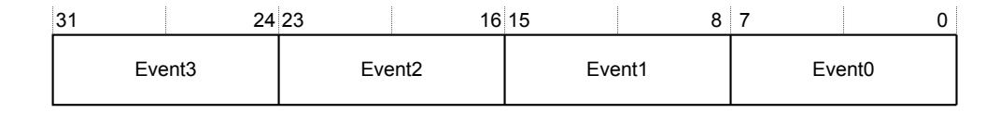

**Figure 13-4 TRCEVENTCL0R bit assignments**

The following table shows the TRCEVENTCTL0R bit assignments.

Table 13-6 TRCEVENTCLOR bit assignments

| Bits    | Name   | Function                             |
|---------|--------|--------------------------------------|
| [31:24] | Event3 | Identifies the fourth event to trace |
| [23:16] | Event2 | Identifies the third event to trace  |
| [15:8]  | Event1 | Identifies the second event to trace |
| [7:0]   | Event0 | Identifies the first event to trace  |
|         |        |                                      |

<span id="page-474-0"></span>The TRCEVENTCTLOR can be accessed through the internal memory-mapped interface and the external debug interface, offset 0x020.

# 13.7.4 Trace Event Control 1 Register

The TRCEVENTCTL1R characteristics are:

#### **Purpose**

Controls the behavior of the events that TRCEVENTCTLOR selects.

## **Usage constraints**

Only accepts writes when the trace unit is disabled.

## **Configurations**

Available in all configurations.

#### Attributes

A 32-bit RW trace register.

See 13.6 Register summary on page 13-466.

The following figure shows the TRCEVENTCTL1R bit assignments.

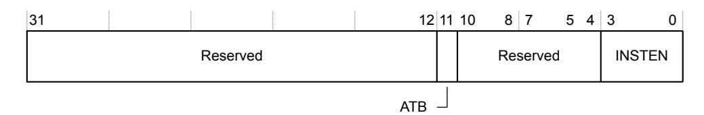

Figure 13-5 TRCEVENTCL1R bit assignments

The following table shows the TRCEVENTCTL1R bit assignments.

Table 13-7 TRCEVENTCL1R bit assignments

| Bits      | Name   | Function                                                                                                              |  |  |  |
|-----------|--------|-----------------------------------------------------------------------------------------------------------------------|--|--|--|
| [31:12] - |        | Reserved, RESO.                                                                                                       |  |  |  |
| [11]      | ATB    | ATB trigger enable. This value is:                                                                                    |  |  |  |
|           |        | • ATB trigger is disabled.                                                                                            |  |  |  |
| [10:4]    | -      | Reserved, RESO.                                                                                                       |  |  |  |
| [3:0]     | INSTEN | Instruction event enable field. Each bit represents an event, n=0-3. If event <i>n</i> occurs when INSTEN[ <i>n</i> ] |  |  |  |
|           |        | <b>0</b> The trace unit does not generate an event element.                                                           |  |  |  |
|           |        | 1 The trace unit generates an event element for event $n$ , in the instruction trace stream.                          |  |  |  |

The TRCEVENTCTL1R can be accessed through the internal memory-mapped interface and the external debug interface, offset 0x024.

# <span id="page-475-0"></span>**13.7.5 Trace Synchronization Period Register**

The TRCSYNCPR characteristics are:

# **Purpose**

Controls how often periodic trace synchronization requests occur.

#### **Usage constraints**

Only accepts writes when the trace unit is disabled.

This register must be programmed.

## **Configurations**

Available in all configurations.

## **Attributes**

A 32-bit RW trace register.

See *[13.6 Register summary](#page-465-0)* on page 13-466.

The following figure shows the TRCSYNCPR bit assignments.

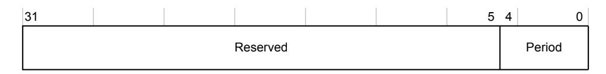

**Figure 13-6 TRCSYNCPR bit assignments**

The following table shows the TRCSYNCPR bit assignments.

**Table 13-8 TRCSYNCPR bit assignments**

| Bits   | Name   | Function                                                                                                                                                     |                                                                                                                        |  |  |  |
|--------|--------|--------------------------------------------------------------------------------------------------------------------------------------------------------------|------------------------------------------------------------------------------------------------------------------------|--|--|--|
| [31:5] | -      | Reserved, RES0.                                                                                                                                              |                                                                                                                        |  |  |  |
| [4:0]  | Period | Controls how many bytes of trace, the sum of instruction and data, that a trace unit can generate before a periodic trace<br>synchronization request occurs. |                                                                                                                        |  |  |  |
|        |        | synchronization request.                                                                                                                                     | When 0b00000, periodic trace synchronization requests are disabled. This setting does not disable other types of trace |  |  |  |
|        |        |                                                                                                                                                              | The number of bytes is always a power of two and the permitted values are:                                             |  |  |  |
|        |        | 0b01000                                                                                                                                                      | Periodic trace synchronization request occurs after 28<br>, or 256 bytes of trace.                                     |  |  |  |
|        |        | 0b01001                                                                                                                                                      | Periodic trace synchronization request occurs after 29<br>, or 512 bytes of trace.                                     |  |  |  |
|        |        | 0b01010                                                                                                                                                      | Periodic trace synchronization request occurs after 210, or 1024 bytes of trace.                                       |  |  |  |
|        |        |                                                                                                                                                              |                                                                                                                        |  |  |  |
|        |        |                                                                                                                                                              |                                                                                                                        |  |  |  |
|        |        |                                                                                                                                                              |                                                                                                                        |  |  |  |
|        |        | 0b10100                                                                                                                                                      | Periodic trace synchronization request occurs after 220, or 1048576 bytes of trace.                                    |  |  |  |

The TRCSYNCPR can be accessed through the internal memory-mapped interface and the external debug interface, offset 0x034.

# **13.7.6 Trace Cycle Count Control Register**

The TRCCCCTLR characteristics are:

#### **Purpose**

Sets the threshold value for cycle counting.

## <span id="page-476-0"></span>**Usage constraints**

Only accepts writes when the trace unit is disabled.

This register must be programmed if TRCCONFIGR.CCI is set to 1.

# **Configurations**

Available in all configurations.

# **Attributes**

A 32-bit RW trace register.

See *[13.6 Register summary](#page-465-0)* on page 13-466.

The following figure shows the TRCCCCTLR bit assignments.

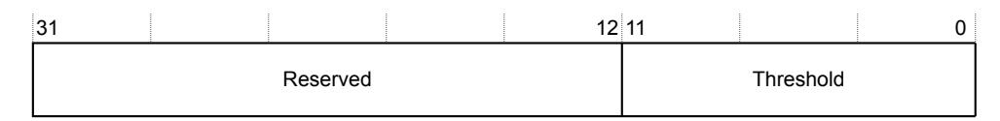

**Figure 13-7 TRCCCCTLR bit assignments**

The following table shows the TRCCCCTLR bit assignments.

**Table 13-9 TRCCCCTLR bit assignments**

| Bits    | Name      | Function                                                       |
|---------|-----------|----------------------------------------------------------------|
| [31:12] | -         | Reserved, RES0.                                                |
| [11:0]  | Threshold | Sets the threshold value for instruction trace cycle counting. |

The TRCCCCTLR can be accessed through the internal memory-mapped interface and the external debug interface, offset 0x038.

# **Related information**

*[13.7.1 Trace Configuration Register](#page-470-0)* on page 13-471*.*

#### **13.7.7 Trace ID Register**

The TRCTRACEIDR characteristics are:

## **Purpose**

Sets the trace ID for instruction trace.

#### **Usage constraints**

Only accepts writes when the trace unit is disabled.

#### **Configurations**

Available in all configurations.

The TRACEID field width is set by TRCIDR5.TRACEIDSIZE.

## **Attributes**

A 32-bit RW trace register.

See *[13.6 Register summary](#page-465-0)* on page 13-466.

The following figure shows the TRCTRACEIDR bit assignments.

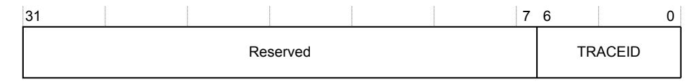

Figure 13-8 TRCTRACEIDR bit assignments

<span id="page-477-0"></span>The following table shows the TRCTRACEIDR bit assignments.

Table 13-10 TRCTRACEIDR bit assignments

| Bits   | Name    | Function                                                                                          |
|--------|---------|---------------------------------------------------------------------------------------------------|
| [31:7] | -       | Reserved, RESO.                                                                                   |
| [6:0]  | TRACEID | Trace ID field. Sets the trace ID value for instruction trace. The width of this field is 7 bits. |

The TRCTRACEIDR can be accessed through the internal memory-mapped interface and the external debug interface, offset 0x040.

#### **Related information**

13.7.22 Trace ID Register 5 on page 13-491.

# 13.7.8 ViewInst Main Control Register

The TRCVICTLR characteristics are:

#### **Purpose**

Controls instruction trace filtering.

## **Usage constraints**

- Only accepts writes when the trace unit is disabled.
- Only returns stable data when TRCSTATR.PMSTABLE is set to 1.
- Must be programmed to set the value of the SSSTATUS bit, that sets the state of the start and stop logic.

# Configurations

Available in all configurations.

#### **Attributes**

A 32-bit RW trace register.

See 13.6 Register summary on page 13-466.

The following figure shows the TRCVICTLR bit assignments.

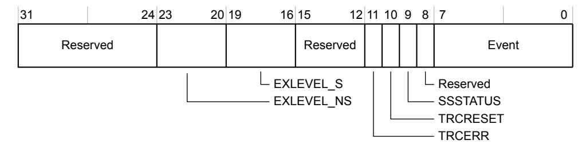

Figure 13-9 TRCVICTLR bit assignments

The following table shows the TRCVICTLR bit assignments.

## **Table 13-11 TRCVICTLR bit assignments**

| Bits    | Name       | Function                                                                                                                                                      |                                                                                                                                                                                                                                                                                                            |  |
|---------|------------|---------------------------------------------------------------------------------------------------------------------------------------------------------------|------------------------------------------------------------------------------------------------------------------------------------------------------------------------------------------------------------------------------------------------------------------------------------------------------------|--|
| [31:24] | -          | Reserved, RES0.                                                                                                                                               |                                                                                                                                                                                                                                                                                                            |  |
| [23:20] | EXLEVEL_NS | Each bit controls whether instruction tracing in Non-secure state is enabled for the corresponding Exception<br>level. The bit to Exception level mapping is: |                                                                                                                                                                                                                                                                                                            |  |
|         |            | Bit[20]                                                                                                                                                       | Exception level 0.                                                                                                                                                                                                                                                                                         |  |
|         |            | Bit[21]                                                                                                                                                       | Exception level 1.                                                                                                                                                                                                                                                                                         |  |
|         |            | Bit[22]                                                                                                                                                       | Exception level 2.                                                                                                                                                                                                                                                                                         |  |
|         |            | Bit[23]                                                                                                                                                       | RES0.                                                                                                                                                                                                                                                                                                      |  |
|         |            |                                                                                                                                                               | For example, the value 0b0111 enables instruction tracing in Non-secure state for EL0, EL1, and EL2.                                                                                                                                                                                                       |  |
| [19:16] | EXLEVEL_S  | Each bit controls whether instruction tracing in Secure state is enabled for the corresponding Exception<br>level. The bit to Exception level mapping is:     |                                                                                                                                                                                                                                                                                                            |  |
|         |            | Bit[16]                                                                                                                                                       | Exception level 0.                                                                                                                                                                                                                                                                                         |  |
|         |            | Bit[17]                                                                                                                                                       | Exception level 1.                                                                                                                                                                                                                                                                                         |  |
|         |            | Bit[18]                                                                                                                                                       | RES0.                                                                                                                                                                                                                                                                                                      |  |
|         |            | Bit[19]                                                                                                                                                       | Exception level 3.                                                                                                                                                                                                                                                                                         |  |
|         |            |                                                                                                                                                               | For example, the value 0b1011 enables instruction tracing in Secure state for EL0, EL1, and EL3.                                                                                                                                                                                                           |  |
| [15:12] | -          | Reserved, RES0.                                                                                                                                               |                                                                                                                                                                                                                                                                                                            |  |
| [11]    | TRCERR     |                                                                                                                                                               | Controls whether a trace unit must trace a System Error exception:                                                                                                                                                                                                                                         |  |
|         |            | 0<br>The trace unit does not trace a System Error exception unless it traces the exception or instruction<br>immediately prior to the System Error exception. |                                                                                                                                                                                                                                                                                                            |  |
|         |            | 1<br>The trace unit always traces a System Error exception.                                                                                                   |                                                                                                                                                                                                                                                                                                            |  |
| [10]    | TRCRESET   | Controls whether a trace unit must trace a reset exception:                                                                                                   |                                                                                                                                                                                                                                                                                                            |  |
|         |            | 0<br>The trace unit does not trace a reset exception unless it traces the exception or instruction immediately<br>prior to the reset exception.               |                                                                                                                                                                                                                                                                                                            |  |
|         |            | 1<br>The trace unit always traces a reset exception.                                                                                                          |                                                                                                                                                                                                                                                                                                            |  |
| [9]     | SSSTATUS   |                                                                                                                                                               | Returns the status of the start and stop logic. The possible values are:                                                                                                                                                                                                                                   |  |
|         |            | 0<br>The start and stop logic is in the stopped state.                                                                                                        |                                                                                                                                                                                                                                                                                                            |  |
|         |            | 1<br>The start and stop logic is in the started state.                                                                                                        |                                                                                                                                                                                                                                                                                                            |  |
|         |            | The bit only returns stable data when TRCSTATR.PMSTABLE is set to 1.                                                                                          |                                                                                                                                                                                                                                                                                                            |  |
|         |            |                                                                                                                                                               | Before software enables the trace unit and TRCPRGCTLR.EN is set to 1, it must write to this bit to set the<br>initial state of the start and stop logic. If the start and stop logic is not used then set this bit to 1. ARM<br>recommends that the value of this bit is set before each trace run begins. |  |
| [8]     | -          | Reserved, RES0.                                                                                                                                               |                                                                                                                                                                                                                                                                                                            |  |
| [7:0]   | Event      | Event selector.                                                                                                                                               |                                                                                                                                                                                                                                                                                                            |  |
|         |            |                                                                                                                                                               |                                                                                                                                                                                                                                                                                                            |  |

The TRCVICTLR can be accessed through the internal memory-mapped interface and the external debug interface, offset 0x080.

# <span id="page-479-0"></span>**13.7.9 External Input Select Register**

The TRCEXTINSELR characteristics are:

# **Purpose**

Use this to set, or read, which external inputs are resources to the trace unit.

#### **Usage constraints**

Only accepts writes when the trace unit is disabled.

#### **Configurations**

The TRCIDR5.NUMEXTINSEL field controls how many input select resources are supported.

The TRCIDR5.NUMEXTIN field controls how many inputs, from a maximum of 256, are supported.

#### **Attributes**

A 32-bit RW trace register.

See *[13.6 Register summary](#page-465-0)* on page 13-466.

The following figure shows the TRCEXTINSELR bit assignments.

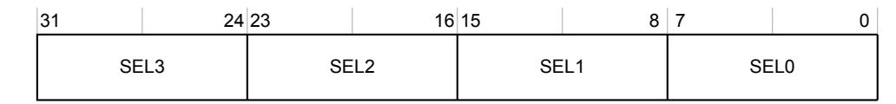

**Figure 13-10 TRCEXTINSELR bit assignments**

The following table shows the TRCEXTINSELR bit assignments.

**Table 13-12 TRCEXTINSELR bit assignments**

| Bits    | Name | Function                                                                                                      |
|---------|------|---------------------------------------------------------------------------------------------------------------|
| [31:24] | SEL3 | A binary value that selects which external input is a resource for the trace unit. Bit[31] is reserved, RES0. |
| [23:16] | SEL2 | A binary value that selects which external input is a resource for the trace unit. Bit[23] is reserved, RES0. |
| [15:8]  | SEL1 | A binary value that selects which external input is a resource for the trace unit. Bit[15] is reserved, RES0. |
| [7:0]   | SEL0 | A binary value that selects which external input is a resource for the trace unit. Bit[7] is reserved, RES0.  |

The TRCEXTINSELR can be accessed through the internal memory-mapped interface and the external debug interface, offset 0x120.

#### **13.7.10 ID Register 8**

The TRCIDR8 characteristics are:

#### **Purpose**

Returns the maximum speculation depth of the instruction trace stream.

#### **Usage constraints**

There are no usage constraints.

#### **Configurations**

Available in all configurations.

## **Attributes**

See *[13.6 Register summary](#page-465-0)* on page 13-466.

The following figure shows the TRCIDR8 bit assignments.

<span id="page-480-0"></span>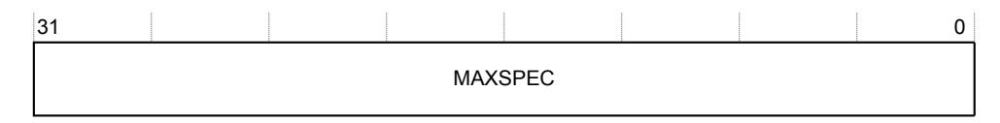

**Figure 13-11 TRCIDR8 bit assignments**

The following table shows the TRCIDR8 bit assignments.

**Table 13-13 TRCIDR8 bit assignments**

| Bits   | Name    |   | Function                                                                                   |
|--------|---------|---|--------------------------------------------------------------------------------------------|
| [31:0] | MAXSPEC |   | The maximum number of P0 elements in the trace stream that can be speculative at any time: |
|        |         | 0 | Maximum speculation depth of the instruction trace stream.                                 |

The TRCIDR8 can be accessed through the internal memory-mapped interface and the external debug interface, offset 0x180.

# **13.7.11 ID Register 9**

The TRCIDR9 characteristics are:

# **Purpose**

Returns the number of P0 right-hand keys that the trace unit can use.

#### **Usage constraints**

There are no usage constraints.

#### **Configurations**

Available in all configurations.

## **Attributes**

See *[13.6 Register summary](#page-465-0)* on page 13-466.

The following figure shows the TRCIDR9 bit assignments.

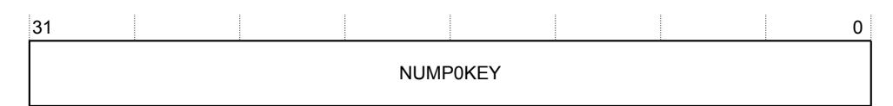

**Figure 13-12 TRCID9 bit assignments**

The following table shows the TRCIDR9 bit assignments.

**Table 13-14 TRCID9 bit assignments**

| Bits   | Name     | Function                                                      |  |
|--------|----------|---------------------------------------------------------------|--|
| [31:0] | NUMP0KEY | The number of P0 right-hand keys that the trace unit can use: |  |
|        |          | 0<br>The trace unit uses no P0 right-hand keys.               |  |

The TRCIDR9 can be accessed through the internal memory-mapped interface and the external debug interface, offset 0x184.

#### **13.7.12 ID Register 10**

The TRCIDR10 characteristics are:

## <span id="page-481-0"></span>**Purpose**

Returns the number of P1 right-hand keys that the trace unit can use.

#### **Usage constraints**

There are no usage constraints.

#### **Configurations**

Available in all configurations.

#### **Attributes**

See *[13.6 Register summary](#page-465-0)* on page 13-466.

The following figure shows the TRCIDR10 bit assignments.

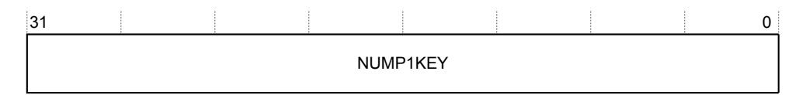

**Figure 13-13 TRCIDR10 bit assignments**

The following table shows the TRCIDR10 bit assignments.

**Table 13-15 TRCID10 bit assignments**

| Bits   | Name     | Function                                                      |  |
|--------|----------|---------------------------------------------------------------|--|
| [31:0] | NUMP1KEY | The number of P1 right-hand keys that the trace unit can use. |  |
|        |          | 0<br>The trace unit uses no P1 right-hand keys.               |  |

The TRCIDR10 can be accessed through the internal memory-mapped interface and the external debug interface, offset 0x188.

#### **13.7.13 ID Register 11**

The TRCIDR11 characteristics are:

#### **Purpose**

Returns the number of special P1 right-hand keys that the trace unit can use.

#### **Usage constraints**

There are no usage constraints.

#### **Configurations**

Available in all configurations.

## **Attributes**

See *[13.6 Register summary](#page-465-0)* on page 13-466.

The following figure shows the TRCIDR11 bit assignments.

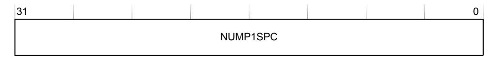

**Figure 13-14 TRCIDR11 bit assignments**

The following table shows the TRCIDR11 bit assignments.

#### **Table 13-16 TRCID11 bit assignments**

<span id="page-482-0"></span>

| Bits   | Name                                                                              | Function                                                |  |
|--------|-----------------------------------------------------------------------------------|---------------------------------------------------------|--|
| [31:0] | NUMP1SPC<br>The number of special P1 right-hand keys that the trace unit can use: |                                                         |  |
|        |                                                                                   | 0<br>The trace unit uses no special P1 right-hand keys. |  |

The TRCIDR11 can be accessed through the internal memory-mapped interface and the external debug interface, offset 0x18C.

#### **13.7.14 ID Register 12**

The TRCIDR12 characteristics are:

## **Purpose**

Returns the number of conditional instruction right-hand keys that the trace unit can use.

#### **Usage constraints**

There are no usage constraints.

### **Configurations**

Available in all configurations.

### **Attributes**

See *[13.6 Register summary](#page-465-0)* on page 13-466.

The following figure shows the TRCIDR12 bit assignments.

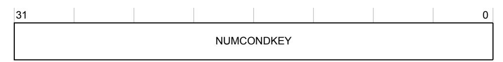

**Figure 13-15 TRCIDR12 bit assignments**

The following table shows the TRCIDR12 bit assignments.

**Table 13-17 TRCID12 bit assignments**

| Bits   | Name       | Function                                                                                                                 |
|--------|------------|--------------------------------------------------------------------------------------------------------------------------|
| [31:0] | NUMCONDKEY | The number of conditional instruction right-hand keys that the trace unit can use, including normal and<br>special keys: |
|        |            | 0<br>The trace unit uses no conditional instruction right-hand keys.                                                     |

The TRCIDR12 can be accessed through the internal memory-mapped interface and the external debug interface, offset 0x190.

## **13.7.15 ID Register 13**

The TRCIDR13 characteristics are:

# **Purpose**

Returns the number of special conditional instruction right-hand keys that the trace unit can use.

#### **Usage constraints**

There are no usage constraints.

#### **Configurations**

Available in all configurations.

#### **Attributes**

See *[13.6 Register summary](#page-465-0)* on page 13-466.

<span id="page-483-0"></span>The following figure shows the TRCIDR13 bit assignments.

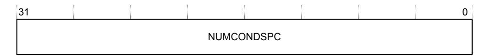

**Figure 13-16 TRCIDR13 bit assignments**

The following table shows the TRCIDR13 bit assignments.

**Table 13-18 TRCID13 bit assignments**

| Bits                                      | Name |                                                                                                             | Function                                                                |
|-------------------------------------------|------|-------------------------------------------------------------------------------------------------------------|-------------------------------------------------------------------------|
| [31:0]<br>NUMCONDSPC<br>and special keys: |      | The number of special conditional instruction right-hand keys that the trace unit can use, including normal |                                                                         |
|                                           |      | 0                                                                                                           | The trace unit uses no special conditional instruction right-hand keys. |

The TRCIDR13 can be accessed through the internal memory-mapped interface and the external debug interface, offset 0x194.

#### **13.7.16 Implementation Defined Register 0**

The TRCIMSPEC0 characteristics are:

#### **Purpose**

TRCIMSPEC0 is partially implemented for the future implementation of up to eight IMPLEMENTATION DEFINED registers so that a debugger can implement a general mechanism for detecting the IMPLEMENTATION DEFINED registers. This register must be implemented.

# **Usage constraints**

There are no usage constraints.

## **Configurations**

Available in all configurations.

#### **Attributes**

A 32-bit RW trace register. This register is reset by a trace unit reset.

See *[13.6 Register summary](#page-465-0)* on page 13-466>.

The following figure shows the TRCIMSPEC0 bit assignments.

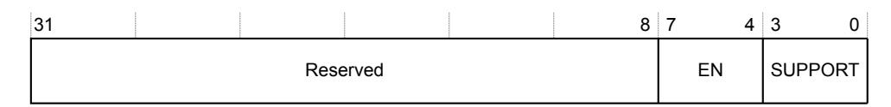

**Figure 13-17 TRCIMSPEC0 bit assignments**

The following table shows the TRCIMSPEC0 bit assignments.

## **Table 13-19 TRCIMSPEC0 bit assignments**

<span id="page-484-0"></span>

| Bits   | Name    | Function                                                                                      |                                                   |  |
|--------|---------|-----------------------------------------------------------------------------------------------|---------------------------------------------------|--|
| [31:8] | -       | Reserved, RES0.                                                                               |                                                   |  |
| [7:4]  | EN      | EN is RES0 when the SUPPORT field is 0b0000.                                                  |                                                   |  |
| [3:0]  | SUPPORT | Indicates whether the implementation supports IMPLEMENTATION DEFINED features. This value is: |                                                   |  |
|        |         | 0b0000                                                                                        | No IMPLEMENTATION DEFINED features are supported. |  |

The TRCIMSPEC0 can be accessed through the internal memory-mapped interface and the external debug interface, offset 0x1C0.

# **13.7.17 Trace ID Register 0**

The TRCIDR0 characteristics are:

# **Purpose**

Returns the tracing capabilities of the trace unit.

## **Usage constraints**

There are no usage constraints.

#### **Configurations**

Available in all configurations.

#### **Attributes**

See *[13.6 Register summary](#page-465-0)* on page 13-466.

The following figure shows the TRCIDR0 bit assignments.

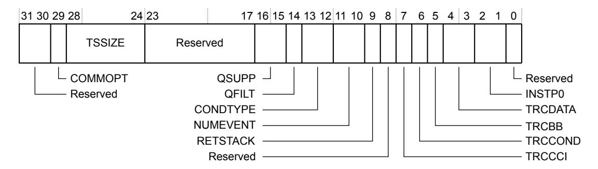

**Figure 13-18 TRCIDR0 bit assignments**

The following table shows the TRCIDR0 bit assignments.

**Table 13-20 TRCIDR0 bit assignments**

| Bits              | Name    | Function                                                                  |  |
|-------------------|---------|---------------------------------------------------------------------------|--|
| [31:30]<br>-      |         | Reserved, RES0.                                                           |  |
| [29]              | COMMOPT | Commit mode field. This value is:                                         |  |
|                   |         | 1<br>Commit mode 1.                                                       |  |
| [28:24]<br>TSSIZE |         | Global timestamp size field. This value is:                               |  |
|                   |         | Implementation supports a maximum global timestamp of 64 bits.<br>0b01000 |  |
| [23:17]           | -       | Reserved, RES0.                                                           |  |

## **Table 13-20 TRCIDR0 bit assignments (continued)**

<span id="page-485-0"></span>

| Bits    | Name     | Function                                                                                                                                  |  |
|---------|----------|-------------------------------------------------------------------------------------------------------------------------------------------|--|
| [16:15] | QSUPP    | Q element support field. This value is:                                                                                                   |  |
|         |          | Q element support is not implemented. TRCCONFIGR is RES0.<br>0b00                                                                         |  |
| [14]    | QFILT    | QFILT is RES0 when QSUPP is 0b00.                                                                                                         |  |
| [13:12] | CONDTYPE | CONDTYPE is RES0 when TRCCOND is 0b0.                                                                                                     |  |
| [11:10] | NUMEVENT | Number of events field. Indicates how many events the trace unit supports. This value is:                                                 |  |
|         |          | The trace unit supports 4 events.<br>0b11                                                                                                 |  |
| [9]     | RETSTACK | Return stack bit. Indicates whether the implementation supports a return stack. This value is:                                            |  |
|         |          | 1<br>Return stack is implemented. TRCCONFIGR.RS is supported.                                                                             |  |
| [8]     | -        | Reserved, RES0.                                                                                                                           |  |
| [7]     | TRCCCI   | Cycle counting instruction bit. Indicates whether the trace unit supports cycle counting for instructions. This<br>value is:              |  |
|         |          | 1<br>Cycle counting in the instruction trace is implemented, therefore:                                                                   |  |
|         |          | •<br>TRCCONFIGR.CCI is supported.                                                                                                         |  |
|         |          | •<br>TRCCCTLR is supported.                                                                                                               |  |
| [6]     | TRCCOND  | Conditional instruction tracing support bit. Indicates whether the trace unit supports conditional instruction<br>tracing. This value is: |  |
|         |          | 0<br>Conditional instruction tracing is not supported.                                                                                    |  |
| [5]     | TRCBB    | Branch broadcast tracing support bit. Indicates whether the trace unit supports branch broadcast tracing. This<br>value is:               |  |
|         |          | 1<br>Branch broadcast tracing is supported, therefore:                                                                                    |  |
|         |          | •<br>TRCCONFIGR.CCI is supported.                                                                                                         |  |
|         |          | •<br>TRCBBCTLR is supported.                                                                                                              |  |
| [4:3]   | TRCDATA  | Conditional tracing field. This value is:                                                                                                 |  |
|         |          | Data tracing is not supported.<br>0b00                                                                                                    |  |
| [2:1]   | INSTP0   | P0 tracing support field. This value is:                                                                                                  |  |
|         |          | Tracing of load and store instructions as P0 elements is not supported.<br>0b00                                                           |  |
| [0]     | -        | Reserved, RES1.                                                                                                                           |  |

The TRCIDR0 can be accessed through the internal memory-mapped interface and the external debug interface, offset 0x1E0.

#### **13.7.18 Trace ID Register 1**

The TRCIDR1 characteristics are:

#### **Purpose**

Returns the base architecture of the trace unit.

## <span id="page-486-0"></span>**Usage constraints**

There are no usage constraints.

## **Configurations**

Available in all configurations.

#### **Attributes**

See *[13.6 Register summary](#page-465-0)* on page 13-466.

The following figure shows the TRCIDR1 bit assignments.

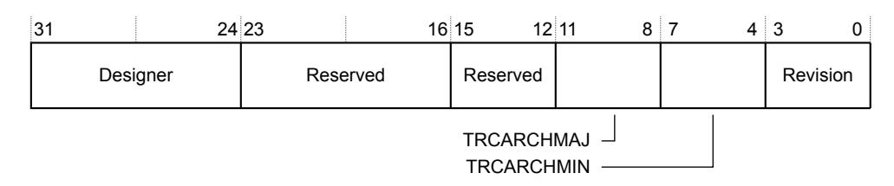

**Figure 13-19 TRCIDR1 bit assignments**

The following table shows the TRCIDR1 bit assignments.

**Table 13-21 TRCIDR1 bit assignments**

| Bits                | Name       | Function                                                                          |  |  |
|---------------------|------------|-----------------------------------------------------------------------------------|--|--|
| [31:24]             | Designer   | Indicates which company designed the trace unit. The value is:                    |  |  |
|                     |            | ARM<br>0x41                                                                       |  |  |
| [23:16]             | -          | Reserved, RES0.                                                                   |  |  |
| [15:12]             | -          | Reserved, RES1.                                                                   |  |  |
| [11:8]              | TRCARCHMAJ | Indicates the major version number of the trace unit architecture. The value is:  |  |  |
|                     |            | Indicates ETMv4.<br>0x4                                                           |  |  |
|                     |            | All other values are reserved.                                                    |  |  |
| [7:4]<br>TRCARCHMIN |            | Identifies the minor version number of the trace unit architecture. The value is: |  |  |
|                     |            | Identifies the minor version number of the trace unit architecture.<br>0x0        |  |  |
| [3:0]               | Revision   | Identifies the revision of:                                                       |  |  |
|                     |            | •<br>The trace registers.                                                         |  |  |
|                     |            | •<br>The OS Lock registers.                                                       |  |  |
|                     |            | Revision value.<br>3                                                              |  |  |

The TRCIDR1 can be accessed through the internal memory-mapped interface and the external debug interface, offset 0x1E4.

#### **13.7.19 Trace ID Register 2**

The TRCIDR2 characteristics are:

## **Purpose**

Returns the maximum size of the following parameters in the trace unit:

- Data value.
- Data address.
- VMID.
- Context ID.
- Instruction address.

#### **Usage constraints**

There are no usage constraints.

#### **Configurations**

Available in all configurations.

# **Attributes**

See *[13.6 Register summary](#page-465-0)* on page 13-466.

The following figure shows the TRCIDR2 bit assignments.

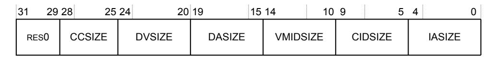

**Figure 13-20 TRCIDR2 bit assignments**

The following table shows the TRCIDR2 bit assignments.

**Table 13-22 TRCIDR2 bit assignments**

| Bits    | Name     | Function                                                                    |  |  |
|---------|----------|-----------------------------------------------------------------------------|--|--|
| [31:29] | -        | Reserved, RES0.                                                             |  |  |
| [28:25] | CCSIZE   | Indicates the size of the cycle counter in bits minus 12. This value is:    |  |  |
|         |          | The cycle counter is 12 bits in length.<br>0x0                              |  |  |
| [24:20] | DVSIZE   | Indicates the data value size in bytes. This value is:                      |  |  |
|         |          | Data value tracing is not supported. TRCIDR0.TRCDATA must be 0b00.<br>0x0   |  |  |
| [19:15] | DASIZE   | Indicates the data address size in bytes. This value is:                    |  |  |
|         |          | Data address tracing is not supported. TRCIDR0.TRCDATA must be 0b00.<br>0x0 |  |  |
| [14:10] | VMIDSIZE | Indicates the VMID size. This value is:                                     |  |  |
|         |          | Maximum of 8-bit VMID size, therefore TRCCONFIGR.VMID is supported.<br>0x1  |  |  |
| [9:5]   | CIDSIZE  | Indicates the Context ID size. This value is:                               |  |  |
|         |          | Maximum of 32-bit CID size, therefore TRCCONFIGR.CID is supported.<br>0x4   |  |  |
| [4:0]   | IASIZE   | Indicates the instruction address size in bytes. This value is:             |  |  |
|         |          | Maximum of 64-bit address size.<br>0x8                                      |  |  |

The TRCIDR2 can be accessed through the internal memory-mapped interface and the external debug interface, offset 0x1E8.

## <span id="page-488-0"></span>13.7.20 Trace ID Register 3

The TRCIDR3 characteristics are:

#### Purpose

Indicates:

- Whether TRCVICTLR is supported.
- The number of cores available for tracing.
- If an Exception level supports instruction tracing.
- The minimum threshold value for instruction trace cycle counting.
- Whether the synchronization period is fixed.
- Whether TRCSTALLCTLR is supported and if so whether it supports trace overflow prevention and supports stall control of the core.

Usage constraints There are no usage constraints.Configurations Available in all configurations.

**Attributes** See 13.6 Register summary on page 13-466.

The following figure shows the TRCIDR3 bit assignments.

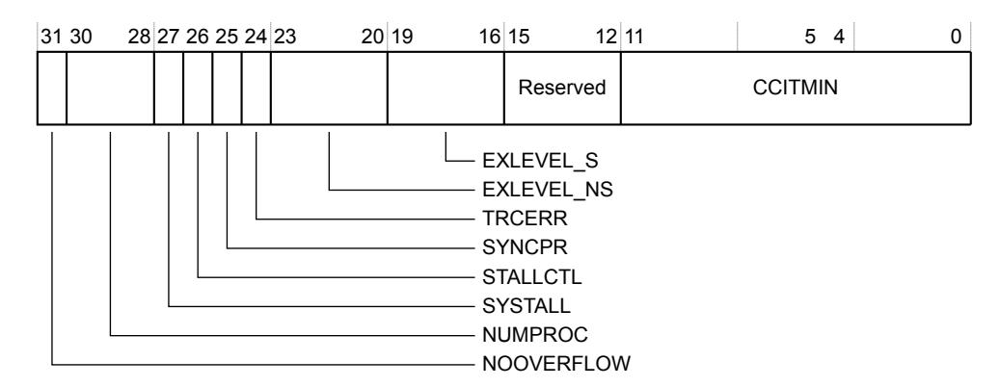

Figure 13-21 TRCIDR3 bit assignments

The following table shows the TRCIDR3 bit assignments.

Table 13-23 TRCIDR3 bit assignments

| Bits                                                                                  | Name       | Function                                                                            |  |  |
|---------------------------------------------------------------------------------------|------------|-------------------------------------------------------------------------------------|--|--|
| [31]                                                                                  | NOOVERFLOW | Indicates whether TRCSTALLCTLR.NOOVERFLOW is supported. This value is:              |  |  |
|                                                                                       |            | <b>0</b> TRCSTALLCTLR.NOOVERFLOW is not supported. STALLCTL is 0.                   |  |  |
| [30:28]                                                                               | NUMPROC    | Indicates the number of cores available for tracing. This value is:                 |  |  |
|                                                                                       |            | 0b000   The trace unit can trace one core.                                          |  |  |
| [27]                                                                                  | SYSTALL    | Indicates whether stall control is supported. This value is:                        |  |  |
|                                                                                       |            | <b>0</b> The system does not support stall control of the core.                     |  |  |
| [26]                                                                                  | STALLCTL   | Indicates whether TRCSTALLCTLR is supported. This value is:                         |  |  |
|                                                                                       |            | TRCSTALLCTLR is not supported.                                                      |  |  |
| [25] SYNCPR Indicates whether there is a fixed synchronization period. This value is: |            | Indicates whether there is a fixed synchronization period. This value is:           |  |  |
|                                                                                       |            | <b>0</b> TRCSYNCPR is read-write so software can change the synchronization period. |  |  |

## **Table 13-23 TRCIDR3 bit assignments (continued)**

<span id="page-489-0"></span>

| Bits    | Name       | Function                                                                                                                               |                    |  |
|---------|------------|----------------------------------------------------------------------------------------------------------------------------------------|--------------------|--|
| [24]    | TRCERR     | Indicates whether TRCVICTLR.TRCERR is supported. This value is:                                                                        |                    |  |
|         |            | 1<br>TRCVICTLR.TRCERR is supported.                                                                                                    |                    |  |
| [23:20] | EXLEVEL_NS | Each bit controls whether instruction tracing in Non-secure state is supported for the corresponding<br>Exception level. The value is: |                    |  |
|         |            | Instruction tracing in Non-secure state is supported for EL0, EL1, and EL2.<br>0b0111                                                  |                    |  |
|         |            | Note                                                                                                                                   |                    |  |
|         |            | The bit to Exception level mapping is:                                                                                                 |                    |  |
|         |            | Bit[20]                                                                                                                                | Exception level 0. |  |
|         |            | Bit[21]                                                                                                                                | Exception level 1. |  |
|         |            | Bit[22]                                                                                                                                | Exception level 2. |  |
|         |            | Bit[23]                                                                                                                                | Always RES0.       |  |
| [19:16] | EXLEVEL_S  | Each bit controls whether instruction tracing in Secure state is supported for the corresponding Exception<br>level. The value is:     |                    |  |
|         |            | Instruction tracing in Secure state is supported for EL0, EL1, and EL3.<br>0b1011                                                      |                    |  |
|         |            | Note                                                                                                                                   |                    |  |
|         |            | The bit to Exception level mapping is:                                                                                                 |                    |  |
|         |            | Bit[16]                                                                                                                                | Exception level 0. |  |
|         |            | Bit[15]                                                                                                                                | Exception level 1. |  |
|         |            | Bit[14]                                                                                                                                | Always RES0.       |  |
|         |            | Bit[13]                                                                                                                                | Exception level 3. |  |
|         |            |                                                                                                                                        |                    |  |
| [15:12] | -          | Reserved, RES0.                                                                                                                        |                    |  |
| [11:0]  | CCITMIN    | The minimum value that can be programmed in TRCCCCTLR.THRESHOLD. This value is:                                                        |                    |  |
|         |            | Minimum value for cycle counting in the instruction trace.<br>0x004                                                                    |                    |  |

The TRCIDR3 can be accessed through the internal memory-mapped interface and the external debug interface, offset 0x1EC.

# **13.7.21 Trace ID Register 4**

The TRCIDR4 characteristics are:

**Purpose** Returns how many resources the trace unit supports.

**Usage constraints** There are no usage constraints. **Configurations** Available in all configurations.

**Attributes** See *[13.6 Register summary](#page-465-0)* on page 13-466.

The following figure shows the TRCIDR4 bit assignments.

<span id="page-490-0"></span>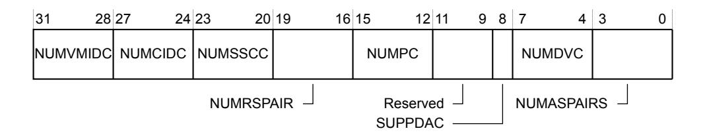

**Figure 13-22 TRCIDR4 bit assignments**

The following table shows the TRCIDR4 bit assignments.

**Table 13-24 TRCIDR4 bit assignments**

| Bits    | Name       | Function                                                                                      |  |
|---------|------------|-----------------------------------------------------------------------------------------------|--|
| [31:28] | NUMVMIDC   | Indicates the number of VMID comparators available for tracing. This value is:                |  |
|         |            | One VMID comparator is available.<br>0x1                                                      |  |
| [27:24] | NUMCIDC    | Indicates the number of CID comparators available for tracing. This value is:                 |  |
|         |            | One Context ID comparator is available.<br>0x1                                                |  |
| [23:20] | NUMSSCC    | Indicates the number of single-shot comparator controls available for tracing. This value is: |  |
|         |            | 0x1<br>One single-shot comparator control is available.                                       |  |
| [19:16] | NUMRSPAIR  | Indicates the number of resource selection pairs available for tracing. This value is:        |  |
|         |            | Eight resource selection pairs are available.<br>0x7                                          |  |
| [15:12] | NUMPC      | Indicates the number of processor comparator inputs available for tracing. This value is:     |  |
|         |            | No processor comparator inputs are available.<br>0x0                                          |  |
| [11:9]  | -          | Reserved, RES0.                                                                               |  |
| [8]     | SUPPDAC    | Indicates whether the implementation supports data address comparisons: This value is:        |  |
|         |            | 0<br>Data address comparisons are not supported.                                              |  |
| [7:4]   | NUMDVC     | Indicates the number of data value comparators available for tracing. This value is:          |  |
|         |            | No data value comparators are available.<br>0x0                                               |  |
| [3:0]   | NUMRSPAIRS | Indicates the number of address comparator pairs available for tracing. This value is:        |  |
|         |            | 0x4<br>Four address comparator pairs are available.                                           |  |

The TRCIDR4 can be accessed through the internal memory-mapped interface and the external debug interface, offset 0x1F0.

#### **13.7.22 Trace ID Register 5**

The TRCIDR5 characteristics are:

#### **Purpose**

Returns how many resources the trace unit supports.

#### **Usage constraints**

There are no usage constraints.

# Configurations

Available in all configurations.

#### Attributes

See 13.6 Register summary on page 13-466.

The following figure shows the TRCIDR5 bit assignments.

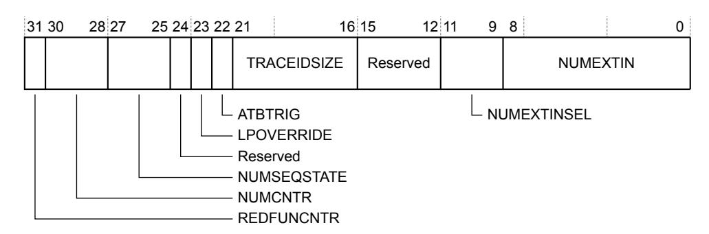

Figure 13-23 TRCIDR5 bit assignments

The following table shows the TRCIDR5 bit assignments.

Table 13-25 TRCIDR5 bit assignments

| Bits            | Name                                           | Function                                                                                           |  |  |
|-----------------|------------------------------------------------|----------------------------------------------------------------------------------------------------|--|--|
| [31]            | REDFUNCNTR                                     | Indicates whether the reduced function counter is implemented. This value is:                      |  |  |
|                 |                                                | <b>0</b> Reduced function counter is not supported.                                                |  |  |
| [30:28]         | NUMCNTR                                        | Indicates the number of counters available for tracing. This value is:                             |  |  |
|                 |                                                | 0b010    Two counters are available.                                                               |  |  |
| [27:25]         | NUMSEQSTATE                                    | Indicates the number of sequencer states implemented. This value is:                               |  |  |
|                 |                                                | <b>0b100</b> Four sequencer states are implemented.                                                |  |  |
| [24]            | -                                              | Reserved, RESO.                                                                                    |  |  |
| [23] LPOVERRIDE |                                                | Indicates whether low power state override is supported. This value is:                            |  |  |
|                 |                                                | 0 Low power state override is not supported.                                                       |  |  |
| [22]            | ATBTRIG                                        | Indicates whether ATB triggers are supported. This value is:                                       |  |  |
|                 |                                                | 1 ATB triggers are supported and the TRCEVENTCTL1R.ATBTRIG field is implemented.                   |  |  |
| [21:16]         | 16] TRACEIDSIZE Trace ID width. This value is: |                                                                                                    |  |  |
|                 |                                                | 0x07 A 7-bit trace ID width is supported. This defines the width of the TRCTRACEIDR.TRACEID field. |  |  |
|                 |                                                | Note                                                                                               |  |  |
|                 |                                                | The CoreSight ATB requires a 7-bit trace ID width.                                                 |  |  |
| [15:12]         | -                                              | Reserved, RESO.                                                                                    |  |  |

#### Table 13-25 TRCIDR5 bit assignments (continued)

<span id="page-492-0"></span>

| Bits   | Name        | Function                                                                                                                              |                                                       |  |
|--------|-------------|---------------------------------------------------------------------------------------------------------------------------------------|-------------------------------------------------------|--|
| [11:9] | NUMEXTINSEL | Indicates the number of external input select resources are implemented. If NUMEXTINSEL is 0, NUMEXTIN must also be 0. This value is: |                                                       |  |
|        |             | 0b100                                                                                                                                 | Four external input select resources are implemented. |  |
| [8:0]  | NUMEXTIN    | Indicates the number of external inputs are implemented. This value is:                                                               |                                                       |  |
|        |             | 0b0011011                                                                                                                             | 10 110 external inputs are implemented.               |  |

The TRCIDR5 can be accessed through the internal memory-mapped interface and the external debug interface, offset 0x1F4.

## 13.7.23 Resource Selection Control Registers

The TRCRSCTLR*n* characteristics are:

#### **Purpose**

Controls the selection of the resources in the trace unit.

—— Note ———— The range of *n* for TRCRSCTLR*n* is 2 to 15.

#### **Usage constraints**

- Only accepts writes when the trace unit is disabled.
- If software selects an non-implemented resource then constrained UNPREDICTABLE behavior of the resource selector occurs. The resource selector might activate unexpectedly or might not activate. Reads of the TRCRSCTLRn might return UNKNOWN.

#### **Configurations**

Resource selectors are implemented in pairs and there are eight pairs of TRCRSCTLR registers implemented, set by TRCIDR4.NUMRSPAIR. Each odd numbered resource selector is part of a pair with the even numbered resource selector that is numbered as one less than it. For example, resource selectors 2 and 3 form a pair.

Resource selector pair 0 is always implemented and is reserved. Resource selector zero always returns FALSE, and resource selector one always returns TRUE.

#### Attributes

A 32-bit RW trace register.

See 13.6 Register summary on page 13-466.

The following figure shows the TRCRSCTLR*n* bit assignments.

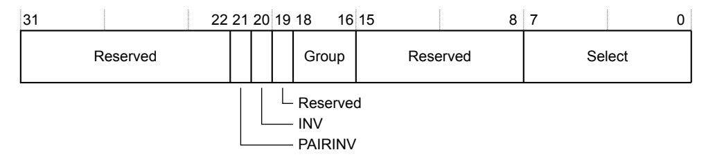

Figure 13-24 TRCSCTLR

The following table shows the TRCRSCTLR*n* bit assignments.

## **Table 13-26 TRCSCTLRn bit assignments**

<span id="page-493-0"></span>

| Bits         | Name                                                                                                       | Function                                                                                                                                                                                                                                  |  |  |
|--------------|------------------------------------------------------------------------------------------------------------|-------------------------------------------------------------------------------------------------------------------------------------------------------------------------------------------------------------------------------------------|--|--|
| [31:22]<br>- |                                                                                                            | Reserved, RES0.                                                                                                                                                                                                                           |  |  |
| [21]         | PAIRINV                                                                                                    | Controls whether the combined result from a resource pair is inverted when n is 2, 4, 6, 8, 10, 12, or 14. The<br>possible values are:                                                                                                    |  |  |
|              |                                                                                                            | 0<br>The combined result is not inverted.                                                                                                                                                                                                 |  |  |
|              |                                                                                                            | 1<br>The combined result is inverted.                                                                                                                                                                                                     |  |  |
|              |                                                                                                            | PAIRINV is RES0 when n is 3, 5, 7, 9, 11, 13, or 15.                                                                                                                                                                                      |  |  |
| [20]         | INV<br>Controls whether the resource, that GROUP and SELECT selects, is inverted. The possible values are: |                                                                                                                                                                                                                                           |  |  |
|              |                                                                                                            | 0<br>The selected resource is not inverted.                                                                                                                                                                                               |  |  |
|              |                                                                                                            | 1<br>The selected resource is inverted.                                                                                                                                                                                                   |  |  |
| [19]         | -                                                                                                          | Reserved, RES0.                                                                                                                                                                                                                           |  |  |
| [18:16]      | Group                                                                                                      | Selects a group of resources. See the ARM®<br>Embedded Trace Macrocell Architecture Specification, ETMv4 for<br>more information.                                                                                                         |  |  |
| [15:8]       | -                                                                                                          | Reserved, RES0.                                                                                                                                                                                                                           |  |  |
| [7:0]        | Select                                                                                                     | Selects one or more resources from the group that the GROUP field selects. Each bit represents a resource from<br>the selected group. See the ARM®<br>Embedded Trace Macrocell Architecture Specification, ETMv4 for more<br>information. |  |  |

The TRCRSCTLR*n* can be accessed through the internal memory-mapped interface and the external debug interface, offset 0x208-023C.

#### **13.7.24 Address Comparator Access Type Registers**

The TRCACATR*n* characteristics are:

#### **Purpose**

Defines the type of access for the corresponding TRCACVR*n* Register. This register configures the parameters of the address comparator for:

- Context type.
- Exception levels.
- Alignment.
- Masking.
- Behavior when it is one half of an address range comparator.

| Note                                    |  |  |
|-----------------------------------------|--|--|
| The range of n for TRCACATRn is 0 to 7. |  |  |

#### **Usage constraints**

- Only accepts writes when the trace unit is disabled.
- Constrained UNPREDICTABLE behavior of a comparator resource occurs if:
  - TYPE is 0 and DATAMATCH is 0b01, 0b10, or 0b11.
  - DATAMATCH is 0b01, 0b10, or 0b11 and software programs an address comparator to control ViewData.

In these scenarios, the comparator might match unexpectedly or might not match.

- If software uses two single address comparators as an address range comparator then it must program the corresponding TRCACATRs with identical values in the following fields:
  - TYPE.
  - CONTEXTTYPE.
  - CONTEXT.
  - EXLEVEL S.
  - EXLEVEL NS.

#### **Configurations**

The number TRCACATRs is eight and is set by twice the size of TRCIDR4.NUMACPAIRS.

#### **Attributes**

A 64-bit RW trace register.

See 13.6 Register summary on page 13-466.

The following figure shows the TRCACATRn bit assignments.

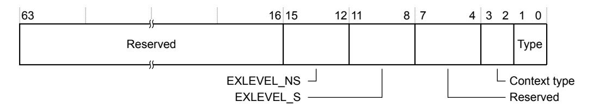

Figure 13-25 TRCACATR

The following table shows the TRCACATR*n* bit assignments.

Table 13-27 TRCACATRn bit assignments

| Bits    | Name                                                                                                                              | Function                                                                                       |                    |  |
|---------|-----------------------------------------------------------------------------------------------------------------------------------|------------------------------------------------------------------------------------------------|--------------------|--|
| [63:16] | -                                                                                                                                 | Reserved, RESO.                                                                                |                    |  |
| [15:12] | 2] EXLEVEL_NS Each bit controls whether a comparison can occur in Non-secure state for the corresponding The possible values are: |                                                                                                |                    |  |
|         |                                                                                                                                   | n a comparison, in Non-secure state, for Exception level <i>n</i> .                            |                    |  |
|         |                                                                                                                                   | 1 The trace unit does not perform a comparison, in Non-secure state, for Exception level $n$ . |                    |  |
|         |                                                                                                                                   | Note                                                                                           | _                  |  |
|         |                                                                                                                                   | The bit to Exception level ma                                                                  | pping is:          |  |
|         |                                                                                                                                   | Bit[12]                                                                                        | Exception level 0. |  |
|         |                                                                                                                                   | Bit[13]                                                                                        | Exception level 1. |  |
|         |                                                                                                                                   | Bit[14]                                                                                        | Exception level 2. |  |
|         |                                                                                                                                   | Bit[15]                                                                                        | Always RES0.       |  |

#### **Table 13-27 TRCACATRn bit assignments (continued)**

<span id="page-495-0"></span>

| Bits   | Name         | Function                                                                                                                                                                                                                                                               |  |  |
|--------|--------------|------------------------------------------------------------------------------------------------------------------------------------------------------------------------------------------------------------------------------------------------------------------------|--|--|
| [11:8] | EXLEVEL_S    | Each bit controls whether a comparison can occur in Secure state for the corresponding Exception level. The<br>possible values are:                                                                                                                                    |  |  |
|        |              | 0<br>The trace unit can perform a comparison, in Secure state, for Exception level n.                                                                                                                                                                                  |  |  |
|        |              | 1<br>The trace unit does not perform a comparison, in Secure state, for Exception level n.                                                                                                                                                                             |  |  |
|        |              | Note                                                                                                                                                                                                                                                                   |  |  |
|        |              | The bit to Exception level mapping is:                                                                                                                                                                                                                                 |  |  |
|        |              | Bit[8]<br>Exception level 0.                                                                                                                                                                                                                                           |  |  |
|        |              | Bit[9]<br>Exception level 1.                                                                                                                                                                                                                                           |  |  |
|        |              | Bit[10]<br>Always RES0.                                                                                                                                                                                                                                                |  |  |
|        |              | Bit[11]<br>Exception level 3.                                                                                                                                                                                                                                          |  |  |
|        |              |                                                                                                                                                                                                                                                                        |  |  |
| [7:4]  | -            | Reserved, RES0.                                                                                                                                                                                                                                                        |  |  |
| [3:2]  | Context type | Controls whether the trace unit performs a Context ID comparison, a VMID comparison, or both<br>comparisons:                                                                                                                                                           |  |  |
|        |              | The trace unit does not perform a Context ID comparison.<br>0b00                                                                                                                                                                                                       |  |  |
|        |              | The trace unit performs a Context ID comparison using the Context ID comparator that the<br>0b01<br>CONTEXT field specifies, and signals a match if both the Context ID comparator matches and the<br>address comparator match.                                        |  |  |
|        |              | The trace unit performs a VMID comparison using the VMID comparator that the CONTEXT field<br>0b10<br>specifies, and signals a match if both the VMID comparator and the address comparator match.                                                                     |  |  |
|        |              | The trace unit performs a Context ID comparison and a VMID comparison using the comparators<br>0b11<br>that the CONTEXT field specifies, and signals a match if the Context ID comparator matches, the<br>VMID comparator matches, and the address comparator matches. |  |  |
| [1:0]  | Type         | Type is RES0 when TRCIDR4.SUPPDAC is 0b0.                                                                                                                                                                                                                              |  |  |

The TRCACATR*n* can be accessed through the internal memory-mapped interface and the external debug interface, offset 0x480-0x4B8.

#### **13.7.25 Context ID Comparator Value Register 0**

The TRCCIDCVR0 characteristics are:

## **Purpose**

Contains a Context ID value.

#### **Usage constraints**

Only accepts writes when the trace unit is disabled.

# **Configurations**

There is one TRCCIDCVR register, set by TRCIDR4.NUMCIDC.

# **Attributes**

A 64-bit RW trace register.

See *[13.6 Register summary](#page-465-0)* on page 13-466.

The following figure shows the TRCCIDCVR0 bit assignments.

<span id="page-496-0"></span>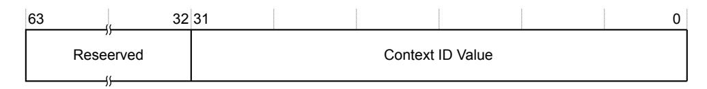

Figure 13-26 TRCCIDCVR0 bit assignments

The following table shows the TRCCIDCVR0 bit assignments.

Table 13-28 TRCCIDCVR0 bit assignments

| Bits    | Name             | Function                                                 |
|---------|------------------|----------------------------------------------------------|
| [63:32] | -                | Reserved, RES0.                                          |
| [31:0]  | Context ID Value | The context ID value is 32 bits, set by TRCIDR2.CIDSIZE. |

The TRCCIDCVR0 can be accessed through the internal memory-mapped interface and the external debug interface, offset 0x600.

# 13.7.26 VMID Comparator Value Register 0

The TRCVMIDCVR0 characteristics are:

#### **Purpose**

Contains a VMID value.

#### **Usage constraints**

Only accepts writes when the trace unit is disabled.

#### **Configurations**

There is one TRCVMIDCVR register, set by TRCIDR4.NUMVMIDC.

#### Attributes

A 64-bit RW trace register.

See 13.6 Register summary on page 13-466.

The following figure shows the TRCVMIDCVR0 bit assignments.

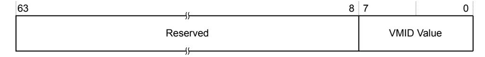

Figure 13-27 TRCVMIDCVR0 bit assignments

The following table shows the TRCVMIDCVR0 bit assignments.

Table 13-29 TRCVMIDCVR0 bit assignments

| Bits   | Name       | Function                                           |
|--------|------------|----------------------------------------------------|
| [63:8] | -          | Reserved, RES0                                     |
| [7:0]  | VMID Value | The VMID value is 64 bits, set by TRCIDR2.VMIDSIZE |

The TRCVMIDCVR0 can be accessed through the internal memory-mapped interface and the external debug interface, offset 0x640.

# 13.7.27 Context ID Comparator Control Register 0

The TRCCIDCCTLR0 characteristics are:

#### <span id="page-497-0"></span>Purpose

Contains Context ID mask values for the TRCCIDCVR0 register.

#### **Usage constraints**

- Only accepts writes when the trace unit is disabled.
- If software sets a mask bit to 1 then it must program the relevant byte in TRCCIDCVRn to 0x00.

#### **Configurations**

There is one Context ID comparator, set by TRCIDR4.NUMCIDC.

#### Attributes

A 32-bit RW trace register.

See 13.6 Register summary on page 13-466.

The following figure shows the TRCCIDCCTLR0 bit assignments.

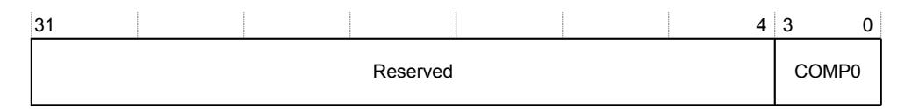

Figure 13-28 TRCCIDCCTLR0 bit assignments

The following table shows the TRCCIDCCTLR0 bit assignments.

Table 13-30 TRCCIDCCTLR0 bit assignments

| Bits   | Name  | Function                                                                                                                                                                                                                            |  |
|--------|-------|-------------------------------------------------------------------------------------------------------------------------------------------------------------------------------------------------------------------------------------|--|
| [31:4] | -     | Reserved, RES0.                                                                                                                                                                                                                     |  |
| [3:0]  | COMP0 | 1P0 Controls the mask value that the trace unit applies to TRCCIDCVR0. Each bit in this field corresponds to a by TRCCIDCVR0. When a bit is:                                                                                        |  |
|        |       | <ul> <li>The trace unit includes the relevant byte in TRCCIDCVR0 when it performs the Context ID comparison.</li> <li>The trace unit ignores the relevant byte in TRCCIDCVR0 when it performs the Context ID comparison.</li> </ul> |  |

The TRCCIDCCTLR0 can be accessed through the internal memory-mapped interface and the external debug interface, offset 0x680.

## 13.7.28 Trace Integration Miscellaneous Outputs Register

The TRCITMISCOUT characteristics are:

#### **Purpose**

Controls signal outputs when TRCITCTRL.IME is set.

#### **Usage constraints**

There are no usage constraints.

# **Configurations**

Available in all configurations.

#### Attributes

See 13.6 Register summary on page 13-466.

The following figure shows the TRCITMISCOUT bit assignments.

<span id="page-498-0"></span>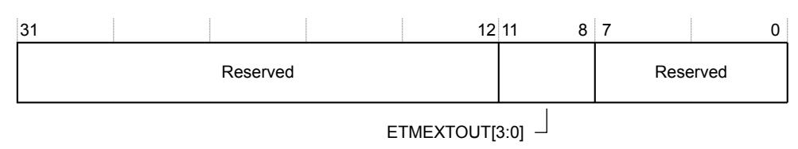

**Figure 13-29 TRCITMISCOUT bit assignments**

The following table shows the TRCITMISCOUT bit assignments.

**Table 13-31 TRCITMISCOUT bit assignments**

| Bits    | Name           | Function                        |
|---------|----------------|---------------------------------|
| [31:12] | -              | Reserved, RES0.                 |
| [11:8]  | ETMEXTOUT[3:0] | Drives the EXTOUT[3:0] outputs. |
| [7:0]   | -              | Reserved, RES0.                 |

The TRCITMISCOUT can be accessed through the internal memory-mapped interface and the external debug interface, offset 0xEDC.

# **Related information**

*[13.7.34 Trace Integration Mode Control register](#page-502-0)* on page 13-503*.*

# **13.7.29 Trace Integration Miscellaneous Input Register**

The TRCITMISCIN characteristics are:

# **Purpose**

Enables the values of signal inputs to be read when TRCITCTRL.IME is set.

# **Usage constraints**

There are no usage constraints.

# **Configurations**

Available in all configurations.

# **Attributes**

See *[13.6 Register summary](#page-465-0)* on page 13-466.

The following figure shows the TRCITMISCIN bit assignments.

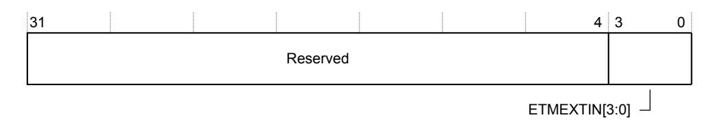

**Figure 13-30 TRCITMISCIN bit assignments**

The following table shows the TRCITMISCIN bit assignments.

**Table 13-32 TRCITMISCIN bit assignments**

| Bits   | Name          | Function                                       |
|--------|---------------|------------------------------------------------|
| [31:4] | -             | Reserved, RES0.                                |
| [3:0]  | ETMEXTIN[3:0] | Returns the value of the ETMEXTIN[3:0] inputs. |

<span id="page-499-0"></span>The TRCITMISCIN can be accessed through the internal memory-mapped interface and the external debug interface, offset 0xEE0.

# **Related information**

*[13.7.34 Trace Integration Mode Control register](#page-502-0)* on page 13-503*.*

# **13.7.30 Trace Integration Test ATB Data Register 0**

The TRCITATBDATA0 characteristics are:

#### **Purpose**

Controls signal outputs when TRCITCTRL.IME is set.

#### **Usage constraints**

There are no usage constraints.

#### **Configurations**

Available in all configurations.

#### **Attributes**

See *[13.6 Register summary](#page-465-0)* on page 13-466.

The following figure shows the TRCITATBDATA0 bit assignments.

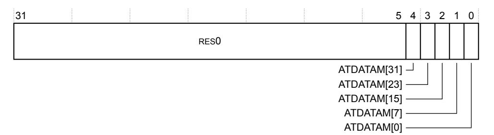

**Figure 13-31 TRCITATBDATA0 bit assignments**

The following table shows the TRCITATBDATA0 bit assignments.

**Table 13-33 TRCITATBDATA0 bit assignments**

| Bits   | Name        | Function                      |
|--------|-------------|-------------------------------|
| [31:5] | -           | Reserved, RES0.               |
| [4]    | ATDATAM[31] | Drives the ATDATAM[31] output |
| [3]    | ATDATAM[23] | Drives the ATDATAM[23] output |
| [2]    | ATDATAM[15] | Drives the ATDATAM[15] output |
| [1]    | ATDATAM[7]  | Drives the ATDATAM[7] output  |
| [0]    | ATDATAM[0]  | Drives the ATDATAM[0] output  |

The TRCITATBDATA0 can be accessed through the internal memory-mapped interface and the external debug interface, offset 0xEEC.

# **Related information**

*[13.7.34 Trace Integration Mode Control register](#page-502-0)* on page 13-503*.*

# **13.7.31 Trace Integration Test ATB Control Register 2**

The TRCITATBCTR2 characteristics are:

#### <span id="page-500-0"></span>**Purpose**

Enables the values of signal inputs to be read when bit[0] of the Integration Mode Control Register is set.

#### **Usage constraints**

There are no usage constraints.

#### **Configurations**

Available in all configurations.

# **Attributes**

See *[13.6 Register summary](#page-465-0)* on page 13-466.

The following figure shows the TRCITATBCTR2 bit assignments.

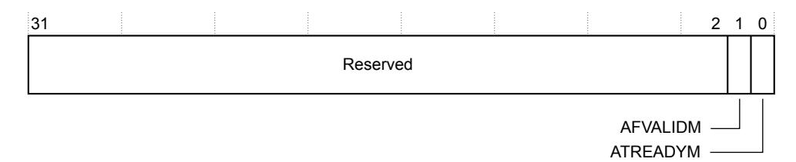

**Figure 13-32 TRCITATBCTR2 bit assignments**

The following table shows the TRCITATBCTR2 bit assignments.

**Table 13-34 TRCITATBCTR2 bit assignments**

| Bits   | Name     | Function                              |
|--------|----------|---------------------------------------|
| [31:2] | -        | Reserved, RES0.                       |
| [1]    | AFVALIDM | Returns the value of AFVALIDM input   |
| [0]    | ATREADYM | Returns the value of ATREADYM inputfd |

The TRCITATBCTR2 can be accessed through the internal memory-mapped interface and the external debug interface, offset 0xEF0.

# **Related information**

*[13.7.34 Trace Integration Mode Control register](#page-502-0)* on page 13-503*.*

#### **13.7.32 Trace Integration Test ATB Control Register 1**

The TRCITATBCTR1 characteristics are:

#### **Purpose**

Controls the **ATIDM[6:0]** signals when TRCITCTRL.IME is set.

#### **Usage constraints**

There are no usage constraints.

#### **Configurations**

Available in all configurations.

# **Attributes**

See *[13.6 Register summary](#page-465-0)* on page 13-466.

The following figure shows the TRCITATBCTR1 bit assignments.

fd To sample **ATREADYM** correctly from the processor signals, **ATVALIDM** must be asserted.

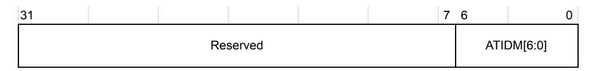

**Figure 13-33 TRCITATBCTR1 bit assignments**

<span id="page-501-0"></span>The following table shows the TRCITATBCTR1 bit assignments.

**Table 13-35 TRCITATBCTR1 bit assignments**

| Bits   | Name       | Function                      |
|--------|------------|-------------------------------|
| [31:7] | -          | Reserved, RES0.               |
| [6:0]  | ATIDM[6:0] | Drives the ATIDM[6:0] outputs |

The TRCITATBCTR2 can be accessed through the internal memory-mapped interface and the external debug interface, offset 0xEF4.

# **Related information**

*[13.7.34 Trace Integration Mode Control register](#page-502-0)* on page 13-503*.*

# **13.7.33 Trace Integration Test ATB Control Register 0**

The TRCITATBCTR0 characteristics are:

# **Purpose**

Controls signal outputs when TRCITCTRL.IME is set.

#### **Usage constraints**

There are no usage constraints.

#### **Configurations**

Available in all configurations.

# **Attributes**

See *[13.6 Register summary](#page-465-0)* on page 13-466.

The following figure shows the TRCITATBCTR0 bit assignments.

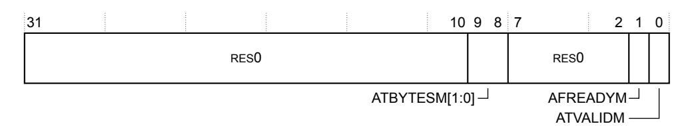

**Figure 13-34 TRCITATBCTR0 bit assignments**

The following table shows the TRCITATBCTR0 bit assignments.

**Table 13-36 TRCITATBCTR0 bit assignments**

| Bits    | Name          | Function                    |
|---------|---------------|-----------------------------|
| [31:10] | -             | Reserved, RES0              |
| [9:8]   | ATBYTESM[1:0] | Drives the ATBYTESM outputs |
| [7:2]   | -             | Reserved, RES0              |
| [1]     | AFREADYM      | Drives the AFREADYM output  |
| [0]     | ATVALIDM      | Drives the ATVALIDM output  |

<span id="page-502-0"></span>The TRCITATBCTR0 can be accessed through the internal memory-mapped interface and the external debug interface, offset 0xEF8.

# **Related information**

*13.7.34 Trace Integration Mode Control register* on page 13-503*.*

#### **13.7.34 Trace Integration Mode Control register**

The TRCITCTRL characteristics are:

#### **Purpose**

Controls whether the trace unit is in integration mode.

## **Usage constraints**

- Accessible only from the memory-mapped interface or from an external agent such as a debugger.
- If the IME bit changes from one to zero then ARM recommends that the trace unit is reset. Otherwise the trace unit might generate incorrect or corrupt trace and the trace unit resources might behave unexpectedly.

#### **Configurations**

Available in all configurations.

# **Attributes**

A 32-bit RW management register. The register is reset to zero.

See *[13.6 Register summary](#page-465-0)* on page 13-466.

The following figure shows the TRCITCTRL bit assignments.

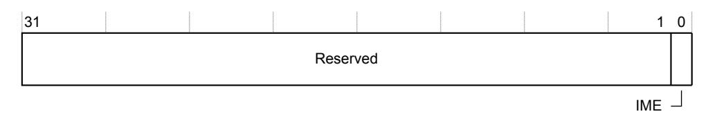

**Figure 13-35 TRCITCTRL bit assignments**

The following table shows the TRCITCTRL bit assignments.

**Table 13-37 TRCITCTRL bit assignments**

| Bits   | Name                                                                                                                                                                          | Function                                                                                                 |  |
|--------|-------------------------------------------------------------------------------------------------------------------------------------------------------------------------------|----------------------------------------------------------------------------------------------------------|--|
| [31:1] | -                                                                                                                                                                             | Reserved, RES0                                                                                           |  |
| [0]    | IME                                                                                                                                                                           | Integration mode enable bit. The possible values are:<br>0<br>The trace unit is not in integration mode. |  |
|        | 1<br>The trace unit is in integration mode. This mode enables:<br>•<br>A debug agent to perform topology detection.<br>•<br>SoC test software to perform integration testing. |                                                                                                          |  |

The TRCITCTRL can be accessed through the internal memory-mapped interface and the external debug interface, offset 0xF00.

#### **13.7.35 Trace Device Affinity register 0**

The TRCDEVAFF0 characteristics are:

## <span id="page-503-0"></span>**Purpose**

The value is a read-only copy of MPIDR\_EL1[31:0] as seen from EL3, unaffected by VMPIDR\_EL2.

# **Usage constraints**

Accessible only from the memory-mapped interface or from an external agent such as a debugger.

# **Configurations**

Available in all configurations.

# **Attributes**

A 32-bit RO management register.

For the Cortex-A57 processor, MPIDR\_EL1[31:0] is architecturally mapped to the AArch32 register MPIDR.

See *[13.6 Register summary](#page-465-0)* on page 13-466.

The TRCDEVAFF0 can be accessed through the internal memory-mapped interface and the external debug interface, offset 0xFA8.

# **Related information**

*[4.5.3 Multiprocessor Affinity Register](#page-238-0)* on page 4-239*.*

## **13.7.36 Trace Device Affinity register 1**

The TRCDEVAFF1 characteristics are:

#### **Purpose**

The value is a read-only copy of MPIDR\_EL1[63:32] as seen from EL3, unaffected by VMPIDR\_EL2.

#### **Usage constraints**

Accessible only from the memory-mapped interface or from an external agent such as a debugger.

## **Configurations**

Available in all configurations.

#### **Attributes**

A 32-bit RO management register.

For the Cortex-A57 processor, MPIDR\_EL1[63:32] is RES0.

See *[13.6 Register summary](#page-465-0)* on page 13-466.

The TRCDEVAFF1 can be accessed through the internal memory-mapped interface and the external debug interface, offset 0xFAC.

# **13.7.37 Trace Peripheral Identification Registers**

The Trace Peripheral Identification Registers provide standard information required for all CoreSight components. There is a set of eight registers, listed in register number order in the following table.

**Table 13-38 Summary of the Trace Peripheral ID Registers**

| Register | Value | Offset |
|----------|-------|--------|
| TRCPIDR4 | 0x04  | 0xFD0  |
| TRCPIDR5 | 0x00  | 0xFD4  |
| TRCPIDR6 | 0x00  | 0xFD8  |
| TRCPIDR7 | 0x00  | 0xFDC  |
|          |       |        |

**Table 13-38 Summary of the Trace Peripheral ID Registers (continued)**

| Register | Value | Offset |
|----------|-------|--------|
| TRCPIDR0 | 0x5E  | 0xFE0  |
| TRCPIDR1 | 0xB9  | 0xFE4  |
| TRCPIDR2 | 0x3B  | 0xFE8  |
| TRCPIDR3 | 0x00  | 0xFEC  |

<span id="page-504-0"></span>Only bits[7:0] of each Trace Peripheral ID Register are used, with bits[31:8] reserved. Together, the eight Trace Peripheral ID Registers define a single 64-bit Peripheral ID.

The Peripheral ID registers are:

- *Trace Peripheral Identification Register 0* on page 13-505.
- *[Trace Peripheral Identification Register 1](#page-505-0)* on page 13-506.
- *[Trace Peripheral Identification Register 2](#page-505-0)* on page 13-506.
- *[Trace Peripheral Identification Register 3](#page-506-0)* on page 13-507.
- *[Trace Peripheral Identification Register 4](#page-507-0)* on page 13-508.
- *[Trace Peripheral Identification Register 5-7](#page-507-0)* on page 13-508.

# **Trace Peripheral Identification Register 0**

The TRCPIDR0 characteristics are:

# **Purpose**

Provides information to identify a trace component.

#### **Usage constraints**

- Only bits[7:0] are valid.
- Accessible only from the memory-mapped interface or the external debugger interface.

#### **Configurations**

Available in all implementations.

# **Attributes**

A 32-bit RO management register.

See *[13.6 Register summary](#page-465-0)* on page 13-466.

The following figure shows the TRCPIDR0 bit assignments.

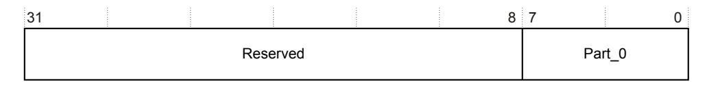

**Figure 13-36 TRCPIDR0 bit assignments**

The following table shows the TRCPIDR0 bit assignments.

**Table 13-39 TRCPIDR0 bit assignments**

| Bits   | Name   | Function        |                                                |
|--------|--------|-----------------|------------------------------------------------|
| [31:8] | -      | Reserved, RES0. |                                                |
| [7:0]  | Part_0 | 0x5E            | Least significant byte of the ETM part number. |

<span id="page-505-0"></span>TRCPIDR0 can be accessed through the internal memory-mapped interface and the external debug interface, offset 0xFE0.

# **Trace Peripheral Identification Register 1**

The TRCPIDR1 characteristics are:

#### **Purpose**

Provides information to identify a trace component.

#### **Usage constraints**

- Only bits[7:0] are valid.
- Accessible only from the memory-mapped interface or the external debugger interface.

#### **Configurations**

Available in all implementations.

# **Attributes**

A 32-bit RO management register.

See *[13.6 Register summary](#page-465-0)* on page 13-466.

The following figure shows the TRCPIDR1 bit assignments.

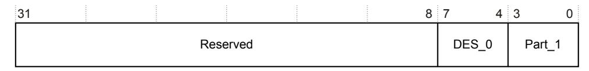

**Figure 13-37 TRCPIDR1 bit assignments**

The following table shows the TRCPIDR1 bit assignments.

**Table 13-40 TRCPIDR1 bit assignments**

| Bits   | Name   | Function                                                                    |  |
|--------|--------|-----------------------------------------------------------------------------|--|
| [31:8] | -      | Reserved, RES0.                                                             |  |
| [7:4]  | DES_0  | ARM Limited. This is the least significant nibble of JEP106 ID code.<br>0xB |  |
| [3:0]  | Part_1 | Most significant nibble of the ETM part number.<br>0x9                      |  |

TRCPIDR1 can be accessed through the internal memory-mapped interface and the external debug interface, offset 0xFE4.

# **Trace Peripheral Identification Register 2**

The TRCPIDR2 characteristics are:

#### **Purpose**

Provides information to identify a trace component.

## **Usage constraints**

- Only bits[7:0] are valid.
- Accessible only from the memory-mapped interface or the external debugger interface.

# **Configurations**

Available in all implementations.

### **Attributes**

A 32-bit RO management register.

See *[13.6 Register summary](#page-465-0)* on page 13-466.

The following figure shows the TRCPIDR2 bit assignments.

<span id="page-506-0"></span>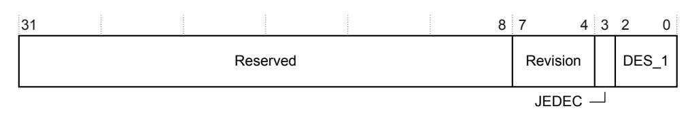

Figure 13-38 TRCPIDR2 bit assignments

The following table shows the TRCPIDR2 bit assignments.

Table 13-41 TRCPIDR2 bit assignments

| Bits   | Name     | Function        |                                                                     |
|--------|----------|-----------------|---------------------------------------------------------------------|
| [31:8] | -        | Reserved, RESO. |                                                                     |
| [7:4]  | Revision | 3               | Part major revision.                                                |
| [3]    | JEDEC    | 0b1             | RES1. Indicates a JEP106 identity code is used.                     |
| [2:0]  | DES_1    | 0b011           | ARM Limited. This is the most significant nibble of JEP106 ID code. |

TRCPIDR2 can be accessed through the internal memory-mapped interface and the external debug interface, offset 0xFE8.

# **Trace Peripheral Identification Register 3**

The TRCPIDR3 characteristics are:

## **Purpose**

Provides information to identify a trace component.

## **Usage constraints**

- Only bits[7:0] are valid.
- Accessible only from the memory-mapped interface or the external debugger interface.

## **Configurations**

Available in all implementations.

#### **Attributes**

A 32-bit RO management register.

See 13.6 Register summary on page 13-466.

The following figure shows the TRCPIDR3 bit assignments.

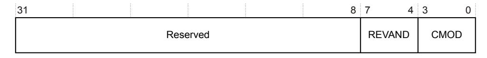

Figure 13-39 TRCPIDR3 bit assignments

The following table shows the TRCPIDR3 bit assignments.

## **Table 13-42 TRCPIDR3 bit assignments**

<span id="page-507-0"></span>

| Bits   | Name   | Function        |                      |  |
|--------|--------|-----------------|----------------------|--|
| [31:8] | -      | Reserved, RES0. |                      |  |
| [7:4]  | REVAND | 0x0             | Part minor revision. |  |
| [3:0]  | CMOD   | 0x0             | Customer modified.   |  |

TRCPIDR3 can be accessed through the internal memory-mapped interface and the external debug interface, offset 0xFEC.

# **Trace Peripheral Identification Register 4**

The TRCPIDR4 characteristics are:

# **Purpose**

Provides information to identify a trace component.

#### **Usage constraints**

- Only bits[7:0] are valid.
- Accessible only from the memory-mapped interface or the external debugger interface.

#### **Configurations**

Available in all implementations.

#### **Attributes**

A 32-bit RO management register.

See *[13.6 Register summary](#page-465-0)* on page 13-466.

The following figure shows the TRCPIDR4 bit assignments.


**Figure 13-40 TRCPIDR4 bit assignments**

The following table shows the TRCPIDR4 bit assignments.

**Table 13-43 TRCPIDR4 bit assignments**

| Bits   | Name  | Function        |                                                                                                                                      |  |
|--------|-------|-----------------|--------------------------------------------------------------------------------------------------------------------------------------|--|
| [31:8] | -     | Reserved, RES0. |                                                                                                                                      |  |
| [7:4]  | Size  | 0x0             | Size of the component. Log2 the number of 4KB pages from the start of the component to the end of the ETM<br>component ID registers. |  |
| [3:0]  | DES_2 | 0x4             | ARM Limited. This is the least significant nibble of the JEP106 continuation code.                                                   |  |

TRCPIDR4 can be accessed through the internal memory-mapped interface and the external debug interface, offset 0xFD0.

# **Trace Peripheral Identification Register 5-7**

No information is held in the Peripheral ID5, Peripheral ID6 and Peripheral ID7 Registers.

They are reserved for future use and are RES0.

# <span id="page-508-0"></span>**13.7.38 Trace Component Identification Registers**

There are four read-only Trace Component Identification Registers, Trace Component ID0 to Trace Component ID3. The following table shows these registers.

**Table 13-44 Summary of the ETM Component Identification Registers**

| Register | Value | Offset |
|----------|-------|--------|
| TRCCIDR0 | 0x0D  | 0xFF0  |
| TRCCIDR1 | 0x90  | 0xFF4  |
| TRCCIDR2 | 0x05  | 0xFF8  |
| TRCCIDR3 | 0xB1  | 0xFFC  |

The Trace Component Identification Registers identify ETM as a CoreSight component.

The Trace Component ID registers are:

- *Trace Component Identification Register 0* on page 13-509.
- *[Trace Component Identification Register 1](#page-509-0)* on page 13-510.
- *[Trace Component Identification Register 2](#page-509-0)* on page 13-510.
- *[Trace Component Identification Register 3](#page-510-0)* on page 13-511.

# **Trace Component Identification Register 0**

The TRCCIDR0 characteristics are:

#### **Purpose**

Provides information to identify a trace component.

#### **Usage constraints**

- Only bits[7:0] are valid.
- Accessible only from the memory-mapped interface or the external debugger interface.

#### **Configurations**

Available in all implementations.

#### **Attributes**

See *[13.6 Register summary](#page-465-0)* on page 13-466.

The following figure shows the TRCCIDR0 bit assignments.


**Figure 13-41 TRCCIDR0 bit assignments**

The following table shows the TRCCIDR0 bit assignments.

**Table 13-45 TRCCIDR0 bit assignments**

| Bits   | Name    | Function        |                  |
|--------|---------|-----------------|------------------|
| [31:8] | -       | Reserved, RES0. |                  |
| [7:0]  | PRMBL_0 | 0x0D            | Preamble byte 0. |

<span id="page-509-0"></span>TRCCIDR0 can be accessed through the internal memory-mapped interface and the external debug interface, offset 0xFF0.

# **Trace Component Identification Register 1**

The TRCCIDR1 characteristics are:

## **Purpose**

Provides information to identify a trace component.

#### **Usage constraints**

- Only bits[7:0] are valid.
- Accessible only from the memory-mapped interface or the external debugger interface.

#### **Configurations**

Available in all implementations.

# **Attributes**

See *[13.6 Register summary](#page-465-0)* on page 13-466.

The following figure shows the TRCCIDR1 bit assignments.

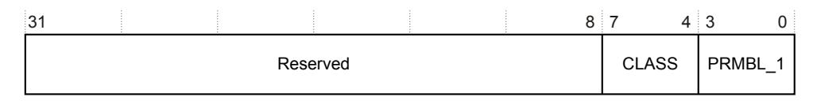

**Figure 13-42 TRCCIDR1 bit assignments**

The following table shows the TRCCIDR1 bit assignments.

**Table 13-46 TRCCIDR1 bit assignments**

| Bits   | Name    | Function        |                  |
|--------|---------|-----------------|------------------|
| [31:8] | -       | Reserved, RES0. |                  |
| [7:4]  | CLASS   | 0x9             | Debug component. |
| [3:0]  | PRMBL_1 | 0x0             | Preamble.        |

TRCCIDR1 can be accessed through the internal memory-mapped interface and the external debug interface, offset 0xFF4.

#### **Trace Component Identification Register 2**

The TRCCIDR2 characteristics are:

#### **Purpose**

Provides information to identify a CTI component.

# **Usage constraints**

- Only bits[7:0] are valid.
- Accessible only from the memory-mapped interface or the external debugger interface.

#### **Configurations**

Available in all implementations.

# **Attributes**

See *[13.6 Register summary](#page-465-0)* on page 13-466.

The following figure shows the TRCCIDR2 bit assignments.

<span id="page-510-0"></span>

**Figure 13-43 TRCCIDR2 bit assignments**

The following table shows the TRCCIDR2 bit assignments.

**Table 13-47 TRCCIDR2 bit assignments**

| Bits   | Name    | Function        |                  |
|--------|---------|-----------------|------------------|
| [31:8] | -       | Reserved, RES0. |                  |
| [7:0]  | PRMBL_2 | 0x05            | Preamble byte 2. |

TRCCIDR2 can be accessed through the internal memory-mapped interface and the external debug interface, offset 0xFF8.

#### **Trace Component Identification Register 3**

The TRCCIDR3 characteristics are:

# **Purpose**

Provides information to identify a trace component.

# **Usage constraints**

- Only bits[7:0] are valid.
- Accessible only from the memory-mapped interface or the external debugger interface.

#### **Configurations**

Available in all implementations.

# **Attributes**

See *[13.6 Register summary](#page-465-0)* on page 13-466.

The following figure shows the TRCCIDR3 bit assignments.

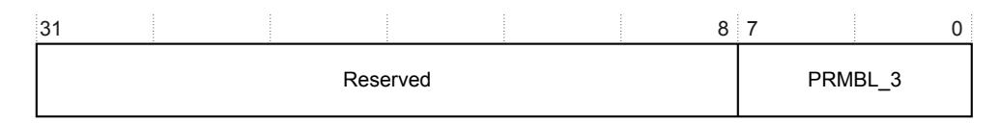

**Figure 13-44 TRCCIDR3 bit assignments**

The following table shows the TRCCIDR3 bit assignments.

**Table 13-48 TRCCIDR3 bit assignments**

| Bits<br>Name     | Function        |                  |
|------------------|-----------------|------------------|
| [31:8]<br>-      | Reserved, RES0. |                  |
| [7:0]<br>PRMBL_3 | 0xB1            | Preamble byte 3. |

TRCCIDR3 can be accessed through the internal memory-mapped interface and the external debug interface, offset 0xFFC.

# <span id="page-511-0"></span>**13.8 Interaction with debug and the Performance Monitor Unit**

Describes the interaction with the Performance Monitor Unit and debug.

This section contains the following subsections:

- *13.8.1 Interaction with the Performance Monitor Unit* on page 13-512.
- *13.8.2 Effect of debug double lock on trace register access* on page 13-512.

# **13.8.1 Interaction with the Performance Monitor Unit**

The Cortex-A57 processor includes a *Performance Monitor Unit* (PMU) that enables events, such as cache misses and instructions executed, to be counted over a period of time. This section describes how the PMU and ETM function together.

# **Use of PMU events by the ETM**

All PMU architectural events are available to the ETM through the extended input facility. See the *ARM® Architectural Reference Manual ARMv8* for more information about PMU events.

The ETM uses four extended external input selectors to access the PMU events. Each selector can independently select one of the PMU events, that are then active for the cycles where the relevant events occur. These selected events can then be accessed by any of the event registers within the ETM.

# **Related information**

*[11 Performance Monitor Unit](#page-395-0)* on page 11-396*.*

# **13.8.2 Effect of debug double lock on trace register access**

All trace register accesses through the memory-mapped and external debug interfaces behave as if the processor power domain is powered down when debug double lock is set. For more information on debug double lock, see the *ARM® Architecture Reference Manual ARMv8*.

# <span id="page-512-0"></span>Chapter 14 **Advanced SIMD and Floating-point**

This chapter describes the Advanced SIMD and Floating-point features and registers in the Cortex-A57 processor.

It contains the following sections:

- *[14.1 About Advanced SIMD and Floating-point](#page-513-0)* on page 14-514.
- *[14.2 Programmers model for Advanced SIMD and Floating-point](#page-514-0)* on page 14-515.
- *[14.3 AArch64 register summary](#page-515-0)* on page 14-516.
- *[14.4 AArch64 register descriptions](#page-516-0)* on page 14-517.
- *[14.5 AArch32 register summary](#page-525-0)* on page 14-526.
- *[14.6 AArch32 register descriptions](#page-526-0)* on page 14-527.

# <span id="page-513-0"></span>**14.1 About Advanced SIMD and Floating-point**

The Cortex-A57 processor supports the Advanced SIMD and Floating-point instructions in the A64, A32, and T32 instruction sets.

The ARMv8-A architecture eliminates the concept of version numbers for Advanced SIMD and Floating-point in AArch64 state because the instructions are always implicitly present.

This section contains the following subsections:

- *14.1.1 Advanced SIMD support* on page 14-514.
- *14.1.2 Floating-point support* on page 14-514.

## **14.1.1 Advanced SIMD support**

The Cortex-A57 processor supports all addressing modes, data types, and operations of the Advanced SIMD instructions.

# **14.1.2 Floating-point support**

The Cortex-A57 processor supports all addressing modes, data types, and operations of the Floatingpoint instructions. It does not support floating-point exception trapping.

# <span id="page-514-0"></span>**14.2 Programmers model for Advanced SIMD and Floating-point**

Software can identify the Cortex-A57 processor Advanced SIMD and Floating-point features by using the feature identification registers in the AArch64 and AArch32 states.

You can access the feature identification registers in AArch64 state using the MRS instructions, for example:

```
MRS <Xt>, MVFR0_EL1 ; Read MVFR0_EL1 into Xt
MRS <Xt>, MVFR1_EL1 ; Read MVFR1_EL1 into Xt
MRS <Xt>, MVFR2_EL1 ; Read MVFR2_EL1 into Xt
```

You can access the feature identification registers in AArch32 state using the VMRS instruction, for example:

```
VMRS <Rt>, FPSID ; Read FPSID into Rt
VMRS <Rt>, MVFR0 ; Read MVFR0 into Rt
VMRS <Rt>, MVFR1 ; Read MFFR1 into Rt
VMRS <Rt>, MVFR2 ; Read MVFR2 into Rt
```

The following table lists the feature identification registers for the Advanced SIMD and Floating-point.

**Table 14-1 Advanced SIMD and Floating-point feature identification registers**

| AArch64 name | AArch32 name | Description                                                     |
|--------------|--------------|-----------------------------------------------------------------|
| -            | FPSID        | See 14.6.1 Floating-point System ID Register on page 14-527     |
| MVFR0_EL1    | MVFR0        | See 14.4.3 Media and VFP Feature Register 0, EL1 on page 14-520 |
| MVFR1_EL1    | MVFR1        | See 14.4.4 Media and VFP Feature Register 1, EL1 on page 14-521 |
| MVFR2_EL1    | MVFR2        | See 14.4.5 Media and VFP Feature Register 2, EL1 on page 14-522 |

# <span id="page-515-0"></span>**14.3 AArch64 register summary**

The following table gives a summary of the Cortex-A57 processor Advanced SIMD and Floating-point System registers in AArch64 state. All AArch64 registers are 32-bit wide.

**Table 14-2 AArch64 Advanced SIMD and Floating-point System registers**

| Name        | Type | Reset      | Description                                                                 |
|-------------|------|------------|-----------------------------------------------------------------------------|
| FPCR        | RW   | 0x00000000 | See 14.4.1 Floating-point Control Register on page 14-517                   |
| FPSR        | RW   | 0x00000000 | See 14.4.2 Floating-point Status Register on page 14-518                    |
| MVFR0_EL1   | RO   | 0x10110222 | See 14.4.3 Media and VFP Feature Register 0, EL1 on page 14-520             |
| MVFR1_EL1   | RO   | 0x12111111 | See 14.4.4 Media and VFP Feature Register 1, EL1 on page 14-521             |
| MVFR2_EL1   | RW   | 0x00000043 | See 14.4.5 Media and VFP Feature Register 2, EL1 on page 14-522             |
| FPEXC32_EL2 | RW   | 0x00000700 | See 14.4.6 Floating-point Exception Control Register 32, EL2 on page 14-524 |

# <span id="page-516-0"></span>**14.4 AArch64 register descriptions**

This section describes the AArch64 Advanced SIMD and Floating-point System registers in the Cortex-A57 processor.

*[Table 14-2 AArch64 Advanced SIMD and Floating-point System registers](#page-515-0)* on page 14-516 provides cross-references to individual registers.

This section contains the following subsections:

- *14.4.1 Floating-point Control Register* on page 14-517.
- *[14.4.2 Floating-point Status Register](#page-517-0)* on page 14-518.
- *[14.4.3 Media and VFP Feature Register 0, EL1](#page-519-0)* on page 14-520.
- *[14.4.4 Media and VFP Feature Register 1, EL1](#page-520-0)* on page 14-521.
- *[14.4.5 Media and VFP Feature Register 2, EL1](#page-521-0)* on page 14-522.
- *[14.4.6 Floating-point Exception Control Register 32, EL2](#page-523-0)* on page 14-524.

### **14.4.1 Floating-point Control Register**

The FPCR characteristics are:

#### **Purpose**

Controls floating-point extension behavior.

#### **Usage constraints**

The accessibility to the FPCR by Exception level is:

| EL0 | EL1(NS) | EL1(S) | EL2 | EL3(SCR.NS = 1) | EL3(SCR.NS = 0) |
|-----|---------|--------|-----|-----------------|-----------------|
| RW  | RW      | RW     | RW  | RW              | RW              |

#### **Configurations**

The FPCR is part of the Floating-point functional group.

The named fields in this register map to the equivalent fields in the AArch32 FPSCR.

# **Attributes**

See the register summary in *[Table 14-2 AArch64 Advanced SIMD and Floating-point System](#page-515-0) registers* [on page 14-516.](#page-515-0)

The following figure shows the FPCR bit assignments.

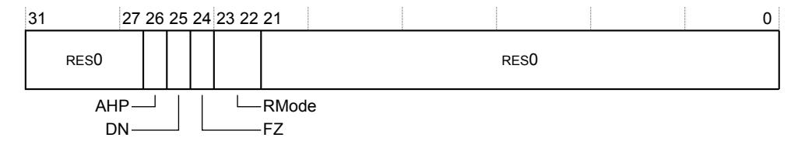

**Figure 14-1 FPCR bit assignments**

The following table shows the FPCR bit assignments.

## **Table 14-3 FPCR bit assignments**

<span id="page-517-0"></span>

| Bits                                                                   | Name  | Function                                                                                                                  |  |  |  |  |  |
|------------------------------------------------------------------------|-------|---------------------------------------------------------------------------------------------------------------------------|--|--|--|--|--|
| [31:27]                                                                | -     | Reserved, RES0.                                                                                                           |  |  |  |  |  |
| [26]                                                                   | AHP   | Alternative half-precision control bit:                                                                                   |  |  |  |  |  |
|                                                                        |       | 0<br>IEEE half-precision format selected.                                                                                 |  |  |  |  |  |
|                                                                        |       | 1<br>Alternative half-precision format selected.                                                                          |  |  |  |  |  |
| [25]                                                                   | DN    | Default NaN mode control bit:                                                                                             |  |  |  |  |  |
|                                                                        |       | 0<br>NaN operands propagate through to the output of a floating-point operation.                                          |  |  |  |  |  |
| 1<br>Any operation involving one or more NaNs returns the Default NaN. |       |                                                                                                                           |  |  |  |  |  |
| [24]                                                                   | FZ    | Flush-to-zero mode control bit:                                                                                           |  |  |  |  |  |
|                                                                        |       | 0<br>Flush-to-zero mode disabled. Behavior of the floating-point system is fully compliant with the IEEE 754<br>standard. |  |  |  |  |  |
|                                                                        |       | 1<br>Flush-to-zero mode enabled.                                                                                          |  |  |  |  |  |
| [23:22]                                                                | RMode | Rounding Mode control field:                                                                                              |  |  |  |  |  |
|                                                                        |       | Round to Nearest (RN) mode.<br>0b00                                                                                       |  |  |  |  |  |
|                                                                        |       | Round towards Plus Infinity (RP) mode.<br>0b01                                                                            |  |  |  |  |  |
|                                                                        |       | Round towards Minus Infinity (RM) mode.<br>0b10                                                                           |  |  |  |  |  |
|                                                                        |       | Round towards Zero (RZ) mode.<br>0b11                                                                                     |  |  |  |  |  |
| [21:0]                                                                 | -     | Reserved, RES0.                                                                                                           |  |  |  |  |  |

To access FPCR in AArch64 state, read or write the register with:

MRS <Xt>, FPCR; Read Floating-point Control Register MSR FPCR, <Xt>; Write Floating-point Control Register

#### **14.4.2 Floating-point Status Register**

The FPSR characteristics are:

#### **Purpose**

Provides floating-point system status information.

# **Usage constraints**

The accessibility to the FPSR by Exception level is:

| EL0 | EL1(NS) | EL1(S) | EL2 | EL3(SCR.NS = 1) | EL3(SCR.NS = 0) |
|-----|---------|--------|-----|-----------------|-----------------|
| RW  | RW      | RW     | RW  | RW              | RW              |

#### **Configurations**

The FPSR is part of the Floating-point functional group.

The named fields in this register map to the equivalent fields in the AArch32 FPSCR.

# **Attributes**

See the register summary in *[Table 14-2 AArch64 Advanced SIMD and Floating-point System](#page-515-0) registers* [on page 14-516.](#page-515-0)

The following figure shows the FPSR bit assignments.

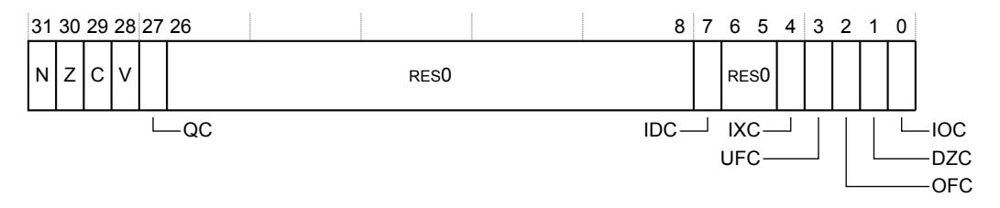

**Figure 14-2 FPSR bit assignments**

The following table shows the FPSR bit assignments.

**Table 14-4 FPSR bit assignments**

| Bits   | Name | Function                                                                                                                                                                       |  |  |  |  |  |
|--------|------|--------------------------------------------------------------------------------------------------------------------------------------------------------------------------------|--|--|--|--|--|
| [31]   | N    | Negative condition flag for floating-point comparison operations:                                                                                                              |  |  |  |  |  |
|        |      | AArch32<br>Negative condition flag.                                                                                                                                            |  |  |  |  |  |
|        |      | AArch64<br>Sets the N bit in the main processor state (PSTATE) condition code flag.                                                                                            |  |  |  |  |  |
| [30]   | Z    | Zero condition flag for floating-point comparison operations:                                                                                                                  |  |  |  |  |  |
|        |      | AArch32<br>Zero condition flag.                                                                                                                                                |  |  |  |  |  |
|        |      | AArch64<br>Sets the PSTATE.Z condition code flag.                                                                                                                              |  |  |  |  |  |
| [29]   | C    | Carry condition flag for floating-point comparison operations:                                                                                                                 |  |  |  |  |  |
|        |      | AArch32<br>Carry condition flag.                                                                                                                                               |  |  |  |  |  |
|        |      | AArch64<br>Sets the PSTATE.C condition code flag.                                                                                                                              |  |  |  |  |  |
| [28]   | V    | Overflow condition flag for floating-point comparison operations:                                                                                                              |  |  |  |  |  |
|        |      | AArch32<br>Overflow condition flag.                                                                                                                                            |  |  |  |  |  |
|        |      | AArch64<br>Sets the PSTATE.V condition code flag.                                                                                                                              |  |  |  |  |  |
| [27]   | QC   | Cumulative saturation bit, Advanced SIMD only. This bit is set to 1 to indicate that an Advanced SIMD integer<br>operation has saturated since 0 was last written to this bit. |  |  |  |  |  |
| [26:8] | -    | Reserved, RES0.                                                                                                                                                                |  |  |  |  |  |
| [7]    | IDC  | Input Denormal cumulative exception bit. This bit is set to 1 to indicate that the Input Denormal exception has<br>occurred since 0 was last written to this bit.              |  |  |  |  |  |
| [6:5]  | -    | Reserved, RES0.                                                                                                                                                                |  |  |  |  |  |
| [4]    | IXC  | Inexact cumulative exception bit. This bit is set to 1 to indicate that the Inexact exception has occurred since 0 was last<br>written to this bit.                            |  |  |  |  |  |
| [3]    | UFC  | Underflow cumulative exception bit. This bit is set to 1 to indicate that the Underflow exception has occurred since 0<br>was last written to this bit.                        |  |  |  |  |  |
| [2]    | OFC  | Overflow cumulative exception bit. This bit is set to 1 to indicate that the Overflow exception has occurred since 0<br>was last written to this bit.                          |  |  |  |  |  |
| [1]    | DZC  | Division by Zero cumulative exception bit. This bit is set to 1 to indicate that the Division by Zero exception has<br>occurred since 0 was last written to this bit.          |  |  |  |  |  |
| [0]    | IOC  | Invalid Operation cumulative exception bit. This bit is set to 1 to indicate that the Invalid Operation exception has<br>occurred since 0 was last written to this bit.        |  |  |  |  |  |

To access FPSR in AArch64 state, read or write the register with:

MRS <Xt>, FPSR; Read Floating-point Status Register MSR FPSR, <Xt>; Write Floating-point Status Register

## <span id="page-519-0"></span>**14.4.3 Media and VFP Feature Register 0, EL1**

The MVFR0\_EL1 characteristics are:

#### **Purpose**

The MVFR0\_EL1 must be interpreted with the MVFR1\_EL1 and the MVFR2\_EL1 to describe the features provided by the Advanced SIMD and FP functions.

## **Usage constraints**

The accessibility to the MVFR0\_EL1 in AArch64 state by Exception level is:

| EL0 | EL1(NS) | EL1(S) | EL2 | EL3(SCR.NS = 1) | EL3(SCR.NS = 0) |
|-----|---------|--------|-----|-----------------|-----------------|
| -   | RO      | RO     | RO  | RO              | RO              |

The accessibility to the MVFR0 in AArch32 state by Exception level is:

| EL0 | EL1(NS) | EL1(S) | EL2    | EL3(SCR.NS = 1) | EL3(SCR.NS = 0) |
|-----|---------|--------|--------|-----------------|-----------------|
| -   | Config  | RO     | Config | Config          | RO              |

#### **Configurations**

MVFR0\_EL1 is:

- Common to Secure and Non-secure states
- Architecturally mapped to AArch32 MVFR0 register.

#### **Attributes**

See the register summary in *[Table 14-2 AArch64 Advanced SIMD and Floating-point System](#page-515-0) registers* [on page 14-516.](#page-515-0)

The following figure shows the MVFR0\_EL1 bit assignments.

| 31      | 28 27   | 24 23<br>20 19 |          | 16 15<br>12 11 | 8    | 7<br>4 | 3<br>0  |
|---------|---------|----------------|----------|----------------|------|--------|---------|
| FPRound | FPShVec | FPSqrt         | FPDivide | FPTrap         | FPDP | FPSP   | SIMDReg |

**Figure 14-3 MVFR0\_EL1 bit assignments**

The following table shows the MVFR0\_EL1 bit assignments.

**Table 14-5 MVFR0\_EL1 bit assignments**

| Bits    | Name    | Function                                                      |                                                                           |  |  |  |  |  |  |
|---------|---------|---------------------------------------------------------------|---------------------------------------------------------------------------|--|--|--|--|--|--|
| [31:28] | FPRound |                                                               | Indicates the rounding modes supported by the FP floating-point hardware: |  |  |  |  |  |  |
|         |         | 0x1                                                           | All rounding modes supported.                                             |  |  |  |  |  |  |
| [27:24] | FPShVec | Indicates the hardware support for FP short vectors:          |                                                                           |  |  |  |  |  |  |
|         |         | 0x0                                                           | Not supported.                                                            |  |  |  |  |  |  |
| [23:20] | FPSqrt  | Indicates the hardware support for FP square root operations: |                                                                           |  |  |  |  |  |  |
|         |         | 0x1                                                           | Supported.                                                                |  |  |  |  |  |  |

## **Table 14-5 MVFR0\_EL1 bit assignments (continued)**

<span id="page-520-0"></span>

| Bits    | Name                                                                      | Function                                                                      |  |  |  |  |  |  |
|---------|---------------------------------------------------------------------------|-------------------------------------------------------------------------------|--|--|--|--|--|--|
| [19:16] | FPDivide                                                                  | Indicates the hardware support for FP divide operations:                      |  |  |  |  |  |  |
|         |                                                                           | Supported.<br>0x1                                                             |  |  |  |  |  |  |
| [15:12] | FPTrap                                                                    | Indicates whether the FP hardware implementation supports exception trapping: |  |  |  |  |  |  |
|         |                                                                           | Not supported.<br>0x0                                                         |  |  |  |  |  |  |
| [11:8]  | FPDP                                                                      | Indicates the hardware support for FP double-precision operations:            |  |  |  |  |  |  |
|         |                                                                           | Supported, VFPv3 or greater.<br>0x2                                           |  |  |  |  |  |  |
|         |                                                                           | See the ARM®<br>Architecture Reference Manual ARMv8 for more information.     |  |  |  |  |  |  |
| [7:4]   | FPSP                                                                      | Indicates the hardware support for FP single-precision operations:            |  |  |  |  |  |  |
|         |                                                                           | Supported, VFPv3 or greater.<br>0x2                                           |  |  |  |  |  |  |
|         |                                                                           | See the ARM®<br>Architecture Reference Manual ARMv8 for more information.     |  |  |  |  |  |  |
| [3:0]   | SIMDReg                                                                   | Indicates support for the Advanced SIMD register bank:                        |  |  |  |  |  |  |
|         |                                                                           | 32× 64-bit registers supported.<br>0x2                                        |  |  |  |  |  |  |
|         | See the ARM®<br>Architecture Reference Manual ARMv8 for more information. |                                                                               |  |  |  |  |  |  |

To access the MVFR0\_EL1 register, see *[14.2 Programmers model for Advanced SIMD and Floating](#page-514-0)point* [on page 14-515](#page-514-0).

## **14.4.4 Media and VFP Feature Register 1, EL1**

The MVFR1\_EL1 characteristics are:

# **Purpose**

The MVFR1\_EL1 must be interpreted with the MVFR0\_EL1 and the MVFR2\_EL1 to describe the features provided by the Advanced SIMD and FP functions.

#### **Usage constraints**

The accessibility to the MVFR1\_EL1 in AArch64 state by Exception level is:

| EL0 | EL1(NS) | EL1(S) | EL2 | EL3(SCR.NS = 1) | EL3(SCR.NS = 0) |
|-----|---------|--------|-----|-----------------|-----------------|
| -   | RO      | RO     | RO  | RO              | RO              |

The accessibility to the MVFR1 in AArch32 state by Exception level is:

| EL0 | EL1(NS) | EL1(S) | EL2    | EL3(SCR.NS = 1) | EL3(SCR.NS = 0) |
|-----|---------|--------|--------|-----------------|-----------------|
| -   | Config  | RO     | Config | Config          | RO              |

# **Configurations**

The MVFR1\_EL1 is:

- Common to Secure and Non-secure states.
- Architecturally mapped to AArch32 MVFR1 register.

## **Attributes**

See the register summary in *[Table 14-2 AArch64 Advanced SIMD and Floating-point System](#page-515-0) registers* [on page 14-516.](#page-515-0)

<span id="page-521-0"></span>The following figure shows the MVFR1\_EL1 bit assignments.

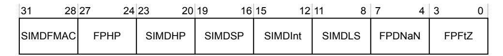

**Figure 14-4 MVFR1\_EL1 bit assignments**

The following table shows the MVFR1\_EL1 bit assignments.

**Table 14-6 MVFR1\_EL1 bit assignments**

| Bits    | Name     | Function                                                                                          |                                                                                                     |  |  |  |  |  |
|---------|----------|---------------------------------------------------------------------------------------------------|-----------------------------------------------------------------------------------------------------|--|--|--|--|--|
| [31:28] | SIMDFMAC | Indicates whether the Advanced SIMD or FP supports fused multiply accumulate operations:          |                                                                                                     |  |  |  |  |  |
|         |          | 0x1                                                                                               | Supported.                                                                                          |  |  |  |  |  |
| [27:24] | FPHP     | Indicates whether the FP supports half-precision floating-point conversion operations:            |                                                                                                     |  |  |  |  |  |
|         |          | 0x2                                                                                               | Supported.                                                                                          |  |  |  |  |  |
| [23:20] | SIMDHP   | Indicates whether the Advanced SIMD supports half-precision floating-point conversion operations: |                                                                                                     |  |  |  |  |  |
|         |          | 0x1                                                                                               | Supported.                                                                                          |  |  |  |  |  |
| [19:16] | SIMDSP   |                                                                                                   | Indicates whether the Advanced SIMD supports single-precision floating-point operations:            |  |  |  |  |  |
|         |          | 0x1                                                                                               | Supported.                                                                                          |  |  |  |  |  |
| [15:12] | SIMDInt  |                                                                                                   | Indicates whether the Advanced SIMD supports integer operations:                                    |  |  |  |  |  |
|         |          | 0x1                                                                                               | Supported.                                                                                          |  |  |  |  |  |
| [11:8]  | SIMDLS   |                                                                                                   | Indicates whether the Advanced SIMD supports load/store instructions:                               |  |  |  |  |  |
|         |          | 0x1                                                                                               | Supported.                                                                                          |  |  |  |  |  |
| [7:4]   | FPDNaN   | Indicates whether the FP hardware implementation supports only the Default NaN mode:              |                                                                                                     |  |  |  |  |  |
|         |          | 0x1                                                                                               | Hardware supports propagation of NaN values.                                                        |  |  |  |  |  |
| [3:0]   | FPFtZ    |                                                                                                   | Indicates whether the FP hardware implementation supports only the Flush-to-zero mode of operation: |  |  |  |  |  |
|         |          | 0x1                                                                                               | Hardware supports full denormalized number arithmetic.                                              |  |  |  |  |  |

To access the MVFR1\_EL1 register, see *[14.2 Programmers model for Advanced SIMD and Floating](#page-514-0)point* [on page 14-515](#page-514-0).

#### **14.4.5 Media and VFP Feature Register 2, EL1**

The MVFR2\_EL1 characteristics are:

#### **Purpose**

The MVFR2\_EL1 must be interpreted with the MVFR0\_EL1 and the MVFR1\_EL1 to describe the features provided by the Advanced SIMD and FP functions.

#### **Usage constraints**

The accessibility to the MVFR2\_EL1 in AArch64 state by Exception level is:

| EL0 | EL1(NS) | EL1(S) | EL2 | EL3(SCR.NS = 1) | EL3(SCR.NS = 0) |
|-----|---------|--------|-----|-----------------|-----------------|
| -   | RO      | RO     | RO  | RO              | RO              |

The accessibility to the MVFR2 in AArch32 state by Exception level is:

| EL0 | EL1(NS) | EL1(S) | EL2    | EL3(SCR.NS = 1) | EL3(SCR.NS = 0) |
|-----|---------|--------|--------|-----------------|-----------------|
| -   | Config  | RO     | Config | Config          | RO              |

#### **Configurations**

The MVFR2\_EL1 is:

- Common to Secure and Non-secure states.
- Architecturally mapped to AArch32 MVFR2 register.

# **Attributes**

See the register summary in *[Table 14-2 AArch64 Advanced SIMD and Floating-point System](#page-515-0) registers* [on page 14-516.](#page-515-0)

The following figure shows the MVFR2\_EL1 bit assignments.

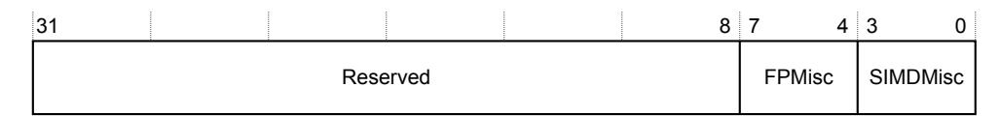

**Figure 14-5 MVFR2\_EL1 bit assignments**

The following table shows the MVFR2\_EL1 bit assignments.

**Table 14-7 MVFR2\_EL1 bit assignments**

| Bits   | Name     | Function                                                        |                                                                                                                                                                                                              |  |  |  |  |
|--------|----------|-----------------------------------------------------------------|--------------------------------------------------------------------------------------------------------------------------------------------------------------------------------------------------------------|--|--|--|--|
| [31:8] | -        | Reserved, RES0.                                                 |                                                                                                                                                                                                              |  |  |  |  |
| [7:4]  | FPMisc   | Floating-point miscellaneous features supported. This value is: |                                                                                                                                                                                                              |  |  |  |  |
|        |          | 0b0100                                                          | Includes support for the following features:                                                                                                                                                                 |  |  |  |  |
|        |          |                                                                 | •<br>Floating-point selection.<br>•<br>Floating-point Conversion to Integer with Directed Rounding modes.<br>•<br>Floating-point Round to Integral floating-point.<br>•<br>Floating-point MaxNum and MinNum. |  |  |  |  |
| [3:0]  | SIMDMisc |                                                                 | Advanced SIMD miscellaneous features supported. This value is:                                                                                                                                               |  |  |  |  |
|        |          | 0b011                                                           | Includes support for the following features:                                                                                                                                                                 |  |  |  |  |
|        |          | •<br>•<br>•                                                     | Floating-point Conversion to Integer with Directed Rounding modes.<br>Floating-point Round to Integral floating-point.<br>Floating-point MaxNum and MinNum.                                                  |  |  |  |  |

To access the MVFR2\_EL1 register, see *[14.2 Programmers model for Advanced SIMD and Floating](#page-514-0)point* [on page 14-515](#page-514-0).

# <span id="page-523-0"></span>**14.4.6 Floating-point Exception Control Register 32, EL2**

The FPEXC32\_EL2 characteristics are:

#### **Purpose**

Provides access to the AArch32 register FPEXC from AArch64 state only. Its value has no effect on execution in AArch64 state.

# **Usage constraints**

The accessibility to the FPEXC32\_EL2 in AArch64 state by Exception level is:

| EL0 | EL1(NS) | EL1(S) | EL2 | EL3(SCR.NS = 1) | EL3(SCR.NS = 0) |
|-----|---------|--------|-----|-----------------|-----------------|
| -   | -       | -      | RW  | RW              | RW              |

The accessibility to the FPEXC in AArch32 state by Exception level is:

| EL0 | EL1(NS) | EL1(S) | EL2    | EL3(SCR.NS = 1) | EL3(SCR.NS = 0) |
|-----|---------|--------|--------|-----------------|-----------------|
| -   | Config  | RW     | Config | Config          | RW              |

#### **Configurations**

The FPEXC32\_EL2 is:

- Common to Secure and Non-secure states.
- Architecturally mapped to AArch32 FPEXC register.

#### **Attributes**

See the register summary in *[Table 14-2 AArch64 Advanced SIMD and Floating-point System](#page-515-0) registers* [on page 14-516.](#page-515-0)

The following figure shows the FPEXC32\_EL2 bit assignments.

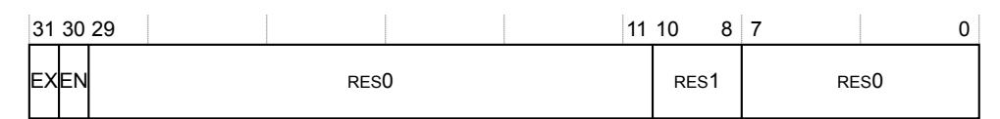

**Figure 14-6 FPEXC32\_EL2 bit assignments**

The following table shows the FPEXC32\_EL2 bit assignments.

**Table 14-8 FPEXC32\_EL2 bit assignments**

| Bits    | Name                                                 | Function<br>Exception bit. The Cortex-A57 processor implementation does not generate asynchronous<br>FP exceptions, so this bit is RES0.                                                                                                                                                                                  |  |
|---------|------------------------------------------------------|---------------------------------------------------------------------------------------------------------------------------------------------------------------------------------------------------------------------------------------------------------------------------------------------------------------------------|--|
| [31]    | EX                                                   |                                                                                                                                                                                                                                                                                                                           |  |
| [30]    | EN bit, VFPdescriptionVFP<br>enable bitdescriptionEN | Enable bit. A global enable for the Advanced SIMD and FP functions:<br>0<br>The Advanced SIMD and FP functions are disabled.<br>1<br>The Advanced SIMD and FP functions are enabled and operate normally.<br>The EN bit is cleared at reset. See the ARM®<br>Architecture Reference Manual ARMv8 for<br>more information. |  |
| [29:11] | -                                                    | Reserved, RES0.                                                                                                                                                                                                                                                                                                           |  |
| [10:8]  | -                                                    | Reserved, RES1.                                                                                                                                                                                                                                                                                                           |  |
| [7:0]   | -                                                    | Reserved, RES0.                                                                                                                                                                                                                                                                                                           |  |

| Note                                                                                                                                                                   |  |  |
|------------------------------------------------------------------------------------------------------------------------------------------------------------------------|--|--|
| The Cortex-A57 processor implementation does not support deprecated FP short vector feature. You can<br>use software to emulate the short vector feature, if required. |  |  |
|                                                                                                                                                                        |  |  |
|                                                                                                                                                                        |  |  |
|                                                                                                                                                                        |  |  |
|                                                                                                                                                                        |  |  |
|                                                                                                                                                                        |  |  |
|                                                                                                                                                                        |  |  |
|                                                                                                                                                                        |  |  |
|                                                                                                                                                                        |  |  |
|                                                                                                                                                                        |  |  |
|                                                                                                                                                                        |  |  |
|                                                                                                                                                                        |  |  |
|                                                                                                                                                                        |  |  |
|                                                                                                                                                                        |  |  |
|                                                                                                                                                                        |  |  |
|                                                                                                                                                                        |  |  |
|                                                                                                                                                                        |  |  |
|                                                                                                                                                                        |  |  |
|                                                                                                                                                                        |  |  |
|                                                                                                                                                                        |  |  |
|                                                                                                                                                                        |  |  |
|                                                                                                                                                                        |  |  |
|                                                                                                                                                                        |  |  |
|                                                                                                                                                                        |  |  |
|                                                                                                                                                                        |  |  |
|                                                                                                                                                                        |  |  |
|                                                                                                                                                                        |  |  |

# <span id="page-525-0"></span>**14.5 AArch32 register summary**

The following table gives a summary of the Advanced SIMD and Floating-point System registers in the Cortex-A57 processor when in AArch32 state.

**Table 14-9 AArch32 Advanced SIMD and Floating-point System registers**

| Name  | Type | Reset      | Description                                                                 |
|-------|------|------------|-----------------------------------------------------------------------------|
| FPSID | RO   | 0x41034070 | See 14.6.1 Floating-point System ID Register on page 14-527                 |
| FPSCR | RW   | 0x00000000 | See 14.6.2 Floating-point Status and Control Register on page 14-528        |
| MVFR0 | RO   | 0x10110222 | See 14.4.3 Media and VFP Feature Register 0, EL1 on page 14-520             |
| MVFR1 | RO   | 0x12111111 | See 14.4.4 Media and VFP Feature Register 1, EL1 on page 14-521             |
| MVFR2 | RW   | 0x00000043 | See 14.4.5 Media and VFP Feature Register 2, EL1 on page 14-522             |
| FPEXC | RW   | 0x00000700 | See 14.4.6 Floating-point Exception Control Register 32, EL2 on page 14-524 |

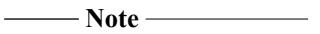

The Floating-point Instruction Registers, FPINST and FPINST2 are not implemented, and any attempt to access them is UNPREDICTABLE.

See the *ARM® Architecture Reference Manual ARMv8* for information about permitted accesses to the Advanced SIMD and Floating-point System registers.

# <span id="page-526-0"></span>**14.6 AArch32 register descriptions**

This section describes the AArch32 Advanced SIMD and Floating-point System registers in the Cortex-A57 processor.

*[Table 14-9 AArch32 Advanced SIMD and Floating-point System registers](#page-525-0)* on page 14-526 provides cross-references to individual registers.

This section contains the following subsections:

- *14.6.1 Floating-point System ID Register* on page 14-527.
- *[14.6.2 Floating-point Status and Control Register](#page-527-0)* on page 14-528.

## **14.6.1 Floating-point System ID Register**

The FPSID characteristics are:

#### **Purpose**

Provides top-level information about the floating-point implementation.

# **Usage constraints**

The accessibility to the FPSID by Exception level is:

| EL0 | EL1(NS) | EL1(S) | EL2    | EL3(SCR.NS = 1) | EL3(SCR.NS = 0) |
|-----|---------|--------|--------|-----------------|-----------------|
| -   | Config  | RO     | Config | Config          | RO              |

#### **Configurations**

The FPSID is Common to Secure and Non-secure states.

#### **Attributes**

See the register summary in *[Table 14-9 AArch32 Advanced SIMD and Floating-point System](#page-525-0) registers* [on page 14-526.](#page-525-0)

The following figure shows the FPSID bit assignments.

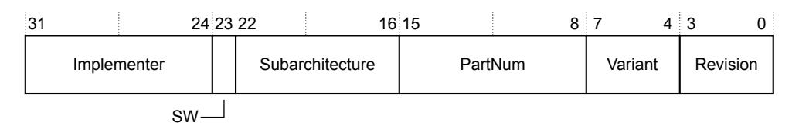

**Figure 14-7 FPSID bit assignments**

The following table shows the FPSID bit assignments.

**Table 14-10 FPSID bit assignments**

| Bits                   | Name | Function                                                                                                                  |                                                                     |  |
|------------------------|------|---------------------------------------------------------------------------------------------------------------------------|---------------------------------------------------------------------|--|
| [31:24]<br>Implementer |      | Indicates the implementer:                                                                                                |                                                                     |  |
|                        |      | 0x41                                                                                                                      | ARM Limited.                                                        |  |
| [23]                   | SW   | Software bit. This bit indicates whether a system provides only software emulation of the floating-point<br>instructions: |                                                                     |  |
|                        |      | 0x0                                                                                                                       | The system includes hardware support for floating-point operations. |  |

## **Table 14-10 FPSID bit assignments (continued)**

<span id="page-527-0"></span>

| Bits                                                                                  | Name            | Function                                                                                                                                                             |  |  |  |  |
|---------------------------------------------------------------------------------------|-----------------|----------------------------------------------------------------------------------------------------------------------------------------------------------------------|--|--|--|--|
| [22:16]                                                                               | Subarchitecture | Subarchitecture version number:                                                                                                                                      |  |  |  |  |
|                                                                                       |                 | VFPv3 architecture, or later, with no subarchitecture. The entire floating-point implementation is in<br>0x03<br>hardware, and no software support code is required. |  |  |  |  |
|                                                                                       |                 | The VFP architecture version is indicated by the MVFR0, MVFR1, and MVFR2 registers.                                                                                  |  |  |  |  |
| [15:8]<br>PartNum<br>Indicates the part number for the floating-point implementation: |                 |                                                                                                                                                                      |  |  |  |  |
|                                                                                       |                 | 0x40<br>VFP.                                                                                                                                                         |  |  |  |  |
| [7:4]<br>Variant<br>Indicates the variant number:                                     |                 |                                                                                                                                                                      |  |  |  |  |
|                                                                                       |                 | Cortex-A57 processor.<br>0x7                                                                                                                                         |  |  |  |  |
| [3:0]                                                                                 | Revision        | Indicates the revision number for the floating-point implementation:                                                                                                 |  |  |  |  |
|                                                                                       |                 | Revision.<br>0x0                                                                                                                                                     |  |  |  |  |

To access the FPSID register, see *[14.2 Programmers model for Advanced SIMD and Floating-point](#page-514-0)* [on page 14-515](#page-514-0).

# **14.6.2 Floating-point Status and Control Register**

The FPSCR characteristics are:

#### **Purpose**

Provides floating-point system status information and control.

## **Usage constraints**

The accessibility to the FPSCR by Exception level is:

| EL0 (NS) | EL0 (S) | EL1(NS) | EL1(S) | EL2    | EL3(SCR.NS = 1) | EL3(SCR.NS = 0) |
|----------|---------|---------|--------|--------|-----------------|-----------------|
| Config   | RW      | Config  | RW     | Config | Config          | RW              |

#### **Configurations**

The FPSCR is Common to Secure and Non-secure states.

The named fields in this register map to the equivalent fields in the AArch64 FPCR and FPSR.

## **Attributes**

See the register summary in *[Table 14-9 AArch32 Advanced SIMD and Floating-point System](#page-525-0) registers* [on page 14-526.](#page-525-0)

The following figure shows the FPSCR bit assignments.

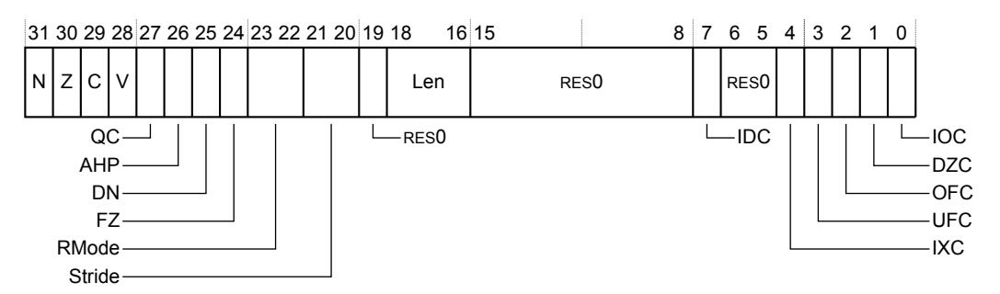

**Figure 14-8 FPSCR bit assignments**

The following table shows the FPSCR bit assignments.

**Table 14-11 FPSCR bit assignments**

| Bits      | Field | Function                                                                                                                                                                       |  |  |  |  |  |
|-----------|-------|--------------------------------------------------------------------------------------------------------------------------------------------------------------------------------|--|--|--|--|--|
| [31]      | N     | FP Negative condition code flag.                                                                                                                                               |  |  |  |  |  |
|           |       | Set to 1 if a FP comparison operation produces a less than result.                                                                                                             |  |  |  |  |  |
| [30]      | Z     | FP Zero condition code flag.                                                                                                                                                   |  |  |  |  |  |
|           |       | Set to 1 if a FP comparison operation produces an equal result.                                                                                                                |  |  |  |  |  |
| [29]<br>C |       | FP Carry condition code flag.                                                                                                                                                  |  |  |  |  |  |
|           |       | Set to 1 if a FP comparison operation produces an equal, greater than, or unordered result.                                                                                    |  |  |  |  |  |
| [28]<br>V |       | FP Overflow condition code flag.                                                                                                                                               |  |  |  |  |  |
|           |       | Set to 1 if a FP comparison operation produces an unordered result.                                                                                                            |  |  |  |  |  |
| [27]      | QC    | Cumulative saturation bit.                                                                                                                                                     |  |  |  |  |  |
|           |       | This bit is set to 1 to indicate that an Advanced SIMD integer operation has saturated after 0 was last written to this<br>bit.                                                |  |  |  |  |  |
| [26]      | AHP   | Alternative Half-Precision control bit:                                                                                                                                        |  |  |  |  |  |
|           |       | 0<br>IEEE half-precision format selected.                                                                                                                                      |  |  |  |  |  |
|           |       | 1<br>Alternative half-precision format selected.                                                                                                                               |  |  |  |  |  |
| [25]      | DN    | Default NaN mode control bit:                                                                                                                                                  |  |  |  |  |  |
|           |       | 0<br>NaN operands propagate through to the output of a floating-point operation.                                                                                               |  |  |  |  |  |
|           |       | 1<br>Any operation involving one or more NaNs returns the Default NaN.                                                                                                         |  |  |  |  |  |
|           |       | The value of this bit only controls FP arithmetic. In AArch32 state, Advanced SIMD arithmetic always uses the<br>Default NaN setting, regardless of the value of the DN bit.   |  |  |  |  |  |
| [24]      | FZ    | Flush-to-zero mode control bit:                                                                                                                                                |  |  |  |  |  |
|           |       | 0<br>Flush-to-zero mode disabled. Behavior of the floating-point system is fully compliant with the IEEE 754<br>standard.                                                      |  |  |  |  |  |
|           |       | 1<br>Flush-to-zero mode enable.                                                                                                                                                |  |  |  |  |  |
|           |       | The value of this bit only controls FP arithmetic. In AArch32 state, Advanced SIMD arithmetic always uses the<br>Flush-to-zero setting, regardless of the value of the FZ bit. |  |  |  |  |  |

| Bits    | Field  | Function                                                                                                                                                                |                                                                                                                                                                                                                      |  |  |  |
|---------|--------|-------------------------------------------------------------------------------------------------------------------------------------------------------------------------|----------------------------------------------------------------------------------------------------------------------------------------------------------------------------------------------------------------------|--|--|--|
| [23:22] | RMode  | Rounding Mode control field:                                                                                                                                            |                                                                                                                                                                                                                      |  |  |  |
|         |        | 0b00                                                                                                                                                                    | Round to Nearest (RN) mode.                                                                                                                                                                                          |  |  |  |
|         |        | 0b01                                                                                                                                                                    | Round towards Plus Infinity (RP) mode.                                                                                                                                                                               |  |  |  |
|         |        | 0b10                                                                                                                                                                    | Round towards Minus Infinity (RM) mode.                                                                                                                                                                              |  |  |  |
|         |        | 0b11                                                                                                                                                                    | Round towards Zero (RZ) mode.                                                                                                                                                                                        |  |  |  |
|         |        |                                                                                                                                                                         | The specified rounding mode is used by almost all FP floating-point instructions. In AArch32 state, Advanced<br>SIMD arithmetic always uses the Round to Nearest setting, regardless of the value of the RMode bits. |  |  |  |
| [21:20] | Stride | Reserved, RES0.                                                                                                                                                         |                                                                                                                                                                                                                      |  |  |  |
| [19]    | -      | Reserved, RES0.                                                                                                                                                         |                                                                                                                                                                                                                      |  |  |  |
| [18:16] | Len    | Reserved, RES0.                                                                                                                                                         |                                                                                                                                                                                                                      |  |  |  |
| [15:8]  | -      | Reserved, RES0.                                                                                                                                                         |                                                                                                                                                                                                                      |  |  |  |
| [7]     | IDC    | Input Denormal cumulative exception bit. This bit is set to 1 to indicate that the Input Denormal exception has<br>occurred since 0 was last written to this bit.       |                                                                                                                                                                                                                      |  |  |  |
| [6:5]   | -      | Reserved, RES0.                                                                                                                                                         |                                                                                                                                                                                                                      |  |  |  |
| [4]     | IXC    | Inexact cumulative exception bit. This bit is set to 1 to indicate that the Inexact exception has occurred since 0 was<br>last written to this bit.                     |                                                                                                                                                                                                                      |  |  |  |
| [3]     | UFC    | Underflow cumulative exception bit. This bit is set to 1 to indicate that the Underflow exception has occurred since<br>0 was last written to this bit.                 |                                                                                                                                                                                                                      |  |  |  |
| [2]     | OFC    | Overflow cumulative exception bit. This bit is set to 1 to indicate that the Overflow exception has occurred since 0<br>was last written to this bit.                   |                                                                                                                                                                                                                      |  |  |  |
| [1]     | DZC    | Division by Zero cumulative exception bit. This bit is set to 1 to indicate that the Division by Zero exception has<br>occurred since 0 was last written to this bit.   |                                                                                                                                                                                                                      |  |  |  |
| [0]     | IOC    | Invalid Operation cumulative exception bit. This bit is set to 1 to indicate that the Invalid Operation exception has<br>occurred since 0 was last written to this bit. |                                                                                                                                                                                                                      |  |  |  |

To access the FPSCR register, see *[14.2 Programmers model for Advanced SIMD and Floating-point](#page-514-0)* [on page 14-515](#page-514-0).

# **Related information**

*[14.4.1 Floating-point Control Register](#page-516-0)* on page 14-517*.*

*[14.4.2 Floating-point Status Register](#page-517-0)* on page 14-518*.*

# <span id="page-530-0"></span>Appendix A **Signal Descriptions**

This section describes the Cortex-A57 processor signals.

#### It contains the following sections:

- *[A.1 About the signal descriptions](#page-531-0)* on page Appx-A-532.
- *A.2 Clock signals* [on page Appx-A-533.](#page-532-0)
- *A.3 Reset signals* [on page Appx-A-534.](#page-533-0)
- *[A.4 Configuration signals](#page-534-0)* on page Appx-A-535.
- *[A.5 GIC CPU interface signals](#page-536-0)* on page Appx-A-537.
- *[A.6 Generic Timer signals](#page-538-0)* on page Appx-A-539.
- *[A.7 Power control signals](#page-539-0)* on page Appx-A-540.
- *[A.8 ACE and CHI interface signals](#page-541-0)* on page Appx-A-542.
- *[A.9 CHI interface signals](#page-544-0)* on page Appx-A-545.
- *[A.10 ACE interface signals](#page-549-0)* on page Appx-A-550.
- *[A.11 ACP interface signals](#page-554-0)* on page Appx-A-555.
- *[A.12 Debug interface signals](#page-557-0)* on page Appx-A-558.
- *A.13 ETM interface* [on page Appx-A-561.](#page-560-0)
- *[A.14 Cross trigger channel interface](#page-562-0)* on page Appx-A-563.
- *A.15 PMU signals* [on page Appx-A-564.](#page-563-0)
- *[A.16 DFT and MBIST signals](#page-564-0)* on page Appx-A-565.

# <span id="page-531-0"></span>**A.1 About the signal descriptions**

The tables in this appendix list the Cortex-A57 processor signals, along with their direction, input or output, and a high-level description.

Some of the buses include a configurable width field, **<signal>[N:0]**, where N = 0, 1, 2, or 3, to encode up to four cores. For example:

- **nIRQ[0]** represents a core 0 interrupt request.
- **nIRQ[2]** represents a core 2 interrupt request.

Some signals are specified in the form **<signal>x**, where x = 0, 1, 2 or 3 references core 0, core 1, core 2, or core 3, respectively. If a core is not present, the corresponding pin is removed. For example:

- **PMUEVENT0[24:0]** represents the core 0 PMU event bus.
- **PMUEVENT3[24:0]** represents the core 3 PMU event bus.

The number of signals changes depending on the configuration. For example, the CHI interface signals are not present when the processor is configured to have an ACE interface.

# <span id="page-532-0"></span>**A.2 Clock signals**

The following table shows the clock and clock enable signals.

#### **Table A-1 Clock and clock enable signals**

| Signal | Type  | Description                                                                                                                                                                               |
|--------|-------|-------------------------------------------------------------------------------------------------------------------------------------------------------------------------------------------|
| CLK    | Input | Global clock.                                                                                                                                                                             |
| CLKEN  | Input | Global clock enable. This signal can only be deasserted when all the cores in the processor device and the L2 are in<br>WFI low-power state, and the ACE/CHI and ACP interfaces are idle. |

## **Related information**

*[2.3 Clocking and resets](#page-31-0)* on page 2-32*.*

# <span id="page-533-0"></span>**A.3 Reset signals**

The following table shows the reset and reset control signals.

**Table A-2 Reset signals**

| Type   | Description                                                                                          |  |
|--------|------------------------------------------------------------------------------------------------------|--|
| Input  | Individual processor powerup resets:                                                                 |  |
|        | 0<br>Apply reset to the processor including Debug, ETM, breakpoint and watchpoint logic.             |  |
|        | 1<br>Do not apply reset to the processor.                                                            |  |
| Input  | Individual processor reset excluding Debug and ETM:                                                  |  |
|        | 0<br>Apply reset to the processor excluding Debug, ETM, breakpoint and watchpoint logic.             |  |
|        | 1<br>Do not apply reset to the processor.                                                            |  |
| Output | Individual processor Warm reset request:                                                             |  |
|        | 0<br>Do not apply Warm reset to processor.                                                           |  |
|        | 1<br>Apply Warm reset to processor.                                                                  |  |
|        | This output is controlled by Reset request bit in the Reset Management Register (RMR or<br>RMR_EL3). |  |
| Input  | L2 reset:                                                                                            |  |
|        | 0<br>Apply reset to shared L2 memory system controller.                                              |  |
|        | 1<br>Do not apply reset to shared L2 memory system controller.                                       |  |
| Input  | Disable automatic L2 cache invalidate at reset:                                                      |  |
|        | 0<br>L2 cache is reset by hardware.                                                                  |  |
|        | 1<br>L2 cache is not reset by hardware.                                                              |  |
|        |                                                                                                      |  |

## **Related information**

- *2.3.2 Resets* [on page 2-36](#page-35-0)*.*
- *[2.3 Clocking and resets](#page-31-0)* on page 2-32*.*

# <span id="page-534-0"></span>**A.4 Configuration signals**

The following table shows the configuration signals.

**Table A-3 Configuration inputs**

| Signal             | Type  | Description                                                                                                                                                                                                      |  |  |
|--------------------|-------|------------------------------------------------------------------------------------------------------------------------------------------------------------------------------------------------------------------|--|--|
| CFGEND[N:0]        | Input | Individual core control of the endianness configuration at reset. It sets the initial value of the EE<br>bit in the System Control Register (SCTLR or SCTLR_EL3):                                                |  |  |
|                    |       | 0<br>EE bit is 0.                                                                                                                                                                                                |  |  |
|                    |       | 1<br>EE bit is 1.                                                                                                                                                                                                |  |  |
|                    |       | This signal is only sampled during powerup reset of the processor.                                                                                                                                               |  |  |
| VINITHI[N:0]       | Input | Individual core control of the location of the exception vectors at reset. It sets the initial value of<br>the V bit in the CP15 System Control Register (SCTLR when the highest Exception level is<br>AArch32): |  |  |
|                    |       | 0<br>Exception vectors start at address 0x00000000.                                                                                                                                                              |  |  |
|                    |       | 1<br>Exception vectors start at address 0xFFFF0000.                                                                                                                                                              |  |  |
|                    |       | This signal is only sampled during powerup reset of the processor.                                                                                                                                               |  |  |
| CFGTE[N:0]         | Input | Individual core control of the default exception handling state. It sets the initial value of the TE<br>bit in the CP15 System Control Register (SCTLR when the highest Exception level is AArch32):             |  |  |
|                    |       | 0<br>TE bit is 0.                                                                                                                                                                                                |  |  |
|                    |       | 1<br>TE bit is 1.                                                                                                                                                                                                |  |  |
|                    |       | This signal is only sampled during powerup reset of the processor.                                                                                                                                               |  |  |
| CP15SDISABLE[N:0]  | Input | Disable write access to some Secure CP15 registers. See 4.1.1 Registers affected by<br>CP15SDISABLE on page 4-74.                                                                                                |  |  |
| CLUSTERIDAFF1[7:0] | Input | Value read in the Cluster ID Affinity Level-1 field, bits[15:8], of the Multiprocessor Affinity<br>Register (MPIDR).                                                                                             |  |  |
|                    |       | This signal is only sampled during powerup reset of the processor.                                                                                                                                               |  |  |
| CLUSTERIDAFF2[7:0] | Input | Value read in the Cluster ID Affinity Level-2 field, bits[23:16], of the Multiprocessor Affinity<br>Register (MPIDR).                                                                                            |  |  |
|                    |       | This signal is only sampled during powerup reset of the processor.                                                                                                                                               |  |  |
| AA64nAA32[N:0]     | Input | Individual core register width state. The register width states are:                                                                                                                                             |  |  |
|                    |       | 0<br>AArch32.                                                                                                                                                                                                    |  |  |
|                    |       | 1<br>AArch64.                                                                                                                                                                                                    |  |  |
|                    |       | This signal is only sampled during powerup reset of the processor.                                                                                                                                               |  |  |

# **Table A-3 Configuration inputs (continued)**

| Signal               | Type  | Description                                                                                                                                           |  |
|----------------------|-------|-------------------------------------------------------------------------------------------------------------------------------------------------------|--|
| RVBARADDRx[43:2]fe   | Input | Reset Vector Base Address for executing in AArch64 state. This signal is only sampled during<br>reset of the processor.                               |  |
| CRYPTODISABLE[N:0]ff | Input | Individual core Cryptography engine disable:                                                                                                          |  |
|                      |       | 0<br>Enable the Cryptography engine.                                                                                                                  |  |
|                      |       | 1<br>Disable the Cryptography engine.                                                                                                                 |  |
|                      |       | This signal is only sampled during powerup reset of the processor. This signal only exists if the<br>processor implements the Cryptography Extension. |  |

fe *x* is 0, 1, 2, or 3 to reference a specific core.

ff The optional Cryptography engine is not included in the base product of the processor. ARM requires licensees to have contractual rights to obtain the Cortex-A57 processor Cryptography engine.

# <span id="page-536-0"></span>**A.5 GIC CPU interface signals**

The following table shows the *Generic Interrupt Controller* (GIC) CPU interface signals.

**Table A-4 GIC CPU interface signals**

| Signal     | Type  | Description                                                                                                                  |  |  |  |
|------------|-------|------------------------------------------------------------------------------------------------------------------------------|--|--|--|
| nIRQ[N:0]  | Input | Individual core IRQ request input. Active-LOW, interrupt request:                                                            |  |  |  |
|            |       | 0<br>Activate IRQ request.                                                                                                   |  |  |  |
|            |       | 1<br>Do not activate IRQ request.                                                                                            |  |  |  |
|            |       | The processor treats nIRQ as level-sensitive. nIRQ must remain asserted until the processor<br>acknowledges the interrupt.   |  |  |  |
|            |       | This signal is only used when IRQ is in bypass mode, and used as legacy IRQ.                                                 |  |  |  |
| nFIQ[N:0]  | Input | Individual processor FIQ request input. Active-LOW, FIQ request:                                                             |  |  |  |
|            |       | 0<br>Activate FIQ request.                                                                                                   |  |  |  |
|            |       | 1<br>Do not activate FIQ request.                                                                                            |  |  |  |
|            |       | The processor treats nFIQ as level-sensitive. nFIQ must remain asserted until the processor<br>acknowledges the interrupt.   |  |  |  |
|            |       | This signal is only used when FIQ is in bypass mode, and used as legacy FIQ.                                                 |  |  |  |
| nVIRQ[N:0] | Input | Individual processor virtual IRQ request input. Active-LOW, virtual IRQ request:                                             |  |  |  |
|            |       | 0<br>Activate virtual IRQ request.                                                                                           |  |  |  |
|            |       | 1<br>Do not activate virtual IRQ request.                                                                                    |  |  |  |
|            |       | The processor treats nVIRQ as level-sensitive. nVIRQ must remain asserted until the processor<br>acknowledges the interrupt. |  |  |  |
| nVFIQ[N:0] | Input | Individual processor virtual FIQ request input. Active-LOW, virtual FIQ request:                                             |  |  |  |
|            |       | 0<br>Activate virtual FIQ request.                                                                                           |  |  |  |
|            |       | 1<br>Do not activate virtual FIQ request.                                                                                    |  |  |  |
|            |       | The processor treats nVFIQ as level-sensitive. nVFIQ must remain asserted until the processor<br>acknowledges the interrupt. |  |  |  |
| nSEI[N:0]  | Input | Individual processor System Error Interrupt request. Active-LOW, SEI request:                                                |  |  |  |
|            |       | 0<br>Activate SEI request.                                                                                                   |  |  |  |
|            |       | 1<br>Do not activate SEI request.                                                                                            |  |  |  |
|            |       | The processor treats nSEI as edge-sensitive. The nSEI signal must be sent as a pulse to the<br>processor.                    |  |  |  |
| nREI[N:0]  | Input | Individual core RAM Error Interrupt request. Active-LOW, REI request.                                                        |  |  |  |
|            |       | 0<br>Activate REI request. Reports an asynchronous RAM error in the system.                                                  |  |  |  |
|            |       | 1<br>Do not activate REI request.                                                                                            |  |  |  |
|            |       | The processor treats nREI as edge-sensitive. nREI must be sent as a pulse to the processor.                                  |  |  |  |

#### **Table A-4 GIC CPU interface signals (continued)**

| Signal                           | Type   | Description                                                                                                                                                                    |  |  |
|----------------------------------|--------|--------------------------------------------------------------------------------------------------------------------------------------------------------------------------------|--|--|
| nVSEI[N:0]                       | Input  | Individual core virtual System Error Interrupt request. Active-LOW, virtual SEI request:                                                                                       |  |  |
|                                  |        | 0<br>Activate virtual SEI request.                                                                                                                                             |  |  |
|                                  |        | 1<br>Do not activate virtual SEI request.                                                                                                                                      |  |  |
|                                  |        | The processor treats nVSEI as edge-sensitive. nVSEI must be sent as a pulse to the processor.                                                                                  |  |  |
| nVCPUMNTIRQ[N:0]                 | Output | Individual core virtual CPU interface maintenance interrupt request. Processor N sets this signal<br>LOW to issue a maintenance interrupt request to the external Distributor. |  |  |
| PERIPHBASE[43:18]                | Input  | Specifies the base address for the GIC registers. This value is sampled into the Configuration Base<br>Address Register (CBAR) at reset.                                       |  |  |
| GICCDISABLE                      | Input  | Disables the GIC CPU interface logic and routes the legacy nIRQ, nFIQ, nVIRQ, and nVFIQ<br>signals directly to the processor:                                                  |  |  |
|                                  |        | 0<br>Enable the GIC CPU interface logic.                                                                                                                                       |  |  |
|                                  |        | 1<br>Disable the GIC CPU interface logic.                                                                                                                                      |  |  |
|                                  |        | This signal is only sampled during powerup reset of the processor.                                                                                                             |  |  |
| AXI4 Stream protocol signals: fg |        |                                                                                                                                                                                |  |  |
| ICDTVALID                        | Input  | When HIGH it indicates that the Distributor is driving a valid transfer.                                                                                                       |  |  |
| ICDTREADY                        | Output | When HIGH it indicates that the processor can accept a transfer in the current cycle.                                                                                          |  |  |
| ICDTDATA[15:0]                   | Input  | The primary payload that passes data from the Distributor to the processor.                                                                                                    |  |  |
| ICDTLAST                         | Input  | When HIGH it indicates the boundary of a packet.                                                                                                                               |  |  |
| ICDTDEST[1:0]                    | Input  | Provides routing information for the data stream from the Distributor.                                                                                                         |  |  |
| ICCTVALID                        | Output | When HIGH it indicates that the processor is driving a valid transfer.                                                                                                         |  |  |
| ICCTREADY                        | Input  | When HIGH it indicates that the Distributor can accept a transfer in the current cycle.                                                                                        |  |  |
| ICCTDATA[15:0]                   | Output | The primary payload that passes data from the processor to the Distributor.                                                                                                    |  |  |
| ICCTLAST                         | Output | When HIGH it indicates the boundary of a packet.                                                                                                                               |  |  |
| ICCTID[1:0]                      | Output | The data stream identifier that indicates different streams of data.                                                                                                           |  |  |

#### **Related information**

*[4.3.70 Configuration Base Address Register, EL1](#page-210-0)* on page 4-211*. [4.5.24 Configuration Base Address Register](#page-273-0)* on page 4-274*. [GICCDISABLE bypass mode](#page-322-0)* on page 8-323*.*

# <span id="page-538-0"></span>**A.6 Generic Timer signals**

The following table shows the Generic Timer signals.

**Table A-5 Generic Timer signals**

| Signal          | Type   | Description                                  |
|-----------------|--------|----------------------------------------------|
| CNTVALUEB[63:0] | Input  | Global system counter value in binary format |
| CNTCLKEN        | Input  | Counter clock enable                         |
| nCNTPNSIRQ[N:0] | Output | Non-secure physical timer interrupt          |
| nCNTPSIRQ[N:0]  | Output | Secure physical timer interrupt              |
| nCNTHPIRQ[N:0]  | Output | Hypervisor physical timer interrupt          |
| nCNTVIRQ[N:0]   | Output | Virtual timer interrupt                      |
|                 |        |                                              |

# <span id="page-539-0"></span>**A.7 Power control signals**

The following table shows the power control signals.

**Table A-6 Power control signals**

| Event input for processor wake-up from WFE low-power state. When this signal is asserted, it acts<br>as a WFE wake-up event to all the processors in the MPCore device. This signal must be asserted<br>Event output. This signal is asserted HIGH for three CLK cycles when any of the processors in the<br>Clearing of the external global exclusive monitor request. When this signal is asserted, it acts as a                                                                                                                                                                                                                                                                                                                                                                                                                                                                                                                                                                                                                                                      |  |
|-------------------------------------------------------------------------------------------------------------------------------------------------------------------------------------------------------------------------------------------------------------------------------------------------------------------------------------------------------------------------------------------------------------------------------------------------------------------------------------------------------------------------------------------------------------------------------------------------------------------------------------------------------------------------------------------------------------------------------------------------------------------------------------------------------------------------------------------------------------------------------------------------------------------------------------------------------------------------------------------------------------------------------------------------------------------------|--|
|                                                                                                                                                                                                                                                                                                                                                                                                                                                                                                                                                                                                                                                                                                                                                                                                                                                                                                                                                                                                                                                                         |  |
|                                                                                                                                                                                                                                                                                                                                                                                                                                                                                                                                                                                                                                                                                                                                                                                                                                                                                                                                                                                                                                                                         |  |
|                                                                                                                                                                                                                                                                                                                                                                                                                                                                                                                                                                                                                                                                                                                                                                                                                                                                                                                                                                                                                                                                         |  |
|                                                                                                                                                                                                                                                                                                                                                                                                                                                                                                                                                                                                                                                                                                                                                                                                                                                                                                                                                                                                                                                                         |  |
|                                                                                                                                                                                                                                                                                                                                                                                                                                                                                                                                                                                                                                                                                                                                                                                                                                                                                                                                                                                                                                                                         |  |
|                                                                                                                                                                                                                                                                                                                                                                                                                                                                                                                                                                                                                                                                                                                                                                                                                                                                                                                                                                                                                                                                         |  |
|                                                                                                                                                                                                                                                                                                                                                                                                                                                                                                                                                                                                                                                                                                                                                                                                                                                                                                                                                                                                                                                                         |  |
|                                                                                                                                                                                                                                                                                                                                                                                                                                                                                                                                                                                                                                                                                                                                                                                                                                                                                                                                                                                                                                                                         |  |
|                                                                                                                                                                                                                                                                                                                                                                                                                                                                                                                                                                                                                                                                                                                                                                                                                                                                                                                                                                                                                                                                         |  |
|                                                                                                                                                                                                                                                                                                                                                                                                                                                                                                                                                                                                                                                                                                                                                                                                                                                                                                                                                                                                                                                                         |  |
|                                                                                                                                                                                                                                                                                                                                                                                                                                                                                                                                                                                                                                                                                                                                                                                                                                                                                                                                                                                                                                                                         |  |
|                                                                                                                                                                                                                                                                                                                                                                                                                                                                                                                                                                                                                                                                                                                                                                                                                                                                                                                                                                                                                                                                         |  |
|                                                                                                                                                                                                                                                                                                                                                                                                                                                                                                                                                                                                                                                                                                                                                                                                                                                                                                                                                                                                                                                                         |  |
|                                                                                                                                                                                                                                                                                                                                                                                                                                                                                                                                                                                                                                                                                                                                                                                                                                                                                                                                                                                                                                                                         |  |
|                                                                                                                                                                                                                                                                                                                                                                                                                                                                                                                                                                                                                                                                                                                                                                                                                                                                                                                                                                                                                                                                         |  |
|                                                                                                                                                                                                                                                                                                                                                                                                                                                                                                                                                                                                                                                                                                                                                                                                                                                                                                                                                                                                                                                                         |  |
|                                                                                                                                                                                                                                                                                                                                                                                                                                                                                                                                                                                                                                                                                                                                                                                                                                                                                                                                                                                                                                                                         |  |
|                                                                                                                                                                                                                                                                                                                                                                                                                                                                                                                                                                                                                                                                                                                                                                                                                                                                                                                                                                                                                                                                         |  |
|                                                                                                                                                                                                                                                                                                                                                                                                                                                                                                                                                                                                                                                                                                                                                                                                                                                                                                                                                                                                                                                                         |  |
|                                                                                                                                                                                                                                                                                                                                                                                                                                                                                                                                                                                                                                                                                                                                                                                                                                                                                                                                                                                                                                                                         |  |
|                                                                                                                                                                                                                                                                                                                                                                                                                                                                                                                                                                                                                                                                                                                                                                                                                                                                                                                                                                                                                                                                         |  |
|                                                                                                                                                                                                                                                                                                                                                                                                                                                                                                                                                                                                                                                                                                                                                                                                                                                                                                                                                                                                                                                                         |  |
|                                                                                                                                                                                                                                                                                                                                                                                                                                                                                                                                                                                                                                                                                                                                                                                                                                                                                                                                                                                                                                                                         |  |
|                                                                                                                                                                                                                                                                                                                                                                                                                                                                                                                                                                                                                                                                                                                                                                                                                                                                                                                                                                                                                                                                         |  |
|                                                                                                                                                                                                                                                                                                                                                                                                                                                                                                                                                                                                                                                                                                                                                                                                                                                                                                                                                                                                                                                                         |  |
|                                                                                                                                                                                                                                                                                                                                                                                                                                                                                                                                                                                                                                                                                                                                                                                                                                                                                                                                                                                                                                                                         |  |
|                                                                                                                                                                                                                                                                                                                                                                                                                                                                                                                                                                                                                                                                                                                                                                                                                                                                                                                                                                                                                                                                         |  |
|                                                                                                                                                                                                                                                                                                                                                                                                                                                                                                                                                                                                                                                                                                                                                                                                                                                                                                                                                                                                                                                                         |  |
| Output<br>Indicates whether the L2 is in WFI low-power state. This signal is active when the following are<br>true:<br>•<br>All processors are in WFI low-power state.<br>•<br>ACINACTM or SINACT and AINACTS are asserted HIGH.<br>•<br>L2 memory system is idle.<br>L2 hardware flush request. This signal indicates:<br>0<br>L2 hardware flush request is not asserted.<br>1<br>L2 hardware flush request is asserted.<br>Output<br>L2 hardware flush done.<br>0<br>L2 hardware flush is not finished.<br>1<br>L2 hardware flush is finished.<br>Output<br>CPUECTLR.SMPEN output. This signal indicates:<br>0<br>The CPUECTLR.SMPEN bit is not set.<br>1<br>The CPUECTLR.SMPEN bit is set.<br>Output<br>When HIGH, it indicates that processor N is active.<br>The power controller sets this signal LOW, to request that processor N enters retention state.<br>Output<br>This signal goes LOW, if processor N accepts the power controller retention request.<br>Output<br>When HIGH, it indicates that processor N denies the power controller retention request. |  |

#### **Table A-6 Power control signals (continued)**

| Signal     | Type   | Description                                                                                                   |
|------------|--------|---------------------------------------------------------------------------------------------------------------|
| L2QREQn    | Input  | The power controller sets this signal LOW, to request that the L2 Data and Tag RAMs enter<br>retention state. |
| L2QACCEPTn | Output | This signal goes LOW, if the L2 Data and Tag RAMs accept the power controller retention request.              |
| L2QDENY    | Output | When HIGH, it indicates that the L2 Data and Tag RAMs deny the power controller retention<br>request.         |

## **Related information**

*[Event communication using WFE and SEV instructions](#page-42-0)* on page 2-43*.*

*[CLREXMON request and acknowledge signaling](#page-42-0)* on page 2-43*.*

*[4.3.67 CPU Extended Control Register, EL1](#page-204-0)* on page 4-205*.*

*[Processor dynamic retention](#page-45-0)* on page 2-46*.*

*[L2 RAMs dynamic retention](#page-47-0)* on page 2-48*.*

# <span id="page-541-0"></span>**A.8 ACE and CHI interface signals**

This section describes the ACE and CHI interface signals.

This section contains the following subsections:

- *A.8.1 Configuration signals* on page Appx-A-542.
- *[A.8.2 Asynchronous error signals](#page-543-0)* on page Appx-A-544.

# **A.8.1 Configuration signals**

The following table shows the configuration signals that are common to the ACE and CHI interfaces.

**Table A-7 ACE or CHI configuration inputs**

| Signal         | Type  | Description                                                                  |
|----------------|-------|------------------------------------------------------------------------------|
| BROADCASTINNER | Input | Enable broadcasting of Inner Shareable<br>transactions:                      |
|                |       | 0<br>Inner Shareable transactions are not<br>broadcasted externally.         |
|                |       | 1<br>Inner Shareable transactions are<br>broadcasted externally.             |
|                |       | If BROADCASTINNER is tied HIGH,<br>BROADCASTOUTER must also be tied<br>HIGH. |
|                |       | This signal is only sampled during<br>powerup reset of the processor.        |
| BROADCASTOUTER | Input | Enable broadcasting of Outer Shareable<br>transactions:                      |
|                |       | 0<br>Outer Shareable transactions are not<br>broadcasted externally.         |
|                |       | 1<br>Outer Shareable transactions are<br>broadcasted externally.             |
|                |       | This signal is only sampled during<br>powerup reset of the processor.        |

#### **Table A-7 ACE or CHI configuration inputs (continued)**

| Signal              | Type  | Description                                                                                                                     |
|---------------------|-------|---------------------------------------------------------------------------------------------------------------------------------|
| BROADCASTCACHEMAINT | Input | Enable broadcasting of cache maintenance<br>operations to downstream caches:                                                    |
|                     |       | 0<br>Cache maintenance operations are not<br>broadcasted to downstream caches.                                                  |
|                     |       | 1<br>Cache maintenance operations are<br>broadcasted to downstream caches.                                                      |
|                     |       | This signal is only sampled during<br>powerup reset of the processor.                                                           |
| SYSBARDISABLE       | Input | Disable broadcasting of barriers on the<br>system bus:                                                                          |
|                     |       | 0<br>Barriers are broadcast on the system<br>bus.                                                                               |
|                     |       | 1<br>Barriers are not broadcast on the<br>system bus.                                                                           |
|                     |       | For AXI3 compatibility in ACE interface<br>configurations, SYSBARDISABLE must<br>be tied HIGH and the following signals<br>LOW: |
|                     |       | •<br>BROADCASTCACHEMAINT.<br>•<br>BROADCASTINNER.<br>•<br>BROADCASTOUTER.                                                       |
|                     |       | This signal is only sampled during<br>powerup reset of the processor.                                                           |

#### **Related information**

*[7.7.2 Interface modes](#page-309-0)* on page 7-310*.*

# <span id="page-543-0"></span>**A.8.2 Asynchronous error signals**

The following table shows the asynchronous error signals.

**Table A-8 Asynchronous error signals**

| Signal     | Type   | Description                                                                                |  |
|------------|--------|--------------------------------------------------------------------------------------------|--|
| nEXTERRIRQ | Output | Error indicator for an AXI or CHI write transaction with a write response error condition. |  |
|            |        | Writing 0 to bit[29] of the L2ECTLR clears the error indicator.                            |  |
| nINTERRIRQ | Output | Error indicator for an L2 RAM double-bit ECC error.                                        |  |
|            |        | Writing 0 to bit[30] of the L2ECTLR clears the error indicator.                            |  |

# **Related information**

*[4.3.59 L2 Extended Control Register, EL1](#page-172-0)* on page 4-173*.*

# <span id="page-544-0"></span>**A.9 CHI interface signals**

This section shows the CHI interface signals.

**Note**

This interface only exists if the processor implements the CHI interface.

This section contains the following subsections:

- *A.9.1 CHI clock and configuration signals* on page Appx-A-545.
- *A.9.2 Transmit request virtual channel signals* on page Appx-A-545.
- *[A.9.3 Transmit response virtual channel signals](#page-545-0)* on page Appx-A-546.
- *[A.9.4 Transmit data virtual channel signals](#page-545-0)* on page Appx-A-546.
- *[A.9.5 Receive snoop virtual channel signals](#page-545-0)* on page Appx-A-546.
- *[A.9.6 Receive response virtual channel signals](#page-546-0)* on page Appx-A-547.
- *[A.9.7 Receive data virtual channel signals](#page-546-0)* on page Appx-A-547.
- *[A.9.8 System address map signals](#page-547-0)* on page Appx-A-548.

# **A.9.1 CHI clock and configuration signals**

The following table shows the clock and configuration signals for the CHI interface.

**Table A-9 CHI clock and configuration signals**

| Signal          | Type   | Description                                                                             |  |
|-----------------|--------|-----------------------------------------------------------------------------------------|--|
| SCLKEN          | Input  | CHI interface clock enable                                                              |  |
| SINACT          | Input  | CHI snoop active in                                                                     |  |
| NODEID[6:0]     | Input  | CHI node identifier. This signal is only sampled during powerup reset of the processor. |  |
| RXSACTIVE       | Input  | Receive pending activity indicator                                                      |  |
| TXSACTIVE       | Output | Transmit pending activity indicator                                                     |  |
| RXLINKACTIVEREQ | Input  | Receive link active request                                                             |  |
| RXLINKACTIVEACK | Output | Receive link active acknowledge                                                         |  |
| TXLINKACTIVEREQ | Output | Transmit link active request                                                            |  |
| TXLINKACTIVEACK | Input  | Transmit link active acknowledge                                                        |  |

# **A.9.2 Transmit request virtual channel signals**

The following table shows the transmit request virtual channel signals for the CHI interface.

**Table A-10 Transmit request virtual channel signals**

| Signal          | Type   | Description                      |
|-----------------|--------|----------------------------------|
| TXREQFLITPEND   | Output | Transmit request flit pending.   |
| TXREQFLITV      | Output | Transmit request flit valid.     |
| TXREQFLIT[99:0] | Output | Transmit request flit payload.fh |

fh **TXREQFLIT**[MemAttr] allocation hints based on outer memory attributes from MMU.

**Table A-10 Transmit request virtual channel signals (continued)**

<span id="page-545-0"></span>

| Signal          | Type   | Description                                     |                  |                       |
|-----------------|--------|-------------------------------------------------|------------------|-----------------------|
| TXREQLCRDV      | Input  | Transmit request link-layer credit valid.       |                  |                       |
| REQMEMATTR[7:0] | Output | Transmit request raw memory attributes:         |                  |                       |
|                 |        | [7]                                             | Outer Shareable. |                       |
|                 |        | [6:3]<br>Outer memory attribute in MAIR format. |                  |                       |
|                 |        | [2]<br>Inner Shareable.                         |                  |                       |
|                 |        | [1:0]                                           | 0b00             | Device.               |
|                 |        |                                                 | 0b01             | Normal Non-cacheable. |
|                 |        |                                                 | 0b10             | Normal Write-Through. |
|                 |        |                                                 | 0b11             | Normal Write-Back.    |
|                 |        |                                                 |                  |                       |

# **A.9.3 Transmit response virtual channel signals**

The following table shows the transmit response virtual channel signals for the CHI interface.

**Table A-11 Transmit response virtual channel signals**

| Signal          | Type   | Description                               |
|-----------------|--------|-------------------------------------------|
| TXRSPFLITPEND   | Output | Transmit response flit pending            |
| TXRSPFLITV      | Output | Transmit response flit valid              |
| TXRSPFLIT[44:0] | Output | Transmit response flit payload            |
| TXRSPLCRDV      | Input  | Transmit response link-layer credit valid |

#### **A.9.4 Transmit data virtual channel signals**

The following table shows the transmit data virtual channel signals for the CHI interface.

**Table A-12 Transmit data virtual channel signals**

| Signal           | Type   | Description                           |
|------------------|--------|---------------------------------------|
| TXDATFLITPEND    | Output | Transmit data flit pending            |
| TXDATFLITV       | Output | Transmit data flit valid              |
| TXDATFLIT[193:0] | Output | Transmit data flit payload            |
| TXDATLCRDV       | Input  | Transmit data link-layer credit valid |

#### **A.9.5 Receive snoop virtual channel signals**

The following table shows the receive snoop virtual channel signals for the CHI interface.

**Table A-13 Receive snoop virtual channel signals**

| Signal          | Type   | Description                           |
|-----------------|--------|---------------------------------------|
| RXSNPFLITPEND   | Input  | Receive snoop flit pending            |
| RXSNPFLITV      | Input  | Receive snoop flit valid              |
| RXSNPFLIT[64:0] | Input  | Receive snoop flit payload            |
| RXSNPLCRDV      | Output | Receive snoop link-layer credit valid |
|                 |        |                                       |

## <span id="page-546-0"></span>**A.9.6 Receive response virtual channel signals**

The following table shows the receive response virtual channel signals for the CHI interface.

**Table A-14 Receive response virtual channel signals**

| Signal          | Type   | Description                              |
|-----------------|--------|------------------------------------------|
| RXRSPFLITPEND   | Input  | Receive response flit pending            |
| RXRSPFLITV      | Input  | Receive response flit valid              |
| RXRSPFLIT[44:0] | Input  | Receive response flit payload            |
| RXRSPLCRDV      | Output | Receive response link-layer credit valid |

# **A.9.7 Receive data virtual channel signals**

The following table shows the receive data virtual channel signals for the CHI interface.

**Table A-15 Receive data virtual channel signals**

| Signal           | Type   | Description                          |
|------------------|--------|--------------------------------------|
| RXDATFLITPEND    | Input  | Receive data flit pending            |
| RXDATFLITV       | Input  | Receive data flit valid              |
| RXDATFLIT[193:0] | Input  | Receive data flit payload            |
| RXDATLCRDV       | Output | Receive data link-layer credit valid |

# <span id="page-547-0"></span>**A.9.8 System address map signals**

The following table shows the system address map signals for the CHI interface. The **SAM\*** signals are only sampled during powerup reset of the processor.

**Table A-16 System address map signals**

| Signal             | Type  | Description                                |           |  |
|--------------------|-------|--------------------------------------------|-----------|--|
| SAMMNBASE[43:24]   | Input | MN base address.                           |           |  |
| SAMADDRMAP0[1:0]   | Input | 0 to 512MB region mapping.                 |           |  |
|                    |       | Encoding for all SAMADDRMAPx[1:0] signals: |           |  |
|                    |       | 0b00                                       | HN-F.     |  |
|                    |       | 0b01                                       | HN-I.     |  |
|                    |       | 0b10<br>0b11                               | Reserved. |  |
| SAMADDRMAP1[1:0]   | Input | 512MB to 1GB region mapping.               |           |  |
| SAMADDRMAP2[1:0]   | Input | 1GB to 1.5GB region mapping.               |           |  |
| SAMADDRMAP3[1:0]   | Input | 1.5GB to 2GB region mapping.               |           |  |
| SAMADDRMAP4[1:0]   | Input | 2GB to 2.5GB region mapping.               |           |  |
| SAMADDRMAP5[1:0]   | Input | 2.5GB to 3GB region mapping.               |           |  |
| SAMADDRMAP6[1:0]   | Input | 3GB to 3.5GB region mapping.               |           |  |
| SAMADDRMAP7[1:0]   | Input | 3.5GB to 4GB region mapping.               |           |  |
| SAMADDRMAP8[1:0]   | Input | 4GB to 8GB region mapping.                 |           |  |
| SAMADDRMAP9[1:0]   | Input | 8GB to 16GB region mapping.                |           |  |
| SAMADDRMAP10[1:0]  | Input | 16GB to 32GB region mapping.               |           |  |
| SAMADDRMAP11[1:0]  | Input | 32GB to 64GB region mapping.               |           |  |
| SAMADDRMAP12[1:0]  | Input | 64GB to 128GB region mapping.              |           |  |
| SAMADDRMAP13[1:0]  | Input | 128GB to 256GB region mapping.             |           |  |
| SAMADDRMAP14[1:0]  | Input | 256GB to 512GB region mapping.             |           |  |
| SAMADDRMAP15[1:0]  | Input | 512GB to 1TB region mapping.               |           |  |
| SAMADDRMAP16[1:0]  | Input | 1TB to 2TB region mapping.                 |           |  |
| SAMADDRMAP17[1:0]  | Input | 2TB to 4TB region mapping.                 |           |  |
| SAMADDRMAP18[1:0]  | Input | 4TB to 8TB region mapping.                 |           |  |
| SAMADDRMAP19[1:0]  | Input | 8TB to 16TB region mapping.                |           |  |
| SAMMNNODEID[6:0]   | Input | MN node ID.                                |           |  |
| SAMHNI0NODEID[6:0] | Input | HN-I 0 node ID.                            |           |  |
| SAMHNI1NODEID[6:0] | Input | HN-I 1 node ID.                            |           |  |
| SAMHNF0NODEID[6:0] | Input | HN-F 0 node ID.                            |           |  |
| SAMHNF1NODEID[6:0] | Input | HN-F 1 node ID.                            |           |  |
| SAMHNF2NODEID[6:0] | Input | HN-F 2 node ID.                            |           |  |
| SAMHNF3NODEID[6:0] | Input | HN-F 3 node ID.                            |           |  |
|                    |       |                                            |           |  |

#### **Table A-16 System address map signals (continued)**

| Signal             | Type  | Description                    |          |  |
|--------------------|-------|--------------------------------|----------|--|
| SAMHNF4NODEID[6:0] | Input | HN-F 4 node ID.                |          |  |
| SAMHNF5NODEID[6:0] | Input | HN-F 5 node ID.                |          |  |
| SAMHNF6NODEID[6:0] | Input | HN-F 6 node ID.                |          |  |
| SAMHNF7NODEID[6:0] | Input | HN-F 7 node ID.                |          |  |
| SAMHNFMODE[2:0]    | Input | HN-F interleaving mode:        |          |  |
|                    |       | 0b000                          | 1 HN-F.  |  |
|                    |       | 0b001                          | 2 HN-Fs. |  |
|                    |       | 0b010                          | 4 HN-Fs. |  |
|                    |       | 0b100                          | 8 HN-Fs. |  |
|                    |       | All other values are reserved. |          |  |

# <span id="page-549-0"></span>**A.10 ACE interface signals**

This section shows the ACE interface signals.

**Note**

This interface only exists if the processor implements the ACE interface.

This section contains the following subsections:

- *A.10.1 Clock and configuration signals* on page Appx-A-550.
- *A.10.2 Write address channel signals* on page Appx-A-550.
- *[A.10.3 Write data channel signals](#page-550-0)* on page Appx-A-551.
- *[A.10.4 Write response channel signals](#page-550-0)* on page Appx-A-551.
- *[A.10.5 Read address channel signals](#page-551-0)* on page Appx-A-552.
- *[A.10.6 Read data channel signals](#page-551-0)* on page Appx-A-552.
- *[A.10.7 Snoop address channel signals](#page-552-0)* on page Appx-A-553.
- *[A.10.8 Snoop response channel signals](#page-552-0)* on page Appx-A-553.
- *[A.10.9 Snoop data channel handshake signals](#page-552-0)* on page Appx-A-553. • *[A.10.10 Read/Write acknowledge signals](#page-553-0)* on page Appx-A-554.

# **A.10.1 Clock and configuration signals**

The following table shows the clock and configuration signals for the ACE interface.

**Table A-17 Clock and configuration signals**

| Signal   | Type  | Description                                                                                                                                                                          |
|----------|-------|--------------------------------------------------------------------------------------------------------------------------------------------------------------------------------------|
| ACLKENM  | Input | AXI master bus clock enable.                                                                                                                                                         |
| ACINACTM | Input | Snoop interface is inactive.                                                                                                                                                         |
|          |       | When this signal is HIGH, the snoop address channel stops accepting requests by deasserting ACREADYM.<br>Snoop requests that were accepted before deasserting ACREADYM are serviced. |

# **Related information**

*[2.3 Clocking and resets](#page-31-0)* on page 2-32*.*

#### **A.10.2 Write address channel signals**

The following table shows the write address channel signals for the ACE master interface.

**Table A-18 Write address channel signals**

| Signal        | Type   | Description                                         |
|---------------|--------|-----------------------------------------------------|
| AWREADYM      | Input  | Write address ready.                                |
| AWVALIDM      | Output | Write address valid.                                |
| AWIDM[5:0]    | Output | Write request ID.                                   |
| AWADDRM[43:0] | Output | Write address.                                      |
| AWLENM[7:0]   | Output | Write burst length. AWLENM[7:2] is always 0b000000. |
| AWSIZEM[2:0]  | Output | Write burst size.                                   |
|               |        |                                                     |

**Table A-18 Write address channel signals (continued)**

<span id="page-550-0"></span>

| Signal         | Type   | Description                                                                              |                                 |                       |  |
|----------------|--------|------------------------------------------------------------------------------------------|---------------------------------|-----------------------|--|
| AWBURSTM[1:0]  | Output | Write burst type.                                                                        |                                 |                       |  |
| AWBARM[1:0]    | Output |                                                                                          | Write barrier type.             |                       |  |
| AWDOMAINM[1:0] | Output |                                                                                          | Write shareability domain type. |                       |  |
| AWLOCKM        | Output |                                                                                          | Write lock type.                |                       |  |
| AWCACHEM[3:0]  | Output |                                                                                          | Write cache type.fi             |                       |  |
| AWPROTM[2:0]   | Output |                                                                                          | Write protection type.          |                       |  |
| AWSNOOPM[2:0]  | Output | Write snoop request type.                                                                |                                 |                       |  |
| AWUNIQUEM      | Output | Indicates the write operation for a WriteBack, WriteClean, or WriteEvict transaction is: |                                 |                       |  |
|                |        | 0                                                                                        | Shared.                         |                       |  |
|                |        | 1                                                                                        | Unique.                         |                       |  |
| WRMEMATTR[7:0] | Output | Write request raw memory attributes:                                                     |                                 |                       |  |
|                |        | [7]<br>Outer Shareable.                                                                  |                                 |                       |  |
|                |        | [6:3]<br>Outer memory attribute in MAIR format.                                          |                                 |                       |  |
|                |        | [2]<br>Inner Shareable.                                                                  |                                 |                       |  |
|                |        | [1:0]                                                                                    | 0b00                            | Device.               |  |
|                |        |                                                                                          | 0b01                            | Normal Non-cacheable. |  |
|                |        |                                                                                          | 0b10                            | Normal Write-Through. |  |
|                |        |                                                                                          | 0b11                            | Normal Write-Back.    |  |
|                |        |                                                                                          |                                 |                       |  |

#### **A.10.3 Write data channel signals**

The following table shows the write data signals for the AXI master interface.

**Table A-19 Write data channel signals**

| Signal        | Type   | Description                         |
|---------------|--------|-------------------------------------|
| WREADYM       | Input  | Write data ready                    |
| WVALIDM       | Output | Write data valid                    |
| WIDM[5:0]     | Output | Write data ID                       |
| WDATAM[127:0] | Output | Write data                          |
| WSTRBM[15:0]  | Output | Write byte-lane strobes             |
| WLASTM        | Output | Write data last transfer indication |
|               |        |                                     |

# **A.10.4 Write response channel signals**

The following table shows the write response channel signals for the ACE interface.

fi Allocation hints based on outer memory attributes from the MMU.

**Table A-20 Write response channel signals**

| Signal      | Type   | Description          |
|-------------|--------|----------------------|
|             |        |                      |
| BREADYM     | Output | Write response ready |
| BVALIDM     | Input  | Write response valid |
| BIDM[5:0]   | Input  | Write response ID    |
| BRESPM[1:0] | Input  | Write response       |

## <span id="page-551-0"></span>**A.10.5 Read address channel signals**

The following table shows the read address channel signals for the ACE interface.

**Table A-21 Read address channel signals**

| Signal         | Type   |                                                    | Description      |                                        |
|----------------|--------|----------------------------------------------------|------------------|----------------------------------------|
| ARREADYM       | Input  | Read address ready.                                |                  |                                        |
| ARVALIDM       | Output | Read address valid.                                |                  |                                        |
| ARIDM[5:0]     | Output | Read request ID.                                   |                  |                                        |
| ARADDRM[43:0]  | Output | Read address.                                      |                  |                                        |
| ARLENM[7:0]    | Output | Read burst length. ARLENM[7:2] is always 0b000000. |                  |                                        |
| ARSIZEM[2:0]   | Output | Read burst size.                                   |                  |                                        |
| ARBURSTM[1:0]  | Output | Burst type.                                        |                  |                                        |
| ARBARM[1:0]    | Output | Read barrier type.                                 |                  |                                        |
| ARDOMAINM[1:0] | Output | Read shareability domain type.                     |                  |                                        |
| ARLOCKM        | Output | Read lock type.                                    |                  |                                        |
| ARCACHEM[3:0]  | Output | Read cache type.fj                                 |                  |                                        |
| ARPROTM[2:0]   | Output | Read protection type.                              |                  |                                        |
| ARSNOOPM[3:0]  | Output | Read snoop request type.                           |                  |                                        |
| RDMEMATTR[7:0] | Output | Read request raw memory attributes:                |                  |                                        |
|                |        | [7]                                                | Outer Shareable. |                                        |
|                |        | [6:3]                                              |                  | Outer memory attribute in MAIR format. |
|                |        | [2]                                                | Inner Shareable. |                                        |
|                |        | [1:0]                                              | 0b00             | Device.                                |
|                |        |                                                    | 0b01             | Normal Non-cacheable.                  |
|                |        |                                                    | 0b10             | Normal Write-Through.                  |
|                |        |                                                    | 0b11             | Normal Write-Back.                     |
|                |        |                                                    |                  |                                        |

## **A.10.6 Read data channel signals**

The following table shows the read data channel signals for the ACE interface.

fj Allocation hints based on outer memory attributes from the MMU.

**Table A-22 Read data channel signals**

| Signal        | Type   | Description                        |
|---------------|--------|------------------------------------|
| RREADYM       | Output | Read data ready                    |
| RVALIDM       | Input  | Read data valid                    |
| RIDM[5:0]     | Input  | Read data ID                       |
| RDATAM[127:0] | Input  | Read data                          |
| RRESPM[3:0]   | Input  | Read data response                 |
| RLASTM        | Input  | Read data last transfer indication |

# <span id="page-552-0"></span>**A.10.7 Snoop address channel signals**

The following table shows the snoop address channel signals for the ACE interface.

**Table A-23 Snoop address channel signals**

| Type   | Description                           |
|--------|---------------------------------------|
| Output | Master ready to receive snoop address |
| Input  | Snoop address valid                   |
| Input  | Snoop address                         |
| Input  | Snoop protection type                 |
| Input  | Snoop request type                    |
|        |                                       |

# **A.10.8 Snoop response channel signals**

The following table shows the snoop response channel signals for the AXI master interface.

**Table A-24 Snoop response channel signals**

| Signal       | Type   | Description                          |
|--------------|--------|--------------------------------------|
| CRREADYM     | Input  | Slave ready to accept snoop response |
| CRVALIDM     | Output | Snoop response valid                 |
| CRRESPM[4:0] | Output | Snoop response                       |

#### **A.10.9 Snoop data channel handshake signals**

The following table shows the snoop data channel handshake signals for the ACE interface.

**Table A-25 Snoop data channel handshake signals**

| Signal   | Type   | Description                      |
|----------|--------|----------------------------------|
| CDREADYM | Input  | Slave ready to accept snoop data |
| CDVALIDM | Output | Snoop data valid                 |

# **Table A-25 Snoop data channel handshake signals (continued)**

| Signal         | Type   | Description                         |
|----------------|--------|-------------------------------------|
| CDDATAM[127:0] | Output | Snoop data                          |
| CDLASTM        | Output | Snoop data last transfer indication |

# <span id="page-553-0"></span>**A.10.10 Read/Write acknowledge signals**

The following table shows the read/write acknowledge signals for the AXI master interface.

**Table A-26 Read/write acknowledge signals**

| Signal | Type   | Description       |
|--------|--------|-------------------|
| RACKM  | Output | Read acknowledge  |
| WACKM  | Output | Write acknowledge |

# <span id="page-554-0"></span>**A.11 ACP interface signals**

Describes the ACP interface signals.

This section contains the following subsections:

- *A.11.1 Clock and configuration signals* on page Appx-A-555.
- *A.11.2 Write address channel signals* on page Appx-A-555.
- *[A.11.3 Write data channel signals](#page-555-0)* on page Appx-A-556.
- *[A.11.4 Write response channel signals](#page-555-0)* on page Appx-A-556.
- *[A.11.5 Read address channel signals](#page-555-0)* on page Appx-A-556.
- *[A.11.6 Read data channel signals](#page-556-0)* on page Appx-A-557.

#### **A.11.1 Clock and configuration signals**

The following table shows the clock and configuration signals for the ACP interface.

#### **Table A-27 Clock and configuration signals**

| Signal  | Type  | Description                                                                                                                                                                                                    |  |
|---------|-------|----------------------------------------------------------------------------------------------------------------------------------------------------------------------------------------------------------------|--|
| ACLKENS | Input | ACP clock enable.                                                                                                                                                                                              |  |
| AINACTS | Input | ACP inactive control. When this signal is HIGH, the ACP stops accepting requests by deasserting ARREADYS<br>and AWREADYS. When AINACTS is asserted, the SoC must not assert ARVALIDS, AWVALIDS, or<br>WVALIDS. |  |

#### **Related information**

- *2.3.1 Clocks* [on page 2-32](#page-31-0)*.*
- *[2.4.1 Dynamic power management](#page-41-0)* on page 2-42*.*

## **A.11.2 Write address channel signals**

The following table shows the write address channel signals for the ACP interface.

#### **Table A-28 Write address channel signals**

| Signal        | Type   | Description            |                  |  |
|---------------|--------|------------------------|------------------|--|
| AWREADYS      | Output | Write address ready.   |                  |  |
| AWVALIDS      | Input  | Write address valid.   |                  |  |
| AWIDS[4:0]    | Input  | Write request ID.      |                  |  |
| AWADDRS[43:0] | Input  | Write address.         |                  |  |
| AWLENS[7:0]   | Input  | Write burst length.    |                  |  |
| AWCACHES[3:0] | Input  | Write cache type.      |                  |  |
| AWUSERS[1:0]  | Input  | Write attributes:      |                  |  |
|               |        | [1]                    | Outer Shareable. |  |
|               |        | [0]                    | Inner Shareable. |  |
| AWPROTS[2:0]  | Input  | Write protection type. |                  |  |

| Note |
|------|
|------|

<span id="page-555-0"></span>The ACP interface uses the AXI4 defined default values for the following input signals:

0b100 **AWSIZES[2:0]**. 0b01 **AWBURSTS[1:0]**. 0b0 **AWLOCKS**.

# **Related information**

*[7.8.2 ACP ARUSER and AWUSER signals](#page-316-0)* on page 7-317*.*

# **A.11.3 Write data channel signals**

The following table shows the write data channel signals for the ACP interface.

**Table A-29 Write data channel signals**

| Signal        | Type   | Description                         |
|---------------|--------|-------------------------------------|
| WREADYS       | Output | Write data ready                    |
| WVALIDS       | Input  | Write data valid                    |
| WDATAS[127:0] | Input  | Write data                          |
| WSTRBS[15:0]  | Input  | Write byte-lane strobes             |
| WLASTS        | Input  | Write data last transfer indication |

# **A.11.4 Write response channel signals**

The following table shows the write response channel signals for the ACP interface.

**Table A-30 Write response channel signals**

| Signal      | Type   | Description          |  |
|-------------|--------|----------------------|--|
| BREADYS     | Input  | Write response ready |  |
| BVALIDS     | Output | Write response valid |  |
| BIDS[4:0]   | Output | Write response ID    |  |
| BRESPS[1:0] | Output | Write response       |  |

# **A.11.5 Read address channel signals**

The following table shows the read address channel signals for the ACP interface.

**Table A-31 Read address channel signals**

| Signal     | Type   | Description         |
|------------|--------|---------------------|
| ARREADYS   | Output | Read address ready. |
| ARVALIDS   | Input  | Read address valid. |
| ARIDS[4:0] | Input  | Read request ID.    |

**Table A-31 Read address channel signals (continued)**

<span id="page-556-0"></span>

| Signal        | Type  | Description           |                  |
|---------------|-------|-----------------------|------------------|
| ARADDRS[43:0] | Input | Read address.         |                  |
| ARLENS[7:0]   | Input | Read burst length.    |                  |
| ARCACHES[3:0] | Input | Read cache type.      |                  |
| ARUSERS[1:0]  | Input | Read attributes:      |                  |
|               |       | [1]                   | Outer Shareable. |
|               |       | [0]                   | Inner Shareable. |
| ARPROTS[2:0]  | Input | Read protection type. |                  |

**Note**

The ACP interface uses the AXI4 defined default values for the following input signals:

0b100 **ARSIZES[2:0]**. 0b01 **ARBURSTS[1:0]**. 0b0 **ARLOCKS**.

# **Related information**

*[7.8.2 ACP ARUSER and AWUSER signals](#page-316-0)* on page 7-317*.*

#### **A.11.6 Read data channel signals**

The following table shows the read data channel signals for the ACP interface.

**Table A-32 Read data channel signals**

| Signal        | Type   | Description                        |
|---------------|--------|------------------------------------|
| RREADYS       | Input  | Read data ready                    |
| RVALIDS       | Output | Read data valid                    |
| RIDS[4:0]     | Output | Read data ID                       |
| RDATAS[127:0] | Output | Read data                          |
| RRESPS[1:0]   | Output | Read data response                 |
| RLASTS        | Output | Read data last transfer indication |

# <span id="page-557-0"></span>**A.12 Debug interface signals**

Describes the external debug interface signals.

This section contains the following subsections:

- *A.12.1 APB interface signals* on page Appx-A-558.
- *A.12.2 Authentication interface signals* on page Appx-A-558.
- *[A.12.3 Miscellaneous debug signals](#page-558-0)* on page Appx-A-559.

# **A.12.1 APB interface signals**

The following table shows the APB interface signals.

**Table A-33 APB interface signals**

| Signal          | Type   | Description                                                                                          |  |
|-----------------|--------|------------------------------------------------------------------------------------------------------|--|
| PCLKDBG         | Input  | APB clock.                                                                                           |  |
| PCLKENDBG       | Input  | APB clock enable.                                                                                    |  |
|                 |        |                                                                                                      |  |
| nPRESETDBG      | Input  | Active-LOW APB reset:                                                                                |  |
|                 |        | 0<br>Reset APB.                                                                                      |  |
|                 |        | 1<br>Do not reset APB.                                                                               |  |
| PSELDBG         | Input  | Debug registers select:                                                                              |  |
|                 |        | 0<br>Debug registers not selected.                                                                   |  |
|                 |        | 1<br>Debug registers selected.                                                                       |  |
| PADDRDBG[21:2]  | Input  | APB address bus bits[21:2].                                                                          |  |
| PADDRDBG31      | Input  | APB address bus bit[31]:                                                                             |  |
|                 |        | 0<br>Not an external debugger access.                                                                |  |
|                 |        | 1<br>External debugger access.                                                                       |  |
| PENABLEDBG      | Input  | Indicates the second and subsequent cycles of an APB transfer.                                       |  |
| PWRITEDBG       | Input  | APB read or write signal:                                                                            |  |
|                 |        | 0<br>Reads from APB.                                                                                 |  |
|                 |        | 1<br>Writes to APB.                                                                                  |  |
| PWDATADBG[31:0] | Input  | APB write data bus.                                                                                  |  |
| PRDATADBG[31:0] | Output | APB read data bus.                                                                                   |  |
| PREADYDBG       | Output | APB slave ready. An APB slave can assert PREADYDBG to extend a transfer by inserting wait<br>states. |  |
| PSLVERRDBG      | Output | APB slave transfer error:                                                                            |  |
|                 |        | 0<br>No transfer error.                                                                              |  |
|                 |        | 1<br>Transfer error.                                                                                 |  |

#### **A.12.2 Authentication interface signals**

The following table shows the authentication interface signals.

## **Table A-34 Authentication interface signals**

<span id="page-558-0"></span>

| Signal       | Type  | Description                                  |              |  |
|--------------|-------|----------------------------------------------|--------------|--|
| DBGEN[N:0]   | Input | Invasive debug enable:                       |              |  |
|              |       | 0                                            | Not enabled. |  |
|              |       | 1                                            | Enabled.     |  |
| NIDEN[N:0]   | Input | Non-invasive debug enable:                   |              |  |
|              |       | 0                                            | Not enabled. |  |
|              |       | 1                                            | Enabled.     |  |
| SPIDEN[N:0]  | Input | Secure privileged invasive debug enable:     |              |  |
|              |       | 0<br>Not enabled.                            |              |  |
|              |       | 1                                            | Enabled.     |  |
| SPNIDEN[N:0] | Input | Secure privileged non-invasive debug enable: |              |  |
|              |       | 0                                            | Not enabled. |  |
|              |       | 1                                            | Enabled.     |  |

# **A.12.3 Miscellaneous debug signals**

The following table shows the miscellaneous debug signals.

**Table A-35 Miscellaneous debug signals**

| Signal            | Type   | Description                                                                                              |  |
|-------------------|--------|----------------------------------------------------------------------------------------------------------|--|
| DBGROMADDR[43:12] | Input  | Specifies bits[43:12] of the top-level ROM table Physical Address.                                       |  |
|                   |        | If the address cannot be determined, tie this signal LOW.                                                |  |
|                   |        | This signal is only sampled during powerup reset of the processor.                                       |  |
| DBGROMADDRV       | Input  | Valid signal for DBGROMADDR.                                                                             |  |
|                   |        | If the address cannot be determined, tie this signal LOW.                                                |  |
|                   |        | This signal is only sampled during powerup reset of the processor.                                       |  |
| DBGACK[N:0]       | Output | Debug acknowledge:                                                                                       |  |
|                   |        | 0<br>Debug not acknowledged.                                                                             |  |
|                   |        | 1<br>Debug acknowledged.                                                                                 |  |
| nCOMMIRQ[N:0]     | Output | Communications channel receive or transmit interrupt request, active LOW:                                |  |
|                   |        | 0<br>Receive section data transfer register is full or transmit section data transfer register is empty. |  |
|                   |        | 1<br>Either or both:                                                                                     |  |
|                   |        | •<br>The receive section data transfer register is empty.                                                |  |
|                   |        | •<br>The transmit section data transfer register is empty.                                               |  |
| COMMRX[N:0]       | Output | Communications channel receive. Receive portion of Data Transfer Register full flag:                     |  |
|                   |        | 0<br>Empty.                                                                                              |  |
|                   |        | 1<br>Full.                                                                                               |  |

#### **Table A-35 Miscellaneous debug signals (continued)**

| Signal             | Type   | Description<br>Communication channel transmit. Transmit portion of Data Transfer Register empty flag:                              |  |
|--------------------|--------|------------------------------------------------------------------------------------------------------------------------------------|--|
| COMMTX[N:0]        | Output |                                                                                                                                    |  |
|                    |        | 0<br>Full.                                                                                                                         |  |
|                    |        | 1<br>Empty.                                                                                                                        |  |
| EDBGRQ[N:0]        | Input  | External debug request:                                                                                                            |  |
|                    |        | 0<br>No external debug request.                                                                                                    |  |
|                    |        | 1<br>External debug request.                                                                                                       |  |
|                    |        | The processor treats the EDBGRQ input as level-sensitive. The EDBGRQ input must be asserted<br>until the processor asserts DBGACK. |  |
| DBGRSTREQ[N:0]     | Output | Warm reset request:                                                                                                                |  |
|                    |        | 0<br>Warm reset is not requested.                                                                                                  |  |
|                    |        | 1<br>Request Warm reset.                                                                                                           |  |
|                    |        | This output is controlled by Warm reset request bit in External Debug Power/Reset Control<br>Register, EDPRCR.                     |  |
| DBGNOPWRDWN[N:0]   | Output | No powerdown request. On a powerdown request:                                                                                      |  |
|                    |        | 0<br>The SoC power controller powers down the processor.                                                                           |  |
|                    |        | 1<br>The SoC power controller does not power down the processor.                                                                   |  |
| DBGPWRDUP[N:0]     | Input  | Processor power status:                                                                                                            |  |
|                    |        | 0<br>Processor is not powered up.                                                                                                  |  |
|                    |        | 1<br>Processor is powered up.                                                                                                      |  |
| DBGPWRUPREQ[N:0]   | Output | Processor powerup request:                                                                                                         |  |
|                    |        | 0<br>No request for processor power up.                                                                                            |  |
|                    |        | 1<br>Request for processor power up.                                                                                               |  |
| DBGL1RSTDISABLE fk | Input  | Disable L1 data cache and L2 snoop tag RAM automatic invalidate on reset functionality.                                            |  |
|                    |        | 0<br>Enable automatic invalidation of L1 data cache and L2 snoop tag RAMs on reset.                                                |  |
|                    |        | 1<br>Disable automatic invalidation of L1 data cache and L2 snoop tag RAMs on reset                                                |  |
|                    |        | This signal is sampled only during reset of the processor.                                                                         |  |

#### **Related information**

*[WARMRSTREQ and DBGRSTREQ](#page-39-0)* on page 2-40*. [External debug over powerdown](#page-56-0)* on page 2-57*.*

fk This signal is available only in r1p0 and later revisions.

# <span id="page-560-0"></span>**A.13 ETM interface**

Describes the ETM interface.

This section contains the following subsections:

- *A.13.1 ATB interface* on page Appx-A-561.
- *A.13.2 Miscellaneous ETM signal* on page Appx-A-561.

# **A.13.1 ATB interface**

The following table shows the signals of the ATB interface.

**Table A-36 ATB interface signals**

| Signal         | Type   | Description                                        |  |
|----------------|--------|----------------------------------------------------|--|
| ATCLKEN        | Input  | ATB clock enable                                   |  |
| ATREADYMx      | Input  | ATB device ready:                                  |  |
|                |        | 0<br>Not ready.                                    |  |
|                |        | 1<br>Ready.                                        |  |
| AFVALIDMx      | Input  | FIFO flush request.                                |  |
| ATDATAMx[31:0] | Output | ATB data bus.                                      |  |
| ATVALIDMx      | Output | ATB valid data:                                    |  |
|                |        | 0<br>No valid data.                                |  |
|                |        | 1<br>Valid data.                                   |  |
| ATBYTESMx[1:0] | Output | CoreSight ATB device data size:                    |  |
|                |        | 1 byte.<br>0b00                                    |  |
|                |        | 2 byte.<br>0b01                                    |  |
|                |        | 3 byte.<br>0b10                                    |  |
|                |        | 4 byte.<br>0b11                                    |  |
| AFREADYMx      | Output | FIFO flush acknowledge:                            |  |
|                |        | 0<br>FIFO flush not complete.                      |  |
|                |        | 1<br>FIFO flush complete.                          |  |
| ATIDMx[6:0]    | Output | ATB trace source identification.                   |  |
| SYNCREQMx      | Input  | Synchronization request.                           |  |
|                |        | The input must be driven HIGH for one ATCLK cycle. |  |

#### **A.13.2 Miscellaneous ETM signal**

The following table shows the miscellaneous ETM interface signal.

## **Table A-37 Miscellaneous ETM interface signal**

| Signal         | Type  | Description                                    |
|----------------|-------|------------------------------------------------|
| TSVALUEB[63:0] | Input | Global system timestamp value in binary format |

# <span id="page-562-0"></span>**A.14 Cross trigger channel interface**

The following table shows the cross trigger channel interface signals.

**Table A-38 Cross trigger channel interface signals**

| Signal           | Type   | Description                                                               |  |
|------------------|--------|---------------------------------------------------------------------------|--|
| CIHSBYPASS[3:0]  | Input  | Cross trigger channel interface handshake bypass.                         |  |
| CISBYPASS        | Input  | Cross trigger channel interface sync bypass.                              |  |
| CTICHIN[3:0]     | Input  | Cross trigger channel input. Each bit represents a valid channel input:   |  |
|                  |        | 0<br>Channel input inactive.                                              |  |
|                  |        | 1<br>Channel input active.                                                |  |
| CTICHINACK[3:0]  | Output | Cross trigger channel input acknowledge.                                  |  |
| CTICHOUT[3:0]    | Output | Cross trigger channel output. Each bit represents a valid channel output: |  |
|                  |        | 0<br>Channel output inactive.                                             |  |
|                  |        | 1<br>Channel output active.                                               |  |
| CTICHOUTACK[3:0] | Input  | Cross trigger channel output acknowledge.                                 |  |
| CTIIRQ[N:0]      | Output | Active-HIGH cross trigger interrupt output:                               |  |
|                  |        | 0<br>Interrupt not active.                                                |  |
|                  |        | 1<br>Interrupt active.                                                    |  |
| CTIIRQACK[N:0]   | Input  | Cross trigger interrupt acknowledge.                                      |  |

# <span id="page-563-0"></span>**A.15 PMU signals**

The following table shows the performance monitoring signals.

**Table A-39 Performance monitoring signals**

| Signal              | Type   | Description                      |
|---------------------|--------|----------------------------------|
| nPMUIRQ[N:0]        | Output | PMU interrupt signal             |
| PMUEVENTx[24:0]     | Output | PMU event bus                    |
| PMUSNAPSHOTREQ[N:0] | Input  | PMU snapshot trigger request     |
| PMUSNAPSHOTACK[N:0] | Output | PMU snapshot trigger acknowledge |

# **Related information**

*11.8 Events* [on page 11-429](#page-428-0)*.*

# <span id="page-564-0"></span>**A.16 DFT and MBIST signals**

Describes the DFT and MBIST signals.

This section contains the following subsections:

- *A.16.1 DFT signals* on page Appx-A-565.
- *A.16.2 MBIST interface* on page Appx-A-565.

# **A.16.1 DFT signals**

The following table shows the DFT interface signals.

**Table A-40 DFT interface signals**

| Signal               | Type  | Description                                                                                                          |
|----------------------|-------|----------------------------------------------------------------------------------------------------------------------|
| DFTCLKBYPASS         | Input | Bypasses the strobe clock register to the L2 RAMs, forcing the L2 RAMs to be tested using<br>CLK as the source clock |
| DFTCRCLKDISABLE[N:0] | Input | Disables processor clock grid                                                                                        |
| DFTL2CLKDISABLE      | Input | Disables L2 clock grid                                                                                               |
| DFTMCPHOLD           | Input | Disables multi-cycle paths on RAM interfaces                                                                         |
| DFTRAMHOLD           | Input | Disables the RAM chip selects during scan shift                                                                      |
| DFTRSTDISABLE        | Input | Disables internal synchronized reset during scan shift                                                               |
| DFTSE                | Input | Scan shift enable, forces on the clock grids during scan shift                                                       |

# **A.16.2 MBIST interface**

The following table shows the *Memory Built-In Self Test* (MBIST) interface signals.

**Table A-41 MBIST interface signals**

| Signal      | Type  | Description        |
|-------------|-------|--------------------|
| nMBISTRESET | Input | MBIST reset        |
| MBISTREQ    | Input | MBIST test request |

# <span id="page-565-0"></span>Appendix B **AArch32 Unpredictable Behaviors**

This appendix describes specific Cortex-A57 processor UNPREDICTABLE behaviors that are of particular interest.

It contains the following sections:

- *[B.1 Unpredictable behaviors](#page-566-0)* on page Appx-B-567.
- *B.2 Debug UNPREDICTABLE behaviors* [on page Appx-B-569.](#page-568-0)

# <span id="page-566-0"></span>**B.1 Unpredictable behaviors**

The following sections describe how the Cortex-A57 processor implementation differs from the preferred AArch32 UNPREDICTABLE behaviors.

This section contains the following subsections:

- *B.1.1 Use of R15 by instruction* on page Appx-B-567.
- *[B.1.2 Load or store accesses that span a page boundary](#page-567-0)* on page Appx-B-568.

# **B.1.1 Use of R15 by instruction**

The Cortex-A57 processor does not implement a *Read 0* policy on UNPREDICTABLE use of R15 by instruction. Instead, the processor reads the PC with the standard offset that applies for the current instruction set with alignment to a word boundary.

Word-alignment of the PC is imposed for all T32 instructions that are either:

- Defined as loads in the definition of PMU event 0x70.
- Defined as stores in the definition of PMU event 0x71.

With the notable exceptions to this alignment policy that:

- The PC value for TBB and TBH instructions is explicitly not forced to a word-aligned value. TBB and TBH are technically PMU loads but for the processor to comply with the architecture, it cannot force the PC to a word-aligned value for these instructions.
- The PC value for ADR instructions is explicitly forced to a word-aligned value. ADR is not a PMU load or a PMU store, but the architecture specifies word-aligned PC for ADR instructions.

# <span id="page-567-0"></span>**B.1.2 Load or store accesses that span a page boundary**

This section describes load or store accesses that cross page boundaries.

The behavior of the Cortex-A57 processor is as follows:

- Store crosses a page boundary:
  - The processor performs two stores, one to each page. The stores behave according to the attributes of the page that each store hits.
- Load crosses a page boundary:

#### **Device to Device, Normal to Normal**

The processor performs two loads, one from each page. The loads behave according to the attributes of the page that each load hits.

## **Device to Normal, Normal to Device**

The processor generates an Alignment fault.

# <span id="page-568-0"></span>**B.2 Debug UNPREDICTABLE behaviors**

This section describes the behavior that the Cortex-A57 processor implements when:

- A topic has multiple options.
- The behavior differs from either or both of the *Options* and *Preferences* behaviors.

| Note |  |
|------|--|

This section does not describe the behavior when a topic only has a single option and the processor implements the preferred behavior.

This section contains the following subsections:

- *[B.2.1 A32 BKPT instruction with condition code not AL](#page-569-0)* on page Appx-B-570.
- *[B.2.2 Address match breakpoint match only on second halfword of an instruction](#page-569-0)* [on page Appx-B-570.](#page-569-0)
- *[B.2.3 Address matching breakpoint on A32 instruction with DBGBCRn.BAS=1100](#page-569-0)* [on page Appx-B-570.](#page-569-0)
- *[B.2.4 Address match breakpoint match on T32 instruction at DBGBCRn+2 with](#page-569-0) [DBGBCRn.BAS=1111](#page-569-0)* on page Appx-B-570.
- *[B.2.5 Address mismatch breakpoint match only on second halfword of an instruction](#page-569-0)* [on page Appx-B-570.](#page-569-0)
- *[B.2.6 Address mismatch breakpoint match on T32 instruction at DBGBCRn+2 with](#page-569-0) [DBGBCRn.BAS=1111](#page-569-0)* on page Appx-B-570.
- *[B.2.7 Other mismatch breakpoint matches any address in current mode and state](#page-570-0)* [on page Appx-B-571.](#page-570-0)
- *[B.2.8 Mismatch breakpoint on branch to self](#page-570-0)* on page Appx-B-571.
- *[B.2.9 Link to nonexistent breakpoint or breakpoint that is not context-aware](#page-570-0)* on page Appx-B-571.
- *[B.2.10 DBGWCRn\\_EL1.MASK!=00000 and DBGWCRn\\_EL1.BAS!=11111111](#page-570-0)* [on page Appx-B-571.](#page-570-0)
- *[B.2.11 Address-matching Vector catch on 32-bit T32 instruction at vector–2](#page-570-0)* on page Appx-B-571.
- *[B.2.12 Address-matching Vector catch on 32-bit T32 instruction at vector+2](#page-570-0)* on page Appx-B-571.
- *[B.2.13 Address-matching Vector catch and Breakpoint on same instruction](#page-570-0)* on page Appx-B-571.
- *[B.2.14 Address match breakpoint with DBGBCRn\\_EL1.BAS=0000](#page-570-0)* on page Appx-B-571.
- *[B.2.15 DBGWCRn\\_EL1.BAS specifies a non-contiguous set of bytes within a doubleword](#page-570-0)* [on page Appx-B-571.](#page-570-0)
- *[B.2.16 A32 HLT instruction with condition code not AL](#page-571-0)* on page Appx-B-572.
- *[B.2.17 Execute instruction at a given EL when the corresponding EDECCR bit is 1 and Halting is](#page-571-0) allowed* [on page Appx-B-572.](#page-571-0)
- *[B.2.18 Unlinked Context matching and Address mismatch breakpoints taken to Abort mode](#page-571-0)* [on page Appx-B-572.](#page-571-0)
- *[B.2.19 Vector catch on Data or Prefetch Abort, and taken to Abort mode](#page-571-0)* on page Appx-B-572.
- *[B.2.20 H > N or H = 0 at Non-secure EL1 and EL0, including value read from PMCR\\_EL0.N](#page-571-0)* [on page Appx-B-572.](#page-571-0)
- *[B.2.21 H > N or H = 0: value read back in MDCR\\_EL2.HPMN](#page-571-0)* on page Appx-B-572.
- *[B.2.22 P ≥ M and P ≠ 31: reads and writes of PMXEVTYPER\\_EL0 and PMXEVCNTR\\_EL0](#page-571-0)* [on page Appx-B-572.](#page-571-0)
- *[B.2.23 P ≥ M and P ≠ 31: value read in PMSELR\\_EL0.SEL](#page-572-0)* on page Appx-B-573.
- *[B.2.24 P = 31: reads and writes of PMXEVCNTR\\_EL0](#page-572-0)* on page Appx-B-573.
- *[B.2.25 n ≥ M: Direct access to PMEVCNTRn\\_EL0 and PMEVTYPERn\\_EL0](#page-572-0)* on page Appx-B-573.

- <span id="page-569-0"></span>• *[B.2.26 Exiting Debug state while instruction issued through EDITR is in flight](#page-572-0)* [on page Appx-B-573.](#page-572-0)
- *[B.2.27 Using memory-access mode with a non-word-aligned address](#page-572-0)* on page Appx-B-573.
- *[B.2.28 Access to memory-mapped registers mapped to Normal memory](#page-572-0)* on page Appx-B-573.
- *[B.2.29 Not word-sized accesses or \(AArch64 only\) doubleword-sized accesses](#page-572-0)* [on page Appx-B-573.](#page-572-0)
- *[B.2.30 External debug write to register that is being reset](#page-572-0)* on page Appx-B-573.
- *[B.2.31 Accessing reserved debug registers](#page-573-0)* on page Appx-B-574.
- *[B.2.32 Clearing the clear-after-read EDPRSR bits when Core power domain is on, and](#page-573-0) [DoubleLockStatus\(\) is TRUE](#page-573-0)* on page Appx-B-574.

# **B.2.1 A32 BKPT instruction with condition code not AL**

The processor implements the preferred option, that is:

• Executed unconditionally.

# **B.2.2 Address match breakpoint match only on second halfword of an instruction**

The processor generates a breakpoint on the instruction, unless it is a breakpoint on the second half of the first 32-bit instruction in an aligned 128-bit region or following a taken branch. In this case the breakpoint is taken on the following instruction.

## **B.2.3 Address matching breakpoint on A32 instruction with DBGBCRn.BAS=1100**

An address match occurs, unless the instruction is the first instruction within an instruction fetch, that is the first instruction in a 128-bit aligned region for a sequential fetch, or first instruction following a taken branch. In this case the breakpoint is taken on the following instruction.

# **B.2.4 Address match breakpoint match on T32 instruction at DBGBCRn+2 with DBGBCRn.BAS=1111**

The processor implements:

• Does match.

#### **B.2.5 Address mismatch breakpoint match only on second halfword of an instruction**

The processor implements:

• Does match.

# **B.2.6 Address mismatch breakpoint match on T32 instruction at DBGBCRn+2 with DBGBCRn.BAS=1111**

The processor behaves as follows:

- If BVR*n*+2 is directly jumped to, then the breakpoint is taken on the instruction following BVR*n*+2. The instruction is stepped.
- If BVR*n* precedes a 16-bit instruction, then the breakpoint is taken on the instruction at DBGBVR*n* +2.

# <span id="page-570-0"></span>**B.2.7 Other mismatch breakpoint matches any address in current mode and state**

The processor implements:

• Immediate Breakpoint debug event.

## **B.2.8 Mismatch breakpoint on branch to self**

The processor implements:

• Instruction is stepped an UNKNOWN number of times, while it continues to branch to itself.

# **B.2.9 Link to nonexistent breakpoint or breakpoint that is not context-aware**

The processor implements:

• No Breakpoint or Watchpoint debug event is generated, and the LBN field of the *linker* reads UNKNOWN.

#### **B.2.10 DBGWCRn\_EL1.MASK!=00000 and DBGWCRn\_EL1.BAS!=11111111**

The processor implements the preferred behavior:

• DBGWCR*n*\_EL1.BAS is ignored and treated as if 0b11111111.

# **B.2.11 Address-matching Vector catch on 32-bit T32 instruction at vector–2**

The processor implements:

• Does match, unless it is the first instruction following a discontinuity, a branch, in which case it matches on the following instruction.

## **B.2.12 Address-matching Vector catch on 32-bit T32 instruction at vector+2**

The processor implements:

• Does match, unless it is the first instruction following a discontinuity, a branch, in which case it matches on the following instruction.

# **B.2.13 Address-matching Vector catch and Breakpoint on same instruction**

The processor implements the preferred option, that is:

• Report Breakpoint.

## **B.2.14 Address match breakpoint with DBGBCRn\_EL1.BAS=0000**

The processor implements the preferred option, that is:

• As if disabled.

#### **B.2.15 DBGWCRn\_EL1.BAS specifies a non-contiguous set of bytes within a doubleword**

The processor behaves as follows:

• A Watchpoint debug event is generated for each byte.

# <span id="page-571-0"></span>**B.2.16 A32 HLT instruction with condition code not AL**

The processor implements the preferred option, that is:

• Executed unconditionally.

# **B.2.17 Execute instruction at a given EL when the corresponding EDECCR bit is 1 and Halting is allowed**

The processor behaves as follows:

• Generates debug event and Halt no later than the instruction following the next *Context Synchronization operation* (CSO) excluding ISB instruction.

## **B.2.18 Unlinked Context matching and Address mismatch breakpoints taken to Abort mode**

The processor implements:

| • | A Prefetch Abort debug exception is generated. Because the breakpoint is configured to generate a     |
|---|-------------------------------------------------------------------------------------------------------|
|   | breakpoint at PL1, the instruction at the Prefetch Abort vector generates a Vector catch debug event. |
|   | Note                                                                                                  |
|   |                                                                                                       |

The debug event is subject to the same CONSTRAINED UNPREDICTABLE behavior, so the Breakpoint debug event repeats for an UNKNOWN number of times.

## **B.2.19 Vector catch on Data or Prefetch Abort, and taken to Abort mode**

The processor implements:

• A Prefetch Abort debug exception is generated. If Vector catch is enabled on the Prefetch Abort vector, this generates a Vector catch debug event.

| Note |
|------|
|------|

The debug event is subject to the same CONSTRAINED UNPREDICTABLE behavior, so the Vector catch debug event repeats for an UNKNOWN number of times.

## **B.2.20 H > N or H = 0 at Non-secure EL1 and EL0, including value read from PMCR\_EL0.N**

The processor implements:

- HPMN[4:0], and in Non-secure EL1 and EL0:
  - If H > N then M = N.
  - If H = 0 then M = 0.

#### **B.2.21 H > N or H = 0: value read back in MDCR\_EL2.HPMN**

The processor implements:

• HPMN[4:0], and reads return H.

#### **B.2.22 P ≥ M and P ≠ 31: reads and writes of PMXEVTYPER\_EL0 and PMXEVCNTR\_EL0**

The processor implements:

• SEL[4:0], and if P ≥ M and P ≠ 31 then the register is RES0.

# <span id="page-572-0"></span>**B.2.23 P ≥ M and P ≠ 31: value read in PMSELR\_EL0.SEL**

The processor implements:

• SEL[4:0], and if P ≥ M and P ≠ 31 then the register is RES0.

# **B.2.24 P = 31: reads and writes of PMXEVCNTR\_EL0**

The processor implements:

• The register is RES0.

# **B.2.25 n ≥ M: Direct access to PMEVCNTRn\_EL0 and PMEVTYPERn\_EL0**

The processor implements:

- If n ≥ N then the instruction is UNALLOCATED.
- Otherwise if n ≥ M then the register is RES0.

#### **B.2.26 Exiting Debug state while instruction issued through EDITR is in flight**

The processor implements:

• The instruction completes in Debug state before executing the restart.

# **B.2.27 Using memory-access mode with a non-word-aligned address**

The processor implements the preferred behavior, that is:

• Does unaligned accesses, faulting if these are not permitted for the memory type.

#### **B.2.28 Access to memory-mapped registers mapped to Normal memory**

The processor implements the preferred behavior, that is:

• The access is generated, and accesses might be repeated, gathered, split or resized, in accordance with the rules for Normal memory, meaning the effect is UNPREDICTABLE.

#### **B.2.29 Not word-sized accesses or (AArch64 only) doubleword-sized accesses**

The processor implements the preferred behavior, that is:

- Reads occur and return UNKNOWN data.
- Writes set the accessed registers to UNKNOWN.

#### **B.2.30 External debug write to register that is being reset**

The processor implements the preferred behavior, that is:

• Takes reset value.

# <span id="page-573-0"></span>**B.2.31 Accessing reserved debug registers**

The processor deviates from the preferred behavior because the hardware cost to decode some of the addresses in the debug power domain is significant.

The processor behavior is:

- 1. For reserved debug registers 0x000 - 0xCFC and reserved Performance Monitors registers 0x000 -  0xF00, the response is CONSTRAINED UNPREDICTABLE Error, when any of the following apply:
  - **Off** Core power domain is either completely off, or in a low-power state where the Core power domain registers are not accessible.
  - **DLK** DoubleLockStatus() is TRUE, OS double-lock is locked, that is, EDPRSR.DLK is 1.
  - **OSLK** OSLSR\_EL1.OSLK is 1, OS Lock is locked.
- 2. For reserved debug registers in the address ranges 0x400 - 0x4FC and 0x800 - 0x8FC, the response is CONSTRAINED UNPREDICTABLE Error when the conditions in *1* do not apply and:
  - **EDAD** AllowExternalDebugAccess() is FALSE, external debug access is disabled.
- 3. For reserved Performance Monitor registers in the address ranges 0x000 - 0x0FC and 0x400 - 0x47C, the response is CONSTRAINED UNPREDICTABLE Error when the conditions in *1* and *2* do not apply but the following condition applies:
  - **EPMAD** AllowExternalPMUAccess() is FALSE (external Performance Monitors access is disabled).

# **B.2.32 Clearing the clear-after-read EDPRSR bits when Core power domain is on, and DoubleLockStatus() is TRUE**

The processor implements the preferred behavior, that is:

• Bits are not cleared to zero.

# <span id="page-574-0"></span>Appendix C **Revisions**

This appendix describes the technical changes between released issues of this book.

It contains the following sections:

• *C.1 Revisions* [on page Appx-C-576.](#page-575-0)

# <span id="page-575-0"></span>**C.1 Revisions**

**Table C-1 Issue A**

| Change        | Location | Affects |
|---------------|----------|---------|
| First release | -        | -       |

**Table C-2 Differences between Issue A and Issue B**

| Change                                                                               | Location                                                                                                                                                                                                                                                            | Affects |
|--------------------------------------------------------------------------------------|---------------------------------------------------------------------------------------------------------------------------------------------------------------------------------------------------------------------------------------------------------------------|---------|
| Renamed timer events to timer interrupts                                             | Throughout the book                                                                                                                                                                                                                                                 | All     |
| Added configuration requirement when<br>connecting to a CHI interconnect             | 1.5 Implementation options on page 1-19                                                                                                                                                                                                                             | All     |
| Added information about CLREXMONREQ in<br>systems without a global exclusive monitor | CLREXMON request and acknowledge signaling on page 2-43                                                                                                                                                                                                             | All     |
| Added information about AINACTS assertion                                            | •<br>L2 Wait for Interrupt on page 2-44<br>•<br>L2 hardware cache flush on page 2-45<br>•<br>Processor powerdown without system driven L2 flush on page 2-53<br>•<br>Processor powerdown with system driven L2 flush on page 2-55<br>•<br>Dormant mode on page 2-55 | All     |
| Changed or EvictDataUC to WriteEvict                                                 | •<br>L2 hardware cache flush on page 2-45<br>•<br>Processor powerdown with system driven L2 flush on page 2-55                                                                                                                                                      | All     |
| Added the WFE option                                                                 | 2.4.3 Power modes on page 2-52                                                                                                                                                                                                                                      | All     |
| Updated the step instructions for entering L2<br>RAMs dynamic retention              | L2 RAMs dynamic retention on page 2-48                                                                                                                                                                                                                              | All     |
| Updated reset value of Main ID Register                                              | •<br>4.2.1 AArch64 identification registers on page 4-75<br>•<br>4.3.1 Main ID Register, EL1 on page 4-89<br>•<br>4.4.1 c0 registers on page 4-214<br>•<br>4.4.17 Identification registers on page 4-224                                                            | r0p1    |
| Updated reset value for ID_ISAR4                                                     | •<br>4.2.1 AArch64 identification registers on page 4-75<br>•<br>4.4.17 Identification registers on page 4-224<br>•<br>4.4.18 CPUID registers on page 4-226                                                                                                         | All     |
| Updated reset value and footnote for L2ACTLR                                         | •<br>4.2.1 AArch64 identification registers on page 4-75<br>•<br>4.2.15 AArch64 IMPLEMENTATION DEFINED registers on page 4-85<br>•<br>4.4.31 Implementation defined registers on page 4-235                                                                         |         |
| Corrected the reset value of AIDR_EL1                                                | 4.2.1 AArch64 identification registers on page 4-75                                                                                                                                                                                                                 | All     |
| Updated reset value of TRCIDR1                                                       | 13.7.18 Trace ID Register 1 on page 13-486                                                                                                                                                                                                                          | r0p1    |
| Updated the size and the associativity values for<br>0x1                             | 4.3.22 Cache Size ID Register, EL1 on page 4-117                                                                                                                                                                                                                    | All     |
| Updated the example to read an entry in the<br>instruction side TLB in AArch64 state | L2 Dirty RAM on page 4-188                                                                                                                                                                                                                                          | All     |

#### **Table C-2 Differences between Issue A and Issue B (continued)**

| Change                                                                                                                     | Location                                                                                                                                                                                                                                                                                                                                                                                                                                                                                                                              | Affects |
|----------------------------------------------------------------------------------------------------------------------------|---------------------------------------------------------------------------------------------------------------------------------------------------------------------------------------------------------------------------------------------------------------------------------------------------------------------------------------------------------------------------------------------------------------------------------------------------------------------------------------------------------------------------------------|---------|
| Added footnote about those L2ACTLR_EL1<br>register bits that are for debugging and<br>characterization only                | 4.3.65 L2 Auxiliary Control Register, EL1 on page 4-189                                                                                                                                                                                                                                                                                                                                                                                                                                                                               | All     |
| Added bits [47] and [38]                                                                                                   | 4.3.66 CPU Auxiliary Control Register, EL1 on page 4-195                                                                                                                                                                                                                                                                                                                                                                                                                                                                              | All     |
| Updated the description of bits [53], [44], [24],<br>and [1]                                                               |                                                                                                                                                                                                                                                                                                                                                                                                                                                                                                                                       |         |
| Added footnote about the bit being for debugging<br>and characterization only to bits [50], [49], [48],<br>[31], and [16], |                                                                                                                                                                                                                                                                                                                                                                                                                                                                                                                                       |         |
| Added bit[39]                                                                                                              | 4.3.66 CPU Auxiliary Control Register, EL1 on page 4-195                                                                                                                                                                                                                                                                                                                                                                                                                                                                              | r0p1    |
| Updated the description of<br>CPUECTLR_EL1.SMPEN                                                                           | 4.3.67 CPU Extended Control Register, EL1 on page 4-205                                                                                                                                                                                                                                                                                                                                                                                                                                                                               | All     |
| Updated the description of Cluster ID Aff2                                                                                 | 4.5.3 Multiprocessor Affinity Register on page 4-239                                                                                                                                                                                                                                                                                                                                                                                                                                                                                  | All     |
| Added sections related to the CHI protocol                                                                                 | •<br>7.7.9 CHI link layer flow control on page 7-314<br>•<br>7.7.10 CHI DVM acceptance capability on page 7-314                                                                                                                                                                                                                                                                                                                                                                                                                       | All     |
| Added information related to the SLVERR<br>response                                                                        | 7.8.2 ACP ARUSER and AWUSER signals on page 7-317                                                                                                                                                                                                                                                                                                                                                                                                                                                                                     | All     |
| Updated the value for Peripheral ID2 register                                                                              | •<br>10.11.4 ROM table Debug Peripheral Identification Registers<br>on page 10-388<br>•<br>10.8.8 External Debug Peripheral Identification Registers<br>on page 10-373<br>•<br>11.7.12 Performance Monitors Peripheral Identification Registers<br>on page 11-420<br>•<br>13.7.37 Trace Peripheral Identification Registers on page 13-504<br>•<br>10.11.4 ROM table Debug Peripheral Identification Registers<br>on page 10-388<br>•<br>For PMPIDR2 in 10.11.4 ROM table Debug Peripheral<br>Identification Registers on page 10-388 | r0p1    |
|                                                                                                                            | •<br>13.7.37 Trace Peripheral Identification Registers on page 13-504                                                                                                                                                                                                                                                                                                                                                                                                                                                                 |         |
| Updated the information about<br>UNALIGNED_LD_SPEC                                                                         | 11.8 Events on page 11-429                                                                                                                                                                                                                                                                                                                                                                                                                                                                                                            | All     |
| Updated the information about ACINACTM                                                                                     | A.11.1 Clock and configuration signals on page Appx-A-555                                                                                                                                                                                                                                                                                                                                                                                                                                                                             | All     |
| Updated the information about AINACTS                                                                                      | A.10.1 Clock and configuration signals on page Appx-A-550                                                                                                                                                                                                                                                                                                                                                                                                                                                                             | All     |

**Table C-3 Differences between issue B and issue C**

| Change                                                         | Location                                                                                | Affects       |
|----------------------------------------------------------------|-----------------------------------------------------------------------------------------|---------------|
| Added L2 FEQ20                                                 | •<br>1.5 Implementation options on page 1-19                                            | r1p0          |
|                                                                | •<br>7.1 About the L2 memory system on page 7-299                                       |               |
|                                                                | •<br>7.7.1 L2 memory interface attributes on page 7-309                                 |               |
| Added L2 Inclusion PF RAM                                      | •<br>L2 RAMs dynamic retention on page 2-48                                             | r1p0          |
|                                                                | •<br>2.4.3 Power modes on page 2-52                                                     |               |
|                                                                | •<br>Dormant mode on page 2-55                                                          |               |
|                                                                | •<br>4.3.69 L2 Memory Error Syndrome Register, EL1 on page 4-209                        |               |
|                                                                | •<br>Overall RAM latency calculation on page 7-302                                      |               |
|                                                                | •<br>7.3 L2 RAM memories on page 7-305                                                  |               |
| Updated the product revision information                       | •<br>4.3.1 Main ID Register, EL1 on page 4-89                                           | r1p0          |
|                                                                | •<br>External Debug Peripheral Identification Register 2<br>on page 10-375              |               |
|                                                                | •<br>10.11.4 ROM table Debug Peripheral Identification Registers                        |               |
|                                                                | on page 10-388<br>•<br>ROM table Debug Peripheral Identification Register 2             |               |
|                                                                | on page 10-390<br>•<br>11.7.12 Performance Monitors Peripheral Identification Registers |               |
|                                                                | on page 11-420                                                                          |               |
|                                                                | •<br>Performance Monitors Peripheral Identification Register 2<br>on page 11-422        |               |
|                                                                | •<br>13.7.18 Trace ID Register 1 on page 13-486                                         |               |
|                                                                | •<br>13.7.37 Trace Peripheral Identification Registers on page 13-504                   |               |
|                                                                | •<br>Trace Peripheral Identification Register 2 on page 13-506                          |               |
| Updated the purpose field of the register<br>characteristics   | 4.3.17 AArch32 Instruction Set Attribute Register 5, EL1 on page 4-111                  | All revisions |
| Updated the description of<br>CLIDR_EL1.LoUU                   | 4.3.23 Cache Level ID Register, EL1 on page 4-119                                       | All revisions |
| Updated the description of L2ECTLR_EL1.<br>[29]                | 4.3.59 L2 Extended Control Register, EL1 on page 4-173                                  | All revisions |
| Updated the bit ranges for DL1DATA <n></n>                     | L1-D TLB array on page 4-184                                                            | All revisions |
| Updated the state values for DL1DATA[1:0]                      | •<br>L1-D Tag RAM on page 4-184                                                         | All revisions |
|                                                                | •<br>L2 Snoop Tag RAM on page 4-187                                                     |               |
| Updated the description of<br>L2ACTLR_EL1[21:20]               | 4.3.65 L2 Auxiliary Control Register, EL1 on page 4-189                                 | r1p0          |
| Updated the description for<br>CPUECTLR_EL1[36:35] and [33:32] | 4.3.67 CPU Extended Control Register, EL1 on page 4-205                                 | All revisions |
| Updated the description of fetches                             | 6.3.4 Non-cacheable fetching on page 6-288                                              | All revisions |
| Updated the description of the L2 cache<br>prefetcher          | 7.4 L2 cache prefetcher on page 7-306                                                   | All revisions |
| Updated the issuing capability information                     | 7.7.1 L2 memory interface attributes on page 7-309                                      | All revisions |
| Updated the description of<br>BROADCASTCACHEMAINT              | BROADCASTCACHEMAINT on page 7-311                                                       | All revisions |

## **Table C-3 Differences between issue B and issue C (continued)**

| Change                                                                                  | Location                                                                                                               | Affects       |
|-----------------------------------------------------------------------------------------|------------------------------------------------------------------------------------------------------------------------|---------------|
| Updated the description of ACE supported<br>transfers                                   | 7.7.8 ACE supported transfers on page 7-313                                                                            | All revisions |
| Updated the description of the GIC memory<br>map                                        | 8.2.1 GIC memory map on page 8-320                                                                                     | All revisions |
| Updated the description of the interrupt inputs                                         | 8.2.5 nIRQ and nVFIQ inputs on page 8-323                                                                              | All revisions |
| Added EDRCR                                                                             | 10.8.1 External Debug Reserve Control Register on page 10-366                                                          | All revisions |
| Added DBGL1RSTDISABLE                                                                   | •<br>10.10.3 DBGL1RSTDISABLE debug signal on page 10-383<br>•<br>A.12.3 Miscellaneous debug signals on page Appx-A-559 | r1p0          |
| Updated the configuration information of all<br>CTI Peripheral Identification Registers | 12.6.12 CTI Component Identification Registers on page 12-455                                                          | All revisions |
| Updated the number of processors available<br>for tracing                               | 13.2 ETM trace generation options and resources on page 13-461                                                         | All revisions |

# **Table C-4 Differences between Issue C and Issue D**

| Change                                                                                          | Location                                                                                                                                                                                                 | Affects       |
|-------------------------------------------------------------------------------------------------|----------------------------------------------------------------------------------------------------------------------------------------------------------------------------------------------------------|---------------|
| Updated reset value of Main ID Register                                                         | •<br>4.2.1 AArch64 identification registers on page 4-75<br>•<br>4.3.1 Main ID Register, EL1 on page 4-89<br>•<br>4.4.1 c0 registers on page 4-214<br>•<br>4.4.17 Identification registers on page 4-224 | r1p1          |
| Updated list of ACE supported transfers                                                         | 7.7.8 ACE supported transfers on page 7-313                                                                                                                                                              | All revisions |
| Corrected register bits used to disable L2 prefetches during<br>individual processor powerdown. | Individual core powerdown on page 2-53                                                                                                                                                                   | All revisions |

#### **Table C-5 Differences between Issue D and Issue E**

| Change                                                                                                                    | Location                                                                                                                                                                                                                                                                   | Affects |
|---------------------------------------------------------------------------------------------------------------------------|----------------------------------------------------------------------------------------------------------------------------------------------------------------------------------------------------------------------------------------------------------------------------|---------|
| Corrected description of TnSZ field.                                                                                      | •<br>4.3.41 Translation Control Register, EL1 on page 4-146<br>•<br>4.3.42 Translation Control Register, EL2 on page 4-149<br>•<br>4.3.47 Translation Control Register, EL3 on page 4-155<br>•<br>4.3.43 Virtualization Translation Control Register, EL2<br>on page 4-151 | All     |
| Removed AINACTS from timing diagram.                                                                                      | Figure 2-16 L2 dynamic retention timing on page 2-49                                                                                                                                                                                                                       | All     |
| Removed statement about dirty cache lines being<br>written back to the system.                                            | Processor powerdown with system driven L2 flush on page 2-55                                                                                                                                                                                                               | All     |
| Corrected Physical Address Tag bits used by<br>DL1DATA0[30:2]                                                             | L2 Tag RAM on page 4-185                                                                                                                                                                                                                                                   | All     |
| Added DVM issuing capabilities to L2 Memory<br>Interface attributes.                                                      | 7.7.1 L2 memory interface attributes on page 7-309                                                                                                                                                                                                                         | All     |
| Updated ACE supported transfers to include<br>WRAP and INCR write and reads for normal<br>Non-Cacheable memory transfers. | 7.7.8 ACE supported transfers on page 7-313                                                                                                                                                                                                                                | r1p2    |

## **Table C-5 Differences between Issue D and Issue E (continued)**

| Change                                                                           | Location                                                                                                                                                                                                 | Affects |
|----------------------------------------------------------------------------------|----------------------------------------------------------------------------------------------------------------------------------------------------------------------------------------------------------|---------|
| Updated bit settings for bit [51] in the CPU<br>Auxiliary Control Register, EL1. | 4.3.66 CPU Auxiliary Control Register, EL1 on page 4-195                                                                                                                                                 | r1p2    |
| Updated reset value of main ID register                                          | •<br>4.2.1 AArch64 identification registers on page 4-75<br>•<br>4.3.1 Main ID Register, EL1 on page 4-89<br>•<br>4.4.1 c0 registers on page 4-214<br>•<br>4.4.17 Identification registers on page 4-224 | r1p2    |
| Updated reset value of TRCIDR1                                                   | 13.7.18 Trace ID Register 1 on page 13-486                                                                                                                                                               | r1p2    |
| Updated reset value of bits [11:0] of the<br>TRCIDR3                             | 13.7.20 Trace ID Register 3 on page 13-489                                                                                                                                                               | All     |
| Added Cortex-A57 implementation-defined<br>SError Interrupt exception classes.   | •<br>4.3.50 Exception Syndrome Register, EL1 and EL3 on page 4-157<br>•<br>4.3.54 Exception Syndrome Register, EL2 on page 4-163                                                                         | All     |

# **Table C-6 Differences between Issue E and Issue F**

| Change                                                                                                                                        | Location                                                                                                                                                                                                                                                                                                        | Affects      |
|-----------------------------------------------------------------------------------------------------------------------------------------------|-----------------------------------------------------------------------------------------------------------------------------------------------------------------------------------------------------------------------------------------------------------------------------------------------------------------|--------------|
| Clarified powerup sampling in the Configuration<br>Signals register.                                                                          | A.4 Configuration signals on page Appx-A-535                                                                                                                                                                                                                                                                    | All          |
| Updated and corrected the revision bit.                                                                                                       | •<br>External Debug Peripheral Identification Register 2<br>on page 10-375<br>•<br>Trace Peripheral Identification Register 2 on page 13-506<br>•<br>Performance Monitors Peripheral Identification Register 2<br>on page 11-422<br>•<br>ROM table Debug Peripheral Identification Register 2<br>on page 10-390 | r1p2         |
| Updated information on when not to assert the<br>ACVALIDMsignal when using the ACE interface.<br>Updated number of cores that can be used for | •<br>Dormant mode on page 2-55<br>•<br>L2 Wait for Interrupt on page 2-44<br>•<br>Processor powerdown with system driven L2 flush on page 2-55<br>13.2 ETM trace generation options and resources on page 13-461                                                                                                | r1p2<br>r1p2 |
| tracing.<br>Updated TRCCCCTLR.THRESHOLD minimum<br>value.                                                                                     | 13.7.20 Trace ID Register 3 on page 13-489                                                                                                                                                                                                                                                                      | r1p2         |

# **Table C-7 Differences between Issue F and Issue G**

| Change                                                                          | Location                                         | Affects |
|---------------------------------------------------------------------------------|--------------------------------------------------|---------|
| Updated the revision reset value of MIDR_EL1.                                   | •<br>4.3.1 Main ID Register, EL1 on page 4-89    | r1p3    |
| Updated the minor revision value.                                               | •<br>4.3.1 Main ID Register, EL1 on page 4-89    | r1p3    |
| Updated ACE supported transfers for Strongly-ordered or Device<br>transactions. | •<br>7.7.8 ACE supported transfers on page 7-313 | r1p2    |