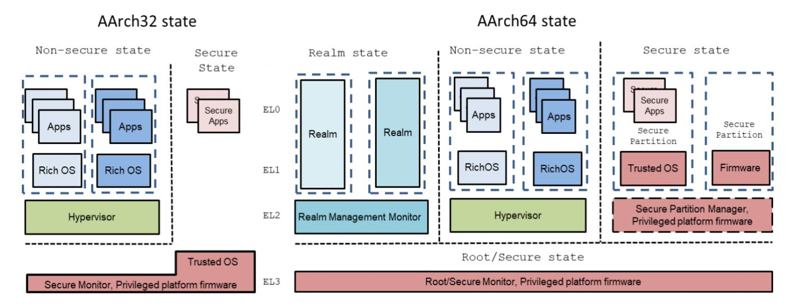
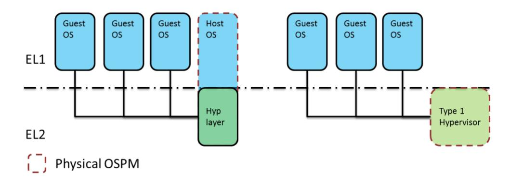
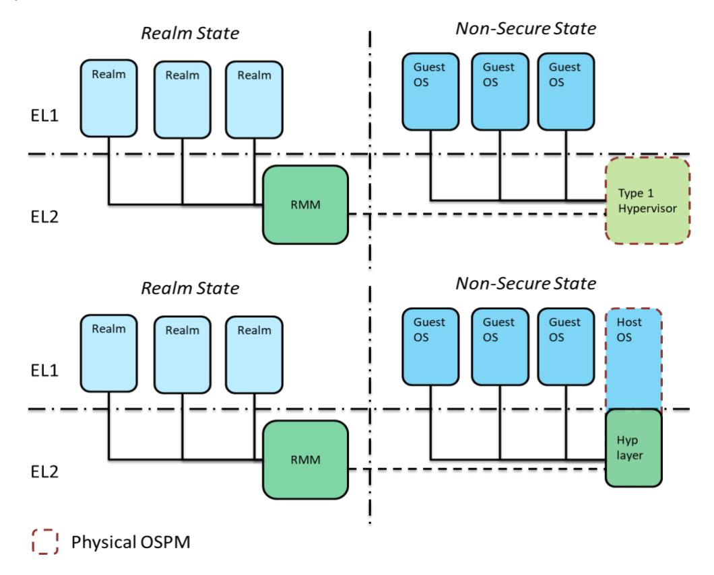
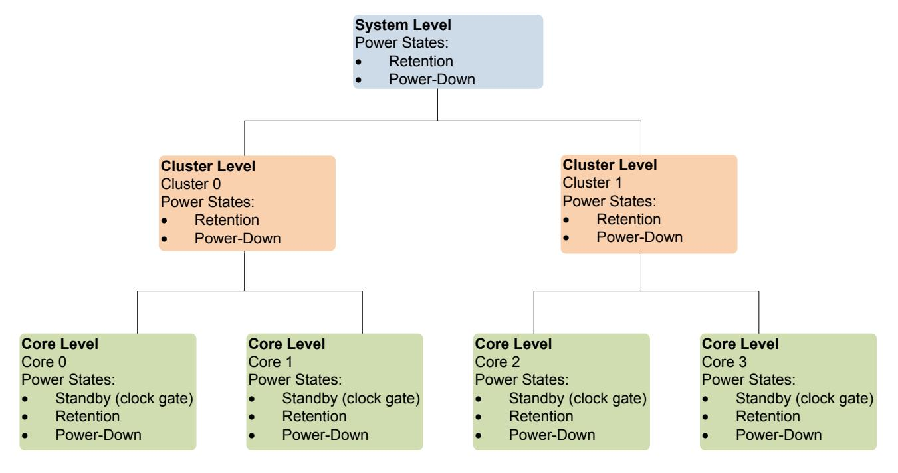
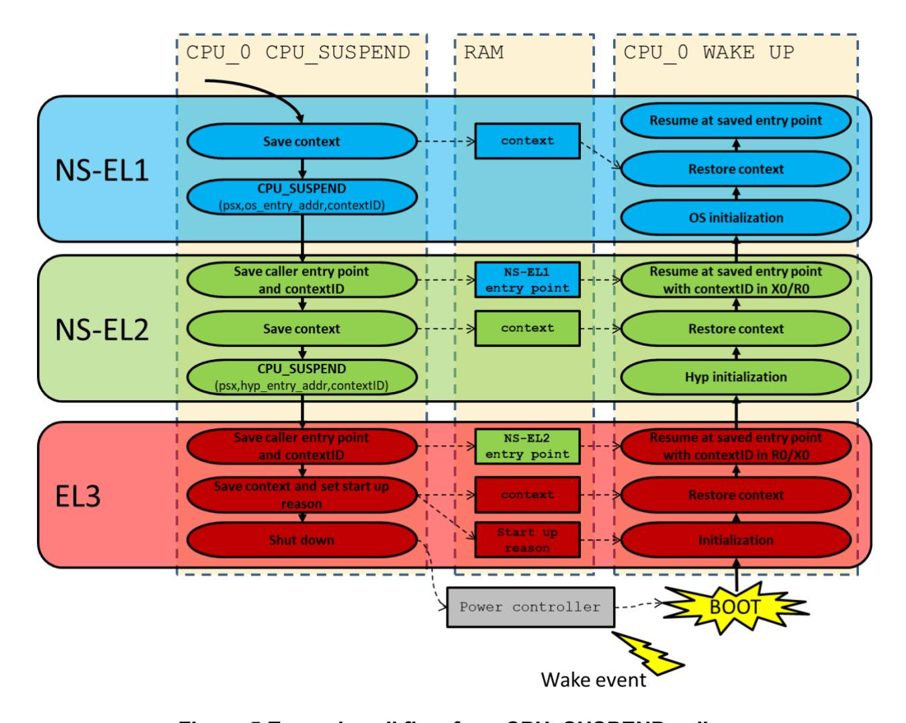
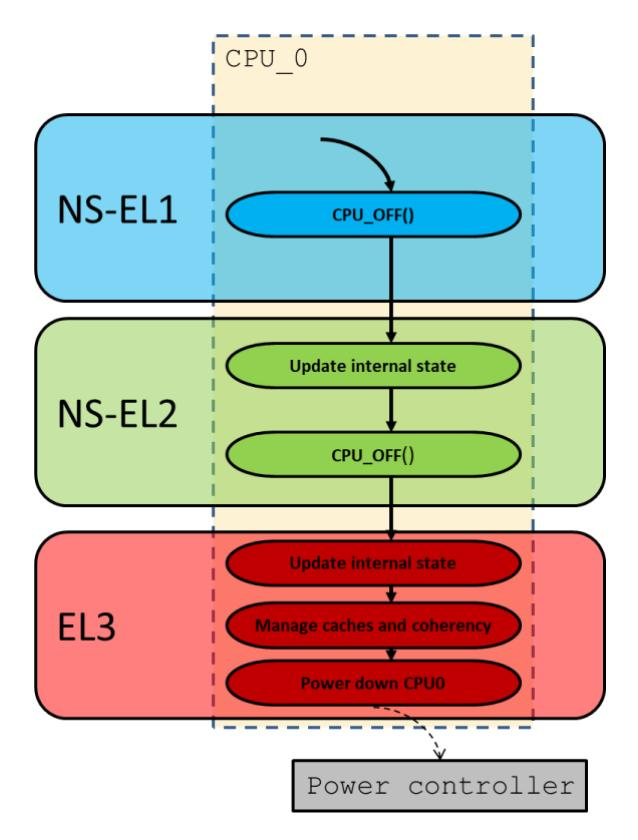
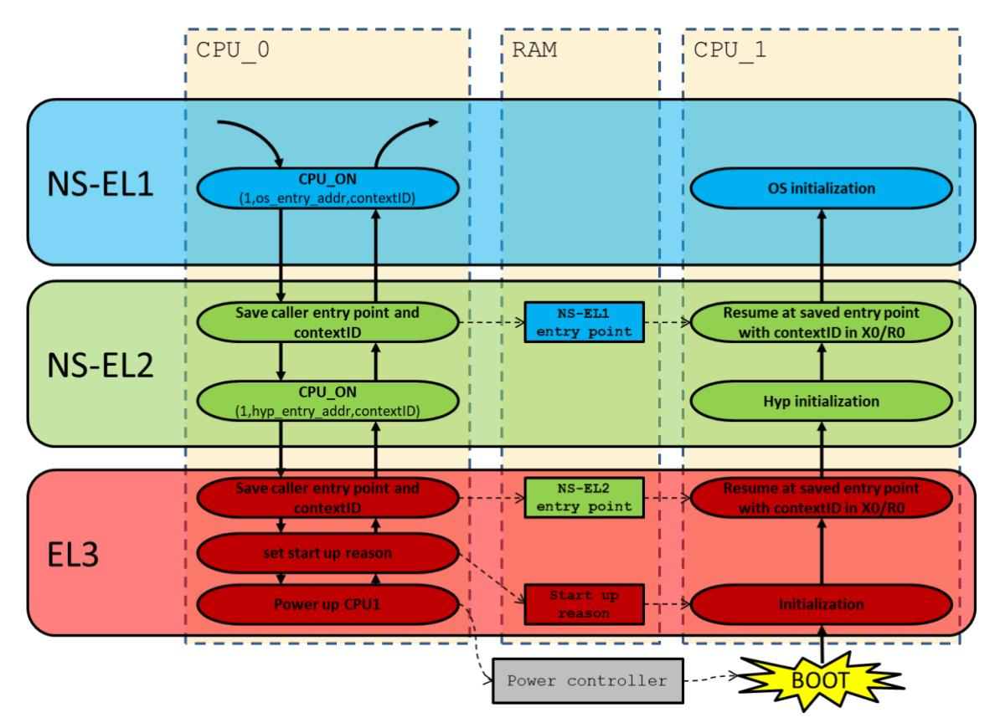
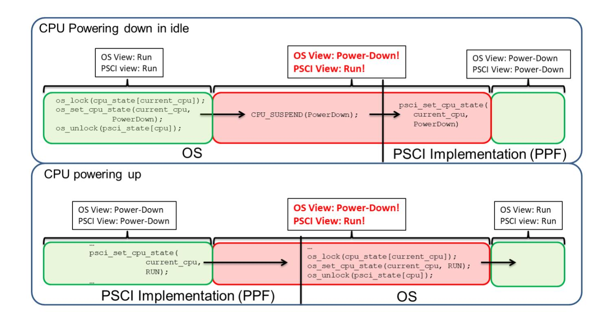
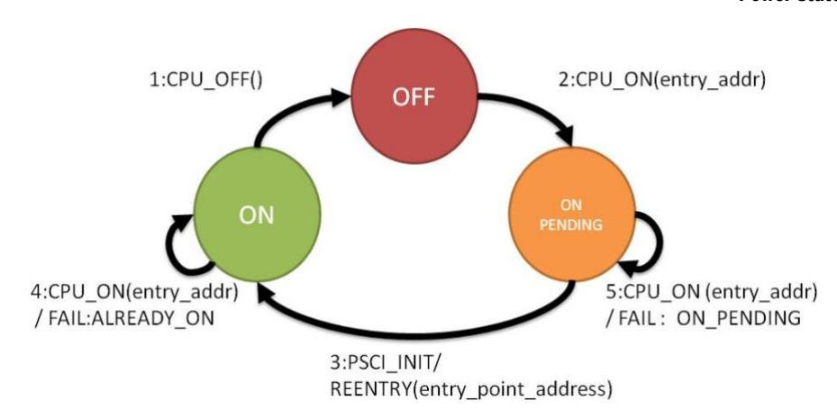
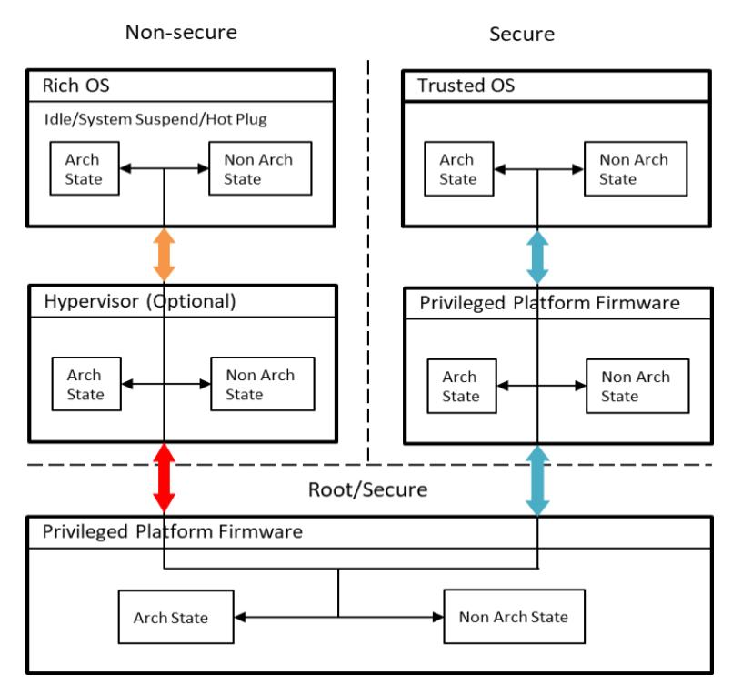

# Arm Power State Coordination Interface **Platform Design Document**

**Non-Confidential**

**Version 1.3 issue F.b**


## Table of Contents

|     | Rele                                     | ease information                                                    | 4      |  |  |  |
|-----|------------------------------------------|---------------------------------------------------------------------|--------|--|--|--|
| Arr | n Non-                                   | -Confidential Document Licence ("Licence")                          | 8      |  |  |  |
| 1   | Abo                                      | out this Document                                                   | 10     |  |  |  |
|     | 1.1                                      | References                                                          | 10     |  |  |  |
|     | 1.2                                      | Terms and abbreviations                                             |        |  |  |  |
|     | 1.3                                      | Feedback                                                            |        |  |  |  |
|     | 1.4                                      | Inclusive terminology commitment                                    | 12     |  |  |  |
| 2   | Intro                                    | oduction                                                            | 13     |  |  |  |
| 3   | Ass                                      | umptions and recommendations                                        | 15     |  |  |  |
|     | 3.1                                      | PSCI intended use                                                   |        |  |  |  |
|     | 3.2                                      | Exception levels, the Armv7 privilege levels, and highest privilege |        |  |  |  |
|     | 3.3                                      | Software stacks on Arm-based systems                                |        |  |  |  |
|     | 3.4                                      | Conduits                                                            | 18     |  |  |  |
|     | 3.5                                      | Secure world software and power management                          |        |  |  |  |
|     | 3.6                                      | Virtualization, Realms, and core power policy                       | 19     |  |  |  |
| 4   | PSCI Use Cases and Use Case Requirements |                                                                     |        |  |  |  |
|     | 4.1                                      | Idle management                                                     | 21     |  |  |  |
|     | 4.2                                      | Power state system topologies and coordination                      |        |  |  |  |
|     | 4.3                                      | CPU hotplug and secondary CPU boot                                  |        |  |  |  |
|     | 4.4                                      | System shutdown, reset and suspend                                  | 28     |  |  |  |
| 5   | Fun                                      | ctions                                                              | 29     |  |  |  |
|     | 5.1                                      | Function prototypes                                                 | 29     |  |  |  |
|     | 5.2                                      | Arguments and return values in PSCI                                 | 48     |  |  |  |
|     | 5.3                                      | PSCI_VERSION                                                        | 49     |  |  |  |
|     | 5.4                                      | CPU_SUSPEND                                                         |        |  |  |  |
|     | 5.5                                      | CPU_OFF                                                             |        |  |  |  |
|     | 5.6                                      | CPU_ON                                                              |        |  |  |  |
|     | 5.7                                      | AFFINITY_INFO                                                       |        |  |  |  |
|     | 5.8                                      | MIGRATE INFO TYPE IMPORTE INFO LIB ORIA                             |        |  |  |  |
|     | 5.9                                      | MIGRATE_INFO_TYPE and MIGRATE_INFO_UP_CPU                           |        |  |  |  |
|     |                                          | SYSTEM_OFF                                                          |        |  |  |  |
|     |                                          | SYSTEM_OFF2                                                         |        |  |  |  |
|     |                                          | SYSTEM_RESETSSYSTEM RESET2                                          |        |  |  |  |
|     |                                          | · MEM_PROTECT                                                       |        |  |  |  |
|     | 5.14<br>5.15                             | MEM_PROTECT  MEM_PROTECT_CHECK_RANGE                                | <br>aa |  |  |  |
|     | 5.10<br>5.16                             | PSCI_FEATURES                                                       | 90     |  |  |  |
|     |                                          | CPU FREEZE                                                          |        |  |  |  |
|     | J. 1 /                                   | <u>-</u> ·                                                          |        |  |  |  |

#### **Power State Coordination Interface**

|   | 5.18 | CPU DEFAULT SUSPEND                       | . 69 |
|---|------|-------------------------------------------|------|
|   | 5.19 | CPU_DEFAULT_SUSPEND NODE_HW_STATE         | .71  |
|   | 5.20 | SYSTEM_SUSPEND                            | .72  |
|   | 5.21 | PSCI_SET_SUSPEND_MODE                     | .72  |
|   | 5.22 | PSCI_STAT_RESIDENCY/COUNT                 | .73  |
|   |      |                                           |      |
| 6 | Add  | itional Implementation Details            | .76  |
|   | 6.1  | PSCI call flows                           | .76  |
|   | 6.2  | OS and Implementation View of Cores State | . 79 |
|   | 6.3  | Races in OS-initiated mode                | . 79 |
|   | 6.4  | Initial state after CPU_ON, CPU_SUSPEND   | . 83 |
|   | 6.5  | Recommended StateID Encoding              | . 86 |
|   | 6.6  | Implementation CPU_ON/CPU_OFF races       |      |
|   | 6.7  | Discoverability                           | . 90 |
|   | 6.8  | Preserving the execution context          |      |
|   | 6.9  | Compliance with the PSCI Specification    |      |

Copyright © 2012, 2013, 2015, 2017 - 2024 Arm Limited or its affiliates. All rights reserved.

### **Release information**

The Change History table lists the changes that are made to this document.

**Table 1 Change history**

<span id="page-3-0"></span>

| Date           | Issue | Confidentiality  | Change                                                                                                                                                                                                                                                                                                                                                                                                                                                                                                                                                                                                                                                                                                                                                                                                                                                                                                                                                                                                                                                                                                           |  |  |
|----------------|-------|------------------|------------------------------------------------------------------------------------------------------------------------------------------------------------------------------------------------------------------------------------------------------------------------------------------------------------------------------------------------------------------------------------------------------------------------------------------------------------------------------------------------------------------------------------------------------------------------------------------------------------------------------------------------------------------------------------------------------------------------------------------------------------------------------------------------------------------------------------------------------------------------------------------------------------------------------------------------------------------------------------------------------------------------------------------------------------------------------------------------------------------|--|--|
| 13 August 2012 | A     | Non-Confidential | First release.                                                                                                                                                                                                                                                                                                                                                                                                                                                                                                                                                                                                                                                                                                                                                                                                                                                                                                                                                                                                                                                                                                   |  |  |
| 24 June 2013   | B     | Non-Confidential | Second release, PSCI version 0.2.<br>This version of the specification has the following functional changes<br>from the first draft proposal version of PSCI:<br>•<br>Provided values for Function ID parameter of all functions.<br>•<br>Added context ID parameters to CPU_ON and<br>CPU_SUSPEND.<br>•<br>Removed DENIED return value of CPU_SUSPEND.<br>•<br>Removed power_state parameter for CPU_OFF.<br>•<br>Removed INVALID_PARAMETERS for CPU_OFF.<br>•<br>Specified the format for the target_cpu parameter of a<br>CPU_ON call to be based on MPIDR.<br>•<br>Removed DENIED return value of CPU_ON.<br>•<br>Added ALREADY_ON return value of CPU_ON.<br>•<br>Added ON_PENDING return value of CPU_ON.<br>•<br>Added INTERNAL_FAILURE return value of CPU_ON and<br>MIGRATE.<br>•<br>Added NOT_PRESENT return value to MIGRATE.<br>•<br>Renamed -3 error code from "Core Not Available" to DENIED<br>for MIGRATE.<br>•<br>Added the following functions:<br>•<br>PSCI_VERSION.<br>•<br>AFFINITY_INFO.<br>•<br>MIGRATE_INFO_TYPE.<br>•<br>MIGRATE_INFO_UP_CPU.<br>•<br>SYSTEM_OFF.<br>•<br>SYSTEM_RESET. |  |  |
|                |       |                  | •<br>Defined a version number for PSCI, at the time of writing, 0.2.<br>•<br>Made all functions apart from MIGRATE and<br>MIGRATE_INFO_UP_CPU compulsory, and consequently<br>removed NOT_SUPPORTED return code from CPU_ON,<br>CPU_SUSPEND, and CPU_OFF.<br>•<br>Note that the errata fix in release C makes                                                                                                                                                                                                                                                                                                                                                                                                                                                                                                                                                                                                                                                                                                                                                                                                    |  |  |

NOT\_SUPPORTED as a return code.

| 25 Jun 2013        | B.b | Non-Confidential | Removed inappropriate watermark, PSCI version 0.2.                                                                                                                                                                                                                                                                                                                                                                                                                                                                                                                                                                                                                                                                                                                                                                                                                                                                                                                |
|--------------------|-----|------------------|-------------------------------------------------------------------------------------------------------------------------------------------------------------------------------------------------------------------------------------------------------------------------------------------------------------------------------------------------------------------------------------------------------------------------------------------------------------------------------------------------------------------------------------------------------------------------------------------------------------------------------------------------------------------------------------------------------------------------------------------------------------------------------------------------------------------------------------------------------------------------------------------------------------------------------------------------------------------|
| 30 January<br>2015 | C   | Non-Confidential | PSCI 1.0 release, and errata fix for PSCI 0.2.<br>PSCI 1.0 version of the specification has the following functional<br>changes from version PSCI 0.2:<br>•<br>Added PSCI_FEATURES.<br>•<br>Added CPU_FREEZE.<br>•<br>Added CPU_DEFAULT_SUSPEND.<br>•<br>Added NODE_HW_STATE.<br>•<br>Added SYSTEM_SUSPEND.<br>•<br>Added OS-initiated and platform coordinated mode<br>descriptions. This affects returns values for CPU_SUSPEND<br>which now adds DENIED as a possible return value.<br>•<br>Added PSCI_SET_SUSPEND_MODE.<br>•<br>Added PSCI_STAT_RESIDENCY.<br>•<br>Added PSCI_STAT_COUNT.<br>•<br>Made MIGRATE_INFO_TYPE optional by letting it return                                                                                                                                                                                                                                                                                                        |
|                    |     |                  | NOT_SUPPORTED. This indicates that MIGRATE is not<br>required. This change applies retroactively to version 0.2 of<br>PSCI as an errata change.<br>•<br>Relaxed requirement that caches on all CPUs must be<br>cleaned in the SYSTEM_OFF function (SWARCH-13).<br>•<br>Clarified early returns in the CPU_SUSPEND case, both the<br>return value and return path (SWARCH-14, SWARCH-5).<br>•<br>Clarified mandatory functions (SWARCH-4).<br>•<br>Fixed MIGRATE target_cpu parameter type (SWARCH-16).<br>•<br>Removed NOT_PRESENT as a possible return code for<br>AFFINTY_INFO. This was an erratum (SWARCH-6).<br>•<br>States now pertain to power domain levels rather than affinity<br>levels. This ensures that affinity levels (as defined by MPIDR)<br>are independent from the power domain levels actually<br>implemented<br>•<br>Relaxed AFFINITY_INFO so that it does not need to work at<br>affinity levels higher than zero. NODE_HW_STATE provides |
|                    |     |                  | alternative functionality.<br>•<br>Introduced the INVALID_ADDRESS return code on functions<br>that take address parameters (CPU_SUSPEND, CPU_ON,<br>CPU_DEFAULT_SUSPEND, SYTEM_SUSPEND).                                                                                                                                                                                                                                                                                                                                                                                                                                                                                                                                                                                                                                                                                                                                                                          |

|               |     |                  | •<br>Closer alignment between PSCI and the SMC Calling<br>Conventions [4], by relaxing the need to return<br>INVALID_PARAMETERS when there is a mismatch between<br>the Execution state of the caller (AArch32/64) and the SMC<br>function identifier (SMC32/SMC64) From PSCI1.0, every<br>AArch32 call to an SMC64 call will return NOT_SUPPORTED,<br>and an AArch64 OS is free to call an SMC32 call (SWARCH<br>1). This affects: CPU_SUSPEND, CPU_ON, AFFINITY_INFO,<br>MIGRATE, and MIGRATE_INFO_CPU. |
|---------------|-----|------------------|-----------------------------------------------------------------------------------------------------------------------------------------------------------------------------------------------------------------------------------------------------------------------------------------------------------------------------------------------------------------------------------------------------------------------------------------------------------------------------------------------------------|
| 21 April 2017 | D   | Non-Confidential | PSCI 1.1. release.                                                                                                                                                                                                                                                                                                                                                                                                                                                                                        |
|               |     |                  | PSCI 1.1 is a minor revision update, with the following changes:                                                                                                                                                                                                                                                                                                                                                                                                                                          |
|               |     |                  | •<br>Introduced SYSTEM_RESET2 and MEM_PROTECT and<br>MEM_PROTECT_CHECK_RANGE.                                                                                                                                                                                                                                                                                                                                                                                                                             |
|               |     |                  | •<br>Added additional details on registers that should be initialized<br>when EL2 is not used.                                                                                                                                                                                                                                                                                                                                                                                                            |
|               |     |                  | •<br>Updated save restore language to make it more generic. See<br>section 6.8.                                                                                                                                                                                                                                                                                                                                                                                                                           |
|               |     |                  | •<br>Removed big.LITTLE migration language.                                                                                                                                                                                                                                                                                                                                                                                                                                                               |
|               |     |                  | •<br>Added flexibility in encoding of power state parameters in<br>statistics calls.                                                                                                                                                                                                                                                                                                                                                                                                                      |
|               |     |                  | •<br>Added clarification to GICv3 ITS save and restore.                                                                                                                                                                                                                                                                                                                                                                                                                                                   |
| June 2021     | D.b | Non-Confidential | PSCI 1.1 issue D.b.                                                                                                                                                                                                                                                                                                                                                                                                                                                                                       |
|               |     |                  | This is an update with the following changes:                                                                                                                                                                                                                                                                                                                                                                                                                                                             |
|               |     |                  | •<br>Change License terms.                                                                                                                                                                                                                                                                                                                                                                                                                                                                                |
|               |     |                  | •<br>Replace terms master with requester.                                                                                                                                                                                                                                                                                                                                                                                                                                                                 |
|               |     |                  | •<br>Miscellaneous fixes and formatting changes.                                                                                                                                                                                                                                                                                                                                                                                                                                                          |
|               |     |                  | •<br>Reflect introduction of S-EL2 in Armv8.4.                                                                                                                                                                                                                                                                                                                                                                                                                                                            |
|               |     |                  | •<br>Add support, via PSCI_FEATURES, for discovering if<br>SMCCC_VERSION is implemented. This change is retrospectively<br>applicable from PSCIv1.0.                                                                                                                                                                                                                                                                                                                                                      |
| July 2022     | E   | Non-Confidential | PSCI 1.2 issue E.                                                                                                                                                                                                                                                                                                                                                                                                                                                                                         |
|               |     |                  | This is a minor revision update with the following changes:                                                                                                                                                                                                                                                                                                                                                                                                                                               |
|               |     |                  | •<br>Provide links to specifications which provide standard interfaces<br>for DVFS and Device Power Management.                                                                                                                                                                                                                                                                                                                                                                                           |
|               |     |                  | •<br>Introduce implications of Arm RME and update Figures.                                                                                                                                                                                                                                                                                                                                                                                                                                                |
|               |     |                  | •<br>Rename Secure platform firmware to Privileged platform firmware<br>(PPF).                                                                                                                                                                                                                                                                                                                                                                                                                            |
|               |     |                  | •<br>Clarify that SMC64 calls should return 64-bit error code from<br>firmware.                                                                                                                                                                                                                                                                                                                                                                                                                           |
|               |     |                  | •<br>Add DENIED error code for CPU_ON.                                                                                                                                                                                                                                                                                                                                                                                                                                                                    |
|               |     |                  | •<br>Add clarification around implementation defined behavior when<br>PSCI_FEATURES is used by AAarch32 caller to discover SMC64<br>functions.                                                                                                                                                                                                                                                                                                                                                            |

|          |     |                  | •<br>Clarify the meaning of calling core in SYSTEM_SUSPEND.                                                                                                        |
|----------|-----|------------------|--------------------------------------------------------------------------------------------------------------------------------------------------------------------|
|          |     |                  | •<br>Remove redundant tables.                                                                                                                                      |
|          |     |                  | •<br>Clarify that all cores should have the same Execution state at the<br>first Non-secure exception level entered at resume from<br>CPU_SUSPEND or after CPU_ON. |
| Sep 2024 | F   | Non-Confidential | PSCI 1.3 Issue F (superseded by Issue F.b)                                                                                                                         |
|          |     |                  | This is a minor revision update, with the following changes:                                                                                                       |
|          |     |                  | •<br>Update document license to version 5.0, March 2024.<br>•<br>Clarify responsibilities for SYSTEM_WARM_RESET.                                                   |
|          |     |                  | •<br>Introduce new function – SYSTEM_OFF2. See sections<br>5.1.10 and 5.11.                                                                                        |
|          |     |                  | •<br>Add SYSTEM_OFF2 hibernate type discovery support in<br>PSCI_FEATURES.                                                                                         |
|          |     |                  | •<br>Fix broken links in MIGRATE.                                                                                                                                  |
|          |     |                  | •<br>Clarify the meaning of ELx in 'SPSR_ELx', in section "Initial<br>Core Configuration" on returning after wakeup from<br>CPU_SUSPEND or through CPU_ON.         |
| Oct 2024 | F.b | Non-Confidential | PSCI 1.3 Issue F.b.                                                                                                                                                |
|          |     |                  | This version supersedes Issue F.                                                                                                                                   |
|          |     |                  | Issue F.b clarifies the default behavior of the SYSTEM_OFF2 function.<br>The change list below should be read in conjunction with the change<br>list of Issue F.   |
|          |     |                  | •<br>Clarify in Section 5.1.10 that SYSTEM_OFF2, when called<br>with the "type" parameter set to 0x0, defaults to<br>HIBERNATE_OFF.                                |

## **Arm Non-Confidential Document Licence ("Licence")**

This License is a legal agreement between you and Arm Limited ("**Arm**") for the use of Arm's intellectual property (including, without limitation, any copyright) embodied in the document accompanying this License ("**Document**"). Arm licenses its intellectual property in the Document to you on condition that you agree to the terms of this License. By using or copying the Document you indicate that you agree to be bound by the terms of this License.

"**Subsidiary**" means any company the majority of whose voting shares is now or hereafter owner or controlled, directly or indirectly, by you. A company shall be a Subsidiary only for the period during which such control exists.

This Document is **NON-CONFIDENTIAL** and any use by you and your Subsidiaries ("Licensee") is subject to the terms of this License between you and Arm.

Subject to the terms and conditions of this License, Arm hereby grants to Licensee under the intellectual property in the Document owned or controlled by Arm, a non-exclusive, non-transferable, non-sub-licensable, royalty-free, worldwide License to:

- **(i)** use and copy the Document for the purpose of designing and having designed products that comply with the Document;
- **(ii)** manufacture and have manufactured products which have been created under the License granted in (i) above; and
- **(iii)** sell, supply and distribute products which have been created under the License granted in (i) above.

**Licensee hereby agrees that the Licenses granted above shall not extend to any portion or function of a product that is not itself compliant with part of the Document.**

Except as expressly licensed above, Licensee acquires no right, title or interest in any Arm technology or any intellectual property embodied therein.

The content of this document is informational only. Any solutions presented herein are subject to changing conditions, information, scope, and data. This document was produced using reasonable efforts based on information available as of the date of issue of this document. The scope of information in this document may exceed that which Arm is required to provide, and such additional information is merely intended to further assist the recipient and does not represent Arm's view of the scope of its obligations. You acknowledge and agree that you possess the necessary expertise in system security and functional safety and that you shall be solely responsible for compliance with all legal, regulatory, safety and security related requirements concerning your products, notwithstanding any information or support that may be provided by Arm herein. In addition, you are responsible for any applications which are used in conjunction with any Arm technology described in this document, and to minimize risks, adequate design and operating safeguards should be provided for by you.

Reference by Arm to any third party's products or services within this document is not an express or implied approval or endorsement of the use thereof.

THE DOCUMENT IS PROVIDED "AS IS". ARM PROVIDES NO REPRESENTATIONS AND NO WARRANTIES, EXPRESS, IMPLIED OR STATUTORY, INCLUDING, WITHOUT LIMITATION, THE IMPLIED WARRANTIES OF MERCHANTABILITY, SATISFACTORY QUALITY, NON-INFRINGEMENT OR FITNESS FOR A PARTICULAR PURPOSE WITH RESPECT TO THE DOCUMENT. Arm may make changes to the Document at any time and without notice. For the avoidance of doubt, Arm makes no representation with respect to, and has undertaken no analysis to identify or understand the scope and content of, third party patents, copyrights, trade secrets, or other rights.

NOTWITHSTANDING ANYTHING TO THE CONTRARY CONTAINED IN THIS LICENSE, TO THE FULLEST EXTENT PERMITTED BY LAW, IN NO EVENT WILL ARM BE LIABLE FOR ANY DAMAGES, IN CONTRACT, TORT OR OTHERWISE, IN CONNECTION WITH THE SUBJECT MATTER OF THIS LICENSE (INCLUDING WITHOUT LIMITATION) (I) LICENSEE'S USE OF THE DOCUMENT; AND (II) THE IMPLEMENTATION OF THE DOCUMENT IN ANY PRODUCT CREATED BY LICENSEE UNDER THIS LICENSE). THE EXISTENCE OF MORE THAN ONE CLAIM OR SUIT WILL NOT ENLARGE OR EXTEND THE LIMIT. LICENSEE RELEASES ARM FROM ALL OBLIGATIONS, LIABILITY, CLAIMS OR DEMANDS IN EXCESS OF THIS LIMITATION.

This License shall remain in force until terminated by Licensee or by Arm. Without prejudice to any of its other rights, if Licensee is in breach of any of the terms and conditions of this License then Arm may terminate this License immediately upon giving written notice to Licensee. Licensee may terminate this License at any time. Upon termination of this License by Licensee or by Arm, Licensee shall stop using the Document and destroy all copies of the Document in its possession. Upon termination of this License, all terms shall survive except for the License grants.

Any breach of this License by a Subsidiary shall entitle Arm to terminate this License as if you were the party in breach. Any termination of this License shall be effective in respect of all Subsidiaries. Any rights granted to any Subsidiary hereunder shall automatically terminate upon such Subsidiary ceasing to be a Subsidiary.

The Document consists solely of commercial items. Licensee shall be responsible for ensuring that any use, duplication or disclosure of the Document complies fully with any relevant export laws and regulations to assure that the Document or any portion thereof is not exported, directly or indirectly, in violation of such export laws.

This License may be translated into other languages for convenience, and Licensee agrees that if there is any conflict between the English version of this License and any translation, the terms of the English version of this License shall prevail.

The Arm corporate logo and words marked with ® or ™ are registered trademarks or trademarks of Arm Limited (or its subsidiaries) in the US and/or elsewhere. All rights reserved. Other brands and names mentioned in this document may be the trademarks of their respective owners. No License, express, implied or otherwise, is granted to Licensee under this License, to use the Arm trade marks in connection with the Document or any products based thereon. Visit Arm's website at <https://www.arm.com/company/policies/trademarks> for more information about Arm's trademarks.

The validity, construction and performance of this License shall be governed by English Law.

Copyright © 2012, 2013, 2015, 2017 - 2024 Arm Limited (or its affiliates). All rights reserved.

Arm Limited. Company 02557590 registered in England. 110 Fulbourn Road, Cambridge, England CB1 9NJ.

Arm document reference: PRE-21585 version 5.0, March 2024

## **About this Document**

This document defines a standard interface for PE and system level power management that can be used by OS vendors for supervisory software working at different levels of privilege on an Arm device. Rich operating systems like Linux and Windows, hypervisors, privileged firmware, and Trusted OS implementations must interoperate when power is being managed. The aim of this standard is to ease the integration between supervisory software from different vendors working at different privilege levels.

### **1.1 References**

This section lists publications by Arm and by third parties.

See [http://developer.arm.com](http://developer.arm.com/) for access to Arm documentation.

- <span id="page-9-0"></span>[1] *Arm Architecture Reference Manual Armv7-A and Armv7-R edition* (Arm DDI 0406).
- [2] *Embedded Trace Macrocell Architecture Specification* (Arm IHI 0014).
- [3] *Program Flow Trace Architecture Specification* (Arm IHI 0035).
- [4] *SMC Calling Convention* (Arm DEN 0028).
- <span id="page-9-1"></span>[5] *Arm Architecture Reference Manual for A-profile architecture* (Arm DDI 0487).
- [6] *Advanced Configuration and Power Interface Specification*. See [https://uefi.org/specifications.](https://uefi.org/specifications)
- [7] *PSCI device tree definition. See* [https://www.kernel.org/doc/Documentation/devicetree/bindings/arm/psci.txt.](https://www.kernel.org/doc/Documentation/devicetree/bindings/arm/psci.txt)
- [8] *Trusted Firmware-A*. See<https://www.trustedfirmware.org/projects/tf-a/>
- [9] *Power Control System Architecture Specification* (Arm DEN 0050).
- [10] *Firmware Framework for Arm v8-A* (Arm DEN 0077)
- [11] *System Control and Management Interface* (Arm DEN 0056)
- [12] The Realm Management Extension (RME), for Armv9-A (Arm DDI 0615)
- [13] Arm Realm Management Extension (RME) System Architecture (Arm DEN 0129)
- [14] Arm Realm Management Monitor Specification (RMM) (Arm DEN 0137)

### **1.2 Terms and abbreviations**

The following table describes some of the terms used in this document.

See also Arm Glossary [https://developer.arm.com/documentation/aeg0014/latest.](https://developer.arm.com/documentation/aeg0014/latest)

| Term | Meaning                                                                                                                                                                                                                                                                                         |
|------|-------------------------------------------------------------------------------------------------------------------------------------------------------------------------------------------------------------------------------------------------------------------------------------------------|
| ACPI | The Advanced Configuration and Power Interface specification. This defines a<br>standard for device configuration and power management by an OS.                                                                                                                                                |
| FDT  | Flattened Device Tree. This is a hardware description standard. Firmware tables<br>are constructed that describe the hardware. These tables are passed to the OS at<br>boot time. An OS can interrogate the data they contain when it needs to discover<br>the hardware properties of a device. |

HVC The Hypervisor Call instruction or the associated exception. This requests a

hypervisor function, causing the core to enter EL2.

MP (Multi-Processor) A software stack, typically an OS that supports simultaneous operation across

multiple cores.

Normal world The execution environment when the core is in the Non-secure state.

OSPM Operating System-directed Power Management. Typically, this acronym refers to

the components of an OS that provide power management for the platform. In this document OSPM refers to software components that are involved in the selection and application of power states for individual cores or clusters, or overall system

states.

Privileged Platform Firmware (PPF) Owned by the silicon vendor and OEM. This firmware layer is the first thing that runs at boot on an application processor. It provides several services, including

platform initialization, the installation of lower Exception level software

components, and routing of Secure Monitor Calls. PPF can run in EL3, Secure EL2 and Secure EL1 on Armv8 systems using AArch64 in EL3. For Armv7 systems, or Armv8 systems using AArch32 at EL3, PPF executes in EL3. The PPF must include the implementation that acts on power management requests made via the Power State Coordination Interface. When Arm RME [12][13] is implemented and enabled, the implementation that acts on power management requests made via the Power State Coordination Interface should reside in EL3.

Realm A protected execution environment that executes in R-EL0 and R-EL1 under the

control of the Realm Management Monitor (RMM).

Realm Management Monitor (RMM) The software component which is responsible for the management of Realms.

Rich OS Application OS such as Linux or Windows.

Secure Partition

(SP)

Software component that executes in S-EL1 or S-EL0 under the control of the Secure Partition Manager (SPM). A SP could implement a variety of use cases e.g., a Trusted OS, device driver stack or a security service. For more details

refer to Firmware Framework for Arm v8-A [10].

Secure world The execution environment when the core is in the Secure state.

SMC The Secure Monitor Call instruction or the associated exception. This requests a

Secure Monitor function, causing the core to enter a higher exception level.

Trusted OS This is the OS running in the Secure world. It provides a Trusted Execution

Environment.

UP A software stack typically an OS that does not support simultaneous operation

(Uniprocessor) across multiple cores.

### **1.3 Feedback**

Arm welcomes feedback on its documentation.

### **1.3.1 Feedback on this manual**

If you have any comments or suggestions for additions and improvements, please create a ticket at [https://support.developer.arm.com.](https://support.developer.arm.com/) As part of the ticket please include:

- The title.
- The document and version number, DEN0022F.b.
- The section name to which your comments refer.
- The page numbers to which your comments apply.
- A concise explanation of your comments.

Arm also welcomes general suggestions for additions and improvements.

#### **Note**

Arm tests PDFs only in Adobe Acrobat and Acrobat Reader, and cannot guarantee the appearance or behavior of any document when viewed with any other PDF reader.

### **1.4 Inclusive terminology commitment**

Arm values inclusive communities. Arm recognizes that we and our industry have used terms that can be offensive. Arm strives to lead the industry and create change.

Previous issues of this document included terms that can be offensive. We have replaced these terms. If you find offensive terms in this document, please contact [terms@arm.com.](mailto:terms@arm.com)

## **Introduction**

Power management aware operating systems dynamically change the power states of cores, balancing the available compute capacity to match the current workload, while striving to use the minimum amount of power. Some of these techniques dynamically switch cores on and off or place them in quiescent states, where they no longer perform computation. This means they consume very little power. The main examples of these techniques are:

**Idle Management:** When the kernel in an OS has no threads to schedule on a core, it places that core into a clock-gated, retention, or even fully power-gated state. However, the core remains available to the OS.

**Hotplug:** Cores are physically switched off when compute demand is low, and then brought back online when it increases. The OS migrates all interrupts and threads away from the cores that are taken offline and rebalances the load when they are brought back online.

As various operating systems from different vendors can be present in an Arm system, performing power control requires a method of collaboration. Considering operation in Non-secure state, if a supervisory system that is managing power, whether it is executing at the OS level (EL1) or at hypervisor level (EL2), wants to enter an idle state, power up or power down a core, or reset or shut down the system, supervisory systems at other Exception levels will need to react to the power state change request.

Equally, if the power state of a core is changed by a wakeup event, it might be necessary for supervisory systems running at different Exception levels to perform actions such as restoring context. PSCI provides a standard interface definition to support this interoperation and integration across the various supervisory systems. This document defines such an interface, the Power State Coordination Interface, and describes its use for idle, hotplug, shutdown, and reset.

This interface standard is aimed at the generalization of code in the following power management scenarios:

- Core idle management.
- Dynamic addition and removal of cores, and secondary core boot.
- System shutdown and reset.

The interface does not cover *Dynamic Voltage and Frequency Scaling* (DVFS) or device power management (for example, management of peripherals such as GPUs). Arm recommends using Advanced Configuration and Power Interface [6], or System Control and Management Interface [11] as the standard interface for such features.

The interface is designed so that it can work in conjunction with hardware discovery technologies such as *Advanced Configuration and Power Interface* (ACPI) and *Flattened Device Tree* (FDT). It is not a replacement for ACPI or FDT.

This document describes PSCI versions 1.3, 1.2, 1.1, 1.0, and 0.2. For PSCI 0.2, the document provides an errata fix update. The PSCI 0.2 erratum applies to a single function and is described in section [5.1.7.](#page-34-0)

The document is arranged into the following sections:

- Section 3 and 4 provide background materials, including:
  - o Intended uses of PSCI.
  - o Background definitions of power state terms.

- o Methods by which PSCI requests are made.
- Section 5 provides the main description of the PSCI functions.
- Section 6 provides additional implementation details.

Readers already familiar with PSCI can skip straight to section 5.

## **Assumptions and recommendations**

This document defines an API that can be used to coordinate power control among supervisory systems concurrently running on a device. As the following sections explain, the API allows a supervisory system to request cores to be powered up or down, and to request context transfer of secure context from one core to another, which might be needed when dealing with trusted OSs or SPs. Throughout the description, the document generally assumes that EL2 and EL3 are both implemented, but also covers other cases.

### **3.1 PSCI intended use**

PSCI has the following intended uses:

- Provides a generic interface that supervisory software can use to manage power in the following situations:
  - Core idle management.
  - Dynamic addition of cores to and removal of cores from the system, often referred to as *hotplug*.
  - Secondary core boot.
  - Moving trusted OS context from one core to another.
  - System shutdown and reset.
- Provides an interface that supervisory software can use in conjunction with Firmware Table (FDT and ACPI) descriptions to support the generalization of power management code.

PSCI does not cover:

- Peripheral idle management. PSCI only applies to idle management of the cores used by the central scheduler of supervisory software.
- Dynamic Voltage and Frequency Scaling. PSCI does not provide interfaces for the management of core clock frequencies on a device.

PSCI does not provide power state representations to supervisory software. However, it is designed so that it can also be used with hardware description technologies such as ACPI or FDT.

## <span id="page-14-0"></span>**3.2 Exception levels, the Armv7 privilege levels, and highest privilege**

Armv8 introduces explicit Exception levels that also define the software execution privilege hierarchy within a Security state. An increase in Exception level, for example from EL0 to EL1, corresponds to an increase in execution privilege.

In Armv7, the Exception level hierarchy is implicit in the architecture:

- The Virtualization Extensions provide the EL2 functionality. This is present only in Non-secure state.
- The Security Extensions provide the EL3 functionality, including the support for two Security states. The control features of this functionality are provided by a Monitor mode that is present only in Secure state.

The Armv7 architecture [\[1\]](#page-9-0) uses *Privilege levels* (PLs) to describe the software execution privilege hierarchy. Because Monitor mode was defined as a peer of the other Secure state privileged processor modes, this means the Armv7 privilege levels are asymmetrical between Non-secure state and Secure state, as follows:

- In Non-secure state, the privilege level hierarchy is:
  - PL0, unprivileged. Applies to User mode.
  - PL1, OS-level privilege. Applies to System, FIQ, IRQ, Supervisor, Abort, and Undefined modes.
  - PL2, hypervisor privilege. Applies to Hyp mode.
- In Secure state, the privilege level hierarchy is:
  - Secure PL0, unprivileged. Applies only to User mode.
  - Secure PL1, Trusted OS, and Monitor level privilege. Applies to System, FIQ, IRQ, Supervisor, Abort, Undefined, and Monitor modes.

In the AArch32 description of execution privilege [\[5\],](#page-9-1) which applies to both Armv7 and Armv8 implementations, the processor modes map to the Exception levels as follows:

- In Non-secure state, the processor modes implemented at each Exception level are:
  - EL0: User mode.
  - EL1: System, FIQ, IRQ, Supervisor, Abort, and Undefined modes.
  - EL2: Hyp mode.
- In Secure state, the processor modes implemented at each Exception level are:
  - Secure EL0: User mode.
  - EL3: System, FIQ, IRQ, Supervisor, Abort, Undefined, and Monitor modes.

**Note**: In an Armv8 implementation, this mapping of the Secure modes applies only when EL3 is using AArch32. When EL3 is using AArch64, Monitor mode is not implemented, and if Secure EL1 is using AArch32 then Secure System, FIQ, IRQ, Supervisor, Abort, and Undefined modes are implemented as part of Secure EL1. For more information see [\[5\].](#page-9-1)

This document generally uses Exception level terminology. In the document:

- References to EL2, EL1 and EL0 refer to Non-secure exception levels unless otherwise indicated. Secure EL2, Secure EL1 and Secure EL0 are referred to as S-EL2, S-EL1 and S-EL0. When Arm Realm Management Extension (RME) [12][13] is implemented, Realm EL2, Realm EL1 and Realm EL0 are referred to as R-EL2, R-EL1 and R-EL0. In general, the PSCI interface between R-EL1 and R-EL2 follow the same semantics as the interface between NS-EL1 and NS-EL2. For more details see the Realm Management Monitor Specification [14].
- *Highest privilege* refers to the first implemented Exception level in the following sequence, which runs from highest to lowest: EL3, Secure EL2, Secure EL1, Non-secure EL2, Non-secure EL1.

### **3.3 Software stacks on Arm-based systems**

<span id="page-16-0"></span>On a given Arm device there can be several supervisory software kernels or privileged software components.



Figure 1 Software Layers of an Arm syste[m](#page-16-0) 

Figure 1 [Software Layers of an Arm system](#page-16-0) illustrates these various layers. The Realm Security state incorporates the Realm and the Realm Management Monitor (RMM) [14]. The Normal (Non-secure) world has the following privileged components:

**Rich OS kernels:** Examples include Linux or Windows running in Non-secure EL1. When running under a hypervisor, the Rich OS kernels can be running as guests or hosts depending on the hypervisor model.

**Hypervisor:** This component runs at Non-secure EL2. This component, when present and enabled, provides virtualization services to guests running Rich OS kernels.

The Secure world has the following privileged components:

**Privileged Platform Firmware (PPF):** Owned by the silicon vendor and OEM. This firmware layer is the first thing that runs at boot on an application processor. It provides several services, including platform initialization, the installation of lower Exception level software components, and routing of Secure Monitor Calls. PPF can run in EL3, Secure EL2 and Secure EL1 on Armv8 systems using AArch64 in EL3. Arm strongly recommends using EL3 for PPF. For Armv7 systems, or Armv8 systems using AArch32 at EL3, PPF executes in EL3. The PPF must include the implementation that acts on power management requests made via the Power State Coordination Interface. When Arm RME [12][13] is implemented and enabled, the implementation that acts on power management requests made via the Power State Coordination Interface should reside in EL3. A reference implementation for privileged platform FW is provided by the Trusted Firmware-A open-source project [8].

**Trusted OS:** This provides secure services to the Normal world and provides a runtime environment for executing secure applications. In AArch32 state Trusted OS software executes in Secure EL3, and in AArch64 state it primarily executes in Secure EL1.

**Note**: While the Arm Architecture Reference Manuals [1, 5] define Secure and Non-secure Security states, and the Arm processor documentation uses these state names. Arm software documentation often refers to these states as Secure and Normal world, respectively. This reflects the fact that software normally executes in Non-secure state.

The PSCI specification focuses on the interface between Security states for power management. It provides a method for issuing power management requests. To deal with the requests, the PPF must include a PSCI implementation. A PSCI implementation might require communication between the PPF and a Trusted OS or SP. Currently, how this communication is handled is specific to individual vendors. Arm recommends using the Firmware Framework for Arm v8-A [10] to handle this communication.

Although the PSCI specification focuses on power management requests between Security states, the interface can also be reused easily at the junction between Rich OS kernels and hypervisors, or Realms and Realm Management Monitor (RMM).

### **3.4 Conduits**

The PSCI interface must support interaction at all levels of execution implemented on the device, where multiple levels of supervisory software might be executing. For the caller operating in the Normal world, the interface must forward a message to the PPF. In a system that implements EL2, it must be possible to trap interface calls made by the EL1 kernel context to the hypervisor (EL2). In a system that implements Arm RME, it must be possible to trap interface calls made by the Realm executing at R-EL1, to the RMM executing at R-EL2. The RMM can then decide to forward the call to the Hypervisor executing at NS-EL2 [14]. If the hypervisor determines that a change of physical power state is required, it must then be able to use the PSCI interface to inform the PPF.

The conduits available to transfer a message from one Exception level to another depend on the implemented Exception levels and Security states. For further information on the description of possible conduits, see [4] and [14].

## **3.5 Secure world software and power management**

Many Trusted OS implementations are not SMP-capable. When running on MP devices, they are tied to a single core. Secure Monitor Calls destined for the Trusted OS are only expected to come from that core. The lack of MP support in the OS helps to keep Trusted code simple and small, which in turn aids certification. Trusted OS services are invoked from the Normal world through Rich OS drivers or daemons that are provided with the Trusted OS implementations. The threads associated with these drivers and daemons are normally affinitized to the core used by the Trusted OS.

Arm systems generally include a power controller, or control logic, that can manage core power. This normally provides interfaces that support several power management functions. Often these include support for transitioning cores, clusters, or a superset into low-power states. In the low-power state, the cores are either fully switched off or in quiescent states where they are not executing code. **Arm strongly recommends that the EL3 is responsible for the control of these states**. Otherwise, cleanup of the Root and Secure state, including cache clean, is not possible prior to entering the lowpower state. Other forms of power management, such as dynamic performance management through voltage and frequency scaling, are not covered by this interface. **Arm strongly recommends that all policy in power and performance management is performed in the Normal world**. The Normal world has greater visibility of the current use and purpose of a given device. Where the Secure world has performance requirements, Arm recommends that IMPLEMENTATION DEFINED mechanisms are used to communicate those requirements to the Normal world.

### <span id="page-18-1"></span>**3.6 Virtualization, Realms, and core power policy**

Hypervisors are broadly split into two basic types:

- **Type 1:** Sometimes described as native or bare metal. Type 1 hypervisors execute directly on the hardware. Any application guest OS sees a virtualized view of this hardware.
- **Type 2:** Sometimes described as hosted. Type 2 hypervisors run within a host OS. The host OS has a physical view of the hardware it runs on, but guest operating systems see a virtualized view.

This is a very broad categorization. In reality, there are variations on the above. The Armv8 architecture allows running a type 2 hypervisor at EL1 or EL2. This blurs the differences between type 1 and type 2. From a power management perspective, and for the purposes of this document, a type 2 hypervisor or host running at EL2, is analogous to a type 1 hypervisor. However, in general terms these two abstractions capture the forms of power management required by the hypervisors.

From the point of view of power management and virtualization there are two types of OSPM:

**Physical OSPM:** This comprises the software components that select the physical power states.

**Virtual OSPM:** This is an OSPM that is present in a guest OS running a virtual machine, which selects virtual, rather than physical power states.

With type 2 hypervisors, the physical OSPM resides in the host. Actual power policy is controlled from a Rich OS typically running at EL1. The physical OSPM is contained in this Rich OS. This layer has a physical view of the cores. An example of this is shown in [Figure 2](#page-18-0) on the left-hand side.



Figure 2 Typical Power management models in virtualization

<span id="page-18-0"></span>For the power management functions covered in this document, type 2 hypervisor behavior depends on the caller. If the caller is the host, the hypervisor complies with the power request or allows the call to pass straight through to the privileged platform firmware. The hypervisor typically only performs any necessary operations resulting from the call, for example, saving state on a powerdown if needed. From this point onwards, the hypervisor calls through to the privileged platform firmware using the parameters supplied by the caller. If no special operations are required, the hypervisor does not even trap calls from the host, and instead routes them directly to the privileged platform firmware. Guests, on the other hand, use a virtual OSPM. They can also issue power requests through the PSCI APIs, but the requests are issued in relation to virtual cores and virtual power states. These requests are trapped by the hypervisor, which issues them back to the physical OSPM. This component can then determine whether physical power management is required. For these guests, the power calls effectively terminate at the hypervisor.

With a type 1 hypervisor, power policy is typically owned entirely by the hypervisor. This is shown on the right-hand side in [Figure 2.](#page-18-0) The physical OSPM is implemented in the hypervisor. In this case all guests have a virtualized view of the cores. The hypervisor determines from the virtual power states of the guests whether physical power control is required, and if so, uses the PSCI API to coordinate with the privileged platform firmware. Guests can also use this API to communicate virtual power requirements to the hypervisor. For these guests, the calls effectively terminate at the hypervisor.

In some cases, type 1 hypervisors delegate power management to a privileged guest. In these cases, the physical OSPM is implemented in that privileged guest. This power management approach is equivalent to the model for type 2 hypervisors that is shown in [Figure 2.](#page-18-0)

[Figure 3](#page-19-0) illustrates the scenario when Arm RME is implemented, and the Realm Security state is present. In this case Realms access PSCI services through the RMM. The RMM co-ordinates with the Hypervisor in Non-secure EL2 irrespective of the Hypervisor type. For more details, refer to [14]. The decision for physical power management is made in the same manner as in a system without Realms. When a Type 1 hypervisor is used, the hypervisor determines whether physical power management is required, and if so, uses the PSCI API to coordinate with the privileged platform firmware. In case of a type 2 hypervisor, it traps the calls and sends them to the physical OSPM implementation, which then decides if physical power control is needed.



<span id="page-19-0"></span>Figure 3 Typical Power management models with Arm RME

## **PSCI Use Cases and Use Case Requirements**

### <span id="page-20-0"></span>**4.1 Idle management**

When a core is idle, the OSPM transitions it into a low-power state. Typically, a choice of states is available, with different entry and exit latencies, and different levels of power consumption associated with each state. The state that is used typically depends on how quickly the core will be needed again. The power states that can be used at any one time might also depend on the activity of other components in a SoC, in addition to the cores. Each state is defined by the set of components that are clock-gated or power-gated when the state is entered. States are sometimes described as being shallow or deep. Typically, a state X is said to be deeper than a state Y if:

- The set of components that are powered down in state X subsumes and is a superset of the corresponding set for state Y.
- The set of components that is powered down in state X is the same as the corresponding set for state Y, but various power modes are supported, and the modes used in state X save more power than those used in state Y.

The time required to move from a low-power state to a running state is known as the *wakeup latency*. Generally, deeper power states have longer wakeup latencies, but this is not necessarily always the case.

Although idle power management is driven by thread behavior on a core, the OSPM can place the platform into states that affect many other components beyond the core itself. For example, if the last core in a SoC goes idle, the OSPM can target power states that affect the whole SoC. The choice is also driven by the use of other components in the system, and therefore might require coordination among multiple agents. A typical example is placing the system into a state where memory is in selfrefresh when all cores, and any other requesters, are idle. The OSPM has to provide the necessary power management software infrastructure to determine the correct choice of state.

In idle management, when a core has been placed into a low-power state, it can be reactivated at any time by a *wakeup event*, which is an event that might wake up a core from a low-power state, such as an interrupt. No explicit command is required by the OSPM to bring the core or cluster back into operation. The OSPM considers the affected core or cores to be always available even if they are currently in a low-power state.

An Arm core can be in any of the following power states:

**Run:** The core is powered up and operational.

**Standby**: The core is powered up, but measures are employed to reduce energy consumption. In a typical implementation, the core enters standby by executing a WFI or WFE instruction and exits on a corresponding wakeup event. The core preserves all core state. Changing from standby to running operation does not require a reset of the core. In standby, all core context is maintained, and can be directly accessed on wakeup. No special actions are required by the OS to ensure that context is maintained. An external debugger can access debug registers in the core power domain [1,5].

**Retention**: The core state, including the debug settings, is preserved in low-power structures, allowing the core to be at least partially turned off. Changing from low-power retention to running operation does not require a reset of the core. The saved core state is restored on changing from low-power retention state to running operation. From an OS point of view, there is no difference between a retention state and standby state, other than the method of entry, latency, and usage-related constraints. However, from an external debugger point of view, the states

differ as External Debug Request debug events stay pending and debug registers in the core power domain cannot be accessed [1, 5].

**Powerdown**: In this state the core is powered off. Software on the device needs to save all core state, so that it can be preserved over the powerdown. Changing from powerdown to running operation must include:

- A reset of the core, after the power has been restored.
- Restoring the saved core state.

The defining characteristic of powerdown states is that they are destructive of context. This affects all the components that are switched off in the state, including the core, and in deeper states other components of the system such as the GIC or platform-specific IP. Depending on how debug and trace power domains are organized, in some powerdown states one or both of debug and trace contexts might be lost. Mechanisms must be provided to enable the OS to perform the relevant context saving and restoring for each given state. Resumption of execution starts at the reset vector, after which each OS must restore its context.

To an OS that is managing power, a standby state is mostly indistinguishable from a retention state. The difference is evident to an external debugger, and in hardware implementation, but not evident to the idle management subsystem of an OS. Consequently, unless otherwise stated, this document uses the term standby to refer to both standby and retention states.

An interface is required so that the OSPM can place a core into a low-power state when it has no work for it. The messages sent through this interface must be received by all relevant levels of execution. That is, if EL2 and EL3 are implemented, a message sent by a Rich OS must be received by a hypervisor, and the EL3. Within the Secure world the message needs to be seen by a Trusted OS or SP, if present, and by any privileged platform firmware. This means that each level of supervisory software can determine whether it must perform context saving.

Arm expects the Exception level with the highest privilege, as defined in section [3.2,](#page-14-0) to be the component that can program the power controller to enter an idle state. Typically, this is EL3. PSCI provides a mechanism for the OSPM to pass the desired idle state to the next Exception level.

For standby states that do not require any explicit programming of the power controller, no specific interface is required. The OSPM can use WFI or WFE instructions directly. However, for deeper standby or retention states that require programming a power controller, PSCI provides an interface that can hide the platform-specific code that accesses the power controller.

Powerdown states require an interface so that each level of execution can save and restore its context appropriately. For powerdown states, the interface requires a return address. This is the address at which the calling OS expects resumption of execution on wakeup at its Exception level. From a powered-down state, the core restarts at the reset vector, typically in EL3. After initializing, the PPF must re-start execution of the OS that called the powerdown interface, at the required return address. PSCI provides a method of specifying return addresses, and cookies that can be used for pointers to saved context.

## <span id="page-21-0"></span>**4.2 Power state system topologies and coordination**

Multiprocessor systems can have several different power domains to power different elements of the system. Each power domain might contain a combination of one or more processing elements (such as cores, coprocessors, or GPUs), memories (caches, DRAMs), and fabric (for example inter-cluster and intra-cluster coherency fabric). PSCA [1] provides detailed descriptions of how power domains can be constructed in systems that use Arm components.

Each component in a power domain has a set of power states that affect the components in the domain. Although physically the power domains are not necessarily built in a hierarchical fashion, from a software control point of view, they are arranged in a logical hierarchy. The hierarchy arises out of ordering dependencies that are required when placing the power domains into different power states. For example, consider a power domain that encompasses a shared cache, and power domains for the cores that use it. In such a system, the core power domains must be powered down before the shared cache domain, to guarantee correct operation.



Figure 4 Example power domain topology

<span id="page-22-0"></span>The diagram above shows the power domain topology of an example system. The example shows a system-level power domain that supports two power states. This power domain has two children power domains, each of which includes a cluster and supports a set of cluster power states. Each cluster power domain has two children core-level power domains. Each of the core-level power domains includes a core and supports additional power states.

From a hardware perspective, a system is divided into multiple exclusive or shared power domains. Each power domain can be represented as a node in a power domain topology tree. Sibling power domains are mutually exclusive. Parent power domains are shared by the children. The various levels in the tree (core, cluster, and system in the example) are referred to as power levels. Higher levels are closer to the root of the tree (system) and lower levels are closer to the leaves (the cores).

#### <span id="page-22-1"></span>4.2.1 Local power states and composite power states

Individual nodes in a topology have their own specific power states, which are referred to here as *local power states*. When an OS, running on an idle core, requests a power state, it might need to express not just a local power state for the core, but also for any parent nodes. For instance, taking our example system from Figure 4, if Core 1 was the last to go idle in Cluster 0, it would make sense for the OS to request a local power state for the cluster as well as the core. We refer to the combined power state that an OS might request as a composite power state. Not every combination of local states is possible.

When a node at a power level is in a certain local power state, parent nodes at higher power levels cannot be in a deeper local state. In other words:

- 1. A powerdown in a higher-level node can only be combined with powerdown states in lowerlevel children.
- 2. A retention state in a higher-level node might only be combined with retention or powerdown states in lower-level children.
- 3. A standby (clock-gated) state in a higher-level node allows lower-level children to be in standby, retention, or powerdown states.
- 4. A running state in a higher-level node allows lower-level children to be in any state.

**Note**: The PSCI specification is only concerned with power states that require explicit software control. Hardware power modes, which are not exposed to software, are not relevant to PSCI.

Taking these rules into account, Table 3 illustrates the valid low-power composite states for the example system described in [Figure 4.](#page-22-0)

Table 2 Valid local state combinations for composite power states in the example system

| System Level State | Cluster Level State | Core Level State |
|--------------------|---------------------|------------------|
| Run                | Run                 | Standby          |
| Run                | Run                 | Retention        |
| Run                | Run                 | Powerdown        |
| Run                | Retention           | Retention        |
| Run                | Retention           | Powerdown        |
| Run                | Powerdown           | Powerdown        |
| Retention          | Retention           | Retention        |
| Retention          | Retention           | Powerdown        |
| Retention          | Powerdown           | Powerdown        |
| Powerdown          | Powerdown           | Powerdown        |

### <span id="page-23-0"></span>**4.2.2 Affinity hierarchy**

Arm systems can have multiple cores or even multiple clusters of cores. This specification uses the term *affinity hierarchy* to describe the hierarchical arrangement of cores. This often, but not always, maps directly to the processor power topology of the system.

This specification uses the term *affinity level* to describe a level in the affinity hierarchy, for example, the level of cores or clusters. Finally, the term *affinity instance* is used to refer to an individual entry in the affinity hierarchy, for example, an individual core or cluster.

### **4.2.3 Power state coordination**

Entry into local power states for high-level nodes in a power topology (for example, clusters or system) requires coordinating children nodes. For example, entry into a cluster powerdown state is only possible when all cores in the cluster are powered down. To achieve this, every core but the last one must be placed into a powerdown state, and the last one places itself and the cluster into a powerdown state.

PSCI supports two modes of power state coordination, *platform-coordinated mode,* and *OS-initiated mode*.

#### <span id="page-24-1"></span>**4.2.3.1 Platform-coordinated mode**

This is the default mode of coordination. In this mode, the PSCI implementation is responsible for coordinating power states. When a core has no more work to do, the OSPM requests the deepest state it can tolerate for that core and its parent nodes. For power state requests that affect a topology node above the core level, the implementation chooses the deepest power state that can be tolerated by all the cores in the node. In effect, the power state request expresses the following two constraints:

- 1. The caller allows entry to states up to this depth, but no deeper.
- 2. The caller cannot tolerate a higher wakeup latency than that associated with the requested state.

The PSCI implementation then determines the deepest state that satisfies the constraints expressed by each core in a given node. [Table 3](#page-24-0) builds on the example system of [Figure 4,](#page-22-0) and shows how composite power state requests are arbitrated for that system. In the example, the abbreviations Ret and PD denote retention and powerdown, respectively. The example is not exhaustive and assumes that Cluster 1 has already been powered down. The example shows requests from Core0 and Core1, and the resulting power state for the clusters and the system.

Table 3 Example platform coordination of power state requests.

<span id="page-24-0"></span>

| Composite state requested |                     |                |          |                     | Power state granted |           |                                                 |           |  |
|---------------------------|---------------------|----------------|----------|---------------------|---------------------|-----------|-------------------------------------------------|-----------|--|
| Core 0                    |                     |                | Core 1   |                     |                     |           | Cluster 1                                       | System    |  |
| Co<br>re                  | Cl<br>us<br>te<br>r | Sy<br>ste<br>m | Co<br>re | Cl<br>us<br>te<br>r | Sy<br>ste<br>m      | Cluster 0 | (we assume this<br>has already<br>powered down) |           |  |
| Ret                       | Run                 | Run            | Ret      | Run                 | Run                 | Run       | Powerdown                                       | Run       |  |
| Ret                       | Ret                 | Run            | Ret      | Run                 | Run                 | Run       | Powerdown                                       | Run       |  |
| Ret                       | Ret                 | Run            | Ret      | Ret                 | Run                 | Retention | Powerdown                                       | Run       |  |
| Ret                       | Ret                 | Ret            | Ret      | Ret                 | Run                 | Retention | Powerdown                                       | Run       |  |
| Ret                       | Ret                 | Ret            | Ret      | Ret                 | Ret                 | Retention | Powerdown                                       | Retention |  |
| PD                        | Ret                 | Ret            | Ret      | Ret                 | Ret                 | Retention | Powerdown                                       | Retention |  |
| PD                        | PD                  | Ret            | PD       | Ret                 | Ret                 | Retention | Powerdown                                       | Retention |  |
| PD                        | PD                  | Ret            | PD       | PD                  | Ret                 | Powerdown | Powerdown                                       | Retention |  |
| PD                        | PD                  | PD             | PD       | PD                  | Ret                 | Powerdown | Powerdown                                       | Retention |  |
| PD                        | PD                  | PD             | PD       | PD                  | PD                  | Powerdown | Powerdown                                       | Powerdown |  |

As a general rule, wakeup latency increases with depth of state, so in the example above we are assuming that the retention (for core, cluster, or system) has smaller wakeup latency than powerdown. However, this is not necessarily the case. There might be systems where this ordering breaks. As stated by the second constraint above, the state chosen by the implementation must satisfy the wakeup time associated with every core's request. Consider a dual core system that has three system-level states, ordered by increasing depth, state A, state B, and state C, but where wakeup latency ordering is state A < state C < state B. If Core 0 chooses State B and Core 1 chooses State C, the system will need to enter state A. State C is not possible as Core 0 does not want to go that deep, and State B is not possible as Core 1 cannot tolerate its longer wakeup latency.

Versions of PSCI prior to 1.0 support only the platform-coordinated mode.

#### <span id="page-25-0"></span>**4.2.3.2 OS-initiated mode**

Introduced in PSCI 1.0, OS-initiated mode places the responsibility for coordination on the calling OS. In the OS-initiated coordination scheme, OSPM only requests an idle state for a particular topology node when the last underlying core goes idle.

When a core goes idle it always selects an idle state for itself, but idle states for higher-level nodes such as clusters are only selected when the last running core in the node goes idle. In addition, the implementation only considers the most recent request for a particular node when deciding on its idle state. Using the above example of a dual cluster, dual core per cluster system, the following table illustrates the steps involved in taking Cluster0 into a powerdown state. In the example, abbreviations R, Ret, and PD, denote run, retention and powerdown, respectively. In addition, states where OS view and implementation view differ are marked in red, and states that change during a step are underlined.

Table 4 Example flow: Cluster powerdown entry

|                                                                         |        | OS View   |               |                      | PSCI View |               |                      |
|-------------------------------------------------------------------------|--------|-----------|---------------|----------------------|-----------|---------------|----------------------|
| Step                                                                    |        | Co<br>re0 | Co<br>re<br>1 | Cl<br>us<br>te<br>r0 | Co<br>re0 | Co<br>re<br>1 | Cl<br>us<br>te<br>r0 |
| 1: OS on Core0 requests Core0                                           | before | R         | R             | R                    | R         | R             | R                    |
| powerdown                                                               | after  | PD        | R             | R                    | R         | R             | R                    |
| 2: PSCI Implementation observes                                         | before | PD        | R             | R                    | R         | R             | R                    |
| request and places Core0 into<br>powerdown                              | after  | PD        | R             | R                    | PD        | R             | R                    |
| 3: OS on Core1 requests Core1                                           | before | PD        | R             | R                    | PD        | R             | R                    |
| powerdown and, knowing it is last in the<br>cluster, Cluster0 powerdown | after  | PD        | PD            | PD                   | PD        | R             | R                    |
| 4: PSCI Implementation observes<br>requests for Core1 and Cluster0 and  | before | PD        | PD            | PD                   | PD        | R             | R                    |
| processes them                                                          | after  | PD        | PD            | PD                   | PD        | PD            | PD                   |

As the table illustrates, there are periods (marked in red) where the OS view of core state and the implementation view of core state do not match. This might happen after the OS requests a state, but before the implementation has processed the request. This can also happen when a core powers up, as the implementation sees the core before the OS. To implement OS-initiated mode, it is necessary to

deal with the races that arise due to the differing views of core state. Solving the races gives rise to the following requirements:

- The implementation must deny any requests from the calling OS that are inconsistent with its view of core state.
- The calling OS must indicate when the calling core is the last running core at a particular power hierarchy level. It must also specify which power hierarchy level the core is last in, for example, whether it is the last core in the cluster or the last core in the system.

A full discussion of the reasoning behind these requirements, and races that arise is described in sections [6.2](#page-78-0) and [6.3.](#page-78-1)

### **4.3 CPU hotplug and secondary CPU boot**

*CPU hotplug* is a technique that can dynamically switch cores on or off. Hotplug can be used by an OSPM to change available compute capacity based on current compute requirements. Hotplug is also sometimes used for reliability reasons. There are several differences between using hotplug and using a powerdown state in idle management:

- 1) When a core is *hot unplugged*, the supervisory software stops all use of that core in interrupt and thread processing. The calling supervisory software regards the core as no longer available.
- 2) The supervisory software must issue an explicit command to bring a core back online, that is, to hotplug a core. The appropriate supervisory software only starts using that core in thread scheduling, or interrupt service routines, after this command.
- 3) With hotplug, wakeup events that could restart a powered-down core are not expected on the cores that have been hot unplugged.

Operating systems typically perform much of the kernel boot process on one primary core, bringing secondary cores online at a later stage. For systems that support hotplug, the operations involved in booting a core for secondary boot or hotplug, are the same. Therefore, they can be provided as a single interface.

When using a uniprocessor Trusted OS, hot removal of a core might not be possible without first migrating the Trusted OS.

PSCI provides an interface with the following properties:

- 1) The supervisory software can request that a core be powered up. The supervisory software must provide an appropriate start address for the Non-secure Exception Level where it will resume operation when it exits the privileged platform firmware. The provision of a start address means the caller can shortcut any bootloader-related code when onlining a core, by providing an entry point directly in its own OS address space. Different addresses can be provided to handle different startup reasons. Alternatively, the supervisory software can use internal per-core data structures for this purpose.
- 2) The supervisory software can request powering down the core and inform higher Exception levels that it is doing so.
- 3) The supervisory software can request that the Trusted OS, if present, be migrated to another core.

### <span id="page-27-0"></span>**4.4 System shutdown, reset and suspend**

PSCI provides an interface to allow an OS to request system shutdown, system reset, and system suspend (suspend to RAM and suspend to disk). This allows a silicon vendor to provide a common implementation of these functions that is independent of the supervisory software running on the device.

The usage of the term *system* in the PSCI function definitions refers to the machine view that is available to the calling OS. If the caller is a guest running in a virtual machine system, shutdown, reset, and suspend operations affect the virtual machine and might not result in any physical power changes. However, if a hypervisor is not present, or the caller is a hypervisor, the result is physical changes in power. Even if the caller is running on a physical machine, the term system might not mean the entire physical machine. For example, consider an advanced server system consisting of multiple boards, each with a board management controller (BMC), and each containing multiple SoCs. Such a system could run an OS instance per SoC. In this example, a PSCI command to shut down the system applies to a single SoC, while powering down the entire board requires access to the BMC through an administration interface that is beyond the reach of the calling OS or a PSCI implementation. In this document, the term system refers only to the machine view that is visible to an OS. In the example above, this maps to a single SoC.

## **Functions**

This section introduces the functions for Power State Coordination.

The APIs are described here without reference to the underlying conduit (SMC or HVC). However, the functions adhere to the SMC Calling Conventions [4]. In an implementation that includes EL2 but not EL3, a hypervisor providing support to a PSCI-compliant EL1 Rich OS can use HVC as the conduit. In the HVC case, the format of the call, in terms of immediate value, and register usage, is the same as in the SMC case. PSCI functions can only be called from the Normal or Realm Security states (EL1 or EL2).

### **5.1 Function prototypes**

### **5.1.1 PSCI\_VERSION**

| Description                                                                  |                                |  |  |
|------------------------------------------------------------------------------|--------------------------------|--|--|
| Return the version of PSCI implemented. See section 5.3<br>for more details. |                                |  |  |
| Parameters                                                                   |                                |  |  |
| Declaration                                                                  | Value                          |  |  |
| uint32 Function ID                                                           | 0x8400 0000                    |  |  |
| Return                                                                       |                                |  |  |
| Declaration                                                                  | Value                          |  |  |
|                                                                              | •<br>Bits[31:16] Major Version |  |  |
| uint32                                                                       | •<br>Bits[15:0] Minor Version  |  |  |

### <span id="page-28-0"></span>**5.1.2 CPU\_SUSPEND**

#### **Description**

Suspend execution on a core or higher-level topology node. This call is intended for use in idle subsystems where the core is expected to return to execution through a wakeup event. See section [5.4](#page-49-0) for more details.

| Parameters            |                                                                  |
|-----------------------|------------------------------------------------------------------|
| Declaration           | Value                                                            |
| uint32 Function ID    | •<br>0x8400 0001 SMC32 version<br>•<br>0xC400 0001 SMC64 version |
| uint32<br>power_state | This parameter is described in section 5.4.2                     |

| SMC32 uint32<br>SMC64 uint64<br>entry_point_address | Address at which the core must resume execution, when it enters the return Non-secure Exception level, following wakeup from a powerdown state.  This parameter is only valid if the target power state is a powerdown state. For standby states, the value passed in is ignored.  For the SMC64 version, this parameter is a 64-bit entry point <i>Physical Address</i> (PA) or <i>Intermediate Physical Address</i> (IPA).  For the SMC32 version, this parameter is a 32-bit entry point PA or IPA. |
|-----------------------------------------------------|--------------------------------------------------------------------------------------------------------------------------------------------------------------------------------------------------------------------------------------------------------------------------------------------------------------------------------------------------------------------------------------------------------------------------------------------------------------------------------------------------------|
|                                                     | Note: An Armv7 system must use the SMC32 version of the function. This limits the entry point addresses to 32 bits, even if the implementation includes the Large Physical Address Extension (LPAE), as the MMU will be disabled when the platform reenters at this address.                                                                                                                                                                                                                           |
| SMC32 uint32<br>SMC64 uint64<br>context_id          | This parameter is only valid if the target power state is a powerdown state. For standby states the value is ignored.  For the SMC64 version, this parameter is a 64-bit                                                                                                                                                                                                                                                                                                                               |
|                                                     | value. Following wakeup from a powerdown state, when the calling core first enters the return Non-secure Exception level, this value must be present in X0.                                                                                                                                                                                                                                                                                                                                            |
|                                                     | For the SMC32 version, this parameter is a 32-bit value. Following wakeup from a powerdown state, when the calling core first enters the return Non-secure Exception level, this value must be present in R0.                                                                                                                                                                                                                                                                                          |
| Return                                              |                                                                                                                                                                                                                                                                                                                                                                                                                                                                                                        |
| Declaration                                         | Value                                                                                                                                                                                                                                                                                                                                                                                                                                                                                                  |
| SMC32 int32<br>SMC64 int64                          | <ul> <li>SUCCESS</li> <li>INVALID_PARAMETERS</li> <li>INVALID_ADDRESS</li> <li>DENIED – Only in OS-initiated mode. See sections 4.2.3.2 and 5.4.</li> </ul>                                                                                                                                                                                                                                                                                                                                            |
|                                                     | See section 5.2.2 for integer values associated with each return code.                                                                                                                                                                                                                                                                                                                                                                                                                                 |

### **5.1.3 CPU\_OFF**

### **Description**

Power down the calling core. This call is intended for use in hotplug. A core that is powered down by CPU\_OFF can only be powered up again in response to a CPU\_ON. See section [5.5](#page-54-0) for more details.

| Parameters         |                                                                              |
|--------------------|------------------------------------------------------------------------------|
| Declaration        | Value                                                                        |
| uint32 Function ID | 0x8400 0002                                                                  |
| Return             |                                                                              |
| Declaration        | Value                                                                        |
| int32              | •<br>The call does not return when successful.                               |
|                    | •<br>Otherwise, it returns:                                                  |
|                    | •<br>DENIED                                                                  |
|                    | See section 5.2.2<br>for integer values associated with each<br>return code. |

### <span id="page-30-0"></span>**5.1.4 CPU\_ON**

### **Description**

Power up a core. This call is used to power up cores that either:

- Have not yet been booted into the calling supervisory software.
- Have been previously powered down with a CPU\_OFF call.

See section [5.6](#page-55-0) for more details.

| Parameters         |                                                                  |
|--------------------|------------------------------------------------------------------|
| Declaration        | Value                                                            |
| uint32 Function ID | •<br>0x8400 0003 SMC32 version<br>•<br>0xC400 0003 SMC64 version |

|                                            | This parameter contains a copy of the affinity fields of the<br>MPIDR register (See [1,5]).                                                                                                      |
|--------------------------------------------|--------------------------------------------------------------------------------------------------------------------------------------------------------------------------------------------------|
|                                            | If the calling Exception level is using AArch32, the format<br>is:                                                                                                                               |
|                                            | •<br>Bits[24:31]: Must be zero.                                                                                                                                                                  |
|                                            | •<br>Bits[16:23] Aff2: Match Aff2 of target core MPIDR                                                                                                                                           |
| SMC32 uint32<br>SMC64 uint64<br>target_cpu | •<br>Bits[8:15] Aff1: Match Aff1 of target core MPIDR                                                                                                                                            |
|                                            | •<br>Bits[0:7] Aff0: Match Aff0 of target core MPIDR                                                                                                                                             |
|                                            | If the calling Exception level is using AArch64, the format<br>is:                                                                                                                               |
|                                            | •<br>Bits[40:63]: Must be zero                                                                                                                                                                   |
|                                            | •<br>Bits[32:39] Aff3: Match Aff3 of target core MPIDR                                                                                                                                           |
|                                            | •<br>Bits[24:31] Must be zero                                                                                                                                                                    |
|                                            | •<br>Bits[16:23] Aff2: Match Aff2 of target core MPIDR                                                                                                                                           |
|                                            | •<br>Bits[8:15] Aff1: Match Aff1 of target core MPIDR                                                                                                                                            |
| SMC32 uint32                               | •<br>Bits[0:7] Aff0: Match Aff0 of target core MPIDR                                                                                                                                             |
|                                            | For the SMC64 version,<br>this parameter is a 64-bit entry<br>point physical address (PA) or intermediate physical<br>address (IPA).                                                             |
| SMC64 uint64<br>entry_point_address        | For the SMC32 version this parameter is a 32-bit entry<br>point physical address (or IPA).                                                                                                       |
|                                            | Address at which the core must commence execution,<br>when it enters the return Non-secure Exception level.                                                                                      |
| SMC32 uint32<br>SMC64 uint64               | For the SMC64 version this parameter is a 64-bit value.<br>When the core identified by target_cpu<br>first enters the<br>return Non-secure Exception level, this value must be<br>present in X0. |
| context_id                                 | For the SMC32 version this parameter is a 32-bit value.                                                                                                                                          |
|                                            | When the core identified by target_cpu<br>first enters the<br>return Non-secure Exception level, this value must be<br>present in R0.                                                            |
| Return                                     |                                                                                                                                                                                                  |
| Declaration                                | Value                                                                                                                                                                                            |

| SMC32 int32<br>SMC64 int64 | •<br>SUCCESS                                                                                                                                                             |
|----------------------------|--------------------------------------------------------------------------------------------------------------------------------------------------------------------------|
|                            | •<br>INVALID_PARAMETERS                                                                                                                                                  |
|                            | •<br>INVALID_ADDRESS                                                                                                                                                     |
|                            | •<br>ALREADY_ON                                                                                                                                                          |
|                            | •<br>ON_PENDING                                                                                                                                                          |
|                            | •<br>INTERNAL_FAILURE                                                                                                                                                    |
|                            | •<br>DENIED                                                                                                                                                              |
|                            | See section 5.6.2<br>for<br>scenarios<br>in which<br>each return code<br>should be<br>used. See section 5.2.2<br>for integer values<br>associated with each return code. |

### **5.1.5 AFFINITY\_INFO**

#### **Description**

Enable the caller to request status of an affinity instance (as defined in section [4.2.2\)](#page-23-0). See section [5.7](#page-56-1) for more details.

| Parameters                                      |                                                                                                                                                                                              |
|-------------------------------------------------|----------------------------------------------------------------------------------------------------------------------------------------------------------------------------------------------|
| Declaration                                     | Value                                                                                                                                                                                        |
| uint32 Function ID                              | •<br>0x8400 0004 SMC32 version                                                                                                                                                               |
|                                                 | •<br>0xC400 0004 SMC64 version                                                                                                                                                               |
| SMC32 uint32<br>SMC64 uint64<br>target_affinity | In SMC32 version this is a uint32 value.<br>In SMC64 version this is a uint64 value.<br>This follows the same format as the target_cpu parameter<br>of a CPU_ON call (see section<br>5.1.4). |

uint32 lowest\_affinity\_level Denotes the lowest affinity level field that is valid in the target\_affinity parameter. This argument allows the caller of AFFINITY\_INFO to request information about affinity levels higher than 0. Possible values are: 0: All affinity level fields in target\_affinity are valid. In a system where processors are not hardware threaded, the target\_affinity parameter would represent an individual core. 1: Aff0 field must be ignored. The target\_affinity parameter denotes an affinity level 1 processing unit. 2: Aff0 and Aff1 fields must be ignored. The target\_affinity parameter denotes an affinity level 2 processing unit. 3: Aff0, Aff1 and Aff2 fields must be ignored. The target\_affinity parameter denotes an affinity level 3 processing unit. From version 1.0 of PSCI onwards, AFFINITY\_INFO is no longer required to support affinity levels higher than 0. For more details on return values when this parameter is non-zero, see section [5.7.1.](#page-56-2)

| Return                     |                                                                              |
|----------------------------|------------------------------------------------------------------------------|
| Declaration                | Value                                                                        |
|                            | •<br>2 ON_PENDING: the affinity instance is<br>transitioning to an ON state  |
|                            | •<br>1 OFF                                                                   |
| SMC32 int32<br>SMC64 int64 | •<br>0 ON: At least one core in the affinity instance is<br>ON               |
|                            | •<br>INVALID_PARAMETERS                                                      |
|                            | •<br>DISABLED                                                                |
|                            | See section 5.2.2<br>for integer values associated with each<br>return code. |

### **5.1.6 MIGRATE**

#### **Description**

Optional. This is used to ask a uniprocessor Trusted OS to migrate its context to a specific core. See section [5.8](#page-57-0) for more details.

#### **Parameters**

| Declaration                | Value                                                                                                                                                                                                     |
|----------------------------|-----------------------------------------------------------------------------------------------------------------------------------------------------------------------------------------------------------|
| uint32 Function ID         | •<br>0x8400 0005 SMC32 version<br>•<br>0xC400 0005 SMC64 version                                                                                                                                          |
| uint32/64 target_cpu       | This field follows the same format as the target_cpu<br>parameter of a CPU_ON call (see section<br>5.1.4)                                                                                                 |
| Return                     |                                                                                                                                                                                                           |
| Declaration                | Value                                                                                                                                                                                                     |
| SMC32 int32<br>SMC64 int64 | •<br>SUCCESS<br>•<br>NOT_SUPPORTED<br>•<br>INVALID_PARAMETERS<br>•<br>DENIED<br>•<br>INTERNAL_FAILURE<br>•<br>NOT_PRESENT<br>See section 5.2.2<br>for integer values associated with<br>each return code. |

### <span id="page-34-0"></span>**5.1.7 MIGRATE\_INFO\_TYPE**

### **Description**

Optional. This function allows a caller to identify the level of multicore support present in the Trusted OS. See section [5.9](#page-58-0) for more details.

| Value       |
|-------------|
| 0x8400 0006 |
|             |
| Value       |
|             |

- 0 Uniprocessor migrate capable Trusted OS. The Trusted OS will only run on one core. The Trusted OS supports the MIGRATE function and can be migrated to any core that has not been turned off with CPU\_OFF. Attempts to call CPU\_OFF on the core where the Trusted OS is resident, will fail with DENIED.
- 1 Uniprocessor not migrate capable Trusted OS. The Trusted OS will only run one core. The Trusted OS does not support the MIGRATE function . Calls to MIGRATE will fail with DENIED. Attempts to call CPU\_OFF on the core where the Trusted OS is resident fail with DENIED.
- 2 Trusted OS is either not present or does not require migration. A system of this type does not require the caller to use the MIGRATE function. MIGRATE function calls return NOT\_SUPPORTED.
- NOT\_SUPPORTED can be treated by the calling OS as an indication that MIGRATE is not required, so that the behavior is the same as for a return value of 2. This effectively makes this function optional, as for SMC32 a return value of NOT\_SUPPORTED must be returned if the function is not implemented.

Note that for issue B.b of this document MIGRATE\_INFO\_TYPE was compulsory, and NOT\_SUPPORTED was not a valid return value. This was fixed in issue C of this document, which acts a release of PSCI 1.0, and an errata fix release for PSCI 0.2. Therefore, this change applies to all versions of PSCI from 0.2 onwards.

### **5.1.8 MIGRATE\_INFO\_UP\_CPU**

#### **Description**

Optional. For a uniprocessor Trusted OS, this function returns the current resident core. See section [5.9](#page-58-0) for more details.

| Parameters         |                                |
|--------------------|--------------------------------|
| Declaration        | Value                          |
|                    | •<br>0x8400 0007 SMC32 version |
| uint32 Function ID | •<br>0xC400 0007 SMC64 version |

int32

| Return                       |                                                                                                                                                                                                                                                           |
|------------------------------|-----------------------------------------------------------------------------------------------------------------------------------------------------------------------------------------------------------------------------------------------------------|
| Declaration                  | Value                                                                                                                                                                                                                                                     |
|                              | •<br>UNDEFINED<br>if MIGRATE_INFO_TYPE<br>returns 2 or NOT_SUPPORTED.                                                                                                                                                                                     |
| SMC32 uint32<br>SMC64 uint64 | •<br>MPIDR-based value of core where the<br>Trusted OS is resident if return value of<br>MIGRATE_INFO_TYPE is 0 or 1. This field<br>follows the same format as the target_cpu<br>parameter of a CPU_ON call. See section<br>5.1.4<br>for further details. |

### **5.1.9 SYSTEM\_OFF**

| Description                                              |                 |  |
|----------------------------------------------------------|-----------------|--|
| Shut down the system. See section 5.10 for more details. |                 |  |
| Parameters                                               |                 |  |
| Declaration                                              | Value           |  |
| uint32 Function ID                                       | 0x8400 0008     |  |
| Return                                                   |                 |  |
| Declaration                                              | Value           |  |
| void                                                     | Does not return |  |

### **5.1.10 SYSTEM\_OFF2**

#### **Description**

Introduced in PSCI 1.3.

Optional.

This function is used to implement suspend to disk, which is also known as hibernate.

See [5.11](#page-60-1) for more details.

| Parameters  |       |
|-------------|-------|
| Declaration | Value |

| uint32 Function ID                     | •<br>0x8400 0015<br>SMC32 version                                                                                                                                                                                                              |  |  |
|----------------------------------------|------------------------------------------------------------------------------------------------------------------------------------------------------------------------------------------------------------------------------------------------|--|--|
|                                        | •<br>0xC400 0015<br>SMC64 version                                                                                                                                                                                                              |  |  |
|                                        | This parameter<br>is based on<br>the bitmap<br>returned by the<br>features flag<br>field<br>of<br>PSCI_FEATURES<br>for<br>SYSTEM_OFF2<br>function ID. See Table 11<br>for more details.<br>This parameter is broken into the following fields: |  |  |
| uint32 type                            | •<br>Bit[31]<br>Reserved must be zero.                                                                                                                                                                                                         |  |  |
|                                        | •<br>Bits[30:0]<br>Hibernate type.<br>Only one type can be<br>selected. Possible values of this field are<br>as<br>follows:                                                                                                                    |  |  |
|                                        | -<br>0x1<br>-<br>HIBERNATE_OFF                                                                                                                                                                                                                 |  |  |
|                                        | All other values, except 0x0,<br>are reserved<br>for<br>future<br>use.                                                                                                                                                                         |  |  |
|                                        | See section 5.16<br>for discovering the<br>hibernate types supported.                                                                                                                                                                          |  |  |
|                                        | If the value of this<br>parameter<br>is 0x0, the implementation<br>defaults to selecting HIBERNATE_OFF.                                                                                                                                        |  |  |
| SMC32 uint32<br>SMC64 uint64<br>cookie | This field is reserved for future use and must be set to<br>zero.                                                                                                                                                                              |  |  |
| Return                                 |                                                                                                                                                                                                                                                |  |  |
| Declaration                            | Value                                                                                                                                                                                                                                          |  |  |
|                                        | This call does not return when successful.                                                                                                                                                                                                     |  |  |
|                                        | The following values can be returned on failure:                                                                                                                                                                                               |  |  |
| SMC32 int32                            | •<br>NOT_SUPPORTED                                                                                                                                                                                                                             |  |  |
| SMC64 int64                            | •<br>INVALID_PARAMETERS                                                                                                                                                                                                                        |  |  |
|                                        | See section 5.2.2<br>for integer values associated with each<br>return code.                                                                                                                                                                   |  |  |

**Note**: PSCIv1.3 Issue F allowed the implementation to return INVALID\_PARAMETERS when SYSTEM\_OFF2 was called with the type parameter set to 0x0. This was fixed in PSCIv1.3 Issue F.b, where a value of 0x0 for the type parameter indicates the default HIBERNATE\_OFF. Issue F.b supersedes Issue F.

It is possible that implementations released prior to the publication of PSCIv1.3 Issue F.b return INVALID\_PARAMETERS when SYSTEM\_OFF2 is called with the type parameter set to 0x0. However, this behavior is discouraged, and implementations are strongly recommended to comply with SYSTEM\_OFF2 as specified in PSCIv1.3 Issue F.b or later.

### **5.1.11 SYSTEM\_RESET**

| Description                                             |                 |  |  |  |
|---------------------------------------------------------|-----------------|--|--|--|
| Reset the system. See section 5.12<br>for more details. |                 |  |  |  |
| Parameters                                              |                 |  |  |  |
| Declaration                                             | Value           |  |  |  |
| uint32 Function ID                                      | 0x8400 0009     |  |  |  |
| Return                                                  |                 |  |  |  |
| Declaration                                             | Value           |  |  |  |
| void                                                    | Does not return |  |  |  |

### <span id="page-38-0"></span>**5.1.12 SYSTEM\_RESET2**

#### **Description**

Introduced in PSCI 1.1.

Optional.

This function extends SYSTEM\_RESET. It provides:

- Architectural reset definitions.
- Support for vendor-specific resets.

See [5.13](#page-62-1) for more details.

| Parameters         |                                |
|--------------------|--------------------------------|
| Declaration        | Value                          |
|                    | •<br>0x8400 0012 SMC32 version |
| uint32 Function ID | •<br>0xC400 0012 SMC64 version |

|                     | This parameter is broken into the following fields:<br>•<br>Bit[31] Reserved must be zero.        |
|---------------------|---------------------------------------------------------------------------------------------------|
|                     | o<br>Set to 1 for vendor-specific resets.                                                         |
|                     | o<br>Set to 0 for architectural resets.                                                           |
|                     | •<br>Bits[30:0]                                                                                   |
| uint32 reset_type   | o<br>For vendor-specific resets, the format                                                       |
|                     | of these bits is IMPLEMENTATION<br>DEFINED.                                                       |
|                     | o<br>For architectural resets, the following<br>values are defined:                               |
|                     | -<br>0x0 SYSTEM_WARM_RESET.                                                                       |
|                     | -<br>All other values are reserved.                                                               |
| SMC32 uint32        | This parameter can be used to pass additional                                                     |
| SMC64 uint64 cookie | reset information.                                                                                |
| Return              |                                                                                                   |
| Declaration         | Value                                                                                             |
|                     | This call does not return when successful.                                                        |
|                     | Architectural resets can use any of the following<br>return values on failure:                    |
| SMC32 int32         | •<br>NOT_SUPPORTED                                                                                |
| SMC64 int64         | •<br>INVALID_PARAMETERS                                                                           |
|                     | Vendor-specific resets can use additional error<br>codes. For more information, see section 5.13. |
|                     | See section 5.2.2<br>for integer values associated<br>with each return code.                      |

### **5.1.13 MEM\_PROTECT**

#### **Description**

Introduced in PSCI 1.1.

Optional.

This function provides protection against cold reboot attacks, by ensuring that memory is overwritten before it is handed over to an operating system loader. See [5.14](#page-64-0) for more details.

#### **Parameters**

| Declaration        | Value                                                                                                                                          |
|--------------------|------------------------------------------------------------------------------------------------------------------------------------------------|
| uint32 Function ID | 0x8400 0013                                                                                                                                    |
| uint32 enable      | A non-zero value indicates that memory<br>protection must be enabled. A value of zero<br>indicates that memory protection must be<br>disabled. |
| Return             |                                                                                                                                                |
| Declaration        | Value                                                                                                                                          |
|                    | On success, the call returns the previous state of<br>memory protection:                                                                       |
|                    | •<br>1 Enabled:<br>Memory protection was<br>previously enabled.                                                                                |
| int32              | •<br>0 Disabled:<br>Memory protection was<br>previously disabled.                                                                              |
|                    | On failure, the call can return the following errors:                                                                                          |
|                    | •<br>NOT_SUPPORTED                                                                                                                             |
|                    | See section 5.2.2<br>for the integer values that are<br>associated with each return code.                                                      |

### **5.1.14 MEM\_PROTECT\_CHECK\_RANGE**

#### **Description**

Introduced in PSCI 1.1.

Optional.

**Return**

This function can be used to check whether a memory range is protected by MEM\_PROTECT.

See [5.15](#page-65-1) for more details.

| Parameters         |                                          |  |
|--------------------|------------------------------------------|--|
| Declaration        | Value                                    |  |
| uint32 Function ID | •<br>0x8400 0014 SMC32 version           |  |
|                    | •<br>0xC400 0014 SMC64 version           |  |
| uint32/64 base     | Base address of the region to be checked |  |
| uint32/64 length   | Length of the region to be checked       |  |
|                    |                                          |  |

| Declaration | Value                                                                                     |
|-------------|-------------------------------------------------------------------------------------------|
|             | •<br>SUCCESS                                                                              |
| SMC32 int32 | •<br>DENIED                                                                               |
| SMC64 int64 | •<br>NOT_SUPPORTED                                                                        |
|             | See section 5.2.2<br>for the integer values that are<br>associated with each return code. |

### <span id="page-41-0"></span>**5.1.15 PSCI\_FEATURES**

### **Description**

Introduced in PSCI 1.0.

Query API that allows discovering whether SMCCC\_VERSION (refer SMC Calling Convention [4]) or a specific PSCI function is implemented and its features. See section [5.16.1](#page-66-1) for more details.

| Parameters          |                                                                                                                                                                                   |
|---------------------|-----------------------------------------------------------------------------------------------------------------------------------------------------------------------------------|
| Declaration         | Value                                                                                                                                                                             |
| uint32 Function ID  | 0x8400 000A                                                                                                                                                                       |
|                     | Function ID of:                                                                                                                                                                   |
| uint32 psci_func_id | •<br>PSCI Function, or                                                                                                                                                            |
|                     | •<br>SMCCC_VERSION                                                                                                                                                                |
| Return              |                                                                                                                                                                                   |
| Declaration         | Value                                                                                                                                                                             |
|                     | •<br>NOT_SUPPORTED if the function identified by<br>psci_func_id<br>is not implemented or is an<br>invalid function ID.                                                           |
| int32               | •<br>A set of feature flags associated with the<br>implemented function indicated by<br>psci_func_id. Feature flags are specific to<br>each function. In all cases the format is: |
|                     | •<br>Bit[31] is<br>zero                                                                                                                                                           |
|                     | •<br>Bits[30:0] represent the feature flags. See<br>section 5.16.2<br>for the<br>defined flags.                                                                                   |
|                     | See section 5.2.2<br>for integer values associated with<br>each return code.                                                                                                      |

### **5.1.16 CPU\_FREEZE**

### **Description**

Introduced in PSCI 1.0.

Optional.

Places the core into an IMPLEMENTATION DEFINED low-power state. Unlike CPU\_OFF, it is still valid for interrupts to be targeted to the core. However, the core must remain in the low-power state until a CPU\_ON command is issued for it. See section [5.17](#page-67-0) for more details.

| Parameters         |                                                                                                                                   |
|--------------------|-----------------------------------------------------------------------------------------------------------------------------------|
| Declaration        | Value                                                                                                                             |
| uint32 Function ID | 0x8400 000B                                                                                                                       |
| Return             |                                                                                                                                   |
| Declaration        | Value                                                                                                                             |
| int32              | •<br>This call does not return when successful.<br>•<br>Otherwise,<br>the return values are:<br>•<br>NOT_SUPPORTED<br>•<br>DENIED |
|                    | See section 5.2.2<br>for integer values associated with<br>each return code.                                                      |

### **5.1.17 CPU\_DEFAULT\_SUSPEND**

#### **Description**

Introduced in PSCI 1.0.

Optional.

Places a core into an IMPLEMENTATION DEFINED low-power state. Unlike CPU\_SUSPEND, the caller need not specify a power\_state parameter. See sectionfor more details.

| Parameters         |                                |
|--------------------|--------------------------------|
| Declaration        | Value                          |
|                    | •<br>0x8400 000C SMC32 version |
| uint32 Function ID | •<br>0xC400 000C SMC64 version |

| SMC32 uint32<br>SMC64 uint64<br>entry_point_address | As described for the CPU_SUSPEND function in<br>section 5.1.2. |
|-----------------------------------------------------|----------------------------------------------------------------|
| SMC32 uint32<br>SMC64 uint64<br>context_id          | As described for the CPU_SUSPEND function in<br>section 5.1.2. |
|                                                     |                                                                |
| Return                                              |                                                                |
| Declaration                                         | Value                                                          |

### **5.1.18 NODE\_HW\_STATE**

### **Description**

Introduced in PSCI 1.0.

Optional.

This API is intended to return the true HW state of a node in the power domain topology of the system. See section [5.19](#page-70-0) more details.

| Parameters                                 |                                                                                                                                                                                                                                     |
|--------------------------------------------|-------------------------------------------------------------------------------------------------------------------------------------------------------------------------------------------------------------------------------------|
| Declaration                                | Value                                                                                                                                                                                                                               |
| uint32 Function ID                         | •<br>0x8400 000D SMC32 version<br>•<br>0xC400 000D SMC64 version                                                                                                                                                                    |
| SMC32 uint32<br>SMC64 uint64<br>target_cpu | This field follows the same format as the target_cpu<br>parameter of a CPU_ON call (see section<br>5.1.4).                                                                                                                          |
| uint32 power_level                         | This parameter describes the power domain level for<br>the node. The power level parameter format is<br>IMPLEMENTATION DEFINED, however the value of 0<br>is reserved to represent cores (or for SMT systems,<br>hardware threads). |
| Return                                     |                                                                                                                                                                                                                                     |
| Declaration                                | Value                                                                                                                                                                                                                               |

|                            | •<br>2 HW_STANDBY: The power control logic<br>indicates that the node is in a standby or<br>retention power state, as defined in section 4.1                                     |
|----------------------------|----------------------------------------------------------------------------------------------------------------------------------------------------------------------------------|
|                            | •<br>1 HW_OFF: The power control logic indicates<br>that the node is fully powered down, meaning<br>that it is in a powerdown state, as described in<br>section 4.1              |
| SMC32 int32<br>SMC64 int64 | •<br>0 HW_ON: The power control logic indicates<br>that the node is operational and<br>is not in a low<br>power<br>state but<br>is in the run state described in<br>section 4.1. |
|                            | •<br>NOT_SUPPORTED                                                                                                                                                               |
|                            | •<br>INVALID_PARAMETERS                                                                                                                                                          |
|                            | See section 5.2.2<br>for integer values associated with<br>each return code.                                                                                                     |

### **5.1.19 SYSTEM\_SUSPEND**

#### **Description**

Introduced in PSCI 1.0.

Optional.

Used to implement suspend to RAM. The semantics are equivalent to a CPU\_SUSPEND to the deepest low-power state. Further detail can be found in section [5.20.](#page-71-0)

| Parameters                                          |                                                                  |
|-----------------------------------------------------|------------------------------------------------------------------|
| Declaration                                         | Value                                                            |
| uint32 Function ID                                  | •<br>0x8400 000E SMC32 version<br>•<br>0xC400 000E SMC64 version |
| SMC32 uint32<br>SMC64 uint64<br>entry_point_address | As described for the CPU_SUSPEND function in<br>section 5.4.3    |
| SMC32 uint32<br>SMC64 uint64<br>context_id          | As described for the CPU_SUSPEND function in<br>section 5.4.4.   |
| Return                                              |                                                                  |
| Declaration                                         | Value                                                            |

|                            | •<br>This call does not return when successful<br>•<br>Otherwise, the return values are:            |
|----------------------------|-----------------------------------------------------------------------------------------------------|
| SMC32 int32<br>SMC64 int64 | •<br>NOT_SUPPORTED<br>•<br>INVALID_ADDRESS                                                          |
|                            | •<br>ALREADY_ON<br>See section 5.2.2<br>for the integer values associated<br>with each return code. |

### **5.1.20 PSCI\_SET\_ SUSPEND\_MODE**

#### **Description**

Introduced in PSCI 1.0.

Optional.

This API allows setting the mode used by CPU\_SUSPEND to coordinate power states. See section [4.2](#page-21-0) for a description of coordination modes and section [5.21](#page-71-1) for a full description of this function.

| Parameters         |                                                                              |
|--------------------|------------------------------------------------------------------------------|
| Declaration        | Value                                                                        |
| uint32 Function ID | 0x8400 000F                                                                  |
| uint32 mode        | •<br>0: platform-coordinated mode<br>•<br>1: OS-initiated mode               |
| Return             |                                                                              |
| Declaration        | Value                                                                        |
|                    | •<br>SUCCESS                                                                 |
|                    | •<br>NOT_SUPPORTED                                                           |
| int32              | •<br>INVALID_PARAMETERS                                                      |
|                    | •<br>DENIED                                                                  |
|                    | See section 5.2.2<br>for integer values associated<br>with each return code. |

### **5.1.21 PSCI\_STAT\_RESIDENCY**

#### **Description**

Introduced in PSCI 1.0.

Optional.

Returns the amount of time the platform has spent in the given power state since cold boot. See section [5.22](#page-72-0) for more details.

| Parameters                                 |                                                                                                                |
|--------------------------------------------|----------------------------------------------------------------------------------------------------------------|
| Declaration                                | Value                                                                                                          |
| uint32 Function ID                         | •<br>0x8400 0010 SMC32 version<br>•<br>0xC400 0010 SMC64 version                                               |
| SMC32 uint32<br>SMC64 uint64<br>target_cpu | This parameter follows the same format as the<br>target_cpu parameter of a CPU_ON call (see<br>section 5.1.4). |
| uint32 power_state                         | Described in section 5.22.1.                                                                                   |
|                                            |                                                                                                                |
| Return                                     |                                                                                                                |
| Declaration                                | Value                                                                                                          |

### **5.1.22 PSCI\_STAT\_COUNT**

### **Description**

Introduced in PSCI 1.0.

Optional.

Return the number of times the platform has used the given power state since cold boot. See section [5.22](#page-72-0) for more details.

| Parameters  |       |
|-------------|-------|
| Declaration | Value |

| uint32 Function ID                         | •<br>0x8400 0011 SMC32 version<br>•<br>0xC400 0011 SMC64 version                                                  |  |
|--------------------------------------------|-------------------------------------------------------------------------------------------------------------------|--|
| SMC32 uint32<br>SMC64 uint64<br>target_cpu | This parameter follows the same format as the<br>target_cpu<br>parameter of a CPU_ON call (see<br>section 5.1.4). |  |
| uint32 power_state                         | Described in section 5.22.1.                                                                                      |  |
|                                            |                                                                                                                   |  |
| Return                                     |                                                                                                                   |  |
| Declaration                                | Value                                                                                                             |  |

### **5.2 Arguments and return values in PSCI**

### <span id="page-47-0"></span>**5.2.1 Register usage in arguments and return values**

The SMC Calling Conventions [4] provide support for calls using only 32-bit parameters (SMC32), and for calls using 32-bit and 64-bit parameters (SMC64). Some of the PSCI functions defined above use only SMC32, some of the functions have both an SMC32 and an SMC64 version.

For PSCI functions that use only 32-bit parameters, the arguments are passed in R0 to R3 (AArch32) or W0 to W3 (AArch64), with return values in R0 or W0.

For versions using 64-bit parameters, the arguments are passed in X0 to X3, with return values in X0.

In line with the SMC Calling Conventions, the immediate value used with an SMC (or HVC) instruction must be 0.

Adherence to the SMC Calling Conventions implies that any AArch32 caller of an SMC64 function will get a return code of 0xFFFFFFFF (int32). This matches the NOT\_SUPPORTED error code used in PSCI. As some PSCI functions have SMC32 and SMC64 versions, it is also possible for an AArch64 client to call an SMC32 function. In these cases, it is assumed that the caller understands the limitations of using SMC32, and limits itself to 32-bit parameters, and the implementation is not required to provide any specific error returns.

**Note**: PSCI 0.2 instead used INVALID\_PARAMETERS as the return code when an AArch32 caller used an SMC64 API, or when an AArch64 caller used an SMC32 API. This requirement has been dropped since PSCI 1.0 to improve alignment with the SMC Calling Conventions [4].

PSCI calls between a guest and hypervisor can use the HVC conduit instead of SMC. In this case, the rules described above apply. Where this document uses SMC32, the reader can assume HVC32 if the conduit is HVC. Equally, SMC64 maps to HVC64.

### <span id="page-48-1"></span>**5.2.2 Return error codes**

<span id="page-48-2"></span>[Table 5](#page-48-2) defines the values for error codes used with PSCI functions. Errors are 32-bit signed integers for SMC32 functions, and 64-bit signed integers for SMC64 functions. However, any AArch32 caller of an SMC64 function will get a return code of 0xFFFFFFFF (int32).

**Table 5 Return error codes**

| SUCCESS            | 0  |
|--------------------|----|
| NOT_SUPPORTED      | -1 |
| INVALID_PARAMETERS | -2 |
| DENIED             | -3 |
| ALREADY_ON         | -4 |
| ON_PENDING         | -5 |
| INTERNAL_FAILURE   | -6 |
| NOT_PRESENT        | -7 |
| DISABLED           | -8 |
| INVALID_ADDRESS    | -9 |

## <span id="page-48-0"></span>**5.3 PSCI\_VERSION**

### **5.3.1 Intended use**

A caller can use the PSCI\_VERSION function to ascertain the current version of the interface. The version number is a 31-bit unsigned integer, with the upper 15 bits denoting the major revision, and the lower 16 bits denoting the minor revision.

The following rules apply to the version numbering:

- Different major revision values indicate possibly incompatible functions.
- For two revisions, A and B, for which the major revision values are identical, if the minor revision value of revision B is greater than the minor revision value of revision A, then every function in revision A must work in a compatible way with revision B. However, it is possible for revision B to have a higher function count than revision A.

<span id="page-48-3"></span>[Table 6](#page-48-3) specifies the major and minor version numbers for each corresponding issue of the specification.

**Table 6 PSCI Versions**

| Issue                                    | Major<br>Version | Minor<br>Version |
|------------------------------------------|------------------|------------------|
| F.b<br>(F<br>is<br>superseded<br>by F.b) | 1                | 3                |

| E        | 1 | 2 |  |
|----------|---|---|--|
| D or D.b | 1 | 1 |  |
| C        | 1 | 0 |  |
| B.b      | 0 | 2 |  |

For the revision history of the PSCI specification, see [Table 1.](#page-3-0)

### **5.3.2 Implementation responsibilities**

An implementation conforming to the PSCI specification described in this document must implement and support all the functions described, unless it is explicitly stated that a function is optional. This does not mean that supervisory software using the implementation is required to use all the functions implemented. Any function that is not implemented must return NOT\_SUPPORTED in accordance with the SMC Calling Conventions [4]. In addition, PSCI\_FEATURES must also return NOT\_SUPPORTED for any non-implemented function. [Table 17](#page-94-0) in section [6.9](#page-94-1) lists all the compulsory and optional functions for a given PSCI version.

### <span id="page-49-0"></span>**5.4 CPU\_SUSPEND**

### **5.4.1 Intended use**

The CPU\_SUSPEND API is used to move a topology node into a low-power state. The function is called from a specific core in that topology node, and indicates that the caller intends to make use of the core in the future, but that it has no current work for it. The CPU\_SUSPEND API is called by an OSPM as part of idle management.

The following sections describe the parameters of CPU\_SUSPEND in detail as well as caller and implementation responsibilities.

A description of the call flow can be found in section [6.1.1.](#page-75-0)

### <span id="page-49-1"></span>**5.4.2 CPU\_SUSPEND parameters: power\_state**

From PSCI1.0, two formats are supported for the power\_state parameter.

#### **5.4.2.1 Original format**

This is the only format that is supported by versions of PSCI prior to 1.0. When this format is in use, bit[1] of the flags field returned by PSCI\_FEATURES with a CPU\_SUSPEND function ID is set to 0.

In this format, the power\_state parameter is broken into the following fields:

Table 7 **power\_state** parameter bit fields in Original format

| Bit field | Description             |
|-----------|-------------------------|
| 31:26     | Reserved. Must be zero. |
| 25:24     | PowerLevel              |

| 23:17 | Reserved. Must be zero. |  |  |
|-------|-------------------------|--|--|
| 16    | StateType               |  |  |
| 15:0  | StateID                 |  |  |

The fields are described below.

#### **PowerLevel:**

This field describes the power level, as defined in section [4.2,](#page-21-0) to be powered down, such as core, cluster, or group of clusters. Note that it is only possible to call CPU\_SUSPEND from the current core, that is, it is not possible to request suspension of another core.

**Note**: Versions of PSCI prior to 1.0 called this field AffinityLevel. This name has been changed in acknowledgement of the fact that MPIDR-based levels of affinity do not necessarily map to power domain implementations.

How the power levels are numbered is IMPLEMENTATION DEFINED, however, as described in section [4.2,](#page-21-0) it is expected that lower numbers are closer to the core and higher numbers are closer to the system. For the example system depicted in [Figure 4,](#page-22-0) a logical numbering scheme is:

• Level 0: for cores

• Level 1: for clusters

• Level 2: for system

#### **StateType:**

A value of 0 indicates a standby or retention state as defined in section [4.1.](#page-20-0)

A value of 1 indicates a powerdown state as defined in section [4.1.](#page-20-0) This also indicates that entry\_point\_address and context\_id fields contain valid data.

The state type is always considered to be powerdown if any core context is lost, even if, at power levels higher than a core, there is no loss of context. For example, if the state implies powering down a core but keeping a cluster in retention, the StateType field would denote powerdown.

#### **StateID:**

Field to express a platform-specific state ID. Contents are IMPLEMENTATION DEFINED.

This field can be used to distinguish which combination of local states is being requested.

Using StateID and the other fields in the power\_state parameter, it must be possible to uniquely describe every composite power state that the calling OS can use. In addition, in OS-initiated mode, the StateID encoding must allow expressing the power level in which the calling core is the last to go idle. The method by which this is done must be expressed to the OSPM through firmware tables (FDT or ACPI), so that it can add this information to the StateID when requesting a power state.

A recommended encoding for StateID is discussed in section [6.5.](#page-85-0)

#### **5.4.2.2 Extended StateID format**

A given platform supports a fixed set of states for each core, cluster, or overall system. These states give rise to a set of valid power\_state values. These states are expressed through firmware tables, for example, ACPI or FDT, to OSPMs. PSCI 1.0 introduces a new extended StateID format. This

provides higher flexibility for the implementers of PSCI and acknowledges improvements in ACPI and FDT power state descriptions, which make some of the original format fields redundant.

When this format is in use, bit[1] of the flags field returned by PSCI\_FEATURES with a CPU\_SUSPEND function ID is set to 1.

Note that it is not possible for an implementation to mix formats. It either uses the original format or the extended ID format but not both. This is a static design-time decision and cannot be changed at runtime.

Table 8 describes the bit fields in the power\_state parameter, when the extended StateID format is used. The fields retain the same definitions as in the original format.

A recommended encoding for StateID is discussed in section [6.5.](#page-85-0)

Table 8 **power\_state** parameter bit fields in Extended StateID format

| Bit field | Description             |
|-----------|-------------------------|
| 31        | Reserved. Must be zero. |
| 30        | StateType               |
| 29:28     | Reserved. Must be zero. |
| 27:0      | StateID                 |

### <span id="page-51-0"></span>**5.4.3 CPU\_SUSPEND parameters: entry\_point\_address**

The entry\_point\_address parameter is used by the caller to specify where code execution needs to resume at wakeup time. The parameter must be a *Physical Address* (PA), or, for a guest OS in a virtualized platform, an *Intermediate Physical Address* (IPA). In this case, the hypervisor must trap the call. Further details can be found in section [6.4.](#page-82-0)

### <span id="page-51-1"></span>**5.4.4 CPU\_SUSPEND parameters: context\_id**

The context\_id parameter is only meaningful to the caller. The PSCI implementation must preserve a copy of the value passed in this parameter. Following wakeup from a powerdown state, the PSCI implementation must place this value in R0, W0, or X0, when it enters the first Non-secure Exception level, as defined in section [6.4.](#page-82-0) The context identifier can be used by the caller to point to the saved context that must be restored on a core when it starts up at the return Exception level. The caller can use other methods to implement this functionality.

### **5.4.5 Caller responsibilities**

Before a CPU\_SUSPEND call, the Normal world must observe the following:

- For a powerdown request, the calling supervisory software must have saved all the state it requires to enable resumption of operation on reset. The context saved must reflect all callervisible state that is lost if the power level indicated by the power state parameter is powered down. For more information on the required state following the application of power after a CPU\_SUSPEND or CPU\_ON call, see section [6.4.3.](#page-83-0)
- For a powerdown request, the caller is not required to perform any cache or coherency management. This management must be performed by the PSCI implementation.

- The caller must not assume that a powerdown request will return using the specified entry point address. The powerdown request might not complete due, for example, to pending interrupts. It is also possible that, because of coordination with other cores, the actual state entered is shallower than the one requested. Because of this it is possible for an implementation to downgrade the powerdown state request to a standby state. In the case of a downgrade to standby, the implementation returns at the instruction following the PSCI call, at the Exception level of the caller, instead of returning by the specified entry point address. The return code in this case is SUCCESS. In the case of an early return due to a pending wakeup event, the implementation can return at the next instruction, with a return code of SUCCESS, or resume at the specified entry point address.
- The caller must ensure that appropriate wakeup events are enabled to allow resumption from that state.
- The entry point address provided by the CPU\_SUSPEND call must be a physical address from the point of view of the caller.
- The context identifier is meaningful only to the caller. The value is preserved by the implementation and presented to the core when it is started up at the return Exception level.

The caller must be able to handle potential return error codes:

- INVALID\_PARAMETERS is returned if any of the following is true:
  - The power state parameter supplied is invalid. It is expected that the valid lists of power states are supplied by platform firmware tables, for example, ACPI or Flattened Device Tree.
  - In OS-initiated mode, this error is also returned when the following two conditions are true:
    - A low-power state is requested for a higher-than-core-level topology node.
    - At least one of the children in that node is in a local low-power state that is incompatible with the request.

For example, a core makes a request to place the system level node into a powerdown state, and another core in the system node is in retention.

• INVALID\_ADDRESS is returned when the entry point address is known by the implementation to be invalid, because it is in a range that is known not to be available to the caller.

**Note**: Versions of PSCI prior to 1.0 use INVALID\_PARAMETERS where INVALID\_ADDRESS applies.

- In OS-initiated mode, a return value of DENIED is returned if the following two conditions are true:
  - A low-power state is requested for a higher-than-core-level topology node.
  - All the cores that are in an incompatible state with the request are running, as opposed to being in a low-power state.

In OS-initiated mode, INVALID\_PARAMETERS can also be returned if the system is in a state that is inconsistent with the caller's request. The differences are:

- In the DENIED case, the inconsistent cores must be running. This can arise through errors in the calling OS or races due to the different views of node state between the calling OS and the implementation. See section [6.2](#page-78-0) for more details.
- In the INVALID\_PARAMETERS case, inconsistent nodes must be in a low-power state, and the inconsistency can only arise through errors in the calling OS.

### **5.4.6 Implementation responsibilities: State coordination**

In platform-coordinated mode, the semantic expressed by the caller through the power state parameter is not a mandatory requirement to enter the specific state. Instead, the power state parameter indicates the deepest state the caller can tolerate. The PSCI implementation is expected to coordinate requests coming from all idle cores to determine the deepest state that the cores can tolerate. For the purposes of this coordination, a core that has not been powered up through a call to CPU\_ON, or that has been powered down through a call to CPU\_OFF, is assumed to have requested the deepest platform state available. More details on platform coordination can be found in section [4.2.3.1.](#page-24-1)

In OS-initiated mode, the caller is making an explicit request for a specific power state, as opposed to expressing a vote. The implementation must comply with the request unless it is not consistent with the implementation's view of the current state of the system. In that case, the call must return immediately with DENIED or INVALID\_PARAMETERS, as described above. More information on OS-initiated mode can be found in section [4.2.3.2.](#page-25-0)

### **5.4.7 Implementation responsibilities: Interaction with a Trusted OS or SP**

When a caller requests a power state, the PSCI implementation in the privileged platform firmware might need to communicate with a Trusted OS or SP. A method for interfacing between PPF and a Trusted OS or SP is specified by Firmware Framework for Arm v8-A [10]. However, the specification requires the Trusted OS or SP to always comply with CPU\_SUSPEND requests. The PPF can inform the Trusted OS or SP that a power state needs to be entered, and the Trusted OS or SP can use this information to take any preparatory actions. For example, it might have to save its context. However, this communication must not allow the Trusted OS or SP to modify or prevent the power state requested.

The Trusted OS or SP might not be able to tolerate a particular state, for latency or other reasons. In this case, Arm recommends that the Trusted OS or SP uses an IMPLEMENTATION DEFINED mechanism to communicate with the Normal world to ensure its constraints are considered in the power requests originating from the Normal world.

### **5.4.8 Implementation responsibilities: Cache and coherency management**

Powerdown states generally require a cache clean. Prior to powering down a topology node, the PSCI implementation must perform a cache clean operation for all the caches present in that node, and the last children of that node that are being powered down. The implementation must also perform any required coherency management. In addition, the PSCI implementation needs to perform invalidation of caches on booting, unless this is automatically supported by the hardware, and to manage coherency. Sequences to be observed when powering cores up or down can be found in the Technical Reference Manuals for the relevant processors and interconnect IP.

### **5.4.9 Implementation responsibilities: State on return**

When returning from a standby state, the caller must observe no change in core state, other than any timer changes expected because of the time spent in the state, and changes in the CPU interface because of the wakeup reason. To the core, a standby state is indistinguishable from the use of a WFI instruction. The only exceptions are the registers used in making the SMC call that follow the SMC Calling Conventions [4]. The return value expected in R0 or W0 is the return error code. For standby states, SUCCESS must be returned on success. Powerdown states do not return on success because restart is through the entry point address at wakeup. If not successful, the error code indicates the reason.

The core state when it exits EL3 following wakeup from a powerdown state, or a CPU\_ON call, is described in described in section [6.4.](#page-82-0)

### <span id="page-54-0"></span>**5.5 CPU\_OFF**

### **5.5.1 Intended use**

CPU\_OFF is designed for dynamic removal of the calling core from the system. When PPF receives a CPU\_OFF call, it must power down the calling core.

Unlike CPU\_SUSPEND, the call is not expected to return. With this function the calling supervisory software is explicitly stating that it will no longer use a core. This situation is only reversed when a CPU\_ON call is used to bring the core back online.

CPU\_OFF calls can only originate from the Normal world. If the Secure world needs to manage the number of active cores, it needs to use Trusted OS or SP specific IMPLEMENTATION DEFINED communication with the Normal world to achieve its aims. It must not be possible for Secure world to allow a core to be seen as powered up and available by the Trusted OS or SP, while the Normal world sees the core as being powered down.

A description of the call flow can be found in section [6.1.2.](#page-76-0)

### **5.5.2 Caller responsibilities**

Before a CPU\_OFF call, the following must be observed:

- The calling OS must have migrated all threads and interrupts away from the core that is being powered down. Asynchronous wakeups on a core that has been switched off through a PSCI CPU\_OFF call result in an erroneous state. When this erroneous state is observed, it is IMPLEMENTATION DEFINED how the PSCI implementation reacts. Possible actions are:
  - The PSCI implementation ignores the wakeup and keeps the core powered down.
  - The PSCI implementation resets the system.
- The caller is not required to perform any cache or coherency management. This management must be performed by the PSCI implementation.
- CPU\_OFF can have varying latency in the time it takes to complete, depending on the power domain level that is being powered down. The caller must not make any assumptions about latency.
- A core can only power itself down.
- CPU\_OFF calls are always platform-coordinated with each other, regardless of the suspend mode of operation (platform-coordinated or OS-initiated). That is, if all cores in a topology node call CPU\_OFF, the last core will power the node down.
  - In an OS-initiated mode, CPU\_OFF calls are considered to platform-coordinate between themselves. If only a subset of cores has called CPU\_OFF, an OS-initiated OS can assume they have powered down to the highest power level possible. Referring to the example system in [Figure 4,](#page-22-0) if all cores except Core 3 have called CPU\_OFF, the OS can assume that Cluster 0 and Core 2 are in the powerdown state and that Core 3 is the last man in the system (and cluster 1). Therefore, in this mode the OS could power down the system through a CPU\_SUSPEND call from Core 3. However, this coordination only works for calls to CPU\_SUSPEND that take place after calls to CPU\_OFF. Coordination in the opposite order cannot be assumed. If, in our example, Core 3 was the penultimate core and this called CPU\_SUSPEND, and Core 2 was the last one, and it called CPU\_OFF, Cluster 1 (and the system) would not be able to power down. This is because Core 3 would not be a last man, at either

the cluster or the system level, and consequently it could not request a power state at that level.

• In platform coordinate mode, a call to CPU\_OFF is consistent with a call to CPU\_SUSPEND for powerdown at maximum power level. If only a subset of the cores in a node call CPU\_OFF, the node must only be powered down if the remaining cores have called CPU\_SUSPEND, requesting a powerdown state at that power level, or a power state at a higher power level.

CPU\_OFF can return the following errors:

• DENIED, if called on a core where the Trusted OS is resident, see section [5.9.1.](#page-58-1)

### **5.5.3 Implementation responsibilities: Cache and coherency management**

The PSCI implementation must perform a cache clean operation for all the caches present in the nodes being powered down. PSCI must also perform any required coherency management. In a multicluster implementation, powering down a core typically requires:

- 1. Disabling the data cache to prevent data cache allocation.
- 2. Cleaning and invalidating any caches that are private to the core. This prevents any new data cache snoops or data cache maintenance operations from other cores being issued to the core that is powering down.
- 3. If the core is the last in a cluster, and the cluster is being powered down, cleaning and invalidating any shared caches that are private to that cluster.
- 4. Taking the core out of coherency within that cluster. This is typically controlled by an IMPLEMENTATION DEFINED method, for example ACTLR.SMP.
- 5. If the core is the last in a cluster, and the cluster is being powered down, taking the cluster out of coherency.

The operations required depend on the specific cores and topology, as well as any cache coherent interconnects that might be in use. For more information, see the *Technical Reference Manual*s (TRMs) of the components.

### <span id="page-55-0"></span>**5.6 CPU\_ON**

### **5.6.1 Intended use**

CPU\_ON is intended for dynamic addition of cores, for example in secondary boot or hotplug. When an OS at an Exception level requires another core, it calls the CPU\_ON function, providing an entry point address and a context identifier.

The PSCI implementation provides the necessary platform-specific code to program the power controller as required to turn on a core, and then restart its execution at the entry point address. The context identifier value must be present in R0, W0, or X0 when the core first enters the return Exception level. Section [6.4.1](#page-82-1) describes the return Exception level, and section [6.4.3](#page-83-0) describes the expected state for a core when it accesses the entry point address. CPU\_ON and CPU\_OFF calls cannot originate from the Secure Security state. If a Trusted OS or SP needs to manage the number of cores, it needs to use a Trusted OS or SP specific IMPLEMENTATION DEFINED communication with the Normal world to achieve its aims.

A description of the call flow can be found in section [6.1.3.](#page-77-0)

### <span id="page-56-0"></span>**5.6.2 Caller responsibilities**

Before a CPU\_ON call the following must observed:

- CPU\_ON must be implemented asynchronously. The mechanism by which supervisory software can detect that the core is finally powered up is IMPLEMENTATION DEFINED. However, the provision of caller-specific entry point and context identifier parameters allows the calling supervisory software to implement such a mechanism.
- The entry point address provided needs to be physical from the point of view of the caller.
- The context identifier is meaningful only to the caller. The value is preserved by the implementation and presented to the core when it starts up at the return Exception level (section [6.4\)](#page-82-0).

CPU\_ON can return the following errors:

- INVALID\_PARAMETERS is returned if target\_cpu describes an invalid MPIDR.
- INVALID\_ADDRESS is returned when the entry point address is known by the implementation to be invalid, because it is in a range that is known not to be available to the caller.

**Note**: Versions of PSCI prior to 1.0 use INVALID\_PARAMETERS where INVALID\_ADDRESS applies.

- ALREADY\_ON is returned if in the PSCI implementation the core is already in an ON state. See section [6.6.](#page-87-0)
- ON\_PENDING is returned if a call to CPU\_ON on the target core has already been made, and the core is not yet ON in the PSCI implementation. See section [6.6.](#page-87-0)
- INTERNAL\_FAILURE can be returned if a core cannot be powered up for physical reasons. Examples include lack of power, thermal constraints, manufacturing faults, or reliability reasons.
- DENIED is returned if the target core is not available for OS usage due to firmware enforced policy.

### **5.6.3 Implementation responsibilities: cache management**

For CPU\_ON, the PSCI implementation must:

- Perform invalidation of caches on boot unless this invalidation is automatically performed by the hardware.
- Manage coherency.

## <span id="page-56-1"></span>**5.7 AFFINITY\_INFO**

### <span id="page-56-2"></span>**5.7.1 Intended use**

The valid states that can be returned by AFFINITY\_INFO are:

**ON:** At least one core in the affinity instance, as defined in section [4.2.2,](#page-23-0) meets both of the following conditions:

- The core has been enabled with a call to CPU\_ON or is the cold boot primary core.
- The core has not called CPU\_OFF.

Idling cores that have called CPU\_SUSPEND are considered to be in the ON state. Therefore, a core in this state will be running or in a low-power mode.

**OFF:** All the cores in the affinity instance have called CPU\_OFF and each of these calls has been processed by the PSCI implementation.

**ON\_PENDING:** At least one core in the affinity instance is in the ON\_PENDING state, as described in section [5.5.](#page-54-0) All other cores in the affinity instance are OFF.

It is also possible for AFFINITY\_INFO to return the DISABLED code when the processing unit described by the input parameters is valid, but is disabled for physical reasons, for example, because a core is faulty.

For versions of PSCI prior to 1.0, an implementation must track the states of all the cores in an affinity instance to produce the overall return value. From version 1.0 of PSCI, it is no longer required for AFFINITY\_INFO to support affinity levels greater than 0. If a caller requests the state of an affinity instance above level 0, the implementation can respond in one of two ways:

- Provide a valid return value, behaving in a compatible fashion with a version of PSCI prior to 1.0.
- Return INVALID\_PARAMETERS.

### **5.7.2 Caller responsibilities**

Callers must be aware that the state returned by the AFFINITY\_INFO call is affected by calls to CPU\_ON and CPU\_OFF, both of which could be in flight at the same time.

The caller must deal with any errors arising from the call:

- INVALID\_PARAMETERS is returned if the lowest\_affinity\_level and target\_affinity parameters describe an affinity instance that is not present in the platform.
- DISABLED is returned if the parameters describe an affinity instance that is disabled for physical reasons, for example, because the core is faulty.

### <span id="page-57-0"></span>**5.8 MIGRATE**

### **5.8.1 Intended use**

The MIGRATE function supports powering down a core where a uniprocessor (UP) migrate-capable Trusted OS is resident. The function is used to move the Trusted OS to another core, and therefore enable the original core to call CPU\_OFF to power down.

### **5.8.2 Caller responsibilities**

The following must be observed by the caller:

- The migration target core must be powered up before any call to MIGRATE.
- The target core must not make requests for Trusted OS services until after the migration has completed.
- MIGRATE must only be called from the core on which the Trusted OS is present. If called from another core, the implementation must return a NOT\_PRESENT error.

MIGRATE can return the following errors:

- NOT\_SUPPORTED, if the function is not supported, or if migration is not required (see section [5.9.1\)](#page-58-1).
- INVALID\_PARAMETERS, if target\_cpu describes an invalid MPIDR. This value is also returned if the register width of the caller does not match the register width of the function ID used in the call.
  - DENIED can be returned if the Trusted OS is UP but not migrate-capable, see section [5.9.1.](#page-58-1)
  - INTERNAL\_FAILURE is returned for an IMPLEMENTATION DEFINED reason why the MIGRATE was not possible. For example, the target core was not awake or did not respond within an acceptable time.
  - NOT\_PRESENT, if called on a core where the Trusted OS is not currently resident.

### **5.8.3 Implementation responsibilities**

Implementation of the MIGRATE function is optional.

The mechanism by which the privileged platform firmware coordinates with a Trusted OS to migrate context is IMPLEMENTATION DEFINED. However, Arm suggests that a callback registration scheme is provided by the privileged platform firmware to the Trusted OS vendor. The privileged platform firmware can use this to notify the Trusted OS when key PSCI functions like MIGRATE are received.

A UP Trusted OS that is migrate-capable can register for the callbacks. The privileged platform firmware must track the resident core of a UP Trusted OS. This way it can directly respond to several error conditions for a MIGRATE call without having to call into the Trusted OS. It is possible to handle the following errors directly from the privileged platform firmware:

- NOT\_SUPPORTED
- INVALID\_PARAMETERS
- DENIED
- NOT\_PRESENT

### <span id="page-58-0"></span>**5.9 MIGRATE\_INFO\_TYPE and MIGRATE\_INFO\_UP\_CPU**

### <span id="page-58-1"></span>**5.9.1 Intended use**

Trusted operating systems must be rigorously audited to ensure they meet their security requirements. This means that they must be kept simple. Often this leads to simple uniprocessor kernels, to avoid the inherent complexities of multicore programming. This has implications for when it is possible to hot unplug the core where the Trusted OS is resident.

The MIGRATE function provides a method to request a uniprocessor Trusted OS to move to another core. However, this might not be supported by the Trusted OS vendor. The Normal world can use the MIGRATE\_INFO functions to determine whether it can use CPU\_OFF and MIGRATE for a given Trusted OS. MIGRATE\_INFO\_TYPE takes no parameters and returns:

• **Uniprocessor (UP) and migrate capable 0:** This indicates a Trusted OS that can run on only one core. The core it runs on can be changed dynamically through use of the MIGRATE function. Calls to CPU\_OFF on the core where the Trusted OS is currently residing return a DENIED error.

- **Uniprocessor (UP) not migrate capable 1:** This indicates a Trusted OS that does not support migration. Calls to hot unplug the core on which the Trusted OS is running return a DENIED error. Calls to MIGRATE return the same error.
- **Multiprocessor (MP) capable or not present 2**: This indicates that the Trusted OS is fully MPaware and has no special requirements for migration, or a system that does not use a Trusted OS. Any core can be hot unplugged without first asking the Trusted OS to migrate to another core. In this case, calls to MIGRATE are not relevant. They return NOT\_SUPPORTED and have no other effect.

In addition, MIGRATE\_INFO\_UP\_CPU takes no parameters and returns an MPIDR-based value to indicate where the Trusted OS currently resides. The value returned uses the same format as the target\_cpu parameters of CPU\_ON and MIGRATE, see section [5.1.4.](#page-30-0) The returned value is only valid if MIGRATE\_INFO\_TYPE returns 0 or 1. The returned value of MIGRATE\_INFO\_UP\_CPU is UNDEFINED if MIGRATE\_INFO\_TYPE returns 2.

For each possible return value of MIGRATE\_INFO\_TYPE, [Table 9](#page-59-0) shows the expected return values for calls to MIGRATE and CPU\_OFF, when called on the CPU where the Trusted OS currently resides. The table assumes that valid parameters are passed, that is, that valid target\_cpu expressions are passed.

<span id="page-59-0"></span>The information returned by MIGRATE\_INFO\_TYPE must be constant and not change on subsequent calls.

| MIGRATE_INFO_TYPE                               | Return value of<br>MIGRATE | Return value of<br>CPU_OFF |
|-------------------------------------------------|----------------------------|----------------------------|
| MP or not present<br>(2)<br>or<br>NOT_SUPPORTED | NOT_SUPPORTED              | does not return            |
| UP not migrate capable (1)                      | DENIED                     | DENIED                     |
| UP migrate capable (0)                          | SUCCESS                    | DENIED                     |

Table 9 Return values for calls to MIGRATE and CPU\_OFF (on resident core)

### **5.9.2 Caller responsibilities**

The caller can target any core with the MIGRATE\_INFO functions. The caller can also assume that the value returned by MIGRATE\_INFO\_TYPE is constant and does not change from one invocation to another.

The caller must avoid races between MIGRATE and MIGRATE\_INFO\_UP\_CPU. Arm expects that the latter function will be used once by a caller, on initial boot. From then on, a migrating OS can make use of the success or failure of MIGRATE calls to track Trusted OS residency.

### **5.9.3 Implementation responsibilities**

MIGRATE\_INFO functions can be called from any core. How the Secure world obtains and tracks the information provided through these functions is IMPLEMENTATION DEFINED. However, Arm expects that at cold boot, as part of the installation process, an API can be defined between the privileged platform firmware and the Trusted OS that in turn can be used to provide the required return values of MIGRATE\_INFO\_TYPE. The privileged platform firmware should be aware of which core the Trusted OS is being installed on. By using this information, and tracking the success or failure of MIGRATE calls, the privileged platform firmware can directly respond to MIGRATE\_INFO calls from any core.

### <span id="page-60-0"></span>**5.10 SYSTEM\_OFF**

### **5.10.1 Intended use**

SYSTEM\_OFF provides a system shutdown API.

As detailed in section [4.4,](#page-27-0) the shutdown command applies to the machine view of the calling OS.

The caller must place all cores in a known state prior to the call. Like all other APIs presented here, the calls can only originate in the Normal world. On a SYSTEM\_OFF call, the implementation completely removes power from highest power level.

The following start must be a cold boot from the point of view of the caller.

### **5.10.2 Implementation responsibilities**

- The implementation must support SYSTEM\_OFF calls from every core in the system. If a UP Trusted OS is present, and the call does not come from the core on which it is resident, then the implementation has two options:
  - If the Trusted OS requires it, provide an IMPLEMENTATION DEFINED mechanism to inform the Trusted OS of the impending shutdown.
  - Use a Trusted OS that can cope with the shutdown. In mobile applications Trusted Operating Systems must be able to deal with a sudden loss of power.
- The implementation must ensure that any data it requires is saved to non-volatile storage.

### **5.10.3 Caller responsibilities**

The caller must perform any necessary operations to ensure a clean shutdown in its OS:

- Ensure cores are in a known state and that any necessary data has been saved to non-volatile storage.
- It is up to the calling supervisory software to store any information it requires on restart in storage that will survive the shutdown.

One way in which cores can be placed into a known state is to use calls to CPU\_OFF on all online cores except for the last one, which instead uses SYSTEM\_OFF. If a UP Trusted OS is present, this method only works if the core that calls SYSTEM\_OFF is the one where the Trusted OS is resident, as calls to CPU\_OFF on this core return a DENIED error. Any core can call SYSTEM\_OFF.

## <span id="page-60-1"></span>**5.11 SYSTEM\_OFF2**

### **5.11.1 Intended use**

This function provides a method to implement *hibernate or suspend-to-disk*, as described by the S4 state in the ACPI specification [6]. Note that this specification is using the state definitions of S4 provided by ACPI but does not limit use of this PSCI function to ACPI-based systems.

The following start is a cold reboot from the point of view of the caller. If the system provides an FACS ACPI table, then the Hardware Signature field in the table can be used to determine whether to restore the saved system context or to perform a clean reboot as described in the ACPI specification [6].

As detailed in section [4.4,](#page-27-0) the command applies to the machine view of the calling OS. The calls cannot originate from the Secure Security state.

While *suspend to disk* might be considered a special case of SYSTEM\_OFF, using SYSTEM\_OFF in some cases can lead to undesired behavior. For example, when virtualization is enabled, the hypervisor management stack should not modify memory layout or virtual device properties if the virtual machine is in hibernated state. Physical machines may need to provide visible feedback about the hibernated state to users, such as a differently coloured LED. Meeting these requirements necessitates a dedicated interface for *suspend to disk* to pass a hibernate hint to the implementation.

Calling SYSTEM\_OFF2 carries with it several pre-conditions, including those which require that all devices in the system are quiesced, and the caller state is saved into non-volatile storage before invoking this function. The complete list of those preconditions is beyond the scope of this specification and are therefore not described here. The SYSTEM\_OFF2 function limits itself to providing the mechanism by which the calling OS can request entry into hibernate, having met all the necessary preconditions.

### **5.11.2 Caller responsibilities**

The calling OS uses the PSCI\_FEATURES API, with the SYSTEM\_OFF2 function ID, to discover whether the function is present:

- If the function is implemented, PSCI\_FEATURES returns the hibernate types supported.
- If the function is not implemented, PSCI\_FEATURES returns NOT\_SUPPORTED.

See also section [5.1.15.](#page-41-0) Furthermore, if the function is not implemented, a call to SYSTEM\_OFF2 returns NOT\_SUPPORTED.

The caller must perform any operations necessary for hibernate or suspend to disk entry*.* This includes, but is not limited, to ensuring that:

- Non-calling cores are in a known state, and that all devices have been quiesced.
- Caller specific state and data has been saved to non-volatile storage, so that the caller can restore its state on the subsequent reboot post exit from hibernate.

One way in which cores can be placed into a known state is to use calls to CPU\_OFF on all online cores except for the last one, which instead uses SYSTEM\_OFF2.

It is recommended not to use hibernate if a firmware update is pending, since successful hibernation is not guaranteed in such a scenario.

### **5.11.3 Implementation responsibilities**

The implementation:

- Must support SYSTEM\_OFF2 calls from every core in the system.
- Must save any necessary state and data in non-volatile storage to maintain the same base hardware configuration of the system for the subsequent reboot. This implies maintaining the same memory layout, static device properties, and OS visible firmware interfaces for the subsequent reboot post exit from hibernate.
- Powers off the system from the point of view of the caller such that the following start is a cold boot.
- Returns INVALID\_PARAMETERS if any of the input parameters are invalid.

### <span id="page-62-0"></span>**5.12 SYSTEM\_RESET**

### **5.12.1 Intended use**

This function provides a method for performing a system cold reset. To the caller, the behavior is equivalent to a hardware power-cycle sequence. As detailed in section [4.4,](#page-27-0) the reset command applies to the machine view of the calling OS.

### **5.12.2 Caller responsibilities**

Where possible, cores should be placed in a known state. No specific coordination is required between cores. Apart from the case when the response to the call is virtualized, when one core calls SYSTEM\_RESET, the system power cycles.

## <span id="page-62-1"></span>**5.13 SYSTEM\_RESET2**

Introduced in PSCI 1.1. This function is optional.

### **5.13.1 Intended use**

This function provides methods to reset the system. The function describes architectural resets, where the semantics of the reset are described by this specification. The function also allows for vendorspecific resets. As detailed in section [4.4,](#page-27-0) the reset command applies to the machine view of the calling OS.

Bit[31] of the reset\_type parameter indicates whether a reset is architectural or vendor specific. When bit[31] has a value of 0, the reset is architectural. A value of 1 indicates a vendor-specific reset.

### **5.13.2 Architectural resets**

<span id="page-62-2"></span>Bits[30:0] of the reset\_type indicate which architectural reset is being requested.

Table 10 Architectural resets

| Bits[30:0] of<br>reset_type | Description              |
|-----------------------------|--------------------------|
| 0x0                         | SYSTEM_WARM_RESET        |
| 0x1-0x7FFFFFFF              | Reserved for future use. |

#### **5.13.2.1 System Warm reset**

This reset is selected when reset\_type is 0x0 (SYSTEM\_WARM\_RESET).

The function is intended to provide a fast reboot path that guarantees not to reset system main memory. This is defined as volatile memory accessible by cores when executing in the calling operating system. This definition does not extend to caches or to memory-mapped IO.

The memory that is to be preserved and not trashed by boot firmware needs to be described by firmware table technologies such as ACPI [6] and Device Tree [7] and does not need to cover all available system main memory.

When this reset is selected, the cookie parameter is ignored by the implementation.

### **5.13.3 Vendor-specific resets**

Values in the range 0x80000000-0xFFFFFFFF of the reset\_type parameter can be used to request vendor-specific resets or shutdowns. In this case, the cookie parameter can be used to pass additional data to the implementation.

### **5.13.4 Caller responsibilities**

The calling OS uses the PSCI\_FEATURES API, with the SYSTEM\_RESET2 function ID, to discover whether the function is present:

- If the function is implemented, PSCI\_FEATURES returns a value of 0.
- If the function is not implemented, PSCI\_FEATURES returns NOT\_SUPPORTED.

See also section [5.1.15.](#page-41-0)

For architectural resets where possible, cores should be placed in a known state. No specific coordination is required between cores.

For the architectural SYSTEM\_WARM\_RESET all memory requesters are recommended to be quiesced, so there are no active or pending memory transactions on their behalf. This is because it is unknown if the implementation can safely reset all active devices in the system while there is ongoing memory traffic and chooses a silent fallback to cold reset instead.

Regardless of the values in reset\_type and cookie, a call to SYSTEM\_RESET2 returns NOT\_SUPPORTED if SYSTEM\_RESET2 is not implemented.

For architectural resets, the following errors can also apply:

• INVALID\_PARAMETERS, if reset\_type is not a valid value for an architectural reset as defined in [Table 10.](#page-62-2)

Vendor-specific resets can also use other return values. Guidelines are provided in section [5.13.5.](#page-63-0)

### <span id="page-63-0"></span>**5.13.5 Implementation responsibilities**

The implementation must ensure that the semantics of the reset are observed.

For the architectural SYSTEM\_WARM\_RESET:

- requesters, which can affect the contents of main memory, must be reset.
- all CPUs and associated MMUs must be reset.
- all interrupts need to be disabled either at the source or at the interrupt controller.
- any System Memory Management Units (SMMUs) or IOMMUs need to be reset to a state which is identical to that post a cold reset triggered by the SYSTEM\_RESET function.

The implementation can also gather error syndrome information before or after the reset, and prior to handing over to the Highest Privilege Exception level.

Vendor-specific resets might need vendor-specific error return codes. The following requirements must hold for vendor-specific error return codes:

- The implementation can use the other PSCI error codes that are defined in section [5.2.2,](#page-48-1) with the exception of NOT\_SUPPORTED.
- If the error codes defined in section [5.2.2](#page-48-1) are not sufficient, the implementation must return error codes that are signed integers with a value less than -256.

## <span id="page-64-0"></span>**5.14 MEM\_PROTECT**

Introduced in PSCI1.1. This function is optional.

### **5.14.1 Intended use**

This function provides protection for cold reboot attacks, which exploit the fact that DRAM retains content for several seconds after the removal of power. This property allows an attacker to reboot a system and then discover secrets that were left in memory.

When this function is called, the implementation overwrites all the volatile memory, that is accessible by the caller, when booting the system following a system reset. The calling operating system can modify this behavior by either disabling memory protection through a second call to MEM\_PROTECT, or, where implemented, by using a SYSTEM\_WARM\_RESET architectural reset (see [5.1.12\)](#page-38-0).

### **5.14.2 Caller responsibilities**

The calling OS uses the PSCI\_FEATURES API, with the MEM\_PROTECT function ID, to discover whether the function is present:

- If the function is implemented, PSCI\_FEATURES returns a value of 0.
- If the function is not implemented, PSCI\_FEATURES returns NOT\_SUPPORTED.

See also section [5.1.15.](#page-41-0) Furthermore, if the function is not implemented, a call to MEM\_PROTECT returns NOT\_SUPPORTED.

Following a cold boot, and entry into the calling operating system, volatile memory will not be protected until the function is called with a non-zero enable value. Therefore, the caller must not place secrets in memory before this point. At boot time, memory protection is disabled by default. Therefore, to guarantee that the memory is always protected, the calling OS must call this function every time the system boots.

A successful call to MEM\_PROTECT, which either enables or disables memory protection, returns the previous state of the protection:

- A return value of 0 indicates that, prior to the call, memory protection was disabled.
- A return value of 1 indicates that, prior to the call, memory protection was enabled.
- If the function is not implemented, a call to MEM\_PROTECT returns NOT\_SUPPORTED.

### **5.14.3 Implementation responsibilities**

If this function is implemented, MEM\_PROTECT\_CHECK\_RANGE must also be implemented.

When MEM\_PROTECT is called, the implementation must ensure that all volatile memory that is accessible by the caller is overwritten on the following boot, if this is due to:

- A non-architectural reset that follows a SYSTEM\_RESET2 call (see [5.13\)](#page-62-1).
- An architectural reset that was invoked through calling SYSTEM\_RESET2 with a request other than a SYSTEM\_WARM\_RESET.
- A system reset that follows a SYSTEM\_RESET call (see [5.12\)](#page-62-0).
- Removal of power, or any mechanism to reset or shutdown the system that is not described by this specification.

After a SYSTEM\_OFF call, it is IMPLEMENTATION DEFINED whether the memory is overwritten.

Overwritten memory includes all volatile memory that can be accessed by the caller. This includes:

- Architectural and non-architectural caches that can be accessed by the caller.
- Any volatile memory that can be accessed either directly, via CPU load, or other means such as a debug interface or DMA.

The caller can give explicit permission for skipping the memory overwrite by calling SYSTEM\_RESET2, to request a SYSTEM\_WARM\_RESET architectural reset. In this case, the memory is not overwritten, and is preserved. The caller can also disable memory protection by calling MEM\_PROTECT with an enable value of 0.

Following the memory overwrite, and prior to handing over to an OS boot loader, memory protection must be disabled. This is the default state that is expected by the caller on a system boot.

### <span id="page-65-1"></span>**5.15 MEM\_PROTECT\_CHECK\_RANGE**

Introduced in PSCI1.1. This function is optional.

### **5.15.1 Intended use**

Non-volatile memory and IO are not affected by MEM\_PROTECT (see section [5.14\)](#page-64-0).

MEM\_PROTECT\_CHECK\_RAGE can be used to check whether a memory address range is protected by MEM\_PROTECT. The caller can pass a base address and length. The function returns SUCCESS if the entire range, which is accessed through addresses base to base+length-1, is included in the memory that is protected by MEM\_PROTECT.

### **5.15.2 Caller responsibilities**

The calling OS uses the PSCI\_FEATURES API, with the MEM\_PROTECT\_CHECK\_RANGE function ID, to discover whether the function is present:

- If the function is implemented, PSCI\_FEATURES returns a value of 0.
- If the function is not implemented, PSCI\_FEATURES returns NOT\_SUPPORTED.

See also section [5.1.15.](#page-41-0)

The caller can also discover whether the function is present by calling the function directly. If the function is not implemented, the error value NOT\_SUPPORTED is returned.

The function can return the following errors:

• DENIED if the memory range is not protected.

### **5.15.3 Implementation responsibilities**

If this function is implemented, MEM\_PROTECT must also be implemented.

### <span id="page-65-0"></span>**5.16 PSCI\_FEATURES**

Introduced in PSCI 1.0, this function is mandatory.

### <span id="page-66-1"></span>**5.16.1 Intended use**

This function allows the caller to detect which PSCI functions have been implemented and their properties. In addition, PSCI\_FEATURES can be used to discover if SMCCC\_VERSION is implemented.

PSCI functions generally return NOT\_SUPPORTED when they are not implemented. However, it is not always convenient to use that mechanism for discovery. Optional APIs such as CPU\_DEFAULT\_SUSPEND or CPU\_FREEZE can cause entry of a CPU into a low-power state. Consequently, calling the functions is not an appropriate mechanism for discovering their presence. The PSCI\_FEATURES API identifies whether a function is present or not without needing to call the specific function.

The caller passes the function ID in the psci\_func\_id parameter. The implementation returns:

- If the function is implemented, a set of feature flag bits. In this case, bit[31] is always zero. Thus, positive 32-bit integers indicate implemented functions.
- NOT\_SUPPORTED, if the function is not implemented.

[Table 17](#page-94-0) in section [6.9](#page-94-1) lists all the compulsory and optional functions for a given PSCI version.

### <span id="page-66-2"></span>**5.16.2 Implementation responsibilities**

PSCI\_FEATURES should report the presence of SMCCC\_VERSION in privileged platform firmware compliant with PSCI v1.0 and later revisions. For more details refer to SMC Calling Convention [4].

If a function described by psci\_func\_id is not implemented, the implementation must return NOT\_SUPPORTED. If a AArch32 caller tries to discover an implemented SMC64 function, it is IMPLEMENTATION DEFINED whether a valid set of feature flags is returned instead of NOT\_SUPPORTED. However, when a AArch32 caller invokes a SMC64 function, the implementation must return NOT\_SUPPORTED, as specified in Section [5.2.1.](#page-47-0)

<span id="page-66-0"></span>For functions that are implemented, [Table 11](#page-66-0) lists possible return values.

Table 11 Return values if a function is implemented

| parameter<br>psci_func_id                                 | Feature Flags |                                                                                             |  |
|-----------------------------------------------------------|---------------|---------------------------------------------------------------------------------------------|--|
|                                                           |               | Bits[31:2] Reserved, must be zero.                                                          |  |
|                                                           | Bit[1]        | Parameter Format bit                                                                        |  |
|                                                           |               | 0 if the implementation uses Original Format<br>(PSCI0.2) for the power_state<br>parameter. |  |
| Function ID for<br>CPU_SUSPEND                            |               | 1 if the implementation uses the new extended                                               |  |
| (0x8400 0001 SMC32 version<br>0xC400 0001 SMC 64 version) |               | StateID Format for the<br>power_state<br>parameter.                                         |  |
|                                                           | Bit[0]        | OS-initiated mode.                                                                          |  |
|                                                           |               | 0 if the platform does not support<br>OS-<br>initiated mode.                                |  |
|                                                           |               | 1 if the platform supports OS-initiated mode.                                               |  |
| Function ID for<br>SYSTEM_OFF2                            | Bit[31]       | Reserved, must be zero.                                                                     |  |

| (0x8400 0015<br>SMC32 version       | Bits[30:0] Hibernate types<br>supported. |                            |                                                                                          |
|-------------------------------------|------------------------------------------|----------------------------|------------------------------------------------------------------------------------------|
| 0xC400 0015<br>SMC64 version)       |                                          | This<br>field is a bitmap. |                                                                                          |
|                                     |                                          | Bits[30:1]                 | Reserved for future use. Must be 0<br>for<br>this version of the specification.          |
|                                     |                                          | Bit[0]                     | HIBERNATE_OFF.                                                                           |
|                                     |                                          |                            | This bit must<br>be set to 1.                                                            |
|                                     |                                          |                            | HIBERNATE_OFF must always be<br>supported if the implementation<br>supports SYSTEM_OFF2. |
| Function IDs for any function other |                                          |                            |                                                                                          |

than:

• CPU\_SUSPEND

Bits[31:0] Reserved, must be zero

• SYSTEM\_OFF2

### <span id="page-67-0"></span>**5.17 CPU\_FREEZE**

Introduced in PSCI1.0, this function is optional.

### **5.17.1 Intended use**

This API places a core in an IMPLEMENTATION DEFINED low-power state. It differs from other APIs that place cores into low-power states in the following ways:

- Unlike CPU\_SUSPEND or CPU\_DEFAULT\_SUSPEND, an interrupt does not return the core back into a running state. Instead, the interrupt must remain pending or active.
- Unlike CPU\_OFF, the calling OS is not required to migrate interrupts away from the core prior to calling CPU\_FREEZE.

The effect of interrupts on a core that is powered down with a PSCI API is described in Table 12.

Table 12 Effect of wake interrupts

| PSCI Function       | Interrupt Effect                                          |
|---------------------|-----------------------------------------------------------|
| CPU_SUSPEND         | Wake up                                                   |
| CPU_DEFAULT_SUSPEND | Wake up                                                   |
| CPU_OFF             | Error condition, effect is IMPLEMENTATION<br>DEFINED      |
| CPU_FREEZE          | Core must remain in powerdown, and interrupt must<br>pend |

The function must only be implemented if the power controller or power controlling logic of the platform allows wakeup interrupts for a given core to be ignored.

This API is meant for debug cases where an OS wants to allow powering down of any core that is not running a debugger.

### **5.17.2 Implementation responsibilities**

The power state into which the platform places the calling core is IMPLEMENTATION DEFINED. The level of coordination that is performed in this power state is also IMPLEMENTATION DEFINED. For example, if all cores in a cluster call CPU\_FREEZE, the implementation can choose to power down the cluster. Although the choice of state and coordination is up to the implementation, it must not be possible for the platform to enter a thermally critical condition if all except one core has called CPU\_FREEZE.

The implementation must be able to ensure that wakeup interrupts will not bring the core back into execution. If this is not possible, CPU\_FREEZE must not be provided.

### **5.17.3 Caller responsibilities**

The caller must follow a standard powerdown sequence appropriate to the core. Return to execution is performed through a call to CPU\_ON. Therefore, the caller must observe the following conditions:

- The caller must save all state required to enable resumption of execution through the call to CPU\_ON.
- The caller is not required to perform any cache or coherency management. This management must be performed by the PSCI implementation.
- As the power state entered by a CPU\_FREEZE is IMPLEMENTATION DEFINED, the caller cannot make assumptions about what power state the core is in. Equally the level of coordination with power states in other cores in the topology is IMPLEMENTATION DEFINED and therefore the calling OS cannot make any assumptions about it. For example, if all cores in a cluster call CPU\_FREEZE, it is not safe to assume that any core or the cluster is fully powergated. For a given topology node, it is only safe to make assumptions about its power state when all children cores have been resumed from CPU\_FREEZE.

When using OS-initiated Idle, a simple scheme to prevent errors in idling when cores have called CPU\_FREEZE is for the OS to consider those as running cores in its last man tracking algorithm.

CPU\_FREEZE does not return when it is successful, but might return the following error codes:

- NOT\_SUPPORTED, if the API is not implemented.
- <span id="page-68-0"></span>• DENIED, in the same cases as those where CPU\_OFF also returns DENIED, as described in section [5.9.1.](#page-58-1)

## **5.18 CPU\_DEFAULT\_SUSPEND**

Introduced in PSCI 1.0, this function is optional.

### **5.18.1 Intended use**

From the point of view of the caller, this API is equivalent to calling CPU\_SUSPEND with a power\_state parameter reflecting a core powerdown state, as defined in section [4.1.](#page-20-0) Unlike CPU\_SUSPEND, however, the power\_state parameter is omitted. The actual power state entered is IMPLEMENTATION DEFINED.

In every other way, the semantics are like a CPU\_SUSPEND and are therefore primarily described in section [5.4.](#page-49-0)

The CPU\_DEFAULT\_SUSPEND function is optional. The function is meant for systems where all the information required to use CPU\_SUSPEND, that is the power states and their properties, is available in the later phases of boot. In these systems, CPU\_DEFAULT\_SUSPEND provides an alternative to WFI that can be used during early boot.

### **5.18.2 Implementation responsibilities**

The power state into which the platform places the calling core is IMPLEMENTATION DEFINED. The level of coordination that is performed in this power state is also IMPLEMENTATION DEFINED. For example, if all cores in a cluster call CPU\_DEFAULT\_SUSPEND, the implementation can choose to power down the cluster. Although the choice of state and coordination are up to the implementation, it must not be possible for the platform to enter a thermally critical condition if all cores have entered a low-power state as a result of calling CPU\_DEFAULT\_SUSPEND.

### **5.18.3 Caller responsibilities**

Before a CPU\_DEFAULT\_SUSPEND call, the Normal world must observe the following conditions:

- The calling supervisory software must have saved all the state it requires to enable resumption of operation on reset. The context saved must reflect all caller-visible state that would be lost by the core. For more information on the required state following the application of power after a CPU\_SUSPEND, CPU\_DEFAULT\_SUSPEND, or CPU\_ON call, see section [6.4.3.](#page-83-0)
- The caller is not required to perform any cache or coherency management. This management must be performed by the PSCI implementation.
- The caller must not assume that a powerdown state is entered. The actual state used is IMPLEMENTATION DEFINED and can be a standby state. In addition, the request might not complete due, for example, to pending interrupts. Therefore, the function might return at the next instruction, or return at the specified entry point address. If returning at the next instruction due to pending interrupts, or because the implemented state is a standby state, the return code is SUCCESS.
- The caller must be able to handle potential return error codes:
  - INVALID\_ADDRESS is returned if the entry point address is known by the implementation to be invalid because it is in a range that is known not to be available the caller.
- The caller must ensure that appropriate wakeup events are enabled to allow resumption from that state.
- The entry point address provided by the CPU\_DEFAULT\_SUSPEND call must be a physical address from the point of view of the caller.
- The context identifier is meaningful only to the caller. The value is preserved by the implementation and presented to the core when it is started up at the return Exception level (section [6.4.1\)](#page-82-1).
- The power state entered by a CPU\_DEFAULT\_SUSPEND is IMPLEMENTATION DEFINED. The caller cannot make assumptions about what the power state might be. Equally, the level of coordination with power states in other cores in the topology is IMPLEMENTATION DEFINED and therefore the calling OS cannot make any assumptions about it. For example, if all cores in a cluster call CPU\_DEFAULT\_SUSPEND, it is not safe to assume that any core or the cluster will be fully power gated. For a given topology node, it is only safe to make assumptions about its power state when all children cores been resumed from CPU\_DEFAULT\_SUSPEND. When using OS-initiated Idle, a simple scheme to prevent errors in idling when cores have called CPU\_DEFAULT\_SUSPEND is for the OS to consider those as running cores in its last man tracking algorithm.

### <span id="page-70-0"></span>**5.19 NODE\_HW\_STATE**

Introduced in PSCI 1.0, this function is optional.

### <span id="page-70-1"></span>**5.19.1 Intended use**

This API allows the power state of a node to be determined directly from the power controller or power controlling logic. Unlike AFFINITY\_INFO, which returns the view of state of the implementation, this API returns the physical view of power state.

### **5.19.2 Caller responsibilities**

The node is uniquely represented using two parameters:

target\_cpu:Derived from the MPIDR, this parameter follows the same format as the target\_cpu parameter of CPU\_ON.

power\_level: This parameter denotes the power domain level for the node. The format of this parameter is IMPLEMENTATION DEFINED, however 0 is always reserved to represent a core, or HW thread, in an SMT system.

**Note**: It is acknowledged that an SMT system is highly unlikely to have a power domain around hardware thread. However, it is useful to use 0 to uniquely identify the level that aligns to an operating system's view of a core.

Together, both parameters allow indexing any individual node in the power node topology of the system. Power level values to be used for this function must be described alongside the power domain topology using firmware table approaches such as FDT or ACPI. More details can be found in section [6.7.](#page-89-0)

The calling OS must recognize that the returned value is a snapshot of the state of the node at a point in time and might therefore be stale by the time it is interpreted. In addition, the call can return the following errors:

- NOT\_SUPPORTED, if not implemented.
- INVALID\_PARAMETERS, if the target\_cpu and power\_level values describe an invalid node.

### **5.19.3 Implementation responsibilities**

This API must only be implemented if the supporting power control logic allows detection of the power state of nodes in the system. The values returned by this function must reflect the view of the power controlling logic.

If successful, the values returned by NODE\_HW\_STATE are described below:

- HW\_STANDBY(2), if the node is seen by the power control logic as being in a retention of standby state, as defined by the semantics described in Section 4.1.
- HW\_OFF(1), if the node is seen by the power control logic as being in a powerdown state, as defined by the semantics described in Section 4.1.
- HW\_ON(0), if the node is seen by the power control logic as being in a run state, as defined by the semantics described in Section 4.1.

### <span id="page-71-0"></span>**5.20 SYSTEM\_SUSPEND**

Introduced in PSCI 1.0, this function is optional.

### **5.20.1 Intended use**

In a typical implementation, the semantics are equivalent to a CPU\_SUSPEND to the deepest low-power state. However, it is possible that an implementation might reserve a deeper state for SYSTEM\_SUSPEND than those used with CPU\_SUSPEND. This function might be used to implement a system suspend to RAM, as described by the S2 and S3 states in the ACPI specification [6]. Note that entering the system into S2 or S3 carries with it several preconditions. For example, all devices in the system must be in a state that is compatible with entry into the system state. These preconditions are beyond the scope of this specification and are therefore not described here. The SYSTEM\_SUSPEND function limits itself to providing the mechanism by which the calling OS can request entry into S2 or S3, having met all necessary preconditions. While ACPI distinguishes between two system-level suspend to RAM states, S2 and S3, PSCI provides a single API. In practice, operating systems use only one suspend to RAM state, so this is not seen as a limitation. Note that this specification is using the state definitions of S2 and S3 provided by ACPI but does not limit use of this PSCI function to ACPI-based systems. Semantics such as those described for sleep states S2 and S3 are used in non-ACPI based systems.

As is the case with SYSTEM\_SHUTDOWN and SYSTEM\_RESET, this function applies to the machine view that is available to the calling OS. See section [4.4](#page-27-0) for more details.

To use this API, a calling OS must power down all but one core through calls to CPU\_OFF. From this point on, the remaining core can call SYSTEM\_SUSPEND, passing the necessary entry\_point\_address and context\_id parameters to enable resumption on wakeup. A calling OS can use the AFFINITY\_INFO function to ensure that all cores are OFF prior to calling SYSTEM\_SUSPEND. The core which calls SYSTEM\_SUSPEND is the one that resumes execution at the specified entry\_point\_address on wakeup.

### **5.20.2 Caller responsibilities**

The caller needs to ensure that every core apart from the one calling is in an OFF state, as returned by the AFFINITY\_INFO function. The caller must be able to cope with the following error return codes:

- NOT\_SUPPORTED, if system suspend is not implemented.
- INVALID\_ADDRESS, if the entry point address is known by the implementation to be invalid because it is in a range that is known not to be available to the caller.
- DENIED, if the implementation views a core, other than the one calling, as not being in the OFF state.

Prior to the call, the OS must disable all sources of wakeup other than those it needs to support for its implementation of suspend to RAM. The call is equivalent to using the CPU\_SUSPEND call for the deepest possible platform powerdown state. Consequently, the caller must observe all the rules described for CPU\_SUSPEND. See section [5.4.](#page-49-0)

## <span id="page-71-1"></span>**5.21 PSCI\_SET\_SUSPEND\_MODE**

Introduced in PSCI 1.0, this function is optional.

### **5.21.1 Intended use**

This function is used to switch between the two different power state coordination modes described in section [4.2.](#page-21-0)

The platform will boot in platform-coordinated mode. If the calling OS uses OS-initiated mode, the API must be called once during OS boot. CPU\_DEFAULT\_SUSPEND can be used before the suspend mode is set.

Some operating systems support rebooting a new kernel within their Exception level, and without resetting the system as a whole. In this case, the calling OS must place the PSCI implementation back into a platform-coordinated mode before rebooting.

### **5.21.2 Implementation responsibilities**

Switching from platform-coordinated to OS-initiated modes (see section [4.2\)](#page-21-0) is only allowed if the following conditions are met:

- All cores are in one of the following states:
  - Running.
  - OFF, through a call to CPU\_OFF or not yet booted.
  - Suspended, through a call to CPU\_DEFAULT\_SUSPEND.
- None of the processors has called CPU\_SUSPEND since the last change of mode or boot.

A switch from OS-initiated mode to platform-coordinated mode is only possible if all cores other than the calling one are OFF, either through a call to CPU\_OFF or not yet booted.

If these conditions are not met, the platform must return DENIED.

The default coordination mode is platform-coordinated.

### **5.21.3 Caller responsibilities**

The caller must be able to cope with the following error return codes:

- NOT\_SUPPORTED, in which case the calling OS can assume the platform will work in platformcoordinated mode. In this case, the PSCI\_FEATURES feature flag 0 for CPU\_SUSPEND is also 0.
- INVALID\_PARAMETERS, if the parameter mode is not a valid value (0 or 1).
- DENIED:
  - If any core is not in the correct state, as detailed in the previous section.
  - When switching to OS-initiated mode if a core has made use of CPU\_SUSPEND.

## <span id="page-72-0"></span>**5.22 PSCI\_STAT\_RESIDENCY/COUNT**

Introduced in PSCI 1.0, these functions are optional.

### <span id="page-72-1"></span>**5.22.1 Intended use**

These APIs provide residency statistics for power states that have been used by the platform. The statistics must be counted regardless of the entry mechanism to state, and therefore, any of the PSCI calls that can result in a power state being entered can contribute to the statistics.

The functions take two input parameters:

- **target\_cpu**: This parameter follows the same format as the target\_cpu parameter of a CPU\_ON call. See section [5.1.4.](#page-30-0)
- **power\_state:** Identifier for a specific local state. Generally, this parameter takes the same form as the power\_state parameter described for CPU\_SUSPEND in section 5.4.2.

Together, both parameters can be used by the platform to index a unique state affecting a unique node of the processor power topology of the system, for example, a specific core or a specific cluster.

Only local low-power states, and not running states, are tracked by the statistic functions. However, the composite power state expressed through the power\_state parameter can reflect a combination of local states for the various power levels in the system. The functions return the appropriate count or residency time of the local state for the highest power level expressed in the composite power\_state. In OS-initiated mode, the implementation must disregard the section of the power\_state parameter that describes the power level in which the calling core is the last man. For example, consider the following example of state encoding:

Core level state, Bits[3:0]: 0 Run, 1 Standby, 2 Retention, 3 Powerdown.

Cluster level state, Bits[7:4]: 0 Run, 2 Retention, 3 Powerdown.

System level state, Bits[11:8]: 0 Run, 2 Retention, 3 Powerdown.

Core is last in Level, Bits[15:12]: 0 Core, 1 Cluster, 2 System.

power\_state parameters with StateIDs of 0x#223 and 0x#233 both return statistics for the system level retention state. Encodings that permit indexing a local state directly are also allowed. In the example above, the local state for system level retention carries a state ID of 0x#200. A recommended encoding for the StateIDs is described in section [6.5.](#page-85-0)

It is strongly recommended that, for a given power state, the power\_state parameter used in statistics functions matches the power\_state parameter used in the CPU\_SUSPEND function, as described above. However, it is permissible for the power\_state parameter encoding scheme that is used in these functions to differ from the scheme used with CPU\_SUSPEND. In this case, for a given power state, firmware tables must describe the value used for power state entry separately from the value used for gathering statistics on state usage.

PSCI\_STAT\_COUNT returns the number of times a power\_state has been used by the node represented by the target\_cpu and the highest power level of power\_state. Note that an OS internal count of state usage (by tracking calls to PSCI) and the value returned by this API might not always agree. This can be for a variety of reasons, for example, the power state requested by the OS and the state entered by the implementation can differ.

PSCI\_STAT\_RESIDENCY returns the amount of time spent in power\_state in microseconds, by the node represented by the target\_cpu and the highest level of power\_state.

Both functions return zero if the node and power\_state do not represent a valid combination. This can happen if the target\_cpu represents a node that is not present or if the node does not support the state passed in power\_state. Firmware tables, FDT or ACPI, describe the valid states that the calling OS can request from any given core.

### **5.22.2 Implementation responsibilities**

The implementation needs to observe the following conditions:

• The statistics count time spent in a low-power state, regardless of the entry method. This includes power states entered through CPU\_OFF, CPU\_FREEZE, or SYSTEM\_SUSPEND.

- Statistics only track local power states. This does not include the time spent in a run state by a node.
- Statistics are set to zero at cold boot. SYSTEM\_RESET and SYSTEM\_SHUTDOWN have the same effect, because from the perspective of the caller the next boot will be a cold boot.
- It is IMPLEMENTATION DEFINED whether the PSCI\_STAT\_COUNT updates on entry to or exit from a power state.
- For the purposes of measuring residency time, an implementation might only update the count for a given power state and node, when the node exits that power state. When a node enters a given state, it is IMPLEMENTATION DEFINED whether a call to PSCI\_STAT\_RESIDENCY, for that node and state, will include the time since it last entered the state or not.
- Though these functions are optional, both must be implemented together if statistics are supported.

### **5.22.3 Caller responsibilities**

The functions use the full resolution of the returned parameters (count or residency). Therefore, the functions do not support error codes for return values. If the functions are not implemented, the returned value is NOT\_SUPPORTED, but the OS cannot rely on this value to determine whether the functions are implemented. The calling OS must discover if the functions are present by using the PSCI\_FEATURES API (see section [5.1.15\)](#page-41-0).

The calling OS must be aware that the returned count or residency values wrap when they overflow the available resolution. This is not a problem for the SMC64 version of the call, but for the SMC32 PSCI\_STAT\_RESIDENCY function, a wrap is possible in just over 1 hour, 11 minutes, and 34 seconds.

## **Additional Implementation Details**

### **6.1 PSCI call flows**

### <span id="page-75-0"></span>**6.1.1 CPU\_SUSPEND, CPU\_DEFAULT\_SUSPEND, and SYSTEM\_SUSPEND call flow**

[Figure 5](#page-75-1) shows how a CPU\_SUSPEND call (or other suspend calls) for a powerdown state can flow through the Exception levels and terminate in privileged platform firmware. The diagram also shows how the state is saved and restored at each stage. The hypervisor traps Non-secure EL1 power requests. This allows a hypervisor at EL2 to save its context, the entry point, and the context ID of the caller, before making its own power state request to the privileged platform firmware at EL3.



**Figure 5 Example call flow for a CPU\_SUSPEND call** 

<span id="page-75-1"></span>Privileged platform firmware works in a similar way, saving its state, the entry point, and the context ID of its caller, and setting a startup reason, before shutting down the core. When a wakeup event occurs, the power controller boots the core. On initializing, the privileged platform firmware sees the startup reason, restores context, and then restarts the caller process at the saved entry point, supplying the saved context ID. The hypervisor then can do the same with the Non-secure EL1 process.

The return Exception level that EL3 restores to is the highest Non-secure Exception level implemented. This rule allows for the model described above. In systems that implement EL2 and EL3, this rule also permits bypassing EL2, by allowing a call to go directly from Non-secure EL1 to the privileged platform firmware. However, the return path must go through EL2. How this is coordinated is determined by the hypervisor implementation. An example of this approach could be a type 2 system, which enables Nonsecure EL1 calls to go directly to the privileged platform firmware on the host, but traps at EL2 for guests.

Systems that do not implement EL3 can still provide a PSCI interface to Non-secure EL1 rich operating systems that are PSCI-compliant by using an HVC conduit.

### <span id="page-76-0"></span>**6.1.2 CPU\_OFF call flow**



**Figure 6 Example call flow for a CPU\_OFF call**

<span id="page-76-1"></span>[Figure 6](#page-76-1) shows how a CPU\_OFF call can be propagated through the Exception levels in a system that implements EL2 and EL3. Whether the call is trapped at EL2 or not is defined by the hypervisor implementation.

### <span id="page-77-0"></span>**6.1.3 CPU\_ON call flow**

As is the case with a call to CPU\_SUSPEND, a call to CPU\_ON can go through the various Exception levels.



 **Figure 7 Example call flow for a CPU\_OFF call**

<span id="page-77-1"></span> [Figure 7](#page-77-1) is an example of how the call flow might work when all Exception levels are implemented. In the example, CPU\_0 is requesting a powerup of CPU\_1. The flow follows a similar model to the CPU\_SUSPEND flow, described above. CPU\_0 requests powering up of CPU\_1 and supplies an entry point address and a context identifier for NS-EL1. In the example, the hypervisor at EL2 traps the call, saving the requisite entry point address and context ID, before making the same call to privileged platform firmware and supplying an EL2 entry point address and context ID. The privileged platform firmware then starts up CPU\_1, initializes it and resumes it at EL2 using the supplied entry point address and context ID. Finally, the hypervisor having initialized on CPU\_1, resumes the core at NS-EL1, using the originally supplied entry point address and context identifier.

As described in [Figure 7,](#page-77-1) the return Exception level for a CPU\_ON call is the highest Non secure Exception level implemented. This rule allows for the model described above, where the hypervisor traps the call.

In systems that implement EL2 and EL3, this rule also allows bypassing of EL2, that is, it enables a call to go directly from Non-secure EL1 to EL3. However, the start-up path has to go through EL2. This requires IMPLEMENTATION DEFINED mechanisms for the OS at NS-EL1 to supply a valid EL2 entry point address and context identifier to the privileged platform firmware, and for the NS-EL1 return address and context identifier. This is discussed further in section [6.4.](#page-82-0)

### <span id="page-78-0"></span>**6.2 OS and Implementation View of Cores State**

One of the challenges in power state coordination is that the OS and the implementation have individual views of the current state of a node. This can lead to periods where the view of current core state differs between the implementation and the calling OS. This is illustrated in Figure 7.



Figure 8 Periods where OS view of Core state differs from implementation view

When an OS powers down the core, it needs to update its internal view of core state before calling into the implementation to actually perform the powerdown. This gives rise to a period during which the OS sees the core as being powered down, whereas the implementation sees it as running, as it has not yet processed the command. This is illustrated in the upper half of Figure 7. Equally, when a core powers up, it is seen by the PSCI implementation before it is seen by the calling OS. This situation results in a window where the implementation sees the core as being in a running state, while the OS considers it to be powered down. This is illustrated in the bottom half of Figure 7.

### <span id="page-78-1"></span>**6.3 Races in OS-initiated mode**

With OS-initiated mode, the implementation is still responsible for ensuring functional correctness. As described above, there are race windows where the OS view and implementation view of core state differ. Therefore, it is possible for the OS to make reasonable requests, from its point of view, which cannot be satisfied by the implementation given its view of core state. For example, the OS might request a powerdown state for a node from one core, while at the same time the implementation observes that another core in the node is powering up. This section provides a number of example flows to illustrate how these races are solved. In the examples, abbreviations R, Ret, and PD denote

run, retention, and powerdown, respectively. In addition, states where OS view and implementation view differ are marked in red, and states that change during a step in the example are underlined.

With OS-initiated coordination, the ordering of requests from different cores is critically important. If the implementation does not process requests in the order the calling OS intended, then it can put the implementation into the wrong state. Consider the following scenario based on our example system from [Figure 4](#page-22-0) (dual cluster, dual core per cluster):

Table 13 Example race

|                                                                                                                   |        | OS View   |               |                      | PSCI View |               |                      |  |  |
|-------------------------------------------------------------------------------------------------------------------|--------|-----------|---------------|----------------------|-----------|---------------|----------------------|--|--|
| Step                                                                                                              |        | Co<br>re0 | Co<br>re<br>1 | Cl<br>us<br>te<br>r0 | Co<br>re0 | Co<br>re<br>1 | Cl<br>us<br>te<br>r0 |  |  |
| 0: Initial state. Core0 is in powerdown, and Core1 is running.                                                    | before | PD        | R             | R                    | PD        | R             | R                    |  |  |
|                                                                                                                   | after  | PD        | R             | R                    | PD        | R             | R                    |  |  |
| 1: Core1 goes idle. The OSPM requests that Core1 enter<br>powerdown and Cluster0 enter Retention state.           | before | PD        | R             | R                    | PD        | R             | R                    |  |  |
|                                                                                                                   | after  | PD        | PD            | Ret                  | PD        | R             | R                    |  |  |
| 2: Core0 receives an interrupt and wakes up into the PSCI<br>implementation in the privileged platform firmware.  | before | PD        | PD            | Ret                  | PD        | R             | R                    |  |  |
|                                                                                                                   | after  | PD        | PD            | Ret                  | R         | R             | R                    |  |  |
| 3: Core0 moves into OSPM and starts processing interrupts.                                                        | before | PD        | PD            | Ret                  | R         | R             | R                    |  |  |
|                                                                                                                   | after  | R         | PD            | R                    | R         | R             | R                    |  |  |
| 4: Core0 goes idle and OSPM requests Core0 powerdown,                                                             | before | R         | PD            | R                    | R         | R             | R                    |  |  |
| Cluster0 powerdown.                                                                                               | after  | PD        | PD            | PD                   | R         | R             | R                    |  |  |
| 5: Core0's idle request overtakes Core1's request. The                                                            | before | PD        | PD            | PD                   | R         | R             | R                    |  |  |
| implementation puts Core0 into powerdown but ignores the<br>cluster request since it sees Core1 is still running. | after  | PD        | PD            | PD                   | PD        | R             | R                    |  |  |
| 6: The implementation observes Core1's request and puts Core1<br>to powerdown and Cluster0 to retention.          | before | PD        | PD            | PD                   | PD        | R             | R                    |  |  |
|                                                                                                                   | after  | PD        | PD            | PD                   | PD        | PD            | Ret                  |  |  |

The race described above arises because the order in which the OSPM issues requests is not the order observed by the implementation. In rare cases, this might happen for a variety of potential reasons, for example, different frequencies on different cores, or different cache behavior. This sequence of events results in the implementation incorrectly acting on the stale Cluster0 request from Core1 rather than the latest request from Core0. The net result is that Cluster0 is left in the wrong state until the next wakeup.

To address such race conditions and ensure that the implementation and the calling OS have a consistent view of the request ordering, OS-initiated idle state requests include a dependency check. When the implementation receives a request, it must check whether the requesting core is really the last core to go idle in the requested domain and reject the request if not. When performing this check, the implementation can start treating a particular core as being in a low-power state when it has observed the core's request. This allows it to be correctly ordered relative to other calling OS requests. The implementation must start treating a core as running before returning control to the calling OS on wakeup from the idle state.

With this dependency check, the above example changes as follows:

|                                                                                                |        |           | OS View       |                      |           | PSCI View     |                      |
|------------------------------------------------------------------------------------------------|--------|-----------|---------------|----------------------|-----------|---------------|----------------------|
| Step                                                                                           |        | Co<br>re0 | Co<br>re<br>1 | Cl<br>us<br>te<br>r0 | Co<br>re0 | Co<br>re<br>1 | Cl<br>us<br>te<br>r0 |
| Resuming from Step 4 above                                                                     | before | R         | PD            | R                    | R         | R             | R                    |
|                                                                                                | after  | PD        | PD            | PD                   | R         | R             | R                    |
| 5: Core0's idle request overtakes Core1's request. The                                         |        | PD        | PD            | PD                   | R         | R             | R                    |
| implementation rejects Core0's request since it includes Cluster0<br>and Core1 is still awake. | after  | PD        | PD            | PD                   | R         | R             | R                    |
| 6: The implementation observes Core1's request and rejects it since it                         | before | PD        | PD            | PD                   | R         | R             | R                    |
| includes Cluster0 but Core0 is still awake.                                                    | after  | PD        | PD            | PD                   | R         | R             | R                    |
| 7: The OS resumes on Core 0.                                                                   | before | PD        | PD            | PD                   | R         | R             | R                    |
|                                                                                                | after  | R         | PD            | R                    | R         | R             | R                    |
| 8: The OS resumes on Core 1.                                                                   |        | R         | PD            | R                    | R         | R             | R                    |
|                                                                                                |        | R         | R             | R                    | R         | R             | R                    |

Once control is returned to the calling OS, it can handle the situation as it sees fit, probably by reevaluating the idle state on both cores. When requests are received out of order, some overhead is introduced by rejecting the command and forcing the OS to re-evaluate, but this is expected to be rare. Requests sent by the calling OS are seen by the implementation in the same order most of the time, and in this case, the idle command proceeds as requested.

It is possible that the calling OS might choose to keep a node running, even if all CPUs underneath it are idle. This gives rise to another potential corner case as demonstrated below:

|                                                                     |        | OS View   |               |                      | PSCI View |               |                      |  |
|---------------------------------------------------------------------|--------|-----------|---------------|----------------------|-----------|---------------|----------------------|--|
| Step                                                                |        | Co<br>re0 | Co<br>re<br>1 | Cl<br>us<br>te<br>r0 | Co<br>re0 | Co<br>re<br>1 | Cl<br>us<br>te<br>r0 |  |
| 0: Initial state Core0 in powerdown, and Core1 is running           | before | PD        | R             | R                    | PD        | R             | R                    |  |
|                                                                     | after  | PD        | R             | R                    | PD        | R             | R                    |  |
| 1: Core1 goes idle – the OSPM requests Core1 powerdown and Cluster0 | before | PD        | R             | R                    | PD        | R             | R                    |  |
| retention                                                           | after  | PD        | PD            | Ret                  | PD        | R             | R                    |  |
| 2: Core0 receives an interrupt and wakes up into the implementation | before | PD        | PD            | Ret                  | PD        | R             | R                    |  |
|                                                                     | after  | PD        | PD            | Ret                  | R         | R             | R                    |  |
| 3: Core0 moves into OSPM and starts processing interrupts           | before | PD        | PD            | Ret                  | R         | R             | R                    |  |
|                                                                     | after  | R         | PD            | R                    | R         | R             | R                    |  |
|                                                                     | before | R         | PD            | R                    | R         | R             | R                    |  |

| 4: Core0 goes idle and OSPM requests Core0 powerdown, Cluster0 to stay<br>Running                                                                                    | after  | PD | PD | R | R  | R  | R   |
|----------------------------------------------------------------------------------------------------------------------------------------------------------------------|--------|----|----|---|----|----|-----|
| 5: Core0's idle request overtakes Core1's request. The implementation puts<br>Core0 to powerdown.                                                                    | before | PD | PD | R | R  | R  | R   |
| Even though the OS made a request for the cluster to run, the<br>implementation does not know to reject Core0's request, since it<br>doesn't include a Cluster state | after  | PD | PD | R | PD | R  | R   |
| 6: Core1's request is observed by the implementation. The implementation<br>puts Core1 to Power Down and Cluster0 to retention                                       | before | PD | PD | R | PD | R  | R   |
|                                                                                                                                                                      | after  | PD | PD | R | PD | PD | Ret |

The problem here is that the implementation cannot deduce which level of hierarchy a power request applies to simply from the requested power states. In step 5 above, even though Core 0 wanted to keep the cluster running, because the request does not include an actual cluster power state, the implementation cannot infer that the power request applies to the cluster. To mitigate against this, each idle state request must include a power level parameter specifying the highest power level for which the OS sees the calling core as the last running core (last man). Even if the OS does not want some higherlevel node to enter an idle state, it should indicate if the core is the last core to power down for that node. This allows the implementation to understand the OS's view of the state of the power topology and ensure ordering of requests.

This enhancement is illustrated in this example:

|                                                                                      |        |           | OS View       |                      | PSCI View |               |                      |  |
|--------------------------------------------------------------------------------------|--------|-----------|---------------|----------------------|-----------|---------------|----------------------|--|
| Step                                                                                 |        | Co<br>re0 | Co<br>re<br>1 | Cl<br>us<br>te<br>r0 | Co<br>re0 | Co<br>re<br>1 | Cl<br>us<br>te<br>r0 |  |
| 0: Initial state Core0 in powerdown, and Core1 is running                            | before | PD        | R             | R                    | PD        | R             | R                    |  |
|                                                                                      | after  | PD        | R             | R                    | PD        | R             | R                    |  |
| 1: Core1 goes idle – the OSPM requests Core1 powerdown and                           | before | PD        | R             | R                    | PD        | R             | R                    |  |
| Cluster0 retention and identifies itself as last down in<br>Cluster0                 | after  | PD        | PD            | Ret                  | PD        | R             | R                    |  |
| 2: Core0 receives an interrupt and wakes up into the                                 | before | PD        | PD            | Ret                  | PD        | R             | R                    |  |
| implementation                                                                       | after  | PD        | PD            | Ret                  | R         | R             | R                    |  |
| 3: Core0 moves into OSPM and starts processing interrupt                             | before | PD        | PD            | Ret                  | R         | R             | R                    |  |
|                                                                                      | after  | R         | PD            | R                    | R         | R             | R                    |  |
| 4: Core0 goes idle and OSPM requests Core0 powerdown,                                | before | R         | PD            | R                    | R         | R             | R                    |  |
| Cluster0 to stay Running, and identifies itself as last down in<br>Cluster0          | after  | PD        | PD            | R                    | R         | R             | R                    |  |
| 5: Core0's idle request overtakes Core1's request. The                               | before | PD        | PD            | R                    | R         | R             | R                    |  |
| implementation rejects it, as it is a cluster request and Core 1 is<br>still running | after  | PD        | PD            | R                    | R         | R             | R                    |  |
|                                                                                      | before | PD        | PD            | R                    | R         | R             | R                    |  |

| 6: Core1's request is observed by the implementation. The<br>implementation rejects it, as it is a cluster request and Core 0 is<br>still running. | after  | PD | PD | R | R | R | R |
|----------------------------------------------------------------------------------------------------------------------------------------------------|--------|----|----|---|---|---|---|
| 7: OS resumes on Core 0                                                                                                                            | before | PD | PD | R | R | R | R |
|                                                                                                                                                    | after  | R  | PD | R | R | R | R |
| 8: OS resumes on Core 1                                                                                                                            | before | R  | PD | R | R | R | R |
|                                                                                                                                                    | after  | R  | R  | R | R | R | R |

As before, when control is returned to the calling OS, it can handle it as it sees fit, typically by rerequesting the idle state on both cores.

### <span id="page-82-0"></span>**6.4 Initial state after CPU\_ON, CPU\_SUSPEND**

The following sections describe the expected state of a core when it starts up, following a call to CPU\_ON, or on wakeup from a powerdown state, following a CPU\_SUSPEND call. This section also applies to calls that share semantics with CPU\_SUSPEND, that is, CPU\_DEFAULT\_SUSPEND and SYSTEM\_SUSPEND.

### <span id="page-82-1"></span>**6.4.1 First Non-secure Exception level**

When returning from a CPU\_SUSPEND call after a powerdown, or following a CPU\_ON call, the first Nonsecure Exception level that the privileged platform firmware must move the core to is the highest implemented Non-secure Exception level. This is described here as ELNS.

In a system that implements EL3 and EL2, it is not possible to use any services of a hypervisor until the use of the HVC instruction has been enabled. This is controlled by the Secure configuration register HCE field, SCR.HCE or SCR\_EL3.HCE. If the hypervisor has been enabled in this way, ELNS is EL2, otherwise it is EL1. For the entry to ELNS:

- If ELNS is using AArch32, the initialization code must set the processor mode to be entered.
- If ELNS is using AArch64, the initialization code must set the stack pointer to be used. With PSCI, the stack pointer must be the one associated with ELNS, that is, SP\_ELNS, denoted as EL2h or EL1h.

The following table shows this requirement:

**Table 14 First Non-secure Exception level and state on entry**

|                           |        |        |      | Caller using AArch32 | Caller using AArch64 |                  |  |
|---------------------------|--------|--------|------|----------------------|----------------------|------------------|--|
|                           | Caller | Callee | ELNS | Processor<br>mode    | ELNS                 | Stack<br>pointer |  |
| Hypervisor                | EL1    | PPF    | EL2  | Hyp                  | EL2                  | EL2h             |  |
| enabled                   | EL2    | PPF    | EL2  | Hyp                  | EL2                  | EL2h             |  |
| Hypervisor<br>not enabled | EL1    | PPF    | EL1  | Svc                  | EL1                  | EL1h             |  |

All cores should have the same Execution state at ELNS.

When control passes from EL2 to EL1, the startup state must be:

- Supervisor mode, if EL1 is using AArch32.
- The EL1h stack pointer state, if EL1 is using AArch64.

### **6.4.2 Entry point address**

The entry point address parameter passed in calls to CPU\_ON or CPU\_SUSPEND must be a valid physical address at ELNS. For systems using virtualization, this might mean that PSCI calls from Nonsecure EL1 need to be trapped to EL2. This applies when the physical OSPM as defined in section [3.6](#page-18-1) resides at EL1. There are two possible schemes:

- 1. Calls from EL1 bypass EL2 altogether and are routed directly to the privileged platform firmware. In this case, the OS at EL1 that is making the PSCI calls must either:
  - Ensure that stage 2 address translation is disabled.

**Note**: Stage 2 address translation is controlled from EL2, by HCR.VM or HCR\_EL2.VM. The mechanism by which an OS at EL1 can determine whether Stage 2 translation is disabled is IMPLEMENTATION DEFINED.

- Use an IMPLEMENTATION DEFINED mechanism to obtain a valid physical address for the entry point. In this case, the hypervisor at EL2 and the OS at EL1 must have an IMPLEMENTATION DEFINED mechanism to determine the address at which EL1 resumes execution.
- 2. EL1 calls are trapped by EL2, either by setting the HCR.TSC or HCR\_EL2.TSC bit to 1 or by enforcing use of an HVC conduit. EL2, knowing that the caller contains the physical OSPM, forwards the PSCI call to the privileged platform firmware using an appropriate entry point address.

### <span id="page-83-0"></span>**6.4.3 Initial core configuration**

For an Exception level to start execution, higher Exception levels must perform appropriate initialization. From Armv8, platform reset values are defined to provide the minimal functional set for the highest implemented Exception level to start execution. This Exception level then must set up enough state for a lower Exception level to execute.

This section describes the items that must be correctly initialized when a core starts up in response to a powerdown state wakeup for CPU\_SUSPEND, or through a call to CPU\_ON.

#### **6.4.3.1 Execution state on Armv8 systems**

From Armv8, the Execution state entered when starting up a lower Exception level must match the Execution state in use by that Exception level when the PSCI call is made.

#### **6.4.3.2 Endianness**

The caller endianness must be restored when starting up the core at the Exception level from which the call was made. This means, for the Execution level where execution is restarting:

- If starting in AArch32 state, CPSR.E must be set to the appropriate value.
- If starting in AArch64 state, SCTLR\_ELx.EE must be set to the appropriate value. ELx is the Exception level being returned to.

Note that only the highest implemented Exception level has a defined reset value for SCTLR\_ELx.EE.

#### **6.4.3.3 Exceptions**

The appropriate asynchronous exception masks must be set when starting up the core at the Exception level from which the call was made, or at ELNS. Typically, this means that for the Exception level where execution is restarting:

• If starting in AArch32 state, the CPSR.{A,I,F} bits should be set to {1,1,1}.

**Note**: On an Armv7 implementation that includes EL3 (the Security Extensions) but does not include EL2 (the Virtualization Extensions), setting mask bits to 1 in the CPSR masks the interrupts for all Security states and processor modes, regardless of the values of SCR.{FIQ, IRQ, EA, FW AW}. For these implementations, if privileged platform firmware, or the Trusted OS, requires FIQs and asynchronous aborts to be routed to the Secure world, the privileged platform firmware must start Non-secure EL1 with CPSR.{A, F} set to {0, 0}.

• If starting in AArch64 state, the SPSR\_ELx.{D,A,I,F} bits must be set to {1, 1, 1, 1}. ELx is the Exception level being returned from.

#### **6.4.3.4 MMU, cache and branch predictor enables**

When starting up the core at the Exception level from which the call was made, execution must start with the stage 1 MMU and caches disabled. Also, if starting up in an Exception level that is using AArch32, branch predictors must be disabled. This means:

- If starting in AArch32 state, the SCTLR.{I, C, M} bits must be set to {0, 0, 0}. In addition, the Z bit must be set in a way that is consistent with the reset behavior of the platform.
- If starting in AArch64 state, the SCTLR\_ELx.{ I, C, M} bits must be set to {0, 0, 0}. ELx is the Exception level being returned to.

On start-up, from the point of view of the caller the caches must be clean and coherent with main memory.

#### **6.4.3.5 T32 support**

If the caller is using AArch32 state, and the entry point address specified in a call to CPU\_ON or CPU\_SUSPEND has bit[0] set to 1, the core must be started in T32 state at the return Exception level. In this case the entry point address specified by the caller is equivalent to the address passed in the call, but with bit[0] set to 0.

#### **6.4.3.6 Generic Timer**

CNTFREQ holds the frequency of the Generic Timer. This register must be initialized by Privileged platform firmware, to enable use of the Generic Timer.

### **6.4.3.7 Context ID**

When the core first enters the return Exception level, the context ID value supplied in the CPU\_SUSPEND or CPU\_ON call must be present in:

- X0 if the caller was using AArch64.
- R0 if the caller was using AArch32.

### **6.4.3.8 EL2 state when EL2 is disabled**

In systems where EL2 is present but has been disabled by clearing SCR\_EL3.HCE, it is necessary to initialize EL2 state so that an NS-EL1 operating system will be able to execute. EL2 must be configured to allow NS-EL1 full access to all CPU resources that are not specific to EL2. This typically involves:

- Disabling traps to EL2. This affects HCR\_EL2, CPTR\_EL2, and CNTHCTL\_EL2 among other System registers. NS-EL1 must be allowed to access the physical counter and physical timer.
- HCR\_EL2.RW must be set to 1 to allow lower levels to use AArch64 where appropriate.
- HCR\_EL2.VM must be set to zero, disabling stage2 translation.
- CNTVOFF\_EL2 must be set to zero.
- VMIDR\_EL2 must be made equal to MIDR\_EL1.
- VMPIDIR\_EL2 must be made equal to MPIDR\_EL1.

An implementation of these requirements can be found in the Trusted Firmware-A project [8].

### <span id="page-85-0"></span>**6.5 Recommended StateID Encoding**

The contents of the CPU\_SUSPEND power\_state parameter StateID field are IMPLEMENTATION DEFINED. However, it must be set so that each composite power state possible has a unique value. The power\_state parameter reflects a composite, as opposed to a local power state, as discussed in section [4.2.1.](#page-22-1) The StateID field of the parameter can be used to describe the specific combination of local power states being requested. A simple way of doing this is to reserve bit fields for the various power levels in the system. This allows a simple additive mechanism to be used when constructing a composite state from local state indices.

For OS-initiated mode, it is also necessary to pass an index for the power level where the calling core is last to go idle. The format of this field matches the power\_level parameter of the NODE\_HW\_STATE function, see section [5.19.1.](#page-70-1) If a bit field is reserved, the OS can use a simple additive scheme to place the information into a StateID field when it is making a request. Consider the example in [Figure 4.](#page-22-0) Given the number of local states at each power level, a simple encoding could use one nibble of the StateID field as a local state index for each power level, and another nibble for the OS-initiated last level index. This would give rise to the following encoding:

Table 15 StateID sample encoding

| Bit field | Description                                                                                         |  |  |  |  |
|-----------|-----------------------------------------------------------------------------------------------------|--|--|--|--|
| 15:12     | Core is last in Power Level:<br>•<br>0: Core Level<br>•<br>1: Cluster Level<br>•<br>2: System Level |  |  |  |  |
| 11:8      | System Level Local Power State<br>•<br>0: Run<br>•<br>2: Retention<br>•<br>3: Powerdown             |  |  |  |  |
| 7:4       | Cluster Level Local Power State<br>•<br>0: Run<br>•<br>2: Retention<br>•<br>3: Powerdown            |  |  |  |  |

|     | Core Level Local Power State |
|-----|------------------------------|
|     | •<br>0: Run                  |
| 3:0 | •<br>1: Standby              |
|     | •<br>2: Retention            |
|     | •<br>3: Powerdown            |

The above method uses 1-based indices for local states in a power level. Thus, at core level, the states standby, retention, and powerdown are indexed 1, 2, and 3, respectively. For consistency, cluster and system states are numbered 2 and 3 for retention and powerdown, respectively. The value of 0 is reserved to indicate a running state. Using a simple additive composition method, and considering only the local power states, this encoding results in the possible composite power state parameters identified in [Table 16.](#page-86-0)

<span id="page-86-0"></span>Table 16 StateID encodings for local and composite states in example system

| Last in<br>Level | System<br>Local States | Cluster<br>Local States | Core Local<br>States | Composite States                        |
|------------------|------------------------|-------------------------|----------------------|-----------------------------------------|
| Bits[15:12]      | Bits[11:8]             | Bits[7:4]               | Bits[3:0]            | (Sum of Local States)                   |
|                  | Run                    | Run                     | Standby              | Run<br> <br>Run<br> <br>Standby         |
| 0x#000           | 0x000                  | 0x000                   | 0x001                | 0x#000+0x000+0x000+x001=0x#001          |
|                  | Run                    | Run                     | Retention            | Run<br> <br>Run<br> <br>Retention       |
| 0x#000           | 0x000                  | 0x000                   | 0x002                | 0x#000+0x000+0x000+x002=0x#002          |
|                  | Run                    | Run                     | Powerdown            | Run<br> <br>Run<br> <br>Powerdown       |
| 0x#000           | 0x000                  | 0x000                   | 0x003                | 0x#000+0x000+0x000+x003=0x#003          |
|                  | Run                    | Retention               | Retention            | Run<br> <br>Retention<br> <br>Retention |
| 0x#000           | 0x000                  | 0x020                   | 0x002                | 0x#000+0x000+0x020+x002=0x#022          |
|                  | Run                    | Retention               | Powerdown            | Run<br> <br>Retention<br> <br>Powerdown |
| 0x#000           | 0x000                  | 0x020                   | 0x003                | 0x#000+0x000+0x020+x003=0x#023          |
|                  | Run                    | Powerdown               | Powerdown            | Run<br>  Powerdown<br> <br>Powerdown    |
| 0x#000           | 0x000                  | 0x030                   | 0x003                | 0x#000+0x000+0x030+x003=0x#033          |
|                  | Retention              | Retention               | Retention            | Retention  <br>Retention<br>  Retention |
| 0x#000           | 0x200                  | 0x020                   | 0x002                | 0x#000+0x200+0x020+x002=0x#222          |
|                  | Retention              | Retention               | Powerdown            | Retention  <br>Retention<br>  Powerdown |
| 0x#000           | 0x200                  | 0x020                   | 0x003                | 0x#000+0x200+0x020+x003=0x#223          |
|                  | Retention              | Powerdown               | Powerdown            | Retention  <br>Powerdown<br>  Powerdown |
| 0x#000           | 0x200                  | 0x030                   | 0x003                | 0x#000+0x200+0x030+x003=0x#233          |
|                  | Powerdown              | Powerdown               | Powerdown            | Powerdown   Powerdown<br>  Powerdown    |

| 0x#000 | 0x300 | 0x030 | 0x003 | 0x#000+0x300+0x030+x003=0x#333 |
|--------|-------|-------|-------|--------------------------------|
|--------|-------|-------|-------|--------------------------------|

The last-in-level information is encoded in the fourth nibble. In a system like this, firmware tables describe the power levels as 0x0000, 0x1000, and 0x2000 for core, cluster, and system, respectively. These values are used when adding the last-in-level value of the StateID portion of a power\_state parameter, for a CPU\_SUSPEND call in OS-initiated mode. These values are also used for the power\_level parameter of the NODE\_HW\_STATE function (see section [5.19.1\)](#page-70-1).

This method provides the required unique composite state power\_state parameters. This scheme also provides the ability to uniquely refer to local states as well as composite states, which is useful, though not required, for the PSCI\_STAT\_COUNT and RESIDENCY functions. Furthermore, the scheme is additive, so composite state IDs can be obtained by simply adding the local states for each power level, and in the OS-initiated case, also adding the last-in-level index.

Note that more compact additive schemes are also possible, by using the same approach by which multidimensional arrays are flattened to single dimensional arrays.

## <span id="page-87-0"></span>**6.6 Implementation CPU\_ON/CPU\_OFF races**

Implementation of CPU\_ON and CPU\_OFF requires special care to avoid races. Both the calling supervisory software and the PSCI implementation must use appropriate locks to maintain the correct state representation of a core.

The AFFINITY\_INFO function defines a set of valid states for a core, see section [5.7.1.](#page-56-2) As seen from the PSCI implementation, a core can be in any of the following states:

- **ON:** This core has at some point been enabled with a call to CPU\_ON, or is the cold boot primary core, and has not called CPU\_OFF. In practice, the core might be running or in a low-power mode, either WFI or deeper because of a call to CPU\_SUSPEND. The term ON reflects the fact that the core is considered to be available for computation.
- **OFF:** This core has called CPU\_OFF, and the call has been processed by the PSCI implementation, or the core has not been booted yet. The core is not available for computation.
- **ON\_PENDING:** CPU\_ON has been called on the target core, but it is still in the process of booting and has not transitioned to an ON state.

The state diagram shown in [Figure 9](#page-88-0) illustrates the valid transitions that an implementation must provide. Circles represent the states, and a state transition is represented as an arrow between two circles. The arrow label denotes the state transition such that:

- 1. The transition takes place while the original state is TRUE.
- 2. A transition can include a *post transition event*. This is indicated by the text that follows a forward slash character "/". This event happens when the destination state is TRUE.
- 3. After the transition, the destination state is TRUE.



Figure 9 CPU\_ON/CPU\_OFF PSCI implementation state machine

<span id="page-88-0"></span>[Figure 9](#page-88-0) shows the following transitions:

**CPU\_OFF (1):** The implementation receives a CPU\_OFF call from the client running on the core in question.

**CPU\_ON (2):** The implementation receives a CPU\_ON call for the core in question.

**PSCI\_INIT (3):** The core in question initializes and starts executing PSCI implementation firmware as part of the boot sequence. After this transition, when the PSCI implementation sets the core state to ON, the core reenters the return Exception level at the specified entry point address.

The diagram also describes failures to transition when invalid calls are observed. In particular:

**CPU\_ON (4):** Fails with an ALREADY\_ON error because the PSCI implementation sees the core as being ON.

**CPU\_ON (5):** Fails with an ON\_PENDING error because a valid CPU\_ON call has already been made to the target core, but the core has not initialized yet, meaning it has not made transition 3 (PSCI\_INIT).

An actual implementation can distinguish between further internal states. However, externally it must guarantee the states and transitions shown in [Figure 9.](#page-88-0)

A caller of PSCI might maintain a similar set of states, and therefore a caller might consider any cores to be ON, OFF, or ON\_PENDING. The following pseudocode shows an example implementation from the perspective of the caller to CPU\_ON and CPU\_OFF.

```
void os_cpu_off() 
{
         lock(psci_state[current_cpu]);
         assert(psci_state[cpu] == ON);
         psci_state[cpu] = OFF;
         unlock(psci_state[cpu]);
         /* race window starts here */
         CPU_OFF();
         assert(0); /* CPU_OFF() failed */
}
int os_cpu_on(cpu,contexID) 
{
         int r = 0;
         lock(psci_state[cpu]);
         if (psci_state[cpu]==ON) r = E ERROR_ALREADY_ON;
```

```
if (psci_state[cpu]==ON_PENDING) r = ERROR_ON_PENDING;
        if (r) {
                 unlock(psci_state[cpu]);
                 return r;
        }
        do {
                 r = CPU_ON(cpu, physical_addr(os_entry_point), contextID);
        } while (r == ERROR_ALREADY_ON);
        assert(!r);
        psci_state[cpu]=ON_PENDING; 
        unlock(psci_state[cpu]);
        return r; 
}
```

This example implementation maintains a lock for each core, and uses the states described in this section, ON, OFF, ON\_PENDING, but these states represent the view of the caller of the core status.

There is race opportunity, while a caller is transitioning a core to OFF, from the point of view of the caller, but before the PSCI implementation has set the state to OFF, from the point of view of the PSCI implementation. Red text signals the start of the race window. During this time, the caller might consider the core to be OFF, while the PSCI implementation sees the core as being ON. The race closes when the PSCI implementation performs the atomic update of the state of the core to OFF.

The race is solved using the ALREADY\_ON error. When a CPU\_ON call on the same core arrives during this window, the PSCI returns an ALREADY\_ON error as the implementation sees that core as still being in the ON state. A caller can use this error code to identify this situation and retry the call. The time spent retrying depends on the following factors:

- 1. The time between a caller setting the core state to OFF and calling CPU\_OFF.
- 2. The time it takes the PSCI implementation to transition its representation of the core state to OFF.

Both time windows should be as short as possible. Finally, when a core enters the calling Exception level, it can transition the state to ON:

```
void os_entry_point()
{
          ...
          lock(psci_state[cpu]);
          psci_state[cpu]=ON;
          unlock(psci_state[cpu]);
          ...
}
```

## <span id="page-89-0"></span>**6.7 Discoverability**

Both ACPI [6] and Device Tree [7] provide the ability to:

- Discover whether PSCI is implemented or not.
- Discover whether the conduit to be used with PSCI calls is SMC or HVC.
- Discover the processor power domain topology of the system.
- Describe the composite and local power states, and the resultant power state parameters that are used in CPU\_SUSPEND and PSCI\_STAT\_\* calls.

### <span id="page-90-0"></span>**6.8 Preserving the execution context**

Use of powerdown states in idle management, where context is lost, requires the ability to resume execution on a previously powered-down core. The return to execution must be transparent to the applications that were executing on the core before its shutdown. To achieve this, supervisory software must save the context of execution for the core. When a core resumes, its context must be restored so that execution can restart from the same point with the same context. The execution context comprises architectural and non-architectural context. The context can also be categorized based on its visibility to the implemented Security states.

To enable preservation of context, every OS or supervisory software, running at each impacted Exception level, must provide a software stack that can:

- Save the architectural context that is otherwise lost when power is removed.
- Save the non-architectural state that is otherwise lost when power is removed. There might be SoC implementation-specific components that have a state that needs to be saved.
- Perform basic initialization and restoration of non-architectural and architectural context when power is reapplied.

[Figure 10](#page-90-1) depicts the components involved in such a stack across all levels of supervisory software that might be executing on an Arm system when the Secure and Non-secure Security states are implemented. The PSCI specification focuses primarily on the interface between the Normal world and the privileged platform firmware, shown by the red arrow in [Figure 10.](#page-90-1) PSCI also covers the interface between rich operating systems and hypervisors, shown by the orange arrow. This specification does not document the interface between the privileged platform firmware and a Trusted OS or SP, shown by the blue arrows.



<span id="page-90-1"></span>Figure 10 Save and restoring context across operating systems

A non-exhaustive list of architectural state to consider preserving is provided below:

- The general-purpose register bank.
- The SVE, NEON and floating-point register bank.
- System control registers, for example, MMU and Generic Timer System control registers.
- Debug context.
- Trace context.

The following list provides an example of the save and restore operations that are required for GIC management:

- During a CPU\_SUSPEND:
  - o Save and restore CPU interface registers, for example, binary point, priority mask, and control registers, if the CPU interface power domain is being powered down.
- During a CPU\_OFF:
  - o Ensure no interrupts are pending on the target core prior to powerdown.
  - o Retarget *Shared Peripheral Interrupts* (SPIs) away from the CPU interface of the target core.
  - o Prevent triggering of any *Private Peripheral Interrupts* (PPIs) & *Software Generated Interrupts* (SGIs) on the target core while in powerdown state.
  - o Initialize the CPU interface registers on exit from powerdown state, following a CPU\_ON command.
- Some systems might implement the ability to power down the GIC distributor because of SYSTEM\_SUSPEND or deep CPU\_SUSPEND call. In this case:
  - o Save and restore CPU interface registers, for example, binary point, priority mask, and control register, on the last and first core, respectively.
  - o Save and restore the distributor interface registers, for example, group, set-enable, clearenable, priority, and configuration registers for all interrupt types, on the last and first core, respectively.

**Note**: For systems using GICv3 or above, the OS is not always capable of saving all state. ITS state can be implemented in hardware and have no architecturally defined mechanism to enable saving and restoring it. In cases where the hardware supports ITS power down and a mechanism to save and restore its state, the PSCI implementation must perform saving and restoring of all ITS state. This applies to all versions of PSCI.

In all cases, before powering down a core, its CPU interface must be placed in a quiescent state. This ensures that the final WFI instruction, which signals to a power controller that the core can be powered down, does not complete if an interrupt is pending.

### **6.8.1 Debug and Trace save and restore**

The Arm architecture provides support for external debug and for self-hosted debug. External debuggers provide hardware-assisted debug that can modify core and memory data. The external debugger can also modify debug context to manage debug events such as breakpoints and watchpoints. Finally, an external debugger can also affect the power state of a core by acting as a source of wakeup events, or by preventing powerdowns. For more information see [\[1\],](#page-9-0) [\[5\].](#page-9-1)

#### **6.8.1.1 Saving and restoring invasive debug context**

Support for debug on multicore systems is complicated by the fact that system software can move the software threads being debugged from one core to another. Therefore, supporting debug requires a strategy that either prevents this migration or that appropriately duplicates debug context on every core. Duplicate programming provides a more realistic debug method from a scheduling point of view, as there is no need for pinning.

Regardless of the method chosen, when using an external debugger, the debugger might interact with a core that is powered down. Any attempts by the debugger to access a debug register when the core power domain is powered down, or in a low-power state where the core power domain registers cannot be accessed, returns an error. The debugger can retry the access. However, if the core power domain is regularly put into such a state, this might lead to unreliable debugger behavior. In a multicore system utilizing dynamic power control, it might be rare for all the cores to be powered up simultaneously, but this is necessary for duplicating programming across all cores. There are two options an external debugger can use in this case:

- 1. A debugger can request emulation of powerdown, using **DBGNOPWRDWN** and **DBGPWRUPREQ,** as documented in [1] and [5]. This approach prevents use of debug over a powerdown.
- 2. If the supervisory software supports debug over powerdown, the debugger can allow full power cycling of cores. Under this scheme, the debugger keeps a valid central copy of the debug context. When a user changes this context, the debugger must change the context of the cores to match. If any core is powered down, the debugger can use the OS Unlock Catch debug event to halt the core after it has woken up and completed its debug context restore sequence. At this point, the debugger can program the debug registers from debug context. This method means the debugger can avoid using emulation of powerdown.

The second option requires a method the debugger can use to inform the supervisory software that it must save and restore debug registers during a powerdown transition. Arm recommends the use of CLAIM tag registers for this purpose. CLAIM tags can also be used to prevent conflicts between external debug and self-hosted debug use of debug registers. The following CLAIM tags bits should be used for controlling save and restore of debug context:

**DBGCLAIM[0]** should be set to 1 to indicate that debug is in use by the external debugger. If this bit is set to 1, it is expected that:

- 1. The supervisory software must perform a save or restore sequence of the debug context.
- 2. Debug context will not be overwritten by self-hosted debug software.

**DBGCLAIM[1]** should be set to 1 to indicate that debug is in use by a self-hosted debugger. This bit can be used to indicate to power management software that it must save and restore debug context when power cycling.

In an AArch32 implementation that is using v7 Debug, **DBGCLAIM[6]** should be set to 1 by the supervisory software as an acknowledgement for bit[0]. This step is only required for compatibility with v7 Debug.

These claim tags can be used to indicate that debug context requires a save/restore sequence.

**Note**: For AArch32 implementations that use v7 Debug, Arm recommends that **DBGCLAIM**[6] is reserved for the OS to acknowledge that it will perform save/restore. The external debugger can write to **DBGCLAIM** when the core is powered down, meaning it should either not clear **DBGPRCR**.**CORENPDRQ** or not program any volatile context until the powerdown software acknowledges that it will save/restore the context by setting **DBGCLAIM**[6] to 1.

Debug CLAIM tags should be programmed by the external debugger or self-hosted debug agent using the following sequence:

1. Check CLAIM tags. If ownership is clear (bits[1:0]), proceed, otherwise fail, or retry later.

- 2. Claim ownership by setting bit[0], for external debugger, or bit[1] for self-hosted debug agent.
- 3. Check CLAIM tags again:
  - a. If only the bit programmed in step 2 is set, and the other bit is clear, then claim tags have been successfully programmed.
  - b. If both bits are set, then clear the bit set in step 2 and fail or retry later.

Self-hosted debug does not always require a save and restore sequence of the debug context used in invasive debug to support power management transitions. Breakpoint and watchpoint registers are associated with threads, and these can be migrated from one core to another through OS scheduling. Therefore, the OS might already implicitly save and restore breakpoint and watchpoint data with every context switch. However, generic events that are not associated with a specific thread must be saved and restored for powerdown states, using the sequences described in [\[1\],](#page-9-0) [\[5\].](#page-9-1)

#### **6.8.1.2 Saving and restoring Performance Monitoring Units**

*Performance Monitoring Unit*s (PMUs) also require some management on MP systems. Once again, external and self-hosted debuggers must ensure that they do not conflict with the use of PMUs. In addition, the external debugger might require save and restore of PMU registers during a power transition. Arm recommends the use of CLAIM tag bits to indicate whether PMUs are in use by the external debugger or self-hosted debug as follows:

**DBGCLAIM[2]** should be set to 1 to indicate that PMUs are in use by the external debugger. If this bit is set to 1, it is expected that:

- 1. The supervisory software will perform a save/restore sequence of the PMU context.
- 2. PMU context will not be overwritten by self-hosted debug software.

**DBGCLAIM[3]** should be set to 1 to indicate that PMUs are in use by a self-hosted debugger. This bit can be used to indicate to power management software that it must save and restore debug context over a power cycle.

In an AArch32 implementation that is using v7 Debug, **DBGCLAIM[7]** should be set to 1 by the supervisory software as an acknowledgement for bit[2]. For more information see the Note for **DBGCLAIM[1]** .

#### **6.8.1.3 Saving and restoring trace context**

Using a similar handshake to that proposed for debug context, Arm recommends the use of ETMCLAIM registers to indicate whether an external or a self-hosted debugger is using trace, and to indicate the need to save and restore:

**ETMCLAIM[0]** should be set to 1 to indicate that trace is in use by the external debugger. If this bit is set to 1, it is expected that:

- 1. The supervisory software will perform a save and restore sequence of the trace context.
- 2. Trace context will not be overwritten by self-hosted debug software.

**ETMCLAIM[1]** should be set to 1 to indicate that debug is in use by the self-hosted debugger. This bit can be used to indicate to power management software that it must save and restore trace context when power cycling.

In an AArch32 implementation that is using ETMv3.4 or PFTv1.0, **ETMCLAIM[6]** should be set to 1 by the supervisory software as an acknowledgement for bit[0].

The save and restore sequence must be appropriate for the type of trace architecture implemented by the core, and this might differ depending on core type. For example, the Cortex®-A15 processor uses

Program Flow Trace Architecture [3], whereas the Cortex-A7 processor uses the Embedded Trace Macrocell Architecture [2]. Both architectures support ETMCLAIM tags.

### **6.8.1.4 Saving and restoring debug context and Exception levels**

Save and restore sequences for debug and trace context can be performed at any privileged Exception level that is making use of the services. It might be that virtualized access is being provided to debug services by higher Exception levels. In this case, the higher Exception levels must trap accesses as appropriate.

In all cases, the save sequence must use the CLAIM tags to decide whether a save and restore sequence is required, and whether it needs to include the subset of registers affected by self-hosted debug, or the set affected by external debug. For descriptions of the save and restore sequences see the Armv7 ARM [1], or the Armv8 ARM [5], as well as the Program Flow Trace Architecture Specification [3], or the Embedded Trace Macrocell Architecture Specification [2].

### <span id="page-94-1"></span>**6.9 Compliance with the PSCI Specification**

The functions that must be implemented to be fully compliant with a PSCI at a specified version are listed below:

Table 17 Mandatory and optional functions for a given version of PSCI

<span id="page-94-0"></span>

| FUNCTION            | PSCI 0.2          | PSCI 1.0        | PSCI<br>1.1/1.2 | PSCI 1.3        |
|---------------------|-------------------|-----------------|-----------------|-----------------|
| PSCI_VERSION        | Mandatory         | Mandatory       | Mandatory       | Mandatory       |
| CPU_SUSPEND         | Mandatory         | Mandatory       | Mandatory       | Mandatory       |
| CPU_OFF             | Mandatory         | Mandatory       | Mandatory       | Mandatory       |
| CPU_ON              | Mandatory         | Mandatory       | Mandatory       | Mandatory       |
| AFFINITY_INFO       | Mandatory         | Mandatory       | Mandatory       | Mandatory       |
| MIGRATE             | Optional          | Optional        | Optional        | Optional        |
| MIGRATE_INFO_TYPE   | Optional(a<br>)   | Optional(a<br>) | Optional(a<br>) | Optional(a<br>) |
| MIGRATE_INFO_CPU    | Optional(b<br>)   | Optional(b<br>) | Optional(b<br>) | Optional(b<br>) |
| SYSTEM_OFF          | Mandatory         | Mandatory       | Mandatory       | Mandatory       |
| SYSTEM_RESET        | Mandatory         | Mandatory       | Mandatory       | Mandatory       |
| PSCI_FEATURES       | Not<br>Applicable | Mandatory       | Mandatory       | Mandatory       |
| CPU_FREEZE          | Not<br>Applicable | Optional        | Optional        | Optional        |
| CPU_DEFAULT_SUSPEND | Not<br>Applicable | Optional        | Optional        | Optional        |

| NODE_HW_STATE           | Not<br>Applicable | Optional          | Optional          | Optional                 |
|-------------------------|-------------------|-------------------|-------------------|--------------------------|
| SYSTEM_SUSPEND          | Not<br>Applicable | Optional          | Optional          | Optional                 |
| PSCI_SET_SUSPEND_MODE   | Not<br>Applicable | Optional          | Optional          | Optional                 |
| PSCI_STAT_RESIDENCY     | Not<br>Applicable | Optional(c)       | Optional(c)       | Optional(°)              |
| PSCI_STAT_COUNT         | Not<br>Applicable | Optional(c)       | Optional(c)       | Optional(°)              |
| SYSTEM_RESET2           | Not<br>Applicable | Not<br>Applicable | Optional          | Optional                 |
| MEM_PROTECT             | Not<br>Applicable | Not<br>Applicable | Optional(d)       | Optional(d)              |
| MEM_PROTECT_CHECK_RANGE | Not<br>Applicable | Not<br>Applicable | Optional(d)       | Optional(d)              |
| SYSTEM_OFF2             | Not<br>Applicable | Not<br>Applicable | Not<br>Applicable | Optional( <sup>e</sup> ) |

<sup>(</sup>a) In issue B.b of this document MIGRATE\_INFO\_TYPE was compulsory, and NOT\_SUPPORTED was not a valid return value. This was fixed in issue C of this document, which represents both a release of PSCI 1.0, and errata fix release for PSCI 0.2. Therefore, this change applies to all versions of PSCI from 0.2 onwards.

- (c) If present, then both PSCI\_STAT\_RESIDENCY and PSCI\_STAT\_COUNT must be implemented.
- (d) If present, then MEM PROTECT, MEM PROTECT CHECK RANGE, must be implemented.
- (e) PSCIv1.3 Issue F allowed the implementation to return INVALID\_PARAMETERS when SYSTEM\_OFF2 was called with the type parameter set to 0x0. This was fixed in PSCIv1.3 Issue F.b, where a value of 0x0 for the type parameter indicates the default HIBERNATE\_OFF. Issue F.b supersedes Issue F.

<sup>(</sup>b) Mandatory if MIGRATE is implemented.