# Arm<sup>®</sup> Generic Interrupt Controller Architecture Specification GIC architecture version 3 and version 4


#### **Arm Generic Interrupt Controller Architecture Specification GIC architecture version 3 and version 4**

Copyright © 2008, 2011, 2015-2024 Arm Limited or its affiliates. All rights reserved.

#### **Release Information**

The following changes have been made to this document.

#### **Change History**

| Date          | Issue | Confidentiality  | Change                                        |
|---------------|-------|------------------|-----------------------------------------------|
| June 2015     | A     | Non-confidential | First release of GICv3 and GICv4 issue A.     |
| December 2015 | B     | Non-confidential | First release of GICv3 and GICv4 issue B.     |
| July 2016     | C     | Non-confidential | First release of GICv3 and GICv4 issue C.     |
| August 2017   | D     | Non-confidential | First release of GICv3 and GICv4 issue D.     |
| January 2019  | E     | Non-confidential | First release of GICv3 and GICv4 issue E.     |
| February 2020 | F     | Non-confidential | First release of GICv3 and GICv4.1 issue F.   |
| February 2021 | G     | Non-confidential | First release of GICv3 and GICv4.1 issue G.   |
| January 2022  | H     | Non-confidential | First release of GICv3.3 and GICv4.2 issue H. |
| April 2024    | H.b   | Non-confidential | Second release of GICv3.3 and GICv4.2 issue H |

Some of the information in this specification was previously published in *Arm® Generic Interrupt Controller, Architecture version 2.0, Architecture Specification*.

#### **Proprietary Notice**

This document is protected by copyright and other related rights and the use or implementation of the information contained in this document may be protected by one or more patents or pending patent applications. No part of this document may be reproduced in any form by any means without the express prior written permission of Arm Limited ("Arm"). **No license, express or implied, by estoppel or otherwise to any intellectual property rights is granted by this document unless specifically stated.**

Your access to the information in this document is conditional upon your acceptance that you will not use or permit others to use the information for the purposes of determining whether the subject matter of this document infringes any third party patents.

The content of this document is informational only. Any solutions presented herein are subject to changing conditions, information, scope, and data. This document was produced using reasonable efforts based on information available as of the date of issue of this document. The scope of information in this document may exceed that which Arm is required to provide, and such additional information is merely intended to further assist the recipient and does not represent Arm's view of the scope of its obligations. You acknowledge and agree that you possess the necessary expertise in system security and functional safety and that you shall be solely responsible for compliance with all legal, regulatory, safety and security related requirements concerning your products, notwithstanding any information or support that may be provided by Arm herein. In addition, you are responsible for any applications which are used in conjunction with any Arm technology described in this document, and to minimize risks, adequate design and operating safeguards should be provided for by you.

This document may include technical inaccuracies or typographical errors. THIS DOCUMENT IS PROVIDED "AS IS". ARM PROVIDES NO REPRESENTATIONS AND NO WARRANTIES, EXPRESS, IMPLIED OR STATUTORY, INCLUDING, WITHOUT LIMITATION, THE IMPLIED WARRANTIES OF MERCHANTABILITY, SATISFACTORY QUALITY, NON-INFRINGEMENT OR FITNESS FOR A PARTICULAR PURPOSE WITH RESPECT TO THE DOCUMENT. For the avoidance of doubt, Arm makes no representation with respect to, and has undertaken no analysis to identify or understand the scope and content of, any patents, copyrights, trade secrets, trademarks, or other rights.

TO THE EXTENT NOT PROHIBITED BY LAW, IN NO EVENT WILL ARM BE LIABLE FOR ANY DAMAGES, INCLUDING WITHOUT LIMITATION ANY DIRECT, INDIRECT, SPECIAL, INCIDENTAL, PUNITIVE, OR CONSEQUENTIAL DAMAGES, HOWEVER CAUSED AND REGARDLESS OF THE THEORY OF LIABILITY, ARISING OUT OF ANY USE OF THIS DOCUMENT, EVEN IF ARM HAS BEEN ADVISED OF THE POSSIBILITY OF SUCH DAMAGES.

Reference by Arm to any third party's products or services within this document is not an express or implied approval or endorsement of the use thereof.

This document consists solely of commercial items. You shall be responsible for ensuring that any permitted use, duplication, or disclosure of this document complies fully with any relevant export laws and regulations to assure that this document or any portion thereof is not exported, directly or indirectly, in violation of such export laws. Use of the word "partner" in reference to Arm's customers is not intended to create or refer to any partnership relationship with any other company. Arm may make changes to this document at any time and without notice.

This document may be translated into other languages for convenience, and you agree that if there is any conflict between the English version of this document and any translation, the terms of the English version of this document shall prevail.

The validity, construction and performance of this notice shall be governed by English Law.

The ARM corporate logo and words marked with ® or ™ are registered trademarks or trademarks of Arm Limited (or its subsidiaries) in the US and/or elsewhere.Please follow Arm's trademark usage guidelines at http://www.arm.com/company/policies/trademarks. All rights reserved. Other brands and names mentioned in this document may be the trademarks of their respective owners.

Copyright © 2008, 2011, 2015-2024 Arm Limited or its affiliates. All rights reserved.

Arm Limited. Company 02557590 registered in England. 110 Fulbourn Road, Cambridge, England CB1 9NJ.

PRE-20349

#### **Confidentiality Status**

This document is Non-Confidential. The right to use, copy and disclose this document may be subject to license restrictions in accordance with the terms of the agreement entered into by Arm and the party that Arm delivered this document to.

#### **Product Status**

The information in this document is final, that is for a developed product.

#### **Web Address**

http://www.arm.com

#### **Progressive terminology commitment**

Arm values inclusive communities. Arm recognizes that we and our industry have used terms that can be offensive. Arm strives to lead the industry and create change.

Previous issues of this document included terms that can be offensive. We have replaced these terms.

If you find offensive terms in this document, please contact terms@arm.com.

## Contents

## **Arm Generic Interrupt Controller Architecture Specification GIC architecture version 3 and version 4**

|              |     | Preface                                           |  |
|--------------|-----|---------------------------------------------------|--|
|              |     | About this specification x                        |  |
|              |     | Using this specification xi                       |  |
|              |     | Conventions xiii                                  |  |
|              |     | Additional reading xiv                            |  |
|              |     | Feedback xv                                       |  |
| Chapter<br>1 |     | Introduction                                      |  |
|              | 1.1 | About the Generic Interrupt Controller (GIC) 1-18 |  |
|              | 1.2 | Terminology 1-23                                  |  |
|              | 1.3 | Supported configurations and compatibility 1-27   |  |
| Chapter<br>2 |     | Distribution and Routing of Interrupts            |  |
|              | 2.1 | The Distributor and Redistributors 2-34           |  |
|              | 2.2 | INTIDs 2-35                                       |  |
|              | 2.3 | Affinity routing 2-39                             |  |
| Chapter<br>3 |     | GIC Partitioning                                  |  |
|              |     |                                                   |  |
|              | 3.1 | The GIC logical components 3-42                   |  |
|              | 3.2 | Interrupt bypass support 3-47                     |  |
| Chapter<br>4 |     | Physical Interrupt Handling and Prioritization    |  |
|              | 4.1 | Interrupt lifecycle 4-50                          |  |
|              | 4.2 | Locality-specific Peripheral Interrupts 4-58      |  |
|              |     |                                                   |  |

|               | 4.3        | Private Peripheral Interrupts 4-59                                         |  |
|---------------|------------|----------------------------------------------------------------------------|--|
|               | 4.4        | Software Generated Interrupts 4-60                                         |  |
|               | 4.5        | Shared Peripheral Interrupts 4-61                                          |  |
|               | 4.6        | Interrupt grouping 4-63                                                    |  |
|               | 4.7        | Enabling the distribution of interrupts 4-69                               |  |
|               | 4.8        | Interrupt prioritization 4-71                                              |  |
|               |            |                                                                            |  |
| Chapter<br>5  |            | Locality-specific Peripheral Interrupts and the ITS                        |  |
|               | 5.1        | LPIs 5-86                                                                  |  |
|               | 5.2        | The Interrupt Translation Service 5-92                                     |  |
|               | 5.3        | ITS commands 5-101                                                         |  |
|               | 5.4        | Common ITS pseudocode functions 5-136                                      |  |
|               | 5.5        | ITS command error encodings 5-146                                          |  |
|               | 5.6        | ITS power management 5-149                                                 |  |
|               |            |                                                                            |  |
| Chapter<br>6  |            | Virtual Interrupt Handling and Prioritization                              |  |
|               | 6.1        | About GIC support for virtualization 6-152                                 |  |
|               | 6.2        | Operation overview 6-153                                                   |  |
|               | 6.3<br>6.4 | Configuration and control of VMs 6-157<br>Pseudocode 6-160                 |  |
|               |            |                                                                            |  |
| Chapter<br>7  |            | GICv4.0 Virtual LPI Support                                                |  |
|               | 7.1        | About GICv4.0 virtual Locality-specific Peripheral Interrupt support 7-164 |  |
|               | 7.2        | Direct injection of virtual interrupts 7-165                               |  |
| Chapter<br>8  |            | GICv4.1 Virtual Interrupt Support                                          |  |
|               |            |                                                                            |  |
|               | 8.1        | About GICv4.1 virtual interrupt support 8-168                              |  |
|               | 8.2        | Changes to the CPU interface 8-169                                         |  |
|               | 8.3        | ITS commands 8-170                                                         |  |
|               | 8.4        | vPEID width 8-171                                                          |  |
|               | 8.5        | Doorbells 8-172                                                            |  |
|               | 8.6        | vPE residency and locating data structures 8-174                           |  |
|               | 8.7        | Register based vLPI invalidation 8-176                                     |  |
|               | 8.8        | Direct injection of vSGIs 8-177                                            |  |
| Chapter<br>9  |            | Memory Partitioning and Monitoring                                         |  |
|               | 9.1        | Overview 9-180                                                             |  |
|               |            |                                                                            |  |
|               | 9.2        | MPAM and the Redistributors 9-181                                          |  |
|               | 9.3        | MPAM and the ITS 9-182                                                     |  |
|               | 9.4        | GIC usage of MPAM 9-183                                                    |  |
|               | 9.5        | GICv4.1 data structures and MPAM 9-184                                     |  |
| Chapter<br>10 |            | Connecting to Armv8-R AArch64 PEs                                          |  |
|               | 10.1       | Armv8-R AArch64 CPU interface requirements 10-186                          |  |
|               |            |                                                                            |  |
| Chapter<br>11 |            | Power Management                                                           |  |
|               | 11.1       | Power management 11-188                                                    |  |
| Chapter<br>12 |            | Programmers' Model                                                         |  |
|               | 12.1       | About the programmers' model 12-190                                        |  |
|               | 12.2       | AArch64 System register descriptions 12-214                                |  |
|               | 12.3       | AArch64 System register descriptions of the virtual registers 12-289       |  |
|               | 12.4       | AArch64 virtualization control System registers 12-335                     |  |
|               | 12.5       | AArch32 System register descriptions 12-368                                |  |
|               |            |                                                                            |  |
|               | 12.6       | AArch32 System register descriptions of the virtual registers 12-451       |  |
|               | 12.7       | AArch32 virtualization control System registers 12-500                     |  |
|               | 12.8       | The GIC Distributor register map 12-533                                    |  |

|               | 12.9  | The GIC Distributor register descriptions 12-537                  |  |
|---------------|-------|-------------------------------------------------------------------|--|
|               | 12.10 | The GIC Redistributor register map 12-634                         |  |
|               | 12.11 | The GIC Redistributor register descriptions 12-638                |  |
|               | 12.12 | The GIC CPU interface register map 12-730                         |  |
|               | 12.13 | The GIC CPU interface register descriptions 12-731                |  |
|               | 12.14 | The GIC virtual CPU interface register map 12-768                 |  |
|               | 12.15 | The GIC virtual CPU interface register descriptions 12-770        |  |
|               | 12.16 | The GIC virtual interface control register map 12-801             |  |
|               | 12.17 | The GIC virtual interface control register descriptions 12-802    |  |
|               | 12.18 | The ITS register map 12-823                                       |  |
|               | 12.19 | The ITS register descriptions 12-825                              |  |
| Chapter<br>13 |       | Pseudocode                                                        |  |
|               | 13.1  | AArch64 functions 13-856                                          |  |
|               | 13.2  | Functions for memory-mapped registers 13-872                      |  |
| Chapter<br>14 |       | System Error Reporting                                            |  |
|               | 14.1  | About System Error reporting 14-876                               |  |
|               |       |                                                                   |  |
| Chapter<br>15 |       | Legacy Operation and Asymmetric Configurations                    |  |
|               | 15.1  | Legacy support of interrupts and asymmetric configurations 15-878 |  |
|               | 15.2  | The asymmetric configuration 15-882                               |  |
|               | 15.3  | Support for legacy operation of VMs 15-883                        |  |
| Appendix<br>A |       | GIC Stream Protocol interface                                     |  |
|               | A.1   | Overview A-886                                                    |  |
|               | A.2   | Signals and the GIC Stream Protocol A-887                         |  |
|               | A.3   | The GIC Stream Protocol A-890                                     |  |
|               | A.4   | Alphabetic list of command and response packet formats A-895      |  |
| Appendix<br>B |       | Pseudocode Definition                                             |  |
|               | B.1   | About Arm pseudocode B-914                                        |  |
|               | B.2   | Data types B-915                                                  |  |
|               | B.3   | Expressions B-919                                                 |  |
|               | B.4   | Operators and built-in functions B-921                            |  |
|               | B.5   | Statements and program structure B-926                            |  |
|               | B.6   | Pseudocode terminology B-930                                      |  |
|               | B.7   | Miscellaneous helper procedures and support functions B-931       |  |
|               |       |                                                                   |  |

**[Glossary](#page-942-0)**

## <span id="page-8-0"></span>**Preface**

This preface introduces the *Arm® Generic Interrupt Controller Architecture Specification*. It contains the following sections:

- *[About this specification on page](#page-9-1) x*.
- *[Using this specification on page](#page-10-1) xi*.
- *[Conventions on page](#page-12-1) xiii*.
- *[Additional reading on page](#page-13-1) xiv*.
- *[Feedback on page](#page-14-1) xv*.

#### <span id="page-9-1"></span><span id="page-9-0"></span>**About this specification**

This specification describes the *Arm Generic Interrupt Controller* (GIC) architecture. It defines versions 3.0, 3.1, 3.2, 3.3 (GICv3), 4.0, 4.1, and 4.2 (GICv4) of the GIC architecture.

Throughout this document, references to *the GIC* or *a GIC* refer to a device that implements the GIC architecture. Unless the context makes it clear that a reference is to an IMPLEMENTATION DEFINED feature of the device, these references describe the requirements of this specification.

#### **Intended audience**

This specification is for users who want to design, implement, or program the GIC in a range of Arm-compliant implementations, from simple uniprocessor implementations to complex multiprocessor systems. It does not assume familiarity with previous versions of the GIC.

The specification assumes that users have some experience of Arm products, and are familiar with the terminology described in the *Arm® Architecture Reference Manual for A-profile architecture*.

#### <span id="page-10-1"></span><span id="page-10-0"></span>**Using this specification**

This specification is organized into the following chapters:

#### **Chapter 1** *[Introduction](#page-16-1)*

Read this chapter for an overview of the GIC, and information about the terminology that this document uses.

#### **Chapter 2** *[Distribution and Routing of Interrupts](#page-32-1)*

Read this chapter for information about how the GIC uses affinity routing to distribute interrupts.

#### **Chapter 3** *[GIC Partitioning](#page-40-1)*

Read this chapter for an overview of the GIC partitioning and information about the GIC logical components.

#### **Chapter 4** *[Physical Interrupt Handling and Prioritization](#page-48-1)*

Read this chapter for information about how the GIC handles physical interrupts.

#### **Chapter 5** *[Locality-specific Peripheral Interrupts and the ITS](#page-84-1)*

Read this chapter for a description of *Locality-specific Peripheral Interrupts* (LPIs) and the use of the *Interrupt Translation Service* (ITS).

#### **Chapter 6** *[Virtual Interrupt Handling and Prioritization](#page-150-1)*

Read this chapter for information about how the GIC handles virtual interrupts.

#### **Chapter 7** *[GICv4.0 Virtual LPI Support](#page-162-1)*

Read this chapter for information about how the GIC handles virtual interrupts.

#### **Chapter 8** *[GICv4.1 Virtual Interrupt Support](#page-166-1)*

Read this chapter for information about changes to virtual interrupt support in GICv4.1.

#### **Chapter 9** *[Memory Partitioning and Monitoring](#page-178-1)*

Read this chapter for a description of Memory Partitioning and Monitoring in the context of the GIC.

#### **Chapter 10** *[Connecting to Armv8-R AArch64 PEs](#page-184-1)*

Read this chapter for information about connecting a GIC to PEs that implement Armv8-R64.

#### **Chapter 11** *[Power Management](#page-186-1)*

Read this chapter for information about GIC power management.

#### **Chapter 12** *[Programmers' Model](#page-188-1)*

Read this chapter for a description of the GIC register interfaces, and all GIC registers.

#### **Chapter 14** *[System Error Reporting](#page-874-1)*

Read this chapter for information about GIC support for error reporting.

#### **Chapter 15** *[Legacy Operation and Asymmetric Configurations](#page-876-1)*

Read this chapter for information about GIC support for legacy operation and asymmetric configurations.

#### **Appendix A** *[GIC Stream Protocol interface](#page-884-1)*

Read this chapter for a description of the AXI4-Stream protocol standard message-based interface that the GIC Stream Protocol interface uses.

#### **Appendix B** *[Pseudocode Definition](#page-912-1)*

Read this chapter for a definition of the pseudocode that is used in this specification.

#### *Preface Using this specification*

*[Glossary](#page-942-0)*

Read this chapter for definitions of some of the terms used in this specification.

### <span id="page-12-1"></span><span id="page-12-0"></span>**Conventions**

The following sections describe conventions that this book can use:

- *[Typographic conventions](#page-12-2)*.
- *[Signals](#page-12-3)*.
- *[Numbers](#page-12-4)*.
- *[Pseudocode descriptions](#page-12-5)*.

#### <span id="page-12-2"></span>**Typographic conventions**

The typographical conventions are:

*italic* Introduces special terminology, and denotes citations.

**bold** Denotes signal names, and is used for terms in descriptive lists, where appropriate.

monospace Used for assembler syntax descriptions, pseudocode, and source code examples.

Also used in the main text for instruction mnemonics and for references to other items appearing in assembler syntax descriptions, pseudocode, and source code examples.

#### **SMALL CAPITALS**

Used for a few terms that have specific technical meanings, and are included in the *[Glossary](#page-942-0)*.

**Colored text** Indicates a link. A link can be:

- A URL, for example https://developer.arm.com.
- A cross-reference, that includes the page number of the referenced information if it is not on the current page, for example, *[About the Generic Interrupt Controller \(GIC\) on page](#page-17-0) 1-18*.
- A link, to a chapter or appendix, or to a glossary entry, or to the section of the document that defines the colored term, for example, *[Banked register](#page-942-1)* or [GICC\\_CTLR](#page-742-0).

#### <span id="page-12-3"></span>**Signals**

In general this specification does not define processor signals, but it does include some signal examples and recommendations. The signal conventions are:

**Signal level** The level of an asserted signal depends on whether the signal is active-HIGH or active-LOW. Asserted means:

- HIGH for active-HIGH signals
- LOW for active-LOW signals.

**Lowercase n** At the start or end of a signal name denotes an active-LOW signal.

### <span id="page-12-4"></span>**Numbers**

Numbers are normally written in decimal. Binary numbers are preceded by 0b, and hexadecimal numbers by 0x. In both cases, the prefix and the associated value are written in a monospace font, for example 0xFFFF0000.

#### <span id="page-12-5"></span>**Pseudocode descriptions**

This specification uses a form of pseudocode to provide precise descriptions of the specified functionality. This pseudocode is written in a monospace font, and follows the conventions described in the *Arm® Architecture Reference Manual, Armv8, for Armv8-A architecture profile* and the *Arm® Architecture Reference Manual, Armv7-A and Armv7-R edition*.

#### <span id="page-13-1"></span><span id="page-13-0"></span>**Additional reading**

This section lists relevant publications from Arm and third parties.

See Arm Developer, https://developer.arm.com for access to Arm documentation.

#### **Arm publications**

- *AMBA® AXI-Stream Protocol Specification* (ARM IHI 0051B).
- *Arm® Architecture Reference Manual, Armv7-A and Armv7-R edition* (ARM DDI 0406).
- *Arm® Architecture Reference Manual for A-profile architecture* (ARM DDI 0487).
- *Arm® Generic Interrupt Controller, Architecture version 2.0, Architecture Specification* (ARM IHI 0048).
- *Arm® CoreSight™ Architecture Specification v3.0* (ARM IHI 0029).
- *Arm® Server Base System Architecture (SBSA)* (ARM-DEN-0029).
- *Learn the architecture Generic Interrupt Controller v3 and v4, Overview* (198123).
- *Application Note GIC Stream Protocol Interface* (ARM-ECM-0495013).

#### **Other publications**

The following books are referred to in this manual, or provide more information:

• JEDEC Solid State Technology Association, *Standard Manufacture's Identification Code*, JEP106.

#### <span id="page-14-1"></span><span id="page-14-0"></span>**Feedback**

Arm welcomes feedback on its documentation.

#### **Feedback on this manual**

[If you have comments on the content of this manual, create a ticket at https://support.developer.arm.com. Provide:](https://support.developer.arm.com)

- The title.
- The number, Arm IHI 0069H.b.
- The page numbers to which your comments apply.
- A concise explanation of your comments.

Arm also welcomes general suggestions for additions and improvements.

*Preface Feedback*

## <span id="page-16-1"></span><span id="page-16-0"></span>Chapter 1 **Introduction**

This chapter provides an introduction to the GIC architecture. It provides an overview of the GIC architecture, and the features that are new to the architecture. It also provides definitions of the terminology that this document uses. It contains the following sections:

- *[About the Generic Interrupt Controller \(GIC\) on page](#page-17-1) 1-18*.
- *[Terminology on page](#page-22-1) 1-23*.
- *[Supported configurations and compatibility on page](#page-26-1) 1-27*.

#### <span id="page-17-1"></span><span id="page-17-0"></span>**1.1 About the Generic Interrupt Controller (GIC)**

The GICv3 architecture is designed to operate with Armv8-A, Armv9-A, and Armv8-R compliant *processing elements*, PEs.

The *Generic Interrupt Controller* (GIC) architecture defines:

- The architectural requirements for handling all interrupt sources for any PE connected to a GIC.
- A common interrupt controller programming interface applicable to uniprocessor or multiprocessor systems.

The GIC is an architected resource that supports and controls interrupts. It provides:

- Registers for managing interrupt sources, interrupt behavior, and the routing of interrupts to one or more PEs.
- Support for:
  - The Armv8 and Armv9 architectures.
  - Locality-specific Peripheral Interrupts (LPIs).
  - Private Peripheral Interrupts (PPIs).
  - Software Generated Interrupts (SGIs).
  - Shared Peripheral Interrupts (SPIs).
  - Interrupt masking and prioritization.
  - Uniprocessor and multiprocessor systems.
  - Wakeup events in power management environments.

For each PE, the GIC architecture describes how IRQ and FIQ interrupts can be generated from different types of interrupts within the system. The Armv8-A and Armv9-A Exception models describe how the PE handles these IRQ and FIQ interrupts.

Interrupt handling also depends on other aspects of the Arm architecture, such as the Security state and support for virtualization. The Arm architecture supports differing numbers of Security states, each with an associated physical memory address space:

- A single Secure state.
- Two Security states.
  - Secure state.
    - Non-secure state.
- Four Security states.
  - Secure state.
  - Non-secure state.
  - Root state.
  - Realm state.

The GIC architecture supports the routing and handling of interrupts that are associated with the Security states. See *[Interrupt grouping and security on page](#page-63-0) 4-64* for more information.

The GIC architecture supports the Armv8 and Armv9 models for handling virtual interrupts that are associated with a *virtual machine*, VM. A virtualized system has:

- A hypervisor that must include a component executing at EL2, that is responsible for switching between VMs.
- Several VMs executing at EL1.
- Applications executing at EL0 on a VM.

For more information about the Armv8 and Armv9 architecture, see *Arm® Architecture Reference Manual for A-profile architecture*. For more information about VMs, see *[About GIC support for virtualization on page](#page-151-0) 6-152*.

This specification defines version 3.0, version 3.1, version 3.2, version 3.3 (collectively GICv3), version 4.0, version 4.1, and version 4.2 (collectively GICv4) of the GIC architecture. Version 2.0 (GICv2) is only described in terms of the GICv3 OPTIONAL support for legacy operation, see *[GICv3 with legacy operation on page](#page-30-0) 1-31*. For detailed information about the GICv2 architecture, see the *Arm® Generic Interrupt Controller, Architecture version 2.0, Architecture Specification*.

| Note |  |
|------|--|
|------|--|

Because GICv4 is an extension of GICv3, all references to GICv3 in this manual apply equally to GICv4, unless explicitly indicated otherwise. Any changes to the architecture specification for GICv4.1 are indicated accordingly.

#### **1.1.1 Changes to the GIC architecture from GICv2**

#### **GIC scalability**

The GICv2 architecture only supports a maximum of eight PEs, and so has features that do not scale to a large system. GICv3 addresses this by changing the mechanism by which interrupts are routed, called *affinity routing*, and by introducing a new component to the interrupt distribution, called a *Redistributor*. See Chapter 3 *[GIC Partitioning](#page-40-1)* for more information.

Affinity routing for a Security state is enabled by setting [GICD\\_CTLR.](#page-543-0)ARE\_S or [GICD\\_CTLR.](#page-543-0)ARE\_NS to 1.

#### **Interrupt grouping**

*Interrupt grouping* is the mechanism that is used by GICv3 to align interrupt handling with the Armv8 and Armv9 Exception models:

- Group 0 physical interrupts are expected to be handled at the highest implemented Exception level.
- Secure Group 1 physical interrupts are expected to be handled at Secure EL1 or Secure EL2.
- Non-secure Group 1 physical interrupts are expected to be handled at Non-secure EL1 or Non-secure EL2.

These interrupt groups can be mapped onto the Armv8 and Armv9 FIQ and IRQ signals as described in *[Interrupt grouping on page](#page-62-0) 4-63*, using configuration bits from the Armv8 and Armv9 architectures and the configuration bits within the GICv3 architecture.

In GICv3, interrupt grouping supports:

- Configuring each interrupt as Group 0, Secure Group 1, or Non-secure Group 1.
- Signaling Group 0 physical interrupts to the target PE using the FIQ exception request.
- Signaling Group 1 physical interrupts to the target PE in a manner that allows them to be handled using the IRQ handler in their own Security state. The exact handling of Group 1 interrupts depends on the current Exception level and Security state, as described in Chapter 4 *[Physical Interrupt Handling and Prioritization](#page-48-1)*.
- A unified scheme for handling the priority of Group 0 and Group 1 interrupts.

#### **Interrupt Translation Service (ITS)**

The Interrupt Translation Service, ITS, provides functionality that allows software to control how interrupts that are forwarded to the ITS are translated into:

- Physical interrupts, in GICv3 and GICv4.
- Virtual interrupts, in GICv4 only.

The ITS also allows software to determine the target Redistributor for a translated interrupt. Software can control the ITS through a command interface and associated table-based structures in memory. The outputs of the Interrupt Translation Service (ITS) are always LPIs, which are a form of message-based interrupt. See *[The Interrupt Translation Service on page](#page-91-0) 5-92*.

#### **Locality-specific Peripheral Interrupts (LPIs)**

LPIs are a new class of interrupt that significantly extends the interrupt ID space that the GIC can handle. LPIs are OPTIONAL, and, if implemented, can be generated and supported by an Interrupt Translation Service, ITS. See *[LPIs on page](#page-85-0) 5-86*.

#### **Software Generated Interrupts (SGIs)**

With the ability of GICv3 to support large-scale systems, the context of an SGI is modified and no longer includes the identity of the source PE. See *[Software Generated Interrupts on page](#page-59-0) 4-60*.

| Note |  |
|------|--|
|------|--|

The original SGI format is only available in GIC implementations that support legacy operation.

#### **Shared Peripheral Interrupts (SPIs)**

A new set of registers in the Distributor is added to support the setting and clearing of message-based SPIs. See *[Shared Peripheral Interrupts on page](#page-60-0) 4-61*.

#### **System register interface**

This interface uses System register instructions in an Armv8-A, Armv9-A, or Armv8-R PE to provide a closely-coupled interface for the CPU interface registers. This interface is used for registers that are associated directly with interrupt handling and priority masking to minimize access latency. For virtualization, the registers that are accessed in this manner include both the registers that are accessed by a VM interrupt handler, and the registers that forward virtual interrupts from a hypervisor to a VM. All other registers are memory-mapped.

For AArch64 state, access to the System register interface is enabled by the following settings:

- [ICC\\_SRE\\_EL1.](#page-278-0)SRE == 1.
- [ICC\\_SRE\\_EL2.](#page-282-0)SRE == 1.
- [ICC\\_SRE\\_EL3.](#page-285-0)SRE == 1.

For AArch32 state, access to the System register interface is enabled by the following settings:

- [ICC\\_SRE.](#page-446-0)SRE == 1.
- [ICC\\_HSRE.](#page-407-0)SRE == 1.
- [ICC\\_MSRE.](#page-431-0)SRE == 1.

Other behavior, which is backwards compatible with GICv2, is described in [Chapter](#page-876-1) 15 *Legacy [Operation and Asymmetric Configurations](#page-876-1)*.

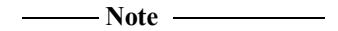

In a GIC that supports legacy operation, memory-mapped access is available for all architected GIC registers.

Unless indicated otherwise, this manual describes the GICv3 architecture in a system with affinity routing, System register access, and two Security states, enabled. This means that:

- [GICD\\_CTLR.](#page-543-0)ARE\_NS == 1.
- [GICD\\_CTLR.](#page-543-0)ARE\_S == 1.
- [GICD\\_CTLR.](#page-543-0)DS == 0.

For operation in AArch64 state:

- [ICC\\_SRE\\_EL1](#page-278-0).SRE == 1, for both the Secure and the Non-secure copy of this register.
- [ICC\\_SRE\\_EL2](#page-282-0).SRE == 1.
- [ICC\\_SRE\\_EL3](#page-285-0).SRE == 1.

For operation in AArch32 state:

- [ICC\\_SRE](#page-446-0).SRE == 1.
- [ICC\\_HSRE.](#page-407-0)SRE == 1.
- [ICC\\_MSRE](#page-431-0).SRE == 1.

From GICv3 onwards, legacy operation with the ARE and SRE control bits set to 0 is deprecated, and removed if the PE implements Secure EL2. See Chapter 15 *[Legacy Operation and Asymmetric Configurations](#page-876-1)* for more information about legacy operation.

#### **Changes specific to GICv3.1**

GICv3.1 adds support for Memory Partitioning and Monitoring, an extended SPI range, an extended PPI range, and support for Secure EL2.

#### **Changes specific to GICv3.2**

GICv3.2 adds support for Armv8-R AArch64.

#### **Changes specific to GICv3.3**

GICv3.3 adds support for non-maskable interrupts.

#### **Changes specific to GICv4**

GICv4 adds support for the direct injection of virtual interrupts to a VM, without involving the hypervisor. Direct injections are only supported by systems that implement at least one ITS that translates interrupts into LPIs.

#### **Changes specific to GICv4.1**

GICv4.1 extends direct injection support to also handle virtual SGIs. GICv4.1 changes the way some GICv4 data structures are handled.

#### **Changes specific to GICv4.2**

GICv4.2 extends direct injection support enabling signaling virtual interrupts with the non-maskable attribute.

#### **1.1.2 GIC architecture extensions**

This section introduces the GIC architecture versions and extensions.

#### **FEAT\_GICv3**

FEAT\_GICv3 introduces GIC support in the PE for GICv3.

#### **FEAT\_GICv3p1**

FEAT\_GICv3p1 introduces GIC support in the PE for GICv3.1 extended INTID ranges.

This feature requires implementation of FEAT\_GICv3.

#### **FEAT\_GICv4**

FEAT\_GICv4 introduces GIC support in the PE for GICv4.

#### **FEAT\_GICv4p1**

FEAT\_GICv4p1 introduces GIC support in the PE for GICv4.1.

This feature requires implementation of FEAT\_GICv4.

#### <span id="page-20-0"></span>**FEAT\_GICv3\_NMI**

FEAT\_GICv3\_NMI introduces GIC support for non-maskable interrupts (NMIs).

This feature requires implementation of FEAT\_GICv3.

A PE that implements FEAT\_NMI and FEAT\_GICv3 also implements FEAT\_GICv3\_NMI.

A PE that does not implement FEAT\_NMI, does not implement FEAT\_GICv3\_NMI.

#### **FEAT\_GICv3\_LEGACY**

FEAT\_GICv3\_LEGACY introduces support for GICv2 legacy operation.

This feature requires implementation of FEAT\_GICv3.

FEAT\_GICv3\_LEGACY is deprecated, and is not supported if either FEAT\_SEL2 or FEAT\_GICv4p1 is implemented.

#### **FEAT\_GICv3\_TDIR**

FEAT\_GICv3\_TDIR introduces trapping EL1 writes to Deactivate Interrupt Registers.

This feature requires implementation of FEAT\_GICv3.

### <span id="page-22-1"></span><span id="page-22-0"></span>**1.2 Terminology**

The architecture descriptions in this manual use the same terminology that is used for the Armv8 and Armv9 architecture. For more information about this terminology, see the introduction to Part A of the *Arm® Architecture Reference Manual for A-profile architecture*.

In addition, the AArch64 System register names are used where appropriate, in preference to listing both the AArch32 and AArch64 System register names. The EL*x* suffix on the AArch64 register name indicates the lowest Exception level at which the register can be accessed. The individual AArch64 System register descriptions contain a reference to the AArch32 System register that provides the same functionality.

The following sections define the architectural terms used in this manual:

- *[Interrupt types](#page-22-2)*.
- *[Interrupt states on page](#page-23-0) 1-24*.
- *[Models for handling interrupts on page](#page-23-1) 1-24*.
- *[Additional terms on page](#page-24-0) 1-25*.

#### <span id="page-22-2"></span>**1.2.1 Interrupt types**

A device that implements the GIC architecture can control *peripheral interrupts*. Peripheral interrupts are typically asserted by a physical signal to the GIC. The GIC architecture defines the following types of peripheral interrupt:

#### *Locality-specific Peripheral Interrupt (LPI)*

An LPI is a targeted peripheral interrupt that is routed to a specific PE within the affinity hierarchy:

- LPIs are always Non-secure Group 1 interrupts, in a system where two Security states are enabled.
- LPIs have edge-triggered behavior.
- LPIs can be routed using an ITS.
- LPIs do not have an active state, and therefore do not require explicit deactivation.
- LPIs are always message-based interrupts.

See *[LPIs on page](#page-85-0) 5-86* for more information.

#### *Private Peripheral Interrupt (PPI)*

This is a peripheral interrupt that targets a single, specific PE, and different PEs can use the same interrupt number to indicate different events:

- PPIs can be Group 0 interrupts, Secure Group 1 interrupts, or Non-secure Group 1 interrupts.
- PPIs can support either edge-triggered or level-sensitive behavior.
- PPIs are never routed using an ITS.
- PPIs have an active state and therefore require explicit deactivation.

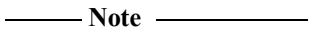

Commonly, it is expected that PPIs are used by different instances of the same interrupt source on each PE, thereby allowing a common interrupt number to be used for PE-specific events, such as the interrupts from a private timer.

#### *Shared Peripheral Interrupt (SPI)*

This is a peripheral interrupt that the Distributor can route to a specified PE that can handle the interrupt, or to a PE that is one of a group of PEs in the system that has been configured to accept this type of interrupt:

- SPIs can be Group 0 interrupts, Secure Group 1 interrupts, or Non-secure Group 1 interrupts.
- SPIs can support either edge-triggered or level-sensitive behavior.
- SPIs are never routed using an ITS.
- SPIs have an active state and therefore require explicit deactivation.

See *[Shared Peripheral Interrupts on page](#page-60-0) 4-61* for more information. For more information about the Distributor, see Chapter 3 *[GIC Partitioning](#page-40-1)*.

#### *Software Generated Interrupt (SGI)*

SGIs are typically used for inter-processor communication, and are generated by a write to an SGI register in the GIC:

- SGIs can be Group 0 interrupts, Secure Group 1 interrupts, or Non-secure Group 1 interrupts.
- SGIs have edge-triggered behavior.
- SGIs are never routed using an ITS.
- SGIs have an active state and therefore require explicit deactivation.

See *[Software Generated Interrupts on page](#page-59-0) 4-60* for more information.

An interrupt that is edge-triggered has the following property:

• It is asserted on detection of a rising edge of an interrupt signal and then, regardless of the state of the signal, remains asserted until the interrupt is acknowledged by software.

For information about edge-triggered message-based interrupts, see [Message-based interrupt.](#page-24-1)

An interrupt that is level-sensitive has the following properties:

- It is asserted whenever the interrupt signal level is active, and deasserted whenever the level is not active.
- It is explicitly deasserted by software.

#### <span id="page-23-0"></span>**1.2.2 Interrupt states**

The following states apply at each interface between the GIC and a connected PE:

**Inactive** An interrupt that is not active or pending.

**Pending** An interrupt that is recognized as asserted in hardware, or generated by software, and is

waiting to be handled by the target PE.

**Active** An interrupt that has been acknowledged by a PE and is being handled, so that another

assertion of the same interrupt is not presented as an interrupt to a PE, until the initial

interrupt is no longer active.

LPIs do not have an active state, and transition to the inactive state on being acknowledged

by a PE.

**Active and pending** An interrupt that is active from one assertion of the interrupt, and is pending from a

subsequent assertion.

LPIs do not have an active and pending state, and transition to the inactive state on being

acknowledged by a PE.

The GIC maintains state for each supported interrupt. The state machine defines the possible transitions between interrupt states, and, for each interrupt type, the conditions that cause a transition. See *[Interrupt handling state](#page-55-0)  [machine on page](#page-55-0) 4-56* for more information.

#### <span id="page-23-1"></span>**1.2.3 Models for handling interrupts**

In a multiprocessor implementation, the following models exist for handling interrupts:

#### **Targeted distribution model**

This model applies to all PPIs and to all LPIs. It also applies to:

- SPIs during non-legacy operation, if [GICD\\_IROUTER<n>](#page-583-0).Interrupt\_Routing\_Mode == 0.
- During legacy operation, when [GICD\\_CTLR.](#page-543-0)ARE\_\* == 0, if only one bit in the appropriate [GICD\\_ITARGETSR<n>](#page-600-0) field == 1.

A target PE that has been specified by software receives the interrupt.

#### **Targeted list model**

This model applies to SGIs only. Multiple PEs receive the interrupt independently. When a PE acknowledges the interrupt, the interrupt pending state is cleared only for that PE. The interrupt remains pending for each PE independently until it has been acknowledged by the PE.

#### **1 of N model**

This model applies to SPIs only. The interrupt is targeted at a specified set of PEs, and is taken on only one PE in that set. The PE that takes the interrupt is selected in an IMPLEMENTATION DEFINED manner. The architecture applies restrictions on which PEs can be selected, see *[Enabling the](#page-68-0)  [distribution of interrupts on page](#page-68-0) 4-69*.

#### **Note**

- The Arm GIC architecture guarantees that a 1 of N interrupt is presented to only one PE listed in the target PE set.
- A 1 of N interrupt might be presented to a PE where the interrupt is not the highest priority interrupt, or where the interrupt is masked by [ICC\\_PMR\\_EL1](#page-266-0) or within the PE. See *[Interrupt](#page-49-0)  [lifecycle on page](#page-49-0) 4-50*.

For SPIs during legacy operation, this model applies when more than one target PE is specified in the target registers.

The hardware implements a mechanism to determine which PE activates the interrupt, if more than one PE can handle the interrupt.

#### <span id="page-24-0"></span>**1.2.4 Additional terms**

The following additional terms are used throughout this manual:

#### <span id="page-24-2"></span>**Idle priority**

<span id="page-24-3"></span>In GICv3, the idle priority, 0xFF, is the running priority read from [ICC\\_RPR\\_EL1](#page-269-0) on the CPU interface when no interrupts are active on that interface. During legacy operation, the idle priority, as read from [GICC\\_RPR](#page-763-0), is IMPLEMENTATION DEFINED, as in GICv2.

#### **Interrupt Identifier (INTID)**

The number space that uniquely identifies an interrupt with an associated event and its source. The interrupt is then routed to one or more PEs for handling. PPI and SGI interrupt numbers are local to each PE. SPIs and LPIs have global interrupt numbers for the physical domain. See *[INTIDs on](#page-34-0)  [page](#page-34-0) 2-35* for more information.

#### <span id="page-24-4"></span>**Interrupt Routing Infrastructure (IRI)**

The Distributor, Redistributors and, optionally, one or more ITSs. See *[The GIC logical components](#page-41-0) [on page](#page-41-0) 3-42* for more information.

#### <span id="page-24-1"></span>**Message-based interrupt**

A message-based interrupt is an interrupt that is asserted because of a memory write access to an assigned address. Physical interrupts can be converted to message-based interrupts. Message-based interrupts can support either level-sensitive or edge-triggered behavior, although LPIs are always edge-triggered.

GICv3 supports two mechanisms for message-based interrupts:

- A mechanism for communicating an SPI, where the assigned address is held in the Distributor. In this case the message-based interrupt can be either level-sensitive or edge-triggered.
- A mechanism for communicating an LPI, where the assigned address is held in an ITS, if an ITS is implemented, or in the Redistributor.

Arm recommends the use of LPIs to provide support for MSI and MSI-X capabilities in systems that support PCIe. See Chapter 5 *[Locality-specific Peripheral Interrupts and the ITS](#page-84-1)* for more information. GICv3 also includes architected support for signaling SPIs using message-based interrupts, see *[Shared Peripheral Interrupts on page](#page-60-0) 4-61*.

#### **Physical interrupt**

An interrupt that targets a physical PE is a physical interrupt. It is signaled to the PE by the physical CPU interface to which the PE is connected.

#### <span id="page-25-0"></span>**Running priority**

<span id="page-25-2"></span>At any given time, the running priority of a CPU interface is either:

- The group priority of the active interrupt, for which there has not been a priority drop on that interface.
- If there is no active interrupt for which there has not been a priority drop on the interface, the running priority is the [idle priority](#page-24-2) 0xFF.

#### **Sufficient priority**

The GIC CPU interface compares the priority of an enabled, pending interrupt with all of the following, to determine whether the interrupt has sufficient priority:

- <span id="page-25-1"></span>• The Priority Mask Register, [ICC\\_PMR\\_EL1.](#page-266-0)
- The preemption settings for the interface, as indicated by [ICC\\_BPR0\\_EL1](#page-225-0) and [ICC\\_BPR1\\_EL1.](#page-228-0)
- The current [running priority](#page-25-0), as indicated by [ICC\\_RPR\\_EL1](#page-269-0) for the CPU interface.

If the interrupt has sufficient priority it is signaled to the connected PE.

#### **Virtual interrupt**

An interrupt that targets a VM is a virtual interrupt. It is signaled by the associated virtual CPU interface. See Chapter 6 *[Virtual Interrupt Handling and Prioritization](#page-150-1)* for more information.

#### **Maintenance interrupt**

A physical interrupt that signals key events associated with interrupt handling on a VM to allow the hypervisor to track those events. These events are processed by the hypervisor, and include enabling and disabling a particular group of interrupts. See *[Maintenance interrupts on page](#page-158-0) 6-159* for more information.

### <span id="page-26-1"></span><span id="page-26-0"></span>**1.3 Supported configurations and compatibility**

In Armv8-A and Armv9-A, EL2 and EL3 are OPTIONAL, and a PE can support one, both, or neither of these Exception levels. However:

- A PE requires EL3 to support multiple Security states.
- A PE requires EL2 to support virtualization.
- If EL3 is not implemented, there is only a single Security state. This Security state is either Secure state or Non-secure state.

GICv3 supports interrupt handling for all of these configurations, and for execution in both AArch32 state and AArch64 state, in accordance with the *interprocessing* rules described in *Arm® Architecture Reference Manual for A-profile architecture*.

#### **1.3.1 Affinity routing configuration**

The GICv3 architecture supports affinity routing. It provides OPTIONAL support for:

- An asymmetric configuration. When two Security states are supported, this allows affinity routing to be enabled for Non-secure state and disabled for Secure state. This provides support for a Secure legacy environment.
- A legacy-only environment where affinity routing is disabled.

#### **1.3.2 System register configuration**

When affinity routing is enabled for execution in both Security states, the GIC must be configured to use System register access to handle physical interrupts. The architecture does not support having affinity routing enabled for a Security state, and not having System register access configured for that Security state. Configuring the GIC this way results in UNPREDICTABLE behavior. When affinity routing is enabled for execution in Non-secure state, the GIC architecture optionally supports legacy operation for virtual interrupts, that is legacy interrupt handling at Non-secure EL1 under the control of a hypervisor executing at EL2.

#### **1.3.3 GIC control and configuration**

Many of the GIC registers are available in different forms, to permit effective interrupt handling:

- For multiple Security states.
- For different interrupt groups.
- Using System register access for GICv3 or memory-mapped access for legacy operation.

When System register access is enabled, control and configuration of the GIC architecture is handled by architected System registers and the associated accesses that define the GIC programmers' model. See [Chapter](#page-188-1) 12 *[Programmers' Model](#page-188-1)* for more information.

Some registers are always memory-mapped, while others use System register access in GICv3, and memory-mapped access for legacy operations.

<span id="page-26-2"></span>Table 1-[1 on page](#page-26-2) 1-27 shows the registers that are always memory-mapped.

**Table 1-1 Memory-mapped registers**

| Prefix in short register name | Registers                |
|-------------------------------|--------------------------|
| GICD                          | Distributor registers    |
| GICR                          | Redistributor registersa |
| GITS                          | ITS registersb           |

- a. There is one copy of each of the Redistributor registers per PE.
- b. There can be more than one ITS in an implementation. Each ITS has its own copy of the GITS registers.

<span id="page-27-1"></span>[Table](#page-27-1) 1-2 shows the registers that are memory-mapped for legacy operations, but are replaced by System register access in GICv3 when System register access is enabled.

**Table 1-2 Memory-mapped registers for legacy operation**

| Prefix in short register name | Registers                           |
|-------------------------------|-------------------------------------|
| GICC                          | Physical CPU interface registers    |
| GICV                          | Virtual CPU interface registers     |
| GICH                          | Virtual interface control registers |

| Note |  |
|------|--|
|      |  |

- An operating system executing at Non-secure EL1 uses either the GICC\_\* or the GICV\_\* registers to control interrupts, and is unaware of the difference.
- The GICR\_\* and GITS\_\* registers are introduced in GICv3.

<span id="page-27-0"></span>[Table](#page-27-0) 1-3 shows the registers that GICv3 supports when System register access is enabled.

**Table 1-3 System registers** 

| Prefix in short register name | System registers accessed           |
|-------------------------------|-------------------------------------|
| ICC                           | Physical CPU interface registers    |
| ICV                           | Virtual CPU interface registers     |
| ICH                           | Virtual interface control registers |

The Armv8 and Armv9 support for virtualization and the Exception level at which a PE is operating determine whether the physical CPU interface registers or the virtual CPU interface registers are accessed.

For more information about register names and the factors that affect which register to use, see *[GIC System register](#page-196-0)  [access on page](#page-196-0) 12-197*.

#### **1.3.4 References to the Armv8 architectural state**

<span id="page-28-1"></span>Table 1-[4 on page](#page-28-1) 1-29 shows the Armv8 and Armv9 architectural state that is used with or affects the operation of the GIC.

<span id="page-28-6"></span><span id="page-28-4"></span><span id="page-28-3"></span>**Table 1-4 Armv8 and Armv9 architectural state affecting GIC operation**

<span id="page-28-5"></span><span id="page-28-2"></span><span id="page-28-0"></span>

| AArch64         |           | AArch32 |           | Purpose                                                                                                   |
|-----------------|-----------|---------|-----------|-----------------------------------------------------------------------------------------------------------|
| State           | Field     | State   | Field     |                                                                                                           |
| PSTATEa         | A         | PSTATEa | A         | SError interrupt mask bit (AArch64 state)<br>Asynchronous Abort mask bit (AArch32 state)                  |
|                 | I         |         | I         | IRQ mask bit                                                                                              |
|                 | F         |         | F         | FIQ mask bit                                                                                              |
|                 | AllInt    |         | -         | If FEAT_NMI implement, All interrupt mask.                                                                |
| -               | -         | DFSR    | STATUS/FS | Fault status                                                                                              |
|                 | -         |         | ExT       | External abort type                                                                                       |
| ESR_ELx         | EC        | HSR     | EC        | Exception class                                                                                           |
|                 | IL        |         | IL        | Instruction length for synchronous exceptions                                                             |
|                 | ISS       |         | ISS       | Instruction Specific Syndrome                                                                             |
| HCR_EL2         | AMO       | HCR     | AMO       | SError interrupt routing (AArch64 state)<br>Asynchronous External Abort interrupt routing (AArch32 state) |
|                 | IMO       |         | IMO       | Physical IRQ routing                                                                                      |
|                 | FMO       |         | FMO       | Physical FIQ routing                                                                                      |
|                 | RW        |         | RES0      | Execution state control for lower Exception levels (AArch64 state)                                        |
|                 | VSE       |         | VA        | Virtual SError Abort exception (AArch64 state)<br>Virtual Asynchronous Abort exception (AArch32 state)    |
|                 | VI        |         | VI        | Virtual IRQ interrupt                                                                                     |
|                 | VF        |         | VF        | Virtual FIQ interrupt                                                                                     |
|                 | TGE       |         | TGE       | Trap General Exceptions                                                                                   |
| HSTR_EL2        | T <n></n> | HSTR    | T <n></n> | Hypervisor system traps                                                                                   |
|                 | I         |         | I         | IRQ pending                                                                                               |
|                 | F         |         | F         | FIQ pending                                                                                               |
| ID_AA64PFR0_EL1 | GIC       | -       | -         | System register GIC interface support                                                                     |
| ID_PFR1_EL1     | GIC       | ID_PFR1 | GIC       | System register GIC CPU interface support                                                                 |
| ISR_EL1         | A         | ISR     | A         | SError pending (AArch64 state)<br>External Abort pending (AArch32 state)                                  |

<span id="page-29-5"></span><span id="page-29-3"></span>**Table 1-4 Armv8 and Armv9 architectural state affecting GIC operation (continued)**

<span id="page-29-4"></span><span id="page-29-2"></span>

| AArch64   |       | AArch32 |       |                                                                            |
|-----------|-------|---------|-------|----------------------------------------------------------------------------|
| State     | Field | State   | Field | Purpose                                                                    |
| MPIDR_EL1 | Aff3  | MPIDR   | -     | Affinity level 3                                                           |
|           | Aff2  |         | Aff2  | Affinity level 2                                                           |
|           | Aff1  |         | Aff1  | Affinity level 1                                                           |
|           | Aff0  |         | Aff0  | Affinity level 0                                                           |
| SCR_EL3   | RW    | SCR     | RES0  | Execution state control for lower Exception levels (AArch64 state<br>only) |
|           | EA    |         | EA    | SError interrupt routing (AArch64 state)                                   |
|           |       |         |       | External Abort interrupt routing (AArch32 state)                           |
|           | FIQ   |         | FIQ   | Physical FIQ routing                                                       |
|           | IRQ   |         | IRQ   | Physical IRQ routing                                                       |
|           | NS    |         | NS    | Non-secure bit                                                             |
|           | EEL2  |         | -     | Secure EL2 enable                                                          |

a. Process state, PSTATE, is an abstraction of the process state information. For more information, see *Arm® Architecture Reference Manual for A-profile architecture*.

For more information about these registers and fields, see *Arm® Architecture Reference Manual for A-profile architecture*.

#### **1.3.5 GICv3 with no legacy operation**

<span id="page-29-0"></span>In an implementation that does not support legacy operation, affinity routing and System register access are permanently enabled. This means that the associated control bits are RAO/WI. Table 1-[5 on page](#page-29-0) 1-30 shows the register fields that are affected by this.

**Table 1-5 Control bits for affinity routing and System register access**

<span id="page-29-1"></span>

| AArch64 registers | AArch32 registers | Memory-mapped registers |
|-------------------|-------------------|-------------------------|
| ICC_SRE_EL1.SREa  | ICC_SRE.SREa      | -                       |
| ICC_SRE_EL2.SRE   | ICC_HSRE.SRE      | -                       |
| ICC_SRE_EL3.SRE   | ICC_MSRE.SRE      | -                       |
| -                 | -                 | GICD_CTLR.ARE_S         |
| -                 | -                 | GICD_CTLR.ARE_NS        |

a. There is a Secure copy and a Non-secure copy of this register.

If Secure Virtualization is supported, this is the only permitted configuration.

#### <span id="page-30-0"></span>**1.3.6 GICv3 with legacy operation**

*Legacy operation* is a form of limited backwards compatibility with GICv2 that is provided to allow systems using GICv3 to run code using GICv2, provided that this code meets the restrictions described in this section. Legacy operation is OPTIONAL in GICv3. See *[Legacy support of interrupts and asymmetric configurations on page](#page-877-0) 15-878*.

In a GICv3 implementation that supports legacy operation, a maximum of eight PEs, whose individual support for a memory-mapped register interface is IMPLEMENTATION DEFINED, are available as physical or virtual interrupt targets within a given VM. It is IMPLEMENTATION DEFINED:

- Whether legacy operation applies to execution in both Security states, or to execution in Secure state only.
- Whether legacy operation is available only in the virtual CPU interface when executing in Non-secure EL1.

In GICv3, the following restrictions apply to legacy operation:

• The GICv2 feature [GICC\\_CTLR.](#page-742-0)AckCtl was deprecated in GICv2 and is not supported in GICv3. Correspondingly, even in legacy mode, the behavior is as if the [GICC\\_CTLR](#page-742-0).AckCtl bit described in GICv2 is RAZ/WI.

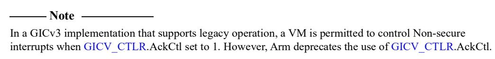

- The GICv2 configuration lockdown feature and the associated **CFGSDISABLE** input signal are not supported.
- A hypervisor executing at EL2 can control virtual interrupts only for the PE on which the EL2 software is executing and cannot control virtual interrupts on other PEs.

For legacy operation, an asymmetric configuration is supported where:

- Affinity routing and System register access are enabled in Non-secure state and at EL3.
- Affinity routing and System register access are disabled at Secure EL1.

This allows a secure operating system, running at Secure EL1, to use legacy functionality, provided that it does not configure Non-secure interrupts.

In GICv2 software executing in Secure state could use [GICC\\_AIAR](#page-737-0), [GICC\\_AEOIR](#page-733-0), [GICC\\_AHPPIR](#page-735-0), and [GICC\\_ABPR](#page-731-0) to control interrupts in Non-secure state. There is no equivalent functionality in asymmetric configurations.

| Introduction |
|--------------|
|--------------|

*1.3 Supported configurations and compatibility*

## <span id="page-32-1"></span><span id="page-32-0"></span>Chapter 2 **Distribution and Routing of Interrupts**

This chapter describes the distribution and routing of interrupts to a target PE using affinity routing, and the assignment of interrupt IDs. It contains the following sections:

- *[The Distributor and Redistributors on page](#page-33-1) 2-34*.
- *[INTIDs on page](#page-34-1) 2-35*.
- *[Affinity routing on page](#page-38-1) 2-39*.

### <span id="page-33-1"></span><span id="page-33-0"></span>**2.1 The Distributor and Redistributors**

The Distributor provides the routing configuration for SPIs, and holds all the associated routing and priority information.

The Redistributor provides the configuration settings for PPIs and SGIs.

A Redistributor always presents the pending interrupt with the highest priority to the CPU interface in finite time. For more information about interrupt prioritization, see *[Interrupt prioritization on page](#page-70-0) 4-71*.

The highest priority pending interrupt might change because:

- The previous highest priority interrupt has been acknowledged.
- The previous highest priority interrupt has been preempted.
- The previous highest priority interrupt is removed and no longer valid.
- The group interrupt enable has been modified.
- The PE is no longer a participating PE. See *[Participating nodes on page](#page-39-0) 2-40*.

#### <span id="page-34-1"></span><span id="page-34-0"></span>**2.2 INTIDs**

Interrupts are identified using *ID numbers* (INTIDs). The range of INTIDs supported by GICv3 is IMPLEMENTATION DEFINED, according to the following rules:

- The number of INTID bits supported in the Distributor and Redistributor is reported by [GICD\\_TYPER](#page-617-0):
  - A minimum of 11 bits of INITD is required to support Extended PPIs.
  - A minimum of 13 bits of INTID is required to support Extended SPIs.
  - A minimum of 14 bits of INTID is required to support LPIs.
- The ITS must be programmed so that interrupts that are forwarded to a Redistributor are in the range of interrupts that are supported by that Redistributor, otherwise the behavior is UNPREDICTABLE.
- For the number of INTID bits supported in the CPU interface:
  - The GICv3 CPU interface supports either a 16-bit or a 24-bit INTID field, the choice being IMPLEMENTATION DEFINED. The number of physical interrupt identifier bits that are supported is indicated by [ICC\\_CTLR\\_EL1](#page-232-0).IDbits and [ICC\\_CTLR\\_EL3.](#page-237-0)IDbits.

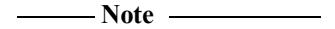

A Redistributor can be configured through [GICR\\_PROPBASER](#page-702-0) to use fewer bits than specified by [GICD\\_TYPER](#page-617-0).

The valid INTID space is governed by the implemented size in the CPU interface and the Distributor. It is a programming error to forward an INTID that is greater than the supported size to a CPU interface.

Unused INTID bits are RAZ. This means that any affected bit field is zero-extended.

<span id="page-34-2"></span>Table 2-[1 on page](#page-34-2) 2-35 shows how the INTID space is partitioned by interrupt type.

**Table 2-1 INTIDs**

| INTID       | Interrupt type              | Details                                                                                                                                                                                                  | Notes                                                                                                                                                  |
|-------------|-----------------------------|----------------------------------------------------------------------------------------------------------------------------------------------------------------------------------------------------------|--------------------------------------------------------------------------------------------------------------------------------------------------------|
| 0 – 15      | SGI                         | These interrupts are local to a CPU interface.                                                                                                                                                           | INTIDs 0-1023 are compatible                                                                                                                           |
| 16 – 31     | PPI                         | with earlier versions of the GIC<br>architecture.                                                                                                                                                        |                                                                                                                                                        |
| 32 – 1019   | SPI                         | Shared peripheral interrupts that the Distributor can<br>route to either a specific PE, or to any one of the PEs in<br>the system that is a participating node, see<br>Participating nodes on page 2-40. |                                                                                                                                                        |
| 1020 – 1023 | Special interrupt<br>number | Interrupt IDs that are reserved for special purposes, as<br>Special INTIDs on page 2-36 describes.                                                                                                       |                                                                                                                                                        |
| 1024 – 1055 | -                           | Reserved                                                                                                                                                                                                 | -                                                                                                                                                      |
| 1056 – 1119 | PPI                         | Extended PPI. The interrupts are local to a CPU<br>interface.                                                                                                                                            | INTIDs 1056-1119 are not<br>compatible with earlier<br>versions of the GIC<br>architecture. This range is<br>supported by the GICv3.1<br>architecture. |
| 1120 – 4095 | -                           | Reserved                                                                                                                                                                                                 | -                                                                                                                                                      |

**Table 2-1 INTIDs (continued)**

| INTID                               | Interrupt type | Details                                                             | Notes                                     |
|-------------------------------------|----------------|---------------------------------------------------------------------|-------------------------------------------|
| 4096 – 5119                         | SPI            | Extended SPI.                                                       | Supported by the GICv3.1<br>architecture. |
| 5120 – 8191                         | -              | Reserved                                                            |                                           |
| 8192 –<br>IMPLEMENTATION<br>DEFINED | LPI            | Peripheral hardware interrupts that are routed to a<br>specific PE. | -                                         |


The Arm recommended PPI INTID assignments are provided by the Server Base System Architecture, see *Arm® Server Base System Architecture (SBSA)*.

The GICv4 architecture provides a unique INTID space for each VM by supporting a vPEID in addition to the INTID space. See *[About GIC support for virtualization on page](#page-151-0) 6-152* for more information about VMs and *[The](#page-91-0)  [Interrupt Translation Service on page](#page-91-0) 5-92* for more information about vPEIDs.

Arm strongly recommends that implemented interrupts are grouped to use the lowest INTID numbers and as small a range of INTIDs as possible. This reduces the size of the associated tables in memory that must be implemented, and that discovery routines must check.

Arm strongly recommends that software reserves:

- INTID0 INTID7 for Non-secure interrupts.
- INTID8 INTID15 for Secure interrupts.

#### <span id="page-35-1"></span><span id="page-35-0"></span>**2.2.1 Special INTIDs**

The list of the INTIDs that the GIC architecture reserves for special purposes is as follows:

**1020** The GIC returns this value in response to a read of [ICC\\_IAR0\\_EL1](#page-252-0) or [ICC\\_HPPIR0\\_EL1](#page-248-0) at EL3, to indicate that the interrupt being acknowledged is one which is expected to be handled at Secure EL1 or Secure EL2. This INTID is only returned when the PE is executing at EL3 using AArch64 state, or when the PE is executing in AArch32 state in Monitor mode.

> This value can also be returned by reads of [ICC\\_IAR1\\_EL1](#page-254-0) or [ICC\\_HPPIR1\\_EL1](#page-250-0) at EL3 when [ICC\\_CTLR\\_EL3.](#page-237-0)RM == 1, see *[Asymmetric operation and the use of ICC\\_CTLR\\_EL3.RM on](#page-881-1)  page [15-882](#page-881-1)*.

**1021** The GIC returns this value in response to a read of [ICC\\_IAR0\\_EL1](#page-252-0) or [ICC\\_HPPIR0\\_EL1](#page-248-0) at EL3, to indicate that the interrupt being acknowledged is one which is expected to be handled at Non-secure EL1 or EL2. This INTID is only returned when the PE is executing at EL3 using AArch64 state, or when the PE is executing in AArch32 state in Monitor mode.

> This value can also be returned by reads of [ICC\\_IAR1\\_EL1o](#page-254-0)r [ICC\\_HPPIR1\\_EL1](#page-250-0) at EL3 when [ICC\\_CTLR\\_EL3.](#page-237-0)RM == 1, see *[Asymmetric operation and the use of ICC\\_CTLR\\_EL3.RM on](#page-881-1)  page [15-882](#page-881-1)*

**1022** In GICv3.3, when SCLTR\_ELx.NMI is set to 1, the GIC returns this value in response to a read of [ICC\\_IAR1\\_EL1](#page-254-0) to indicate that the interrupt being acknowledged is an NMI.

> This value also applies in legacy operation. For more information, see *[Use of the special INTID](#page-878-0)  [1022 on page](#page-878-0) 15-879*.

- **1023** This value is returned in response to an interrupt acknowledge, if there is no pending interrupt with sufficient priority for it to be signaled to the PE, or if the highest priority pending interrupt is not appropriate for the:
  - Current Security state.

• Interrupt group that is associated with the System register.

**Note**

These INTIDs do not require an end of interrupt or deactivation.

For more information about the use of special INTIDs, see the descriptions for the following registers:

- [ICC\\_IAR0\\_EL1.](#page-252-0)
- [ICC\\_IAR1\\_EL1.](#page-254-0)
- [ICC\\_HPPIR0\\_EL1.](#page-248-0)
- [ICC\\_HPPIR1\\_EL1.](#page-250-0)

#### **2.2.2 Implementations with mixed INTD sizes**

Implementations might choose to implement different INTID sizes for different parts of the GIC, subject to the following rules:

• PEs might implement either 16 or 24 bits of INTID.

**Note**

A system might include a mixture of PEs that support 16 bits of INTID and PEs that support 24 bits of INTID.

- The Distributor and Redistributors must all implement the same number of INTID bits.
- In systems that support LPIs, the Distributors and all Redistributors must implement at least 14 bits of INTID. The number of bits that is implemented in the Distributor and Redistributors must not exceed the minimum number that is implemented on any PE in the system.

**Note**

Because interrupts might target any PE, each PE must be able to receive the maximum INTID that can be sent by a Redistributor. This means that the INTID size that is supported by the Redistributors cannot exceed the minimum INTID size that is supported by each PE in the system.

- In systems that do not support LPIs, the Distributor and all Redistributors must implement at least 5 bits of INTID and cannot implement more than 10 bits of INTID. For GIC version 3.1, no more than 13 bits of INTID can be implemented.
- In systems that include one or more ITSs, an ITS might implement any value up to and including the number of bits that are supported by the Distributor and the Redistributors down to a minimum of 14 bits, which is the minimum number that is required for LPI support.

#### **2.2.3 Valid interrupt ID check pseudocode**

The following pseudocode describes how the GIC checks whether an INTID for a physical interrupt is valid:

```
// InterruptIdentifierValid()
// ==========================
boolean InterruptIdentifierValid(bits(64) data, boolean lpiAllowed)
    // First check whether any out of range bits are set
    integer N = CPUInterfaceIDSize();
    if !IsZero(data<63:N>) then
        if GenerateLocalSError() then
            // Reporting of locally generated SEIs is supported
            IMPLEMENTATION_DEFINED "SError INVALID_INTERRUPT_IDENTIFIER";
            UNPREDICTABLE;
    intID = data<INTID_SIZE-1:0>;
    if !lpiAllowed && IsLPI(intID) then // LPIs are not supported
        if GenerateLocalSError() then
            // Reporting of locally generated SEIs is supported
```

```
IMPLEMENTATION_DEFINED "SError INVALID_INTERRUPT_IDENTIFIER";
       UNPREDICTABLE;
   // Now check for special identifiers
   if IsSpecial(intID) then
       return FALSE; // It is a special ID
   // All the checks pass so the identifier is valid
   return TRUE;
The following pseudocode describes how the GIC checks whether an INTID for a virtual interrupt is valid:
// VirtualIdentifierValid()
// ========================
boolean VirtualIdentifierValid(bits(64) data, boolean lpiAllowed)
   // First check whether any out of range bits are set
   integer N = VIDBits();
   if !IsZero(data<63:N>) then
       if ICH_VTR_EL2.SEIS == '1' then
           // Reporting of locally generated SEIs is supported
           IMPLEMENTATION_DEFINED "SError INVALID_INTERRUPT_IDENTIFIER";
       UNPREDICTABLE;
   intID = data<INTID_SIZE-1:0>;
   if !lpiAllowed && IsLPI(intID) then // LPIs are not supported
       if ICH_VTR_EL2.SEIS == '1' then
           // Reporting of locally generated SEIs is supported
           IMPLEMENTATION_DEFINED "SError INVALID_INTERRUPT_IDENTIFIER";
       UNPREDICTABLE;
   // Now check for special identifiers
   if IsSpecial(intID) then
       return FALSE; // It is a special ID
   // All the checks pass so the identifier is valid
   return TRUE;
The following pseudocode describes CPU interface ID size function.
// CPUInterfaceIDSize()
// ====================
// Returns the number of Interrupt ID bits implemented at the CPU interface. This value is an
// IMPLEMENTATION DEFINED choice of 16 or 24 and is discoverable from ICC_CTLR_EL1/EL3.IDbits
integer CPUInterfaceIDSize()
   return integer IMPLEMENTATION_DEFINED "CPU interface INTID size 16 or 24";
```

### <span id="page-38-1"></span><span id="page-38-0"></span>**2.3 Affinity routing**

Affinity routing is a hierarchical address-based scheme to identify specific PE nodes for interrupt routing.

For a PE, the affinity value is defined in [MPIDR\\_EL1](#page-29-2) for AArch64 state, and in [MPIDR](#page-29-3) for AArch32 state:

- Affinity routing is a 32-bit value that is composed of four 8-bit affinity fields. These fields are the nodes *a*, *b*, *c*, and *d*.
- GICv3 using AArch64 state can support:
  - A four level routing hierarchy, a.b.c.d.
  - A three level routing hierarchy, 0.b.c.d.
- GICv3 using AArch32 state only supports three affinity levels.
- [ICC\\_CTLR\\_EL3.](#page-237-0)A3V, [ICC\\_CTLR\\_EL1](#page-232-0).A3V, and [GICD\\_TYPER](#page-617-0).A3V indicate whether four levels or three levels of affinity are implemented.

| Note                                                                                     |  |
|------------------------------------------------------------------------------------------|--|
| An implementation that requires four levels of affinity must only support AArch64 state. |  |

The enumeration notation for specifying nodes in an affinity hierarchy is of the following form, where Affx is Affinity level x:

Aff3.Aff2.Aff1.Aff0

Affinity routing for a Security state is enabled in the Distributor, using the *Affinity Routing Enable* (ARE) bits. Affinity routing is enabled:

- For Secure interrupts, if [GICD\\_CTLR.](#page-543-0)ARE\_S is set to 1.
- For Non-secure interrupts, if the [GICD\\_CTLR](#page-543-0).ARE\_NS bit is set to 1.

[GICD\\_CTLR.](#page-543-0)ARE\_S and [GICD\\_CTLR](#page-543-0).ARE\_NS are RAO/WI if affinity routing is permanently enabled.

For the handling of physical interrupts when affinity routing is enabled, System register access must also be enabled, see *[GIC System register access on page](#page-196-0) 12-197*. For the other cases, see Chapter 15 *[Legacy Operation and](#page-876-1)  [Asymmetric Configurations](#page-876-1)*.

#### <span id="page-38-2"></span>**2.3.1 Routing SPIs and SGIs by PE affinity**

SPIs are routed using an affinity address and the routing mode information that is held in [GICD\\_IROUTER<n>](#page-583-0). SGIs are routed using the affinity address and routing mode information that is written by software when it generates the SGI.

SGIs are generated using the following registers:

- [ICC\\_SGI0R\\_EL1.](#page-272-0)
- [ICC\\_SGI1R\\_EL1.](#page-275-0)
- [ICC\\_ASGI1R\\_EL1](#page-222-0).

| Note |  |
|------|--|

If [GICD\\_TYPER.](#page-617-0)RSS is 0 or ICC\_CTLR\_ELx.RSS is 0, Arm strongly recommends that only values in the range 0-15 are used at affinity level 0 to align with the SGI target list capability. See *[Software Generated Interrupts on](#page-59-0)  [page](#page-59-0) 4-60*.

SPIs and SGIs are routed using different registers:

- SPIs are routed using [GICD\\_IROUTER<n>](#page-583-0).Interrupt\_Routing\_Mode:
  - If [GICD\\_IROUTER<n>.](#page-583-0)Interrupt\_Routing\_Mode is cleared to 0, SPIs are routed to a single PE specified by a.b.c.d.
  - If [GICD\\_IROUTER<n>.](#page-583-0)Interrupt\_Routing\_Mode is set to 1, SPIs are routed to any PE defined as a participating node:
    - The mechanisms by which the IRI selects the target PE is IMPLEMENTATION DEFINED.

- When [ICC\\_CTLR\\_EL3.](#page-237-0)PMHE == 1, or [ICC\\_CTLR\\_EL1.](#page-232-0)PMHE == 1, the [ICC\\_PMR\\_EL1](#page-266-0) register associated with the PE might be used by the IRI to determine the target PE.

For more information about participating nodes, see *[Participating nodes](#page-39-0)*.

- SGIs are routed using [ICC\\_SGI0R\\_EL1](#page-272-0).IRM, and [ICC\\_SGI1R\\_EL1](#page-275-0).IRM:
  - If the IRM bit is set to 1, SGIs are routed to all participating PEs in the system, excluding the originating PE.
  - If the IRM bit is cleared to 0, SGIs are routed to a group of PEs, specified by a.b.c.targetlist. Targeting an unimplemented affinity has no effect.

#### <span id="page-39-0"></span>**2.3.2 Participating nodes**

An enabled SPI configured to use the 1 of N distribution model can target a PE when:

- [GICR\\_WAKER](#page-727-0).ProcessorSleep == 0 and the interrupt group of the interrupt is enabled on the PE.
- [GICD\\_CTLR.](#page-543-0)E1NWF == 1.
- [GICR\\_TYPER.](#page-710-0)DPGS == 1, and for the interrupt group of the interrupt, [GICR\\_CTLR.](#page-640-0){DPG1S, DPG1NS, DPG0} == 0.

For more information about whether a PE can be selected as the target when the 1 of N distribution model is used, see *[GICR\\_CTLR, Redistributor Control Register on page](#page-640-0) 12-641*.

For more information about enabling interrupts and interrupt groups, see *[Enabling the distribution of interrupts on](#page-68-0)  [page](#page-68-0) 4-69*.

#### **2.3.3 Changing affinity routing enables**

This manual describes the GICv3 architecture in a system with affinity routing enabled. This means that:

- [GICD\\_CTLR.](#page-543-0)ARE\_NS == 1.
- [GICD\\_CTLR.](#page-543-0)ARE\_S == 1.

If the value of [GICD\\_CTLR.](#page-543-0)ARE\_NS or [GICD\\_CTLR](#page-543-0).ARE\_S is changed from 1 to 0, the result is UNPREDICTABLE.

When [GICD\\_CTLR](#page-543-0). DS == 0, then:

- Changing [GICD\\_CTLR.](#page-543-0)ARE\_S from 0 to 1 is unpredictable except when all of the following apply:
  - [GICD\\_CTLR.](#page-543-0)EnableGrp0 == 0.
  - [GICD\\_CTLR.](#page-543-0)EnableGrp1S == 0.
  - [GICD\\_CTLR.](#page-543-0)EnableGrp1NS == 0.
- Changing [GICD\\_CTLR.](#page-543-0)ARE\_NS from 0 to 1 is unpredictable except when [GICD\\_CTLR](#page-543-0). EnableGrp1NS == 0.

When [GICD\\_CTLR](#page-543-0).DS == 1, then:

- Changing [GICD\\_CTLR.](#page-543-0)ARE from 0 to 1 is unpredictable except when all of the following apply:
  - [GICD\\_CTLR.](#page-543-0)EnableGrp0 == 0.
  - [GICD\\_CTLR.](#page-543-0)EnableGrp1 == 0.

| Note |  |
|------|--|
|      |  |

The effect of clearing [GICD\\_CTLR.](#page-543-0)EnableGrp0, [GICD\\_CTLR](#page-543-0).EnableGrp1S, or [GICD\\_CTLR.](#page-543-0)EnableGrp1NS, as appropriate, must be visible when changing [GICD\\_CTLR](#page-543-0).ARE\_S or [GICD\\_CTLR](#page-543-0).ARE\_NS from 0 to 1. Software can poll [GICD\\_CTLR.](#page-543-0)RWP to check that writes that clear [GICD\\_CTLR.](#page-543-0)EnableGrp0, [GICD\\_CTLR.](#page-543-0)EnableGrp1S, or [GICD\\_CTLR.](#page-543-0)EnableGrp1NS bits have completed.

## <span id="page-40-1"></span><span id="page-40-0"></span>Chapter 3 **GIC Partitioning**

This chapter describes the GIC logical partitioning. It contains the following sections:

- *[The GIC logical components on page](#page-41-1) 3-42*.
- *[Interrupt bypass support on page](#page-46-1) 3-47*.

#### <span id="page-41-1"></span><span id="page-41-0"></span>**3.1 The GIC logical components**

The GICv3 architecture consists of a set of logical components:

- A *Distributor*.
- A *Redistributor* for each PE that is supported.
- A *CPU interface* for each PE that is supported.
- *Interrupt Translation Service* components (ITS), to support the OPTIONAL translation of events into LPIs.

The Distributor, Redistributor, and ITS are collectively known as an IRI.

[Figure](#page-41-2) 3-1 shows the IRI.

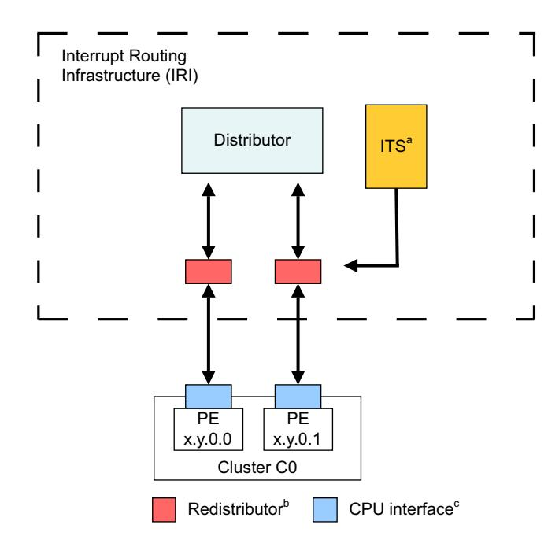

- a. The inclusion of an ITS is optional, and there might be more than one ITS in an IRI.
- b. There is one Redistributor per PE.
- c. There is one CPU interface per PE.

#### **Figure 3-1 Interrupt Routing Infrastructure**

<span id="page-41-2"></span>The CPU interface handles physical interrupts at all implemented Exception levels:

- Interrupts that are translated into LPIs are optionally routed through the ITS to the Redistributor and the CPU interface.
- PPIs are routed directly from the source to the local Redistributor.
- SPIs are routed from the source through the Distributor to the target Redistributor and the associated CPU interface.
- SGIs are generated by software through the CPU interface and Redistributor. They are then routed through the Distributor to one or more target Redistributors and the associated CPU interfaces.

<span id="page-42-1"></span>For a system to support GICv3.3 NMIs, NMI support is required by both the PE and the IRI. [Table](#page-42-1) 3-1 shows the permitted combinations of NMI support by the PE and connected IRI in a system.

**Table 3-1 Permitted combinations of NMI support by the PE and connected IRI in a system**

| PE  | IRI | Permitted?    | Notes                                                                 |
|-----|-----|---------------|-----------------------------------------------------------------------|
| No  | No  | Permitted     | Pre-GICv3.3 behavior.                                                 |
| No  | Yes | Not permitted | An IRI could deliver an interrupt the CPU interface does not support. |
| Yes | No  | Permitted     | Permitted, but means NMIs are effectively not supported.              |
| Yes | Yes | Permitted     | System supports NMIs.                                                 |

Connecting an NMI capable IRI to a non-NMI capable CPU interface could lead to the GIC delivering an interrupt the PE does not understand. Where GIC Stream is used, it could lead to a protocol error.

In GICv3, the ITS is an OPTIONAL component and translates events into physical LPIs. The architecture also supports direct LPIs that do not require the use of an ITS. Where LPIs are supported, it is IMPLEMENTATION DEFINED whether either:

- Direct LPIs are supported by accessing the registers in the Redistributors.
- LPI support is provided by the ITS.

An implementation must only support one of these methods.

In GICv4, the inclusion of at least one ITS is mandatory to support the direct injection of virtual LPIs.

[Figure](#page-42-0) 3-2 shows the GIC partitioning in an implementation that includes an ITS.

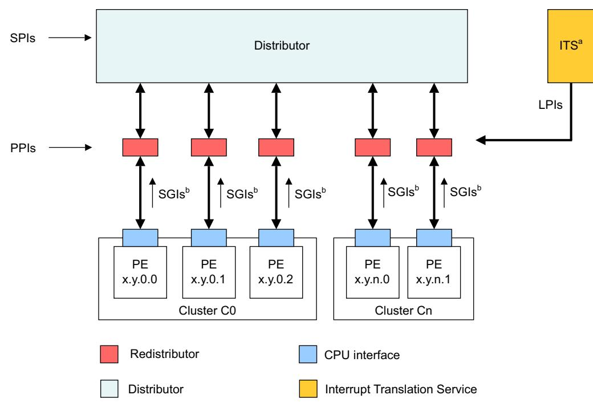

a. The inclusion of an ITS is optional, and there might be more than one ITS in a GIC.

**Figure 3-2 GIC logical partitioning with an ITS**

<span id="page-42-0"></span>The mechanism for communication between the ITS and the Redistributors is IMPLEMENTATION DEFINED.

b. SGIs are generated by a PE and routed through the Distributor.

The mechanism for communication between the CPU interfaces and the Redistributors is also IMPLEMENTATION DEFINED.

**Note**

Arm recommends that an implementation uses the GIC Stream Protocol for communication between the CPU interfaces and the Redistributors, see Appendix A *[GIC Stream Protocol interface](#page-884-1)*.

[Figure](#page-43-0) 3-3 shows the GIC partitioning in an implementation that does not include an ITS and that supports direct LPIs.

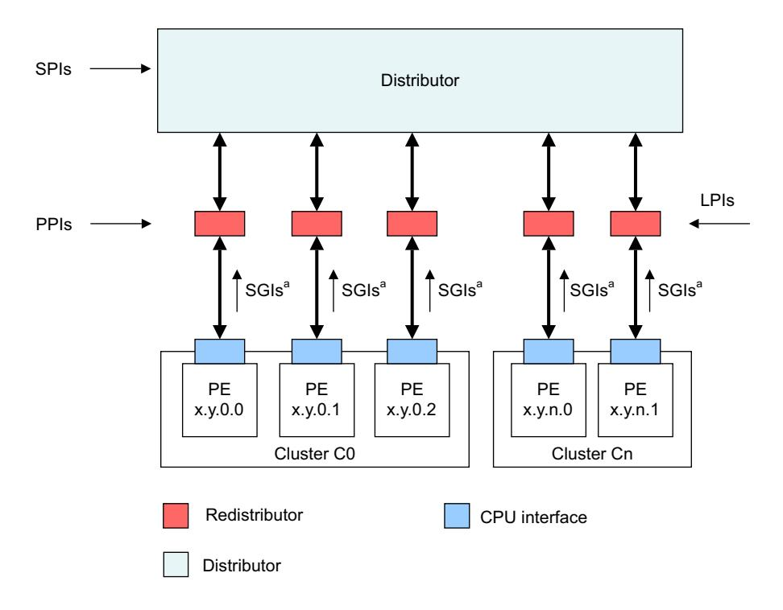

a. SGIs are generated by a PE and routed through the Distributor.

#### **Figure 3-3 GIC logical partitioning without an ITS**

<span id="page-43-0"></span>The following list describes the components that are depicted in Figure 3-[2 on page](#page-42-0) 3-43 in more detail:

<span id="page-43-1"></span>**Distributor** The Distributor performs interrupt prioritization and distribution of SPIs and SGIs to the Redistributors and CPU interfaces that are connected to the PEs in the system.

[GICD\\_CTLR](#page-543-0) provides global settings for:

- Enabling affinity routing.
- Disabling security.
- Enabling Secure and Non-secure Group 1 interrupts.
- Enabling Group 0 interrupts.

For SPIs, the Distributor provides a programming interface for:

- Enabling or disabling SPIs.
- Setting the priority level of each SPI.
- Routing information for each SPI.
- Setting each SPI to be level-sensitive or edge-triggered.

- Generating message-based SPIs.
- Assigning each SPI to an interrupt group.
- Controlling the pending and active state of SPIs.

The Distributor registers are identified by the GICD\_ prefix.

See Chapter 2 *[Distribution and Routing of Interrupts](#page-32-1)* for more information.

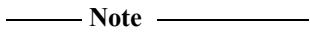

When handling physical interrupts during legacy operation, the Distributor controls the configuration information for PPIs and SGIs. See Chapter 15 *[Legacy Operation and](#page-876-1)  [Asymmetric Configurations](#page-876-1)*.

#### **Interrupt translation service, ITS**

The ITS is an OPTIONAL hardware mechanism in the GICv3 architecture that routes LPIs to the appropriate Redistributor. Software uses a command queue to configure an ITS. Table structures in memory that are associated with an ITS translate an EventID associated with a device into a pending INTID for a PE.

The ITS is not optional in GICv4, and all GICv4 implementations must include at least one ITS.

See *[The Interrupt Translation Service on page](#page-91-0) 5-92* for more information.

<span id="page-44-0"></span>**Redistributor** A Redistributor is the part of the IRI that is connected to the CPU interface of the PE. The Redistributor holds the control, prioritization, and pending information for all physical LPIs using data structures that are held in memory. Two registers in the Redistributor point to these data structures:

- [GICR\\_PROPBASER.](#page-702-0)
- [GICR\\_PENDBASER.](#page-699-0)

In GICv4, the Redistributor also includes registers to handle virtual LPIs that are forwarded by an ITS to a Redistributor and directly to a VM, without involving the hypervisor. This is referred to as a *direct injection* of virtual interrupts into a VM.

In GICv4, the Redistributors collectively host the control, prioritization, and pending information for all virtual LPIs using data structures that are held in memory. Two registers in the Redistributor point to these data structures:

- [GICR\\_VPROPBASER](#page-720-0).
- [GICR\\_VPENDBASER](#page-714-0).

In an implementation that supports LPIs but does not include an ITS, the GICR\_\* registers contain a simple memory-mapped interface to signal and control physical LPIs.

Redistributors provide a programming interface for:

- Identifying, controlling, and configuring supported features to enable interrupts and interrupt routing of the implementation.
- Enabling or disabling SGIs and PPIs.
- Setting the priority level of SGIs and PPIs.
- Setting each PPI to be level-sensitive or edge-triggered.
- Assigning each SGI and PPI to an interrupt group.
- Controlling the pending state of SGIs and PPIs.
- Controlling the active state of SGIs and PPIs.
- Power management support for the connected PE.
- Where LPIs are supported, base address control for the data structures in memory that support the associated interrupt properties and their pending status.
- Where GICv4 is supported, base address control for the data structures in memory that support the associated virtual interrupt properties and their pending status.

The Redistributor registers are identified by the GICR\_ prefix.

See *[Affinity routing on page](#page-38-0) 2-39* and *[The Distributor and Redistributors on page](#page-33-0) 2-34* for more information about the Redistributor.

#### **CPU interface**

The GIC architecture supports a CPU interface that provides a register interface to a PE in the system. Each CPU interface provides a programming interface for:

- General control and configuration to enable interrupt handling in accordance with the Security state and legacy support requirements of the implementation.
- Acknowledging an interrupt.
- Performing a priority drop.
- Deactivation of an interrupt.
- Setting an interrupt priority mask for the PE.
- Defining the preemption policy for the PE.
- Determining the highest priority pending interrupt for the PE.

The CPU interface has several components:

- A component that allows a supervisory level of software to control the handling of physical interrupts. The registers that are associated with this are identified by the ICC\_ prefix.
- A component that allows a supervisory level of software to control the handling of virtual interrupts. The registers that are associated with this are identified by the ICV\_ prefix.
- A component that allows a hypervisor to control the set of pending virtual interrupts. The registers that are associated with this are identified by the ICH\_ prefix.

| Note                                                                                        |
|---------------------------------------------------------------------------------------------|
| The System registers in the CPU interface are associated with software that is handling     |
| interrupts in the physical domain, or with execution at Non-secure EL1 as part of a VM. The |
| configuration of HCR_EL2 determines whether the accesses are to the physical resources      |
| or the virtual resources.                                                                   |

The System registers accessible at EL2 that are used for controlling the list of active, pending, and active and pending, virtual interrupts for a PE are identified by the ICH\_ prefix.

For more information on handling physical interrupts, see Chapter 4 *[Physical Interrupt](#page-48-1)  [Handling and Prioritization](#page-48-1)*.

For more information on handling virtual interrupts, see Chapter 6 *[Virtual Interrupt](#page-150-1)  [Handling and Prioritization](#page-150-1)*.

### <span id="page-46-1"></span><span id="page-46-0"></span>**3.2 Interrupt bypass support**

A CPU interface optionally includes interrupt signal bypass, so that, when the signaling of an interrupt by the interface is disabled, a legacy interrupt signal is passed to the interrupt request input on the PE, bypassing the GIC functionality.

It is IMPLEMENTATION DEFINED whether bypass is supported.

The controls to determine whether GICv3 FIQ and IRQ outputs or the bypass signals are used differ depending on whether System register access is enabled.

When System register access is enabled, bypass disable is controlled at the highest implemented Exception level using two bits in [ICC\\_SRE\\_EL1](#page-278-0), [ICC\\_SRE\\_EL2,](#page-282-0) or [ICC\\_SRE\\_EL3,](#page-285-0) as appropriate:

- For FIQ bypass, this is the DFB bit.
- For IRQ bypass, this is the DIB bit.

This bypass mechanism is used when System register access is enabled. For information about bypass support during legacy operation, see *[Legacy operation and bypass support on page](#page-879-0) 15-880*.

The interrupt groups that are supported by the GIC are allocated to FIQs and IRQs, as described in *[Interrupt](#page-62-0)  [grouping on page](#page-62-0) 4-63*. Interrupt groups must be disabled at the CPU interface when bypass is enabled, otherwise the behavior of the GICv3 implementation is UNPREDICTABLE. This means that:

- [ICC\\_IGRPEN0\\_EL1.](#page-256-0)Enable must have the value 0 when ICC\_SRE\_ELx.DFB == 0.
- [ICC\\_IGRPEN1\\_EL1.](#page-259-0)Enable must have the value 0 when ICC\_SRE\_ELx.DIB == 0.

For more information about enabling interrupts, see *[Enabling the distribution of interrupts on page](#page-68-0) 4-69*.

For information about the behavior when System register access is not enabled, see Chapter 15 *[Legacy Operation](#page-876-1)  [and Asymmetric Configurations](#page-876-1)*.

For FIQs, the following pseudocode determines the source for interrupt signaling to a PE.

```
if ICC_SRE_EL3.SRE == 1 then
    if ICC_SRE_EL3.DFB == 0 then
       if ICC_SRE_EL1.SRE Secure == 1 then
           BypassFIQsource
       else
        use legacy bypass support
    else
       use GICv3 FIQ output
else
    use legacy bypass support
```

For IRQs, the following pseudocode determines the source for interrupt signaling to a PE.

```
if ICC_SRE_EL3.SRE == 1 then
    if ICC_SRE_EL3.DIB == 0 then
       if ICC_SRE_EL1.SRE Secure == 1 then
           BypassIRQsource
      else
        use legacy bypass support
    else
       use GICv3 IRQ output
else
    use legacy bypass support
```

*GIC Partitioning 3.2 Interrupt bypass support*

## <span id="page-48-1"></span><span id="page-48-0"></span>Chapter 4

## **Physical Interrupt Handling and Prioritization**

This chapter describes the fundamental aspects of GIC interrupt handling and prioritization. It contains the following sections:

- *[Interrupt lifecycle on page](#page-49-1) 4-50*.
- *[Locality-specific Peripheral Interrupts on page](#page-57-1) 4-58*.
- *[Private Peripheral Interrupts on page](#page-58-1) 4-59*.
- *[Software Generated Interrupts on page](#page-59-1) 4-60*.
- *[Shared Peripheral Interrupts on page](#page-60-1) 4-61*.
- *[Interrupt grouping on page](#page-62-1) 4-63*.
- *[Enabling the distribution of interrupts on page](#page-68-1) 4-69*.
- *[Interrupt prioritization on page](#page-70-1) 4-71*.

### <span id="page-49-1"></span><span id="page-49-0"></span>**4.1 Interrupt lifecycle**

GIC interrupt handling is based on the GIC interrupt lifecycle, a series of high-level processes that apply to any interrupt using the GIC architecture. The interrupt lifecycle provides a basis for describing the detailed steps of the interrupt handling process. The GIC also maintains a state machine that controls interrupt state transitions during the lifecycle.

[Figure](#page-49-2) 4-1 shows the GIC interrupt lifecycle for physical interrupts.

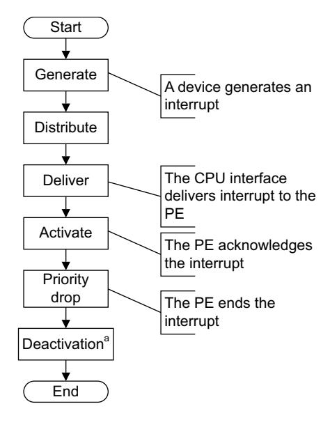

a. This step does not apply to LPIs.

**Figure 4-1 Physical interrupt lifecycle**

<span id="page-49-2"></span>The interrupt lifecycle in [Figure](#page-49-2) 4-1 is as follows:

- 1. Generate interrupt. An interrupt is generated either by the peripheral or by software.
- 2. Distribute. The IRI performs interrupt grouping, interrupt prioritization, and controls the forwarding of interrupts to the CPU interfaces.
- 3. Deliver. A physical CPU interface delivers interrupts to the corresponding PE.
- 4. Activate. When software running on a PE acknowledges an interrupt, the GIC sets the highest active priority to that of the activated interrupt, and for SPIs, SGIs, and PPIs the interrupt becomes active.
- 5. Priority drop. Software running on the PE signals to the GIC that the highest priority interrupt has been handled to the point where the running priority can be dropped. The running priority then has the value that it had before the interrupt was acknowledged. This is the point where the end of interrupt is indicated by the interrupt handler. The end of the interrupt can be configured to also perform deactivation of the interrupt.
- 6. Deactivation. Deactivation clears the active state of the interrupt, and thereby allows the interrupt, when it is pending, to be taken again. Deactivation is not required for LPIs. Deactivation can be configured to occur at the same time as the priority drop, or it can be configured to occur later as the result of an explicit interrupt deactivation operation. This latter approach allows for software architectures where there is an advantage to separating interrupt handling into initial handling and scheduled handling.

#### **4.1.1 Physical CPU interface**

A CPU interface provides an interface to a PE that is connected to the GIC. Each CPU interface is connected to a single PE.

A CPU interface receives pending interrupts prioritized by the IRI, and determines whether the interrupt is a member of a group that is enabled in the CPU interface and has [sufficient priority](#page-25-1) to be signaled to the PE. At any time, the connected PE can determine the:

- INTID of its highest priority pending interrupt, by reading [ICC\\_HPPIR0\\_EL1](#page-248-0) or [ICC\\_HPPIR1\\_EL1.](#page-250-0)
- The running priority of the CPU interface by reading [ICC\\_RPR\\_EL1](#page-269-0).

**Note** The priority of the highest priority active interrupt for which there has not been a priority drop is also known as the [running priority](#page-25-2).

When an LPI is acknowledged, the pending state for the interrupt changes to not pending in the Redistributor. The Redistributor does not maintain an active state for LPIs.

When the PE acknowledges an SGI, a PPI, or an SPI at the CPU interface, the IRI changes the status of the interrupt to active if:

- It is an edge-triggered interrupt, and another edge has not been detected since the interrupt was acknowledged.
- It is a level-sensitive interrupt, and the level has been deasserted since the interrupt was acknowledged.

When the PE acknowledges an SGI, a PPI, or an SPI at the CPU interface, the IRI changes the status of the interrupt to active and pending if:

- It is an edge-triggered interrupt, and another edge has been detected since the interrupt was acknowledged.
- It is a level-sensitive interrupt, and the level has not been deasserted since the interrupt was acknowledged.

When the PE acknowledges an SGI, a PPI, or an SPI at the CPU interface, the CPU interface can signal another interrupt to the PE, to preempt interrupts that are active on the PE. If there is no pending interrupt with sufficient priority to be signaled to the PE, the interface deasserts the interrupt request signal to the PE.

The following stages of the interrupt lifecycle are described in the remainder of this section:

- *[Activation](#page-50-0)*.
- *[Priority drop on page](#page-51-0) 4-52*.
- *[Deactivation on page](#page-52-0) 4-53*.

The priority drop and deactivation can be performed as a single operation or can be split, as defined by [ICC\\_CTLR\\_EL1.](#page-232-0)EOImode and [ICC\\_CTLR\\_EL3.](#page-237-0)EOImode\_EL3.

#### <span id="page-50-1"></span><span id="page-50-0"></span>**Activation**

The interrupt handler reads [ICC\\_IAR0\\_EL1](#page-252-0) for Group 0 interrupts, [ICC\\_IAR1\\_EL1](#page-254-0) for Group 1 interrupts, and in GICv3.3, [ICC\\_NMIAR1\\_EL1](#page-264-0) for NMI interrupts in the corresponding CPU interface to acknowledge the interrupt. This read returns either:

- The INTID of the highest priority pending interrupt, if that interrupt is of sufficient priority for it to be signaled to the PE. This is the normal response to an interrupt acknowledge.
- Under certain conditions, an INTID that indicates a [special interrupt](#page-35-1) number, see *[INTIDs on page](#page-34-0) 2-35*.

Whether a read of [ICC\\_IAR0\\_EL1,](#page-252-0) [ICC\\_IAR1\\_EL1,](#page-254-0) or [ICC\\_NMIAR1\\_EL1](#page-264-0) returns a valid INTID depends on:

- Which of the three registers is accessed.
- The Security state of the PE.
- Whether there is a pending interrupt of sufficient priority to be signaled to the PE, and if so, whether:
  - The highest priority pending interrupt is a Secure Group 1 or a Non-secure Group 1 interrupt.
  - Interrupt signaling is enabled for that interrupt group.
- The Exception level at which the PE is executing.
- In GICv3.3 and GICv4.2, whether the interrupt has the non-maskable property.

All interrupts, when acknowledged, modify the *Active Priorities Registers*. See *[System register access to the Active](#page-76-0)  [Priorities registers on page](#page-76-0) 4-77*.

In certain circumstances, the value of [SCR\\_EL3.](#page-29-4)NS affects the value returned when a PE acknowledges an interrupt. That is, when the PE is executing at EL3, a Secure read of [ICC\\_IAR0\\_EL1](#page-252-0) returns a [special interrupt](#page-35-1) number that indicates the required Security state transition for the highest priority pending interrupt. Otherwise, the INTID is returned.

In GICv3.3 and GICv4.2, which register can acknowledge an interrupt with the non-maskable property depends on SCTLR\_ELx.NMI for the current Exception level:

- If SCTLR\_ELx.NMI is set to 0, then all of the following apply:
  - [ICC\\_IAR1\\_EL1](#page-254-0) is used for all Group 1 interrupts.
  - Reads of [ICC\\_NMIAR1\\_EL1](#page-264-0) are UNDEFINED.
- If SCTLR\_ELx.NMI is set to 1, then all of the following apply:
  - Reads of [ICC\\_IAR1\\_EL1](#page-254-0) return a Special INTID if the highest priority pending interrupt has the non-maskable property.
  - Reads of [ICC\\_NMIAR1\\_EL1](#page-264-0) return a Special INTID if the highest priority pending interrupt does not have the non-maskable property.

For SGIs in a multiprocessor implementation, the GIC uses the targeted list model, where the acknowledgment of an interrupt by one PE has no effect on the state of the interrupt on other CPU interfaces. When a PE acknowledges the interrupt, the pending state of the interrupt is cleared only for that PE. The interrupt remains pending for the other PEs.

The effects of reading [ICC\\_IAR0\\_EL1,](#page-252-0) [ICC\\_IAR1\\_EL1](#page-254-0), and [ICC\\_NMIAR1\\_EL1](#page-264-0) on the state of a returned INTID are not guaranteed to be visible until after the execution of a DSB.

#### <span id="page-51-0"></span>**Priority drop**

After an interrupt has been acknowledged, a valid write to [ICC\\_EOIR0\\_EL1](#page-244-0) for Group 0 interrupts, or a valid write to [ICC\\_EOIR1\\_EL1](#page-246-0) for Group 1 interrupts, results in a priority drop.

A valid write to [ICC\\_EOIR0\\_EL1](#page-244-0) or [ICC\\_EOIR1\\_EL1](#page-246-0) to perform a priority drop is required for each acknowledged interrupt, even for LPIs which do not have an active state. A priority drop must be performed by the same PE that activated the interrupt.

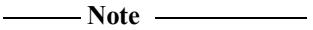

A valid write is a write that is:

- Not UNPREDICTABLE.
- Not ignored.
- Not writing an INTID that is either unsupported or within the range 1020-1023.

For each CPU interface, the GIC architecture requires the order of the valid writes to [ICC\\_EOIR0\\_EL1](#page-244-0) and [ICC\\_EOIR1\\_EL1](#page-246-0) to be the exact reverse of the order of the reads from [ICC\\_IAR0\\_EL1](#page-252-0) and [ICC\\_IAR1\\_EL1,](#page-254-0) as shown in Figure 4-[2 on page](#page-52-1) 4-53.

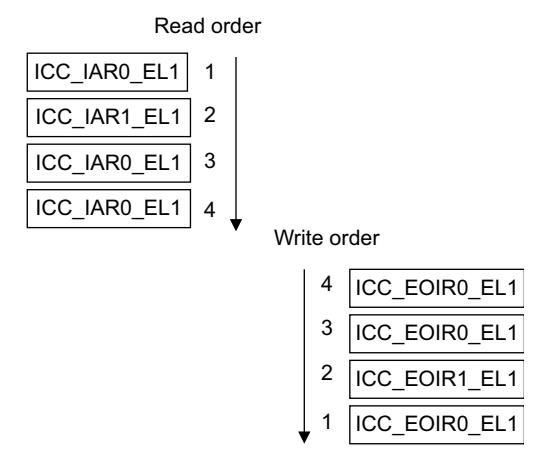

**Figure 4-2 Read and write order**

<span id="page-52-1"></span>On a priority drop, the running priority is reduced from the priority of the interrupt indicated by the write to [ICC\\_EOIR0\\_EL1](#page-244-0) or [ICC\\_EOIR1\\_EL1](#page-246-0) to either:

- The priority of the highest-priority active interrupt for which there has been no write to [ICC\\_EOIR0\\_EL1](#page-244-0) or [ICC\\_EOIR1\\_EL1](#page-246-0).
- The idle priority, 0xFF, if there is no active interrupt.


For compatibility with possible extensions to the GIC architecture specification, software must preserve the entire register value read from [ICC\\_IAR0\\_EL1](#page-252-0) and [ICC\\_IAR1\\_EL1](#page-254-0) when it acknowledges the interrupt, and use that entire value for the corresponding write to [ICC\\_EOIR0\\_EL1](#page-244-0) and [ICC\\_EOIR1\\_EL1](#page-246-0) by the same PE.

When [GICD\\_CTLR](#page-543-0).DS == 0:

- A write to [ICC\\_EOIR0\\_EL1](#page-244-0) performs a priority drop for Group 0 interrupts.
- A write to [ICC\\_EOIR1\\_EL1](#page-246-0) performs a priority drop for Non-secure Group 1 interrupts, if the PE is operating in Non-secure state or at EL3.
- When operating in Secure state, a write to [ICC\\_EOIR1\\_EL1](#page-246-0) performs a priority drop for Secure Group 1 interrupts.

When [GICD\\_CTLR](#page-543-0).DS == 1:

- A write to [ICC\\_EOIR0\\_EL1](#page-244-0) performs a priority drop for Group 0 interrupts.
- A write to [ICC\\_EOIR1\\_EL1](#page-246-0) performs a priority drop for Group 1 interrupts.

#### <span id="page-52-0"></span>**Deactivation**

PPIs, SGIs, and SPIs have an active state in the IRI and must be deactivated.

SGIs and PPIs must be deactivated by the PE that activated the interrupt. SPIs can be deactivated by a different PE.

Interrupt deactivation is required to change the state of an interrupt either:

- From active and pending to pending.
- From active to inactive.

Depending on the Exception level and Security state, [ICC\\_CTLR\\_EL1.](#page-232-0)EOImode and [ICC\\_CTLR\\_EL3.](#page-237-0)EOImode\_EL3 in the appropriate CPU Interface Control Register determine whether priority drop and interrupt deactivation happen together or separately:

• The priority drop and interrupt deactivation happen together when [ICC\\_CTLR\\_EL1](#page-232-0).EOImode or [ICC\\_CTLR\\_EL3.](#page-237-0)EOImode\_EL3 in the CPU interface is 0, and the PE writes to [ICC\\_EOIR0\\_EL1](#page-244-0) or [ICC\\_EOIR1\\_EL1](#page-246-0). In this case a write to [ICC\\_DIR\\_EL1](#page-242-0) is not required.

- The priority drop and interrupt deactivation are separated when [ICC\\_CTLR\\_EL1.](#page-232-0)EOImode or [ICC\\_CTLR\\_EL3.](#page-237-0)EOImode\_EL3 in the CPU interface is 1, and the PE writes to [ICC\\_EOIR0\\_EL1](#page-244-0) or [ICC\\_EOIR1\\_EL1](#page-246-0). In this case:
  - The priority drop happens when the PE writes to [ICC\\_EOIR0\\_EL1](#page-244-0) or [ICC\\_EOIR1\\_EL1](#page-246-0).
  - Interrupt deactivation happens later, when the PE writes to [ICC\\_DIR\\_EL1](#page-242-0). A valid write to [ICC\\_DIR\\_EL1](#page-242-0) results in interrupt deactivation for a Group 0 or a Group 1 interrupt.

There are no ordering requirements for writes to [ICC\\_DIR\\_EL1.](#page-242-0) If software writes to [ICC\\_DIR\\_EL1](#page-242-0) when the following conditions are true, the results are UNPREDICTABLE:

- The appropriate EOIMode bit is cleared to 0.
- The [ICC\\_CTLR\\_EL1.](#page-232-0)EOImode or [ICC\\_CTLR\\_EL3.](#page-237-0)EOIMode\_EL3 is set to 1 and there has not been a corresponding write to [ICC\\_EOIR0\\_EL1](#page-244-0) or [ICC\\_EOIR1\\_EL1.](#page-246-0)

When [ICC\\_CTLR\\_EL1](#page-232-0).EOImode or [ICC\\_CTLR\\_EL3](#page-237-0).EOIMode\_EL3 == 1 but the interrupt is not active in the Distributor, writes to [ICC\\_DIR\\_EL1](#page-242-0) must be ignored. If supported, an implementation might generate a system error.

<span id="page-53-0"></span>[Table](#page-53-0) 4-1 shows how a write to [ICC\\_EOIR0\\_EL1](#page-244-0) or [ICC\\_EOIR1\\_EL1](#page-246-0) affects deactivation.

**Table 4-1 Effect of writing to [ICC\\_EOIR0\\_EL1](#page-244-0) or [ICC\\_EOIR1\\_EL1](#page-246-0)**

| Access        | ICC_CTLR_EL1.EOImode<br>or ICC_CTLR_EL3.EOImode_EL3 | Identified interrupt | Effect                   |
|---------------|-----------------------------------------------------|----------------------|--------------------------|
| ICC_EOIR1_EL1 | 0                                                   | Group 0              | Access ignored           |
| ICC_EOIR0_EL1 | 0                                                   | Group 0              | Interrupt deactivated    |
| ICC_EOIR1_EL1 | 0                                                   | Group 1              | Interrupt deactivated    |
| ICC_EOIR0_EL1 | 0                                                   | Group 1              | Access ignored           |
| -             | 1                                                   | -                    | Interrupt remains active |

When [GICD\\_CTLR](#page-543-0).DS == 0, access to certain registers is restricted. See *[Interrupt grouping and security on](#page-63-1)  [page](#page-63-1) 4-64*.

The following pseudocode determines whether EOImode is set for the current Exception level and Security state:

```
// EOImodeSet()
// ============
boolean EOImodeSet()
   if HaveEL(EL3) then
       // EL3 is implemented so return the value appropriate to the EL and security state
       if IsEL3OrMon() && ICC_SRE_EL3.SRE == '1'1 then
           // In EL3
           EOImode = ICC_CTLR_EL3.EOImode_EL3;
       elsif IsSecure() then
           EOImode = ICC_CTLR_EL3.EOImode_EL1S;
       else // Non-secure
           EOImode = ICC_CTLR_EL3.EOImode_EL1NS;
   else
       // No EL3 so return the value from ICC_CTLR_EL1
       EOImode = ICC_CTLR_EL1.EOImode;
   return EOImode == '1';
```

#### **Effect of Security states on writes to ICC\_DIR\_EL1**

The effect of a write to [ICC\\_DIR\\_EL1](#page-242-0) depends on whether the GIC supports one or two Security states:

- If [GICD\\_CTLR](#page-543-0).DS == 0, a valid:
  - Secure write to [ICC\\_DIR\\_EL1](#page-242-0) deactivates the specified interrupt, regardless of whether that interrupt is a Group 0 or a Group 1 interrupt.
  - Non-secure write to [ICC\\_DIR\\_EL1](#page-242-0) deactivates the specified interrupt only if that interrupt is a Non-secure Group 1 interrupt.
- If [GICD\\_CTLR](#page-543-0).DS == 1, a valid write to [ICC\\_DIR\\_EL1](#page-242-0) deactivates the specified interrupt, regardless of whether that interrupt is a Group 0 or Group 1 interrupt.

<span id="page-54-0"></span>Table 4-[2 on page](#page-54-0) 4-55 shows the behavior of valid writes to [ICC\\_DIR\\_EL1.](#page-242-0) In an implementation that supports only a single Security state, valid writes have the behavior shown for Secure writes to [ICC\\_DIR\\_EL1.](#page-242-0)

**Table 4-2 Behavior of writes to [ICC\\_DIR\\_EL1](#page-242-0)**

| Security state and<br>Exception level<br>of writes to<br>ICC_DIR_EL1 | Interrupt<br>group              | GICD_CTLR.DS | SCR_EL3.IRQ | SCR_EL3.FIQ | Effect                   |
|----------------------------------------------------------------------|---------------------------------|--------------|-------------|-------------|--------------------------|
| EL3                                                                  | x                               | x            | x           | x           | Interrupt is deactivated |
| Secure EL1 or Secure EL2                                             | Group 0                         | x            | x           | 0           | Interrupt is deactivated |
| Secure EL1 or Secure EL2                                             | Group 0                         | x            | x           | 1           | Write is ignored         |
| Secure EL1 or Secure EL2                                             | Group 1                         | x            | 0           | x           | Interrupt is deactivated |
| Secure EL1 or Secure EL2                                             | Group 1                         | x            | 1           | x           | Write is ignored         |
| Non-secure EL2 or<br>Non-secure EL1                                  | Group 0 or<br>Secure<br>Group 1 | 0            | x           | x           | Write is ignored         |
| Non-secure EL2 or<br>Non-secure EL1                                  | Group 0                         | 1            | x           | 0           | Interrupt is deactivated |
| Non-secure EL2 or<br>Non-secure EL1                                  | Group 0                         | 1            | x           | 1           | Write is ignored         |
| Non-secure EL2 or<br>Non-secure EL1                                  | Non-secure<br>Group 1           | 0            | 0           | x           | Interrupt is deactivated |
| Non-secure EL2 or<br>Non-secure EL1                                  | Non-secure<br>Group 1           | 0            | 1           | x           | Write is ignored         |
| Non-secure EL2 or<br>Non-secure EL1                                  | Group 1                         | 1            | 0           | x           | Interrupt is deactivated |
| Non-secure EL2 or<br>Non-secure EL1                                  | Group 1                         | 1            | 1           | x           | Write is ignored         |

Secure EL2 can only be entered when [SCR\\_EL3.](#page-29-4)EEL2 == 1.

When FEAT\_RME is implemented, accesses from Realm state are treated identically to Non-secure state.

#### <span id="page-55-0"></span>**4.1.2 Interrupt handling state machine**

The GIC maintains a state machine for each supported interrupt. The possible states of an interrupt are:

- Inactive.
- Pending.
- Active.
- Active and pending.

PPIs, SGIs, and SPIs can have an active and pending state. Interrupts that are active and pending are never signaled to a connected PE.

LPIs have a pending state that is held in memory associated with a Redistributor, and therefore a PE. This also applies to directly injected virtual LPIs, see *[About GICv4.0 virtual Locality-specific Peripheral Interrupt support](#page-163-0) [on page](#page-163-0) 7-164*.

**Note**

There is no active or active and pending state for LPIs.

[Figure](#page-55-1) 4-3 shows an instance of the interrupt handling state machine, and the possible state transitions.

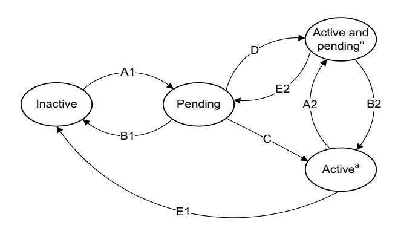

a. Not applicable for SGIs when GICD\_CTLR.nASSGIreq==1, and for LPIs.

**Figure 4-3 Interrupt handling state machine**

<span id="page-55-1"></span>**Note**

LPIs do not have an active state in the Redistributor, but do require an active priority in the CPU interface. See Chapter 5 *[Locality-specific Peripheral Interrupts and the ITS](#page-84-1)* for more information.

Arm expects hardware implementations to report [GICD\\_TYPER2.](#page-621-0)nASSGIcap==0, indicating that [GICD\\_CTLR.](#page-543-0)nASSGIreq is RES0.

When interrupt forwarding by the Distributor and interrupt signaling by the CPU interface are enabled, the conditions that cause each of the state transitions are as follows:

#### **Transition A1 or A2, add pending state**

This transition occurs when the interrupt becomes pending, either as a result of the peripheral generating the interrupt or as result of software generating the interrupt.

#### **Transition B1 or B2, remove pending state**

This transition occurs when the interrupt has been deasserted by the peripheral, if the interrupt is a level-sensitive interrupt, or when software has changed the pending state.

For LPIs, it also occurs on acknowledgment of the interrupt.

#### **Transition C, pending to active**

This transition occurs on acknowledgment of the interrupt by the PE for edge-triggered SPIs, SGIs, and PPIs.

For SPIs, SGIs, and PPIs, this transition occurs when software reads an INTID value from [ICC\\_IAR0\\_EL1](#page-252-0), [ICC\\_IAR1\\_EL1](#page-254-0), or [ICC\\_NMIAR1\\_EL1.](#page-264-0)

#### **Transition D, pending to active and pending**

This transition occurs on acknowledgment of the interrupt by the PE for level-sensitive SPIs, SGIs, and PPIs.

#### **Transition E1 or E2, remove active state**

This transition occurs when software deactivates an interrupt for SPIs, SGIs, and PPIs.

### <span id="page-57-1"></span><span id="page-57-0"></span>**4.2 Locality-specific Peripheral Interrupts**

| LPIs are targeted peripheral interrupts that are routed to a specific PE within the affinity hierarchy. In a system where |
|---------------------------------------------------------------------------------------------------------------------------|
| two Security states are enabled, LPIs are always Non-secure Group 1 interrupts. LPIs only support edge-triggered          |
| behavior. For more information about LPIs, see LPIs on page 5-86.                                                         |
|                                                                                                                           |
| Note                                                                                                                      |
| In GICv3.3 and GICv4.2, LPIs do not have an NMI property and are always treated as maskable.                              |

#### <span id="page-58-1"></span><span id="page-58-0"></span>**4.3 Private Peripheral Interrupts**

PPIs are interrupts that target a single, specific PE, and different PEs can use the same INTID to indicate different events. PPIs can be Group 0 interrupts, Secure Group 1 interrupts, or Non-secure Group 1 interrupts. They can support either edge-triggered or level-sensitive behavior.

An OPTIONAL extended PPI range uses INTIDs 1056 - 1119. This range of PPIs is not available when the GIC is operating in legacy mode. [GICR\\_TYPER](#page-710-0).PPInum indicates whether the extended PPI range is supported or not.

**Note** Commonly, Arm expects that PPIs are used by different instances of the same interrupt source on each PE, thereby allowing a common INTID to be used for PE specific events, such as the interrupts from a private timer.

### <span id="page-59-1"></span><span id="page-59-0"></span>**4.4 Software Generated Interrupts**

SGIs are typically used for inter-processor communication, and are generated by a write to an SGI register in the GIC. SGIs can be either Group 0 or Group 1 interrupts, and they can support only edge-triggered behavior.

The registers associated with the generation of SGIs are part of the CPU interface:

- A PE generates a Group 1 SGI by writing to [ICC\\_SGI1R\\_EL1](#page-275-0) or [ICC\\_ASGI1R\\_EL1](#page-222-0).
- A PE generates a Group 0 SGI by writing to [ICC\\_SGI0R\\_EL1.](#page-272-0)
- Routing information is supplied as the bit field value in the write to the register that generated the SGI. The SGI can be routed to:
  - The group of PEs specified by a.b.c.targetlist. This can include the originating PE.
  - All participating PEs in the system, excluding the originating PE.

See *[Routing SPIs and SGIs by PE affinity on page](#page-38-2) 2-39* for more information.

[ICC\\_SGI1R\\_EL1](#page-275-0) allows software executing in a Secure state to generate Secure Group 1 SGIs.

[ICC\\_SGI1R\\_EL1](#page-275-0) allows software executing in a Non-secure state to generate Non-secure Group 1 SGIs.

[ICC\\_ASGI1R\\_EL1](#page-222-0) allows software executing in a Secure state to generate Non-secure Group 1 SGIs.

[ICC\\_ASGI1R\\_EL1](#page-222-0) allows software executing in a Non-secure state to generate Secure Group 1 SGIs, if permitted by the settings of [GICR\\_NSACR](#page-696-0) in the Redistributor corresponding to the target PE.

[ICC\\_SGI0R\\_EL1](#page-272-0) allows software executing in Secure state to generate Group 0 SGIs.

[ICC\\_SGI0R\\_EL1](#page-272-0) allows software executing in Non-secure state to generate Group 0 SGIs, if permitted by the settings of [GICR\\_NSACR](#page-696-0) in the Redistributor corresponding to the target PE.

For more information about the use of control registers to forward SGIs to a target PE, see Table 12-[14 on](#page-206-0)  page [12-207](#page-206-0).

### <span id="page-60-1"></span><span id="page-60-0"></span>**4.5 Shared Peripheral Interrupts**

SPIs are peripheral interrupts that the Distributor can route to a specified PE that can handle the interrupt, or to a PE that is one of a group of PEs in the system that has been configured to accept this type of interrupt. SPIs can be either Group 0 or Group 1 interrupts, and they can support either edge-triggered or level-sensitive behavior.

An OPTIONAL extended SPI range uses INTIDs 4096 - 5119. This range of SPIs is not available when the GIC is operating in legacy mode. [GICD\\_TYPER.](#page-617-0)ESPI indicates whether the extended SPI range is supported or not.

SPIs can be either wired-based or message-based interrupts.

Support for message-based SPIs is OPTIONAL, and can be discovered through [GICD\\_TYPER.](#page-617-0)MBIS. Message-based SPIs can be:

- Generated by a write to [GICD\\_SETSPI\\_NSR](#page-607-0) or [GICD\\_SETSPI\\_SR](#page-609-0)
- Cleared by a write to [GICD\\_CLRSPI\\_NSR](#page-537-0) or [GICD\\_CLRSPI\\_SR](#page-539-0).

The effect of a write to these registers depends on whether the targeted SPI is configured to be an edge-triggered or a level-sensitive interrupt:

- For an edge-triggered interrupt, a write to [GICD\\_SETSPI\\_NSR](#page-607-0) or [GICD\\_SETSPI\\_SR](#page-609-0) sets the interrupt pending. The interrupt is no longer pending when it is activated, or when it is cleared by a write to [GICD\\_CLRSPI\\_NSR](#page-537-0), [GICD\\_CLRSPI\\_SR](#page-539-0), or [GICD\\_ICPENDR<n>.](#page-561-0)
- For a level-sensitive interrupt, a write to [GICD\\_SETSPI\\_NSR](#page-607-0) or [GICD\\_SETSPI\\_SR](#page-609-0) sets the interrupt pending. It remains pending until it is deasserted by a write to [GICD\\_CLRSPI\\_NSR](#page-537-0) or [GICD\\_CLRSPI\\_SR](#page-539-0). If the interrupt is activated between the time it is asserted by a write to [GICD\\_SETSPI\\_NSR](#page-607-0) or [GICD\\_SETSPI\\_SR](#page-609-0) and the time it is deactivated by a write to [GICD\\_CLRSPI\\_NSR](#page-537-0) or [GICD\\_CLRSPI\\_SR](#page-539-0), then the interrupt becomes active and pending.
  - It is IMPLEMENTATION DEFINED for a level-sensitive interrupt whether a write to [GICD\\_ICPENDR<n>](#page-561-0) has any effect on an interrupt that has been set pending by a write to [GICD\\_SETSPI\\_NSR](#page-607-0) or [GICD\\_SETSPI\\_SR](#page-609-0), or whether a write to [GICD\\_CLRSPI\\_NSR](#page-537-0) or [GICD\\_CLRSPI\\_SR](#page-539-0) has any effect on an interrupt that has been set pending by a write [GICD\\_ISPENDR<n>.](#page-596-0)
  - It is IMPLEMENTATION DEFINED whether acknowledging an interrupt that was set pending by a write to [GICD\\_ISPENDR<n>](#page-596-0) clears the pending state.
- Changing the configuration of an interrupt from level-sensitive to edge-triggered, or from edge-triggered to level-sensitive, when there is a pending interrupt, leaves the interrupt in an UNKNOWN state.

Figure 4-[4 on page](#page-61-0) 4-62 shows how message-based interrupt requests can trigger SPIs.

<span id="page-61-0"></span>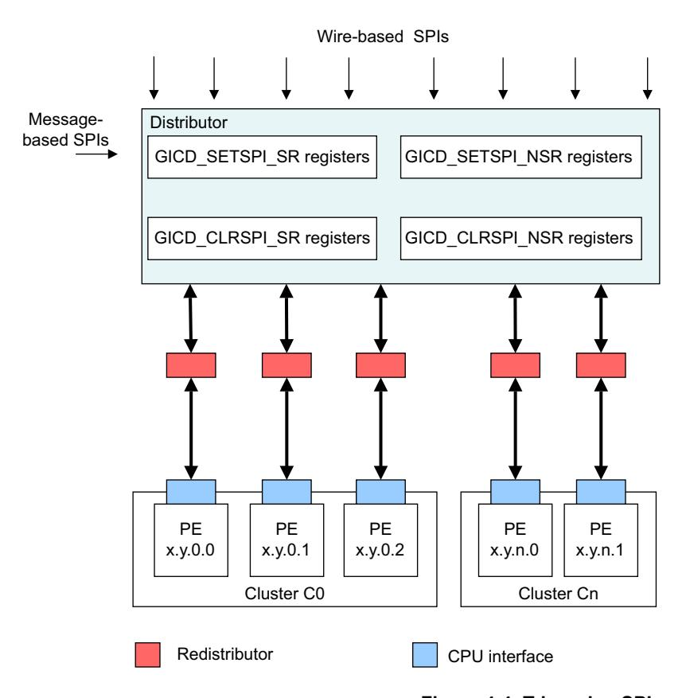

**Figure 4-4 Triggering SPIs**

### <span id="page-62-1"></span><span id="page-62-0"></span>**4.6 Interrupt grouping**

GICv3 uses *interrupt grouping* as a mechanism to align interrupt handling with the Armv8 Exception model and Security model.

In a system with two Security states, an interrupt is configured as one of the following:

- A Group 0 physical interrupt:
  - Arm expects these interrupts to be handled at EL3.
- A Secure Group 1 physical interrupt:
  - Arm expects these interrupts to be handled at Secure EL1 or Secure EL2.
- A Non-secure Group 1 physical interrupt:
  - Arm expects these interrupts to be handled at Non-secure EL1 or Non-secure EL2.

In a system with one Security state an interrupt is configured to be either:

- Group 0.
- Group 1.

At the System level, [GICD\\_CTLR](#page-543-0).DS indicates if the GIC is configured with one or two Security states. For more information about Security, see *[Interrupt grouping and security on page](#page-63-1) 4-64*.

These interrupt groups are mapped onto the Armv8 FIQ and IRQ exceptions, see *[Interrupt assignment to IRQ and](#page-64-0)  [FIQ signals on page](#page-64-0) 4-65*.

[GICD\\_IGROUPR<n>](#page-565-0) and [GICD\\_IGRPMODR<n>](#page-569-0) configure the interrupt group for SPIs, and [GICD\\_IGROUPR<n>E](#page-567-0) and [GICD\\_IGRPMODR<n>E](#page-571-0) configure the interrupt group for the extended SPI range. *n* is greater than zero.

[GICR\\_IGROUPR0](#page-661-0) and [GICR\\_IGRPMODR0](#page-665-0) configure the interrupt group for SGIs and PPIs, and [GICR\\_IGROUPR<n>E](#page-663-0) and [GICR\\_IGRPMODR<n>E](#page-667-0) configure the interrupt group for the extended PPI range. *n* is greater than zero.

**Note**

When [GICD\\_CTLR](#page-543-0).DS == 0, LPIs are always Non-secure Group 1 interrupts. When [GICD\\_CTLR.](#page-543-0)DS == 1, LPIs are always Group 1 interrupts.

System registers control and configure Group 0 and Group 1 interrupts:

- For Group 0 interrupts, software uses:
  - [ICC\\_IAR0\\_EL1](#page-252-0) to read a Group 0 INTID on an interrupt acknowledge.
  - [ICC\\_EOIR0\\_EL1](#page-244-0) to write a Group 0 interrupt completion.
  - [ICC\\_BPR0\\_EL1](#page-225-0) to configure the binary point for Group 0 prioritization. This register is also used for Group 1 prioritization when [ICC\\_CTLR\\_EL1.](#page-232-0)CBPR == 1.
  - [ICC\\_HPPIR0\\_EL1](#page-248-0) to read the highest Group 0 interrupt that is currently pending.
  - [ICC\\_IGRPEN0\\_EL1](#page-256-0) to enable Group 0 interrupts at the CPU interface.
- For Group 1 interrupts, software uses:
  - [ICC\\_IAR1\\_EL1](#page-254-0) to read a Group 1 INTID on an interrupt acknowledge.
  - If [FEAT\\_GICv3\\_NMI](#page-20-0) is implemented, [ICC\\_NMIAR1\\_EL1](#page-264-0) to read a non-maskable Group 1 INTID on a interrupt acknowledge.
  - [ICC\\_EOIR1\\_EL1](#page-246-0) to write a Group 1 interrupt completion.
  - [ICC\\_BPR1\\_EL1](#page-228-0) to configure the binary point for Group 1 prioritization for the current Security state.
  - [ICC\\_HPPIR1\\_EL1](#page-250-0) to read the highest Group 1 interrupt that is currently pending.
  - [ICC\\_IGRPEN1\\_EL1](#page-259-0) to enable Group 1 interrupts for the target Security state of the interrupt.

In a system with two Security states, Group 0 interrupts are always Secure. For more information about grouping and Security, see *[Interrupt grouping and security on page](#page-63-1) 4-64*.

#### <span id="page-63-1"></span><span id="page-63-0"></span>**4.6.1 Interrupt grouping and security**

The Arm architecture provides two Security states, each with an associated physical memory address space:

- Secure state.
- Non-secure state.

A software hierarchy of user and privileged code can execute in either state, and software executing in Non-secure state can only access Secure state through a system call to the Secure monitor. The GIC architecture supports the routing and handling of interrupts associated with both Security states.

[GICD\\_CTLR.](#page-543-0)DS indicates whether a GIC is configured to support the Armv8-A Security model. This configuration affects:

- Register access, see *[GIC System register access on page](#page-196-0) 12-197*.
- The interrupt groups that are supported.

#### When [GICD\\_CTLR](#page-543-0).DS == 0:

- The GIC supports two Security states, Secure state and Non-secure state.
- The GIC supports three interrupt groups:
  - Group 0.
  - Secure Group 1.
  - Non-secure Group 1.
- Both the Security state and [GICR\\_NSACR](#page-696-0) determine whether an SGI can be generated.
- The Security state is checked during:
  - Configuration of an interrupt.
  - Acknowledgment of an interrupt.
  - Priority drop.
  - Deactivation.
- Secure Group 1 interrupts are treated as Group 0 by a CPU interface if:
  - The PE does not implement EL3.
  - [ICC\\_SRE\\_EL1](#page-278-0)\_S.SRE == 0.

#### When [GICD\\_CTLR](#page-543-0).DS == 1:

- The GIC supports only a single Security state. This can be either Secure state or Non-secure state.
- The GIC supports two interrupt groups:
  - Group 0.
  - Group 1.
- SGIs can be generated regardless of the settings in [GICR\\_NSACR.](#page-696-0)
- The Security state is not checked during:
  - Configuration of an interrupt.
  - Acknowledgment of an interrupt.
  - Priority drop.
  - Deactivation.

In a multiprocessor system, one or more PEs within the system might support accesses to resources that are available only in Secure state, or accesses to resources that are available only in Non-secure state. It is a programming error if software configures:

- A Group 0 or Secure Group 1 interrupt to be forwarded to a PE that only supports Non-secure state.
- A Non-secure Group 1 interrupt to be forwarded to a PE that only supports Secure state.

There is a dedicated register for the priority grouping for each interrupt group, [ICC\\_BPR0\\_EL1](#page-225-0) for Group 0 interrupts and [ICC\\_BPR1\\_EL1](#page-228-0) for Group 1 interrupts. However, it is possible to configure a common Binary Point Register for both groups using:

- [ICC\\_CTLR\\_EL1.](#page-232-0)CBPR.
- [ICC\\_CTLR\\_EL3.](#page-237-0)CBPR\_EL1NS and [ICC\\_CTLR\\_EL3](#page-237-0).CBPR\_EL1S for an independent common Binary Point Register configuration of Non-secure Group 1 and Secure Group 1 interrupts.

For information about interrupt grouping and legacy operation, see Chapter 15 *[Legacy Operation and Asymmetric](#page-876-1)  [Configurations](#page-876-1)*.

#### <span id="page-64-4"></span><span id="page-64-0"></span>**4.6.2 Interrupt assignment to IRQ and FIQ signals**

This subsection applies to implementations in which affinity routing is enabled.

 A Group 0 physical interrupt, when it is the highest priority pending interrupt and has sufficient priority, is always signaled as an FIQ.

A Group 1 physical interrupt, when it is the highest priority pending interrupt and has sufficient priority, is signaled as an FIQ if either of the following conditions is true, otherwise it is signaled as an IRQ:

- It is an interrupt for the other Security state, that is, the Security state in which the PE is not executing.
- The PE is executing at EL3.

<span id="page-64-2"></span>Table 4-[3 on page](#page-64-2) 4-65 summarizes the signaling of interrupts when EL3 is using AArch64 state.

<span id="page-64-5"></span>**Table 4-3 Interrupt signals for two Security states when EL3 is using AArch64 state**

| Current Exception level                  | Group 0 interrupts | Group 1 interrupts |            |
|------------------------------------------|--------------------|--------------------|------------|
|                                          |                    | Secure             | Non-secure |
| Secure EL1or EL0 or EL2                  | FIQ                | IRQ                | FIQ        |
| Non-secure EL1 or EL0, or Non-secure EL2 | FIQ                | FIQ                | IRQ        |
| EL3                                      | FIQ                | FIQ                | FIQ        |

<span id="page-64-3"></span>Table 4-[4 on page](#page-64-3) 4-65 summarizes the signaling of interrupts when EL3 is using AArch32 state. Secure EL2 is not present when EL3 is using AArch32 state.

**Table 4-4 Interrupt signals for two Security states when EL3 is using AArch32 state**

| Current Exception level                  | Group 0 interrupts | Group 1 interrupts |            |
|------------------------------------------|--------------------|--------------------|------------|
|                                          |                    | Secure             | Non-secure |
| Secure EL0                               | FIQ                | IRQ                | FIQ        |
| Non-secure EL1 or EL0, or Non-secure EL2 | FIQ                | FIQ                | IRQ        |
| EL3                                      | FIQ                | IRQ                | FIQ        |

<span id="page-64-1"></span>Table 4-[5 on page](#page-64-1) 4-65 summarizes the signaling of interrupts in systems that support only a single Security state, that is where EL3 is not implemented or when [GICD\\_CTLR](#page-543-0).DS == 1.

**Table 4-5 Interrupt signals for a single Security state**

| Current Exception level | Group 0 interrupts | Group 1 interrupts |
|-------------------------|--------------------|--------------------|
| Any                     | FIQ                | IRQ                |

The assertion and de-assertion of IRQs and FIQs are affected by the current Exception level and Security state of the PE. As part of the Context Synchronization that occurs as the result of taking or returning from an exception, the CPU interface ensures that IRQ and FIQ are both appropriately asserted or deasserted for the Exception level and Security state that the PE is entering.

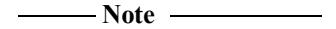

For the effects of [GICC\\_CTLR](#page-742-0).FIQEn on interrupt signaling in asymmetric configurations, see *[The asymmetric](#page-881-0)  [configuration on page](#page-881-0) 15-882*.

#### **4.6.3 Interrupt superpriority**

When FEAT\_NMI is implemented, the Arm architecture allows interrupts to be presented to the PE with superpriority.

When an NMI is signaled to the PE, it is presented as having superpriority if it is signaled as an IRQ or virtual IRQ. In all other cases, the GIC does not present any interrupt to the PE as having superpriority.

NMIs are only presented as having superpriority when being presented to their owning Security state and Exception level.

How interrupts are signaled to the PE, and how the non-maskable property is indicated, is IMPLEMENTATION DEFINED. However, the mechanism used to signal interrupts to the PE can be modeled as a set of single bit signals, as shown in [Figure](#page-65-0) 4-5.

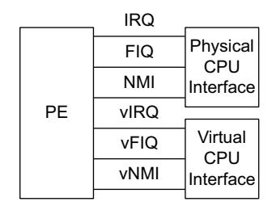

**Figure 4-5 Interrupt signals to the PE**

<span id="page-65-1"></span><span id="page-65-0"></span>Table 4-[6 on page](#page-65-1) 4-66 and Table 4-[7 on page](#page-65-1) 4-66 define the meaning of the signals shown in [Figure](#page-65-0) 4-5.

**Table 4-6 Physical interface interrupt signals**

| NMI | FIQ | IRQ | Meaning                                                         |
|-----|-----|-----|-----------------------------------------------------------------|
| 0   | 0   | 0   | No physical interrupt being signaled                            |
| 0   | 0   | 1   | Physical Group 1 non-NMI for current Security state             |
| 0   | 1   | 0   | Physical Group 1 for other Security state, or a Group 0 non-NMI |
| 1   | 0   | 1   | Physical Group 1 NMI for current Security state                 |

**Table 4-7 Virtual interface interrupt signals**

| vNMI | vFIQ | vIRQ | Meaning                             |
|------|------|------|-------------------------------------|
| 0    | 0    | 0    | No virtual interrupt being signaled |

**Table 4-7 Virtual interface interrupt signals (continued)**

| vNMI | vFIQ | vIRQ | Meaning                 |
|------|------|------|-------------------------|
| 0    | 0    | 1    | Virtual Group 1 non-NMI |
| 0    | 1    | 0    | Virtual Group 0 non-NMI |
| 1    | 0    | 1    | Virtual Group 1 NMI     |

| Note |  |
|------|--|
|------|--|

Group 0 interrupts cannot be configured as NMIs.

#### **4.6.4 Interrupt routing and System register access**

When executing in AArch64 state, interrupt routing to an Exception level is controlled by the following bits:

- [SCR\\_EL3](#page-29-4).FIQ, [SCR\\_EL3.](#page-29-4)NS, and [HCR\\_EL2](#page-28-2).FMO control FIQs.
- [SCR\\_EL3](#page-29-4).IRQ, [SCR\\_EL3](#page-29-4).NS, and [HCR\\_EL2](#page-28-2).IMO control IRQs.

This routing also controls the Exception level at which the EL1 CPU interface System registers that control and acknowledge interrupts are accessible. This applies to:

- [ICC\\_IAR0\\_EL1,](#page-252-0) [ICC\\_EOIR0\\_EL1](#page-244-0), [ICC\\_HPPIR0\\_EL1](#page-248-0), [ICC\\_BPR0\\_EL1,](#page-225-0) [ICC\\_AP0R<n>\\_EL1](#page-215-0) and [ICC\\_IGRPEN0\\_EL1.](#page-256-0) These are the registers that are associated with Group 0 interrupts.
- [ICC\\_IAR1\\_EL1,](#page-254-0) [ICC\\_EOIR1\\_EL1](#page-246-0), [ICC\\_HPPIR1\\_EL1](#page-250-0), [ICC\\_BPR1\\_EL1,](#page-228-0) [ICC\\_AP1R<n>\\_EL1](#page-218-0) and [ICC\\_IGRPEN1\\_EL1.](#page-259-0) These are the registers that are associated with Group 1 interrupts.
  - If [FEAT\\_GICv3\\_NMI](#page-20-0) is implemented, [ICC\\_NMIAR1\\_EL1](#page-264-0) is also associated with Group 1 interrupts.
- [ICC\\_SGI0R\\_EL1,](#page-272-0) [ICC\\_SGI1R\\_EL1,](#page-275-0) [ICC\\_ASGI1R\\_EL1](#page-222-0), [ICC\\_CTLR\\_EL1,](#page-232-0) [ICC\\_DIR\\_EL1,](#page-242-0) [ICC\\_PMR\\_EL1,](#page-266-0) and [ICC\\_RPR\\_EL1.](#page-269-0) These are the Common registers.

When [\(SCR\\_EL3.](#page-29-4)NS == 1 || [SCR\\_EL3.](#page-29-4)EEL2== 1) && [\(HCR\\_EL2.](#page-28-2)FMO ==1 || [HCR\\_EL2.](#page-28-2)IMO == 1)), accesses at EL1 are virtual accesses. Virtual accesses to [ICC\\_SGI0R\\_EL1,](#page-272-0) [ICC\\_SGI1R\\_EL1,](#page-275-0) and [ICC\\_ASGI1R\\_EL1](#page-222-0) always generate a Trap exception that is taken to EL2.

<span id="page-66-0"></span>Where a Distributor supports two Security states a PE might not implement EL2 or EL3. Table 4-[8 on page](#page-66-0) 4-68 shows the configurations that are supported in these cases.

<span id="page-67-0"></span>**Table 4-8 Supported configurations when EL3 is not implemented**

| Distributor                                      | EL3 | EL2                                                                                                                                         | Security state                 | Description                                                                                                                  |
|--------------------------------------------------|-----|---------------------------------------------------------------------------------------------------------------------------------------------|--------------------------------|------------------------------------------------------------------------------------------------------------------------------|
| Two Security states and<br>GICD_CTLR.DS == 0     | No  | -                                                                                                                                           | Non-secure                     | The PE is always Non-secure and can only receive Non-secure Group<br>1 interrupts.                                           |
|                                                  |     |                                                                                                                                             |                                | The PE must behave as if software had:                                                                                       |
|                                                  |     |                                                                                                                                             |                                | •<br>Set ICC_SRE_EL3.Enable to 1 to allow EL2 to use the System<br>registers, if required.                                   |
|                                                  |     |                                                                                                                                             |                                | •<br>Set ICC_SRE_EL3.DFB to 1.                                                                                               |
|                                                  |     |                                                                                                                                             |                                | •<br>Set SCR_EL3.FIQ to 1.                                                                                                   |
|                                                  |     |                                                                                                                                             | •<br>Cleared SCR_EL3.IRQ to 0. |                                                                                                                              |
|                                                  |     | •<br>Set SCR_EL3.NS to 1.                                                                                                                   |                                |                                                                                                                              |
|                                                  |     |                                                                                                                                             |                                | •<br>Cleared ICC_IGRPEN0_EL1.Enable to 0 to disable the<br>signaling of Group 0 interrupts to the PE.                        |
|                                                  |     |                                                                                                                                             |                                | •<br>Set the Secure copy of ICC_IGRPEN1_EL1.Enable to 0 to<br>disable the signaling of Secure Group 1 interrupts to this PE. |
| Two Security states and<br>GICD_CTLR.DS == 0     | No  | No                                                                                                                                          | Secure                         | The PE is always Secure and can only receive Group 0 and Secure<br>Group 1 interrupts.                                       |
|                                                  |     | The PE must behave as if software had:                                                                                                      |                                |                                                                                                                              |
|                                                  |     | •<br>Set ICC_SRE_EL3.Enable to 1.                                                                                                           |                                |                                                                                                                              |
|                                                  |     | •<br>Cleared SCR_EL3.FIQ to 0.                                                                                                              |                                |                                                                                                                              |
|                                                  |     | •<br>Cleared SCR_EL3.IRQ to 0.                                                                                                              |                                |                                                                                                                              |
|                                                  |     | •<br>Cleared SCR_EL3.NS to 0.                                                                                                               |                                |                                                                                                                              |
|                                                  |     | •<br>Cleared the Non-secure copy of ICC_IGRPEN1_EL1.Enable<br>to 0 to disable the signaling of Non-secure Group 1 interrupts<br>to this PE. |                                |                                                                                                                              |
| One Security state or<br>two Security states and | No  | -                                                                                                                                           | -                              | The Distributor and all PEs are always in a single Security state, and<br>can receive Group 0 and Group 1 interrupts.        |
| GICD_CTLR.DS == 1                                |     | All PEs must behave as if software had:                                                                                                     |                                |                                                                                                                              |
|                                                  |     | •<br>Set ICC_SRE_EL3.Enable to 1.                                                                                                           |                                |                                                                                                                              |
|                                                  |     | •<br>Cleared SCR_EL3.FIQ to 0.                                                                                                              |                                |                                                                                                                              |
|                                                  |     |                                                                                                                                             |                                | •<br>Cleared SCR_EL3.IRQ to 0.                                                                                               |
|                                                  |     |                                                                                                                                             |                                | •<br>Set SCR_EL3.NS to 1.                                                                                                    |

### <span id="page-68-1"></span><span id="page-68-0"></span>**4.7 Enabling the distribution of interrupts**

The following control bits enable and disable the distribution of interrupts:

- [GICD\\_CTLR.](#page-543-0)EnableGrp1S.
- [GICD\\_CTLR.](#page-543-0)EnableGrp1NS.
- [GICD\\_CTLR.](#page-543-0)EnableGrp0.

The following control bits enable and disable the distribution of interrupt groups at the CPU interface:

- [ICC\\_IGRPEN0\\_EL1.](#page-256-0)Enable for Group 0 interrupts.
- [ICC\\_IGRPEN1\\_EL1.](#page-259-0)Enable for Group 1 interrupts.

**Note**

There is a Secure and a Non-secure copy of this register.

• [ICC\\_IGRPEN1\\_EL3.](#page-262-0){EnableGrp1S, EnableGrp1NS}.

Physical LPIs are enabled by a write to [GICR\\_CTLR](#page-640-0).EnableLPIs.

#### **4.7.1 Enabling individual interrupts**

**PPIs**

PPIs can be enabled and disabled by writing to [GICR\\_ISENABLER0](#page-687-0) and [GICR\\_ICENABLER0](#page-648-0) when affinity routing is enabled for the Security state of the interrupt. Individual PPIs can also be enabled and disabled by writing to [GICD\\_ISENABLER<n>](#page-592-0) and [GICD\\_ICENABLER<n>.](#page-553-0) *n* = 0 for PPIs, if legacy operation for physical interrupts is supported and configured.

PPIs in the OPTIONAL, extended PPI range are enabled and disabled by writing to [GICR\\_ISENABLER<n>E,](#page-689-0) and [GICD\\_ICENABLER<n>E](#page-555-0).

**SPIs**

Individual SPIs can be enabled and disabled by writing to [GICD\\_ISENABLER<n>](#page-592-0) and [GICD\\_ICENABLER<n>.](#page-553-0) *n* >0 for SPIs.

SPIs in the OPTIONAL, extended SPI range are enabled and disabled by writing to [GICD\\_ISENABLER<n>E](#page-594-0), and [GICD\\_ICENABLER<n>E.](#page-555-0)

**SGIs**

SGIs can be enabled and disabled by writing to [GICR\\_ISENABLER0](#page-687-0) and [GICR\\_ICENABLER0](#page-648-0) when affinity routing is enabled. Individual SGIs can also be enabled and disabled by writing to [GICD\\_ISENABLER<n>](#page-592-0) and [GICD\\_ICENABLER<n>.](#page-553-0) *n* = 0 for SGIs, if legacy operation for physical interrupts is supported and configured.

**Note**

Whether SGIs are permanently enabled, or can be enabled and disabled by writes to [GICR\\_ISENABLER0](#page-687-0) and [GICR\\_ICENABLER0](#page-648-0), is IMPLEMENTATION DEFINED.

**LPIs**

Individual LPIs can be enabled by setting the enable bits programmed in the LPI Configuration table. For more information about enabling LPIs using the LPI Configuration tables, see *[LPI](#page-88-0)  [Configuration tables on page](#page-88-0) 5-89*.

#### **4.7.2 Interaction of group and individual interrupt enables**

The GICD\_\* and GICR\_\* registers determine, at any moment in time, the highest priority pending interrupt that the hardware is aware of for each target PE. This interrupt is presented to the CPU interface of a PE to evaluate whether it is to be signaled to the PE. The enabling of the interrupts affects this evaluation as follows:

• A pending interrupt that is individually disabled in the GICD\_\* or GICR\_\* registers is not one which is considered in the determination of the highest priority pending interrupt, and so cannot be signaled to the PE.

- A pending interrupt that is individually enabled in the GICD\_\* or GICR\_\* registers, but is a member of a group that is disabled in [GICD\\_CTLR](#page-543-0), is not one that is considered in the determination of the highest priority pending interrupt, and so cannot be signaled to the PE.
- A pending 1 of N interrupt that is individually enabled in the GICD\_\* registers and is a member of a group that is enabled in [GICD\\_CTLR](#page-543-0), but is a member of a group that is disabled in [ICC\\_IGRPEN0\\_EL1,](#page-256-0) [ICC\\_IGRPEN1\\_EL1,](#page-259-0) or [ICC\\_IGRPEN1\\_EL3](#page-262-0) for a PE, cannot be selected for that PE. Such an interrupt is not considered in the determination of the highest priority pending interrupt and so cannot be signaled to the PE.
- For a pending direct interrupt that is individually enabled in the GICD\_\* or GICR\_\* registers and is a member of a group that is enabled in [GICD\\_CTLR](#page-543-0), but is a member of a group that is disabled in [ICC\\_IGRPEN0\\_EL1,](#page-256-0) [ICC\\_IGRPEN1\\_EL1,](#page-259-0) or [ICC\\_IGRPEN1\\_EL3](#page-262-0), it is IMPLEMENTATION DEFINED whether or not the interrupt is considered in the determination of the highest priority pending interrupt. If it is determined to be the highest priority pending interrupt, the interrupt is not signaled to the PE, but will mask a lower priority pending interrupt that is a member of a group that is enabled in [ICC\\_IGRPEN0\\_EL1,](#page-256-0) [ICC\\_IGRPEN1\\_EL1,](#page-259-0) or [ICC\\_IGRPEN1\\_EL3](#page-262-0).

LPIs are enabled individually in the LPI Configuration tables, see *[LPI Configuration tables on page](#page-88-0) 5-89*.

#### **4.7.3 Effect of disabling interrupts**

Disabling an interrupt by writing to the appropriate [GICD\\_ICENABLER<n>](#page-553-0) or to [GICR\\_ICENABLER0](#page-648-0), or by writing to the LPI Configuration tables, does not prevent that interrupt from changing state, for example from becoming pending. When [GICR\\_CTLR.](#page-640-0)EnableLPIs == 0, LPIs are never set pending.

If [GICD\\_CTLR.](#page-543-0)EnableGrp0, [GICD\\_CTLR.](#page-543-0)EnableGrp1S, and [GICD\\_CTLR](#page-543-0).EnableGrp1NS are all cleared to 0, it is IMPLEMENTATION DEFINED whether:

- An edge-triggered interrupt signal moves the interrupt to the pending state.
- SGIs can be set pending by writing to [GICD\\_SGIR](#page-611-0), [ICC\\_SGI0R\\_EL1,](#page-272-0) [ICC\\_SGI1R\\_EL1,](#page-275-0) or [ICC\\_ASGI1R\\_EL1](#page-222-0).

If an interrupt is pending on a CPU interface when the corresponding [GICD\\_CTLR.](#page-543-0)EnableGrp0, [GICD\\_CTLR.](#page-543-0)EnableGrp1NS, or [GICD\\_CTLR.](#page-543-0)EnableGrp1S bit is written from 1 to 0, then the interrupt must be retrieved from the CPU interface.

| Note                                                                                   |  |
|----------------------------------------------------------------------------------------|--|
| This might have no effect on the forwarded interrupt if it has already been activated. |  |

If an interrupt is pending on a CPU interface when software writes [ICC\\_IGRPEN0\\_EL1](#page-256-0).Enable, [ICC\\_IGRPEN0\\_EL1,](#page-256-0) [ICC\\_IGRPEN1\\_EL1](#page-259-0).Enable, or [ICC\\_IGRPEN1\\_EL3](#page-262-0).Enable from 1 to 0, the interrupt must be released by the CPU interface to allow the Distributor to forward the interrupt to a different PE.

### <span id="page-70-1"></span><span id="page-70-0"></span>**4.8 Interrupt prioritization**

This section describes interrupt prioritization in the GIC architecture. Prioritization describes the:

- Configuration and control of interrupt priority.
- Order of execution of pending interrupts.
- Determination of when interrupts are visible to a target PE, including:
  - Interrupt priority masking.
  - Priority grouping.
  - Preemption of an active interrupt.

<span id="page-70-2"></span>Software configures interrupt prioritization in the GIC by assigning a priority value to each interrupt source. Priority values are an 8-bit unsigned binary number. A GIC implementation that supports two Security states must implement a minimum of 32 and a maximum of 256 levels of physical priority. A GIC implementation that supports only a single Security state must implement a minimum of 16 and a maximum of 256 levels of physical priority. If the GIC implements fewer than 256 priority levels, the low-order bits of the priority fields are RAZ/WI. This means that the number of implemented priority field bits is IMPLEMENTATION DEFINED, in the range 4-8. [Table](#page-70-2) 4-9 on [page](#page-70-2) 4-71 shows the relation between the priority field bits and the number of priority levels supported by an implementation.

**Implemented priority bits Possible priority field values Number of priority levels** [7:0] 0x00-0xFF (0-255), all values 256 [7:1] 0x00-0xFE, (0-254), even values only 128 [7:2] 0x00-0xFC (0-252), in steps of 4 64 [7:3] 0x00-0xF8 (0-248), in steps of 8 32 [7:4] 0x00-0xF0 (0-240), in steps of 16 16

**Table 4-9 Effect of not implementing some priority field bits**

In the GIC prioritization scheme, lower numbers have higher priority. This means that the lower the assigned priority value, the higher the priority of the interrupt. Priority field value 0 always indicates the highest possible interrupt priority, and the lowest priority value depends on the number of implemented priority levels.

The [GICD\\_IPRIORITYR<n>](#page-579-0) registers hold the priority value for each supported SPI. An implementation might reserve an SPI for a particular purpose and assign a fixed priority to that interrupt, meaning the priority value for that interrupt is read-only. For other SPIs the [GICD\\_IPRIORITYR<n>](#page-579-0) registers can be written by software to set the interrupt priorities. It is IMPLEMENTATION DEFINED whether a write to [GICD\\_IPRIORITYR<n>](#page-579-0) changes the priority of any active SPI.

In a multiprocessor implementation, the [GICR\\_IPRIORITYR<n>](#page-679-0) and [GICR\\_IPRIORITYR<n>E](#page-681-0) registers define the interrupt priority of each SGI and PPI INTID independently for each target PE.

LPI Configuration tables and LPI Pending tables in memory store LPI priority information and pending status, see *[LPI Configuration tables on page](#page-88-0) 5-89* and *[LPI Pending tables on page](#page-89-0) 5-90*.

The GIC security model provides Secure and Non-secure accesses to the interrupt priority settings.The Non-secure accesses can configure interrupts only in the lower priority half of the supported priority values. Therefore, if the GIC implements 32 priority values, Non-secure accesses see only 16 priority values. See *[Software accesses of](#page-79-0)  [interrupt priority on page](#page-79-0) 4-80* for more information.

To determine the number of priority bits implemented for SPIs, software can write 0xFF to a writable [GICD\\_IPRIORITYR<n>](#page-579-0) priority field and read back the value stored.

To determine the number of priority bits implemented for SGIs and PPIs, software can write 0xFF to the [GICR\\_IPRIORITYR<n>](#page-679-0) priority fields, and read back the value stored.

The GIC architecture does not require all PEs in the system to use the same number of priority bits to control interrupt priority.


Arm recommends that, before checking the priority range in this way:

- For a peripheral interrupt, software first disables the interrupt.
- For an SGI, software first checks that the interrupt is inactive.

If, on a particular CPU interface, multiple pending interrupts have the same priority, and have [sufficient priority](#page-25-1) for the interface to signal them to the PE, it is IMPLEMENTATION DEFINED how the interface selects which interrupt to signal.

GICv3 guarantees that the highest priority, unmasked, enabled interrupt will be delivered to a target PE in finite time.

There is no guarantee that higher priority interrupts will always be taken before lower priority interrupts, although this will generally be the case.

The remainder of this section describes:

- *[Non-secure accesses to register fields for Secure interrupt priorities on page](#page-72-0) 4-73*.
- *[Priority grouping on page](#page-73-0) 4-74*.
- *[System register access to the Active Priorities registers on page](#page-76-0) 4-77*.
- *[Preemption on page](#page-77-0) 4-78*.
- *[Priority masking on page](#page-78-0) 4-79*.
- *[Software accesses of interrupt priority on page](#page-79-0) 4-80*.
- *[Changing the priority of enabled PPIs, SGIs, and SPIs on page](#page-82-0) 4-83*.

#### **4.8.1 NMI prioritization**

GICv3.3 introduces the non-maskable property for SPIs, PPIs and SGIs. Support for GICv3.3 is indicated by [GICD\\_TYPER](#page-617-0).NMI. An interrupt is configured as being an NMI using the [GICD\\_INMIR<n>,](#page-575-0) [GICD\\_INMIR<n>E](#page-577-0), [GICR\\_INMIR0,](#page-671-0) and [GICR\\_INMIR<n>E](#page-673-0) registers.

When [GICD\\_CTLR](#page-543-0).DS == 0, NMIs have the following priorities:

- Secure NMIs have a higher priority than a non-NMI with priority 0x00.
- Non-secure NMIs have the following priority:
  - Higher priority than a non-NMI with priority 0x80.
  - Lower priority than a non-NMI with priority 0x7F.

When [GICD\\_CTLR](#page-543-0).DS == 1, NMIs have a higher priority than a non-NMI with priority 0x00.

GICv3.3 inserts new priority levels into the existing GIC priority space, as shown in Figure 4-[6 on page](#page-72-1) 4-73.

| Secure NMI     |
|----------------|
| 0x00           |
|                |
| …              |
| 0x7F           |
| Non-secure NMI |
| 0x80           |
|                |
| …              |
|                |
| 0xFF           |

**Figure 4-6 GIC interrupt priority space**

<span id="page-72-1"></span>For an INTID configured as non-maskable, GIC[D|R]\_IPRIORITYR<n>{E}.Priority\_x is RES0.

All NMIs belonging to a given Security state have the same priority. The GIC does not provide ordering guarantees between interrupts of the same priority.

| Note |  |
|------|--|
|------|--|

The priority of an interrupt marked as an NMI does not depend on the SCTLR\_ELx.NMI value of the current Exception level or of the target Exception level.

#### <span id="page-72-0"></span>**4.8.2 Non-secure accesses to register fields for Secure interrupt priorities**

When [GICD\\_CTLR](#page-543-0).DS == 0, the GIC supports the use of:

- Group 0 interrupts as Secure interrupts.
- Secure Group 1 interrupts.
- Non-secure Group 1 interrupts.

To support the Armv8 Security model the register fields associated with Secure interrupts are RAZ/WI for Non-secure accesses. In addition, the following rules apply:

#### **For Non-secure access to a priority field in GICx\_IPRIORITYR<n>:**

If the priority field corresponds to a Non-secure Group 1 interrupt in *[Software accesses of interrupt](#page-79-0)  [priority on page](#page-79-0) 4-80*:

- For SPIs, the priority field is determined by [GICD\\_IPRIORITYR<n>](#page-579-0) or [GICD\\_IPRIORITYR<n>E](#page-581-0).
- For PPIs and SGIs, the priority field is determined by [GICR\\_IPRIORITYR<n>](#page-679-0) or [GICR\\_IPRIORITYR<n>E.](#page-681-0)

#### **For Non-secure access to ICC\_PMR\_EL1 and ICC\_RPR\_EL1 when [SCR\\_EL3](#page-29-4).FIQ == 1:**

- If the current priority mask value is in the range of 0x00-0x7F:
  - A read access returns the value 0x00.
    - The GIC ignores a write access to [ICC\\_PMR\\_EL1.](#page-266-0)
- If the current priority mask value is in the range of 0x80-0xFF:
  - A read access returns the Non-secure read of the current value.
  - A write access to [ICC\\_PMR\\_EL1](#page-266-0) succeeds, based on the Non-secure read of the priority mask value written to the register.

| Note                                                                                      |
|-------------------------------------------------------------------------------------------|
| This means a Non-secure write cannot set a priority mask value in the range of 0x00-0x7F. |

#### **For Non-secure access to ICC\_PMR\_EL1 and ICC\_RPR\_EL1 when [SCR\\_EL3](#page-29-4).FIQ == 0:**

The Secure, unshifted view applies.

*[AArch64 functions on page](#page-855-0) 13-856* provides pseudocode that describes accesses to the following System registers in a GIC that supports two Security states:

- [ICC\\_PMR\\_EL1.](#page-266-0)
- [ICC\\_RPR\\_EL1.](#page-269-0)

#### <span id="page-73-2"></span><span id="page-73-0"></span>**4.8.3 Priority grouping**

Priority grouping uses the following *Binary Point Registers*:

- [ICC\\_BPR0\\_EL1](#page-225-0) for Group 0 interrupts. This register is available in all GIC implementations.
- A Non-secure copy of [ICC\\_BPR1\\_EL1](#page-228-0) for Non-secure Group 1 interrupts. If an implementation supports two Security states, there is a Secure and a Non-secure copy of this register. If an implementation supports only one Security state, there is only one copy of this register
- A Secure copy of [ICC\\_BPR1\\_EL1](#page-228-0) for Secure Group 1 interrupts. This register is available only in a GIC implementation that supports two Security states.

The Binary Point Registers split a priority value into two fields, the *group priority* and the *subpriority*. When determining preemption, all interrupts with the same group priority are considered to have the same priority, regardless of the subpriority.

Where multiple pending interrupts have the same group priority, the GIC uses the subpriority field to resolve the priority within a group. Where two or more pending interrupts in a group have the same subpriority, how the GIC selects between the interrupts is implementation specific.

The GIC uses the group priority field to determine whether a pending interrupt has sufficient priority to preempt execution on a PE, as follows:

- The value of the group priority field for the interrupt must be lower than the value of the [running priority](#page-25-2) of the PE. The running priority is the group priority of the highest priority active interrupt that has not received a priority drop on that PE.
- The value of the priority for the interrupt must be lower than the value of its priority mask.

[ICC\\_BPR0\\_EL1](#page-225-0) determines the priority grouping of Group 0 interrupts:

- When [ICC\\_CTLR\\_EL3](#page-237-0).CBPR\_EL1S is set to 1, [ICC\\_BPR0\\_EL1](#page-225-0) also determines the priority grouping of Secure Group 1 interrupts.
- When [ICC\\_CTLR\\_EL3](#page-237-0).CBPR\_EL1NS is set to 1, [ICC\\_BPR0\\_EL1](#page-225-0) also determines the priority grouping of Non-secure Group 1 interrupts

[ICC\\_BPR1\\_EL1](#page-228-0) determines the priority of Group 1 interrupts:

- When [ICC\\_CTLR\\_EL3](#page-237-0).CBPR\_EL1S is cleared to 0, the Secure copy of [ICC\\_BPR1\\_EL1](#page-228-0) determines the priority grouping of Secure Group 1 interrupts.
- When [ICC\\_CTLR\\_EL3](#page-237-0).CBPR\_EL1NS is cleared to 0, the Non-secure copy of [ICC\\_BPR1\\_EL1](#page-228-0) determines the priority grouping of Non-secure Group 1 interrupts.

<span id="page-73-1"></span>Table 4-[10 on page](#page-73-1) 4-74 shows the split of the interrupt priority fields for Secure [ICC\\_BPR1\\_EL1.](#page-228-0)

<span id="page-73-3"></span>**Table 4-10 Secure ICC\_BPR1\_EL1 binary point when CBPR == 0**

| ICC_BPR1_EL1<br>binary point<br>value | Group priority field | Subpriority field | Field with binary point |
|---------------------------------------|----------------------|-------------------|-------------------------|
| 0                                     | [7:1]                | [0]               | ggggggg.s               |
| 1                                     | [7:2]                | [1:0]             | gggggg.ss               |
| 2                                     | [7:3]                | [2:0]             | ggggg.sss               |

**Table 4-10 Secure ICC\_BPR1\_EL1 binary point when CBPR == 0 (continued)**

| ICC_BPR1_EL1<br>binary point<br>value | Group priority field | Subpriority field | Field with binary point |  |
|---------------------------------------|----------------------|-------------------|-------------------------|--|
| 3                                     | [7:4]                | [3:0]             | gggg.ssss               |  |
| 4                                     | [7:5]                | [4:0]             | ggg.sssss               |  |
| 5                                     | [7:6]                | [5:0]             | gg.ssssss               |  |
| 6                                     | [7]                  | [6:0]             | g.sssssss               |  |
| 7                                     | No preemption        | [7:0]             | .ssssssss               |  |

<span id="page-74-1"></span>[Table](#page-74-1) 4-11 shows the split of the interrupt priority fields for Non-secure [ICC\\_BPR1\\_EL1](#page-228-0).

<span id="page-74-3"></span>**Table 4-11 Non-secure ICC\_BPR1\_EL1 binary point when CBPR == 0**

| ICC_BPR1_EL1<br>binary point<br>value | Group priority field | Subpriority field  | Field with binary point |  |
|---------------------------------------|----------------------|--------------------|-------------------------|--|
| 0                                     | -                    | -                  | -                       |  |
| 1                                     | [7:1]                | [0]                | ggggggg.s               |  |
| 2                                     | [7:2]                | [1:0]              | gggggg.ss               |  |
| 3                                     | [7:3]                | [2:0]              | ggggg.sss               |  |
| 4                                     | [7:4]                | [3:0]              | gggg.ssss               |  |
| 5                                     | [7:5]                | [4:0]<br>ggg.sssss |                         |  |
| 6                                     | [7:6]                | [5:0]              | gg.ssssss               |  |
| 7                                     | [7]                  | [6:0]<br>g.sssssss |                         |  |

<span id="page-74-2"></span>[Table](#page-74-2) 4-12 shows the split of the interrupt priority fields for [ICC\\_BPR0\\_EL1](#page-225-0).

**Table 4-12 ICC\_BPR0\_EL1 binary point for Group 1 interrupts when CBPR == 1, or for Group 0 interrupts**

<span id="page-74-4"></span><span id="page-74-0"></span>

| ICC_BPR0_EL1<br>Group field priority<br>binary point value |         | Subpriority field  | Field with binary point |  |
|------------------------------------------------------------|---------|--------------------|-------------------------|--|
| 0                                                          | [7:1]a  | [0]                | ggggggg.s               |  |
| 1                                                          | [7:2] a | [1:0]              | gggggg.ss               |  |
| 2                                                          | [7:3] a | [2:0]              | ggggg.sss               |  |
| 3                                                          | [7:4] a | [3:0]<br>gggg.ssss |                         |  |
| 4                                                          | [7:5] a | [4:0]              | ggg.sssss               |  |
| 5                                                          | [7:6] a | [5:0]              | gg.ssssss               |  |
| 6                                                          | [7] a   | [6:0]              | g.sssssss               |  |
| 7<br>No preemption                                         |         | [7:0]              | .ssssssss               |  |

a. If a Non-secure write sets the priority value field for a Non-secure interrupt then bit[7] == 1.

<span id="page-75-0"></span>The minimum binary point value that is supported depends on the IMPLEMENTATION DEFINED number of priority bits, as shown in [Table](#page-75-0) 4-13.

**Table 4-13 Minimum binary point value support**

| Number of<br>implemented priority bits | Minimum value of<br>ICC_BPR0_EL1 |
|----------------------------------------|----------------------------------|
| 8                                      | 0                                |
| 7                                      | 0                                |
| 6                                      | 1                                |
| 5                                      | 2                                |
| 4                                      | 3                                |

The number of priority bits that are implemented is indicated by [ICC\\_CTLR\\_EL1.](#page-232-0)PRIBits and [ICC\\_CTLR\\_EL3.](#page-237-0)PRIBits.

In a GIC that supports two Security states, when:

- [ICC\\_CTLR\\_EL3.](#page-237-0)CBPR\_EL1S == 1:
  - Writes to [ICC\\_BPR1\\_EL1](#page-228-0) at Secure EL1 modify [ICC\\_BPR0\\_EL1.](#page-225-0)
    - Reads from [ICC\\_BPR1\\_EL1](#page-228-0) at Secure EL1 return the value of [ICC\\_BPR0\\_EL1.](#page-225-0)
- [ICC\\_CTLR\\_EL3.](#page-237-0)CBPR\_EL1NS == 1:
  - Non-secure writes to [ICC\\_BPR1\\_EL1](#page-228-0) are ignored.
  - Non-secure reads from [ICC\\_BPR1\\_EL1](#page-228-0) return [ICC\\_BPR0\\_EL1](#page-225-0) + 1 saturated to 0b111.

#### **Note**

- When an interrupt is using Non-secure [ICC\\_BPR1\\_EL1,](#page-228-0) the effective binary point value is that stored in the register, minus one, as shown in Table 4-[11 on page](#page-74-1) 4-75. This means that software with no awareness of the effects of interrupt grouping and where two Security states are supported, sees the same priority grouping mechanism, regardless of whether it is running on a PE that is in Secure state or in Non-secure state.
- Priority grouping always operates on the full priority, which is the value that would be visible to a Secure read. This is different from the value that is visible to a Non-secure read of the priority value corresponding to a Non-secure interrupt. See Figure 4-[10 on page](#page-80-0) 4-81 and Figure 4-[11 on page](#page-81-0) 4-82.
- When EL3 is using AArch32, and [ICC\\_MCTLR](#page-424-0).CBPR\_EL1S == 1, accesses to [ICC\\_BPR1](#page-384-0) at EL3 and not in Monitor mode access the state of [ICC\\_BPR0](#page-380-0).

#### **Pseudocode**

The following pseudocode indicates the group priority of the interrupt.

```
// GroupBits()
// ===========
// Returns the priority group field for the current BPR value for the group
bits(8) GroupBits(bits(8) priority, IntGroup group)
    bit cbpr_G1NS = if HaveEL(EL3) then ICC_CTLR_EL3.CBPR_EL1NS else ICC_CTLR_EL1.CBPR;
    bit cbpr_G1S = if HaveEL(EL3) then ICC_CTLR_EL3.CBPR_EL1S else '0';
    if (group == IntGroup_G0 ||
        (group == IntGroup_G1NS && cbpr_G1NS == '1') ||
```

```
(group == IntGroup_G1S && cbpr_G1S == '1')) then
    bpr = UInt(ICC_BPR0_EL1.BinaryPoint);
elsif group == IntGroup_G1S then
    bpr = UInt(ICC_BPR1_EL1S.BinaryPoint);
else
    bpr = UInt(ICC_BPR1_EL1NS.BinaryPoint) -1;
mask = Ones(7-bpr):Zeros(bpr+1);
return priority AND mask;
```

#### <span id="page-76-0"></span>**4.8.4 System register access to the Active Priorities registers**

Physical Group 0 and Group 1 interrupts access different Active Priorities registers, depending on the interrupt group.

For Group 0 interrupts, these registers are [ICC\\_AP0R<n>\\_EL1,](#page-215-0) where n = 0-3:

- If 32 or fewer priority levels are implemented, accesses to [ICC\\_AP0R<n>\\_EL1](#page-215-0), where n = 1-3, are UNDEFINED.
- If more than 32 and fewer than 65 priority levels are implemented, accesses to [ICC\\_AP0R<n>\\_EL1,](#page-215-0) where n = 2-3, are UNDEFINED.

For Group 1 interrupts, these registers are [ICC\\_AP1R<n>\\_EL1,](#page-218-0) where n= 0-3:

- If 32 or fewer priority levels are implemented, accesses to [ICC\\_AP1R<n>\\_EL1](#page-218-0), where n = 1-3, are UNDEFINED.
- If more than 32 and fewer than 65 priority levels are implemented, accesses to [ICC\\_AP1R<n>\\_EL1,](#page-218-0) where n = 2-3, are UNDEFINED.

The content of [ICC\\_AP0R<n>\\_EL1](#page-215-0), Secure [ICC\\_AP1R<n>\\_EL1](#page-218-0), and Non-secure [ICC\\_AP1R<n>\\_EL1](#page-218-0) is IMPLEMENTATION DEFINED. However, a value of all zeros must be consistent with no priorities being active. From GICv3.3, Secure ICC\_AP1R0\_EL1, and Non-secure ICC\_AP1R0\_EL1 include separate fields for recording active Non-maskable priorities.


SCTR\_ELx.NMI.

Writing any value other than the last read value, or all zeros, to these registers can cause:

- Interrupts that would otherwise preempt execution to not preempt execution.
- Interrupts that otherwise would not preempt execution to preempt execution.

A Non-secure write to Non-secure [ICC\\_AP1R<n>\\_EL1](#page-218-0) cannot prevent the correct prioritization and cannot prevent the forwarding of interrupts of higher priority than those in the Non-secure priority range.

Writes to these registers in any order other than the following can result in UNPREDICTABLE behavior:

- 1. [ICC\\_AP0R<n>\\_EL1](#page-215-0).
- 2. Secure [ICC\\_AP1R<n>\\_EL1](#page-218-0).
- 3. Non-secure [ICC\\_AP1R<n>\\_EL1](#page-218-0).

**Note**

An ISB is not required between each write to [ICC\\_AP0R<n>\\_EL1,](#page-215-0) Secure [ICC\\_AP1R<n>\\_EL1,](#page-218-0) and Non-secure [ICC\\_AP1R<n>\\_EL1](#page-218-0).

<span id="page-77-1"></span>Table 4-[14 on page](#page-77-1) 4-78 shows an implementation of [ICC\\_AP0R<n>\\_EL1](#page-215-0).

**Table 4-14 Group 0 Active Priorities Register implementation** 

| Minimum value of:      |                            | Maximum number of:        |                      |                                         |
|------------------------|----------------------------|---------------------------|----------------------|-----------------------------------------|
| Secure<br>ICC_BPR0_EL1 | Non-secure<br>ICC_BPR1_EL1 | Group<br>priority<br>bits | Preemption<br>levels | ICC_AP0Rn implementation                |
| 3                      | 4                          | 4                         | 16                   | ICC_AP0R <n>_EL1[15:0], where n = 0</n> |
| 2                      | 3                          | 5                         | 32                   | ICC_AP0R <n>_EL1[31:0], where n = 0</n> |
| 1                      | 2                          | 6                         | 64                   | ICC_AP0R <n>_EL1, where n = 0-1</n>     |
| 0                      | 1                          | 7                         | 128                  | ICC_AP0R <n>_EL1, where n = 0-3</n>     |

<span id="page-77-2"></span>Table 4-[15 on page](#page-77-2) 4-78 shows an implementation of [ICC\\_AP1R<n>\\_EL1](#page-218-0).

**Table 4-15 Group 1 Active Priorities Register implementation** 

| Minimum value of:      |                            | Maximum number of:        |                      |                                         |
|------------------------|----------------------------|---------------------------|----------------------|-----------------------------------------|
| Secure<br>ICC_BPR0_EL1 | Non-secure<br>ICC_BPR1_EL1 | Group<br>priority<br>bits | Preemption<br>levels | ICC_AP1Rn implementation                |
| 3                      | 4                          | 4                         | 16                   | ICC_AP1R <n>_EL1[15:0], where n = 0</n> |
| 2                      | 3                          | 5                         | 32                   | ICC_AP1R <n>_EL1[31:0], where n = 0</n> |
| 1                      | 2                          | 6                         | 64                   | ICC_AP1R <n>_EL1, where n = 0-1</n>     |
| 0                      | 1                          | 7                         | 128                  | ICC_AP1R <n>_EL1, where n = 0-3</n>     |

#### <span id="page-77-3"></span><span id="page-77-0"></span>**4.8.5 Preemption**

A CPU interface supports signaling of higher priority pending interrupts to a target PE before an active interrupt completes. A pending interrupt is only signaled if one of the following is true:

- The highest priority pending interrupt is not an NMI and both of the following are true:
  - Its priority is higher than the priority mask for that CPU interface. See *[Priority masking on page](#page-78-0) 4-79*.
  - Its group priority is higher than that of the [running priority](#page-25-2) on the CPU interface. See *[Priority grouping](#page-73-0) [on page](#page-73-0) 4-74* for more information.
- The highest priority pending interrupt is an NMI and one of the following are true:
  - The highest priority pending interrupt is not masked by the PMR. See *[Priority masking on page](#page-78-0) 4-79*.
  - The group priority of the highest priority pending interrupt is higher than the [running priority](#page-25-2).
  - The group priority of the highest priority pending interrupt is equal to the [running priority](#page-25-2), and ICC\_AP1R0\_EL1.NMI is 0 for the Security state owning the interrupt.

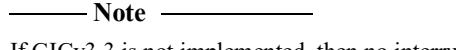

If GICv3.3 is not implemented, then no interrupts are NMIs.

Preemption occurs at the time when the PE takes the new interrupt, and starts handling the new interrupt instead of the previously active interrupt or the currently running process. When this occurs, the initial active interrupt is said to have been *preempted*.


The value of the I, F, and ALLINT bit in the Process State, [PSTATE](#page-28-3), and the Exception level and the interrupt routing controls in software and hardware, determine whether the PE responds to the signaled interrupt by taking the interrupt. For more information, see *Arm® Architecture Reference Manual for A-profile architecture*.

For more information about enabling interrupts, see *[Enabling the distribution of interrupts on page](#page-68-1) 4-69*.

#### **Preemption level control**

[ICC\\_BPR0\\_EL1](#page-225-0) determines whether a Group 0 interrupt is signaled to the PE for possible preemption. In addition:

- When [ICC\\_CTLR\\_EL3.](#page-237-0)CBPR\_EL1NS == 1, [ICC\\_BPR0\\_EL1](#page-225-0) also determines whether a Non-secure Group 1 interrupt is signaled to the PE for possible preemption.
- When [ICC\\_CTLR\\_EL3](#page-237-0).CBPR\_EL1S == 1, [ICC\\_BPR0\\_EL1](#page-225-0) also determines whether a Secure Group 1 interrupt is signaled to the PE for possible preemption.

[ICC\\_BPR1\\_EL1](#page-228-0) determines whether a Group 1 interrupt is signaled to the PE for possible preemption. The Non-secure copy of this register is used for Non-secure Group 1 interrupts. The Secure copy is used for Secure Group 1 interrupts.

When [ICC\\_CTLR\\_EL3](#page-237-0).CBPR\_EL1NS is set to 1:

- EL3 can write to [ICC\\_BPR1\\_EL1\\_](#page-228-0)NS.
  - When EL3 is using AArch64 state, accesses to [ICC\\_BPR1\\_EL1\\_](#page-228-0)NS from EL3 are not affected by [ICC\\_CTLR\\_EL3.](#page-237-0)CBPR\_EL1NS.
  - When EL3 is using AArch32 state, accesses to [ICC\\_BPR1\\_EL1](#page-228-0)\_NS from Monitor mode are not affected by [ICC\\_CTLR\\_EL3.](#page-237-0)CBPR\_EL1NS.
- Non-secure writes to [ICC\\_BPR1\\_EL1](#page-228-0) at EL1 or EL2 are ignored.
- Non-secure reads of [ICC\\_BPR1\\_EL1](#page-228-0) at EL1 or EL2 return the value of [ICC\\_BPR0\\_EL1](#page-225-0) +1, saturating at 7.

When [ICC\\_CTLR\\_EL3](#page-237-0).CBPR\_EL1S is set to 1:

- Secure reads of [ICC\\_BPR1\\_EL1](#page-228-0) return the value of [ICC\\_BPR0\\_EL1.](#page-225-0)
- Secure writes to [ICC\\_BPR1\\_EL1](#page-228-0) update [ICC\\_BPR0\\_EL1.](#page-225-0)

#### <span id="page-78-0"></span>**4.8.6 Priority masking**

The *Priority Mask Register* for a CPU interface, [ICC\\_PMR\\_EL1](#page-266-0), defines a priority threshold for the target PE. The highest pending interrupt is masked by [ICC\\_PMR\\_EL1](#page-266-0) when either of the following is true:

- The interrupt is not an NMI and the interrupt priority is equal to or lower than [ICC\\_PMR\\_EL1.](#page-266-0)Priority.
- [GICD\\_CTLR.](#page-543-0)DS is 0 and either of the following is true:
  - The interrupt is a Non-secure NMI and [ICC\\_PMR\\_EL1](#page-266-0).Priority is set to a priority in the Secure range.
  - The interrupt is a Non-secure NMI, the current Security state is Secure or Root, and [ICC\\_PMR\\_EL1.](#page-266-0)Priority is set to 0x80.

When [GICD\\_CTLR](#page-543-0).DS is 0, Secure NMIs are never masked by [ICC\\_PMR\\_EL1](#page-266-0). When [GICD\\_CTLR.](#page-543-0)DS is 1, NMIs are never masked by [ICC\\_PMR\\_EL1](#page-266-0).

| Note                                                        |  |  |
|-------------------------------------------------------------|--|--|
| If GICv3.3 is not implemented, then no interrupts are NMIs. |  |  |

The GIC only signals pending interrupts that have a higher priority than this priority threshold to the target PE. A value of zero, the register reset value, masks all interrupts from being signaled to the associated PE. The GIC does not use priority grouping when comparing the priority of a pending interrupt with the priority threshold.

The GIC always masks an interrupt that has the lowest supported priority. This priority is sometimes referred to as the [idle priority](#page-24-3).

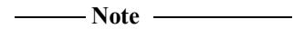

Writing 0xFF to [ICC\\_PMR\\_EL1](#page-266-0) always sets it to the lowest supported priority. Table 4-[9 on page](#page-70-2) 4-71 shows how the lowest supported priority varies with the number of implemented priority bits.

If the GIC provides support for two Security states, [ICC\\_PMR\\_EL1](#page-266-0) is RAZ/WI to Non-secure accesses, if bit[7] == 0. During normal operation, software executing in Non-secure state does not access [ICC\\_PMR\\_EL1w](#page-266-0)hen it is programmed with such a value.

For information that relates to different GIC configurations, see *[Non-secure accesses to register fields for Secure](#page-72-0)  [interrupt priorities on page](#page-72-0) 4-73*.

#### <span id="page-79-3"></span><span id="page-79-0"></span>**4.8.7 Software accesses of interrupt priority**

This section describes Secure and Non-secure reads of interrupt priority, and the relationship between them. It also describes writes to the priority value fields.


This section applies to any GIC implementation that supports two Security states.

When a PE reads the priority value of a Non-secure Group 1 interrupt, the GIC returns either the Secure or the Non-secure read of that value, depending on whether the access is Secure or Non-secure.

The GIC implements a minimum of 32 and a maximum of 256 priority levels. This means it implements 5-8 bits of the 8-bit priority value fields in the appropriate [GICR\\_IPRIORITYR<n>](#page-679-0) and [GICD\\_IPRIORITYR<n>](#page-579-0) register. All of the implemented priority bits can be accessed by a Secure access, and unimplemented low-order bits of the priority fields are RAZ/WI. [Figure](#page-79-1) 4-7 shows the Secure read of a priority value field for an interrupt. The priority value stored in the Distributor is equivalent to the Secure read.

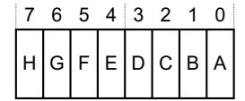

**Figure 4-7 Secure read of the priority field for any interrupt**

<span id="page-79-1"></span>In this view:

- Bits H-D are the bits that the GIC must implement, corresponding to 32 priority levels.
- Bits C-A are the bits the GIC might implement. They are RAZ/WI if not implemented.
- The GIC must implement bits H-A to provide the maximum 256 priority levels.

For Non-secure accesses, the GIC supports half the priority levels it supports for Secure accesses, which means a minimum of 16 priority levels. [Figure](#page-79-2) 4-8 shows the Non-secure view of a priority value field for a Non-secure Group 1 interrupt.

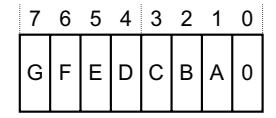

**Figure 4-8 Non-secure read of the priority field for a Non-secure Group 1 interrupt**

<span id="page-79-2"></span>In this read:

- Bits G-D are the bits that the GIC must implement, corresponding to 16 priority levels.
- Bits C-A are the bits the GIC might implement, that are RAZ/WI if not implemented.
- The GIC must implement bits G-A to provide the maximum 128 priority levels.
- Bit [0] is RAZ/WI.

The Non-secure read of a priority value does not show how the value is stored in the registers in the Distributor. For Non-secure writes to a priority field of a Non-secure Group 1 interrupt, before storing the value:

- The value is right-shifted by one bit.
- Bit [7] of the value is set to 1.

This translation means the priority value for the Non-secure Group 1 interrupt is in the bottom half of the priority range.

A Secure read of the priority value for an interrupt returns the value stored in the Distributor. [Figure](#page-80-1) 4-9 shows this Secure read of the priority value field for a Non-secure Group 1 interrupt that has had its priority value field set by a Non-secure access, or has had a priority value with bit[7] == 1 set by a Secure access:

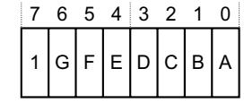

**Figure 4-9 Secure read of the priority field for a Non-secure Group 1 interrupt**

<span id="page-80-1"></span>A Secure write to the priority value field for a Non-secure Group 1 interrupt can set bit [7] to 0. If a Secure write sets bit[7] to 0:

- A Non-secure read returns the value GFEDCBA0.
- A Non-secure write can change the value of the field, but only to a value that has bit [7] set to 1 for the Secure read of the field.

**Note**

- This behavior of Non-secure accesses applies only to the priority value fields in [GICR\\_IPRIORITYR<n>](#page-679-0) and [GICD\\_IPRIORITYR<n>](#page-579-0), as appropriate:
  - If the Priority field in [ICC\\_PMR\\_EL1](#page-266-0) holds a value with bit [7] == 0, then the field is RAZ/WI for Non-secure accesses.
  - If the Priority field in [ICC\\_RPR\\_EL1](#page-269-0) holds a value with bit [7] == 0, then the field is RAZ for Non-secure reads.
- Arm does not recommend setting bit[7] to 0 for a Non-secure Group 1 interrupt in this way because it places the interrupt in the wrong half of the priority range for maintenance by Non-secure code.

[Figure](#page-80-0) 4-10 shows the relationship between the reads of the priority value fields for Non-secure Group 1 interrupts.

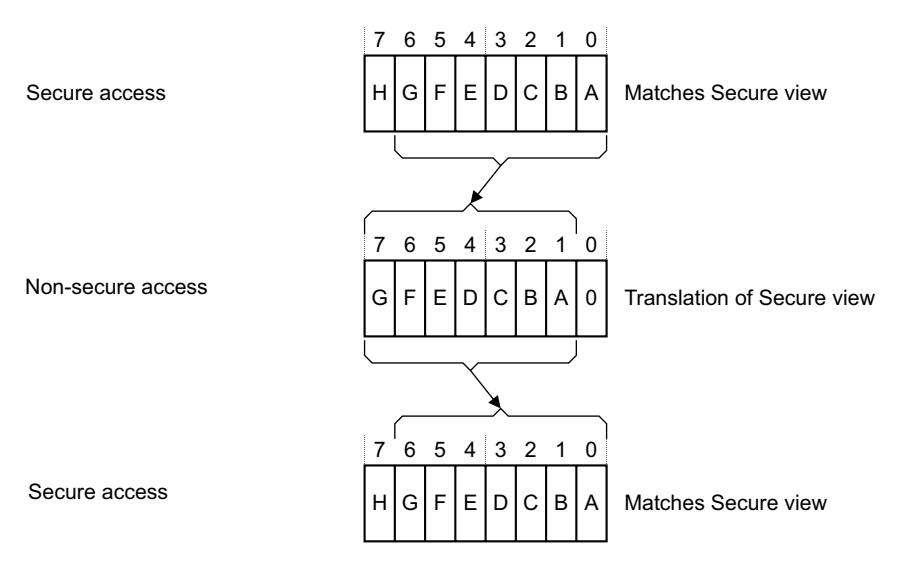

<span id="page-80-0"></span>**Figure 4-10 Relationship between Secure and Non-secure reads of interrupt priority fields**

[Figure](#page-81-0) 4-11 shows how software reads of the interrupt priorities from Secure and Non-secure accesses relate to the priority values held in the Distributor, and to the interrupt values that are visible to Secure and Non-secure accesses. [Figure](#page-81-0) 4-11 applies to a GIC that implements the maximum range of priority values.

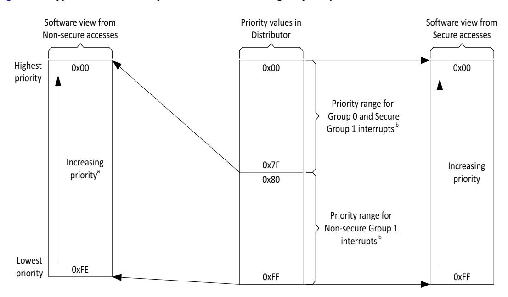

- a. All priority values are even (bit [0] == 0) in the software view of Non-secure accesses.
- b. Ranges recommended by Arm.

**Figure 4-11 Software reads of the priorities of Group 1 and Group 0 interrupts**

<span id="page-81-0"></span>Table 4-[16 on page](#page-81-1) 4-82 shows how the number of priority value bits implemented by the GIC affects the Secure and Non-secure reads of the priority of a Non-secure Group 1 interrupt.

**Note**

<span id="page-81-1"></span>Software executing in Non-secure state has no visibility of the priority settings of Group 0 interrupts, or where applicable, of Secure Group 1 interrupts.

**Table 4-16 Effect of not implementing some priority field bits, two Security states**

| Implemented priority bits, | Possible priority field values, for a Non-secure Group 1 interrupt |                                     |  |
|----------------------------|--------------------------------------------------------------------|-------------------------------------|--|
| as seen by a Secure read   | Secure read                                                        | Non-secure read                     |  |
| [7:0]                      | 0xFF-0x00 (255-0), all values                                      | 0xFE-0x00 (254-0), even values only |  |
| [7:1]                      | 0xFE-0x00 (254-0), even values only                                | 0xFC-0x00 (252-0), in steps of 4    |  |
| [7:2]                      | 0xFC-0x00 (252-0), in steps of 4                                   | 0xF8-0x00 (248-0), in steps of 8    |  |
| [7:3]                      | 0xF8-0x00 (248-0), in steps of 8                                   | 0xF0-0x00 (240-0), in steps of 16   |  |

This model for the presentation of priority values ensures software written to operate with an implementation of this GIC architecture functions as intended regardless of whether the GIC provides support for two Security states. However, programmers must ensure that software assigns the appropriate priority levels to the Group 0 and Group 1 interrupts.

**Note**

To control priority values, Arm strongly recommends that:

- For a Group 0 interrupt, software sets bit[7] of the priority value field to 0.
- If using a Secure write to set the priority of a Non-secure Group 1 interrupt, software sets bit[7] of the priority value field to 1.

This ensures that all Group 0 and, if applicable, Secure Group 1 interrupts have higher priorities than all Non-secure Group 1 interrupts. However, a system might have requirements that cannot be met with this scheme.

[Table](#page-82-1) 4-17 shows an example priority allocation scheme that ensures:

- Some Group 0 interrupts have higher priority than any other interrupts.
- <span id="page-82-1"></span>• Some Secure Group 1 interrupts have higher priority than any Non-secure Group 1 interrupt.

**Table 4-17 Example priority allocation**

| Interrupt security configuration | GICR_IPRIORITYR <n>[7:6]</n> |
|----------------------------------|------------------------------|
| Group 0                          | 0b00                         |
| Secure Group 1                   | 0b01                         |
| Non-secure Group 1               | 0b10<br>0b11                 |

- Software might not be aware that the GIC supports two Security states, and therefore might not know whether it is making Secure or Non-secure accesses to GIC registers. However, for any implemented interrupt, software can write 0xFF to the corresponding [GICR\\_IPRIORITYR<n>](#page-679-0) priority value field, and then read back the value stored in the field to determine the supported interrupt priority range. Arm recommends that, before checking the priority range in this way:
  - For a peripheral interrupt, software first disables the interrupt.
  - For an SGI, software first checks that the interrupt is inactive.

#### <span id="page-82-0"></span>**4.8.8 Changing the priority of enabled PPIs, SGIs, and SPIs**

If software writes to the [GICD\\_IPRIORITYR<n>,](#page-579-0) [GICD\\_IPRIORITYR<n>E,](#page-581-0) [GICR\\_IPRIORITYR<n>](#page-679-0) and [GICR\\_IPRIORITYR<n>E](#page-681-0) registers of an enabled interrupt while the interrupt is pending, it is IMPLEMENTATION DEFINED whether the GIC uses the old value or the new value. The GIC ensures that no interrupt is handled more than once, and that no interrupt is lost. The effect of the write must be visible in finite time.

*Physical Interrupt Handling and Prioritization 4.8 Interrupt prioritization*

## <span id="page-84-1"></span><span id="page-84-0"></span>Chapter 5

## **Locality-specific Peripheral Interrupts and the ITS**

This chapter describes *Locality-specific Peripheral Interrupts* (LPIs) and the *Interrupt Translation Service* (ITS). It contains the following sections:

- *[LPIs on page](#page-85-1) 5-86*.
- *[The Interrupt Translation Service on page](#page-91-1) 5-92*.
- *[ITS commands on page](#page-100-1) 5-101*.
- *[Common ITS pseudocode functions on page](#page-135-1) 5-136*.
- *[ITS command error encodings on page](#page-145-1) 5-146*.
- *[ITS power management on page](#page-148-1) 5-149*.

#### <span id="page-85-1"></span><span id="page-85-0"></span>**5.1 LPIs**

*Locality-specific Peripheral Interrupts* (LPIs) are edge-triggered message-based interrupts that can use an *Interrupt Translation Service* (ITS), if it is implemented, to route an interrupt to a specific Redistributor and connected PE. GICv3 provides two types of support for LPIs. LPIs can be supported either:

- Using the ITS to translate an EventID from a device into an LPI INTID. For more information about EventIDs, see *[The Interrupt Translation Service on page](#page-91-1) 5-92*.
- By forwarding an LPI INTID directly to the Redistributors, using [GICR\\_SETLPIR](#page-705-0).

An implementation must support only one of these methods.

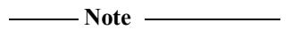

The following registers are mandatory in an implementation that supports LPIs but does not include an ITS:

- [GICR\\_INVLPIR.](#page-677-0)
- [GICR\\_INVALLR.](#page-675-0)
- [GICR\\_SYNCR](#page-709-0).

Support for these registers is IMPLEMENTATION DEFINED in implementations that do include an ITS.

These registers control physical LPIs in a system that does not include an ITS:

- [GICR\\_SETLPIR.](#page-705-0)
- [GICR\\_CLRLPIR](#page-638-0).

In an implementation that includes LPIs, at least 8192 LPIs are supported. For this reason, the configuration of each interrupt, and the pending information for each interrupt, is held in tables in memory, rather than in registers, and the tables are pointed to by registers held in the Redistributors.

- **Note** Arm expects that an implementation will cache parts of the tables in the Redistributors to reduce latency and memory traffic. The form of these caches is IMPLEMENTATION DEFINED.
- When the GIC supports two Security states, the addresses for the LPI tables are in the Non-secure physical address space.

Figure 5-[1 on page](#page-86-0) 5-87 shows the generation of LPIs in an implementation that includes at least one ITS.

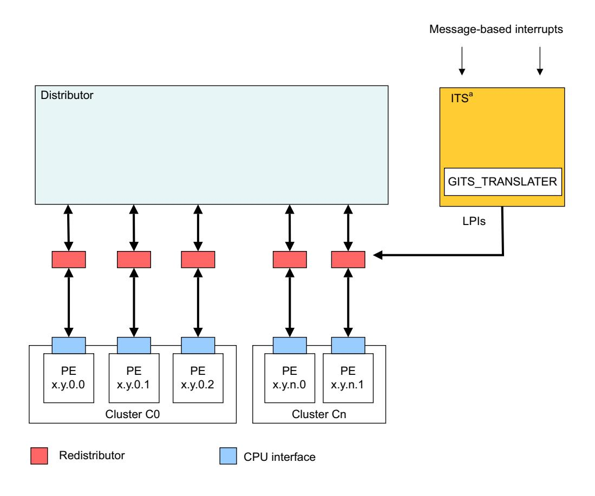

a. There might be zero, one, or more than one ITS in a GIC.

In [Figure](#page-86-0) 5-1, the ITS channel to the Redistributors is IMPLEMENTATION DEFINED.

**Figure 5-1 Triggering LPIs in an implementation with an ITS**

<span id="page-86-0"></span>**Note**

Figure 5-[2 on page](#page-87-0) 5-88 shows the generation of LPIs in an implementation without an ITS.

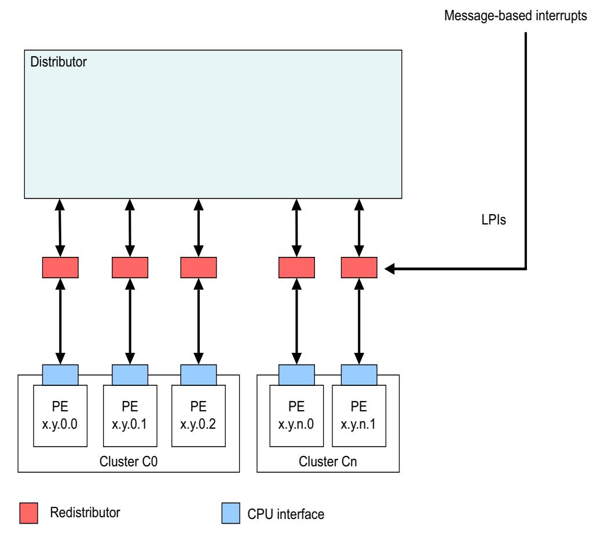

**Figure 5-2 Triggering LPIs in an implementation without an ITS**

<span id="page-87-0"></span>When [GICD\\_CTLR](#page-543-0).DS == 0:

- LPIs are only supported when affinity routing is enabled for Non-secure state.
- LPIs are always Non-secure Group 1 interrupts.

When [GICD\\_CTLR](#page-543-0).DS == 1:

- LPIs are only supported when affinity routing is enabled.
- LPIs are always Group 1 interrupts.

There is a single global physical LPI space so that LPIs can be moved between all Redistributors. Software programs the size of the single global physical LPI space using [GICR\\_PROPBASER](#page-702-0).IDbits.

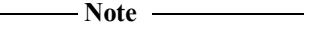

The size of the physical LPI space is limited to the maximum size that an implementation supports, which is defined in [GICD\\_TYPER.](#page-617-0)IDbits.

For a given Redistributor, LPI configuration and state are maintained in two tables in memory, described in the following sections:

- *[LPI Configuration tables on page](#page-88-1) 5-89*.
- *[LPI Pending tables on page](#page-89-1) 5-90*.

If a Redistributor supports physical LPIs, it has:

• LPI priority and enable bits programmed in the LPI Configuration table. The address of the LPI Configuration table is defined by [GICR\\_PROPBASER.](#page-702-0) If [GICR\\_PROPBASER](#page-702-0) is updated when [GICR\\_CTLR](#page-640-0).EnableLPIs == 1, the effects are UNPREDICTABLE. See *[LPI Configuration tables on page](#page-88-1) 5-89* for more information.

• Memory-backed storage for LPI pending bits in an LPI Pending table. This table is specific to a particular Redistributor. The address of the LPI Pending table is defined by [GICR\\_PENDBASER](#page-699-0). If [GICR\\_PENDBASER](#page-699-0) is updated when [GICR\\_CTLR.](#page-640-0)EnableLPIs == 1, the effects are UNPREDICTABLE.

[GICR\\_PROPBASER.](#page-702-0)IDBits sets the size of the ID space, and thereby the number of entries in the LPI Configuration table and the corresponding LPI Pending table.

Physical LPIs are enabled by a write to [GICR\\_CTLR](#page-640-0).EnableLPIs.


When LPIs are disabled at the Redistributor interface, that is when [GICR\\_CTLR.](#page-640-0)EnableLPIs == 0, LPIs cannot become pending. An attempt to make an LPI pending in this situation has no effect, and the LPI is lost. This differs from disabling SGIs, PPIs, and SPIs, which prevents only the signaling of the interrupt to the CPU interface.

GICv4 introduces equivalent tables for handling virtual LPIs with addresses referenced in [GICR\\_VPROPBASER](#page-720-0) and [GICR\\_VPENDBASER.](#page-714-0)

In GICv4, virtual LPIs are enabled by a write to [GICR\\_VPENDBASER.](#page-714-0)Valid.

#### <span id="page-88-1"></span><span id="page-88-0"></span>**5.1.1 LPI Configuration tables**

LPI configuration is global. Whether a GIC supports Redistributors that point at different copies of the LPI Configuration table is IMPLEMENTATION DEFINED.

It is IMPLEMENTATION DEFINED whether [GICR\\_PROPBASER](#page-702-0) can be set to different values on different Redistributors. [GICR\\_TYPER.](#page-710-0)CommonLPIAff indicates which Redistributors must have [GICR\\_PROPBASER](#page-702-0) set to the same value whenever [GICR\\_CTLR](#page-640-0).EnableLPIs == 1.

An implementation can treat all copies of [GICR\\_PROPBASER](#page-702-0) that are required to have the same value as accessing common state.

Setting different values in different copies of [GICR\\_PROPBASER](#page-702-0) on Redistributors that are required to use a common LPI Configuration table when [GICR\\_CTLR.](#page-640-0)EnableLPIs == 1 leads to UNPREDICTABLE behavior.

If [GICR\\_PROPBASER](#page-702-0) is programmed to different values on different Redistributors, it is IMPLEMENTATION DEFINED which copy or copies of [GICR\\_PROPBASER](#page-702-0) are used when the GIC reads the LPI Configuration tables. However, the copy or copies that are used will correspond to a Redistributor on which [GICR\\_CTLR.](#page-640-0)EnableLPIs == 1.

To avoid unpredictable behavior, software must ensure that all copies of the LPI Configuration tables are identical, and all changes are globally observable, whenever:

- [GICR\\_CTLR](#page-640-0).EnableLPIs is written from 0 to 1 on any Redistributor.
- [GICR\\_INVLPIR](#page-677-0) and [GICR\\_INVALLR](#page-675-0) are written on any Redistributor with [GICR\\_CTLR.](#page-640-0)EnableLPIs == 1, if direct LPIs are supported.
- The [INV](#page-107-0) and [INVALL](#page-108-0) command is executed by an ITS, in an implementation that includes at least one ITS.

An LPI Configuration table in memory stores entries containing configuration information for each LPI, where:

- [GICR\\_PROPBASER](#page-702-0) specifies a 4KB aligned physical address. This is the LPI Configuration table base address.
- For any LPI N, the location of the table entry is defined by (base address + (N 8192)).

To change the configuration of an interrupt, software writes to the LPI Configuration tables and then issues the [INV](#page-107-0) or [INVALL](#page-108-0) command. In implementations that do not include an ITS, software writes to [GICR\\_INVALLR](#page-675-0) or [GICR\\_INVLPIR.](#page-677-0)

The LPI Configuration table contains an 8-bit entry for each LPI. Figure 5-[3 on page](#page-89-2) 5-90 shows the LPI Configuration table entry format.

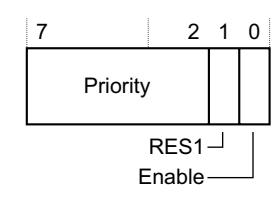

**Figure 5-3 LPI Configuration table entry**

<span id="page-89-3"></span>Table 5-[1 on page](#page-89-3) 5-90 shows the LPI Configuration table entry bit assignments.

**Table 5-1 LPI Configuration table entry bit assignments**

<span id="page-89-2"></span>

| Bits  | Name     | Function                                                                                                                                                                                                                                                                                          |  |
|-------|----------|---------------------------------------------------------------------------------------------------------------------------------------------------------------------------------------------------------------------------------------------------------------------------------------------------|--|
| [7:2] | Priority | The priority of the LPI. These are the most significant bits of the LPI priority. Bits[1:0] of the priority are 0.                                                                                                                                                                                |  |
|       |          | When GICD_CTLR.DS == 0, this value is shifted in accordance with the security and priority rules specified in<br>Software accesses of interrupt priority on page 4-80. This means that LPI priorities are always in the lower half of<br>the priority range. The priority value range is 128-254. |  |
|       |          | If GICD_CTLR.DS == 1, the value in this field is not shifted.                                                                                                                                                                                                                                     |  |
|       |          | In GICv4, the virtual LPI Configuration tables behave as if GICD_CTLR.DS == 1 and therefore the priority is not<br>shifted.                                                                                                                                                                       |  |
|       |          | Note<br>An implementation might support fewer than 8 bits of priority. Unimplemented bits will be treated as RES0.                                                                                                                                                                                |  |
|       |          | See Interrupt prioritization on page 4-71 for more information about interrupt priorities.                                                                                                                                                                                                        |  |
| [1]   | -        | RES1.                                                                                                                                                                                                                                                                                             |  |
| [0]   | Enable   | LPI enable. This bit controls whether the LPI is enabled:                                                                                                                                                                                                                                         |  |
|       |          | The LPI is not enabled.<br>0                                                                                                                                                                                                                                                                      |  |
|       |          | The LPI is enabled.<br>1                                                                                                                                                                                                                                                                          |  |

#### **Caching**

A Redistributor can cache the information from the LPI Configuration tables pointed to by [GICR\\_PROPBASER](#page-702-0), when [GICR\\_CTLR.](#page-640-0)EnableLPI == 1, subject to all of the following rules:

- Whether or not one or more caches are present is IMPLEMENTATION DEFINED. Where at least one cache is present, the structure and size is IMPLEMENTATION DEFINED.
- An LPI Configuration table entry might be allocated into the cache at any time.
- A cached LPI Configuration table entry is not guaranteed to remain in the cache.
- A cached LPI Configuration table entry is not guaranteed to remain incoherent with memory.
- A change to the LPI configuration is not guaranteed to be visible until an appropriate invalidation operation has completed:
  - If one or more ITS is implemented, invalidation is performed using the [INV](#page-107-0) or [INVALL](#page-108-0) command. A [SYNC](#page-118-0) command completes the [INV](#page-107-0) and [INVALL](#page-108-0) commands.
  - If no ITS is implemented, invalidation is performed by writing to [GICR\\_INVALLR](#page-675-0) or [GICR\\_INVLPIR.](#page-677-0)

If there is no Redistributor with [GICR\\_CTLR](#page-640-0).EnableLPIs == 1, the GIC has no cached LPI Configuration table entries.

#### <span id="page-89-1"></span><span id="page-89-0"></span>**5.1.2 LPI Pending tables**

Software configures the LPI Pending tables, using the implemented range of valid LPI INTIDs, by writing to [GICR\\_PENDBASER.](#page-699-0) This register provides the base address of the LPI Pending table for physical LPIs.

Each Redistributor maintains entries in a separate LPI Pending table that indicates the pending state of each LPI when [GICR\\_CTLR.](#page-640-0)EnableLPIs == 1 in the Redistributor:

0 The LPI is not pending.

1 The LPI is pending.

For a given LPI:

- The corresponding byte in the LPI Pending table is (base address + (N / 8)).
- The bit position in the byte is (N MOD 8).

An LPI Pending table that contains only zeros, including in the first 1KB, indicates that there are no pending LPIs.

The first 1KB of the LPI Pending table is IMPLEMENTATION DEFINED. However, if the first 1KB of the LPI Pending table and the rest of the table contain only zeros, this must indicate that there are no pending LPIs.

The first 1KB of memory for the LPI Pending tables must contain only zeros on initial allocation, and this must be visible to the Redistributors, or else the effect is UNPREDICTABLE.

During normal operation, the LPI Pending table is maintained solely by the Redistributor.

Behavior is UNPREDICTABLE if software writes to the LPI Pending tables while [GICR\\_CTLR.](#page-640-0)EnableLPIs == 1. When [GICR\\_CTLR.](#page-640-0)EnableLPIs is cleared to 0, behavior is UNPREDICTABLE if the LPI Pending table is written before GICR\_CTLR.RWP reads 0.

Redistributors that are required to share a common LPI Configuration table, as indicated by [GICR\\_TYPER.](#page-710-0)CommonLPIAff, might treat the OuterCache, Shareability, or InnerCache fields of [GICR\\_PENDBASER](#page-699-0) as accessing common state.

Having the OuterCache, Shareability, or InnerCache fields of [GICR\\_PENDBASER](#page-699-0) are programmed to different values on different Redistributors with [GICR\\_CTLR](#page-640-0).EnableLPIs == 1 in a system is UNPREDICTABLE.

For physical LPIs, when [GICR\\_CTLR](#page-640-0).EnableLPIs is changed to 1, the Redistributor must read the pending status of the physical LPIs from the physical LPI Pending table.

#### **Note**

If [GICR\\_PENDBASER.](#page-699-0)PTZ == 1, software guarantees that the LPI Pending table contains only zeros, including in the first 1KB. In this case hardware might not read any part of the table.

If [GICR\\_CTLR.](#page-640-0)EnableLPIs is cleared to 0, then when [GICR\\_CTLR.](#page-640-0)RWP reads as 0 there are no further accesses by the GIC to the LPI Pending table, and any caching of the LPI Pending table is invalidated. There is no guarantee that clearing [GICR\\_CTLR](#page-640-0).EnableLPIs causes the LPI Pending table to be updated in memory.

#### **Note**

If one or more ITS is implemented, Arm strongly recommends that all LPIs are mapped to another Redistributor before [GICR\\_CTLR](#page-640-0).EnableLPIs is cleared to 0.

For virtual LPIs, when [GICR\\_CTLR.](#page-640-0)EnableLPIs ==1, and [GICR\\_VPENDBASER.](#page-714-0)Valid is changed to 1, the Redistributor must read the pending status of the virtual LPIs from the virtual LPI Pending table.

#### **Note**

- If [GICR\\_VPENDBASER](#page-714-0).IDAI == 0, the software guarantees that the LPI Pending table was written out by the same GIC implementation, meaning that hardware can rely on the first 1KB of the table and might not read the entire table.
- If [GICR\\_PROPBASER.](#page-702-0)IDbits is less than 0b1101 when [GICR\\_CTLR](#page-640-0).EnableLPIs == 1, the GIC might still access the IMPLEMENTATION DEFINED region of the LPI Pending table.

#### <span id="page-90-0"></span>**5.1.3 Virtual LPI Configuration tables and virtual LPI Pending tables**

GICv4 uses the same concept of memory tables to hold the configuration and pending information for virtual LPIs. The format of these tables is the same as for physical LPIs.

### <span id="page-91-1"></span><span id="page-91-0"></span>**5.2 The Interrupt Translation Service**

The *Interrupt Translation Service* (ITS) translates an input EventID from a device, identified by its DeviceID, and determines:

- 1. The corresponding INTID for this input.
- 2. The target Redistributor and, through this, the target PE for that INTID.

For GICv3, the ITS performs this function for events that are translated into physical LPIs. LPIs can be forwarded to a Redistributor either by an ITS or by a direct write to [GICR\\_SETLPIR](#page-705-0). An implementation must support only one of these methods.

For GICv4, the ITS also performs this function for interrupts that are directly injected as virtual LPIs, and for GICV4.1, virtual SGIs.

An ITS has no effect on physical SGIs, SPIs, or PPIs.

The flow of the ITS translation is as follows:

- 1. The DeviceID selects a *Device table entry* (DTE) in the *Device table* that describes which *Interrupt translation table* (ITT) to use.
- 2. The EventID selects an *Interrupt translation entry* (ITE) in the ITT that describes:
  - For physical interrupts:
    - The output physical INTID.
    - The *Interrupt collection number*, ICID.
  - For virtual interrupts, in GICv4:
    - The output virtual INTID.
    - The vPEID.
    - A doorbell to use if the vPE is not scheduled.
- 3. For physical interrupts, ICID selects a Collection table entry in the *Collection table* (CT) that describes the target Redistributor, and therefore the target PE, to which the interrupt is routed.
- 4. For virtual interrupts, in GICv4, the vPEID selects a vPE table entry that describes the Redistributor that is currently hosting the target vPE to which the interrupt is routed.

The tables used in the translation process are described in more detail in the following sections:

- *[The ITS tables](#page-91-2)*.
- *[The Device table on page](#page-94-0) 5-95*.
- *[The Interrupt translation table on page](#page-95-0) 5-96*.
- *[The Collection table on page](#page-96-0) 5-97*.
- *[The vPE table on page](#page-96-1) 5-97*.

These tables are created and maintained using the ITS commands described in *[ITS commands on page](#page-100-1) 5-101*. GICv3 and GICv4 do not support direct access to the tables, and the tables must be configured using the ITS commands.

#### <span id="page-91-3"></span><span id="page-91-2"></span>**5.2.1 The ITS tables**

Software provisions memory for the ITS private tables when the GIC provides a set of registers that permits the following features to be discovered:

- The number of private tables that are required.
- The size of each entry in each table.
- The type of each table.

**Note** When the GIC supports two Security states, all ITS tables are in the Non-secure physical address space.

The state and configuration of the ITS tables is stored in a set of tables in memory. This memory is allocated by software before enabling the ITS.

[GITS\\_BASER<n>](#page-825-0) specifies the base address and size of the ITS tables, and must be provisioned before the ITS is enabled.

The ITS tables have either a flat structure or a two-level structure. The structure is determined by [GITS\\_BASER<n>](#page-825-0):

**0** Flat table. In this case a contiguous block of memory is allocated for the table. The format of the table is IMPLEMENTATION DEFINED.

> Behavior is UNPREDICTABLE if memory that is used for the ITS tables does not contain zeros at the time of the new allocation for use by the ITS.

- **1** Two-level table. In this case each entry in the level 1 table is 64 bits, and has the following format:
  - Bit[63] Valid:
    - If this bit is cleared to 0, the PhysicalAddress field does not point to the base address of a level 2 table.
    - If this bit is set to 1, the PhysicalAddress field points to the base address of a level 2 table.
  - Bits[62:52] RES0.

DeviceID, or vPEID.

- Bits[51:N] physical address of the level 2 table. N is the number of bits that are required to specify the page size:
  - The size of the level 2 table is determined by [GITS\\_BASER<n>.](#page-825-0)Page\_Size.
- Bits[N-1:0] RES0. N is the number of bits that are required to specify the page size.

The level 1 table is indexed by the appropriate ID so that level 1 entry = ID/(Page Size / Entry Size).

**Note** This allows software to determine the level 2 table that must be allocated for a given CollectionID,

For level 1 table entries, when Valid == 0:

- If the Type field specifies a valid table type other than a Collection table, the ITS discards any writes to the level 2 table.
- If the Type field specifies the Collection table, and ICID is greater than or equal to the number indicated by [GITS\\_TYPER](#page-847-0).HCC, the ITS discards any writes to the level 2 table.

The format of the level 2 table is IMPLEMENTATION DEFINED.

Behavior is UNPREDICTABLE if:

**Note**

- Memory that is used for the level 2 tables does not contain zeros at the time of the new allocation for use by the ITS.
- Multiple level 1 table entries with Valid == 1 point to the same level 2 table.

As part of restoring the state of the ITS from powerdown events, the registers that describe the table can point to tables that were previously populated by the ITS, and so might contain values other than zeros. The details of power

management of the ITS are IMPLEMENTATION DEFINED. See *[ITS power management on page](#page-148-1) 5-149*.

Figure 5-[4 on page](#page-93-0) 5-94 shows how these tables are used in the translation process.

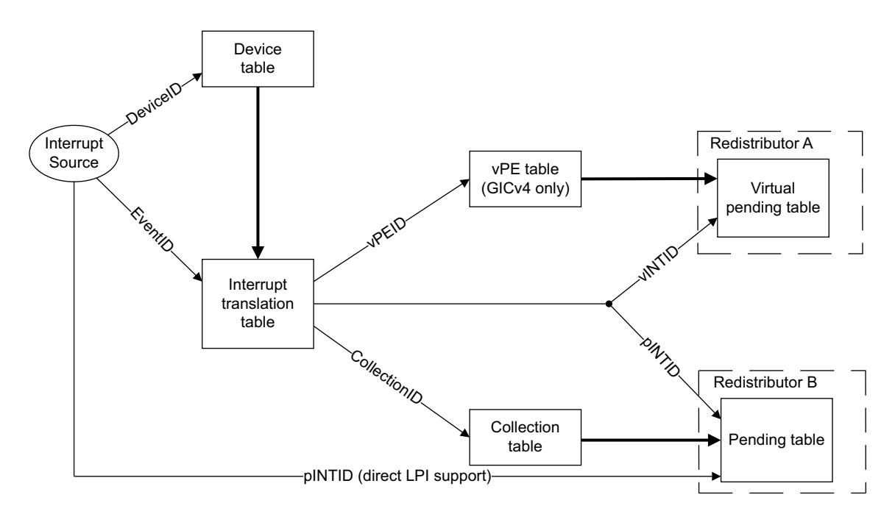

**Figure 5-4 ITS tables**

<span id="page-93-0"></span>When [GITS\\_CTLR.](#page-833-0)Enabled is written from 0 to 1 behavior is UNPREDICTABLE if any of the following conditions are true:

- [GITS\\_CBASER.](#page-829-0)Valid == 0.
- [GITS\\_BASER<n>](#page-825-0).Valid == 0, for any [GITS\\_BASER<n>](#page-825-0) register where the Type field indicates Device.
- [GITS\\_BASER<n>](#page-825-0).Valid == 0, for any [GITS\\_BASER<n>](#page-825-0) register where the Type field indicates collection and [GITS\\_TYPER](#page-847-0).HCC == 0.
- In GICv4, [GITS\\_BASER<n>.](#page-825-0)Valid == 0, for any [GITS\\_BASER<n>](#page-825-0) register where the Type field indicates a vPE.

#### **Software access to the private ITS tables.**

If [GITS\\_BASER<n>.](#page-825-0)Indirect == 0, behavior is UNPREDICTABLE if memory that is used for the ITS tables does not contain all zeros when first allocated to the ITS.

If [GITS\\_BASER<n>.](#page-825-0)Indirect == 1, behavior is UNPREDICTABLE if memory that is used for a level 2 table does not contain all zeros when it is first allocated for use by the ITS.

When [GITS\\_CTLR.](#page-833-0)Enabled == 0 and [GITS\\_CTLR](#page-833-0).Quiescent == 1:

• An implementation will not access the tables that are pointed to by any of the [GITS\\_BASER<n>](#page-825-0) registers.

When [GITS\\_CTLR.](#page-833-0)Enabled == 1 or [GITS\\_CTLR.](#page-833-0)Quiescent == 0:

- An implementation will not access a table that is pointed to by any [GITS\\_BASER<n>](#page-825-0) register for which [GITS\\_BASER<n>](#page-825-0).Valid == 0.
- For a table that is pointed to by a [GITS\\_BASER<n>](#page-825-0) register for which [GITS\\_BASER<n>](#page-825-0).Valid == 1 and [GITS\\_BASER<n>](#page-825-0).Indirect == 0, behavior is UNPREDICTABLE if the table is written by software.
- For a table that is pointed to by a [GITS\\_BASER<n>](#page-825-0) register for which [GITS\\_BASER<n>](#page-825-0).Valid == 1 and [GITS\\_BASER<n>](#page-825-0).Indirect == 1:
  - Behavior is UNPREDICTABLE if any of the level 2 table entries are written by software.
  - An ITS will not cache any entry in the level 1 table where the valid bit is cleared to 0.
  - Behavior is UNPREDICTABLE if any level 1 table entry where the valid bit set to 1 is written by software.

— A write to a level 1 table entry that changes the valid bit from 0 to 1 must be globally visible before software adds a command to the ITS command queue that relies on that entry. Otherwise it is UNKNOWN if the command will succeed or if it will be ignored.

#### **5.2.2 Interrupt collections**

In GICv3, the ITS considers all physical LPIs that it generates to be members of *collections*. The data that is associated with a collection can be held in the ITS, in external memory, or in both. The ITS supports collections that are held in memory if any of the [GITS\\_BASER<n>.](#page-825-0)Type == 0b100:

- When the ITS supports collections that are held in memory, the total number of collections that is supported is determined by the memory allocated by software:
  - If [GITS\\_BASER<n>](#page-825-0).Indirect == 0, the number of collections supported in memory can be calculated using the following formula:

((number of pages \* page size) / entry size)

The relevant values for this formula are indicated in [GITS\\_BASER<n>](#page-825-0).Size, [GITS\\_BASER<n>](#page-825-0).PageSize, and [GITS\\_BASER<n>.](#page-825-0)EntrySize.

— If [GITS\\_BASER<n>](#page-825-0).Indirect == 1, the number of collections supported in memory can be calculated using the following formula:

(((number of pages in level 1 table \* page size) /8) \* (page size/entry size)).

The relevant values for this formula are indicated in [GITS\\_BASER<n>](#page-825-0).Size, [GITS\\_BASER<n>](#page-825-0).PageSize, and [GITS\\_BASER<n>.](#page-825-0)EntrySize.

| Note |  |
|------|--|
|------|--|

Indirect tables allow sparse allocations, so not all ICIDs in the supported range might be usable.

• Where collections are held in both the ITS and external memory, the total number of collections is indicated by [GITS\\_TYPER.](#page-847-0)CCT.

When [GITS\\_TYPER.](#page-847-0)HCC!= 0:

- Collections with identifiers in the range {0... [GITS\\_TYPER.](#page-847-0)HCC-1} are held in the ITS.
- Collections with identifiers in the range greater than that indicated in [GITS\\_TYPER](#page-847-0).HCC are held in external memory, if this is supported.

When [GITS\\_TYPER.](#page-847-0)HCC == 0:

• The ITS must support collections in external memory, and all collections are held in external memory.

The maximum number of collections that are supported is limited by the size of the ICID:

- If [GITS\\_TYPER](#page-847-0).CIL == 0, the ICID is 16 bits.
- If [GITS\\_TYPER](#page-847-0).CIL == 1, the ICID is reported by [GITS\\_TYPER](#page-847-0).CIDbits.

#### <span id="page-94-1"></span><span id="page-94-0"></span>**5.2.3 The Device table**

The *Device table* provides a table of *Device table entries* (DTEs). Each DTE describes a mapping between a DeviceID and an ITT base address that points to the memory that the ITS can use to store the translations for the EventID. The ITS uses the ITT to store the translations for every EventID for the specified DeviceID. The DeviceID is a unique identifier assigned to each device that can create a range of EventIDs. For example, Arm expects that the 16-bit Requester ID from a PCIe Root Complex is presented to an ITS as a DeviceID.

The DeviceID provides the index value for the table.

<span id="page-95-1"></span>[Table](#page-95-1) 5-2 shows an example of the number of bits that might be assigned to each DTE.

**Table 5-2 DTE entries**

| Number of bits | Assignment  | Notes                                                |
|----------------|-------------|------------------------------------------------------|
| 1              | Valid       | Boolean                                              |
| 40             | ITT Address | Base physical address                                |
| 5              | ITT Range   | Log2 (EventID width supported by the ITT) minus one. |

#### <span id="page-95-4"></span><span id="page-95-0"></span>**5.2.4 The Interrupt translation table**

An *Interrupt translation table* (ITT) is specific to each device that can create numbered events. Each entry in an ITT is referred to as an *Interrupt translation entries* (ITEs).

In GICv3, ITEs are only defined for physical interrupts.

In GICv4, ITEs are defined for physical interrupts and for virtual interrupts, and provide a distinction between:

- An entry for a physical LPI and the use of an ICT for routing information.
- An entry for a virtual LPI and the use of a *vPE table*.

An ITT must be assigned a contiguous physical address space starting at ITT Address. The size is 2^(DTE.ITT Range + 1)\* [GITS\\_TYPER](#page-847-0).ITT\_entry\_size.

Behavior is UNPREDICTABLE if the memory does not contain all zeros at the time of new allocation for use by the ITS.

If multiple ITTs overlap in memory, behavior is UNPREDICTABLE.

ITS accesses to an ITT use the same Shareability and Cacheability attributes that are specified for the Device table.

For physical interrupts, each ITE describes the mapping between the input EventID and:

- The *output physical INTID* (pINTID) that is sent to the target PE.
- The ICID that identifies an entry in the Collection table, that determines the target PE for the LPI. For more information about the Collection table, see *[The Collection table on page](#page-96-0) 5-97*.

For virtual interrupts, each ITE describes the mapping of the EventID as outlined in the preceding list, and:

- The *output virtual INTID* (vINTID) that is sent to the target vPE.
- The *virtual PE number* (vPEID) that identifies an entry in the vPE table to determine the current host Redistributor. For more information about the vPE table, see *[The vPE table on page](#page-96-1) 5-97*.
- A physical LPI that is sent to a physical PE if a virtual interrupt is translated when the target vPE is not currently scheduled on a physical PE.

The EventID provides the index value for the table.

<span id="page-95-2"></span>Table 5-[3 on page](#page-95-2) 5-96 shows an example of the number of bits that might be stored in an ITE.

**Table 5-3 ITE entries**

<span id="page-95-3"></span>

| Number of bits                | Assignment       | Notes                                                            |
|-------------------------------|------------------|------------------------------------------------------------------|
| 1                             | Valid            | Boolean                                                          |
| 1                             | Interrupt_Type   | Boolean, indicates whether the interrupt is physical or virtual. |
| Size of the LPI number spacea | Interrupt_Number | pINTID or vINTID depending on the interrupt type.                |

**Table 5-3 ITE entries (continued)**

| Number of bits                | Assignment                    | Notes                                                                                                                              |
|-------------------------------|-------------------------------|------------------------------------------------------------------------------------------------------------------------------------|
| Size of the LPI number spacea | Interrupt_Number HypervisorID | In GICv4 pINTID is used as a doorbell. In GICv3, and in<br>GICv4 when a doorbell is not required, the programmed value<br>is 1023. |
| 16                            | ICID                          | Interrupt Collection ID, for physical interrupts only.                                                                             |
| 16                            | vPEID                         | vPE ID, for virtual interrupt only.                                                                                                |

<span id="page-96-4"></span>a. For information about the size of the LPI number space, see *[INTIDs on page](#page-34-0) 2-35*.

#### <span id="page-96-0"></span>**5.2.5 The Collection table**

The Collection table (CT) provides a table of *Collection table entries* (CTEs). For physical LPIs only, each CTE describes a mapping between:

- The ICID generated by the ITT.
- The address of the target Redistributor in the format defined by [GITS\\_TYPER](#page-847-0).PTA.

There is a single CT for each ITS, which can be held in registers or in memory, or in a combination of the two. See [GITS\\_BASER<n>](#page-825-0).Type and [GITS\\_TYPER.](#page-847-0)HCC for more information.

The TableID provides the index value for the table. It is derived from ICID.

<span id="page-96-2"></span>Table 5-[4 on page](#page-96-2) 5-97 shows an example of the number of bits that might be assigned to each CT.

**Table 5-4 CT entries**

| Number of bits            | Assignment | Notes                                               |
|---------------------------|------------|-----------------------------------------------------|
| 1                         | Valid      | Boolean                                             |
| Size of RDbase identifier | RDbase     | The GIC supports two formats for RDbase, see RDbase |

#### <span id="page-96-3"></span><span id="page-96-1"></span>**5.2.6 The vPE table**

The vPE table consists of vPE table entries that provide a mapping from the vPEID generated by the ITS to:

- The target Redistributor, in the format defined by [GITS\\_TYPER.](#page-847-0)PTA.
- The base address of the virtual LPI Pending table associated with the target vPE.

An area of memory defined by [GITS\\_BASER<n>](#page-825-0) holds the vPE table and indicates the size of each entry in the table.

The vPE table describes all the vPEs associated with an ITS. Table 5-[5 on page](#page-97-0) 5-98 shows an example of the number of bits that an implementation might store in a vPE table.

In GICv4.1, the ITS can optionally share the vPE Configuration table with one or more ITS, instead of having its own vPE table. When a shared table or a private table to the ITS is used, it is indicated by [GITS\\_TYPER](#page-847-0).SVPET. When [GITS\\_TYPER.](#page-847-0)SVPET is not 0 and GITS\_BASER2.Valid is 1, behavior is UNPREDICTABLE if GITS\_BASER2.Physical\_Address does not match [GICR\\_VPROPBASER](#page-720-0).Physical\_Address of the Redistributors in the specified CommonLPIAff group with [GICR\\_VPROPBASER](#page-720-0).Valid set to 1.

<span id="page-97-0"></span>The 16-bit vPEID provides the index value for the table.

**Table 5-5 vPE table entries**

| Number of bits            | Assignment | Notes                                                                                                                                                                                                                 |
|---------------------------|------------|-----------------------------------------------------------------------------------------------------------------------------------------------------------------------------------------------------------------------|
| 1                         | Valid      | Boolean                                                                                                                                                                                                               |
| Size of RDbase identifier | RDbase     | The GIC supports two formats for RDbase.                                                                                                                                                                              |
| Size of address           | VPT_addr   | VPT_addr locates the LPI Pending table when the VM is not resident in the<br>Redistributor. It is used as the address in GICR_VPENDBASER when the vPE is<br>scheduled in the GICR_* registers associated with RDbase. |
| 5                         | Size       | The size of the vINTID range supported (minus one).                                                                                                                                                                   |

#### **5.2.7 Control and configuration of the ITS**

An ITS is controlled and configured using a memory-mapped interface where:

- The version can be read from [GITS\\_IIDR](#page-837-0) and from [GITS\\_PIDR2.](#page-210-0)
- [GITS\\_TYPER](#page-847-0) specifies the features that are supported by an ITS.
- [GITS\\_CTLR](#page-833-0) controls the operation of an ITS.
- [GITS\\_TRANSLATER](#page-845-0) receives EventID information. It is IMPLEMENTATION DEFINED how the DeviceID is supplied. See *[ITS commands on page](#page-100-1) 5-101* for more details.
- [GITS\\_BASER<n>](#page-825-0) registers provide information about the type, size and access attributes for the architected ITS memory structures.
- [GITS\\_CBASER,](#page-829-0) [GITS\\_CREADR](#page-832-0), and [GITS\\_CWRITER](#page-835-0) store address information for the ITS command queue interface.

<span id="page-97-1"></span>There is an enable bit for each ITS, [GITS\\_CTLR.](#page-833-0)Enabled.

#### **5.2.8 The ITS command interface**

Figure 5-[5 on page](#page-98-0) 5-99 shows how the ITS provides the base address and the size that are used by the ITS command queue.

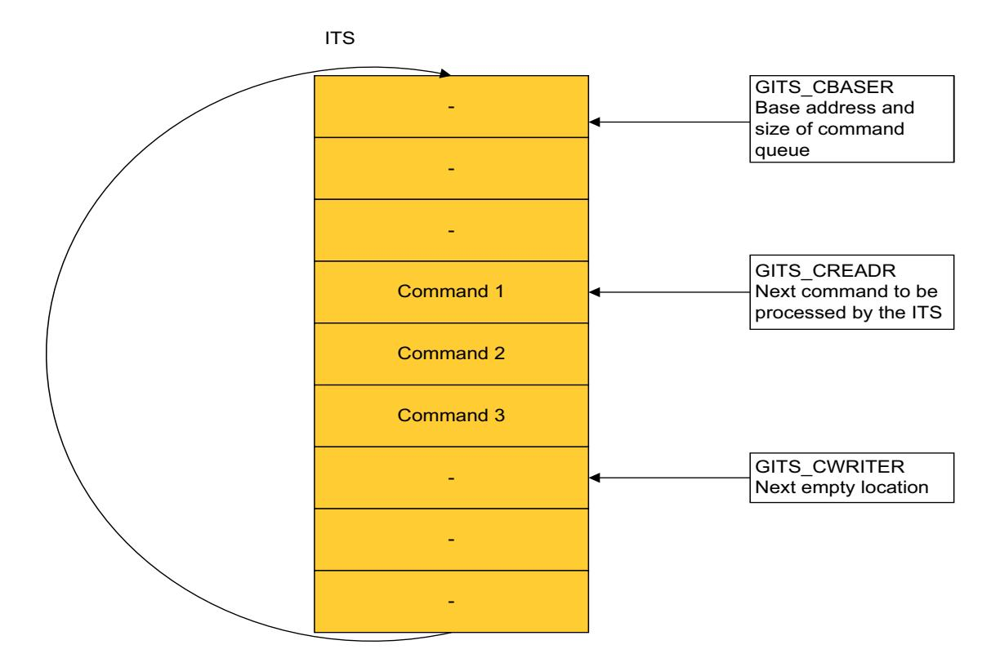

**Figure 5-5 The ITS command queue**

<span id="page-98-0"></span>[GITS\\_CBASER,](#page-829-0) [GITS\\_CREADR](#page-832-0), and [GITS\\_CWRITER](#page-835-0) define the ITS command queue.

- [GITS\\_CBASER](#page-829-0) uses the following fields:
  - Valid. This field indicates the allocation of memory for the ITS command queue.
  - Cacheability. This field indicates the Cacheability attributes of accesses to the ITS command queue.
  - Shareability. This field indicates the Shareability attributes of accesses to the ITS command queue.
  - Physical address. This field provides the base physical address of the memory containing the ITS command queue.
  - Size. This field indicates the number of 4KB pages of physical memory for the ITS command queue.
- [GITS\\_CREADR](#page-832-0) specifies the base address offset from which an ITS reads the next command to execute.
- [GITS\\_CWRITER](#page-835-0) specifies the base address offset of the next free entry to which software writes the next command.

The size of an ITS command queue entry is 32 bytes. This means that there is support for 128 entries in each 4KB page.

The ITS command queue uses a little-endian memory order model.

In the ITS command queue:

- The base address is always aligned to 64KB.
- Size is expressed as a multiple of 4KB.
- The address at which the queue wraps is always aligned to 4KB, and is (base address + (Size \* 4KB)).

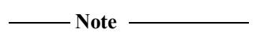

All addresses are Non-secure physical addresses.

When the first command is complete, the ITS starts to process the next command. The read pointer, [GITS\\_CREADR](#page-832-0), advances as the ITS processes commands. If [GITS\\_CREADR](#page-832-0) reaches the top of the memory specified in [GITS\\_CBASER](#page-829-0) then the pointer wraps back to the base address specified in [GITS\\_CBASER.](#page-829-0) [GITS\\_CWRITER](#page-835-0) is controlled by software.

The ITS command queue is empty when [GITS\\_CWRITER](#page-835-0) and [GITS\\_CREADR](#page-832-0) specify the same base address offset value.

The ITS command queue is full when [GITS\\_CWRITER](#page-835-0) points to an address 32 bytes behind [GITS\\_CREADR](#page-832-0) in the buffer.

When [GITS\\_CREADR.](#page-832-0)Stalled == 1 no subsequent commands are processed.

The [INT](#page-106-0) ITS command generates an interrupt on execution, and this can generate an interrupt on completion of a particular sequence of commands, see *[ITS commands on page](#page-100-1) 5-101*.

#### <span id="page-99-1"></span><span id="page-99-0"></span>**5.2.9 Ordering of translations with the output to ITS commands**

Each command queue entry appears to be executed atomically so that a translation request either sees the state of the ITS before a command or the state of the ITS after the command.

A translation request initiated after a [SYNC](#page-118-0) or [VSYNC](#page-133-0) command has completed is translated using an ITS state that is consistent with the state after the command is performed.

In the absence of a [SYNC](#page-118-0) or [VSYNC](#page-133-0) command the ordering of ITS commands and translation requests is not defined by the architecture.

#### **5.2.10 Restrictions for INTID mapping rules**

The behavior of the GIC is UNPREDICTABLE if software:

- Maps multiple EventID-DeviceID combinations to the same physical LPI INTID.
- Assigns doorbell interrupts with the same physical LPI INTID to different physical PEs. This applies to GICv4 only.
- Maps an EventID-DeviceID combination and an individual doorbell interrupt to the same physical LPI INTID, unless they target the same physical PE. This applies to all versions of GICv4.
- Maps multiple EventID-DeviceID combinations to the same virtual LPI INTID-vPEID. This applies to GICv4 only.
- Maps an EventID-DeviceID combination and a default doorbell interrupt to the same physical LPI INTID. This applies to GICv4.1 only.
- Maps a default doorbell and an individual doorbell to the same physical LPI INTID. This applies to GICv4.1 only.

| Note                                                                                                                                                                                                                                           |
|------------------------------------------------------------------------------------------------------------------------------------------------------------------------------------------------------------------------------------------------|
| Conceptually the restriction is that software should not map multiple EventID-DeviceID combinations to the same<br>vLPI within a given virtual machine. However, the ITS has no awareness of which vPEs belong to the same virtual<br>machine. |

#### <span id="page-100-1"></span><span id="page-100-0"></span>**5.3 ITS commands**

<span id="page-100-2"></span>Table 5-[6 on page](#page-100-2) 5-101 provides a summary of all ITS commands.

<span id="page-100-3"></span>**Table 5-6 ITS commands**

| Command            | Command arguments               | Description                                                                                                                                                                                                                                                                                                                                                                                                                                                                |
|--------------------|---------------------------------|----------------------------------------------------------------------------------------------------------------------------------------------------------------------------------------------------------------------------------------------------------------------------------------------------------------------------------------------------------------------------------------------------------------------------------------------------------------------------|
| CLEAR              | DeviceID, EventID               | Translates the event defined by EventID and DeviceID into an ICID<br>and pINTID, and instruct the appropriate Redistributor to remove<br>the pending state.                                                                                                                                                                                                                                                                                                                |
| DISCARD            | DeviceID, EventID               | Translates the event defined by EventID and DeviceID and instructs<br>the appropriate Redistributor to remove the pending state of the<br>interrupt. It also ensures that any caching in the Redistributors<br>associated with a specific EventID is consistent with the<br>configuration held in memory. DISCARD removes the mapping of<br>the DeviceID and EventID from the ITT, and ensures that incoming<br>requests with a particular EventID are silently discarded. |
| INT                | DeviceID, EventID               | Translates the event defined by EventID and DeviceID into an ICID<br>and pINTID, and instruct the appropriate Redistributor to set the<br>interrupt pending.                                                                                                                                                                                                                                                                                                               |
| INV                | DeviceID, EventID               | Specifies that the ITS must ensure that any caching in the<br>Redistributors associated with the specified EventID is consistent<br>with the LPI Configuration tables held in memory.                                                                                                                                                                                                                                                                                      |
| INVALL             | ICID                            | Specifies that the ITS must ensure any caching associated with the<br>interrupt collection defined by ICID is consistent with the LPI<br>Configuration tables held in memory for all Redistributors.                                                                                                                                                                                                                                                                       |
| INVDB GICv4.1 only | vPEID                           | GICv4.1 only. Specifies that the ITS must ensure any caching<br>associated with the default doorbell for vPEID is consistent with<br>the LPI Configuration tables held in memory for all<br>Redistributors.                                                                                                                                                                                                                                                                |
| MAPC               | ICID, RDbase                    | Maps the Collection table entry defined by ICID to the target<br>Redistributor, defined by RDbase.                                                                                                                                                                                                                                                                                                                                                                         |
| MAPD               | DeviceID, ITT_addr, Size        | Maps the Device table entry associated with DeviceID to its<br>associated ITT, defined by ITT_addr and Size.                                                                                                                                                                                                                                                                                                                                                               |
| MAPI               | DeviceID, EventID, ICID         | Maps the event defined by EventID and DeviceID into an ITT entry<br>with ICID and pINTID = EventID.<br>Note<br>•<br>pINTID ≥0x2000 for a valid LPI INTID.<br>•<br>This is equivalent to MAPTI DeviceID, EventID, EventID,<br>ICID                                                                                                                                                                                                                                          |
| MAPTIa             | DeviceID, EventID, pINTID, ICID | Maps the event defined by EventID and DeviceID to its associated<br>ITE, defined by ICID and pINTID in the ITT associated with<br>DeviceID.<br>Note<br>pINTID ≥0x2000 for a valid LPI INTID.                                                                                                                                                                                                                                                                               |
| MOVALL             | RDbase1, RDbase2                | Instructs the Redistributor specified by RDbase1 to move all of its<br>interrupts to the Redistributor specified by RDbase2.                                                                                                                                                                                                                                                                                                                                               |

**Table 5-6 ITS commands (continued)**

<span id="page-101-0"></span>

| Command        | Command arguments                                                                        | Description                                                                                                                                                                                                                                                                                                                                                                                                                            |  |  |  |  |  |
|----------------|------------------------------------------------------------------------------------------|----------------------------------------------------------------------------------------------------------------------------------------------------------------------------------------------------------------------------------------------------------------------------------------------------------------------------------------------------------------------------------------------------------------------------------------|--|--|--|--|--|
| MOVI           | DeviceID, EventID, ICID                                                                  | Updates the ICID field in the ITT entry for the event defined by<br>DeviceID and EventID. It also translates the event defined by<br>EventID and DeviceID into an ICID and pINTID, and instructs the<br>appropriate Redistributor to move the pending state, if it is set, of<br>the interrupt to the Redistributor defined by the new ICID, and to<br>update the ITE associated with the event to use the new ICID.                   |  |  |  |  |  |
| SYNC           | RDbase                                                                                   | Ensures all outstanding ITS operations associated with physical<br>interrupts for the Redistributor specified by RDbase are globally<br>observed before any further ITS commands are executed.<br>Following the execution of a SYNC the effects of all previous<br>commands must apply to subsequent writes to<br>GITS_TRANSLATER. See Ordering of translations with the<br>output to ITS commands on page 5-100 for more information. |  |  |  |  |  |
| VINVALLb       | vPEID                                                                                    | Ensures any cached Redistributor information associated with<br>vPEID is consistent with the associated LPI Configuration tables<br>held in memory.                                                                                                                                                                                                                                                                                    |  |  |  |  |  |
| VMAPIb         | DeviceID, EventID, Dbell_pINTID,<br>vPEID                                                | Maps the event defined by DeviceID and EventID into an ITT entry<br>with vPEID, vINTID=EventID, and Dbell_PINTID, a doorbell<br>provision.                                                                                                                                                                                                                                                                                             |  |  |  |  |  |
|                |                                                                                          | Note<br>•<br>vINTID ≥0x2000 for a valid LPI INTID.<br>•<br>This is equivalent to VMAPTI DeviceID, EventID, EventID,<br>pINTID, vPEID<br>•<br>Dbell_pINTID must be either 1023 or Dbell_pINTID ≥0x2000<br>for a valid LPI INTID.                                                                                                                                                                                                        |  |  |  |  |  |
| VMAPP GICv4.0b | vPEID, RDbase, VPT_addr, VPT_size                                                        | Maps the vPE table entry defined by vPEID to the target RDbase,<br>including an associated virtual LPI Pending table (VPT_addr,<br>VPT_size).                                                                                                                                                                                                                                                                                          |  |  |  |  |  |
| VMAPP GICv4.1  | vPEID, RDbase, VCONF_addr,<br>VPT_addr, VPT_size, PTZ, Alloc,<br>Default_Doorbell_pINTID | Maps the vPE defined by vPEID, including the associated virtual<br>LPI Configuration and Pending tables. Optionally, specifying a<br>default doorbell.                                                                                                                                                                                                                                                                                 |  |  |  |  |  |
| VMAPTIbc       | DeviceID, EventID, vINTID,<br>Dbell_pINTID, vPEID                                        | Maps the event defined by DeviceID and EventID into an ITT entry<br>with vPEID and vINTID, and Dbell_pINTID, a doorbell provision.<br>Note<br>•<br>vINTID ≥0x2000 for a valid LPI INTID.<br>•<br>Dbell_pINTID must be either 1023 or Dbell_pINTID ≥0x2000<br>for a valid LPI INTID.                                                                                                                                                    |  |  |  |  |  |
| VMOVIb         | DeviceID, EventID, vPEID                                                                 | Updates the vPEID field in the ITT entry for the event defined by<br>DeviceID and EventID. Translates the event defined by EventID and<br>DeviceID into a vPEID and pINTID, and instructs the appropriate<br>Redistributor to move the pending state, if it is set, of the interrupt<br>to the Redistributor defined by the new vPEID, and updates the ITE<br>associated with the event to use the new vPEID.                          |  |  |  |  |  |

**Table 5-6 ITS commands (continued)**

| Command                | Command arguments                                                  | Description                                                                                                                                                                                                                                                                |
|------------------------|--------------------------------------------------------------------|----------------------------------------------------------------------------------------------------------------------------------------------------------------------------------------------------------------------------------------------------------------------------|
| VMOVP GICv4.0b         | vPEID, RDbase, SequenceNumber,<br>ITSList                          | Updates the vPE table entry defined by vPEID to the target<br>Redistributor specified by RDbase. Software must use<br>SequenceNumber and ITSList to synchronize the execution of<br>VMOVP commands across more than one ITS.                                               |
| VMOVP GICv4.1          | vPEID, RDbase, SequenceNumber,<br>ITSList, Default_Doorbell_pINTID | Update the vPE mapping defined for vPEID to the target<br>Redistributor defined by RDbase.                                                                                                                                                                                 |
| VSGI for GICv4.1 onlyb | vPEID, Priority, G, C, E, vPEID                                    | GICv4.1 only. For the vPE defined by vPEID, sets the<br>configuration or updates the state of the interrupt defined by<br>vINTID.                                                                                                                                          |
| VSYNCb                 | vPEID                                                              | Ensures all outstanding ITS operations for the vPEID specified are<br>globally observed before any further ITS commands are executed.<br>Following the execution of a VSYNC the effects of all previous<br>commands must apply to subsequent writes to<br>GITS_TRANSLATER. |

- a. This command was previously called MAPVI.
- b. This command exists in GICv4 only.
- c. This command was previously called VMAPVI.

The number of bits of EventID and DeviceID that an implementation supports are discoverable from [GITS\\_TYPER](#page-847-0). Unimplemented bits are RES0.

- **Note** The INTID of an LPI is in the range of 8192 maximum number. The maximum number is IMPLEMENTATION DEFINED. See *[INTIDs on page](#page-34-0) 2-35*.
- The following argument names have been changed from those used in preliminary information associated with this GIC specification:
  - Device has been changed to DeviceID.
  - ID has been changed to EventID.
  - pID has been changed to pINTID.
  - vID has been changed to vINTID.
  - pCID has been changed to ICID.
  - target address has been changed to RDbase.
  - VCPU has been changed to vPE.
- The format of the collection target address, RDbase, is indicated by [GITS\\_TYPER.](#page-847-0)PTA.

#### <span id="page-102-0"></span>**5.3.1 IMPLEMENTATION DEFINED sizes in ITS command parameters**

Some ITS commands include the following types of parameter that have an IMPLEMENTATION DEFINED size:

#### **DeviceIDs**

The maximum number of Device identifiers supported by the associated Device table is determined by the number of bits available, as specified by [GITS\\_TYPER.](#page-847-0)Devbits.

**EventID** EventID is limited by the maximum [MAPD](#page-111-0) Size field, which is limited by [GITS\\_TYPER.](#page-847-0)ID\_bits.

**ICID** The number of collections supported is IMPLEMENTATION DEFINED:

• For implementations that do not support Collection tables in external memory, [GITS\\_TYPER.](#page-847-0)HCC indicates the number of collections.

- For implementations that do support Collection tables in external memory, the number of supported collections is limited by the size of the allocated Collection table:
  - The total number of collections supported is calculated as follows: [GITS\\_TYPER.](#page-847-0)HCC + (Size of Collection table / Entry size) When [GITS\\_TYPER.](#page-847-0)CIL == 1, the maximum number of collections is limited by [GITS\\_TYPER.](#page-847-0)CIDbits.

**pINTID** pINTID is limited by [GICR\\_PROPBASER](#page-702-0).IDbits, which is limited by [GICD\\_TYPER.](#page-617-0)IDbits. This also applies to Dbell\_pINTID.

#### <span id="page-103-0"></span>**RDbase**

<span id="page-103-2"></span>RDbase is associated with a Redistributor and is specified in one of two formats:

• The base physical address of RDbase when [GITS\\_TYPER.](#page-847-0)PTA == 1.

**Note** Addresses can be up to 52 bits in size and must be 64KB aligned. The RDbase field consists of bits[51:16] of the address.

• A PE number, as indicated in [GICR\\_TYPER](#page-710-0).Processor\_Number when [GITS\\_TYPER](#page-847-0).PTA == 0.

**vINTID** vINTID can be limited by [GICR\\_VPROPBASER.](#page-720-0)IDbits, which is limited by [GICD\\_TYPER.](#page-617-0)IDbits.

**vPEID** vPEID is limited by the size of the vPE table.

#### <span id="page-103-1"></span>**5.3.2 Command errors**

If the ITS detects an error in the data provided to a command, the resulting behavior is a CONSTRAINED UNPREDICTABLE choice of:

- Ignoring the command:
  - No action is performed that alters the handling of interrupts.
  - [GITS\\_CREADR](#page-832-0) is incremented to point to the next command, wrapping if necessary.
  - If [GITS\\_TYPER](#page-847-0).SEIS is set to 1, a System error is generated.

**Note**

It is IMPLEMENTATION DEFINED how the System error is recorded and how it is reported to the PE.

- Stalling the ITS command queue:
  - [GITS\\_CREADR](#page-832-0) is not incremented and continues to point to the entry that triggered the error.
  - [GITS\\_CREADR](#page-832-0).Stalled is set to 1.
  - Software can restart the processing of commands by writing 1 to [GITS\\_CWRITER.](#page-835-0)Retry.
  - If [GITS\\_TYPER](#page-847-0).SEIS is set to 1, a System error is generated.

**Note**

It is IMPLEMENTATION DEFINED how the system error is recorded and how it is reported to the PE.

- Treating the data as valid data:
  - The data that generated the error or errors is treated as having a legal value, and the command is processed accordingly.
  - [GITS\\_CREADR](#page-832-0) is incremented to point to the next command, wrapping if necessary.
  - If [GITS\\_TYPER](#page-847-0).SEIS is set to 1 a System error is generated.

**Note**

It is IMPLEMENTATION DEFINED how the System error is recorded and how it is reported to the PE.

See *[ITS command error encodings on page](#page-145-1) 5-146* for more information.

#### <span id="page-104-0"></span>**5.3.3 CLEAR**

This command translates the event defined by EventID and DeviceID into an ICID and pINTID, and instructs the appropriate Redistributor to remove the pending state.

[Figure](#page-104-1) 5-6 shows the format of the CLEAR command.

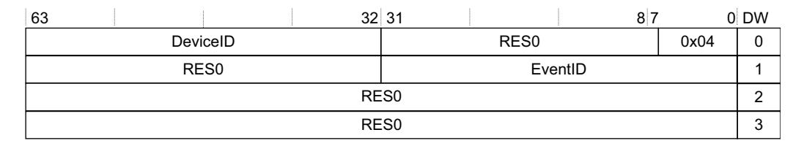

**Figure 5-6 CLEAR command format**

#### <span id="page-104-1"></span>In [Figure](#page-104-1) 5-6:

- EventID identifies the interrupt, associated with a device, for which the pending state is to be cleared.
- DeviceID specifies the requesting device.
- DW is the doubleword offset within a 32 byte, or four doubleword, ITS command packet.

The command and its arguments are:

CLEAR DeviceID, EventID

A command error occurs if any of the following apply:

- DeviceID exceeds the maximum value supported by the ITS.
- The device specified by DeviceID is not mapped to an Interrupt translation table, using [MAPD.](#page-111-0)
- EventID exceeds the maximum value allowed by the ITT. This value is specified by the Size field when the [MAPD](#page-111-0) command is issued.
- The EventID for the device is not mapped to either a collection or a vPE.
- The EventID for the device is mapped to a collection that has not been mapped to an RDbase.
- The EventID for the device is mapped to a vPE that has not been mapped to an RDbase.

In this case, the ITS must take the actions described in *[Command errors on page](#page-103-1) 5-104*.

The following pseudocode describes the operation of the CLEAR command:

```
// ITS.CLEAR
// =========
ITS.CLEAR(ITSCommand cmd)
    if DeviceOutOfRange(cmd.DeviceID) then
        if GITS_TYPER.SEIS == '1' then IMPLEMENTATION_DEFINED "SError CLEAR_DEVICE_OOR";
        UNPREDICTABLE;
    dte = ReadDeviceTable(UInt(cmd.DeviceID));
    if !dte.Valid then
        if GITS_TYPER.SEIS == '1' then IMPLEMENTATION_DEFINED "SError CLEAR_UNMAPPED_DEVICE";
        UNPREDICTABLE;
    if IdOutOfRange(cmd.EventID, dte.ITT_size) then
        if GITS_TYPER.SEIS == '1' then IMPLEMENTATION_DEFINED "SError CLEAR_ID_OOR";
        UNPREDICTABLE;
    InterruptTableEntry ite = ReadTranslationTable(dte.ITT_base, UInt(cmd.EventID));
    if !ite.Valid then
        if GITS_TYPER.SEIS == '1' then IMPLEMENTATION_DEFINED "SError CLEAR_UNMAPPED_INTERRUPT";
        UNPREDICTABLE;
    success = ClearPendingState(ite);
```

```
if !success then
    if GITS_TYPER.SEIS == '1' then IMPLEMENTATION_DEFINED "SError CLEAR_ITE_INVALID";
    UNPREDICTABLE;
IncrementReadPointer();
return;
```

#### <span id="page-105-0"></span>**5.3.4 DISCARD**

This command translates the event defined by EventID and DeviceID and instructs the appropriate Redistributor to remove the pending state of the interrupt. It also ensures that any caching in the Redistributors associated with a specific EventID is consistent with the configuration held in memory. DISCARD removes the mapping of the DeviceID and EventID from the ITT, and ensures that incoming requests with a particular EventID are silently discarded.

[Figure](#page-105-1) 5-7 shows the format of the DISCARD command.


**Figure 5-7 DISCARD command format**

#### <span id="page-105-1"></span>In [Figure](#page-105-1) 5-7:

- EventID identifies the interrupt, associated with a device, that is to be discarded.
- DeviceID specifies the requesting device.
- DW is the doubleword offset within a 32 byte, or four doubleword, ITS command packet.

The command and its arguments are:

DISCARD DeviceID, EventID

A command error occurs if any of the following apply:

- DeviceID exceeds the maximum value supported by the ITS.
- The device specified by DeviceID is not mapped to an ITT, using [MAPD.](#page-111-0)
- EventID exceeds the maximum value allowed by the ITT. This value is specified by the Size field when the [MAPD](#page-111-0) command is issued.
- The EventID for the device is not mapped to either a collection or a vPE.
- The EventID for the device is mapped to a collection that has not been mapped to an RDbase.
- The EventID for the device is mapped to a vPE that has not been mapped to an RDbase.

In this case, the ITS must take the actions described in *[Command errors on page](#page-103-1) 5-104*.

In GICv4.1, when this command is issued for an EventID and DeviceID that maps to a virtual LPI, and the associated vPEID is not mapped to a Redistributor on that ITS:

- It removes the mapping for the EventID and DeviceID on the ITS.
- If the vPE is mapped on at least one other ITS, it is implementation defined whether the pending state is cleared.
- If the vPE is not mapped on any ITS, the pending state is not cleared.

A vPEID is classed as *not mapped* if no VMAPP with V=1 has been issued for it, or if it has been unmapped by a VMAPP with V=0.

The following pseudocode describes the operation of the DISCARD command:

```
// ITS.DISCARD
// ===========
```

```
ITS.DISCARD(ITSCommand cmd)
    if DeviceOutOfRange(cmd.DeviceID) then
        if GITS_TYPER.SEIS == '1' then IMPLEMENTATION_DEFINED "SError DISCARD_DEVICE_OOR";
        UNPREDICTABLE;
    DeviceTableEntry dte = ReadDeviceTable(UInt(cmd.DeviceID));
    if !dte.Valid then
        if GITS_TYPER.SEIS == '1' then IMPLEMENTATION_DEFINED "SError DISCARD_UNMAPPED_DEVICE";
        UNPREDICTABLE;
    if IdOutOfRange(cmd.EventID, dte.ITT_size) then
        if GITS_TYPER.SEIS == '1' then IMPLEMENTATION_DEFINED "SError DISCARD_ID_OOR";
        UNPREDICTABLE;
    InterruptTableEntry ite = ReadTranslationTable(dte.ITT_base, UInt(cmd.EventID));
    if ite.Valid then
        success = ClearPendingState(ite);
        if !success then
            if GITS_TYPER.SEIS == '1' then IMPLEMENTATION_DEFINED "SError DISCARD_ITE_INVALID";
            UNPREDICTABLE;
    else
        if GITS_TYPER.SEIS == '1' then IMPLEMENTATION_DEFINED "SError DISCARD_UNMAPPED_INTERRUPT";
        UNPREDICTABLE;
    ite.Valid = FALSE;
    WriteTranslationTable(dte.ITT_base, UInt(cmd.EventID), ite);
    IncrementReadPointer();
    return;
```

#### <span id="page-106-0"></span>**5.3.5 INT**

This command translates the event defined by EventID and DeviceID into either an ICID and pINTID, or vPEID and vINTID, and instructs the appropriate Redistributor to set the interrupt pending.

[Figure](#page-106-1) 5-8 shows the format of the INT command.

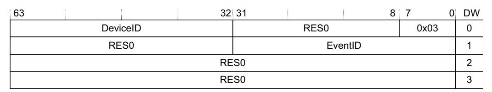

**Figure 5-8 INT command format**

#### <span id="page-106-1"></span>In [Figure](#page-106-1) 5-8:

- EventID identifies an interrupt source associated with a device. The ITS then translates this into an LPI INTID.
- DeviceID specifies the requesting device.
- DW is the doubleword offset within a 32 byte, or four doubleword, ITS command packet.

The command and its arguments are:

INT DeviceID, EventID

A command error occurs if any of the following apply:

- DeviceID exceeds the maximum value supported by the ITS.
- The device specified by DeviceID is not mapped to an ITT, using [MAPD.](#page-111-0)
- EventID exceeds the maximum value allowed by the ITT. This value is specified by the Size field when the [MAPD](#page-111-0) command is issued.

- EventID is not mapped to a collection or a vPE.
- The EventID for the device is mapped to a collection that has not been mapped to an RDbase using [MAPC](#page-110-0).

In this case, the ITS must take the actions described in *[Command errors on page](#page-103-1) 5-104*.

The following pseudocode describes the operation of the INT command:

```
// ITS.INT
// =======
ITS.INT(ITSCommand cmd)
    if DeviceOutOfRange(cmd.DeviceID) then
        if GITS_TYPER.SEIS == '1' then IMPLEMENTATION_DEFINED "SError INT_DEVICE_OOR";
        UNPREDICTABLE;
    DeviceTableEntry dte = ReadDeviceTable(UInt(cmd.DeviceID));
    if !dte.Valid then
        if GITS_TYPER.SEIS == '1' then IMPLEMENTATION_DEFINED "SError INT_UNMAPPED_DEVICE";
        UNPREDICTABLE;
    if IdOutOfRange(cmd.EventID, dte.ITT_size) then
        if GITS_TYPER.SEIS == '1' then IMPLEMENTATION_DEFINED "SError INT_ID_OOR";
        UNPREDICTABLE;
    InterruptTableEntry ite = ReadTranslationTable(dte.ITT_base, UInt(cmd.EventID));
    if !ite.Valid then
        if GITS_TYPER.SEIS == '1' then IMPLEMENTATION_DEFINED "SError INT_UNMAPPED_INTERRUPT";
        UNPREDICTABLE;
    boolean success = SetPendingState(ite);
    if !success then
        if GITS_TYPER.SEIS == '1' then IMPLEMENTATION_DEFINED "SError INT_ITE_INVALID";
        UNPREDICTABLE;
    IncrementReadPointer();
    return;
```

#### <span id="page-107-0"></span>**5.3.6 INV**

This command specifies that the ITS must ensure that any caching in the Redistributors associated with the specified EventID is consistent with the LPI Configuration tables held in memory.

In GICv4.1, it is IMPLEMENTATION DEFINED whether INV affects the generation and prioritization of default doorbells.

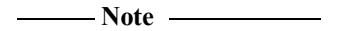

The INV command performs the same function regardless of whether the interrupt is mapped as a physical interrupt or a virtual interrupt.

[Figure](#page-107-1) 5-9 shows the format of the INV command.

<span id="page-107-1"></span>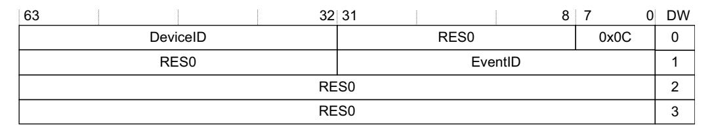

**Figure 5-9 INV command format**

#### In Figure 5-[9 on page](#page-107-1) 5-108:

- EventID identifies an interrupt source associated with a device. The ITS then translates this into an LPI INTID.
- DeviceID specifies the requesting device.
- DW is the doubleword offset within a 32 byte, or four doubleword, ITS command packet.

The command and its arguments are:

INV DeviceID, EventID

A command error occurs if any of the following apply:

- DeviceID exceeds the maximum value supported by the ITS.
- The device specified by DeviceID is not mapped to an ITT, using [MAPD.](#page-111-0)
- EventID exceeds the maximum value allowed by the ITT. This value is specified by the Size field when the [MAPD](#page-111-0) command is issued.
- EventID is not mapped to a collection, using [MAPI](#page-113-0) or [MAPTI](#page-114-0).
- The EventID for the device corresponds to a physical LPI and is mapped to a collection that has not been mapped to an RDbase using [MAPC.](#page-110-0)
- The EventID for the device corresponds to a virtual LPI associated with a vPE that has not been mapped to a Redistributor using [VMAPP GICv4.0](#page-122-0) or [VMAPP GICv4.1.](#page-123-0)

In this case, the ITS must take the actions described in *[Command errors on page](#page-103-1) 5-104*.

The following pseudocode describes the operation of the INV command:

```
// ITS.INV
// =======
ITS.INV(ITSCommand cmd)
    if DeviceOutOfRange(cmd.DeviceID) then
        if GITS_TYPER.SEIS == '1' then IMPLEMENTATION_DEFINED "SError INV_DEVICE_OOR";
        UNPREDICTABLE;
    DeviceTableEntry dte = ReadDeviceTable(UInt(cmd.DeviceID));
    if !dte.Valid then
        if GITS_TYPER.SEIS == '1' then IMPLEMENTATION_DEFINED "SError INV_UNMAPPED_DEVICE";
        UNPREDICTABLE;
    if IdOutOfRange(cmd.EventID, dte.ITT_size) then
        if GITS_TYPER.SEIS == '1' then IMPLEMENTATION_DEFINED "SError INV_ID_OOR";
        UNPREDICTABLE;
    InterruptTableEntry ite = ReadTranslationTable(dte.ITT_base, UInt(cmd.EventID));
    if !ite.Valid then
        if GITS_TYPER.SEIS == '1' then IMPLEMENTATION_DEFINED "SError INV_UNMAPPED_INTERRUPT";
        UNPREDICTABLE;
    invalidateByITE(ite);
    IncrementReadPointer();
    return;
```

#### <span id="page-108-0"></span>**5.3.7 INVALL**

This command specifies that the ITS must ensure any caching associated with the interrupt collection defined by ICID is consistent with the LPI Configuration tables held in memory for all Redistributors.

In GICv4.1, it is IMPLEMENTATION DEFINED whether INVALL affects the generation and prioritization of default doorbells.

Figure 5-[10 on page](#page-109-1) 5-110 shows the format of the INVALL command.

| 63           |              |  |  |  |  | 16 15 | 8 | 7 | 0 | DW |
|--------------|--------------|--|--|--|--|-------|---|---|---|----|
|              | RES0<br>0x0D |  |  |  |  |       |   |   | 0 |    |
|              | RES0         |  |  |  |  |       |   |   |   | 1  |
| RES0<br>ICID |              |  |  |  |  |       |   |   |   | 2  |
| RES0         |              |  |  |  |  |       |   |   |   | 3  |

**Figure 5-10 INVALL command format**

#### <span id="page-109-1"></span>In [Figure](#page-109-1) 5-10:

- ICID specifies the interrupt collection.
- DW is the doubleword offset within a 32 byte, or four doubleword, ITS command packet.

The command and its arguments are:

INVALL ICID

A command error occurs if any of the following apply:

- The collection specified by ICID exceeds the maximum number supported by the ITS.
- The collection specified by ICID has not been mapped to an RDbase using [MAPC](#page-110-0).

In this case, the ITS must take the actions described in *[Command errors on page](#page-103-1) 5-104*.

The following pseudocode describes the operation of the INVALL command:

```
// ITS.INVALL
// ==========
ITS.INVALL(ITSCommand cmd)
    if (CollectionOutOfRange(cmd.ICID)) then
        if GITS_TYPER.SEIS == '1' then IMPLEMENTATION_DEFINED "SError INVALL_COLLECTION_OOR";
        UNPREDICTABLE;
    CollectionTableEntry cte = ReadCollectionTable(UInt(cmd.ICID));
    if !cte.Valid then
        if GITS_TYPER.SEIS == '1' then IMPLEMENTATION_DEFINED "SError INVALL_UNMAPPED_COLLECTION";
        UNPREDICTABLE;
    // This invalidates any caches containing the configuration data for all interrupts in the
    // collection. Over invalidation is permitted.
    InvalidateCollectionCaches(UInt(cmd.ICID));
    IncrementReadPointer();
    return;
```

#### <span id="page-109-0"></span>**5.3.8 INVDB GICv4.1 only**

In GICv4.1, the ITS command INVDB is allocated to invalidate the configuration of default doorbells:

<span id="page-109-2"></span>[Figure](#page-109-2) 5-11 shows the format of the INVDB command for GICv4.1 only.

| 63           | 48                    | 47 | 32 | 31 | 16 | 15 | 8 | 7 |   | 0 | DW |
|--------------|-----------------------|----|----|----|----|----|---|---|---|---|----|
| 0x2E<br>RES0 |                       |    |    |    |    |    |   |   | 0 |   |    |
|              | vPEID<br>RES0<br>RES0 |    |    |    |    |    |   |   | 1 |   |    |
| RES0         |                       |    |    |    |    |    |   |   |   | 2 |    |
| RES0         |                       |    |    |    |    |    |   |   |   | 3 |    |

**Figure 5-11 INVDB command encoding**

#### Where:

• vPEID = The vPEID of the vPE. // ITS.INVDB // ========= ITS.INVDB(ITSCommand cmd) if VCPUOutOfRange(cmd.VCPUID) then if GITS\_TYPER.SEIS == 1 then IMPLEMENTATION\_DEFINED "SError INVDB\_VCPU\_OOR"; UNPREDICTABLE; VCPUTableEntry vte = ReadVCPUTable(UInt(cmd.VCPUID)); if vte.Valid then InvalidateInterruptDoorbellCaches(VCPUID, vte); IncrementReadPointer(); return;

INVDB is synchronized by a VSYNC command.

After completion of an INVDB command, there is no caching associated with the default doorbell of the specified vPE in any Redistributor.

A command error occurs if any of the following apply:

• An INVDB is issued with a vPEID that exceeds the configured maximum vPEID for the ITS: INVDB\_VCPU\_OOR (0x01\_2E11).

An INVDB with a valid vPEID behaves as a NOP if either of the following points is true:

- The vPEID is not mapped on the ITS.
- The vPEID has no default doorbell.

#### <span id="page-110-0"></span>**5.3.9 MAPC**

This command maps the Collection table entry defined by ICID to the target Redistributor, defined by RDbase.

[Figure](#page-110-1) 5-12 shows the format of the MAPC command.

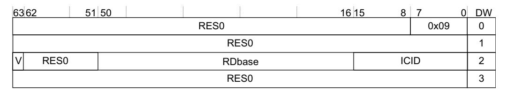

**Figure 5-12 MAPC command format**

#### <span id="page-110-1"></span>In [Figure](#page-110-1) 5-12:

- V specifies whether RDbase is valid for the collection.
- RDbase specifies the target Redistributor to which interrupts in the collection are forwarded. See *[IMPLEMENTATION DEFINED sizes in ITS command parameters on page](#page-102-0) 5-103*.
- ICID specifies the interrupt collection that is to be mapped.
- DW is the doubleword offset within a 32 byte, or four doubleword, ITS command packet.

If [GITS\\_TYPER](#page-847-0).PTA == 1 and a physical address is specified, the target addresses must be 64KB aligned, meaning that only bits[47:16] are required. See *[IMPLEMENTATION DEFINED sizes in ITS command parameters on](#page-102-0)  page [5-103](#page-102-0)* for more information. In addition, when V is cleared to 0, this field must be written as zero, but hardware might ignore the value.

The command and its arguments are:

MAPC ICID, RDbase, V When V is 1:

- Behavior is UNPREDICTABLE if there are interrupts that are mapped to the specified collection and the collection is currently mapped to a Redistributor, unless MAPC is followed by MOVALL so that the pending state for the collection is moved from the old target Redistributor or the new target Redistributor. MOVALL might be issued by a different ITS:
  - Where multiple collections are remapped from the same source to the same destination, behavior is UNPREDICTABLE if MOVALL is issued before all the MAPCs are globally observable.
  - Behavior is UNPREDICTABLE if any ITS command that affects interrupts that belong to a remapped collection is issued after the MAPC, but before the MOVALL is globally observable.
- Behavior is UNPREDICTABLE if RDbase does not specify a valid Redistributor.

#### When V is 0:

- MAPC removes the mapping of the specified interrupt collection. Interrupts for that are mapped to this collection are ignored.
- Behavior is UNPREDICTABLE if there are interrupts that are mapped to the specified collection, with the restriction that further translation requests from that device are ignored.

A command error occurs if the following applies:

• The collection specified by ICID exceeds the maximum number supported by the ITS.

In this case, the ITS must take the actions described in *[Command errors on page](#page-103-1) 5-104*.

**Note**

When software uses a MAPC command to move a collection from targeting Redistributor A to targeting Redistributor B, it must issue a SYNC command to Redistributor A before issuing the accompanying MOVALL command. Otherwise, interrupts from the collection might still be taken by the PE associated with Redistributor A.

The following pseudocode describes the operation of the MAPC command:

```
// ITS.MAPC
// ========
ITS.MAPC(ITSCommand cmd)
    if CollectionOutOfRange(cmd.ICID) then
        if GITS_TYPER.SEIS == '1' then IMPLEMENTATION_DEFINED "SError MAPC_COLLECTION_OOR";
        UNPREDICTABLE;
    CollectionTableEntry cte;
    cte.Valid = cmd.V == '1';
    cte.RDbase = cmd.RDbase;
    WriteCollectionTable(UInt(cmd.ICID), cte);
    IncrementReadPointer();
    return;
```

#### <span id="page-111-1"></span><span id="page-111-0"></span>**5.3.10 MAPD**

This command maps the Device table entry associated with DeviceID to its associated ITT, defined by ITT\_addr and Size.

Figure 5-[13 on page](#page-112-0) 5-113 shows the format of the MAPD command.

| 63 | 62                       | 5152     |  | 32 31 | 8 7  |  | 5 4<br>0 | DW |  |
|----|--------------------------|----------|--|-------|------|--|----------|----|--|
|    |                          | DeviceID |  |       | RES0 |  | 0x08     | 0  |  |
|    | RES0<br>Size             |          |  |       |      |  |          |    |  |
| V  | RES0<br>ITT_addr<br>RES0 |          |  |       |      |  |          | 2  |  |
|    | RES0                     |          |  |       |      |  |          |    |  |

**Figure 5-13 MAPD command format**

#### <span id="page-112-0"></span>In [Figure](#page-112-0) 5-13:

• DeviceID specifies the device that uses the ITT.

**Note** For more information about mapping devices to ITTs, see *[The Interrupt translation table on page](#page-95-0) 5-96*.

- V specifies whether the ITT\_addr and Size fields are valid.
- ITT\_addr specifies bits[51:8] of the physical address of the ITT.
- Size is a 5-bit number that specifies the supported number of bits for the device, minus one. The size field enables range checking of EventID for translation requests for this DeviceID.
- DW is the doubleword offset within a 32 byte, or four doubleword, ITS command packet.

Behavior is UNPREDICTABLE if any of the following apply:

- There is an existing mapping for the DeviceID and the mapped ITT contains valid EventID mappings.
- When V == 1, the specified ITT does not contain all zeros.

The command and its arguments are:

MAPD DeviceID, ITT\_addr, Size, V

The format of the ITT entries is IMPLEMENTATION DEFINED. A typical example entry size of 8 bytes permits allocation of identifiers to devices in multiples of 32 interrupts.

#### When V is 1:

• MAPD associates a DeviceID with a 256 byte-aligned address of an ITT.

#### When V is 0:

- MAPD removes the mapping for the specified DeviceID. Translation requests from that device are ignored.
- MAPD removes the mapping of the specified DeviceID. and interrupt requests from that device are discarded. A subsequent translation for the DeviceID does not generate and LPI or VLPI until DeviceID has been mapped to the ITT again.

A command error occurs if any of the following apply:

- DeviceID exceeds the maximum number of devices supported by an ITS.
- Size exceeds the maximum value permitted by the settings of [GITS\\_TYPER](#page-847-0).ID\_bits, when V is set to 1.

In this case, the ITS must take the actions described in *[Command errors on page](#page-103-1) 5-104*.

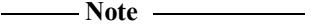

ITS accesses to an ITT use the same Shareability and Cacheability attributes that are specified for the Device table, see *[The Device table on page](#page-94-0) 5-95*.

The following pseudocode describes the operation of the MAPD command:

```
// ITS.MAPD
// ========
ITS.MAPD(ITSCommand cmd)
    if DeviceOutOfRange(cmd.DeviceID) then
        if GITS_TYPER.SEIS == '1' then IMPLEMENTATION_DEFINED "SError MAPD_DEVICE_OOR";
        UNPREDICTABLE;
```

```
if SizeOutOfRange(cmd.Size) then
    if GITS_TYPER.SEIS == '1' then IMPLEMENTATION_DEFINED "SError MAPD_ITTSIZE_OOR";
   UNPREDICTABLE;
// If a device is Re-mapped software must perform the following actions
// to ensure the LPI configuration is up to date:
// 1. Ensure that the device is quiescent and that all interrupts have
// been handled.
// 2. Remap the device with the new (empty) ITT
//
DeviceTableEntry dte;
dte.Valid = cmd.V == '1';
dte.ITT_base = cmd.ITT_addr:'00000000';
dte.ITT_size = cmd.Size;
WriteDeviceTable(UInt(cmd.DeviceID), dte);
IncrementReadPointer();
return;
```

#### <span id="page-113-0"></span>**5.3.11 MAPI**

This command maps the event defined by EventID and DeviceID into an ITT entry with ICID and pINTID = EventID.

- **Note** pINTID ≥0x2000 for a valid LPI INTID.
- This is equivalent to MAPTI DeviceID, EventID, EventID, ICID

[Figure](#page-113-1) 5-14 shows the format of the MAPI command.


**Figure 5-14 MAPI command format**

#### <span id="page-113-1"></span>In [Figure](#page-113-1) 5-14:

- EventID identifies the interrupt, associated with a device, that is to be mapped.
- DeviceID specifies the requesting device.
- ICID specifies the interrupt collection that includes the specified interrupt.
- DW is the doubleword offset within a 32 byte, or four doubleword, ITS command packet.

If there is an existing mapping for the EventID-DeviceID combination, behavior is UNPREDICTABLE.

The command and its arguments are:

```
MAPI DeviceID, EventID, ICID
```

A command error occurs if any of the following apply:

- DeviceID exceeds the maximum value supported by the ITS.
- The device specified by DeviceID is not mapped to an ITT, using [MAPD.](#page-111-0)
- ICID exceeds the maximum number of interrupt collections supported by an ITS. For more information, see *[The Collection table on page](#page-96-0) 5-97*.
- The EventID exceeds the maximum value allowed by the ITT. This value is specified by the Size field when the [MAPD](#page-111-0) command is issued.
- EventID does not specify a valid LPI identifier. See *[INTIDs on page](#page-34-0) 2-35*.

In this case, the ITS must take the actions described in *[Command errors on page](#page-103-1) 5-104*.

The following pseudocode describes the operation of the MAPI command:

```
// ITS.MAPI
// ========
ITS.MAPI(ITSCommand cmd)
   if DeviceOutOfRange(cmd.DeviceID) then
       if GITS_TYPER.SEIS == '1' then IMPLEMENTATION_DEFINED "SError MAPI_DEVICE_OOR";
       UNPREDICTABLE;
   if CollectionOutOfRange(cmd.ICID) then
       if GITS_TYPER.SEIS == '1' then IMPLEMENTATION_DEFINED "SError MAPI_COLLECTION_OOR";
       UNPREDICTABLE;
   DeviceTableEntry dte = ReadDeviceTable(UInt(cmd.DeviceID));
   if !dte.Valid then
       if GITS_TYPER.SEIS == '1' then IMPLEMENTATION_DEFINED "SError MAPI_UNMAPPED_DEVICE";
       UNPREDICTABLE;
   if IdOutOfRange(cmd.EventID, dte.ITT_size) then
       if GITS_TYPER.SEIS == '1' then IMPLEMENTATION_DEFINED "SError MAPI_ID_OOR";
       UNPREDICTABLE;
   if LPIOutOfRange(cmd.EventID) then
       if GITS_TYPER.SEIS == '1' then IMPLEMENTATION_DEFINED "SError MAPI_ID_OOR";
       UNPREDICTABLE;
   InterruptTableEntry ite = ReadTranslationTable(dte.ITT_base, UInt(cmd.EventID));
   ite.Valid = TRUE;
   ite.Type = physical_interrupt;
   ite.OutputID = cmd.EventID;
   ite.DoorbellID = ZeroExtend(INTID_SPURIOUS); // Don't generate a doorbell
   ite.ICID = cmd.ICID;
   WriteTranslationTable(dte.ITT_base, UInt(cmd.EventID), ite);
   IncrementReadPointer();
   return;
```

#### <span id="page-114-0"></span>**5.3.12 MAPTI**

This command maps the event defined by EventID and DeviceID to its associated ITE, defined by ICID and pINTID in the ITT associated with DeviceID.

[Figure](#page-114-1) 5-15 shows the format of the MAPTI command.


**Figure 5-15 MAPTI command format**

#### <span id="page-114-1"></span>In [Figure](#page-114-1) 5-15:

- EventID identifies the interrupt, associated with a device, that is to be mapped.
- pINTID is the INTID of the physical interrupt that is presented to software.
- DeviceID specifies the requesting device.

- ICID specifies the interrupt collection that includes the specified physical interrupt.
- DW is the doubleword offset within a 32 byte, or four doubleword, ITS command packet.

If there is an existing mapping for the EventID-DeviceID combination, behavior is UNPREDICTABLE.

The command and its arguments are:

```
MAPTI DeviceID, EventID, pINTID, ICID
```

A command error occurs if any of the following apply:

- DeviceID exceeds the maximum value supported by the ITS.
- The device specified by DeviceID is not mapped to an ITT using [MAPD.](#page-111-0)
- The number of collections exceeds the maximum number of collections supported by the ITS. For more information, see *[The Collection table on page](#page-96-0) 5-97*.
- The EventID exceeds the maximum value allowed by the ITT. This value is specified by the Size field when the [MAPD](#page-111-0) command is issued.
- pINTID does not specify a valid LPI INTID. For information about the LPI INTID range, see *[INTIDs on](#page-34-0)  [page](#page-34-0) 2-35*.

In this case, the ITS must take the actions described in *[Command errors on page](#page-103-1) 5-104*.

The following pseudocode describes the operation of the MAPTI command:

```
// ITS.MAPTI
// =========
ITS.MAPTI(ITSCommand cmd)
   if DeviceOutOfRange(cmd.DeviceID) then
       if GITS_TYPER.SEIS == '1' then IMPLEMENTATION_DEFINED "SError MAPTI_DEVICE_OOR";
       UNPREDICTABLE;
   if CollectionOutOfRange(cmd.ICID) then
       if GITS_TYPER.SEIS == '1' then IMPLEMENTATION_DEFINED "SError MAPTI_COLLECTION_OOR";
       UNPREDICTABLE;
   DeviceTableEntry dte = ReadDeviceTable(UInt(cmd.DeviceID));
   if !dte.Valid then
       if GITS_TYPER.SEIS == '1' then IMPLEMENTATION_DEFINED "SError MAPTI_UNMAPPED_DEVICE";
       UNPREDICTABLE;
   if IdOutOfRange(cmd.EventID, dte.ITT_size) then
       if GITS_TYPER.SEIS == '1' then IMPLEMENTATION_DEFINED "SError MAPTI_ID_OOR";
       UNPREDICTABLE;
   if LPIOutOfRange(cmd.pINTID) then
       if GITS_TYPER.SEIS == '1' then IMPLEMENTATION_DEFINED "SError MAPTI_PHYSICALID_OOR";
       UNPREDICTABLE;
   InterruptTableEntry ite = ReadTranslationTable(dte.ITT_base, UInt(cmd.EventID));
   ite.Valid = TRUE;
   ite.Type = physical_interrupt;
   ite.OutputID = cmd.pINTID;
   ite.DoorbellID = ZeroExtend(INTID_SPURIOUS); // Don't generate a doorbell
   ite.ICID = cmd.ICID;
   WriteTranslationTable(dte.ITT_base, UInt(cmd.EventID), ite);
   IncrementReadPointer();
   return;
```

#### <span id="page-116-0"></span>**5.3.13 MOVALL**

This command instructs the Redistributor specified by RDbase1 to move all of its pending interrupts to the Redistributor specified by RDbase2.


Interrupts that are not pending on RDbase1 are unaffected by this command.

Both the mapping of interrupts to collections and the mapping of collections to Redistributors are normally unaffected by this command. Software must ensure that any interrupts that might be affected by this command target the Redistributor specified by RDbase2, otherwise system behavior is UNPREDICTABLE. In particular, an implementation might choose to remap all affected collections to RDbase2.

[Figure](#page-116-1) 5-16 shows the format of the MOVALL command.

| 63 |      | 51 50            | 32 31    |  | 1615<br>8 7 |      | 0 DW |
|----|------|------------------|----------|--|-------------|------|------|
|    |      |                  | RES0     |  |             | 0x0E | 0    |
|    | RES0 |                  |          |  |             |      |      |
|    | RES0 | Rdbase 1<br>RES0 |          |  | 2           |      |      |
|    | RES0 |                  | Rdbase 2 |  | RES0        | 3    |      |

**Figure 5-16 MOVALL command format**

#### <span id="page-116-1"></span>In [Figure](#page-116-1) 5-16:

- RDbase1 specifies the Redistributor with which the interrupts are currently associated. See *[IMPLEMENTATION DEFINED sizes in ITS command parameters on page](#page-102-0) 5-103*.
- RDbase2 specifies the Redistributor to which the interrupts are to be moved. See *[IMPLEMENTATION](#page-102-0)  [DEFINED sizes in ITS command parameters on page](#page-102-0) 5-103*.
- DW is the doubleword offset within a 32 byte, or four doubleword, ITS command packet.

The command and its arguments are:

```
MOVALL RDbase1, RDbase2
```

Behavior is UNPREDICTABLE if RDbase1 and RDbase2 do not specify a valid Redistributor. The format of these fields is specified by [GITS\\_TYPER.](#page-847-0)PTA.

MOVALL targeting a RD with LPIs disabled is CONSTRAINED UNPREDICTABLE, with a choice of:

- Clear the pending state of all moved LPIs.
- Act as NOP, with the pending state is unchanged on the source RD.

The following pseudocode describes the operation of the MOVALL command:

```
// ITS.MOVALL
// ==========
ITS.MOVALL(ITSCommand cmd)
    rd1 = cmd.RD1base;
    rd2 = cmd.RD2base;
    if rd1 != rd2 then
        MoveAllPendingState(rd1, rd2);
    IncrementReadPointer();
    return;
```

#### <span id="page-117-0"></span>**5.3.14 MOVI**

This command updates the ICID field in the ITT entry for the event defined by DeviceID and EventID. It also translates the event defined by EventID and DeviceID into an ICID and pINTID, and instructs the appropriate Redistributor to move the pending state, if it is set, of the interrupt to the Redistributor defined by the new ICID, and to update the ITE associated with the event to use the new ICID.

[Figure](#page-117-1) 5-17 shows the format of the MOVI command.

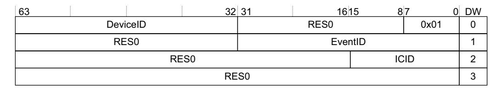

**Figure 5-17 MOVI command format**

#### <span id="page-117-1"></span>In [Figure](#page-117-1) 5-17:

- EventID identifies the interrupt, associated with a device, that is to be redirected.
- DeviceID specifies the requesting device.
- ICID specifies the new interrupt collection that is to include the specified physical interrupt.
- DW is the doubleword offset within a 32 byte, or four doubleword, ITS command packet.

The command and its arguments are:

MOVI DeviceID, EventID, ICID

A command error occurs if any of the following apply:

- DeviceID exceeds the maximum value supported by the ITS.
- The device specified by DeviceID is not mapped to an ITT, using [MAPD.](#page-111-0)
- ICID exceeds the maximum number of interrupt collections supported by an ITS.
- ICID is not mapped to an RDbase using [MAPC](#page-110-0).
- EventID is not mapped to a collection, using [MAPI](#page-113-0) or [MAPTI](#page-114-0).
- EventID corresponds to a virtual LPI.

In this case, the ITS must take the actions described in *[Command errors on page](#page-103-1) 5-104*.

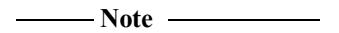

If, after using MOVI to move an interrupt from collection A to collection B, software moves the same interrupt again from collection B to collection C, a [SYNC](#page-118-0) command must be used before the second MOVI for the Redistributor associated with collection A to ensure correct behavior.

When MOVI is issued targeting a Collection that is unmapped, or mapped to a Redistributor with LPIs disabled, behavior is CONSTRAINED UNPREDICTABLE, with a choice of:

- Clear the pending state of the moved LPI.
- Pending state unchanged on the source RD.

The following pseudocode describes the operation of the MOVI command:

```
// ITS.MOVI
// ========
ITS.MOVI(ITSCommand cmd)
    if DeviceOutOfRange(cmd.DeviceID) then
        if GITS_TYPER.SEIS == '1' then IMPLEMENTATION_DEFINED "SError MOVI_DEVICE_OOR";
        UNPREDICTABLE;
    if CollectionOutOfRange(cmd.ICID) then
        if GITS_TYPER.SEIS == '1' then IMPLEMENTATION_DEFINED "SError MOVI_COLLECTION_OOR";
```

```
UNPREDICTABLE;
DeviceTableEntry dte = ReadDeviceTable(UInt(cmd.DeviceID));
if !dte.Valid then
    if GITS_TYPER.SEIS == '1' then IMPLEMENTATION_DEFINED "SError MOVI_UNMAPPED_DEVICE";
    UNPREDICTABLE;
if IdOutOfRange(cmd.EventID, dte.ITT_size) then
    if GITS_TYPER.SEIS == '1' then IMPLEMENTATION_DEFINED "SError MOVI_ID_OOR";
    UNPREDICTABLE;
InterruptTableEntry ite = ReadTranslationTable(dte.ITT_base, UInt(cmd.EventID));
if !ite.Valid then
    if GITS_TYPER.SEIS == '1' then IMPLEMENTATION_DEFINED "SError MOVI_UNMAPPED_INTERRUPT";
    IncrementReadPointer();
    return;
if ite.Type == virtual_interrupt then
    if GITS_TYPER.SEIS == '1' then IMPLEMENTATION_DEFINED "SError MOVI_ID_IS_VIRTUAL";
    UNPREDICTABLE;
CollectionTableEntry cte1 = ReadCollectionTable(UInt(ite.ICID));
if !cte1.Valid then
    if GITS_TYPER.SEIS == '1' then IMPLEMENTATION_DEFINED "SError MOVI_UNMAPPED_COLLECTION";
    UNPREDICTABLE;
CollectionTableEntry cte2 = ReadCollectionTable(UInt(cmd.ICID));
if !cte2.Valid then
    if GITS_TYPER.SEIS == '1' then IMPLEMENTATION_DEFINED "SError MOVI_UNMAPPED_COLLECTION";
    IncrementReadPointer();
    return;
bits(32) rd1 = cte1.RDbase;
bits(32) rd2 = cte2.RDbase;
if rd1 != rd2 then
    // Move the move the pending state to rd2 if set taking care of any races where the
    // interrupt has been forwarded to the processor
    MovePendingState(rd1, rd2, ite.OutputID);
ite.ICID = cmd.ICID;
WriteTranslationTable(dte.ITT_base, UInt(cmd.EventID), ite);
IncrementReadPointer();
return;
```

#### <span id="page-118-0"></span>**5.3.15 SYNC**

This command ensures all outstanding ITS operations associated with physical interrupts for the Redistributor specified by RDbase are globally observed before any further ITS commands are executed. Following the execution of a SYNC, the effects of all previous commands must apply to subsequent writes to [GITS\\_TRANSLATER](#page-845-0).

Figure 5-[18 on page](#page-119-1) 5-120 shows the format of the SYNC command.

| 63   |                        | 51 50 | 32 31 | 1615 | 8 7 |  | 0 DW |  |
|------|------------------------|-------|-------|------|-----|--|------|--|
|      | RES0<br>0x05           |       |       |      |     |  |      |  |
| RES0 |                        |       |       |      |     |  |      |  |
|      | RES0<br>RDbase<br>RES0 |       |       |      |     |  | 2    |  |
|      |                        |       | RES0  |      |     |  | 3    |  |

**Figure 5-18 SYNC command format**

#### <span id="page-119-1"></span>In [Figure](#page-119-1) 5-18:

- RDbase specifies the physical address of the target Redistributor. The format of the target address is determined by [GITS\\_TYPER](#page-847-0).PTA. See *[IMPLEMENTATION DEFINED sizes in ITS command parameters](#page-102-0) [on page](#page-102-0) 5-103* for more information. If the target Redistributor is invalid, the command is not required to have any effect.
- DW is the doubleword offset within a 32 byte, or four doubleword, ITS command packet.

The command and its arguments are:

SYNC RDbase

The following pseudocode describes the operation of the SYNC command:

```
// ITS.SYNC
// ========
ITS.SYNC(ITSCommand cmd)
    // Wait for external effects of any physical commands to be observable by all redistributors
    // and ensure the internal effects of any previous commands affect any subsequent interrupt
    // requests or commands
    WaitForCompletion(cmd.RDbase);
    IncrementReadPointer();
```

#### <span id="page-119-3"></span><span id="page-119-0"></span>**5.3.16 VINVALL**

This command ensures that any cached Redistributor information associated with vPEID is consistent with the associated LPI Configuration tables held in memory.

This command is provided only in GICv4.

[Figure](#page-119-2) 5-19 shows the format of the VINVALL command.

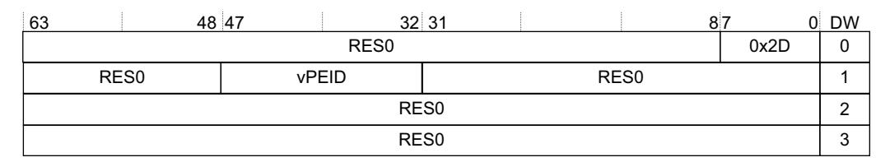

**Figure 5-19 VINVALL command format**

#### <span id="page-119-2"></span>In [Figure](#page-119-2) 5-19:

- vPEID specifies the vPE.
- DW is the doubleword offset within a 32 byte, or four doubleword, ITS command packet.

The command and its arguments are:

VINVALL vPEID

A command error occurs if any of the following apply:

- vPEID exceeds the maximum number supported by the ITS, as defined by [GITS\\_BASER<n>.](#page-825-0)
- The PE specified by vPEID is not mapped to a Redistributor using [VMAPP GICv4.0](#page-122-0).

In this case, the ITS must take the actions described in *[Command errors on page](#page-103-1) 5-104*.

The following pseudocode describes the operation of the VINVALL command:

```
// ITS.VINVALL
// ===========
ITS.VINVALL(ITSCommand cmd)
    if VCPUOutOfRange(cmd.VCPUID) then
        if GITS_TYPER.SEIS == '1' then IMPLEMENTATION_DEFINED "SError VINVALL_VCPU_OOR";
        UNPREDICTABLE;
    VCPUTableEntry vte = ReadVCPUTable(UInt(cmd.VCPUID));
    if !vte.Valid then
        if GITS_TYPER.SEIS == '1' then IMPLEMENTATION_DEFINED "SError VINVALL_VCPU_INVALID";
        UNPREDICTABLE;
    InvalidateVCPUCaches(UInt(cmd.VCPUID));
    IncrementReadPointer();
    return;
```

#### <span id="page-120-2"></span><span id="page-120-0"></span>**5.3.17 VMAPI**

This command maps the event defined by DeviceID and EventID into an ITT entry with vPEID, vINTID=EventID, and Dbell\_PINTID, a doorbell provision.

- **Note** vINTID ≥0x2000 for a valid LPI INTID.
- This is equivalent to VMAPTI DeviceID, EventID, EventID, pINTID, vPEID.
- Dbell\_pINTID must be either 1023 or Dbell\_pINTID ≥0x2000 for a valid LPI INTID.

This command is provided only in GICv4.

[Figure](#page-120-1) 5-20 shows the format of the VMAPI command.

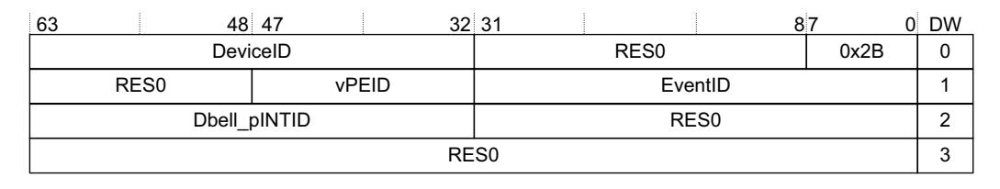

**Figure 5-20 VMAPI command format**

#### <span id="page-120-1"></span>In [Figure](#page-120-1) 5-20:

- EventID identifies the interrupt, associated with a device, that is to be presented to the VM.
- DeviceID specifies the requesting device.
- vPEID specifies the vPE.
- Dbell\_pINTID specifies the ID that is presented to the hypervisor if the vPE is not scheduled.

**Note** If Dbell\_pINTID indicates a spurious interrupt, then no physical interrupt is generated.

• DW is the doubleword offset within a 32 byte, or four doubleword, ITS command packet.

If there is an existing mapping for the EventID-DeviceID combination, behavior is UNPREDICTABLE.

The command and its arguments are:

VMAPI DeviceID, EventID, Dbell\_pINTID, vPEID

A command error occurs if any of the following apply:

- DeviceID exceeds the maximum value supported by the ITS.
- vPEID exceeds the maximum number supported by the ITS, as defined by [GITS\\_BASER<n>.](#page-825-0)
- The device specified by DeviceID is not mapped to an ITT, using [MAPD.](#page-111-0)
- EventID exceeds the maximum value allowed by the ITT. This value is specified by the Size field when the [MAPD](#page-111-0) command is issued.
- EventID does not specify a valid LPI INTID. For information about valid LPI INTIDs, see *[INTIDs on](#page-34-0)  [page](#page-34-0) 2-35*.
- Dbell\_pINTID does not specify a valid doorbell INTID, where a valid INTID is either:
  - 1023.
  - Within the supported range for LPIs.

In this case, the ITS must take the actions described in *[Command errors on page](#page-103-1) 5-104*.

The following pseudocode describes the operation of the VMAPI command:

```
// ITS.VMAPI
// =========
ITS.VMAPI(ITSCommand cmd)
    if DeviceOutOfRange(cmd.DeviceID) then
       if GITS_TYPER.SEIS == '1' then IMPLEMENTATION_DEFINED "SError VMAPI_DEVICE_OOR";
       UNPREDICTABLE;
    if VCPUOutOfRange(cmd.VCPUID) then
       if GITS_TYPER.SEIS == '1' then IMPLEMENTATION_DEFINED "SError VMAPI_VCPU_OOR";
       UNPREDICTABLE;
    DeviceTableEntry dte = ReadDeviceTable(UInt(cmd.DeviceID));
    if !dte.Valid then
       if GITS_TYPER.SEIS == '1' then IMPLEMENTATION_DEFINED "SError VMAPI_UNMAPPED_DEVICE";
       UNPREDICTABLE;
    if IdOutOfRange(cmd.EventID, dte.ITT_size) then
       if GITS_TYPER.SEIS == '1' then IMPLEMENTATION_DEFINED "SError VMAPI_ID_OOR";
       UNPREDICTABLE;
    if LPIOutOfRange(cmd.EventID) then
       if GITS_TYPER.SEIS == '1' then IMPLEMENTATION_DEFINED "SError VMAPI_ID_OOR";
       UNPREDICTABLE;
    if LPIOutOfRange(cmd.Dbell_pINTID) && (cmd.EventID != 1023) then
       if GITS_TYPER.SEIS == '1' then IMPLEMENTATION_DEFINED "SError VMAPI_PHYSICALID_OOR";
       UNPREDICTABLE;
    InterruptTableEntry ite = ReadTranslationTable(dte.ITT_base, UInt(cmd.EventID));
    ite.Valid = TRUE;
    ite.Type = virtual_interrupt;
    ite.OutputID = cmd.EventID;
    ite.DoorbellID = cmd.Dbell_pINTID;
    ite.VCPUID = cmd.VCPUID;
    WriteTranslationTable(dte.ITT_base, UInt(cmd.EventID), ite);
    IncrementReadPointer();
    return;
```

#### <span id="page-122-2"></span><span id="page-122-0"></span>5.3.18 VMAPP GICv4.0

This command maps the vPE table entry defined by vPEID to the target RDbase, including an associated virtual LPI Pending table (VPT\_addr, VPT\_size).

Figure 5-21 shows the format of the VMAPP command for GICv4.0.

| 63 62 | 51 5           | 50     | 32    | 31        | 16 | 15 8 | 7 54 | 0          | DW |
|-------|----------------|--------|-------|-----------|----|------|------|------------|----|
|       | RES0 0x29      |        |       |           |    |      |      | 0          |    |
|       | RES0 vPEID RES |        |       |           |    |      |      |            | 1  |
| V     | RES0           | RDbase |       |           |    | RE   | S0   |            | 2  |
| I     | RES0           |        | VPT_a | addr RES0 |    |      | VI   | PT_<br>ize | 3  |

Figure 5-21 VMAPP GICv4.0 command format

#### <span id="page-122-1"></span>In Figure 5-21:

- vPEID specifies the vPE.
- V specifies whether the RDbase and VPT\_addr are valid for the vPE.
- RDbase specifies the target Redistributor that owns the vPE and to which the ITS directs commands for that PE. See *IMPLEMENTATION DEFINED sizes in ITS command parameters on page 5-103*.
- VPT\_addr specifies bits [51:16] of the physical address of the virtual LPI Pending table for the vPE.

\_\_\_\_\_Note \_\_\_\_\_

The target addresses must be 64KB aligned, meaning that only bits [51:16] are required. Bits [15:0] of the physical address are 0.

- VPT\_size specifies the number of vINTID bits that the vPE supports, minus one.
- DW is the doubleword offset within a 32 byte, or four doubleword, ITS command packet.

The command and its arguments are:

VMAPP vPEID, RDbase, VPT\_addr, VPT\_size, V

When V is 0:

VMAPP removes the mapping for the specified vPE. Interrupts that are mapped to this vPE are discarded.

When V is 1:

Behavior is UNPREDICTABLE if RDbase does not specify a valid Redistributor.

A command error occurs if any of the following apply:

- vPEID exceeds the maximum number supported by the ITS, as defined by GITS BASER<n>.
- VPT\_size exceeds the maximum value permitted by the settings of GITS\_TYPER.ID\_bits.

In this case, the ITS must take the actions described in Command errors on page 5-104.

\_\_\_\_\_Note \_\_\_\_\_

If a system contains multiple ITSs, Arm strongly recommends that software does not issue a VMAPP when there is an outstanding VMOVP for the same vPEID on another ITS, as this could create a race condition.

The following pseudocode describes the operation of the VMAPP command:

```
// ITS.VMAPP
// =======

ITS.VMAPP(ITSCommand cmd)
   if VCPUOutOfRange(cmd.VCPUID) then
   if GITS_TYPER.SEIS == '1' then IMPLEMENTATION_DEFINED "SError VMAPP_VCPU_OOR";
   UNPREDICTABLE;
   VCPUTableEntry vte;
```

```
// Common to GICv4.0 and GICv4.1
vte.Valid = cmd.V == '1';
vte.RDbase = cmd.RDbase;
if HasGIC41Ext() then
    // GICv4.1
    if SizeOutOfRange(cmd.VPT_size) then
        if ConstrainUnpredictableBool() then
            (c, cmd.VPT_size) = ConstrainUnpredictableInteger(13, 23);
            assert (c == Constraint_UNKNOWN);
    // Record configuration in vPE Configuration Table,
    // held by Redistributors
    WriteVPEConfigurationTable(UInt(cmd.VCPUID), cmd.RDbase,
        cmd.VCONF_addr, cmd.VPT_addr,
        cmd.Default_Doorbell_pINTID, cmd.VPT_size,
        cmd.V, cmd.Alloc, cmd.PTZ);
    // The ITS could record the size of the VPT to detect out of range
    // INTIDs, or it could rely on the Redistributors doing this.
else
    // GICv4.0
    if SizeOutOfRange(cmd.VPT_size) then
        if GITS_TYPER.SEIS == '1' then IMPLEMENTATION_DEFINED "SError
            VMAPP_VPTSIZE_OOR";
        UNPREDICTABLE;
    vte.VPT_base = cmd.VPT_addr:Zeros(16);
    vte.VPT_size = cmd.VPT_size;
WriteVCPUTable(UInt(cmd.VCPUID), vte);
IncrementReadPointer();
return;
```

#### <span id="page-123-0"></span>**5.3.19 VMAPP GICv4.1**

The VMAPP command is modified in GICv4.1 to allow the specifying of the LPI configuration of the vPE and Pending table locations.

[Figure](#page-123-1) 5-22 shows the format of the VMAPP command for GICv4.1.

| 63   | 52               |                                                     | 51 48 47 |  | 32    | 31                      | 16 | 15   | 9<br>8   | 7 | 0 | DW |
|------|------------------|-----------------------------------------------------|----------|--|-------|-------------------------|----|------|----------|---|---|----|
|      | RES0             | VCONF_addr<br>RES0 P<br>0x29<br>All<br>T<br>oc<br>Z |          |  |       |                         |    |      | 0        |   |   |    |
| RES0 |                  |                                                     |          |  | vPEID | Default_Doorbell_pINTID |    |      |          | 1 |   |    |
| V    | RES0             |                                                     | RDbase   |  |       |                         |    | RES0 |          | 2 |   |    |
|      | VPT_addr<br>RES0 |                                                     |          |  |       | RES0                    |    |      | VPT_size | 3 |   |    |

**Figure 5-22 VMAPP GICv4.1 command encoding**

#### <span id="page-123-1"></span>In [Figure](#page-123-1) 5-22:

- RDbase = Identifies the target Redistributor. RES0 when V==0.
- VCONF\_addr = Bits [51:16] of the address of the vPE's virtual Configuration table, bits [15:0] are 0. RES0 when V==0.
- VPT\_addr = Bits [51:16] of the address of the vPE's virtual Pending table, bits [15:0] are 0. RES0 when V==0.
- VPT\_size = The number of bits of vINTID for the vPE, minus one. RES0 when V==0.
- Default\_Doorbell\_pINTID is the default doorbell for the vPE. RES0 when V==0.

- Alloc = Signifies whether this is the first map, or last unmap, for this vPEID.
- PTZ = Signifies whether VPT\_addr points at zeroed memory, ignored when V!=1 or Alloc!=1.

The command and its arguments are:

VMAPP vPEID, RDbase, VPT\_addr, VPT\_size, V

When V is 0:

• VMAPP removes the mapping for the specified vPE.

When V is 1:

• Behavior is UNPREDICTABLE if RDbase does not specify a valid Redistributor.

A command error occurs if any of the following apply:

- vPEID exceeds the maximum number supported by the ITS, as defined by [GITS\\_BASER<n>.](#page-825-0)
- Size exceeds the maximum value permitted by the settings of [GITS\\_TYPER](#page-847-0).ID\_bits.
- VMAPP with V==1 specifies a Default\_Doorbell\_pINTID value other than 1023 that is outside the implemented LPI range. The command error code reported is 0x01\_2906 (VMAPP\_PHYSICALID\_OOR).

In this case, the ITS must take the actions described in *[Command errors on page](#page-103-1) 5-104*.


If a system contains multiple ITSs, Arm strongly recommends that software does not issue a VMAPP when there is an outstanding VMOVP for the same vPEID on another ITS, as this could create a race condition.

For the pseudocode that describes the operation of this command, see *[VMAPP GICv4.0 on page](#page-122-0) 5-123*.

#### **Use of the V and Alloc fields**

GICv4.1 introduces the vPE Configuration table, which is associated with the Redistributors that record the locations of the virtual LPI Configuration and Pending tables. This table is populated using the VMAPP command.

The Alloc field in a VMAPP command is used when vPEs are created or destroyed, to indicate when the vPE Configuration table entry should be updated.

A VMAPP with {V, Alloc}=={0, 1} cleans and invalidates any cached virtual Pending table and virtual Configuration table associated with the vPEID held in the GIC. Invalid use of the Alloc field can cause UNPREDICTABLE behavior, including continued access by the IRI.

For a VMAPP when V==1, VPT\_size determines the size of the vINTID namespace, from which the size of the virtual Configuration and Pending tables are derived.

For a VMAPP with V==1, if VPT\_size is greater than the supported INTID size, one of the following CONSTRAINED UNPREDICTABLE values are used:

- The specified value.
- An UNKNOWN value in range value.

A VMAPP with V==1, Default\_Doorbell\_pINTID==1023 indicates no default doorbell.

A VMAPP with V==1 that specifies one of the following values of Default\_Doorbell\_pINTID, causes UNPREDICTABLE behavior to occur:

- The value is used for valid EventID or DeviceID mappings.
- The value is for the default doorbell of an existing valid vPE.

A VMAPP with Alloc==0 indicates that there is an existing mapping on at least one ITS for the vPEID. If this is not true, the resulting behavior is UNPREDICTABLE.

A VMAPP with {V, Alloc}=={1, 1} indicates that this is the first mapping of the vPEID, in any ITS. Setting {V, Alloc}=={1, 1} at any other time causes UNPREDICTABLE behavior.

A VMAPP with {V, Alloc}=={0, 1} indicates that this is the last mapping for the vPEID, in any ITS. Setting {V, Alloc}=={0, 1} at any other time causes UNPREDICTABLE behavior.

<span id="page-125-1"></span>The virtual LPI Configuration table and virtual LPI Pending table are allocated to the IRI when VMAPP with {V, Alloc}=={1, 1} is issued, and remains allocated to the IRI until VMAPP with {V, Alloc}=={0, 1} is completed. [Table](#page-125-1) 5-7 summarizes the effects of the V and Alloc field combinations.

**Table 5-7 Effects of V and Alloc field combinations**

| V | Alloc | Description                                                                |
|---|-------|----------------------------------------------------------------------------|
| 0 | 0     | Unmap command, there is still at least one other ITS with a valid mapping. |
| 0 | 1     | Unmap command, no other ITS has a valid mapping.                           |
| 1 | 0     | Map command, at least one other ITS already has this mapping.              |
| 1 | 1     | Map command, no other ITS has this mapping yet.                            |

**Note**

UNPREDICTABLE behavior associated with the invalid use of Alloc can include the IRI continuing to read or write memory structures associated with the vPEID after release. Arm strongly recommends avoiding these cases.

A VMAPP with {V, Alloc}=={0, x} is self-synchronizing. This means the ITS command queue does not show the command as consumed until all of its effects are completed.

When multiple ITSs are implemented, issuing VMAPPs with V==1 for the same vPEID on different ITSs with different values of VCONF\_addr, VPT\_addr or VPT\_size, causes UNPREDICTABLE behavior.

When multiple ITSs are implemented, issuing VMAPPs with {V, Alloc}=={1, 0} where Default\_Doorbell\_pINTID or RDbase does not match the currently configured value causes UNPREDICTABLE behavior.

When {V, Alloc}!={1, 1}, the PTZ bit is IGNORED.

When {V, Alloc, PTZ}=={1, 1, 0}:

- The IMPLEMENTATION DEFINED region of the specified virtual Pending table must contain all zeros or have been populated by a GIC of the same implementation. Otherwise the behavior is UNPREDICTABLE.
- The pending state and SGI configuration will be loaded by the IRI.

When {V, Alloc, PTZ}=={1, 1, 1}, the specified virtual Pending table must contain all zeros, otherwise the behavior is UNPREDICTABLE. This includes the SGI and IMPLEMENTATION DEFINED regions.

#### <span id="page-125-2"></span><span id="page-125-0"></span>**5.3.20 VMAPTI**

This command maps the event defined by DeviceID and EventID into an ITT entry with vPEID and vINTID, and Dbell\_pINTID, a doorbell provision.

- **Note** vINTID ≥0x2000 for a valid LPI INTID.
- Dbell\_pINTID must be either 1023 or Dbell\_pINTID ≥0x2000 for a valid LPI INTID.

This command is provided only in GICv4.

Figure 5-[23 on page](#page-126-0) 5-127 shows the format of the VMAPTI command.

| 63 | 48 47        |       | 32 31<br>16 15<br>8 | 7<br>0 | DW |  |  |  |  |
|----|--------------|-------|---------------------|--------|----|--|--|--|--|
|    | DeviceID     |       | RES0                | 0x2A   | 0  |  |  |  |  |
|    | RES0         | vPEID | EventID             |        |    |  |  |  |  |
|    | Dbell_pINTID |       | vINTID              |        | 2  |  |  |  |  |
|    | RES0         |       |                     |        |    |  |  |  |  |

**Figure 5-23 VMAPTI command format**

#### <span id="page-126-0"></span>In [Figure](#page-126-0) 5-23:

- vPEID specifies the vPE.
- DeviceID specifies a device owned by the vPE.
- vINTID specifies the INTID presented to the vPE that controls the device that DeviceID specifies.
- Dbell\_pINTID specifies the pINTID that is presented to the PE if the vPE is not scheduled.

**Note** If Dbell\_pINTID is 1023 then no physical interrupt is generated.

• DW is the doubleword offset within a 32 byte, or four doubleword, ITS command packet.

If there is an existing mapping for the EventID-DeviceID combination, behavior is UNPREDICTABLE.

The command and its arguments are:

VMAPTI DeviceID, EventID, vINTID, Dbell\_pINTID, vPEID

A command error occurs if any of the following apply:

- DeviceID exceeds the maximum value supported by the ITS.
- vPEID exceeds the maximum number supported by the ITS, as defined by [GITS\\_BASER<n>.](#page-825-0)
- The device specified by DeviceID is not mapped to an ITT, using [MAPD.](#page-111-0)
- The EventID exceeds the maximum value allowed by the ITT. This value is specified by the Size field when the [MAPD](#page-111-0) command is issued.
- vINTID does not specify a valid LPI INTID, see *[INTIDs on page](#page-34-0) 2-35*.
- Dbell\_pINTID does not specify a valid doorbell INTID, where a valid INTID is either:
  - 1023.
  - Within the supported range for LPIs.

In this case, the ITS must take the actions described in *[Command errors on page](#page-103-1) 5-104*.

The following pseudocode describes the operation of the VMAPTI command:

```
// ITS.VMAPTI
// ==========
ITS.VMAPTI(ITSCommand cmd)
    if DeviceOutOfRange(cmd.DeviceID) then
        if GITS_TYPER.SEIS == '1' then IMPLEMENTATION_DEFINED "SError VMAPTI_DEVICE_OOR";
        UNPREDICTABLE;
    if VCPUOutOfRange(cmd.VCPUID) then
        if GITS_TYPER.SEIS == '1' then IMPLEMENTATION_DEFINED "SError VMAPTI_VCPU_OOR";
        UNPREDICTABLE;
    DeviceTableEntry dte = ReadDeviceTable(UInt(cmd.DeviceID));
    if !dte.Valid then
        if GITS_TYPER.SEIS == '1' then IMPLEMENTATION_DEFINED "SError VMAPTI_UNMAPPED_DEVICE";
        UNPREDICTABLE;
    if IdOutOfRange(cmd.EventID, dte.ITT_size) then
        if GITS_TYPER.SEIS == '1' then IMPLEMENTATION_DEFINED "SError VMAPTI_ID_OOR";
        UNPREDICTABLE;
```

```
if LPIOutOfRange(cmd.vINTID) then
   if GITS_TYPER.SEIS == '1' then IMPLEMENTATION_DEFINED "SError VMAPTI_VIRTUALID_OOR";
   IncrementReadPointer();
   return;
if LPIOutOfRange(cmd.Dbell_pINTID) && (cmd.EventID != 1023) then
   if GITS_TYPER.SEIS == '1' then IMPLEMENTATION_DEFINED "SError VMAPTI_PHYSICALID_OOR";
   UNPREDICTABLE;
InterruptTableEntry ite = ReadTranslationTable(dte.ITT_base, UInt(cmd.EventID));
ite.Valid = TRUE;
ite.Type = virtual_interrupt;
ite.OutputID = cmd.vINTID;
ite.DoorbellID = cmd.Dbell_pINTID;
ite.VCPUID = cmd.VCPUID;
WriteTranslationTable(dte.ITT_base, UInt(cmd.EventID), ite);
IncrementReadPointer();
return;
```

#### <span id="page-127-2"></span><span id="page-127-0"></span>**5.3.21 VMOVI**

This command updates the vPEID field in the ITT entry for the event defined by DeviceID and EventID. It also translates the event defined by EventID and DeviceID into a vPEID and pINTID, and instructs the appropriate Redistributor to move the pending state of the interrupt to the Redistributor defined by the new vPEID, and updates the ITE associated with the event to use the new vPEID.

This command is provided only in GICv4.

[Figure](#page-127-1) 5-24 shows the format of the VMOVI command.

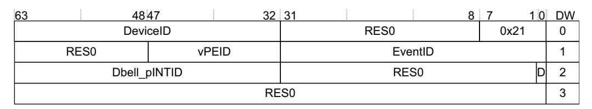

**Figure 5-24 VMOVI command format**

#### <span id="page-127-1"></span>In [Figure](#page-127-1) 5-24:

- vPEID specifies the vPE.
- EventID identifies the interrupt, associated with a device and already mapped by the ITS, that is to be moved to a new target specified by vPEID.
- D specifies whether the Dbell\_pINTID field is valid.
- DeviceID specifies the device that generates the interrupt.
- Dbell\_pINTID specifies the ID that is presented to the hypervisor if the vPE is not scheduled.

```
Note
If Dbell_pINTID is 1023 then no physical interrupt is generated.
```

• DW is the doubleword offset within a 32 byte, or four doubleword, ITS command packet.

The command and its arguments are:

```
VMOVI DeviceID, EventID, vPEID, [Dbell_pINTID]
```

A command error occurs if any of the following apply:

• DeviceID exceeds the maximum value supported by the ITS.

- vPEID exceeds the maximum number supported by the ITS, as defined by [GITS\\_BASER<n>.](#page-825-0)
- The device specified by DeviceID is not mapped to an ITT, using [MAPD.](#page-111-0)
- The EventID exceeds the maximum value allowed by the ITT. This value is specified by the Size field when the [MAPD](#page-111-0) command is issued.
- The vPE is not mapped to a Redistributor, using [VMAPP GICv4.0](#page-122-0).
- EventID corresponds to a physical LPI.
- If D is 1 and pINTID does not specify a valid doorbell INTID, where a valid INTID is either:
  - 1023.
  - Within the supported range for LPIs.

In this case, the ITS must take the actions described in *[Command errors on page](#page-103-1) 5-104*.

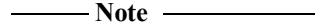

If, after using VMOVI to move an interrupt from vPE A to vPE B, software moves the same interrupt again, a [VSYNC](#page-133-0) command must be issued to vPE A between the moves to ensure correct behavior.

When VMOVI is issued targeting a vPE that is unmapped, or mapped to a Redistributor with LPIs disabled, behavior is CONSTRAINED UNPREDICTABLE with a choice of:

- Clear the pending state of the moved LPI.
- Pending state unchanged on the source vPE.

The following pseudocode describes the operation of the VMOVI command:

```
// ITS.VMOVI
// =========
ITS.VMOVI(ITSCommand cmd)
    if DeviceOutOfRange(cmd.DeviceID) then
        if GITS_TYPER.SEIS == '1' then IMPLEMENTATION_DEFINED "SError VMOVI_DEVICE_OOR";
        UNPREDICTABLE;
    if VCPUOutOfRange(cmd.VCPUID) then
        if GITS_TYPER.SEIS == '1' then IMPLEMENTATION_DEFINED "SError VMOVI_VCPU_OOR";
        UNPREDICTABLE;
    if ( cmd.V == '1' && LPIOutOfRange(cmd.pINTID) && cmd.pINTID != '1023') then
        if GITS_TYPER.SEIS == '1' then IMPLEMENTATION_DEFINED "SError VMOVI_PHYSICALID_OOR";
        UNPREDICTABLE;
    DeviceTableEntry dte = ReadDeviceTable(UInt(cmd.DeviceID));
    if !dte.Valid then
        if GITS_TYPER.SEIS == '1' then IMPLEMENTATION_DEFINED "SError VMOVI_UNMAPPED_DEVICE";
        UNPREDICTABLE;
    if IdOutOfRange(cmd.EventID, dte.ITT_size) then
        if GITS_TYPER.SEIS == '1' then IMPLEMENTATION_DEFINED "SError VMOVI_ID_OOR";
        UNPREDICTABLE;
    InterruptTableEntry ite = ReadTranslationTable(dte.ITT_base, UInt(cmd.EventID));
    if !ite.Valid then
        if GITS_TYPER.SEIS == '1' then IMPLEMENTATION_DEFINED "SError VMOVI_UNMAPPED_INTERRUPT";
        UNPREDICTABLE;
    if ite.Type == physical_interrupt then
        if GITS_TYPER.SEIS == '1' then IMPLEMENTATION_DEFINED "SError VMOVI_ID_IS_PHYSICAL";
        UNPREDICTABLE;
    VCPUTableEntry vte1 = ReadVCPUTable(UInt(ite.VCPUID));
    VCPUTableEntry vte2 = ReadVCPUTable(UInt(cmd.VCPUID));
```

```
if !vte1.Valid then
    if GITS_TYPER.SEIS == '1' then IMPLEMENTATION_DEFINED "SError VMOVI_ITEVCPU_INVALID";
    UNPREDICTABLE;
if !vte2.Valid then
    if GITS_TYPER.SEIS == '1' then IMPLEMENTATION_DEFINED "SError VMOVI_CMDVCPU_INVALID";
    UNPREDICTABLE;
bits(32) rd1 = vte1.RDbase;
Address vpt1 = vte1.VPT_base;
bits(32) rd2 = vte2.RDbase;
Address vpt2 = vte2.VPT_base;
ite.VCPUID = cmd.VCPUID;
if cmd.V == '1' then
    ite.DoorbellID = cmd.pINTID;
WriteTranslationTable(dte.ITT_base, UInt(cmd.EventID), ite);
// From this point new interrupts sent to the new VCPU move the pending
// state to rd2 if set taking care of any races where the interrupt
// has been forwarded to the processor
MoveVirtualPendingState(rd1, vpt1, vpt2, ite.OutputID);
IncrementReadPointer();
return;
```

#### <span id="page-129-2"></span><span id="page-129-0"></span>**5.3.22 VMOVP GICv4.0**

This command updates the vPE table entry defined by vPEID to the target RDbase. Software must use SequenceNumber and ITSList to synchronize the execution of VMOVP commands across more than one ITS.

This command is provided only in GICv4.

Software must ensure that this command is not executed with a vPEID that is scheduled on the target Redistributor, otherwise system behavior is UNPREDICTABLE.

[Figure](#page-129-1) 5-25 shows the format of the VMOVP command.


**Figure 5-25 VMOVP command format**

#### <span id="page-129-1"></span>In [Figure](#page-129-1) 5-25:

- vPEID specifies the vPE.
- RDbase specifies the Redistributor to which interrupts are forwarded. See *[IMPLEMENTATION DEFINED](#page-102-0)  [sizes in ITS command parameters on page](#page-102-0) 5-103*. Behavior is UNPREDICTABLE if RDbase does not specify a valid Redistributor.
- Sequence Number specifies the identity of the synchronization point that every ITS included in ITS List uses. When [GITS\\_TYPER.](#page-847-0)VMOVP == 0 Sequence Number specifies the identity of the synchronization point that is used by all ITSs that are included in ITSList.

```
When GITS_TYPER.VMOVP == 1 Sequence Number is RES0.
```

For more information, see *[VMOVP usage on page](#page-130-0) 5-131*.

- ITSList specifies the ITS instances that are included in the synchronization operation, where:
  - Each bit in ITS List identifies an ITS where bit[n] corresponds to ITS n.

— An ITS is included if the corresponding bit is set to 1.

When [GITS\\_TYPER.](#page-847-0)VMOVP == 0 ITSList specifies which ITSs are included in the synchronization operation. Each bit of ITSList corresponds to an ITS, for example bit[0] of ITSList corresponds to ITS 0, bit[1] to ITS 1.

```
When GITS_TYPER.VMOVP ==1 ITSList is RES0.
```

• DW is the doubleword offset within a 32 byte, or four doubleword, ITS command packet.

The command and its arguments are:

```
VMOVP, vPEID, RDbase, SequenceNumber, ITSList
```

A command error occurs if any of the following apply:

- If the PE specified by vPEID is not mapped to a Redistributor, using [VMAPP GICv4.0.](#page-122-0)
- vPEID exceeds the maximum number supported by the ITS, as defined by [GITS\\_BASER<n>.](#page-825-0)

In this case, the ITS must take the actions described in *[Command errors on page](#page-103-1) 5-104*.

The following pseudocode describes the operation of the VMOVP command:

```
// ITS.VMOVP
// =========
ITS.VMOVP(ITSCommand cmd)
    if VCPUOutOfRange(cmd.VCPUID) then
    if GITS_TYPER.SEIS == '1' then IMPLEMENTATION_DEFINED "SError VMOVP_VCPU_OOR";
    UNPREDICTABLE;
VCPUTableEntry vte = ReadVCPUTable(UInt(cmd.VCPUID));
if !vte.Valid then
   if GITS_TYPER.SEIS == '1' then IMPLEMENTATION_DEFINED "SError VMOVP_VCPU_INVALID";
   UNPREDICTABLE;
vte.RDbase = cmd.RDbase;
if HasGIC41Ext() then
    UpdateVPEConfigurationTable(UInt(cmd.VCPUID), cmd.RDbase,
        cmd.Default_Doorbell_pINTID);
WriteVCPUTable(UInt(cmd.VCPUID), vte);
IncrementReadPointer();
return;
```

#### <span id="page-130-0"></span>**VMOVP usage**

Where more than one ITS controls interrupts for the same vPE, moving this vPE must be coordinated between the different ITSs. This is controlled by software using one of the two approaches detailed here:

```
When GITS_TYPER.VMOVP == 0:
```

- The VMOVP command must be issued for each ITS that controls interrupts for the vPE that is being moved. Each of these commands must have a common sequence number. That sequence number cannot be used for other VMOVP commands until all commands that previously used that sequence number have been processed by all ITSs.
- The VMOVP command issued for each ITS contains a list of all the ITSs that are affected by moving the vPE. This is the ITS List.
- Each ITS must have the sequence numbers presented to it in the same order in that they are presented to the other ITSs.

When [GITS\\_TYPER.](#page-847-0)VMOVP == 1:

- The VMOVP command must be issued on only one of the ITSs that controls interrupts for the vPE that is being moved.
- The implementation is responsible for propagating the updated mapping.

Not following this approach results in UNPREDICTABLE behavior.

**Note**

If a system contains multiple ITSs, Arm strongly recommends that software does not issue a VMAPP when there is an outstanding VMOVP for the same vPEID on another ITS, as this could create a race condition.

#### <span id="page-131-0"></span>**5.3.23 VMOVP GICv4.1**

The VMOVP command is modified in GICv4.1 to allow a Default Doorbell to be assigned to the vPE.

|                      | 52 51 48 |      | 47<br>32        |  | 31<br>16                |         | 15 | 0    | DW |
|----------------------|----------|------|-----------------|--|-------------------------|---------|----|------|----|
| RES0                 |          |      | Sequence Number |  | RES0                    |         |    | 0x22 | 0  |
| RES0                 |          |      | vPEID           |  | RES0                    | ITSList |    |      | 1  |
| RES0<br>RDbase<br>DB |          |      | RES0            |  |                         |         |    |      |    |
|                      |          | RES0 |                 |  | Default_Doorbell_pINTID |         |    |      |    |

**Figure 5-26 GICv4.1** VMOVP **command encoding**

#### <span id="page-131-2"></span>In [Figure](#page-131-2) 5-26:

- Default\_Doorbell\_pINTID is the default doorbell for the vPE.
- DB signifies whether to mark the vPE as requiring a Default Doorbell on the target.

A VMOVP, Default\_Doorbell\_pINTID==1023 means no default doorbell. For a VMOVP with a valid Default\_Doorbell\_pINTID, other than 1023, the pending state of the default doorbell is transferred to the new target.

A VMOVP with Default\_Doorbell\_pINTID==1023 clears the pending state of the default doorbell on the old target if one was previously specified. The pending state of the default doorbell is transferred even when the INTID used for the doorbell is changed. Moving a vPE does not change the rules on generating default doorbells.

When VMOVP is issued, if DB==1, the vPE is marked as requesting Default Doorbell generation on the new target. When DB==0, the vPE is marked as not requesting Default Doorbell generation on the new target.

A command error occurs if any of the following apply:

- The PE specified by vPEID is not mapped to a Redistributor, using VMAPP.
- vPEID exceeds the maximum number supported by the ITS, as defined by [GITS\\_BASER<n>.](#page-825-0)
- A VMOVP specifies a value of Default\_Doorbell\_pINTID outside of the implemented LPI range, other than 1023. The command error code reported is 0x01\_2206(VMOVP\_PHYSICALID\_OOR).

In this case, the ITS must take the actions described in *[Command errors on page](#page-103-1) 5-104*.

#### **VMOVP usage in GICv4.1**

VMOVP usage in GICv4.1 is the same as in GICv4.0. See *[VMOVP usage on page](#page-130-0) 5-131* for more information.

#### <span id="page-131-1"></span>**5.3.24 VSGI for GICv4.1 only**

The vSGI command sets the configuration of a specified vSGI and optionally clears its pending state.

Figure 5-[27 on page](#page-132-0) 5-133 shows the format of the vSGI command.

| 63            |      | 48 47 |  | 36 35  |  | 32 31 |  |     |      | 24 23:20 19:16 15:12 11 |   | 10 9 |     | 8 7  | 0 DW |
|---------------|------|-------|--|--------|--|-------|--|-----|------|-------------------------|---|------|-----|------|------|
|               | RES0 |       |  | vINTID |  | RES0  |  | Pri | RES0 | RES0                    | N | G    | C E | 0X23 | 0    |
| RES0<br>vPEID |      |       |  |        |  | RES0  |  |     |      |                         |   |      | 1   |      |      |
|               | RES0 |       |  |        |  |       |  |     |      | 2                       |   |      |     |      |      |
| RES0          |      |       |  |        |  |       |  |     | 3    |                         |   |      |     |      |      |

**Figure 5-27 vSGI command encoding**

#### <span id="page-132-0"></span>Where:

- E is the enable configuration.
  - IGNORED when C==1.
- G is the group configuration.
  - IGNORED when C==1.
- Priority, records bits [7:4] of the priority configuration.
  - Bits [3:0] are treated as 0b0000.
  - IGNORED when C==1.
- vINTID and vPEID identify the interrupt.
- C is used to indicate whether the pending state of the interrupt should be cleared.
- If GICv4.2 is not implemented, then N is RES0.
- If GICv4.2 is implemented, then N is the NMI field.
  - When N is 0, the interrupt does not have the NMI property.
  - When N is 1, the interrupt has the NMI property.
  - IGNORED when C==1.

The following pseudocode describes the operation of the VSGI command:

```
// ITS.VSGI
// =========
ITS.VSGI(ITSCommand cmd)
    if VCPUOutOfRange(cmd.VCPUID) then
        if GITS_TYPER.SEIS == '1' then IMPLEMENTATION_DEFINED "SError VSGI_VCPU_OOR";
        UNPREDICTABLE;
    VCPUTableEntry vte = ReadVCPUTable(UInt(cmd.VCPUID));
    // It is CONSTRAINED UNPREDICTABLE whether ReadVCPUTable() can
    // return mappings from other ITSs when mapping exists on current
    // current ITS
    if Valid then
       if (CMD.C==0) then
           // Set configuration of interrupt
           SetVirtualSGIConfiguration(cmd.VCPUID, vte, cmd.Intid, cmd.E, cmd.Priority, cmd.G);
       else
           // Clear pending state of interrupt
           ClearVirtualSGIPendingState(VCPUID, vte, cmdIntid);
    IncrementReadPointer();
    return;
```

When C==0, all of the following apply:

- VSGI sets the configuration of the specified vSGI to the settings given in the command, leaving the pending state unchanged.
- Setting VSGI.Group to 0 and VSGI.NMI to 1 has one of the following CONSTRAINED UNPREDICTABLE behaviors:
  - VSGI.NMI is treated as being 0.

- The virtual interrupt is assigned the non-maskable property.
- When VSGI.C == 0 and VSGI.NMI == 1, the VSGI.Pri field is RES0.

When C==1, VSGI clears the pending state of the specified vSGI, leaving the configuration unchanged.

VSGI is synchronized by VSYNC.

A command error occurs if any of the following conditions apply:

• If the VSGI is issued with a vPEID greater than the configured range for the ITS.

In this case, the ITS must take the actions described in *[Command errors on page](#page-103-1) 5-104*.

If the vPEID is not mapped on any ITS, the VSGI command has no effect.

If the vPEID is not mapped on this ITS, but is mapped on a different ITS, it is CONSTRAINED UNPREDICTABLE whether the configuration is updated, or the command has no effect.

#### <span id="page-133-2"></span><span id="page-133-0"></span>**5.3.25 VSYNC**

This command ensures all outstanding ITS operations for the vPEID specified are globally observed before any further ITS commands are executed. Following the execution of a VSYNC the effects of all previous commands must apply to subsequent writes to GITS\_TRANSLATER.

This command is provided only in GICv4.

[Figure](#page-133-1) 5-28 shows the format of the VSYNC command.

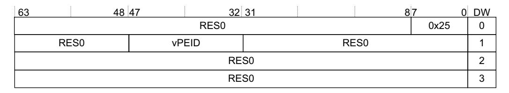

**Figure 5-28 VSYNC command format**

#### <span id="page-133-1"></span>In [Figure](#page-133-1) 5-28:

- vPEID specifies the vPE for which commands must be synchronized.
- DW is the doubleword offset within a 32 byte, or four doubleword, ITS command packet.

The command and its arguments are:

VSYNC vPEID

A command error occurs if any of the following apply:

- If the PE specified by vPEID is not mapped to a Redistributor, using [VMAPP GICv4.0.](#page-122-0)
- vPEID exceeds the maximum number supported by the ITS, as defined by [GITS\\_BASER<n>.](#page-825-0)

In this case, the ITS must take the actions described in *[Command errors on page](#page-103-1) 5-104*.

The following pseudocode describes the operation of the VSYNC command:

```
// ITS.VSYNC
// =========
ITS.VSYNC(ITSCommand cmd)
    if VCPUOutOfRange(cmd.VCPUID) then
        if GITS_TYPER.SEIS == '1' then IMPLEMENTATION_DEFINED "SError VSYNC_VCPU_OOR";
        UNPREDICTABLE;
    VCPUTableEntry vte = ReadVCPUTable(UInt(cmd.VCPUID));
    if !vte.Valid then
        if GITS_TYPER.SEIS == '1' then IMPLEMENTATION_DEFINED "SError VSYNC_VCPU_INVALID";
        UNPREDICTABLE;
```

```
bits(32) rd_base = vte.RDbase;
// Wait for the external effects of any virtual commands to be observable by all redistributors
// and ensure the internal effects of any previous commands affect any subsequent interrupt
// requests or commands
WaitForVirtualCompletion(rd_base);
IncrementReadPointer();
return;
```

#### <span id="page-135-1"></span><span id="page-135-0"></span>**5.4 Common ITS pseudocode functions**

The following terminology appears in some of the pseudocode functions in this section:

#### **Interrupt Translation**

An action that causes the ITS to attempt to set a particular pending bit in a particular table.

#### **Pending Interrupt**

A particular pending bit is set in a particular table.

The pseudocode functions in this section are based on the following assumptions:

- Each ITS function must be performed as an atomic operation. Implementations must ensure that the observed behavior is consistent with that from a strictly atomic implementation.
- Where the pseudocode issues a sequence of read and write operations to a particular Redistributor, these operations must be performed in the order in which they were generated.
- Where the pseudocode issues a write to a particular Redistributor, operation does not need to wait for the completion of the write.
- Where the pseudocode issues write to memory to update a table, operation does not need to wait for the completion of these writes. A write to memory might never become visible to an external observer. However, the effect of any such writes must be ordered by any subsequent ITS operations, including the handling of interrupt translations. There are no ordering rules other than the standard rule that memory must appear as if writes to each location occurred in program order.
- Because each ITS function is performed as an atomic operation, any new interrupt translation that occurs after the function must be subject to the effects of that function.
- The effects of caching of the Redistributor LPI Configuration and LPI Pending tables are specified explicitly in the pseudocode.
- An interrupt translation might set a pending bit and pending bits remain set until handled by the PE. While an interrupt is pending it might be affected by an interrupt translation that is updated by a subsequent ITS function.

**Note**

Some variable names used in the pseudocode differ from those used in the body text. For a list of the affected variables, see *[Pseudocode terminology on page](#page-929-0) B-930*.

The following pseudocode invalidates any associated caching for the LPI configuration in the Redistributor for the specified translation.

```
// InvalidateByITE
// ===============
boolean InvalidateByITE(InterruptTableEntry ite)
    if ite.Type == physical_interrupt then
        CollectionTableEntry cte = ReadCollectionTable(UInt(ite.ICID));
        if !cte.Valid then
            return FALSE;
        InvalidateInterruptCaches(ite.ICID, ite.OutputID);
    else
        VCPUTableEntry vte = ReadVCPUTable(UInt(ite.VCPUID));
        if !vte.Valid then
            return FALSE;
        InvalidateVirtualInterruptCaches(ite.VCPUID, ite.OutputID);
    return TRUE;
```

The following pseudocode describes moving a pending interrupt.

```
// MovePendingState()
// ==================
MovePendingState(bits(32) rd1, bits(32) rd2, bits(32) ID)
    if IsPending(GICR_PENDBASER[rd1], ID) then
        // The interrupt is pending in the source redistributor
        // Make sure the interrupt is released or taken by the processor for
        // example by sending a clear and waiting for the response
        EnsureInterruptNotPendingOnProcessor(rd1, ID);
        if IsPending(GICR_PENDBASER[rd1], ID) then
            // The CPU released the interrupt and it is still pending
            // Note: the following must be done without any possibility of the
            // source redistributor re-forwarding the interrupt to the processor
            ClearPendingStateLocal(GICR_PENDBASER[rd1], ID);
            SetPendingStateLocal(GICR_PENDBASER[rd2], ID);
The following pseudocode describes moving a pending virtual interrupt.
// MoveVirtualPendingState()
// =========================
MoveVirtualPendingState(bits(32) rd_base, Address vpt1, Address vpt2, bits(32) ID)
    if IsPending(vpt1, ID) then
        // The interrupt is pending in the source redistributor
        // Make sure the interrupt is released or taken by the processor for example by sending a
        // VClear and waiting for the response
        EnsureVirtualInterruptNotPendingOnProcessor(rd_base, vpt1, ID);
        if IsPending(vpt1, ID) then
            // The CPU released the interrupt and it is still pending
            // Note: the following must be done without any possibility of the source redistributor
            // re-forwarding the interrupt to the processor
            ClearVirtualPendingStateLocal(vpt1, ID);
            SetVirtualPendingStateLocal(vpt2, ID);
    return;
The following pseudocode describes invalidating the caching of configuration data for the default doorbell 
associated with a vPE.
// Invalidates any caching of configuration for the default
// doorbell associated with a vPE
InvalidateInterruptDoorbellCaches(UInt VCPUID, VCPUTableEntry vte);
// Sets the configuration of the specified vSGI
SetVirtualSGIConfiguration(UInt VCPUID, VCPUTableEntry vte, UInt Intid,
                           UInt Enable, UInt Priority, UInt Group);
// Clears the pending state of the specified vSGI
ClearVirtualSGIPendingState(UInt VCPUID, VCPUTableEntry vte, UInt Intid);
// Returns TRUE if the ITS supports GICv4.1
Boolean HasGIC41Ext();
```

#### **5.4.1 ITS helper functions**

This subsection describes the ITS helper functions. These functions are placeholder functions for behavior that is not architected and that is IMPLEMENTATION DEFINED.

The functions are indicated by the hierarchical path names, for example shared/gic/its/its\_helper:

- *[shared/gic/its/its\\_helper/Address on page](#page-137-0) 5-138*.
- *[shared/gic/its/its\\_helper/ClearPendingState on page](#page-137-1) 5-138*.
- *[shared/gic/its/its\\_helper/ClearPendingStateLocal on page](#page-138-0) 5-139*.
- *[shared/gic/its/its\\_helper/CollectionOutOfRange on page](#page-138-1) 5-139*.

- *[shared/gic/its/its\\_helper/CollectionTableEntry on page](#page-138-2) 5-139*.
- *[shared/gic/its/its\\_helper/DeviceOutOfRange on page](#page-138-3) 5-139*.
- *[shared/gic/its/its\\_helper/DeviceTableEntry on page](#page-138-4) 5-139*.
- *[shared/gic/its/its\\_helper/EndOfCommand on page](#page-139-0) 5-140*.
- *[shared/gic/its/its\\_helper/EnsureInterruptNotPendingOnProcessor on page](#page-139-1) 5-140*.
- *[shared/gic/its/its\\_helper/EnsureVirtualInterruptNotPendingOnProcessor on page](#page-139-2) 5-140*.
- *[shared/gic/its/its\\_helper/IdOutOfRange on page](#page-139-3) 5-140*.
- *[shared/gic/its/its\\_helper/IncrementReadPointer on page](#page-139-4) 5-140*.
- *[shared/gic/its/its\\_helper/InterruptTableEntry on page](#page-139-5) 5-140*.
- *[shared/gic/its/its\\_helper/InterruptType on page](#page-140-0) 5-141*.
- *[shared/gic/its/its\\_helper/InterruptType on page](#page-140-0) 5-141*.
- *[shared/gic/its/its\\_helper/InvalidateInterruptCaches on page](#page-140-1) 5-141*.
- *[shared/gic/its/its\\_helper/InvalidateInterruptConfigurationCaches on page](#page-140-2) 5-141*.
- *[shared/gic/its/its\\_helper/InvalidateVCPUCaches on page](#page-140-3) 5-141*.
- *[shared/gic/its/its\\_helper/InvalidateVirtualConfigurationCaches on page](#page-140-4) 5-141*.
- *[shared/gic/its/its\\_helper/InvalidateVirtualInterruptCaches on page](#page-140-5) 5-141*.
- *[shared/gic/its/its\\_helper/IsPending on page](#page-141-0) 5-142*.
- *[shared/gic/its/its\\_helper/IsPending on page](#page-141-1) 5-142*.
- *[shared/gic/its/its\\_helper/LPIOutOfRange on page](#page-141-2) 5-142*.
- *[shared/gic/its/its\\_helper/MoveAllPendingState on page](#page-141-3) 5-142*.
- *[shared/gic/its/its\\_helper/ReadCollectionTable on page](#page-141-4) 5-142*.
- *[shared/gic/its/its\\_helper/ReadDeviceTable on page](#page-141-5) 5-142*.
- *[shared/gic/its/its\\_helper/ReadTranslationTable on page](#page-141-6) 5-142*.
- *[shared/gic/its/its\\_helper/ReadVCPUTable on page](#page-142-0) 5-143*.
- *[shared/gic/its/its\\_helper/RetargetVirtualInterrupt on page](#page-142-1) 5-143*.
- *[shared/gic/its/its\\_helper/SetPendingState on page](#page-142-2) 5-143*.
- *[shared/gic/its/its\\_helper/SetPendingStateLocal on page](#page-142-3) 5-143*.
- *[shared/gic/its/its\\_helper/SizeOutOfRange on page](#page-142-4) 5-143*.
- *[shared/gic/its/its\\_helper/VCPUOutOfRange on page](#page-142-5) 5-143*.
- *[shared/gic/its/its\\_helper/VCPUTableEntry on page](#page-143-0) 5-144*.
- *[shared/gic/its/its\\_helper/WaitForCompletion on page](#page-143-1) 5-144*.
- *[shared/gic/its/its\\_helper/WaitForVirtualCompletion on page](#page-143-2) 5-144*.
- *[shared/gic/its/its\\_helper/WriteCollectionTable on page](#page-143-3) 5-144*.
- *[shared/gic/its/its\\_helper/WriteDeviceTable on page](#page-143-4) 5-144*.
- *[shared/gic/its/its\\_helper/WriteTranslationTable on page](#page-143-5) 5-144*.
- *[shared/gic/its/its\\_helper/WriteVCPUTable on page](#page-144-0) 5-145*.

#### <span id="page-137-0"></span>**shared/gic/its/its\_helper/Address**

```
// Address()
// ============
type Address = bits(48);
```

#### <span id="page-137-1"></span>**shared/gic/its/its\_helper/ClearPendingState**

```
// ClearPendingState()
// ================
```

boolean ClearPendingState(InterruptTableEntry ite);

#### <span id="page-138-0"></span>**shared/gic/its/its\_helper/ClearPendingStateLocal**

```
// ClearPendingStateLocal()
// =============================
// Clears the pending state of the physical interrupt specified by INTID
// for the redistributor which owns the LPI pending table specified by PendBase
ClearPendingStateLocal(PBType PendBase, bits(32) INTID);
// ClearVirtualPendingStateLocal()
// ============================
// Clears the pending state of the virtual interrupt specified by vINTID
// in the LPI pending table specified by base
ClearPendingStateLocal(Address base, bits(32) vINTID);
shared/gic/its/its_helper/CollectionOutOfRange
// CollectionOutOfRange()
// ================================
// Returns TRUE if the value supplied has bits above the implemented range
// or if the value exceeds the total number of collections supported in
// hardware and external memory
boolean CollectionOutOfRange(bits(16) collection);
shared/gic/its/its_helper/CollectionTableEntry
//CollectionTableEntry()
// =======================
type CollectionTableEntry is (
   boolean Valid,
   bits(32) RDbase
)
shared/gic/its/its_helper/DeviceOutOfRange
// DeviceOutOfRange()
// =====================
// Returns TRUE if the value supplied has bits above the implemented range
// or if the value supplied exceeds the maximum configured size in the
// appropriate GITS_BASER<n>
boolean DeviceOutOfRange(bits(32) device);
shared/gic/its/its_helper/DeviceTableEntry
// DeviceTableEntry()
// =============
```

<span id="page-138-4"></span><span id="page-138-3"></span><span id="page-138-2"></span>type DeviceTableEntry is ( boolean Valid, Address ITT\_base, bits(5) ITT\_size

)

#### <span id="page-139-0"></span>**shared/gic/its/its\_helper/EndOfCommand**

```
// EndOfCommand()
// ================
// Terminate processing of the current command without incrementing the read pointer.
// This means the command will be run again.
EndOfCommand();
```

#### <span id="page-139-1"></span>**shared/gic/its/its\_helper/EnsureInterruptNotPendingOnProcessor**

```
// EnsureInterruptNotPendingOnProcessor()
// ======================================
// Returns when the physical interrupt specified by ID is not pending on
// the CPU interface connected to the redistributor specified by rd1
EnsureInterruptNotPendingOnProcessor(bits(32) rd1, bits(32) ID);
```

#### <span id="page-139-2"></span>**shared/gic/its/its\_helper/EnsureVirtualInterruptNotPendingOnProcessor**

```
// EnsureVirtualInterruptNotPendingOnProcessor()
// ==========================================
// Returns when the virtual interrupt specified by ID is not pending on
// the CPU interface connected to the redistributor specified by rd1
EnsureVirtualInterruptNotPendingOnProcessor(bits(32) rd1, Address vpt, bits(32) ID);
```

#### <span id="page-139-3"></span>**shared/gic/its/its\_helper/IdOutOfRange**

```
// IdOutOfRange()
// ============================
// Returns TRUE if the value supplied has bits above the implemented size or above the ITT_size
boolean IdOutOfRange(bits(32) ID, bits(5) ITT_size);
```

#### <span id="page-139-4"></span>**shared/gic/its/its\_helper/IncrementReadPointer**

```
// IncrementReadPointer()
// ===================
//Increments GITS_CREADR, wrapping if appropriate
IncrementReadPointer();
```

#### <span id="page-139-5"></span>**shared/gic/its/its\_helper/InterruptTableEntry**

```
// InterruptTableEntry()
// =====================
type InterruptTableEntry is (
    boolean Valid,
    InterruptType Type,
    bits(32) OutputID,
    bits(32) DoorbellID,
    bits(16) ICID,
    bits(16) VCPUID
)
```

#### <span id="page-140-0"></span>**shared/gic/its/its\_helper/InterruptType**

```
// InterruptType
// ====================
enumeration InterruptType { virtual_interrupt, physical_interrupt };
shared/gic/its/its_helper/InvalidateCollectionCaches
//InvalidateCollectionCaches()
// =========================
// Invalidates any caching of configuration for interrupts which are
// members of the collection specified by "collection"
InvalidateCollectionCaches(integer collection);
shared/gic/its/its_helper/InvalidateInterruptCaches
// InvalidateInterruptCaches()
// =============================
// Invalidates any caching of configuration for the physical
// interrupt specified by interruptID , which is a member of
// the collection specified by collection
InvalidateInterruptCaches(bits(16) collection, bits(32) interruptID);
shared/gic/its/its_helper/InvalidateInterruptConfigurationCaches
// InvalidateInterruptConfigurationCaches()
// ===================================
InvalidateInterruptConfigurationCaches(bits(32) ID, integer collection);
shared/gic/its/its_helper/InvalidateVCPUCaches
// InvalidateVCPUCaches()
// ==========================
// Invalidates any caching of configuration for the vPE specified by vcpu_id
InvalidateVCPUCaches(integer vcpu_id);
shared/gic/its/its_helper/InvalidateVirtualConfigurationCaches
// InvalidateVirtualConfigurationCaches
// ================================
InvalidateVirtualConfigurationCaches(bits(32) ID, bits(16) VCPU);
shared/gic/its/its_helper/InvalidateVirtualInterruptCaches
// InvalidateVirtualInterruptCaches()
// =====================================
// Invalidates any caching of configuration for the virtual interrupt specified
// by the interruptID for the vPE specified by vcpi_id
InvalidateVirtualInterruptCaches(bits(16) vcpu_id, bits(32) interruptID);
```

#### <span id="page-141-0"></span>**shared/gic/its/its\_helper/IsPending**

```
// IsPending()
// =========================
// Returns TRUE if the physical interrupt specified by interrupt ID
// is pending for the Redistributor which owns the LPI pending table
// specified by PendBase
boolean IsPending(PBType PendBase, bits(32) interruptID);
shared/gic/its/its_helper/IsPending
// IsPending()
// ========================
// Returns TRUE if the virtual interrupt specified by interruptID
// is pending in the LPI pending table specified by base
boolean IsPending(Address base, bits(32) interruptID);
shared/gic/its/its_helper/LPIOutOfRange
//LPIOutOfRange()
// ==========================
// Returns TRUE if the value supplied is larger than that permitted by GICD_TYPER.IDbits or not in the
// LPI range
boolean LPIOutOfRange(bits(32) ID);
shared/gic/its/its_helper/MoveAllPendingState
// MoveAllPendingState()
// ===================
// Moves the pending state of all interrupts from the Redistributor specified by rd1
// to the Redistributor specified by rd2
MoveAllPendingState(bits(32) rd1, bits(32) rd2);
shared/gic/its/its_helper/ReadCollectionTable
// ReadCollectionTableEntry()
// =========================
// Reads a collection table entry from memory
CollectionTableEntry ReadCollectionTable(integer index);
shared/gic/its/its_helper/ReadDeviceTable
// ReadDevicePointer()
// ==========================
// Reads a device table entry from memory
DeviceTableEntry ReadDeviceTable(integer index);
```

// ReadTranslationTable()

<span id="page-141-6"></span><span id="page-141-5"></span><span id="page-141-4"></span><span id="page-141-3"></span>**shared/gic/its/its\_helper/ReadTranslationTable**

```
// =======================
// Reads an ITT table entry from memory
InterruptTableEntry ReadTranslationTable(Address base, integer index);
shared/gic/its/its_helper/ReadVCPUTable
//ReadVCPUTable()
// ===========================
// Reads a VCPU table entry from memory
VCPUTableEntry ReadVCPUTable(integer index);
shared/gic/its/its_helper/RetargetVirtualInterrupt
// RetargetVirtualInterrupt()
// =======================
RetargetVirtualInterrupt(integer device, bits(32) ID, integer vcpu);
shared/gic/its/its_helper/SetPendingState
// SetPendingState()
// ========================
boolean SetPendingState(InterruptTableEntry ite);
shared/gic/its/its_helper/SetPendingStateLocal
// SetPendingStateLocal()
// =======================
// Sets the pending state of the physical interrupt specified by INTID
// for the Redistributor that owns the LPI pending table specified by PendBase
SetPendingStateLocal(PBType PendBase, bits(32) INTID);
// SetVirtualPendingStateLocal()
// =======================
// Sets the pending state of the virtual interrupt specified by INTID
// in the LPI pending table specified by base
SetPendingStateLocal(Address base, bits(32)INTID);
shared/gic/its/its_helper/SizeOutOfRange
// SizeOutOfRange()
// =====================
// Returns TRUE if the value supplied exceeds the maximum allowed by GITS_TYPER.ID_bits
boolean SizeOutOfRange(bits(5) ITT_size);
shared/gic/its/its_helper/VCPUOutOfRange
// VCPUOutOfRange()
// =======================
```

```
// Returns TRUE if the value supplied has bits above the implemented range or
// if the value supplied exceeds the maximum configured size in the
// appropriate GITS_BASERn
boolean VCPUOutOfRange(bits(16) vcpu);
shared/gic/its/its_helper/VCPUTableEntry
//VCPUTableEntry()
// ==================
type VCPUTableEntry is (
   boolean Valid,
   bits(32) RDbase,
   Address VPT_base,
   bits(5) VPT_size
)
shared/gic/its/its_helper/WaitForCompletion
// WaitForCompletion()
// ============================
// Returns when all external effects of any physical commands are observable
// by all Redistributors and the internal effects of any previous
// commands affect any subsequent interrupt requests or commands
WaitForCompletion(bits(32) RDbase);
shared/gic/its/its_helper/WaitForVirtualCompletion
// WaitForVirtualCompletion()
// =======================
WaitForVirtualCompletion(bits(32) RDbase);
shared/gic/its/its_helper/WriteCollectionTable
//WriteCollectionTable()
// =========================
// Writes a collection table entry to memory
WriteCollectionTable(integer index, CollectionTableEntry cte);
shared/gic/its/its_helper/WriteDeviceTable
// WriteDeviceTable()
// ========================
// Writes a device table entry to memory
WriteDeviceTable(integer index, DeviceTableEntry dte);
shared/gic/its/its_helper/WriteTranslationTable
// WriteTranslationTable()
// ================================
```

<span id="page-143-5"></span><span id="page-143-4"></span><span id="page-143-3"></span><span id="page-143-2"></span>// Writes an ITT table entry to memory

WriteTranslationTable(Address base, integer index, InterruptTableEntry cte);

#### <span id="page-144-0"></span>**shared/gic/its/its\_helper/WriteVCPUTable**

```
// WriteVCPUTable()
// ===============================
// Writes a VCPU table entry to memory
WriteVCPUTable(integer index, VCPUTableEntry vte);
```

### <span id="page-145-1"></span><span id="page-145-0"></span>**5.5 ITS command error encodings**

When an ITS supports system errors, that is when [GITS\\_TYPER.](#page-847-0)SEIS == 1, ITS command errors can be reported to software. It is IMPLEMENTATION DEFINED how these errors are recorded and reported.

<span id="page-145-2"></span>Table 5-[8 on page](#page-145-2) 5-146 shows the ITS command error encodings.

**Table 5-8 ITS command error encodings**

| Encoding  | Error mnemonic             | Command | Error description               |
|-----------|----------------------------|---------|---------------------------------|
| 0x01_0801 | MAPD_DEVICE_OOR            | MAPD    | Out of range                    |
| 0x01_0802 | MAPD_ITTSIZE_OOR           |         |                                 |
| 0x01_0903 | MAPC_COLLECTION_OOR        | MAPC    | Out of range                    |
| 0x01_0B01 | MAPI_DEVICE_OOR            | MAPI    |                                 |
| 0x01_0B03 | MAPI_COLLECTION_OOR        |         |                                 |
| 0x01_0B04 | MAPI_UNMAPPED_DEVICE       |         | Unmapped device                 |
| 0x01_0B05 | MAPI_ID_OOR                |         | Out of range                    |
| 0x01_0A01 | MAPTI_DEVICE_OOR           | MAPTI   |                                 |
| 0x01_0A03 | MAPTI_COLLECTION_OOR       |         |                                 |
| 0x01_0A04 | MAPTI_UNMAPPED_DEVICE      |         | Unmapped device                 |
| 0x01_0A05 | MAPTI_ID_OOR               |         | Out of range                    |
| 0x01_0A06 | MAPTI_PHYSICALID_OOR       |         |                                 |
| 0x01_0101 | MOVI_DEVICE_OOR            | MOVI    |                                 |
| 0x01_0103 | MOVI_COLLECTION_OOR        |         |                                 |
| 0x01_0104 | MOVI_UNMAPPED_DEVICE       |         | Unmapped device                 |
| 0x01_0105 | MOVI_ID_OOR                |         | Out of range                    |
| 0x01_0107 | MOVI_UNMAPPED_INTERRUPT    |         | Unmapped interrupt              |
| 0x01_0108 | MOVI_ID_IS_VIRTUAL         |         | vINTID specified                |
| 0x01_0109 | MOVI_UNMAPPED_COLLECTION   |         | Unmapped interrupt collection   |
| 0x01_0F01 | DISCARD_DEVICE_OOR         | DISCARD | Out of range                    |
| 0x01_0F04 | DISCARD_UNMAPPED_DEVICE    |         | Unmapped device                 |
| 0x01_0F05 | DISCARD_ID_OOR             |         | Out of range                    |
| 0x01_0F07 | DISCARD_UNMAPPED_INTERRUPT |         | Unmapped interrupt              |
| 0x01_0F10 | DISCARD_ITE_INVALID        |         | Invalid translation table entry |

**Table 5-8 ITS command error encodings (continued)**

| Encoding  | Error mnemonic             | Command          | Error description               |
|-----------|----------------------------|------------------|---------------------------------|
| 0x01_0C01 | INV_DEVICE_OOR             | INV              | Out of range                    |
| 0x01_0C04 | INV_UNMAPPED_DEVICE        |                  | Unmapped device                 |
| 0x01_0C05 | INV_ID_OOR                 |                  | Out of range                    |
| 0x01_0C07 | INV_UNMAPPED_INTERRUPT     |                  | Unmapped interrupt              |
| 0x01_0C10 | INV_ITE_INVALID            |                  | Invalid translation table entry |
| 0x01_0D03 | INVALL_COLLECTION_OOR      | INVALL           | Out of range                    |
| 0x01_0D09 | INVALL_UNMAPPED_COLLECTION |                  | Unmapped interrupt collection   |
| 0x01_0301 | INT_DEVICE_OOR             | INT              | Out of range                    |
| 0x01_0304 | INT_UNMAPPED_DEVICE        |                  | Unmapped device                 |
| 0x01_0305 | INT_ID_OOR                 |                  | Out of range                    |
| 0x01_0307 | INT_UNMAPPED_INTERRUPT     |                  | Unmapped interrupt              |
| 0x01_0310 | INT_ITE_INVALID            |                  | Invalid translation table entry |
| 0x01_0501 | CLEAR_DEVICE_OOR           | CLEAR            | Out of range                    |
| 0x01_0504 | CLEAR_UNMAPPED_DEVICE      |                  | Unmapped device                 |
| 0x01_0505 | CLEAR_ID_OOR               |                  | Out of range                    |
| 0x01_0507 | CLEAR_UNMAPPED_INTERRUPT   |                  | Unmapped interrupt              |
| 0x01_0510 | CLEAR_ITE_INVALID          |                  | Invalid translation table entry |
| 0x01_2906 | VMAPP_PHYSICALID_OOR       | VMAPP GICv4.0 or | Out of range                    |
| 0x01_2911 | VMAPP_VCPU_OOR             | VMAPP GICv4.1    |                                 |
| 0x01_2912 | VMAPP_VPTSIZE_OOR          |                  |                                 |

**Table 5-8 ITS command error encodings (continued)**

| Encoding  | Error mnemonic           | Command               | Error description                                    |
|-----------|--------------------------|-----------------------|------------------------------------------------------|
| 0x01_2b01 | VMAPI_DEVICE_OOR         | VMAPI                 | Out of range                                         |
| 0x01_2b11 | VMAPI_VCPU_OOR           |                       |                                                      |
| 0x01_2b04 | VMAPI_UNMAPPED_DEVICE    |                       | Unmapped device                                      |
| 0x01_2b05 | VMAPI_ID_OOR             |                       | Out of range                                         |
| 0x01_2b06 | VMAPI_PHYSICALID_OOR     |                       |                                                      |
| 0x01_2a01 | VMAPTI_DEVICE_OOR        | VMAPTI                |                                                      |
| 0x01_2a11 | VMAPTI_VCPU_OOR          |                       |                                                      |
| 0x01_2a04 | VMAPTI_UNMAPPED_DEVICE   |                       | Unmapped device                                      |
| 0x01_2a05 | VMAPTI_ID_OOR            |                       | Out of range                                         |
| 0x01_2a13 | VMAPTI_VIRTUALID_OOR     |                       |                                                      |
| 0x01_2a06 | VMAPTI_PHYSICALID_OOR    |                       |                                                      |
| 0x01_2d11 | VINVALL_VCPU_OOR         | VINVALL               |                                                      |
| 0x01_2d14 | VINVALL_VCPU_INVALID     |                       | Invalid vPE specified                                |
| 0x01_2511 | VSYNC_VCPU_OOR           | VSYNC                 | Out of range                                         |
| 0x01_2514 | VSYNC_VCPU_INVALID       |                       | Invalid vPE specified                                |
| 0x01_2206 | VMOVP_PHYSICALID_OOR     | VMOVP GICv4.0 or      | Out of range                                         |
| 0x01_2211 | VMOVP_VCPU_OOR           | VMOVP GICv4.1         |                                                      |
| 0x01_2214 | VMOVP_VCPU_INVALID       |                       | Invalid vPE specified                                |
| 0x01_2101 | VMOVI_DEVICE_OOR         | VMOVI                 | Out of range                                         |
| 0x01_2103 | VMOVI_VCPU_OOR           |                       |                                                      |
| 0x01_2104 | VMOVI_UNMAPPED_DEVICE    |                       | Unmapped device                                      |
| 0x01_2105 | VMOVI_ID_OOR             |                       | Out of range                                         |
| 0x01_2106 | VMOVI_PHYSICALID_OOR     |                       |                                                      |
| 0x01_2107 | VMOVI_UNMAPPED_INTERRUPT |                       | Unmapped interrupt                                   |
| 0x01_2115 | VMOVI_ID_IS_PHYSICAL     |                       | pINTID specified                                     |
| 0x01_2116 | VMOVI_ITEVCPU_INVALID    |                       | Invalid translation table entry                      |
| 0x01_2117 | VMOVI_CMDVCPU_INVALID    |                       | Invalid vPE specified                                |
| 0x01_2311 | VSGI_VCPU_OOR            | VSGI for GICv4.1 only | vPEID greater than the configured range for the ITS. |
| 0x01_2E11 | INVDB_VCPU_OOR           | INVDB GICv4.1 only    | Out of range                                         |

#### <span id="page-148-1"></span><span id="page-148-0"></span>**5.6 ITS power management**

This subsection describes the software sequences for enabling and disabling an ITS. It contains the following sections:

- *[Enabling an ITS](#page-148-2)*.
- *[Disabling an ITS](#page-148-3)*.

#### <span id="page-148-2"></span>**5.6.1 Enabling an ITS**

On power up, an ITS is reset to the quiescent state where [GITS\\_CTLR.](#page-833-0)Quiescent == 1 and [GITS\\_CTLR.](#page-833-0)Enabled == 0. To enable an ITS, software must:

- 1. Ensure any memory structures required to support the device, interrupt translation, interrupt collection, or virtual CPU tables are initialized or restored.
- 2. Ensure that the ITS command queue has been provisioned.
- 3. Set [GITS\\_CTLR](#page-833-0).Enabled to 1.
- 4. Configure the ITS as required using the appropriate ITS commands. For more information about the ITS commands, see *[ITS commands on page](#page-100-1) 5-101*.

#### <span id="page-148-3"></span>**5.6.2 Disabling an ITS**

To disable an ITS, software must:

- 1. Ensure that all interrupts that target the ITS that is being powered down are either redirected or disabled.
- 2. Disable the ITS by clearing [GITS\\_CTLR.](#page-833-0)Enable to 0. The disabled ITS completes all outstanding operations and then sets [GITS\\_CTLR](#page-833-0).Quiescent to 1.
- 3. Ensure the ITS is quiescent by polling until [GITS\\_CTLR](#page-833-0).Quiescent == 1.

When [GITS\\_CTLR.](#page-833-0)Enable == 0, write accesses to [GITS\\_TRANSLATER](#page-845-0) are ignored. When [GITS\\_CTLR.](#page-833-0)Quiescent == 1, all operations have completed and memory backed state is committed. The ITS can then be powered down to an IMPLEMENTATION DEFINED state.

*Locality-specific Peripheral Interrupts and the ITS 5.6 ITS power management*

## <span id="page-150-1"></span><span id="page-150-0"></span>Chapter 6 **Virtual Interrupt Handling and Prioritization**

This chapter describes the fundamental aspects of GIC virtual interrupt handling and prioritization:

- *[About GIC support for virtualization on page](#page-151-1) 6-152*.
- *[Operation overview on page](#page-152-1) 6-153*.
- *[Configuration and control of VMs on page](#page-156-1) 6-157*.
- *[Pseudocode on page](#page-159-1) 6-160*.

#### <span id="page-151-1"></span><span id="page-151-0"></span>**6.1 About GIC support for virtualization**

An operating system that is executing at EL1 under the control of a hypervisor executing at EL2 is sometimes referred as a *virtual machine* (VM). A VM can support multiprocessing, which means that multiple *virtual PEs* (vPEs), that are scheduled by the hypervisor are executing on one or more physical PEs. When a vPE is executing on a PE, that vPE of the VM is referred to as being scheduled on the physical PE.

In Armv8 and Armv9, when EL2 is implemented and enabled, the CPU interface provides mechanisms to minimize the hypervisor overhead of routing interrupts to a VM. For more information about vPEs, see *[Operation overview](#page-152-1) [on page](#page-152-1) 6-153*.

For more information about EL2 and virtual interrupts, see *Arm® Architecture Reference Manual for A-profile architecture*.

In GICv4, for the directly injected virtual LPIs, the scheduled vPE is determined by [GICR\\_VPENDBASER](#page-714-0). For more information, see *[Doorbell interrupts on page](#page-165-0) 7-166*.

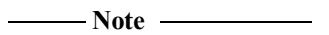

The GIC does not provide additional mechanisms for the virtualization of the GICD\_\*, GICR\_\*, and GITS\_\* registers. To virtualize VM accesses to these registers, the hypervisor must set stage 2 Data Aborts to those memory locations so that the hypervisor can emulate these effects. For more information about stage 2 Data Aborts, see *Arm® Architecture Reference Manual for A-profile architecture*.

When a GIC provides support for virtualization, the VM operates in an environment that has the following features:

- The vPE can be configured to receive virtual Group 0 interrupts.
- The vPE can be configured to receive virtual Group 1 interrupts.
- Virtual Group 0 interrupts are signaled using the virtual FIQ signal to EL1.
- Virtual Group 1 interrupts are signaled using the virtual IRQ signal to EL1.
- Virtual interrupts can be handled by the vPE as if they were physical interrupts.

| Note |  |
|------|--|
|------|--|

This applies when affinity routing and System register access are enabled. For information about support for virtual interrupts in legacy operation, see *[Support for legacy operation of VMs on page](#page-882-0) 15-883*.

EL2 controls the generation of virtual interrupts for a VM. This allows software executing at EL2 to:

- Generate virtual Group 0 and Group 1 interrupts for the vPE.
- Save and restore the interrupt state of the vPE.
- Control the prioritization of the virtual interrupts.
- Change the vPE that is scheduled.

GICv4 introduces the ability to present virtual LPIs from an ITS directly to a vPE, without hypervisor intervention.

Handling virtual interrupts in legacy operation requires a GICV\_\* memory-mapped interface. See *[Support for](#page-882-0)  [legacy operation of VMs on page](#page-882-0) 15-883* for more information.

### <span id="page-152-1"></span><span id="page-152-0"></span>**6.2 Operation overview**

GICv3 supports the Armv8-A and Armv9-A virtualization functionality. A hypervisor executing at EL2 uses the ICH\_\* System register interface to configure and control a virtual PE (vPE) executing at EL1. For information about the VM control interface, see *[Configuration and control of VMs on page](#page-156-1) 6-157*. A vPE uses the ICC\_\*\_EL1 System register interface to communicate with the GIC. The configuration of [HCR\\_EL2.](#page-28-2){IMO, FMO} determines whether the virtual or the physical interface registers are accessed.

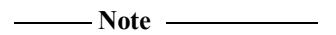

This chapter describes the handling of virtual interrupts in the context of the AArch64 state with System register access enabled. The individual AArch64 System register descriptions that are cross-referenced in this chapter contain a reference to the AArch32 System register that provides the same functionality. For information about VMs in legacy operation, see *[Support for legacy operation of VMs on page](#page-882-0) 15-883*.

Software executing at EL3 or EL2 configures the PE to route physical interrupts to EL2. The interrupt can be:

- An interrupt targeting a vPE. The hypervisor sets the corresponding virtual INTID to the pending state on the target vPE and includes the information about the associated physical INTID. When the vPE is not scheduled on a PE, the hypervisor might choose to reschedule the vPE. Otherwise the interrupt is left pending on the vPE for scheduling by the hypervisor at a later time.
- An interrupt targeting the hypervisor. This interrupt might:
  - Have been generated by the system.
  - Be a maintenance interrupt associated with a scheduled VM. See *[Maintenance interrupts on](#page-158-1)  page [6-159](#page-158-1)* for more details.
  - In GICv4, be a doorbell interrupt from an ITS. In GICv4, a virtual interrupt can be presented to a vPE without hypervisor involvement. A doorbell interrupt must be generated when a virtual interrupt is made pending for a vPE but the vPE is not scheduled on a PE.

The hypervisor handles physical interrupts according to the rules described in Chapter 4 *[Physical Interrupt](#page-48-1)  [Handling and Prioritization](#page-48-1)* before they are virtualized. For information about the handling of physical interrupts and their virtualization during legacy operation, see Chapter 15 *[Legacy Operation and Asymmetric Configurations](#page-876-1)*.

The GIC virtualization support includes a list of virtual interrupts for a vPE that is stored in hardware List registers, see *[Usage model for the List registers on page](#page-154-0) 6-155*. Each entry in the list corresponds to either a pending or an active interrupt, and the entry describes the virtual interrupt number, the interrupt group, the interrupt state, and the virtual priority of the interrupt. A virtual interrupt described in the list entry can be configured to be associated with a physical SPI or PPI.

The GIC implementation selects the highest priority pending virtual interrupt from the list of interrupts held in the List registers and, if it is of sufficient virtual priority compared to the active virtual interrupts and virtual priority mask, presents it as either a virtual FIQ or a virtual IRQ, depending on the group of the interrupt. The virtual CPU interface controls apply to the virtual interrupt in the same way as the physical interrupt controls apply to the physical interrupt. Therefore, using the virtual CPU interface controls, software executing on the vPE can:

- Set the virtual priority mask.
- Control how the virtual priority is split between the group priority and the subpriority.
- Acknowledge a virtual interrupt.
- Perform a priority drop on the virtual interrupt.
- Deactivate the virtual interrupt.

The virtual CPU interface supports both EOImodes, so that a virtual EOI can perform a priority drop alone, or a combined priority drop and deactivation.

When a virtual interrupt is acknowledged, then the state of the virtual interrupt changes from pending to active in the corresponding List register entry.

When a virtual interrupt is deactivated, the state of the virtual interrupt changes from active to inactive, or from active and pending to pending, in the corresponding List register entry. If the virtual interrupt is associated with a physical interrupt, and that physical interrupt is visible to the current Security state, then the associated physical interrupt is deactivated.

The following interrupts are visible to a Security state when deactivating a physical interrupt associated with a virtual interrupt:

- From Non-secure or Realm state:
  - Group 0 if [SCR\\_EL3.](#page-29-4)FIQ==0 and [GICD\\_CTLR](#page-543-0).DS==1.
  - Group 1 if [SCR\\_EL3.](#page-29-4)IRQ==0 and [GICD\\_CTLR](#page-543-0).DS==1.
  - Non-secure Group 1 if [SCR\\_EL3.](#page-29-4)IRQ==0 and [GICD\\_CTLR.](#page-543-0)DS==0.
- From Secure state:
  - Group 0 if [SCR\\_EL3.](#page-29-4)FIQ==0.
  - Group 1 if [SCR\\_EL3.](#page-29-4)IRQ==0 and [GICD\\_CTLR](#page-543-0).DS==1.
  - Secure Group 1 if [SCR\\_EL3.](#page-29-4)IRQ==0 and [GICD\\_CTLR.](#page-543-0)DS==0.
  - Non-secure Group 1 if [SCR\\_EL3.](#page-29-4)IRQ==0 and [GICD\\_CTLR.](#page-543-0)DS==0.

Virtual interrupts taken to EL1 are handled in a similar manner to physical interrupts that are handled in a system with a single Security state, that is where [GICD\\_CTLR](#page-543-0).DS is set to 1:

- Group 0 interrupts are signaled using the virtual FIQ signal.
- Group 1 interrupts are signaled using the virtual IRQ signal.
- Group 0 and Group 1 interrupts share an interrupt prioritization and preemption scheme. A minimum of 32 and a maximum of 256 priority levels are supported, as determined by the values in [ICH\\_VTR\\_EL2.](#page-364-0)

| Note |  |
|------|--|
|      |  |

The priority value is not subject to the shift used for Non-secure physical interrupts. While virtualization supports up to 8 bits of priority, a minimum of 5 and a maximum of 8 bits must be implemented.

| Note |  |
|------|--|
|------|--|

For information about the rules governing exception entry on an Armv8 or Armv9 PE, see *Arm® Architecture Reference Manual for A-profile architecture*.

Accesses at EL1 to Group 0 registers are virtual when:

- The current Security state is Non-secure and [HCR\\_EL2.](#page-28-2)FMO == 1.
- The current Security state is Secure, [HCR\\_EL2.](#page-28-2)FMO == 1 and [SCR\\_EL3](#page-29-4).EEL2 == 1.

Virtual accesses to the following Group 0 ICC\_\* registers access the ICV\_\* equivalents:

- Accesses to [ICC\\_AP0R<n>\\_EL1](#page-215-0) access [ICV\\_AP0R<n>\\_EL1.](#page-289-0)
- Accesses to [ICC\\_BPR0\\_EL1](#page-225-0) access [ICV\\_BPR0\\_EL1.](#page-296-0)
- Accesses to [ICC\\_EOIR0\\_EL1](#page-244-0) access [ICV\\_EOIR0\\_EL1.](#page-309-0)
- Accesses to [ICC\\_HPPIR0\\_EL1](#page-248-0) access [ICV\\_HPPIR0\\_EL1](#page-313-0).
- Accesses to [ICC\\_IAR0\\_EL1](#page-252-0) access [ICV\\_IAR0\\_EL1.](#page-317-0)
- Accesses to [ICC\\_IGRPEN0\\_EL1](#page-256-0) access [ICV\\_IGRPEN0\\_EL1.](#page-321-0)

Accesses at EL1 to Group 1 registers are virtual when:

- The current Security state is Non-secure and [HCR\\_EL2.](#page-28-2)IMO == 1.
- The current Security state is Secure, [HCR\\_EL2.](#page-28-2)IMO == 1 and [SCR\\_EL3](#page-29-4).EEL2 == 1.

Virtual accesses to the following Group 1 ICC\_\* registers access the ICV\_\* equivalents:

- Accesses to [ICC\\_AP1R<n>\\_EL1](#page-218-0) access [ICV\\_AP1R<n>\\_EL1.](#page-292-0)
- Accesses to [ICC\\_BPR1\\_EL1](#page-228-0) access [ICV\\_BPR1\\_EL1.](#page-299-0)
- Accesses to [ICC\\_EOIR1\\_EL1](#page-246-0) access [ICV\\_EOIR1\\_EL1.](#page-311-0)
- Accesses to [ICC\\_HPPIR1\\_EL1](#page-250-0) access [ICV\\_HPPIR1\\_EL1](#page-315-0).
- Accesses to [ICC\\_IAR1\\_EL1](#page-254-0) access [ICV\\_IAR1\\_EL1.](#page-319-0)
- Accesses to [ICC\\_IGRPEN1\\_EL1](#page-259-0) access [ICV\\_IGRPEN1\\_EL1.](#page-324-0)

Accesses at EL1 to the common registers are virtual when:

- The current Security state is Non-secure and [\(HCR\\_EL2.](#page-28-2)FMO == 1 || [HCR\\_EL2](#page-28-2).IMO == 1).
- The current Security state is Secure, [\(HCR\\_EL2.](#page-28-2)FMO == 1 || [HCR\\_EL2](#page-28-2).IMO == 1) and [SCR\\_EL3.](#page-29-4)EEL2 == 1.

Virtual accesses to the following Common ICC\_\* registers access the ICV\_\* equivalents:

- Accesses to [ICC\\_RPR\\_EL1](#page-269-0) access [ICV\\_RPR\\_EL1.](#page-332-0)
- Accesses to [ICC\\_CTLR\\_EL1](#page-232-0) access [ICV\\_CTLR\\_EL1.](#page-302-0)
- Accesses to [ICC\\_DIR\\_EL1](#page-242-0) access [ICV\\_DIR\\_EL1.](#page-307-0)
- Accesses to [ICC\\_PMR\\_EL1](#page-266-0) access [ICV\\_PMR\\_EL1.](#page-329-0)

A virtual write to [ICC\\_SGI0R\\_EL1,](#page-272-0) [ICC\\_SGI1R\\_EL1,](#page-275-0) or [ICC\\_ASGI1R\\_EL1](#page-222-0) traps to EL2.

Software executing at EL2 can access some ICV\_\* register state using [ICH\\_VMCR\\_EL2](#page-360-0) and [ICH\\_VTR\\_EL2](#page-364-0) as follows:

- [ICV\\_PMR\\_EL1](#page-329-0).Priority aliases [ICH\\_VMCR\\_EL2.](#page-360-0)VPMR.
- [ICV\\_BPR0\\_EL1.](#page-296-0)BinaryPoint aliases [ICH\\_VMCR\\_EL2](#page-360-0).VBPR0.
- [ICV\\_BPR1\\_EL1.](#page-299-0)BinaryPoint aliases [ICH\\_VMCR\\_EL2](#page-360-0).VBPR1.
- [ICV\\_CTLR\\_EL1](#page-302-0).EOImode aliases [ICH\\_VMCR\\_EL2](#page-360-0).VEOIM.
- [ICV\\_CTLR\\_EL1](#page-302-0).CBPR aliases [ICH\\_VMCR\\_EL2](#page-360-0).VCBPR.
- [ICV\\_IGRPEN0\\_EL1](#page-321-0)aliases [ICH\\_VMCR\\_EL2.](#page-360-0)VENG0.
- [ICV\\_IGRPEN1\\_EL1](#page-324-0). aliases [ICH\\_VMCR\\_EL2](#page-360-0).VENG1.
- [ICV\\_CTLR\\_EL1](#page-302-0).PRIbits aliases [ICH\\_VTR\\_EL2.](#page-364-0)PRIbits.
- [ICV\\_CTLR\\_EL1](#page-302-0).IDbits aliases [ICH\\_VTR\\_EL2](#page-364-0).IDbits.
- [ICV\\_CTLR\\_EL1](#page-302-0).SEIS aliases [ICH\\_VTR\\_EL2](#page-364-0).SEIS.
- [ICV\\_CTLR\\_EL1](#page-302-0).A3V aliases [ICH\\_VTR\\_EL2](#page-364-0).A3V.

#### <span id="page-154-0"></span>**6.2.1 Usage model for the List registers**

A fundamental function of an interrupt controller is to develop list of pending interrupts in priority order for each PE, and then to present the highest priority interrupt to the PE if the interrupt is of sufficient priority. For physical interrupts, this task is performed entirely in hardware by the GIC. However, in order to reduce the cost in hardware, the GIC handles virtual interrupts using both hardware and software.

For each physical interrupt received that is targeting a vPE, the hypervisor adds that interrupt to a prioritized list of pending virtual interrupts that is presented to the vPE. The GIC hardware also provides a set of List registers, [ICH\\_LR<n>\\_EL2](#page-352-0), that holds an IMPLEMENTATION DEFINED number of the top entries in the prioritized list for the currently running vPE. Typically, there are at most only a few pending virtual interrupts for that vPE. The interrupts in the List register are then handled by the vPE in hardware, providing the same behavior for the VM as is seen by a non-virtualized operating system handling physical interrupts.

However, the total number of interrupts that are pending, active and pending, or active, can exceed the number of List registers available. In this case, the hypervisor can save one or more entries to memory, and later restore them to the List registers based on their priority. In this way, the List registers act as a cache for the list of pending, active, or active and pending interrupts that are controlled by software, for a vPE.

The List registers provide maintenance interrupts for:

- The purpose of signaling when there are no pending interrupts in the List registers to allow the hypervisor to load more pending interrupts to the List registers.
- The purpose of signaling when the List registers are empty or nearly empty to allow the hypervisor to refill the List registers with entries from the list in memory.
- The purpose of signaling when an EOI has been received for an entry that is not in the List registers, which can occur if an active interrupt is held in memory.
- The enabling and disabling of virtual interrupt groups, which might result in a requirement to change the content of the List registers.

For more details on maintenance interrupts, see *[Maintenance interrupts on page](#page-158-1) 6-159*.


Although the List registers might include only active interrupts, with the hypervisor maintaining any pending interrupts in memory, a pending interrupt cannot be signaled to the vPE until the hypervisor adds it to the List registers. Therefore, to minimize interrupt latency and ensure the efficient operation of the vPE, Arm strongly recommends that the List registers contain at least one pending interrupt, if a List register is available for this interrupt.

The List registers form part of the context of the vPE. When there is switch from one vPE running on a PE to another vPE, the hypervisor switches the List registers accordingly.

The number of List registers is IMPLEMENTATION DEFINED, and can be discovered by reading [ICH\\_VTR\\_EL2.](#page-364-0)

The following pseudocode indicates the number of List registers that are implemented.

```
// NumListRegs()
// =============
// The number of implemented List Registers. This value is IMPLEMENTATION DEFINED.
integer NumListRegs()
    return integer IMPLEMENTATION_DEFINED "Number of List registers";
```

#### <span id="page-155-0"></span>**6.2.2 List register usage resulting in UNPREDICTABLE behavior**

The following cases are considered software programming errors and result in UNPREDICTABLE behavior:

- Having two or more interrupts with the same pINTID in the List registers for a single virtual CPU interface.
- Having a List register entry with [ICH\\_LR<n>\\_EL2.](#page-352-0)HW= 1, which is associated with a physical interrupt, in active state or in pending state in the List registers if the Distributor does not have the corresponding physical interrupt in either the active state or the active and pending state.
- If ICV\_CTLR\_EL1.EOImode ==0, then either:
  - Having an active interrupt in the List registers with a priority that is not set in the corresponding Active Priorities Register.
  - Having two interrupts in the List registers in the active state with the same preemption priority.
- When GICv4 is supported, having a valid List register and an ITS mapping for a vPE that use the same vINTID.
- When GICv4.1 is supported, having a valid List Register with vINTID set to an SGI and generating the same SGI for the vPE via the ITS.

### <span id="page-156-1"></span><span id="page-156-0"></span>**6.3 Configuration and control of VMs**

The virtual GIC works by holding a prioritized list of pending virtual interrupts for each PE. In GICv3 this list is compiled in software and a number of the top entries are held in List registers in hardware. For LPIs, this list can be compiled using tables for each vPE. These tables are controlled by the GICR\_\* registers.

A hypervisor uses a System register interface that is accessible at EL2 to switch context and to control multiple VMs. The context held in the ICH\_\* System registers is the context for the scheduled vPE. A vPE is scheduled when:

- [ICH\\_HCR\\_EL2.](#page-347-0)En == 1.
- [HCR\\_EL2.](#page-28-2)FMO == 1, when virtualizing Group 0 interrupts.
- [HCR\\_EL2.](#page-28-2)IMO == 1, when virtualizing Group 1 interrupts.
- The PE is executing at EL1 and either:

```
— SCR_EL3.NS == 1.
— SCR_EL3.EEL2 == 1.
```

When a vPE is scheduled, the ICH\_\*\_EL2 registers affect software executing at EL1.

The ICH\_\*\_EL2 registers control and maintain a vPE as follows:

- [ICH\\_HCR\\_EL2](#page-347-0) is used for the top-level configuration and control of virtual interrupts.
- Information about the implementation, such as the size of the supported virtual INTIDs and the number of levels of prioritization is read from [ICH\\_VTR\\_EL2](#page-364-0).
- A hypervisor can monitor and provide context for [ICV\\_CTLR\\_EL1](#page-302-0) using [ICH\\_VMCR\\_EL2](#page-360-0).
- A set of List registers, [ICH\\_LR<n>\\_EL2](#page-352-0), are used by the hypervisor to forward a queue of pending interrupts to the PE, see *[Usage model for the List registers on page](#page-154-0) 6-155*. The status of free locations in [ICH\\_LR<n>\\_EL2](#page-352-0) is held in [ICH\\_ELRSR\\_EL2.](#page-345-0)
- The end of interrupt status for the List registers is held in [ICH\\_EISR\\_EL2.](#page-343-0)
- The VM maintenance interrupt status is held in [ICH\\_MISR\\_EL2.](#page-357-0)
- The active priority status is held in:

```
— ICH_AP0R<n>_EL2, where n = 0-3.
— ICH_AP1R<n>_EL2, where n = 0-3.
```

#### **6.3.1 Association of virtual interrupts with physical interrupts**

A virtual interrupt can become pending in response to a physical interrupt, where, for example, the physical interrupt is being used by a peripheral that is owned by a particular VM, or it can be generated for other reasons by the hypervisor where there is no corresponding physical interrupt. This second case can be used, for example, when the hypervisor emulates a virtual peripheral.

To support these two models, for SPIs and PPIs, the GIC List registers provide a mechanism to configure a virtual interrupt be associated with a physical interrupt. The physical interrupt and the virtual interrupt do not necessarily have the same INTID.

#### **Usage model for associating a virtual interrupt with a physical interrupt**

A virtual interrupt can be associated with a physical interrupt as follows:

- 1. The hypervisor configures [ICC\\_CTLR\\_EL1.](#page-232-0)EOImode == 1, in this model.
- 2. On taking a physical PPI or a physical SPI that is targeting a vPE, the interrupt is taken to the hypervisor and is acknowledged by the hypervisor, making the physical interrupt active.
- 3. The hypervisor inserts a virtual interrupt to the list of pending interrupts for the targeted vPE. The hypervisor performs an EOI when it wants to do a priority drop for that interrupt. The hypervisor does not deactivate the interrupt.
- 4. When this virtual interrupt has a sufficiently high priority in the list of pending interrupts for that vPE, and that vPE is scheduled on the PE, the hypervisor writes this pending virtual interrupt into a List register, and [ICH\\_LR<n>\\_EL2](#page-352-0).HW is set to 1 to indicate that the virtual interrupt is associated with a physical interrupt. The INTID of the associated physical interrupt is held in the same List register.

5. When the vPE is running, it will take the pending virtual interrupt, and acknowledge it in the same way as it would acknowledge a physical interrupt, using the virtual CPU interface. When the interrupt handler running on the vPE has completed its task, and the virtual interrupt is to be deactivated, then the hardware deactivates both the virtual interrupt and the associated physical interrupt. The virtual interrupt might be deactivated as the result of either an end of interrupt, if [ICH\\_VMCR\\_EL2.](#page-360-0)VEOIM== 0, or as the result of a separate deactivation if [ICH\\_VMCR\\_EL2.](#page-360-0)VEOIM == 1.

#### **6.3.2 The Active Priorities registers**

<span id="page-157-0"></span>The active priority is held separately for virtual Group 0 and Group 1 interrupts, using [ICH\\_AP0R<n>\\_EL2](#page-335-0) and [ICH\\_AP1R<n>\\_EL2,](#page-339-0) where n = 0-3. The Active Priorities Registers have a bit for each priority group implemented by the implementation. In GICv3, virtualization supports up to 8 bits of priority. However, as a result of interrupt priority grouping, bit[0] cannot be used for preemption. This means that a maximum of 128 active priority bits are required to maintain context. The number of registers implemented is dependent on the number of group priority bits supported, as shown in [Table](#page-157-0) 6-1.

**Table 6-1 Group bit count in the hypervisor Active Priorities Registers**

| Bits | Register                                     | Number of registers |
|------|----------------------------------------------|---------------------|
| 5    | ICH_AP0R <n>_EL2<br/>ICH_AP1R<n>_EL2</n></n> | n = 0               |
| 6    | ICH_AP0R <n>_EL2<br/>ICH_AP1R<n>_EL2</n></n> | n = 0-1             |
| 7    | ICH_AP0R <n>_EL2<br/>ICH_AP1R<n>_EL2</n></n> | n = 0-3             |

If a bit is set to 1 in one of the [ICH\\_AP0R<n>\\_EL2](#page-335-0) registers, the equivalent bit in the [ICH\\_AP1R<n>\\_EL2](#page-339-0) register must be zero when executing in Non-secure EL1 or Non-secure EL0, otherwise the behavior of the GIC is UNPREDICTABLE.

If a bit is set to 1 in one of the [ICH\\_AP1R<n>\\_EL2](#page-339-0) registers, the equivalent bit in the [ICH\\_AP0R<n>\\_EL2](#page-335-0) register must be zero when executing in Non-secure EL1 or Non-secure EL0, otherwise the behavior of the GIC is UNPREDICTABLE.

[ICH\\_AP0R<n>\\_EL2](#page-335-0) provide a list of up to 128 bits where there is a bit for each implemented preemptible priority. If a bit is 1, this indicates that there is a Group 0 interrupt in that priority group which has been acknowledged but has not had a priority drop. If a bit is 0, this indicates that there is no Group 0 interrupt active at that priority, or that all active Group 0 interrupts within that priority group have undergone a priority drop.

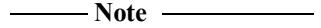

Writing to the Link registers does not have an effect on the Active Priorities Registers.

[ICH\\_AP1R<n>\\_EL2](#page-339-0) provide a list of up to 128 bits where there is a bit for each implemented preemptible priority. If a bit is 1, this indicates that there is a Group 1 interrupt in that priority group which has been acknowledged but has not had a priority drop. If a bit is 0, this indicates that there is no Group 1 interrupt active at that priority or that all active Group 1 interrupts within that priority group have undergone a priority drop.

Writing any value other than the last read value of the register, or all zeros, to these registers can cause:

- Virtual interrupts that would otherwise preempt execution to not preempt execution.
- Virtual interrupts that otherwise would not preempt execution to preempt execution at EL1 or EL0.

**Note**

Arm does not expect these registers to be read and written by software for any purpose other than:

- Saving and restoring state, as part of software power management.
- Context switching between vPEs on the same PE.

Writing to the Active Priority Registers in any order other than the following order results in UNPREDICTABLE behavior:

- 1. [ICH\\_AP0R<n>\\_EL2.](#page-335-0)
- 2. [ICH\\_AP1R<n>\\_EL2.](#page-339-0)

| Note |  |
|------|--|
|      |  |

An ISB is not required between the write to [ICH\\_AP0R<n>\\_EL2](#page-335-0) and the write to [ICH\\_AP1R<n>\\_EL2.](#page-339-0)

#### <span id="page-158-1"></span><span id="page-158-0"></span>**6.3.3 Maintenance interrupts**

Maintenance interrupts can signal key events in the operation of a GIC that implements virtualization. These events are processed by the hypervisor.

- **Note** Maintenance interrupts are generated only when the global enable bit for the virtual CPU interface, [ICH\\_HCR\\_EL2.](#page-347-0)En, is set to 1.
- Arm strongly recommends that maintenance interrupts are configured to use INTID 25. For more information, see *Server Base System Architecture (SBSA)*.

Maintenance interrupts are level-sensitive interrupts. Configuration bits in [ICH\\_HCR\\_EL2](#page-347-0) can be set to 1 to enable the generation of maintenance interrupts when:

- Group 0 virtual interrupts are enabled.
- Group 1 virtual interrupts are enabled.
- Group 0 virtual interrupts are disabled.
- Group 1 virtual interrupts are disabled.
- There are no pending interrupts in the List registers.
- At least one EOI request occurs with no valid List register entry for the corresponding interrupt.
- There are no valid entries, or there is only one valid entry, in the List registers. This is an underflow condition.
- At least one List register entry has received an EOI request.

See *[ICH\\_MISR\\_EL2, Interrupt Controller Maintenance Interrupt State Register on page](#page-357-0) 12-358* for more information about the control and status reporting of maintenance interrupts.

#### <span id="page-159-1"></span><span id="page-159-0"></span>**6.4 Pseudocode**

The following pseudocode indicates the number of virtual active priority bits.

```
// ActiveVirtualPRIBits()
// ======================
integer ActiveVirtualPRIBits()
    if VirtualPRIBits() == 8 then
        return 128;
    else
        return 2^(VirtualPREBits());
The following pseudocode indicates the highest active group virtual priority.
// GetHighestActiveVGroup()
// ========================
// Returns a value indicating the interrupt group of the highest priority
// bit set from two registers. Returns None if no bits are set.
IntGroup GetHighestActiveVGroup(bits(128) avp0, bits(128) avp1)
    for rval = 0 to ActiveVirtualPRIBits() - 1
        if avp0<rval> != '0' then
            return IntGroup_G0;
        elsif avp1<rval> != '0' then
            return IntGroup_G1NS;
    return IntGroup_None;
The following pseudocode indicates the highest active virtual priority.
// GetHighestActiveVPriority()
// ===========================
// Returns the index of the highest priority bit set from two registers.
// Returns 0xFF if no bits are set.
bits(8) GetHighestActiveVPriority(bits(128) avp0, bits(128) avp1)
    for rval = 0 to ActiveVirtualPRIBits() - 1
        if avp0<rval> != '0' || avp1<rval> != '0' then
            return rval<7:0>;
    return Ones();
The following pseudocode indicates whether any bits are set in the supplied Active Priorities registers.
// VPriorityBitsSet()
// ==================
// Returns TRUE if any bit is set in the supplied registers, FALSE otherwise
boolean VPriorityBitsSet(bits(128) avp0, bits(128) avp1)
    for i = 0 to ActiveVirtualPRIBits() - 1
        if avp0<i> != '0' || avp1<i> != '0' then
            return TRUE;
    return FALSE;
The following pseudocode clears the highest priority bit in the supplied virtual Active Priorities registers.
// VPriorityDrop()
// ===============
// Clears the highest priority bit set in the supplied registers.
VPriorityDrop[bits(128) &avp0, bits(128) &avp1] = bit v
    assert IsZero(v);
    if HaveNMI() && (ICH_AP1R_EL2.NMI == '1') then
        ICH_AP1R_EL2.NMI = '0';
```

```
return;
    for i = 0 to ActiveVirtualPRIBits() - 1
        if avp0<i> != v then
             avp0<i> = v;
             return;
        elsif avp1<i> != v then
             avp1<i> = v;
             return;
    return;
The following pseudocode determines which active bits are set.
// FindActiveVirtualInterrupt()
// ============================
// Find a matching List register. Returns -1 if there is no match.
integer FindActiveVirtualInterrupt(bits(INTID_SIZE) vID)
    for i = 0 to NumListRegs() - 1
        if ((ICH_LR_EL2[i].State IN {IntState_Active, IntState_ActivePending}) &&
            ICH_LR_EL2[i].vINTID<INTID_SIZE-1:0> == vID) then
            return i;
    return -1;
The following pseudocode indicates the virtual group priority based on the minimum Binary Point register.
// VPriorityGroup()
// ================
// Returns the priority group field for the minimum BPR value
bits(8) VPriorityGroup(bits(8) priority, integer group)
    integer vpre_bits = VirtualPREBits();
    mask = Ones(vpre_bits):Zeros(8 - vpre_bits);
    return (priority AND mask);
The following pseudocode indicates the virtual group priority based on the appropriate Binary Point register. 
// VGroupBits()
// ============
// Returns the priority group field for the current BPR value for the group
bits(8) VGroupBits(bits(8) priority, bit group)
    if IsSecure() then
       bpr = UInt(ICH_VMCR_EL2.VBPR1);
    else
       bpr = UInt(ICH_VMCR_EL2.VBPR1) -1;
    if group == '0' || ICH_VMCR_EL2.VCBPR == '1' then
      bpr = UInt(ICH_VMCR_EL2.VBPR0);
    mask = Ones(7-bpr):Zeros(bpr+1);
    return (priority AND mask);
The following pseudocode indicates the number of virtual ID bits.
// VIDBits()
// =========
integer VIDBits()
    id_bits = ICH_VTR_EL2.IDbits;
    case id_bits of
        when '000' return 16;
        when '001' return 24;
        otherwise Unreachable();
```

```
The following pseudocode indicates the number of virtual preemption bits.
// VirtualPREBits()
// ================
integer VirtualPREBits()
    return UInt(ICH_VTR_EL2.PREbits) + 1;
The following pseudocode indicates the number of virtual priority bits.
// VirtualPRIBits()
// ================
integer VirtualPRIBits()
    return UInt(ICH_VTR_EL2.PRIbits) + 1;
```

## <span id="page-162-1"></span><span id="page-162-0"></span>Chapter 7 **GICv4.0 Virtual LPI Support**

This chapter describes the fundamental aspects of GICv4.0 virtual LPI support:

- *[About GICv4.0 virtual Locality-specific Peripheral Interrupt support on page](#page-163-1) 7-164*.
- *[Direct injection of virtual interrupts on page](#page-164-1) 7-165*.

### <span id="page-163-1"></span><span id="page-163-0"></span>**7.1 About GICv4.0 virtual Locality-specific Peripheral Interrupt support**

In GICv3, the hypervisor uses the System registers to present LPIs to a virtualized system. A *virtual LPI* (vLPI) is generated when the hypervisor writes a vINTID corresponding to the LPI range, to a List register, in this case, the vINTID that has a value greater than 8191. As an LPI does not have an active state, it is not possible to associate a virtual LPI with a physical interrupt.

GICv4 provides support for the direct injection of vLPIs, in the LPI INTID range. With the direct injection of vLPIs, the GICR\_\* registers use structures in memory for each vPE to hold LPI configuration and pending information for vLPIs in the same way that they use structures in memory to hold LPI configuration and pending information for physical LPIs.

However, the virtual structures are different from the physical structures, with the vLPI tables for the current vPE scheduled on a PE by [GICR\\_VPENDBASER](#page-714-0) and [GICR\\_VPROPBASER](#page-720-0) in the Redistributor associated with that PE. For more information about the physical LPI tables, see *[LPI Configuration tables on page](#page-88-0) 5-89* and *[LPI](#page-89-0)  [Pending tables on page](#page-89-0) 5-90*.

When scheduling a vPE, [GICR\\_VPENDBASER.](#page-714-0)IDAI can be cleared to 0:

- When the vPE was last scheduled on a Redistributor on the same GIC.
- When the vPE is scheduled for the first time after the initial allocation, and the entire virtual LPI Pending table contained only zeros on initial allocation.
- In IMPLEMENTATION DEFINED cases.

Clearing [GICR\\_VPENDBASER.](#page-714-0)IDAI to 0 at any other time results in UNPREDICTABLE behavior.

The Redistributor associated with the PE on which the vPE is scheduled determines the highest priority pending vLPI, and forwards this to the virtual CPU interface of the vPE. This vLPI and the interrupts in the List register are then prioritized together to determine the highest priority pending virtual interrupt for the vPE.

For information about virtual LPIs and the virtual CPU tables, see *[The vPE table on page](#page-96-3) 5-97*.

#### <span id="page-164-1"></span><span id="page-164-0"></span>**7.2 Direct injection of virtual interrupts**

The ITS maps an EventID and a DeviceID to an INTID associated with a PE, see *[The Interrupt Translation Service](#page-91-0) [on page](#page-91-0) 5-92* for more information. GICv4 introduces the ability to generate a virtual LPI without involving the hypervisor. In this case, an ITS maps the EventID for the interrupt translation using the following mechanism:

- The ITS interruption translation table entry for a vLPI is configured with:
  - A control flag that indicates that the EventID is associated with a virtual LPI.
  - A vPEID to index in to the ITS vPE table. For more information about vPEID and the vPE table, see *[The vPE table on page](#page-96-3) 5-97*. The vPE table provides the base address of the GICR\_\* registers in the format defined by [GITS\\_TYPER](#page-847-0).PTA and the base address of the virtual LPI Pending table associated with the target VM.
  - A virtual INTID (vINTID) that indicates which vLPI becomes pending.
  - A physical INTID (pINTID) that can be used as a doorbell interrupt to the hypervisor if the vPE is not scheduled on a PE. The value 1023 is used where a doorbell interrupt is not required, otherwise an INTID in the physical LPI range must be provided.

#### When EL3 is present:

- Virtual interrupts received by direct-injection are only considered when determining the highest priority pending virtual interrupt in Non-secure state.
- Directly-injected virtual interrupts are not signaled as exceptions in Secure state or reported through ICV registers.

| Note |  |
|------|--|
|      |  |

When an implementation uses the GIC Stream protocol, there is no restriction on the IRI sending VSET commands while the PE is in Secure state. However, the PE does not signal these interrupts as exceptions while in Secure state, even when SCR\_EL3.EEL2==1.

#### When EL3 is not present:

• Virtual LPIs that are received by direct injection can be signaled in whichever Security state the PE supports.

#### For more information about:

- Physical LPIs, see *[LPIs on page](#page-85-0) 5-86*.
- The ITS and format of an Interrupt translation table (ITT), see *[The Interrupt Translation Service on](#page-91-0)  [page](#page-91-0) 5-92*.
- The commands used to control the handling of virtual LPIs associated with an ITS, see [Table](#page-100-3) 5-6 on page [5-101](#page-100-3) and the following commands:
  - *[VINVALL on page](#page-119-3) 5-120*.
  - *[VMAPI on page](#page-120-2) 5-121*.
  - *[VMAPP GICv4.0 on page](#page-122-2) 5-123*.
  - *[VMAPTI on page](#page-125-2) 5-126*.
  - *[VMOVI on page](#page-127-2) 5-128*.
  - *[VMOVP GICv4.0 on page](#page-129-2) 5-130*.
  - *[VSYNC on page](#page-133-2) 5-134*.

The GIC hardware determines whether the vPE is scheduled on a PE when:

- [GICR\\_VPENDBASER](#page-714-0).Valid == 1.
- [GICR\\_VPENDBASER](#page-714-0).Physical\_Address holds the same value as defined in the VPT\_addr field in the [VMAPP GICv4.0](#page-122-2) command for the vPE that is the target of the vLPI.

If, at the time that a vPE is descheduled from a PE, there are one or more vLPIs pending for the PE, [GICR\\_VPENDBASER](#page-714-0).PendingLast is set to 1. This can be used by the hypervisor to make scheduling decisions.

#### <span id="page-165-0"></span>**7.2.1 Doorbell interrupts**

When an interrupt that targets a vPE is pending, it might target a vPE that is not currently scheduled on a PE. Where those interrupts are presented as physical interrupts, the hypervisor can schedule the vPE as a result of those interrupts. In this case, the hypervisor can make the scheduling decisions for the vPE based on the full set of pending virtual interrupts for the vPE.

The equivalent capability is provided in the case of direct injections of vLPIs by the provision of doorbell LPIs.

For a vLPI, the ITS can configure a physical LPI that is sent to a PE when the vLPI becomes pending and the vPE is not scheduled on that PE. This physical LPI is a Doorbell LPI.

## <span id="page-166-1"></span><span id="page-166-0"></span>Chapter 8

## **GICv4.1 Virtual Interrupt Support**

This chapter describes the fundamental aspects of GICv4.1 virtual interrupt handling and prioritization:

- *[About GICv4.1 virtual interrupt support on page](#page-167-1) 8-168*.
- *[Changes to the CPU interface on page](#page-168-1) 8-169*.
- *[ITS commands on page](#page-169-1) 8-170*.
- *[vPEID width on page](#page-170-1) 8-171*.
- *[Doorbells on page](#page-171-1) 8-172*.
- *[vPE residency and locating data structures on page](#page-173-1) 8-174*.
- *[Register based vLPI invalidation on page](#page-175-1) 8-176*.
- *[Direct injection of vSGIs on page](#page-176-1) 8-177*.

#### <span id="page-167-1"></span><span id="page-167-0"></span>**8.1 About GICv4.1 virtual interrupt support**

GICv4.1 extends support for direct injection of virtual interrupts to SGIs. It makes direct injection simpler and more efficient for software to use through the following changes:

- A structure to track the pending and configuration tables for all active vPEs.
- Register-based invalidation options for virtual interrupt configuration.
- Modifications to simplify the recovery of memory allocated to the GIC when no longer in use.

Support for legacy mode is obsolete in GICv4.1 and the ARE bits are RES1.

#### <span id="page-168-1"></span><span id="page-168-0"></span>**8.2 Changes to the CPU interface**

GICv4.1 introduces changes to the CPU interface.

ID\_AA64PFR0\_EL1.GIC==b0011 indicates support for GICv4.1.

Delivering a vSGI to a PE with ID\_AA64PFR0\_EL1.GIC==b0001 is CONSTRAINED UNPREDICTABLE:

- The interrupt is ignored.
- The interrupt is delivered.

[ICH\\_HCR\\_EL2.](#page-347-0)vSGIEOICount controls whether deactivations of vSGIs increment [ICH\\_HCR\\_EL2](#page-347-0).EOIcount.

### <span id="page-169-1"></span><span id="page-169-0"></span>**8.3 ITS commands**

Specifying a vPEID beyond the implemented range in any ITS command is CONSTRAINED UNPREDICTABLE, with two options:

- A command error is generated.
- The ITS ignores unimplemented vPEID bits.

Specifying a vPEID beyond the configured vPEID size generates a command error in most commands.

#### <span id="page-170-1"></span><span id="page-170-0"></span>**8.4 vPEID width**

GICv4.1 permits vPEID widths of between 1 and 16 bits. The VIL and VID fields in [GICD\\_TYPER2](#page-621-0) together report the implemented vPEID width.

Software can configure a smaller vPEID width when allocating the Redistributor vPE Configuration tables and ITS vPE tables.

#### <span id="page-171-1"></span><span id="page-171-0"></span>**8.5 Doorbells**

The *Doorbell* mechanism supported in GICv4.0 is referred to as *Individual doorbells* in GICv4.1. Doorbell interrupts target the Redistributor the vPE is currently mapped to, based on the previous VMAPP or VMOVP command for the vPE.

#### **8.5.1 Individual doorbells**

Support for individual doorbells is IMPLEMENTATION DEFINED in GICv4.1 and reported by [GITS\\_TYPER](#page-847-0).nID. All ITSs connected to a single GIC have the same value of [GITS\\_TYPER.](#page-847-0)nID.

When [GITS\\_TYPER.](#page-847-0)nID==1, the Dbell\_pINTID field in VMAPTI and VMAPI is treated as being 1023.

When a vLPI from the ITS becomes pending, an individual doorbell interrupt is generated if all of the following conditions apply:

- [GITS\\_TYPER](#page-847-0).nID==0
- The target vPE is not scheduled.
- An individual doorbell pINTID was supplied by the ITS mapping for the EventID/DeviceID combination.

Virtual SGIs cannot trigger individual doorbells and it is IMPLEMENTATION DEFINED whether a virtual interrupt that triggers an individual doorbell also triggers a default doorbell.

#### **8.5.2 Default doorbells**

GICv4.1 provides a new default doorbell per vPEID, specified as part of the VMAPP command.

When an EventID or a DeviceID is mapped to a virtual interrupt, a doorbell INTID can be specified in the VMAPI or VMAPTI command. If no doorbell is specified, the default doorbell for the vPE is used, if one was specified.

A default doorbell interrupt is generated when all of the following conditions are met:

- A virtual interrupt, which is individually enabled, becomes pending, or a virtual interrupt becomes enabled while pending.
  - It is IMPLEMENTATION DEFINED whether the GIC factors in the Group enables from [GICR\\_VPENDBASER](#page-714-0) when the vPE was last scheduled. For vPEs that have never been scheduled, the Group enables are treated as being 1.
- The vPE is not scheduled.
- When that vPE was last made non-scheduled, [GICR\\_VPENDBASER.](#page-714-0)doorbell was written as 0b1
  - When a vPE is created, it is treated as being made non-scheduled with [GICR\\_VPENDBASER](#page-714-0).doorbell written as 0b1.

| In some circumstances GICR_VPENDBASER.doorbell behaves as if 0b0 even when written as 0b1, refer to |
|-----------------------------------------------------------------------------------------------------|
|                                                                                                     |

- A default doorbell was supplied by the ITS mapping for the vPEID.
- The default doorbell for this vPE has not been acknowledged since the vPE was last made non-resident.

If the default doorbell for a vPE is pending, but there are no individually enabled and pending interrupts for the vPE, it is IMPLEMENTATION DEFINED whether the pending state of the default doorbell is cleared.

If the virtual interrupt is individually disabled, or part of a disabled Group, no default doorbell interrupt is generated. This is different to GICv4.0, where doorbell generation was independent of the enabled state of the vLPI.

[GICR\\_VPENDBASER](#page-714-0).doorbell allows a software to indicate to the IRI whether default doorbells are to be generated for the vPE. It does not affect the generation of individual doorbells.

Between being made non-scheduled and then being made scheduled, a default doorbell of a vPE is set to pending at most once. The default doorbell for a vPE might be set to pending speculatively, if all the conditions other than the arrival of a virtual interrupt are met. This does not override the requirement that a default doorbell is only set to pending at most once between being residences. Setting a vPE as scheduled clears the pending state of its default doorbell.

#### <span id="page-173-1"></span><span id="page-173-0"></span>**8.6 vPE residency and locating data structures**

A vPE Configuration table stores the locations of each vPE LPI Configuration and Pending table. The [GICR\\_VPROPBASER](#page-720-0) register on each Redistributor points to the vPE Configuration table, and vPEID indexes the table. A vPE is scheduled by writing its vPEID to [GICR\\_VPENDBASER,](#page-714-0) selecting an entry from the vPE Configuration table. A system can contain multiple copies of the vPE Configuration table. This structure is shown in [Figure](#page-173-2) 8-1.

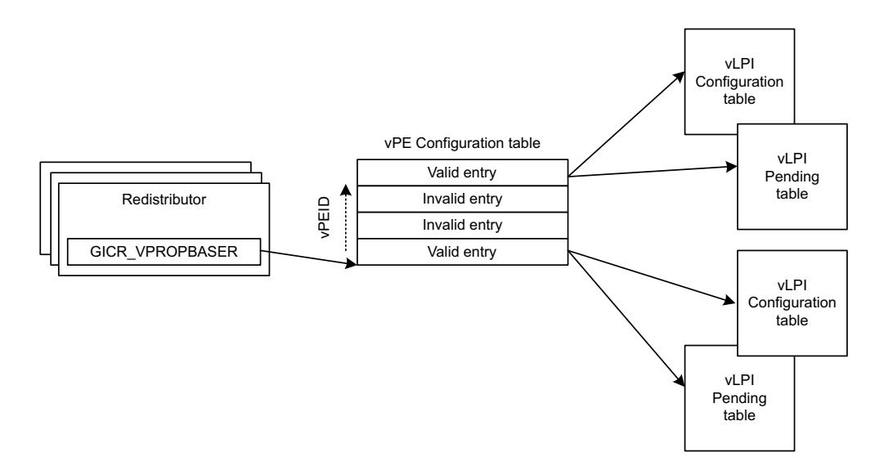

**Figure 8-1 Redistributor and the vPE Configuration table**

#### <span id="page-173-2"></span>**8.6.1 vPE Configuration table**

The format of the vPE Configuration table is IMPLEMENTATION DEFINED. [GICR\\_VPROPBASER.](#page-720-0)Z indicates whether the table contains all zeros. If the vPE Configuration table does not contain all zeros on initial allocation, the behavior is UNPREDICTABLE. When [GICR\\_VPROPBASER](#page-720-0).Z==0, the memory contents are not zero and contain valid data.

[GICR\\_VPROPBASER](#page-720-0).Valid indicates whether the vPE Configuration table is valid. If the vPE Configuration table is written by any agent other than the GIC when any Redistributor pointing at that table has [GICR\\_VPROPBASER](#page-720-0).Valid==1, the behavior is UNPREDICTABLE. When no Redistributor with [GICR\\_VPROPBASER](#page-720-0).Valid==1 has a pointer to a vPE Configuration table, there are no cached copies of that vPE Configuration table in any Redistributor.

When [GICR\\_VPROPBASER.](#page-720-0)Valid is written from 1 to 0, all other read/write fields in the register become UNKNOWN. After writing [GICR\\_VPROPBASER.](#page-720-0)Valid from 1 to 0, when [GICR\\_CTLR](#page-640-0).RWP==0, there are no further accesses to the vPE Configuration table by that Redistributor.

[GICR\\_VPROPBASER](#page-720-0).Valid can be written from 1 to 0 while another Redistributor in the same CommonLPIAff group has [GICR\\_CTLR.](#page-640-0)RWP==1 due a previous write of [GICR\\_VPROPBASER.](#page-720-0)Valid from 1 to 0. If [GICR\\_VPROPBASER](#page-720-0).Valid is written from 0 to 1 when any Redistributor in the same CommonLPIAff group has [GICR\\_CTLR](#page-640-0).RWP==1 due a previous write of Valid from 1 to 0, the result is UNPREDICTABLE.

Writing [GICR\\_VPROPBASER](#page-720-0) when [GICR\\_CTLR](#page-640-0).RWP==1 due a previous write of [GICR\\_VPROPBASER.](#page-720-0)Valid from 1 to 0 on that Redistributor causes UNPREDICTABLE behavior.

A system can include one or more copies of the vPE Configuration table. Redistributors that are part of the same CommonLPIAff group, as defined by [GICR\\_TYPER.](#page-710-0)CommonLPIAff, must use the same copy of the vPE Configuration table. Redistributors that are part of different CommonLPIAff groups use different copies of the vPE Configuration table.

| Note |  |
|------|--|
|------|--|

The vPE Configuration table is populated as a side effect of the VMAPP commands issued through the ITS. It is not intended to be accessed directly by software.

#### **8.6.2 Residency and mapping restrictions**

If the target Redistributor has [GICR\\_VPROPBASER](#page-720-0).Valid==0, a VMAPP command with V==1 has one of the following CONSTRAINED UNPREDICTABLE effects:

- The mapping is discarded.
- The mapping is made using the vPE Configuration table from an UNKNOWN Redistributor with [GICR\\_VPROPBASER](#page-720-0).Valid==1.

If the target Redistributor has [GICR\\_VPROPBASER](#page-720-0).Valid==0, a VMOVP command has one of the following CONSTRAINED UNPREDICTABLE effects:

- The mapping is not moved.
- The mapping is moved.
- The mapping is discarded.

If the specified vPEID is beyond the range of the vPE Configuration table, a VMAPP command with V==1 has one of the following CONSTRAINED UNPREDICTABLE effects unless the command causes a command error:

- The command is ignored.
- The vPEID is treated as an UNKNOWN legal value.

If the specified vPEID is beyond the range of the vPE Configuration table, a VMOVP command has one of the following CONSTRAINED UNPREDICTABLE effects unless the command causes a command error:

- The command is ignored.
- The vPEID is treated as an UNKNOWN legal value.

If there are any ITS vPEID mappings that target the Redistributor, the effect of clearing [GICR\\_VPROPBASER](#page-720-0).Valid from 1 to 0 is UNPREDICTABLE.

| Note |  |
|------|--|
|      |  |

Arm strongly recommends that all vPE mappings are removed from a Redistributor before clearing [GICR\\_VPROPBASER](#page-720-0).Valid.

If a vPEID is scheduled on multiple Redistributors at the same time, the effect is UNPREDICTABLE.

If a vPEID is scheduled on any Redistributor when there is no current ITS mapping for that vPEID, one of the following CONSTRAINED UNPREDICTABLE effects occurs:

- [GICR\\_VPENDBASER](#page-714-0).vPEID is treated as having an UNKNOWN valid value for all purposes other than a direct read of the register.
- [GICR\\_VPENDBASER](#page-714-0).Valid is treated as being set to 0 for all purposes other than a direct read of the register.
- The vPEID is treated as mapped with an UNKNOWN configuration.

A vPEID can be scheduled on the Redistributor it is mapped to in the ITSs, or any other Redistributor within the same CommonLPIAff group. Scheduling a vPEID on a Redistributor in a different CommonLPIAff group has one of the following CONSTRAINED UNPREDICTABLE effects:

- Pending interrupts are not delivered.
- Interrupts are delivered that are not pending.
- Incorrect configuration might be used for interrupts.
- The guarantees on doorbell interrupts might not be respected.

If a vPEID is scheduled on any Redistributor when a VMOVP is issued for it, the result is UNPREDICTABLE.

#### <span id="page-175-1"></span><span id="page-175-0"></span>**8.7 Register based vLPI invalidation**

Cached configuration data of a specific LPI can be invalidated using the [GICR\\_INVLPIR](#page-677-0) register, or all LPIs using the [GICR\\_INVALLR](#page-675-0) register, as follows:

- Writing [GICR\\_INVLPIR.](#page-677-0)V == 0 or [GICR\\_INVALLR.](#page-675-0)V == 0 performs the invalidation on the physical INTID space.
- Writing [GICR\\_INVLPIR](#page-677-0).V == 1 or [GICR\\_INVALLR.](#page-675-0)V == 1 performs the invalidation on the virtual INTID space identified by the [GICR\\_INVLPIR](#page-677-0).vPEID or [GICR\\_INVALLR](#page-675-0).vPEID field, respectively.

When writing [GICR\\_INVLPIR.](#page-677-0)V == 1, the invalidation operation has no effect when any of the following occur:

- The [GICR\\_INVLPIR.](#page-677-0)INTID field is outside the supported LPI range for that vPE.
- The [GICR\\_INVLPIR.](#page-677-0)INTID field is not an LPI.

Issuing a register-based invalidation operation for a vPEID not mapped to that Redistributor, or another Redistributor within the same CommonLPIAff group, has one of the following CONSTRAINED UNPREDICTABLE effects:

- The operation is ignored.
- The invalidation is completed affecting an UNKNOWN subset of the Redistributors.
- The invalidation is completed affecting all Redistributors.

When writing [GICR\\_INVLPIR](#page-677-0) or [GICR\\_INVALLR,](#page-675-0) [GICR\\_SYNCR](#page-709-0).Busy tracks invalidates issued on the same Redistributor:

- [GICR\\_SYNCR](#page-709-0).Busy == 1 until the invalidation completes.
- When [GICR\\_SYNCR.](#page-709-0)Busy == 0, the invalidate is complete and the effects of the invalidation are visible on all Redistributors, unless specified otherwise.

Writing [GICR\\_INVLPIR](#page-677-0) or [GICR\\_INVALLR](#page-675-0) when [GICR\\_SYNCR.](#page-709-0)Busy==1 has one of the following CONSTRAINED UNPREDICTABLE effects:

- The write is IGNORED.
- The invalidate specified by the write is performed.

The effect of register based invalidate is only guaranteed to be visible to an ITS command after [GICR\\_SYNCR](#page-709-0) records it as complete. Issuing an ITS command when there is an outstanding register based invalidate for an affected interrupt has one of the following CONSTRAINED UNPREDICTABLE effects:

- The effect of the invalidate is applied before the ITS command.
- The invalidate is ignored.

Issuing a register based invalidate for an interrupt when there is an outstanding ITS command that affects the interrupt has one of the following CONSTRAINED UNPREDICTABLE effects:

- The effect of the invalidate is applied before the ITS command.
- The effect of the invalidate is applied after the ITS command.
- The invalidate is ignored.

The [GICR\\_INVLPIR,](#page-677-0) [GICR\\_INVALLR,](#page-675-0) and [GICR\\_SYNCR](#page-709-0) registers are mandatory in GICv4.1.

### <span id="page-176-1"></span><span id="page-176-0"></span>**8.8 Direct injection of vSGIs**

A new mechanism is introduced to allow SGIs to be directly injected via the ITS. This mechanism still requires a trap to the hypervisor on the sending PE but removes the need for a trap to the hypervisor on the receiving PE. There are limitations on these controls:

- The ITS controls must only be used on an ITS that has a mapping for that vPEID.
  - Where multiple ITSs have a mapping for the vPEID, any ITS with a mapping may be used.
- The Redistributor controls must only be used on the currently targeted Redistributor, or on a Redistributor within the same CommonLPIAff group. The vPEID does not need to be currently scheduled, only mapped.
  - Where multiple ITSs have a mapping for the vPEID, any ITS with a mapping may be used.

Failure to follow these guidelines can lead to UNPREDICTABLE behaviors.

There is no control to query the current configuration of a vSGI. Software must keep its own copy of the current configuration of a vSGI to emulate reads of the GICR\_IxxxR0 SGI configuration fields. vSGIs received through direct injection do not have an Active state.

#### **8.8.1 Generating a vSGI**

When [GITS\\_CTLR.](#page-833-0)Enabled==1 and [GITS\\_CTLR.](#page-833-0)Quiescent==0, a write to [GITS\\_SGIR](#page-842-0) results in a virtual interrupt being generated with the vPEID and vINTID from the write. If the vPEID is not mapped on any ITS, the write is silently discarded. If the vPEID is not mapped on this ITS, but is mapped on a different ITS, it is CONSTRAINED UNPREDICTABLE whether the interrupt is delivered or discarded. Virtual SGIs have no priority shift.

#### **8.8.2 Storing vSGI state and configuration**

The last 128 bits of the IMPLEMENTATION DEFINED region in the virtual LPI Pending table are redefined for use storing SGI configuration and state. The format of this space is:

**Table 8-1** Virtual LPI Pending table

| 31     | 24<br>23         | 16<br>15         | 8<br>7          | 0     | Offset from<br>start of<br>Pending table |
|--------|------------------|------------------|-----------------|-------|------------------------------------------|
|        | Enable           |                  | Pending         |       | +0x3F0                                   |
|        | NMIa             |                  | Group           |       | +0x3F4                                   |
| PRI_7  | PRI_6<br>PRI_5   | PRI_4<br>PRI_3   | PRI_2<br>PRI_1  | PRI_0 | +0x3F8                                   |
| PRI_15 | PRI_14<br>PRI_13 | PRI_12<br>PRI_11 | PRI_10<br>PRI_9 | PRI_8 | +0x3FC                                   |

- a. When GICv4.2 is supported, otherwise RES0.
- Pending[n]: The pending state of vSGI n:
  - 0 Not pending.
  - 1 Pending.
- Enable[n]: The enable state of vSGI n:
  - 0 Disabled.
  - 1 Enabled.
- Group[n]: The Group of vSGI n:
  - Group 0.
  - Group 1.
- NMI[n]: When GICv4.2 is implemented, the non-maskable property of vSGI n:
  - 0 Corresponding interrupt does not have NMI property.

— 1 - Corresponding interrupt has NMI property.

PRI\_<n>: Bits [7:4] of vSGI's priority, bits [3:0] are treated as b0000.

#### **8.8.3 Emulating GICR\_I[C|S]PENDR0**

Writing [GICR\\_VSGIR](#page-726-0) queries the pending state of the virtual SGIs belonging to the specified vPE. [GICR\\_VSGIPENDR.](#page-725-0)Busy determines when the query is complete, as follows:

- [GICR\\_VSGIPENDR.](#page-725-0)Busy == 1 until the query completes.
- When [GICR\\_VSGIPENDR.](#page-725-0)Busy == 0, the pending state of the vSGIs belonging to that vPE is reported in [GICR\\_VSGIPENDR.](#page-725-0)Pending.

GICR\_VSGIRPEND.Pending returns an UNKNOWN value in the following cases:

- When [GICR\\_VSGIPENDR.](#page-725-0)Busy == 1.
- Writing a vPEID that is invalid or that is not mapped to this CommonLPIAff Redistributor group.

Writing [GICR\\_VSGIR](#page-726-0) when [GICR\\_VSGIPENDR.](#page-725-0)Busy == 1 has one of the following CONSTRAINED UNPREDICTABLE effects:

- The write is ignored.
- The write causes a fresh look up to occur.

The VSGI command allows writes to [GICR\\_ISPENDR0](#page-691-0) to be emulated. Writes to [GICR\\_ISPENDR0](#page-691-0) can be emulated using [GITS\\_SGIR](#page-842-0).

## <span id="page-178-1"></span><span id="page-178-0"></span>Chapter 9 **Memory Partitioning and Monitoring**

This chapter describes *Memory Partitioning and Monitoring* (MPAM) as it applies to the GICv3 architecture. It contains the following sections:

- *[Overview on page](#page-179-1) 9-180*.
- *[MPAM and the Redistributors on page](#page-180-1) 9-181*.
- *[MPAM and the ITS on page](#page-181-1) 9-182*.
- *[GIC usage of MPAM on page](#page-182-1) 9-183*.
- *[GICv4.1 data structures and MPAM on page](#page-183-1) 9-184*.

#### <span id="page-179-1"></span><span id="page-179-0"></span>**9.1 Overview**

The GIC optionally supports MPAM. This support is limited to providing controls for software to set the Partition IDs (PARTIDs) that are used when the GIC accesses memory. A PARTID is an MPAM ID that indicates which memory system performance resource partition to use in the memory system components.

When [GICD\\_CTLR](#page-543-0).DS == 0, all PARTIDs that are used by the GIC are Non-secure MPAM IDs, and are communicated with the MPAM\_NS indicator as true.

When [GICD\\_CTLR](#page-543-0).DS == 1, whether PARTIDs are Non-secure or Secure MPAM IDs is IMPLEMENTATION DEFINED.

Arm recommends that in a system that supports MPAM, software is able to control the PARTID that is used by the GIC when accessing data structures and the structures in memory.

See the following sections for more details on these structures:

- *[LPI Configuration tables on page](#page-88-0) 5-89*.
- *[LPI Pending tables on page](#page-89-0) 5-90*.
- *[Virtual LPI Configuration tables and virtual LPI Pending tables on page](#page-90-0) 5-91*.
- *[The Device table on page](#page-94-1) 5-95*.
- *[The Interrupt translation table on page](#page-95-4) 5-96*.
- *[The Collection table on page](#page-96-4) 5-97*.
- *[The vPE table on page](#page-96-3) 5-97*.
- *[The ITS command interface on page](#page-97-1) 5-98*.

### <span id="page-180-1"></span><span id="page-180-0"></span>**9.2 MPAM and the Redistributors**

[GICR\\_TYPER.](#page-710-0)MPAM reports support for MPAM, and all Redistributors that are part of the same IRI report the same value of [GICR\\_TYPER.](#page-710-0)MPAM.

[GICR\\_MPAMIDR](#page-695-0) reports the PMG and PARTID sizes that are supported.

[GICR\\_PARTIDR](#page-698-0) controls the PARTID and PMG that are used by the Redistributor.

Writing an out-of-range value to [GICR\\_PARTIDR.](#page-698-0)PARTID results in CONSTRAINED UNPREDICTABLE behavior, and either:

- The default values of PARTID and PMG are used, and returned on reads.
- An UNKNOWN valid value is used, and returned on reads.

Writing an out-of-range value to [GICR\\_PARTIDR](#page-698-0).PMG results in CONSTRAINED UPREDICTABLE behavior, and either:

- The default PMG value is used, and returned on reads.
- An UNKNOWN valid value is used, and returned on reads.

A write to [GICR\\_PARTIDR](#page-698-0) is only guaranteed to take effect the next time [GICR\\_CTLR](#page-640-0).Enable\_LPIs is written from 0 to 1. An implementation must ensure that either the old value or the new value is used, and that at no point a partially updated value is used.

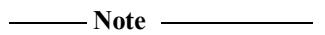

Arm strongly recommends that software does not write GICR\_PARTIDR while [GICR\\_CTLR](#page-640-0).Enable\_LPIs == 1, because of the uncertainty of when the change takes effect.

For Redistributors that are required to share an LPI Configuration table, it is IMPLEMENTATION DEFINED whether [GICR\\_PARTIDR](#page-698-0) accesses common state. [GICR\\_TYPER](#page-710-0).CommonLPIAff indicates which Redistributors are required to share an LPI Configuration table.

When [GICR\\_TYPER](#page-710-0).MPAM == 1, all accesses by the Redistributor to the following data structures use the PARTID and PMG values that are specified in [GICR\\_PARTIDR:](#page-698-0)

- LPI Pending table.
- LPI Configuration table.
- Virtual LPI Pending table.
- Virtual LPI Configuration table.

#### <span id="page-181-1"></span><span id="page-181-0"></span>**9.3 MPAM and the ITS**

[GITS\\_TYPER](#page-847-0).MPAM reports support for MPAM, and all ITSs that are part of the same IRI report the same value of [GITS\\_TYPER](#page-847-0).MPAM.

[GITS\\_MPAMIDR](#page-839-0) reports the PMG and PARTID sizes that are supported.

[GITS\\_PARTIDR](#page-841-0) controls the PARTID and PMG that are used by the ITS.

Writing an out-of-range value to [GITS\\_PARTIDR.](#page-841-0)PARTID results in CONSTRAINED UNPREDICTABLE behavior, and either:

- The default values of PARTID and PMG are used, and returned on reads.
- An UNKNOWN valid value is used, and returned on reads.

Writing an out-of-range value to [GITS\\_PARTIDR.](#page-841-0)PMG results in CONSTRAINED UPREDICTABLE behavior, and either:

- The default PMG value is used, and returned on reads.
- An UNKNOWN valid value is used, and returned on reads.

A write to [GITS\\_PARTIDR](#page-841-0) is only guaranteed to take effect the next time [GITS\\_CTLR](#page-833-0).Enable is written from 0 to 1. An implementation must ensure that either the old value or the new value is used, and that at no point a partially updated value is used.


Arm strongly recommends that software does not write GITS\_PARTIDR while [GITS\\_CTLR](#page-833-0).Enable == 1, because of the uncertainty of when the change takes effect.

When [GITS\\_TYPER.](#page-847-0)MPAM == 1, all accesses by the Redistributor to the following data structures use PARTID and PMG values that are specified in [GITS\\_PARTIDR:](#page-841-0)

- Device table.
- Interruption Translation table.
- Collection table.
- Virtual PE table.
- Command queue.

### <span id="page-182-1"></span><span id="page-182-0"></span>**9.4 GIC usage of MPAM**

This extension is limited to providing a mechanism for software to specify the PARTIDs that are used by the GIC when accessing memory.

Any support for using PARTIDs to internally partition resources or monitor performance is IMPLEMENTATION DEFINED.

Where an implementation provides such support, Arm expects it to do so in accordance with what is described in the *Arm® Architecture Reference Manual for A-profile architecture*.

#### <span id="page-183-1"></span><span id="page-183-0"></span>**9.5 GICv4.1 data structures and MPAM**

When MPAM is supported, and [GITS\\_TYPER](#page-847-0).SVPET==0, accesses to the vPE Configuration table use the PARTID and PMG values from [GICR\\_PARTIDR.](#page-698-0)

When MPAM is supported, and [GITS\\_TYPER](#page-847-0).SVPET!=0, accesses to the vPE Configuration table use the PARTID and PMG values from:

**Table 9-1 PARTID usage in GICv4.1**

| GICR_VPROPBASER.Valid | GITS_CTLR.Enabled | MPAM information from:       |
|-----------------------|-------------------|------------------------------|
| x                     | 1                 | GITS_PARTIDR                 |
| 0                     | 1                 | GITS_PARTIDR                 |
| 1                     | 1                 | GICR_PARTIDR or GITS_PARTIDR |
| 1                     | 0                 | GICR_PARTIDR                 |

When the vPE Configuration table is shared between the Redistributors and ITSs, either the Redistributors or ITS PARTID and PMG values can be used to access the table, and this can vary depending on the cause of the access.

## <span id="page-184-1"></span><span id="page-184-0"></span>Chapter 10 **Connecting to Armv8-R AArch64 PEs**

This chapter describes the requirements for connecting a GIC to PEs that implement Armv8-R AArch64:

• *[Armv8-R AArch64 CPU interface requirements on page](#page-185-1) 10-186*.

Collectively, these restrictions are referred to as GICv3.2.

#### <span id="page-185-1"></span><span id="page-185-0"></span>**10.1 Armv8-R AArch64 CPU interface requirements**

#### **10.1.1 Impact to legacy mode**

Legacy operation is not supported. When GIC is used with Armv8-R AArch64 PEs, the ICC\_SRE\_ELx.SRE bits are RES1.

#### **10.1.2 GICv3.1 extended INTID range support**

| When GIC v3.1 is used with Armv8-R AArch64 PEs, ICC_CTLR_EL1.ExtRange==0 is deprecated.                                                            |  |
|----------------------------------------------------------------------------------------------------------------------------------------------------|--|
| Note                                                                                                                                               |  |
| Arm recommends that Armv8-R AArch64 PEs report ICC_CTLR_EL1.ExtRange==1, indicating that the GICv3.1<br>extended SPI and PPI ranges are supported. |  |

#### **10.1.3 LPI support**

Armv8-R AArch64 PEs support LPIs.

GIC IRIs that support LPIs can be connected to PEs that implement Armv8-R AArch64.

#### **10.1.4 Local SError generation support**

Armv8-R AArch64 does not support local SError generation by the CPU interface. When GIC is used with Armv8-R AArch64 PEs, the [ICH\\_VTR\\_EL2.](#page-364-0)SEIS and [ICC\\_CTLR\\_EL1.](#page-232-0)SEIS are RES0.

#### **10.1.5 Virtualization support**

When GIC is used with Armv8-R AArch64 PEs, the [ICH\\_VTR\\_EL2.](#page-364-0)TDS is RES1, indicating that [ICH\\_HCR\\_EL2.](#page-347-0)TDIR is supported.

## <span id="page-186-1"></span><span id="page-186-0"></span>Chapter 11 **Power Management**

This chapter describes power management. It contains the following section:

• *[Power management on page](#page-187-1) 11-188*.

#### <span id="page-187-1"></span><span id="page-187-0"></span>**11.1 Power management**

In an implementation compliant with the GICv3 architecture, the CPU interface and the PE must be in the same power domain, but this does not have to be the same power domain as that within which the associated Redistributor is located. This means that it is possible to have a situation where the PE and its CPU interface are powered down, and the Redistributor, Distributor, and ITS, are powered up. In this situation, the GIC architecture supports the use of interrupts targeted at the PE to signal a powerup event to the PE and CPU interface.

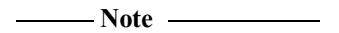

Arm strongly recommends that the GIC is not configured in such a way that an interrupt can cause wake-up of a particular PE, if on waking software on that PE cannot handle the interrupt.

GICv3 provides power management to control this situation, because the architecture is designed to allow the Redistributors designed by one organization to be used with PEs and CPU interfaces that have been designed by a different organization.

All other aspects of power management for the GIC are IMPLEMENTATION DEFINED.

Before powering down the CPU interface and the PE when the Redistributor is powered up, software must put the interface between the CPU interface and the Redistributor into the quiescent state or the system will become UNPREDICTABLE. The transition to the quiescent state is initiated by setting [GICR\\_WAKER](#page-727-0).ProcessorSleep to 1. When the interface is quiescent, [GICR\\_WAKER.](#page-727-0)ChildrenAsleep is also set to 1.

[GICR\\_WAKER](#page-727-0).ProcessorSleep == 1 has the following effects:

- The Redistributor does not forward any interrupts for the PE to the CPU interface. If there is a pending interrupt for the PE that would otherwise be forwarded to the PE, a hardware signal, **WakeRequest**, is asserted to indicate that the PE is to have its power restored. In a GICv4 implementation, the pending interrupt can be physical or virtual.
- The Distributor does not select this PE as a candidate for selection for a 1 of N interrupt, unless [GICD\\_CTLR.](#page-543-0)E1NWF == 1, and the PE has been selected by an IMPLEMENTATION DEFINED mechanism:
  - For a 1 of N interrupt that causes wake-up, the GIC is not required to select a new target PE if the PE that received the **WakeRequest** does not handle the interrupt on waking.

When the interface between the Redistributor and the CPU interface is in a quiescent state, the following architectural state of the CPU interface can be saved as part of saving the state within the power domain of the CPU interface and the PE:

- The CPU interface state related to physical interrupts of the connected PE.
- The CPU interface state related to virtual interrupts that is part of the vPE that is scheduled on the associated PE.

Setting [GICR\\_WAKER.](#page-727-0)ProcessorSleep to 1 when the physical group enables in the CPU interface are set to 1 results in UNPREDICTABLE behavior.

When [GICR\\_WAKER.](#page-727-0)ProcessorSleep == 1 or [GICR\\_WAKER.](#page-727-0)ChildrenAsleep == 1 then a write to any GICC\_\*, GICV\_\*, GICH\_\*, ICC\_\*, ICV\_\*, or ICH\_\* registers, other than those in the following list, is unpredictable:

- [ICC\\_SRE\\_EL1](#page-278-0).
- [ICC\\_SRE\\_EL2](#page-282-0).
- [ICC\\_SRE\\_EL3](#page-285-0).

## <span id="page-188-1"></span><span id="page-188-0"></span>Chapter 12 **Programmers' Model**

This chapter provides information about the GIC register interfaces and describes all of the GIC registers. It contains the following sections:

- *[About the programmers' model on page](#page-189-1) 12-190*.
- *[AArch64 System register descriptions on page](#page-213-1) 12-214*.
- *[AArch64 System register descriptions of the virtual registers on page](#page-288-1) 12-289*.
- *[AArch64 virtualization control System registers on page](#page-334-1) 12-335*.
- *[AArch32 System register descriptions on page](#page-367-1) 12-368*.
- *[AArch32 System register descriptions of the virtual registers on page](#page-450-1) 12-451*.
- *[AArch32 virtualization control System registers on page](#page-499-1) 12-500*.
- *[The GIC Distributor register map on page](#page-532-1) 12-533*.
- *[The GIC Distributor register descriptions on page](#page-536-1) 12-537*.
- *[The GIC Redistributor register map on page](#page-633-1) 12-634*.
- *[The GIC Redistributor register descriptions on page](#page-637-1) 12-638*.
- *[The GIC CPU interface register map on page](#page-729-1) 12-730*.
- *[The GIC CPU interface register descriptions on page](#page-730-1) 12-731*.
- *[The GIC virtual CPU interface register map on page](#page-767-1) 12-768*.
- *[The GIC virtual CPU interface register descriptions on page](#page-769-1) 12-770*.
- *[The GIC virtual interface control register map on page](#page-800-1) 12-801*.
- *[The GIC virtual interface control register descriptions on page](#page-801-1) 12-802*.
- *[The ITS register map on page](#page-822-1) 12-823*.
- *[The ITS register descriptions on page](#page-824-1) 12-825*.

#### <span id="page-189-1"></span><span id="page-189-0"></span>**12.1 About the programmers' model**

The GIC is partitioned into several logical components, as defined in Chapter 3 *[GIC Partitioning](#page-40-1)*, and each component supports one or more programming interfaces. Software uses these programming interfaces to access the programmers' model and control the GIC. The interfaces are either memory-mapped or support System register accesses as follows:

- The Distributor, Redistributor, and ITS programming interfaces are always memory-mapped.
- The CPU interfaces for physical and virtual interrupt handling, and the virtual machine control interface used by the hypervisor use:
  - System register interfaces for the operation of GICv3 and GICv4.

| — |  |  | Memory-mapped interfaces for legacy operation. |
|---|--|--|------------------------------------------------|
|---|--|--|------------------------------------------------|

**Note** Support for legacy operation is optional. Implementations are allowed to support legacy operation for virtual interrupts only, meaning that the GICV\_\* registers are the only memory-mapped CPU interface registers that are provided. In these implementations, GICC\_\* registers and GICH\_\* registers are not provided. GICC\_\* and GICH\_\* registers are only required to support legacy operation by physical interrupts.

When accessing a System register, the register content accessed depends on:

- The Exception level at which the PE is executing.
- Whether the access is Secure or Non-secure.
- For a Non-secure access at EL1, whether the Exception level is configured by [HCR\\_EL2](#page-28-2) when executing in AArch64 state, or by [HCR](#page-28-4) when executing in AArch32 state, to handle virtual or physical interrupts.

#### **12.1.1 GIC register names**

All of the GIC registers have names that provide a short mnemonic for the function of the register:

- Memory-mapped registers are prefixed by one of the following:
  - GICC, to indicate a CPU interface register.
  - GICD, to indicate a Distributor register.
  - GICH, to indicate a virtual interface control register, typically accessed by a hypervisor.
  - GICR, to indicate a Redistributor register.
  - GICV, to indicate a virtual CPU interface register.
  - GITS, to indicate an ITS register.
- System registers are prefixed by:
  - ICC, to indicate a physical GIC CPU interface System register.
  - ICV, to indicate a virtual GIC CPU interface System register.
  - ICH, to indicate a virtual interface control System register.
- The remaining letters are a mnemonic for the register, for example the GIC Distributor Control Register is called [GICD\\_CTLR](#page-543-1).

Figure 12-[1 on page](#page-190-0) 12-191 shows the interfaces that the programmer can use for the different logical components when affinity routing and System register access are enabled for all Exception levels.

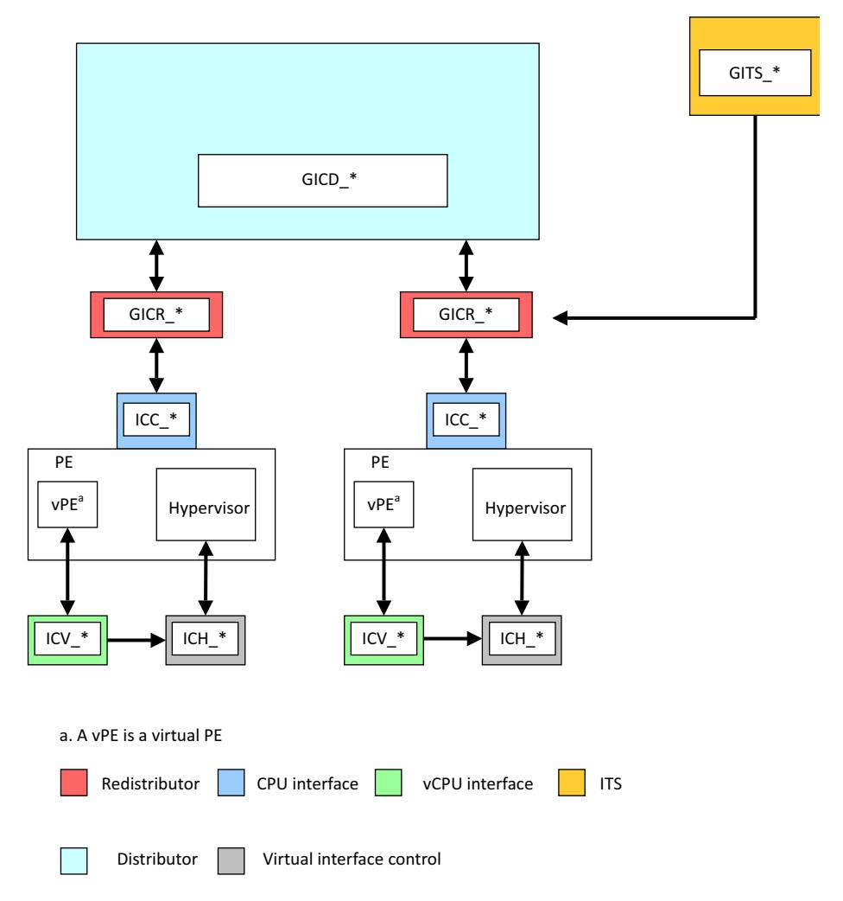

**Figure 12-1 Register interfaces without legacy support (GICv3 only)**

A System register might be accessible from different Exception levels. In AArch64 state, a register suffix defines the lowest Exception level at which the register is accessible. That is, any access to ICC\_\*\_ELx must be from Exception level ELx or higher.

#### <span id="page-190-1"></span><span id="page-190-0"></span>**12.1.2 Relation between System registers and memory-mapped registers**

The GIC architecture permits, but does not require, that the same registers can be shared between memory-mapped registers and the equivalent System registers. This means that if the memory-mapped registers have been accessed while ICC\_SRE\_ELx.SRE == 0, the System registers might be modified. Therefore, Arm recommends that software only relies on the reset values of the System registers if there has been no use of the GIC functionality while the memory-mapped registers are in use, otherwise Arm recommends that the values are treated as UNKNOWN.

<span id="page-191-0"></span>[Table](#page-191-0) 12-1 shows the registers that are shared between the memory-mapped registers and the System registers.

**Table 12-1 Relation between System registers and memory-mapped registers**

| System registersa    |                  | Memory-mapped CPU interface<br>registers | Memory-mapped virtual<br>CPU interface registers |
|----------------------|------------------|------------------------------------------|--------------------------------------------------|
| AArch64              | AArch32          |                                          |                                                  |
| ICC_AP0R <n>_EL1</n> | ICC_AP0R <n></n> | GICC_APR <n>, GICC_NSAPR<n></n></n>      | GICV_APR <n></n>                                 |
| ICC_AP1R <n>_EL1</n> | ICC_AP1R <n></n> |                                          |                                                  |
| ICC_BPR0_EL1         | ICC_BPR0         | GICC_BPR, GICC_ABPRbc                    | GICV_BPR                                         |
| ICC_BPR1_EL1         | ICC_BPR1         |                                          | GICV_ABPR                                        |
| ICC_CTLR_EL1         | ICC_CTLR         | GICC_CTLR                                | GICV_CTLR                                        |
| ICC_CTLR_EL3         | ICC_MCTLR        |                                          |                                                  |
| ICC_DIR_EL1          | ICC_DIR          | GICC_DIR                                 | GICV_DIR                                         |
| ICC_EOIR0_EL1        | ICC_EOIR0        | GICC_EOIR, GICC_AEOIR                    | GICV_EOIR                                        |
| ICC_EOIR1_EL1        | ICC_EOIR1        |                                          | GICV_AEOIR                                       |
| ICC_HPPIR0_EL1       | ICC_HPPIR0       | GICC_HPPIR, GICC_AHPPIR                  | GICV_HPPIR                                       |
| ICC_HPPIR1_EL1       | ICC_HPPIR1       |                                          | GICV_AHPPIR                                      |
| ICC_IAR0_EL1         | ICC_IAR0         | GICC_IAR, GICC_AIARd                     | GICV_IAR                                         |
| ICC_IAR1_EL1         | ICC_IAR0         |                                          | GICV_AIAR                                        |
| ICC_IGRPEN0_EL1      | ICC_IGRPEN0      | GICC_CTLR                                | GICV_CTLR                                        |
| ICC_IGRPEN1_EL1      | ICC_IGRPEN1      |                                          |                                                  |
| ICC_IGRPEN1_EL3      | ICC_MGRPEN1      |                                          |                                                  |
| ICC_PMR_EL1          | ICC_PMR          | GICC_PMR                                 | GICV_PMR                                         |
| ICC_RPR_EL1          | ICC_RPR          | GICC_RPR                                 | GICV_RPR                                         |
| ICH_AP0R <n>_EL2</n> | ICH_AP0R <n></n> | GICH_APR <n></n>                         | -                                                |
| ICH_AP1R <n>_EL2</n> | ICH_AP1R <n></n> |                                          | -                                                |
| ICH_EISR_EL2         | ICH_EISR         | GICH_EISR                                | -                                                |
| ICH_ELRSR_EL2        | ICH_ELRSR        | GICH_ELRSR                               | -                                                |
| ICH_HCR_EL2          | ICH_HCR          | GICH_HCR                                 | -                                                |
| ICH_LR <n>_EL2</n>   | ICH_LR <n></n>   | GICH_LR <n></n>                          | -                                                |
|                      | ICH_LRC <n></n>  |                                          | -                                                |
| ICH_MISR_EL2         | ICH_MISR         | GICH_MISR                                | -                                                |
| ICH_VMCR_EL2         | ICH_VMCR         | GICH_VMCR                                | -                                                |
| ICH_VTR_EL2          | ICH_VTR          | GICH_VTR                                 | -                                                |

- a. There are also System registers prefixed with ICV, rather than ICC, and these are the virtual GIC CPU interface System registers, see *[AArch64 System register descriptions of the virtual registers on page](#page-288-1) 12-289* and *[AArch32 System](#page-450-1)  [register descriptions of the virtual registers on page](#page-450-1) 12-451*.
- b. This register is an alias of the Non-secure copy of [GICC\\_BPR](#page-740-0).
- c. If [ICC\\_CTLR\\_EL3.](#page-237-1)CBPR\_EL1NS == 1, Secure accesses to this register access (and might modify) [ICC\\_BPR0\\_EL1](#page-225-1).
- d. In GIC implementations that support two Security states, this register is an alias of the Non-secure view of [GICC\\_IAR](#page-756-0).

#### **12.1.3 GIC memory-mapped register access**

In any system, access to the following registers must be supported:

- Single copy atomic 32-bit accesses to:
  - All 32-bit GICC\_\*, GICV\_\*, GICD\_\*, GICH\_\*, GITS\_\*, and GICR\_\* registers.
- Single copy atomic 64-bit accesses to:
  - All 64-bit GITS\_\* registers.
    - All 64-bit GICD\_\* registers.
    - All 64-bit GICR\_\* registers.
- Byte accesses to:
  - [GICD\\_IPRIORITYR<n>.](#page-579-1)
  - [GICD\\_ITARGETSR<n>](#page-600-1).
  - [GICD\\_SPENDSGIR<n>](#page-613-0).
  - [GICD\\_CPENDSGIR<n>](#page-541-0).
  - [GICR\\_IPRIORITYR<n>](#page-679-1).

If the system includes any component with direct memory access to the GIC which needs to access the GIC but does not support making 64-bit accesses:

- Single copy atomic 32-bit accesses to:
  - All 64-bit GICD\_\*, GICR\_\*, and GITS\_\* registers, including independent access to the upper 32-bits and the lower 32-bits of the register. This does not apply to registers that are specifically marked as being 64-bit accessible only.

Arm does not expect the following registers to be accessed directly by software, but single-copy atomic 16-bit and 32-bit accesses to these registers must be supported:

- [GITS\\_TRANSLATER](#page-845-1).
- [GICD\\_SETSPI\\_NSR.](#page-607-1)
- [GICD\\_CLRSPI\\_NSR](#page-537-1).
- [GICD\\_SETSPI\\_SR](#page-609-1).
- [GICD\\_CLRSPI\\_SR.](#page-539-1)

All other accesses to these registers result in UNPREDICTABLE behavior.

In the GIC architecture, all registers that are doubleword-accessible, halfword-accessible, or byte-accessible use a little-endian memory order model.

The following accesses are not supported:

- Byte access to registers other than those specifically listed in this section.
- Unaligned word accesses. These accesses are not word single-copy atomic.
- Unaligned doubleword accesses. These accesses are not doubleword single-copy atomic.
- Word accesses for registers marked as requiring a 64-bit access.
- Doubleword accesses, other than those specifically listed in this section.
- Quadword or higher.
- Exclusive accesses.

For each of these access types, it is UNPREDICTABLE whether:

- The access generates an external abort or not.
- The defined side-effects of a read occur or not. A read returns UNKNOWN data.
- A write is ignored or sets the accessed register or registers to UNKNOWN values.

For memory-mapped accesses by a PE that complies with the Arm architecture, the single-copy atomicity rules for the instruction, the type of instruction, and the type of memory accessed, determine the size of the access made by the instruction. [Example](#page-193-0) 12-1 shows this.

#### **Example 12-1 Access sizes for memory-mapped accesses**

<span id="page-193-0"></span>Two Load Doubleword instructions made to consecutive doubleword-aligned locations generate a pair of single-copy atomic doubleword reads. However, if the accesses are made to Normal memory or Device-GRE memory they might appear as a single quadword access that is not supported by the peripheral.

Armv8 does not require the size of each element accessed by a multi-register load or store instruction to be identifiable by the memory system beyond the PE. Any memory-mapped access to a GIC is defined to be beyond the PE.

Software must use a Device-nGRE or stronger memory-type, and use only single register load and store instructions, to create memory accesses that are supported by the peripheral.

Reads and writes of the memory-mapped registers complete in the order in which they arrive at the GIC. For access to different register locations, software must create this order by:

- Marking the memory as Device-nGnRnE or Device-nGnRE.
- Using the appropriate memory barriers.

Software must be able to guarantee completion of a write, for example by:

- Marking the memory as Device-nGnRnE and executing a DSB barrier, if the system supports this property.
- Reading back the value written.

For more information on endianness, memory ordering, and barrier instructions, see *Arm® Architecture Reference Manual for A-profile architecture*

The access type definitions for the memory-mapped register interface are:

**RW** Read and write.

**RO** Read only. Writes are ignored.

**WO** Write only. Reads return an UNKNOWN value.

#### **12.1.4 Access to memory-mapped registers when System register access is enabled**

Because memory-mapped accesses and System register accesses might not access the same state, and are not guaranteed to be synchronized when System registers access is enabled for a particular Exception level and Security state, Arm recommends that the System registers be used instead of the memory-mapped registers that provide the same functionality.

In implementations that include the GICC\_\* registers, and where the Secure copy of [ICC\\_SRE\\_EL1](#page-278-1).SRE is programmable, the following state must be shared between System register access and memory-mapped access to ensure the correct operation of preemption:

- [GICC\\_PMR](#page-761-0) and [ICC\\_PMR\\_EL1](#page-266-1) or [ICC\\_PMR](#page-434-0) must access the same state.
- [GICC\\_APR<n>](#page-738-0) and [ICC\\_AP0R<n>\\_EL1](#page-215-1) must access the same state.
- [GICC\\_NSAPR<n>](#page-760-0) and [ICC\\_AP1R<n>\\_EL1](#page-218-1)\_NS must access the same state.
- [GICC\\_CTLR](#page-742-1).CBPR and [ICC\\_CTLR\\_EL3](#page-237-1)\_NS.CBPR must access the same state.
- Secure accesses to [GICC\\_BPR](#page-740-0) and [ICC\\_BPR0\\_EL1](#page-225-1) must access the same state when [GICC\\_CTLR.](#page-742-1)CBPR == 0.
- Secure accesses to [GICC\\_ABPR](#page-731-1) and [ICC\\_BPR1\\_EL1](#page-228-1) must access the same state when [GICC\\_CTLR](#page-742-1).CBPR == 0.

| ——Note |  |
|--------|--|
| 11016  |  |

- **Note** Software must follow the rules specified in *[GIC System register access on page](#page-196-1) 12-197* when changing the setting of the SRE fields.
- *[Relation between System registers and memory-mapped registers on page](#page-190-1) 12-191* specifies the relationship between memory-mapped registers and System registers. State can only be shared between registers that perform the same function, and the registers listed in Table 12-[1 on page](#page-191-0) 12-192 might share state.

When changing from a state where the registers are required to access the same state to a state where the registers are not required to access the same state, or when changing from a state where the registers are not required to access the same state to a state where the registers are required to access the same state, the content of the registers becomes UNKNOWN.

| Note |  |
|------|--|
|------|--|

The priority bits implemented for memory-mapped and System register state must be the same, as must the minimum value of the Binary Point Register for Group 0 interrupts for both Secure and Non-secure views.

Accesses to the GICC\_\* registers might be affected by whether System register access is enabled or not, depending on the implementation:

• If the Secure copy of [ICC\\_SRE\\_EL1.](#page-278-1)SRE == 1, then the GICC\_\* registers might not be accessible or might be RAZ/WI.

#### **Note**

When EL3 is configured to use AArch32 state, Secure EL1 is not accessible but software must still set the Secure copy of [ICC\\_SRE.](#page-446-1)SRE to 1, to enable support for Secure Group 1 interrupts, otherwise the system is UNPREDICTABLE.

- If [ICC\\_SRE\\_EL2.](#page-282-1)SRE ==1, then the GICH\_\* registers might not be accessible or might be RAZ/WI.
- If the Non-secure copy of [ICC\\_SRE\\_EL1.](#page-278-1)SRE == 1, then the GICV\_\* registers might not be accessible or might be RAZ/WI.

| Note |  |
|------|--|
|      |  |

In implementations where the Non-secure copy of [ICC\\_SRE\\_EL1.](#page-278-1)SRE is programmable, that is, it is not RAO/WI, the GICV\_\* register interface must still be provided.

An implementation might be able to detect accesses to memory-mapped registers that must not be accessed because an SRE bit is 1, and report them in an IMPLEMENTATION DEFINED manner.

#### **12.1.5 Execution state**

The Armv8-A architecture has two Execution states:

- AArch64 state.
- AArch32 state.

To see the mapping between the AArch64 System registers and the AArch32 System registers, see:

- Table 12-[3 on page](#page-197-0) 12-198.
- Table 12-[4 on page](#page-199-0) 12-200.

#### <span id="page-194-0"></span>**12.1.6 Observability of the effects of accesses to the GIC registers**

The PE and CPU interface logic must ensure that:

• Writes to [ICC\\_PMR\\_EL1](#page-266-1) are self-synchronizing.

| Note |  |
|------|--|
|      |  |

This ensures that no interrupts with a priority lower than the priority value in [ICC\\_PMR\\_EL1](#page-266-1) are taken after a write to [ICC\\_PMR\\_EL1](#page-266-1) is architecturally executed.

| • | Reads of ICC_IAR0_EL1, ICC_IAR1_EL1, and ICC_NMIAR1_EL1 are self-synchronizing when interrupts    |
|---|---------------------------------------------------------------------------------------------------|
|   | are masked by the PE, that is when PSTATE.F == 1, for reads of ICC_IAR0_EL1, and when PSTATE.I == |
|   | 1, for reads of ICC_IAR1_EL1.                                                                     |

| Note |  |
|------|--|
|------|--|

This ensures that the effect of activating an interrupt on the signaling of an interrupt exception is observed when a read of [ICC\\_IAR0\\_EL1,](#page-252-1) [ICC\\_IAR1\\_EL1](#page-254-1), and [ICC\\_NMIAR1\\_EL1](#page-264-1) is architecturally executed. This means that no spurious interrupt exception occurs if interrupts are unmasked by an instruction immediately following the read.

- Instructions that change the current Exception level from EL3 to a lower Exception level, for example the ERET instruction, must be synchronized with any corresponding change in the allocation of interrupts as FIQs and IRQs, so that no spurious FIQ is taken after the architectural execution of the instruction, see *[Interrupt](#page-64-4)  [assignment to IRQ and FIQ signals on page](#page-64-4) 4-65*.
- Architectural execution of a DSB instruction guarantees that
  - The last value written to [ICC\\_PMR\\_EL1](#page-266-1) or [GICC\\_PMR](#page-761-0) is observed by the associated Redistributor. PMR values are only observable by the Redistributor when ICC\_CTLR\_ELx.PMHE==1, and observation by the Redistributor does not affect masking of interrupts within the CPU interface.
  - The last value written to [ICC\\_SGI0R\\_EL1](#page-272-1) or [ICC\\_SGI1R\\_EL1](#page-275-1) is observed by the associated Redistributor.
  - The last value written to [ICC\\_ASGI1R\\_EL1](#page-222-1) is observed by the associated Redistributor.
  - The last value written to [ICC\\_IGRPEN0\\_EL1](#page-256-1), [ICC\\_IGRPEN1\\_EL1](#page-259-1), [ICC\\_IGRPEN1\\_EL3](#page-262-1) or [GICC\\_CTLR](#page-742-1).{EnableGrp0, EnableGrp1}is observed by the associated Redistributor.
  - The last value written to [ICH\\_VMCR\\_EL2](#page-360-1).{VENG0, VENG1}, or [GICV\\_CTLR](#page-782-1).{EnableGrp0, EnableGrp1} is observed by the associated Redistributor.
  - The last SPI INTID read from [ICC\\_IAR0\\_EL1](#page-252-1), [ICC\\_IAR1\\_EL1,](#page-254-1) [ICC\\_NMIAR1\\_EL1](#page-264-1), [GICC\\_IAR](#page-756-0) or [GICC\\_AIAR](#page-737-1) is observed by the Distributor and by accesses from any PE to the Distributor.
  - The last SGI, PPI or LPI INTID read from [ICC\\_IAR0\\_EL1,](#page-252-1) [ICC\\_IAR1\\_EL1](#page-254-1), [ICC\\_NMIAR1\\_EL1,](#page-264-1) [GICC\\_IAR](#page-756-0) or [GICC\\_AIAR](#page-737-1) is observed by the associated Redistributor and by accesses from the PE to the associated Redistributor.
  - The last vLPI INTID read from [ICV\\_IAR1\\_EL1,](#page-319-1) where that vLPI was received from a direct injection, is observed by the associated Redistributor.
  - The last vSGI INTID read from [ICV\\_IAR1\\_EL1](#page-319-1) or [ICV\\_NMIAR1\\_EL1,](#page-327-0) where that vSGI was received from a direct injection, is observed by the associated Redistributor.
  - The last [Deactivate](#page-898-0) command for an SPI generated by a write to [ICC\\_EOIR0\\_EL1,](#page-244-1) [ICC\\_EOIR1\\_EL1](#page-246-1), [GICC\\_AEOIR,](#page-733-1) [GICC\\_EOIR](#page-752-0), [ICC\\_DIR\\_EL1](#page-242-1) or [GICC\\_DIR](#page-750-0) is observed by the Distributor and by accesses from any PE to the Distributor.
  - The last [Deactivate](#page-898-0) command for an SGI or PPI generated by a write to [ICC\\_EOIR0\\_EL1](#page-244-1), [ICC\\_EOIR1\\_EL1](#page-246-1), [GICC\\_AEOIR](#page-733-1), [GICC\\_EOIR,](#page-752-0) [ICC\\_DIR\\_EL1](#page-242-1) or [GICC\\_DIR](#page-750-0) is observed by the Redistributor and by accesses from any PE to the Redistributor.
  - The last [Deactivate](#page-898-0) command for a physical PPI, SGI, or SPI generated by a write to [ICV\\_EOIR0\\_EL1,](#page-309-1) [ICV\\_EOIR1\\_EL1,](#page-311-1) [GICV\\_AEOIR,](#page-772-0) [GICV\\_EOIR,](#page-787-0) [ICV\\_DIR\\_EL1](#page-307-1), or [GICV\\_DIR](#page-785-0) is observed by the Redistributor and by accesses from any PE to the Redistributor.

In all cases in this section where a DSB is referred to, this refers to a DSB whose required access type is both loads and stores with any Shareability attribute.

For more information about the encoding of the DSB instruction, see the *Arm® Architecture Reference Manual, Armv8, for Armv8-A architecture profile*.

| Note |  |
|------|--|
|------|--|

An ISB or other context synchronization operation must precede the DSB to ensure visibility of System register writes.

#### <span id="page-196-1"></span><span id="page-196-0"></span>**12.1.7 GIC System register access**

The GIC System register interface is managed by Exception level, using the following AArch64 System registers:

- [ICC\\_SRE\\_EL3](#page-285-1), if EL3 is implemented.
- [ICC\\_SRE\\_EL2](#page-282-1), if EL2 is implemented.
- [ICC\\_SRE\\_EL1](#page-278-1).

<span id="page-196-2"></span>Table 12-[2 on page](#page-196-2) 12-197 shows the permitted ICC\_SRE\_ELx.SRE settings.

**Table 12-2 Permitted ICC\_SRE\_ELx.SRE settings**

| ICC_SRE_EL1_S | ICC_SRE_EL1_NS | ICC_SRE_EL2 | ICC_SRE_EL3                                                                                                                    | Notes                                                                          |
|---------------|----------------|-------------|--------------------------------------------------------------------------------------------------------------------------------|--------------------------------------------------------------------------------|
| 0             | 0              | 0           | 0                                                                                                                              | Legacy, see Chapter 15 Legacy Operation<br>and Asymmetric Configurations       |
| 0             | 0              | 0           | 1                                                                                                                              | Supported only when EL3 is using AArch64                                       |
| 0             | 0              | 1           | 1                                                                                                                              | Supported only when EL3 is using AArch64<br>and virtual interrupts are enabled |
| 0             | 1              | 1           | 1                                                                                                                              | Supported only when EL3 is using AArch64                                       |
| 1<br>0<br>1   |                | 1           | Supported only when HCR_EL2.FMO==1<br>&&HCR_EL2.IMO==1&&<br>HCR_EL2.AMO==1                                                     |                                                                                |
|               |                |             | Note<br>An implementation is permitted but not<br>required to support this setting when<br>HCR_EL2.FMO==1&&<br>HCR_EL2.IMO==1. |                                                                                |
| 1             | 1              | 1           | 1                                                                                                                              | Fully supported System register access                                         |

**Note**

The information in Table 12-[2 on page](#page-196-2) 12-197 applies to implementations that support both EL2 and EL3.

All combinations of ICC\_SRE\_ELx.SRE settings not listed in Table 12-[2 on page](#page-196-2) 12-197 result in UNPREDICTABLE behavior.

All settings other than ICC\_SRE\_ELx.SRE == 1 are deprecated.

**Note**

- When [HCR\\_EL2](#page-28-2) is configured so that virtualization at EL1 is enabled, it is IMPLEMENTATION DEFINED whether a Non-secure access to [ICC\\_SRE\\_EL1.](#page-278-1)SRE or [ICC\\_SRE.](#page-446-1)SRE is programmable to support a legacy VM.
- Arm expects that when [ICC\\_SRE\\_EL3.](#page-285-1)SRE == 1 and [ICC\\_SRE\\_EL1\\_](#page-278-1)S.SRE == 0, then [ICC\\_CTLR\\_EL3.](#page-237-1)RM == 1.

The following changes to ICC\_SRE\_ELx result in UNPREDICTABLE behavior:

- Changing the value of [ICC\\_SRE\\_EL3](#page-285-1).SRE from 1 to 0.
- Changing the value of [ICC\\_SRE\\_EL2](#page-282-1).SRE from 1 to 0.
- Changing the value of [ICC\\_SRE\\_EL1](#page-278-1)\_S.SRE from 1 to 0.

| Note |  |
|------|--|
|      |  |

[ICC\\_SRE\\_EL1](#page-278-1)\_NS can be changed from 1 to 0 to allow different VMs to have different [ICC\\_SRE\\_EL1](#page-278-1) values.

Each ICC\_SRE\_ELx register listed in this section provides:

- An SRE bit to enable the ICC\_\* System register interface at that Exception level. For EL2 and EL3, the SRE bit also enables access to all ICH\_\* registers.
- DIB and DFB bits to support interrupt bypass for the Exception level hierarchy. For more information about bypass, see *[Interrupt bypass support on page](#page-46-0) 3-47*.

#### In addition:

- [ICC\\_SRE\\_EL3](#page-285-1).Enable controls EL1 access to [ICC\\_SRE\\_EL1](#page-278-1), and EL2 access to [ICC\\_SRE\\_EL1](#page-278-1) and [ICC\\_SRE\\_EL2](#page-282-1).
- [ICC\\_SRE\\_EL2](#page-282-1).Enable controls Non-secure EL1 accesses to [ICC\\_SRE\\_EL1](#page-278-1) if EL3 is not present or [ICC\\_SRE\\_EL3](#page-285-1).Enable == 1.


The ICC\_SRE\_ELx register associated with the highest implemented Exception level is always accessible to allow software executing at that Exception level to configure the System register at different Exception levels.

The System register interface can be used for execution in both AArch32 state and AArch64 state.

For AArch32 state, accesses to GIC registers that are visible in the System register interface use the following instructions:

- The MRC instruction for 32-bit read accesses.
- The MCR instruction for32-bit write accesses.
- The MCRR instruction for 64-bit write accesses to [ICC\\_SGI0R,](#page-440-0) [ICC\\_SGI1R](#page-443-0) and [ICC\\_ASGI1R.](#page-377-0)

See the *Arm® Architecture Reference Manual for A-profile architecture* for information about the form of the MRC, MCR, and MCRR instructions.

System registers support 32-bit or 64-bit accesses. See the individual register description for the associated access size.

The access type definitions for the System register interface are:

**RW** Read and write.

**RO** Read only. Writes result in an UNDEFINED exception. **WO** Write only. Reads result in an UNDEFINED exception.

**Note**

For more information about UNDEFINED exceptions, see *Arm® Architecture Reference Manual, Armv8, for Armv8-A architecture profile*.

<span id="page-197-0"></span>[Table](#page-197-0) 12-3 shows the AArch64 and AArch32 register mappings for System register accesses by the GIC CPU interface.

**Table 12-3 System register accesses for GIC CPU interface registers**

<span id="page-197-1"></span>

| Name of System register accessed |           |  |  |
|----------------------------------|-----------|--|--|
| AArch64                          | AArch32   |  |  |
| ICC_IAR0_EL1a                    | ICC_IAR0  |  |  |
| ICC_IAR1_EL1a                    | ICC_IAR1  |  |  |
| ICC_EOIR0_EL1a                   | ICC_EOIR0 |  |  |

**Table 12-3 System register accesses for GIC CPU interface registers (continued)**

| Name of System register accessed |                  |  |
|----------------------------------|------------------|--|
| AArch64                          | AArch32          |  |
| ICC_EOIR1_EL1a                   | ICC_EOIR1        |  |
| ICC_HPPIR0_EL1a                  | ICC_HPPIR0       |  |
| ICC_HPPIR1_EL1a                  | ICC_HPPIR1       |  |
| ICC_BPR0_EL1a                    | ICC_BPR0         |  |
| ICC_BPR1_EL1a                    | ICC_BPR1         |  |
| ICC_DIR_EL1a                     | ICC_DIR          |  |
| ICC_PMR_EL1                      | ICC_PMR          |  |
| ICC_RPR_EL1                      | ICC_RPR          |  |
| ICC_AP0R <n>_EL1a</n>            | ICC_AP0R <n></n> |  |
| ICC_AP1R <n>_EL1a</n>            | ICC_AP1R <n></n> |  |
| ICC_CTLR_EL1                     | ICC_CTLR         |  |
| ICC_CTLR_EL3                     | ICC_MCTLR        |  |
| ICC_IGRPEN0_EL1                  | ICC_IGRPEN0      |  |
| ICC_IGRPEN1_EL1                  | ICC_IGRPEN1      |  |
| ICC_IGRPEN1_EL3                  | ICC_MGRPEN1      |  |
| ICC_SGI1R_EL1                    | ICC_SGI1R        |  |
| ICC_ASGI1R_EL1                   | ICC_ASGI1R       |  |
| ICC_SGI0R_EL1                    | ICC_SGI0R        |  |
| ICC_SRE_EL1                      | ICC_SRE          |  |
| ICC_SRE_EL2                      | ICC_HSRE         |  |
| ICC_SRE_EL3                      | ICC_MSRE         |  |

a. In addition to ICC\_SRE\_EL\*.SRE, ICC\_SRE.SRE, ICC\_HSRE.SRE, and ICC\_MSRE.SRE, [SCR\\_EL3](#page-29-4) and [HCR\\_EL2](#page-28-2) control accessibility to these registers.

The GIC virtual interface control registers are accessible when [ICC\\_SRE\\_EL2.](#page-282-1)SRE == 1.

<span id="page-199-0"></span>[Table](#page-199-0) 12-4 shows the AArch64 and AArch32 System register mappings for the GIC virtual interface control registers.

**Table 12-4 System register mappings for GIC virtual interface control registers**

| Name of System register accessed |                   |  |  |  |  |  |
|----------------------------------|-------------------|--|--|--|--|--|
| AArch64                          | AArch32           |  |  |  |  |  |
| ICH_HCR_EL2                      | ICH_HCR           |  |  |  |  |  |
| ICH_VTR_EL2                      | ICH_VTR           |  |  |  |  |  |
| ICH_MISR_EL2                     | ICH_MISR          |  |  |  |  |  |
| ICH_EISR_EL2                     | ICH_EISR          |  |  |  |  |  |
| ICH_ELRSR_EL2                    | ICH_ELRSR         |  |  |  |  |  |
| ICH_AP0R <n>_EL2a</n>            | ICH_AP0R <n>a</n> |  |  |  |  |  |
| ICH_AP1R <n>_EL2a</n>            | ICH_AP1R <n>a</n> |  |  |  |  |  |
| ICH_LR <n>_EL2[63:32]b</n>       | ICH_LRC <n>b</n>  |  |  |  |  |  |
| ICH_LR <n>_EL2[31:0]b</n>        | ICH_LR <n>b</n>   |  |  |  |  |  |
| ICH_VMCR_EL2                     | ICH_VMCR          |  |  |  |  |  |
| a.<br>n = 0-3                    |                   |  |  |  |  |  |

<span id="page-199-2"></span><span id="page-199-1"></span>a. n = 0-3

#### **AArch64 System register access instruction encodings**

<span id="page-199-3"></span>[Table](#page-199-3) 12-5 shows the format of the A64 MSR and MRS instructions to access the physical and virtual CPU interface.

**Table 12-5 Mapping of MSR and MRS to physical and virtual CPU interface registers, AArch64 state**

<span id="page-199-5"></span><span id="page-199-4"></span>

| System register        | Access | opc0 | opc1 | CRn | CRm | opc2 |
|------------------------|--------|------|------|-----|-----|------|
| ICC_AP0R <n>_EL1a</n>  | RW     | 3    | 0    | c12 | c8  | 4-7  |
| ICC_AP1R <n>_EL1ab</n> | RW     | 3    | 0    | c12 | c9  | 0-3  |
| ICC_ASGI1R_EL1         | WO     | 3    | 0    | c12 | c11 | 6    |
| ICC_BPR0_EL1           | RW     | 3    | 0    | c12 | c8  | 3    |
| ICC_BPR1_EL1b          | RW     | 3    | 0    | c12 | c12 | 3    |
| ICC_CTLR_EL1b          | RW     | 3    | 0    | c12 | c12 | 4    |
| ICC_CTLR_EL3           | RW     | 3    | 6    | c12 | c12 | 4    |
| ICC_DIR_EL1            | WO     | 3    | 0    | c12 | c11 | 1    |
| ICC_EOIR0_EL1          | WO     | 3    | 0    | c12 | c8  | 1    |
| ICC_EOIR1_EL1          | WO     | 3    | 0    | c12 | c12 | 1    |
| ICC_HPPIR0_EL1         | RO     | 3    | 0    | c12 | c8  | 2    |
| ICC_HPPIR1_EL1         | RO     | 3    | 0    | c12 | c12 | 2    |

b. n = 0-15.

**Table 12-5 Mapping of MSR and MRS to physical and virtual CPU interface registers, AArch64 state (continued)**

| System register  | Access | opc0 | opc1 | CRn | CRm | opc2 |
|------------------|--------|------|------|-----|-----|------|
| ICC_IAR0_EL1     | RO     | 3    | 0    | c12 | c8  | 0    |
| ICC_IAR1_EL1     | RO     | 3    | 0    | c12 | c12 | 0    |
| ICC_IGRPEN0_EL1  | RW     | 3    | 0    | c12 | c12 | 6    |
| ICC_IGRPEN1_EL1b | RW     | 3    | 0    | c12 | c12 | 7    |
| ICC_IGRPEN1_EL3  | RW     | 3    | 6    | c12 | c12 | 7    |
| ICC_PMR_EL1      | RW     | 3    | 0    | c4  | c6  | 0    |
| ICC_RPR_EL1      | RO     | 3    | 0    | c12 | c11 | 3    |
| ICC_SGI0R_EL1    | WO     | 3    | 0    | c12 | c11 | 7    |
| ICC_SGI1R_EL1    | WO     | 3    | 0    | c12 | c11 | 5    |
| ICC_SRE_EL1b     | RW     | 3    | 0    | c12 | c12 | 5    |
| ICC_SRE_EL2      | RW     | 3    | 4    | c12 | c9  | 5    |
| ICC_SRE_EL3      | RW     | 3    | 6    | c12 | c12 | 5    |

a. n = 0-3.

<span id="page-200-0"></span>[Table](#page-200-0) 12-6 shows the format of the A64 MSR and MRS instructions that access the virtual interface control registers.

**Table 12-6 Mapping of MSR and MRS to virtual interface control registers, AArch64 state**

| System register      | Access | opc0 | opc1 | CRn | CRm      | opc2 |
|----------------------|--------|------|------|-----|----------|------|
| ICH_AP0R <n>_EL2</n> | RW     | 3    | 4    | c12 | c8       | 0-3  |
| ICH_AP1R <n>_EL2</n> | RW     | 3    | 4    | c12 | c9       | 0-3  |
| ICH_HCR_EL2          | RW     | 3    | 4    | c12 | c11      | 0    |
| ICH_VTR_EL2          | RO     | 3    | 4    | c12 | c11      | 1    |
| ICH_MISR_EL2         | RO     | 3    | 4    | c12 | c11      | 2    |
| ICH_EISR_EL2         | RO     | 3    | 4    | c12 | c11      | 3    |
| ICH_ELRSR_EL2        | RO     | 3    | 4    | c12 | c11      | 5    |
| ICH_VMCR_EL2         | RW     | 3    | 4    | c12 | c11      | 7    |
| ICH_LR <n>_EL2a</n>  | RW     | 3    | 4    | c12 | c12, c13 | 0-7  |

a. n = 0-15

For more information about the A64 instructions, see the *Arm® Architecture Reference Manual, Armv8, for Armv8-A architecture profile*.

b. There is a Secure copy and a Non-secure copy of this register.

#### **AArch32 System register access instruction encodings**

<span id="page-201-0"></span>Table 12-[7 on page](#page-201-0) 12-202 shows the format of the A32 and T32 MCR and MRC instructions that access the physical and virtual CPU interface.

**Table 12-7 Mapping of MCR and MRC to physical and virtual CPU interface registers, AArch32 state**

<span id="page-201-1"></span>

| System register   | Access | opc1 | CRn | CRm | opc2 | Notes                                         |
|-------------------|--------|------|-----|-----|------|-----------------------------------------------|
| ICC_AP0R <n></n>  | RW     | 0    | c12 | c8  | 4-7  | -                                             |
| ICC_AP1R <n>a</n> | RW     | 0    | c12 | c9  | 0-3  | -                                             |
| ICC_ASGI1R        | WO     | 1    | -   | c12 | -    | Accessed using the MCRR and MRRC instructions |
| ICC_BPR0          | RW     | 0    | c12 | c8  | 3    | -                                             |
| ICC_BPR1a         | RW     | 0    | c12 | c12 | 3    | -                                             |
| ICC_CTLRa         | RW     | 0    | c12 | c12 | 4    | -                                             |
| ICC_DIR           | WO     | 0    | c12 | c11 | 1    | -                                             |
| ICC_EOIR0         | WO     | 0    | c12 | c8  | 1    | -                                             |
| ICC_EOIR1         | WO     | 0    | c12 | c12 | 1    | -                                             |
| ICC_HPPIR0        | RO     | 0    | c12 | c8  | 2    | -                                             |
| ICC_HPPIR1        | RO     | 0    | c12 | c12 | 2    | -                                             |
| ICC_HSRE          | RW     | 4    | c12 | c9  | 5    | -                                             |
| ICC_IAR0          | RO     | 0    | c12 | c8  | 0    | -                                             |
| ICC_IAR1          | RO     | 0    | c12 | c12 | 0    | -                                             |
| ICC_IGRPEN0       | RW     | 0    | c12 | c12 | 6    | -                                             |
| ICC_IGRPEN1a      | RW     | 0    | c12 | c12 | 7    | -                                             |
| ICC_MCTLR         | RW     | 6    | c12 | c12 | 4    | -                                             |
| ICC_MGRPEN1       | RW     | 6    | c12 | c12 | 7    | -                                             |
| ICC_MSRE          | RW     | 6    | c12 | c12 | 5    | -                                             |
| ICC_PMR           | RW     | 0    | c4  | c6  | 0    | -                                             |
| ICC_RPR           | RO     | 0    | c12 | c11 | 3    | -                                             |
| ICC_SGI0R         | WO     | 2    | -   | c12 | -    | Accessed using the MCRR and MRRC instructions |
| ICC_SGI1R         | WO     | 0    | -   | c12 | -    | Accessed using the MCRR and MRRC instructions |
| ICC_SREa          | RW     | 0    | c12 | c12 | 5    | -                                             |

a. There is a Secure copy and a Non-secure copy of this register.

<span id="page-202-0"></span>[Table](#page-202-0) 12-8 shows the format of the A32 and T32 MCR and MRC instructions that access the virtual interface control registers.

**Table 12-8 Mapping of MCR and MRC to virtual interface control registers, AArch32 state**

<span id="page-202-1"></span>

| System register   | Access | opc1 | CRn | CRm      | opc2 |
|-------------------|--------|------|-----|----------|------|
| ICH_AP0R <n>a</n> | RW     | 4    | c12 | c8       | 0-3  |
| ICH_AP1R <n>a</n> | RW     | 4    | c12 | c9       | 0-3  |
| ICH_HCR           | RW     | 4    | c12 | c11      | 0    |
| ICH_VTR           | RO     | 4    | c12 | c11      | 1    |
| ICH_MISR          | RO     | 4    | c12 | c11      | 2    |
| ICH_EISR          | RO     | 4    | c12 | c11      | 3    |
| ICH_ELRSR         | RO     | 4    | c12 | c11      | 5    |
| ICH_VMCR          | RW     | 4    | c12 | c11      | 7    |
| ICH_LR <n>a</n>   | RW     | 4    | c12 | c12, c13 | 0-7  |
| ICH_LRC <n>a</n>  | RW     | 4    | c12 | c14, c15 | 0-7  |

a. n = 0-15.

For more information about the T32 and A32 instructions, see the *Arm® Architecture Reference Manual, Armv8, for Armv8-A architecture profile*.

#### **Implementations with fixed System register enables**

GICv3 implementations that are not required to be backwards compatible with GICv2 might have some System register enable bits that are RAO/WI. GICv3 supports the following options:

- [ICC\\_SRE\\_EL3](#page-285-1).SRE might be RAO/WI. This means that software executing at EL3 must always access the GIC using the System registers, but lower Exception levels might use the memory-mapped registers to access the GIC.
- [ICC\\_SRE\\_EL2](#page-282-1).SRE might be RAO/WI if [ICC\\_SRE\\_EL3](#page-285-1).SRE is also RAO/WI, or if EL3 is not implemented. This means that software executing at EL2 must always access the GIC using the System registers and software executing at Non-secure EL1 might use the memory-mapped registers to access the GIC.
- The Non-secure copy of [ICC\\_SRE\\_EL1.](#page-278-1)SRE might be RAO/WI if:
  - EL2 and EL3 are not implemented.
  - Only EL2 is implemented, and [ICC\\_SRE\\_EL2](#page-282-1).SRE is RAO/WI.
  - Only EL3 is implemented, and [ICC\\_SRE\\_EL3](#page-285-1).SRE is RAO/WI.
  - Both EL2 and EL3 are implemented, and both [ICC\\_SRE\\_EL2.](#page-282-1)SRE and [ICC\\_SRE\\_EL3.](#page-285-1)SRE are RAO/WI.

This means that software executing at Non-secure EL1 must always access the GIC using the System registers.

- The Secure copy of [ICC\\_SRE\\_EL1.](#page-278-1)SRE might be RAO/WI if:
  - EL3 is not implemented.
  - EL3 is implemented, EL2 is not implemented, and [ICC\\_SRE\\_EL3](#page-285-1).SRE and the Non-secure copy of [ICC\\_SRE\\_EL1](#page-278-1) are RAO/WI.
  - Both EL2 and EL3 are implemented, and both [ICC\\_SRE\\_EL2.](#page-282-1)SRE and [ICC\\_SRE\\_EL3.](#page-285-1)SRE are RAO/WI.

[ICC\\_SRE\\_EL3](#page-285-1).SRE and [ICC\\_SRE\\_EL2](#page-282-1).SRE are also RAO/WI. This means that software executing in Secure EL1 must access the GIC using the System registers.

#### **12.1.8 Access to Common registers**

When System register access is enabled for interrupts at EL1, Group 0 and Group 1 interrupts are virtualized separately.

This means that a VM operating at EL1 might control both physical interrupts and virtual interrupts. For example, a VM might be configured to handle:

- Virtual Group 0 interrupts by setting [SCR\\_EL3.](#page-29-4)NS and [HCR\\_EL2](#page-28-2).FMO to 1.
- Physical Group 1 interrupts by setting [SCR\\_EL3](#page-29-4).NS to 1, and clearing [SCR\\_EL3](#page-29-4).IRQ and [HCR\\_EL2](#page-28-2).IMO to 0.

For most operations, this separate virtualization is achieved by using different registers to handle Group 0 and Group 1 interrupts. However, a number of registers are common to both Group 0 and Group 1 interrupts. These Common registers are:

- [ICC\\_SGI0R\\_EL1,](#page-272-1) [ICC\\_SGI1R\\_EL1,](#page-275-1) [ICC\\_ASGI1R\\_EL1](#page-222-1).
- [ICC\\_CTLR\\_EL1.](#page-232-1)
- [ICC\\_DIR\\_EL1](#page-242-1).
- [ICC\\_PMR\\_EL1.](#page-266-1)
- [ICC\\_RPR\\_EL1.](#page-269-1)

The rules governing whether accesses to the Common registers are physical accesses, virtual accesses, or whether they generate a Trap exception, are as follows:

- When [ICH\\_HCR\\_EL2](#page-347-1).TC == 1, Non-secure accesses at EL1 generate a Trap Exception that is taken to EL2.
- When [ICH\\_HCR\\_EL2.](#page-347-1)TDIR == 1, Non-secure writes at EL1 to [ICC\\_DIR\\_EL1](#page-242-1) generate a Trap exception that is taken to EL2.
- When [HCR\\_EL2](#page-28-2).FMO == 1 or [HCR\\_EL2.](#page-28-2)IMO == 1 Non-secure accesses at EL1 are virtual accesses:
  - Accesses to all ICC\_\* registers that are accessible at EL1, other than [ICC\\_SRE\\_EL1\\*](#page-278-1), access the equivalent ICV\_\* registers instead.
  - Virtual accesses to [ICC\\_SGI0R\\_EL1,](#page-272-1) [ICC\\_SGI1R\\_EL1](#page-275-1) and [ICC\\_ASGI1R\\_EL1](#page-222-1) always generate a Trap exception that is taken to EL2.

Otherwise, the lowest Exception level at which the Common registers can be accessed is the lowest Exception level that is either:

- Specified by [SCR\\_EL3.](#page-29-4)FIQ, [SCR\\_EL3.](#page-29-4)NS, and [HCR\\_EL2.](#page-28-2)FMO.
- Specified by [SCR\\_EL3.](#page-29-4)IRQ, [SCR\\_EL3.](#page-29-4)NS, and [HCR\\_EL2.](#page-28-2)IMO.

#### **Note**

Arm expects that software configures a GIC so that:

- [ICH\\_HCR\\_EL2.](#page-347-1)TC == 1 when Group 0 and Group 1 are configured asymmetrically and therefore access different states, for example one group accesses the virtualized state and the other group accesses the physical state.
- [ICH\\_HCR\\_EL2.](#page-347-1)TC == 0 when the configuration is symmetric, and accesses to [ICC\\_DIR\\_EL1](#page-242-1) access the physical state or the virtualized state for both Group 0 and Group 1.

#### **12.1.9 Traps and enables for the ICC\_SRE\_ELx registers**

The read/write behavior of ICC\_SRE\_ELx.SRE is controlled as follows:

- [ICC\\_SRE\\_EL1](#page-278-1)\_NS is controlled by [ICC\\_SRE\\_EL2.](#page-282-1){SRE, Enable} and [ICC\\_SRE\\_EL3.](#page-285-1){SRE, Enable}:
  - If [ICC\\_SRE\\_EL2](#page-282-1).SRE == 0 or [ICC\\_SRE\\_EL3](#page-285-1).SRE == 0, then [ICC\\_SRE\\_EL1](#page-278-1).SRE\_NS is RAZ/WI.
    - If [ICC\\_SRE\\_EL2.](#page-282-1)Enable == 0, then accesses to [ICC\\_SRE\\_EL1\\_](#page-278-1)NS are trapped to EL2.
    - If [ICC\\_SRE\\_EL3.](#page-285-1)Enable == 0, then accesses to [ICC\\_SRE\\_EL1\\_](#page-278-1)NS are trapped to EL3.
- [ICC\\_SRE\\_EL1](#page-278-1)\_S is controlled by [ICC\\_SRE\\_EL3](#page-285-1).{SRE, Enable}:
  - If [ICC\\_SRE\\_EL3.](#page-285-1)SRE == 0, then [ICC\\_SRE\\_EL1](#page-278-1)\_S is RAZ/WI.
  - If [ICC\\_SRE\\_EL3.](#page-285-1)Enable == 0, then accesses to [ICC\\_SRE\\_EL1\\_](#page-278-1)S are trapped to EL3.

- [ICC\\_SRE\\_EL2](#page-282-1) is controlled by [ICC\\_SRE\\_EL3.](#page-285-1){SRE, Enable}:
  - If [ICC\\_SRE\\_EL3.](#page-285-1)SRE == 0, then [ICC\\_SRE\\_EL2](#page-282-1).SRE is RAZ/WI.
  - If [ICC\\_SRE\\_EL2.](#page-282-1)SRE == 0, then [ICC\\_SRE\\_EL2](#page-282-1).Enable is treated as 1 for all purposes, other than reading/writing the register.
  - If [ICC\\_SRE\\_EL3.](#page-285-1)Enable == 0, then accesses to [ICC\\_SRE\\_EL2](#page-282-1) trap to EL3.
- If [ICC\\_SRE\\_EL3](#page-285-1).SRE == 0, then [ICC\\_SRE\\_EL3.](#page-285-1)Enable is treated as 1 for all purposes, other than reading or writing the register.
- In an implementation that includes EL3, if [ICC\\_SRE\\_EL1\\_](#page-278-1)S.SRE == 1 and [ICC\\_SRE\\_EL3.](#page-285-1)SRE == 1, then [ICC\\_SRE\\_EL2](#page-282-1).SRE == 0 leads to UNPREDICTABLE behavior.

#### In the following tables:

- **x** Indicates that the bit can be either 0 or 1.
- **-** Indicates that this access is not applicable.
- **[0]** RAZ/WI. Reads return 0 and writes are ignored. This bit is treated as 0.
- **{1}** This bit is treated as 1 for all purposes, other than reading/writing the register.
- **(1)** This bit must be set to 1, otherwise behavior is UNPREDICTABLE.
- **NS** Indicates the value of [SCR\\_EL3](#page-29-4).NS.
- **RW** Indicates that a read/write access is allowed.
- **T(EL2)** Generates a Trap exception that is taken to EL2.
- **T(EL3)** Generates a Trap exception that is taken to EL3. When EL3 is using AArch32, this is replaced by
  - an Undefined exception that is taken to the current Exception level.
- **UND** Generates an UNDEFINED exception or a trap to the current Exception level.

<span id="page-204-0"></span>[Table](#page-204-0) 12-9 shows the conditions under which [ICC\\_SRE\\_EL3](#page-285-1) can be accessed.

#### **Table 12-9 ICC\_SRE\_EL3 access**

|     | ICC_SRE_EL3 | ICC_SRE_EL2 |        | ICC_SRE_EL1 |             | EL1    |        | EL2    | EL3 |
|-----|-------------|-------------|--------|-------------|-------------|--------|--------|--------|-----|
| SRE | Enable      | SRE         | Enable | SRE<br>NS=0 | SRE<br>NS=1 | NS = 0 | NS = 1 | NS = 1 |     |
| x   | x           | x           | x      | x           | x           | UND    | UND    | UND    | RW  |

<span id="page-204-1"></span>[Table](#page-204-1) 12-10 shows the conditions under which [ICC\\_SRE\\_EL2](#page-282-1) can be accessed.

#### **Table 12-10 ICC\_SRE\_EL2 access**

|     | ICC_SRE_EL3 |     | ICC_SRE_EL2 |             | ICC_SRE_EL1 | EL1  |      | EL2    | EL3  |      |
|-----|-------------|-----|-------------|-------------|-------------|------|------|--------|------|------|
| SRE | Enable      | SRE | Enable      | SRE<br>NS=0 | SRE<br>NS=1 | NS=0 | NS=1 | NS = 1 | NS=0 | NS=1 |
| 0   | {1}         | [0] | {1}         | [0]         | [0]         | UND  | UND  | RW     | UND  | RW   |
| 1   | 0           | x   | x           | 0           | x           | UND  | UND  | T(EL3) | UND  | RW   |
| 1   | 0           | (1) | x           | 1           | x           | UND  | UND  | T(EL3) | UND  | RW   |
| 1   | 1           | x   | x           | 0           | x           | UND  | UND  | RW     | UND  | RW   |
| 1   | 1           | (1) | x           | 1           | x           | UND  | UND  | RW     | UND  | RW   |

<span id="page-205-0"></span>[Table](#page-205-0) 12-11 shows the conditions under which [ICC\\_SRE\\_EL1\\_](#page-278-1)S can be accessed when EL3 is implemented.

**Table 12-11 ICC\_SRE\_EL1\_S access**

|     | ICC_SRE_EL3 |     | ICC_SRE_EL2 |             | ICC_SRE_EL1 | EL1    |      | EL2    | EL3  |      |
|-----|-------------|-----|-------------|-------------|-------------|--------|------|--------|------|------|
| SRE | Enable      | SRE | Enable      | SRE<br>NS=0 | SRE<br>NS=1 | NS=0   | NS=1 | NS = 1 | NS=0 | NS=1 |
| 0   | {1}         | [0] | {1}         | [0]         | [0]         | RW     | N/A  | N/A    | RW   | N/A  |
| 1   | 0           | x   | x           | x           | x           | T(EL3) | N/A  | N/A    | RW   | N/A  |
| 1   | 1           | x   | x           | x           | x           | RW     | N/A  | N/A    | RW   | N/A  |

<span id="page-205-1"></span>[Table](#page-205-1) 12-12 shows the conditions under which [ICC\\_SRE\\_EL1](#page-278-1)\_NS can be accessed when EL3 is implemented.

#### **Table 12-12 ICC\_SRE\_EL1\_NS access**

|     | ICC_SRE_EL3 |     | ICC_SRE_EL2 |             | ICC_SRE_EL1 | EL1  |        | EL2    | EL3  |      |
|-----|-------------|-----|-------------|-------------|-------------|------|--------|--------|------|------|
| SRE | Enable      | SRE | Enable      | SRE<br>NS=0 | SRE<br>NS=1 | NS=0 | NS=1   | NS = 1 | NS=0 | NS=1 |
| 0   | {1}         | [0] | {1}         | [0]         | [0]         | N/A  | RW     | RW     | N/A  | RW   |
| 1   | 0           | 0   | {1}         | 0           | [0]         | N/A  | T(EL3) | T(EL3) | N/A  | RW   |
| 1   | 1           | 0   | {1}         | 0           | [0]         | N/A  | RW     | RW     | N/A  | RW   |
| 1   | 0           | (1) | 0           | 1           | x           | N/A  | T(EL2) | T(EL3) | N/A  | RW   |
| 1   | 1           | (1) | 0           | 1           | x           | N/A  | T(EL2) | RW     | N/A  | RW   |
| 1   | 0           | (1) | 1           | 1           | x           | N/A  | T(EL3) | T(EL3) | N/A  | RW   |
| 1   | 1           | (1) | 1           | 1           | x           | N/A  | RW     | RW     | N/A  | RW   |
| 1   | 0           | 1   | 0           | 0           | x           | N/A  | T(EL2) | T(EL3) | N/A  | RW   |
| 1   | 1           | 1   | 0           | 0           | x           | N/A  | T(EL2) | RW     | N/A  | RW   |
| 1   | 0           | 1   | 1           | 0           | x           | N/A  | T(EL3) | T(EL3) | N/A  | RW   |
| 1   | 1           | 1   | 1           | 0           | x           | N/A  | RW     | RW     | N/A  | RW   |
|     |             |     |             |             |             |      |        |        |      |      |

<span id="page-205-2"></span>[Table](#page-205-2) 12-13 shows the conditions under which the single copy of [ICC\\_SRE\\_EL1](#page-278-1) can be accessed when EL3 is not implemented.

**Table 12-13 ICC\_SRE\_EL1 access**

|     | ICC_SRE_EL2 | ICC_SRE_EL1 | EL1    | EL2 |
|-----|-------------|-------------|--------|-----|
| SRE | Enable      |             |        |     |
| 0   | {1}         | [0]         | RW     | RW  |
| 0   | 1           | [0]         | RW     | RW  |
| 1   | 0           | x           | T(EL2) | RW  |
| 1   | 1           | x           | RW     | RW  |

Accesses that are not described in these tables are not possible.

#### <span id="page-206-2"></span>**12.1.10 Use of control registers for SGI forwarding**

<span id="page-206-1"></span>Table 12-[14 on page](#page-206-1) 12-207 shows the conditions that determine which SGI register is accessed, and whether an SGI is forwarded to a specified target CPU interface when affinity routing is enabled.

<span id="page-206-0"></span>**Table 12-14 Forwarding an SGI to a target PE**

| Access                           | SGI register accessed |            | Configuration of<br>specified SGI on<br>target PE | Signal SGI?                                                                                                                                    |  |  |
|----------------------------------|-----------------------|------------|---------------------------------------------------|------------------------------------------------------------------------------------------------------------------------------------------------|--|--|
|                                  | AArch64               | AArch32    |                                                   |                                                                                                                                                |  |  |
| Secure EL1                       | ICC_SGI1R_EL1         | ICC_SGI1R  | Secure Group 0                                    | Yes, provided GICD_CTLR.DS == 1                                                                                                                |  |  |
| Secure EL2<br>EL3                |                       |            | Secure Group 1                                    | Yes                                                                                                                                            |  |  |
|                                  |                       |            | Non-secure Group 1                                | No                                                                                                                                             |  |  |
|                                  | ICC_ASGI1R_EL1        | ICC_ASGI1R | Secure Group 0                                    | No                                                                                                                                             |  |  |
|                                  |                       |            | Secure Group 1                                    | No                                                                                                                                             |  |  |
|                                  |                       |            | Non-secure Group 1                                | Yes                                                                                                                                            |  |  |
|                                  | ICC_SGI0R_EL1         | ICC_SGI0R  | Secure Group 0                                    | Yes                                                                                                                                            |  |  |
|                                  |                       |            | Secure Group 1                                    | No                                                                                                                                             |  |  |
|                                  |                       |            | Non-secure Group 1                                | No                                                                                                                                             |  |  |
| Non-secure EL1<br>Non-secure EL2 | ICC_SGI1R_EL1         | ICC_SGI1R  | Secure Group 0                                    | Yes, provided either that:<br>•<br>This is permitted by the corresponding<br>field in GICR_NSACR at each target PE.<br>•<br>GICD_CTLR.DS == 1. |  |  |
|                                  |                       |            | Secure Group 1                                    | Yes, if permitted by the corresponding field in<br>GICR_NSACR at each target PE.                                                               |  |  |
|                                  |                       |            | Non-secure Group 1                                | Yes                                                                                                                                            |  |  |
|                                  | ICC_ASGI1R_EL1        | ICC_ASGI1R | Secure Group 0                                    | Yes, provided either that:<br>•<br>This is permitted by the corresponding<br>field in GICR_NSACR at each target PE.<br>•<br>GICD_CTLR.DS == 1. |  |  |
|                                  |                       |            | Secure Group 1                                    | If permitted by the corresponding field in<br>GICR_NSACR.                                                                                      |  |  |
|                                  |                       |            | Non-secure Group 1                                | No                                                                                                                                             |  |  |
|                                  | ICC_SGI0R_EL1         | ICC_SGI0R  | Secure Group 0                                    | Yes, provided either that:<br>•<br>This is permitted by the corresponding<br>field in GICR_NSACR at each target PE.<br>•<br>GICD_CTLR.DS == 1. |  |  |
|                                  |                       |            | Secure Group 1                                    | No                                                                                                                                             |  |  |
|                                  |                       |            | Non-secure Group 1                                | No                                                                                                                                             |  |  |

**Note**

- When System register access is not enabled for Secure EL1, or when [GICD\\_CTLR](#page-543-1).DS == 1, the Distributor treats Secure Group 1 interrupts as Group 0 interrupts. When Table 12-[14 on page](#page-206-1) 12-207 indicates that a Secure Group 1 interrupt is generated, the Distributor must send a Secure Group 0 interrupt to the CPU interface.
- Generating SGIs for the other Security state is only supported when affinity routing is enabled for both Security states.
- For PEs with a single Security state, or when [GICD\\_CTLR.](#page-543-1)DS==1, see Table 4-[8 on page](#page-67-0) 4-68 for information on the effective value of [SCR\\_EL3](#page-29-4).NS.

#### **12.1.11 GIC Security States**

When a GIC supports multiple Security states, the behavior of PE accesses to the GIC registers depends on the Security of the access. Except where this document explicitly indicates otherwise, when accessing GIC registers:

- A Non-secure read of a register field holding state information for a Secure interrupt returns zero.
- The GIC ignores any Non-secure write to a register field holding state information for a Secure interrupt.
- Realm accesses are treated identically to Non-secure accesses.
- Root accesses are treated identically to Secure accesses.

The Arm architecture defines the following register types:

**Banked** The device implements Secure and Non-secure copies of the register. See *[Register banking](#page-207-0)* for more

information.

**Secure** The register is accessible only from a Secure access. The address of a Secure register is RAZ/WI to

any Non-secure access.

**Common** The register is accessible from both Secure and Non-secure accesses. The access permissions of

some or all fields in the register might depend on whether the access is Secure or Non-secure.

#### <span id="page-207-1"></span><span id="page-207-0"></span>**12.1.12 Register banking**

Register banking refers to providing multiple copies of a register. The GIC banks registers in the following cases:

- If a GIC supports multiple Security states, some registers are Banked to provide separate Secure and Non-secure copies of the registers. The Secure and Non-secure register bit assignments can differ. A Secure access to the register address accesses the Secure copy of the register, and a Non-secure access accesses the Non-secure copy.
- If the GIC is implemented as part of a multiprocessor system:
  - Some registers are Banked to provide a separate copy for each connected PE. These include the registers associated with PPIs and SGIs, and [GICD\\_NSACR<n>](#page-603-0), where n=0, when implemented.
  - The GIC implements the CPU interface registers independently for each CPU interface, and each connected PE accesses the registers for the interface to which it connects.

The following GIC System registers are banked by Security state:

- [ICC\\_AP1R<n>\\_EL1](#page-218-1).
- [ICC\\_BPR1\\_EL1](#page-228-1).
- [ICC\\_CTLR\\_EL1.](#page-232-1)
- [ICC\\_IGRPEN1\\_EL1.](#page-259-1)
- [ICC\\_SRE\\_EL1](#page-278-1).

These are the only Armv8 AArch64 System registers that are banked by Security state.

Where legacy operation supports physical interrupts, the following GICC\_\* memory-mapped registers are banked by Security state:

- [GICC\\_CTLR](#page-742-1).
- [GICC\\_BPR](#page-740-0).

#### <span id="page-208-3"></span>**12.1.13 Identification registers**

Register offsets 0xFFD0-0xFFFC are defined as read-only identification register space. For Arm implementations of the GIC architecture, the assignment of this register space, and the naming of registers in this space, is consistent with the Arm identification scheme for CoreLink and CoreSight components.

**Note**

Arm strongly recommends that other implementers also use this scheme to provide a consistent software discovery model.

<span id="page-208-0"></span>The architecture specification defines offsets 0xFFD0 - 0xFFFC in the Distributor register map as identification register space, as [Table](#page-208-0) 12-15 shows.

**Table 12-15 The GIC identification register space, Distributor register map**

| Offset        | Name       | Type | Description                         |  |
|---------------|------------|------|-------------------------------------|--|
| 0xFFD0-0xFFE4 | -          | RO   | IMPLEMENTATION DEFINED registers    |  |
| 0xFFE8        | GICD_PIDR2 | RO   | Distributor Peripheral ID2 Register |  |
| 0xFFEC-0xFFFC | -          | RO   | IMPLEMENTATION DEFINED registers    |  |

<span id="page-208-1"></span>The architecture specification defines offsets 0xFFD0 - 0xFFFC in the Redistributor register map as identification register space, as [Table](#page-208-1) 12-16 shows.

**Table 12-16 The GIC identification register space, Redistributor register map**

| Offset        | Name       | Type<br>Description |                                       |
|---------------|------------|---------------------|---------------------------------------|
| 0xFFD0-0xFFE4 | -          | RO                  | IMPLEMENTATION DEFINED registers      |
| 0xFFE8        | GICR_PIDR2 | RO                  | Redistributor Peripheral ID2 Register |
| 0xFFEC-0xFFFC | -          | RO                  | IMPLEMENTATION DEFINED registers      |

<span id="page-208-2"></span>The architecture specification defines offsets 0xFFD0 - 0xFFFC in the ITS register map as identification register space, as [Table](#page-208-2) 12-17 shows.

**Table 12-17 The GIC identification register space, ITS register map**

| Offset        | Name       | Type | Description                      |  |
|---------------|------------|------|----------------------------------|--|
| 0xFFD0-0xFFE4 | -          | RO   | IMPLEMENTATION DEFINED registers |  |
| 0xFFE8        | GITS_PIDR2 | RO   | ITS Peripheral ID2 Register      |  |
| 0xFFEC-0xFFFC | -          | RO   | IMPLEMENTATION DEFINED registers |  |

Arm generic ID registers can be used in the IMPLEMENTATION DEFINED register space.

#### <span id="page-209-0"></span>**GICD\_PIDR2, Peripheral ID2 Register**

Where an implementation implements the CoreLink and CoreSight ID scheme described in *[Identification registers](#page-208-3) [on page](#page-208-3) 12-209*, the GICD\_PIDR2 characteristics are:

**Purpose** This register provides a four-bit architecturally-defined architecture revision field. The

remaining bits of the register are IMPLEMENTATION DEFINED.

**Usage constraints** Bits[31:8] of the register are reserved, RAZ.

**Configurations** This register is available in all configurations of the GIC.

**Attributes** See the register summary in [Table](#page-208-0) 12-15.

[Figure](#page-209-2) 12-2 shows the GICD\_PIDR2 bit assignments.

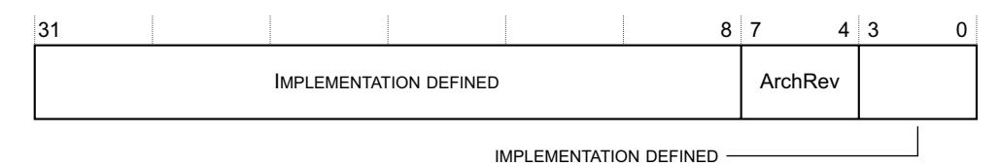

**Figure 12-2 GICD\_PIDR2 bit assignments**

<span id="page-209-3"></span>Table 12-[18 on page](#page-209-3) 12-210 shows the GICD\_PIDR2 bit assignments.

**Table 12-18 GICD\_PIDR2 bit assignments**

<span id="page-209-2"></span>

| Bits   | Name    | Function                                                                                                                                                                                                                                                                             |  |  |  |
|--------|---------|--------------------------------------------------------------------------------------------------------------------------------------------------------------------------------------------------------------------------------------------------------------------------------------|--|--|--|
| [31:8] | -       | IMPLEMENTATION DEFINED. The CoreLink and CoreSight Peripheral ID Registers scheme requires<br>these bits to be reserved, RES0, and Arm strongly recommends that implementations follow this<br>scheme.                                                                               |  |  |  |
| [7:4]  | ArchRev | Revision field for the GIC architecture. The value of this field depends on the GIC architecture<br>version that applies to the Distributor or Redistributor:<br>•<br>0x1. GICv1.<br>•<br>0x2. GICv2.<br>•<br>0x3. GICv3.<br>•<br>0x4. GICv4.<br>•<br>All other values are reserved. |  |  |  |
| [3:0]  | -       | IMPLEMENTATION DEFINED.                                                                                                                                                                                                                                                              |  |  |  |

#### <span id="page-209-1"></span>**GICR\_PIDR2, Redistributor Peripheral ID2 Register**

Where an implementation implements the CoreLink and CoreSight ID scheme described in *[Identification registers](#page-208-3) [on page](#page-208-3) 12-209*, the GICR\_PIDR2 characteristics are:

**Purpose** This register provides a four-bit architecturally-defined architecture revision field. The

remaining bits of the register are IMPLEMENTATION DEFINED.

**Usage constraints** Bits[31:8] of the register are reserved, RAZ.

**Configurations** This register is available in all configurations of the GIC. **Attributes** See the register summary in Table 12-[16 on page](#page-208-1) 12-209.

The GICR\_PIDR2 bit assignments are the same as those for [GICD\\_PIDR2.](#page-209-0)

#### <span id="page-210-1"></span><span id="page-210-0"></span>**GITS\_PIDR2, Redistributor Peripheral ID2 Register**

Where an implementation implements the CoreLink and CoreSight ID scheme described in *[Identification registers](#page-208-3) [on page](#page-208-3) 12-209*, the GITS\_PIDR2 characteristics are:

**Purpose** This register provides a four-bit architecturally-defined architecture revision field. The

remaining bits of the register are IMPLEMENTATION DEFINED.

**Usage constraints** Bits[31:8] of the register are reserved, RAZ.

**Configurations** This register is available in all configurations of the GIC. **Attributes** See the register summary in Table 12-[17 on page](#page-208-2) 12-209.

The GITS\_PIDR2 bit assignments are the same as those for [GICD\\_PIDR2.](#page-209-0)

#### **The Arm implementation of the GIC identification registers**

- **Note** The Arm implementation of these registers is consistent with the identification scheme for CoreLink and CoreSight components. This implementation identifies the device as a GIC that implements this architecture. It does not identify the designer or manufacturer of the GIC implementation. For information about the designer and manufacturer of a GIC implementation, see the descriptions for [GICD\\_IIDR](#page-573-0) and [GICC\\_IIDR](#page-758-0).
- In other contexts, this identification scheme identifies a component in a system. The GIC use of the scheme is different. It identifies only that the device is an implementation of a version of the GIC architecture defined by this specification. Software must read [GICD\\_IIDR](#page-573-0) and [GICC\\_IIDR](#page-758-0) to discover, for example, the implementer and version of the GIC hardware.

All component classes require the implementation of the Component and Peripheral Identification registers, as described in:

- *[Component Identification Registers, CIDR0-CIDR3](#page-210-2)*.
- *[Peripheral Identification Registers, PIDR0 PIDR7 on page](#page-211-0) 12-212*.

#### <span id="page-210-2"></span>*Component Identification Registers, CIDR0-CIDR3*

<span id="page-210-3"></span>[Table](#page-210-3) 12-19 shows the Component Identification Registers.

**Table 12-19 Component Identification Registers**

| Name  | Offset | Bits  | Field   | Value | Description     |
|-------|--------|-------|---------|-------|-----------------|
| CIDR3 | 0xFFFC | [7:0] | PRMBL_3 | 0xB1  | Preamble        |
| CIDR2 | 0xFFF8 | [7:0] | PRMBL_2 | 0x05  | Preamble        |
| CIDR1 | 0xFFF4 | [7:4] | CLASS   | 0xF   | Component Class |
|       |        | [3:0] | PRMBL_1 | 0x0   | Preamble        |
| CIDR0 | 0xFFF0 | [7:0] | PRMBL_0 | 0x0D  | Preamble        |

#### <span id="page-211-0"></span>*Peripheral Identification Registers, PIDR0 - PIDR7*

<span id="page-211-1"></span>[Table](#page-211-1) 12-20 shows the Peripheral Identification Registers.

**Table 12-20 Peripheral Identification Registers** 

| Name  | Offset | Bits  | Field             | Value   | Description                                                                                                         |  |
|-------|--------|-------|-------------------|---------|---------------------------------------------------------------------------------------------------------------------|--|
| PIDR7 | 0xFFDC | [7:0] | -                 | RES0    | Reserved                                                                                                            |  |
| PIDR6 | 0xFFD8 | [7:0] | -                 | RES0    | Reserved                                                                                                            |  |
| PIDR5 | 0XFFD4 | [7:0] | -                 | RES0    | Reserved                                                                                                            |  |
| PIDR4 | 0xFFD0 | [7:4] | SIZE              | 0x4     | 64 KB software visible page                                                                                         |  |
|       |        | [3:0] | DES_2             | 0x4     | Arm implementation                                                                                                  |  |
| PIDR3 | 0xFFEC | [7:4] | RevAnd            | IMP DEF | Manufacturer defined revision number                                                                                |  |
|       |        | [3:0] | Customer Modified | IMP DEF | -                                                                                                                   |  |
| PIDR2 | 0xFFE8 | [7:4] | ARCHREV           | IMP DEF | •<br>0x1. GICv1.<br>•<br>0x2. GICv2.<br>•<br>0x3. GICv3.<br>•<br>0x4. GICv4.<br>•<br>All other values are reserved. |  |
|       |        | [3]   | JEDEC             | 0x1     | JEP code                                                                                                            |  |
|       |        | [2:0] | DES_1             | 0x3     | JEP106 identification code, bits[6:4]                                                                               |  |
| PIDR1 | 0xFFE4 | [7:4] | DES_0             | 0xB     | JEP106 identification code, bits[3:0]                                                                               |  |
|       |        | [3:0] | PART_1            | 0x4     | Part number, bits[11:8]                                                                                             |  |
| PIDR0 | 0xFFE0 | [7:0] | PART_0            | 0x92    | Distributor part number, bits[7:0]                                                                                  |  |
|       |        |       |                   | 0x93    | Redistributor part number, bits[7:0]                                                                                |  |
|       |        |       |                   | 0x94    | ITS part number, bits[7:0]                                                                                          |  |

**Note**

Register offsets 0xFFD0-0xFFFC are defined as read-only identification register space. For Arm implementations of the GIC architecture, the assignment of this register space, and the naming of registers in this space, is consistent with the Arm identification scheme for CoreLink and CoreSight components. It is recommended, but not required, that partner implementations use the same scheme.

A component is uniquely identified by the following fields:

- JEP106 continuation code.
- JEP106 identification code.
- Part Number.
- ArchRev.
- Customer Modified.
- RevAnd.

The meaning of the fields is as follows:

#### **JEP106 continuation code, JEP106 identification code (DES\_2, DES\_1, DES\_0)**

These indicate the designer of the component and not the implementer, except where the two are the same. To obtain a number, or to see the assignment of these codes, contact JEDEC at http://www.jedec.org.

A JEDEC code takes the following form:

- A sequence of zero or more bytes, all of the value 0x7F.
- A following 8-bit number, that is not 0x7F, and where bit[7] is an odd parity bit.

For example, Arm Limited is assigned the code 0x7F 0x7F 0x7F 0x7F 0x3B.

The encoding used in the Peripheral Identification Registers is as follows:

- The continuation code is the number of times 0x7F appears before the final number. for example, for Arm Limited this is 0x4.
- The identification code is bits[6:0] of the final number. For example, for Arm Limited this is 0x3B.

#### **Part number (PART\_1, PART\_0)**

This is selected by the designer of the component.

**ArchRev** In GICv3, this field is ArchRev, see *[GICD\\_PIDR2, Peripheral ID2 Register on page](#page-209-0) 12-210*.

**Customer Modified (CMOD)** Where the component is reusable IP, this value indicates if the customer has modified the behavior of the component. In most cases this field is zero.

**RevAnd (REVAND)** The RevAnd field is an incremental value starting at 0x0 for the first design of a component. This only increases by 1 for both major and minor revisions, and is simply used as a look-up to establish the exact major and minor revision.

**4KB Count (SIZE)** This is a 4-bit value that indicates the total contiguous size of the memory block used by this component in powers of 2 from the standard 4KB. If a component only requires a single 4KB then this must read as log to the base of 2 of the number of 4KB blocks.

#### **12.1.14 CPU interface register reset domain**

All registers in the CPU interface logic belong to the Warm reset domain of the PE. This applies to both System registers and memory-mapped registers. For more information about reset domains, see the *Arm® Architecture Reference Manual, Armv8, for Armv8-A architecture profile*.

#### **12.1.15 GIC reset domain**

All registers in the Distributor, Redistributor, and Interrupt Translation Service logic belong to the GIC reset domain.

#### <span id="page-213-1"></span><span id="page-213-0"></span>**12.2 AArch64 System register descriptions**

This section describes each of the physical AArch64 GIC System registers in register name order. The ICC prefix indicates a GIC CPU interface System register. Each AArch64 System register description contains a reference to the AArch32 register that provides the same functionality.

Unless otherwise stated, the bit assignments for the GIC System registers are the same as those for the equivalent GICC\_\* and GICV\_\* memory-mapped registers.

The ICC prefix is used by the System register access mechanism to select the physical or virtual interface System registers according to the setting of [HCR\\_EL2.](#page-28-2) The equivalent memory-mapped physical registers are described in *[The GIC CPU interface register descriptions on page](#page-730-1) 12-731*.The equivalent virtual interface memory-mapped registers are described in *[The GIC virtual CPU interface register descriptions on page](#page-769-1) 12-770*.

<span id="page-213-2"></span>Table 12-[21 on page](#page-213-2) 12-214 shows the encodings for the AArch64 System registers.

**Table 12-21 Encodings for the AArch64 System registers**

|                      |              | Access instruction encoding |     |     |     |     |                     |
|----------------------|--------------|-----------------------------|-----|-----|-----|-----|---------------------|
| Register             | Width (bits) | Op0                         | Op1 | CRn | CRm | Op2 | Notes               |
| ICC_PMR_EL1          | 32           | 3                           | 0   | 4   | 6   | 0   | RW                  |
| ICC_IAR0_EL1         | 32           |                             |     | 12  | 8   | 0   | RO                  |
| ICC_EOIR0_EL1        | 32           |                             |     |     |     | 1   | WO                  |
| ICC_HPPIR0_EL1       | 32           |                             |     |     |     | 2   | RO                  |
| ICC_BPR0_EL1         | 32           |                             |     |     |     | 3   | RW                  |
| ICC_AP0R <n>_EL1</n> | 32           |                             |     |     |     | 4-7 | RW, <n> = Op2-4</n> |
| ICC_AP1R <n>_EL1</n> | 32           |                             |     |     | 9   | 0-3 | RW, <n> = Op2</n>   |
| ICC_DIR_EL1          | 32           |                             |     |     | 11  | 1   | WO                  |
| ICC_RPR_EL1          | 32           |                             |     |     |     | 3   | RO                  |
| ICC_SGI1R_EL1        | 64           |                             |     |     |     | 5   | WO                  |
| ICC_ASGI1R_EL1       | 64           |                             |     |     |     | 6   | WO                  |
| ICC_SGI0R_EL1        | 64           |                             |     |     |     | 7   | WO                  |
| ICC_IAR1_EL1         | 32           |                             |     |     | 12  | 0   | RO                  |
| ICC_EOIR1_EL1        | 32           |                             |     |     |     | 1   | WO                  |
| ICC_HPPIR1_EL1       | 32           |                             |     |     |     | 2   | RO                  |
| ICC_BPR1_EL1         | 32           |                             |     |     |     | 3   | RW                  |
| ICC_CTLR_EL1         | 32           |                             |     |     |     | 4   | RW                  |
| ICC_SRE_EL1          | 32           |                             |     |     |     | 5   | RW                  |
| ICC_IGRPEN0_EL1      | 32           |                             |     |     |     | 6   | RW                  |
| ICC_IGRPEN1_EL1      | 32           |                             |     |     |     | 7   | RW                  |
| ICC_SRE_EL2          | 32           | 3                           | 4   | 12  | 9   | 5   | RW                  |

**Table 12-21 Encodings for the AArch64 System registers (continued)**

|                 |              | Access instruction encoding |     |     |     |     |             |
|-----------------|--------------|-----------------------------|-----|-----|-----|-----|-------------|
| Register        | Width (bits) | Op0                         | Op1 | CRn | CRm | Op2 | Notes<br>RW |
| ICC_CTLR_EL3    | 32           | 3                           | 6   | 12  | 12  | 4   |             |
| ICC_SRE_EL3     | 32           |                             |     |     |     | 5   | RW          |
| ICC_IGRPEN1_EL3 | 32           |                             |     |     |     | 7   | RW          |

The following access encodings are IMPLEMENTATION DEFINED.

| op0 | op1 | CRn  | CRm  | op2 |
|-----|-----|------|------|-----|
| 11  | 000 | 1100 | 1101 | 000 |

#### <span id="page-215-1"></span><span id="page-215-0"></span>**12.2.1 ICC\_AP0R<n>\_EL1, Interrupt Controller Active Priorities Group 0 Registers, n = 0 - 3**

The ICC\_AP0R<n>\_EL1 characteristics are:

#### **Purpose**

Provides information about Group 0 active priorities.

#### **Configurations**

AArch64 System register ICC\_AP0R<n>\_EL1 bits [31:0] are architecturally mapped to AArch32 System register [ICC\\_AP0R<n>](#page-369-0)[31:0].

This register is present only when FEAT\_GICv3 is implemented. Otherwise, direct accesses to ICC\_AP0R<n>\_EL1 are UNDEFINED.

#### **Attributes**

ICC\_AP0R<n>\_EL1 is a 64-bit register.

#### **Field descriptions**

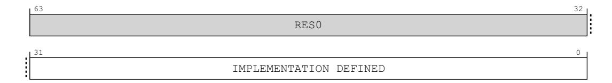

#### **Bits [63:32]**

Reserved, RES0.

#### **IMPLEMENTATION DEFINED, bits [31:0]**

IMPLEMENTATION DEFINED.

The reset behavior of this field is:

• On a Warm reset, this field resets to 0.

The contents of these registers are IMPLEMENTATION DEFINED with the one architectural requirement that a value of all zeros is consistent with no interrupts being active.

#### **Accessing ICC\_AP0R<n>\_EL1**

Writing to these registers with any value other than the last read value of the register (or all zeros when there are no Group 0 active priorities) might result in UNPREDICTABLE behavior of the interrupt prioritization system, causing:

- Interrupts that should preempt execution to not preempt execution.
- Interrupts that should not preempt execution to preempt execution.

ICC\_AP0R1\_EL1 is implemented only in implementations that support 6 or more bits of priority. ICC\_AP0R2\_EL1 and ICC\_AP0R3\_EL1 are implemented only in implementations that support 7 or more bits of priority. Unimplemented registers are UNDEFINED.


The number of bits of preemption is indicated by [ICH\\_VTR\\_EL2.](#page-364-1)PREbits.

Writing to the active priority registers in any order other than the following order will result in UNPREDICTABLE behavior:

- ICC\_AP0R<n>\_EL1.
- Secure [ICC\\_AP1R<n>\\_EL1](#page-218-1).

#### • Non-secure [ICC\\_AP1R<n>\\_EL1](#page-218-1).

Accesses to this register use the following encodings in the System register encoding space:

#### **MRS <Xt>, ICC\_AP0R<m>\_EL1; Where m = 0-3**

| op0  | op1   | CRn    | CRm    | op2        |
|------|-------|--------|--------|------------|
| 0b11 | 0b000 | 0b1100 | 0b1000 | 0b1:m[1:0] |

```
integer m = UInt(op2<1:0>);
if m == 1 && NUM_GIC_PRIORITY_BITS < 6 then
    UNDEFINED;
elsif (m == 2 || m == 3) && NUM_GIC_PRIORITY_BITS < 7 then
    UNDEFINED;
elsif PSTATE.EL == EL0 then
    UNDEFINED;
elsif PSTATE.EL == EL1 then
    if HaveEL(EL3) && EL3SDDUndefPriority() && SCR_EL3.FIQ == '1' then
        UNDEFINED;
    elsif ICC_SRE_EL1.SRE == '0' then
        AArch64.SystemAccessTrap(EL1, 0x18);
    elsif EL2Enabled() && ICH_HCR_EL2.TALL0 == '1' then
        AArch64.SystemAccessTrap(EL2, 0x18);
    elsif EL2Enabled() && HCR_EL2.FMO == '1' then
        X[t, 64] = ICV_AP0R_EL1[m];
    elsif HaveEL(EL3) && SCR_EL3.FIQ == '1' then
        if EL3SDDUndef() then
            UNDEFINED;
        else
            AArch64.SystemAccessTrap(EL3, 0x18);
    else
        X[t, 64] = ICC_AP0R_EL1[m];
elsif PSTATE.EL == EL2 then
    if HaveEL(EL3) && EL3SDDUndefPriority() && SCR_EL3.FIQ == '1' then
        UNDEFINED;
    elsif ICC_SRE_EL2.SRE == '0' then
        AArch64.SystemAccessTrap(EL2, 0x18);
    elsif HaveEL(EL3) && SCR_EL3.FIQ == '1' then
        if EL3SDDUndef() then
            UNDEFINED;
        else
            AArch64.SystemAccessTrap(EL3, 0x18);
    else
        X[t, 64] = ICC_AP0R_EL1[m];
elsif PSTATE.EL == EL3 then
    if ICC_SRE_EL3.SRE == '0' then
        AArch64.SystemAccessTrap(EL3, 0x18);
    else
        X[t, 64] = ICC_AP0R_EL1[m];
```

#### **MSR ICC\_AP0R<m>\_EL1, <Xt>; Where m = 0-3**

| op0  | op1   | CRn    | CRm    | op2        |
|------|-------|--------|--------|------------|
| 0b11 | 0b000 | 0b1100 | 0b1000 | 0b1:m[1:0] |

```
integer m = UInt(op2<1:0>);
if m == 1 && NUM_GIC_PRIORITY_BITS < 6 then
    UNDEFINED;
elsif (m == 2 || m == 3) && NUM_GIC_PRIORITY_BITS < 7 then
    UNDEFINED;
elsif PSTATE.EL == EL0 then
    UNDEFINED;
elsif PSTATE.EL == EL1 then
    if HaveEL(EL3) && EL3SDDUndefPriority() && SCR_EL3.FIQ == '1' then
        UNDEFINED;
    elsif ICC_SRE_EL1.SRE == '0' then
        AArch64.SystemAccessTrap(EL1, 0x18);
    elsif EL2Enabled() && ICH_HCR_EL2.TALL0 == '1' then
        AArch64.SystemAccessTrap(EL2, 0x18);
    elsif EL2Enabled() && HCR_EL2.FMO == '1' then
        ICV_AP0R_EL1[m] = X[t, 64];
    elsif HaveEL(EL3) && SCR_EL3.FIQ == '1' then
        if EL3SDDUndef() then
            UNDEFINED;
        else
            AArch64.SystemAccessTrap(EL3, 0x18);
    else
        ICC_AP0R_EL1[m] = X[t, 64];
elsif PSTATE.EL == EL2 then
    if HaveEL(EL3) && EL3SDDUndefPriority() && SCR_EL3.FIQ == '1' then
        UNDEFINED;
    elsif ICC_SRE_EL2.SRE == '0' then
        AArch64.SystemAccessTrap(EL2, 0x18);
    elsif HaveEL(EL3) && SCR_EL3.FIQ == '1' then
        if EL3SDDUndef() then
            UNDEFINED;
        else
            AArch64.SystemAccessTrap(EL3, 0x18);
    else
        ICC_AP0R_EL1[m] = X[t, 64];
elsif PSTATE.EL == EL3 then
    if ICC_SRE_EL3.SRE == '0' then
        AArch64.SystemAccessTrap(EL3, 0x18);
    else
        ICC_AP0R_EL1[m] = X[t, 64];
```

#### <span id="page-218-1"></span><span id="page-218-0"></span>**12.2.2 ICC\_AP1R<n>\_EL1, Interrupt Controller Active Priorities Group 1 Registers, n = 0 - 3**

The ICC\_AP1R<n>\_EL1 characteristics are:

#### **Purpose**

Provides information about Group 1 active priorities.

#### **Configurations**

 This register is banked between ICC\_AP1R<n>\_EL1 and ICC\_AP1R<n>\_EL1\_S and ICC\_AP1R<n>\_EL1\_NS.

AArch64 System register ICC\_AP1R<n>\_EL1 bits [31:0] (ICC\_AP1R<n>\_EL1\_S) are architecturally mapped to AArch32 System register [ICC\\_AP1R<n>](#page-373-0)[31:0] (ICC\_AP1R<n>\_S).

AArch64 System register ICC\_AP1R<n>\_EL1 bits [31:0] (ICC\_AP1R<n>\_EL1\_NS) are architecturally mapped to AArch32 System register [ICC\\_AP1R<n>](#page-373-0)[31:0] (ICC\_AP1R<n>\_NS).

This register is present only when FEAT\_GICv3 is implemented. Otherwise, direct accesses to ICC\_AP1R<n>\_EL1 are UNDEFINED.

#### **Attributes**

ICC\_AP1R<n>\_EL1 is a 64-bit register.

This register has the following instances:

- ICC\_AP1R<n>\_EL1, when EL3 is not implemented.
- ICC\_AP1R<n>\_EL1\_S, when EL3 is implemented.
- ICC\_AP1R<n>\_EL1\_NS, when EL3 is implemented.

#### **Field descriptions**

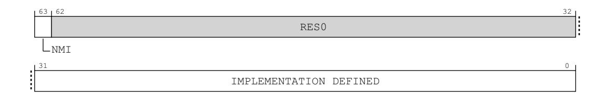

#### **NMI, bit [63]**

#### *When FEAT\_GICv3\_NMI is implemented and n == 0:*

Indicates whether there is an active NMI priority.

0b0 There is no active Group 1 NMI, or all active Group 1 NMIs have undergone priority drop.

0b1 There is an active Group 1 NMI.

The reset behavior of this field is:

• On a Warm reset, this field resets to 0.

#### *Otherwise:*

Reserved, RES0.

#### **Bits [62:32]**

Reserved, RES0.

#### **IMPLEMENTATION DEFINED, bits [31:0]**

IMPLEMENTATION DEFINED.

The reset behavior of this field is:

• On a Warm reset, this field resets to 0.

The contents of these registers are IMPLEMENTATION DEFINED with the one architectural requirement that a value of all zeros is consistent with no interrupts being active.

#### **Accessing ICC\_AP1R<n>\_EL1**

Writing to these registers with any value other than the last read value of the register (or all zeros when there are no Group 1 active priorities) might result in UNPREDICTABLE behavior of the interrupt prioritization system, causing:

- Interrupts that should preempt execution to not preempt execution.
- Interrupts that should not preempt execution to preempt execution.

ICC\_AP1R1\_EL1 is implemented only in implementations that support 6 or more bits of priority. ICC\_AP1R2\_EL1 and ICC\_AP1R3\_EL1 are implemented only in implementations that support 7 or more bits of priority. Unimplemented registers are UNDEFINED.

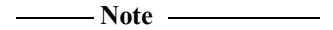

The number of bits of preemption is indicated by [ICH\\_VTR\\_EL2.](#page-364-1)PREbits.

Writing to the active priority registers in any order other than the following order will result in UNPREDICTABLE behavior:

- [ICC\\_AP0R<n>\\_EL1](#page-215-1).
- Secure ICC\_AP1R<n>\_EL1.
- Non-secure ICC\_AP1R<n>\_EL1.

Accesses to this register use the following encodings in the System register encoding space:

**MRS <Xt>, ICC\_AP1R<m>\_EL1; Where m = 0-3**

| op0  | op1   | CRn    | CRm    | op2        |
|------|-------|--------|--------|------------|
| 0b11 | 0b000 | 0b1100 | 0b1001 | 0b0:m[1:0] |

```
integer m = UInt(op2<1:0>);
if m == 1 && NUM_GIC_PRIORITY_BITS < 6 then
    UNDEFINED;
elsif (m == 2 || m == 3) && NUM_GIC_PRIORITY_BITS < 7 then
    UNDEFINED;
elsif PSTATE.EL == EL0 then
    UNDEFINED;
elsif PSTATE.EL == EL1 then
    if HaveEL(EL3) && EL3SDDUndefPriority() && SCR_EL3.IRQ == '1' then
        UNDEFINED;
    elsif ICC_SRE_EL1.SRE == '0' then
        AArch64.SystemAccessTrap(EL1, 0x18);
    elsif EL2Enabled() && ICH_HCR_EL2.TALL1 == '1' then
        AArch64.SystemAccessTrap(EL2, 0x18);
    elsif EL2Enabled() && HCR_EL2.IMO == '1' then
        X[t, 64] = ICV_AP1R_EL1[m];
    elsif HaveEL(EL3) && SCR_EL3.IRQ == '1' then
        if EL3SDDUndef() then
            UNDEFINED;
        else
            AArch64.SystemAccessTrap(EL3, 0x18);
    elsif HaveEL(EL3) then
        if SCR_EL3.NS == '0' then
            X[t, 64] = ICC_AP1R_EL1_S[m];
```

```
else
            X[t, 64] = ICC_AP1R_EL1_NS[m];
    else
        X[t, 64] = ICC_AP1R_EL1[m];
elsif PSTATE.EL == EL2 then
    if HaveEL(EL3) && EL3SDDUndefPriority() && SCR_EL3.IRQ == '1' then
        UNDEFINED;
    elsif ICC_SRE_EL2.SRE == '0' then
        AArch64.SystemAccessTrap(EL2, 0x18);
    elsif HaveEL(EL3) && SCR_EL3.IRQ == '1' then
        if EL3SDDUndef() then
            UNDEFINED;
        else
            AArch64.SystemAccessTrap(EL3, 0x18);
    elsif HaveEL(EL3) then
        if SCR_EL3.NS == '0' then
            X[t, 64] = ICC_AP1R_EL1_S[m];
        else
            X[t, 64] = ICC_AP1R_EL1_NS[m];
    else
        X[t, 64] = ICC_AP1R_EL1[m];
elsif PSTATE.EL == EL3 then
    if ICC_SRE_EL3.SRE == '0' then
        AArch64.SystemAccessTrap(EL3, 0x18);
    else
        if SCR_EL3.NS == '0' then
            X[t, 64] = ICC_AP1R_EL1_S[m];
        else
            X[t, 64] = ICC_AP1R_EL1_NS[m];
```

#### **MSR ICC\_AP1R<m>\_EL1, <Xt>; Where m = 0-3**

| op0  | op1   | CRn    | CRm    | op2        |
|------|-------|--------|--------|------------|
| 0b11 | 0b000 | 0b1100 | 0b1001 | 0b0:m[1:0] |

```
integer m = UInt(op2<1:0>);
if m == 1 && NUM_GIC_PRIORITY_BITS < 6 then
    UNDEFINED;
elsif (m == 2 || m == 3) && NUM_GIC_PRIORITY_BITS < 7 then
    UNDEFINED;
elsif PSTATE.EL == EL0 then
    UNDEFINED;
elsif PSTATE.EL == EL1 then
    if HaveEL(EL3) && EL3SDDUndefPriority() && SCR_EL3.IRQ == '1' then
        UNDEFINED;
    elsif ICC_SRE_EL1.SRE == '0' then
        AArch64.SystemAccessTrap(EL1, 0x18);
    elsif EL2Enabled() && ICH_HCR_EL2.TALL1 == '1' then
        AArch64.SystemAccessTrap(EL2, 0x18);
    elsif EL2Enabled() && HCR_EL2.IMO == '1' then
        ICV_AP1R_EL1[m] = X[t, 64];
    elsif HaveEL(EL3) && SCR_EL3.IRQ == '1' then
        if EL3SDDUndef() then
            UNDEFINED;
        else
            AArch64.SystemAccessTrap(EL3, 0x18);
    elsif HaveEL(EL3) then
        if SCR_EL3.NS == '0' then
            ICC_AP1R_EL1_S[m] = X[t, 64];
        else
```

```
ICC_AP1R_EL1_NS[m] = X[t, 64];
    else
        ICC_AP1R_EL1[m] = X[t, 64];
elsif PSTATE.EL == EL2 then
    if HaveEL(EL3) && EL3SDDUndefPriority() && SCR_EL3.IRQ == '1' then
        UNDEFINED;
    elsif ICC_SRE_EL2.SRE == '0' then
        AArch64.SystemAccessTrap(EL2, 0x18);
    elsif HaveEL(EL3) && SCR_EL3.IRQ == '1' then
        if EL3SDDUndef() then
            UNDEFINED;
        else
            AArch64.SystemAccessTrap(EL3, 0x18);
    elsif HaveEL(EL3) then
        if SCR_EL3.NS == '0' then
            ICC_AP1R_EL1_S[m] = X[t, 64];
        else
            ICC_AP1R_EL1_NS[m] = X[t, 64];
    else
        ICC_AP1R_EL1[m] = X[t, 64];
elsif PSTATE.EL == EL3 then
    if ICC_SRE_EL3.SRE == '0' then
        AArch64.SystemAccessTrap(EL3, 0x18);
    else
        if SCR_EL3.NS == '0' then
            ICC_AP1R_EL1_S[m] = X[t, 64];
        else
            ICC_AP1R_EL1_NS[m] = X[t, 64];
```

#### <span id="page-222-1"></span><span id="page-222-0"></span>**12.2.3 ICC\_ASGI1R\_EL1, Interrupt Controller Alias Software Generated Interrupt Group 1 Register**

The ICC\_ASGI1R\_EL1 characteristics are:

#### **Purpose**

Generates Group 1 SGIs for the Security state that is not the current Security state.

#### **Configurations**

AArch64 System register ICC\_ASGI1R\_EL1 performs the same function as AArch32 System register [ICC\\_ASGI1R](#page-377-0).

This register is present only when FEAT\_GICv3 is implemented. Otherwise, direct accesses to ICC\_ASGI1R\_EL1 are UNDEFINED.

Under certain conditions a write to ICC\_ASGI1R\_EL1 can generate Group 0 interrupts, see [Table](#page-206-1) 12-14.

#### **Attributes**

ICC\_ASGI1R\_EL1 is a 64-bit register.

#### **Field descriptions**

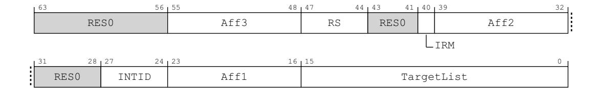

#### **Bits [63:56]**

Reserved, RES0.

#### **Aff3, bits [55:48]**

The affinity 3 value of the affinity path of the cluster for which SGI interrupts will be generated. If the IRM bit is 1, this field is RES0.

#### **RS, bits [47:44]**

RangeSelector

Controls which group of 16 values is represented by the TargetList field.

TargetList[n] represents aff0 value ((RS \* 16) + n).

When [ICC\\_CTLR\\_EL1](#page-232-1).RSS==0, RS is RES0.

When [ICC\\_CTLR\\_EL1.](#page-232-1)RSS==1 and [GICD\\_TYPER](#page-617-1).RSS==0, writing this register with RS != 0 is a CONSTRAINED UNPREDICTABLE choice of:

- The write is ignored.
- The RS field is treated as 0.

#### **Bits [43:41]**

Reserved, RES0.

#### **IRM, bit [40]**

Interrupt Routing Mode. Determines how the generated interrupts are distributed to PEs. Possible values are:

0b0 Interrupts routed to the PEs specified by Aff3.Aff2.Aff1.<target list>.

0b1 Interrupts routed to all PEs in the system, excluding "self".

#### **Aff2, bits [39:32]**

The affinity 2 value of the affinity path of the cluster for which SGI interrupts will be generated. If the IRM bit is 1, this field is RES0.

#### **Bits [31:28]**

Reserved, RES0.

#### **INTID, bits [27:24]**

The INTID of the SGI.

#### **Aff1, bits [23:16]**

The affinity 1 value of the affinity path of the cluster for which SGI interrupts will be generated. If the IRM bit is 1, this field is RES0.

#### **TargetList, bits [15:0]**

Target List. The set of PEs for which SGI interrupts will be generated. Each bit corresponds to the PE within a cluster with an Affinity 0 value equal to the bit number.

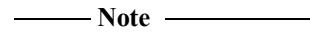

If SRE is set only for Secure EL3, software executing at EL3 might use the System register interface to generate SGIs. Therefore, the Distributor must always be able to receive and acknowledge Generate SGI packets received from CPU interface regardless of the ARE settings for a Security state. However, the Distributor might discard such packets.

If the IRM bit is 1, this field is RES0.

If a bit is 1 and the bit does not correspond to a valid target PE, the bit must be ignored by the Distributor. It is IMPLEMENTATION DEFINED whether, in such cases, a Distributor can signal a system error.

#### **Accessing ICC\_ASGI1R\_EL1**

This register allows software executing in a Secure state to generate Non-secure Group 1 SGIs. It will also allow software executing in a Non-secure state to generate Secure Group 1 SGIs, if permitted by the settings of [GICR\\_NSACR](#page-696-1) in the Redistributor corresponding to the target PE.

When [GICD\\_CTLR](#page-543-1).DS==0, Non-secure writes do not generate an interrupt for a target PE if not permitted by the [GICR\\_NSACR](#page-696-1) register associated with the target PE. For more information, see *[Use of control registers for SGI](#page-206-2)  [forwarding on page](#page-206-2) 12-207*.


Accesses at EL3 are treated as Secure regardless of the value of [SCR\\_EL3](#page-29-4).NS.

Accesses to this register use the following encodings in the System register encoding space:

#### **MSR ICC\_ASGI1R\_EL1, <Xt>**

| op0  | op1   | CRn    | CRm    | op2   |
|------|-------|--------|--------|-------|
| 0b11 | 0b000 | 0b1100 | 0b1011 | 0b110 |

```
if PSTATE.EL == EL0 then
    UNDEFINED;
elsif PSTATE.EL == EL1 then
    if HaveEL(EL3) && EL3SDDUndefPriority() && SCR_EL3.<IRQ,FIQ> == '11' then
        UNDEFINED;
```

```
elsif ICC_SRE_EL1.SRE == '0' then
        AArch64.SystemAccessTrap(EL1, 0x18);
    elsif EL2Enabled() && ICH_HCR_EL2.TC == '1' then
        AArch64.SystemAccessTrap(EL2, 0x18);
    elsif EL2Enabled() && HCR_EL2.FMO == '1' then
        AArch64.SystemAccessTrap(EL2, 0x18);
    elsif EL2Enabled() && HCR_EL2.IMO == '1' then
        AArch64.SystemAccessTrap(EL2, 0x18);
    elsif HaveEL(EL3) && SCR_EL3.<IRQ,FIQ> == '11' then
        if EL3SDDUndef() then
            UNDEFINED;
        else
            AArch64.SystemAccessTrap(EL3, 0x18);
    else
        ICC_ASGI1R_EL1 = X[t, 64];
elsif PSTATE.EL == EL2 then
    if HaveEL(EL3) && EL3SDDUndefPriority() && SCR_EL3.<IRQ,FIQ> == '11' then
        UNDEFINED;
    elsif ICC_SRE_EL2.SRE == '0' then
        AArch64.SystemAccessTrap(EL2, 0x18);
    elsif HaveEL(EL3) && SCR_EL3.<IRQ,FIQ> == '11' then
        if EL3SDDUndef() then
            UNDEFINED;
        else
            AArch64.SystemAccessTrap(EL3, 0x18);
    else
        ICC_ASGI1R_EL1 = X[t, 64];
elsif PSTATE.EL == EL3 then
    if ICC_SRE_EL3.SRE == '0' then
        AArch64.SystemAccessTrap(EL3, 0x18);
    else
        ICC_ASGI1R_EL1 = X[t, 64];
```

#### <span id="page-225-1"></span><span id="page-225-0"></span>**12.2.4 ICC\_BPR0\_EL1, Interrupt Controller Binary Point Register 0**

The ICC\_BPR0\_EL1 characteristics are:

#### **Purpose**

Defines the point at which the priority value fields split into two parts, the group priority field and the subpriority field. The group priority field determines Group 0 interrupt preemption.

#### **Configurations**

AArch64 System register ICC\_BPR0\_EL1 bits [31:0] are architecturally mapped to AArch32 System register [ICC\\_BPR0\[](#page-380-1)31:0].

This register is present only when FEAT\_GICv3 is implemented. Otherwise, direct accesses to ICC\_BPR0\_EL1 are UNDEFINED.

Virtual accesses to this register update [ICH\\_VMCR\\_EL2](#page-360-1).VBPR0.

#### **Attributes**

ICC\_BPR0\_EL1 is a 64-bit register.

#### **Field descriptions**

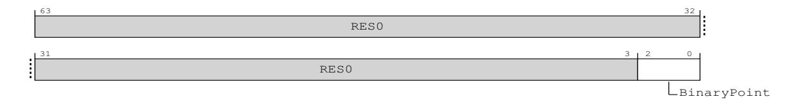

#### **Bits [63:3]**

Reserved, RES0.

#### **BinaryPoint, bits [2:0]**

The value of this field controls how the 8-bit interrupt priority field is split into a group priority field, that determines interrupt preemption, and a subpriority field. This is done as follows:

| Binary point value | Group priority field | Subpriority field | Field with binary point |
|--------------------|----------------------|-------------------|-------------------------|
| 0                  | [7:1]                | [0]               | ggggggg.s               |
| 1                  | [7:2]                | [1:0]             | gggggg.ss               |
| 2                  | [7:3]                | [2:0]             | ggggg.sss               |
| 3                  | [7:4]                | [3:0]             | gggg.ssss               |
| 4                  | [7:5]                | [4:0]             | ggg.sssss               |
| 5                  | [7:6]                | [5:0]             | gg.ssssss               |
| 6                  | [7]                  | [6:0]             | g.sssssss               |
| 7                  | No preemption        | [7:0]             | .ssssssss               |
|                    |                      |                   |                         |

The reset behavior of this field is:

• On a Warm reset, this field resets to an architecturally UNKNOWN value.

#### **Accessing ICC\_BPR0\_EL1**

The minimum binary point value is derived from the number of implemented priority bits. The number of priority bits is IMPLEMENTATION DEFINED, and reported by:

- [ICC\\_CTLR\\_EL1.](#page-232-1)PRIbits
- [ICC\\_CTLR\\_EL3.](#page-237-1)PRIbits An attempt to program the binary point field to a value less than the minimum value sets the field to the minimum value.

On a reset, the binary point field is UNKNOWN.

Accesses to this register use the following encodings in the System register encoding space:

#### **MRS <Xt>, ICC\_BPR0\_EL1**

| op0  | op1   | CRn    | CRm    | op2   |
|------|-------|--------|--------|-------|
| 0b11 | 0b000 | 0b1100 | 0b1000 | 0b011 |

```
if PSTATE.EL == EL0 then
    UNDEFINED;
elsif PSTATE.EL == EL1 then
    if HaveEL(EL3) && EL3SDDUndefPriority() && SCR_EL3.FIQ == '1' then
        UNDEFINED;
    elsif ICC_SRE_EL1.SRE == '0' then
        AArch64.SystemAccessTrap(EL1, 0x18);
    elsif EL2Enabled() && ICH_HCR_EL2.TALL0 == '1' then
        AArch64.SystemAccessTrap(EL2, 0x18);
    elsif EL2Enabled() && HCR_EL2.FMO == '1' then
        X[t, 64] = ICV_BPR0_EL1;
    elsif HaveEL(EL3) && SCR_EL3.FIQ == '1' then
        if EL3SDDUndef() then
            UNDEFINED;
        else
            AArch64.SystemAccessTrap(EL3, 0x18);
    else
        X[t, 64] = ICC_BPR0_EL1;
elsif PSTATE.EL == EL2 then
    if HaveEL(EL3) && EL3SDDUndefPriority() && SCR_EL3.FIQ == '1' then
        UNDEFINED;
    elsif ICC_SRE_EL2.SRE == '0' then
        AArch64.SystemAccessTrap(EL2, 0x18);
    elsif HaveEL(EL3) && SCR_EL3.FIQ == '1' then
        if EL3SDDUndef() then
            UNDEFINED;
        else
            AArch64.SystemAccessTrap(EL3, 0x18);
    else
        X[t, 64] = ICC_BPR0_EL1;
elsif PSTATE.EL == EL3 then
    if ICC_SRE_EL3.SRE == '0' then
        AArch64.SystemAccessTrap(EL3, 0x18);
    else
        X[t, 64] = ICC_BPR0_EL1;
```

#### **MSR ICC\_BPR0\_EL1, <Xt>**

| op0  | op1   | CRn    | CRm    | op2   |
|------|-------|--------|--------|-------|
| 0b11 | 0b000 | 0b1100 | 0b1000 | 0b011 |

```
if PSTATE.EL == EL0 then
    UNDEFINED;
elsif PSTATE.EL == EL1 then
    if HaveEL(EL3) && EL3SDDUndefPriority() && SCR_EL3.FIQ == '1' then
        UNDEFINED;
    elsif ICC_SRE_EL1.SRE == '0' then
        AArch64.SystemAccessTrap(EL1, 0x18);
    elsif EL2Enabled() && ICH_HCR_EL2.TALL0 == '1' then
        AArch64.SystemAccessTrap(EL2, 0x18);
    elsif EL2Enabled() && HCR_EL2.FMO == '1' then
        ICV_BPR0_EL1 = X[t, 64];
    elsif HaveEL(EL3) && SCR_EL3.FIQ == '1' then
        if EL3SDDUndef() then
            UNDEFINED;
        else
            AArch64.SystemAccessTrap(EL3, 0x18);
    else
        ICC_BPR0_EL1 = X[t, 64];
elsif PSTATE.EL == EL2 then
    if HaveEL(EL3) && EL3SDDUndefPriority() && SCR_EL3.FIQ == '1' then
        UNDEFINED;
    elsif ICC_SRE_EL2.SRE == '0' then
        AArch64.SystemAccessTrap(EL2, 0x18);
    elsif HaveEL(EL3) && SCR_EL3.FIQ == '1' then
        if EL3SDDUndef() then
            UNDEFINED;
        else
            AArch64.SystemAccessTrap(EL3, 0x18);
    else
        ICC_BPR0_EL1 = X[t, 64];
elsif PSTATE.EL == EL3 then
    if ICC_SRE_EL3.SRE == '0' then
        AArch64.SystemAccessTrap(EL3, 0x18);
    else
        ICC_BPR0_EL1 = X[t, 64];
```

#### <span id="page-228-1"></span><span id="page-228-0"></span>**12.2.5 ICC\_BPR1\_EL1, Interrupt Controller Binary Point Register 1**

The ICC\_BPR1\_EL1 characteristics are:

#### **Purpose**

Defines the point at which the priority value fields split into two parts, the group priority field and the subpriority field. The group priority field determines Group 1 interrupt preemption.

#### **Configurations**

 This register is banked between ICC\_BPR1\_EL1 and ICC\_BPR1\_EL1\_S and ICC\_BPR1\_EL1\_NS.

AArch64 System register ICC\_BPR1\_EL1 bits [31:0] (ICC\_BPR1\_EL1\_S) are architecturally mapped to AArch32 System register [ICC\\_BPR1](#page-384-1)[31:0] (ICC\_BPR1\_S).

AArch64 System register ICC\_BPR1\_EL1 bits [31:0] (ICC\_BPR1\_EL1\_NS) are architecturally mapped to AArch32 System register [ICC\\_BPR1](#page-384-1)[31:0] (ICC\_BPR1\_NS).

This register is present only when FEAT\_GICv3 is implemented. Otherwise, direct accesses to ICC\_BPR1\_EL1 are UNDEFINED.

Virtual accesses to this register update [ICH\\_VMCR\\_EL2](#page-360-1).VBPR1.

#### **Attributes**

ICC\_BPR1\_EL1 is a 64-bit register.

This register has the following instances:

- ICC\_BPR1\_EL1, when EL3 is not implemented.
- ICC\_BPR1\_EL1\_S, when EL3 is implemented.
- ICC\_BPR1\_EL1\_NS, when EL3 is implemented.

#### **Field descriptions**

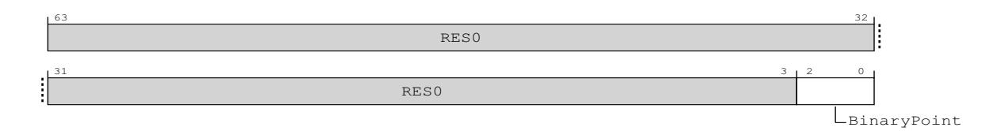

#### **Bits [63:3]**

Reserved, RES0.

#### **BinaryPoint, bits [2:0]**

If the GIC is configured to use separate binary point fields for Group 0 and Group 1 interrupts, the value of this field controls how the 8-bit interrupt priority field is split into a group priority field, that determines interrupt preemption, and a subpriority field. For more information about priorities, see *[Priority grouping on page](#page-73-2) 4-74*.

The minimum value of the Non-secure copy of this register is the minimum value of [ICC\\_BPR0\\_EL1](#page-225-1) + 1. The minimum value of the Secure copy of this register is the minimum value of [ICC\\_BPR0\\_EL1.](#page-225-1)

If EL3 is implemented and [ICC\\_CTLR\\_EL3](#page-237-1).CBPR\_EL1S is 1:

- Accesses to this register from Secure EL2 access the state of [ICC\\_BPR0\\_EL1.](#page-225-1)
- Accesses to this register from Secure EL1:
  - When SCR\_EL3.EEL2 is 1 and HCR\_EL2.IMO is 1, access the state of [ICV\\_BPR1\\_EL1.](#page-299-1)
  - Otherwise, access the state of [ICC\\_BPR0\\_EL1](#page-225-1).

If EL3 is implemented and [ICC\\_CTLR\\_EL3](#page-237-1).CBPR\_EL1NS is 1, Non-secure accesses to this register at EL1 or EL2 behave as follows, depending on the values of [HCR\\_EL2.](#page-28-2)IMO and [SCR\\_EL3.](#page-29-4)IRQ:

| HCR_EL2.IMO | SCR_EL3.IRQ | Behavior                                                                                                                                                  |
|-------------|-------------|-----------------------------------------------------------------------------------------------------------------------------------------------------------|
| 0b0         | 0b0         | Non-secure EL1 and EL2 reads return ICC_BPR0_EL1 + 1 saturated to 0b111. Non-secure<br>EL1 and EL2 writes are ignored.                                    |
| 0b0         | 0b1         | Non-secure EL1 and EL2 accesses trap to EL3.                                                                                                              |
| 0b1         | 0b0         | Non-secure EL1 accesses affect virtual interrupts. Non-secure EL2 reads return<br>ICC_BPR0_EL1 + 1 saturated to 0b111. Non-secure EL2 writes are ignored. |
| 0b1         | 0b1         | Non-secure EL1 accesses affect virtual interrupts. Non-secure EL2 accesses trap to EL3.                                                                   |

If EL3 is not implemented and [ICC\\_CTLR\\_EL1](#page-232-1).CBPR is 1, Non-secure accesses to this register at EL1 or EL2 behave as follows, depending on the values of [HCR\\_EL2.](#page-28-2)IMO:

| HCR_EL2.IMO | Behavior                                                                                                                                                  |
|-------------|-----------------------------------------------------------------------------------------------------------------------------------------------------------|
| 0b0         | Non-secure EL1 and EL2 reads return ICC_BPR0_EL1 + 1 saturated to 0b111. Non-secure EL1<br>and EL2 writes are ignored.                                    |
| 0b1         | Non-secure EL1 accesses affect virtual interrupts. Non-secure EL2 reads return ICC_BPR0_EL1<br>+ 1 saturated to 0b111. Non-secure EL2 writes are ignored. |

The reset behavior of this field is:

• On a Warm reset, this field resets to an architecturally UNKNOWN value.

#### **Accessing ICC\_BPR1\_EL1**

On a reset, the binary point field is UNKNOWN.

An attempt to program the binary point field to a value less than the minimum value sets the field to the minimum value.

Accesses to this register use the following encodings in the System register encoding space:

#### **MRS <Xt>, ICC\_BPR1\_EL1**

| op0  | op1   | CRn    | CRm    | op2   |
|------|-------|--------|--------|-------|
| 0b11 | 0b000 | 0b1100 | 0b1100 | 0b011 |

```
if PSTATE.EL == EL0 then
    UNDEFINED;
elsif PSTATE.EL == EL1 then
    if HaveEL(EL3) && EL3SDDUndefPriority() && SCR_EL3.IRQ == '1' then
        UNDEFINED;
    elsif ICC_SRE_EL1.SRE == '0' then
        AArch64.SystemAccessTrap(EL1, 0x18);
    elsif EL2Enabled() && ICH_HCR_EL2.TALL1 == '1' then
        AArch64.SystemAccessTrap(EL2, 0x18);
    elsif EL2Enabled() && HCR_EL2.IMO == '1' then
        X[t, 64] = ICV_BPR1_EL1;
    elsif HaveEL(EL3) && SCR_EL3.IRQ == '1' then
        if EL3SDDUndef() then
```

```
UNDEFINED;
        else
            AArch64.SystemAccessTrap(EL3, 0x18);
    elsif HaveEL(EL3) then
        if SCR_EL3.NS == '0' then
            X[t, 64] = ICC_BPR1_EL1_S;
        else
            X[t, 64] = ICC_BPR1_EL1_NS;
    else
        X[t, 64] = ICC_BPR1_EL1;
elsif PSTATE.EL == EL2 then
    if HaveEL(EL3) && EL3SDDUndefPriority() && SCR_EL3.IRQ == '1' then
        UNDEFINED;
    elsif ICC_SRE_EL2.SRE == '0' then
        AArch64.SystemAccessTrap(EL2, 0x18);
    elsif HaveEL(EL3) && SCR_EL3.IRQ == '1' then
        if EL3SDDUndef() then
            UNDEFINED;
        else
            AArch64.SystemAccessTrap(EL3, 0x18);
    elsif HaveEL(EL3) then
        if SCR_EL3.NS == '0' then
            X[t, 64] = ICC_BPR1_EL1_S;
        else
            X[t, 64] = ICC_BPR1_EL1_NS;
    else
        X[t, 64] = ICC_BPR1_EL1;
elsif PSTATE.EL == EL3 then
    if ICC_SRE_EL3.SRE == '0' then
        AArch64.SystemAccessTrap(EL3, 0x18);
    else
        if SCR_EL3.NS == '0' then
            X[t, 64] = ICC_BPR1_EL1_S;
        else
            X[t, 64] = ICC_BPR1_EL1_NS;
```

#### **MSR ICC\_BPR1\_EL1, <Xt>**

| op0  | op1   | CRn    | CRm    | op2   |
|------|-------|--------|--------|-------|
| 0b11 | 0b000 | 0b1100 | 0b1100 | 0b011 |

```
if PSTATE.EL == EL0 then
    UNDEFINED;
elsif PSTATE.EL == EL1 then
    if HaveEL(EL3) && EL3SDDUndefPriority() && SCR_EL3.IRQ == '1' then
        UNDEFINED;
    elsif ICC_SRE_EL1.SRE == '0' then
        AArch64.SystemAccessTrap(EL1, 0x18);
    elsif EL2Enabled() && ICH_HCR_EL2.TALL1 == '1' then
        AArch64.SystemAccessTrap(EL2, 0x18);
    elsif EL2Enabled() && HCR_EL2.IMO == '1' then
        ICV_BPR1_EL1 = X[t, 64];
    elsif HaveEL(EL3) && SCR_EL3.IRQ == '1' then
        if EL3SDDUndef() then
            UNDEFINED;
        else
            AArch64.SystemAccessTrap(EL3, 0x18);
    elsif HaveEL(EL3) then
        if SCR_EL3.NS == '0' then
            ICC_BPR1_EL1_S = X[t, 64];
        else
```

```
ICC_BPR1_EL1_NS = X[t, 64];
    else
        ICC_BPR1_EL1 = X[t, 64];
elsif PSTATE.EL == EL2 then
    if HaveEL(EL3) && EL3SDDUndefPriority() && SCR_EL3.IRQ == '1' then
        UNDEFINED;
    elsif ICC_SRE_EL2.SRE == '0' then
        AArch64.SystemAccessTrap(EL2, 0x18);
    elsif HaveEL(EL3) && SCR_EL3.IRQ == '1' then
        if EL3SDDUndef() then
            UNDEFINED;
        else
            AArch64.SystemAccessTrap(EL3, 0x18);
    elsif HaveEL(EL3) then
        if SCR_EL3.NS == '0' then
            ICC_BPR1_EL1_S = X[t, 64];
        else
            ICC_BPR1_EL1_NS = X[t, 64];
    else
        ICC_BPR1_EL1 = X[t, 64];
elsif PSTATE.EL == EL3 then
    if ICC_SRE_EL3.SRE == '0' then
        AArch64.SystemAccessTrap(EL3, 0x18);
    else
        if SCR_EL3.NS == '0' then
            ICC_BPR1_EL1_S = X[t, 64];
        else
            ICC_BPR1_EL1_NS = X[t, 64];
```

#### <span id="page-232-1"></span><span id="page-232-0"></span>**12.2.6 ICC\_CTLR\_EL1, Interrupt Controller Control Register (EL1)**

The ICC\_CTLR\_EL1 characteristics are:

#### **Purpose**

Controls aspects of the behavior of the GIC CPU interface and provides information about the features implemented.

#### **Configurations**

 This register is banked between ICC\_CTLR\_EL1 and ICC\_CTLR\_EL1\_S and ICC\_CTLR\_EL1\_NS.

AArch64 System register ICC\_CTLR\_EL1 bits [31:0] (ICC\_CTLR\_EL1\_S) are architecturally mapped to AArch32 System register [ICC\\_CTLR\[](#page-389-0)31:0] (ICC\_CTLR\_S).

AArch64 System register ICC\_CTLR\_EL1 bits [31:0] (ICC\_CTLR\_EL1\_NS) are architecturally mapped to AArch32 System register [ICC\\_CTLR\[](#page-389-0)31:0] (ICC\_CTLR\_NS).

This register is present only when FEAT\_GICv3 is implemented. Otherwise, direct accesses to ICC\_CTLR\_EL1 are UNDEFINED.

#### **Attributes**

ICC\_CTLR\_EL1 is a 64-bit register.

This register has the following instances:

- ICC\_CTLR\_EL1, when EL3 is not implemented.
- ICC\_CTLR\_EL1\_S, when EL3 is implemented.
- ICC\_CTLR\_EL1\_NS, when EL3 is implemented.

#### **Field descriptions**

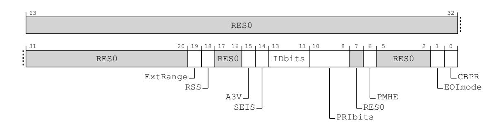

#### **Bits [63:20]**

Reserved, RES0.

#### **ExtRange, bit [19]**

Extended INTID range (read-only).

0b0 CPU interface does not support INTIDs in the range 1024..8191.

• Behavior is UNPREDICTABLE if the IRI delivers an interrupt in the range 1024 to 8191 to the CPU interface.

**Note**

Arm strongly recommends that the IRI is not configured to deliver interrupts in this range to a PE that does not support them.

0b1 CPU interface supports INTIDs in the range 1024..8191

• All INTIDs in the range 1024..8191 are treated as requiring deactivation.

If EL3 is implemented, ICC\_CTLR\_EL1.ExtRange is an alias of [ICC\\_CTLR\\_EL3.](#page-237-1)ExtRange.

#### **RSS, bit [18]**

Range Selector Support. Possible values are:

0b0 Targeted SGIs with affinity level 0 values of 0 - 15 are supported.

0b1 Targeted SGIs with affinity level 0 values of 0 - 255 are supported.

This bit is read-only.

#### **Bits [17:16]**

Reserved, RES0.

#### **A3V, bit [15]**

Affinity 3 Valid. Read-only and writes are ignored. Possible values are:

0b0 The CPU interface logic only supports zero values of Affinity 3 in SGI generation

System registers.

0b1 The CPU interface logic supports nonzero values of Affinity 3 in SGI generation System registers.

If EL3 is implemented, this bit is an alias of [ICC\\_CTLR\\_EL3.](#page-237-1)A3V.

#### **SEIS, bit [14]**

SEI Support. Read-only and writes are ignored. Indicates whether the CPU interface supports local generation of SEIs:

0b0 The CPU interface logic does not support local generation of SEIs.

0b1 The CPU interface logic supports local generation of SEIs.

If EL3 is implemented, this bit is an alias of [ICC\\_CTLR\\_EL3.](#page-237-1)SEIS.

#### **IDbits, bits [13:11]**

Identifier bits. Read-only and writes are ignored. The number of physical interrupt identifier bits supported:

0b000 16 bits. 0b001 24 bits.

All other values are reserved.

If EL3 is implemented, this field is an alias of [ICC\\_CTLR\\_EL3.](#page-237-1)IDbits.

#### **PRIbits, bits [10:8]**

Priority bits. Read-only and writes are ignored. The number of priority bits implemented, minus one.

An implementation that supports two Security states must implement at least 32 levels of physical priority (5 priority bits).

An implementation that supports only a single Security state must implement at least 16 levels of physical priority (4 priority bits).

| Note |  |
|------|--|
|      |  |

This field always returns the number of priority bits implemented, regardless of the Security state of the access or the value of [GICD\\_CTLR](#page-543-1).DS.

For physical accesses, this field determines the minimum value of [ICC\\_BPR0\\_EL1](#page-225-1).

If EL3 is implemented, physical accesses return the value from [ICC\\_CTLR\\_EL3](#page-237-1).PRIbits.

If EL3 is not implemented, physical accesses return the value from this field.

#### **Bit [7]**

Reserved, RES0.

#### **PMHE, bit [6]**

Priority Mask Hint Enable. Controls whether the priority mask register is used as a hint for interrupt distribution:

0b0 Disables use of [ICC\\_PMR\\_EL1](#page-266-1) as a hint for interrupt distribution.

0b1 Enables use of [ICC\\_PMR\\_EL1](#page-266-1) as a hint for interrupt distribution.

If EL3 is implemented, this bit is an alias of [ICC\\_CTLR\\_EL3.](#page-237-1)PMHE. Whether this bit can be written as part of an access to this register depends on the value of [GICD\\_CTLR](#page-543-1).DS:

- If [GICD\\_CTLR.](#page-543-1)DS == 0, this bit is read-only.
- If [GICD\\_CTLR.](#page-543-1)DS == 1, this bit is read/write.

If EL3 is not implemented, it is IMPLEMENTATION DEFINED whether this bit is read-only or read/write:

- If this bit is read-only, an implementation can choose to make this field RAZ/WI or RAO/WI.
- If this bit is read/write, it resets to zero.

#### **Bits [5:2]**

Reserved, RES0.

#### **EOImode, bit [1]**

EOI mode for the current Security state. Controls whether a write to an End of Interrupt register also deactivates the interrupt:

```
0b0 ICC_EOIR0_EL1 and ICC_EOIR1_EL1 provide both priority drop and interrupt 
          deactivation functionality. Accesses to ICC_DIR_EL1 are UNPREDICTABLE.
```

0b1 [ICC\\_EOIR0\\_EL1](#page-244-1) and [ICC\\_EOIR1\\_EL1](#page-246-1) provide priority drop functionality only. [ICC\\_DIR\\_EL1](#page-242-1) provides interrupt deactivation functionality.

The Secure [ICC\\_CTLR\\_EL1](#page-232-1).EOImode is an alias of [ICC\\_CTLR\\_EL3.](#page-237-1)EOImode\_EL1S.

The Non-secure [ICC\\_CTLR\\_EL1](#page-232-1).EOImode is an alias of [ICC\\_CTLR\\_EL3.](#page-237-1)EOImode\_EL1NS

#### **CBPR, bit [0]**

Common Binary Point Register. Controls whether the same register is used for interrupt preemption of both Group 0 and Group 1 interrupts:

```
0b0 ICC_BPR0_EL1 determines the preemption group for Group 0 interrupts only.
          ICC_BPR1_EL1 determines the preemption group for Group 1 interrupts.
```

0b1 [ICC\\_BPR0\\_EL1](#page-225-1) determines the preemption group for both Group 0 and Group 1 interrupts.

If EL3 is implemented:

- This bit is an alias of [ICC\\_CTLR\\_EL3.](#page-237-1)CBPR\_EL1{S,NS} where S or NS corresponds to the current Security state.
- If [GICD\\_CTLR.](#page-543-1)DS == 0, this bit is read-only.
- If [GICD\\_CTLR.](#page-543-1)DS == 1, this bit is read/write.

If EL3 is not implemented, this bit is read/write.

The reset behavior of this field is:

• On a Warm reset, this field resets to an architecturally UNKNOWN value.

#### **Accessing ICC\_CTLR\_EL1**

Accesses to this register use the following encodings in the System register encoding space:

#### **MRS <Xt>, ICC\_CTLR\_EL1**

| op0  | op1   | CRn    | CRm    | op2   |
|------|-------|--------|--------|-------|
| 0b11 | 0b000 | 0b1100 | 0b1100 | 0b100 |

```
if PSTATE.EL == EL0 then
    UNDEFINED;
elsif PSTATE.EL == EL1 then
    if HaveEL(EL3) && EL3SDDUndefPriority() && SCR_EL3.<IRQ,FIQ> == '11' then
        UNDEFINED;
    elsif ICC_SRE_EL1.SRE == '0' then
        AArch64.SystemAccessTrap(EL1, 0x18);
    elsif EL2Enabled() && ICH_HCR_EL2.TC == '1' then
        AArch64.SystemAccessTrap(EL2, 0x18);
    elsif EL2Enabled() && HCR_EL2.FMO == '1' then
        X[t, 64] = ICV_CTLR_EL1;
    elsif EL2Enabled() && HCR_EL2.IMO == '1' then
        X[t, 64] = ICV_CTLR_EL1;
    elsif HaveEL(EL3) && SCR_EL3.<IRQ,FIQ> == '11' then
        if EL3SDDUndef() then
            UNDEFINED;
        else
            AArch64.SystemAccessTrap(EL3, 0x18);
    elsif HaveEL(EL3) then
        if SCR_EL3.NS == '0' then
            X[t, 64] = ICC_CTLR_EL1_S;
        else
            X[t, 64] = ICC_CTLR_EL1_NS;
    else
        X[t, 64] = ICC_CTLR_EL1;
elsif PSTATE.EL == EL2 then
    if HaveEL(EL3) && EL3SDDUndefPriority() && SCR_EL3.<IRQ,FIQ> == '11' then
        UNDEFINED;
    elsif ICC_SRE_EL2.SRE == '0' then
        AArch64.SystemAccessTrap(EL2, 0x18);
    elsif HaveEL(EL3) && SCR_EL3.<IRQ,FIQ> == '11' then
        if EL3SDDUndef() then
            UNDEFINED;
        else
            AArch64.SystemAccessTrap(EL3, 0x18);
    elsif HaveEL(EL3) then
        if SCR_EL3.NS == '0' then
            X[t, 64] = ICC_CTLR_EL1_S;
        else
            X[t, 64] = ICC_CTLR_EL1_NS;
    else
        X[t, 64] = ICC_CTLR_EL1;
elsif PSTATE.EL == EL3 then
    if ICC_SRE_EL3.SRE == '0' then
        AArch64.SystemAccessTrap(EL3, 0x18);
    else
        if SCR_EL3.NS == '0' then
            X[t, 64] = ICC_CTLR_EL1_S;
        else
            X[t, 64] = ICC_CTLR_EL1_NS;
```

#### **MSR ICC\_CTLR\_EL1, <Xt>**

| op0  | op1   | CRn    | CRm    | op2   |
|------|-------|--------|--------|-------|
| 0b11 | 0b000 | 0b1100 | 0b1100 | 0b100 |

```
if PSTATE.EL == EL0 then
    UNDEFINED;
elsif PSTATE.EL == EL1 then
    if HaveEL(EL3) && EL3SDDUndefPriority() && SCR_EL3.<IRQ,FIQ> == '11' then
        UNDEFINED;
    elsif ICC_SRE_EL1.SRE == '0' then
        AArch64.SystemAccessTrap(EL1, 0x18);
    elsif EL2Enabled() && ICH_HCR_EL2.TC == '1' then
        AArch64.SystemAccessTrap(EL2, 0x18);
    elsif EL2Enabled() && HCR_EL2.FMO == '1' then
        ICV_CTLR_EL1 = X[t, 64];
    elsif EL2Enabled() && HCR_EL2.IMO == '1' then
        ICV_CTLR_EL1 = X[t, 64];
    elsif HaveEL(EL3) && SCR_EL3.<IRQ,FIQ> == '11' then
        if EL3SDDUndef() then
            UNDEFINED;
        else
            AArch64.SystemAccessTrap(EL3, 0x18);
    elsif HaveEL(EL3) then
        if SCR_EL3.NS == '0' then
            ICC_CTLR_EL1_S = X[t, 64];
        else
            ICC_CTLR_EL1_NS = X[t, 64];
    else
        ICC_CTLR_EL1 = X[t, 64];
elsif PSTATE.EL == EL2 then
    if HaveEL(EL3) && EL3SDDUndefPriority() && SCR_EL3.<IRQ,FIQ> == '11' then
        UNDEFINED;
    elsif ICC_SRE_EL2.SRE == '0' then
        AArch64.SystemAccessTrap(EL2, 0x18);
    elsif HaveEL(EL3) && SCR_EL3.<IRQ,FIQ> == '11' then
        if EL3SDDUndef() then
            UNDEFINED;
        else
            AArch64.SystemAccessTrap(EL3, 0x18);
    elsif HaveEL(EL3) then
        if SCR_EL3.NS == '0' then
            ICC_CTLR_EL1_S = X[t, 64];
        else
            ICC_CTLR_EL1_NS = X[t, 64];
    else
        ICC_CTLR_EL1 = X[t, 64];
elsif PSTATE.EL == EL3 then
    if ICC_SRE_EL3.SRE == '0' then
        AArch64.SystemAccessTrap(EL3, 0x18);
    else
        if SCR_EL3.NS == '0' then
            ICC_CTLR_EL1_S = X[t, 64];
        else
            ICC_CTLR_EL1_NS = X[t, 64];
```

#### <span id="page-237-1"></span><span id="page-237-0"></span>**12.2.7 ICC\_CTLR\_EL3, Interrupt Controller Control Register (EL3)**

The ICC\_CTLR\_EL3 characteristics are:

#### **Purpose**

Controls aspects of the behavior of the GIC CPU interface and provides information about the features implemented.

#### **Configurations**

This register is present only when FEAT\_GICv3 is implemented and EL3 is implemented. Otherwise, direct accesses to ICC\_CTLR\_EL3 are UNDEFINED.

#### **Attributes**

ICC\_CTLR\_EL3 is a 64-bit register.

#### **Field descriptions**

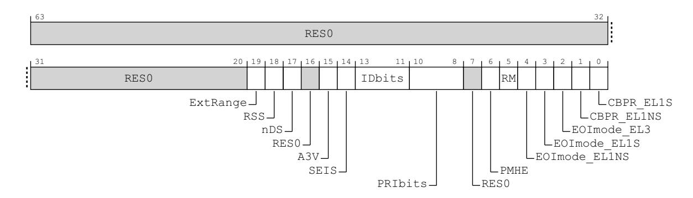

#### **Bits [63:20]**

Reserved, RES0.

#### **ExtRange, bit [19]**

Extended INTID range (read-only).

0b0 CPU interface does not support INTIDs in the range 1024..8191.

• Behavior is UNPREDICTABLE if the IRI delivers an interrupt in the range 1024 to 8191 to the CPU interface.

**Note**

Arm strongly recommends that the IRI is not configured to deliver interrupts in this range to a PE that does not support them.

0b1 CPU interface supports INTIDs in the range 1024..8191

• All INTIDs in the range 1024..8191 are treated as requiring deactivation.

#### **RSS, bit [18]**

Range Selector Support.

0b0 Targeted SGIs with affinity level 0 values of 0-15 are supported.

0b1 Targeted SGIs with affinity level 0 values of 0-255 are supported.

This bit is read-only.

#### **nDS, bit [17]**

Disable Security not supported. Read-only and writes are ignored.

0b0 The CPU interface logic supports disabling of security.

0b1 The CPU interface logic does not support disabling of security, and requires that security is not disabled.

When a PE implements FEAT\_RME and FEAT\_SEL2, this field is RAO/WI.

#### **Bit [16]**

Reserved, RES0.

#### **A3V, bit [15]**

Affinity 3 Valid. Read-only and writes are ignored.

0b0 The CPU interface logic does not support nonzero values of the Aff3 field in SGI generation System registers.

0b1 The CPU interface logic supports nonzero values of the Aff3 field in SGI generation System registers.

If EL3 is present, [ICC\\_CTLR\\_EL1](#page-232-1).A3V is an alias of ICC\_CTLR\_EL3.A3V

#### **SEIS, bit [14]**

SEI Support. Read-only and writes are ignored. Indicates whether the CPU interface supports generation of SEIs:

0b0 The CPU interface logic does not support generation of SEIs.

0b1 The CPU interface logic supports generation of SEIs.

If EL3 is present, [ICC\\_CTLR\\_EL1](#page-232-1).SEIS is an alias of ICC\_CTLR\_EL3.SEIS

#### **IDbits, bits [13:11]**

Identifier bits. Read-only and writes are ignored. Indicates the number of physical interrupt identifier bits supported.

0b000 16 bits. 0b001 24 bits.

All other values are reserved.

If EL3 is present, [ICC\\_CTLR\\_EL1](#page-232-1).IDbits is an alias of ICC\_CTLR\_EL3.IDbits

#### **PRIbits, bits [10:8]**

Priority bits. Read-only and writes are ignored. The number of priority bits implemented, minus one.

An implementation that supports two Security states must implement at least 32 levels of physical priority (5 priority bits).

An implementation that supports only a single Security state must implement at least 16 levels of physical priority (4 priority bits).

**Note**

This field always returns the number of priority bits implemented, regardless of the value of [SCR\\_EL3.](#page-29-4)NS or the value of [GICD\\_CTLR.](#page-543-1)DS.

The division between group priority and subpriority is defined in the binary point registers [ICC\\_BPR0\\_EL1](#page-225-1) and [ICC\\_BPR1\\_EL1](#page-228-1).

This field determines the minimum value of ICC\_BPR0\_EL1.

#### **Bit [7]**

Reserved, RES0.

#### **PMHE, bit [6]**

Priority Mask Hint Enable.

0b0 Disables use of the priority mask register as a hint for interrupt distribution.

0b1 Enables use of the priority mask register as a hint for interrupt distribution.

Software must write [ICC\\_PMR\\_EL1](#page-266-1) to 0xFF before clearing this field to 0.

- An implementation might choose to make this field RAO/WI if priority-based routing is always used
- An implementation might choose to make this field RAZ/WI if priority-based routing is never used

If EL3 is present, [ICC\\_CTLR\\_EL1](#page-232-1).PMHE is an alias of ICC\_CTLR\_EL3.PMHE.

The reset behavior of this field is:

• On a Warm reset, this field resets to 0.

#### **RM, bit [5]**

Routing Modifier. This bit controls whether EL3 can acknowledge, or observe as the Highest Priority Pending Interrupt, Secure Group 0 and Non-secure Group 1 interrupts.

- 0b0 Secure Group 0 and Non-secure Group 1 interrupts can be acknowledged and observed as the highest priority interrupt at EL3.
- 0b1 Secure Group 0 and Non-secure Group 1 interrupts cannot be acknowledged and observed as the highest priority interrupt at EL3.

Secure Group 0 interrupts return a special INTID value of 1020. This affects accesses to [ICC\\_IAR0\\_EL1](#page-252-1) and [ICC\\_HPPIR0\\_EL1](#page-248-1).

Non-secure Group 1 interrupts return a special INTID value of 1021. This affects accesses to [ICC\\_IAR1\\_EL1](#page-254-1) and [ICC\\_HPPIR1\\_EL1.](#page-250-1)


The Routing Modifier bit is supported in AArch64 only. In systems without EL3 the behavior is as if the value is 0. Software must ensure this bit is 0 when the Secure copy of [ICC\\_SRE\\_EL1.](#page-278-1)SRE is 1, otherwise system behavior is UNPREDICTABLE. In systems without EL3 or where the Secure copy of [ICC\\_SRE\\_EL1.](#page-278-1)SRE is RAO/WI, this bit is RES0.

The reset behavior of this field is:

• On a Warm reset, this field resets to an architecturally UNKNOWN value.

#### **EOImode\_EL1NS, bit [4]**

EOI mode for interrupts handled at Non-secure EL1 and EL2. Controls whether a write to an End of Interrupt register also deactivates the interrupt.

- 0b0 [ICC\\_EOIR0\\_EL1](#page-244-1) and [ICC\\_EOIR1\\_EL1](#page-246-1) provide both priority drop and interrupt deactivation functionality. Accesses to [ICC\\_DIR\\_EL1](#page-242-1) are UNPREDICTABLE.
- 0b1 [ICC\\_EOIR0\\_EL1](#page-244-1) and [ICC\\_EOIR1\\_EL1](#page-246-1) provide priority drop functionality only. [ICC\\_DIR\\_EL1](#page-242-1) provides interrupt deactivation functionality.

If EL3 is present, [ICC\\_CTLR\\_EL1](#page-232-1)\_NS.EOImode is an alias of ICC\_CTLR\_EL3.EOImode\_EL1NS.

The reset behavior of this field is:

• On a Warm reset, this field resets to an architecturally UNKNOWN value.

#### **EOImode\_EL1S, bit [3]**

EOI mode for interrupts handled at Secure EL1 and EL2. Controls whether a write to an End of Interrupt register also deactivates the interrupt.

- 0b0 [ICC\\_EOIR0\\_EL1](#page-244-1) and [ICC\\_EOIR1\\_EL1](#page-246-1) provide both priority drop and interrupt deactivation functionality. Accesses to [ICC\\_DIR\\_EL1](#page-242-1) are UNPREDICTABLE.
- 0b1 [ICC\\_EOIR0\\_EL1](#page-244-1) and [ICC\\_EOIR1\\_EL1](#page-246-1) provide priority drop functionality only. [ICC\\_DIR\\_EL1](#page-242-1) provides interrupt deactivation functionality.

If EL3 is present, [ICC\\_CTLR\\_EL1](#page-232-1)\_S.EOImode is an alias of ICC\_CTLR\_EL3.EOImode\_EL1S.

The reset behavior of this field is:

• On a Warm reset, this field resets to an architecturally UNKNOWN value.

#### **EOImode\_EL3, bit [2]**

EOI mode for interrupts handled at EL3. Controls whether a write to an End of Interrupt register also deactivates the interrupt.

- 0b0 [ICC\\_EOIR0\\_EL1](#page-244-1) and [ICC\\_EOIR1\\_EL1](#page-246-1) provide both priority drop and interrupt deactivation functionality. Accesses to [ICC\\_DIR\\_EL1](#page-242-1) are UNPREDICTABLE.
- 0b1 [ICC\\_EOIR0\\_EL1](#page-244-1) and [ICC\\_EOIR1\\_EL1](#page-246-1) provide priority drop functionality only. [ICC\\_DIR\\_EL1](#page-242-1) provides interrupt deactivation functionality.

The reset behavior of this field is:

• On a Warm reset, this field resets to an architecturally UNKNOWN value.

#### **CBPR\_EL1NS, bit [1]**

Common Binary Point Register, EL1 Non-secure. Controls whether the same register is used for interrupt preemption of both Group 0 and Group 1 Non-secure interrupts at EL1 and EL2.

```
0b0 ICC_BPR0_EL1 determines the preemption group for Group 0 interrupts only.
          ICC_BPR1_EL1 determines the preemption group for Non-secure Group 1 interrupts.
```

0b1 [ICC\\_BPR0\\_EL1](#page-225-1) determines the preemption group for Group 0 interrupts and Non-secure Group 1 interrupts. Non-secure accesses to [GICC\\_BPR](#page-740-0) and [ICC\\_BPR1\\_EL1](#page-228-1) access the state of [ICC\\_BPR0\\_EL1.](#page-225-1)

If EL3 is present, [ICC\\_CTLR\\_EL1](#page-232-1)\_NS.CBPR is an alias of ICC\_CTLR\_EL3.CBPR\_EL1NS.

The reset behavior of this field is:

• On a Warm reset, this field resets to an architecturally UNKNOWN value.

#### **CBPR\_EL1S, bit [0]**

Common Binary Point Register, EL1 Secure. Controls whether the same register is used for interrupt preemption of both Group 0 and Group 1 Secure interrupts at EL1 and EL2.

```
0b0 ICC_BPR0_EL1 determines the preemption group for Group 0 interrupts only.
          ICC_BPR1_EL1 determines the preemption group for Secure Group 1 interrupts.
```

0b1 [ICC\\_BPR0\\_EL1](#page-225-1) determines the preemption group for Group 0 interrupts and Secure Group 1 interrupts. Secure EL1 accesses to [ICC\\_BPR1\\_EL1](#page-228-1) access the state of [ICC\\_BPR0\\_EL1.](#page-225-1)

If EL3 is present, [ICC\\_CTLR\\_EL1](#page-232-1)\_S.CBPR is an alias of ICC\_CTLR\_EL3.CBPR\_EL1S.

The reset behavior of this field is:

• On a Warm reset, this field resets to an architecturally UNKNOWN value.

#### **Accessing ICC\_CTLR\_EL3**

Accesses to this register use the following encodings in the System register encoding space:

#### **MRS <Xt>, ICC\_CTLR\_EL3**

| op0  | op1   | CRn    | CRm    | op2   |
|------|-------|--------|--------|-------|
| 0b11 | 0b110 | 0b1100 | 0b1100 | 0b100 |

```
if PSTATE.EL == EL0 then
    UNDEFINED;
elsif PSTATE.EL == EL1 then
    UNDEFINED;
elsif PSTATE.EL == EL2 then
    UNDEFINED;
elsif PSTATE.EL == EL3 then
```

```
if ICC_SRE_EL3.SRE == '0' then
    AArch64.SystemAccessTrap(EL3, 0x18);
else
    X[t, 64] = ICC_CTLR_EL3;
```

#### **MSR ICC\_CTLR\_EL3, <Xt>**

| op0  | op1   | CRn    | CRm    | op2   |
|------|-------|--------|--------|-------|
| 0b11 | 0b110 | 0b1100 | 0b1100 | 0b100 |

```
if PSTATE.EL == EL0 then
    UNDEFINED;
elsif PSTATE.EL == EL1 then
    UNDEFINED;
elsif PSTATE.EL == EL2 then
    UNDEFINED;
elsif PSTATE.EL == EL3 then
    if ICC_SRE_EL3.SRE == '0' then
        AArch64.SystemAccessTrap(EL3, 0x18);
    else
        ICC_CTLR_EL3 = X[t, 64];
```

#### <span id="page-242-1"></span><span id="page-242-0"></span>**12.2.8 ICC\_DIR\_EL1, Interrupt Controller Deactivate Interrupt Register**

The ICC\_DIR\_EL1 characteristics are:

#### **Purpose**

When interrupt priority drop is separated from interrupt deactivation, a write to this register deactivates the specified interrupt.

#### **Configurations**

AArch64 System register ICC\_DIR\_EL1 performs the same function as AArch32 System register [ICC\\_DIR.](#page-395-0)

This register is present only when FEAT\_GICv3 is implemented. Otherwise, direct accesses to ICC\_DIR\_EL1 are UNDEFINED.

#### **Attributes**

ICC\_DIR\_EL1 is a 64-bit register.

#### **Field descriptions**


#### **Bits [63:24]**

Reserved, RES0.

#### **INTID, bits [23:0]**

The INTID of the interrupt to be deactivated.

This field has either 16 or 24 bits implemented. The number of implemented bits can be found in [ICC\\_CTLR\\_EL1.](#page-232-1)IDbits and [ICC\\_CTLR\\_EL3](#page-237-1).IDbits. If only 16 bits are implemented, bits [23:16] of this register are RES0.

#### **Accessing ICC\_DIR\_EL1**

There are two cases when writing to [ICC\\_DIR\\_EL1](#page-242-1) that were UNPREDICTABLE for a corresponding GICv2 write to [GICC\\_DIR:](#page-750-0)

- When EOImode == 0. GICv3 implementations must ignore such writes. In systems supporting system error generation, an implementation might generate an SEI.
- When EOImode == 1 but no EOI has been issued. The interrupt will be deactivated by the Distributor, however the active priority in the CPU interface for the interrupt will remain set (because no EOI was issued).

Accesses to this register use the following encodings in the System register encoding space:

#### **MSR ICC\_DIR\_EL1, <Xt>**

| op0  | op1   | CRn    | CRm    | op2   |
|------|-------|--------|--------|-------|
| 0b11 | 0b000 | 0b1100 | 0b1011 | 0b001 |

```
if PSTATE.EL == EL0 then
    UNDEFINED;
elsif PSTATE.EL == EL1 then
    if HaveEL(EL3) && EL3SDDUndefPriority() && SCR_EL3.<IRQ,FIQ> == '11' then
        UNDEFINED;
    elsif ICC_SRE_EL1.SRE == '0' then
        AArch64.SystemAccessTrap(EL1, 0x18);
    elsif EL2Enabled() && ICH_HCR_EL2.TDIR == '1' then
        AArch64.SystemAccessTrap(EL2, 0x18);
    elsif EL2Enabled() && ICH_HCR_EL2.TC == '1' then
        AArch64.SystemAccessTrap(EL2, 0x18);
    elsif EL2Enabled() && HCR_EL2.FMO == '1' then
        ICV_DIR_EL1 = X[t, 64];
    elsif EL2Enabled() && HCR_EL2.IMO == '1' then
        ICV_DIR_EL1 = X[t, 64];
    elsif HaveEL(EL3) && SCR_EL3.<IRQ,FIQ> == '11' then
        if EL3SDDUndef() then
            UNDEFINED;
        else
            AArch64.SystemAccessTrap(EL3, 0x18);
    else
        ICC_DIR_EL1 = X[t, 64];
elsif PSTATE.EL == EL2 then
    if HaveEL(EL3) && EL3SDDUndefPriority() && SCR_EL3.<IRQ,FIQ> == '11' then
        UNDEFINED;
    elsif ICC_SRE_EL2.SRE == '0' then
        AArch64.SystemAccessTrap(EL2, 0x18);
    elsif HaveEL(EL3) && SCR_EL3.<IRQ,FIQ> == '11' then
        if EL3SDDUndef() then
            UNDEFINED;
        else
            AArch64.SystemAccessTrap(EL3, 0x18);
    else
        ICC_DIR_EL1 = X[t, 64];
elsif PSTATE.EL == EL3 then
    if ICC_SRE_EL3.SRE == '0' then
        AArch64.SystemAccessTrap(EL3, 0x18);
    else
        ICC_DIR_EL1 = X[t, 64];
```

#### <span id="page-244-1"></span><span id="page-244-0"></span>**12.2.9 ICC\_EOIR0\_EL1, Interrupt Controller End Of Interrupt Register 0**

The ICC\_EOIR0\_EL1 characteristics are:

#### **Purpose**

A PE writes to this register to inform the CPU interface that it has completed the processing of the specified Group 0 interrupt.

#### **Configurations**

AArch64 System register ICC\_EOIR0\_EL1 performs the same function as AArch32 System register [ICC\\_EOIR0](#page-397-0).

This register is present only when FEAT\_GICv3 is implemented. Otherwise, direct accesses to ICC\_EOIR0\_EL1 are UNDEFINED.

#### **Attributes**

ICC\_EOIR0\_EL1 is a 64-bit register.

#### **Field descriptions**

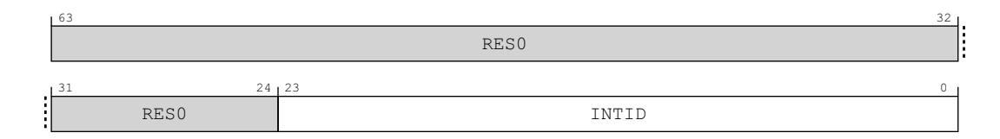

#### **Bits [63:24]**

Reserved, RES0.

#### **INTID, bits [23:0]**

The INTID from the corresponding [ICC\\_IAR0\\_EL1](#page-252-1) access.

This field has either 16 or 24 bits implemented. The number of implemented bits can be found in [ICC\\_CTLR\\_EL1.](#page-232-1)IDbits and [ICC\\_CTLR\\_EL3](#page-237-1).IDbits. If only 16 bits are implemented, bits [23:16] of this register are RES0.

If the EOImode bit for the current Exception level and Security state is 0, a write to this register drops the priority for the interrupt, and also deactivates the interrupt.

If the EOImode bit for the current Exception level and Security state is 1, a write to this register only drops the priority for the interrupt. Software must write to [ICC\\_DIR\\_EL1](#page-242-1) to deactivate the interrupt.

The EOImode bit for the current Exception level and Security state is determined as follows:

- If EL3 is not implemented, the appropriate bit is [ICC\\_CTLR\\_EL1](#page-232-1).EOIMode.
- If EL3 is implemented and the software is executing at EL3, the appropriate bit is [ICC\\_CTLR\\_EL3.](#page-237-1)EOImode\_EL3.
- If EL3 is implemented and the software is not executing at EL3, the bit depends on the current Security state:
  - If the software is executing in Secure state, the bit is [ICC\\_CTLR\\_EL3.](#page-237-1)EOImode\_EL1S.
  - If the software is executing in Non-secure state, the bit is [ICC\\_CTLR\\_EL3.](#page-237-1)EOImode\_EL1NS.

#### **Accessing ICC\_EOIR0\_EL1**

A write to this register must correspond to the most recent valid read by this PE from an Interrupt Acknowledge Register, and must correspond to the INTID that was read from [ICC\\_IAR0\\_EL1](#page-252-1), otherwise the system behavior is UNPREDICTABLE. A valid read is a read that returns a valid INTID that is not a special INTID.

A write of a Special INTID is ignored. For more information, see *[Special INTIDs on page](#page-35-1) 2-36*.

Accesses to this register use the following encodings in the System register encoding space:

#### **MSR ICC\_EOIR0\_EL1, <Xt>**

| op0  | op1   | CRn    | CRm    | op2   |
|------|-------|--------|--------|-------|
| 0b11 | 0b000 | 0b1100 | 0b1000 | 0b001 |

```
if PSTATE.EL == EL0 then
    UNDEFINED;
elsif PSTATE.EL == EL1 then
    if HaveEL(EL3) && EL3SDDUndefPriority() && SCR_EL3.FIQ == '1' then
        UNDEFINED;
    elsif ICC_SRE_EL1.SRE == '0' then
        AArch64.SystemAccessTrap(EL1, 0x18);
    elsif EL2Enabled() && ICH_HCR_EL2.TALL0 == '1' then
        AArch64.SystemAccessTrap(EL2, 0x18);
    elsif EL2Enabled() && HCR_EL2.FMO == '1' then
        ICV_EOIR0_EL1 = X[t, 64];
    elsif HaveEL(EL3) && SCR_EL3.FIQ == '1' then
        if EL3SDDUndef() then
            UNDEFINED;
        else
            AArch64.SystemAccessTrap(EL3, 0x18);
    else
        ICC_EOIR0_EL1 = X[t, 64];
elsif PSTATE.EL == EL2 then
    if HaveEL(EL3) && EL3SDDUndefPriority() && SCR_EL3.FIQ == '1' then
        UNDEFINED;
    elsif ICC_SRE_EL2.SRE == '0' then
        AArch64.SystemAccessTrap(EL2, 0x18);
    elsif HaveEL(EL3) && SCR_EL3.FIQ == '1' then
        if EL3SDDUndef() then
            UNDEFINED;
        else
            AArch64.SystemAccessTrap(EL3, 0x18);
    else
        ICC_EOIR0_EL1 = X[t, 64];
elsif PSTATE.EL == EL3 then
    if ICC_SRE_EL3.SRE == '0' then
        AArch64.SystemAccessTrap(EL3, 0x18);
    else
        ICC_EOIR0_EL1 = X[t, 64];
```

#### <span id="page-246-1"></span><span id="page-246-0"></span>**12.2.10 ICC\_EOIR1\_EL1, Interrupt Controller End Of Interrupt Register 1**

The ICC\_EOIR1\_EL1 characteristics are:

#### **Purpose**

A PE writes to this register to inform the CPU interface that it has completed the processing of the specified Group 1 interrupt.

#### **Configurations**

AArch64 System register ICC\_EOIR1\_EL1 performs the same function as AArch32 System register [ICC\\_EOIR1](#page-400-0).

This register is present only when FEAT\_GICv3 is implemented. Otherwise, direct accesses to ICC\_EOIR1\_EL1 are UNDEFINED.

#### **Attributes**

ICC\_EOIR1\_EL1 is a 64-bit register.

#### **Field descriptions**


#### **Bits [63:24]**

Reserved, RES0.

#### **INTID, bits [23:0]**

The INTID from the corresponding [ICC\\_IAR1\\_EL1](#page-254-1) access.

This field has either 16 or 24 bits implemented. The number of implemented bits can be found in [ICC\\_CTLR\\_EL1.](#page-232-1)IDbits and [ICC\\_CTLR\\_EL3](#page-237-1).IDbits. If only 16 bits are implemented, bits [23:16] of this register are RES0.

If the EOImode bit for the current Exception level and Security state is 0, a write to this register drops the priority for the interrupt, and also deactivates the interrupt.

If the EOImode bit for the current Exception level and Security state is 1, a write to this register only drops the priority for the interrupt. Software must write to [ICC\\_DIR\\_EL1](#page-242-1) to deactivate the interrupt.

The EOImode bit for the current Exception level and Security state is determined as follows:

- If EL3 is not implemented, the appropriate bit is [ICC\\_CTLR\\_EL1](#page-232-1).EOIMode.
- If EL3 is implemented and the software is executing at EL3, the appropriate bit is [ICC\\_CTLR\\_EL3.](#page-237-1)EOImode\_EL3.
- If EL3 is implemented and the software is not executing at EL3, the bit depends on the current Security state:
  - If the software is executing in Secure state, the bit is [ICC\\_CTLR\\_EL3.](#page-237-1)EOImode\_EL1S.
  - If the software is executing in Non-secure state, the bit is [ICC\\_CTLR\\_EL3.](#page-237-1)EOImode\_EL1NS.

#### **Accessing ICC\_EOIR1\_EL1**

A write to this register must correspond to the most recent valid read by this PE from an Interrupt Acknowledge Register, and must correspond to the INTID that was read from [ICC\\_IAR1\\_EL1](#page-254-1), otherwise the system behavior is UNPREDICTABLE. A valid read is a read that returns a valid INTID that is not a special INTID.

A write of a Special INTID is ignored. For more information, see *[Special INTIDs on page](#page-35-1) 2-36*.

Accesses to this register use the following encodings in the System register encoding space:

#### **MSR ICC\_EOIR1\_EL1, <Xt>**

| op0  | op1   | CRn    | CRm    | op2   |
|------|-------|--------|--------|-------|
| 0b11 | 0b000 | 0b1100 | 0b1100 | 0b001 |

```
if PSTATE.EL == EL0 then
    UNDEFINED;
elsif PSTATE.EL == EL1 then
    if HaveEL(EL3) && EL3SDDUndefPriority() && SCR_EL3.IRQ == '1' then
        UNDEFINED;
    elsif ICC_SRE_EL1.SRE == '0' then
        AArch64.SystemAccessTrap(EL1, 0x18);
    elsif EL2Enabled() && ICH_HCR_EL2.TALL1 == '1' then
        AArch64.SystemAccessTrap(EL2, 0x18);
    elsif EL2Enabled() && HCR_EL2.IMO == '1' then
        ICV_EOIR1_EL1 = X[t, 64];
    elsif HaveEL(EL3) && SCR_EL3.IRQ == '1' then
        if EL3SDDUndef() then
            UNDEFINED;
        else
            AArch64.SystemAccessTrap(EL3, 0x18);
    else
        ICC_EOIR1_EL1 = X[t, 64];
elsif PSTATE.EL == EL2 then
    if HaveEL(EL3) && EL3SDDUndefPriority() && SCR_EL3.IRQ == '1' then
        UNDEFINED;
    elsif ICC_SRE_EL2.SRE == '0' then
        AArch64.SystemAccessTrap(EL2, 0x18);
    elsif HaveEL(EL3) && SCR_EL3.IRQ == '1' then
        if EL3SDDUndef() then
            UNDEFINED;
        else
            AArch64.SystemAccessTrap(EL3, 0x18);
    else
        ICC_EOIR1_EL1 = X[t, 64];
elsif PSTATE.EL == EL3 then
    if ICC_SRE_EL3.SRE == '0' then
        AArch64.SystemAccessTrap(EL3, 0x18);
    else
        ICC_EOIR1_EL1 = X[t, 64];
```

#### <span id="page-248-1"></span><span id="page-248-0"></span>**12.2.11 ICC\_HPPIR0\_EL1, Interrupt Controller Highest Priority Pending Interrupt Register 0**

The ICC\_HPPIR0\_EL1 characteristics are:

#### **Purpose**

Indicates the highest priority pending Group 0 interrupt on the CPU interface.

#### **Configurations**

AArch64 System register ICC\_HPPIR0\_EL1 performs the same function as AArch32 System register [ICC\\_HPPIR0.](#page-403-0)

This register is present only when FEAT\_GICv3 is implemented. Otherwise, direct accesses to ICC\_HPPIR0\_EL1 are UNDEFINED.

#### **Attributes**

ICC\_HPPIR0\_EL1 is a 64-bit register.

#### **Field descriptions**


#### **Bits [63:24]**

Reserved, RES0.

#### **INTID, bits [23:0]**

The INTID of the highest priority pending interrupt, if that interrupt is observable at the current Security state and Exception level.

If the highest priority pending interrupt is not observable, this field contains a special INTID to indicate the reason. These special INTIDs can be one of: 1020, 1021, or 1023. For more information, see *[Special INTIDs on page](#page-35-1) 2-36*.

This field has either 16 or 24 bits implemented. The number of implemented bits can be found in [ICC\\_CTLR\\_EL1.](#page-232-1)IDbits and [ICC\\_CTLR\\_EL3](#page-237-1).IDbits. If only 16 bits are implemented, bits [23:16] of this register are RES0.

#### **Accessing ICC\_HPPIR0\_EL1**

Accesses to this register use the following encodings in the System register encoding space:

#### **MRS <Xt>, ICC\_HPPIR0\_EL1**

| op0  | op1   | CRn    | CRm    | op2   |
|------|-------|--------|--------|-------|
| 0b11 | 0b000 | 0b1100 | 0b1000 | 0b010 |

```
if PSTATE.EL == EL0 then
    UNDEFINED;
elsif PSTATE.EL == EL1 then
    if HaveEL(EL3) && EL3SDDUndefPriority() && SCR_EL3.FIQ == '1' then
        UNDEFINED;
    elsif ICC_SRE_EL1.SRE == '0' then
```

```
AArch64.SystemAccessTrap(EL1, 0x18);
    elsif EL2Enabled() && ICH_HCR_EL2.TALL0 == '1' then
        AArch64.SystemAccessTrap(EL2, 0x18);
    elsif EL2Enabled() && HCR_EL2.FMO == '1' then
        X[t, 64] = ICV_HPPIR0_EL1;
    elsif HaveEL(EL3) && SCR_EL3.FIQ == '1' then
        if EL3SDDUndef() then
            UNDEFINED;
        else
            AArch64.SystemAccessTrap(EL3, 0x18);
    else
        X[t, 64] = ICC_HPPIR0_EL1;
elsif PSTATE.EL == EL2 then
    if HaveEL(EL3) && EL3SDDUndefPriority() && SCR_EL3.FIQ == '1' then
        UNDEFINED;
    elsif ICC_SRE_EL2.SRE == '0' then
        AArch64.SystemAccessTrap(EL2, 0x18);
    elsif HaveEL(EL3) && SCR_EL3.FIQ == '1' then
        if EL3SDDUndef() then
            UNDEFINED;
        else
            AArch64.SystemAccessTrap(EL3, 0x18);
    else
        X[t, 64] = ICC_HPPIR0_EL1;
elsif PSTATE.EL == EL3 then
    if ICC_SRE_EL3.SRE == '0' then
        AArch64.SystemAccessTrap(EL3, 0x18);
    else
        X[t, 64] = ICC_HPPIR0_EL1;
```

#### <span id="page-250-1"></span><span id="page-250-0"></span>**12.2.12 ICC\_HPPIR1\_EL1, Interrupt Controller Highest Priority Pending Interrupt Register 1**

The ICC\_HPPIR1\_EL1 characteristics are:

#### **Purpose**

Indicates the highest priority pending Group 1 interrupt on the CPU interface.

#### **Configurations**

AArch64 System register ICC\_HPPIR1\_EL1 performs the same function as AArch32 System register [ICC\\_HPPIR1.](#page-405-0)

This register is present only when FEAT\_GICv3 is implemented. Otherwise, direct accesses to ICC\_HPPIR1\_EL1 are UNDEFINED.

#### **Attributes**

ICC\_HPPIR1\_EL1 is a 64-bit register.

#### **Field descriptions**


#### **Bits [63:24]**

Reserved, RES0.

#### **INTID, bits [23:0]**

The INTID of the highest priority pending interrupt, if that interrupt is observable at the current Security state and Exception level.

If the highest priority pending interrupt is not observable, this field contains a special INTID to indicate the reason. These special INTIDs can be one of: 1020, 1021, or 1023. For more information, see *[Special INTIDs on page](#page-35-1) 2-36*.

This field has either 16 or 24 bits implemented. The number of implemented bits can be found in [ICC\\_CTLR\\_EL1.](#page-232-1)IDbits and [ICC\\_CTLR\\_EL3](#page-237-1).IDbits. If only 16 bits are implemented, bits [23:16] of this register are RES0.

#### **Accessing ICC\_HPPIR1\_EL1**

Accesses to this register use the following encodings in the System register encoding space:

#### **MRS <Xt>, ICC\_HPPIR1\_EL1**

| op0  | op1   | CRn    | CRm    | op2   |
|------|-------|--------|--------|-------|
| 0b11 | 0b000 | 0b1100 | 0b1100 | 0b010 |

```
if PSTATE.EL == EL0 then
    UNDEFINED;
elsif PSTATE.EL == EL1 then
    if HaveEL(EL3) && EL3SDDUndefPriority() && SCR_EL3.IRQ == '1' then
        UNDEFINED;
    elsif ICC_SRE_EL1.SRE == '0' then
```

```
AArch64.SystemAccessTrap(EL1, 0x18);
    elsif EL2Enabled() && ICH_HCR_EL2.TALL1 == '1' then
        AArch64.SystemAccessTrap(EL2, 0x18);
    elsif EL2Enabled() && HCR_EL2.IMO == '1' then
        X[t, 64] = ICV_HPPIR1_EL1;
    elsif HaveEL(EL3) && SCR_EL3.IRQ == '1' then
        if EL3SDDUndef() then
            UNDEFINED;
        else
            AArch64.SystemAccessTrap(EL3, 0x18);
    else
        X[t, 64] = ICC_HPPIR1_EL1;
elsif PSTATE.EL == EL2 then
    if HaveEL(EL3) && EL3SDDUndefPriority() && SCR_EL3.IRQ == '1' then
        UNDEFINED;
    elsif ICC_SRE_EL2.SRE == '0' then
        AArch64.SystemAccessTrap(EL2, 0x18);
    elsif HaveEL(EL3) && SCR_EL3.IRQ == '1' then
        if EL3SDDUndef() then
            UNDEFINED;
        else
            AArch64.SystemAccessTrap(EL3, 0x18);
    else
        X[t, 64] = ICC_HPPIR1_EL1;
elsif PSTATE.EL == EL3 then
    if ICC_SRE_EL3.SRE == '0' then
        AArch64.SystemAccessTrap(EL3, 0x18);
    else
        X[t, 64] = ICC_HPPIR1_EL1;
```

#### <span id="page-252-1"></span><span id="page-252-0"></span>**12.2.13 ICC\_IAR0\_EL1, Interrupt Controller Interrupt Acknowledge Register 0**

The ICC\_IAR0\_EL1 characteristics are:

#### **Purpose**

The PE reads this register to obtain the INTID of the signaled Group 0 interrupt. This read acts as an acknowledge for the interrupt.

#### **Configurations**

AArch64 System register ICC\_IAR0\_EL1 performs the same function as AArch32 System register [ICC\\_IAR0](#page-410-0).

This register is present only when FEAT\_GICv3 is implemented. Otherwise, direct accesses to ICC\_IAR0\_EL1 are UNDEFINED.

To allow software to ensure appropriate observability of actions initiated by GIC register accesses, the PE and CPU interface logic must ensure that reads of this register are self-synchronizing when interrupts are masked by the PE (that is when PSTATE.{I,F} == {0,0}). This ensures that the effect of activating an interrupt on the signaling of interrupt exceptions is observed when a read of this register is architecturally executed so that no spurious interrupt exception occurs if interrupts are unmasked by an instruction immediately following the read. For more information, see *[Observability of the effects of accesses to the GIC registers on page](#page-194-0) 12-195*.

#### **Attributes**

ICC\_IAR0\_EL1 is a 64-bit register.

#### **Field descriptions**


#### **Bits [63:24]**

Reserved, RES0.

#### **INTID, bits [23:0]**

The INTID of the signaled interrupt.

This is the INTID of the highest priority pending interrupt, if that interrupt is of sufficient priority for it to be signaled to the PE, and if it can be acknowledged at the current Security state and Exception level.

If the highest priority pending interrupt is not observable, this field contains a special INTID to indicate the reason. For more information, see *[Special INTIDs on page](#page-35-1) 2-36*.

This field has either 16 or 24 bits implemented. The number of implemented bits can be found in [ICC\\_CTLR\\_EL1.](#page-232-1)IDbits and [ICC\\_CTLR\\_EL3](#page-237-1).IDbits. If only 16 bits are implemented, bits [23:16] of this register are RES0.

#### **Accessing ICC\_IAR0\_EL1**

Accesses to this register use the following encodings in the System register encoding space:

**MRS <Xt>, ICC\_IAR0\_EL1**

| op0  | op1   | CRn    | CRm    | op2   |
|------|-------|--------|--------|-------|
| 0b11 | 0b000 | 0b1100 | 0b1000 | 0b000 |

```
if PSTATE.EL == EL0 then
    UNDEFINED;
elsif PSTATE.EL == EL1 then
    if HaveEL(EL3) && EL3SDDUndefPriority() && SCR_EL3.FIQ == '1' then
        UNDEFINED;
    elsif ICC_SRE_EL1.SRE == '0' then
        AArch64.SystemAccessTrap(EL1, 0x18);
    elsif EL2Enabled() && ICH_HCR_EL2.TALL0 == '1' then
        AArch64.SystemAccessTrap(EL2, 0x18);
    elsif EL2Enabled() && HCR_EL2.FMO == '1' then
        X[t, 64] = ICV_IAR0_EL1;
    elsif HaveEL(EL3) && SCR_EL3.FIQ == '1' then
        if EL3SDDUndef() then
            UNDEFINED;
        else
            AArch64.SystemAccessTrap(EL3, 0x18);
    else
        X[t, 64] = ICC_IAR0_EL1;
elsif PSTATE.EL == EL2 then
    if HaveEL(EL3) && EL3SDDUndefPriority() && SCR_EL3.FIQ == '1' then
        UNDEFINED;
    elsif ICC_SRE_EL2.SRE == '0' then
        AArch64.SystemAccessTrap(EL2, 0x18);
    elsif HaveEL(EL3) && SCR_EL3.FIQ == '1' then
        if EL3SDDUndef() then
            UNDEFINED;
        else
            AArch64.SystemAccessTrap(EL3, 0x18);
    else
        X[t, 64] = ICC_IAR0_EL1;
elsif PSTATE.EL == EL3 then
    if ICC_SRE_EL3.SRE == '0' then
        AArch64.SystemAccessTrap(EL3, 0x18);
    else
        X[t, 64] = ICC_IAR0_EL1;
```

#### <span id="page-254-1"></span><span id="page-254-0"></span>**12.2.14 ICC\_IAR1\_EL1, Interrupt Controller Interrupt Acknowledge Register 1**

The ICC\_IAR1\_EL1 characteristics are:

#### **Purpose**

The PE reads this register to obtain the INTID of the signaled Group 1 interrupt. This read acts as an acknowledge for the interrupt.

#### **Configurations**

AArch64 System register ICC\_IAR1\_EL1 performs the same function as AArch32 System register [ICC\\_IAR1](#page-413-0).

This register is present only when FEAT\_GICv3 is implemented. Otherwise, direct accesses to ICC\_IAR1\_EL1 are UNDEFINED.

To allow software to ensure appropriate observability of actions initiated by GIC register accesses, the PE and CPU interface logic must ensure that reads of this register are self-synchronizing when interrupts are masked by the PE (that is when PSTATE.{I,F} == {0,0}). This ensures that the effect of activating an interrupt on the signaling of interrupt exceptions is observed when a read of this register is architecturally executed so that no spurious interrupt exception occurs if interrupts are unmasked by an instruction immediately following the read. For more information, see *[Observability of the effects of accesses to the GIC registers on page](#page-194-0) 12-195*.

#### **Attributes**

ICC\_IAR1\_EL1 is a 64-bit register.

#### **Field descriptions**


#### **Bits [63:24]**

Reserved, RES0.

#### **INTID, bits [23:0]**

The INTID of the signaled interrupt.

This is the INTID of the highest priority pending interrupt, if that interrupt is of sufficient priority for it to be signaled to the PE, and if it can be acknowledged at the current Security state and Exception level.

If the highest priority pending interrupt is not observable, this field contains a special INTID to indicate the reason. For more information, see *[Special INTIDs on page](#page-35-1) 2-36*.

This field has either 16 or 24 bits implemented. The number of implemented bits can be found in [ICC\\_CTLR\\_EL1.](#page-232-1)IDbits and [ICC\\_CTLR\\_EL3](#page-237-1).IDbits. If only 16 bits are implemented, bits [23:16] of this register are RES0.

#### **Accessing ICC\_IAR1\_EL1**

Accesses to this register use the following encodings in the System register encoding space:

**MRS <Xt>, ICC\_IAR1\_EL1**

| op0  | op1   | CRn    | CRm    | op2   |
|------|-------|--------|--------|-------|
| 0b11 | 0b000 | 0b1100 | 0b1100 | 0b000 |

```
if PSTATE.EL == EL0 then
    UNDEFINED;
elsif PSTATE.EL == EL1 then
    if HaveEL(EL3) && EL3SDDUndefPriority() && SCR_EL3.IRQ == '1' then
        UNDEFINED;
    elsif ICC_SRE_EL1.SRE == '0' then
        AArch64.SystemAccessTrap(EL1, 0x18);
    elsif EL2Enabled() && ICH_HCR_EL2.TALL1 == '1' then
        AArch64.SystemAccessTrap(EL2, 0x18);
    elsif EL2Enabled() && HCR_EL2.IMO == '1' then
        X[t, 64] = ICV_IAR1_EL1;
    elsif HaveEL(EL3) && SCR_EL3.IRQ == '1' then
        if EL3SDDUndef() then
            UNDEFINED;
        else
            AArch64.SystemAccessTrap(EL3, 0x18);
    else
        X[t, 64] = ICC_IAR1_EL1;
elsif PSTATE.EL == EL2 then
    if HaveEL(EL3) && EL3SDDUndefPriority() && SCR_EL3.IRQ == '1' then
        UNDEFINED;
    elsif ICC_SRE_EL2.SRE == '0' then
        AArch64.SystemAccessTrap(EL2, 0x18);
    elsif HaveEL(EL3) && SCR_EL3.IRQ == '1' then
        if EL3SDDUndef() then
            UNDEFINED;
        else
            AArch64.SystemAccessTrap(EL3, 0x18);
    else
        X[t, 64] = ICC_IAR1_EL1;
elsif PSTATE.EL == EL3 then
    if ICC_SRE_EL3.SRE == '0' then
        AArch64.SystemAccessTrap(EL3, 0x18);
    else
        X[t, 64] = ICC_IAR1_EL1;
```

#### <span id="page-256-1"></span><span id="page-256-0"></span>**12.2.15 ICC\_IGRPEN0\_EL1, Interrupt Controller Interrupt Group 0 Enable Register**

The ICC\_IGRPEN0\_EL1 characteristics are:

#### **Purpose**

Controls whether Group 0 interrupts are enabled or not.

#### **Configurations**

AArch64 System register ICC\_IGRPEN0\_EL1 bits [31:0] are architecturally mapped to AArch32 System register [ICC\\_IGRPEN0](#page-416-0)[31:0].

This register is present only when FEAT\_GICv3 is implemented. Otherwise, direct accesses to ICC\_IGRPEN0\_EL1 are UNDEFINED.

#### **Attributes**

ICC\_IGRPEN0\_EL1 is a 64-bit register.

#### **Field descriptions**

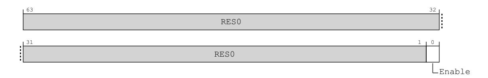

Virtual accesses to this register update [ICH\\_VMCR\\_EL2](#page-360-1).VENG0.

#### **Bits [63:1]**

Reserved, RES0.

#### **Enable, bit [0]**

Enables Group 0 interrupts.

0b0 Group 0 interrupts are disabled.

0b1 Group 0 interrupts are enabled.

If the highest priority pending interrupt for that PE is a Group 0 interrupt using 1 of N model, then

the interrupt will be targeted to another PE as a result of the Enable bit changing from 1 to 0.

The reset behavior of this field is:

• On a Warm reset, this field resets to 0.

#### **Accessing ICC\_IGRPEN0\_EL1**

Accesses to this register use the following encodings in the System register encoding space:

#### **MRS <Xt>, ICC\_IGRPEN0\_EL1**

| op0  | op1   | CRn    | CRm    | op2   |
|------|-------|--------|--------|-------|
| 0b11 | 0b000 | 0b1100 | 0b1100 | 0b110 |

if PSTATE.EL == EL0 then UNDEFINED; elsif PSTATE.EL == EL1 then

```
if HaveEL(EL3) && EL3SDDUndefPriority() && SCR_EL3.FIQ == '1' then
        UNDEFINED;
    elsif ICC_SRE_EL1.SRE == '0' then
        AArch64.SystemAccessTrap(EL1, 0x18);
    elsif EL2Enabled() && IsFeatureImplemented(FEAT_FGT) && (!HaveEL(EL3) || SCR_EL3.FGTEn
== '1') && HFGRTR_EL2.ICC_IGRPENn_EL1 == '1' then
        AArch64.SystemAccessTrap(EL2, 0x18);
    elsif EL2Enabled() && ICH_HCR_EL2.TALL0 == '1' then
        AArch64.SystemAccessTrap(EL2, 0x18);
    elsif EL2Enabled() && HCR_EL2.FMO == '1' then
        X[t, 64] = ICV_IGRPEN0_EL1;
    elsif HaveEL(EL3) && SCR_EL3.FIQ == '1' then
        if EL3SDDUndef() then
            UNDEFINED;
        else
            AArch64.SystemAccessTrap(EL3, 0x18);
    else
        X[t, 64] = ICC_IGRPEN0_EL1;
elsif PSTATE.EL == EL2 then
    if HaveEL(EL3) && EL3SDDUndefPriority() && SCR_EL3.FIQ == '1' then
        UNDEFINED;
    elsif ICC_SRE_EL2.SRE == '0' then
        AArch64.SystemAccessTrap(EL2, 0x18);
    elsif HaveEL(EL3) && SCR_EL3.FIQ == '1' then
        if EL3SDDUndef() then
            UNDEFINED;
        else
            AArch64.SystemAccessTrap(EL3, 0x18);
    else
        X[t, 64] = ICC_IGRPEN0_EL1;
elsif PSTATE.EL == EL3 then
    if ICC_SRE_EL3.SRE == '0' then
        AArch64.SystemAccessTrap(EL3, 0x18);
    else
        X[t, 64] = ICC_IGRPEN0_EL1;
```

#### **MSR ICC\_IGRPEN0\_EL1, <Xt>**

| op0  | op1   | CRn    | CRm    | op2   |
|------|-------|--------|--------|-------|
| 0b11 | 0b000 | 0b1100 | 0b1100 | 0b110 |

```
if PSTATE.EL == EL0 then
    UNDEFINED;
elsif PSTATE.EL == EL1 then
    if HaveEL(EL3) && EL3SDDUndefPriority() && SCR_EL3.FIQ == '1' then
        UNDEFINED;
    elsif ICC_SRE_EL1.SRE == '0' then
        AArch64.SystemAccessTrap(EL1, 0x18);
    elsif EL2Enabled() && IsFeatureImplemented(FEAT_FGT) && (!HaveEL(EL3) || SCR_EL3.FGTEn
== '1') && HFGWTR_EL2.ICC_IGRPENn_EL1 == '1' then
        AArch64.SystemAccessTrap(EL2, 0x18);
    elsif EL2Enabled() && ICH_HCR_EL2.TALL0 == '1' then
        AArch64.SystemAccessTrap(EL2, 0x18);
    elsif EL2Enabled() && HCR_EL2.FMO == '1' then
        ICV_IGRPEN0_EL1 = X[t, 64];
    elsif HaveEL(EL3) && SCR_EL3.FIQ == '1' then
        if EL3SDDUndef() then
            UNDEFINED;
        else
            AArch64.SystemAccessTrap(EL3, 0x18);
    else
```

```
ICC_IGRPEN0_EL1 = X[t, 64];
elsif PSTATE.EL == EL2 then
    if HaveEL(EL3) && EL3SDDUndefPriority() && SCR_EL3.FIQ == '1' then
        UNDEFINED;
    elsif ICC_SRE_EL2.SRE == '0' then
        AArch64.SystemAccessTrap(EL2, 0x18);
    elsif HaveEL(EL3) && SCR_EL3.FIQ == '1' then
        if EL3SDDUndef() then
            UNDEFINED;
        else
            AArch64.SystemAccessTrap(EL3, 0x18);
    else
        ICC_IGRPEN0_EL1 = X[t, 64];
elsif PSTATE.EL == EL3 then
    if ICC_SRE_EL3.SRE == '0' then
        AArch64.SystemAccessTrap(EL3, 0x18);
    else
        ICC_IGRPEN0_EL1 = X[t, 64];
```

#### <span id="page-259-1"></span><span id="page-259-0"></span>**12.2.16 ICC\_IGRPEN1\_EL1, Interrupt Controller Interrupt Group 1 Enable Register**

The ICC\_IGRPEN1\_EL1 characteristics are:

#### **Purpose**

Controls whether Group 1 interrupts are enabled for the current Security state.

#### **Configurations**

 This register is banked between ICC\_IGRPEN1\_EL1 and ICC\_IGRPEN1\_EL1\_S and ICC\_IGRPEN1\_EL1\_NS.

AArch64 System register ICC\_IGRPEN1\_EL1 bits [31:0] (ICC\_IGRPEN1\_EL1\_S) are architecturally mapped to AArch32 System register [ICC\\_IGRPEN1\[](#page-420-0)31:0] (ICC\_IGRPEN1\_S).

AArch64 System register ICC\_IGRPEN1\_EL1 bits [31:0] (ICC\_IGRPEN1\_EL1\_NS) are architecturally mapped to AArch32 System register [ICC\\_IGRPEN1\[](#page-420-0)31:0] (ICC\_IGRPEN1\_NS).

This register is present only when FEAT\_GICv3 is implemented. Otherwise, direct accesses to ICC\_IGRPEN1\_EL1 are UNDEFINED.

#### **Attributes**

ICC\_IGRPEN1\_EL1 is a 64-bit register.

This register has the following instances:

- ICC\_IGRPEN1\_EL1, when EL3 is not implemented.
- ICC\_IGRPEN1\_EL1\_S, when EL3 is implemented.
- ICC\_IGRPEN1\_EL1\_NS, when EL3 is implemented.

#### **Field descriptions**

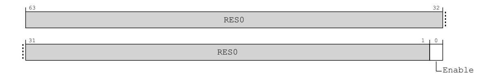

#### **Bits [63:1]**

Reserved, RES0.

#### **Enable, bit [0]**

Enables Group 1 interrupts for the current Security state.

0b0 Group 1 interrupts are disabled for the current Security state.

0b1 Group 1 interrupts are enabled for the current Security state.

Virtual accesses to this register update [ICH\\_VMCR\\_EL2](#page-360-1).VENG1.

If EL3 is present:

- The Secure [ICC\\_IGRPEN1\\_EL1](#page-259-1).Enable bit is a read/write alias of the [ICC\\_IGRPEN1\\_EL3](#page-262-1).EnableGrp1S bit.
- The Non-secure [ICC\\_IGRPEN1\\_EL1](#page-259-1).Enable bit is a read/write alias of the [ICC\\_IGRPEN1\\_EL3](#page-262-1).EnableGrp1NS bit.

If the highest priority pending interrupt for that PE is a Group 1 interrupt using 1 of N model, then the interrupt will target another PE as a result of the Enable bit changing from 1 to 0.

The reset behavior of this field is:

• On a Warm reset, this field resets to 0.

#### **Accessing ICC\_IGRPEN1\_EL1**

Accesses to this register use the following encodings in the System register encoding space:

#### **MRS <Xt>, ICC\_IGRPEN1\_EL1**

| op0  | op1   | CRn    | CRm    | op2   |
|------|-------|--------|--------|-------|
| 0b11 | 0b000 | 0b1100 | 0b1100 | 0b111 |

```
if PSTATE.EL == EL0 then
    UNDEFINED;
elsif PSTATE.EL == EL1 then
    if HaveEL(EL3) && EL3SDDUndefPriority() && SCR_EL3.IRQ == '1' then
        UNDEFINED;
    elsif ICC_SRE_EL1.SRE == '0' then
        AArch64.SystemAccessTrap(EL1, 0x18);
    elsif EL2Enabled() && IsFeatureImplemented(FEAT_FGT) && (!HaveEL(EL3) || SCR_EL3.FGTEn
== '1') && HFGRTR_EL2.ICC_IGRPENn_EL1 == '1' then
        AArch64.SystemAccessTrap(EL2, 0x18);
    elsif EL2Enabled() && ICH_HCR_EL2.TALL1 == '1' then
        AArch64.SystemAccessTrap(EL2, 0x18);
    elsif EL2Enabled() && HCR_EL2.IMO == '1' then
        X[t, 64] = ICV_IGRPEN1_EL1;
    elsif HaveEL(EL3) && SCR_EL3.IRQ == '1' then
        if EL3SDDUndef() then
            UNDEFINED;
        else
            AArch64.SystemAccessTrap(EL3, 0x18);
    elsif HaveEL(EL3) then
        if SCR_EL3.NS == '0' then
            X[t, 64] = ICC_IGRPEN1_EL1_S;
        else
            X[t, 64] = ICC_IGRPEN1_EL1_NS;
    else
        X[t, 64] = ICC_IGRPEN1_EL1;
elsif PSTATE.EL == EL2 then
    if HaveEL(EL3) && EL3SDDUndefPriority() && SCR_EL3.IRQ == '1' then
        UNDEFINED;
    elsif ICC_SRE_EL2.SRE == '0' then
        AArch64.SystemAccessTrap(EL2, 0x18);
    elsif HaveEL(EL3) && SCR_EL3.IRQ == '1' then
        if EL3SDDUndef() then
            UNDEFINED;
        else
            AArch64.SystemAccessTrap(EL3, 0x18);
    elsif HaveEL(EL3) then
        if SCR_EL3.NS == '0' then
            X[t, 64] = ICC_IGRPEN1_EL1_S;
        else
            X[t, 64] = ICC_IGRPEN1_EL1_NS;
    else
        X[t, 64] = ICC_IGRPEN1_EL1;
elsif PSTATE.EL == EL3 then
    if ICC_SRE_EL3.SRE == '0' then
        AArch64.SystemAccessTrap(EL3, 0x18);
    else
        if SCR_EL3.NS == '0' then
            X[t, 64] = ICC_IGRPEN1_EL1_S;
        else
            X[t, 64] = ICC_IGRPEN1_EL1_NS;
```

#### **MSR ICC\_IGRPEN1\_EL1, <Xt>**

| op0  | op1   | CRn    | CRm    | op2   |
|------|-------|--------|--------|-------|
| 0b11 | 0b000 | 0b1100 | 0b1100 | 0b111 |

```
if PSTATE.EL == EL0 then
    UNDEFINED;
elsif PSTATE.EL == EL1 then
    if HaveEL(EL3) && EL3SDDUndefPriority() && SCR_EL3.IRQ == '1' then
        UNDEFINED;
    elsif ICC_SRE_EL1.SRE == '0' then
        AArch64.SystemAccessTrap(EL1, 0x18);
    elsif EL2Enabled() && IsFeatureImplemented(FEAT_FGT) && (!HaveEL(EL3) || SCR_EL3.FGTEn
== '1') && HFGWTR_EL2.ICC_IGRPENn_EL1 == '1' then
        AArch64.SystemAccessTrap(EL2, 0x18);
    elsif EL2Enabled() && ICH_HCR_EL2.TALL1 == '1' then
        AArch64.SystemAccessTrap(EL2, 0x18);
    elsif EL2Enabled() && HCR_EL2.IMO == '1' then
        ICV_IGRPEN1_EL1 = X[t, 64];
    elsif HaveEL(EL3) && SCR_EL3.IRQ == '1' then
        if EL3SDDUndef() then
            UNDEFINED;
        else
            AArch64.SystemAccessTrap(EL3, 0x18);
    elsif HaveEL(EL3) then
        if SCR_EL3.NS == '0' then
            ICC_IGRPEN1_EL1_S = X[t, 64];
        else
            ICC_IGRPEN1_EL1_NS = X[t, 64];
    else
        ICC_IGRPEN1_EL1 = X[t, 64];
elsif PSTATE.EL == EL2 then
    if HaveEL(EL3) && EL3SDDUndefPriority() && SCR_EL3.IRQ == '1' then
        UNDEFINED;
    elsif ICC_SRE_EL2.SRE == '0' then
        AArch64.SystemAccessTrap(EL2, 0x18);
    elsif HaveEL(EL3) && SCR_EL3.IRQ == '1' then
        if EL3SDDUndef() then
            UNDEFINED;
        else
            AArch64.SystemAccessTrap(EL3, 0x18);
    elsif HaveEL(EL3) then
        if SCR_EL3.NS == '0' then
            ICC_IGRPEN1_EL1_S = X[t, 64];
        else
            ICC_IGRPEN1_EL1_NS = X[t, 64];
    else
        ICC_IGRPEN1_EL1 = X[t, 64];
elsif PSTATE.EL == EL3 then
    if ICC_SRE_EL3.SRE == '0' then
        AArch64.SystemAccessTrap(EL3, 0x18);
    else
        if SCR_EL3.NS == '0' then
            ICC_IGRPEN1_EL1_S = X[t, 64];
        else
            ICC_IGRPEN1_EL1_NS = X[t, 64];
```

#### <span id="page-262-1"></span><span id="page-262-0"></span>**12.2.17 ICC\_IGRPEN1\_EL3, Interrupt Controller Interrupt Group 1 Enable Register (EL3)**

The ICC\_IGRPEN1\_EL3 characteristics are:

#### **Purpose**

Controls whether Group 1 interrupts are enabled or not.

#### **Configurations**

This register is present only when FEAT\_GICv3 is implemented and EL3 is implemented. Otherwise, direct accesses to ICC\_IGRPEN1\_EL3 are UNDEFINED.

#### **Attributes**

ICC\_IGRPEN1\_EL3 is a 64-bit register.

#### **Field descriptions**

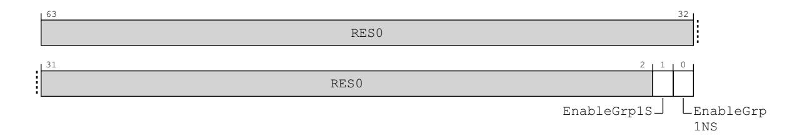

#### **Bits [63:2]**

Reserved, RES0.

#### **EnableGrp1S, bit [1]**

Enables Group 1 interrupts for the Secure state.

0b0 Secure Group 1 interrupts are disabled.

0b1 Secure Group 1 interrupts are enabled.

The Secure [ICC\\_IGRPEN1\\_EL1](#page-259-1).Enable bit is a read/write alias of the ICC\_IGRPEN1\_EL3.EnableGrp1S bit.

If the highest priority pending interrupt for that PE is a Group 1 interrupt using 1 of N model, then the interrupt will target another PE as a result of the Enable bit changing from 1 to 0.

The reset behavior of this field is:

• On a Warm reset, this field resets to 0.

#### **EnableGrp1NS, bit [0]**

Enables Group 1 interrupts for the Non-secure state.

0b0 Non-secure Group 1 interrupts are disabled.

0b1 Non-secure Group 1 interrupts are enabled.

The Non-secure [ICC\\_IGRPEN1\\_EL1](#page-259-1).Enable bit is a read/write alias of the ICC\_IGRPEN1\_EL3.EnableGrp1NS bit.

If the highest priority pending interrupt for that PE is a Group 1 interrupt using 1 of N model, then the interrupt will target another PE as a result of the Enable bit changing from 1 to 0.

The reset behavior of this field is:

• On a Warm reset, this field resets to 0.

#### **Accessing ICC\_IGRPEN1\_EL3**

Accesses to this register use the following encodings in the System register encoding space:

#### **MRS <Xt>, ICC\_IGRPEN1\_EL3**

| op0  | op1   | CRn    | CRm    | op2   |
|------|-------|--------|--------|-------|
| 0b11 | 0b110 | 0b1100 | 0b1100 | 0b111 |

```
if PSTATE.EL == EL0 then
    UNDEFINED;
elsif PSTATE.EL == EL1 then
    UNDEFINED;
elsif PSTATE.EL == EL2 then
    UNDEFINED;
elsif PSTATE.EL == EL3 then
    if ICC_SRE_EL3.SRE == '0' then
        AArch64.SystemAccessTrap(EL3, 0x18);
    else
        X[t, 64] = ICC_IGRPEN1_EL3;
```

#### **MSR ICC\_IGRPEN1\_EL3, <Xt>**

| op0  | op1   | CRn    | CRm    | op2   |
|------|-------|--------|--------|-------|
| 0b11 | 0b110 | 0b1100 | 0b1100 | 0b111 |

```
if PSTATE.EL == EL0 then
    UNDEFINED;
elsif PSTATE.EL == EL1 then
    UNDEFINED;
elsif PSTATE.EL == EL2 then
    UNDEFINED;
elsif PSTATE.EL == EL3 then
    if ICC_SRE_EL3.SRE == '0' then
        AArch64.SystemAccessTrap(EL3, 0x18);
    else
        ICC_IGRPEN1_EL3 = X[t, 64];
```

#### <span id="page-264-1"></span><span id="page-264-0"></span>**12.2.18 ICC\_NMIAR1\_EL1, Interrupt Controller Non-maskable Interrupt Acknowledge Register 1**

The ICC\_NMIAR1\_EL1 characteristics are:

#### **Purpose**

The PE reads this register to obtain the INTID of the signaled Group 1 non-maskable interrupt. This read acts as an acknowledge for the interrupt.

#### **Configurations**

This register is present only when FEAT\_GICv3\_NMI is implemented. Otherwise, direct accesses to ICC\_NMIAR1\_EL1 are UNDEFINED.

To allow software to ensure appropriate observability of actions initiated by GIC register accesses, the PE and CPU interface logic must ensure that reads of this register are self-synchronizing when interrupts are masked by the PE (that is when PSTATE.{I,F} == {0,0}). This ensures that the effect of activating an interrupt on the signaling of interrupt exceptions is observed when a read of this register is architecturally executed so that no spurious interrupt exception occurs if interrupts are unmasked by an instruction immediately following the read. For more information, see *[Observability of the effects of accesses to the GIC registers on page](#page-194-0) 12-195*.

#### **Attributes**

ICC\_NMIAR1\_EL1 is a 64-bit register.

#### **Field descriptions**


#### **Bits [63:24]**

Reserved, RES0.

#### **INTID, bits [23:0]**

The INTID of the signaled interrupt.

This is the INTID of the highest priority pending interrupt, if that interrupt has the Non-maskable property and is of sufficient priority for it to be signaled to the PE, and if it can be acknowledged at the current Security state and Exception level.

If the highest priority pending interrupt is not observable, this field contains a special INTID to indicate the reason. For more information, see *[Special INTIDs on page](#page-35-1) 2-36*.

This field has either 16 or 24 bits implemented. The number of implemented bits can be found in [ICC\\_CTLR\\_EL1.](#page-232-1)IDbits and [ICC\\_CTLR\\_EL3](#page-237-1).IDbits. If only 16 bits are implemented, bits [23:16] of this register are RES0.

#### **Accessing ICC\_NMIAR1\_EL1**

Accesses to this register use the following encodings in the System register encoding space:

**MRS <Xt>, ICC\_NMIAR1\_EL1**

| op0  | op1   | CRn    | CRm    | op2   |
|------|-------|--------|--------|-------|
| 0b11 | 0b000 | 0b1100 | 0b1001 | 0b101 |

```
if PSTATE.EL == EL0 then
    UNDEFINED;
elsif PSTATE.EL == EL1 then
    if SCTLR_EL1.NMI == '0' then
        UNDEFINED;
    elsif HaveEL(EL3) && EL3SDDUndefPriority() && SCR_EL3.IRQ == '1' then
        UNDEFINED;
    elsif ICC_SRE_EL1.SRE == '0' then
        AArch64.SystemAccessTrap(EL1, 0x18);
    elsif EL2Enabled() && ICH_HCR_EL2.TALL1 == '1' then
        AArch64.SystemAccessTrap(EL2, 0x18);
    elsif EL2Enabled() && HCR_EL2.IMO == '1' then
        X[t, 64] = ICV_NMIAR1_EL1;
    elsif HaveEL(EL3) && SCR_EL3.IRQ == '1' then
        if EL3SDDUndef() then
            UNDEFINED;
        else
            AArch64.SystemAccessTrap(EL3, 0x18);
    else
        X[t, 64] = ICC_NMIAR1_EL1;
elsif PSTATE.EL == EL2 then
    if SCTLR_EL2.NMI == '0' then
        UNDEFINED;
    elsif HaveEL(EL3) && EL3SDDUndefPriority() && SCR_EL3.IRQ == '1' then
        UNDEFINED;
    elsif ICC_SRE_EL2.SRE == '0' then
        AArch64.SystemAccessTrap(EL2, 0x18);
    elsif HaveEL(EL3) && SCR_EL3.IRQ == '1' then
        if EL3SDDUndef() then
            UNDEFINED;
        else
            AArch64.SystemAccessTrap(EL3, 0x18);
    else
        X[t, 64] = ICC_NMIAR1_EL1;
elsif PSTATE.EL == EL3 then
    if SCTLR_EL3.NMI == '0' then
        UNDEFINED;
    elsif ICC_SRE_EL3.SRE == '0' then
        AArch64.SystemAccessTrap(EL3, 0x18);
    else
        X[t, 64] = ICC_NMIAR1_EL1;
```

#### <span id="page-266-1"></span><span id="page-266-0"></span>**12.2.19 ICC\_PMR\_EL1, Interrupt Controller Interrupt Priority Mask Register**

The ICC\_PMR\_EL1 characteristics are:

#### **Purpose**

Provides an interrupt priority filter. Only interrupts with a higher priority than the value in this register are signaled to the PE.

Writes to this register must be high performance and must ensure that no interrupt of lower priority than the written value occurs after the write, without requiring an ISB or an exception boundary.

#### **Configurations**

AArch64 System register ICC\_PMR\_EL1 bits [31:0] are architecturally mapped to AArch32 System register [ICC\\_PMR](#page-434-0)[31:0].

This register is present only when FEAT\_GICv3 is implemented. Otherwise, direct accesses to ICC\_PMR\_EL1 are UNDEFINED.

To allow software to ensure appropriate observability of actions initiated by GIC register accesses, the PE and CPU interface logic must ensure that writes to this register are self-synchronizing. This ensures that no interrupts below the written PMR value will be taken after a write to this register is architecturally executed. For more information, see *[Observability of the effects of accesses to the](#page-194-0)  [GIC registers on page](#page-194-0) 12-195*.

#### **Attributes**

ICC\_PMR\_EL1 is a 64-bit register.

#### **Field descriptions**

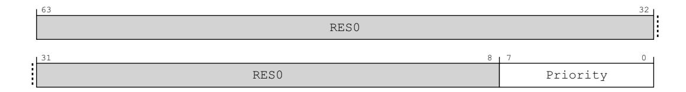

#### **Bits [63:8]**

Reserved, RES0.

#### **Priority, bits [7:0]**

The priority mask level for the CPU interface. If the priority of an interrupt is higher than the value indicated by this field, the interface signals the interrupt to the PE.

The possible priority field values are as follows:

| Implemented priority bits | Possible priority field values      | Number of priority levels |
|---------------------------|-------------------------------------|---------------------------|
| [7:0]                     | 0x00-0xFF (0-255), all values       | 256                       |
| [7:1]                     | 0x00-0xFE (0-254), even values only | 128                       |
| [7:2]                     | 0x00-0xFC (0-252), in steps of 4    | 64                        |
| [7:3]                     | 0x00-0xF8 (0-248), in steps of 8    | 32                        |
| [7:4]                     | 0x00-0xF0 (0-240), in steps of 16   | 16                        |

Unimplemented priority bits are RAZ/WI.

The reset behavior of this field is:

• On a Warm reset, this field resets to 0.

#### **Accessing ICC\_PMR\_EL1**

Accesses to this register use the following encodings in the System register encoding space:

#### **MRS <Xt>, ICC\_PMR\_EL1**

| op0  | op1   | CRn    | CRm    | op2   |
|------|-------|--------|--------|-------|
| 0b11 | 0b000 | 0b0100 | 0b0110 | 0b000 |

```
if PSTATE.EL == EL0 then
    UNDEFINED;
elsif PSTATE.EL == EL1 then
    if HaveEL(EL3) && EL3SDDUndefPriority() && SCR_EL3.<IRQ,FIQ> == '11' then
        UNDEFINED;
    elsif ICC_SRE_EL1.SRE == '0' then
        AArch64.SystemAccessTrap(EL1, 0x18);
    elsif EL2Enabled() && ICH_HCR_EL2.TC == '1' then
        AArch64.SystemAccessTrap(EL2, 0x18);
    elsif EL2Enabled() && HCR_EL2.FMO == '1' then
        X[t, 64] = ICV_PMR_EL1;
    elsif EL2Enabled() && HCR_EL2.IMO == '1' then
        X[t, 64] = ICV_PMR_EL1;
    elsif HaveEL(EL3) && SCR_EL3.<IRQ,FIQ> == '11' then
        if EL3SDDUndef() then
            UNDEFINED;
        else
            AArch64.SystemAccessTrap(EL3, 0x18);
    else
        X[t, 64] = ICC_PMR_EL1;
elsif PSTATE.EL == EL2 then
    if HaveEL(EL3) && EL3SDDUndefPriority() && SCR_EL3.<IRQ,FIQ> == '11' then
        UNDEFINED;
    elsif ICC_SRE_EL2.SRE == '0' then
        AArch64.SystemAccessTrap(EL2, 0x18);
    elsif HaveEL(EL3) && SCR_EL3.<IRQ,FIQ> == '11' then
        if EL3SDDUndef() then
            UNDEFINED;
        else
            AArch64.SystemAccessTrap(EL3, 0x18);
    else
        X[t, 64] = ICC_PMR_EL1;
elsif PSTATE.EL == EL3 then
    if ICC_SRE_EL3.SRE == '0' then
        AArch64.SystemAccessTrap(EL3, 0x18);
    else
        X[t, 64] = ICC_PMR_EL1;
```

#### **MSR ICC\_PMR\_EL1, <Xt>**

| op0  | op1   | CRn    | CRm    | op2   |
|------|-------|--------|--------|-------|
| 0b11 | 0b000 | 0b0100 | 0b0110 | 0b000 |

```
if PSTATE.EL == EL0 then
    UNDEFINED;
elsif PSTATE.EL == EL1 then
    if HaveEL(EL3) && EL3SDDUndefPriority() && SCR_EL3.<IRQ,FIQ> == '11' then
        UNDEFINED;
    elsif ICC_SRE_EL1.SRE == '0' then
        AArch64.SystemAccessTrap(EL1, 0x18);
    elsif EL2Enabled() && ICH_HCR_EL2.TC == '1' then
        AArch64.SystemAccessTrap(EL2, 0x18);
    elsif EL2Enabled() && HCR_EL2.FMO == '1' then
        ICV_PMR_EL1 = X[t, 64];
    elsif EL2Enabled() && HCR_EL2.IMO == '1' then
        ICV_PMR_EL1 = X[t, 64];
    elsif HaveEL(EL3) && SCR_EL3.<IRQ,FIQ> == '11' then
        if EL3SDDUndef() then
            UNDEFINED;
        else
            AArch64.SystemAccessTrap(EL3, 0x18);
    else
        ICC_PMR_EL1 = X[t, 64];
elsif PSTATE.EL == EL2 then
    if HaveEL(EL3) && EL3SDDUndefPriority() && SCR_EL3.<IRQ,FIQ> == '11' then
        UNDEFINED;
    elsif ICC_SRE_EL2.SRE == '0' then
        AArch64.SystemAccessTrap(EL2, 0x18);
    elsif HaveEL(EL3) && SCR_EL3.<IRQ,FIQ> == '11' then
        if EL3SDDUndef() then
            UNDEFINED;
        else
            AArch64.SystemAccessTrap(EL3, 0x18);
    else
        ICC_PMR_EL1 = X[t, 64];
elsif PSTATE.EL == EL3 then
    if ICC_SRE_EL3.SRE == '0' then
        AArch64.SystemAccessTrap(EL3, 0x18);
    else
        ICC_PMR_EL1 = X[t, 64];
```

#### <span id="page-269-1"></span><span id="page-269-0"></span>**12.2.20 ICC\_RPR\_EL1, Interrupt Controller Running Priority Register**

The ICC\_RPR\_EL1 characteristics are:

#### **Purpose**

Indicates the Running priority of the CPU interface.

#### **Configurations**

AArch64 System register ICC\_RPR\_EL1 performs the same function as AArch32 System register [ICC\\_RPR.](#page-438-0)

This register is present only when FEAT\_GICv3 is implemented. Otherwise, direct accesses to ICC\_RPR\_EL1 are UNDEFINED.

#### **Attributes**

ICC\_RPR\_EL1 is a 64-bit register.

#### **Field descriptions**

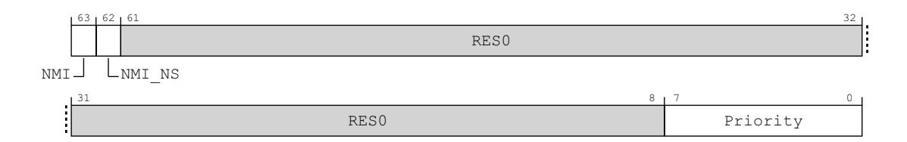

#### **NMI, bit [63]**

#### *When FEAT\_GICv3\_NMI is implemented:*

Indicates whether the running priority is from a NMI.

0b0 When [GICD\\_CTLR.](#page-543-1)DS==1, there are no Active NMIs, or all Active NMIs have undergone priority drop.

When [GICD\\_CTLR.](#page-543-1)DS==0:

- For Non-secure and Realm reads, there are no Active Non-secure Group 1 NMIs, or all Active Non-secure Group 1 NMIs have undergone priority drop.
- For Secure and Root reads, there are no Active Secure Group 1 NMIs, or all Active Secure Group 1 NMIs have undergone priority drop.

0b1 When [GICD\\_CTLR.](#page-543-1)DS==1, there is an Active NMI.

When [GICD\\_CTLR.](#page-543-1)DS==0:

- For Non-secure and Realm reads, there is an Active Non-secure Group 1 NMI.
- For Secure and Root reads, there is an Active Secure Group 1 NMI.

#### *Otherwise:*

Reserved, RES0.

#### **NMI\_NS, bit [62]**

#### *When FEAT\_GICv3\_NMI is implemented and EL3 is implemented:*

Indicates whether the running priority is from a Non-secure Group 1 NMI.

0b0 There are no Active Non-secure Group 1 NMIs, or all Active Non-secure Group 1 NMIs have undergone priority drop.

0b1 There is an Active Non-secure Group 1 NMI which has not undergone priority drop.

For Non-secure and Realm accesses, this field is RES0.

#### *Otherwise:*

Reserved, RES0.

#### **Bits [61:8]**

Reserved, RES0.

#### **Priority, bits [7:0]**

The current running priority on the CPU interface. This is the group priority of the current active interrupt.

The group priority of a Secure NMI, or NMI when GICD\_CTLR.DS is 1, is 0x00. The group priority of a Non-secure NMI is 0x80, saturated to 0x00 for Non-secure reads.

If there are no active interrupts on the CPU interface, or all active interrupts have undergone a priority drop, the value returned is the Idle priority.

The priority returned is the group priority as if the BPR for the current Exception level and Security state was set to the minimum value of BPR for the number of implemented priority bits.

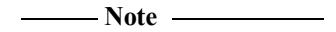

If 8 bits of priority are implemented the group priority is bits[7:1] of the priority.

#### **Accessing ICC\_RPR\_EL1**

Software cannot determine the number of implemented priority bits from a read of this register.

Accesses to this register use the following encodings in the System register encoding space:

#### **MRS <Xt>, ICC\_RPR\_EL1**

| op0  | op1   | CRn    | CRm    | op2   |
|------|-------|--------|--------|-------|
| 0b11 | 0b000 | 0b1100 | 0b1011 | 0b011 |

```
if PSTATE.EL == EL0 then
    UNDEFINED;
elsif PSTATE.EL == EL1 then
    if HaveEL(EL3) && EL3SDDUndefPriority() && SCR_EL3.<IRQ,FIQ> == '11' then
        UNDEFINED;
    elsif ICC_SRE_EL1.SRE == '0' then
        AArch64.SystemAccessTrap(EL1, 0x18);
    elsif EL2Enabled() && ICH_HCR_EL2.TC == '1' then
        AArch64.SystemAccessTrap(EL2, 0x18);
    elsif EL2Enabled() && HCR_EL2.FMO == '1' then
        X[t, 64] = ICV_RPR_EL1;
    elsif EL2Enabled() && HCR_EL2.IMO == '1' then
        X[t, 64] = ICV_RPR_EL1;
    elsif HaveEL(EL3) && SCR_EL3.<IRQ,FIQ> == '11' then
        if EL3SDDUndef() then
            UNDEFINED;
        else
            AArch64.SystemAccessTrap(EL3, 0x18);
    else
        X[t, 64] = ICC_RPR_EL1;
elsif PSTATE.EL == EL2 then
    if HaveEL(EL3) && EL3SDDUndefPriority() && SCR_EL3.<IRQ,FIQ> == '11' then
        UNDEFINED;
    elsif ICC_SRE_EL2.SRE == '0' then
        AArch64.SystemAccessTrap(EL2, 0x18);
    elsif HaveEL(EL3) && SCR_EL3.<IRQ,FIQ> == '11' then
```

```
if EL3SDDUndef() then
            UNDEFINED;
        else
            AArch64.SystemAccessTrap(EL3, 0x18);
    else
        X[t, 64] = ICC_RPR_EL1;
elsif PSTATE.EL == EL3 then
    if ICC_SRE_EL3.SRE == '0' then
        AArch64.SystemAccessTrap(EL3, 0x18);
    else
        X[t, 64] = ICC_RPR_EL1;
```

#### <span id="page-272-1"></span><span id="page-272-0"></span>**12.2.21 ICC\_SGI0R\_EL1, Interrupt Controller Software Generated Interrupt Group 0 Register**

The ICC\_SGI0R\_EL1 characteristics are:

#### **Purpose**

Generates Secure Group 0 SGIs.

#### **Configurations**

AArch64 System register ICC\_SGI0R\_EL1 performs the same function as AArch32 System register [ICC\\_SGI0R.](#page-440-0)

This register is present only when FEAT\_GICv3 is implemented. Otherwise, direct accesses to ICC\_SGI0R\_EL1 are UNDEFINED.

#### **Attributes**

ICC\_SGI0R\_EL1 is a 64-bit register.

#### **Field descriptions**


#### **Bits [63:56]**

Reserved, RES0.

#### **Aff3, bits [55:48]**

The affinity 3 value of the affinity path of the cluster for which SGI interrupts will be generated. If the IRM bit is 1, this field is RES0.

#### **RS, bits [47:44]**

RangeSelector

Controls which group of 16 values is represented by the TargetList field.

TargetList[n] represents aff0 value ((RS \* 16) + n).

When [ICC\\_CTLR\\_EL1](#page-232-1).RSS==0, RS is RES0.

When [ICC\\_CTLR\\_EL1.](#page-232-1)RSS==1 and [GICD\\_TYPER](#page-617-1).RSS==0, writing this register with RS != 0 is a CONSTRAINED UNPREDICTABLE choice of:

- The write is ignored.
- The RS field is treated as 0.

#### **Bits [43:41]**

Reserved, RES0.

#### **IRM, bit [40]**

Interrupt Routing Mode. Determines how the generated interrupts are distributed to PEs. Possible values are:

0b0 Interrupts routed to the PEs specified by Aff3.Aff2.Aff1.<target list>.

0b1 Interrupts routed to all PEs in the system, excluding "self".

#### **Aff2,bits [39:32]**

The affinity 2 value of the affinity path of the cluster for which SGI interrupts will be generated.

If the IRM bit is 1, this field is RES0.

#### **Bits [31:28]**

Reserved, RES0.

#### **INTID, bits [27:24]**

The INTID of the SGI.

#### **Aff1, bits [23:16]**

The affinity 1 value of the affinity path of the cluster for which SGI interrupts will be generated. If the IRM bit is 1, this field is RES0.

#### **TargetList, bits [15:0]**

Target List. The set of PEs for which SGI interrupts will be generated. Each bit corresponds to the PE within a cluster with an Affinity 0 value equal to the bit number.

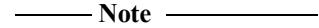

If SRE is set only for Secure EL3, software executing at EL3 might use the System register interface to generate SGIs. Therefore, the Distributor must always be able to receive and acknowledge Generate SGI packets received from CPU interface regardless of the ARE settings for a Security state. However, the Distributor might discard such packets.

If the IRM bit is 1, this field is RES0.

If a bit is 1 and the bit does not correspond to a valid target PE, the bit must be ignored by the Distributor. It is IMPLEMENTATION DEFINED whether, in such cases, a Distributor can signal a system error.

#### **Accessing ICC\_SGI0R\_EL1**

This register allows software executing in a Secure state to generate Group 0 SGIs. It will also allow software executing in a Non-secure state to generate Group 0 SGIs, if permitted by the settings of [GICR\\_NSACR](#page-696-1) in the Redistributor corresponding to the target PE.

When [GICD\\_CTLR](#page-543-1).DS==0, Non-secure writes do not generate an interrupt for a target PE if not permitted by the [GICR\\_NSACR](#page-696-1) register associated with the target PE. For more information, see *[Use of control registers for SGI](#page-206-2)  [forwarding on page](#page-206-2) 12-207*.

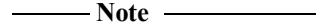

Accesses at EL3 are treated as Secure regardless of the value of [SCR\\_EL3](#page-29-4).NS.

Accesses to this register use the following encodings in the System register encoding space:

**MSR ICC\_SGI0R\_EL1, <Xt>**

| op0  | op1   | CRn    | CRm    | op2   |
|------|-------|--------|--------|-------|
| 0b11 | 0b000 | 0b1100 | 0b1011 | 0b111 |

```
if PSTATE.EL == EL0 then
    UNDEFINED;
elsif PSTATE.EL == EL1 then
    if HaveEL(EL3) && EL3SDDUndefPriority() && SCR_EL3.<IRQ,FIQ> == '11' then
        UNDEFINED;
    elsif ICC_SRE_EL1.SRE == '0' then
        AArch64.SystemAccessTrap(EL1, 0x18);
    elsif EL2Enabled() && ICH_HCR_EL2.TC == '1' then
```

```
AArch64.SystemAccessTrap(EL2, 0x18);
    elsif EL2Enabled() && HCR_EL2.FMO == '1' then
        AArch64.SystemAccessTrap(EL2, 0x18);
    elsif EL2Enabled() && HCR_EL2.IMO == '1' then
        AArch64.SystemAccessTrap(EL2, 0x18);
    elsif HaveEL(EL3) && SCR_EL3.<IRQ,FIQ> == '11' then
        if EL3SDDUndef() then
            UNDEFINED;
        else
            AArch64.SystemAccessTrap(EL3, 0x18);
    else
        ICC_SGI0R_EL1 = X[t, 64];
elsif PSTATE.EL == EL2 then
    if HaveEL(EL3) && EL3SDDUndefPriority() && SCR_EL3.<IRQ,FIQ> == '11' then
        UNDEFINED;
    elsif ICC_SRE_EL2.SRE == '0' then
        AArch64.SystemAccessTrap(EL2, 0x18);
    elsif HaveEL(EL3) && SCR_EL3.<IRQ,FIQ> == '11' then
        if EL3SDDUndef() then
            UNDEFINED;
        else
            AArch64.SystemAccessTrap(EL3, 0x18);
    else
        ICC_SGI0R_EL1 = X[t, 64];
elsif PSTATE.EL == EL3 then
    if ICC_SRE_EL3.SRE == '0' then
        AArch64.SystemAccessTrap(EL3, 0x18);
    else
        ICC_SGI0R_EL1 = X[t, 64];
```

#### <span id="page-275-1"></span><span id="page-275-0"></span>**12.2.22 ICC\_SGI1R\_EL1, Interrupt Controller Software Generated Interrupt Group 1 Register**

The ICC\_SGI1R\_EL1 characteristics are:

#### **Purpose**

Generates Group 1 SGIs for the current Security state.

#### **Configurations**

AArch64 System register ICC\_SGI1R\_EL1 performs the same function as AArch32 System register [ICC\\_SGI1R.](#page-443-0)

This register is present only when FEAT\_GICv3 is implemented. Otherwise, direct accesses to ICC\_SGI1R\_EL1 are UNDEFINED.

Under certain conditions a write to ICC\_SGI1R\_EL1 can generate Group 0 interrupts, see [Table](#page-206-1) 12-14.

#### **Attributes**

ICC\_SGI1R\_EL1 is a 64-bit register.

#### **Field descriptions**

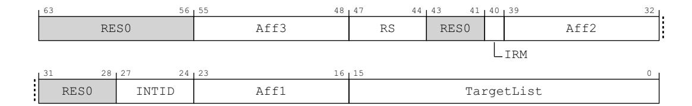

#### **Bits [63:56]**

Reserved, RES0.

#### **Aff3, bits [55:48]**

The affinity 3 value of the affinity path of the cluster for which SGI interrupts will be generated. If the IRM bit is 1, this field is RES0.

#### **RS, bits [47:44]**

RangeSelector

Controls which group of 16 values is represented by the TargetList field.

TargetList[n] represents aff0 value ((RS \* 16) + n).

When [ICC\\_CTLR\\_EL1](#page-232-1).RSS==0, RS is RES0.

When [ICC\\_CTLR\\_EL1.](#page-232-1)RSS==1 and [GICD\\_TYPER](#page-617-1).RSS==0, writing this register with RS != 0 is a CONSTRAINED UNPREDICTABLE choice of:

- The write is ignored.
- The RS field is treated as 0.

#### **Bits [43:41]**

Reserved, RES0.

#### **IRM, bit [40]**

Interrupt Routing Mode. Determines how the generated interrupts are distributed to PEs. Possible values are:

0b0 Interrupts routed to the PEs specified by Aff3.Aff2.Aff1.<target list>.

0b1 Interrupts routed to all PEs in the system, excluding "self".

#### **Aff2, bits [39:32]**

The affinity 2 value of the affinity path of the cluster for which SGI interrupts will be generated. If the IRM bit is 1, this field is RES0.

#### **Bits [31:28]**

Reserved, RES0.

#### **INTID, bits [27:24]**

The INTID of the SGI.

#### **Aff1, bits [23:16]**

The affinity 1 value of the affinity path of the cluster for which SGI interrupts will be generated. If the IRM bit is 1, this field is RES0.

#### **TargetList, bits [15:0]**

Target List. The set of PEs for which SGI interrupts will be generated. Each bit corresponds to the PE within a cluster with an Affinity 0 value equal to the bit number.


If SRE is set only for Secure EL3, software executing at EL3 might use the System register interface to generate SGIs. Therefore, the Distributor must always be able to receive and acknowledge Generate SGI packets received from CPU interface regardless of the ARE settings for a Security state. However, the Distributor might discard such packets.

If the IRM bit is 1, this field is RES0.

If a bit is 1 and the bit does not correspond to a valid target PE, the bit must be ignored by the Distributor. It is IMPLEMENTATION DEFINED whether, in such cases, a Distributor can signal a system error.

#### **Accessing ICC\_SGI1R\_EL1**

**Note**

Accesses at EL3 are treated as Secure regardless of the value of [SCR\\_EL3](#page-29-4).NS.

Accesses to this register use the following encodings in the System register encoding space:

#### **MSR ICC\_SGI1R\_EL1, <Xt>**

| op0  | op1   | CRn    | CRm    | op2   |
|------|-------|--------|--------|-------|
| 0b11 | 0b000 | 0b1100 | 0b1011 | 0b101 |

```
if PSTATE.EL == EL0 then
    UNDEFINED;
elsif PSTATE.EL == EL1 then
    if HaveEL(EL3) && EL3SDDUndefPriority() && SCR_EL3.<IRQ,FIQ> == '11' then
        UNDEFINED;
    elsif ICC_SRE_EL1.SRE == '0' then
        AArch64.SystemAccessTrap(EL1, 0x18);
    elsif EL2Enabled() && ICH_HCR_EL2.TC == '1' then
        AArch64.SystemAccessTrap(EL2, 0x18);
    elsif EL2Enabled() && HCR_EL2.FMO == '1' then
        AArch64.SystemAccessTrap(EL2, 0x18);
    elsif EL2Enabled() && HCR_EL2.IMO == '1' then
        AArch64.SystemAccessTrap(EL2, 0x18);
```

```
elsif HaveEL(EL3) && SCR_EL3.<IRQ,FIQ> == '11' then
        if EL3SDDUndef() then
            UNDEFINED;
        else
            AArch64.SystemAccessTrap(EL3, 0x18);
    else
        ICC_SGI1R_EL1 = X[t, 64];
elsif PSTATE.EL == EL2 then
    if HaveEL(EL3) && EL3SDDUndefPriority() && SCR_EL3.<IRQ,FIQ> == '11' then
        UNDEFINED;
    elsif ICC_SRE_EL2.SRE == '0' then
        AArch64.SystemAccessTrap(EL2, 0x18);
    elsif HaveEL(EL3) && SCR_EL3.<IRQ,FIQ> == '11' then
        if EL3SDDUndef() then
            UNDEFINED;
        else
            AArch64.SystemAccessTrap(EL3, 0x18);
    else
        ICC_SGI1R_EL1 = X[t, 64];
elsif PSTATE.EL == EL3 then
    if ICC_SRE_EL3.SRE == '0' then
        AArch64.SystemAccessTrap(EL3, 0x18);
    else
        ICC_SGI1R_EL1 = X[t, 64];
```

#### <span id="page-278-1"></span><span id="page-278-0"></span>**12.2.23 ICC\_SRE\_EL1, Interrupt Controller System Register Enable Register (EL1)**

The ICC\_SRE\_EL1 characteristics are:

#### **Purpose**

Controls whether the System register interface or the memory-mapped interface to the GIC CPU interface is used for EL1.

#### **Configurations**

 This register is banked between ICC\_SRE\_EL1 and ICC\_SRE\_EL1\_S and ICC\_SRE\_EL1\_NS.

AArch64 System register ICC\_SRE\_EL1 bits [31:0] (ICC\_SRE\_EL1\_S) are architecturally mapped to AArch32 System register [ICC\\_SRE](#page-446-1)[31:0] (ICC\_SRE\_S).

AArch64 System register ICC\_SRE\_EL1 bits [31:0] (ICC\_SRE\_EL1\_NS) are architecturally mapped to AArch32 System register [ICC\\_SRE](#page-446-1)[31:0] (ICC\_SRE\_NS).

This register is present only when FEAT\_GICv3 is implemented. Otherwise, direct accesses to ICC\_SRE\_EL1 are UNDEFINED.

#### **Attributes**

ICC\_SRE\_EL1 is a 64-bit register.

This register has the following instances:

- ICC\_SRE\_EL1, when EL3 is not implemented.
- ICC\_SRE\_EL1\_S, when EL3 is implemented.
- ICC\_SRE\_EL1\_NS, when EL3 is implemented.

#### **Field descriptions**

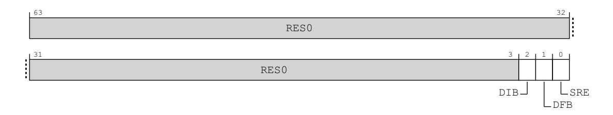

#### **Bits [63:3]**

Reserved, RES0.

#### **DIB, bit [2]**

Disable IRQ bypass.

0b0 IRQ bypass enabled.

0b1 IRQ bypass disabled.

If EL3 is implemented and [GICD\\_CTLR](#page-543-1).DS == 0, this field is a read-only alias of [ICC\\_SRE\\_EL3.](#page-285-1)DIB.

If EL3 is implemented and [GICD\\_CTLR](#page-543-1).DS == 1, and EL2 is not implemented, this field is a read/write alias of [ICC\\_SRE\\_EL3](#page-285-1).DIB.

If EL3 is not implemented and EL2 is implemented, this field is a read-only alias of [ICC\\_SRE\\_EL2.](#page-282-1)DIB.

If [GICD\\_CTLR.](#page-543-1)DS == 1 and EL2 is implemented, this field is a read-only alias of [ICC\\_SRE\\_EL2.](#page-282-1)DIB.

In systems that do not support IRQ bypass, this field is RAO/WI.

The reset behavior of this field is:

• On a Warm reset, this field resets to 0.

#### **DFB, bit [1]**

Disable FIQ bypass.

0b0 FIQ bypass enabled. 0b1 FIQ bypass disabled.

If EL3 is implemented and [GICD\\_CTLR](#page-543-1).DS == 0, this field is a read-only alias of [ICC\\_SRE\\_EL3.](#page-285-1)DFB.

If EL3 is implemented and [GICD\\_CTLR](#page-543-1).DS == 1, and EL2 is not implemented, this field is a read/write alias of [ICC\\_SRE\\_EL3](#page-285-1).DFB.

If EL3 is not implemented and EL2 is implemented, this field is a read-only alias of [ICC\\_SRE\\_EL2.](#page-282-1)DFB.

If [GICD\\_CTLR.](#page-543-1)DS == 1 and EL2 is implemented, this field is a read-only alias of [ICC\\_SRE\\_EL2.](#page-282-1)DFB.

In systems that do not support FIQ bypass, this field is RAO/WI.

The reset behavior of this field is:

• On a Warm reset, this field resets to 0.

#### **SRE, bit [0]**

System Register Enable.

0b0 The memory-mapped interface must be used. Access at EL1 to any ICC\_\* System register other than ICC\_SRE\_EL1 is trapped to EL1.

0b1 The System register interface for the current Security state is enabled.

If software changes this bit from 1 to 0 in the Secure instance of this register, the results are UNPREDICTABLE.

If an implementation supports only a System register interface to the GIC CPU interface, this bit is RAO/WI.

If EL3 is implemented and [ICC\\_SRE\\_EL3.](#page-285-1)SRE==0 the Secure copy of this bit is RAZ/WI. If [ICC\\_SRE\\_EL3.](#page-285-1)SRE is changed from zero to one, the Secure copy of this bit becomes UNKNOWN.

If EL2 is implemented and [ICC\\_SRE\\_EL2.](#page-282-1)SRE==0 the Non-secure copy of this bit is RAZ/WI. If [ICC\\_SRE\\_EL2.](#page-282-1)SRE is changed from zero to one, the Non-secure copy of this bit becomes UNKNOWN.

If EL3 is implemented and [ICC\\_SRE\\_EL3.](#page-285-1)SRE==0 the Non-secure copy of this bit is RAZ/WI. If [ICC\\_SRE\\_EL3.](#page-285-1)SRE is changed from zero to one, the Non-secure copy of this bit becomes UNKNOWN.

If Realm Management Extension is implemented, this field is RAO/WI.

GICv3 implementations that do not require GICv2 compatibility might choose to make this bit RAO/WI. The following options are supported:

- The Non-secure copy of [ICC\\_SRE\\_EL1](#page-278-1).SRE can be RAO/WI if [ICC\\_SRE\\_EL2.](#page-282-1)SRE is also RAO/WI. This means all Non-secure software, including VMs using only virtual interrupts, must access the GIC using System registers.
- The Secure copy of [ICC\\_SRE\\_EL1](#page-278-1).SRE can be RAO/WI if [ICC\\_SRE\\_EL3.](#page-285-1)SRE and [ICC\\_SRE\\_EL2.](#page-282-1)SRE are also RAO/WI. This means that all Secure software must access the GIC using System registers and all Non-secure accesses to registers for physical interrupts must use System registers.

| Note |  |
|------|--|
|------|--|

A VM using only virtual interrupts might still use memory-mapped access if the Non-secure copy of [ICC\\_SRE\\_EL1.](#page-278-1)SRE is not RAO/WI.

The reset behavior of this field is:

• On a Warm reset, this field resets to 0.

#### **Accessing ICC\_SRE\_EL1**

Execution with [ICC\\_SRE\\_EL1](#page-278-1).SRE set to 0 might make some System registers UNKNOWN.

Accesses to this register use the following encodings in the System register encoding space:

**MRS <Xt>, ICC\_SRE\_EL1**

| op0  | op1   | CRn    | CRm    | op2   |
|------|-------|--------|--------|-------|
| 0b11 | 0b000 | 0b1100 | 0b1100 | 0b101 |

```
if PSTATE.EL == EL0 then
    UNDEFINED;
elsif PSTATE.EL == EL1 then
    if HaveEL(EL3) && EL3SDDUndefPriority() && ICC_SRE_EL3.Enable == '0' then
        UNDEFINED;
    elsif EL2Enabled() && ICC_SRE_EL2.Enable == '0' then
        AArch64.SystemAccessTrap(EL2, 0x18);
    elsif HaveEL(EL3) && ICC_SRE_EL3.Enable == '0' then
        if EL3SDDUndef() then
            UNDEFINED;
        else
            AArch64.SystemAccessTrap(EL3, 0x18);
    elsif HaveEL(EL3) then
        if SCR_EL3.NS == '0' then
            X[t, 64] = ICC_SRE_EL1_S;
        else
            X[t, 64] = ICC_SRE_EL1_NS;
    else
        X[t, 64] = ICC_SRE_EL1;
elsif PSTATE.EL == EL2 then
    if HaveEL(EL3) && EL3SDDUndefPriority() && ICC_SRE_EL3.Enable == '0' then
        UNDEFINED;
    elsif HaveEL(EL3) && ICC_SRE_EL3.Enable == '0' then
        if EL3SDDUndef() then
            UNDEFINED;
        else
            AArch64.SystemAccessTrap(EL3, 0x18);
    elsif HaveEL(EL3) then
        if SCR_EL3.NS == '0' then
            X[t, 64] = ICC_SRE_EL1_S;
        else
            X[t, 64] = ICC_SRE_EL1_NS;
    else
        X[t, 64] = ICC_SRE_EL1;
elsif PSTATE.EL == EL3 then
    if SCR_EL3.NS == '0' then
        X[t, 64] = ICC_SRE_EL1_S;
    else
        X[t, 64] = ICC_SRE_EL1_NS;
```

#### **MSR ICC\_SRE\_EL1, <Xt>**

| op0  | op1   | CRn    | CRm    | op2   |
|------|-------|--------|--------|-------|
| 0b11 | 0b000 | 0b1100 | 0b1100 | 0b101 |

```
if PSTATE.EL == EL0 then
    UNDEFINED;
elsif PSTATE.EL == EL1 then
    if HaveEL(EL3) && EL3SDDUndefPriority() && ICC_SRE_EL3.Enable == '0' then
        UNDEFINED;
    elsif EL2Enabled() && ICC_SRE_EL2.Enable == '0' then
        AArch64.SystemAccessTrap(EL2, 0x18);
    elsif HaveEL(EL3) && ICC_SRE_EL3.Enable == '0' then
        if EL3SDDUndef() then
            UNDEFINED;
        else
            AArch64.SystemAccessTrap(EL3, 0x18);
    elsif HaveEL(EL3) then
        if SCR_EL3.NS == '0' then
            ICC_SRE_EL1_S = X[t, 64];
        else
            ICC_SRE_EL1_NS = X[t, 64];
    else
        ICC_SRE_EL1 = X[t, 64];
elsif PSTATE.EL == EL2 then
    if HaveEL(EL3) && EL3SDDUndefPriority() && ICC_SRE_EL3.Enable == '0' then
        UNDEFINED;
    elsif HaveEL(EL3) && ICC_SRE_EL3.Enable == '0' then
        if EL3SDDUndef() then
            UNDEFINED;
        else
            AArch64.SystemAccessTrap(EL3, 0x18);
    elsif HaveEL(EL3) then
        if SCR_EL3.NS == '0' then
            ICC_SRE_EL1_S = X[t, 64];
        else
            ICC_SRE_EL1_NS = X[t, 64];
    else
        ICC_SRE_EL1 = X[t, 64];
elsif PSTATE.EL == EL3 then
    if SCR_EL3.NS == '0' then
        ICC_SRE_EL1_S = X[t, 64];
    else
        ICC_SRE_EL1_NS = X[t, 64];
```

#### <span id="page-282-1"></span><span id="page-282-0"></span>**12.2.24 ICC\_SRE\_EL2, Interrupt Controller System Register Enable Register (EL2)**

The ICC\_SRE\_EL2 characteristics are:

#### **Purpose**

Controls whether the System register interface or the memory-mapped interface to the GIC CPU interface is used for EL2.

#### **Configurations**

AArch64 System register ICC\_SRE\_EL2 is architecturally mapped to AArch32 System register [ICC\\_HSRE.](#page-407-1)

This register is present only when FEAT\_GICv3 is implemented and (EL2 is implemented or EL3 is implemented). Otherwise, direct accesses to ICC\_SRE\_EL2 are UNDEFINED.

If EL2 is not implemented, this register is RES0 from EL3.

This register has no effect if EL2 is not enabled in the current Security state.

#### **Attributes**

ICC\_SRE\_EL2 is a 64-bit register.

#### **Field descriptions**

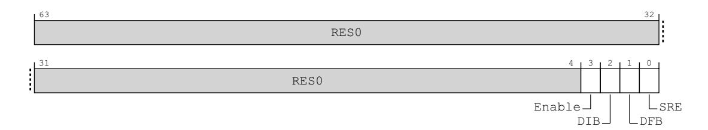

#### **Bits [63:4]**

Reserved, RES0.

#### **Enable, bit [3]**

Enable. Enables lower Exception level access to [ICC\\_SRE\\_EL1.](#page-278-1)

0b0 When EL2 is implemented and enabled in the current Security state, EL1 accesses to [ICC\\_SRE\\_EL1](#page-278-1) trap to EL2.

0b1 EL1 accesses to [ICC\\_SRE\\_EL1](#page-278-1) do not trap to EL2.

If ICC\_SRE\_EL2.SRE is RAO/WI, an implementation is permitted to make the Enable bit RAO/WI.

If ICC\_SRE\_EL2.SRE is 0, the Enable bit behaves as 1 for all purposes other than reading the value of the bit.

The reset behavior of this field is:

• On a Warm reset, this field resets to an architecturally UNKNOWN value.

#### **DIB, bit [2]**

Disable IRQ bypass.

0b0 IRQ bypass enabled. 0b1 IRQ bypass disabled.

If EL3 is implemented and [GICD\\_CTLR](#page-543-1).DS is 0, this field is a read-only alias of [ICC\\_SRE\\_EL3.](#page-285-1)DIB.

If EL3 is implemented and [GICD\\_CTLR](#page-543-1).DS is 1, this field is a read/write alias of [ICC\\_SRE\\_EL3.](#page-285-1)DIB.

In systems that do not support IRQ bypass, this bit is RAO/WI.

The reset behavior of this field is:

• On a Warm reset, this field resets to 0.

#### **DFB, bit [1]**

Disable FIQ bypass.

0b0 FIQ bypass enabled. 0b1 FIQ bypass disabled.

If EL3 is implemented and [GICD\\_CTLR](#page-543-1).DS is 0, this field is a read-only alias of [ICC\\_SRE\\_EL3.](#page-285-1)DFB.

If EL3 is implemented and [GICD\\_CTLR](#page-543-1).DS is 1, this field is a read/write alias of [ICC\\_SRE\\_EL3.](#page-285-1)DFB.

In systems that do not support FIQ bypass, this bit is RAO/WI.

The reset behavior of this field is:

• On a Warm reset, this field resets to 0.

#### **SRE, bit [0]**

System Register Enable.

0b0 The memory-mapped interface must be used. Access at EL2 to any ICH\_\* or ICC\_\* register other than [ICC\\_SRE\\_EL1](#page-278-1) or ICC\_SRE\_EL2, is trapped to EL2.

0b1 The System register interface to the ICH\_\* registers and the EL1 and EL2 ICC\_\* registers is enabled for EL2.

If software changes this bit from 1 to 0, the results are UNPREDICTABLE.

If an implementation supports only a System register interface to the GIC CPU interface, this bit is RAO/WI.

If EL3 is implemented and [ICC\\_SRE\\_EL3](#page-285-1).SRE==0 this bit is RAZ/WI. If [ICC\\_SRE\\_EL3](#page-285-1).SRE is changed from zero to one, this bit becomes UNKNOWN.

If Realm Management Extension is implemented, this field is RAO/WI.

FEAT\_GICv3 implementations that do not require GICv2 compatibility might choose to make this bit RAO/WI, but this is only allowed if ICC\_SRE\_EL3.SRE is also RAO/WI.

The reset behavior of this field is:

• On a Warm reset, this field resets to 0.

#### **Accessing ICC\_SRE\_EL2**

Execution with [ICC\\_SRE\\_EL2](#page-282-1).SRE set to 0 might make some System registers UNKNOWN.

Accesses to this register use the following encodings in the System register encoding space:

**MRS <Xt>, ICC\_SRE\_EL2**

| op0  | op1   | CRn    | CRm    | op2   |
|------|-------|--------|--------|-------|
| 0b11 | 0b100 | 0b1100 | 0b1001 | 0b101 |

```
if PSTATE.EL == EL0 then
    UNDEFINED;
elsif PSTATE.EL == EL1 then
    if EffectiveHCR_EL2_NVx() IN {'xx1'} then
        AArch64.SystemAccessTrap(EL2, 0x18);
    else
```

```
UNDEFINED;
elsif PSTATE.EL == EL2 then
    if HaveEL(EL3) && EL3SDDUndefPriority() && ICC_SRE_EL3.Enable == '0' then
        UNDEFINED;
    elsif HaveEL(EL3) && ICC_SRE_EL3.Enable == '0' then
        if EL3SDDUndef() then
            UNDEFINED;
        else
            AArch64.SystemAccessTrap(EL3, 0x18);
    else
        X[t, 64] = ICC_SRE_EL2;
elsif PSTATE.EL == EL3 then
    if !EL2Enabled() then
        UNDEFINED;
    else
        X[t, 64] = ICC_SRE_EL2;
```

#### **MSR ICC\_SRE\_EL2, <Xt>**

| op0  | op1   | CRn    | CRm    | op2   |
|------|-------|--------|--------|-------|
| 0b11 | 0b100 | 0b1100 | 0b1001 | 0b101 |

```
if PSTATE.EL == EL0 then
    UNDEFINED;
elsif PSTATE.EL == EL1 then
    if EffectiveHCR_EL2_NVx() IN {'xx1'} then
        AArch64.SystemAccessTrap(EL2, 0x18);
    else
        UNDEFINED;
elsif PSTATE.EL == EL2 then
    if HaveEL(EL3) && EL3SDDUndefPriority() && ICC_SRE_EL3.Enable == '0' then
        UNDEFINED;
    elsif HaveEL(EL3) && ICC_SRE_EL3.Enable == '0' then
        if EL3SDDUndef() then
            UNDEFINED;
        else
            AArch64.SystemAccessTrap(EL3, 0x18);
    else
        ICC_SRE_EL2 = X[t, 64];
elsif PSTATE.EL == EL3 then
    if !EL2Enabled() then
        UNDEFINED;
    else
        ICC_SRE_EL2 = X[t, 64];
```

#### <span id="page-285-1"></span><span id="page-285-0"></span>**12.2.25 ICC\_SRE\_EL3, Interrupt Controller System Register Enable Register (EL3)**

The ICC\_SRE\_EL3 characteristics are:

#### **Purpose**

Controls whether the System register interface or the memory-mapped interface to the GIC CPU interface is used for EL3.

#### **Configurations**

This register is present only when FEAT\_GICv3 is implemented and EL3 is implemented. Otherwise, direct accesses to ICC\_SRE\_EL3 are UNDEFINED.

#### **Attributes**

ICC\_SRE\_EL3 is a 64-bit register.

#### **Field descriptions**

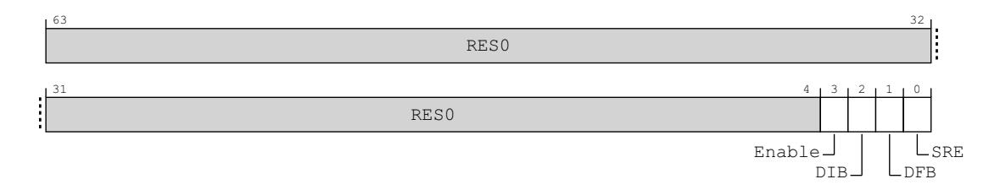

#### **Bits [63:4]**

Reserved, RES0.

#### **Enable, bit [3]**

Enable. Enables lower Exception level access to [ICC\\_SRE\\_EL1](#page-278-1) and [ICC\\_SRE\\_EL2](#page-282-1).

0b0 EL1 accesses to [ICC\\_SRE\\_EL1](#page-278-1) trap to EL3, unless these accesses are trapped to EL2 as a result of ICC\_SRE\_EL2.Enable == 0.

EL2 accesses to [ICC\\_SRE\\_EL1](#page-278-1) and [ICC\\_SRE\\_EL2](#page-282-1) trap to EL3.

0b1 EL1 accesses to [ICC\\_SRE\\_EL1](#page-278-1) do not trap to EL3.

EL2 accesses to [ICC\\_SRE\\_EL1](#page-278-1) and [ICC\\_SRE\\_EL2](#page-282-1) do not trap to EL3.

If ICC\_SRE\_EL3.SRE is RAO/WI, an implementation is permitted to make the Enable bit RAO/WI.

If ICC\_SRE\_EL3.SRE is 0, the Enable bit behaves as 1 for all purposes other than reading the value of the bit.

The reset behavior of this field is:

• On a Warm reset, this field resets to an architecturally UNKNOWN value.

#### **DIB, bit [2]**

Disable IRQ bypass.

0b0 IRQ bypass enabled.

0b1 IRQ bypass disabled.

In systems that do not support IRQ bypass, this bit is RAO/WI.

The reset behavior of this field is:

• On a Warm reset, this field resets to 0.

#### **DFB, bit [1]**

Disable FIQ bypass.

0b0 FIQ bypass enabled. 0b1 FIQ bypass disabled.

In systems that do not support FIQ bypass, this bit is RAO/WI.

The reset behavior of this field is:

• On a Warm reset, this field resets to 0.

#### **SRE, bit [0]**

System Register Enable.

0b0 The memory-mapped interface must be used. Access at EL3 to any ICH\_\* or ICC\_\* register other than [ICC\\_SRE\\_EL1](#page-278-1), [ICC\\_SRE\\_EL2,](#page-282-1) or ICC\_SRE\_EL3 is trapped to EL3

0b1 The System register interface to the ICH\_\* registers and the EL1, EL2, and EL3 ICC\_\* registers is enabled for EL3.

If software changes this bit from 1 to 0, the results are UNPREDICTABLE.

If Realm Management Extension is implemented, this field is RAO/WI.

FEAT\_GICv3 implementations that do not require GICv2 compatibility might choose to make this bit RAO/WI.

The reset behavior of this field is:

• On a Warm reset, this field resets to 0.

#### **Accessing ICC\_SRE\_EL3**

This register is always System register accessible.

Accesses to this register use the following encodings in the System register encoding space:

#### **MRS <Xt>, ICC\_SRE\_EL3**

| op0  | op1   | CRn    | CRm    | op2   |
|------|-------|--------|--------|-------|
| 0b11 | 0b110 | 0b1100 | 0b1100 | 0b101 |

```
if PSTATE.EL == EL0 then
    UNDEFINED;
elsif PSTATE.EL == EL1 then
    UNDEFINED;
elsif PSTATE.EL == EL2 then
    UNDEFINED;
elsif PSTATE.EL == EL3 then
    X[t, 64] = ICC_SRE_EL3;
```

#### **MSR ICC\_SRE\_EL3, <Xt>**

| op0  | op1   | CRn    | CRm    | op2   |
|------|-------|--------|--------|-------|
| 0b11 | 0b110 | 0b1100 | 0b1100 | 0b101 |

if PSTATE.EL == EL0 then UNDEFINED; elsif PSTATE.EL == EL1 then UNDEFINED; elsif PSTATE.EL == EL2 then UNDEFINED; elsif PSTATE.EL == EL3 then ICC\_SRE\_EL3 = X[t, 64]; <span id="page-288-1"></span><span id="page-288-0"></span>This section describes each of the virtual AArch64 GIC System registers in register name order. The ICV prefix indicates a virtual GIC CPU interface System register. Each AArch64 System register description contains a reference to the AArch32 register that provides the same functionality.

Unless otherwise stated, the bit assignments for the GIC System registers are the same as those for the equivalent GICC\_\* and GICV\_\* memory-mapped registers.

The ICV\_\* registers are only accessible at EL1, and only if EL2 is enabled for the current Security state. Whether an access encoding maps to an ICC\_\* register or the equivalent ICV\_\* register is determined by [HCR\\_EL2](#page-28-2), see Chapter 6 *[Virtual Interrupt Handling and Prioritization](#page-150-1)*. The equivalent virtual interface memory-mapped registers are described in *[The GIC virtual CPU interface register descriptions on page](#page-769-1) 12-770*.

The encodings for the virtual registers are the same as for the physical registers, see Table 12-[21 on page](#page-213-2) 12-214.

#### <span id="page-289-1"></span><span id="page-289-0"></span>**12.3.1 ICV\_AP0R<n>\_EL1, Interrupt Controller Virtual Active Priorities Group 0 Registers, n = 0 - 3**

The ICV\_AP0R<n>\_EL1 characteristics are:

#### **Purpose**

Provides information about virtual Group 0 active priorities.

#### **Configurations**

AArch64 System register ICV\_AP0R<n>\_EL1 bits [31:0] are architecturally mapped to AArch32 System register [ICV\\_AP0R<n>\[](#page-451-0)31:0].

This register is present only when FEAT\_GICv3 is implemented and EL2 is implemented. Otherwise, direct accesses to ICV\_AP0R<n>\_EL1 are UNDEFINED.

#### **Attributes**

ICV\_AP0R<n>\_EL1 is a 64-bit register.

#### **Field descriptions**

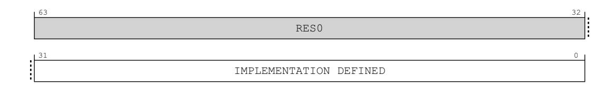

#### **Bits [63:32]**

Reserved, RES0.

#### **IMPLEMENTATION DEFINED, bits [31:0]**

IMPLEMENTATION DEFINED.

The reset behavior of this field is:

• On a Warm reset, this field resets to an architecturally UNKNOWN value.

The contents of these registers are IMPLEMENTATION DEFINED with the one architectural requirement that a value of all zeros is consistent with no interrupts being active.

#### **Accessing ICV\_AP0R<n>\_EL1**

Writing to these registers with any value other than the last read value of the register (or all zeros when there are no Group 0 active priorities) might result in UNPREDICTABLE behavior of the virtual interrupt prioritization system, causing:

- Interrupts that should preempt execution to not preempt execution.
- Interrupts that should not preempt execution to preempt execution.

ICV\_AP0R1\_EL1 is implemented only in implementations that support 6 or more bits of priority. ICV\_AP0R2\_EL1 and ICV\_AP0R3\_EL1 are implemented only in implementations that support 7 bits of priority. Unimplemented registers are UNDEFINED.

Writing to the active priority registers in any order other than the following order might result in UNPREDICTABLE behavior of the interrupt prioritization system:

- ICV\_AP0R<n>\_EL1.
- [ICV\\_AP1R<n>\\_EL1.](#page-292-1)

Accesses to this register use the following encodings in the System register encoding space:

#### **MRS <Xt>, ICC\_AP0R<m>\_EL1; Where m = 0-3**

| op0  | op1   | CRn    | CRm    | op2        |
|------|-------|--------|--------|------------|
| 0b11 | 0b000 | 0b1100 | 0b1000 | 0b1:m[1:0] |

```
integer m = UInt(op2<1:0>);
if m == 1 && NUM_GIC_PRIORITY_BITS < 6 then
    UNDEFINED;
elsif (m == 2 || m == 3) && NUM_GIC_PRIORITY_BITS < 7 then
    UNDEFINED;
elsif PSTATE.EL == EL0 then
    UNDEFINED;
elsif PSTATE.EL == EL1 then
    if HaveEL(EL3) && EL3SDDUndefPriority() && SCR_EL3.FIQ == '1' then
        UNDEFINED;
    elsif ICC_SRE_EL1.SRE == '0' then
        AArch64.SystemAccessTrap(EL1, 0x18);
    elsif EL2Enabled() && ICH_HCR_EL2.TALL0 == '1' then
        AArch64.SystemAccessTrap(EL2, 0x18);
    elsif EL2Enabled() && HCR_EL2.FMO == '1' then
        X[t, 64] = ICV_AP0R_EL1[m];
    elsif HaveEL(EL3) && SCR_EL3.FIQ == '1' then
        if EL3SDDUndef() then
            UNDEFINED;
        else
            AArch64.SystemAccessTrap(EL3, 0x18);
    else
        X[t, 64] = ICC_AP0R_EL1[m];
elsif PSTATE.EL == EL2 then
    if HaveEL(EL3) && EL3SDDUndefPriority() && SCR_EL3.FIQ == '1' then
        UNDEFINED;
    elsif ICC_SRE_EL2.SRE == '0' then
        AArch64.SystemAccessTrap(EL2, 0x18);
    elsif HaveEL(EL3) && SCR_EL3.FIQ == '1' then
        if EL3SDDUndef() then
            UNDEFINED;
        else
            AArch64.SystemAccessTrap(EL3, 0x18);
    else
        X[t, 64] = ICC_AP0R_EL1[m];
elsif PSTATE.EL == EL3 then
    if ICC_SRE_EL3.SRE == '0' then
        AArch64.SystemAccessTrap(EL3, 0x18);
    else
        X[t, 64] = ICC_AP0R_EL1[m];
```

#### **MSR ICC\_AP0R<m>\_EL1, <Xt>; Where m = 0-3**

| op0  | op1   | CRn    | CRm    | op2        |
|------|-------|--------|--------|------------|
| 0b11 | 0b000 | 0b1100 | 0b1000 | 0b1:m[1:0] |

integer m = UInt(op2<1:0>);

```
if m == 1 && NUM_GIC_PRIORITY_BITS < 6 then
    UNDEFINED;
elsif (m == 2 || m == 3) && NUM_GIC_PRIORITY_BITS < 7 then
    UNDEFINED;
elsif PSTATE.EL == EL0 then
    UNDEFINED;
elsif PSTATE.EL == EL1 then
    if HaveEL(EL3) && EL3SDDUndefPriority() && SCR_EL3.FIQ == '1' then
        UNDEFINED;
    elsif ICC_SRE_EL1.SRE == '0' then
        AArch64.SystemAccessTrap(EL1, 0x18);
    elsif EL2Enabled() && ICH_HCR_EL2.TALL0 == '1' then
        AArch64.SystemAccessTrap(EL2, 0x18);
    elsif EL2Enabled() && HCR_EL2.FMO == '1' then
        ICV_AP0R_EL1[m] = X[t, 64];
    elsif HaveEL(EL3) && SCR_EL3.FIQ == '1' then
        if EL3SDDUndef() then
            UNDEFINED;
        else
            AArch64.SystemAccessTrap(EL3, 0x18);
    else
        ICC_AP0R_EL1[m] = X[t, 64];
elsif PSTATE.EL == EL2 then
    if HaveEL(EL3) && EL3SDDUndefPriority() && SCR_EL3.FIQ == '1' then
        UNDEFINED;
    elsif ICC_SRE_EL2.SRE == '0' then
        AArch64.SystemAccessTrap(EL2, 0x18);
    elsif HaveEL(EL3) && SCR_EL3.FIQ == '1' then
        if EL3SDDUndef() then
            UNDEFINED;
        else
            AArch64.SystemAccessTrap(EL3, 0x18);
    else
        ICC_AP0R_EL1[m] = X[t, 64];
elsif PSTATE.EL == EL3 then
    if ICC_SRE_EL3.SRE == '0' then
        AArch64.SystemAccessTrap(EL3, 0x18);
    else
        ICC_AP0R_EL1[m] = X[t, 64];
```

#### <span id="page-292-1"></span><span id="page-292-0"></span>**12.3.2 ICV\_AP1R<n>\_EL1, Interrupt Controller Virtual Active Priorities Group 1 Registers, n = 0 - 3**

The ICV\_AP1R<n>\_EL1 characteristics are:

#### **Purpose**

Provides information about virtual Group 1 active priorities.

#### **Configurations**

AArch64 System register ICV\_AP1R<n>\_EL1 bits [31:0] are architecturally mapped to AArch32 System register [ICV\\_AP1R<n>\[](#page-455-0)31:0].

This register is present only when FEAT\_GICv3 is implemented and EL2 is implemented. Otherwise, direct accesses to ICV\_AP1R<n>\_EL1 are UNDEFINED.

#### **Attributes**

ICV\_AP1R<n>\_EL1 is a 64-bit register.

#### **Field descriptions**

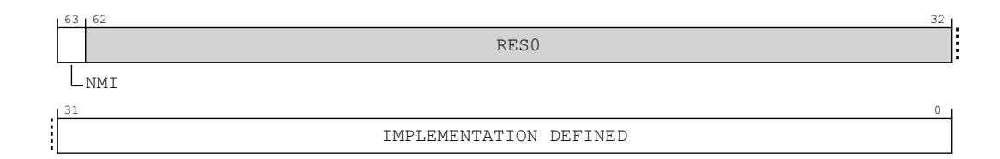

#### **NMI, bit [63]**

#### *When FEAT\_GICv3\_NMI is implemented and n == 0:*

Indicates whether the running priority is from a NMI.

0b0 There is no active Group 1 NMI, or all active Group 1 NMIs have undergone priority-drop.

0b1 There is an active Group 1 NMI.

The reset behavior of this field is:

• On a Warm reset, this field resets to 0.

#### *Otherwise:*

Reserved, RES0.

#### **Bits [62:32]**

Reserved, RES0.

#### **IMPLEMENTATION DEFINED, bits [31:0]**

IMPLEMENTATION DEFINED.

The reset behavior of this field is:

• On a Warm reset, this field resets to an architecturally UNKNOWN value.

The contents of these registers are IMPLEMENTATION DEFINED with the one architectural requirement that a value of all zeros is consistent with no interrupts being active.

#### **Accessing ICV\_AP1R<n>\_EL1**

Writing to these registers with any value other than the last read value of the register (or all zeros when there are no Group 1 active priorities) might result in UNPREDICTABLE behavior of the virtual interrupt prioritization system, causing:

- Interrupts that should preempt execution to not preempt execution.
- Interrupts that should not preempt execution to preempt execution.

ICV\_AP1R1\_EL1 is implemented only in implementations that support 6 or more bits of priority. ICV\_AP1R2\_EL1 and ICV\_AP1R3\_EL1 are implemented only in implementations that support 7 bits of priority. Unimplemented registers are UNDEFINED.

Writing to the active priority registers in any order other than the following order might result in UNPREDICTABLE behavior of the interrupt prioritization system:

- [ICV\\_AP0R<n>\\_EL1.](#page-289-1)
- ICV\_AP1R<n>\_EL1.

Accesses to this register use the following encodings in the System register encoding space:

#### **MRS <Xt>, ICC\_AP1R<m>\_EL1; Where m = 0-3**

| op0  | op1   | CRn    | CRm    | op2        |
|------|-------|--------|--------|------------|
| 0b11 | 0b000 | 0b1100 | 0b1001 | 0b0:m[1:0] |

```
integer m = UInt(op2<1:0>);
if m == 1 && NUM_GIC_PRIORITY_BITS < 6 then
    UNDEFINED;
elsif (m == 2 || m == 3) && NUM_GIC_PRIORITY_BITS < 7 then
    UNDEFINED;
elsif PSTATE.EL == EL0 then
    UNDEFINED;
elsif PSTATE.EL == EL1 then
    if HaveEL(EL3) && EL3SDDUndefPriority() && SCR_EL3.IRQ == '1' then
        UNDEFINED;
    elsif ICC_SRE_EL1.SRE == '0' then
        AArch64.SystemAccessTrap(EL1, 0x18);
    elsif EL2Enabled() && ICH_HCR_EL2.TALL1 == '1' then
        AArch64.SystemAccessTrap(EL2, 0x18);
    elsif EL2Enabled() && HCR_EL2.IMO == '1' then
        X[t, 64] = ICV_AP1R_EL1[m];
    elsif HaveEL(EL3) && SCR_EL3.IRQ == '1' then
        if EL3SDDUndef() then
            UNDEFINED;
        else
            AArch64.SystemAccessTrap(EL3, 0x18);
    elsif HaveEL(EL3) then
        if SCR_EL3.NS == '0' then
            X[t, 64] = ICC_AP1R_EL1_S[m];
        else
            X[t, 64] = ICC_AP1R_EL1_NS[m];
    else
        X[t, 64] = ICC_AP1R_EL1[m];
elsif PSTATE.EL == EL2 then
    if HaveEL(EL3) && EL3SDDUndefPriority() && SCR_EL3.IRQ == '1' then
        UNDEFINED;
    elsif ICC_SRE_EL2.SRE == '0' then
        AArch64.SystemAccessTrap(EL2, 0x18);
```

```
elsif HaveEL(EL3) && SCR_EL3.IRQ == '1' then
        if EL3SDDUndef() then
            UNDEFINED;
        else
            AArch64.SystemAccessTrap(EL3, 0x18);
    elsif HaveEL(EL3) then
        if SCR_EL3.NS == '0' then
            X[t, 64] = ICC_AP1R_EL1_S[m];
        else
            X[t, 64] = ICC_AP1R_EL1_NS[m];
    else
        X[t, 64] = ICC_AP1R_EL1[m];
elsif PSTATE.EL == EL3 then
    if ICC_SRE_EL3.SRE == '0' then
        AArch64.SystemAccessTrap(EL3, 0x18);
    else
        if SCR_EL3.NS == '0' then
            X[t, 64] = ICC_AP1R_EL1_S[m];
        else
            X[t, 64] = ICC_AP1R_EL1_NS[m];
```

#### **MSR ICC\_AP1R<m>\_EL1, <Xt>; Where m = 0-3**

| op0  | op1   | CRn    | CRm    | op2        |
|------|-------|--------|--------|------------|
| 0b11 | 0b000 | 0b1100 | 0b1001 | 0b0:m[1:0] |

```
integer m = UInt(op2<1:0>);
if m == 1 && NUM_GIC_PRIORITY_BITS < 6 then
    UNDEFINED;
elsif (m == 2 || m == 3) && NUM_GIC_PRIORITY_BITS < 7 then
    UNDEFINED;
elsif PSTATE.EL == EL0 then
    UNDEFINED;
elsif PSTATE.EL == EL1 then
    if HaveEL(EL3) && EL3SDDUndefPriority() && SCR_EL3.IRQ == '1' then
        UNDEFINED;
    elsif ICC_SRE_EL1.SRE == '0' then
        AArch64.SystemAccessTrap(EL1, 0x18);
    elsif EL2Enabled() && ICH_HCR_EL2.TALL1 == '1' then
        AArch64.SystemAccessTrap(EL2, 0x18);
    elsif EL2Enabled() && HCR_EL2.IMO == '1' then
        ICV_AP1R_EL1[m] = X[t, 64];
    elsif HaveEL(EL3) && SCR_EL3.IRQ == '1' then
        if EL3SDDUndef() then
            UNDEFINED;
        else
            AArch64.SystemAccessTrap(EL3, 0x18);
    elsif HaveEL(EL3) then
        if SCR_EL3.NS == '0' then
            ICC_AP1R_EL1_S[m] = X[t, 64];
        else
            ICC_AP1R_EL1_NS[m] = X[t, 64];
    else
        ICC_AP1R_EL1[m] = X[t, 64];
elsif PSTATE.EL == EL2 then
    if HaveEL(EL3) && EL3SDDUndefPriority() && SCR_EL3.IRQ == '1' then
        UNDEFINED;
    elsif ICC_SRE_EL2.SRE == '0' then
        AArch64.SystemAccessTrap(EL2, 0x18);
    elsif HaveEL(EL3) && SCR_EL3.IRQ == '1' then
```

```
if EL3SDDUndef() then
            UNDEFINED;
        else
            AArch64.SystemAccessTrap(EL3, 0x18);
    elsif HaveEL(EL3) then
        if SCR_EL3.NS == '0' then
            ICC_AP1R_EL1_S[m] = X[t, 64];
        else
            ICC_AP1R_EL1_NS[m] = X[t, 64];
    else
        ICC_AP1R_EL1[m] = X[t, 64];
elsif PSTATE.EL == EL3 then
    if ICC_SRE_EL3.SRE == '0' then
        AArch64.SystemAccessTrap(EL3, 0x18);
    else
        if SCR_EL3.NS == '0' then
            ICC_AP1R_EL1_S[m] = X[t, 64];
        else
            ICC_AP1R_EL1_NS[m] = X[t, 64];
```

#### <span id="page-296-1"></span><span id="page-296-0"></span>**12.3.3 ICV\_BPR0\_EL1, Interrupt Controller Virtual Binary Point Register 0**

The ICV\_BPR0\_EL1 characteristics are:

#### **Purpose**

Defines the point at which the priority value fields split into two parts, the group priority field and the subpriority field. The group priority field determines virtual Group 0 interrupt preemption.

#### **Configurations**

AArch64 System register ICV\_BPR0\_EL1 bits [31:0] are architecturally mapped to AArch32 System register [ICV\\_BPR0](#page-459-0)[31:0].

This register is present only when FEAT\_GICv3 is implemented and EL2 is implemented. Otherwise, direct accesses to ICV\_BPR0\_EL1 are UNDEFINED.

#### **Attributes**

ICV\_BPR0\_EL1 is a 64-bit register.

#### **Field descriptions**

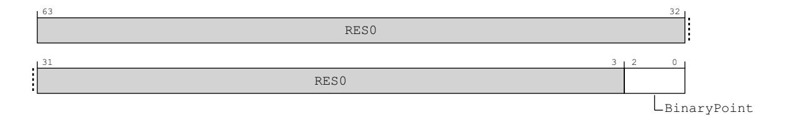

#### **Bits [63:3]**

Reserved, RES0.

#### **BinaryPoint, bits [2:0]**

The value of this field controls how the 8-bit interrupt priority field is split into a group priority field, that determines interrupt preemption, and a subpriority field. This is done as follows:

| Binary point value | Group priority field | Subpriority field | Field with binary point |
|--------------------|----------------------|-------------------|-------------------------|
| 0                  | [7:1]                | [0]               | ggggggg.s               |
| 1                  | [7:2]                | [1:0]             | gggggg.ss               |
| 2                  | [7:3]                | [2:0]             | ggggg.sss               |
| 3                  | [7:4]                | [3:0]             | gggg.ssss               |
| 4                  | [7:5]                | [4:0]             | ggg.sssss               |
| 5                  | [7:6]                | [5:0]             | gg.ssssss               |
| 6                  | [7]                  | [6:0]             | g.sssssss               |
| 7                  | No preemption        | [7:0]             | .ssssssss               |

The reset behavior of this field is:

• On a Warm reset, this field resets to an architecturally UNKNOWN value.

#### **Accessing ICV\_BPR0\_EL1**

The minimum binary point value is derived from the number of implemented preemption bits, as shown in the following table:

| Number of implemented preemption bits | Minimum value of BPR0 |  |
|---------------------------------------|-----------------------|--|
| 7                                     | 0                     |  |
| 6                                     | 1                     |  |
| 5                                     | 2                     |  |

The number of implemented preemption bits is indicated by [ICH\\_VTR\\_EL2](#page-364-1).PREbits.

An attempt to program the binary point field to a value less than the minimum value sets the field to the minimum value. On a reset, the binary point field is UNKNOWN.

Accesses to this register use the following encodings in the System register encoding space:

#### **MRS <Xt>, ICC\_BPR0\_EL1**

| op0  | op1   | CRn    | CRm    | op2   |
|------|-------|--------|--------|-------|
| 0b11 | 0b000 | 0b1100 | 0b1000 | 0b011 |

```
if PSTATE.EL == EL0 then
    UNDEFINED;
elsif PSTATE.EL == EL1 then
    if HaveEL(EL3) && EL3SDDUndefPriority() && SCR_EL3.FIQ == '1' then
        UNDEFINED;
    elsif ICC_SRE_EL1.SRE == '0' then
        AArch64.SystemAccessTrap(EL1, 0x18);
    elsif EL2Enabled() && ICH_HCR_EL2.TALL0 == '1' then
        AArch64.SystemAccessTrap(EL2, 0x18);
    elsif EL2Enabled() && HCR_EL2.FMO == '1' then
        X[t, 64] = ICV_BPR0_EL1;
    elsif HaveEL(EL3) && SCR_EL3.FIQ == '1' then
        if EL3SDDUndef() then
            UNDEFINED;
        else
            AArch64.SystemAccessTrap(EL3, 0x18);
    else
        X[t, 64] = ICC_BPR0_EL1;
elsif PSTATE.EL == EL2 then
    if HaveEL(EL3) && EL3SDDUndefPriority() && SCR_EL3.FIQ == '1' then
        UNDEFINED;
    elsif ICC_SRE_EL2.SRE == '0' then
        AArch64.SystemAccessTrap(EL2, 0x18);
    elsif HaveEL(EL3) && SCR_EL3.FIQ == '1' then
        if EL3SDDUndef() then
            UNDEFINED;
        else
            AArch64.SystemAccessTrap(EL3, 0x18);
    else
        X[t, 64] = ICC_BPR0_EL1;
elsif PSTATE.EL == EL3 then
    if ICC_SRE_EL3.SRE == '0' then
        AArch64.SystemAccessTrap(EL3, 0x18);
```

```
else
    X[t, 64] = ICC_BPR0_EL1;
```

#### **MSR ICC\_BPR0\_EL1, <Xt>**

| op0  | op1   | CRn    | CRm    | op2   |
|------|-------|--------|--------|-------|
| 0b11 | 0b000 | 0b1100 | 0b1000 | 0b011 |

```
if PSTATE.EL == EL0 then
    UNDEFINED;
elsif PSTATE.EL == EL1 then
    if HaveEL(EL3) && EL3SDDUndefPriority() && SCR_EL3.FIQ == '1' then
        UNDEFINED;
    elsif ICC_SRE_EL1.SRE == '0' then
        AArch64.SystemAccessTrap(EL1, 0x18);
    elsif EL2Enabled() && ICH_HCR_EL2.TALL0 == '1' then
        AArch64.SystemAccessTrap(EL2, 0x18);
    elsif EL2Enabled() && HCR_EL2.FMO == '1' then
        ICV_BPR0_EL1 = X[t, 64];
    elsif HaveEL(EL3) && SCR_EL3.FIQ == '1' then
        if EL3SDDUndef() then
            UNDEFINED;
        else
            AArch64.SystemAccessTrap(EL3, 0x18);
    else
        ICC_BPR0_EL1 = X[t, 64];
elsif PSTATE.EL == EL2 then
    if HaveEL(EL3) && EL3SDDUndefPriority() && SCR_EL3.FIQ == '1' then
        UNDEFINED;
    elsif ICC_SRE_EL2.SRE == '0' then
        AArch64.SystemAccessTrap(EL2, 0x18);
    elsif HaveEL(EL3) && SCR_EL3.FIQ == '1' then
        if EL3SDDUndef() then
            UNDEFINED;
        else
            AArch64.SystemAccessTrap(EL3, 0x18);
    else
        ICC_BPR0_EL1 = X[t, 64];
elsif PSTATE.EL == EL3 then
    if ICC_SRE_EL3.SRE == '0' then
        AArch64.SystemAccessTrap(EL3, 0x18);
    else
        ICC_BPR0_EL1 = X[t, 64];
```

#### <span id="page-299-1"></span><span id="page-299-0"></span>**12.3.4 ICV\_BPR1\_EL1, Interrupt Controller Virtual Binary Point Register 1**

The ICV\_BPR1\_EL1 characteristics are:

#### **Purpose**

Defines the point at which the priority value fields split into two parts, the group priority field and the subpriority field. The group priority field determines virtual Group 1 interrupt preemption.

#### **Configurations**

AArch64 System register ICV\_BPR1\_EL1 bits [31:0] are architecturally mapped to AArch32 System register [ICV\\_BPR1](#page-463-0)[31:0].

This register is present only when FEAT\_GICv3 is implemented and EL2 is implemented. Otherwise, direct accesses to ICV\_BPR1\_EL1 are UNDEFINED.

#### **Attributes**

ICV\_BPR1\_EL1 is a 64-bit register.

#### **Field descriptions**

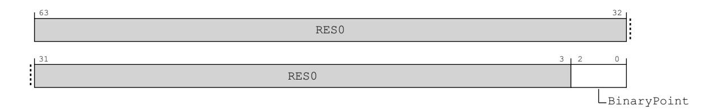

#### **Bits [63:3]**

Reserved, RES0.

#### **BinaryPoint, bits [2:0]**

If the GIC is configured to use separate binary point fields for Group 0 and Group 1 interrupts, the value of this field controls how the 8-bit interrupt priority field is split into a group priority field, that determines interrupt preemption, and a subpriority field.

For more information about priorities, see *[Priority grouping on page](#page-73-2) 4-74*.

An attempt to program this field to a value less than the minimum value sets the field to the minimum value.

If [ICV\\_CTLR\\_EL1](#page-302-1).CBPR is set to 1, Non-secure EL1 reads return [ICV\\_BPR0\\_EL1](#page-296-1) + 1 saturated to 0b111. Non-secure EL1 writes are ignored.

If [ICV\\_CTLR\\_EL1.](#page-302-1)CBPR is set to 1, Secure EL1 reads return [ICV\\_BPR0\\_EL1](#page-296-1). Secure EL1 writes modify [ICV\\_BPR0\\_EL1.](#page-296-1)

The reset behavior of this field is:

• On a Warm reset, this field resets to an architecturally UNKNOWN value.

#### **Accessing ICV\_BPR1\_EL1**

For Non-secure writes, the minimum value of this field is the minimum value of [ICH\\_VMCR\\_EL2.](#page-360-1)VBPR0 plus one.

For Secure writes, the minimum value of this field is the minimum value of [ICH\\_VMCR\\_EL2.](#page-360-1)VBPR0.

An attempt to program the binary point field to a value less than the minimum value sets the field to the minimum value. On a reset, the binary point field is UNKNOWN.

Accesses to this register use the following encodings in the System register encoding space:

#### **MRS <Xt>, ICC\_BPR1\_EL1**

| op0  | op1   | CRn    | CRm    | op2   |
|------|-------|--------|--------|-------|
| 0b11 | 0b000 | 0b1100 | 0b1100 | 0b011 |

```
if PSTATE.EL == EL0 then
    UNDEFINED;
elsif PSTATE.EL == EL1 then
    if HaveEL(EL3) && EL3SDDUndefPriority() && SCR_EL3.IRQ == '1' then
        UNDEFINED;
    elsif ICC_SRE_EL1.SRE == '0' then
        AArch64.SystemAccessTrap(EL1, 0x18);
    elsif EL2Enabled() && ICH_HCR_EL2.TALL1 == '1' then
        AArch64.SystemAccessTrap(EL2, 0x18);
    elsif EL2Enabled() && HCR_EL2.IMO == '1' then
        X[t, 64] = ICV_BPR1_EL1;
    elsif HaveEL(EL3) && SCR_EL3.IRQ == '1' then
        if EL3SDDUndef() then
            UNDEFINED;
        else
            AArch64.SystemAccessTrap(EL3, 0x18);
    elsif HaveEL(EL3) then
        if SCR_EL3.NS == '0' then
            X[t, 64] = ICC_BPR1_EL1_S;
        else
            X[t, 64] = ICC_BPR1_EL1_NS;
    else
        X[t, 64] = ICC_BPR1_EL1;
elsif PSTATE.EL == EL2 then
    if HaveEL(EL3) && EL3SDDUndefPriority() && SCR_EL3.IRQ == '1' then
        UNDEFINED;
    elsif ICC_SRE_EL2.SRE == '0' then
        AArch64.SystemAccessTrap(EL2, 0x18);
    elsif HaveEL(EL3) && SCR_EL3.IRQ == '1' then
        if EL3SDDUndef() then
            UNDEFINED;
        else
            AArch64.SystemAccessTrap(EL3, 0x18);
    elsif HaveEL(EL3) then
        if SCR_EL3.NS == '0' then
            X[t, 64] = ICC_BPR1_EL1_S;
        else
            X[t, 64] = ICC_BPR1_EL1_NS;
    else
        X[t, 64] = ICC_BPR1_EL1;
elsif PSTATE.EL == EL3 then
    if ICC_SRE_EL3.SRE == '0' then
        AArch64.SystemAccessTrap(EL3, 0x18);
    else
        if SCR_EL3.NS == '0' then
            X[t, 64] = ICC_BPR1_EL1_S;
        else
            X[t, 64] = ICC_BPR1_EL1_NS;
```

#### **MSR ICC\_BPR1\_EL1, <Xt>**

| op0  | op1   | CRn    | CRm    | op2   |
|------|-------|--------|--------|-------|
| 0b11 | 0b000 | 0b1100 | 0b1100 | 0b011 |

```
if PSTATE.EL == EL0 then
    UNDEFINED;
elsif PSTATE.EL == EL1 then
    if HaveEL(EL3) && EL3SDDUndefPriority() && SCR_EL3.IRQ == '1' then
        UNDEFINED;
    elsif ICC_SRE_EL1.SRE == '0' then
        AArch64.SystemAccessTrap(EL1, 0x18);
    elsif EL2Enabled() && ICH_HCR_EL2.TALL1 == '1' then
        AArch64.SystemAccessTrap(EL2, 0x18);
    elsif EL2Enabled() && HCR_EL2.IMO == '1' then
        ICV_BPR1_EL1 = X[t, 64];
    elsif HaveEL(EL3) && SCR_EL3.IRQ == '1' then
        if EL3SDDUndef() then
            UNDEFINED;
        else
            AArch64.SystemAccessTrap(EL3, 0x18);
    elsif HaveEL(EL3) then
        if SCR_EL3.NS == '0' then
            ICC_BPR1_EL1_S = X[t, 64];
        else
            ICC_BPR1_EL1_NS = X[t, 64];
    else
        ICC_BPR1_EL1 = X[t, 64];
elsif PSTATE.EL == EL2 then
    if HaveEL(EL3) && EL3SDDUndefPriority() && SCR_EL3.IRQ == '1' then
        UNDEFINED;
    elsif ICC_SRE_EL2.SRE == '0' then
        AArch64.SystemAccessTrap(EL2, 0x18);
    elsif HaveEL(EL3) && SCR_EL3.IRQ == '1' then
        if EL3SDDUndef() then
            UNDEFINED;
        else
            AArch64.SystemAccessTrap(EL3, 0x18);
    elsif HaveEL(EL3) then
        if SCR_EL3.NS == '0' then
            ICC_BPR1_EL1_S = X[t, 64];
        else
            ICC_BPR1_EL1_NS = X[t, 64];
    else
        ICC_BPR1_EL1 = X[t, 64];
elsif PSTATE.EL == EL3 then
    if ICC_SRE_EL3.SRE == '0' then
        AArch64.SystemAccessTrap(EL3, 0x18);
    else
        if SCR_EL3.NS == '0' then
            ICC_BPR1_EL1_S = X[t, 64];
        else
            ICC_BPR1_EL1_NS = X[t, 64];
```

#### <span id="page-302-1"></span><span id="page-302-0"></span>**12.3.5 ICV\_CTLR\_EL1, Interrupt Controller Virtual Control Register**

The ICV\_CTLR\_EL1 characteristics are:

#### **Purpose**

Controls aspects of the behavior of the GIC virtual CPU interface and provides information about the features implemented.

#### **Configurations**

AArch64 System register ICV\_CTLR\_EL1 bits [31:0] are architecturally mapped to AArch32 System register [ICV\\_CTLR\[](#page-467-0)31:0].

This register is present only when FEAT\_GICv3 is implemented and EL2 is implemented. Otherwise, direct accesses to ICV\_CTLR\_EL1 are UNDEFINED.

#### **Attributes**

ICV\_CTLR\_EL1 is a 64-bit register.

#### **Field descriptions**

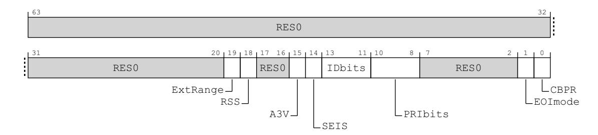

#### **Bits [63:20]**

Reserved, RES0.

#### **ExtRange, bit [19]**

Extended INTID range (read-only).

The value of this field is an IMPLEMENTATION DEFINED choice of:

0b0 CPU interface does not support INTIDs in the range 1024..8191.

• Behavior is UNPREDICTABLE if the IRI delivers an interrupt in the range 1024 to 8191 to the CPU interface.

**Note**

Arm strongly recommends that the IRI is not configured to deliver interrupts in this range to a PE that does not support them.

0b1 CPU interface supports INTIDs in the range 1024..8191

• All INTIDs in the range 1024..8191 are treated as requiring deactivation.

ICV\_CTLR\_EL1.ExtRange is an alias of [ICC\\_CTLR\\_EL1.](#page-232-1)ExtRange.

Access to this field is RO.

#### **RSS, bit [18]**

Range Selector Support.

The value of this field is an IMPLEMENTATION DEFINED choice of:

0b0 Targeted SGIs with affinity level 0 values of 0 - 15 are supported.

0b1 Targeted SGIs with affinity level 0 values of 0 - 255 are supported.

This bit is read-only.

Access to this field is RO.

#### **Bits [17:16]**

Reserved, RES0.

#### **A3V, bit [15]**

Affinity 3 Valid. Read-only and writes are ignored.

The value of this field is an IMPLEMENTATION DEFINED choice of:

0b0 The virtual CPU interface logic only supports zero values of Affinity 3 in SGI generation System registers.

0b1 The virtual CPU interface logic supports nonzero values of Affinity 3 in SGI generation System registers.

Access to this field is RO.

#### **SEIS, bit [14]**

SEI Support. Read-only and writes are ignored. Indicates whether the virtual CPU interface supports local generation of SEIs.

The value of this field is an IMPLEMENTATION DEFINED choice of:

0b0 The virtual CPU interface logic does not support local generation of SEIs.

0b1 The virtual CPU interface logic supports local generation of SEIs.

Access to this field is RO.

#### **IDbits, bits [13:11]**

Identifier bits. Read-only and writes are ignored. Indicates the number of virtual interrupt identifier bits supported.

The value of this field is an IMPLEMENTATION DEFINED choice of:

0b000 16 bits. 0b001 24 bits.

All other values are reserved.

Access to this field is RO.

#### **PRIbits, bits [10:8]**

The number of virtual priority bits minus one.

An implementation must implement at least 32 levels of virtual priority (5 priority bits).

The division between group priority and subpriority is defined in the binary point registers [ICV\\_BPR0\\_EL1](#page-296-1) and [ICV\\_BPR1\\_EL1](#page-299-1).

Access to this field is RO.

#### **Bits [7:2]**

Reserved, RES0.

#### **EOImode, bit [1]**

Virtual EOI mode. Controls whether a write to an End of Interrupt register also deactivates the virtual interrupt:

0b0 [ICV\\_EOIR0\\_EL1](#page-309-1) and [ICV\\_EOIR1\\_EL1](#page-311-1) provide both priority drop and interrupt

deactivation functionality. Accesses to [ICV\\_DIR\\_EL1](#page-307-1) are UNPREDICTABLE. 0b1 [ICV\\_EOIR0\\_EL1](#page-309-1) and [ICV\\_EOIR1\\_EL1](#page-311-1) provide priority drop functionality only. [ICV\\_DIR\\_EL1](#page-307-1) provides interrupt deactivation functionality.

The reset behavior of this field is:

• On a Warm reset, this field resets to an architecturally UNKNOWN value.

#### **CBPR, bit [0]**

Common Binary Point Register. Controls whether the same register is used for interrupt preemption of both virtual Group 0 and virtual Group 1 interrupts:

```
0b0 ICV_BPR1_EL1 determines the preemption group for virtual Group 1 interrupts.
0b1 Non-secure reads of ICV_BPR1_EL1 return ICV_BPR0_EL1 plus one, saturated to 
          0b111. Non-secure writes to ICV_BPR1_EL1 are ignored.
          Secure reads of ICV_BPR1_EL1 return ICV_BPR0_EL1. Secure writes of 
          ICV_BPR1_EL1 modify ICV_BPR0_EL1.
```

The reset behavior of this field is:

• On a Warm reset, this field resets to an architecturally UNKNOWN value.

#### **Accessing ICV\_CTLR\_EL1**

Accesses to this register use the following encodings in the System register encoding space:

#### **MRS <Xt>, ICC\_CTLR\_EL1**

| op0  | op1   | CRn    | CRm    | op2   |
|------|-------|--------|--------|-------|
| 0b11 | 0b000 | 0b1100 | 0b1100 | 0b100 |

```
if PSTATE.EL == EL0 then
    UNDEFINED;
elsif PSTATE.EL == EL1 then
    if HaveEL(EL3) && EL3SDDUndefPriority() && SCR_EL3.<IRQ,FIQ> == '11' then
        UNDEFINED;
    elsif ICC_SRE_EL1.SRE == '0' then
        AArch64.SystemAccessTrap(EL1, 0x18);
    elsif EL2Enabled() && ICH_HCR_EL2.TC == '1' then
        AArch64.SystemAccessTrap(EL2, 0x18);
    elsif EL2Enabled() && HCR_EL2.FMO == '1' then
        X[t, 64] = ICV_CTLR_EL1;
    elsif EL2Enabled() && HCR_EL2.IMO == '1' then
        X[t, 64] = ICV_CTLR_EL1;
    elsif HaveEL(EL3) && SCR_EL3.<IRQ,FIQ> == '11' then
        if EL3SDDUndef() then
            UNDEFINED;
        else
            AArch64.SystemAccessTrap(EL3, 0x18);
    elsif HaveEL(EL3) then
        if SCR_EL3.NS == '0' then
            X[t, 64] = ICC_CTLR_EL1_S;
        else
            X[t, 64] = ICC_CTLR_EL1_NS;
    else
        X[t, 64] = ICC_CTLR_EL1;
elsif PSTATE.EL == EL2 then
    if HaveEL(EL3) && EL3SDDUndefPriority() && SCR_EL3.<IRQ,FIQ> == '11' then
        UNDEFINED;
    elsif ICC_SRE_EL2.SRE == '0' then
        AArch64.SystemAccessTrap(EL2, 0x18);
    elsif HaveEL(EL3) && SCR_EL3.<IRQ,FIQ> == '11' then
        if EL3SDDUndef() then
            UNDEFINED;
        else
            AArch64.SystemAccessTrap(EL3, 0x18);
    elsif HaveEL(EL3) then
        if SCR_EL3.NS == '0' then
            X[t, 64] = ICC_CTLR_EL1_S;
```

```
else
            X[t, 64] = ICC_CTLR_EL1_NS;
    else
        X[t, 64] = ICC_CTLR_EL1;
elsif PSTATE.EL == EL3 then
    if ICC_SRE_EL3.SRE == '0' then
        AArch64.SystemAccessTrap(EL3, 0x18);
    else
        if SCR_EL3.NS == '0' then
            X[t, 64] = ICC_CTLR_EL1_S;
        else
            X[t, 64] = ICC_CTLR_EL1_NS;
```

#### **MSR ICC\_CTLR\_EL1, <Xt>**

| op0  | op1   | CRn    | CRm    | op2   |
|------|-------|--------|--------|-------|
| 0b11 | 0b000 | 0b1100 | 0b1100 | 0b100 |

```
if PSTATE.EL == EL0 then
    UNDEFINED;
elsif PSTATE.EL == EL1 then
    if HaveEL(EL3) && EL3SDDUndefPriority() && SCR_EL3.<IRQ,FIQ> == '11' then
        UNDEFINED;
    elsif ICC_SRE_EL1.SRE == '0' then
        AArch64.SystemAccessTrap(EL1, 0x18);
    elsif EL2Enabled() && ICH_HCR_EL2.TC == '1' then
        AArch64.SystemAccessTrap(EL2, 0x18);
    elsif EL2Enabled() && HCR_EL2.FMO == '1' then
        ICV_CTLR_EL1 = X[t, 64];
    elsif EL2Enabled() && HCR_EL2.IMO == '1' then
        ICV_CTLR_EL1 = X[t, 64];
    elsif HaveEL(EL3) && SCR_EL3.<IRQ,FIQ> == '11' then
        if EL3SDDUndef() then
            UNDEFINED;
        else
            AArch64.SystemAccessTrap(EL3, 0x18);
    elsif HaveEL(EL3) then
        if SCR_EL3.NS == '0' then
            ICC_CTLR_EL1_S = X[t, 64];
        else
            ICC_CTLR_EL1_NS = X[t, 64];
    else
        ICC_CTLR_EL1 = X[t, 64];
elsif PSTATE.EL == EL2 then
    if HaveEL(EL3) && EL3SDDUndefPriority() && SCR_EL3.<IRQ,FIQ> == '11' then
        UNDEFINED;
    elsif ICC_SRE_EL2.SRE == '0' then
        AArch64.SystemAccessTrap(EL2, 0x18);
    elsif HaveEL(EL3) && SCR_EL3.<IRQ,FIQ> == '11' then
        if EL3SDDUndef() then
            UNDEFINED;
        else
            AArch64.SystemAccessTrap(EL3, 0x18);
    elsif HaveEL(EL3) then
        if SCR_EL3.NS == '0' then
            ICC_CTLR_EL1_S = X[t, 64];
        else
            ICC_CTLR_EL1_NS = X[t, 64];
    else
        ICC_CTLR_EL1 = X[t, 64];
elsif PSTATE.EL == EL3 then
```

```
if ICC_SRE_EL3.SRE == '0' then
    AArch64.SystemAccessTrap(EL3, 0x18);
else
    if SCR_EL3.NS == '0' then
        ICC_CTLR_EL1_S = X[t, 64];
    else
        ICC_CTLR_EL1_NS = X[t, 64];
```

#### <span id="page-307-1"></span><span id="page-307-0"></span>**12.3.6 ICV\_DIR\_EL1, Interrupt Controller Deactivate Virtual Interrupt Register**

The ICV\_DIR\_EL1 characteristics are:

#### **Purpose**

When interrupt priority drop is separated from interrupt deactivation, a write to this register deactivates the specified virtual interrupt.

#### **Configurations**

AArch64 System register ICV\_DIR\_EL1 bits [31:0] performs the same function as AArch32 System register [ICV\\_DIR](#page-472-0)[31:0].

This register is present only when FEAT\_GICv3 is implemented and EL2 is implemented. Otherwise, direct accesses to ICV\_DIR\_EL1 are UNDEFINED.

#### **Attributes**

ICV\_DIR\_EL1 is a 64-bit register.

#### **Field descriptions**


#### **Bits [63:24]**

Reserved, RES0.

#### **INTID, bits [23:0]**

The INTID of the virtual interrupt to be deactivated.

This field has either 16 or 24 bits implemented. The number of implemented bits can be found in [ICV\\_CTLR\\_EL1.](#page-302-1)IDbits. If only 16 bits are implemented, bits [23:16] of this register are RES0.

#### **Accessing ICV\_DIR\_EL1**

When EOImode == 0, writes are ignored. In systems supporting system error generation, an implementation might generate an SEI.

Accesses to this register use the following encodings in the System register encoding space:

#### **MSR ICC\_DIR\_EL1, <Xt>**

| op0  | op1   | CRn    | CRm    | op2   |
|------|-------|--------|--------|-------|
| 0b11 | 0b000 | 0b1100 | 0b1011 | 0b001 |

```
if PSTATE.EL == EL0 then
    UNDEFINED;
elsif PSTATE.EL == EL1 then
    if HaveEL(EL3) && EL3SDDUndefPriority() && SCR_EL3.<IRQ,FIQ> == '11' then
        UNDEFINED;
    elsif ICC_SRE_EL1.SRE == '0' then
        AArch64.SystemAccessTrap(EL1, 0x18);
    elsif EL2Enabled() && ICH_HCR_EL2.TDIR == '1' then
```

```
AArch64.SystemAccessTrap(EL2, 0x18);
    elsif EL2Enabled() && ICH_HCR_EL2.TC == '1' then
        AArch64.SystemAccessTrap(EL2, 0x18);
    elsif EL2Enabled() && HCR_EL2.FMO == '1' then
        ICV_DIR_EL1 = X[t, 64];
    elsif EL2Enabled() && HCR_EL2.IMO == '1' then
        ICV_DIR_EL1 = X[t, 64];
    elsif HaveEL(EL3) && SCR_EL3.<IRQ,FIQ> == '11' then
        if EL3SDDUndef() then
            UNDEFINED;
        else
            AArch64.SystemAccessTrap(EL3, 0x18);
    else
        ICC_DIR_EL1 = X[t, 64];
elsif PSTATE.EL == EL2 then
    if HaveEL(EL3) && EL3SDDUndefPriority() && SCR_EL3.<IRQ,FIQ> == '11' then
        UNDEFINED;
    elsif ICC_SRE_EL2.SRE == '0' then
        AArch64.SystemAccessTrap(EL2, 0x18);
    elsif HaveEL(EL3) && SCR_EL3.<IRQ,FIQ> == '11' then
        if EL3SDDUndef() then
            UNDEFINED;
        else
            AArch64.SystemAccessTrap(EL3, 0x18);
    else
        ICC_DIR_EL1 = X[t, 64];
elsif PSTATE.EL == EL3 then
    if ICC_SRE_EL3.SRE == '0' then
        AArch64.SystemAccessTrap(EL3, 0x18);
    else
        ICC_DIR_EL1 = X[t, 64];
```

#### <span id="page-309-1"></span><span id="page-309-0"></span>**12.3.7 ICV\_EOIR0\_EL1, Interrupt Controller Virtual End Of Interrupt Register 0**

The ICV\_EOIR0\_EL1 characteristics are:

#### **Purpose**

A PE writes to this register to inform the CPU interface that it has completed the processing of the specified virtual Group 0 interrupt.

#### **Configurations**

AArch64 System register ICV\_EOIR0\_EL1 performs the same function as AArch32 System register [ICV\\_EOIR0.](#page-474-0)

This register is present only when FEAT\_GICv3 is implemented and EL2 is implemented. Otherwise, direct accesses to ICV\_EOIR0\_EL1 are UNDEFINED.

#### **Attributes**

ICV\_EOIR0\_EL1 is a 64-bit register.

#### **Field descriptions**

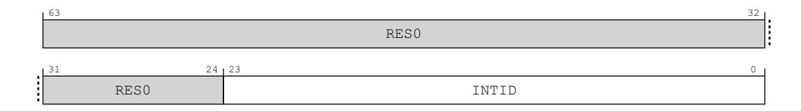

#### **Bits [63:24]**

Reserved, RES0.

#### **INTID, bits [23:0]**

The INTID from the corresponding [ICV\\_IAR0\\_EL1](#page-317-1) access.

This field has either 16 or 24 bits implemented. The number of implemented bits can be found in [ICV\\_CTLR\\_EL1.](#page-302-1)IDbits. If only 16 bits are implemented, bits [23:16] of this register are RES0.

If the [ICV\\_CTLR\\_EL1](#page-302-1).EOImode bit is 0, a write to this register drops the priority for the virtual interrupt, and also deactivates the virtual interrupt.

If the [ICV\\_CTLR\\_EL1](#page-302-1).EOImode bit is 1, a write to this register only drops the priority for the virtual interrupt. Software must write to [ICV\\_DIR\\_EL1](#page-307-1) to deactivate the virtual interrupt.

#### **Accessing ICV\_EOIR0\_EL1**

A write to this register must correspond to the most recent valid read by this vPE from a Virtual Interrupt Acknowledge Register, and must correspond to the INTID that was read from [ICV\\_IAR0\\_EL1](#page-317-1), otherwise the system behavior is UNPREDICTABLE. A valid read is a read that returns a valid INTID that is not a special INTID.

Accesses to this register use the following encodings in the System register encoding space:

#### **MSR ICC\_EOIR0\_EL1, <Xt>**

| op0  | op1   | CRn    | CRm    | op2   |
|------|-------|--------|--------|-------|
| 0b11 | 0b000 | 0b1100 | 0b1000 | 0b001 |

```
if PSTATE.EL == EL0 then
    UNDEFINED;
elsif PSTATE.EL == EL1 then
    if HaveEL(EL3) && EL3SDDUndefPriority() && SCR_EL3.FIQ == '1' then
        UNDEFINED;
    elsif ICC_SRE_EL1.SRE == '0' then
        AArch64.SystemAccessTrap(EL1, 0x18);
    elsif EL2Enabled() && ICH_HCR_EL2.TALL0 == '1' then
        AArch64.SystemAccessTrap(EL2, 0x18);
    elsif EL2Enabled() && HCR_EL2.FMO == '1' then
        ICV_EOIR0_EL1 = X[t, 64];
    elsif HaveEL(EL3) && SCR_EL3.FIQ == '1' then
        if EL3SDDUndef() then
            UNDEFINED;
        else
            AArch64.SystemAccessTrap(EL3, 0x18);
    else
        ICC_EOIR0_EL1 = X[t, 64];
elsif PSTATE.EL == EL2 then
    if HaveEL(EL3) && EL3SDDUndefPriority() && SCR_EL3.FIQ == '1' then
        UNDEFINED;
    elsif ICC_SRE_EL2.SRE == '0' then
        AArch64.SystemAccessTrap(EL2, 0x18);
    elsif HaveEL(EL3) && SCR_EL3.FIQ == '1' then
        if EL3SDDUndef() then
            UNDEFINED;
        else
            AArch64.SystemAccessTrap(EL3, 0x18);
    else
        ICC_EOIR0_EL1 = X[t, 64];
elsif PSTATE.EL == EL3 then
    if ICC_SRE_EL3.SRE == '0' then
        AArch64.SystemAccessTrap(EL3, 0x18);
    else
        ICC_EOIR0_EL1 = X[t, 64];
```

#### <span id="page-311-1"></span><span id="page-311-0"></span>**12.3.8 ICV\_EOIR1\_EL1, Interrupt Controller Virtual End Of Interrupt Register 1**

The ICV\_EOIR1\_EL1 characteristics are:

#### **Purpose**

A PE writes to this register to inform the CPU interface that it has completed the processing of the specified virtual Group 1 interrupt.

#### **Configurations**

AArch64 System register ICV\_EOIR1\_EL1 performs the same function as AArch32 System register [ICV\\_EOIR1.](#page-476-0)

This register is present only when FEAT\_GICv3 is implemented and EL2 is implemented. Otherwise, direct accesses to ICV\_EOIR1\_EL1 are UNDEFINED.

#### **Attributes**

ICV\_EOIR1\_EL1 is a 64-bit register.

#### **Field descriptions**


#### **Bits [63:24]**

Reserved, RES0.

#### **INTID, bits [23:0]**

The INTID from the corresponding [ICV\\_IAR1\\_EL1](#page-319-1) access.

This field has either 16 or 24 bits implemented. The number of implemented bits can be found in [ICV\\_CTLR\\_EL1.](#page-302-1)IDbits. If only 16 bits are implemented, bits [23:16] of this register are RES0.

If the [ICV\\_CTLR\\_EL1](#page-302-1).EOImode bit is 0, a write to this register drops the priority for the virtual interrupt, and also deactivates the virtual interrupt.

If the [ICV\\_CTLR\\_EL1](#page-302-1).EOImode bit is 1, a write to this register only drops the priority for the virtual interrupt. Software must write to [ICV\\_DIR\\_EL1](#page-307-1) to deactivate the virtual interrupt.

#### **Accessing ICV\_EOIR1\_EL1**

A write to this register must correspond to the most recent valid read by this vPE from a Virtual Interrupt Acknowledge Register, and must correspond to the INTID that was read from [ICV\\_IAR1\\_EL1](#page-319-1), otherwise the system behavior is UNPREDICTABLE. A valid read is a read that returns a valid INTID that is not a special INTID.

Accesses to this register use the following encodings in the System register encoding space:

#### **MSR ICC\_EOIR1\_EL1, <Xt>**

| op0  | op1   | CRn    | CRm    | op2   |
|------|-------|--------|--------|-------|
| 0b11 | 0b000 | 0b1100 | 0b1100 | 0b001 |

```
if PSTATE.EL == EL0 then
    UNDEFINED;
elsif PSTATE.EL == EL1 then
    if HaveEL(EL3) && EL3SDDUndefPriority() && SCR_EL3.IRQ == '1' then
        UNDEFINED;
    elsif ICC_SRE_EL1.SRE == '0' then
        AArch64.SystemAccessTrap(EL1, 0x18);
    elsif EL2Enabled() && ICH_HCR_EL2.TALL1 == '1' then
        AArch64.SystemAccessTrap(EL2, 0x18);
    elsif EL2Enabled() && HCR_EL2.IMO == '1' then
        ICV_EOIR1_EL1 = X[t, 64];
    elsif HaveEL(EL3) && SCR_EL3.IRQ == '1' then
        if EL3SDDUndef() then
            UNDEFINED;
        else
            AArch64.SystemAccessTrap(EL3, 0x18);
    else
        ICC_EOIR1_EL1 = X[t, 64];
elsif PSTATE.EL == EL2 then
    if HaveEL(EL3) && EL3SDDUndefPriority() && SCR_EL3.IRQ == '1' then
        UNDEFINED;
    elsif ICC_SRE_EL2.SRE == '0' then
        AArch64.SystemAccessTrap(EL2, 0x18);
    elsif HaveEL(EL3) && SCR_EL3.IRQ == '1' then
        if EL3SDDUndef() then
            UNDEFINED;
        else
            AArch64.SystemAccessTrap(EL3, 0x18);
    else
        ICC_EOIR1_EL1 = X[t, 64];
elsif PSTATE.EL == EL3 then
    if ICC_SRE_EL3.SRE == '0' then
        AArch64.SystemAccessTrap(EL3, 0x18);
    else
        ICC_EOIR1_EL1 = X[t, 64];
```

#### <span id="page-313-1"></span><span id="page-313-0"></span>**12.3.9 ICV\_HPPIR0\_EL1, Interrupt Controller Virtual Highest Priority Pending Interrupt Register 0**

The ICV\_HPPIR0\_EL1 characteristics are:

#### **Purpose**

Indicates the highest priority pending virtual Group 0 interrupt on the virtual CPU interface.

#### **Configurations**

AArch64 System register ICV\_HPPIR0\_EL1 performs the same function as AArch32 System register [ICV\\_HPPIR0](#page-478-0).

This register is present only when FEAT\_GICv3 is implemented and EL2 is implemented. Otherwise, direct accesses to ICV\_HPPIR0\_EL1 are UNDEFINED.

#### **Attributes**

ICV\_HPPIR0\_EL1 is a 64-bit register.

#### **Field descriptions**


#### **Bits [63:24]**

Reserved, RES0.

#### **INTID, bits [23:0]**

The INTID of the highest priority pending virtual interrupt.

If the highest priority pending interrupt is not observable, this field contains a special INTID to indicate the reason. This special INTID can take the value 1023 only. For more information, see *[Special INTIDs on page](#page-35-1) 2-36*.

This field has either 16 or 24 bits implemented. The number of implemented bits can be found in [ICV\\_CTLR\\_EL1.](#page-302-1)IDbits. If only 16 bits are implemented, bits [23:16] of this register are RES0.

#### **Accessing ICV\_HPPIR0\_EL1**

Accesses to this register use the following encodings in the System register encoding space:

#### **MRS <Xt>, ICC\_HPPIR0\_EL1**

| op0  | op1   | CRn    | CRm    | op2   |
|------|-------|--------|--------|-------|
| 0b11 | 0b000 | 0b1100 | 0b1000 | 0b010 |

```
if PSTATE.EL == EL0 then
    UNDEFINED;
elsif PSTATE.EL == EL1 then
    if HaveEL(EL3) && EL3SDDUndefPriority() && SCR_EL3.FIQ == '1' then
        UNDEFINED;
    elsif ICC_SRE_EL1.SRE == '0' then
        AArch64.SystemAccessTrap(EL1, 0x18);
    elsif EL2Enabled() && ICH_HCR_EL2.TALL0 == '1' then
```

```
AArch64.SystemAccessTrap(EL2, 0x18);
    elsif EL2Enabled() && HCR_EL2.FMO == '1' then
        X[t, 64] = ICV_HPPIR0_EL1;
    elsif HaveEL(EL3) && SCR_EL3.FIQ == '1' then
        if EL3SDDUndef() then
            UNDEFINED;
        else
            AArch64.SystemAccessTrap(EL3, 0x18);
    else
        X[t, 64] = ICC_HPPIR0_EL1;
elsif PSTATE.EL == EL2 then
    if HaveEL(EL3) && EL3SDDUndefPriority() && SCR_EL3.FIQ == '1' then
        UNDEFINED;
    elsif ICC_SRE_EL2.SRE == '0' then
        AArch64.SystemAccessTrap(EL2, 0x18);
    elsif HaveEL(EL3) && SCR_EL3.FIQ == '1' then
        if EL3SDDUndef() then
            UNDEFINED;
        else
            AArch64.SystemAccessTrap(EL3, 0x18);
    else
        X[t, 64] = ICC_HPPIR0_EL1;
elsif PSTATE.EL == EL3 then
    if ICC_SRE_EL3.SRE == '0' then
        AArch64.SystemAccessTrap(EL3, 0x18);
    else
        X[t, 64] = ICC_HPPIR0_EL1;
```

#### <span id="page-315-1"></span><span id="page-315-0"></span>**12.3.10 ICV\_HPPIR1\_EL1, Interrupt Controller Virtual Highest Priority Pending Interrupt Register 1**

The ICV\_HPPIR1\_EL1 characteristics are:

#### **Purpose**

Indicates the highest priority pending virtual Group 1 interrupt on the virtual CPU interface.

#### **Configurations**

AArch64 System register ICV\_HPPIR1\_EL1 performs the same function as AArch32 System register [ICV\\_HPPIR1](#page-480-0).

This register is present only when FEAT\_GICv3 is implemented and EL2 is implemented. Otherwise, direct accesses to ICV\_HPPIR1\_EL1 are UNDEFINED.

#### **Attributes**

ICV\_HPPIR1\_EL1 is a 64-bit register.

#### **Field descriptions**


#### **Bits [63:24]**

Reserved, RES0.

#### **INTID, bits [23:0]**

The INTID of the highest priority pending virtual interrupt.

If the highest priority pending interrupt is not observable, this field contains a special INTID to indicate the reason. This special INTID can take the value 1023 only. For more information, see *[Special INTIDs on page](#page-35-1) 2-36*.

This field has either 16 or 24 bits implemented. The number of implemented bits can be found in [ICV\\_CTLR\\_EL1.](#page-302-1)IDbits. If only 16 bits are implemented, bits [23:16] of this register are RES0.

#### **Accessing ICV\_HPPIR1\_EL1**

Accesses to this register use the following encodings in the System register encoding space:

#### **MRS <Xt>, ICC\_HPPIR1\_EL1**

| op0  | op1   | CRn    | CRm    | op2   |
|------|-------|--------|--------|-------|
| 0b11 | 0b000 | 0b1100 | 0b1100 | 0b010 |

```
if PSTATE.EL == EL0 then
    UNDEFINED;
elsif PSTATE.EL == EL1 then
    if HaveEL(EL3) && EL3SDDUndefPriority() && SCR_EL3.IRQ == '1' then
        UNDEFINED;
    elsif ICC_SRE_EL1.SRE == '0' then
        AArch64.SystemAccessTrap(EL1, 0x18);
    elsif EL2Enabled() && ICH_HCR_EL2.TALL1 == '1' then
```

```
AArch64.SystemAccessTrap(EL2, 0x18);
    elsif EL2Enabled() && HCR_EL2.IMO == '1' then
        X[t, 64] = ICV_HPPIR1_EL1;
    elsif HaveEL(EL3) && SCR_EL3.IRQ == '1' then
        if EL3SDDUndef() then
            UNDEFINED;
        else
            AArch64.SystemAccessTrap(EL3, 0x18);
    else
        X[t, 64] = ICC_HPPIR1_EL1;
elsif PSTATE.EL == EL2 then
    if HaveEL(EL3) && EL3SDDUndefPriority() && SCR_EL3.IRQ == '1' then
        UNDEFINED;
    elsif ICC_SRE_EL2.SRE == '0' then
        AArch64.SystemAccessTrap(EL2, 0x18);
    elsif HaveEL(EL3) && SCR_EL3.IRQ == '1' then
        if EL3SDDUndef() then
            UNDEFINED;
        else
            AArch64.SystemAccessTrap(EL3, 0x18);
    else
        X[t, 64] = ICC_HPPIR1_EL1;
elsif PSTATE.EL == EL3 then
    if ICC_SRE_EL3.SRE == '0' then
        AArch64.SystemAccessTrap(EL3, 0x18);
    else
        X[t, 64] = ICC_HPPIR1_EL1;
```

#### <span id="page-317-1"></span><span id="page-317-0"></span>**12.3.11 ICV\_IAR0\_EL1, Interrupt Controller Virtual Interrupt Acknowledge Register 0**

The ICV\_IAR0\_EL1 characteristics are:

#### **Purpose**

The PE reads this register to obtain the INTID of the signaled virtual Group 0 interrupt. This read acts as an acknowledge for the interrupt.

#### **Configurations**

AArch64 System register ICV\_IAR0\_EL1 performs the same function as AArch32 System register [ICV\\_IAR0.](#page-482-0)

This register is present only when FEAT\_GICv3 is implemented and EL2 is implemented. Otherwise, direct accesses to ICV\_IAR0\_EL1 are UNDEFINED.

To allow software to ensure appropriate observability of actions initiated by GIC register accesses, the PE and CPU interface logic must ensure that reads of this register are self-synchronizing when interrupts are masked by the PE (that is when PSTATE.{I,F} == {0,0}). This ensures that the effect of activating an interrupt on the signaling of interrupt exceptions is observed when a read of this register is architecturally executed so that no spurious interrupt exception occurs if interrupts are unmasked by an instruction immediately following the read. For more information, see *[Observability of the effects of accesses to the GIC registers on page](#page-194-0) 12-195*.

#### **Attributes**

ICV\_IAR0\_EL1 is a 64-bit register.

#### **Field descriptions**

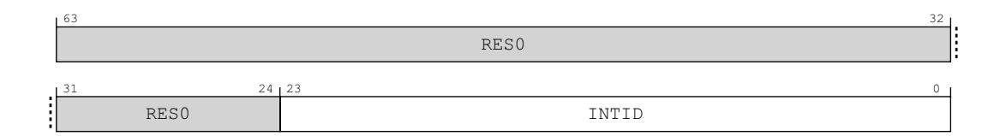

#### **Bits [63:24]**

Reserved, RES0.

#### **INTID, bits [23:0]**

The INTID of the signaled virtual interrupt.

This is the INTID of the highest priority pending virtual interrupt, if that interrupt is of sufficient priority for it to be signaled to the PE, and if it can be acknowledged.

If the highest priority pending interrupt is not observable, this field contains a special INTID to indicate the reason. For more information, see *[Special INTIDs on page](#page-35-1) 2-36*.

This field has either 16 or 24 bits implemented. The number of implemented bits can be found in [ICV\\_CTLR\\_EL1.](#page-302-1)IDbits. If only 16 bits are implemented, bits [23:16] of this register are RES0.

#### **Accessing ICV\_IAR0\_EL1**

Accesses to this register use the following encodings in the System register encoding space:

**MRS <Xt>, ICC\_IAR0\_EL1**

| op0  | op1   | CRn    | CRm    | op2   |
|------|-------|--------|--------|-------|
| 0b11 | 0b000 | 0b1100 | 0b1000 | 0b000 |

```
if PSTATE.EL == EL0 then
    UNDEFINED;
elsif PSTATE.EL == EL1 then
    if HaveEL(EL3) && EL3SDDUndefPriority() && SCR_EL3.FIQ == '1' then
        UNDEFINED;
    elsif ICC_SRE_EL1.SRE == '0' then
        AArch64.SystemAccessTrap(EL1, 0x18);
    elsif EL2Enabled() && ICH_HCR_EL2.TALL0 == '1' then
        AArch64.SystemAccessTrap(EL2, 0x18);
    elsif EL2Enabled() && HCR_EL2.FMO == '1' then
        X[t, 64] = ICV_IAR0_EL1;
    elsif HaveEL(EL3) && SCR_EL3.FIQ == '1' then
        if EL3SDDUndef() then
            UNDEFINED;
        else
            AArch64.SystemAccessTrap(EL3, 0x18);
    else
        X[t, 64] = ICC_IAR0_EL1;
elsif PSTATE.EL == EL2 then
    if HaveEL(EL3) && EL3SDDUndefPriority() && SCR_EL3.FIQ == '1' then
        UNDEFINED;
    elsif ICC_SRE_EL2.SRE == '0' then
        AArch64.SystemAccessTrap(EL2, 0x18);
    elsif HaveEL(EL3) && SCR_EL3.FIQ == '1' then
        if EL3SDDUndef() then
            UNDEFINED;
        else
            AArch64.SystemAccessTrap(EL3, 0x18);
    else
        X[t, 64] = ICC_IAR0_EL1;
elsif PSTATE.EL == EL3 then
    if ICC_SRE_EL3.SRE == '0' then
        AArch64.SystemAccessTrap(EL3, 0x18);
    else
        X[t, 64] = ICC_IAR0_EL1;
```

#### <span id="page-319-1"></span><span id="page-319-0"></span>**12.3.12 ICV\_IAR1\_EL1, Interrupt Controller Virtual Interrupt Acknowledge Register 1**

The ICV\_IAR1\_EL1 characteristics are:

#### **Purpose**

The PE reads this register to obtain the INTID of the signaled virtual Group 1 interrupt. This read acts as an acknowledge for the interrupt.

#### **Configurations**

AArch64 System register ICV\_IAR1\_EL1 performs the same function as AArch32 System register [ICV\\_IAR1.](#page-484-0)

This register is present only when FEAT\_GICv3 is implemented and EL2 is implemented. Otherwise, direct accesses to ICV\_IAR1\_EL1 are UNDEFINED.

To allow software to ensure appropriate observability of actions initiated by GIC register accesses, the PE and CPU interface logic must ensure that reads of this register are self-synchronizing when interrupts are masked by the PE (that is when PSTATE.{I,F} == {0,0}). This ensures that the effect of activating an interrupt on the signaling of interrupt exceptions is observed when a read of this register is architecturally executed so that no spurious interrupt exception occurs if interrupts are unmasked by an instruction immediately following the read. For more information, see *[Observability of the effects of accesses to the GIC registers on page](#page-194-0) 12-195*.

#### **Attributes**

ICV\_IAR1\_EL1 is a 64-bit register.

#### **Field descriptions**


#### **Bits [63:24]**

Reserved, RES0.

#### **INTID, bits [23:0]**

The INTID of the signaled virtual interrupt.

This is the INTID of the highest priority pending virtual interrupt, if that interrupt is of sufficient priority for it to be signaled to the PE, and if it can be acknowledged.

If the highest priority pending interrupt is not observable, this field contains a special INTID to indicate the reason. For more information, see *[Special INTIDs on page](#page-35-1) 2-36*.

This field has either 16 or 24 bits implemented. The number of implemented bits can be found in [ICV\\_CTLR\\_EL1.](#page-302-1)IDbits. If only 16 bits are implemented, bits [23:16] of this register are RES0.

#### **Accessing ICV\_IAR1\_EL1**

Accesses to this register use the following encodings in the System register encoding space:

#### **MRS <Xt>, ICC\_IAR1\_EL1**

| op0  | op1   | CRn    | CRm    | op2   |
|------|-------|--------|--------|-------|
| 0b11 | 0b000 | 0b1100 | 0b1100 | 0b000 |

```
if PSTATE.EL == EL0 then
    UNDEFINED;
elsif PSTATE.EL == EL1 then
    if HaveEL(EL3) && EL3SDDUndefPriority() && SCR_EL3.IRQ == '1' then
        UNDEFINED;
    elsif ICC_SRE_EL1.SRE == '0' then
        AArch64.SystemAccessTrap(EL1, 0x18);
    elsif EL2Enabled() && ICH_HCR_EL2.TALL1 == '1' then
        AArch64.SystemAccessTrap(EL2, 0x18);
    elsif EL2Enabled() && HCR_EL2.IMO == '1' then
        X[t, 64] = ICV_IAR1_EL1;
    elsif HaveEL(EL3) && SCR_EL3.IRQ == '1' then
        if EL3SDDUndef() then
            UNDEFINED;
        else
            AArch64.SystemAccessTrap(EL3, 0x18);
    else
        X[t, 64] = ICC_IAR1_EL1;
elsif PSTATE.EL == EL2 then
    if HaveEL(EL3) && EL3SDDUndefPriority() && SCR_EL3.IRQ == '1' then
        UNDEFINED;
    elsif ICC_SRE_EL2.SRE == '0' then
        AArch64.SystemAccessTrap(EL2, 0x18);
    elsif HaveEL(EL3) && SCR_EL3.IRQ == '1' then
        if EL3SDDUndef() then
            UNDEFINED;
        else
            AArch64.SystemAccessTrap(EL3, 0x18);
    else
        X[t, 64] = ICC_IAR1_EL1;
elsif PSTATE.EL == EL3 then
    if ICC_SRE_EL3.SRE == '0' then
        AArch64.SystemAccessTrap(EL3, 0x18);
    else
        X[t, 64] = ICC_IAR1_EL1;
```

#### <span id="page-321-1"></span><span id="page-321-0"></span>**12.3.13 ICV\_IGRPEN0\_EL1, Interrupt Controller Virtual Interrupt Group 0 Enable Register**

The ICV\_IGRPEN0\_EL1 characteristics are:

#### **Purpose**

Controls whether virtual Group 0 interrupts are enabled or not.

#### **Configurations**

AArch64 System register ICV\_IGRPEN0\_EL1 bits [31:0] are architecturally mapped to AArch32 System register [ICV\\_IGRPEN0\[](#page-486-0)31:0].

This register is present only when FEAT\_GICv3 is implemented and EL2 is implemented. Otherwise, direct accesses to ICV\_IGRPEN0\_EL1 are UNDEFINED.

#### **Attributes**

ICV\_IGRPEN0\_EL1 is a 64-bit register.

#### **Field descriptions**

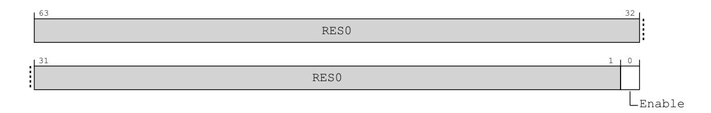

#### **Bits [63:1]**

Reserved, RES0.

#### **Enable, bit [0]**

Enables virtual Group 0 interrupts.

0b0 Virtual Group 0 interrupts are disabled.

0b1 Virtual Group 0 interrupts are enabled.

The reset behavior of this field is:

• On a Warm reset, this field resets to an architecturally UNKNOWN value.

#### **Accessing ICV\_IGRPEN0\_EL1**

Accesses to this register use the following encodings in the System register encoding space:

#### **MRS <Xt>, ICC\_IGRPEN0\_EL1**

| op0  | op1   | CRn    | CRm    | op2   |
|------|-------|--------|--------|-------|
| 0b11 | 0b000 | 0b1100 | 0b1100 | 0b110 |

```
if PSTATE.EL == EL0 then
    UNDEFINED;
elsif PSTATE.EL == EL1 then
    if HaveEL(EL3) && EL3SDDUndefPriority() && SCR_EL3.FIQ == '1' then
        UNDEFINED;
    elsif ICC_SRE_EL1.SRE == '0' then
        AArch64.SystemAccessTrap(EL1, 0x18);
    elsif EL2Enabled() && IsFeatureImplemented(FEAT_FGT) && (!HaveEL(EL3) || SCR_EL3.FGTEn
```

```
== '1') && HFGRTR_EL2.ICC_IGRPENn_EL1 == '1' then
        AArch64.SystemAccessTrap(EL2, 0x18);
    elsif EL2Enabled() && ICH_HCR_EL2.TALL0 == '1' then
        AArch64.SystemAccessTrap(EL2, 0x18);
    elsif EL2Enabled() && HCR_EL2.FMO == '1' then
        X[t, 64] = ICV_IGRPEN0_EL1;
    elsif HaveEL(EL3) && SCR_EL3.FIQ == '1' then
        if EL3SDDUndef() then
            UNDEFINED;
        else
            AArch64.SystemAccessTrap(EL3, 0x18);
    else
        X[t, 64] = ICC_IGRPEN0_EL1;
elsif PSTATE.EL == EL2 then
    if HaveEL(EL3) && EL3SDDUndefPriority() && SCR_EL3.FIQ == '1' then
        UNDEFINED;
    elsif ICC_SRE_EL2.SRE == '0' then
        AArch64.SystemAccessTrap(EL2, 0x18);
    elsif HaveEL(EL3) && SCR_EL3.FIQ == '1' then
        if EL3SDDUndef() then
            UNDEFINED;
        else
            AArch64.SystemAccessTrap(EL3, 0x18);
    else
        X[t, 64] = ICC_IGRPEN0_EL1;
elsif PSTATE.EL == EL3 then
    if ICC_SRE_EL3.SRE == '0' then
        AArch64.SystemAccessTrap(EL3, 0x18);
    else
        X[t, 64] = ICC_IGRPEN0_EL1;
```

#### **MSR ICC\_IGRPEN0\_EL1, <Xt>**

| op0  | op1   | CRn    | CRm    | op2   |
|------|-------|--------|--------|-------|
| 0b11 | 0b000 | 0b1100 | 0b1100 | 0b110 |

```
if PSTATE.EL == EL0 then
    UNDEFINED;
elsif PSTATE.EL == EL1 then
    if HaveEL(EL3) && EL3SDDUndefPriority() && SCR_EL3.FIQ == '1' then
        UNDEFINED;
    elsif ICC_SRE_EL1.SRE == '0' then
        AArch64.SystemAccessTrap(EL1, 0x18);
    elsif EL2Enabled() && IsFeatureImplemented(FEAT_FGT) && (!HaveEL(EL3) || SCR_EL3.FGTEn
== '1') && HFGWTR_EL2.ICC_IGRPENn_EL1 == '1' then
        AArch64.SystemAccessTrap(EL2, 0x18);
    elsif EL2Enabled() && ICH_HCR_EL2.TALL0 == '1' then
        AArch64.SystemAccessTrap(EL2, 0x18);
    elsif EL2Enabled() && HCR_EL2.FMO == '1' then
        ICV_IGRPEN0_EL1 = X[t, 64];
    elsif HaveEL(EL3) && SCR_EL3.FIQ == '1' then
        if EL3SDDUndef() then
            UNDEFINED;
        else
            AArch64.SystemAccessTrap(EL3, 0x18);
    else
        ICC_IGRPEN0_EL1 = X[t, 64];
elsif PSTATE.EL == EL2 then
    if HaveEL(EL3) && EL3SDDUndefPriority() && SCR_EL3.FIQ == '1' then
        UNDEFINED;
    elsif ICC_SRE_EL2.SRE == '0' then
```

```
AArch64.SystemAccessTrap(EL2, 0x18);
    elsif HaveEL(EL3) && SCR_EL3.FIQ == '1' then
        if EL3SDDUndef() then
            UNDEFINED;
        else
            AArch64.SystemAccessTrap(EL3, 0x18);
    else
        ICC_IGRPEN0_EL1 = X[t, 64];
elsif PSTATE.EL == EL3 then
    if ICC_SRE_EL3.SRE == '0' then
        AArch64.SystemAccessTrap(EL3, 0x18);
    else
        ICC_IGRPEN0_EL1 = X[t, 64];
```

#### <span id="page-324-1"></span><span id="page-324-0"></span>**12.3.14 ICV\_IGRPEN1\_EL1, Interrupt Controller Virtual Interrupt Group 1 Enable Register**

The ICV\_IGRPEN1\_EL1 characteristics are:

#### **Purpose**

Controls whether virtual Group 1 interrupts are enabled for the current Security state.

#### **Configurations**

AArch64 System register ICV\_IGRPEN1\_EL1 bits [31:0] are architecturally mapped to AArch32 System register [ICV\\_IGRPEN1\[](#page-489-0)31:0].

This register is present only when FEAT\_GICv3 is implemented and EL2 is implemented. Otherwise, direct accesses to ICV\_IGRPEN1\_EL1 are UNDEFINED.

#### **Attributes**

ICV\_IGRPEN1\_EL1 is a 64-bit register.

#### **Field descriptions**


#### **Bits [63:1]**

Reserved, RES0.

#### **Enable, bit [0]**

Enables virtual Group 1 interrupts.

0b0 Virtual Group 1 interrupts are disabled. 0b1 Virtual Group 1 interrupts are enabled.

The reset behavior of this field is:

• On a Warm reset, this field resets to an architecturally UNKNOWN value.

#### **Accessing ICV\_IGRPEN1\_EL1**

Accesses to this register use the following encodings in the System register encoding space:

#### **MRS <Xt>, ICC\_IGRPEN1\_EL1**

| op0  | op1   | CRn    | CRm    | op2   |
|------|-------|--------|--------|-------|
| 0b11 | 0b000 | 0b1100 | 0b1100 | 0b111 |

```
if PSTATE.EL == EL0 then
    UNDEFINED;
elsif PSTATE.EL == EL1 then
    if HaveEL(EL3) && EL3SDDUndefPriority() && SCR_EL3.IRQ == '1' then
        UNDEFINED;
    elsif ICC_SRE_EL1.SRE == '0' then
        AArch64.SystemAccessTrap(EL1, 0x18);
    elsif EL2Enabled() && IsFeatureImplemented(FEAT_FGT) && (!HaveEL(EL3) || SCR_EL3.FGTEn
```

```
== '1') && HFGRTR_EL2.ICC_IGRPENn_EL1 == '1' then
        AArch64.SystemAccessTrap(EL2, 0x18);
    elsif EL2Enabled() && ICH_HCR_EL2.TALL1 == '1' then
        AArch64.SystemAccessTrap(EL2, 0x18);
    elsif EL2Enabled() && HCR_EL2.IMO == '1' then
        X[t, 64] = ICV_IGRPEN1_EL1;
    elsif HaveEL(EL3) && SCR_EL3.IRQ == '1' then
        if EL3SDDUndef() then
            UNDEFINED;
        else
            AArch64.SystemAccessTrap(EL3, 0x18);
    elsif HaveEL(EL3) then
        if SCR_EL3.NS == '0' then
            X[t, 64] = ICC_IGRPEN1_EL1_S;
        else
            X[t, 64] = ICC_IGRPEN1_EL1_NS;
    else
        X[t, 64] = ICC_IGRPEN1_EL1;
elsif PSTATE.EL == EL2 then
    if HaveEL(EL3) && EL3SDDUndefPriority() && SCR_EL3.IRQ == '1' then
        UNDEFINED;
    elsif ICC_SRE_EL2.SRE == '0' then
        AArch64.SystemAccessTrap(EL2, 0x18);
    elsif HaveEL(EL3) && SCR_EL3.IRQ == '1' then
        if EL3SDDUndef() then
            UNDEFINED;
        else
            AArch64.SystemAccessTrap(EL3, 0x18);
    elsif HaveEL(EL3) then
        if SCR_EL3.NS == '0' then
            X[t, 64] = ICC_IGRPEN1_EL1_S;
        else
            X[t, 64] = ICC_IGRPEN1_EL1_NS;
    else
        X[t, 64] = ICC_IGRPEN1_EL1;
elsif PSTATE.EL == EL3 then
    if ICC_SRE_EL3.SRE == '0' then
        AArch64.SystemAccessTrap(EL3, 0x18);
    else
        if SCR_EL3.NS == '0' then
            X[t, 64] = ICC_IGRPEN1_EL1_S;
        else
            X[t, 64] = ICC_IGRPEN1_EL1_NS;
```

#### **MSR ICC\_IGRPEN1\_EL1, <Xt>**

| op0  | op1   | CRn    | CRm    | op2   |
|------|-------|--------|--------|-------|
| 0b11 | 0b000 | 0b1100 | 0b1100 | 0b111 |

```
if PSTATE.EL == EL0 then
    UNDEFINED;
elsif PSTATE.EL == EL1 then
    if HaveEL(EL3) && EL3SDDUndefPriority() && SCR_EL3.IRQ == '1' then
        UNDEFINED;
    elsif ICC_SRE_EL1.SRE == '0' then
        AArch64.SystemAccessTrap(EL1, 0x18);
    elsif EL2Enabled() && IsFeatureImplemented(FEAT_FGT) && (!HaveEL(EL3) || SCR_EL3.FGTEn
== '1') && HFGWTR_EL2.ICC_IGRPENn_EL1 == '1' then
        AArch64.SystemAccessTrap(EL2, 0x18);
    elsif EL2Enabled() && ICH_HCR_EL2.TALL1 == '1' then
        AArch64.SystemAccessTrap(EL2, 0x18);
```

```
elsif EL2Enabled() && HCR_EL2.IMO == '1' then
        ICV_IGRPEN1_EL1 = X[t, 64];
    elsif HaveEL(EL3) && SCR_EL3.IRQ == '1' then
        if EL3SDDUndef() then
            UNDEFINED;
        else
            AArch64.SystemAccessTrap(EL3, 0x18);
    elsif HaveEL(EL3) then
        if SCR_EL3.NS == '0' then
            ICC_IGRPEN1_EL1_S = X[t, 64];
        else
            ICC_IGRPEN1_EL1_NS = X[t, 64];
    else
        ICC_IGRPEN1_EL1 = X[t, 64];
elsif PSTATE.EL == EL2 then
    if HaveEL(EL3) && EL3SDDUndefPriority() && SCR_EL3.IRQ == '1' then
        UNDEFINED;
    elsif ICC_SRE_EL2.SRE == '0' then
        AArch64.SystemAccessTrap(EL2, 0x18);
    elsif HaveEL(EL3) && SCR_EL3.IRQ == '1' then
        if EL3SDDUndef() then
            UNDEFINED;
        else
            AArch64.SystemAccessTrap(EL3, 0x18);
    elsif HaveEL(EL3) then
        if SCR_EL3.NS == '0' then
            ICC_IGRPEN1_EL1_S = X[t, 64];
        else
            ICC_IGRPEN1_EL1_NS = X[t, 64];
    else
        ICC_IGRPEN1_EL1 = X[t, 64];
elsif PSTATE.EL == EL3 then
    if ICC_SRE_EL3.SRE == '0' then
        AArch64.SystemAccessTrap(EL3, 0x18);
    else
        if SCR_EL3.NS == '0' then
            ICC_IGRPEN1_EL1_S = X[t, 64];
        else
            ICC_IGRPEN1_EL1_NS = X[t, 64];
```

#### <span id="page-327-0"></span>**12.3.15 ICV\_NMIAR1\_EL1, Interrupt Controller Virtual Non-maskable Interrupt Acknowledge Register 1**

The ICV\_NMIAR1\_EL1 characteristics are:

#### **Purpose**

The PE reads this register to obtain the INTID of the signaled virtual Group 1 interrupt. This read acts as an acknowledge for the interrupt.

#### **Configurations**

This register is present only when FEAT\_GICv3\_NMI is implemented and EL2 is implemented. Otherwise, direct accesses to ICV\_NMIAR1\_EL1 are UNDEFINED.

To allow software to ensure appropriate observability of actions initiated by GIC register accesses, the PE and CPU interface logic must ensure that reads of this register are self-synchronizing when interrupts are masked by the PE (that is when PSTATE.{I,F} == {0,0}). This ensures that the effect of activating an interrupt on the signaling of interrupt exceptions is observed when a read of this register is architecturally executed so that no spurious interrupt exception occurs if interrupts are unmasked by an instruction immediately following the read. For more information, see *[Observability of the effects of accesses to the GIC registers on page](#page-194-0) 12-195*.

#### **Attributes**

ICV\_NMIAR1\_EL1 is a 64-bit register.

#### **Field descriptions**


#### **Bits [63:24]**

Reserved, RES0.

#### **INTID, bits [23:0]**

The INTID of the signaled virtual interrupt.

This is the INTID of the highest priority pending virtual interrupt, if that virtual interrupt has the Non-maskable property and is of sufficient priority for it to be signaled to the PE, and if it can be acknowledged at the current Security state and Exception level.

If the highest priority pending interrupt is not observable, this field contains a special INTID to indicate the reason. For more information, see *[Special INTIDs on page](#page-35-1) 2-36*.

This field has either 16 or 24 bits implemented. The number of implemented bits can be found in [ICV\\_CTLR\\_EL1.](#page-302-1)IDbits. If only 16 bits are implemented, bits [23:16] of this register are RES0.

#### **Accessing ICV\_NMIAR1\_EL1**

Accesses to this register use the following encodings in the System register encoding space:

#### **MRS <Xt>, ICC\_NMIAR1\_EL1**

| op0  | op1   | CRn    | CRm    | op2   |
|------|-------|--------|--------|-------|
| 0b11 | 0b000 | 0b1100 | 0b1001 | 0b101 |

```
if PSTATE.EL == EL0 then
    UNDEFINED;
elsif PSTATE.EL == EL1 then
    if SCTLR_EL1.NMI == '0' then
        UNDEFINED;
    elsif HaveEL(EL3) && EL3SDDUndefPriority() && SCR_EL3.IRQ == '1' then
        UNDEFINED;
    elsif ICC_SRE_EL1.SRE == '0' then
        AArch64.SystemAccessTrap(EL1, 0x18);
    elsif EL2Enabled() && ICH_HCR_EL2.TALL1 == '1' then
        AArch64.SystemAccessTrap(EL2, 0x18);
    elsif EL2Enabled() && HCR_EL2.IMO == '1' then
        X[t, 64] = ICV_NMIAR1_EL1;
    elsif HaveEL(EL3) && SCR_EL3.IRQ == '1' then
        if EL3SDDUndef() then
            UNDEFINED;
        else
            AArch64.SystemAccessTrap(EL3, 0x18);
    else
        X[t, 64] = ICC_NMIAR1_EL1;
elsif PSTATE.EL == EL2 then
    if SCTLR_EL2.NMI == '0' then
        UNDEFINED;
    elsif HaveEL(EL3) && EL3SDDUndefPriority() && SCR_EL3.IRQ == '1' then
        UNDEFINED;
    elsif ICC_SRE_EL2.SRE == '0' then
        AArch64.SystemAccessTrap(EL2, 0x18);
    elsif HaveEL(EL3) && SCR_EL3.IRQ == '1' then
        if EL3SDDUndef() then
            UNDEFINED;
        else
            AArch64.SystemAccessTrap(EL3, 0x18);
    else
        X[t, 64] = ICC_NMIAR1_EL1;
elsif PSTATE.EL == EL3 then
    if SCTLR_EL3.NMI == '0' then
        UNDEFINED;
    elsif ICC_SRE_EL3.SRE == '0' then
        AArch64.SystemAccessTrap(EL3, 0x18);
    else
        X[t, 64] = ICC_NMIAR1_EL1;
```

#### <span id="page-329-1"></span><span id="page-329-0"></span>**12.3.16 ICV\_PMR\_EL1, Interrupt Controller Virtual Interrupt Priority Mask Register**

The ICV\_PMR\_EL1 characteristics are:

#### **Purpose**

Provides a virtual interrupt priority filter. Only virtual interrupts with a higher priority than the value in this register are signaled to the PE.

#### **Configurations**

AArch64 System register ICV\_PMR\_EL1 bits [31:0] are architecturally mapped to AArch32 System register [ICV\\_PMR\[](#page-493-0)31:0].

This register is present only when FEAT\_GICv3 is implemented and EL2 is implemented. Otherwise, direct accesses to ICV\_PMR\_EL1 are UNDEFINED.

To allow software to ensure appropriate observability of actions initiated by GIC register accesses, the PE and CPU interface logic must ensure that writes to this register are self-synchronizing. This ensures that no interrupts below the written PMR value will be taken after a write to this register is architecturally executed. For more information, see *[Observability of the effects of accesses to the](#page-194-0)  [GIC registers on page](#page-194-0) 12-195*.

#### **Attributes**

ICV\_PMR\_EL1 is a 64-bit register.

#### **Field descriptions**

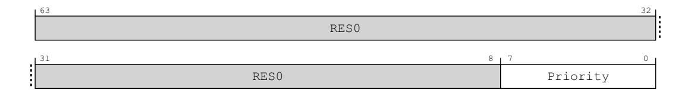

#### **Bits [63:8]**

Reserved, RES0.

#### **Priority, bits [7:0]**

The priority mask level for the virtual CPU interface. If the priority of a virtual interrupt is higher than the value indicated by this field, the interface signals the virtual interrupt to the PE.

The possible priority field values are as follows:

| Implemented priority bits | Possible priority field values      | Number of priority levels |
|---------------------------|-------------------------------------|---------------------------|
| [7:0]                     | 0x00-0xFF (0-255), all values       | 256                       |
| [7:1]                     | 0x00-0xFE (0-254), even values only | 128                       |
| [7:2]                     | 0x00-0xFC (0-252), in steps of 4    | 64                        |
| [7:3]                     | 0x00-0xF8 (0-248), in steps of 8    | 32                        |
| [7:4]                     | 0x00-0xF0 (0-240), in steps of 16   | 16                        |

Unimplemented priority bits are RAZ/WI.

The reset behavior of this field is:

• On a Warm reset, this field resets to an architecturally UNKNOWN value.

#### **Accessing ICV\_PMR\_EL1**

Accesses to this register use the following encodings in the System register encoding space:

#### **MRS <Xt>, ICC\_PMR\_EL1**

| op0  | op1   | CRn    | CRm    | op2   |
|------|-------|--------|--------|-------|
| 0b11 | 0b000 | 0b0100 | 0b0110 | 0b000 |

```
if PSTATE.EL == EL0 then
    UNDEFINED;
elsif PSTATE.EL == EL1 then
    if HaveEL(EL3) && EL3SDDUndefPriority() && SCR_EL3.<IRQ,FIQ> == '11' then
        UNDEFINED;
    elsif ICC_SRE_EL1.SRE == '0' then
        AArch64.SystemAccessTrap(EL1, 0x18);
    elsif EL2Enabled() && ICH_HCR_EL2.TC == '1' then
        AArch64.SystemAccessTrap(EL2, 0x18);
    elsif EL2Enabled() && HCR_EL2.FMO == '1' then
        X[t, 64] = ICV_PMR_EL1;
    elsif EL2Enabled() && HCR_EL2.IMO == '1' then
        X[t, 64] = ICV_PMR_EL1;
    elsif HaveEL(EL3) && SCR_EL3.<IRQ,FIQ> == '11' then
        if EL3SDDUndef() then
            UNDEFINED;
        else
            AArch64.SystemAccessTrap(EL3, 0x18);
    else
        X[t, 64] = ICC_PMR_EL1;
elsif PSTATE.EL == EL2 then
    if HaveEL(EL3) && EL3SDDUndefPriority() && SCR_EL3.<IRQ,FIQ> == '11' then
        UNDEFINED;
    elsif ICC_SRE_EL2.SRE == '0' then
        AArch64.SystemAccessTrap(EL2, 0x18);
    elsif HaveEL(EL3) && SCR_EL3.<IRQ,FIQ> == '11' then
        if EL3SDDUndef() then
            UNDEFINED;
        else
            AArch64.SystemAccessTrap(EL3, 0x18);
    else
        X[t, 64] = ICC_PMR_EL1;
elsif PSTATE.EL == EL3 then
    if ICC_SRE_EL3.SRE == '0' then
        AArch64.SystemAccessTrap(EL3, 0x18);
    else
        X[t, 64] = ICC_PMR_EL1;
```

#### **MSR ICC\_PMR\_EL1, <Xt>**

| op0  | op1   | CRn    | CRm    | op2   |
|------|-------|--------|--------|-------|
| 0b11 | 0b000 | 0b0100 | 0b0110 | 0b000 |

```
if PSTATE.EL == EL0 then
    UNDEFINED;
elsif PSTATE.EL == EL1 then
    if HaveEL(EL3) && EL3SDDUndefPriority() && SCR_EL3.<IRQ,FIQ> == '11' then
```

```
UNDEFINED;
    elsif ICC_SRE_EL1.SRE == '0' then
        AArch64.SystemAccessTrap(EL1, 0x18);
    elsif EL2Enabled() && ICH_HCR_EL2.TC == '1' then
        AArch64.SystemAccessTrap(EL2, 0x18);
    elsif EL2Enabled() && HCR_EL2.FMO == '1' then
        ICV_PMR_EL1 = X[t, 64];
    elsif EL2Enabled() && HCR_EL2.IMO == '1' then
        ICV_PMR_EL1 = X[t, 64];
    elsif HaveEL(EL3) && SCR_EL3.<IRQ,FIQ> == '11' then
        if EL3SDDUndef() then
            UNDEFINED;
        else
            AArch64.SystemAccessTrap(EL3, 0x18);
    else
        ICC_PMR_EL1 = X[t, 64];
elsif PSTATE.EL == EL2 then
    if HaveEL(EL3) && EL3SDDUndefPriority() && SCR_EL3.<IRQ,FIQ> == '11' then
        UNDEFINED;
    elsif ICC_SRE_EL2.SRE == '0' then
        AArch64.SystemAccessTrap(EL2, 0x18);
    elsif HaveEL(EL3) && SCR_EL3.<IRQ,FIQ> == '11' then
        if EL3SDDUndef() then
            UNDEFINED;
        else
            AArch64.SystemAccessTrap(EL3, 0x18);
    else
        ICC_PMR_EL1 = X[t, 64];
elsif PSTATE.EL == EL3 then
    if ICC_SRE_EL3.SRE == '0' then
        AArch64.SystemAccessTrap(EL3, 0x18);
    else
        ICC_PMR_EL1 = X[t, 64];
```

#### <span id="page-332-1"></span><span id="page-332-0"></span>**12.3.17 ICV\_RPR\_EL1, Interrupt Controller Virtual Running Priority Register**

The ICV\_RPR\_EL1 characteristics are:

#### **Purpose**

Indicates the Running priority of the virtual CPU interface.

#### **Configurations**

AArch64 System register ICV\_RPR\_EL1 performs the same function as AArch32 System register [ICV\\_RPR.](#page-497-0)

This register is present only when FEAT\_GICv3 is implemented and EL2 is implemented. Otherwise, direct accesses to ICV\_RPR\_EL1 are UNDEFINED.

#### **Attributes**

ICV\_RPR\_EL1 is a 64-bit register.

#### **Field descriptions**

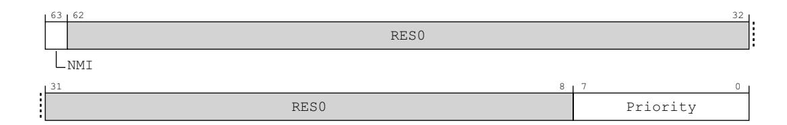

#### **NMI, bit [63]**

#### *When FEAT\_GICv3\_NMI is implemented:*

Indicates whether the running priority is from a NMI.

0b0 There is no active Group 1 NMI, or all active Group 1 NMIs have undergone priority drop.

0b1 There is an active Group 1 NMI.

#### *Otherwise:*

Reserved, RES0.

#### **Bits [62:8]**

Reserved, RES0.

#### **Priority, bits [7:0]**

The current running priority on the virtual CPU interface. This is the group priority of the current active virtual interrupt.

If there are no active interrupts on the virtual CPU interface, or all active interrupts have undergone a priority drop, the value returned is the Idle priority.

The group priority of an NMI is 0x00.

The priority returned is the group priority as if the BPR for the current Exception level and Security state was set to the minimum value of BPR for the number of implemented priority bits.


If 8 bits of priority are implemented the group priority is bits[7:1] of the priority.

#### **Accessing ICV\_RPR\_EL1**

If there are no active interrupts on the virtual CPU interface, or all active interrupts have undergone a priority drop, the value returned is the Idle priority.

Software cannot determine the number of implemented priority bits from a read of this register.

Accesses to this register use the following encodings in the System register encoding space:

#### **MRS <Xt>, ICC\_RPR\_EL1**

| op0  | op1   | CRn    | CRm    | op2   |
|------|-------|--------|--------|-------|
| 0b11 | 0b000 | 0b1100 | 0b1011 | 0b011 |

```
if PSTATE.EL == EL0 then
    UNDEFINED;
elsif PSTATE.EL == EL1 then
    if HaveEL(EL3) && EL3SDDUndefPriority() && SCR_EL3.<IRQ,FIQ> == '11' then
        UNDEFINED;
    elsif ICC_SRE_EL1.SRE == '0' then
        AArch64.SystemAccessTrap(EL1, 0x18);
    elsif EL2Enabled() && ICH_HCR_EL2.TC == '1' then
        AArch64.SystemAccessTrap(EL2, 0x18);
    elsif EL2Enabled() && HCR_EL2.FMO == '1' then
        X[t, 64] = ICV_RPR_EL1;
    elsif EL2Enabled() && HCR_EL2.IMO == '1' then
        X[t, 64] = ICV_RPR_EL1;
    elsif HaveEL(EL3) && SCR_EL3.<IRQ,FIQ> == '11' then
        if EL3SDDUndef() then
            UNDEFINED;
        else
            AArch64.SystemAccessTrap(EL3, 0x18);
    else
        X[t, 64] = ICC_RPR_EL1;
elsif PSTATE.EL == EL2 then
    if HaveEL(EL3) && EL3SDDUndefPriority() && SCR_EL3.<IRQ,FIQ> == '11' then
        UNDEFINED;
    elsif ICC_SRE_EL2.SRE == '0' then
        AArch64.SystemAccessTrap(EL2, 0x18);
    elsif HaveEL(EL3) && SCR_EL3.<IRQ,FIQ> == '11' then
        if EL3SDDUndef() then
            UNDEFINED;
        else
            AArch64.SystemAccessTrap(EL3, 0x18);
    else
        X[t, 64] = ICC_RPR_EL1;
elsif PSTATE.EL == EL3 then
    if ICC_SRE_EL3.SRE == '0' then
        AArch64.SystemAccessTrap(EL3, 0x18);
    else
        X[t, 64] = ICC_RPR_EL1;
```

#### <span id="page-334-1"></span><span id="page-334-0"></span>**12.4 AArch64 virtualization control System registers**

This section describes each of the virtualization control AArch64 GIC System registers in register name order. The ICH prefix indicates a virtual interface control System register. Each AArch64 System register description contains a reference to the AArch32 register that provides the same functionality.

Unless otherwise stated, the bit assignments for the GIC System registers are the same as those for the equivalent GICH\_\* memory-mapped registers. See *[The GIC virtual interface control register descriptions on page](#page-801-1) 12-802*.

<span id="page-334-2"></span>Table 12-[22 on page](#page-334-2) 12-335 shows the encodings for the AArch64 virtualization control System registers.

**Table 12-22 Encodings for AArch64 virtualization control System registers**

|                      | Width (bits) | Access instruction encoding |     |     |        |     |                                                                             |
|----------------------|--------------|-----------------------------|-----|-----|--------|-----|-----------------------------------------------------------------------------|
| Register             |              | Op0                         | Op1 | CRn | CRm    | Op2 | Notes                                                                       |
| ICH_AP0R <n>_EL2</n> | 32           | 3                           | 4   | 12  | 8      | 0-3 | RW, <n>=Op2.</n>                                                            |
| ICH_AP1R <n>_EL2</n> | 32           |                             |     |     | 9      | 0-3 | RW, <n>=Op2.</n>                                                            |
| ICH_HCR_EL2          | 32           |                             |     |     | 11     | 0   | RW                                                                          |
| ICH_VTR_EL2          | 32           |                             |     |     |        | 1   | RO                                                                          |
| ICH_MISR_EL2         | 32           |                             |     |     |        | 2   | RO                                                                          |
| ICH_EISR_EL2         | 32           |                             |     |     |        | 3   | RO                                                                          |
| ICH_ELRSR_EL2        | 32           |                             |     |     |        | 5   | RO                                                                          |
| ICH_VMCR_EL2         | 32           |                             |     |     |        | 7   | RW                                                                          |
| ICH_LR <n>_EL2</n>   | 64           |                             |     |     | 12, 13 | 0-7 | RW:<br>•<br>For CRm==12, <n>=Op2.<br/>•<br/>For CRm==13, <n>=Op2+8.</n></n> |

#### <span id="page-335-1"></span><span id="page-335-0"></span>**12.4.1 ICH\_AP0R<n>\_EL2, Interrupt Controller Hyp Active Priorities Group 0 Registers, n = 0 - 3**

The ICH\_AP0R<n>\_EL2 characteristics are:

#### **Purpose**

Provides information about Group 0 virtual active priorities for EL2.

#### **Configurations**

AArch64 System register ICH\_AP0R<n>\_EL2 bits [31:0] are architecturally mapped to AArch32 System register [ICH\\_AP0R<n>\[](#page-500-0)31:0].

This register is present only when FEAT\_GICv3 is implemented and (EL2 is implemented or EL3 is implemented). Otherwise, direct accesses to ICH\_AP0R<n>\_EL2 are UNDEFINED.

If EL2 is not implemented, this register is RES0 from EL3.

This register has no effect if EL2 is not enabled in the current Security state.

#### **Attributes**

ICH\_AP0R<n>\_EL2 is a 64-bit register.

#### **Field descriptions**

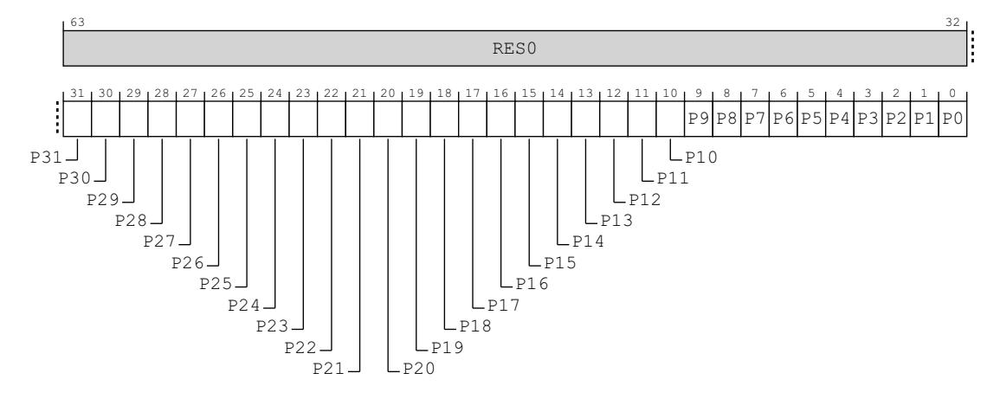

#### **Bits [63:32]**

Reserved, RES0.

#### **P<x>, bit [x], for x = 31 to 0**

Provides the access to the virtual active priorities for Group 0 interrupts. Possible values of each bit are:

0b0 There is no Group 0 interrupt active with this priority level, or all active Group 0 interrupts with this priority level have undergone priority-drop.

0b1 There is a Group 0 interrupt active with this priority level which has not undergone priority drop.

The correspondence between priority levels and bits depends on the number of bits of priority that are implemented.

If 5 bits of preemption are implemented (bits [7:3] of priority), then there are 32 preemption levels, and the active state of these preemption levels are held in ICH\_AP0R0\_EL2 in the bits corresponding to Priority[7:3].

If 6 bits of preemption are implemented (bits [7:2] of priority), then there are 64 preemption levels, and:

- The active state of preemption levels 0 124 are held in ICH\_AP0R0\_EL2 in the bits corresponding to 0:Priority[6:2].
- The active state of preemption levels 128 252 are held in ICH\_AP0R1\_EL2 in the bits corresponding to 1:Priority[6:2].

If 7 bits of preemption are implemented (bits [7:1] of priority), then there are 128 preemption levels, and:

- The active state of preemption levels 0 62 are held in ICH\_AP0R0\_EL2 in the bits corresponding to 00:Priority[5:1].
- The active state of preemption levels 64 126 are held in ICH\_AP0R1\_EL2 in the bits corresponding to 01:Priority[5:1].
- The active state of preemption levels 128 190 are held in ICH\_AP0R2\_EL2 in the bits corresponding to 10:Priority[5:1].
- The active state of preemption levels 192 254 are held in ICH\_AP0R3\_EL2 in the bits corresponding to 11:Priority[5:1].


Having the bit corresponding to a priority set to 1 in both ICH\_AP0R<n>\_EL2 and [ICH\\_AP1R<n>\\_EL2](#page-339-1) might result in UNPREDICTABLE behavior of the interrupt prioritization system for virtual interrupts.

The reset behavior of this field is:

• On a Warm reset, this field resets to 0.

Software must ensure that ICH\_AP0R<n>\_EL2 is 0 for legacy VMs otherwise behavior is UNPREDICTABLE. For more information about support for legacy VMs, see *[Support for legacy operation of VMs on page](#page-882-0) 15-883*.

The active priorities for Group 0 and Group 1 interrupts for legacy VMs are held in [ICH\\_AP1R<n>\\_EL2](#page-339-1) and reads and writes to GICV\_APR access [ICH\\_AP1R<n>\\_EL2.](#page-339-1) This means that ICH\_AP0R<n>\_EL2 is inaccessible to legacy VMs.

#### **Accessing ICH\_AP0R<n>\_EL2**

ICH\_AP0R1\_EL2 is implemented only in implementations that support 6 or more bits of preemption. ICH\_AP0R2\_EL2 and ICH\_AP0R3\_EL2 are implemented only in implementations that support 7 bits of preemption. Unimplemented registers are UNDEFINED.

| Note |  |
|------|--|
|      |  |

The number of bits of preemption is indicated by [ICH\\_VTR\\_EL2.](#page-364-1)PREbits

Writing to these registers with any value other than the last read value of the register (or all zeros for a newly set up virtual machine) can result in UNPREDICTABLE behavior of the virtual interrupt prioritization system allowing either:

- Virtual interrupts that should preempt execution to not preempt execution.
- Interrupts that should not preempt execution to preempt execution at EL1 or EL0.

Writing to the active priority registers in any order other than the following order will result in UNPREDICTABLE behavior:

- ICH\_AP0R<n>\_EL2.
- [ICH\\_AP1R<n>\\_EL2.](#page-339-1)

Having the bit corresponding to a priority set in both ICH\_AP0R<n>\_EL2 and [ICH\\_AP1R<n>\\_EL2](#page-339-1) can result in UNPREDICTABLE behavior of the interrupt prioritization system for virtual interrupts.

Accesses to this register use the following encodings in the System register encoding space:

#### **MRS <Xt>, ICH\_AP0R<m>\_EL2; Where m = 0-3**

| op0  | op1   | CRn    | CRm    | op2        |
|------|-------|--------|--------|------------|
| 0b11 | 0b100 | 0b1100 | 0b1000 | 0b0:m[1:0] |

```
integer m = UInt(op2<1:0>);
if m == 1 && NUM_GIC_PREEMPTION_BITS < 6 then
    UNDEFINED;
elsif (m == 2 || m == 3) && NUM_GIC_PREEMPTION_BITS < 7 then
    UNDEFINED;
elsif PSTATE.EL == EL0 then
    UNDEFINED;
elsif PSTATE.EL == EL1 then
    if EffectiveHCR_EL2_NVx() IN {'1x1'} then
        X[t, 64] = NVMem[0x480 + (8 * m)];
    elsif EffectiveHCR_EL2_NVx() IN {'xx1'} then
        AArch64.SystemAccessTrap(EL2, 0x18);
    else
        UNDEFINED;
elsif PSTATE.EL == EL2 then
    if ICC_SRE_EL2.SRE == '0' then
        AArch64.SystemAccessTrap(EL2, 0x18);
    else
        X[t, 64] = ICH_AP0R_EL2[m];
elsif PSTATE.EL == EL3 then
    if ICC_SRE_EL3.SRE == '0' then
        AArch64.SystemAccessTrap(EL3, 0x18);
    else
        X[t, 64] = ICH_AP0R_EL2[m];
```

#### **MSR ICH\_AP0R<m>\_EL2, <Xt>; Where m = 0-3**

| op0  | op1   | CRn    | CRm    | op2        |
|------|-------|--------|--------|------------|
| 0b11 | 0b100 | 0b1100 | 0b1000 | 0b0:m[1:0] |

```
integer m = UInt(op2<1:0>);
if m == 1 && NUM_GIC_PREEMPTION_BITS < 6 then
    UNDEFINED;
elsif (m == 2 || m == 3) && NUM_GIC_PREEMPTION_BITS < 7 then
    UNDEFINED;
elsif PSTATE.EL == EL0 then
    UNDEFINED;
elsif PSTATE.EL == EL1 then
    if EffectiveHCR_EL2_NVx() IN {'1x1'} then
        NVMem[0x480 + (8 * m)] = X[t, 64];
    elsif EffectiveHCR_EL2_NVx() IN {'xx1'} then
        AArch64.SystemAccessTrap(EL2, 0x18);
    else
        UNDEFINED;
elsif PSTATE.EL == EL2 then
    if ICC_SRE_EL2.SRE == '0' then
        AArch64.SystemAccessTrap(EL2, 0x18);
```

```
else
        ICH_AP0R_EL2[m] = X[t, 64];
elsif PSTATE.EL == EL3 then
    if ICC_SRE_EL3.SRE == '0' then
        AArch64.SystemAccessTrap(EL3, 0x18);
    else
        ICH_AP0R_EL2[m] = X[t, 64];
```

#### <span id="page-339-1"></span><span id="page-339-0"></span>**12.4.2 ICH\_AP1R<n>\_EL2, Interrupt Controller Hyp Active Priorities Group 1 Registers, n = 0 - 3**

The ICH\_AP1R<n>\_EL2 characteristics are:

#### **Purpose**

Provides information about Group 1 virtual active priorities for EL2.

#### **Configurations**

AArch64 System register ICH\_AP1R<n>\_EL2 bits [31:0] are architecturally mapped to AArch32 System register [ICH\\_AP1R<n>\[](#page-503-0)31:0].

This register is present only when FEAT\_GICv3 is implemented and (EL2 is implemented or EL3 is implemented). Otherwise, direct accesses to ICH\_AP1R<n>\_EL2 are UNDEFINED.

If EL2 is not implemented, this register is RES0 from EL3.

This register has no effect if EL2 is not enabled in the current Security state.

#### **Attributes**

ICH\_AP1R<n>\_EL2 is a 64-bit register.

#### **Field descriptions**

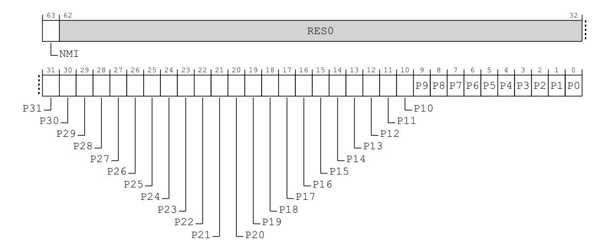

#### **NMI, bit [63]**

#### *When FEAT\_GICv3\_NMI is implemented and n == 0:*

Indicates whether the running virtual priority is from a NMI.

0b0 There is no active Group 1 NMI, or all active Group 1 NMIs have undergone priority drop.

0b1 There is an active Group 1 NMI.

The reset behavior of this field is:

• On a Warm reset, this field resets to 0.

#### *Otherwise:*

Reserved, RES0.

#### **Bits [62:32]**

Reserved, RES0.

#### **P<x>, bit [x], for x = 31 to 0**

Group 1 interrupt active priorities. Possible values of each bit are:

- 0b0 There is no Group 1 interrupt active with this priority level, or all active Group 1 interrupts with this priority level have undergone priority-drop.
- 0b1 There is a Group 1 interrupt active with this priority level which has not undergone priority drop.

The correspondence between priority levels and bits depends on the number of bits of priority that are implemented.

If 5 bits of preemption are implemented (bits [7:3] of priority), then there are 32 preemption levels, and the active state of these preemption levels are held in ICH\_AP1R0\_EL2 in the bits corresponding to Priority[7:3].

If 6 bits of preemption are implemented (bits [7:2] of priority), then there are 64 preemption levels, and:

- The active state of preemption levels 0 124 are held in ICH\_AP1R0\_EL2 in the bits corresponding to 0:Priority[6:2].
- The active state of preemption levels 128 252 are held in ICH\_AP1R1\_EL2 in the bits corresponding to 1:Priority[6:2].

If 7 bits of preemption are implemented (bits [7:1] of priority), then there are 128 preemption levels, and:

- The active state of preemption levels 0 62 are held in ICH\_AP1R0\_EL2 in the bits corresponding to 00:Priority[5:1].
- The active state of preemption levels 64 126 are held in ICH\_AP1R1\_EL2 in the bits corresponding to 01:Priority[5:1].
- The active state of preemption levels 128 190 are held in ICH\_AP1R2\_EL2 in the bits corresponding to 10:Priority[5:1].
- The active state of preemption levels 192 254 are held in ICH\_AP1R3\_EL2 in the bits corresponding to 11:Priority[5:1].

| Note                                                                                               |
|----------------------------------------------------------------------------------------------------|
| Having the bit corresponding to a priority set to 1 in both ICH_AP0R <n>_EL2 and</n>               |
| ICH_AP1R <n>_EL2 might result in UNPREDICTABLE behavior of the interrupt prioritization system</n> |

The reset behavior of this field is:

for virtual interrupts.

• On a Warm reset, this field resets to 0.

This register is always used for legacy VMs, regardless of the group of the virtual interrupt. Reads and writes to [GICV\\_APR<n>](#page-778-0) access [ICH\\_AP1R<n>\\_EL2](#page-339-1). For more information about support for legacy VMs, see *[Support for](#page-882-0)  [legacy operation of VMs on page](#page-882-0) 15-883*.

#### **Accessing ICH\_AP1R<n>\_EL2**

ICH\_AP1R1\_EL2 is implemented only in implementations that support 6 or more bits of preemption. ICH\_AP1R2\_EL2 and ICH\_AP1R3\_EL2 are implemented only in implementations that support 7 bits of preemption. Unimplemented registers are UNDEFINED.

| Note |                                                                      |  |  |
|------|----------------------------------------------------------------------|--|--|
|      | The number of bits of preemption is indicated by ICH_VTR_EL2.PREbits |  |  |

Writing to these registers with any value other than the last read value of the register (or all zeros for a newly set up virtual machine) can result in UNPREDICTABLE behavior of the virtual interrupt prioritization system allowing either:

Writing to the active priority registers in any order other than the following order will result in UNPREDICTABLE behavior:

Accesses to this register use the following encodings in the System register encoding space:

#### **MRS <Xt>, ICH\_AP1R<m>\_EL2; Where m = 0-3**

| op0  | op1   | CRn    | CRm    | op2        |
|------|-------|--------|--------|------------|
| 0b11 | 0b100 | 0b1100 | 0b1001 | 0b0:m[1:0] |

```
integer m = UInt(op2<1:0>);
if m == 1 && NUM_GIC_PREEMPTION_BITS < 6 then
    UNDEFINED;
elsif (m == 2 || m == 3) && NUM_GIC_PREEMPTION_BITS < 7 then
    UNDEFINED;
elsif PSTATE.EL == EL0 then
    UNDEFINED;
elsif PSTATE.EL == EL1 then
    if EffectiveHCR_EL2_NVx() IN {'1x1'} then
        X[t, 64] = NVMem[0x4A0 + (8 * m)];
    elsif EffectiveHCR_EL2_NVx() IN {'xx1'} then
        AArch64.SystemAccessTrap(EL2, 0x18);
    else
        UNDEFINED;
elsif PSTATE.EL == EL2 then
    if ICC_SRE_EL2.SRE == '0' then
        AArch64.SystemAccessTrap(EL2, 0x18);
    else
        X[t, 64] = ICH_AP1R_EL2[m];
elsif PSTATE.EL == EL3 then
    if ICC_SRE_EL3.SRE == '0' then
        AArch64.SystemAccessTrap(EL3, 0x18);
    else
        X[t, 64] = ICH_AP1R_EL2[m];
```

#### **MSR ICH\_AP1R<m>\_EL2, <Xt>; Where m = 0-3**

| op0  | op1   | CRn    | CRm    | op2        |
|------|-------|--------|--------|------------|
| 0b11 | 0b100 | 0b1100 | 0b1001 | 0b0:m[1:0] |

```
integer m = UInt(op2<1:0>);
if m == 1 && NUM_GIC_PREEMPTION_BITS < 6 then
    UNDEFINED;
elsif (m == 2 || m == 3) && NUM_GIC_PREEMPTION_BITS < 7 then
    UNDEFINED;
elsif PSTATE.EL == EL0 then
    UNDEFINED;
elsif PSTATE.EL == EL1 then
    if EffectiveHCR_EL2_NVx() IN {'1x1'} then
        NVMem[0x4A0 + (8 * m)] = X[t, 64];
    elsif EffectiveHCR_EL2_NVx() IN {'xx1'} then
        AArch64.SystemAccessTrap(EL2, 0x18);
    else
        UNDEFINED;
elsif PSTATE.EL == EL2 then
    if ICC_SRE_EL2.SRE == '0' then
        AArch64.SystemAccessTrap(EL2, 0x18);
```

```
else
        ICH_AP1R_EL2[m] = X[t, 64];
elsif PSTATE.EL == EL3 then
    if ICC_SRE_EL3.SRE == '0' then
        AArch64.SystemAccessTrap(EL3, 0x18);
    else
        ICH_AP1R_EL2[m] = X[t, 64];
```

#### <span id="page-343-1"></span><span id="page-343-0"></span>**12.4.3 ICH\_EISR\_EL2, Interrupt Controller End of Interrupt Status Register**

The ICH\_EISR\_EL2 characteristics are:

#### **Purpose**

Indicates which List registers have outstanding EOI maintenance interrupts.

#### **Configurations**

AArch64 System register ICH\_EISR\_EL2 bits [31:0] are architecturally mapped to AArch32 System register [ICH\\_EISR](#page-506-0)[31:0].

This register is present only when FEAT\_GICv3 is implemented and (EL2 is implemented or EL3 is implemented). Otherwise, direct accesses to ICH\_EISR\_EL2 are UNDEFINED.

If EL2 is not implemented, this register is RES0 from EL3.

This register has no effect if EL2 is not enabled in the current Security state.

#### **Attributes**

ICH\_EISR\_EL2 is a 64-bit register.

#### **Field descriptions**

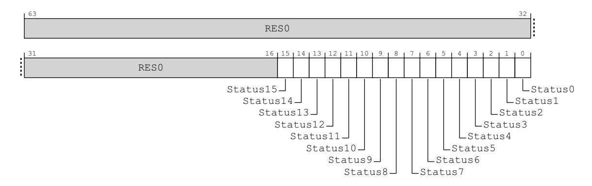

#### **Bits [63:16]**

Reserved, RES0.

#### **Status<n>, bit [n], for n = 15 to 0**

EOI maintenance interrupt status bit for List register <n>:

0b0 List register <n>, [ICH\\_LR<n>\\_EL2](#page-352-1), does not have an EOI maintenance interrupt.

0b1 List register <n>, [ICH\\_LR<n>\\_EL2](#page-352-1), has an EOI maintenance interrupt that has not been handled.

For any [ICH\\_LR<n>\\_EL2](#page-352-1), the corresponding status bit is set to 1 if all of the following are true:

- [ICH\\_LR<n>\\_EL2](#page-352-1).State is 0b00.
- [ICH\\_LR<n>\\_EL2](#page-352-1).HW is 0.
- [ICH\\_LR<n>\\_EL2](#page-352-1).EOI (bit [41]) is 1, indicating that when the interrupt corresponding to that List register is deactivated, a maintenance interrupt is asserted.

Otherwise the status bit takes the value 0.

#### **Accessing ICH\_EISR\_EL2**

Accesses to this register use the following encodings in the System register encoding space:

#### **MRS <Xt>, ICH\_EISR\_EL2**

| op0  | op1   | CRn    | CRm    | op2   |
|------|-------|--------|--------|-------|
| 0b11 | 0b100 | 0b1100 | 0b1011 | 0b011 |

```
if PSTATE.EL == EL0 then
    UNDEFINED;
elsif PSTATE.EL == EL1 then
    if EffectiveHCR_EL2_NVx() IN {'xx1'} then
        AArch64.SystemAccessTrap(EL2, 0x18);
    else
        UNDEFINED;
elsif PSTATE.EL == EL2 then
    if ICC_SRE_EL2.SRE == '0' then
        AArch64.SystemAccessTrap(EL2, 0x18);
    else
        X[t, 64] = ICH_EISR_EL2;
elsif PSTATE.EL == EL3 then
    if ICC_SRE_EL3.SRE == '0' then
        AArch64.SystemAccessTrap(EL3, 0x18);
    else
        X[t, 64] = ICH_EISR_EL2;
```

#### <span id="page-345-1"></span><span id="page-345-0"></span>**12.4.4 ICH\_ELRSR\_EL2, Interrupt Controller Empty List Register Status Register**

The ICH\_ELRSR\_EL2 characteristics are:

#### **Purpose**

These registers can be used to locate a usable List register when the hypervisor is delivering an interrupt to a VM.

#### **Configurations**

AArch64 System register ICH\_ELRSR\_EL2 bits [31:0] are architecturally mapped to AArch32 System register [ICH\\_ELRSR\[](#page-508-0)31:0].

This register is present only when FEAT\_GICv3 is implemented and (EL2 is implemented or EL3 is implemented). Otherwise, direct accesses to ICH\_ELRSR\_EL2 are UNDEFINED.

If EL2 is not implemented, this register is RES0 from EL3.

This register has no effect if EL2 is not enabled in the current Security state.

#### **Attributes**

ICH\_ELRSR\_EL2 is a 64-bit register.

#### **Field descriptions**

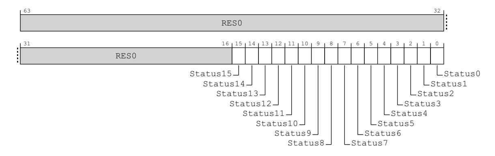

#### **Bits [63:16]**

Reserved, RES0.

#### **Status<n>, bit [n], for n = 15 to 0**

Status bit for List register <n>, [ICH\\_LR<n>\\_EL2](#page-352-1):

0b0 List register [ICH\\_LR<n>\\_EL2](#page-352-1), if implemented, contains a valid interrupt. Using this List register can result in overwriting a valid interrupt.

0b1 List register [ICH\\_LR<n>\\_EL2](#page-352-1) does not contain a valid interrupt. The List register is empty and can be used without overwriting a valid interrupt or losing an EOI maintenance interrupt.

For any List register <n>, the corresponding status bit is set to 1 if [ICH\\_LR<n>\\_EL2.](#page-352-1)State is 0b00 and either [ICH\\_LR<n>\\_EL2](#page-352-1).HW is 1 or [ICH\\_LR<n>\\_EL2](#page-352-1).EOI (bit [41]) is 0.

Otherwise the status bit takes the value 0.

#### **Accessing ICH\_ELRSR\_EL2**

Accesses to this register use the following encodings in the System register encoding space:

#### **MRS <Xt>, ICH\_ELRSR\_EL2**

| op0  | op1   | CRn    | CRm    | op2   |
|------|-------|--------|--------|-------|
| 0b11 | 0b100 | 0b1100 | 0b1011 | 0b101 |

```
if PSTATE.EL == EL0 then
    UNDEFINED;
elsif PSTATE.EL == EL1 then
    if EffectiveHCR_EL2_NVx() IN {'xx1'} then
        AArch64.SystemAccessTrap(EL2, 0x18);
    else
        UNDEFINED;
elsif PSTATE.EL == EL2 then
    if ICC_SRE_EL2.SRE == '0' then
        AArch64.SystemAccessTrap(EL2, 0x18);
    else
        X[t, 64] = ICH_ELRSR_EL2;
elsif PSTATE.EL == EL3 then
    if ICC_SRE_EL3.SRE == '0' then
        AArch64.SystemAccessTrap(EL3, 0x18);
    else
        X[t, 64] = ICH_ELRSR_EL2;
```

#### <span id="page-347-1"></span><span id="page-347-0"></span>**12.4.5 ICH\_HCR\_EL2, Interrupt Controller Hyp Control Register**

The ICH\_HCR\_EL2 characteristics are:

#### **Purpose**

Controls the environment for VMs.

#### **Configurations**

AArch64 System register ICH\_HCR\_EL2 bits [31:0] are architecturally mapped to AArch32 System register [ICH\\_HCR](#page-510-0)[31:0].

This register is present only when FEAT\_GICv3 is implemented and (EL2 is implemented or EL3 is implemented). Otherwise, direct accesses to ICH\_HCR\_EL2 are UNDEFINED.

If EL2 is not implemented, this register is RES0 from EL3.

This register has no effect if EL2 is not enabled in the current Security state.

#### **Attributes**

ICH\_HCR\_EL2 is a 64-bit register.

#### **Field descriptions**

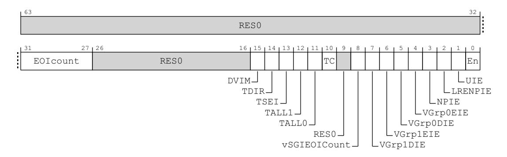

#### **Bits [63:32]**

Reserved, RES0.

#### **EOIcount, bits [31:27]**

This field is incremented whenever a successful write to a virtual EOIR or DIR register would have resulted in a virtual interrupt deactivation. That is either:

- A virtual write to EOIR with a valid interrupt identifier that is not in the LPI range (that is < 8192) when EOI mode is zero and no List Register was found.
- A virtual write to DIR with a valid interrupt identifier that is not in the LPI range (that is < 8192) when EOI mode is one and no List Register was found.

This allows software to manage more active interrupts than there are implemented List Registers.

It is CONSTRAINED UNPREDICTABLE whether a virtual write to EOIR that does not clear a bit in the Active Priorities registers [\(ICH\\_AP0R<n>\\_EL2/](#page-335-1)[ICH\\_AP1R<n>\\_EL2\)](#page-339-1) increments EOIcount. Permitted behaviors are:

- Increment EOIcount.
- Leave EOIcount unchanged.

The reset behavior of this field is:

• On a Warm reset, this field resets to 0.

#### **Bits [26:16]**

Reserved, RES0.

#### **DVIM, bit [15]**

#### *When ICH\_VTR\_EL2.DVIM == 1:*

Directly-injected Virtual Interrupt Mask.

0b0 This control has no effect on the signaling of virtual interrupts.

0b1 Virtual interrupts received via direct-injection are not presented to the virtual CPU interface and not considered when determining the highest priority pending virtual interrupt.

The reset behavior of this field is:

• On a Warm reset, this field resets to 0.

#### *Otherwise:*

Reserved, RES0.

#### **TDIR, bit [14]**

#### *When FEAT\_GICv3\_TDIR is implemented:*

Trap EL1 writes to [ICC\\_DIR\\_EL1](#page-242-1) and [ICV\\_DIR\\_EL1.](#page-307-1)

0b0 EL1 writes of [ICC\\_DIR\\_EL1](#page-242-1) and [ICV\\_DIR\\_EL1](#page-307-1) are not trapped to EL2, unless trapped by other mechanisms.

0b1 EL1 writes of [ICV\\_DIR\\_EL1](#page-307-1) are trapped to EL2. It is IMPLEMENTATION DEFINED whether writes of [ICC\\_DIR\\_EL1](#page-242-1) are trapped. Not trapping [ICC\\_DIR\\_EL1](#page-242-1) writes is DEPRECATED.

Arm deprecates not including this trap bit.

The reset behavior of this field is:

• On a Warm reset, this field resets to 0.

#### *Otherwise:*

Reserved, RES0.

#### **TSEI, bit [13]**

Trap all locally generated SEIs. This bit allows the hypervisor to intercept locally generated SEIs that would otherwise be taken at EL1.

0b0 Locally generated SEIs do not cause a trap to EL2.

0b1 Locally generated SEIs trap to EL2.

If [ICH\\_VTR\\_EL2](#page-364-1).SEIS is 0, this bit is RES0.

The reset behavior of this field is:

• On a Warm reset, this field resets to 0.

#### **TALL1, bit [12]**

Trap all EL1 accesses to ICC\_\* and ICV\_\* System registers for Group 1 interrupts to EL2.

0b0 EL1 accesses to ICC\_\* and ICV\_\* registers for Group 1 interrupts proceed as normal.

0b1 EL1 accesses to ICC\_\* and ICV\_\* registers for Group 1 interrupts trap to EL2.

The reset behavior of this field is:

• On a Warm reset, this field resets to 0.

#### **TALL0, bit [11]**

Trap all EL1 accesses to ICC\_\* and ICV\_\* System registers for Group 0 interrupts to EL2.

0b0 EL1 accesses to ICC\_\* and ICV\_\* registers for Group 0 interrupts proceed as normal.

0b1 EL1 accesses to ICC\_\* and ICV\_\* registers for Group 0 interrupts trap to EL2.

The reset behavior of this field is:

• On a Warm reset, this field resets to 0.

#### **TC, bit [10]**

Trap all EL1 accesses to System registers that are common to Group 0 and Group 1 to EL2.

0b0 EL1 accesses to common registers proceed as normal.

0b1 EL1 accesses to common registers trap to EL2.

This affects accesses to [ICC\\_SGI0R\\_EL1,](#page-272-1) [ICC\\_SGI1R\\_EL1](#page-275-1), [ICC\\_ASGI1R\\_EL1,](#page-222-1) [ICC\\_CTLR\\_EL1,](#page-232-1) [ICC\\_DIR\\_EL1,](#page-242-1) [ICC\\_PMR\\_EL1,](#page-266-1) [ICC\\_RPR\\_EL1,](#page-269-1) [ICV\\_CTLR\\_EL1](#page-302-1), [ICV\\_DIR\\_EL1,](#page-307-1) [ICV\\_PMR\\_EL1,](#page-329-1) and [ICV\\_RPR\\_EL1](#page-332-1).

The reset behavior of this field is:

• On a Warm reset, this field resets to 0.

#### **Bit [9]**

Reserved, RES0.

#### **vSGIEOICount, bit [8]**

#### *When FEAT\_GICv4p1 is implemented:*

Controls whether deactivation of virtual SGIs can increment ICH\_HCR\_EL2.EOIcount

0b0 Deactivation of virtual SGIs can increment ICH\_HCR\_EL2.EOIcount.

0b1 Deactivation of virtual SGIs does not increment ICH\_HCR\_EL2.EOIcount.

The reset behavior of this field is:

• On a Warm reset, this field resets to 0.

#### *Otherwise:*

Reserved, RES0.

#### **VGrp1DIE, bit [7]**

VM Group 1 Disabled Interrupt Enable. Enables the signaling of a maintenance interrupt while signaling of Group 1 interrupts from the virtual CPU interface to the connected vPE is disabled:

0b0 Maintenance interrupt disabled.

0b1 Maintenance interrupt signaled when [ICH\\_VMCR\\_EL2.](#page-360-1)VENG1 is 0.

The reset behavior of this field is:

• On a Warm reset, this field resets to 0.

#### **VGrp1EIE, bit [6]**

VM Group 1 Enabled Interrupt Enable. Enables the signaling of a maintenance interrupt while signaling of Group 1 interrupts from the virtual CPU interface to the connected vPE is enabled:

0b0 Maintenance interrupt disabled.

0b1 Maintenance interrupt signaled when [ICH\\_VMCR\\_EL2.](#page-360-1)VENG1 is 1.

The reset behavior of this field is:

• On a Warm reset, this field resets to 0.

#### **VGrp0DIE, bit [5]**

VM Group 0 Disabled Interrupt Enable. Enables the signaling of a maintenance interrupt while signaling of Group 0 interrupts from the virtual CPU interface to the connected vPE is disabled:

0b0 Maintenance interrupt disabled.

0b1 Maintenance interrupt signaled when [ICH\\_VMCR\\_EL2.](#page-360-1)VENG0 is 0.

The reset behavior of this field is:

• On a Warm reset, this field resets to 0.

#### **VGrp0EIE, bit [4]**

VM Group 0 Enabled Interrupt Enable. Enables the signaling of a maintenance interrupt while signaling of Group 0 interrupts from the virtual CPU interface to the connected vPE is enabled:

0b0 Maintenance interrupt disabled.

0b1 Maintenance interrupt signaled when [ICH\\_VMCR\\_EL2.](#page-360-1)VENG0 is 1.

The reset behavior of this field is:

• On a Warm reset, this field resets to 0.

#### **NPIE, bit [3]**

No Pending Interrupt Enable. Enables the signaling of a maintenance interrupt when there are no List registers with the State field set to 0b01 (pending):

0b0 Maintenance interrupt disabled.

0b1 Maintenance interrupt signaled while the List registers contain no interrupts in the pending state.

The reset behavior of this field is:

• On a Warm reset, this field resets to 0.

#### **LRENPIE, bit [2]**

List Register Entry Not Present Interrupt Enable. Enables the signaling of a maintenance interrupt while the virtual CPU interface does not have a corresponding valid List register entry for an EOI request:

0b0 Maintenance interrupt disabled.

0b1 Maintenance interrupt is asserted while the EOIcount field is not 0.

The reset behavior of this field is:

• On a Warm reset, this field resets to 0.

#### **UIE, bit [1]**

Underflow Interrupt Enable. Enables the signaling of a maintenance interrupt when the List registers are empty, or hold only one valid entry:

0b0 Maintenance interrupt disabled.

0b1 Maintenance interrupt is asserted if none, or only one, of the List register entries is marked as a valid interrupt.

The reset behavior of this field is:

• On a Warm reset, this field resets to 0.

#### **En, bit [0]**

Enable. Global enable bit for the virtual CPU interface:

0b0 Virtual CPU interface operation disabled.

0b1 Virtual CPU interface operation enabled.

When this field is set to 0:

- The virtual CPU interface does not signal any maintenance interrupts.
- The virtual CPU interface does not signal any virtual interrupts.
- A read of [ICV\\_IAR0\\_EL1,](#page-317-1) [ICV\\_IAR1\\_EL1](#page-319-1), [ICV\\_NMIAR1\\_EL1,](#page-327-0) [GICV\\_IAR](#page-791-0) or [GICV\\_AIAR](#page-776-0) returns a spurious interrupt ID.

| Note |                                                  |
|------|--------------------------------------------------|
|      | This field is RES0 when SCR_EL3.{NS,EEL2}=={0,0} |

The reset behavior of this field is:

• On a Warm reset, this field resets to 0.

#### **Accessing ICH\_HCR\_EL2**

Accesses to this register use the following encodings in the System register encoding space:

#### **MRS <Xt>, ICH\_HCR\_EL2**

| op0  | op1   | CRn    | CRm    | op2   |
|------|-------|--------|--------|-------|
| 0b11 | 0b100 | 0b1100 | 0b1011 | 0b000 |

```
if PSTATE.EL == EL0 then
    UNDEFINED;
elsif PSTATE.EL == EL1 then
    if EffectiveHCR_EL2_NVx() IN {'1x1'} then
        X[t, 64] = NVMem[0x4C0];
    elsif EffectiveHCR_EL2_NVx() IN {'xx1'} then
        AArch64.SystemAccessTrap(EL2, 0x18);
    else
        UNDEFINED;
elsif PSTATE.EL == EL2 then
    if ICC_SRE_EL2.SRE == '0' then
        AArch64.SystemAccessTrap(EL2, 0x18);
    else
        X[t, 64] = ICH_HCR_EL2;
elsif PSTATE.EL == EL3 then
    if ICC_SRE_EL3.SRE == '0' then
        AArch64.SystemAccessTrap(EL3, 0x18);
    else
        X[t, 64] = ICH_HCR_EL2;
```

#### **MSR ICH\_HCR\_EL2, <Xt>**

| op0  | op1   | CRn    | CRm    | op2   |
|------|-------|--------|--------|-------|
| 0b11 | 0b100 | 0b1100 | 0b1011 | 0b000 |

```
if PSTATE.EL == EL0 then
    UNDEFINED;
elsif PSTATE.EL == EL1 then
    if EffectiveHCR_EL2_NVx() IN {'1x1'} then
        NVMem[0x4C0] = X[t, 64];
    elsif EffectiveHCR_EL2_NVx() IN {'xx1'} then
        AArch64.SystemAccessTrap(EL2, 0x18);
    else
        UNDEFINED;
elsif PSTATE.EL == EL2 then
    if ICC_SRE_EL2.SRE == '0' then
        AArch64.SystemAccessTrap(EL2, 0x18);
    else
        ICH_HCR_EL2 = X[t, 64];
elsif PSTATE.EL == EL3 then
    if ICC_SRE_EL3.SRE == '0' then
        AArch64.SystemAccessTrap(EL3, 0x18);
    else
        ICH_HCR_EL2 = X[t, 64];
```

#### <span id="page-352-1"></span><span id="page-352-0"></span>**12.4.6 ICH\_LR<n>\_EL2, Interrupt Controller List Registers, n = 0 - 15**

The ICH\_LR<n>\_EL2 characteristics are:

#### **Purpose**

Provides interrupt context information for the virtual CPU interface.

#### **Configurations**

AArch64 System register ICH\_LR<n>\_EL2 bits [31:0] are architecturally mapped to AArch32 System register [ICH\\_LR<n>](#page-515-0)[31:0].

AArch64 System register ICH\_LR<n>\_EL2 bits [63:32] are architecturally mapped to AArch32 System register [ICH\\_LRC<n>](#page-518-0)[31:0].

This register is present only when FEAT\_GICv3 is implemented and (EL2 is implemented or EL3 is implemented). Otherwise, direct accesses to ICH\_LR<n>\_EL2 are UNDEFINED.

If EL2 is not implemented, this register is RES0 from EL3.

If list register n is not implemented, then accesses to this register are UNDEFINED.

This register has no effect if EL2 is not enabled in the current Security state.

#### **Attributes**

ICH\_LR<n>\_EL2 is a 64-bit register.

#### **Field descriptions**

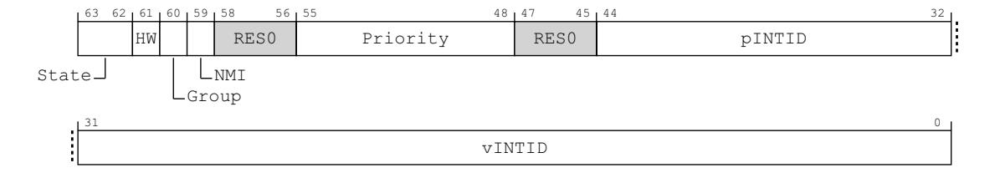

#### **State, bits [63:62]**

The state of the interrupt:

0b00 Invalid (Inactive).

0b01 Pending.

0b10 Active.

0b11 Pending and active.

The GIC updates these state bits as virtual interrupts proceed through the interrupt life cycle. When a virtual interrupt from a List register is acknowledged the state is updated to active (0b10) regardless of the interrupt type.

Entries in the invalid state are ignored, except for the purpose of generating virtual maintenance interrupts.

For hardware interrupts, the pending and active state is held in the physical Distributor rather than the virtual CPU interface. A hypervisor must only use the pending and active state for software originated interrupts, which are typically associated with virtual devices, or SGIs.

The reset behavior of this field is:

• On a Warm reset, this field resets to an architecturally UNKNOWN value.

#### **HW, bit [61]**

Indicates whether this virtual interrupt maps directly to a hardware interrupt, meaning that it corresponds to a physical interrupt. Deactivation of the virtual interrupt also causes the deactivation of the physical interrupt with the ID that the pINTID field indicates.

- 0b0 The interrupt is triggered entirely by software. No notification is sent to the Distributor when the virtual interrupt is deactivated.
- 0b1 The interrupt maps directly to a hardware interrupt.A deactivate interrupt request is sent to the Distributor when the virtual interrupt is deactivated, using the pINTID field from this register to indicate the physical interrupt ID.

If [ICH\\_VMCR\\_EL2](#page-360-1).VEOIM is 0, this request corresponds to a write to [ICC\\_EOIR0\\_EL1](#page-244-1) or [ICC\\_EOIR1\\_EL1](#page-246-1). Otherwise, it corresponds to a write to [ICC\\_DIR\\_EL1.](#page-242-1)

The reset behavior of this field is:

• On a Warm reset, this field resets to an architecturally UNKNOWN value.

#### **Group, bit [60]**

Indicates the group for this virtual interrupt.

- 0b0 This is a Group 0 virtual interrupt. [ICH\\_VMCR\\_EL2](#page-360-1).VFIQEn determines whether it is signaled as a virtual IRQ or as a virtual FIQ, and [ICH\\_VMCR\\_EL2](#page-360-1).VENG0 enables signaling of this interrupt to the virtual machine.
- 0b1 This is a Group 1 virtual interrupt, signaled as a virtual IRQ. [ICH\\_VMCR\\_EL2](#page-360-1).VENG1 enables the signaling of this interrupt to the virtual machine. If [ICH\\_VMCR\\_EL2.](#page-360-1)VCBPR is 0, then [ICC\\_BPR1\\_EL1](#page-228-1) determines if a pending Group 1 interrupt has sufficient priority to preempt current execution. Otherwise, [ICH\\_LR<n>\\_EL2](#page-352-1) determines preemption.

The reset behavior of this field is:

• On a Warm reset, this field resets to an architecturally UNKNOWN value.

#### **NMI, bit [59]**

#### *When FEAT\_GICv3\_NMI is implemented:*

Indicates whether the virtual priority has the non-maskable property.

0b0 vINTID does not have the non-maskable interrupt property.

0b1 vINTID has the non-maskable interrupt property.

Setting ICH\_LR<n>\_EL2.NMI to 1 when ICH\_LR<n>\_EL2.State is not Invalid is CONSTRAINTED UNPREDICTABLE if either ICH\_LR<n>\_EL2.vINTID indicates an LPI or ICH\_LR<n>\_EL2.Group is 0.

The permitted behaviors are:

- ICH\_LR<n>\_EL2.NMI is treated as 0 for all purposes other than a direct read of the register.
- The virtual interrupt is presented with superpriority.

The reset behavior of this field is:

• On a Warm reset, this field resets to an architecturally UNKNOWN value.

#### *Otherwise:*

Reserved, RES0.

#### **Bits [58:56]**

Reserved, RES0.

#### **Priority, bits [55:48]**

The priority of this interrupt.

It is IMPLEMENTATION DEFINED how many bits of priority are implemented, though at least five bits must be implemented. Unimplemented bits are RES0 and start from bit[48] up to bit[50]. The number of implemented bits can be discovered from [ICH\\_VTR\\_EL2](#page-364-1).PRIbits.

When ICH\_LR<n>\_EL2.NMI is set to 1, this field is RES0 and the virtual interrupt's priority is treated as 0x00.

The reset behavior of this field is:

• On a Warm reset, this field resets to an architecturally UNKNOWN value.

#### **Bits [47:45]**

Reserved, RES0.

#### **pINTID, bits [44:32]**

Physical INTID, for hardware interrupts.

When ICH\_LR<n>\_EL2.HW is 0 (there is no corresponding physical interrupt), this field has the following meaning:

- Bits[44:42]: RES0.
- Bit[41]: EOI. If this bit is 1, then when the interrupt identified by vINTID is deactivated, a maintenance interrupt is asserted.
- Bits[40:32]: RES0.

When ICH\_LR<n>\_EL2.HW is 1 (there is a corresponding physical interrupt):

- This field indicates the physical INTID. This field is only required to implement enough bits to hold a valid value for the implemented INTID size. Any unused higher order bits are RES0.
- When [ICC\\_CTLR\\_EL1](#page-232-1).ExtRange is 0, then bits[44:42] of this field are RES0.
- If the value of pINTID is not a valid INTID, behavior is UNPREDICTABLE. If the value of pINTID indicates a PPI, this field applies to the PPI associated with this same physical PE ID as the virtual CPU interface requesting the deactivation.

A hardware physical identifier is only required in List Registers for interrupts that require deactivation. This means only 13 bits of Physical INTID are required, regardless of the number specified by [ICC\\_CTLR\\_EL1](#page-232-1).IDbits.

The reset behavior of this field is:

• On a Warm reset, this field resets to an architecturally UNKNOWN value.

#### **vINTID, bits [31:0]**

Virtual INTID of the interrupt.

If the value of vINTID is 1020-1023 and ICH\_LR<n>\_EL2.State!=0b00 (Inactive), behavior is UNPREDICTABLE.

Behavior is UNPREDICTABLE if two or more List Registers specify the same vINTID when:

- ICH\_LR<n>\_EL2.State == 0b01.
- ICH\_LR<n>\_EL2.State == 0b10.
- ICH\_LR<n>\_EL2.State == 0b11.

It is IMPLEMENTATION DEFINED how many bits are implemented, though at least 16 bits must be implemented. Unimplemented bits are RES0. The number of implemented bits can be discovered from [ICH\\_VTR\\_EL2.](#page-364-1)IDbits.

When [ICC\\_SRE\\_EL1.](#page-278-1)SRE == 0, specifying a vINTID in the LPI range is UNPREDICTABLE

| Note |  |
|------|--|
|      |  |

When a VM is using memory-mapped access to the GIC, software must ensure that the correct source PE ID is provided in bits[12:10].

The reset behavior of this field is:

• On a Warm reset, this field resets to an architecturally UNKNOWN value.

#### **Accessing ICH\_LR<n>\_EL2**

Accesses to this register use the following encodings in the System register encoding space:

#### **MRS <Xt>, ICH\_LR<m>\_EL2; Where m = 0-15**

| op0  | op1   | CRn    | CRm        | op2    |
|------|-------|--------|------------|--------|
| 0b11 | 0b100 | 0b1100 | 0b110:m[3] | m[2:0] |

```
integer m = UInt(CRm<0>:op2<2:0>);
if m >= NUM_GIC_LIST_REGS then
    UNDEFINED;
elsif PSTATE.EL == EL0 then
    UNDEFINED;
elsif PSTATE.EL == EL1 then
    if EffectiveHCR_EL2_NVx() IN {'1x1'} then
        X[t, 64] = NVMem[0x400 + (8 * m)];
    elsif EffectiveHCR_EL2_NVx() IN {'xx1'} then
        AArch64.SystemAccessTrap(EL2, 0x18);
    else
        UNDEFINED;
elsif PSTATE.EL == EL2 then
    if ICC_SRE_EL2.SRE == '0' then
        AArch64.SystemAccessTrap(EL2, 0x18);
    else
        X[t, 64] = ICH_LR_EL2[m];
elsif PSTATE.EL == EL3 then
    if ICC_SRE_EL3.SRE == '0' then
        AArch64.SystemAccessTrap(EL3, 0x18);
    else
        X[t, 64] = ICH_LR_EL2[m];
```

#### **MSR ICH\_LR<m>\_EL2, <Xt>; Where m = 0-15**

| op0  | op1   | CRn    | CRm        | op2    |
|------|-------|--------|------------|--------|
| 0b11 | 0b100 | 0b1100 | 0b110:m[3] | m[2:0] |

```
integer m = UInt(CRm<0>:op2<2:0>);
if m >= NUM_GIC_LIST_REGS then
    UNDEFINED;
elsif PSTATE.EL == EL0 then
    UNDEFINED;
elsif PSTATE.EL == EL1 then
    if EffectiveHCR_EL2_NVx() IN {'1x1'} then
        NVMem[0x400 + (8 * m)] = X[t, 64];
    elsif EffectiveHCR_EL2_NVx() IN {'xx1'} then
        AArch64.SystemAccessTrap(EL2, 0x18);
    else
        UNDEFINED;
elsif PSTATE.EL == EL2 then
    if ICC_SRE_EL2.SRE == '0' then
        AArch64.SystemAccessTrap(EL2, 0x18);
    else
        ICH_LR_EL2[m] = X[t, 64];
```

elsif PSTATE.EL == EL3 then if ICC\_SRE\_EL3.SRE == '0' then AArch64.SystemAccessTrap(EL3, 0x18); else ICH\_LR\_EL2[m] = X[t, 64];

#### <span id="page-357-1"></span><span id="page-357-0"></span>**12.4.7 ICH\_MISR\_EL2, Interrupt Controller Maintenance Interrupt State Register**

The ICH\_MISR\_EL2 characteristics are:

#### **Purpose**

Indicates which maintenance interrupts are asserted.

#### **Configurations**

AArch64 System register ICH\_MISR\_EL2 bits [31:0] are architecturally mapped to AArch32 System register [ICH\\_MISR\[](#page-522-0)31:0].

This register is present only when FEAT\_GICv3 is implemented and (EL2 is implemented or EL3 is implemented). Otherwise, direct accesses to ICH\_MISR\_EL2 are UNDEFINED.

If EL2 is not implemented, this register is RES0 from EL3.

This register has no effect if EL2 is not enabled in the current Security state.

#### **Attributes**

ICH\_MISR\_EL2 is a 64-bit register.

#### **Field descriptions**

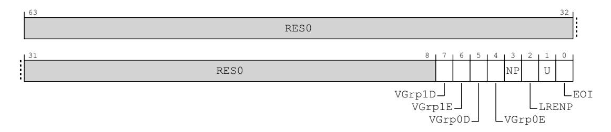

#### **Bits [63:8]**

Reserved, RES0.

#### **VGrp1D, bit [7]**

vPE Group 1 Disabled.

0b0 vPE Group 1 Disabled maintenance interrupt not asserted.

0b1 vPE Group 1 Disabled maintenance interrupt asserted.

This maintenance interrupt is asserted when [ICH\\_HCR\\_EL2.](#page-347-1)VGrp1DIE==1 and [ICH\\_VMCR\\_EL2](#page-360-1).VENG1==is 0.

The reset behavior of this field is:

• On a Warm reset, this field resets to 0.

#### **VGrp1E, bit [6]**

vPE Group 1 Enabled.

0b0 vPE Group 1 Enabled maintenance interrupt not asserted.

0b1 vPE Group 1 Enabled maintenance interrupt asserted.

This maintenance interrupt is asserted when [ICH\\_HCR\\_EL2.](#page-347-1)VGrp1EIE==1 and [ICH\\_VMCR\\_EL2](#page-360-1).VENG1==is 1.

The reset behavior of this field is:

• On a Warm reset, this field resets to 0.

#### **VGrp0D, bit [5]**

vPE Group 0 Disabled.

0b0 vPE Group 0 Disabled maintenance interrupt not asserted.

0b1 vPE Group 0 Disabled maintenance interrupt asserted.

This maintenance interrupt is asserted when [ICH\\_HCR\\_EL2.](#page-347-1)VGrp0DIE==1 and [ICH\\_VMCR\\_EL2](#page-360-1).VENG0==0.

The reset behavior of this field is:

• On a Warm reset, this field resets to 0.

#### **VGrp0E, bit [4]**

vPE Group 0 Enabled.

0b0 vPE Group 0 Enabled maintenance interrupt not asserted.

0b1 vPE Group 0 Enabled maintenance interrupt asserted.

This maintenance interrupt is asserted when [ICH\\_HCR\\_EL2.](#page-347-1)VGrp0EIE==1 and [ICH\\_VMCR\\_EL2](#page-360-1).VENG0==1.

The reset behavior of this field is:

• On a Warm reset, this field resets to 0.

#### **NP, bit [3]**

No Pending.

0b0 No Pending maintenance interrupt not asserted.

0b1 No Pending maintenance interrupt asserted.

This maintenance interrupt is asserted when [ICH\\_HCR\\_EL2.](#page-347-1)NPIE==1 and no List register is in pending state.

The reset behavior of this field is:

• On a Warm reset, this field resets to 0.

#### **LRENP, bit [2]**

List Register Entry Not Present.

0b0 List Register Entry Not Present maintenance interrupt not asserted.

0b1 List Register Entry Not Present maintenance interrupt asserted.

This maintenance interrupt is asserted when [ICH\\_HCR\\_EL2.](#page-347-1)LRENPIE==1 and [ICH\\_HCR\\_EL2](#page-347-1).EOIcount is nonzero.

The reset behavior of this field is:

• On a Warm reset, this field resets to 0.

#### **U, bit [1]**

Underflow.

0b0 Underflow maintenance interrupt not asserted.

0b1 Underflow maintenance interrupt asserted.

This maintenance interrupt is asserted when [ICH\\_HCR\\_EL2.](#page-347-1)UIE==1 and zero or one of the List register entries are marked as a valid interrupt, that is, if the corresponding [ICH\\_LR<n>\\_EL2](#page-352-1).State bits do not equal 0x0.

The reset behavior of this field is:

• On a Warm reset, this field resets to 0.

#### **EOI, bit [0]**

End Of Interrupt.

0b0 End Of Interrupt maintenance interrupt not asserted.

0b1 End Of Interrupt maintenance interrupt asserted.

This maintenance interrupt is asserted when at least one bit in [ICH\\_EISR\\_EL2](#page-343-1) is 1.

The reset behavior of this field is:

• On a Warm reset, this field resets to 0.

The U and NP bits do not include the status of any pending/active *[VSet \(IRI\) on page](#page-909-0) A-910* packets because these bits control generation of interrupts that allow software management of the contents of the List Registers (which are not affected by *[VSet \(IRI\) on page](#page-909-0) A-910* packets).

#### **Accessing ICH\_MISR\_EL2**

Accesses to this register use the following encodings in the System register encoding space:

**MRS <Xt>, ICH\_MISR\_EL2**

| op0  | op1   | CRn    | CRm    | op2   |
|------|-------|--------|--------|-------|
| 0b11 | 0b100 | 0b1100 | 0b1011 | 0b010 |

```
if PSTATE.EL == EL0 then
    UNDEFINED;
elsif PSTATE.EL == EL1 then
    if EffectiveHCR_EL2_NVx() IN {'xx1'} then
        AArch64.SystemAccessTrap(EL2, 0x18);
    else
        UNDEFINED;
elsif PSTATE.EL == EL2 then
    if ICC_SRE_EL2.SRE == '0' then
        AArch64.SystemAccessTrap(EL2, 0x18);
    else
        X[t, 64] = ICH_MISR_EL2;
elsif PSTATE.EL == EL3 then
    if ICC_SRE_EL3.SRE == '0' then
        AArch64.SystemAccessTrap(EL3, 0x18);
    else
        X[t, 64] = ICH_MISR_EL2;
```

#### <span id="page-360-1"></span><span id="page-360-0"></span>**12.4.8 ICH\_VMCR\_EL2, Interrupt Controller Virtual Machine Control Register**

The ICH\_VMCR\_EL2 characteristics are:

#### **Purpose**

Enables the hypervisor to save and restore the virtual machine view of the GIC state.

#### **Configurations**

AArch64 System register ICH\_VMCR\_EL2 bits [31:0] are architecturally mapped to AArch32 System register [ICH\\_VMCR\[](#page-525-0)31:0].

This register is present only when FEAT\_GICv3 is implemented and (EL2 is implemented or EL3 is implemented). Otherwise, direct accesses to ICH\_VMCR\_EL2 are UNDEFINED.

If EL2 is not implemented, this register is RES0 from EL3.

This register has no effect if EL2 is not enabled in the current Security state.

#### **Attributes**

ICH\_VMCR\_EL2 is a 64-bit register.

#### **Field descriptions**

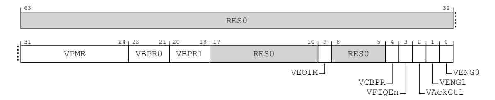

#### **Bits [63:32]**

Reserved, RES0.

#### **VPMR, bits [31:24]**

Virtual Priority Mask. The priority mask level for the virtual CPU interface. If the priority of a pending virtual interrupt is higher than the value indicated by this field, the interface signals the virtual interrupt to the PE.

This field is an alias of [ICV\\_PMR\\_EL1](#page-329-1).Priority.

#### **VBPR0, bits [23:21]**

Virtual Binary Point Register, Group 0. Defines the point at which the priority value fields split into two parts, the group priority field and the subpriority field. The group priority field determines Group 0 interrupt preemption, and also determines Group 1 interrupt preemption if ICH\_VMCR\_EL2.VCBPR == 1.

This field is an alias of [ICV\\_BPR0\\_EL1.](#page-296-1)BinaryPoint.

The minimum value of this field is determined by [ICH\\_VTR\\_EL2.](#page-364-1)PREbits. An attempt to program the binary point field to a value less than the minimum value sets the field to the minimum value.

#### **VBPR1, bits [20:18]**

Virtual Binary Point Register, Group 1. Defines the point at which the priority value fields split into two parts, the group priority field and the subpriority field. The group priority field determines Group 1 interrupt preemption if [ICH\\_VMCR\\_EL2.](#page-360-1)VCBPR == 0.

This field is an alias of [ICV\\_BPR1\\_EL1.](#page-299-1)BinaryPoint.

This field is always accessible to EL2 accesses, regardless of the setting of the ICH\_VMCR\_EL2.VCBPR field.

For Non-secure writes, the minimum value of this field is the minimum value of ICH\_VMCR\_EL2.VBPR0 plus one.

For Secure writes, the minimum value of this field is the minimum value of ICH\_VMCR\_EL2.VBPR0.

An attempt to program the binary point field to a value less than the minimum value sets the field to the minimum value.

#### **Bits [17:10]**

Reserved, RES0.

#### **VEOIM, bit [9]**

Virtual EOI mode. Controls whether a write to an End of Interrupt register also deactivates the virtual interrupt:

0b0 [ICV\\_EOIR0\\_EL1](#page-309-1) and [ICV\\_EOIR1\\_EL1](#page-311-1) provide both priority drop and interrupt deactivation functionality. Accesses to [ICV\\_DIR\\_EL1](#page-307-1) are UNPREDICTABLE.

0b1 [ICV\\_EOIR0\\_EL1](#page-309-1) and [ICV\\_EOIR1\\_EL1](#page-311-1) provide priority drop functionality only. [ICV\\_DIR\\_EL1](#page-307-1) provides interrupt deactivation functionality.

This bit is an alias of [ICV\\_CTLR\\_EL1](#page-302-1).EOImode.

#### **Bits [8:5]**

Reserved, RES0.

#### **VCBPR, bit [4]**

Virtual Common Binary Point Register. Possible values of this bit are:

0b0 [ICV\\_BPR1\\_EL1](#page-299-1) determines the preemption group for virtual Group 1 interrupts.

0b1 Reads of [ICV\\_BPR1\\_EL1](#page-299-1) return [ICV\\_BPR0\\_EL1](#page-296-1) plus one, saturated to 0b111. Writes to [ICV\\_BPR1\\_EL1](#page-299-1) are ignored.

This field is an alias of [ICV\\_CTLR\\_EL1](#page-302-1).CBPR.

#### **VFIQEn, bit [3]**

Virtual FIQ enable. Possible values of this bit are:

0b0 Group 0 virtual interrupts are presented as virtual IRQs.

0b1 Group 0 virtual interrupts are presented as virtual FIQs.

This bit is an alias of [GICV\\_CTLR.](#page-782-1)FIQEn.

In implementations where the Non-secure copy of [ICC\\_SRE\\_EL1](#page-278-1).SRE is always 1, this bit is RES1.

#### **VAckCtl, bit [2]**

Virtual AckCtl. Possible values of this bit are:

0b0 If the highest priority pending interrupt is Group 1, a read of [GICV\\_IAR](#page-791-0) or

[GICV\\_HPPIR](#page-789-0) returns an INTID of 1022.

0b1 If the highest priority pending interrupt is Group 1, a read of [GICV\\_IAR](#page-791-0) or [GICV\\_HPPIR](#page-789-0) returns the INTID of the corresponding interrupt.

This bit is an alias of [GICV\\_CTLR.](#page-782-1)AckCtl.

This field is supported for backwards compatibility with GICv2. Arm deprecates the use of this field.

In implementations where the Non-secure copy of [ICC\\_SRE\\_EL1](#page-278-1).SRE is always 1, this bit is RES0.

#### **VENG1, bit [1]**

Virtual Group 1 interrupt enable. Possible values of this bit are:

0b0 Virtual Group 1 interrupts are disabled.

0b1 Virtual Group 1 interrupts are enabled.

This bit is an alias of [ICV\\_IGRPEN1\\_EL1](#page-324-1).Enable.

#### **VENG0, bit [0]**

Virtual Group 0 interrupt enable. Possible values of this bit are:

0b0 Virtual Group 0 interrupts are disabled. 0b1 Virtual Group 0 interrupts are enabled. This bit is an alias of [ICV\\_IGRPEN0\\_EL1](#page-321-1).Enable.

#### **Accessing ICH\_VMCR\_EL2**

When EL2 is using System register access, EL1 using either System register or memory-mapped access must be supported.

Accesses to this register use the following encodings in the System register encoding space:

#### **MRS <Xt>, ICH\_VMCR\_EL2**

| op0  | op1   | CRn    | CRm    | op2   |
|------|-------|--------|--------|-------|
| 0b11 | 0b100 | 0b1100 | 0b1011 | 0b111 |

```
if PSTATE.EL == EL0 then
    UNDEFINED;
elsif PSTATE.EL == EL1 then
    if EffectiveHCR_EL2_NVx() IN {'1x1'} then
        X[t, 64] = NVMem[0x4C8];
    elsif EffectiveHCR_EL2_NVx() IN {'xx1'} then
        AArch64.SystemAccessTrap(EL2, 0x18);
    else
        UNDEFINED;
elsif PSTATE.EL == EL2 then
    if ICC_SRE_EL2.SRE == '0' then
        AArch64.SystemAccessTrap(EL2, 0x18);
    else
        X[t, 64] = ICH_VMCR_EL2;
elsif PSTATE.EL == EL3 then
    if ICC_SRE_EL3.SRE == '0' then
        AArch64.SystemAccessTrap(EL3, 0x18);
    else
        X[t, 64] = ICH_VMCR_EL2;
```

#### **MSR ICH\_VMCR\_EL2, <Xt>**

| op0  | op1   | CRn    | CRm    | op2   |
|------|-------|--------|--------|-------|
| 0b11 | 0b100 | 0b1100 | 0b1011 | 0b111 |

```
if PSTATE.EL == EL0 then
    UNDEFINED;
elsif PSTATE.EL == EL1 then
    if EffectiveHCR_EL2_NVx() IN {'1x1'} then
        NVMem[0x4C8] = X[t, 64];
    elsif EffectiveHCR_EL2_NVx() IN {'xx1'} then
        AArch64.SystemAccessTrap(EL2, 0x18);
    else
        UNDEFINED;
elsif PSTATE.EL == EL2 then
```

```
if ICC_SRE_EL2.SRE == '0' then
        AArch64.SystemAccessTrap(EL2, 0x18);
    else
        ICH_VMCR_EL2 = X[t, 64];
elsif PSTATE.EL == EL3 then
    if ICC_SRE_EL3.SRE == '0' then
        AArch64.SystemAccessTrap(EL3, 0x18);
    else
        ICH_VMCR_EL2 = X[t, 64];
```

#### <span id="page-364-1"></span><span id="page-364-0"></span>**12.4.9 ICH\_VTR\_EL2, Interrupt Controller VGIC Type Register**

The ICH\_VTR\_EL2 characteristics are:

#### **Purpose**

Reports supported GIC virtualization features.

#### **Configurations**

AArch64 System register ICH\_VTR\_EL2 bits [31:0] are architecturally mapped to AArch32 System register [ICH\\_VTR\[](#page-529-0)31:0].

This register is present only when FEAT\_GICv3 is implemented and (EL2 is implemented or EL3 is implemented). Otherwise, direct accesses to ICH\_VTR\_EL2 are UNDEFINED.

If EL2 is not implemented, all bits in this register are RES0 from EL3, except for nV4, which is RES1 from EL3.

This register has no effect if EL2 is not enabled in the current Security state.

#### **Attributes**

ICH\_VTR\_EL2 is a 64-bit register.

#### **Field descriptions**

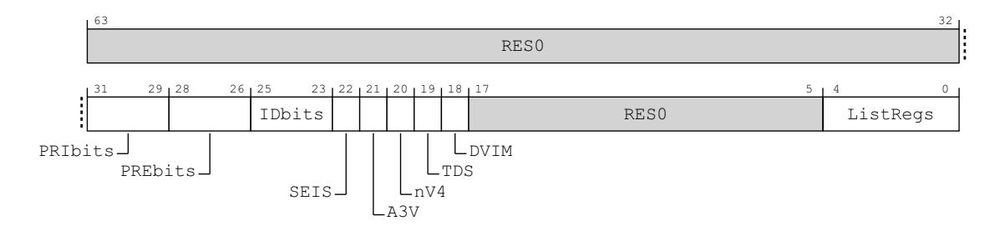

#### **Bits [63:32]**

Reserved, RES0.

#### **PRIbits, bits [31:29]**

Priority bits. Indicates the number of virtual priority bits implemented, minus one.

An implementation must implement at least 32 levels of virtual priority (5 priority bits).

This field is an alias of [ICV\\_CTLR\\_EL1](#page-302-1).PRIbits.

The value of this field is an IMPLEMENTATION DEFINED choice of:

0b100..0b110 The number of virtual priority bits implemented, minus one.

Access to this field is RO.

#### **PREbits, bits [28:26]**

Preemption bits. Indicates the number of virtual preemption bits implemented, minus one.

An implementation must implement at least 32 levels of virtual preemption priority (5 preemption bits).

The value of this field must be less than or equal to the value of ICH\_VTR\_EL2.PRIbits.

This field determines the minimum value of [ICH\\_VMCR\\_EL2.](#page-360-1)VBPR0.

The value of this field is an IMPLEMENTATION DEFINED choice of:

0b000..0b110 The number of virtual preemption bits implemented, minus one.

Access to this field is RO.

#### **IDbits, bits [25:23]**

The number of virtual interrupt identifier bits supported:

The value of this field is an IMPLEMENTATION DEFINED choice of:

0b000 16 bits. 0b001 24 bits.

All other values are reserved.

This field is an alias of [ICV\\_CTLR\\_EL1](#page-302-1).IDbits.

Access to this field is RO.

#### **SEIS, bit [22]**

SEI Support. Indicates whether the virtual CPU interface supports generation of SEIs:

The value of this field is an IMPLEMENTATION DEFINED choice of:

0b0 The virtual CPU interface logic does not support generation of SEIs.

0b1 The virtual CPU interface logic supports generation of SEIs.

This bit is an alias of [ICV\\_CTLR\\_EL1](#page-302-1).SEIS.

Access to this field is RO.

#### **A3V, bit [21]**

Affinity 3 Valid.

The value of this field is an IMPLEMENTATION DEFINED choice of:

0b0 The virtual CPU interface logic only supports zero values of Affinity 3 in SGI

generation System registers.

0b1 The virtual CPU interface logic supports nonzero values of Affinity 3 in SGI generation

System registers.

This bit is an alias of [ICV\\_CTLR\\_EL1](#page-302-1).A3V.

Access to this field is RO.

#### **nV4, bit [20]**

Direct injection of virtual interrupts not supported.

The value of this field is an IMPLEMENTATION DEFINED choice of:

0b0 The CPU interface logic supports direct injection of virtual interrupts.

0b1 The CPU interface logic does not support direct injection of virtual interrupts.

In GICv3, the only permitted value is 0b1.

Access to this field is RO.

#### **TDS, bit [19]**

Separate trapping of EL1 writes to [ICV\\_DIR\\_EL1](#page-307-1) supported.

The value of this field is an IMPLEMENTATION DEFINED choice of:

0b0 Implementation does not support [ICH\\_HCR\\_EL2.](#page-347-1)TDIR.

0b1 Implementation supports [ICH\\_HCR\\_EL2.](#page-347-1)TDIR.

FEAT\_GICv3\_TDIR implements the functionality added by the value 0b1.

Access to this field is RO.

#### **DVIM, bit [18]**

Masking of directly-injected virtual interrupts.

The value of this field is an IMPLEMENTATION DEFINED choice of:

0b0 Masking of Directly-injected Virtual Interrupts not supported.

0b1 Masking of Directly-injected Virtual Interrupts is supported.

When a PE implements the Realm Management Extension, this field is RAO/WI. Access to this field is RO.

#### **Bits [17:5]**

Reserved, RES0.

#### **ListRegs, bits [4:0]**

List Registers. Indicates the number of List registers implemented, minus one.

The value of this field is an IMPLEMENTATION DEFINED choice of:

0b00000..0b01111 The number of List registers implemented, minus one.

Access to this field is RO.

#### **Accessing ICH\_VTR\_EL2**

Accesses to this register use the following encodings in the System register encoding space:

#### **MRS <Xt>, ICH\_VTR\_EL2**

| op0  | op1   | CRn    | CRm    | op2   |
|------|-------|--------|--------|-------|
| 0b11 | 0b100 | 0b1100 | 0b1011 | 0b001 |

```
if PSTATE.EL == EL0 then
    UNDEFINED;
elsif PSTATE.EL == EL1 then
    if EffectiveHCR_EL2_NVx() IN {'xx1'} then
        AArch64.SystemAccessTrap(EL2, 0x18);
    else
        UNDEFINED;
elsif PSTATE.EL == EL2 then
    if ICC_SRE_EL2.SRE == '0' then
        AArch64.SystemAccessTrap(EL2, 0x18);
    else
        X[t, 64] = ICH_VTR_EL2;
elsif PSTATE.EL == EL3 then
    if ICC_SRE_EL3.SRE == '0' then
        AArch64.SystemAccessTrap(EL3, 0x18);
    else
        X[t, 64] = ICH_VTR_EL2;
```

#### <span id="page-367-1"></span><span id="page-367-0"></span>**12.5 AArch32 System register descriptions**

This section describes each of the physical AArch32 GIC System registers in register name order. The ICC prefix indicates a GIC CPU interface System register. Each AArch32 System register description contains a reference to the AArch64 register that provides the same functionality.

Unless otherwise stated, the bit assignments for the GIC System registers are the same as those for the equivalent GICC\_\* and GICV\_\* memory-mapped registers.

The ICC prefix is used by the System register access mechanism to select the physical or virtual interface System registers according to the setting of [HCR.](#page-28-4) The equivalent memory-mapped physical registers are described in *[The](#page-730-1)  [GIC CPU interface register descriptions on page](#page-730-1) 12-731*. The equivalent virtual interface memory-mapped registers are described in *[The GIC virtual CPU interface register descriptions on page](#page-769-1) 12-770*.

<span id="page-367-2"></span>Table 12-[23 on page](#page-367-2) 12-368 shows the encodings for the AArch32 System registers.

**Table 12-23 Encodings for the AArch32 System registers**

| Register         | Width (bits) | opc1 | CRn | CRm | opc2 | Notes |
|------------------|--------------|------|-----|-----|------|-------|
| ICC_PMR          | 32           | 0    | 4   | 6   | 0    | RW    |
| ICC_SGI1R        | 64           |      | -   | 12  | -    | WO    |
| ICC_IAR0         | 32           |      | 12  | 8   | 0    | RO    |
| ICC_EOIR0        | 32           |      |     |     | 1    | WO    |
| ICC_HPPIR0       | 32           |      |     |     | 2    | RO    |
| ICC_BPR0         | 32           |      |     |     | 3    | RW    |
| ICC_AP0R <n></n> | 32           |      |     |     | 4    | RW    |
| ICC_AP0R <n></n> | 32           |      |     |     | 5    | RW    |
| ICC_AP0R <n></n> | 32           |      |     |     | 6    | RW    |
| ICC_AP0R <n></n> | 32           |      |     |     | 7    | RW    |
| ICC_AP1R <n></n> | 32           |      |     | 9   | 0    | RW    |
| ICC_AP1R <n></n> | 32           |      |     |     | 1    | RW    |
| ICC_AP1R <n></n> | 32           |      |     |     | 2    | RW    |
| ICC_AP1R <n></n> | 32           |      |     |     | 3    | RW    |
| ICC_DIR          | 32           |      |     | 11  | 1    | WO    |
| ICC_RPR          | 32           |      |     |     | 3    | RO    |

**Table 12-23 Encodings for the AArch32 System registers (continued)**

| Register    | Width (bits) | opc1 | CRn | CRm | opc2 | Notes |
|-------------|--------------|------|-----|-----|------|-------|
| ICC_IAR1    | 32           | 0    | 12  | 12  | 0    | RO    |
| ICC_EOIR1   | 32           |      |     |     | 1    | WO    |
| ICC_HPPIR1  | 32           |      |     |     | 2    | RO    |
| ICC_BPR1    | 32           |      |     |     | 3    | RW    |
| ICC_CTLR    | 32           |      |     |     | 4    | RW    |
| ICC_SRE     | 32           |      |     |     | 5    | RW    |
| ICC_IGRPEN0 | 32           |      |     |     | 6    | RW    |
| ICC_IGRPEN1 | 32           |      |     |     | 7    | RW    |
| ICC_ASGI1R  | 64           | 1    | -   |     | -    | WO    |
| ICC_SGI0R   | 64           | 2    | -   |     | -    | WO    |
| ICC_HSRE    | 32           | 4    | 12  | 9   | 5    | RW    |
| ICC_MCTLR   | 32           | 6    | 12  | 12  | 4    | RW    |
| ICC_MSRE    | 32           |      |     |     | 5    | RW    |
| ICC_MGRPEN1 | 32           |      |     |     | 7    | RW    |

The following access encodings are IMPLEMENTATION DEFINED.

| op1 | CRn  | CRm  | op2 |
|-----|------|------|-----|
| 000 | 1100 | 1101 | 000 |

#### <span id="page-369-0"></span>**12.5.1 ICC\_AP0R<n>, Interrupt Controller Active Priorities Group 0 Registers, n = 0 - 3**

The ICC\_AP0R<n> characteristics are:

#### **Purpose**

Provides information about Group 0 active priorities.

#### **Configurations**

AArch32 System register ICC\_AP0R<n> bits [31:0] are architecturally mapped to AArch64 System register [ICC\\_AP0R<n>\\_EL1](#page-215-1)[31:0].

This register is present only when EL1 is capable of using AArch32 and FEAT\_GICv3 is implemented. Otherwise, direct accesses to ICC\_AP0R<n> are UNDEFINED.

#### **Attributes**

ICC\_AP0R<n> is a 32-bit register.

#### **Field descriptions**

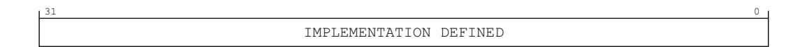

#### **IMPLEMENTATION DEFINED, bits [31:0]**

IMPLEMENTATION DEFINED.

The reset behavior of this field is:

• On a Warm reset, this field resets to 0.

The contents of these registers are IMPLEMENTATION DEFINED with the one architectural requirement that a value of all zeros is consistent with no interrupts being active.

#### **Accessing ICC\_AP0R<n>**

Writing to these registers with any value other than the last read value of the register (or all zeros when there are no Group 0 active priorities) might result in UNPREDICTABLE behavior of the interrupt prioritization system, causing:

- Interrupts that should preempt execution to not preempt execution.
- Interrupts that should not preempt execution to preempt execution.

ICC\_AP0R1 is implemented only in implementations that support 6 or more bits of preemption. ICC\_AP0R2 and ICC\_AP0R3 are implemented only in implementations that support 7 bits of preemption. Unimplemented registers are UNDEFINED.

| Note |  |  |
|------|--|--|
|      |  |  |
|      |  |  |

The number of bits of preemption is indicated by [ICH\\_VTR.](#page-529-0)PREbits.

Writing to the active priority registers in any order other than the following order will result in UNPREDICTABLE behavior:

- ICC\_AP0R<n>.
- Secure [ICC\\_AP1R<n>](#page-373-0).
- Non-secure [ICC\\_AP1R<n>](#page-373-0).

Accesses to this register use the following encodings in the System register encoding space:

#### **MRC{<c>}{<q>} <coproc>, {#}<opc1>, <Rt>, <CRn>, <CRm>{, {#}<opc2>}; Where m = 0-3**

| coproc | opc1  | CRn    | CRm    | opc2       |
|--------|-------|--------|--------|------------|
| 0b1111 | 0b000 | 0b1100 | 0b1000 | 0b1:m[1:0] |

```
integer m = UInt(opc2<1:0>);
if m == 1 && NUM_GIC_PRIORITY_BITS < 6 then
    UNDEFINED;
elsif (m == 2 || m == 3) && NUM_GIC_PRIORITY_BITS < 7 then
    UNDEFINED;
elsif PSTATE.EL == EL0 then
    UNDEFINED;
elsif PSTATE.EL == EL1 then
    if HaveEL(EL3) && EL3SDDUndefPriority() && !ELUsingAArch32(EL3) && SCR_EL3.FIQ == '1'
then
        UNDEFINED;
    elsif HaveEL(EL3) && EL3SDDUndefPriority() && ELUsingAArch32(EL3) && PSTATE.M !=
M32_Monitor && SCR.FIQ == '1' then
        UNDEFINED;
    elsif EL2Enabled() && !ELUsingAArch32(EL2) && HSTR_EL2.T12 == '1' then
        AArch64.AArch32SystemAccessTrap(EL2, 0x03);
    elsif EL2Enabled() && ELUsingAArch32(EL2) && HSTR.T12 == '1' then
        AArch32.TakeHypTrapException(0x03);
    elsif ICC_SRE.SRE == '0' then
        UNDEFINED;
    elsif EL2Enabled() && !ELUsingAArch32(EL2) && ICH_HCR_EL2.TALL0 == '1' then
        AArch64.AArch32SystemAccessTrap(EL2, 0x03);
    elsif EL2Enabled() && ELUsingAArch32(EL2) && ICH_HCR.TALL0 == '1' then
        AArch32.TakeHypTrapException(0x03);
    elsif EL2Enabled() && !ELUsingAArch32(EL2) && HCR_EL2.FMO == '1' then
        R[t] = ICV_AP0R[m];
    elsif EL2Enabled() && ELUsingAArch32(EL2) && HCR.FMO == '1' then
        R[t] = ICV_AP0R[m];
    elsif HaveEL(EL3) && !ELUsingAArch32(EL3) && SCR_EL3.FIQ == '1' then
        if EL3SDDUndef() then
            UNDEFINED;
        else
            AArch64.AArch32SystemAccessTrap(EL3, 0x03);
    elsif HaveEL(EL3) && ELUsingAArch32(EL3) && PSTATE.M != M32_Monitor && SCR.FIQ == '1'
then
        if EL3SDDUndef() then
            UNDEFINED;
        else
            AArch32.TakeMonitorTrapException();
    else
        R[t] = ICC_AP0R[m];
elsif PSTATE.EL == EL2 then
    if HaveEL(EL3) && EL3SDDUndefPriority() && !ELUsingAArch32(EL3) && SCR_EL3.FIQ == '1'
then
        UNDEFINED;
    elsif HaveEL(EL3) && EL3SDDUndefPriority() && ELUsingAArch32(EL3) && SCR.FIQ == '1'
then
        UNDEFINED;
    elsif ICC_HSRE.SRE == '0' then
        UNDEFINED;
    elsif HaveEL(EL3) && !ELUsingAArch32(EL3) && SCR_EL3.FIQ == '1' then
        if EL3SDDUndef() then
            UNDEFINED;
        else
```

```
AArch64.AArch32SystemAccessTrap(EL3, 0x03);
    elsif HaveEL(EL3) && ELUsingAArch32(EL3) && SCR.FIQ == '1' then
        if EL3SDDUndef() then
            UNDEFINED;
        else
            AArch32.TakeMonitorTrapException();
    else
        R[t] = ICC_AP0R[m];
elsif PSTATE.EL == EL3 then
    if ICC_MSRE.SRE == '0' then
        UNDEFINED;
    else
        R[t] = ICC_AP0R[m];
```

#### **MCR{<c>}{<q>} <coproc>, {#}<opc1>, <Rt>, <CRn>, <CRm>{, {#}<opc2>}; Where m = 0-3**

| coproc | opc1  | CRn    | CRm    | opc2       |
|--------|-------|--------|--------|------------|
| 0b1111 | 0b000 | 0b1100 | 0b1000 | 0b1:m[1:0] |

```
integer m = UInt(opc2<1:0>);
if m == 1 && NUM_GIC_PRIORITY_BITS < 6 then
    UNDEFINED;
elsif (m == 2 || m == 3) && NUM_GIC_PRIORITY_BITS < 7 then
    UNDEFINED;
elsif PSTATE.EL == EL0 then
    UNDEFINED;
elsif PSTATE.EL == EL1 then
    if HaveEL(EL3) && EL3SDDUndefPriority() && !ELUsingAArch32(EL3) && SCR_EL3.FIQ == '1'
then
        UNDEFINED;
    elsif HaveEL(EL3) && EL3SDDUndefPriority() && ELUsingAArch32(EL3) && PSTATE.M !=
M32_Monitor && SCR.FIQ == '1' then
        UNDEFINED;
    elsif EL2Enabled() && !ELUsingAArch32(EL2) && HSTR_EL2.T12 == '1' then
        AArch64.AArch32SystemAccessTrap(EL2, 0x03);
    elsif EL2Enabled() && ELUsingAArch32(EL2) && HSTR.T12 == '1' then
        AArch32.TakeHypTrapException(0x03);
    elsif ICC_SRE.SRE == '0' then
        UNDEFINED;
    elsif EL2Enabled() && !ELUsingAArch32(EL2) && ICH_HCR_EL2.TALL0 == '1' then
        AArch64.AArch32SystemAccessTrap(EL2, 0x03);
    elsif EL2Enabled() && ELUsingAArch32(EL2) && ICH_HCR.TALL0 == '1' then
        AArch32.TakeHypTrapException(0x03);
    elsif EL2Enabled() && !ELUsingAArch32(EL2) && HCR_EL2.FMO == '1' then
        ICV_AP0R[m] = R[t];
    elsif EL2Enabled() && ELUsingAArch32(EL2) && HCR.FMO == '1' then
        ICV_AP0R[m] = R[t];
    elsif HaveEL(EL3) && !ELUsingAArch32(EL3) && SCR_EL3.FIQ == '1' then
        if EL3SDDUndef() then
            UNDEFINED;
        else
            AArch64.AArch32SystemAccessTrap(EL3, 0x03);
    elsif HaveEL(EL3) && ELUsingAArch32(EL3) && PSTATE.M != M32_Monitor && SCR.FIQ == '1'
then
        if EL3SDDUndef() then
            UNDEFINED;
        else
            AArch32.TakeMonitorTrapException();
    else
        ICC_AP0R[m] = R[t];
```

```
elsif PSTATE.EL == EL2 then
    if HaveEL(EL3) && EL3SDDUndefPriority() && !ELUsingAArch32(EL3) && SCR_EL3.FIQ == '1'
then
        UNDEFINED;
    elsif HaveEL(EL3) && EL3SDDUndefPriority() && ELUsingAArch32(EL3) && SCR.FIQ == '1'
then
        UNDEFINED;
    elsif ICC_HSRE.SRE == '0' then
        UNDEFINED;
    elsif HaveEL(EL3) && !ELUsingAArch32(EL3) && SCR_EL3.FIQ == '1' then
        if EL3SDDUndef() then
            UNDEFINED;
        else
            AArch64.AArch32SystemAccessTrap(EL3, 0x03);
    elsif HaveEL(EL3) && ELUsingAArch32(EL3) && SCR.FIQ == '1' then
        if EL3SDDUndef() then
            UNDEFINED;
        else
            AArch32.TakeMonitorTrapException();
    else
        ICC_AP0R[m] = R[t];
elsif PSTATE.EL == EL3 then
    if ICC_MSRE.SRE == '0' then
        UNDEFINED;
    else
        ICC_AP0R[m] = R[t];
```

#### <span id="page-373-0"></span>**12.5.2 ICC\_AP1R<n>, Interrupt Controller Active Priorities Group 1 Registers, n = 0 - 3**

The ICC\_AP1R<n> characteristics are:

#### **Purpose**

Provides information about Group 1 active priorities.

#### **Configurations**

 This register is banked between ICC\_AP1R<n> and ICC\_AP1R<n>\_S and ICC\_AP1R<n>\_NS.

AArch32 System register ICC\_AP1R<n> bits [31:0] (ICC\_AP1R<n>\_S) are architecturally mapped to AArch64 System register [ICC\\_AP1R<n>\\_EL1](#page-218-1)[31:0] (ICC\_AP1R<n>\_EL1\_S).

AArch32 System register ICC\_AP1R<n> bits [31:0] (ICC\_AP1R<n>\_NS) are architecturally mapped to AArch64 System register [ICC\\_AP1R<n>\\_EL1](#page-218-1)[31:0] (ICC\_AP1R<n>\_EL1\_NS).

This register is present only when EL1 is capable of using AArch32 and FEAT\_GICv3 is implemented. Otherwise, direct accesses to ICC\_AP1R<n> are UNDEFINED.

#### **Attributes**

ICC\_AP1R<n> is a 32-bit register.

This register has the following instances:

- ICC\_AP1R<n>, when EL3 is not implemented.
- ICC\_AP1R<n>\_S, when EL3 is implemented.
- ICC\_AP1R<n>\_NS, when EL3 is implemented.

#### **Field descriptions**


#### **IMPLEMENTATION DEFINED, bits [31:0]**

IMPLEMENTATION DEFINED.

The reset behavior of this field is:

• On a Warm reset, this field resets to 0.

The contents of these registers are IMPLEMENTATION DEFINED with the one architectural requirement that a value of all zeros is consistent with no interrupts being active.

#### **Accessing ICC\_AP1R<n>**

Writing to these registers with any value other than the last read value of the register (or all zeros when there are no Group 1 active priorities) might result in UNPREDICTABLE behavior of the interrupt prioritization system, causing:

- Interrupts that should preempt execution to not preempt execution.
- Interrupts that should not preempt execution to preempt execution.

ICC\_AP1R1 is implemented only in implementations that support 6 or more bits of preemption. ICC\_AP1R2 and ICC\_AP1R3 are implemented only in implementations that support 7 bits of preemption. Unimplemented registers are UNDEFINED.

| Note |                                                                   |  |
|------|-------------------------------------------------------------------|--|
|      | The number of bits of preemption is indicated by ICH_VTR.PREbits. |  |

Writing to the active priority registers in any order other than the following order will result in UNPREDICTABLE behavior:

- [ICC\\_AP0R<n>](#page-369-0)
- Secure ICC\_AP1R<n>
- Non-secure ICC\_AP1R<n>

Accesses to this register use the following encodings in the System register encoding space:

**MRC{<c>}{<q>} <coproc>, {#}<opc1>, <Rt>, <CRn>, <CRm>{, {#}<opc2>}; Where m = 0-3**

| coproc | opc1  | CRn    | CRm    | opc2       |
|--------|-------|--------|--------|------------|
| 0b1111 | 0b000 | 0b1100 | 0b1001 | 0b0:m[1:0] |

```
integer m = UInt(opc2<1:0>);
if m == 1 && NUM_GIC_PRIORITY_BITS < 6 then
    UNDEFINED;
elsif (m == 2 || m == 3) && NUM_GIC_PRIORITY_BITS < 7 then
    UNDEFINED;
elsif PSTATE.EL == EL0 then
    UNDEFINED;
elsif PSTATE.EL == EL1 then
    if HaveEL(EL3) && EL3SDDUndefPriority() && !ELUsingAArch32(EL3) && SCR_EL3.IRQ == '1'
then
        UNDEFINED;
    elsif HaveEL(EL3) && EL3SDDUndefPriority() && ELUsingAArch32(EL3) && PSTATE.M !=
M32_Monitor && SCR.IRQ == '1' then
        UNDEFINED;
    elsif EL2Enabled() && !ELUsingAArch32(EL2) && HSTR_EL2.T12 == '1' then
        AArch64.AArch32SystemAccessTrap(EL2, 0x03);
    elsif EL2Enabled() && ELUsingAArch32(EL2) && HSTR.T12 == '1' then
        AArch32.TakeHypTrapException(0x03);
    elsif ICC_SRE.SRE == '0' then
        UNDEFINED;
    elsif EL2Enabled() && !ELUsingAArch32(EL2) && ICH_HCR_EL2.TALL1 == '1' then
        AArch64.AArch32SystemAccessTrap(EL2, 0x03);
    elsif EL2Enabled() && ELUsingAArch32(EL2) && ICH_HCR.TALL1 == '1' then
        AArch32.TakeHypTrapException(0x03);
    elsif EL2Enabled() && !ELUsingAArch32(EL2) && HCR_EL2.IMO == '1' then
        R[t] = ICV_AP1R[m];
    elsif EL2Enabled() && ELUsingAArch32(EL2) && HCR.IMO == '1' then
        R[t] = ICV_AP1R[m];
    elsif HaveEL(EL3) && !ELUsingAArch32(EL3) && SCR_EL3.IRQ == '1' then
        if EL3SDDUndef() then
            UNDEFINED;
        else
            AArch64.AArch32SystemAccessTrap(EL3, 0x03);
    elsif HaveEL(EL3) && ELUsingAArch32(EL3) && PSTATE.M != M32_Monitor && SCR.IRQ == '1'
then
        if EL3SDDUndef() then
            UNDEFINED;
        else
            AArch32.TakeMonitorTrapException();
    elsif HaveEL(EL3) then
        R[t] = ICC_AP1R_NS[m];
    else
        R[t] = ICC_AP1R[m];
elsif PSTATE.EL == EL2 then
    if HaveEL(EL3) && EL3SDDUndefPriority() && !ELUsingAArch32(EL3) && SCR_EL3.IRQ == '1'
```

```
then
        UNDEFINED;
    elsif HaveEL(EL3) && EL3SDDUndefPriority() && ELUsingAArch32(EL3) && SCR.IRQ == '1'
then
        UNDEFINED;
    elsif ICC_HSRE.SRE == '0' then
        UNDEFINED;
    elsif HaveEL(EL3) && !ELUsingAArch32(EL3) && SCR_EL3.IRQ == '1' then
        if EL3SDDUndef() then
            UNDEFINED;
        else
            AArch64.AArch32SystemAccessTrap(EL3, 0x03);
    elsif HaveEL(EL3) && ELUsingAArch32(EL3) && SCR.IRQ == '1' then
        if EL3SDDUndef() then
            UNDEFINED;
        else
            AArch32.TakeMonitorTrapException();
    elsif HaveEL(EL3) then
        R[t] = ICC_AP1R_NS[m];
    else
        R[t] = ICC_AP1R[m];
elsif PSTATE.EL == EL3 then
    if ICC_MSRE.SRE == '0' then
        UNDEFINED;
    else
        if SCR.NS == '0' then
            R[t] = ICC_AP1R_S[m];
        else
            R[t] = ICC_AP1R_NS[m];
```

#### **MCR{<c>}{<q>} <coproc>, {#}<opc1>, <Rt>, <CRn>, <CRm>{, {#}<opc2>}; Where m = 0-3**

| coproc | opc1  | CRn    | CRm    | opc2       |
|--------|-------|--------|--------|------------|
| 0b1111 | 0b000 | 0b1100 | 0b1001 | 0b0:m[1:0] |

```
integer m = UInt(opc2<1:0>);
if m == 1 && NUM_GIC_PRIORITY_BITS < 6 then
    UNDEFINED;
elsif (m == 2 || m == 3) && NUM_GIC_PRIORITY_BITS < 7 then
    UNDEFINED;
elsif PSTATE.EL == EL0 then
    UNDEFINED;
elsif PSTATE.EL == EL1 then
    if HaveEL(EL3) && EL3SDDUndefPriority() && !ELUsingAArch32(EL3) && SCR_EL3.IRQ == '1'
then
        UNDEFINED;
    elsif HaveEL(EL3) && EL3SDDUndefPriority() && ELUsingAArch32(EL3) && PSTATE.M !=
M32_Monitor && SCR.IRQ == '1' then
        UNDEFINED;
    elsif EL2Enabled() && !ELUsingAArch32(EL2) && HSTR_EL2.T12 == '1' then
        AArch64.AArch32SystemAccessTrap(EL2, 0x03);
    elsif EL2Enabled() && ELUsingAArch32(EL2) && HSTR.T12 == '1' then
        AArch32.TakeHypTrapException(0x03);
    elsif ICC_SRE.SRE == '0' then
        UNDEFINED;
    elsif EL2Enabled() && !ELUsingAArch32(EL2) && ICH_HCR_EL2.TALL1 == '1' then
        AArch64.AArch32SystemAccessTrap(EL2, 0x03);
    elsif EL2Enabled() && ELUsingAArch32(EL2) && ICH_HCR.TALL1 == '1' then
        AArch32.TakeHypTrapException(0x03);
    elsif EL2Enabled() && !ELUsingAArch32(EL2) && HCR_EL2.IMO == '1' then
```

```
ICV_AP1R[m] = R[t];
    elsif EL2Enabled() && ELUsingAArch32(EL2) && HCR.IMO == '1' then
        ICV_AP1R[m] = R[t];
    elsif HaveEL(EL3) && !ELUsingAArch32(EL3) && SCR_EL3.IRQ == '1' then
        if EL3SDDUndef() then
            UNDEFINED;
        else
            AArch64.AArch32SystemAccessTrap(EL3, 0x03);
    elsif HaveEL(EL3) && ELUsingAArch32(EL3) && PSTATE.M != M32_Monitor && SCR.IRQ == '1'
then
        if EL3SDDUndef() then
            UNDEFINED;
        else
            AArch32.TakeMonitorTrapException();
    elsif HaveEL(EL3) then
        ICC_AP1R_NS[m] = R[t];
    else
        ICC_AP1R[m] = R[t];
elsif PSTATE.EL == EL2 then
    if HaveEL(EL3) && EL3SDDUndefPriority() && !ELUsingAArch32(EL3) && SCR_EL3.IRQ == '1'
then
        UNDEFINED;
    elsif HaveEL(EL3) && EL3SDDUndefPriority() && ELUsingAArch32(EL3) && SCR.IRQ == '1'
then
        UNDEFINED;
    elsif ICC_HSRE.SRE == '0' then
        UNDEFINED;
    elsif HaveEL(EL3) && !ELUsingAArch32(EL3) && SCR_EL3.IRQ == '1' then
        if EL3SDDUndef() then
            UNDEFINED;
        else
            AArch64.AArch32SystemAccessTrap(EL3, 0x03);
    elsif HaveEL(EL3) && ELUsingAArch32(EL3) && SCR.IRQ == '1' then
        if EL3SDDUndef() then
            UNDEFINED;
        else
            AArch32.TakeMonitorTrapException();
    elsif HaveEL(EL3) then
        ICC_AP1R_NS[m] = R[t];
    else
        ICC_AP1R[m] = R[t];
elsif PSTATE.EL == EL3 then
    if ICC_MSRE.SRE == '0' then
        UNDEFINED;
    else
        if SCR.NS == '0' then
            ICC_AP1R_S[m] = R[t];
        else
            ICC_AP1R_NS[m] = R[t];
```

#### <span id="page-377-1"></span><span id="page-377-0"></span>**12.5.3 ICC\_ASGI1R, Interrupt Controller Alias Software Generated Interrupt Group 1 Register**

The ICC\_ASGI1R characteristics are:

#### **Purpose**

Generates Group 1 SGIs for the Security state that is not the current Security state.

#### **Configurations**

AArch32 System register ICC\_ASGI1R performs the same function as AArch64 System register [ICC\\_ASGI1R\\_EL1.](#page-222-1)

This register is present only when EL1 is capable of using AArch32 and FEAT\_GICv3 is implemented. Otherwise, direct accesses to ICC\_ASGI1R are UNDEFINED.

Under certain conditions a write to ICC\_ASGI1R can generate Group 0 interrupts, see [Table](#page-206-1) 12-14.

#### **Attributes**

ICC\_ASGI1R is a 64-bit register.

#### **Field descriptions**

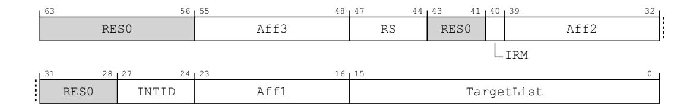

#### **Bits [63:56]**

Reserved, RES0.

#### **Aff3, bits [55:48]**

The affinity 3 value of the affinity path of the cluster for which SGI interrupts will be generated. If the IRM bit is 1, this field is RES0.

#### **RS, bits [47:44]**

RangeSelector

Controls which group of 16 values is represented by the TargetList field.

TargetList[n] represents aff0 value ((RS \* 16) + n).

When [ICC\\_CTLR\\_EL1](#page-232-1).RSS==0, RS is RES0.

When [ICC\\_CTLR\\_EL1.](#page-232-1)RSS==1 and [GICD\\_TYPER](#page-617-1).RSS==0, writing this register with RS != 0 is a CONSTRAINED UNPREDICTABLE choice of:

- The write is ignored.
- The RS field is treated as 0.

#### **Bits [43:41]**

Reserved, RES0.

#### **IRM, bit [40]**

Interrupt Routing Mode. Determines how the generated interrupts are distributed to PEs. Possible values are:

0b0 Interrupts routed to the PEs specified by Aff3.Aff2.Aff1.<target list>.

0b1 Interrupts routed to all PEs in the system, excluding "self".

#### **Aff2, bits [39:32]**

The affinity 2 value of the affinity path of the cluster for which SGI interrupts will be generated. If the IRM bit is 1, this field is RES0.

#### **Bits [31:28]**

Reserved, RES0.

#### **INTID, bits [27:24]**

The INTID of the SGI.

#### **Aff1, bits [23:16]**

The affinity 1 value of the affinity path of the cluster for which SGI interrupts will be generated. If the IRM bit is 1, this field is RES0.

#### **TargetList, bits [15:0]**

Target List. The set of PEs for which SGI interrupts will be generated. Each bit corresponds to the PE within a cluster with an Affinity 0 value equal to the bit number.

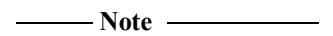

If SRE is set only for Secure EL3, software executing at EL3 might use the System register interface to generate SGIs. Therefore, the Distributor must always be able to receive and acknowledge Generate SGI packets received from CPU interface regardless of the ARE settings for a Security state. However, the Distributor might discard such packets.

If the IRM bit is 1, this field is RES0.

If a bit is 1 and the bit does not correspond to a valid target PE, the bit must be ignored by the Distributor. It is IMPLEMENTATION DEFINED whether, in such cases, a Distributor can signal a system error.

#### **Accessing ICC\_ASGI1R**

This register allows software executing in a Secure state to generate Non-secure Group 1 SGIs. It will also allow software executing in a Non-secure state to generate Secure Group 1 SGIs, if permitted by the settings of [GICR\\_NSACR](#page-696-1) in the Redistributor corresponding to the target PE.

When [GICD\\_CTLR](#page-543-1).DS==0, Non-secure writes do not generate an interrupt for a target PE if not permitted by the [GICR\\_NSACR](#page-696-1) register associated with the target PE. For more information, see *[Use of control registers for SGI](#page-206-2)  [forwarding on page](#page-206-2) 12-207*.

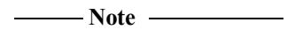

Accesses from Secure Monitor mode are treated as Secure regardless of the value of [SCR](#page-29-5).NS.

Accesses to this register use the following encodings in the System register encoding space:

**MCRR{<c>}{<q>} <coproc>, {#}<opc1>, <Rt>, <Rt2>, <CRm>**

| coproc | CRm    | opc1   |
|--------|--------|--------|
| 0b1111 | 0b1100 | 0b0001 |

```
if PSTATE.EL == EL0 then
    UNDEFINED;
elsif PSTATE.EL == EL1 then
   if HaveEL(EL3) && EL3SDDUndefPriority() && !ELUsingAArch32(EL3) && SCR_EL3.<IRQ,FIQ> ==
'11' then
```

```
UNDEFINED;
    elsif HaveEL(EL3) && EL3SDDUndefPriority() && ELUsingAArch32(EL3) && PSTATE.M !=
M32_Monitor && SCR.<IRQ,FIQ> == '11' then
        UNDEFINED;
    elsif EL2Enabled() && !ELUsingAArch32(EL2) && HSTR_EL2.T12 == '1' then
        AArch64.AArch32SystemAccessTrap(EL2, 0x03);
    elsif EL2Enabled() && ELUsingAArch32(EL2) && HSTR.T12 == '1' then
        AArch32.TakeHypTrapException(0x03);
    elsif ICC_SRE.SRE == '0' then
        UNDEFINED;
    elsif EL2Enabled() && !ELUsingAArch32(EL2) && ICH_HCR_EL2.TC == '1' then
        AArch64.AArch32SystemAccessTrap(EL2, 0x03);
    elsif EL2Enabled() && ELUsingAArch32(EL2) && ICH_HCR.TC == '1' then
        AArch32.TakeHypTrapException(0x03);
    elsif EL2Enabled() && !ELUsingAArch32(EL2) && HCR_EL2.FMO == '1' then
        AArch64.AArch32SystemAccessTrap(EL2, 0x03);
    elsif EL2Enabled() && !ELUsingAArch32(EL2) && HCR_EL2.IMO == '1' then
        AArch64.AArch32SystemAccessTrap(EL2, 0x03);
    elsif EL2Enabled() && ELUsingAArch32(EL2) && HCR.FMO == '1' then
        AArch32.TakeHypTrapException(0x03);
    elsif EL2Enabled() && ELUsingAArch32(EL2) && HCR.IMO == '1' then
        AArch32.TakeHypTrapException(0x03);
    elsif HaveEL(EL3) && !ELUsingAArch32(EL3) && SCR_EL3.<IRQ,FIQ> == '11' then
        if EL3SDDUndef() then
            UNDEFINED;
        else
            AArch64.AArch32SystemAccessTrap(EL3, 0x03);
   elsif HaveEL(EL3) && ELUsingAArch32(EL3) && PSTATE.M != M32_Monitor && SCR.<IRQ,FIQ> ==
'11' then
        if EL3SDDUndef() then
            UNDEFINED;
        else
            AArch32.TakeMonitorTrapException();
    else
        ICC_ASGI1R = R[t2]:R[t];
elsif PSTATE.EL == EL2 then
   if HaveEL(EL3) && EL3SDDUndefPriority() && !ELUsingAArch32(EL3) && SCR_EL3.<IRQ,FIQ> ==
'11' then
        UNDEFINED;
    elsif HaveEL(EL3) && EL3SDDUndefPriority() && ELUsingAArch32(EL3) && SCR.<IRQ,FIQ> ==
'11' then
        UNDEFINED;
    elsif ICC_HSRE.SRE == '0' then
        UNDEFINED;
    elsif HaveEL(EL3) && !ELUsingAArch32(EL3) && SCR_EL3.<IRQ,FIQ> == '11' then
        if EL3SDDUndef() then
            UNDEFINED;
        else
            AArch64.AArch32SystemAccessTrap(EL3, 0x03);
    elsif HaveEL(EL3) && ELUsingAArch32(EL3) && SCR.<IRQ,FIQ> == '11' then
        if EL3SDDUndef() then
            UNDEFINED;
        else
            AArch32.TakeMonitorTrapException();
    else
        ICC_ASGI1R = R[t2]:R[t];
elsif PSTATE.EL == EL3 then
    if ICC_MSRE.SRE == '0' then
        UNDEFINED;
    else
        ICC_ASGI1R = R[t2]:R[t];
```

#### <span id="page-380-1"></span><span id="page-380-0"></span>**12.5.4 ICC\_BPR0, Interrupt Controller Binary Point Register 0**

The ICC\_BPR0 characteristics are:

#### **Purpose**

Defines the point at which the priority value fields split into two parts, the group priority field and the subpriority field. The group priority field determines Group 0 interrupt preemption.

#### **Configurations**

AArch32 System register ICC\_BPR0 bits [31:0] are architecturally mapped to AArch64 System register [ICC\\_BPR0\\_EL1](#page-225-1)[31:0].

This register is present only when EL1 is capable of using AArch32 and FEAT\_GICv3 is implemented. Otherwise, direct accesses to ICC\_BPR0 are UNDEFINED.

#### **Attributes**

ICC\_BPR0 is a 32-bit register.

#### **Field descriptions**


#### **Bits [31:3]**

Reserved, RES0.

#### **BinaryPoint, bits [2:0]**

The value of this field controls how the 8-bit interrupt priority field is split into a group priority field, that determines interrupt preemption, and a subpriority field. This is done as follows:

| Binary point value | Group priority field | Subpriority field | Field with binary point |
|--------------------|----------------------|-------------------|-------------------------|
| 0                  | [7:1]                | [0]               | ggggggg.s               |
| 1                  | [7:2]                | [1:0]             | gggggg.ss               |
| 2                  | [7:3]                | [2:0]             | ggggg.sss               |
| 3                  | [7:4]                | [3:0]             | gggg.ssss               |
| 4                  | [7:5]                | [4:0]             | ggg.sssss               |
| 5                  | [7:6]                | [5:0]             | gg.ssssss               |
| 6                  | [7]                  | [6:0]             | g.sssssss               |
| 7                  | No preemption        | [7:0]             | .ssssssss               |

The reset behavior of this field is:

• On a Warm reset, this field resets to an architecturally UNKNOWN value.

#### **Accessing ICC\_BPR0**

The minimum binary point value is derived from the number of implemented priority bits. The number of priority bits is IMPLEMENTATION DEFINED, and reported by [ICC\\_CTLR](#page-389-0).PRIbits and [ICC\\_MCTLR.](#page-424-1)PRIbits.

An attempt to program the binary point field to a value less than the minimum value sets the field to the minimum value. On a reset, the binary point field is set to the minimum supported value.

Accesses to this register use the following encodings in the System register encoding space:

#### **MRC{<c>}{<q>} <coproc>, {#}<opc1>, <Rt>, <CRn>, <CRm>{, {#}<opc2>}**

| coproc | opc1  | CRn    | CRm    | opc2  |
|--------|-------|--------|--------|-------|
| 0b1111 | 0b000 | 0b1100 | 0b1000 | 0b011 |

```
if PSTATE.EL == EL0 then
    UNDEFINED;
elsif PSTATE.EL == EL1 then
    if HaveEL(EL3) && EL3SDDUndefPriority() && !ELUsingAArch32(EL3) && SCR_EL3.FIQ == '1'
then
        UNDEFINED;
    elsif HaveEL(EL3) && EL3SDDUndefPriority() && ELUsingAArch32(EL3) && PSTATE.M !=
M32_Monitor && SCR.FIQ == '1' then
        UNDEFINED;
    elsif EL2Enabled() && !ELUsingAArch32(EL2) && HSTR_EL2.T12 == '1' then
        AArch64.AArch32SystemAccessTrap(EL2, 0x03);
    elsif EL2Enabled() && ELUsingAArch32(EL2) && HSTR.T12 == '1' then
        AArch32.TakeHypTrapException(0x03);
    elsif ICC_SRE.SRE == '0' then
        UNDEFINED;
    elsif EL2Enabled() && !ELUsingAArch32(EL2) && ICH_HCR_EL2.TALL0 == '1' then
        AArch64.AArch32SystemAccessTrap(EL2, 0x03);
    elsif EL2Enabled() && ELUsingAArch32(EL2) && ICH_HCR.TALL0 == '1' then
        AArch32.TakeHypTrapException(0x03);
    elsif EL2Enabled() && !ELUsingAArch32(EL2) && HCR_EL2.FMO == '1' then
        R[t] = ICV_BPR0;
    elsif EL2Enabled() && ELUsingAArch32(EL2) && HCR.FMO == '1' then
        R[t] = ICV_BPR0;
    elsif HaveEL(EL3) && !ELUsingAArch32(EL3) && SCR_EL3.FIQ == '1' then
        if EL3SDDUndef() then
            UNDEFINED;
        else
            AArch64.AArch32SystemAccessTrap(EL3, 0x03);
    elsif HaveEL(EL3) && ELUsingAArch32(EL3) && PSTATE.M != M32_Monitor && SCR.FIQ == '1'
then
        if EL3SDDUndef() then
            UNDEFINED;
        else
            AArch32.TakeMonitorTrapException();
    else
        R[t] = ICC_BPR0;
elsif PSTATE.EL == EL2 then
    if HaveEL(EL3) && EL3SDDUndefPriority() && !ELUsingAArch32(EL3) && SCR_EL3.FIQ == '1'
then
        UNDEFINED;
    elsif HaveEL(EL3) && EL3SDDUndefPriority() && ELUsingAArch32(EL3) && SCR.FIQ == '1'
then
        UNDEFINED;
    elsif ICC_HSRE.SRE == '0' then
        UNDEFINED;
    elsif HaveEL(EL3) && !ELUsingAArch32(EL3) && SCR_EL3.FIQ == '1' then
        if EL3SDDUndef() then
            UNDEFINED;
        else
            AArch64.AArch32SystemAccessTrap(EL3, 0x03);
    elsif HaveEL(EL3) && ELUsingAArch32(EL3) && SCR.FIQ == '1' then
        if EL3SDDUndef() then
```

```
UNDEFINED;
        else
            AArch32.TakeMonitorTrapException();
    else
        R[t] = ICC_BPR0;
elsif PSTATE.EL == EL3 then
    if ICC_MSRE.SRE == '0' then
        UNDEFINED;
    else
        R[t] = ICC_BPR0;
```

#### **MCR{<c>}{<q>} <coproc>, {#}<opc1>, <Rt>, <CRn>, <CRm>{, {#}<opc2>}**

| coproc | opc1  | CRn    | CRm    | opc2  |
|--------|-------|--------|--------|-------|
| 0b1111 | 0b000 | 0b1100 | 0b1000 | 0b011 |

```
if PSTATE.EL == EL0 then
    UNDEFINED;
elsif PSTATE.EL == EL1 then
    if HaveEL(EL3) && EL3SDDUndefPriority() && !ELUsingAArch32(EL3) && SCR_EL3.FIQ == '1'
then
        UNDEFINED;
    elsif HaveEL(EL3) && EL3SDDUndefPriority() && ELUsingAArch32(EL3) && PSTATE.M !=
M32_Monitor && SCR.FIQ == '1' then
        UNDEFINED;
    elsif EL2Enabled() && !ELUsingAArch32(EL2) && HSTR_EL2.T12 == '1' then
        AArch64.AArch32SystemAccessTrap(EL2, 0x03);
    elsif EL2Enabled() && ELUsingAArch32(EL2) && HSTR.T12 == '1' then
        AArch32.TakeHypTrapException(0x03);
    elsif ICC_SRE.SRE == '0' then
        UNDEFINED;
    elsif EL2Enabled() && !ELUsingAArch32(EL2) && ICH_HCR_EL2.TALL0 == '1' then
        AArch64.AArch32SystemAccessTrap(EL2, 0x03);
    elsif EL2Enabled() && ELUsingAArch32(EL2) && ICH_HCR.TALL0 == '1' then
        AArch32.TakeHypTrapException(0x03);
    elsif EL2Enabled() && !ELUsingAArch32(EL2) && HCR_EL2.FMO == '1' then
        ICV_BPR0 = R[t];
    elsif EL2Enabled() && ELUsingAArch32(EL2) && HCR.FMO == '1' then
        ICV_BPR0 = R[t];
    elsif HaveEL(EL3) && !ELUsingAArch32(EL3) && SCR_EL3.FIQ == '1' then
        if EL3SDDUndef() then
            UNDEFINED;
        else
            AArch64.AArch32SystemAccessTrap(EL3, 0x03);
    elsif HaveEL(EL3) && ELUsingAArch32(EL3) && PSTATE.M != M32_Monitor && SCR.FIQ == '1'
then
        if EL3SDDUndef() then
            UNDEFINED;
        else
            AArch32.TakeMonitorTrapException();
    else
        ICC_BPR0 = R[t];
elsif PSTATE.EL == EL2 then
    if HaveEL(EL3) && EL3SDDUndefPriority() && !ELUsingAArch32(EL3) && SCR_EL3.FIQ == '1'
then
        UNDEFINED;
    elsif HaveEL(EL3) && EL3SDDUndefPriority() && ELUsingAArch32(EL3) && SCR.FIQ == '1'
then
        UNDEFINED;
    elsif ICC_HSRE.SRE == '0' then
        UNDEFINED;
```

```
elsif HaveEL(EL3) && !ELUsingAArch32(EL3) && SCR_EL3.FIQ == '1' then
        if EL3SDDUndef() then
            UNDEFINED;
        else
            AArch64.AArch32SystemAccessTrap(EL3, 0x03);
    elsif HaveEL(EL3) && ELUsingAArch32(EL3) && SCR.FIQ == '1' then
        if EL3SDDUndef() then
            UNDEFINED;
        else
            AArch32.TakeMonitorTrapException();
    else
        ICC_BPR0 = R[t];
elsif PSTATE.EL == EL3 then
    if ICC_MSRE.SRE == '0' then
        UNDEFINED;
    else
        ICC_BPR0 = R[t];
```

#### <span id="page-384-1"></span><span id="page-384-0"></span>**12.5.5 ICC\_BPR1, Interrupt Controller Binary Point Register 1**

The ICC\_BPR1 characteristics are:

#### **Purpose**

Defines the point at which the priority value fields split into two parts, the group priority field and the subpriority field. The group priority field determines Group 1 interrupt preemption.

#### **Configurations**

This register is banked between ICC\_BPR1 and ICC\_BPR1\_S and ICC\_BPR1\_NS.

AArch32 System register ICC\_BPR1 bits [31:0] (ICC\_BPR1\_S) are architecturally mapped to AArch64 System register [ICC\\_BPR1\\_EL1\[](#page-228-1)31:0] (ICC\_BPR1\_EL1\_S).

AArch32 System register ICC\_BPR1 bits [31:0] (ICC\_BPR1\_NS) are architecturally mapped to AArch64 System register [ICC\\_BPR1\\_EL1\[](#page-228-1)31:0] (ICC\_BPR1\_EL1\_NS).

This register is present only when EL1 is capable of using AArch32 and FEAT\_GICv3 is implemented. Otherwise, direct accesses to ICC\_BPR1 are UNDEFINED.

In GIC implementations supporting two Security states, this register is Banked.

#### **Attributes**

ICC\_BPR1 is a 32-bit register.

This register has the following instances:

- ICC\_BPR1, when EL3 is not implemented.
- ICC\_BPR1\_S, when EL3 is implemented.
- ICC\_BPR1\_NS, when EL3 is implemented.

#### **Field descriptions**

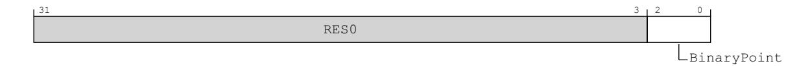

#### **Bits [31:3]**

Reserved, RES0.

#### **BinaryPoint, bits [2:0]**

If the GIC is configured to use separate binary point fields for Group 0 and Group 1 interrupts, the value of this field controls how the 8-bit interrupt priority field is split into a group priority field, that determines interrupt preemption, and a subpriority field. For more information about priorities, see *[Priority grouping on page](#page-73-2) 4-74*.

Writing 0 to this field will set this field to its reset value.

If EL3 is implemented and [ICC\\_MCTLR](#page-424-1).CBPR\_EL1S is 1:

- Accesses to this register at EL3 not in Monitor mode access the state of [ICC\\_BPR0](#page-380-1).
- When SCR\_EL3.EEL2 is 1 and HCR\_EL2.IMO is 1, Secure accesses to this register at EL1 access the state of [ICV\\_BPR1](#page-463-0).
- Otherwise, Secure accesses to this register at EL1 access the state of [ICC\\_BPR0.](#page-380-1)

If EL3 is implemented and [ICC\\_MCTLR.](#page-424-1)CBPR\_EL1NS is 1, Non-secure accesses to this register at EL1 or EL2 behave as follows, depending on the values of [HCR](#page-28-4).IMO and [SCR.](#page-29-5)IRQ:

| HCR.IMO | SCR_IRQ | Behavior                                                                                                                                          |
|---------|---------|---------------------------------------------------------------------------------------------------------------------------------------------------|
| 0b0     | 0b0     | Non-secure EL1 and EL2 reads return ICC_BPR0 + 1 saturated to 0b111. Non-secure EL1 and<br>EL2 writes are ignored.                                |
| 0b0     | 0b1     | Non-secure EL1 and EL2 accesses trap to EL3.                                                                                                      |
| 0b1     | 0b0     | Non-secure EL1 accesses affect virtual interrupts. Non-secure EL2 reads return ICC_BPR0 + 1<br>saturated to 0b111. Non-secure EL2 writes ignored. |
| 0b1     | 0b1     | Non-secure EL1 accesses affect virtual interrupts. Non-secure EL2 accesses trap to EL3.                                                           |

If EL3 is not implemented and [ICC\\_CTLR](#page-389-0).CBPR is 1, Non-secure accesses to this register at EL1 or EL2 behave as follows, depending on the values of [HCR.](#page-28-4)IMO:

| HCR.IMO | Behavior                                                                                                                                              |
|---------|-------------------------------------------------------------------------------------------------------------------------------------------------------|
| 0b0     | Non-secure EL1 and EL2 reads return ICC_BPR0 + 1 saturated to 0b111. Non-secure EL1 and<br>EL2 writes are ignored.                                    |
| 0b1     | Non-secure EL1 accesses affect virtual interrupts. Non-secure EL2 reads return ICC_BPR0 + 1<br>saturated to 0b111. Non-secure EL2 writes are ignored. |

The reset behavior of this field is:

• This field resets to an IMPLEMENTATION DEFINED nonzero value.

#### **Accessing ICC\_BPR1**

When the PE resets into an Exception level that is using AArch32, the reset value is equal to:

- For the Secure copy of the register, the minimum value of [ICC\\_BPR0](#page-380-1) plus one.
- For the Non-secure copy of the register, the minimum value of [ICC\\_BPR0.](#page-380-1)

Where the minimum value of [ICC\\_BPR0](#page-380-1) is IMPLEMENTATION DEFINED.

If EL3 is not implemented:

- If the PE is Secure this reset value is (minimum value of [ICC\\_BPR0](#page-380-1) plus one).
- If the PE is Non-secure this reset value is (minimum value of [ICC\\_BPR0\)](#page-380-1).

An attempt to program the binary point field to a value less than the reset value sets the field to the reset value.

Accesses to this register use the following encodings in the System register encoding space:

**MRC{<c>}{<q>} <coproc>, {#}<opc1>, <Rt>, <CRn>, <CRm>{, {#}<opc2>}**

| coproc | opc1  | CRn    | CRm    | opc2  |
|--------|-------|--------|--------|-------|
| 0b1111 | 0b000 | 0b1100 | 0b1100 | 0b011 |

if PSTATE.EL == EL0 then UNDEFINED; elsif PSTATE.EL == EL1 then

```
if HaveEL(EL3) && EL3SDDUndefPriority() && !ELUsingAArch32(EL3) && SCR_EL3.IRQ == '1'
then
        UNDEFINED;
    elsif HaveEL(EL3) && EL3SDDUndefPriority() && ELUsingAArch32(EL3) && PSTATE.M !=
M32_Monitor && SCR.IRQ == '1' then
        UNDEFINED;
    elsif EL2Enabled() && !ELUsingAArch32(EL2) && HSTR_EL2.T12 == '1' then
        AArch64.AArch32SystemAccessTrap(EL2, 0x03);
    elsif EL2Enabled() && ELUsingAArch32(EL2) && HSTR.T12 == '1' then
        AArch32.TakeHypTrapException(0x03);
    elsif ICC_SRE.SRE == '0' then
        UNDEFINED;
    elsif EL2Enabled() && !ELUsingAArch32(EL2) && ICH_HCR_EL2.TALL1 == '1' then
        AArch64.AArch32SystemAccessTrap(EL2, 0x03);
    elsif EL2Enabled() && ELUsingAArch32(EL2) && ICH_HCR.TALL1 == '1' then
        AArch32.TakeHypTrapException(0x03);
    elsif EL2Enabled() && !ELUsingAArch32(EL2) && HCR_EL2.IMO == '1' then
        R[t] = ICV_BPR1;
    elsif EL2Enabled() && ELUsingAArch32(EL2) && HCR.IMO == '1' then
        R[t] = ICV_BPR1;
    elsif HaveEL(EL3) && !ELUsingAArch32(EL3) && SCR_EL3.IRQ == '1' then
        if EL3SDDUndef() then
            UNDEFINED;
        else
            AArch64.AArch32SystemAccessTrap(EL3, 0x03);
    elsif HaveEL(EL3) && ELUsingAArch32(EL3) && PSTATE.M != M32_Monitor && SCR.IRQ == '1'
then
        if EL3SDDUndef() then
            UNDEFINED;
        else
            AArch32.TakeMonitorTrapException();
    elsif HaveEL(EL3) then
        R[t] = ICC_BPR1_NS;
    else
        R[t] = ICC_BPR1;
elsif PSTATE.EL == EL2 then
    if HaveEL(EL3) && EL3SDDUndefPriority() && !ELUsingAArch32(EL3) && SCR_EL3.IRQ == '1'
then
        UNDEFINED;
    elsif HaveEL(EL3) && EL3SDDUndefPriority() && ELUsingAArch32(EL3) && SCR.IRQ == '1'
then
        UNDEFINED;
    elsif ICC_HSRE.SRE == '0' then
        UNDEFINED;
    elsif HaveEL(EL3) && !ELUsingAArch32(EL3) && SCR_EL3.IRQ == '1' then
        if EL3SDDUndef() then
            UNDEFINED;
        else
            AArch64.AArch32SystemAccessTrap(EL3, 0x03);
    elsif HaveEL(EL3) && ELUsingAArch32(EL3) && SCR.IRQ == '1' then
        if EL3SDDUndef() then
            UNDEFINED;
        else
            AArch32.TakeMonitorTrapException();
    elsif HaveEL(EL3) then
        R[t] = ICC_BPR1_NS;
    else
        R[t] = ICC_BPR1;
elsif PSTATE.EL == EL3 then
    if ICC_MSRE.SRE == '0' then
        UNDEFINED;
    else
        if SCR.NS == '0' then
            R[t] = ICC_BPR1_S;
        else
            R[t] = ICC_BPR1_NS;
```

#### **MCR{<c>}{<q>} <coproc>, {#}<opc1>, <Rt>, <CRn>, <CRm>{, {#}<opc2>}**

| coproc | opc1  | CRn    | CRm    | opc2  |
|--------|-------|--------|--------|-------|
| 0b1111 | 0b000 | 0b1100 | 0b1100 | 0b011 |

```
if PSTATE.EL == EL0 then
    UNDEFINED;
elsif PSTATE.EL == EL1 then
    if HaveEL(EL3) && EL3SDDUndefPriority() && !ELUsingAArch32(EL3) && SCR_EL3.IRQ == '1'
then
        UNDEFINED;
    elsif HaveEL(EL3) && EL3SDDUndefPriority() && ELUsingAArch32(EL3) && PSTATE.M !=
M32_Monitor && SCR.IRQ == '1' then
        UNDEFINED;
    elsif EL2Enabled() && !ELUsingAArch32(EL2) && HSTR_EL2.T12 == '1' then
        AArch64.AArch32SystemAccessTrap(EL2, 0x03);
    elsif EL2Enabled() && ELUsingAArch32(EL2) && HSTR.T12 == '1' then
        AArch32.TakeHypTrapException(0x03);
    elsif ICC_SRE.SRE == '0' then
        UNDEFINED;
    elsif EL2Enabled() && !ELUsingAArch32(EL2) && ICH_HCR_EL2.TALL1 == '1' then
        AArch64.AArch32SystemAccessTrap(EL2, 0x03);
    elsif EL2Enabled() && ELUsingAArch32(EL2) && ICH_HCR.TALL1 == '1' then
        AArch32.TakeHypTrapException(0x03);
    elsif EL2Enabled() && !ELUsingAArch32(EL2) && HCR_EL2.IMO == '1' then
        ICV_BPR1 = R[t];
    elsif EL2Enabled() && ELUsingAArch32(EL2) && HCR.IMO == '1' then
        ICV_BPR1 = R[t];
    elsif HaveEL(EL3) && !ELUsingAArch32(EL3) && SCR_EL3.IRQ == '1' then
        if EL3SDDUndef() then
            UNDEFINED;
        else
            AArch64.AArch32SystemAccessTrap(EL3, 0x03);
    elsif HaveEL(EL3) && ELUsingAArch32(EL3) && PSTATE.M != M32_Monitor && SCR.IRQ == '1'
then
        if EL3SDDUndef() then
            UNDEFINED;
        else
            AArch32.TakeMonitorTrapException();
    elsif HaveEL(EL3) then
        ICC_BPR1_NS = R[t];
    else
        ICC_BPR1 = R[t];
elsif PSTATE.EL == EL2 then
    if HaveEL(EL3) && EL3SDDUndefPriority() && !ELUsingAArch32(EL3) && SCR_EL3.IRQ == '1'
then
        UNDEFINED;
    elsif HaveEL(EL3) && EL3SDDUndefPriority() && ELUsingAArch32(EL3) && SCR.IRQ == '1'
then
        UNDEFINED;
    elsif ICC_HSRE.SRE == '0' then
        UNDEFINED;
    elsif HaveEL(EL3) && !ELUsingAArch32(EL3) && SCR_EL3.IRQ == '1' then
        if EL3SDDUndef() then
            UNDEFINED;
        else
            AArch64.AArch32SystemAccessTrap(EL3, 0x03);
    elsif HaveEL(EL3) && ELUsingAArch32(EL3) && SCR.IRQ == '1' then
        if EL3SDDUndef() then
            UNDEFINED;
        else
            AArch32.TakeMonitorTrapException();
```

```
elsif HaveEL(EL3) then
        ICC_BPR1_NS = R[t];
    else
        ICC_BPR1 = R[t];
elsif PSTATE.EL == EL3 then
    if ICC_MSRE.SRE == '0' then
        UNDEFINED;
    else
        if SCR.NS == '0' then
            ICC_BPR1_S = R[t];
        else
            ICC_BPR1_NS = R[t];
```

#### <span id="page-389-0"></span>**12.5.6 ICC\_CTLR, Interrupt Controller Control Register**

The ICC\_CTLR characteristics are:

#### **Purpose**

Controls aspects of the behavior of the GIC CPU interface and provides information about the features implemented.

#### **Configurations**

This register is banked between ICC\_CTLR and ICC\_CTLR\_S and ICC\_CTLR\_NS.

AArch32 System register ICC\_CTLR bits [31:0] (ICC\_CTLR\_S) are architecturally mapped to AArch64 System register [ICC\\_CTLR\\_EL1](#page-232-1)[31:0] (ICC\_CTLR\_EL1\_S).

AArch32 System register ICC\_CTLR bits [31:0] (ICC\_CTLR\_NS) are architecturally mapped to AArch64 System register [ICC\\_CTLR\\_EL1](#page-232-1)[31:0] (ICC\_CTLR\_EL1\_NS).

This register is present only when EL1 is capable of using AArch32 and FEAT\_GICv3 is implemented. Otherwise, direct accesses to ICC\_CTLR are UNDEFINED.

#### **Attributes**

ICC\_CTLR is a 32-bit register.

This register has the following instances:

- ICC\_CTLR, when EL3 is not implemented.
- ICC\_CTLR\_S, when EL3 is implemented.
- ICC\_CTLR\_NS, when EL3 is implemented.

#### **Field descriptions**

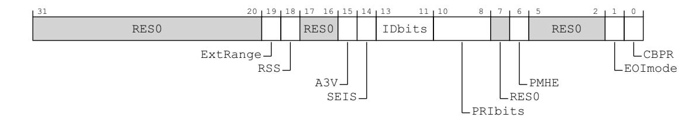

#### **Bits [31:20]**

Reserved, RES0.

#### **ExtRange, bit [19]**

Extended INTID range (read-only).

0b0 CPU interface does not support INTIDs in the range 1024..8191.

Behavior is UNPREDICTABLE if the IRI delivers an interrupt in the range 1024 to 8191 to the CPU interface.

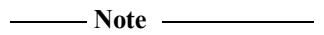

Arm strongly recommends that the IRI is not configured to deliver interrupts in this range to a PE that does not support them.

0b1 CPU interface supports INTIDs in the range 1024..8191.

All INTIDs in the range 1024..8191 are treated as requiring deactivation.

If EL3 is implemented, ICC\_CTLR\_EL1.ExtRange is an alias of [ICC\\_CTLR\\_EL3.](#page-237-1)ExtRange.

#### **RSS, bit [18]**

Range Selector Support. Possible values are:

0b0 Targeted SGIs with affinity level 0 values of 0 - 15 are supported.

0b1 Targeted SGIs with affinity level 0 values of 0 - 255 are supported.

This bit is read-only.

#### **Bits [17:16]**

Reserved, RES0.

#### **A3V, bit [15]**

Affinity 3 Valid. Read-only and writes are ignored. Possible values are:

0b0 The CPU interface logic only supports zero values of Affinity 3 in SGI generation System registers.

0b1 The CPU interface logic supports nonzero values of Affinity 3 in SGI generation System registers.

If EL3 is implemented and using AArch32, this bit is an alias of [ICC\\_MCTLR.](#page-424-1)A3V.

If EL3 is implemented and using AArch64, this bit is an alias of [ICC\\_CTLR\\_EL3.](#page-237-1)A3V.

#### **SEIS, bit [14]**

SEI Support. Read-only and writes are ignored. Indicates whether the CPU interface supports local generation of SEIs:

0b0 The CPU interface logic does not support local generation of SEIs.

0b1 The CPU interface logic supports local generation of SEIs.

If EL3 is implemented and using AArch32, this bit is an alias of [ICC\\_MCTLR.](#page-424-1)SEIS.

If EL3 is implemented and using AArch64, this bit is an alias of [ICC\\_CTLR\\_EL3.](#page-237-1)SEIS.

#### **IDbits, bits [13:11]**

Identifier bits. Read-only and writes are ignored. The number of physical interrupt identifier bits supported:

0b000 16 bits. 0b001 24 bits.

All other values are reserved.

If EL3 is implemented and using AArch32, this field is an alias of [ICC\\_MCTLR.](#page-424-1)IDbits.

If EL3 is implemented and using AArch64, this field is an alias of [ICC\\_CTLR\\_EL3.](#page-237-1)IDbits.

#### **PRIbits, bits [10:8]**

Priority bits. Read-only and writes are ignored. The number of priority bits implemented, minus one.

An implementation that supports two Security states must implement at least 32 levels of physical priority (5 priority bits).

An implementation that supports only a single Security state must implement at least 16 levels of physical priority (4 priority bits).

| Note |  |
|------|--|
|------|--|

This field always returns the number of priority bits implemented, regardless of the Security state of the access or the value of [GICD\\_CTLR](#page-543-1).DS.

The division between group priority and subpriority is defined in the binary point registers [ICC\\_BPR0](#page-380-1) and [ICC\\_BPR1](#page-384-1).

If EL3 is implemented and using AArch32, physical accesses return the value from [ICC\\_MCTLR.](#page-424-1)PRIbits.

If EL3 is implemented and using AArch64, physical accesses return the value from [ICC\\_CTLR\\_EL3.](#page-237-1)PRIbits.

If EL3 is not implemented, physical accesses return the value from this field.

#### **Bit [7]**

Reserved, RES0.

#### **PMHE, bit [6]**

Priority Mask Hint Enable. Controls whether the priority mask register is used as a hint for interrupt distribution:

0b0 Disables use of [ICC\\_PMR](#page-434-0) as a hint for interrupt distribution.

0b1 Enables use of [ICC\\_PMR](#page-434-0) as a hint for interrupt distribution.

#### If EL3 is implemented:

- If EL3 is using AArch32, this bit is an alias of [ICC\\_MCTLR](#page-424-1).PMHE.
- If EL3 is using AArch64, this bit is an alias of [ICC\\_CTLR\\_EL3](#page-237-1).PMHE.
- If [GICD\\_CTLR.](#page-543-1)DS == 0, this bit is read-only.
- If [GICD\\_CTLR.](#page-543-1)DS == 1, this bit is read/write.

If EL3 is not implemented, it is IMPLEMENTATION DEFINED whether this bit is read-only or read/write:

- If this bit is read-only, an implementation can choose to make this field RAZ/WI or RAO/WI.
- If this bit is read/write, it resets to zero.

#### **Bits [5:2]**

Reserved, RES0.

#### **EOImode, bit [1]**

EOI mode for the current Security state. Controls whether a write to an End of Interrupt register also deactivates the interrupt:

0b0 [ICC\\_EOIR0](#page-397-0) and [ICC\\_EOIR1](#page-400-0) provide both priority drop and interrupt deactivation functionality. Accesses to [ICC\\_DIR](#page-395-0) are UNPREDICTABLE.

0b1 [ICC\\_EOIR0](#page-397-0) and [ICC\\_EOIR1](#page-400-0) provide priority drop functionality only. [ICC\\_DIR](#page-395-0) provides interrupt deactivation functionality.

#### If EL3 is implemented:

- If EL3 is using AArch32, this bit is an alias of [ICC\\_MCTLR](#page-424-1).EOImode\_EL1{S, NS} where S or NS corresponds to the current Security state.
- If EL3 is using AArch64, this bit is an alias of [ICC\\_CTLR\\_EL3](#page-237-1).EOImode\_EL1{S, NS} where S or NS corresponds to the current Security state.

If EL3 is not implemented, it is IMPLEMENTATION DEFINED whether this bit is read-only or read/write:

- If this bit is read-only, an implementation can choose to make this field RAZ/WI or RAO/WI.
- If this bit is read/write, it resets to zero.

#### **CBPR, bit [0]**

Common Binary Point Register. Controls whether the same register is used for interrupt preemption of both Group 0 and Group 1 interrupts:

0b0 [ICC\\_BPR0](#page-380-1) determines the preemption group for Group 0 interrupts only.

[ICC\\_BPR1](#page-384-1) determines the preemption group for Group 1 interrupts.

0b1 [ICC\\_BPR0](#page-380-1) determines the preemption group for both Group 0 and Group 1 interrupts.

#### If EL3 is implemented:

- If EL3 is using AArch32, this bit is an alias of [ICC\\_MCTLR](#page-424-1).CBPR\_EL1{S,NS} where S or NS corresponds to the current Security state.
- If EL3 is using AArch64, this bit is an alias of [ICC\\_CTLR\\_EL3](#page-237-1).CBPR\_EL1{S,NS} where S or NS corresponds to the current Security state.
- If [GICD\\_CTLR.](#page-543-1)DS == 0, this bit is read-only.
- If [GICD\\_CTLR.](#page-543-1)DS == 1, this bit is read/write.

If EL3 is not implemented, it is IMPLEMENTATION DEFINED whether this bit is read-only or read/write:

- If this bit is read-only, an implementation can choose to make this field RAZ/WI or RAO/WI.
- If this bit is read/write, it resets to zero.

#### **Accessing ICC\_CTLR**

```
MRC{<c>}{<q>} <coproc>, {#}<opc1>, <Rt>, <CRn>, <CRm>{, {#}<opc2>}
```

| coproc | opc1  | CRn    | CRm    | opc2  |
|--------|-------|--------|--------|-------|
| 0b1111 | 0b000 | 0b1100 | 0b1100 | 0b100 |

```
if PSTATE.EL == EL0 then
    UNDEFINED;
elsif PSTATE.EL == EL1 then
   if HaveEL(EL3) && EL3SDDUndefPriority() && !ELUsingAArch32(EL3) && SCR_EL3.<IRQ,FIQ> ==
'11' then
        UNDEFINED;
    elsif HaveEL(EL3) && EL3SDDUndefPriority() && ELUsingAArch32(EL3) && PSTATE.M !=
M32_Monitor && SCR.<IRQ,FIQ> == '11' then
        UNDEFINED;
    elsif EL2Enabled() && !ELUsingAArch32(EL2) && HSTR_EL2.T12 == '1' then
        AArch64.AArch32SystemAccessTrap(EL2, 0x03);
    elsif EL2Enabled() && ELUsingAArch32(EL2) && HSTR.T12 == '1' then
        AArch32.TakeHypTrapException(0x03);
    elsif ICC_SRE.SRE == '0' then
        UNDEFINED;
    elsif EL2Enabled() && !ELUsingAArch32(EL2) && ICH_HCR_EL2.TC == '1' then
        AArch64.AArch32SystemAccessTrap(EL2, 0x03);
    elsif EL2Enabled() && ELUsingAArch32(EL2) && ICH_HCR.TC == '1' then
        AArch32.TakeHypTrapException(0x03);
    elsif EL2Enabled() && !ELUsingAArch32(EL2) && HCR_EL2.FMO == '1' then
        R[t] = ICV_CTLR;
    elsif EL2Enabled() && !ELUsingAArch32(EL2) && HCR_EL2.IMO == '1' then
        R[t] = ICV_CTLR;
    elsif EL2Enabled() && ELUsingAArch32(EL2) && HCR.FMO == '1' then
        R[t] = ICV_CTLR;
    elsif EL2Enabled() && ELUsingAArch32(EL2) && HCR.IMO == '1' then
        R[t] = ICV_CTLR;
    elsif HaveEL(EL3) && !ELUsingAArch32(EL3) && SCR_EL3.<IRQ,FIQ> == '11' then
        if EL3SDDUndef() then
            UNDEFINED;
        else
            AArch64.AArch32SystemAccessTrap(EL3, 0x03);
   elsif HaveEL(EL3) && ELUsingAArch32(EL3) && PSTATE.M != M32_Monitor && SCR.<IRQ,FIQ> ==
'11' then
        if EL3SDDUndef() then
            UNDEFINED;
```

```
else
            AArch32.TakeMonitorTrapException();
    elsif HaveEL(EL3) then
        R[t] = ICC_CTLR_NS;
    else
        R[t] = ICC_CTLR;
elsif PSTATE.EL == EL2 then
   if HaveEL(EL3) && EL3SDDUndefPriority() && !ELUsingAArch32(EL3) && SCR_EL3.<IRQ,FIQ> ==
'11' then
        UNDEFINED;
    elsif HaveEL(EL3) && EL3SDDUndefPriority() && ELUsingAArch32(EL3) && SCR.<IRQ,FIQ> ==
'11' then
        UNDEFINED;
    elsif ICC_HSRE.SRE == '0' then
        UNDEFINED;
    elsif HaveEL(EL3) && !ELUsingAArch32(EL3) && SCR_EL3.<IRQ,FIQ> == '11' then
        if EL3SDDUndef() then
            UNDEFINED;
        else
            AArch64.AArch32SystemAccessTrap(EL3, 0x03);
    elsif HaveEL(EL3) && ELUsingAArch32(EL3) && SCR.<IRQ,FIQ> == '11' then
        if EL3SDDUndef() then
            UNDEFINED;
        else
            AArch32.TakeMonitorTrapException();
    elsif HaveEL(EL3) then
        R[t] = ICC_CTLR_NS;
    else
        R[t] = ICC_CTLR;
elsif PSTATE.EL == EL3 then
    if ICC_MSRE.SRE == '0' then
        UNDEFINED;
    else
        if SCR.NS == '0' then
            R[t] = ICC_CTLR_S;
        else
            R[t] = ICC_CTLR_NS;
```

#### **MCR{<c>}{<q>} <coproc>, {#}<opc1>, <Rt>, <CRn>, <CRm>{, {#}<opc2>}**

| coproc | opc1  | CRn    | CRm    | opc2  |
|--------|-------|--------|--------|-------|
| 0b1111 | 0b000 | 0b1100 | 0b1100 | 0b100 |

```
if PSTATE.EL == EL0 then
    UNDEFINED;
elsif PSTATE.EL == EL1 then
   if HaveEL(EL3) && EL3SDDUndefPriority() && !ELUsingAArch32(EL3) && SCR_EL3.<IRQ,FIQ> ==
'11' then
        UNDEFINED;
    elsif HaveEL(EL3) && EL3SDDUndefPriority() && ELUsingAArch32(EL3) && PSTATE.M !=
M32_Monitor && SCR.<IRQ,FIQ> == '11' then
        UNDEFINED;
    elsif EL2Enabled() && !ELUsingAArch32(EL2) && HSTR_EL2.T12 == '1' then
        AArch64.AArch32SystemAccessTrap(EL2, 0x03);
    elsif EL2Enabled() && ELUsingAArch32(EL2) && HSTR.T12 == '1' then
        AArch32.TakeHypTrapException(0x03);
    elsif ICC_SRE.SRE == '0' then
        UNDEFINED;
    elsif EL2Enabled() && !ELUsingAArch32(EL2) && ICH_HCR_EL2.TC == '1' then
        AArch64.AArch32SystemAccessTrap(EL2, 0x03);
    elsif EL2Enabled() && ELUsingAArch32(EL2) && ICH_HCR.TC == '1' then
```

```
AArch32.TakeHypTrapException(0x03);
    elsif EL2Enabled() && !ELUsingAArch32(EL2) && HCR_EL2.FMO == '1' then
        ICV_CTLR = R[t];
    elsif EL2Enabled() && !ELUsingAArch32(EL2) && HCR_EL2.IMO == '1' then
        ICV_CTLR = R[t];
    elsif EL2Enabled() && ELUsingAArch32(EL2) && HCR.FMO == '1' then
        ICV_CTLR = R[t];
    elsif EL2Enabled() && ELUsingAArch32(EL2) && HCR.IMO == '1' then
        ICV_CTLR = R[t];
    elsif HaveEL(EL3) && !ELUsingAArch32(EL3) && SCR_EL3.<IRQ,FIQ> == '11' then
        if EL3SDDUndef() then
            UNDEFINED;
        else
            AArch64.AArch32SystemAccessTrap(EL3, 0x03);
   elsif HaveEL(EL3) && ELUsingAArch32(EL3) && PSTATE.M != M32_Monitor && SCR.<IRQ,FIQ> ==
'11' then
        if EL3SDDUndef() then
            UNDEFINED;
        else
            AArch32.TakeMonitorTrapException();
    elsif HaveEL(EL3) then
        ICC_CTLR_NS = R[t];
    else
        ICC_CTLR = R[t];
elsif PSTATE.EL == EL2 then
   if HaveEL(EL3) && EL3SDDUndefPriority() && !ELUsingAArch32(EL3) && SCR_EL3.<IRQ,FIQ> ==
'11' then
        UNDEFINED;
    elsif HaveEL(EL3) && EL3SDDUndefPriority() && ELUsingAArch32(EL3) && SCR.<IRQ,FIQ> ==
'11' then
        UNDEFINED;
    elsif ICC_HSRE.SRE == '0' then
        UNDEFINED;
    elsif HaveEL(EL3) && !ELUsingAArch32(EL3) && SCR_EL3.<IRQ,FIQ> == '11' then
        if EL3SDDUndef() then
            UNDEFINED;
        else
            AArch64.AArch32SystemAccessTrap(EL3, 0x03);
    elsif HaveEL(EL3) && ELUsingAArch32(EL3) && SCR.<IRQ,FIQ> == '11' then
        if EL3SDDUndef() then
            UNDEFINED;
        else
            AArch32.TakeMonitorTrapException();
    elsif HaveEL(EL3) then
        ICC_CTLR_NS = R[t];
    else
        ICC_CTLR = R[t];
elsif PSTATE.EL == EL3 then
    if ICC_MSRE.SRE == '0' then
        UNDEFINED;
    else
        if SCR.NS == '0' then
            ICC_CTLR_S = R[t];
        else
            ICC_CTLR_NS = R[t];
```

#### <span id="page-395-0"></span>**12.5.7 ICC\_DIR, Interrupt Controller Deactivate Interrupt Register**

The ICC\_DIR characteristics are:

#### **Purpose**

When interrupt priority drop is separated from interrupt deactivation, a write to this register deactivates the specified interrupt.

#### **Configurations**

AArch32 System register ICC\_DIR performs the same function as AArch64 System register [ICC\\_DIR\\_EL1.](#page-242-1)

This register is present only when EL1 is capable of using AArch32 and FEAT\_GICv3 is implemented. Otherwise, direct accesses to ICC\_DIR are UNDEFINED.

#### **Attributes**

ICC\_DIR is a 32-bit register.

#### **Field descriptions**


#### **Bits [31:24]**

Reserved, RES0.

#### **INTID, bits [23:0]**

The INTID of the interrupt to be deactivated.

This field has either 16 or 24 bits implemented. The number of implemented bits can be found in [ICC\\_CTLR.](#page-389-0)IDbits and [ICC\\_MCTLR](#page-424-1).IDbits. If only 16 bits are implemented, bits [23:16] of this register are RES0.

#### **Accessing ICC\_DIR**

There are two cases when writing to [ICC\\_DIR\\_EL1](#page-242-1) that were UNPREDICTABLE for a corresponding GICv2 write to [GICC\\_DIR:](#page-750-0)

- When EOImode == 0. GICv3 implementations must ignore such writes. In systems supporting system error generation, an implementation might generate an SEI.
- When EOImode == 1 but no EOI has been issued. The interrupt will be deactivated by the Distributor, however the active priority in the CPU interface for the interrupt will remain set (because no EOI was issued).

Accesses to this register use the following encodings in the System register encoding space:

**MCR{<c>}{<q>} <coproc>, {#}<opc1>, <Rt>, <CRn>, <CRm>{, {#}<opc2>}**

| coproc | opc1  | CRn    | CRm    | opc2  |
|--------|-------|--------|--------|-------|
| 0b1111 | 0b000 | 0b1100 | 0b1011 | 0b001 |

```
if PSTATE.EL == EL0 then
    UNDEFINED;
elsif PSTATE.EL == EL1 then
   if HaveEL(EL3) && EL3SDDUndefPriority() && !ELUsingAArch32(EL3) && SCR_EL3.<IRQ,FIQ> ==
```

```
'11' then
        UNDEFINED;
    elsif HaveEL(EL3) && EL3SDDUndefPriority() && ELUsingAArch32(EL3) && PSTATE.M !=
M32_Monitor && SCR.<IRQ,FIQ> == '11' then
        UNDEFINED;
    elsif EL2Enabled() && !ELUsingAArch32(EL2) && HSTR_EL2.T12 == '1' then
        AArch64.AArch32SystemAccessTrap(EL2, 0x03);
    elsif EL2Enabled() && ELUsingAArch32(EL2) && HSTR.T12 == '1' then
        AArch32.TakeHypTrapException(0x03);
    elsif ICC_SRE.SRE == '0' then
        UNDEFINED;
    elsif EL2Enabled() && !ELUsingAArch32(EL2) && ICH_HCR_EL2.TDIR == '1' then
        AArch64.AArch32SystemAccessTrap(EL2, 0x03);
    elsif EL2Enabled() && !ELUsingAArch32(EL2) && ICH_HCR_EL2.TC == '1' then
        AArch64.AArch32SystemAccessTrap(EL2, 0x03);
    elsif EL2Enabled() && ELUsingAArch32(EL2) && ICH_HCR.TC == '1' then
        AArch32.TakeHypTrapException(0x03);
    elsif EL2Enabled() && ELUsingAArch32(EL2) && ICH_HCR.TDIR == '1' then
        AArch32.TakeHypTrapException(0x03);
    elsif EL2Enabled() && !ELUsingAArch32(EL2) && HCR_EL2.FMO == '1' then
        ICV_DIR = R[t];
    elsif EL2Enabled() && !ELUsingAArch32(EL2) && HCR_EL2.IMO == '1' then
        ICV_DIR = R[t];
    elsif EL2Enabled() && ELUsingAArch32(EL2) && HCR.FMO == '1' then
        ICV_DIR = R[t];
    elsif EL2Enabled() && ELUsingAArch32(EL2) && HCR.IMO == '1' then
        ICV_DIR = R[t];
    elsif HaveEL(EL3) && !ELUsingAArch32(EL3) && SCR_EL3.<IRQ,FIQ> == '11' then
        if EL3SDDUndef() then
            UNDEFINED;
        else
            AArch64.AArch32SystemAccessTrap(EL3, 0x03);
   elsif HaveEL(EL3) && ELUsingAArch32(EL3) && PSTATE.M != M32_Monitor && SCR.<IRQ,FIQ> ==
'11' then
        if EL3SDDUndef() then
            UNDEFINED;
        else
            AArch32.TakeMonitorTrapException();
    else
        ICC_DIR = R[t];
elsif PSTATE.EL == EL2 then
   if HaveEL(EL3) && EL3SDDUndefPriority() && !ELUsingAArch32(EL3) && SCR_EL3.<IRQ,FIQ> ==
'11' then
        UNDEFINED;
    elsif HaveEL(EL3) && EL3SDDUndefPriority() && ELUsingAArch32(EL3) && SCR.<IRQ,FIQ> ==
'11' then
        UNDEFINED;
    elsif ICC_HSRE.SRE == '0' then
        UNDEFINED;
    elsif HaveEL(EL3) && !ELUsingAArch32(EL3) && SCR_EL3.<IRQ,FIQ> == '11' then
        if EL3SDDUndef() then
            UNDEFINED;
        else
            AArch64.AArch32SystemAccessTrap(EL3, 0x03);
    elsif HaveEL(EL3) && ELUsingAArch32(EL3) && SCR.<IRQ,FIQ> == '11' then
        if EL3SDDUndef() then
            UNDEFINED;
        else
            AArch32.TakeMonitorTrapException();
    else
        ICC_DIR = R[t];
elsif PSTATE.EL == EL3 then
    if ICC_MSRE.SRE == '0' then
        UNDEFINED;
    else
        ICC_DIR = R[t];
```

#### <span id="page-397-0"></span>**12.5.8 ICC\_EOIR0, Interrupt Controller End Of Interrupt Register 0**

The ICC\_EOIR0 characteristics are:

#### **Purpose**

A PE writes to this register to inform the CPU interface that it has completed the processing of the specified Group 0 interrupt.

#### **Configurations**

AArch32 System register ICC\_EOIR0 performs the same function as AArch64 System register [ICC\\_EOIR0\\_EL1.](#page-244-1)

This register is present only when EL1 is capable of using AArch32 and FEAT\_GICv3 is implemented. Otherwise, direct accesses to ICC\_EOIR0 are UNDEFINED.

#### **Attributes**

ICC\_EOIR0 is a 32-bit register.

#### **Field descriptions**


#### **Bits [31:24]**

Reserved, RES0.

#### **INTID, bits [23:0]**

The INTID from the corresponding [ICC\\_IAR0](#page-410-0) access.

This field has either 16 or 24 bits implemented. The number of implemented bits can be found in [ICC\\_CTLR.](#page-389-0)IDbits and [ICC\\_MCTLR](#page-424-1).IDbits. If only 16 bits are implemented, bits [23:16] of this register are RES0.

If the EOImode bit for the current Exception level and Security state is 0, a write to this register drops the priority for the interrupt, and also deactivates the interrupt.

If the EOImode bit for the current Exception level and Security state is 1, a write to this register only drops the priority for the interrupt. Software must write to [ICC\\_DIR](#page-395-0) to deactivate the interrupt.

The appropriate EOImode bit varies as follows:

- If EL3 is not implemented, the appropriate bit is [ICC\\_CTLR](#page-389-0).EOImode.
- If EL3 is implemented and the software is executing in Monitor mode, the appropriate bit is [ICC\\_MCTLR.](#page-424-1)EOImode\_EL3.
- If EL3 is implemented and the software is not executing in Monitor mode, the bit depends on the current Security state:
  - If the software is executing in Secure state, the bit is [ICC\\_CTLR.](#page-389-0)EOImode in the Secure instance of [ICC\\_CTLR.](#page-389-0) This is an alias of [ICC\\_MCTLR](#page-424-1).EOImode\_EL1S.
  - If the software is executing in Non-secure state, the bit is [ICC\\_CTLR.](#page-389-0)EOImode in the Non-secure instance of [ICC\\_CTLR.](#page-389-0) This is an alias of [ICC\\_MCTLR.](#page-424-1)EOImode\_EL1NS.

#### **Accessing ICC\_EOIR0**

A write to this register must correspond to the most recent valid read by this PE from an Interrupt Acknowledge Register, and must correspond to the INTID that was read from [ICC\\_IAR0,](#page-410-0) otherwise the system behavior is UNPREDICTABLE. A valid read is a read that returns a valid INTID that is not a special INTID.

A write of a Special INTID is ignored. For more information, see *[Special INTIDs on page](#page-35-1) 2-36*.

Accesses to this register use the following encodings in the System register encoding space:

#### **MCR{<c>}{<q>} <coproc>, {#}<opc1>, <Rt>, <CRn>, <CRm>{, {#}<opc2>}**

| coproc | opc1  | CRn    | CRm    | opc2  |
|--------|-------|--------|--------|-------|
| 0b1111 | 0b000 | 0b1100 | 0b1000 | 0b001 |

```
if PSTATE.EL == EL0 then
    UNDEFINED;
elsif PSTATE.EL == EL1 then
    if HaveEL(EL3) && EL3SDDUndefPriority() && !ELUsingAArch32(EL3) && SCR_EL3.FIQ == '1'
then
        UNDEFINED;
    elsif HaveEL(EL3) && EL3SDDUndefPriority() && ELUsingAArch32(EL3) && PSTATE.M !=
M32_Monitor && SCR.FIQ == '1' then
        UNDEFINED;
    elsif EL2Enabled() && !ELUsingAArch32(EL2) && HSTR_EL2.T12 == '1' then
        AArch64.AArch32SystemAccessTrap(EL2, 0x03);
    elsif EL2Enabled() && ELUsingAArch32(EL2) && HSTR.T12 == '1' then
        AArch32.TakeHypTrapException(0x03);
    elsif ICC_SRE.SRE == '0' then
        UNDEFINED;
    elsif EL2Enabled() && !ELUsingAArch32(EL2) && ICH_HCR_EL2.TALL0 == '1' then
        AArch64.AArch32SystemAccessTrap(EL2, 0x03);
    elsif EL2Enabled() && ELUsingAArch32(EL2) && ICH_HCR.TALL0 == '1' then
        AArch32.TakeHypTrapException(0x03);
    elsif EL2Enabled() && !ELUsingAArch32(EL2) && HCR_EL2.FMO == '1' then
        ICV_EOIR0 = R[t];
    elsif EL2Enabled() && ELUsingAArch32(EL2) && HCR.FMO == '1' then
        ICV_EOIR0 = R[t];
    elsif HaveEL(EL3) && !ELUsingAArch32(EL3) && SCR_EL3.FIQ == '1' then
        if EL3SDDUndef() then
            UNDEFINED;
        else
            AArch64.AArch32SystemAccessTrap(EL3, 0x03);
    elsif HaveEL(EL3) && ELUsingAArch32(EL3) && PSTATE.M != M32_Monitor && SCR.FIQ == '1'
then
        if EL3SDDUndef() then
            UNDEFINED;
        else
            AArch32.TakeMonitorTrapException();
    else
        ICC_EOIR0 = R[t];
elsif PSTATE.EL == EL2 then
    if HaveEL(EL3) && EL3SDDUndefPriority() && !ELUsingAArch32(EL3) && SCR_EL3.FIQ == '1'
then
        UNDEFINED;
    elsif HaveEL(EL3) && EL3SDDUndefPriority() && ELUsingAArch32(EL3) && SCR.FIQ == '1'
then
        UNDEFINED;
    elsif ICC_HSRE.SRE == '0' then
        UNDEFINED;
    elsif HaveEL(EL3) && !ELUsingAArch32(EL3) && SCR_EL3.FIQ == '1' then
        if EL3SDDUndef() then
            UNDEFINED;
        else
            AArch64.AArch32SystemAccessTrap(EL3, 0x03);
    elsif HaveEL(EL3) && ELUsingAArch32(EL3) && SCR.FIQ == '1' then
        if EL3SDDUndef() then
            UNDEFINED;
        else
            AArch32.TakeMonitorTrapException();
```

else ICC\_EOIR0 = R[t]; elsif PSTATE.EL == EL3 then if ICC\_MSRE.SRE == '0' then UNDEFINED; else ICC\_EOIR0 = R[t];

#### <span id="page-400-0"></span>**12.5.9 ICC\_EOIR1, Interrupt Controller End Of Interrupt Register 1**

The ICC\_EOIR1 characteristics are:

#### **Purpose**

A PE writes to this register to inform the CPU interface that it has completed the processing of the specified Group 1 interrupt.

#### **Configurations**

AArch32 System register ICC\_EOIR1 performs the same function as AArch64 System register [ICC\\_EOIR1\\_EL1.](#page-246-1)

This register is present only when EL1 is capable of using AArch32 and FEAT\_GICv3 is implemented. Otherwise, direct accesses to ICC\_EOIR1 are UNDEFINED.

#### **Attributes**

ICC\_EOIR1 is a 32-bit register.

#### **Field descriptions**


#### **Bits [31:24]**

Reserved, RES0.

#### **INTID, bits [23:0]**

The INTID from the corresponding [ICC\\_IAR1](#page-413-0) access.

This field has either 16 or 24 bits implemented. The number of implemented bits can be found in [ICC\\_CTLR.](#page-389-0)IDbits and [ICC\\_MCTLR](#page-424-1).IDbits. If only 16 bits are implemented, bits [23:16] of this register are RES0.

If the EOImode bit for the current Exception level and Security state is 0, a write to this register drops the priority for the interrupt, and also deactivates the interrupt.

If the EOImode bit for the current Exception level and Security state is 1, a write to this register only drops the priority for the interrupt. Software must write to [ICC\\_DIR](#page-395-0) to deactivate the interrupt.

The appropriate EOImode bit varies as follows:

- If EL3 is not implemented, the appropriate bit is [ICC\\_CTLR](#page-389-0).EOImode.
- If EL3 is implemented and the software is executing in Monitor mode, the appropriate bit is [ICC\\_MCTLR.](#page-424-1)EOImode\_EL3.
- If EL3 is implemented and the software is not executing in Monitor mode, the bit depends on the current Security state:
  - If the software is executing in Secure state, the bit is [ICC\\_CTLR.](#page-389-0)EOImode in the Secure instance of [ICC\\_CTLR.](#page-389-0) This is an alias of [ICC\\_MCTLR](#page-424-1).EOImode\_EL1S.
  - If the software is executing in Non-secure state, the bit is [ICC\\_CTLR.](#page-389-0)EOImode in the Non-secure instance of [ICC\\_CTLR.](#page-389-0) This is an alias of [ICC\\_MCTLR.](#page-424-1)EOImode\_EL1NS.

#### **Accessing ICC\_EOIR1**

A write to this register must correspond to the most recent valid read by this PE from an Interrupt Acknowledge Register, and must correspond to the INTID that was read from [ICC\\_IAR1,](#page-413-0) otherwise the system behavior is UNPREDICTABLE. A valid read is a read that returns a valid INTID that is not a special INTID.

A write of a Special INTID is ignored. For more information, see *[Special INTIDs on page](#page-35-1) 2-36*.

Accesses to this register use the following encodings in the System register encoding space:

#### **MCR{<c>}{<q>} <coproc>, {#}<opc1>, <Rt>, <CRn>, <CRm>{, {#}<opc2>}**

| coproc | opc1  | CRn    | CRm    | opc2  |
|--------|-------|--------|--------|-------|
| 0b1111 | 0b000 | 0b1100 | 0b1100 | 0b001 |

```
if PSTATE.EL == EL0 then
    UNDEFINED;
elsif PSTATE.EL == EL1 then
    if HaveEL(EL3) && EL3SDDUndefPriority() && !ELUsingAArch32(EL3) && SCR_EL3.IRQ == '1'
then
        UNDEFINED;
    elsif HaveEL(EL3) && EL3SDDUndefPriority() && ELUsingAArch32(EL3) && PSTATE.M !=
M32_Monitor && SCR.IRQ == '1' then
        UNDEFINED;
    elsif EL2Enabled() && !ELUsingAArch32(EL2) && HSTR_EL2.T12 == '1' then
        AArch64.AArch32SystemAccessTrap(EL2, 0x03);
    elsif EL2Enabled() && ELUsingAArch32(EL2) && HSTR.T12 == '1' then
        AArch32.TakeHypTrapException(0x03);
    elsif ICC_SRE.SRE == '0' then
        UNDEFINED;
    elsif EL2Enabled() && !ELUsingAArch32(EL2) && ICH_HCR_EL2.TALL1 == '1' then
        AArch64.AArch32SystemAccessTrap(EL2, 0x03);
    elsif EL2Enabled() && ELUsingAArch32(EL2) && ICH_HCR.TALL1 == '1' then
        AArch32.TakeHypTrapException(0x03);
    elsif EL2Enabled() && !ELUsingAArch32(EL2) && HCR_EL2.IMO == '1' then
        ICV_EOIR1 = R[t];
    elsif EL2Enabled() && ELUsingAArch32(EL2) && HCR.IMO == '1' then
        ICV_EOIR1 = R[t];
    elsif HaveEL(EL3) && !ELUsingAArch32(EL3) && SCR_EL3.IRQ == '1' then
        if EL3SDDUndef() then
            UNDEFINED;
        else
            AArch64.AArch32SystemAccessTrap(EL3, 0x03);
    elsif HaveEL(EL3) && ELUsingAArch32(EL3) && PSTATE.M != M32_Monitor && SCR.IRQ == '1'
then
        if EL3SDDUndef() then
            UNDEFINED;
        else
            AArch32.TakeMonitorTrapException();
    else
        ICC_EOIR1 = R[t];
elsif PSTATE.EL == EL2 then
    if HaveEL(EL3) && EL3SDDUndefPriority() && !ELUsingAArch32(EL3) && SCR_EL3.IRQ == '1'
then
        UNDEFINED;
    elsif HaveEL(EL3) && EL3SDDUndefPriority() && ELUsingAArch32(EL3) && SCR.IRQ == '1'
then
        UNDEFINED;
    elsif ICC_HSRE.SRE == '0' then
        UNDEFINED;
    elsif HaveEL(EL3) && !ELUsingAArch32(EL3) && SCR_EL3.IRQ == '1' then
        if EL3SDDUndef() then
            UNDEFINED;
        else
            AArch64.AArch32SystemAccessTrap(EL3, 0x03);
    elsif HaveEL(EL3) && ELUsingAArch32(EL3) && SCR.IRQ == '1' then
        if EL3SDDUndef() then
            UNDEFINED;
        else
            AArch32.TakeMonitorTrapException();
```

else ICC\_EOIR1 = R[t]; elsif PSTATE.EL == EL3 then if ICC\_MSRE.SRE == '0' then UNDEFINED; else ICC\_EOIR1 = R[t];

#### <span id="page-403-0"></span>**12.5.10 ICC\_HPPIR0, Interrupt Controller Highest Priority Pending Interrupt Register 0**

The ICC\_HPPIR0 characteristics are:

#### **Purpose**

Indicates the highest priority pending Group 0 interrupt on the CPU interface.

#### **Configurations**

AArch32 System register ICC\_HPPIR0 performs the same function as AArch64 System register [ICC\\_HPPIR0\\_EL1](#page-248-1).

This register is present only when EL1 is capable of using AArch32 and FEAT\_GICv3 is implemented. Otherwise, direct accesses to ICC\_HPPIR0 are UNDEFINED.

#### **Attributes**

ICC\_HPPIR0 is a 32-bit register.

#### **Field descriptions**


#### **Bits [31:24]**

Reserved, RES0.

#### **INTID, bits [23:0]**

The INTID of the highest priority pending interrupt, if that interrupt is observable at the current Security state and Exception level.

If the highest priority pending interrupt is not observable, this field contains a special INTID to indicate the reason. These special INTIDs can be one of: 1020, 1021, or 1023. For more information, see *[Special INTIDs on page](#page-35-1) 2-36*.

This field has either 16 or 24 bits implemented. The number of implemented bits can be found in [ICC\\_CTLR.](#page-389-0)IDbits and [ICC\\_MCTLR](#page-424-1).IDbits. If only 16 bits are implemented, bits [23:16] of this register are RES0.

#### **Accessing ICC\_HPPIR0**

**MRC{<c>}{<q>} <coproc>, {#}<opc1>, <Rt>, <CRn>, <CRm>{, {#}<opc2>}**

| coproc | opc1  | CRn    | CRm    | opc2  |
|--------|-------|--------|--------|-------|
| 0b1111 | 0b000 | 0b1100 | 0b1000 | 0b010 |

```
if PSTATE.EL == EL0 then
    UNDEFINED;
elsif PSTATE.EL == EL1 then
    if HaveEL(EL3) && EL3SDDUndefPriority() && !ELUsingAArch32(EL3) && SCR_EL3.FIQ == '1'
then
        UNDEFINED;
    elsif HaveEL(EL3) && EL3SDDUndefPriority() && ELUsingAArch32(EL3) && PSTATE.M !=
M32_Monitor && SCR.FIQ == '1' then
        UNDEFINED;
```

```
elsif EL2Enabled() && !ELUsingAArch32(EL2) && HSTR_EL2.T12 == '1' then
        AArch64.AArch32SystemAccessTrap(EL2, 0x03);
    elsif EL2Enabled() && ELUsingAArch32(EL2) && HSTR.T12 == '1' then
        AArch32.TakeHypTrapException(0x03);
    elsif ICC_SRE.SRE == '0' then
        UNDEFINED;
    elsif EL2Enabled() && !ELUsingAArch32(EL2) && ICH_HCR_EL2.TALL0 == '1' then
        AArch64.AArch32SystemAccessTrap(EL2, 0x03);
    elsif EL2Enabled() && ELUsingAArch32(EL2) && ICH_HCR.TALL0 == '1' then
        AArch32.TakeHypTrapException(0x03);
    elsif EL2Enabled() && !ELUsingAArch32(EL2) && HCR_EL2.FMO == '1' then
        R[t] = ICV_HPPIR0;
    elsif EL2Enabled() && ELUsingAArch32(EL2) && HCR.FMO == '1' then
        R[t] = ICV_HPPIR0;
    elsif HaveEL(EL3) && !ELUsingAArch32(EL3) && SCR_EL3.FIQ == '1' then
        if EL3SDDUndef() then
            UNDEFINED;
        else
            AArch64.AArch32SystemAccessTrap(EL3, 0x03);
    elsif HaveEL(EL3) && ELUsingAArch32(EL3) && PSTATE.M != M32_Monitor && SCR.FIQ == '1'
then
        if EL3SDDUndef() then
            UNDEFINED;
        else
            AArch32.TakeMonitorTrapException();
    else
        R[t] = ICC_HPPIR0;
elsif PSTATE.EL == EL2 then
    if HaveEL(EL3) && EL3SDDUndefPriority() && !ELUsingAArch32(EL3) && SCR_EL3.FIQ == '1'
then
        UNDEFINED;
    elsif HaveEL(EL3) && EL3SDDUndefPriority() && ELUsingAArch32(EL3) && SCR.FIQ == '1'
then
        UNDEFINED;
    elsif ICC_HSRE.SRE == '0' then
        UNDEFINED;
    elsif HaveEL(EL3) && !ELUsingAArch32(EL3) && SCR_EL3.FIQ == '1' then
        if EL3SDDUndef() then
            UNDEFINED;
        else
            AArch64.AArch32SystemAccessTrap(EL3, 0x03);
    elsif HaveEL(EL3) && ELUsingAArch32(EL3) && SCR.FIQ == '1' then
        if EL3SDDUndef() then
            UNDEFINED;
        else
            AArch32.TakeMonitorTrapException();
    else
        R[t] = ICC_HPPIR0;
elsif PSTATE.EL == EL3 then
    if ICC_MSRE.SRE == '0' then
        UNDEFINED;
    else
        R[t] = ICC_HPPIR0;
```

#### <span id="page-405-0"></span>**12.5.11 ICC\_HPPIR1, Interrupt Controller Highest Priority Pending Interrupt Register 1**

The ICC\_HPPIR1 characteristics are:

#### **Purpose**

Indicates the highest priority pending Group 1 interrupt on the CPU interface.

#### **Configurations**

AArch32 System register ICC\_HPPIR1 performs the same function as AArch64 System register [ICC\\_HPPIR1\\_EL1](#page-250-1).

This register is present only when EL1 is capable of using AArch32 and FEAT\_GICv3 is implemented. Otherwise, direct accesses to ICC\_HPPIR1 are UNDEFINED.

#### **Attributes**

ICC\_HPPIR1 is a 32-bit register.

#### **Field descriptions**


#### **Bits [31:24]**

Reserved, RES0.

#### **INTID, bits [23:0]**

The INTID of the highest priority pending interrupt, if that interrupt is observable at the current Security state and Exception level.

If the highest priority pending interrupt is not observable, this field contains a special INTID to indicate the reason. This special INTID can take the value 1023 only. For more information, see *[Special INTIDs on page](#page-35-1) 2-36*.

This field has either 16 or 24 bits implemented. The number of implemented bits can be found in [ICC\\_CTLR.](#page-389-0)IDbits and [ICC\\_MCTLR](#page-424-1).IDbits. If only 16 bits are implemented, bits [23:16] of this register are RES0.

#### **Accessing ICC\_HPPIR1**

**MRC{<c>}{<q>} <coproc>, {#}<opc1>, <Rt>, <CRn>, <CRm>{, {#}<opc2>}**

| coproc | opc1  | CRn    | CRm    | opc2  |
|--------|-------|--------|--------|-------|
| 0b1111 | 0b000 | 0b1100 | 0b1100 | 0b010 |

```
if PSTATE.EL == EL0 then
    UNDEFINED;
elsif PSTATE.EL == EL1 then
    if HaveEL(EL3) && EL3SDDUndefPriority() && !ELUsingAArch32(EL3) && SCR_EL3.IRQ == '1'
then
        UNDEFINED;
    elsif HaveEL(EL3) && EL3SDDUndefPriority() && ELUsingAArch32(EL3) && PSTATE.M !=
M32_Monitor && SCR.IRQ == '1' then
        UNDEFINED;
```

```
elsif EL2Enabled() && !ELUsingAArch32(EL2) && HSTR_EL2.T12 == '1' then
        AArch64.AArch32SystemAccessTrap(EL2, 0x03);
    elsif EL2Enabled() && ELUsingAArch32(EL2) && HSTR.T12 == '1' then
        AArch32.TakeHypTrapException(0x03);
    elsif ICC_SRE.SRE == '0' then
        UNDEFINED;
    elsif EL2Enabled() && !ELUsingAArch32(EL2) && ICH_HCR_EL2.TALL1 == '1' then
        AArch64.AArch32SystemAccessTrap(EL2, 0x03);
    elsif EL2Enabled() && ELUsingAArch32(EL2) && ICH_HCR.TALL1 == '1' then
        AArch32.TakeHypTrapException(0x03);
    elsif EL2Enabled() && !ELUsingAArch32(EL2) && HCR_EL2.IMO == '1' then
        R[t] = ICV_HPPIR1;
    elsif EL2Enabled() && ELUsingAArch32(EL2) && HCR.IMO == '1' then
        R[t] = ICV_HPPIR1;
    elsif HaveEL(EL3) && !ELUsingAArch32(EL3) && SCR_EL3.IRQ == '1' then
        if EL3SDDUndef() then
            UNDEFINED;
        else
            AArch64.AArch32SystemAccessTrap(EL3, 0x03);
    elsif HaveEL(EL3) && ELUsingAArch32(EL3) && PSTATE.M != M32_Monitor && SCR.IRQ == '1'
then
        if EL3SDDUndef() then
            UNDEFINED;
        else
            AArch32.TakeMonitorTrapException();
    else
        R[t] = ICC_HPPIR1;
elsif PSTATE.EL == EL2 then
    if HaveEL(EL3) && EL3SDDUndefPriority() && !ELUsingAArch32(EL3) && SCR_EL3.IRQ == '1'
then
        UNDEFINED;
    elsif HaveEL(EL3) && EL3SDDUndefPriority() && ELUsingAArch32(EL3) && SCR.IRQ == '1'
then
        UNDEFINED;
    elsif ICC_HSRE.SRE == '0' then
        UNDEFINED;
    elsif HaveEL(EL3) && !ELUsingAArch32(EL3) && SCR_EL3.IRQ == '1' then
        if EL3SDDUndef() then
            UNDEFINED;
        else
            AArch64.AArch32SystemAccessTrap(EL3, 0x03);
    elsif HaveEL(EL3) && ELUsingAArch32(EL3) && SCR.IRQ == '1' then
        if EL3SDDUndef() then
            UNDEFINED;
        else
            AArch32.TakeMonitorTrapException();
    else
        R[t] = ICC_HPPIR1;
elsif PSTATE.EL == EL3 then
    if ICC_MSRE.SRE == '0' then
        UNDEFINED;
    else
        R[t] = ICC_HPPIR1;
```

#### <span id="page-407-1"></span><span id="page-407-0"></span>**12.5.12 ICC\_HSRE, Interrupt Controller Hyp System Register Enable register**

The ICC\_HSRE characteristics are:

#### **Purpose**

Controls whether the System register interface or the memory-mapped interface to the GIC CPU interface is used for EL2.

#### **Configurations**

AArch32 System register ICC\_HSRE bits [31:0] are architecturally mapped to AArch64 System register [ICC\\_SRE\\_EL2](#page-282-1)[31:0].

This register is present only when EL2 is capable of using AArch32, FEAT\_GICv3 is implemented and (EL2 is implemented or EL3 is implemented). Otherwise, direct accesses to ICC\_HSRE are UNDEFINED.

#### **Attributes**

ICC\_HSRE is a 32-bit register.

#### **Field descriptions**

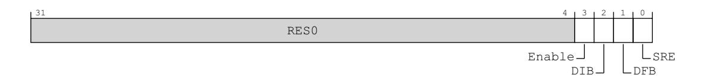

#### **Bits [31:4]**

Reserved, RES0.

#### **Enable, bit [3]**

Enable. Enables lower Exception level access to [ICC\\_SRE.](#page-446-1)

0b0 Non-secure EL1 accesses to [ICC\\_SRE](#page-446-1) trap to EL2.

0b1 Non-secure EL1 accesses to [ICC\\_SRE](#page-446-1) do not trap to EL2.

If ICC\_HSRE.SRE is RAO/WI, an implementation is permitted to make the Enable bit RAO/WI.

If ICC\_HSRE.SRE is 0, the Enable bit behaves as 1 for all purposes other than reading the value of the bit.

The reset behavior of this field is:

• On a Warm reset, this field resets to an architecturally UNKNOWN value.

#### **DIB, bit [2]**

Disable IRQ bypass.

0b0 IRQ bypass enabled.

0b1 IRQ bypass disabled.

If EL3 is implemented and [GICD\\_CTLR.](#page-543-1)DS is 0, this field is a read-only alias of [ICC\\_MSRE](#page-431-1).DIB.

If EL3 is implemented and [GICD\\_CTLR.](#page-543-1)DS is 1, this field is a read/write alias of [ICC\\_MSRE](#page-431-1).DIB.

In systems that do not support IRQ bypass, this bit is RAO/WI.

The reset behavior of this field is:

• On a Warm reset, this field resets to 0.

#### **DFB, bit [1]**

Disable FIQ bypass.

0b0 FIQ bypass enabled.

0b1 FIQ bypass disabled.

If EL3 is implemented and [GICD\\_CTLR.](#page-543-1)DS is 0, this field is a read-only alias of [ICC\\_MSRE](#page-431-1).DFB. If EL3 is implemented and [GICD\\_CTLR](#page-543-1).DS is 1, this field is a read/write alias of [ICC\\_MSRE](#page-431-1).DFB. In systems that do not support FIQ bypass, this bit is RAO/WI.

The reset behavior of this field is:

• On a Warm reset, this field resets to 0.

#### **SRE, bit [0]**

System Register Enable.

0b0 The memory-mapped interface must be used. Accesses at EL2 or below to any ICH\_\* System register, or any EL1 or EL2 ICC\_\* register other than [ICC\\_SRE](#page-446-1) or ICC\_HSRE, are UNDEFINED.

0b1 The System register interface to the ICH\_\* registers and the EL1 and EL2 ICC\_\* registers is enabled for EL2.

If software changes this bit from 1 to 0, the results are UNPREDICTABLE.

If an implementation supports only a System register interface to the GIC CPU interface, this bit is RAO/WI.

If EL3 is implemented and using AArch64:

• When [ICC\\_SRE\\_EL3.](#page-285-1)SRE==0 this bit is RAZ/WI.

If EL3 is implemented using AArch32:

• When [ICC\\_MSRE.](#page-431-1)SRE==0 this bit is RAZ/WI.

The reset behavior of this field is:

• On a Warm reset, this field resets to 0.

#### **Accessing ICC\_HSRE**

The GIC architecture permits, but does not require, that registers can be shared between memory-mapped registers and the equivalent System registers. This means that if the memory-mapped registers have been accessed while ICC\_HSRE.SRE==0, then the System registers might be modified. Therefore, software must only rely on the reset values of the System registers if there has been no use of the GIC functionality while the memory-mapped registers are in use. Otherwise, the System register values must be treated as UNKNOWN.

**MRC{<c>}{<q>} <coproc>, {#}<opc1>, <Rt>, <CRn>, <CRm>{, {#}<opc2>}**

| coproc | opc1  | CRn    | CRm    | opc2  |
|--------|-------|--------|--------|-------|
| 0b1111 | 0b100 | 0b1100 | 0b1001 | 0b101 |

```
if PSTATE.EL == EL0 then
    UNDEFINED;
elsif PSTATE.EL == EL1 then
    if EL2Enabled() && !ELUsingAArch32(EL2) && HSTR_EL2.T12 == '1' then
        AArch64.AArch32SystemAccessTrap(EL2, 0x03);
    elsif EL2Enabled() && ELUsingAArch32(EL2) && HSTR.T12 == '1' then
        AArch32.TakeHypTrapException(0x03);
    else
        UNDEFINED;
elsif PSTATE.EL == EL2 then
    if HaveEL(EL3) && EL3SDDUndefPriority() && !ELUsingAArch32(EL3) && ICC_SRE_EL3.Enable
== '0' then
        UNDEFINED;
```

```
elsif HaveEL(EL3) && !ELUsingAArch32(EL3) && ICC_SRE_EL3.Enable == '0' then
        if EL3SDDUndef() then
            UNDEFINED;
        else
            AArch64.AArch32SystemAccessTrap(EL3, 0x03);
    elsif ICC_MSRE.Enable == '0' then
        UNDEFINED;
    else
        R[t] = ICC_HSRE;
elsif PSTATE.EL == EL3 then
    if !EL2Enabled() then
        UNDEFINED;
    else
        R[t] = ICC_HSRE;
```

#### **MCR{<c>}{<q>} <coproc>, {#}<opc1>, <Rt>, <CRn>, <CRm>{, {#}<opc2>}**

| coproc | opc1  | CRn    | CRm    | opc2  |
|--------|-------|--------|--------|-------|
| 0b1111 | 0b100 | 0b1100 | 0b1001 | 0b101 |

```
if PSTATE.EL == EL0 then
    UNDEFINED;
elsif PSTATE.EL == EL1 then
    if EL2Enabled() && !ELUsingAArch32(EL2) && HSTR_EL2.T12 == '1' then
        AArch64.AArch32SystemAccessTrap(EL2, 0x03);
    elsif EL2Enabled() && ELUsingAArch32(EL2) && HSTR.T12 == '1' then
        AArch32.TakeHypTrapException(0x03);
    else
        UNDEFINED;
elsif PSTATE.EL == EL2 then
    if HaveEL(EL3) && EL3SDDUndefPriority() && !ELUsingAArch32(EL3) && ICC_SRE_EL3.Enable
== '0' then
        UNDEFINED;
    elsif HaveEL(EL3) && !ELUsingAArch32(EL3) && ICC_SRE_EL3.Enable == '0' then
        if EL3SDDUndef() then
            UNDEFINED;
        else
            AArch64.AArch32SystemAccessTrap(EL3, 0x03);
    elsif ICC_MSRE.Enable == '0' then
        UNDEFINED;
    else
        ICC_HSRE = R[t];
elsif PSTATE.EL == EL3 then
    if !EL2Enabled() then
        UNDEFINED;
    else
        ICC_HSRE = R[t];
```

#### <span id="page-410-0"></span>**12.5.13 ICC\_IAR0, Interrupt Controller Interrupt Acknowledge Register 0**

The ICC\_IAR0 characteristics are:

#### **Purpose**

The PE reads this register to obtain the INTID of the signaled Group 0 interrupt. This read acts as an acknowledge for the interrupt.

#### **Configurations**

AArch32 System register ICC\_IAR0 performs the same function as AArch64 System register [ICC\\_IAR0\\_EL1](#page-252-1).

This register is present only when EL1 is capable of using AArch32 and FEAT\_GICv3 is implemented. Otherwise, direct accesses to ICC\_IAR0 are UNDEFINED.

To allow software to ensure appropriate observability of actions initiated by GIC register accesses, the PE and CPU interface logic must ensure that reads of this register are self-synchronizing when interrupts are masked by the PE (that is when PSTATE.{I,F} == {0,0}). This ensures that the effect of activating an interrupt on the signaling of interrupt exceptions is observed when a read of this register is architecturally executed so that no spurious interrupt exception occurs if interrupts are unmasked by an instruction immediately following the read. For more information, see *[Observability of the effects of accesses to the GIC registers on page](#page-194-0) 12-195*.

#### **Attributes**

ICC\_IAR0 is a 32-bit register.

#### **Field descriptions**

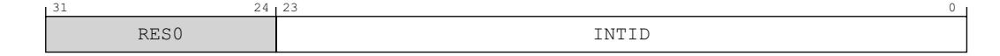

#### **Bits [31:24]**

Reserved, RES0.

#### **INTID, bits [23:0]**

The INTID of the signaled interrupt.

This is the INTID of the highest priority pending interrupt, if that interrupt is of sufficient priority for it to be signaled to the PE, and if it can be acknowledged at the current Security state and Exception level.

If the highest priority pending interrupt is not observable, this field contains a special INTID to indicate the reason. These special INTIDs can be one of: 1020, 1021, or 1023. For more information, see *[Special INTIDs on page](#page-35-1) 2-36*.

This field has either 16 or 24 bits implemented. The number of implemented bits can be found in [ICC\\_CTLR.](#page-389-0)IDbits and [ICC\\_MCTLR](#page-424-1).IDbits. If only 16 bits are implemented, bits [23:16] of this register are RES0.

#### **Accessing ICC\_IAR0**

```
MRC{<c>}{<q>} <coproc>, {#}<opc1>, <Rt>, <CRn>, <CRm>{, {#}<opc2>}
```

| coproc | opc1  | CRn    | CRm    | opc2  |
|--------|-------|--------|--------|-------|
| 0b1111 | 0b000 | 0b1100 | 0b1000 | 0b000 |

```
if PSTATE.EL == EL0 then
    UNDEFINED;
elsif PSTATE.EL == EL1 then
    if HaveEL(EL3) && EL3SDDUndefPriority() && !ELUsingAArch32(EL3) && SCR_EL3.FIQ == '1'
then
        UNDEFINED;
    elsif HaveEL(EL3) && EL3SDDUndefPriority() && ELUsingAArch32(EL3) && PSTATE.M !=
M32_Monitor && SCR.FIQ == '1' then
        UNDEFINED;
    elsif EL2Enabled() && !ELUsingAArch32(EL2) && HSTR_EL2.T12 == '1' then
        AArch64.AArch32SystemAccessTrap(EL2, 0x03);
    elsif EL2Enabled() && ELUsingAArch32(EL2) && HSTR.T12 == '1' then
        AArch32.TakeHypTrapException(0x03);
    elsif ICC_SRE.SRE == '0' then
        UNDEFINED;
    elsif EL2Enabled() && !ELUsingAArch32(EL2) && ICH_HCR_EL2.TALL0 == '1' then
        AArch64.AArch32SystemAccessTrap(EL2, 0x03);
    elsif EL2Enabled() && ELUsingAArch32(EL2) && ICH_HCR.TALL0 == '1' then
        AArch32.TakeHypTrapException(0x03);
    elsif EL2Enabled() && !ELUsingAArch32(EL2) && HCR_EL2.FMO == '1' then
        R[t] = ICV_IAR0;
    elsif EL2Enabled() && ELUsingAArch32(EL2) && HCR.FMO == '1' then
        R[t] = ICV_IAR0;
    elsif HaveEL(EL3) && !ELUsingAArch32(EL3) && SCR_EL3.FIQ == '1' then
        if EL3SDDUndef() then
            UNDEFINED;
        else
            AArch64.AArch32SystemAccessTrap(EL3, 0x03);
    elsif HaveEL(EL3) && ELUsingAArch32(EL3) && PSTATE.M != M32_Monitor && SCR.FIQ == '1'
then
        if EL3SDDUndef() then
            UNDEFINED;
        else
            AArch32.TakeMonitorTrapException();
    else
        R[t] = ICC_IAR0;
elsif PSTATE.EL == EL2 then
    if HaveEL(EL3) && EL3SDDUndefPriority() && !ELUsingAArch32(EL3) && SCR_EL3.FIQ == '1'
then
        UNDEFINED;
    elsif HaveEL(EL3) && EL3SDDUndefPriority() && ELUsingAArch32(EL3) && SCR.FIQ == '1'
then
        UNDEFINED;
    elsif ICC_HSRE.SRE == '0' then
        UNDEFINED;
    elsif HaveEL(EL3) && !ELUsingAArch32(EL3) && SCR_EL3.FIQ == '1' then
        if EL3SDDUndef() then
            UNDEFINED;
        else
            AArch64.AArch32SystemAccessTrap(EL3, 0x03);
    elsif HaveEL(EL3) && ELUsingAArch32(EL3) && SCR.FIQ == '1' then
        if EL3SDDUndef() then
            UNDEFINED;
```

```
else
            AArch32.TakeMonitorTrapException();
    else
        R[t] = ICC_IAR0;
elsif PSTATE.EL == EL3 then
    if ICC_MSRE.SRE == '0' then
        UNDEFINED;
    else
        R[t] = ICC_IAR0;
```

#### <span id="page-413-0"></span>**12.5.14 ICC\_IAR1, Interrupt Controller Interrupt Acknowledge Register 1**

The ICC\_IAR1 characteristics are:

#### **Purpose**

The PE reads this register to obtain the INTID of the signaled Group 1 interrupt. This read acts as an acknowledge for the interrupt.

#### **Configurations**

AArch32 System register ICC\_IAR1 performs the same function as AArch64 System register [ICC\\_IAR1\\_EL1](#page-254-1).

This register is present only when EL1 is capable of using AArch32 and FEAT\_GICv3 is implemented. Otherwise, direct accesses to ICC\_IAR1 are UNDEFINED.

To allow software to ensure appropriate observability of actions initiated by GIC register accesses, the PE and CPU interface logic must ensure that reads of this register are self-synchronizing when interrupts are masked by the PE (that is when PSTATE.{I,F} == {0,0}). This ensures that the effect of activating an interrupt on the signaling of interrupt exceptions is observed when a read of this register is architecturally executed so that no spurious interrupt exception occurs if interrupts are unmasked by an instruction immediately following the read. For more information, see *[Observability of the effects of accesses to the GIC registers on page](#page-194-0) 12-195*.

#### **Attributes**

ICC\_IAR1 is a 32-bit register.

#### **Field descriptions**


#### **Bits [31:24]**

Reserved, RES0.

#### **INTID, bits [23:0]**

The INTID of the signaled interrupt.

This is the INTID of the highest priority pending interrupt, if that interrupt is of sufficient priority for it to be signaled to the PE, and if it can be acknowledged at the current Security state and Exception level.

If the highest priority pending interrupt is not observable, this field contains a special INTID to indicate the reason. This special INTID can take the value 1023 only. For more information, see *[Special INTIDs on page](#page-35-1) 2-36*.

This field has either 16 or 24 bits implemented. The number of implemented bits can be found in [ICC\\_CTLR.](#page-389-0)IDbits and [ICC\\_MCTLR](#page-424-1).IDbits. If only 16 bits are implemented, bits [23:16] of this register are RES0.

#### **Accessing ICC\_IAR1**

```
MRC{<c>}{<q>} <coproc>, {#}<opc1>, <Rt>, <CRn>, <CRm>{, {#}<opc2>}
```

| coproc | opc1  | CRn    | CRm    | opc2  |
|--------|-------|--------|--------|-------|
| 0b1111 | 0b000 | 0b1100 | 0b1100 | 0b000 |

```
if PSTATE.EL == EL0 then
    UNDEFINED;
elsif PSTATE.EL == EL1 then
    if HaveEL(EL3) && EL3SDDUndefPriority() && !ELUsingAArch32(EL3) && SCR_EL3.IRQ == '1'
then
        UNDEFINED;
    elsif HaveEL(EL3) && EL3SDDUndefPriority() && ELUsingAArch32(EL3) && PSTATE.M !=
M32_Monitor && SCR.IRQ == '1' then
        UNDEFINED;
    elsif EL2Enabled() && !ELUsingAArch32(EL2) && HSTR_EL2.T12 == '1' then
        AArch64.AArch32SystemAccessTrap(EL2, 0x03);
    elsif EL2Enabled() && ELUsingAArch32(EL2) && HSTR.T12 == '1' then
        AArch32.TakeHypTrapException(0x03);
    elsif ICC_SRE.SRE == '0' then
        UNDEFINED;
    elsif EL2Enabled() && !ELUsingAArch32(EL2) && ICH_HCR_EL2.TALL1 == '1' then
        AArch64.AArch32SystemAccessTrap(EL2, 0x03);
    elsif EL2Enabled() && ELUsingAArch32(EL2) && ICH_HCR.TALL1 == '1' then
        AArch32.TakeHypTrapException(0x03);
    elsif EL2Enabled() && !ELUsingAArch32(EL2) && HCR_EL2.IMO == '1' then
        R[t] = ICV_IAR1;
    elsif EL2Enabled() && ELUsingAArch32(EL2) && HCR.IMO == '1' then
        R[t] = ICV_IAR1;
    elsif HaveEL(EL3) && !ELUsingAArch32(EL3) && SCR_EL3.IRQ == '1' then
        if EL3SDDUndef() then
            UNDEFINED;
        else
            AArch64.AArch32SystemAccessTrap(EL3, 0x03);
    elsif HaveEL(EL3) && ELUsingAArch32(EL3) && PSTATE.M != M32_Monitor && SCR.IRQ == '1'
then
        if EL3SDDUndef() then
            UNDEFINED;
        else
            AArch32.TakeMonitorTrapException();
    else
        R[t] = ICC_IAR1;
elsif PSTATE.EL == EL2 then
    if HaveEL(EL3) && EL3SDDUndefPriority() && !ELUsingAArch32(EL3) && SCR_EL3.IRQ == '1'
then
        UNDEFINED;
    elsif HaveEL(EL3) && EL3SDDUndefPriority() && ELUsingAArch32(EL3) && SCR.IRQ == '1'
then
        UNDEFINED;
    elsif ICC_HSRE.SRE == '0' then
        UNDEFINED;
    elsif HaveEL(EL3) && !ELUsingAArch32(EL3) && SCR_EL3.IRQ == '1' then
        if EL3SDDUndef() then
            UNDEFINED;
        else
            AArch64.AArch32SystemAccessTrap(EL3, 0x03);
    elsif HaveEL(EL3) && ELUsingAArch32(EL3) && SCR.IRQ == '1' then
        if EL3SDDUndef() then
            UNDEFINED;
```

```
else
            AArch32.TakeMonitorTrapException();
    else
        R[t] = ICC_IAR1;
elsif PSTATE.EL == EL3 then
    if ICC_MSRE.SRE == '0' then
        UNDEFINED;
    else
        R[t] = ICC_IAR1;
```

#### <span id="page-416-0"></span>**12.5.15 ICC\_IGRPEN0, Interrupt Controller Interrupt Group 0 Enable register**

The ICC\_IGRPEN0 characteristics are:

#### **Purpose**

Controls whether Group 0 interrupts are enabled or not.

#### **Configurations**

AArch32 System register ICC\_IGRPEN0 bits [31:0] are architecturally mapped to AArch64 System register [ICC\\_IGRPEN0\\_EL1](#page-256-1)[31:0].

This register is present only when EL1 is capable of using AArch32 and FEAT\_GICv3 is implemented. Otherwise, direct accesses to ICC\_IGRPEN0 are UNDEFINED.

#### **Attributes**

ICC\_IGRPEN0 is a 32-bit register.

#### **Field descriptions**

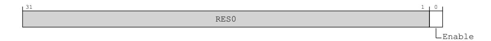

#### **Bits [31:1]**

Reserved, RES0.

#### **Enable, bit [0]**

Enables Group 0 interrupts.

0b0 Group 0 interrupts are disabled.

0b1 Group 0 interrupts are enabled.

Virtual accesses to this register update [ICH\\_VMCR](#page-525-0).VENG0.

The reset behavior of this field is:

• On a Warm reset, this field resets to 0.

#### **Accessing ICC\_IGRPEN0**

The lowest Exception level at which this register can be accessed is governed by the Exception level to which FIQ is routed. This routing depends on [SCR](#page-29-5).FIQ, [SCR](#page-29-5).NS and [HCR](#page-28-4).FMO.

If an interrupt is pending within the CPU interface when Enable becomes 0, the interrupt must be released to allow the Distributor to forward the interrupt to a different PE.

Accesses to this register use the following encodings in the System register encoding space:

**MRC{<c>}{<q>} <coproc>, {#}<opc1>, <Rt>, <CRn>, <CRm>{, {#}<opc2>}**

| coproc | opc1  | CRn    | CRm    | opc2  |
|--------|-------|--------|--------|-------|
| 0b1111 | 0b000 | 0b1100 | 0b1100 | 0b110 |

if PSTATE.EL == EL0 then UNDEFINED; elsif PSTATE.EL == EL1 then

```
if HaveEL(EL3) && EL3SDDUndefPriority() && !ELUsingAArch32(EL3) && SCR_EL3.FIQ == '1'
then
        UNDEFINED;
    elsif HaveEL(EL3) && EL3SDDUndefPriority() && ELUsingAArch32(EL3) && PSTATE.M !=
M32_Monitor && SCR.FIQ == '1' then
        UNDEFINED;
    elsif EL2Enabled() && !ELUsingAArch32(EL2) && HSTR_EL2.T12 == '1' then
        AArch64.AArch32SystemAccessTrap(EL2, 0x03);
    elsif EL2Enabled() && ELUsingAArch32(EL2) && HSTR.T12 == '1' then
        AArch32.TakeHypTrapException(0x03);
    elsif ICC_SRE.SRE == '0' then
        UNDEFINED;
    elsif EL2Enabled() && !ELUsingAArch32(EL2) && ICH_HCR_EL2.TALL0 == '1' then
        AArch64.AArch32SystemAccessTrap(EL2, 0x03);
    elsif EL2Enabled() && ELUsingAArch32(EL2) && ICH_HCR.TALL0 == '1' then
        AArch32.TakeHypTrapException(0x03);
    elsif EL2Enabled() && !ELUsingAArch32(EL2) && HCR_EL2.FMO == '1' then
        R[t] = ICV_IGRPEN0;
    elsif EL2Enabled() && ELUsingAArch32(EL2) && HCR.FMO == '1' then
        R[t] = ICV_IGRPEN0;
    elsif HaveEL(EL3) && !ELUsingAArch32(EL3) && SCR_EL3.FIQ == '1' then
        if EL3SDDUndef() then
            UNDEFINED;
        else
            AArch64.AArch32SystemAccessTrap(EL3, 0x03);
    elsif HaveEL(EL3) && ELUsingAArch32(EL3) && PSTATE.M != M32_Monitor && SCR.FIQ == '1'
then
        if EL3SDDUndef() then
            UNDEFINED;
        else
            AArch32.TakeMonitorTrapException();
    else
        R[t] = ICC_IGRPEN0;
elsif PSTATE.EL == EL2 then
    if HaveEL(EL3) && EL3SDDUndefPriority() && !ELUsingAArch32(EL3) && SCR_EL3.FIQ == '1'
then
        UNDEFINED;
    elsif HaveEL(EL3) && EL3SDDUndefPriority() && ELUsingAArch32(EL3) && SCR.FIQ == '1'
then
        UNDEFINED;
    elsif ICC_HSRE.SRE == '0' then
        UNDEFINED;
    elsif HaveEL(EL3) && !ELUsingAArch32(EL3) && SCR_EL3.FIQ == '1' then
        if EL3SDDUndef() then
            UNDEFINED;
        else
            AArch64.AArch32SystemAccessTrap(EL3, 0x03);
    elsif HaveEL(EL3) && ELUsingAArch32(EL3) && SCR.FIQ == '1' then
        if EL3SDDUndef() then
            UNDEFINED;
        else
            AArch32.TakeMonitorTrapException();
    else
        R[t] = ICC_IGRPEN0;
elsif PSTATE.EL == EL3 then
    if ICC_MSRE.SRE == '0' then
        UNDEFINED;
    else
        R[t] = ICC_IGRPEN0;
```

#### **MCR{<c>}{<q>} <coproc>, {#}<opc1>, <Rt>, <CRn>, <CRm>{, {#}<opc2>}**

| coproc | opc1  | CRn    | CRm    | opc2  |
|--------|-------|--------|--------|-------|
| 0b1111 | 0b000 | 0b1100 | 0b1100 | 0b110 |

```
if PSTATE.EL == EL0 then
    UNDEFINED;
elsif PSTATE.EL == EL1 then
    if HaveEL(EL3) && EL3SDDUndefPriority() && !ELUsingAArch32(EL3) && SCR_EL3.FIQ == '1'
then
        UNDEFINED;
    elsif HaveEL(EL3) && EL3SDDUndefPriority() && ELUsingAArch32(EL3) && PSTATE.M !=
M32_Monitor && SCR.FIQ == '1' then
        UNDEFINED;
    elsif EL2Enabled() && !ELUsingAArch32(EL2) && HSTR_EL2.T12 == '1' then
        AArch64.AArch32SystemAccessTrap(EL2, 0x03);
    elsif EL2Enabled() && ELUsingAArch32(EL2) && HSTR.T12 == '1' then
        AArch32.TakeHypTrapException(0x03);
    elsif ICC_SRE.SRE == '0' then
        UNDEFINED;
    elsif EL2Enabled() && !ELUsingAArch32(EL2) && ICH_HCR_EL2.TALL0 == '1' then
        AArch64.AArch32SystemAccessTrap(EL2, 0x03);
    elsif EL2Enabled() && ELUsingAArch32(EL2) && ICH_HCR.TALL0 == '1' then
        AArch32.TakeHypTrapException(0x03);
    elsif EL2Enabled() && !ELUsingAArch32(EL2) && HCR_EL2.FMO == '1' then
        ICV_IGRPEN0 = R[t];
    elsif EL2Enabled() && ELUsingAArch32(EL2) && HCR.FMO == '1' then
        ICV_IGRPEN0 = R[t];
    elsif HaveEL(EL3) && !ELUsingAArch32(EL3) && SCR_EL3.FIQ == '1' then
        if EL3SDDUndef() then
            UNDEFINED;
        else
            AArch64.AArch32SystemAccessTrap(EL3, 0x03);
    elsif HaveEL(EL3) && ELUsingAArch32(EL3) && PSTATE.M != M32_Monitor && SCR.FIQ == '1'
then
        if EL3SDDUndef() then
            UNDEFINED;
        else
            AArch32.TakeMonitorTrapException();
    else
        ICC_IGRPEN0 = R[t];
elsif PSTATE.EL == EL2 then
    if HaveEL(EL3) && EL3SDDUndefPriority() && !ELUsingAArch32(EL3) && SCR_EL3.FIQ == '1'
then
        UNDEFINED;
    elsif HaveEL(EL3) && EL3SDDUndefPriority() && ELUsingAArch32(EL3) && SCR.FIQ == '1'
then
        UNDEFINED;
    elsif ICC_HSRE.SRE == '0' then
        UNDEFINED;
    elsif HaveEL(EL3) && !ELUsingAArch32(EL3) && SCR_EL3.FIQ == '1' then
        if EL3SDDUndef() then
            UNDEFINED;
        else
            AArch64.AArch32SystemAccessTrap(EL3, 0x03);
    elsif HaveEL(EL3) && ELUsingAArch32(EL3) && SCR.FIQ == '1' then
        if EL3SDDUndef() then
            UNDEFINED;
        else
            AArch32.TakeMonitorTrapException();
    else
        ICC_IGRPEN0 = R[t];
```

elsif PSTATE.EL == EL3 then if ICC\_MSRE.SRE == '0' then UNDEFINED; else ICC\_IGRPEN0 = R[t];

#### <span id="page-420-0"></span>**12.5.16 ICC\_IGRPEN1, Interrupt Controller Interrupt Group 1 Enable register**

The ICC\_IGRPEN1 characteristics are:

#### **Purpose**

Controls whether Group 1 interrupts are enabled for the current Security state.

#### **Configurations**

 This register is banked between ICC\_IGRPEN1 and ICC\_IGRPEN1\_S and ICC\_IGRPEN1\_NS.

AArch32 System register ICC\_IGRPEN1 bits [31:0] (ICC\_IGRPEN1\_S) are architecturally mapped to AArch64 System register [ICC\\_IGRPEN1\\_EL1](#page-259-1)[31:0] (ICC\_IGRPEN1\_EL1\_S).

AArch32 System register ICC\_IGRPEN1 bits [31:0] (ICC\_IGRPEN1\_NS) are architecturally mapped to AArch64 System register [ICC\\_IGRPEN1\\_EL1](#page-259-1)[31:0] (ICC\_IGRPEN1\_EL1\_NS).

This register is present only when EL1 is capable of using AArch32 and FEAT\_GICv3 is implemented. Otherwise, direct accesses to ICC\_IGRPEN1 are UNDEFINED.

#### **Attributes**

ICC\_IGRPEN1 is a 32-bit register.

This register has the following instances:

- ICC\_IGRPEN1, when EL3 is not implemented.
- ICC\_IGRPEN1\_S, when EL3 is implemented.
- ICC\_IGRPEN1\_NS, when EL3 is implemented.

#### **Field descriptions**


#### **Bits [31:1]**

Reserved, RES0.

#### **Enable, bit [0]**

Enables Group 1 interrupts for the current Security state.

0b0 Group 1 interrupts are disabled for the current Security state.

0b1 Group 1 interrupts are enabled for the current Security state.

Virtual accesses to this register update [ICH\\_VMCR](#page-525-0).VENG1.

#### If EL3 is present:

- This bit is a read/write alias of [ICC\\_MGRPEN1](#page-429-0).EnableGrp1{S, NS} as appropriate if EL3 is using AArch32, or [ICC\\_IGRPEN1\\_EL3](#page-262-1).EnableGrp1{S, NS} as appropriate if EL3 is using AArch64.
- When this register is accessed at EL3, the copy of this register appropriate to the current setting of SCR.NS is accessed.

The reset behavior of this field is:

• On a Warm reset, this field resets to 0.

#### **Accessing ICC\_IGRPEN1**

The lowest Exception level at which this register can be accessed is governed by the Exception level to which IRQ is routed. This routing depends on the IRQ and NS fields of SCR or SCR\_EL3 and the IMO field of HCR or HCR\_EL2.

If an interrupt is pending within the CPU interface when Enable becomes 0, the interrupt must be released to allow the Distributor to forward the interrupt to a different PE.

```
MRC{<c>}{<q>} <coproc>, {#}<opc1>, <Rt>, <CRn>, <CRm>{, {#}<opc2>}
```

| coproc | opc1  | CRn    | CRm    | opc2  |
|--------|-------|--------|--------|-------|
| 0b1111 | 0b000 | 0b1100 | 0b1100 | 0b111 |

```
if PSTATE.EL == EL0 then
    UNDEFINED;
elsif PSTATE.EL == EL1 then
    if HaveEL(EL3) && EL3SDDUndefPriority() && !ELUsingAArch32(EL3) && SCR_EL3.IRQ == '1'
then
        UNDEFINED;
    elsif HaveEL(EL3) && EL3SDDUndefPriority() && ELUsingAArch32(EL3) && PSTATE.M !=
M32_Monitor && SCR.IRQ == '1' then
        UNDEFINED;
    elsif EL2Enabled() && !ELUsingAArch32(EL2) && HSTR_EL2.T12 == '1' then
        AArch64.AArch32SystemAccessTrap(EL2, 0x03);
    elsif EL2Enabled() && ELUsingAArch32(EL2) && HSTR.T12 == '1' then
        AArch32.TakeHypTrapException(0x03);
    elsif ICC_SRE.SRE == '0' then
        UNDEFINED;
    elsif EL2Enabled() && !ELUsingAArch32(EL2) && ICH_HCR_EL2.TALL1 == '1' then
        AArch64.AArch32SystemAccessTrap(EL2, 0x03);
    elsif EL2Enabled() && ELUsingAArch32(EL2) && ICH_HCR.TALL1 == '1' then
        AArch32.TakeHypTrapException(0x03);
    elsif EL2Enabled() && !ELUsingAArch32(EL2) && HCR_EL2.IMO == '1' then
        R[t] = ICV_IGRPEN1;
    elsif EL2Enabled() && ELUsingAArch32(EL2) && HCR.IMO == '1' then
        R[t] = ICV_IGRPEN1;
    elsif HaveEL(EL3) && !ELUsingAArch32(EL3) && SCR_EL3.IRQ == '1' then
        if EL3SDDUndef() then
            UNDEFINED;
        else
            AArch64.AArch32SystemAccessTrap(EL3, 0x03);
    elsif HaveEL(EL3) && ELUsingAArch32(EL3) && PSTATE.M != M32_Monitor && SCR.IRQ == '1'
then
        if EL3SDDUndef() then
            UNDEFINED;
        else
            AArch32.TakeMonitorTrapException();
    elsif HaveEL(EL3) then
        R[t] = ICC_IGRPEN1_NS;
    else
        R[t] = ICC_IGRPEN1;
elsif PSTATE.EL == EL2 then
    if HaveEL(EL3) && EL3SDDUndefPriority() && !ELUsingAArch32(EL3) && SCR_EL3.IRQ == '1'
then
        UNDEFINED;
    elsif HaveEL(EL3) && EL3SDDUndefPriority() && ELUsingAArch32(EL3) && SCR.IRQ == '1'
then
        UNDEFINED;
    elsif ICC_HSRE.SRE == '0' then
```

```
UNDEFINED;
    elsif HaveEL(EL3) && !ELUsingAArch32(EL3) && SCR_EL3.IRQ == '1' then
        if EL3SDDUndef() then
            UNDEFINED;
        else
            AArch64.AArch32SystemAccessTrap(EL3, 0x03);
    elsif HaveEL(EL3) && ELUsingAArch32(EL3) && SCR.IRQ == '1' then
        if EL3SDDUndef() then
            UNDEFINED;
        else
            AArch32.TakeMonitorTrapException();
    elsif HaveEL(EL3) then
        R[t] = ICC_IGRPEN1_NS;
    else
        R[t] = ICC_IGRPEN1;
elsif PSTATE.EL == EL3 then
    if ICC_MSRE.SRE == '0' then
        UNDEFINED;
    else
        if SCR.NS == '0' then
            R[t] = ICC_IGRPEN1_S;
        else
            R[t] = ICC_IGRPEN1_NS;
```

#### **MCR{<c>}{<q>} <coproc>, {#}<opc1>, <Rt>, <CRn>, <CRm>{, {#}<opc2>}**

| coproc | opc1  | CRn    | CRm    | opc2  |
|--------|-------|--------|--------|-------|
| 0b1111 | 0b000 | 0b1100 | 0b1100 | 0b111 |

```
if PSTATE.EL == EL0 then
    UNDEFINED;
elsif PSTATE.EL == EL1 then
    if HaveEL(EL3) && EL3SDDUndefPriority() && !ELUsingAArch32(EL3) && SCR_EL3.IRQ == '1'
then
        UNDEFINED;
    elsif HaveEL(EL3) && EL3SDDUndefPriority() && ELUsingAArch32(EL3) && PSTATE.M !=
M32_Monitor && SCR.IRQ == '1' then
        UNDEFINED;
    elsif EL2Enabled() && !ELUsingAArch32(EL2) && HSTR_EL2.T12 == '1' then
        AArch64.AArch32SystemAccessTrap(EL2, 0x03);
    elsif EL2Enabled() && ELUsingAArch32(EL2) && HSTR.T12 == '1' then
        AArch32.TakeHypTrapException(0x03);
    elsif ICC_SRE.SRE == '0' then
        UNDEFINED;
    elsif EL2Enabled() && !ELUsingAArch32(EL2) && ICH_HCR_EL2.TALL1 == '1' then
        AArch64.AArch32SystemAccessTrap(EL2, 0x03);
    elsif EL2Enabled() && ELUsingAArch32(EL2) && ICH_HCR.TALL1 == '1' then
        AArch32.TakeHypTrapException(0x03);
    elsif EL2Enabled() && !ELUsingAArch32(EL2) && HCR_EL2.IMO == '1' then
        ICV_IGRPEN1 = R[t];
    elsif EL2Enabled() && ELUsingAArch32(EL2) && HCR.IMO == '1' then
        ICV_IGRPEN1 = R[t];
    elsif HaveEL(EL3) && !ELUsingAArch32(EL3) && SCR_EL3.IRQ == '1' then
        if EL3SDDUndef() then
            UNDEFINED;
        else
            AArch64.AArch32SystemAccessTrap(EL3, 0x03);
    elsif HaveEL(EL3) && ELUsingAArch32(EL3) && PSTATE.M != M32_Monitor && SCR.IRQ == '1'
then
        if EL3SDDUndef() then
            UNDEFINED;
```

```
else
            AArch32.TakeMonitorTrapException();
    elsif HaveEL(EL3) then
        ICC_IGRPEN1_NS = R[t];
    else
        ICC_IGRPEN1 = R[t];
elsif PSTATE.EL == EL2 then
    if HaveEL(EL3) && EL3SDDUndefPriority() && !ELUsingAArch32(EL3) && SCR_EL3.IRQ == '1'
then
        UNDEFINED;
    elsif HaveEL(EL3) && EL3SDDUndefPriority() && ELUsingAArch32(EL3) && SCR.IRQ == '1'
then
        UNDEFINED;
    elsif ICC_HSRE.SRE == '0' then
        UNDEFINED;
    elsif HaveEL(EL3) && !ELUsingAArch32(EL3) && SCR_EL3.IRQ == '1' then
        if EL3SDDUndef() then
            UNDEFINED;
        else
            AArch64.AArch32SystemAccessTrap(EL3, 0x03);
    elsif HaveEL(EL3) && ELUsingAArch32(EL3) && SCR.IRQ == '1' then
        if EL3SDDUndef() then
            UNDEFINED;
        else
            AArch32.TakeMonitorTrapException();
    elsif HaveEL(EL3) then
        ICC_IGRPEN1_NS = R[t];
    else
        ICC_IGRPEN1 = R[t];
elsif PSTATE.EL == EL3 then
    if ICC_MSRE.SRE == '0' then
        UNDEFINED;
    else
        if SCR.NS == '0' then
            ICC_IGRPEN1_S = R[t];
        else
            ICC_IGRPEN1_NS = R[t];
```

#### <span id="page-424-1"></span><span id="page-424-0"></span>**12.5.17 ICC\_MCTLR, Interrupt Controller Monitor Control Register**

The ICC\_MCTLR characteristics are:

#### **Purpose**

Controls aspects of the behavior of the GIC CPU interface and provides information about the features implemented.

#### **Configurations**

This register is present only when EL3 is capable of using AArch32, FEAT\_GICv3 is implemented and EL3 is implemented. Otherwise, direct accesses to ICC\_MCTLR are UNDEFINED.

#### **Attributes**

ICC\_MCTLR is a 32-bit register.

#### **Field descriptions**

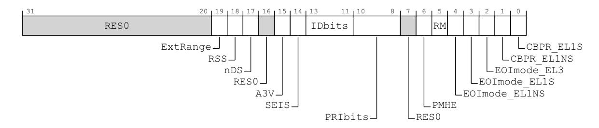

#### **Bits [31:20]**

Reserved, RES0.

#### **ExtRange, bit [19]**

Extended INTID range (read-only).

0b0 CPU interface does not support INTIDs in the range 1024..8191.

Behavior is UNPREDICTABLE if the IRI delivers an interrupt in the range 1024 to 8191 to the CPU interface.

**Note**

Arm strongly recommends that the IRI is not configured to deliver interrupts in this range to a PE that does not support them.

0b1 CPU interface supports INTIDs in the range 1024..8191

All INTIDs in the range 1024..8191 are treated as requiring deactivation.

#### **RSS, bit [18]**

Range Selector Support. Possible values are:

0b0 Targeted SGIs with affinity level 0 values of 0 - 15 are supported.

0b1 Targeted SGIs with affinity level 0 values of 0 - 255 are supported.

This bit is read-only.

#### **nDS, bit [17]**

Disable Security not supported. Read-only and writes are ignored.

0b0 The CPU interface logic supports disabling of security.

0b1 The CPU interface logic does not support disabling of security, and requires that security is not disabled.

#### **Bit [16]**

Reserved, RES0.

#### **A3V, bit [15]**

Affinity 3 Valid. Read-only and writes are ignored.

0b0 The CPU interface logic does not support nonzero values of the Aff3 field in SGI

generation System registers.

0b1 The CPU interface logic supports nonzero values of the Aff3 field in SGI generation

System registers.

If EL3 is present, [ICC\\_CTLR](#page-389-0).A3V is an alias of ICC\_MCTLR.A3V

#### **SEIS, bit [14]**

SEI Support. Read-only and writes are ignored. Indicates whether the CPU interface supports generation of SEIs.

0b0 The CPU interface logic does not support generation of SEIs.

0b1 The CPU interface logic supports generation of SEIs.

If EL3 is present, [ICC\\_CTLR](#page-389-0).SEIS is an alias of ICC\_MCTLR.SEIS

#### **IDbits, bits [13:11]**

Identifier bits. Read-only and writes are ignored. Indicates the number of physical interrupt identifier bits supported.

0b000 16 bits. 0b001 24 bits.

All other values are reserved.

If EL3 is present, [ICC\\_CTLR](#page-389-0).IDbits is an alias of ICC\_MCTLR.IDbits

#### **PRIbits, bits [10:8]**

Priority bits. Read-only and writes are ignored. The number of priority bits implemented, minus one.

An implementation that supports two Security states must implement at least 32 levels of physical priority (5 priority bits).

An implementation that supports only a single Security state must implement at least 16 levels of physical priority (4 priority bits).

**Note**

This field always returns the number of priority bits implemented, regardless of the value of SCR.NS or the value of [GICD\\_CTLR.](#page-543-1)DS.

The division between group priority and subpriority is defined in the binary point registers [ICC\\_BPR0](#page-380-1) and [ICC\\_BPR1](#page-384-1).

This field determines the minimum value of [ICC\\_BPR0](#page-380-1).

#### **Bit [7]**

Reserved, RES0.

#### **PMHE, bit [6]**

Priority Mask Hint Enable.

0b0 Disables use of the priority mask register as a hint for interrupt distribution.

0b1 Enables use of the priority mask register as a hint for interrupt distribution.

Software must write [ICC\\_PMR](#page-434-0) to 0xFF before clearing this field to 0.

An implementation might choose to make this field RAO/WI.

If EL3 is present, [ICC\\_CTLR](#page-389-0).PMHE is an alias of ICC\_MCTLR.PMHE.

The reset behavior of this field is:

• On a Warm reset, this field resets to 0.

#### **RM, bit [5]**

SBZ.

The equivalent bit in AArch64 is the Routing Modifier bit. This feature is not supported when EL3 is using AArch32.

The reset behavior of this field is:

• On a Warm reset, this field resets to an architecturally UNKNOWN value.

#### **EOImode\_EL1NS, bit [4]**

EOI mode for interrupts handled at Non-secure EL1 and EL2. Controls whether a write to an End of Interrupt register also deactivates the interrupt.

0b0 [ICC\\_EOIR0](#page-397-0) and [ICC\\_EOIR1](#page-400-0) provide both priority drop and interrupt deactivation functionality. Accesses to [ICC\\_DIR](#page-395-0) are UNPREDICTABLE.

0b1 [ICC\\_EOIR0](#page-397-0) and [ICC\\_EOIR1](#page-400-0) provide priority drop functionality only. [ICC\\_DIR](#page-395-0) provides interrupt deactivation functionality.

If EL3 is present, [ICC\\_CTLR](#page-389-0)\_NS.EOImode is an alias of ICC\_MCTLR.EOImode\_EL1NS.

The reset behavior of this field is:

• On a Warm reset, this field resets to an architecturally UNKNOWN value.

#### **EOImode\_EL1S, bit [3]**

EOI mode for interrupts handled at Secure EL1. Controls whether a write to an End of Interrupt register also deactivates the interrupt.

0b0 [ICC\\_EOIR0](#page-397-0) and [ICC\\_EOIR1](#page-400-0) provide both priority drop and interrupt deactivation functionality. Accesses to [ICC\\_DIR](#page-395-0) are UNPREDICTABLE.

0b1 [ICC\\_EOIR0](#page-397-0) and [ICC\\_EOIR1](#page-400-0) provide priority drop functionality only. [ICC\\_DIR](#page-395-0) provides interrupt deactivation functionality.

If EL3 is present, [ICC\\_CTLR](#page-389-0)\_S.EOImode is an alias of ICC\_MCTLR.EOImode\_EL1S.

The reset behavior of this field is:

• On a Warm reset, this field resets to an architecturally UNKNOWN value.

#### **EOImode\_EL3, bit [2]**

EOI mode for interrupts handled at EL3. Controls whether a write to an End of Interrupt register also deactivates the interrupt.

0b0 [ICC\\_EOIR0](#page-397-0) and [ICC\\_EOIR1](#page-400-0) provide both priority drop and interrupt deactivation functionality. Accesses to [ICC\\_DIR](#page-395-0) are UNPREDICTABLE.

0b1 [ICC\\_EOIR0](#page-397-0) and [ICC\\_EOIR1](#page-400-0) provide priority drop functionality only. [ICC\\_DIR](#page-395-0) provides interrupt deactivation functionality.

The reset behavior of this field is:

• On a Warm reset, this field resets to an architecturally UNKNOWN value.

#### **CBPR\_EL1NS, bit [1]**

Common Binary Point Register, EL1 Non-secure. Controls whether the same register is used for interrupt preemption of both Group 0 and Group 1 Non-secure interrupts at EL1 and EL2.

0b0 [ICC\\_BPR0](#page-380-1) determines the preemption group for Group 0 interrupts only.

[ICC\\_BPR1](#page-384-1) determines the preemption group for Non-secure Group 1 interrupts.

0b1 [ICC\\_BPR0](#page-380-1) determines the preemption group for Group 0 interrupts and Non-secure Group 1 interrupts. Non-secure accesses to [GICC\\_BPR](#page-740-0) and [ICC\\_BPR1](#page-384-1) access the state of [ICC\\_BPR0](#page-380-1).

If EL3 is present, [ICC\\_CTLR](#page-389-0)\_NS.CBPR is an alias of ICC\_MCTLR.CBPR\_EL1NS.

The reset behavior of this field is:

• On a Warm reset, this field resets to an architecturally UNKNOWN value.

#### **CBPR\_EL1S, bit [0]**

Common Binary Point Register, EL1 Secure. Controls whether the same register is used for interrupt preemption of both Group 0 and Group 1 Secure interrupts in Secure non-Monitor modes.

0b0 [ICC\\_BPR0](#page-380-1) determines the preemption group for Group 0 interrupts only. [ICC\\_BPR1](#page-384-1) determines the preemption group for Secure Group 1 interrupts. 0b1 [ICC\\_BPR0](#page-380-1) determines the preemption group for Group 0 interrupts and Secure Group

1 interrupts. Secure EL1 accesses, or EL3 accesses when not in Monitor mode, to [ICC\\_BPR1](#page-384-1) access the state of [ICC\\_BPR0.](#page-380-1)

If EL3 is present, [ICC\\_CTLR](#page-389-0)\_S.CBPR is an alias of ICC\_MCTLR.CBPR\_EL1S.

The reset behavior of this field is:

• On a Warm reset, this field resets to an architecturally UNKNOWN value.

#### **Accessing ICC\_MCTLR**

This register is only accessible when executing in Monitor mode.

Accesses to this register use the following encodings in the System register encoding space:

**MRC{<c>}{<q>} <coproc>, {#}<opc1>, <Rt>, <CRn>, <CRm>{, {#}<opc2>}**

| coproc | opc1  | CRn    | CRm    | opc2  |
|--------|-------|--------|--------|-------|
| 0b1111 | 0b110 | 0b1100 | 0b1100 | 0b100 |

```
if PSTATE.EL == EL0 then
    UNDEFINED;
elsif PSTATE.EL == EL1 then
    if EL2Enabled() && !ELUsingAArch32(EL2) && HSTR_EL2.T12 == '1' then
        AArch64.AArch32SystemAccessTrap(EL2, 0x03);
    elsif EL2Enabled() && ELUsingAArch32(EL2) && HSTR.T12 == '1' then
        AArch32.TakeHypTrapException(0x03);
    else
        UNDEFINED;
elsif PSTATE.EL == EL2 then
    UNDEFINED;
elsif PSTATE.EL == EL3 then
    if ICC_MSRE.SRE == '0' then
        UNDEFINED;
    else
        R[t] = ICC_MCTLR;
```

**MCR{<c>}{<q>} <coproc>, {#}<opc1>, <Rt>, <CRn>, <CRm>{, {#}<opc2>}**

| coproc | opc1  | CRn    | CRm    | opc2  |
|--------|-------|--------|--------|-------|
| 0b1111 | 0b110 | 0b1100 | 0b1100 | 0b100 |

```
if PSTATE.EL == EL0 then
    UNDEFINED;
elsif PSTATE.EL == EL1 then
```

```
if EL2Enabled() && !ELUsingAArch32(EL2) && HSTR_EL2.T12 == '1' then
        AArch64.AArch32SystemAccessTrap(EL2, 0x03);
    elsif EL2Enabled() && ELUsingAArch32(EL2) && HSTR.T12 == '1' then
        AArch32.TakeHypTrapException(0x03);
    else
        UNDEFINED;
elsif PSTATE.EL == EL2 then
    UNDEFINED;
elsif PSTATE.EL == EL3 then
    if ICC_MSRE.SRE == '0' then
        UNDEFINED;
    else
        ICC_MCTLR = R[t];
```

#### <span id="page-429-0"></span>**12.5.18 ICC\_MGRPEN1, Interrupt Controller Monitor Interrupt Group 1 Enable register**

The ICC\_MGRPEN1 characteristics are:

#### **Purpose**

Controls whether Group 1 interrupts are enabled or not.

#### **Configurations**

This register is present only when EL3 is capable of using AArch32, FEAT\_GICv3 is implemented and EL3 is implemented. Otherwise, direct accesses to ICC\_MGRPEN1 are UNDEFINED.

#### **Attributes**

ICC\_MGRPEN1 is a 32-bit register.

#### **Field descriptions**

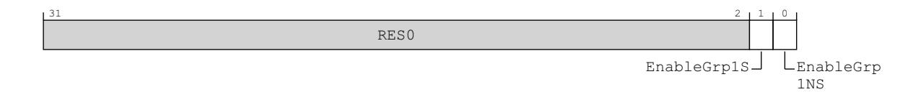

#### **Bits [31:2]**

Reserved, RES0.

#### **EnableGrp1S, bit [1]**

Enables Group 1 interrupts for the Secure state.

0b0 Secure Group 1 interrupts are disabled.

0b1 Secure Group 1 interrupts are enabled.

The Secure [ICC\\_IGRPEN1](#page-420-0).Enable bit is a read/write alias of the ICC\_MGRPEN1.EnableGrp1S bit.

If the highest priority pending interrupt for that PE is a Group 1 interrupt using 1 of N model, then the interrupt will target another PE as a result of the Enable bit changing from 1 to 0.

The reset behavior of this field is:

• On a Warm reset, this field resets to 0.

#### **EnableGrp1NS, bit [0]**

Enables Group 1 interrupts for the Non-secure state.

0b0 Non-secure Group 1 interrupts are disabled.

0b1 Non-secure Group 1 interrupts are enabled.

The Non-secure [ICC\\_IGRPEN1](#page-420-0).Enable bit is a read/write alias of the

ICC\_MGRPEN1.EnableGrp1NS bit.

If the highest priority pending interrupt for that PE is a Group 1 interrupt using 1 of N model, then the interrupt will target another PE as a result of the Enable bit changing from 1 to 0.

The reset behavior of this field is:

• On a Warm reset, this field resets to 0.

#### **Accessing ICC\_MGRPEN1**

If an interrupt is pending within the CPU interface when an Enable bit becomes 0, the interrupt must be released to allow the Distributor to forward the interrupt to a different PE.

This register is only accessible when executing in Monitor mode.

Accesses to this register use the following encodings in the System register encoding space:

#### **MRC{<c>}{<q>} <coproc>, {#}<opc1>, <Rt>, <CRn>, <CRm>{, {#}<opc2>}**

| coproc | opc1  | CRn    | CRm    | opc2  |
|--------|-------|--------|--------|-------|
| 0b1111 | 0b110 | 0b1100 | 0b1100 | 0b111 |

```
if PSTATE.EL == EL0 then
    UNDEFINED;
elsif PSTATE.EL == EL1 then
    if EL2Enabled() && !ELUsingAArch32(EL2) && HSTR_EL2.T12 == '1' then
        AArch64.AArch32SystemAccessTrap(EL2, 0x03);
    elsif EL2Enabled() && ELUsingAArch32(EL2) && HSTR.T12 == '1' then
        AArch32.TakeHypTrapException(0x03);
    else
        UNDEFINED;
elsif PSTATE.EL == EL2 then
    UNDEFINED;
elsif PSTATE.EL == EL3 then
    if ICC_MSRE.SRE == '0' then
        UNDEFINED;
    else
        R[t] = ICC_MGRPEN1;
```

#### **MCR{<c>}{<q>} <coproc>, {#}<opc1>, <Rt>, <CRn>, <CRm>{, {#}<opc2>}**

| coproc | opc1  | CRn    | CRm    | opc2  |
|--------|-------|--------|--------|-------|
| 0b1111 | 0b110 | 0b1100 | 0b1100 | 0b111 |

```
if PSTATE.EL == EL0 then
    UNDEFINED;
elsif PSTATE.EL == EL1 then
    if EL2Enabled() && !ELUsingAArch32(EL2) && HSTR_EL2.T12 == '1' then
        AArch64.AArch32SystemAccessTrap(EL2, 0x03);
    elsif EL2Enabled() && ELUsingAArch32(EL2) && HSTR.T12 == '1' then
        AArch32.TakeHypTrapException(0x03);
    else
        UNDEFINED;
elsif PSTATE.EL == EL2 then
    UNDEFINED;
elsif PSTATE.EL == EL3 then
    if ICC_MSRE.SRE == '0' then
        UNDEFINED;
    else
        ICC_MGRPEN1 = R[t];
```

#### <span id="page-431-1"></span><span id="page-431-0"></span>**12.5.19 ICC\_MSRE, Interrupt Controller Monitor System Register Enable register**

The ICC\_MSRE characteristics are:

#### **Purpose**

Controls whether the System register interface or the memory-mapped interface to the GIC CPU interface is used for EL3.

#### **Configurations**

This register is present only when EL3 is capable of using AArch32, FEAT\_GICv3 is implemented and EL3 is implemented. Otherwise, direct accesses to ICC\_MSRE are UNDEFINED.

#### **Attributes**

ICC\_MSRE is a 32-bit register.

#### **Field descriptions**

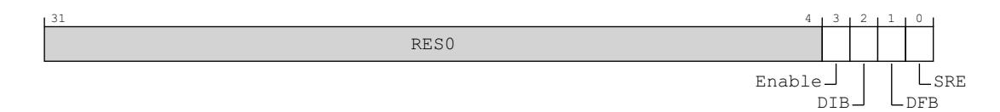

#### **Bits [31:4]**

Reserved, RES0.

#### **Enable, bit [3]**

Enable. Enables lower Exception level access to [ICC\\_SRE](#page-446-1) and [ICC\\_HSRE.](#page-407-1)

0b0 Secure EL1 accesses to Secure [ICC\\_SRE](#page-446-1) trap to EL3.

EL2 accesses to Non-secure [ICC\\_SRE](#page-446-1) and [ICC\\_HSRE](#page-407-1) trap to EL3.

Non-secure EL1 accesses to [ICC\\_SRE](#page-446-1) trap to EL3, unless these accesses are trapped to

EL2 as a result of ICC\_HSRE.Enable == 0.

0b1 Secure EL1 accesses to Secure [ICC\\_SRE](#page-446-1) do not trap to EL3.

EL2 accesses to Non-secure [ICC\\_SRE](#page-446-1) and ICC\_HSRE do not trap to EL3.

Non-secure EL1 accesses to [ICC\\_SRE](#page-446-1) do not trap to EL3.

If ICC\_MSRE.SRE is RAO/WI, an implementation is permitted to make the Enable bit RAO/WI.

If ICC\_MSRE.SRE is 0, the Enable bit behaves as 1 for all purposes other than reading the value of the bit.

The reset behavior of this field is:

• On a Warm reset, this field resets to an architecturally UNKNOWN value.

#### **DIB, bit [2]**

Disable IRQ bypass.

0b0 IRQ bypass enabled.

0b1 IRQ bypass disabled.

In systems that do not support IRQ bypass, this bit is RAO/WI.

The reset behavior of this field is:

• On a Warm reset, this field resets to 0.

#### **DFB, bit [1]**

Disable FIQ bypass.

0b0 FIQ bypass enabled.

0b1 FIQ bypass disabled.

In systems that do not support FIQ bypass, this bit is RAO/WI.

The reset behavior of this field is:

• On a Warm reset, this field resets to 0.

#### **SRE, bit [0]**

System Register Enable.

| 0b0 | The memory-mapped interface must be used. Accesses at EL3 or below to any ICH_* |
|-----|---------------------------------------------------------------------------------|
|     | System register, or any EL1, EL2, or EL3 ICC_* register other than ICC_SRE,     |
|     | ICC_HSRE, or ICC_MSRE, are UNDEFINED.                                           |

0b1 The System register interface to the ICH\_\* registers and the EL1, EL2, and EL3 ICC\_\* registers is enabled for EL3.

If software changes this bit from 1 to 0, the results are UNPREDICTABLE.

If an implementation supports only a System register interface to the GIC CPU interface, this bit is RAO/WI.

The reset behavior of this field is:

• On a Warm reset, this field resets to 0.

#### **Accessing ICC\_MSRE**

This register is always System register accessible.

The GIC architecture permits, but does not require, that registers can be shared between memory-mapped registers and the equivalent System registers. This means that if the memory-mapped registers have been accessed while ICC\_MSRE.SRE==0, then the System registers might be modified. Therefore, software must only rely on the reset values of the System registers if there has been no use of the GIC functionality while the memory-mapped registers are in use. Otherwise, the System register values must be treated as UNKNOWN.

This register is only accessible when executing in Monitor mode.

**MRC{<c>}{<q>} <coproc>, {#}<opc1>, <Rt>, <CRn>, <CRm>{, {#}<opc2>}**

| coproc | opc1  | CRn    | CRm    | opc2  |
|--------|-------|--------|--------|-------|
| 0b1111 | 0b110 | 0b1100 | 0b1100 | 0b101 |

```
if PSTATE.EL == EL0 then
    UNDEFINED;
elsif PSTATE.EL == EL1 then
    if EL2Enabled() && !ELUsingAArch32(EL2) && HSTR_EL2.T12 == '1' then
        AArch64.AArch32SystemAccessTrap(EL2, 0x03);
    elsif EL2Enabled() && ELUsingAArch32(EL2) && HSTR.T12 == '1' then
        AArch32.TakeHypTrapException(0x03);
    else
        UNDEFINED;
elsif PSTATE.EL == EL2 then
    UNDEFINED;
elsif PSTATE.EL == EL3 then
    R[t] = ICC_MSRE;
```

#### **MCR{<c>}{<q>} <coproc>, {#}<opc1>, <Rt>, <CRn>, <CRm>{, {#}<opc2>}**

| coproc | opc1  | CRn    | CRm    | opc2  |
|--------|-------|--------|--------|-------|
| 0b1111 | 0b110 | 0b1100 | 0b1100 | 0b101 |

```
if PSTATE.EL == EL0 then
    UNDEFINED;
elsif PSTATE.EL == EL1 then
    if EL2Enabled() && !ELUsingAArch32(EL2) && HSTR_EL2.T12 == '1' then
        AArch64.AArch32SystemAccessTrap(EL2, 0x03);
    elsif EL2Enabled() && ELUsingAArch32(EL2) && HSTR.T12 == '1' then
        AArch32.TakeHypTrapException(0x03);
    else
        UNDEFINED;
elsif PSTATE.EL == EL2 then
    UNDEFINED;
elsif PSTATE.EL == EL3 then
    if CP15SDISABLE2 == Signal_High then
        UNDEFINED;
    else
        ICC_MSRE = R[t];
```

#### <span id="page-434-0"></span>**12.5.20 ICC\_PMR, Interrupt Controller Interrupt Priority Mask Register**

The ICC\_PMR characteristics are:

#### **Purpose**

Provides an interrupt priority filter. Only interrupts with a higher priority than the value in this register are signaled to the PE.

#### **Configurations**

AArch32 System register ICC\_PMR bits [31:0] are architecturally mapped to AArch64 System register [ICC\\_PMR\\_EL1\[](#page-266-1)31:0].

This register is present only when EL1 is capable of using AArch32 and FEAT\_GICv3 is implemented. Otherwise, direct accesses to ICC\_PMR are UNDEFINED.

To allow software to ensure appropriate observability of actions initiated by GIC register accesses, the PE and CPU interface logic must ensure that writes to this register are self-synchronizing. This ensures that no interrupts below the written PMR value will be taken after a write to this register is architecturally executed. For more information, see *[Observability of the effects of accesses to the](#page-194-0)  [GIC registers on page](#page-194-0) 12-195*.

#### **Attributes**

ICC\_PMR is a 32-bit register.

#### **Field descriptions**


#### **Bits [31:8]**

Reserved, RES0.

#### **Priority, bits [7:0]**

The priority mask level for the CPU interface. If the priority of an interrupt is higher than the value indicated by this field, the interface signals the interrupt to the PE.

The possible priority field values are as follows:

| Implemented priority bits | Possible priority field values      | Number of priority levels |
|---------------------------|-------------------------------------|---------------------------|
| [7:0]                     | 0x00-0xFF (0-255), all values       | 256                       |
| [7:1]                     | 0x00-0xFE (0-254), even values only | 128                       |
| [7:2]                     | 0x00-0xFC (0-252), in steps of 4    | 64                        |
| [7:3]                     | 0x00-0xF8 (0-248), in steps of 8    | 32                        |
| [7:4]                     | 0x00-0xF0 (0-240), in steps of 16   | 16                        |

Unimplemented priority bits are RAZ/WI.

The reset behavior of this field is:

• On a Warm reset, this field resets to 0.

#### **Accessing ICC\_PMR**

```
MRC{<c>}{<q>} <coproc>, {#}<opc1>, <Rt>, <CRn>, <CRm>{, {#}<opc2>}
```

| coproc | opc1  | CRn    | CRm    | opc2  |
|--------|-------|--------|--------|-------|
| 0b1111 | 0b000 | 0b0100 | 0b0110 | 0b000 |

```
if PSTATE.EL == EL0 then
    UNDEFINED;
elsif PSTATE.EL == EL1 then
   if HaveEL(EL3) && EL3SDDUndefPriority() && !ELUsingAArch32(EL3) && SCR_EL3.<IRQ,FIQ> ==
'11' then
        UNDEFINED;
    elsif HaveEL(EL3) && EL3SDDUndefPriority() && ELUsingAArch32(EL3) && PSTATE.M !=
M32_Monitor && SCR.<IRQ,FIQ> == '11' then
        UNDEFINED;
    elsif EL2Enabled() && !ELUsingAArch32(EL2) && HSTR_EL2.T12 == '1' then
        AArch64.AArch32SystemAccessTrap(EL2, 0x03);
    elsif EL2Enabled() && ELUsingAArch32(EL2) && HSTR.T12 == '1' then
        AArch32.TakeHypTrapException(0x03);
    elsif ICC_SRE.SRE == '0' then
        UNDEFINED;
    elsif EL2Enabled() && !ELUsingAArch32(EL2) && ICH_HCR_EL2.TC == '1' then
        AArch64.AArch32SystemAccessTrap(EL2, 0x03);
    elsif EL2Enabled() && ELUsingAArch32(EL2) && ICH_HCR.TC == '1' then
        AArch32.TakeHypTrapException(0x03);
    elsif EL2Enabled() && !ELUsingAArch32(EL2) && HCR_EL2.FMO == '1' then
        R[t] = ICV_PMR;
    elsif EL2Enabled() && !ELUsingAArch32(EL2) && HCR_EL2.IMO == '1' then
        R[t] = ICV_PMR;
    elsif EL2Enabled() && ELUsingAArch32(EL2) && HCR.FMO == '1' then
        R[t] = ICV_PMR;
    elsif EL2Enabled() && ELUsingAArch32(EL2) && HCR.IMO == '1' then
        R[t] = ICV_PMR;
    elsif HaveEL(EL3) && !ELUsingAArch32(EL3) && SCR_EL3.<IRQ,FIQ> == '11' then
        if EL3SDDUndef() then
            UNDEFINED;
        else
            AArch64.AArch32SystemAccessTrap(EL3, 0x03);
   elsif HaveEL(EL3) && ELUsingAArch32(EL3) && PSTATE.M != M32_Monitor && SCR.<IRQ,FIQ> ==
'11' then
        if EL3SDDUndef() then
            UNDEFINED;
        else
            AArch32.TakeMonitorTrapException();
    else
        R[t] = ICC_PMR;
elsif PSTATE.EL == EL2 then
   if HaveEL(EL3) && EL3SDDUndefPriority() && !ELUsingAArch32(EL3) && SCR_EL3.<IRQ,FIQ> ==
'11' then
        UNDEFINED;
    elsif HaveEL(EL3) && EL3SDDUndefPriority() && ELUsingAArch32(EL3) && SCR.<IRQ,FIQ> ==
'11' then
        UNDEFINED;
    elsif ICC_HSRE.SRE == '0' then
        UNDEFINED;
    elsif HaveEL(EL3) && !ELUsingAArch32(EL3) && SCR_EL3.<IRQ,FIQ> == '11' then
        if EL3SDDUndef() then
            UNDEFINED;
        else
```

```
AArch64.AArch32SystemAccessTrap(EL3, 0x03);
    elsif HaveEL(EL3) && ELUsingAArch32(EL3) && SCR.<IRQ,FIQ> == '11' then
        if EL3SDDUndef() then
            UNDEFINED;
        else
            AArch32.TakeMonitorTrapException();
    else
        R[t] = ICC_PMR;
elsif PSTATE.EL == EL3 then
    if ICC_MSRE.SRE == '0' then
        UNDEFINED;
    else
        R[t] = ICC_PMR;
```

#### **MCR{<c>}{<q>} <coproc>, {#}<opc1>, <Rt>, <CRn>, <CRm>{, {#}<opc2>}**

| coproc | opc1  | CRn    | CRm    | opc2  |
|--------|-------|--------|--------|-------|
| 0b1111 | 0b000 | 0b0100 | 0b0110 | 0b000 |

```
if PSTATE.EL == EL0 then
    UNDEFINED;
elsif PSTATE.EL == EL1 then
   if HaveEL(EL3) && EL3SDDUndefPriority() && !ELUsingAArch32(EL3) && SCR_EL3.<IRQ,FIQ> ==
'11' then
        UNDEFINED;
    elsif HaveEL(EL3) && EL3SDDUndefPriority() && ELUsingAArch32(EL3) && PSTATE.M !=
M32_Monitor && SCR.<IRQ,FIQ> == '11' then
        UNDEFINED;
    elsif EL2Enabled() && !ELUsingAArch32(EL2) && HSTR_EL2.T12 == '1' then
        AArch64.AArch32SystemAccessTrap(EL2, 0x03);
    elsif EL2Enabled() && ELUsingAArch32(EL2) && HSTR.T12 == '1' then
        AArch32.TakeHypTrapException(0x03);
    elsif ICC_SRE.SRE == '0' then
        UNDEFINED;
    elsif EL2Enabled() && !ELUsingAArch32(EL2) && ICH_HCR_EL2.TC == '1' then
        AArch64.AArch32SystemAccessTrap(EL2, 0x03);
    elsif EL2Enabled() && ELUsingAArch32(EL2) && ICH_HCR.TC == '1' then
        AArch32.TakeHypTrapException(0x03);
    elsif EL2Enabled() && !ELUsingAArch32(EL2) && HCR_EL2.FMO == '1' then
        ICV_PMR = R[t];
    elsif EL2Enabled() && !ELUsingAArch32(EL2) && HCR_EL2.IMO == '1' then
        ICV_PMR = R[t];
    elsif EL2Enabled() && ELUsingAArch32(EL2) && HCR.FMO == '1' then
        ICV_PMR = R[t];
    elsif EL2Enabled() && ELUsingAArch32(EL2) && HCR.IMO == '1' then
        ICV_PMR = R[t];
    elsif HaveEL(EL3) && !ELUsingAArch32(EL3) && SCR_EL3.<IRQ,FIQ> == '11' then
        if EL3SDDUndef() then
            UNDEFINED;
        else
            AArch64.AArch32SystemAccessTrap(EL3, 0x03);
   elsif HaveEL(EL3) && ELUsingAArch32(EL3) && PSTATE.M != M32_Monitor && SCR.<IRQ,FIQ> ==
'11' then
        if EL3SDDUndef() then
            UNDEFINED;
        else
            AArch32.TakeMonitorTrapException();
    else
        ICC_PMR = R[t];
elsif PSTATE.EL == EL2 then
   if HaveEL(EL3) && EL3SDDUndefPriority() && !ELUsingAArch32(EL3) && SCR_EL3.<IRQ,FIQ> ==
```

```
'11' then
        UNDEFINED;
    elsif HaveEL(EL3) && EL3SDDUndefPriority() && ELUsingAArch32(EL3) && SCR.<IRQ,FIQ> ==
'11' then
        UNDEFINED;
    elsif ICC_HSRE.SRE == '0' then
        UNDEFINED;
    elsif HaveEL(EL3) && !ELUsingAArch32(EL3) && SCR_EL3.<IRQ,FIQ> == '11' then
        if EL3SDDUndef() then
            UNDEFINED;
        else
            AArch64.AArch32SystemAccessTrap(EL3, 0x03);
    elsif HaveEL(EL3) && ELUsingAArch32(EL3) && SCR.<IRQ,FIQ> == '11' then
        if EL3SDDUndef() then
            UNDEFINED;
        else
            AArch32.TakeMonitorTrapException();
    else
        ICC_PMR = R[t];
elsif PSTATE.EL == EL3 then
    if ICC_MSRE.SRE == '0' then
        UNDEFINED;
    else
        ICC_PMR = R[t];
```

#### <span id="page-438-0"></span>**12.5.21 ICC\_RPR, Interrupt Controller Running Priority Register**

The ICC\_RPR characteristics are:

#### **Purpose**

Indicates the Running priority of the CPU interface.

#### **Configurations**

AArch32 System register ICC\_RPR performs the same function as AArch64 System register [ICC\\_RPR\\_EL1.](#page-269-1)

This register is present only when EL1 is capable of using AArch32 and FEAT\_GICv3 is implemented. Otherwise, direct accesses to ICC\_RPR are UNDEFINED.

#### **Attributes**

ICC\_RPR is a 32-bit register.

#### **Field descriptions**

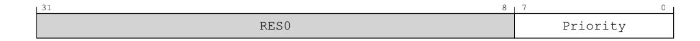

#### **Bits [31:8]**

Reserved, RES0.

#### **Priority, bits [7:0]**

The current running priority on the CPU interface. This is the group priority of the current active interrupt.

The priority returned is the group priority as if the BPR for the current Exception level and Security state was set to the minimum value of BPR for the number of implemented priority bits.

**Note**

If 8 bits of priority are implemented the group priority is bits[7:1] of the priority.

#### **Accessing ICC\_RPR**

If there are no active interrupts on the CPU interface, or all active interrupts have undergone a priority drop, the value returned is the Idle priority.

Software cannot determine the number of implemented priority bits from a read of this register.

Accesses to this register use the following encodings in the System register encoding space:

**MRC{<c>}{<q>} <coproc>, {#}<opc1>, <Rt>, <CRn>, <CRm>{, {#}<opc2>}**

| coproc | opc1  | CRn    | CRm    | opc2  |
|--------|-------|--------|--------|-------|
| 0b1111 | 0b000 | 0b1100 | 0b1011 | 0b011 |

```
if PSTATE.EL == EL0 then
    UNDEFINED;
elsif PSTATE.EL == EL1 then
   if HaveEL(EL3) && EL3SDDUndefPriority() && !ELUsingAArch32(EL3) && SCR_EL3.<IRQ,FIQ> ==
'11' then
```

```
UNDEFINED;
    elsif HaveEL(EL3) && EL3SDDUndefPriority() && ELUsingAArch32(EL3) && PSTATE.M !=
M32_Monitor && SCR.<IRQ,FIQ> == '11' then
        UNDEFINED;
    elsif EL2Enabled() && !ELUsingAArch32(EL2) && HSTR_EL2.T12 == '1' then
        AArch64.AArch32SystemAccessTrap(EL2, 0x03);
    elsif EL2Enabled() && ELUsingAArch32(EL2) && HSTR.T12 == '1' then
        AArch32.TakeHypTrapException(0x03);
    elsif ICC_SRE.SRE == '0' then
        UNDEFINED;
    elsif EL2Enabled() && !ELUsingAArch32(EL2) && ICH_HCR_EL2.TC == '1' then
        AArch64.AArch32SystemAccessTrap(EL2, 0x03);
    elsif EL2Enabled() && ELUsingAArch32(EL2) && ICH_HCR.TC == '1' then
        AArch32.TakeHypTrapException(0x03);
    elsif EL2Enabled() && !ELUsingAArch32(EL2) && HCR_EL2.FMO == '1' then
        R[t] = ICV_RPR;
    elsif EL2Enabled() && !ELUsingAArch32(EL2) && HCR_EL2.IMO == '1' then
        R[t] = ICV_RPR;
    elsif EL2Enabled() && ELUsingAArch32(EL2) && HCR.FMO == '1' then
        R[t] = ICV_RPR;
    elsif EL2Enabled() && ELUsingAArch32(EL2) && HCR.IMO == '1' then
        R[t] = ICV_RPR;
    elsif HaveEL(EL3) && !ELUsingAArch32(EL3) && SCR_EL3.<IRQ,FIQ> == '11' then
        if EL3SDDUndef() then
            UNDEFINED;
        else
            AArch64.AArch32SystemAccessTrap(EL3, 0x03);
   elsif HaveEL(EL3) && ELUsingAArch32(EL3) && PSTATE.M != M32_Monitor && SCR.<IRQ,FIQ> ==
'11' then
        if EL3SDDUndef() then
            UNDEFINED;
        else
            AArch32.TakeMonitorTrapException();
    else
        R[t] = ICC_RPR;
elsif PSTATE.EL == EL2 then
   if HaveEL(EL3) && EL3SDDUndefPriority() && !ELUsingAArch32(EL3) && SCR_EL3.<IRQ,FIQ> ==
'11' then
        UNDEFINED;
    elsif HaveEL(EL3) && EL3SDDUndefPriority() && ELUsingAArch32(EL3) && SCR.<IRQ,FIQ> ==
'11' then
        UNDEFINED;
    elsif ICC_HSRE.SRE == '0' then
        UNDEFINED;
    elsif HaveEL(EL3) && !ELUsingAArch32(EL3) && SCR_EL3.<IRQ,FIQ> == '11' then
        if EL3SDDUndef() then
            UNDEFINED;
        else
            AArch64.AArch32SystemAccessTrap(EL3, 0x03);
    elsif HaveEL(EL3) && ELUsingAArch32(EL3) && SCR.<IRQ,FIQ> == '11' then
        if EL3SDDUndef() then
            UNDEFINED;
        else
            AArch32.TakeMonitorTrapException();
    else
        R[t] = ICC_RPR;
elsif PSTATE.EL == EL3 then
    if ICC_MSRE.SRE == '0' then
        UNDEFINED;
    else
        R[t] = ICC_RPR;
```

#### <span id="page-440-1"></span><span id="page-440-0"></span>**12.5.22 ICC\_SGI0R, Interrupt Controller Software Generated Interrupt Group 0 Register**

The ICC\_SGI0R characteristics are:

#### **Purpose**

Generates Secure Group 0 SGIs.

#### **Configurations**

AArch32 System register ICC\_SGI0R performs the same function as AArch64 System register [ICC\\_SGI0R\\_EL1](#page-272-1).

This register is present only when EL1 is capable of using AArch32 and FEAT\_GICv3 is implemented. Otherwise, direct accesses to ICC\_SGI0R are UNDEFINED.

#### **Attributes**

ICC\_SGI0R is a 64-bit register.

#### **Field descriptions**


#### **Bits [63:56]**

Reserved, RES0.

#### **Aff3, bits [55:48]**

The affinity 3 value of the affinity path of the cluster for which SGI interrupts will be generated. If the IRM bit is 1, this field is RES0.

#### **RS, bits [47:44]**

RangeSelector

Controls which group of 16 values is represented by the TargetList field.

TargetList[n] represents aff0 value ((RS \* 16) + n).

When [ICC\\_CTLR\\_EL1](#page-232-1).RSS==0, RS is RES0.

When [ICC\\_CTLR\\_EL1.](#page-232-1)RSS==1 and [GICD\\_TYPER](#page-617-1).RSS==0, writing this register with RS != 0 is a CONSTRAINED UNPREDICTABLE choice of:

- The write is ignored.
- The RS field is treated as 0.

#### **Bits [43:41]**

Reserved, RES0.

#### **IRM, bit [40]**

Interrupt Routing Mode. Determines how the generated interrupts are distributed to PEs. Possible values are:

0b0 Interrupts routed to the PEs specified by Aff3.Aff2.Aff1.<target list>.

0b1 Interrupts routed to all PEs in the system, excluding "self".

#### **Aff2, bits [39:32]**

The affinity 2 value of the affinity path of the cluster for which SGI interrupts will be generated.

If the IRM bit is 1, this field is RES0.

**Bits [31:28]**

Reserved, RES0.

**INTID, bits [27:24]**

The INTID of the SGI.

**Aff1, bits [23:16]**

The affinity 1 value of the affinity path of the cluster for which SGI interrupts will be generated. If the IRM bit is 1, this field is RES0.

#### **TargetList, bits [15:0]**

Target List. The set of PEs for which SGI interrupts will be generated. Each bit corresponds to the PE within a cluster with an Affinity 0 value equal to the bit number.

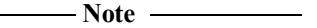

If SRE is set only for Secure EL3, software executing at EL3 might use the System register interface to generate SGIs. Therefore, the Distributor must always be able to receive and acknowledge Generate SGI packets received from CPU interface regardless of the ARE settings for a Security state. However, the Distributor might discard such packets.

If the IRM bit is 1, this field is RES0.

If a bit is 1 and the bit does not correspond to a valid target PE, the bit must be ignored by the Distributor. It is IMPLEMENTATION DEFINED whether, in such cases, a Distributor can signal a system error.

#### **Accessing ICC\_SGI0R**

This register allows software executing in a Secure state to generate Group 0 SGIs. It will also allow software executing in a Non-secure state to generate Group 0 SGIs, if permitted by the settings of [GICR\\_NSACR](#page-696-1) in the Redistributor corresponding to the target PE.

When [GICD\\_CTLR](#page-543-1).DS==0, Non-secure writes do not generate an interrupt for a target PE if not permitted by the [GICR\\_NSACR](#page-696-1) register associated with the target PE. For more information, see *[Use of control registers for SGI](#page-206-2)  [forwarding on page](#page-206-2) 12-207*.


Accesses from Secure Monitor mode are treated as Secure regardless of the value of [SCR](#page-29-5).NS.

Accesses to this register use the following encodings in the System register encoding space:

**MCRR{<c>}{<q>} <coproc>, {#}<opc1>, <Rt>, <Rt2>, <CRm>**

| coproc | CRm    | opc1   |
|--------|--------|--------|
| 0b1111 | 0b1100 | 0b0010 |

```
if PSTATE.EL == EL0 then
    UNDEFINED;
elsif PSTATE.EL == EL1 then
   if HaveEL(EL3) && EL3SDDUndefPriority() && !ELUsingAArch32(EL3) && SCR_EL3.<IRQ,FIQ> ==
'11' then
        UNDEFINED;
    elsif HaveEL(EL3) && EL3SDDUndefPriority() && ELUsingAArch32(EL3) && PSTATE.M !=
M32_Monitor && SCR.<IRQ,FIQ> == '11' then
```

```
UNDEFINED;
    elsif EL2Enabled() && !ELUsingAArch32(EL2) && HSTR_EL2.T12 == '1' then
        AArch64.AArch32SystemAccessTrap(EL2, 0x03);
    elsif EL2Enabled() && ELUsingAArch32(EL2) && HSTR.T12 == '1' then
        AArch32.TakeHypTrapException(0x03);
    elsif ICC_SRE.SRE == '0' then
        UNDEFINED;
    elsif EL2Enabled() && !ELUsingAArch32(EL2) && ICH_HCR_EL2.TC == '1' then
        AArch64.AArch32SystemAccessTrap(EL2, 0x03);
    elsif EL2Enabled() && ELUsingAArch32(EL2) && ICH_HCR.TC == '1' then
        AArch32.TakeHypTrapException(0x03);
    elsif EL2Enabled() && !ELUsingAArch32(EL2) && HCR_EL2.FMO == '1' then
        AArch64.AArch32SystemAccessTrap(EL2, 0x03);
    elsif EL2Enabled() && !ELUsingAArch32(EL2) && HCR_EL2.IMO == '1' then
        AArch64.AArch32SystemAccessTrap(EL2, 0x03);
    elsif EL2Enabled() && ELUsingAArch32(EL2) && HCR.FMO == '1' then
        AArch32.TakeHypTrapException(0x03);
    elsif EL2Enabled() && ELUsingAArch32(EL2) && HCR.IMO == '1' then
        AArch32.TakeHypTrapException(0x03);
    elsif HaveEL(EL3) && !ELUsingAArch32(EL3) && SCR_EL3.<IRQ,FIQ> == '11' then
        if EL3SDDUndef() then
            UNDEFINED;
        else
            AArch64.AArch32SystemAccessTrap(EL3, 0x03);
   elsif HaveEL(EL3) && ELUsingAArch32(EL3) && PSTATE.M != M32_Monitor && SCR.<IRQ,FIQ> ==
'11' then
        if EL3SDDUndef() then
            UNDEFINED;
        else
            AArch32.TakeMonitorTrapException();
    else
        ICC_SGI0R = R[t2]:R[t];
elsif PSTATE.EL == EL2 then
   if HaveEL(EL3) && EL3SDDUndefPriority() && !ELUsingAArch32(EL3) && SCR_EL3.<IRQ,FIQ> ==
'11' then
        UNDEFINED;
    elsif HaveEL(EL3) && EL3SDDUndefPriority() && ELUsingAArch32(EL3) && SCR.<IRQ,FIQ> ==
'11' then
        UNDEFINED;
    elsif ICC_HSRE.SRE == '0' then
        UNDEFINED;
    elsif HaveEL(EL3) && !ELUsingAArch32(EL3) && SCR_EL3.<IRQ,FIQ> == '11' then
        if EL3SDDUndef() then
            UNDEFINED;
        else
            AArch64.AArch32SystemAccessTrap(EL3, 0x03);
    elsif HaveEL(EL3) && ELUsingAArch32(EL3) && SCR.<IRQ,FIQ> == '11' then
        if EL3SDDUndef() then
            UNDEFINED;
        else
            AArch32.TakeMonitorTrapException();
    else
        ICC_SGI0R = R[t2]:R[t];
elsif PSTATE.EL == EL3 then
    if ICC_MSRE.SRE == '0' then
        UNDEFINED;
    else
        ICC_SGI0R = R[t2]:R[t];
```

#### <span id="page-443-1"></span><span id="page-443-0"></span>**12.5.23 ICC\_SGI1R, Interrupt Controller Software Generated Interrupt Group 1 Register**

The ICC\_SGI1R characteristics are:

#### **Purpose**

Generates Group 1 SGIs for the current Security state.

#### **Configurations**

AArch32 System register ICC\_SGI1R performs the same function as AArch64 System register [ICC\\_SGI1R\\_EL1](#page-275-1).

This register is present only when EL1 is capable of using AArch32 and FEAT\_GICv3 is implemented. Otherwise, direct accesses to ICC\_SGI1R are UNDEFINED.

Under certain conditions a write to ICC\_SGI1R can generate Group 0 interrupts, see [Table](#page-206-1) 12-14.

#### **Attributes**

ICC\_SGI1R is a 64-bit register.

#### **Field descriptions**

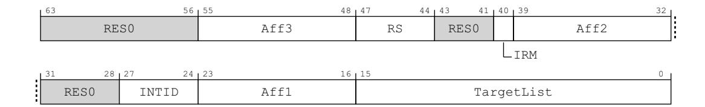

#### **Bits [63:56]**

Reserved, RES0.

#### **Aff3, bits [55:48]**

The affinity 3 value of the affinity path of the cluster for which SGI interrupts will be generated. If the IRM bit is 1, this field is RES0.

#### **RS, bits [47:44]**

RangeSelector

Controls which group of 16 values is represented by the TargetList field.

TargetList[n] represents aff0 value ((RS \* 16) + n).

When [ICC\\_CTLR\\_EL1](#page-232-1).RSS==0, RS is RES0.

When [ICC\\_CTLR\\_EL1.](#page-232-1)RSS==1 and [GICD\\_TYPER](#page-617-1).RSS==0, writing this register with RS != 0 is a CONSTRAINED UNPREDICTABLE choice of:

- The write is ignored.
- The RS field is treated as 0.

#### **Bits [43:41]**

Reserved, RES0.

#### **IRM, bit [40]**

Interrupt Routing Mode. Determines how the generated interrupts are distributed to PEs. Possible values are:

0b0 Interrupts routed to the PEs specified by Aff3.Aff2.Aff1.<target list>.

0b1 Interrupts routed to all PEs in the system, excluding "self".

#### **Aff2, bits [39:32]**

The affinity 2 value of the affinity path of the cluster for which SGI interrupts will be generated. If the IRM bit is 1, this field is RES0.

#### **Bits [31:28]**

Reserved, RES0.

#### **INTID, bits [27:24]**

The INTID of the SGI.

#### **Aff1, bits [23:16]**

The affinity 1 value of the affinity path of the cluster for which SGI interrupts will be generated. If the IRM bit is 1, this field is RES0.

#### **TargetList, bits [15:0]**

Target List. The set of PEs for which SGI interrupts will be generated. Each bit corresponds to the PE within a cluster with an Affinity 0 value equal to the bit number.

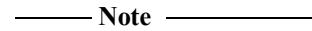

If SRE is set only for Secure EL3, software executing at EL3 might use the System register interface to generate SGIs. Therefore, the Distributor must always be able to receive and acknowledge Generate SGI packets received from CPU interface regardless of the ARE settings for a Security state. However, the Distributor might discard such packets.

If the IRM bit is 1, this field is RES0.

If a bit is 1 and the bit does not correspond to a valid target PE, the bit must be ignored by the Distributor. It is IMPLEMENTATION DEFINED whether, in such cases, a Distributor can signal a system error.

#### **Accessing ICC\_SGI1R**

**Note**

Accesses from Secure Monitor mode are treated as Secure regardless of the value of [SCR](#page-29-5).NS.

Accesses to this register use the following encodings in the System register encoding space:

**MCRR{<c>}{<q>} <coproc>, {#}<opc1>, <Rt>, <Rt2>, <CRm>**

| coproc | CRm    | opc1   |
|--------|--------|--------|
| 0b1111 | 0b1100 | 0b0000 |

```
if PSTATE.EL == EL0 then
    UNDEFINED;
elsif PSTATE.EL == EL1 then
   if HaveEL(EL3) && EL3SDDUndefPriority() && !ELUsingAArch32(EL3) && SCR_EL3.<IRQ,FIQ> ==
'11' then
        UNDEFINED;
    elsif HaveEL(EL3) && EL3SDDUndefPriority() && ELUsingAArch32(EL3) && PSTATE.M !=
M32_Monitor && SCR.<IRQ,FIQ> == '11' then
        UNDEFINED;
    elsif EL2Enabled() && !ELUsingAArch32(EL2) && HSTR_EL2.T12 == '1' then
        AArch64.AArch32SystemAccessTrap(EL2, 0x03);
    elsif EL2Enabled() && ELUsingAArch32(EL2) && HSTR.T12 == '1' then
        AArch32.TakeHypTrapException(0x03);
```

```
elsif ICC_SRE.SRE == '0' then
        UNDEFINED;
    elsif EL2Enabled() && !ELUsingAArch32(EL2) && ICH_HCR_EL2.TC == '1' then
        AArch64.AArch32SystemAccessTrap(EL2, 0x03);
    elsif EL2Enabled() && ELUsingAArch32(EL2) && ICH_HCR.TC == '1' then
        AArch32.TakeHypTrapException(0x03);
    elsif EL2Enabled() && !ELUsingAArch32(EL2) && HCR_EL2.FMO == '1' then
        AArch64.AArch32SystemAccessTrap(EL2, 0x03);
    elsif EL2Enabled() && !ELUsingAArch32(EL2) && HCR_EL2.IMO == '1' then
        AArch64.AArch32SystemAccessTrap(EL2, 0x03);
    elsif EL2Enabled() && ELUsingAArch32(EL2) && HCR.FMO == '1' then
        AArch32.TakeHypTrapException(0x03);
    elsif EL2Enabled() && ELUsingAArch32(EL2) && HCR.IMO == '1' then
        AArch32.TakeHypTrapException(0x03);
    elsif HaveEL(EL3) && !ELUsingAArch32(EL3) && SCR_EL3.<IRQ,FIQ> == '11' then
        if EL3SDDUndef() then
            UNDEFINED;
        else
            AArch64.AArch32SystemAccessTrap(EL3, 0x03);
   elsif HaveEL(EL3) && ELUsingAArch32(EL3) && PSTATE.M != M32_Monitor && SCR.<IRQ,FIQ> ==
'11' then
        if EL3SDDUndef() then
            UNDEFINED;
        else
            AArch32.TakeMonitorTrapException();
    else
        ICC_SGI1R = R[t2]:R[t];
elsif PSTATE.EL == EL2 then
   if HaveEL(EL3) && EL3SDDUndefPriority() && !ELUsingAArch32(EL3) && SCR_EL3.<IRQ,FIQ> ==
'11' then
        UNDEFINED;
    elsif HaveEL(EL3) && EL3SDDUndefPriority() && ELUsingAArch32(EL3) && SCR.<IRQ,FIQ> ==
'11' then
        UNDEFINED;
    elsif ICC_HSRE.SRE == '0' then
        UNDEFINED;
    elsif HaveEL(EL3) && !ELUsingAArch32(EL3) && SCR_EL3.<IRQ,FIQ> == '11' then
        if EL3SDDUndef() then
            UNDEFINED;
        else
            AArch64.AArch32SystemAccessTrap(EL3, 0x03);
    elsif HaveEL(EL3) && ELUsingAArch32(EL3) && SCR.<IRQ,FIQ> == '11' then
        if EL3SDDUndef() then
            UNDEFINED;
        else
            AArch32.TakeMonitorTrapException();
    else
        ICC_SGI1R = R[t2]:R[t];
elsif PSTATE.EL == EL3 then
    if ICC_MSRE.SRE == '0' then
        UNDEFINED;
    else
        ICC_SGI1R = R[t2]:R[t];
```

#### <span id="page-446-1"></span><span id="page-446-0"></span>**12.5.24 ICC\_SRE, Interrupt Controller System Register Enable register**

The ICC\_SRE characteristics are:

#### **Purpose**

Controls whether the System register interface or the memory-mapped interface to the GIC CPU interface is used for EL0 and EL1.

#### **Configurations**

This register is banked between ICC\_SRE and ICC\_SRE\_S and ICC\_SRE\_NS.

AArch32 System register ICC\_SRE bits [31:0] (ICC\_SRE\_S) are architecturally mapped to AArch64 System register [ICC\\_SRE\\_EL1\[](#page-278-1)31:0] (ICC\_SRE\_EL1\_S).

AArch32 System register ICC\_SRE bits [31:0] (ICC\_SRE\_NS) are architecturally mapped to AArch64 System register [ICC\\_SRE\\_EL1\[](#page-278-1)31:0] (ICC\_SRE\_EL1\_NS).

This register is present only when EL1 is capable of using AArch32 and FEAT\_GICv3 is implemented. Otherwise, direct accesses to ICC\_SRE are UNDEFINED.

#### **Attributes**

ICC\_SRE is a 32-bit register.

This register has the following instances:

- ICC\_SRE, when EL3 is not implemented.
- ICC\_SRE\_S, when EL3 is implemented.
- ICC\_SRE\_NS, when EL3 is implemented.

#### **Field descriptions**

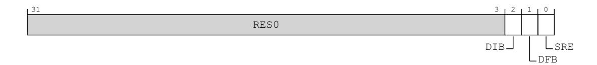

#### **Bits [31:3]**

Reserved, RES0.

#### **DIB, bit [2]**

Disable IRQ bypass.

0b0 IRQ bypass enabled. 0b1 IRQ bypass disabled.

If EL3 is implemented and [GICD\\_CTLR](#page-543-1).DS == 0, this field is a read-only alias of [ICC\\_MSRE.](#page-431-1)DIB.

If EL3 is implemented and [GICD\\_CTLR](#page-543-1).DS == 1, and EL2 is not implemented, this field is a read/write alias of [ICC\\_MSRE](#page-431-1).DIB.

If EL3 is not implemented and EL2 is implemented, this field is a read-only alias of [ICC\\_HSRE.](#page-407-1)DIB.

If [GICD\\_CTLR](#page-543-1).DS == 1 and EL2 is implemented, this field is a read-only alias of [ICC\\_HSRE](#page-407-1).DIB.

In systems that do not support IRQ bypass, this field is RAO/WI.

The reset behavior of this field is:

• On a Warm reset, this field resets to 0.

#### **DFB, bit [1]**

Disable FIQ bypass.

0b0 FIQ bypass enabled. 0b1 FIQ bypass disabled.

If EL3 is implemented and [GICD\\_CTLR](#page-543-1).DS == 0, this field is a read-only alias of [ICC\\_MSRE.](#page-431-1)DFB.

If EL3 is implemented and [GICD\\_CTLR](#page-543-1).DS == 1, and EL2 is not implemented, this field is a read/write alias of [ICC\\_MSRE](#page-431-1).DFB.

If EL3 is not implemented and EL2 is implemented, this field is a read-only alias of [ICC\\_HSRE.](#page-407-1)DFB.

If [GICD\\_CTLR.](#page-543-1)DS == 1 and EL2 is implemented, this field is a read-only alias of [ICC\\_HSRE.](#page-407-1)DFB.

In systems that do not support FIQ bypass, this field is RAO/WI.

The reset behavior of this field is:

• On a Warm reset, this field resets to 0.

#### **SRE, bit [0]**

System Register Enable.

0b0 The memory-mapped interface must be used. Accesses at EL1 to any ICC\_\* System register other than ICC\_SRE are UNDEFINED.

0b1 The System register interface for the current Security state is enabled.

If software changes this bit from 1 to 0 in the Secure instance of this register, the results are UNPREDICTABLE.

If an implementation supports only a System register interface to the GIC CPU interface, this bit is RAO/WI.

If EL3 is implemented and using AArch64:

- When [ICC\\_SRE\\_EL3.](#page-285-1)SRE==0 the Secure copy of this bit is RAZ/WI.
- When [ICC\\_SRE\\_EL3.](#page-285-1)SRE==0 the Non-secure copy of this bit is RAZ/WI.

If EL3 is implemented and using AArch32:

- When [ICC\\_MSRE.](#page-431-1)SRE==0 the Secure copy of this bit is RAZ/WI.
- When [ICC\\_MSRE.](#page-431-1)SRE==0 the Non-secure copy of this bit is RAZ/WI.

If EL2 is implemented and using AArch64:

• When [ICC\\_SRE\\_EL2.](#page-282-1)SRE==0 the Non-secure copy of this bit is RAZ/WI.

If EL2 is implemented and using AArch32:

• When [ICC\\_HSRE](#page-407-1).SRE==0 the Non-secure copy of this bit is RAZ/WI.

The reset behavior of this field is:

• On a Warm reset, this field resets to 0.

#### **Accessing ICC\_SRE**

The GIC architecture permits, but does not require, that registers can be shared between memory-mapped registers and the equivalent System registers. This means that if the memory-mapped registers have been accessed while ICC\_SRE.SRE==0, then the System registers might be modified. Therefore, software must only rely on the reset values of the System registers if there has been no use of the GIC functionality while the memory-mapped registers are in use. Otherwise, the System register values must be treated as UNKNOWN.

Accesses to this register use the following encodings in the System register encoding space:

#### **MRC{<c>}{<q>} <coproc>, {#}<opc1>, <Rt>, <CRn>, <CRm>{, {#}<opc2>}**

| coproc | opc1  | CRn    | CRm    | opc2  |
|--------|-------|--------|--------|-------|
| 0b1111 | 0b000 | 0b1100 | 0b1100 | 0b101 |

```
if PSTATE.EL == EL0 then
    UNDEFINED;
elsif PSTATE.EL == EL1 then
    if HaveEL(EL3) && EL3SDDUndefPriority() && !ELUsingAArch32(EL3) && ICC_SRE_EL3.Enable
== '0' then
        UNDEFINED;
    elsif EL2Enabled() && !ELUsingAArch32(EL2) && HSTR_EL2.T12 == '1' then
        AArch64.AArch32SystemAccessTrap(EL2, 0x03);
    elsif EL2Enabled() && ELUsingAArch32(EL2) && HSTR.T12 == '1' then
        AArch32.TakeHypTrapException(0x03);
    elsif EL2Enabled() && !ELUsingAArch32(EL2) && ICC_SRE_EL2.Enable == '0' then
        AArch64.AArch32SystemAccessTrap(EL2, 0x03);
    elsif EL2Enabled() && ELUsingAArch32(EL2) && ICC_HSRE.Enable == '0' then
        AArch32.TakeHypTrapException(0x03);
    elsif HaveEL(EL3) && ELUsingAArch32(EL3) && ICC_MSRE.Enable == '0' then
        UNDEFINED;
    elsif HaveEL(EL3) && !ELUsingAArch32(EL3) && ICC_SRE_EL3.Enable == '0' then
        if EL3SDDUndef() then
            UNDEFINED;
        else
            AArch64.AArch32SystemAccessTrap(EL3, 0x03);
    elsif HaveEL(EL3) then
        if SCR_EL3.NS == '0' then
            R[t] = ICC_SRE_S;
        else
            R[t] = ICC_SRE_NS;
    else
        R[t] = ICC_SRE;
elsif PSTATE.EL == EL2 then
    if HaveEL(EL3) && EL3SDDUndefPriority() && !ELUsingAArch32(EL3) && ICC_SRE_EL3.Enable
== '0' then
        UNDEFINED;
    elsif HaveEL(EL3) && !ELUsingAArch32(EL3) && ICC_SRE_EL3.Enable == '0' then
        if EL3SDDUndef() then
            UNDEFINED;
        else
            AArch64.AArch32SystemAccessTrap(EL3, 0x03);
    elsif ICC_MSRE.Enable == '0' then
        UNDEFINED;
    elsif HaveEL(EL3) then
        if SCR_EL3.NS == '0' then
            R[t] = ICC_SRE_S;
        else
            R[t] = ICC_SRE_NS;
    else
        R[t] = ICC_SRE;
elsif PSTATE.EL == EL3 then
    if SCR_EL3.NS == '0' then
        R[t] = ICC_SRE_S;
    else
        R[t] = ICC_SRE_NS;
```

#### **MCR{<c>}{<q>} <coproc>, {#}<opc1>, <Rt>, <CRn>, <CRm>{, {#}<opc2>}**

| coproc | opc1  | CRn    | CRm    | opc2  |
|--------|-------|--------|--------|-------|
| 0b1111 | 0b000 | 0b1100 | 0b1100 | 0b101 |

```
if PSTATE.EL == EL0 then
    UNDEFINED;
elsif PSTATE.EL == EL1 then
    if HaveEL(EL3) && EL3SDDUndefPriority() && !ELUsingAArch32(EL3) && ICC_SRE_EL3.Enable
== '0' then
        UNDEFINED;
    elsif EL2Enabled() && !ELUsingAArch32(EL2) && HSTR_EL2.T12 == '1' then
        AArch64.AArch32SystemAccessTrap(EL2, 0x03);
    elsif EL2Enabled() && ELUsingAArch32(EL2) && HSTR.T12 == '1' then
        AArch32.TakeHypTrapException(0x03);
    elsif EL2Enabled() && !ELUsingAArch32(EL2) && ICC_SRE_EL2.Enable == '0' then
        AArch64.AArch32SystemAccessTrap(EL2, 0x03);
    elsif EL2Enabled() && ELUsingAArch32(EL2) && ICC_HSRE.Enable == '0' then
        AArch32.TakeHypTrapException(0x03);
    elsif HaveEL(EL3) && ELUsingAArch32(EL3) && ICC_MSRE.Enable == '0' then
        UNDEFINED;
    elsif HaveEL(EL3) && !ELUsingAArch32(EL3) && ICC_SRE_EL3.Enable == '0' then
        if EL3SDDUndef() then
            UNDEFINED;
        else
            AArch64.AArch32SystemAccessTrap(EL3, 0x03);
    elsif HaveEL(EL3) then
        if SCR_EL3.NS == '0' then
            ICC_SRE_S = R[t];
        else
            ICC_SRE_NS = R[t];
    else
        ICC_SRE = R[t];
elsif PSTATE.EL == EL2 then
    if HaveEL(EL3) && EL3SDDUndefPriority() && !ELUsingAArch32(EL3) && ICC_SRE_EL3.Enable
== '0' then
        UNDEFINED;
    elsif HaveEL(EL3) && !ELUsingAArch32(EL3) && ICC_SRE_EL3.Enable == '0' then
        if EL3SDDUndef() then
            UNDEFINED;
        else
            AArch64.AArch32SystemAccessTrap(EL3, 0x03);
    elsif ICC_MSRE.Enable == '0' then
        UNDEFINED;
    elsif HaveEL(EL3) then
        if SCR_EL3.NS == '0' then
            ICC_SRE_S = R[t];
        else
            ICC_SRE_NS = R[t];
    else
        ICC_SRE = R[t];
elsif PSTATE.EL == EL3 then
    if SCR_EL3.NS == '0' then
        ICC_SRE_S = R[t];
    else
        ICC_SRE_NS = R[t];
```

### <span id="page-450-1"></span><span id="page-450-0"></span>**12.6 AArch32 System register descriptions of the virtual registers**

This section describes each of the virtual AArch32 GIC System registers in register name order. The ICV prefix indicates a virtual GIC CPU interface System register. Each AArch32 System register description contains a reference to the AArch64 register that provides the same functionality.

Unless otherwise stated, the bit assignments for the GIC System registers are the same as those for the equivalent GICC\_\* and GICV\_\* memory-mapped registers.

The ICV\_\* registers are only accessible at Non-secure EL1. Whether an access encoding maps to an ICC\_\* register or the equivalent ICV\_\* register is determined by [HCR](#page-28-4), see Chapter 6 *[Virtual Interrupt Handling and](#page-150-1)  [Prioritization](#page-150-1)*. The equivalent virtual interface memory-mapped registers are described in *[The GIC virtual CPU](#page-769-1)  [interface register descriptions on page](#page-769-1) 12-770*.

The encodings for the virtual registers are the same as for the physical registers, see Table 12-[23 on page](#page-367-2) 12-368.

#### <span id="page-451-0"></span>**12.6.1 ICV\_AP0R<n>, Interrupt Controller Virtual Active Priorities Group 0 Registers, n = 0 - 3**

The ICV\_AP0R<n> characteristics are:

#### **Purpose**

Provides information about virtual Group 0 active priorities.

#### **Configurations**

AArch32 System register ICV\_AP0R<n> bits [31:0] are architecturally mapped to AArch64 System register [ICV\\_AP0R<n>\\_EL1\[](#page-289-1)31:0].

This register is present only when EL1 is capable of using AArch32, FEAT\_GICv3 is implemented and EL2 is implemented. Otherwise, direct accesses to ICV\_AP0R<n> are UNDEFINED.

#### **Attributes**

ICV\_AP0R<n> is a 32-bit register.

#### **Field descriptions**


#### **IMPLEMENTATION DEFINED, bits [31:0]**

IMPLEMENTATION DEFINED.

The reset behavior of this field is:

• On a Warm reset, this field resets to 0.

The contents of these registers are IMPLEMENTATION DEFINED with the one architectural requirement that a value of all zeros is consistent with no interrupts being active.

#### **Accessing ICV\_AP0R<n>**

Writing to these registers with any value other than the last read value of the register (or all zeros when there are no Group 0 active priorities) might result in UNPREDICTABLE behavior of the virtual interrupt prioritization system, causing:

- Interrupts that should preempt execution to not preempt execution.
- Interrupts that should not preempt execution to preempt execution.

ICV\_AP0R1 is implemented only in implementations that support 6 or more bits of priority. ICV\_AP0R2 and ICV\_AP0R3 are implemented only in implementations that support 7 bits of priority. Unimplemented registers are UNDEFINED.

Writing to the active priority registers in any order other than the following order might result in UNPREDICTABLE behavior of the interrupt prioritization system:

- ICV\_AP0R<n>.
- [ICV\\_AP1R<n>.](#page-455-0)

Accesses to this register use the following encodings in the System register encoding space:

#### **MRC{<c>}{<q>} <coproc>, {#}<opc1>, <Rt>, <CRn>, <CRm>{, {#}<opc2>}; Where m = 0-3**

| coproc | opc1  | CRn    | CRm    | opc2       |
|--------|-------|--------|--------|------------|
| 0b1111 | 0b000 | 0b1100 | 0b1000 | 0b1:m[1:0] |

```
integer m = UInt(opc2<1:0>);
if m == 1 && NUM_GIC_PRIORITY_BITS < 6 then
    UNDEFINED;
elsif (m == 2 || m == 3) && NUM_GIC_PRIORITY_BITS < 7 then
    UNDEFINED;
elsif PSTATE.EL == EL0 then
    UNDEFINED;
elsif PSTATE.EL == EL1 then
    if HaveEL(EL3) && EL3SDDUndefPriority() && !ELUsingAArch32(EL3) && SCR_EL3.FIQ == '1'
then
        UNDEFINED;
    elsif HaveEL(EL3) && EL3SDDUndefPriority() && ELUsingAArch32(EL3) && PSTATE.M !=
M32_Monitor && SCR.FIQ == '1' then
        UNDEFINED;
    elsif EL2Enabled() && !ELUsingAArch32(EL2) && HSTR_EL2.T12 == '1' then
        AArch64.AArch32SystemAccessTrap(EL2, 0x03);
    elsif EL2Enabled() && ELUsingAArch32(EL2) && HSTR.T12 == '1' then
        AArch32.TakeHypTrapException(0x03);
    elsif ICC_SRE.SRE == '0' then
        UNDEFINED;
    elsif EL2Enabled() && !ELUsingAArch32(EL2) && ICH_HCR_EL2.TALL0 == '1' then
        AArch64.AArch32SystemAccessTrap(EL2, 0x03);
    elsif EL2Enabled() && ELUsingAArch32(EL2) && ICH_HCR.TALL0 == '1' then
        AArch32.TakeHypTrapException(0x03);
    elsif EL2Enabled() && !ELUsingAArch32(EL2) && HCR_EL2.FMO == '1' then
        R[t] = ICV_AP0R[m];
    elsif EL2Enabled() && ELUsingAArch32(EL2) && HCR.FMO == '1' then
        R[t] = ICV_AP0R[m];
    elsif HaveEL(EL3) && !ELUsingAArch32(EL3) && SCR_EL3.FIQ == '1' then
        if EL3SDDUndef() then
            UNDEFINED;
        else
            AArch64.AArch32SystemAccessTrap(EL3, 0x03);
    elsif HaveEL(EL3) && ELUsingAArch32(EL3) && PSTATE.M != M32_Monitor && SCR.FIQ == '1'
then
        if EL3SDDUndef() then
            UNDEFINED;
        else
            AArch32.TakeMonitorTrapException();
    else
        R[t] = ICC_AP0R[m];
elsif PSTATE.EL == EL2 then
    if HaveEL(EL3) && EL3SDDUndefPriority() && !ELUsingAArch32(EL3) && SCR_EL3.FIQ == '1'
then
        UNDEFINED;
    elsif HaveEL(EL3) && EL3SDDUndefPriority() && ELUsingAArch32(EL3) && SCR.FIQ == '1'
then
        UNDEFINED;
    elsif ICC_HSRE.SRE == '0' then
        UNDEFINED;
    elsif HaveEL(EL3) && !ELUsingAArch32(EL3) && SCR_EL3.FIQ == '1' then
        if EL3SDDUndef() then
            UNDEFINED;
        else
```

```
AArch64.AArch32SystemAccessTrap(EL3, 0x03);
    elsif HaveEL(EL3) && ELUsingAArch32(EL3) && SCR.FIQ == '1' then
        if EL3SDDUndef() then
            UNDEFINED;
        else
            AArch32.TakeMonitorTrapException();
    else
        R[t] = ICC_AP0R[m];
elsif PSTATE.EL == EL3 then
    if ICC_MSRE.SRE == '0' then
        UNDEFINED;
    else
        R[t] = ICC_AP0R[m];
```

#### **MCR{<c>}{<q>} <coproc>, {#}<opc1>, <Rt>, <CRn>, <CRm>{, {#}<opc2>}; Where m = 0-3**

| coproc | opc1  | CRn    | CRm    | opc2       |
|--------|-------|--------|--------|------------|
| 0b1111 | 0b000 | 0b1100 | 0b1000 | 0b1:m[1:0] |

```
integer m = UInt(opc2<1:0>);
if m == 1 && NUM_GIC_PRIORITY_BITS < 6 then
    UNDEFINED;
elsif (m == 2 || m == 3) && NUM_GIC_PRIORITY_BITS < 7 then
    UNDEFINED;
elsif PSTATE.EL == EL0 then
    UNDEFINED;
elsif PSTATE.EL == EL1 then
    if HaveEL(EL3) && EL3SDDUndefPriority() && !ELUsingAArch32(EL3) && SCR_EL3.FIQ == '1'
then
        UNDEFINED;
    elsif HaveEL(EL3) && EL3SDDUndefPriority() && ELUsingAArch32(EL3) && PSTATE.M !=
M32_Monitor && SCR.FIQ == '1' then
        UNDEFINED;
    elsif EL2Enabled() && !ELUsingAArch32(EL2) && HSTR_EL2.T12 == '1' then
        AArch64.AArch32SystemAccessTrap(EL2, 0x03);
    elsif EL2Enabled() && ELUsingAArch32(EL2) && HSTR.T12 == '1' then
        AArch32.TakeHypTrapException(0x03);
    elsif ICC_SRE.SRE == '0' then
        UNDEFINED;
    elsif EL2Enabled() && !ELUsingAArch32(EL2) && ICH_HCR_EL2.TALL0 == '1' then
        AArch64.AArch32SystemAccessTrap(EL2, 0x03);
    elsif EL2Enabled() && ELUsingAArch32(EL2) && ICH_HCR.TALL0 == '1' then
        AArch32.TakeHypTrapException(0x03);
    elsif EL2Enabled() && !ELUsingAArch32(EL2) && HCR_EL2.FMO == '1' then
        ICV_AP0R[m] = R[t];
    elsif EL2Enabled() && ELUsingAArch32(EL2) && HCR.FMO == '1' then
        ICV_AP0R[m] = R[t];
    elsif HaveEL(EL3) && !ELUsingAArch32(EL3) && SCR_EL3.FIQ == '1' then
        if EL3SDDUndef() then
            UNDEFINED;
        else
            AArch64.AArch32SystemAccessTrap(EL3, 0x03);
    elsif HaveEL(EL3) && ELUsingAArch32(EL3) && PSTATE.M != M32_Monitor && SCR.FIQ == '1'
then
        if EL3SDDUndef() then
            UNDEFINED;
        else
            AArch32.TakeMonitorTrapException();
    else
        ICC_AP0R[m] = R[t];
```

```
elsif PSTATE.EL == EL2 then
    if HaveEL(EL3) && EL3SDDUndefPriority() && !ELUsingAArch32(EL3) && SCR_EL3.FIQ == '1'
then
        UNDEFINED;
    elsif HaveEL(EL3) && EL3SDDUndefPriority() && ELUsingAArch32(EL3) && SCR.FIQ == '1'
then
        UNDEFINED;
    elsif ICC_HSRE.SRE == '0' then
        UNDEFINED;
    elsif HaveEL(EL3) && !ELUsingAArch32(EL3) && SCR_EL3.FIQ == '1' then
        if EL3SDDUndef() then
            UNDEFINED;
        else
            AArch64.AArch32SystemAccessTrap(EL3, 0x03);
    elsif HaveEL(EL3) && ELUsingAArch32(EL3) && SCR.FIQ == '1' then
        if EL3SDDUndef() then
            UNDEFINED;
        else
            AArch32.TakeMonitorTrapException();
    else
        ICC_AP0R[m] = R[t];
elsif PSTATE.EL == EL3 then
    if ICC_MSRE.SRE == '0' then
        UNDEFINED;
    else
        ICC_AP0R[m] = R[t];
```

#### <span id="page-455-0"></span>**12.6.2 ICV\_AP1R<n>, Interrupt Controller Virtual Active Priorities Group 1 Registers, n = 0 - 3**

The ICV\_AP1R<n> characteristics are:

#### **Purpose**

Provides information about virtual Group 1 active priorities.

#### **Configurations**

AArch32 System register ICV\_AP1R<n> bits [31:0] are architecturally mapped to AArch64 System register [ICV\\_AP1R<n>\\_EL1\[](#page-292-1)31:0].

This register is present only when EL1 is capable of using AArch32, FEAT\_GICv3 is implemented and EL2 is implemented. Otherwise, direct accesses to ICV\_AP1R<n> are UNDEFINED.

#### **Attributes**

ICV\_AP1R<n> is a 32-bit register.

#### **Field descriptions**

IMPLEMENTATION DEFINED 31 0

#### **IMPLEMENTATION DEFINED, bits [31:0]**

IMPLEMENTATION DEFINED.

The reset behavior of this field is:

• On a Warm reset, this field resets to 0.

The contents of these registers are IMPLEMENTATION DEFINED with the one architectural requirement that a value of all zeros is consistent with no interrupts being active.

#### **Accessing ICV\_AP1R<n>**

Writing to these registers with any value other than the last read value of the register (or all zeros when there are no Group 1 active priorities) might result in UNPREDICTABLE behavior of the virtual interrupt prioritization system, causing:

- Interrupts that should preempt execution to not preempt execution.
- Interrupts that should not preempt execution to preempt execution.

ICV\_AP1R1 is implemented only in implementations that support 6 or more bits of priority. ICV\_AP1R2 and ICV\_AP1R3 are implemented only in implementations that support 7 bits of priority. Unimplemented registers are UNDEFINED.

Writing to the active priority registers in any order other than the following order might result in UNPREDICTABLE behavior of the interrupt prioritization system:

- [ICV\\_AP0R<n>.](#page-451-0)
- ICV\_AP1R<n>.

Accesses to this register use the following encodings in the System register encoding space:

#### **MRC{<c>}{<q>} <coproc>, {#}<opc1>, <Rt>, <CRn>, <CRm>{, {#}<opc2>}; Where m = 0-3**

| coproc | opc1  | CRn    | CRm    | opc2       |
|--------|-------|--------|--------|------------|
| 0b1111 | 0b000 | 0b1100 | 0b1001 | 0b0:m[1:0] |

```
integer m = UInt(opc2<1:0>);
if m == 1 && NUM_GIC_PRIORITY_BITS < 6 then
    UNDEFINED;
elsif (m == 2 || m == 3) && NUM_GIC_PRIORITY_BITS < 7 then
    UNDEFINED;
elsif PSTATE.EL == EL0 then
    UNDEFINED;
elsif PSTATE.EL == EL1 then
    if HaveEL(EL3) && EL3SDDUndefPriority() && !ELUsingAArch32(EL3) && SCR_EL3.IRQ == '1'
then
        UNDEFINED;
    elsif HaveEL(EL3) && EL3SDDUndefPriority() && ELUsingAArch32(EL3) && PSTATE.M !=
M32_Monitor && SCR.IRQ == '1' then
        UNDEFINED;
    elsif EL2Enabled() && !ELUsingAArch32(EL2) && HSTR_EL2.T12 == '1' then
        AArch64.AArch32SystemAccessTrap(EL2, 0x03);
    elsif EL2Enabled() && ELUsingAArch32(EL2) && HSTR.T12 == '1' then
        AArch32.TakeHypTrapException(0x03);
    elsif ICC_SRE.SRE == '0' then
        UNDEFINED;
    elsif EL2Enabled() && !ELUsingAArch32(EL2) && ICH_HCR_EL2.TALL1 == '1' then
        AArch64.AArch32SystemAccessTrap(EL2, 0x03);
    elsif EL2Enabled() && ELUsingAArch32(EL2) && ICH_HCR.TALL1 == '1' then
        AArch32.TakeHypTrapException(0x03);
    elsif EL2Enabled() && !ELUsingAArch32(EL2) && HCR_EL2.IMO == '1' then
        R[t] = ICV_AP1R[m];
    elsif EL2Enabled() && ELUsingAArch32(EL2) && HCR.IMO == '1' then
        R[t] = ICV_AP1R[m];
    elsif HaveEL(EL3) && !ELUsingAArch32(EL3) && SCR_EL3.IRQ == '1' then
        if EL3SDDUndef() then
            UNDEFINED;
        else
            AArch64.AArch32SystemAccessTrap(EL3, 0x03);
    elsif HaveEL(EL3) && ELUsingAArch32(EL3) && PSTATE.M != M32_Monitor && SCR.IRQ == '1'
then
        if EL3SDDUndef() then
            UNDEFINED;
        else
            AArch32.TakeMonitorTrapException();
    elsif HaveEL(EL3) then
        R[t] = ICC_AP1R_NS[m];
    else
        R[t] = ICC_AP1R[m];
elsif PSTATE.EL == EL2 then
    if HaveEL(EL3) && EL3SDDUndefPriority() && !ELUsingAArch32(EL3) && SCR_EL3.IRQ == '1'
then
        UNDEFINED;
    elsif HaveEL(EL3) && EL3SDDUndefPriority() && ELUsingAArch32(EL3) && SCR.IRQ == '1'
then
        UNDEFINED;
    elsif ICC_HSRE.SRE == '0' then
        UNDEFINED;
    elsif HaveEL(EL3) && !ELUsingAArch32(EL3) && SCR_EL3.IRQ == '1' then
        if EL3SDDUndef() then
```

```
UNDEFINED;
        else
            AArch64.AArch32SystemAccessTrap(EL3, 0x03);
    elsif HaveEL(EL3) && ELUsingAArch32(EL3) && SCR.IRQ == '1' then
        if EL3SDDUndef() then
            UNDEFINED;
        else
            AArch32.TakeMonitorTrapException();
    elsif HaveEL(EL3) then
        R[t] = ICC_AP1R_NS[m];
    else
        R[t] = ICC_AP1R[m];
elsif PSTATE.EL == EL3 then
    if ICC_MSRE.SRE == '0' then
        UNDEFINED;
    else
        if SCR.NS == '0' then
            R[t] = ICC_AP1R_S[m];
        else
            R[t] = ICC_AP1R_NS[m];
```

#### **MCR{<c>}{<q>} <coproc>, {#}<opc1>, <Rt>, <CRn>, <CRm>{, {#}<opc2>}; Where m = 0-3**

| coproc | opc1  | CRn    | CRm    | opc2       |
|--------|-------|--------|--------|------------|
| 0b1111 | 0b000 | 0b1100 | 0b1001 | 0b0:m[1:0] |

```
integer m = UInt(opc2<1:0>);
if m == 1 && NUM_GIC_PRIORITY_BITS < 6 then
    UNDEFINED;
elsif (m == 2 || m == 3) && NUM_GIC_PRIORITY_BITS < 7 then
    UNDEFINED;
elsif PSTATE.EL == EL0 then
    UNDEFINED;
elsif PSTATE.EL == EL1 then
    if HaveEL(EL3) && EL3SDDUndefPriority() && !ELUsingAArch32(EL3) && SCR_EL3.IRQ == '1'
then
        UNDEFINED;
    elsif HaveEL(EL3) && EL3SDDUndefPriority() && ELUsingAArch32(EL3) && PSTATE.M !=
M32_Monitor && SCR.IRQ == '1' then
        UNDEFINED;
    elsif EL2Enabled() && !ELUsingAArch32(EL2) && HSTR_EL2.T12 == '1' then
        AArch64.AArch32SystemAccessTrap(EL2, 0x03);
    elsif EL2Enabled() && ELUsingAArch32(EL2) && HSTR.T12 == '1' then
        AArch32.TakeHypTrapException(0x03);
    elsif ICC_SRE.SRE == '0' then
        UNDEFINED;
    elsif EL2Enabled() && !ELUsingAArch32(EL2) && ICH_HCR_EL2.TALL1 == '1' then
        AArch64.AArch32SystemAccessTrap(EL2, 0x03);
    elsif EL2Enabled() && ELUsingAArch32(EL2) && ICH_HCR.TALL1 == '1' then
        AArch32.TakeHypTrapException(0x03);
    elsif EL2Enabled() && !ELUsingAArch32(EL2) && HCR_EL2.IMO == '1' then
        ICV_AP1R[m] = R[t];
    elsif EL2Enabled() && ELUsingAArch32(EL2) && HCR.IMO == '1' then
        ICV_AP1R[m] = R[t];
    elsif HaveEL(EL3) && !ELUsingAArch32(EL3) && SCR_EL3.IRQ == '1' then
        if EL3SDDUndef() then
            UNDEFINED;
        else
            AArch64.AArch32SystemAccessTrap(EL3, 0x03);
    elsif HaveEL(EL3) && ELUsingAArch32(EL3) && PSTATE.M != M32_Monitor && SCR.IRQ == '1'
```

```
then
        if EL3SDDUndef() then
            UNDEFINED;
        else
            AArch32.TakeMonitorTrapException();
    elsif HaveEL(EL3) then
        ICC_AP1R_NS[m] = R[t];
    else
        ICC_AP1R[m] = R[t];
elsif PSTATE.EL == EL2 then
    if HaveEL(EL3) && EL3SDDUndefPriority() && !ELUsingAArch32(EL3) && SCR_EL3.IRQ == '1'
then
        UNDEFINED;
    elsif HaveEL(EL3) && EL3SDDUndefPriority() && ELUsingAArch32(EL3) && SCR.IRQ == '1'
then
        UNDEFINED;
    elsif ICC_HSRE.SRE == '0' then
        UNDEFINED;
    elsif HaveEL(EL3) && !ELUsingAArch32(EL3) && SCR_EL3.IRQ == '1' then
        if EL3SDDUndef() then
            UNDEFINED;
        else
            AArch64.AArch32SystemAccessTrap(EL3, 0x03);
    elsif HaveEL(EL3) && ELUsingAArch32(EL3) && SCR.IRQ == '1' then
        if EL3SDDUndef() then
            UNDEFINED;
        else
            AArch32.TakeMonitorTrapException();
    elsif HaveEL(EL3) then
        ICC_AP1R_NS[m] = R[t];
    else
        ICC_AP1R[m] = R[t];
elsif PSTATE.EL == EL3 then
    if ICC_MSRE.SRE == '0' then
        UNDEFINED;
    else
        if SCR.NS == '0' then
            ICC_AP1R_S[m] = R[t];
        else
            ICC_AP1R_NS[m] = R[t];
```

#### <span id="page-459-0"></span>**12.6.3 ICV\_BPR0, Interrupt Controller Virtual Binary Point Register 0**

The ICV\_BPR0 characteristics are:

#### **Purpose**

Defines the point at which the priority value fields split into two parts, the group priority field and the subpriority field. The group priority field determines virtual Group 0 interrupt preemption.

#### **Configurations**

AArch32 System register ICV\_BPR0 bits [31:0] are architecturally mapped to AArch64 System register [ICV\\_BPR0\\_EL1\[](#page-296-1)31:0].

This register is present only when EL1 is capable of using AArch32, FEAT\_GICv3 is implemented and EL2 is implemented. Otherwise, direct accesses to ICV\_BPR0 are UNDEFINED.

#### **Attributes**

ICV\_BPR0 is a 32-bit register.

#### **Field descriptions**


#### **Bits [31:3]**

Reserved, RES0.

#### **BinaryPoint, bits [2:0]**

The value of this field controls how the 8-bit interrupt priority field is split into a group priority field, that determines interrupt preemption, and a subpriority field. This is done as follows:

| Binary point value | Group priority field | Subpriority field | Field with binary point |
|--------------------|----------------------|-------------------|-------------------------|
| 0                  | [7:1]                | [0]               | ggggggg.s               |
| 1                  | [7:2]                | [1:0]             | gggggg.ss               |
| 2                  | [7:3]                | [2:0]             | ggggg.sss               |
| 3                  | [7:4]                | [3:0]             | gggg.ssss               |
| 4                  | [7:5]                | [4:0]             | ggg.sssss               |
| 5                  | [7:6]                | [5:0]             | gg.ssssss               |
| 6                  | [7]                  | [6:0]             | g.sssssss               |
| 7                  | No preemption        | [7:0]             | .ssssssss               |

The reset behavior of this field is:

• On a Warm reset, this field resets to an architecturally UNKNOWN value.

#### **Accessing ICV\_BPR0**

The minimum binary point value is derived from the number of implemented priority bits. The number of priority bits is IMPLEMENTATION DEFINED, and reported by [ICV\\_CTLR.](#page-467-0)PRIbits.

An attempt to program the binary point field to a value less than the minimum value sets the field to the minimum value. On a reset, the binary point field is set to the minimum supported value.

Accesses to this register use the following encodings in the System register encoding space:

#### **MRC{<c>}{<q>} <coproc>, {#}<opc1>, <Rt>, <CRn>, <CRm>{, {#}<opc2>}**

| coproc | opc1  | CRn    | CRm    | opc2  |
|--------|-------|--------|--------|-------|
| 0b1111 | 0b000 | 0b1100 | 0b1000 | 0b011 |

```
if PSTATE.EL == EL0 then
    UNDEFINED;
elsif PSTATE.EL == EL1 then
    if HaveEL(EL3) && EL3SDDUndefPriority() && !ELUsingAArch32(EL3) && SCR_EL3.FIQ == '1'
then
        UNDEFINED;
    elsif HaveEL(EL3) && EL3SDDUndefPriority() && ELUsingAArch32(EL3) && PSTATE.M !=
M32_Monitor && SCR.FIQ == '1' then
        UNDEFINED;
    elsif EL2Enabled() && !ELUsingAArch32(EL2) && HSTR_EL2.T12 == '1' then
        AArch64.AArch32SystemAccessTrap(EL2, 0x03);
    elsif EL2Enabled() && ELUsingAArch32(EL2) && HSTR.T12 == '1' then
        AArch32.TakeHypTrapException(0x03);
    elsif ICC_SRE.SRE == '0' then
        UNDEFINED;
    elsif EL2Enabled() && !ELUsingAArch32(EL2) && ICH_HCR_EL2.TALL0 == '1' then
        AArch64.AArch32SystemAccessTrap(EL2, 0x03);
    elsif EL2Enabled() && ELUsingAArch32(EL2) && ICH_HCR.TALL0 == '1' then
        AArch32.TakeHypTrapException(0x03);
    elsif EL2Enabled() && !ELUsingAArch32(EL2) && HCR_EL2.FMO == '1' then
        R[t] = ICV_BPR0;
    elsif EL2Enabled() && ELUsingAArch32(EL2) && HCR.FMO == '1' then
        R[t] = ICV_BPR0;
    elsif HaveEL(EL3) && !ELUsingAArch32(EL3) && SCR_EL3.FIQ == '1' then
        if EL3SDDUndef() then
            UNDEFINED;
        else
            AArch64.AArch32SystemAccessTrap(EL3, 0x03);
    elsif HaveEL(EL3) && ELUsingAArch32(EL3) && PSTATE.M != M32_Monitor && SCR.FIQ == '1'
then
        if EL3SDDUndef() then
            UNDEFINED;
        else
            AArch32.TakeMonitorTrapException();
    else
        R[t] = ICC_BPR0;
elsif PSTATE.EL == EL2 then
    if HaveEL(EL3) && EL3SDDUndefPriority() && !ELUsingAArch32(EL3) && SCR_EL3.FIQ == '1'
then
        UNDEFINED;
    elsif HaveEL(EL3) && EL3SDDUndefPriority() && ELUsingAArch32(EL3) && SCR.FIQ == '1'
then
        UNDEFINED;
    elsif ICC_HSRE.SRE == '0' then
        UNDEFINED;
    elsif HaveEL(EL3) && !ELUsingAArch32(EL3) && SCR_EL3.FIQ == '1' then
        if EL3SDDUndef() then
            UNDEFINED;
        else
            AArch64.AArch32SystemAccessTrap(EL3, 0x03);
    elsif HaveEL(EL3) && ELUsingAArch32(EL3) && SCR.FIQ == '1' then
        if EL3SDDUndef() then
```

```
UNDEFINED;
        else
            AArch32.TakeMonitorTrapException();
    else
        R[t] = ICC_BPR0;
elsif PSTATE.EL == EL3 then
    if ICC_MSRE.SRE == '0' then
        UNDEFINED;
    else
        R[t] = ICC_BPR0;
```

#### **MCR{<c>}{<q>} <coproc>, {#}<opc1>, <Rt>, <CRn>, <CRm>{, {#}<opc2>}**

| coproc | opc1  | CRn    | CRm    | opc2  |
|--------|-------|--------|--------|-------|
| 0b1111 | 0b000 | 0b1100 | 0b1000 | 0b011 |

```
if PSTATE.EL == EL0 then
    UNDEFINED;
elsif PSTATE.EL == EL1 then
    if HaveEL(EL3) && EL3SDDUndefPriority() && !ELUsingAArch32(EL3) && SCR_EL3.FIQ == '1'
then
        UNDEFINED;
    elsif HaveEL(EL3) && EL3SDDUndefPriority() && ELUsingAArch32(EL3) && PSTATE.M !=
M32_Monitor && SCR.FIQ == '1' then
        UNDEFINED;
    elsif EL2Enabled() && !ELUsingAArch32(EL2) && HSTR_EL2.T12 == '1' then
        AArch64.AArch32SystemAccessTrap(EL2, 0x03);
    elsif EL2Enabled() && ELUsingAArch32(EL2) && HSTR.T12 == '1' then
        AArch32.TakeHypTrapException(0x03);
    elsif ICC_SRE.SRE == '0' then
        UNDEFINED;
    elsif EL2Enabled() && !ELUsingAArch32(EL2) && ICH_HCR_EL2.TALL0 == '1' then
        AArch64.AArch32SystemAccessTrap(EL2, 0x03);
    elsif EL2Enabled() && ELUsingAArch32(EL2) && ICH_HCR.TALL0 == '1' then
        AArch32.TakeHypTrapException(0x03);
    elsif EL2Enabled() && !ELUsingAArch32(EL2) && HCR_EL2.FMO == '1' then
        ICV_BPR0 = R[t];
    elsif EL2Enabled() && ELUsingAArch32(EL2) && HCR.FMO == '1' then
        ICV_BPR0 = R[t];
    elsif HaveEL(EL3) && !ELUsingAArch32(EL3) && SCR_EL3.FIQ == '1' then
        if EL3SDDUndef() then
            UNDEFINED;
        else
            AArch64.AArch32SystemAccessTrap(EL3, 0x03);
    elsif HaveEL(EL3) && ELUsingAArch32(EL3) && PSTATE.M != M32_Monitor && SCR.FIQ == '1'
then
        if EL3SDDUndef() then
            UNDEFINED;
        else
            AArch32.TakeMonitorTrapException();
    else
        ICC_BPR0 = R[t];
elsif PSTATE.EL == EL2 then
    if HaveEL(EL3) && EL3SDDUndefPriority() && !ELUsingAArch32(EL3) && SCR_EL3.FIQ == '1'
then
        UNDEFINED;
    elsif HaveEL(EL3) && EL3SDDUndefPriority() && ELUsingAArch32(EL3) && SCR.FIQ == '1'
then
        UNDEFINED;
    elsif ICC_HSRE.SRE == '0' then
        UNDEFINED;
```

```
elsif HaveEL(EL3) && !ELUsingAArch32(EL3) && SCR_EL3.FIQ == '1' then
        if EL3SDDUndef() then
            UNDEFINED;
        else
            AArch64.AArch32SystemAccessTrap(EL3, 0x03);
    elsif HaveEL(EL3) && ELUsingAArch32(EL3) && SCR.FIQ == '1' then
        if EL3SDDUndef() then
            UNDEFINED;
        else
            AArch32.TakeMonitorTrapException();
    else
        ICC_BPR0 = R[t];
elsif PSTATE.EL == EL3 then
    if ICC_MSRE.SRE == '0' then
        UNDEFINED;
    else
        ICC_BPR0 = R[t];
```

#### <span id="page-463-0"></span>**12.6.4 ICV\_BPR1, Interrupt Controller Virtual Binary Point Register 1**

The ICV\_BPR1 characteristics are:

#### **Purpose**

Defines the point at which the priority value fields split into two parts, the group priority field and the subpriority field. The group priority field determines virtual Group 1 interrupt preemption.

#### **Configurations**

AArch32 System register ICV\_BPR1 bits [31:0] are architecturally mapped to AArch64 System register [ICV\\_BPR1\\_EL1\[](#page-299-1)31:0].

This register is present only when EL1 is capable of using AArch32, FEAT\_GICv3 is implemented and EL2 is implemented. Otherwise, direct accesses to ICV\_BPR1 are UNDEFINED.

#### **Attributes**

ICV\_BPR1 is a 32-bit register.

#### **Field descriptions**

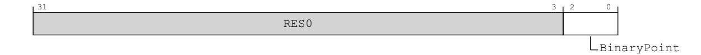

#### **Bits [31:3]**

Reserved, RES0.

#### **BinaryPoint, bits [2:0]**

If the GIC is configured to use separate binary point fields for Group 0 and Group 1 interrupts, the value of this field controls how the 8-bit interrupt priority field is split into a group priority field, that determines interrupt preemption, and a subpriority field.

For more information about priorities, see *[Priority grouping on page](#page-73-2) 4-74*.

An attempt to program this field to a value less than the minimum value sets the field to the minimum value.

If [ICV\\_CTLR](#page-467-0).CBPR is set to 1, Non-secure EL1 reads return [ICV\\_BPR0](#page-459-0) + 1 saturated to 0b111. Non-secure EL1 writes are ignored.

If [ICV\\_CTLR](#page-467-0).CBPR is set to 1, Secure EL1 reads return [ICV\\_BPR0](#page-459-0). Secure EL1 writes modify [ICV\\_BPR0](#page-459-0)

The reset behavior of this field is:

• On a Warm reset, this field resets to an architecturally UNKNOWN value.

#### **Accessing ICV\_BPR1**

The minimum values of this register is equal to the minimum value of [ICV\\_BPR0](#page-459-0) plus one.

An attempt to program the binary point field to a value less than the minimum value sets the field to the minimum value. On a reset, the binary point field is UNKNOWN.

Accesses to this register use the following encodings in the System register encoding space:

#### **MRC{<c>}{<q>} <coproc>, {#}<opc1>, <Rt>, <CRn>, <CRm>{, {#}<opc2>}**

| coproc | opc1  | CRn    | CRm    | opc2  |
|--------|-------|--------|--------|-------|
| 0b1111 | 0b000 | 0b1100 | 0b1100 | 0b011 |

```
if PSTATE.EL == EL0 then
    UNDEFINED;
elsif PSTATE.EL == EL1 then
    if HaveEL(EL3) && EL3SDDUndefPriority() && !ELUsingAArch32(EL3) && SCR_EL3.IRQ == '1'
then
        UNDEFINED;
    elsif HaveEL(EL3) && EL3SDDUndefPriority() && ELUsingAArch32(EL3) && PSTATE.M !=
M32_Monitor && SCR.IRQ == '1' then
        UNDEFINED;
    elsif EL2Enabled() && !ELUsingAArch32(EL2) && HSTR_EL2.T12 == '1' then
        AArch64.AArch32SystemAccessTrap(EL2, 0x03);
    elsif EL2Enabled() && ELUsingAArch32(EL2) && HSTR.T12 == '1' then
        AArch32.TakeHypTrapException(0x03);
    elsif ICC_SRE.SRE == '0' then
        UNDEFINED;
    elsif EL2Enabled() && !ELUsingAArch32(EL2) && ICH_HCR_EL2.TALL1 == '1' then
        AArch64.AArch32SystemAccessTrap(EL2, 0x03);
    elsif EL2Enabled() && ELUsingAArch32(EL2) && ICH_HCR.TALL1 == '1' then
        AArch32.TakeHypTrapException(0x03);
    elsif EL2Enabled() && !ELUsingAArch32(EL2) && HCR_EL2.IMO == '1' then
        R[t] = ICV_BPR1;
    elsif EL2Enabled() && ELUsingAArch32(EL2) && HCR.IMO == '1' then
        R[t] = ICV_BPR1;
    elsif HaveEL(EL3) && !ELUsingAArch32(EL3) && SCR_EL3.IRQ == '1' then
        if EL3SDDUndef() then
            UNDEFINED;
        else
            AArch64.AArch32SystemAccessTrap(EL3, 0x03);
    elsif HaveEL(EL3) && ELUsingAArch32(EL3) && PSTATE.M != M32_Monitor && SCR.IRQ == '1'
then
        if EL3SDDUndef() then
            UNDEFINED;
        else
            AArch32.TakeMonitorTrapException();
    elsif HaveEL(EL3) then
        R[t] = ICC_BPR1_NS;
    else
        R[t] = ICC_BPR1;
elsif PSTATE.EL == EL2 then
    if HaveEL(EL3) && EL3SDDUndefPriority() && !ELUsingAArch32(EL3) && SCR_EL3.IRQ == '1'
then
        UNDEFINED;
    elsif HaveEL(EL3) && EL3SDDUndefPriority() && ELUsingAArch32(EL3) && SCR.IRQ == '1'
then
        UNDEFINED;
    elsif ICC_HSRE.SRE == '0' then
        UNDEFINED;
    elsif HaveEL(EL3) && !ELUsingAArch32(EL3) && SCR_EL3.IRQ == '1' then
        if EL3SDDUndef() then
            UNDEFINED;
        else
            AArch64.AArch32SystemAccessTrap(EL3, 0x03);
    elsif HaveEL(EL3) && ELUsingAArch32(EL3) && SCR.IRQ == '1' then
        if EL3SDDUndef() then
            UNDEFINED;
```

```
else
            AArch32.TakeMonitorTrapException();
    elsif HaveEL(EL3) then
        R[t] = ICC_BPR1_NS;
    else
        R[t] = ICC_BPR1;
elsif PSTATE.EL == EL3 then
    if ICC_MSRE.SRE == '0' then
        UNDEFINED;
    else
        if SCR.NS == '0' then
            R[t] = ICC_BPR1_S;
        else
            R[t] = ICC_BPR1_NS;
```

#### **MCR{<c>}{<q>} <coproc>, {#}<opc1>, <Rt>, <CRn>, <CRm>{, {#}<opc2>}**

| coproc | opc1  | CRn    | CRm    | opc2  |
|--------|-------|--------|--------|-------|
| 0b1111 | 0b000 | 0b1100 | 0b1100 | 0b011 |

```
if PSTATE.EL == EL0 then
    UNDEFINED;
elsif PSTATE.EL == EL1 then
    if HaveEL(EL3) && EL3SDDUndefPriority() && !ELUsingAArch32(EL3) && SCR_EL3.IRQ == '1'
then
        UNDEFINED;
    elsif HaveEL(EL3) && EL3SDDUndefPriority() && ELUsingAArch32(EL3) && PSTATE.M !=
M32_Monitor && SCR.IRQ == '1' then
        UNDEFINED;
    elsif EL2Enabled() && !ELUsingAArch32(EL2) && HSTR_EL2.T12 == '1' then
        AArch64.AArch32SystemAccessTrap(EL2, 0x03);
    elsif EL2Enabled() && ELUsingAArch32(EL2) && HSTR.T12 == '1' then
        AArch32.TakeHypTrapException(0x03);
    elsif ICC_SRE.SRE == '0' then
        UNDEFINED;
    elsif EL2Enabled() && !ELUsingAArch32(EL2) && ICH_HCR_EL2.TALL1 == '1' then
        AArch64.AArch32SystemAccessTrap(EL2, 0x03);
    elsif EL2Enabled() && ELUsingAArch32(EL2) && ICH_HCR.TALL1 == '1' then
        AArch32.TakeHypTrapException(0x03);
    elsif EL2Enabled() && !ELUsingAArch32(EL2) && HCR_EL2.IMO == '1' then
        ICV_BPR1 = R[t];
    elsif EL2Enabled() && ELUsingAArch32(EL2) && HCR.IMO == '1' then
        ICV_BPR1 = R[t];
    elsif HaveEL(EL3) && !ELUsingAArch32(EL3) && SCR_EL3.IRQ == '1' then
        if EL3SDDUndef() then
            UNDEFINED;
        else
            AArch64.AArch32SystemAccessTrap(EL3, 0x03);
    elsif HaveEL(EL3) && ELUsingAArch32(EL3) && PSTATE.M != M32_Monitor && SCR.IRQ == '1'
then
        if EL3SDDUndef() then
            UNDEFINED;
        else
            AArch32.TakeMonitorTrapException();
    elsif HaveEL(EL3) then
        ICC_BPR1_NS = R[t];
    else
        ICC_BPR1 = R[t];
elsif PSTATE.EL == EL2 then
    if HaveEL(EL3) && EL3SDDUndefPriority() && !ELUsingAArch32(EL3) && SCR_EL3.IRQ == '1'
then
```

```
UNDEFINED;
    elsif HaveEL(EL3) && EL3SDDUndefPriority() && ELUsingAArch32(EL3) && SCR.IRQ == '1'
then
        UNDEFINED;
    elsif ICC_HSRE.SRE == '0' then
        UNDEFINED;
    elsif HaveEL(EL3) && !ELUsingAArch32(EL3) && SCR_EL3.IRQ == '1' then
        if EL3SDDUndef() then
            UNDEFINED;
        else
            AArch64.AArch32SystemAccessTrap(EL3, 0x03);
    elsif HaveEL(EL3) && ELUsingAArch32(EL3) && SCR.IRQ == '1' then
        if EL3SDDUndef() then
            UNDEFINED;
        else
            AArch32.TakeMonitorTrapException();
    elsif HaveEL(EL3) then
        ICC_BPR1_NS = R[t];
    else
        ICC_BPR1 = R[t];
elsif PSTATE.EL == EL3 then
    if ICC_MSRE.SRE == '0' then
        UNDEFINED;
    else
        if SCR.NS == '0' then
            ICC_BPR1_S = R[t];
        else
            ICC_BPR1_NS = R[t];
```

#### <span id="page-467-0"></span>**12.6.5 ICV\_CTLR, Interrupt Controller Virtual Control Register**

The ICV\_CTLR characteristics are:

#### **Purpose**

Controls aspects of the behavior of the GIC virtual CPU interface and provides information about the features implemented.

#### **Configurations**

AArch32 System register ICV\_CTLR bits [31:0] are architecturally mapped to AArch64 System register [ICV\\_CTLR\\_EL1](#page-302-1)[31:0].

This register is present only when EL1 is capable of using AArch32, FEAT\_GICv3 is implemented and EL2 is implemented. Otherwise, direct accesses to ICV\_CTLR are UNDEFINED.

#### **Attributes**

ICV\_CTLR is a 32-bit register.

#### **Field descriptions**

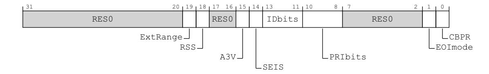

#### **Bits [31:20]**

Reserved, RES0.

#### **ExtRange, bit [19]**

Extended INTID range (read-only).

0b0 CPU interface does not support INTIDs in the range 1024..8191.

Behavior is UNPREDICTABLE if the IRI delivers an interrupt in the range 1024 to 8191 to the CPU interface.

**Note**

Arm strongly recommends that the IRI is not configured to deliver interrupts in this range to a PE that does not support them.

0b1 CPU interface supports INTIDs in the range 1024..8191.

All INTIDs in the range 1024..8191 are treated as requiring deactivation.

ICV\_CTLR.ExtRange is an alias of [ICC\\_CTLR.](#page-389-0)ExtRange.

#### **RSS, bit [18]**

Range Selector Support. Possible values are:

0b0 Targeted SGIs with affinity level 0 values of 0 - 15 are supported.

0b1 Targeted SGIs with affinity level 0 values of 0 - 255 are supported.

This bit is read-only.

#### **Bits [17:16]**

Reserved, RES0.

#### **A3V, bit [15]**

Affinity 3 Valid. Read-only and writes are ignored. Possible values are:

0b0 The virtual CPU interface logic only supports zero values of Affinity 3 in SGI generation System registers.

0b1 The virtual CPU interface logic supports nonzero values of Affinity 3 in SGI generation System registers.

#### **SEIS, bit [14]**

SEI Support. Read-only and writes are ignored. Indicates whether the virtual CPU interface supports local generation of SEIs:

0b0 The virtual CPU interface logic does not support local generation of SEIs.

0b1 The virtual CPU interface logic supports local generation of SEIs.

#### **IDbits, bits [13:11]**

Identifier bits. Read-only and writes are ignored. The number of virtual interrupt identifier bits supported:

0b000 16 bits. 0b001 24 bits.

All other values are reserved.

#### **PRIbits, bits [10:8]**

Priority bits. Read-only and writes are ignored. The number of virtual priority bits implemented, minus one.

An implementation must implement at least 32 levels of virtual priority (5 priority bits).

The division between group priority and subpriority is defined in the binary point registers [ICV\\_BPR0](#page-459-0) and [ICV\\_BPR1](#page-463-0).

#### **Bits [7:2]**

Reserved, RES0.

#### **EOImode, bit [1]**

Virtual EOI mode. Controls whether a write to an End of Interrupt register also deactivates the virtual interrupt:

0b0 [ICV\\_EOIR0](#page-474-0) and [ICV\\_EOIR1](#page-476-0) provide both priority drop and interrupt deactivation functionality. Accesses to [ICV\\_DIR](#page-472-0) are UNPREDICTABLE.

0b1 [ICV\\_EOIR0](#page-474-0) and [ICV\\_EOIR1](#page-476-0) provide priority drop functionality only. [ICV\\_DIR](#page-472-0) provides interrupt deactivation functionality.

The reset behavior of this field is:

• On a Warm reset, this field resets to an architecturally UNKNOWN value.

#### **CBPR, bit [0]**

Common Binary Point Register. Controls whether the same register is used for interrupt preemption of both virtual Group 0 and virtual Group 1 interrupts:

0b0 [ICV\\_BPR0](#page-459-0) determines the preemption group for virtual Group 0 interrupts only. [ICV\\_BPR1](#page-463-0) determines the preemption group for virtual Group 1 interrupts.

0b1 Non-secure reads of [ICV\\_BPR1](#page-463-0) return [ICV\\_BPR0](#page-459-0) plus one, saturated to 0b111. Non-secure writes to [ICV\\_BPR1](#page-463-0) are ignored.

Secure reads of [ICV\\_BPR1](#page-463-0) return [ICV\\_BPR0](#page-459-0). Secure writes of [ICV\\_BPR1](#page-463-0) modify [ICV\\_BPR0](#page-459-0).

The reset behavior of this field is:

• On a Warm reset, this field resets to an architecturally UNKNOWN value.

#### **Accessing ICV\_CTLR**

Accesses to this register use the following encodings in the System register encoding space:

**MRC{<c>}{<q>} <coproc>, {#}<opc1>, <Rt>, <CRn>, <CRm>{, {#}<opc2>}**

| coproc | opc1  | CRn    | CRm    | opc2  |
|--------|-------|--------|--------|-------|
| 0b1111 | 0b000 | 0b1100 | 0b1100 | 0b100 |

```
if PSTATE.EL == EL0 then
    UNDEFINED;
elsif PSTATE.EL == EL1 then
   if HaveEL(EL3) && EL3SDDUndefPriority() && !ELUsingAArch32(EL3) && SCR_EL3.<IRQ,FIQ> ==
'11' then
        UNDEFINED;
    elsif HaveEL(EL3) && EL3SDDUndefPriority() && ELUsingAArch32(EL3) && PSTATE.M !=
M32_Monitor && SCR.<IRQ,FIQ> == '11' then
        UNDEFINED;
    elsif EL2Enabled() && !ELUsingAArch32(EL2) && HSTR_EL2.T12 == '1' then
        AArch64.AArch32SystemAccessTrap(EL2, 0x03);
    elsif EL2Enabled() && ELUsingAArch32(EL2) && HSTR.T12 == '1' then
        AArch32.TakeHypTrapException(0x03);
    elsif ICC_SRE.SRE == '0' then
        UNDEFINED;
    elsif EL2Enabled() && !ELUsingAArch32(EL2) && ICH_HCR_EL2.TC == '1' then
        AArch64.AArch32SystemAccessTrap(EL2, 0x03);
    elsif EL2Enabled() && ELUsingAArch32(EL2) && ICH_HCR.TC == '1' then
        AArch32.TakeHypTrapException(0x03);
    elsif EL2Enabled() && !ELUsingAArch32(EL2) && HCR_EL2.FMO == '1' then
        R[t] = ICV_CTLR;
    elsif EL2Enabled() && !ELUsingAArch32(EL2) && HCR_EL2.IMO == '1' then
        R[t] = ICV_CTLR;
    elsif EL2Enabled() && ELUsingAArch32(EL2) && HCR.FMO == '1' then
        R[t] = ICV_CTLR;
    elsif EL2Enabled() && ELUsingAArch32(EL2) && HCR.IMO == '1' then
        R[t] = ICV_CTLR;
    elsif HaveEL(EL3) && !ELUsingAArch32(EL3) && SCR_EL3.<IRQ,FIQ> == '11' then
        if EL3SDDUndef() then
            UNDEFINED;
        else
            AArch64.AArch32SystemAccessTrap(EL3, 0x03);
   elsif HaveEL(EL3) && ELUsingAArch32(EL3) && PSTATE.M != M32_Monitor && SCR.<IRQ,FIQ> ==
'11' then
        if EL3SDDUndef() then
            UNDEFINED;
        else
            AArch32.TakeMonitorTrapException();
    elsif HaveEL(EL3) then
        R[t] = ICC_CTLR_NS;
    else
        R[t] = ICC_CTLR;
elsif PSTATE.EL == EL2 then
   if HaveEL(EL3) && EL3SDDUndefPriority() && !ELUsingAArch32(EL3) && SCR_EL3.<IRQ,FIQ> ==
'11' then
        UNDEFINED;
    elsif HaveEL(EL3) && EL3SDDUndefPriority() && ELUsingAArch32(EL3) && SCR.<IRQ,FIQ> ==
'11' then
        UNDEFINED;
    elsif ICC_HSRE.SRE == '0' then
        UNDEFINED;
    elsif HaveEL(EL3) && !ELUsingAArch32(EL3) && SCR_EL3.<IRQ,FIQ> == '11' then
```

if EL3SDDUndef() then

```
UNDEFINED;
        else
            AArch64.AArch32SystemAccessTrap(EL3, 0x03);
    elsif HaveEL(EL3) && ELUsingAArch32(EL3) && SCR.<IRQ,FIQ> == '11' then
        if EL3SDDUndef() then
            UNDEFINED;
        else
            AArch32.TakeMonitorTrapException();
    elsif HaveEL(EL3) then
        R[t] = ICC_CTLR_NS;
    else
        R[t] = ICC_CTLR;
elsif PSTATE.EL == EL3 then
    if ICC_MSRE.SRE == '0' then
        UNDEFINED;
    else
        if SCR.NS == '0' then
            R[t] = ICC_CTLR_S;
        else
            R[t] = ICC_CTLR_NS;
```

#### **MCR{<c>}{<q>} <coproc>, {#}<opc1>, <Rt>, <CRn>, <CRm>{, {#}<opc2>}**

| coproc | opc1  | CRn    | CRm    | opc2  |
|--------|-------|--------|--------|-------|
| 0b1111 | 0b000 | 0b1100 | 0b1100 | 0b100 |

```
if PSTATE.EL == EL0 then
    UNDEFINED;
elsif PSTATE.EL == EL1 then
   if HaveEL(EL3) && EL3SDDUndefPriority() && !ELUsingAArch32(EL3) && SCR_EL3.<IRQ,FIQ> ==
'11' then
        UNDEFINED;
    elsif HaveEL(EL3) && EL3SDDUndefPriority() && ELUsingAArch32(EL3) && PSTATE.M !=
M32_Monitor && SCR.<IRQ,FIQ> == '11' then
        UNDEFINED;
    elsif EL2Enabled() && !ELUsingAArch32(EL2) && HSTR_EL2.T12 == '1' then
        AArch64.AArch32SystemAccessTrap(EL2, 0x03);
    elsif EL2Enabled() && ELUsingAArch32(EL2) && HSTR.T12 == '1' then
        AArch32.TakeHypTrapException(0x03);
    elsif ICC_SRE.SRE == '0' then
        UNDEFINED;
    elsif EL2Enabled() && !ELUsingAArch32(EL2) && ICH_HCR_EL2.TC == '1' then
        AArch64.AArch32SystemAccessTrap(EL2, 0x03);
    elsif EL2Enabled() && ELUsingAArch32(EL2) && ICH_HCR.TC == '1' then
        AArch32.TakeHypTrapException(0x03);
    elsif EL2Enabled() && !ELUsingAArch32(EL2) && HCR_EL2.FMO == '1' then
        ICV_CTLR = R[t];
    elsif EL2Enabled() && !ELUsingAArch32(EL2) && HCR_EL2.IMO == '1' then
        ICV_CTLR = R[t];
    elsif EL2Enabled() && ELUsingAArch32(EL2) && HCR.FMO == '1' then
        ICV_CTLR = R[t];
    elsif EL2Enabled() && ELUsingAArch32(EL2) && HCR.IMO == '1' then
        ICV_CTLR = R[t];
    elsif HaveEL(EL3) && !ELUsingAArch32(EL3) && SCR_EL3.<IRQ,FIQ> == '11' then
        if EL3SDDUndef() then
            UNDEFINED;
        else
            AArch64.AArch32SystemAccessTrap(EL3, 0x03);
   elsif HaveEL(EL3) && ELUsingAArch32(EL3) && PSTATE.M != M32_Monitor && SCR.<IRQ,FIQ> ==
'11' then
        if EL3SDDUndef() then
```

```
UNDEFINED;
        else
            AArch32.TakeMonitorTrapException();
    elsif HaveEL(EL3) then
        ICC_CTLR_NS = R[t];
    else
        ICC_CTLR = R[t];
elsif PSTATE.EL == EL2 then
   if HaveEL(EL3) && EL3SDDUndefPriority() && !ELUsingAArch32(EL3) && SCR_EL3.<IRQ,FIQ> ==
'11' then
        UNDEFINED;
    elsif HaveEL(EL3) && EL3SDDUndefPriority() && ELUsingAArch32(EL3) && SCR.<IRQ,FIQ> ==
'11' then
        UNDEFINED;
    elsif ICC_HSRE.SRE == '0' then
        UNDEFINED;
    elsif HaveEL(EL3) && !ELUsingAArch32(EL3) && SCR_EL3.<IRQ,FIQ> == '11' then
        if EL3SDDUndef() then
            UNDEFINED;
        else
            AArch64.AArch32SystemAccessTrap(EL3, 0x03);
    elsif HaveEL(EL3) && ELUsingAArch32(EL3) && SCR.<IRQ,FIQ> == '11' then
        if EL3SDDUndef() then
            UNDEFINED;
        else
            AArch32.TakeMonitorTrapException();
    elsif HaveEL(EL3) then
        ICC_CTLR_NS = R[t];
    else
        ICC_CTLR = R[t];
elsif PSTATE.EL == EL3 then
    if ICC_MSRE.SRE == '0' then
        UNDEFINED;
    else
        if SCR.NS == '0' then
            ICC_CTLR_S = R[t];
        else
            ICC_CTLR_NS = R[t];
```

#### <span id="page-472-0"></span>**12.6.6 ICV\_DIR, Interrupt Controller Deactivate Virtual Interrupt Register**

The ICV\_DIR characteristics are:

#### **Purpose**

When interrupt priority drop is separated from interrupt deactivation, a write to this register deactivates the specified virtual interrupt.

#### **Configurations**

AArch32 System register ICV\_DIR bits [31:0] performs the same function as AArch64 System register [ICV\\_DIR\\_EL1\[](#page-307-1)31:0].

This register is present only when EL1 is capable of using AArch32, FEAT\_GICv3 is implemented and EL2 is implemented. Otherwise, direct accesses to ICV\_DIR are UNDEFINED.

#### **Attributes**

ICV\_DIR is a 32-bit register.

#### **Field descriptions**


#### **Bits [31:24]**

Reserved, RES0.

#### **INTID, bits [23:0]**

The INTID of the virtual interrupt to be deactivated.

This field has either 16 or 24 bits implemented. The number of implemented bits can be found in [ICV\\_CTLR.](#page-467-0)IDbits. If only 16 bits are implemented, bits [23:16] of this register are RES0.

#### **Accessing ICV\_DIR**

When EOImode == 0, writes are ignored. In systems supporting system error generation, an implementation might generate an SEI.

**MCR{<c>}{<q>} <coproc>, {#}<opc1>, <Rt>, <CRn>, <CRm>{, {#}<opc2>}**

| coproc | opc1  | CRn    | CRm    | opc2  |
|--------|-------|--------|--------|-------|
| 0b1111 | 0b000 | 0b1100 | 0b1011 | 0b001 |

```
if PSTATE.EL == EL0 then
    UNDEFINED;
elsif PSTATE.EL == EL1 then
   if HaveEL(EL3) && EL3SDDUndefPriority() && !ELUsingAArch32(EL3) && SCR_EL3.<IRQ,FIQ> ==
'11' then
        UNDEFINED;
    elsif HaveEL(EL3) && EL3SDDUndefPriority() && ELUsingAArch32(EL3) && PSTATE.M !=
M32_Monitor && SCR.<IRQ,FIQ> == '11' then
        UNDEFINED;
    elsif EL2Enabled() && !ELUsingAArch32(EL2) && HSTR_EL2.T12 == '1' then
        AArch64.AArch32SystemAccessTrap(EL2, 0x03);
```

```
elsif EL2Enabled() && ELUsingAArch32(EL2) && HSTR.T12 == '1' then
        AArch32.TakeHypTrapException(0x03);
    elsif ICC_SRE.SRE == '0' then
        UNDEFINED;
    elsif EL2Enabled() && !ELUsingAArch32(EL2) && ICH_HCR_EL2.TDIR == '1' then
        AArch64.AArch32SystemAccessTrap(EL2, 0x03);
    elsif EL2Enabled() && !ELUsingAArch32(EL2) && ICH_HCR_EL2.TC == '1' then
        AArch64.AArch32SystemAccessTrap(EL2, 0x03);
    elsif EL2Enabled() && ELUsingAArch32(EL2) && ICH_HCR.TC == '1' then
        AArch32.TakeHypTrapException(0x03);
    elsif EL2Enabled() && ELUsingAArch32(EL2) && ICH_HCR.TDIR == '1' then
        AArch32.TakeHypTrapException(0x03);
    elsif EL2Enabled() && !ELUsingAArch32(EL2) && HCR_EL2.FMO == '1' then
        ICV_DIR = R[t];
    elsif EL2Enabled() && !ELUsingAArch32(EL2) && HCR_EL2.IMO == '1' then
        ICV_DIR = R[t];
    elsif EL2Enabled() && ELUsingAArch32(EL2) && HCR.FMO == '1' then
        ICV_DIR = R[t];
    elsif EL2Enabled() && ELUsingAArch32(EL2) && HCR.IMO == '1' then
        ICV_DIR = R[t];
    elsif HaveEL(EL3) && !ELUsingAArch32(EL3) && SCR_EL3.<IRQ,FIQ> == '11' then
        if EL3SDDUndef() then
            UNDEFINED;
        else
            AArch64.AArch32SystemAccessTrap(EL3, 0x03);
   elsif HaveEL(EL3) && ELUsingAArch32(EL3) && PSTATE.M != M32_Monitor && SCR.<IRQ,FIQ> ==
'11' then
        if EL3SDDUndef() then
            UNDEFINED;
        else
            AArch32.TakeMonitorTrapException();
    else
        ICC_DIR = R[t];
elsif PSTATE.EL == EL2 then
   if HaveEL(EL3) && EL3SDDUndefPriority() && !ELUsingAArch32(EL3) && SCR_EL3.<IRQ,FIQ> ==
'11' then
        UNDEFINED;
    elsif HaveEL(EL3) && EL3SDDUndefPriority() && ELUsingAArch32(EL3) && SCR.<IRQ,FIQ> ==
'11' then
        UNDEFINED;
    elsif ICC_HSRE.SRE == '0' then
        UNDEFINED;
    elsif HaveEL(EL3) && !ELUsingAArch32(EL3) && SCR_EL3.<IRQ,FIQ> == '11' then
        if EL3SDDUndef() then
            UNDEFINED;
        else
            AArch64.AArch32SystemAccessTrap(EL3, 0x03);
    elsif HaveEL(EL3) && ELUsingAArch32(EL3) && SCR.<IRQ,FIQ> == '11' then
        if EL3SDDUndef() then
            UNDEFINED;
        else
            AArch32.TakeMonitorTrapException();
    else
        ICC_DIR = R[t];
elsif PSTATE.EL == EL3 then
    if ICC_MSRE.SRE == '0' then
        UNDEFINED;
    else
        ICC_DIR = R[t];
```

#### <span id="page-474-0"></span>**12.6.7 ICV\_EOIR0, Interrupt Controller Virtual End Of Interrupt Register 0**

The ICV\_EOIR0 characteristics are:

#### **Purpose**

A PE writes to this register to inform the CPU interface that it has completed the processing of the specified virtual Group 0 interrupt.

#### **Configurations**

AArch32 System register ICV\_EOIR0 performs the same function as AArch64 System register [ICV\\_EOIR0\\_EL1](#page-309-1).

This register is present only when EL1 is capable of using AArch32, FEAT\_GICv3 is implemented and EL2 is implemented. Otherwise, direct accesses to ICV\_EOIR0 are UNDEFINED.

#### **Attributes**

ICV\_EOIR0 is a 32-bit register.

#### **Field descriptions**


#### **Bits [31:24]**

Reserved, RES0.

#### **INTID, bits [23:0]**

The INTID from the corresponding [ICV\\_IAR0](#page-482-0) access.

This field has either 16 or 24 bits implemented. The number of implemented bits can be found in [ICV\\_CTLR.](#page-467-0)IDbits. If only 16 bits are implemented, bits [23:16] of this register are RES0.

If the [ICV\\_CTLR](#page-467-0).EOImode bit is 0, a write to this register drops the priority for the virtual interrupt, and also deactivates the virtual interrupt.

If the [ICV\\_CTLR](#page-467-0).EOImode bit is 1, a write to this register only drops the priority for the virtual interrupt. Software must write to [ICV\\_DIR](#page-472-0) to deactivate the virtual interrupt.

#### **Accessing ICV\_EOIR0**

A write to this register must correspond to the most recent valid read by this vPE from a Virtual Interrupt Acknowledge Register, and must correspond to the INTID that was read from [ICV\\_IAR0](#page-482-0), otherwise the system behavior is UNPREDICTABLE. A valid read is a read that returns a valid INTID that is not a special INTID.

**MCR{<c>}{<q>} <coproc>, {#}<opc1>, <Rt>, <CRn>, <CRm>{, {#}<opc2>}**

| coproc | opc1  | CRn    | CRm    | opc2  |
|--------|-------|--------|--------|-------|
| 0b1111 | 0b000 | 0b1100 | 0b1000 | 0b001 |

```
if PSTATE.EL == EL0 then
    UNDEFINED;
elsif PSTATE.EL == EL1 then
    if HaveEL(EL3) && EL3SDDUndefPriority() && !ELUsingAArch32(EL3) && SCR_EL3.FIQ == '1'
then
```

```
UNDEFINED;
    elsif HaveEL(EL3) && EL3SDDUndefPriority() && ELUsingAArch32(EL3) && PSTATE.M !=
M32_Monitor && SCR.FIQ == '1' then
        UNDEFINED;
    elsif EL2Enabled() && !ELUsingAArch32(EL2) && HSTR_EL2.T12 == '1' then
        AArch64.AArch32SystemAccessTrap(EL2, 0x03);
    elsif EL2Enabled() && ELUsingAArch32(EL2) && HSTR.T12 == '1' then
        AArch32.TakeHypTrapException(0x03);
    elsif ICC_SRE.SRE == '0' then
        UNDEFINED;
    elsif EL2Enabled() && !ELUsingAArch32(EL2) && ICH_HCR_EL2.TALL0 == '1' then
        AArch64.AArch32SystemAccessTrap(EL2, 0x03);
    elsif EL2Enabled() && ELUsingAArch32(EL2) && ICH_HCR.TALL0 == '1' then
        AArch32.TakeHypTrapException(0x03);
    elsif EL2Enabled() && !ELUsingAArch32(EL2) && HCR_EL2.FMO == '1' then
        ICV_EOIR0 = R[t];
    elsif EL2Enabled() && ELUsingAArch32(EL2) && HCR.FMO == '1' then
        ICV_EOIR0 = R[t];
    elsif HaveEL(EL3) && !ELUsingAArch32(EL3) && SCR_EL3.FIQ == '1' then
        if EL3SDDUndef() then
            UNDEFINED;
        else
            AArch64.AArch32SystemAccessTrap(EL3, 0x03);
    elsif HaveEL(EL3) && ELUsingAArch32(EL3) && PSTATE.M != M32_Monitor && SCR.FIQ == '1'
then
        if EL3SDDUndef() then
            UNDEFINED;
        else
            AArch32.TakeMonitorTrapException();
    else
        ICC_EOIR0 = R[t];
elsif PSTATE.EL == EL2 then
    if HaveEL(EL3) && EL3SDDUndefPriority() && !ELUsingAArch32(EL3) && SCR_EL3.FIQ == '1'
then
        UNDEFINED;
    elsif HaveEL(EL3) && EL3SDDUndefPriority() && ELUsingAArch32(EL3) && SCR.FIQ == '1'
then
        UNDEFINED;
    elsif ICC_HSRE.SRE == '0' then
        UNDEFINED;
    elsif HaveEL(EL3) && !ELUsingAArch32(EL3) && SCR_EL3.FIQ == '1' then
        if EL3SDDUndef() then
            UNDEFINED;
        else
            AArch64.AArch32SystemAccessTrap(EL3, 0x03);
    elsif HaveEL(EL3) && ELUsingAArch32(EL3) && SCR.FIQ == '1' then
        if EL3SDDUndef() then
            UNDEFINED;
        else
            AArch32.TakeMonitorTrapException();
    else
        ICC_EOIR0 = R[t];
elsif PSTATE.EL == EL3 then
    if ICC_MSRE.SRE == '0' then
        UNDEFINED;
    else
        ICC_EOIR0 = R[t];
```

#### <span id="page-476-0"></span>**12.6.8 ICV\_EOIR1, Interrupt Controller Virtual End Of Interrupt Register 1**

The ICV\_EOIR1 characteristics are:

#### **Purpose**

A PE writes to this register to inform the CPU interface that it has completed the processing of the specified virtual Group 1 interrupt.

#### **Configurations**

AArch32 System register ICV\_EOIR1 performs the same function as AArch64 System register [ICV\\_EOIR1\\_EL1](#page-311-1).

This register is present only when EL1 is capable of using AArch32, FEAT\_GICv3 is implemented and EL2 is implemented. Otherwise, direct accesses to ICV\_EOIR1 are UNDEFINED.

#### **Attributes**

ICV\_EOIR1 is a 32-bit register.

#### **Field descriptions**

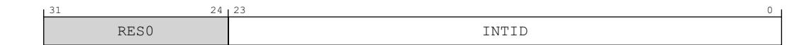

#### **Bits [31:24]**

Reserved, RES0.

#### **INTID, bits [23:0]**

The INTID from the corresponding [ICV\\_IAR1](#page-484-0) access.

This field has either 16 or 24 bits implemented. The number of implemented bits can be found in [ICV\\_CTLR.](#page-467-0)IDbits. If only 16 bits are implemented, bits [23:16] of this register are RES0.

If the [ICV\\_CTLR](#page-467-0).EOImode bit is 0, a write to this register drops the priority for the virtual interrupt, and also deactivates the virtual interrupt.

If the [ICV\\_CTLR](#page-467-0).EOImode bit is 1, a write to this register only drops the priority for the virtual interrupt. Software must write to [ICV\\_DIR](#page-472-0) to deactivate the virtual interrupt.

#### **Accessing ICV\_EOIR1**

A write to this register must correspond to the most recent valid read by this vPE from a Virtual Interrupt Acknowledge Register, and must correspond to the INTID that was read from [ICV\\_IAR1](#page-484-0), otherwise the system behavior is UNPREDICTABLE. A valid read is a read that returns a valid INTID that is not a special INTID.

**MCR{<c>}{<q>} <coproc>, {#}<opc1>, <Rt>, <CRn>, <CRm>{, {#}<opc2>}**

| coproc | opc1  | CRn    | CRm    | opc2  |
|--------|-------|--------|--------|-------|
| 0b1111 | 0b000 | 0b1100 | 0b1100 | 0b001 |

```
if PSTATE.EL == EL0 then
    UNDEFINED;
elsif PSTATE.EL == EL1 then
    if HaveEL(EL3) && EL3SDDUndefPriority() && !ELUsingAArch32(EL3) && SCR_EL3.IRQ == '1'
then
```

```
UNDEFINED;
    elsif HaveEL(EL3) && EL3SDDUndefPriority() && ELUsingAArch32(EL3) && PSTATE.M !=
M32_Monitor && SCR.IRQ == '1' then
        UNDEFINED;
    elsif EL2Enabled() && !ELUsingAArch32(EL2) && HSTR_EL2.T12 == '1' then
        AArch64.AArch32SystemAccessTrap(EL2, 0x03);
    elsif EL2Enabled() && ELUsingAArch32(EL2) && HSTR.T12 == '1' then
        AArch32.TakeHypTrapException(0x03);
    elsif ICC_SRE.SRE == '0' then
        UNDEFINED;
    elsif EL2Enabled() && !ELUsingAArch32(EL2) && ICH_HCR_EL2.TALL1 == '1' then
        AArch64.AArch32SystemAccessTrap(EL2, 0x03);
    elsif EL2Enabled() && ELUsingAArch32(EL2) && ICH_HCR.TALL1 == '1' then
        AArch32.TakeHypTrapException(0x03);
    elsif EL2Enabled() && !ELUsingAArch32(EL2) && HCR_EL2.IMO == '1' then
        ICV_EOIR1 = R[t];
    elsif EL2Enabled() && ELUsingAArch32(EL2) && HCR.IMO == '1' then
        ICV_EOIR1 = R[t];
    elsif HaveEL(EL3) && !ELUsingAArch32(EL3) && SCR_EL3.IRQ == '1' then
        if EL3SDDUndef() then
            UNDEFINED;
        else
            AArch64.AArch32SystemAccessTrap(EL3, 0x03);
    elsif HaveEL(EL3) && ELUsingAArch32(EL3) && PSTATE.M != M32_Monitor && SCR.IRQ == '1'
then
        if EL3SDDUndef() then
            UNDEFINED;
        else
            AArch32.TakeMonitorTrapException();
    else
        ICC_EOIR1 = R[t];
elsif PSTATE.EL == EL2 then
    if HaveEL(EL3) && EL3SDDUndefPriority() && !ELUsingAArch32(EL3) && SCR_EL3.IRQ == '1'
then
        UNDEFINED;
    elsif HaveEL(EL3) && EL3SDDUndefPriority() && ELUsingAArch32(EL3) && SCR.IRQ == '1'
then
        UNDEFINED;
    elsif ICC_HSRE.SRE == '0' then
        UNDEFINED;
    elsif HaveEL(EL3) && !ELUsingAArch32(EL3) && SCR_EL3.IRQ == '1' then
        if EL3SDDUndef() then
            UNDEFINED;
        else
            AArch64.AArch32SystemAccessTrap(EL3, 0x03);
    elsif HaveEL(EL3) && ELUsingAArch32(EL3) && SCR.IRQ == '1' then
        if EL3SDDUndef() then
            UNDEFINED;
        else
            AArch32.TakeMonitorTrapException();
    else
        ICC_EOIR1 = R[t];
elsif PSTATE.EL == EL3 then
    if ICC_MSRE.SRE == '0' then
        UNDEFINED;
    else
        ICC_EOIR1 = R[t];
```

#### <span id="page-478-0"></span>**12.6.9 ICV\_HPPIR0, Interrupt Controller Virtual Highest Priority Pending Interrupt Register 0**

The ICV\_HPPIR0 characteristics are:

#### **Purpose**

Indicates the highest priority pending virtual Group 0 interrupt on the virtual CPU interface.

#### **Configurations**

AArch32 System register ICV\_HPPIR0 performs the same function as AArch64 System register [ICV\\_HPPIR0\\_EL1.](#page-313-1)

This register is present only when EL1 is capable of using AArch32, FEAT\_GICv3 is implemented and EL2 is implemented. Otherwise, direct accesses to ICV\_HPPIR0 are UNDEFINED.

#### **Attributes**

ICV\_HPPIR0 is a 32-bit register.

#### **Field descriptions**

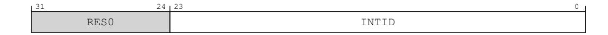

#### **Bits [31:24]**

Reserved, RES0.

#### **INTID, bits [23:0]**

The INTID of the highest priority pending virtual interrupt.

If the highest priority pending interrupt is not observable, this field contains a special INTID to indicate the reason. This special INTID can take the value 1023 only. For more information, see *[Special INTIDs on page](#page-35-1) 2-36*.

This field has either 16 or 24 bits implemented. The number of implemented bits can be found in [ICV\\_CTLR.](#page-467-0)IDbits. If only 16 bits are implemented, bits [23:16] of this register are RES0.

#### **Accessing ICV\_HPPIR0**

**MRC{<c>}{<q>} <coproc>, {#}<opc1>, <Rt>, <CRn>, <CRm>{, {#}<opc2>}**

| coproc | opc1  | CRn    | CRm    | opc2  |
|--------|-------|--------|--------|-------|
| 0b1111 | 0b000 | 0b1100 | 0b1000 | 0b010 |

```
if PSTATE.EL == EL0 then
    UNDEFINED;
elsif PSTATE.EL == EL1 then
    if HaveEL(EL3) && EL3SDDUndefPriority() && !ELUsingAArch32(EL3) && SCR_EL3.FIQ == '1'
then
        UNDEFINED;
    elsif HaveEL(EL3) && EL3SDDUndefPriority() && ELUsingAArch32(EL3) && PSTATE.M !=
M32_Monitor && SCR.FIQ == '1' then
        UNDEFINED;
    elsif EL2Enabled() && !ELUsingAArch32(EL2) && HSTR_EL2.T12 == '1' then
        AArch64.AArch32SystemAccessTrap(EL2, 0x03);
```

```
elsif EL2Enabled() && ELUsingAArch32(EL2) && HSTR.T12 == '1' then
        AArch32.TakeHypTrapException(0x03);
    elsif ICC_SRE.SRE == '0' then
        UNDEFINED;
    elsif EL2Enabled() && !ELUsingAArch32(EL2) && ICH_HCR_EL2.TALL0 == '1' then
        AArch64.AArch32SystemAccessTrap(EL2, 0x03);
    elsif EL2Enabled() && ELUsingAArch32(EL2) && ICH_HCR.TALL0 == '1' then
        AArch32.TakeHypTrapException(0x03);
    elsif EL2Enabled() && !ELUsingAArch32(EL2) && HCR_EL2.FMO == '1' then
        R[t] = ICV_HPPIR0;
    elsif EL2Enabled() && ELUsingAArch32(EL2) && HCR.FMO == '1' then
        R[t] = ICV_HPPIR0;
    elsif HaveEL(EL3) && !ELUsingAArch32(EL3) && SCR_EL3.FIQ == '1' then
        if EL3SDDUndef() then
            UNDEFINED;
        else
            AArch64.AArch32SystemAccessTrap(EL3, 0x03);
    elsif HaveEL(EL3) && ELUsingAArch32(EL3) && PSTATE.M != M32_Monitor && SCR.FIQ == '1'
then
        if EL3SDDUndef() then
            UNDEFINED;
        else
            AArch32.TakeMonitorTrapException();
    else
        R[t] = ICC_HPPIR0;
elsif PSTATE.EL == EL2 then
    if HaveEL(EL3) && EL3SDDUndefPriority() && !ELUsingAArch32(EL3) && SCR_EL3.FIQ == '1'
then
        UNDEFINED;
    elsif HaveEL(EL3) && EL3SDDUndefPriority() && ELUsingAArch32(EL3) && SCR.FIQ == '1'
then
        UNDEFINED;
    elsif ICC_HSRE.SRE == '0' then
        UNDEFINED;
    elsif HaveEL(EL3) && !ELUsingAArch32(EL3) && SCR_EL3.FIQ == '1' then
        if EL3SDDUndef() then
            UNDEFINED;
        else
            AArch64.AArch32SystemAccessTrap(EL3, 0x03);
    elsif HaveEL(EL3) && ELUsingAArch32(EL3) && SCR.FIQ == '1' then
        if EL3SDDUndef() then
            UNDEFINED;
        else
            AArch32.TakeMonitorTrapException();
    else
        R[t] = ICC_HPPIR0;
elsif PSTATE.EL == EL3 then
    if ICC_MSRE.SRE == '0' then
        UNDEFINED;
    else
        R[t] = ICC_HPPIR0;
```

#### <span id="page-480-0"></span>**12.6.10 ICV\_HPPIR1, Interrupt Controller Virtual Highest Priority Pending Interrupt Register 1**

The ICV\_HPPIR1 characteristics are:

#### **Purpose**

Indicates the highest priority pending virtual Group 1 interrupt on the virtual CPU interface.

#### **Configurations**

AArch32 System register ICV\_HPPIR1 performs the same function as AArch64 System register [ICV\\_HPPIR1\\_EL1.](#page-315-1)

This register is present only when EL1 is capable of using AArch32, FEAT\_GICv3 is implemented and EL2 is implemented. Otherwise, direct accesses to ICV\_HPPIR1 are UNDEFINED.

#### **Attributes**

ICV\_HPPIR1 is a 32-bit register.

#### **Field descriptions**


#### **Bits [31:24]**

Reserved, RES0.

#### **INTID, bits [23:0]**

The INTID of the highest priority pending virtual interrupt.

If the highest priority pending interrupt is not observable, this field contains a special INTID to indicate the reason. This special INTID can take the value 1023 only. For more information, see *[Special INTIDs on page](#page-35-1) 2-36*.

This field has either 16 or 24 bits implemented. The number of implemented bits can be found in [ICV\\_CTLR.](#page-467-0)IDbits. If only 16 bits are implemented, bits [23:16] of this register are RES0.

#### **Accessing ICV\_HPPIR1**

**MRC{<c>}{<q>} <coproc>, {#}<opc1>, <Rt>, <CRn>, <CRm>{, {#}<opc2>}**

| coproc | opc1  | CRn    | CRm    | opc2  |
|--------|-------|--------|--------|-------|
| 0b1111 | 0b000 | 0b1100 | 0b1100 | 0b010 |

```
if PSTATE.EL == EL0 then
    UNDEFINED;
elsif PSTATE.EL == EL1 then
    if HaveEL(EL3) && EL3SDDUndefPriority() && !ELUsingAArch32(EL3) && SCR_EL3.IRQ == '1'
then
        UNDEFINED;
    elsif HaveEL(EL3) && EL3SDDUndefPriority() && ELUsingAArch32(EL3) && PSTATE.M !=
M32_Monitor && SCR.IRQ == '1' then
        UNDEFINED;
    elsif EL2Enabled() && !ELUsingAArch32(EL2) && HSTR_EL2.T12 == '1' then
        AArch64.AArch32SystemAccessTrap(EL2, 0x03);
```

```
elsif EL2Enabled() && ELUsingAArch32(EL2) && HSTR.T12 == '1' then
        AArch32.TakeHypTrapException(0x03);
    elsif ICC_SRE.SRE == '0' then
        UNDEFINED;
    elsif EL2Enabled() && !ELUsingAArch32(EL2) && ICH_HCR_EL2.TALL1 == '1' then
        AArch64.AArch32SystemAccessTrap(EL2, 0x03);
    elsif EL2Enabled() && ELUsingAArch32(EL2) && ICH_HCR.TALL1 == '1' then
        AArch32.TakeHypTrapException(0x03);
    elsif EL2Enabled() && !ELUsingAArch32(EL2) && HCR_EL2.IMO == '1' then
        R[t] = ICV_HPPIR1;
    elsif EL2Enabled() && ELUsingAArch32(EL2) && HCR.IMO == '1' then
        R[t] = ICV_HPPIR1;
    elsif HaveEL(EL3) && !ELUsingAArch32(EL3) && SCR_EL3.IRQ == '1' then
        if EL3SDDUndef() then
            UNDEFINED;
        else
            AArch64.AArch32SystemAccessTrap(EL3, 0x03);
    elsif HaveEL(EL3) && ELUsingAArch32(EL3) && PSTATE.M != M32_Monitor && SCR.IRQ == '1'
then
        if EL3SDDUndef() then
            UNDEFINED;
        else
            AArch32.TakeMonitorTrapException();
    else
        R[t] = ICC_HPPIR1;
elsif PSTATE.EL == EL2 then
    if HaveEL(EL3) && EL3SDDUndefPriority() && !ELUsingAArch32(EL3) && SCR_EL3.IRQ == '1'
then
        UNDEFINED;
    elsif HaveEL(EL3) && EL3SDDUndefPriority() && ELUsingAArch32(EL3) && SCR.IRQ == '1'
then
        UNDEFINED;
    elsif ICC_HSRE.SRE == '0' then
        UNDEFINED;
    elsif HaveEL(EL3) && !ELUsingAArch32(EL3) && SCR_EL3.IRQ == '1' then
        if EL3SDDUndef() then
            UNDEFINED;
        else
            AArch64.AArch32SystemAccessTrap(EL3, 0x03);
    elsif HaveEL(EL3) && ELUsingAArch32(EL3) && SCR.IRQ == '1' then
        if EL3SDDUndef() then
            UNDEFINED;
        else
            AArch32.TakeMonitorTrapException();
    else
        R[t] = ICC_HPPIR1;
elsif PSTATE.EL == EL3 then
    if ICC_MSRE.SRE == '0' then
        UNDEFINED;
    else
        R[t] = ICC_HPPIR1;
```

#### <span id="page-482-0"></span>**12.6.11 ICV\_IAR0, Interrupt Controller Virtual Interrupt Acknowledge Register 0**

The ICV\_IAR0 characteristics are:

#### **Purpose**

The PE reads this register to obtain the INTID of the signaled virtual Group 0 interrupt. This read acts as an acknowledge for the interrupt.

#### **Configurations**

AArch32 System register ICV\_IAR0 performs the same function as AArch64 System register [ICV\\_IAR0\\_EL1.](#page-317-1)

This register is present only when EL1 is capable of using AArch32, FEAT\_GICv3 is implemented and EL2 is implemented. Otherwise, direct accesses to ICV\_IAR0 are UNDEFINED.

To allow software to ensure appropriate observability of actions initiated by GIC register accesses, the PE and CPU interface logic must ensure that reads of this register are self-synchronizing when interrupts are masked by the PE (that is when PSTATE.{I,F} == {0,0}). This ensures that the effect of activating an interrupt on the signaling of interrupt exceptions is observed when a read of this register is architecturally executed so that no spurious interrupt exception occurs if interrupts are unmasked by an instruction immediately following the read. For more information, see *[Observability of the effects of accesses to the GIC registers on page](#page-194-0) 12-195*.

#### **Attributes**

ICV\_IAR0 is a 32-bit register.

#### **Field descriptions**


#### **Bits [31:24]**

Reserved, RES0.

#### **INTID, bits [23:0]**

The INTID of the signaled virtual interrupt.

This is the INTID of the highest priority pending virtual interrupt, if that interrupt is of sufficient priority for it to be signaled to the PE, and if it can be acknowledged.

If the highest priority pending interrupt is not observable, this field contains a special INTID to indicate the reason. This special INTID can take the value 1023 only. For more information, see *[Special INTIDs on page](#page-35-1) 2-36*.

This field has either 16 or 24 bits implemented. The number of implemented bits can be found in [ICV\\_CTLR.](#page-467-0)IDbits. If only 16 bits are implemented, bits [23:16] of this register are RES0.

#### **Accessing ICV\_IAR0**

**MRC{<c>}{<q>} <coproc>, {#}<opc1>, <Rt>, <CRn>, <CRm>{, {#}<opc2>}**

| coproc | opc1  | CRn    | CRm    | opc2  |
|--------|-------|--------|--------|-------|
| 0b1111 | 0b000 | 0b1100 | 0b1000 | 0b000 |

```
if PSTATE.EL == EL0 then
    UNDEFINED;
elsif PSTATE.EL == EL1 then
    if HaveEL(EL3) && EL3SDDUndefPriority() && !ELUsingAArch32(EL3) && SCR_EL3.FIQ == '1'
then
        UNDEFINED;
    elsif HaveEL(EL3) && EL3SDDUndefPriority() && ELUsingAArch32(EL3) && PSTATE.M !=
M32_Monitor && SCR.FIQ == '1' then
        UNDEFINED;
    elsif EL2Enabled() && !ELUsingAArch32(EL2) && HSTR_EL2.T12 == '1' then
        AArch64.AArch32SystemAccessTrap(EL2, 0x03);
    elsif EL2Enabled() && ELUsingAArch32(EL2) && HSTR.T12 == '1' then
        AArch32.TakeHypTrapException(0x03);
    elsif ICC_SRE.SRE == '0' then
        UNDEFINED;
    elsif EL2Enabled() && !ELUsingAArch32(EL2) && ICH_HCR_EL2.TALL0 == '1' then
        AArch64.AArch32SystemAccessTrap(EL2, 0x03);
    elsif EL2Enabled() && ELUsingAArch32(EL2) && ICH_HCR.TALL0 == '1' then
        AArch32.TakeHypTrapException(0x03);
    elsif EL2Enabled() && !ELUsingAArch32(EL2) && HCR_EL2.FMO == '1' then
        R[t] = ICV_IAR0;
    elsif EL2Enabled() && ELUsingAArch32(EL2) && HCR.FMO == '1' then
        R[t] = ICV_IAR0;
    elsif HaveEL(EL3) && !ELUsingAArch32(EL3) && SCR_EL3.FIQ == '1' then
        if EL3SDDUndef() then
            UNDEFINED;
        else
            AArch64.AArch32SystemAccessTrap(EL3, 0x03);
    elsif HaveEL(EL3) && ELUsingAArch32(EL3) && PSTATE.M != M32_Monitor && SCR.FIQ == '1'
then
        if EL3SDDUndef() then
            UNDEFINED;
        else
            AArch32.TakeMonitorTrapException();
    else
        R[t] = ICC_IAR0;
elsif PSTATE.EL == EL2 then
    if HaveEL(EL3) && EL3SDDUndefPriority() && !ELUsingAArch32(EL3) && SCR_EL3.FIQ == '1'
then
        UNDEFINED;
    elsif HaveEL(EL3) && EL3SDDUndefPriority() && ELUsingAArch32(EL3) && SCR.FIQ == '1'
then
        UNDEFINED;
    elsif ICC_HSRE.SRE == '0' then
        UNDEFINED;
    elsif HaveEL(EL3) && !ELUsingAArch32(EL3) && SCR_EL3.FIQ == '1' then
        if EL3SDDUndef() then
            UNDEFINED;
        else
            AArch64.AArch32SystemAccessTrap(EL3, 0x03);
    elsif HaveEL(EL3) && ELUsingAArch32(EL3) && SCR.FIQ == '1' then
        if EL3SDDUndef() then
            UNDEFINED;
        else
            AArch32.TakeMonitorTrapException();
    else
        R[t] = ICC_IAR0;
elsif PSTATE.EL == EL3 then
    if ICC_MSRE.SRE == '0' then
        UNDEFINED;
    else
        R[t] = ICC_IAR0;
```

#### <span id="page-484-0"></span>**12.6.12 ICV\_IAR1, Interrupt Controller Virtual Interrupt Acknowledge Register 1**

The ICV\_IAR1 characteristics are:

#### **Purpose**

The PE reads this register to obtain the INTID of the signaled virtual Group 1 interrupt. This read acts as an acknowledge for the interrupt.

#### **Configurations**

AArch32 System register ICV\_IAR1 performs the same function as AArch64 System register [ICV\\_IAR1\\_EL1.](#page-319-1)

This register is present only when EL1 is capable of using AArch32, FEAT\_GICv3 is implemented and EL2 is implemented. Otherwise, direct accesses to ICV\_IAR1 are UNDEFINED.

To allow software to ensure appropriate observability of actions initiated by GIC register accesses, the PE and CPU interface logic must ensure that reads of this register are self-synchronizing when interrupts are masked by the PE (that is when PSTATE.{I,F} == {0,0}). This ensures that the effect of activating an interrupt on the signaling of interrupt exceptions is observed when a read of this register is architecturally executed so that no spurious interrupt exception occurs if interrupts are unmasked by an instruction immediately following the read. For more information, see *[Observability of the effects of accesses to the GIC registers on page](#page-194-0) 12-195*.

#### **Attributes**

ICV\_IAR1 is a 32-bit register.

#### **Field descriptions**

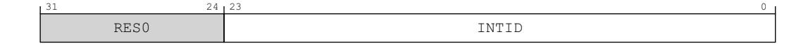

#### **Bits [31:24]**

Reserved, RES0.

#### **INTID, bits [23:0]**

The INTID of the signaled virtual interrupt.

This is the INTID of the highest priority pending virtual interrupt, if that interrupt is of sufficient priority for it to be signaled to the PE, and if it can be acknowledged.

If the highest priority pending interrupt is not observable, this field contains a special INTID to indicate the reason. This special INTID can take the value 1023 only. For more information, see *[Special INTIDs on page](#page-35-1) 2-36*.

This field has either 16 or 24 bits implemented. The number of implemented bits can be found in [ICV\\_CTLR.](#page-467-0)IDbits. If only 16 bits are implemented, bits [23:16] of this register are RES0.

#### **Accessing ICV\_IAR1**

Accesses to this register use the following encodings in the System register encoding space:

**MRC{<c>}{<q>} <coproc>, {#}<opc1>, <Rt>, <CRn>, <CRm>{, {#}<opc2>}**

| coproc | opc1  | CRn    | CRm    | opc2  |
|--------|-------|--------|--------|-------|
| 0b1111 | 0b000 | 0b1100 | 0b1100 | 0b000 |

```
if PSTATE.EL == EL0 then
    UNDEFINED;
elsif PSTATE.EL == EL1 then
    if HaveEL(EL3) && EL3SDDUndefPriority() && !ELUsingAArch32(EL3) && SCR_EL3.IRQ == '1'
then
        UNDEFINED;
    elsif HaveEL(EL3) && EL3SDDUndefPriority() && ELUsingAArch32(EL3) && PSTATE.M !=
M32_Monitor && SCR.IRQ == '1' then
        UNDEFINED;
    elsif EL2Enabled() && !ELUsingAArch32(EL2) && HSTR_EL2.T12 == '1' then
        AArch64.AArch32SystemAccessTrap(EL2, 0x03);
    elsif EL2Enabled() && ELUsingAArch32(EL2) && HSTR.T12 == '1' then
        AArch32.TakeHypTrapException(0x03);
    elsif ICC_SRE.SRE == '0' then
        UNDEFINED;
    elsif EL2Enabled() && !ELUsingAArch32(EL2) && ICH_HCR_EL2.TALL1 == '1' then
        AArch64.AArch32SystemAccessTrap(EL2, 0x03);
    elsif EL2Enabled() && ELUsingAArch32(EL2) && ICH_HCR.TALL1 == '1' then
        AArch32.TakeHypTrapException(0x03);
    elsif EL2Enabled() && !ELUsingAArch32(EL2) && HCR_EL2.IMO == '1' then
        R[t] = ICV_IAR1;
    elsif EL2Enabled() && ELUsingAArch32(EL2) && HCR.IMO == '1' then
        R[t] = ICV_IAR1;
    elsif HaveEL(EL3) && !ELUsingAArch32(EL3) && SCR_EL3.IRQ == '1' then
        if EL3SDDUndef() then
            UNDEFINED;
        else
            AArch64.AArch32SystemAccessTrap(EL3, 0x03);
    elsif HaveEL(EL3) && ELUsingAArch32(EL3) && PSTATE.M != M32_Monitor && SCR.IRQ == '1'
then
        if EL3SDDUndef() then
            UNDEFINED;
        else
            AArch32.TakeMonitorTrapException();
    else
        R[t] = ICC_IAR1;
elsif PSTATE.EL == EL2 then
    if HaveEL(EL3) && EL3SDDUndefPriority() && !ELUsingAArch32(EL3) && SCR_EL3.IRQ == '1'
then
        UNDEFINED;
    elsif HaveEL(EL3) && EL3SDDUndefPriority() && ELUsingAArch32(EL3) && SCR.IRQ == '1'
then
        UNDEFINED;
    elsif ICC_HSRE.SRE == '0' then
        UNDEFINED;
    elsif HaveEL(EL3) && !ELUsingAArch32(EL3) && SCR_EL3.IRQ == '1' then
        if EL3SDDUndef() then
            UNDEFINED;
        else
            AArch64.AArch32SystemAccessTrap(EL3, 0x03);
    elsif HaveEL(EL3) && ELUsingAArch32(EL3) && SCR.IRQ == '1' then
        if EL3SDDUndef() then
            UNDEFINED;
        else
            AArch32.TakeMonitorTrapException();
    else
        R[t] = ICC_IAR1;
elsif PSTATE.EL == EL3 then
    if ICC_MSRE.SRE == '0' then
        UNDEFINED;
    else
        R[t] = ICC_IAR1;
```

#### <span id="page-486-0"></span>**12.6.13 ICV\_IGRPEN0, Interrupt Controller Virtual Interrupt Group 0 Enable register**

The ICV\_IGRPEN0 characteristics are:

#### **Purpose**

Controls whether virtual Group 0 interrupts are enabled or not.

#### **Configurations**

AArch32 System register ICV\_IGRPEN0 bits [31:0] are architecturally mapped to AArch64 System register [ICV\\_IGRPEN0\\_EL1\[](#page-321-1)31:0].

This register is present only when EL1 is capable of using AArch32, FEAT\_GICv3 is implemented and EL2 is implemented. Otherwise, direct accesses to ICV\_IGRPEN0 are UNDEFINED.

#### **Attributes**

ICV\_IGRPEN0 is a 32-bit register.

#### **Field descriptions**


#### **Bits [31:1]**

Reserved, RES0.

#### **Enable, bit [0]**

Enables virtual Group 0 interrupts.

0b0 Virtual Group 0 interrupts are disabled.

0b1 Virtual Group 0 interrupts are enabled.

The reset behavior of this field is:

• On a Warm reset, this field resets to 0.

#### **Accessing ICV\_IGRPEN0**

**MRC{<c>}{<q>} <coproc>, {#}<opc1>, <Rt>, <CRn>, <CRm>{, {#}<opc2>}**

| coproc | opc1  | CRn    | CRm    | opc2  |
|--------|-------|--------|--------|-------|
| 0b1111 | 0b000 | 0b1100 | 0b1100 | 0b110 |

```
if PSTATE.EL == EL0 then
    UNDEFINED;
elsif PSTATE.EL == EL1 then
    if HaveEL(EL3) && EL3SDDUndefPriority() && !ELUsingAArch32(EL3) && SCR_EL3.FIQ == '1'
then
        UNDEFINED;
    elsif HaveEL(EL3) && EL3SDDUndefPriority() && ELUsingAArch32(EL3) && PSTATE.M !=
M32_Monitor && SCR.FIQ == '1' then
        UNDEFINED;
    elsif EL2Enabled() && !ELUsingAArch32(EL2) && HSTR_EL2.T12 == '1' then
        AArch64.AArch32SystemAccessTrap(EL2, 0x03);
```

```
elsif EL2Enabled() && ELUsingAArch32(EL2) && HSTR.T12 == '1' then
        AArch32.TakeHypTrapException(0x03);
    elsif ICC_SRE.SRE == '0' then
        UNDEFINED;
    elsif EL2Enabled() && !ELUsingAArch32(EL2) && ICH_HCR_EL2.TALL0 == '1' then
        AArch64.AArch32SystemAccessTrap(EL2, 0x03);
    elsif EL2Enabled() && ELUsingAArch32(EL2) && ICH_HCR.TALL0 == '1' then
        AArch32.TakeHypTrapException(0x03);
    elsif EL2Enabled() && !ELUsingAArch32(EL2) && HCR_EL2.FMO == '1' then
        R[t] = ICV_IGRPEN0;
    elsif EL2Enabled() && ELUsingAArch32(EL2) && HCR.FMO == '1' then
        R[t] = ICV_IGRPEN0;
    elsif HaveEL(EL3) && !ELUsingAArch32(EL3) && SCR_EL3.FIQ == '1' then
        if EL3SDDUndef() then
            UNDEFINED;
        else
            AArch64.AArch32SystemAccessTrap(EL3, 0x03);
    elsif HaveEL(EL3) && ELUsingAArch32(EL3) && PSTATE.M != M32_Monitor && SCR.FIQ == '1'
then
        if EL3SDDUndef() then
            UNDEFINED;
        else
            AArch32.TakeMonitorTrapException();
    else
        R[t] = ICC_IGRPEN0;
elsif PSTATE.EL == EL2 then
    if HaveEL(EL3) && EL3SDDUndefPriority() && !ELUsingAArch32(EL3) && SCR_EL3.FIQ == '1'
then
        UNDEFINED;
    elsif HaveEL(EL3) && EL3SDDUndefPriority() && ELUsingAArch32(EL3) && SCR.FIQ == '1'
then
        UNDEFINED;
    elsif ICC_HSRE.SRE == '0' then
        UNDEFINED;
    elsif HaveEL(EL3) && !ELUsingAArch32(EL3) && SCR_EL3.FIQ == '1' then
        if EL3SDDUndef() then
            UNDEFINED;
        else
            AArch64.AArch32SystemAccessTrap(EL3, 0x03);
    elsif HaveEL(EL3) && ELUsingAArch32(EL3) && SCR.FIQ == '1' then
        if EL3SDDUndef() then
            UNDEFINED;
        else
            AArch32.TakeMonitorTrapException();
    else
        R[t] = ICC_IGRPEN0;
elsif PSTATE.EL == EL3 then
    if ICC_MSRE.SRE == '0' then
        UNDEFINED;
    else
        R[t] = ICC_IGRPEN0;
```

#### **MCR{<c>}{<q>} <coproc>, {#}<opc1>, <Rt>, <CRn>, <CRm>{, {#}<opc2>}**

| coproc | opc1  | CRn    | CRm    | opc2  |
|--------|-------|--------|--------|-------|
| 0b1111 | 0b000 | 0b1100 | 0b1100 | 0b110 |

```
if PSTATE.EL == EL0 then
    UNDEFINED;
elsif PSTATE.EL == EL1 then
    if HaveEL(EL3) && EL3SDDUndefPriority() && !ELUsingAArch32(EL3) && SCR_EL3.FIQ == '1'
```

```
then
        UNDEFINED;
    elsif HaveEL(EL3) && EL3SDDUndefPriority() && ELUsingAArch32(EL3) && PSTATE.M !=
M32_Monitor && SCR.FIQ == '1' then
        UNDEFINED;
    elsif EL2Enabled() && !ELUsingAArch32(EL2) && HSTR_EL2.T12 == '1' then
        AArch64.AArch32SystemAccessTrap(EL2, 0x03);
    elsif EL2Enabled() && ELUsingAArch32(EL2) && HSTR.T12 == '1' then
        AArch32.TakeHypTrapException(0x03);
    elsif ICC_SRE.SRE == '0' then
        UNDEFINED;
    elsif EL2Enabled() && !ELUsingAArch32(EL2) && ICH_HCR_EL2.TALL0 == '1' then
        AArch64.AArch32SystemAccessTrap(EL2, 0x03);
    elsif EL2Enabled() && ELUsingAArch32(EL2) && ICH_HCR.TALL0 == '1' then
        AArch32.TakeHypTrapException(0x03);
    elsif EL2Enabled() && !ELUsingAArch32(EL2) && HCR_EL2.FMO == '1' then
        ICV_IGRPEN0 = R[t];
    elsif EL2Enabled() && ELUsingAArch32(EL2) && HCR.FMO == '1' then
        ICV_IGRPEN0 = R[t];
    elsif HaveEL(EL3) && !ELUsingAArch32(EL3) && SCR_EL3.FIQ == '1' then
        if EL3SDDUndef() then
            UNDEFINED;
        else
            AArch64.AArch32SystemAccessTrap(EL3, 0x03);
    elsif HaveEL(EL3) && ELUsingAArch32(EL3) && PSTATE.M != M32_Monitor && SCR.FIQ == '1'
then
        if EL3SDDUndef() then
            UNDEFINED;
        else
            AArch32.TakeMonitorTrapException();
    else
        ICC_IGRPEN0 = R[t];
elsif PSTATE.EL == EL2 then
    if HaveEL(EL3) && EL3SDDUndefPriority() && !ELUsingAArch32(EL3) && SCR_EL3.FIQ == '1'
then
        UNDEFINED;
    elsif HaveEL(EL3) && EL3SDDUndefPriority() && ELUsingAArch32(EL3) && SCR.FIQ == '1'
then
        UNDEFINED;
    elsif ICC_HSRE.SRE == '0' then
        UNDEFINED;
    elsif HaveEL(EL3) && !ELUsingAArch32(EL3) && SCR_EL3.FIQ == '1' then
        if EL3SDDUndef() then
            UNDEFINED;
        else
            AArch64.AArch32SystemAccessTrap(EL3, 0x03);
    elsif HaveEL(EL3) && ELUsingAArch32(EL3) && SCR.FIQ == '1' then
        if EL3SDDUndef() then
            UNDEFINED;
        else
            AArch32.TakeMonitorTrapException();
    else
        ICC_IGRPEN0 = R[t];
elsif PSTATE.EL == EL3 then
    if ICC_MSRE.SRE == '0' then
        UNDEFINED;
    else
        ICC_IGRPEN0 = R[t];
```

#### <span id="page-489-0"></span>**12.6.14 ICV\_IGRPEN1, Interrupt Controller Virtual Interrupt Group 1 Enable register**

The ICV\_IGRPEN1 characteristics are:

#### **Purpose**

Controls whether virtual Group 1 interrupts are enabled for the current Security state.

#### **Configurations**

AArch32 System register ICV\_IGRPEN1 bits [31:0] are architecturally mapped to AArch64 System register [ICV\\_IGRPEN1\\_EL1\[](#page-324-1)31:0].

This register is present only when EL1 is capable of using AArch32, FEAT\_GICv3 is implemented and EL2 is implemented. Otherwise, direct accesses to ICV\_IGRPEN1 are UNDEFINED.

#### **Attributes**

ICV\_IGRPEN1 is a 32-bit register.

#### **Field descriptions**

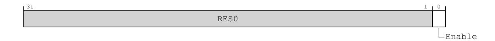

#### **Bits [31:1]**

Reserved, RES0.

#### **Enable, bit [0]**

Enables virtual Group 1 interrupts.

0b0 Virtual Group 1 interrupts are disabled.

0b1 Virtual Group 1 interrupts are enabled.

The reset behavior of this field is:

• On a Warm reset, this field resets to 0.

#### **Accessing ICV\_IGRPEN1**

**MRC{<c>}{<q>} <coproc>, {#}<opc1>, <Rt>, <CRn>, <CRm>{, {#}<opc2>}**

| coproc | opc1  | CRn    | CRm    | opc2  |
|--------|-------|--------|--------|-------|
| 0b1111 | 0b000 | 0b1100 | 0b1100 | 0b111 |

```
if PSTATE.EL == EL0 then
    UNDEFINED;
elsif PSTATE.EL == EL1 then
    if HaveEL(EL3) && EL3SDDUndefPriority() && !ELUsingAArch32(EL3) && SCR_EL3.IRQ == '1'
then
        UNDEFINED;
    elsif HaveEL(EL3) && EL3SDDUndefPriority() && ELUsingAArch32(EL3) && PSTATE.M !=
M32_Monitor && SCR.IRQ == '1' then
        UNDEFINED;
    elsif EL2Enabled() && !ELUsingAArch32(EL2) && HSTR_EL2.T12 == '1' then
        AArch64.AArch32SystemAccessTrap(EL2, 0x03);
```

```
elsif EL2Enabled() && ELUsingAArch32(EL2) && HSTR.T12 == '1' then
        AArch32.TakeHypTrapException(0x03);
    elsif ICC_SRE.SRE == '0' then
        UNDEFINED;
    elsif EL2Enabled() && !ELUsingAArch32(EL2) && ICH_HCR_EL2.TALL1 == '1' then
        AArch64.AArch32SystemAccessTrap(EL2, 0x03);
    elsif EL2Enabled() && ELUsingAArch32(EL2) && ICH_HCR.TALL1 == '1' then
        AArch32.TakeHypTrapException(0x03);
    elsif EL2Enabled() && !ELUsingAArch32(EL2) && HCR_EL2.IMO == '1' then
        R[t] = ICV_IGRPEN1;
    elsif EL2Enabled() && ELUsingAArch32(EL2) && HCR.IMO == '1' then
        R[t] = ICV_IGRPEN1;
    elsif HaveEL(EL3) && !ELUsingAArch32(EL3) && SCR_EL3.IRQ == '1' then
        if EL3SDDUndef() then
            UNDEFINED;
        else
            AArch64.AArch32SystemAccessTrap(EL3, 0x03);
    elsif HaveEL(EL3) && ELUsingAArch32(EL3) && PSTATE.M != M32_Monitor && SCR.IRQ == '1'
then
        if EL3SDDUndef() then
            UNDEFINED;
        else
            AArch32.TakeMonitorTrapException();
    elsif HaveEL(EL3) then
        R[t] = ICC_IGRPEN1_NS;
    else
        R[t] = ICC_IGRPEN1;
elsif PSTATE.EL == EL2 then
    if HaveEL(EL3) && EL3SDDUndefPriority() && !ELUsingAArch32(EL3) && SCR_EL3.IRQ == '1'
then
        UNDEFINED;
    elsif HaveEL(EL3) && EL3SDDUndefPriority() && ELUsingAArch32(EL3) && SCR.IRQ == '1'
then
        UNDEFINED;
    elsif ICC_HSRE.SRE == '0' then
        UNDEFINED;
    elsif HaveEL(EL3) && !ELUsingAArch32(EL3) && SCR_EL3.IRQ == '1' then
        if EL3SDDUndef() then
            UNDEFINED;
        else
            AArch64.AArch32SystemAccessTrap(EL3, 0x03);
    elsif HaveEL(EL3) && ELUsingAArch32(EL3) && SCR.IRQ == '1' then
        if EL3SDDUndef() then
            UNDEFINED;
        else
            AArch32.TakeMonitorTrapException();
    elsif HaveEL(EL3) then
        R[t] = ICC_IGRPEN1_NS;
    else
        R[t] = ICC_IGRPEN1;
elsif PSTATE.EL == EL3 then
    if ICC_MSRE.SRE == '0' then
        UNDEFINED;
    else
        if SCR.NS == '0' then
            R[t] = ICC_IGRPEN1_S;
        else
            R[t] = ICC_IGRPEN1_NS;
```

#### **MCR{<c>}{<q>} <coproc>, {#}<opc1>, <Rt>, <CRn>, <CRm>{, {#}<opc2>}**

| coproc | opc1  | CRn    | CRm    | opc2  |
|--------|-------|--------|--------|-------|
| 0b1111 | 0b000 | 0b1100 | 0b1100 | 0b111 |

```
if PSTATE.EL == EL0 then
    UNDEFINED;
elsif PSTATE.EL == EL1 then
    if HaveEL(EL3) && EL3SDDUndefPriority() && !ELUsingAArch32(EL3) && SCR_EL3.IRQ == '1'
then
        UNDEFINED;
    elsif HaveEL(EL3) && EL3SDDUndefPriority() && ELUsingAArch32(EL3) && PSTATE.M !=
M32_Monitor && SCR.IRQ == '1' then
        UNDEFINED;
    elsif EL2Enabled() && !ELUsingAArch32(EL2) && HSTR_EL2.T12 == '1' then
        AArch64.AArch32SystemAccessTrap(EL2, 0x03);
    elsif EL2Enabled() && ELUsingAArch32(EL2) && HSTR.T12 == '1' then
        AArch32.TakeHypTrapException(0x03);
    elsif ICC_SRE.SRE == '0' then
        UNDEFINED;
    elsif EL2Enabled() && !ELUsingAArch32(EL2) && ICH_HCR_EL2.TALL1 == '1' then
        AArch64.AArch32SystemAccessTrap(EL2, 0x03);
    elsif EL2Enabled() && ELUsingAArch32(EL2) && ICH_HCR.TALL1 == '1' then
        AArch32.TakeHypTrapException(0x03);
    elsif EL2Enabled() && !ELUsingAArch32(EL2) && HCR_EL2.IMO == '1' then
        ICV_IGRPEN1 = R[t];
    elsif EL2Enabled() && ELUsingAArch32(EL2) && HCR.IMO == '1' then
        ICV_IGRPEN1 = R[t];
    elsif HaveEL(EL3) && !ELUsingAArch32(EL3) && SCR_EL3.IRQ == '1' then
        if EL3SDDUndef() then
            UNDEFINED;
        else
            AArch64.AArch32SystemAccessTrap(EL3, 0x03);
    elsif HaveEL(EL3) && ELUsingAArch32(EL3) && PSTATE.M != M32_Monitor && SCR.IRQ == '1'
then
        if EL3SDDUndef() then
            UNDEFINED;
        else
            AArch32.TakeMonitorTrapException();
    elsif HaveEL(EL3) then
        ICC_IGRPEN1_NS = R[t];
    else
        ICC_IGRPEN1 = R[t];
elsif PSTATE.EL == EL2 then
    if HaveEL(EL3) && EL3SDDUndefPriority() && !ELUsingAArch32(EL3) && SCR_EL3.IRQ == '1'
then
        UNDEFINED;
    elsif HaveEL(EL3) && EL3SDDUndefPriority() && ELUsingAArch32(EL3) && SCR.IRQ == '1'
then
        UNDEFINED;
    elsif ICC_HSRE.SRE == '0' then
        UNDEFINED;
    elsif HaveEL(EL3) && !ELUsingAArch32(EL3) && SCR_EL3.IRQ == '1' then
        if EL3SDDUndef() then
            UNDEFINED;
        else
            AArch64.AArch32SystemAccessTrap(EL3, 0x03);
    elsif HaveEL(EL3) && ELUsingAArch32(EL3) && SCR.IRQ == '1' then
        if EL3SDDUndef() then
            UNDEFINED;
        else
            AArch32.TakeMonitorTrapException();
    elsif HaveEL(EL3) then
        ICC_IGRPEN1_NS = R[t];
    else
        ICC_IGRPEN1 = R[t];
elsif PSTATE.EL == EL3 then
    if ICC_MSRE.SRE == '0' then
        UNDEFINED;
    else
        if SCR.NS == '0' then
            ICC_IGRPEN1_S = R[t];
```

else ICC\_IGRPEN1\_NS = R[t];

#### <span id="page-493-0"></span>**12.6.15 ICV\_PMR, Interrupt Controller Virtual Interrupt Priority Mask Register**

The ICV\_PMR characteristics are:

#### **Purpose**

Provides a virtual interrupt priority filter. Only virtual interrupts with a higher priority than the value in this register are signaled to the PE.

#### **Configurations**

AArch32 System register ICV\_PMR bits [31:0] are architecturally mapped to AArch64 System register [ICV\\_PMR\\_EL1](#page-329-1)[31:0].

This register is present only when EL1 is capable of using AArch32, FEAT\_GICv3 is implemented and EL2 is implemented. Otherwise, direct accesses to ICV\_PMR are UNDEFINED.

To allow software to ensure appropriate observability of actions initiated by GIC register accesses, the PE and CPU interface logic must ensure that writes to this register are self-synchronizing. This ensures that no interrupts below the written PMR value will be taken after a write to this register is architecturally executed. For more information, see *[Observability of the effects of accesses to the](#page-194-0)  [GIC registers on page](#page-194-0) 12-195*.

#### **Attributes**

ICV\_PMR is a 32-bit register.

#### **Field descriptions**


#### **Bits [31:8]**

Reserved, RES0.

#### **Priority, bits [7:0]**

The priority mask level for the virtual CPU interface. If the priority of a virtual interrupt is higher than the value indicated by this field, the interface signals the virtual interrupt to the PE.

The possible priority field values are as follows:

| Implemented priority bits | Possible priority field values      | Number of priority levels |
|---------------------------|-------------------------------------|---------------------------|
| [7:0]                     | 0x00-0xFF (0-255), all values       | 256                       |
| [7:1]                     | 0x00-0xFE (0-254), even values only | 128                       |
| [7:2]                     | 0x00-0xFC (0-252), in steps of 4    | 64                        |
| [7:3]                     | 0x00-0xF8 (0-248), in steps of 8    | 32                        |
| [7:4]                     | 0x00-0xF0 (0-240), in steps of 16   | 16                        |

Unimplemented priority bits are RAZ/WI.

The reset behavior of this field is:

• On a Warm reset, this field resets to 0.

#### **Accessing ICV\_PMR**

```
MRC{<c>}{<q>} <coproc>, {#}<opc1>, <Rt>, <CRn>, <CRm>{, {#}<opc2>}
```

| coproc | opc1  | CRn    | CRm    | opc2  |
|--------|-------|--------|--------|-------|
| 0b1111 | 0b000 | 0b0100 | 0b0110 | 0b000 |

```
if PSTATE.EL == EL0 then
    UNDEFINED;
elsif PSTATE.EL == EL1 then
   if HaveEL(EL3) && EL3SDDUndefPriority() && !ELUsingAArch32(EL3) && SCR_EL3.<IRQ,FIQ> ==
'11' then
        UNDEFINED;
    elsif HaveEL(EL3) && EL3SDDUndefPriority() && ELUsingAArch32(EL3) && PSTATE.M !=
M32_Monitor && SCR.<IRQ,FIQ> == '11' then
        UNDEFINED;
    elsif EL2Enabled() && !ELUsingAArch32(EL2) && HSTR_EL2.T12 == '1' then
        AArch64.AArch32SystemAccessTrap(EL2, 0x03);
    elsif EL2Enabled() && ELUsingAArch32(EL2) && HSTR.T12 == '1' then
        AArch32.TakeHypTrapException(0x03);
    elsif ICC_SRE.SRE == '0' then
        UNDEFINED;
    elsif EL2Enabled() && !ELUsingAArch32(EL2) && ICH_HCR_EL2.TC == '1' then
        AArch64.AArch32SystemAccessTrap(EL2, 0x03);
    elsif EL2Enabled() && ELUsingAArch32(EL2) && ICH_HCR.TC == '1' then
        AArch32.TakeHypTrapException(0x03);
    elsif EL2Enabled() && !ELUsingAArch32(EL2) && HCR_EL2.FMO == '1' then
        R[t] = ICV_PMR;
    elsif EL2Enabled() && !ELUsingAArch32(EL2) && HCR_EL2.IMO == '1' then
        R[t] = ICV_PMR;
    elsif EL2Enabled() && ELUsingAArch32(EL2) && HCR.FMO == '1' then
        R[t] = ICV_PMR;
    elsif EL2Enabled() && ELUsingAArch32(EL2) && HCR.IMO == '1' then
        R[t] = ICV_PMR;
    elsif HaveEL(EL3) && !ELUsingAArch32(EL3) && SCR_EL3.<IRQ,FIQ> == '11' then
        if EL3SDDUndef() then
            UNDEFINED;
        else
            AArch64.AArch32SystemAccessTrap(EL3, 0x03);
   elsif HaveEL(EL3) && ELUsingAArch32(EL3) && PSTATE.M != M32_Monitor && SCR.<IRQ,FIQ> ==
'11' then
        if EL3SDDUndef() then
            UNDEFINED;
        else
            AArch32.TakeMonitorTrapException();
    else
        R[t] = ICC_PMR;
elsif PSTATE.EL == EL2 then
   if HaveEL(EL3) && EL3SDDUndefPriority() && !ELUsingAArch32(EL3) && SCR_EL3.<IRQ,FIQ> ==
'11' then
        UNDEFINED;
    elsif HaveEL(EL3) && EL3SDDUndefPriority() && ELUsingAArch32(EL3) && SCR.<IRQ,FIQ> ==
'11' then
        UNDEFINED;
    elsif ICC_HSRE.SRE == '0' then
        UNDEFINED;
    elsif HaveEL(EL3) && !ELUsingAArch32(EL3) && SCR_EL3.<IRQ,FIQ> == '11' then
        if EL3SDDUndef() then
            UNDEFINED;
        else
```

```
AArch64.AArch32SystemAccessTrap(EL3, 0x03);
    elsif HaveEL(EL3) && ELUsingAArch32(EL3) && SCR.<IRQ,FIQ> == '11' then
        if EL3SDDUndef() then
            UNDEFINED;
        else
            AArch32.TakeMonitorTrapException();
    else
        R[t] = ICC_PMR;
elsif PSTATE.EL == EL3 then
    if ICC_MSRE.SRE == '0' then
        UNDEFINED;
    else
        R[t] = ICC_PMR;
```

#### **MCR{<c>}{<q>} <coproc>, {#}<opc1>, <Rt>, <CRn>, <CRm>{, {#}<opc2>}**

| coproc | opc1  | CRn    | CRm    | opc2  |
|--------|-------|--------|--------|-------|
| 0b1111 | 0b000 | 0b0100 | 0b0110 | 0b000 |

```
if PSTATE.EL == EL0 then
    UNDEFINED;
elsif PSTATE.EL == EL1 then
   if HaveEL(EL3) && EL3SDDUndefPriority() && !ELUsingAArch32(EL3) && SCR_EL3.<IRQ,FIQ> ==
'11' then
        UNDEFINED;
    elsif HaveEL(EL3) && EL3SDDUndefPriority() && ELUsingAArch32(EL3) && PSTATE.M !=
M32_Monitor && SCR.<IRQ,FIQ> == '11' then
        UNDEFINED;
    elsif EL2Enabled() && !ELUsingAArch32(EL2) && HSTR_EL2.T12 == '1' then
        AArch64.AArch32SystemAccessTrap(EL2, 0x03);
    elsif EL2Enabled() && ELUsingAArch32(EL2) && HSTR.T12 == '1' then
        AArch32.TakeHypTrapException(0x03);
    elsif ICC_SRE.SRE == '0' then
        UNDEFINED;
    elsif EL2Enabled() && !ELUsingAArch32(EL2) && ICH_HCR_EL2.TC == '1' then
        AArch64.AArch32SystemAccessTrap(EL2, 0x03);
    elsif EL2Enabled() && ELUsingAArch32(EL2) && ICH_HCR.TC == '1' then
        AArch32.TakeHypTrapException(0x03);
    elsif EL2Enabled() && !ELUsingAArch32(EL2) && HCR_EL2.FMO == '1' then
        ICV_PMR = R[t];
    elsif EL2Enabled() && !ELUsingAArch32(EL2) && HCR_EL2.IMO == '1' then
        ICV_PMR = R[t];
    elsif EL2Enabled() && ELUsingAArch32(EL2) && HCR.FMO == '1' then
        ICV_PMR = R[t];
    elsif EL2Enabled() && ELUsingAArch32(EL2) && HCR.IMO == '1' then
        ICV_PMR = R[t];
    elsif HaveEL(EL3) && !ELUsingAArch32(EL3) && SCR_EL3.<IRQ,FIQ> == '11' then
        if EL3SDDUndef() then
            UNDEFINED;
        else
            AArch64.AArch32SystemAccessTrap(EL3, 0x03);
   elsif HaveEL(EL3) && ELUsingAArch32(EL3) && PSTATE.M != M32_Monitor && SCR.<IRQ,FIQ> ==
'11' then
        if EL3SDDUndef() then
            UNDEFINED;
        else
            AArch32.TakeMonitorTrapException();
    else
        ICC_PMR = R[t];
elsif PSTATE.EL == EL2 then
   if HaveEL(EL3) && EL3SDDUndefPriority() && !ELUsingAArch32(EL3) && SCR_EL3.<IRQ,FIQ> ==
```

```
'11' then
        UNDEFINED;
    elsif HaveEL(EL3) && EL3SDDUndefPriority() && ELUsingAArch32(EL3) && SCR.<IRQ,FIQ> ==
'11' then
        UNDEFINED;
    elsif ICC_HSRE.SRE == '0' then
        UNDEFINED;
    elsif HaveEL(EL3) && !ELUsingAArch32(EL3) && SCR_EL3.<IRQ,FIQ> == '11' then
        if EL3SDDUndef() then
            UNDEFINED;
        else
            AArch64.AArch32SystemAccessTrap(EL3, 0x03);
    elsif HaveEL(EL3) && ELUsingAArch32(EL3) && SCR.<IRQ,FIQ> == '11' then
        if EL3SDDUndef() then
            UNDEFINED;
        else
            AArch32.TakeMonitorTrapException();
    else
        ICC_PMR = R[t];
elsif PSTATE.EL == EL3 then
    if ICC_MSRE.SRE == '0' then
        UNDEFINED;
    else
        ICC_PMR = R[t];
```

#### <span id="page-497-0"></span>**12.6.16 ICV\_RPR, Interrupt Controller Virtual Running Priority Register**

The ICV\_RPR characteristics are:

#### **Purpose**

Indicates the Running priority of the virtual CPU interface.

#### **Configurations**

AArch32 System register ICV\_RPR performs the same function as AArch64 System register [ICV\\_RPR\\_EL1.](#page-332-1)

This register is present only when EL1 is capable of using AArch32, FEAT\_GICv3 is implemented and EL2 is implemented. Otherwise, direct accesses to ICV\_RPR are UNDEFINED.

#### **Attributes**

ICV\_RPR is a 32-bit register.

#### **Field descriptions**

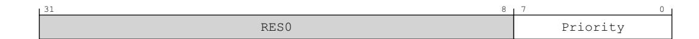

#### **Bits [31:8]**

Reserved, RES0.

#### **Priority, bits [7:0]**

The current running priority on the virtual CPU interface. This is the group priority of the current active virtual interrupt.

The priority returned is the group priority as if the BPR for the current Exception level and Security state was set to the minimum value of BPR for the number of implemented priority bits.

**Note**

If 8 bits of priority are implemented the group priority is bits[7:1] of the priority.

#### **Accessing ICV\_RPR**

If there are no active interrupts on the virtual CPU interface, or all active interrupts have undergone a priority drop, the value returned is the Idle priority.

Software cannot determine the number of implemented priority bits from a read of this register.

**MRC{<c>}{<q>} <coproc>, {#}<opc1>, <Rt>, <CRn>, <CRm>{, {#}<opc2>}**

| coproc | opc1  | CRn    | CRm    | opc2  |
|--------|-------|--------|--------|-------|
| 0b1111 | 0b000 | 0b1100 | 0b1011 | 0b011 |

```
if PSTATE.EL == EL0 then
    UNDEFINED;
elsif PSTATE.EL == EL1 then
   if HaveEL(EL3) && EL3SDDUndefPriority() && !ELUsingAArch32(EL3) && SCR_EL3.<IRQ,FIQ> ==
'11' then
```

```
UNDEFINED;
    elsif HaveEL(EL3) && EL3SDDUndefPriority() && ELUsingAArch32(EL3) && PSTATE.M !=
M32_Monitor && SCR.<IRQ,FIQ> == '11' then
        UNDEFINED;
    elsif EL2Enabled() && !ELUsingAArch32(EL2) && HSTR_EL2.T12 == '1' then
        AArch64.AArch32SystemAccessTrap(EL2, 0x03);
    elsif EL2Enabled() && ELUsingAArch32(EL2) && HSTR.T12 == '1' then
        AArch32.TakeHypTrapException(0x03);
    elsif ICC_SRE.SRE == '0' then
        UNDEFINED;
    elsif EL2Enabled() && !ELUsingAArch32(EL2) && ICH_HCR_EL2.TC == '1' then
        AArch64.AArch32SystemAccessTrap(EL2, 0x03);
    elsif EL2Enabled() && ELUsingAArch32(EL2) && ICH_HCR.TC == '1' then
        AArch32.TakeHypTrapException(0x03);
    elsif EL2Enabled() && !ELUsingAArch32(EL2) && HCR_EL2.FMO == '1' then
        R[t] = ICV_RPR;
    elsif EL2Enabled() && !ELUsingAArch32(EL2) && HCR_EL2.IMO == '1' then
        R[t] = ICV_RPR;
    elsif EL2Enabled() && ELUsingAArch32(EL2) && HCR.FMO == '1' then
        R[t] = ICV_RPR;
    elsif EL2Enabled() && ELUsingAArch32(EL2) && HCR.IMO == '1' then
        R[t] = ICV_RPR;
    elsif HaveEL(EL3) && !ELUsingAArch32(EL3) && SCR_EL3.<IRQ,FIQ> == '11' then
        if EL3SDDUndef() then
            UNDEFINED;
        else
            AArch64.AArch32SystemAccessTrap(EL3, 0x03);
   elsif HaveEL(EL3) && ELUsingAArch32(EL3) && PSTATE.M != M32_Monitor && SCR.<IRQ,FIQ> ==
'11' then
        if EL3SDDUndef() then
            UNDEFINED;
        else
            AArch32.TakeMonitorTrapException();
    else
        R[t] = ICC_RPR;
elsif PSTATE.EL == EL2 then
   if HaveEL(EL3) && EL3SDDUndefPriority() && !ELUsingAArch32(EL3) && SCR_EL3.<IRQ,FIQ> ==
'11' then
        UNDEFINED;
    elsif HaveEL(EL3) && EL3SDDUndefPriority() && ELUsingAArch32(EL3) && SCR.<IRQ,FIQ> ==
'11' then
        UNDEFINED;
    elsif ICC_HSRE.SRE == '0' then
        UNDEFINED;
    elsif HaveEL(EL3) && !ELUsingAArch32(EL3) && SCR_EL3.<IRQ,FIQ> == '11' then
        if EL3SDDUndef() then
            UNDEFINED;
        else
            AArch64.AArch32SystemAccessTrap(EL3, 0x03);
    elsif HaveEL(EL3) && ELUsingAArch32(EL3) && SCR.<IRQ,FIQ> == '11' then
        if EL3SDDUndef() then
            UNDEFINED;
        else
            AArch32.TakeMonitorTrapException();
    else
        R[t] = ICC_RPR;
elsif PSTATE.EL == EL3 then
    if ICC_MSRE.SRE == '0' then
        UNDEFINED;
    else
        R[t] = ICC_RPR;
```

#### <span id="page-499-1"></span><span id="page-499-0"></span>**12.7 AArch32 virtualization control System registers**

This section describes each of the virtualization control AArch32 GIC System registers in register name order. The ICH prefix indicates a virtual interface control System register. Each AArch32 System register description contains a reference to the AArch64 register that provides the same functionality.

Unless otherwise stated, the bit assignments for the GIC System registers are the same as those for the equivalent GICH\_\* memory-mapped registers, see *[The GIC virtual interface control register descriptions on page](#page-801-1) 12-802*.

<span id="page-499-2"></span>Table 12-[24 on page](#page-499-2) 12-500 shows the encodings for the AArch32 virtualization control System registers.

**Table 12-24 Encodings for the AArch32 virtualization control System registers**

| Register                      | Width (bits) | opc1 | CRn | CRm | opc2 | Notes |
|-------------------------------|--------------|------|-----|-----|------|-------|
| ICH_AP0R <n></n>              | 32           | 4    | 12  | 8   | 0    | RW    |
| ICH_AP0R <n></n>              | 32           |      |     |     | 1    | RW    |
| ICH_AP0R <n></n>              | 32           |      |     |     | 2    | RW    |
| ICH_AP0R <n></n>              | 32           |      |     |     | 3    | RW    |
| ICH_AP1R <n></n>              | 32           |      |     | 9   | 0    | RW    |
| ICH_AP1R <n></n>              | 32           |      |     |     | 1    | RW    |
| ICH_AP1R <n></n>              | 32           |      |     |     | 2    | RW    |
| ICH_AP1R <n></n>              | 32           |      |     |     | 3    | RW    |
| ICH_HCR                       | 32           |      |     | 11  | 0    | RW    |
| ICH_VTR                       | 32           |      |     |     | 1    | RO    |
| ICH_MISR                      | 32           |      |     |     | 2    | RO    |
| ICH_EISR                      | 32           |      |     |     | 3    | RO    |
| ICH_ELRSR                     | 32           |      |     |     | 5    | RO    |
| ICH_VMCR                      | 32           |      |     |     | 7    | RW    |
| ICH_LR <n>, for n=0 - 7</n>   | 32           |      |     | 12  | 0-7  | RW    |
| ICH_LR <n>, for n=8 - 15</n>  | 32           |      |     | 13  | 0-7  | RW    |
| ICH_LRC <n>, for n=0 - 7</n>  | 32           |      |     | 14  | 0-7  | RW    |
| ICH_LRC <n>, for n=8 - 15</n> | 32           |      |     | 15  | 0-7  | RW    |

#### <span id="page-500-0"></span>**12.7.1 ICH\_AP0R<n>, Interrupt Controller Hyp Active Priorities Group 0 Registers, n = 0 - 3**

The ICH\_AP0R<n> characteristics are:

#### **Purpose**

Provides information about Group 0 active priorities for EL2.

#### **Configurations**

AArch32 System register ICH\_AP0R<n> bits [31:0] are architecturally mapped to AArch64 System register [ICH\\_AP0R<n>\\_EL2\[](#page-335-1)31:0].

This register is present only when EL2 is capable of using AArch32, FEAT\_GICv3 is implemented and (EL2 is implemented or EL3 is implemented). Otherwise, direct accesses to ICH\_AP0R<n> are UNDEFINED.

If EL2 is not implemented, this register is RES0 from EL3.

#### **Attributes**

ICH\_AP0R<n> is a 32-bit register.

#### **Field descriptions**


#### **P<x>, bit [x], for x = 31 to 0**

Provides the access to the virtual active priorities for Group 0 interrupts. Possible values of each bit are:

0b0 There is no Group 0 interrupt active at the priority corresponding to that bit.

0b1 There is a Group 0 interrupt active at the priority corresponding to that bit.

The correspondence between priority levels and bits depends on the number of bits of priority that are implemented.

If 5 bits of preemption are implemented (bits [7:3] of priority), then there are 32 preemption levels, and the active state of these preemption levels are held in ICH\_AP0R0 in the bits corresponding to Priority[7:3].

If 6 bits of preemption are implemented (bits [7:2] of priority), then there are 64 preemption levels, and:

- The active state of preemption levels 0 124 are held in ICH\_AP0R0 in the bits corresponding to 0:Priority[6:2].
- The active state of preemption levels 128 252 are held in ICH\_AP0R1 in the bits corresponding to 1:Priority[6:2].

If 7 bits of preemption are implemented (bits [7:1] of priority), then there are 128 preemption levels, and:

• The active state of preemption levels 0 - 62 are held in ICH\_AP0R0 in the bits corresponding to 00:Priority[5:1].

- The active state of preemption levels 64 126 are held in ICH\_AP0R1 in the bits corresponding to 01:Priority[5:1].
- The active state of preemption levels 128 190 are held in ICH\_AP0R2 in the bits corresponding to 10:Priority[5:1].
- The active state of preemption levels 192 254 are held in ICH\_AP0R3 in the bits corresponding to 11:Priority[5:1].


Having the bit corresponding to a priority set to 1 in both ICH\_AP0R<n> and [ICH\\_AP1R<n>](#page-503-0) might result in UNPREDICTABLE behavior of the interrupt prioritization system for virtual interrupts.

The reset behavior of this field is:

• On a Warm reset, this field resets to 0.

#### **Accessing ICH\_AP0R<n>**

ICH\_AP0R1 is implemented only in implementations that support 6 or more bits of preemption. ICH\_AP0R2 and ICH\_AP0R3 are implemented only in implementations that support 7 bits of preemption. Unimplemented registers are UNDEFINED.

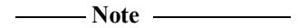

The number of bits of preemption is indicated by [ICH\\_VTR.](#page-529-0)PREbits

Writing to the active priority registers in any order other than the following order will result in UNPREDICTABLE behavior:

- ICH\_AP0R<n>
- [ICH\\_AP1R<n>](#page-503-0)

Accesses to this register use the following encodings in the System register encoding space:

**MRC{<c>}{<q>} <coproc>, {#}<opc1>, <Rt>, <CRn>, <CRm>{, {#}<opc2>}; Where m = 0-3**

| coproc | opc1  | CRn    | CRm    | opc2       |
|--------|-------|--------|--------|------------|
| 0b1111 | 0b100 | 0b1100 | 0b1000 | 0b0:m[1:0] |

```
integer m = UInt(opc2<1:0>);
if m == 1 && NUM_GIC_PREEMPTION_BITS < 6 then
    UNDEFINED;
elsif (m == 2 || m == 3) && NUM_GIC_PREEMPTION_BITS < 7 then
    UNDEFINED;
elsif PSTATE.EL == EL0 then
    UNDEFINED;
elsif PSTATE.EL == EL1 then
    if EL2Enabled() && !ELUsingAArch32(EL2) && HSTR_EL2.T12 == '1' then
        AArch64.AArch32SystemAccessTrap(EL2, 0x03);
    elsif EL2Enabled() && ELUsingAArch32(EL2) && HSTR.T12 == '1' then
        AArch32.TakeHypTrapException(0x03);
    else
        UNDEFINED;
elsif PSTATE.EL == EL2 then
    if ICC_HSRE.SRE == '0' then
        UNDEFINED;
    else
        R[t] = ICH_AP0R[m];
```

```
elsif PSTATE.EL == EL3 then
    if ICC_MSRE.SRE == '0' then
        UNDEFINED;
    else
        R[t] = ICH_AP0R[m];
```

#### **MCR{<c>}{<q>} <coproc>, {#}<opc1>, <Rt>, <CRn>, <CRm>{, {#}<opc2>}; Where m = 0-3**

| coproc | opc1  | CRn    | CRm    | opc2       |
|--------|-------|--------|--------|------------|
| 0b1111 | 0b100 | 0b1100 | 0b1000 | 0b0:m[1:0] |

```
integer m = UInt(opc2<1:0>);
if m == 1 && NUM_GIC_PREEMPTION_BITS < 6 then
    UNDEFINED;
elsif (m == 2 || m == 3) && NUM_GIC_PREEMPTION_BITS < 7 then
    UNDEFINED;
elsif PSTATE.EL == EL0 then
    UNDEFINED;
elsif PSTATE.EL == EL1 then
    if EL2Enabled() && !ELUsingAArch32(EL2) && HSTR_EL2.T12 == '1' then
        AArch64.AArch32SystemAccessTrap(EL2, 0x03);
    elsif EL2Enabled() && ELUsingAArch32(EL2) && HSTR.T12 == '1' then
        AArch32.TakeHypTrapException(0x03);
    else
        UNDEFINED;
elsif PSTATE.EL == EL2 then
    if ICC_HSRE.SRE == '0' then
        UNDEFINED;
    else
        ICH_AP0R[m] = R[t];
elsif PSTATE.EL == EL3 then
    if ICC_MSRE.SRE == '0' then
        UNDEFINED;
    else
        ICH_AP0R[m] = R[t];
```

#### <span id="page-503-0"></span>**12.7.2 ICH\_AP1R<n>, Interrupt Controller Hyp Active Priorities Group 1 Registers, n = 0 - 3**

The ICH\_AP1R<n> characteristics are:

#### **Purpose**

Provides information about Group 1 active priorities for EL2.

#### **Configurations**

AArch32 System register ICH\_AP1R<n> bits [31:0] are architecturally mapped to AArch64 System register [ICH\\_AP1R<n>\\_EL2\[](#page-339-1)31:0].

This register is present only when EL2 is capable of using AArch32, FEAT\_GICv3 is implemented and (EL2 is implemented or EL3 is implemented). Otherwise, direct accesses to ICH\_AP1R<n> are UNDEFINED.

If EL2 is not implemented, this register is RES0 from EL3.

#### **Attributes**

ICH\_AP1R<n> is a 32-bit register.

#### **Field descriptions**

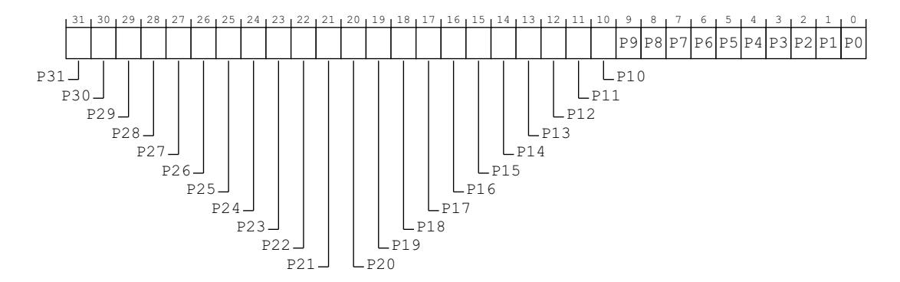

#### **P<x>, bit [x], for x = 31 to 0**

Group 1 interrupt active priorities. Possible values of each bit are:

0b0 There is no Group 1 interrupt active at the priority corresponding to that bit.

0b1 There is a Group 1 interrupt active at the priority corresponding to that bit.

The correspondence between priority levels and bits depends on the number of bits of priority that are implemented.

If 5 bits of preemption are implemented (bits [7:3] of priority), then there are 32 preemption levels, and the active state of these preemption levels are held in ICH\_AP1R0 in the bits corresponding to Priority[7:3].

If 6 bits of preemption are implemented (bits [7:2] of priority), then there are 64 preemption levels, and:

- The active state of preemption levels 0 124 are held in ICH\_AP1R0 in the bits corresponding to 0:Priority[6:2].
- The active state of preemption levels 128 252 are held in ICH\_AP1R1 in the bits corresponding to 1:Priority[6:2].

If 7 bits of preemption are implemented (bits [7:1] of priority), then there are 128 preemption levels, and:

• The active state of preemption levels 0 - 62 are held in ICH\_AP1R0 in the bits corresponding to 00:Priority[5:1].

- The active state of preemption levels 64 126 are held in ICH\_AP1R1 in the bits corresponding to 01:Priority[5:1].
- The active state of preemption levels 128 190 are held in ICH\_AP1R2 in the bits corresponding to 10:Priority[5:1].
- The active state of preemption levels 192 254 are held in ICH\_AP1R3 in the bits corresponding to 11:Priority[5:1].

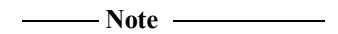

Having the bit corresponding to a priority set to 1 in both [ICH\\_AP0R<n>](#page-500-0) and ICH\_AP1R<n> might result in UNPREDICTABLE behavior of the interrupt prioritization system for virtual interrupts.

The reset behavior of this field is:

• On a Warm reset, this field resets to 0.

#### **Accessing ICH\_AP1R<n>**

ICH\_AP1R1 is implemented only in implementations that support 6 or more bits of preemption. ICH\_AP1R2 and ICH\_AP1R3 are implemented only in implementations that support 7 bits of preemption. Unimplemented registers are UNDEFINED.

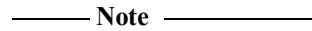

The number of bits of preemption is indicated by [ICH\\_VTR.](#page-529-0)PREbits

Writing to the active priority registers in any order other than the following order will result in UNPREDICTABLE behavior:

- [ICH\\_AP0R<n>](#page-500-0)
- ICH\_AP1R<n>

Accesses to this register use the following encodings in the System register encoding space:

**MRC{<c>}{<q>} <coproc>, {#}<opc1>, <Rt>, <CRn>, <CRm>{, {#}<opc2>}; Where m = 0-3**

| coproc | opc1  | CRn    | CRm    | opc2       |
|--------|-------|--------|--------|------------|
| 0b1111 | 0b100 | 0b1100 | 0b1001 | 0b0:m[1:0] |

```
integer m = UInt(opc2<1:0>);
if m == 1 && NUM_GIC_PREEMPTION_BITS < 6 then
    UNDEFINED;
elsif (m == 2 || m == 3) && NUM_GIC_PREEMPTION_BITS < 7 then
    UNDEFINED;
elsif PSTATE.EL == EL0 then
    UNDEFINED;
elsif PSTATE.EL == EL1 then
    if EL2Enabled() && !ELUsingAArch32(EL2) && HSTR_EL2.T12 == '1' then
        AArch64.AArch32SystemAccessTrap(EL2, 0x03);
    elsif EL2Enabled() && ELUsingAArch32(EL2) && HSTR.T12 == '1' then
        AArch32.TakeHypTrapException(0x03);
    else
        UNDEFINED;
elsif PSTATE.EL == EL2 then
    if ICC_HSRE.SRE == '0' then
        UNDEFINED;
    else
        R[t] = ICH_AP1R[m];
```

```
elsif PSTATE.EL == EL3 then
    if ICC_MSRE.SRE == '0' then
        UNDEFINED;
    else
        R[t] = ICH_AP1R[m];
```

#### **MCR{<c>}{<q>} <coproc>, {#}<opc1>, <Rt>, <CRn>, <CRm>{, {#}<opc2>}; Where m = 0-3**

| coproc | opc1  | CRn    | CRm    | opc2       |
|--------|-------|--------|--------|------------|
| 0b1111 | 0b100 | 0b1100 | 0b1001 | 0b0:m[1:0] |

```
integer m = UInt(opc2<1:0>);
if m == 1 && NUM_GIC_PREEMPTION_BITS < 6 then
    UNDEFINED;
elsif (m == 2 || m == 3) && NUM_GIC_PREEMPTION_BITS < 7 then
    UNDEFINED;
elsif PSTATE.EL == EL0 then
    UNDEFINED;
elsif PSTATE.EL == EL1 then
    if EL2Enabled() && !ELUsingAArch32(EL2) && HSTR_EL2.T12 == '1' then
        AArch64.AArch32SystemAccessTrap(EL2, 0x03);
    elsif EL2Enabled() && ELUsingAArch32(EL2) && HSTR.T12 == '1' then
        AArch32.TakeHypTrapException(0x03);
    else
        UNDEFINED;
elsif PSTATE.EL == EL2 then
    if ICC_HSRE.SRE == '0' then
        UNDEFINED;
    else
        ICH_AP1R[m] = R[t];
elsif PSTATE.EL == EL3 then
    if ICC_MSRE.SRE == '0' then
        UNDEFINED;
    else
        ICH_AP1R[m] = R[t];
```

#### <span id="page-506-0"></span>**12.7.3 ICH\_EISR, Interrupt Controller End of Interrupt Status Register**

The ICH\_EISR characteristics are:

#### **Purpose**

Indicates which List registers have outstanding EOI maintenance interrupts.

#### **Configurations**

AArch32 System register ICH\_EISR bits [31:0] are architecturally mapped to AArch64 System register [ICH\\_EISR\\_EL2\[](#page-343-1)31:0].

This register is present only when EL2 is capable of using AArch32, FEAT\_GICv3 is implemented and (EL2 is implemented or EL3 is implemented). Otherwise, direct accesses to ICH\_EISR are UNDEFINED.

If EL2 is not implemented, this register is RES0 from EL3.

#### **Attributes**

ICH\_EISR is a 32-bit register.

#### **Field descriptions**

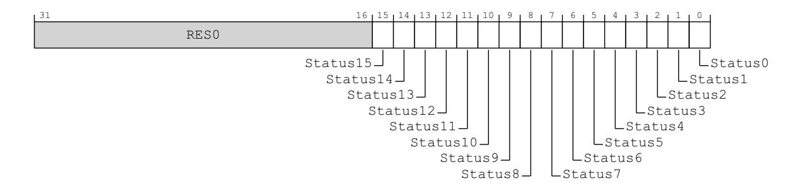

#### **Bits [31:16]**

Reserved, RES0.

#### **Status<n>, bit [n], for n = 15 to 0**

EOI maintenance interrupt status bit for List register <n>:

0b0 List register <n>, [ICH\\_LR<n>](#page-515-0), does not have an EOI maintenance interrupt.

0b1 List register <n>, [ICH\\_LR<n>](#page-515-0), has an EOI maintenance interrupt that has not been handled.

For any ICH\_LR<n>, the corresponding status bit is set to 1 if all of the following are true:

- [ICH\\_LRC<n>](#page-518-0).State is 0b00.
- [ICH\\_LRC<n>](#page-518-0).HW is 0.
- [ICH\\_LRC<n>](#page-518-0).EOI (bit [9]) is 1, indicating that when the interrupt corresponding to that List register is deactivated, a maintenance interrupt is asserted.

The reset behavior of this field is:

• On a Warm reset, this field resets to 0.

#### **Accessing ICH\_EISR**

```
MRC{<c>}{<q>} <coproc>, {#}<opc1>, <Rt>, <CRn>, <CRm>{, {#}<opc2>}
```

| coproc | opc1  | CRn    | CRm    | opc2  |
|--------|-------|--------|--------|-------|
| 0b1111 | 0b100 | 0b1100 | 0b1011 | 0b011 |

```
if PSTATE.EL == EL0 then
    UNDEFINED;
elsif PSTATE.EL == EL1 then
    if EL2Enabled() && !ELUsingAArch32(EL2) && HSTR_EL2.T12 == '1' then
        AArch64.AArch32SystemAccessTrap(EL2, 0x03);
    elsif EL2Enabled() && ELUsingAArch32(EL2) && HSTR.T12 == '1' then
        AArch32.TakeHypTrapException(0x03);
    else
        UNDEFINED;
elsif PSTATE.EL == EL2 then
    if ICC_HSRE.SRE == '0' then
        UNDEFINED;
    else
        R[t] = ICH_EISR;
elsif PSTATE.EL == EL3 then
    if ICC_MSRE.SRE == '0' then
        UNDEFINED;
    else
        R[t] = ICH_EISR;
```

#### <span id="page-508-0"></span>**12.7.4 ICH\_ELRSR, Interrupt Controller Empty List Register Status Register**

The ICH\_ELRSR characteristics are:

#### **Purpose**

Indicates which List registers contain valid interrupts.

#### **Configurations**

AArch32 System register ICH\_ELRSR bits [31:0] are architecturally mapped to AArch64 System register [ICH\\_ELRSR\\_EL2](#page-345-1)[31:0].

This register is present only when EL2 is capable of using AArch32, FEAT\_GICv3 is implemented and (EL2 is implemented or EL3 is implemented). Otherwise, direct accesses to ICH\_ELRSR are UNDEFINED.

If EL2 is not implemented, this register is RES0 from EL3.

#### **Attributes**

ICH\_ELRSR is a 32-bit register.

#### **Field descriptions**

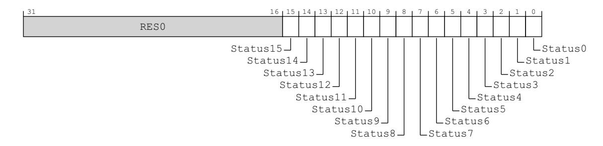

#### **Bits [31:16]**

Reserved, RES0.

#### **Status<n>, bit [n], for n = 15 to 0**

Status bit for List register <n>, [ICH\\_LR<n>](#page-515-0):

0b0 List register [ICH\\_LR<n>](#page-515-0), if implemented, contains a valid interrupt. Using this List register can result in overwriting a valid interrupt.

0b1 List register [ICH\\_LR<n>](#page-515-0) does not contain a valid interrupt. The List register is empty and can be used without overwriting a valid interrupt or losing an EOI maintenance interrupt.

For any List register <n>, the corresponding status bit is set to 1 if [ICH\\_LRC<n>.](#page-518-0)State is 0b00 and either [ICH\\_LRC<n>.](#page-518-0)HW is 1 or [ICH\\_LRC<n>.](#page-518-0)EOI (bit [9]) is 0.

#### **Accessing ICH\_ELRSR**

Accesses to this register use the following encodings in the System register encoding space:

**MRC{<c>}{<q>} <coproc>, {#}<opc1>, <Rt>, <CRn>, <CRm>{, {#}<opc2>}**

| coproc | opc1  | CRn    | CRm    | opc2  |
|--------|-------|--------|--------|-------|
| 0b1111 | 0b100 | 0b1100 | 0b1011 | 0b101 |

```
if PSTATE.EL == EL0 then
    UNDEFINED;
elsif PSTATE.EL == EL1 then
    if EL2Enabled() && !ELUsingAArch32(EL2) && HSTR_EL2.T12 == '1' then
        AArch64.AArch32SystemAccessTrap(EL2, 0x03);
    elsif EL2Enabled() && ELUsingAArch32(EL2) && HSTR.T12 == '1' then
        AArch32.TakeHypTrapException(0x03);
    else
        UNDEFINED;
elsif PSTATE.EL == EL2 then
    if ICC_HSRE.SRE == '0' then
        UNDEFINED;
    else
        R[t] = ICH_ELRSR;
elsif PSTATE.EL == EL3 then
    if ICC_MSRE.SRE == '0' then
        UNDEFINED;
    else
        R[t] = ICH_ELRSR;
```

#### <span id="page-510-1"></span><span id="page-510-0"></span>**12.7.5 ICH\_HCR, Interrupt Controller Hyp Control Register**

The ICH\_HCR characteristics are:

#### **Purpose**

Controls the environment for VMs.

#### **Configurations**

AArch32 System register ICH\_HCR bits [31:0] are architecturally mapped to AArch64 System register [ICH\\_HCR\\_EL2\[](#page-347-1)31:0].

This register is present only when EL2 is capable of using AArch32, FEAT\_GICv3 is implemented and (EL2 is implemented or EL3 is implemented). Otherwise, direct accesses to ICH\_HCR are UNDEFINED.

If EL2 is not implemented, this register is RES0 from EL3.

#### **Attributes**

ICH\_HCR is a 32-bit register.

#### **Field descriptions**

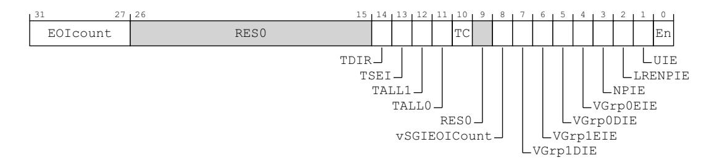

#### **EOIcount, bits [31:27]**

This field is incremented whenever a successful write to a virtual EOIR or DIR register would have resulted in a virtual interrupt deactivation. That is either:

- A virtual write to EOIR with a valid interrupt identifier that is not in the LPI range (that is < 8192) when EOI mode is zero and no List Register was found.
- A virtual write to DIR with a valid interrupt identifier that is not in the LPI range (that is < 8192) when EOI mode is one and no List Register was found.

This allows software to manage more active interrupts than there are implemented List Registers.

It is CONSTRAINED UNPREDICTABLE whether a virtual write to EOIR that does not clear a bit in the Active Priorities registers [\(ICH\\_AP0R<n>/](#page-500-0)[ICH\\_AP1R<n>\)](#page-503-0) increments EOIcount. Permitted behaviors are:

- Increment EOIcount.
- Leave EOIcount unchanged.

The reset behavior of this field is:

• On a Warm reset, this field resets to 0.

#### **Bits [26:15]**

Reserved, RES0.

#### **TDIR, bit [14]**

#### *When FEAT\_GICv3\_TDIR is implemented:*

Trap Non-secure EL1 writes to [ICC\\_DIR](#page-395-0) and [ICV\\_DIR.](#page-472-0)

- 0b0 Non-secure EL1 writes of [ICC\\_DIR](#page-395-0) and [ICV\\_DIR](#page-472-0) are not trapped to EL2, unless trapped by other mechanisms.
- 0b1 Non-secure EL1 writes of [ICV\\_DIR](#page-472-0) are trapped to EL2. It is IMPLEMENTATION DEFINED whether Non-secure writes of [ICC\\_DIR](#page-395-0) are trapped. Not trapping [ICC\\_DIR](#page-395-0) writes is DEPRECATED.

Arm deprecates not including this trap bit.

The reset behavior of this field is:

• On a Warm reset, this field resets to 0.

#### *Otherwise:*

Reserved, RES0.

#### **TSEI, bit [13]**

Trap all locally generated SEIs. This bit allows the hypervisor to intercept locally generated SEIs that would otherwise be taken at Non-secure EL1.

- 0b0 Locally generated SEIs do not cause a trap to EL2.
- 0b1 Locally generated SEIs trap to EL2.

If [ICH\\_VTR](#page-529-0).SEIS is 0, this bit is RES0.

The reset behavior of this field is:

• On a Warm reset, this field resets to 0.

#### **TALL1, bit [12]**

Trap all Non-secure EL1 accesses to ICC\_\* and ICV\_\* System registers for Group 1 interrupts to EL2.

- 0b0 Non-secure EL1 accesses to ICC\_\* and ICV\_\* registers for Group 1 interrupts proceed as normal.
- 0b1 Non-secure EL1 accesses to ICC\_\* and ICV\_\* registers for Group 1 interrupts trap to EL2.

The reset behavior of this field is:

• On a Warm reset, this field resets to 0.

#### **TALL0, bit [11]**

Trap all Non-secure EL1 accesses to ICC\_\* and ICV\_\* System registers for Group 0 interrupts to EL2.

- 0b0 Non-secure EL1 accesses to ICC\_\* and ICV\_\* registers for Group 0 interrupts proceed as normal.
- 0b1 Non-secure EL1 accesses to ICC\_\* and ICV\_\* registers for Group 0 interrupts trap to EL2.

The reset behavior of this field is:

• On a Warm reset, this field resets to 0.

#### **TC, bit [10]**

Trap all Non-secure EL1 accesses to System registers that are common to Group 0 and Group 1 to EL2.

- 0b0 Non-secure EL1 accesses to common registers proceed as normal.
- 0b1 Non-secure EL1 accesses to common registers trap to EL2.

This affects accesses to [ICC\\_SGI0R,](#page-440-0) [ICC\\_SGI1R,](#page-443-0) [ICC\\_ASGI1R](#page-377-0), [ICC\\_CTLR,](#page-389-0) [ICC\\_DIR](#page-395-0), [ICC\\_PMR,](#page-434-0) [ICC\\_RPR,](#page-438-0) [ICV\\_CTLR,](#page-467-0) [ICV\\_DIR,](#page-472-0) [ICV\\_PMR](#page-493-0), and [ICV\\_RPR.](#page-497-0)

The reset behavior of this field is:

• On a Warm reset, this field resets to 0.

#### **Bit [9]**

Reserved, RES0.

#### **vSGIEOICount, bit [8]**

#### *When FEAT\_GICv4p1 is implemented:*

Controls whether deactivation of virtual SGIs can increment ICH\_HCR\_EL2.EOIcount

0b0 Deactivation of virtual SGIs can increment ICH\_HCR.EOIcount.

0b1 Deactivation of virtual SGIs does not increment ICH\_HCR.EOIcount.

The reset behavior of this field is:

• On a Warm reset, this field resets to 0.

#### *Otherwise:*

Reserved, RES0.

#### **VGrp1DIE, bit [7]**

VM Group 1 Disabled Interrupt Enable. Enables the signaling of a maintenance interrupt while signaling of Group 1 interrupts from the virtual CPU interface to the connected vPE is disabled:

0b0 Maintenance interrupt disabled.

0b1 Maintenance interrupt signaled when [ICH\\_VMCR.](#page-525-0)VENG1 is 0.

The reset behavior of this field is:

• On a Warm reset, this field resets to 0.

#### **VGrp1EIE, bit [6]**

VM Group 1 Enabled Interrupt Enable. Enables the signaling of a maintenance interrupt while signaling of Group 1 interrupts from the virtual CPU interface to the connected vPE is enabled:

0b0 Maintenance interrupt disabled.

0b1 Maintenance interrupt signaled when [ICH\\_VMCR.](#page-525-0)VENG1 is 1.

The reset behavior of this field is:

• On a Warm reset, this field resets to 0.

#### **VGrp0DIE, bit [5]**

VM Group 0 Disabled Interrupt Enable. Enables the signaling of a maintenance interrupt while signaling of Group 0 interrupts from the virtual CPU interface to the connected vPE is disabled:

0b0 Maintenance interrupt disabled.

0b1 Maintenance interrupt signaled when [ICH\\_VMCR.](#page-525-0)VENG0 is 0.

The reset behavior of this field is:

• On a Warm reset, this field resets to 0.

#### **VGrp0EIE, bit [4]**

VM Group 0 Enabled Interrupt Enable. Enables the signaling of a maintenance interrupt while signaling of Group 0 interrupts from the virtual CPU interface to the connected vPE is enabled:

0b0 Maintenance interrupt disabled.

0b1 Maintenance interrupt signaled when [ICH\\_VMCR.](#page-525-0)VENG0 is 1.

The reset behavior of this field is:

• On a Warm reset, this field resets to 0.

#### **NPIE, bit [3]**

No Pending Interrupt Enable. Enables the signaling of a maintenance interrupt when there are no List registers with the State field set to 0b01 (pending):

0b0 Maintenance interrupt disabled.

0b1 Maintenance interrupt signaled while the List registers contain no interrupts in the pending state.

The reset behavior of this field is:

• On a Warm reset, this field resets to 0.

#### **LRENPIE, bit [2]**

List Register Entry Not Present Interrupt Enable. Enables the signaling of a maintenance interrupt while the virtual CPU interface does not have a corresponding valid List register entry for an EOI request:

0b0 Maintenance interrupt disabled.

0b1 Maintenance interrupt is asserted while the EOIcount field is not 0.

The reset behavior of this field is:

• On a Warm reset, this field resets to 0.

#### **UIE, bit [1]**

Underflow Interrupt Enable. Enables the signaling of a maintenance interrupt when the List registers are empty, or hold only one valid entry:

0b0 Maintenance interrupt disabled.

0b1 Maintenance interrupt is asserted if none, or only one, of the List register entries is marked as a valid interrupt.

The reset behavior of this field is:

• On a Warm reset, this field resets to 0.

#### **En, bit [0]**

Enable. Global enable bit for the virtual CPU interface:

0b0 Virtual CPU interface operation disabled.

0b1 Virtual CPU interface operation enabled.

When this field is set to 0:

- The virtual CPU interface does not signal any maintenance interrupts.
- The virtual CPU interface does not signal any virtual interrupts.
- A read of [ICV\\_IAR0,](#page-482-0) [ICV\\_IAR1](#page-484-0), [GICV\\_IAR](#page-791-0) or [GICV\\_AIAR](#page-776-0) returns a spurious interrupt ID.

The reset behavior of this field is:

• On a Warm reset, this field resets to 0.

#### **Accessing ICH\_HCR**

Accesses to this register use the following encodings in the System register encoding space:

**MRC{<c>}{<q>} <coproc>, {#}<opc1>, <Rt>, <CRn>, <CRm>{, {#}<opc2>}**

| coproc | opc1  | CRn    | CRm    | opc2  |
|--------|-------|--------|--------|-------|
| 0b1111 | 0b100 | 0b1100 | 0b1011 | 0b000 |

```
if PSTATE.EL == EL0 then
    UNDEFINED;
elsif PSTATE.EL == EL1 then
    if EL2Enabled() && !ELUsingAArch32(EL2) && HSTR_EL2.T12 == '1' then
        AArch64.AArch32SystemAccessTrap(EL2, 0x03);
    elsif EL2Enabled() && ELUsingAArch32(EL2) && HSTR.T12 == '1' then
        AArch32.TakeHypTrapException(0x03);
    else
        UNDEFINED;
elsif PSTATE.EL == EL2 then
    if ICC_HSRE.SRE == '0' then
        UNDEFINED;
    else
        R[t] = ICH_HCR;
elsif PSTATE.EL == EL3 then
    if ICC_MSRE.SRE == '0' then
        UNDEFINED;
    else
        R[t] = ICH_HCR;
```

#### **MCR{<c>}{<q>} <coproc>, {#}<opc1>, <Rt>, <CRn>, <CRm>{, {#}<opc2>}**

| coproc | opc1  | CRn    | CRm    | opc2  |
|--------|-------|--------|--------|-------|
| 0b1111 | 0b100 | 0b1100 | 0b1011 | 0b000 |

```
if PSTATE.EL == EL0 then
    UNDEFINED;
elsif PSTATE.EL == EL1 then
    if EL2Enabled() && !ELUsingAArch32(EL2) && HSTR_EL2.T12 == '1' then
        AArch64.AArch32SystemAccessTrap(EL2, 0x03);
    elsif EL2Enabled() && ELUsingAArch32(EL2) && HSTR.T12 == '1' then
        AArch32.TakeHypTrapException(0x03);
    else
        UNDEFINED;
elsif PSTATE.EL == EL2 then
    if ICC_HSRE.SRE == '0' then
        UNDEFINED;
    else
        ICH_HCR = R[t];
elsif PSTATE.EL == EL3 then
    if ICC_MSRE.SRE == '0' then
        UNDEFINED;
    else
        ICH_HCR = R[t];
```

#### <span id="page-515-0"></span>**12.7.6 ICH\_LR<n>, Interrupt Controller List Registers, n = 0 - 15**

The ICH\_LR<n> characteristics are:

#### **Purpose**

Provides interrupt context information for the virtual CPU interface.

#### **Configurations**

AArch32 System register ICH\_LR<n> bits [31:0] are architecturally mapped to AArch64 System register [ICH\\_LR<n>\\_EL2](#page-352-1)[31:0].

This register is present only when EL2 is capable of using AArch32, FEAT\_GICv3 is implemented and (EL2 is implemented or EL3 is implemented). Otherwise, direct accesses to ICH\_LR<n> are UNDEFINED.

If EL2 is not implemented, this register is RES0 from EL3.

If list register n is not implemented, then accesses to this register are UNDEFINED.

#### **Attributes**

ICH\_LR<n> is a 32-bit register.

#### **Field descriptions**


#### **vINTID, bits [31:0]**

Virtual INTID of the interrupt.

If the value of vINTID is 1020-1023 and [ICH\\_LRC<n>.](#page-518-0)State!=0b00 (Inactive), behavior is UNPREDICTABLE.

Behavior is UNPREDICTABLE if two or more List Registers specify the same vINTID when:

- [ICH\\_LRC<n>](#page-518-0).State == 01.
- [ICH\\_LRC<n>](#page-518-0).State == 10.
- [ICH\\_LRC<n>](#page-518-0).State == 11.

It is IMPLEMENTATION DEFINED how many bits are implemented, though at least 16 bits must be implemented. Unimplemented bits are RES0. The number of implemented bits can be discovered from [ICH\\_VTR.](#page-529-0)IDbits.

**Note**

When a VM is using memory-mapped access to the GIC, software must ensure that the correct source PE ID is provided in bits[12:10].

The reset behavior of this field is:

• On a Warm reset, this field resets to 0.

#### **Accessing ICH\_LR<n>**

ICH\_LR<n> and [ICH\\_LRC<n>](#page-518-0) can be updated independently.

Accesses to this register use the following encodings in the System register encoding space:

#### **MRC{<c>}{<q>} <coproc>, {#}<opc1>, <Rt>, <CRn>, <CRm>{, {#}<opc2>}; Where m = 0-15**

| coproc | opc1  | CRn    | CRm        | opc2   |
|--------|-------|--------|------------|--------|
| 0b1111 | 0b100 | 0b1100 | 0b110:m[3] | m[2:0] |

```
integer m = UInt(CRm<0>:opc2<2:0>);
if m >= NUM_GIC_LIST_REGS then
    UNDEFINED;
elsif PSTATE.EL == EL0 then
    UNDEFINED;
elsif PSTATE.EL == EL1 then
    if EL2Enabled() && !ELUsingAArch32(EL2) && HSTR_EL2.T12 == '1' then
        AArch64.AArch32SystemAccessTrap(EL2, 0x03);
    elsif EL2Enabled() && ELUsingAArch32(EL2) && HSTR.T12 == '1' then
        AArch32.TakeHypTrapException(0x03);
    else
        UNDEFINED;
elsif PSTATE.EL == EL2 then
    if ICC_HSRE.SRE == '0' then
        UNDEFINED;
    else
        R[t] = ICH_LR[m];
elsif PSTATE.EL == EL3 then
    if ICC_MSRE.SRE == '0' then
        UNDEFINED;
    else
        R[t] = ICH_LR[m];
```

#### **MCR{<c>}{<q>} <coproc>, {#}<opc1>, <Rt>, <CRn>, <CRm>{, {#}<opc2>}; Where m = 0-15**

| coproc | opc1  | CRn    | CRm        | opc2   |
|--------|-------|--------|------------|--------|
| 0b1111 | 0b100 | 0b1100 | 0b110:m[3] | m[2:0] |

```
integer m = UInt(CRm<0>:opc2<2:0>);
if m >= NUM_GIC_LIST_REGS then
    UNDEFINED;
elsif PSTATE.EL == EL0 then
    UNDEFINED;
elsif PSTATE.EL == EL1 then
    if EL2Enabled() && !ELUsingAArch32(EL2) && HSTR_EL2.T12 == '1' then
        AArch64.AArch32SystemAccessTrap(EL2, 0x03);
    elsif EL2Enabled() && ELUsingAArch32(EL2) && HSTR.T12 == '1' then
        AArch32.TakeHypTrapException(0x03);
    else
        UNDEFINED;
elsif PSTATE.EL == EL2 then
    if ICC_HSRE.SRE == '0' then
        UNDEFINED;
    else
        ICH_LR[m] = R[t];
elsif PSTATE.EL == EL3 then
    if ICC_MSRE.SRE == '0' then
```

UNDEFINED; else ICH\_LR[m] = R[t];

#### <span id="page-518-0"></span>**12.7.7 ICH\_LRC<n>, Interrupt Controller List Registers, n = 0 - 15**

The ICH\_LRC<n> characteristics are:

#### **Purpose**

Provides interrupt context information for the virtual CPU interface.

#### **Configurations**

AArch32 System register ICH\_LRC<n> bits [31:0] are architecturally mapped to AArch64 System register [ICH\\_LR<n>\\_EL2](#page-352-1)[63:32].

This register is present only when EL2 is capable of using AArch32, FEAT\_GICv3 is implemented and (EL2 is implemented or EL3 is implemented). Otherwise, direct accesses to ICH\_LRC<n> are UNDEFINED.

If EL2 is not implemented, this register is RES0 from EL3.

If list register n is not implemented, then accesses to this register are UNDEFINED.

#### **Attributes**

ICH\_LRC<n> is a 32-bit register.

#### **Field descriptions**


#### **State, bits [31:30]**

The state of the interrupt:

0b00 Invalid (Inactive).

0b01 Pending.

0b10 Active.

0b11 Pending and active.

The GIC updates these state bits as virtual interrupts proceed through the interrupt life cycle. Entries in the invalid state are ignored, except for the purpose of generating virtual maintenance interrupts.

For hardware interrupts, the pending and active state is held in the physical Distributor rather than the virtual CPU interface. A hypervisor must only use the pending and active state for software originated interrupts, which are typically associated with virtual devices, or SGIs.

The reset behavior of this field is:

• On a Warm reset, this field resets to 0.

#### **HW, bit [29]**

Indicates whether this virtual interrupt maps directly to a hardware interrupt, meaning that it corresponds to a physical interrupt. Deactivation of the virtual interrupt also causes the deactivation of the physical interrupt with the INTID that the pINTID field indicates.

0b0 The interrupt is triggered entirely by software. No notification is sent to the Distributor when the virtual interrupt is deactivated.

0b1 The interrupt maps directly to a hardware interrupt. A deactivate interrupt request is sent to the Distributor when the virtual interrupt is deactivated, using the pINTID field from this register to indicate the physical INTID.

> If [ICH\\_VMCR](#page-525-0).VEOIM is 0, this request corresponds to a write to [ICC\\_EOIR0](#page-397-0) or [ICC\\_EOIR1](#page-400-0). Otherwise, it corresponds to a write to [ICC\\_DIR.](#page-395-0)

The reset behavior of this field is:

• On a Warm reset, this field resets to 0.

#### **Group, bit [28]**

Indicates the group for this virtual interrupt.

0b0 This is a Group 0 virtual interrupt. [ICH\\_VMCR.](#page-525-0)VFIQEn determines whether it is signaled as a virtual IRQ or as a virtual FIQ, and [ICH\\_VMCR](#page-525-0).VENG0 enables signaling of this interrupt to the virtual machine.

0b1 This is a Group 1 virtual interrupt, signaled as a virtual IRQ. [ICH\\_VMCR.](#page-525-0)VENG1 enables the signaling of this interrupt to the virtual machine. If [ICH\\_VMCR.](#page-525-0)VCBPR is 0, then [ICC\\_BPR1](#page-384-1) determines if a pending Group 1 interrupt has sufficient priority to preempt current execution. Otherwise, [ICH\\_LR<n>](#page-515-0) determines

preemption. The reset behavior of this field is:

• On a Warm reset, this field resets to 0.

#### **Bits [27:24]**

Reserved, RES0.

#### **Priority, bits [23:16]**

The priority of this interrupt.

It is IMPLEMENTATION DEFINED how many bits of priority are implemented, though at least five bits must be implemented. Unimplemented bits are RES0 and start from bit[16] up to bit[18]. The number of implemented bits can be discovered from [ICH\\_VTR](#page-529-0).PRIbits.

The reset behavior of this field is:

• On a Warm reset, this field resets to 0.

#### **Bits [15:13]**

Reserved, RES0.

#### **pINTID, bits [12:0]**

Physical INTID, for hardware interrupts.

When ICH\_LRC<n>.HW is 0 (there is no corresponding physical interrupt), this field has the following meaning:

- Bits[12:10]: RES0.
- Bit[9]: EOI. If this bit is 1, then when the interrupt identified by vINTID is deactivated, an EOI maintenance interrupt is asserted.
- Bits[8:0]: Reserved, RES0.

When ICH\_LRC<n>.HW is 1 (there is a corresponding physical interrupt):

- This field indicates the physical INTID. This field is only required to implement enough bits to hold a valid value for the implemented INTID size. Any unused higher order bits are RES0.
- When [ICC\\_CTLR\\_EL1](#page-232-1).ExtRange is 0, then bits[44:42] of this field are RES0.
- If the value of pINTID is not a valid INTID, behavior is UNPREDICTABLE. If the value of pINTID indicates a PPI, this field applies to the PPI associated with this same physical PE ID as the virtual CPU interface requesting the deactivation.

A hardware physical identifier is only required in List Registers for interrupts that require deactivation. This means only 13 bits of Physical INTID are required, regardless of the number specified by [ICC\\_CTLR](#page-389-0).IDbits.

The reset behavior of this field is:

• On a Warm reset, this field resets to 0.

#### **Accessing ICH\_LRC<n>**

[ICH\\_LR<n>](#page-515-0) and ICH\_LRC<n> can be updated independently.

Accesses to this register use the following encodings in the System register encoding space:

**MRC{<c>}{<q>} <coproc>, {#}<opc1>, <Rt>, <CRn>, <CRm>{, {#}<opc2>}; Where m = 0-15**

| coproc | opc1  | CRn    | CRm        | opc2   |
|--------|-------|--------|------------|--------|
| 0b1111 | 0b100 | 0b1100 | 0b111:m[3] | m[2:0] |

```
integer m = UInt(CRm<0>:opc2<2:0>);
if m >= NUM_GIC_LIST_REGS then
    UNDEFINED;
elsif PSTATE.EL == EL0 then
    UNDEFINED;
elsif PSTATE.EL == EL1 then
    if EL2Enabled() && !ELUsingAArch32(EL2) && HSTR_EL2.T12 == '1' then
        AArch64.AArch32SystemAccessTrap(EL2, 0x03);
    elsif EL2Enabled() && ELUsingAArch32(EL2) && HSTR.T12 == '1' then
        AArch32.TakeHypTrapException(0x03);
    else
        UNDEFINED;
elsif PSTATE.EL == EL2 then
    if ICC_HSRE.SRE == '0' then
        UNDEFINED;
    else
        R[t] = ICH_LRC[m];
elsif PSTATE.EL == EL3 then
    if ICC_MSRE.SRE == '0' then
        UNDEFINED;
    else
        R[t] = ICH_LRC[m];
```

#### **MCR{<c>}{<q>} <coproc>, {#}<opc1>, <Rt>, <CRn>, <CRm>{, {#}<opc2>}; Where m = 0-15**

| coproc | opc1  | CRn    | CRm        | opc2   |
|--------|-------|--------|------------|--------|
| 0b1111 | 0b100 | 0b1100 | 0b111:m[3] | m[2:0] |

```
integer m = UInt(CRm<0>:opc2<2:0>);
if m >= NUM_GIC_LIST_REGS then
    UNDEFINED;
elsif PSTATE.EL == EL0 then
    UNDEFINED;
elsif PSTATE.EL == EL1 then
    if EL2Enabled() && !ELUsingAArch32(EL2) && HSTR_EL2.T12 == '1' then
        AArch64.AArch32SystemAccessTrap(EL2, 0x03);
    elsif EL2Enabled() && ELUsingAArch32(EL2) && HSTR.T12 == '1' then
        AArch32.TakeHypTrapException(0x03);
    else
        UNDEFINED;
elsif PSTATE.EL == EL2 then
    if ICC_HSRE.SRE == '0' then
        UNDEFINED;
```

else ICH\_LRC[m] = R[t]; elsif PSTATE.EL == EL3 then if ICC\_MSRE.SRE == '0' then UNDEFINED; else ICH\_LRC[m] = R[t];

#### <span id="page-522-0"></span>**12.7.8 ICH\_MISR, Interrupt Controller Maintenance Interrupt State Register**

The ICH\_MISR characteristics are:

#### **Purpose**

Indicates which maintenance interrupts are asserted.

#### **Configurations**

AArch32 System register ICH\_MISR bits [31:0] are architecturally mapped to AArch64 System register [ICH\\_MISR\\_EL2](#page-357-1)[31:0].

This register is present only when EL2 is capable of using AArch32, FEAT\_GICv3 is implemented and (EL2 is implemented or EL3 is implemented). Otherwise, direct accesses to ICH\_MISR are UNDEFINED.

If EL2 is not implemented, this register is RES0 from EL3.

#### **Attributes**

ICH\_MISR is a 32-bit register.

#### **Field descriptions**

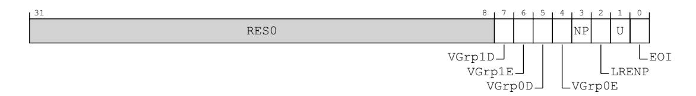

#### **Bits [31:8]**

Reserved, RES0.

#### **VGrp1D, bit [7]**

vPE Group 1 Disabled.

0b0 vPE Group 1 Disabled maintenance interrupt not asserted.

0b1 vPE Group 1 Disabled maintenance interrupt asserted.

This maintenance interrupt is asserted when [ICH\\_HCR.](#page-510-0)VGrp1DIE is 1 and [ICH\\_VMCR.](#page-525-0)VENG0 is 0.

The reset behavior of this field is:

• On a Warm reset, this field resets to 0.

#### **VGrp1E, bit [6]**

vPE Group 1 Enabled.

0b0 vPE Group 1 Enabled maintenance interrupt not asserted.

0b1 vPE Group 1 Enabled maintenance interrupt asserted.

This maintenance interrupt is asserted when [ICH\\_HCR.](#page-510-0)VGrp1EIE is 1 and [ICH\\_VMCR.](#page-525-0)VENG1 is 1.

The reset behavior of this field is:

• On a Warm reset, this field resets to 0.

#### **VGrp0D, bit [5]**

vPE Group 0 Disabled.

0b0 vPE Group 0 Disabled maintenance interrupt not asserted.

0b1 vPE Group 0 Disabled maintenance interrupt asserted.

This maintenance interrupt is asserted when [ICH\\_HCR.](#page-510-0)VGrp0DIE is 1 and [ICH\\_VMCR.](#page-525-0)VENG0 is 0.

The reset behavior of this field is:

• On a Warm reset, this field resets to 0.

#### **VGrp0E, bit [4]**

vPE Group 0 Enabled.

0b0 vPE Group 0 Enabled maintenance interrupt not asserted.

0b1 vPE Group 0 Enabled maintenance interrupt asserted.

This maintenance interrupt is asserted when [ICH\\_HCR.](#page-510-0)VGrp0EIE is 1 and [ICH\\_VMCR.](#page-525-0)VENG0 is 1.

The reset behavior of this field is:

• On a Warm reset, this field resets to 0.

#### **NP, bit [3]**

No Pending.

0b0 No Pending maintenance interrupt not asserted.

0b1 No Pending maintenance interrupt asserted.

This maintenance interrupt is asserted when [ICH\\_HCR](#page-510-0).NPIE is 1 and no List register is in pending state.

The reset behavior of this field is:

• On a Warm reset, this field resets to 0.

#### **LRENP, bit [2]**

List Register Entry Not Present.

0b0 List Register Entry Not Present maintenance interrupt not asserted.

0b1 List Register Entry Not Present maintenance interrupt asserted.

This maintenance interrupt is asserted when [ICH\\_HCR.](#page-510-0)LRENPIE is 1 and [ICH\\_HCR](#page-510-0).EOIcount is nonzero.

The reset behavior of this field is:

• On a Warm reset, this field resets to 0.

#### **U, bit [1]**

Underflow.

0b0 Underflow maintenance interrupt not asserted.

0b1 Underflow maintenance interrupt asserted.

This maintenance interrupt is asserted when [ICH\\_HCR.](#page-510-0)UIE is 1 and zero or one of the List register entries are marked as a valid interrupt, that is, if the corresponding [ICH\\_LRC<n>](#page-518-0).State bits do not equal 0x0.

The reset behavior of this field is:

• On a Warm reset, this field resets to 0.

#### **EOI, bit [0]**

End Of Interrupt.

0b0 End Of Interrupt maintenance interrupt not asserted.

0b1 End Of Interrupt maintenance interrupt asserted.

This maintenance interrupt is asserted when at least one bit in [ICH\\_EISR](#page-506-0) is 1.

The reset behavior of this field is:

• On a Warm reset, this field resets to 0.

#### **Accessing ICH\_MISR**

```
MRC{<c>}{<q>} <coproc>, {#}<opc1>, <Rt>, <CRn>, <CRm>{, {#}<opc2>}
```

| coproc | opc1  | CRn    | CRm    | opc2  |
|--------|-------|--------|--------|-------|
| 0b1111 | 0b100 | 0b1100 | 0b1011 | 0b010 |

```
if PSTATE.EL == EL0 then
    UNDEFINED;
elsif PSTATE.EL == EL1 then
    if EL2Enabled() && !ELUsingAArch32(EL2) && HSTR_EL2.T12 == '1' then
        AArch64.AArch32SystemAccessTrap(EL2, 0x03);
    elsif EL2Enabled() && ELUsingAArch32(EL2) && HSTR.T12 == '1' then
        AArch32.TakeHypTrapException(0x03);
    else
        UNDEFINED;
elsif PSTATE.EL == EL2 then
    if ICC_HSRE.SRE == '0' then
        UNDEFINED;
    else
        R[t] = ICH_MISR;
elsif PSTATE.EL == EL3 then
    if ICC_MSRE.SRE == '0' then
        UNDEFINED;
    else
        R[t] = ICH_MISR;
```

#### <span id="page-525-0"></span>**12.7.9 ICH\_VMCR, Interrupt Controller Virtual Machine Control Register**

The ICH\_VMCR characteristics are:

#### **Purpose**

Enables the hypervisor to save and restore the virtual machine view of the GIC state.

#### **Configurations**

AArch32 System register ICH\_VMCR bits [31:0] are architecturally mapped to AArch64 System register [ICH\\_VMCR\\_EL2\[](#page-360-1)31:0].

This register is present only when EL2 is capable of using AArch32, FEAT\_GICv3 is implemented and (EL2 is implemented or EL3 is implemented). Otherwise, direct accesses to ICH\_VMCR are UNDEFINED.

If EL2 is not implemented, this register is RES0 from EL3.

#### **Attributes**

ICH\_VMCR is a 32-bit register.

#### **Field descriptions**

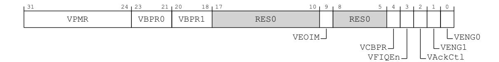

#### **VPMR, bits [31:24]**

Virtual Priority Mask. The priority mask level for the virtual CPU interface. If the priority of a pending virtual interrupt is higher than the value indicated by this field, the interface signals the virtual interrupt to the PE.

This field is an alias of [ICV\\_PMR](#page-493-0).Priority.

The reset behavior of this field is:

• On a Warm reset, this field resets to an architecturally UNKNOWN value.

#### **VBPR0, bits [23:21]**

Virtual Binary Point Register, Group 0. Defines the point at which the priority value fields split into two parts, the group priority field and the subpriority field. The group priority field determines Group 0 interrupt preemption, and also determines Group 1 interrupt preemption if ICH\_VMCR.VCBPR == 1.

This field is an alias of [ICV\\_BPR0.](#page-459-0)BinaryPoint.

The reset behavior of this field is:

• On a Warm reset, this field resets to an architecturally UNKNOWN value.

#### **VBPR1, bits [20:18]**

Virtual Binary Point Register, Group 1. Defines the point at which the priority value fields split into two parts, the group priority field and the subpriority field. The group priority field determines Group 1 interrupt preemption if [ICH\\_VMCR.](#page-525-0)VCBPR == 0.

This field is an alias of [ICV\\_BPR1.](#page-463-0)BinaryPoint.

The reset behavior of this field is:

• On a Warm reset, this field resets to an architecturally UNKNOWN value.

#### **Bits [17:10]**

Reserved, RES0.

#### **VEOIM, bit [9]**

Virtual EOI mode. Controls whether a write to an End of Interrupt register also deactivates the virtual interrupt:

0b0 [ICV\\_EOIR0](#page-474-0) and [ICV\\_EOIR1](#page-476-0) provide both priority drop and interrupt deactivation functionality. Accesses to [ICV\\_DIR](#page-472-0) are UNPREDICTABLE.

0b1 [ICV\\_EOIR0](#page-474-0) and [ICV\\_EOIR1](#page-476-0) provide priority drop functionality only. [ICV\\_DIR](#page-472-0) provides interrupt deactivation functionality.

This bit is an alias of [ICV\\_CTLR](#page-467-0).EOImode.

The reset behavior of this field is:

• On a Warm reset, this field resets to an architecturally UNKNOWN value.

#### **Bits [8:5]**

Reserved, RES0.

#### **VCBPR, bit [4]**

Virtual Common Binary Point Register. Possible values of this bit are:

0b0 [ICV\\_BPR0](#page-459-0) determines the preemption group for virtual Group 0 interrupts only.

[ICV\\_BPR1](#page-463-0) determines the preemption group for virtual Group 1 interrupts.

0b1 [ICV\\_BPR0](#page-459-0) determines the preemption group for both virtual Group 0 and virtual Group 1 interrupts.

> Reads of [ICV\\_BPR1](#page-463-0) return [ICV\\_BPR0](#page-459-0) plus one, saturated to 0b111. Writes to [ICV\\_BPR1](#page-463-0) are ignored.

This field is an alias of [ICV\\_CTLR](#page-467-0).CBPR.

The reset behavior of this field is:

• On a Warm reset, this field resets to an architecturally UNKNOWN value.

#### **VFIQEn, bit [3]**

Virtual FIQ enable. Possible values of this bit are:

0b0 Group 0 virtual interrupts are presented as virtual IRQs.

0b1 Group 0 virtual interrupts are presented as virtual FIQs.

This bit is an alias of [GICV\\_CTLR.](#page-782-1)FIQEn.

In implementations where the Non-secure copy of [ICC\\_SRE.](#page-446-1)SRE is always 1, this bit is RES1.

The reset behavior of this field is:

• On a Warm reset, this field resets to an architecturally UNKNOWN value.

#### **VAckCtl, bit [2]**

Virtual AckCtl. Possible values of this bit are:

0b0 If the highest priority pending interrupt is Group 1, a read of [GICV\\_IAR](#page-791-0) or [GICV\\_HPPIR](#page-789-0) returns an INTID of 1022.

0b1 If the highest priority pending interrupt is Group 1, a read of [GICV\\_IAR](#page-791-0) or [GICV\\_HPPIR](#page-789-0) returns the INTID of the corresponding interrupt.

This bit is an alias of [GICV\\_CTLR.](#page-782-1)AckCtl.

This field is supported for backwards compatibility with GICv2. Arm deprecates the use of this field.

In implementations where the Non-secure copy of [ICC\\_SRE.](#page-446-1)SRE is always 1, this bit is RES0.

The reset behavior of this field is:

• On a Warm reset, this field resets to an architecturally UNKNOWN value.

#### **VENG1, bit [1]**

Virtual Group 1 interrupt enable. Possible values of this bit are:

0b0 Virtual Group 1 interrupts are disabled. 0b1 Virtual Group 1 interrupts are enabled.

This bit is an alias of [ICV\\_IGRPEN1](#page-489-0).Enable.

The reset behavior of this field is:

• On a Warm reset, this field resets to an architecturally UNKNOWN value.

#### **VENG0, bit [0]**

Virtual Group 0 interrupt enable. Possible values of this bit are:

0b0 Virtual Group 0 interrupts are disabled. 0b1 Virtual Group 0 interrupts are enabled.

This bit is an alias of [ICV\\_IGRPEN0](#page-486-0).Enable.

The reset behavior of this field is:

• On a Warm reset, this field resets to an architecturally UNKNOWN value.

#### **Accessing ICH\_VMCR**

When EL2 is using System register access, EL1 using either System register or memory-mapped access must be supported.

**MRC{<c>}{<q>} <coproc>, {#}<opc1>, <Rt>, <CRn>, <CRm>{, {#}<opc2>}**

| coproc | opc1  | CRn    | CRm    | opc2  |
|--------|-------|--------|--------|-------|
| 0b1111 | 0b100 | 0b1100 | 0b1011 | 0b111 |

```
if PSTATE.EL == EL0 then
    UNDEFINED;
elsif PSTATE.EL == EL1 then
    if EL2Enabled() && !ELUsingAArch32(EL2) && HSTR_EL2.T12 == '1' then
        AArch64.AArch32SystemAccessTrap(EL2, 0x03);
    elsif EL2Enabled() && ELUsingAArch32(EL2) && HSTR.T12 == '1' then
        AArch32.TakeHypTrapException(0x03);
    else
        UNDEFINED;
elsif PSTATE.EL == EL2 then
    if ICC_HSRE.SRE == '0' then
        UNDEFINED;
    else
        R[t] = ICH_VMCR;
elsif PSTATE.EL == EL3 then
    if ICC_MSRE.SRE == '0' then
        UNDEFINED;
    else
        R[t] = ICH_VMCR;
```

#### **MCR{<c>}{<q>} <coproc>, {#}<opc1>, <Rt>, <CRn>, <CRm>{, {#}<opc2>}**

| coproc | opc1  | CRn    | CRm    | opc2  |
|--------|-------|--------|--------|-------|
| 0b1111 | 0b100 | 0b1100 | 0b1011 | 0b111 |

```
if PSTATE.EL == EL0 then
    UNDEFINED;
elsif PSTATE.EL == EL1 then
    if EL2Enabled() && !ELUsingAArch32(EL2) && HSTR_EL2.T12 == '1' then
        AArch64.AArch32SystemAccessTrap(EL2, 0x03);
    elsif EL2Enabled() && ELUsingAArch32(EL2) && HSTR.T12 == '1' then
        AArch32.TakeHypTrapException(0x03);
    else
        UNDEFINED;
elsif PSTATE.EL == EL2 then
    if ICC_HSRE.SRE == '0' then
        UNDEFINED;
    else
        ICH_VMCR = R[t];
elsif PSTATE.EL == EL3 then
    if ICC_MSRE.SRE == '0' then
        UNDEFINED;
    else
        ICH_VMCR = R[t];
```

#### <span id="page-529-0"></span>**12.7.10 ICH\_VTR, Interrupt Controller VGIC Type Register**

The ICH\_VTR characteristics are:

#### **Purpose**

Reports supported GIC virtualization features.

#### **Configurations**

AArch32 System register ICH\_VTR bits [31:0] are architecturally mapped to AArch64 System register [ICH\\_VTR\\_EL2](#page-364-1)[31:0].

This register is present only when EL2 is capable of using AArch32, FEAT\_GICv3 is implemented and (EL2 is implemented or EL3 is implemented). Otherwise, direct accesses to ICH\_VTR are UNDEFINED.

If EL2 is not implemented, all bits in this register are RES0 from EL3, except for nV4, which is RES1 from EL3.

#### **Attributes**

ICH\_VTR is a 32-bit register.

#### **Field descriptions**

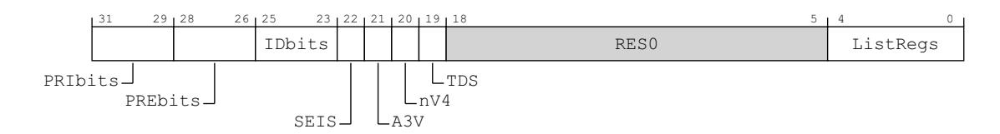

#### **PRIbits, bits [31:29]**

Priority bits. The number of virtual priority bits implemented, minus one.

An implementation must implement at least 32 levels of virtual priority (5 priority bits).

This field is an alias of [ICV\\_CTLR](#page-467-0).PRIbits.

#### **PREbits, bits [28:26]**

The number of virtual preemption bits implemented, minus one.

An implementation must implement at least 32 levels of virtual preemption priority (5 preemption bits).

The value of this field must be less than or equal to the value of ICH\_VTR.PRIbits.

#### **IDbits, bits [25:23]**

The number of virtual interrupt identifier bits supported:

0b000 16 bits. 0b001 24 bits.

All other values are reserved.

This field is an alias of [ICV\\_CTLR](#page-467-0).IDbits.

#### **SEIS, bit [22]**

SEI Support. Indicates whether the virtual CPU interface supports generation of SEIs:

0b0 The virtual CPU interface logic does not support generation of SEIs.

0b1 The virtual CPU interface logic supports generation of SEIs.

This bit is an alias of [ICV\\_CTLR](#page-467-0).SEIS.

#### **A3V, bit [21]**

Affinity 3 Valid. Possible values are:

0b0 The virtual CPU interface logic only supports zero values of Affinity 3 in SGI generation System registers.

0b1 The virtual CPU interface logic supports nonzero values of Affinity 3 in SGI generation System registers.

This bit is an alias of [ICV\\_CTLR](#page-467-0).A3V.

#### **nV4, bit [20]**

Direct injection of virtual interrupts not supported. Possible values are:

0b0 The CPU interface logic supports direct injection of virtual interrupts.

0b1 The CPU interface logic does not support direct injection of virtual interrupts.

In GICv3, the only permitted value is 0b1.

#### **TDS, bit [19]**

Separate trapping of Non-secure EL1 writes to [ICV\\_DIR](#page-472-0) supported.

0b0 Implementation does not support [ICH\\_HCR.](#page-510-0)TDIR.

0b1 Implementation supports [ICH\\_HCR.](#page-510-0)TDIR.

FEAT\_GICv3\_TDIR implements the functionality added by the value 0b1.

#### **Bits [18:5]**

Reserved, RES0.

#### **ListRegs, bits [4:0]**

The number of implemented List registers, minus one. For example, a value of 0b01111 indicates that the maximum of 16 List registers are implemented.

#### **Accessing ICH\_VTR**

**MRC{<c>}{<q>} <coproc>, {#}<opc1>, <Rt>, <CRn>, <CRm>{, {#}<opc2>}**

| coproc | opc1  | CRn    | CRm    | opc2  |
|--------|-------|--------|--------|-------|
| 0b1111 | 0b100 | 0b1100 | 0b1011 | 0b001 |

```
if PSTATE.EL == EL0 then
    UNDEFINED;
elsif PSTATE.EL == EL1 then
    if EL2Enabled() && !ELUsingAArch32(EL2) && HSTR_EL2.T12 == '1' then
        AArch64.AArch32SystemAccessTrap(EL2, 0x03);
    elsif EL2Enabled() && ELUsingAArch32(EL2) && HSTR.T12 == '1' then
        AArch32.TakeHypTrapException(0x03);
    else
        UNDEFINED;
elsif PSTATE.EL == EL2 then
    if ICC_HSRE.SRE == '0' then
        UNDEFINED;
    else
        R[t] = ICH_VTR;
elsif PSTATE.EL == EL3 then
    if ICC_MSRE.SRE == '0' then
        UNDEFINED;
```

else R[t] = ICH\_VTR;

### <span id="page-532-1"></span><span id="page-532-0"></span>**12.8 The GIC Distributor register map**

<span id="page-532-2"></span>Table 12-[25 on page](#page-532-2) 12-533 shows the Distributor register map. Address offsets are relative to the *Distributor base address* defined by the system memory map. Unless otherwise stated in the register description, all GIC registers are 32-bits wide. Reserved register addresses are RES0.

**Table 12-25 Distributor register map**

| Offset        | Name                    | Type | Reseta                          | Description                                     |
|---------------|-------------------------|------|---------------------------------|-------------------------------------------------|
| 0x0000        | GICD_CTLR               | RW   | See the register<br>description | Distributor Control Register                    |
| 0x0004        | GICD_TYPER              | RO   | IMPLEMENTATION<br>DEFINED       | Interrupt Controller Type Register              |
| 0x0008        | GICD_IIDR               | RO   | IMPLEMENTATION<br>DEFINED       | Distributor Implementer Identification Register |
| 0x000C        | GICD_TYPER2             | RO   | IMPLEMENTATION<br>DEFINED       | Interrupt controller Type Register 2            |
| 0x0010        | GICD_STATUSR            | RW   | 0x0000 00000                    | Error Reporting Status Register, optional       |
| 0x0014-0x001C | -                       | -    | -                               | Reserved                                        |
| 0x0020-0x003C | -                       | -    | -                               | IMPLEMENTATION DEFINED registers                |
| 0x0040        | GICD_SETSPI_NSR         | WO   | -                               | Set SPI Register                                |
| 0x0044        | -                       | -    | -                               | Reserved                                        |
| 0x0048        | GICD_CLRSPI_NSR         | WO   | -                               | Clear SPI Register                              |
| 0x004C        | -                       | -    | -                               | Reserved                                        |
| 0x0050        | GICD_SETSPI_SR          | WO   | -                               | Set SPI, Secure Register                        |
| 0x0054        | -                       | -    | -                               | Reserved                                        |
| 0x0058        | GICD_CLRSPI_SR          | WO   | -                               | Clear SPI, Secure Register                      |
| 0x005C-0x007C | -                       | -    | -                               | Reserved                                        |
| 0x0080        | GICD_IGROUPR <n></n>    | RW   | IMPLEMENTATION<br>DEFINED       | Interrupt Group Registers                       |
| 0x0084-0x00FC |                         |      | 0x0000 0000                     |                                                 |
| 0x0100-0x017C | GICD_ISENABLER <n></n>  | RW   | IMPLEMENTATION<br>DEFINED       | Interrupt Set-Enable Registers                  |
| 0x0180-0x01FC | GICD_ICENABLER <n></n>  | RW   | IMPLEMENTATION<br>DEFINED       | Interrupt Clear-Enable Registers                |
| 0x0200-0x027C | GICD_ISPENDR <n></n>    | RW   | 0x0000 0000                     | Interrupt Set-Pending Registers                 |
| 0x0280-0x02FC | GICD_ICPENDR <n></n>    | RW   | 0x0000 0000                     | Interrupt Clear-Pending Registers               |
| 0x0300-0x037C | GICD_ISACTIVER <n></n>  | RW   | 0x0000 0000                     | Interrupt Set-Active Registers                  |
| 0x0380-0x03FC | GICD_ICACTIVER <n></n>  | RW   | 0x0000 0000                     | Interrupt Clear-Active Registers                |
| 0x0400-0x07F8 | GICD_IPRIORITYR <n></n> | RW   | 0x0000 0000                     | Interrupt Priority Registers                    |

**Table 12-25 Distributor register map (continued)**

<span id="page-533-2"></span><span id="page-533-1"></span><span id="page-533-0"></span>

| Offset        | Name                      | Type | Reseta                    | Description                                                   |
|---------------|---------------------------|------|---------------------------|---------------------------------------------------------------|
| 0x0800-0x081C | GICD_ITARGETSR <n>bcd</n> | RO   | IMPLEMENTATION<br>DEFINED | Interrupt Processor Targets Registers                         |
| 0x0820-0xBF8  |                           | RW   | 0x0000 0000               |                                                               |
| 0x0C00-0x0CFC | GICD_ICFGR <n></n>        | RW   | IMPLEMENTATION<br>DEFINED | Interrupt Configuration Registers                             |
| 0x0D00-0x0D7C | GICD_IGRPMODR <n>e</n>    | -    | 0x0000 0000               | Interrupt Group Modifier Registers                            |
| 0x0E00-0x0EFC | GICD_NSACR <n></n>        | RW   | 0x0000 0000               | Non-secure Access Control Registers                           |
| 0x0F00        | GICD_SGIRd                | WO   | -                         | Software Generated Interrupt Register                         |
| 0x0F10-0x0F1C | GICD_CPENDSGIR <n>f</n>   | RW   | 0x0000 0000               | SGI Clear-Pending Registers                                   |
| 0x0F20-0x0F2C | GICD_SPENDSGIR <n>f</n>   | RW   | 0x0000 0000               | SGI Set-Pending Registers                                     |
| 0x0F30-0x0F7C | -                         | -    | -                         | Reserved                                                      |
| 0x0F80-0x0FFC | GICD_INMIR <n>g</n>       | RW   | 0x0000 0000               | Non-maskable Interrupt Registers                              |
| 0x1000-0x107C | GICD_IGROUPR <n>E</n>     | RW   | 0x0000 0000               | Interrupt Group Registers for extended SPI range              |
| 0x1200-0x127C | GICD_ISENABLER <n>E</n>   | RW   | IMPLEMENTATION<br>DEFINED | Interrupt Set-Enable for extended SPI range                   |
| 0x1400-0x147C | GICD_ICENABLER <n>E</n>   | RW   | IMPLEMENTATION<br>DEFINED | Interrupt Clear-Enable for extended SPI range                 |
| 0x1600-0x167C | GICD_ISPENDR <n>E</n>     | RW   | 0x0000 0000               | Interrupt Set-Pend for extended SPI range                     |
| 0x1800-0x187C | GICD_ICPENDR <n>E</n>     | RW   | 0x0000 0000               | Interrupt Clear-Pend for extended SPI range                   |
| 0x1A00-0x1A7C | GICD_ISACTIVER <n>E</n>   | RW   | 0x0000 0000               | Interrupt Set-Active for extended SPI range                   |
| 0x1C00-0x1C7C | GICD_ICACTIVER <n>E</n>   | RW   | 0x0000 0000               | Interrupt Clear-Active for extended SPI range                 |
| 0x2000-0x23FC | GICD_IPRIORITYR <n>E</n>  | RW   | 0x0000 0000               | Interrupt Priority for extended SPI range                     |
| 0x3000-0x30FC | GICD_ICFGR <n>E</n>       | RW   | IMPLEMENTATION<br>DEFINED | Extended SPI Configuration Register                           |
| 0x3400-0x347C | GICD_IGRPMODR <n>E</n>    | RW   | 0x0000 0000               | Interrupt Group Modifier for extended SPI range               |
| 0x3600-0x36FC | GICD_NSACR <n>E</n>       | RW   | 0x0000 0000               | Non-secure Access Control Registers for<br>extended SPI range |
| 0x3700-0x60FC | -                         | -    | -                         | Reserved                                                      |
| 0x3B00-0x3B7C | GICD_INMIR <n>Eg</n>      | RW   | 0x0000 0000               | Non-maskable Interrupt Registers for Extended<br>SPIs         |
| 0x3B80-0x60FC | -                         | -    | -                         | Reserved                                                      |
| 0x6100-0x7FD8 | GICD_IROUTER <n></n>      | RW   | -                         | Interrupt Routing Registers                                   |
| 0x8000-0x9FFC | GICD_IROUTER <n>E</n>     | RW   | IMPLEMENTATION<br>DEFINED | Interrupt Routing Registers for extended SPI<br>range         |

**Table 12-25 Distributor register map (continued)**

| Offset        | Name | Type | Reseta                    | Description                                                               |
|---------------|------|------|---------------------------|---------------------------------------------------------------------------|
| 0xA000-0xBFFC | -    | -    | -                         | Reserved                                                                  |
| 0xC000-0xFFCC | -    | -    | -                         | IMPLEMENTATION DEFINED registers                                          |
| 0xFFD0-0xFFFC | -    | RO   | IMPLEMENTATION<br>DEFINED | Reserved for ID registers, see Identification<br>registers on page 12-209 |

- a. For details of any restrictions that apply to the reset values that are IMPLEMENTATION DEFINED, see the appropriate register description.
- b. When affinity routing is enabled, [GICD\\_IROUTER<n>](#page-583-1) are used instead of these registers.
- c. In an implementation with a single connected PE, these registers are RAZ/WI.
- d. These registers are only used by legacy operation and RES0 when affinity routing is enabled. Where legacy operation is not supported, these addresses are reserved. This means accesses to these locations can be reported in [GICD\\_STATUSR.](#page-615-0)
- e. These registers are RES0 when affinity routing is not enabled for the Secure state.
- f. Used only when affinity routing is not enabled.
- g. These registers are RES0 when FEAT\_GIC\_NMI is not implemented.

The following GICD registers are only used by legacy operation and RES0 WHEN AFFINITY ROUTING IS ENABLED:

- [GICD\\_ITARGETSR<n>](#page-600-1).
- [GICD\\_SGIR](#page-611-1).
- GICD\_ICPENDSGIR<n>.
- GICD\_ISPENDSGIR<n>GI.

When the GIC IRI does not support legacy operation, where the ARE bits are RAO/WI, these register locations are permitted to be treated as reserved. This means that accesses to these locations can be reported in [GICD\\_STATUSR](#page-615-0).

All other addresses are reserved.

A Distributor might optionally provide an IMPLEMENTATION DEFINED set of aliases for message-based interrupt requests. The aliases in each page provide access to an implementation defined set of contiguous SPIs and the set of SPIs provided by each page do not overlap with those provided by a different page.

<span id="page-534-0"></span>Table 12-[26 on page](#page-534-0) 12-535 shows the Distributor message-based interrupt register map.

**Table 12-26 Distributor message-based interrupt register map**

| Offset        | Name            | Type | Reset                     | Description                                                |
|---------------|-----------------|------|---------------------------|------------------------------------------------------------|
| 0x0000-0x0004 | -               | -    | -                         | Reserved                                                   |
| 0x0008        | GICM_TYPER      | RO   | IMPLEMENTATION<br>DEFINED | Distributor Message Based Interrupt Frame Type<br>Register |
| 0x0010-0x003C | -               | -    | -                         | Reserved                                                   |
| 0x0040        | GICM_SETSPI_NSR | WO   | -                         | Set SPI Register, alias of GICD_SETSPI_NSR                 |
| 0x044         | -               | -    | -                         | Reserved                                                   |
| 0x0048        | GICM_CLRSPI_NSR | WO   | -                         | Clear SPI Register, alias of GICD_CLRSPI_NSR               |
| 0x004C        | -               | -    | -                         | Reserved                                                   |
| 0x0050        | GICM_SETSPI_SR  | WO   | -                         | Set SPI, Secure Register, alias of GICD_SETSPI_SR          |
| 0x0054        | -               | -    | -                         | Reserved                                                   |

**Table 12-26 Distributor message-based interrupt register map (continued)**

| Offset        | Name           | Type | Reset                     | Description                                                                      |
|---------------|----------------|------|---------------------------|----------------------------------------------------------------------------------|
| 0x0058        | GICM_CLRSPI_SR | WO   | -                         | Clear SPI, Secure Register, alias of<br>GICD_CLRSPI_SR                           |
| 0x005C        | -              | -    | -                         | Reserved                                                                         |
| 0x0060-0x0FC8 | -              | -    | -                         | Reserved                                                                         |
| 0x0FCC        | GICM_IIDR      | RO   | IMPLEMENTATION<br>DEFINED | Distributor Message Based Interrupt Frame<br>Implementer Identification Register |
| 0x0FD0-0xFFCC | -              | -    | -                         | Reserved                                                                         |
| 0xFFD0-0xFFFC | -              | RO   | IMPLEMENTATION<br>DEFINED | Read-only identification register space                                          |

#### <span id="page-536-1"></span><span id="page-536-0"></span>**12.9 The GIC Distributor register descriptions**

This section describes each of the GIC Distributor registers in register name order.

#### <span id="page-537-1"></span><span id="page-537-0"></span>**12.9.1 GICD\_CLRSPI\_NSR, Clear Non-secure SPI Pending Register**

The GICD\_CLRSPI\_NSR characteristics are:

#### **Purpose**

Removes the pending state from a valid SPI if permitted by the Security state of the access and the [GICD\\_NSACR<n>](#page-603-0) value for that SPI.

A write to this register changes the state of a pending SPI to inactive, and the state of an active and pending SPI to active.

#### **Configurations**

If [GICD\\_TYPER](#page-617-1).MBIS == 0, this register is reserved.

When [GICD\\_CTLR](#page-543-1).DS == 1, this register provides functionality for all SPIs.

#### **Attributes**

GICD\_CLRSPI\_NSR is a 32-bit register.

#### **Field descriptions**


#### **Bits [31:13]**

Reserved, RES0.

#### **INTID, bits [12:0]**

The INTID of the SPI.

The function of this register depends on whether the targeted SPI is configured to be an edge-triggered or level-sensitive interrupt:

- For an edge-triggered interrupt, a write to [GICD\\_SETSPI\\_NSR](#page-607-1) or [GICD\\_SETSPI\\_SR](#page-609-1) adds the pending state to the targeted interrupt. It will stop being pending on activation, or if the pending state is removed by a write to GICD\_CLRSPI\_NSR, [GICD\\_CLRSPI\\_SR](#page-539-1), or [GICD\\_ICPENDR<n>](#page-561-1).
- For a level-sensitive interrupt, a write to [GICD\\_SETSPI\\_NSR](#page-607-1) or [GICD\\_SETSPI\\_SR](#page-609-1) adds the pending state to the targeted interrupt. It will remain pending until it is deasserted by a write to GICD\_CLRSPI\_NSR or [GICD\\_CLRSPI\\_SR.](#page-539-1) If the interrupt is activated between having the pending state added and being deactivated, then the interrupt will be active and pending.

#### **Accessing the GICD\_CLRSPI\_NSR:**

Writes to this register have no effect if:

- The value written specifies a Secure SPI, the value is written by a Non-secure access, and the value of the corresponding [GICD\\_NSACR<n>](#page-603-0) register is less than 0b10.
- The value written specifies an invalid SPI.
- The SPI is not pending.

16-bit accesses to bits [15:0] of this register must be supported.


A Secure access to this register can clear the pending state of any valid SPI.

GICD\_CLRSPI\_NSR can be accessed through its memory-mapped interface:

| Component       | Frame     | Offset | Instance        |
|-----------------|-----------|--------|-----------------|
| GIC Distributor | Dist_base | 0x0048 | GICD_CLRSPI_NSR |

#### <span id="page-539-1"></span><span id="page-539-0"></span>**12.9.2 GICD\_CLRSPI\_SR, Clear Secure SPI Pending Register**

The GICD\_CLRSPI\_SR characteristics are:

#### **Purpose**

Removes the pending state from a valid SPI.

A write to this register changes the state of a pending SPI to inactive, and the state of an active and pending SPI to active.

#### **Configurations**

If [GICD\\_TYPER](#page-617-1).MBIS == 0, this register is reserved. When [GICD\\_CTLR](#page-543-1).DS == 1, this register is WI.

#### **Attributes**

GICD\_CLRSPI\_SR is a 32-bit register.

#### **Field descriptions**


#### **Bits [31:13]**

Reserved, RES0.

#### **INTID, bits [12:0]**

The INTID of the SPI.

The function of this register depends on whether the targeted SPI is configured to be an edge-triggered or level-sensitive interrupt:

- For an edge-triggered interrupt, a write to [GICD\\_SETSPI\\_NSR](#page-607-1) or [GICD\\_SETSPI\\_SR](#page-609-1) adds the pending state to the targeted interrupt. It will stop being pending on activation, or if the pending state is removed by a write to [GICD\\_CLRSPI\\_NSR,](#page-537-1) GICD\_CLRSPI\_SR, or [GICD\\_ICPENDR<n>](#page-561-1).
- For a level-sensitive interrupt, a write to [GICD\\_SETSPI\\_NSR](#page-607-1) or [GICD\\_SETSPI\\_SR](#page-609-1) adds the pending state to the targeted interrupt. It will remain pending until it is deasserted by a write to [GICD\\_CLRSPI\\_NSR](#page-537-1) or GICD\_CLRSPI\_SR. If the interrupt is activated between having the pending state added and being deactivated, then the interrupt will be active and pending.

#### **Accessing the GICD\_CLRSPI\_SR:**

Writes to this register have no effect if:

- The value is written by a Non-secure access.
- The value written specifies an invalid SPI.
- The SPI is not pending.

16-bit accesses to bits [15:0] of this register must be supported.

GICD\_CLRSPI\_SR can be accessed through its memory-mapped interface:

| Component       | Frame     | Offset | Instance       |
|-----------------|-----------|--------|----------------|
| GIC Distributor | Dist_base | 0x0058 | GICD_CLRSPI_SR |

This interface is accessible as follows:

- When GICD\_CTLR.DS == 1 accesses to this register are WI.
- When GICD\_CTLR.DS == 0 and an access is Secure accesses to this register are WO.
- When GICD\_CTLR.DS == 0 and an access is Non-secure accesses to this register are WI.
- When GICD\_CTLR.DS == 0, FEAT\_RME is implemented and an access is Root accesses to this register are WO.
- When GICD\_CTLR.DS == 0, FEAT\_RME is implemented and an access is Realm accesses to this register are WI.

#### <span id="page-541-1"></span><span id="page-541-0"></span>**12.9.3 GICD\_CPENDSGIR<n>, SGI Clear-Pending Registers, n = 0 - 3**

The GICD\_CPENDSGIR<n> characteristics are:

#### **Purpose**

Removes the pending state from an SGI.

A write to this register changes the state of a pending SGI to inactive, and the state of an active and pending SGI to active.

#### **Configurations**

Four SGI clear-pending registers are implemented. Each register contains eight clear-pending bits for each of four SGIs, for a total of 16 possible SGIs.

In multiprocessor implementations, each PE has a copy of these registers.

#### **Attributes**

GICD\_CPENDSGIR<n> is a 32-bit register.

#### **Field descriptions**

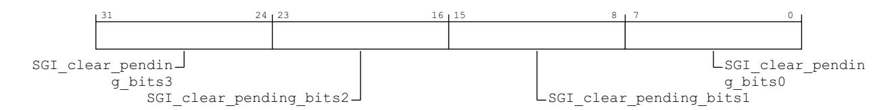

#### **SGI\_clear\_pending\_bits<x>, bits [8x+7:8x], for x = 3 to 0**

Removes the pending state from SGI number 4n + x for the PE corresponding to the bit number written to.

Reads and writes have the following behavior:

0x00 If read, indicates that the SGI from the corresponding PE is not pending and is not active and pending.

If written, has no effect.

0x01 If read, indicates that the SGI from the corresponding PE is pending or is active and pending.

If written, removes the pending state from the SGI for the corresponding PE.

The reset behavior of this field is:

• On a GIC reset, this field resets to 0.

For SGI ID m, generated by processing element C writing to the corresponding [GICD\\_SGIR](#page-611-1) field, where DIV and MOD are the integer division and modulo operations:

- The corresponding GICD\_CPENDSGIR<n> number is given by n = m DIV 4.
- The offset of the required register is (0xF10 + (4n)).
- The offset of the required field within the register GICD\_CPENDSGIR<n> is given by m MOD 4.
- The required bit in the 8-bit SGI clear-pending field m is bit C.

#### **Accessing the GICD\_CPENDSGIR<n>:**

These registers are used only when affinity routing is not enabled. When affinity routing is enabled, this register is RES0. An implementation is permitted to make the register RAZ/WI in this case.

A register bit that corresponds to an unimplemented SGI is RAZ/WI.

These registers are byte-accessible.

If the GIC implementation supports two Security states:

- A register bit that corresponds to a Group 0 interrupt is RAZ/WI to Non-secure accesses.
- Register bits corresponding to unimplemented PEs are RAZ/WI.

GICD\_CPENDSGIR<n> can be accessed through its memory-mapped interface:

| Component       | Frame     | Offset           | Instance               |
|-----------------|-----------|------------------|------------------------|
| GIC Distributor | Dist_base | 0x0F10 + (4 * n) | GICD_CPENDSGIR <n></n> |

#### <span id="page-543-1"></span><span id="page-543-0"></span>**12.9.4 GICD\_CTLR, Distributor Control Register**

The GICD\_CTLR characteristics are:

#### **Purpose**

Enables interrupts and affinity routing.

#### **Configurations**

The format of this register depends on the Security state of the access and the number of Security states supported, which is specified by GICD\_CTLR.DS.

#### **Attributes**

GICD\_CTLR is a 32-bit register.

#### **Field descriptions**

*When access is Secure, in a system that supports two Security states:*

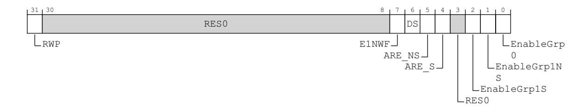

#### **RWP, bit [31]**

Register Write Pending. Read only. Indicates whether a register write is in progress or not:

- 0b0 No register write in progress. The effects of previous register writes to the affected register fields are visible to all logical components of the GIC architecture, including the CPU interfaces.
- 0b1 Register write in progress. The effects of previous register writes to the affected register fields are not guaranteed to be visible to all logical components of the GIC architecture, including the CPU interfaces, as the effects of the changes are still being propagated.

This field tracks writes to:

- GICD\_CTLR[2:0], the Group Enables, for transitions from 1 to 0 only.
- GICD\_CTLR[7:4], the ARE bits, E1NWF bit and DS bit.
- GICD\_ICENABLER<n>.

Updates to other register fields are not tracked by this field.

The reset behavior of this field is:

• On a GIC reset, this field resets to an architecturally UNKNOWN value.

#### **Bits [30:8]**

Reserved, RES0.

#### **E1NWF, bit [7]**

Enable 1 of N Wakeup Functionality.

It is IMPLEMENTATION DEFINED whether this bit is programmable, or RAZ/WI.

If it is implemented, then it has the following behavior:

0b0 A PE that is asleep cannot be picked for 1 of N interrupts.

0b1 A PE that is asleep can be picked for 1 of N interrupts as determined by IMPLEMENTATION DEFINED controls.

The reset behavior of this field is:

• On a GIC reset, this field resets to an architecturally UNKNOWN value.

#### **DS, bit [6]**

Disable Security.

0b0 Non-secure accesses are not permitted to access and modify registers that control Group 0 interrupts.

0b1 Non-secure accesses are permitted to access and modify registers that control Group 0 interrupts.

If DS is written from 0 to 1 when GICD\_CTLR.ARE\_S == 1, then GICD\_CTLR.ARE for the single Security state is RAO/WI.

If the Distributor only supports a single Security state, this bit is RAO/WI.

If the Distributor supports two Security states, it IMPLEMENTATION DEFINED whether this bit is programmable or implemented as RAZ/WI.

When this field is set to 1, all accesses to GICD\_CTLR access the single Security state view, and all bits are accessible.

When set to 1, this field can only be cleared by a hardware reset.

Writing this bit from 0 to 1 is UNPREDICTABLE if any of the following is true:

- [GICD\\_CTLR.](#page-543-1)EnableGrp0==1.
- [GICD\\_CTLR.](#page-543-1)EnableGrp1S==1.
- [GICD\\_CTLR.](#page-543-1)EnableGrp1NS==1.
- One or more INTID is in the Active or Active and Pending state.

The reset behavior of this field is:

• On a GIC reset, this field resets to 0.

#### **ARE\_NS, bit [5]**

Affinity Routing Enable, Non-secure state.

0b0 Affinity routing disabled for Non-secure state.

0b1 Affinity routing enabled for Non-secure state.

When affinity routing is enabled for the Secure state, this field is RAO/WI.

Changing the ARE\_NS settings from 0 to 1 is UNPREDICTABLE except when GICD\_CTLR.EnableGrp1 Non-secure == 0.

Changing the ARE\_NS settings from 1 to 0 is UNPREDICTABLE.

If GICv2 backwards compatibility for Non-secure state is not implemented, this field is RAO/WI.

The reset behavior of this field is:

• On a GIC reset, this field resets to 0.

#### **ARE\_S, bit [4]**

Affinity Routing Enable, Secure state.

0b0 Affinity routing disabled for Secure state.

0b1 Affinity routing enabled for Secure state.

Changing the ARE\_S setting from 0 to 1 is UNPREDICTABLE except when all of the following apply:

- GICD\_CTLR.EnableGrp0==0.
- GICD\_CTLR.EnableGrp1S==0.
- GICD\_CTLR.EnableGrp1NS==0.

Changing the ARE\_S settings from 1 to 0 is UNPREDICTABLE.

If GICv2 backwards compatibility for Secure state is not implemented, this field is RAO/WI.

The reset behavior of this field is:

• On a GIC reset, this field resets to 0.

#### **Bit [3]**

Reserved, RES0.

#### **EnableGrp1S, bit [2]**

Enable Secure Group 1 interrupts.

0b0 Secure Group 1 interrupts are disabled. 0b1 Secure Group 1 interrupts are enabled.

If GICD\_CTLR.ARE\_S == 0, this field is RES0.

The reset behavior of this field is:

• On a GIC reset, this field resets to an architecturally UNKNOWN value.

#### **EnableGrp1NS, bit [1]**

Enable Non-secure Group 1 interrupts.

0b0 Non-secure Group 1 interrupts are disabled.

0b1 Non-secure Group 1 interrupts are enabled.

**Note**

This field also controls whether LPIs are forwarded to the PE.

The reset behavior of this field is:

• On a GIC reset, this field resets to an architecturally UNKNOWN value.

#### **EnableGrp0, bit [0]**

Enable Group 0 interrupts.

0b0 Group 0 interrupts are disabled.

0b1 Group 0 interrupts are enabled.

The reset behavior of this field is:

• On a GIC reset, this field resets to an architecturally UNKNOWN value.

#### *When access is Non-secure, in a system that supports two Security states:*

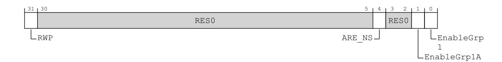

#### **RWP, bit [31]**

This bit is a read-only alias of the Secure GICD\_CTLR.RWP bit.

#### **Bits [30:5]**

Reserved, RES0.

#### **ARE\_NS, bit [4]**

This bit is a read/write alias of the Secure GICD\_CTLR.ARE\_NS bit.

If GICv2 backwards compatibility for Non-secure state is not implemented, this field is RAO/WI.

#### **Bits [3:2]**

Reserved, RES0.

#### **EnableGrp1A, bit [1]**

If ARE\_NS == 1, then this bit is a read/write alias of the Secure GICD\_CTLR.EnableGrp1NS bit. If ARE\_NS == 0, then this bit is RES0.

#### **EnableGrp1, bit [0]**

If ARE\_NS == 0, then this bit is a read/write alias of the Secure GICD\_CTLR.EnableGrp1NS bit. If ARE\_NS == 1, then this bit is RES0.

#### *When in a system that supports only a single Security state:*

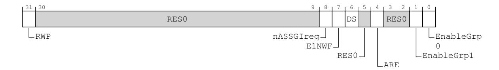

#### **RWP, bit [31]**

Register Write Pending. Read only. Indicates whether a register write is in progress or not:

- 0b0 No register write in progress. The effects of previous register writes to the affected register fields are visible to all logical components of the GIC architecture, including the CPU interfaces.
- 0b1 Register write in progress. The effects of previous register writes to the affected register fields are not guaranteed to be visible to all logical components of the GIC architecture, including the CPU interfaces, as the effects of the changes are still being propagated.

This field tracks updates to:

- GICD\_CTLR[2:0], the Group Enables, for transitions from 1 to 0 only.
- GICD\_CTLR[7:4], the ARE bits, E1NWF bit and DS bit.
- GICD\_ICENABLER<n>, the bits that allow disabling of SPIs.

Updates to other register fields are not tracked by this field.

The reset behavior of this field is:

• On a GIC reset, this field resets to an architecturally UNKNOWN value.

#### **Bits [30:9]**

Reserved, RES0.

#### **nASSGIreq, bit [8]**

#### *When FEAT\_GICv4p1 is implemented:*

Controls whether SGIs have an active state.

This bit is RES0 if [GICD\\_TYPER2](#page-621-1).GICD\_TYPER2.nASSGIcap is 0.

This bit is WI when any of GICD\_CTLR.{EnableGrp0,EnableGrp1} is 1.

0b0 SGIs have an active state and must be deactivated.

0b1 SGIs do not have an active state and do not require deactivation.

The reset behavior of this field is:

• On a GIC reset, this field resets to 0.

#### *Otherwise:*

Reserved, RES0.

#### **E1NWF, bit [7]**

Enable 1 of N Wakeup Functionality.

It is IMPLEMENTATION DEFINED whether this bit is programmable, or RAZ/WI.

If it is implemented, then it has the following behavior:

0b0 A PE that is asleep cannot be picked for 1 of N interrupts.

0b1 A PE that is asleep can be picked for 1 of N interrupts as determined by IMPLEMENTATION DEFINED controls.

The reset behavior of this field is:

• On a GIC reset, this field resets to an architecturally UNKNOWN value.

#### **DS, bit [6]**

Disable Security. This field is RAO/WI.

#### **Bit [5]**

Reserved, RES0.

#### **ARE, bit [4]**

Affinity Routing Enable.

0b0 Affinity routing disabled. 0b1 Affinity routing enabled.

Changing the ARE settings from 0 to 1 is UNPREDICTABLE except when all of the following apply:

- GICD\_CTLR.EnableGrp1==0.
- GICD\_CTLR.EnableGrp0==0.

Changing ARE from 1 to 0 is UNPREDICTABLE.

If GICv2 backwards compatibility is not implemented, this field is RAO/WI.

The reset behavior of this field is:

• On a GIC reset, this field resets to 0.

#### **Bits [3:2]**

Reserved, RES0.

#### **EnableGrp1, bit [1]**

Enable Group 1 interrupts.

0b0 Group 1 interrupts disabled. 0b1 Group 1 interrupts enabled.

The reset behavior of this field is:

• On a GIC reset, this field resets to an architecturally UNKNOWN value.

#### **EnableGrp0, bit [0]**

Enable Group 0 interrupts.

0b0 Group 0 interrupts are disabled. 0b1 Group 0 interrupts are enabled.

The reset behavior of this field is:

• On a GIC reset, this field resets to an architecturally UNKNOWN value.

#### **Accessing the GICD\_CTLR:**

If an interrupt is pending within a CPU interface when the corresponding GICD\_CTLR.EnableGrpX bit is written from 1 to 0 the interrupt must be retrieved from the CPU interface.

| Note |  |
|------|--|
|      |  |

This might have no effect on the forwarded interrupt if it has already been activated. When a write changes the value of ARE for a Security state or the value of the DS bit, the format used for interpreting the remaining bits provided in the write data is the format that applied before the write takes effect.

GICD\_CTLR can be accessed through its memory-mapped interface:

| Component       | Frame     | Offset | Instance  |
|-----------------|-----------|--------|-----------|
| GIC Distributor | Dist_base | 0x0000 | GICD_CTLR |

#### <span id="page-549-0"></span>**12.9.5 GICD\_ICACTIVER<n>, Interrupt Clear-Active Registers, n = 0 - 31**

The GICD\_ICACTIVER<n> characteristics are:

#### **Purpose**

Deactivates the corresponding interrupt. These registers are used when saving and restoring GIC state.

#### **Configurations**

These registers are available in all GIC configurations. If [GICD\\_CTLR](#page-543-1).DS==0, these registers are Common.

The number of implemented GICD\_ICACTIVER<n> registers is [\(GICD\\_TYPER.](#page-617-1)ITLinesNumber+1). Registers are numbered from 0.

GICD\_ICACTIVER0 is Banked for each connected PE with [GICR\\_TYPER.](#page-710-1)Processor\_Number < 8.

Accessing GICD\_ICACTIVER0 from a PE with [GICR\\_TYPER.](#page-710-1)Processor\_Number > 7 is CONSTRAINED UNPREDICTABLE:

- Register is RAZ/WI.
- An UNKNOWN banked copy of the register is accessed.

#### **Attributes**

GICD\_ICACTIVER<n> is a 32-bit register.

#### **Field descriptions**

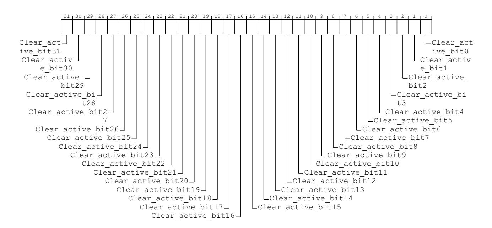

#### **Clear\_active\_bit<x>, bit [x], for x = 31 to 0**

Removes the active state from interrupt number 32n + x. Reads and writes have the following behavior:

0b0 If read, indicates that the corresponding interrupt is not active, and is not active and pending.

If written, has no effect.

0b1 If read, indicates that the corresponding interrupt is active, or is active and pending.

If written, deactivates the corresponding interrupt, if the interrupt is active. If the interrupt is already deactivated, the write has no effect.

The reset behavior of this field is:

• On a GIC reset, this field resets to 0.

For INTID m, when DIV and MOD are the integer division and modulo operations:

- The corresponding GICD\_ICACTIVER<n> number, n, is given by n = m DIV 32.
- The offset of the required GICD\_ICACTIVER is (0x380 + (4\*n)).
- The bit number of the required group modifier bit in this register is m MOD 32.

#### **Accessing the GICD\_ICACTIVER<n>:**

When affinity routing is enabled for the Security state of an interrupt, the bits corresponding to SGIs and PPIs in that Security state are RAZ/WI, and equivalent functionality for SGIs and PPIs is provided by [GICR\\_ICACTIVER0.](#page-644-0)

Bits corresponding to unimplemented interrupts are RAZ/WI.

If [GICD\\_CTLR](#page-543-1).DS==0, unless the [GICD\\_NSACR<n>](#page-603-0) registers permit Non-secure software to control Group 0 and Secure Group 1 interrupts, any bits that correspond to Group 0 or Secure Group 1 interrupts are accessible only by Secure accesses and are RAZ/WI to Non-secure accesses.

GICD\_ICACTIVER<n> can be accessed through its memory-mapped interface:

| Component       | Frame     | Offset           | Instance               |
|-----------------|-----------|------------------|------------------------|
| GIC Distributor | Dist_base | 0x0380 + (4 * n) | GICD_ICACTIVER <n></n> |

#### <span id="page-551-0"></span>**12.9.6 GICD\_ICACTIVER<n>E, Interrupt Clear-Active Registers (extended SPI range), n = 0 - 31**

The GICD\_ICACTIVER<n>E characteristics are:

#### **Purpose**

Removes the active state from the corresponding SPI in the extended SPI range.

#### **Configurations**

This register is present only when FEAT\_GICv3p1 is implemented. Otherwise, direct accesses to GICD\_ICACTIVER<n>E are RES0.

When GICD\_TYPER.ESPI==0, these registers are RES0.

When GICD\_TYPER.ESPI==1, the number of implemented GICD\_ICACTIVER<n>E registers is (GICD\_TYPER.ESPI\_range+1). Registers are numbered from 0.

#### **Attributes**

GICD\_ICACTIVER<n>E is a 32-bit register.

#### **Field descriptions**

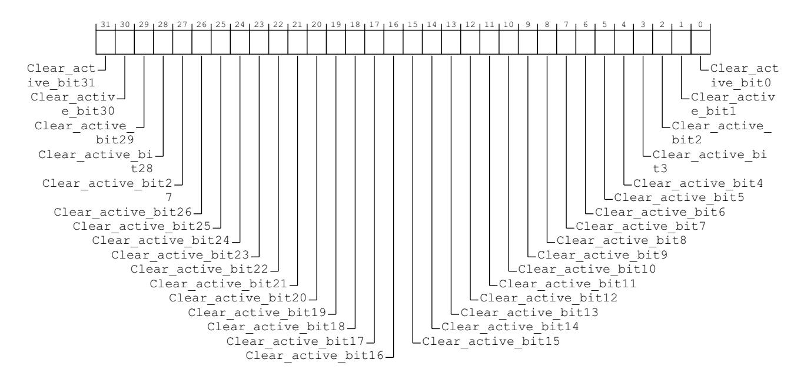

#### **Clear\_active\_bit<x>, bit [x], for x = 31 to 0**

For the extended SPIs, removes the active state to interrupt number x. Reads and writes have the following behavior:

0b0 If read, indicates that the corresponding interrupt is not active, and is not active and pending.

If written, has no effect.

0b1 If read, indicates that the corresponding interrupt is active, or is active and pending. If written, deactivates the corresponding interrupt, if the interrupt is active. If the interrupt is already deactivated, the write has no effect.

The reset behavior of this field is:

• On a GIC reset, this field resets to 0.

For INTID m, when DIV and MOD are the integer division and modulo operations:

• The corresponding GICD\_ICACTIVER<n>E number, n, is given by n = (m-4096) DIV 32.

- The offset of the required GICD\_ICACTIVER<n>E is (0x1C00 + (4\*n)).
- The bit number of the required group modifier bit in this register is (m-4096) MOD 32.

#### **Accessing the GICD\_ICACTIVER<n>E:**

When affinity routing is not enabled for the Security state of an interrupt in GICD\_ICACTIVER<n>E, the corresponding bit is RES0.

When [GICD\\_CTLR](#page-543-1).DS==0, bits corresponding to Secure SPIs are RAZ/WI to Non-secure accesses.

Bits corresponding to unimplemented interrupts are RAZ/WI.

GICD\_ICACTIVER<n>E can be accessed through its memory-mapped interface:

| Component       | Frame     | Offset           | Instance                |
|-----------------|-----------|------------------|-------------------------|
| GIC Distributor | Dist_base | 0x1C00 + (4 * n) | GICD_ICACTIVER <n>E</n> |

#### <span id="page-553-1"></span><span id="page-553-0"></span>**12.9.7 GICD\_ICENABLER<n>, Interrupt Clear-Enable Registers, n = 0 - 31**

The GICD\_ICENABLER<n> characteristics are:

#### **Purpose**

Disables forwarding of the corresponding interrupt to the CPU interfaces.

#### **Configurations**

These registers are available in all GIC configurations. If [GICD\\_CTLR](#page-543-1).DS==0, these registers are Common.

The number of implemented [GICD\\_ICENABLER<n>](#page-553-1) registers is [\(GICD\\_TYPER.](#page-617-1)ITLinesNumber+1). Registers are numbered from 0.

GICD\_ICENABLER0 is Banked for each connected PE with [GICR\\_TYPER](#page-710-1).Processor\_Number < 8.

Accessing GICD\_ICENABLER0 from a PE with [GICR\\_TYPER](#page-710-1).Processor\_Number > 7 is CONSTRAINED UNPREDICTABLE:

- Register is RAZ/WI.
- An UNKNOWN banked copy of the register is accessed.

#### **Attributes**

GICD\_ICENABLER<n> is a 32-bit register.

#### **Field descriptions**


#### **Clear\_enable\_bit<x>, bit [x], for x = 31 to 0**

For SPIs and PPIs, controls the forwarding of interrupt number 32n + x to the CPU interfaces. Reads and writes have the following behavior:

- 0b0 If read, indicates that forwarding of the corresponding interrupt is disabled.
  - If written, has no effect.
- 0b1 If read, indicates that forwarding of the corresponding interrupt is enabled.

If written, disables forwarding of the corresponding interrupt.

After a write of 1 to this bit, a subsequent read of this bit returns 0.

For SGIs, the behavior of this bit is IMPLEMENTATION DEFINED.

The reset behavior of this field is:

• On a GIC reset, this field resets to an architecturally UNKNOWN value.

For INTID m, when DIV and MOD are the integer division and modulo operations:

- The corresponding GICD\_ICENABLER<n> number, n, is given by n = m DIV 32.
- The offset of the required GICD\_ICENABLER is (0x180 + (4\*n)).
- The bit number of the required group modifier bit in this register is m MOD 32.

| Note |  |
|------|--|
|------|--|

Writing a 1 to a GICD\_ICENABLER<n> bit only disables the forwarding of the corresponding interrupt from the Distributor to any CPU interface. It does not prevent the interrupt from changing state, for example becoming pending or active and pending if it is already active.

#### **Accessing the GICD\_ICENABLER<n>:**

For SGIs and PPIs:

- When ARE is 1 for the Security state of an interrupt, the field for that interrupt is RES0 and an implementation is permitted to make the field RAZ/WI in this case.
- Equivalent functionality is provided by GICR\_ICENABLER0.

Bits corresponding to unimplemented interrupts are RAZ/WI.

When [GICD\\_CTLR](#page-543-1).DS==0, bits corresponding to Group 0 and Secure Group 1 interrupts are RAZ/WI to Non-secure accesses.

It is IMPLEMENTATION DEFINED whether implemented SGIs are permanently enabled, or can be enabled and disabled by writes to [GICD\\_ISENABLER<n>](#page-592-1) and [GICD\\_ICENABLER<n>](#page-553-1) where n=0.

Completion of a write to this register does not guarantee that the effects of the write are visible throughout the affinity hierarchy. To ensure an enable has been cleared, software must write to the register with bits set to 1 to clear the required enables. Software must then poll [GICD\\_CTLR](#page-543-1).RWP until it has the value zero.

GICD\_ICENABLER<n> can be accessed through its memory-mapped interface:

| Component       | Frame     | Offset           | Instance               |
|-----------------|-----------|------------------|------------------------|
| GIC Distributor | Dist_base | 0x0180 + (4 * n) | GICD_ICENABLER <n></n> |

#### <span id="page-555-1"></span><span id="page-555-0"></span>**12.9.8 GICD\_ICENABLER<n>E, Interrupt Clear-Enable Registers, n = 0 - 31**

The GICD\_ICENABLER<n>E characteristics are:

#### **Purpose**

Disables forwarding of the corresponding SPI in the extended SPI range to the CPU interfaces.

#### **Configurations**

This register is present only when FEAT\_GICv3p1 is implemented. Otherwise, direct accesses to GICD\_ICENABLER<n>E are RES0.

When [GICD\\_TYPER.](#page-617-1)ESPI==0, these registers are RES0.

When [GICD\\_TYPER.](#page-617-1)ESPI==1, the number of implemented [GICD\\_ICENABLER<n>E](#page-555-1) registers is [\(GICD\\_TYPER.](#page-617-1)ESPI\_range+1). Registers are numbered from 0.

#### **Attributes**

GICD\_ICENABLER<n>E is a 32-bit register.

#### **Field descriptions**

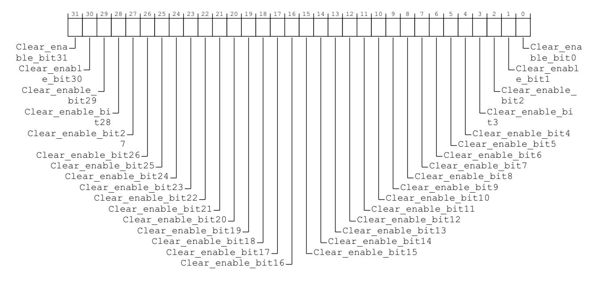

#### **Clear\_enable\_bit<x>, bit [x], for x = 31 to 0**

For the extended SPI range, controls the forwarding of interrupt number x to the CPU interface. Reads and writes have the following behavior:

0b0 If read, indicates that forwarding of the corresponding interrupt is disabled.

If written, has no effect.

0b1 If read, indicates that forwarding of the corresponding interrupt is enabled.

If written, enables forwarding of the corresponding interrupt.

After a write of 1 to this bit, a subsequent read of this bit returns 0.

The reset behavior of this field is:

• On a GIC reset, this field resets to 0.

For INTID m, when DIV and MOD are the integer division and modulo operations:

• The corresponding GICD\_ICENABLER<n>E number, n, is given by n = (m-4096) DIV 32.

- The offset of the required GICD\_ICENABLER<n>E is (0x1400 + (4\*n)).
- The bit number of the required group modifier bit in this register is (m-4096) MOD 32.

#### **Accessing the GICD\_ICENABLER<n>E:**

When affinity routing is not enabled for the Security state of an interrupt in GICD\_ICENABLER<n>E, the corresponding bit is RES0.

When [GICD\\_CTLR](#page-543-1).DS==0, bits corresponding to Secure SPIs are RAZ/WI to Non-secure accesses.

Bits corresponding to unimplemented interrupts are RAZ/WI.

GICD\_ICENABLER<n>E can be accessed through its memory-mapped interface:

| Component       | Frame     | Offset           | Instance                |
|-----------------|-----------|------------------|-------------------------|
| GIC Distributor | Dist_base | 0x1400 + (4 * n) | GICD_ICENABLER <n>E</n> |

#### <span id="page-557-0"></span>**12.9.9 GICD\_ICFGR<n>, Interrupt Configuration Registers, n = 0 - 63**

The GICD\_ICFGR<n> characteristics are:

#### **Purpose**

Determines whether the corresponding interrupt is edge-triggered or level-sensitive.

#### **Configurations**

These registers are available in all GIC configurations. If the GIC implementation supports two Security states, these registers are Common.

GICD\_ICFGR1 is Banked for each connected PE with [GICR\\_TYPER](#page-710-1).Processor\_Number < 8.

Accessing GICD\_ICFGR1 from a PE with [GICR\\_TYPER.](#page-710-1)Processor\_Number > 7 is CONSTRAINED UNPREDICTABLE:

- Register is RAZ/WI.
- An UNKNOWN banked copy of the register is accessed.

For SGIs and PPIs:

- When ARE is 1 for the Security state of an interrupt, the field for that interrupt is RES0 and an implementation is permitted to make the field RAZ/WI in this case.
- Equivalent functionality is provided by GICR\_ICFGR<n>

For each supported PPI, it is IMPLEMENTATION DEFINED whether software can program the corresponding Int\_config field.

For SGIs, Int\_config fields are RO, meaning that GICD\_ICFGR0 is RO.

Changing Int\_config when the interrupt is individually enabled is UNPREDICTABLE.

Changing the interrupt configuration between level-sensitive and edge-triggered (in either direction) at a time when there is a pending interrupt will leave the interrupt in an UNKNOWN pending state.

Fields corresponding to unimplemented interrupts are RAZ/WI.

#### **Attributes**

GICD\_ICFGR<n> is a 32-bit register.

#### **Field descriptions**

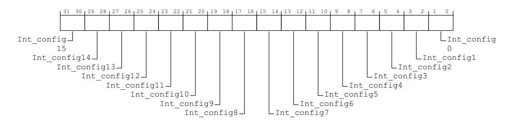

#### **Int\_config<x>, bits [2x+1:2x], for x = 15 to 0**

Indicates whether the interrupt is level-sensitive or edge-triggered.

0b00 Corresponding interrupt is level-sensitive.

0b10 Corresponding interrupt is edge-triggered.

Int\_config[0] (bit [2x]) is RES0.

For SGIs, this field always indicates edge-triggered.

The reset behavior of this field is:

• On a GIC reset, this field resets to an architecturally UNKNOWN value.

#### **Accessing the GICD\_ICFGR<n>:**

For SPIs and PPIs, when [GICD\\_CTLR](#page-543-1).DS==0, a register bit that corresponds to a Group 0 or Secure Group 1 interrupt is RAZ/WI to Non-secure accesses.

GICD\_ICFGR<n> can be accessed through its memory-mapped interface:

| Component       | Frame     | Offset           | Instance           |
|-----------------|-----------|------------------|--------------------|
| GIC Distributor | Dist_base | 0x0C00 + (4 * n) | GICD_ICFGR <n></n> |

#### <span id="page-559-0"></span>**12.9.10 GICD\_ICFGR<n>E, Interrupt Configuration Registers (Extended SPI Range), n = 0 - 63**

The GICD\_ICFGR<n>E characteristics are:

#### **Purpose**

Determines whether the corresponding SPI in the extended SPI range is edge-triggered or level-sensitive.

#### **Configurations**

This register is present only when FEAT\_GICv3p1 is implemented. Otherwise, direct accesses to GICD\_ICFGR<n>E are RES0.

When GICD\_TYPER.ESPI==0, these registers are RES0.

When GICD\_TYPER.ESPI==1, the number of implemented GICD\_ICFGR<n>E registers is ((GICD\_TYPER.ESPI\_range+1)\*2). Registers are numbered from 0.

#### **Attributes**

GICD\_ICFGR<n>E is a 32-bit register.

#### **Field descriptions**

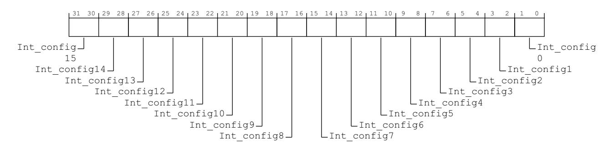

#### **Int\_config<x>, bits [2x+1:2x], for x = 15 to 0**

Indicates whether the interrupt is level-sensitive or edge-triggered.

Int\_config[0] (bit[2x]) is RES0.

0b00 Corresponding interrupt is level-sensitive.

0b10 Corresponding interrupt is edge-triggered.

The reset behavior of this field is:

• On a GIC reset, this field resets to an architecturally UNKNOWN value.

#### **Accessing the GICD\_ICFGR<n>E:**

When affinity routing is not enabled for the Security state of an interrupt in GICD\_ICFGR<n>E, the corresponding bit is RES0.

When [GICD\\_CTLR](#page-543-1).DS==0, a register bit that corresponds to a Group 0 or Secure Group 1 interrupt is RAZ/WI to Non-secure accesses.

Bits corresponding to unimplemented interrupts are RAZ/WI.

GICD\_ICFGR<n>E can be accessed through its memory-mapped interface:

| Component       | Frame     | Offset           | Instance            |
|-----------------|-----------|------------------|---------------------|
| GIC Distributor | Dist_base | 0x3000 + (4 * n) | GICD_ICFGR <n>E</n> |

#### <span id="page-561-1"></span><span id="page-561-0"></span>**12.9.11 GICD\_ICPENDR<n>, Interrupt Clear-Pending Registers, n = 0 - 31**

The GICD\_ICPENDR<n> characteristics are:

#### **Purpose**

Removes the pending state from the corresponding interrupt.

#### **Configurations**

These registers are available in all GIC configurations. If [GICD\\_CTLR](#page-543-1).DS==0, these registers are Common.

The number of implemented [GICD\\_ICPENDR<n>](#page-561-1) registers is [\(GICD\\_TYPER.](#page-617-1)ITLinesNumber+1). Registers are numbered from 0.

GICD\_ICPENDR0 is Banked for each connected PE with [GICR\\_TYPER](#page-710-1).Processor\_Number < 8.

Accessing GICD\_ICPENDR0 from a PE with [GICR\\_TYPER](#page-710-1).Processor\_Number > 7 is CONSTRAINED UNPREDICTABLE:

- Register is RAZ/WI.
- An UNKNOWN banked copy of the register is accessed.

#### **Attributes**

GICD\_ICPENDR<n> is a 32-bit register.

#### **Field descriptions**


#### **Clear\_pending\_bit<x>, bit [x], for x = 31 to 0**

For SPIs and PPIs, removes the pending state from interrupt number 32n + x. Reads and writes have the following behavior:

0b0 If read, indicates that the corresponding interrupt is not pending on any PE. If written, has no effect.

0b1 If read, indicates that the corresponding interrupt is pending, or active and pending.

If written, changes the state of the corresponding interrupt from pending to inactive, or from active and pending to active. This has no effect in the following cases:

- If the interrupt is an SGI. In this case, the write is ignored. The pending state of an SGI can be cleared using [GICD\\_CPENDSGIR<n>.](#page-541-0)
- If the interrupt is not pending and is not active and pending.
- If the interrupt is a level-sensitive interrupt that is pending or active and pending for a reason other than a write to [GICD\\_ISPENDR<n>](#page-596-1). In this case, if the interrupt signal continues to be asserted, the interrupt remains pending or active and pending.

The reset behavior of this field is:

• On a GIC reset, this field resets to 0.

For INTID m, when DIV and MOD are the integer division and modulo operations:

- The corresponding GICD\_ICPENDR<n> number, n, is given by n = m DIV 32.
- The offset of the required GICD\_ICPENDR is (0x200 + (4\*n)).
- The bit number of the required group modifier bit in this register is m MOD 32.

#### **Accessing the GICD\_ICPENDR<n>:**

Clear-pending bits for SGIs are RO/WI.

When affinity routing is enabled for the Security state of an interrupt:

- Bits corresponding to SGIs and PPIs are RAZ/WI, and equivalent functionality for SGIs and PPIs is provided by [GICR\\_ICPENDR0](#page-657-0).
- Bits corresponding to Group 0 and Group 1 Secure interrupts can only be cleared by Secure accesses.

Bits corresponding to unimplemented interrupts are RAZ/WI.

If [GICD\\_CTLR](#page-543-1).DS==0, unless the [GICD\\_NSACR<n>](#page-603-0) registers permit Non-secure software to control Group 0 and Secure Group 1 interrupts, any bits that correspond to Group 0 or Secure Group 1 interrupts are accessible only by Secure accesses and are RAZ/WI to Non-secure accesses.

GICD\_ICPENDR<n> can be accessed through its memory-mapped interface:

| Component       | Frame     | Offset           | Instance             |
|-----------------|-----------|------------------|----------------------|
| GIC Distributor | Dist_base | 0x0280 + (4 * n) | GICD_ICPENDR <n></n> |

#### <span id="page-563-0"></span>**12.9.12 GICD\_ICPENDR<n>E, Interrupt Clear-Pending Registers (extended SPI range), n = 0 - 31**

The GICD\_ICPENDR<n>E characteristics are:

#### **Purpose**

Removes the pending state to the corresponding SPI in the extended SPI range.

#### **Configurations**

This register is present only when FEAT\_GICv3p1 is implemented. Otherwise, direct accesses to GICD\_ICPENDR<n>E are RES0.

When [GICD\\_TYPER.](#page-617-1)ESPI==0, these registers are RES0.

When [GICD\\_TYPER.](#page-617-1)ESPI==1, the number of implemented GICD\_ICPENDR<n>E registers is [\(GICD\\_TYPER.](#page-617-1)ESPI\_range+1). Registers are numbered from 0.

#### **Attributes**

GICD\_ICPENDR<n>E is a 32-bit register.

#### **Field descriptions**

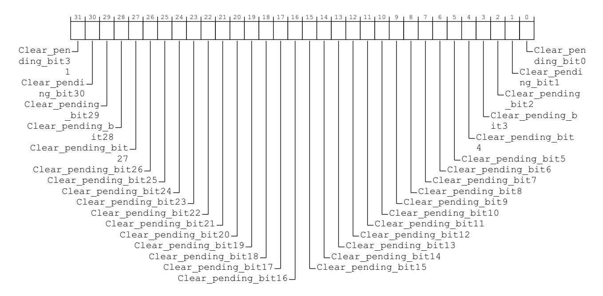

#### **Clear\_pending\_bit<x>, bit [x], for x = 31 to 0**

For the extended PPIs, removes the pending state to interrupt number x. Reads and writes have the following behavior:

0b0 If read, indicates that the corresponding interrupt is not pending.

If written, has no effect.

0b1 If read, indicates that the corresponding interrupt is pending, or active and pending. If written, changes the state of the corresponding interrupt from pending to inactive, or from active and pending to active.

This has no effect in the following cases:

• If the interrupt is not pending and is not active and pending.

• If the interrupt is a level-sensitive interrupt that is pending or active and pending for a reason other than a write to GICD\_ISPENDR<n>E. In this case, if the interrupt signal continues to be asserted, the interrupt remains pending or active and pending.

The reset behavior of this field is:

• On a GIC reset, this field resets to 0.

For INTID m, when DIV and MOD are the integer division and modulo operations:

- The corresponding GICD\_ICPENDR<n>E number, n, is given by n = (m-4096) DIV 32.
- The offset of the required GICD\_ICPENDR<n>E is (0x1800 + (4\*n)).
- The bit number of the required group modifier bit in this register is (m-4096) MOD 32.

#### **Accessing the GICD\_ICPENDR<n>E:**

When affinity routing is not enabled for the Security state of an interrupt in GICD\_ICPENDR<n>E, the corresponding bit is RES0.

When [GICD\\_CTLR](#page-543-1).DS==0, bits corresponding to Secure SPIs are RAZ/WI to Non-secure accesses.

Bits corresponding to unimplemented interrupts are RAZ/WI.

GICD\_ICPENDR<n>E can be accessed through its memory-mapped interface:

| Component       | Frame     | Offset           | Instance              |
|-----------------|-----------|------------------|-----------------------|
| GIC Distributor | Dist_base | 0x1800 + (4 * n) | GICD_ICPENDR <n>E</n> |

#### <span id="page-565-1"></span><span id="page-565-0"></span>**12.9.13 GICD\_IGROUPR<n>, Interrupt Group Registers, n = 0 - 31**

The GICD\_IGROUPR<n> characteristics are:

#### **Purpose**

Controls whether the corresponding interrupt is in Group 0 or Group 1.

#### **Configurations**

These registers are available in all GIC configurations. If [GICD\\_CTLR](#page-543-1).DS==0, these registers are Secure.

The number of implemented GICD\_IGROUPR<n> registers is [\(GICD\\_TYPER.](#page-617-1)ITLinesNumber+1). Registers are numbered from 0.

GICD\_IGROUPR0 is Banked for each connected PE with [GICR\\_TYPER](#page-710-1).Processor\_Number < 8.

Accessing GICD\_IGROUPR0 from a PE with [GICR\\_TYPER](#page-710-1).Processor\_Number > 7 is CONSTRAINED UNPREDICTABLE:

- Register is RAZ/WI.
- An UNKNOWN banked copy of the register is accessed.

#### **Attributes**

GICD\_IGROUPR<n> is a 32-bit register.

#### **Field descriptions**

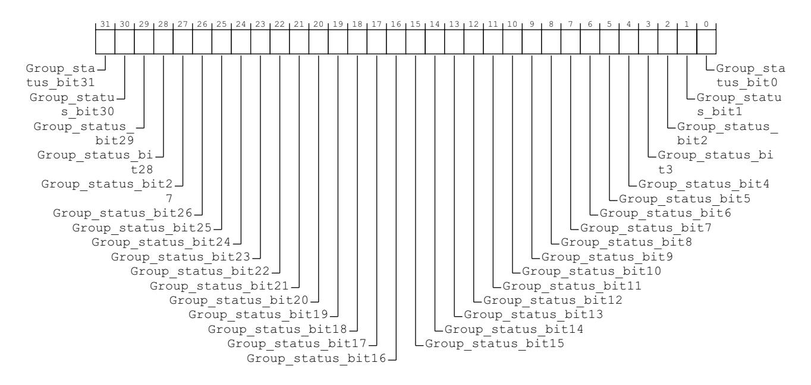

#### **Group\_status\_bit<x>, bit [x], for x = 31 to 0**

Group status bit.

0b0 When [GICD\\_CTLR.](#page-543-1)DS==1, the corresponding interrupt is Group 0. When [GICD\\_CTLR.](#page-543-1)DS==0, the corresponding interrupt is Secure. 0b1 When [GICD\\_CTLR.](#page-543-1)DS==1, the corresponding interrupt is Group 1. When [GICD\\_CTLR.](#page-543-1)DS==0, the corresponding interrupt is Non-secure Group 1.

If affinity routing is enabled for the Security state of an interrupt, the bit that corresponds to the interrupt is concatenated with the equivalent bit in [GICD\\_IGRPMODR<n>](#page-569-1) to form a 2-bit field that defines an interrupt group. The encoding of this field is described in [GICD\\_IGRPMODR<n>](#page-569-1).

If affinity routing is disabled for the Security state of an interrupt, then:

- The corresponding [GICD\\_IGRPMODR<n>](#page-569-1) bit is RES0.
- For Secure interrupts, the interrupt is Secure Group 0.
- For Non-secure interrupts, the interrupt is Non-secure Group 1.

The reset behavior of this field is:

- On a GIC reset:
  - When n == 0, this field resets to an UNKNOWN value.
  - When n > 0, this field resets to 0.

For INTID m, when DIV and MOD are the integer division and modulo operations:

- The corresponding GICD\_IGROUP<n> number, n, is given by n = m DIV 32.
- The offset of the required GICD\_IGROUP is (0x080 + (4\*n)).
- The bit number of the required group modifier bit in this register is m MOD 32.

#### **Accessing the GICD\_IGROUPR<n>:**

For SGIs and PPIs:

- When ARE is 1 for the Security state of an interrupt, the field for that interrupt is RES0 and an implementation is permitted to make the field RAZ/WI in this case.
- Equivalent functionality is provided by GICR\_IGROUPR0.

When [GICD\\_CTLR](#page-543-1).DS==0, the register is RAZ/WI to Non-secure accesses.

Bits corresponding to unimplemented interrupts are RAZ/WI.

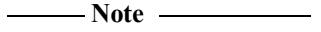

Accesses to GICD\_IGROUPR0 when affinity routing is not enabled for a Security state access the same state as [GICR\\_IGROUPR0](#page-661-1), and must update Redistributor state associated with the PE performing the accesses. Implementations must ensure that an interrupt that is pending at the time of the write uses either the old value or the new value and must ensure that the interrupt is neither lost nor handled more than one time. The effect of the change must be visible in finite time.

GICD\_IGROUPR<n> can be accessed through its memory-mapped interface:

| Component       | Frame     | Offset           | Instance             |
|-----------------|-----------|------------------|----------------------|
| GIC Distributor | Dist_base | 0x0080 + (4 * n) | GICD_IGROUPR <n></n> |

#### <span id="page-567-1"></span><span id="page-567-0"></span>**12.9.14 GICD\_IGROUPR<n>E, Interrupt Group Registers (extended SPI range), n = 0 - 31**

The GICD\_IGROUPR<n>E characteristics are:

#### **Purpose**

Controls whether the corresponding SPI in the extended SPI range is in Group 0 or Group 1.

#### **Configurations**

This register is present only when FEAT\_GICv3p1 is implemented. Otherwise, direct accesses to GICD\_IGROUPR<n>E are RES0.

When [GICD\\_TYPER.](#page-617-1)ESPI==0, these registers are RES0.

When [GICD\\_TYPER.](#page-617-1)ESPI==1:

- The number of implemented GICD\_IGROUPR<n>E registers is [\(GICD\\_TYPER.](#page-617-1)ESPI\_range+1). Registers are numbered from 0.
- When [GICD\\_CTLR](#page-543-1).DS==0, this register is Secure.

#### **Attributes**

GICD\_IGROUPR<n>E is a 32-bit register.

#### **Field descriptions**

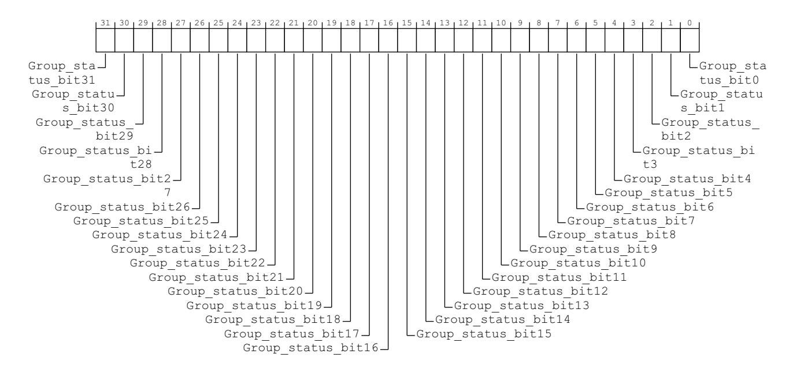

#### **Group\_status\_bit<x>, bit [x], for x = 31 to 0**

Group status bit.

0b0 When [GICD\\_CTLR.](#page-543-1)DS==1, the corresponding interrupt is Group 0. When [GICD\\_CTLR.](#page-543-1)DS==0, the corresponding interrupt is Secure. 0b1 When [GICD\\_CTLR.](#page-543-1)DS==1, the corresponding interrupt is Group 1. When [GICD\\_CTLR.](#page-543-1)DS==0, the corresponding interrupt is Non-secure Group 1.

If affinity routing is enabled for the Security state of an interrupt, the bit that corresponds to the interrupt is concatenated with the equivalent bit in [GICD\\_IGRPMODR<n>E](#page-571-1) to form a 2-bit field that defines an interrupt group. The encoding of this field is described in [GICD\\_IGRPMODR<n>E](#page-571-1).

If affinity routing is disabled for the Security state of an interrupt, the bit is RES0:

The reset behavior of this field is:

• On a GIC reset, this field resets to 0.

For INTID m, when DIV and MOD are the integer division and modulo operations:

- The corresponding GICD\_IGROUPR<n>E number, n, is given by n = (m-4096) DIV 32.
- The offset of the required GICD\_IGROUPR<n>E is (0x1000 + (4\*n)).
- The bit number of the required group modifier bit in this register is (m-4096) MOD 32.

#### **Accessing the GICD\_IGROUPR<n>E:**

When affinity routing is not enabled for the Security state of an interrupt in GICD\_IGROUPR<n>E, the corresponding bit is RES0.

When [GICD\\_CTLR](#page-543-1).DS==0, bits corresponding to Secure SPIs are RAZ/WI to Non-secure accesses.

Bits corresponding to unimplemented interrupts are RAZ/WI.

GICD\_IGROUPR<n>E can be accessed through its memory-mapped interface:

| Component       | Frame     | Offset           | Instance              |
|-----------------|-----------|------------------|-----------------------|
| GIC Distributor | Dist_base | 0x1000 + (4 * n) | GICD_IGROUPR <n>E</n> |

#### <span id="page-569-1"></span><span id="page-569-0"></span>**12.9.15 GICD\_IGRPMODR<n>, Interrupt Group Modifier Registers, n = 0 - 31**

The GICD\_IGRPMODR<n> characteristics are:

#### **Purpose**

When [GICD\\_CTLR](#page-543-1).DS==0, this register together with the [GICD\\_IGROUPR<n>](#page-565-1) registers, controls whether the corresponding interrupt is in:

- Secure Group 0.
- Non-secure Group 1.
- Secure Group 1.

#### **Configurations**

When [GICD\\_CTLR](#page-543-1).DS==0, these registers are Secure.

The number of implemented [GICD\\_IGROUPR<n>](#page-565-1) registers is [\(GICD\\_TYPER.](#page-617-1)ITLinesNumber+1). Registers are numbered from 0.

When [GICD\\_CTLR](#page-543-1).ARE\_S==0 or [GICD\\_CTLR.](#page-543-1)DS==1, the GICD\_IGRPMODR<n> registers are RES0. An implementation can make these registers RAZ/WI in this case.

#### **Attributes**

GICD\_IGRPMODR<n> is a 32-bit register.

#### **Field descriptions**

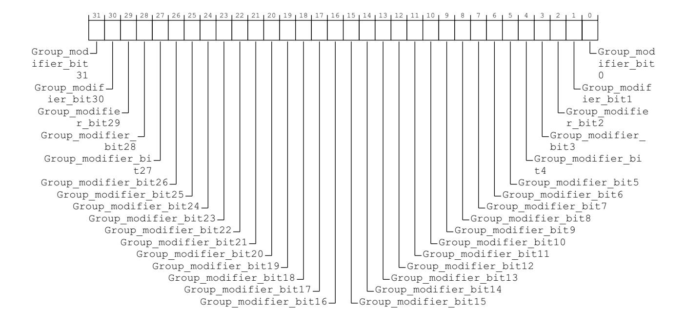

#### **Group\_modifier\_bit<x>, bit [x], for x = 31 to 0**

Group modifier bit. When affinity routing is enabled for the Security state of an interrupt, the bit that corresponds to the interrupt is concatenated with the equivalent bit in [GICD\\_IGROUPR<n>](#page-565-1) to form a 2-bit field that defines an interrupt group:

| Group modifier bit | Group status bit | Definition                              | Short name |
|--------------------|------------------|-----------------------------------------|------------|
| 0b0                | 0b0              | Secure Group 0                          | G0S        |
| 0b0                | 0b1              | Non-secure Group 1                      | G1NS       |
| 0b1                | 0b0              | Secure Group 1                          | G1S        |
| 0b1                | 0b1              | Reserved, treated as Non-secure Group 1 | -          |

The reset behavior of this field is:

• On a GIC reset, this field resets to 0.

For INTID m, when DIV and MOD are the integer division and modulo operations:

- The corresponding GICD\_IGRPMODR<n> number, n, is given by n = m DIV 32.
- The offset of the required GICD\_IGRPMODR is (0x080 + (4\*n)).
- The bit number of the required group modifier bit in this register is m MOD 32.

See [GICD\\_IGROUPR<n>](#page-565-1) for information about the GICD\_IGRPMODR0 reset value.

#### **Accessing the GICD\_IGRPMODR<n>:**

When affinity routing is enabled for Secure state, GICD\_IGRPMODR0 is RES0 and equivalent functionality is proved by [GICR\\_IGRPMODR0.](#page-665-1)

When [GICD\\_CTLR](#page-543-1).DS==0, the register is RAZ/WI to Non-secure accesses.

Bits corresponding to unimplemented interrupts are RAZ/WI.


GICD\_IGRPMODR<n> can be accessed through its memory-mapped interface:

| Component       | Frame     | Offset           | Instance              |
|-----------------|-----------|------------------|-----------------------|
| GIC Distributor | Dist_base | 0x0D00 + (4 * n) | GICD_IGRPMODR <n></n> |

Accesses to this interface are RW.

must be visible in finite time.

#### <span id="page-571-1"></span><span id="page-571-0"></span>**12.9.16 GICD\_IGRPMODR<n>E, Interrupt Group Modifier Registers (extended SPI range), n = 0 - 31**

The GICD\_IGRPMODR<n>E characteristics are:

#### **Purpose**

When [GICD\\_CTLR](#page-543-1).DS==0, this register together with the [GICD\\_IGROUPR<n>E](#page-567-1) registers, controls whether the corresponding interrupt is in:

- Secure Group 0.
- Non-secure Group 1.
- When System register access is enabled, Secure Group 1.

#### **Configurations**

This register is present only when FEAT\_GICv3p1 is implemented. Otherwise, direct accesses to GICD\_IGRPMODR<n>E are RES0.

GICD\_IGRPMODR<n>E resets to 0x00000000.

When [GICD\\_TYPER.](#page-617-1)ESPI==0, these registers are RES0.

When [GICD\\_TYPER.](#page-617-1)ESPI==1:

- The number of implemented GICD\_IGRPMODR<n>E registers is [\(GICD\\_TYPER.](#page-617-1)ESPI\_range+1). Registers are numbered from 0.
- When [GICD\\_CTLR](#page-543-1).DS==0, this register is Secure.

#### **Attributes**

GICD\_IGRPMODR<n>E is a 32-bit register.

#### **Field descriptions**

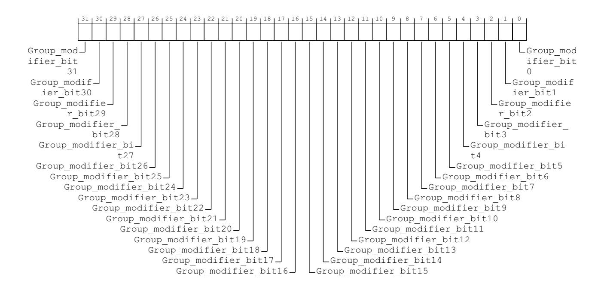

#### **Group\_modifier\_bit<x>, bit [x], for x = 31 to 0**

Group modifier bit. In implementations where affinity routing is enabled for the Security state of an interrupt, the bit that corresponds to the interrupt is concatenated with the equivalent bit in [GICD\\_IGROUPR<n>E](#page-567-1) to form a 2-bit field that defines an interrupt group:

| Group modifier bit | Group status bit | Definition                              | Short name |
|--------------------|------------------|-----------------------------------------|------------|
| 0b0                | 0b0              | Secure Group 0                          | G0S        |
| 0b0                | 0b1              | Non-secure Group 1                      | G1NS       |
| 0b1                | 0b0              | Secure Group 1                          | G1S        |
| 0b1                | 0b1              | Reserved, treated as Non-secure Group 1 | -          |

The reset behavior of this field is:

• On a GIC reset, this field resets to 0.

For INTID m, when DIV and MOD are the integer division and modulo operations:

- The corresponding GICD\_IGRPMODR<n>E number, n, is given by n = (m-4096) DIV 32.
- The offset of the required GICD\_IGRPMODR<n>E is (0x3400 + (4\*n)).
- The bit number of the required group modifier bit in this register is (m-4096) MOD 32.

#### **Accessing the GICD\_IGRPMODR<n>E:**

When affinity routing is not enabled for the Security state of an interrupt in GICD\_IGRPMODR<n>E, the corresponding bit is RES0.

When [GICD\\_CTLR](#page-543-1).DS==0, bits corresponding to Secure SPIs are RAZ/WI to Non-secure accesses.

Bits corresponding to unimplemented interrupts are RAZ/WI.

GICD\_IGRPMODR<n>E can be accessed through its memory-mapped interface:

| Component       | Frame     | Offset           | Instance               |
|-----------------|-----------|------------------|------------------------|
| GIC Distributor | Dist_base | 0x3400 + (4 * n) | GICD_IGRPMODR <n>E</n> |

#### <span id="page-573-0"></span>**12.9.17 GICD\_IIDR, Distributor Implementer Identification Register**

The GICD\_IIDR characteristics are:

#### **Purpose**

Provides information about the implementer and revision of the Distributor.

#### **Configurations**

This register is available in all configurations of the GIC. If the GIC implementation supports two Security states, this register is Common.

#### **Attributes**

GICD\_IIDR is a 32-bit register.

#### **Field descriptions**


#### **ProductID, bits [31:24]**

Product Identifier.

This field has an IMPLEMENTATION DEFINED value.

Access to this field is RO.

#### **Bits [23:20]**

Reserved, RES0.

#### **Variant, bits [19:16]**

Variant number. Typically, this field is used to distinguish product variants, or major revisions of a product.

This field has an IMPLEMENTATION DEFINED value.

Access to this field is RO.

#### **Revision, bits [15:12]**

Revision number. Typically, this field is used to distinguish minor revisions of a product.

This field has an IMPLEMENTATION DEFINED value.

Access to this field is RO.

#### **Implementer, bits [11:0]**

Contains the JEP106 code of the company that implemented the Distributor:

- Bits [11:8] are the JEP106 continuation code of the implementer. For an Arm implementation, this field is 0x4.
- Bit [7] is always 0.
- Bits [6:0] are the JEP106 identity code of the implementer. For an Arm implementation, bits [7:0] are therefore 0x3B.

This field has an IMPLEMENTATION DEFINED value.

Access to this field is RO.

#### **Accessing the GICD\_IIDR:**

GICD\_IIDR can be accessed through its memory-mapped interface:

| Component       | Frame     | Offset | Instance  |
|-----------------|-----------|--------|-----------|
| GIC Distributor | Dist_base | 0x0008 | GICD_IIDR |

#### <span id="page-575-1"></span><span id="page-575-0"></span>**12.9.18 GICD\_INMIR<n>, Non-maskable Interrupt Registers, x = 0 to 31, n = 0 - 31**

The GICD\_INMIR<n> characteristics are:

#### **Purpose**

Holds whether the corresponding SPI has the non-maskable property.

#### **Configurations**

This register is present only when FEAT\_GICv3\_NMI is implemented. Otherwise, direct accesses to GICD\_INMIR<n> are RES0.

When [GICD\\_TYPER.](#page-617-1)NMI is 0, this register is RES0.

The number of implemented GICD\_INMIR<n> registers is ([GICD\\_TYPER](#page-617-1).ITLinesNumber+1). Registers are numbered from 0.

#### **Attributes**

GICD\_INMIR<n> is a 32-bit register.

#### **Field descriptions**

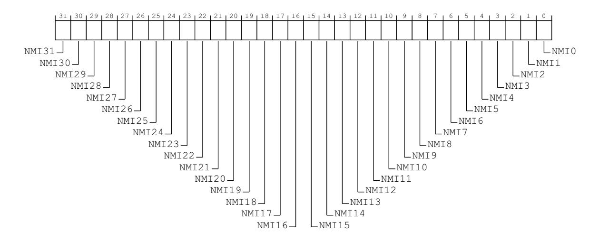

#### **NMI<x>, bit [x], for x = 31 to 0**

Non-maskable property.

0b0 Interrupt does not have the non-maskable property.

0b1 Interrupt has the non-maskable property.

This bit is RES0 when the corresponding interrupt is configured as Group 0.

The reset behavior of this field is:

• On a GIC reset, this field resets to 0.

For INTID m, when DIV and MOD are the integer division and modulo operations:

- The corresponding GICD\_INMI<n> number, n, is given by n = (m DIV 32).
- The offset of the required GICD\_INMI is (0xF80 + (4\*n)).
- The bit number of the required in this register is (m MOD 32).

#### **Accessing the GICD\_INMIR<n>:**

For SGIs and PPIs:

- The field for that interrupt is RES0 and an implementation is permitted to make the field RAZ/WI in this case.
- Equivalent functionality is provided by GICR\_INMIR0.

When affinity routing is not enabled for the Security state of an interrupt in GICD\_IGROUPR<n>E, the corresponding bit is RES0.

Bits corresponding to unimplemented interrupts are RAZ/WI.

When [GICD\\_CTLR](#page-543-1).DS==0, bits corresponding to Group 0 and Secure Group 1 interrupts are RAZ/WI to Non-secure accesses.

| Note                                                                                                                    |
|-------------------------------------------------------------------------------------------------------------------------|
| Implementations must ensure that an interrupt that is pending at the time of the write uses either the old value or the |
| new value and must ensure that the interrupt is neither lost nor handled more than one time. The effect of the change   |
| must be visible in finite time.                                                                                         |

GICD\_INMIR<n> can be accessed through its memory-mapped interface:

| Component       | Frame     | Offset           | Instance           |
|-----------------|-----------|------------------|--------------------|
| GIC Distributor | Dist_base | 0x0F80 + (4 * n) | GICD_INMIR <n></n> |

#### <span id="page-577-1"></span><span id="page-577-0"></span>**12.9.19 GICD\_INMIR<n>E, Non-maskable Interrupt Registers for Extended SPIs, x = 0 to 31, n = 0 - 31**

The GICD\_INMIR<n>E characteristics are:

#### **Purpose**

Holds whether the corresponding SPI in the extended SPI range has the non-maskable property.

#### **Configurations**

This register is present only when FEAT\_GICv3p1 is implemented and FEAT\_GICv3\_NMI is implemented. Otherwise, direct accesses to GICD\_INMIR<n>E are RES0.

When [GICD\\_TYPER.](#page-617-1)ESPI is 0 or [GICD\\_TYPER](#page-617-1).NMI is 0, these registers are RES0.

When [GICD\\_TYPER.](#page-617-1)ESPI is 1: the number of implemented GICD\_INMIR<n>E registers is [\(GICD\\_TYPER.](#page-617-1)ESPI\_range+1). Registers are numbered from 0.

#### **Attributes**

GICD\_INMIR<n>E is a 32-bit register.

#### **Field descriptions**

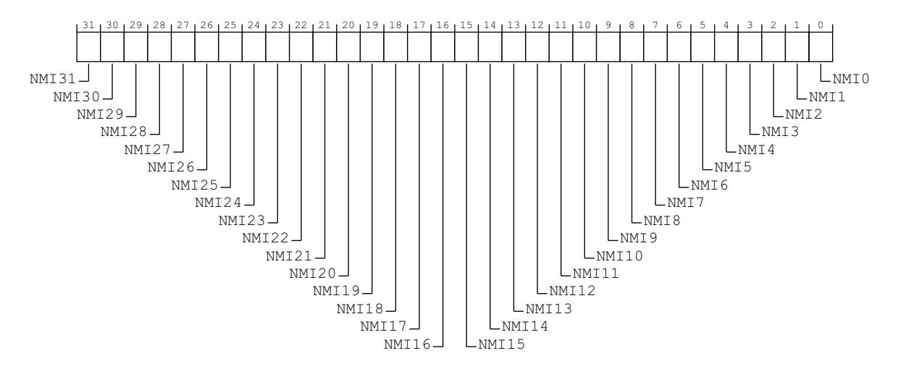

#### **NMI<x>, bit [x], for x = 31 to 0**

Non-maskable property.

0b0 Interrupt does not have the non-maskable property.

0b1 Interrupt has the non-maskable property.

If affinity routing is disabled for the Security state of an interrupt, the bit is RES0.

This bit is RES0 when the corresponding interrupt is configured as Group 0.

The reset behavior of this field is:

• On a GIC reset, this field resets to 0.

For INTID m, when DIV and MOD are the integer division and modulo operations:

- The corresponding GICD\_INMIR<n>E number, n, is given by n = ((m-4096) DIV 32).
- The offset of the required GICD\_INMIR<n>E is (0x3B00 + (4\*n)).
- The bit number in this register is ((m-4096) MOD 32).

#### **Accessing the GICD\_INMIR<n>E:**

When affinity routing is not enabled for the Security state of an interrupt in GICD\_IGROUPR<n>E, the corresponding bit is RES0.

Bits corresponding to unimplemented interrupts are RAZ/WI.

When [GICD\\_CTLR](#page-543-1).DS==0, bits corresponding to Group 0 and Secure Group 1 interrupts are RAZ/WI to Non-secure accesses.

**Note**

Implementations must ensure that an interrupt that is pending at the time of the write uses either the old value or the new value and must ensure that the interrupt is neither lost nor handled more than one time. The effect of the change must be visible in finite time.

GICD\_INMIR<n>E can be accessed through its memory-mapped interface:

| Component       | Frame     | Offset           | Instance            |
|-----------------|-----------|------------------|---------------------|
| GIC Distributor | Dist_base | 0x3B00 + (4 * n) | GICD_INMIR <n>E</n> |

#### <span id="page-579-1"></span><span id="page-579-0"></span>**12.9.20 GICD\_IPRIORITYR<n>, Interrupt Priority Registers, n = 0 - 254**

The GICD\_IPRIORITYR<n> characteristics are:

#### **Purpose**

Holds the priority of the corresponding interrupt.

#### **Configurations**

These registers are available in all configurations of the GIC. When [GICD\\_CTLR.](#page-543-1)DS==0, these registers are Common.

The number of implemented GICD\_IPRIORITYR<n> registers is 8\*[\(GICD\\_TYPER.](#page-617-1)ITLinesNumber+1). Registers are numbered from 0.

GICD\_IPRIORITYR0 to GICD\_IPRIORITYR7 are Banked for each connected PE with [GICR\\_TYPER](#page-710-1).Processor\_Number < 8.

Accessing GICD\_IPRIORITYR0 to GICD\_IPRIORITYR7 from a PE with [GICR\\_TYPER](#page-710-1).Processor\_Number > 7 is CONSTRAINED UNPREDICTABLE:

- Register is RAZ/WI.
- An UNKNOWN banked copy of the register is accessed.

#### **Attributes**

GICD\_IPRIORITYR<n> is a 32-bit register.

#### **Field descriptions**

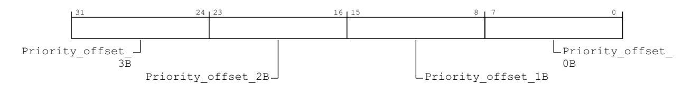

#### **Priority\_offset\_3B, bits [31:24]**

Interrupt priority value from an IMPLEMENTATION DEFINED range, at byte offset 3. Lower priority values correspond to greater priority of the interrupt. For an INTID configured as non-maskable, this field is RES0.

The reset behavior of this field is:

• On a GIC reset, this field resets to 0.

#### **Priority\_offset\_2B, bits [23:16]**

Interrupt priority value from an IMPLEMENTATION DEFINED range, at byte offset 2. Lower priority values correspond to greater priority of the interrupt. For an INTID configured as non-maskable, this field is RES0.

The reset behavior of this field is:

• On a GIC reset, this field resets to 0.

#### **Priority\_offset\_1B, bits [15:8]**

Interrupt priority value from an IMPLEMENTATION DEFINED range, at byte offset 1. Lower priority values correspond to greater priority of the interrupt. For an INTID configured as non-maskable, this field is RES0.

The reset behavior of this field is:

• On a GIC reset, this field resets to 0.

#### **Priority\_offset\_0B, bits [7:0]**

Interrupt priority value from an IMPLEMENTATION DEFINED range, at byte offset 0. Lower priority values correspond to greater priority of the interrupt. For an INTID configured as non-maskable, this field is RES0.

The reset behavior of this field is:

• On a GIC reset, this field resets to 0.

For interrupt ID m, when DIV and MOD are the integer division and modulo operations:

- The corresponding GICD\_IPRIORITYR<n> number, n, is given by n = m DIV 4.
- The offset of the required GICD\_IPRIORITYR<n> register is (0x400 + (4\*n)).
- The byte offset of the required Priority field in this register is m MOD 4, where:
  - Byte offset 0 refers to register bits [7:0].
  - Byte offset 1 refers to register bits [15:8].
  - Byte offset 2 refers to register bits [23:16].
  - Byte offset 3 refers to register bits [31:24].

#### **Accessing the GICD\_IPRIORITYR<n>:**

These registers are always used when affinity routing is not enabled. When affinity routing is enabled for the Security state of an interrupt:

- [GICR\\_IPRIORITYR<n>](#page-679-1) is used instead of GICD\_IPRIORITYR<n> where n = 0 to 7 (that is, for SGIs and PPIs).
- GICD\_IPRIORITYR<n> is RAZ/WI where n = 0 to 7.

These registers are byte-accessible.

A register field corresponding to an unimplemented interrupt is RAZ/WI.

A GIC might implement fewer than eight priority bits, but must implement at least bits [7:4] of each field. In each field, unimplemented bits are RAZ/WI, see *[Interrupt prioritization on page](#page-70-0) 4-71*.

When [GICD\\_CTLR](#page-543-1).DS==0:

- A register bit that corresponds to a Group 0 or Secure Group 1 interrupt is RAZ/WI to Non-secure accesses.
- A Non-secure access to a field that corresponds to a Non-secure Group 1 interrupt behaves as described in *[Software accesses of interrupt priority on page](#page-79-3) 4-80*.

It is IMPLEMENTATION DEFINED whether changing the value of a priority field changes the priority of an active interrupt.

| Note                                                                                                                    |
|-------------------------------------------------------------------------------------------------------------------------|
| Implementations must ensure that an interrupt that is pending at the time of the write uses either the old value or the |
| new value and must ensure that the interrupt is neither lost nor handled more than one time. The effect of the change   |
| must be visible in finite time.                                                                                         |

GICD\_IPRIORITYR<n> can be accessed through its memory-mapped interface:

| Component       | Frame     | Offset           | Instance                |
|-----------------|-----------|------------------|-------------------------|
| GIC Distributor | Dist_base | 0x0400 + (4 * n) | GICD_IPRIORITYR <n></n> |

#### <span id="page-581-1"></span><span id="page-581-0"></span>**12.9.21 GICD\_IPRIORITYR<n>E, Holds the priority of the corresponding interrupt for each extended SPI supported by the GIC., n = 0 - 255**

The GICD\_IPRIORITYR<n>E characteristics are:

#### **Purpose**

Holds the priority of the corresponding interrupt for each extended SPI supported by the GIC.

#### **Configurations**

This register is present only when FEAT\_GICv3p1 is implemented. Otherwise, direct accesses to GICD\_IPRIORITYR<n>E are RES0.

When [GICD\\_TYPER.](#page-617-1)ESPI==0, these registers are RES0.

When [GICD\\_TYPER.](#page-617-1)ESPI==1, the number of implemented GICD\_IPRIORITYR<n>E registers is ([\(GICD\\_TYPER.](#page-617-1)ESPI\_range+1)\*8). Registers are numbered from 0.

#### **Attributes**

GICD\_IPRIORITYR<n>E is a 32-bit register.

#### **Field descriptions**

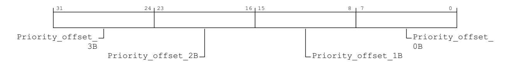

#### **Priority\_offset\_3B, bits [31:24]**

Interrupt priority value from an IMPLEMENTATION DEFINED range, at byte offset 3. Lower priority values correspond to greater priority of the interrupt. For an INTID configured as non-maskable, this field is RES0.

The reset behavior of this field is:

• On a GIC reset, this field resets to an architecturally UNKNOWN value.

#### **Priority\_offset\_2B, bits [23:16]**

Interrupt priority value from an IMPLEMENTATION DEFINED range, at byte offset 2. Lower priority values correspond to greater priority of the interrupt. For an INTID configured as non-maskable, this field is RES0.

The reset behavior of this field is:

• On a GIC reset, this field resets to an architecturally UNKNOWN value.

#### **Priority\_offset\_1B, bits [15:8]**

Interrupt priority value from an IMPLEMENTATION DEFINED range, at byte offset 1. Lower priority values correspond to greater priority of the interrupt. For an INTID configured as non-maskable, this field is RES0.

The reset behavior of this field is:

• On a GIC reset, this field resets to an architecturally UNKNOWN value.

#### **Priority\_offset\_0B, bits [7:0]**

Interrupt priority value from an IMPLEMENTATION DEFINED range, at byte offset 0. Lower priority values correspond to greater priority of the interrupt. For an INTID configured as non-maskable, this field is RES0.

The reset behavior of this field is:

• On a GIC reset, this field resets to an architecturally UNKNOWN value.

For interrupt ID m, when DIV and MOD are the integer division and modulo operations:

- The corresponding GICD\_IPRIORITYR<n> number, n, is given by n = (m-4096) DIV 4.
- The offset of the required GICD\_IPRIORITYR<n>E register is (0x2000 + (4\*n)).
- The byte offset of the required Priority field in this register is m MOD 4, where:
  - Byte offset 0 refers to register bits [7:0].
  - Byte offset 1 refers to register bits [15:8].
  - Byte offset 2 refers to register bits [23:16].
  - Byte offset 3 refers to register bits [31:24].

#### **Accessing the GICD\_IPRIORITYR<n>E:**

When affinity routing is not enabled for the Security state of an interrupt in GICD\_ISACTIVER<n>E, the corresponding bit is RES0.

When [GICD\\_CTLR](#page-543-1).DS==0:

- A field that corresponds to a Group 0 or Secure Group 1 interrupt is RAZ/WI to Non-secure accesses.
- A Non-secure access to a field that corresponds to a Non-secure Group 1 interrupt behaves as described in Software accesses of interrupt priority.

Bits corresponding to unimplemented interrupts are RAZ/WI.

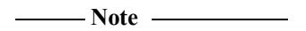

Implementations must ensure that an interrupt that is pending at the time of the write uses either the old value or the new value and must ensure that the interrupt is neither lost nor handled more than once. The effect of the change must be visible in finite time.

GICD\_IPRIORITYR<n>E can be accessed through its memory-mapped interface:

| Component       | Frame     | Offset           | Instance                 |
|-----------------|-----------|------------------|--------------------------|
| GIC Distributor | Dist_base | 0x2000 + (4 * n) | GICD_IPRIORITYR <n>E</n> |

#### <span id="page-583-1"></span><span id="page-583-0"></span>**12.9.22 GICD\_IROUTER<n>, Interrupt Routing Registers, n = 32 - 1019**

The GICD\_IROUTER<n> characteristics are:

#### **Purpose**

When affinity routing is enabled, provides routing information for the SPI with INTID n.

#### **Configurations**

These registers are available in all configurations of the GIC. If the GIC implementation supports two Security states, these registers are Common.

The maximum value of n is given by (32\*(GICD\_TYPER.ITLinesNumber+1) - 1). [GICD\\_IROUTER<n>](#page-583-1) registers where n=0 to 31 are reserved.

#### **Attributes**

GICD\_IROUTER<n> is a 64-bit register.

#### **Field descriptions**


#### **Bits [63:40]**

Reserved, RES0.

#### **Aff3, bits [39:32]**

Affinity level 3.

The reset behavior of this field is:

• On a GIC reset, this field resets to an architecturally UNKNOWN value.

#### **Interrupt\_Routing\_Mode, bit [31]**

Interrupt Routing Mode. Defines how SPIs are routed in an affinity hierarchy:

0b0 Interrupts routed to the PE specified by a.b.c.d. In this routing, a, b, c, and d are the values of fields Aff3, Aff2, Aff1, and Aff0 respectively.

0b1 Interrupts routed to any PE defined as a participating node.

If GICD\_IROUTER<n>.IRM == 0 and the affinity path does not correspond to an implemented PE, then if the corresponding interrupt becomes pending behavior is CONSTRAINED UNPREDICTABLE:

- The interrupt is not forwarded to any PE, direct reads return the written value
- The affinity path is treated as an UNKNOWN implemented PE, direct reads return the UNKNOWN implemented PE
- The affinity path is treated as an UNKNOWN implemented PE, direct reads return the written value

When [GICD\\_TYPER.](#page-617-1)No1N is 1, 1 of N distribution is not supported. Setting this field to 1 is CONSTRAINED UNPREDICTABLE, the permitted behaviors are:

- The field behaves as if set to 0 for all purposes.
- The field behaves as if set to 0 for all purposes other than a direct-read of the register.
- The interrupt is treated as not targeting any PE.

When this bit is set to 1, GICD\_IROUTER<n>.{Aff3, Aff2, Aff1, Aff0} are UNKNOWN.

|              | Note<br>An implementation might choose to make the Aff <n> fields RO when this field is 1.</n>                                                                                                                                                                                                                                                                     |
|--------------|--------------------------------------------------------------------------------------------------------------------------------------------------------------------------------------------------------------------------------------------------------------------------------------------------------------------------------------------------------------------|
|              | The reset behavior of this field is:                                                                                                                                                                                                                                                                                                                               |
|              | •<br>On a GIC reset, this field resets to an architecturally UNKNOWN value.                                                                                                                                                                                                                                                                                        |
| Bits [30:24] |                                                                                                                                                                                                                                                                                                                                                                    |
|              | Reserved, RES0.                                                                                                                                                                                                                                                                                                                                                    |
|              | Aff2, bits [23:16]                                                                                                                                                                                                                                                                                                                                                 |
|              | Affinity level 2.                                                                                                                                                                                                                                                                                                                                                  |
|              | The reset behavior of this field is:                                                                                                                                                                                                                                                                                                                               |
|              | •<br>On a GIC reset, this field resets to an architecturally UNKNOWN value.                                                                                                                                                                                                                                                                                        |
|              | Aff1, bits [15:8]                                                                                                                                                                                                                                                                                                                                                  |
|              | Affinity level 1.                                                                                                                                                                                                                                                                                                                                                  |
|              | The reset behavior of this field is:                                                                                                                                                                                                                                                                                                                               |
|              | •<br>On a GIC reset, this field resets to an architecturally UNKNOWN value.                                                                                                                                                                                                                                                                                        |
|              | Aff0, bits [7:0]                                                                                                                                                                                                                                                                                                                                                   |
|              | Affinity level 0.                                                                                                                                                                                                                                                                                                                                                  |
|              | The reset behavior of this field is:                                                                                                                                                                                                                                                                                                                               |
|              | •<br>On a GIC reset, this field resets to an architecturally UNKNOWN value.                                                                                                                                                                                                                                                                                        |
|              | For an SPI with INTID m:                                                                                                                                                                                                                                                                                                                                           |
| •            | The corresponding GICD_IROUTER <n> register number, n, is given by n = m.</n>                                                                                                                                                                                                                                                                                      |
| •            | The offset of the GICD_IROUTER <n> register is 0x6000 + 8n.</n>                                                                                                                                                                                                                                                                                                    |
|              | Accessing the GICD_IROUTER <n>:</n>                                                                                                                                                                                                                                                                                                                                |
|              | These registers are used only when affinity routing is enabled. When affinity routing is not enabled:                                                                                                                                                                                                                                                              |
| •            | These registers are RES0. An implementation is permitted to make the register RAZ/WI in this case.                                                                                                                                                                                                                                                                 |
| •            | The GICD_ITARGETSR <n> registers provide interrupt routing information.</n>                                                                                                                                                                                                                                                                                        |
|              | Note                                                                                                                                                                                                                                                                                                                                                               |
| interrupt.   | When affinity routing becomes enabled for a Security state (for example, following a reset or following a write to<br>GICD_CTLR) the value of all writable fields in this register is UNKNOWN for that Security state. When the group of<br>an interrupt changes so the ARE setting for the interrupt changes to 1, the value of this register is UNKNOWN for that |
|              | If GICD_CTLR.DS==0, unless the GICD_NSACR <n> registers permit Non-secure software to control Group 0<br/>and Secure Group 1 interrupts, any GICD_IROUTER<n> registers that correspond to Group 0 or Secure Group 1<br/>interrupts are accessible only by Secure accesses and are RAZ/WI to Non-secure accesses.<br/>Note</n></n>                                  |
|              | For each interrupt, a GIC implementation might support fewer than 256 values for an affinity level. In this case,                                                                                                                                                                                                                                                  |

neither lost nor handled more than one time. The effect of the change must be visible in finite time.

some bits of the corresponding affinity level field might be RO. Implementations must ensure that an interrupt that is pending at the time of the write uses either the old value or the new value and must ensure that the interrupt is

GICD\_IROUTER<n> can be accessed through its memory-mapped interface:

| Component       | Frame     | Offset           | Instance             |
|-----------------|-----------|------------------|----------------------|
| GIC Distributor | Dist_base | 0x6000 + (8 * n) | GICD_IROUTER <n></n> |

#### <span id="page-586-0"></span>**12.9.23 GICD\_IROUTER<n>E, Interrupt Routing Registers (Extended SPI Range), n = 0 - 1023**

The GICD\_IROUTER<n>E characteristics are:

#### **Purpose**

When affinity routing is enabled, provides routing information for the corresponding SPI in the extended SPI range.

#### **Configurations**

This register is present only when FEAT\_GICv3p1 is implemented. Otherwise, direct accesses to GICD\_IROUTER<n>E are RES0.

When [GICD\\_TYPER.](#page-617-1)ESPI==0, these registers are RES0.

When [GICD\\_TYPER.](#page-617-1)ESPI==1, the number of implemented GICD\_IROUTER<n>E registers is (([\(GICD\\_TYPER.](#page-617-1)ESPI\_range+1)\*32)-1). Registers are numbered from 0.

#### **Attributes**

GICD\_IROUTER<n>E is a 64-bit register.

#### **Field descriptions**

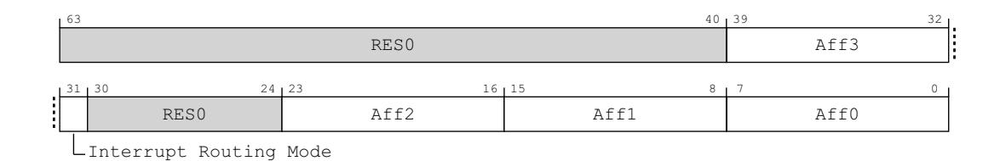

#### **Bits [63:40]**

Reserved, RES0.

#### **Aff3, bits [39:32]**

Affinity level 3.

The reset behavior of this field is:

• On a GIC reset, this field resets to an architecturally UNKNOWN value.

#### **Interrupt\_Routing\_Mode, bit [31]**

Interrupt Routing Mode. Defines how SPIs are routed in an affinity hierarchy:

0b0 Interrupts routed to the PE specified by a.b.c.d. In this routing, a, b, c, and d are the values of fields Aff3, Aff2, Aff1, and Aff0 respectively.

0b1 Interrupts routed to any PE defined as a participating node.

If GICD\_IROUTER<n>E.IRM == 0 and the affinity path does not correspond to an implemented PE, then if the corresponding interrupt becomes pending behavior is CONSTRAINED UNPREDICTABLE:

- The interrupt is not forwarded to any PE, direct reads return the written value
- The affinity path is treated as an UNKNOWN implemented PE, direct reads return the UNKNOWN implemented PE
- The affinity path is treated as an UNKNOWN implemented PE, direct reads return the written value

When [GICD\\_TYPER.](#page-617-1)No1N is 1, 1 of N distribution is not supported. Setting this field to 1 is CONSTRAINED UNPREDICTABLE, the permitted behaviors are:

- The field behaves as if set to 0 for all purposes.
- The field behaves as if set to 0 for all purposes other than a direct-read of the register.

• The interrupt is treated as not targeting any PE.

When this bit is set to 1, GICD\_IROUTER<n>E.{Aff3, Aff2, Aff1, Aff0} are UNKNOWN.

**Note**

An implementation might choose to make the Aff<n> fields RO when this field is 1.

The reset behavior of this field is:

• On a GIC reset, this field resets to an architecturally UNKNOWN value.

#### **Bits [30:24]**

Reserved, RES0.

#### **Aff2, bits [23:16]**

Affinity level 2.

The reset behavior of this field is:

• On a GIC reset, this field resets to an architecturally UNKNOWN value.

#### **Aff1, bits [15:8]**

Affinity level 1.

The reset behavior of this field is:

• On a GIC reset, this field resets to an architecturally UNKNOWN value.

#### **Aff0, bits [7:0]**

Affinity level 0.

The reset behavior of this field is:

• On a GIC reset, this field resets to an architecturally UNKNOWN value.

For an SPI with INTID m:

- The corresponding GICD\_IROUTER<n>E register number, n, is given by n = m.
- The offset of the GICD\_IROUTER<n>E register is 0x6000 + 8n.

#### **Accessing the GICD\_IROUTER<n>E:**

When affinity routing is not enabled for the Security state of an interrupt in GICD\_IROUTER<n>E, the register is RES0.

When [GICD\\_CTLR](#page-543-1).DS==0, a register that corresponds to a Group 0 or Secure Group 1 interrupt is RAZ/WI to Non-secure accesses.

Bits corresponding to unimplemented interrupts are RAZ/WI.

GICD\_IROUTER<n>E can be accessed through its memory-mapped interface:

| Component       | Frame     | Offset           | Instance              |
|-----------------|-----------|------------------|-----------------------|
| GIC Distributor | Dist_base | 0x8000 + (8 * n) | GICD_IROUTER <n>E</n> |

#### <span id="page-588-0"></span>**12.9.24 GICD\_ISACTIVER<n>, Interrupt Set-Active Registers, n = 0 - 31**

The GICD\_ISACTIVER<n> characteristics are:

#### **Purpose**

Activates the corresponding interrupt. These registers are used when saving and restoring GIC state.

#### **Configurations**

These registers are available in all GIC configurations. If [GICD\\_CTLR](#page-543-1).DS==0, these registers are Common.

The number of implemented [GICD\\_ISACTIVER<n>](#page-588-0) registers is [\(GICD\\_TYPER.](#page-617-1)ITLinesNumber+1). Registers are numbered from 0.

GICD\_ISACTIVER0 is Banked for each connected PE with [GICR\\_TYPER.](#page-710-1)Processor\_Number < 8.

Accessing GICD\_ISACTIVER0 from a PE with [GICR\\_TYPER.](#page-710-1)Processor\_Number > 7 is CONSTRAINED UNPREDICTABLE:

- Register is RAZ/WI.
- An UNKNOWN banked copy of the register is accessed.

#### **Attributes**

GICD\_ISACTIVER<n> is a 32-bit register.

#### **Field descriptions**


#### **Set\_active\_bit<x>, bit [x], for x = 31 to 0**

Adds the active state to interrupt number 32n + x. Reads and writes have the following behavior:

0b0 If read, indicates that the corresponding interrupt is not active, and is not active and pending.

If written, has no effect.

0b1 If read, indicates that the corresponding interrupt is active, or is active and pending. If written, activates the corresponding interrupt, if the interrupt is not already active. If the interrupt is already active, the write has no effect.

After a write of 1 to this bit, a subsequent read of this bit returns 1.

The reset behavior of this field is:

• On a GIC reset, this field resets to 0.

For INTID m, when DIV and MOD are the integer division and modulo operations:

- The corresponding GICD\_ISACTIVER<n> number, n, is given by n = m DIV 32.
- The offset of the required GICD\_ISACTIVER is (0x300 + (4\*n)).
- The bit number of the required group modifier bit in this register is m MOD 32.

#### **Accessing the GICD\_ISACTIVER<n>:**

When affinity routing is enabled for the Security state of an interrupt, bits corresponding to SGIs and PPIs are RAZ/WI, and equivalent functionality for SGIs and PPIs is provided by [GICR\\_ISACTIVER0.](#page-683-0)

Bits corresponding to unimplemented interrupts are RAZ/WI.

If [GICD\\_CTLR](#page-543-1).DS==0, unless the [GICD\\_NSACR<n>](#page-603-0) registers permit Non-secure software to control Group 0 and Secure Group 1 interrupts, any bits that correspond to Group 0 or Secure Group 1 interrupts are accessible only by Secure accesses and are RAZ/WI to Non-secure accesses.

The bit reads as one if the status of the interrupt is active or active and pending. [GICD\\_ISPENDR<n>](#page-596-1) and [GICD\\_ICPENDR<n>](#page-561-1) provide the pending status of the interrupt.

GICD\_ISACTIVER<n> can be accessed through its memory-mapped interface:

| Component       | Frame     | Offset           | Instance               |
|-----------------|-----------|------------------|------------------------|
| GIC Distributor | Dist_base | 0x0300 + (4 * n) | GICD_ISACTIVER <n></n> |

This interface is accessible as follows:

- When GICD\_CTLR.DS == 0 accesses to this register are RW.
- When an access is Secure accesses to this register are RW.
- When an access is Non-secure accesses to this register are RW.

#### <span id="page-590-0"></span>**12.9.25 GICD\_ISACTIVER<n>E, Interrupt Set-Active Registers (extended SPI range), n = 0 - 31**

The GICD\_ISACTIVER<n>E characteristics are:

#### **Purpose**

Adds the active state to the corresponding SPI in the extended SPI range.

#### **Configurations**

This register is present only when FEAT\_GICv3p1 is implemented. Otherwise, direct accesses to GICD\_ISACTIVER<n>E are RES0.

When GICD\_TYPER.ESPI==0, these registers are RES0.

When GICD\_TYPER.ESPI==1, the number of implemented GICD\_ISACTIVER<n>E registers is (GICD\_TYPER.ESPI\_range+1). Registers are numbered from 0.

#### **Attributes**

GICD\_ISACTIVER<n>E is a 32-bit register.

#### **Field descriptions**

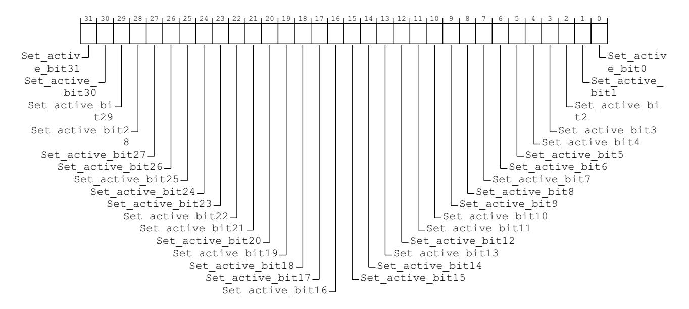

#### **Set\_active\_bit<x>, bit [x], for x = 31 to 0**

For the extended SPIs, adds the active state to interrupt number x. Reads and writes have the following behavior:

0b0 If read, indicates that the corresponding interrupt is not active, and is not active and pending.

If written, has no effect.

0b1 If read, indicates that the corresponding interrupt is active, or active and pending on this PE.

> If written, activates the corresponding interrupt, if the interrupt is not already active. If the interrupt is already active, the write has no effect.

After a write of 1 to this bit, a subsequent read of this bit returns 1.

The reset behavior of this field is:

• On a GIC reset, this field resets to 0.

For INTID m, when DIV and MOD are the integer division and modulo operations:

- The corresponding GICD\_ISACTIVER<n>E number, n, is given by n = (m-4096) DIV 32.
- The offset of the required GICD\_ISACTIVER<n>E is (0x1A00 + (4\*n)).
- The bit number of the required group modifier bit in this register is (m-4096) MOD 32.

#### **Accessing the GICD\_ISACTIVER<n>E:**

When affinity routing is not enabled for the Security state of an interrupt in GICD\_ISACTIVER<n>E, the corresponding bit is RES0.

When [GICD\\_CTLR](#page-543-1).DS==0, bits corresponding to Secure SPIs are RAZ/WI to Non-secure accesses.

Bits corresponding to unimplemented interrupts are RAZ/WI.

GICD\_ISACTIVER<n>E can be accessed through its memory-mapped interface:

| Component       | Frame     | Offset           | Instance                |
|-----------------|-----------|------------------|-------------------------|
| GIC Distributor | Dist_base | 0x1A00 + (4 * n) | GICD_ISACTIVER <n>E</n> |

#### <span id="page-592-1"></span><span id="page-592-0"></span>**12.9.26 GICD\_ISENABLER<n>, Interrupt Set-Enable Registers, n = 0 - 31**

The GICD\_ISENABLER<n> characteristics are:

#### **Purpose**

Enables forwarding of the corresponding interrupt to the CPU interfaces.

#### **Configurations**

These registers are available in all GIC configurations. If [GICD\\_CTLR](#page-543-1).DS==0, these registers are Common.

The number of implemented GICD\_ISENABLER<n> registers is [\(GICD\\_TYPER.](#page-617-1)ITLinesNumber+1). Registers are numbered from 0.

GICD\_ISENABLER0 is Banked for each connected PE with [GICR\\_TYPER](#page-710-1).Processor\_Number < 8.

Accessing GICD\_ISENABLER0 from a PE with [GICR\\_TYPER](#page-710-1).Processor\_Number > 7 is CONSTRAINED UNPREDICTABLE:

- Register is RAZ/WI.
- An UNKNOWN banked copy of the register is accessed.

#### **Attributes**

GICD\_ISENABLER<n> is a 32-bit register.

#### **Field descriptions**

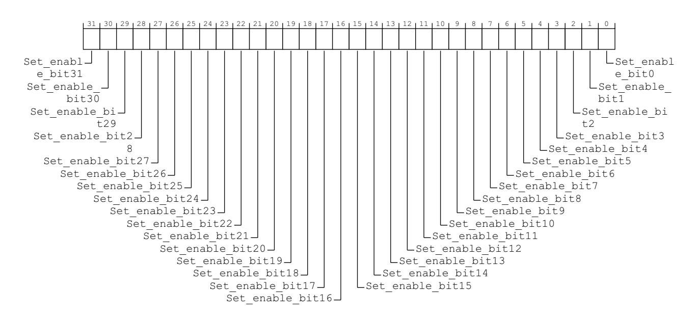

#### **Set\_enable\_bit<x>, bit [x], for x = 31 to 0**

For SPIs and PPIs, controls the forwarding of interrupt number 32n + x to the CPU interfaces. Reads and writes have the following behavior:

0b0 If read, indicates that forwarding of the corresponding interrupt is disabled. If written, has no effect.

0b1 If read, indicates that forwarding of the corresponding interrupt is enabled.

If written, enables forwarding of the corresponding interrupt.

After a write of 1 to this bit, a subsequent read of this bit returns 1.

For SGIs, the behavior of this bit is IMPLEMENTATION DEFINED.

The reset behavior of this field is:

• On a GIC reset, this field resets to an architecturally UNKNOWN value.

For INTID m, when DIV and MOD are the integer division and modulo operations:

- The corresponding GICD\_ISENABLER<n> number, n, is given by n = m DIV 32.
- The offset of the required GICD\_ISENABLER is (0x100 + (4\*n)).
- The bit number of the required group modifier bit in this register is m MOD 32.

At start-up, and after a reset, a PE can use this register to discover which peripheral INTIDs the GIC supports. If [GICD\\_CTLR.](#page-543-1)DS==0 in a system that supports EL3, the PE must do this for the Secure view of the available interrupts, and Non-secure software running on the PE must do this discovery after the Secure software has configured interrupts as Group 0/Secure Group 1 and Non-secure Group 1.

#### **Accessing the GICD\_ISENABLER<n>:**

For SGIs and PPIs:

- When ARE is 1 for the Security state of an interrupt, the field for that interrupt is RES0 and an implementation is permitted to make the field RAZ/WI in this case.
- Equivalent functionality is provided by GICR\_ISENABLER0.

Bits corresponding to unimplemented interrupts are RAZ/WI.

When [GICD\\_CTLR.](#page-543-1)DS==0, bits corresponding to Group 0 or Secure Group 1 interrupts are RAZ/WI to Non-secure accesses.

It is IMPLEMENTATION DEFINED whether implemented SGIs are permanently enabled, or can be enabled and disabled by writes to [GICD\\_ISENABLER<n>](#page-592-1) and [GICD\\_ICENABLER<n>](#page-553-1) where n=0.

For SPIs and PPIs, each bit controls the forwarding of the corresponding interrupt from the Distributor to the CPU interfaces.

GICD\_ISENABLER<n> can be accessed through its memory-mapped interface:

| Component       | Frame     | Offset           | Instance               |
|-----------------|-----------|------------------|------------------------|
| GIC Distributor | Dist_base | 0x0100 + (4 * n) | GICD_ISENABLER <n></n> |

#### <span id="page-594-1"></span><span id="page-594-0"></span>**12.9.27 GICD\_ISENABLER<n>E, Interrupt Set-Enable Registers, n = 0 - 31**

The GICD\_ISENABLER<n>E characteristics are:

#### **Purpose**

Enables forwarding of the corresponding SPI in the extended SPI range to the CPU interfaces.

#### **Configurations**

This register is present only when FEAT\_GICv3p1 is implemented. Otherwise, direct accesses to GICD\_ISENABLER<n>E are RES0.

When [GICD\\_TYPER.](#page-617-1)ESPI==0, these registers are RES0.

When [GICD\\_TYPER](#page-617-1).ESPI==1, the number of implemented [GICD\\_ISENABLER<n>E](#page-594-1) registers is [\(GICD\\_TYPER.](#page-617-1)ESPI\_range+1). Registers are numbered from 0.

#### **Attributes**

GICD\_ISENABLER<n>E is a 32-bit register.

#### **Field descriptions**

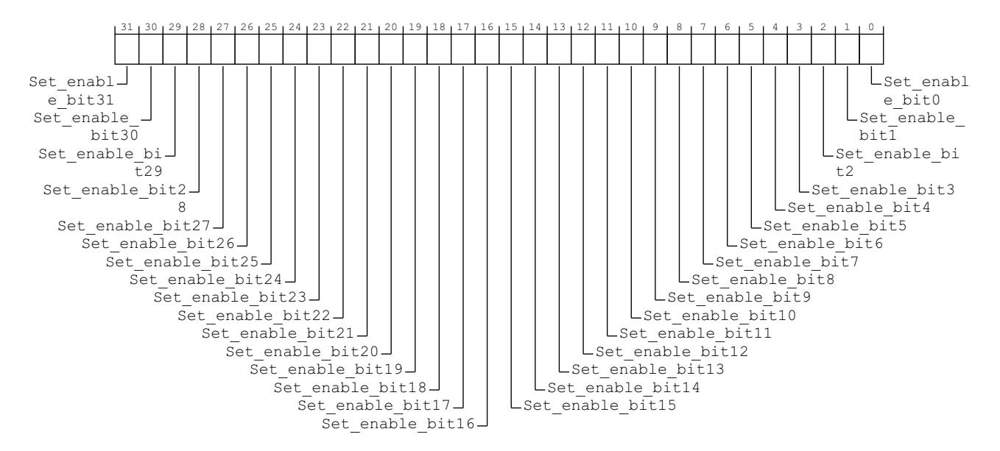

#### **Set\_enable\_bit<x>, bit [x], for x = 31 to 0**

For the extended SPI range, controls the forwarding of interrupt number x to the CPU interface. Reads and writes have the following behavior:

- 0b0 If read, indicates that forwarding of the corresponding interrupt is disabled. If written, has no effect.
- 0b1 If read, indicates that forwarding of the corresponding interrupt is enabled. If written, enables forwarding of the corresponding interrupt. After a write of 1 to this bit, a subsequent read of this bit returns 1.

The reset behavior of this field is:

• On a GIC reset, this field resets to 0.

For INTID m, when DIV and MOD are the integer division and modulo operations:

- The corresponding GICD\_ISENABLER<n>E number, n, is given by n = (m-4096) DIV 32.
- The offset of the required GICD\_ISENABLER<n>E is (0x1200 + (4\*n)).

• The bit number of the required group modifier bit in this register is (m-4096) MOD 32.

#### **Accessing the GICD\_ISENABLER<n>E:**

When affinity routing is not enabled for the Security state of an interrupt in GICD\_ISENABLER<n>E, the corresponding bit is RES0.

When [GICD\\_CTLR](#page-543-1).DS==0, bits corresponding to Secure SPIs are RAZ/WI to Non-secure accesses.

Bits corresponding to unimplemented interrupts are RAZ/WI.

GICD\_ISENABLER<n>E can be accessed through its memory-mapped interface:

| Component       | Frame     | Offset           | Instance                |
|-----------------|-----------|------------------|-------------------------|
| GIC Distributor | Dist_base | 0x1200 + (4 * n) | GICD_ISENABLER <n>E</n> |

#### <span id="page-596-1"></span><span id="page-596-0"></span>**12.9.28 GICD\_ISPENDR<n>, Interrupt Set-Pending Registers, n = 0 - 31**

The GICD\_ISPENDR<n> characteristics are:

#### **Purpose**

Adds the pending state to the corresponding interrupt.

#### **Configurations**

These registers are available in all GIC configurations. If [GICD\\_CTLR](#page-543-1).DS==0, these registers are Common.

The number of implemented [GICD\\_ISPENDR<n>](#page-596-1) registers is [\(GICD\\_TYPER.](#page-617-1)ITLinesNumber+1). Registers are numbered from 0.

GICD\_ISPENDR0 is Banked for each connected PE with [GICR\\_TYPER](#page-710-1).Processor\_Number < 8.

Accessing GICD\_ISPENDR0 from a PE with [GICR\\_TYPER](#page-710-1).Processor\_Number > 7 is CONSTRAINED UNPREDICTABLE:

- Register is RAZ/WI.
- An UNKNOWN banked copy of the register is accessed.

#### **Attributes**

GICD\_ISPENDR<n> is a 32-bit register.

#### **Field descriptions**

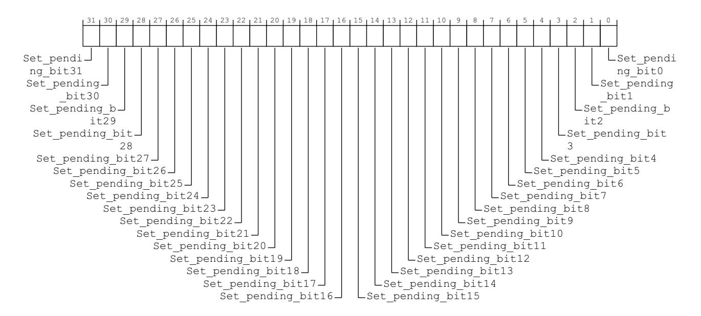

#### **Set\_pending\_bit<x>, bit [x], for x = 31 to 0**

For SPIs and PPIs, adds the pending state to interrupt number 32n + x. Reads and writes have the following behavior:

- 0b0 If read, indicates that the corresponding interrupt is not pending on any PE. If written, has no effect.
- 0b1 If read, indicates that the corresponding interrupt is pending, or active and pending. If written, changes the state of the corresponding interrupt from inactive to pending, or from active to active and pending. This has no effect in the following cases:
  - If the interrupt is an SGI. The pending state of an SGI can be set using [GICD\\_SPENDSGIR<n>.](#page-613-0)

- If the interrupt is not inactive and is not active.
- If the interrupt is already pending because of a write to [GICD\\_ISPENDR<n>](#page-596-1).
- If the interrupt is already pending because the corresponding interrupt signal is asserted. In this case, the interrupt remains pending if the interrupt signal is deasserted.

The reset behavior of this field is:

• On a GIC reset, this field resets to 0.

#### **Accessing the GICD\_ISPENDR<n>:**

Set-pending bits for SGIs are read-only and ignore writes. The Set-pending bits for SGIs are provided as [GICD\\_SPENDSGIR<n>](#page-613-0).

When affinity routing is enabled for the Security state of an interrupt:

- Bits corresponding to SGIs and PPIs are RAZ/WI, and equivalent functionality for SGIs and PPIs is provided by GICR\_ISPENDR0.
- Bits corresponding to Group 0 and Group 1 Secure interrupts can only be set by Secure accesses.

Bits corresponding to unimplemented interrupts are RAZ/WI.

If [GICD\\_CTLR](#page-543-1).DS==0, unless the [GICD\\_NSACR<n>](#page-603-0) registers permit Non-secure software to control Group 0 and Secure Group 1 interrupts, any bits that correspond to Group 0 or Secure Group 1 interrupts are accessible only by Secure accesses and are RAZ/WI to Non-secure accesses.

GICD\_ISPENDR<n> can be accessed through its memory-mapped interface:

| Component       | Frame     | Offset           | Instance             |
|-----------------|-----------|------------------|----------------------|
| GIC Distributor | Dist_base | 0x0200 + (4 * n) | GICD_ISPENDR <n></n> |

#### <span id="page-598-0"></span>**12.9.29 GICD\_ISPENDR<n>E, Interrupt Set-Pending Registers (extended SPI range), n = 0 - 31**

The GICD\_ISPENDR<n>E characteristics are:

#### **Purpose**

Adds the pending state to the corresponding SPI in the extended SPI range.

#### **Configurations**

This register is present only when FEAT\_GICv3p1 is implemented. Otherwise, direct accesses to GICD\_ISPENDR<n>E are RES0.

When [GICD\\_TYPER.](#page-617-1)ESPI==0, these registers are RES0.

When [GICD\\_TYPER.](#page-617-1)ESPI==1, the number of implemented GICD\_ISPENDR<n>E registers is [\(GICD\\_TYPER.](#page-617-1)ESPI\_range+1). Registers are numbered from 0.

#### **Attributes**

GICD\_ISPENDR<n>E is a 32-bit register.

#### **Field descriptions**

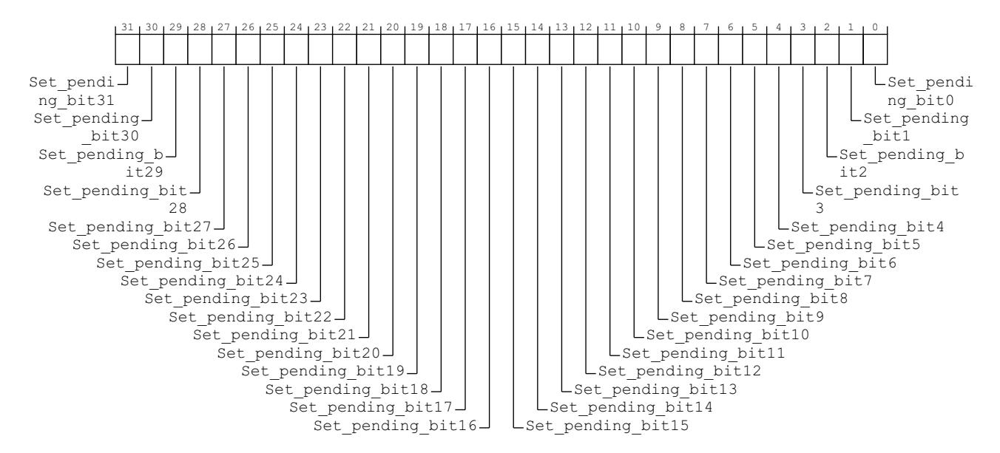

#### **Set\_pending\_bit<x>, bit [x], for x = 31 to 0**

For the extended SPIs, adds the pending state to interrupt number x. Reads and writes have the following behavior:

- 0b0 If read, indicates that the corresponding interrupt is not pending. If written, has no effect.
- 0b1 If read, indicates that the corresponding interrupt is pending, or active and pending. If written, changes the state of the corresponding interrupt from inactive to pending, or from active to active and pending.

This has no effect in the following cases:

- If the interrupt is already pending because of a write to GICD\_ISPENDR<n>E.
- If the interrupt is already pending because the corresponding interrupt signal is asserted. In this case, the interrupt remains pending if the interrupt signal is deasserted.

The reset behavior of this field is:

• On a GIC reset, this field resets to 0.

For INTID m, when DIV and MOD are the integer division and modulo operations:

- The corresponding GICD\_ISPENDR<n>E number, n, is given by n = (m-4096) DIV 32.
- The offset of the required GICD\_ISPENDR<n>E is (0x1600 + (4\*n)).
- The bit number of the required group modifier bit in this register is (m-4096) MOD 32.

#### **Accessing the GICD\_ISPENDR<n>E:**

When affinity routing is not enabled for the Security state of an interrupt in GICD\_ISPENDR<n>E, the corresponding bit is RES0.

When [GICD\\_CTLR](#page-543-1).DS==0, bits corresponding to Secure SPIs are RAZ/WI to Non-secure accesses.

Bits corresponding to unimplemented interrupts are RAZ/WI.

GICD\_ISPENDR<n>E can be accessed through its memory-mapped interface:

| Component       | Frame     | Offset           | Instance              |
|-----------------|-----------|------------------|-----------------------|
| GIC Distributor | Dist_base | 0x1600 + (4 * n) | GICD_ISPENDR <n>E</n> |

#### <span id="page-600-1"></span><span id="page-600-0"></span>**12.9.30 GICD\_ITARGETSR<n>, Interrupt Processor Targets Registers, n = 0 - 254**

The GICD\_ITARGETSR<n> characteristics are:

#### **Purpose**

When affinity routing is not enabled, holds the list of target PEs for the interrupt. That is, it holds the list of CPU interfaces to which the Distributor forwards the interrupt if it is asserted and has sufficient priority.

#### **Configurations**

These registers are available in all configurations of the GIC. When [GICD\\_CTLR.](#page-543-1)DS==0, these registers are Common.

The number of implemented GICD\_ITARGETSR<n> registers is 8\*[\(GICD\\_TYPER.](#page-617-1)ITLinesNumber+1). Registers are numbered from 0.

GICD\_ITARGETSR0 to GICD\_ITARGETSR7 are Banked for each connected PEwith [GICR\\_TYPER](#page-710-1).Processor\_Number < 8.

Accessing GICD\_ITARGETSR0 to GICD\_ITARGETSR7 from a PE with [GICR\\_TYPER](#page-710-1).Processor\_Number > 7 is CONSTRAINED UNPREDICTABLE:

- Register is RAZ/WI.
- An UNKNOWN banked copy of the register is accessed.

#### **Attributes**

GICD\_ITARGETSR<n> is a 32-bit register.

#### **Field descriptions**

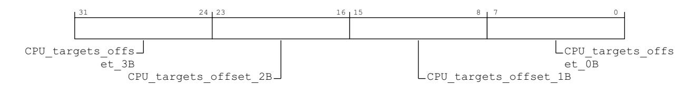

PEs in the system number from 0, and each bit in a PE targets field refers to the corresponding PE. For example, a value of 0x3 means that the Pending interrupt is sent to PEs 0 and 1. For

GICD\_ITARGETSR0-GICD\_ITARGETSR7, a read of any targets field returns the number of the PE performing the read.

#### **CPU\_targets\_offset\_3B, bits [31:24]**

PE targets for an interrupt, at byte offset 3.

The reset behavior of this field is:

• On a GIC reset, this field resets to an architecturally UNKNOWN value.

#### **CPU\_targets\_offset\_2B, bits [23:16]**

PE targets for an interrupt, at byte offset 2.

The reset behavior of this field is:

• On a GIC reset, this field resets to an architecturally UNKNOWN value.

#### **CPU\_targets\_offset\_1B, bits [15:8]**

PE targets for an interrupt, at byte offset 1.

The reset behavior of this field is:

• On a GIC reset, this field resets to an architecturally UNKNOWN value.

#### **CPU\_targets\_offset\_0B, bits [7:0]**

PE targets for an interrupt, at byte offset 0.

The reset behavior of this field is:

• On a GIC reset, this field resets to an architecturally UNKNOWN value.

The bits that are set to 1 in the PE targets field determine which PEs are targeted:

| Value of PE targets field | Interrupt targets |
|---------------------------|-------------------|
| 0bxxxxxxx1                | CPU interface 0   |
| 0bxxxxxx1x                | CPU interface 1   |
| 0bxxxxx1xx                | CPU interface 2   |
| 0bxxxx1xxx                | CPU interface 3   |
| 0bxxx1xxxx                | CPU interface 4   |
| 0bxx1xxxxx                | CPU interface 5   |
| 0bx1xxxxxx                | CPU interface 6   |
| 0b1xxxxxxx                | CPU interface 7   |

For interrupt ID m, when DIV and MOD are the integer division and modulo operations:

- The corresponding GICD\_ITARGETSR<n> number, n, is given by n = m DIV 4.
- The offset of the required GICD\_ITARGETSR<n> register is (0x800 + (4\*n)).
- The byte offset of the required Priority field in this register is m MOD 4, where:
  - Byte offset 0 refers to register bits [7:0].
  - Byte offset 1 refers to register bits [15:8].
  - Byte offset 2 refers to register bits [23:16].
  - Byte offset 3 refers to register bits [31:24].

Software can write to these registers at any time. Any change to a targets field value:

- Has no effect on any active interrupt. This means that removing a CPU interface from a targets list does not cancel an active state for interrupts on that CPU interface. There is no effect on interrupts that are active and pending until the active status is cleared, at which time it is treated as a pending interrupt.
- Has an effect on any pending interrupts. This means:
  - Enables the CPU interface to be chosen as a target for the pending interrupt using an IMPLEMENTATION DEFINED mechanism.
  - Removing a CPU interface from the target list of a pending interrupt removes the pending state of the interrupt on that CPU interface.

#### **Accessing the GICD\_ITARGETSR<n>:**

These registers are used when affinity routing is not enabled. When affinity routing is enabled for the Security state of an interrupt, the target PEs for an interrupt are defined by [GICD\\_IROUTER<n>](#page-583-1) and the associated byte in GICD\_ITARGETSR<n> is RES0. An implementation is permitted to make the byte RAZ/WI in this case.

- These registers are byte-accessible.
- A register field corresponding to an unimplemented interrupt is RAZ/WI.
- A field bit corresponding to an unimplemented CPU interface is RAZ/WI.

- GICD\_ITARGETSR0-GICD\_ITARGETSR7 are read-only. Each field returns a value that corresponds only to the PE reading the register.
- It is IMPLEMENTATION DEFINED which, if any, SPIs are statically configured in hardware. The field for such an SPI is read-only, and returns a value that indicates the PE targets for the interrupt.
- If [GICD\\_CTLR](#page-543-1).DS==0, unless the [GICD\\_NSACR<n>](#page-603-0) registers permit Non-secure software to control Group 0 and Secure Group 1 interrupts, any bits that correspond to Group 0 or Secure Group 1 interrupts are accessible only by Secure accesses and are RAZ/WI to Non-secure accesses.

In a single connected PE implementation, all interrupts target one PE, and these registers are RAZ/WI.

| Note |  |
|------|--|
|      |  |

Implementations must ensure that an interrupt that is pending at the time of the write uses either the old value or the new value and must ensure that the interrupt is neither lost nor handled more than one time. The effect of the change must be visible in finite time.

GICD\_ITARGETSR<n> can be accessed through its memory-mapped interface:

| Component       | Frame     | Offset           | Instance               |
|-----------------|-----------|------------------|------------------------|
| GIC Distributor | Dist_base | 0x0800 + (4 * n) | GICD_ITARGETSR <n></n> |

#### <span id="page-603-1"></span><span id="page-603-0"></span>**12.9.31 GICD\_NSACR<n>, Non-secure Access Control Registers, n = 0 - 63**

The GICD\_NSACR<n> characteristics are:

#### **Purpose**

Enables Secure software to permit Non-secure software on a particular PE to create and control Group 0 interrupts.

#### **Configurations**

The concept of selective enabling of Non-secure access to Group 0 and Secure Group 1 interrupts applies to SGIs and SPIs.

GICD\_NSACR0 is a Banked register used for SGIs. A copy is provided for every PE that has a CPU interface and that supports this feature.

#### **Attributes**

GICD\_NSACR<n> is a 32-bit register.

#### **Field descriptions**

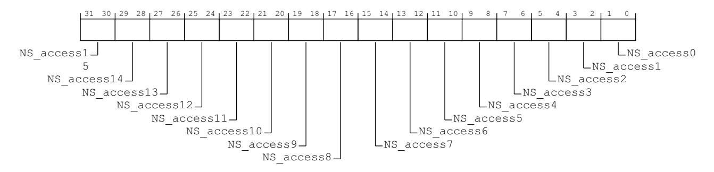

#### **NS\_access<x>, bits [2x+1:2x], for x = 15 to 0**

Controls Non-secure access of the interrupt with ID 16n + x.

If the corresponding interrupt does not support configurable Non-secure access, the field is RAZ/WI.

Otherwise, the field is RW and determines the level of Non-secure control permitted if the interrupt is a Secure interrupt. If the interrupt is a Non-secure interrupt, this field is ignored.

The possible values of each 2-bit field are:

0b00 No Non-secure access is permitted to fields associated with the corresponding interrupt.

0b01 Non-secure read and write access is permitted to set-pending bits in [GICD\\_ISPENDR<n>](#page-596-1) associated with the corresponding interrupt. A Non-secure write access to [GICD\\_SETSPI\\_NSR](#page-607-1) is permitted to set the pending state of the corresponding interrupt. A Non-secure write access to [GICD\\_SGIR](#page-611-1) is permitted to generate a Secure SGI for the corresponding interrupt.

> An implementation might also provide read access to clear-pending bits in [GICD\\_ICPENDR<n>](#page-561-1) associated with the corresponding interrupt.

0b10 As 0b01, but adds Non-secure read and write access permission to fields associated with the corresponding interrupt in the [GICD\\_ICPENDR<n>](#page-561-1) registers. A Non-secure write access to [GICD\\_CLRSPI\\_NSR](#page-537-1) is permitted to clear the pending state of the corresponding interrupt. Also adds Non-secure read access permission to fields associated with the corresponding interrupt in the [GICD\\_ISACTIVER<n>](#page-588-0) and [GICD\\_ICACTIVER<n>](#page-549-0) registers.

0b11 For GICD\_NSACR0 this encoding is reserved and treated as 10.

For all other GICD\_NSACR<n> registers this encoding is treated as 0b10, but adds Non-secure read and write access permission to [GICD\\_ITARGETSR<n>](#page-600-1) and [GICD\\_IROUTER<n>](#page-583-1) fields associated with the corresponding interrupt.

The reset behavior of this field is:

• On a GIC reset, this field resets to 0.

For interrupt ID m, when DIV and MOD are the integer division and modulo operations:

- The corresponding GICD\_NSACR<n> number, n, is given by n = m DIV 16.
- The offset of the required GICD\_NSACR<n> register is (0xE00 + (4\*n)).

Because each field in this register comprises two bits, GICD\_NSACR0 controls access rights to SGI registers, GICD\_NSACR1 controls access to PPI registers (and is always RAZ/WI), and all other GICD\_NSACR<n> registers control access to SPI registers.

For compatibility with GICv2, writes to GICD\_NSACR0 for a particular PE must be coordinated within the Distributor and must update [GICR\\_NSACR](#page-696-1) for the Redistributor associated with that PE.

#### **Accessing the GICD\_NSACR<n>:**

These registers are always used when affinity routing is not enabled. When affinity routing is enabled for the Secure state, GICD\_NSACR0 is RES0 and [GICR\\_NSACR](#page-696-1) provides equivalent functionality for SGIs.

These registers do not support PPIs, therefore GICD\_NSACR1 is RAZ/WI.

GICD\_NSACR<n> can be accessed through its memory-mapped interface:

| Component       | Frame     | Offset           | Instance           |
|-----------------|-----------|------------------|--------------------|
| GIC Distributor | Dist_base | 0x0E00 + (4 * n) | GICD_NSACR <n></n> |

This interface is accessible as follows:

- When GICD\_CTLR.DS == 1 accesses to this register are RAZ/WI.
- When GICD\_CTLR.DS == 0 and an access is Secure accesses to this register are RW.
- When GICD\_CTLR.DS == 0 and an access is Non-secure accesses to this register are RAZ/WI.
- When GICD\_CTLR.DS == 0, FEAT\_RME is implemented and an access is Root accesses to this register are RW.
- When GICD\_CTLR.DS == 0, FEAT\_RME is implemented and an access is Realm accesses to this register are RAZ/WI.

#### <span id="page-605-0"></span>**12.9.32 GICD\_NSACR<n>E, Non-secure Access Control Registers, n = 0 - 63**

The GICD\_NSACR<n>E characteristics are:

#### **Purpose**

Enables Secure software to permit Non-secure software on a particular PE to create and control Group 0 interrupts.

#### **Configurations**

This register is present only when FEAT\_GICv3p1 is implemented. Otherwise, direct accesses to GICD\_NSACR<n>E are RES0.

When [GICD\\_TYPER.](#page-617-1)ESPI==0, these registers are RES0.

When [GICD\\_TYPER.](#page-617-1)ESPI==1, the number of implemented GICD\_ICFGR<n>E registers is ([\(GICD\\_TYPER.](#page-617-1)ESPI\_range+1)\*2). Registers are numbered from 0.

#### **Attributes**

GICD\_NSACR<n>E is a 32-bit register.

#### **Field descriptions**

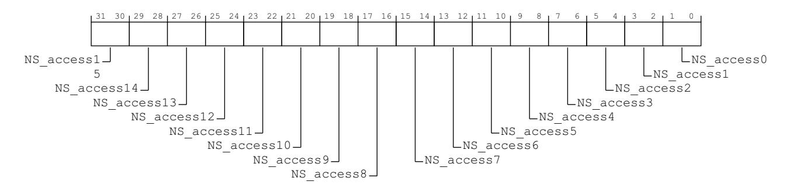

#### **NS\_access<x>, bits [2x+1:2x], for x = 15 to 0**

Controls Non-secure access of the interrupt with ID 16n + x.

If the corresponding interrupt does not support configurable Non-secure access, the field is RAZ/WI.

Otherwise, the field is RW and determines the level of Non-secure control permitted if the interrupt is a Secure interrupt. If the interrupt is a Non-secure interrupt, this field is ignored.

The possible values of each 2-bit field are:

0b00 No Non-secure access is permitted to fields associated with the corresponding interrupt.

0b01 Non-secure read and write access is permitted to set-pending bits in [GICD\\_ISPENDR<n>E](#page-598-0) associated with the corresponding interrupt. A Non-secure write access to [GICD\\_SETSPI\\_NSR](#page-607-1) is permitted to set the pending state of the corresponding interrupt.

0b10 As 0b01, but adds Non-secure read and write access permission to fields associated with the corresponding interrupt in the [GICD\\_ICPENDR<n>E](#page-563-0) registers. A Non-secure write access to [GICD\\_CLRSPI\\_NSR](#page-537-1) is permitted to clear the pending state of the corresponding interrupt. Also adds Non-secure read access permission to fields associated with the corresponding interrupt in the [GICD\\_ISACTIVER<n>E](#page-590-0) and [GICD\\_ICACTIVER<n>E](#page-551-0) registers.

0b11 This encoding is treated as 0b10, but adds Non-secure read and write access permission to GICD\_IROUTER<n>E fields associated with the corresponding interrupt.

The reset behavior of this field is:

• On a GIC reset, this field resets to 0.

For interrupt ID m, when DIV and MOD are the integer division and modulo operations:

- The corresponding GICD\_NSACR<n>E number, n, is given by n = (m 4096) DIV 16.
- The offset of the required GICD\_NSACR<n>E register is (0x3600 + (4\*n)).

#### **Accessing the GICD\_NSACR<n>E:**

GICD\_NSACR<n>E can be accessed through its memory-mapped interface:

| Component       | Frame     | Offset           | Instance            |
|-----------------|-----------|------------------|---------------------|
| GIC Distributor | Dist_base | 0x3600 + (4 * n) | GICD_NSACR <n>E</n> |

This interface is accessible as follows:

- When GICD\_CTLR.DS == 1 accesses to this register are RAZ/WI.
- When GICD\_CTLR.DS == 0 and an access is Secure accesses to this register are RW.
- When GICD\_CTLR.DS == 0 and an access is Non-secure accesses to this register are RAZ/WI.
- When GICD\_CTLR.DS == 0, FEAT\_RME is implemented and an access is Root accesses to this register are RW.
- When GICD\_CTLR.DS == 0, FEAT\_RME is implemented and an access is Realm accesses to this register are RAZ/WI.

#### <span id="page-607-1"></span><span id="page-607-0"></span>**12.9.33 GICD\_SETSPI\_NSR, Set Non-secure SPI Pending Register**

The GICD\_SETSPI\_NSR characteristics are:

#### **Purpose**

Adds the pending state to a valid SPI if permitted by the Security state of the access and the [GICD\\_NSACR<n>](#page-603-0) value for that SPI.

A write to this register changes the state of an inactive SPI to pending, and the state of an active SPI to active and pending.

#### **Configurations**

If [GICD\\_TYPER](#page-617-1).MBIS == 0, this register is reserved.

When [GICD\\_CTLR](#page-543-1).DS == 1, this register provides functionality for all SPIs.

#### **Attributes**

GICD\_SETSPI\_NSR is a 32-bit register.

#### **Field descriptions**

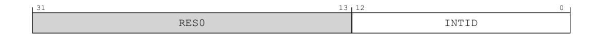

#### **Bits [31:13]**

Reserved, RES0.

#### **INTID, bits [12:0]**

The INTID of the SPI.

The function of this register depends on whether the targeted SPI is configured to be an edge-triggered or level-sensitive interrupt:

- For an edge-triggered interrupt, a write to GICD\_SETSPI\_NSR or [GICD\\_SETSPI\\_SR](#page-609-1) adds the pending state to the targeted interrupt. It will stop being pending on activation, or if the pending state is removed by a write to [GICD\\_CLRSPI\\_NSR,](#page-537-1) [GICD\\_CLRSPI\\_SR](#page-539-1), or [GICD\\_ICPENDR<n>](#page-561-1).
- For a level-sensitive interrupt, a write to GICD\_SETSPI\_NSR or [GICD\\_SETSPI\\_SR](#page-609-1) adds the pending state to the targeted interrupt. It will remain pending until it is deasserted by a write to [GICD\\_CLRSPI\\_NSR](#page-537-1) or [GICD\\_CLRSPI\\_SR.](#page-539-1) If the interrupt is activated between having the pending state added and being deactivated, then the interrupt will be active and pending.

#### **Accessing the GICD\_SETSPI\_NSR:**

Writes to this register have no effect if:

- The value written specifies a Secure SPI, the value is written by a Non-secure access, and the value of the corresponding [GICD\\_NSACR<n>](#page-603-0) register is 0.
- The value written specifies an invalid SPI.
- The SPI is already pending.

16-bit accesses to bits [15:0] of this register must be supported.

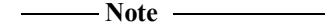

A Secure access to this register can set the pending state of any valid SPI.

GICD\_SETSPI\_NSR can be accessed through its memory-mapped interface:

| Component       | Frame     | Offset | Instance        |
|-----------------|-----------|--------|-----------------|
| GIC Distributor | Dist_base | 0x0040 | GICD_SETSPI_NSR |

#### <span id="page-609-1"></span><span id="page-609-0"></span>**12.9.34 GICD\_SETSPI\_SR, Set Secure SPI Pending Register**

The GICD\_SETSPI\_SR characteristics are:

#### **Purpose**

Adds the pending state to a valid SPI.

A write to this register changes the state of an inactive SPI to pending, and the state of an active SPI to active and pending.

#### **Configurations**

If [GICD\\_TYPER](#page-617-1).MBIS == 0, this register is reserved. When [GICD\\_CTLR](#page-543-1).DS == 1, this register is WI.

#### **Attributes**

GICD\_SETSPI\_SR is a 32-bit register.

#### **Field descriptions**


#### **Bits [31:13]**

Reserved, RES0.

#### **INTID, bits [12:0]**

The INTID of the SPI.

The function of this register depends on whether the targeted SPI is configured to be an edge-triggered or level-sensitive interrupt:

- For an edge-triggered interrupt, a write to [GICD\\_SETSPI\\_NSR](#page-607-1) or GICD\_SETSPI\_SR adds the pending state to the targeted interrupt. It will stop being pending on activation, or if the pending state is removed by a write to [GICD\\_CLRSPI\\_NSR,](#page-537-1) [GICD\\_CLRSPI\\_SR](#page-539-1), or [GICD\\_ICPENDR<n>](#page-561-1).
- For a level-sensitive interrupt, a write to [GICD\\_SETSPI\\_NSR](#page-607-1) or GICD\_SETSPI\_SR adds the pending state to the targeted interrupt. It will remain pending until it is deasserted by a write to [GICD\\_CLRSPI\\_NSR](#page-537-1) or [GICD\\_CLRSPI\\_SR.](#page-539-1) If the interrupt is activated between having the pending state added and being deactivated, then the interrupt will be active and pending.

#### **Accessing the GICD\_SETSPI\_SR:**

Writes to this register have no effect if:

- The value is written by a Non-secure access.
- The value written specifies an invalid SPI.
- The SPI is already pending.

16-bit accesses to bits [15:0] of this register must be supported.

GICD\_SETSPI\_SR can be accessed through its memory-mapped interface:

| Component       | Frame     | Offset | Instance       |
|-----------------|-----------|--------|----------------|
| GIC Distributor | Dist_base | 0x0050 | GICD_SETSPI_SR |

This interface is accessible as follows:

- When GICD\_CTLR.DS == 1 accesses to this register are WI.
- When GICD\_CTLR.DS == 0 and an access is Secure accesses to this register are WO.
- When GICD\_CTLR.DS == 0 and an access is Non-secure accesses to this register are WI.
- When GICD\_CTLR.DS == 0, FEAT\_RME is implemented and an access is Root accesses to this register are WO.
- When GICD\_CTLR.DS == 0, FEAT\_RME is implemented and an access is Realm accesses to this register are WI.

#### <span id="page-611-1"></span><span id="page-611-0"></span>**12.9.35 GICD\_SGIR, Software Generated Interrupt Register**

The GICD\_SGIR characteristics are:

#### **Purpose**

Controls the generation of SGIs.

#### **Configurations**

This register is available in all configurations of the GIC. If the GIC supports two Security states this register is Common.

#### **Attributes**

GICD\_SGIR is a 32-bit register.

#### **Field descriptions**

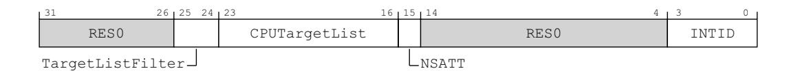

#### **Bits [31:26]**

Reserved, RES0.

#### **TargetListFilter, bits [25:24]**

Determines how the Distributor processes the requested SGI.

0b00 Forward the interrupt to the CPU interfaces specified by GICD\_SGIR.CPUTargetList.

0b01 Forward the interrupt to all CPU interfaces except that of the PE that requested the

interrupt.

0b10 Forward the interrupt only to the CPU interface of the PE that requested the interrupt.

0b11 Reserved.

#### **CPUTargetList, bits [23:16]**

When GICD\_SGIR.TargetListFilter is 0b00, this field defines the CPU interfaces to which the Distributor must forward the interrupt.

Each bit of the field refers to the corresponding CPU interface. For example, CPUTargetList[0] corresponds to interface 0. Setting a bit to 1 indicates that the interrupt must be forwarded to the corresponding interface.

If this field is 0b00000000 when GICD\_SGIR.TargetListFilter is 0b00, the Distributor does not forward the interrupt to any CPU interface.

#### **NSATT, bit [15]**

Specifies the required group of the SGI.

0b0 Forward the SGI specified in the INTID field to a specified CPU interface only if the SGI is configured as Group 0 on that interface.

0b1 Forward the SGI specified in the INTID field to a specified CPU interface only if the SGI is configured as Group 1 on that interface.

This field is writable only by a Secure access. Non-secure accesses can also generate Group 0 interrupts, if allowed to do so by GICD\_NSACR0. Otherwise, Non-secure writes to GICD\_SGIR generate an SGI only if the specified SGI is programmed as Group 1, regardless of the value of bit [15] of the write.

#### **Bits [14:4]**

Reserved, RES0.

#### **INTID, bits [3:0]**

The INTID of the SGI to forward to the specified CPU interfaces.

#### **Accessing the GICD\_SGIR:**

This register is used only when affinity routing is not enabled. When affinity routing is enabled, this register is RES0.

It is IMPLEMENTATION DEFINED whether this register has any effect when the forwarding of interrupts by the Distributor is disabled by [GICD\\_CTLR](#page-543-1).

GICD\_SGIR can be accessed through its memory-mapped interface:

| Component       | Frame     | Offset | Instance  |
|-----------------|-----------|--------|-----------|
| GIC Distributor | Dist_base | 0x0F00 | GICD_SGIR |

#### <span id="page-613-1"></span><span id="page-613-0"></span>**12.9.36 GICD\_SPENDSGIR<n>, SGI Set-Pending Registers, n = 0 - 3**

The GICD\_SPENDSGIR<n> characteristics are:

#### **Purpose**

Adds the pending state to an SGI.

A write to this register changes the state of an inactive SGI to pending, and the state of an active SGI to active and pending.

#### **Configurations**

Four SGI set-pending registers are implemented. Each register contains eight set-pending bits for each of four SGIs, for a total of 16 possible SGIs.

In multiprocessor implementations, each PE has a copy of these registers.

#### **Attributes**

GICD\_SPENDSGIR<n> is a 32-bit register.

#### **Field descriptions**

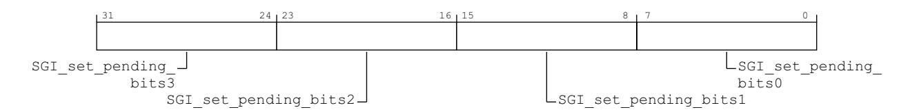

#### **SGI\_set\_pending\_bits<x>, bits [8x+7:8x], for x = 3 to 0**

Adds the pending state to SGI number 4n + x for the PE corresponding to the bit number written to.

Reads and writes have the following behavior:

0x00 If read, indicates that the SGI from the corresponding PE is not pending and is not active and pending.

If written, has no effect.

0x01 If read, indicates that the SGI from the corresponding PE is pending or is active and pending.

If written, adds the pending state to the SGI for the corresponding PE.

The reset behavior of this field is:

• On a GIC reset, this field resets to 0.

For SGI ID m, generated by processing element C writing to the corresponding [GICD\\_SGIR](#page-611-1) field, where DIV and MOD are the integer division and modulo operations:

- The corresponding GICD\_SPENDSGIR<n> number is given by n = m DIV 4.
- The offset of the required register is (0xF20 + (4n)).
- The offset of the required field within the register GICD\_SPENDSGIR<n> is given by m MOD 4.
- The required bit in the 8-bit SGI set-pending field m is bit C.

#### **Accessing the GICD\_SPENDSGIR<n>:**

These registers are used only when affinity routing is not enabled. When affinity routing is enabled for the Security state of an interrupt then the bit associated with SGI in that Security state is RES0. An implementation is permitted to make the register RAZ/WI in this case.

A register bit that corresponds to an unimplemented SGI is RAZ/WI.

These registers are byte-accessible.

If the GIC implementation supports two Security states:

- A register bit that corresponds to a Group 0 interrupt is RAZ/WI to Non-secure accesses.
- Register bits corresponding to unimplemented PEs are RAZ/WI.

GICD\_SPENDSGIR<n> can be accessed through its memory-mapped interface:

| Component       | Frame     | Offset           | Instance               |
|-----------------|-----------|------------------|------------------------|
| GIC Distributor | Dist_base | 0x0F20 + (4 * n) | GICD_SPENDSGIR <n></n> |

#### <span id="page-615-0"></span>**12.9.37 GICD\_STATUSR, Error Reporting Status Register**

The GICD\_STATUSR characteristics are:

#### **Purpose**

Provides software with a mechanism to detect:

- Accesses to reserved locations.
- Writes to read-only locations.
- Reads of write-only locations.

#### **Configurations**

If the GIC implementation supports two Security states this register is Banked to provide Secure and Non-secure copies.

#### **Attributes**

GICD\_STATUSR is a 32-bit register.

#### **Field descriptions**

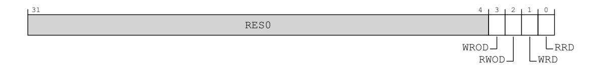

#### **Bits [31:4]**

Reserved, RES0.

#### **WROD, bit [3]**

Write to an RO location.

0b0 Normal operation.

0b1 A write to an RO location has been detected.

When a violation is detected, software must write 1 to this register to reset it.

#### **RWOD, bit [2]**

Read of a WO location.

0b0 Normal operation.

0b1 A read of a WO location has been detected.

When a violation is detected, software must write 1 to this register to reset it.

#### **WRD, bit [1]**

Write to a reserved location.

0b0 Normal operation.

0b1 A write to a reserved location has been detected.

When a violation is detected, software must write 1 to this register to reset it.

#### **RRD, bit [0]**

Read of a reserved location.

0b0 Normal operation.

0b1 A read of a reserved location has been detected.

When a violation is detected, software must write 1 to this register to reset it.

#### **Accessing the GICD\_STATUSR:**

This is an optional register. If the register is not implemented, the location is RAZ/WI.

GICD\_STATUSR can be accessed through its memory-mapped interface:

| Component       | Frame     | Offset | Instance       |
|-----------------|-----------|--------|----------------|
| GIC Distributor | Dist_base | 0x0010 | GICD_STATUSR_S |

This interface is accessible as follows:

- When an access is Secure accesses to this register are RW.
- When FEAT\_RME is implemented and an access is Root accesses to this register are RW.

GICD\_STATUSR can be accessed through its memory-mapped interface:

| Component       | Frame     | Offset | Instance        |
|-----------------|-----------|--------|-----------------|
| GIC Distributor | Dist_base | 0x0010 | GICD_STATUSR_NS |

This interface is accessible as follows:

- When an access is Non-secure accesses to this register are RW.
- When FEAT\_RME is implemented and an access is Realm accesses to this register are RAZ/WI.

#### <span id="page-617-1"></span><span id="page-617-0"></span>**12.9.38 GICD\_TYPER, Interrupt Controller Type Register**

The GICD\_TYPER characteristics are:

#### **Purpose**

Provides information about what features the GIC implementation supports. It indicates:

- Whether the GIC implementation supports two Security states.
- The maximum number of INTIDs that the GIC implementation supports.
- The number of PEs that can be used as interrupt targets.

#### **Configurations**

This register is available in all configurations of the GIC. When [GICD\\_CTLR.](#page-543-1)DS==0, this register is Common.

#### **Attributes**

GICD\_TYPER is a 32-bit register.

#### **Field descriptions**

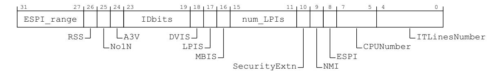

#### **ESPI\_range, bits [31:27]**

#### *When GICD\_TYPER.ESPI == 1:*

Indicates the maximum INTID in the Extended SPI range.

Maximum Extended SPI INTID is (32\*(ESPI\_range + 1) + 4095).

The ESPI\_range field only indicates the maximum number of SPIs that the GIC implementation might support. This value determines the number of instances of the following interrupt registers:

- [GICD\\_IGROUPR<n>E](#page-567-1).
- [GICD\\_ISENABLER<n>E](#page-594-1).
- [GICD\\_ICENABLER<n>E](#page-555-1).
- [GICD\\_ISPENDR<n>E](#page-598-0).
- [GICD\\_ICPENDR<n>E](#page-563-0).
- [GICD\\_ISACTIVER<n>E](#page-590-0).
- [GICD\\_ICACTIVER<n>E.](#page-551-0)
- [GICD\\_IPRIORITYR<n>E](#page-581-1).
- [GICD\\_ICFGR<n>E](#page-559-0).
- [GICD\\_IROUTER<n>E.](#page-586-0)
- [GICD\\_IGRPMODR<n>E](#page-571-1).

The GIC architecture does not require a GIC implementation to support a continuous range of SPI interrupt IDs. Software must check which SPI INTIDs are supported, up to the maximum value indicated by GICD\_TYPER.ESPI\_range.

This field has an IMPLEMENTATION DEFINED value.

Access to this field is RO.

#### *Otherwise:*

Reserved, RES0.

#### **RSS, bit [26]**

Range Selector Support.

The value of this field is an IMPLEMENTATION DEFINED choice of:

0b0 The IRI supports targeted SGIs with affinity level 0 values of 0 - 15.

0b1 The IRI supports targeted SGIs with affinity level 0 values of 0 - 255.

Access to this field is RO.

#### **No1N, bit [25]**

Indicates whether 1 of N SPI interrupts are supported.

The value of this field is an IMPLEMENTATION DEFINED choice of:

0b0 1 of N SPI interrupts are supported.

0b1 1 of N SPI interrupts are not supported.

Access to this field is RO.

#### **A3V, bit [24]**

Affinity 3 valid. Indicates whether the Distributor supports nonzero values of Affinity level 3.

The value of this field is an IMPLEMENTATION DEFINED choice of:

0b0 The Distributor only supports zero values of Affinity level 3.

0b1 The Distributor supports nonzero values of Affinity level 3.

Access to this field is RO.

#### **IDbits, bits [23:19]**

The number of interrupt identifier bits supported, minus one.

This field has an IMPLEMENTATION DEFINED value.

Access to this field is RO.

#### **DVIS, bit [18]**

#### *When FEAT\_GICv4 is implemented:*

Indicates whether the implementation supports Direct Virtual LPI injection.

The value of this field is an IMPLEMENTATION DEFINED choice of:

0b0 The implementation does not support Direct Virtual LPI injection.

0b1 The implementation supports Direct Virtual LPI injection.

Access to this field is RO.

#### *Otherwise:*

Reserved, RES0.

#### **LPIS, bit [17]**

Indicates whether the implementation supports LPIs.

The value of this field is an IMPLEMENTATION DEFINED choice of:

0b0 The implementation does not support LPIs.

0b1 The implementation supports LPIs.

Access to this field is RO.

#### **MBIS, bit [16]**

Indicates whether the implementation supports message-based interrupts by writing to Distributor registers.

The value of this field is an IMPLEMENTATION DEFINED choice of:

0b0 The implementation does not support message-based interrupts by writing to Distributor registers.

> The [GICD\\_CLRSPI\\_NSR,](#page-537-1) [GICD\\_SETSPI\\_NSR](#page-607-1), [GICD\\_CLRSPI\\_SR,](#page-539-1) and [GICD\\_SETSPI\\_SR](#page-609-1) registers are reserved.

0b1 The implementation supports message-based interrupts by writing to the [GICD\\_CLRSPI\\_NSR,](#page-537-1) [GICD\\_SETSPI\\_NSR](#page-607-1), [GICD\\_CLRSPI\\_SR](#page-539-1), or [GICD\\_SETSPI\\_SR](#page-609-1) registers.

Access to this field is RO.

#### **num\_LPIs, bits [15:11]**

Number of supported LPIs.

- 0b00000 Number of LPIs as indicated by GICD\_TYPER.IDbits.
- All other values Number of LPIs supported is 2(num\_LPIs+1).
  - Available LPI INTIDs are 8192..(8192 + 2(num\_LPIs+1) 1).
  - This field cannot indicate a maximum LPI INTID greater than that indicated by GICD\_TYPER.IDbits.

When the supported INTID width is less than 14 bits, this field is RES0 and no LPIs are supported.

This field has an IMPLEMENTATION DEFINED value.

Access to this field is RO.

#### **SecurityExtn, bit [10]**

Indicates whether the GIC implementation supports two Security states:

When [GICD\\_CTLR](#page-543-1).DS == 1, this field is RAZ.

The value of this field is an IMPLEMENTATION DEFINED choice of:

0b0 The GIC implementation supports only a single Security state.

0b1 The GIC implementation supports two Security states.

Access to this field is RO.

#### **NMI, bit [9]**

Non-maskable Interrupts.

The value of this field is an IMPLEMENTATION DEFINED choice of:

0b0 Non-maskable interrupt property not supported.

0b1 Non-maskable interrupt property is supported.

Access to this field is RO.

#### **ESPI, bit [8]**

Extended SPI.

The value of this field is an IMPLEMENTATION DEFINED choice of:

0b0 Extended SPI range not implemented.

0b1 Extended SPI range implemented.

Access to this field is RO.

#### **CPUNumber, bits [7:5]**

Reports the number of PEs that can be used when affinity routing is not enabled, minus 1.

These PEs must be numbered contiguously from zero, but the relationship between this number and the affinity hierarchy from [MPIDR](#page-29-3) is IMPLEMENTATION DEFINED. If the implementation does not support ARE being zero, this field is 000.

This field has an IMPLEMENTATION DEFINED value.

Access to this field is RO.

#### **ITLinesNumber, bits [4:0]**

For the INTID range 32 to 1019, indicates the maximum SPI supported.

If the value of this field is N, the maximum SPI INTID is 32(N+1) minus 1. For example, 00011 specifies that the maximum SPI INTID is 127.

Regardless of the range of INTIDs defined by this field, interrupt IDs 1020-1023 are reserved for special purposes.

A value of 0 indicates no SPIs are supported.

This field has an IMPLEMENTATION DEFINED value.

Access to this field is RO.

The ITLinesNumber field only indicates the maximum number of SPIs that the GIC implementation might support. This value determines the number of instances of the following interrupt registers:

- [GICD\\_IGROUPR<n>.](#page-565-1)
- [GICD\\_ISENABLER<n>.](#page-592-1)
- [GICD\\_ICENABLER<n>.](#page-553-1)
- [GICD\\_ISPENDR<n>.](#page-596-1)
- [GICD\\_ICPENDR<n>.](#page-561-1)
- [GICD\\_ISACTIVER<n>](#page-588-0).
- [GICD\\_ICACTIVER<n>](#page-549-0).
- [GICD\\_IPRIORITYR<n>.](#page-579-1)
- [GICD\\_ITARGETSR<n>](#page-600-1).
- [GICD\\_ICFGR<n>.](#page-557-0)
- [GICD\\_IROUTER<n>](#page-583-1).
- [GICD\\_IGRPMODR<n>.](#page-569-1)

The GIC architecture does not require a GIC implementation to support a continuous range of SPI interrupt IDs. Software must check which SPI INTIDs are supported, up to the maximum value indicated by GICD\_TYPER.ITLinesNumber.

#### **Accessing the GICD\_TYPER:**

GICD\_TYPER can be accessed through its memory-mapped interface:

| Component       | Frame     | Offset | Instance   |
|-----------------|-----------|--------|------------|
| GIC Distributor | Dist_base | 0x0004 | GICD_TYPER |

#### <span id="page-621-1"></span><span id="page-621-0"></span>**12.9.39 GICD\_TYPER2, Interrupt Controller Type Register 2**

The GICD\_TYPER2 characteristics are:

#### **Purpose**

Provides information about which features the GIC implementation supports.

#### **Configurations**

This register is present only when FEAT\_GICv4p1 is implemented. Otherwise, direct accesses to GICD\_TYPER2 are RES0.

When [GICD\\_CTLR](#page-543-1).DS == 0, this register is Common.

#### **Attributes**

GICD\_TYPER2 is a 32-bit register.

#### **Field descriptions**

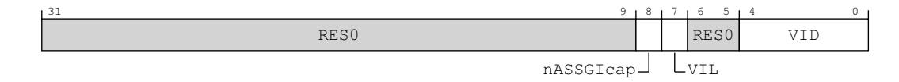

#### **Bits [31:9]**

Reserved, RES0.

#### **nASSGIcap, bit [8]**

Indicates whether SGIs can be configured to not have an active state.

The value of this field is an IMPLEMENTATION DEFINED choice of:

0b0 SGIs have an active state.

0b1 SGIs can be globally configured not to have an active state.

This bit is RES0 on implementations that support two Security states.

Access to this field is RO.

#### **VIL, bit [7]**

Indicates whether 16 bits of vPEID are implemented.

The value of this field is an IMPLEMENTATION DEFINED choice of:

0b0 GIC supports 16-bit vPEID.

0b1 GIC supports GICD\_TYPER2.VID + 1 bits of vPEID.

Access to this field is RO.

#### **Bits [6:5]**

Reserved, RES0.

#### **VID, bits [4:0]**

When GICD\_TYPER2.VIL == 1, the number of bits is equal to the bits of vPEID minus one.

When GICD\_TYPER2.VIL == 0, this field is RES0.

This field has an IMPLEMENTATION DEFINED value.

Access to this field is RO.

#### **Accessing the GICD\_TYPER2:**

GICD\_TYPER2 can be accessed through its memory-mapped interface:

| Component       | Frame     | Offset | Instance    |  |
|-----------------|-----------|--------|-------------|--|
| GIC Distributor | Dist_base | 0x000C | GICD_TYPER2 |  |

#### <span id="page-623-0"></span>**12.9.40 GICM\_CLRSPI\_NSR, Clear Non-secure SPI Pending Register**

The GICM\_CLRSPI\_NSR characteristics are:

#### **Purpose**

Removes the pending state from a valid SPI if permitted by the Security state of the access and the [GICD\\_NSACR<n>](#page-603-0) value for that SPI.

A write to this register changes the state of a pending SPI to inactive, and the state of an active and pending SPI to active.

#### **Configurations**

This register is present only when GICM\_TYPER.CLR == 1. Otherwise, direct accesses to GICM\_CLRSPI\_NSR are RES0.

When [GICD\\_CTLR](#page-543-1).DS == 1, this register provides functionality for all SPIs.

#### **Attributes**

GICM\_CLRSPI\_NSR is a 32-bit register.

#### **Field descriptions**


#### **Bits [31:13]**

Reserved, RES0.

#### **INTID, bits [12:0]**

This field is an alias of [GICD\\_CLRSPI\\_NSR](#page-537-1).

#### **Accessing the GICM\_CLRSPI\_NSR:**

Writes to this register have no effect if:

- The value written specifies a Secure SPI, the value is written by a Non-secure access, and the value of the corresponding [GICD\\_NSACR<n>](#page-603-0) register is less than 0b10.
- The value written specifies an invalid SPI.
- The SPI is not pending.

16-bit accesses to bits [15:0] of this register must be supported.

**Note**

A Secure access to this register can clear the pending state of any valid SPI.

GICM\_CLRSPI\_NSR can be accessed through its memory-mapped interface:

| Component       | Frame    | Offset | Instance        |
|-----------------|----------|--------|-----------------|
| GIC Distributor | MSI_base | 0x0048 | GICM_CLRSPI_NSR |

#### <span id="page-624-0"></span>**12.9.41 GICM\_CLRSPI\_SR, Clear Secure SPI Pending Register**

The GICM\_CLRSPI\_SR characteristics are:

#### **Purpose**

Removes the pending state from a valid SPI.

A write to this register changes the state of a pending SPI to inactive, and the state of an active and pending SPI to active.

#### **Configurations**

This register is present only when GICM\_TYPER.SR == 1 and GICM\_TYPER.CLR == 1. Otherwise, direct accesses to GICM\_CLRSPI\_SR are RES0.

When [GICD\\_CTLR](#page-543-1).DS == 1, this register is WI.

#### **Attributes**

GICM\_CLRSPI\_SR is a 32-bit register.

#### **Field descriptions**


#### **Bits [31:13]**

Reserved, RES0.

#### **INTID, bits [12:0]**

This field is an alias of [GICD\\_CLRSPI\\_SR.](#page-539-1)

#### **Accessing the GICM\_CLRSPI\_SR:**

Writes to this register have no effect if:

- The value is written by a Non-secure access.
- The value written specifies an invalid SPI.
- The SPI is not pending.

16-bit accesses to bits [15:0] of this register must be supported.

GICM\_CLRSPI\_SR can be accessed through its memory-mapped interface:

| Component       | Frame    | Offset | Instance       |
|-----------------|----------|--------|----------------|
| GIC Distributor | MSI_base | 0x0058 | GICD_CLRSPI_SR |

This interface is accessible as follows:

- When GICD\_CTLR.DS == 1 accesses to this register are WI.
- When GICD\_CTLR.DS == 0 and an access is Secure accesses to this register are WO.
- When GICD\_CTLR.DS == 0 and an access is Non-secure accesses to this register are WI.
- When GICD\_CTLR.DS == 0, FEAT\_RME is implemented and an access is Root accesses to this register are WO.

• When GICD\_CTLR.DS == 0, FEAT\_RME is implemented and an access is Realm accesses to this register are WI.

#### <span id="page-626-0"></span>**12.9.42 GICM\_IIDR, Distributor Implementer Identification Register**

The GICM\_IIDR characteristics are:

#### **Purpose**

Provides information about the implementer and revision of the Distributor.

#### **Configurations**

This register is available in all configurations of the GIC. If the GIC implementation supports two Security states, this register is Common.

#### **Attributes**

GICM\_IIDR is a 32-bit register.

#### **Field descriptions**


#### **ProductID, bits [31:24]**

Product Identifier.

This field has an IMPLEMENTATION DEFINED value.

Access to this field is RO.

#### **Bits [23:20]**

Reserved, RES0.

#### **Variant, bits [19:16]**

Variant number. Typically, this field is used to distinguish product variants, or major revisions of a product.

This field has an IMPLEMENTATION DEFINED value.

Access to this field is RO.

#### **Revision, bits [15:12]**

Revision number. Typically, this field is used to distinguish minor revisions of a product.

This field has an IMPLEMENTATION DEFINED value.

Access to this field is RO.

#### **Implementer, bits [11:0]**

Contains the JEP106 code of the company that implemented the Distributor:

- Bits [11:8] are the JEP106 continuation code of the implementer. For an Arm implementation, this field is 0x4.
- Bit [7] is always 0.
- Bits [6:0] are the JEP106 identity code of the implementer. For an Arm implementation, bits [7:0] are therefore 0x3B.

This field has an IMPLEMENTATION DEFINED value.

Access to this field is RO.

#### **Accessing the GICM\_IIDR:**

GICM\_IIDR can be accessed through its memory-mapped interface:

| Component       | Frame    | Offset | Instance  |
|-----------------|----------|--------|-----------|
| GIC Distributor | MSI_base | 0x0FCC | GICM_IIDR |

#### <span id="page-628-0"></span>**12.9.43 GICM\_SETSPI\_NSR, Set Non-secure SPI Pending Register**

The GICM\_SETSPI\_NSR characteristics are:

#### **Purpose**

Adds the pending state to a valid SPI if permitted by the Security state of the access and the [GICD\\_NSACR<n>](#page-603-0) value for that SPI.

A write to this register changes the state of an inactive SPI to pending, and the state of an active SPI to active and pending.

#### **Configurations**

When [GICD\\_CTLR](#page-543-1).DS==1, this register provides functionality for all SPIs.

#### **Attributes**

GICM\_SETSPI\_NSR is a 32-bit register.

#### **Field descriptions**


#### **Bits [31:13]**

Reserved, RES0.

#### **INTID, bits [12:0]**

This field is an alias of [GICD\\_SETSPI\\_NSR.](#page-607-1)

#### **Accessing the GICM\_SETSPI\_NSR:**

Writes to this register have no effect if:

- The value written specifies a Secure SPI, the value is written by a Non-secure access, and the value of the corresponding [GICD\\_NSACR<n>](#page-603-0) register is 0.
- The value written specifies an invalid SPI.
- The SPI is already pending.

16-bit accesses to bits [15:0] of this register must be supported.

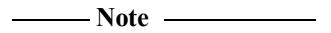

A Secure access to this register can set the pending state of any valid SPI.

GICM\_SETSPI\_NSR can be accessed through its memory-mapped interface:

| Component       | Frame    | Offset | Instance        |
|-----------------|----------|--------|-----------------|
| GIC Distributor | MSI_base | 0x0040 | GICM_SETSPI_NSR |

#### <span id="page-629-0"></span>**12.9.44 GICM\_SETSPI\_SR, Set Secure SPI Pending Register**

The GICM\_SETSPI\_SR characteristics are:

#### **Purpose**

Adds the pending state to a valid SPI.

A write to this register changes the state of an inactive SPI to pending, and the state of an active SPI to active and pending.

#### **Configurations**

This register is present only when GICM\_TYPER.SR == 1. Otherwise, direct accesses to GICM\_SETSPI\_SR are RES0.

When [GICD\\_CTLR](#page-543-1).DS==1, this register is WI.

#### **Attributes**

GICM\_SETSPI\_SR is a 32-bit register.

#### **Field descriptions**


#### **Bits [31:13]**

Reserved, RES0.

#### **INTID, bits [12:0]**

This field is an alias of [GICD\\_SETSPI\\_SR](#page-609-1).

#### **Accessing the GICM\_SETSPI\_SR:**

Writes to this register have no effect if:

- The value is written by a Non-secure access.
- The value written specifies an invalid SPI.
- The SPI is already pending.

16-bit accesses to bits [15:0] of this register must be supported.

GICM\_SETSPI\_SR can be accessed through its memory-mapped interface:

| Component       | Frame    | Offset | Instance       |  |
|-----------------|----------|--------|----------------|--|
| GIC Distributor | MSI_base | 0x0050 | GICM_SETSPI_SR |  |

This interface is accessible as follows:

- When GICD\_CTLR.DS == 1 accesses to this register are WI.
- When GICD\_CTLR.DS == 0 and an access is Secure accesses to this register are WO.
- When GICD\_CTLR.DS == 0 and an access is Non-secure accesses to this register are WI.
- When GICD\_CTLR.DS == 0, FEAT\_RME is implemented and an access is Root accesses to this register are WO.


#### <span id="page-631-0"></span>**12.9.45 GICM\_TYPER, Distributor MSI Type Register**

The GICM\_TYPER characteristics are:

#### **Purpose**

Provides information about what features the GIC implementation supports.

#### **Configurations**

This register is available in all configurations of the GIC. When [GICD\\_CTLR.](#page-543-1)DS==0, this register is Common.

#### **Attributes**

GICM\_TYPER is a 32-bit register.

#### **Field descriptions**


#### **Valid, bit [31]**

Reports whether GICM\_TYPER content is valid.

The value of this field is an IMPLEMENTATION DEFINED choice of:

0b0 GICM\_TYPER reports no information on the capabilities of the GICM frame, all other

fields are RES0.

0b1 GICM\_TYPER reports information on capabilities of GICM frame.

Access to this field is RO.

#### **CLR, bit [30]**

Reports whether MSI clear registers are supported.

The value of this field is an IMPLEMENTATION DEFINED choice of:

0b0 MSI clear registers not implemented.

0b1 MSI clear registers implemented.

Access to this field is RO.

#### **SR, bit [29]**

Reports whether Secure aliases of MSI registers are supported.

The value of this field is an IMPLEMENTATION DEFINED choice of:

0b0 Secure aliases of MSI registers not implemented.

0b1 Secure aliases of MSI registers implemented.

Access to this field is RO.

#### **INTID, bits [28:16]**

INTID of the first SPI assigned to this GICM frame.

This field has an IMPLEMENTATION DEFINED value.

Access to this field is RO.

#### **Bits [15:11]**

Reserved, RES0.

#### **NumSPIs, bits [10:0]**

Number of SPIs assigned to this GICM frame.

This field has an IMPLEMENTATION DEFINED value.

Access to this field is RO.

#### **Accessing the GICM\_TYPER:**

GICM\_TYPER can be accessed through its memory-mapped interface:

| Component       | Frame    | Offset | Instance   |
|-----------------|----------|--------|------------|
| GIC Distributor | MSI_base | 0x0004 | GICM_TYPER |

### <span id="page-633-1"></span><span id="page-633-0"></span>**12.10 The GIC Redistributor register map**

This section describes the Redistributor register map.

The mechanism by which an ITS communicates with the Redistributors is IMPLEMENTATION DEFINED. An implementation might perform this communication using memory-mapped functionality, and a portion of the Redistributor memory map is allocated for such communication. The definition of the communication is outside the scope of this GIC architecture specification.

Each Redistributor defines two 64KB frames in the physical address map:

- RD\_base for controlling the overall behavior of the Redistributor, for controlling LPIs, and for generating LPIs in a system that does not include at least one ITS.
- SGI\_base for controlling and generating PPIs and SGIs.

The frame for each Redistributor must be contiguous and must be ordered as follows:

- 1. RD\_base
- 2. SGI\_base

In GICv4, there are two additional 64KB frames:

- A frame to control virtual LPIs. The base address of this frame is referred to as VLPI\_base.
- A frame for a reserved page.

The frames for each Redistributor must be contiguous and must be ordered as follows:

- 1. RD\_base
- 2. SGI\_base
- 3. VLPI\_base
- 4. Reserved

Reserved register addresses are RES0.

<span id="page-633-2"></span>Table 12-[27 on page](#page-633-2) 12-634 shows the GIC Redistributor register map for the physical LPI registers.

**Table 12-27 GIC physical LPI Redistributor register map**

<span id="page-633-3"></span>

| Offset from<br>RD_base | Name          | Type | Reset                           | Description                               |
|------------------------|---------------|------|---------------------------------|-------------------------------------------|
| 0x0000                 | GICR_CTLR     | RW   | See the register<br>description | Redistributor Control Register            |
| 0x0004                 | GICR_IIDR     | RO   | IMPLEMENTATION<br>DEFINED       | Implementer Identification Register       |
| 0x0008                 | GICR_TYPER    | RO   | IMPLEMENTATION<br>DEFINED       | Redistributor Type Register               |
| 0x0010                 | GICR_STATUSR  | RW   | 0x0000 0000                     | Error Reporting Status Register, optional |
| 0x0014                 | GICR_WAKER    | RW   | See the register<br>description | Redistributor Wake Register               |
| 0x0018                 | GICR_MPAMIDR  | RO   | -                               | Report maximum PARTID and PMG Register    |
| 0x001C                 | GICR_PARTIDR  | RW   | 0x0000 0000                     | Set PARTID and PMG Register               |
| 0x0020                 | -             | -    | IMPLEMENTATION<br>DEFINED       | IMPLEMENTATION DEFINED registers          |
| 0x0040                 | GICR_SETLPIRa | WO   | -                               | Set LPI Pending Register                  |
| 0x0048                 | GICR_CLRLPIRa | WO   | -                               | Clear LPI Pending Register                |
| 0x0050                 | -             | -    | -                               | Reserved                                  |

**Table 12-27 GIC physical LPI Redistributor register map (continued)**

| Offset from<br>RD_base | Name           | Type | Reset                     | Description                                                               |
|------------------------|----------------|------|---------------------------|---------------------------------------------------------------------------|
| 0x0070                 | GICR_PROPBASER | RW   | -                         | Redistributor Properties Base Address Register                            |
| 0x0078                 | GICR_PENDBASER | RW   | -                         | Redistributor LPI Pending Table Base Address<br>Register                  |
| 0x00A0                 | GICR_INVLPIRa  | WO   | -                         | Redistributor Invalidate LPI Register                                     |
| 0x00A8                 | -              | -    | -                         | Reserved                                                                  |
| 0x00B0                 | GICR_INVALLRa  | WO   | -                         | Redistributor Invalidate All Register                                     |
| 0x00C0                 | GICR_SYNCRa    | RO   | -                         | Redistributor Synchronize Register                                        |
| 0x00C8                 | -              | -    | -                         | Reserved                                                                  |
| 0x0100                 | -              | WO   | IMPLEMENTATION<br>DEFINED | IMPLEMENTATION DEFINED registers                                          |
| 0x0108                 | -              | -    | -                         | Reserved                                                                  |
| 0x0110                 | -              | WO   | IMPLEMENTATION<br>DEFINED | IMPLEMENTATION DEFINED registers                                          |
| 0x0118-0xBFFC          | -              | -    | -                         | Reserved                                                                  |
| 0xC000-0xFFCC          | -              | -    | IMPLEMENTATION<br>DEFINED | IMPLEMENTATION DEFINED registers                                          |
| 0xFFD0-0xFFFC          | -              | RO   | IMPLEMENTATION<br>DEFINED | Reserved for ID registers, see Identification<br>registers on page 12-209 |

a. This register is mandatory in an implementation that supports LPIs and does not include an ITS, and when GICv4.1 is implemented. Otherwise, support for this register is IMPLEMENTATION DEFINED.

<span id="page-634-0"></span>Table 12-[28 on page](#page-634-0) 12-635 shows the GIC Redistributor register map for the virtual LPI registers.

#### **Table 12-28 GIC virtual LPI Redistributor register map**

| Offset from<br>VLPI_base | Name            | Type | Reset                     | Description                                                 |
|--------------------------|-----------------|------|---------------------------|-------------------------------------------------------------|
| 0x0000                   | -               | -    | -                         | Reserved                                                    |
| 0x0040                   | -               | WO   | IMPLEMENTATION<br>DEFINED | IMPLEMENTATION DEFINED registers                            |
| 0x0050                   | -               | -    | -                         | Reserved                                                    |
| 0x0070                   | GICR_VPROPBASER | RW   | -                         | Virtual Redistributor Properties Base<br>Address Register   |
| 0x0078                   | GICR_VPENDBASER | RW   | -                         | Virtual Pending Table Base Address<br>Register              |
| 0x0080                   | GICR_VSGIR      | WO   | -                         | Redistributor virtual SGI pending state<br>request register |
| 0x0088                   | GICR_VSGIPENDR  | RO   | -                         | Redistributor virtual SGI pending state<br>register         |

**Table 12-28 GIC virtual LPI Redistributor register map (continued)**

| Offset from<br>VLPI_base | Name | Type | Reset                     | Description                      |
|--------------------------|------|------|---------------------------|----------------------------------|
| 0x0080-0x037C            | -    | RW   | IMPLEMENTATION<br>DEFINED | IMPLEMENTATION DEFINED registers |
| 0x0380-0xBFFC            | -    | -    | -                         | Reserved                         |
| 0xC000-0xFFCC            | -    | -    | IMPLEMENTATION<br>DEFINED | IMPLEMENTATION DEFINED registers |
| 0xFFD0-0xFFFC            | -    | -    | -                         | Reserved                         |

<span id="page-635-0"></span>Table 12-[29 on page](#page-635-0) 12-636 shows the GIC Redistributor register map for the SGI and PPI registers.

#### **Table 12-29 GIC SGI and PPI Redistributor register map**

| Offset from<br>SGI_base                   | Name                     | Type | Reset                     | Description                                         |
|-------------------------------------------|--------------------------|------|---------------------------|-----------------------------------------------------|
| 0x0080                                    | GICR_IGROUPR0            | RW   | -                         | Interrupt Group Register 0                          |
| 0x0084-0x0088                             | GICR_IGROUPR <n>E</n>    | RW   | -                         | Interrupt Group Registers for extended<br>PPI range |
| 0x0100                                    | GICR_ISENABLER0          | RW   | IMPLEMENTATION<br>DEFINED | Interrupt Set-Enable Register 0                     |
| GICR_ISENABLER <n>E<br/>0x0104-0x0108</n> |                          | RW   | IMPLEMENTATION<br>DEFINED | Interrupt Set-Enable for extended PPI<br>range      |
| 0x0184-0x0188                             | GICR_ICENABLER <n>E</n>  | RW   | IMPLEMENTATION<br>DEFINED | Interrupt Clear-Enable for extended PPI<br>range    |
| 0x0180                                    | GICR_ICENABLER0          | RW   | IMPLEMENTATION<br>DEFINED | Interrupt Clear-Enable Register 0                   |
| 0x0200                                    | GICR_ISPENDR0            | RW   | 0xXXXX 0000               | Interrupt Set-Pend Register 0                       |
| 0x0204-0x0208                             | GICR_ISPENDR <n>E</n>    | RW   | 0xXXXX XXXX               | Interrupt Set-Pend for extended PPI range           |
| 0x0280                                    | GICR_ICPENDR0            | RW   | 0xXXXX 0000               | Interrupt Clear-Pend Register 0                     |
| 0x0284-0x0288                             | GICR_ICPENDR <n>E</n>    | RW   | 0xXXXX XXXX               | Interrupt Clear-Pend for extended PPI<br>range      |
| 0x0300                                    | GICR_ISACTIVER0          | RW   | 0x0000 0000               | Interrupt Set-Active Register 0                     |
| 0x0304-0x0308                             | GICR_ISACTIVER <n>E</n>  | RW   | 0x0000 0000               | Interrupt Set-Active for extended PPI<br>range      |
| 0x0380                                    | GICR_ICACTIVER0          | RW   | 0x0000 0000               | Interrupt Clear-Active Register 0                   |
| 0x0384-0x0388                             | GICR_ICACTIVER <n>E</n>  | RW   | 0x0000 0000               | Interrupt Clear-Active for extended PPI<br>range    |
| 0x0400-0x041C                             | GICR_IPRIORITYR <n></n>  | RW   | 0x0000 0000               | Interrupt Priority Registers                        |
| 0x0420-0x045C                             | GICR_IPRIORITYR <n>E</n> | RW   | 0x0000 0000               | Interrupt Priority for extended PPI range           |
| 0x0C00                                    | GICR_ICFGR0              | RW   | IMPLEMENTATION<br>DEFINED | SGI Configuration Register                          |

#### **Table 12-29 GIC SGI and PPI Redistributor register map (continued)**

| Offset from<br>SGI_base | Name                   | Type | Reset                     | Description                                           |
|-------------------------|------------------------|------|---------------------------|-------------------------------------------------------|
| 0x0C04                  | GICR_ICFGR1            | RW   | IMPLEMENTATION<br>DEFINED | PPI Configuration Register                            |
| 0x0C08-0x0C14           | GICR_ICFGR <n>E</n>    | RW   | IMPLEMENTATION<br>DEFINED | Extended PPI Configuration Register                   |
| 0x0D00                  | GICR_IGRPMODR0         | RW   | -                         | Interrupt Group Modifier Register 0                   |
| 0x0D04-0x0D08           | GICR_IGRPMODR <n>E</n> | RW   | -                         | Interrupt Group Modifier for extended PPI<br>range    |
| 0x0E00                  | GICR_NSACR             | RW   | 0x0000 0000               | Non-Secure Access Control Register                    |
| 0x0E04-0x0F7C           | -                      | -    | -                         | Reserved                                              |
| 0x0F80                  | GICR_INMIR0            | RW   | 0x0000 0000               | Non-maskable Interrupt Register for PPIs<br>and SGIs  |
| 0x0F84-0x0FFC           | GICR_INMIR <n>E</n>    | RW   | 0x0000 0000               | Non-maskable Interrupt Registers for<br>Extended PPIs |
| 0x1000-0xBFFC           | -                      | -    | -                         | Reserved                                              |
| 0xC000-0xFFCC           | -                      | -    | IMPLEMENTATION<br>DEFINED | IMPLEMENTATION DEFINED registers                      |
| 0xFFD0-0xFFFC           | -                      | -    | -                         | Reserved                                              |

#### <span id="page-637-1"></span><span id="page-637-0"></span>**12.11 The GIC Redistributor register descriptions**

This section describes each of the GIC Redistributor registers in register name order.

#### <span id="page-638-1"></span><span id="page-638-0"></span>**12.11.1 GICR\_CLRLPIR, Clear LPI Pending Register**

The GICR\_CLRLPIR characteristics are:

**Purpose**

Clears the pending state of the specified LPI.

**Configurations**

A copy of this register is provided for each Redistributor.

**Attributes**

GICR\_CLRLPIR is a 64-bit register.

#### **Field descriptions**

*When GICR\_TYPER.DirectLPI == 1:*

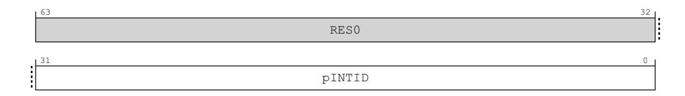

**Bits [63:32]**

Reserved, RES0.

**pINTID, bits [31:0]**

The INTID of the physical LPI.

**Note**

The size of this field is IMPLEMENTATION DEFINED, and is specified by the [GICD\\_TYPER](#page-617-1).IDbits field. Unimplemented bits are RES0.

*When GICR\_TYPER.DirectLPI == 0:*


#### **IMPLEMENTATION DEFINED, bits [63:0]**

IMPLEMENTATION DEFINED.

#### **Accessing the GICR\_CLRLPIR:**

When written with a 32-bit write the data is zero-extended to 64 bits.

This register is mandatory in an implementation that supports LPIs and does not include an ITS. The functionality of this register is IMPLEMENTATION DEFINED in an implementation that does include an ITS.

Writes to this register have no effect if any of the following apply:

• [GICR\\_CTLR](#page-640-1).EnableLPIs == 0.

- The pINTID value specifies an unimplemented LPI.
- The pINTID value specifies an LPI that is not pending.

GICR\_CLRLPIR can be accessed through its memory-mapped interface:

| Component         | Frame   | Offset | Instance     |
|-------------------|---------|--------|--------------|
| GIC Redistributor | RD_base | 0x0048 | GICR_CLRLPIR |

#### <span id="page-640-1"></span><span id="page-640-0"></span>**12.11.2 GICR\_CTLR, Redistributor Control Register**

The GICR\_CTLR characteristics are:

#### **Purpose**

Controls the operation of a Redistributor, and enables the signaling of LPIs by the Redistributor to the connected PE.

#### **Configurations**

A copy of this register is provided for each Redistributor.

#### **Attributes**

GICR\_CTLR is a 32-bit register.

#### **Field descriptions**

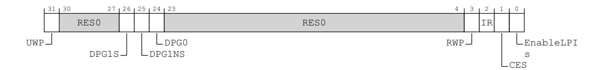

#### **UWP, bit [31]**

Upstream Write Pending. Read-only. Indicates whether all upstream writes have been communicated to the Distributor.

0b0 The effects of all upstream writes have been communicated to the Distributor, including any Generate SGI packets. For more information, see *[Generate SGI \(ICC\) on](#page-902-0)  page [A-903](#page-902-0)*.

0b1 Not all the effects of upstream writes, including any Generate SGI packets, have been communicated to the Distributor. For more information, see *[Generate SGI \(ICC\) on](#page-902-0)  page [A-903](#page-902-0)*.

#### **Bits [30:27]**

Reserved, RES0.

#### **DPG1S, bit [26]**

Disable Processor selection for Group 1 Secure interrupts. When [GICR\\_TYPER.](#page-710-1)DPGS == 1:

0b0 A Group 1 Secure SPI configured to use the 1 of N distribution model can select this PE, if the PE is not asleep and if Secure Group 1 interrupts are enabled.

0b1 A Group 1 Secure SPI configured to use the 1 of N distribution model cannot select this PE.

When [GICR\\_TYPER](#page-710-1).DPGS == 0 this bit is RAZ/WI.

When [GICD\\_CTLR](#page-543-1).DS==1, this field is RAZ/WI. In GIC implementations that support two Security states, this field is only accessible by Secure accesses, and is RAZ/WI to Non-secure accesses.

It is IMPLEMENTATION DEFINED whether these bits affect the selection of PEs for interrupts using the 1 of N distribution model when [GICD\\_CTLR.](#page-543-1)ARE\_S==0.

The reset behavior of this field is:

• On a GIC reset, this field resets to 0.

#### **DPG1NS, bit [25]**

Disable Processor selection for Group 1 Non-secure interrupts. When [GICR\\_TYPER](#page-710-1).DPGS == 1:

0b0 A Group 1 Non-secure SPI configured to use the 1 of N distribution model can select this PE, if the PE is not asleep and if Non-secure Group 1 interrupts are enabled.

0b1 A Group 1 Non-secure SPI configured to use the 1 of N distribution model cannot select this PE.

When [GICR\\_TYPER](#page-710-1).DPGS == 0 this bit is RAZ/WI.

It is IMPLEMENTATION DEFINED whether these bits affect the selection of PEs for interrupts using the 1 of N distribution model when [GICD\\_CTLR.](#page-543-1)ARE\_NS==0.

The reset behavior of this field is:

• On a GIC reset, this field resets to 0.

#### **DPG0, bit [24]**

Disable Processor selection for Group 0 interrupts. When [GICR\\_TYPER.](#page-710-1)DPGS == 1:

0b0 A Group 0 SPI configured to use the 1 of N distribution model can select this PE, if the PE is not asleep and if Group 0 interrupts are enabled.

0b1 A Group 0 SPI configured to use the 1 of N distribution model cannot select this PE.

When [GICR\\_TYPER](#page-710-1).DPGS == 0 this bit is RAZ/WI.

When [GICD\\_CTLR](#page-543-1).DS == 1, this field is always accessible. In GIC implementations that support two Security states, this field is RAZ/WI to Non-secure accesses.

It is IMPLEMENTATION DEFINED whether these bits affect the selection of PEs for interrupts using the 1 of N distribution model when [GICD\\_CTLR.](#page-543-1)ARE\_S == 0.

The reset behavior of this field is:

• On a GIC reset, this field resets to 0.

#### **Bits [23:4]**

Reserved, RES0.

#### **RWP, bit [3]**

Register Write Pending. This bit indicates whether a register write for the current Security state is in progress or not.

0b0 The effect of all previous writes to the following registers are visible to all agents in the system:

- [GICR\\_ICENABLER0](#page-648-1)
- [GICR\\_CTLR.](#page-640-1)DPG1S
- [GICR\\_CTLR.](#page-640-1)DPG1NS
- [GICR\\_CTLR.](#page-640-1)DPG0
- [GICR\\_CTLR,](#page-640-1) which clears EnableLPIs from 1 to 0.
- In FEAT\_GICv4p1, [GICR\\_VPROPBASER](#page-720-1), which clears Valid from 1 to 0.

0b1 The effect of all previous writes to the following registers are not guaranteed by the architecture to be visible to all agents in the system while the changes are still being propagated:

- [GICR\\_ICENABLER0](#page-648-1)
  - [GICR\\_CTLR.](#page-640-1)DPG1S
  - [GICR\\_CTLR.](#page-640-1)DPG1NS
  - [GICR\\_CTLR.](#page-640-1)DPG0
  - [GICR\\_CTLR,](#page-640-1) which clears EnableLPIs from 1 to 0.
  - In FEAT\_GICv4p1, [GICR\\_VPROPBASER](#page-720-1), which clears Valid from 1 to 0.

#### **IR, bit [2]**

LPI invalidate registers supported.

This bit is read-only.

0b0 This bit does not indicate whether the GICR\_INVLPIR, GICR\_INVALLR and GICR\_SYNCR are implemented or not.

0b1 GICR\_INVLPIR, GICR\_INVALLR and GICR\_SYNCR are implemented.

If [GICR\\_TYPER.](#page-710-1)DirectLPI is 1 or [GICR\\_TYPER](#page-710-1).RVPEI is 1, [GICR\\_INVLPIR,](#page-677-1) [GICR\\_INVALLR](#page-675-1), and [GICR\\_SYNCR](#page-709-1) are always implemented.

Arm recommends that implementations report GICR\_CTLR.IR as 1 in these cases.

#### **CES, bit [1]**

Clear Enable Supported.

This bit is read-only.

0b0 The IRI does not indicate whether GICR\_CTLR.EnableLPIs is RES1 once set.

0b1 GICR\_CTLR.EnableLPIs is not RES1 once set.

Implementing GICR\_CTLR.EnableLPIs as programmable and not reporting GICR\_CLTR.CES == 1 is deprecated.

Implementing GICR\_CTLR.EnableLPIs as RES1 once set is deprecated.

When GICR\_CLTR.CES == 0, software cannot assume that GICR\_CTLR.EnableLPIs is programmable without observing the bit being cleared.

#### **EnableLPIs, bit [0]**

In implementations where affinity routing is enabled for the Security state:

0b0 LPI support is disabled. Any doorbell interrupt generated as a result of a write to a virtual LPI register must be discarded, and any ITS translation requests or commands involving LPIs in this Redistributor are ignored.

0b1 LPI support is enabled.

| Note |  |
|------|--|
|------|--|

If [GICR\\_TYPER.](#page-710-1)PLPIS == 0, this field is RES0. If [GICD\\_CTLR](#page-543-1).ARE\_NS is written from 1 to 0 when this bit is 1, behavior is an IMPLEMENTATION DEFINED choice between clearing GICR\_CTLR.EnableLPIs to 0 or maintaining its current value.

When affinity routing is not enabled for the Non-secure state, this bit is RES0.

When written from 0 to 1, the Redistributor loads the LPI Pending table from memory to check for any pending interrupts.

After it has been written to 1, it is IMPLEMENTATION DEFINED whether the bit becomes RES1 or can be cleared by to 0.

Where the bit remains programmable:

- Software must observe GICR\_CTLR.RWP==0 after clearing GICR\_CTLR.EnableLPIs from 1 to 0 before writing [GICR\\_PENDBASER](#page-699-1) or [GICR\\_PROPBASER,](#page-702-1) otherwise behavior is UNPREDICTABLE.
- Software must observe GICR\_CTLR.RWP==0 after clearing GICR\_CTLR.EnableLPIs from 1 to 0 before setting GICR\_CTLR.EnableLPIs to 1, otherwise behavior is UNPREDICTABLE.

| Note |  |
|------|--|
|      |  |

If one or more ITS is implemented, Arm strongly recommends that all LPIs are mapped to another Redistributor before GICR\_CTLR.EnableLPIs is cleared to 0.

The reset behavior of this field is:

• On a GIC reset, this field resets to 0.

The participation of a PE in the 1 of N distribution model for a given interrupt group is governed by the concatenation of [GICR\\_WAKER](#page-727-1).ProcessorSleep, the appropriate [GICR\\_CTLR](#page-640-1).DPG{1, 0} bit, and the PE interrupt group enable. The behavior options are:

| PS  | DPG{1S, 1NS, 0} | Enable | PE Behavior                                                                                                                                           |
|-----|-----------------|--------|-------------------------------------------------------------------------------------------------------------------------------------------------------|
| 0b0 | 0b0             | 0b0    | The PE cannot be selected.                                                                                                                            |
| 0b0 | 0b0             | 0b1    | The PE can be selected.                                                                                                                               |
| 0b0 | 0b1             | *      | The PE cannot be selected.                                                                                                                            |
| 0b1 | *               | *      | The PE cannot be selected when GICD_CTLR.E1NWF == 0. When GICD_CTLR.E1NWF<br>== 1, the mechanism by which PEs are selected is IMPLEMENTATION DEFINED. |

If an SPI using the 1 of N distribution model has been forwarded to the PE, and a write to GICR\_CTLR occurs that changes the DPG bit for the interrupt group of the SPI, the IRI must attempt to select a different target PE for the SPI. This might have no effect on the forwarded SPI if it has already been activated.

#### **Accessing the GICR\_CTLR:**

GICR\_CTLR can be accessed through its memory-mapped interface:

| Component         | Frame   | Offset | Instance  |
|-------------------|---------|--------|-----------|
| GIC Redistributor | RD_base | 0x0000 | GICR_CTLR |

#### <span id="page-644-0"></span>**12.11.3 GICR\_ICACTIVER0, Interrupt Clear-Active Register 0**

The GICR\_ICACTIVER0 characteristics are:

#### **Purpose**

Deactivates the corresponding SGI or PPI. These registers are used when saving and restoring GIC state.

#### **Configurations**

A copy of this register is provided for each Redistributor.

#### **Attributes**

GICR\_ICACTIVER0 is a 32-bit register.

#### **Field descriptions**


#### **Clear\_active\_bit<x>, bit [x], for x = 31 to 0**

Removes the active state from interrupt number x. Reads and writes have the following behavior:

0b0 If read, indicates that the corresponding interrupt is not active, and is not active and pending.

If written, has no effect.

0b1 If read, indicates that the corresponding interrupt is active, or is active and pending. If written, deactivates the corresponding interrupt, if the interrupt is active. If the interrupt is already deactivated, the write has no effect.

The reset behavior of this field is:

• On a GIC reset, this field resets to 0.

#### **Accessing the GICR\_ICACTIVER0:**

When affinity routing is not enabled for the Security state of an interrupt in GICR\_ICACTIVER0, the corresponding bit is RAZ/WI and equivalent functionality is provided by [GICD\\_ICACTIVER<n>](#page-549-0) with n=0.

This register only applies to SGIs (bits [15:0]) and PPIs (bits [31:16]). For SPIs, this functionality is provided by [GICD\\_ICACTIVER<n>](#page-549-0).

When [GICD\\_CTLR](#page-543-1).DS == 0, bits corresponding to Secure SGIs and PPIs are RAZ/WI to Non-secure accesses. GICR\_ICACTIVER0 can be accessed through its memory-mapped interface:

| Component         | Frame    | Offset | Instance        |
|-------------------|----------|--------|-----------------|
| GIC Redistributor | SGI_base | 0x0380 | GICR_ICACTIVER0 |

#### <span id="page-646-0"></span>**12.11.4 GICR\_ICACTIVER<n>E, Interrupt Clear-Active Registers, n = 1 - 2**

The GICR\_ICACTIVER<n>E characteristics are:

#### **Purpose**

Removes the active state from the corresponding PPI.

#### **Configurations**

This register is present only when FEAT\_GICv3p1 is implemented. Otherwise, direct accesses to GICR\_ICACTIVER<n>E are RES0.

A copy of this register is provided for each Redistributor.

#### **Attributes**

GICR\_ICACTIVER<n>E is a 32-bit register.

#### **Field descriptions**

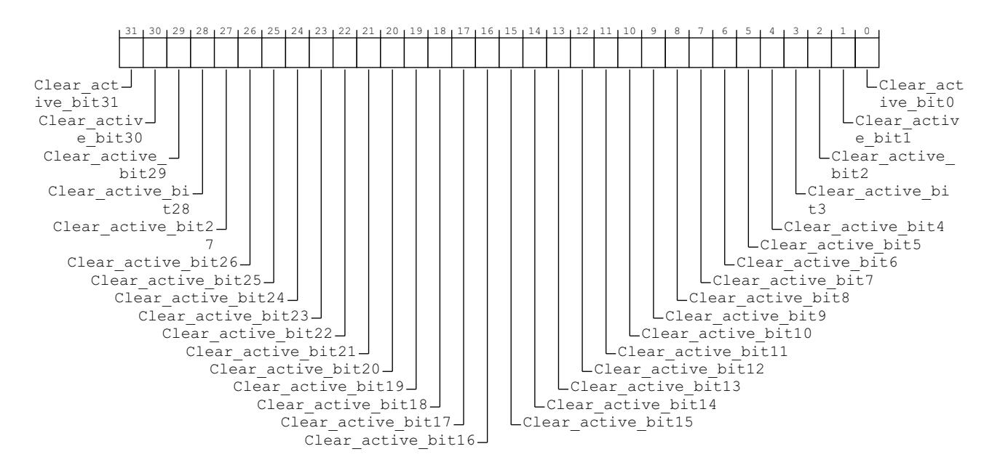

#### **Clear\_active\_bit<x>, bit [x], for x = 31 to 0**

For the extended PPIs, removes the active state to interrupt number x. Reads and writes have the following behavior:

0b0 If read, indicates that the corresponding interrupt is not active, and is not active and pending.

If written, has no effect.

0b1 If read, indicates that the corresponding interrupt is active, or is active and pending. If written, deactivates the corresponding interrupt, if the interrupt is active. If the interrupt is already deactivated, the write has no effect.

The reset behavior of this field is:

• On a GIC reset, this field resets to 0.

For INTID m, when DIV and MOD are the integer division and modulo operations:

- The corresponding GICR\_ICACTIVER<n>E number, n, is given by n = (m-1024) DIV 32.
- The offset of the required GICR\_ICACTIVER<n>E is (0x200 + (4\*n)).

• The bit number of the required group modifier bit in this register is (m-1024) MOD 32.

#### **Accessing the GICR\_ICACTIVER<n>E:**

When affinity routing is not enabled for the Security state of an interrupt in GICR\_ICACTIVER<n>E, the corresponding bit is RES0.

When [GICD\\_CTLR](#page-543-1).DS==0, bits corresponding to Secure PPIs are RAZ/WI to Non-secure accesses.

Bits corresponding to unimplemented interrupts are RAZ/WI.

GICR\_ICACTIVER<n>E can be accessed through its memory-mapped interface:

| Component         | Frame    | Offset           | Instance                |
|-------------------|----------|------------------|-------------------------|
| GIC Redistributor | SGI_base | 0x0380 + (4 * n) | GICR_ICACTIVER <n>E</n> |

#### <span id="page-648-1"></span><span id="page-648-0"></span>**12.11.5 GICR\_ICENABLER0, Interrupt Clear-Enable Register 0**

The GICR\_ICENABLER0 characteristics are:

#### **Purpose**

Disables forwarding of the corresponding SGI or PPI to the CPU interfaces.

#### **Configurations**

A copy of this register is provided for each Redistributor.

#### **Attributes**

GICR\_ICENABLER0 is a 32-bit register.

#### **Field descriptions**


#### **Clear\_enable\_bit<x>, bit [x], for x = 31 to 0**

For PPIs and SGIs, controls the forwarding of interrupt number x to the CPU interfaces. Reads and writes have the following behavior:

0b0 If read, indicates that forwarding of the corresponding interrupt is disabled.

If written, has no effect.

0b1 If read, indicates that forwarding of the corresponding interrupt is enabled.

If written, disables forwarding of the corresponding interrupt.

After a write of 1 to this bit, a subsequent read of this bit returns 0.

The reset behavior of this field is:

• On a GIC reset, this field resets to an architecturally UNKNOWN value.

#### **Accessing the GICR\_ICENABLER0:**

When affinity routing is not enabled for the Security state of an interrupt in GICR\_ICENABLER0, the corresponding bit is RAZ/WI and equivalent functionality is provided by [GICD\\_ICENABLER<n>](#page-553-1) with n=0.

This register only applies to SGIs (bits [15:0]) and PPIs (bits [31:16]). For SPIs, this functionality is provided by [GICD\\_ICENABLER<n>.](#page-553-1)

When [GICD\\_CTLR](#page-543-1).DS == 0, bits corresponding to Secure SGIs and PPIs are RAZ/WI to Non-secure accesses. GICR\_ICENABLER0 can be accessed through its memory-mapped interface:

| Component         | Frame    | Offset | Instance        |
|-------------------|----------|--------|-----------------|
| GIC Redistributor | SGI_base | 0x0180 | GICR_ICENABLER0 |

#### <span id="page-650-0"></span>**12.11.6 GICR\_ICENABLER<n>E, Interrupt Clear-Enable Registers, n = 1 - 2**

The GICR\_ICENABLER<n>E characteristics are:

#### **Purpose**

Disables forwarding of the corresponding PPI to the CPU interfaces.

#### **Configurations**

This register is present only when FEAT\_GICv3p1 is implemented. Otherwise, direct accesses to GICR\_ICENABLER<n>E are RES0.

A copy of this register is provided for each Redistributor.

#### **Attributes**

GICR\_ICENABLER<n>E is a 32-bit register.

#### **Field descriptions**


#### **Clear\_enable\_bit<x>, bit [x], for x = 31 to 0**

For the extended PPI range, controls the forwarding of interrupt number x to the CPU interface. Reads and writes have the following behavior:

0b0 If read, indicates that forwarding of the corresponding interrupt is disabled. If written, has no effect.

0b1 If read, indicates that forwarding of the corresponding interrupt is enabled. If written, disables forwarding of the corresponding interrupt. After a write of 1 to this bit, a subsequent read of this bit returns 0.

The reset behavior of this field is:

• On a GIC reset, this field resets to 0.

For INTID m, when DIV and MOD are the integer division and modulo operations:

- The corresponding GICR\_ICENABLER<n>E number, n, is given by n = (m-1024) DIV 32.
- The offset of the required GICR\_ICENABLER<n>E is (0x180 + (4\*n)).
- The bit number of the required group modifier bit in this register is (m-1024) MOD 32.

#### **Accessing the GICR\_ICENABLER<n>E:**

When affinity routing is not enabled for the Security state of an interrupt in GICR\_ICENABLER<n>E, the corresponding bit is RES0.

When [GICD\\_CTLR](#page-543-1).DS==0, bits corresponding to Secure PPIs are RAZ/WI to Non-secure accesses.

Bits corresponding to unimplemented interrupts are RAZ/WI.

GICR\_ICENABLER<n>E can be accessed through its memory-mapped interface:

| Component         | Frame    | Offset           | Instance                |
|-------------------|----------|------------------|-------------------------|
| GIC Redistributor | SGI_base | 0x0180 + (4 * n) | GICR_ICENABLER <n>E</n> |

#### <span id="page-652-0"></span>**12.11.7 GICR\_ICFGR0, Interrupt Configuration Register 0**

The GICR\_ICFGR0 characteristics are:

#### **Purpose**

Determines whether the corresponding SGI is edge-triggered or level-sensitive.

#### **Configurations**

A copy of this register is provided for each Redistributor.

#### **Attributes**

GICR\_ICFGR0 is a 32-bit register.

#### **Field descriptions**

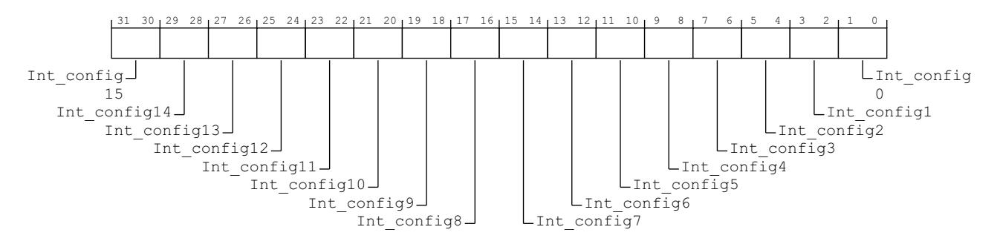

#### **Int\_config<x>, bits [2x+1:2x], for x = 15 to 0**

Indicates whether the is level-sensitive or edge-triggered.

0b00 Corresponding interrupt is level-sensitive.

0b10 Corresponding interrupt is edge-triggered.

SGIs are always edge-triggered.

When the interrupt is visible to the current Security state, a read of this bit always returns the correct value to indicate the interrupt triggering method.

The reset behavior of this field is:

• On a GIC reset, this field resets to an architecturally UNKNOWN value.

#### **Accessing the GICR\_ICFGR0:**

This register is used when affinity routing is enabled.

When affinity routing is disabled for the Security state of an interrupt, the field for that interrupt is RES0 and an implementation is permitted to make the field RAZ/WI in this case. Equivalent functionality is provided by GICD\_ICFGR<n> with n=0.

When [GICD\\_CTLR](#page-543-1).DS==0, a register bit that corresponds to a Group 0 or Secure Group 1 interrupt is RAZ/WI to Non-secure accesses.

GICR\_ICFGR0 can be accessed through its memory-mapped interface:

| Component         | Frame    | Offset | Instance    |
|-------------------|----------|--------|-------------|
| GIC Redistributor | SGI_base | 0x0C00 | GICR_ICFGR0 |

#### <span id="page-653-0"></span>**12.11.8 GICR\_ICFGR1, Interrupt Configuration Register 1**

The GICR\_ICFGR1 characteristics are:

#### **Purpose**

Determines whether the corresponding PPI is edge-triggered or level-sensitive.

#### **Configurations**

A copy of this register is provided for each Redistributor.

For each supported PPI, it is IMPLEMENTATION DEFINED whether software can program the corresponding Int\_config field.

Changing Int\_config when the interrupt is individually enabled is UNPREDICTABLE.

Changing the interrupt configuration between level-sensitive and edge-triggered (in either direction) at a time when there is a pending interrupt will leave the interrupt in an UNKNOWN pending state.

#### **Attributes**

GICR\_ICFGR1 is a 32-bit register.

#### **Field descriptions**

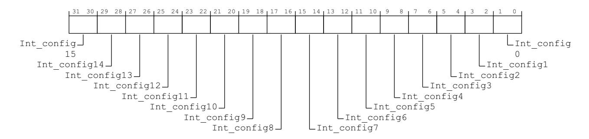

#### **Int\_config<x>, bits [2x+1:2x], for x = 15 to 0**

Indicates whether the interrupt is level-sensitive or edge-triggered.

0b00 Corresponding interrupt is level-sensitive.

0b10 Corresponding interrupt is edge-triggered.

Int\_config[0] (bit [2x]) is RES0.

The reset behavior of this field is:

• On a GIC reset, this field resets to an architecturally UNKNOWN value.

#### **Accessing the GICR\_ICFGR1:**

This register is used when affinity routing is enabled.

When affinity routing is disabled for the Security state of an interrupt, the field for that interrupt is RES0 and an implementation is permitted to make the field RAZ/WI in this case. Equivalent functionality is provided by GICD\_ICFGR<n> with n=1.

When [GICD\\_CTLR](#page-543-1).DS==0, a register bit that corresponds to a Group 0 or Secure Group 1 interrupt is RAZ/WI to Non-secure accesses.

GICR\_ICFGR1 can be accessed through its memory-mapped interface:

| Component         | Frame    | Offset | Instance    |
|-------------------|----------|--------|-------------|
| GIC Redistributor | SGI_base | 0x0C04 | GICR_ICFGR1 |

#### <span id="page-655-0"></span>**12.11.9 GICR\_ICFGR<n>E, Interrupt configuration registers, n = 2 - 5**

The GICR\_ICFGR<n>E characteristics are:

#### **Purpose**

Determines whether the corresponding PPI in the extended PPI range is edge-triggered or level-sensitive.

#### **Configurations**

This register is present only when FEAT\_GICv3p1 is implemented. Otherwise, direct accesses to GICR\_ICFGR<n>E are RES0.

A copy of this register is provided for each Redistributor.

#### **Attributes**

GICR\_ICFGR<n>E is a 32-bit register.

#### **Field descriptions**

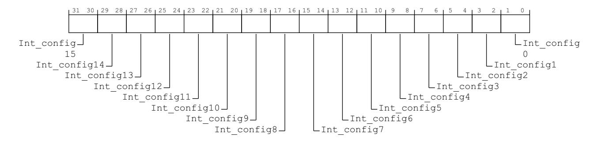

#### **Int\_config<x>, bits [2x+1:2x], for x = 15 to 0**

Indicates whether the interrupt is level-sensitive or edge-triggered.

Int\_config[0] (bit [2x]) is RES0.

0b00 The corresponding interrupt is level-sensitive.

0b10 The corresponding interrupt is edge-triggered.

The reset behavior of this field is:

• On a GIC reset, this field resets to an architecturally UNKNOWN value.

For each supported extended PPI, it is IMPLEMENTATION DEFINED whether software can program the corresponding Int\_config field.

#### **Accessing the GICR\_ICFGR<n>E:**

When affinity routing is not enabled for the Security state of an interrupt in GICR\_ICFGR<n>E, the corresponding bit is RES0.

When [GICD\\_CTLR](#page-543-1).DS==0, a register bit that corresponds to a Group 0 or Secure Group 1 interrupt is RAZ/WI to Non-secure accesses.

Bits corresponding to unimplemented interrupts are RAZ/WI.

GICR\_ICFGR<n>E can be accessed through its memory-mapped interface:

| Component         | Frame    | Offset           | Instance            |
|-------------------|----------|------------------|---------------------|
| GIC Redistributor | SGI_base | 0x0C00 + (4 * n) | GICR_ICFGR <n>E</n> |

#### <span id="page-657-1"></span><span id="page-657-0"></span>**12.11.10 GICR\_ICPENDR0, Interrupt Clear-Pending Register 0**

The GICR\_ICPENDR0 characteristics are:

**Purpose**

Removes the pending state from the corresponding SGI or PPI.

#### **Configurations**

A copy of this register is provided for each Redistributor.

#### **Attributes**

GICR\_ICPENDR0 is a 32-bit register.

#### **Field descriptions**

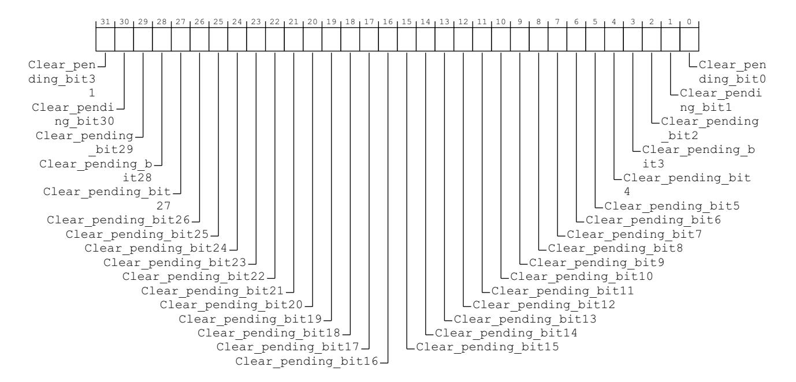

#### **Clear\_pending\_bit<x>, bit [x], for x = 31 to 0**

Removes the pending state from interrupt number x. Reads and writes have the following behavior:

- 0b0 If read, indicates that the corresponding interrupt is not pending. If written, has no effect.
- 0b1 If read, indicates that the corresponding interrupt is pending, or active and pending. If written, changes the state of the corresponding interrupt from pending to inactive, or from active and pending to active. This has no effect in the following cases:
  - If the interrupt is not pending and is not active and pending.
  - If the interrupt is a level-sensitive interrupt that is pending or active and pending for a reason other than a write to [GICD\\_ISPENDR<n>](#page-596-1). In this case, if the interrupt signal continues to be asserted, the interrupt remains pending or active and pending.

The reset behavior of this field is:

• On a GIC reset, this field resets to an architecturally UNKNOWN value.

#### **Accessing the GICR\_ICPENDR0:**

When affinity routing is not enabled for the Security state of an interrupt in GICR\_ICPENDR0, the corresponding bit is RAZ/WI and equivalent functionality is provided by [GICD\\_ICPENDR<n>](#page-561-1) with n=0.

This register only applies to SGIs (bits [15:0]) and PPIs (bits [31:16]). For SPIs, this functionality is provided by [GICD\\_ICENABLER<n>.](#page-553-1)

When [GICD\\_CTLR](#page-543-1).DS == 0, bits corresponding to Secure SGIs and PPIs are RAZ/WI to Non-secure accesses.

GICR\_ICPENDR0 can be accessed through its memory-mapped interface:

| Component         | Frame    | Offset | Instance      |
|-------------------|----------|--------|---------------|
| GIC Redistributor | SGI_base | 0x0280 | GICR_ICPENDR0 |

#### <span id="page-659-0"></span>**12.11.11 GICR\_ICPENDR<n>E, Interrupt Clear-Pending Registers, n = 1 - 2**

The GICR\_ICPENDR<n>E characteristics are:

#### **Purpose**

Removes the pending state from the corresponding PPI.

#### **Configurations**

This register is present only when FEAT\_GICv3p1 is implemented. Otherwise, direct accesses to GICR\_ICPENDR<n>E are RES0.

A copy of this register is provided for each Redistributor.

#### **Attributes**

GICR\_ICPENDR<n>E is a 32-bit register.

#### **Field descriptions**

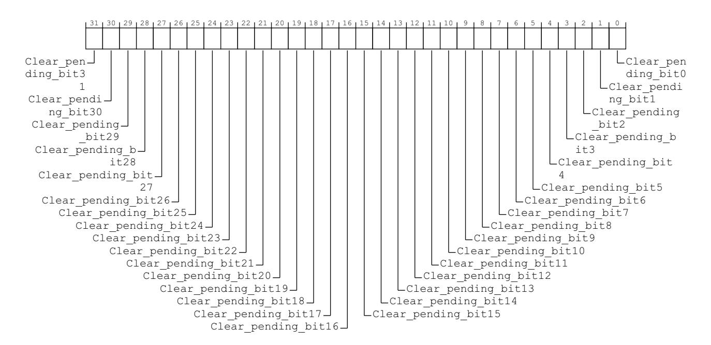

#### **Clear\_pending\_bit<x>, bit [x], for x = 31 to 0**

For the extended PPIs, removes the pending state to interrupt number x. Reads and writes have the following behavior:

- 0b0 If read, indicates that the corresponding interrupt is not pending on this PE. If written, has no effect.
- 0b1 If read, indicates that the corresponding interrupt is pending, or active and pending on this PE.

If written, changes the state of the corresponding interrupt from pending to inactive, or from active and pending to active.

This has no effect in the following cases:

- If the interrupt is not pending and is not active and pending.
- If the interrupt is a level-sensitive interrupt that is pending or active and pending for a reason other than a write to GICR\_ISPENDR<n>E. In this case, if the interrupt signal continues to be asserted, the interrupt remains pending or active and pending.

The reset behavior of this field is:

• On a GIC reset, this field resets to an architecturally UNKNOWN value.

For INTID m, when DIV and MOD are the integer division and modulo operations:

- The corresponding GICR\_ICPENDR<n>E number, n, is given by n = (m-1024) DIV 32.
- The offset of the required GICR\_ICPENDR<n>E is (0x200 + (4\*n)).
- The bit number of the required group modifier bit in this register is (m-1024) MOD 32.

#### **Accessing the GICR\_ICPENDR<n>E:**

When affinity routing is not enabled for the Security state of an interrupt in GICR\_ICPENDR<n>E, the corresponding bit is RES0.

When [GICD\\_CTLR](#page-543-1).DS==0, bits corresponding to Secure PPIs are RAZ/WI to Non-secure accesses.

Bits corresponding to unimplemented interrupts are RAZ/WI.

GICR\_ICPENDR<n>E can be accessed through its memory-mapped interface:

| Component         | Frame    | Offset           | Instance              |
|-------------------|----------|------------------|-----------------------|
| GIC Redistributor | SGI_base | 0x0280 + (4 * n) | GICR_ICPENDR <n>E</n> |

#### <span id="page-661-1"></span><span id="page-661-0"></span>**12.11.12 GICR\_IGROUPR0, Interrupt Group Register 0**

The GICR\_IGROUPR0 characteristics are:

#### **Purpose**

Controls whether the corresponding SGI or PPI is in Group 0 or Group 1.

#### **Configurations**

This register is available in all GIC configurations. If the GIC implementation supports two Security states, this register is Secure.

A copy of this register is provided for each Redistributor.

#### **Attributes**

GICR\_IGROUPR0 is a 32-bit register.

#### **Field descriptions**

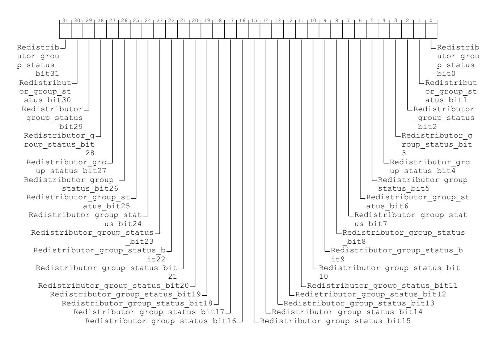

#### **Redistributor\_group\_status\_bit<x>, bit [x], for x = 31 to 0**

Group status bit. In this register:

- Bits [31:16] are group status bits for PPIs.
- Bits [15:0] are group status bits for SGIs.

0b0 When [GICD\\_CTLR.](#page-543-1)DS==1, the corresponding interrupt is Group 0. When [GICD\\_CTLR.](#page-543-1)DS==0, the corresponding interrupt is Secure.

0b1 When [GICD\\_CTLR.](#page-543-1)DS==1, the corresponding interrupt is Group 1.

When [GICD\\_CTLR.](#page-543-1)DS==0, the corresponding interrupt is Non-secure Group 1.

When [GICD\\_CTLR](#page-543-1).DS == 0, the bit that corresponds to the interrupt is concatenated with the equivalent bit in [GICR\\_IGRPMODR0](#page-665-1) to form a 2-bit field that defines an interrupt group. The encoding of this field is at [GICR\\_IGRPMODR0.](#page-665-1)

The reset behavior of this field is:

• On a GIC reset, this field resets to an architecturally UNKNOWN value.

The considerations for the reset value of this register are the same as those for [GICD\\_IGROUPR<n>](#page-565-1) with n=0.

#### **Accessing the GICR\_IGROUPR0:**

When affinity routing is not enabled for the Security state of an interrupt in GICR\_IGROUPR0, the corresponding bit is RES0 and equivalent functionality is provided by [GICD\\_IGROUPR<n>](#page-565-1) with n=0.

When [GICD\\_CTLR](#page-543-1).DS == 0, the register is RAZ/WI to Non-secure accesses.

Bits corresponding to unimplemented interrupts are RAZ/WI.

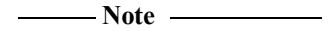

Implementations must ensure that an interrupt that is pending at the time of the write uses either the old value or the new value and must ensure that the interrupt is neither lost nor handled more than one time. The effect of the change must be visible in finite time.

GICR\_IGROUPR0 can be accessed through its memory-mapped interface:

| Component         | Frame    | Offset | Instance      |
|-------------------|----------|--------|---------------|
| GIC Redistributor | SGI_base | 0x0080 | GICR_IGROUPR0 |

#### <span id="page-663-1"></span><span id="page-663-0"></span>**12.11.13 GICR\_IGROUPR<n>E, Interrupt Group Registers, n = 1 - 2**

The GICR\_IGROUPR<n>E characteristics are:

#### **Purpose**

Controls whether the corresponding PPI is in Group 0 or Group 1.

#### **Configurations**

This register is present only when FEAT\_GICv3p1 is implemented. Otherwise, direct accesses to GICR\_IGROUPR<n>E are RES0.

When [GICD\\_CTLR](#page-543-1).DS==0, this register is Secure.

A copy of this register is provided for each Redistributor.

#### **Attributes**

GICR\_IGROUPR<n>E is a 32-bit register.

#### **Field descriptions**


#### **Group\_status\_bit<x>, bit [x], for x = 31 to 0**

Group status bit.

0b0 When [GICD\\_CTLR.](#page-543-1)DS==1, the corresponding interrupt is Group 0. When [GICD\\_CTLR.](#page-543-1)DS==0, the corresponding interrupt is Secure. 0b1 When [GICD\\_CTLR.](#page-543-1)DS==1, the corresponding interrupt is Group 1.

When [GICD\\_CTLR.](#page-543-1)DS==0, the corresponding interrupt is Non-secure Group 1.

The reset behavior of this field is:

• On a GIC reset, this field resets to an architecturally UNKNOWN value.

If affinity routing is enabled for the Security state of an interrupt, the bit that corresponds to the interrupt is concatenated with the equivalent bit in GICR\_IGRPMODR<n>E to form a 2-bit field that defines an interrupt group. The encoding of this field is described in GICR\_IGRPMODR<n>E.

If affinity routing is disabled for the Security state of an interrupt, the bit is RES0.

For INTID m, when DIV and MOD are the integer division and modulo operations:

- The corresponding GICR\_IGROUPR<n>E number, n, is given by n = (m-1024) DIV 32.
- The offset of the required GICR\_IGROUPR<n>E is (0x080 + (4\*n)).
- The bit number of the required group modifier bit in this register is (m-1024) MOD 32.

#### **Accessing the GICR\_IGROUPR<n>E:**

When affinity routing is not enabled for the Security state of an interrupt in GICR\_IGROUPR<n>E, the corresponding bit is RES0.

When [GICD\\_CTLR](#page-543-1).DS==0, the register is RAZ/WI to Non-secure accesses.

Bits corresponding to unimplemented interrupts are RAZ/WI.

GICR\_IGROUPR<n>E can be accessed through its memory-mapped interface:

| Component         | Frame    | Offset           | Instance              |
|-------------------|----------|------------------|-----------------------|
| GIC Redistributor | SGI_base | 0x0080 + (4 * n) | GICR_IGROUPR <n>E</n> |

#### <span id="page-665-1"></span><span id="page-665-0"></span>**12.11.14 GICR\_IGRPMODR0, Interrupt Group Modifier Register 0**

The GICR\_IGRPMODR0 characteristics are:

#### **Purpose**

When [GICD\\_CTLR](#page-543-1).DS==0, this register together with the [GICR\\_IGROUPR0](#page-661-1) register, controls whether the corresponding interrupt is in:

- Secure Group 0.
- Non-secure Group 1.
- When System register access is enabled, Secure Group 1.

#### **Configurations**

When [GICD\\_CTLR](#page-543-1).DS==0, this register is Secure.

A copy of this register is provided for each Redistributor.

#### **Attributes**

GICR\_IGRPMODR0 is a 32-bit register.

#### **Field descriptions**

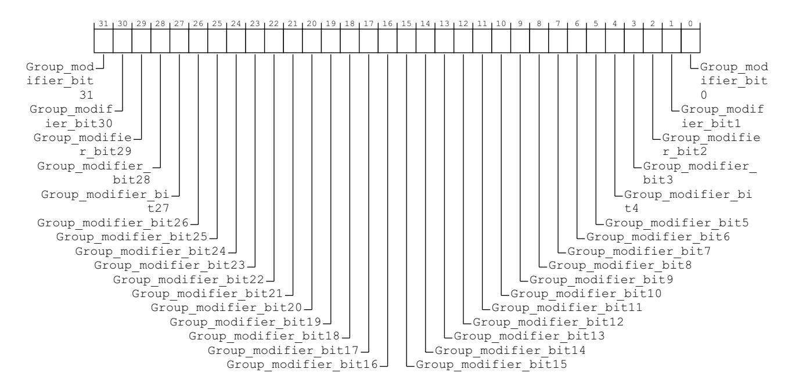

#### **Group\_modifier\_bit<x>, bit [x], for x = 31 to 0**

Group modifier bit. In implementations where affinity routing is enabled for the Security state of an interrupt, the bit that corresponds to the interrupt is concatenated with the equivalent bit in [GICR\\_IGROUPR0](#page-661-1) to form a 2-bit field that defines an interrupt group:

| Group modifier bit | Group status bit | Definition     | Short name |
|--------------------|------------------|----------------|------------|
| 0b0                | 0b0              | Secure Group 0 | G0S        |

| Group modifier bit | Group status bit | Definition                              | Short name |
|--------------------|------------------|-----------------------------------------|------------|
| 0b0                | 0b1              | Non-secure Group 1                      | G1NS       |
| 0b1                | 0b0              | Secure Group 1                          | G1S        |
| 0b1                | 0b1              | Reserved, treated as Non-secure Group 1 | -          |

The reset behavior of this field is:

• On a GIC reset, this field resets to an architecturally UNKNOWN value.

#### **Accessing the GICR\_IGRPMODR0:**

When affinity routing is not enabled for the Security state of an interrupt in GICR\_IGRPMODR0, the corresponding bit is RES0 and equivalent functionality is provided by [GICD\\_IGRPMODR<n>](#page-569-1) with n=0.

This register only applies to SGIs (bits [15:0]) and PPIs (bits [31:16]). For SPIs, this functionality is provided by [GICD\\_IGRPMODR<n>.](#page-569-1)

When [GICD\\_CTLR](#page-543-1).ARE\_S == 0 or [GICD\\_CTLR](#page-543-1).DS == 1, GICR\_IGRPMODR0 is RES0. An implementation can make this register RAZ/WI in this case.

When [GICD\\_CTLR](#page-543-1).DS==0, the register is RAZ/WI to Non-secure accesses.

Bits corresponding to unimplemented interrupts are RAZ/WI.

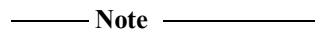

Implementations must ensure that an interrupt that is pending at the time of the write uses either the old value or the new value and must ensure that the interrupt is neither lost nor handled more than one time. The effect of the change must be visible in finite time.

GICR\_IGRPMODR0 can be accessed through its memory-mapped interface:

| Component         | Frame    | Offset | Instance       |
|-------------------|----------|--------|----------------|
| GIC Redistributor | SGI_base | 0x0D00 | GICR_IGRPMODR0 |

#### <span id="page-667-1"></span><span id="page-667-0"></span>**12.11.15 GICR\_IGRPMODR<n>E, Interrupt Group Modifier Registers, n = 1 - 2**

The GICR\_IGRPMODR<n>E characteristics are:

#### **Purpose**

When [GICD\\_CTLR](#page-543-1).DS==0, this register together with the GICR\_IGROUPR<n>E registers, controls whether the corresponding interrupt is in:

- Secure Group 0.
- Non-secure Group 1.
- When System register access is enabled, Secure Group 1.

#### **Configurations**

This register is present only when FEAT\_GICv3p1 is implemented. Otherwise, direct accesses to GICR\_IGRPMODR<n>E are RES0.

When [GICD\\_CTLR](#page-543-1).DS==0, this register is Secure.

A copy of this register is provided for each Redistributor.

#### **Attributes**

GICR\_IGRPMODR<n>E is a 32-bit register.

#### **Field descriptions**

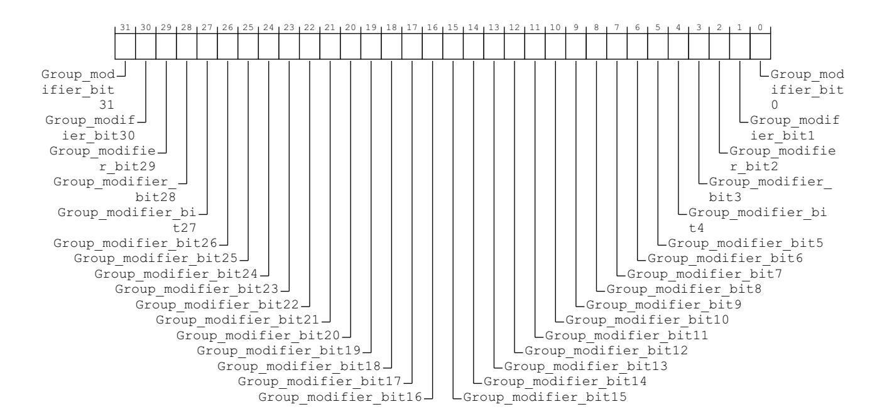

#### **Group\_modifier\_bit<x>, bit [x], for x = 31 to 0**

Group modifier bit. In implementations where affinity routing is enabled for the Security state of an interrupt, the bit that corresponds to the interrupt is concatenated with the equivalent bit in [GICR\\_IGROUPR<n>E](#page-663-1) to form a 2-bit field that defines an interrupt group:

| Group modifier bit | Group status bit | Definition                              | Short name |
|--------------------|------------------|-----------------------------------------|------------|
| 0b0                | 0b0              | Secure Group 0                          | G0S        |
| 0b0                | 0b1              | Non-secure Group 1                      | G1NS       |
| 0b1                | 0b0              | Secure Group 1                          | G1S        |
| 0b1                | 0b1              | Reserved, treated as Non-secure Group 1 | -          |

The reset behavior of this field is:

• On a GIC reset, this field resets to an architecturally UNKNOWN value.

For INTID m, when DIV and MOD are the integer division and modulo operations:

- The corresponding GICR\_IGRPMODR<n>E number, n, is given by n = (m-1024) DIV 32.
- The offset of the required GICR\_IGRPMODR<n>E is (0xD00 + (4\*n)).
- The bit number of the required group modifier bit in this register is (m-1024) MOD 32.

#### **Accessing the GICR\_IGRPMODR<n>E:**

When affinity routing is not enabled for the Security state of an interrupt in GICR\_IGRPMODR<n>E, the corresponding bit is RES0.

When [GICD\\_CTLR](#page-543-1).DS==0, the register is RAZ/WI to Non-secure accesses.

Bits corresponding to unimplemented interrupts are RAZ/WI.

GICR\_IGRPMODR<n>E can be accessed through its memory-mapped interface:

| Component         | Frame    | Offset           | Instance               |
|-------------------|----------|------------------|------------------------|
| GIC Redistributor | SGI_base | 0x0D00 + (4 * n) | GICR_IGRPMODR <n>E</n> |

#### <span id="page-669-0"></span>**12.11.16 GICR\_IIDR, Redistributor Implementer Identification Register**

The GICR\_IIDR characteristics are:

#### **Purpose**

Provides information about the implementer and revision of the Redistributor.

#### **Configurations**

This register is available in all configurations of the GIC. If the GIC implementation supports two Security states, this register is Common.

#### **Attributes**

GICR\_IIDR is a 32-bit register.

#### **Field descriptions**

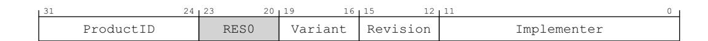

#### **ProductID, bits [31:24]**

Product Identifier.

This field has an IMPLEMENTATION DEFINED value.

Access to this field is RO.

#### **Bits [23:20]**

Reserved, RES0.

#### **Variant, bits [19:16]**

Variant number. Typically, this field is used to distinguish product variants, or major revisions of a product.

This field has an IMPLEMENTATION DEFINED value.

Access to this field is RO.

#### **Revision, bits [15:12]**

Revision number. Typically, this field is used to distinguish minor revisions of a product.

This field has an IMPLEMENTATION DEFINED value.

Access to this field is RO.

#### **Implementer, bits [11:0]**

Contains the JEP106 code of the company that implemented the Redistributor:

- Bits [11:8] are the JEP106 continuation code of the implementer. For an Arm implementation, this field is 0x4.
- Bit [7] is always 0.
- Bits [6:0] are the JEP106 identity code of the implementer. For an Arm implementation, bits [7:0] are therefore 0x3B.

This field has an IMPLEMENTATION DEFINED value.

Access to this field is RO.

#### **Accessing the GICR\_IIDR:**

GICR\_IIDR can be accessed through its memory-mapped interface:

| Component         | Frame   | Offset | Instance  |
|-------------------|---------|--------|-----------|
| GIC Redistributor | RD_base | 0x0004 | GICR_IIDR |

#### <span id="page-671-1"></span><span id="page-671-0"></span>**12.11.17 GICR\_INMIR0, Non-maskable Interrupt Register 0**

The GICR\_INMIR0 characteristics are:

#### **Purpose**

Controls whether the corresponding SGI or PPI has the non-maskable property.

#### **Configurations**

This register is present only when FEAT\_GICv3\_NMI is implemented. Otherwise, direct accesses to GICR\_INMIR0 are RES0.

When [GICD\\_TYPER.](#page-617-1)NMI is 0, this register is RES0.

A copy of this register is provided for each Redistributor.

#### **Attributes**

GICR\_INMIR0 is a 32-bit register.

#### **Field descriptions**

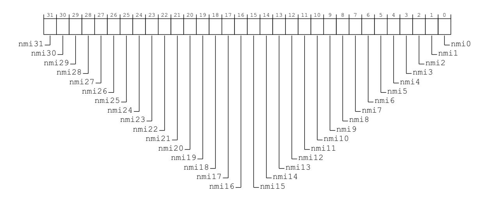

#### **nmi<x>, bit [x], for x = 31 to 0**

Non-maskable property.

0b0 Interrupt does not have the non-maskable property.

0b1 Interrupt has the non-maskable property.

The reset behavior of this field is:

• On a GIC reset, this field resets to 0.

If affinity routing is disabled for the Security state of an interrupt, the bit is RES0.

This bit is RES0 when the corresponding interrupt is configured as Group 0.

#### **Accessing the GICR\_INMIR0:**

Bits corresponding to unimplemented interrupts are RAZ/WI.

When [GICD\\_CTLR](#page-543-1).DS==0, bits corresponding to Group 0 and Secure Group 1 interrupts are RAZ/WI to Non-secure accesses.

| Note |  |
|------|--|
|------|--|

Implementations must ensure that an interrupt that is pending at the time of the write uses either the old value or the new value and must ensure that the interrupt is neither lost nor handled more than one time. The effect of the change must be visible in finite time.

GICR\_INMIR0 can be accessed through its memory-mapped interface:

| Component         | Frame    | Offset | Instance    |
|-------------------|----------|--------|-------------|
| GIC Redistributor | SGI_base | 0x0F80 | GICR_INMIR0 |

#### <span id="page-673-1"></span><span id="page-673-0"></span>**12.11.18 GICR\_INMIR<n>E, Non-maskable Interrupt Registers for Extended PPIs, x = 1 to 2., n = 1 - 2**

The GICR\_INMIR<n>E characteristics are:

#### **Purpose**

Controls whether the corresponding Extended PPI has the non-maskable property.

#### **Configurations**

This register is present only when FEAT\_GICv3p1 is implemented and FEAT\_GICv3\_NMI is implemented. Otherwise, direct accesses to GICR\_INMIR<n>E are RES0.

When [GICR\\_TYPER](#page-710-1).PPInum is 0b0000 or [GICD\\_TYPER](#page-617-1).NMI is 0, these registers are RES0.

A copy of this register is provided for each Redistributor.

#### **Attributes**

GICR\_INMIR<n>E is a 32-bit register.

#### **Field descriptions**

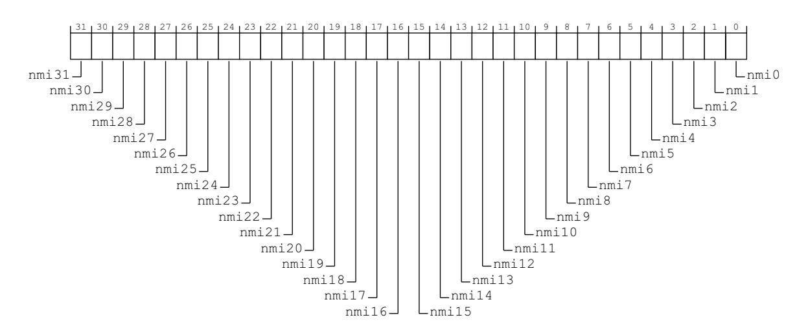

#### **nmi<x>, bit [x], for x = 31 to 0**

Non-maskable property.

0b0 Interrupt does not have the non-maskable property.

0b1 Interrupt has the non-maskable property.

This bit is RES0 when the corresponding interrupt is configured as Group 0.

The reset behavior of this field is:

• On a GIC reset, this field resets to 0.

If affinity routing is disabled for the Security state of an interrupt, the bit is RES0.

#### **Accessing the GICR\_INMIR<n>E:**

Bits corresponding to unimplemented interrupts are RAZ/WI.

When [GICD\\_CTLR](#page-543-1).DS==0, bits corresponding to Group 0 and Secure Group 1 interrupts are RAZ/WI to Non-secure accesses.

| Note |  |
|------|--|
|------|--|

Implementations must ensure that an interrupt that is pending at the time of the write uses either the old value or the new value and must ensure that the interrupt is neither lost nor handled more than one time. The effect of the change must be visible in finite time.

GICR\_INMIR<n>E can be accessed through its memory-mapped interface:

| Component         | Frame    | Offset           | Instance            |
|-------------------|----------|------------------|---------------------|
| GIC Redistributor | SGI_base | 0x0F80 + (4 * n) | GICR_INMIR <n>E</n> |

#### <span id="page-675-1"></span><span id="page-675-0"></span>**12.11.19 GICR\_INVALLR, Redistributor Invalidate All Register**

The GICR\_INVALLR characteristics are:

#### **Purpose**

Invalidates any cached configuration data of all LPIs, causing the GIC to reload the interrupt configuration from the appropriate LPI Configuration table.

#### **Configurations**

A copy of this register is provided for each Redistributor.

#### **Attributes**

GICR\_INVALLR is a 64-bit register.

#### **Field descriptions**

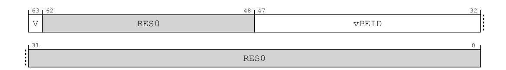

#### **V, bit [63]**

#### *When FEAT\_GICv4p1 is implemented:*

Indicates whether the INTID is virtual or physical.

0b0 Invalidate is for a physical INTID.

0b1 Invalidate is for a virtual INTID.

#### *Otherwise:*

Reserved, RES0.

#### **Bits [62:48]**

Reserved, RES0.

#### **vPEID, bits [47:32]**

#### *When FEAT\_GICv4p1 is implemented:*

When GICR\_INVLPIR.V == 0, this field is RES0

When GICR\_INVLPIR.V == 1, this field is the target vPEID of the invalidate.

**Note**

The size of this field is IMPLEMENTATION DEFINED, and is specified by the [GICD\\_TYPER2.](#page-621-1)VIL and [GICD\\_TYPER2](#page-621-1).VID fields. Unimplemented bits are RES0.

#### *Otherwise:*

Reserved, RES0.

#### **Bits [31:0]**

Reserved, RES0.

**Note**

If any LPI has been forwarded to the PE and a valid write to GICR\_INVALLR is received, the Redistributor must ensure it reloads its properties from memory. This has no effect on the forwarded LPI if it has already been activated.

#### **Accessing the GICR\_INVALLR:**

This register is mandatory when any of the following are true:

- [GICR\\_TYPER.](#page-710-1)Direct is 1.
- [GICR\\_CTLR](#page-640-1).IR is 1.
- GICv4.1 is implemented.

Otherwise, the functionality is IMPLEMENTATION DEFINED.

Writes to this register have no effect if no physical LPIs are currently stored in the local Redistributor cache.

GICR\_INVALLR can be accessed through its memory-mapped interface:

| Component         | Frame   | Offset | Instance     |
|-------------------|---------|--------|--------------|
| GIC Redistributor | RD_base | 0x00B0 | GICR_INVALLR |

#### <span id="page-677-1"></span><span id="page-677-0"></span>**12.11.20 GICR\_INVLPIR, Redistributor Invalidate LPI Register**

The GICR\_INVLPIR characteristics are:

#### **Purpose**

Invalidates the cached configuration data of a specified LPI, causing the GIC to reload the interrupt configuration from the appropriate LPI Configuration table.

#### **Configurations**

A copy of this register is provided for each Redistributor.

#### **Attributes**

GICR\_INVLPIR is a 64-bit register.

#### **Field descriptions**

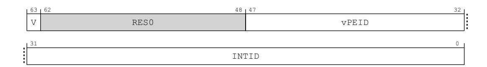

#### **V, bit [63]**

#### *When FEAT\_GICv4p1 is implemented:*

Indicates whether the INTID is virtual or physical.

0b0 Invalidate is for a physical INTID.

0b1 Invalidate is for a virtual INTID.

#### *Otherwise:*

Reserved, RES0.

#### **Bits [62:48]**

Reserved, RES0.

#### **vPEID, bits [47:32]**

#### *When FEAT\_GICv4p1 is implemented:*

When GICR\_INVLPIR.V == 0, this field is RES0

When GICR\_INVLPIR.V == 1, this field is the target vPEID of the invalidate.

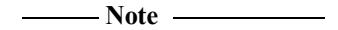

The size of this field is IMPLEMENTATION DEFINED, and is specified by the [GICD\\_TYPER2.](#page-621-1)VIL and [GICD\\_TYPER2](#page-621-1).VID fields. Unimplemented bits are RES0.

#### *Otherwise:*

Reserved, RES0.

#### **INTID, bits [31:0]**

The INTID of the LPI to be invalidated.

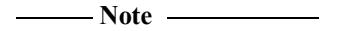

The size of this field is IMPLEMENTATION DEFINED, and is specified by the [GICD\\_TYPER](#page-617-1).IDbits field. Unimplemented bits are RES0.

| Note |  |
|------|--|
|------|--|

If any LPI has been forwarded to the PE and a valid write to GICR\_INVLPIR is received, the Redistributor must ensure it reloads its properties from memory and apply any changes by retrieving and reforwarding the LPI as required. This has no effect on the forwarded LPI if it has already been activated.

#### **Accessing the GICR\_INVLPIR:**

When written with a 32-bit write the data is zero-extended to 64 bits.

This register is mandatory when any of the following are true:

- [GICR\\_TYPER.](#page-710-1)Direct is 1.
- [GICR\\_CTLR](#page-640-1).IR is 1.
- GICv4.1 is implemented.

Otherwise, the functionality is IMPLEMENTATION DEFINED.

Writes to this register have no effect if either:

- The specified LPI is not currently stored in the local Redistributor.
- The INTID field corresponds to an unimplemented LPI.

GICR\_INVLPIR can be accessed through its memory-mapped interface:

| Component         | Frame   | Offset | Instance     |
|-------------------|---------|--------|--------------|
| GIC Redistributor | RD_base | 0x00A0 | GICR_INVLPIR |

#### <span id="page-679-1"></span><span id="page-679-0"></span>**12.11.21 GICR\_IPRIORITYR<n>, Interrupt Priority Registers, n = 0 - 7**

The GICR\_IPRIORITYR<n> characteristics are:

#### **Purpose**

Holds the priority of the corresponding interrupt for each SGI and PPI supported by the GIC.

#### **Configurations**

A copy of these registers is provided for each Redistributor.

These registers are configured as follows:

- GICR\_IPRIORITYR0-GICR\_IPRIORITYR3 store the priority of SGIs.
- GICR\_IPRIORITYR4-GICR\_IPRIORITYR7 store the priority of PPIs.

#### **Attributes**

GICR\_IPRIORITYR<n> is a 32-bit register.

#### **Field descriptions**

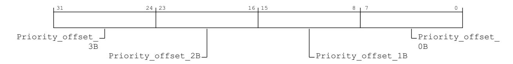

#### **Priority\_offset\_3B, bits [31:24]**

Interrupt priority value from an IMPLEMENTATION DEFINED range, at byte offset 3. Lower priority values correspond to greater priority of the interrupt. For an INTID configured as non-maskable, this field is RES0.

The reset behavior of this field is:

• On a GIC reset, this field resets to an architecturally UNKNOWN value.

#### **Priority\_offset\_2B, bits [23:16]**

Interrupt priority value from an IMPLEMENTATION DEFINED range, at byte offset 2. Lower priority values correspond to greater priority of the interrupt. For an INTID configured as non-maskable, this field is RES0.

The reset behavior of this field is:

• On a GIC reset, this field resets to an architecturally UNKNOWN value.

#### **Priority\_offset\_1B, bits [15:8]**

Interrupt priority value from an IMPLEMENTATION DEFINED range, at byte offset 1. Lower priority values correspond to greater priority of the interrupt. For an INTID configured as non-maskable, this field is RES0.

The reset behavior of this field is:

• On a GIC reset, this field resets to an architecturally UNKNOWN value.

#### **Priority\_offset\_0B, bits [7:0]**

Interrupt priority value from an IMPLEMENTATION DEFINED range, at byte offset 0. Lower priority values correspond to greater priority of the interrupt. For an INTID configured as non-maskable, this field is RES0.

The reset behavior of this field is:

• On a GIC reset, this field resets to an architecturally UNKNOWN value.

#### **Accessing the GICR\_IPRIORITYR<n>:**

These registers are used when affinity routing is enabled for the Security state of the interrupt. When affinity routing is not enabled the bits corresponding to the interrupt are RAZ/WI and [GICD\\_IPRIORITYR<n>](#page-579-1) provides equivalent functionality.

These registers are used for SGIs and PPIs only. Equivalent functionality for SPIs is provided by [GICD\\_IPRIORITYR<n>.](#page-579-1)

These registers are byte-accessible.

When [GICD\\_CTLR](#page-543-1).DS == 0:

- A field that corresponds to a Group 0 or Secure Group 1 interrupt is RAZ/WI to Non-secure accesses.
- A Non-secure access to a field that corresponds to a Non-secure Group 1 interrupt behaves as described in *[Software accesses of interrupt priority on page](#page-79-3) 4-80*.

| Note |  |  |  |  |
|------|--|--|--|--|
|      |  |  |  |  |

Implementations must ensure that an interrupt that is pending at the time of the write uses either the old value or the new value and must ensure that the interrupt is neither lost nor handled more than one time. The effect of the change must be visible in finite time.

GICR\_IPRIORITYR<n> can be accessed through its memory-mapped interface:

| Component         | Frame    | Offset           | Instance                |
|-------------------|----------|------------------|-------------------------|
| GIC Redistributor | SGI_base | 0x0400 + (4 * n) | GICR_IPRIORITYR <n></n> |

#### <span id="page-681-1"></span><span id="page-681-0"></span>**12.11.22 GICR\_IPRIORITYR<n>E, Interrupt Priority Registers (extended PPI range), n = 8 - 23**

The GICR\_IPRIORITYR<n>E characteristics are:

#### **Purpose**

Holds the priority of the corresponding interrupt for each extended PPI supported by the GIC.

#### **Configurations**

This register is present only when FEAT\_GICv3p1 is implemented. Otherwise, direct accesses to GICR\_IPRIORITYR<n>E are RES0.

A copy of this register is provided for each Redistributor.

#### **Attributes**

GICR\_IPRIORITYR<n>E is a 32-bit register.

#### **Field descriptions**

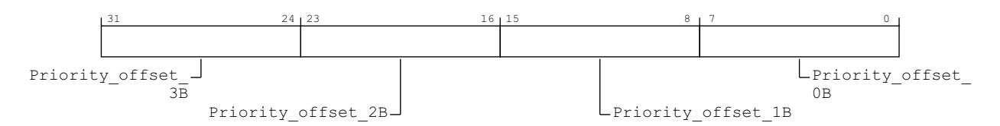

#### **Priority\_offset\_3B, bits [31:24]**

Interrupt priority value from an IMPLEMENTATION DEFINED range, at byte offset 3. Lower priority values correspond to greater priority of the interrupt. For an INTID configured as non-maskable, this field is RES0.

The reset behavior of this field is:

• On a GIC reset, this field resets to an architecturally UNKNOWN value.

#### **Priority\_offset\_2B, bits [23:16]**

Interrupt priority value from an IMPLEMENTATION DEFINED range, at byte offset 2. Lower priority values correspond to greater priority of the interrupt. For an INTID configured as non-maskable, this field is RES0.

The reset behavior of this field is:

• On a GIC reset, this field resets to an architecturally UNKNOWN value.

#### **Priority\_offset\_1B, bits [15:8]**

Interrupt priority value from an IMPLEMENTATION DEFINED range, at byte offset 1. Lower priority values correspond to greater priority of the interrupt. For an INTID configured as non-maskable, this field is RES0.

The reset behavior of this field is:

• On a GIC reset, this field resets to an architecturally UNKNOWN value.

#### **Priority\_offset\_0B, bits [7:0]**

Interrupt priority value from an IMPLEMENTATION DEFINED range, at byte offset 0. Lower priority values correspond to greater priority of the interrupt. For an INTID configured as non-maskable, this field is RES0.

The reset behavior of this field is:

• On a GIC reset, this field resets to an architecturally UNKNOWN value.

For interrupt ID m, when DIV and MOD are the integer division and modulo operations:

• The corresponding GICR\_IPRIORITYR<n> number, n, is given by n = (m-1024) DIV 4.

- The offset of the required GICR\_IPRIORITYR<n>E register is (0x400 + (4\*n)).
- The byte offset of the required Priority field in this register is m MOD 4, where:
  - Byte offset 0 refers to register bits [7:0].
  - Byte offset 1 refers to register bits [15:8].
  - Byte offset 2 refers to register bits [23:16].
  - Byte offset 3 refers to register bits [31:24].

#### **Accessing the GICR\_IPRIORITYR<n>E:**

When affinity routing is not enabled for the Security state of an interrupt in GICR\_ISACTIVER<n>E, the corresponding bit is RES0.

When [GICD\\_CTLR](#page-543-1).DS==0:

- A field that corresponds to a Group 0 or Secure Group 1 interrupt is RAZ/WI to Non-secure accesses.
- A Non-secure access to a field that corresponds to a Non-secure Group 1 interrupt behaves as described in Software accesses of interrupt priority.

Bits corresponding to unimplemented interrupts are RAZ/WI.

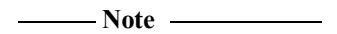

Implementations must ensure that an interrupt that is pending at the time of the write uses either the old value or the new value and must ensure that the interrupt is neither lost nor handled more than once. The effect of the change must be visible in finite time.

GICR\_IPRIORITYR<n>E can be accessed through its memory-mapped interface:

| Component         | Frame    | Offset           | Instance                 |  |
|-------------------|----------|------------------|--------------------------|--|
| GIC Redistributor | SGI_base | 0x0400 + (4 * n) | GICR_IPRIORITYR <n>E</n> |  |

#### <span id="page-683-0"></span>**12.11.23 GICR\_ISACTIVER0, Interrupt Set-Active Register 0**

The GICR\_ISACTIVER0 characteristics are:

#### **Purpose**

Activates the corresponding SGI or PPI. These registers are used when saving and restoring GIC state.

#### **Configurations**

A copy of this register is provided for each Redistributor.

#### **Attributes**

GICR\_ISACTIVER0 is a 32-bit register.

#### **Field descriptions**


#### **Set\_active\_bit<x>, bit [x], for x = 31 to 0**

Adds the active state to interrupt number x. Reads and writes have the following behavior:

0b0 If read, indicates that the corresponding interrupt is not active, and is not active and pending.

If written, has no effect.

0b1 If read, indicates that the corresponding interrupt is active, or is active and pending. If written, activates the corresponding interrupt, if the interrupt is not already active. If the interrupt is already active, the write has no effect.

After a write of 1 to this bit, a subsequent read of this bit returns 1.

The reset behavior of this field is:

• On a GIC reset, this field resets to 0.

#### **Accessing the GICR\_ISACTIVER0:**

When affinity routing is not enabled for the Security state of an interrupt in GICR\_ISACTIVER0, the corresponding bit is RAZ/WI and equivalent functionality is provided by [GICD\\_ISACTIVER<n>](#page-588-0) with n=0.

This register only applies to SGIs (bits [15:0]) and PPIs (bits [31:16]). For SPIs, this functionality is provided by [GICD\\_ISACTIVER<n>](#page-588-0).

When [GICD\\_CTLR](#page-543-1).DS == 0, bits corresponding to Secure SGIs and PPIs are RAZ/WI to Non-secure accesses. GICR\_ISACTIVER0 can be accessed through its memory-mapped interface:

| Component         | Frame    | Offset | Instance        |
|-------------------|----------|--------|-----------------|
| GIC Redistributor | SGI_base | 0x0300 | GICR_ISACTIVER0 |

#### <span id="page-685-0"></span>**12.11.24 GICR\_ISACTIVER<n>E, Interrupt Set-Active Registers, n = 1 - 2**

The GICR\_ISACTIVER<n>E characteristics are:

#### **Purpose**

Adds the active state to the corresponding PPI.

#### **Configurations**

This register is present only when FEAT\_GICv3p1 is implemented. Otherwise, direct accesses to GICR\_ISACTIVER<n>E are RES0.

A copy of this register is provided for each Redistributor.

#### **Attributes**

GICR\_ISACTIVER<n>E is a 32-bit register.

#### **Field descriptions**


#### **Set\_active\_bit<x>, bit [x], for x = 31 to 0**

For the extended PPIs, adds the active state to interrupt number x. Reads and writes have the following behavior:

0b0 If read, indicates that the corresponding interrupt is not active, and is not active and pending.

If written, has no effect.

0b1 If read, indicates that the corresponding interrupt is active, or active and pending on this PE.

> If written, activates the corresponding interrupt, if the interrupt is not already active. If the interrupt is already active, the write has no effect.

After a write of 1 to this bit, a subsequent read of this bit returns 1.

The reset behavior of this field is:

• On a GIC reset, this field resets to 0.

For INTID m, when DIV and MOD are the integer division and modulo operations:

• The corresponding GICR\_ISACTIVER<n>E number, n, is given by n = (m-1024) DIV 32.

- The offset of the required GICR\_ISACTIVER<n>E is (0x200 + (4\*n)).
- The bit number of the required group modifier bit in this register is (m-1024) MOD 32.

#### **Accessing the GICR\_ISACTIVER<n>E:**

When affinity routing is not enabled for the Security state of an interrupt in GICR\_ISACTIVER<n>E, the corresponding bit is RES0.

When [GICD\\_CTLR](#page-543-1).DS==0, bits corresponding to Secure PPIs are RAZ/WI to Non-secure accesses.

Bits corresponding to unimplemented interrupts are RAZ/WI.

GICR\_ISACTIVER<n>E can be accessed through its memory-mapped interface:

| Component         | Frame    | Offset           | Instance                |
|-------------------|----------|------------------|-------------------------|
| GIC Redistributor | SGI_base | 0x0300 + (4 * n) | GICR_ISACTIVER <n>E</n> |

#### <span id="page-687-1"></span><span id="page-687-0"></span>**12.11.25 GICR\_ISENABLER0, Interrupt Set-Enable Register 0**

The GICR\_ISENABLER0 characteristics are:

#### **Purpose**

Enables forwarding of the corresponding SGI or PPI to the CPU interfaces.

#### **Configurations**

A copy of this register is provided for each Redistributor.

#### **Attributes**

GICR\_ISENABLER0 is a 32-bit register.

#### **Field descriptions**

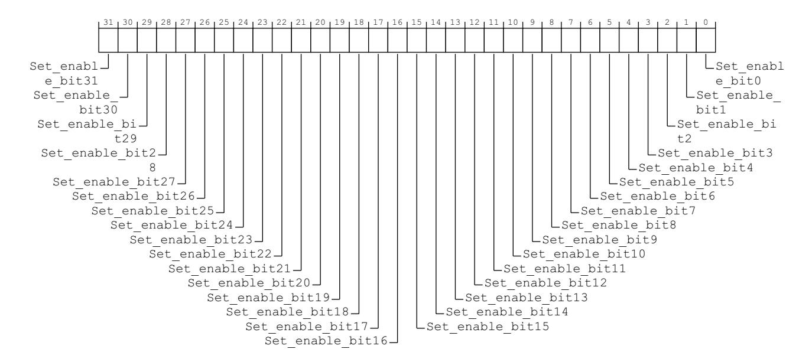

#### **Set\_enable\_bit<x>, bit [x], for x = 31 to 0**

For PPIs and SGIs, controls the forwarding of interrupt number x to the CPU interface. Reads and writes have the following behavior:

0b0 If read, indicates that forwarding of the corresponding interrupt is disabled.

If written, has no effect.

0b1 If read, indicates that forwarding of the corresponding interrupt is enabled.

If written, enables forwarding of the corresponding interrupt.

After a write of 1 to this bit, a subsequent read of this bit returns 1.

The reset behavior of this field is:

• On a GIC reset, this field resets to 0.

#### **Accessing the GICR\_ISENABLER0:**

When affinity routing is not enabled for the Security state of an interrupt in GICR\_ISENABLER0, the corresponding bit is RAZ/WI and equivalent functionality is provided by [GICD\\_ISENABLER<n>](#page-592-1) with n=0.

This register only applies to SGIs (bits [15:0]) and PPIs (bits [31:16]). For SPIs, this functionality is provided by [GICD\\_ISENABLER<n>.](#page-592-1)

When [GICD\\_CTLR](#page-543-1).DS == 0, bits corresponding to Secure SGIs and PPIs are RAZ/WI to Non-secure accesses.

GICR\_ISENABLER0 can be accessed through its memory-mapped interface:

| Component         | Frame    | Offset | Instance        |
|-------------------|----------|--------|-----------------|
| GIC Redistributor | SGI_base | 0x0100 | GICR_ISENABLER0 |

#### <span id="page-689-1"></span><span id="page-689-0"></span>**12.11.26 GICR\_ISENABLER<n>E, Interrupt Set-Enable Registers, n = 1 - 2**

The GICR\_ISENABLER<n>E characteristics are:

#### **Purpose**

Enables forwarding of the corresponding PPI to the CPU interfaces.

#### **Configurations**

This register is present only when FEAT\_GICv3p1 is implemented. Otherwise, direct accesses to GICR\_ISENABLER<n>E are RES0.

A copy of this register is provided for each Redistributor.

#### **Attributes**

GICR\_ISENABLER<n>E is a 32-bit register.

#### **Field descriptions**

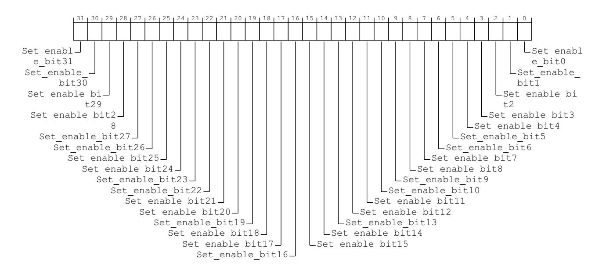

#### **Set\_enable\_bit<x>, bit [x], for x = 31 to 0**

For the extended PPI range, controls the forwarding of interrupt number x to the CPU interface. Reads and writes have the following behavior:

- 0b0 If read, indicates that forwarding of the corresponding interrupt is disabled. If written, has no effect.
- 0b1 If read, indicates that forwarding of the corresponding interrupt is enabled. If written, enables forwarding of the corresponding interrupt. After a write of 1 to this bit, a subsequent read of this bit returns 1.

The reset behavior of this field is:

• On a GIC reset, this field resets to 0.

For INTID m, when DIV and MOD are the integer division and modulo operations:

- The corresponding GICR\_ISENABLER<n>E number, n, is given by n = (m-1024) DIV 32.
- The offset of the required GICR\_ISENABLER<n>E is (0x100 + (4\*n)).
- The bit number of the required group modifier bit in this register is (m-1024) MOD 32.

#### **Accessing the GICR\_ISENABLER<n>E:**

When affinity routing is not enabled for the Security state of an interrupt in GICR\_ISENABLER<n>E, the corresponding bit is RES0.

When [GICD\\_CTLR](#page-543-1).DS==0, bits corresponding to Secure PPIs are RAZ/WI to Non-secure accesses.

Bits corresponding to unimplemented interrupts are RAZ/WI.

GICR\_ISENABLER<n>E can be accessed through its memory-mapped interface:

| Component         | Frame    | Offset           | Instance                |
|-------------------|----------|------------------|-------------------------|
| GIC Redistributor | SGI_base | 0x0100 + (4 * n) | GICR_ISENABLER <n>E</n> |

#### <span id="page-691-1"></span><span id="page-691-0"></span>**12.11.27 GICR\_ISPENDR0, Interrupt Set-Pending Register 0**

The GICR\_ISPENDR0 characteristics are:

**Purpose**

Adds the pending state to the corresponding SGI or PPI.

#### **Configurations**

A copy of this register is provided for each Redistributor.

#### **Attributes**

GICR\_ISPENDR0 is a 32-bit register.

#### **Field descriptions**

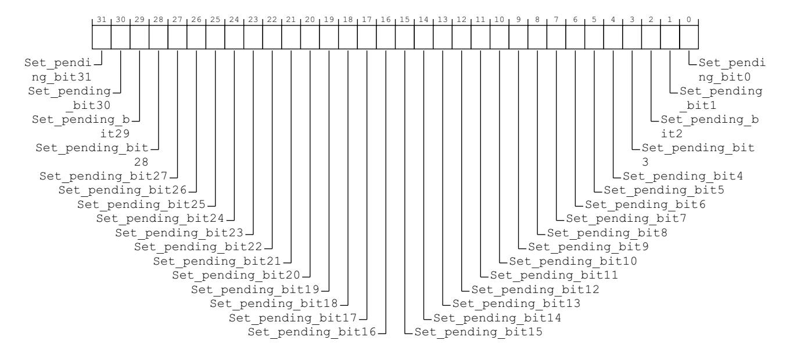

#### **Set\_pending\_bit<x>, bit [x], for x = 31 to 0**

For PPIs and SGIs, adds the pending state to interrupt number x. Reads and writes have the following behavior:

- 0b0 If read, indicates that the corresponding interrupt is not pending on this PE. If written, has no effect.
- 0b1 If read, indicates that the corresponding interrupt is pending, or active and pending on this PE.

If written, changes the state of the corresponding interrupt from inactive to pending, or from active to active and pending. This has no effect in the following cases:

- If the interrupt is already pending because of a write to [GICR\\_ISPENDR0.](#page-691-1)
- If the interrupt is already pending because the corresponding interrupt signal is asserted. In this case, the interrupt remains pending if the interrupt signal is deasserted.

The reset behavior of this field is:

• On a GIC reset, this field resets to an architecturally UNKNOWN value.

#### **Accessing the GICR\_ISPENDR0:**

When affinity routing is not enabled for the Security state of an interrupt in GICR\_ISPENDR0, the corresponding bit is RAZ/WI and equivalent functionality is provided by [GICD\\_ISPENDR<n>](#page-596-1) with n=0.

This register only applies to SGIs (bits [15:0]) and PPIs (bits [31:16]). For SPIs, this functionality is provided by [GICD\\_ISPENDR<n>.](#page-596-1)

When [GICD\\_CTLR](#page-543-1).DS == 0, bits corresponding to Secure SGIs and PPIs are RAZ/WI to Non-secure accesses.

GICR\_ISPENDR0 can be accessed through its memory-mapped interface:

| Component         | Frame    | Offset | Instance      |
|-------------------|----------|--------|---------------|
| GIC Redistributor | SGI_base | 0x0200 | GICR_ISPENDR0 |

#### <span id="page-693-0"></span>**12.11.28 GICR\_ISPENDR<n>E, Interrupt Set-Pending Registers, n = 1 - 2**

The GICR\_ISPENDR<n>E characteristics are:

#### **Purpose**

Adds the pending state to the corresponding PPI.

#### **Configurations**

This register is present only when FEAT\_GICv3p1 is implemented. Otherwise, direct accesses to GICR\_ISPENDR<n>E are RES0.

A copy of this register is provided for each Redistributor.

#### **Attributes**

GICR\_ISPENDR<n>E is a 32-bit register.

#### **Field descriptions**

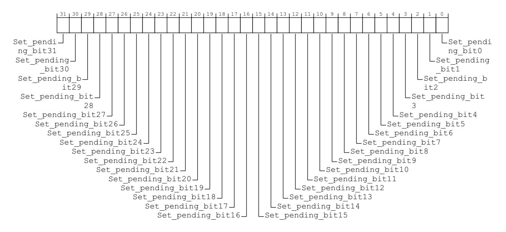

#### **Set\_pending\_bit<x>, bit [x], for x = 31 to 0**

For the extended PPIs, adds the pending state to interrupt number x. Reads and writes have the following behavior:

- 0b0 If read, indicates that the corresponding interrupt is not pending on this PE. If written, has no effect.
- 0b1 If read, indicates that the corresponding interrupt is pending, or active and pending on this PE.

If written, changes the state of the corresponding interrupt from inactive to pending, or from active to active and pending.

This has no effect in the following cases:

- If the interrupt is already pending because of a write to GICR\_ISPENDR<n>E.
- If the interrupt is already pending because the corresponding interrupt signal is asserted. In this case, the interrupt remains pending if the interrupt signal is deasserted.

The reset behavior of this field is:

• On a GIC reset, this field resets to an architecturally UNKNOWN value.

For INTID m, when DIV and MOD are the integer division and modulo operations:

- The corresponding GICR\_ISPENDR<n>E number, n, is given by n = (m-1024) DIV 32.
- The offset of the required GICR\_ISPENDR<n>E is (0x200 + (4\*n)).
- The bit number of the required group modifier bit in this register is (m-1024) MOD 32.

#### **Accessing the GICR\_ISPENDR<n>E:**

When affinity routing is not enabled for the Security state of an interrupt in GICR\_ISPENDR<n>E, the corresponding bit is RES0.

When [GICD\\_CTLR](#page-543-1).DS==0, bits corresponding to Secure PPIs are RAZ/WI to Non-secure accesses.

Bits corresponding to unimplemented interrupts are RAZ/WI.

GICR\_ISPENDR<n>E can be accessed through its memory-mapped interface:

| Component         | Frame    | Offset           | Instance              |
|-------------------|----------|------------------|-----------------------|
| GIC Redistributor | SGI_base | 0x0200 + (4 * n) | GICR_ISPENDR <n>E</n> |

#### <span id="page-695-1"></span><span id="page-695-0"></span>**12.11.29 GICR\_MPAMIDR, Report maximum PARTID and PMG Register**

The GICR\_MPAMIDR characteristics are:

#### **Purpose**

Reports the maximum support PARTID and PMG values.

#### **Configurations**

This register is present only when FEAT\_GICv3p1 is implemented. Otherwise, direct accesses to GICR\_MPAMIDR are RES0.

A copy of this register is provided for each Redistributor.

When [GICR\\_TYPER](#page-710-1).MPAM==0, this register is RES0.

#### **Attributes**

GICR\_MPAMIDR is a 32-bit register.

#### **Field descriptions**


#### **Bits [31:24]**

Reserved, RES0.

#### **PMGmax, bits [23:16]**

Maximum PMG value supported.

This field has an IMPLEMENTATION DEFINED value.

Access to this field is RO.

#### **PARTIDmax, bits [15:0]**

Maximum PARTID value supported.

This field has an IMPLEMENTATION DEFINED value.

Access to this field is RO.

#### **Accessing the GICR\_MPAMIDR:**

GICR\_MPAMIDR can be accessed through its memory-mapped interface:

| Component         | Frame   | Offset | Instance     |
|-------------------|---------|--------|--------------|
| GIC Redistributor | RD_base | 0x0018 | GICR_MPAMIDR |

#### <span id="page-696-1"></span><span id="page-696-0"></span>**12.11.30 GICR\_NSACR, Non-secure Access Control Register**

The GICR\_NSACR characteristics are:

#### **Purpose**

Enables Secure software to permit Non-secure software to create SGIs targeting the PE connected to this Redistributor by writing to [ICC\\_SGI1R\\_EL1](#page-275-1), [ICC\\_ASGI1R\\_EL1](#page-222-1) or [ICC\\_SGI0R\\_EL1](#page-272-1). For more information, see [Table](#page-206-1) 12-14.

#### **Configurations**

For a description on when a write to [ICC\\_SGI0R\\_EL1,](#page-272-1) [ICC\\_SGI1R\\_EL1](#page-275-1) or [ICC\\_ASGI1R\\_EL1](#page-222-1) is permitted to generate an interrupt, see *[Use of control registers for SGI forwarding on page](#page-206-2) 12-207*.

#### **Attributes**

GICR\_NSACR is a 32-bit register.

#### **Field descriptions**

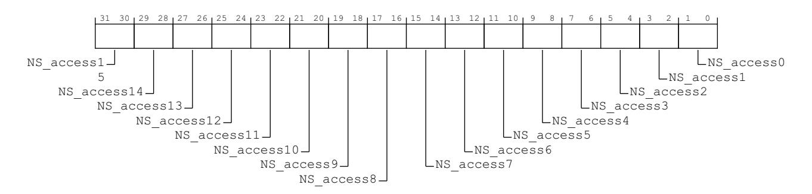

#### **NS\_access<x>, bits [2x+1:2x], for x = 15 to 0**

Configures the level of Non-secure access permitted when the SGI is in Secure Group 0 or Secure Group 1, as defined from [GICR\\_IGROUPR0](#page-661-1) and [GICR\\_IGRPMODR0](#page-665-1). A field is provided for each SGI. The possible values of each 2-bit field are:

0b00 Non-secure writes are not permitted to generate Secure Group 0 SGIs or Secure Group 1 SGIs.

0b01 Non-secure writes are permitted to generate a Secure Group 0 SGI.

0b10 As 0b01, but additionally Non-secure writes to are permitted to generate a Secure Group 1 SGI.

0b11 Reserved.

If the field is programmed to the reserved value, then the hardware will treat the field as if it has been programmed to an IMPLEMENTATION DEFINED choice of the valid values. However, to maintain the principle that as the value increases additional accesses are permitted Arm strongly recommends that implementations treat this value as 0b10. It is IMPLEMENTATION DEFINED whether the value read back is the value programmed or the valid value chosen.

The reset behavior of this field is:

• On a GIC reset, this field resets to an architecturally UNKNOWN value.

#### **Accessing the GICR\_NSACR:**

This register is used when affinity routing is enabled. When affinity routing is not enabled for the Security state of the interrupt, [GICD\\_NSACR<n>](#page-603-0) with n=0 provides equivalent functionality.

This register does not support PPIs.

#### GICR\_NSACR can be accessed through its memory-mapped interface:

| Component         | Frame    | Offset | Instance   |
|-------------------|----------|--------|------------|
| GIC Redistributor | SGI_base | 0x0E00 | GICR_NSACR |

This interface is accessible as follows:

- When GICD\_CTLR.DS == 1 accesses to this register are RAZ/WI.
- When GICD\_CTLR.DS == 0 and an access is Secure accesses to this register are RW.
- When GICD\_CTLR.DS == 0 and an access is Non-secure accesses to this register are RAZ/WI.
- When GICD\_CTLR.DS == 0, FEAT\_RME is implemented and an access is Root accesses to this register are RW.
- When GICD\_CTLR.DS == 0, FEAT\_RME is implemented and an access is Realm accesses to this register are RAZ/WI.

#### <span id="page-698-1"></span><span id="page-698-0"></span>**12.11.31 GICR\_PARTIDR, Set PARTID and PMG Register**

The GICR\_PARTIDR characteristics are:

#### **Purpose**

Sets the PARTID and PMG values used for memory accesses by the Redistributor.

#### **Configurations**

This register is present only when FEAT\_GICv3p1 is implemented. Otherwise, direct accesses to GICR\_PARTIDR are RES0.

A copy of this register is provided for each Redistributor.

When [GICR\\_TYPER](#page-710-1).MPAM==0, this register is RES0.

#### **Attributes**

GICR\_PARTIDR is a 32-bit register.

#### **Field descriptions**


#### **Bits [31:24]**

Reserved, RES0.

#### **PMG, bits [23:16]**

PMG value used when Redistributor accesses memory.

Bits not needed to represent PMG values in the range 0 to PMG\_MAX are RES0.

The reset behavior of this field is:

• On a GIC reset, this field resets to 0.

#### **PARTID, bits [15:0]**

PARTID value used when Redistributor accesses memory.

Bits not needed to represent PARTID values in the range 0 to PARTID\_MAX are RES0.

The reset behavior of this field is:

• On a GIC reset, this field resets to 0.

#### **Accessing the GICR\_PARTIDR:**

GICR\_PARTIDR can be accessed through its memory-mapped interface:

| Component         | Frame   | Offset | Instance     |
|-------------------|---------|--------|--------------|
| GIC Redistributor | RD_base | 0x001C | GICR_PARTIDR |

#### <span id="page-699-1"></span><span id="page-699-0"></span>**12.11.32 GICR\_PENDBASER, Redistributor LPI Pending Table Base Address Register**

The GICR\_PENDBASER characteristics are:

#### **Purpose**

Specifies the base address of the LPI Pending table, and the Shareability and Cacheability of accesses to the LPI Pending table.

#### **Configurations**

A copy of this register is provided for each Redistributor.

#### **Attributes**

GICR\_PENDBASER is a 64-bit register.

#### **Field descriptions**

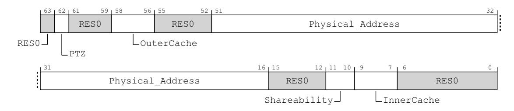

#### **Bit [63]**

Reserved, RES0.

#### **PTZ, bit [62]**

Pending Table Zero. Indicates to the Redistributor whether the LPI Pending table is zero when [GICR\\_CTLR.](#page-640-1)EnableLPIs == 1.

This field is WO, and reads as 0.

0b0 The LPI Pending table is not zero, and contains live data.

0b1 The LPI Pending table is zero. Software must ensure the LPI Pending table is zero before this value is written.

#### **Bits [61:59]**

Reserved, RES0.

#### **OuterCache, bits [58:56]**

Indicates the Outer Cacheability attributes of accesses to the LPI Pending table.

| 0b000 | Memory type defined in InnerCache field. For Normal memory, Outer Cacheability is<br>the same as Inner Cacheability. |
|-------|----------------------------------------------------------------------------------------------------------------------|
| 0b001 | Normal Outer Non-cacheable.                                                                                          |
| 0b010 | Normal Outer Cacheable Read-allocate, Write-through.                                                                 |
| 0b011 | Normal Outer Cacheable Read-allocate, Write-back.                                                                    |
| 0b100 | Normal Outer Cacheable Write-allocate, Write-through.                                                                |
| 0b101 | Normal Outer Cacheable Write-allocate, Write-back.                                                                   |
| 0b110 | Normal Outer Cacheable Read-allocate, Write-allocate, Write-through.                                                 |
| 0b111 | Normal Outer Cacheable Read-allocate, Write-allocate, Write-back.                                                    |

It is IMPLEMENTATION DEFINED whether this field has a fixed value or can be programmed by software. Implementing this field with a fixed value is deprecated.

The reset behavior of this field is:

• On a GIC reset, this field resets to an architecturally UNKNOWN value.

#### **Bits [55:52]**

Reserved, RES0.

#### **Physical\_Address, bits [51:16]**

Bits [51:16] of the physical address containing the LPI Pending table.

In implementations supporting fewer than 52 bits of physical address, unimplemented upper bits are RES0.

The reset behavior of this field is:

• On a GIC reset, this field resets to an architecturally UNKNOWN value.

#### **Bits [15:12]**

Reserved, RES0.

#### **Shareability, bits [11:10]**

Indicates the Shareability attributes of accesses to the LPI Pending table.

| 0b00 | Non-shareable.             |
|------|----------------------------|
| 0b01 | Inner Shareable.           |
| 0b10 | Outer Shareable.           |
| 0b11 | Reserved. Treated as 0b00. |

It is IMPLEMENTATION DEFINED whether this field has a fixed value or can be programmed by software. Implementing this field with a fixed value is deprecated.

The reset behavior of this field is:

• On a GIC reset, this field resets to an architecturally UNKNOWN value.

#### **InnerCache, bits [9:7]**

Indicates the Inner Cacheability attributes of accesses to the LPI Pending table.

| 0b000 | Device-nGnRnE.                                                       |
|-------|----------------------------------------------------------------------|
| 0b001 | Normal Inner Non-cacheable.                                          |
| 0b010 | Normal Inner Cacheable Read-allocate, Write-through.                 |
| 0b011 | Normal Inner Cacheable Read-allocate, Write-back.                    |
| 0b100 | Normal Inner Cacheable Write-allocate, Write-through.                |
| 0b101 | Normal Inner Cacheable Write-allocate, Write-back.                   |
| 0b110 | Normal Inner Cacheable Read-allocate, Write-allocate, Write-through. |
| 0b111 | Normal Inner Cacheable Read-allocate, Write-allocate, Write-back.    |

The reset behavior of this field is:

• On a GIC reset, this field resets to an architecturally UNKNOWN value.

#### **Bits [6:0]**

Reserved, RES0.

#### **Accessing the GICR\_PENDBASER:**

Having the GICR\_PENDBASER OuterCache, Shareability or InnerCache fields programmed to different values on different Redistributors with [GICR\\_CTLR.](#page-640-1)EnableLPIs == 1 in the system is UNPREDICTABLE.

Changing GICR\_PENDBASER with [GICR\\_CTLR](#page-640-1).EnableLPIs == 1 is UNPREDICTABLE.

GICR\_PENDBASER can be accessed through its memory-mapped interface:

| Component         | Frame   | Offset | Instance       |
|-------------------|---------|--------|----------------|
| GIC Redistributor | RD_base | 0x0078 | GICR_PENDBASER |

#### <span id="page-702-1"></span><span id="page-702-0"></span>**12.11.33 GICR\_PROPBASER, Redistributor Properties Base Address Register**

The GICR\_PROPBASER characteristics are:

#### **Purpose**

Specifies the base address of the LPI Configuration table, and the Shareability and Cacheability of accesses to the LPI Configuration table.

#### **Configurations**

A copy of this register is provided for each Redistributor.

An implementation might make this register RO, for example to correspond to an LPI Configuration table in read-only memory.

#### **Attributes**

GICR\_PROPBASER is a 64-bit register.

#### **Field descriptions**

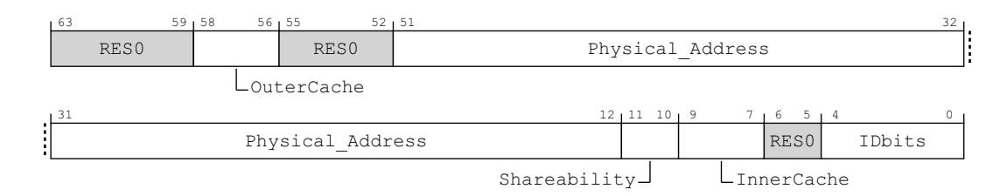

#### **Bits [63:59]**

Reserved, RES0.

#### **OuterCache, bits [58:56]**

Indicates the Outer Cacheability attributes of accesses to the LPI Configuration table.

| 0b000 | Memory type defined in InnerCache field. For Normal memory, Outer Cacheability is<br>the same as Inner Cacheability. |  |
|-------|----------------------------------------------------------------------------------------------------------------------|--|
| 0b001 | Normal Outer Non-cacheable.                                                                                          |  |
| 0b010 | Normal Outer Cacheable Read-allocate, Write-through.                                                                 |  |
| 0b011 | Normal Outer Cacheable Read-allocate, Write-back.                                                                    |  |
| 0b100 | Normal Outer Cacheable Write-allocate, Write-through.                                                                |  |
| 0b101 | Normal Outer Cacheable Write-allocate, Write-back.                                                                   |  |
| 0b110 | Normal Outer Cacheable Read-allocate, Write-allocate, Write-through.                                                 |  |
| 0b111 | Normal Outer Cacheable Read-allocate, Write-allocate, Write-back.                                                    |  |
|       |                                                                                                                      |  |

It is IMPLEMENTATION DEFINED whether this field has a fixed value or can be programmed by software. Implementing this field with a fixed value is deprecated.

The reset behavior of this field is:

• On a GIC reset, this field resets to an architecturally UNKNOWN value.

#### **Bits [55:52]**

Reserved, RES0.

#### **Physical\_Address, bits [51:12]**

Bits [51:12] of the physical address containing the LPI Configuration table.

In implementations supporting fewer than 52 bits of physical address, unimplemented upper bits are RES0.

The reset behavior of this field is:

• On a GIC reset, this field resets to an architecturally UNKNOWN value.

#### **Shareability, bits [11:10]**

Indicates the Shareability attributes of accesses to the LPI Configuration table.

| 0b00 | Non-shareable.             |
|------|----------------------------|
| 0b01 | Inner Shareable.           |
| 0b10 | Outer Shareable.           |
| 0b11 | Reserved. Treated as 0b00. |

It is IMPLEMENTATION DEFINED whether this field has a fixed value or can be programmed by software. Implementing this field with a fixed value is deprecated.

The reset behavior of this field is:

• On a GIC reset, this field resets to an architecturally UNKNOWN value.

#### **InnerCache, bits [9:7]**

Indicates the Inner Cacheability attributes of accesses to the LPI Configuration table.

| 0b000 | Device-nGnRnE.                                                       |
|-------|----------------------------------------------------------------------|
| 0b001 | Normal Inner Non-cacheable.                                          |
| 0b010 | Normal Inner Cacheable Read-allocate, Write-through.                 |
| 0b011 | Normal Inner Cacheable Read-allocate, Write-back.                    |
| 0b100 | Normal Inner Cacheable Write-allocate, Write-through.                |
| 0b101 | Normal Inner Cacheable Write-allocate, Write-back.                   |
| 0b110 | Normal Inner Cacheable Read-allocate, Write-allocate, Write-through. |
| 0b111 | Normal Inner Cacheable Read-allocate, Write-allocate, Write-back.    |
|       |                                                                      |

The reset behavior of this field is:

• On a GIC reset, this field resets to an architecturally UNKNOWN value.

#### **Bits [6:5]**

Reserved, RES0.

#### **IDbits, bits [4:0]**

The number of bits of LPI INTID supported, minus one, by the LPI Configuration table starting at Physical\_Address.

If the value of this field is larger than the value of [GICD\\_TYPER](#page-617-1).IDbits, the [GICD\\_TYPER.](#page-617-1)IDbits value applies.

If the value of this field is less than 0b1101, indicating that the largest INTID is less than 8192 (the smallest LPI interrupt ID), the GIC will behave as if all physical LPIs are out of range.

The reset behavior of this field is:

• On a GIC reset, this field resets to an architecturally UNKNOWN value.

#### **Accessing the GICR\_PROPBASER:**

It is IMPLEMENTATION DEFINED whether GICR\_PROPBASER can be set to different values on different Redistributors. [GICR\\_TYPER](#page-710-1).CommonLPIAff identifies the Redistributors that must have GICR\_PROPBASER set to the same values whenever [GICR\\_CTLR](#page-640-1).EnableLPIs == 1.

Setting different values in different copies of GICR\_PROPBASER on Redistributors that are required to use a common LPI Configuration table when [GICR\\_CTLR.](#page-640-1)EnableLPIs == 1 leads to UNPREDICTABLE behavior.

Other restrictions apply when a Redistributor caches information from GICR\_PROPBASER. For more information, see *[LPI Configuration tables on page](#page-88-0) 5-89*.

GICR\_PROPBASER can be accessed through its memory-mapped interface:

| Component         | Frame   | Offset | Instance       |
|-------------------|---------|--------|----------------|
| GIC Redistributor | RD_base | 0x0070 | GICR_PROPBASER |

#### <span id="page-705-1"></span><span id="page-705-0"></span>**12.11.34 GICR\_SETLPIR, Set LPI Pending Register**

The GICR\_SETLPIR characteristics are:

**Purpose**

Generates an LPI by setting the pending state of the specified LPI.

**Configurations**

A copy of this register is provided for each Redistributor.

**Attributes**

GICR\_SETLPIR is a 64-bit register.

#### **Field descriptions**

*When GICR\_TYPER.DirectLPI == 1:*

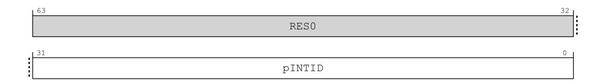

**Bits [63:32]**

Reserved, RES0.

#### **pINTID, bits [31:0]**

The INTID of the physical LPI to be generated.

**Note**

The size of this field is IMPLEMENTATION DEFINED, and is specified by the [GICD\\_TYPER](#page-617-1).IDbits field. Unimplemented bits are RES0.

*When GICR\_TYPER.DirectLPI == 0:*

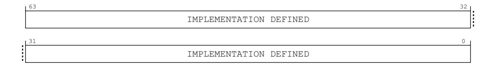

#### **IMPLEMENTATION DEFINED, bits [63:0]**

IMPLEMENTATION DEFINED.

#### **Accessing the GICR\_SETLPIR:**

When written with a 32-bit write the data is zero-extended to 64 bits.

This register is mandatory in an implementation that supports LPIs and does not include an ITS. The functionality is IMPLEMENTATION DEFINED in an implementation that does include an ITS.

Writes to this register have no effect if either:

• The pINTID field corresponds to an LPI that is already pending.

- The pINTID field corresponds to an unimplemented LPI.
- [GICR\\_CTLR](#page-640-1).EnableLPIs == 0.

GICR\_SETLPIR can be accessed through its memory-mapped interface:

| Component         | Frame   | Offset | Instance     |
|-------------------|---------|--------|--------------|
| GIC Redistributor | RD_base | 0x0040 | GICR_SETLPIR |

#### <span id="page-707-0"></span>**12.11.35 GICR\_STATUSR, Error Reporting Status Register**

The GICR\_STATUSR characteristics are:

#### **Purpose**

Provides software with a mechanism to detect:

- Accesses to reserved locations.
- Writes to read-only locations.
- Reads of write-only locations.

#### **Configurations**

A copy of this register is provided for each Redistributor.

If the GIC implementation supports two Security states this register is Banked to provide Secure and Non-secure copies.

#### **Attributes**

GICR\_STATUSR is a 32-bit register.

#### **Field descriptions**

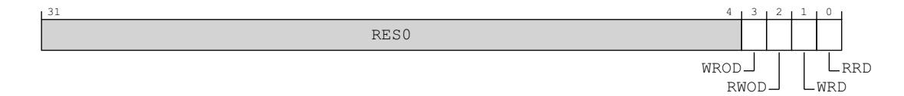

#### **Bits [31:4]**

Reserved, RES0.

#### **WROD, bit [3]**

Write to an RO location.

0b0 Normal operation.

0b1 A write to an RO location has been detected.

When a violation is detected, software must write 1 to this register to reset it.

#### **RWOD, bit [2]**

Read of a WO location.

0b0 Normal operation.

0b1 A read of a WO location has been detected.

When a violation is detected, software must write 1 to this register to reset it.

#### **WRD, bit [1]**

Write to a reserved location.

0b0 Normal operation.

0b1 A write to a reserved location has been detected.

When a violation is detected, software must write 1 to this register to reset it.

#### **RRD, bit [0]**

Read of a reserved location.

0b0 Normal operation.

0b1 A read of a reserved location has been detected.

When a violation is detected, software must write 1 to this register to reset it.

#### **Accessing the GICR\_STATUSR:**

This is an optional register. If the register is not implemented, the location is RAZ/WI.

GICR\_STATUSR can be accessed through its memory-mapped interface:

| Component         | Frame   | Offset | Instance       |
|-------------------|---------|--------|----------------|
| GIC Redistributor | RD_base | 0x0010 | GICR_STATUSR_S |

This interface is accessible as follows:

- When an access is Secure accesses to this register are RW.
- When FEAT\_RME is implemented and an access is Root accesses to this register are RW.

GICR\_STATUSR can be accessed through its memory-mapped interface:

| Component         | Frame   | Offset | Instance        |
|-------------------|---------|--------|-----------------|
| GIC Redistributor | RD_base | 0x0010 | GICR_STATUSR_NS |

This interface is accessible as follows:

- When an access is Non-secure accesses to this register are RW.
- When FEAT\_RME is implemented and an access is Realm accesses to this register are RW.

#### <span id="page-709-1"></span><span id="page-709-0"></span>**12.11.36 GICR\_SYNCR, Redistributor Synchronize Register**

The GICR\_SYNCR characteristics are:

#### **Purpose**

Indicates completion of register based invalidate operations.

#### **Configurations**

A copy of this register is provided for each Redistributor.

#### **Attributes**

GICR\_SYNCR is a 32-bit register.

#### **Field descriptions**


#### **Bits [31:1]**

Reserved, RES0.

#### **Busy, bit [0]**

Indicates completion of invalidation operations

0b0 No operations are in progress.

0b1 A write is in progress to one or more of the following registers:

- [GICR\\_INVLPIR.](#page-677-1)
- [GICR\\_INVALLR.](#page-675-1)
- GICv3, [GICR\\_CLRLPIR.](#page-638-1)

This field tracks operations initiated on the same Redistributor.

#### **Accessing the GICR\_SYNCR:**

When this register is accessed, it is optional that an implementation might wait until all operations are complete before returning a value, in which case GICR\_SYNCR.Busy is always 0.

This register is mandatory when any of the following are true:

- [GICR\\_TYPER.](#page-710-1)Direct is 1.
- [GICR\\_CTLR](#page-640-1).IR is 1.
- GICv4.1 is implemented.

Otherwise, the functionality is IMPLEMENTATION DEFINED.

GICR\_SYNCR can be accessed through its memory-mapped interface:

| Component         | Frame   | Offset | Instance   |
|-------------------|---------|--------|------------|
| GIC Redistributor | RD_base | 0x00C0 | GICR_SYNCR |

#### <span id="page-710-1"></span><span id="page-710-0"></span>**12.11.37 GICR\_TYPER, Redistributor Type Register**

The GICR\_TYPER characteristics are:

#### **Purpose**

Provides information about the configuration of this Redistributor.

#### **Configurations**

A copy of this register is provided for each Redistributor.

#### **Attributes**

GICR\_TYPER is a 64-bit register.

#### **Field descriptions**

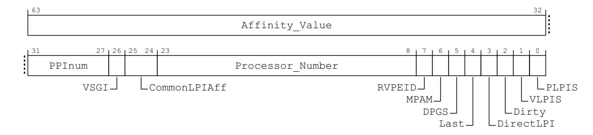

#### **Affinity\_Value, bits [63:32]**

The identity of the PE associated with this Redistributor.

Bits [63:56] provide Aff3, the Affinity level 3 value for the Redistributor.

Bits [55:48] provide Aff2, the Affinity level 2 value for the Redistributor.

Bits [47:40] provide Aff1, the Affinity level 1 value for the Redistributor.

Bits [39:32] provide Aff0, the Affinity level 0 value for the Redistributor.

This field has an IMPLEMENTATION DEFINED value.

Access to this field is RO.

#### **PPInum, bits [31:27]**

#### *When FEAT\_GICv3p1 is implemented:*

The value derived from this field specifies the maximum PPI INTID that a GIC implementation can support. An implementation might not implement all PPIs up to this maximum.

The value of this field is an IMPLEMENTATION DEFINED choice of:

0b00000 Maximum PPI INTID is 31. 0b00001 Maximum PPI INTID is 1087. 0b00010 Maximum PPI INTID is 1119.

All other values are reserved.

Access to this field is RO.

#### *Otherwise:*

Reserved, RES0.

#### **VSGI, bit [26]**

#### *When FEAT\_GICv4p1 is implemented:*

Indicates whether vSGIs are supported.

The value of this field is an IMPLEMENTATION DEFINED choice of:

0b0 Direct injection of SGIs not supported.

0b1 Direct injection of SGIs supported.

Access to this field is RO.

#### *Otherwise:*

Reserved, RES0.

#### **CommonLPIAff, bits [25:24]**

Indicates the scope of the CommonLPIAff group.

The value of this field is an IMPLEMENTATION DEFINED choice of:

0b00 All Redistributors are members of the same CommonLPIAff group.

0b01 All Redistributors with the same Aff3 value are members of the same CommonLPIAff

group.

0b10 All Redistributors with the same Aff3.Aff2 value are members of the same

CommonLPIAff group.

0b11 All Redistributors with the same Aff3.Aff2.Aff1 value are members of the same

CommonLPIAff group.

Redistributors in the same CommonLPIAff group must use the same copy of the LPI Configuration table, and if GICv4.1 is implemented the same copy of the vPE Configuration table.

Access to this field is RO.

#### **Processor\_Number, bits [23:8]**

A unique identifier for the PE. When [GITS\\_TYPER](#page-847-1).PTA == 0, an ITS uses this field to identify the interrupt target.

When affinity routing is disabled for a Security state, this field indicates which [GICD\\_ITARGETSR<n>](#page-600-1) corresponds to this Redistributor.

This field has an IMPLEMENTATION DEFINED value.

Access to this field is RO.

#### **RVPEID, bit [7]**

#### *When FEAT\_GICv4p1 is implemented:*

Indicates how the resident vPE is specified.

The value of this field is an IMPLEMENTATION DEFINED choice of:

0b0 [GICR\\_VPENDBASER](#page-714-1) records the address of the vPE's Virtual Pending Table.

0b1 [GICR\\_VPENDBASER](#page-714-1) records vPEID.

Access to this field is RO.

#### *Otherwise:*

Reserved, RES0.

#### **MPAM, bit [6]**

#### *When FEAT\_GICv3p1 is implemented:*

MPAM

The value of this field is an IMPLEMENTATION DEFINED choice of:

0b0 MPAM not supported.

0b1 MPAM supported.

Access to this field is RO.

#### *Otherwise:*

Reserved, RES0.

#### **DPGS, bit [5]**

Sets support for [GICR\\_CTLR](#page-640-1).DPG\* bits.

The value of this field is an IMPLEMENTATION DEFINED choice of:

0b0 [GICR\\_CTLR.](#page-640-1)DPG\* bits are not supported.

0b1 [GICR\\_CTLR.](#page-640-1)DPG\* bits are supported.

Access to this field is RO.

#### **Last, bit [4]**

Indicates whether this Redistributor is the highest-numbered Redistributor in a series of contiguous Redistributor pages.

The value of this field is an IMPLEMENTATION DEFINED choice of:

0b0 This Redistributor is not the highest-numbered Redistributor in a series of contiguous Redistributor pages.

0b1 This Redistributor is the highest-numbered Redistributor in a series of contiguous Redistributor pages.

Access to this field is RO.

#### **DirectLPI, bit [3]**

Indicates whether this Redistributor supports direct injection of LPIs.

The value of this field is an IMPLEMENTATION DEFINED choice of:

0b0 This Redistributor does not support direct injection of LPIs. The [GICR\\_SETLPIR](#page-705-1), [GICR\\_CLRLPIR](#page-638-1), [GICR\\_INVLPIR](#page-677-1), [GICR\\_INVALLR](#page-675-1), and [GICR\\_SYNCR](#page-709-1) registers are either not implemented, or have an IMPLEMENTATION DEFINED purpose.

0b1 This Redistributor supports direct injection of LPIs. The [GICR\\_SETLPIR](#page-705-1), [GICR\\_CLRLPIR](#page-638-1), [GICR\\_INVLPIR](#page-677-1), [GICR\\_INVALLR](#page-675-1), and [GICR\\_SYNCR](#page-709-1) registers are implemented.

Access to this field is RO.

#### **Dirty, bit [2]**

Controls the functionality of [GICR\\_VPENDBASER](#page-714-1).Dirty.

The value of this field is an IMPLEMENTATION DEFINED choice of:

0b0 [GICR\\_VPENDBASER.](#page-714-1)Dirty is UNKNOWN when [GICR\\_VPENDBASER.](#page-714-1)Valid == 1.

0b1 [GICR\\_VPENDBASER.](#page-714-1)Dirty indicates when the Virtual Pending Table has been parsed when [GICR\\_VPENDBASER](#page-714-1).Valid is written from 0 to 1.

When GICR\_TYPER.VLPIS == 0, this field is RES0.

**Note** In GICv4p1 implementations this field is RES1.

Access to this field is RO.

#### **VLPIS, bit [1]**

Indicates whether the GIC implementation supports virtual LPIs and the direct injection of virtual LPIs.

The value of this field is an IMPLEMENTATION DEFINED choice of:

0b0 The implementation does not support virtual LPIs or the direct injection of virtual LPIs.

0b1 The implementation supports virtual LPIs and the direct injection of virtual LPIs.

**Note**

In GICv3 implementations this field is RES0.

Access to this field is RO.

#### **PLPIS, bit [0]**

Indicates whether the GIC implementation supports physical LPIs.

The value of this field is an IMPLEMENTATION DEFINED choice of:

0b0 The implementation does not support physical LPIs.

0b1 The implementation supports physical LPIs.

Access to this field is RO.

#### **Accessing the GICR\_TYPER:**

GICR\_TYPER can be accessed through its memory-mapped interface:

| Component         | Frame   | Offset | Instance   |
|-------------------|---------|--------|------------|
| GIC Redistributor | RD_base | 0x0008 | GICR_TYPER |

#### <span id="page-714-1"></span><span id="page-714-0"></span>**12.11.38 GICR\_VPENDBASER, Virtual Redistributor LPI Pending Table Base Address Register**

The GICR\_VPENDBASER characteristics are:

#### **Purpose**

Specifies the base address of the memory that holds the virtual LPI Pending table for the currently scheduled virtual machine.

#### **Configurations**

There are no configuration notes.

#### **Attributes**

GICR\_VPENDBASER is a 64-bit register.

#### **Field descriptions**

#### *When FEAT\_GICv4p1 is implemented:*

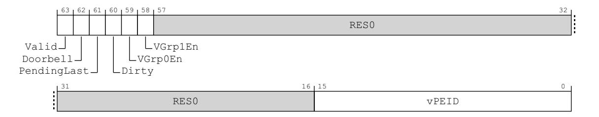

#### **Valid, bit [63]**

This bit controls whether a vPE is scheduled:

0b0 The virtual LPI Pending table is not valid. No vPE is scheduled.

0b1 The virtual LPI Pending table is valid. A vPE is scheduled.

Setting GICR\_VPENDBASER.Valid == 1 when the associated CPU interface does not implement FEAT\_GICv4 is UNPREDICTABLE.

**Note**

Software can determine whether a PE supports FEAT\_GICv3 or FEAT\_GICv4 by reading [ID\\_AA64PFR0\\_EL1](#page-28-5).

Writing a new value to any bit of GICR\_VPENDBASER, other than GICR\_VPENDBASER.Valid, when GICR\_VPENDBASER.Valid==1 is UNPREDICTABLE.

Setting GICR\_VPENDBASER.Valid to 1 is UNPREDICTABLE if [GICR\\_VPROPBASER.](#page-720-1)Valid == 0.

The reset behavior of this field is:

• On a GIC reset, this field resets to 0.

#### **Doorbell, bit [62]**

When GICR\_VPENDBASER.Valid is written from 1 to 0, this bit controls whether a default doorbell interrupt is requested for the descheduled vPE.

0b0 No default doorbell requested.

0b1 Default doorbell requested.

When GICR\_VPENDBASER.Valid is written from 1 to 0, if there are outstanding enabled pending interrupts then this bit is treated as 0.

When GICR\_VPENDBASER.Valid is written from 1 to 0, if GICR\_VPENDBASER.PendingLast is written as 1 then this bit is treated as 0.

When GICR\_VPENDBASER.Valid == 1, reads return an UNKNOWN value.

The reset behavior of this field is:

• On a GIC reset, this field resets to an UNKNOWN value.

#### **PendingLast, bit [61]**

Indicates whether there are pending and enabled interrupts for the last scheduled vPE.

This value is set by the implementation when GICR\_VPENDBASER.Valid is written from 1 to 0 and is otherwise UNKNOWN.

0b0 There are no pending and enabled interrupts for the last scheduled vPE.

0b1 There is at least one pending and enabled interrupt for the last scheduled vPE.

When the GICR\_VPENDBASER.Valid bit is written from 0 to 1, this bit is RES1.

When GICR\_VPENDBASER.Valid is written from 1 to 0, if GICR\_VPENDBASER.PendingLast is written as 1, then this bit is set to an UNKNOWN value.

The reset behavior of this field is:

• On a GIC reset, this field resets to an UNKNOWN value.

#### **Dirty, bit [60]**

#### *When GICR\_VPENDBASER.Valid == 0:*

Read-only. Indicates whether a descheduling operation is in progress.

0b0 No descheduling operation in progress.

0b1 Descheduling operation in progress.

Writing 1 to GICR\_VPENDBASER.Valid is UNPREDICTABLE while GICR\_VPENDBASER.Dirty == 1.

The reset behavior of this field is:

• On a GIC reset, this field resets to 0.

#### *When GICR\_VPENDBASER.Valid == 1:*

Read-only. Reports whether the Virtual Pending table has been parsed.

0b0 Parsing of the Virtual Pending Table is complete.

0b1 Parsing of the Virtual Pending Table has not completed.

Writing 0 to GICR\_VPENDBASER.Valid is UNPREDICTABLE while GICR\_VPENDBASER.Dirty == 1.

The reset behavior of this field is:

• On a GIC reset, this field resets to 0.

#### **VGrp0En, bit [59]**

Enable virtual Group 0 interrupts.

0b0 Forwarding of virtual Group 0 interrupts disabled.

0b1 Forwarding of virtual Group 0 interrupts enabled.

Writing a new value to VGrp0En while [GICR\\_VPENDBASER](#page-714-1).Valid==1 is CONSTRAINED UNPREDICTABLE:

- The update is ignored.
- The update is ignored for all purposes other than a direct read of the register.
- The virtual group enable is updated.

The reset behavior of this field is:

• On a GIC reset, this field resets to an UNKNOWN value.

#### **VGrp1En, bit [58]**

Enable virtual Group 1 interrupts.

0b0 Forwarding of virtual Group 1 interrupts disabled.

0b1 Forwarding of virtual Group 1 interrupts enabled.

Writing a new value to VGrp1En while [GICR\\_VPENDBASER](#page-714-1).Valid==1 is CONSTRAINED UNPREDICTABLE:

- The update is ignored.
- The update is ignored for all purposes other than a direct read of the register.
- The virtual group enable is updated.

The reset behavior of this field is:

• On a GIC reset, this field resets to an UNKNOWN value.

#### **Bits [57:16]**

Reserved, RES0.

#### **vPEID, bits [15:0]**

When GICR\_VPENDBASER.Valid == 1, ID of scheduled vPE.

When GICR\_VPENDBASER.Valid == 1, if GICR\_VPENDBASER.vPEID is set to a value greater than the configured vPEID width, the behavior of this field is CONSTRAINED UNPREDICTABLE:

- GICR\_VPENDBASER.vPEID is treated as having an UNKNOWN valid value for all purposes other than a direct read of the register.
- GICR\_VPENDBASER.Valid is treated as being set to 0 for all purposes other than a direct read of the register.

Writing a new value to vPEID while GICR\_VPENDBASER.Valid == 1 is CONSTRAINED UNPREDICTABLE:

- The update is ignored.
- The update is ignored for all purposes other than a direct read of the register.
- The new value is used.

The size of this field is IMPLEMENTATION DEFINED, and is specified by the [GICD\\_TYPER2.](#page-621-1)VIL and [GICD\\_TYPER2](#page-621-1).VID fields, unimplemented bits are RES0.

#### *When FEAT\_GICv4 is implemented:*

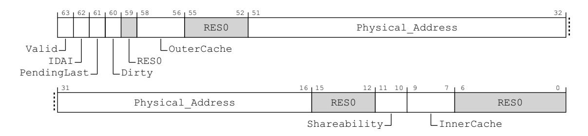

#### **Valid, bit [63]**

This bit controls whether the virtual LPI Pending table is valid.

0b0 The virtual LPI Pending table is not valid. No vPE is scheduled.

0b1 The virtual LPI Pending table is valid. A vPE is scheduled.

Setting GICR\_VPENDBASER.Valid == 1 when the associated CPU interface does not implement FEAT\_GICv4 is UNPREDICTABLE.

**Note**

Software can determine whether a PE supports FEAT\_GICv3 or FEAT\_GICv4 by reading [ID\\_AA64PFR0\\_EL1](#page-28-5).

Writing a new value to any bit of GICR\_VPENDBASER, other than GICR\_VPENDBASER.Valid, when GICR\_VPENDBASER.Valid==1 is UNPREDICTABLE.

The reset behavior of this field is:

• On a GIC reset, this field resets to 0.

#### **IDAI, bit [62]**

Implementation Defined Area Invalid. Indicates whether the IMPLEMENTATION DEFINED area in the virtual LPI Pending table is valid.

0b0 The IMPLEMENTATION DEFINED area is valid.

0b1 The IMPLEMENTATION DEFINED area is invalid and all pending interrupt information is held in the architecturally defined part of the virtual LPI Pending table.

For more information, see *[LPI Pending tables on page](#page-89-0) 5-90* and *[Virtual LPI Configuration tables](#page-90-0)  [and virtual LPI Pending tables on page](#page-90-0) 5-91*.

The reset behavior of this field is:

• On a GIC reset, this field resets to an architecturally UNKNOWN value.

#### **PendingLast, bit [61]**

Indicates whether there are pending and enabled interrupts for the last scheduled vPE.

This value is set by the implementation when GICR\_VPENDBASER.Valid has been written from 1 to 0 and is otherwise UNKNOWN.

0b0 There are no pending and enabled interrupts for the last scheduled vPE.

0b1 There is at least one pending interrupt for the last scheduled vPE. It is IMPLEMENTATION DEFINED whether this bit is set when the only pending interrupts for the last scheduled vPE are not enabled.

> Arm deprecates setting PendingLast to 1 when the only pending interrupts for the last scheduled virtual machine are not enabled.

When the GICR\_VPENDBASER.Valid bit is written from 0 to 1, this bit is RES1.

The reset behavior of this field is:

• On a GIC reset, this field resets to 0.

#### **Dirty, bit [60]**

#### *When GICR\_VPENDBASER.Valid == 0:*

Indicates whether a descheduling operation is in progress.

This field is read-only.

0b0 No descheduling operation in process.

0b1 Descheduling operation in process.

Writing 1 to GICR\_VPENDBASER.Valid is UNPREDICTABLE while GICR\_VPENDBASER.Dirty==1.

The reset behavior of this field is:

• On a GIC reset, this field resets to 0.

#### *When GICR\_VPENDBASER.Valid == 1 and GICR\_TYPER.Dirty == 1:*

This field is read-only. Reports whether the Virtual Pending table has been parsed.

0b0 Parsing of the Virtual Pending Table has completed.

0b1 Parsing of the Virtual Pending Table has not completed.

Writing 1 to GICR\_VPENDBASER.Valid is UNPREDICTABLE while GICR\_VPENDBASER.Dirty == 1.

The reset behavior of this field is:

• On a GIC reset, this field resets to 0.

#### *Otherwise:*

This field is read-only. This fields is UNKNOWN.

The reset behavior of this field is:

• On a GIC reset, this field resets to 0.

#### **Bit [59]**

Reserved, RES0.

#### **OuterCache, bits [58:56]**

Indicates the Outer Cacheability attributes of accesses to virtual LPI Pending tables of vPEs targeting this Redistributor.

| 0b000 | Memory type defined in InnerCache field. For Normal memory, Outer Cacheability is<br>the same as Inner Cacheability. |  |
|-------|----------------------------------------------------------------------------------------------------------------------|--|
| 0b001 | Normal Outer Non-cacheable.                                                                                          |  |
| 0b010 | Normal Outer Cacheable Read-allocate, Write-through.                                                                 |  |
| 0b011 | Normal Outer Cacheable Read-allocate, Write-back.                                                                    |  |
| 0b100 | Normal Outer Cacheable Write-allocate, Write-through.                                                                |  |
| 0b101 | Normal Outer Cacheable Write-allocate, Write-back.                                                                   |  |
| 0b110 | Normal Outer Cacheable Read-allocate, Write-allocate, Write-through.                                                 |  |
| 0b111 | Normal Outer Cacheable Read-allocate, Write-allocate, Write-back.                                                    |  |
|       |                                                                                                                      |  |

It is IMPLEMENTATION DEFINED whether this field has a fixed value or can be programmed by software. Implementing this field with a fixed value is deprecated.

The Cacheability, Outer Cacheability and Shareability fields are used for accesses to the virtual LPI Pending table of resident and non-resident vPEs.

If the OuterCacheabilty attribute of the virtual LPI Pending tables that are associated with vPEs targeting the same Redistributor are different, behavior is UNPREDICTABLE.

The reset behavior of this field is:

• On a GIC reset, this field resets to an architecturally UNKNOWN value.

#### **Bits [55:52]**

Reserved, RES0.

#### **Physical\_Address, bits [51:16]**

Bits [51:16] of the physical address containing the virtual LPI Pending table.

In implementations supporting fewer than 52 bits of physical address, unimplemented upper bits are RES0.

The reset behavior of this field is:

• On a GIC reset, this field resets to an architecturally UNKNOWN value.

#### **Bits [15:12]**

Reserved, RES0.

#### **Shareability, bits [11:10]**

Indicates the Shareability attributes of accesses to the virtual LPI Pending table.

| 0b00 | Non-shareable.   |
|------|------------------|
| 0b01 | Inner Shareable. |

0b10 Outer Shareable.

0b11 Reserved. Treated as 0b00.

It is IMPLEMENTATION DEFINED whether this field has a fixed value or can be programmed by software. Implementing this field with a fixed value is deprecated.

The Cacheability, Outer Cacheability and Shareability fields are used for accesses to the virtual LPI Pending table of resident and non-resident vPEs.

If the Shareability attribute of the virtual LPI Pending tables that are associated with vPEs targeting the same Redistributor are different, behavior is UNPREDICTABLE.

The reset behavior of this field is:

• On a GIC reset, this field resets to an architecturally UNKNOWN value.

#### **InnerCache, bits [9:7]**

Indicates the Inner Cacheability attributes of accesses to the virtual LPI Pending table.

| 0b000 | Device-nGnRnE.                                                       |
|-------|----------------------------------------------------------------------|
| 0b001 | Normal Inner Non-cacheable.                                          |
| 0b010 | Normal Inner Cacheable Read-allocate, Write-through.                 |
| 0b011 | Normal Inner Cacheable Read-allocate, Write-back.                    |
| 0b100 | Normal Inner Cacheable Write-allocate, Write-through.                |
| 0b101 | Normal Inner Cacheable Write-allocate, Write-back.                   |
| 0b110 | Normal Inner Cacheable Read-allocate, Write-allocate, Write-through. |
| 0b111 | Normal Inner Cacheable Read-allocate, Write-allocate, Write-back.    |

The Cacheability, Outer Cacheability and Shareability fields are used for accesses to the virtual LPI Pending table of resident and non-resident vPEs.

If the InnerCacheabilty attribute of the virtual LPI Pending tables that are associated with vPEs targeting the same Redistributor are different, behavior is UNPREDICTABLE.

The reset behavior of this field is:

• On a GIC reset, this field resets to an architecturally UNKNOWN value.

#### **Bits [6:0]**

Reserved, RES0.

#### **Accessing the GICR\_VPENDBASER:**

The effect of a write to this register is not guaranteed to be visible throughout the affinity hierarchy, as indicated by [GICR\\_CTLR](#page-640-1).RWP == 0.

GICR\_VPENDBASER can be accessed through its memory-mapped interface:

| Component         | Frame     | Offset | Instance        |
|-------------------|-----------|--------|-----------------|
| GIC Redistributor | VLPI_base | 0x0078 | GICR_VPENDBASER |

#### <span id="page-720-1"></span><span id="page-720-0"></span>**12.11.39 GICR\_VPROPBASER, Virtual Redistributor Properties Base Address Register**

The GICR\_VPROPBASER characteristics are:

#### **Purpose**

In GICv4.0, specifies the base address of the memory that holds the virtual LPI Configuration table for the currently scheduled virtual machine.

In GICv4.1, specifies the base address of the memory that holds the vPE Configuration table.

#### **Configurations**

This register is provided in FEAT\_GICv4 implementations only.

#### **Attributes**

GICR\_VPROPBASER is a 64-bit register.

#### **Field descriptions**

#### *When FEAT\_GICv4p1 is implemented:*

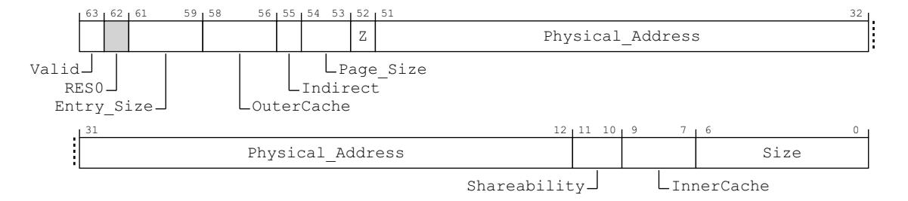

#### **Valid, bit [63]**

This bit controls whether the vPE Configuration Table is valid.

0b0 The vPE Configuration table is not valid.

0b1 The vPE Configuration table is valid.

The reset behavior of this field is:

• On a GIC reset, this field resets to 0.

#### **Bit [62]**

Reserved, RES0.

#### **Entry\_Size, bits [61:59]**

Specifies the number 64-bit doublewords per table entry, minus one.

This bit is read-only.

#### **OuterCache, bits [58:56]**

Indicates the Outer Cacheability attributes of accesses to the table.

0b101 Normal Outer Cacheable Write-allocate, Write-back.

| 0b000 | Memory type defined in InnerCache field. For Normal memory, Outer Cacheability is<br>the same as Inner Cacheability. |
|-------|----------------------------------------------------------------------------------------------------------------------|
| 0b001 | Normal Outer Non-cacheable.                                                                                          |
| 0b010 | Normal Outer Cacheable Read-allocate, Write-through.                                                                 |
| 0b011 | Normal Outer Cacheable Read-allocate, Write-back.                                                                    |
| 0b100 | Normal Outer Cacheable Write-allocate, Write-through.                                                                |

0b110 Normal Outer Cacheable Read-allocate, Write-allocate, Write-through.

0b111 Normal Outer Cacheable Read-allocate, Write-allocate, Write-back.

It is IMPLEMENTATION DEFINED whether this field has a fixed value or can be programmed by software. Implementing this field with a fixed value is deprecated.

The reset behavior of this field is:

• On a GIC reset, this field resets to an UNKNOWN value.

#### **Indirect, bit [55]**

This field indicates whether GICR\_VPROPBASER specifies a single, flat table or a two-level table where the first level contains a list of descriptors.

0b0 Single Level. The Size field indicates the number of pages used to store data associated with each table entry.

0b1 Two Level. The Size field indicates the number of pages that contain an array of 64-bit descriptors to pages that are used to store the data associated with each table entry. A little endian memory order model is used.

This field is RAZ/WI for GIC implementations that only support flat tables.

If the supported vPEID width indicated by [GICD\\_TYPER2.](#page-621-1)VIL and [GICD\\_TYPER2](#page-621-1).VID, and the smallest page size that is supported result in a single level table that requires multiple pages, then implementing this bit as RAZ/WI is deprecated.

The reset behavior of this field is:

• On a GIC reset, this field resets to an UNKNOWN value.

#### **Page\_Size, bits [54:53]**

The following values indicate the size of page that the translation table uses:

0b00 4KB. 0b01 16KB. 0b10 64KB.

0b11 Reserved. Treated as 0b10.

**Note**

If the GIC implementation supports only a single, fixed page size, this field might be RO.

The reset behavior of this field is:

• On a GIC reset, this field resets to an UNKNOWN value.

#### **Z, bit [52]**

When GICR\_VPROPBASER.Valid is written from 0 to 1, GICR\_VPROPBASER.Z indicates whether the vPE Configuration table is known to contain all zeros.

0b0 The vPE Configuration table is not zero, and contains live data.

0b1 The vPE Configuration table is zero.

Setting GICR\_VPROPBASER.Z to 0 causes the IRI to reload configuration from memory

When GICR\_VPROPBASER.Valid is written from 0 to 1, if GICR\_VPROPBASER.Z==1 behavior is UNPREDICTABLE if the allocated memory does not contain all zeros.

This field is WO, and reads as 0.

#### **Physical\_Address, bits [51:12]**

Bits [51:12] of the physical address containing the vPE Configuration table.

In implementations supporting fewer than 52 bits of physical address, unimplemented upper bits are RES0.

The reset behavior of this field is:

• On a GIC reset, this field resets to an UNKNOWN value.

#### **Shareability, bits [11:10]**

Indicates the Shareability attributes of accesses to the vPE Configuration table.

0b00 Non-shareable. 0b01 Inner Shareable. 0b10 Outer Shareable. 0b11 Reserved. Treated as 0b00.

It is IMPLEMENTATION DEFINED whether this field has a fixed value or can be programmed by software. Implementing this field with a fixed value is deprecated.

The reset behavior of this field is:

• On a GIC reset, this field resets to an UNKNOWN value.

#### **InnerCache, bits [9:7]**

Indicates the Inner Cacheability attributes of accesses to the vPE Configuration table.

| 0b000 | Device-nGnRnE.                                                       |
|-------|----------------------------------------------------------------------|
| 0b001 | Normal Inner Non-cacheable.                                          |
| 0b010 | Normal Inner Cacheable Read-allocate, Write-through.                 |
| 0b011 | Normal Inner Cacheable Read-allocate, Write-back.                    |
| 0b100 | Normal Inner Cacheable Write-allocate, Write-through.                |
| 0b101 | Normal Inner Cacheable Write-allocate, Write-back.                   |
| 0b110 | Normal Inner Cacheable Read-allocate, Write-allocate, Write-through. |
| 0b111 | Normal Inner Cacheable Read-allocate, Write-allocate, Write-back.    |
|       |                                                                      |

The reset behavior of this field is:

• On a GIC reset, this field resets to an UNKNOWN value.

#### **Size, bits [6:0]**

The number of pages of physical memory allocated to the table, minus one.

[GICR\\_VPROPBASER.](#page-720-1)Page\_Size specifies the size of each page.

The reset behavior of this field is:

• On a GIC reset, this field resets to an UNKNOWN value.

#### *When FEAT\_GICv4 is implemented:*

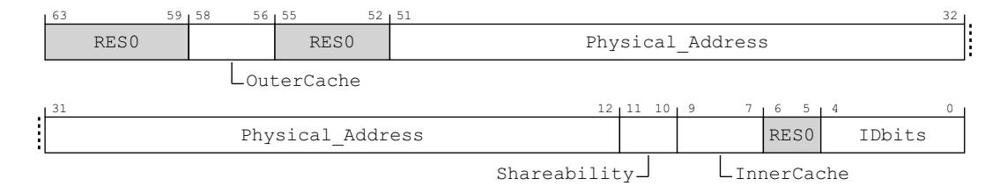

#### **Bits [63:59]**

Reserved, RES0.

#### **OuterCache, bits [58:56]**

Indicates the Outer Cacheability attributes of accesses to the LPI Configuration table.

| 0b000 | Memory type defined in InnerCache field. For Normal memory, Outer Cacheability is<br>the same as Inner Cacheability. |  |
|-------|----------------------------------------------------------------------------------------------------------------------|--|
| 0b001 | Normal Outer Non-cacheable.                                                                                          |  |
| 0b010 | Normal Outer Cacheable Read-allocate, Write-through.                                                                 |  |
| 0b011 | Normal Outer Cacheable Read-allocate, Write-back.                                                                    |  |
| 0b100 | Normal Outer Cacheable Write-allocate, Write-through.                                                                |  |
| 0b101 | Normal Outer Cacheable Write-allocate, Write-back.                                                                   |  |
| 0b110 | Normal Outer Cacheable Read-allocate, Write-allocate, Write-through.                                                 |  |
| 0b111 | Normal Outer Cacheable Read-allocate, Write-allocate, Write-back.                                                    |  |
|       |                                                                                                                      |  |

It is IMPLEMENTATION DEFINED whether this field has a fixed value or can be programmed by software. Implementing this field with a fixed value is deprecated.

The reset behavior of this field is:

• On a GIC reset, this field resets to an architecturally UNKNOWN value.

#### **Bits [55:52]**

Reserved, RES0.

#### **Physical\_Address, bits [51:12]**

Bits [51:12] of the physical address containing the virtual LPI Configuration table.

In implementations supporting fewer than 52 bits of physical address, unimplemented upper bits are RES0.

The reset behavior of this field is:

• On a GIC reset, this field resets to an architecturally UNKNOWN value.

#### **Shareability, bits [11:10]**

Indicates the Shareability attributes of accesses to the LPI Configuration table.

| 0b00 | Non-shareable.             |
|------|----------------------------|
| 0b01 | Inner Shareable.           |
| 0b10 | Outer Shareable.           |
| 0b11 | Reserved. Treated as 0b00. |

It is IMPLEMENTATION DEFINED whether this field has a fixed value or can be programmed by software. Implementing this field with a fixed value is deprecated.

The reset behavior of this field is:

• On a GIC reset, this field resets to an architecturally UNKNOWN value.

#### **InnerCache, bits [9:7]**

Indicates the Inner Cacheability attributes of accesses to the LPI Configuration table.

| 0b000 | Device-nGnRnE.                                                       |
|-------|----------------------------------------------------------------------|
| 0b001 | Normal Inner Non-cacheable.                                          |
| 0b010 | Normal Inner Cacheable Read-allocate, Write-through.                 |
| 0b011 | Normal Inner Cacheable Read-allocate, Write-back.                    |
| 0b100 | Normal Inner Cacheable Write-allocate, Write-through.                |
| 0b101 | Normal Inner Cacheable Write-allocate, Write-back.                   |
| 0b110 | Normal Inner Cacheable Read-allocate, Write-allocate, Write-through. |
| 0b111 | Normal Inner Cacheable Read-allocate, Write-allocate, Write-back.    |

The reset behavior of this field is:

• On a GIC reset, this field resets to an architecturally UNKNOWN value.

#### **Bits [6:5]**

Reserved, RES0.

#### **IDbits, bits [4:0]**

The number of bits of virtual LPI INTID supported, minus one.

If the value of this field is less than 0b1101, indicating that the largest INTID is less than 8192 (the smallest LPI interrupt ID), the GIC will behave as if all virtual LPIs are out of range.

The reset behavior of this field is:

• On a GIC reset, this field resets to an architecturally UNKNOWN value.

#### **Accessing the GICR\_VPROPBASER:**

GICR\_VPROPBASER can be accessed through its memory-mapped interface:

| Component         | Frame     | Offset | Instance        |
|-------------------|-----------|--------|-----------------|
| GIC Redistributor | VLPI_base | 0x0070 | GICR_VPROPBASER |

#### <span id="page-725-1"></span><span id="page-725-0"></span>**12.11.40 GICR\_VSGIPENDR, Redistributor virtual SGI pending state register**

The GICR\_VSGIPENDR characteristics are:

#### **Purpose**

Requests the pending state of virtual SGIs for a specified vPE.

#### **Configurations**

This register is present only when FEAT\_GICv4p1 is implemented. Otherwise, direct accesses to GICR\_VSGIPENDR are RES0.

A copy of this register is provided for each Redistributor.

#### **Attributes**

GICR\_VSGIPENDR is a 32-bit register.

#### **Field descriptions**

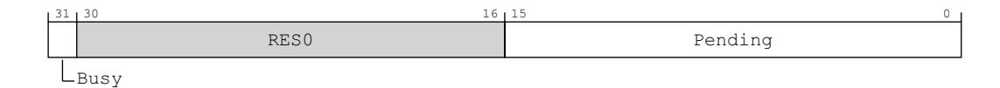

#### **Busy, bit [31]**

ID of target vPEID

0b0 Query of virtual SGI state not in progress.

0b1 Query of virtual SGI state in progress.

#### **Bits [30:16]**

Reserved, RES0.

#### **Pending, bits [15:0]**

Pending state of virtual SGIs for requested vPEID.

This field is UNKNOWN when [GICR\\_VSGIPENDR](#page-725-1).Busy == 1

#### **Accessing the GICR\_VSGIPENDR:**

GICR\_VSGIPENDR can be accessed through its memory-mapped interface:

| Component         | Frame     | Offset | Instance       |
|-------------------|-----------|--------|----------------|
| GIC Redistributor | VLPI_base | 0x0088 | GICR_VSGIPENDR |

#### <span id="page-726-1"></span><span id="page-726-0"></span>**12.11.41 GICR\_VSGIR, Redistributor virtual SGI pending state request register**

The GICR\_VSGIR characteristics are:

#### **Purpose**

Requests the pending state of virtual SGIs for a specified vPE.

#### **Configurations**

This register is present only when FEAT\_GICv4p1 is implemented. Otherwise, direct accesses to GICR\_VSGIR are RES0.

A copy of this register is provided for each Redistributor.

#### **Attributes**

GICR\_VSGIR is a 32-bit register.

#### **Field descriptions**


#### **Bits [31:16]**

Reserved, RES0.

#### **vPEID, bits [15:0]**

ID of target vPE

Writing this field is CONSTRAINED UNPREDICTABLE when [GICR\\_VSGIPENDR.](#page-725-1)Busy == 1, with either the write ignored or a new query started.

Writing a value greater than the configured vPEID width behavior is CONSTRAINED UNPREDICTABLE, with either:

- vPEID is treated as having an UNKNOWN valid value.
- The write is ignored.

The size of this field is IMPLEMENTATION DEFINED, and is specified by the [GICD\\_TYPER2.](#page-621-1)VIL and [GICD\\_TYPER2](#page-621-1).VID fields. Unimplemented bits are RES0.

#### **Accessing the GICR\_VSGIR:**

GICR\_VSGIR can be accessed through its memory-mapped interface:

| Component         | Frame     | Offset | Instance   |
|-------------------|-----------|--------|------------|
| GIC Redistributor | VLPI_base | 0x0080 | GICR_VSGIR |

#### <span id="page-727-1"></span><span id="page-727-0"></span>**12.11.42 GICR\_WAKER, Redistributor Wake Register**

The GICR\_WAKER characteristics are:

#### **Purpose**

Permits software to control the behavior of the WakeRequest power management signal corresponding to the Redistributor. Power management operations follow the rules in *[Power](#page-187-0)  [management on page](#page-187-0) 11-188*.

#### **Configurations**

A copy of this register is provided for each Redistributor.

#### **Attributes**

GICR\_WAKER is a 32-bit register.

#### **Field descriptions**

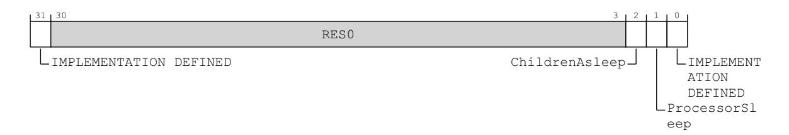

#### **IMPLEMENTATION DEFINED, bit [31]**

IMPLEMENTATION DEFINED.

#### **Bits [30:3]**

Reserved, RES0.

#### **ChildrenAsleep, bit [2]**

Read-only. Indicates whether the connected PE is quiescent:

0b0 An interface to the connected PE might be active.

0b1 All interfaces to the connected PE are quiescent.

The reset behavior of this field is:

• On a GIC reset, this field resets to 1.

#### **ProcessorSleep, bit [1]**

Indicates whether the Redistributor can assert the **WakeRequest** signal:

0b0 This PE is not in, and is not entering, a low power state.

0b1 The PE is either in, or is in the process of entering, a low power state.

All interrupts that arrive at the Redistributor:

- Assert a **WakeRequest** signal.
- Are held in the pending state at the Redistributor, and are not communicated to the CPU interface.

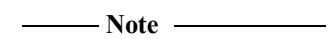

When ProcessorSleep == 1, the Redistributor must ensure that any interrupts that are pending on the CPU interface are released.

For an implementation that is using the GIC Stream Protocol Interface:

- A Quiesce command puts the interface between the Redistributor and the CPU interface in a quiescent state. For more information, see *[Quiesce \(IRI\) on](#page-903-0)  page [A-904](#page-903-0)*.
- A Release command releases any interrupts that are pending on the CPU interface. For more information, see *[Release \(ICC\) on page](#page-904-0) A-905*.

| Note |  |
|------|--|
|------|--|

Before powering down a PE, software must set this bit to 1 and wait until ChildrenAsleep == 1. After powering up a PE, or following a failed powerdown, software must set this bit to 0 and wait until ChildrenAsleep == 0.

Changing ProcessorSleep from 1 to 0 when ChildrenAsleep is not 1 results in UNPREDICTABLE behavior.

Changing ProcessorSleep from 0 to 1 when the Enable for each interrupt group in the associated CPU interface is not 0 results in UNPREDICTABLE behavior.

The reset behavior of this field is:

• On a GIC reset, this field resets to 1.

#### **IMPLEMENTATION DEFINED, bit [0]**

IMPLEMENTATION DEFINED.

#### **Accessing the GICR\_WAKER:**

To ensure a Redistributor is quiescent, software must write to GICR\_WAKER with ProcessorSleep == 1, then poll the register until ChildrenAsleep == 1.

Resetting the connected PE when GICR\_WAKER.ProcessorSleep==0 or GICR\_WAKER.ChildrenAsleep==0, can lead to UNPREDICTABLE behavior in the IRI.

Resetting the IRI when GICR\_WAKER.ProcessorSleep==0 or GICR\_WAKER.ChildrenAsleep==0 can lead to UNPREDICTABLE behavior in the connected PE.

GICR\_WAKER can be accessed through its memory-mapped interface:

| Component         | Frame   | Offset | Instance   |
|-------------------|---------|--------|------------|
| GIC Redistributor | RD_base | 0x0014 | GICR_WAKER |

This interface is accessible as follows:

- When GICD\_CTLR.DS == 1 accesses to this register are RW.
- When GICD\_CTLR.DS == 0 and an access is Secure accesses to this register are RW.
- When GICD\_CTLR.DS == 0 and an access is Non-secure accesses to this register are RAZ/WI.
- When GICD\_CTLR.DS == 0, FEAT\_RME is implemented and an access is Root accesses to this register are RW.
- When GICD\_CTLR.DS == 0, FEAT\_RME is implemented and an access is Realm accesses to this register are RAZ/WI.

#### <span id="page-729-1"></span><span id="page-729-0"></span>**12.12 The GIC CPU interface register map**

Table 12-[30 on page](#page-729-2) 12-730 shows the CPU interface register maps. In this table, address offsets are relative to the *CPU interface base address* defined by the system memory map. Unless otherwise stated in the register description, all GIC registers are 32-bits wide.

For a multiprocessor implementation, the GIC implements a set of CPU interface registers for each CPU interface. Arm strongly recommends that each PE has the same CPU interface base address for the CPU interface that connects it to the GIC. This is the private CPU interface base address for that PE. It is IMPLEMENTATION DEFINED whether a PE can access the CPU interface registers of other PEs in the system.

Reserved register addresses are RES0.

<span id="page-729-3"></span><span id="page-729-2"></span>The CPU interface registers can be accessed using the System register interface. See *[GIC System register access on](#page-196-1)  page [12-197](#page-196-1)* for more information.

**Table 12-30 CPU interface register map**

| Offset        | Name               | Type | Reset                        | Description                                         |
|---------------|--------------------|------|------------------------------|-----------------------------------------------------|
| 0x0000        | GICC_CTLR          | RW   | See the register description | CPU Interface Control Register                      |
| 0x0004        | GICC_PMR           | RW   | 0x0000 0000                  | Interrupt Priority Mask Register                    |
| 0x0008        | GICC_BPR           | RW   | 0x0000 000xa                 | Binary Point Register                               |
| 0x000C        | GICC_IAR           | RO   | -                            | Interrupt Acknowledge Register                      |
| 0x0010        | GICC_EOIR          | WO   | -                            | End of Interrupt Register                           |
| 0x0014        | GICC_RPR           | RO   | -                            | Running Priority Register                           |
| 0x0018        | GICC_HPPIR         | RO   | -                            | Highest Priority Pending Interrupt Register         |
| 0x001C        | GICC_ABPR          | RW   | 0x0000 000xa                 | Aliased Binary Point Register                       |
| 0x0020        | GICC_AIAR          | RO   | -                            | Aliased Interrupt Acknowledge Register              |
| 0x0024        | GICC_AEOIR         | WO   | -                            | Aliased End of Interrupt Register                   |
| 0x0028        | GICC_AHPPIR        | RO   | -                            | Aliased Highest Priority Pending Interrupt Register |
| 0x002C        | GICC_STATUSR       | RW   | 0x0000 0000                  | Error Reporting Status Register, optional           |
| 0x0030-0x003C | -                  | -    | -                            | Reserved                                            |
| 0x0040-0x00CC | -                  | -    | -                            | IMPLEMENTATION DEFINED registers                    |
| 0x00D0-0x00DC | GICC_APR <n></n>   | RW   | 0x0000 0000                  | Active Priorities Registers                         |
| 0x00E0-0x00EC | GICC_NSAPR <n></n> | RW   | 0x0000 0000                  | Non-secure Active Priorities Registers              |
| 0x00F0-0x00F8 | -                  | -    | -                            | Reserved                                            |
| 0x00FC        | GICC_IIDR          | RO   | IMPLEMENTATION DEFINED       | CPU Interface Identification Register               |
| 0x1000        | GICC_DIR           | WO   | -                            | Deactivate Interrupt Register                       |

a. See the register description for more information.

### <span id="page-730-1"></span><span id="page-730-0"></span>**12.13 The GIC CPU interface register descriptions**

This section describes each of the GIC CPU interface registers in register name order.

#### <span id="page-731-1"></span><span id="page-731-0"></span>**12.13.1 GICC\_ABPR, CPU Interface Aliased Binary Point Register**

The GICC\_ABPR characteristics are:

#### **Purpose**

Defines the point at which the priority value fields split into two parts, the group priority field and the subpriority field. The group priority field determines Group 1 interrupt preemption.

#### **Configurations**

This register is present only when FEAT\_GICv3\_LEGACY is implemented. Otherwise, direct accesses to GICC\_ABPR are RES0.

In systems that support two Security states:

- This register is an alias of the Non-secure copy of [GICC\\_BPR](#page-740-0).
- Non-secure accesses to this register return a shifted value of the binary point.
- If [ICC\\_CTLR\\_EL3.](#page-237-1)CBPR\_EL1NS == 1, Secure accesses to this register access [ICC\\_BPR0\\_EL1.](#page-225-1)

#### **Attributes**

GICC\_ABPR is a 32-bit register.

#### **Field descriptions**

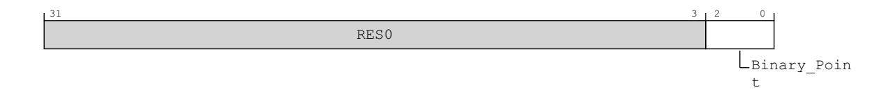

#### **Bits [31:3]**

Reserved, RES0.

#### **Binary\_Point, bits [2:0]**

Controls how the 8-bit interrupt priority field is split into a group priority field, that determines interrupt preemption, and a subpriority field. The following list describes how this field determines the interrupt priority bits assigned to the group priority field:

- Table 4-[10 on page](#page-73-3) 4-74, for the processing of Group 1 interrupts in a GIC implementation that supports interrupt grouping, when [GICC\\_CTLR](#page-742-1).CBPR == 0.
- Table 4-[11 on page](#page-74-3) 4-75, for all other cases.

The reset behavior of this field is:

• On a Warm reset, this field resets to an architecturally UNKNOWN value.

#### **Accessing the GICC\_ABPR:**

This register is used only when System register access is not enabled. When System register access is enabled, the System registers [ICC\\_BPR0\\_EL1](#page-225-1) and [ICC\\_BPR1\\_EL1](#page-228-1) provide equivalent functionality.

GICC\_ABPR can be accessed through its memory-mapped interface:

| Component         | Offset | Instance  |
|-------------------|--------|-----------|
| GIC CPU interface | 0x001C | GICC_ABPR |

This interface is accessible as follows:

- When GICD\_CTLR.DS == 0 accesses to this register are RW.
- When an access is Secure accesses to this register are RW.
- When an access is Non-secure accesses to this register are RW.

#### <span id="page-733-1"></span><span id="page-733-0"></span>**12.13.2 GICC\_AEOIR, CPU Interface Aliased End Of Interrupt Register**

The GICC\_AEOIR characteristics are:

#### **Purpose**

A write to this register performs priority drop for the specified Group 1 interrupt and, if the appropriate [GICC\\_CTLR.](#page-742-1)EOImodeS or [GICC\\_CTLR](#page-742-1).EOImodeNS field == 0, also deactivates the interrupt.

#### **Configurations**

This register is present only when FEAT\_GICv3\_LEGACY is implemented. Otherwise, direct accesses to GICC\_AEOIR are RES0.

When [GICD\\_CTLR](#page-543-1).DS==0, this register is an alias of the Non-secure view of [GICC\\_EOIR](#page-752-0). A Secure access to this register is identical to a Non-secure access to [GICC\\_EOIR.](#page-752-0)

#### **Attributes**

GICC\_AEOIR is a 32-bit register.

#### **Field descriptions**


#### **Bits [31:24]**

Reserved, RES0.

#### **INTID, bits [23:0]**

The INTID of the signaled interrupt.

**Note**

INTIDs 1020-1023 are reserved and convey additional information such as spurious interrupts.

When affinity routing is not enabled:

- Bits [23:13] are RES0.
- For SGIs, bits [12:10] identify the CPU interface corresponding to the source PE. For all other interrupts these bits are RES0.

#### **Accessing the GICC\_AEOIR:**

A write to this register must correspond to the most recently acknowledged Group 1 interrupt. If a value other than the last value read from [GICC\\_AIAR](#page-737-1) is written to this register, the effect is UNPREDICTABLE.

This register is used only when System register access is not enabled. When System register access is enabled:

- For AArch32 implementations, [ICC\\_EOIR1](#page-400-0) provides equivalent functionality.
- For AArch64 implementations, [ICC\\_EOIR1\\_EL1](#page-246-1) provides equivalent functionality.

When affinity routing is enabled for a Security state, it is a programming error to use memory-mapped registers to access the GIC.

#### GICC\_AEOIR can be accessed through its memory-mapped interface:

| Component         | Offset | Instance   |
|-------------------|--------|------------|
| GIC CPU interface | 0x0024 | GICC_AEOIR |

This interface is accessible as follows:

- When GICD\_CTLR.DS == 0 accesses to this register are WO.
- When an access is Secure accesses to this register are WO.
- When an access is Non-secure accesses to this register are WO.

#### <span id="page-735-1"></span><span id="page-735-0"></span>**12.13.3 GICC\_AHPPIR, CPU Interface Aliased Highest Priority Pending Interrupt Register**

The GICC\_AHPPIR characteristics are:

#### **Purpose**

If the highest priority pending interrupt is in Group 1, this register provides the INTID of the highest priority pending interrupt on the CPU interface.

#### **Configurations**

This register is present only when FEAT\_GICv3\_LEGACY is implemented. Otherwise, direct accesses to GICC\_AHPPIR are RES0.

If [GICD\\_CTLR](#page-543-1).DS==0, this register is an alias of the Non-secure view of [GICC\\_HPPIR](#page-754-0). A Secure access to this register is identical to a Non-secure access to [GICC\\_HPPIR](#page-754-0).

#### **Attributes**

GICC\_AHPPIR is a 32-bit register.

#### **Field descriptions**


#### **Bits [31:24]**

Reserved, RES0.

#### **INTID, bits [23:0]**

The INTID of the signaled interrupt.

| Note |  |
|------|--|
|------|--|

INTIDs 1020-1023 are reserved and convey additional information such as spurious interrupts.

When affinity routing is not enabled:

- Bits [23:13] are RES0.
- For SGIs, bits [12:10] identify the CPU interface corresponding to the source PE. For all other interrupts these bits are RES0.

#### **Accessing the GICC\_AHPPIR:**

This register is used only when System register access is not enabled. When System register access is enabled:

- For AArch32 implementations, [ICC\\_HPPIR1](#page-405-0) provides equivalent functionality.
- For AArch64 implementations, [ICC\\_HPPIR1\\_EL1](#page-250-1) provides equivalent functionality.

If the highest priority pending interrupt is in Group 0, a read of this register returns the special INTID 1023.

Interrupt identifiers corresponding to an interrupt group that is not enabled are ignored.

If the highest priority pending interrupt is a direct interrupt that is both individually enabled in the Distributor and part of an interrupt group that is enabled in the Distributor, and the interrupt group is disabled in the CPU interface for this PE, this register returns the special INTID 1023.

For more information about pending interrupts that are not considered when determining the highest priority pending interrupt, see *[Preemption on page](#page-77-3) 4-78*.

When affinity routing is enabled for a Security state, it is a programming error to use memory-mapped registers to access the GIC.

GICC\_AHPPIR can be accessed through its memory-mapped interface:

| Component         | Offset | Instance    |
|-------------------|--------|-------------|
| GIC CPU interface | 0x0028 | GICC_AHPPIR |

This interface is accessible as follows:

- When GICD\_CTLR.DS == 0 accesses to this register are RO.
- When an access is Secure accesses to this register are RO.
- When an access is Non-secure accesses to this register are RO.

#### <span id="page-737-1"></span><span id="page-737-0"></span>**12.13.4 GICC\_AIAR, CPU Interface Aliased Interrupt Acknowledge Register**

The GICC\_AIAR characteristics are:

#### **Purpose**

Provides the INTID of the signaled Group 1 interrupt. A read of this register by the PE acts as an acknowledge for the interrupt.

#### **Configurations**

This register is present only when FEAT\_GICv3\_LEGACY is implemented. Otherwise, direct accesses to GICC\_AIAR are RES0.

When [GICD\\_CTLR](#page-543-1).DS==0, this register is an alias of the Non-secure view of [GICC\\_IAR.](#page-756-0) A Secure access to this register is identical to a Non-secure access to [GICC\\_IAR](#page-756-0).

#### **Attributes**

GICC\_AIAR is a 32-bit register.

#### **Field descriptions**

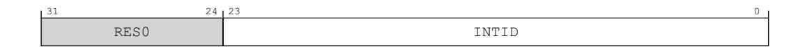

#### **Bits [31:24]**

Reserved, RES0.

#### **INTID, bits [23:0]**

The INTID of the signaled interrupt.

**Note**

INTIDs 1020-1023 are reserved and convey additional information such as spurious interrupts.

When affinity routing is not enabled:

- Bits [23:13] are RES0.
- For SGIs, bits [12:10] identify the CPU interface corresponding to the source PE. For all other interrupts these bits are RES0.

#### **Accessing the GICC\_AIAR:**

When affinity routing is enabled for a Security state, it is a programming error to use memory-mapped registers to access the GIC.

GICC\_AIAR can be accessed through its memory-mapped interface:

| Component         | Offset | Instance  |
|-------------------|--------|-----------|
| GIC CPU interface | 0x0020 | GICC_AIAR |

This interface is accessible as follows:

- When GICD\_CTLR.DS == 0 accesses to this register are RO.
- When an access is Secure accesses to this register are RO.
- When an access is Non-secure accesses to this register are RO.

#### <span id="page-738-0"></span>**12.13.5 GICC\_APR<n>, CPU Interface Active Priorities Registers, n = 0 - 3**

The GICC\_APR<n> characteristics are:

#### **Purpose**

Provides information about interrupt active priorities.

#### **Configurations**

This register is present only when FEAT\_GICv3\_LEGACY is implemented. Otherwise, direct accesses to GICC\_APR<n> are RES0.

The contents of these registers are IMPLEMENTATION DEFINED with the one architectural requirement that a value of all zeros is consistent with no interrupts being active.

When [GICD\\_CTLR](#page-543-1).DS == 0, these registers are Banked, and Non-secure accesses do not affect Secure operation. The Secure copies of these registers hold active priorities for Group 0 interrupts, and the Non-secure copies provide a Non-secure view of the active priorities for Group 1 interrupts.

GICC\_APR1 is implemented only in implementations that support 6 or more bits of priority. GICC\_APR2 and GICC\_APR3 are implemented only in implementations that support 7 bits of priority.

When [GICD\\_CTLR.](#page-543-1)DS==1, these registers hold the active priorities for Group 0 interrupts, and the active priorities for Group 1 interrupts are held by the [GICC\\_NSAPR<n>](#page-760-0) registers.

#### **Attributes**

GICC\_APR<n> is a 32-bit register.

#### **Field descriptions**


#### **IMPLEMENTATION DEFINED, bits [31:0]**

IMPLEMENTATION DEFINED.

The reset behavior of this field is:

• On a Warm reset, this field resets to 0.

#### **Accessing the GICC\_APR<n>:**

These registers are used only when System register access is not enabled. When System register access is enabled the following registers provide equivalent functionality:

- In AArch64:
  - For Group 0, [ICC\\_AP0R<n>\\_EL1](#page-215-1).
  - For Group 1, [ICC\\_AP1R<n>\\_EL1](#page-218-1).
- In AArch32:
  - For Group 0, [ICC\\_AP0R<n>](#page-369-0).
  - For Group 1, [ICC\\_AP1R<n>](#page-373-0).

GICC\_APR<n> can be accessed through its memory-mapped interface:

| Component         | Offset           | Instance         |
|-------------------|------------------|------------------|
| GIC CPU interface | 0x00D0 + (4 * n) | GICC_APR <n></n> |

This interface is accessible as follows:

- When GICD\_CTLR.DS == 0 accesses to this register are RW.
- When an access is Secure accesses to this register are RW.
- When an access is Non-secure accesses to this register are RW.

#### <span id="page-740-0"></span>**12.13.6 GICC\_BPR, CPU Interface Binary Point Register**

The GICC\_BPR characteristics are:

#### **Purpose**

Defines the point at which the priority value fields split into two parts, the group priority field and the subpriority field.

#### **Configurations**

This register is present only when FEAT\_GICv3\_LEGACY is implemented. Otherwise, direct accesses to GICC\_BPR are RES0.

In systems that support two Security states:

- This register is Banked.
- The Secure instance of this register determines Group 0 interrupt preemption.
- The Non-secure instance of this register determines Group 1 interrupt preemption.

In systems that support only one Security state, when [GICC\\_CTLR.](#page-742-1)CBPR == 0, this register determines only Group 0 interrupt preemption.

When [GICC\\_CTLR](#page-742-1).CBPR == 1, this register determines interrupt preemption for both Group 0 and Group 1 interrupts.

#### **Attributes**

GICC\_BPR is a 32-bit register.

#### **Field descriptions**

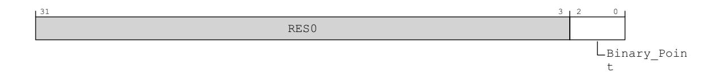

#### **Bits [31:3]**

Reserved, RES0.

#### **Binary\_Point, bits [2:0]**

Controls how the 8-bit interrupt priority field is split into a group priority field, that determines interrupt preemption, and a subpriority field. The following list describes how this field determines the interrupt priority bits assigned to the group priority field:

- Table 4-[10 on page](#page-73-3) 4-74, for the processing of Group 1 interrupts in a GIC implementation that supports interrupt grouping, when [GICC\\_CTLR](#page-742-1).CBPR == 0.
- Table 4-[11 on page](#page-74-3) 4-75, for all other cases.

The reset behavior of this field is:

• On a Warm reset, this field resets to an architecturally UNKNOWN value.

**Note**

Aliasing the Non-secure GICC\_BPR as [GICC\\_ABPR](#page-731-1) in a multiprocessor system permits a PE that can make only Secure accesses to configure the preemption setting for Group 1 interrupts by accessing [GICC\\_ABPR](#page-731-1).

#### **Accessing the GICC\_BPR:**

This register is used only when System register access is not enabled. When System register access is enabled this register is RAZ/WI, and the System registers [ICC\\_BPR0\\_EL1](#page-225-1) and [ICC\\_BPR1\\_EL1](#page-228-1) provide equivalent functionality.

GICC\_BPR can be accessed through its memory-mapped interface:

| Component         | Offset | Instance |
|-------------------|--------|----------|
| GIC CPU interface | 0x0008 | GICC_BPR |

This interface is accessible as follows:

- When GICD\_CTLR.DS == 0 accesses to this register are RW.
- When an access is Secure accesses to this register are RW.
- When an access is Non-secure accesses to this register are RW.

#### <span id="page-742-1"></span><span id="page-742-0"></span>**12.13.7 GICC\_CTLR, CPU Interface Control Register**

The GICC\_CTLR characteristics are:

#### **Purpose**

Controls the CPU interface, including enabling of interrupt groups, interrupt signal bypass, binary point registers used, and separation of priority drop and interrupt deactivation.

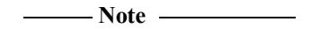

If the GIC implementation supports two Security states, independent EOI controls are provided for accesses from each Security state. Secure accesses handle both Group 0 and Group 1 interrupts, and Non-secure accesses handle Group 1 interrupts only.

#### **Configurations**

This register is present only when FEAT\_GICv3\_LEGACY is implemented. Otherwise, direct accesses to GICC\_CTLR are RES0.

In a GIC implementation that supports two Security states:

- This register is Banked.
- The register bit assignments are different in the Secure and Non-secure copies.

#### **Attributes**

GICC\_CTLR is a 32-bit register.

#### **Field descriptions**

*When GICD\_CTLR.DS==0, Non-secure access:*

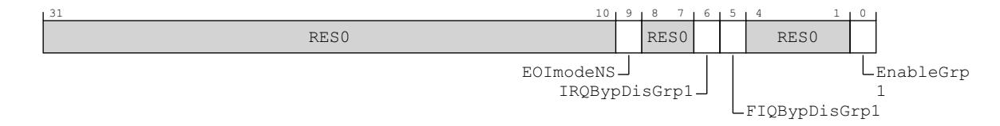

#### **Bits [31:10]**

Reserved, RES0.

#### **EOImodeNS, bit [9]**

Controls the behavior of Non-secure accesses to [GICC\\_EOIR](#page-752-0), [GICC\\_AEOIR](#page-733-1), and [GICC\\_DIR.](#page-750-0)

0b0 [GICC\\_EOIR](#page-752-0) and [GICC\\_AEOIR](#page-733-1) provide both priority drop and interrupt deactivation functionality. Accesses to [GICC\\_DIR](#page-750-0) are UNPREDICTABLE.

0b1 [GICC\\_EOIR](#page-752-0) and [GICC\\_AEOIR](#page-733-1) provide priority drop functionality only. [GICC\\_DIR](#page-750-0) provides interrupt deactivation functionality.

**Note**

An implementation is permitted to make this bit RAO/WI.

The reset behavior of this field is:

• On a Warm reset, this field resets to 0.

#### **Bits [8:7]**

Reserved, RES0.

#### **IRQBypDisGrp1, bit [6]**

When the signaling of IRQs by the CPU interface is disabled, this field partly controls whether the bypass IRQ signal is signaled to the PE for Group 1:

0b0 The bypass IRQ signal is signaled to the PE.

0b1 The bypass IRQ signal is not signaled to the PE.

If System register access is enabled for EL3 and [ICC\\_SRE\\_EL3](#page-285-1).DIB == 1, this field is RAO/WI.

If System register access is enabled for EL1, this field is ignored.

If an implementation does not support legacy interrupts, this bit is permitted to be RAO/WI.

For more information, see *[Interrupt bypass support on page](#page-46-0) 3-47*.

The reset behavior of this field is:

• On a Warm reset, this field resets to 0.

#### **FIQBypDisGrp1, bit [5]**

When the signaling of FIQs by the CPU interface is disabled, this field partly controls whether the bypass FIQ signal is signaled to the PE for Group 1:

0b0 The bypass FIQ signal is signaled to the PE.

0b1 The bypass FIQ signal is not signaled to the PE.

If System register access is enabled for EL3 and [ICC\\_SRE\\_EL3](#page-285-1).DFB == 1, this field is RAO/WI.

If System register access is enabled for EL1, this field is ignored.

If an implementation does not support legacy interrupts, this bit is permitted to be RAO/WI.

For more information, see *[Interrupt bypass support on page](#page-46-0) 3-47*.

The reset behavior of this field is:

• On a Warm reset, this field resets to 0.

#### **Bits [4:1]**

Reserved, RES0.

#### **EnableGrp1, bit [0]**

This Non-secure field enables the signaling of Group 1 interrupts by the CPU interface to a target PE:

0b0 Group 1 interrupt signaling is disabled.

0b1 Group 1 interrupt signaling is enabled.

The reset behavior of this field is:

• On a Warm reset, this field resets to 0.

#### *When GICD\_CTLR.DS==0, Secure access:*

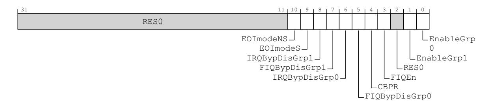

#### **Bits [31:11]**

Reserved, RES0.

#### **EOImodeNS, bit [10]**

Controls the behavior of Non-secure accesses to [GICC\\_EOIR](#page-752-0), [GICC\\_AEOIR](#page-733-1), and [GICC\\_DIR.](#page-750-0)

0b0 [GICC\\_EOIR](#page-752-0) and [GICC\\_AEOIR](#page-733-1) provide both priority drop and interrupt deactivation functionality. Accesses to [GICC\\_DIR](#page-750-0) are UNPREDICTABLE.

0b1 [GICC\\_EOIR](#page-752-0) and [GICC\\_AEOIR](#page-733-1) provide priority drop functionality only. [GICC\\_DIR](#page-750-0) provides interrupt deactivation functionality.

**Note**

An implementation is permitted to make this bit RAO/WI.

The reset behavior of this field is:

• On a Warm reset, this field resets to 0.

#### **EOImodeS, bit [9]**

Controls the behavior of Secure accesses to [GICC\\_EOIR,](#page-752-0) [GICC\\_AEOIR](#page-733-1), and [GICC\\_DIR.](#page-750-0)

0b0 [GICC\\_EOIR](#page-752-0) and [GICC\\_AEOIR](#page-733-1) provide both priority drop and interrupt deactivation functionality. Accesses to [GICC\\_DIR](#page-750-0) are UNPREDICTABLE.

0b1 [GICC\\_EOIR](#page-752-0) and [GICC\\_AEOIR](#page-733-1) provide priority drop functionality only. [GICC\\_DIR](#page-750-0) provides interrupt deactivation functionality.

**Note**

An implementation is permitted to make this bit RAO/WI.

This field shares state with [GICC\\_CTLR](#page-742-1).EOImode.

The reset behavior of this field is:

• On a Warm reset, this field resets to 0.

#### **IRQBypDisGrp1, bit [8]**

When the signaling of IRQs by the CPU interface is disabled, this field partly controls whether the bypass IRQ signal is signaled to the PE for Group 1:

0b0 The bypass IRQ signal is signaled to the PE.

0b1 The bypass IRQ signal is not signaled to the PE.

If System register access is enabled for EL3 and [ICC\\_SRE\\_EL3](#page-285-1).DIB == 1, this field is RAO/WI.

If System register access is enabled for EL1, this field is ignored.

If an implementation does not support legacy interrupts, this bit is permitted to be RAO/WI.

For more information, see *[Interrupt bypass support on page](#page-46-0) 3-47*.

The reset behavior of this field is:

• On a Warm reset, this field resets to 0.

#### **FIQBypDisGrp1, bit [7]**

When the signaling of FIQs by the CPU interface is disabled, this field partly controls whether the bypass FIQ signal is signaled to the PE for Group 1:

0b0 The bypass FIQ signal is signaled to the PE.

0b1 The bypass FIQ signal is not signaled to the PE.

If System register access is enabled for EL3 and [ICC\\_SRE\\_EL3](#page-285-1).DFB == 1, this field is RAO/WI.

If System register access is enabled for EL1, this field is ignored.

If an implementation does not support legacy interrupts, this bit is permitted to be RAO/WI.

For more information, see *[Interrupt bypass support on page](#page-46-0) 3-47*.

The reset behavior of this field is:

• On a Warm reset, this field resets to 0.

#### **IRQBypDisGrp0, bit [6]**

When the signaling of IRQs by the CPU interface is disabled, this field partly controls whether the bypass IRQ signal is signaled to the PE for Group 0:

0b0 The bypass IRQ signal is signaled to the PE.

0b1 The bypass IRQ signal is not signaled to the PE.

If System register access is enabled for EL3 and [ICC\\_SRE\\_EL3](#page-285-1).DIB == 1, this field is RAO/WI.

If System register access is enabled for EL1, this field is ignored.

If an implementation does not support legacy interrupts, this bit is permitted to be RAO/WI.

For more information, see *[Interrupt bypass support on page](#page-46-0) 3-47*.

The reset behavior of this field is:

• On a Warm reset, this field resets to 0.

#### **FIQBypDisGrp0, bit [5]**

When the signaling of FIQs by the CPU interface is disabled, this field partly controls whether the bypass FIQ signal is signaled to the PE for Group 0:

0b0 The bypass FIQ signal is signaled to the PE.

0b1 The bypass FIQ signal is not signaled to the PE.

If System register access is enabled for EL3 and [ICC\\_SRE\\_EL3](#page-285-1).DIB == 1, this field is RAO/WI.

If System register access is enabled for EL1, this field is ignored.

If an implementation does not support legacy interrupts, this bit is permitted to be RAO/WI.

For more information, see *[Interrupt bypass support on page](#page-46-0) 3-47*.

The reset behavior of this field is:

• On a Warm reset, this field resets to 0.

#### **CBPR, bit [4]**

Controls whether [GICC\\_BPR](#page-740-0) provides common control of preemption to Group 0 and Group 1 interrupts:

0b0 [GICC\\_BPR](#page-740-0) determines preemption for Group 0 interrupts only.

[GICC\\_ABPR](#page-731-1) determines preemption for Group 1 interrupts.

0b1 [GICC\\_BPR](#page-740-0) determines preemption for both Group 0 and Group 1 interrupts.

This field is an alias of [ICC\\_CTLR\\_EL3.](#page-237-1)CBPR\_EL1NS.

In a GIC that supports two Security states, when CBPR == 1:

- A Non-secure read of [GICC\\_BPR](#page-740-0) returns the value of Secure [GICC\\_BPR](#page-740-0).Binary\_Point, incremented by 1, and saturated to 0b111.
- Non-secure writes of [GICC\\_BPR](#page-740-0) are ignored.

The reset behavior of this field is:

• On a Warm reset, this field resets to 0.

#### **FIQEn, bit [3]**

Controls whether the CPU interface signals Group 0 interrupts to a target PE using the FIQ or IRQ signal:

0b0 Group 0 interrupts are signaled using the IRQ signal.

0b1 Group 0 interrupts are signaled using the FIQ signal.

Group 1 interrupts are signaled using the IRQ signal only.

If an implementation supports two Security states, this bit is permitted to be RAO/WI.

The reset behavior of this field is:

• On a Warm reset, this field resets to 0.

#### **Bit [2]**

Reserved, RES0.

#### **EnableGrp1, bit [1]**

This Non-secure field enables the signaling of Group 1 interrupts by the CPU interface to a target

PE:

0b0 Group 1 interrupt signaling is disabled.

0b1 Group 1 interrupt signaling is enabled.

The reset behavior of this field is:

• On a Warm reset, this field resets to 0.

#### **EnableGrp0, bit [0]**

Enables the signaling of Group 0 interrupts by the CPU interface to a target PE:

0b0 Group 0 interrupt signaling is disabled.

0b1 Group 0 interrupt signaling is enabled.

The reset behavior of this field is:

• On a Warm reset, this field resets to 0.

#### *When GICD\_CTLR.DS == 1:*

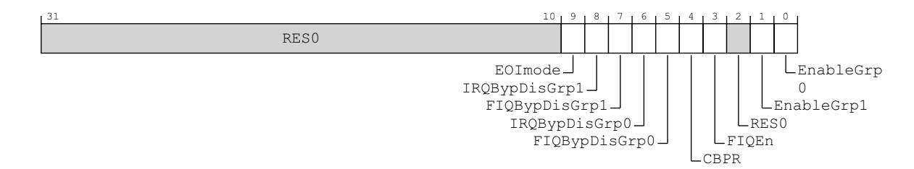

#### **Bits [31:10]**

Reserved, RES0.

#### **EOImode, bit [9]**

Controls the behavior of accesses to [GICC\\_EOIR,](#page-752-0) [GICC\\_AEOIR,](#page-733-1) and [GICC\\_DIR.](#page-750-0)

0b0 [GICC\\_EOIR](#page-752-0) and [GICC\\_AEOIR](#page-733-1) provide both priority drop and interrupt deactivation functionality. Accesses to [GICC\\_DIR](#page-750-0) are UNPREDICTABLE.

0b1 [GICC\\_EOIR](#page-752-0) and [GICC\\_AEOIR](#page-733-1) provide priority drop functionality only. [GICC\\_DIR](#page-750-0) provides interrupt deactivation functionality.

**Note**

An implementation is permitted to make this bit RAO/WI.

This field shares state with [GICC\\_CTLR](#page-742-1).EOImodeS.

The reset behavior of this field is:

• On a Warm reset, this field resets to 0.

#### **IRQBypDisGrp1, bit [8]**

When the signaling of IRQs by the CPU interface is disabled, this field partly controls whether the bypass IRQ signal is signaled to the PE for Group 1:

0b0 The bypass IRQ signal is signaled to the PE.

0b1 The bypass IRQ signal is not signaled to the PE.

If System register access is enabled for EL3 and [ICC\\_SRE\\_EL3](#page-285-1).DIB == 1, this field is RAO/WI.

If System register access is enabled for EL1, this field is ignored.

If an implementation does not support legacy interrupts, this bit is permitted to be RAO/WI.

For more information, see *[Interrupt bypass support on page](#page-46-0) 3-47*.

The reset behavior of this field is:

• On a Warm reset, this field resets to 0.

#### **FIQBypDisGrp1, bit [7]**

When the signaling of FIQs by the CPU interface is disabled, this field partly controls whether the bypass FIQ signal is signaled to the PE for Group 1:

0b0 The bypass FIQ signal is signaled to the PE.

0b1 The bypass FIQ signal is not signaled to the PE.

If System register access is enabled for EL3 and [ICC\\_SRE\\_EL3](#page-285-1).DFB == 1, this field is RAO/WI.

If System register access is enabled for EL1, this field is ignored.

If an implementation does not support legacy interrupts, this bit is permitted to be RAO/WI.

For more information, see *[Interrupt bypass support on page](#page-46-0) 3-47*.

The reset behavior of this field is:

• On a Warm reset, this field resets to 0.

#### **IRQBypDisGrp0, bit [6]**

When the signaling of IRQs by the CPU interface is disabled, this field partly controls whether the bypass IRQ signal is signaled to the PE for Group 0:

0b0 The bypass IRQ signal is signaled to the PE.

0b1 The bypass IRQ signal is not signaled to the PE.

If System register access is enabled for EL3 and [ICC\\_SRE\\_EL3](#page-285-1).DIB == 1, this field is RAO/WI.

If System register access is enabled for EL1, this field is ignored.

If an implementation does not support legacy interrupts, this bit is permitted to be RAO/WI.

For more information, see *[Interrupt bypass support on page](#page-46-0) 3-47*.

The reset behavior of this field is:

• On a Warm reset, this field resets to 0.

#### **FIQBypDisGrp0, bit [5]**

When the signaling of FIQs by the CPU interface is disabled, this field partly controls whether the bypass FIQ signal is signaled to the PE for Group 0:

0b0 The bypass FIQ signal is signaled to the PE.

0b1 The bypass FIQ signal is not signaled to the PE.

If System register access is enabled for EL3 and [ICC\\_SRE\\_EL3](#page-285-1).DIB == 1, this field is RAO/WI.

If System register access is enabled for EL1, this field is ignored.

If an implementation does not support legacy interrupts, this bit is permitted to be RAO/WI.

For more information, see *[Interrupt bypass support on page](#page-46-0) 3-47*.

The reset behavior of this field is:

• On a Warm reset, this field resets to 0.

#### **CBPR, bit [4]**

Controls whether [GICC\\_BPR](#page-740-0) provides common control of preemption to Group 0 and Group 1 interrupts:

0b0 [GICC\\_BPR](#page-740-0) determines preemption for Group 0 interrupts only.

[GICC\\_ABPR](#page-731-1) determines preemption for Group 1 interrupts.

0b1 [GICC\\_BPR](#page-740-0) determines preemption for both Group 0 and Group 1 interrupts.

This field is an alias of [ICC\\_CTLR\\_EL3.](#page-237-1)CBPR\_EL1NS.

In a GIC that supports two Security states, when CBPR == 1:

- A Non-secure read of [GICC\\_BPR](#page-740-0) returns the value of Secure [GICC\\_BPR](#page-740-0).Binary\_Point, incremented by 1, and saturated to 0b111.
- Non-secure writes of [GICC\\_BPR](#page-740-0) are ignored.

The reset behavior of this field is:

• On a Warm reset, this field resets to 0.

#### **FIQEn, bit [3]**

Controls whether the CPU interface signals Group 0 interrupts to a target PE using the FIQ or IRQ signal:

0b0 Group 0 interrupts are signaled using the IRQ signal.

0b1 Group 0 interrupts are signaled using the FIQ signal.

Group 1 interrupts are signaled using the IRQ signal only.

If an implementation supports two Security states, this bit is permitted to be RAO/WI.

The reset behavior of this field is:

• On a Warm reset, this field resets to 0.

#### **Bit [2]**

Reserved, RES0.

#### **EnableGrp1, bit [1]**

This Non-secure field enables the signaling of Group 1 interrupts by the CPU interface to a target PE:

0b0 Group 1 interrupt signaling is disabled.

0b1 Group 1 interrupt signaling is enabled.

The reset behavior of this field is:

• On a Warm reset, this field resets to 0.

#### **EnableGrp0, bit [0]**

Enables the signaling of Group 0 interrupts by the CPU interface to a target PE:

0b0 Group 0 interrupt signaling is disabled.

0b1 Group 0 interrupt signaling is enabled.

The reset behavior of this field is:

• On a Warm reset, this field resets to 0.

#### **Accessing the GICC\_CTLR:**

This register is used only when System register access is not enabled. When System register access is enabled:

- For AArch32 implementations, [ICC\\_CTLR](#page-389-0) and [ICC\\_MCTLR](#page-424-1) provide equivalent functionality.
- For AArch64 implementations, [ICC\\_CTLR\\_EL1](#page-232-1) and [ICC\\_CTLR\\_EL3](#page-237-1) provide equivalent functionality.

GICC\_CTLR can be accessed through its memory-mapped interface:

| Component         | Offset | Instance  |
|-------------------|--------|-----------|
| GIC CPU interface | 0x0000 | GICC_CTLR |

This interface is accessible as follows:

- When GICD\_CTLR.DS == 0 accesses to this register are RW.
- When an access is Secure accesses to this register are RW.
- When an access is Non-secure accesses to this register are RW.

#### <span id="page-750-0"></span>**12.13.8 GICC\_DIR, CPU Interface Deactivate Interrupt Register**

The GICC\_DIR characteristics are:

#### **Purpose**

When interrupt priority drop is separated from interrupt deactivation, a write to this register deactivates the specified interrupt.

#### **Configurations**

This register is present only when FEAT\_GICv3\_LEGACY is implemented. Otherwise, direct accesses to GICC\_DIR are RES0.

#### **Attributes**

GICC\_DIR is a 32-bit register.

#### **Field descriptions**

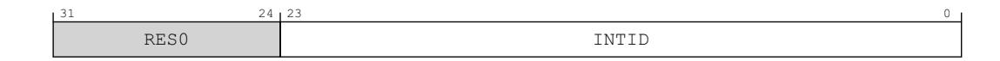

#### **Bits [31:24]**

Reserved, RES0.

#### **INTID, bits [23:0]**

The INTID of the signaled interrupt.

**Note**

INTIDs 1020-1023 are reserved and convey additional information such as spurious interrupts.

When affinity routing is not enabled:

- Bits [23:13] are RES0.
- For SGIs, bits [12:10] identify the CPU interface corresponding to the source PE. For all other interrupts these bits are RES0.

#### **Accessing the GICC\_DIR:**

This register is used only when System register access is not enabled. When System register access is enabled:

- For AArch32 implementations, [ICC\\_DIR](#page-395-0) provides equivalent functionality.
- For AArch64 implementations, [ICC\\_DIR\\_EL1](#page-242-1) provides equivalent functionality.

Writes to this register have an effect only in the following cases:

- When [GICD\\_CTLR](#page-543-1).DS == 1, if [GICC\\_CTLR.](#page-742-1)EOImode == 1.
- In GIC implementations that support two Security states:
  - If the access is Secure and [GICC\\_CTLR](#page-742-1).EOImodeS == 1.
  - If the access is Non-secure and [GICC\\_CTLR](#page-742-1).EOImodeNS == 1.

The following writes must be ignored:

• Writes to this register when the corresponding EOImode field in [GICC\\_CTLR](#page-742-1) == 0. In systems that support system error generation, an implementation might generate a system error.

• Writes to this register when the corresponding EOImode field in [GICC\\_CTLR](#page-742-1) == 0 and the corresponding interrupt is not active. In systems that support system error generation, an implementation might generate a system error. In implementations using the GIC Stream Protocol Interface, these writes correspond to a Deactivate packet for an interrupt that is not active. For more information, see *[Deactivate \(ICC\) on](#page-898-0)  page [A-899](#page-898-0)*.

If the corresponding EOImode field in [GICC\\_CTLR](#page-742-1) is 1 and this register is written to without a corresponding write to [GICC\\_EOIR](#page-752-0) or [GICC\\_AEOIR](#page-733-1), the interrupt is deactivated but the bit corresponding to it in the active priorities registers remains set.

When affinity routing is enabled for a Security state, it is a programming error to use memory-mapped registers to access the GIC.

GICC\_DIR can be accessed through its memory-mapped interface:

| Component         | Offset | Instance |
|-------------------|--------|----------|
| GIC CPU interface | 0x1000 | GICC_DIR |

This interface is accessible as follows:

- When GICD\_CTLR.DS == 0 accesses to this register are WO.
- When an access is Secure accesses to this register are WO.
- When an access is Non-secure accesses to this register are WO.

#### <span id="page-752-0"></span>**12.13.9 GICC\_EOIR, CPU Interface End Of Interrupt Register**

The GICC\_EOIR characteristics are:

#### **Purpose**

A write to this register performs priority drop for the specified interrupt and, if the appropriate [GICC\\_CTLR.](#page-742-1)EOImodeS or [GICC\\_CTLR](#page-742-1).EOImodeNS field == 0, also deactivates the interrupt.

#### **Configurations**

This register is present only when FEAT\_GICv3\_LEGACY is implemented. Otherwise, direct accesses to GICC\_EOIR are RES0.

If [GICD\\_CTLR.](#page-543-1)DS==0:

- This register is Common.
- [GICC\\_AEOIR](#page-733-1) is an alias of the Non-secure view of this register.

For Secure writes when [GICD\\_CTLR.](#page-543-1)DS==0, or for Secure and Non-secure writes when [GICD\\_CTLR.](#page-543-1)DS==1, the register provides functionality for Group 0 interrupts.

For Non-secure writes when [GICD\\_CTLR](#page-543-1).DS==1, the register provides functionality for Group 1 interrupts.

#### **Attributes**

GICC\_EOIR is a 32-bit register.

#### **Field descriptions**


#### **Bits [31:24]**

Reserved, RES0.

#### **INTID, bits [23:0]**

The INTID of the signaled interrupt.

**Note**

INTIDs 1020-1023 are reserved and convey additional information such as spurious interrupts.

When affinity routing is not enabled:

- Bits [23:13] are RES0.
- For SGIs, bits [12:10] identify the CPU interface corresponding to the source PE. For all other interrupts these bits are RES0.

For every read of a valid INTID from [GICC\\_IAR](#page-756-0), the connected PE must perform a matching write to GICC\_EOIR. The value written to GICC\_EOIR must be the INTID from [GICC\\_IAR](#page-756-0). Reads of INTIDs 1020-1023 do not require matching writes.

| Note |  |
|------|--|
|      |  |

Arm recommends that software preserves the entire register value read from [GICC\\_IAR](#page-756-0), and writes that value back to GICC\_EOIR on completion of interrupt processing.

For nested interrupts, the order of writes to this register must be the reverse of the order of interrupt acknowledgment. Behavior is UNPREDICTABLE if:

• This ordering constraint is not maintained.

- The value written to this register does not match an active interrupt, or the ID of a spurious interrupt.
- The value written to this register does not match the last valid interrupt value read from [GICC\\_IAR](#page-756-0).

For general information about the effect of writes to end of interrupt registers, and about the possible separation of the priority drop and interrupt deactivate operations, see *[Interrupt lifecycle on page](#page-49-0) 4-50*.

If [GICD\\_CTLR](#page-543-1).DS==0:

- [GICC\\_CTLR](#page-742-1).EOImodeS controls the behavior of Secure accesses to GICC\_EOIR and [GICC\\_AEOIR](#page-733-1).
- [GICC\\_CTLR](#page-742-1).EOImodeNS controls the behavior of Non-secure accesses to GICC\_EOIR and [GICC\\_AEOIR.](#page-733-1)

#### **Accessing the GICC\_EOIR:**

The following writes must be ignored:

- Writes of INTIDs 1020-1023.
- Secure writes corresponding to Group 1 interrupts. In systems that support system error generation, an implementation might generate a system error. In this case, GIC behavior is predictable, and the highest Secure active priority (in the Secure copy of [GICC\\_APR<n>\)](#page-738-0) will be reset if the highest active priority is Secure. System behavior is UNPREDICTABLE.
- Non-secure writes corresponding to Group 0 interrupts when [GICC\\_CTLR.](#page-742-1)EOImodeS == 1. In systems that support system error generation, an implementation might generate a system error. In this case, GIC behavior is predictable, and the highest Non-secure active priority (in the Non-secure copy of [GICC\\_APR<n>\)](#page-738-0) will be reset if the highest active priority is Non-secure. System behavior is UNPREDICTABLE.

This register is used only when System register access is not enabled. When System register access is enabled:

- For AArch32 implementations, [ICC\\_EOIR0](#page-397-0) and [ICC\\_EOIR1](#page-400-0) provide equivalent functionality.
- For AArch64 implementations, [ICC\\_EOIR0\\_EL1](#page-244-1) and [ICC\\_EOIR1\\_EL1](#page-246-1) provide equivalent functionality.

When affinity routing is enabled for a Security state, it is a programming error to use memory-mapped registers to access the GIC.

GICC\_EOIR can be accessed through its memory-mapped interface:

| Component         | Offset | Instance  |
|-------------------|--------|-----------|
| GIC CPU interface | 0x0010 | GICC_EOIR |

This interface is accessible as follows:

- When GICD\_CTLR.DS == 0 accesses to this register are WO.
- When an access is Secure accesses to this register are WO.
- When an access is Non-secure accesses to this register are WO.

#### <span id="page-754-1"></span><span id="page-754-0"></span>**12.13.10 GICC\_HPPIR, CPU Interface Highest Priority Pending Interrupt Register**

The GICC\_HPPIR characteristics are:

#### **Purpose**

Provides the INTID of the highest priority pending interrupt on the CPU interface.

#### **Configurations**

This register is present only when FEAT\_GICv3\_LEGACY is implemented. Otherwise, direct accesses to GICC\_HPPIR are RES0.

If [GICD\\_CTLR.](#page-543-1)DS==0:

- This register is Common.
- [GICC\\_AHPPIR](#page-735-1) is an alias of the Non-secure view of this register.

#### **Attributes**

GICC\_HPPIR is a 32-bit register.

#### **Field descriptions**


#### **Bits [31:24]**

Reserved, RES0.

#### **INTID, bits [23:0]**

The INTID of the signaled interrupt.

**Note**

INTIDs 1020-1023 are reserved and convey additional information such as spurious interrupts.

When affinity routing is not enabled:

- Bits [23:13] are RES0.
- For SGIs, bits [12:10] identify the CPU interface corresponding to the source PE. For all other interrupts these bits are RES0.

#### **Accessing the GICC\_HPPIR:**

This register is used only when System register access is not enabled. When System register access is enabled:

- For AArch32 implementations, [ICC\\_HPPIR0](#page-403-0) and [ICC\\_HPPIR1](#page-405-0) provide equivalent functionality.
- For AArch64 implementations, [ICC\\_HPPIR0\\_EL1](#page-248-1) and [ICC\\_HPPIR1\\_EL1](#page-250-1) provide equivalent functionality.

If the highest priority pending interrupt is in Group 0, a Non-secure read of this register returns the special INTID 1023.

For Secure reads when [GICD\\_CTLR](#page-543-1).DS==0, or for Secure and Non-secure reads when [GICD\\_CTLR](#page-543-1).DS==1, returns the special INTID 1022 if the highest priority pending interrupt is in Group 1.

If no interrupts are in the pending state, a read of this register returns the special INTID 1023.

Interrupt identifiers corresponding to an interrupt group that is not enabled are ignored.

If the highest priority pending interrupt is a direct interrupt that is both individually enabled in the Distributor and part of an interrupt group that is enabled in the Distributor, and the interrupt group is disabled in the CPU interface for this PE, this register returns the special INTID 1023.

For more information about pending interrupts that are not considered when determining the highest priority pending interrupt, see *[Preemption on page](#page-77-3) 4-78*.

When affinity routing is enabled for a Security state, it is a programming error to use memory-mapped registers to access the GIC.

GICC\_HPPIR can be accessed through its memory-mapped interface:

| Component         | Offset | Instance   |
|-------------------|--------|------------|
| GIC CPU interface | 0x0018 | GICC_HPPIR |

This interface is accessible as follows:

- When GICD\_CTLR.DS == 0 accesses to this register are RO.
- When an access is Secure accesses to this register are RO.
- When an access is Non-secure accesses to this register are RO.

#### <span id="page-756-1"></span><span id="page-756-0"></span>**12.13.11 GICC\_IAR, CPU Interface Interrupt Acknowledge Register**

The GICC\_IAR characteristics are:

#### **Purpose**

Provides the INTID of the signaled interrupt. A read of this register by the PE acts as an acknowledge for the interrupt.

#### **Configurations**

This register is present only when FEAT\_GICv3\_LEGACY is implemented. Otherwise, direct accesses to GICC\_IAR are RES0.

This register is available in all configurations of the GIC. If [GICD\\_CTLR.](#page-543-1)DS==0:

- This register is Common.
- [GICC\\_AIAR](#page-737-1) is an alias of the Non-secure view of this register.

The format of the INTID is governed by whether affinity routing is enabled for a Security state.

#### **Attributes**

GICC\_IAR is a 32-bit register.

#### **Field descriptions**

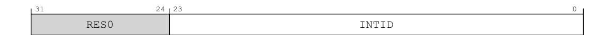

#### **Bits [31:24]**

Reserved, RES0.

#### **INTID, bits [23:0]**

The INTID of the signaled interrupt.

| Note |  |
|------|--|
|------|--|

INTIDs 1020-1023 are reserved and convey additional information such as spurious interrupts.

When affinity routing is not enabled:

- Bits [23:13] are RES0.
- For SGIs, bits [12:10] identify the CPU interface corresponding to the source PE. For all other interrupts these bits are RES0.

A read of this register returns the INTID of the highest priority pending interrupt for the CPU interface. The read returns a spurious INTID of 1023 if any of the following apply:

- Forwarding of interrupts by the Distributor to the CPU interface is disabled.
- Signaling of interrupts by the CPU interface to the connected PE is disabled.
- There are no pending interrupts on the CPU interface with sufficient priority for the interface to signal it to the PE.

When the GIC returns a valid INTID to a read of this register it treats the read as an acknowledge of that interrupt. In addition, it changes the interrupt status from pending to active, or to active and pending if the pending state of the interrupt persists. Normally, the pending state of an interrupt persists only if the interrupt is level-sensitive and remains asserted.

For every read of a valid INTID from GICC\_IAR, the connected PE must perform a matching write to [GICC\\_EOIR](#page-752-0).

#### **Note**

- Arm recommends that software preserves the entire register value read from this register, and writes that value back to [GICC\\_EOIR](#page-752-0) on completion of interrupt processing.
- For SPIs, although multiple target PEs might attempt to read this register at any time, only one PE can obtain a valid INTID. For more information, see *[Activation on page](#page-50-1) 4-51*.

#### **Accessing the GICC\_IAR:**

When [GICD\\_CTLR](#page-543-1).DS==1, if the highest priority pending interrupt is in Group 1, the special INTID 1022 is returned.

In GIC implementations that support two Security states, if the highest priority pending interrupt is in Group 0, Non-secure reads return the special INTID 1023.

In GIC implementations that support two Security states, if the highest priority pending interrupt is in Group 1, Secure reads return the special INTID 1022.

This register is used only when System register access is not enabled. When System register access is enabled:

- For AArch32 implementations, [ICC\\_IAR0](#page-410-0) and [ICC\\_IAR1](#page-413-0) provide equivalent functionality.
- For AArch64 implementations, [ICC\\_IAR0\\_EL1](#page-252-1) and [ICC\\_IAR1\\_EL1](#page-254-1) provide equivalent functionality.

When affinity routing is enabled for a Security state, it is a programming error to use memory-mapped registers to access the GIC.

GICC\_IAR can be accessed through its memory-mapped interface:

| Component         | Offset | Instance |
|-------------------|--------|----------|
| GIC CPU interface | 0x000C | GICC_IAR |

This interface is accessible as follows:

- When GICD\_CTLR.DS == 0 accesses to this register are RO.
- When an access is Secure accesses to this register are RO.
- When an access is Non-secure accesses to this register are RO.

#### <span id="page-758-0"></span>**12.13.12 GICC\_IIDR, CPU Interface Identification Register**

The GICC\_IIDR characteristics are:

#### **Purpose**

Provides information about the implementer and revision of the CPU interface.

#### **Configurations**

This register is present only when FEAT\_GICv3\_LEGACY is implemented. Otherwise, direct accesses to GICC\_IIDR are RES0.

#### **Attributes**

GICC\_IIDR is a 32-bit register.

#### **Field descriptions**

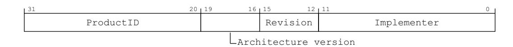

#### **ProductID, bits [31:20]**

Product Identifier.

This field has an IMPLEMENTATION DEFINED value.

Access to this field is RO.

#### **Architecture\_version, bits [19:16]**

The version of the GIC architecture that is implemented.

The value of this field is an IMPLEMENTATION DEFINED choice of:

0b0001 GICv1. 0b0010 GICv2. 0b0011 FEAT\_GICv3 memory-mapped interface supported. Support for the System register

interface is discoverable from PE registers [ID\\_PFR1](#page-28-6) and [ID\\_AA64PFR0\\_EL1.](#page-28-5)

0b0100 FEAT\_GICv4 memory-mapped interface supported. Support for the System register interface is discoverable from PE registers [ID\\_PFR1](#page-28-6) and [ID\\_AA64PFR0\\_EL1.](#page-28-5)

Other values are reserved.

Access to this field is RO.

#### **Revision, bits [15:12]**

Revision number for the CPU interface.

This field has an IMPLEMENTATION DEFINED value.

Access to this field is RO.

#### **Implementer, bits [11:0]**

Contains the JEP106 code of the company that implemented the CPU interface.

- Bits [11:8] are the JEP106 continuation code of the implementer. For an Arm implementation, this field is 0x4.
- Bit [7] is always 0.
- Bits [6:0] are the JEP106 identity code of the implementer. For an Arm implementation, bits [7:0] are therefore 0x3B.

This field has an IMPLEMENTATION DEFINED value.

Access to this field is RO.

#### **Accessing the GICC\_IIDR:**

GICC\_IIDR can be accessed through its memory-mapped interface:

| Component         | Offset | Instance  |
|-------------------|--------|-----------|
| GIC CPU interface | 0x00FC | GICC_IIDR |

This interface is accessible as follows:

- When GICD\_CTLR.DS == 0 accesses to this register are RO.
- When an access is Secure accesses to this register are RO.
- When an access is Non-secure accesses to this register are RO.

#### <span id="page-760-0"></span>**12.13.13 GICC\_NSAPR<n>, CPU Interface Non-secure Active Priorities Registers, n = 0 - 3**

The GICC\_NSAPR<n> characteristics are:

#### **Purpose**

Provides information about Group 1 interrupt active priorities.

#### **Configurations**

This register is present only when FEAT\_GICv3\_LEGACY is implemented. Otherwise, direct accesses to GICC\_NSAPR<n> are RES0.

The contents of these registers are IMPLEMENTATION DEFINED with the one architectural requirement that a value of all zeros is consistent with no interrupts being active.

When [GICD\\_CTLR](#page-543-1).DS==0, these registers are RAZ/WI to Non-secure accesses.

GICC\_NSAPR1 is implemented only in implementations that support 6 or more bits of priority. GICC\_NSAPR2 and GICC\_NSAPR3 are implemented only in implementations that support 7 bits of priority.

#### **Attributes**

GICC\_NSAPR<n> is a 32-bit register.

#### **Field descriptions**


#### **IMPLEMENTATION DEFINED, bits [31:0]**

IMPLEMENTATION DEFINED.

The reset behavior of this field is:

• On a Warm reset, this field resets to 0.

#### **Accessing the GICC\_NSAPR<n>:**

GICC\_NSAPR<n> can be accessed through its memory-mapped interface:

| Component         | Offset           | Instance           |
|-------------------|------------------|--------------------|
| GIC CPU interface | 0x00E0 + (4 * n) | GICC_NSAPR <n></n> |

This interface is accessible as follows:

- When GICD\_CTLR.DS == 0 accesses to this register are RW.
- When an access is Secure accesses to this register are RW.
- When an access is Non-secure accesses to this register are RW.

#### <span id="page-761-0"></span>**12.13.14 GICC\_PMR, CPU Interface Priority Mask Register**

The GICC\_PMR characteristics are:

#### **Purpose**

This register provides an interrupt priority filter. Only interrupts with a higher priority than the value in this register are signaled to the PE.

**Note**

Higher interrupt priority corresponds to a lower value of the Priority field.

#### **Configurations**

This register is present only when FEAT\_GICv3\_LEGACY is implemented. Otherwise, direct accesses to GICC\_PMR are RES0.

This register is available in all configurations of the GIC. If the GIC implementation supports two Security states this register is Common.

#### **Attributes**

GICC\_PMR is a 32-bit register.

#### **Field descriptions**


#### **Bits [31:8]**

Reserved, RES0.

#### **Priority, bits [7:0]**

The priority mask level for the CPU interface. If the priority of the interrupt is higher than the value indicated by this field, the interface signals the interrupt to the PE.

If the GIC implementation supports fewer than 256 priority levels some bits might be RAZ/WI, as follows:

- For 128 supported levels, bit [0] = 0b0.
- For 64 supported levels, bits [1:0] = 0b00.
- For 32 supported levels, bits [2:0] = 0b000.
- For 16 supported levels, bits [3:0] = 0b0000.

For more information, see *[Interrupt prioritization on page](#page-70-0) 4-71*.

The reset behavior of this field is:

• On a Warm reset, this field resets to an architecturally UNKNOWN value.

#### **Accessing the GICC\_PMR:**

If the GIC implementation supports two Security states:

- Non-secure accesses to this register can only read or write values corresponding to the lower half of the priority range.
- If a Secure write has programmed the register with a value that corresponds to a value in the upper half of the priority range then:
  - Any Non-secure read of the register returns 0x00, regardless of the value held in the register.
  - Non-secure writes are ignored.

For more information, see *[Interrupt prioritization on page](#page-70-0) 4-71*.

GICC\_PMR can be accessed through its memory-mapped interface:

| Component         | Offset | Instance |
|-------------------|--------|----------|
| GIC CPU interface | 0x0004 | GICC_PMR |

This interface is accessible as follows:

- When GICD\_CTLR.DS == 0 accesses to this register are RW.
- When an access is Secure accesses to this register are RW.
- When an access is Non-secure accesses to this register are RW.

#### <span id="page-763-1"></span><span id="page-763-0"></span>**12.13.15 GICC\_RPR, CPU Interface Running Priority Register**

The GICC\_RPR characteristics are:

#### **Purpose**

This register indicates the running priority of the CPU interface.

#### **Configurations**

This register is present only when FEAT\_GICv3\_LEGACY is implemented. Otherwise, direct accesses to GICC\_RPR are RES0.

This register is available in all configurations of the GIC. If the GIC implementation supports two Security states this register is Common.

#### **Attributes**

GICC\_RPR is a 32-bit register.

#### **Field descriptions**


#### **Bits [31:8]**

Reserved, RES0.

#### **Priority, bits [7:0]**

The current running priority on the CPU interface. This is the group priority of the current active interrupt.

If there are no active interrupts on the CPU interface, or all active interrupts have undergone a priority drop, the value returned is the Idle priority.

The priority returned is the group priority as if the BPR was set to the minimum value.

This field has an IMPLEMENTATION DEFINED value.

Access to this field is RO.

#### **Accessing the GICC\_RPR:**

If there is no active interrupt on the CPU interface, the idle priority value is returned.

If the GIC implementation supports two Security states, a Non-secure read of the Priority field returns:

- 0x00 if the field value is less than 0x80.
- The Non-secure view of the Priority value if the field value is 0x80 or more.

For more information, see *[Interrupt prioritization on page](#page-70-0) 4-71*.

**Note**

Software cannot determine the number of implemented priority bits from this register.

GICC\_RPR can be accessed through its memory-mapped interface:

| Component         | Offset | Instance |
|-------------------|--------|----------|
| GIC CPU interface | 0x0014 | GICC_RPR |

This interface is accessible as follows:

- When GICD\_CTLR.DS == 0 accesses to this register are RO.
- When an access is Secure accesses to this register are RO.
- When an access is Non-secure accesses to this register are RO.

#### <span id="page-765-0"></span>**12.13.16 GICC\_STATUSR, CPU Interface Status Register**

The GICC\_STATUSR characteristics are:

#### **Purpose**

Provides software with a mechanism to detect:

- Accesses to reserved locations.
- Writes to read-only locations.
- Reads of write-only locations.

#### **Configurations**

This register is present only when FEAT\_GICv3\_LEGACY is implemented. Otherwise, direct accesses to GICC\_STATUSR are RES0.

If the GIC implementation supports two Security states this register is Banked to provide Secure and Non-secure copies.

This register is used only when System register access is not enabled. If System register access is enabled, this register is not updated. Equivalent functionality might be provided by appropriate traps and exceptions.

#### **Attributes**

GICC\_STATUSR is a 32-bit register.

#### **Field descriptions**

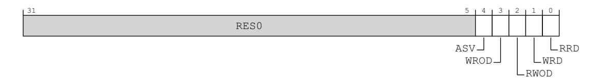

#### **Bits [31:5]**

Reserved, RES0.

#### **ASV, bit [4]**

Attempted security violation.

0b0 Normal operation.

0b1 A Non-secure access to a Secure register has been detected.

**Note**

This bit is not set to 1 for registers where any of the fields are Non-secure.

#### **WROD, bit [3]**

Write to an RO location.

0b0 Normal operation.

0b1 A write to an RO location has been detected.

When a violation is detected, software must write 1 to this register to reset it.

#### **RWOD, bit [2]**

Read of a WO location.

0b0 Normal operation.

0b1 A read of a WO location has been detected.

When a violation is detected, software must write 1 to this register to reset it.

#### **WRD, bit [1]**

Write to a reserved location.

0b0 Normal operation.

0b1 A write to a reserved location has been detected.

When a violation is detected, software must write 1 to this register to reset it.

#### **RRD, bit [0]**

Read of a reserved location.

0b0 Normal operation.

0b1 A read of a reserved location has been detected.

When a violation is detected, software must write 1 to this register to reset it.

#### **Accessing the GICC\_STATUSR:**

This is an optional register. If the register is not implemented, the location is RAZ/WI.

If this register is implemented, [GICV\\_STATUSR](#page-798-0) must also be implemented.

GICC\_STATUSR can be accessed through its memory-mapped interface:

| Component         | Offset | Instance       |
|-------------------|--------|----------------|
| GIC CPU interface | 0x002C | GICC_STATUSR_S |

This interface is accessible as follows:

- When GICD\_CTLR.DS == 0 accesses to this register are RW.
- When an access is Secure accesses to this register are RW.

GICC\_STATUSR can be accessed through its memory-mapped interface:

| Component         | Offset | Instance        |
|-------------------|--------|-----------------|
| GIC CPU interface | 0x002C | GICC_STATUSR_NS |

This interface is accessible as follows:

- When GICD\_CTLR.DS == 0 accesses to this register are RW.
- When an access is Non-secure accesses to this register are RW.

#### <span id="page-767-1"></span><span id="page-767-0"></span>**12.14 The GIC virtual CPU interface register map**


Unless explicitly defined otherwise in this section, the GICV\_\* registers are as defined in the GICv2 specification, see *Arm® Generic Interrupt Controller, Architecture version 2.0, Architecture Specification*.

These registers provide the virtual CPU interface accessed by the virtual machine. Typically, a virtual machine is unaware of any difference between virtual interrupts and physical interrupts. This means the programmers' model for handling virtual interrupts must be identical to that for handling physical interrupts. In general, these registers have the same format as the GIC physical CPU interface registers, but they operate on the interrupt view defined primarily by the List registers.

These registers are memory-mapped, with defined offsets from an IMPLEMENTATION DEFINED GICV\_\* register base address.

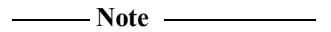

The offset of each GICV\_\* register is the same as the offset of the corresponding register for the physical CPU interface. For example, [GICV\\_PMR](#page-795-0) is at offset 0x0004 from the GICV\_\* register base address, and [GICC\\_PMR](#page-761-0) is at the same offset from the GICC\_\* register base address.

This means that:

- The hypervisor can use the stage 2 address translations to map the virtual CPU interface accesses to the correct physical addresses.
- Software, whether accessing the registers of a physical CPU interface or of a virtual CPU interface, uses the same register addresses.

To enable use of 64KB pages, the GICV\_\* memory map must ensure that:

- The base address of the GICV\_\* registers is 64KB aligned.
- An alias of the GICV\_\* registers is provided starting at offset 0xF000 from the start of the page such that a second copy of GICV\_DIR exists at the start of the next 64KB page.

This provides support for both 4KB and 64KB pages.

Reserved register addresses are RES0.

<span id="page-767-2"></span>Table 12-[31 on page](#page-767-2) 12-768 shows the GIC virtual CPU interface register map.

<span id="page-767-3"></span>**Table 12-31 GIC virtual CPU interface register map**

| Offset | Name       | Type | Reset                           | Description                                    |
|--------|------------|------|---------------------------------|------------------------------------------------|
| 0x0000 | GICV_CTLR  | RW   | See the register<br>description | VM Control Register                            |
| 0x0004 | GICV_PMR   | RW   | 0x0000 0000                     | VM Priority Mask Register                      |
| 0x0008 | GICV_BPR   | RW   | 0x0000 000xa                    | VM Binary Point Register                       |
| 0x000C | GICV_IAR   | RO   | -                               | VM Interrupt Acknowledge Register              |
| 0x0010 | GICV_EOIR  | WO   | -                               | VM End of Interrupt Register                   |
| 0x0014 | GICV_RPR   | RO   | -                               | VM Running Priority Register                   |
| 0x0018 | GICV_HPPIR | RO   | -                               | VM Highest Priority Pending Interrupt Register |
| 0x001C | GICV_ABPR  | RW   | 0x0000 000xa                    | VM Aliased Binary Point Register               |
| 0x0020 | GICV_AIAR  | RO   | -                               | VM Aliased Interrupt Acknowledge Register      |
|        |            |      |                                 |                                                |

**Table 12-31 GIC virtual CPU interface register map (continued)**

| Offset        | Name             | Type | Reset                     | Description                                                                                         |
|---------------|------------------|------|---------------------------|-----------------------------------------------------------------------------------------------------|
| 0x0024        | GICV_AEOIR       | WO   | -                         | VM Aliased End of Interrupt Register                                                                |
| 0x0028        | GICV_AHPPIR      | RO   | -                         | VM Aliased Highest Priority Pending Interrupt Register                                              |
| 0x002C        | GICV_STATUSR     | RW   | 0x0000 0000               | VM Error Reporting Status Register, optional                                                        |
| 0x0030-0x003C | -                | -    | -                         | Reserved                                                                                            |
| 0x0040-0x00CC | -                | -    | -                         | IMPLEMENTATION DEFINED                                                                              |
| 0x00D0-0x00DC | GICV_APR <n></n> | RW   | 0x0000 0000               | VM Active Priorities Registers                                                                      |
| 0x00E0-0x00EC | -                | -    | RAZ/WI                    | Reserved for second set of Active Priorities Registers, as the<br>Note in the description describes |
| 0x00F0-0x00F8 | -                | -    | -                         | Reserved                                                                                            |
| 0x00FC        | GICV_IIDR        | RO   | IMPLEMENTATION<br>DEFINED | VM CPU Interface Identification Register                                                            |
| 0x0100-0x0FFC | -                | -    | -                         | Reserved                                                                                            |
| 0x1000        | GICV_DIR         | WO   | -                         | VM Deactivate Interrupt Register                                                                    |
| 0x10000       |                  |      |                           |                                                                                                     |
| 0x1004-0x1FFC | -                | -    | -                         | Reserved                                                                                            |

a. See the register description for more information.

#### <span id="page-769-1"></span><span id="page-769-0"></span>**12.15 The GIC virtual CPU interface register descriptions**

This section describes each of the GIC virtual CPU interface registers in register name order.

#### <span id="page-770-0"></span>**12.15.1 GICV\_ABPR, Virtual Machine Aliased Binary Point Register**

The GICV\_ABPR characteristics are:

#### **Purpose**

Defines the point at which the priority value fields split into two parts, the group priority field and the subpriority field. The group priority field determines Group 1 interrupt preemption.

This register corresponds to [GICC\\_ABPR](#page-731-1) in the physical CPU interface.

**Note** [GICH\\_LR<n>.](#page-811-0)Group determines whether a virtual interrupt is Group 0 or Group 1.

#### **Configurations**

This register is present only when FEAT\_GICv3\_LEGACY is implemented and EL2 is implemented. Otherwise, direct accesses to GICV\_ABPR are RES0.

This register is available when the GIC implementation supports interrupt virtualization.

#### **Attributes**

GICV\_ABPR is a 32-bit register.

#### **Field descriptions**

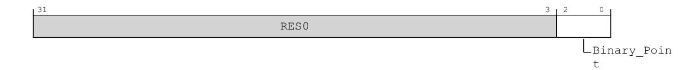

#### **Bits [31:3]**

Reserved, RES0.

#### **Binary\_Point, bits [2:0]**

Controls how the 8-bit interrupt priority field is split into a group priority field, that determines interrupt preemption, and a subpriority field.

For information about how this field determines the interrupt priority bits assigned to the group priority field, see *[Priority grouping on page](#page-73-2) 4-74*.

The reset behavior of this field is:

• On a Warm reset, this field resets to 0.

The Binary\_Point field of this register is aliased to [GICH\\_VMCR](#page-817-0).VBPR1.

#### **Accessing the GICV\_ABPR:**

This register is used only when System register access is not enabled. When System register access is enabled:

- For AArch32 implementations, [ICC\\_BPR1](#page-384-1) provides equivalent functionality.
- For AArch64 implementations, [ICC\\_BPR1\\_EL1](#page-228-1) provides equivalent functionality.

The value contained in this register is one greater than the actual applied binary point value, as described in *[Priority](#page-73-2)  [grouping on page](#page-73-2) 4-74*.

This register is used for Group 1 interrupts when [GICV\\_CTLR](#page-782-1).CBPR == 0. [GICV\\_BPR](#page-780-0) provides equivalent functionality for Group 0 interrupts, and for Group 1 interrupts when [GICV\\_CTLR.](#page-782-1)CBPR == 1.

#### GICV\_ABPR can be accessed through its memory-mapped interface:

| Component                 | Offset | Instance  |
|---------------------------|--------|-----------|
| GIC Virtual CPU interface | 0x001C | GICV_ABPR |

This interface is accessible as follows:

- When GICD\_CTLR.DS == 0 accesses to this register are RW.
- When an access is Secure accesses to this register are RW.
- When an access is Non-secure accesses to this register are RW.

#### <span id="page-772-0"></span>**12.15.2 GICV\_AEOIR, Virtual Machine Aliased End Of Interrupt Register**

The GICV\_AEOIR characteristics are:

#### **Purpose**

A write to this register performs a priority drop for the specified Group 1 virtual interrupt and, if [GICV\\_CTLR.](#page-782-1)EOImode == 0, also deactivates the interrupt.

#### **Configurations**

This register is present only when FEAT\_GICv3\_LEGACY is implemented and EL2 is implemented. Otherwise, direct accesses to GICV\_AEOIR are RES0.

This register is available when the GIC implementation supports interrupt virtualization.

#### **Attributes**

GICV\_AEOIR is a 32-bit register.

#### **Field descriptions**

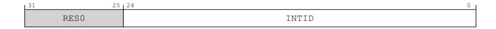

#### **Bits [31:25]**

Reserved, RES0.

#### **INTID, bits [24:0]**

The INTID of the signaled interrupt.

**Note**

INTIDs 1020-1023 are reserved and convey additional information such as spurious interrupts.

When affinity routing is not enabled:

- Bits [23:13] are RES0.
- For SGIs, bits [12:10] identify the CPU interface corresponding to the source PE. For all other interrupts these bits are RES0.

A successful EOI request means that:

- The highest priority bit in [GICH\\_APR<n>](#page-802-0) is cleared, causing the running priority to drop.
- If the appropriate [GICV\\_CTLR](#page-782-1).EOImode bit == 0, the interrupt is deactivated in the corresponding List register. If the INTID corresponds to a hardware interrupt, the interrupt is also deactivated in the Distributor.

| Note |  |
|------|--|
|------|--|

Only Group 1 interrupts can target the hypervisor, and therefore only Group 1 interrupts are deactivated in the Distributor.

A write to this register is UNPREDICTABLE if the INTID corresponds to a Group 0 interrupt. In addition, the following GICv2 UNPREDICTABLE cases require specific actions:

• If highest active priority is Group 0 and the identified interrupt is in the List Registers and it matches the highest active priority. When EL2 is using System registers and [ICH\\_VTR\\_EL2.](#page-364-1)SEIS is 1, an IMPLEMENTATION DEFINED SEI might be generated, otherwise GICv3 implementations must ignore such writes.

- If the identified interrupt is in the List Registers, and the HW bit is 1, and the interrupt to be deactivated is an SGI (that is, the value of Physical\_ID is between 0 and 15). GICv3 implementations must perform the deactivate operation. This means that a GICv3 implementation in legacy operation must ensure only a single SGI is active for a PE.
- If the identified interrupt is in the List Registers, and the HW bit is 1, and the corresponding pINTID field value is between 1020 and 1023, indicating a special purpose INTID. GICv3 implementations must not perform a deactivate operation but must still change the state of the List register as appropriate. When EL2 is using System registers and [ICH\\_VTR\\_EL2.](#page-364-1)SEIS is 1, an implementation might generate a system error.

#### **Accessing the GICV\_AEOIR:**

This register is used only when System register access is not enabled. When System register access is enabled:

- For AArch32 implementations, [ICC\\_EOIR1](#page-400-0) provides equivalent functionality.
- For AArch64 implementations, [ICC\\_EOIR1\\_EL1](#page-246-1) provides equivalent functionality.

This register is used for Group 1 interrupts only. [GICV\\_EOIR](#page-787-0) provides equivalent functionality for Group 0 interrupts.

When affinity routing is enabled, it is a programming error to use memory-mapped registers to access the GIC.

GICV\_AEOIR can be accessed through its memory-mapped interface:

| Component                 | Offset | Instance   |
|---------------------------|--------|------------|
| GIC Virtual CPU interface | 0x0024 | GICV_AEOIR |

This interface is accessible as follows:

- When GICD\_CTLR.DS == 0 accesses to this register are WO.
- When an access is Secure accesses to this register are WO.
- When an access is Non-secure accesses to this register are WO.

#### <span id="page-774-1"></span><span id="page-774-0"></span>**12.15.3 GICV\_AHPPIR, Virtual Machine Aliased Highest Priority Pending Interrupt Register**

The GICV\_AHPPIR characteristics are:

#### **Purpose**

Provides the INTID of the highest priority pending Group 1 virtual interrupt in the List registers. This register corresponds to the physical CPU interface register [GICC\\_AHPPIR](#page-735-1).

#### **Configurations**

This register is present only when FEAT\_GICv3\_LEGACY is implemented and EL2 is implemented. Otherwise, direct accesses to GICV\_AHPPIR are RES0.

This register is available when the GIC implementation supports interrupt virtualization.

#### **Attributes**

GICV\_AHPPIR is a 32-bit register.

#### **Field descriptions**

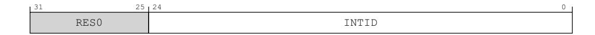

#### **Bits [31:25]**

Reserved, RES0.

#### **INTID, bits [24:0]**

The INTID of the signaled interrupt.

**Note**

INTIDs 1020-1023 are reserved and convey additional information such as spurious interrupts.

When affinity routing is not enabled:

- Bits [23:13] are RES0.
- For SGIs, bits [12:10] identify the CPU interface corresponding to the source PE. For all other interrupts these bits are RES0.

A read of this register returns the spurious INTID 1023 if any of the following are true:

- There are no pending interrupts of sufficiently high priority value to be signaled to the PE.
- The highest priority pending interrupt is in Group 0.

#### **Accessing the GICV\_AHPPIR:**

This register is used only when System register access is not enabled. When System register access is enabled:

- For AArch32 implementations, [ICC\\_HPPIR1](#page-405-0) provides equivalent functionality.
- For AArch64 implementations, [ICC\\_HPPIR1\\_EL1](#page-250-1) provides equivalent functionality.

This register is used for Group 1 interrupts only. [GICV\\_HPPIR](#page-789-0) provides equivalent functionality for Group 0 interrupts.

The register does not return the INTID of an interrupt that is active and pending.

When affinity routing is enabled, it is a programming error to use memory-mapped registers to access the GIC.

GICV\_AHPPIR can be accessed through its memory-mapped interface:

| Component                 | Offset | Instance    |
|---------------------------|--------|-------------|
| GIC Virtual CPU interface | 0x0028 | GICV_AHPPIR |

This interface is accessible as follows:

- When GICD\_CTLR.DS == 0 accesses to this register are RO.
- When an access is Secure accesses to this register are RO.
- When an access is Non-secure accesses to this register are RO.

#### <span id="page-776-1"></span><span id="page-776-0"></span>**12.15.4 GICV\_AIAR, Virtual Machine Aliased Interrupt Acknowledge Register**

The GICV\_AIAR characteristics are:

#### **Purpose**

Provides the INTID of the signaled Group 1 virtual interrupt. A read of this register by the PE acts as an acknowledge for the interrupt.

This register corresponds to the physical CPU interface register [GICC\\_AIAR](#page-737-1).

#### **Configurations**

This register is present only when FEAT\_GICv3\_LEGACY is implemented and EL2 is implemented. Otherwise, direct accesses to GICV\_AIAR are RES0.

This register is available when the GIC implementation supports interrupt virtualization.

#### **Attributes**

GICV\_AIAR is a 32-bit register.

#### **Field descriptions**


#### **Bits [31:25]**

Reserved, RES0.

#### **INTID, bits [24:0]**

The INTID of the signaled interrupt.

**Note**

INTIDs 1020-1023 are reserved and convey additional information such as spurious interrupts.

When affinity routing is not enabled:

- Bits [23:13] are RES0.
- For SGIs, bits [12:10] identify the CPU interface corresponding to the source PE. For all other interrupts these bits are RES0.

The operation of this register is similar to the operation of [GICV\\_IAR.](#page-791-0) When a vPE reads this register, the corresponding [GICH\\_LR<n>.](#page-811-0)Group field is checked to determine whether the interrupt is in Group 0 or Group 1:

- If the interrupt is Group 0, the spurious INTID 1023 is returned and the interrupt is not acknowledged.
- If the interrupt is Group 1, the INTID is returned. The List register entry is updated to active state, and the appropriate bit in [GICH\\_APR<n>](#page-802-0) is set to 1.

A read of this register returns the spurious INTID 1023 if any of the following are true:

- When the virtual CPU interface is enabled and [GICH\\_HCR](#page-808-0).En == 1:
  - There are no pending interrupts of sufficiently high priority value to be signaled to the PE.
  - The highest priority pending interrupt is in Group 0.
- Interrupt signaling by the virtual CPU interface is disabled.

#### **Accessing the GICV\_AIAR:**

This register is used only when System register access is not enabled. When System register access is enabled:

- For AArch32 implementations, [ICC\\_IAR1](#page-413-0) provides equivalent functionality.
- For AArch64 implementations, [ICC\\_IAR1\\_EL1](#page-254-1) provides equivalent functionality.

This register is used for Group 1 interrupts only. [GICV\\_IAR](#page-791-0) provides equivalent functionality for Group 0 interrupts.

When affinity routing is enabled, it is a programming error to use memory-mapped registers to access the GIC.

GICV\_AIAR can be accessed through its memory-mapped interface:

| Component                 | Offset | Instance  |
|---------------------------|--------|-----------|
| GIC Virtual CPU interface | 0x0020 | GICV_AIAR |

This interface is accessible as follows:

- When GICD\_CTLR.DS == 0 accesses to this register are RO.
- When an access is Secure accesses to this register are RO.
- When an access is Non-secure accesses to this register are RO.

#### <span id="page-778-0"></span>**12.15.5 GICV\_APR<n>, Virtual Machine Active Priorities Registers, n = 0 - 3**

The GICV\_APR<n> characteristics are:

#### **Purpose**

Provides information about interrupt active priorities.

These registers correspond to the physical CPU interface registers [GICC\\_APR<n>](#page-738-0).

#### **Configurations**

This register is present only when FEAT\_GICv3\_LEGACY is implemented and EL2 is implemented. Otherwise, direct accesses to GICV\_APR<n> are RES0.

When System register access is disabled for EL2, these registers access [GICH\\_APR<n>](#page-802-0), and all active priorities for virtual machines are held in [GICH\\_APR<n>](#page-802-0) regardless of interrupt group.

When System register access is enabled for EL2, these registers access [ICH\\_AP1R<n>\\_EL2](#page-339-1), and all active priorities for virtual machines are held in [ICH\\_AP1R<n>\\_EL2](#page-339-1) regardless of interrupt group.

#### **Attributes**

GICV\_APR<n> is a 32-bit register.

#### **Field descriptions**

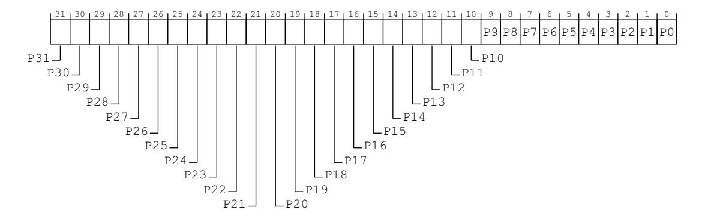

#### **P<x>, bit [x], for x = 31 to 0**

Provides information about active priorities for the virtual machine.

See [GICH\\_APR<n>](#page-802-0) and [ICH\\_AP1R<n>\\_EL2](#page-339-1) for the correspondence between priorities and bits.

#### **Accessing the GICV\_APR<n>:**

If System register access is not enabled for EL2, these registers access [GICH\\_APR<n>.](#page-802-0) If System register access is enabled for EL2, these registers access [ICH\\_AP1R<n>\\_EL2.](#page-339-1) All active priority mapped guests are held in the accessed registers, regardless of interrupt group.

GICV\_APR<n> can be accessed through its memory-mapped interface:

| Component                 | Offset           | Instance         |
|---------------------------|------------------|------------------|
| GIC Virtual CPU interface | 0x00D0 + (4 * n) | GICV_APR <n></n> |

This interface is accessible as follows:

• When GICD\_CTLR.DS == 0 accesses to this register are RW.

#### *Programmers' Model 12.15 The GIC virtual CPU interface register descriptions*

- When an access is Secure accesses to this register are RW.
- When an access is Non-secure accesses to this register are RW.

#### <span id="page-780-0"></span>**12.15.6 GICV\_BPR, Virtual Machine Binary Point Register**

The GICV\_BPR characteristics are:

#### **Purpose**

Defines the point at which the priority value fields split into two parts, the group priority field and the subpriority field. The group priority field determines Group 0 interrupt preemption.

This register corresponds to [GICC\\_BPR](#page-740-0) in the physical CPU interface.

**Note** [GICH\\_LR<n>.](#page-811-0)Group determines whether a virtual interrupt is Group 0 or Group 1.

#### **Configurations**

This register is present only when FEAT\_GICv3\_LEGACY is implemented and EL2 is implemented. Otherwise, direct accesses to GICV\_BPR are RES0.

This register is available when the GIC implementation supports interrupt virtualization.

When [GICV\\_CTLR.](#page-782-1)CBPR == 1, this register determines interrupt preemption for both Group 0 and Group 1 interrupts.

#### **Attributes**

GICV\_BPR is a 32-bit register.

#### **Field descriptions**

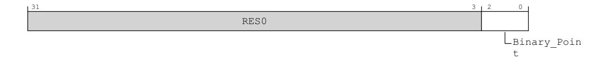

#### **Bits [31:3]**

Reserved, RES0.

#### **Binary\_Point, bits [2:0]**

Controls how the 8-bit interrupt priority field is split into a group priority field, that determines interrupt preemption, and a subpriority field.

For information about how this field determines the interrupt priority bits assigned to the group priority field, see Table 4-[12 on page](#page-74-4) 4-75.

The reset behavior of this field is:

• On a Warm reset, this field resets to an architecturally UNKNOWN value.

The Binary\_Point field of this register is aliased to [GICH\\_VMCR](#page-817-0).VBPR0.

#### **Accessing the GICV\_BPR:**

This register is used only when System register access is not enabled. When System register access is enabled:

- For AArch32 implementations, [ICC\\_BPR0](#page-380-1) provides equivalent functionality.
- For AArch64 implementations, [ICC\\_BPR0\\_EL1](#page-225-1) provides equivalent functionality.

#### GICV\_BPR can be accessed through its memory-mapped interface:

| Component                 | Offset | Instance |
|---------------------------|--------|----------|
| GIC Virtual CPU interface | 0x0008 | GICV_BPR |

This interface is accessible as follows:

- When GICD\_CTLR.DS == 0 accesses to this register are RW.
- When an access is Secure accesses to this register are RW.
- When an access is Non-secure accesses to this register are RW.

#### <span id="page-782-1"></span><span id="page-782-0"></span>**12.15.7 GICV\_CTLR, Virtual Machine Control Register**

The GICV\_CTLR characteristics are:

#### **Purpose**

Controls the behavior of virtual interrupts.

This register corresponds to the physical CPU interface register [GICC\\_CTLR](#page-742-1).

#### **Configurations**

This register is present only when FEAT\_GICv3\_LEGACY is implemented and EL2 is implemented. Otherwise, direct accesses to GICV\_CTLR are RES0.

This register is available when a GIC implementation supports interrupt virtualization.

#### **Attributes**

GICV\_CTLR is a 32-bit register.

#### **Field descriptions**

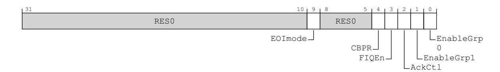

#### **Bits [31:10]**

Reserved, RES0.

#### **EOImode, bit [9]**

Controls the behavior associated with the [GICV\\_EOIR](#page-787-0), [GICV\\_AEOIR,](#page-772-0) and [GICV\\_DIR](#page-785-0) registers:

0b0 Writes to [GICV\\_EOIR](#page-787-0) and [GICV\\_AEOIR](#page-772-0) perform priority drop and deactivate interrupt operations simultaneously. Behavior on a write to [GICV\\_DIR](#page-785-0) is unpredictable.

> When it has completed processing the interrupt, the virtual machine writes to [GICV\\_EOIR](#page-787-0) or [GICV\\_AEOIR](#page-772-0) to deactivate the interrupt. The write updates the List registers and causes the virtual CPU interface to signal the interrupt completion to the physical Distributor.

0b1 Writes to [GICV\\_EOIR](#page-787-0) and [GICV\\_AEOIR](#page-772-0) perform priority drop operation only. Writes to [GICV\\_DIR](#page-785-0) perform deactivate interrupt operation only.

> When it has completed processing the interrupt, the virtual machine writes to [GICV\\_DIR](#page-785-0) to deactivate the interrupt. The write updates the List registers and causes the virtual CPU interface to signal the interrupt completion to the Distributor.

The reset behavior of this field is:

• On a Warm reset, this field resets to an architecturally UNKNOWN value.

#### **Bits [8:5]**

Reserved, RES0.

#### **CBPR, bit [4]**

Controls whether [GICV\\_BPR](#page-780-0) affects both Group 0 and Group 1 interrupts:

0b0 [GICV\\_BPR](#page-780-0) affects Group 0 virtual interrupts only. [GICV\\_ABPR](#page-770-0) affects Group 1 virtual interrupts only.

0b1 [GICV\\_BPR](#page-780-0) affects both Group 0 and Group 1 virtual interrupts.

For more information, see *[Priority grouping on page](#page-73-2) 4-74*.

The reset behavior of this field is:

• On a Warm reset, this field resets to an architecturally UNKNOWN value.

#### **FIQEn, bit [3]**

FIQ Enable. Controls whether Group 0 virtual interrupts are presented as virtual FIQs:

0b0 Group 0 virtual interrupts are presented as virtual IRQs.

0b1 Group 0 virtual interrupts are presented as virtual FIQs.

The reset behavior of this field is:

• On a Warm reset, this field resets to an architecturally UNKNOWN value.

#### **AckCtl, bit [2]**

Arm deprecates use of this bit. Arm strongly recommends that software is written to operate with this bit always cleared to 0.

Acknowledge control. When the highest priority interrupt is Group 1, determines whether [GICV\\_IAR](#page-791-0) causes the CPU interface to acknowledge the interrupt or returns the spurious identifier 1022, and whether [GICV\\_HPPIR](#page-789-0) returns the interrupt ID or the special identifier 1022.

0b0 If the highest priority pending interrupt is Group 1, a read of [GICV\\_IAR](#page-791-0) or [GICV\\_HPPIR](#page-789-0) returns an interrupt ID of 1022.

0b1 If the highest priority pending interrupt is Group 1, a read of [GICV\\_IAR](#page-791-0) or [GICV\\_HPPIR](#page-789-0) returns the interrupt ID of the corresponding interrupt.

The reset behavior of this field is:

• On a Warm reset, this field resets to an architecturally UNKNOWN value.

#### **EnableGrp1, bit [1]**

Enables the signaling of Group 1 virtual interrupts by the virtual CPU interface to the virtual machine:

0b0 Signaling of Group 1 interrupts is disabled.

0b1 Signaling of Group 1 interrupts is enabled.

The reset behavior of this field is:

• On a Warm reset, this field resets to an architecturally UNKNOWN value.

#### **EnableGrp0, bit [0]**

Enables the signaling of Group 0 virtual interrupts by the virtual CPU interface to the virtual machine:

0b0 Signaling of Group 0 interrupts is disabled.

0b1 Signaling of Group 0 interrupts is enabled.

The reset behavior of this field is:

• On a Warm reset, this field resets to an architecturally UNKNOWN value.

#### **Accessing the GICV\_CTLR:**

This register is used only when System register access is not enabled. When System register access is enabled:

- For AArch32 implementations, [ICC\\_CTLR](#page-389-0) provides equivalent functionality.
- For AArch64 implementations, [ICC\\_CTLR\\_EL1](#page-232-1) provides equivalent functionality.

#### GICV\_CTLR can be accessed through its memory-mapped interface:

| Component                 | Offset | Instance  |
|---------------------------|--------|-----------|
| GIC Virtual CPU interface | 0x0000 | GICV_CTLR |

This interface is accessible as follows:

- When GICD\_CTLR.DS == 0 accesses to this register are RW.
- When an access is Secure accesses to this register are RW.
- When an access is Non-secure accesses to this register are RW.

#### <span id="page-785-0"></span>**12.15.8 GICV\_DIR, Virtual Machine Deactivate Interrupt Register**

The GICV\_DIR characteristics are:

#### **Purpose**

Deactivates a specified virtual interrupt in the [GICH\\_LR<n>](#page-811-0) List registers.

This register corresponds to the physical CPU interface register [GICC\\_DIR.](#page-750-0)

#### **Configurations**

This register is present only when FEAT\_GICv3\_LEGACY is implemented and EL2 is implemented. Otherwise, direct accesses to GICV\_DIR are RES0.

This register is available when the GIC implementation supports interrupt virtualization.

#### **Attributes**

GICV\_DIR is a 32-bit register.

#### **Field descriptions**


#### **Bits [31:25]**

Reserved, RES0.

#### **INTID, bits [24:0]**

The INTID of the signaled interrupt.

| Note |  |
|------|--|
|------|--|

INTIDs 1020-1023 are reserved and convey additional information such as spurious interrupts.

When affinity routing is not enabled:

- Bits [23:13] are RES0.
- For SGIs, bits [12:10] identify the CPU interface corresponding to the source PE. For all other interrupts these bits are RES0.

When the virtual machine writes to this register, the specified interrupt in the List registers is changed from active to inactive, or from active and pending to pending. If the specified interrupt is present in the List registers but is not in either the active or active and pending states, the effect is UNPREDICTABLE. If the specified interrupt is not present in the List registers, [GICH\\_HCR.](#page-808-0)EOICount is incremented, potentially generating a maintenance interrupt.

| Note |  |
|------|--|
|------|--|

If the specified interrupt is not present in the List registers, the virtual machine cannot recover the INTID. Therefore, the hypervisor must ensure that, when [GICV\\_CTLR.](#page-782-1)EOImode == 1, no more than one active interrupt is transferred from the List registers into a software list. If more than one active interrupt that is not stored in the List registers exists, the hypervisor must handle accesses to GICV\_DIR in software, typically by trapping these accesses.

If the corresponding [GICH\\_LR<n>](#page-811-0).HW == 1, indicating a hardware interrupt, then a deactivate request is sent to the physical Distributor, identifying the physical INTID from the corresponding field in the List register. This effect is identical to a Non-secure write to [GICC\\_DIR](#page-750-0) from the PE having that physical INTID. This means that if the corresponding physical interrupt is marked as Group 0, the request is ignored.

| Note |  |
|------|--|
|------|--|

Interrupt deactivation using this register is based on the provided INTID, with no requirement to deactivate interrupts in any particular order. A single register is therefore used to deactivate both Group 0 and Group 1 interrupts.

#### **Accessing the GICV\_DIR:**

This register is used only when System register access is not enabled. When System register access is enabled:

- For AArch32 implementations, [ICC\\_DIR](#page-395-0) provides equivalent functionality.
- For AArch64 implementations, [ICC\\_DIR\\_EL1](#page-242-1) provides equivalent functionality.

Writes to this register are valid only when [GICV\\_CTLR.](#page-782-1)EOImode == 1. Writes to this register are otherwise UNPREDICTABLE.

When affinity routing is enabled, it is a programming error to use memory-mapped registers to access the GIC.

GICV\_DIR can be accessed through its memory-mapped interface:

| Component                 | Offset | Instance |
|---------------------------|--------|----------|
| GIC Virtual CPU interface | 0x1000 | GICV_DIR |

This interface is accessible as follows:

- When GICD\_CTLR.DS == 0 accesses to this register are WO.
- When an access is Secure accesses to this register are WO.
- When an access is Non-secure accesses to this register are WO.

#### <span id="page-787-0"></span>**12.15.9 GICV\_EOIR, Virtual Machine End Of Interrupt Register**

The GICV\_EOIR characteristics are:

#### **Purpose**

A write to this register performs a priority drop for the specified Group 0 virtual interrupt and, if [GICV\\_CTLR.](#page-782-1)EOImode == 0, also deactivates the interrupt.

This register corresponds to the physical CPU interface register [GICC\\_EOIR](#page-752-0).

#### **Configurations**

This register is present only when FEAT\_GICv3\_LEGACY is implemented and EL2 is implemented. Otherwise, direct accesses to GICV\_EOIR are RES0.

This register is available when the GIC implementation supports interrupt virtualization.

#### **Attributes**

GICV\_EOIR is a 32-bit register.

#### **Field descriptions**

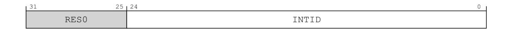

#### **Bits [31:25]**

Reserved, RES0.

#### **INTID, bits [24:0]**

The INTID of the signaled interrupt.

**Note**

INTIDs 1020-1023 are reserved and convey additional information such as spurious interrupts.

When affinity routing is not enabled:

- Bits [23:13] are RES0.
- For SGIs, bits [12:10] identify the CPU interface corresponding to the source PE. For all other interrupts these bits are RES0.

The behavior of this register depends on the setting of [GICV\\_CTLR.](#page-782-1)EOImode:

| GICV_CTLR.EOImode | Behavior                                                          |  |
|-------------------|-------------------------------------------------------------------|--|
| 0b0               | Both the priority drop and the deactivate interrupt effects occur |  |
| 0b1               | Only the priority drop effect occurs.                             |  |

A successful EOI request means that:

- The highest priority bit in [GICH\\_APR<n>](#page-802-0) is cleared, causing the running priority to drop.
- If the appropriate [GICV\\_CTLR](#page-782-1).EOImode bit == 0, the interrupt is deactivated in the corresponding List register [GICH\\_LR<n>](#page-811-0). If [GICH\\_LR<n>](#page-811-0).HW == 1, indicating the INTID corresponds to a hardware interrupt, a deactivate request is also sent to the physical Distributor, identifying the physical INTID from the corresponding field in the List register. This effect is identical to a Non-secure write to [GICC\\_DIR](#page-750-0) from the PE having that physical INTID. This means that if the corresponding physical interrupt is marked as Group 0, and [GICD\\_CTLR.](#page-543-1)DS == 0, the deactivation request is ignored. See [GICC\\_EOIR](#page-752-0) for more information.

| Note                                                                                                                            |
|---------------------------------------------------------------------------------------------------------------------------------|
| Only Group 1 interrupts can target the hypervisor, and therefore only Group 1 interrupts are deactivated in the<br>Distributor. |

#### **Accessing the GICV\_EOIR:**

This register is used only when System register access is not enabled. When System register access is enabled:

- For AArch32 implementations, [ICC\\_EOIR0](#page-397-0) provides equivalent functionality.
- For AArch64 implementations, [ICC\\_EOIR0\\_EL1](#page-244-1) provides equivalent functionality.

This register is used for Group 0 interrupts only. [GICV\\_AEOIR](#page-772-0) provides equivalent functionality for Group 1 interrupts.

When affinity routing is enabled, it is a programming error to use memory-mapped registers to access the GIC. GICV\_EOIR can be accessed through its memory-mapped interface:

| Component                 | Offset | Instance  |
|---------------------------|--------|-----------|
| GIC Virtual CPU interface | 0x0010 | GICV_EOIR |

This interface is accessible as follows:

- When GICD\_CTLR.DS == 0 accesses to this register are WO.
- When an access is Secure accesses to this register are WO.
- When an access is Non-secure accesses to this register are WO.

#### <span id="page-789-1"></span><span id="page-789-0"></span>**12.15.10 GICV\_HPPIR, Virtual Machine Highest Priority Pending Interrupt Register**

The GICV\_HPPIR characteristics are:

#### **Purpose**

Provides the INTID of the highest priority pending Group 0 virtual interrupt in the List registers. This register corresponds to the physical CPU interface register [GICC\\_HPPIR.](#page-754-0)

#### **Configurations**

This register is present only when FEAT\_GICv3\_LEGACY is implemented and EL2 is implemented. Otherwise, direct accesses to GICV\_HPPIR are RES0.

This register is available when the GIC implementation supports interrupt virtualization.

#### **Attributes**

GICV\_HPPIR is a 32-bit register.

#### **Field descriptions**

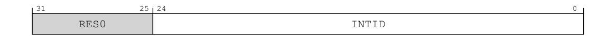

#### **Bits [31:25]**

Reserved, RES0.

#### **INTID, bits [24:0]**

The INTID of the signaled interrupt.

| Note |  |
|------|--|
|------|--|

INTIDs 1020-1023 are reserved and convey additional information such as spurious interrupts.

When affinity routing is not enabled:

- Bits [23:13] are RES0.
- For SGIs, bits [12:10] identify the CPU interface corresponding to the source PE. For all other interrupts these bits are RES0.

Reads of the GICC\_HPPIR that do not return a valid INTID return a spurious INTID, 1022 or 1023. See *[Special](#page-35-1)  [INTIDs on page](#page-35-1) 2-36*.

| Highest priority pending interrupt Group | GICV_HPPIR read | GICV_CTLR.AckCtl | Returned INTID          |
|------------------------------------------|-----------------|------------------|-------------------------|
| 1                                        | Non-secure      | x                | ID of Group 1 interrupt |
| 1                                        | Secure          | 0                | 1022                    |
| 1                                        | Secure          | 1                | ID of Group 1 interrupt |
| 0                                        | Non-secure      | x                | 1023                    |
| 0                                        | Secure          | x                | ID of Group 0 interrupt |
| No pending interrupts                    | x               | x                | 1023                    |

If the CPU interface supports only a single Security state, the entries that apply to Secure reads describe the behavior.

#### **Accessing the GICV\_HPPIR:**

This register is used only when System register access is not enabled. When System register access is enabled:

- For AArch32 implementations, [ICC\\_HPPIR0](#page-403-0) provides equivalent functionality.
- For AArch64 implementations, [ICC\\_HPPIR0\\_EL1](#page-248-1) provides equivalent functionality.

This register is used for Group 0 interrupts only. [GICV\\_AHPPIR](#page-774-0) provides equivalent functionality for Group 1 interrupts.

When affinity routing is enabled, it is a programming error to use memory-mapped registers to access the GIC. GICV\_HPPIR can be accessed through its memory-mapped interface:

| Component                 | Offset | Instance   |
|---------------------------|--------|------------|
| GIC Virtual CPU interface | 0x0018 | GICV_HPPIR |

This interface is accessible as follows:

- When GICD\_CTLR.DS == 0 accesses to this register are RO.
- When an access is Secure accesses to this register are RO.
- When an access is Non-secure accesses to this register are RO.

#### <span id="page-791-1"></span><span id="page-791-0"></span>**12.15.11 GICV\_IAR, Virtual Machine Interrupt Acknowledge Register**

The GICV\_IAR characteristics are:

#### **Purpose**

Provides the INTID of the signaled Group 0 virtual interrupt. A read of this register by the PE acts as an acknowledge for the interrupt.

This register corresponds to the physical CPU interface register [GICC\\_IAR.](#page-756-0)

#### **Configurations**

This register is present only when FEAT\_GICv3\_LEGACY is implemented and EL2 is implemented. Otherwise, direct accesses to GICV\_IAR are RES0.

This register is available when the GIC implementation supports interrupt virtualization.

#### **Attributes**

GICV\_IAR is a 32-bit register.

#### **Field descriptions**

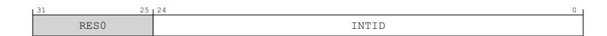

#### **Bits [31:25]**

Reserved, RES0.

#### **INTID, bits [24:0]**

The INTID of the signaled interrupt.

**Note**

INTIDs 1020-1023 are reserved and convey additional information such as spurious interrupts.

When affinity routing is not enabled:

- Bits [23:13] are RES0.
- For SGIs, bits [12:10] identify the CPU interface corresponding to the source PE. For all other interrupts these bits are RES0.

When the virtual machine writes to this register, the virtual CPU interface acknowledges the highest priority pending virtual interrupt and sets the state in the corresponding List register to active. The appropriate bit in the active priorities register [GICH\\_APR<n>](#page-802-0) is set to 1.

If [GICH\\_LR<n>](#page-811-0).HW == 0, indicating that the interrupt is software-triggered, then bits [12:10] of [GICH\\_LR<n>](#page-811-0) are returned in bits [12:10] of GICV\_IAR. Otherwise bits [12:10] are RES0.

A read of this register returns the spurious INTID 1023 if either of the following is true:

- There are no pending interrupts of sufficiently high priority value to be signaled to the PE with the virtual CPU interface enabled and [GICH\\_HCR](#page-808-0).En == 1.
- Interrupt signaling by the virtual CPU interface is disabled.

A read of this register returns the spurious INTID 1022 if the highest priority pending interrupt is Group 1 and [GICV\\_CTLR.](#page-782-1)AckCtl == 0.

#### **Accessing the GICV\_IAR:**

This register is used only when System register access is not enabled. When System register access is enabled:

- For AArch32 implementations, [ICC\\_IAR0](#page-410-0) provides equivalent functionality.
- For AArch64 implementations, [ICC\\_IAR0\\_EL1](#page-252-1) provides equivalent functionality.

This register is used for Group 0 interrupts only. [GICV\\_AIAR](#page-776-0) provides equivalent functionality for Group 1 interrupts.

When affinity routing is enabled, it is a programming error to use memory-mapped registers to access the GIC.

GICV\_IAR can be accessed through its memory-mapped interface:

| Component                 | Offset | Instance |
|---------------------------|--------|----------|
| GIC Virtual CPU interface | 0x000C | GICV_IAR |

This interface is accessible as follows:

- When GICD\_CTLR.DS == 0 accesses to this register are RO.
- When an access is Secure accesses to this register are RO.
- When an access is Non-secure accesses to this register are RO.

#### <span id="page-793-0"></span>**12.15.12 GICV\_IIDR, Virtual Machine CPU Interface Identification Register**

The GICV\_IIDR characteristics are:

#### **Purpose**

Provides information about the implementer and revision of the virtual CPU interface.

#### **Configurations**

This register is present only when FEAT\_GICv3\_LEGACY is implemented and EL2 is implemented. Otherwise, direct accesses to GICV\_IIDR are RES0.

This register is available in all configurations of the GIC. If the GIC implementation supports two Security states this register is Common.

#### **Attributes**

GICV\_IIDR is a 32-bit register.

#### **Field descriptions**

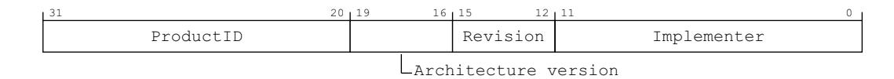

#### **ProductID, bits [31:20]**

Product Identifier.

This field has an IMPLEMENTATION DEFINED value.

Access to this field is RO.

#### **Architecture\_version, bits [19:16]**

The version of the GIC architecture that is implemented.

The value of this field is an IMPLEMENTATION DEFINED choice of:

0b0001 GICv1. 0b0010 GICv2.

0b0011 GICv3 memory-mapped interface supported. Support for the System register interface is discoverable from PE registers [ID\\_PFR1](#page-28-6) and [ID\\_AA64PFR0\\_EL1.](#page-28-5)

0b0100 GICv4 memory-mapped interface supported. Support for the System register interface is discoverable from PE registers [ID\\_PFR1](#page-28-6) and [ID\\_AA64PFR0\\_EL1.](#page-28-5)

Other values are reserved.

Access to this field is RO.

#### **Revision, bits [15:12]**

Revision number for the CPU interface.

This field has an IMPLEMENTATION DEFINED value.

Access to this field is RO.

#### **Implementer, bits [11:0]**

Contains the JEP106 code of the company that implemented the CPU interface.

- Bits [11:8] are the JEP106 continuation code of the implementer. For an Arm implementation, this field is 0x4.
- Bit [7] is always 0.
- Bits [6:0] are the JEP106 identity code of the implementer. For an Arm implementation, bits [7:0] are therefore 0x3B.

This field has an IMPLEMENTATION DEFINED value. Access to this field is RO.

#### **Accessing the GICV\_IIDR:**

GICV\_IIDR can be accessed through its memory-mapped interface:

| Component                 | Offset | Instance  |
|---------------------------|--------|-----------|
| GIC Virtual CPU interface | 0x00FC | GICV_IIDR |

This interface is accessible as follows:

- When GICD\_CTLR.DS == 0 accesses to this register are RO.
- When an access is Secure accesses to this register are RO.
- When an access is Non-secure accesses to this register are RO.

#### <span id="page-795-0"></span>**12.15.13 GICV\_PMR, Virtual Machine Priority Mask Register**

The GICV\_PMR characteristics are:

#### **Purpose**

This register provides a virtual interrupt priority filter. Only virtual interrupts with a higher priority than the value in this register are signaled to the PE.

**Note**

Higher interrupt priority corresponds to a lower value of the Priority field.

This register corresponds to the physical CPU interface register [GICC\\_PMR](#page-761-0).

#### **Configurations**

This register is present only when FEAT\_GICv3\_LEGACY is implemented and EL2 is implemented. Otherwise, direct accesses to GICV\_PMR are RES0.

This register is available when the GIC implementation supports interrupt virtualization.

The Priority field of this register is aliased to [GICH\\_VMCR](#page-817-0).VMPR, to enable state to be switched easily between virtual machines during context-switching.

#### **Attributes**

GICV\_PMR is a 32-bit register.

#### **Field descriptions**


#### **Bits [31:8]**

Reserved, RES0.

#### **Priority, bits [7:0]**

The priority mask level for the virtual CPU interface. If the priority of the interrupt is higher than the value indicated by this field, the interface signals the interrupt to the PE.

If the GIC implementation supports fewer than 256 priority levels some bits might be RAZ/WI, as follows:

- For 128 supported levels, bit [0] = 0b0.
- For 64 supported levels, bits [1:0] = 0b00.
- For 32 supported levels, bits [2:0] = 0b000.
- For 16 supported levels, bits [3:0] = 0b0000.

For more information, see *[Interrupt prioritization on page](#page-70-0) 4-71*.

The reset behavior of this field is:

• On a Warm reset, this field resets to an architecturally UNKNOWN value.

#### **Accessing the GICV\_PMR:**

This register is used only when System register access is not enabled. When System register access is enabled:

- For AArch32 implementations, [ICC\\_PMR](#page-434-0) provides equivalent functionality.
- For AArch64 implementations, [ICC\\_PMR\\_EL1](#page-266-1) provides equivalent functionality.

#### GICV\_PMR can be accessed through its memory-mapped interface:

| Component                 | Offset | Instance |
|---------------------------|--------|----------|
| GIC Virtual CPU interface | 0x0004 | GICV_PMR |

This interface is accessible as follows:

- When GICD\_CTLR.DS == 0 accesses to this register are RW.
- When an access is Secure accesses to this register are RW.
- When an access is Non-secure accesses to this register are RW.

#### <span id="page-797-0"></span>**12.15.14 GICV\_RPR, Virtual Machine Running Priority Register**

The GICV\_RPR characteristics are:

#### **Purpose**

This register indicates the running priority of the virtual CPU interface.

This register corresponds to the physical CPU interface register [GICC\\_RPR](#page-763-1).

#### **Configurations**

This register is present only when FEAT\_GICv3\_LEGACY is implemented and EL2 is implemented. Otherwise, direct accesses to GICV\_RPR are RES0.

This register is available when the GIC implementation supports interrupt virtualization.

#### **Attributes**

GICV\_RPR is a 32-bit register.

#### **Field descriptions**


#### **Bits [31:8]**

Reserved, RES0.

#### **Priority, bits [7:0]**

The current running priority on the virtual CPU interface. This is the group priority of the current active interrupt.

If there are no active interrupts on the CPU interface, or all active interrupts have undergone a priority drop, the value returned is the Idle priority.

The priority returned is the group priority as if the BPR was set to the minimum value.

#### **Accessing the GICV\_RPR:**

This register is used only when System register access is not enabled. When System register access is enabled:

- For AArch32 implementations, [ICC\\_RPR](#page-438-0) provides equivalent functionality.
- For AArch64 implementations, [ICC\\_RPR\\_EL1](#page-269-1) provides equivalent functionality.

Depending on the implementation, if no bits are set to 1 in [GICH\\_APR<n>,](#page-802-0) indicating no active virtual interrupts in the virtual CPU interface, the priority reads as 0xFF or 0xF8 to reflect the number of supported interrupt priority bits defined by [GICH\\_VTR.](#page-820-0)PRIbits.

GICV\_RPR can be accessed through its memory-mapped interface:

| Component                 | Offset | Instance |
|---------------------------|--------|----------|
| GIC Virtual CPU interface | 0x0014 | GICV_RPR |

This interface is accessible as follows:

- When GICD\_CTLR.DS == 0 accesses to this register are RO.
- When an access is Secure accesses to this register are RO.
- When an access is Non-secure accesses to this register are RO.

#### <span id="page-798-0"></span>**12.15.15 GICV\_STATUSR, Virtual Machine Error Reporting Status Register**

The GICV\_STATUSR characteristics are:

#### **Purpose**

Provides software with a mechanism to detect:

- Accesses to reserved locations.
- Writes to read-only locations.
- Reads of write-only locations.

#### **Configurations**

This register is present only when FEAT\_GICv3\_LEGACY is implemented and EL2 is implemented. Otherwise, direct accesses to GICV\_STATUSR are RES0.

In systems where this register is implemented, Arm expects that when a virtual machine is scheduled, the hypervisor ensures that this register is cleared to 0. The hypervisor might check for illegal accesses when the virtual machine is unscheduled.

#### **Attributes**

GICV\_STATUSR is a 32-bit register.

#### **Field descriptions**

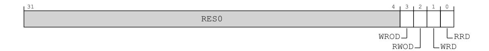

#### **Bits [31:4]**

Reserved, RES0.

#### **WROD, bit [3]**

Write to an RO location.

0b0 Normal operation.

0b1 A write to an RO location has been detected.

When a violation is detected, software must write 1 to this register to reset it.

#### **RWOD, bit [2]**

Read of a WO location.

0b0 Normal operation.

0b1 A read of a WO location has been detected.

When a violation is detected, software must write 1 to this register to reset it.

#### **WRD, bit [1]**

Write to a reserved location.

0b0 Normal operation.

0b1 A write to a reserved location has been detected.

When a violation is detected, software must write 1 to this register to reset it.

#### **RRD, bit [0]**

Read of a reserved location.

0b0 Normal operation.

0b1 A read of a reserved location has been detected.

When a violation is detected, software must write 1 to this register to reset it.

#### **Accessing the GICV\_STATUSR:**

This is an optional register. If the register is implemented, [GICC\\_STATUSR](#page-765-0) must also be implemented. If the register is not implemented, the location is RAZ/WI.

This register is used only when System register access is not enabled. If System register access is enabled, this register is not updated. Equivalent function might be provided by appropriate traps and exceptions.

GICV\_STATUSR can be accessed through its memory-mapped interface:

| Component                 | Offset | Instance     |
|---------------------------|--------|--------------|
| GIC Virtual CPU interface | 0x002C | GICV_STATUSR |

This interface is accessible as follows:

- When GICD\_CTLR.DS == 0 accesses to this register are RW.
- When an access is Secure accesses to this register are RW.
- When an access is Non-secure accesses to this register are RW.

#### <span id="page-800-1"></span><span id="page-800-0"></span>**12.16 The GIC virtual interface control register map**

The GIC virtual interface control registers are management registers. Configuration software on the PE must ensure they are accessible only by a hypervisor, or similar software.

Reserved register addresses are RES0.

<span id="page-800-2"></span>Table 12-[32 on page](#page-800-2) 12-801 shows the register map for the GIC virtual interface control registers.

**Table 12-32 GIC virtual interface control register map** 

| Offset        | Name             | Type | Reset                      | Description                           |
|---------------|------------------|------|----------------------------|---------------------------------------|
| 0x0000        | GICH_HCR         | RW   | 0x00000000                 | Hypervisor Control Register           |
| 0x0004        | GICH_VTR         | RO   | IMPLEMENTATION DEFINED     | VGIC Type Register                    |
| 0x0008        | GICH_VMCR        | RW   | -                          | Virtual Machine Control Register      |
| 0x000C        | -                | -    | -                          | Reserved                              |
| 0x0010        | GICH_MISR        | RO   | 0x00000000                 | Maintenance Interrupt Status Register |
| 0x0014-0x001C | -                | -    | -                          | Reserved                              |
| 0x0020        | GICH_EISR        | RO   | 0x00000000                 | End of Interrupt Status Register      |
| 0x0024-0x002C | -                | -    | -                          | Reserved                              |
| 0x0030        | GICH_ELRSR       | RO   | IMPLEMENTATION<br>DEFINEDa | Empty List Register Status Register   |
| 0x0034-0x00EC | -                | -    | -                          | Reserved                              |
| 0x00F0-0x00FC | GICH_APR <n></n> | RW   | 0x00000000                 | Active Priorities Register            |
| 0x0100-0x013C | GICH_LR <n></n>  | RW   | 0x00000000                 | List Registers 0-15 lower bits        |

a. Each bit that has a corresponding List register resets to 1, meaning that the reset value of the register depends on the number of List registers implemented.

**Note**

It is IMPLEMENTATION DEFINED whether an access to a GIC virtual interface control register using the memory-mapped interface accesses the same state as an access using the System register interface, or whether the two interfaces access different states.

#### <span id="page-801-1"></span><span id="page-801-0"></span>**12.17 The GIC virtual interface control register descriptions**

This section describes each of the GIC virtual interface control registers in register name order.

#### <span id="page-802-0"></span>**12.17.1 GICH\_APR<n>, Active Priorities Registers, n = 0 - 3**

The GICH\_APR<n> characteristics are:

#### **Purpose**

These registers track which preemption levels are active in the virtual CPU interface, and indicate the current active priority. Corresponding bits are set to 1 in this register when an interrupt is acknowledged, based on [GICH\\_LR<n>.](#page-811-0)Priority, and the least significant bit set is cleared on EOI.

#### **Configurations**

This register is present only when FEAT\_GICv3\_LEGACY is implemented and EL2 is implemented. Otherwise, direct accesses to GICH\_APR<n> are RES0.

This register is available when the GIC implementation supports interrupt virtualization.

The number of registers required depends on how many bits are implemented in [GICH\\_LR<n>.](#page-811-0)Priority:

- When 5 priority bits are implemented, 1 register is required (GICH\_APR0).
- When 6 priority bits are implemented, 2 registers are required (GICH\_APR0, GICH\_APR1).
- When 7 priority bits are implemented, 4 registers are required (GICH\_APR0, GICH\_APR1, GICH\_APR2, GICH\_APR3).

Unimplemented registers are RAZ/WI.

#### **Attributes**

GICH\_APR<n> is a 32-bit register.

#### **Field descriptions**

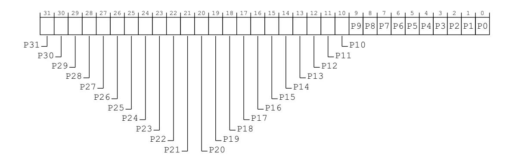

#### **P<x>, bit [x], for x = 31 to 0**

Active priorities. Possible values of each bit are:

0b0 There is no interrupt active at the priority corresponding to that bit.

0b1 There is an interrupt active at the priority corresponding to that bit.

The correspondence between priorities and bits depends on the number of bits of priority that are implemented.

If 5 bits of priority are implemented (bits [7:3] of priority), then there are 32 priority groups, and the active state of these priorities are held in GICH\_APR0 in the bits corresponding to Priority[7:3].

If 6 bits of priority are implemented (bits [7:2] of priority), then there are 64 priority groups, and:

- The active state of priorities 0 124 are held in GICH\_APR0 in the bits corresponding to 0:Priority[6:2].
- The active state of priorities 128 252 are held in GICH\_APR1 in the bits corresponding to 1:Priority[6:2].

If 7 bits of priority are implemented (bits [7:1] of priority), then there are 128 priority groups, and:

- The active state of priorities 0 62 are held in GICH\_APR0 in the bits corresponding to 00:Priority[5:1].
- The active state of priorities 64 126 are held in GICH\_APR1 in the bits corresponding to 01:Priority[5:1].
- The active state of priorities 128 190 are held in GICH\_APR2 in the bits corresponding to 10:Priority[5:1].
- The active state of priorities 192 254 are held in GICH\_APR3 in the bits corresponding to 11:Priority[5:1].

The reset behavior of this field is:

• On a Warm reset, this field resets to 0.

#### **Accessing the GICH\_APR<n>:**

These registers are used only when System register access is not enabled. When System register access is enabled the following registers provide equivalent functionality:

- In AArch64:
  - For Group 0, [ICH\\_AP0R<n>\\_EL2.](#page-335-1)
  - For Group 1, [ICH\\_AP1R<n>\\_EL2.](#page-339-1)
- In AArch32:
  - For Group 0, [ICH\\_AP0R<n>.](#page-500-0)
  - For Group 1, [ICH\\_AP1R<n>.](#page-503-0)

GICH\_APR<n> can be accessed through its memory-mapped interface:

| Component                     | Offset           | Instance         |
|-------------------------------|------------------|------------------|
| GIC Virtual interface control | 0x00F0 + (4 * n) | GICH_APR <n></n> |

This interface is accessible as follows:

- When GICD\_CTLR.DS == 0 accesses to this register are RW.
- When an access is Secure accesses to this register are RW.
- When an access is Non-secure accesses to this register are RW.

#### <span id="page-804-0"></span>**12.17.2 GICH\_EISR, End Interrupt Status Register**

The GICH\_EISR characteristics are:

#### **Purpose**

Indicates which List registers have outstanding EOI maintenance interrupts.

#### **Configurations**

This register is present only when FEAT\_GICv3\_LEGACY is implemented and EL2 is implemented. Otherwise, direct accesses to GICH\_EISR are RES0.

This register is available when the GIC implementation supports interrupt virtualization.

#### **Attributes**

GICH\_EISR is a 32-bit register.

#### **Field descriptions**

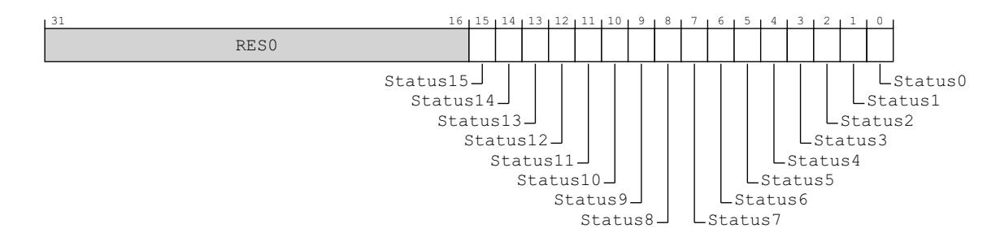

#### **Bits [31:16]**

Reserved, RES0.

#### **Status<n>, bit [n], for n = 15 to 0**

EOI maintenance interrupt status for List register <n>:

0b0 [GICH\\_LR<n>](#page-811-0) does not have an EOI maintenance interrupt.

0b1 [GICH\\_LR<n>](#page-811-0) has an EOI maintenance interrupt that has not been handled.

For any [GICH\\_LR<n>](#page-811-0) register, the corresponding status bit is set to 1 if all of the following are true:

- [GICH\\_LR<n>.](#page-811-0)State is 0b00.
- [GICH\\_LR<n>.](#page-811-0)HW == 0.
- [GICH\\_LR<n>.](#page-811-0)EOI == 1.

The reset behavior of this field is:

• On a Warm reset, this field resets to an architecturally UNKNOWN value.

#### **Accessing the GICH\_EISR:**

This register is used only when System register access is not enabled. When System register access is enabled:

- For AArch32 implementations, [ICH\\_EISR](#page-506-0) provides equivalent functionality.
- For AArch64 implementations, [ICH\\_EISR\\_EL2](#page-343-1) provides equivalent functionality.

Bits corresponding to unimplemented List registers are RAZ.

#### GICH\_EISR can be accessed through its memory-mapped interface:

| Component                     | Offset | Instance  |
|-------------------------------|--------|-----------|
| GIC Virtual interface control | 0x0020 | GICH_EISR |

This interface is accessible as follows:

- When GICD\_CTLR.DS == 0 accesses to this register are RO.
- When an access is Secure accesses to this register are RO.
- When an access is Non-secure accesses to this register are RO.

#### <span id="page-806-0"></span>**12.17.3 GICH\_ELRSR, Empty List Register Status Register**

The GICH\_ELRSR characteristics are:

#### **Purpose**

Indicates which List registers contain valid interrupts.

#### **Configurations**

This register is present only when FEAT\_GICv3\_LEGACY is implemented and EL2 is implemented. Otherwise, direct accesses to GICH\_ELRSR are RES0.

This register is available when the GIC implementation supports interrupt virtualization.

#### **Attributes**

GICH\_ELRSR is a 32-bit register.

#### **Field descriptions**

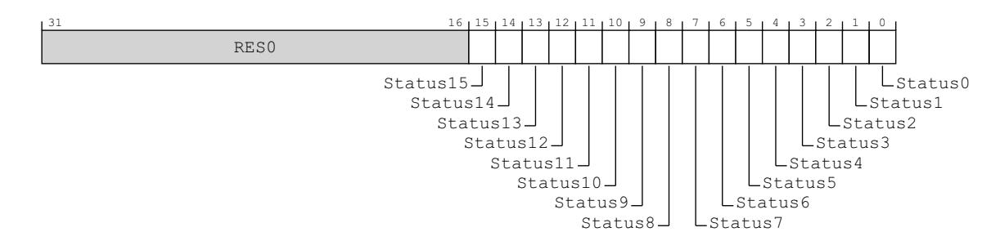

#### **Bits [31:16]**

Reserved, RES0.

#### **Status<n>, bit [n], for n = 15 to 0**

Status bit for List register <n>:

0b0 [GICH\\_LR<n>](#page-811-0), if implemented, contains a valid interrupt. Using this List register can result in overwriting a valid interrupt.

0b1 [GICH\\_LR<n>](#page-811-0) does not contain a valid interrupt. The List register is empty and can be used without overwriting a valid interrupt or losing an EOI maintenance interrupt.

For any [GICH\\_LR<n>](#page-811-0) register, the corresponding status bit is set to 1 if [GICH\\_LR<n>](#page-811-0).State is 0b00 and either:

- [GICH\\_LR<n>.](#page-811-0)HW == 1.
- [GICH\\_LR<n>.](#page-811-0)EOI == 0.

The reset behavior of this field is:

• On a Warm reset, this field resets to 1.

#### **Accessing the GICH\_ELRSR:**

This register is used only when System register access is not enabled. When System register access is enabled:

- For AArch32 implementations, [ICH\\_ELRSR](#page-508-0) provides equivalent functionality.
- For AArch64 implementations, [ICH\\_ELRSR\\_EL2](#page-345-1) provides equivalent functionality.

Bits corresponding to unimplemented List registers are RES0.

#### GICH\_ELRSR can be accessed through its memory-mapped interface:

| Component                     | Offset | Instance   |
|-------------------------------|--------|------------|
| GIC Virtual interface control | 0x0030 | GICH_ELRSR |

This interface is accessible as follows:

- When GICD\_CTLR.DS == 0 accesses to this register are RO.
- When an access is Secure accesses to this register are RO.
- When an access is Non-secure accesses to this register are RO.

#### <span id="page-808-1"></span><span id="page-808-0"></span>**12.17.4 GICH\_HCR, Hypervisor Control Register**

The GICH\_HCR characteristics are:

#### **Purpose**

Controls the virtual CPU interface.

#### **Configurations**

This register is present only when FEAT\_GICv3\_LEGACY is implemented and EL2 is implemented. Otherwise, direct accesses to GICH\_HCR are RES0.

This register is available when the GIC implementation supports interrupt virtualization.

#### **Attributes**

GICH\_HCR is a 32-bit register.

#### **Field descriptions**

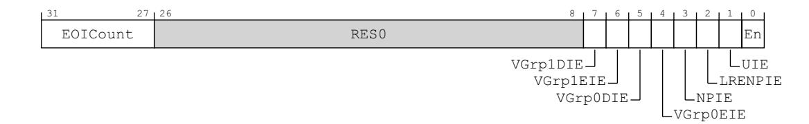

#### **EOICount, bits [31:27]**

Counts the number of EOIs received that do not have a corresponding entry in the List registers. The virtual CPU interface increments this field automatically when a matching EOI is received. EOIs that do not clear a bit in [GICH\\_APR<n>](#page-802-0) do not cause an increment. If an EOI occurs when the value of this field is 31, then the field wraps to 0.

The maintenance interrupt is asserted whenever this field is nonzero and GICH\_HCR.LRENPIE == 1.

The reset behavior of this field is:

• On a Warm reset, this field resets to an architecturally UNKNOWN value.

#### **Bits [26:8]**

Reserved, RES0.

#### **VGrp1DIE, bit [7]**

VM Group 1 Disabled Interrupt Enable.

Enables the signaling of a maintenance interrupt while signaling of Group 1 interrupts from the virtual CPU interface to the connected virtual machine is disabled:

0b0 Maintenance interrupt disabled.

0b1 Maintenance interrupt signaled when [GICV\\_CTLR.](#page-782-1)EnableGrp1 == 0.

The reset behavior of this field is:

• On a Warm reset, this field resets to an architecturally UNKNOWN value.

#### **VGrp1EIE, bit [6]**

VM Group 1 Enabled Interrupt Enable.

Enables the signaling of a maintenance interrupt while signaling of Group 1 interrupts from the virtual CPU interface to the connected virtual machine is enabled:

0b0 Maintenance interrupt disabled.

0b1 Maintenance interrupt signaled when [GICV\\_CTLR.](#page-782-1)EnableGrp1 == 1.

The reset behavior of this field is:

• On a Warm reset, this field resets to an architecturally UNKNOWN value.

#### **VGrp0DIE, bit [5]**

VM Group 0 Disabled Interrupt Enable.

Enables the signaling of a maintenance interrupt while signaling of Group 0 interrupts from the virtual CPU interface to the connected virtual machine is disabled:

0b0 Maintenance interrupt disabled.

0b1 Maintenance interrupt signaled when [GICV\\_CTLR.](#page-782-1)EnableGrp0 == 0.

The reset behavior of this field is:

• On a Warm reset, this field resets to an architecturally UNKNOWN value.

#### **VGrp0EIE, bit [4]**

VM Group 0 Enabled Interrupt Enable.

Enables the signaling of a maintenance interrupt while signaling of Group 0 interrupts from the virtual CPU interface to the connected virtual machine is enabled:

0b0 Maintenance interrupt disabled.

0b1 Maintenance interrupt signaled when [GICV\\_CTLR.](#page-782-1)EnableGrp0 == 1.

The reset behavior of this field is:

• On a Warm reset, this field resets to an architecturally UNKNOWN value.

#### **NPIE, bit [3]**

No Pending Interrupt Enable.

Enables the signaling of a maintenance interrupt while no pending interrupts are present in the List registers:

0b0 Maintenance interrupt disabled.

0b1 Maintenance interrupt signaled while the List registers contain no interrupts in the pending state.

The reset behavior of this field is:

• On a Warm reset, this field resets to an architecturally UNKNOWN value.

#### **LRENPIE, bit [2]**

List Register Entry Not Present Interrupt Enable.

Enables the signaling of a maintenance interrupt while the virtual CPU interface does not have a corresponding valid List register for an EOI request:

0b0 Maintenance interrupt disabled.

0b1 Maintenance interrupt signaled while GICH\_HCR.EOICount is not 0.

The reset behavior of this field is:

• On a Warm reset, this field resets to an architecturally UNKNOWN value.

#### **UIE, bit [1]**

Underflow Interrupt Enable.

Enables the signaling of a maintenance interrupt when the List registers are either empty or hold only one valid entry.

0b0 Maintenance interrupt disabled.

0b1 A maintenance interrupt is signaled if zero or one of the List register entries are marked as a valid interrupt.

The reset behavior of this field is:

• On a Warm reset, this field resets to an architecturally UNKNOWN value.

#### **En, bit [0]**

Enable.

Global enable bit for the virtual CPU interface.

0b0 Virtual CPU interface operation is disabled.

0b1 Virtual CPU interface operation is enabled.

When this field is 0:

- The virtual CPU interface does not signal any maintenance interrupts.
- The virtual CPU interface does not signal any virtual interrupts.
- A read of [GICV\\_IAR](#page-791-0) or [GICV\\_AIAR](#page-776-0) returns a spurious interrupt ID.

The reset behavior of this field is:

• On a Warm reset, this field resets to an architecturally UNKNOWN value.

The VGrp1DIE, VGrp1EIE, VGrp0DIE, and VGrp0EIE fields permit the hypervisor to track the virtual CPU interfaces that are enabled. The hypervisor can then route interrupts that have multiple targets correctly and efficiently, without having to read the virtual CPU interface status.

See *[Maintenance interrupts on page](#page-158-0) 6-159* and [GICH\\_MISR](#page-814-0) for more information.

#### **Accessing the GICH\_HCR:**

This register is used only when System register access is not enabled. When System register access is enabled:

- For AArch32 implementations, [ICH\\_HCR](#page-510-0) provides equivalent functionality.
- For AArch64 implementations, [ICH\\_HCR\\_EL2](#page-347-1) provides equivalent functionality.

GICH\_HCR.En must be set to 1 for any virtual or maintenance interrupt to be asserted.

GICH\_HCR can be accessed through its memory-mapped interface:

| Component                     | Offset | Instance |
|-------------------------------|--------|----------|
| GIC Virtual interface control | 0x0000 | GICH_HCR |

This interface is accessible as follows:

- When GICD\_CTLR.DS == 0 accesses to this register are RW.
- When an access is Secure accesses to this register are RW.
- When an access is Non-secure accesses to this register are RW.

#### <span id="page-811-0"></span>**12.17.5 GICH\_LR<n>, List Registers, n = 0 - 15**

The GICH\_LR<n> characteristics are:

#### **Purpose**

These registers provide context information for the virtual CPU interface.

#### **Configurations**

This register is present only when FEAT\_GICv3\_LEGACY is implemented and EL2 is implemented. Otherwise, direct accesses to GICH\_LR<n> are RES0.

This register is available when the GIC implementation supports interrupt virtualization.

A maximum of 16 List registers can be provided. [GICH\\_VTR](#page-820-0).ListRegs defines the number implemented. Unimplemented List registers are RAZ/WI.

#### **Attributes**

GICH\_LR<n> is a 32-bit register.

#### **Field descriptions**

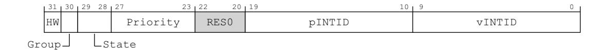

#### **HW, bit [31]**

Indicates whether this virtual interrupt is a hardware interrupt, meaning that it corresponds to a physical interrupt. Deactivation of the virtual interrupt also causes the deactivation of the physical interrupt corresponding to the INTID:

- 0b0 This interrupt is triggered entirely in software. No notification is sent to the Distributor when the virtual interrupt is deactivated.
- 0b1 A hardware interrupt. A deactivate interrupt request is sent to the Distributor when the virtual interrupt is deactivated, using GICH\_LR<n>.pINTID to indicate the physical interrupt identifier.

If [GICV\\_CTLR](#page-782-1).EOImode == 0, this request corresponds to a write to [GICV\\_EOIR](#page-787-0) or [GICV\\_AEOIR,](#page-772-0) otherwise it corresponds to a write to [GICV\\_DIR.](#page-785-0)

The reset behavior of this field is:

• On a Warm reset, this field resets to an architecturally UNKNOWN value.

#### **Group, bit [30]**

Indicates whether the interrupt is Group 0 or Group 1:

- 0b0 Group 0 virtual interrupt. [GICV\\_CTLR](#page-782-1).FIQEn determines whether it is signaled as a virtual IRQ or as a virtual FIQ, and [GICV\\_CTLR.](#page-782-1)EnableGrp0 enables signaling of this interrupt to the virtual machine.
- 0b1 Group 1 virtual interrupt, signaled as a virtual IRQ. [GICV\\_CTLR.](#page-782-1)EnableGrp1 enables signaling of this interrupt to the virtual machine.

**Note**

[GICV\\_CTLR.](#page-782-1)CBPR controls whether [GICV\\_BPR](#page-780-0) or [GICV\\_ABPR](#page-770-0) determines if a pending Group 1 interrupt has sufficient priority to preempt current execution.

The reset behavior of this field is:

• On a Warm reset, this field resets to an architecturally UNKNOWN value.

#### **State, bits [29:28]**

The state of the interrupt. This field has one of the following values:

0b00 Inactive 0b01 Pending 0b10 Active

0b11 Active and pending

The GIC updates these state bits as virtual interrupts proceed through the interrupt life cycle. Entries in the inactive state are ignored, except for the purpose of generating virtual maintenance interrupts.


For hardware interrupts, the active and pending state is held in the Distributor rather than the virtual CPU interface. A hypervisor must only use the active and pending state for software originated interrupts, which are typically associated with virtual devices, or for SGIs.

The reset behavior of this field is:

• On a Warm reset, this field resets to an architecturally UNKNOWN value.

#### **Priority, bits [27:23]**

The priority of this interrupt.

The reset behavior of this field is:

• On a Warm reset, this field resets to an architecturally UNKNOWN value.

#### **Bits [22:20]**

Reserved, RES0.

#### **pINTID, bits [19:10]**

The function of this field depends on the value of GICH\_LR<n>.HW.

When GICH\_LR<n>.HW == 0:

- Bit [19] indicates whether the interrupt triggers an EOI maintenance interrupt. If this bit is 1, then when the interrupt identified by vINTID is deactivated, an EOI maintenance interrupt is asserted.
- Bits [18:13] are reserved, SBZ.
- If the vINTID field value corresponds to an SGI (that is, 0-15), bits [12:10] contain the number of the requesting PE. This appears in the corresponding field of [GICV\\_IAR](#page-791-0) or [GICV\\_AIAR](#page-776-0). If the vINTID field value is not 0-15, this field must be cleared to 0.

When GICH\_LR<n>.HW == 1:

- This field indicates the pINTID that the hypervisor forwards to the Distributor. This field is only required to implement enough bits to hold a valid value for the ID configuration. Any unused higher order bits are RAZ/WI.
- If the value of pINTID is 0-15 or 1020-1023, behavior is UNPREDICTABLE. If the value of pINTID is 16-31, this field applies to the PPI associated with this same PE as the virtual CPU interface requesting the deactivation.

The reset behavior of this field is:

• On a Warm reset, this field resets to an architecturally UNKNOWN value.

#### **vINTID, bits [9:0]**

This INTID is returned to the VM when the interrupt is acknowledged through [GICV\\_IAR](#page-791-0). Each valid interrupt stored in the List registers must have a unique vINTID for that virtual CPU interface. If the value of vINTID is 1020-1023, behavior is UNPREDICTABLE.

The reset behavior of this field is:

• On a Warm reset, this field resets to an architecturally UNKNOWN value.

#### **Accessing the GICH\_LR<n>:**

This register is used only when System register access is not enabled. When System register access is enabled:

- For AArch32 implementations, [ICH\\_LR<n>](#page-515-0) provides equivalent functionality.
- For AArch64 implementations, [ICH\\_LR<n>\\_EL2](#page-352-1) provides equivalent functionality.

GICH\_LR<n> can be accessed through its memory-mapped interface:

| Component                     | Offset           | Instance        |
|-------------------------------|------------------|-----------------|
| GIC Virtual interface control | 0x0100 + (4 * n) | GICH_LR <n></n> |

This interface is accessible as follows:

- When GICD\_CTLR.DS == 0 accesses to this register are RW.
- When an access is Secure accesses to this register are RW.
- When an access is Non-secure accesses to this register are RW.

#### <span id="page-814-0"></span>**12.17.6 GICH\_MISR, Maintenance Interrupt Status Register**

The GICH\_MISR characteristics are:

#### **Purpose**

Indicates which maintenance interrupts are asserted.

#### **Configurations**

This register is present only when FEAT\_GICv3\_LEGACY is implemented and EL2 is implemented. Otherwise, direct accesses to GICH\_MISR are RES0.

This register is available when the GIC implementation supports interrupt virtualization.

#### **Attributes**

GICH\_MISR is a 32-bit register.

#### **Field descriptions**

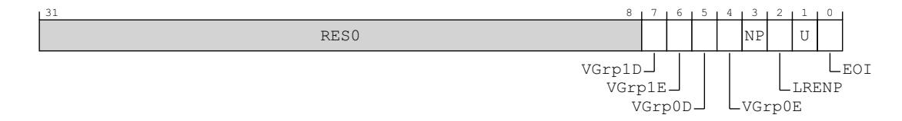

#### **Bits [31:8]**

Reserved, RES0.

#### **VGrp1D, bit [7]**

vPE Group 1 Disabled.

0b0 vPE Group 1 Disabled maintenance interrupt not asserted.

0b1 vPE Group 1 Disabled maintenance interrupt asserted.

This maintenance interrupt is asserted when [GICH\\_HCR](#page-808-0).VGrp1DIE == 1 and [GICH\\_VMCR.](#page-817-0)VENG1 == 0.

The reset behavior of this field is:

• On a Warm reset, this field resets to 0.

#### **VGrp1E, bit [6]**

vPE Group 1 Enabled.

0b0 vPE Group 1 Enabled maintenance interrupt not asserted.

0b1 vPE Group 1 Enabled maintenance interrupt asserted.

This maintenance interrupt is asserted when [GICH\\_HCR](#page-808-0).VGrp1EIE == 1 and [GICH\\_VMCR.](#page-817-0)VENG1 == 1.

The reset behavior of this field is:

• On a Warm reset, this field resets to 0.

#### **VGrp0D, bit [5]**

vPE Group 0 Disabled.

0b0 vPE Group 0 Disabled maintenance interrupt not asserted.

0b1 vPE Group 0 Disabled maintenance interrupt asserted.

This maintenance interrupt is asserted when [GICH\\_HCR](#page-808-0).VGrp0DIE == 1 and [GICH\\_VMCR.](#page-817-0)VENG0 == 0.

The reset behavior of this field is:

• On a Warm reset, this field resets to 0.

#### **VGrp0E, bit [4]**

vPE Group 0 Enabled.

0b0 vPE Group 0 Enabled maintenance interrupt not asserted.

0b1 vPE Group 0 Enabled maintenance interrupt asserted.

This maintenance interrupt is asserted when [GICH\\_HCR](#page-808-0).VGrp0EIE == 1 and [GICH\\_VMCR.](#page-817-0)VENG0 == 1.

The reset behavior of this field is:

• On a Warm reset, this field resets to 0.

#### **NP, bit [3]**

No Pending.

0b0 No Pending maintenance interrupt not asserted.

0b1 No Pending maintenance interrupt asserted.

This maintenance interrupt is asserted when [GICH\\_HCR](#page-808-0).NPIE == 1 and no List register is in the pending state.

The reset behavior of this field is:

• On a Warm reset, this field resets to 0.

#### **LRENP, bit [2]**

List Register Entry Not Present.

0b0 List Register Entry Not Present maintenance interrupt not asserted.

0b1 List Register Entry Not Present maintenance interrupt asserted.

This maintenance interrupt is asserted when [GICH\\_HCR](#page-808-0).LRENPIE == 1 and [GICH\\_HCR.](#page-808-0)EOICount is nonzero.

The reset behavior of this field is:

• On a Warm reset, this field resets to 0.

#### **U, bit [1]**

Underflow.

0b0 Underflow maintenance interrupt not asserted.

0b1 Underflow maintenance interrupt asserted.

This maintenance interrupt is asserted when [GICH\\_HCR](#page-808-0).UIE == 1 and zero or one of the List register entries are marked as a valid interrupt.

The reset behavior of this field is:

• On a Warm reset, this field resets to 0.

#### **EOI, bit [0]**

End Of Interrupt.

0b0 End Of Interrupt maintenance interrupt not asserted.

0b1 End Of Interrupt maintenance interrupt asserted.

This maintenance interrupt is asserted when at least one bit in [GICH\\_EISR](#page-804-0) == 1.

The reset behavior of this field is:

• On a Warm reset, this field resets to 0.

| Note |  |
|------|--|
|------|--|

A List register is in the pending state only if the corresponding [GICH\\_LR<n>](#page-811-0) value is 0b01, that is, pending. The active and pending state is not included.

#### **Accessing the GICH\_MISR:**

This register is used only when System register access is not enabled. When System register access is enabled:

- For AArch32 implementations, [ICH\\_MISR](#page-522-0) provides equivalent functionality.
- For AArch64 implementations, [ICH\\_MISR\\_EL2](#page-357-1) provides equivalent functionality.

A maintenance interrupt is asserted only if at least one bit is set to 1 in this register and if [GICH\\_HCR](#page-808-0).En == 1.

| Component                     | Offset | Instance  |
|-------------------------------|--------|-----------|
| GIC Virtual interface control | 0x0010 | GICH_MISR |

This interface is accessible as follows:

• When GICD\_CTLR.DS == 0 accesses to this register are RO.

GICH\_MISR can be accessed through its memory-mapped interface:

- When an access is Secure accesses to this register are RO.
- When an access is Non-secure accesses to this register are RO.

#### <span id="page-817-1"></span><span id="page-817-0"></span>**12.17.7 GICH\_VMCR, Virtual Machine Control Register**

The GICH\_VMCR characteristics are:

#### **Purpose**

Enables the hypervisor to save and restore the virtual machine view of the GIC state. This register is updated when a virtual machine updates the virtual CPU interface registers.

#### **Configurations**

This register is present only when FEAT\_GICv3\_LEGACY is implemented and EL2 is implemented. Otherwise, direct accesses to GICH\_VMCR are RES0.

This register is available when the GIC implementation supports interrupt virtualization.

#### **Attributes**

GICH\_VMCR is a 32-bit register.

#### **Field descriptions**

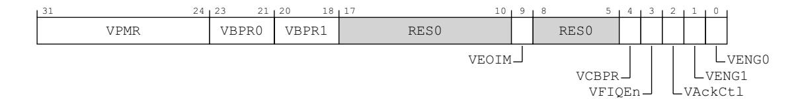

#### **VPMR, bits [31:24]**

Virtual priority mask. The priority mask level for the CPU interface. If the priority of an interrupt is higher than the value indicated by this field, the interface signals the interrupt to the PE.

This alias field is updated when a VM updates [GICV\\_PMR](#page-795-0).Priority.

The reset behavior of this field is:

• On a Warm reset, this field resets to an architecturally UNKNOWN value.

#### **VBPR0, bits [23:21]**

Virtual Binary Point Register, Group 0. Defines the point at which the priority value fields split into two parts, the Group priority field and the subpriority field. The Group priority field determines Group 0 interrupt preemption, and also determines Group 1 interrupt preemption if GICH\_VMCR.VCBPR == 1.

This alias field is updated when a VM updates [GICV\\_BPR](#page-780-0).Binary\_Point.

The reset behavior of this field is:

• On a Warm reset, this field resets to an architecturally UNKNOWN value.

#### **VBPR1, bits [20:18]**

Virtual Binary Point Register, Group 1. Defines the point at which the priority value fields split into two parts, the Group priority field and the subpriority field. The Group priority field determines Group 1 interrupt preemption if GICH\_VMCR.VCBPR == 0.

This alias field is updated when a VM updates [GICV\\_ABPR.](#page-770-0)Binary\_Point.

The reset behavior of this field is:

• On a Warm reset, this field resets to an architecturally UNKNOWN value.

#### **Bits [17:10]**

Reserved, RES0.

#### **VEOIM, bit [9]**

Virtual EOImode. Possible values of this bit are:

0b0 A write of an INTID to [GICV\\_EOIR](#page-787-0) or [GICV\\_AEOIR](#page-772-0) drops the priority of the interrupt with that INTID, and also deactivates that interrupt.

0b1 A write of an INTID to [GICV\\_EOIR](#page-787-0) or [GICV\\_AEOIR](#page-772-0) only drops the priority of the interrupt with that INTID. Software must write to [GICV\\_DIR](#page-785-0) to deactivate the interrupt.

This alias field is updated when a VM updates [GICV\\_CTLR](#page-782-1).EOImode.

The reset behavior of this field is:

• On a Warm reset, this field resets to an architecturally UNKNOWN value.

#### **Bits [8:5]**

Reserved, RES0.

#### **VCBPR, bit [4]**

Virtual Common Binary Point Register. Possible values of this bit are:

0b0 [GICV\\_ABPR](#page-770-0) determines the preemption group for Group 1 interrupts.

0b1 [GICV\\_BPR](#page-780-0) determines the preemption group for Group 1 interrupts.

This alias field is updated when a VM updates [GICV\\_CTLR](#page-782-1).CBPR.

The reset behavior of this field is:

• On a Warm reset, this field resets to an architecturally UNKNOWN value.

#### **VFIQEn, bit [3]**

Virtual FIQ enable. Possible values of this bit are:

0b0 Group 0 virtual interrupts are presented as virtual IRQs.

0b1 Group 0 virtual interrupts are presented as virtual FIQs.

This alias field is updated when a VM updates [GICV\\_CTLR](#page-782-1).FIQEn.

The reset behavior of this field is:

• On a Warm reset, this field resets to an architecturally UNKNOWN value.

#### **VAckCtl, bit [2]**

Virtual AckCtl. Possible values of this bit are:

0b0 If the highest priority pending interrupt is Group 1, a read of [GICV\\_IAR](#page-791-0) or [GICV\\_HPPIR](#page-789-0) returns an INTID of 1022.

0b1 If the highest priority pending interrupt is Group 1, a read of [GICV\\_IAR](#page-791-0) or [GICV\\_HPPIR](#page-789-0) returns the INTID of the corresponding interrupt.

This alias field is updated when a VM updates [GICV\\_CTLR](#page-782-1).AckCtl.

This field is supported for backwards compatibility with GICv2. Arm deprecates the use of this field.

The reset behavior of this field is:

• On a Warm reset, this field resets to an architecturally UNKNOWN value.

#### **VENG1, bit [1]**

Virtual interrupt enable, Group 1. Possible values of this bit are:

0b0 Group 1 virtual interrupts are disabled.

0b1 Group 1 virtual interrupts are enabled.

This alias field is updated when a VM updates [GICV\\_CTLR](#page-782-1).EnableGrp1.

The reset behavior of this field is:

• On a Warm reset, this field resets to an architecturally UNKNOWN value.

#### **VENG0, bit [0]**

Virtual interrupt enable, Group 0. Possible values of this bit are:

0b0 Group 0 virtual interrupts are disabled.

0b1 Group 0 virtual interrupts are enabled.

This alias field is updated when a VM updates [GICV\\_CTLR](#page-782-1).EnableGrp0.

The reset behavior of this field is:

• On a Warm reset, this field resets to an architecturally UNKNOWN value.

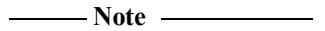

A List register is in the pending state only if the corresponding [GICH\\_LR<n>](#page-811-0) value is 0b01, that is, pending. The active and pending state is not included.

#### **Accessing the GICH\_VMCR:**

This register is used only when System register access is not enabled. When System register access is enabled:

- For AArch32 implementations, [ICH\\_VMCR](#page-525-0) provides equivalent functionality.
- For AArch64 implementations, [ICH\\_VMCR\\_EL2](#page-360-1) provides equivalent functionality.

GICH\_VMCR can be accessed through its memory-mapped interface:

| Component                     | Offset | Instance  |
|-------------------------------|--------|-----------|
| GIC Virtual interface control | 0x0008 | GICH_VMCR |

This interface is accessible as follows:

- When GICD\_CTLR.DS == 0 accesses to this register are RW.
- When an access is Secure accesses to this register are RW.
- When an access is Non-secure accesses to this register are RW.

#### <span id="page-820-0"></span>**12.17.8 GICH\_VTR, Virtual Type Register**

The GICH\_VTR characteristics are:

#### **Purpose**

Indicates the number of implemented virtual priority bits and List registers.

#### **Configurations**

This register is present only when FEAT\_GICv3\_LEGACY is implemented and EL2 is implemented. Otherwise, direct accesses to GICH\_VTR are RES0.

This register is available when the GIC implementation supports interrupt virtualization.

#### **Attributes**

GICH\_VTR is a 32-bit register.

#### **Field descriptions**

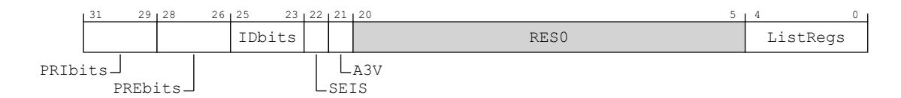

#### **PRIbits, bits [31:29]**

The number of virtual priority bits implemented, minus one.

An implementation must implement at least 32 levels of virtual priority (5 priority bits).

#### **PREbits, bits [28:26]**

The number of virtual preemption bits implemented, minus one.

An implementation must implement at least 32 levels of virtual preemption priority (5 preemption bits).

The value of this field must be less than or equal to the value of GICH\_VTR.PRIbits.

#### **IDbits, bits [25:23]**

The number of virtual interrupt identifier bits supported:

0b000 16 bits. 0b001 24 bits.

All other values are reserved.

#### **SEIS, bit [22]**

SEI support. Indicates whether the virtual CPU interface supports generation of SEIs:

0b0 The virtual CPU interface logic does not support generation of SEIs.

0b1 The virtual CPU interface logic supports generation of SEIs.

#### **A3V, bit [21]**

Affinity 3 valid. Possible values are:

0b0 The virtual CPU interface logic only supports zero values of the Aff3 field in [ICC\\_SGI0R\\_EL1,](#page-272-1) [ICC\\_SGI1R\\_EL1,](#page-275-1) and [ICC\\_ASGI1R\\_EL1.](#page-222-1)

0b1 The virtual CPU interface logic supports nonzero values of the Aff3 field in [ICC\\_SGI0R\\_EL1,](#page-272-1) [ICC\\_SGI1R\\_EL1,](#page-275-1) and [ICC\\_ASGI1R\\_EL1.](#page-222-1)

#### **Bits [20:5]**

Reserved, RES0.

#### **ListRegs, bits [4:0]**

The number of implemented List registers, minus one.

#### **Accessing the GICH\_VTR:**

This register is used only when System register access is not enabled. When System register access is enabled:

- For AArch32 implementations, [ICH\\_VTR](#page-529-0) provides equivalent functionality.
- For AArch64 implementations, [ICH\\_VTR\\_EL2](#page-364-1) provides equivalent functionality.

GICH\_VTR can be accessed through its memory-mapped interface:

| Component                     | Offset | Instance |
|-------------------------------|--------|----------|
| GIC Virtual interface control | 0x0004 | GICH_VTR |

This interface is accessible as follows:

- When GICD\_CTLR.DS == 0 accesses to this register are RO.
- When an access is Secure accesses to this register are RO.
- When an access is Non-secure accesses to this register are RO.

#### <span id="page-822-1"></span><span id="page-822-0"></span>**12.18 The ITS register map**

The ITS address map consists of two separate 64KB frames starting from an IMPLEMENTATION DEFINED address specified in ITS\_base. This base address must be aligned to a 64KB boundary. The number of frames are:

- GICv3, two frames.
- GICv4.0, two frames.
- GICV4.1 or later, three frames.

#### The ITS frames are:

- The control registers. which are located at ITS\_base + 0x000000.
- The interrupt translation space, which is located at ITS\_base + 0x010000.
- The virtual SGI space, which is located at ITS\_base + 0x020000 (GICv4.1).

Reserved register addresses are RES0.

<span id="page-822-2"></span>Table 12-[33 on page](#page-822-2) 12-823 shows the GIC register map for the ITS control registers.

**Table 12-33 ITS control register map**

| Offset        | Name               | Type | Reset                           | Description                                   |
|---------------|--------------------|------|---------------------------------|-----------------------------------------------|
| 0x0000        | GITS_CTLR          | RW   | See the register<br>description | ITS control register                          |
| 0x0004        | GITS_IIDR          | RO   | IMPLEMENTATION<br>DEFINED       | ITS Identification register                   |
| 0x0008        | GITS_TYPER         | RO   | IMPLEMENTATION<br>DEFINED       | ITS Type register                             |
| 0x0010        | GITS_MPAMIDR       | RO   | IMPLEMENTATION<br>DEFINED       | ITS supported MPAM sizes                      |
| 0x0014        | GITS_PARTIDR       | RW   | 0                               | ITS PARTID register                           |
| 0x0018        | GITS_MPIDR         | RO   | IMPLEMENTATION<br>DEFINED       | ITS affinity                                  |
| 0x001C        | -                  | -    | -                               | Reserved                                      |
| 0x0020-0x003C | -                  | -    | IMPLEMENTATION<br>DEFINED       | IMPLEMENTATION DEFINED registers.             |
| 0x0040        | GITS_STATUSR       | RW   | 0X0000 0000                     | ITS Error Reporting Status Register, optional |
| 0x0044        | -                  | -    | -                               | Reserved                                      |
| 0x0048        | GITS_UMSIR         | RO   | UNKNOWN                         | ITS Unmapped MSI register                     |
| 0x0050-0x007C | -                  | -    | -                               | Reserved                                      |
| 0x0080        | GITS_CBASER        | RW   | See the register<br>description | ITS Command Queue Descriptor                  |
| 0x0088        | GITS_CWRITER       | RW   | See the register<br>description | ITS Write register                            |
| 0x0090        | GITS_CREADR        | RO   | See the register<br>description | ITS Read register                             |
| 0x0098-0x00FC | -                  | -    | -                               | Reserved                                      |
| 0x0100-0x0138 | GITS_BASER <n></n> | RW   | See the register<br>description | ITS Translation Table Descriptors             |

**Table 12-33 ITS control register map (continued)**

| Offset        | Name | Type | Reset                     | Description                                                               |
|---------------|------|------|---------------------------|---------------------------------------------------------------------------|
| 0x0140-0xBFFC | -    | -    | -                         | Reserved                                                                  |
| 0xC000-0xFFCC | -    | -    | IMPLEMENTATION<br>DEFINED | IMPLEMENTATION DEFINED registers.                                         |
| 0xFFD0-0xFFFC | -    | RO   | -                         | Reserved for ID registers, see Identification registers on<br>page 12-209 |

<span id="page-823-0"></span>[Table](#page-823-0) 12-34 shows the GIC register map for the ITS translation registers.

#### **Table 12-34 ITS translation register map**

| Offset        | Name            | Type | Reset | Description              |
|---------------|-----------------|------|-------|--------------------------|
| 0x0000-0x003C | -               | -    | -     | Reserved                 |
| 0x0040        | GITS_TRANSLATER | WO   | -     | ITS Translation register |
| 0x0044-0xFFFC | -               | -    | -     | Reserved                 |

<span id="page-823-1"></span>[Table](#page-823-1) 12-35 shows the GIC register map for the virtual SGI registers.

#### **Table 12-35 Virtual SGI register map**

| Offset        | Name      | Type | Reset | Description          |
|---------------|-----------|------|-------|----------------------|
| 0x0000-0x001C | -         | -    | -     | Reserved             |
| 0x0020        | GITS_SGIR | WO   | -     | Virtual SGI register |
| 0x0028-0xFFFC | -         | -    | -     | Reserved             |

#### <span id="page-824-1"></span><span id="page-824-0"></span>**12.19 The ITS register descriptions**

This section describes each of the ITS registers in register name order.

#### <span id="page-825-1"></span><span id="page-825-0"></span>**12.19.1 GITS\_BASER<n>, ITS Table Descriptors, n = 0 - 7**

The GITS\_BASER<n> characteristics are:

#### **Purpose**

Specifies the base address and size of the ITS tables.

#### **Configurations**

A copy of this register is provided for each ITS table.

Bits [63:32] and bits [31:0] are accessible independently.

A maximum of 8 GITS\_BASER<n> registers can be provided. Unimplemented registers are RES0.

When [GITS\\_CTLR](#page-833-1).Enabled == 1 or [GITS\\_CTLR.](#page-833-1)Quiescent == 0, writing this register is UNPREDICTABLE.

#### **Attributes**

GITS\_BASER<n> is a 64-bit register.

#### **Field descriptions**

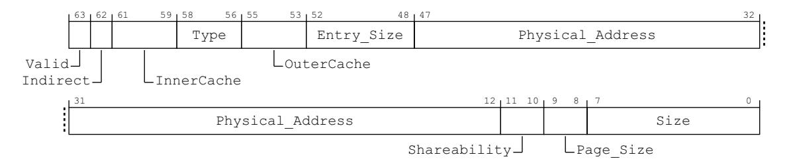

#### **Valid, bit [63]**

Indicates whether software has allocated memory for the table:

0b0 No memory is allocated for the table. The ITS discards any writes to the interrupt translation page when either:

- GITS\_BASER<n>.Type specifies any valid table entry type other than interrupt collections, that is, any value other than 0b100.
- GITS\_BASER<n>.Type specifies an interrupt collection and [GITS\\_TYPER](#page-847-1).HCC == 0.

0b1 Memory is allocated to the table.

The reset behavior of this field is:

• On a GIC reset, this field resets to 0.

#### **Indirect, bit [62]**

This field indicates whether an implemented register specifies a single, flat table or a two-level table where the first level contains a list of descriptors.

0b0 Single Level. The Size field indicates the number of pages used by the ITS to store data associated with each table entry.

0b1 Two Level. The Size field indicates the number of pages which contain an array of 64-bit descriptors to pages that are used to store the data associated with each table entry. A little endian memory order model is used.

For more information, see *[The ITS tables on page](#page-91-3) 5-92*.

This field is RAZ/WI for GIC implementations that only support flat tables. If the maximum width of the scaling factor that is identified by GITS\_BASER<n>.Type and the smallest page size that is supported result in a single level table that requires multiple pages, then implementing this bit as RAZ/WI is DEPRECATED.

The reset behavior of this field is:

• On a GIC reset, this field resets to an architecturally UNKNOWN value.

#### **InnerCache, bits [61:59]**

Indicates the Inner Cacheability attributes of accesses to the table. The possible values of this field are:

| 0b000 | Device-nGnRnE.                                                       |
|-------|----------------------------------------------------------------------|
| 0b001 | Normal Inner Non-cacheable.                                          |
| 0b010 | Normal Inner Cacheable Read-allocate, Write-through.                 |
| 0b011 | Normal Inner Cacheable Read-allocate, Write-back.                    |
| 0b100 | Normal Inner Cacheable Write-allocate, Write-through.                |
| 0b101 | Normal Inner Cacheable Write-allocate, Write-back.                   |
| 0b110 | Normal Inner Cacheable Read-allocate, Write-allocate, Write-through. |
| 0b111 | Normal Inner Cacheable Read-allocate, Write-allocate, Write-back.    |

The reset behavior of this field is:

• On a GIC reset, this field resets to an architecturally UNKNOWN value.

#### **Type, bits [58:56]**

Read only. Specifies the type of entity that requires entries in the corresponding table. The possible values of the field are:

| 0b000 | Unimplemented. This register does not correspond to an ITS table.                                                                                                                                                                                                                            |
|-------|----------------------------------------------------------------------------------------------------------------------------------------------------------------------------------------------------------------------------------------------------------------------------------------------|
| 0b001 | Devices. This register corresponds to an ITS table that scales with the width of the<br>DeviceID. Only a single GITS_BASER <n> register reports this type.</n>                                                                                                                               |
| 0b010 | vPEs. FEAT_GICv4 only. This register corresponds to an ITS table that scales with the<br>number of vPEs in the system. The table requires (ENTRY_SIZE * N) bytes of memory,<br>where N is the number of vPEs in the system. Only a single GITS_BASER <n> register<br/>reports this type.</n> |

0b100 Interrupt collections. This register corresponds to an ITS table that scales with the number of interrupt collections in the system. The table requires (ENTRY\_SIZE \* N) bytes of memory, where N is the number of interrupt collections. Not more than one GITS\_BASER<n> register will report this type.

Other values are reserved.

For FEAT\_GICv4p1, the registers are allocated as follows:

- GITS\_BASER0.Type is 0b001 (Device).
- GITS\_BASER1.Type is either 0b100 (Collection Table) or 0b000 (Unimplemented).
- GITS\_BASER2.Type is either 0b010 (vPE) or 0b000 (Unimplemented).
- GITS\_BASER<n>.Type, where 'n' is in the range 3 to 7, is 0b000 (Unimplemented).

For FEAT\_GICv3, FEAT\_GICv3p1, and FEAT\_GICv4, Arm recommends that the GITS\_BASER<n> use the same allocations.

Other allocations of Type values are deprecated.

#### **OuterCache, bits [55:53]**

Indicates the Outer Cacheability attributes of accesses to the table. The possible values of this field are:

0b000 Memory type defined in InnerCache field. For Normal memory, Outer Cacheability is the same as Inner Cacheability.

| 0b001 | Normal Outer Non-cacheable.                                          |
|-------|----------------------------------------------------------------------|
| 0b010 | Normal Outer Cacheable Read-allocate, Write-through.                 |
| 0b011 | Normal Outer Cacheable Read-allocate, Write-back.                    |
| 0b100 | Normal Outer Cacheable Write-allocate, Write-through.                |
| 0b101 | Normal Outer Cacheable Write-allocate, Write-back.                   |
| 0b110 | Normal Outer Cacheable Read-allocate, Write-allocate, Write-through. |
| 0b111 | Normal Outer Cacheable Read-allocate, Write-allocate, Write-back.    |

It is IMPLEMENTATION DEFINED whether this field has a fixed value or can be programmed by software. Implementing this field with a fixed value is deprecated.

The reset behavior of this field is:

• On a GIC reset, this field resets to an architecturally UNKNOWN value.

#### **Entry\_Size, bits [52:48]**

Read-only. Specifies the number of bytes per table entry, minus one.

#### **Physical\_Address, bits [47:12]**

Physical Address. When Page\_Size is 4KB or 16KB:

- Bits [51:48] of the base physical address are zero.
- This field provides bits[47:12] of the base physical address of the table.
- Bits[11:0] of the base physical address are zero.
- The address must be aligned to the size specified in the Page Size field. Otherwise the effect is CONSTRAINED UNPREDICTABLE, and can be one of the following:
  - Bits[X:12], where X is derived from the page size, are treated as zero.
  - The value of bits[X:12] are used when calculating the address of a table access.

When Page\_Size is 64KB:

- Bits[47:16] of the register provide bits[47:16] of the base physical address of the table.
- Bits[15:12] of the register provide bits[51:48] of the base physical address of the table.
- Bits[15:0] of the base physical address are 0.

In implementations that support fewer than 52 bits of physical address, any unimplemented upper bits might be RAZ/WI.

The reset behavior of this field is:

• On a GIC reset, this field resets to an architecturally UNKNOWN value.

#### **Shareability, bits [11:10]**

Indicates the Shareability attributes of accesses to the table. The possible values of this field are:

| 0b00 | Non-shareable.             |
|------|----------------------------|
| 0b01 | Inner Shareable.           |
| 0b10 | Outer Shareable.           |
| 0b11 | Reserved. Treated as 0b00. |

It is IMPLEMENTATION DEFINED whether this field has a fixed value or can be programmed by software. Implementing this field with a fixed value is deprecated.

The reset behavior of this field is:

• On a GIC reset, this field resets to an architecturally UNKNOWN value.

#### **Page\_Size, bits [9:8]**

The size of page that the table uses:

```
0b00 4KB.
0b01 16KB.
```

0b10 64KB.

0b11 Reserved. Treated as 0b10.

**Note**

If the GIC implementation supports only a single, fixed page size, this field might be RO.

The reset behavior of this field is:

• On a GIC reset, this field resets to an architecturally UNKNOWN value.

#### **Size, bits [7:0]**

The number of pages of physical memory allocated to the table, minus one. GITS\_BASER<n>.Page\_Size specifies the size of each page.

If GITS\_BASER<n>.Type == 0, this field is RAZ/WI.

The reset behavior of this field is:

• On a GIC reset, this field resets to an architecturally UNKNOWN value.

#### **Accessing the GITS\_BASER<n>:**

GITS\_BASER<n> can be accessed through its memory-mapped interface:

| Component       | Offset           | Instance           |
|-----------------|------------------|--------------------|
| GIC ITS control | 0x0100 + (8 * n) | GITS_BASER <n></n> |

#### <span id="page-829-1"></span><span id="page-829-0"></span>**12.19.2 GITS\_CBASER, ITS Command Queue Descriptor**

The GITS\_CBASER characteristics are:

#### **Purpose**

Specifies the base address and size of the ITS command queue.

#### **Configurations**

Bits [63:32] and bits [31:0] are accessible separately.

#### **Attributes**

GITS\_CBASER is a 64-bit register.

#### **Field descriptions**

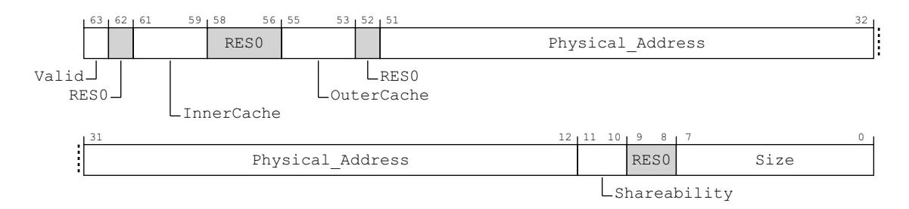

#### **Valid, bit [63]**

Indicates whether software has allocated memory for the command queue:

0b0 No memory is allocated for the command queue.

0b1 Memory is allocated to the command queue.

The reset behavior of this field is:

• On a GIC reset, this field resets to 0.

#### **Bit [62]**

Reserved, RES0.

#### **InnerCache, bits [61:59]**

Indicates the Inner Cacheability attributes of accesses to the command queue. The possible values of this field are:

| 0b000 | Device-nGnRnE.                                                       |
|-------|----------------------------------------------------------------------|
| 0b001 | Normal Inner Non-cacheable.                                          |
| 0b010 | Normal Inner Cacheable Read-allocate, Write-through.                 |
| 0b011 | Normal Inner Cacheable Read-allocate, Write-back.                    |
| 0b100 | Normal Inner Cacheable Write-allocate, Write-through.                |
| 0b101 | Normal Inner Cacheable Write-allocate, Write-back.                   |
| 0b110 | Normal Inner Cacheable Read-allocate, Write-allocate, Write-through. |
| 0b111 | Normal Inner Cacheable Read-allocate, Write-allocate, Write-back.    |
|       |                                                                      |

The reset behavior of this field is:

• On a GIC reset, this field resets to an architecturally UNKNOWN value.

#### **Bits [58:56]**

Reserved, RES0.

#### **OuterCache, bits [55:53]**

Indicates the Outer Cacheability attributes of accesses to the command queue. The possible values of this field are:

| 0b000 | Memory type defined in InnerCache field. For Normal memory, Outer Cacheability is<br>the same as Inner Cacheability. |
|-------|----------------------------------------------------------------------------------------------------------------------|
| 0b001 | Normal Outer Non-cacheable.                                                                                          |
| 0b010 | Normal Outer Cacheable Read-allocate, Write-through.                                                                 |
| 0b011 | Normal Outer Cacheable Read-allocate, Write-back.                                                                    |
| 0b100 | Normal Outer Cacheable Write-allocate, Write-through.                                                                |
| 0b101 | Normal Outer Cacheable Write-allocate, Write-back.                                                                   |
| 0b110 | Normal Outer Cacheable Read-allocate, Write-allocate, Write-through.                                                 |
| 0b111 | Normal Outer Cacheable Read-allocate, Write-allocate, Write-back.                                                    |

It is IMPLEMENTATION DEFINED whether this field has a fixed value or can be programmed by software. Implementing this field with a fixed value is deprecated.

The reset behavior of this field is:

• On a GIC reset, this field resets to an architecturally UNKNOWN value.

#### **Bit [52]**

Reserved, RES0.

#### **Physical\_Address, bits [51:12]**

Bits [51:12] of the base physical address of the command queue. Bits [11:0] of the base address are 0.

In implementations supporting fewer than 52 bits of physical address, unimplemented upper bits are RES0.

If bits [15:12] are not all zeros, behavior is a CONSTRAINED UNPREDICTABLE choice:

- Bits [15:12] are treated as if all the bits are zero. The value read back from those bits is either the value written or zero.
- The result of the calculation of an address for a command queue read can be corrupted.

The reset behavior of this field is:

• On a GIC reset, this field resets to an architecturally UNKNOWN value.

#### **Shareability, bits [11:10]**

Indicates the Shareability attributes of accesses to the command queue. The possible values of this field are:

0b00 Non-shareable. 0b01 Inner Shareable. 0b10 Outer Shareable. 0b11 Reserved. Treated as 0b00.

It is IMPLEMENTATION DEFINED whether this field has a fixed value or can be programmed by software. Implementing this field with a fixed value is deprecated.

The reset behavior of this field is:

• On a GIC reset, this field resets to an architecturally UNKNOWN value.

#### **Bits [9:8]**

Reserved, RES0.

#### **Size, bits [7:0]**

The number of 4KB pages of physical memory allocated to the command queue, minus one.

The reset behavior of this field is:

• On a GIC reset, this field resets to an architecturally UNKNOWN value.

The command queue is a circular buffer and wraps at Physical Address [47:0] + (4096 \* (Size + 1)).

**Note**

When this register is successfully written, the value of [GITS\\_CREADR](#page-832-1) is set to zero.

#### **Accessing the GITS\_CBASER:**

When [GITS\\_CTLR.](#page-833-1)Enabled == 1 or [GITS\\_CTLR.](#page-833-1)Quiescent == 0, writing this register is UNPREDICTABLE.

GITS\_CBASER can be accessed through its memory-mapped interface:

| Component       | Offset | Instance    |
|-----------------|--------|-------------|
| GIC ITS control | 0x0080 | GITS_CBASER |

#### <span id="page-832-1"></span><span id="page-832-0"></span>**12.19.3 GITS\_CREADR, ITS Read Register**

The GITS\_CREADR characteristics are:

#### **Purpose**

Specifies the offset from [GITS\\_CBASER](#page-829-1) where the ITS reads the next ITS command.

#### **Configurations**

This register is cleared to 0 when a value is written to [GITS\\_CBASER](#page-829-1).

Bits [63:32] and bits [31:0] are accessible separately.

#### **Attributes**

GITS\_CREADR is a 64-bit register.

#### **Field descriptions**

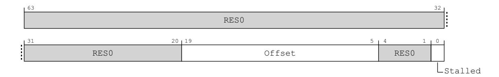

#### **Bits [63:20]**

Reserved, RES0.

#### **Offset, bits [19:5]**

Bits [19:5] of the offset from [GITS\\_CBASER.](#page-829-1) Bits [4:0] of the offset are zero.

This field has an IMPLEMENTATION DEFINED value.

Access to this field is RO.

#### **Bits [4:1]**

Reserved, RES0.

#### **Stalled, bit [0]**

Reports whether the processing of commands is stalled because of a command error.

0b0 ITS command queue is not stalled because of a command error.

0b1 ITS command queue is stalled because of a command error.

For more information, see *[The ITS command interface on page](#page-97-1) 5-98*.

#### **Accessing the GITS\_CREADR:**

GITS\_CREADR can be accessed through its memory-mapped interface:

| Component       | Offset | Instance    |
|-----------------|--------|-------------|
| GIC ITS control | 0x0090 | GITS_CREADR |

#### <span id="page-833-1"></span><span id="page-833-0"></span>**12.19.4 GITS\_CTLR, ITS Control Register**

The GITS\_CTLR characteristics are:

#### **Purpose**

Controls the operation of an ITS.

#### **Configurations**

The ITS\_Number (bits [7:4]) and bit [1] fields apply only in FEAT\_GICv4 implementations, and are RES0 in FEAT\_GICv3 implementations.

#### **Attributes**

GITS\_CTLR is a 32-bit register.

#### **Field descriptions**

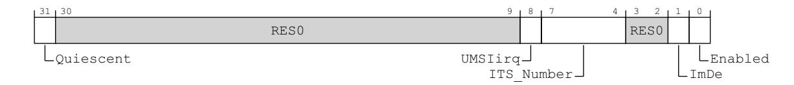

#### **Quiescent, bit [31]**

Read-only. Indicates completion of all ITS operations when GITS\_CTLR.Enabled == 0.

0b0 The ITS is not quiescent and cannot be powered down.

0b1 The ITS is quiescent and can be powered down.

For the ITS to be considered inactive, there must be no transactions in progress. In addition, all operations required to ensure that mapping data is consistent with external memory must be complete.

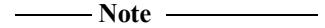

In distributed GIC implementations, this bit is set to 1 only after the ITS forwards any operations that have not yet been completed to the Redistributors and receives confirmation that all such operations have reached the appropriate Redistributor.

In FEAT\_GICv3, FEAT\_GICv3p1, and FEAT\_GICv4, when GITS\_CTLR.Enabled == 1, the value of GITS\_CTLR.Quiescent is UNKNOWN.

In FEAT\_GICv4p1, when GITS\_CTLR.Enabled == 1, the value of GITS\_CTLR.Quiescent reads as 1 until the write to Enabled has taken effect and then reads as 0.

The reset behavior of this field is:

• On a GIC reset, this field resets to 1.

#### **Bits [30:9]**

Reserved, RES0.

#### **UMSIirq, bit [8]**

Unmapped MSI reporting interrupt enable.

0b0 The ITS does not assert an interrupt signal when [GITS\\_STATUSR.](#page-843-0)UMSI is 1.

0b1 The ITS asserts an interrupt signal when [GITS\\_STATUSR.](#page-843-0)UMSI is 1.

If [GITS\\_TYPER](#page-847-1).UMSIirq is 0, this field is RES0.

The reset behavior of this field is:

• On a Warm reset, this field resets to 0.

#### **ITS\_Number, bits [7:4]**

In FEAT\_GICv3 implementations this field is RES0.

In FEAT\_GICv4 implementations with more than one ITS instance, this field indicates the ITS number for use with *[VMOVP GICv4.0 on page](#page-129-2) 5-130*.

When [GITS\\_TYPER.](#page-847-1)VMOVP is 1, this field may be implemented as RES0.

If this field is programmable, changing this field when GITS\_CTLR.Quiescent == 0 or GITS\_CTLR.Enabled == 1 is UNPREDICTABLE.

It is IMPLEMENTATION DEFINED whether this field is programmable or RO.

The reset behavior of this field is:

• On a GIC reset, this field resets to an architecturally UNKNOWN value.

#### **Bits [3:2]**

Reserved, RES0.

#### **ImDe, bit [1]**

In GICv3 implementations, this bit is RES0.

In GICv4 implementations, this bit is IMPLEMENTATION DEFINED.

The reset behavior of this field is:

• On a GIC reset, this field resets to 0.

#### **Enabled, bit [0]**

Controls whether the ITS is enabled:

0b0 The ITS is not enabled. Writes to [GITS\\_TRANSLATER](#page-845-1) are ignored and no further command queue entries are processed.

0b1 The ITS is enabled. Writes to [GITS\\_TRANSLATER](#page-845-1) result in interrupt translations and the command queue is processed.

If a write to this register changes this field from 1 to 0, the ITS must ensure that both:

- Any caches containing mapping data are made consistent with external memory.
- GITS\_CTLR.Quiescent == 0 until all caches are consistent with external memory.

Changing GITS\_CTLR.Enabled from 0 to 1 when GITS\_CTLR.Quiescent is 0 results in UNPREDICTABLE behavior.

The reset behavior of this field is:

• On a GIC reset, this field resets to 0.

#### **Accessing the GITS\_CTLR:**

GITS\_CTLR can be accessed through its memory-mapped interface:

| Component       | Offset | Instance  |
|-----------------|--------|-----------|
| GIC ITS control | 0x0000 | GITS_CTLR |

#### <span id="page-835-1"></span><span id="page-835-0"></span>**12.19.5 GITS\_CWRITER, ITS Write Register**

The GITS\_CWRITER characteristics are:

#### **Purpose**

Specifies the offset from [GITS\\_CBASER](#page-829-1) where software writes the next ITS command.

#### **Configurations**

Bits [63:32] and bits [31:0] are accessible separately.

#### **Attributes**

GITS\_CWRITER is a 64-bit register.

#### **Field descriptions**

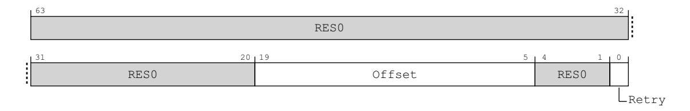

#### **Bits [63:20]**

Reserved, RES0.

#### **Offset, bits [19:5]**

Bits [19:5] of the offset from [GITS\\_CBASER.](#page-829-1) Bits [4:0] of the offset are zero.

The reset behavior of this field is:

• On a GIC reset, this field resets to an architecturally UNKNOWN value.

#### **Bits [4:1]**

Reserved, RES0.

#### **Retry, bit [0]**

Writing this bit has the following effects:

0b0 No effect on the processing commands by the ITS.

0b1 Restarts the processing of commands by the ITS if it stalled because of a command error.

**Note**

If the processing of commands is not stalled because of a command error, writing 1 to this bit has no effect.

When read, this bit is RES0.

For more information, see *[The ITS command interface on page](#page-97-1) 5-98*.

If GITS\_CWRITER is written with a value outside of the valid range specified by [GITS\\_CBASER.](#page-829-1)Physical\_Address and [GITS\\_CBASER](#page-829-1).Size, behavior is a CONSTRAINED UNPREDICTABLE choice, as follows:

- The command queue is considered invalid, and no further commands are processed until GITS\_CWRITER is written with a value that is in the valid range.
- The value is treated as a valid UNKNOWN value.

An implementation might choose to report a system error in an IMPLEMENTATION DEFINED manner.

#### **Accessing the GITS\_CWRITER:**

GITS\_CWRITER can be accessed through its memory-mapped interface:

| Component       | Offset | Instance     |
|-----------------|--------|--------------|
| GIC ITS control | 0x0088 | GITS_CWRITER |

#### <span id="page-837-1"></span><span id="page-837-0"></span>**12.19.6 GITS\_IIDR, ITS Identification Register**

The GITS\_IIDR characteristics are:

#### **Purpose**

Provides information about the implementer and revision of the ITS.

#### **Configurations**

This register is available in all configurations of the GIC. If the GIC implementation supports two Security states, this register is Common.

#### **Attributes**

GITS\_IIDR is a 32-bit register.

#### **Field descriptions**


#### **ProductID, bits [31:24]**

Product Identifier.

This field has an IMPLEMENTATION DEFINED value.

Access to this field is RO.

#### **Bits [23:20]**

Reserved, RES0.

#### **Variant, bits [19:16]**

Variant number. Typically, this field is used to distinguish product variants, or major revisions of a product.

This field has an IMPLEMENTATION DEFINED value.

Access to this field is RO.

#### **Revision, bits [15:12]**

Revision number. Typically, this field is used to distinguish minor revisions of a product.

This field has an IMPLEMENTATION DEFINED value.

Access to this field is RO.

#### **Implementer, bits [11:0]**

Contains the JEP106 code of the company that implemented the ITS:

- Bits [11:8] are the JEP106 continuation code of the implementer. For an Arm implementation, this field is 0x4.
- Bit [7] is always 0.
- Bits [6:0] are the JEP106 identity code of the implementer. For an Arm implementation, bits [7:0] are therefore 0x3B.

This field has an IMPLEMENTATION DEFINED value.

Access to this field is RO.

#### **Accessing the GITS\_IIDR:**

GITS\_IIDR can be accessed through its memory-mapped interface:

| Component       | Offset | Instance  |
|-----------------|--------|-----------|
| GIC ITS control | 0x0004 | GITS_IIDR |

#### <span id="page-839-1"></span><span id="page-839-0"></span>**12.19.7 GITS\_MPAMIDR, Report maximum PARTID and PMG Register**

The GITS\_MPAMIDR characteristics are:

#### **Purpose**

Reports the maximum support PARTID and PMG values.

#### **Configurations**

This register is present only when FEAT\_GICv3p1 is implemented. Otherwise, direct accesses to GITS\_MPAMIDR are RES0.

A copy of this register is provided for each ITS.

When [GITS\\_TYPER.](#page-847-1)MPAM==0, this register is RES0.

#### **Attributes**

GITS\_MPAMIDR is a 32-bit register.

#### **Field descriptions**


#### **Bits [31:24]**

Reserved, RES0.

#### **PMGmax, bits [23:16]**

Maximum PMG value supported.

This field has an IMPLEMENTATION DEFINED value.

Access to this field is RO.

#### **PARTIDmax, bits [15:0]**

Maximum PARTID value supported.

This field has an IMPLEMENTATION DEFINED value.

Access to this field is RO.

#### **Accessing the GITS\_MPAMIDR:**

GITS\_MPAMIDR can be accessed through its memory-mapped interface:

| Component       | Offset |
|-----------------|--------|
| GIC ITS control | 0x0010 |

#### <span id="page-840-0"></span>**12.19.8 GITS\_MPIDR, Report ITS's affinity.**

The GITS\_MPIDR characteristics are:

#### **Purpose**

Reports ITS's affinity when the vPE Table is shared with Redistributors.

#### **Configurations**

This register is present only when FEAT\_GICv4p1 is implemented. Otherwise, direct accesses to GITS\_MPIDR are RES0.

A copy of this register is provided for each ITS.

When [GITS\\_TYPER.](#page-847-1)SVPET==0, this register is RES0.

#### **Attributes**

GITS\_MPIDR is a 32-bit register.

#### **Field descriptions**


#### **Aff3, bits [31:24]**

The Affinity level 3 value for the ITS.

This field has an IMPLEMENTATION DEFINED value.

Access to this field is RO.

#### **Aff2, bits [23:16]**

The Affinity level 2 value for the ITS.

This field has an IMPLEMENTATION DEFINED value.

Access to this field is RO.

#### **Aff1, bits [15:8]**

The Affinity level 1 value for the ITS.

This field has an IMPLEMENTATION DEFINED value.

Access to this field is RO.

#### **Bits [7:0]**

Reserved, RES0.

#### **Accessing the GITS\_MPIDR:**

GITS\_MPIDR can be accessed through its memory-mapped interface:

| Component       | Offset |
|-----------------|--------|
| GIC ITS control | 0x0018 |

#### <span id="page-841-1"></span><span id="page-841-0"></span>**12.19.9 GITS\_PARTIDR, Set PARTID and PMG Register**

The GITS\_PARTIDR characteristics are:

#### **Purpose**

Sets the PARTID and PMG values used for memory accesses by the ITS.

#### **Configurations**

This register is present only when FEAT\_GICv3p1 is implemented. Otherwise, direct accesses to GITS\_PARTIDR are RES0.

A copy of this register is provided for each ITS.

When [GITS\\_TYPER.](#page-847-1)MPAM==0, this register is RES0.

#### **Attributes**

GITS\_PARTIDR is a 32-bit register.

#### **Field descriptions**


#### **Bits [31:24]**

Reserved, RES0.

#### **PMG, bits [23:16]**

PMG value used when ITS accesses memory.

Bits not needed to represent PMG values in the range 0 to PMG\_MAX are RES0.

The reset behavior of this field is:

• On a GIC reset, this field resets to 0.

#### **PARTID, bits [15:0]**

PARTID value used when ITS accesses memory.

Bits not needed to represent PARTID values in the range 0 to PARTID\_MAX are RES0.

The reset behavior of this field is:

• On a GIC reset, this field resets to 0.

#### **Accessing the GITS\_PARTIDR:**

GITS\_PARTIDR can be accessed through its memory-mapped interface:

| Component       | Offset |
|-----------------|--------|
| GIC ITS control | 0x0014 |

#### <span id="page-842-1"></span><span id="page-842-0"></span>**12.19.10 GITS\_SGIR, ITS SGI Register**

The GITS\_SGIR characteristics are:

#### **Purpose**

Written by software to signal a virtual SGI for translation by the ITS.

#### **Configurations**

This register is present only when FEAT\_GICv4p1 is implemented. Otherwise, direct accesses to GITS\_SGIR are RES0.

This register is provided only in FEAT\_GICv4p1 implementations.

#### **Attributes**

GITS\_SGIR is a 64-bit register.

#### **Field descriptions**

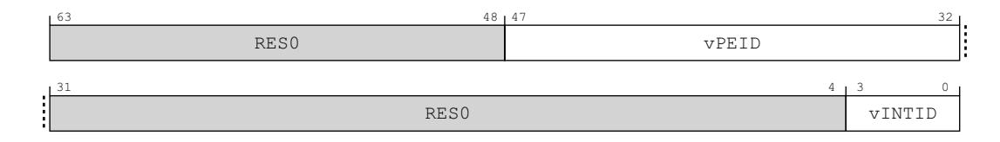

#### **Bits [63:48]**

Reserved, RES0.

#### **vPEID, bits [47:32]**

ID of target vPEID.

The size of this field is IMPLEMENTATION DEFINED, and is specified by the [GICD\\_TYPER2.](#page-621-1)VIL and [GICD\\_TYPER2](#page-621-1).VID fields. Unimplemented bits are RES0.

#### **Bits [31:4]**

Reserved, RES0.

#### **vINTID, bits [3:0]**

INTID of virtual SGI.

#### **Accessing the GITS\_SGIR:**

64-bit access only.

GITS\_SGIR can be accessed through its memory-mapped interface:

| Component       | Offset  |
|-----------------|---------|
| GIC ITS control | 0x20020 |

#### <span id="page-843-0"></span>**12.19.11 GITS\_STATUSR, ITS Error Reporting Status Register**

The GITS\_STATUSR characteristics are:

#### **Purpose**

Provides software with a mechanism to detect:

- Accesses to reserved locations.
- Writes to read-only locations.
- Reads of write-only locations.
- Unmapped MSIs.

#### **Configurations**

There are no configuration notes.

#### **Attributes**

GITS\_STATUSR is a 32-bit register.

#### **Field descriptions**

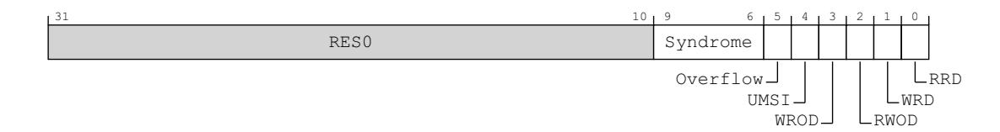

#### **Bits [31:10]**

Reserved, RES0.

#### **Syndrome, bits [9:6]**

Syndrome for the MSI that set GITS\_STATUSR.UMSI to 1.

0b0000 Unknown reason. 0b0010 DeviceID out of range. 0b0011 DeviceID unmapped. 0b0100 EventID out of range. 0b0101 EventID unmapped. 0b0111 Collection unmapped. 0b1001 vPEID unmapped.

An implementation might not support reporting all syndromes, and might report 0b0000 for any cause.

This field is UNKNOWN when GITS\_STATUSR.UMSI is 0.

#### **Overflow, bit [5]**

Reports whether an unmapped MSI has been received while GITS\_STATUSR.UMSI is 1.

0b0 No unmapped MSIs have been received since GITS\_STATUSR.UMSI set to 1.

0b1 At least one unmapped MSIs have been received since GITS\_STATUSR.UMSI set to 1.

A software write of 1 to the bit clears it. A write of any other value is ignored.

If [GITS\\_TYPER](#page-847-1).UMSI is 0, this field is RES0.

#### **UMSI, bit [4]**

Reports whether an unmapped MSI has been received

An unmapped MSI is defined as an MSI arriving at [GITS\\_TRANSLATER](#page-845-1) for which there is insufficient mapping information for it to be forwarded to a Redistributor.

It is IMPLEMENTATION DEFINED whether an INT command can be reported as an unmapped MSI.

0b0 No unmapped MSIs have been received.

0b1 Unmapped MSI received.

A software write of 1 to the bit clears it. A write of any other value is ignored.

If [GITS\\_TYPER](#page-847-1).UMSI is 0, this field is RES0.

#### **WROD, bit [3]**

Write to an RO location.

0b0 Normal operation.

0b1 A write to an RO location has been detected.

When a violation is detected, software must write 1 to this register to reset it.

#### **RWOD, bit [2]**

Read of a WO location.

0b0 Normal operation.

0b1 A read of a WO location has been detected.

When a violation is detected, software must write 1 to this register to reset it.

#### **WRD, bit [1]**

Write to a reserved location.

0b0 Normal operation.

0b1 A write to a reserved location has been detected.

When a violation is detected, software must write 1 to this register to reset it.

#### **RRD, bit [0]**

Read of a reserved location.

0b0 Normal operation.

0b1 A read of a reserved location has been detected.

When a violation is detected, software must write 1 to this register to reset it.

#### **Accessing the GITS\_STATUSR:**

This is an optional register. If the register is not implemented, the location is RAZ/WI.

GITS\_STATUSR can be accessed through its memory-mapped interface:

| Component       | Offset | Instance     |
|-----------------|--------|--------------|
| GIC ITS control | 0x0040 | GITS_STATUSR |

#### <span id="page-845-1"></span><span id="page-845-0"></span>**12.19.12 GITS\_TRANSLATER, ITS Translation Register**

The GITS\_TRANSLATER characteristics are:

#### **Purpose**

Written by a requesting Device to signal an interrupt for translation by the ITS.

#### **Configurations**

This register is at the same offset as [GICD\\_SETSPI\\_NSR](#page-607-1) in the Distributor, and is at the same offset as [GICR\\_SETLPIR](#page-705-1) in the Redistributor.

#### **Attributes**

GITS\_TRANSLATER is a 32-bit register.

#### **Field descriptions**


#### **EventID, bits [31:0]**

An identifier corresponding to the interrupt to be translated.

**Note**

The size of the EventID is DeviceID specific, and set when the DeviceID is mapped to an ITT (using *[MAPD on page](#page-111-1) 5-112*).

The number of EventID bits implemented is reported by [GITS\\_TYPER.](#page-847-1)ID\_bits. If a write specifies nonzero identifiers bits outside this range behavior is a CONSTRAINED UNPREDICTABLE choice between:

- Nonzero identifier bits outside the supported range are ignored.
- The write is ignored.

The DeviceID presented to an ITS is used to index a device table. The device table maps the DeviceID to an interrupt translation table for that device.

#### **Accessing the GITS\_TRANSLATER:**

16-bit access to bits [15:0] of this register must be supported. When this register is written by a 16-bit transaction, bits [31:16] are written as zero.

Implementations must ensure that:

- A unique DeviceID is provided for each requesting device, and the DeviceID is presented to the ITS when a write to this register occurs in a manner that cannot be spoofed by any agent capable of performing writes.
- The DeviceID presented corresponds to the DeviceID field in the ITS commands.

Writes to this register are ignored if any of the following are true:

- [GITS\\_CTLR.](#page-833-1)Enabled == 0.
- The presented DeviceID is not mapped to an Interrupt Translation Table.
- The DeviceID is larger than the supported size.
- The DeviceID is mapped to an Interrupt Translation Table, but the EventID is outside the range specified by *[MAPD on page](#page-111-1) 5-112*.

• The EventID is mapped to an Interrupt Translation Table and the EventID is within the range specified by *[MAPD on page](#page-111-1) 5-112*, but the EventID is unmapped.

Translation requests that result from writes to this register are subject to certain ordering rules. For more information, see *[Ordering of translations with the output to ITS commands on page](#page-99-1) 5-100*.

GITS\_TRANSLATER can be accessed through its memory-mapped interface:

| Component           | Offset | Instance        |
|---------------------|--------|-----------------|
| GIC ITS translation | 0x0040 | GITS_TRANSLATER |

#### <span id="page-847-1"></span><span id="page-847-0"></span>**12.19.13 GITS\_TYPER, ITS Type Register**

The GITS\_TYPER characteristics are:

#### **Purpose**

Specifies the features that an ITS supports.

#### **Configurations**

There are no configuration notes.

#### **Attributes**

GITS\_TYPER is a 64-bit register.

#### **Field descriptions**

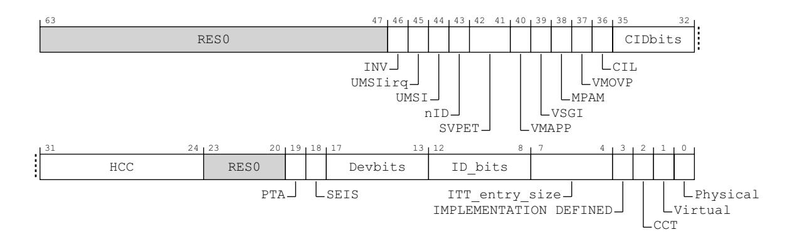

#### **Bits [63:47]**

Reserved, RES0.

#### **INV, bit [46]**

ITS cache invalidation behavior on disable.

The value of this field is an IMPLEMENTATION DEFINED choice of:

0b0 It is IMPLEMENTATION DEFINED whether ITS caches are invalidated on clearing [GITS\\_CTLR.](#page-833-1)Enabled and [GITS\\_BASER<n>](#page-825-1).Valid.

0b1 ITS caches are invalidated on clearing [GITS\\_CTLR.](#page-833-1)Enabled and [GITS\\_BASER<n>.](#page-825-1)Valid.

If GITS\_TYPER.INV is 1, after the following sequence:

- [GITS\\_CTLR](#page-833-1).Enabled written to 0.
- A read of [GITS\\_CTLR](#page-833-1).Quiescent returns 1.
- [GITS\\_BASER<n>](#page-825-1).Valid written to 0.

There is no cached information from the ITS memory structure pointed to by [GITS\\_BASER<n>.](#page-825-1) Access to this field is RO.

#### **UMSIirq, bit [45]**

Indicates support for generating an interrupt on receiving unmapped MSI.

The value of this field is an IMPLEMENTATION DEFINED choice of:

0b0 Interrupt on unmapped MSI not supported.

0b1 Interrupt on unmapped MSI is supported.

If GITS\_TYPER.UMSI is 0, this field is RES0.

Access to this field is RO.

#### **UMSI, bit [44]**

Indicates support for reporting receipt of unmapped MSIs.

The value of this field is an IMPLEMENTATION DEFINED choice of:

0b0 Reporting of unmapped MSIs is not supported.

0b1 Reporting of unmapped MSIs is supported.

Access to this field is RO.

#### **nID, bit [43]**

#### *When FEAT\_GICv4p1 is implemented:*

nID

The value of this field is an IMPLEMENTATION DEFINED choice of:

0b0 Individual doorbell interrupt supported.

0b1 Individual doorbell interrupt not supported.

Access to this field is RO.

#### *Otherwise:*

Reserved, RES0.

#### **SVPET, bits [42:41]**

#### *When FEAT\_GICv4p1 is implemented:*

SVPET

The value of this field is an IMPLEMENTATION DEFINED choice of:

0b00 vPE Table is not shared with Redistributors.

0b01 vPE Table is shared with the groups of Redistributors indicated by GITS\_MPIDR.Aff3.

0b10 vPE Table is shared with the groups of Redistributors indicated by GITS\_MPIDR fields

Aff3 and Aff2.

0b11 vPE Table is shared with the groups of Redistributors indicated by GITS\_MPIDR fields

Aff3, Aff2 and Aff1.

Access to this field is RO.

#### *Otherwise:*

Reserved, RES0.

#### **VMAPP, bit [40]**

#### *When FEAT\_GICv4p1 is implemented:*

VMAPP

The value of this field is an IMPLEMENTATION DEFINED choice of:

0b0 FEAT\_GICv4 VMAPP command layout.

0b1 FEAT\_GICv4p1 VMAPP command layout.

Access to this field is RO.

#### *Otherwise:*

Reserved, RES0.

#### **VSGI, bit [39]**

#### *When FEAT\_GICv4p1 is implemented:*

VSGI

The value of this field is an IMPLEMENTATION DEFINED choice of:

0b0 Direct injection of SGIs is not supported.

0b1 Direct injection of SGIs is supported.

Access to this field is RO.

#### *Otherwise:*

Reserved, RES0.

#### **MPAM, bit [38]**

#### *When FEAT\_GICv3p1 is implemented:*

MPAM

The value of this field is an IMPLEMENTATION DEFINED choice of:

0b0 MPAM is not supported. 0b1 MPAM is supported.

Access to this field is RO.

#### *Otherwise:*

Reserved, RES0.

#### **VMOVP, bit [37]**

#### *When FEAT\_GICv4 is implemented:*

Indicates the form of the VMOVP command.

The value of this field is an IMPLEMENTATION DEFINED choice of:

0b0 When moving a vPE, software must issue a VMOVP on all ITSs that have mappings for that vPE. The ITSList and Sequence Number fields in the VMOVP command must ensure synchronization, otherwise behavior is UNPREDICTABLE.

0b1 When moving a vPE, software must only issue a VMOVP on one of the ITSs that has a mapping for that vPE. The ITSList and Sequence Number fields in the VMOVP command are RES0.

Access to this field is RO.

#### *Otherwise:*

Reserved, RES0.

#### **CIL, bit [36]**

Collection ID Limit.

The value of this field is an IMPLEMENTATION DEFINED choice of:

0b0 ITS supports 16-bit Collection ID, [GITS\\_TYPER](#page-847-1).CIDbits is RES0.

0b1 [GITS\\_TYPER](#page-847-1).CIDbits indicates supported Collection ID size

In implementations that do not support Collections in external memory, this bit is RES0 and the number of Collections supported is reported by [GITS\\_TYPER.](#page-847-1)HCC.

Access to this field is RO.

#### **CIDbits, bits [35:32]**

Number of Collection ID bits.

- The number of bits of Collection ID minus one.
- When [GITS\\_TYPER.](#page-847-1)CIL == 0, this field is RES0.

This field has an IMPLEMENTATION DEFINED value.

Access to this field is RO.

#### **HCC, bits [31:24]**

Hardware Collection Count. The number of interrupt collections supported by the ITS without provisioning of external memory.

**Note**

Collections held in hardware are unmapped at reset.

This field has an IMPLEMENTATION DEFINED value.

Access to this field is RO.

#### **Bits [23:20]**

Reserved, RES0.

#### **PTA, bit [19]**

Physical Target Addresses. Indicates the format of the target address:

The value of this field is an IMPLEMENTATION DEFINED choice of:

0b0 The target address corresponds to the PE number specified by

[GICR\\_TYPER.](#page-710-1)Processor\_Number.

0b1 The target address corresponds to the base physical address of the required

Redistributor.

For more information, see [RDbase.](#page-103-2)

Access to this field is RO.

#### **SEIS, bit [18]**

SEI support. Indicates whether the virtual CPU interface supports generation of SEIs:

The value of this field is an IMPLEMENTATION DEFINED choice of:

0b0 The ITS does not support local generation of SEIs.

0b1 The ITS supports local generation of SEIs.

Access to this field is RO.

#### **Devbits, bits [17:13]**

The number of DeviceID bits implemented, minus one.

This field has an IMPLEMENTATION DEFINED value.

Access to this field is RO.

#### **ID\_bits, bits [12:8]**

The number of EventID bits implemented, minus one.

This field has an IMPLEMENTATION DEFINED value.

Access to this field is RO.

#### **ITT\_entry\_size, bits [7:4]**

Read-only. Indicates the number of bytes per translation table entry, minus one.

For more information about the ITS command 'MAPD', see *[MAPD on page](#page-111-1) 5-112*.

This field has an IMPLEMENTATION DEFINED value.

Access to this field is RO.

#### **IMPLEMENTATION DEFINED, bit [3]**

IMPLEMENTATION DEFINED.

#### **CCT, bit [2]**

Cumulative Collection Tables.

The value of this field is an IMPLEMENTATION DEFINED choice of:

0b0 The total number of supported collections is determined by the number of collections held in memory only.

0b1 The total number of supported collections is determined by number of collections that are held in memory and the number indicated by GITS\_TYPER.HCC.

If GITS\_TYPER.HCC == 0, or if memory backed collections are not supported (all [GITS\\_BASER<n>](#page-825-1).Type != 100), this bit is RES0.

Access to this field is RO.

#### **Virtual, bit [1]**

#### *When FEAT\_GICv4 is implemented:*

Indicates whether the ITS supports virtual LPIs and direct injection of virtual LPIs:

The value of this field is an IMPLEMENTATION DEFINED choice of:

0b0 The ITS does not support virtual LPIs or direct injection of virtual LPIs.

0b1 The ITS supports virtual LPIs and direct injection of virtual LPIs.

Access to this field is RO.

#### *Otherwise:*

Reserved, RES0.

#### **Physical, bit [0]**

Indicates whether the ITS supports physical LPIs:

The value of this field is an IMPLEMENTATION DEFINED choice of:

0b0 The ITS does not support physical LPIs.

0b1 The ITS supports physical LPIs.

This field is RES1, indicating that the ITS supports physical LPIs.

Access to this field is RO.

#### **Accessing the GITS\_TYPER:**

GITS\_TYPER can be accessed through its memory-mapped interface:

| Component       | Offset | Instance   |
|-----------------|--------|------------|
| GIC ITS control | 0x0008 | GITS_TYPER |

#### <span id="page-852-0"></span>**12.19.14 GITS\_UMSIR, ITS Unmapped MSI register**

The GITS\_UMSIR characteristics are:

#### **Purpose**

Provides the DeviceID and EventID of the unmapped MSI that set [GITS\\_STATUSR.](#page-843-0)UMSI.

#### **Configurations**

This register is present only when GITS\_TYPER.UMSI == 1. Otherwise, direct accesses to GITS\_UMSIR are RES0.

#### **Attributes**

GITS\_UMSIR is a 64-bit register.

#### **Field descriptions**

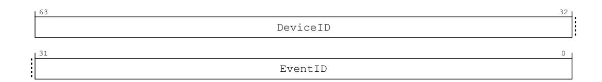

#### **DeviceID, bits [63:32]**

DeviceID of MSI that set [GITS\\_STATUSR.](#page-843-0)UMSI to 1.

If [GITS\\_STATUSR.](#page-843-0)UMSI is 0, this field is UNKNOWN.

#### **EventID, bits [31:0]**

EventID of MSI that set [GITS\\_STATUSR](#page-843-0).UMSI to 1.

### If [GITS\\_STATUSR.](#page-843-0)UMSI is 0, this field is UNKNOWN.

#### **Accessing the GITS\_UMSIR:**

GITS\_UMSIR can be accessed through its memory-mapped interface:

| Component       | Offset | Instance   |
|-----------------|--------|------------|
| GIC ITS control | 0x0048 | GITS_UMSIR |

*Programmers' Model 12.19 The ITS register descriptions*

## <span id="page-854-0"></span>Chapter 13 **Pseudocode**

This chapter provides information about the GIC pseudocode. It contains the following sections:

- *[AArch64 functions on page](#page-855-1) 13-856*.
- *[Functions for memory-mapped registers on page](#page-871-1) 13-872*.

*[AArch64 functions on page](#page-855-1) 13-856* shows the pseudocode for the System registers when executing in AArch64 state. The same pseudocode can be used for the System registers when executing in AArch32 state by substituting the AArch64 register names with the equivalent AArch32 register names.

| Note                                                                                                                                                                                                                               |
|------------------------------------------------------------------------------------------------------------------------------------------------------------------------------------------------------------------------------------|
| An AArch64 register name includes the lowest Exception level that can access the register as a suffix to the register<br>name. An AArch32 register name does not contain this suffix. For example the AArch64 Interrupt Controller |
| Deactivate Interrupt Register is ICC_DIR_EL1, while the AArch32 equivalent is ICC_DIR.                                                                                                                                             |
| Functions for memory-mapped registers on page 13-872 shows the pseudocode for the memory-mapped registers.                                                                                                                         |
| Note                                                                                                                                                                                                                               |
| Some variable names used the pseudocode differ from those used in the body text. For a list of the affected variables,<br>see Pseudocode terminology on page B-930.                                                                |

#### <span id="page-855-1"></span><span id="page-855-0"></span>**13.1 AArch64 functions**

This subsection describes the AArch64 functions. The functions are indicated by the hierarchical path names, for example aarch64/support. The functions are:

- *[aarch64/support/ICC\\_DIR\\_EL1](#page-855-2)*.
- *[aarch64/support/ICC\\_EOIR0\\_EL1 on page](#page-856-0) 13-857*.
- *[aarch64/support/ICC\\_EOIR1\\_EL1 on page](#page-857-0) 13-858*.
- *[aarch64/support/ICC\\_HPPIR0\\_EL1 on page](#page-858-0) 13-859*.
- *[aarch64/support/ICC\\_HPPIR1\\_EL1 on page](#page-858-1) 13-859*.
- *[aarch64/support/ICC\\_IAR0\\_EL1 on page](#page-858-2) 13-859*.
- *[aarch64/support/ICC\\_IAR1\\_EL1 on page](#page-859-0) 13-860*.
- *[aarch64/support/ICC\\_NMIAR1\\_EL1 on page](#page-859-1) 13-860*.
- *[aarch64/support/ICC\\_PMR\\_EL1 on page](#page-860-0) 13-861*.
- *[aarch64/support/ICC\\_RPR\\_EL1 on page](#page-861-2) 13-862*.
- *[aarch64/support/ICH\\_EISR\\_EL2 on page](#page-861-0) 13-862*.
- *[aarch64/support/ICH\\_ELRSR\\_EL2 on page](#page-861-1) 13-862*.
- *[aarch64/support/VirtualReadHPPIR0 on page](#page-862-0) 13-863*.
- *[aarch64/support/VirtualReadHPPIR1 on page](#page-862-1) 13-863*.
- *[aarch64/support/VirtualReadIAR0 on page](#page-863-0) 13-864*.
- *[aarch64/support/VirtualReadIAR1 on page](#page-863-1) 13-864*.
- *[aarch64/support/VirtualReadNMIAR1 on page](#page-864-0) 13-865*.
- *[aarch64/support/VirtualWriteDIR on page](#page-865-0) 13-866*.
- *[aarch64/support/VirtualWriteEOIR0 on page](#page-866-0) 13-867*.
- *[aarch64/support/VirtualWriteEOIR1 on page](#page-867-0) 13-868*.
- *[aarch64/support/CheckGroup0ForSpecialIdentifiers on page](#page-869-0) 13-870*.
- *[aarch64/support/CheckGroup1ForSpecialIdentifiers on page](#page-869-1) 13-870*.
- *[aarch64/support/PRIMask on page](#page-870-0) 13-871*.
- *[aarch64/support/VRIMask on page](#page-870-1) 13-871*.

#### <span id="page-855-2"></span>**13.1.1 aarch64/support/ICC\_DIR\_EL1**

```
// ICC_DIR_EL1 - assignment form
// =============================
ICC_DIR_EL1[] = bits(64) data
    // First check if System Registers are enabled
    SystemRegisterAccessPermitted(2, TRUE);
    // Check if the access is virtual
    if (HaveEL(EL2) && EL2Enabled() && PSTATE.EL == EL1 &&
        (HCR_EL2.FMO == '1' || HCR_EL2.IMO == '1')) then
        VirtualWriteDIR(data); // Access the Virtual DIR register
        return;
    // Check for spurious ID. LPIs are not allowed and the access is physical
    if !InterruptIdentifierValid(data, FALSE) then
        return;
    ID = data<INTID_SIZE-1:0>;
    // Now start handling the interrupt
    if !EOImodeSet() then
        // EOI mode is not set, so don't deactivate
        IMPLEMENTATION_DEFINED "SError DIR_EOIMODE_NOT_SET";
    else
        route_fiq_to_el3 = HaveEL(EL3) && SCR_EL3.FIQ == '1';
        route_irq_to_el3 = HaveEL(EL3) && SCR_EL3.IRQ == '1';
```

```
route_fiq_to_el2 = HaveEL(EL2) && !IsSecure() && HCR_EL2.FMO == '1';
    route_irq_to_el2 = HaveEL(EL2) && !IsSecure() && HCR_EL2.IMO == '1';
    if PSTATE.EL == EL3 then
        Deactivate(ID);
    elsif PSTATE.EL == EL2 then
        if SingleSecurityState() && IsGrp0Int(ID) && !route_fiq_to_el3 then
            Deactivate(ID);
        elsif !IsSecureInt(ID) && !IsGrp0Int(ID) && !route_irq_to_el3 then
            Deactivate(ID);
    elsif PSTATE.EL == EL1 && !IsSecure() then
        if SingleSecurityState() && IsGrp0Int(ID) && !route_fiq_to_el3 && !route_fiq_to_el2 then
            Deactivate(ID);
        elsif !IsSecureInt(ID) && !IsGrp0Int(ID) && !route_irq_to_el3 && !route_irq_to_el2 then
            Deactivate(ID);
    elsif PSTATE.EL == EL1 && IsSecure() then
        if IsGrp0Int(ID) && !route_fiq_to_el3 then
            Deactivate(ID);
        elsif (!IsGrp0Int(ID) && (!IsSecureInt(ID) || !SingleSecurityState()) &&
               !route_irq_to_el3) then
            Deactivate(ID);
return;
```

#### <span id="page-856-0"></span>**13.1.2 aarch64/support/ICC\_EOIR0\_EL1**

```
// ICC_EOIR0_EL1 - assignment form
// ===============================
ICC_EOIR0_EL1[] = bits(64) data
    eoiID = data<INTID_SIZE-1:0>;
    // First check if System Registers are enabled
    SystemRegisterAccessPermitted(0, FALSE);
    // Check if the access is virtual
    if HaveEL(EL2) && EL2Enabled() && PSTATE.EL == EL1 && HCR_EL2.FMO == '1' then
        VirtualWriteEOIR0(data); // Access the Virtual EOIR0 register
        return;
    // Check for spurious ID. LPIs are allowed and the access is physical
    if !InterruptIdentifierValid(data, TRUE) then
        return;
    // Now start handling the interrupt
    // Is the highest priority G0S, G1S or G1NS
    pGroup = GetHighestActiveGroup(ICC_AP0R_EL1, ICC_AP1R_EL1NS, ICC_AP1R_EL1S);
    pPriority = GetHighestActivePriority(ICC_AP0R_EL1, ICC_AP1R_EL1NS, ICC_AP1R_EL1S);
    if pGroup == IntGroup_None then
        // There are no active priorities
        if GenerateLocalSError() then
            // Reporting of locally generated SEIs is supported
            IMPLEMENTATION_DEFINED "SError EOI0_NO_INTS_ACTIVE";
    elsif pGroup == IntGroup_G0 && (!HaveEL(EL3) || SingleSecurityState() || IsSecure()) then
        // Highest priority is Group 0
        // Drop the priority
        boolean dropped = PriorityDrop[ICC_AP0R_EL1];
        if !EOImodeSet() then // If EOI mode is set, don't deactivate
            // Deactivate if the interrupt is in Group 0
            if IsGrp0Int(eoiID) then
               Deactivate(eoiID);
    elsif GenerateLocalSError() then // Locally generated SEIs are supported
```

```
// Highest priority is Group 1
IMPLEMENTATION_DEFINED "SError EOI0_HIGHEST_IS_G1";
return;
```

#### <span id="page-857-0"></span>**13.1.3 aarch64/support/ICC\_EOIR1\_EL1**

```
// ICC_EOIR1_EL1 - assignment form
// ===============================
ICC_EOIR1_EL1[] = bits(64) data
    eoiID = data<INTID_SIZE-1:0>;
    // First check if System Registers are enabled
    SystemRegisterAccessPermitted(1, FALSE);
    // Check if the access is virtual
    if HaveEL(EL2) && EL2Enabled() && PSTATE.EL == EL1 && HCR_EL2.IMO == '1' then
       VirtualWriteEOIR1(data); // Access the Virtual EOIR1 register
       return;
    // Check for spurious ID. LPIs are allowed and the access is physical
    if !InterruptIdentifierValid(data, TRUE) then
       return;
    // Now start handling the interrupt
    // Is the highest priority G0S, G1S or G1NS
    pGroup = GetHighestActiveGroup(ICC_AP0R_EL1, ICC_AP1R_EL1NS, ICC_AP1R_EL1S);
    pPriority = GetHighestActivePriority(ICC_AP0R_EL1, ICC_AP1R_EL1NS, ICC_AP1R_EL1S);
    if pGroup == IntGroup_None then
       // There are no active priorities
       if GenerateLocalSError() then
            // Reporting of locally generated SEIs is supported
            IMPLEMENTATION_DEFINED "SError EOI1_NO_INTS_ACTIVE";
    elsif pGroup == IntGroup_G1NS && (IsEL3OrMon() || !IsSecure()) then
       // Highest priority is Non-Secure Group 1
       // Drop the priority
       boolean dropped = PriorityDrop[ICC_AP1R_EL1NS];
       if !EOImodeSet() then // If EOI mode is set, don't deactivate
            // Deactivate the interrupt unless it is an LPI
            if !IsLPI(eoiID) then Deactivate(eoiID);
    elsif pGroup == IntGroup_G1S && IsSecure() then
       // Highest priority is Secure Group 1 and we are secure
       // Drop the priority
       boolean dropped = PriorityDrop[ICC_AP1R_EL1S];
       if !EOImodeSet() then // If EOI mode is set, don't deactivate
            // Deactivate if the interrupt is Group 1, and not an LPI
            if !IsLPI(eoiID) && !IsGrp0Int(eoiID) then
                if !IsSecureInt(eoiID) || IsSecure() then
                       Deactivate(eoiID);
    elsif GenerateLocalSError() then // Locally generated SEIs are supported
       // Highest priority is Group 0 or Secure Group 1 and we are not secure
       IMPLEMENTATION_DEFINED "SError EOI1_HIGHEST_NOT_ACCESSIBLE";
       return;
```

#### <span id="page-858-0"></span>**13.1.4 aarch64/support/ICC\_HPPIR0\_EL1**

```
// ICC_HPPIR0_EL1 - non-assignment form
// ====================================
bits(32) ICC_HPPIR0_EL1[]
    // First check if System Registers are enabled
    SystemRegisterAccessPermitted(0, FALSE);
    // Check if the access is virtual
    if HaveEL(EL2) && EL2Enabled() && PSTATE.EL == EL1 && HCR_EL2.FMO == '1' then
        return VirtualReadHPPIR0(); // Access the Virtual HPPIR0 register
    // Now start handling the interrupt
    pendID = HighestPriorityPendingInterrupt();
    pendID = CheckGroup0ForSpecialIdentifiers(pendID);
    return ZeroExtend(pendID);
```

#### <span id="page-858-1"></span>**13.1.5 aarch64/support/ICC\_HPPIR1\_EL1**

```
// ICC_HPPIR1_EL1 - non-assignment form
// ====================================
bits(32) ICC_HPPIR1_EL1[]
    // First check if System Registers are enabled
    SystemRegisterAccessPermitted(1, FALSE);
    // Check if the access is virtual
    if HaveEL(EL2) && EL2Enabled() && PSTATE.EL == EL1 && HCR_EL2.IMO == '1' then
        return VirtualReadHPPIR1(); // Access the Virtual HPPIR1 register
    // Now start handling the interrupt
    pendID = HighestPriorityPendingInterrupt();
    pendID = CheckGroup1ForSpecialIdentifiers(pendID);
    return ZeroExtend(pendID);
```

#### <span id="page-858-2"></span>**13.1.6 aarch64/support/ICC\_IAR0\_EL1**

```
// ICC_IAR0_EL1 - non-assignment form
// ==================================
bits(32) ICC_IAR0_EL1[]
   // First check if System Registers are enabled
   SystemRegisterAccessPermitted(0, FALSE);
   // Check if the access is virtual
   if HaveEL(EL2) && EL2Enabled() && PSTATE.EL == EL1 && HCR_EL2.FMO == '1' then
       return VirtualReadIAR0(); // Access the Virtual IAR0 register
   // Now start handling the interrupt
   if !CanSignalInterrupt() then
       return ZeroExtend(INTID_SPURIOUS);
   // Gets the highest priority pending and enabled interrupt
   pendID = HighestPriorityPendingInterrupt();
   pendID = CheckGroup0ForSpecialIdentifiers(pendID);
   // Check that pendID is not a special interrupt ID
   if !IsSpecial(pendID) then
```

```
AcknowledgeInterrupt(pendID); // Set active and attempt to clear pending
return ZeroExtend(pendID);
```

#### <span id="page-859-0"></span>**13.1.7 aarch64/support/ICC\_IAR1\_EL1**

```
// ICC_IAR1_EL1 - non-assignment form
// ==================================
bits(32) ICC_IAR1_EL1[]
   // First check if System Registers are enabled
   SystemRegisterAccessPermitted(1, FALSE);
   // Check if the access is virtual
   if HaveEL(EL2) && EL2Enabled() && PSTATE.EL == EL1 && HCR_EL2.IMO == '1' then
       return VirtualReadIAR1(); // Access the Virtual IAR1 register
   // Now start handling the interrupt
   if !CanSignalInterrupt() then
       return ZeroExtend(INTID_SPURIOUS);
   // Gets the highest priority pending and enabled interrupt
   pendID = HighestPriorityPendingInterrupt();
   pendID = CheckGroup1ForSpecialIdentifiers(pendID);
   // Check that pendID is not a special interrupt ID
   if !IsSpecial(pendID) then
       // GICv3.3: Check for NMI
       if HaveNMIExt() then
           if IsNMI(intID) && SCTLR[].NMI == '1' then
               return ZeroExtend(INTID_NMI);
       // Interrupt is not a special ID, and either it is not an NMI or SCTLR.NMI is not set
       AcknowledgeInterrupt(pendID); // Set active and attempt to clear pending
   return ZeroExtend(pendID);
```

#### <span id="page-859-1"></span>**13.1.8 aarch64/support/ICC\_NMIAR1\_EL1**

```
// ICC_NMIAR1_EL1 - non-assignment form
// =====================================
bits(32) ICC_NMIAR1_EL1[]
   // First check if System Registers are enabled
   SystemRegisterAccessPermitted(1, FALSE);
   // Check if the access is virtual
   if HaveEL(EL2) && EL2Enabled() && PSTATE.EL == EL1 && HCR_EL2.IMO == '1' then
       return VirtualReadNMIAR1(); // Access the Virtual NMIAR1 register
   // Now start handling the interrupt
   if !CanSignalInterrupt() then
       return ZeroExtend(INTID_SPURIOUS);
   // Gets the highest priority pending and enabled interrupt
   pendID = HighestPriorityPendingInterrupt();
   pendID = CheckGroup1ForSpecialIdentifiers(pendID);
   // Check that pendID is not a special interrupt ID
   if !IsSpecial(pendID) then
       // Check that the interrupt is an NMI
```

```
if !IsNMI(intID) then
       return ZeroExtend(INTID_SPURIOUS);
   // Interrupt is not special and is an NMI
   AcknowledgeInterrupt(pendID); // Set active and attempt to clear pending
return ZeroExtend(pendID);
```

#### <span id="page-860-0"></span>**13.1.9 aarch64/support/ICC\_PMR\_EL1**

```
// ICC_PMR_EL1[] - non-assignment form
// ===================================
bits(32) ICC_PMR_EL1[]
   // First check if System Registers are enabled
   SystemRegisterAccessPermitted(2, FALSE); // Set group to 2 so "TC" bit is checked
   if (HaveEL(EL2) && EL2Enabled() && PSTATE.EL == EL1 &&
       (HCR_EL2.FMO == '1' || HCR_EL2.IMO == '1')) then
       // At least one interrupt is virtualized so return the virtual mask
       return ZeroExtend(ICH_VMCR_EL2.VPMR AND VPRIMask());
   pPriority = ICC_PMR_EL1.Priority;
   if HaveEL(EL3) && !IsSecure() && SCR_EL3.FIQ == '1' then
       // A non-secure GIC access and group 0 inaccessible to Non-secure.
       if pPriority<7> == '0' then
           // Priority is in Secure half and not visible to Non-secure
           pPriority<7:0> = Zeros();
       else
           // Non-secure access
           pPriority<7:0> = (pPriority AND PRIMask())<6:0>:'0';
   return ZeroExtend(pPriority);
// ICC_PMR_EL1[] - assignment form
// ===============================
ICC_PMR_EL1 = bits(32) data
   // First check if System Registers are enabled
   SystemRegisterAccessPermitted(2, FALSE); // Set group to 2 so "TC" bit is checked
   if (HaveEL(EL2) && EL2Enabled() && PSTATE.EL == EL1 &&
       (HCR_EL2.FMO == '1' || HCR_EL2.IMO == '1')) then
       // At least one interrupt is virtualized so update the virtual mask
       ICH_VMCR_EL2.VPMR = data<7:0> AND VPRIMask();
       return;
   if HaveEL(EL3) && !IsSecure() && SCR_EL3.FIQ == '1' then
       // A Non-secure GIC access and Group 0 inaccessible to Non-secure.
       mod_write_val = ('1':data<7:1>) AND PRIMask();
       // Non-secure state can only update the Priority Mask Register if the current value is in
       // the range 0x80 to 0xFF
       if ICC_PMR_EL1.Priority<7> == '1' then
           ICC_PMR_EL1.Priority = mod_write_val;
       // Otherwise PMR is between 0x00 and 0x7F and the write is ignored
   else // A Secure GIC access
       ICC_PMR_EL1.Priority = data<7:0> AND PRIMask();
   return;
```

#### <span id="page-861-2"></span>**13.1.10 aarch64/support/ICC\_RPR\_EL1**

```
// ICC_RPR_EL1 - non-assignment form
// =================================
bits(64) ICC_RPR_EL1[]
    // First check if System Registers are enabled
    SystemRegisterAccessPermitted(2, FALSE); // Set group to 2 so "TC" bit is checked
    if (HaveEL(EL2) && EL2Enabled() && PSTATE.EL == EL1 &&
        (HCR_EL2.FMO == '1' || HCR_EL2.IMO == '1')) then
        // At least one interrupt is virtualized so return the virtual priority
        bits(64) vPriority = ZeroExtend(GetHighestActiveVPriority(ICH_AP0R_EL2, ICH_AP1R_EL2));
        // GICv3.3
        if HaveNMIExt() && ICH_AP1R_EL2<63> == '1' then
            vPriority = Zeros();
            vPriority<63> = 1;
        return vPriority;
    // Get physical priority.
    bits(64) pPriority = ZeroExtend(GetHighestActivePriority(ICC_AP0R_EL1, ICC_AP1R_EL1NS,
ICC_AP1R_EL1S));
    if HaveEL(EL3) && (IsNonSecure() || IsRealm()) && SCR_EL3.FIQ == '1' then
        // A Non-secure GIC access and Group 0 inaccessible to Non-secure.
        if pPriority<7> == '0' then
            // Priority is in Secure half and not visible to Non-secure or Realm
            pPriority = Zeros();
        elsif !IsOnes(pPriority) then
            // Non-secure or Realm access and not idle, so physical priority must be shifted
            pPriority<7:0> = (pPriority AND PRIMask())<6:0>:'0';
    // GICv3.3
    if HaveNMIExt() then
        if IsNonSecure() || IsRealm() then
            pPriority<63> = ICC_AP1R_EL1NS<63>;
        else
            pPriority<63> = ICC_AP1R_EL1S<63>;
            if Have(EL3) then
                pPriority<62> = ICC_AP1R_EL1NS<63>;
    return pPriority;
-----------------------------------------
```

#### <span id="page-861-0"></span>**13.1.11 aarch64/support/ICH\_EISR\_EL2**

```
// ICH_EISR_EL2 - non-assignment form
// ==================================
bits(32) ICH_EISR_EL2 []
    for i = 0 to NumListRegs() - 1
        if (ICH_LR_EL2[i].State == IntState_Invalid && ICH_LR_EL2[i].HW == '0' &&
            ICH_LR_EL2[i].EOI == '1') then
            rval<i> = '1';
    return rval;
```

#### <span id="page-861-1"></span>**13.1.12 aarch64/support/ICH\_ELRSR\_EL2**

```
// ICH_ELRSR_EL2 - non-assignment form
```

```
// ==================================
bits(32) ICH_EISR_EL2[]
    bits(32) rval = Zeros();
    for i = 0 to NumListRegs() - 1
        if (ICH_LR_EL2[i].State == IntState_Invalid &&
            (ICH_LR_EL2[i].HW == '1' || ICH_LR_EL2[i].EOI == '0')) then
            rval<i> = '1';
    return rval;
```

#### <span id="page-862-0"></span>**13.1.13 aarch64/support/VirtualReadHPPIR0**

```
// VirtualReadHPPIR0()
// ===================
bits(32) VirtualReadHPPIR0()
   lrIndex = HighestPriorityVirtualInterrupt();
   if (GICH_VLPIR.State == IntState_Pending &&
      (lrIndex < 0 || PriorityIsHigher(GICH_VLPIR.Priority, ICH_LR_EL2[lrIndex].Priority)) &&
!IsSecure()) then
       // A virtual LPI is the highest priority
       vID = GICH_VLPIR.vINTID<INTID_SIZE-1:0>;
       if GICH_VLPIR.Group != '0' then
           vID = INTID_SPURIOUS;
   elsif lrIndex >= 0 then // lrIndex is valid, that is, positive
       vID = ICH_LR_EL2[lrIndex].vINTID<INTID_SIZE-1:0>;
       if (vID != INTID_SPURIOUS && (ICH_LR_EL2[lrIndex].Group != '0' ||
                                         ICH_LR_EL2[lrIndex].State == IntState_Invalid)) then
           vID = INTID_SPURIOUS; // If the highest priority isn't group 0, then no interrupt
   else
       vID = INTID_SPURIOUS;
   return ZeroExtend(vID);
```

#### <span id="page-862-1"></span>**13.1.14 aarch64/support/VirtualReadHPPIR1**

```
// VirtualReadHPPIR1()
// ===================
bits(32) VirtualReadHPPIR1()
   lrIndex = HighestPriorityVirtualInterrupt();
   if (GICH_VLPIR.State == IntState_Pending &&
      (lrIndex < 0 || PriorityIsHigher(GICH_VLPIR.Priority, ICH_LR_EL2[lrIndex].Priority)) &&
!IsSecure()) then
       // A virtual LPI is the highest priority
       vID = GICH_VLPIR.vINTID<INTID_SIZE-1:0>;
       if GICH_VLPIR.Group != '1' then
           vID = INTID_SPURIOUS;
   elsif lrIndex >= 0 then // lrIndex is valid, that is, positive
       vID = ICH_LR_EL2[lrIndex].vINTID<INTID_SIZE-1:0>;
       if (vID != INTID_SPURIOUS && (ICH_LR_EL2[lrIndex].Group != '1' ||
                                         ICH_LR_EL2[lrIndex].State == IntState_Invalid)) then
           vID = INTID_SPURIOUS; // If the highest priority isn't group 1, then no interrupt
   else
```

```
vID = INTID_SPURIOUS;
return ZeroExtend(vID);
```

#### <span id="page-863-0"></span>**13.1.15 aarch64/support/VirtualReadIAR0**

```
// VirtualReadIAR0()
// =================
bits(32) VirtualReadIAR0()
   integer lrIndex = HighestPriorityVirtualInterrupt();
   if !CanSignalVirtualInterrupt() then
       return ZeroExtend(INTID_SPURIOUS);
   if (GICH_VLPIR.State == IntState_Pending &&
       (lrIndex < 0 || PriorityIsHigher(GICH_VLPIR.Priority, ICH_LR_EL2[lrIndex].Priority))
       && !IsSecure) then
       // A virtual interrupt received via direct-injection is the highest priority
       vID = GICH_VLPIR.vINTID<INTID_SIZE-1:0>;
       if GICH_VLPIR.Group == '0' then
           vPriorityGroup = VPriorityGroup(GICH_VLPIR.Priority);
           ICH_AP0R_EL2<UInt(vPriorityGroup >> (7- ICH_VTR_EL2.PRIbits))> = '1';
           AcknowledgeVInterrupt(GICH_VLPIR.vINTID<INTID_SIZE-1:0>);
           GICH_VLPIR.State = IntState_Invalid; // Set the virtual LPI to Idle
       else
           vID = INTID_SPURIOUS;
       return ZeroExtend(vID);
   // lrIndex must be valid (i.e. non-negative)
   if (lrIndex < 0)
       return ZeroExtend(INTID_SPURIOUS);
   vID = ICH_LR_EL2[lrIndex].vINTID<INTID_SIZE-1:0>;
   pID = ICH_LR_EL2[lrIndex].pINTID<INTID_SIZE-1:0>;
   if (vID != INTID_SPURIOUS &&
       (ICH_LR_EL2[lrIndex].Group != '0' || ICH_LR_EL2[lrIndex].State == IntState_Invalid)) then
       // If the highest priority isn't Group 0, then no interrupt
       return ZeroExtend(INTID_SPURIOUS);
   if !IsSpecial(vID) then // Check that it is not a
spurious interrupt
       ICH_LR_EL2[lrIndex].State = IntState_Active; // Set the list register
state to Active
       vPriorityGroup = VPriorityGroup(ICH_LR_EL2[lrIndex].Priority);
       ICH_AP0R_EL2<UInt(vPriorityGroup >> (7- ICH_VTR_EL2.PRIbits))> = '1'; // Set the corresponding
bit in APR
   else
       UNPREDICTABLE;
```

#### <span id="page-863-1"></span>**13.1.16 aarch64/support/VirtualReadIAR1**

return ZeroExtend(vID);

```
// VirtualReadIAR1()
// =================
bits(32) VirtualReadIAR1()
    integer lrIndex = HighestPriorityVirtualInterrupt();
    if !CanSignalVirtualInterrupt() then
```

```
return ZeroExtend(INTID_SPURIOUS);
if (GICH_VLPIR.State == IntState_Pending && (lrIndex < 0 || PriorityIsHigher(GICH_VLPIR.Priority,
      ICH_LR_EL2[lrIndex].Priority)) && !IsSecure) then
   // A virtual interrupt received via direct-injection is the highest priority
   vID = GICH_VLPIR.vINTID<INTID_SIZE-1:0>;
   if GICH_VLPIR.Group == '1' then
        // GICv3.3: Check whether the interrupt is an NMI
        if GICH_VLPIR.NMI == '0' || && SCTLR_EL1.NMI == '0' then
            vPriorityGroup = VPriorityGroup(GICH_VLPIR.Priority);
            ICH_AP1R_EL2<UInt(vPriorityGroup >> (7- ICH_VTR_EL2.PRIbits))> = '1';
            AcknowledgeVInterrupt(GICH_VLPIR.vINTID<INTID_SIZE-1:0>);
            GICH_VLPIR.State = IntState_Invalid; // Set the virtual LPI to Idle
        else
            vID = INTID_NMI;
   else
        vID = INTID_SPURIOUS;
   return ZeroExtend(vID);
// lrIndex must be valid (i.e. non-negative)
if (lrIndex < 0)
   return ZeroExtend(INTID_SPURIOUS);
vID = ICH_LR_EL2[lrIndex].vINTID<INTID_SIZE-1:0>;
pID = ICH_LR_EL2[lrIndex].pINTID<INTID_SIZE-1:0>;
if ICH_LR_EL2[lrIndex].Group != '1' || ICH_LR_EL2[lrIndex].State == IntState_Invalid then
   // If the highest priority isn't Group 1, then no interrupt
   return ZeroExtend(INTID_SPURIOUS);
if !IsSpecial(vID) then
   // GICv3.3: Check whether interrupt is an NMI
   if HaveNMIExt() && ICH_LR_EL2[lrIndex].NMI == '1' && SCTLR_EL1.NMI == '1' then
        return ZeroExtend(INTID_NMI);
   ICH_LR_EL2[lrIndex].State = IntState_Active; // Set the list register state to Active
   vPriorityGroup = VPriorityGroup(ICH_LR_EL2[lrIndex].Priority);
   ICH_AP1R_EL2<UInt(vPriorityGroup >> (7- ICH_VTR_EL2.PRIbits))> = '1';
                                                            // Set the corresponding bit in APR
else
   UNPREDICTABLE;
return ZeroExtend(vID);
```

#### <span id="page-864-0"></span>**13.1.17 aarch64/support/VirtualReadNMIAR1**

```
// VirtualReadNMIAR1()
// =================
bits(32) VirtualReadNMIAR1()
    integer lrIndex = HighestPriorityVirtualInterrupt();
    if !CanSignalVirtualInterrupt() then
        return ZeroExtend(INTID_SPURIOUS);
    if (GICH_VLPIR.State == IntState_Pending && (lrIndex < 0 || PriorityIsHigher(GICH_VLPIR.Priority,
          ICH_LR_EL2[lrIndex].Priority)) && !IsSecure) then
        // A virtual interrupt received via direct-injection is the highest priority
        vID = GICH_VLPIR.vINTID<INTID_SIZE-1:0>;
        if GICH_VLPIR.Group == '1' then
            // GICv3.3: Check whether the interrupt is an NMI
            if GICH_VLPIR.NMI == '1' then
                vPriorityGroup = VPriorityGroup(GICH_VLPIR.Priority);
                ICH_AP1R_EL2.NMI = '1';
                AcknowledgeVInterrupt(GICH_VLPIR.vINTID<INTID_SIZE-1:0>);
                GICH_VLPIR.State = IntState_Invalid; // Set the virtual LPI to Idle
            else
```

```
vID = INTID_SPURIOUS;
   else
       vID = INTID_SPURIOUS;
   return ZeroExtend(vID);
// lrIndex must be valid (i.e. non-negative)
if (lrIndex < 0)
   return ZeroExtend(INTID_SPURIOUS);
vID = ICH_LR_EL2[lrIndex].vINTID<INTID_SIZE-1:0>;
pID = ICH_LR_EL2[lrIndex].pINTID<INTID_SIZE-1:0>;
if ICH_LR_EL2[lrIndex].Group != '1' || ICH_LR_EL2[lrIndex].State == IntState_Invalid then
   // If the highest priority isn't Group 1, then no interrupt
   return ZeroExtend(INTID_SPURIOUS);
if !IsSpecial(vID) then
   // GICv3.3: Check whether interrupt is an NMI
   if ICH_LR_EL2[lrIndex].NMI == '0' then
       return ZeroExtend(INTID_SPURIOUS);
   ICH_LR_EL2[lrIndex].State = IntState_Active; // Set the list register state to Active
   vPriorityGroup = VPriorityGroup(ICH_LR_EL2[lrIndex].Priority);
   ICH_AP1R_EL2.NMI = '1'; // Set the corresponding bit in APR
else
   UNPREDICTABLE;
return ZeroExtend(vID);
```

#### <span id="page-865-0"></span>**13.1.18 aarch64/support/VirtualWriteDIR**

```
// VirtualWriteDIR()
// =================
VirtualWriteDIR(bits(64) data)
    // When an error is detected return to avoid unpredictable behaviour
    if ICH_VMCR_EL2.VEOIM == '0' then
        // EOI mode is not set
        if ICH_VTR_EL2.SEIS == '1' then
            // Reporting of locally generated virtual SEIs is supported
            IMPLEMENTATION_DEFINED "SError DIR_EOIMODE_NOT_SET";
        return;
    // Check for spurious ID. LPIs are not allowed and the access is virtual
    if !VirtualIdentifierValid(data, FALSE) then
        return;
    ID = data<INTID_SIZE-1:0>;
    lrIndex = FindActiveVirtualInterrupt(ID);
    if lrIndex < 0 then
    // GICv4.1: If the vINTID is an SGI, EOICount update is
        // controlled by ICH_HCR_EL2
        if ((ICH_HCR_EL2.vSGIEOICount==0) || !IsSGI(data)) then
           // No valid list register corresponds to the EOI ID
           ICH_HCR_EL2.EOIcount = ICH_HCR_EL2.EOIcount + 1;
           return;
    setEI = ICH_LR_EL2[lrIndex].EOI == '1';
    if ICH_LR_EL2[lrIndex].HW == '1' then
        // Deactivate the physical interrupt if EOI Mode is set
        pID = ICH_LR_EL2[lrIndex].pINTID;
        if IntNeedsDeactivate(UInt(pID)) then Deactivate(ZeroExtend(pID));
```

```
// Clear the Active state
if ICH_LR_EL2[lrIndex].State == IntState_ActivePending then
    ICH_LR_EL2[lrIndex].State = IntState_Pending;
else
    ICH_LR_EL2[lrIndex].State = IntState_Invalid;
return;
```

#### <span id="page-866-0"></span>**13.1.19 aarch64/support/VirtualWriteEOIR0**

```
// VirtualWriteEOIR0()
// ===================
VirtualWriteEOIR0(bits(64) data)
    eoiID = data<INTID_SIZE-1:0>;
    vPriority = GetHighestActiveVPriority(ICH_AP0R_EL2, ICH_AP1R_EL2);
    // Check the identifier is valid. LPIs are allowed and the access is virtual
    if !VirtualIdentifierValid(data, TRUE) then
        return;
    // Now perform the priority drop
    drop = VPriorityBitsSet(ICH_AP0R_EL2, ICH_AP1R_EL2);
    if !drop then
        if ICH_VTR_EL2.SEIS == '1' then
            // Reporting of locally generated virtual SEIs is supported
            IMPLEMENTATION_DEFINED "SError EOIx_NO_INTS_ACTIVE";
        // It is CONSTRAINED UNPREDICTABLE whether the List Registers are
        // checked if there was no priority drop
        if ConstrainUnpredictableBool() then
            return;
    // It is IMPLEMENTATION DEFINED whether the priority is dropped
    // before the error checks
    if boolean IMPLEMENTATION_DEFINED "Drop before checks" then
        if HaveNMI() && (ICH_AP1R_EL2.NMI = '1') then
            // The interrupt is an NMI, clear the NMI active priority
            ICH_AP1R_EL2.NMI = '0'
        else
            // The interrupt is not an NMI, clear highest active priority
            VPriorityDrop[ICH_AP0R_EL2, ICH_AP1R_EL2] = '0';
        dropped = TRUE;
    else
        dropped = FALSE;
    // Find the matching List Register
    lrIndex = FindActiveVirtualInterrupt(eoiID);
    if lrIndex < 0 then
        if IsLPI(eoiID) then
            // It is a virtual LPI not in the List Registers
            // so just priority drop and return without incrementing
            // EOI count
            return;
        else
            // No valid list register corresponds to the EOI ID,
            // increment EOI count
            // GICv4.1: For SGIs, ICH_HCR_EL2 controls whether EOICount incremented
            if drop && ICH_VMCR_EL2.VEOIM == '0' && ((ICH_HCR_EL2.vSGIEOICount==0) || !IsSGI(eoiID)) then
               ICH_HCR_EL2.EOIcount = ICH_HCR_EL2.EOIcount + 1;
        return;
```

```
// Start error checks
// When an error is detected return to avoid unpredictable behaviour
if ICH_LR_EL2[lrIndex].Group != '0' then
    // The EOI ID is not Group 0
    if ICH_VTR_EL2.SEIS == '1' then
        // Reporting of locally generated virtual SEIs is supported
        IMPLEMENTATION_DEFINED "SError EOI0_HIGHEST_IS_G1";
    return;
if VPriorityGroup(ICH_LR_EL2[lrIndex].Priority, 0) != vPriority then
    // The EOI ID is not the highest priority
    if ICH_VTR_EL2.SEIS == '1' then
        // Reporting of locally generated virtual SEIs is supported
        IMPLEMENTATION_DEFINED "SError EOI0_NOT_HIGHEST_PRIORITY";
   // It is CONSTRAINED UNPREDICTABLE whether deactivation
   // is performed in the case of an error
   if ConstrainUnpredictableBool() then
    return;
// End of error checks
if !dropped
    if HaveNMI() && (ICH_AP1R_EL2.NMI = '1') then
        // The interrupt is an NMI, clear the NMI active priority
        ICH_AP1R_EL2.NMI = '0';
    else
        // The interrupt is not an NMI, clear highest active priority
        VPriorityDrop[ICH_AP0R_EL2, ICH_AP1R_EL2] = '0';
if ICH_VMCR_EL2.VEOIM == '0' || IsLPI(eoiID) then
    setEI = ICH_LR_EL2[lrIndex].EOI == '1';
    // EOI mode not set, or it is an LPI and no deactivate is expected
    // so clear the active state in the List Register
    if ICH_LR_EL2[lrIndex].HW == '1' then
        // Deactivate the physical interrupt
        pID = ICH_LR_EL2[lrIndex].pINTID;
        if IntNeedsDeactivate(UInt(pID)) then Deactivate(ZeroExtend(pID));
    // Clear the Active state
    if ICH_LR_EL2[lrIndex].State == IntState_ActivePending then
        ICH_LR_EL2[lrIndex].State = IntState_Pending;
    else
        ICH_LR_EL2[lrIndex].State = IntState_Invalid;
return;
```

#### <span id="page-867-0"></span>**13.1.20 aarch64/support/VirtualWriteEOIR1**

```
// VirtualWriteEOIR1()
// ===================
VirtualWriteEOIR1(bits(64) data)
    eoiID = data<INTID_SIZE-1:0>;
    vPriority = GetHighestActiveVPriority(ICH_AP0R_EL2, ICH_AP1R_EL2);
    // Check the identifier is valid. LPIs are allowed and the access is virtual
    if !VirtualIdentifierValid(data, TRUE) then
        return;
    // Now perform the priority drop
    drop = VPriorityBitsSet(ICH_AP0R_EL2, ICH_AP1R_EL2);
    if !drop then
       if ICH_VTR_EL2.SEIS == '1' then
           // Reporting of locally generated virtual SEIs is supported
```

```
IMPLEMENTATION_DEFINED "SError EOIx_NO_INTS_ACTIVE";
    // It is CONSTRAINED UNPREDICTABLE whether the List Registers are
    // checked if there was no priority drop
    if ConstrainUnpredictableBool() then
        return;
 // It is IMPLEMENTATION DEFINED whether the priority is dropped before the error checks
 if boolean IMPLEMENTATION_DEFINED "Drop before checks" then
     if HaveNMI() && (ICH_AP1R_EL2.NMI = '1') then
         // The interrupt is an NMI, clear the NMI active priority
         ICH_AP1R_EL2.NMI = '0'
     else
         // The interrupt is not an NMI, clear highest active priority
         VPriorityDrop[ICH_AP0R_EL2, ICH_AP1R_EL2] = '0'
     dropped = TRUE;
else
     dropped = FALSE;
 // Find the matching List Register
 lrIndex = FindActiveVirtualInterrupt(eoiID);
 if lrIndex < 0 then
     if IsLPI(eoiID) then
         // It is a virtual LPI not in the List Registers so just
         // priority drop and return without incrementing EOI count
         return;
     else
         // No valid list register corresponds to the EOI ID, increment EOI count
         // GICv4.1: For SGIs, ICH_HCR_EL2 controls whether EOICount incremented
         if drop && ICH_VMCR_EL2.VEOIM == '0' && ((ICH_HCR_EL2.vSGIEOICount==0) || !IsSGI(eoiID)) then
              ICH_HCR_EL2.EOIcount = ICH_HCR_EL2.EOIcount + 1;
     return;
  // Start error checks
  // When an error is detected return to avoid unpredictable behaviour
  if ICH_LR_EL2[lrIndex].Group != '1' then
      // The EOI ID is not Group 1
      if ICH_VTR_EL2.SEIS == '1' then
          // Reporting of locally generated virtual SEIs is supported
          IMPLEMENTATION_DEFINED "SError EOI1_HIGHEST_IS_G0";
          return;
   if VPriorityGroup(ICH_LR_EL2[lrIndex].Priority, 1) != vPriority then
       // The EOI ID is not the highest priority
       if ICH_VTR_EL2.SEIS == '1' then
           // Reporting of locally generated virtual SEIs is supported
           IMPLEMENTATION_DEFINED "SError EOI1_NOT_HIGHEST_PRIORITY";
    // It is CONSTRAINED UNPREDICATBLE whether deactivation
    // is performed in the case of an error
    if ConstrainUnpredictableBool() then
        return;
    // End of error checks
    if !dropped
        if HaveNMI() && (ICH_AP1R_EL2.NMI = '1') then
            // The interrupt is an NMI, clear the NMI active priority
            ICH_AP1R_EL2.NMI = '0';
        else
            // The interrupt is not an NMI, clear highest active priority
            VPriorityDrop[ICH_AP0R_EL2, ICH_AP1R_EL2] = '0';
    if ICH_VMCR_EL2.VEOIM == '0' || IsLPI(eoiID) then
        setEI = ICH_LR_EL2[lrIndex].EOI == '1';
```

```
// EOI mode not set, or it is an LPI and no deactivate is expected
      // so clear the active state in the List register
      if ICH_LR_EL2[lrIndex].HW =='1' then
          // Deactivate the physical interrupt
          pID = ICH_LR_EL2[lrIndex].pINTID;
          if IntNeedsDeactivate(UInt(pID)) then Deactivate(ZeroExtend(pID));
      //Clear the Active state
      if ICH_LR_EL2[lrIndex].State == IntState_ActivePending then
          ICH_LR_EL2[lrIndex].State = IntState_Pending;
      else
          ICH_LR_EL2[lrIndex].State = IntState_Invalid;
return;
```

#### <span id="page-869-0"></span>**13.1.21 aarch64/support/CheckGroup0ForSpecialIdentifiers**

```
// CheckGroup0ForSpecialIdentifiers()
// ==================================
bits(INTID_SIZE) CheckGroup0ForSpecialIdentifiers(bits(INTID_SIZE) pendID)
   if !IsGrp0Int(pendID) && !IsEL3OrMon() then
       // If the highest priority is Group 1, then no interrupt
       return INTID_SPURIOUS;
   if IsSecureInt(pendID) && !IsSecure() then
       // Secure interrupt not visible in Non-secure
       return INTID_SPURIOUS;
   if pendID != INTID_SPURIOUS && IsEL3OrMon() then // An interrupt is pending
       if !IsGrp0Int(pendID) then
           if IsSecureInt(pendID) then // Group 1 interrupt for the other state
               return INTID_SECURE; // Group 1 interrupt for Secure EL1 or IRQ/FIQ
           else
               return INTID_NONSECURE; // Group 1 interrupt for Non-secure
       elsif ICC_CTLR_EL3.RM == '1' then
           return INTID_SECURE; // Group 0 Secure interrupt for Secure EL1
   return pendID;
```

#### <span id="page-869-1"></span>**13.1.22 aarch64/support/CheckGroup1ForSpecialIdentifiers**

```
// CheckGroup1ForSpecialIdentifiers()
// ==================================
bits(INTID_SIZE) CheckGroup1ForSpecialIdentifiers(bits(INTID_SIZE) pendID)
   if IsGrp0Int(pendID) && !IsEL3OrMon() then
      // If the highest priority is Group 0 and not at EL3 then no interrupt
      return INTID_SPURIOUS;
   if UInt(pendID) != INTID_SPURIOUS then // An enabled interrupt is pending
      if IsEL3OrMon() && ICC_CTLR_EL3.RM == '1' then
          if !IsGrp0Int(pendID) then // Group 1 interrupt for Non-Secure EL1
             return INTID_NONSECURE;
          else // Indicate a Group 0 interrupt is pending
             return INTID_SECURE;
      elsif !IsGrp0Int(pendID) then // IRQ is routed to EL1/2 or RM is zero
          if IsSecureInt(pendID) then // Group 1 Secure interrupt
             if !IsSecure() then
                 return INTID_SPURIOUS; // Not visible in Non-secure
          elsif IsSecure() && !IsEL3OrMon() then // Group 1 Non-secure interrupt
             return INTID_SPURIOUS; // Not visible at Secure EL1
      else
```

```
return INTID_SPURIOUS; // Group 0 interrupt
```

#### <span id="page-870-0"></span>**13.1.23 aarch64/support/PRIMask**

return pendID;

```
// PRIMask()
// =========
bits(8) PRIMask()
    pri_bits = UInt(if HaveEL(EL3) then ICC_CTLR_EL3.PRIbits else ICC_CTLR_EL1.PRIbits);
    return Ones(pri_bits + 1):Zeros(7 - pri_bits);
```

#### <span id="page-870-1"></span>**13.1.24 aarch64/support/VRIMask**

```
// VPRIMask()
// ==========
bits(8) VPRIMask()
    pri_bits = UInt(ICH_VTR_EL2.PRIbits);
    return Ones(pri_bits + 1):Zeros(7 - pri_bits);
```

### <span id="page-871-1"></span><span id="page-871-0"></span>**13.2 Functions for memory-mapped registers**

This subsection describes the functions that relate to the memory-mapped registers.The functions are indicated by the hierarchical path names, for example shared/support. The functions are:

- *[shared/support/GICC\\_AIAR](#page-871-2)*.
- *[shared/support/GICC\\_EOIR\\_NS](#page-871-3)*.
- *[shared/support/GICC\\_EOIR\\_S](#page-871-4)*.
- *[shared/support/GICC\\_IAR\\_NS on page](#page-872-0) 13-873*.
- *[shared/support/GICC\\_IAR\\_S on page](#page-872-1) 13-873*.
- *[shared/support/GICV\\_IAR on page](#page-873-0) 13-874*.

#### <span id="page-871-2"></span>**13.2.1 shared/support/GICC\_AIAR**

```
// GICC_AIAR[] - non-assignment form
// =================================
bits(32) GICC_AIAR[integer cpu_id]
    pendID = HighestPriorityPendingInterrupt(cpu_id);
    // If the highest priority isn't enabled then no interrupt
    if (!IsGrp0Int(pendID) && GICC_CTLR.EnableGrp1NS == '0') || IsGrp0Int(pendID) then
       pendID = INTID_SPURIOUS;
    if pendID != INTID_SPURIOUS then // An enabled interrupt is pending
        if IsGrp0Int(pendID) then // Highest priority is Secure
            pendID = INTID_SPURIOUS;
    // Check that it is not a spurious interrupt
    if !IsSpecial(pendID) then
        AcknowledgeInterrupt(pendID); // Set active and attempt to clear pending
    return ZeroExtend(pendID);
```

#### <span id="page-871-3"></span>**13.2.2 shared/support/GICC\_EOIR\_NS**

```
// GICC_EOIR_NS[] - assignment form
// ================================
GICC_EOIR_NS[integer cpu_id] = bits(32) data
   // Is the highest priority G0S, G1S or G1NS
   pGroup = GetHighestActiveGroup(GICC_APR0, GICC_APR1);
   pPriority = GetHighestActivePriority(GICC_APR0, GICC_APR1);
   if pGroup == IntGroup_None then // There are no active interrupts
       IMPLEMENTATION_DEFINED "SError EOI1_NO_INTS_ACTIVE";
   elsif pGroup == IntGroup_G1NS && !IsSecure() then // Non-secure Group 1
       // Drop the priority
       PriorityDrop(cpu_id, pPriority);
       // Deactivate the interrupt if EOI mode is not set
       if !EOImodeSet(cpu_id) then Deactivate(cpu_id, data<15:0>);
   else // Group 0 or Secure Group 1 and access is Non-secure
       IMPLEMENTATION_DEFINED "SError EOI1_HIGHEST_NOT_ACCESSIBLE";
   return;
```

#### <span id="page-871-4"></span>**13.2.3 shared/support/GICC\_EOIR\_S**

```
// GICC_EOIR_S[] - assignment form
// ===============================
```

```
GICC_EOIR_S[integer cpu_id] = bits(32) data
   // Is the highest priority G0S, G1S or G1NS
   pGroup = GetHighestActiveGroup(GICC_APR0, GICC_APR1);
   pPriority = GetHighestActivePriority(GICC_APR0, GICC_APR1);
   if pGroup == IntGroup_None then // There are no active interrupts
       IMPLEMENTATION_DEFINED "SError EOI0_NO_INTS_ACTIVE";
   elsif pGroup == IntGroup_G0 && IsSecure() then // Group 0 and the access is Secure
       // Drop the priority
       PriorityDrop(cpu_id, pPriority);
       // Deactivate the interrupt if EOI mode is not set
       if !EOImodeSet(cpu_id) then Deactivate(cpu_id, data<15:0>);
   elsif pGroup == 'IntGroup_G0' && !IsSecure() then // Group 0 and the access is Non-secure
       if boolean IMPLEMENTATION_DEFINED "GICC_STATUSR implemented" then
           // Set the attempted security violation bit
           GICC_STATUSR.ASV = '1';
   else // Group 1
       IMPLEMENTATION_DEFINED "SError EOI0_HIGHEST_IS_G1";
   return;
```

#### <span id="page-872-0"></span>**13.2.4 shared/support/GICC\_IAR\_NS**

```
// GICC_IAR_NS[] - non-assignment form
// ===================================
bits(32) GICC_IAR_NS[integer cpu_id]
    pendID = HighestPriorityPendingInterrupt(cpu_id);
    // If the highest priority isn't enabled or is for the other security state then no interrupt
    if (!IsGrp0Int(pendID) && GICC_CTLR.EnableGrp1NS == '0') || IsGrp0Int(pendID) then
        pendID = INTID_SPURIOUS;
    // Check that it is not a spurious interrupt
    if !IsSpecial(pendID) then
        AcknowledgeInterrupt(pendID); // Set active and attempt to clear pending
    return ZeroExtend(pendID);
```

#### <span id="page-872-1"></span>**13.2.5 shared/support/GICC\_IAR\_S**

```
// GICC_IAR_S[] - non-assignment form
// ==================================
bits(32) GICC_IAR_S[integer cpu_id]
    pendID = HighestPriorityPendingInterrupt(cpu_id);
    // If the highest priority isn't enabled or is for the other security state then no interrupt
    if (IsGrp0Int(pendID) && GICC_CTLR.EnableGrp0 == '0') || !IsGrp0Int(pendID) then
        pendID = INTID_SPURIOUS;
    // Check that it is not a spurious interrupt
    if !IsSpecial(pendID) then
        AcknowledgeInterrupt(pendID); // Set active and attempt to clear pending
    return ZeroExtend(pendID);
```

#### <span id="page-873-0"></span>**13.2.6 shared/support/GICV\_IAR**

```
// GICV_IAR[] - non-assignment form
// ================================
bits(32) GICV_IAR[integer cpu_id]
    lrIndex = HighestPriorityVirtualInterrupt(cpu_id);
    vID = ICH_LR_EL2[lrIndex].VirtualID<INTID_SIZE-1:0>;
    if ICH_LR_EL2[lrIndex].State == IntState_Invalid then
        vID = INTID_SPURIOUS;
    if vID != INTID_SPURIOUS then
        if ICH_LR_EL2[lrIndex].Group == '1' then
            if GICV_CTLR.AckCtl == '1' then
                rval = ICV_IAR1_EL1[cpu_id];
            else
                rval = ZeroExtend(INTID_GROUP1);
        else
            rval = ICV_IAR0_EL1[cpu_id];
    else
        rval = ZeroExtend(vID);
    return rval;
```

## <span id="page-874-1"></span><span id="page-874-0"></span>Chapter 14 **System Error Reporting**

This chapter describes GIC support for System Error reporting. It contains the following section:

• *[About System Error reporting on page](#page-875-1) 14-876*.

### <span id="page-875-1"></span><span id="page-875-0"></span>**14.1 About System Error reporting**

Support for locally generated system errors in the CPU interface is now deprecated. Arm recommends that new designs do not implement this feature.

Whether a CPU interface supports locally generated system error interrupts associated with physical interrupts is discoverable from either [ICC\\_CTLR\\_EL1](#page-232-0).SEIS or [ICC\\_CTLR\\_EL3.](#page-237-0)SEIS. The GIC reports these using the Armv8 SError exception. The ITS can also generate system errors, see the description of the [GITS\\_TYPER.](#page-847-0)SEIS bit.

Whether the GIC supports locally generated system error interrupts associated with virtual interrupts is discoverable from [ICH\\_VTR\\_EL2.](#page-364-0)SEIS. The GIC reports these using either the SError exception or the virtual SError exception. Locally-generated System Error interrupts from Non-secure EL1 are reported:

- Using the SError exception when [HCR\\_EL2.](#page-28-2)AMO == 0.
- Using the virtual SError exception, when [HCR\\_EL2.](#page-28-2)AMO == 1. Where supported, a virtual SError exception is normally taken to Non-secure EL1.

The hypervisor can intercept locally generated system error interrupts using [ICH\\_HCR\\_EL2](#page-347-0).TSEI.

#### **14.1.1 Pseudocode**

The following pseudocode indicates whether a local system error is generated.

```
// GenerateLocalSError()
// =====================
boolean GenerateLocalSError()
   if HaveEL(EL3) then
       return ICC_CTLR_EL3.SEIS == '1';
   else
       return ICC_CTLR_EL1.SEIS == '1';
```

## <span id="page-876-1"></span><span id="page-876-0"></span>Chapter 15 **Legacy Operation and Asymmetric Configurations**

This chapter describes GIC support for legacy operation and asymmetric configurations. Legacy mode is not supported if Secure EL2 is implemented.

It contains the following sections:

- *[Legacy support of interrupts and asymmetric configurations on page](#page-877-1) 15-878*.
- *[The asymmetric configuration on page](#page-881-2) 15-882*.
- *[Support for legacy operation of VMs on page](#page-882-1) 15-883*.

#### <span id="page-877-1"></span><span id="page-877-0"></span>**15.1 Legacy support of interrupts and asymmetric configurations**

Whether a GICv3 implementation includes a mechanism to support legacy operation of physical interrupts is IMPLEMENTATION DEFINED. Where supported, this mechanism is the same as in GICv2, with the following exceptions:

- [GICC\\_CTLR](#page-742-0).AckCtl is RAZ/WI, and separate registers must handle Group 0 and Group 1 physical interrupts.
- The GICv2 configuration lockdown feature and the associated **CFGSDISABLE** signal are not supported. [GICD\\_TYPER](#page-617-0).LSPI is RES0.
- For asymmetric operation, a routing modifier bit is used as part of the security context switch control mechanism that handles the highest priority pending interrupt. See *[The asymmetric configuration on](#page-881-2)  page [15-882](#page-881-2)* for more information.

In addition, software executing in Secure state in a system that is configured for asymmetric operation is not permitted to manage Non-secure interrupts:

- When [ICC\\_CTLR\\_EL3](#page-237-0).RM == 1, it is a requirement that [GICC\\_CTLR](#page-742-0).FIQen == 1 or the behavior of Secure EL1 is UNPREDICTABLE.
- A hypervisor executing at EL2 can only control virtual interrupts for the PE that it is executing on, and cannot control virtual interrupts on other PEs.
- The individual enables for SGIs, [GICD\\_ISENABLER<n>](#page-592-0) where n=0, always reset to zero.
- Interrupts that belong to a group that is disabled in [GICD\\_CTLR](#page-543-0) cannot block interrupts that belong to a group that is enabled. This means that if the highest priority pending interrupt is in a group that is disabled, this does not prevent the GIC from forwarding interrupts that are in a group that is enabled to the CPU interfaces.


If the optional extended PPI or extended SPI range is implemented, it is not supported for legacy operation.

In GICv3, the following restrictions apply when the Non-secure state is using affinity routing and the Secure state is not using affinity routing:

- [GICD\\_ITARGETSR<n>](#page-600-0) is RES0 for any SPI where affinity routing is enabled for the current Security state.
  - **Note** — Legacy Secure software cannot re-route Non-secure interrupts because [GICD\\_IROUTER<n>](#page-583-0) is inaccessible to Secure accesses, and might not be interpreted correctly.
  - Legacy Secure software can change the group of the interrupt.
- The mapping between the bit positions and the affinity is IMPLEMENTATION DEFINED, and is reported by [GICR\\_TYPER.](#page-710-0)Processor\_Number.
- If an SGI is generated in Non-secure state and [GICD\\_CTLR.](#page-543-0)DS = 0 then a Group 0 SGI cannot be set as pending, irrespective of the value of [GICD\\_NSACR<n>.](#page-603-1)
- If an SGI is generated in Secure state and routed using the Targeted list model, that is [GICD\\_SGIR](#page-611-0).TargetListFilter = 0b00, then the SGI must be delivered to those PEs whose number is indicated by the appropriate bit in [GICD\\_SGIR.](#page-611-0)CPUTargetList. The number of a particular PE is indicated in [GICR\\_TYPER.](#page-710-0)Processor\_Number.

When [GICD\\_SGIR.](#page-611-0)TargetListFilter == 0b01, the SGI must be delivered to all PEs except the PE that requested the interrupt. This includes PEs with [GICR\\_TYPER.](#page-710-0)Processor\_Number >7.

| Note                                                                                                   |
|--------------------------------------------------------------------------------------------------------|
| Software executing in Secure state that does not use affinity routing cannot use a Non-secure alias to |
| GICD_SGIR to generate Non-secure SGIs, because this would result in a Non-secure write to GICD_SGIR,   |
| and GICD_SGIR is RAZ/WI when affinity routing is enabled for the Non-secure state.                     |

When affinity routing is disabled for the Security state of an access, [GICD\\_SGIR](#page-611-0) behaves as defined for GICv2, with the following exceptions:

- Writing to [GICD\\_SGIR](#page-611-0) from a PE with [GICR\\_TYPER](#page-710-0).Processor\_Number > 7 results in one of the following CONSTRAINED UNPREDICTABLE behaviors:
  - The write is ignored.
  - The originating PE ID is treated as having an UNKNOWN valid value.
- Writing to [GICD\\_SGIR](#page-611-0) when the TargetListFilter field is 11 results in one of the following CONSTRAINED UNPREDICTABLE behaviors:
  - The write is ignored.
  - The TargetListFilter field is treated as having an UNKNOWn valid value.

In GICv2, pending SGIs were banked by the originating PE and by the target PE. In GICv3 this is simplified so that when affinity routing is enabled for a Security state, pending SGIs are only banked by the target PE:

- An originating PE ID is no longer provided when reading [ICC\\_IAR0\\_EL1](#page-252-0) or [ICC\\_IAR1\\_EL1](#page-254-0).
- An originating PE ID is no longer required when writing to an [ICC\\_EOIR0\\_EL1](#page-244-0) or [ICC\\_EOIR1\\_EL1](#page-246-0).
- Only 16 SGI pending bits are required for each Redistributor.

When the ARE bit in [GICD\\_CTLR](#page-543-0) is set to 1 for a Security state, some Distributor registers that were banked for each PE are changed:

- [GICD\\_SPENDSGIR<n>](#page-613-1)is RES0. In GICv3 SGIs are not pending by originating PE and the equivalent functionality is provided by [GICR\\_ISPENDR0](#page-691-0)[0:15].
- [GICD\\_CPENDSGIR<n>](#page-541-1) is res0. In GICv3 SGIs are not pending by originating PE and the equivalent functionality is provided by [GICR\\_ICPENDR0](#page-657-1).

[GICD\\_SGIR](#page-611-0) is disabled when affinity routing is enabled for a Security state.

Writes to [ICC\\_SGI0R\\_EL1,](#page-272-0) [ICC\\_SGI1R\\_EL1,](#page-275-0) and [ICC\\_ASGI1R\\_EL1](#page-222-0) only generate SGIs for the other Security state when affinity routing is enabled for both Security states:

- When the Distributor supports two Security states, that is when [GICD\\_CTLR](#page-543-0).DS == 0, and affinity routing is disabled for the Secure state in the Distributor, then Non-secure writes to [ICC\\_SGI0R\\_EL1](#page-272-0) and [ICC\\_ASGI1R\\_EL1](#page-222-0) do not set any SGIs pending.
- When the Distributor supports only a single Security state, that is when [GICD\\_CTLR](#page-543-0).DS == 1, then Non-secure writes to both [ICC\\_SGI0R\\_EL1](#page-272-0) and [ICC\\_ASGI1R\\_EL1](#page-222-0) result in the generation of Group 0 SGIs.

For further information about the GICv2 architecture, see *Arm® Generic Interrupt Controller, Architecture version 2.0, Architecture Specification*.

#### <span id="page-878-0"></span>**15.1.1 Use of the special INTID 1022**

INTID 1022 is only used for legacy operation, and is returned if all of the following conditions are true:

- The interrupt that is acknowledged is either:
  - A Secure read of [GICC\\_IAR](#page-756-1) or [GICC\\_HPPIR.](#page-754-1)
  - A Non-secure read of [GICV\\_IAR](#page-791-1) or [GICV\\_HPPIR.](#page-789-1)
- The highest priority pending interrupt is a Group 1 interrupt.
- For a read of [GICV\\_IAR,](#page-791-1) [GICV\\_CTLR.](#page-782-0)AckCtl == 0.
- The interrupt priority is sufficient for it to be signaled to the PE.

INTID 1022 indicates that there is a Group 1 interrupt of sufficient priority to be signaled to the PE, and that the interrupt must be acknowledged by a read of [GICC\\_AIAR](#page-737-0) or [GICV\\_AIAR](#page-776-1), or observed by a read of [GICC\\_AHPPIR](#page-735-0) or [GICV\\_AHPPIR,](#page-774-1) as appropriate.

#### **15.1.2 Legacy configurations**

For physical interrupts, there are three possible configurations that can support legacy operation:

- [GICD\\_CTLR.](#page-543-0)DS == 1, when the relevant [ICC\\_SRE\\_EL3](#page-285-0).SRE, [ICC\\_SRE\\_EL2](#page-282-0).SRE, and [ICC\\_SRE\\_EL1](#page-278-0).SRE are cleared to 0. In this case the GIC supports a single address space, and the behavior is the same as in GICv2 without the Security extensions.
- [GICD\\_CTLR.](#page-543-0)DS == 0 and all of [ICC\\_SRE\\_EL3.](#page-285-0)SRE, [ICC\\_SRE\\_EL2](#page-282-0).SRE, where implemented, and [ICC\\_SRE\\_EL1](#page-278-0).SRE are cleared to 0. In this case the GIC supports both Secure and Non-secure address spaces, and the behavior is the same as in GICv2 with the Security extensions.
- [GICD\\_CTLR.](#page-543-0)DS == 0, and the system is using affinity routing for Non-secure physical interrupts. In this case, the Secure copy of [ICC\\_SRE\\_EL1.](#page-278-0)SRE is cleared to 0. This configuration supports a legacy Secure operating system environment together with a Non-secure environment that supports affinity routing. This configuration is referred to as an *asymmetric configuration*.

Legacy operation is a deprecated feature. In an implementation that does not support legacy operation the following bits, where implemented, are RAO/WI:

- [ICC\\_SRE\\_EL1](#page-278-0).SRE.
- [ICC\\_SRE\\_EL2](#page-282-0).SRE.
- [ICC\\_SRE\\_EL3](#page-285-0).SRE.
- [ICC\\_SRE](#page-446-0).SRE.
- [ICC\\_HSRE.](#page-407-0)SRE.
- [ICC\\_MSRE](#page-431-0).SRE.
- [GICD\\_CTLR.](#page-543-0)ARE\_NS.
- <span id="page-879-0"></span>• [GICD\\_CTLR.](#page-543-0)ARE\_S.

#### **15.1.3 Legacy operation and bypass support**

Interrupt bypass support during legacy operation is controlled using [GICC\\_CTLR](#page-742-0).

```
GICC_CTLR.{EnableGrp0, EnableGrp1} must have the value 0 when ICC_SRE_EL1.SRE == 1 and 
GICD_CTLR.DS == 1, otherwise GICv3 behavior is UNPREDICTABLE.
```

The following pseudocode defines the bypass behavior for an FIQ interrupt exception.

```
if GICC_CTLR.FIQEn == 0 then
  if (GICC_CTLR.FIQBypDisGrp0 && GICC_CTLR.FIQBypDisGrp1) == 0 then
    use BypassFIQsource
  else
    FIQ deasserted
else
  if GICC_CTLR.EnableGrp0 == 0 then
    if GICC_CTLR.FIQBypDisGrp0 == 0 then
      use BypassFIQsource
    else
      FIQ deasserted
   else
    use GICv3 FIQ output
```

The following pseudocode defines the bypass behavior for an IRQ interrupt exception.

```
if FIQEn == 0 then
  if (GICC_CTLR.EnableGrp1 || GICC_CTLR.EnableGrp0) == 0 then
    if (GICC_CTLR.IRQBypDisGrp0 && GICC_CTLR.IRQBypDisGrp1) == 0 then
      use BypassIRQsource
    else
      IRQ deasserted
  else
    use GICv3 IRQ Output
else
  if GICC_CTLR.EnableGrp1 == 0 then
    if GICC_CTLR.IRQBypDisGrp1 == 0 then
```

use BypassIRQsource else IRQ Deasserted else Use GICv3 IRQ Output

### <span id="page-881-2"></span><span id="page-881-0"></span>**15.2 The asymmetric configuration**

In a system that implements EL3, and where EL3 is using AArch64 state, the GIC architecture supports asymmetric configuration. A GICv3 system is configured for asymmetric operations when:

- [GICD\\_CTLR.](#page-543-0)ARE\_NS == 1.
- [GICD\\_CTLR.](#page-543-0)ARE\_S == 0.
- [ICC\\_SRE\\_EL3](#page-285-0).SRE == 1:
  - The Secure monitor is using System register access.
- If Secure EL1 is using AArch64 state, [ICC\\_SRE\\_EL1](#page-278-0)\_S.SRE == 0. If Secure EL1 is using AArch32 state, [ICC\\_SRE](#page-446-0)\_S.SRE == 0.
  - The Secure OS uses legacy GIC support.

For execution in Non-secure AArch64 state:

- If EL2 is implemented, [ICC\\_SRE\\_EL2.](#page-282-0)SRE == 1.
- If EL2 is not implemented, [ICC\\_SRE\\_EL1\\_](#page-278-0)NS.SRE == 1.

For execution in Non-secure AArch32 state:

- If EL2 is implemented, [ICC\\_HSRE](#page-407-0).SRE == 1 when EL2 is executing in AArch32 state. Otherwise, [ICC\\_SRE\\_EL2](#page-282-0) == 1.
- If EL2 is not implemented, [ICC\\_SRE](#page-446-0) \_NS.SRE== 1.

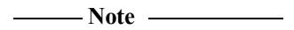

If EL2 is implemented and using the System register interface, a vPE can access the memory-mapped interface.

#### **When EL3 is using AArch64 state**

The Secure Monitor software, executing at EL3 in AArch64 state, uses the System register interface.

The Secure OS, executing at Secure EL1 in either AArch32 state or AArch64 state, uses the legacy memory-mapped interface.

The Non-secure hypervisor or OS handling physical interrupts, executing at Non-secure EL2 or EL1 in either AArch32 state or AArch64 state, uses the System register interface.

#### **When EL3 is using AArch32 state**

Asymmetric operation is UNPREDICTABLE.

In this situation, Arm expects Group 0 interrupts to be handled by a Secure OS, and Non-secure Group 1 interrupts to be handled by the Non-secure hypervisor or OS.

| Note |  |
|------|--|
|      |  |

This situation is not compatible with the use of Secure Group 1 interrupts, as this concept is new in GICv3 and is therefore not understood by legacy Secure OS code.

In an asymmetric configuration, when [GICC\\_CTLR](#page-742-0).FIQEn == 0, the interrupts that are described as being signaled as FIQs in Table 4-[3 on page](#page-64-5) 4-65 are signaled as IRQs.

#### <span id="page-881-1"></span>**15.2.1 Asymmetric operation and the use of ICC\_CTLR\_EL3.RM**

[ICC\\_CTLR\\_EL3.](#page-237-0)RM controls whether software executing at EL3 can acknowledge or observe Secure Group 0 and Non-secure Group 1 interrupts as the highest priority pending interrupt.

When [ICC\\_CTLR\\_EL3](#page-237-0).RM == 1:

- Secure Group 0 interrupts return a special INTID value of 1020. This affects accesses to [ICC\\_IAR0\\_EL1,](#page-252-0) [ICC\\_HPPIR0\\_EL1,](#page-248-0) [ICC\\_IAR1\\_EL1,](#page-254-0) and [ICC\\_HPPIR1\\_EL1.](#page-250-0)
- Non-secure Group 1 interrupts return a special INTID value of 1021. This affects accesses to [ICC\\_IAR0\\_EL1,](#page-252-0) [ICC\\_HPPIR0\\_EL1,](#page-248-0) [ICC\\_IAR1\\_EL1,](#page-254-0) and [ICC\\_HPPIR1\\_EL1.](#page-250-0)

For more information about special INTIDs, see *[Special INTIDs on page](#page-35-1) 2-36*.

### <span id="page-882-1"></span><span id="page-882-0"></span>**15.3 Support for legacy operation of VMs**

To support legacy operation for virtual interrupts, the GIC must support the GICV\_\* memory-mapped register interface. Whether this support is provided is IMPLEMENTATION DEFINED. All VM accesses to the GICD\_\* Distributor registers must trap to the hypervisor, which is responsible for running a virtual Distributor associated with the legacy VM.

The following constraints apply to virtual interrupts that are handled as part of legacy operation:

- The GICv2 configuration lockdown feature is not supported. This means that a hypervisor must virtualize [GICD\\_TYPER](#page-617-0).LSPI as a RAZ/WI bit to the scheduled legacy VM.
- A multiprocessing VM can support a maximum of eight vPEs, which is the maximum number of PEs that are supported in GICv2. These vPEs are independently associated with the same Redistributor or with different Redistributors.

| Note |  |
|------|--|
|      |  |

Legacy operation for virtual interrupts supports [GICV\\_CTLR](#page-782-0).AckCtl. Legacy operation for physical interrupts does not support [GICC\\_CTLR.](#page-742-0)AckCtl.

During legacy operation, [GICV\\_CTLR](#page-782-0) controls the signaling of interrupts by the CPU interface to the PE, as follows:

- [GICV\\_CTLR.](#page-782-0)EnableGrp0 bit controls the signaling of Group 0 interrupts.
- [GICV\\_CTLR.](#page-782-0)EnableGrp1 bit controls the signaling of Group 1 interrupts.

For detailed information about the control and configuration of Group 0 and Group 1 PPI, SGI, and SPI interrupts, and their virtualization during legacy operation, see *Arm® Generic Interrupt Controller, Architecture version 2.0, Architecture Specification*.

#### **15.3.1 Accessing GIC virtual CPU interface registers using the memory-mapped register interface**

The virtual CPU interface is in the Non-secure memory map. A hypervisor uses the Non-secure stage 2 address translations to ensure that the vPE cannot access other memory-mapped GIC registers.

Figure 15-[1 on page](#page-883-0) 15-884 shows a GICv3 configuration executing in AArch64 state where:

- Affinity routing and System register access are enabled for Non-secure accesses, that is [GICD\\_CTLR.](#page-543-0)ARE\_NS == 1 and [ICC\\_SRE\\_EL2.](#page-282-0)SRE == 1.
- Virtualization is supported, that is [ICH\\_HCR\\_EL2.](#page-347-0)En == 1.
- EL1 is configured to support legacy operation, that is [ICC\\_SRE\\_EL1](#page-278-0)\_NS.SRE == 0.
- The PE is configured to handle virtual interrupts, using [HCR\\_EL2](#page-28-2).{IMO, FMO}.

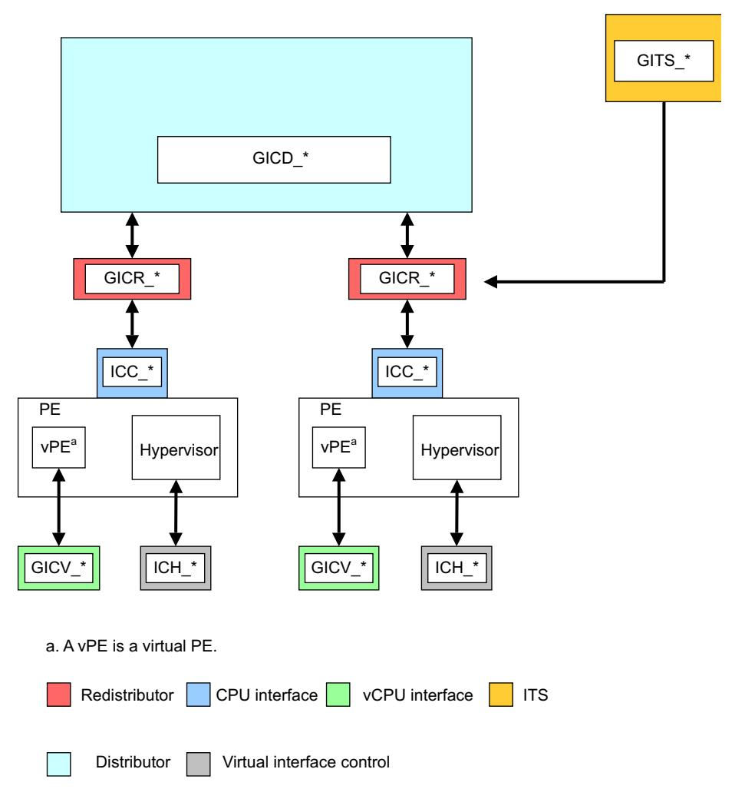

<span id="page-883-0"></span>**Figure 15-1 GICv3 register interfaces with legacy support**

## <span id="page-884-1"></span><span id="page-884-0"></span>Appendix A **GIC Stream Protocol interface**

This appendix describes the AXI Stream protocol standard message-based interface that the optional GIC Stream Protocol interface uses. It contains the following sections:

- *[Overview on page](#page-885-1) A-886*.
- *[Signals and the GIC Stream Protocol on page](#page-886-1) A-887*.
- *[The GIC Stream Protocol on page](#page-889-1) A-890*.
- *[Alphabetic list of command and response packet formats on page](#page-894-1) A-895*.

#### <span id="page-885-1"></span><span id="page-885-0"></span>**A.1 Overview**

The GIC Stream Protocol interface describes the optional interface between the IRI and the PE, more specifically that between the Redistributor and the associated CPU interface. The interface supports independent development of an IRI and a PE, that includes System register support for the CPU interface. Arm recommends that a GIC implementation uses this stream protocol interface.

A communication channel that provides a packet interface, based on the AMBA AXI-Stream Protocol, is required for each direction:

- From the Redistributor to the CPU interface.
- From the CPU interface to the Redistributor.

See *[Signals and the GIC Stream Protocol on page](#page-886-1) A-887* for more information.

#### **A.1.1 Terminology**

The direction of communication for commands is referred to as downstream or upstream, where:

- Downstream is the direction associated with a command that is initiated by a Redistributor and sent to its associated CPU interface.
- Upstream is the direction associated with a command initiated by a CPU interface and sent to its associated Redistributor.

| Note |  |
|------|--|
|------|--|

This terminology can also be applied to communication within an IRI, that is between the Distributor and Redistributor. In this case:

- An upstream transfer is a transfer from a Redistributor to the Distributor.
- A downstream transfer is a transfer from the Distributor to a Redistributor.

### <span id="page-886-1"></span><span id="page-886-0"></span>**A.2 Signals and the GIC Stream Protocol**

The GIC Stream Protocol interface is based on the unidirectional AMBA AXI Interface. Therefore, to support bidirectional communication, the GIC Stream Protocol interface consists of an AXI Stream Protocol Interface in each direction, that is:

- A downstream AXI Stream Interface containing connections from one or more Redistributors to an equivalent number of CPU interfaces. On this interface, the Redistributor is the Transmitter and the CPU interface is the Receiver.
- An upstream AXI Stream Interface containing connections from one or more CPU interfaces to an equivalent number of Redistributors. On this interface, the CPU interface is the Transmitter and the Redistributor is the Receiver.

It is IMPLEMENTATION DEFINED whether AMBA4 or AMBA5 AXI Stream is used for the connections.

Multiple packets on an AXI Stream Interface cannot be interleaved, that is, only one packet can be transferred in each direction at a given time.

[Figure](#page-886-2) A-1 shows an example implementation of the GIC Stream Protocol interface.

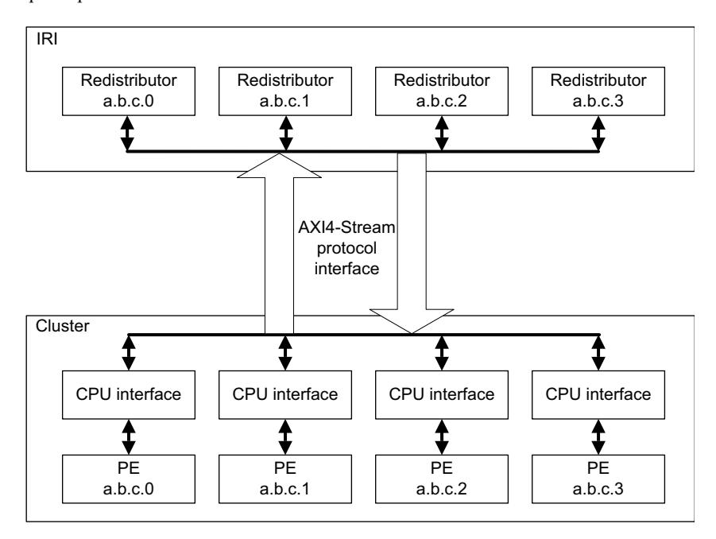

**Figure A-1 Example of a GIC Stream Protocol interface**

<span id="page-886-2"></span>The GIC architecture requires a GIC implementation to include a Redistributor corresponding to each connected CPU interface, and defines an enumeration notation for identifying PEs. On any AXI Stream Interface, each Redistributor must only communicate with its corresponding CPU interface.

The *AMBA® AXI-Stream Protocol Specification* defines a packet as a group of bytes that are transported together across an AXI Stream interface.

An interconnect between an IRI and a CPU interface must ensure that the stream packet sequence is transferred over the stream protocol interface in the same order in which it was created.

#### **A.2.1 Signals**

The interface requires a global clock, **ACLK**, and a reset signal, **ARESETn**.

For the GIC Stream Protocol, each stream interface is identified by a prefix to the AXI-4 signal names:

- Downstream signals from a Redistributor to the CPU interface are prefixed with the letters **IRI**.
- Upstream signals from the CPU interface to a Redistributor are prefixed with the letters **ICC**.

<span id="page-887-0"></span>[Table](#page-887-0) A-1 shows the GIC Stream Protocol interface from the Redistributor to the downstream CPU interface.

**Table A-1 Redistributor to downstream CPU interface** 

| Signal a       | Description                                                                                                                                                                                             |
|----------------|---------------------------------------------------------------------------------------------------------------------------------------------------------------------------------------------------------|
| IRITVALID      | When set to 1, this signal indicates that the Transmitter is driving a valid transfer.                                                                                                                  |
| IRITREADY      | When set to 1, this signal indicates that the Receiver can accept a transfer in the current<br>cycle.                                                                                                   |
| IRITDATA[BN:0] | The interface data path.                                                                                                                                                                                |
| IRITLAST       | When set to 1, this signal indicates the final transfer of a packet.                                                                                                                                    |
| IRITDEST[N:0]  | When more than one PE is supported by the stream interface, this signal identifies the<br>target CPU interface to provide routing information for the stream. Otherwise this<br>signal is not required. |
| IRITWAKEUP     | If using AMBA5, indicates if there is activity associated with an AXI5-Stream<br>interface. Drive in accordance with the AMBA5 specification.                                                           |

a. These signals were previously prefixed with **ICD** in the preliminary architecture information.

<span id="page-887-1"></span>[Table](#page-887-1) A-2 shows the GIC Stream Protocol interface from the CPU interface to the upstream Redistributor.

**Table A-2 CPU interface to upstream Redistributor interface**

| Signal         | Description                                                                                                                                                                                                   |  |
|----------------|---------------------------------------------------------------------------------------------------------------------------------------------------------------------------------------------------------------|--|
| ICCTVALID      | When set to 1, this signal indicates that the Transmitter is driving a valid transfer.                                                                                                                        |  |
| ICCTREADY      | When set to 1, this signal indicates that the Receiver can accept a transfer in the<br>current cycle.                                                                                                         |  |
| ICCTDATA[BN:0] | The interface data path.                                                                                                                                                                                      |  |
| ICCTLAST       | When set to 1, this signal indicates the final transfer of a packet.                                                                                                                                          |  |
| ICCTID[N:0]    | When more than one PE is supported by the stream interface, this signal identifies<br>the originating CPU interface, to provide routing information for the stream.<br>Otherwise this signal is not required. |  |
| ICCTWAKEUP     | If using AMBA5, indicates if there is activity associated with an AXI5-Stream<br>interface. Drive in accordance with the AMBA5 specification.                                                                 |  |

#### In [Table](#page-887-0) A-1 and [Table](#page-887-1) A-2:

- BN is the number associated with the most significant bit on a datapath that is required to be an integral number of bytes wide.
- N is the value log(base2) M rounded up to the nearest integer, where M is the number of PEs supported by the interface.
- Values of **TDEST** and **TID** must be allocated sequentially without gaps, in order of ascending affinity.

For further information about the signals used by the GIC Stream Protocol interface, and for details about handshaking, see *AMBA® AXI-Stream Protocol Specification*.

#### **A.2.2 Packet format**

The GIC architecture issues packets across the GIC Stream Protocol interface where the initial half-byte of a packet indicates the packet type.

The declared size of a packet is always a multiple of the implemented datapath width used for the stream transfer. Where the number of bytes required by a packet is less than the overall packet size, the unused bytes are marked as reserved and filled with the value zero.

#### <span id="page-888-1"></span>**Supported INTID sizes**

The GIC architecture supports 16-bit and 24-bit INTID fields. Where the INTID is an argument within a packet, the ID length field in the packet header defines which ID format is used, as follows:

- ID length == 0 for 16-bit INTIDs.
- ID length == 1 for 24-bit INTIDs.

| Note                                 |  |
|--------------------------------------|--|
| Reserved fields must be transmitted. |  |

A downstream control command is used during interface initialization to inform a CPU interface whether the IRI supports 24-bit INTIDs.

For a 24-bit INTID where bits[23:16] have the value zero, the stream interface is allowed to identify and transfer the packet with a 16-bit INTID field.

A protocol error occurs when a PE generates a packet using a 24-bit INTID with nonzero bits[23:16] and the IRI only supports 16-bit INTIDs.

The [Downstream Control Acknowledge](#page-901-0) command from the CPU interface returns the maximum INTID lengths supported by both the Redistributor and the CPU interface. The Redistributor and the CPU interface must not send a command that contains an INTID exceeding this length.

When both the Redistributor and the CPU interface support an INTID length larger than 16 bits, but the value of an INTID in a particular packet can only be encoded using 16 bits, it is permissible to send a 16-bit value, where ID length == 0b00.

#### <span id="page-888-0"></span>**Software generation of protocol errors and packet errors**

Software programming must never be permitted to cause a hardware *protocol error* because this might result in the PE or GIC becoming non-operational.

Where errors exist in the values of fields within packets, this is called a *packet error*. Protocol and packet errors can cause UNPREDICTABLE behavior. The manner in which these errors are reported is IMPLEMENTATION DEFINED.

#### **Hardware generation of packet errors**

If packets are sent that do not correspond to the architected format described in this specification, and the incorrect format is not the result of software misprogramming, then the architecture makes no guarantees about the behavior of the GIC. In such cases, the GIC can become non-operational in many ways, and this might result in the system hanging, data corruption, or any other effect. Physical damage to the system cannot be precluded in some implementations.

In high reliability systems, implementations might choose to report such cases using IMPLEMENTATION DEFINED system errors, but this is outside the scope of the architecture.

#### <span id="page-889-1"></span><span id="page-889-0"></span>**A.3 The GIC Stream Protocol**

The GIC Stream Protocol supports two types of packet:

- Command packets for control actions.
- Response packets that acknowledge command packets.

| Note |  |
|------|--|
|      |  |

The [Activate](#page-895-0) and [Release](#page-904-1) commands are designated as a command, but also provide a response semantic to the [Set](#page-905-0) and [VSet](#page-909-1) commands. See the [Activate](#page-895-0) and [Release](#page-904-1) commands for more details.

<span id="page-889-2"></span>Table A-[3 on page](#page-889-2) A-890 shows a summary of the downstream Redistributor commands.

#### **Table A-3 Redistributor commands**

| Command               | ID  | Parameters in the<br>first 16-bit<br>transfer                                  | Data in<br>subsequent<br>transfers | Description                                                                                              |
|-----------------------|-----|--------------------------------------------------------------------------------|------------------------------------|----------------------------------------------------------------------------------------------------------|
| Clear                 | 0x3 | Bits[7:6]: ID length                                                           | INTID                              | Resets a specified pending physical interrupt.                                                           |
| Downstream<br>Control | 0x8 | Bit[15:12]: Length<br>Bits[11:4]: Identifier                                   | Length bytes of<br>data            | Writes data to the CPU interface.<br>Length must be greater than 0 and less than 9.                      |
| Quiesce               | 0x4 | -                                                                              | -                                  | Requests that the CPU interface enters the quiescent state.                                              |
| Set                   | 0x1 | Bits[15:8]: Priority<br>Bits[7:6]: ID length<br>Bit[5] GrpMod<br>Bit[4]: Group | INTID                              | Sets the highest priority pending physical interrupt for a PE.                                           |
| VClear                | 0x7 | Bits[7:6]: ID length                                                           | Virtual INTID                      | Resets a specified pending virtual interrupt.<br>This command is provided in GICv4 only.                 |
| VSet                  | 0x6 | Bits[15:8]: Priority<br>Bits[7:6]: ID length<br>Bit[4]: Group                  | Virtual INTID                      | Sets the highest priority pending virtual interrupt for a VM.<br>This command is provided in GICv4 only. |

<span id="page-889-3"></span>Table A-[4 on page](#page-889-3) A-890 shows a summary of the upstream Redistributor responses.

#### **Table A-4 Redistributor responses**

| Response                | ID  | Parameters in the<br>first 16-bit<br>transfer | Data in<br>subsequent<br>transfers | Description                                                                                                                        |
|-------------------------|-----|-----------------------------------------------|------------------------------------|------------------------------------------------------------------------------------------------------------------------------------|
| Activate<br>Acknowledge | 0xC | Bit[4]: V                                     | -                                  | Acknowledges that the Redistributor received an Activate<br>command, and confirms that the effects of the activate are<br>visible. |

**Table A-4 Redistributor responses (continued)**

| Response                           | ID  | Parameters in the<br>first 16-bit<br>transfer | Data in<br>subsequent<br>transfers | Description                                                                                                                                                   |
|------------------------------------|-----|-----------------------------------------------|------------------------------------|---------------------------------------------------------------------------------------------------------------------------------------------------------------|
| Deactivate<br>Acknowledge          | 0xA | -                                             | -                                  | Acknowledges that the Redistributor received a<br>Deactivate command, and confirms that the effects of the<br>deactivate are visible.                         |
| Generate SGI<br>Acknowledge        | 0x9 | -                                             | -                                  | Acknowledges that the Redistributor received a Generate<br>SGI command, and that the effects of the command are<br>guaranteed to become visible to other PEs. |
| Upstream<br>Control<br>Acknowledge | 0xB | -                                             | -                                  | Acknowledges receipt of an Upstream Control command,<br>and confirms that the effects of the write operation are<br>visible.                                  |

All other command and response IDs are reserved. If the Redistributor receives a reserved ID, this constitutes a protocol error, see *[Software generation of protocol errors and packet errors on page](#page-888-0) A-889*.

<span id="page-890-0"></span>Table A-[5 on page](#page-890-0) A-891 shows a summary of all the CPU interface commands.

#### **Table A-5 CPU interface commands**

| Command          | ID  | Parameters in the<br>first 16-bit transfer                                                                         | Data in<br>subsequent<br>transfers    | Description                                                                                                                                                |  |
|------------------|-----|--------------------------------------------------------------------------------------------------------------------|---------------------------------------|------------------------------------------------------------------------------------------------------------------------------------------------------------|--|
| Activate         | 0x1 | Bits[7:6]: ID length<br>Bit[4]: V                                                                                  | INTID                                 | A pending to active notification request as a result of<br>an interrupt acknowledge on the CPU interface.                                                  |  |
| Deactivate       | 0x6 | Bits[10:8]: Groups<br>Bits[7:6]: ID length                                                                         | INTID                                 | Deactivate request for a specified interrupt.                                                                                                              |  |
| Generate SGI     | 0x7 | Bits[59:56]: RS<br>Bits[15:12] SGInum<br>Bit[9]: RSV<br>Bit[8]: A3V<br>Bits[7]: IRM<br>Bit[6]: NS<br>Bit[5:4]: SGT | Affinity Routing<br>Values (A0 to A3) | Requests that the Redistributor issues an SGI.                                                                                                             |  |
| Upstream Control | 0x8 | Bits[15:12]: Length<br>Bits[11:4]: Identifier                                                                      | Length bytes of data                  | A system control command that might, for example,<br>pass the configuration status to the Redistributor.<br>Length must be greater than 0 and less than 9. |  |

<span id="page-891-0"></span>Table A-[6 on page](#page-891-0) A-892 shows a summary of all the CPU interface responses.

**Table A-6 CPU interface responses**

| Response                             | ID  | Parameters in the<br>first 16-bit<br>transfer | Data in<br>subsequent<br>transfers | Description                                                                                                                       |
|--------------------------------------|-----|-----------------------------------------------|------------------------------------|-----------------------------------------------------------------------------------------------------------------------------------|
| Clear Acknowledge                    | 0x4 | Bit [4]: V                                    | -                                  | Acknowledges that the CPU interface received a Clear<br>command for a specified interrupt.                                        |
| Downstream<br>Control<br>Acknowledge | 0xB | -                                             | -                                  | Acknowledges that the CPU interface received a<br>Downstream Control command from the Redistributor.                              |
| Quiesce<br>Acknowledge               | 0x9 | -                                             | -                                  | Acknowledges a Quiesce command, and confirms that<br>the Redistributor to CPU interface is in the quiescent<br>state.             |
| Release                              | 0x3 | Bits[7:6] ID length<br>Bit[4]: V              | INTID                              | Releases control of an interrupt when the CPU interface<br>cannot handle the interrupt, and provides a reason for<br>the release. |

All other command and response IDs are reserved. If the CPU interface receives a reserved ID, this constitutes a protocol error, see *[Software generation of protocol errors and packet errors on page](#page-888-0) A-889*.

A command packet has an equivalent handshake response packet that acknowledges the command. There are two exceptions to this rule:

- The [Clear](#page-897-0) and [VClear](#page-909-2) commands are both acknowledged by a [Clear Acknowledge](#page-897-1) response with a bit field in the header that indicates which command is acknowledged.
- The [Set](#page-905-0) and [VSet](#page-909-1) command packets are acknowledged by a [Release](#page-904-1) response or an [Activate](#page-895-0) command. This means that the [Activate](#page-895-0) command also has the semantics of a response with respect to the [Set](#page-905-0) and [VSet](#page-909-1) commands. When an [Activate](#page-895-0) command is used, the Redistributor acknowledges that command with an [Activate Acknowledge](#page-895-1) response. [Release,](#page-904-1) [Activate](#page-895-0), and [Activate Acknowledge](#page-895-1) packets all have a bit field in the header that indicates whether the response is to a [Set](#page-905-0) or [VSet](#page-909-1) command.

Responses to a [Set](#page-905-0) or [VSet](#page-909-1) command are dependent on system contexts and events on the CPU interface. A [Release](#page-904-1) response occurs when a pending interrupt that has been forwarded to the CPU interface cannot be maintained as pending or activated by the CPU interface. This can occur, for example, when:

- The interrupt group of the INTID is disabled.
- The highest pending physical interrupt is updated by a [Set](#page-905-0) command before it is activated.
- The highest pending virtual interrupt is updated by a [VSet](#page-909-1) command before it is activated.

#### <span id="page-891-1"></span>**A.3.1 Rules associated with the downstream Redistributor commands**

The following rules affect the generation of Redistributor commands:

- When [GICR\\_WAKER.](#page-727-0)ProcessorSleep == 0, the first packet that is issued to the CPU interface must be a [Downstream Control](#page-900-0) packet. This packet communicates the number of supported Security states, together with the physical and virtual INTID lengths that the GIC Stream Protocol interface supports.
- There can never be more than one outstanding [Downstream Control](#page-900-0) command, and a Redistributor must only generate response packets until the [Downstream Control](#page-900-0) command is acknowledged.
- On receipt of a [Set](#page-905-0) command, a CPU interface is required to release the previous pending physical interrupt back to the Redistributor.
- Unless restricted by another rule in this section, two [Set](#page-905-0) commands can be generated and outstanding at the same time, and the Redistributor must be able to accept an [Activate](#page-895-0) command for a physical interrupt when a [Set](#page-905-0) command is transferred.

- On receipt of a [VSet](#page-909-1) command, a CPU interface is required to release the previous pending virtual interrupt back to the Redistributor.
- A [VSet](#page-909-1) command must only be generated when the Redistributor is able to accept an [Activate](#page-895-0) command for a virtual interrupt while the [VSet](#page-909-1) command is being transferred.
- The Redistributor can only issue a single Clear to the CPU interface and must wait for a [Clear Acknowledge](#page-897-1) (with V == 0) before another can be issued. While a Clear is outstanding, no further "Physical Interrupt" packets except acknowledgments can be issued to the CPU interface.
- The Redistributor can only issue a single [VClear](#page-909-2) to the CPU interface and must wait for a [Clear Acknowledge](#page-897-1) (with V == 1) before another may be issued. While a [VClear](#page-909-2) is outstanding, no further "Virtual Interrupt" packets can be issued to the CPU interface.
- There can never be more than one outstanding [Quiesce](#page-903-1) command, and a Redistributor must only generate response packets until the [Quiesce](#page-903-1) command is acknowledged with a [Quiesce Acknowledge.](#page-904-2)
- A Redistributor must not send a [VSet](#page-909-1) or [VClear](#page-909-2) command to a CPU interface that does not support GICv4. The mechanism for determining whether GICv4 is supported is IMPLEMENTATION DEFINED.
- A [VSet](#page-909-1) and [VClear](#page-909-2) command can specify an INTID:
  - For GICv4.0, in the LPI range.
  - For GICv4.1, in the LPI or SGI range.

A CPU interface does not send a [Deactivate](#page-898-1) in response to the deactivation of vSGI received in response to a [VSet](#page-909-1).

#### **A.3.2 Rules associated with the upstream CPU interface commands**

The following rules affect the generation of CPU interface commands:

- There can never be more than one outstanding [Upstream Control](#page-906-0) command, and a CPU interface must wait for an [Upstream Control Acknowledge](#page-908-0) before issuing another [Upstream Control](#page-906-0) command.
- There can never be more than one outstanding [Deactivate](#page-898-1) command. This means that a CPU interface must wait for a [Deactivate](#page-898-1) command to be acknowledged before issuing another [Deactivate](#page-898-1) command. The CPU interface can continue to send other commands before receiving the [Deactivate Acknowledge](#page-900-1) response.
- There can never be more than one outstanding [Generate SGI](#page-902-1) command. This means that a CPU interface must wait for a [Generate SGI](#page-902-1) command to be acknowledged before issuing another [Generate SGI](#page-902-1) command. The CPU interface can continue to send other commands before receiving the [Generate SGI Acknowledge](#page-903-2) response.
- Before issuing a [Clear Acknowledge](#page-897-1) response with the V bit set to 0, the CPU interface must issue any [Release](#page-904-1) commands that are required to move the physical interrupt specified in the [Clear](#page-897-0) command to the inactive state on the CPU interface.
- Before issuing a [Clear Acknowledge](#page-897-1) response with the V bit set to 1, the CPU interface must issue any [Release](#page-904-1) commands that are required to move the virtual interrupt specified in the [VClear](#page-909-2) command to the inactive state on the CPU interface.
- Before issuing a [Quiesce Acknowledge](#page-904-2) response, all other outstanding commands from the Redistributor must be acknowledged, and a [Release](#page-904-1) command must remove any pending interrupts on the CPU interface.
- A CPU interface always responds to Set commands in the order SETs are received.
- A CPU interface always responds to Virtual Set [\(VSet](#page-909-1)) commands in the order [VSet](#page-909-1) commands are received.
- A [Release](#page-904-1) command with V==1 can specify an INTID:
  - For GICv4.0 in the LPI range.
  - For GICv4.1 in the LPI or SGI range.

- For a [Clear,](#page-897-0) or [VClear,](#page-909-2) with INTID=1023, the CPU interface responds with an acknowledge, but otherwise ignores the command.
- If the GIC Stream connection is quiescent, on receiving a [Downstream Control](#page-900-0) packet the first packet that is issued by the CPU interface to the Redistributor is a [Downstream Control Acknowledge](#page-901-0) packet.

#### <span id="page-893-0"></span>**Priority-based routing**

When [ICC\\_CTLR\\_EL3](#page-237-0).PMHE == 0, or [ICC\\_CTLR\\_EL1.](#page-232-0)PMHE == 0:

• The CPU interface must not issue a [Release](#page-904-1) command for a pending SPI because the priority of the SPI is equal to or less than that indicated by [ICC\\_PMR\\_EL1](#page-266-0).

**Note**

The CPU interface might still issue a [Release](#page-904-1) command for a pending SPI for other reasons, such as the SPI belonging to a group that is disabled in the CPU interface, or in response to receipt of a [Clear](#page-897-0) command from the IRI.

When [ICC\\_CTLR\\_EL3](#page-237-0).PMHE == 1 or [ICC\\_CTLR\\_EL1](#page-232-0).PMHE == 1:

- The CPU interface must issue an [Upstream Control](#page-906-0) command, with the identifier 0x02, when the PE successfully writes to [ICC\\_PMR\\_EL1](#page-266-0):
  - If multiple writes to [ICC\\_PMR\\_EL1](#page-266-0) occur before the CPU interface issues the [Upstream Control](#page-906-0) command, the GIC can combine these writes into a single command.
- The CPU interface can issue a [Release](#page-904-1) command for a pending SPI with a priority that is equal to or less than the value in [ICC\\_PMR\\_EL1,](#page-266-0) if the [Set](#page-905-0) command was received between the architectural execution of the instruction that updated [ICC\\_PMR\\_EL1](#page-266-0) and the receipt of the [Upstream Control Acknowledge](#page-908-0) command that indicates that the new [ICC\\_PMR\\_EL1](#page-266-0) value has been observed. Whether a [Release](#page-904-1) is generated in this situation is IMPLEMENTATION DEFINED.
- The CPU interface must not issue a Release command for a pending SPI with a priority that is greater than the value in [ICC\\_PMR\\_EL1](#page-266-0) if the Set command was not received between the architectural execution of the instruction that updated [ICC\\_PMR\\_EL1](#page-266-0) and the receipt of the [Upstream Control Acknowledge](#page-908-0) that indicates that the new [ICC\\_PMR\\_EL1](#page-266-0) value has been observed.

| Note |  |
|------|--|
|------|--|

The CPU interface might still issue a Release command for a pending SPI for other reasons, such as the SPI belonging to a group that is disabled in the CPU interface or in response to receipt of a [Clear](#page-897-0) command from the IRI.

#### <span id="page-894-1"></span><span id="page-894-0"></span>**A.4 Alphabetic list of command and response packet formats**

This subsection lists all the command and response packet formats in alphabetical order. The heading for each command or response subsection includes a label, ICC or IRI, that indicates the agent that generated the packet.

#### <span id="page-895-0"></span>**A.4.1 Activate (ICC)**

The CPU interface sends an Activate command when acknowledging an interrupt. When the Redistributor receives the Activate command, it sets the interrupt to the active state. The CPU interface must send an Activate command only when Redistributor action is required, as follows:

- For SPIs, SGIs, and PPIs, where the Redistributor must clear the pending bit for edge-triggered interrupts, and set the active bit.
- For LPIs where the Redistributor must clear the pending bit.

The [Activate](#page-895-0) command generated by the CPU interface, unlike other commands, also acts as a response to a [Set](#page-905-0) or [VSet](#page-909-1) command:

• A [Set](#page-905-0) or [VSet](#page-909-1) command results in a [Release](#page-904-1) response or Activate command. An Activate command acknowledges the original [Set](#page-905-0) command. The Activate command is itself acknowledged using an [Activate](#page-895-1)  [Acknowledge](#page-895-1) response from the Redistributor.

[Figure](#page-895-2) A-2 shows the Activate command format.

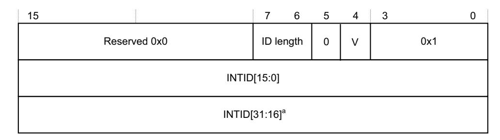

a. If the command includes this field, bits[31:24] are 0.

**Figure A-2 Activate**

#### <span id="page-895-2"></span>In [Figure](#page-895-2) A-2:

- ID length indicates the number of INTID bits the Activate command includes. See *[Supported INTID sizes on](#page-888-1)  page [A-889](#page-888-1)* for more information.
- V indicates the original command to which the Activate command corresponds:
  - **0** The Activate corresponds to a [Set](#page-905-0) command.
  - **1** The Activate corresponds to a [VSet](#page-909-1) command.
- INTID is the value that the CPU interface returns after a valid read of [ICC\\_IAR0\\_EL1,](#page-252-0) [ICC\\_IAR1\\_EL1](#page-254-0), or [GICC\\_IAR.](#page-756-1)


During legacy operation, the INTID that is returned for SGIs includes the source PE in the [GICC\\_IAR.](#page-756-1)Source\_CPU\_ID field.

#### <span id="page-895-3"></span><span id="page-895-1"></span>**A.4.2 Activate Acknowledge (IRI)**

The Redistributor sends an Activate Acknowledge response to confirm receipt of an [Activate](#page-895-0) command, and confirms that the effects of the activate operation are visible to the Redistributor and other PEs. [Figure](#page-895-3) A-3 shows the Activate Acknowledge response format.


**Figure A-3 Activate Acknowledge**

|      | In Figure A-3 on page A-896, V indicates the original command to which the Activate Acknowledge corresponds:                                      |  |  |
|------|---------------------------------------------------------------------------------------------------------------------------------------------------|--|--|
| 0b0  | The Activate Acknowledge corresponds to a Set command.                                                                                            |  |  |
| 0b1  | The Activate Acknowledge corresponds to a VSet command.                                                                                           |  |  |
| Note |                                                                                                                                                   |  |  |
|      | There is no requirement for Activate Acknowledge commands to be issued in the same order as the Activate<br>command to which they are responding. |  |  |

#### <span id="page-897-0"></span>**A.4.3 Clear (IRI)**

The Clear command clears the specified pending interrupt. [Figure](#page-897-2) A-4 shows the Clear command format.


a. If the command includes this field, bits[31:24] are 0.

**Figure A-4 Clear**

#### <span id="page-897-2"></span>In [Figure](#page-897-2) A-4:

- ID length indicates the number of INTID bits that the Clear command includes. See *[Supported INTID sizes](#page-888-1) [on page](#page-888-1) A-889* for more information.
- INTID identifies the interrupt to be cleared.

The CPU interface must always respond to a Clear command with a [Clear Acknowledge](#page-897-1) response where V == 0.

If the interrupt is pending in the CPU interface, the CPU interface must issue a [Release](#page-904-1) response, or an [Activate](#page-895-0) response that remains outstanding for the interrupt before it issues a [Clear Acknowledge](#page-897-1) command.

If the interrupt is not pending or present on the CPU interface, the Clear command has no effect. However, the CPU interface must still issue a [Clear Acknowledge](#page-897-1) response.

**Note**

A Clear command with INTID = 1023 has no effect, but a [Clear Acknowledge](#page-897-1) response must still be generated.

#### <span id="page-897-1"></span>**A.4.4 Clear Acknowledge (ICC)**

The CPU interface sends a Clear Acknowledge response to acknowledge the receipt of a [Clear](#page-897-0) or [VClear](#page-909-2) command. [Figure](#page-897-3) A-5 shows the Clear Acknowledge response format.


**Figure A-5 Clear Acknowledge**

<span id="page-897-3"></span>In [Figure](#page-897-3) A-5, V indicates the original command to which the Clear Acknowledge corresponds:

**0** The Clear Acknowledge corresponds to a [Clear](#page-897-0) command.

**1** The Clear Acknowledge corresponds to a [VClear](#page-909-2) command.

**Note**

No INTID field is required for this command because only a single [Clear](#page-897-0) can be outstanding for a CPU interface at any time.

#### <span id="page-898-1"></span><span id="page-898-0"></span>**A.4.5 Deactivate (ICC)**

The Deactivate command deactivates an interrupt, provided the initiating Exception level and Security state can access the interrupt group to which the INTID belongs. The Redistributor sends a [Deactivate Acknowledge](#page-900-1) in response to a Deactivate command. [Figure](#page-898-2) A-6 shows the Deactivate command format.

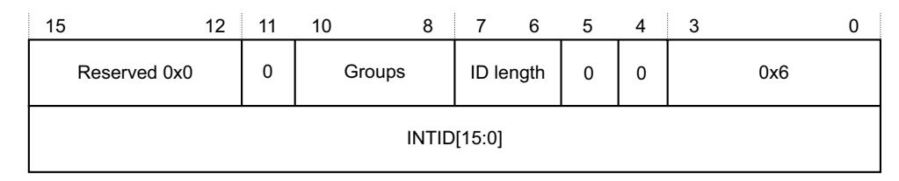

**Figure A-6 Deactivate**

#### <span id="page-898-2"></span>In [Figure](#page-898-2) A-6:

| • | Groups indicates the interrupt groups that the initiating Exception level and Security state are permitted to |
|---|---------------------------------------------------------------------------------------------------------------|
|   | modify:                                                                                                       |

**Bit[10]** When this bit is set to 1, Secure Group 1 interrupts can be modified.

**Bit[9]** When this bit is set to 1, Non-secure Group 1 interrupts can be modified.

**Bit[8]** When this bit is set to 1, Group 0 interrupts can be modified.

**Note**

When sending a Deactivate command, at least one of the Groups bits must be set to 1. A protocol error occurs if none of these bits are set to 1.

- ID length indicates the number of INTID bits the Deactivate command includes. See *[Supported INTID sizes](#page-888-1) [on page](#page-888-1) A-889* for more information. The Deactivate command applies only to physical SPIs, PPIs, and SGIs, each of which has INTIDs no higher than 8192. This field must therefore be set to 0b00, indicating a 16-bit INTID. The CPU interface does not generate Deactivate packets for LPIs.
- INTID is the 32-bit value read from the corresponding interrupt acknowledge cycle that is presented in the write to [ICC\\_EOIR0\\_EL1](#page-244-0) or [ICC\\_EOIR1\\_EL1](#page-246-0).

**Note**

There is no requirement for the CPU interface to have received the corresponding [Activate Acknowledge](#page-895-1) command before sending the Deactivate command.

When System register access is enabled for the initiating Exception level and Security state, one of the Groups bits is set according to the rules in *[Groups field when System register access is enabled on page](#page-899-0) A-900*.

**Note**

In an implementation that supports two Security states, for Secure EL1 to be permitted to handle Group 1 interrupts, that is, IRQs not taken to EL3, both bit[9] and bit[10] must be set to 1.

When System register access is not enabled for the initiating Exception level and Security state, the Groups field is set according to the Security state of the initiating Exception level. That is, bit [9] is set to 1 for Non-secure write access, and bits [10:8] are all set to 1 for Secure write access. In an implementation that supports only a single Security state, write accesses that result in the generation of a [Deactivate](#page-898-1) command are treated as Secure writes.

In an implementation that supports two Security states, Group 0 and Secure Group 1 interrupts can be modified only from a Secure initiating Exception level. This includes EL3, regardless of the setting of [SCR\\_EL3](#page-29-4).NS. In an implementation that supports only a single Security state, the Redistributor can ignore bit[10].

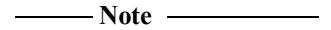

The Redistributor must send a [Deactivate Acknowledge](#page-900-1) in response to a [Deactivate](#page-898-1) command.

- If affinity routing is enabled for an interrupt group, the Redistributor must acknowledge, but otherwise ignore, any [Deactivate](#page-898-1) command with a reserved INTID.
- If affinity routing is not enabled for an interrupt group, the Redistributor must acknowledge, but otherwise ignore any [Deactivate](#page-898-1) command with an ID in the range 1019 < INTID < 8192 where bits [9:4] are not 0. That is, it might issue [Deactivate](#page-898-1) packets for SGIs with a non-zero CPU number in bits[12:10] of [GICC\\_IAR](#page-756-1).
- If affinity routing is not enabled for an interrupt group and the ID specifies an SGI, and the PE specified by the CPU number in bits[12:10] does not support operation when affinity routing is not enabled, the Redistributor must acknowledge but otherwise ignore the [Deactivate](#page-898-1) command.

#### <span id="page-899-0"></span>**Groups field when System register access is enabled**

When System register access is enabled for the initiating Exception level and Security state, the following pseudocode describes the rules for specifying the value of the Groups field:

```
// DeactivateGroups_SRE()
// ======================
(boolean,boolean,boolean) DeactivateGroups_SRE(bits(2) effective_EL)
    boolean groups_G0S = FALSE;
    boolean groups_G1NS = FALSE;
    boolean groups_G1S = FALSE;
    if effective_EL == EL3 then
        groups_G0S = TRUE;
        groups_G1NS = TRUE;
        groups_G1S = GICD_CTLR.DS == '0';
    elsif effective_EL == EL2 && IsSecure() then
       // Secure EL2
       // This also covers the case when the HW bit is one in a List Register
       // corresponding to a write at Secure EL1
       groups_G0S = !HaveEL(EL3) || SCR_EL3.FIQ == '0';
       groups_G1NS = !HaveEL(EL3) || SCR_EL3.IRQ == '0';
       groups_G1S = (!HaveEL(EL3) || SCR_EL3.IRQ == '0') && GICD_CTLR.DS == '0';
    elsif effective_EL == EL2 && !IsSecure() then
       // Non-secure EL2
       // This also covers the case when the HW bit is one in a List Register
       // corresponding to a write at Non-secure EL1
       groups_G0S = (!HaveEL(EL3) || SCR_EL3.FIQ == '0') && GICD_CTLR.DS == '1';
       groups_G1NS = !HaveEL(EL3) || SCR_EL3.IRQ == '0';
    elsif effective_EL == EL1 && IsSecure() then
        // Secure EL1
        groups_G0S = (!HaveEL(EL3) || SCR_EL3.FIQ == '0') && (SCR_EL3.EEL2 == '0' || HCR_EL2.FMO == '0');
        groups_G1NS = (!HaveEL(EL3) || SCR_EL3.IRQ == '0') && (SCR_EL3.EEL2 == '0' || HCR_EL2.IMO ==
'0');
       groups_G1S = (!HaveEL(EL3) || SCR_EL3.IRQ == '0') && (SCR_EL3.EEL2 == '0' || HCR_EL2.IMO == '0')
&& GICD_CTLR.DS == '0';
    elsif effective_EL == EL1 && !IsSecure() then
        // Non-secure EL1
        groups_G0S = (!HaveEL(EL3) || SCR_EL3.FIQ == '0') && (!HaveEL(EL2) || HCR_EL2.FMO == '0') &&
GICD_CTLR.DS == '1';
        groups_G1NS = (!HaveEL(EL3) || SCR_EL3.IRQ == '0') && (!HaveEL(EL2) || HCR_EL2.IMO == '0');
    return (groups_G1S, groups_G1NS, groups_G0S);
```

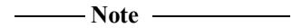

When FEAT\_RME is implemented, accesses from Realm state are treated identically to those from Non-secure state.

If the Deactivate command relates to a virtual interrupt that has a corresponding physical interrupt in the List registers, that is [ICH\\_LR<n>\\_EL2](#page-352-0).HW is set to 1, a virtual write caused the deactivation of the physical interrupt.

The bits are set as if an equivalent write had been performed at EL2. That is, effective\_EL == 2.

#### <span id="page-900-1"></span>**A.4.6 Deactivate Acknowledge (IRI)**

The Redistributor sends a Deactivate Acknowledge response to confirm receipt of a [Deactivate](#page-898-1) command, and to confirm that the effects of the deactivate operation are visible to the Redistributor and other PEs. [Figure](#page-900-2) A-7 shows the Deactivate Acknowledge response format.


**Figure A-7 Deactivate Acknowledge**

#### <span id="page-900-2"></span><span id="page-900-0"></span>**A.4.7 Downstream Control (IRI)**

The Downstream Control command transfers a specified number of bytes of data to the CPU interface. [Figure](#page-900-3) A-8 shows the Downstream Control command format.

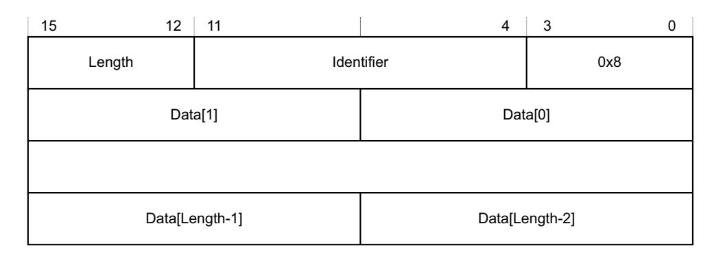

**Figure A-8 Downstream Control**

#### <span id="page-900-3"></span>In [Figure](#page-900-3) A-8:

• Length indicates the number of bytes of valid data appended to the 2 byte header.

If this field specifies a number of bytes that is not exactly divisible by the interface width, as *[Signals and the](#page-886-1)  [GIC Stream Protocol on page](#page-886-1) A-887* describes, any surplus bytes beyond this specified length in the last transfer must be zero. The CPU interface must ignore such bytes.

<span id="page-901-1"></span>• Identifier is a value that specifies the format of the data provided, and can have the values shown in [Table](#page-901-1) A-7 [on page](#page-901-1) A-902.

**Table A-7 Downstream Control Identifier values**

| Data value name                   | Identifier<br>value | Length | Contents                                                                                        |  |
|-----------------------------------|---------------------|--------|-------------------------------------------------------------------------------------------------|--|
| Settings (configure<br>interface) | 0x00<br>0x1         |        | Data[0] holds the Redistributor global settings, and these bits have the<br>following meanings: |  |
|                                   |                     |        | [7:6]<br>VL. Indicates the supported vINTID length.                                             |  |
|                                   |                     |        | [5:4]<br>PL. Indicates the supported pINTID length.                                             |  |
|                                   |                     |        | [3:2]<br>Reserved. RES0.                                                                        |  |
|                                   |                     |        | RSS. Indicates the value of GICD_TYPER.RSS.<br>[1]                                              |  |
|                                   |                     |        | [0]<br>DS. Disable Security. Indicates the value of GICD_CTLR.DS.                               |  |
|                                   |                     |        | Note<br>Bit[0] is set to 1 if the GIC supports only a single Security state.                    |  |
| Reserved                          | 0x01 - 0x7F         | -      | -                                                                                               |  |
| IMPLEMENTATION<br>DEFINED         | 0x80 - 0xFF         | -      | Reserved for IMPLEMENTATION DEFINED variables.                                                  |  |

**Note** Each identifier value can have a different length, but a particular identifier value must always have the same length.

The CPU interface must always respond to a Downstream Control command with a [Downstream Control](#page-901-0)  [Acknowledge](#page-901-0) response.

After the CPU interface receives a Downstream Control command where DS == 1, a packet protocol violation occurs if it receives a subsequent Downstream Control command where DS == 0, before an intervening hardware reset.

If a CPU interface receives an IMPLEMENTATION DEFINED value that it cannot interpret, this constitutes a protocol error. See *[Software generation of protocol errors and packet errors on page](#page-888-0) A-889*.

**Note**

The IMPLEMENTATION DEFINED values of the Downstream Write Command must only be used where the Distributor and the CPU interface interpret the IMPLEMENTATION DEFINED values to mean the same thing. This is typically the case where both components have been produced as part of the same system design.

#### <span id="page-901-0"></span>**A.4.8 Downstream Control Acknowledge (ICC)**

The CPU interface sends a Downstream Control Acknowledge response to confirm receipt of a [Downstream](#page-900-0)  [Control](#page-900-0) command. [Figure](#page-901-2) A-9 shows the Downstream Control Acknowledge response format.

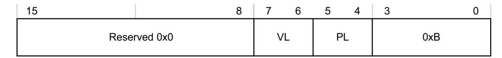

**Figure A-9 Downstream Control Acknowledge**

<span id="page-901-2"></span>In [Figure](#page-901-2) A-9:

• VL indicates the virtual INTID length, that is, the supported number of INTID bits.

PL indicates the physical INTID length, that is, the supported number of INTID bits.

See Supported INTID sizes on page A-889 for more information.

VL must be set to the minimum of:

- The value of VL contained in the first Downstream Control command received after reset.
- The value that ICH\_VTR\_EL2.IDbits specifies.

PL must be set to the minimum of:

- The value of PL contained in the first Downstream Control command received after reset.
- The value that ICC\_CTLR\_EL3.IDbits or ICC\_CTLR\_EL1.IDbits, as appropriate, specifies.

#### <span id="page-902-1"></span><span id="page-902-0"></span>A.4.9 Generate SGI (ICC)

The CPU interface sends a Generate SGI command to the Redistributor to generate an SGI. The Redistributor sends a Generate SGI Acknowledge in response to a Generate SGI command. Figure A-10 shows the Generate SGI command format.

| 15 1                      | 2 11           | 10 | 9   | 8   | 1   | б  | 5  | 4  | 3 |           | U |
|---------------------------|----------------|----|-----|-----|-----|----|----|----|---|-----------|---|
| SGInum                    | 0              | 0  | RSV | A3V | IRM | NS | SC | ЭT |   | 0x7       |   |
| Target List               |                |    |     |     |     |    |    |    |   |           |   |
| A2                        |                |    |     | A1  |     |    |    |    |   |           |   |
| Reserved 0x0 <sup>a</sup> | Range Selector |    |     |     |     |    | A: | 3ª |   | <br> <br> |   |

a. Whether this part of the packet is transmitted depends on the value of A3V and RSV.

Figure A-10 Generate SGI

#### <span id="page-902-2"></span>In Figure A-10:

- SGInum indicates the INTID of the SGI to be generated.
- RSV (Range Selector Valid) indicates whether the RS field is valid:
  - **0** RS is RESO.
  - 1 RS indicates the affinities covered by Target List.
- A3V indicates whether the command includes an A3 field. When A3V is 0, the packet does not include an A3 field, and the Redistributor must use 0 as the value of A3. When a CPU interface supports the Aff3 field and a write to ICC\_SGI0R, ICC\_SGI1R or ICC\_ASGI1R specifies Aff3 == 0, the resulting packet must clear A3V to zero.
- IRM indicates the Interrupt Routing Mode to be used. When IRM is set to 1, Target List, A1, A2, and A3 are ignored. The A3V field is RES0.

| Note |  |  |  |
|------|--|--|--|

Software might specify one or more target affinities that are not implemented by the system. Arm expects the Generate SGI packets generated by the CPU interface to report all the affinities specified by software.

- NS indicates whether the Generate SGI command originates from Non-secure state:
  - **0** The command originates from a Secure Execution state.
  - 1 The command originates from a Non-secure Execution state.

• SGT specifies the register access that caused the Generate SGI command:

0b00 [ICC\\_SGI0R\\_EL1](#page-272-0). 0b01 [ICC\\_SGI1R\\_EL1](#page-275-0). 0b10 [ICC\\_ASGI1R\\_EL1.](#page-222-0) 0b11 Reserved.

When the Redistributor supports two Security states and affinity routing is not enabled for the Secure state in the Redistributor, Generate SGI commands that correspond to Non-secure writes to [ICC\\_SGI0R\\_EL1](#page-272-0) and [ICC\\_ASGI1R\\_EL1](#page-222-0) must be acknowledged and discarded, and must not set an SGI pending.

When the Redistributor supports a single Security state, that is, [GICD\\_CTLR](#page-543-0).DS == 1, Generate SGI commands that correspond to Non-secure writes to [ICC\\_SGI0R\\_EL1](#page-272-0) or [ICC\\_ASGI1R\\_EL1](#page-222-0) generate a Group 0 SGI.

- Target List is the group of target PEs defined by the routing mode. For SGIs, the GIC routing mode defines a group of target PEs, targetlist. This field is treated as defined in [ICC\\_SGI0R\\_EL1](#page-272-0), [ICC\\_SGI1R\\_EL1,](#page-275-0) and [ICC\\_ASGI1R\\_EL1](#page-222-0).
- A1, A2, and A3 are the affinity level values used for generating the set of target PEs. These fields are treated in the same way as the Affinity value fields in [ICC\\_SGI0R\\_EL1,](#page-272-0) [ICC\\_SGI1R\\_EL1,](#page-275-0) and [ICC\\_ASGI1R\\_EL1](#page-222-0) Whether the A3 field is supported is IMPLEMENTATION DEFINED.

**Note**

In systems where the Redistributor only supports the zero value for A3, the Redistributor must acknowledge any Generate SGI commands where A3V == 1 with a [Generate SGI Acknowledge](#page-903-2) response, but must otherwise ignore the command.

• RS (Range Selector) indicates the affinities covered by Target List. This field is treated as defined in [ICC\\_SGI0R\\_EL1,](#page-272-0) [ICC\\_SGI1R\\_EL1,](#page-275-0) and [ICC\\_ASGI1R\\_EL1](#page-222-0).

#### <span id="page-903-2"></span>**A.4.10 Generate SGI Acknowledge (IRI)**

The Redistributor sends a Generate SGI Acknowledge response to confirm that it has received a [Generate SGI](#page-902-1) command from the CPU interface, and that the effects of that command are guaranteed to become visible to other PEs. [Figure](#page-903-3) A-11 shows the Generate SGI Acknowledge response format.


**Figure A-11 Generate SGI Acknowledge**

**Note**

Receipt of a Generate SGI Acknowledge response by a CPU interface does not guarantee that the corresponding SGI pending state is set, but it does guarantee that the pending state will become set.

#### <span id="page-903-4"></span><span id="page-903-3"></span><span id="page-903-1"></span><span id="page-903-0"></span>**A.4.11 Quiesce (IRI)**

The Redistributor sends a Quiesce command to request that the CPU interface enters the quiescent state. [Figure](#page-903-4) A-12 shows the Quiesce command format.


**Figure A-12 Quiesce**

A CPU interface is quiescent when there are no pending interrupts and all outstanding operations are complete. To ensure quiescence, a CPU interface must:

- Respond to any outstanding [Clear](#page-897-0) and [VClear](#page-909-2) commands by sending a [Clear Acknowledge](#page-897-1) command.
- [Release](#page-904-1) any pending virtual or physical interrupts.
- Ensure it receives an acknowledge response from the Redistributor to indicate completion of all outstanding:
  - [Generate SGI](#page-902-1) requests.
  - [Activate](#page-895-0) requests.
  - [Deactivate](#page-898-1) requests.
  - [Upstream Control](#page-906-0).
- Respond to the Quiesce commands by sending a [Quiesce Acknowledge](#page-904-2) response as the final transfer.

In addition, software must ensure that the Redistributor receives no traffic after the CPU interface sends the [Quiesce](#page-904-2)  [Acknowledge](#page-904-2) response. Failure to adhere to this result in UNPREDICTABLE behavior. In practice, because such timing is not predictable, software must ensure that no traffic is generated after the [GICR\\_WAKER](#page-727-0).ProcessorSleep bit is set to 1, see Chapter 11 *[Power Management](#page-186-1)* .

A CPU interface cannot receive a Quiesce command if a [Downstream Control Acknowledge](#page-901-0) response is outstanding. See *[Rules associated with the downstream Redistributor commands on page](#page-891-1) A-892* for more information.

#### <span id="page-904-2"></span>**A.4.12 Quiesce Acknowledge (ICC)**

The CPU interface sends a Quiesce Acknowledge response to confirm receipt of a [Quiesce](#page-903-1) command, and to confirm that it is quiescent. [Figure](#page-904-3) A-13 shows the Quiesce Acknowledge response format.


**Figure A-13 Quiesce Acknowledge**

The [Quiesce](#page-903-1) command acts as a form of barrier. Before sending a Quiesce Acknowledge response, the CPU interface must be quiescent, that is, it must fulfill the requirements for quiescence specified in *[Quiesce \(IRI\) on](#page-903-1)  page [A-904](#page-903-1)*.

#### <span id="page-904-3"></span><span id="page-904-1"></span><span id="page-904-0"></span>**A.4.13 Release (ICC)**

The CPU interface logic sends a Release response when it cannot handle a particular interrupt. [Figure](#page-904-4) A-14 shows the Release response format.

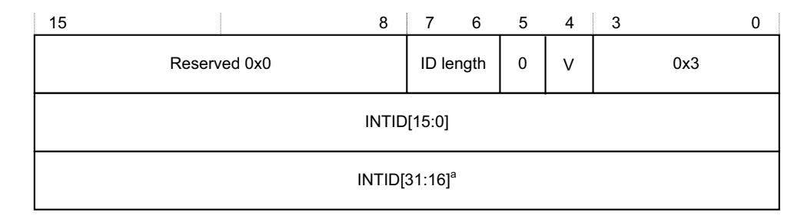

a. If the command includes this field, bits[31:24] are 0.

**Figure A-14 Release**

#### <span id="page-904-4"></span>In [Figure](#page-904-4) A-14:

• ID length indicates the number of INTID bits the Release response includes. See *[Supported INTID sizes on](#page-888-1)  page [A-889](#page-888-1)* for more information.

- V indicates the original command to which the Release response corresponds:
  - **0** The Release corresponds to a [Set](#page-905-0) command.
  - **1** The Release corresponds to a [VSet](#page-909-1) command.
- INTID is the value that the CPU interface returns after a valid read of [ICC\\_IAR0\\_EL1](#page-252-0) or [ICC\\_IAR1\\_EL1.](#page-254-0)


- During legacy operation, the INTID that is returned for SGIs includes the source PE in the [GICC\\_IAR.](#page-756-1)Source\_CPU\_ID field.
- If the INTID corresponds to an interrupt that uses the 1 of N model, the Redistributor might forward the interrupt to a different PE or it might send the interrupt to the same PE again. See *[Priority-based](#page-893-0)  [routing on page](#page-893-0) A-894* for information about how the PMHE field might affect the 1 of N selection.

If the CPU interface issues a Release response as a result of disabling an interrupt group, Arm recommends that it sends the [Upstream Control](#page-906-0) command that contains the revised interrupt group enable information before issuing the Release response.

#### <span id="page-905-0"></span>**A.4.14 Set (IRI)**

The Set command sets the highest priority pending interrupt for a PE. The PE has control of the interrupt and might respond to a read of [ICC\\_IAR0\\_EL1](#page-252-0) or [ICC\\_IAR1\\_EL1](#page-254-0) with the INTID. [Figure](#page-905-1) A-15 shows the Set command format.

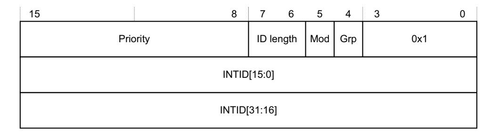

**Figure A-15 Set**

#### <span id="page-905-1"></span>In [Figure](#page-905-1) A-15:

- Priority indicates the actual priority of the interrupt, that is, the Secure, unshifted view. Bits corresponding to unimplemented priority bits in the CPU interface are RES0.
- ID length indicates the number of INTID bits the Set command includes. See *[Supported INTID sizes on](#page-888-1)  page [A-889](#page-888-1)* for more information.
- Mod represents the value of the [GICD\\_IGRPMODR<n>.](#page-569-0)Group status bit for the interrupt.
- Grp represents the interrupt group, as indicated by the corresponding [GICD\\_IGROUPR<n>](#page-565-0).Group status bit.
- INTID is the value that the CPU interface returns after a valid read of an [ICC\\_IAR0\\_EL1](#page-252-0) or [ICC\\_IAR1\\_EL1](#page-254-0).

**Note**

During legacy operation, the INTID that is returned for SGIs includes the source PE in the [GICC\\_IAR.](#page-756-1)Source\_CPU\_ID field.

A GICv3.3 Redistributor does not forward interrupts with a priority of 0xFF to a CPU interface.

In GICv3.3, when SET.{Mod, Grp} indicates any of the following, a SET.priority of 0xFF indicates that the interrupt has the non-maskable property:

- Group 1.
- Secure Group 1.
- Non-Secure Group 1.

The priority of the non-maskable interrupt is treated as one of the following:

• For Non-secure Group 1, the priority is 0x80.

- For Secure Group 1, the priority is 0x00.
- For Group 1, the priority is 0x00.

| Note |  |
|------|--|
|      |  |

The behavior described above does not depend on the SCTLR\_ELx.NMI value of the current Exception level or of the target Exception level.

A SET packet for a Group 0 interrupt with priority == 0xFF is unchanged from GICv3.0, and indicatesthe interrupt's priority is 0xFF. A GICv3.3 Redistributor does not generate this combination.

If the Redistributor sends a Set command, the interrupt specified in the command replaces any outstanding highest pending interrupt, that is, the command sets a new highest priority pending interrupt. Where a pending interrupt is replaced, the CPU interface must [Release](#page-904-1) it back to the Redistributor.

The Redistributor must:

- Ensure that no more than two Set commands that are waiting for a response are outstanding per PE at any time.
- Send a Set command only if it can accept an [Activate](#page-895-0) command where V == 0.

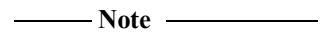

An implementation can guarantee this by treating the Set command as outstanding until either a [Release](#page-904-1) command is received for the Set command, or an [Activate Acknowledge](#page-895-1) response is sent for the corresponding [Activate](#page-895-0).

- Never send a Set command when any of the following conditions apply:
  - The INTID is a special interrupt number, that is, 1020-1023.
  - Affinity routing is enabled for an interrupt group and the INTID value is invalid.
  - Affinity routing is not enabled for an interrupt group, 1023 < INTID < 8192, and bits[9:4] are non-zero. That is, the Redistributor is permitted to send Set commands for SGIs where bits[12:10] of [ICC\\_IAR0\\_EL1](#page-252-0) or [ICC\\_IAR1\\_EL1](#page-254-0) specify the CPUID of the source PE.
  - Affinity routing is not enabled for an interrupt group, and INTID > 8191
  - The Set command has the same INTID as a previous Set command, unless the Redistributor has received an [Activate](#page-895-0) command or [Release](#page-904-1) response.

The Redistributor must not send a SET command for an interrupt until all of the following are true:

- All previous outstanding SET commands for that interrupt have been returned through a [Release](#page-904-1) or [Activate](#page-895-0) command.
- The interrupt is in the pending state, see *[Interrupt handling state machine on page](#page-55-0) 4-56*.

If the interrupt group is disabled, the CPU interface cannot handle the interrupt, and must [Release](#page-904-1) the interrupt.

#### <span id="page-906-1"></span><span id="page-906-0"></span>**A.4.15 Upstream Control (ICC)**

This command communicates data to the Redistributor. [Figure](#page-906-1) A-16 shows the Upstream Control command format.

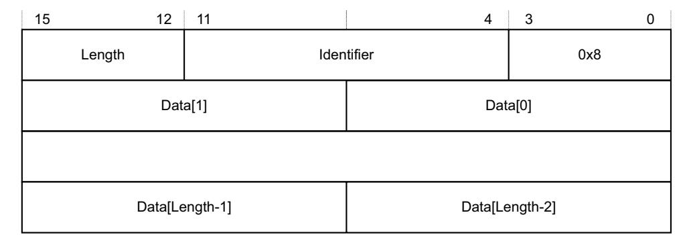

**Figure A-16 Upstream Control**

#### In Figure A-[16 on page](#page-906-1) A-907:

• Length indicates the number of bytes of valid data.

If this field specifies a number of bytes that is not exactly divisible by the interface width, as *[Signals and the](#page-886-1)  [GIC Stream Protocol on page](#page-886-1) A-887* describes, any surplus bytes beyond this specified length in the last transfer must be zero. The Redistributor must ignore such bytes.

• Identifier is a value that specifies the format of the data provided.

<span id="page-907-0"></span>Table A-[8 on page](#page-907-0) A-908 shows the possible Identifier values.

**Table A-8 Upstream Control Identifier values**

| Data value                    | Identifier  | Length | Contents of Data[0] field                                                                                                                                                                                                                                                                                                                                                                                                                                                     |  |  |
|-------------------------------|-------------|--------|-------------------------------------------------------------------------------------------------------------------------------------------------------------------------------------------------------------------------------------------------------------------------------------------------------------------------------------------------------------------------------------------------------------------------------------------------------------------------------|--|--|
| Physical interface<br>enables | 0x00<br>0x1 |        | This value contains the physical CPU interface enable bit values that must be<br>communicated to the Redistributor. Bits [2:0] of Data[0] have the following<br>meanings:                                                                                                                                                                                                                                                                                                     |  |  |
|                               |             |        | [2]<br>EnableGrp1, secure. The value of the Secure copy of<br>ICC_IGRPEN1_EL1.Enable.                                                                                                                                                                                                                                                                                                                                                                                         |  |  |
|                               |             |        | [1]<br>EnableGrp1, Non-secure. The value of the Non-secure copy of<br>ICC_IGRPEN1_EL1.Enable.                                                                                                                                                                                                                                                                                                                                                                                 |  |  |
|                               |             |        | [0]<br>EnableGrp0, Secure. The value of ICC_IGRPEN0_EL1.Enable.<br>When GICD_CTLR.DS==1:                                                                                                                                                                                                                                                                                                                                                                                      |  |  |
|                               |             |        | •<br>EnableGrp1, Secure is always reported as disabled.                                                                                                                                                                                                                                                                                                                                                                                                                       |  |  |
|                               |             |        | When GICD_CTLR.DS==0 and the PE supports a single Security state:                                                                                                                                                                                                                                                                                                                                                                                                             |  |  |
|                               |             |        | •<br>PE is always Secure:                                                                                                                                                                                                                                                                                                                                                                                                                                                     |  |  |
|                               |             |        | —<br>EnableGrp1, Non-secure is always reported as disabled.                                                                                                                                                                                                                                                                                                                                                                                                                   |  |  |
|                               |             |        | •<br>PE is always Non-secure:                                                                                                                                                                                                                                                                                                                                                                                                                                                 |  |  |
|                               |             |        | —<br>EnableGrp0, Secure is always reported as disabled.                                                                                                                                                                                                                                                                                                                                                                                                                       |  |  |
|                               |             |        | —<br>EnableGrp1, Secure is always reported as disabled.                                                                                                                                                                                                                                                                                                                                                                                                                       |  |  |
|                               |             |        | To ensure the state of the enable bits can be communicated easily to the<br>Redistributor after power up, this command must be generated by any write to a<br>physical enable bit. If multiple writes to a physical enable bit occur before the CPU<br>interface issues the command, the GIC can combine these writes into a single<br>command.                                                                                                                               |  |  |
| Virtual interface<br>enables  | 0x01        | 0x1    | This value contains the virtual CPU interface enable bit values that must be<br>communicated to the Redistributor. Bits [1:0] of Data[0] have the following<br>meanings:                                                                                                                                                                                                                                                                                                      |  |  |
|                               |             |        | [1]<br>EnableGrp1. The value of ICH_VMCR_EL2.VENG1.                                                                                                                                                                                                                                                                                                                                                                                                                           |  |  |
|                               |             |        | EnableGrp0. The value of ICH_VMCR_EL2.VENG0.<br>[0]<br>To ensure the state of the enable bits can be communicated easily to the<br>Redistributor after powerup, this command must be generated by any write to a<br>virtual enable bit. If multiple writes to a virtual enable bit occur before the CPU<br>interface issues the command, the GIC can combine these writes into a single<br>command.<br>Only a CPU interface that supports GICv4 can generate this identifier. |  |  |
|                               |             |        | Note<br>If EL2 accesses memory-mapped registers, and uses GICH_VMCR, the VM must<br>access GICV_* registers. If the GIC shares state between the GICH_* registers<br>and the ICH_* System registers, it might communicate any change to the virtual<br>enable bits.                                                                                                                                                                                                           |  |  |

**Table A-8 Upstream Control Identifier values (continued)**

| Data value        | Identifier<br>Length<br>Contents of Data[0] field |     |                                                                                                                                                                                                                                                                                                                                                                                                                                                                                                                                                                                                                                                                                                                                                                                                                                                                                                                                                      |  |
|-------------------|---------------------------------------------------|-----|------------------------------------------------------------------------------------------------------------------------------------------------------------------------------------------------------------------------------------------------------------------------------------------------------------------------------------------------------------------------------------------------------------------------------------------------------------------------------------------------------------------------------------------------------------------------------------------------------------------------------------------------------------------------------------------------------------------------------------------------------------------------------------------------------------------------------------------------------------------------------------------------------------------------------------------------------|--|
| Physical priority | 0x02                                              | 0x1 | This value contains the current value of the Priority Mask Register (PMR):<br>[7:0]<br>The value written to ICC_PMR_EL1.<br>The CPU interface must issue this command when the PE successfully writes to<br>ICC_PMR_EL1 and ICC_CTLR_EL3.PMHE bit is set to 1.<br>The command must be generated by any successful write that changes the value of<br>ICC_PMR_EL1. If multiple writes to ICC_PMR_EL1 occur before the CPU<br>interface issues the command, the GIC can combine these writes into a single<br>command.<br>Note<br>•<br>In GIC implementations that use this value, the Redistributor copy of the<br>value must reset to the idle priority, that is, 0xF8 in cases where only 5 bits<br>of priority are implemented.<br>•<br>If the CPU interface receives a Set command with a priority lower than the<br>current value in ICC_PMR_EL1 before the Upstream Control<br>Acknowledge is received, the GIC might Release that Set command. |  |
| -                 | 0x03 -<br>0x07                                    | -   | Reserved.                                                                                                                                                                                                                                                                                                                                                                                                                                                                                                                                                                                                                                                                                                                                                                                                                                                                                                                                            |  |
| -                 | 0x80 -<br>0xFF                                    | -   | IMPLEMENTATION DEFINED                                                                                                                                                                                                                                                                                                                                                                                                                                                                                                                                                                                                                                                                                                                                                                                                                                                                                                                               |  |

If a Redistributor receives an IMPLEMENTATION DEFINED value that it cannot interpret, this constitutes a protocol error. See *[Software generation of protocol errors and packet errors on page](#page-888-0) A-889*.

#### <span id="page-908-1"></span><span id="page-908-0"></span>**A.4.16 Upstream Control Acknowledge (IRI)**

The Redistributor sends an Upstream Control Acknowledge response to confirm receipt of an [Upstream Control](#page-906-0) command, and to confirm that the effects of the write operation are visible to the Distributor. [Figure](#page-908-1) A-17 shows the Upstream Control Acknowledge response format.


**Figure A-17 Upstream Control Acknowledge**

#### <span id="page-909-2"></span>**A.4.17 VClear (IRI)**

The VClear command resets the highest priority pending virtual interrupt.

This command is provided in GICv4 only.

[Figure](#page-909-3) A-18 shows the VClear command format.

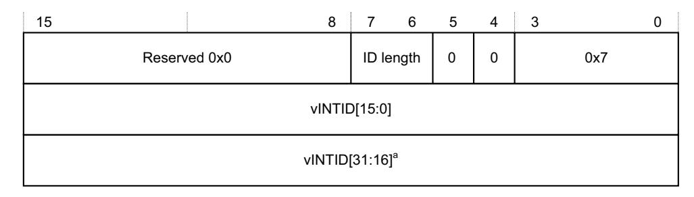

a. If the command includes this field, bits[31:24] are 0.

**Figure A-18 VClear**

#### <span id="page-909-3"></span>In [Figure](#page-909-3) A-18:

- ID length indicates the number of vINTID bits the VClear command includes. See *[Supported INTID sizes on](#page-888-1)  page [A-889](#page-888-1)* for more information.
- vINTID identifies the virtual interrupt to be cleared.

The CPU interface must always respond to a VClear command by sending a [Clear Acknowledge](#page-897-1) response where V==1.

If the interrupt is pending in the CPU interface, the CPU interface must issue a [Release](#page-904-1) response, or an [Activate](#page-895-0) response that remains outstanding for the interrupt before it issues a [Clear Acknowledge](#page-897-1) command.

If the interrupt is not pending or present on the CPU interface, the VClear command has no effect. However, the CPU interface must still issue a [Clear Acknowledge](#page-897-1) response.

| Note                                                     |  |
|----------------------------------------------------------|--|
| This command does not affect LPIs in the List registers. |  |

#### <span id="page-909-1"></span><span id="page-909-0"></span>**A.4.18 VSet (IRI)**

The Redistributor sends a VSet command to set a virtual interrupt pending for a VM. The PE has control of the interrupt and can respond to a read of [ICC\\_IAR0\\_EL1](#page-252-0) or [ICC\\_IAR1\\_EL1](#page-254-0) with the vINTID.

This command is provided in GICv4 only.

Figure A-[19 on page](#page-910-0) A-911 shows the VSet command format.

| 15             |          | 8 | 7         | 56 |   | 4   | 3 |     | 0 |
|----------------|----------|---|-----------|----|---|-----|---|-----|---|
|                | Priority |   | ID length |    | 0 | Grp |   | 0x6 |   |
| vINTID[15:0]   |          |   |           |    |   |     |   |     |   |
| vINTID[31:16]a |          |   |           |    |   |     |   |     |   |

a. If the command includes this field, bits[31:24] are 0.

**Figure A-19 VSet**

#### <span id="page-910-0"></span>In [Figure](#page-910-0) A-19:

- Priority indicates the actual priority of the interrupt, that is, the Secure, unshifted view. Bits corresponding to unimplemented priority bits in the CPU interface are RES0.
- ID length indicates the number of v INTID bits the VSet command includes. See *[Supported INTID sizes on](#page-888-1)  page [A-889](#page-888-1)* for more information.
- Grp represents the interrupt group.
- vINTID is the value that the CPU interface returns after a valid read of [ICC\\_IAR0\\_EL1](#page-252-0) or [ICC\\_IAR1\\_EL1](#page-254-0). When affinity routing is not enabled for a Security state, the CPUID field in [ICC\\_IAR0\\_EL1](#page-252-0) and [ICC\\_IAR1\\_EL1](#page-254-0) identifies the source PE for SGIs.

A GICv3.3 Redistributor does not forward interrupts with a priority of 0xFF to a CPU interface.

In GICv3.3, when VSET.Grp indicates a Group 1 virtual interrupt, a VSET.priority of 0xFF indicates that the virtual interrupt has the non-maskable property. The priority of the virtual interrupt is treated as 0x00.

A VSET packet for a Group 0 interrupt with priority == 0xFF is unchanged from GICv3.0, and indicates the interrupt's priority is 0xFF. A GICv3.3 Redistributor does not generate this combination.

The Redistributor sends a VSet command when the virtual interrupt specified by vINTID is set as pending in the resident virtual LPI Pending table. The CPU interface must either activate the virtual interrupt by sending an [Activate](#page-895-0) command where V == 1, or [Release](#page-904-1) the virtual interrupt to the Redistributor.

If the Redistributor sends a VSet command, the interrupt specified in the command always replaces any previous interrupt, that is, the command sets a new highest priority pending interrupt. If the replaced interrupt is still valid and pending, the CPU interface must [Release](#page-904-1) it back to the Redistributor.

#### The Distributor must:

- Ensure no more than two VSet commands that are waiting for a response are outstanding per PE at any time.
- Send a VSet command only if it can accept an [Activate](#page-895-0) command where V == 1.

**Note** An implementation can guarantee this by treating the VSet command as outstanding until either a [Release](#page-904-1) response is received for the VSet command, or an [Activate Acknowledge](#page-895-1) response is sent for the corresponding [Activate](#page-895-0) command.

- Never send a VSet command when Virtual INTID < 8192. However, in GICv4.1, VSET and VCLEAR commands can specify an INTID in the SGI ranges as well.
- Send a VSet command for an interrupt after receipt of either an [Activate](#page-895-0) or a [Release](#page-904-1) command for that particular interrupt.

The CPU interface must [Release](#page-904-1) an interrupt, ensuring that V == 1, if it cannot handle the interrupt for either of the following reasons:

• The interrupt group is disabled. This includes when the VM interface is disabled, that is, when [GICH\\_HCR](#page-808-1).En or [ICH\\_HCR.](#page-510-1)En, as appropriate, is cleared to 0.

- The hypervisor is not using the System register interface, that is, when either of the following applies:
  - During legacy operation, when [ICC\\_SRE\\_EL2.](#page-282-0)SRE == 0.
  - EL2 is not present.

When the Non-secure copy of [ICC\\_SRE\\_EL1](#page-278-0).SRE == 0, it is UNPREDICTABLE whether the specified virtual interrupt is factored into virtual priority calculations and reads of the GICV\_\* registers.

## <span id="page-912-1"></span><span id="page-912-0"></span>Appendix B **Pseudocode Definition**

This appendix provides a definition of the pseudocode used in this specification, and lists the helper procedures and support functions used by pseudocode to perform useful architecture-specific jobs. For functions that are referenced in this specification but that are not defined in this appendix, see *Arm® Architecture Reference Manual, Armv8, for Armv8-A architecture profile*.

This appendix contains the following sections:

- *[About Arm pseudocode on page](#page-913-1) B-914*.
- *[Data types on page](#page-914-1) B-915*.
- *[Expressions on page](#page-918-1) B-919*.
- *[Operators and built-in functions on page](#page-920-1) B-921*.
- *[Statements and program structure on page](#page-925-1) B-926*.
- *[Pseudocode terminology on page](#page-929-1) B-930*.
- *[Miscellaneous helper procedures and support functions on page](#page-930-1) B-931*.

### <span id="page-913-1"></span><span id="page-913-0"></span>**B.1 About Arm pseudocode**

Arm pseudocode provides precise descriptions of some areas of the architecture. The following sections describe the pseudocode in detail:

- *[Data types on page](#page-914-1) B-915*.
- *[Expressions on page](#page-918-1) B-919*.
- *[Operators and built-in functions on page](#page-920-1) B-921*.
- *[Statements and program structure on page](#page-925-1) B-926*.

*[Miscellaneous helper procedures and support functions on page](#page-930-1) B-931* describes some pseudocode helper functions that are used by the pseudocode functions that are described elsewhere in this document.

#### **B.1.1 General limitations of Arm pseudocode**

The pseudocode statements IMPLEMENTATION\_DEFINED, SEE, UNDEFINED, and UNPREDICTABLE indicate behavior that differs from that indicated by the pseudocode being executed. If one of these statements is encountered:

- Earlier behavior indicated by the pseudocode is only specified as occurring to the extent required to determine that the statement is executed.
- No subsequent behavior indicated by the pseudocode occurs. This means that these statements terminate pseudocode execution.

For more information, see *[Simple statements on page](#page-925-2) B-926*.

### <span id="page-914-1"></span><span id="page-914-0"></span>**B.2 Data types**

This section describes:

- *[General data type rules](#page-914-2)*.
- *[Bitstrings](#page-914-3)*.
- *[Integers on page](#page-915-0) B-916*.
- *[Reals on page](#page-915-1) B-916*.
- *[Booleans on page](#page-915-2) B-916*.
- *[Enumerations on page](#page-915-3) B-916*.
- *[Lists on page](#page-916-0) B-917*.
- *[Arrays on page](#page-917-0) B-918*.

#### <span id="page-914-2"></span>**B.2.1 General data type rules**

Arm architecture pseudocode is a strongly-typed language. Every constant and variable is of one of the following types:

- Bitstring.
- Integer.
- Boolean.
- Real.
- Enumeration.
- List.
- Array.

The type of a constant is determined by its syntax. The type of a variable is normally determined by assignment to the variable, with the variable being implicitly declared to be of the same type as whatever is assigned to it. For example, the assignments x = 1, y = '1', and z = TRUE implicitly declare the variables x, y, and z to have types integer, bitstring of length 1, and Boolean, respectively.

Variables can also have their types declared explicitly by preceding the variable name with the name of the type. This is most often done in function definitions for the arguments and the result of the function.

The remaining subsections describe each data type in more detail.

#### <span id="page-914-3"></span>**B.2.2 Bitstrings**

A bitstring is a finite-length string of 0s and 1s. Each length of bitstring is a different type. The minimum permitted length of a bitstring is 1.

The type name for bitstrings of length N is bits(N). A synonym of bits(1) is bit.

Bitstring constants are written as a single quotation mark, followed by the string of 0s and 1s, followed by another single quotation mark. For example, the two constants of type bit are '0' and '1'. Spaces can be included in bitstrings for clarity.

A special form of bitstring constant with 'x' bits is permitted in bitstring comparisons. See *[Equality and](#page-920-2)  [non-equality testing on page](#page-920-2) B-921*.

Every bitstring value has a left-to-right order, with the bits being numbered in standard *little-endian* order. That is, the leftmost bit of a bitstring of length *N* is bit (*N*–1) and its right-most bit is bit 0. This order is used as the most-significant-to-least-significant bit order in conversions to and from integers. For bitstring constants and bitstrings derived from encoding diagrams, this order matches the way they are printed.

Bitstrings are the only concrete data type in pseudocode, in the sense that they correspond directly to the contents of registers, memory locations, and instructions. All of the remaining data types are abstract.

#### <span id="page-915-0"></span>**B.2.3 Integers**

Pseudocode integers are unbounded in size and can be either positive or negative. That is, they are mathematical integers rather than what computer languages and architectures commonly call integers. Computer integers are represented in pseudocode as bitstrings of the appropriate length, associated with suitable functions to interpret those bitstrings as integers.

The type name for integers is integer.

Integer constants are normally written in decimal, such as 0, 15, –1234. They can also be written in C-style hexadecimal, such as 0x55 or 0x80000000. Hexadecimal integer constants are treated as positive unless they have a preceding minus sign. For example, 0x80000000 is the integer +2<sup>31</sup>. If –2<sup>31</sup> must be written in hexadecimal, it must be written as –0x80000000.

#### <span id="page-915-1"></span>**B.2.4 Reals**

Pseudocode reals are unbounded in size and precision. That is, they are mathematical real numbers, not computer floating-point numbers. Computer floating-point numbers are represented in pseudocode as bitstrings of the appropriate length, associated with suitable functions to interpret those bitstrings as reals.

The type name for reals is real.

Real constants are written in decimal with a decimal point. This means 0 is an integer constant but 0.0 is a real constant.

#### <span id="page-915-2"></span>**B.2.5 Booleans**

A Boolean is a logical TRUE or FALSE value.

The type name for Booleans is boolean. This is not the same type as bit, which is a length–1 bitstring. Boolean constants are TRUE and FALSE.

#### <span id="page-915-3"></span>**B.2.6 Enumerations**

An enumeration is a defined set of symbolic constants, such as:

enumeration InstrSet {InstrSet\_A32, InstrSet\_T32, InstrSet\_A64};

An enumeration always contains at least one symbolic constant, and a symbolic constant must not be shared between enumerations.

Enumerations must be declared explicitly, although a variable of an enumeration type can be declared implicitly by assigning one of the symbolic constants to it. By convention, each of the symbolic constants starts with the name of the enumeration followed by an underscore. The name of the enumeration is its *type name*, or *type*, and the symbolic constants are its possible *constants*.


A Boolean is a pre-declared enumeration that does not follow the normal naming convention and it has a special role in some pseudocode constructs, such as if statements. This means the enumeration of a boolean is:

enumeration boolean {FALSE, TRUE};

#### <span id="page-916-0"></span>**B.2.7 Lists**

A list is an ordered set of other data items, separated by commas and enclosed in parentheses, for example:

```
(bits(32) shifter_result, bit shifter_carry_out)
```

A list always contains at least one data item.

Lists are often used as the return type for a function that returns multiple results. For example, this list at the start of this section is the return type of the function Shift\_C() that performs a standard Arm shift or rotation, when its first operand is of type bits(32).

Some specific pseudocode operators use lists surrounded by other forms of bracketing than the (…) parentheses. These are:

- Bitstring extraction operators, that use lists of bit numbers or ranges of bit numbers surrounded by angle brackets <…>.
- Array indexing, that uses lists of array indexes surrounded by square brackets […].
- Array-like function argument passing, that uses lists of function arguments surrounded by square brackets […].

Each combination of data types in a list is a separate type, with type name given by listing the data types. This means that the example list at the start of this section is of type (bits(32), bit). The general principle that types can be declared by assignment extends to the types of the individual list items in a list. For example:

```
(shift_t, shift_n) = ('00', 0);
```

implicitly declares shift\_t, shift\_n, and (shift\_t, shift\_n) to be of types bits(2), integer, and (bits(2), integer), respectively.

A list type can also be explicitly named, with explicitly named elements in the list. For example:

```
type ShiftSpec is (bits(2) shift, integer amount);
```

After this definition and the declaration:

```
ShiftSpec abc;
```

the elements of the resulting list can then be referred to as abc.shift, and abc.amount. This qualified naming of list elements is only permitted for variables that have been explicitly declared, not for those that have been declared by assignment only.

Explicitly naming a type does not alter what type it is. For example, after the above definition of ShiftSpec, ShiftSpec, and (bits(2), integer) are two different names for the same type, not the names of two different types. To avoid ambiguity in references to list elements, it is an error to declare a list variable multiple times using different names of its type or to qualify it with list element names not associated with the name by which it was declared.

An item in a list that is being assigned to can be written as "-" to indicate that the corresponding item of the assigned list value is discarded. For example:

```
(shifted, -) = LSL_C(operand, amount);
```

List constants are written as a list of constants of the appropriate types, for example the ('00', 0) in the earlier example.

#### <span id="page-917-0"></span>**B.2.8 Arrays**

Pseudocode arrays are indexed by either enumerations or integer ranges. An integer range is represented by the lower inclusive end of the range, then .., then the upper inclusive end of the range.

For example:

```
// The names of the Banked core registers.
enumeration RName {RName_0usr, RName_1usr, RName_2usr, RName_3usr, RName_4usr, RName_5usr,
                   RName_6usr, RName_7usr, RName_8usr, RName_8fiq, RName_9usr, RName_9fiq,
                   RName_10usr, RName_10fiq, RName_11usr, RName_11fiq, RName_12usr, RName_12fiq,
                   RName_SPusr, RName_SPfiq, RName_SPirq, RName_SPsvc,
                   RName_SPabt, RName_SPund, RName_SPmon, RName_SPhyp,
                   RName_LRusr, RName_LRfiq, RName_LRirq, RName_LRsvc,
                   RName_LRabt, RName_LRund, RName_LRmon,
                   RName_PC};
```

array bits(8) \_Memory[0..0xFFFFFFFF];

Arrays are always explicitly declared, and there is no notation for a constant array. Arrays always contain at least one element, because:

- Enumerations always contain at least one symbolic constant.
- Integer ranges always contain at least one integer.

Arrays do not usually appear directly in pseudocode. The items that syntactically look like arrays in pseudocode are usually array-like functions such as R[i], MemU[address, size] or Elem[vector, i, size]. These functions package up and abstract additional operations normally performed on accesses to the underlying arrays, such as register banking, memory protection, endian-dependent byte ordering, exclusive-access housekeeping and Advanced SIMD element processing.

### <span id="page-918-1"></span><span id="page-918-0"></span>**B.3 Expressions**

This section describes:

- *[General expression syntax](#page-918-2)*.
- *[Operators and functions polymorphism and prototypes on page](#page-919-0) B-920*.
- *[Precedence rules on page](#page-919-1) B-920*.

#### <span id="page-918-2"></span>**B.3.1 General expression syntax**

An expression is one of the following:

- A constant.
- A variable, optionally preceded by a data type name to declare its type.
- The word UNKNOWN preceded by a data type name to declare its type.
- The result of applying a language-defined operator to other expressions.
- The result of applying a function to other expressions.

Variable names normally consist of alphanumeric and underscore characters, starting with an alphabetic or underscore character.

Each register described in the text is to be regarded as declaring a correspondingly named bitstring variable, and that variable has the stated behavior of the register. For example, if a bit of a register is defined as RAZ/WI, then the corresponding bit of its variable reads as 0 and ignore writes.

An expression like bits(32) UNKNOWN indicates that the result of the expression is a value of the given type, but the architecture does not specify what value it is and software must not rely on such values. The value produced must not:

- Return information that cannot be accessed at the current or a lower level of privilege using instructions that are not UNPREDICTABLE and do not return UNKNOWN values.
- Be promoted as providing any useful information to software.

| Note |  |  |  |
|------|--|--|--|
|      |  |  |  |

Some earlier documentation describes this as an UNPREDICTABLE value. UNKNOWN values are similar to the definition of UNPREDICTABLE, but do not indicate that the entire architectural state becomes unspecified.

Only the following expressions are assignable. This means that these are the only expressions that can be placed on the left-hand side of an assignment.

- Variables.
- The results of applying some operators to other expressions.

The description of each language-defined operator that can generate an assignable expression specifies the circumstances under which it does so. For example, those circumstances might require that one or more of the expressions the operator operates is an assignable expression.

• The results of applying array-like functions to other expressions. The description of an array-like function specifies the circumstances under which it can generate an assignable expression.

Every expression has a data type:

- For a constant, this data type is determined by the syntax of the constant.
- For a variable, there are the following possible sources for the data type:
  - An optional preceding data type name.
  - A data type the variable was given earlier in the pseudocode by recursive application of this rule.
  - A data type the variable is being given by assignment, either by direct assignment to the variable, or by assignment to a list of which the variable is a member.

It is a pseudocode error if none of these data type sources exists for a variable, or if more than one of them exists and they do not agree about the type.

- For a language-defined operator, the definition of the operator determines the data type.
- For a function, the definition of the function determines the data type.

#### <span id="page-919-0"></span>**B.3.2 Operators and functions - polymorphism and prototypes**

Operators and functions in pseudocode can be polymorphic, producing different functionality when applied to different data types. Each resulting form of an operator or function has a different prototype definition. For example, the operator + has forms that act on various combinations of integers, reals, and bitstrings.

One particularly common form of polymorphism is between bitstrings of different lengths. This is represented by using bits(N), bits(M), or similar, in the prototype definition.

#### <span id="page-919-1"></span>**B.3.3 Precedence rules**

The precedence rules for expressions are:

- 1. Constants, variables, and function invocations are evaluated with higher priority than any operators using their results.
- 2. Expressions on integers follow the normal operator precedence rules of *exponentiation before multiply/divide before add/subtract*, with sequences of multiply/divides or add/subtracts evaluated left-to-right.
- 3. Other expressions must be parenthesized to indicate operator precedence if ambiguity is possible, but do not have to be if all permitted precedence orders under the type rules necessarily lead to the same result. For example, if i, j, and k are integer variables, i > 0 && j > 0 && k > 0 is acceptable, but i > 0 && j > 0 || k > 0 is not.

### <span id="page-920-1"></span><span id="page-920-0"></span>**B.4 Operators and built-in functions**

This section describes:

- *[Operations on generic types](#page-920-3)*.
- *[Operations on Booleans](#page-920-4)*.
- *[Bitstring manipulation](#page-920-5)*.
- *[Arithmetic on page](#page-923-0) B-924*.

#### <span id="page-920-3"></span>**B.4.1 Operations on generic types**

The following operations are defined for all types.

#### <span id="page-920-2"></span>**Equality and non-equality testing**

Any two values x and y of the same type can be tested for equality by the expression x == y and for non-equality by the expression x != y. In both cases, the result is of type boolean.

A special form of comparison is defined with a bitstring constant that includes 'x' bits in addition to '0' and '1' bits. The bits corresponding to the 'x' bits are ignored in determining the result of the comparison. For example, if opcode is a 4-bit bitstring, opcode == '1x0x' is equivalent to opcode<3> == '1' && opcode<1> == '0'.

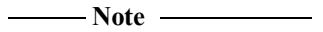

This special form is permitted in the implied equality comparisons in when parts of case … of … structures.

#### **Conditional selection**

If x and y are two values of the same type and t is a value of type boolean, then if t then x else y is an expression of the same type as x and y that produces x if t is TRUE and y if t is FALSE.

#### <span id="page-920-4"></span>**B.4.2 Operations on Booleans**

If x is a Boolean, then !x is its logical inverse.

If x and y are Booleans, then x && y is the result of ANDing them together. As in the C language, if x is FALSE, the result is determined to be FALSE without evaluating y.

If x and y are Booleans, then x || y is the result of ORing them together. As in the C language, if x is TRUE, the result is determined to be TRUE without evaluating y.

If x and y are Booleans, then x ^ y is the result of exclusive-ORing them together.

#### <span id="page-920-5"></span>**B.4.3 Bitstring manipulation**

The following bitstring manipulation functions are defined:

#### **Bitstring length and most significant bit**

If x is a bitstring:

- The bitstring length function Len(x) returns the length of x as an integer.
- TopBit(x) is the leftmost bit of x. Using bitstring extraction, this means: TopBit(x)= x<Len(x)–1>.

#### **Bitstring concatenation and replication**

If x and y are bitstrings of lengths N and M respectively, then x:y is the bitstring of length N+M constructed by concatenating x and y in left-to-right order.

If x is a bitstring and n is an integer with n > 0:

- Replicate(x, n) is the bitstring of length n\*Len(x) consisting of n copies of x concatenated together
- Zeros(n) = Replicate('0', n), Ones(n) = Replicate('1', n).

#### **Bitstring extraction**

The bitstring extraction operator extracts a bitstring from either another bitstring or an integer. Its syntax is x<integer\_list>, where x is the integer or bitstring being extracted from, and <integer\_list> is a list of integers enclosed in angle brackets rather than the usual parentheses. The length of the resulting bitstring is equal to the number of integers in <integer\_list>. In x<integer\_list>, each of the integers in <integer\_list> must be:

- >= 0
- < Len(x) if x is a bitstring.

The definition of x<integer\_list> depends on whether integer\_list contains more than one integer:

- If integer\_list contains more than one integer, x<i, j, k,…, n> is defined to be the concatenation: x<i> : x<j> : x<k> : … : x<n>.
- If integer\_list consists of one integer i, x<i> is defined to be:
  - If x is a bitstring, '0' if bit i of x is a zero and '1' if bit i of x is a one.
  - If x is an integer, let y be the unique integer in the range 0 to 2^(i+1)–1 that is congruent to x modulo 2^(i+1). Then x<i> is '0' if y < 2^i and '1' if y >= 2^i.

Loosely, this definition treats an integer as equivalent to a sufficiently long two's complement representation of it as a bitstring.

In <integer\_list>, the notation i:j with i >= j is shorthand for the integers in order from i down to j, with both end values included. For example, instr<31:28> is shorthand for instr<31, 30, 29, 28>.

The expression x<integer\_list> is assignable provided x is an assignable bitstring and no integer appears more than once in <integer\_list>. In particular, x<i> is assignable if x is an assignable bitstring and 0 <= i < Len(x).

Encoding diagrams for registers frequently show named bits or multi-bit fields. For example, the encoding diagram for the [ICC\\_SGI1R](#page-443-1) shows its bit<28> as IS. In such cases, the syntax ICC\_SGI1R.IS is used as a more readable synonym for ICC\_SGI1R<28>.

#### **Logical operations on bitstrings**

If x is a bitstring, NOT(x) is the bitstring of the same length obtained by logically inverting every bit of x.

If x and y are bitstrings of the same length, x AND y, x OR y, and x EOR y are the bitstrings of that same length obtained by logically ANDing, ORing, and exclusive-ORing corresponding bits of x and y together.

#### **Bitstring count**

If x is a bitstring, BitCount(x) produces an integer result equal to the number of bits of x that are ones.

#### **Testing a bitstring for being all zero or all ones**

If x is a bitstring:

- IsZero(x) produces TRUE if all of the bits of x are zeros and FALSE if any of them are ones
- IsZeroBit(x) produces '1' if all of the bits of x are zeros and '0' if any of them are ones.

IsOnes(x) and IsOnesBit(x) work in the corresponding ways. This means:

```
IsZero(x) = (BitCount(x) == 0)
IsOnes(x) = (BitCount(x) == Len(x))
IsZeroBit(x) = if IsZero(x) then '1' else '0'
IsOnesBit(x) = if IsOnes(x) then '1' else '0'
```

#### **Lowest and highest set bits of a bitstring**

If x is a bitstring, and N = Len(x):

- LowestSetBit(x) is the minimum bit number of any of its bits that are ones. If all of its bits are zeros, LowestSetBit(x) = N.
- HighestSetBit(x) is the maximum bit number of any of its bits that are ones. If all of its bits are zeros, HighestSetBit(x) = –1.
- CountLeadingZeroBits(x) is the number of zero bits at the left end of x, in the range 0 to N. This means: CountLeadingZeroBits(x) = N – 1 – HighestSetBit(x).
- CountLeadingSignBits(x) is the number of copies of the sign bit of x at the left end of x, excluding the sign bit itself, and is in the range 0 to N–1. This means:

```
CountLeadingSignBits(x) = CountLeadingZeroBits(x<N–1:1> EOR x<N–2:0>).
```

#### **Zero-extension and sign-extension of bitstrings**

If x is a bitstring and i is an integer, then ZeroExtend(x, i) is x extended to a length of i bits, by adding sufficient zero bits to its left. That is, if i == Len(x), then ZeroExtend(x, i) = x, and if i > Len(x), then:

```
ZeroExtend(x, i) = Replicate('0', i–Len(x)) : x
```

If x is a bitstring and i is an integer, then SignExtend(x, i) is x extended to a length of i bits, by adding sufficient copies of its leftmost bit to its left. That is, if i == Len(x), then SignExtend(x, i) = x, and if i > Len(x), then:

```
SignExtend(x, i) = Replicate(TopBit(x), i–Len(x)) : x
```

It is a pseudocode error to use either ZeroExtend(x, i) or SignExtend(x, i) in a context where it is possible that i < Len(x).

#### **Converting bitstrings to integers**

If x is a bitstring, SInt(x) is the integer whose two's complement representation is x:

```
// SInt()
// ======
integer SInt(bits(N) x)
    result = 0;
    for i = 0 to N-1
        if x<i> == '1' then result = result + 2^i;
    if x<N-1> == '1' then result = result - 2^N;
    return result;
UInt(x) is the integer whose unsigned representation is x:
// UInt()
```

// ======

```
integer UInt(bits(N) x)
    result = 0;
    for i = 0 to N-1
        if x<i> == '1' then result = result + 2^i;
    return result;
Int(x, unsigned) returns either SInt(x) or UInt(x) depending on the value of its second argument:
// Int()
// =====
integer Int(bits(N) x, boolean unsigned)
    result = if unsigned then UInt(x) else SInt(x);
    return result;
```

#### <span id="page-923-0"></span>**B.4.4 Arithmetic**

Most pseudocode arithmetic is performed on integer or real values, with operands being obtained by conversions from bitstrings and results converted back to bitstrings afterwards. As these data types are the unbounded mathematical types, no issues arise about overflow or similar errors.

#### **Unary plus, minus, and absolute value**

If x is an integer or real, then +x is x unchanged, –x is x with its sign reversed, and Abs(x) is the absolute value of x. All three are of the same type as x.

#### **Addition and subtraction**

If x and y are integers or reals, x+y and x–y are their sum and difference. Both are of type integer if x and y are both of type integer, and real otherwise.

Addition and subtraction are particularly common arithmetic operations in pseudocode, and so it is also convenient to have definitions of addition and subtraction acting directly on bitstring operands.

If x and y are bitstrings of the same length N, so that N = Len(x) = Len(y), then x+y and x–y are the least significant N bits of the results of converting them to integers and adding or subtracting them. Signed and unsigned conversions produce the same result:

```
x+y = (SInt(x) + SInt(y))<N–1:0>
    = (UInt(x) + UInt(y))<N–1:0>
x–y = (SInt(x) – SInt(y))<N–1:0>
    = (UInt(x) – UInt(y))<N–1:0>
```

If x is a bitstring of length N and y is an integer, x+y and x–y are the bitstrings of length N defined by x+y = x + y<N–1:0> and x–y = x – y<N–1:0>. Similarly, if x is an integer and y is a bitstring of length M, x+y and x–y are the bitstrings of length M defined by x+y = x<M–1:0> + y and x–y = x<M–1:0> – y.

#### **Comparisons**

If x and y are integers or reals, then x == y, x != y, x < y, x <= y, x > y, and x >= y are equal, not equal, less than, less than or equal, greater than, and greater than or equal comparisons between them, producing Boolean results. In the case of == and !=, this extends the generic definition applying to any two values of the same type to also act between integers and reals.

#### **Multiplication**

If x and y are integers or reals, then x \* y is the product of x and y. It is of type integer if x and y are both of type integer, and real otherwise.

#### **Division and modulo**

If x and y are integers or reals, then x/y is the result of dividing x by y, and is always of type real.

If x and y are integers, then x DIV y and x MOD y are defined by:

```
x DIV y = RoundDown(x/y)
x MOD y = x – y * (x DIV y)
```

It is a pseudocode error to use any of x/y, x MOD y, or x DIV y in any context where y can be zero.

#### **Square root**

If x is an integer or a real, Sqrt(x) is its square root, and is always of type real.

#### **Rounding and aligning**

If x is a real:

- RoundDown(x) produces the largest integer n so that n <= x
- RoundUp(x) produces the smallest integer n so that n >= x
- RoundTowardsZero(x) produces RoundDown(x) if x > 0.0, 0 if x == 0.0, and RoundUp(x) if x < 0.0.

If x and y are both of type integer, Align(x, y) = y \* (x DIV y) is of type integer.

If x is of type bitstring and y is of type integer, Align(x, y) = (Align(UInt(x), y))<Len(x)–1:0> is a bitstring of the same length as x.

It is a pseudocode error to use either form of Align(x, y) in any context where y can be 0. In practice, Align(x, y) is only used with y a constant power of two, and the bitstring form used with y = 2^n has the effect of producing its argument with its n low-order bits forced to zero.

#### **Scaling**

If n is an integer, 2^n is the result of raising 2 to the power n and is of type real.

If x and n are of type integer, then:

- x << n = RoundDown(x \* 2^n)
- x >> n = RoundDown(x \* 2^(–n)).

#### **Maximum and minimum**

If x and y are integers or reals, then Max(x, y) and Min(x, y) are their maximum and minimum respectively. Both are of type integer if x and y are both of type integer, and real otherwise.

#### <span id="page-925-1"></span><span id="page-925-0"></span>**B.5 Statements and program structure**

The following sections describe the control statements used in the pseudocode:

- *[Simple statements](#page-925-2)*.
- *[Compound statements on page](#page-926-0) B-927*.
- *[Comments on page](#page-928-0) B-929*.

#### <span id="page-925-2"></span>**B.5.1 Simple statements**

Each of the following simple statements must be terminated with a semicolon, as shown.

#### **Assignments**

```
An assignment statement takes the form:
<assignable_expression> = <expression>;
```

#### **Procedure calls**

```
A procedure call takes the form:
<procedure_name>(<arguments>);
```

#### **Return statements**

A procedure return takes the form:

return;

and a function return takes the form:

return <expression>;

where <expression> is of the type declared in the function prototype line.

#### **UNDEFINED**

This subsection describes the statement:

UNDEFINED;

This statement indicates a special case that replaces the behavior defined by the current pseudocode, apart from behavior required to determine that the special case applies. The replacement behavior is that the Undefined Instruction exception is taken.

#### **UNPREDICTABLE**

This subsection describes the statement:

UNPREDICTABLE;

This statement indicates a special case that replaces the behavior defined by the current pseudocode, apart from behavior required to determine that the special case applies. The replacement behavior is UNPREDICTABLE.

#### **SEE…**

This subsection describes the statement:

SEE <reference>;

This statement indicates a special case that replaces the behavior defined by the current pseudocode, apart from behavior required to determine that the special case applies. The replacement behavior is that nothing occurs as a result of the current pseudocode because some other piece of pseudocode defines the required behavior. The <reference> indicates where that other pseudocode can be found.

It usually refers to another instruction but can also refer to another encoding or note of the same instruction.

#### **IMPLEMENTATION\_DEFINED**

This subsection describes the statement:

```
IMPLEMENTATION_DEFINED {<text>};
```

This statement indicates a special case that replaces the behavior defined by the current pseudocode, apart from behavior required to determine that the special case applies. The replacement behavior is IMPLEMENTATION DEFINED. An optional <text> field can give more information.

#### <span id="page-926-0"></span>**B.5.2 Compound statements**

Indentation normally indicates the structure in compound statements. The statements contained in structures such as if … then … else … or procedure and function definitions are indented more deeply than the statement itself, and their end is indicated by returning to the original indentation level or less.

Indentation is normally done by four spaces for each level.

#### **if … then … else …**

```
A multi-line if … then … else … structure takes the form:
```

```
if <boolean_expression> then
    <statement 1>
    <statement 2>
    …
    <statement n>
elsif <boolean_expression> then
    <statement a>
    <statement b>
    …
    <statement z>
else
    <statement A>
    <statement B>
    …
    <statement Z>
```

The block of lines consisting of elsif and its indented statements is optional, and multiple such blocks can be used.

The block of lines consisting of else and its indented statements is optional.

Abbreviated one-line forms can be used when there are only simple statements in the then part and in the else part, if it is present, such as:

```
if <boolean_expression> then <statement 1>
if <boolean_expression> then <statement 1> else <statement A>
if <boolean_expression> then <statement 1> <statement 2> else <statement A>
        Note
```

In these forms, <statement 1>, <statement 2> and <statement A> must be terminated by semicolons. This and the fact that the else part is optional are differences from the if … then … else … expression.

#### **repeat … until …**

A repeat … until … structure takes the form:

```
repeat
    <statement 1>
    <statement 2>
    …
    <statement n>
until <boolean_expression>;
while … do
A while … do structure takes the form:
while <boolean_expression> do
    <statement 1>
    <statement 2>
    …
    <statement n>
for …
A for … structure takes the form:
for <assignable_expression> = <integer_expr1> to <integer_expr2>
    <statement 1>
    <statement 2>
    …
    <statement n>
case … of …
A case … of … structure takes the form:
case <expression> of
    when <constant values>
        <statement 1>
        <statement 2>
        …
        <statement n>
        … more "when" groups …
    otherwise
        <statement A>
        <statement B>
        …
        <statement Z>
```

In this structure, <constant values> consists of one or more constant values of the same type as <expression>, separated by commas. Abbreviated one line forms of when and otherwise parts can be used when they contain only simple statements.

If <expression> has a bitstring type, <constant values> can also include bitstring constants containing 'x' bits. For details see *[Equality and non-equality testing on page](#page-920-2) B-921*.

#### **Procedure and function definitions**

A procedure definition takes the form:

```
<procedure name>(<argument prototypes>)
    <statement 1>
    <statement 2>
    …
    <statement n>
```

where <argument prototypes> consists of zero or more argument definitions, separated by commas. Each argument definition consists of a type name followed by the name of the argument.

**Note**

This first prototype line is not terminated by a semicolon. This helps to distinguish it from a procedure call.

A function definition is similar but also declares the return type of the function:

```
<return type> <function name>(<argument prototypes>)
    <statement 1>
    <statement 2>
    …
    <statement n>
```

An array-like function is similar but with square brackets:

```
<return type> <function name>[<argument prototypes>]
    <statement 1>
    <statement 2>
    …
    <statement n>
```

An array-like function also usually has an assignment prototype:

```
<function name>[<argument prototypes>] = <value prototypes>
    <statement 1>
    <statement 2>
    …
    <statement n>
```

#### <span id="page-928-0"></span>**B.5.3 Comments**

Two styles of pseudocode comment exist:

- // starts a comment that is terminated by the end of the line
- /\* starts a comment that is terminated by \*/.

#### <span id="page-929-1"></span><span id="page-929-0"></span>**B.6 Pseudocode terminology**

<span id="page-929-2"></span>Table B-[1 on page](#page-929-2) B-930 lists the terms used in the body text and the terms used in pseudocode to denote the same concept, throughout this specification.

**Table B-1 Pseudocode terms**

| Term used in the body text | Term used in pseudocode |
|----------------------------|-------------------------|
| vPE                        | VCPU                    |
| vPEID                      | VCPUID                  |
| pINTID                     | pID                     |
| vINTID                     | vID                     |

### <span id="page-930-1"></span><span id="page-930-0"></span>**B.7 Miscellaneous helper procedures and support functions**

The functions described in this section are not part of the pseudocode specification. They are miscellaneous *helper* procedures and functions used by pseudocode that are not described elsewhere in this document. Each has a brief description and a pseudocode prototype, except that the prototype is omitted where it is identical to the section title.

**Note**

Some variable names used the pseudocode differ from those used in the body text. For a list of the affected variables, see *[Pseudocode terminology on page](#page-929-1) B-930*.

#### **B.7.1 Helper functions**

The functions listed in the following sections are indicated by the hierarchical path names, for example shared/gic/helper:

- *[shared/gic/helper/AcknowledgeInterrupt](#page-930-2)*.
- *[shared/gic/helper/AcknowledgeVInterrupt](#page-930-3)*.
- *[shared/gic/helper/AlwaysUsingSysRegs](#page-930-4)*.
- *[shared/gic/helper/Deactivate on page](#page-931-0) B-932*.
- *[shared/gic/helper/GetHighestActiveGroup on page](#page-931-2) B-932*.
- *[shared/gic/helper/GetHighestActivePriority on page](#page-931-3) B-932*.
- *[shared/gic/helper/GICH\\_SETR on page](#page-931-1) B-932*.
- *[shared/gic/helper/GICH\\_VLPIR on page](#page-931-4) B-932*.
- *[shared/gic/helper/INTID\\_SIZE on page](#page-932-0) B-933*.
- *[shared/gic/helper/IntGroup on page](#page-932-1) B-933*.
- *[shared/gic/helper/Interrupt on page](#page-932-2) B-933*.
- *[shared/gic/helper/IntNeedsDeactivate on page](#page-932-5) B-933*.
- *[shared/gic/helper/IsEL3OrMon on page](#page-932-4) B-933*.
- *[shared/gic/helper/IsGrp0Int on page](#page-932-3) B-933*.
- *[shared/gic/helper/IsSecureInt on page](#page-933-0) B-934*.
- *[shared/gic/helper/PriorityIsHigher on page](#page-933-1) B-934*.
- *[shared/gic/helper/SingleSecurityState on page](#page-933-2) B-934*.
- *[shared/gic/helper/Special on page](#page-933-3) B-934*.
- *[shared/gic/helper/SystemRegisterTrap on page](#page-933-4) B-934*.

#### <span id="page-930-2"></span>**shared/gic/helper/AcknowledgeInterrupt**

```
// AcknowledgeInterrupt()
// ==============================
// Acknowledges the INTID and sets the appropriate ICC_AP{0,1}R_EL1
// active priority bit and NMI bit, if appropriate
AcknowledgeInterrupt(bits(INTID_SIZE) ID);
```

#### <span id="page-930-3"></span>**shared/gic/helper/AcknowledgeVInterrupt**

```
// AcknowledgeVInterrupt()
// =======================
// Acknowledges vINTID
AcknowledgeVInterrupt(bits(INTID_SIZE) ID);
```

#### <span id="page-930-4"></span>**shared/gic/helper/AlwaysUsingSysRegs**

```
// AlwaysUsingSysRegs()
// ===================
```

```
// Returns true if the PE only supports the use of System registers for handling physical interrupts
boolean AlwaysUsingSysRegs();
```

#### <span id="page-931-0"></span>**shared/gic/helper/Deactivate**

```
// Deactivate()
// =================
// Deactivates the INTID
Deactivate(bits(INTID_SIZE) INTID);
```

#### <span id="page-931-2"></span>**shared/gic/helper/GetHighestActiveGroup**

```
// GetHighestActiveGroup()
// =======================
// Returns a value indicating the interrupt group of the highest active priority from three
// registers. Returns IntGroup_None if no active priorities.
// Note: having more than one group active at the same priority is UNPREDICTABLE.
IntGroup GetHighestActiveGroup(bits(128) ap0, bits(128) ap1ns, bits(128) ap1s)
```

#### <span id="page-931-3"></span>**shared/gic/helper/GetHighestActivePriority**

```
// GetHighestActivePriority()
// ==========================
// Returns the priority of the highest active priority from three registers, expressed as an 8-bit
// unsigned binary number.
// Returns 0x00 if the highest active priority is a Secure NMI, or NMI when GICD_CTLR.DS==1.
// Returns 0x80 if the highest active priority is a Non-secure NMI.
// Returns 0xFF if no bits are active.
bits(8) GetHighestActivePriority(bits(128) ap0, bits(128) ap1ns, bits(128) ap1s)
```

#### <span id="page-931-1"></span>**shared/gic/helper/GICH\_SETR**

```
// GICC_SETR
// ==================
// Holds physical interrupt received from the Distributor
type InterruptType is (
    INTID ID,
    bits(2) State,
    bits(8) Priority,
    IntGroup Group,
    boolean NMI
)
InterruptType GICC_SETR;
```

#### <span id="page-931-4"></span>**shared/gic/helper/GICH\_VLPIR**

```
// GICH_VLPIR
// ==================
// Holds virtual interrupt received via direct injection received from the Distributor
type LRType is (
    INTID vINTID,
    bits(2) State,
    bits(8) Priority,
    IntGroup Group,
    boolean NMI
```

```
)
LRType GICH_VLPIR;
shared/gic/helper/INTID_SIZE
// INTID_SIZE
// ==========
// The number of interrupt ID bits implemented at the Distributor and Redistributor.
// This value is IMPLEMENTATION DEFINED and discoverable from GICD_TYPER.IDbits.
constant integer INTID_SIZE = integer IMPLEMENTATION_DEFINED "Distributor INTID size";
shared/gic/helper/IntGroup
// IntGroup()
// ==================
enumeration IntGroup { IntGroup_None, IntGroup_G0, IntGroup_G1NS, IntGroup_G1S };
shared/gic/helper/Interrupt
// Interrupt()
// ================
constant bits(2) IntState_Invalid = '00';
constant bits(2) IntState_Pending = '01';
constant bits(2) IntState_Active = '10';
constant bits(2) IntState_ActivePending = '11';
shared/gic/helper/IntNeedsDeactivate
// IntNeedsDeactivate()
// =================
// Returns TRUE if the INTID requires a deactivate
boolean IntNeedsDeactivate(UInt intid)
   // GICv3.0
   if (intid < 1020) then return TRUE;
   // GICv3.1 extended PPI and SPI ranges
   if (!IsSpecial(intid) && !IsLPI(intid) && (ICC_CTLR_EL1.ExtRange == 1)) then return TRUE;
   // Otherwise LPI or reserved
   return FALSE;
shared/gic/helper/IsEL3OrMon
// IsEL3OrMon()
// =======================
// Returns true if EL3 is using AArch32 and in Monitor mode or
// if EL3 is using AArch64 and PSTATE.EL = 3
boolean IsEL3OrMon();
shared/gic/helper/IsGrp0Int
// IsGrp0Int()
// =======================
```

<span id="page-932-5"></span><span id="page-932-4"></span><span id="page-932-3"></span>// Returns TRUE if the INTID is in Group 0

```
boolean IsGrp0Int(bits(INTID_SIZE) ID);
shared/gic/helper/IsSecureInt
// IsSecureInt()
// =============
// Returns true if GICD_CTLR.DS == 0 and ID
// is a Group 0 or Secure Group 1 INTID
boolean IsSecureInt(bits(INTID_SIZE) ID);
shared/gic/helper/IsSGI
// IsSGI()
// =======================
// boolean IsSGI(bits(INTID_SIZE) intID)
      return UInt(intID) < 16;
shared/gic/helper/PriorityIsHigher
// PriorityIsHigher()
// ===========================
// Returns true if the first priority is higher than the second priority.
boolean PriorityIsHigher(bits(8) first, bits(8) second);
shared/gic/helper/SingleSecurityState
// SingleSecurityState()
// ==========================
// Returns TRUE if the Distributor supports a single Security state, for example when GICD_CTLR.DS == 1.
boolean SingleSecurityState();
shared/gic/helper/Special 
// IsSpecial()
// ==================
boolean IsSpecial(bits(INTID_SIZE) intID)
   return UInt(intID) >= 1020 && UInt(intID) <= 1023;
//IsLPI()
// =================
boolean IsLPI(bits(INTID_SIZE) intID)
   return UInt(intID) >= 8192;
constant bits(INTID_SIZE) INTID_SECURE = 1020<INTID_SIZE-1:0>;
constant bits(INTID_SIZE) INTID_NONSECURE = 1021<INTID_SIZE-1:0>;
constant bits(INTID_SIZE) INTID_GROUP1 = 1022<INTID_SIZE-1:0>;
constant bits(INTID_SIZE) INTID_SPURIOUS = 1023<INTID_SIZE-1:0>;
type INTID = bits(INTID_SIZE);
shared/gic/helper/SystemRegisterTrap
// SystemRegisterTrap()
```

```
// ===================
SystemRegisterTrap(bits(2) target_el);
```

#### **B.7.2 Support functions**

This section lists the support functions that are not listed elsewhere in this specification.The functions listed in the following sections are indicated by the hierarchical path names, for example shared/support:

- *[shared/support/ActivePRIBits](#page-934-0)*.
- *[shared/support/CanSignalInterrupt](#page-934-1)*.
- *[shared/support/CanSignalVirtualInt on page](#page-935-0) B-936*.
- *[shared/support/CanSignalVirtualInterrupt on page](#page-936-0) B-937*.
- *[shared/support/ClearPendingState on page](#page-936-1) B-937*.
- *[shared/support/HaveNMIExt on page](#page-937-2) B-938*.
- *[shared/support/HighestPriorityPendingInterrupt on page](#page-937-0) B-938*.
- *[shared/support/HighestPriorityVirtualInterrupt on page](#page-937-1) B-938*.
- *[shared/support/INTID\\_NMI on page](#page-938-4) B-939*.
- *[shared/support/PRIBits on page](#page-938-0) B-939*.
- *[shared/support/PriorityDrop on page](#page-938-1) B-939*.
- *[shared/support/PriorityGroup on page](#page-938-2) B-939*.
- *[shared/support/SetPendingState on page](#page-938-3) B-939*.
- *[shared/support/SystemRegisterAccessPermitted on page](#page-939-0) B-940*.

#### <span id="page-934-0"></span>**shared/support/ActivePRIBits**

```
// ActivePRIBits()
// ===============
integer ActivePRIBits()
    pri_bits = PRIBits();
    return 2^(pri_bits - 1);
```

#### <span id="page-934-1"></span>**shared/support/CanSignalInterrupt**

```
// CanSignalInterrupt()
// ====================
boolean CanSignalInterrupt()
    // Get the priority group of the current "Set" using the BPR appropriate to the group
    setPriorityGroup = GroupBits(GICC_SETR.Priority, GICC_SETR.Group);
    // Get the priority group of highest APR using the BPR appropriate to the SET packet
    runningPriority = GetHighestActivePriority(ICC_AP0R_EL1, ICC_AP1R_EL1NS, ICC_AP1R_EL1S);
    preemptionLevel = GroupBits(runningPriority<7:1>:'0', GICC_SETR.Group);
    //
    // Is there a pending interrupt?
    //
    if GICC_SETR.State != IntState_Pending then
        // There is no pending interrupt
        return FALSE;
    //
    // Check the Priority Mask
    //
    if !HaveNMIExt() || (GICC_SETR.NMI == FALSE) then
        // The pending interrupt is not an NMI
```

if UInt(GICC\_SETR.Priority) => UInt(ICC\_PMR\_EL1.Priority) then

```
return FALSE;
   else
       // The pending interrupt is an NMI
       // NMIs have a fixed priority value
       // Non-secure Group 1
       if (GICC_SETR.Group == IntGroup_G1NS) && (GICD_CTLR.DS == '0') then
           if IsSecure() || IsRoot() then
               if UInt(ICC_PMR_EL1.Priority) =< '0x80' then
                   // In Secure/Root state, and PMR set to mask all Non-secure interrupts
                   return FALSE;
           else
               if UInt(ICC_PMR_EL1.Priority) < '0x80' then
                   // In Non-secure/Realm state, and PMR in Secure range
                   return FALSE;
       // Secure Group 1 NMIs are never masked
       // When there is a single Security state, Group 1 NMIs are never masked
       // Group 0 interrupts cannot be NMIs
   //
   // Check the Running Priority
   //
   if runningPriority == 0xFF then
       // There is nothing to pre-empt.
       return TRUE;
   if (setPriorityGroup < preemptionLevel) then
       // The pending interrupt is higher priority than the Running Priority
       return TRUE;
   if HaveNMIExt() && (GICC_SETR.NMI == TRUE) then
       // The interrupt is an NMI
       if GICC_SETR.Group == IntGroup_G1NS then
           if (setPriorityGroup <= preemptionLevel) && (ICC_AP1R_EL1NS.NMI == '0') then
               // The interrupt is a Non-secure NMI, is at least equal to the running
               // priority, and no other Non-secure NMIs are active
               return TRUE;
       if GICC_SETR.Group == IntGroup_G1S then
           if (setPriorityGroup <= preemptionLevel) && (ICC_AP1R_EL1S.NMI == '0') then
               // The interrupt is a Secure NMI, is at least equal to the running
               // priority, and no other Secure NMIs are active
               return TRUE;
   // Pending interrupt could not pre-empt the Running Priority
   return FALSE; // Can't preempt so no interrupt
shared/support/CanSignalVirtualInt
// CanSignalVirtualInt()
// =====================
boolean CanSignalVirtualInt(bits(64) listReg)
   LRType vInt = listReg;
```

<span id="page-935-0"></span>// First check whether the virtual interface is enabled

if ICH\_HCR\_EL2.En == '0' then return FALSE;

```
// Get the priority group of "vInt" using the BPR appropriate to the group
vintPriorityGroup = VGroupBits(vInt.Priority, vInt.Group);
runningPriority = GetHighestActivePriority(ICH_AP0R_EL2, ICH_AP1R_EL2, Zeros());
// Get the priority group of highest APR using the BPR appropriate to the APR group
preemptionLevel = VGroupBits(runningPriority<7:1>:'0', vInt.Group);
if vInt.State == IntState_Pending && UInt(vInt.Priority) < UInt(ICH_VMCR_EL2.VPMR) then
   // "vInt" is higher priority than PMR
   if (runningPriority == 0xFF) || (UInt(vintPriorityGroup) < UInt(preemptionLevel) then
       // The "vInt" can preempt
       return TRUE;
// GICv3.3: Check for NMIs
if HaveNMIExt() && (listReg.NMI == '1') && (ICC_AP1R_EL1.NMI == '0') then
   // Virtual NMIs are never masked by the PMR, and are only prevented from
   // pre-empting by other virtual NMIs.
   return TRUE;
return FALSE; // Can't preempt so no interrupt
```

#### <span id="page-936-0"></span>**shared/support/CanSignalVirtualInterrupt**

```
// CanSignalVirtualInterrupt()
// ===========================
boolean CanSignalVirtualInterrupt()
    integer lrIndex = HighestPriorityVirtualInterrupt();
    if (GICH_VLPIR.State == IntState_Pending &&
        (lrIndex < 0 || PriorityIsHigher(GICH_VLPIR.Priority, ICH_LR_EL2[lrIndex].Priority)) &&
         !IsSecure() && ((GICH_VLPIR.Group == '0' && ICH_VMCR_EL2.VENG0 == '1') ||
          (GICH_VLPIR.Group == '1' && ICH_VMCR_EL2.VENG1 == '1')))
        then
        // A virtual interrupt received by direct-injection is the highest priority
        return CanSignalVirtualInt(GICH_VLPIR);
    elsif lrIndex >= 0 then
        // A list register is the highest priority
        return CanSignalVirtualInt(ICH_LR_EL2[lrIndex]);
    // There are no valid and enabled interrupts
    return FALSE;
```

#### <span id="page-936-1"></span>**shared/support/ClearPendingState**

```
// ClearPendingState()
// ===================
boolean ClearPendingState(InterruptTableEntry ite)
    if ite.Type == physical_interrupt then
        CollectionTableEntry cte = ReadCollectionTable(UInt(ite.ICID));
        if (!cte.Valid) then
            return FALSE;
        bits(32) rd_base = cte.RDbase;
        ClearPendingStateLocal(GICR_PENDBASER[rd_base], ite.OutputID);
    else
        VCPUTableEntry vte = ReadVCPUTable(UInt(ite.VCPUID));
```

```
if (!vte.Valid) then
        return FALSE;
    bits(32) rd_base = vte.RDbase;
    Address vpt = vte.VPT_base;
    ClearPendingStateLocal(vpt, ite.OutputID);
return TRUE;
```

#### <span id="page-937-2"></span>**shared/support/HaveNMIExt**

```
// HaveNMIExt()
// =====================
boolean HaveNMIExt()
    return boolean IMPLEMENTATION_DEFINED "Have NMI extension";
```

#### <span id="page-937-0"></span>**shared/support/HighestPriorityPendingInterrupt**

```
// HighestPriorityPendingInterrupt()
// =================================
bits(INTID_SIZE) HighestPriorityPendingInterrupt()
   if GICC_SETR.State != IntState_Pending then // No interrupt pending
       return INTID_SPURIOUS;
   case GICC_SETR.Group of
       when IntGroup_G1NS
           if ICC_IGRPEN1_EL1NS.Enable == '0' then return INTID_SPURIOUS;
       when IntGroup_G1S
           if ICC_IGRPEN1_EL1S.Enable == '0' then return INTID_SPURIOUS;
       when IntGroup_G0
           if ICC_IGRPEN0_EL1.Enable == '0' then return INTID_SPURIOUS;
       otherwise // Reserved
           return INTID_SPURIOUS;
   return GICC_SETR.ID;
```

#### <span id="page-937-1"></span>**shared/support/HighestPriorityVirtualInterrupt**

```
// HighestPriorityVirtualInterrupt()
// =================================
// Returns -1 if there are no pending virtual interrupts
integer HighestPriorityVirtualInterrupt()
    integer lrIndex = -1;
    bits(8) priority = Ones();
    bits(1) nmi = '0';
    bits(1) nmi_n = '0';
    // Find the List Register with the highest priority enabled pending interrupt
    for i = 0 to NumListRegs() - 1
        if HaveNMIExt() then nmi_n = ICH_LR_EL2[i].NMI;
        if ( (ICH_LR_EL2[i].State == IntState_Pending) &&
            ((ICH_LR_EL2[i].Group == '0' && ICH_VMCR_EL2.VENG0 == '1') ||
             (ICH_LR_EL2[i].Group == '1' && ICH_VMCR_EL2.VENG1 == '1')) &&
           ( PriorityIsHigher(ICH_LR_EL2[i].Priority, nmi_n, priority, nmi) ||
            (lrindex != -1))) then
           // Found an enabled pending list register with a higher priority
           priority = ICH_LR_EL2[i].Priority;
           if HaveNMIExt() then nmi = ICH_LR_EL2[i].NMI;
```

```
lrIndex = i;
return lrIndex;
```

#### <span id="page-938-4"></span>**shared/support/INTID\_NMI**

```
// INTID_NMI
// =====================
constant bits(INTID_SIZE) INTID_NMI = 1022<INTID_SIZE-1:0>;
```

#### <span id="page-938-0"></span>**shared/support/PRIBits**

```
// PRIBits()
// =========
integer PRIBits()
    pri_bits = UInt(if HaveEL(EL3) then ICC_CTLR_EL3.PRIbits else ICC_CTLR_EL1.PRIbits);
    return pri_bits + 1;
```

#### <span id="page-938-1"></span>**shared/support/PriorityDrop**

```
// PriorityDrop
// ============
// Clears the highest active priority in the supplied register; returns FALSE if no priorities were
active.
boolean PriorityDrop[bits(128) &ap]
```

#### <span id="page-938-2"></span>**shared/support/PriorityGroup**

```
// PriorityGroup()
// ===============
// Returns the priority group field for the minimum BPR value for the group
bits(8) PriorityGroup(bits(8) priority, IntGroup group)
    p_bits = PRIBits();
    if p_bits == 8 then
        mask = Ones(7):'0';
    else
        mask = Ones(p_bits):Zeros(8 - p_bits);
    return (priority AND mask);
```

#### <span id="page-938-3"></span>**shared/support/SetPendingState**

```
// SetPendingState()
// =================
boolean SetPendingState(InterruptTableEntry ite)
    if ite.Type == physical_interrupt then
        CollectionTableEntry cte = ReadCollectionTable(UInt(ite.ICID));
        if !cte.Valid then
            return FALSE;
        bits(32) rd_base = cte.RDbase;
        SetPendingStateLocal(GICR_PENDBASER[rd_base], ite.OutputID);
```

```
else
    VCPUTableEntry vte = ReadVCPUTable(UInt(ite.VCPUID));
    if !vte.Valid then
        return FALSE;
    bits(32) rd_base = vte.RDbase;
    Address vpt = vte.VPT_base;
    SetVirtualPendingStateLocal(vpt, ite.OutputID);
    if (GICR_VPENDBASER[rd_base].Valid == '1' &&
        GICR_VPENDBASER[rd_base].PhysicalAddress != vpt<47:16>) then
        if ite.DoorbellID != ZeroExtend(INTID_SPURIOUS, 32) then
            // Not resident so set the doorbell interrupt pending as well
            SetPendingStateLocal(GICR_PENDBASER[rd_base], ite.DoorbellID);
return TRUE;
```

#### <span id="page-939-0"></span>**shared/support/SystemRegisterAccessPermitted**

```
// SystemRegisterAccessPermitted()
// ===============================
SystemRegisterAccessPermitted(integer group, boolean dir)
    // The "group" parameter indicates which set of registers is being accessed
    // 0 FIQ (Group 0) registers
    // 1 IRQ (Group 1) registers
    // 2 Common registers
    // First check if any System Registers are enabled
    if PSTATE.EL == EL0 || (HaveEL(EL3) && ICC_SRE_EL3.SRE == '0') then
        // System registers aren't enabled.
        UndefinedFault();
    // Check that whether the access is to virtual or physical state
    if HaveEL(EL2) && !IsSecure() && PSTATE.EL == EL1 then
        accessIsVirtual = ((group IN {0,2} && HCR_EL2.FMO == '1') ||
                           (group IN {1,2} && HCR_EL2.IMO == '1'));
    else
        accessIsVirtual = FALSE;
    sreEL1S = (HaveEL(EL3) && ICC_SRE_EL1S.SRE == '1') || AlwaysUsingSysRegs();
    sreEL2 = HaveEL(EL2) && (ICC_SRE_EL2.SRE == '1' || sreEL1S);
    // Check whether Non-secure EL1 is using system registers or not
    if HaveEL(EL2) && (HCR_EL2.FMO == '1' || HCR_EL2.IMO == '1' || HCR_EL2.AMO == '1') then
        // EL2 is implemented and at least one interrupt exception is virtualized
        sreEL1NS = ((sreEL2 && ICC_SRE_EL1NS.SRE == '1') ||
                    (sreEL1S && (HCR_EL2.FMO == '0' || HCR_EL2.IMO == '0' || HCR_EL2.AMO == '0')));
    elsif HaveEL(EL2) then
        sreEL1NS = (ICC_SRE_EL2.SRE == '1' && ICC_SRE_EL1NS.SRE == '1') || sreEL1S;
    else
        sreEL1NS = ICC_SRE_EL1NS.SRE == '1' || sreEL1S;
    // Check if System Registers are enabled for the EL and security state
    if ((PSTATE.EL == EL2 && !IsSecure() && !sreEL2) ||
        (PSTATE.EL == EL1 && IsSecure() && ICC_SRE_EL1S.SRE == '0') ||
        (PSTATE.EL == EL1 && !IsSecure() && !sreEL1NS)) then
        UndefinedFault(); // System registers aren't enabled.
    // Check if the access should trap to the hypervisor
    if HaveEL(EL2) && !IsSecure() && PSTATE.EL == EL1 then
        if ((group == 0 && ICH_HCR_EL2.TALL0 == '1') ||
            (group == 1 && ICH_HCR_EL2.TALL1 == '1') ||
```

```
(group == 2 && ICH_HCR_EL2.TC == '1')) ||
        (dir == TRUE && ICH_HCR_EL2.TDIR=='1')) then
        SystemRegisterTrap(EL2);
// Check that access is allowed given the routing
if (!HaveEL(EL3) ||
    (group IN {0,2} && SCR_EL3.FIQ == '0') ||
    (group IN {1,2} && SCR_EL3.IRQ == '0')) then
    lowestPhysicalEL = EL1;
else
    lowestPhysicalEL = EL3;
if !accessIsVirtual && UInt(PSTATE.EL) < UInt(lowestPhysicalEL) then
    if ELUsingAArch32(EL3) then
        UndefinedFault();
    else
        SystemRegisterTrap(EL3);
return;
```

## <span id="page-942-0"></span>**Glossary**

**Activate** An interrupt is activated when its state changes either:

- From pending to active.
- From pending to active and pending.

For more information see *[Interrupt handling state machine on page](#page-55-0) 4-56*.

**Affinity level** Provides an indication of relative locality in a multiprocessor system, by defining a particular level within the system hierarchy. The affinity levels that the GIC uses correspond to those defined in the *Multiprocessor Affinity Register* (MPIDR), an Arm processor system control register.

<span id="page-942-1"></span>**Banked register** A register that has multiple instances, with the instance that is in use depending on the PE mode, Security state, or other PE state.

For more information about register banking in the GIC see *[Register banking on page](#page-207-1) 12-208*.

#### <span id="page-942-2"></span>**Big-endian memory**

Means that, for example:

- A byte or halfword at a word-aligned address is the most significant byte or halfword in the word at that address.
- A byte at a halfword-aligned address is the most significant byte in the halfword at that address.

#### <span id="page-942-3"></span>**CONSTRAINED UNPREDICTABLE**

Where an instruction can result in UNPREDICTABLE behavior, the Armv8 architecture specifies a narrow range of permitted behaviors. This range is the range of CONSTRAINED UNPREDICTABLE behavior. All implementations that are compliant with the architecture must follow the CONSTRAINED UNPREDICTABLE behavior.

Execution at Non-secure EL1 or EL0 of an instruction that is CONSTRAINED UNPREDICTABLE can be implemented as generating a trap exception that is taken to EL2, provided that at least one instruction that is not UNPREDICTABLE and is not CONSTRAINED UNPREDICTABLE causes a trap exception that is taken to EL2.

In body text, the term CONSTRAINED UNPREDICTABLE is shown in SMALL CAPITALS.

*See also* [UNPREDICTABLE.](#page-950-0)

**Context switch** The saving and restoring of computational state when switching between different threads or processes. In this manual, the term context switch describes any situation where the context is switched by an operating system and might or might not include changes to the address space.

**Deactivate** An interrupt is deactivated when its state changes either:

- From active to inactive.
- From active and pending to pending.

For more information see *[Interrupt handling state machine on page](#page-55-0) 4-56*.

<span id="page-943-0"></span>**Deprecated** Something that is present in the Arm architecture for backwards compatibility. Whenever possible software must avoid using deprecated features. Features that are deprecated but are not optional are present in current implementations of the Arm architecture, but might not be present, or might be deprecated and OPTIONAL, in future versions of the Arm architecture.

*See also* [OPTIONAL.](#page-944-0)

**Distributor** A logical component in the GIC that receives interrupts, and determines the priority and distribution of SPIs and SGIs. The Distributor forwards the interrupt with the highest priority to the corresponding Redistributor and CPU interface, for priority masking and preemption handling.

*See also [Distributor on page](#page-43-1) 3-44*.

**Doubleword** A 64-bit data item. Doublewords are normally at least word-aligned in Arm systems.

**Endianness** An aspect of the system memory mapping.

*See also* [Big-endian memory](#page-942-2) and [Little-endian memory.](#page-944-1)

**Exception** Handles an event. For example, an exception could handle an external interrupt or an undefined instruction.

#### **GIC Stream Protocol interface**

A optional interface between the IRI and the PE, specifically between the Redistributor and the associated CPU interface, that conforms to the AMBA AXI4-Stream protocol. The protocol defines a set of packets that can be sent between the CPU and the Distributor, together with ordering and flow control rules.

*See also* Appendix A *[GIC Stream Protocol interface](#page-884-1)*.

**Halfword** A 16-bit data item. Halfwords are normally halfword-aligned in Arm systems.

#### **IMPLEMENTATION DEFINED**

Means that the behavior is not architecturally defined, but must be defined and documented by individual implementations.

In body text, the term IMPLEMENTATION DEFINED is shown in SMALL CAPITALS.

#### **Implementation specific**

Behavior that is not architecturally defined, and might not be documented by an individual implementations. Used when there are a number of implementation options available, and the option chosen does not affect software compatibility.

#### **Interrupt grouping**

This is a mechanism to align interrupt handling with the Armv8 Exception model and Security model. Interrupts are configured as belonging to either Group 0 or Group 1. In a system with two Security states interrupts are configured as being in Group 0, Non-secure Group 1, or Secure Group 1.

*See also [Interrupt grouping on page](#page-62-0) 4-63*.

#### **Interrupt Translation Service (ITS)**

An optional hardware mechanism that routes LPIs to the appropriate Redistributor. Software uses a command queue to configure an ITS.

*See also [The Interrupt Translation Service on page](#page-91-0) 5-92*.

#### <span id="page-944-1"></span>**Little-endian memory**

Means that:

- A byte or halfword at a word-aligned address is the least significant byte or halfword in the word at that address.
- A byte at a halfword-aligned address is the least significant byte in the halfword at that address.

#### **List registers**

The List registers are a subset of the GIC virtual interface control registers that define the active and pending virtual interrupts for the virtual CPU interface. List registers indicate whether an interrupt is in Group 0 or Group 1, and therefore whether it is assigned to a virtual IRQ signal or virtual FIQ signal. The scheduled virtual machine accesses these interrupts indirectly, using the virtual CPU interface.

*See also [List register usage resulting in UNPREDICTABLE behavior on page](#page-155-0) 6-156*.

#### **Locality-specific Peripheral interrupt (LPI)**

LPIs are optional message-based interrupts that target a specific PE. They can be routed using an optional ITS. LPIs are always Non-secure Group 1 interrupts, and have edge-triggered behavior.

*See also [LPIs on page](#page-85-0) 5-86*.

#### **Maskable interrupt**

An INTID that has been configured without the non-maskable property.

#### <span id="page-944-2"></span>**Memory Partitioning and Monitoring (MPAM)**

A mechanism to measure memory system performance.

*See also* Arm® Architecture Reference Manual Supplement, Memory System Resource Partitioning and Monitoring (MPAM), for Armv8-A (ARM DDI 0598).

**MPAM** See *[Memory Partitioning and Monitoring \(MPAM\)](#page-944-2)*.

**NMI**

See *[Non-maskable](#page-944-3)*.

#### <span id="page-944-3"></span>**Non-maskable**

In GICv3, an INTID that has been configured with the non-maskable property.

<span id="page-944-0"></span>**OPTIONAL** When applied to a feature of the architecture, OPTIONAL indicates a feature that is not required in an implementation of the Arm architecture:

> • If a feature is OPTIONAL and deprecated, this indicates that the feature is being phased out of the architecture. Arm expects such a feature to be included in a new implementation only if there is a known backwards-compatibility reason for the inclusion of the feature.

A feature that is OPTIONAL and deprecated might not be present in future versions of the architecture.

• A feature that is OPTIONAL but not deprecated is, typically, a feature added to a version of the Arm architecture after the initial release of that version of the architecture. Arm recommends that such features are included in all new implementations of the architecture.

In body text, these meanings of the term OPTIONAL are shown in SMALL CAPITALS.

*See also* [Deprecated](#page-943-0).

**PE** *See* [Processing element \(PE\)](#page-945-0).

## <span id="page-944-4"></span>**Peripheral interrupt**

An interrupt generated by the assertion of an interrupt request signal input to the GIC. The GIC architecture defines the following types of peripheral interrupt:

#### **Private Peripheral Interrupt (PPI)**

A peripheral interrupt that targets a single, specific PE. PPIs can be either Group 0 or Group 1 interrupts, and they have edge-triggered or level-sensitive behavior.

#### **Shared Peripheral Interrupt (SPI)**

A peripheral interrupt that the Distributor can route to a specified PE or to combination of PEs. SPIs can be either Group 0 or Group 1 interrupts, and they have edge-triggered or level-sensitive behavior.

*See also [Shared Peripheral Interrupts on page](#page-60-0) 4-61*.

**PPI** *See [Peripheral interrupt on page](#page-944-4) Glossary-945*.

**Preemption level**

A preemption level is a supported group priority.

*See also [Preemption on page](#page-77-3) 4-78*.

**Priority drop** A priority drop occurs when the PE signals to the GIC that the highest priority active interrupt has been handled to the point where the priority can be dropped to the priority that the interrupt had prior to being handled.

*See also [Interrupt lifecycle on page](#page-49-0) 4-50*.

#### <span id="page-945-0"></span>**Processing element (PE)**

The abstract machine defined in the Arm architecture, as documented in an Arm Architecture Reference Manual. A PE implementation compliant with the Arm architecture must conform with the behaviors described in the corresponding Arm Architecture Reference Manual.

*See also Arm® Architecture Reference Manual, Armv8, for Armv8-A architecture profile*.

**Quadword** A 128-bit data item. Quadwords are normally at least word-aligned in Arm systems.

**RAO** *See* [Read-As-One \(RAO\).](#page-945-1)

<span id="page-945-3"></span>

**RAO/WI** Read-As-One, Writes Ignored.

Hardware must implement the field as Read-As-One, and must ignore writes to the field.

Software can rely on the field reading as all 1s, and on writes being ignored.

This description can apply to a single bit that reads as 1, or to a field that reads as all 1s.

*See also* [Read-As-One \(RAO\).](#page-945-1)

**RAZ** *See* [Read-As-Zero \(RAZ\).](#page-945-2)

<span id="page-945-4"></span>

**RAZ/WI** Read-As-Zero, Writes Ignored.

Hardware must implement the field as Read-As-Zero, and must ignore writes to the field.

Software can rely on the field reading as all 0s, and on writes being ignored.

This description can apply to a single bit that reads as 0, or to a field that reads as all 0s.

*See also* [Read-As-Zero \(RAZ\).](#page-945-2)

#### <span id="page-945-1"></span>**Read-As-One (RAO)**

Hardware must implement the field as reading as all 1s.

#### Software:

- Can rely on the field reading as all 1s.
- Must use a [SBOP](#page-948-0) policy to write to the field.

This description can apply to a single bit that reads as 1, or to a field that reads as all 1s.

#### <span id="page-945-2"></span>**Read-As-Zero (RAZ)**

Hardware must implement the field as reading as all 0s.

#### Software:

- Can rely on the field reading as all 0s
- Must use a [SBZP](#page-948-1) policy to write to the field.

This description can apply to a single bit that reads as 0, or to a field that reads as all 0s.

**Redistributor** A logical component in the GIC at affinity level 0 that is part of the [Interrupt Routing Infrastructure](#page-24-4) (IRI). It connects the IRI to the CPU interface. Each PE in the system has a connected Redistributor that routes interrupts to the appropriate PEs. Every PE in the system has a corresponding Redistributor.

*See also [Redistributor on page](#page-44-0) 3-45*.

<span id="page-946-2"></span>

**RES0** A reserved bit or field with *[Should-Be-Zero-or-Preserved \(SBZP\)](#page-949-0)* behavior.

**Note**

The following definition is consistent with that provided in the Arm® Architecture Reference Manual, Armv8, for Armv8-A architecture profile, and therefore has a broad scope.

This term is used for fields in register descriptions, and for fields in architecturally-defined data structures that are held in memory, for example in translation table descriptors.

**Note**

RES0 is not used in descriptions of instruction encodings.

Within the architecture, there are some cases where a register bit or bitfield:

- Is RES0 in some defined architectural context.
- Has different defined behavior in a different architectural context.

This means the definition of RES0 for register fields is:

#### <span id="page-946-0"></span>**If a bit is RES0 in all contexts**

It is IMPLEMENTATION DEFINED whether:

- 1. The bit is hardwired to 0. In this case:
  - Reads of the bit always return 0.
    - Writes to the bit are ignored.
- <span id="page-946-1"></span>2. The bit can be written. In this case:
  - An indirect write to the register sets the bit to 0.
  - A read of the bit returns the last value successfully written, by either a direct or an indirect write, to the bit.
    - If the bit has not been successfully written since reset, then the read of the bit returns the reset value if there is one, or otherwise returns an UNKNOWN value.
  - A direct write to the bit must update a storage location associated with the bit.
  - The value of the bit must have no effect on the operation of the PE, other than determining the value read back from the bit, unless the *Arm® Architecture Reference Manual, Armv8, for Armv8-A architecture profile* explicitly defines additional properties for the bit.

Whether RES0 bits or fields follow behavior [1](#page-946-0) or behavior [2](#page-946-1) is IMPLEMENTATION DEFINED on a field-by-field basis.

#### **If a bit is RES0 only in some contexts**

When the bit is described as RES0:

- An indirect write to the register sets the bit to 0.
- A read of the bit must return the value last successfully written to the bit, by either a direct or an indirect write, regardless of the use of the register when the bit was written.
  - If the bit has not been successfully written since reset, then the read of the bit returns the reset value if there is one, or otherwise returns an UNKNOWN value.
- A direct write to the bit must update a storage location associated with the bit.

• While the use of the register is such that the bit is described as RES0, the value of the bit must have no effect on the operation of the PE, other than determining the value read back from that bit, unless the *Arm® Architecture Reference Manual, Armv8, for Armv8-A architecture profile* explicitly defines additional properties for the bit.

A bit that is RES0 in a context is reserved for possible future use in that context. To preserve forward compatibility, software:

- Must not rely on the bit reading as 0.
- Must use an [SBZP](#page-948-1) policy to write to the bit.

The RES0 description can apply to bits or bitfields that are read-only, or are write-only:

- For a read-only bit, RES0 indicates that the bit reads as 0, but software must treat the bit as UNKNOWN.
- For a write-only bit, RES0 indicates that software must treat the bit as [SBZ](#page-948-2).

This RES0 description can apply to a single bit that should be written as its preserved value or as 0, or to a field that should be written as its preserved value or as all 0s.

In body text, the term RES0 is shown in SMALL CAPITALS.

*See also* [Read-As-Zero \(RAZ\),](#page-945-2) [Should-Be-Zero-or-Preserved \(SBZP\)](#page-949-0), [UNKNOWN](#page-950-1).

<span id="page-947-2"></span>**RES1** A reserved bit or field with *[Should-Be-One-or-Preserved \(SBOP\)](#page-949-1)* behavior.

| Note |  |
|------|--|
|------|--|

The following definition is consistent with that provided in the Arm® Architecture Reference Manual, Armv8, for Armv8-A architecture profile, and therefore has a broad scope.

This term is used for fields in register descriptions, and for fields in architecturally-defined data structures that are held in memory, for example in translation table descriptors.

| Note |  |
|------|--|
|------|--|

RES1 is not used in descriptions of instruction encodings.

Within the architecture, there are some cases where a register bit or bitfield:

- Is RES1 in some defined architectural context.
- Has different defined behavior in a different architectural context.

This means the definition of RES1 for register fields is:

#### <span id="page-947-0"></span>**If a bit is RES1 in all contexts**

It is IMPLEMENTATION DEFINED whether:

- 1. The bit is hardwired to 1. In this case:
  - Reads of the bit always return 1.
  - Writes to the bit are ignored.
- <span id="page-947-1"></span>2. The bit can be written. In this case:
  - An indirect write to the register sets the bit to 1.
  - A read of the bit returns the last value successfully written, by either a direct or an indirect write, to the bit.
    - If the bit has not been successfully written since reset, then the read of the bit returns the reset value if there is one, or otherwise returns an UNKNOWN value.
  - A direct write to the bit must update a storage location associated with the bit.
  - The value of the bit must have no effect on the operation of the PE, other than determining the value read back from the bit, unless the *Arm® Architecture Reference Manual, Armv8, for Armv8-A architecture profile* explicitly defines additional properties for the bit.

Whether RES1 bits or fields follow behavior [1](#page-947-0) or behavior [2](#page-947-1) is IMPLEMENTATION DEFINED on a field-by-field basis.

#### **If a bit is RES1 only in some contexts**

When the bit is described as RES1:

- An indirect write to the register sets the bit to 1.
- A read of the bit must return the value last successfully written to the bit, regardless of the use of the register when the bit was written.

**Note**

As indicated in this list, this value might be written by an indirect write to the register.

If the bit has not been successfully written since reset, then the read of the bit returns the reset value if there is one, or otherwise returns an UNKNOWN value.

- A direct write to the bit must update a storage location associated with the bit.
- While the use of the register is such that the bit is described as RES1, the value of the bit must have no effect on the operation of the PE, other than determining the value read back from that bit, unless the *Arm® Architecture Reference Manual, Armv8, for Armv8-A architecture profile* explicitly defines additional properties for the bit.

A bit that is RES1 in a context is reserved for possible future use in that context. To preserve forward compatibility, software:

- Must not rely on the bit reading as 1.
- Must use an [SBOP](#page-948-0) policy to write to the bit.

The RES1 description can apply to bits or bitfields that are read-only, or are write-only:

- For a read-only bit, RES1 indicates that the bit reads as 1, but software must treat the bit as UNKNOWN.
- For a write-only bit, RES1 indicates that software must treat the bit as [SBO](#page-948-3).

This RES1 description can apply to a single bit that should be written as its preserved value or as 1, or to a field that should be written as its preserved value or as all 1s.

In body text, the term RES1 is shown in SMALL CAPITALS.

*See also* [Read-As-One \(RAO\),](#page-945-1) [Should-Be-One-or-Preserved \(SBOP\)](#page-949-1), [UNKNOWN](#page-950-1).

**Reserved** Unless otherwise stated:

- Instructions that are reserved or that access reserved registers have UNPREDICTABLE behavior.
- Bit positions described as reserved are:
  - In an RW register, RES0.
  - In an RO register, [UNK](#page-949-2).
  - In a WO register, RES0.

<span id="page-948-3"></span>**SBO** *See* [Should-Be-One \(SBO\)](#page-948-4).

<span id="page-948-0"></span>**SBOP** *See* [Should-Be-One-or-Preserved \(SBOP\).](#page-949-1)

<span id="page-948-2"></span>**SBZ** *See* [Should-Be-Zero \(SBZ\)](#page-949-3).

<span id="page-948-1"></span>**SBZP** *See* [Should-Be-Zero-or-Preserved \(SBZP\).](#page-949-0)

**Scheduled vPE** A virtual PE that is currently running on a physical PE. In GICv4, the scheduled vPE is specified by

[GICR\\_VPENDBASER](#page-714-0).

#### <span id="page-948-4"></span>**Should-Be-One (SBO)**

Hardware must ignore writes to the field.

Arm strongly recommends that software writes the field as all 1s. If software writes a value that is not all 1s, it must expect an UNPREDICTABLE result.

This description can apply to a single bit that should be written as 1, or to a field that should be written as all 1s.

#### <span id="page-949-1"></span>**Should-Be-One-or-Preserved (SBOP)**

From the introduction of the Armv8 architecture, the description of *[Should-Be-One-or-Preserved \(SBOP\)](#page-949-1)* is superseded by *[RES1](#page-947-2)*.

Hardware must ignore writes to the field.

If software has read the field since the PE implementing the field was last reset and initialized, it must preserve the value of the field by writing the value that it previously read from the field. Otherwise, it must write the field as all 1s.

If software writes a value to the field that is not a value previously read for the field and is not all 1s, it must expect an UNPREDICTABLE result.

This description can apply to a single bit that should be written as its preserved value or as 1, or to a field that should be written as its preserved value or as all 1s.

#### <span id="page-949-3"></span>**Should-Be-Zero (SBZ)**

Hardware must ignore writes to the field.

Arm strongly recommends that software write the field as all 0s. If software writes a value that is not all 0s, it must expect an UNPREDICTABLE result.

This description can apply to a single bit that should be written as 0, or to a field that should be written as all 0s.

#### <span id="page-949-0"></span>**Should-Be-Zero-or-Preserved (SBZP)**

From the introduction of the Armv8 architecture, the description *[Should-Be-Zero-or-Preserved \(SBZP\)](#page-949-0)* is superseded by *[RES0](#page-946-2)*.

Hardware must ignore writes to the field.

If software has read the field since the PE implementing the field was last reset and initialized, it must preserve the value of the field by writing the value that it previously read from the field. Otherwise, it must write the field as all 0s.

If software writes a value to the field that is not a value previously read for the field and is not all 0s, it must expect an UNPREDICTABLE result.

This description can apply to a single bit that should be written as its preserved value or as 0, or to a field that should be written as its preserved value or as all 0s.

#### **SGI** *See* [Software-generated interrupt \(SGI\)](#page-949-4).

<span id="page-949-4"></span>**Software-generated interrupt (SGI)** An interrupt generated by the GIC in response to software writing to an SGI register in the GIC. SGIs are typically used for inter-processor communication. SGIs can be either Group 0 or Group 1 interrupts, and have edge-triggered behavior.

*See also [Software Generated Interrupts on page](#page-59-0) 4-60*.

#### **SPI** *See* [Peripheral interrupt](#page-944-4)

#### **Spurious interrupt**

An interrupt that does not require servicing. Usually, refers to an INTID returned by a GIC to a request from a connected PE. Returning a spurious INTID indicates that there is no pending interrupt on the CPU interface that the requesting PE can service.

*See also [Special INTIDs on page](#page-35-1) 2-36*.

<span id="page-949-5"></span>**UNDEFINED** Indicates an instruction that is not architecturally defined and generates an Undefined Instruction exception. See the *Arm® Architecture Reference Manual, Armv7-A and Armv7-R edition* or the *Arm® Architecture Reference Manual, Armv8, for Armv8-A architecture profile* for more information.

<span id="page-949-2"></span>**UNK** An abbreviation indicating that software must treat a field as containing an UNKNOWN value.

Hardware must implement the bit as read as 0, or all 0s for a multi-bit field. Software must not rely on the field reading as zero.

*See also* [UNKNOWN.](#page-950-1)

**UNK/SBOP** Hardware must implement the field as Read-As-One, and must ignore writes to the field.

Software must not rely on the field reading as all 1s, and except for writing back to the register it must treat the value as if it is UNKNOWN. Software must use an [SBOP](#page-948-0) policy to write to the field.

This description can apply to a single bit that should be written as its preserved value or as 1, or to a field that should be written as its preserved value or as all 1s.

*See also* [Read-As-One \(RAO\),](#page-945-1) [Should-Be-One-or-Preserved \(SBOP\)](#page-949-1), [UNKNOWN](#page-950-1).

**UNK/SBZP** Hardware must implement the bit as Read-As-Zero, and must ignore writes to the field.

Software must not rely on the field reading as all 0s, and except for writing back to the register must treat the value as if it is UNKNOWN. Software must use an SBZP policy to write to the field.

This description can apply to a single bit that should be written as its preserved value or as 0, or to a field that should be written as its preserved value or as all 0s.

*See also* [Read-As-Zero \(RAZ\),](#page-945-2) [Should-Be-Zero-or-Preserved \(SBZP\)](#page-949-0), [UNKNOWN](#page-950-1).

<span id="page-950-1"></span>**UNKNOWN** An UNKNOWN value does not contain valid data, and can vary from moment to moment, instruction to instruction, and implementation to implementation. An UNKNOWN value must not return information that cannot be accessed at the current or a lower level of privilege using instructions that are not UNPREDICTABLE, are not CONSTRAINED UNPREDICTABLE, and do not return UNKNOWN values.

An UNKNOWN value must not be documented or promoted as having a defined value or effect.

In body text, the term UNKNOWN is shown in SMALL CAPITALS.

*See also* [CONSTRAINED UNPREDICTABLE](#page-942-3), [UNDEFINED](#page-949-5), [UNK,](#page-949-2) [UNPREDICTABLE.](#page-950-0)

#### <span id="page-950-0"></span>**UNPREDICTABLE**

Means the behavior cannot be relied on. UNPREDICTABLE behavior must not perform any function that cannot be performed at the current or a lower level of privilege using instructions that are not UNPREDICTABLE.

UNPREDICTABLE behavior must not be documented or promoted as having a defined effect.

An instruction that is UNPREDICTABLE can be implemented as UNDEFINED.

In body text, the term UNPREDICTABLE is shown in SMALL CAPITALS.

#### **Valid interrupt ID**

An interrupt ID, as returned by a read of [ICC\\_IAR0\\_EL1](#page-252-0) or [ICC\\_IAR1\\_EL1](#page-254-0), that is not a spurious interrupt ID.

*See also [Interrupt lifecycle on page](#page-49-0) 4-50*.

**WI** Writes Ignored. In a register that software can write to, a WI attribute applied to a bit or field indicates that the bit or field ignores the value written by software and retains the value it had before that write.

*See also* [RAO/WI](#page-945-3), [RAZ/WI,](#page-945-4) [RES0](#page-946-2), [RES1.](#page-947-2)

**Word** A 32-bit data item. Words are normally word-aligned in Arm systems.

*Glossary*