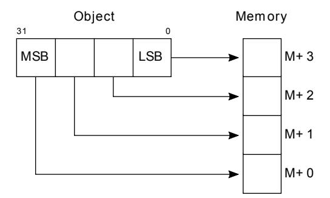
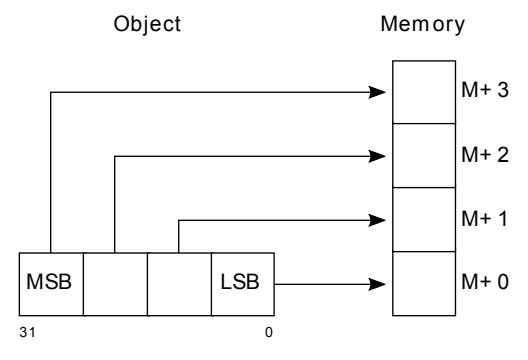
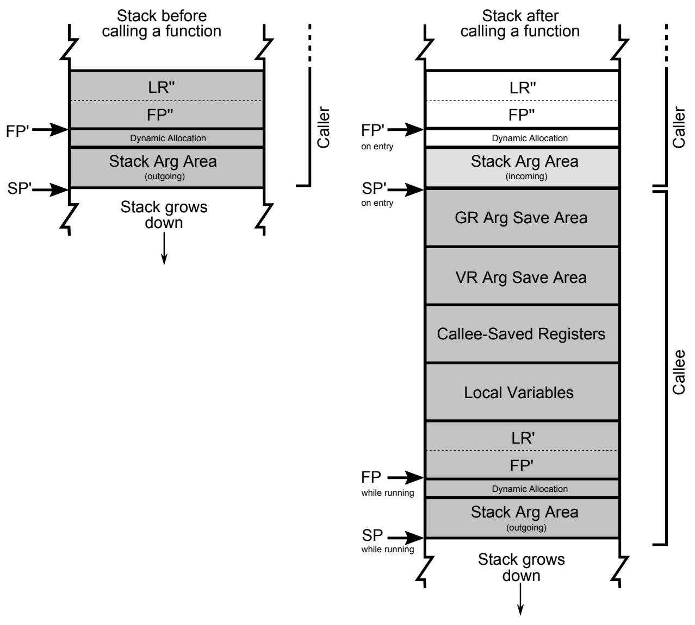
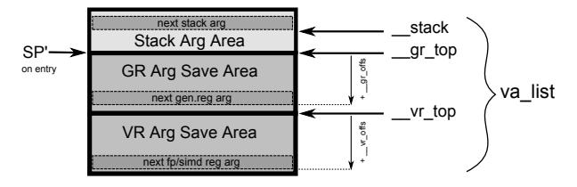

# Procedure Call Standard for the Arm® 64-bit Architecture (AArch64)

2024Q3

Date of Issue: 5th September 2024


# <span id="page-1-0"></span>1 Preamble

# <span id="page-1-1"></span>1.1 Abstract

This document describes the Procedure Call Standard used by the Application Binary Interface (ABI) for the Arm 64-bit architecture.

## <span id="page-1-2"></span>1.2 Keywords

Procedure call, function call, calling conventions, data layout

## <span id="page-1-3"></span>1.3 Latest release and defects report

Please check [Application Binary Interface for the Arm® Architecture](https://github.com/ARM-software/abi-aa) for the latest release of this document.

Please report defects in this specification to the [issue tracker page on GitHub.](https://github.com/ARM-software/abi-aa/issues)

## <span id="page-2-0"></span>1.4 Licence

This work is licensed under the Creative Commons Attribution-ShareAlike 4.0 International License. To view a copy of this license, v[isit http://creativecommons.org/licenses/by-sa/4.0/](http://creativecommons.org/licenses/by-sa/4.0/) or send a letter to Creative Commons, PO Box 1866, Mountain View, CA 94042, USA.

Grant of Patent License. Subject to the terms and conditions of this license (both the Public License and this Patent License), each Licensor hereby grants to You a perpetual, worldwide, non-exclusive, no-charge, royalty-free, irrevocable (except as stated in this section) patent license to make, have made, use, offer to sell, sell, import, and otherwise transfer the Licensed Material, where such license applies only to those patent claims licensable by such Licensor that are necessarily infringed by their contribution(s) alone or by combination of their contribution(s) with the Licensed Material to which such contribution(s) was submitted. If You institute patent litigation against any entity (including a cross-claim or counterclaim in a lawsuit) alleging that the Licensed Material or a contribution incorporated within the Licensed Material constitutes direct or contributory patent infringement, then any licenses granted to You under this license for that Licensed Material shall terminate as of the date such litigation is filed.

# <span id="page-2-1"></span>1.5 About the license

As identified more fully in the [Licence](#page-3-0) section, this project is licensed under CC-BY-SA-4.0 along with an additional patent license. The language in the additional patent license is largely identical to that in Apache-2.0 (specifically, Section 3 of Apache-2.0 as reflected at [https://www.apache.org/licenses/LICENSE-2.0\)](https://www.apache.org/licenses/LICENSE-2.0) with two exceptions.

First, several changes were made related to the defined terms so as to reflect the fact that such defined terms need to align with the terminology in CC-BY-SA-4.0 rather than Apache-2.0 (e.g., changing "Work" to "Licensed Material").

Second, the defensive termination clause was changed such that the scope of defensive termination applies to "any licenses granted to You" (rather than "any patent licenses granted to You"). This change is intended to help maintain a healthy ecosystem by providing additional protection to the community against patent litigation claims.

## <span id="page-2-2"></span>1.6 Contributions

Contributions to this project are licensed under an inbound=outbound model such that any such contributions are licensed by the contributor under the same terms as those in the [Licence](#page-3-0) section.

## <span id="page-2-3"></span>1.7 Trademark notice

The text of and illustrations in this document are licensed by Arm under a Creative Commons Attribution–Share Alike 4.0 International license ("CC-BY-SA-4.0"), with an additional clause on patents. The Arm trademarks featured here are registered trademarks or trademarks of Arm Limited (or its subsidiaries) in the US and/or elsewhere. All rights reserved. Please visit <https://www.arm.com/company/policies/trademarks>for more information about Arm's trademarks.

# <span id="page-2-4"></span>1.8 Copyright

Copyright (c) 2011, 2013, 2018, 2020-2024, Arm Limited and its affiliates. All rights reserved.

# Contents

<span id="page-3-4"></span><span id="page-3-3"></span><span id="page-3-2"></span><span id="page-3-1"></span><span id="page-3-0"></span>

| 1 Preamble     |                                              | 2  |
|----------------|----------------------------------------------|----|
|                | 1.1 Abstract                                 | 2  |
|                | 1.2 Keywords                                 | 2  |
|                | 1.3 Latest release and defects report        | 2  |
|                | 1.4 Licence                                  | 3  |
|                | 1.5 About the license                        | 3  |
|                | 1.6 Contributions                            | 3  |
|                | 1.7 Trademark notice                         | 3  |
|                | 1.8 Copyright                                | 3  |
|                | 2 About this document                        | 7  |
|                | 2.1 Change control                           | 7  |
|                | 2.1.1 Current status and anticipated changes | 7  |
|                | 2.1.2 Change history                         | 7  |
|                | 2.1.3 References                             | 8  |
|                | 2.2 Terms and abbreviations                  | 9  |
| 3 Scope        |                                              | 12 |
| 4 Introduction |                                              | 13 |
|                | 4.1 Design goals                             | 13 |
|                | 4.2 Conformance                              | 13 |
|                | 5 Data types and alignment                   | 14 |
|                | 5.1 Fundamental Data Types                   | 14 |
|                | 5.2 Half-precision Floating Point            | 15 |
|                | 5.3 Decimal Floating Point                   | 15 |
|                | 5.4 Short Vectors                            | 16 |
|                | 5.5 Scalable Vectors                         | 16 |
|                | 5.6 Scalable Predicates                      | 16 |
|                | 5.7 Pointers                                 | 16 |
|                | 5.8 Byte order ("Endianness")                | 17 |
|                | 5.9 Composite Types                          | 17 |
|                | 5.9.1 Aggregates                             | 18 |
|                | 5.9.2 Unions                                 | 18 |
|                | 5.9.3 Arrays                                 | 18 |
|                | 5.9.4 Bit-fields subdivision                 | 18 |
|                | 5.9.5 Homogeneous Aggregates                 | 18 |
|                | 5.10 Pure Scalable Types (PSTs)              | 19 |
|                | 6 The Base Procedure Call Standard           | 20 |
|                | 6.1 Machine Registers                        | 20 |
|                | 6.1.1 General-purpose Registers              | 20 |
|                | 6.1.2 SIMD and Floating-Point registers      | 21 |
|                | 6.1.3 Scalable vector registers              | 22 |
|                | 6.1.4 Scalable Predicate Registers           | 22 |
|                | 6.2 SME state                                | 22 |

|  | 6.3 Threads and processes                   | 23 |
|--|---------------------------------------------|----|
|  | 6.4 Memory and the Stack                    | 23 |
|  | 6.4.1 Memory addresses                      | 23 |
|  | 6.4.2 Properties of a thread                | 23 |
|  | 6.4.3 TPIDR2_EL0                            | 23 |
|  | 6.4.4 Categories of memory                  | 24 |
|  | 6.4.5 The Stack                             | 25 |
|  | 6.4.6 The Frame Pointer                     | 26 |
|  | 6.5 Subroutine calls                        | 26 |
|  | 6.5.1 Use of IP0 and IP1 by the linker      | 26 |
|  | 6.5.2 Normal returns                        | 26 |
|  | 6.6 The ZA lazy saving scheme               | 27 |
|  | 6.6.1 Overview                              | 27 |
|  | 6.6.2 ZA save buffers                       | 28 |
|  | 6.6.3 ZA states                             | 28 |
|  | 6.6.4 Setting up a lazy save buffer         | 30 |
|  | 6.6.5 Abandoning a lazy save                | 30 |
|  | 6.6.6 Committing a lazy save                | 30 |
|  | 6.6.7 Preserving ZA                         | 31 |
|  | 6.6.8 Complying with the lazy saving scheme | 31 |
|  | 6.6.9 Changes to the TPIDR2 block           | 32 |
|  | 6.7 Types of subroutine interface           | 32 |
|  | 6.7.1 PSTATE.SM interfaces                  | 32 |
|  | 6.7.2 ZA interfaces                         | 33 |
|  | 6.8 Parameter passing                       | 33 |
|  | 6.8.1 Variadic subroutines                  | 34 |
|  | 6.8.2 Parameter passing rules               | 34 |
|  | 6.9 Result return                           | 37 |
|  | 6.10 Interworking                           | 37 |
|  | 7 The standard variants                     | 38 |
|  | 7.1 Half-precision format compatibility     | 38 |
|  | 7.2 sizeof(long), sizeof(wchar_t), pointers | 38 |
|  | 7.3 size_t, ptrdiff_t                       | 38 |
|  | 7.4 Soft-float                              | 38 |
|  | 8 Support routines                          | 39 |
|  | 8.1 SME support routines                    | 39 |
|  | 8.1.1arm_sme_state                          | 39 |
|  | 8.1.2arm_tpidr2_save                        | 40 |
|  | 8.1.3arm_za_disable                         | 41 |
|  | 8.1.4arm_tpidr2_restore                     | 41 |
|  | 8.1.5arm_get_current_vg                     | 42 |
|  | 9 Pseudo-code examples                      | 42 |
|  | 9.1 SME pseudo-code examples                | 42 |
|  | 10 Arm C and C++ language mappings          | 45 |

| 10.1 Data types                                  | 45 |
|--------------------------------------------------|----|
| 10.1.1 Arithmetic types                          | 45 |
| 10.1.2 Types varying by data model               | 47 |
| 10.1.3 Enumerated types                          | 47 |
| 10.1.4 Additional types                          | 48 |
| 10.1.5 Definition of va_list                     | 48 |
| 10.1.6 Volatile data types                       | 48 |
| 10.1.7 Structure, union and class layout         | 49 |
| 10.1.8 Bit-fields                                | 49 |
| 10.2 Argument passing conventions                | 52 |
| 10.3 setjmp and longjmp                          | 52 |
| 10.4 Exceptions                                  | 52 |
| 11 APPENDIX Support for Advanced SIMD Extensions | 54 |
| 12 APPENDIX Support for Scalable vectors         | 55 |
| 13 APPENDIX C++ mangling                         | 56 |
| 14 APPENDIX Variable argument lists              | 57 |
| 14.1 Register save areas                         | 57 |
| 14.2 The va_list type                            | 57 |
| 14.3 The va_start() macro                        | 57 |
| 14.4 The va_arg() macro                          | 59 |
| 15 Footnotes                                     | 61 |

# <span id="page-6-0"></span>2 About this document

# <span id="page-6-1"></span>2.1 Change control

## <span id="page-6-2"></span>2.1.1 Current status and anticipated changes

The following support level definitions are used by the Arm ABI specifications:

#### **Release**

Arm considers this specification to have enough implementations, which have received sufficient testing, to verify that it is correct. The details of these criteria are dependent on the scale and complexity of the change over previous versions: small, simple changes might only require one implementation, but more complex changes require multiple independent implementations, which have been rigorously tested for cross-compatibility. Arm anticipates that future changes to this specification will be limited to typographical corrections, clarifications and compatible extensions.

### **Beta**

Arm considers this specification to be complete, but existing implementations do not meet the requirements for confidence in its release quality. Arm may need to make incompatible changes if issues emerge from its implementation.

### **Alpha**

The content of this specification is a draft, and Arm considers the likelihood of future incompatible changes to be significant.

Parts related to SME are at **Beta** release quality.

The ILP32 variant is at **Beta** release quality.

All other content in this document is at the **Release** quality level.

## <span id="page-6-3"></span>2.1.2 Change history

If there is no entry in the change history table for a release, there are no changes to the content of the document for that release.

| Issue        | Date                  | Change                             |
|--------------|-----------------------|------------------------------------|
| 00Bet3       | 25th November<br>2011 | Beta release                       |
| 1.0          | 22nd May 2013         | First public release               |
| 1.1-bet<br>a | 6th November 2013     | ILP32 Beta                         |
| 2018Q4       | 31st December<br>2018 | Added rules for over-aligned types |

| Issue  | Date                   | Change                                                                                                                                                                                                                                                    |
|--------|------------------------|-----------------------------------------------------------------------------------------------------------------------------------------------------------------------------------------------------------------------------------------------------------|
| 2019Q4 | 30th January 2020      | Github release with an open source license.<br>Major changes:                                                                                                                                                                                             |
|        |                        | 1. New Licence, with relative explanation in About the license.                                                                                                                                                                                           |
|        |                        | 2. New<br>sections<br>on<br>Contributions,<br>Trademark<br>notice,<br>and<br>Copyright.                                                                                                                                                                   |
|        |                        | 3. Specify that the frame chain should use the signed return<br>address (The Frame Pointer).                                                                                                                                                              |
|        |                        | 4. Add description of half-precision Brain floating-point format<br>(Half-precision<br>Floating<br>Point,<br>Half-precision<br>format<br>compatibility, Arithmetic types, Types varying by data model,<br>APPENDIX Support for Advanced SIMD Extensions). |
|        |                        | 5. Update C++ mangling to reflect existing practice (APPENDIX<br>C++ mangling).                                                                                                                                                                           |
|        |                        | Minor changes:                                                                                                                                                                                                                                            |
|        |                        | 1. The section Bit-fields subdivision has been renamed to make the<br>associated implicit link target unique and avoid clashing with the<br>one of Bit-fields.                                                                                            |
|        |                        | 2. Several formatting changes have been applied to the sources to<br>fix the rendered page produced by github.                                                                                                                                            |
| 2020Q2 | 1st July 2020          | Add requirements for stack space with MTE tags. Extend the<br>AAPCS64 to support SVE types and registers. Conform aapcs64<br>volatile bit-fields rules to C/C++.                                                                                          |
| 2020Q3 | 1st October 2020       | Specify ABI handling for 8.7-A's new FPCR bits.                                                                                                                                                                                                           |
| 2021Q1 | 12th April 2021        | • Clarify rule C.4 of the Parameter passing rules when there is an<br>overaligned HFA.                                                                                                                                                                    |
|        |                        | • Minor formatting changes.                                                                                                                                                                                                                               |
| 2021Q3 | st November 2021<br>1  | • Add support for Decimal-floating-point formats                                                                                                                                                                                                          |
| 2022Q3 | 20th October 2022      |                                                                                                                                                                                                                                                           |
|        |                        | • Add alpha-level support for SME.                                                                                                                                                                                                                        |
|        |                        | • Across the document, use "thread" rather than "process".                                                                                                                                                                                                |
| 2023Q3 | th October 2023<br>6   | In Data Types include _BitInt(N) in language mapping.                                                                                                                                                                                                     |
| 2024Q3 | th September 2024<br>5 | • Change the status of the SME support from Alpha to Beta.<br>• Add soft-float PCS variant.<br>• Add thearm_get_current_vg SME support routine.                                                                                                           |
|        |                        | • Clarify use of it when preserving z and p registers.                                                                                                                                                                                                    |
|        |                        |                                                                                                                                                                                                                                                           |

## <span id="page-7-0"></span>2.1.3 References

This document refers to, or is referred to by, the following documents:

| Ref      | URL or other reference                                 | Title                                                      |
|----------|--------------------------------------------------------|------------------------------------------------------------|
| AAPCS64  | Source for this document                               | Procedure Call Standard for the Arm 64-bit<br>Architecture |
| CPPABI64 | IHI 0059                                               | C++ ABI for the Arm 64-bit Architecture                    |
| GC++ABI  | https://itanium-cxx-abi.github.io/cxx-abi/a<br>bi.html | Generic C++ ABI                                            |
| C99      | https://www.iso.org/standard/29237.html                | C Programming Language ISO/IEC<br>9899:1999                |
| C2x      | http://www.open-std.org/jtc1/sc22/wg14/                | Draft C Programming Language (expected<br>circa 2023)      |

# <span id="page-8-0"></span>2.2 Terms and abbreviations

This document uses the following abbreviations:

#### **A32**

The instruction set named Arm in the Armv7 architecture; A32 uses 32-bit fixed-length instructions.

#### **A64**

The instruction set available when in AArch64 state.

### **AAPCS64**

Procedure Call Standard for the Arm 64-bit Architecture (AArch64).

### **AArch32**

The 32-bit general-purpose register width state of the Armv8 architecture, broadly compatible with the Armv7-A architecture.

#### **AArch64**

The 64-bit general-purpose register width state of the Armv8 architecture.

#### **ABI**

Application Binary Interface:

- 1. The specifications to which an executable must conform in order to execute in a specific execution environment. For example, the *Linux ABI for the Arm Architecture*.
- 2. A particular aspect of the specifications to which independently produced relocatable files must conform in order to be statically linkable and executable. For example, the [CPPABI64, AAELF64,](https://github.com/ARM-software/abi-aa/releases) ...

#### **Arm-based**

... based on the Arm architecture ...

#### **Floating point**

Depending on context floating point means or qualifies: (a) floating-point arithmetic conforming to IEEE 754 2008; (b) the Armv8 floating point instruction set; (c) the register set shared by (b) and the Armv8 SIMD instruction set.

### **Q-o-I**

Quality of Implementation – a quality, behavior, functionality, or mechanism not required by this standard, but which might be provided by systems conforming to it. Q-o-I is often used to describe the toolchain-specific means by which a standard requirement is met.

## **MTE**

The Arm architecture's Memory Tagging Extension.

## **SIMD**

Single Instruction Multiple Data – A term denoting or qualifying: (a) processing several data items in parallel under the control of one instruction; (b) the Armv8 SIMD instruction set: (c) the register set shared by (b) and the Armv8 floating point instruction set.

#### **SIMD and floating point**

The Arm architecture's SIMD and Floating Point architecture comprising the floating point instruction set, the SIMD instruction set and the register set shared by them.

#### <span id="page-9-1"></span>**SME**

The Arm architecture's Scalable Matrix Extension.

#### **SVE**

The Arm architecture's Scalable Vector Extension.

## <span id="page-9-0"></span>**SVL**

Streaming Vector Length; that is, the number of bits in [a Scalable Vector](#page-15-4) when the processor is in streaming mode.

## <span id="page-9-2"></span>**SVL.B**

As for [SVL,](#page-9-0) but measured in bytes rather than bits.

#### **T32**

The instruction set named Thumb in the Armv7 architecture; T32 uses 16-bit and 32-bit instructions.

#### **VG**

The number of 64-bit "vector granules" in an SVE vector; in other words, the number of bits in an SVE vector register divided by 64.

#### **ILP32**

SysV-like data model where int, long int and pointer are 32-bit.

## **LP64**

SysV-like data model where int is 32-bit, but long int and pointer are 64-bit.

### **LLP64**

Windows-like data model where int and long int are 32-bit, but long long int and pointer are 64-bit.

This document uses the following terms:

## **Routine, subroutine**

A fragment of program to which control can be transferred that, on completing its task, returns control to its caller at an instruction following the call. Routine is used for clarity where there are nested calls: a routine is the caller and a subroutine is the callee.

## **Procedure**

A routine that returns no result value.

## **Function**

A routine that returns a result value.

#### **Activation stack, call-frame stack**

The stack of routine activation records (call frames).

#### **Activation record, call frame**

The memory used by a routine for saving registers and holding local variables (usually allocated on a stack, once per activation of the routine).

#### **PIC, PID**

Position-independent code, position-independent data.

#### **Argument, parameter**

The terms argument and parameter are used interchangeably. They may denote a formal parameter of a routine given the value of the actual parameter when the routine is called, or an actual parameter, according to context.

### **Externally visible [interface]**

[An interface] between separately compiled or separately assembled routines.

#### **Variadic routine**

A routine is variadic if the number of arguments it takes, and their type, is determined by the caller instead of the callee.

#### **Global register**

A register whose value is neither saved nor destroyed by a subroutine. The value may be updated, but only in a manner defined by the execution environment.

#### **Program state**

The state of the program's memory, including values in machine registers.

#### **Scratch register, temporary register, caller-saved register**

A register used to hold an intermediate value during a calculation (usually, such values are not named in the program source and have a limited lifetime). If a function needs to preserve the value held in such a register over a call to another function, then the calling function must save and restore the value.

#### **Callee-saved register**

A register whose value must be preserved over a function call. If the function being called (the callee) needs to use the register, then it is responsible for saving and restoring the old value.

#### **SysV**

Unix System V. A variant of the Unix Operating System. Although this specification refers to SysV, many other operating systems, such as Linux or BSD use similar conventions.

#### **Platform**

A program execution environment such as that defined by an operating system or run-time environment. A platform defines the specific variant of the ABI and may impose additional constraints. Linux is a platform in this sense.

More specific terminology is defined when it is first used.

# <span id="page-11-0"></span>3 Scope

The AAPCS64 defines how subroutines can be separately written, separately compiled, and separately assembled to work together. It describes a contract between a calling routine and a called routine, or between a routine and its execution environment, that defines:

- Obligations on the caller to create a program state in which the called routine may start to execute.
- Obligations on the called routine to preserve the program state of the caller across the call.
- The rights of the called routine to alter the program state of its caller.
- Obligations on all routines to preserve certain global invariants.

This standard specifies the base for a family of *Procedure Call Standard* (PCS) variants generated by choices that reflect arbitrary, but historically important, choice among:

- Byte order.
- Size and format of data types: pointer, long int and wchar\_t and the format of half-precision floating-point values. Here we define three data models (se[e The standard variants](#page-37-6) an[d Arm C and](#page-44-5) [C++ language mappings](#page-44-5) for details):
  - ILP32: **(Beta)** SysV-like variant where int, long int and pointer are 32-bit.
  - LP64: SysV-like variant where int is 32-bit, but long int and pointer are 64-bit.
  - LLP64: Windows-like variant where int and long int are 32-bit, but long long int and pointer are 64-bit.
- <span id="page-11-1"></span>• Whether floating-point operations use floating-point hardware resources or are implemented by calls to integer-only routines [2](#page-60-1) .

This standard is presented in four sections that, after an introduction, specify:

- The layout of data.
- Layout of the stack and calling between functions with public interfaces.
- Variations available for processor extensions, or when the execution environment restricts the addressing model.
- The C and C++ language bindings for plain data types.

This specification does not standardize the representation of publicly visible C++-language entities that are not also C language entities (these are described i[n CPPABI64\)](https://github.com/ARM-software/abi-aa/releases) and it places no requirements on the representation of language entities that are not visible across public interfaces.

# <span id="page-12-0"></span>4 Introduction

The AAPCS64 is the first revision of Procedure Call standard for the Arm 64-bit Architecture. It forms part of the complete ABI specification for the Arm 64-bit Architecture.

# <span id="page-12-1"></span>4.1 Design goals

The goals of the AAPCS64 are to:

- Support efficient execution on high-performance implementations of the Arm 64-bit Architecture.
- Clearly distinguish between mandatory requirements and implementation discretion.

# <span id="page-12-2"></span>4.2 Conformance

The AAPCS64 defines how separately compiled and separately assembled routines can work together. There is an externally visible interface between such routines. It is common that not all the externally visible interfaces to software are intended to be publicly visible or open to arbitrary use. In effect, there is a mismatch between the machine-level concept of external visibility—defined rigorously by an object code format—and a higher level, application-oriented concept of external visibility—which is system specific or application specific.

Conformance to the AAPCS64 requires that [3](#page-60-2) :

- <span id="page-12-3"></span>• At all times, stack limits and basic stack alignment are observed ([Universal stack constraints\)](#page-24-1).
- At each call where the control transfer instruction is subject to a BL-type relocation at static link time, rules on the use of IP0 and IP1 are observed ([Use of IP0 and IP1 by the Linker\)](#page-25-5).
- The routines of each publicly visible interface conform to the relevant procedure call standard variant.
- <span id="page-12-4"></span>• The data elements [4](#page-60-3) of each publicly visible interface conform to the data layout rules.

# <span id="page-13-0"></span>5 Data types and alignment

# <span id="page-13-1"></span>5.1 Fundamental Data Types

[Table 1](#page-13-2), shows the fundamental data types (Machine Types) of the machine.

<span id="page-13-2"></span>Table 1, Byte size and byte alignment of fundamental data types

| Type class     | Machine type         | Byte<br>size | Natural<br>Alignment<br>(bytes) | Note                                 |
|----------------|----------------------|--------------|---------------------------------|--------------------------------------|
| Integral       | Unsigned byte        | 1            | 1                               | Character                            |
|                | Signed byte          | 1            | 1                               |                                      |
|                | Unsigned half-word   | 2            | 2                               |                                      |
|                | Signed half-word     | 2            | 2                               |                                      |
|                | Unsigned word        | 4            | 4                               |                                      |
|                | Signed word          | 4            | 4                               |                                      |
|                | Unsigned double-word | 8            | 8                               |                                      |
|                | Signed double-word   | 8            | 8                               |                                      |
|                | Unsigned quad-word   | 16           | 16                              |                                      |
|                | Signed quad-word     | 16           | 16                              |                                      |
| Floating Point | Half precision       | 2            | 2                               | See Half-precision Floating<br>Point |
|                | Single precision     | 4            | 4                               | IEEE 754-2008                        |
|                | Double precision     | 8            | 8                               |                                      |
|                | Quad precision       | 16           | 16                              |                                      |
|                | 32-bit decimal fp    | 4            | 4                               | IEEE 754-2008 using BID              |
|                | 64-bit decimal fp    | 8            | 8                               | encoding                             |
|                | 128-bit decimal fp   | 16           | 16                              |                                      |
| Short vector   | 64-bit vector        | 8            | 8                               | See Short Vectors                    |
|                | 128-bit vector       | 16           | 16                              |                                      |

| Type class            | Machine type                           | Byte<br>size | Natural<br>Alignment<br>(bytes) | Note                    |
|-----------------------|----------------------------------------|--------------|---------------------------------|-------------------------|
| Scalable<br>Vector    | VG×64-bit vector of<br>8-bit elements  | VG×8         | 16                              | See Scalable Vectors    |
|                       | VG×64-bit vector of<br>16-bit elements |              |                                 |                         |
|                       | VG×64-bit vector of<br>32-bit elements |              |                                 |                         |
|                       | VG×64-bit vector of<br>64-bit elements |              |                                 |                         |
| Scalable<br>Predicate | VG×8-bit predicate                     | VG           | 2                               | See Scalable Predicates |
| Pointer               | 32-bit data pointer<br>(Beta)          | 4            | 4                               | See Pointers            |
|                       | 32-bit code pointer<br>(Beta)          | 4            | 4                               |                         |
|                       | 64-bit data pointer                    | 8            | 8                               |                         |
|                       | 64-bit code pointer                    | 8            | 8                               |                         |

# <span id="page-14-2"></span><span id="page-14-0"></span>5.2 Half-precision Floating Point

The architecture provides hardware support for half-precision values. Three formats are currently supported:

- 1. half-precision format specified in IEEE 754-2008
- 2. Arm Alternative format, which provides additional range but has no NaNs or Infinities.
- 3. Brain floating-point format, which provides a dynamic range similar to the 32-bit floating-point format, but with less precision.

The first two formats are mutually exclusive. The base standard of the AAPCS specifies use of the IEEE 754-2008 variant, and a procedure call variant that uses the Arm Alternative format is permitted.

# <span id="page-14-1"></span>5.3 Decimal Floating Point

The AAPCS permits use of Decimal Floating Point numbers encoded using the BID format as specified in IEEE 754-2008. Unless explicitly noted elsewhere, Decimal floating-point objects should be treated in exactly the same way as (binary) Floating Point objects for the purposes of structure layout, parameter passing, and result return.

## Note

There is no support in the AArch64 ISA for Decimal Floating Point, so all operations must be emulated in software.

## <span id="page-15-5"></span><span id="page-15-0"></span>5.4 Short Vectors

A short vector is a machine type that is composed of repeated instances of one fundamental integral or floating-point type. It may be 8 or 16 bytes in total size. A short vector has a base type that is the fundamental integral or floating-point type from which it is composed, but its alignment is always the same as its total size. The number of elements in the short vector is always such that the type is fully packed. For example, an 8-byte short vector may contain 8 unsigned byte elements, 4 unsigned half-word elements, 2 single-precision floating-point elements, or any other combination where the product of the number of elements and the size of an individual element is equal to 8. Similarly, for 16-byte short vectors the product of the number of elements and the size of the individual elements must be 16.

Elements in a short vector are numbered such that the lowest numbered element (element 0) occupies the lowest numbered bit (bit zero) in the vector and successive elements take on progressively increasing bit positions in the vector. When a short vector transferred between registers and memory it is treated as an opaque object. That is a short vector is stored in memory as if it were stored with a single STR of the entire register; a short vector is loaded from memory using the corresponding LDR instruction. On a little-endian system this means that element 0 will always contain the lowest addressed element of a short vector; on a big-endian system element 0 will contain the highest-addressed element of a short vector.

A language binding may define extended types that map directly onto short vectors. Short vectors are not otherwise created spontaneously (for example because a user has declared an aggregate consisting of eight consecutive byte-sized objects).

# <span id="page-15-6"></span><span id="page-15-1"></span>5.5 Scalable Vectors

<span id="page-15-4"></span>Like a short vector (see [Short Vectors](#page-15-5)), a scalable vector is a machine type that is composed of repeated instances of one fundamental integral or floating-point type. The number of bytes in the vector is always VG×8, where VG is a runtime value determined by the execution environment. VG is an even integer greater than or equal to 2; the ABI does not define an upper bound. VG is the same for all scalable vector types and scalable predicate types.

Each element of a scalable vector has a zero-based index. When stored in memory, the elements are placed in index order, so that element *N* comes before element *N*+1. The layout of each individual element is the same as if it were scalar. When stored in a scalable vector register, the least significant bit of element 0 occupies bit 0 of the corresponding short vector register. Note that the layout of the vector in a scalable vector register does not depend on whether the system is big- or little-endian.

## <span id="page-15-7"></span><span id="page-15-2"></span>5.6 Scalable Predicates

A scalable predicate is a machine type that is composed of individual bits. The number of bits in the predicate is always VG×8, where VG is the same value as for scalable vector types (see [Scalable Vectors\)](#page-15-6). The number of bits in a scalable predicate is therefore equal to the number of bytes in a scalable vector.

Each bit of a scalable predicate has a zero-based index. When stored in memory, index 0 is placed in the least significant bit of the first byte, index 1 is stored in the next significant bit, and so on.

# <span id="page-15-9"></span><span id="page-15-8"></span><span id="page-15-3"></span>5.7 Pointers

Code and data pointers are either 64-bit or 32-bit unsigned types [5](#page-60-4) . A NULL pointer is always represented by all-bits-zero.

All 64 bits in a 64-bit pointer are always significant. When tagged addressing is enabled, a tag is part of a pointer's value for the purposes of pointer arithmetic. The result of subtracting or comparing two pointers with different tags is unspecified. See als[o Memory addresses,](#page-22-5) below. A 32-bit pointer does not support tagged addressing.

#### Note

#### **(Beta)**

The A64 load and store instructions always use the full 64-bit base register and perform a 64-bit address calculation. Care must be taken within ILP32 to ensure that the upper 32 bits of a base register are zero and 32-bit register offsets are sign-extended to 64 bits (immediate offsets are implicitly extended).

# <span id="page-16-0"></span>5.8 Byte order ("Endianness")

From a software perspective, memory is an array of bytes, each of which is addressable. This ABI supports two views of memory implemented by the underlying hardware.

- In a little-endian view of memory the least significant byte of a data object is at the lowest byte address the data object occupies in memory.
- In a big-endian view of memory the least significant byte of a data object is at the highest byte address the data object occupies in memory.

The least significant bit in an object is always designated as bit 0.

The mapping of a word-sized data object to memory is shown in the following figures. All objects are pure-endian, so the mappings may be scaled accordingly for larger or smaller objects [6](#page-60-5) .

<span id="page-16-3"></span>

Memory layout of big-endian data object



Memory layout of little-endian data object

# <span id="page-16-2"></span><span id="page-16-1"></span>5.9 Composite Types

A Composite Type is a collection of one or more Fundamental Data Types that are handled as a single entity at the procedure call level. A Composite Type can be any of:

• An aggregate, where the members are laid out sequentially in memory (possibly with inter-member padding).

- A union, where each of the members has the same address.
- An array, which is a repeated sequence of some other type (its base type).

The definitions are recursive; that is, each of the types may contain a Composite Type as a member.

- The *member alignment* of an element of a composite type is the alignment of that member after the application of any language alignment modifiers to that member
- The *natural alignment* of a composite type is the maximum of each of the member alignments of the 'top-level' members of the composite type i.e. before any alignment adjustment of the entire composite is applied

## <span id="page-17-6"></span><span id="page-17-0"></span>5.9.1 Aggregates

- The alignment of an aggregate shall be the alignment of its most-aligned member.
- The size of an aggregate shall be the smallest multiple of its alignment that is sufficient to hold all of its members.

## <span id="page-17-1"></span>5.9.2 Unions

- The alignment of a union shall be the alignment of its most-aligned member.
- The size of a union shall be the smallest multiple of its alignment that is sufficient to hold its largest member.

## <span id="page-17-2"></span>5.9.3 Arrays

- The alignment of an array shall be the alignment of its base type.
- The size of an array shall be the size of the base type multiplied by the number of elements in the array.

## <span id="page-17-5"></span><span id="page-17-3"></span>5.9.4 Bit-fields subdivision

<span id="page-17-7"></span>A member of an aggregate that is a Fundamental Data Type may be subdivided into bit-fields; if there are unused portions of such a member that are sufficient to start the following member at its Natural Alignment then the following member may use the unallocated portion. For the purposes of calculating the alignment of the aggregate the type of the member shall be the Fundamental Data Type upon which the bit-field is based [7](#page-60-6) . The layout of bit-fields within an aggregate is defined by the appropriate language binding (see [Arm C and C++ Language Mappings\)](#page-44-5).

## <span id="page-17-4"></span>5.9.5 Homogeneous Aggregates

A Homogeneous Aggregate is a composite type where all of the Fundamental Data Types of the members that compose the type are the same. The test for homogeneity is applied after data layout is completed and without regard to access control or other source language restrictions. Note that for short-vector types the fundamental types are 64-bit vector and 128-bit vector; the type of the elements in the short vector does not form part of the test for homogeneity.

A Homogeneous Aggregate has a Base Type, which is the Fundamental Data Type of each Member. The overall size is the size of the Base Type multiplied by the number uniquely addressable Members; its alignment will be the alignment of the Base Type.

### 5.9.5.1 Homogeneous Floating-point Aggregates (HFA)

A Homogeneous Floating-point Aggregate (HFA) is a Homogeneous Aggregate with a Fundamental Data Type that is a Floating-Point type and at most four uniquely addressable members.

## 5.9.5.2 Homogeneous Short-Vector Aggregates (HVA)

A Homogeneous Short-Vector Aggregate (HVA) is a Homogeneous Aggregate with a Fundamental Data Type that is a Short-Vector type and at most four uniquely addressable members.

# <span id="page-18-0"></span>5.10 Pure Scalable Types (PSTs)

A type is a Pure Scalable Type if (recursively) it is:

- a Scalable Vector Type;
- a Scalable Predicate Type;
- an array that contains a constant (nonzero) number of elements and whose Base Type is a Pure Scalable Type; or
- an aggregate in which every member is a Pure Scalable Type.

As with Homogeneous Aggregates, these rules apply after data layout is completed and without regard to access control or other source language restrictions. However, there are several notable differences from Homogeneous Aggregates:

- A Pure Scalable Type may contain a mixture of different Fundamental Data Types. For example, an aggregate that contains a scalable vector of 8-bit elements, a scalable predicate, and a scalable vector of 16-bit elements is a Pure Scalable Type.
- Alignment and padding do not play a role when determining whether something is a Pure Scalable Type. (In fact, a Pure Scalable Type that contains both predicate types and vector types will often contain padding.)
- Pure Scalable Types are never unions and never contain unions.

## Note

Composite Types have at least one member and the type of each member is either a Fundamental Data Type or another Composite Type. Since all Fundamental Data Types have nonzero size, it follows that all members of a Composite Type have nonzero size.

Any language-level members that have zero size must therefore disappear in the language-to-ABI mapping and do not affect whether the containing type is a Pure Scalable Type.

# <span id="page-19-0"></span>6 The Base Procedure Call Standard

The base standard defines a machine-level calling standard for the A64 instruction set. It assumes the availability of the vector registers for passing floating-point and SIMD arguments. Application code is expected to conform to one of three data models defined in this standard; ILP32, LP64 or LLP64.

# <span id="page-19-1"></span>6.1 Machine Registers

The Arm 64-bit architecture defines two mandatory register banks: a general-purpose register bank which can be used for scalar integer processing and pointer arithmetic; and a SIMD and Floating-Point register bank. In addition, the architecture defines an optional set of scalable vector registers that overlap the SIMD and Floating-Point register bank, accompanied by a set of scalable predicate registers.

## <span id="page-19-2"></span>6.1.1 General-purpose Registers

There are thirty-one, 64-bit, general-purpose (integer) registers visible to the A64 instruction set; these are labeled r0-r30. In a 64-bit context these registers are normally referred to using the names x0-x30; in a 32-bit context the registers are specified by using w0-w30. Additionally, a stack-pointer register, SP, can be used with a restricted number of instructions. Register names may appear in assembly language in either upper case or lower case. In this specification upper case is used when the register has a fixed role in this procedure call standard. [Table 2,](#page-19-3) General-purpose registers and AAPCS64 usage summarizes the uses of the general-purpose registers in this standard. In addition to the general-purpose registers there is one status register (NZCV) that may be set and read by conforming code.

<span id="page-19-3"></span>Table 2, General-purpose registers and AAPCS64 usage

| Register | Special | Role in the procedure call standard                                                                                                                      |
|----------|---------|----------------------------------------------------------------------------------------------------------------------------------------------------------|
| SP       |         | The Stack Pointer.                                                                                                                                       |
| r30      | LR      | The Link Register.                                                                                                                                       |
| r29      | FP      | The Frame Pointer                                                                                                                                        |
| r19…r28  |         | Callee-saved registers                                                                                                                                   |
| r18      |         | The Platform Register, if needed; otherwise a temporary register. See<br>notes.                                                                          |
| r17      | IP1     | The second intra-procedure-call temporary register (can be used by call<br>veneers and PLT code); at other times may be used as a temporary<br>register. |
| r16      | IP0     | The first intra-procedure-call scratch register (can be used by call<br>veneers and PLT code); at other times may be used as a temporary<br>register.    |
| r9…r15   |         | Temporary registers                                                                                                                                      |
| r8       |         | Indirect result location register                                                                                                                        |
| r0…r7    |         | Parameter/result registers                                                                                                                               |

The first eight registers, r0-r7, are used to pass argument values into a subroutine and to return result values from a function. They may also be used to hold intermediate values within a routine (but, in general, only between subroutine calls).

Registers r16 (IP0) and r17 (IP1) may be used by a linker as a scratch register between a routine and any subroutine it calls (for details, se[e Use of IP0 and IP1 by the linker\)](#page-25-5). They can also be used within a routine to hold intermediate values between subroutine calls.

The role of register r18 is platform specific. If a platform ABI has need of a dedicated general-purpose register to carry inter-procedural state (for example, the thread context) then it should use this register for that purpose. If the platform ABI has no such requirements, then it should use r18 as an additional temporary register. The platform ABI specification must document the usage for this register.

### Note

Software developers creating platform-independent code are advised to avoid using r18 if at all possible. Most compilers provide a mechanism to prevent specific registers from being used for general allocation; portable hand-coded assembler should avoid it entirely. It should not be assumed that treating the register as callee-saved will be sufficient to satisfy the requirements of the platform. Virtualization code must, of course, treat the register as they would any other resource provided to the virtual machine.

A subroutine invocation must preserve the contents of the registers r19-r29 and SP. All 64 bits of each value stored in r19-r29 must be preserved, even when using the ILP32 data model **(Beta)**.

In all variants of the procedure call standard, registers r16, r17, r29 and r30 have special roles. In these roles they are labeled IP0, IP1, FP and LR when being used for holding addresses (that is, the special name implies accessing the register as a 64-bit entity).

### Note

The special register names (IP0, IP1, FP and LR) should be used only in the context in which they are special. It is recommended that disassemblers always use the architectural names for the registers.

The NZCV register is a global condition flag register with the following properties:

• The N, Z, C and V flags are undefined on entry to and return from a public interface.

## <span id="page-20-1"></span><span id="page-20-0"></span>6.1.2 SIMD and Floating-Point registers

The Arm 64-bit architecture also has a further thirty-two registers, v0-v31, which can be used by SIMD and Floating-Point operations. The precise name of the register will change indicating the size of the access.

## Note

Unlike in AArch32, in AArch64 the 128-bit and 64-bit views of a SIMD and Floating-Point register do not overlap multiple registers in a narrower view, so q1, d1 and s1 all refer to the same entry in the register bank.

The first eight registers, v0-v7, are used to pass argument values into a subroutine and to return result values from a function. They may also be used to hold intermediate values within a routine (but, in general, only between subroutine calls).

<span id="page-20-2"></span>Registers v8-v15 must be preserved by a callee across subroutine calls; the remaining registers (v0-v7, v16-v31) do not need to be preserved (or should be preserved by the caller). Additionally, only the bottom 64 bits of each value stored in v8-v15 need to be preserved [8](#page-60-7) ; it is the responsibility of the caller to preserve larger values.

The FPSR is a status register that holds the cumulative exception bits of the floating-point unit. It contains the fields IDC, IXC, UFC, OFC, DZC, IOC and QC. These fields are not preserved across a public interface and may have any value on entry to a subroutine.

The FPCR is used to control the behavior of the floating-point unit. It is a global register with the following properties.

- The exception-control bits (8-12), rounding mode bits (22-23), flush-to-zero bits (24), and the AH and FIZ bits (0-1) may be modified by calls to specific support functions that affect the global state of the application.
- The NEP bit (bit 2) must be zero on entry to and return from a public interface.
- All other bits are reserved and must not be modified. It is not defined whether the bits read as zero or one, or whether they are preserved across a public interface.

Decimal Floating-Point emulation code requires additional control bits which cannot be stored in the FPCR. Since the information must be held for each thread of execution, the state must be held in thread-local storage on platforms where multi-threaded code is supported. The exact location of such information is platform specific.

## <span id="page-21-3"></span><span id="page-21-0"></span>6.1.3 Scalable vector registers

The Arm 64-bit architecture also defines an optional set of thirty-two scalable vector registers, z0-z31. Each register extends the corresponding SIMD and Floating-Point register so that it can hold the contents of a single Scalable Vector Type (see [Scalable vectors\)](#page-15-6). That is, scalable vector register z0 is an extension of SIMD and Floating-Point register v0.

z0-z7 are used to pass scalable vector arguments to a subroutine, and to return scalable vector results from a function. If a subroutine takes at least one argument in scalable vector registers or scalable predicate registers, or returns results in such regisers, the subroutine must ensure that the entire contents of z8-z23 are preserved across the call. In other cases it need only preserve the low 64 bits of z8-z15, as described in [SIMD and Floating-Point registers.](#page-20-1)

## <span id="page-21-1"></span>6.1.4 Scalable Predicate Registers

The Arm 64-bit architecture defines an optional set of sixteen scalable predicate registers p0-p15. These registers are available if and only if the scalable vector registers are availabl[e \(see Scalable vector](#page-21-3) [registers](#page-21-3)). Each register can store the contents of a Scalable Predicate Type (see [Scalable Predicates\)](#page-15-7).

p0-p3 are used to pass scalable predicate arguments to a subroutine and to return scalable predicate results from a function. If a subroutine takes at least one argument in scalable vector registers or scalable predicate registers, or returns results in such registers, the subroutine must ensure that p4-p15 are preserved across the call. In other cases it need not preserve any scalable predicate register contents.

## <span id="page-21-2"></span>6.2 SME state

## **(Beta)**

[SME](#page-9-1) defines the following pieces of processor state:

#### **ZA storage**

a storage array of size [SVL.B](#page-9-2) × [SVL.B](#page-9-2) bytes, hereafter referred to simply as "ZA"

#### <span id="page-21-5"></span>**PSTATE.SM**

indicates whether the processor is in "streaming mode" (PSTATE.SM==1) or "non-streaming mode" (PSTATE.SM==0)

#### <span id="page-21-4"></span>**PSTATE.ZA**

indicates whether ZA might have useful contents (PSTATE.ZA==1) or whether it definitely does not (PSTATE.ZA==0)

#### **TPIDR2\_EL0**

a system register that software can use to manage thread-local state

See [TPIDR2\\_EL0](#page-22-6) for a description of how the AAPCS64 uses this register.

## <span id="page-22-0"></span>6.3 Threads and processes

<span id="page-22-7"></span>The AAPCS64 applies to a single thread of execution. Each thread is in turn part of a process. A process might contain one thread or several threads.

The exact definitions of the terms "thread" and "process" depend on the platform. For example, if the platform is a traditional multi-threaded operating system, the terms generally have their usual meaning for that operating system. If the platform supports multiple processes but has no separate concept of threads, each process will have a single thread of execution. If a platform has no concurrency or preemption then there will be a single thread and process that executes all instructions.

Each thread has its own register state, defined by the contents of the underlying machine registers. A process has a program state defined by its threads' register states and by the contents of the memory that the process can access. The memory that a process can access, without causing a run-time fault, may vary during the execution of its threads.

# <span id="page-22-1"></span>6.4 Memory and the Stack

## <span id="page-22-5"></span><span id="page-22-2"></span>6.4.1 Memory addresses

The address space consists of one or more disjoint regions. Regions must not span address zero (although one region may start at zero).

The use of tagged addressing is platform specific and does not apply to 32-bit pointers. When tagged addressing is disabled, all 64 bits of an address are passed to the translation system. When tagged addressing is enabled, the top eight bits of an address are ignored for the purposes of address translation. See also [Pointers,](#page-15-8) above.

## <span id="page-22-3"></span>6.4.2 Properties of a thread

### **(Beta)**

The AAPCS64 classifies [threads](#page-22-7) as follows, with the classification being invariant for the lifetime of a given thread:

#### **The thread "has access" or "does not have access" to SME**

<span id="page-22-9"></span>If the thread has access to SME, the platform should generally allow the thread to make full use of SME instructions. However, the platform may forbid the use of SME in certain platform-defined contexts.

If the thread does not have access to SME, the platform must forestall all attempts to use SME instructions.

#### **The thread "has access" or "does not have access" to TPIDR2\_EL0**

<span id="page-22-8"></span>If the thread has access to TPIDR2\_EL0, the platform must allow the thread to read or write TPIDR2\_EL0 at any time.

If the thread does not have access to TPIDR2\_EL0, the platform must forestall all attempts to read or write TPIDR2\_EL0.

If the thread has access to SME then it must also have access to TPIDR2\_EL0.

The [\\_\\_arm\\_sme\\_state](#page-38-3) function provides a simple way of determining whether the current thread has access to SME or TPIDR2\_EL0.

## <span id="page-22-6"></span><span id="page-22-4"></span>6.4.3 TPIDR2\_EL0

#### **(Beta)**

This section only applies to threads that have [access to TPIDR2\\_EL0.](#page-22-8)

Conforming software must ensure that, all times during the execution of a thread, TPIDR2\_EL0 is in one of two states:

- TPIDR2\_EL0 is null.
- TPIDR2\_EL0 points to a "TPIDR2 block" with the format below, and the thread has read access to every byte of the block.

## <span id="page-23-1"></span>A TPIDR2 block has the following format:

| Byte offset | Type                   | Referred to in the AAPCS64 as |
|-------------|------------------------|-------------------------------|
| 0-7         | 64-bit data pointer    | za_save_buffer                |
| 8-9         | Unsigned halfword      | num_za_save_slices            |
| 10-15       | Reserved, must be zero |                               |

Note that the field names are just a notational convenience. Language bindings may choose different names.

The reserved parts of the block are defined to be zero by this revision of the AAPCS64. All nonzero values are reserved for use by future revisions of the AAPCS64.

<span id="page-23-2"></span>If TPIDR2\_EL0 is nonnull and if any reserved byte in the first 16 bytes of the TPIDR2 block has a nonzero value, the thread must do one of the following:

- leave TPIDR2\_EL0 unchanged;
- abort in some platform-defined manner; or
- handle the nonzero reserved bytes of the TPIDR2 block in accordance with future versions of the AAPCS64.

Byte offsets of 16 and greater are reserved for use by future revisions of the AAPCS64.

Negative offsets from TPIDR2\_EL0 are reserved for use by the platform. The block of data stored at negative offsets is therefore referred to as the "platform TPIDR2 block"; this block starts at a platform-defined offset from TPIDR2\_EL0 and ends at TPIDR2\_EL0.

In the rest of this document, za\_save\_buffer and num\_za\_save\_slices (without qualification) refer to the fields of a TPIDR2 block at address TPIDR2\_EL0. BLK.za\_save\_buffer and BLK.num\_za\_save\_slices instead refer to the fields of a TPIDR2 block at address BLK.

See [Changes to the TPIDR2 block](#page-31-3) for additional requirements relating to the TPIDR2 block.

## <span id="page-23-0"></span>6.4.4 Categories of memory

The memory of a process can normally be classified into five categories:

- Code (the program being executed), which must be readable, but need not be writable, by the process.
- Read-only static data.
- Writable static data.
- The heap.
- Stacks, with one stack for each thread.

Each category of memory can contain multiple individual regions. These individual regions do not need to be contiguous and regions of one memory class can be interspersed with regions of another memory class.

Writable static data may be further sub-divided into initialized, zero-initialized, and uninitialized data.

The heap is an area (or areas) of memory that the process manages itself (for example, with the C malloc function). It is typically used to create dynamic data objects.

Each individual stack must occupy a single, contiguous region of memory. However, as noted above, multiple stacks do not need to be organized contiguously.

A process must always have access to code and stacks, and it may have access to any of the other categories of memory.

A conforming program must only execute instructions that are in areas of memory designated to contain code.

## <span id="page-24-2"></span><span id="page-24-0"></span>6.4.5 The Stack

Each thread has a stack. This stack is a contiguous area of memory that the thread may use for storage of local variables and for passing additional arguments to subroutines when there are insufficient argument registers available.

The stack is defined in terms of three values:

- a base
- a limit
- the current stack extent, stored in the special-purpose register SP

The SP moves from the base to the limit as the stack grows, and from the limit to the base as the stack shrinks. In practice, an application might not be able to determine the value of either the base or the limit.

In the description below, the base, limit, and current stack extent for a thread T are denoted T.base, T.limit, and T.SP respectively.

The stack implementation is full-descending, so that for each thread T:

- T.limit < T.base and the stack occupies the area of memory delimited by the half-open internal [T.limit, T.base).
- The active region of T's stack is the area of memory delimited by the half-open interval [T.SP, T.base). The active region is empty when T.SP is equal to T.base.
- The inactive region of T's stack is the area of memory denoted by the half-open interval [T.limit, T.SP). The inactive region is empty when T.SP is equal to T.limit.

The stack may have a fixed size or be dynamically extendable (by adjusting the stack-limit downwards).

The rules for maintenance of the stack are divided into two parts: a set of constraints that must be observed at all times, and an additional constraint that must be observed at a public interface.

## <span id="page-24-1"></span>6.4.5.1 Universal stack constraints

At all times during the execution of a thread T, the following basic constraints must hold for its stack S:

- T.limit ≤ T.SP ≤ T.base. T's stack pointer must lie within the extent of the memory occupied by S.
- No thread is permitted to access (for reading or for writing) the inactive region of S.
- If MTE is enabled, then the tag stored in T.SP must match the tag set on the inactive region of S.

Additionally, at any point at which memory is accessed via SP, the hardware requires that

• SP mod 16 = 0. The stack must be quad-word aligned.

#### 6.4.5.2 Stack constraints at a public interface

The stack must also conform to the following constraint at a public interface:

• SP mod 16 = 0. The stack must be quad-word aligned.

## <span id="page-25-4"></span><span id="page-25-0"></span>6.4.6 The Frame Pointer

Conforming code shall construct a linked list of stack-frames. Each frame shall link to the frame of its caller by means of a frame record of two 64-bit values on the stack (independent of the data model). The frame record for the innermost frame (belonging to the most recent routine invocation) shall be pointed to by the frame pointer register (FP). The lowest addressed double-word shall point to the previous frame record and the highest addressed double-word shall contain the value passed in LR on entry to the current function. If code uses the pointer signing extension to sign return addresses, the value in LR must be signed before storing it in the frame record. The end of the frame record chain is indicated by the address zero in the address for the previous frame. The location of the frame record within a stack frame is not specified.

## Note

There will always be a short period during construction or destruction of each frame record during which the frame pointer will point to the caller's record.

A platform shall mandate the minimum level of conformance with respect to the maintenance of frame records. The options are, in decreasing level of functionality:

- It may require the frame pointer to address a valid frame record at all times, except that small subroutines which do not modify the link register may elect not to create a frame record
- It may require the frame pointer to address a valid frame record at all times, except that any subroutine may elect not to create a frame record
- It may permit the frame pointer register to be used as a general-purpose callee-saved register, but provide a platform-specific mechanism for external agents to reliably detect this condition
- It may elect not to maintain a frame chain and to use the frame pointer register as a general-purpose callee-saved register.

# <span id="page-25-1"></span>6.5 Subroutine calls

The A64 instruction set contains primitive subroutine call instructions, BL and BLR, which performs a branch-with-link operation. The effect of executing BL is to transfer the sequentially next value of the program counter—the return address—into the link register (LR) and the destination address into the program counter. The effect of executing BLR is similar except that the new PC value is read from the specified register.

## <span id="page-25-5"></span><span id="page-25-2"></span>6.5.1 Use of IP0 and IP1 by the linker

The A64 branch instructions are unable to reach every destination in the address space, so it may be necessary for the linker to insert a veneer between a calling routine and a called subroutine. Veneers may also be needed to support dynamic linking. Any veneer inserted must preserve the contents of all registers except IP0, IP1 (r16, r17) and the condition code flags; a conforming program must assume that a veneer that alters IP0 and/or IP1 may be inserted at any branch instruction that is exposed to a relocation that supports long branches.

## Note

R\_AARCH64\_CALL26, and R\_AARCH64\_JUMP26 are the ELF relocation types with this property.

## <span id="page-25-3"></span>6.5.2 Normal returns

<span id="page-25-6"></span>**(Beta)**

<span id="page-26-2"></span>The AAPCS64 uses "normal return" to refer to the act of causing execution to resume at a caller-supplied address after a subroutine call, such as by using the RET instruction.

Specifically, if a subroutine S1 calls a subroutine S2 with register LR having the value X, a normal return is a partnering resumption of execution at X. S2 then "returns normally" to S1 from that call (or, equivalently, the call returns normally to S1).

Here, S2 is considered to return normally to S1 even if X is not part of S1. For example, if the call from S1 to S2 is a "tail call", X will be the return address supplied by S1's caller. The act of resuming execution at X is then a normal return from S2 to S1 and a normal return from S1 to S1's caller.

A subroutine call might return normally more than once. For example, the C subroutine setjmp can return normally twice: once to complete the initial call and once from a longjmp.

The main distinction is between a "normal return" and an "exceptional return", where "exceptional return" includes things like thread cancelation and C++ exception handling.

## <span id="page-26-0"></span>6.6 The ZA lazy saving scheme

## <span id="page-26-1"></span>6.6.1 Overview

## **(Beta)**

SME provides a piece of storage called "ZA" that can be enabled and disabled using a processor state bit called ["PSTATE.ZA"](#page-21-4). This storage is [SVL.B](#page-9-2) × [SVL.B](#page-9-2) bytes in size. It can be accessed both horizontally and vertically, with each horizontal and vertical "slice" containing [SVL.B](#page-9-2) bytes.

The size of ZA can therefore vary between implementations of the Arm Architecture. For a 256-bit SME implementation, ZA can hold the same amount of data as the 32 [Scalable Vector Registers.](#page-21-3) For a 512-bit SME implementation, ZA can handle twice as much data as the vector registers, and so on.

Suppose that a subroutine S1 with live data in ZA calls a subroutine S2 that has no knowledge of S1. If the AAPCS64 defined ZA to be "call-preserved" ("callee-saved"), S1 would need to save and restore ZA around S1's own use of ZA, in case S1's caller also had live data in ZA. If the AAPCS64 defined ZA to be "call-clobbered" ("caller-saved"), S1 would need to save and restore ZA around the call to S2, in case S2 also used ZA. However, nested uses of ZA are expected to be rare, so these saves and restores would usually be wasted work.

The AAPCS64 therefore defines a "lazy saving" scheme that often reduces the total number of saves and restores compared to the two approaches above. Informally, the scheme allows "ZA is call-preserved" to become a dynamic rather than a static property: if S2 [complies with the lazy saving scheme,](#page-30-2) S1 can test after the call to S2 whether the call did in fact preserve ZA. If the call did not preserve ZA, S1 is able to restore the old contents of ZA from a known buffer.

The procedure is as follows:

- 1. S1 [sets up a lazy save buffer](#page-29-3) before calling S2.
- 2. If the call to S2 [returns normally,](#page-25-6) the call is guaranteed to have eithe[r preserved ZA](#page-30-3) or ["committed](#page-29-4) [the lazy save"](#page-29-4) (meaning that it has saved ZA to the lazy save buffer).
- 3. S1 then checks whether the call preserved ZA or not: [TPIDR2\\_EL0](#page-22-6) is nonnull if the call did preserve ZA; TPIDR2\_EL0 is null if the call committed the lazy save.
  - If TPIDR2\_EL0 is null, S1 can restore the old contents of ZA from the lazy save buffer that it set up in step (1).
- 4. S1 [abandons the lazy save](#page-29-5) when it no longer requires the contents of ZA to be saved.

See [SME pseudo-code examples](#page-41-3) for a pseudo-code version of this procedure.

Note that subroutines do not need to behave like S1 in the procedure above. They could instead choose to save ZA before the call to S2 and restore ZA after the call.

## <span id="page-27-0"></span>6.6.2 ZA save buffers

#### **(Beta)**

<span id="page-27-2"></span>A "ZA save buffer" is an area of memory of size W×16[×SVL.B](#page-9-2) bytes for some cardinal W. The value of W is a property of the save buffer and can vary between buffers.

The start of a ZA save buffer is aligned to a 16-byte boundary.

When ZA contents are stored to a ZA save buffer, they are laid out in order of increasing horizontal slice index. Each individual horizontal slice is laid out in the same order as for the ZA STR instruction.

## <span id="page-27-6"></span><span id="page-27-1"></span>6.6.3 ZA states

### <span id="page-27-3"></span>**(Beta)**

The AAPCS64 uses the term "ZA\_LIVE" to refer the number of leading horizontal slices of ZA that might have useful contents. That is, horizontal slice ZA[*i*] can have useful contents only if *i* is less than ZA\_LIVE.

<span id="page-27-4"></span>The term "live contents of ZA" refers to the first ZA\_LIVE horizontal slices of ZA.

The current state of ZA depends on PSTATE.ZA and on the following fields of the [TPIDR2 block](#page-23-1):

```
za_save_buffer
```

a 64-bit data pointer at byte offset 0 from TPIDR2\_EL0

```
num_za_save_slices
```

an unsigned halfword at byte offset 8 from TPIDR2\_EL0

At any given time during the execution of a thread, ZA must be in one of three states:

### **off**

PSTATE.ZA is 0 and either:

- TPIDR2\_EL0 is null; or
- both of the following are true:
  - za\_save\_buffer is null and
  - num\_za\_save\_slices is zero.

This state indicates that ZA has no useful contents.

#### **active**

<span id="page-27-5"></span>PSTATE.ZA is 1 and TPIDR2\_EL0 is null.

This state indicates that both of the following are true:

- ZA might have useful contents; and
- if ZA *does* have useful contents, the lazy saving scheme is not currently in use.

There are several reasons why the thread might be in this state. Example scenarios include:

- The thread has set PSTATE.ZA to 1 in preparation for using ZA, but it has not yet put any data into ZA.
- The thread no longer has useful data in ZA, but it has not yet cleared PSTATE.ZA.
- The thread is actively using ZA and it is not executing a call that would benefit from the lazy saving scheme.

## **dormant**

All of the following are true:

• PSTATE.ZA is 1

- TPIDR2\_EL0 is nonnull
- za\_save\_buffer is nonnull
- za\_save\_buffer points to a [ZA save buffer](#page-27-2) of size W×16×[SVL.B](#page-9-2) for some cardinal W
- 0 < num\_za\_save\_slices ≤ W×16

This state indicates that both of the following are true:

- only the first num\_za\_save\_slices horizontal slices in ZA have useful contents (that is, [ZA\\_LIVE](#page-27-3) is equal to num\_za\_save\_slices); and
- the lazy saving scheme is in use for those ZA contents.

A thread that is in this state must have read and write access to every byte of za\_save\_buffer. The thread may store the [live contents of ZA](#page-27-4) to this buffer at any time. A thread must not store any other data into za\_save\_buffer while the thread is in this state.

That is, if *i* [< SVL.B](#page-9-2) and if *j* < W×16, the thread may store byte *i* of horizontal slice ZA[*j*] to the following address at any time:

```
za_save_buffer + j * SVL.B + i
```

The thread must not store any other value to that address.

A consequence of the above requirements is that:

- If the thread needs to set PSTATE.ZA to 1 and set za\_save\_buffer to a nonnull value, it must set PSTATE.ZA to 1 first.
- If the thread needs to set PSTATE.ZA to 0 and set TPIDR2\_EL0 to null, it must set TPIDR2\_EL0 to null first.

Therefore, it is not possible for a running thread to enter the ZA dormant state directly from the ZA off state; the thread must go through the ZA active state first. The same is true in reverse: it is not possible for a running thread to enter the ZA off state directly from the ZA dormant state; the thread must go through the ZA active state first.

The following table summarizes the three ZA states:

|                    | off             | active | dormant            | Notes |
|--------------------|-----------------|--------|--------------------|-------|
| PSTATE.ZA          | 0               | 1      | 1                  |       |
| TPIDR2_EL0         | null or nonnull | null   | nonnull            |       |
| za_save_buffer     | null            | N/A    | nonnull            | 1     |
| num_za_save_slices | 0               | N/A    | nonzero            | 1     |
| ZA_LIVE            | 0               | all    | num_za_save_slices |       |

<span id="page-28-1"></span><span id="page-28-0"></span>The following table lists the possible state transitions

| Old ZA state | Action taken                                           | New ZA state |
|--------------|--------------------------------------------------------|--------------|
| off          | Turn ZA on, for example using SMSTART or SMSTART ZA.   | active       |
| active       | Turn ZA off, for example using SMSTOP or SMSTOP ZA.    | off          |
| active       | Set up a lazy save buffer for the current ZA contents. | dormant      |
| dormant      | Abandon the lazy save, setting TPIDR2_EL0 to null.     | active       |

| Old ZA state | Action taken                                                                | New ZA state |
|--------------|-----------------------------------------------------------------------------|--------------|
| dormant      | Commit the lazy save, storing the current ZA contents to<br>za_save_buffer. | active       |

## <span id="page-29-0"></span>6.6.4 Setting up a lazy save buffer

#### <span id="page-29-3"></span>**(Beta)**

If ZA is active, a thread can "set up a lazy save buffer" for the current ZA contents by using the following procedure:

- Create a [TPIDR2 block](#page-23-1) BLK.
- Set BLK.num\_za\_save\_slices to the value of [ZA\\_LIVE.](#page-27-3)
- Point BLK.za\_save\_buffer at a [ZA save buffer](#page-27-2) B.
- Point TPIDR2\_EL0 to BLK. At this point ZA becomes dormant.

Both BLK and B would typically be on the stack, but they do not need to be.

Note that TPIDR2\_EL0 must necessarily be null before this procedure; see the requirements for t[he ZA](#page-27-5) [active state](#page-27-5) for details.

## <span id="page-29-1"></span>6.6.5 Abandoning a lazy save

#### <span id="page-29-5"></span>**(Beta)**

If ZA is dormant and the current contents of ZA are no longer needed, the thread can "abandon the lazy save" and free up ZA for other operations by setting TPIDR2\_EL0 to null. At this point ZA becomes active and its contents can be changed. It also becomes possible to turn ZA off.

## <span id="page-29-2"></span>6.6.6 Committing a lazy save

#### <span id="page-29-6"></span>**(Beta)**

If ZA is dormant, a thread can "commit the lazy save" and free up ZA for other operations by using the following procedure:

• Store the first num\_za\_save\_slices horizontal slices of ZA to za\_save\_buffer. The thread can (at its option) store to any other part of za\_save\_buffer as well. In particular, the thread can store slices in groups of 16 regardless of whether num\_za\_save\_slices is a multiple of 16.

The easiest way of doing this while following the requirements [for reserved bytes in the TPIDR2](#page-23-2) [block](#page-23-2) is to call \_\_arm\_tpidr2\_save; see [SME support routines](#page-38-4) for details.

• Set TPIDR2\_EL0 to null. At this point ZA becomes active and its contents can be changed. It also becomes possible to turn ZA off.

<span id="page-29-4"></span>If a call to a subroutine [S returns normally,](#page-25-6) the call is said to "commit a lazy save" *for that particular return* if all the following conditions are true:

- ZA is dormant on entry to S, which implies that [TPIDR2\\_EL0](#page-22-6) has a nonzero value ("BLK") on entry to S.
- On return from S, all the following conditions are true:
  - ZA is off.
  - BLK.za\_save\_buffer holds the data that was stored in the first BLK.num\_za\_save\_slices horizontal slices of ZA on entry to S.

More generally, a call to a subroutine S is said to "commit a lazy save" if the call returns normally at least once and if the call commits a lazy save for one such return.

## <span id="page-30-0"></span>6.6.7 Preserving ZA

## <span id="page-30-3"></span>**(Beta)**

If a call to a subroutine [S returns normally,](#page-25-6) the call is said to "preserve ZA" *for that particular return* if one of the following conditions is true:

- ZA is off on entry to S and ZA is off on return from S.
- ZA is dormant on entry to S and all the following conditions are true on return from S:
  - ZA is dormant.
  - TPIDR2\_EL0 has the same value ("BLK") as it did on entry to S.
  - The contents of BLK on return from S are the same as they were on entry to S.
  - The first BLK.num\_za\_save\_slices horizontal slices of ZA have the same contents on return from S as they did on entry to S.
- ZA is active on entry to S and all the following conditions are true on return from S:
  - ZA is active.
  - Every byte of ZA has the same value on return from S as it did on entry to S.

More generally, a call to a subroutine S is said to "preserve ZA" if the call preserves [ZA every time](file:///Users/corstu01/code/abi-aa/eachnormalreturn) that the call returns normally. A call trivially satisfies this requirement if the call never returns normally.

A subroutine S can (at its option) choose to guarantee that every possible call to S preserves ZA. S itself is then said to "preserve ZA".

## <span id="page-30-1"></span>6.6.8 Complying with the lazy saving scheme

#### <span id="page-30-2"></span>**(Beta)**

A call to a subroutine S is said to "comply with the lazy saving scheme" if one of the following conditions is true:

- <span id="page-30-4"></span>• ZA is not dormant on entry to S.
- ZA is dormant on entry to S an[d, every time](file:///Users/corstu01/code/abi-aa/eachnormalreturn) that the [call returns normally,](#page-25-6) one of the following conditions is true:
  - The call [preserves ZA](#page-30-3) for that return.
  - The call [commits the lazy save](#page-29-6) for that return.

A call trivially satisfies this requirement if the call never returns normally.

A subroutine S is said to "comply with the lazy saving scheme" if every possible call to S complies with the lazy saving scheme.

From a quality-of-implementation perspective, the following considerations might affect the choice between committing a lazy save and preserving ZA:

- Keeping PSTATE.ZA set to 1 for a (subjectively) "long" time might increase the chances that higher exception levels will need to save and restore ZA.
- Keeping PSTATE.ZA set to 1 for a (subjectively) "long" time might be less energy-efficient than committing the lazy save.

• Committing the lazy save will almost certainly require the caller to restore ZA, whereas preserving ZA will not.

As a general rule, a subroutine S that complies with the lazy saving scheme is encouraged to do the following:

- Commit the lazy save if preserving ZA would require S to restore ZA. For example, this would be true if S directly changes PSTATE.ZA or ZA.
- Clear PSTATE.ZA soon after a lazy save, unless S is about to use ZA for something else.
- Rely on the lazy saving scheme for any calls that S makes. For example, if S is simply a wrapper around a call to another subroutine S2 and if S2 also complies with the lazy saving scheme, S is encouraged to delegate the handling of the lazy saving scheme to S2.
- Use \_\_arm\_tpidr2\_save when committing a lazy save. This ensures that the code will [handle future](#page-23-2) [extensions safely or abort](#page-23-2).

The intention is that the vast majority of SME-unaware subroutines would naturally comply with the lazy saving scheme and so would not need to become SME-aware. Counterexamples include the C library subroutine longjmp; see [setjmp and longjmp](#page-51-3) for details.

## <span id="page-31-3"></span><span id="page-31-0"></span>6.6.9 Changes to the TPIDR2 block

## **(Beta)**

If, for a particular call C to a subroutine S:

- S [complies with the lazy saving scheme;](#page-30-2)
- ZA is dormant on entry to S; and
- TPIDR2\_EL0 has the value BLK on entry to S

then conforming software must ensure that, [every time](file:///Users/corstu01/code/abi-aa/eachnormalreturn) that [S returns normally](#page-25-6) from C, BLK still has the same contents as it did on entry to S. For example, this means that:

- No subroutine is permitted to modify BLK directly until S returns from C for the final time.
- No subroutine is permitted to induce another subroutine to modify BLK until S returns from C for the final time. This requirement applies to callers of S as well as to S and its callees.

For example, the C function memset complies with the lazy saving scheme. The following artificial pseudo-code is therefore non-conforming, because it induces memset to modify BLK before memset has returned:

```
__arm_tpidr2_block BLK = {}; // Zero initialize.
BLK.za_save_buffer = …pointer to a buffer…;
BLK.num_za_save_slices = …current ZA_LIVE…;
TPIDR2_EL0 = &BLK;
memset(&BLK, 0, 16); // Non-conforming
```

# <span id="page-31-1"></span>6.7 Types of subroutine interface

## <span id="page-31-2"></span>6.7.1 PSTATE.SM interfaces

#### **(Beta)**

A subroutine's "PSTATE.SM interface" specifies the possible states of [PSTATE.SM](#page-21-5) on entry to a subroutine and the possible states [of PSTATE.SM](#page-21-5) [on a normal return.](#page-26-2) The AAPCS64 defines three types of PSTATE.SM interface:

<span id="page-32-4"></span>

| Type of interface    | PSTATE.SM on entry       | PSTATE.SM on normal return |
|----------------------|--------------------------|----------------------------|
| Non-streaming        | 0                        | 0                          |
| Streaming            | 1                        | 1                          |
| Streaming-compatible | 0 or 1 (caller's choice) | unchanged                  |

Every subroutine has exactly one PSTATE.SM interface. A subroutine's PSTATE.SM interface is independent of all other aspects of its interface. Callers must know which PSTATE.SM interface a callee has.

All subroutines that were written before the introduction of SME are retroactively classified as having a non-streaming interface.

In the table above, the "PSTATE.SM on entry" column describes a requirement on callers: it is the caller's responsibility to ensure that PSTATE.SM has a valid value on entry to a callee. The "PSTATE.SM on normal return" column describes a requirement on callees: callees must ensure that PSTATE.SM has a valid value before returning to their caller.

If a subroutine has a streaming-compatible interface, it can call [\\_\\_arm\\_sme\\_state](#page-38-3) to determine whether the current thread has [access to SME](#page-22-9) and, if so, what the current value of PSTATE.SM is.

## <span id="page-32-0"></span>6.7.2 ZA interfaces

### **(Beta)**

As noted in [ZA states,](#page-27-6) there are three possible ZA states: off, dormant, and active. A subroutine's "ZA interface" specifies the possible states of ZA on entry to a subroutine and the possible states of ZA on a [normal return.](#page-26-2) The AAPCS64 defines two types of ZA interface:

<span id="page-32-2"></span>

| Type of interface | ZA state on entry | ZA state on normal return |
|-------------------|-------------------|---------------------------|
| private ZA        | dormant or off    | unchanged or off          |
| shared ZA         | active            | active                    |

Every subroutine has exactly one ZA interface. A subroutine's ZA interface is independent of all other aspects of its interface. Callers must know which ZA interface a callee has.

All subroutines that were written before the introduction of SME are retroactively classified as having a private-ZA interface.

Every subroutine with a [private-ZA](#page-32-2) interface must [comply with the lazy saving scheme.](#page-30-4)

The shared-ZA interface is so called because it allows the subroutine to share ZA contents with its caller. This can be useful if an SME operation is split into several cooperating subroutines.

Subroutines with a [private-ZA](#page-32-2) interface and subroutines with [a shared-ZA](#page-32-2) interface can both (at their option) choose to guarantee that they [preserve ZA.](#page-30-3)

# <span id="page-32-3"></span><span id="page-32-1"></span>6.8 Parameter passing

The base standard provides for passing arguments in general-purpose registers (r0-r7), SIMD/floating-point registers (v0-v7), scalable vector registers (z0-z7, overlaid on v0-v7), scalable predicate registers (p0-p3), and on the stack. For subroutines that take a small number of small parameters, only registers are used.

## <span id="page-33-0"></span>6.8.1 Variadic subroutines

A variadic subroutine is a routine that takes a variable number of parameters. The full parameter list is known by the caller, but the callee only knows a minimum number of arguments will be passed and will determine the additional arguments based on the values passed in other arguments. The two classes of arguments are known as Named arguments (these form the minimum set) and Anonymous arguments (these are the optional additional arguments).

In this standard a non-variadic subroutine can be considered to be identical to a variadic subroutine that takes no optional arguments.

## <span id="page-33-2"></span><span id="page-33-1"></span>6.8.2 Parameter passing rules

Parameter passing is defined as a two-level conceptual model:

- A mapping from the type of a source language argument onto a machine type.
- The marshaling of machine types to produce the final parameter list.

The mapping from a source language type onto a machine type is specific for each language and is described separately (the C and C++ language bindings are describe[d in Arm C and C++ language](#page-44-5) [mappings\)](#page-44-5). The result is an ordered list of arguments that are to be passed to the subroutine.

For a caller, sufficient stack space to hold stacked argument values is assumed to have been allocated prior to marshaling: in practice the amount of stack space required cannot be known until after the argument marshaling has been completed. A callee is permitted to modify any stack space used for receiving parameter values from the caller.

| Stage A - Initialization                                                            |                                                                                             |  |
|-------------------------------------------------------------------------------------|---------------------------------------------------------------------------------------------|--|
| This stage is performed exactly once, before processing of the arguments commences. |                                                                                             |  |
| A.1                                                                                 | The Next General-purpose Register Number (NGRN) is set to zero.                             |  |
| A.2                                                                                 | The Next SIMD and Floating-point Register Number (NSRN) is set to zero.                     |  |
| A.3                                                                                 | The Next Scalable Predicate Register Number (NPRN) is set to zero.                          |  |
| A.4                                                                                 | The next stacked argument address (NSAA) is set to the current stack-pointer<br>value (SP). |  |

| Stage B – Pre-padding and extension of arguments                                                                                                 |                                                                                                                                                                                                                                                                                                                         |
|--------------------------------------------------------------------------------------------------------------------------------------------------|-------------------------------------------------------------------------------------------------------------------------------------------------------------------------------------------------------------------------------------------------------------------------------------------------------------------------|
| For each argument in the list the first matching rule from the following list is applied. If no rule<br>matches the argument is used unmodified. |                                                                                                                                                                                                                                                                                                                         |
| B.1                                                                                                                                              | If the argument type is a Pure Scalable Type, no change is made at this stage.                                                                                                                                                                                                                                          |
| B.2                                                                                                                                              | If the argument type is a Composite Type whose size cannot be statically<br>determined by both the caller and the callee, the argument is copied to memory<br>and the argument is replaced by a pointer to the copy. (There are no such types<br>in C/C++ but they exist in other languages or in language extensions). |
| B.3                                                                                                                                              | If the argument type is an HFA or an HVA, then the argument is used unmodified.                                                                                                                                                                                                                                         |
| B.4                                                                                                                                              | If the argument type is a Composite Type that is larger than 16 bytes, then the<br>argument is copied to memory allocated by the caller and the argument is<br>replaced by a pointer to the copy.                                                                                                                       |
| B.5                                                                                                                                              | If the argument type is a Composite Type then the size of the argument is<br>rounded up to the nearest multiple of 8 bytes.                                                                                                                                                                                             |

| Stage B – Pre-padding and extension of arguments |                                                                                                                                                                            |
|--------------------------------------------------|----------------------------------------------------------------------------------------------------------------------------------------------------------------------------|
| B.6                                              | If the argument is an alignment adjusted type its value is passed as a copy of the<br>actual value. The copy will have an alignment defined as follows:                    |
|                                                  | • For a Fundamental Data Type, the alignment is the natural alignment of that<br>type, after any promotions.                                                               |
|                                                  | • For a Composite Type, the alignment of the copy will have 8-byte alignment<br>if its natural alignment is ≤ 8 and 16-byte alignment if its natural alignment<br>is ≥ 16. |
|                                                  | The alignment of the copy is used for applying marshaling rules.                                                                                                           |

| Stage C – Assignment of arguments to registers and stack |                                                                                                                                                                                                                                                                                                                                                                                                                                                                                          |  |  |
|----------------------------------------------------------|------------------------------------------------------------------------------------------------------------------------------------------------------------------------------------------------------------------------------------------------------------------------------------------------------------------------------------------------------------------------------------------------------------------------------------------------------------------------------------------|--|--|
|                                                          | For each argument in the list the following rules are applied in turn until the argument has been<br>allocated. When an argument is assigned to a register any unused bits in the register have unspecified<br>value. When an argument is assigned to a stack slot any unused padding bytes have unspecified value.                                                                                                                                                                      |  |  |
| C.1                                                      | If the argument is a Half-, Single-, Double- or Quad- precision Floating-point or short vector<br>type and the NSRN is less than 8, then the argument is allocated to the least significant bits<br>of register v[NSRN]. The NSRN is incremented by one. The argument has now been<br>allocated.                                                                                                                                                                                         |  |  |
| C.2                                                      | If the argument is an HFA or an HVA and there are sufficient unallocated SIMD and<br>Floating-point registers (NSRN + number of members ≤ 8), then the argument is allocated<br>to SIMD and Floating-point registers (with one register per member of the HFA or HVA). The<br>NSRN is incremented by the number of registers used. The argument has now been<br>allocated.                                                                                                               |  |  |
| C.3                                                      | If the argument is an HFA or an HVA then the NSRN is set to 8 and the size of the argument<br>is rounded up to the nearest multiple of 8 bytes.                                                                                                                                                                                                                                                                                                                                          |  |  |
| C.4                                                      | If the argument is an HFA, an HVA, a Quad-precision Floating-point or short vector type then<br>the NSAA is rounded up to the next multiple of 8 if its natural alignment is ≤ 8 or the next<br>multiple of 16 if its natural alignment is ≥ 16.                                                                                                                                                                                                                                         |  |  |
| C.5                                                      | If the argument is a Half- or Single- precision Floating Point type, then the size of the<br>argument is set to 8 bytes. The effect is as if the argument had been copied to the least<br>significant bits of a 64-bit register and the remaining bits filled with unspecified values.                                                                                                                                                                                                   |  |  |
| C.6                                                      | If the argument is an HFA, an HVA, a Half-, Single-, Double- or Quad- precision<br>Floating-point or short vector type, then the argument is copied to memory at the adjusted<br>NSAA. The NSAA is incremented by the size of the argument. The argument has now been<br>allocated.                                                                                                                                                                                                      |  |  |
| C.7                                                      | If the argument is a Pure Scalable Type that consists of NV Scalable Vector Types and NP<br>Scalable Predicate Types, if the argument is named, if NSRN+NV ≤ 8, and if NPRN+NP ≤ 4,<br>then the Scalable Vector Types are allocated in order to z[NSRN]…z[NSRN+NV-1] inclusive<br>and the Scalable Predicate Types are allocated in order to p[NPRN]…p[NPRN+NP-1]<br>inclusive. The NSRN is incremented by NV and the NPRN is incremented by NP. The<br>argument has now been allocated. |  |  |
| C.8                                                      | If the argument is a Pure Scalable Type that has not been allocated by the rules above, then<br>the argument is copied to memory allocated by the caller and the argument is replaced by a<br>pointer to the copy (as for B.4 above). The argument is then allocated according to the rules<br>below.                                                                                                                                                                                    |  |  |
| C.9                                                      | If the argument is an Integral or Pointer Type, the size of the argument is less than or equal<br>to 8 bytes and the NGRN is less than 8, the argument is copied to the least significant bits in<br>x[NGRN]. The NGRN is incremented by one. The argument has now been allocated.                                                                                                                                                                                                       |  |  |

| Stage C – Assignment of arguments to registers and stack |                                                                                                                                                                                                                                                                                                                                                                                                                                                                                                                                                                                                                         |  |  |
|----------------------------------------------------------|-------------------------------------------------------------------------------------------------------------------------------------------------------------------------------------------------------------------------------------------------------------------------------------------------------------------------------------------------------------------------------------------------------------------------------------------------------------------------------------------------------------------------------------------------------------------------------------------------------------------------|--|--|
| C.10                                                     | If the argument has an alignment of 16 then the NGRN is rounded up to the next even<br>number.                                                                                                                                                                                                                                                                                                                                                                                                                                                                                                                          |  |  |
| C.11                                                     | If the argument is an Integral Type, the size of the argument is equal to 16 and the NGRN is<br>less than 7, the argument is copied to x[NGRN] and x[NGRN+1]. x[NGRN] shall contain the<br>lower addressed double-word of the memory representation of the argument. The NGRN is<br>incremented by two. The argument has now been allocated.                                                                                                                                                                                                                                                                            |  |  |
| C.12                                                     | If the argument is a Composite Type and the size in double-words of the argument is not<br>more than 8 minus NGRN, then the argument is copied into consecutive general-purpose<br>registers, starting at x[NGRN]. The argument is passed as though it had been loaded into<br>the registers from a double-word-aligned address with an appropriate sequence of LDR<br>instructions loading consecutive registers from memory (the contents of any unused parts of<br>the registers are unspecified by this standard). The NGRN is incremented by the number of<br>registers used. The argument has now been allocated. |  |  |
| C.13                                                     | The NGRN is set to 8.                                                                                                                                                                                                                                                                                                                                                                                                                                                                                                                                                                                                   |  |  |
| C.14                                                     | The NSAA is rounded up to the nearest multiple of the larger of 8 or the Natural Alignment of<br>the argument's type.                                                                                                                                                                                                                                                                                                                                                                                                                                                                                                   |  |  |
| C.15                                                     | If the argument is a composite type then the argument is copied to memory at the adjusted<br>NSAA. The NSAA is incremented by the size of the argument. The argument has now been<br>allocated.                                                                                                                                                                                                                                                                                                                                                                                                                         |  |  |
| C.16                                                     | If the size of the argument is less than 8 bytes then the size of the argument is set to 8<br>bytes. The effect is as if the argument was copied to the least significant bits of a 64-bit<br>register and the remaining bits filled with unspecified values.                                                                                                                                                                                                                                                                                                                                                           |  |  |
| C.17                                                     | The argument is copied to memory at the adjusted NSAA. The NSAA is incremented by the<br>size of the argument. The argument has now been allocated.                                                                                                                                                                                                                                                                                                                                                                                                                                                                     |  |  |

It should be noted that the above algorithm makes provision for languages other than C and C++ in that it provides for passing arrays by value and for passing arguments of dynamic size. The rules are defined in a way that allows the caller to be always able to statically determine the amount of stack space that must be allocated for arguments that are not passed in registers, even if the routine is variadic.

### Several observations can be made:

- The address of the first stacked argument is defined to be the initial value of SP. Therefore, the total amount of stack space needed by the caller for argument passing cannot be determined until all the arguments in the list have been processed.
- Floating-point and short vector types are passed in SIMD and Floating-point registers or on the stack; never in general-purpose registers (except when they form part of a small structure that is neither an HFA nor an HVA).
- Unlike in the 32-bit AAPCS, named integral values must be narrowed by the callee rather than the caller.
- Unlike in the 32-bit AAPCS, half-precision floating-point values can be passed directly (and HFAs of half-precision floats are also permitted).
- Any part of a register or a stack slot that is not used for an argument (padding bits) has unspecified content at the callee entry point.
- The rules here do not require narrow arguments to subroutines to be widened. However a language may require widening in some or all circumstances (for example, in C, unprototyped and variadic functions require single-precision values to be converted to double-precision and char and short values to be converted to int.
- HFAs and HVAs are special cases of a composite type. If they are passed as parameters in registers then each uniquely addressable element goes in its own register. However, if they are not allocated

to registers then they are always passed on the stack (never in general-purpose registers) and they are laid out in exactly the same way as any other composite.

• Both before and after the layout of each argument, then NSAA will have a minimum alignment of 8.

## <span id="page-36-0"></span>6.9 Result return

The manner in which a result is returned from a function is determined by the type of that result:

• If the type, T, of the result of a function is such that

```
void func(T arg)
```

would require that arg be passed as a value in a register (or set of registers) according to the rules in [Parameter passing,](#page-32-3) then the result is returned in the same registers as would be used for such an argument.

• Otherwise, the caller shall reserve a block of memory of sufficient size and alignment to hold the result. The address of the memory block shall be passed as an additional argument to the function in x8. The callee may modify the result memory block at any point during the execution of the subroutine (there is no requirement for the callee to preserve the value stored in x8).

## <span id="page-36-1"></span>6.10 Interworking

Interworking between the 32-bit AAPCS and the AAPCS64 is not supported within a single process. (In AArch64, all inter-operation between 32-bit and 64-bit machine states takes place across a change of exception level).

Interworking between data model variants of AAPCS64 (although technically possible) is not defined within a single process.

# <span id="page-37-6"></span><span id="page-37-0"></span>7 The standard variants

# <span id="page-37-5"></span><span id="page-37-1"></span>7.1 Half-precision format compatibility

The set of values that can be represented in Arm Alternative format differs from the set that can be represented in IEEE754-2008 format rendering code built to use either format incompatible with code that uses the other. Nevertheless, most code will make no use of either format and will therefore be compatible with both variants.

# <span id="page-37-2"></span>7.2 sizeof(long), sizeof(wchar\_t), pointers

See [Types varying by data model](#page-46-2).

# <span id="page-37-3"></span>7.3 size\_t, ptrdiff\_t

See [Arm C and C++ language mappings.](#page-44-5)

# <span id="page-37-4"></span>7.4 Soft-float

The soft-float variant is defined for Arm v8-R implementations that do not have floating-point instructions or registers. This variant is incompatible with the base procedure call standard and toolchains are not required to support it.

The soft-float variant is defined identically to the base variant, with these changes:

- All floating-point types are passed as if they are an Integral machine type with the same byte-size and alignment.
- No types are considered to be HFAs or HVAs.
- The definition of va\_list is unchanged. The \_\_vr\_top and \_\_vr\_offs fields may be left uninitialised by va\_start, and their values must not be relied on by va\_arg.
- The calling convention for Short Vector, Scalable Vector, and Scalable Predicate machine types is left undefined.

# <span id="page-38-0"></span>8 Support routines

# <span id="page-38-4"></span><span id="page-38-1"></span>8.1 SME support routines

### **(Beta)**

Every platform that supports SME must provide the following runtime support routines:

```
__arm_sme_state
```

Provides a safe way of detecting:

- whether the current thread has [access to SME;](#page-22-9)
- whether the current thread has [access to TPIDR2\\_EL0;](#page-22-8)
- the current values of TPIDR2\_EL0, PSTATE.SM and PSTATE.ZA.

```
__arm_tpidr2_save
    Provides a safe way to commit a lazy save
__arm_za_disable
    Provides a safe way to turn ZA off without losing data.
__arm_tpidr2_restore
    Provides a simple way of restoring lazily-saved ZA data.
__arm_get_current_vg
```

Provides a safe way to detect the current value of VG.

## <span id="page-38-3"></span><span id="page-38-2"></span>8.1.1 \_\_arm\_sme\_state

### **(Beta)**

Platforms that support SME must provide a function with the following properties:

- The function is called \_\_arm\_sme\_state.
- The function has a [private-ZA](#page-32-2) [streaming-compatible interface](#page-32-4) with following properties:
  - X2-X15, X19-X29 and SP are call-preserved.
  - Z0-Z31 are call-preserved.
  - P0-P15 are call-preserved.
  - the function [preserves ZA.](#page-30-3)
- The function does not take any arguments.
- The function returns a[n Aggregate](#page-17-6) that contains two unsigned double words. It returns the first double word in X0 and the second double word in X1. The values of X0 and X1 are as follows:
  - Bit 63 of X0 is set to one if and only if the current thread has [access to SME.](#page-22-9)
  - Bit 62 of X0 is set to one if and only if the current thread has [access to TPIDR2\\_EL0.](#page-22-8)
  - Bits 2 to 61 of X0 are zero for this revision of the AAPCS64, but are reserved for future expansion.
  - If the current thread has [access to SME:](#page-22-9)
    - Bit 1 of X0 contains the value of PSTATE.ZA.
    - Bit 0 of X0 contains the value of PSTATE.SM.

(This matches the bit assignments of the SVCR system register.)

If the current thread does not have access to SME, then bits 0 and 1 of X0 are zero.

- If the current thread has [access to TPIDR2\\_EL0,](#page-22-8) X1 contains the current value of TPIDR2\_EL0. Otherwise, X1 is zero.
- The only memory modified by the function (if any) is stack memory below the incoming SP.

## <span id="page-39-0"></span>8.1.2 \_\_arm\_tpidr2\_save

#### **(Beta)**

Platforms that support SME must provide a subroutine to [commit a lazy save](#page-29-6), with the subroutine having the following properties:

- The subroutine is called \_\_arm\_tpidr2\_save.
- The subroutine has a [private-ZA](#page-32-2) [streaming-compatible interface](#page-32-4) with the following properties:
  - X0-X13, X19-X29 and SP are call-preserved.
  - Z0-Z31 are call-preserved.
  - P0-P15 are call-preserved.
- The subroutine does not take any arguments.
- The subroutine does not return a value.
- The subroutine behaves as follows:
  - If the current thread does not have [access to TPIDR2\\_EL0,](#page-22-8) the subroutine does nothing.
  - If TPIDR2\_EL0 is null, the subroutine does nothing.
  - Otherwise:
    - If any of the reserved bytes in the first 16 bytes of [the TPIDR2 block](#page-23-1) are nonzero, the subroutine either:
      - aborts in some platform-defined manner; or
      - handles the nonzero reserved bytes of the TPIDR2 block in accordance with future versions of the AAPCS64.
    - If za\_save\_buffer is nonnull, the subroutine saves the first num\_za\_save\_slices horizontal slices of ZA to za\_save\_buffer. The subroutine can (at its option) store to any other part of za\_save\_buffer as well. In particular, the subroutine can store slices in groups of 16 regardless of whether num\_za\_save\_slices is a multiple of 16.

Note that the subroutine does *not* change TPIDR2\_EL0 or PSTATE.ZA. If ZA was dormant on entry then it remains dormant on return.

## Note

The idea here is to make as many registers call-preserved as possible, so that the save does not require much spilling in the caller.

Aborting for unrecognized reserved bytes prevents older runtimes from silently mishandling any future TPIDR2 state.

## <span id="page-40-0"></span>8.1.3 \_\_arm\_za\_disable

### <span id="page-40-2"></span>**(Beta)**

Platforms that support SME must provide a subroutine to set PSTATE.ZA to 0, with the subroutine having the following properties:

- The subroutine is called \_\_arm\_za\_disable.
- The subroutine has a [private-ZA](#page-32-2) [streaming-compatible interface](#page-32-4) with the following properties:
  - X0-X13, X19-X29 and SP are call-preserved.
  - Z0-Z31 are call-preserved.
  - P0-P15 are call-preserved.
- The subroutine does not take any arguments.
- The subroutine does not return a value.
- The subroutine behaves as follows:
  - If the current thread does not have [access to SME,](#page-22-9) the subroutine does nothing.
  - Otherwise, the subroutine behaves as if it did the following:
    - Call \_\_arm\_tpidr2\_save.
    - Set TPIDR2\_EL0 to null.
    - Set PSTATE.ZA to 0.

## <span id="page-40-1"></span>8.1.4 \_\_arm\_tpidr2\_restore

### **(Beta)**

Platforms that support SME must provide a subroutine to restore data after a lazy save, with the subroutine having the following properties:

- The subroutine is called \_\_arm\_tpidr2\_restore.
- The subroutine has a [shared-ZA](#page-32-2) [streaming-compatible interface](#page-32-4) with following properties:
  - X0-X13, X19-X29 and SP are call-preserved.
  - Z0-Z31 are call-preserved.
  - P0-P15 are call-preserved.
- The subroutine takes the following argument:

#### **BLK**

a 64-bit data pointer that points to a [TPIDR2 block](#page-23-1), passed in register X0

- The subroutine does not return a value.
- The subroutine behaves as follows:
  - If TPIDR2\_EL0 is nonnull, the subroutine aborts in some platform-specific manner.
  - If any of the reserved bytes in the first 16 bytes of BLK are nonzero, the subroutine either:
    - aborts in some platform-defined manner; or
    - handles the nonzero reserved bytes of BLK in accordance with future versions of the AAPCS64.

- If BLK.za\_save\_buffer points to a ZA save buffer B and if BLK.num\_za\_save\_slices contains the value NS, then the subroutine restores the first NS horizontal slices of ZA from B. The subroutine can (at its option) restore from any other part of B as well. In particular, the subroutine can restore slices in groups of 16 regardless of whether NS is a multiple of 16.
- The only memory modified by the subroutine (if any) is stack memory below the incoming SP.

## <span id="page-41-0"></span>8.1.5 \_\_arm\_get\_current\_vg

#### **(Beta)**

Platforms that support SME must provide a subroutine to query the current value of VG, and the subroutine must have the following properties:

- The subroutine is called \_\_arm\_get\_current\_vg.
- The subroutine has a [private-ZA](#page-32-2) [streaming-compatible interface](#page-32-4) with the following properties:
  - X1-X15, X19-X29 and SP are call-preserved.
  - Z0-Z31 are call-preserved.
  - P0-P15 are call-preserved.
  - the subroutine [preserves ZA.](#page-30-3)
- The subroutine does not take any arguments.
- The subroutine returns an unsigned double word in X0.
- The subroutine behaves as follows:
  - If the current thread has access to FEAT\_SME and PSTATE.SM is 1, the subroutine returns the value of the streaming VG in X0.
  - Otherwise, if the current thread has access to FEAT\_SVE, the subroutine returns the value of VG in X0.
  - Otherwise, the subroutine returns the value 0 in X0.

# <span id="page-41-1"></span>9 Pseudo-code examples

# <span id="page-41-3"></span><span id="page-41-2"></span>9.1 SME pseudo-code examples

#### **(Beta)**

This section gives examples of various sequences that conform to the SME PCS rules. In each case, comments in the code give the set of preconditions that are assumed to hold at the start of the sequence and the set of postconditions that hold at the end of the sequence. These comments help to document the example's intended use case; the example will only be useful in situations where the given preconditions apply and where the given postconditions describe the desired outcome.

If S has a [private-ZA](#page-32-2) interface, the following pseudo-code describes a conforming way for S to flush any dormant ZA state before S uses ZA itself:

```
// Current state:
// PSTATE.SM == SM (might be 0 or 1)
// PSTATE.ZA == 0 or 1
// TPIDR2_EL0 might or might not be null
```

```
// This check is simply an optimization; it would be valid to call
// __arm_tpidr2_save unconditionally.
if (TPIDR2_EL0) {
 // Commit the lazy save.
 __arm_tpidr2_save();
 TPIDR2_EL0 = nullptr;
}
// Set PSTATE.ZA to 1.
smstart_za();
// Current state:
// PSTATE.SM == SM
// PSTATE.ZA == 1
// TPIDR2_EL0 is null
```

If S has [a private-ZA](#page-32-2) interface, the following pseudo-code describes a conforming way for S to clear PSTATE.ZA. This procedure is useful for things like the C subroutine longjmp (s[ee setjmp and longjmp\)](#page-51-3) and exception unwinders (see [Exceptions](#page-51-4)).

```
// Current state:
// PSTATE.SM == SM (might be 0 or 1)
// PSTATE.ZA == 0 or 1
// TPIDR2_EL0 might or might not be null
// Commit any lazy save and set PSTATE.ZA to 0.
__arm_za_disable();
// Current state:
// PSTATE.SM == SM
// PSTATE.ZA == 0
// TPIDR2_EL0 is null
```

The following pseudo-code shows a basic example of a subroutine S1 calling a subroutine S2, where:

- S2 has a [private-ZA](#page-32-2) [non-streaming interface;](#page-32-4)
- S1 has ZA state that is live across the call to S2; and
- S1 chooses to use the lazy saving scheme:

```
// Current state:
// PSTATE.SM == 1
// PSTATE.ZA == 1
// TPIDR2_EL0 is null
// the first NS horizontal slices of ZA contain useful contents
za_save_buffer_type B;
__arm_tpidr2_block BLK = {}; // Zero initialize.
BLK.za_save_buffer = &B;
BLK.num_za_save_slices = NS;
TPIDR2_EL0 = &BLK;
// Set PSTATE.SM to 0, keep PSTATE.ZA == 1.
smstop_sm();
S2();
// Set both PSTATE.SM and PSTATE.ZA to 1.
smstart();
```

```
if (TPIDR2_EL0) {
 // No need to restore ZA. Abandon the lazy save.
 assert(TPIDR2_EL0 == &BLK);
 TPIDR2_EL0 = nullptr;
} else {
 // Restore the saved ZA contents.
 __arm_tpidr2_restore(&BLK);
}
// Current state:
// PSTATE.SM == 1
// PSTATE.ZA == 1
// TPIDR2_EL0 is null
```

The same approach works if S1 calls multiple subroutines in succession. For example:

```
// Current state:
// PSTATE.SM == 1
// PSTATE.ZA == 1
// TPIDR2_EL0 is null
// the first NS slices of ZA contain useful contents
za_save_buffer_type B;
__arm_tpidr2_block BLK = {};
BLK.za_save_buffer = &B;
BLK.num_za_save_slices = NS;
TPIDR2_EL0 = &BLK;
// Set PSTATE.SM to 0, keep PSTATE.ZA == 1.
smstop_sm();
for (int i = 0; i < 10; ++i) {
 S2();
}
// Set both PSTATE.SM and PSTATE.ZA to 1.
smstart();
if (TPIDR2_EL0) {
 // No need to restore ZA. Abandon the lazy save.
 assert(TPIDR2_EL0 == &BLK);
 TPIDR2_EL0 = nullptr;
} else {
 // Restore the saved ZA contents.
 __arm_tpidr2_restore(&BLK);
}
// Current state:
// PSTATE.SM == 1
// PSTATE.ZA == 1
// TPIDR2_EL0 is null
```

# <span id="page-44-5"></span><span id="page-44-0"></span>10 Arm C and C++ language mappings

This section describes how Arm compilers map C language features onto the machine-level standard. To the extent that C++ is a superset of the C language it also describes the mapping of C++ language features.

# <span id="page-44-4"></span><span id="page-44-1"></span>10.1 Data types

## <span id="page-44-3"></span><span id="page-44-2"></span>10.1.1 Arithmetic types

The mapping of C arithmetic types to Fundamental Data Types is shown in [Table 3:](#page-44-6)

<span id="page-44-6"></span>Table 3, Mapping of C & C++ built-in data types

| C/C++ Type         | Machine Type                                                      | Notes                                             |  |
|--------------------|-------------------------------------------------------------------|---------------------------------------------------|--|
| char               | unsigned byte                                                     |                                                   |  |
| unsigned char      | unsigned byte                                                     |                                                   |  |
| signed char        | signed byte                                                       |                                                   |  |
| [signed] short     | signed halfword                                                   |                                                   |  |
| unsigned short     | unsigned halfword                                                 |                                                   |  |
| [signed] int       | signed word                                                       |                                                   |  |
| unsigned int       | unsigned word                                                     |                                                   |  |
| [signed] long      | signed word or signed double<br>word                              | See Types Varying by Data Model                   |  |
| unsigned long      | unsigned word or unsigned<br>double-word                          | See Types Varying by Data Model                   |  |
| [signed] long long | signed double-word                                                | C99 Only                                          |  |
| unsigned long long | unsigned double-word                                              | C99 Only                                          |  |
| int128             | signed quad-word                                                  | Arm extension (used for<br>LDXP/STXP)             |  |
| uint128            | unsigned quad-word                                                | Arm extension (used for<br>LDXP/STXP)             |  |
| fp16               | half precision (IEEE754-2008<br>format or Arm Alternative Format) | Arm extension. See Types Varying<br>by Data Model |  |
| bf16               | half precision Brain floating-point<br>format                     | Arm extension.                                    |  |
| float              | single precision (IEEE 754)                                       |                                                   |  |
| double             | double precision (IEEE 754)                                       |                                                   |  |

| C/C++ Type                    | Machine Type                                                                                    | Notes                                                                                                                                                                                                                                                                                                                                                     |  |
|-------------------------------|-------------------------------------------------------------------------------------------------|-----------------------------------------------------------------------------------------------------------------------------------------------------------------------------------------------------------------------------------------------------------------------------------------------------------------------------------------------------------|--|
| long double                   | quad precision (IEEE 754- 2008)                                                                 |                                                                                                                                                                                                                                                                                                                                                           |  |
| float _Imaginary              | single precision (IEEE 754)                                                                     | C99 Only                                                                                                                                                                                                                                                                                                                                                  |  |
| double _Imaginary             | double precision (IEEE 754)                                                                     | C99 Only                                                                                                                                                                                                                                                                                                                                                  |  |
| long double _Imaginary        | quad precision (IEEE 754- 2008)                                                                 | C99 Only                                                                                                                                                                                                                                                                                                                                                  |  |
| float _Complex                | 2 single precision (IEEE 754)                                                                   | C99 Only. Layout is                                                                                                                                                                                                                                                                                                                                       |  |
|                               |                                                                                                 | struct {float re;<br>float im;};                                                                                                                                                                                                                                                                                                                          |  |
| double _Complex               | 2 double precision (IEEE 754)                                                                   | C99 Only. Layout is                                                                                                                                                                                                                                                                                                                                       |  |
|                               |                                                                                                 | struct {double re;<br>double im;};                                                                                                                                                                                                                                                                                                                        |  |
| long double _Complex          | 2 quad precision (IEEE 754-2008)                                                                | C99 Only. Layout is                                                                                                                                                                                                                                                                                                                                       |  |
|                               |                                                                                                 | struct {long double re;<br>long double im;};                                                                                                                                                                                                                                                                                                              |  |
| _Bool/bool                    | unsigned byte                                                                                   | C99/C++ Only. False has value 0<br>and True has value 1.                                                                                                                                                                                                                                                                                                  |  |
| wchar_t                       | unsigned halfword or unsigned<br>word                                                           | built-in in C++, typedef in C, type<br>is platform specific; See Types<br>Varying by Data Model                                                                                                                                                                                                                                                           |  |
| _BitInt(N <= 128)             | Smallest of the signed<br>Fundamental Integral Data Types<br>where byte-size*8 >= N.            | C2x Only. Significant bits are<br>allocated from least significant end<br>of the Machine Type.<br>Non-significant bits within the<br>Machine Type are unspecified.                                                                                                                                                                                        |  |
| unsigned _BitInt(N <=<br>128) | Smallest of the unsigned<br>Fundamental Integral Data Types<br>where byte-size*8 >= N.          | C2x Only. Significant bits are<br>allocated from least significant end<br>of the Machine Type.<br>Non-significant bits within the<br>Machine Type are unspecified.                                                                                                                                                                                        |  |
| _BitInt(N > 128)              | Mapped as if<br>unsignedint128[M] array<br>where M*128 >= N. Last element<br>contains sign bit. | C2x Only. Significant bits are<br>allocated from least significant end<br>of the Machine Type. The lower<br>addressed quad-word contains the<br>least significant bits of the type on<br>a little-endian view and the most<br>significant bits of the type in a<br>big-endian view. Non-significant<br>bits within the last quad-word are<br>unspecified. |  |

| C/C++ Type                    | Machine Type                                           | Notes                                                                                                                                                                                                                                                                                                                                                     |  |
|-------------------------------|--------------------------------------------------------|-----------------------------------------------------------------------------------------------------------------------------------------------------------------------------------------------------------------------------------------------------------------------------------------------------------------------------------------------------------|--|
| unsigned _Bitint(N > 1<br>28) | Mapped as if<br>unsignedint128[M] where<br>M*128 >= N. | C2x Only. Significant bits are<br>allocated from least significant end<br>of the Machine Type. The lower<br>addressed quad-word contains the<br>least significant bits of the type on<br>a little-endian view and the most<br>significant bits of the type in a<br>big-endian view. Non-significant<br>bits within the last quad-word are<br>unspecified. |  |

A platform ABI may specify a different combination of primitive variants but we discourage this.

## <span id="page-46-2"></span><span id="page-46-0"></span>10.1.2 Types varying by data model

The C/C++ arithmetic and pointer types whose machine type depends on the data model are shown in [Table 4](#page-46-3), C/C++ type variants by data model.

A C++ reference type is implemented as a data pointer to the type.

<span id="page-46-3"></span>Table 4, C/C++ type variants by data model

| C/C++ Type    | Machine Type                             |                                          |                           | Notes                           |
|---------------|------------------------------------------|------------------------------------------|---------------------------|---------------------------------|
|               | ILP32 (Beta)                             | LP64                                     | LLP64                     |                                 |
| [signed] long | signed word                              | signed<br>double-word                    | signed word               |                                 |
| unsigned long | unsigned word                            | unsigned<br>double-word                  | unsigned word             |                                 |
| fp16          | IEEE754-2008<br>half-precision<br>format | IEEE754-2008<br>half-precision<br>format | Arm Alternative<br>Format | TBC: LLP64<br>Alternate format? |
| wchar_t       | unsigned word                            | unsigned word                            | unsigned halfword         |                                 |
| T *           | 32-bit data<br>pointer                   | 64-bit data<br>pointer                   | 64-bit data<br>pointer    | Any data type T                 |
| T (*F)()      | 32-bit code<br>pointer                   | 64-bit code<br>pointer                   | 64-bit code<br>pointer    | Any function type<br>F          |
| T&            | 32-bit data<br>pointer                   | 64-bit data<br>pointer                   | 64-bit data<br>pointer    | C++ reference                   |

## <span id="page-46-1"></span>10.1.3 Enumerated types

The type of the storage container for an enumerated type is a word (int or unsigned int) for all enumeration types. The container type shall be unsigned int unless that is unable to represent all the declared values in the enumerated type.

If the set of values in an enumerated type cannot be represented using either int or unsigned int as a container type, and the language permits extended enumeration sets, then a long long or unsigned long long container may be used. If all values in the enumeration are in the range of unsigned long long, then the container type is unsigned long long, otherwise the container type is long long.

The size and alignment of an enumeration type shall be the size and alignment of the container type. If a negative number is assigned to an unsigned container the behavior is undefined.

## <span id="page-47-0"></span>10.1.4 Additional types

Both C and C++ require that a system provide additional type definitions that are defined in terms of the base types as shown in [Table 5](#page-47-3), Additional data types. Normally these types are defined by inclusion of the appropriate header file. However, in C++ the underlying type of size\_t can be exposed without the use of any header files simply by using ::operator new().

<span id="page-47-3"></span>Table 5, Additional data types

| Typedef   | ILP32 (Beta)  | LP64          | LLP64              |
|-----------|---------------|---------------|--------------------|
| size_t    | unsigned long | unsigned long | unsigned long long |
| ptrdiff_t | signed long   | signed long   | signed long long   |

## <span id="page-47-1"></span>10.1.5 Definition of va\_list

The definition of va\_list has implications for the internal implementation in the compiler. An AAPCS64 conforming object must use the definitions shown in [Table 6:](#page-47-4)

<span id="page-47-4"></span>Table 6, Definition of va\_list

| Typedef | Base type                                                                                                    | Notes                                                                                                                                 |
|---------|--------------------------------------------------------------------------------------------------------------|---------------------------------------------------------------------------------------------------------------------------------------|
| va_list | structva_list {<br>void *stack;<br>void *gr_top;<br>void *vr_top;<br>int<br>gr_offs;<br>int<br>vr_offs;<br>} | A va_list may address any object in a parameter list. In<br>C++,va_list is in namespace std. See APPENDIX<br>Variable argument lists. |

## <span id="page-47-2"></span>10.1.6 Volatile data types

A data type declaration may be qualified with the volatile type qualifier. The compiler may not remove any access to a volatile data type unless it can prove that the code containing the access will never be executed; however, a compiler may ignore a volatile qualification of an automatic variable whose address is never taken unless the function calls setjmp(). A volatile qualification on a structure or union shall be interpreted as applying the qualification recursively to each of the fundamental data types of which it is composed. Access to a volatile-qualified fundamental data type must always be made by accessing the whole type.

The behavior of assigning to or from an entire structure or union that contains volatile-qualified members is undefined. Likewise, the behavior is undefined if a cast is used to change either the qualification or the size of the type.

The memory system underlying the processor may have a restricted bus width to some or all of memory. The only guarantee applying to volatile types in these circumstances are that each byte of the type shall be accessed exactly once for each access mandated above, and that any bytes containing volatile data that lie outside the type shall not be accessed. Nevertheless, a compiler shall use an instruction that will access the type exactly.

## <span id="page-48-0"></span>10.1.7 Structure, union and class layout

Structures and unions are laid out according to the Fundamental Data Types of which they are composed (see [Composite Types\)](#page-16-2). All members are laid out in declaration order. Additional rules applying to C++ non-POD class layout are described in [CPPABI64.](https://github.com/ARM-software/abi-aa/releases)

## <span id="page-48-2"></span><span id="page-48-1"></span>10.1.8 Bit-fields

A bit-field may have any integral type (including enumerated and bool types). A sequence of bit-fields is laid out in the order declared using the rules below. For each bit-field, the type of its container is:

- Its declared type if its size is no larger than the size of its declared type.
- The largest integral type no larger than its size if its size is larger than the size of its declared type (see [Over-sized bit-fields\)](#page-49-0).

The container type contributes to the alignment of the containing aggregate in the same way a plain (not bit-field) member of that type would, without exception for zero-sized or anonymous bit-fields.

### Note

The C++ standard states that an anonymous bit-field is not a member, so it is unclear whether or not an anonymous bit-field of non-zero size should contribute to an aggregate's alignment. Under this ABI it does.

The content of each bit-field is contained by exactly one instance of its container type. Initially, we define the layout of fields that are no bigger than their container types.

## <span id="page-48-3"></span>10.1.8.1 Bit-fields no larger than their container

Let F be a bit-field whose address we wish to determine. We define the container address, CA(F), to be the byte address

```
CA(F) = &(container(F));
```

This address will always be at the Natural Alignment of the container type, that is

```
CA(F) % sizeof(container(F)) == 0.
```

The bit-offset of F within the container, K(F), is defined in an endian-dependent manner:

- For big-endian data types K(F) is the offset from the most significant bit of the container to the most significant bit of the bit-field.
- For little-endian data types K(F) is the offset from the least significant bit of the container to the least significant bit of the bit-field.

A bit-field can be extracted by loading its container, shifting and masking by amounts that depend on the byte order, K(F), the container size, and the field width, then sign extending if needed.

The bit-address of F, BA(F), can now be defined as:

```
BA(F) = CA(F) * 8 + K(F)
```

For a bit address BA falling in a container of width C and alignment A (<= C) (both expressed in bits), define the unallocated container bits (UCB) to be:

```
UCB(BA, C, A) = C - (BA % A)
```

We further define the truncation function

```
TRUNCATE(X,Y) = Y * FLOOR(X/Y)
```

That is, the largest integral multiple of Y that is no larger than X.

We can now define the next container bit address (NCBA) which will be used when there is insufficient space in the current container to hold the next bit-field as

```
NCBA(BA, A) = TRUNCATE(BA + A – 1, A)
```

At each stage in the laying out of a sequence of bit-fields there is:

- A current bit address (CBA)
- A container size, C, and alignment, A, determined by the type of the field about to be laid out (8, 16, 32, …)
- A field width, W (<= C).

For each bit-field, F, in declaration order the layout is determined by:

```
1 If the field width, W, is zero, set CBA = NCBA(CBA, A)
```

```
2 If W > UCB(CBA, C, A), set CBA = NCBA(CBA, A)
```

3 Assign BA(F) = CBA

4 Set CBA = CBA + W.

## Note

The AAPCS64 does not allow exported interfaces to contain packed structures or bit-fields. However a scheme for laying out packed bit-fields can be achieved by reducing the alignment, A, in the above rules to below that of the natural container type. ARMCC uses an alignment of A=8 in these cases, but GCC uses an alignment of A=1.

### 10.1.8.2 Bit-field extraction expressions

To access a field, F, of width W and container width C at the bit-address BA(F):

- Load the (naturally aligned) container at byte address TRUNCATE(BA(F), C) / 8 into a 64-bit register R
- Set Q = MAX(64, C)
- Little-endian, set R = (R << ((Q W) (BA MOD C))) >> (Q W).
- Big-endian, set R = (R << (Q C +(BA MOD C))) >> (Q W).

See [Volatile bit-fields -- preserving number and width of container accesses](#page-50-0) for volatile bit-fields.

#### <span id="page-49-0"></span>10.1.8.3 Over-sized bit-fields

C++ permits the width specification of a bit-field to exceed the container size and the rules for allocation are given in [GC++ABI]. Using the notation described above, the allocation of an over-sized bit-field of width W, for a container of width C and alignment A is achieved by:

• Selecting a new container width C' which is the width of the fundamental integer data type with the largest size less than or equal to W. The alignment of this container will be A'. Note that C' ≥ C and A' ≥ A.

- If C' > UCB(CBA, C', A') setting CBA = NCBA(CBA, A'). This ensures that the bit-field will be placed at the start of the next container type.
- Allocating a normal (undersized) bit-field using the values (C, C', A') for (W, C, A).
- Setting CBA = CBA + W C.

Each segment of an oversized bit-field can be accessed simply by accessing its container type.

## 10.1.8.4 Combining bit-field and non-bit-field members

A bit-field container may overlap a non-bit-field member. For the purposes of determining the layout of bit-field members the CBA will be the address of the first unallocated bit after the preceding non-bit-field type.

### Note

Any tail-padding added to a structure that immediately precedes a bit-field member is part of the structure and must be taken into account when determining the CBA.

When a non-bit-field member follows a bit-field it is placed at the lowest acceptable address following the allocated bit-field.

#### Note

When laying out fundamental data types it is possible to consider them all to be bit-fields with a width equal to the container size. The rules in [Bit-fields no larger than their container](#page-48-3) can then be applied to determine the precise address within a structure.

## <span id="page-50-0"></span>10.1.8.5 Volatile bit-fields -- preserving number and width of container accesses

When a volatile bit-field is read, and its container does not overlap with any non-bit-field member or any zero length bit-field member, its container must be read exactly once using the access width appropriate to the type of the container.

When a volatile bit-field is written, and its container does not overlap with any non-bit-field member or any zero length bit-field member, its container must be read exactly once and written exactly once using the access width appropriate to the type of the container. The two accesses are not atomic.

## Note

This ABI does not place any restrictions on the access widths of bit-fields where the container overlaps with a non-bit-field member or where the container overlaps with any zero length bit-field placed between two other bit-fields. This is because the C/C++ memory model defines these as being separate memory locations, which can be accessed by two threads simultaneously. For this reason, compilers must be permitted to use a narrower memory access width (including splitting the access into multiple instructions) to avoid writing to a different memory location. For example, in struct S { int a:24; char b; }; a write to a must not also write to the location occupied by b, this requires at least two memory accesses in all current Arm architectures. In the same way, in struct S { int a:24; int:0; int b:8; };, writes to a or b must not overwrite each other.

Multiple accesses to the same volatile bit-field, or to additional volatile bit-fields within the same container may not be merged. For example, an increment of a volatile bit-field must always be implemented as two reads and a write.

### Note

Note the volatile access rules apply even when the width and alignment of the bit-field imply that the access could be achieved more efficiently using a narrower type. For a write operation the read must always occur even if the entire contents of the container will be replaced.

If the containers of two volatile bit-fields overlap then access to one bit-field will cause an access to the other. For example, in struct S {volatile int a:8; volatile char b:2}; an access to a will also cause an access to b, but not vice-versa.

If the container of a non-volatile bit-field overlaps a volatile bit-field then it is undefined whether access to the non-volatile field will cause the volatile field to be accessed.

# <span id="page-51-0"></span>10.2 Argument passing conventions

The argument list for a subroutine call is formed by taking the user arguments in the order in which they are specified.

- For C++, an implicit this parameter is passed as an extra argument that immediately precedes the first user argument. Other rules for marshaling C++ arguments are described in [CPPABI64.](https://github.com/ARM-software/abi-aa/releases)
- For unprototyped (i.e. pre-ANSI or K&R C) and variadic functions, in addition to the normal conversions and promotions, arguments of type \_\_fp16 are converted to type double.
- The rules for passing Pure Scalable Types depend on whether the arguments are named. It is an error to pass such types to an unprototyped function.

The argument list is then processed according to the standard rules for procedure calls (s[ee Parameter](#page-32-3) [passing](#page-32-3)) or the appropriate variant.

# <span id="page-51-3"></span><span id="page-51-1"></span>10.3 setjmp and longjmp

### **(Beta)**

The C subroutines setjmp and longjmp have [a private-ZA](#page-32-2) [non-streaming interface.](#page-32-4) In addition to the standard requirements for such an interface, there is an additional requirement that applies specificially to setjmp and longjmp:

• ZA must be in the "off" state when setjmp returns to its caller via a longjmp.

longjmp can meet this requirement by using \_\_arm\_za\_disable to [turn ZA off.](#page-40-2)

The intention of this definition is to allow a subroutine that has [a private-ZA](#page-32-2) interface to use setjmp and longjmp without being aware of ZA.

This approach to saving ZA is intended to be conservatively correct. It may lead to longjmp saving the ZA contents for a subroutine that is about to be "unwound", in which case the save is wasted work but is otherwise harmless.

setjmp is encouraged not to [commit a lazy save.](#page-29-6) The intention is for longjmp rather than setjmp to bear the cost of the save, because not all calls to setjmp have a partnering call to longjmp.

## Note

A consequence of this is that any existing open-coded copies of longjmp become invalid.

# <span id="page-51-4"></span><span id="page-51-2"></span>10.4 Exceptions

**(Beta)**

- an instruction I in a subroutine S directly or indirectly causes an exception to be thrown; and
- S catches that exception with an exception handler EH

then the platform must ensure that all the following conditions are true on entry to EH:

- PSTATE.SM is 0.
- PSTATE.ZA is 0.
- TPIDR2\_EL0 is null.

The platform subroutines for throwing synchronous exceptions would typically [have a private-ZA](#page-32-2) [non-streaming interface.](#page-32-4) Such subroutines can meet the requirements above by using \_\_arm\_za\_disable to [turn ZA off](#page-40-2) before entering EH.

An asynchronous exception might be thrown when PSTATE.SM is 1. In this case, the platform code that is responsible for implementing exceptions must clear PSTATE.SM before entering the exception handler. The platform code can again use \_\_arm\_za\_disable to [turn ZA off](#page-40-2)

The intention is to allow a subroutine that implements the lazy saving scheme to catch exceptions without being aware of ZA.

A consequence of this definition is that the subroutine S above can choose to use the lazy saving scheme to manage ZA contents that are live between I and EH. For example, the following pseudo-code describes a conforming way for S to retain ZA contents across an exception:

```
// Current state:
// PSTATE.SM == 1
// PSTATE.ZA == 1
// TPIDR2_EL0 is null
// the first NS slices of ZA contain useful contents
za_save_buffer_type B;
__arm_tpidr2_block BLK = {};
BLK.za_save_buffer = &B;
BLK.num_za_save_slices = NS;
TPIDR2_EL0 = &BLK;
try {
 …
} catch (…) {
 // Current state:
 // PSTATE.SM == 0
 // PSTATE.ZA == 0
 // TPIDR2_EL0 is null
 // Set both PSTATE.SM and PSTATE.ZA to 1.
 smstart();
 __arm_tpidr2_restore(&BLK);
 …
}
```

# <span id="page-53-1"></span><span id="page-53-0"></span>11 APPENDIX Support for Advanced SIMD Extensions

The AARCH64 architecture supports a number of short-vector operations. To facilitate accessing these types from C and C++ a number of extended types need to be added to the language.

Following the conventions used for adding types to C99 a number of additional types (internal types) are defined unconditionally. To facilitate use in applications a header file is also defined (arm\_neon.h) that maps these internal types onto more user-friendly names. These types are listed in [Table 7:](#page-53-2) Short vector extended types [9](#page-60-9) .

<span id="page-53-3"></span>The header file arm\_neon.h also defines a number of intrinsic functions that can be used with the types defined below. The list of intrinsic functions and their specification is beyond the scope of this document.

<span id="page-53-2"></span>Table 7: Short vector extended types

| Internal type | arm_neon.h type | Base Type              | Elements |
|---------------|-----------------|------------------------|----------|
| Int8x8_t      | int8x8_t        | signed byte            | 8        |
| Int16x4_t     | int16x4_t       | signed half-word       | 4        |
| Int32x2_t     | int32x2_t       | signed word            | 2        |
| Uint8x8_t     | uint8x8_t       | unsigned byte          | 8        |
| Uint16x4_t    | uint16x4_t      | unsigned half-word     | 4        |
| Uint32x2_t    | uint32x2_t      | unsigned word          | 2        |
| Float16x4_t   | float16x4_t     | half-precision float   | 4        |
| Float32x2_t   | float32x2_t     | single-precision float | 2        |
| Poly8x8_t     | poly8x8_t       | unsigned byte          | 8        |
| Poly16x4_t    | poly16x4_t      | unsigned half-word     | 4        |
| Int8x16_t     | int8x16_t       | signed byte            | 16       |
| Int16x8_t     | int16x8_t       | signed half-word       | 8        |
| Int32x4_t     | int32x4_t       | signed word            | 4        |
| Int64x2_t     | int64x2_t       | signed double-word     | 2        |
| Uint8x16_t    | uint8x16_t      | unsigned byte          | 16       |
| Uint16x8_t    | uint16x8_t      | unsigned half-word     | 8        |
| Uint32x4_t    | uint32x4_t      | unsigned word          | 4        |
| Uint64x2_t    | uint64x2_t      | unsigned double-word   | 2        |
| Float16x8_t   | float16x8_t     | half-precision float   | 8        |
| Float32x4_t   | float32x4_t     | single-precision float | 4        |
| Float64x2_t   | float64x2_t     | double-precision float | 2        |

| Internal type | arm_neon.h type | Base Type                 | Elements |
|---------------|-----------------|---------------------------|----------|
| Poly8x16_t    | poly8x16_t      | unsigned byte             | 16       |
| Poly16x8_t    | poly16x8_t      | unsigned half-word        | 8        |
| Poly64x2_t    | poly64x2_t      | unsigned double-word      | 2        |
| Bfloat16x4_t  | bfloat16x4_t    | half-precison Brain float | 4        |
| Bfloat16x8_t  | bfloat16x8_t    | half-precison Brain float | 8        |

# <span id="page-54-2"></span><span id="page-54-0"></span>12 APPENDIX Support for Scalable vectors

As an optional extension, the AArch64 architecture supports a number of scalable-vector operations. To facilitate accessing these operations from C and C++, a number of extended types need to be added to the language.

Following the conventions used for adding types to C99, and the conventions established [in APPENDIX](#page-53-1) [Support for Advanced SIMD Extensions,](#page-53-1) a number of additional types (internal types) are defined unconditionally. To facilitate use in applications a header file arm\_sve.h is defined that maps these internal types onto more user-friendly names. These types are listed [in Table 8:](#page-54-1) Scalable Vector Types and Scalable Predicate Types. \_\_SVBool\_t is a Scalable Predicate Type; the rest are Scalable Vector Types.

For each Scalable Vector Type svBASE\_t, arm\_sve.h also defines tuples of 2, 3 and 4 Scalable Vector Types called svBASEx2\_t, svBASEx3\_t and svBASEx4\_t respectively. The exact definition of these types depends on the implementation, but each svBASExN\_t must be a Pure Scalable Type that contains *N* members of the same Scalable Vector Type as svBASE\_t.

The header file arm\_sve.h also defines a number of intrinsic functions that can be used with these vector and predicate types. The list of intrinsic functions and their specification is beyond the scope of this document.

<span id="page-54-1"></span>Table 8: Scalable Vector Types and Scalable Predicate Types

| Internal type | arm_sve.h type | Base type                  | Elements |
|---------------|----------------|----------------------------|----------|
| SVInt8_t      | svint8_t       | signed byte                | VG×8     |
| SVUint8_t     | svuint8_t      | unsigned byte              | VG×8     |
| SVInt16_t     | svint16_t      | signed half-word           | VG×4     |
| SVUint16_t    | svuint16_t     | unsigned half-word         | VG×4     |
| SVFloat16_t   | svfloat16_t    | half-precision float       | VG×4     |
| SVBfloat16_t  | svbfloat16_t   | half-precision brain float | VG×4     |
| SVInt32_t     | svint32_t      | signed word                | VG×2     |
| SVUint32_t    | svuint32_t     | unsigned word              | VG×2     |
| SVFloat32_t   | svfloat32_t    | single-precision float     | VG×2     |
| SVInt64_t     | svint64_t      | signed double-word         | VG       |

| Internal type | arm_sve.h type | Base type                               | Elements |
|---------------|----------------|-----------------------------------------|----------|
| SVUint64_t    | svuint64_t     | unsigned double-word                    | VG       |
| SVFloat64_t   | svfloat64_t    | double-precision float                  | VG       |
| SVBool_t      | svbool_t       | single bit (fully packed into VG bytes) | VG×8     |

# <span id="page-55-1"></span><span id="page-55-0"></span>13 APPENDIX C++ mangling

For C++ mangling purposes the user-friendly names defined [in APPENDIX Support for Advanced SIMD](#page-53-1) [Extensions](#page-53-1) and [APPENDIX Support for Scalable Vectors](#page-54-2) are treated as though the equivalent internal name was specified. Unless the platform ABI specifies otherwise, the types are treated as *vendor extended types*, prefixed by u. For example:

```
void f(int8x8_t)
```

is mangled as

```
_Z1fu10__Int8x8_t
```

A platform ABI may instead choose to treat the types as normal structure types, without a u prefix. For example, a platform ABI may choose to mangle the function above as:

```
_Z1f10__Int8x8_t
```

instead.

The SVE tuple types are mangled using their arm\_sve.h names (svBASExN\_t).

# <span id="page-56-4"></span><span id="page-56-0"></span>14 APPENDIX Variable argument lists

Languages such as C and C++ permit routines that take a variable number of arguments (that is, the number of parameters is controlled by the caller rather than the callee). Furthermore, they may then pass some or even all of these parameters as a block to further subroutines to process the list. If a routine shares any of its optional arguments with other routines then a parameter control block needs to be created as specified [in Arm C and C++ language mappings.](#page-44-5) The remainder of this appendix is informative.

# <span id="page-56-1"></span>14.1 Register save areas

The prologue of a function which accepts a variable argument list and which invokes the va\_start macro is expected to save the incoming argument registers to two register save areas within its own stack frame: one area to hold the 64-bit general registers xn-x7, the other to hold the 128-bit FP/SIMD registers vn-v7. Only parameter registers beyond those which hold the named parameters need be saved, and if a function is known never to accept parameters in registers of that class, then that register save area may be omitted altogether. In each area the registers are saved in ascending order. The memory format of FP/SIMD registers save area must be as if each register were saved using the integer str instruction for the entire (ie Q) register.

# <span id="page-56-2"></span>14.2 The va\_list type

The va\_list type may refer to any parameter in a parameter list, which depending on its type and position in the argument list may be in one of three memory locations: the current function's general register argument save area, its FP/SIMD register argument save area, or the calling function's outgoing stack argument area.

```
typedef struct va_list {
 void * stack; // next stack param
 void * gr_top; // end of GP arg reg save area
 void * vr_top; // end of FP/SIMD arg reg save area
 int gr_offs; // offset from gr_top to next GP register arg
 int vr_offs; // offset from vr_top to next FP/SIMD register arg
} va_list;
```

# <span id="page-56-3"></span>14.3 The va\_start() macro

The va\_start macro shall initialize the fields of its va\_list argument as follows, where named\_gr represents the number of general registers known to hold named incoming arguments and named\_vr the number of FP/SIMD registers known to hold named incoming arguments.

- \_\_stack: set to the address following the last (highest addressed) named incoming argument on the stack, rounded upwards to a multiple of 8 bytes, or if there are no named arguments on the stack, then the value of the stack pointer when the function was entered.
- \_\_gr\_top: set to the address of the byte immediately following the general register argument save area, the end of the save area being aligned to a 16 byte boundary.
- \_\_vr\_top: set to the address of the byte immediately following the FP/SIMD register argument save area, the end of the save area being aligned to a 16 byte boundary.

```
• __gr_offs: set to 0 – ((8 – named_gr) * 8).
• __vr_offs: set to 0 – ((8 – named_vr) * 16).
```

If it is known that a va\_list structure is never used to access arguments that could be passed in the FP/SIMD argument registers, then no FP/SIMD argument registers need to be saved, and the \_\_vr\_top and \_\_vr\_offs fields initialised to zero. Furthermore, if in this case the general register argument save area is located immediately below the value of the stack pointer on entry, then the  $\_\_stack$  field may be set to the address of the anonymous argument in the general register argument save area and the  $\_\_gr\_top$  and  $\_\_gr\_offs$  fields also set to zero, permitting a simplified implementation of  $va\_arg$  which simply advances the  $\_\_stack$  pointer through the argument save area and into the incoming stacked arguments. This simplification may not be used in the reverse case where anonymous arguments are known to be in FP/SIMD registers but not in general registers.

Although this standard does not mandate a particular stack frame organisation beyond what is required to meet the stack constraints described in The Stack, the following figure illustrates one possible stack layout for a variadic routine which invokes the va start macro.



Example stack frame layout

Focussing on just the top of callee's stack frame, the following figure illustrates graphically how the  $\_va\_list$  structure might be initialised by  $va\_start$  to identify the three potential locations of the next anonymous argument.



# <span id="page-58-0"></span>14.4 The va\_arg() macro

The algorithm to implement the generic va\_arg(ap,type) macro is then most easily described using a C-like "pseudocode", as follows:

```
type va_arg (va_list ap, type)
{
 int nreg, offs;
 if (type passed in general registers) {
 offs = ap.__gr_offs;
 if (offs >= 0)
 goto on_stack; // reg save area empty
 if (alignof(type) > 8)
 offs = (offs + 15) & -16; // round up
 nreg = (sizeof(type) + 7) / 8;
 ap.__gr_offs = offs + (nreg * 8);
 if (ap.__gr_offs > 0)
 goto on_stack; // overflowed reg save area
#ifdef BIG_ENDIAN
 if (classof(type) != "aggregate" && sizeof(type) < 8)
 offs += 8 - sizeof(type);
#endif
 return *(type *)(ap.__gr_top + offs);
 } else if (type is an HFA or an HVA) {
 type ha; // treat as "struct {ftype field[n];}"
 offs = ap.__vr_offs;
 if (offs >= 0)
 goto on_stack; // reg save area empty
 nreg = sizeof(type) / sizeof(ftype);
 ap.__vr_offs = offs + (nreg * 16);
 if (ap.__vr_offs > 0)
 goto on_stack; // overflowed reg save area
#ifdef BIG_ENDIAN
 if (sizeof(ftype) < 16)
 offs += 16 - sizeof(ftype);
#endif
 for (i = 0; i < nreg; i++, offs += 16)
 ha.field[i] = *((ftype *)(ap.__vr_top + offs));
 return ha;
 } else if (type passed in fp/simd registers) {
 offs = ap.__vr_offs;
 if (offs >= 0)
 goto on_stack; // reg save area empty
 nreg = (sizeof(type) + 15) / 16;
 ap.__vr_offs = offs + (nreg * 16);
 if (ap.__vr_offs > 0)
 goto on_stack; // overflowed reg save area
#ifdef BIG_ENDIAN
 if (classof(type) != "aggregate" && sizeof(type) < 16)
 offs += 16 - sizeof(type);
#endif
 return *(type *)(ap.__vr_top + offs);
 }
on_stack:
 intptr_t arg = ap.__stack;
 if (alignof(type) > 8)
 arg = (arg + 15) & -16;
```

```
 ap.__stack = (void *)((arg + sizeof(type) + 7) & -8);
#ifdef BIG_ENDIAN
 if (classof(type) != "aggregate" && sizeof(type) < 8)
 arg += 8 - sizeof(type);
#endif
 return *(type *)arg;
}
```

*Review note: The above pseudo code does not currently handle composite types that are passed by value, and where a copy is made and reference created to the copy. This will be corrected in a future revision of this standard.*

If type is a Pure Scalable Type, the pseudo-code above should be used to obtain a type\*, which should then be dereferenced to get the required value.

It is expected that the implementation of the va\_arg macro will be specialized by the compiler for the type, size and alignment of the type. By way of example the following sample code illustrates one possible expansion of va\_arg(ap,int) for the LP64 data model, where register x0 holds a pointer to va\_list ap, and the argument is returned in register w1. Further optimizations are possible.

```
 ldr w1, [x0, #__gr_offs] // get register offset
 tbz w1, #31, stack // reg save area empty?
 adds w2, w1, #8 // advance to next register offset
 str w2, [x0, #__gr_offs] // save next register offset
 bgt on_stack // just overflowed reg save area?
 ldr x2, [x0, #__gr_top] // get top of save area
#ifdef BIG_ENDIAN
 add w1, w1, #4 // adjust offset to low 32 bits
#endif
 ldr w1, [x2, w1, sxtw] // load arg
 b done
on_stack:
 ldr x2, [x0, #__stack] // get stack slot pointer
#ifdef BIG_ENDIAN
 ldr w1, [x2, #4] // load low 32 bits
 add x2, #8 // advance to next stack slot
#else
 ldr w1, [x2], #8 // load low 32 bits and advance stack slot
#endif
 str x2, [x0, #__stack] // save next stack slot pointer
done:
```

# <span id="page-60-0"></span>15 Footnotes

<span id="page-60-9"></span><span id="page-60-8"></span><span id="page-60-7"></span><span id="page-60-6"></span><span id="page-60-5"></span><span id="page-60-4"></span><span id="page-60-3"></span><span id="page-60-2"></span><span id="page-60-1"></span>

| 1(1, 2)<br>2<br>3 | These variables only exist when TPIDR2_EL0 is nonnull.<br>This base standard requires that AArch64 floating-point resources be used by<br>floating-point operations and floating-point parameter passing. However, it is<br>acknowledged that operating system code often prefers not to perturb the<br>floating-point state of the machine and to implement its own limited use of<br>floating-point in integer-only code: such code is permitted, but not conforming.<br>This definition of conformance gives maximum freedom to implementers. For<br>example, if it is known that both sides of an externally visible interface will be<br>compiled by the same compiler, and that the interface will not be publicly visible, the<br>AAPCS64 permits the use of private arrangements across the interface such as using<br>additional argument registers or passing data in non-standard formats. Stack<br>invariants must, nevertheless, be preserved because an AAPCS64-conforming routine<br>elsewhere in the call chain might otherwise fail. Rules for use of IP0 and IP1 must be<br>obeyed or a static linker might generate a non-functioning executable program. |
|-------------------|------------------------------------------------------------------------------------------------------------------------------------------------------------------------------------------------------------------------------------------------------------------------------------------------------------------------------------------------------------------------------------------------------------------------------------------------------------------------------------------------------------------------------------------------------------------------------------------------------------------------------------------------------------------------------------------------------------------------------------------------------------------------------------------------------------------------------------------------------------------------------------------------------------------------------------------------------------------------------------------------------------------------------------------------------------------------------------------------------------------------------------------------------------------------------|
|                   | Conformance at a publicly visible interface does not depend on what happens behind<br>that interface. Thus, for example, a tree of non-public, non-conforming calls can<br>conform because the root of the tree offers a publicly visible, conforming interface<br>and the other constraints are satisfied.                                                                                                                                                                                                                                                                                                                                                                                                                                                                                                                                                                                                                                                                                                                                                                                                                                                                  |
| 4                 | Data elements include: parameters to routines named in the interface, static data<br>named in the interface, and all data addressed by pointers passed across the<br>interface.                                                                                                                                                                                                                                                                                                                                                                                                                                                                                                                                                                                                                                                                                                                                                                                                                                                                                                                                                                                              |
| 5                 | The distinction between code and data pointers is carried forward from the AArch32<br>PCS where bit[0] of a code pointer determines the target instruction set state, A32 or<br>T32. The presence of an ISA selection bit within a code pointer can require distinct<br>handling within a toolchain, compared to data pointer.                                                                                                                                                                                                                                                                                                                                                                                                                                                                                                                                                                                                                                                                                                                                                                                                                                               |
|                   | ISA selection does not exist within AArch64 state, where bits[1:0] of a code pointer<br>must be zero.                                                                                                                                                                                                                                                                                                                                                                                                                                                                                                                                                                                                                                                                                                                                                                                                                                                                                                                                                                                                                                                                        |
| 6                 | The underlying hardware may not directly support a pure-endian view of data objects<br>that are not naturally aligned.                                                                                                                                                                                                                                                                                                                                                                                                                                                                                                                                                                                                                                                                                                                                                                                                                                                                                                                                                                                                                                                       |
| 7                 | The intent is to permit the C construct struct {int a:8; char b[7];} to have size<br>8 and alignment 4.                                                                                                                                                                                                                                                                                                                                                                                                                                                                                                                                                                                                                                                                                                                                                                                                                                                                                                                                                                                                                                                                      |
| 8                 | This includes double-precision or smaller floating-point values and 64-bit short vector<br>values.                                                                                                                                                                                                                                                                                                                                                                                                                                                                                                                                                                                                                                                                                                                                                                                                                                                                                                                                                                                                                                                                           |
| 9                 | The Advanced SIMD Extension does not provide any vector operations for Decimal<br>Floating-point types, so short vector types are not defined for these.                                                                                                                                                                                                                                                                                                                                                                                                                                                                                                                                                                                                                                                                                                                                                                                                                                                                                                                                                                                                                     |