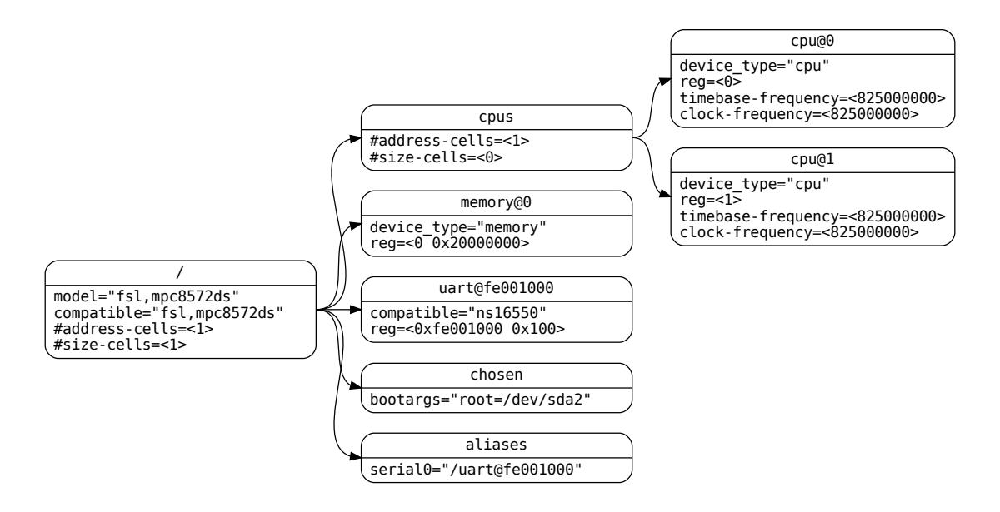
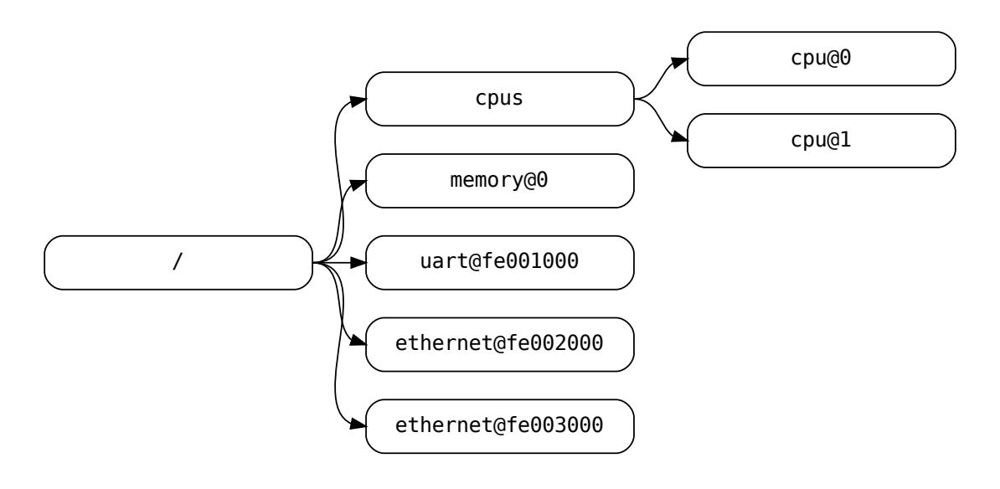
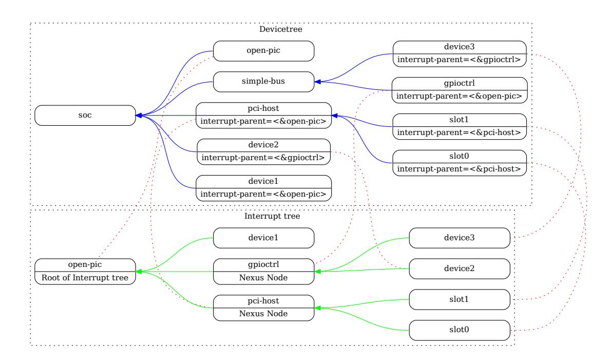

# **Devicetree Specification**

*Release v0.4*

**devicetree.org**

# **CONTENTS**

| 1 |     | Introduction<br>3                                              |
|---|-----|----------------------------------------------------------------|
|   | 1.1 | Purpose and Scope<br><br>3                                     |
|   | 1.2 | Relationship to IEEE™<br>1275 and ePAPR<br><br>4               |
|   | 1.3 | 32-bit and 64-bit Support<br><br>4                             |
|   | 1.4 | Definition of Terms<br><br>4                                   |
|   |     |                                                                |
| 2 |     | The Devicetree<br>6                                            |
|   | 2.1 | Overview<br><br>6                                              |
|   | 2.2 | Devicetree Structure and Conventions<br><br>7                  |
|   |     | 2.2.1<br>Node Names<br><br>7                                   |
|   |     | 2.2.2<br>Generic Names Recommendation<br><br>8                 |
|   |     | 2.2.3<br>Path Names<br><br>9                                   |
|   |     | 2.2.4<br>Properties<br><br>9                                   |
|   | 2.3 | Standard Properties<br><br>12                                  |
|   |     | 2.3.1<br>compatible<br><br>12                                  |
|   |     | 2.3.2<br>model<br><br>12                                       |
|   |     | 2.3.3<br>phandle<br><br>13                                     |
|   |     | 2.3.4<br>status<br><br>13                                      |
|   |     | 2.3.5<br>#address-cells and #size-cells<br><br>14              |
|   |     | 2.3.6<br>reg<br><br>15                                         |
|   |     | 2.3.7<br>virtual-reg<br><br>15                                 |
|   |     | 2.3.8<br>ranges<br><br>15                                      |
|   |     | 2.3.9<br>dma-ranges<br><br>16                                  |
|   |     | 2.3.10<br>dma-coherent<br><br>17                               |
|   |     | 2.3.11<br>dma-noncoherent<br><br>17                            |
|   |     | 2.3.12<br>name (deprecated)<br><br>17                          |
|   |     | 2.3.13<br>device_type (deprecated)<br><br>17                   |
|   | 2.4 | Interrupts and Interrupt Mapping<br><br>17                     |
|   |     | 2.4.1<br>Properties for Interrupt Generating Devices<br><br>19 |
|   |     |                                                                |
|   |     | 2.4.2<br>Properties for Interrupt Controllers<br><br>20        |
|   |     | 2.4.3<br>Interrupt Nexus Properties<br><br>20                  |
|   |     | 2.4.4<br>Interrupt Mapping Example<br><br>21                   |
|   | 2.5 | Nexus Nodes and Specifier Mapping<br><br>23                    |
|   |     | 2.5.1<br>Nexus Node Properties<br><br>23                       |
|   |     | 2.5.2<br>Specifier Mapping Example<br><br>24                   |
|   |     |                                                                |
| 3 |     | Device Node Requirements<br>26                                 |
|   | 3.1 | Base Device Node Types<br><br>26                               |
|   | 3.2 | Root node<br><br>26                                            |
|   | 3.3 | /aliases node<br><br>27                                        |
|   | 3.4 | /memory node<br><br>28                                         |
|   |     | 3.4.1<br>/memory node and UEFI<br><br>29                       |
|   |     | 3.4.2<br>/memory Examples<br><br>29                            |
|   | 3.5 | /reserved-memory Node<br><br>30                                |

|   |              | 3.5.1<br>/reserved-memory parent node<br>                                    | 30 |
|---|--------------|------------------------------------------------------------------------------|----|
|   |              | 3.5.2<br>/reserved-memory/ child nodes<br>                                   | 30 |
|   |              | 3.5.3<br>Device node references to reserved memory<br>                       | 32 |
|   |              | 3.5.4<br>/reserved-memory and UEFI<br>                                       | 32 |
|   |              | 3.5.5<br>/reserved-memory Example<br>                                        | 32 |
|   | 3.6          | /chosen Node<br>                                                             | 33 |
|   | 3.7          | /cpus Node Properties<br>                                                    | 34 |
|   | 3.8          | /cpus/cpu* Node Properties<br>                                               | 34 |
|   |              | 3.8.1<br>General Properties of<br>/cpus/cpu* nodes<br>                       | 35 |
|   |              | 3.8.2<br>TLB Properties<br>                                                  | 39 |
|   |              | 3.8.3<br>Internal (L1) Cache Properties<br>                                  | 39 |
|   |              | 3.8.4<br>Example<br>                                                         | 41 |
|   | 3.9          | Multi-level and Shared Cache Nodes (/cpus/cpu*/l?-cache)<br>                 | 41 |
|   |              | 3.9.1<br>Example<br>                                                         | 42 |
| 4 |              | Device Bindings                                                              | 43 |
|   | 4.1          | Binding Guidelines<br>                                                       | 43 |
|   |              | 4.1.1<br>General Principles<br>                                              | 43 |
|   |              | 4.1.2<br>Miscellaneous Properties<br>                                        | 43 |
|   | 4.2          | Serial devices<br>                                                           | 44 |
|   |              | 4.2.1<br>Serial Class Binding<br>                                            | 44 |
|   |              | 4.2.2<br>National Semiconductor 16450/16550 Compatible UART Requirements<br> | 45 |
|   | 4.3          | Network devices<br>                                                          | 46 |
|   |              | 4.3.1<br>Network Class Binding<br>                                           | 46 |
|   |              | 4.3.2<br>Ethernet specific considerations<br>                                | 47 |
|   | 4.4          | Power ISA Open PIC Interrupt Controllers<br>                                 | 48 |
|   | 4.5          | simple-bus Compatible Value<br>                                              | 49 |
| 5 |              | Flattened Devicetree (DTB) Format                                            | 50 |
|   | 5.1          | Versioning<br>                                                               | 51 |
|   | 5.2          | Header<br>                                                                   | 51 |
|   | 5.3          | Memory Reservation Block<br>                                                 | 52 |
|   |              | 5.3.1<br>Purpose<br>                                                         | 52 |
|   |              | 5.3.2<br>Format<br>                                                          | 53 |
|   |              | 5.3.3<br>Memory Reservation Block and UEFI<br>                               | 53 |
|   | 5.4          | Structure Block<br>                                                          | 53 |
|   |              | 5.4.1<br>Lexical structure<br>                                               | 53 |
|   |              | 5.4.2<br>Tree structure<br>                                                  | 54 |
|   | 5.5          | Strings Block<br>                                                            | 55 |
|   | 5.6          | Alignment<br>                                                                | 55 |
| 6 |              | Devicetree Source (DTS) Format (version 1)                                   | 56 |
|   | 6.1          | Compiler directives<br>                                                      | 56 |
|   | 6.2          | Labels<br>                                                                   | 56 |
|   | 6.3          | Node and property definitions<br>                                            | 57 |
|   | 6.4          | File layout<br>                                                              | 59 |
|   |              |                                                                              |    |
|   | Bibliography |                                                                              | 60 |
|   | Index        |                                                                              | 61 |

### **Copyright**

Copyright 2008,2011 Power.org, Inc.

Copyright 2008,2011 Freescale Semiconductor, Inc.

Copyright 2008,2011 International Business Machines Corporation.

Copyright 2016,2017 Linaro, Ltd.

Copyright 2016-2021 Arm, Ltd.

The Linaro and devicetree.org word marks and the Linaro and devicetree.org logos and related marks are trademarks and service marks licensed by Linaro Ltd. Implementation of certain elements of this document may require licenses under third party intellectual property rights, including without limitation, patent rights. Linaro and its Members are not, and shall not be held, responsible in any manner for identifying or failing to identify any or all such third party intellectual property rights.

The Power Architecture and Power.org word marks and the Power and Power.org logos and related marks are trademarks and service marks licensed by Power.org. Implementation of certain elements of this document may require licenses under third party intellectual property rights, including without limitation, patent rights. Power.org and its Members are not, and shall not be held, responsible in any manner for identifying or failing to identify any or all such third party intellectual property rights.

THIS SPECIFICATION PROVIDED "AS IS" AND WITHOUT ANY WARRANTY OF ANY KIND, INCLUD-ING, WITHOUT LIMITATION, ANY EXPRESS OR IMPLIED WARRANTY OF NON-INFRINGEMENT, MER-CHANTABILITY OR FITNESS FOR A PARTICULAR PURPOSE. IN NO EVENT SHALL LINARO OR ANY MEM-BER OF LINARO BE LIABLE FOR ANY DIRECT, INDIRECT, SPECIAL, EXEMPLARY, PUNITIVE, OR CON-SEQUENTIAL DAMAGES, INCLUDING, WITHOUT LIMITATION, LOST PROFITS, EVEN IF ADVISED OF THE POSSIBILITY OF SUCH DAMAGES.

Questions pertaining to this document, or the terms or conditions of its provision, should be addressed to:

Linaro, Ltd Harston Mill, Royston Road, Harston CB22 7GG

Attn: Devicetree.org Board Secretary

### **License Information**

Licensed under the Apache License, Version 2.0 (the "License"); you may not use this file except in compliance with the License. You may obtain a copy of the License at

<http://www.apache.org/licenses/LICENSE-2.0>

Unless required by applicable law or agreed to in writing, software distributed under the License is distributed on an "AS IS" BASIS, WITHOUT WARRANTIES OR CONDITIONS OF ANY KIND, either express or implied. See the License for the specific language governing permissions and limitations under the License.

**CONTENTS 1**

#### **Acknowledgements**

The devicetree.org Technical Steering Committee would like to thank the many individuals and companies that contributed to the development of this specification through writing, technical discussions and reviews.

We want to thank the power.org Platform Architecture Technical Subcommittee who developed and published ePAPR. The text of ePAPR was used as the starting point for this document.

Significant aspects of the Devicetree Specification are based on work done by the Open Firmware Working Group which developed bindings for IEEE-1275. We would like to acknowledge their contributions.

We would also like to acknowledge the contribution of the PowerPC and ARM Linux communities that developed and implemented the flattened devicetree concept.

Table 1: Revision History

| Revision | Date        | Description                                                                                                                                                                                                                                       |
|----------|-------------|---------------------------------------------------------------------------------------------------------------------------------------------------------------------------------------------------------------------------------------------------|
| 0.1      | 2016-MAY-24 | Initial prerelease version. Imported ePAPR text into reStructured Text format and<br>removed Power ISA specific elements.                                                                                                                         |
| 0.2      | 2017-DEC-20 | •<br>Added more recommended generic node names<br>•<br>Added interrupts-extended<br>•<br>Additional phy times<br>•<br>Filled out detail in source language chapter<br>•<br>Editorial changes<br>•<br>Added changebar version to release documents |
| 0.3      | 2020-FEB-13 | •<br>Added more recommended generic node names<br>•<br>Document generic nexus binding<br>•<br>codespell support and spelling fixes                                                                                                                |

**CONTENTS 2**

**ONE**

# **INTRODUCTION**

# <span id="page-5-1"></span><span id="page-5-0"></span>**1.1 Purpose and Scope**

To initialize and boot a computer system, various software components interact. Firmware might perform low-level initialization of the system hardware before passing control to software such as an operating system, bootloader, or hypervisor. Bootloaders and hypervisors can, in turn, load and transfer control to operating systems. Standard, consistent interfaces and conventions facilitate the interactions between these software components. In this document the term *boot program* is used to generically refer to a software component that initializes the system state and executes another software component referred to as a *client program*. Examples of a boot program include: firmware, bootloaders, and hypervisors. Examples of a client program include: bootloaders, hypervisors, operating systems, and special purpose programs. A piece of software may be both a client program and a boot program (e.g. a hypervisor).

This specification, the Devicetree Specification (DTSpec), provides a complete boot program to client program interface definition, combined with minimum system requirements that facilitate the development of a wide variety of systems.

This specification is targeted towards the requirements of embedded systems. An embedded system typically consists of system hardware, an operating system, and application software that are custom designed to perform a fixed, specific set of tasks. This is unlike general purpose computers, which are designed to be customized by a user with a variety of software and I/O devices. Other characteristics of embedded systems may include:

- a fixed set of I/O devices, possibly highly customized for the application
- a system board optimized for size and cost
- limited user interface
- resource constraints like limited memory and limited nonvolatile storage
- real-time constraints
- use of a wide variety of operating systems, including Linux, real-time operating systems, and custom or proprietary operating systems

### **Organization of this Document**

- [Chapter](#page-5-0) [1](#page-5-0) introduces the architecture being specified by DTSpec.
- [Chapter](#page-8-0) [2](#page-8-0) introduces the devicetree concept and describes its logical structure and standard properties.
- [Chapter](#page-28-0) [3](#page-28-0) specifies the definition of a base set of device nodes required by DTSpec-compliant devicetrees.
- [Chapter](#page-45-0) [4](#page-45-0) describes device bindings for certain classes of devices and specific device types.
- [Chapter](#page-52-0) [5](#page-52-0) specifies the DTB encoding of devicetrees.
- [Chapter](#page-58-0) [6](#page-58-0) specifies the DTS source language.

### **Conventions Used in this Document**

The word *shall* is used to indicate mandatory requirements strictly to be followed in order to conform to the standard and from which no deviation is permitted (*shall* equals *is required to*).

<span id="page-6-3"></span>The word *should* is used to indicate that among several possibilities one is recommended as particularly suitable, without mentioning or excluding others; or that a certain course of action is preferred but not necessarily required; or that (in the negative form) a certain course of action is deprecated but not prohibited (*should* equals *is recommended that*).

The word *may* is used to indicate a course of action permissible within the limits of the standard (*may* equals *is permitted*).

Examples of devicetree constructs are frequently shown in *Devicetree Syntax* form. See [Section](#page-58-0) [6](#page-58-0) for an overview of this syntax.

# <span id="page-6-0"></span>**1.2 Relationship to IEEE™ 1275 and ePAPR**

DTSpec is loosely related to the IEEE 1275 Open Firmware standard—*IEEE Standard for Boot (Initialization Configuration) Firmware: Core Requirements and Practices* [\[IEEE1275\]](#page-62-1).

The original IEEE 1275 specification and its derivatives such as CHRP [\[CHRP\]](#page-62-2) and PAPR [\[PAPR\]](#page-62-3) address problems of general purpose computers, such as how a single version of an operating system can work on several different computers within the same family and the problem of loading an operating system from user-installed I/O devices.

Because of the nature of embedded systems, some of these problems faced by open, general purpose computers do not apply. Notable features of the IEEE 1275 specification that are omitted from the DTSpec include:

- Plug-in device drivers
- FCode
- The programmable Open Firmware user interface based on Forth
- FCode debugging
- Operating system debugging

What is retained from IEEE 1275 are concepts from the devicetree architecture by which a boot program can describe and communicate system hardware information to a client program, thus eliminating the need for the client program to have hard-coded descriptions of system hardware.

This specification partially supersedes the ePAPR [\[EPAPR\]](#page-62-4) specification. ePAPR documents how devicetree is used by the Power ISA, and covers both general concepts, as well as Power ISA specific bindings. The text of this document was derived from ePAPR, but either removes architecture specific bindings, or moves them into an appendix.

# <span id="page-6-1"></span>**1.3 32-bit and 64-bit Support**

The DTSpec supports CPUs with both 32-bit and 64-bit addressing capabilities. Where applicable, sections of the DTSpec describe any requirements or considerations for 32-bit and 64-bit addressing.

# <span id="page-6-2"></span>**1.4 Definition of Terms**

#### **AMP**

Asymmetric Multiprocessing. Computer available CPUs are partitioned into groups, each running a distinct operating system image. The CPUs may or may not be identical.

### **boot CPU**

The first CPU which a boot program directs to a client program's entry point.

### **Book III-E**

Embedded Environment. Section of the Power ISA defining supervisor instructions and related facilities used in embedded Power processor implementations.

### **boot program**

Used to generically refer to a software component that initializes the system state and executes another software

<span id="page-7-0"></span>component referred to as a client program. Examples of a boot program include: firmware, bootloaders, and hypervisors.

#### **client program**

Program that typically contains application or operating system software. Examples of a client program include: bootloaders, hypervisors, operating systems, and special purpose programs.

### **cell**

A unit of information consisting of 32 bits.

### **DMA**

Direct memory access

#### **DTB**

Devicetree blob. Compact binary representation of the devicetree.

#### **DTC**

Devicetree compiler. An open source tool used to create DTB files from DTS files.

### **DTS**

Devicetree syntax. A textual representation of a devicetree consumed by the DTC. See Appendix A Devicetree Source Format (version 1).

#### **effective address**

Memory address as computed by processor storage access or branch instruction.

#### **physical address**

Address used by the processor to access external device, typically a memory controller.

#### **Power ISA**

Power Instruction Set Architecture.

### **interrupt specifier**

A property value that describes an interrupt. Typically information that specifies an interrupt number and sensitivity and triggering mechanism is included.

#### **secondary CPU**

CPUs other than the boot CPU that belong to the client program are considered *secondary CPUs*.

#### **SMP**

Symmetric multiprocessing. A computer architecture where two or more identical CPUs can share memory and IO and operate under a single operating system.

### **SoC**

System on a chip. A single computer chip integrating one or more CPU core as well as number of other peripherals.

### **unit address**

The part of a node name specifying the node's address in the address space of the parent node.

#### **quiescent CPU**

A quiescent CPU is in a state where it cannot interfere with the normal operation of other CPUs, nor can its state be affected by the normal operation of other running CPUs, except by an explicit method for enabling or re-enabling the quiescent CPU.

**1.4. Definition of Terms 5**

**CHAPTER**

**TWO**

# **THE DEVICETREE**

# <span id="page-8-1"></span><span id="page-8-0"></span>**2.1 Overview**

DTSpec specifies a construct called a *devicetree* to describe system hardware. A boot program loads a devicetree into a client program's memory and passes a pointer to the devicetree to the client.

This chapter describes the logical structure of the devicetree and specifies a base set of properties for use in describing device nodes. [Chapter](#page-28-0) [3](#page-28-0) specifies certain device nodes required by a DTSpec-compliant devicetree. [Chapter](#page-45-0) [4](#page-45-0) describes the DTSpec-defined device bindings – the requirements for representing certain device types or classes of devices. [Chapter](#page-52-0) [5](#page-52-0) describes the in-memory encoding of the devicetree.

A devicetree is a tree data structure with nodes that describe the devices in a system. Each node has property/value pairs that describe the characteristics of the device being represented. Each node has exactly one parent except for the root node, which has no parent.

A device in this context may be an actual hardware device, such as a UART. It may be part of a hardware device, such as the random-number generator in a TPM. It may also be a device provided through virtualisation, such as a protocol providing access to an I2C device attached to a remote CPU. A device may include functions implemented by firmware running in higher privilege levels or remote processors. There is no requirement that nodes in a device tree be a physical hardware device, but generally they have some correlation to physical hardware devices. Nodes should not be designed for OS- or project- specific purposes. They should describe something which can be implemented by any OS or project.

A devicetree is often used to describe devices which cannot necessarily be dynamically detected by a client program. For example, the architecture of PCI enables a client to probe and detect attached devices and thus devicetree nodes describing PCI devices might not be required. However, a device node is often used to describe a PCI host bridge device in the system. This node is required if the bridge cannot be detected by probing, but is otherwise optional. Also, a bootloader may do PCI probing and produce a device tree containing the results of its scan, for passing to the Operating System.

### **Example**

[Fig.](#page-9-2) [2.1](#page-9-2) shows an example representation of a simple devicetree that is nearly complete enough to boot a simple operating system, with the platform type, CPU, memory and a single UART described. Device nodes are shown with properties and values inside each node.

<span id="page-9-2"></span>

Fig. 2.1: Devicetree Example

### <span id="page-9-0"></span>2.2 Devicetree Structure and Conventions

### <span id="page-9-1"></span>2.2.1 Node Names

### **Node Name Requirements**

Each node in the devicetree is named according to the following convention:

node-name@unit-address

<span id="page-9-3"></span>The *node-name* component specifies the name of the node. It shall be 1 to 31 characters in length and consist solely of characters from the set of characters in Table 2.1.

| Character | Description      |
|-----------|------------------|
| 0-9       | digit            |
| a-z       | lowercase letter |
| A-Z       | uppercase letter |
| ,         | comma            |
|           | period           |
| _         | underscore       |
| +         | plus sign        |
| _         | dash             |

Table 2.1: Valid characters for node names

The node-name shall start with a lower or uppercase character and should describe the general class of device.

The *unit-address* component of the name is specific to the bus type on which the node sits. It consists of one or more ASCII characters from the set of characters in Table 2.1. The unit-address must match the first address specified in the *reg* property of the node. If the node has no *reg* property, the @*unit-address* must be omitted and the *node-name* alone differentiates the

node from other nodes at the same level in the tree. The binding for a particular bus may specify additional, more specific requirements for the format of *reg* and the *unit-address*.

In the case of *node-name* without an *@unit-address* the *node-name* shall be unique from any property names at the same level in the tree.

<span id="page-10-1"></span>The root node does not have a node-name or unit-address. It is identified by a forward slash (/).



Fig. 2.2: Examples of Node Names

### In [Fig.](#page-10-1) [2.2:](#page-10-1)

- The nodes with the name cpu are distinguished by their unit-address values of 0 and 1.
- The nodes with the name ethernet are distinguished by their unit-address values of fe002000 and fe003000.

### <span id="page-10-0"></span>**2.2.2 Generic Names Recommendation**

The name of a node should be somewhat generic, reflecting the function of the device and not its precise programming model. If appropriate, the name should be one of the following choices:

- adc
- accelerometer
- air-pollution-sensor
- atm
- audio-codec
- audio-controller
- backlight
- bluetooth
- bus
- cache-controller
- camera
- can
- charger
- clock

- clock-controller
- co2-sensor
- compact-flash
- cpu
- cpus
- crypto
- disk
- display
- dma-controller
- dsi
- dsp
- eeprom
- efuse
- endpoint

- ethernet
- ethernet-phy
- fdc
- flash
- gnss
- gpio
- gpu • gyrometer
- hdmi
- hwlock
- i2c
- i2c-mux • ide
- interrupt-controller

- iommu
- isa
- keyboard
- key
- keys
- lcd-controller
- led
- leds
- led-controller
- light-sensor
- lora
- magnetometer
- mailbox
- mdio
- memory
- memory-controller
- mmc
- mmc-slot
- mouse
- nand-controller

- nvram
- oscillator
- parallel
- pc-card
- pci
- pcie
- phy
- pinctrl
- pmic
- pmu
- port
- ports
- power-monitor
- pwm
- regulator
- reset-controller
- rng • rtc
- sata
- scsi

- serial
- sound
- spi
- spmi
- sram-controller
- ssi-controller
- syscon
- temperature-sensor
- timer
- touchscreen
- tpm
- usb
- usb-hub
- usb-phy
- vibrator
- video-codec
- vme
- watchdog
- wifi

# <span id="page-11-0"></span>**2.2.3 Path Names**

A node in the devicetree can be uniquely identified by specifying the full path from the root node, through all descendant nodes, to the desired node.

The convention for specifying a device path is:

/node-name-1/node-name-2/node-name-N

For example, in [Fig.](#page-10-1) [2.2,](#page-10-1) the device path to cpu #1 would be:

/cpus/cpu@1

The path to the root node is /.

A unit address may be omitted if the full path to the node is unambiguous.

If a client program encounters an ambiguous path, its behavior is undefined.

# <span id="page-11-1"></span>**2.2.4 Properties**

Each node in the devicetree has properties that describe the characteristics of the node. Properties consist of a name and a value.

### **Property Names**

Property names are strings of 1 to 31 characters from the characters show in [Table](#page-12-0) [2.2](#page-12-0)

Table 2.2: Valid characters for property names

<span id="page-12-0"></span>

| Character | Description      |
|-----------|------------------|
| 0-9       | digit            |
| a-z       | lowercase letter |
| A-Z       | uppercase letter |
| ,         | comma            |
|           | period           |
| _         | underscore       |
| +         | plus sign        |
| ?         | question mark    |
| #         | hash             |
| -         | dash             |

Nonstandard property names should specify a unique string prefix, such as a stock ticker symbol, identifying the name of the company or organization that defined the property. Examples:

fsl,channel-fifo-len ibm,ppc-interrupt-server#s linux,network-index

### <span id="page-12-2"></span>**Property Values**

A property value is an array of zero or more bytes that contain information associated with the property.

Properties might have an empty value if conveying true-false information. In this case, the presence or absence of the property is sufficiently descriptive.

[Table](#page-12-1) [2.3](#page-12-1) describes the set of basic value types defined by the DTSpec.

Table 2.3: Property values

<span id="page-12-1"></span>

| Value is empty. Used for conveying true-false information, when the presence or ab<br>sence of the property itself is sufficiently descriptive.                                             |
|---------------------------------------------------------------------------------------------------------------------------------------------------------------------------------------------|
| A 32-bit integer in big-endian format. Example: the 32-bit value 0x11223344 would<br>be represented in memory as:<br>address<br>11<br>address+1<br>22<br>address+2<br>33<br>address+3<br>44 |
|                                                                                                                                                                                             |

Table 2.3 – continued from previous page

| Value                                                             | Description                                                                                                                                                                                                                                                                                                                                                                                                                     |  |  |  |
|-------------------------------------------------------------------|---------------------------------------------------------------------------------------------------------------------------------------------------------------------------------------------------------------------------------------------------------------------------------------------------------------------------------------------------------------------------------------------------------------------------------|--|--|--|
| <u64></u64>                                                       | Represents a 64-bit integer in big-endian format. Consists of two<br><u32> values where<br/>the first value contains the most significant bits of the integer and the second value<br/>contains the least significant bits.<br/>Example: the 64-bit value 0x1122334455667788 would be represented as two cells as:<br/>&lt;0x11223344 0x55667788&gt;.<br/>The value would be represented in memory as:<br/>address<br/>11</u32> |  |  |  |
|                                                                   | address+1<br>22<br>address+2<br>33<br>address+3<br>44<br>address+4<br>55<br>address+5<br>66<br>address+6<br>77<br>address+7<br>88                                                                                                                                                                                                                                                                                               |  |  |  |
| <string></string>                                                 | Strings are printable and null-terminated. Example: the string "hello" would be rep<br>resented in memory as:                                                                                                                                                                                                                                                                                                                   |  |  |  |
|                                                                   | address<br>68<br>'h'<br>address+1<br>65<br>'e'<br>address+2<br>6C<br>'l'<br>address+3<br>6C<br>'l'<br>address+4<br>6F<br>'o'<br>address+5<br>00<br>'\0'                                                                                                                                                                                                                                                                         |  |  |  |
| <prop-encoded-array><br/><phandle></phandle></prop-encoded-array> | Format is specific to the property. See the property definition.<br>A<br><u32> value. A<br/>phandle value is a way to reference another node in the devicetree.<br/>Any node that can be referenced defines a phandle property with a unique<br/><u32> value.<br/>That number is used for the value of properties with a phandle value type.</u32></u32>                                                                        |  |  |  |
| <stringlist></stringlist>                                         | A list of<br><string> values concatenated together.<br/>Example: The string list "hello","world" would be represented in memory as:</string>                                                                                                                                                                                                                                                                                    |  |  |  |
|                                                                   | address<br>68<br>'h'<br>address+1<br>65<br>'e'<br>address+2<br>6C<br>'l'<br>'l'<br>address+3<br>6C<br>address+4<br>6F<br>'o'<br>'\0'<br>address+5<br>00<br>address+6<br>77<br>'w'<br>'o'<br>address+7<br>6f<br>address+8<br>72<br>'r'<br>'l'<br>address+9<br>6C<br>address+10<br>64<br>'d'<br>'\0'<br>address+11<br>00                                                                                                          |  |  |  |

# <span id="page-14-0"></span>**2.3 Standard Properties**

DTSpec specifies a set of standard properties for device nodes. These properties are described in detail in this section. Device nodes defined by DTSpec (see [Chapter](#page-28-0) [3\)](#page-28-0) may specify additional requirements or constraints regarding the use of the standard properties. [Chapter](#page-45-0) [4](#page-45-0) describes the representation of specific devices and may also specify additional requirements.

**Note:** All examples of devicetree nodes in this document use the DTS (Devicetree Source) format for specifying nodes and properties.

### <span id="page-14-1"></span>**2.3.1 compatible**

Property name: compatible Value type: <stringlist>

Description:

The *compatible* property value consists of one or more strings that define the specific programming model for the device. This list of strings should be used by a client program for device driver selection. The property value consists of a concatenated list of null terminated strings, from most specific to most general. They allow a device to express its compatibility with a family of similar devices, potentially allowing a single device driver to match against several devices.

The recommended format is "manufacturer,model", where manufacturer is a string describing the name of the manufacturer (such as a stock ticker symbol), and model specifies the model number.

The compatible string should consist only of lowercase letters, digits and dashes, and should start with a letter. A single comma is typically only used following a vendor prefix. Underscores should not be used.

### Example:

```
compatible = "fsl,mpc8641", "ns16550";
```

In this example, an operating system would first try to locate a device driver that supported fsl,mpc8641. If a driver was not found, it would then try to locate a driver that supported the more general ns16550 device type.

# <span id="page-14-2"></span>**2.3.2 model**

Property name: model Value type: <string>

Description:

The model property value is a <string> that specifies the manufacturer's model number of the device.

The recommended format is: "manufacturer,model", where manufacturer is a string describing the name of the manufacturer (such as a stock ticker symbol), and model specifies the model number.

### Example:

```
model = "fsl,MPC8349EMITX";
```

# <span id="page-15-0"></span>**2.3.3 phandle**

Property name: phandle

Value type: <u32>

Description:

The *phandle* property specifies a numerical identifier for a node that is unique within the devicetree. The *phandle* property value is used by other nodes that need to refer to the node associated with the property.

Example:

See the following devicetree excerpt:

```
pic@10000000 {
   phandle = <1>;
   interrupt-controller;
   reg = <0x10000000 0x100>;
};
```

A *phandle* value of 1 is defined. Another device node could reference the pic node with a phandle value of 1:

```
another-device-node {
  interrupt-parent = <1>;
};
```

**Note:** Older versions of devicetrees may be encountered that contain a deprecated form of this property called linux, phandle. For compatibility, a client program might want to support linux,phandle if a phandle property is not present. The meaning and use of the two properties is identical.

**Note:** Most devicetrees in DTS (see Appendix A) will not contain explicit phandle properties. The DTC tool automatically inserts the phandle properties when the DTS is compiled into the binary DTB format.

### <span id="page-15-1"></span>**2.3.4 status**

Property name: status Value type: <string>

Description:

The status property indicates the operational status of a device. The lack of a status property should be treated as if the property existed with the value of "okay". Valid values are listed and defined in [Table](#page-16-1) [2.4.](#page-16-1)

Table 2.4: Values for status property

<span id="page-16-1"></span>

| Value      | Description                                                                                                                                                                                                                                                 |
|------------|-------------------------------------------------------------------------------------------------------------------------------------------------------------------------------------------------------------------------------------------------------------|
| "okay"     | Indicates the device is operational.                                                                                                                                                                                                                        |
| "disabled" | Indicates that the device is not presently operational, but it might become operational in the future (for example, something is not plugged in, or switched off).  Refer to the device binding for details on what disabled means for a given device.      |
| "reserved" | Indicates that the device is operational, but should not be used. Typically this is used for devices that are controlled by another software component, such as platform firmware.                                                                          |
| "fail"     | Indicates that the device is not operational. A serious error was detected in the device, and it is unlikely to become operational without repair.                                                                                                          |
| "fail-sss" | Indicates that the device is not operational. A serious error was detected in the device and it is unlikely to become operational without repair. The <i>sss</i> portion of the value is specific to the device and indicates the error condition detected. |

#### <span id="page-16-0"></span>2.3.5 #address-cells and #size-cells

Property name: #address-cells, #size-cells

Value type: <u32>

#### Description:

The #address-cells and #size-cells properties may be used in any device node that has children in the devicetree hierarchy and describes how child device nodes should be addressed. The #address-cells property defines the number of <u32> cells used to encode the address field in a child node's reg property. The #size-cells property defines the number of <u32> cells used to encode the size field in a child node's reg property.

The #address-cells and #size-cells properties are not inherited from ancestors in the devicetree. They shall be explicitly defined.

A DTSpec-compliant boot program shall supply #address-cells and #size-cells on all nodes that have children.

If missing, a client program should assume a default value of 2 for #address-cells, and a value of 1 for #size-cells.

#### Example:

See the following devicetree excerpt:

```
soc {
    #address-cells = <1>;
    #size-cells = <1>;

    serial@4600 {
        compatible = "ns16550";
        reg = <0x4600 0x100>;
        clock-frequency = <0>;
        interrupts = <0xA 0x8>;
        interrupt-parent = <&ipic>;
    };
};
```

In this example, the #address-cells and #size-cells properties of the soc node are both set to 1. This setting specifies that one cell is required to represent an address and one cell is required to represent the size of nodes that are children of this node.

The serial device *reg* property necessarily follows this specification set in the parent (soc) node—the address is represented by a single cell (0x4600), and the size is represented by a single cell (0x100).

### <span id="page-17-0"></span>2.3.6 reg

Property name: reg

Property value:

#### Description:

The *reg* property describes the address of the device's resources within the address space defined by its parent bus. Most commonly this means the offsets and lengths of memory-mapped IO register blocks, but may have a different meaning on some bus types. Addresses in the address space defined by the root node are CPU real addresses.

The value is a <prop-encoded-array>, composed of an arbitrary number of pairs of address and length, <address length>. The number of <u32> cells required to specify the address and length are bus-specific and are specified by the #address-cells and #size-cells properties in the parent of the device node. If the parent node specifies a value of 0 for #size-cells, the length field in the value of #reg shall be omitted.

### Example:

Suppose a device within a system-on-a-chip had two blocks of registers, a 32-byte block at offset 0x3000 in the SOC and a 256-byte block at offset 0xFE00. The *reg* property would be encoded as follows (assuming *#address-cells* and *#size-cells* values of 1):

reg = <0x3000 0x20 0xFE00 0x100>;

### <span id="page-17-1"></span>2.3.7 virtual-reg

Property name: virtual-reg

Value type: <u32>

### Description:

The *virtual-reg* property specifies an effective address that maps to the first physical address specified in the *reg* property of the device node. This property enables boot programs to provide client programs with virtual-to-physical mappings that have been set up.

### <span id="page-17-2"></span>2.3.8 ranges

Property name: ranges

Value type: <empty> or cprop-encoded-array> encoded as an arbitrary number of (child-bus-address, parent-bus-address, length) triplets.

#### Description:

The *ranges* property provides a means of defining a mapping or translation between the address space of the bus (the child address space) and the address space of the bus node's parent (the parent address space).

The format of the value of the *ranges* property is an arbitrary number of triplets of (*child-bus-address*, *parent-bus-address*, *length*)

- The *child-bus-address* is a physical address within the child bus' address space. The number of cells to represent the address is bus dependent and can be determined from the #address-cells of this node (the node in which the *ranges* property appears).
- The *parent-bus-address* is a physical address within the parent bus' address space. The number of cells to represent the parent address is bus dependent and can be determined from the *#address-cells* property of the node that defines the parent's address space.
- The *length* specifies the size of the range in the child's address space. The number of cells to represent the size can be determined from the #size-cells of this node (the node in which the ranges property appears).

If the property is defined with an <empty> value, it specifies that the parent and child address space is identical, and no address translation is required.

If the property is not present in a bus node, it is assumed that no mapping exists between children of the node and the parent address space.

Address Translation Example:

```
soc {
    compatible = "simple-bus";
    #address-cells = <1>;
    #size-cells = <1>;
    ranges = <0x0 0xe00000000 0x001000000>;

serial@4600 {
    device_type = "serial";
    compatible = "ns16550";
    reg = <0x4600 0x100>;
    clock-frequency = <0>;
    interrupts = <0xA 0x8>;
    interrupt-parent = <&ipic>;
};
};
```

The soc node specifies a ranges property of

```
<0x0 0xe0000000 0x00100000>;
```

This property value specifies that for a 1024 KB range of address space, a child node addressed at physical 0x0 maps to a parent address of physical 0xe0000000. With this mapping, the serial device node can be addressed by a load or store at address 0xe0004600, an offset of 0x4600 (specified in *reg*) plus the 0xe0000000 mapping specified in *ranges*.

### <span id="page-18-0"></span>2.3.9 dma-ranges

Property name: dma-ranges

Value type: <empty> or cprop-encoded-array> encoded as an arbitrary number of (child-bus-address, parent-bus-address, length) triplets.

#### Description:

The *dma-ranges* property is used to describe the direct memory access (DMA) structure of a memory-mapped bus whose devicetree parent can be accessed from DMA operations originating from the bus. It provides a means of defining a mapping or translation between the physical address space of the bus and the physical address space of the parent of the bus.

The format of the value of the *dma-ranges* property is an arbitrary number of triplets of (*child-bus-address*, *parent-bus-address*, *length*). Each triplet specified describes a contiguous DMA address range.

- The *child-bus-address* is a physical address within the child bus' address space. The number of cells to represent the address depends on the bus and can be determined from the *#address-cells* of this node (the node in which the *dma-ranges* property appears).
- The *parent-bus-address* is a physical address within the parent bus' address space. The number of cells to represent the parent address is bus dependent and can be determined from the *#address-cells* property of the node that defines the parent's address space.
- The *length* specifies the size of the range in the child's address space. The number of cells to represent the size can be determined from the #size-cells of this node (the node in which the dma-ranges property appears).

#### <span id="page-19-0"></span>2.3.10 dma-coherent

Property name: dma-coherent

Value type: <empty>

#### **Description:**

For architectures which are by default non-coherent for I/O, the *dma-coherent* property is used to indicate a device is capable of coherent DMA operations. Some architectures have coherent DMA by default and this property is not applicable.

#### <span id="page-19-1"></span>2.3.11 dma-noncoherent

Property name: dma-noncoherent

Value type: <empty>

#### **Description:**

For architectures which are by default coherent for I/O, the *dma-noncoherent* property is used to indicate a device is not capable of coherent DMA operations. Some architectures have non-coherent DMA by default and this property is not applicable.

### <span id="page-19-2"></span>2.3.12 name (deprecated)

Property name: name
Value type: <string>

Description:

The *name* property is a string specifying the name of the node. This property is deprecated, and its use is not recommended. However, it might be used in older non-DTSpec-compliant devicetrees. Operating system should determine a node's name based on the *node-name* component of the node name (see Section 2.2.1).

### <span id="page-19-3"></span>2.3.13 device type (deprecated)

Property name: device\_type

Value type: <string>

Description:

The *device\_type* property was used in IEEE 1275 to describe the device's FCode programming model. Because DTSpec does not have FCode, new use of the property is deprecated, and it should be included only on cpu and memory nodes for compatibility with IEEE 1275–derived devicetrees.

# <span id="page-19-4"></span>2.4 Interrupts and Interrupt Mapping

DTSpec adopts the interrupt tree model of representing interrupts specified in *Open Firmware Recommended Practice: Interrupt Mapping, Version 0.9* [b7]. Within the devicetree a logical interrupt tree exists that represents the hierarchy and routing of interrupts in the platform hardware. While generically referred to as an interrupt tree it is more technically a directed acyclic graph.

The physical wiring of an interrupt source to an interrupt controller is represented in the devicetree with the *interrupt-parent* property. Nodes that represent interrupt-generating devices contain an *interrupt-parent* property which has a *phandle* value that points to the device to which the device's interrupts are routed, typically an interrupt controller. If an interrupt-generating device does not have an *interrupt-parent* property, its interrupt parent is assumed to be its devicetree parent.

Each interrupt generating device contains an *interrupts* property with a value describing one or more interrupt sources for that device. Each source is represented with information called an *interrupt specifier*. The format and meaning of an

*interrupt specifier* is interrupt domain specific, i.e., it is dependent on properties on the node at the root of its interrupt domain. The *#interrupt-cells* property is used by the root of an interrupt domain to define the number of <u32> values needed to encode an interrupt specifier. For example, for an Open PIC interrupt controller, an interrupt-specifier takes two 32-bit values and consists of an interrupt number and level/sense information for the interrupt.

An interrupt domain is the context in which an interrupt specifier is interpreted. The root of the domain is either (1) an interrupt controller or (2) an interrupt nexus.

- 1. An *interrupt controller* is a physical device and will need a driver to handle interrupts routed through it. It may also cascade into another interrupt domain. An interrupt controller is specified by the presence of an *interrupt-controller* property on that node in the devicetree.
- 2. An *interrupt nexus* defines a translation between one interrupt domain and another. The translation is based on both domain-specific and bus-specific information. This translation between domains is performed with the *interrupt-map* property. For example, a PCI controller device node could be an interrupt nexus that defines a translation from the PCI interrupt namespace (INTA, INTB, etc.) to an interrupt controller with Interrupt Request (IRQ) numbers.

The root of the interrupt tree is determined when traversal of the interrupt tree reaches an interrupt controller node without an *interrupts* property and thus no explicit interrupt parent.

<span id="page-20-0"></span>See Fig. 2.3 for an example of a graphical representation of a devicetree with interrupt parent relationships shown. It shows both the natural structure of the devicetree as well as where each node sits in the logical interrupt tree.



Fig. 2.3: Example of the interrupt tree

In the example shown in Fig. 2.3:

- The open-pic interrupt controller is the root of the interrupt tree.
- The interrupt tree root has three children—devices that route their interrupts directly to the open-pic
  - device1
  - PCI host controller

- GPIO Controller
- Three interrupt domains exist; one rooted at the open-pic node, one at the PCI host bridge node, and one at the GPIO Controller node.
- There are two nexus nodes; one at the PCI host bridge and one at the GPIO controller.

### <span id="page-21-0"></span>2.4.1 Properties for Interrupt Generating Devices

### interrupts

Property: interrupts

Value type: prop-encoded-arrayencoded as arbitrary number of interrupt specifiers

#### Description:

The *interrupts* property of a device node defines the interrupt or interrupts that are generated by the device. The value of the *interrupts* property consists of an arbitrary number of interrupt specifiers. The format of an interrupt specifier is defined by the binding of the interrupt domain root.

interrupts is overridden by the interrupts-extended property and normally only one or the other should be used.

#### Example:

A common definition of an interrupt specifier in an open PIC–compatible interrupt domain consists of two cells; an interrupt number and level/sense information. See the following example, which defines a single interrupt specifier, with an interrupt number of 0xA and level/sense encoding of 8.

```
interrupts = <0xA 8>;
```

#### interrupt-parent

Property: interrupt-parent

Value type: <phandle>

#### Description:

Because the hierarchy of the nodes in the interrupt tree might not match the devicetree, the *interrupt-parent* property is available to make the definition of an interrupt parent explicit. The value is the phandle to the interrupt parent. If this property is missing from a device, its interrupt parent is assumed to be its devicetree parent.

### interrupts-extended

Property: interrupts-extended

Value type: <phandle> <prop-encoded-array>

### Description:

The *interrupts-extended* property lists the interrupt(s) generated by a device. *interrupts-extended* should be used instead of *interrupts* when a device is connected to multiple interrupt controllers as it encodes a parent phandle with each interrupt specifier.

#### Example:

This example shows how a device with two interrupt outputs connected to two separate interrupt controllers would describe the connection using an *interrupts-extended* property. pic is an interrupt controller with an *#interrupts-cells* specifier of 2, while gic is an interrupt controller with an *#interrupts-cells* specifier of 1.

```
interrupts-extended = <&pic 0xA 8>, <&gic 0xda>;
```

The *interrupts* and *interrupts-extended* properties are mutually exclusive. A device node should use one or the other, but not both. Using both is only permissible when required for compatibility with software that does not understand *interrupts-extended*. If both *interrupts-extended* and *interrupts* are present then *interrupts-extended* takes precedence.

### <span id="page-22-0"></span>2.4.2 Properties for Interrupt Controllers

#### #interrupt-cells

Property: #interrupt-cells

Value type: <u32>

Description:

The #interrupt-cells property defines the number of cells required to encode an interrupt specifier for an interrupt domain.

### interrupt-controller

Property: interrupt-controller

Value type: <empty>

Description:

The presence of an *interrupt-controller* property defines a node as an interrupt controller node.

### <span id="page-22-1"></span>2.4.3 Interrupt Nexus Properties

An interrupt nexus node shall have an #interrupt-cells property.

### interrupt-map

Property: interrupt-map

Value type: prop-encoded-array encoded as an arbitrary number of interrupt mapping entries.

#### Description:

An *interrupt-map* is a property on a nexus node that bridges one interrupt domain with a set of parent interrupt domains and specifies how interrupt specifiers in the child domain are mapped to their respective parent domains.

The interrupt map is a table where each row is a mapping entry consisting of five components: *child unit address*, *child interrupt specifier*, *interrupt-parent*, *parent unit address*, *parent interrupt specifier*.

#### child unit address

The unit address of the child node being mapped. The number of 32-bit cells required to specify this is described by the #address-cells property of the bus node on which the child is located.

#### child interrupt specifier

The interrupt specifier of the child node being mapped. The number of 32-bit cells required to specify this component is described by the *#interrupt-cells* property of this node—the nexus node containing the *interrupt-map* property.

#### interrupt-parent

A single *<phandle>* value that points to the interrupt parent to which the child domain is being mapped.

#### parent unit address

The unit address in the domain of the interrupt parent. The number of 32-bit cells required to specify this address is described by the #address-cells property of the node pointed to by the interrupt-parent field.

#### parent interrupt specifier

The interrupt specifier in the parent domain. The number of 32-bit cells required to specify this component is described by the #interrupt-cells property of the node pointed to by the interrupt-parent field.

Lookups are performed on the interrupt mapping table by matching a unit-address/interrupt specifier pair against the child components in the interrupt-map. Because some fields in the unit interrupt specifier may not be relevant, a mask is applied before the lookup is done. This mask is defined in the *interrupt-map-mask* property (see Section 2.4.3).

**Note:** Both the child node and the interrupt parent node are required to have #address-cells and #interrupt-cells properties defined. If a unit address component is not required, #address-cells shall be explicitly defined to be zero.

### <span id="page-23-1"></span>interrupt-map-mask

Property: interrupt-map-mask

Value type: prop-encoded-arrayencoded as a bit mask

Description:

An *interrupt-map-mask* property is specified for a nexus node in the interrupt tree. This property specifies a mask that is ANDed with the incoming unit interrupt specifier being looked up in the table specified in the *interrupt-map* property.

### #interrupt-cells

Property: #interrupt-cells

Value type: <u32>

Description:

The #interrupt-cells property defines the number of cells required to encode an interrupt specifier for an interrupt domain.

# <span id="page-23-0"></span>2.4.4 Interrupt Mapping Example

The following shows the representation of a fragment of a devicetree with a PCI bus controller and a sample interrupt map for describing the interrupt routing for two PCI slots (IDSEL 0x11,0x12). The INTA, INTB, INTC, and INTD pins for slots 1 and 2 are wired to the Open PIC interrupt controller.

```
soc {
    compatible = "simple-bus";
    #address-cells = <1>;
    #size-cells = <1>;

    open-pic {
        clock-frequency = <0>;
        interrupt-controller;
        #address-cells = <0>;
        #interrupt-cells = <2>;
    };

    pci {
        #interrupt-cells = <1>;
        #size-cells = <2>;
    }
}
```

(continued from previous page)

```
#address-cells = <3>:
      interrupt-map-mask = <0xf800 0 0 7>;
      interrupt-map = <</pre>
         /* IDSEL 0x11 - PCI slot 1 */
         0x8800 0 0 1 & open-pic 2 1 /* INTA */
         0x8800 0 0 2 & open-pic 3 1 /* INTB */
         0x8800 0 0 3 &open-pic 4 1 /* INTC */
         0x8800 0 0 4 &open-pic 1 1 /* INTD */
         /* IDSEL 0x12 - PCI slot 2 */
         0x9000 0 0 1 &open-pic 3 1 /* INTA */
         0x9000 0 0 2 &open-pic 4 1 /* INTB */
         0x9000 0 0 3 &open-pic 1 1 /* INTC */
         0x9000 0 0 4 &open-pic 2 1 /* INTD */
      >;
  };
};
```

One Open PIC interrupt controller is represented and is identified as an interrupt controller with an *interrupt-controller* property.

Each row in the interrupt-map table consists of five parts: a child unit address and interrupt specifier, which is mapped to an *interrupt-parent* node with a specified parent unit address and interrupt specifier.

• For example, the first row of the interrupt-map table specifies the mapping for INTA of slot 1. The components of that row are shown here

```
child unit address: 0x8800 0 0
child interrupt specifier: 1
interrupt parent: &open-pic
parent unit address: (empty because #address-cells = <0> in the open-pic node)
parent interrupt specifier: 2 1
```

- The child unit address is <0x8800 0 0>. This value is encoded with three 32-bit cells, which is determined by the value of the #address-cells property (value of 3) of the PCI controller. The three cells represent the PCI address as described by the binding for the PCI bus.
  - \* The encoding includes the bus number (0x0 << 16), device number (0x11 << 11), and function number (0x0 << 8).
- The child interrupt specifier is <1>, which specifies INTA as described by the PCI binding. This takes one 32-bit cell as specified by the #interrupt-cells property (value of 1) of the PCI controller, which is the child interrupt domain.
- The interrupt parent is specified by a phandle which points to the interrupt parent of the slot, the Open PIC interrupt controller.
- The parent has no unit address because the parent interrupt domain (the open-pic node) has an #address-cells value of <0>.
- The parent interrupt specifier is <2 1>. The number of cells to represent the interrupt specifier (two cells) is determined by the *#interrupt-cells* property on the interrupt parent, the open-pic node.
  - \* The value <2 1> is a value specified by the device binding for the Open PIC interrupt controller (see Section 4.5). The value <2> specifies the physical interrupt source number on the interrupt controller to which INTA is wired. The value <1> specifies the level/sense encoding.

In this example, the interrupt-map-mask property has a value of <0xf800 0 0 7>. This mask is applied to a child unit interrupt specifier before performing a lookup in the *interrupt-map* table.

To perform a lookup of the open-pic interrupt source number for INTB for IDSEL 0x12 (slot 2), function 0x3, the following steps would be performed:

- The child unit address and interrupt specifier form the value <0x9300 0 0 2>.
  - **–** The encoding of the address includes the bus number (0x0 << 16), device number (0x12 << 11), and function number (0x3 << 8).
  - **–** The interrupt specifier is 2, which is the encoding for INTB as per the PCI binding.
- The interrupt-map-mask value <0xf800 0 0 7> is applied, giving a result of <0x9000 0 0 2>.
- That result is looked up in the *interrupt-map* table, which maps to the parent interrupt specifier <4 1>.

# <span id="page-25-0"></span>**2.5 Nexus Nodes and Specifier Mapping**

# <span id="page-25-1"></span>**2.5.1 Nexus Node Properties**

A nexus node shall have a *#<specifier>-cells* property, where <specifier> is some specifier space such as 'gpio', 'clock', 'reset', etc.

### **<specifier>-map**

Property: <specifier>-map

Value type: <prop-encoded-array> encoded as an arbitrary number of specifier mapping entries.

### Description:

A *<specifier>-map* is a property in a nexus node that bridges one specifier domain with a set of parent specifier domains and describes how specifiers in the child domain are mapped to their respective parent domains.

The map is a table where each row is a mapping entry consisting of three components: *child specifier*, *specifier parent*, and *parent specifier*.

#### **child specifier**

The specifier of the child node being mapped. The number of 32-bit cells required to specify this component is described by the *#<specifier>-cells* property of this node—the nexus node containing the *<specifier>-map* property.

### **specifier parent**

A single *<phandle>* value that points to the specifier parent to which the child domain is being mapped.

### **parent specifier**

The specifier in the parent domain. The number of 32-bit cells required to specify this component is described by the *#<specifier>-cells* property of the specifier parent node.

Lookups are performed on the mapping table by matching a specifier against the child specifier in the map. Because some fields in the specifier may not be relevant or need to be modified, a mask is applied before the lookup is done. This mask is defined in the *<specifier>-map-mask* property (see [Section](#page-26-1) [2.5.1\)](#page-26-1).

Similarly, when the specifier is mapped, some fields in the unit specifier may need to be kept unmodified and passed through from the child node to the parent node. In this case, a *<specifier>-map-pass-thru* property (see [Section](#page-26-2) [2.5.1\)](#page-26-2) may be specified to apply a mask to the child specifier and copy any bits that match to the parent unit specifier.

#### <span id="page-26-1"></span><specifier>-map-mask

Property: <specifier>-map-mask

Value type: coded-array encoded as a bit mask

Description:

A < specifier>-map-mask property may be specified for a nexus node. This property specifies a mask that is ANDed with the child unit specifier being looked up in the table specified in the < specifier>-map property. If this property is not specified, the mask is assumed to be a mask with all bits set.

### <span id="page-26-2"></span><specifier>-map-pass-thru

Property: <specifier>-map-pass-thru

Value type: coded-array encoded as a bit mask

Description:

A <specifier>-map-pass-thru property may be specified for a nexus node. This property specifies a mask that is applied to the child unit specifier being looked up in the table specified in the <specifier>-map property. Any matching bits in the child unit specifier are copied over to the parent specifier. If this property is not specified, the mask is assumed to be a mask with no bits set.

#### #<specifier>-cells

Property: #<specifier>-cells

Value type: <u32>

Description:

The #<specifier>-cells property defines the number of cells required to encode a specifier for a domain.

### <span id="page-26-0"></span>2.5.2 Specifier Mapping Example

The following shows the representation of a fragment of a devicetree with two GPIO controllers and a sample specifier map for describing the GPIO routing of a few gpios on both of the controllers through a connector on a board to a device. The expansion device node is on one side of the connector node and the SoC with the two GPIO controllers is on the other side of the connector.

```
soc {
        soc_gpio1: gpio-controller1 {
                #gpio-cells = <2>;
        };
        soc apio2: apio-controller2 {
                #gpio-cells = <2>;
        }:
}:
connector: connector {
        #gpio-cells = <2>;
        gpio-map = <0 0 &soc_gpio1 1 0>,
                   <1 0 &soc_gpio2 4 0>,
                   <2 0 &soc_gpio1 3 0>.
                   <3 0 &soc_gpio2 2 0>;
        gpio-map-mask = <0xf 0x0>;
        gpio-map-pass-thru = <0x0 0x1>;
```

(continued from previous page)

```
};
expansion_device {
    reset-gpios = <&connector 2 GPIO_ACTIVE_LOW>;
};
```

Each row in the gpio-map table consists of three parts: a child unit specifier, which is mapped to a *gpio-controller* node with a parent specifier.

• For example, the first row of the specifier-map table specifies the mapping for GPIO 0 of the connector. The components of that row are shown here

```
child specifier: 0 0
specifier parent: &soc_gpio1
parent specifier: 1 0
```

- The child specifier is <0 0>, which specifies GPIO 0 in the connector with a *flags* field of 0. This takes two 32-bit cells as specified by the *#gpio-cells* property of the connector node, which is the child specifier domain.
- The specifier parent is specified by a phandle which points to the specifier parent of the connector, the first GPIO controller in the SoC.
- The parent specifier is <1 ⋄>. The number of cells to represent the gpio specifier (two cells) is determined by the #gpio-cells property on the specifier parent, the soc\_gpio1 node.
  - \* The value <1 0> is a value specified by the device binding for the GPIO controller. The value <1> specifies the GPIO pin number on the GPIO controller to which GPIO 0 on the connector is wired. The value <0> specifies the flags (active low, active high, etc.).

In this example, the *gpio-map-mask* property has a value of <0xf 0>. This mask is applied to a child unit specifier before performing a lookup in the *gpio-map* table. Similarly, the *gpio-map-pass-thru* property has a value of <0x0 0x1>. This mask is applied to a child unit specifier when mapping it to the parent unit specifier. Any bits set in this mask are cleared out of the parent unit specifier and copied over from the child unit specifier to the parent unit specifier.

To perform a lookup of the connector's specifier source number for GPIO 2 from the expansion device's reset-gpios property, the following steps would be performed:

- The child specifier forms the value <2 GPIO\_ACTIVE\_LOW>.
  - The specifier is encoding GPIO 2 with active low flags per the GPIO binding.
- The *gpio-map-mask* value <0xf 0x0> is ANDed with the child specifier, giving a result of <0x2 0>.
- The result is looked up in the *gpio-map* table, which maps to the parent specifier <3 0> and &soc gpio1 *phandle*.
- The *gpio-map-pass-thru* value <0x0 0x1> is inverted and ANDed with the parent specifier found in the *gpio-map* table, resulting in <3 0>. The child specifier is ANDed with the *gpio-map-pass-thru* mask, forming <0 GPIO\_ACTIVE\_LOW> which is then ORed with the cleared parent specifier <3 0> resulting in <3 GPIO\_ACTIVE\_LOW>.
- The specifier <3 GPIO\_ACTIVE\_LOW> is appended to the mapped *phandle* &soc\_gpio1 resulting in <&soc\_gpio1 3 GPIO\_ACTIVE\_LOW>.

**CHAPTER**

**THREE**

# **DEVICE NODE REQUIREMENTS**

# <span id="page-28-1"></span><span id="page-28-0"></span>**3.1 Base Device Node Types**

The sections that follow specify the requirements for the base set of device nodes required in a DTSpec-compliant devicetree.

All devicetrees shall have a root node and the following nodes shall be present at the root of all devicetrees:

- One /cpus node
- At least one /memory node

# <span id="page-28-2"></span>**3.2 Root node**

The devicetree has a single root node of which all other device nodes are descendants. The full path to the root node is /.

Table 3.1: Root Node Properties

| Property Name                                                                        | Us<br>age | Value Type                | Definition                                                                                                                                                                                                                                                                                                  |
|--------------------------------------------------------------------------------------|-----------|---------------------------|-------------------------------------------------------------------------------------------------------------------------------------------------------------------------------------------------------------------------------------------------------------------------------------------------------------|
| #address-cells                                                                       | R         | <u32></u32>               | Specifies the number of<br><u32> cells to repre<br/>sent the address in the<br/>reg property in children<br/>of root.</u32>                                                                                                                                                                                 |
| #size-cells                                                                          | R         | <u32></u32>               | Specifies the number of<br><u32> cells to repre<br/>sent the size in the<br/>reg property in children of<br/>root.</u32>                                                                                                                                                                                    |
| model                                                                                | R         | <string></string>         | Specifies a string that uniquely identifies the<br>model of the system board. The recommended<br>format is "manufacturer,model-number".                                                                                                                                                                     |
| compatible                                                                           | R         | <stringlist></stringlist> | Specifies a list of platform architectures with<br>which this platform is compatible. This prop<br>erty can be used by operating systems in select<br>ing platform specific code. The recommended<br>form of the property value is:<br>"manufacturer,model"<br>For example:<br>compatible = "fsl,mpc8572ds" |
| serial-number                                                                        | O         | <string></string>         | Specifies a string representing the device's se<br>rial number.                                                                                                                                                                                                                                             |
| chassis-type                                                                         | OR        | <string></string>         | Specifies a string that identifies the form-factor<br>of the system. The property value can be one<br>of:<br>•<br>"desktop"<br>•<br>"laptop"<br>•<br>"convertible"<br>•<br>"server"<br>•<br>"tablet"<br>•<br>"handset"<br>•<br>"watch"<br>•<br>"embedded"                                                   |
| Usage legend: R=Required, O=Optional, OR=Optional but Recommended, SD=See Definition |           |                           |                                                                                                                                                                                                                                                                                                             |

**Note:** All other standard properties [\(Section](#page-14-0) [2.3\)](#page-14-0) are allowed but are optional.

# <span id="page-29-0"></span>**3.3** /aliases **node**

A devicetree may have an aliases node (/aliases) that defines one or more alias properties. The alias node shall be at the root of the devicetree and have the node name /aliases.

Each property of the /aliases node defines an alias. The property name specifies the alias name. The property value specifies the full path to a node in the devicetree. For example, the property serial0 = "/simple-bus@fe000000/ serial@llc500" defines the alias serial0.

Alias names shall be a lowercase text strings of 1 to 31 characters from the following set of characters.

**3.3.** /aliases **node 27**

Table 3.2: Valid characters for alias names

| Character | Description      |
|-----------|------------------|
| 0-9       | digit            |
| a-z       | lowercase letter |
| -         | dash             |

An alias value is a device path and is encoded as a string. The value represents the full path to a node, but the path does not need to refer to a leaf node.

A client program may use an alias property name to refer to a full device path as all or part of its string value. A client program, when considering a string as a device path, shall detect and use the alias.

#### **Example**

```
aliases {
    serial0 = "/simple-bus@fe000000/serial@llc500";
    ethernet0 = "/simple-bus@fe000000/ethernet@31c000";
};
```

Given the alias serial0, a client program can look at the /aliases node and determine the alias refers to the device path /simple-bus@fe000000/serial@llc500.

# <span id="page-30-0"></span>**3.4** /memory **node**

A memory device node is required for all devicetrees and describes the physical memory layout for the system. If a system has multiple ranges of memory, multiple memory nodes can be created, or the ranges can be specified in the *reg* property of a single memory node.

The *unit-name* component of the node name (see [Section](#page-9-1) [2.2.1\)](#page-9-1) shall be memory.

The client program may access memory not covered by any memory reservations (see [Section](#page-54-0) [5.3\)](#page-54-0) using any storage attributes it chooses. However, before changing the storage attributes used to access a real page, the client program is responsible for performing actions required by the architecture and implementation, possibly including flushing the real page from the caches. The boot program is responsible for ensuring that, without taking any action associated with a change in storage attributes, the client program can safely access all memory (including memory covered by memory reservations) as WIMG = 0b001x. That is:

- not Write Through Required
- not Caching Inhibited
- Memory Coherence
- Required either not Guarded or Guarded

If the VLE storage attribute is supported, with VLE=0.

**3.4.** /memory **node 28**

| Table 3.3: | /memory Node Properties |  |  |
|------------|-------------------------|--|--|
|            |                         |  |  |

| Property Name                                                                        | Us<br>age | Value Type                                | Definition                                                                                                                                                                                                                                                                                                            |
|--------------------------------------------------------------------------------------|-----------|-------------------------------------------|-----------------------------------------------------------------------------------------------------------------------------------------------------------------------------------------------------------------------------------------------------------------------------------------------------------------------|
| device_type                                                                          | R         | <string></string>                         | Value shall be "memory"                                                                                                                                                                                                                                                                                               |
| reg                                                                                  | R         | <prop-encoded-array></prop-encoded-array> | Consists of an arbitrary number of address and<br>size pairs that specify the physical address and<br>size of the memory ranges.                                                                                                                                                                                      |
| initial-mapped-area                                                                  | O         | <prop-encoded-array></prop-encoded-array> | Specifies the address and size of the Initial<br>Mapped Area<br>Is a prop-encoded-array consisting of a triplet<br>of (effective address, physical address, size).<br>The effective and physical address shall each<br>be 64-bit ( <u64><br/>value), and the size shall be<br/>32-bits (<u32><br/>value).</u32></u64> |
| hotpluggable                                                                         | O         | <empty></empty>                           | Specifies an explicit hint to the operating sys<br>tem that this memory may potentially be re<br>moved later.                                                                                                                                                                                                         |
| Usage legend: R=Required, O=Optional, OR=Optional but Recommended, SD=See Definition |           |                                           |                                                                                                                                                                                                                                                                                                                       |

**Note:** All other standard properties [\(Section](#page-14-0) [2.3\)](#page-14-0) are allowed but are optional.

### <span id="page-31-0"></span>**3.4.1** /memory **node and UEFI**

When booting via [\[UEFI\]](#page-62-6), the system memory map is obtained via the GetMemoryMap() UEFI boot time service as defined in [\[UEFI\]](#page-62-6) § 7.2, and if present, the OS must ignore any /memory nodes.

# <span id="page-31-1"></span>**3.4.2** /memory **Examples**

Given a 64-bit Power system with the following physical memory layout:

- RAM: starting address 0x0, length 0x80000000 (2 GB)
- RAM: starting address 0x100000000, length 0x100000000 (4 GB)

Memory nodes could be defined as follows, assuming #address-cells = <2> and #size-cells = <2>.

#### **Example #1**

```
memory@0 {
    device_type = "memory";
    reg = <0x000000000 0x00000000 0x00000000 0x80000000
           0x000000001 0x00000000 0x00000001 0x00000000>;
};
```

### **Example #2**

```
memory@0 {
    device_type = "memory";
    reg = <0x000000000 0x00000000 0x00000000 0x80000000>;
};
memory@100000000 {
    device_type = "memory";
    reg = <0x000000001 0x00000000 0x00000001 0x00000000>;
};
```

**3.4.** /memory **node 29**

The reg property is used to define the address and size of the two memory ranges. The 2 GB I/O region is skipped. Note that the #address-cells and #size-cells properties of the root node specify a value of 2, which means that two 32-bit cells are required to define the address and length for the reg property of the memory node.

# <span id="page-32-0"></span>**3.5** /reserved-memory **Node**

Reserved memory is specified as a node under the /reserved-memory node. The operating system shall exclude reserved memory from normal usage. One can create child nodes describing particular reserved (excluded from normal use) memory regions. Such memory regions are usually designed for the special usage by various device drivers.

Parameters for each memory region can be encoded into the device tree with the following nodes:

# <span id="page-32-1"></span>**3.5.1 /reserved-memory parent node**

Property Name Usage Value Type Definition #address-cells R <u32> Specifies the number of <u32> cells to represent the address in the reg property in children of root. #size-cells R <u32> Specifies the number of <u32> cells to represent the size in the reg property in children of root. ranges R <prop encoded array> This property represents the mapping between parent address to child address spaces (see [Sec](#page-17-2)tion [2.3.8,](#page-17-2) ranges). Usage legend: R=Required, O=Optional, OR=Optional but Recommended, SD=See Definition

Table 3.4: /reserved-memory Parent Node Properties

#address-cells and #size-cells should use the same values as for the root node, and ranges should be empty so that address translation logic works correctly.

### <span id="page-32-2"></span>**3.5.2 /reserved-memory/ child nodes**

Each child of the reserved-memory node specifies one or more regions of reserved memory. Each child node may either use a reg property to specify a specific range of reserved memory, or a size property with optional constraints to request a dynamically allocated block of memory.

Following the generic-names recommended practice, node names should reflect the purpose of the node (ie. "*framebuffer*" or "*dma-pool*"). Unit address (@<address>) should be appended to the name if the node is a static allocation.

A reserved memory node requires either a reg property for static allocations, or a size property for dynamics allocations. Dynamic allocations may use alignment and alloc-ranges properties to constrain where the memory is allocated from. If both reg and size are present, then the region is treated as a static allocation with the reg property taking precedence and size is ignored.

Table 3.5: /reserved-memory/ Child Node Properties

| Property Name                                                                        | Us<br>age | Value Type                                | Definition                                                                                                                                                                                                                                                                                                                                                                                                         |
|--------------------------------------------------------------------------------------|-----------|-------------------------------------------|--------------------------------------------------------------------------------------------------------------------------------------------------------------------------------------------------------------------------------------------------------------------------------------------------------------------------------------------------------------------------------------------------------------------|
| reg                                                                                  | O         | <prop-encoded-array></prop-encoded-array> | Consists of an arbitrary number of address and<br>size pairs that specify the physical address and<br>size of the memory ranges.                                                                                                                                                                                                                                                                                   |
| size                                                                                 | O         | <prop-encoded-array></prop-encoded-array> | Size in bytes of memory to reserve for dynam<br>ically allocated regions. Size of this property<br>is based on parent node's<br>#size-cells prop<br>erty.                                                                                                                                                                                                                                                          |
| alignment                                                                            | O         | <prop-encoded-array></prop-encoded-array> | Address boundary for alignment of allocation.<br>Size of this property is based on parent node's<br>#size-cells property.                                                                                                                                                                                                                                                                                          |
| alloc-ranges                                                                         | O         | <prop-encoded-array></prop-encoded-array> | Specifies regions of memory that are accept<br>able to allocate from.<br>Format is (address,<br>length pairs) tuples in same format as for<br>reg<br>properties.                                                                                                                                                                                                                                                   |
| compatible                                                                           | O         | <stringlist></stringlist>                 | May contain the following strings:<br>•<br>shared-dma-pool: This indicates a re<br>gion of memory meant to be used as a<br>shared pool of DMA buffers for a set of<br>devices. It can be used by an operating<br>system to instantiate the necessary pool<br>management subsystem if necessary.<br>•<br>vendor<br>specific<br>string<br>in<br>the<br>form<br><vendor>,[<device>-]<usage></usage></device></vendor> |
| no-map                                                                               | O         | <empty></empty>                           | If present, indicates the operating system must<br>not create a virtual mapping of the region as<br>part of its standard mapping of system mem<br>ory, nor permit speculative access to it under<br>any circumstances other than under the control<br>of the device driver using the region.                                                                                                                       |
| reusable                                                                             | O         | <empty></empty>                           | The operating system can use the memory in<br>this region with the limitation that the device<br>driver(s) owning the region need to be able to<br>reclaim it back. Typically that means that the<br>operating system can use that region to store<br>volatile or cached data that can be otherwise<br>regenerated or migrated elsewhere.                                                                          |
| Usage legend: R=Required, O=Optional, OR=Optional but Recommended, SD=See Definition |           |                                           |                                                                                                                                                                                                                                                                                                                                                                                                                    |

**Note:** All other standard properties [\(Section](#page-14-0) [2.3\)](#page-14-0) are allowed but are optional.

The no-map and reusable properties are mutually exclusive and both must not be used together in the same node. Linux implementation notes:

- If a linux,cma-default property is present, then Linux will use the region for the default pool of the contiguous memory allocator.
  - If a linux,dma-default property is present, then Linux will use the region for the default pool of the consistent DMA allocator.

### <span id="page-34-0"></span>**3.5.3 Device node references to reserved memory**

Regions in the /reserved-memory node may be referenced by other device nodes by adding a memory-region property to the device node.

Table 3.6: Properties for referencing reserved-memory regions

| Property Name                                                                        | Us<br>age | Value Type                                | Definition                                                                             |
|--------------------------------------------------------------------------------------|-----------|-------------------------------------------|----------------------------------------------------------------------------------------|
| memory-region                                                                        | O         | <prop-encoded-array></prop-encoded-array> | phandle,<br>specifier<br>pairs<br>to<br>children<br>of<br>/<br>reserved-memory         |
| memory-region-names                                                                  | O         | <stringlist>&gt;</stringlist>             | A list of names, one for each corresponding en<br>try in the<br>memory-region property |
| Usage legend: R=Required, O=Optional, OR=Optional but Recommended, SD=See Definition |           |                                           |                                                                                        |

# <span id="page-34-1"></span>**3.5.4** /reserved-memory **and UEFI**

When booting via [\[UEFI\]](#page-62-6), static /reserved-memory regions must also be listed in the system memory map obtained via the GetMemoryMap() UEFI boot time service as defined in [\[UEFI\]](#page-62-6) § 7.2. The reserved memory regions need to be included in the UEFI memory map to protect against allocations by UEFI applications.

Reserved regions with the no-map property must be listed in the memory map with type EfiReservedMemoryType. All other reserved regions must be listed with type EfiBootServicesData.

Dynamic reserved memory regions must not be listed in the [\[UEFI\]](#page-62-6) memory map because they are allocated by the OS after exiting firmware boot services.

### <span id="page-34-2"></span>**3.5.5** /reserved-memory **Example**

This example defines 3 contiguous regions are defined for Linux kernel: one default of all device drivers (named linux, cma and 64MiB in size), one dedicated to the framebuffer device (named framebuffer@78000000, 8MiB), and one for multimedia processing (named multimedia@77000000, 64MiB).

```
/ {
   #address-cells = <1>;
   #size-cells = <1>;
   memory {
      reg = <0x40000000 0x40000000>;
   };
   reserved-memory {
      #address-cells = <1>;
      #size-cells = <1>;
      ranges;
      /* global autoconfigured region for contiguous allocations */
      linux,cma {
         compatible = "shared-dma-pool";
         reusable;
         size = <0x4000000>;
         alignment = <0x2000>;
         linux,cma-default;
      };
      display_reserved: framebuffer@78000000 {
```

(continued from previous page)

```
reg = <0x78000000 0x800000>;
      };
      multimedia_reserved: multimedia@77000000 {
         compatible = "acme,multimedia-memory";
         reg = <0x77000000 0x4000000>;
      };
   };
   /* ... */
   fb0: video@12300000 {
      memory-region = <&display_reserved>;
      /* ... */
   };
   scaler: scaler@12500000 {
      memory-region = <&multimedia_reserved>;
      /* ... */
   };
   codec: codec@12600000 {
      memory-region = <&multimedia_reserved>;
      /* ... */
   };
};
```

# <span id="page-35-0"></span>**3.6** /chosen **Node**

The /chosen node does not represent a real device in the system but describes parameters chosen or specified by the system firmware at run time. It shall be a child of the root node.

Table 3.7: /chosen Node Properties

| Property Name                                                                        | Us<br>age | Value Type        | Definition                                                                                                                                                                                                                                                                                                                               |
|--------------------------------------------------------------------------------------|-----------|-------------------|------------------------------------------------------------------------------------------------------------------------------------------------------------------------------------------------------------------------------------------------------------------------------------------------------------------------------------------|
| bootargs                                                                             | O         | <string></string> | A string that specifies the boot arguments for<br>the client program. The value could potentially<br>be a null string if no boot arguments are re<br>quired.                                                                                                                                                                             |
| stdout-path                                                                          | O         | <string></string> | A string that specifies the full path to the node<br>representing the device to be used for boot con<br>sole output. If the character ":" is present in the<br>value it terminates the path. The value may be<br>an alias. If the stdin-path property is not spec<br>ified, stdout-path should be assumed to define<br>the input device. |
| stdin-path                                                                           | O         | <string></string> | A string that specifies the full path to the node<br>representing the device to be used for boot con<br>sole input. If the character ":" is present in the<br>value it terminates the path. The value may be<br>an alias.                                                                                                                |
| Usage legend: R=Required, O=Optional, OR=Optional but Recommended, SD=See Definition |           |                   |                                                                                                                                                                                                                                                                                                                                          |

**3.6.** /chosen **Node 33**

**Note:** All other standard properties (Section 2.3) are allowed but are optional.

#### **Example**

```
chosen {
   bootargs = "root=/dev/nfs rw nfsroot=192.168.1.1 console=ttyS0,115200";
};
```

Older versions of devicetrees may be encountered that contain a deprecated form of the *stdout-path* property called *linux,stdout-path*. For compatibility, a client program might want to support *linux,stdout-path* if a *stdout-path* property is not present. The meaning and use of the two properties is identical.

# <span id="page-36-0"></span>3.7 /cpus Node Properties

A /cpus node is required for all devicetrees. It does not represent a real device in the system, but acts as a container for child cpu nodes which represent the systems CPUs.

**Property Name** Hs-Value Type Definition age #address-cells R <u32> The value specifies how many cells each element of the reg property array takes in children of this node. Value shall be 0. Specifies that no size is re-#size-cells R <u32> quired in the reg property in children of this node. Usage legend: R=Required, O=Optional, OR=Optional but Recommended, SD=See Definition

Table 3.8: /cpus Node Properties

**Note:** All other standard properties (Section 2.3) are allowed but are optional.

The /cpus node may contain properties that are common across cpu nodes. See Section 3.8 for details.

For an example, see Section 3.8.4.

# <span id="page-36-1"></span>3.8 /cpus/cpu\* Node Properties

A cpu node represents a hardware execution block that is sufficiently independent that it is capable of running an operating system without interfering with other CPUs possibly running other operating systems.

Hardware threads that share an MMU would generally be represented under one cpu node. If other more complex CPU topographies are designed, the binding for the CPU must describe the topography (e.g. threads that don't share an MMU).

CPUs and threads are numbered through a unified number-space that should match as closely as possible the interrupt controller's numbering of CPUs/threads.

Properties that have identical values across cpu nodes may be placed in the /cpus node instead. A client program must first examine a specific cpu node, but if an expected property is not found then it should look at the parent /cpus node. This results in a less verbose representation of properties which are identical across all CPUs.

The node name for every CPU node should be cpu.

# <span id="page-37-0"></span>3.8.1 General Properties of /cpus/cpu\* nodes

The following table describes the general properties of cpu nodes. Some of the properties described in Table 3.9 are select standard properties with specific applicable detail.

Table 3.9: /cpus/cpu\* Node General Properties

<span id="page-37-1"></span>

| Property Name      | Us-<br>age | Value Type        | Definition                                                                                                                                                                                                                                                                                                                                                                                                                                                                                                                                                                                                                                                                                                                                                                                                                                                                                                                                                                                                                                                                                                                                                                                                          |
|--------------------|------------|-------------------|---------------------------------------------------------------------------------------------------------------------------------------------------------------------------------------------------------------------------------------------------------------------------------------------------------------------------------------------------------------------------------------------------------------------------------------------------------------------------------------------------------------------------------------------------------------------------------------------------------------------------------------------------------------------------------------------------------------------------------------------------------------------------------------------------------------------------------------------------------------------------------------------------------------------------------------------------------------------------------------------------------------------------------------------------------------------------------------------------------------------------------------------------------------------------------------------------------------------|
| device_type        | R          | <string></string> | Value shall be "cpu".                                                                                                                                                                                                                                                                                                                                                                                                                                                                                                                                                                                                                                                                                                                                                                                                                                                                                                                                                                                                                                                                                                                                                                                               |
| reg                | R          | array             | The value of <i>reg</i> is a <prop-encoded-array> that defines a unique CPU/thread id for the CPU/threads represented by the CPU node. If a CPU supports more than one thread (i.e. multiple streams of execution) the <i>reg</i> property is an array with 1 element per thread. The #address-cells on the /cpus node specifies how many cells each element of the array takes. Software can determine the number of threads by dividing the size of <i>reg</i> by the parent node's #address-cells.  If a CPU/thread can be the target of an external interrupt the <i>reg</i> property value must be a unique CPU/thread id that is addressable by the interrupt controller.  If a CPU/thread cannot be the target of an external interrupt, then <i>reg</i> must be unique and out of bounds of the range addressed by the interrupt controller  If a CPU/thread's PIR (pending interrupt register) is modifiable, a client program should modify PIR to match the <i>reg</i> property value.  If PIR cannot be modified and the PIR value is distinct from the interrupt controller number space, the CPUs binding may define a binding-specific representation of PIR values if desired.</prop-encoded-array> |
| clock-frequency    | 0          | array             | <ul> <li>Specifies the clock speed of the CPU in Hertz, if that is constant. The value is a <pre></pre></li></ul>                                                                                                                                                                                                                                                                                                                                                                                                                                                                                                                                                                                                                                                                                                                                                                                                                                                                                                                                                                                                                                                                                                   |
| timebase-frequency | O          | array             | Specifies the current frequency at which the timebase and decrementer registers are updated (in Hertz). The value is a <pre></pre>                                                                                                                                                                                                                                                                                                                                                                                                                                                                                                                                                                                                                                                                                                                                                                                                                                                                                                                                                                                                                                                                                  |

Table 3.9 – continued from previous page

| Property Name | Us  | Value Type        | Definition                                                        |
|---------------|-----|-------------------|-------------------------------------------------------------------|
|               | age |                   |                                                                   |
|               |     |                   |                                                                   |
| status        | SD  | <string></string> | A standard property describing the state of a                     |
|               |     |                   | CPU. This property shall be present for nodes                     |
|               |     |                   | representing CPUs in a symmetric multipro                         |
|               |     |                   | cessing (SMP) configuration. For a CPU node<br>the meaning of the |
|               |     |                   | "okay",<br>"disabled" and                                         |
|               |     |                   | "fail" values are as follows:                                     |
|               |     |                   | "okay" :<br>The CPU is running.                                   |
|               |     |                   |                                                                   |
|               |     |                   | "disabled" :<br>The CPU is in a quiescent state.                  |
|               |     |                   | "fail" :                                                          |
|               |     |                   | The CPU is not operational or does not                            |
|               |     |                   | exist.                                                            |
|               |     |                   | A quiescent CPU is in a state where it can                        |
|               |     |                   | not interfere with the normal operation of other                  |
|               |     |                   | CPUs, nor can its state be affected by the                        |
|               |     |                   | normal operation of other running CPUs, ex                        |
|               |     |                   | cept by an explicit method for enabling or re                     |
|               |     |                   | enabling the quiescent CPU (see the enable                        |
|               |     |                   | method property).                                                 |
|               |     |                   | In particular, a running CPU shall be able to                     |
|               |     |                   | issue broadcast TLB invalidates without affect                    |
|               |     |                   | ing a quiescent CPU.                                              |
|               |     |                   | Examples: A quiescent CPU could be in a spin                      |
|               |     |                   | loop, held in reset, and electrically isolated                    |
|               |     |                   | from the system bus or in another implemen                        |
|               |     |                   | tation dependent state.                                           |
|               |     |                   | A CPU with<br>"fail" status does not affect the                   |
|               |     |                   | system in any way.<br>The status is assigned to                   |
|               |     |                   | nodes for which no corresponding CPU exists.                      |

Table 3.9 – continued from previous page

| Property Name                                                                        | Us<br>age | Value Type                | Definition                                                                                                                                                                                                                                                                                                                                                                                                                                                                                                                                                                                                                                                                                                                                                                                                                                                                                                                                                          |
|--------------------------------------------------------------------------------------|-----------|---------------------------|---------------------------------------------------------------------------------------------------------------------------------------------------------------------------------------------------------------------------------------------------------------------------------------------------------------------------------------------------------------------------------------------------------------------------------------------------------------------------------------------------------------------------------------------------------------------------------------------------------------------------------------------------------------------------------------------------------------------------------------------------------------------------------------------------------------------------------------------------------------------------------------------------------------------------------------------------------------------|
| enable-method                                                                        | SD        | <stringlist></stringlist> | Describes the method by which a CPU in a<br>disabled state is enabled. This property is re<br>quired for CPUs with a status property with a<br>value of<br>"disabled". The value consists of<br>one or more strings that define the method to<br>release this CPU. If a client program recog<br>nizes any of the methods, it may use it.<br>The<br>value shall be one of the following:<br>"spin-table" :<br>The CPU is enabled with the spin table<br>method defined in the DTSpec.<br>"[vendor],[method]" :<br>Implementation dependent string that<br>describes the method by which a CPU<br>is released from a<br>"disabled" state.<br>The required format is:<br>"[vendor],<br>[method]", where vendor is a string de<br>scribing the name of the manufacturer<br>and method is a string describing the<br>vendor specific mechanism.<br>Example:<br>"fsl,MPC8572DS"<br>Other methods may be added to later<br>Note:<br>revisions of the DTSpec specification. |
| cpu-release-addr                                                                     | SD        | <u64></u64>               | The cpu-release-addr property is required for<br>cpu nodes that have an enable-method property<br>value of<br>"spin-table". The value specifies<br>the physical address of a spin table entry that<br>releases a secondary CPU from its spin loop.                                                                                                                                                                                                                                                                                                                                                                                                                                                                                                                                                                                                                                                                                                                  |
| Usage legend: R=Required, O=Optional, OR=Optional but Recommended, SD=See Definition |           |                           |                                                                                                                                                                                                                                                                                                                                                                                                                                                                                                                                                                                                                                                                                                                                                                                                                                                                                                                                                                     |

**Note:** All other standard properties [\(Section](#page-14-0) [2.3\)](#page-14-0) are allowed but are optional.

Table 3.10: /cpus/cpu\* Node Power ISA Properties

| Property Name     | Us<br>age | Value Type        | Definition                                                                                                                                                                                                          |
|-------------------|-----------|-------------------|---------------------------------------------------------------------------------------------------------------------------------------------------------------------------------------------------------------------|
| power-isa-version | O         | <string></string> | A string that specifies the numerical portion of<br>the Power ISA version string. For example, for<br>an implementation complying with Power ISA<br>Version 2.06, the value of this property would<br>be<br>"2.06". |

Table 3.10 – continued from previous page

| Property Name            | Us<br>age | Value Type                                                                           | Definition                                                                                                                                                                                                                                                                                                                                                                                                                                                                                                                                                                                                                                                                                               |
|--------------------------|-----------|--------------------------------------------------------------------------------------|----------------------------------------------------------------------------------------------------------------------------------------------------------------------------------------------------------------------------------------------------------------------------------------------------------------------------------------------------------------------------------------------------------------------------------------------------------------------------------------------------------------------------------------------------------------------------------------------------------------------------------------------------------------------------------------------------------|
| power-isa-*              | O         | <empty></empty>                                                                      | If the<br>power-isa-version property exists,<br>then for each category from the Categories<br>section of Book I of the Power ISA version<br>indicated, the existence of a property named<br>power-isa-[CAT], where<br>[CAT] is the abbre<br>viated category name with all uppercase letters<br>converted to lowercase, indicates that the cate<br>gory is supported by the implementation.<br>For<br>example,<br>if<br>the<br>power-isa-version<br>property<br>exists<br>and<br>its<br>value<br>is<br>"2.06"<br>and<br>the<br>power-isa-e.hv<br>property<br>exists,<br>then<br>the<br>implementation<br>supports<br>[Cate<br>gory:Embedded.Hypervisor]<br>as<br>defined<br>in<br>Power ISA Version 2.06. |
| cache-op-block-size      | SD        | <u32></u32>                                                                          | Specifies the block size in bytes upon which<br>cache block instructions operate (e.g., dcbz).<br>Required if different than the L1 cache block<br>size.                                                                                                                                                                                                                                                                                                                                                                                                                                                                                                                                                 |
| reservation-granule-size | SD        | <u32></u32>                                                                          | Specifies the reservation granule size sup<br>ported by this processor in bytes.                                                                                                                                                                                                                                                                                                                                                                                                                                                                                                                                                                                                                         |
| mmu-type                 | O         | <string></string>                                                                    | Specifies the CPU's MMU type.<br>Valid values are shown below:<br>•<br>"mpc8xx"<br>•<br>"ppc40x"<br>•<br>"ppc440"<br>•<br>"ppc476"<br>•<br>"power-embedded"<br>•<br>"powerpc-classic"<br>•<br>"power-server-stab"<br>•<br>"power-server-slb"<br>•<br>"none"                                                                                                                                                                                                                                                                                                                                                                                                                                              |
|                          |           | Usage legend: R=Required, O=Optional, OR=Optional but Recommended, SD=See Definition |                                                                                                                                                                                                                                                                                                                                                                                                                                                                                                                                                                                                                                                                                                          |

**Note:** All other standard properties [\(Section](#page-14-0) [2.3\)](#page-14-0) are allowed but are optional.

Older versions of devicetree may be encountered that contain a bus-frequency property on CPU nodes. For compatibility, a client-program might want to support bus-frequency. The format of the value is identical to that of clock-frequency. The recommended practice is to represent the frequency of a bus on the bus node using a clock-frequency property.

### <span id="page-41-0"></span>**3.8.2 TLB Properties**

The following properties of a cpu node describe the translate look-aside buffer in the processor's MMU.

Table 3.11: /cpu/cpu\* Node Power ISA TLB Properties

| Property Name | Us<br>age | Value Type                                                                           | Definition                                                                                                                                                                                                                                     |
|---------------|-----------|--------------------------------------------------------------------------------------|------------------------------------------------------------------------------------------------------------------------------------------------------------------------------------------------------------------------------------------------|
| tlb-split     | SD        | <empty></empty>                                                                      | If present specifies that the TLB has a split con<br>figuration, with separate TLBs for instructions<br>and data. If absent, specifies that the TLB has a<br>unified configuration. Required for a CPU with<br>a TLB in a split configuration. |
| tlb-size      | SD        | <u32></u32>                                                                          | Specifies the number of entries in the TLB. Re<br>quired for a CPU with a unified TLB for in<br>struction and data addresses.                                                                                                                  |
| tlb-sets      | SD        | <u32></u32>                                                                          | Specifies the number of associativity sets in the<br>TLB. Required for a CPU with a unified TLB<br>for instruction and data addresses.                                                                                                         |
| d-tlb-size    | SD        | <u32></u32>                                                                          | Specifies the number of entries in the data<br>TLB. Required for a CPU with a split TLB con<br>figuration.                                                                                                                                     |
| d-tlb-sets    | SD        | <u32></u32>                                                                          | Specifies the number of associativity sets in the<br>data TLB. Required for a CPU with a split TLB<br>configuration.                                                                                                                           |
| i-tlb-size    | SD        | <u32></u32>                                                                          | Specifies the number of entries in the instruc<br>tion TLB. Required for a CPU with a split TLB<br>configuration.                                                                                                                              |
| i-tlb-sets    | SD        | <u32></u32>                                                                          | Specifies the number of associativity sets in the<br>instruction TLB. Required for a CPU with a<br>split TLB configuration.                                                                                                                    |
|               |           | Usage legend: R=Required, O=Optional, OR=Optional but Recommended, SD=See Definition |                                                                                                                                                                                                                                                |

**Note:** All other standard properties [\(Section](#page-14-0) [2.3\)](#page-14-0) are allowed but are optional.

# <span id="page-41-1"></span>**3.8.3 Internal (L1) Cache Properties**

The following properties of a cpu node describe the processor's internal (L1) cache.

Table 3.12: /cpu/cpu\* Node Power ISA Cache Properties

| Property Name                                                                        | Us<br>age | Value Type          | Definition                                                                                                                                                                                   |
|--------------------------------------------------------------------------------------|-----------|---------------------|----------------------------------------------------------------------------------------------------------------------------------------------------------------------------------------------|
| cache-unified                                                                        | SD        | <empty></empty>     | If present, specifies the cache has a unified or<br>ganization.<br>If not present, specifies that the<br>cache has a Harvard architecture with separate<br>caches for instructions and data. |
| cache-size                                                                           | SD        | <u32></u32>         | Specifies the size in bytes of a unified cache.<br>Required if the cache is unified (combined in<br>structions and data).                                                                    |
| cache-sets                                                                           | SD        | <u32></u32>         | Specifies the number of associativity sets in a<br>unified cache. Required if the cache is unified<br>(combined instructions and data)                                                       |
| cache-block-size                                                                     | SD        | <u32></u32>         | Specifies the block size in bytes of a unified<br>cache. Required if the processor has a unified<br>cache (combined instructions and data)                                                   |
| cache-line-size                                                                      | SD        | <u32></u32>         | Specifies the line size in bytes of a unified<br>cache, if different than the cache block size<br>Required if the processor has a unified cache<br>(combined instructions and data).         |
| i-cache-size                                                                         | SD        | <u32></u32>         | Specifies the size in bytes of the instruction<br>cache. Required if the cpu has a separate cache<br>for instructions.                                                                       |
| i-cache-sets                                                                         | SD        | <u32></u32>         | Specifies the number of associativity sets in the<br>instruction cache.<br>Required if the cpu has a<br>separate cache for instructions.                                                     |
| i-cache-block-size                                                                   | SD        | <u32></u32>         | Specifies the block size in bytes of the instruc<br>tion cache. Required if the cpu has a separate<br>cache for instructions.                                                                |
| i-cache-line-size                                                                    | SD        | <u32></u32>         | Specifies the line size in bytes of the instruction<br>cache, if different than the cache block size.<br>Required if the cpu has a separate cache for in<br>structions.                      |
| d-cache-size                                                                         | SD        | <u32></u32>         | Specifies the size in bytes of the data cache.<br>Required if the cpu has a separate cache for<br>data.                                                                                      |
| d-cache-sets                                                                         | SD        | <u32></u32>         | Specifies the number of associativity sets in the<br>data cache. Required if the cpu has a separate<br>cache for data.                                                                       |
| d-cache-block-size                                                                   | SD        | <u32></u32>         | Specifies the block size in bytes of the data<br>cache. Required if the cpu has a separate cache<br>for data.                                                                                |
| d-cache-line-size                                                                    | SD        | <u32></u32>         | Specifies the line size in bytes of the data cache,<br>if different than the cache block size. Required<br>if the cpu has a separate cache for data.                                         |
| next-level-cache                                                                     | SD        | <phandle></phandle> | If present, indicates that another level of cache<br>exists.<br>The value is the phandle of the next<br>level of cache. The phandle value type is fully<br>described in<br>Section<br>2.3.3. |
| Usage legend: R=Required, O=Optional, OR=Optional but Recommended, SD=See Definition |           |                     |                                                                                                                                                                                              |

**Note:** All other standard properties [\(Section](#page-14-0) [2.3\)](#page-14-0) are allowed but are optional.

Older versions of devicetrees may be encountered that contain a deprecated form of the next-level-cache property called l2-cache. For compatibility, a client-program may wish to support l2-cache if a next-level-cache property is not present. The meaning and use of the two properties is identical.

### <span id="page-43-0"></span>**3.8.4 Example**

Here is an example of a /cpus node with one child cpu node:

```
cpus {
    #address-cells = <1>;
    #size-cells = <0>;
    cpu@0 {
        device_type = "cpu";
        reg = <0>;
        d-cache-block-size = <32>; // L1 - 32 bytes
        i-cache-block-size = <32>; // L1 - 32 bytes
        d-cache-size = <0x8000>; // L1, 32K
        i-cache-size = <0x8000>; // L1, 32K
        timebase-frequency = <82500000>; // 82.5 MHz
        clock-frequency = <825000000>; // 825 MHz
    };
};
```

# <span id="page-43-1"></span>**3.9 Multi-level and Shared Cache Nodes (**/cpus/cpu\*/l?-cache**)**

Processors and systems may implement additional levels of cache hierarchy. For example, second-level (L2) or third-level (L3) caches. These caches can potentially be tightly integrated to the CPU or possibly shared between multiple CPUs.

A device node with a compatible value of "cache" describes these types of caches.

The cache node shall define a phandle property, and all cpu nodes or cache nodes that are associated with or share the cache each shall contain a next-level-cache property that specifies the phandle to the cache node.

A cache node may be represented under a CPU node or any other appropriate location in the devicetree.

Multiple-level and shared caches are represented with the properties in Table 3-9. The L1 cache properties are described in Table 3-8.

Table 3.13: /cpu/cpu\*/l?-cache Node Power ISA Multiple-level and Shared Cache Properties

| Property Name                                                                        | Us<br>age | Value Type        | Definition                                                                                    |
|--------------------------------------------------------------------------------------|-----------|-------------------|-----------------------------------------------------------------------------------------------|
| compatible                                                                           | R         | <string></string> | A standard property. The value shall include<br>the string<br>"cache".                        |
| cache-level                                                                          | R         | <u32></u32>       | Specifies the level in the cache hierarchy. For<br>example, a level 2 cache has a value of 2. |
| Usage legend: R=Required, O=Optional, OR=Optional but Recommended, SD=See Definition |           |                   |                                                                                               |

**Note:** All other standard properties [\(Section](#page-14-0) [2.3\)](#page-14-0) are allowed but are optional.

### <span id="page-44-0"></span>**3.9.1 Example**

See the following example of a devicetree representation of two CPUs, each with their own on-chip L2 and a shared L3.

```
cpus {
    #address-cells = <1>;
    #size-cells = <0>;
    cpu@0 {
        device_type = "cpu";
        reg = <0>;
        cache-unified;
        cache-size = <0x8000>; // L1, 32 KB
        cache-block-size = <32>;
        timebase-frequency = <82500000>; // 82.5 MHz
        next-level-cache = <&L2_0>; // phandle to L2
        L2_0:l2-cache {
            compatible = "cache";
            cache-unified;
            cache-size = <0x40000>; // 256 KB
            cache-sets = <1024>;
            cache-block-size = <32>;
            cache-level = <2>;
            next-level-cache = <&L3>; // phandle to L3
            L3:l3-cache {
                compatible = "cache";
                cache-unified;
                cache-size = <0x40000>; // 256 KB
                cache-sets = <0x400>; // 1024
                cache-block-size = <32>;
                cache-level = <3>;
            };
        };
    };
    cpu@1 {
        device_type = "cpu";
        reg = <1>;
        cache-unified;
        cache-block-size = <32>;
        cache-size = <0x8000>; // L1, 32 KB
        timebase-frequency = <82500000>; // 82.5 MHz
        clock-frequency = <825000000>; // 825 MHz
        next-level-cache = <&L2_1>; // phandle to L2
        L2_1:l2-cache {
            compatible = "cache";
            cache-unified;
            cache-level = <2>;
            cache-size = <0x40000>; // 256 KB
            cache-sets = <0x400>; // 1024
            cache-line-size = <32>; // 32 bytes
            next-level-cache = <&L3>; // phandle to L3
        };
    };
};
```

**CHAPTER**

**FOUR**

# **DEVICE BINDINGS**

<span id="page-45-0"></span>This chapter contains requirements, known as bindings, for how specific types and classes of devices are represented in the devicetree. The compatible property of a device node describes the specific binding (or bindings) to which the node complies.

Bindings may be defined as extensions of other each. For example a new bus type could be defined as an extension of the simple-bus binding. In this case, the compatible property would contain several strings identifying each binding—from the most specific to the most general (see [Section](#page-14-1) [2.3.1,](#page-14-1) compatible).

# <span id="page-45-1"></span>**4.1 Binding Guidelines**

# <span id="page-45-2"></span>**4.1.1 General Principles**

When creating a new devicetree representation for a device, a binding should be created that fully describes the required properties and value of the device. This set of properties shall be sufficiently descriptive to provide device drivers with needed attributes of the device.

Some recommended practices include:

- 1. Define a compatible string using the conventions described in [Section](#page-14-1) [2.3.1.](#page-14-1)
- 2. Use the standard properties (defined in [Section](#page-14-0) [2.3](#page-14-0) and [Section](#page-19-4) [2.4\)](#page-19-4) as applicable for the new device. This usage typically includes the reg and interrupts properties at a minimum.
- 3. Use the conventions specified in [Section](#page-45-0) [4](#page-45-0) (Device Bindings) if the new device fits into one the DTSpec defined device classes.
- 4. Use the miscellaneous property conventions specified in [Section](#page-45-3) [4.1.2,](#page-45-3) if applicable.
- 5. If new properties are needed by the binding, the recommended format for property names is: "<company>, <property-name>", where <company> is an OUI or short unique string like a stock ticker that identifies the creator of the binding.

Example: "ibm,ppc-interrupt-server#s"

### <span id="page-45-3"></span>**4.1.2 Miscellaneous Properties**

This section defines a list of helpful properties that might be applicable to many types of devices and device classes. They are defined here to facilitate standardization of names and usage.

### clock-frequency **Property**

Table 4.1: clock-frequency Property

| Property    | clock-frequency                                                                                                            |
|-------------|----------------------------------------------------------------------------------------------------------------------------|
| Value type  | <prop-encoded-array></prop-encoded-array>                                                                                  |
| Description | Specifies the frequency of a clock in Hz. The value is a<br><prop-encoded-array> in one of two forms:</prop-encoded-array> |
|             | a 32-bit integer consisting of one<br><u32> specifying the frequency</u32>                                                 |
|             | a 64-bit integer represented as a<br><u64> specifying the frequency</u64>                                                  |

### reg-shift **Property**

Table 4.2: reg-shift Property

| Property    | reg-shift                                                                                                                                                                                                                                                                                                                                                                                                                                                                                                                                                                                                                                                   |
|-------------|-------------------------------------------------------------------------------------------------------------------------------------------------------------------------------------------------------------------------------------------------------------------------------------------------------------------------------------------------------------------------------------------------------------------------------------------------------------------------------------------------------------------------------------------------------------------------------------------------------------------------------------------------------------|
| Value type  | <u32></u32>                                                                                                                                                                                                                                                                                                                                                                                                                                                                                                                                                                                                                                                 |
| Description | The<br>reg-shift property provides a mechanism to represent devices that are identical in most respects<br>except for the number of bytes between registers. The<br>reg-shift property specifies in bytes how far<br>the discrete device registers are separated from each other. The individual register location is calculated<br>by using following formula: "registers address" << reg-shift. If unspecified, the default value is 0.<br>For example, in a system where 16540 UART registers are located at addresses 0x0, 0x4, 0x8, 0xC,<br>0x10, 0x14, 0x18, and 0x1C, a<br>reg-shift = <2> property would be used to specify register loca<br>tions. |

### label **Property**

Table 4.3: label Property

| Property                  | label                                                                                                                                                                                         |
|---------------------------|-----------------------------------------------------------------------------------------------------------------------------------------------------------------------------------------------|
| Value type<br>Description | <string><br/>The label property defines a human readable string describing a device. The binding for a given device<br/>specifies the exact meaning of the property for that device.</string> |

# <span id="page-46-0"></span>**4.2 Serial devices**

# <span id="page-46-1"></span>**4.2.1 Serial Class Binding**

The class of serial devices consists of various types of point to point serial line devices. Examples of serial line devices include the 8250 UART, 16550 UART, HDLC device, and BISYNC device. In most cases hardware compatible with the RS-232 standard fit into the serial device class.

I <sup>2</sup>C and SPI (Serial Peripheral Interface) devices shall not be represented as serial port devices because they have their own specific representation.

**4.2. Serial devices 44**

### clock-frequency **Property**

Table 4.4: clock-frequecy Property

| Property    | clock-frequency                                                            |
|-------------|----------------------------------------------------------------------------|
| Value type  | <u32></u32>                                                                |
| Description | Specifies the frequency in Hertz of the baud rate generator's input clock. |
| Example     | clock-frequency = <100000000>;                                             |

### current-speed **Property**

Table 4.5: current-speed Property

| Property    | current-speed                                                                                              |
|-------------|------------------------------------------------------------------------------------------------------------|
| Value type  | <u32></u32>                                                                                                |
| Description | Specifies the current speed of a serial device in bits per second. A boot program should set this property |
|             | if it has initialized the serial device.                                                                   |
| Example     | 115,200 Baud:<br>current-speed = <115200>;                                                                 |

# <span id="page-47-0"></span>**4.2.2 National Semiconductor 16450/16550 Compatible UART Requirements**

Serial devices compatible to the National Semiconductor 16450/16550 UART (Universal Asynchronous Receiver Transmitter) should be represented in the devicetree using following properties.

Table 4.6: ns16550 UART Properties

| Property Name                                                                        | Us<br>age | Value Type                        | Definition                                                                                                                                                                                                                                                              |  |
|--------------------------------------------------------------------------------------|-----------|-----------------------------------|-------------------------------------------------------------------------------------------------------------------------------------------------------------------------------------------------------------------------------------------------------------------------|--|
| compatible                                                                           | R         | <string list=""></string>         | Value shall include "ns16550".                                                                                                                                                                                                                                          |  |
| clock-frequency                                                                      | R         | <u32></u32>                       | Specifies the frequency (in Hz) of the baud rate<br>generator's input clock                                                                                                                                                                                             |  |
| current-speed                                                                        | OR        | <u32></u32>                       | Specifies current serial device speed in bits per<br>second                                                                                                                                                                                                             |  |
| reg                                                                                  | R         | <prop array="" encoded=""></prop> | Specifies the physical address of the registers<br>device within the address space of the parent<br>bus                                                                                                                                                                 |  |
| interrupts                                                                           | OR        | <prop array="" encoded=""></prop> | Specifies the interrupts generated by this de<br>vice. The value of the interrupts property con<br>sists of one or more interrupt specifiers. The<br>format of an interrupt specifier is defined by the<br>binding document describing the node's inter<br>rupt parent. |  |
| reg-shift                                                                            | O         | <u32></u32>                       | Specifies in bytes how far the discrete device<br>registers are separated from each other. The in<br>dividual register location is calculated by using<br>following formula:<br>"registers address"<br><< reg-shift.<br>If unspecified, the default<br>value is 0.      |  |
| virtual-reg                                                                          | SD        | <u32> or<br/><u64></u64></u32>    | See<br>Section<br>2.3.7.<br>Specifies an effective ad<br>dress that maps to the first physical address<br>specified in the<br>reg property.<br>This property<br>is required if this device node is the system's<br>console.                                             |  |
| Usage legend: R=Required, O=Optional, OR=Optional but Recommended, SD=See Definition |           |                                   |                                                                                                                                                                                                                                                                         |  |

**4.2. Serial devices 45**

**Note:** All other standard properties [\(Section](#page-14-0) [2.3\)](#page-14-0) are allowed but are optional.

# <span id="page-48-0"></span>**4.3 Network devices**

Network devices are packet oriented communication devices. Devices in this class are assumed to implement the data link layer (layer 2) of the seven-layer OSI model and use Media Access Control (MAC) addresses. Examples of network devices include Ethernet, FDDI, 802.11, and Token-Ring.

# <span id="page-48-1"></span>**4.3.1 Network Class Binding**

### address-bits **Property**

Table 4.7: address-bits Property

| Property    | address-bits                                                                                                                                                                               |
|-------------|--------------------------------------------------------------------------------------------------------------------------------------------------------------------------------------------|
| Value type  | <u32></u32>                                                                                                                                                                                |
| Description | Specifies number of address bits required to address the device described by this node. This property<br>specifies number of bits in MAC address. If unspecified, the default value is 48. |
| Example     | address-bits = <48>;                                                                                                                                                                       |

### local-mac-address **Property**

Table 4.8: local-mac-address Property

| Property                  | local-mac-address                                                                                                                                                                                  |
|---------------------------|----------------------------------------------------------------------------------------------------------------------------------------------------------------------------------------------------|
| Value type<br>Description | <prop-encoded-array> encoded as an array of hex numbers<br/>Specifies MAC address that was assigned to the network device described by the node containing this<br/>property.</prop-encoded-array> |
| Example                   | local-mac-address = [ 00 00 12 34 56 78 ];                                                                                                                                                         |

### mac-address **Property**

Table 4.9: mac-address Property

| Property    | mac-address                                                                                                                                                                                                                                                                                                                      |
|-------------|----------------------------------------------------------------------------------------------------------------------------------------------------------------------------------------------------------------------------------------------------------------------------------------------------------------------------------|
| Value type  | <prop-encoded-array> encoded as an array of hex numbers</prop-encoded-array>                                                                                                                                                                                                                                                     |
| Description | Specifies the MAC address that was last used by the boot program. This property should be used in cases<br>where the MAC address assigned to the device by the boot program is different from the local-mac<br>address property. This property shall be used only if the value differs from local-mac-address property<br>value. |
| Example     | mac-address = [ 02 03 04 05 06 07 ];                                                                                                                                                                                                                                                                                             |

**4.3. Network devices 46**

### max-frame-size **Property**

Table 4.10: max-frame-size Property

| Property    | max-frame-size                                                                             |
|-------------|--------------------------------------------------------------------------------------------|
| Value type  | <u32></u32>                                                                                |
| Description | Specifies maximum packet length in bytes that the physical interface can send and receive. |
| Example     | max-frame-size = <1518>;                                                                   |

### <span id="page-49-0"></span>**4.3.2 Ethernet specific considerations**

Network devices based on the IEEE 802.3 collections of LAN standards (collectively referred to as Ethernet) may be represented in the devicetree using following properties, in addition to properties specified of the network device class.

The properties listed in this section augment the properties listed in the network device class.

### max-speed **Property**

Table 4.11: max-speed Property

| Property    | max-speed                                                                        |
|-------------|----------------------------------------------------------------------------------|
| Value type  | <u32></u32>                                                                      |
| Description | Specifies maximum speed (specified in megabits per second) supported the device. |
| Example     | max-speed = <1000>;                                                              |

### phy-connection-type **Property**

Table 4.12: phy-connection-type Property

| Property    | phy-connection-type                                                                                  |  |  |
|-------------|------------------------------------------------------------------------------------------------------|--|--|
| Value type  | <string></string>                                                                                    |  |  |
| Description | Specifies interface type between the Ethernet device and a physical layer (PHY) device. The value of |  |  |
|             | this property is specific to the implementation.                                                     |  |  |
|             | Recommended values are shown in the following table.                                                 |  |  |
| Example     | phy-connection-type = "mii";                                                                         |  |  |

**4.3. Network devices 47**

Table 4.13: Defined values for the phy-connection-type Property

| Connection type                                   | Value      |
|---------------------------------------------------|------------|
| Media Independent Interface                       | mii        |
| Reduced Media Independent Interface               | rmii       |
| Gigabit Media Independent Interface               | gmii       |
| Reduced Gigabit Media Independent                 | rgmii      |
| rgmii with internal delay                         | rgmii-id   |
| rgmii with internal delay on TX only              | rgmii-txid |
| rgmii with internal delay on RX only              | rgmii-rxid |
| Ten Bit Interface                                 | tbi        |
| Reduced Ten Bit Interface                         | rtbi       |
| Serial Media Independent Interface                | smii       |
| Serial Gigabit Media Independent Interface        | sgmii      |
| Reverse Media Independent Interface               | rev-mii    |
| 10 Gigabits Media Independent Interface           | xgmii      |
| Multimedia over Coaxial                           | moca       |
| Quad Serial Gigabit Media Independent Interface   | qsgmii     |
| Turbo Reduced Gigabit Media Independent Interface | trgmii     |

### phy-handle **Property**

Table 4.14: phy-handle Property

| Property    | phy-handle                                                                                                                                                                                                         |
|-------------|--------------------------------------------------------------------------------------------------------------------------------------------------------------------------------------------------------------------|
| Value type  | <phandle></phandle>                                                                                                                                                                                                |
| Description | Specifies a reference to a node representing a physical layer (PHY) device connected to this Ethernet<br>device. This property is required in case where the Ethernet device is connected a physical layer device. |
| Example     | phy-handle = <&PHY0>;                                                                                                                                                                                              |

# <span id="page-50-0"></span>**4.4 Power ISA Open PIC Interrupt Controllers**

This section specifies the requirements for representing Open PIC compatible interrupt controllers. An Open PIC interrupt controller implements the Open PIC architecture (developed jointly by AMD and Cyrix) and specified in The Open Programmable Interrupt Controller (PIC) Register Interface Specification Revision 1.2 [\[b18\]](#page-62-7).

Interrupt specifiers in an Open PIC interrupt domain are encoded with two cells. The first cell defines the interrupt number. The second cell defines the sense and level information.

Sense and level information shall be encoded as follows in interrupt specifiers:

```
0 = low to high edge sensitive type enabled
1 = active low level sensitive type enabled
2 = active high level sensitive type enabled
3 = high to low edge sensitive type enabled
```

Table 4.15: Open-PIC properties

| Property Name                                                                        | Us<br>age | Value Type                        | Definition                                                                                              |  |
|--------------------------------------------------------------------------------------|-----------|-----------------------------------|---------------------------------------------------------------------------------------------------------|--|
| compatible                                                                           | R         | <string></string>                 | Value shall include<br>"open-pic"                                                                       |  |
| reg                                                                                  | R         | <prop array="" encoded=""></prop> | Specifies the physical address of the registers<br>device within the address space of the parent<br>bus |  |
| interrupt-controller                                                                 | R         | <empty></empty>                   | Specifies that this node is an interrupt con<br>troller                                                 |  |
| #interrupt-cells                                                                     | R         | <u32></u32>                       | Shall be 2.                                                                                             |  |
| #address-cells                                                                       | R         | <u32></u32>                       | Shall be 0.                                                                                             |  |
| Usage legend: R=Required, O=Optional, OR=Optional but Recommended, SD=See Definition |           |                                   |                                                                                                         |  |

**Note:** All other standard properties [\(Section](#page-14-0) [2.3\)](#page-14-0) are allowed but are optional.

# <span id="page-51-0"></span>**4.5** simple-bus **Compatible Value**

System-on-a-chip processors may have an internal I/O bus that cannot be probed for devices. The devices on the bus can be accessed directly without additional configuration required. This type of bus is represented as a node with a compatible value of "simple-bus".

Table 4.16: simple-bus Compatible Node Properties

| Property Name                                                                        | Us<br>age | Value Type                        | Definition                                                                                                                               |
|--------------------------------------------------------------------------------------|-----------|-----------------------------------|------------------------------------------------------------------------------------------------------------------------------------------|
| compatible                                                                           | R         | <string></string>                 | Value shall include "simple-bus".                                                                                                        |
| ranges                                                                               | R         | <prop array="" encoded=""></prop> | This property represents the mapping between<br>parent address to child address spaces (see<br>Sec<br>tion<br>2.3.8, ranges).            |
| nonposted-mmio                                                                       | O         | <empty></empty>                   | Specifies that direct children of this bus should<br>use non-posted memory accesses (i.e. a non<br>posted mapping mode) for MMIO ranges. |
| Usage legend: R=Required, O=Optional, OR=Optional but Recommended, SD=See Definition |           |                                   |                                                                                                                                          |

**CHAPTER**

**FIVE**

# **FLATTENED DEVICETREE (DTB) FORMAT**

<span id="page-52-0"></span>The Devicetree Blob (DTB) format is a flat binary encoding of devicetree data. It used to exchange devicetree data between software programs. For example, when booting an operating system, firmware will pass a DTB to the OS kernel.

**Note:** IEEE1275 Open Firmware [IEEE1275] does not define the DTB format. On most Open Firmware compliant platforms the devicetree is extracted by calling firmware methods to walk through the tree structure.

<span id="page-52-1"></span>The DTB format encodes the devicetree data within a single, linear, pointerless data structure. It consists of a small header (see [Section](#page-53-1) [5.2\)](#page-53-1), followed by three variable sized sections: the memory reservation block (see [Section](#page-54-0) [5.3\)](#page-54-0), the structure block (see [Section](#page-55-2) [5.4\)](#page-55-2), and the strings block (see [Section](#page-57-0) [5.5\)](#page-57-0). These should be present in the flattened devicetree in that order. Thus, the devicetree structure as a whole, when loaded into memory at address, will resemble the diagram in [Fig.](#page-52-1) [5.1](#page-52-1) (lower addresses are at the top of the diagram).

| struct fdt_header        |
|--------------------------|
| (free space)             |
| memory reservation block |
| (free space)             |
| structure block          |
| (free space)             |
| strings block            |
| (free space)             |

Fig. 5.1: Devicetree .dtb Structure

The (free space) sections may not be present, though in some cases they might be required to satisfy the alignment constraints of the individual blocks (see [Section](#page-57-1) [5.6\)](#page-57-1).

# <span id="page-53-0"></span>**5.1 Versioning**

Several versions of the flattened devicetree structure have been defined since the original definition of the format. Fields in the header give the version, so that the client program can determine if the devicetree is encoded in a compatible format.

This document describes only version 17 of the format. DTSpec compliant boot programs shall provide a devicetree of version 17 or later, and should provide a devicetree of a version that is backwards compatible with version 16. DTSpec compliant client programs shall accept devicetrees of any version backwards compatible with version 17 and may accept other versions as well.

**Note:** The version is with respect to the binary structure of the device tree, not its content.

# <span id="page-53-1"></span>**5.2 Header**

The layout of the header for the devicetree is defined by the following C structure. All the header fields are 32-bit integers, stored in big-endian format.

### **Flattened Devicetree Header Fields**

```
struct fdt_header {
    uint32_t magic;
    uint32_t totalsize;
    uint32_t off_dt_struct;
    uint32_t off_dt_strings;
    uint32_t off_mem_rsvmap;
    uint32_t version;
    uint32_t last_comp_version;
    uint32_t boot_cpuid_phys;
    uint32_t size_dt_strings;
    uint32_t size_dt_struct;
};
```

#### magic

This field shall contain the value 0xd00dfeed (big-endian).

#### totalsize

This field shall contain the total size in bytes of the devicetree data structure. This size shall encompass all sections of the structure: the header, the memory reservation block, structure block and strings block, as well as any free space gaps between the blocks or after the final block.

### off\_dt\_struct

This field shall contain the offset in bytes of the structure block (see [Section](#page-55-2) [5.4\)](#page-55-2) from the beginning of the header.

### off\_dt\_strings

This field shall contain the offset in bytes of the strings block (see [Section](#page-57-0) [5.5\)](#page-57-0) from the beginning of the header.

### off\_mem\_rsvmap

This field shall contain the offset in bytes of the memory reservation block (see [Section](#page-54-0) [5.3\)](#page-54-0) from the beginning of the header.

### version

This field shall contain the version of the devicetree data structure. The version is 17 if using the structure as defined in this document. An DTSpec boot program may provide the devicetree of a later version, in which case this field shall contain the version number defined in whichever later document gives the details of that version.

### last\_comp\_version

This field shall contain the lowest version of the devicetree data structure with which the version used is backwards compatible. So, for the structure as defined in this document (version 17), this field shall contain 16 because version

**5.1. Versioning 51**

17 is backwards compatible with version 16, but not earlier versions. As per [Section](#page-53-0) [5.1,](#page-53-0) a DTSpec boot program should provide a devicetree in a format which is backwards compatible with version 16, and thus this field shall always contain 16.

### boot\_cpuid\_phys

This field shall contain the physical ID of the system's boot CPU. It shall be identical to the physical ID given in the reg property of that CPU node within the devicetree.

#### size\_dt\_strings

This field shall contain the length in bytes of the strings block section of the devicetree blob.

#### size\_dt\_struct

This field shall contain the length in bytes of the structure block section of the devicetree blob.

# <span id="page-54-0"></span>**5.3 Memory Reservation Block**

# <span id="page-54-1"></span>**5.3.1 Purpose**

The *memory reservation block* provides the client program with a list of areas in physical memory which are *reserved*; that is, which shall not be used for general memory allocations. It is used to protect vital data structures from being overwritten by the client program. For example, on some systems with an IOMMU, the TCE (translation control entry) tables initialized by a DTSpec boot program would need to be protected in this manner. Likewise, any boot program code or data used during the client program's runtime would need to be reserved (e.g., RTAS on Open Firmware platforms). DTSpec does not require the boot program to provide any such runtime components, but it does not prohibit implementations from doing so as an extension.

More specifically, a client program shall not access memory in a reserved region unless other information provided by the boot program explicitly indicates that it shall do so. The client program may then access the indicated section of the reserved memory in the indicated manner. Methods by which the boot program can indicate to the client program specific uses for reserved memory may appear in this document, in optional extensions to it, or in platform-specific documentation.

The reserved regions supplied by a boot program may, but are not required to, encompass the devicetree blob itself. The client program shall ensure that it does not overwrite this data structure before it is used, whether or not it is in the reserved areas.

Any memory that is declared in a memory node and is accessed by the boot program or caused to be accessed by the boot program after client entry must be reserved. Examples of this type of access include (e.g., speculative memory reads through a non-guarded virtual page).

This requirement is necessary because any memory that is not reserved may be accessed by the client program with arbitrary storage attributes.

Any accesses to reserved memory by or caused by the boot program must be done as not Caching Inhibited and Memory Coherence Required (i.e., WIMG = 0bx01x), and additionally for Book III-S implementations as not Write Through Required (i.e., WIMG = 0b001x). Further, if the VLE storage attribute is supported, all accesses to reserved memory must be done as VLE=0.

This requirement is necessary because the client program is permitted to map memory with storage attributes specified as not Write Through Required, not Caching Inhibited, and Memory Coherence Required (i.e., WIMG = 0b001x), and VLE=0 where supported. The client program may use large virtual pages that contain reserved memory. However, the client program may not modify reserved memory, so the boot program may perform accesses to reserved memory as Write Through Required where conflicting values for this storage attribute are architecturally permissible.

### <span id="page-55-0"></span>**5.3.2 Format**

The memory reservation block consists of a list of pairs of 64-bit big-endian integers, each pair being represented by the following C structure.

```
struct fdt_reserve_entry {
    uint64_t address;
    uint64_t size;
};
```

Each pair gives the physical address and size in bytes of a reserved memory region. These given regions shall not overlap each other. The list of reserved blocks shall be terminated with an entry where both address and size are equal to 0. Note that the address and size values are always 64-bit. On 32-bit CPUs the upper 32-bits of the value are ignored.

Each uint64\_t in the memory reservation block, and thus the memory reservation block as a whole, shall be located at an 8-byte aligned offset from the beginning of the devicetree blob (see [Section](#page-57-1) [5.6\)](#page-57-1).

# <span id="page-55-1"></span>**5.3.3 Memory Reservation Block and UEFI**

As with the /reserved-memory node [\(Section](#page-34-1) [3.5.4\)](#page-34-1), when booting via [\[UEFI\]](#page-62-6) entries in the Memory Reservation Block must also be listed in the system memory map obtained via the GetMemoryMap() to protect against allocations by UEFI applications. The memory reservation block entries should be listed with type EfiReservedMemoryType.

# <span id="page-55-2"></span>**5.4 Structure Block**

The structure block describes the structure and contents of the devicetree itself. It is composed of a sequence of tokens with data, as described below. These are organized into a linear tree structure, as described below.

Each token in the structure block, and thus the structure block itself, shall be located at a 4-byte aligned offset from the beginning of the devicetree blob (see [Section](#page-57-1) [5.6\)](#page-57-1).

### <span id="page-55-3"></span>**5.4.1 Lexical structure**

The structure block is composed of a sequence of pieces, each beginning with a token, that is, a big-endian 32-bit integer. Some tokens are followed by extra data, the format of which is determined by the token value. All tokens shall be aligned on a 32-bit boundary, which may require padding bytes (with a value of 0x0) to be inserted after the previous token's data.

The five token types are as follows:

### FDT\_BEGIN\_NODE **(0x00000001)**

The FDT\_BEGIN\_NODE token marks the beginning of a node's representation. It shall be followed by the node's unit name as extra data. The name is stored as a null-terminated string, and shall include the unit address (see [Section](#page-9-1) [2.2.1\)](#page-9-1), if any. The node name is followed by zeroed padding bytes, if necessary for alignment, and then the next token, which may be any token except FDT\_END.

### FDT\_END\_NODE **(0x00000002)**

The FDT\_END\_NODE token marks the end of a node's representation. This token has no extra data; so it is followed immediately by the next token, which may be any token except FDT\_PROP.

# FDT\_PROP **(0x00000003)**

The FDT\_PROP token marks the beginning of the representation of one property in the devicetree. It shall be followed by extra data describing the property. This data consists first of the property's length and name represented as the following C structure:

```
struct {
    uint32_t len;
    uint32_t nameoff;
}
```

**5.4. Structure Block 53**

Both the fields in this structure are 32-bit big-endian integers.

- len gives the length of the property's value in bytes (which may be zero, indicating an empty property, see [Section](#page-12-2) [2.2.4\)](#page-12-2).
- nameoff gives an offset into the strings block (see [Section](#page-57-0) [5.5\)](#page-57-0) at which the property's name is stored as a null-terminated string.

After this structure, the property's value is given as a byte string of length len. This value is followed by zeroed padding bytes (if necessary) to align to the next 32-bit boundary and then the next token, which may be any token except FDT\_END.

### FDT\_NOP **(0x00000004)**

The FDT\_NOP token will be ignored by any program parsing the device tree. This token has no extra data; so it is followed immediately by the next token, which can be any valid token. A property or node definition in the tree can be overwritten with FDT\_NOP tokens to remove it from the tree without needing to move other sections of the tree's representation in the devicetree blob.

### FDT\_END **(0x00000009)**

The FDT\_END token marks the end of the structure block. There shall be only one FDT\_END token, and it shall be the last token in the structure block. It has no extra data; so the byte immediately after the FDT\_END token has offset from the beginning of the structure block equal to the value of the size\_dt\_struct field in the device tree blob header.

### <span id="page-56-0"></span>**5.4.2 Tree structure**

The devicetree structure is represented as a linear tree: the representation of each node begins with an FDT\_BEGIN\_NODE token and ends with an FDT\_END\_NODE token. The node's properties and subnodes (if any) are represented before the FDT\_END\_NODE, so that the FDT\_BEGIN\_NODE and FDT\_END\_NODE tokens for those subnodes are nested within those of the parent.

The structure block as a whole consists of the root node's representation (which contains the representations for all other nodes), followed by an FDT\_END token to mark the end of the structure block as a whole.

More precisely, each node's representation consists of the following components:

- (optionally) any number of FDT\_NOP tokens
- FDT\_BEGIN\_NODE token
  - **–** The node's name as a null-terminated string
  - **–** [zeroed padding bytes to align to a 4-byte boundary]
- For each property of the node:
  - **–** (optionally) any number of FDT\_NOP tokens
  - **–** FDT\_PROP token
    - ∗ property information as given in [Section](#page-55-3) [5.4.1](#page-55-3)
    - ∗ [zeroed padding bytes to align to a 4-byte boundary]
- Representations of all child nodes in this format
- (optionally) any number of FDT\_NOP tokens
- FDT\_END\_NODE token

Note that this process requires that all property definitions for a particular node precede any subnode definitions for that node. Although the structure would not be ambiguous if properties and subnodes were intermingled, the code needed to process a flat tree is simplified by this requirement.

**5.4. Structure Block 54**

# <span id="page-57-0"></span>**5.5 Strings Block**

The strings block contains strings representing all the property names used in the tree. These null terminated strings are simply concatenated together in this section, and referred to from the structure block by an offset into the strings block.

The strings block has no alignment constraints and may appear at any offset from the beginning of the devicetree blob.

# <span id="page-57-1"></span>**5.6 Alignment**

The devicetree blob shall be located at an 8-byte-aligned address. To maintain backwards compatibilty for 32-bit machines, 4-byte alignment is supported by some software, but this is not DTSpec-compliant.

For the data in the memory reservation and structure blocks to be used without unaligned memory accesses, they shall lie at suitably aligned memory addresses. Specifically, the memory reservation block shall be aligned to an 8-byte boundary and the structure block to a 4-byte boundary.

Furthermore, the devicetree blob as a whole can be relocated without destroying the alignment of the subblocks.

As described in the previous sections, the structure and strings blocks shall have aligned offsets from the beginning of the devicetree blob. To ensure the in-memory alignment of the blocks, it is sufficient to ensure that the devicetree as a whole is loaded at an address aligned to the largest alignment of any of the subblocks, that is, to an 8-byte boundary. A DTSpec compliant boot program shall load the devicetree blob at such an aligned address before passing it to the client program. If an DTSpec client program relocates the devicetree blob in memory, it should only do so to another 8-byte aligned address.

**5.5. Strings Block 55**

# **DEVICETREE SOURCE (DTS) FORMAT (VERSION 1)**

<span id="page-58-0"></span>The Devicetree Source (DTS) format is a textual representation of a devicetree in a form that can be processed by dtc into a binary devicetree in the form expected by the kernel. The following description is not a formal syntax definition of DTS, but describes the basic constructs used to represent devicetrees.

The name of DTS files should end with ".dts".

# <span id="page-58-1"></span>**6.1 Compiler directives**

Other source files can be included from a DTS file. The name of include files should end with ".dtsi". Included files can in turn include additional files.

/include/ "FILE"

# <span id="page-58-2"></span>**6.2 Labels**

The source format allows labels to be attached to any node or property value in the devicetree. Phandle and path references can be automatically generated by referencing a label instead of explicitly specifying a phandle value or the full path to a node. Labels are only used in the devicetree source format and are not encoded into the DTB binary.

A label shall be between 1 to 31 characters in length, be composed only of the characters in the set [Table](#page-58-3) [6.1,](#page-58-3) and must not start with a number.

<span id="page-58-3"></span>Labels are created by appending a colon (':') to the label name. References are created by prefixing the label name with an ampersand ('&').

Table 6.1: Valid characters for DTS labels

| Character | Description      |
|-----------|------------------|
| 0-9       | digit            |
| a-z       | lowercase letter |
| A-Z       | uppercase letter |
| _         | underscore       |

# <span id="page-59-0"></span>**6.3 Node and property definitions**

Devicetree nodes are defined with a node name and unit address with braces marking the start and end of the node definition. They may be preceded by a label.

```
[label:] node-name[@unit-address] {
    [properties definitions]
    [child nodes]
};
```

Nodes may contain property definitions and/or child node definitions. If both are present, properties shall come before child nodes.

Previously defined nodes may be deleted.

```
/delete-node/ node-name;
/delete-node/ &label;
```

Property definitions are name value pairs in the form:

```
[label:] property-name = value;
```

except for properties with empty (zero length) value which have the form:

```
[label:] property-name;
```

Previously defined properties may be deleted.

```
/delete-property/ property-name;
```

Property values may be defined as an array of 32-bit integer cells, as null-terminated strings, as bytestrings or a combination of these.

• Arrays of cells are represented by angle brackets surrounding a space separated list of C-style integers. Example:

```
interrupts = <17 0xc>;
```

• values may be represented as arithmetic, bitwise, or logical expressions within parenthesis.

```
Arithmetic operators
+ add
- subtract
* multiply
/ divide
% modulo
```

```
Bitwise operators
& and
| or
^ exclusive or
~ not
<< left shift
>> right shift
```

```
Logical operators
&& and
```

(continued from previous page)

```
|| or
! not
```

```
Relational operators
< less than
> greater than
<= less than or equal
>= greater than or equal
== equal
!= not equal
```

```
Ternary operators
?: (condition ? value_if_true : value_if_false)
```

• A 64-bit value is represented with two 32-bit cells. Example:

```
clock-frequency = <0x00000001 0x00000000>;
```

• A null-terminated string value is represented using double quotes (the property value is considered to include the terminating NULL character). Example:

```
compatible = "simple-bus";
```

• A bytestring is enclosed in square brackets [ ] with each byte represented by two hexadecimal digits. Spaces between each byte are optional. Example:

```
local-mac-address = [00 00 12 34 56 78];
```

or equivalently:

```
local-mac-address = [000012345678];
```

• Values may have several comma-separated components, which are concatenated together. Example:

```
compatible = "ns16550", "ns8250";
example = <0xf00f0000 19>, "a strange property format";
```

• In a cell array a reference to another node will be expanded to that node's phandle. References may be & followed by a node's label. Example:

```
interrupt-parent = < &mpic >;
```

or they may be & followed by a node's full path in braces. Example:

```
interrupt-parent = < &{/soc/interrupt-controller@40000} >;
```

• Outside a cell array, a reference to another node will be expanded to that node's full path. Example:

```
ethernet0 = &EMAC0;
```

• Labels may also appear before or after any component of a property value, or between cells of a cell array, or between bytes of a bytestring. Examples:

```
reg = reglabel: <0 sizelabel: 0x1000000>;
prop = [ab cd ef byte4: 00 ff fe];
str = start: "string value" end: ;
```

# <span id="page-61-0"></span>**6.4 File layout**

### **Version 1 DTS files have the overall layout:**

```
/dts-v1/;
[memory reservations]
    / {
        [property definitions]
        [child nodes]
    };
```

/dts-v1/; shall be present to identify the file as a version 1 DTS (dts files without this tag will be treated by dtc as being in the obsolete version 0, which uses a different format for integers in addition to other small but incompatible changes).

Memory reservations (see [Section](#page-54-0) [5.3\)](#page-54-0) are represented by lines in the form:

```
/memreserve/ <address> <length>;
```

Where <address> and <length> are 64-bit C-style integers, e.g.,

```
/* Reserve memory region 0x10000000..0x10003fff */
/memreserve/ 0x10000000 0x4000;
```

The / { ... }; section defines the root node of the devicetree, and all the device tree data is contained within it.

C style (/\* ... \\*/) and C++ style (//) comments are supported.

**6.4. File layout 59**

# **BIBLIOGRAPHY**

- <span id="page-62-1"></span><span id="page-62-0"></span>[IEEE1275] *Boot (Initialization Configuration) Firmware: Core Requirements and Practices*, 1994, This is the core standard (also known as IEEE 1275) that defines the devicetree concept adopted by the DTSpec and ePAPR. It is available from Global Engineering [\(http://global.ihs.com/\)](http://global.ihs.com/).
- <span id="page-62-5"></span>[b7] *Open Firmware Recommended Practice: Interrupt Mapping*, Version 0.9, Open Firmware Working Group, 1996 [\(http://devicetree.org/open-firmware/practice/imap/imap0\\_9d.pdf\)](http://devicetree.org/open-firmware/practice/imap/imap0_9d.pdf)
- <span id="page-62-2"></span>[CHRP] *PowerPC Microprocessor Common Hardware Reference Platform (CHRP) Binding*, Version 1.8, Open Firmware Working Group, 1998 [\(http://devicetree.org/open-firmware/bindings/chrp/chrp1\\_8a.ps\)](http://devicetree.org/open-firmware/bindings/chrp/chrp1_8a.ps). This document specifies the properties for Open PIC-compatible interrupt controllers.
- <span id="page-62-3"></span>[PAPR] *Power.org Standard for Power Architecture Platform Requirements*, power.org
- <span id="page-62-7"></span>[b18] *The Open Programmable Interrupt Controller (PIC) Register Interface Specification Revision 1.2*, AMD and Cyrix, October 1995
- <span id="page-62-4"></span>[EPAPR] *Power.org Standard for Embedded Power Architecture Platform Requirements*, power.org, 2011, [https://www.](https://www.power.org/documentation/power-org-standard-for-embedded-power-architecture-platform-requirements-epapr-v1-1-2/) [power.org/documentation/power-org-standard-for-embedded-power-architecture-platform-requirements-epapr-v1-1-2/](https://www.power.org/documentation/power-org-standard-for-embedded-power-architecture-platform-requirements-epapr-v1-1-2/)
- <span id="page-62-6"></span>[UEFI] [Unified Extensable Firmware Interface Specification v2.8 Errata A,](https://uefi.org/sites/default/files/resources/UEFI_Spec_2_8_A_Feb14.pdf) February 2020, [UEFI Forum](http://www.uefi.org)

# **INDEX**

```
A
AMP
   ,
     4
B
Book III-E
             ,
              4
boot CPU
          ,
           4
boot program
               ,
                 4
C
cell
     ,
      5
client program
                  ,
                   5
D
DMA
   ,
     5
DTB
   ,
     5
DTC
   ,
     5
DTS
   ,
     5
E
effective address
                      ,
                       5 I
interrupt specifier
                         ,
                          5
P
physical address
                     ,
                      5
Power ISA
           ,
             5
Q
quiescent CPU
                 ,
                  5
S
secondary CPU
                 ,
                  5
SMP
   ,
     5
SoC
   ,
     5
U
unit address
               ,
                 5
```