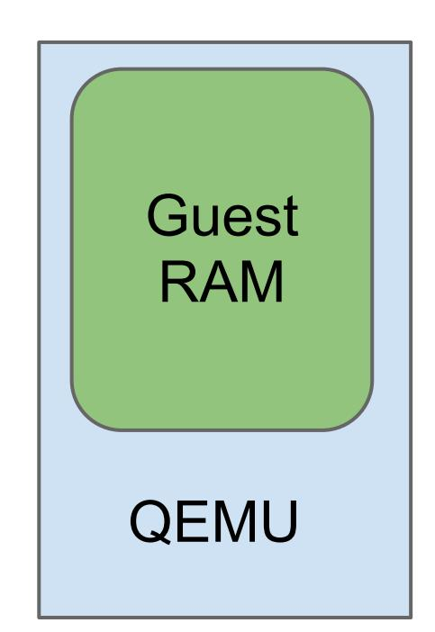

# **QEMU Code Overview**

Architecture & internals tour

## **Covered topics**

Enough details about QEMU to:

- Understand how components fit together
- Build and start contributing
- Debug and troubleshoot

Too little time to step through source code, follow code references if you want to know more

## **What is QEMU?**

Emulates x86, ARM, PowerPC, and other machines

Used for virtualization with KVM and Xen

Written in C, runs on POSIX and Windows hosts

Code at qemu-project.org under GPLv2

# **External interfaces**

Interacting with the outside world

## **Command-line options**

Guest is defined on command-line:

```
qemu -m 1024 \
 -machine accel=kvm \
 -hda web-server.img
```

man qemu for most options

See qemu-options.hx and vl.c:main() for implementation

## **QMP monitor**

JSON RPC-like API for managing QEMU:

- Hotplug devices
- Stop/continue guest
- Query device information
- etc

Write custom scripts with QMP/qmp.py

See qapi-schema.json and QMP/

## **HMP monitor**

Text-based interface for managing QEMU

Superseded by QMP but handy for interactive sessions

See hmp-commands.hx

## **User interfaces**

Remote UIs include VNC and SPICE

Local UIs include GTK and SDL

See ui/

## **Logging**

Errors and warnings go to the monitor, if currently running a command

Otherwise they are printed to stderr

# **Architecture**

How it fits together

## **QEMU process model**



QEMU is a userspace process

QEMU owns guest RAM

Each KVM vCPU is a thread

Host kernel scheduler decides when QEMU and vCPUs run

Can use ps(1), nice(1), cgroups

Host Kernel

## **Main loop**

QEMU is event-driven, has async APIs for:

- File descriptor is readable or writeable
- Timer expiration
- Deferred work

Global mutex protects QEMU code

- No need to synchronize explicitly
- Gradually being removed to improve scalability

See include/qemu/main-loop.h

## **Architecture summary**

#### Main loop

- Monitor
- UI
- Host I/O completion
- Deferred work
- Timers

#### vCPU #0

- Run guest code
- Device emulation

### vCPU #1

- Run guest code
- Device emulation

### Host kernel

KVM, host I/O, scheduling, resource limits

# **Device emulation**

Implementing guest hardware

## **Hardware emulation model**

### *Accelerators* run guest code:

- KVM uses hardware assist (VMX/SVM)
- TCG does binary translation

### *Devices* implement guest hardware:

- See hw/ for code
- List available devices: qemu -device \?

## **KVM accelerator pseudo-code**

```
open("/dev/kvm")
ioctl(KVM_CREATE_VM) 
ioctl(KVM_CREATE_VCPU)
for (;;) {
  ioctl(KVM_RUN)
  switch (exit_reason) {
  case KVM_EXIT_IO: /* ... */
  case KVM_EXIT_HLT: /* ... */
  }
}
```

## **Guest/host device split**

*Guest devices* simulate real hardware

- Net example: e1000 PCI adapter
- Disk example: virtio-blk device

*Host devices* implement I/O

- Net example: tap device
- Disk example: GlusterFS backend

This allows flexible guest/host device pairing

## **Guest device emulation**

Devices have memory or I/O regions Must implement read/write handler functions

Devices can raise interrupts to notify guest

Inspect devices using info qtree

Inspect memory regions using info mtree

# **Development**

Contributing to QEMU

git clone git://git.qemu-project.org/qemu.git

## **Build process**

./configure shell script detects library dependencies

Check ./configure output to confirm optional features are enabled

Only build x86\_64 guest support with --targetlist=x86\_64-softmmu

## **Contributing**

Specifications and documentation, see docs/

Read CODING\_STYLE and HACKING

Use scripts/checkpatch.pl to scan your patches

### More info:

http://qemu-project.org/Contribute/SubmitAPatch

## **Where to find out more**

More QEMU architecture overview on my blog: http://goo.gl/sdaVV

Read the code, documentation is sparse

Mailing list: qemu-devel@nongnu.org

IRC: #qemu on irc.oftc.net