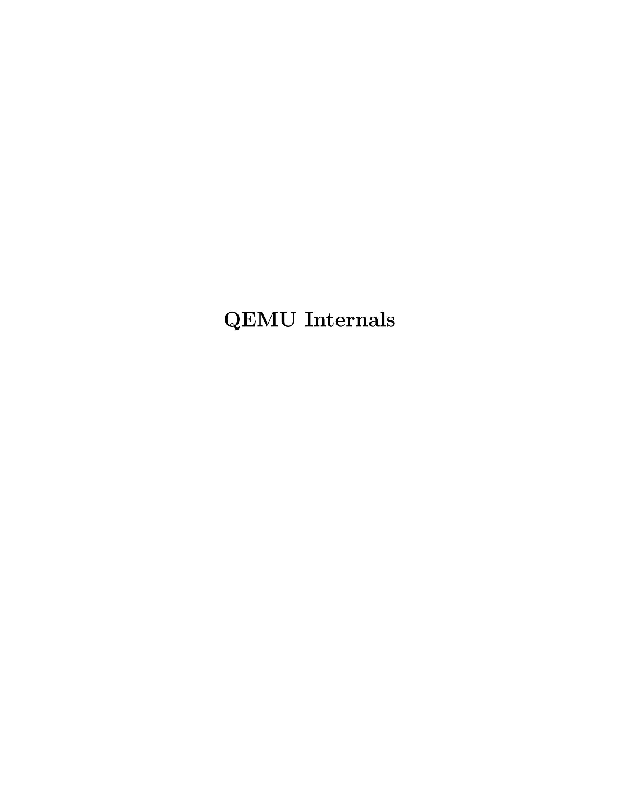

# Table of Contents

| 1 |      | Introduction  1                                    |   |
|---|------|----------------------------------------------------------|---|
|   | 1.1  | Features                                                 | 1 |
|   | 1.2  | x86 and x86-64 emulation                                 | 2 |
|   | 1.3  | ARM emulation                                         | 2 |
|   | 1.4  | MIPS emulation                                        | 2 |
|   | 1.5  | PowerPC emulation                                        | 2 |
|   | 1.6  | Sparc32 and Sparc64 emulation                         | 2 |
|   | 1.7  | Xtensa emulation                                      | 3 |
|   | 1.8  | Other CPU emulation                                   | 3 |
| 2 |      | QEMU Internals  4                                  |   |
|   | 2.1  | QEMU compared to other emulators                         | 4 |
|   | 2.2  | Portable dynamic translation                          | 4 |
|   | 2.3  | Condition code optimisations                          | 5 |
|   | 2.4  | CPU state optimisations                                  | 5 |
|   | 2.5  | Translation cache                                     | 5 |
|   | 2.6  | Direct block chaining                                 | 5 |
|   | 2.7  | Self-modifying code and translated code invalidation  | 6 |
|   | 2.8  | Exception support                                        | 6 |
|   | 2.9  | MMU emulation                                         | 6 |
|   | 2.10 | Device emulation                                      | 6 |
|   | 2.11 | Hardware interrupts                                   | 7 |
|   | 2.12 | User emulation specific details                       | 7 |
|   |      | 2.12.1 Linux system call translation               | 7 |
|   |      | 2.12.2 Linux signals                               | 7 |
|   |      | 2.12.3 clone() system call and threads             | 8 |
|   |      | 2.12.4 Self-virtualization                            | 8 |
|   | 2.13 | Bibliography                                          | 8 |
| 3 |      | Regression Tests  9                                |   |
|   |      |                                                          |   |
|   | 3.1  |  test-i386                                            | 9 |
|   | 3.2  |  linux-test                                           | 9 |
| 4 |      | Index  10                                          |   |

# 1 Introduction

### 1.1 Features

QEMU is a FAST! processor emulator using a portable dynamic translator. QEMU has two operating modes:

- − Full system emulation. In this mode (full platform virtualization), QEMU emulates a full system (usually a PC), including a processor and various peripherals. It can be used to launch several different Operating Systems at once without rebooting the host machine or to debug system code.
- − User mode emulation. In this mode (application level virtualization), QEMU can launch processes compiled for one CPU on another CPU, however the Operating Systems must match. This can be used for example to ease cross-compilation and crossdebugging.

As QEMU requires no host kernel driver to run, it is very safe and easy to use. QEMU generic features:

- User space only or full system emulation.
- Using dynamic translation to native code for reasonable speed.
- Working on x86, x86 64 and PowerPC32/64 hosts. Being tested on ARM, HPPA, Sparc32 and Sparc64. Previous versions had some support for Alpha and S390 hosts, but TCG (see below) doesn't support those yet.
- Self-modifying code support.
- Precise exceptions support.
- Floating point library supporting both full software emulation and native host FPU instructions.

QEMU user mode emulation features:

- Generic Linux system call converter, including most ioctls.
- clone() emulation using native CPU clone() to use Linux scheduler for threads.
- Accurate signal handling by remapping host signals to target signals.

Linux user emulator (Linux host only) can be used to launch the Wine Windows API emulator (<http://www.winehq.org>). A BSD user emulator for BSD hosts is under development. It would also be possible to develop a similar user emulator for Solaris.

QEMU full system emulation features:

- QEMU uses a full software MMU for maximum portability.
- QEMU can optionally use an in-kernel accelerator, like kvm. The accelerators execute some of the guest code natively, while continuing to emulate the rest of the machine.
- Various hardware devices can be emulated and in some cases, host devices (e.g. serial and parallel ports, USB, drives) can be used transparently by the guest Operating System. Host device passthrough can be used for talking to external physical peripherals (e.g. a webcam, modem or tape drive).
- Symmetric multiprocessing (SMP) even on a host with a single CPU. On a SMP host system, QEMU can use only one CPU fully due to difficulty in implementing atomic memory accesses efficiently.

### 1.2 x86 and x86-64 emulation

QEMU x86 target features:

- The virtual x86 CPU supports 16 bit and 32 bit addressing with segmentation. LDT/GDT and IDT are emulated. VM86 mode is also supported to run DOSEMU. There is some support for MMX/3DNow!, SSE, SSE2, SSE3, SSSE3, and SSE4 as well as x86-64 SVM.
- Support of host page sizes bigger than 4KB in user mode emulation.
- QEMU can emulate itself on x86.
- An extensive Linux x86 CPU test program is included tests/test-i386. It can be used to test other x86 virtual CPUs.

#### Current QEMU limitations:

- Limited x86-64 support.
- IPC syscalls are missing.
- The x86 segment limits and access rights are not tested at every memory access (yet). Hopefully, very few OSes seem to rely on that for normal use.

### 1.3 ARM emulation

- Full ARM 7 user emulation.
- NWFPE FPU support included in user Linux emulation.
- Can run most ARM Linux binaries.

### 1.4 MIPS emulation

- The system emulation allows full MIPS32/MIPS64 Release 2 emulation, including privileged instructions, FPU and MMU, in both little and big endian modes.
- The Linux userland emulation can run many 32 bit MIPS Linux binaries.

#### Current QEMU limitations:

- Self-modifying code is not always handled correctly.
- 64 bit userland emulation is not implemented.
- The system emulation is not complete enough to run real firmware.
- The watchpoint debug facility is not implemented.

### 1.5 PowerPC emulation

- Full PowerPC 32 bit emulation, including privileged instructions, FPU and MMU.
- Can run most PowerPC Linux binaries.

## 1.6 Sparc32 and Sparc64 emulation

• Full SPARC V8 emulation, including privileged instructions, FPU and MMU. SPARC V9 emulation includes most privileged and VIS instructions, FPU and I/D MMU. Alignment is fully enforced.

• Can run most 32-bit SPARC Linux binaries, SPARC32PLUS Linux binaries and some 64-bit SPARC Linux binaries.

Current QEMU limitations:

- IPC syscalls are missing.
- Floating point exception support is buggy.
- Atomic instructions are not correctly implemented.
- There are still some problems with Sparc64 emulators.

### 1.7 Xtensa emulation

- Core Xtensa ISA emulation, including most options: code density, loop, extended L32R, 16- and 32-bit multiplication, 32-bit division, MAC16, miscellaneous operations, boolean, FP coprocessor, coprocessor context, debug, multiprocessor synchronization, conditional store, exceptions, relocatable vectors, unaligned exception, interrupts (including high priority and timer), hardware alignment, region protection, region translation, MMU, windowed registers, thread pointer, processor ID.
- Not implemented options: data/instruction cache (including cache prefetch and locking), XLMI, processor interface. Also options not covered by the core ISA (e.g. FLIX, wide branches) are not implemented.
- Can run most Xtensa Linux binaries.
- New core configuration that requires no additional instructions may be created from overlay with minimal amount of hand-written code.

### 1.8 Other CPU emulation

In addition to the above, QEMU supports emulation of other CPUs with varying levels of success. These are:

- Alpha
- CRIS
- M68k
- SH4

# 2 QEMU Internals

### 2.1 QEMU compared to other emulators

Like bochs [1], QEMU emulates an x86 CPU. But QEMU is much faster than bochs as it uses dynamic compilation. Bochs is closely tied to x86 PC emulation while QEMU can emulate several processors.

Like Valgrind [2], QEMU does user space emulation and dynamic translation. Valgrind is mainly a memory debugger while QEMU has no support for it (QEMU could be used to detect out of bound memory accesses as Valgrind, but it has no support to track uninitialised data as Valgrind does). The Valgrind dynamic translator generates better code than QEMU (in particular it does register allocation) but it is closely tied to an x86 host and target and has no support for precise exceptions and system emulation.

EM86 [3] is the closest project to user space QEMU (and QEMU still uses some of its code, in particular the ELF file loader). EM86 was limited to an alpha host and used a proprietary and slow interpreter (the interpreter part of the FX!32 Digital Win32 code translator [4]).

TWIN from Willows Software was a Windows API emulator like Wine. It is less accurate than Wine but includes a protected mode x86 interpreter to launch x86 Windows executables. Such an approach has greater potential because most of the Windows API is executed natively but it is far more difficult to develop because all the data structures and function parameters exchanged between the API and the x86 code must be converted.

User mode Linux [5] was the only solution before QEMU to launch a Linux kernel as a process while not needing any host kernel patches. However, user mode Linux requires heavy kernel patches while QEMU accepts unpatched Linux kernels. The price to pay is that QEMU is slower.

The Plex86 [6] PC virtualizer is done in the same spirit as the now obsolete qemu-fast system emulator. It requires a patched Linux kernel to work (you cannot launch the same kernel on your PC), but the patches are really small. As it is a PC virtualizer (no emulation is done except for some privileged instructions), it has the potential of being faster than QEMU. The downside is that a complicated (and potentially unsafe) host kernel patch is needed.

The commercial PC Virtualizers (VMWare [7], VirtualPC [8]) are faster than QEMU (without virtualization), but they all need specific, proprietary and potentially unsafe host drivers. Moreover, they are unable to provide cycle exact simulation as an emulator can.

VirtualBox [9], Xen [10] and KVM [11] are based on QEMU. QEMU-SystemC [12] uses QEMU to simulate a system where some hardware devices are developed in SystemC.

## 2.2 Portable dynamic translation

QEMU is a dynamic translator. When it first encounters a piece of code, it converts it to the host instruction set. Usually dynamic translators are very complicated and highly CPU dependent. QEMU uses some tricks which make it relatively easily portable and simple while achieving good performances.

After the release of version 0.9.1, QEMU switched to a new method of generating code, Tiny Code Generator or TCG. TCG relaxes the dependency on the exact version of the compiler used. The basic idea is to split every target instruction into a couple of RISClike TCG ops (see target-i386/translate.c). Some optimizations can be performed at this stage, including liveness analysis and trivial constant expression evaluation. TCG ops are then implemented in the host CPU back end, also known as TCG target (see tcg/i386/tcg-target.inc.c). For more information, please take a look at tcg/README.

### 2.3 Condition code optimisations

Lazy evaluation of CPU condition codes (EFLAGS register on x86) is important for CPUs where every instruction sets the condition codes. It tends to be less important on conventional RISC systems where condition codes are only updated when explicitly requested. On Sparc64, costly update of both 32 and 64 bit condition codes can be avoided with lazy evaluation.

Instead of computing the condition codes after each x86 instruction, QEMU just stores one operand (called CC\_SRC), the result (called CC\_DST) and the type of operation (called CC\_ OP). When the condition codes are needed, the condition codes can be calculated using this information. In addition, an optimized calculation can be performed for some instruction types like conditional branches.

CC\_OP is almost never explicitly set in the generated code because it is known at translation time.

The lazy condition code evaluation is used on x86, m68k, cris and Sparc. ARM uses a simplified variant for the N and Z flags.

### 2.4 CPU state optimisations

The target CPUs have many internal states which change the way it evaluates instructions. In order to achieve a good speed, the translation phase considers that some state information of the virtual CPU cannot change in it. The state is recorded in the Translation Block (TB). If the state changes (e.g. privilege level), a new TB will be generated and the previous TB won't be used anymore until the state matches the state recorded in the previous TB. For example, if the SS, DS and ES segments have a zero base, then the translator does not even generate an addition for the segment base.

[The FPU stack pointer register is not handled that way yet].

### 2.5 Translation cache

A 32 MByte cache holds the most recently used translations. For simplicity, it is completely flushed when it is full. A translation unit contains just a single basic block (a block of x86 instructions terminated by a jump or by a virtual CPU state change which the translator cannot deduce statically).

### 2.6 Direct block chaining

After each translated basic block is executed, QEMU uses the simulated Program Counter (PC) and other cpu state information (such as the CS segment base value) to find the next basic block.

In order to accelerate the most common cases where the new simulated PC is known, QEMU can patch a basic block so that it jumps directly to the next one.

The most portable code uses an indirect jump. An indirect jump makes it easier to make the jump target modification atomic. On some host architectures (such as x86 or PowerPC), the JUMP opcode is directly patched so that the block chaining has no overhead.

### 2.7 Self-modifying code and translated code invalidation

Self-modifying code is a special challenge in x86 emulation because no instruction cache invalidation is signaled by the application when code is modified.

When translated code is generated for a basic block, the corresponding host page is write protected if it is not already read-only. Then, if a write access is done to the page, Linux raises a SEGV signal. QEMU then invalidates all the translated code in the page and enables write accesses to the page.

Correct translated code invalidation is done efficiently by maintaining a linked list of every translated block contained in a given page. Other linked lists are also maintained to undo direct block chaining.

On RISC targets, correctly written software uses memory barriers and cache flushes, so some of the protection above would not be necessary. However, QEMU still requires that the generated code always matches the target instructions in memory in order to handle exceptions correctly.

### 2.8 Exception support

longjmp() is used when an exception such as division by zero is encountered.

The host SIGSEGV and SIGBUS signal handlers are used to get invalid memory accesses. The simulated program counter is found by retranslating the corresponding basic block and by looking where the host program counter was at the exception point.

The virtual CPU cannot retrieve the exact EFLAGS register because in some cases it is not computed because of condition code optimisations. It is not a big concern because the emulated code can still be restarted in any cases.

### 2.9 MMU emulation

For system emulation QEMU supports a soft MMU. In that mode, the MMU virtual to physical address translation is done at every memory access. QEMU uses an address translation cache to speed up the translation.

In order to avoid flushing the translated code each time the MMU mappings change, QEMU uses a physically indexed translation cache. It means that each basic block is indexed with its physical address.

When MMU mappings change, only the chaining of the basic blocks is reset (i.e. a basic block can no longer jump directly to another one).

### 2.10 Device emulation

Systems emulated by QEMU are organized by boards. At initialization phase, each board instantiates a number of CPUs, devices, RAM and ROM. Each device in turn can assign I/O ports or memory areas (for MMIO) to its handlers. When the emulation starts, an access to the ports or MMIO memory areas assigned to the device causes the corresponding handler to be called.

RAM and ROM are handled more optimally, only the offset to the host memory needs to be added to the guest address.

The video RAM of VGA and other display cards is special: it can be read or written directly like RAM, but write accesses cause the memory to be marked with VGA DIRTY flag as well.

QEMU supports some device classes like serial and parallel ports, USB, drives and network devices, by providing APIs for easier connection to the generic, higher level implementations. The API hides the implementation details from the devices, like native device use or advanced block device formats like QCOW.

Usually the devices implement a reset method and register support for saving and loading of the device state. The devices can also use timers, especially together with the use of bottom halves (BHs).

### 2.11 Hardware interrupts

In order to be faster, QEMU does not check at every basic block if a hardware interrupt is pending. Instead, the user must asynchronously call a specific function to tell that an interrupt is pending. This function resets the chaining of the currently executing basic block. It ensures that the execution will return soon in the main loop of the CPU emulator. Then the main loop can test if the interrupt is pending and handle it.

### 2.12 User emulation specific details

#### 2.12.1 Linux system call translation

QEMU includes a generic system call translator for Linux. It means that the parameters of the system calls can be converted to fix the endianness and 32/64 bit issues. The IOCTLs are converted with a generic type description system (see ioctls.h and thunk.c).

QEMU supports host CPUs which have pages bigger than 4KB. It records all the mappings the process does and try to emulated the mmap() system calls in cases where the host mmap() call would fail because of bad page alignment.

#### 2.12.2 Linux signals

Normal and real-time signals are queued along with their information (siginfo\_t) as it is done in the Linux kernel. Then an interrupt request is done to the virtual CPU. When it is interrupted, one queued signal is handled by generating a stack frame in the virtual CPU as the Linux kernel does. The sigreturn() system call is emulated to return from the virtual signal handler.

Some signals (such as SIGALRM) directly come from the host. Other signals are synthesized from the virtual CPU exceptions such as SIGFPE when a division by zero is done (see main.c:cpu\_loop()).

The blocked signal mask is still handled by the host Linux kernel so that most signal system calls can be redirected directly to the host Linux kernel. Only the sigaction() and sigreturn() system calls need to be fully emulated (see signal.c).

#### 2.12.3 clone() system call and threads

The Linux clone() system call is usually used to create a thread. QEMU uses the host clone() system call so that real host threads are created for each emulated thread. One virtual CPU instance is created for each thread.

The virtual x86 CPU atomic operations are emulated with a global lock so that their semantic is preserved.

Note that currently there are still some locking issues in QEMU. In particular, the translated cache flush is not protected yet against reentrancy.

#### 2.12.4 Self-virtualization

QEMU was conceived so that ultimately it can emulate itself. Although it is not very useful, it is an important test to show the power of the emulator.

Achieving self-virtualization is not easy because there may be address space conflicts. QEMU user emulators solve this problem by being an executable ELF shared object as the ld-linux.so ELF interpreter. That way, it can be relocated at load time.

### 2.13 Bibliography

- [1] <http://bochs.sourceforge.net/>, the Bochs IA-32 Emulator Project, by Kevin Lawton et al.
- [2] <http://www.valgrind.org/>, Valgrind, an open-source memory debugger for GNU/Linux.
- [3] [http://ftp.dreamtime.org/pub/linux/Linux-Alpha/em86/v0.2/docs/](http://ftp.dreamtime.org/pub/linux/Linux-Alpha/em86/v0.2/docs/em86.html) [em86.html](http://ftp.dreamtime.org/pub/linux/Linux-Alpha/em86/v0.2/docs/em86.html), the EM86 x86 emulator on Alpha-Linux.
- [4] [http: / / www . usenix . org / publications / library / proceedings /](http://www.usenix.org/publications/library/proceedings/usenix-nt97/full_papers/chernoff/chernoff.pdf) [usenix-nt97 / full\\_papers / chernoff / chernoff . pdf](http://www.usenix.org/publications/library/proceedings/usenix-nt97/full_papers/chernoff/chernoff.pdf), DIGITAL FX!32: Running 32-Bit x86 Applications on Alpha NT, by Anton Chernoff and Ray Hookway.
- [5] <http://user-mode-linux.sourceforge.net/>, The User-mode Linux Kernel.
- [6] <http://www.plex86.org/>, The new Plex86 project.
- [7] <http://www.vmware.com/>, The VMWare PC virtualizer.
- [8] <https://www.microsoft.com/download/details.aspx?id=3702>, The VirtualPC PC virtualizer.
- [9] <http://virtualbox.org/>, The VirtualBox PC virtualizer.
- [10] <http://www.xen.org/>, The Xen hypervisor.
- [11] <http://www.linux-kvm.org/>, Kernel Based Virtual Machine (KVM).
- [12] [http: / / www . greensocs . com / projects / QEMUSystemC](http://www.greensocs.com/projects/QEMUSystemC), QEMU-SystemC, a hardware co-simulator.

# 3 Regression Tests

In the directory tests/, various interesting testing programs are available. They are used for regression testing.

### 3.1 test-i386

This program executes most of the 16 bit and 32 bit x86 instructions and generates a text output. It can be compared with the output obtained with a real CPU or another emulator. The target make test runs this program and a diff on the generated output.

The Linux system call modify\_ldt() is used to create x86 selectors to test some 16 bit addressing and 32 bit with segmentation cases.

The Linux system call vm86() is used to test vm86 emulation.

Various exceptions are raised to test most of the x86 user space exception reporting.

### 3.2 linux-test

This program tests various Linux system calls. It is used to verify that the system call parameters are correctly converted between target and host CPUs.

# 4 Index

(Index is nonexistent)