Russ Cox Frans Kaashoek Robert Morris

August 31, 2020

# Contents

| 1 |      | Operating system interfaces                  | 9  |
|---|------|----------------------------------------------|----|
|   | 1.1  | Processes and memory<br>                     | 10 |
|   | 1.2  | I/O and File descriptors                     | 13 |
|   | 1.3  | Pipes                                        | 15 |
|   | 1.4  | File system<br>                              | 17 |
|   | 1.5  | Real world                                   | 19 |
|   | 1.6  | Exercises<br>                                | 20 |
| 2 |      | Operating system organization                | 21 |
|   | 2.1  | Abstracting physical resources<br>           | 22 |
|   | 2.2  | User mode, supervisor mode, and system calls | 22 |
|   | 2.3  | Kernel organization<br>                      | 23 |
|   | 2.4  | Code: xv6 organization<br>                   | 24 |
|   | 2.5  | Process overview<br>                         | 24 |
|   | 2.6  | Code: starting xv6 and the first process     | 27 |
|   | 2.7  | Real world                                   | 28 |
|   | 2.8  | Exercises<br>                                | 28 |
| 3 |      | Page tables                                  | 29 |
|   | 3.1  | Paging hardware<br>                          | 29 |
|   | 3.2  | Kernel address space<br>                     | 31 |
|   | 3.3  | Code: creating an address space<br>          | 33 |
|   | 3.4  | Physical memory allocation                   | 34 |
|   | 3.5  | Code: Physical memory allocator              | 34 |
|   | 3.6  | Process address space                        | 35 |
|   | 3.7  | Code: sbrk                                   | 36 |
|   | 3.8  | Code: exec                                   | 37 |
|   | 3.9  | Real world                                   | 38 |
|   | 3.10 | Exercises<br>                                | 39 |
| 4 |      | Traps and system calls                       | 41 |
|   |      |                                              |    |
|   | 4.1  | RISC-V trap machinery                        | 42 |

|   | 4.3     | Code: Calling system calls<br>   | 44 |
|---|---------|----------------------------------|----|
|   | 4.4     | Code: System call arguments<br>  | 45 |
|   | 4.5     | Traps from kernel space          | 46 |
|   | 4.6     | Page-fault exceptions<br>        | 46 |
|   | 4.7     | Real world                       | 48 |
|   | 4.8     | Exercises<br>                    | 48 |
| 5 |         | Interrupts and device drivers    | 49 |
|   | 5.1     | Code: Console input<br>          | 49 |
|   | 5.2     | Code: Console output             | 50 |
|   | 5.3     | Concurrency in drivers<br>       | 51 |
|   | 5.4     | Timer interrupts                 | 51 |
|   | 5.5     | Real world                       | 52 |
|   | 5.6     | Exercises<br>                    | 53 |
| 6 | Locking |                                  | 55 |
|   | 6.1     | Race conditions<br>              | 56 |
|   | 6.2     | Code: Locks                      | 58 |
|   | 6.3     | Code: Using locks                | 60 |
|   | 6.4     | Deadlock and lock ordering       | 60 |
|   | 6.5     | Locks and interrupt handlers<br> | 62 |
|   | 6.6     | Instruction and memory ordering  | 62 |
|   | 6.7     | Sleep locks<br>                  | 63 |
|   | 6.8     | Real world                       | 64 |
|   | 6.9     | Exercises<br>                    | 64 |
| 7 |         | Scheduling                       | 67 |
|   | 7.1     | Multiplexing<br>                 | 67 |
|   | 7.2     | Code: Context switching<br>      | 68 |
|   | 7.3     | Code: Scheduling<br>             | 69 |
|   | 7.4     | Code: mycpu and myproc           | 70 |
|   | 7.5     | Sleep and wakeup                 | 71 |
|   | 7.6     | Code: Sleep and wakeup<br>       | 74 |
|   | 7.7     | Code: Pipes<br>                  | 75 |
|   | 7.8     | Code: Wait, exit, and kill<br>   | 76 |
|   | 7.9     | Real world                       | 77 |
|   | 7.10    | Exercises<br>                    | 79 |
|   |         |                                  |    |
| 8 |         | File system                      | 81 |
|   | 8.1     | Overview<br>                     | 81 |
|   | 8.2     | Buffer cache layer               | 82 |
|   | 8.3     | Code: Buffer cache<br>           | 83 |
|   | 8.4     | Logging layer<br>                | 84 |

|   | 10 Summary |                           | 103 |
|---|------------|---------------------------|-----|
|   | 9.5        | Exercises<br>             | 102 |
|   | 9.4        | Parallelism<br>           | 101 |
|   | 9.3        | No locks at all           | 100 |
|   | 9.2        | Lock-like patterns        | 100 |
|   | 9.1        | Locking patterns<br>      | 99  |
| 9 |            | Concurrency revisited     | 99  |
|   | 8.16       | Exercises<br>             | 96  |
|   | 8.15       | Real world                | 95  |
|   | 8.14       | Code: System calls<br>    | 94  |
|   | 8.13       | File descriptor layer     | 93  |
|   | 8.12       | Code: Path names          | 92  |
|   | 8.11       | Code: directory layer<br> | 91  |
|   | 8.10       | Code: Inode content       | 90  |
|   | 8.9        | Code: Inodes<br>          | 89  |
|   | 8.8        | Inode layer<br>           | 87  |
|   | 8.7        | Code: Block allocator     | 87  |
|   | 8.6        | Code: logging             | 86  |
|   | 8.5        | Log design<br>            | 85  |

# Foreword and acknowledgments

This is a draft text intended for a class on operating systems. It explains the main concepts of operating systems by studying an example kernel, named xv6. xv6 is modeled on Dennis Ritchie's and Ken Thompson's Unix Version 6 (v6) [\[14\]](#page-105-0). xv6 loosely follows the structure and style of v6, but is implemented in ANSI C [\[6\]](#page-104-0) for a multi-core RISC-V [\[12\]](#page-104-1).

This text should be read along with the source code for xv6, an approach inspired by John Lions' Commentary on UNIX 6th Edition [\[9\]](#page-104-2). See <https://pdos.csail.mit.edu/6.S081> for pointers to on-line resources for v6 and xv6, including several lab assignments using xv6.

We have used this text in 6.828 and 6.S081, the operating systems classes at MIT. We thank the faculty, teaching assistants, and students of those classes who have all directly or indirectly contributed to xv6. In particular, we would like to thank Adam Belay, Austin Clements, and Nickolai Zeldovich. Finally, we would like to thank people who emailed us bugs in the text or suggestions for improvements: Abutalib Aghayev, Sebastian Boehm, Anton Burtsev, Raphael Carvalho, Tej Chajed, Rasit Eskicioglu, Color Fuzzy, Giuseppe, Tao Guo, Naoki Hayama, Robert Hilderman, Wolfgang Keller, Austin Liew, Pavan Maddamsetti, Jacek Masiulaniec, Michael McConville, m3hm00d, miguelgvieira, Mark Morrissey, Harry Pan, Askar Safin, Salman Shah, Adeodato Simó, Ruslan Savchenko, Pawel Szczurko, Warren Toomey, tyfkda, tzerbib, Xi Wang, and Zou Chang Wei.

If you spot errors or have suggestions for improvement, please send email to Frans Kaashoek and Robert Morris (kaashoek,rtm@csail.mit.edu).

# <span id="page-8-2"></span><span id="page-8-0"></span>Chapter 1

# Operating system interfaces

The job of an operating system is to share a computer among multiple programs and to provide a more useful set of services than the hardware alone supports. An operating system manages and abstracts the low-level hardware, so that, for example, a word processor need not concern itself with which type of disk hardware is being used. An operating system shares the hardware among multiple programs so that they run (or appear to run) at the same time. Finally, operating systems provide controlled ways for programs to interact, so that they can share data or work together.

An operating system provides services to user programs through an interface. Designing a good interface turns out to be difficult. On the one hand, we would like the interface to be simple and narrow because that makes it easier to get the implementation right. On the other hand, we may be tempted to offer many sophisticated features to applications. The trick in resolving this tension is to design interfaces that rely on a few mechanisms that can be combined to provide much generality.

This book uses a single operating system as a concrete example to illustrate operating system concepts. That operating system, xv6, provides the basic interfaces introduced by Ken Thompson and Dennis Ritchie's Unix operating system [\[14\]](#page-105-0), as well as mimicking Unix's internal design. Unix provides a narrow interface whose mechanisms combine well, offering a surprising degree of generality. This interface has been so successful that modern operating systems—BSD, Linux, Mac OS X, Solaris, and even, to a lesser extent, Microsoft Windows—have Unix-like interfaces. Understanding xv6 is a good start toward understanding any of these systems and many others.

As Figure [1.1](#page-9-1) shows, xv6 takes the traditional form of a *kernel*, a special program that provides services to running programs. Each running program, called a *process*, has memory containing instructions, data, and a stack. The instructions implement the program's computation. The data are the variables on which the computation acts. The stack organizes the program's procedure calls. A given computer typically has many processes but only a single kernel.

When a process needs to invoke a kernel service, it invokes a *system call*, one of the calls in the operating system's interface. The system call enters the kernel; the kernel performs the service and returns. Thus a process alternates between executing in *user space* and *kernel space*.

The kernel uses the hardware protection mechanisms provided by a CPU[1](#page-8-1) to ensure that each

<span id="page-8-1"></span><sup>1</sup>This text generally refers to the hardware element that executes a computation with the term *CPU*, an acronym for central processing unit. Other documentation (e.g., the RISC-V specification) also uses the words processor, core, and hart instead of CPU.

<span id="page-9-2"></span>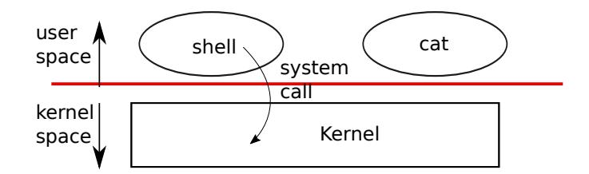

<span id="page-9-1"></span>Figure 1.1: A kernel and two user processes.

process executing in user space can access only its own memory. The kernel executes with the hardware privileges required to implement these protections; user programs execute without those privileges. When a user program invokes a system call, the hardware raises the privilege level and starts executing a pre-arranged function in the kernel.

The collection of system calls that a kernel provides is the interface that user programs see. The xv6 kernel provides a subset of the services and system calls that Unix kernels traditionally offer. Figure [1.2](#page-10-0) lists all of xv6's system calls.

The rest of this chapter outlines xv6's services—processes, memory, file descriptors, pipes, and a file system—and illustrates them with code snippets and discussions of how the *shell*, Unix's command-line user interface, uses them. The shell's use of system calls illustrates how carefully they have been designed.

The shell is an ordinary program that reads commands from the user and executes them. The fact that the shell is a user program, and not part of the kernel, illustrates the power of the system call interface: there is nothing special about the shell. It also means that the shell is easy to replace; as a result, modern Unix systems have a variety of shells to choose from, each with its own user interface and scripting features. The xv6 shell is a simple implementation of the essence of the Unix Bourne shell. Its implementation can be found at [\(user/sh.c:1\)](https://github.com/mit-pdos/xv6-riscv/blob/riscv//user/sh.c#L1).

#### <span id="page-9-0"></span>1.1 Processes and memory

An xv6 process consists of user-space memory (instructions, data, and stack) and per-process state private to the kernel. Xv6 *time-share*s processes: it transparently switches the available CPUs among the set of processes waiting to execute. When a process is not executing, xv6 saves its CPU registers, restoring them when it next runs the process. The kernel associates a process identifier, or PID, with each process.

A process may create a new process using the fork system call. Fork creates a new process, called the *child process*, with exactly the same memory contents as the calling process, called the *parent process*. Fork returns in both the parent and the child. In the parent, fork returns the child's PID; in the child, fork returns zero. For example, consider the following program fragment written in the C programming language [\[6\]](#page-104-0):

```
int pid = fork();
if(pid > 0){
  printf("parent: child=%d\n", pid);
```

<span id="page-10-1"></span>

| System call                           | Description                                                              |
|---------------------------------------|--------------------------------------------------------------------------|
| int fork()                            | Create a process, return child's PID.                                    |
| int exit(int status)                  | Terminate the current process; status reported to wait(). No return.     |
| int wait(int *status)                 | Wait for a child to exit; exit status in *status; returns child PID.     |
| int kill(int pid)                     | Terminate process PID. Returns 0, or -1 for error.                       |
| int getpid()                          | Return the current process's PID.                                        |
| int sleep(int n)                      | Pause for n clock ticks.                                                 |
| int exec(char *file, char *argv[])    | Load a file and execute it with arguments; only returns if error.        |
| char *sbrk(int n)                     | Grow process's memory by n bytes. Returns start of new memory.           |
| int open(char *file, int flags)       | Open a file; flags indicate read/write; returns an fd (file descriptor). |
| int write(int fd, char *buf, int n)   | Write n bytes from buf to file descriptor fd; returns n.                 |
| int read(int fd, char *buf, int n)    | Read n bytes into buf; returns number read; or 0 if end of file.         |
| int close(int fd)                     | Release open file fd.                                                    |
| int dup(int fd)                       | Return a new file descriptor referring to the same file as fd.           |
| int pipe(int p[])                     | Create a pipe, put read/write file descriptors in p[0] and p[1].         |
| int chdir(char *dir)                  | Change the current directory.                                            |
| int mkdir(char *dir)                  | Create a new directory.                                                  |
| int mknod(char *file, int, int)       | Create a device file.                                                    |
| int fstat(int fd, struct stat *st)    | Place info about an open file into *st.                                  |
| int stat(char *file, struct stat *st) | Place info about a named file into *st.                                  |
| int link(char *file1, char *file2)    | Create another name (file2) for the file file1.                          |
| int unlink(char *file)                | Remove a file.                                                           |

<span id="page-10-0"></span>Figure 1.2: Xv6 system calls. If not otherwise stated, these calls return 0 for no error, and -1 if there's an error.

```
pid = wait((int *) 0);
  printf("child %d is done\n", pid);
} else if(pid == 0){
  printf("child: exiting\n");
  exit(0);
} else {
  printf("fork error\n");
}
```

The exit system call causes the calling process to stop executing and to release resources such as memory and open files. Exit takes an integer status argument, conventionally 0 to indicate success and 1 to indicate failure. The wait system call returns the PID of an exited (or killed) child of the current process and copies the exit status of the child to the address passed to wait; if none of the caller's children has exited, wait waits for one to do so. If the caller has no children, wait immediately returns -1. If the parent doesn't care about the exit status of a child, it can pass a 0 address to wait.

In the example, the output lines

```
parent: child=1234
child: exiting
```

might come out in either order, depending on whether the parent or child gets to its printf call first. After the child exits, the parent's wait returns, causing the parent to print

```
parent: child 1234 is done
```

Although the child has the same memory contents as the parent initially, the parent and child are executing with different memory and different registers: changing a variable in one does not affect the other. For example, when the return value of wait is stored into pid in the parent process, it doesn't change the variable pid in the child. The value of pid in the child will still be zero.

The exec system call replaces the calling process's memory with a new memory image loaded from a file stored in the file system. The file must have a particular format, which specifies which part of the file holds instructions, which part is data, at which instruction to start, etc. xv6 uses the ELF format, which Chapter [3](#page-28-0) discusses in more detail. When exec succeeds, it does not return to the calling program; instead, the instructions loaded from the file start executing at the entry point declared in the ELF header. Exec takes two arguments: the name of the file containing the executable and an array of string arguments. For example:

```
char *argv[3];
argv[0] = "echo";
argv[1] = "hello";
argv[2] = 0;
exec("/bin/echo", argv);
printf("exec error\n");
```

This fragment replaces the calling program with an instance of the program /bin/echo running with the argument list echo hello. Most programs ignore the first element of the argument array, which is conventionally the name of the program.

The xv6 shell uses the above calls to run programs on behalf of users. The main structure of the shell is simple; see main [\(user/sh.c:145\)](https://github.com/mit-pdos/xv6-riscv/blob/riscv//user/sh.c#L145). The main loop reads a line of input from the user with getcmd. Then it calls fork, which creates a copy of the shell process. The parent calls wait, while the child runs the command. For example, if the user had typed "echo hello" to the shell, runcmd would have been called with "echo hello" as the argument. runcmd [\(user/sh.c:58\)](https://github.com/mit-pdos/xv6-riscv/blob/riscv//user/sh.c#L58) runs the actual command. For "echo hello", it would call exec [\(user/sh.c:78\)](https://github.com/mit-pdos/xv6-riscv/blob/riscv//user/sh.c#L78). If exec succeeds then the child will execute instructions from echo instead of runcmd. At some point echo will call exit, which will cause the parent to return from wait in main [\(user/sh.c:145\)](https://github.com/mit-pdos/xv6-riscv/blob/riscv//user/sh.c#L145).

You might wonder why fork and exec are not combined in a single call; we will see later that the shell exploits the separation in its implementation of I/O redirection. To avoid the wastefulness of creating a duplicate process and then immediately replacing it (with exec), operating kernels optimize the implementation of fork for this use case by using virtual memory techniques such as copy-on-write (see Section [4.6\)](#page-45-1).

Xv6 allocates most user-space memory implicitly: fork allocates the memory required for the child's copy of the parent's memory, and exec allocates enough memory to hold the executable <span id="page-12-1"></span>file. A process that needs more memory at run-time (perhaps for malloc) can call sbrk(n) to grow its data memory by n bytes; sbrk returns the location of the new memory.

### <span id="page-12-0"></span>1.2 I/O and File descriptors

A *file descriptor* is a small integer representing a kernel-managed object that a process may read from or write to. A process may obtain a file descriptor by opening a file, directory, or device, or by creating a pipe, or by duplicating an existing descriptor. For simplicity we'll often refer to the object a file descriptor refers to as a "file"; the file descriptor interface abstracts away the differences between files, pipes, and devices, making them all look like streams of bytes. We'll refer to input and output as *I/O*.

Internally, the xv6 kernel uses the file descriptor as an index into a per-process table, so that every process has a private space of file descriptors starting at zero. By convention, a process reads from file descriptor 0 (standard input), writes output to file descriptor 1 (standard output), and writes error messages to file descriptor 2 (standard error). As we will see, the shell exploits the convention to implement I/O redirection and pipelines. The shell ensures that it always has three file descriptors open [\(user/sh.c:151\)](https://github.com/mit-pdos/xv6-riscv/blob/riscv//user/sh.c#L151), which are by default file descriptors for the console.

The read and write system calls read bytes from and write bytes to open files named by file descriptors. The call read(fd, buf, n) reads at most n bytes from the file descriptor fd, copies them into buf, and returns the number of bytes read. Each file descriptor that refers to a file has an offset associated with it. Read reads data from the current file offset and then advances that offset by the number of bytes read: a subsequent read will return the bytes following the ones returned by the first read. When there are no more bytes to read, read returns zero to indicate the end of the file.

The call write(fd, buf, n) writes n bytes from buf to the file descriptor fd and returns the number of bytes written. Fewer than n bytes are written only when an error occurs. Like read, write writes data at the current file offset and then advances that offset by the number of bytes written: each write picks up where the previous one left off.

The following program fragment (which forms the essence of the program cat) copies data from its standard input to its standard output. If an error occurs, it writes a message to the standard error.

```
char buf[512];
int n;
for(;;){
  n = read(0, buf, sizeof buf);
  if(n == 0)
    break;
  if(n < 0){
    fprintf(2, "read error\n");
    exit(1);
  }
```

```
if(write(1, buf, n) != n){
    fprintf(2, "write error\n");
    exit(1);
  }
}
```

The important thing to note in the code fragment is that cat doesn't know whether it is reading from a file, console, or a pipe. Similarly cat doesn't know whether it is printing to a console, a file, or whatever. The use of file descriptors and the convention that file descriptor 0 is input and file descriptor 1 is output allows a simple implementation of cat.

The close system call releases a file descriptor, making it free for reuse by a future open, pipe, or dup system call (see below). A newly allocated file descriptor is always the lowestnumbered unused descriptor of the current process.

File descriptors and fork interact to make I/O redirection easy to implement. Fork copies the parent's file descriptor table along with its memory, so that the child starts with exactly the same open files as the parent. The system call exec replaces the calling process's memory but preserves its file table. This behavior allows the shell to implement *I/O redirection* by forking, reopening chosen file descriptors in the child, and then calling exec to run the new program. Here is a simplified version of the code a shell runs for the command cat < input.txt:

```
char *argv[2];
argv[0] = "cat";
argv[1] = 0;
if(fork() == 0) {
  close(0);
  open("input.txt", O_RDONLY);
  exec("cat", argv);
}
```

After the child closes file descriptor 0, open is guaranteed to use that file descriptor for the newly opened input.txt: 0 will be the smallest available file descriptor. Cat then executes with file descriptor 0 (standard input) referring to input.txt. The parent process's file descriptors are not changed by this sequence, since it modifies only the child's descriptors.

The code for I/O redirection in the xv6 shell works in exactly this way [\(user/sh.c:82\)](https://github.com/mit-pdos/xv6-riscv/blob/riscv//user/sh.c#L82). Recall that at this point in the code the shell has already forked the child shell and that runcmd will call exec to load the new program.

The second argument to open consists of a set of flags, expressed as bits, that control what open does. The possible values are defined in the file control (fcntl) header [\(kernel/fcntl.h:1-5\)](https://github.com/mit-pdos/xv6-riscv/blob/riscv//kernel/fcntl.h#L1-L5): O\_RDONLY, O\_WRONLY, O\_RDWR, O\_CREATE, and O\_TRUNC, which instruct open to open the file for reading, or for writing, or for both reading and writing, to create the file if it doesn't exist, and to truncate the file to zero length.

Now it should be clear why it is helpful that fork and exec are separate calls: between the two, the shell has a chance to redirect the child's I/O without disturbing the I/O setup of the main shell. One could instead imagine a hypothetical combined forkexec system call, but the options <span id="page-14-1"></span>for doing I/O redirection with such a call seem awkward. The shell could modify its own I/O setup before calling forkexec (and then un-do those modifications); or forkexec could take instructions for I/O redirection as arguments; or (least attractively) every program like cat could be taught to do its own I/O redirection.

Although fork copies the file descriptor table, each underlying file offset is shared between parent and child. Consider this example:

```
if(fork() == 0) {
  write(1, "hello ", 6);
  exit(0);
} else {
  wait(0);
  write(1, "world\n", 6);
}
```

At the end of this fragment, the file attached to file descriptor 1 will contain the data hello world. The write in the parent (which, thanks to wait, runs only after the child is done) picks up where the child's write left off. This behavior helps produce sequential output from sequences of shell commands, like (echo hello; echo world) >output.txt.

The dup system call duplicates an existing file descriptor, returning a new one that refers to the same underlying I/O object. Both file descriptors share an offset, just as the file descriptors duplicated by fork do. This is another way to write hello world into a file:

```
fd = dup(1);
write(1, "hello ", 6);
write(fd, "world\n", 6);
```

Two file descriptors share an offset if they were derived from the same original file descriptor by a sequence of fork and dup calls. Otherwise file descriptors do not share offsets, even if they resulted from open calls for the same file. Dup allows shells to implement commands like this: ls existing-file non-existing-file > tmp1 2>&1. The 2>&1 tells the shell to give the command a file descriptor 2 that is a duplicate of descriptor 1. Both the name of the existing file and the error message for the non-existing file will show up in the file tmp1. The xv6 shell doesn't support I/O redirection for the error file descriptor, but now you know how to implement it.

File descriptors are a powerful abstraction, because they hide the details of what they are connected to: a process writing to file descriptor 1 may be writing to a file, to a device like the console, or to a pipe.

#### <span id="page-14-0"></span>1.3 Pipes

A *pipe* is a small kernel buffer exposed to processes as a pair of file descriptors, one for reading and one for writing. Writing data to one end of the pipe makes that data available for reading from the other end of the pipe. Pipes provide a way for processes to communicate.

The following example code runs the program wc with standard input connected to the read end of a pipe.

```
int p[2];
char *argv[2];
argv[0] = "wc";
argv[1] = 0;
pipe(p);
if(fork() == 0) {
  close(0);
  dup(p[0]);
  close(p[0]);
  close(p[1]);
  exec("/bin/wc", argv);
} else {
  close(p[0]);
  write(p[1], "hello world\n", 12);
  close(p[1]);
}
```

The program calls pipe, which creates a new pipe and records the read and write file descriptors in the array p. After fork, both parent and child have file descriptors referring to the pipe. The child calls close and dup to make file descriptor zero refer to the read end of the pipe, closes the file descriptors in p, and calls exec to run wc. When wc reads from its standard input, it reads from the pipe. The parent closes the read side of the pipe, writes to the pipe, and then closes the write side.

If no data is available, a read on a pipe waits for either data to be written or for all file descriptors referring to the write end to be closed; in the latter case, read will return 0, just as if the end of a data file had been reached. The fact that read blocks until it is impossible for new data to arrive is one reason that it's important for the child to close the write end of the pipe before executing wc above: if one of wc 's file descriptors referred to the write end of the pipe, wc would never see end-of-file.

The xv6 shell implements pipelines such as grep fork sh.c | wc -l in a manner similar to the above code [\(user/sh.c:100\)](https://github.com/mit-pdos/xv6-riscv/blob/riscv//user/sh.c#L100). The child process creates a pipe to connect the left end of the pipeline with the right end. Then it calls fork and runcmd for the left end of the pipeline and fork and runcmd for the right end, and waits for both to finish. The right end of the pipeline may be a command that itself includes a pipe (e.g., a | b | c), which itself forks two new child processes (one for b and one for c). Thus, the shell may create a tree of processes. The leaves of this tree are commands and the interior nodes are processes that wait until the left and right children complete.

In principle, one could have the interior nodes run the left end of a pipeline, but doing so correctly would complicate the implementation. Consider making just the following modification: change sh.c to not fork for p->left and run runcmd(p->left) in the interior process. Then, for example, echo hi | wc won't produce output, because when echo hi exits in runcmd, the interior process exits and never calls fork to run the right end of the pipe. This <span id="page-16-1"></span>incorrect behavior could be fixed by not calling exit in runcmd for interior processes, but this fix complicates the code: now runcmd needs to know if it a interior process or not. Complications also arise when not forking for runcmd(p->right). For example, with just that modification, sleep 10 | echo hi will immediately print "hi" instead of after 10 seconds, because echo runs immediately and exits, not waiting for sleep to finish. Since the goal of the sh.c is to be as simple as possible, it doesn't try to avoid creating interior processes.

Pipes may seem no more powerful than temporary files: the pipeline

```
echo hello world | wc
```

could be implemented without pipes as

```
echo hello world >/tmp/xyz; wc </tmp/xyz
```

Pipes have at least four advantages over temporary files in this situation. First, pipes automatically clean themselves up; with the file redirection, a shell would have to be careful to remove /tmp/xyz when done. Second, pipes can pass arbitrarily long streams of data, while file redirection requires enough free space on disk to store all the data. Third, pipes allow for parallel execution of pipeline stages, while the file approach requires the first program to finish before the second starts. Fourth, if you are implementing inter-process communication, pipes' blocking reads and writes are more efficient than the non-blocking semantics of files.

#### <span id="page-16-0"></span>1.4 File system

The xv6 file system provides data files, which contain uninterpreted byte arrays, and directories, which contain named references to data files and other directories. The directories form a tree, starting at a special directory called the *root*. A *path* like /a/b/c refers to the file or directory named c inside the directory named b inside the directory named a in the root directory /. Paths that don't begin with / are evaluated relative to the calling process's *current directory*, which can be changed with the chdir system call. Both these code fragments open the same file (assuming all the directories involved exist):

```
chdir("/a");
chdir("b");
open("c", O_RDONLY);
open("/a/b/c", O_RDONLY);
```

The first fragment changes the process's current directory to /a/b; the second neither refers to nor changes the process's current directory.

There are system calls to create new files and directories: mkdir creates a new directory, open with the O\_CREATE flag creates a new data file, and mknod creates a new device file. This example illustrates all three:

```
mkdir("/dir");
fd = open("/dir/file", O_CREATE|O_WRONLY);
close(fd);
```

```
mknod("/console", 1, 1);
```

Mknod creates a special file that refers to a device. Associated with a device file are the major and minor device numbers (the two arguments to mknod), which uniquely identify a kernel device. When a process later opens a device file, the kernel diverts read and write system calls to the kernel device implementation instead of passing them to the file system.

A file's name is distinct from the file itself; the same underlying file, called an *inode*, can have multiple names, called *links*. Each link consists of an entry in a directory; the entry contains a file name and a reference to an inode. An inode holds *metadata* about a file, including its type (file or directory or device), its length, the location of the file's content on disk, and the number of links to a file.

The fstat system call retrieves information from the inode that a file descriptor refers to. It fills in a struct stat, defined in stat.h [\(kernel/stat.h\)](https://github.com/mit-pdos/xv6-riscv/blob/riscv//kernel/stat.h) as:

```
#define T_DIR 1 // Directory
#define T_FILE 2 // File
#define T_DEVICE 3 // Device
struct stat {
 int dev; // File system's disk device
 uint ino; // Inode number
 short type; // Type of file
 short nlink; // Number of links to file
 uint64 size; // Size of file in bytes
};
```

The link system call creates another file system name referring to the same inode as an existing file. This fragment creates a new file named both a and b.

```
open("a", O_CREATE|O_WRONLY);
link("a", "b");
```

Reading from or writing to a is the same as reading from or writing to b. Each inode is identified by a unique *inode number*. After the code sequence above, it is possible to determine that a and b refer to the same underlying contents by inspecting the result of fstat: both will return the same inode number (ino), and the nlink count will be set to 2.

The unlink system call removes a name from the file system. The file's inode and the disk space holding its content are only freed when the file's link count is zero and no file descriptors refer to it. Thus adding

```
unlink("a");
```

to the last code sequence leaves the inode and file content accessible as b. Furthermore,

```
fd = open("/tmp/xyz", O_CREATE|O_RDWR);
unlink("/tmp/xyz");
```

is an idiomatic way to create a temporary inode with no name that will be cleaned up when the process closes fd or exits.

Unix provides file utilities callable from the shell as user-level programs, for example mkdir, ln, and rm. This design allows anyone to extend the command-line interface by adding new userlevel programs. In hindsight this plan seems obvious, but other systems designed at the time of Unix often built such commands into the shell (and built the shell into the kernel).

One exception is cd, which is built into the shell [\(user/sh.c:160\)](https://github.com/mit-pdos/xv6-riscv/blob/riscv//user/sh.c#L160). cd must change the current working directory of the shell itself. If cd were run as a regular command, then the shell would fork a child process, the child process would run cd, and cd would change the *child* 's working directory. The parent's (i.e., the shell's) working directory would not change.

#### <span id="page-18-0"></span>1.5 Real world

Unix's combination of "standard" file descriptors, pipes, and convenient shell syntax for operations on them was a major advance in writing general-purpose reusable programs. The idea sparked a culture of "software tools" that was responsible for much of Unix's power and popularity, and the shell was the first so-called "scripting language." The Unix system call interface persists today in systems like BSD, Linux, and Mac OS X.

The Unix system call interface has been standardized through the Portable Operating System Interface (POSIX) standard. Xv6 is *not* POSIX compliant: it is missing many system calls (including basic ones such as lseek), and many of the system calls it does provide differ from the standard. Our main goals for xv6 are simplicity and clarity while providing a simple UNIX-like system-call interface. Several people have extended xv6 with a few more system calls and a simple C library in order to run basic Unix programs. Modern kernels, however, provide many more system calls, and many more kinds of kernel services, than xv6. For example, they support networking, windowing systems, user-level threads, drivers for many devices, and so on. Modern kernels evolve continuously and rapidly, and offer many features beyond POSIX.

Unix unified access to multiple types of resources (files, directories, and devices) with a single set of file-name and file-descriptor interfaces. This idea can be extended to more kinds of resources; a good example is Plan 9 [\[13\]](#page-104-3), which applied the "resources are files" concept to networks, graphics, and more. However, most Unix-derived operating systems have not followed this route.

The file system and file descriptors have been powerful abstractions. Even so, there are other models for operating system interfaces. Multics, a predecessor of Unix, abstracted file storage in a way that made it look like memory, producing a very different flavor of interface. The complexity of the Multics design had a direct influence on the designers of Unix, who tried to build something simpler.

Xv6 does not provide a notion of users or of protecting one user from another; in Unix terms, all xv6 processes run as root.

This book examines how xv6 implements its Unix-like interface, but the ideas and concepts apply to more than just Unix. Any operating system must multiplex processes onto the underlying hardware, isolate processes from each other, and provide mechanisms for controlled inter-process communication. After studying xv6, you should be able to look at other, more complex operating systems and see the concepts underlying xv6 in those systems as well.

#### <span id="page-19-0"></span>1.6 Exercises

1. Write a program that uses UNIX system calls to "ping-pong" a byte between two processes over a pair of pipes, one for each direction. Measure the program's performance, in exchanges per second.

# <span id="page-20-2"></span><span id="page-20-0"></span>Chapter 2

# Operating system organization

A key requirement for an operating system is to support several activities at once. For example, using the system call interface described in Chapter [1](#page-8-0) a process can start new processes with fork. The operating system must *time-share* the resources of the computer among these processes. For example, even if there are more processes than there are hardware CPUs, the operating system must ensure that all of the processes get a chance to execute. The operating system must also arrange for *isolation* between the processes. That is, if one process has a bug and malfunctions, it shouldn't affect processes that don't depend on the buggy process. Complete isolation, however, is too strong, since it should be possible for processes to intentionally interact; pipelines are an example. Thus an operating system must fulfill three requirements: multiplexing, isolation, and interaction.

This chapter provides an overview of how operating systems are organized to achieve these three requirements. It turns out there are many ways to do so, but this text focuses on mainstream designs centered around a *monolithic kernel*, which is used by many Unix operating systems. This chapter also provides an overview of an xv6 process, which is the unit of isolation in xv6, and the creation of the first process when xv6 starts.

Xv6 runs on a *multi-core*[1](#page-20-1) RISC-V microprocessor, and much of its low-level functionality (for example, its process implementation) is specific to RISC-V. RISC-V is a 64-bit CPU, and xv6 is written in "LP64" C, which means long (L) and pointers (P) in the C programming language are 64 bits, but int is 32-bit. This book assumes the reader has done a bit of machine-level programming on some architecture, and will introduce RISC-V-specific ideas as they come up. A useful reference for RISC-V is "The RISC-V Reader: An Open Architecture Atlas" [\[12\]](#page-104-1). The user-level ISA [\[2\]](#page-104-4) and the privileged architecture [\[1\]](#page-104-5) are the official specifications.

The CPU in a complete computer is surrounded by support hardware, much of it in the form of I/O interfaces. Xv6 is written for the support hardware simulated by qemu's "-machine virt" option. This includes RAM, a ROM containing boot code, a serial connection to the user's keyboard/screen, and a disk for storage.

<span id="page-20-1"></span><sup>1</sup>By "multi-core" this text means multiple CPUs that share memory but execute in parallel, each with its own set of registers. This text sometimes uses the term *multiprocessor* as a synonym for multi-core, though multiprocessor can also refer more specifically to a computer with several distinct processor chips.

#### <span id="page-21-0"></span>2.1 Abstracting physical resources

The first question one might ask when encountering an operating system is why have it at all? That is, one could implement the system calls in Figure [1.2](#page-10-0) as a library, with which applications link. In this plan, each application could even have its own library tailored to its needs. Applications could directly interact with hardware resources and use those resources in the best way for the application (e.g., to achieve high or predictable performance). Some operating systems for embedded devices or real-time systems are organized in this way.

The downside of this library approach is that, if there is more than one application running, the applications must be well-behaved. For example, each application must periodically give up the CPU so that other applications can run. Such a *cooperative* time-sharing scheme may be OK if all applications trust each other and have no bugs. It's more typical for applications to not trust each other, and to have bugs, so one often wants stronger isolation than a cooperative scheme provides.

To achieve strong isolation it's helpful to forbid applications from directly accessing sensitive hardware resources, and instead to abstract the resources into services. For example, Unix applications interact with storage only through the file system's open, read, write, and close system calls, instead of reading and writing the disk directly. This provides the application with the convenience of pathnames, and it allows the operating system (as the implementer of the interface) to manage the disk. Even if isolation is not a concern, programs that interact intentionally (or just wish to keep out of each other's way) are likely to find a file system a more convenient abstraction than direct use of the disk.

Similarly, Unix transparently switches hardware CPUs among processes, saving and restoring register state as necessary, so that applications don't have to be aware of time sharing. This transparency allows the operating system to share CPUs even if some applications are in infinite loops.

As another example, Unix processes use exec to build up their memory image, instead of directly interacting with physical memory. This allows the operating system to decide where to place a process in memory; if memory is tight, the operating system might even store some of a process's data on disk. Exec also provides users with the convenience of a file system to store executable program images.

Many forms of interaction among Unix processes occur via file descriptors. Not only do file descriptors abstract away many details (e.g., where data in a pipe or file is stored), they are also defined in a way that simplifies interaction. For example, if one application in a pipeline fails, the kernel generates an end-of-file signal for the next process in the pipeline.

The system-call interface in Figure [1.2](#page-10-0) is carefully designed to provide both programmer convenience and the possibility of strong isolation. The Unix interface is not the only way to abstract resources, but it has proven to be a very good one.

#### <span id="page-21-1"></span>2.2 User mode, supervisor mode, and system calls

Strong isolation requires a hard boundary between applications and the operating system. If the application makes a mistake, we don't want the operating system to fail or other applications to <span id="page-22-1"></span>fail. Instead, the operating system should be able to clean up the failed application and continue running other applications. To achieve strong isolation, the operating system must arrange that applications cannot modify (or even read) the operating system's data structures and instructions and that applications cannot access other processes' memory.

CPUs provide hardware support for strong isolation. For example, RISC-V has three modes in which the CPU can execute instructions: *machine mode*, *supervisor mode*, and *user mode*. Instructions executing in machine mode have full privilege; a CPU starts in machine mode. Machine mode is mostly intended for configuring a computer. Xv6 executes a few lines in machine mode and then changes to supervisor mode.

In supervisor mode the CPU is allowed to execute *privileged instructions*: for example, enabling and disabling interrupts, reading and writing the register that holds the address of a page table, etc. If an application in user mode attempts to execute a privileged instruction, then the CPU doesn't execute the instruction, but switches to supervisor mode so that supervisor-mode code can terminate the application, because it did something it shouldn't be doing. Figure [1.1](#page-9-1) in Chapter [1](#page-8-0) illustrates this organization. An application can execute only user-mode instructions (e.g., adding numbers, etc.) and is said to be running in *user space*, while the software in supervisor mode can also execute privileged instructions and is said to be running in *kernel space*. The software running in kernel space (or in supervisor mode) is called the *kernel*.

An application that wants to invoke a kernel function (e.g., the read system call in xv6) must transition to the kernel. CPUs provide a special instruction that switches the CPU from user mode to supervisor mode and enters the kernel at an entry point specified by the kernel. (RISC-V provides the ecall instruction for this purpose.) Once the CPU has switched to supervisor mode, the kernel can then validate the arguments of the system call, decide whether the application is allowed to perform the requested operation, and then deny it or execute it. It is important that the kernel control the entry point for transitions to supervisor mode; if the application could decide the kernel entry point, a malicious application could, for example, enter the kernel at a point where the validation of arguments is skipped.

#### <span id="page-22-0"></span>2.3 Kernel organization

A key design question is what part of the operating system should run in supervisor mode. One possibility is that the entire operating system resides in the kernel, so that the implementations of all system calls run in supervisor mode. This organization is called a *monolithic kernel*.

In this organization the entire operating system runs with full hardware privilege. This organization is convenient because the OS designer doesn't have to decide which part of the operating system doesn't need full hardware privilege. Furthermore, it is easier for different parts of the operating system to cooperate. For example, an operating system might have a buffer cache that can be shared both by the file system and the virtual memory system.

A downside of the monolithic organization is that the interfaces between different parts of the operating system are often complex (as we will see in the rest of this text), and therefore it is easy for an operating system developer to make a mistake. In a monolithic kernel, a mistake is fatal, because an error in supervisor mode will often cause the kernel to fail. If the kernel fails,

<span id="page-23-3"></span>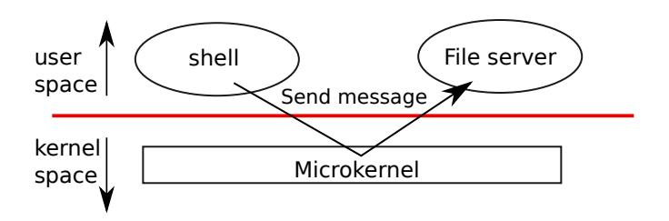

<span id="page-23-2"></span>Figure 2.1: A microkernel with a file-system server

the computer stops working, and thus all applications fail too. The computer must reboot to start again.

To reduce the risk of mistakes in the kernel, OS designers can minimize the amount of operating system code that runs in supervisor mode, and execute the bulk of the operating system in user mode. This kernel organization is called a *microkernel*.

Figure [2.1](#page-23-2) illustrates this microkernel design. In the figure, the file system runs as a user-level process. OS services running as processes are called servers. To allow applications to interact with the file server, the kernel provides an inter-process communication mechanism to send messages from one user-mode process to another. For example, if an application like the shell wants to read or write a file, it sends a message to the file server and waits for a response.

In a microkernel, the kernel interface consists of a few low-level functions for starting applications, sending messages, accessing device hardware, etc. This organization allows the kernel to be relatively simple, as most of the operating system resides in user-level servers.

Xv6 is implemented as a monolithic kernel, like most Unix operating systems. Thus, the xv6 kernel interface corresponds to the operating system interface, and the kernel implements the complete operating system. Since xv6 doesn't provide many services, its kernel is smaller than some microkernels, but conceptually xv6 is monolithic.

#### <span id="page-23-0"></span>2.4 Code: xv6 organization

The xv6 kernel source is in the kernel/ sub-directory. The source is divided into files, following a rough notion of modularity; Figure [2.2](#page-24-0) lists the files. The inter-module interfaces are defined in defs.h [\(kernel/defs.h\)](https://github.com/mit-pdos/xv6-riscv/blob/riscv//kernel/defs.h).

#### <span id="page-23-1"></span>2.5 Process overview

The unit of isolation in xv6 (as in other Unix operating systems) is a *process*. The process abstraction prevents one process from wrecking or spying on another process's memory, CPU, file descriptors, etc. It also prevents a process from wrecking the kernel itself, so that a process can't subvert the kernel's isolation mechanisms. The kernel must implement the process abstraction with care because a buggy or malicious application may trick the kernel or hardware into doing something bad (e.g., circumventing isolation). The mechanisms used by the kernel to implement

<span id="page-24-1"></span>

| File          | Description                                            |
|---------------|--------------------------------------------------------|
| bio.c         | Disk block cache for the file system.                  |
| console.c     | Connect to the user keyboard and screen.               |
| entry.S       | Very first boot instructions.                          |
| exec.c        | exec() system call.                                    |
| file.c        | File descriptor support.                               |
| fs.c          | File system.                                           |
| kalloc.c      | Physical page allocator.                               |
| kernelvec.S   | Handle traps from kernel, and timer interrupts.        |
| log.c         | File system logging and crash recovery.                |
| main.c        | Control initialization of other modules during boot.   |
| pipe.c        | Pipes.                                                 |
| plic.c        | RISC-V interrupt controller.                           |
| printf.c      | Formatted output to the console.                       |
| proc.c        | Processes and scheduling.                              |
| sleeplock.c   | Locks that yield the CPU.                              |
| spinlock.c    | Locks that don't yield the CPU.                        |
| start.c       | Early machine-mode boot code.                          |
| string.c      | C string and byte-array library.                       |
| swtch.S       | Thread switching.                                      |
| syscall.c     | Dispatch system calls to handling function.            |
| sysfile.c     | File-related system calls.                             |
| sysproc.c     | Process-related system calls.                          |
| trampoline.S  | Assembly code to switch between user and kernel.       |
| trap.c        | C code to handle and return from traps and interrupts. |
| uart.c        | Serial-port console device driver.                     |
| virtio_disk.c | Disk device driver.                                    |
| vm.c          | Manage page tables and address spaces.                 |

<span id="page-24-0"></span>Figure 2.2: Xv6 kernel source files.

processes include the user/supervisor mode flag, address spaces, and time-slicing of threads.

To help enforce isolation, the process abstraction provides the illusion to a program that it has its own private machine. A process provides a program with what appears to be a private memory system, or *address space*, which other processes cannot read or write. A process also provides the program with what appears to be its own CPU to execute the program's instructions.

Xv6 uses page tables (which are implemented by hardware) to give each process its own address space. The RISC-V page table translates (or "maps") a *virtual address* (the address that an RISC-V instruction manipulates) to a *physical address* (an address that the CPU chip sends to main memory).

Xv6 maintains a separate page table for each process that defines that process's address space. As illustrated in Figure [2.3,](#page-25-0) an address space includes the process's *user memory* starting at virtual

<span id="page-25-1"></span>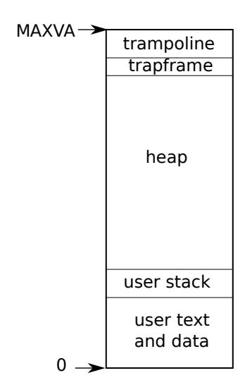

Figure 2.3: Layout of a process's virtual address space

<span id="page-25-0"></span>address zero. Instructions come first, followed by global variables, then the stack, and finally a "heap" area (for malloc) that the process can expand as needed. There are a number of factors that limit the maximum size of a process's address space: pointers on the RISC-V are 64 bits wide; the hardware only uses the low 39 bits when looking up virtual addresses in page tables; and xv6 only uses 38 of those 39 bits. Thus, the maximum address is 2 <sup>38</sup> − 1 = 0x3fffffffff, which is MAXVA [\(kernel/riscv.h:348\)](https://github.com/mit-pdos/xv6-riscv/blob/riscv//kernel/riscv.h#L348). At the top of the address space xv6 reserves a page for a *trampoline* and a page mapping the process's *trapframe* to switch to the kernel, as we will explain in Chapter [4.](#page-40-0)

The xv6 kernel maintains many pieces of state for each process, which it gathers into a struct proc [\(kernel/proc.h:86\)](https://github.com/mit-pdos/xv6-riscv/blob/riscv//kernel/proc.h#L86). A process's most important pieces of kernel state are its page table, its kernel stack, and its run state. We'll use the notation p->xxx to refer to elements of the proc structure; for example, p->pagetable is a pointer to the process's page table.

Each process has a thread of execution (or *thread* for short) that executes the process's instructions. A thread can be suspended and later resumed. To switch transparently between processes, the kernel suspends the currently running thread and resumes another process's thread. Much of the state of a thread (local variables, function call return addresses) is stored on the thread's stacks. Each process has two stacks: a user stack and a kernel stack (p->kstack). When the process is executing user instructions, only its user stack is in use, and its kernel stack is empty. When the process enters the kernel (for a system call or interrupt), the kernel code executes on the process's kernel stack; while a process is in the kernel, its user stack still contains saved data, but isn't actively used. A process's thread alternates between actively using its user stack and its kernel stack. The kernel stack is separate (and protected from user code) so that the kernel can execute even if a process has wrecked its user stack.

A process can make a system call by executing the RISC-V ecall instruction. This instruction raises the hardware privilege level and changes the program counter to a kernel-defined entry point. The code at the entry point switches to a kernel stack and executes the kernel instructions that implement the system call. When the system call completes, the kernel switches back to the user <span id="page-26-1"></span>stack and returns to user space by calling the sret instruction, which lowers the hardware privilege level and resumes executing user instructions just after the system call instruction. A process's thread can "block" in the kernel to wait for I/O, and resume where it left off when the I/O has finished.

p->state indicates whether the process is allocated, ready to run, running, waiting for I/O, or exiting.

p->pagetable holds the process's page table, in the format that the RISC-V hardware expects. xv6 causes the paging hardware to use a process's p->pagetable when executing that process in user space. A process's page table also serves as the record of the addresses of the physical pages allocated to store the process's memory.

#### <span id="page-26-0"></span>2.6 Code: starting xv6 and the first process

To make xv6 more concrete, we'll outline how the kernel starts and runs the first process. The subsequent chapters will describe the mechanisms that show up in this overview in more detail.

When the RISC-V computer powers on, it initializes itself and runs a boot loader which is stored in read-only memory. The boot loader loads the xv6 kernel into memory. Then, in machine mode, the CPU executes xv6 starting at \_entry [\(kernel/entry.S:6\)](https://github.com/mit-pdos/xv6-riscv/blob/riscv//kernel/entry.S#L6). The RISC-V starts with paging hardware disabled: virtual addresses map directly to physical addresses.

The loader loads the xv6 kernel into memory at physical address 0x80000000. The reason it places the kernel at 0x80000000 rather than 0x0 is because the address range 0x0:0x80000000 contains I/O devices.

The instructions at \_entry set up a stack so that xv6 can run C code. Xv6 declares space for an initial stack, stack0, in the file start.c [\(kernel/start.c:11\)](https://github.com/mit-pdos/xv6-riscv/blob/riscv//kernel/start.c#L11). The code at \_entry loads the stack pointer register sp with the address stack0+4096, the top of the stack, because the stack on RISC-V grows down. Now that the kernel has a stack, \_entry calls into C code at start [\(kernel/start.c:21\)](https://github.com/mit-pdos/xv6-riscv/blob/riscv//kernel/start.c#L21).

The function start performs some configuration that is only allowed in machine mode, and then switches to supervisor mode. To enter supervisor mode, RISC-V provides the instruction mret. This instruction is most often used to return from a previous call from supervisor mode to machine mode. start isn't returning from such a call, and instead sets things up as if there had been one: it sets the previous privilege mode to supervisor in the register mstatus, it sets the return address to main by writing main's address into the register mepc, disables virtual address translation in supervisor mode by writing 0 into the page-table register satp, and delegates all interrupts and exceptions to supervisor mode.

Before jumping into supervisor mode, start performs one more task: it programs the clock chip to generate timer interrupts. With this housekeeping out of the way, start "returns" to supervisor mode by calling mret. This causes the program counter to change to main [\(kernel/main.c:11\)](https://github.com/mit-pdos/xv6-riscv/blob/riscv//kernel/main.c#L11).

After main [\(kernel/main.c:11\)](https://github.com/mit-pdos/xv6-riscv/blob/riscv//kernel/main.c#L11) initializes several devices and subsystems, it creates the first process by calling userinit [\(kernel/proc.c:212\)](https://github.com/mit-pdos/xv6-riscv/blob/riscv//kernel/proc.c#L212). The first process executes a small program written in RISC-V assembly, initcode.S [\(user/initcode.S:1\)](https://github.com/mit-pdos/xv6-riscv/blob/riscv//user/initcode.S#L1), which re-enters the kernel by invoking the exec system call. As we saw in Chapter [1,](#page-8-0) exec replaces the memory and registers of the current

<span id="page-27-2"></span>process with a new program (in this case, /init). Once the kernel has completed exec, it returns to user space in the /init process. Init [\(user/init.c:15\)](https://github.com/mit-pdos/xv6-riscv/blob/riscv//user/init.c#L15) creates a new console device file if needed and then opens it as file descriptors 0, 1, and 2. Then it starts a shell on the console. The system is up.

#### <span id="page-27-0"></span>2.7 Real world

In the real world, one can find both monolithic kernels and microkernels. Many Unix kernels are monolithic. For example, Linux has a monolithic kernel, although some OS functions run as userlevel servers (e.g., the windowing system). Kernels such as L4, Minix, and QNX are organized as a microkernel with servers, and have seen wide deployment in embedded settings.

Most operating systems have adopted the process concept, and most processes look similar to xv6's. Modern operating systems, however, support several threads within a process, to allow a single process to exploit multiple CPUs. Supporting multiple threads in a process involves quite a bit of machinery that xv6 doesn't have, including potential interface changes (e.g., Linux's clone, a variant of fork), to control which aspects of a process threads share.

#### <span id="page-27-1"></span>2.8 Exercises

1. You can use gdb to observe the very first kernel-to-user transition. Run make qemu-gdb. In another window, in the same directory, run gdb. Type the gdb command break \*0x3ffffff10e, which sets a breakpoint at the sret instruction in the kernel that jumps into user space. Type the continue gdb command. gdb should stop at the breakpoint, about to execute sret. Type stepi. gdb should now indicate that it is executing at address 0x0, which is in user space at the start of initcode.S.

# <span id="page-28-2"></span><span id="page-28-0"></span>Chapter 3

# Page tables

Page tables are the mechanism through which the operating system provides each process with its own private address space and memory. Page tables determine what memory addresses mean, and what parts of physical memory can be accessed. They allow xv6 to isolate different process's address spaces and to multiplex them onto a single physical memory. Page tables also provide a level of indirection that allows xv6 to perform a few tricks: mapping the same memory (a trampoline page) in several address spaces, and guarding kernel and user stacks with an unmapped page. The rest of this chapter explains the page tables that the RISC-V hardware provides and how xv6 uses them.

### <span id="page-28-1"></span>3.1 Paging hardware

As a reminder, RISC-V instructions (both user and kernel) manipulate virtual addresses. The machine's RAM, or physical memory, is indexed with physical addresses. The RISC-V page table hardware connects these two kinds of addresses, by mapping each virtual address to a physical address.

xv6 runs on Sv39 RISC-V, which means that only the bottom 39 bits of a 64-bit virtual address are used; the top 25 bits are not used. In this Sv39 configuration, a RISC-V page table is logically an array of 2 <sup>27</sup> (134,217,728) *page table entries (PTEs)*. Each PTE contains a 44-bit physical page number (PPN) and some flags. The paging hardware translates a virtual address by using the top 27 bits of the 39 bits to index into the page table to find a PTE, and making a 56-bit physical address whose top 44 bits come from the PPN in the PTE and whose bottom 12 bits are copied from the original virtual address. Figure [3.1](#page-29-0) shows this process with a logical view of the page table as a simple array of PTEs (see Figure [3.2](#page-30-1) for a fuller story). A page table gives the operating system control over virtual-to-physical address translations at the granularity of aligned chunks of 4096 (2 <sup>12</sup>) bytes. Such a chunk is called a *page*.

In Sv39 RISC-V, the top 25 bits of a virtual address are not used for translation; in the future, RISC-V may use those bits to define more levels of translation. The physical address also has room for growth: there is room in the PTE format for the physical page number to grow by another 10 bits.

<span id="page-29-1"></span>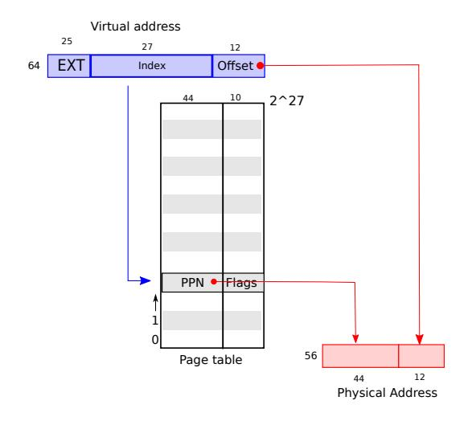

<span id="page-29-0"></span>Figure 3.1: RISC-V virtual and physical addresses, with a simplified logical page table.

As Figure [3.2](#page-30-1) shows, the actual translation happens in three steps. A page table is stored in physical memory as a three-level tree. The root of the tree is a 4096-byte page-table page that contains 512 PTEs, which contain the physical addresses for page-table pages in the next level of the tree. Each of those pages contains 512 PTEs for the final level in the tree. The paging hardware uses the top 9 bits of the 27 bits to select a PTE in the root page-table page, the middle 9 bits to select a PTE in a page-table page in the next level of the tree, and the bottom 9 bits to select the final PTE.

If any of the three PTEs required to translate an address is not present, the paging hardware raises a *page-fault exception*, leaving it up to the kernel to handle the exception (see Chapter [4\)](#page-40-0). This three-level structure allows a page table to omit entire page table pages in the common case in which large ranges of virtual addresses have no mappings.

Each PTE contains flag bits that tell the paging hardware how the associated virtual address is allowed to be used. PTE\_V indicates whether the PTE is present: if it is not set, a reference to the page causes an exception (i.e. is not allowed). PTE\_R controls whether instructions are allowed to read to the page. PTE\_W controls whether instructions are allowed to write to the page. PTE\_X controls whether the CPU may interpret the content of the page as instructions and execute them. PTE\_U controls whether instructions in user mode are allowed to access the page; if PTE\_U is not set, the PTE can be used only in supervisor mode. Figure [3.2](#page-30-1) shows how it all works. The flags and all other page hardware-related structures are defined in [\(kernel/riscv.h\)](https://github.com/mit-pdos/xv6-riscv/blob/riscv//kernel/riscv.h)

To tell the hardware to use a page table, the kernel must write the physical address of the root page-table page into the satp register. Each CPU has its own satp. A CPU will translate all addresses generated by subsequent instructions using the page table pointed to by its own satp. Each CPU has its own satp so that different CPUs can run different processes, each with a private address space described by its own page table.

A few notes about terms. Physical memory refers to storage cells in DRAM. A byte of physical memory has an address, called a physical address. Instructions use only virtual addresses, which the paging hardware translates to physical addresses, and then sends to the DRAM hardware to read

<span id="page-30-2"></span>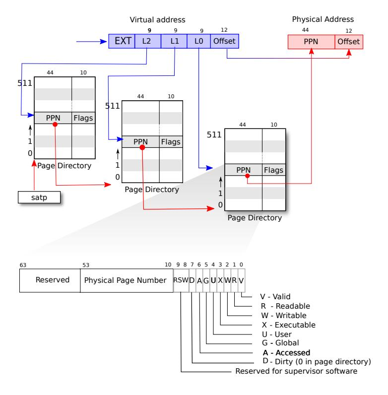

<span id="page-30-1"></span>Figure 3.2: RISC-V address translation details.

or write storage. Unlike physical memory and virtual addresses, virtual memory isn't a physical object, but refers to the collection of abstractions and mechanisms the kernel provides to manage physical memory and virtual addresses.

#### <span id="page-30-0"></span>3.2 Kernel address space

Xv6 maintains one page table per process, describing each process's user address space, plus a single page table that describes the kernel's address space. The kernel configures the layout of its address space to give itself access to physical memory and various hardware resources at predictable virtual addresses. Figure 3.3 shows how this layout maps kernel virtual addresses to physical addresses. The file (kernel/memlayout.h) declares the constants for xv6's kernel memory layout.

QEMU simulates a computer that includes RAM (physical memory) starting at physical address  $0 \times 80000000$  and continuing through at least  $0 \times 86400000$ , which xv6 calls PHYSTOP. The QEMU simulation also includes I/O devices such as a disk interface. QEMU exposes the device interfaces to software as *memory-mapped* control registers that sit below  $0 \times 800000000$  in the physical address space. The kernel can interact with the devices by reading/writing these special physical addresses; such reads and writes communicate with the device hardware rather than with RAM. Chapter 4 explains how xv6 interacts with devices.

The kernel gets at RAM and memory-mapped device registers using "direct mapping;" that is, mapping the resources at virtual addresses that are equal to the physical address. For example,

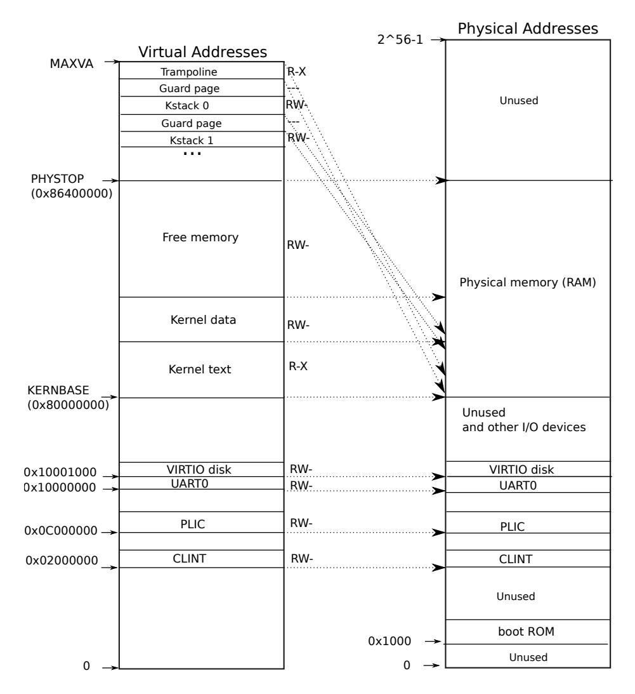

<span id="page-31-0"></span>Figure 3.3: On the left, xv6's kernel address space. RWX refer to PTE read, write, and execute permissions. On the right, the RISC-V physical address space that xv6 expects to see.

the kernel itself is located at KERNBASE=0x80000000 in both the virtual address space and in physical memory. Direct mapping simplifies kernel code that reads or writes physical memory. For example, when fork allocates user memory for the child process, the allocator returns the physical address of that memory; fork uses that address directly as a virtual address when it is copying the parent's user memory to the child.

There are a couple of kernel virtual addresses that aren't direct-mapped:

• The trampoline page. It is mapped at the top of the virtual address space; user page tables have this same mapping. Chapter 4 discusses the role of the trampoline page, but we see here an interesting use case of page tables; a physical page (holding the trampoline code) is mapped twice in the virtual address space of the kernel: once at top of the virtual address space and once with a direct mapping.

<span id="page-32-1"></span>• The kernel stack pages. Each process has its own kernel stack, which is mapped high so that below it xv6 can leave an unmapped *guard page*. The guard page's PTE is invalid (i.e., PTE\_V is not set), so that if the kernel overflows a kernel stack, it will likely cause an exception and the kernel will panic. Without a guard page an overflowing stack would overwrite other kernel memory, resulting in incorrect operation. A panic crash is preferable.

While the kernel uses its stacks via the high-memory mappings, they are also accessible to the kernel through a direct-mapped address. An alternate design might have just the direct mapping, and use the stacks at the direct-mapped address. In that arrangement, however, providing guard pages would involve unmapping virtual addresses that would otherwise refer to physical memory, which would then be hard to use.

The kernel maps the pages for the trampoline and the kernel text with the permissions PTE\_R and PTE\_X. The kernel reads and executes instructions from these pages. The kernel maps the other pages with the permissions PTE\_R and PTE\_W, so that it can read and write the memory in those pages. The mappings for the guard pages are invalid.

#### <span id="page-32-0"></span>3.3 Code: creating an address space

Most of the xv6 code for manipulating address spaces and page tables resides in vm.c [\(ker](https://github.com/mit-pdos/xv6-riscv/blob/riscv//kernel/vm.c#L1)[nel/vm.c:1\)](https://github.com/mit-pdos/xv6-riscv/blob/riscv//kernel/vm.c#L1). The central data structure is pagetable\_t, which is really a pointer to a RISC-V root page-table page; a pagetable\_t may be either the kernel page table, or one of the perprocess page tables. The central functions are walk, which finds the PTE for a virtual address, and mappages, which installs PTEs for new mappings. Functions starting with kvm manipulate the kernel page table; functions starting with uvm manipulate a user page table; other functions are used for both. copyout and copyin copy data to and from user virtual addresses provided as system call arguments; they are in vm.c because they need to explicitly translate those addresses in order to find the corresponding physical memory.

Early in the boot sequence, main calls kvminit [\(kernel/vm.c:22\)](https://github.com/mit-pdos/xv6-riscv/blob/riscv//kernel/vm.c#L22) to create the kernel's page table. This call occurs before xv6 has enabled paging on the RISC-V, so addresses refer directly to physical memory. Kvminit first allocates a page of physical memory to hold the root page-table page. Then it calls kvmmap to install the translations that the kernel needs. The translations include the kernel's instructions and data, physical memory up to PHYSTOP, and memory ranges which are actually devices.

kvmmap [\(kernel/vm.c:118\)](https://github.com/mit-pdos/xv6-riscv/blob/riscv//kernel/vm.c#L118) calls mappages [\(kernel/vm.c:149\)](https://github.com/mit-pdos/xv6-riscv/blob/riscv//kernel/vm.c#L149), which installs mappings into a page table for a range of virtual addresses to a corresponding range of physical addresses. It does this separately for each virtual address in the range, at page intervals. For each virtual address to be mapped, mappages calls walk to find the address of the PTE for that address. It then initializes the PTE to hold the relevant physical page number, the desired permissions (PTE\_W, PTE\_X, and/or PTE\_R), and PTE\_V to mark the PTE as valid [\(kernel/vm.c:161\)](https://github.com/mit-pdos/xv6-riscv/blob/riscv//kernel/vm.c#L161).

walk [\(kernel/vm.c:72\)](https://github.com/mit-pdos/xv6-riscv/blob/riscv//kernel/vm.c#L72) mimics the RISC-V paging hardware as it looks up the PTE for a virtual address (see Figure [3.2\)](#page-30-1). walk descends the 3-level page table 9 bits at the time. It uses each level's 9 bits of virtual address to find the PTE of either the next-level page table or the final page

<span id="page-33-2"></span>[\(kernel/vm.c:78\)](https://github.com/mit-pdos/xv6-riscv/blob/riscv//kernel/vm.c#L78). If the PTE isn't valid, then the required page hasn't yet been allocated; if the alloc argument is set, walk allocates a new page-table page and puts its physical address in the PTE. It returns the address of the PTE in the lowest layer in the tree [\(kernel/vm.c:88\)](https://github.com/mit-pdos/xv6-riscv/blob/riscv//kernel/vm.c#L88).

The above code depends on physical memory being direct-mapped into the kernel virtual address space. For example, as walk descends levels of the page table, it pulls the (physical) address of the next-level-down page table from a PTE [\(kernel/vm.c:80\)](https://github.com/mit-pdos/xv6-riscv/blob/riscv//kernel/vm.c#L80), and then uses that address as a virtual address to fetch the PTE at the next level down [\(kernel/vm.c:78\)](https://github.com/mit-pdos/xv6-riscv/blob/riscv//kernel/vm.c#L78).

main calls kvminithart [\(kernel/vm.c:53\)](https://github.com/mit-pdos/xv6-riscv/blob/riscv//kernel/vm.c#L53) to install the kernel page table. It writes the physical address of the root page-table page into the register satp. After this the CPU will translate addresses using the kernel page table. Since the kernel uses an identity mapping, the now virtual address of the next instruction will map to the right physical memory address.

procinit [\(kernel/proc.c:26\)](https://github.com/mit-pdos/xv6-riscv/blob/riscv//kernel/proc.c#L26), which is called from main, allocates a kernel stack for each process. It maps each stack at the virtual address generated by KSTACK, which leaves room for the invalid stack-guard pages. kvmmap adds the mapping PTEs to the kernel page table, and the call to kvminithart reloads the kernel page table into satp so that the hardware knows about the new PTEs.

Each RISC-V CPU caches page table entries in a *Translation Look-aside Buffer (TLB)*, and when xv6 changes a page table, it must tell the CPU to invalidate corresponding cached TLB entries. If it didn't, then at some point later the TLB might use an old cached mapping, pointing to a physical page that in the meantime has been allocated to another process, and as a result, a process might be able to scribble on some other process's memory. The RISC-V has an instruction sfence.vma that flushes the current CPU's TLB. xv6 executes sfence.vma in kvminithart after reloading the satp register, and in the trampoline code that switches to a user page table before returning to user space [\(kernel/trampoline.S:79\)](https://github.com/mit-pdos/xv6-riscv/blob/riscv//kernel/trampoline.S#L79).

### <span id="page-33-0"></span>3.4 Physical memory allocation

The kernel must allocate and free physical memory at run-time for page tables, user memory, kernel stacks, and pipe buffers.

xv6 uses the physical memory between the end of the kernel and PHYSTOP for run-time allocation. It allocates and frees whole 4096-byte pages at a time. It keeps track of which pages are free by threading a linked list through the pages themselves. Allocation consists of removing a page from the linked list; freeing consists of adding the freed page to the list.

#### <span id="page-33-1"></span>3.5 Code: Physical memory allocator

The allocator resides in kalloc.c [\(kernel/kalloc.c:1\)](https://github.com/mit-pdos/xv6-riscv/blob/riscv//kernel/kalloc.c#L1). The allocator's data structure is a *free list* of physical memory pages that are available for allocation. Each free page's list element is a struct run [\(kernel/kalloc.c:17\)](https://github.com/mit-pdos/xv6-riscv/blob/riscv//kernel/kalloc.c#L17). Where does the allocator get the memory to hold that data structure? It store each free page's run structure in the free page itself, since there's nothing else stored there. The free list is protected by a spin lock [\(kernel/kalloc.c:21-24\)](https://github.com/mit-pdos/xv6-riscv/blob/riscv//kernel/kalloc.c#L21-L24). The list and the lock are

<span id="page-34-1"></span>wrapped in a struct to make clear that the lock protects the fields in the struct. For now, ignore the lock and the calls to acquire and release; Chapter [6](#page-54-0) will examine locking in detail.

The function main calls kinit to initialize the allocator [\(kernel/kalloc.c:27\)](https://github.com/mit-pdos/xv6-riscv/blob/riscv//kernel/kalloc.c#L27). kinit initializes the free list to hold every page between the end of the kernel and PHYSTOP. xv6 ought to determine how much physical memory is available by parsing configuration information provided by the hardware. Instead xv6 assumes that the machine has 128 megabytes of RAM. kinit calls freerange to add memory to the free list via per-page calls to kfree. A PTE can only refer to a physical address that is aligned on a 4096-byte boundary (is a multiple of 4096), so freerange uses PGROUNDUP to ensure that it frees only aligned physical addresses. The allocator starts with no memory; these calls to kfree give it some to manage.

The allocator sometimes treats addresses as integers in order to perform arithmetic on them (e.g., traversing all pages in freerange), and sometimes uses addresses as pointers to read and write memory (e.g., manipulating the run structure stored in each page); this dual use of addresses is the main reason that the allocator code is full of C type casts. The other reason is that freeing and allocation inherently change the type of the memory.

The function kfree [\(kernel/kalloc.c:47\)](https://github.com/mit-pdos/xv6-riscv/blob/riscv//kernel/kalloc.c#L47) begins by setting every byte in the memory being freed to the value 1. This will cause code that uses memory after freeing it (uses "dangling references") to read garbage instead of the old valid contents; hopefully that will cause such code to break faster. Then kfree prepends the page to the free list: it casts pa to a pointer to struct run, records the old start of the free list in r->next, and sets the free list equal to r. kalloc removes and returns the first element in the free list.

#### <span id="page-34-0"></span>3.6 Process address space

Each process has a separate page table, and when xv6 switches between processes, it also changes page tables. As Figure [2.3](#page-25-0) shows, a process's user memory starts at virtual address zero and can grow up to MAXVA [\(kernel/riscv.h:348\)](https://github.com/mit-pdos/xv6-riscv/blob/riscv//kernel/riscv.h#L348), allowing a process to address in principle 256 Gigabytes of memory.

When a process asks xv6 for more user memory, xv6 first uses kalloc to allocate physical pages. It then adds PTEs to the process's page table that point to the new physical pages. Xv6 sets the PTE\_W, PTE\_X, PTE\_R, PTE\_U, and PTE\_V flags in these PTEs. Most processes do not use the entire user address space; xv6 leaves PTE\_V clear in unused PTEs.

We see here a few nice examples of use of page tables. First, different processes' page tables translate user addresses to different pages of physical memory, so that each process has private user memory. Second, each process sees its memory as having contiguous virtual addresses starting at zero, while the process's physical memory can be non-contiguous. Third, the kernel maps a page with trampoline code at the top of the user address space, thus a single page of physical memory shows up in all address spaces.

Figure [3.4](#page-35-1) shows the layout of the user memory of an executing process in xv6 in more detail. The stack is a single page, and is shown with the initial contents as created by exec. Strings containing the command-line arguments, as well as an array of pointers to them, are at the very top of the stack. Just under that are values that allow a program to start at main as if the function

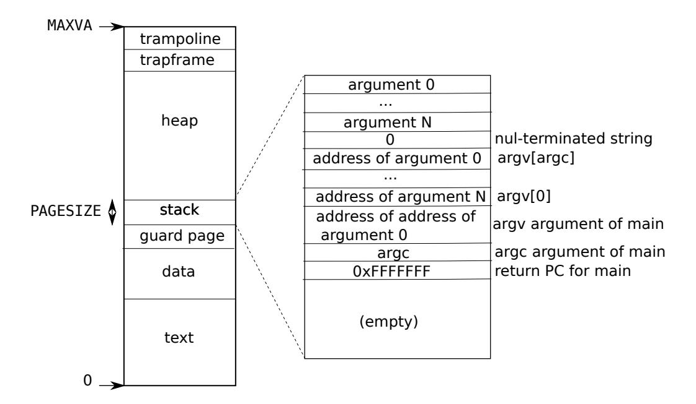

<span id="page-35-1"></span>Figure 3.4: A process's user address space, with its initial stack.

main(argc, argv) had just been called.

To detect a user stack overflowing the allocated stack memory, xv6 places an invalid guard page right below the stack. If the user stack overflows and the process tries to use an address below the stack, the hardware will generate a page-fault exception because the mapping is not valid. A real-world operating system might instead automatically allocate more memory for the user stack when it overflows.

#### <span id="page-35-0"></span>3.7 Code: sbrk

Sbrk is the system call for a process to shrink or grow its memory. The system call is implemented by the function growproc [\(kernel/proc.c:239\)](https://github.com/mit-pdos/xv6-riscv/blob/riscv//kernel/proc.c#L239). growproc calls uvmalloc or uvmdealloc, depending on whether n is postive or negative. uvmalloc [\(kernel/vm.c:229\)](https://github.com/mit-pdos/xv6-riscv/blob/riscv//kernel/vm.c#L229) allocates physical memory with kalloc, and adds PTEs to the user page table with mappages. uvmdealloc calls uvmunmap [\(kernel/vm.c:174\)](https://github.com/mit-pdos/xv6-riscv/blob/riscv//kernel/vm.c#L174), which uses walk to find PTEs and kfree to free the physical memory they refer to.

xv6 uses a process's page table not just to tell the hardware how to map user virtual addresses, but also as the only record of which physical memory pages are allocated to that process. That is the reason why freeing user memory (in uvmunmap) requires examination of the user page table.

### <span id="page-36-1"></span><span id="page-36-0"></span>3.8 Code: exec

Exec is the system call that creates the user part of an address space. It initializes the user part of an address space from a file stored in the file system. Exec [\(kernel/exec.c:13\)](https://github.com/mit-pdos/xv6-riscv/blob/riscv//kernel/exec.c#L13) opens the named binary path using namei [\(kernel/exec.c:26\)](https://github.com/mit-pdos/xv6-riscv/blob/riscv//kernel/exec.c#L26), which is explained in Chapter [8.](#page-80-0) Then, it reads the ELF header. Xv6 applications are described in the widely-used *ELF format*, defined in [\(kernel/elf.h\)](https://github.com/mit-pdos/xv6-riscv/blob/riscv//kernel/elf.h). An ELF binary consists of an ELF header, struct elfhdr [\(kernel/elf.h:6\)](https://github.com/mit-pdos/xv6-riscv/blob/riscv//kernel/elf.h#L6), followed by a sequence of program section headers, struct proghdr [\(kernel/elf.h:25\)](https://github.com/mit-pdos/xv6-riscv/blob/riscv//kernel/elf.h#L25). Each proghdr describes a section of the application that must be loaded into memory; xv6 programs have only one program section header, but other systems might have separate sections for instructions and data.

The first step is a quick check that the file probably contains an ELF binary. An ELF binary starts with the four-byte "magic number" 0x7F, 'E', 'L', 'F', or ELF\_MAGIC [\(kernel/elf.h:3\)](https://github.com/mit-pdos/xv6-riscv/blob/riscv//kernel/elf.h#L3). If the ELF header has the right magic number, exec assumes that the binary is well-formed.

Exec allocates a new page table with no user mappings with proc\_pagetable [\(kernel/exec.c:38\)](https://github.com/mit-pdos/xv6-riscv/blob/riscv//kernel/exec.c#L38), allocates memory for each ELF segment with uvmalloc [\(kernel/exec.c:52\)](https://github.com/mit-pdos/xv6-riscv/blob/riscv//kernel/exec.c#L52), and loads each segment into memory with loadseg [\(kernel/exec.c:10\)](https://github.com/mit-pdos/xv6-riscv/blob/riscv//kernel/exec.c#L10). loadseg uses walkaddr to find the physical address of the allocated memory at which to write each page of the ELF segment, and readi to read from the file.

The program section header for /init, the first user program created with exec, looks like this:

```
# objdump -p _init
user/_init: file format elf64-littleriscv
Program Header:
   LOAD off 0x00000000000000b0 vaddr 0x0000000000000000
                                     paddr 0x0000000000000000 align 2**3
        filesz 0x0000000000000840 memsz 0x0000000000000858 flags rwx
  STACK off 0x0000000000000000 vaddr 0x0000000000000000
                                     paddr 0x0000000000000000 align 2**4
        filesz 0x0000000000000000 memsz 0x0000000000000000 flags rw-
```

The program section header's filesz may be less than the memsz, indicating that the gap between them should be filled with zeroes (for C global variables) rather than read from the file. For /init, filesz is 2112 bytes and memsz is 2136 bytes, and thus uvmalloc allocates enough physical memory to hold 2136 bytes, but reads only 2112 bytes from the file /init.

Now exec allocates and initializes the user stack. It allocates just one stack page. Exec copies the argument strings to the top of the stack one at a time, recording the pointers to them in ustack. It places a null pointer at the end of what will be the argv list passed to main. The first three entries in ustack are the fake return program counter, argc, and argv pointer.

Exec places an inaccessible page just below the stack page, so that programs that try to use more than one page will fault. This inaccessible page also allows exec to deal with arguments that are too large; in that situation, the copyout [\(kernel/vm.c:355\)](https://github.com/mit-pdos/xv6-riscv/blob/riscv//kernel/vm.c#L355) function that exec uses to copy arguments to the stack will notice that the destination page is not accessible, and will return -1.

During the preparation of the new memory image, if exec detects an error like an invalid program segment, it jumps to the label bad, frees the new image, and returns -1. Exec must wait to free the old image until it is sure that the system call will succeed: if the old image is gone, the system call cannot return -1 to it. The only error cases in exec happen during the creation of the image. Once the image is complete, exec can commit to the new page table [\(kernel/exec.c:113\)](https://github.com/mit-pdos/xv6-riscv/blob/riscv//kernel/exec.c#L113) and free the old one [\(kernel/exec.c:117\)](https://github.com/mit-pdos/xv6-riscv/blob/riscv//kernel/exec.c#L117).

Exec loads bytes from the ELF file into memory at addresses specified by the ELF file. Users or processes can place whatever addresses they want into an ELF file. Thus exec is risky, because the addresses in the ELF file may refer to the kernel, accidentally or on purpose. The consequences for an unwary kernel could range from a crash to a malicious subversion of the kernel's isolation mechanisms (i.e., a security exploit). xv6 performs a number of checks to avoid these risks. For example if(ph.vaddr + ph.memsz < ph.vaddr) checks for whether the sum overflows a 64-bit integer. The danger is that a user could construct an ELF binary with a ph.vaddr that points to a user-chosen address, and ph.memsz large enough that the sum overflows to 0x1000, which will look like a valid value. In an older version of xv6 in which the user address space also contained the kernel (but not readable/writable in user mode), the user could choose an address that corresponded to kernel memory and would thus copy data from the ELF binary into the kernel. In the RISC-V version of xv6 this cannot happen, because the kernel has its own separate page table; loadseg loads into the process's page table, not in the kernel's page table.

It is easy for a kernel developer to omit a crucial check, and real-world kernels have a long history of missing checks whose absence can be exploited by user programs to obtain kernel privileges. It is likely that xv6 doesn't do a complete job of validating user-level data supplied to the kernel, which a malicious user program might be able to exploit to circumvent xv6's isolation.

### <span id="page-37-0"></span>3.9 Real world

Like most operating systems, xv6 uses the paging hardware for memory protection and mapping. Most operating systems make far more sophisticated use of paging than xv6 by combining paging and page-fault exceptions, which we will discuss in Chapter [4.](#page-40-0)

Xv6 is simplified by the kernel's use of a direct map between virtual and physical addresses, and by its assumption that there is physical RAM at address 0x8000000, where the kernel expects to be loaded. This works with QEMU, but on real hardware it turns out to be a bad idea; real hardware places RAM and devices at unpredictable physical addresses, so that (for example) there might be no RAM at 0x8000000, where xv6 expect to be able to store the kernel. More serious kernel designs exploit the page table to turn arbitrary hardware physical memory layouts into predictable kernel virtual address layouts.

RISC-V supports protection at the level of physical addresses, but xv6 doesn't use that feature. On machines with lots of memory it might make sense to use RISC-V's support for "super pages." Small pages make sense when physical memory is small, to allow allocation and page-out to disk with fine granularity. For example, if a program uses only 8 kilobytes of memory, giving it a whole 4-megabyte super-page of physical memory is wasteful. Larger pages make sense on machines with lots of RAM, and may reduce overhead for page-table manipulation.

The xv6 kernel's lack of a malloc-like allocator that can provide memory for small objects prevents the kernel from using sophisticated data structures that would require dynamic allocation.

Memory allocation is a perennial hot topic, the basic problems being efficient use of limited memory and preparing for unknown future requests [\[7\]](#page-104-6). Today people care more about speed than space efficiency. In addition, a more elaborate kernel would likely allocate many different sizes of small blocks, rather than (as in xv6) just 4096-byte blocks; a real kernel allocator would need to handle small allocations as well as large ones.

#### <span id="page-38-0"></span>3.10 Exercises

- 1. Parse RISC-V's device tree to find the amount of physical memory the computer has.
- 2. Write a user program that grows its address space by one byte by calling sbrk(1). Run the program and investigate the page table for the program before the call to sbrk and after the call to sbrk. How much space has the kernel allocated? What does the PTE for the new memory contain?
- 3. Modify xv6 to use super pages for the kernel.
- 4. Modify xv6 so that when a user program dereferences a null pointer, it will receive an exception. That is, modify xv6 so that virtual address 0 isn't mapped for user programs.
- 5. Unix implementations of exec traditionally include special handling for shell scripts. If the file to execute begins with the text #!, then the first line is taken to be a program to run to interpret the file. For example, if exec is called to run myprog arg1 and myprog 's first line is #!/interp, then exec runs /interp with command line /interp myprog arg1. Implement support for this convention in xv6.
- 6. Implement address space randomization for the kernel.

# <span id="page-40-1"></span><span id="page-40-0"></span>Chapter 4

# Traps and system calls

There are three kinds of event which cause the CPU to set aside ordinary execution of instructions and force a transfer of control to special code that handles the event. One situation is a system call, when a user program executes the ecall instruction to ask the kernel to do something for it. Another situation is an *exception*: an instruction (user or kernel) does something illegal, such as divide by zero or use an invalid virtual address. The third situation is a device *interrupt*, when a device signals that it needs attention, for example when the disk hardware finishes a read or write request.

This book uses *trap* as a generic term for these situations. Typically whatever code was executing at the time of the trap will later need to resume, and shouldn't need to be aware that anything special happened. That is, we often want traps to be transparent; this is particularly important for interrupts, which the interrupted code typically doesn't expect. The usual sequence is that a trap forces a transfer of control into the kernel; the kernel saves registers and other state so that execution can be resumed; the kernel executes appropriate handler code (e.g., a system call implementation or device driver); the kernel restores the saved state and returns from the trap; and the original code resumes where it left off.

The xv6 kernel handles all traps. This is natural for system calls. It makes sense for interrupts since isolation demands that user processes not directly use devices, and because only the kernel has the state needed for device handling. It also makes sense for exceptions since xv6 responds to all exceptions from user space by killing the offending program.

Xv6 trap handling proceeds in four stages: hardware actions taken by the RISC-V CPU, an assembly "vector" that prepares the way for kernel C code, a C trap handler that decides what to do with the trap, and the system call or device-driver service routine. While commonality among the three trap types suggests that a kernel could handle all traps with a single code path, it turns out to be convenient to have separate assembly vectors and C trap handlers for three distinct cases: traps from user space, traps from kernel space, and timer interrupts.

#### <span id="page-41-1"></span><span id="page-41-0"></span>4.1 RISC-V trap machinery

Each RISC-V CPU has a set of control registers that the kernel writes to tell the CPU how to handle traps, and that the kernel can read to find out about a trap that has occured. The RISC-V documents contain the full story [\[1\]](#page-104-5). riscv.h [\(kernel/riscv.h:1\)](https://github.com/mit-pdos/xv6-riscv/blob/riscv//kernel/riscv.h#L1) contains definitions that xv6 uses. Here's an outline of the most important registers:

- stvec: The kernel writes the address of its trap handler here; the RISC-V jumps here to handle a trap.
- sepc: When a trap occurs, RISC-V saves the program counter here (since the pc is then overwritten with stvec). The sret (return from trap) instruction copies sepc to the pc. The kernel can write to sepc to control where sret goes.
- scause: The RISC-V puts a number here that describes the reason for the trap.
- sscratch: The kernel places a value here that comes in handy at the very start of a trap handler.
- sstatus: The SIE bit in sstatus controls whether device interrupts are enabled. If the kernel clears SIE, the RISC-V will defer device interrupts until the kernel sets SIE. The SPP bit indicates whether a trap came from user mode or supervisor mode, and controls to what mode sret returns.

The above registers relate to traps handled in supervisor mode, and they cannot be read or written in user mode. There is an equivalent set of control registers for traps handled in machine mode; xv6 uses them only for the special case of timer interrupts.

Each CPU on a multi-core chip has its own set of these registers, and more than one CPU may be handling a trap at any given time.

When it needs to force a trap, the RISC-V hardware does the following for all trap types (other than timer interrupts):

- 1. If the trap is a device interrupt, and the sstatus SIE bit is clear, don't do any of the following.
- 2. Disable interrupts by clearing SIE.
- 3. Copy the pc to sepc.
- 4. Save the current mode (user or supervisor) in the SPP bit in sstatus.
- 5. Set scause to reflect the trap's cause.
- 6. Set the mode to supervisor.
- 7. Copy stvec to the pc.

#### <span id="page-42-1"></span>8. Start executing at the new pc.

Note that the CPU doesn't switch to the kernel page table, doesn't switch to a stack in the kernel, and doesn't save any registers other than the pc. Kernel software must perform these tasks. One reason that the CPU does minimal work during a trap is to provide flexibility to software; for example, some operating systems don't require a page table switch in some situations, which can increase performance.

You might wonder whether the CPU hardware's trap handling sequence could be further simplified. For example, suppose that the CPU didn't switch program counters. Then a trap could switch to supervisor mode while still running user instructions. Those user instructions could break the user/kernel isolation, for example by modifying the satp register to point to a page table that allowed accessing all of physical memory. It is thus important that the CPU switch to a kernelspecified instruction address, namely stvec.

#### <span id="page-42-0"></span>4.2 Traps from user space

A trap may occur while executing in user space if the user program makes a system call (ecall instruction), or does something illegal, or if a device interrupts. The high-level path of a trap from user space is uservec [\(kernel/trampoline.S:16\)](https://github.com/mit-pdos/xv6-riscv/blob/riscv//kernel/trampoline.S#L16), then usertrap [\(kernel/trap.c:37\)](https://github.com/mit-pdos/xv6-riscv/blob/riscv//kernel/trap.c#L37); and when returning, usertrapret [\(kernel/trap.c:90\)](https://github.com/mit-pdos/xv6-riscv/blob/riscv//kernel/trap.c#L90) and then userret [\(kernel/trampoline.S:16\)](https://github.com/mit-pdos/xv6-riscv/blob/riscv//kernel/trampoline.S#L16).

Traps from user code are more challenging than from the kernel, since satp points to a user page table that doesn't map the kernel, and the stack pointer may contain an invalid or even malicious value.

Because the RISC-V hardware doesn't switch page tables during a trap, the user page table must include a mapping for uservec, the trap vector instructions that stvec points to. uservec must switch satp to point to the kernel page table; in order to continue executing instructions after the switch, uservec must be mapped at the same address in the kernel page table as in the user page table.

Xv6 satisfies these constraints with a *trampoline* page that contains uservec. Xv6 maps the trampoline page at the same virtual address in the kernel page table and in every user page table. This virtual address is TRAMPOLINE (as we saw in Figure [2.3](#page-25-0) and in Figure [3.3\)](#page-31-0). The trampoline contents are set in trampoline.S, and (when executing user code) stvec is set to uservec [\(kernel/trampoline.S:16\)](https://github.com/mit-pdos/xv6-riscv/blob/riscv//kernel/trampoline.S#L16).

When uservec starts, all 32 registers contain values owned by the interrupted code. But uservec needs to be able to modify some registers in order to set satp and generate addresses at which to save the registers. RISC-V provides a helping hand in the form of the sscratch register. The csrrw instruction at the start of uservec swaps the contents of a0 and sscratch. Now the user code's a0 is saved; uservec has one register (a0) to play with; and a0 contains the value the kernel previously placed in sscratch.

uservec's next task is to save the user registers. Before entering user space, the kernel previously set sscratch to point to a per-process trapframe that (among other things) has space to save all the user registers [\(kernel/proc.h:44\)](https://github.com/mit-pdos/xv6-riscv/blob/riscv//kernel/proc.h#L44). Because satp still refers to the user page

<span id="page-43-1"></span>table, uservec needs the trapframe to be mapped in the user address space. When creating each process, xv6 allocates a page for the process's trapframe, and arranges for it always to be mapped at user virtual address TRAPFRAME, which is just below TRAMPOLINE. The process's p->trapframe also points to the trapframe, though at its physical address so the kernel can use it through the kernel page table.

Thus after swapping a0 and sscratch, a0 holds a pointer to the current process's trapframe. uservec now saves all user registers there, including the user's a0, read from sscratch.

The trapframe contains pointers to the current process's kernel stack, the current CPU's hartid, the address of usertrap, and the address of the kernel page table. uservec retrieves these values, switches satp to the kernel page table, and calls usertrap.

The job of usertrap is to determine the cause of the trap, process it, and return [\(kernel/](https://github.com/mit-pdos/xv6-riscv/blob/riscv//kernel/trap.c#L37) [trap.c:37\)](https://github.com/mit-pdos/xv6-riscv/blob/riscv//kernel/trap.c#L37). As mentioned above, it first changes stvec so that a trap while in the kernel will be handled by kernelvec. It saves the sepc (the saved user program counter), again because there might be a process switch in usertrap that could cause sepc to be overwritten. If the trap is a system call, syscall handles it; if a device interrupt, devintr; otherwise it's an exception, and the kernel kills the faulting process. The system call path adds four to the saved user pc because RISC-V, in the case of a system call, leaves the program pointer pointing to the ecall instruction. On the way out, usertrap checks if the process has been killed or should yield the CPU (if this trap is a timer interrupt).

The first step in returning to user space is the call to usertrapret [\(kernel/trap.c:90\)](https://github.com/mit-pdos/xv6-riscv/blob/riscv//kernel/trap.c#L90). This function sets up the RISC-V control registers to prepare for a future trap from user space. This involves changing stvec to refer to uservec, preparing the trapframe fields that uservec relies on, and setting sepc to the previously saved user program counter. At the end, usertrapret calls userret on the trampoline page that is mapped in both user and kernel page tables; the reason is that assembly code in userret will switch page tables.

usertrapret's call to userret passes a pointer to the process's user page table in a0 and TRAPFRAME in a1 [\(kernel/trampoline.S:88\)](https://github.com/mit-pdos/xv6-riscv/blob/riscv//kernel/trampoline.S#L88). userret switches satp to the process's user page table. Recall that the user page table maps both the trampoline page and TRAPFRAME, but nothing else from the kernel. Again, the fact that the trampoline page is mapped at the same virtual address in user and kernel page tables is what allows uservec to keep executing after changing satp. userret copies the trapframe's saved user a0 to sscratch in preparation for a later swap with TRAPFRAME. From this point on, the only data userret can use is the register contents and the content of the trapframe. Next userret restores saved user registers from the trapframe, does a final swap of a0 and sscratch to restore the user a0 and save TRAPFRAME for the next trap, and uses sret to return to user space.

### <span id="page-43-0"></span>4.3 Code: Calling system calls

Chapter [2](#page-20-0) ended with initcode.S invoking the exec system call [\(user/initcode.S:11\)](https://github.com/mit-pdos/xv6-riscv/blob/riscv//user/initcode.S#L11). Let's look at how the user call makes its way to the exec system call's implementation in the kernel.

The user code places the arguments for exec in registers a0 and a1, and puts the system call number in a7. System call numbers match the entries in the syscalls array, a table of function <span id="page-44-1"></span>pointers [\(kernel/syscall.c:108\)](https://github.com/mit-pdos/xv6-riscv/blob/riscv//kernel/syscall.c#L108). The ecall instruction traps into the kernel and executes uservec, usertrap, and then syscall, as we saw above.

syscall [\(kernel/syscall.c:133\)](https://github.com/mit-pdos/xv6-riscv/blob/riscv//kernel/syscall.c#L133) retrieves the system call number from the saved a7 in the trapframe and uses it to index into syscalls. For the first system call, a7 contains SYS\_exec [\(ker](https://github.com/mit-pdos/xv6-riscv/blob/riscv//kernel/syscall.h#L8)[nel/syscall.h:8\)](https://github.com/mit-pdos/xv6-riscv/blob/riscv//kernel/syscall.h#L8), resulting in a call to the system call implementation function sys\_exec.

When the system call implementation function returns, syscall records its return value in p->trapframe->a0. This will cause the original user-space call to exec() to return that value, since the C calling convention on RISC-V places return values in a0. System calls conventionally return negative numbers to indicate errors, and zero or positive numbers for success. If the system call number is invalid, syscall prints an error and returns −1.

### <span id="page-44-0"></span>4.4 Code: System call arguments

System call implementations in the kernel need to find the arguments passed by user code. Because user code calls system call wrapper functions, the arguments are initially where the RISC-V C calling convention places them: in registers. The kernel trap code saves user registers to the current process's trap frame, where kernel code can find them. The functions argint, argaddr, and argfd retrieve the *n* 'th system call argument from the trap frame as an integer, pointer, or a file descriptor. They all call argraw to retrieve the appropriate saved user register [\(kernel/syscall.c:35\)](https://github.com/mit-pdos/xv6-riscv/blob/riscv//kernel/syscall.c#L35).

Some system calls pass pointers as arguments, and the kernel must use those pointers to read or write user memory. The exec system call, for example, passes the kernel an array of pointers referring to string arguments in user space. These pointers pose two challenges. First, the user program may be buggy or malicious, and may pass the kernel an invalid pointer or a pointer intended to trick the kernel into accessing kernel memory instead of user memory. Second, the xv6 kernel page table mappings are not the same as the user page table mappings, so the kernel cannot use ordinary instructions to load or store from user-supplied addresses.

The kernel implements functions that safely transfer data to and from user-supplied addresses. fetchstr is an example [\(kernel/syscall.c:25\)](https://github.com/mit-pdos/xv6-riscv/blob/riscv//kernel/syscall.c#L25). File system calls such as exec use fetchstr to retrieve string file-name arguments from user space. fetchstr calls copyinstr to do the hard work.

copyinstr [\(kernel/vm.c:406\)](https://github.com/mit-pdos/xv6-riscv/blob/riscv//kernel/vm.c#L406) copies up to max bytes to dst from virtual address srcva in the user page table pagetable. It uses walkaddr (which calls walk) to walk the page table in software to determine the physical address pa0 for srcva. Since the kernel maps all physical RAM addresses to the same kernel virtual address, copyinstr can directly copy string bytes from pa0 to dst. walkaddr [\(kernel/vm.c:95\)](https://github.com/mit-pdos/xv6-riscv/blob/riscv//kernel/vm.c#L95) checks that the user-supplied virtual address is part of the process's user address space, so programs cannot trick the kernel into reading other memory. A similar function, copyout, copies data from the kernel to a user-supplied address.

#### <span id="page-45-2"></span><span id="page-45-0"></span>4.5 Traps from kernel space

Xv6 configures the CPU trap registers somewhat differently depending on whether user or kernel code is executing. When the kernel is executing on a CPU, the kernel points stvec to the assembly code at kernelvec [\(kernel/kernelvec.S:10\)](https://github.com/mit-pdos/xv6-riscv/blob/riscv//kernel/kernelvec.S#L10). Since xv6 is already in the kernel, kernelvec can rely on satp being set to the kernel page table, and on the stack pointer referring to a valid kernel stack. kernelvec saves all registers so that the interrupted code can eventually resume without disturbance.

kernelvec saves the registers on the stack of the interrupted kernel thread, which makes sense because the register values belong to that thread. This is particularly important if the trap causes a switch to a different thread – in that case the trap will actually return on the stack of the new thread, leaving the interrupted thread's saved registers safely on its stack.

kernelvec jumps to kerneltrap [\(kernel/trap.c:134\)](https://github.com/mit-pdos/xv6-riscv/blob/riscv//kernel/trap.c#L134) after saving registers. kerneltrap is prepared for two types of traps: device interrrupts and exceptions. It calls devintr [\(kernel/](https://github.com/mit-pdos/xv6-riscv/blob/riscv//kernel/trap.c#L177) [trap.c:177\)](https://github.com/mit-pdos/xv6-riscv/blob/riscv//kernel/trap.c#L177) to check for and handle the former. If the trap isn't a device interrupt, it must be an exception, and that is always a fatal error if it occurs in the xv6 kernel; the kernel calls panic and stops executing.

If kerneltrap was called due to a timer interrupt, and a process's kernel thread is running (rather than a scheduler thread), kerneltrap calls yield to give other threads a chance to run. At some point one of those threads will yield, and let our thread and its kerneltrap resume again. Chapter [7](#page-66-0) explains what happens in yield.

When kerneltrap's work is done, it needs to return to whatever code was interrupted by the trap. Because a yield may have disturbed the saved sepc and the saved previous mode in sstatus, kerneltrap saves them when it starts. It now restores those control registers and returns to kernelvec [\(kernel/kernelvec.S:48\)](https://github.com/mit-pdos/xv6-riscv/blob/riscv//kernel/kernelvec.S#L48). kernelvec pops the saved registers from the stack and executes sret, which copies sepc to pc and resumes the interrupted kernel code.

It's worth thinking through how the trap return happens if kerneltrap called yield due to a timer interrupt.

Xv6 sets a CPU's stvec to kernelvec when that CPU enters the kernel from user space; you can see this in usertrap [\(kernel/trap.c:29\)](https://github.com/mit-pdos/xv6-riscv/blob/riscv//kernel/trap.c#L29). There's a window of time when the kernel is executing but stvec is set to uservec, and it's crucial that device interrupts be disabled during that window. Luckily the RISC-V always disables interrupts when it starts to take a trap, and xv6 doesn't enable them again until after it sets stvec.

#### <span id="page-45-1"></span>4.6 Page-fault exceptions

Xv6's response to exceptions is quite boring: if an exception happens in user space, the kernel kills the faulting process. If an exception happens in the kernel, the kernel panics. Real operating systems often respond in much more interesting ways.

As an example, many kernels use page faults to implement *copy-on-write (COW) fork*. To explain copy-on-write fork, consider xv6's fork, described in Chapter [3.](#page-28-0) fork causes the child to have the same memory content as the parent, by calling uvmcopy [\(kernel/vm.c:309\)](https://github.com/mit-pdos/xv6-riscv/blob/riscv//kernel/vm.c#L309) to allocate

<span id="page-46-0"></span>physical memory for the child and copy the parent's memory into it. It would be more efficient if the child and parent could share the parent's physical memory. A straightforward implementation of this would not work, however, since it would cause the parent and child to disrupt each other's execution with their writes to the shared stack and heap.

Parent and child can safely share phyical memory using copy-on-write fork, driven by page faults. When a CPU cannot translate a virtual address to a physical address, the CPU generates a *page-fault exception*. RISC-V has three different kinds of page fault: load page faults (when a load instruction cannot translate its virtual address), store page faults (when a store instruction cannot translate its virtual address), and instruction page faults (when the address for an instruction doesn't translate). The value in the scause register indicates the type of the page fault and the stval register contains the address that couldn't be translated.

The basic plan in COW fork is for the parent and child to initially share all physical pages, but to map them read-only. Thus, when the child or parent executes a store instruction, the RISC-V CPU raises a page-fault exception. In response to this exception, the kernel makes a copy of the page that contains the faulted address. It maps one copy read/write in the child's address space and the other copy read/write in the parent's address space. After updating the page tables, the kernel resumes the faulting process at the instruction that caused the fault. Because the kernel has updated the relevant PTE to allow writes, the faulting instruction will now execute without a fault.

This COW plan works well for fork, because often the child calls exec immediately after the fork, replacing its address space with a new address space. In that common case, the child will experience only a few page faults, and the kernel can avoid making a complete copy. Furthermore, COW fork is transparent: no modifications to applications are necessary for them to benefit.

The combination of page tables and page faults opens up a wide-range of interesting possibilities other than COW fork. Another widely-used feature is called *lazy allocation*, which has two parts. First, when an application calls sbrk, the kernel grows the address space, but marks the new addresses as not valid in the page table. Second, on a page fault on one of those new addresses, the kernel allocates physical memory and maps it into the page table. Since applications often ask for more memory than they need, lazy allocation is a win: the kernel allocates memory only when the application actually uses it. Like COW fork, the kernel can implement this feature transparently to applications.

Yet another widely-used feature that exploits page faults is *paging from disk*. If applications need more memory than the available physical RAM, the kernel can evict some pages: write them to a storage device such as a disk and mark their PTEs as not valid. If an application reads or writes an evicted page, the CPU will experience a page fault. The kernel can then inspect the faulting address. If the address belongs to a page that is on disk, the kernel allocates a page of physical memory, reads the page from disk to that memory, updates the PTE to be valid and refer to that memory, and resumes the application. To make room for the page, the kernel may have to evict another page. This feature requires no changes to applications, and works well if applications have locality of reference (i.e., they use only a subset of their memory at any given time).

Other features that combine paging and page-fault exceptions include automatically extending stacks and memory-mapped files.

#### <span id="page-47-0"></span>4.7 Real world

The need for special trampoline pages could be eliminated if kernel memory were mapped into every process's user page table (with appropriate PTE permission flags). That would also eliminate the need for a page table switch when trapping from user space into the kernel. That in turn would allow system call implementations in the kernel to take advantage of the current process's user memory being mapped, allowing kernel code to directly dereference user pointers. Many operating systems have used these ideas to increase efficiency. Xv6 avoids them in order to reduce the chances of security bugs in the kernel due to inadvertent use of user pointers, and to reduce some complexity that would be required to ensure that user and kernel virtual addresses don't overlap.

#### <span id="page-47-1"></span>4.8 Exercises

- 1. The functions copyin and copyinstr walk the user page table in software. Set up the kernel page table so that the kernel has the user program mapped, and copyin and copyinstr can use memcpy to copy system call arguments into kernel space, relying on the hardware to do the page table walk.
- 2. Implement lazy memory allocation
- 3. Implement COW fork

# <span id="page-48-2"></span><span id="page-48-0"></span>Chapter 5

# Interrupts and device drivers

A *driver* is the code in an operating system that manages a particular device: it configures the device hardware, tells the device to perform operations, handles the resulting interrupts, and interacts with processes that may be waiting for I/O from the device. Driver code can be tricky because a driver executes concurrently with the device that it manages. In addition, the driver must understand the device's hardware interface, which can be complex and poorly documented.

Devices that need attention from the operating system can usually be configured to generate interrupts, which are one type of trap. The kernel trap handling code recognizes when a device has raised an interrupt and calls the driver's interrupt handler; in xv6, this dispatch happens in devintr [\(kernel/trap.c:177\)](https://github.com/mit-pdos/xv6-riscv/blob/riscv//kernel/trap.c#L177).

Many device drivers execute code in two contexts: a *top half* that runs in a process's kernel thread, and a *bottom half* that executes at interrupt time. The top half is called via system calls such as read and write that want the device to perform I/O. This code may ask the hardware to start an operation (e.g., ask the disk to read a block); then the code waits for the operation to complete. Eventually the device completes the operation and raises an interrupt. The driver's interrupt handler, acting as the bottom half, figures out what operation has completed, wakes up a waiting process if appropriate, and tells the hardware to start work on any waiting next operation.

#### <span id="page-48-1"></span>5.1 Code: Console input

The console driver [\(console.c\)](https://github.com/mit-pdos/xv6-riscv/blob/riscv//console.c) is a simple illustration of driver structure. The console driver accepts characters typed by a human, via the *UART* serial-port hardware attached to the RISC-V. The console driver accumulates a line of input at a time, processing special input characters such as backspace and control-u. User processes, such as the shell, use the read system call to fetch lines of input from the console. When you type input to xv6 in QEMU, your keystrokes are delivered to xv6 by way of QEMU's simulated UART hardware.

The UART hardware that the driver talks to is a 16550 chip [\[11\]](#page-104-7) emulated by QEMU. On a real computer, a 16550 would manage an RS232 serial link connecting to a terminal or other computer. When running QEMU, it's connected to your keyboard and display.

The UART hardware appears to software as a set of *memory-mapped* control registers. That

<span id="page-49-1"></span>is, there are some physical addresses that RISC-V hardware connects to the UART device, so that loads and stores interact with the device hardware rather than RAM. The memory-mapped addresses for the UART start at 0x10000000, or UART0 [\(kernel/memlayout.h:21\)](https://github.com/mit-pdos/xv6-riscv/blob/riscv//kernel/memlayout.h#L21). There are a handful of UART control registers, each the width of a byte. Their offsets from UART0 are defined in [\(kernel/uart.c:22\)](https://github.com/mit-pdos/xv6-riscv/blob/riscv//kernel/uart.c#L22). For example, the LSR register contain bits that indicate whether input characters are waiting to be read by the software. These characters (if any) are available for reading from the RHR register. Each time one is read, the UART hardware deletes it from an internal FIFO of waiting characters, and clears the "ready" bit in LSR when the FIFO is empty. The UART transmit hardware is largely independent of the receive hardware; if software writes a byte to the THR, the UART transmit that byte.

Xv6's main calls consoleinit [\(kernel/console.c:184\)](https://github.com/mit-pdos/xv6-riscv/blob/riscv//kernel/console.c#L184) to initialize the UART hardware. This code configures the UART to generate a receive interrupt when the UART receives each byte of input, and a *transmit complete* interrupt each time the UART finishes sending a byte of output [\(kernel/uart.c:53\)](https://github.com/mit-pdos/xv6-riscv/blob/riscv//kernel/uart.c#L53).

The xv6 shell reads from the console by way of a file descriptor opened by init.c [\(user/init.c:19\)](https://github.com/mit-pdos/xv6-riscv/blob/riscv//user/init.c#L19). Calls to the read system call make their way through the kernel to consoleread [\(kernel/con](https://github.com/mit-pdos/xv6-riscv/blob/riscv//kernel/console.c#L82)[sole.c:82\)](https://github.com/mit-pdos/xv6-riscv/blob/riscv//kernel/console.c#L82). consoleread waits for input to arrive (via interrupts) and be buffered in cons.buf, copies the input to user space, and (after a whole line has arrived) returns to the user process. If the user hasn't typed a full line yet, any reading processes will wait in the sleep call [\(kernel/con](https://github.com/mit-pdos/xv6-riscv/blob/riscv//kernel/console.c#L98)[sole.c:98\)](https://github.com/mit-pdos/xv6-riscv/blob/riscv//kernel/console.c#L98) (Chapter [7](#page-66-0) explains the details of sleep).

When the user types a character, the UART hardware asks the RISC-V to raise an interrupt, which activates xv6's trap handler. The trap handler calls devintr [\(kernel/trap.c:177\)](https://github.com/mit-pdos/xv6-riscv/blob/riscv//kernel/trap.c#L177), which looks at the RISC-V scause register to discover that the interrupt is from an external device. Then it asks a hardware unit called the PLIC [\[1\]](#page-104-5) to tell it which device interrupted [\(kernel/trap.c:186\)](https://github.com/mit-pdos/xv6-riscv/blob/riscv//kernel/trap.c#L186). If it was the UART, devintr calls uartintr.

uartintr [\(kernel/uart.c:180\)](https://github.com/mit-pdos/xv6-riscv/blob/riscv//kernel/uart.c#L180) reads any waiting input characters from the UART hardware and hands them to consoleintr [\(kernel/console.c:138\)](https://github.com/mit-pdos/xv6-riscv/blob/riscv//kernel/console.c#L138); it doesn't wait for characters, since future input will raise a new interrupt. The job of consoleintr is to accumulate input characters in cons.buf until a whole line arrives. consoleintr treats backspace and a few other characters specially. When a newline arrives, consoleintr wakes up a waiting consoleread (if there is one).

Once woken, consoleread will observe a full line in cons.buf, copy it to user space, and return (via the system call machinery) to user space.

#### <span id="page-49-0"></span>5.2 Code: Console output

A write system call on a file descriptor connected to the console eventually arrives at uartputc [\(kernel/uart.c:87\)](https://github.com/mit-pdos/xv6-riscv/blob/riscv//kernel/uart.c#L87). The device driver maintains an output buffer (uart\_tx\_buf) so that writing processes do not have to wait for the UART to finish sending; instead, uartputc appends each character to the buffer, calls uartstart to start the device transmitting (if it isn't already), and returns. The only situation in which uartputc waits is if the buffer is already full.

Each time the UART finishes sending a byte, it generates an interrupt. uartintr calls uartstart,

<span id="page-50-2"></span>which checks that the device really has finished sending, and hands the device the next buffered output character. Thus if a process writes multiple bytes to the console, typically the first byte will be sent by uartputc's call to uartstart, and the remaining buffered bytes will be sent by uartstart calls from uartintr as transmit complete interrupts arrive.

A general pattern to note is the decoupling of device activity from process activity via buffering and interrupts. The console driver can process input even when no process is waiting to read it; a subsequent read will see the input. Similarly, processes can send output without having to wait for the device. This decoupling can increase performance by allowing processes to execute concurrently with device I/O, and is particularly important when the device is slow (as with the UART) or needs immediate attention (as with echoing typed characters). This idea is sometimes called *I/O concurrency*.

#### <span id="page-50-0"></span>5.3 Concurrency in drivers

You may have noticed calls to acquire in consoleread and in consoleintr. These calls acquire a lock, which protects the console driver's data structures from concurrent access. There are three concurrency dangers here: two processes on different CPUs might call consoleread at the same time; the hardware might ask a CPU to deliver a console (really UART) interrupt while that CPU is already executing inside consoleread; and the hardware might deliver a console interrupt on a different CPU while consoleread is executing. Chapter [6](#page-54-0) explores how locks help in these scenarios.

Another way in which concurrency requires care in drivers is that one process may be waiting for input from a device, but the interrupt signaling arrival of the input may arrive when a different process (or no process at all) is running. Thus interrupt handlers are not allowed to think about the process or code that they have interrupted. For example, an interrupt handler cannot safely call copyout with the current process's page table. Interrupt handlers typically do relatively little work (e.g., just copy the input data to a buffer), and wake up top-half code to do the rest.

#### <span id="page-50-1"></span>5.4 Timer interrupts

Xv6 uses timer interrupts to maintain its clock and to enable it to switch among compute-bound processes; the yield calls in usertrap and kerneltrap cause this switching. Timer interrupts come from clock hardware attached to each RISC-V CPU. Xv6 programs this clock hardware to interrupt each CPU periodically.

RISC-V requires that timer interrupts be taken in machine mode, not supervisor mode. RISC-V machine mode executes without paging, and with a separate set of control registers, so it's not practical to run ordinary xv6 kernel code in machine mode. As a result, xv6 handles timer interrupts completely separately from the trap mechanism laid out above.

Code executed in machine mode in start.c, before main, sets up to receive timer interrupts [\(kernel/start.c:57\)](https://github.com/mit-pdos/xv6-riscv/blob/riscv//kernel/start.c#L57). Part of the job is to program the CLINT hardware (core-local interruptor) to generate an interrupt after a certain delay. Another part is to set up a scratch area, analogous to the

<span id="page-51-1"></span>trapframe, to help the timer interrupt handler save registers and the address of the CLINT registers. Finally, start sets mtvec to timervec and enables timer interrupts.

A timer interrupt can occur at any point when user or kernel code is executing; there's no way for the kernel to disable timer interrupts during critical operations. Thus the timer interrupt handler must do its job in a way guaranteed not to disturb interrupted kernel code. The basic strategy is for the handler to ask the RISC-V to raise a "software interrupt" and immediately return. The RISC-V delivers software interrupts to the kernel with the ordinary trap mechanism, and allows the kernel to disable them. The code to handle the software interrupt generated by a timer interrupt can be seen in devintr [\(kernel/trap.c:204\)](https://github.com/mit-pdos/xv6-riscv/blob/riscv//kernel/trap.c#L204).

The machine-mode timer interrupt vector is timervec [\(kernel/kernelvec.S:93\)](https://github.com/mit-pdos/xv6-riscv/blob/riscv//kernel/kernelvec.S#L93). It saves a few registers in the scratch area prepared by start, tells the CLINT when to generate the next timer interrupt, asks the RISC-V to raise a software interrupt, restores registers, and returns. There's no C code in the timer interrupt handler.

#### <span id="page-51-0"></span>5.5 Real world

Xv6 allows device and timer interrupts while executing in the kernel, as well as when executing user programs. Timer interrupts force a thread switch (a call to yield) from the timer interrupt handler, even when executing in the kernel. The ability to time-slice the CPU fairly among kernel threads is useful if kernel threads sometimes spend a lot of time computing, without returning to user space. However, the need for kernel code to be mindful that it might be suspended (due to a timer interrupt) and later resume on a different CPU is the source of some complexity in xv6. The kernel could be made somewhat simpler if device and timer interrupts only occurred while executing user code.

Supporting all the devices on a typical computer in its full glory is much work, because there are many devices, the devices have many features, and the protocol between device and driver can be complex and poorly documented. In many operating systems, the drivers account for more code than the core kernel.

The UART driver retrieves data a byte at a time by reading the UART control registers; this pattern is called *programmed I/O*, since software is driving the data movement. Programmed I/O is simple, but too slow to be used at high data rates. Devices that need to move lots of data at high speed typically use *direct memory access (DMA)*. DMA device hardware directly writes incoming data to RAM, and reads outgoing data from RAM. Modern disk and network devices use DMA. A driver for a DMA device would prepare data in RAM, and then use a single write to a control register to tell the device to process the prepared data.

Interrupts make sense when a device needs attention at unpredictable times, and not too often. But interrupts have high CPU overhead. Thus high speed devices, such networks and disk controllers, use tricks that reduce the need for interrupts. One trick is to raise a single interrupt for a whole batch of incoming or outgoing requests. Another trick is for the driver to disable interrupts entirely, and to check the device periodically to see if it needs attention. This technique is called *polling*. Polling makes sense if the device performs operations very quickly, but it wastes CPU time if the device is mostly idle. Some drivers dynamically switch between polling and interrupts depending on the current device load.

The UART driver copies incoming data first to a buffer in the kernel, and then to user space. This makes sense at low data rates, but such a double copy can significantly reduce performance for devices that generate or consume data very quickly. Some operating systems are able to directly move data between user-space buffers and device hardware, often with DMA.

#### <span id="page-52-0"></span>5.6 Exercises

- 1. Modify uart.c to not use interrupts at all. You may need to modify console.c as well.
- 2. Add a driver for an Ethernet card.

# <span id="page-54-1"></span><span id="page-54-0"></span>Chapter 6

# Locking

Most kernels, including xv6, interleave the execution of multiple activities. One source of interleaving is multiprocessor hardware: computers with multiple CPUs executing independently, such as xv6's RISC-V. These multiple CPUs share physical RAM, and xv6 exploits the sharing to maintain data structures that all CPUs read and write. This sharing raises the possibility of one CPU reading a data structure while another CPU is mid-way through updating it, or even multiple CPUs updating the same data simultaneously; without careful design such parallel access is likely to yield incorrect results or a broken data structure. Even on a uniprocessor, the kernel may switch the CPU among a number of threads, causing their execution to be interleaved. Finally, a device interrupt handler that modifies the same data as some interruptible code could damage the data if the interrupt occurs at just the wrong time. The word *concurrency* refers to situations in which multiple instruction streams are interleaved, due to multiprocessor parallelism, thread switching, or interrupts.

Kernels are full of concurrently-accessed data. For example, two CPUs could simultaneously call kalloc, thereby concurrently popping from the head of the free list. Kernel designers like to allow for lots of concurrency, since it can yield increased performance though parallelism, and increased responsiveness. However, as a result kernel designers spend a lot of effort convincing themselves of correctness despite such concurrency. There are many ways to arrive at correct code, some easier to reason about than others. Strategies aimed at correctness under concurrency, and abstractions that support them, are called *concurrency control* techniques.

Xv6 uses a number of concurrency control techniques, depending on the situation; many more are possible. This chapter focuses on a widely used technique: the *lock*. A lock provides mutual exclusion, ensuring that only one CPU at a time can hold the lock. If the programmer associates a lock with each shared data item, and the code always holds the associated lock when using an item, then the item will be used by only one CPU at a time. In this situation, we say that the lock protects the data item. Although locks are an easy-to-understand concurrency control mechanism, the downside of locks is that they can kill performance, because they serialize concurrent operations.

The rest of this chapter explains why xv6 needs locks, how xv6 implements them, and how it uses them.

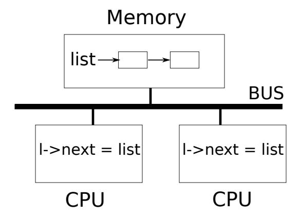

<span id="page-55-1"></span>Figure 6.1: Simplified SMP architecture

#### <span id="page-55-0"></span>6.1 Race conditions

As an example of why we need locks, consider two processes calling wait on two different CPUs. wait frees the child's memory. Thus on each CPU, the kernel will call kfree to free the children's pages. The kernel allocator maintains a linked list: kalloc() [\(kernel/kalloc.c:69\)](https://github.com/mit-pdos/xv6-riscv/blob/riscv//kernel/kalloc.c#L69) pops a page of memory from a list of free pages, and kfree() [\(kernel/kalloc.c:47\)](https://github.com/mit-pdos/xv6-riscv/blob/riscv//kernel/kalloc.c#L47) pushes a page onto the free list. For best performance, we might hope that the kfrees of the two parent processes would execute in parallel without either having to wait for the other, but this would not be correct given xv6's kfree implementation.

Figure [6.1](#page-55-1) illustrates the setting in more detail: the linked list is in memory that is shared by the two CPUs, which manipulate the linked list using load and store instructions. (In reality, the processors have caches, but conceptually multiprocessor systems behave as if there were a single, shared memory.) If there were no concurrent requests, you might implement a list push operation as follows:

```
1 struct element {
2 int data;
3 struct element *next;
4 };
5
6 struct element *list = 0;
7
8 void
9 push(int data)
10 {
11 struct element *l;
12
13 l = malloc(sizeof *l);
14 l->data = data;
15 l->next = list;
16 list = l;
```

<span id="page-56-2"></span>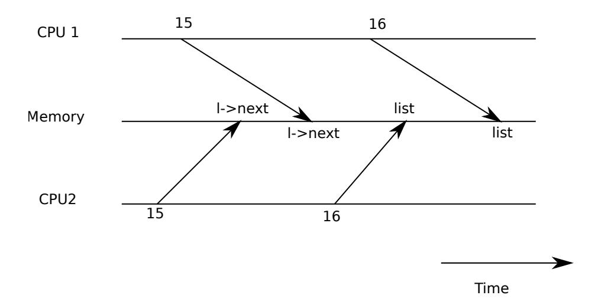

<span id="page-56-0"></span>Figure 6.2: Example race

17 }

This implementation is correct if executed in isolation. However, the code is not correct if more than one copy executes concurrently. If two CPUs execute push at the same time, both might execute line [15](#page-55-2) as shown in Fig [6.1,](#page-55-1) before either executes line [16,](#page-55-3) which results in an incorrect outcome as illustrated by Figure [6.2.](#page-56-0) There would then be two list elements with next set to the former value of list. When the two assignments to list happen at line [16,](#page-55-3) the second one will overwrite the first; the element involved in the first assignment will be lost.

The lost update at line [16](#page-55-3) is an example of a *race condition*. A race condition is a situation in which a memory location is accessed concurrently, and at least one access is a write. A race is often a sign of a bug, either a lost update (if the accesses are writes) or a read of an incompletely-updated data structure. The outcome of a race depends on the exact timing of the two CPUs involved and how their memory operations are ordered by the memory system, which can make race-induced errors difficult to reproduce and debug. For example, adding print statements while debugging push might change the timing of the execution enough to make the race disappear.

The usual way to avoid races is to use a lock. Locks ensure *mutual exclusion*, so that only one CPU at a time can execute the sensitive lines of push; this makes the scenario above impossible. The correctly locked version of the above code adds just a few lines (highlighted in yellow):

```
6 struct element *list = 0;
7 struct lock listlock;
8
9 void
10 push(int data)
11 {
12 struct element *l;
13 l = malloc(sizeof *l);
14 l->data = data;
15
```

```
16 acquire(&listlock);
17 l->next = list;
18 list = l;
19 release(&listlock);
20 }
```

The sequence of instructions between acquire and release is often called a *critical section*. The lock is typically said to be protecting list.

When we say that a lock protects data, we really mean that the lock protects some collection of invariants that apply to the data. Invariants are properties of data structures that are maintained across operations. Typically, an operation's correct behavior depends on the invariants being true when the operation begins. The operation may temporarily violate the invariants but must reestablish them before finishing. For example, in the linked list case, the invariant is that list points at the first element in the list and that each element's next field points at the next element. The implementation of push violates this invariant temporarily: in line [17,](#page-57-1) l points to the next list element, but list does not point at l yet (reestablished at line [18\)](#page-57-2). The race condition we examined above happened because a second CPU executed code that depended on the list invariants while they were (temporarily) violated. Proper use of a lock ensures that only one CPU at a time can operate on the data structure in the critical section, so that no CPU will execute a data structure operation when the data structure's invariants do not hold.

You can think of a lock as *serializing* concurrent critical sections so that they run one at a time, and thus preserve invariants (assuming the critical sections are correct in isolation). You can also think of critical sections guarded by the same lock as being atomic with respect to each other, so that each sees only the complete set of changes from earlier critical sections, and never sees partially-completed updates.

Although correct use of locks can make incorrect code correct, locks limit performance. For example, if two processes call kfree concurrently, the locks will serialize the two calls, and we obtain no benefit from running them on different CPUs. We say that multiple processes *conflict* if they want the same lock at the same time, or that the lock experiences *contention*. A major challenge in kernel design is to avoid lock contention. Xv6 does little of that, but sophisticated kernels organize data structures and algorithms specifically to avoid lock contention. In the list example, a kernel may maintain a free list per CPU and only touch another CPU's free list if the CPU's list is empty and it must steal memory from another CPU. Other use cases may require more complicated designs.

The placement of locks is also important for performance. For example, it would be correct to move acquire earlier in push: it is fine to move the call to acquire up to before line [13.](#page-56-1) This may reduce performance because then the calls to malloc are also serialized. The section "Using locks" below provides some guidelines for where to insert acquire and release invocations.

#### <span id="page-57-0"></span>6.2 Code: Locks

Xv6 has two types of locks: spinlocks and sleep-locks. We'll start with spinlocks. Xv6 represents a spinlock as a struct spinlock [\(kernel/spinlock.h:2\)](https://github.com/mit-pdos/xv6-riscv/blob/riscv//kernel/spinlock.h#L2). The important field in the structure is <span id="page-58-2"></span>locked, a word that is zero when the lock is available and non-zero when it is held. Logically, xv6 should acquire a lock by executing code like

```
21 void
22 acquire(struct spinlock *lk) // does not work!
23 {
24 for(;;) {
25 if(lk->locked == 0) {
26 lk->locked = 1;
27 break;
28 }
29 }
30 }
```

Unfortunately, this implementation does not guarantee mutual exclusion on a multiprocessor. It could happen that two CPUs simultaneously reach line [25,](#page-58-0) see that lk->locked is zero, and then both grab the lock by executing line [26.](#page-58-1) At this point, two different CPUs hold the lock, which violates the mutual exclusion property. What we need is a way to make lines [25](#page-58-0) and [26](#page-58-1) execute as an *atomic* (i.e., indivisible) step.

Because locks are widely used, multi-core processors usually provide instructions that implement an atomic version of lines [25](#page-58-0) and [26.](#page-58-1) On the RISC-V this instruction is amoswap r, a. amoswap reads the value at the memory address a, writes the contents of register r to that address, and puts the value it read into r. That is, it swaps the contents of the register and the memory address. It performs this sequence atomically, using special hardware to prevent any other CPU from using the memory address between the read and the write.

Xv6's acquire [\(kernel/spinlock.c:22\)](https://github.com/mit-pdos/xv6-riscv/blob/riscv//kernel/spinlock.c#L22) uses the portable C library call \_\_sync\_lock\_test\_and\_set, which boils down to the amoswap instruction; the return value is the old (swapped) contents of lk->locked. The acquire function wraps the swap in a loop, retrying (spinning) until it has acquired the lock. Each iteration swaps one into lk->locked and checks the previous value; if the previous value is zero, then we've acquired the lock, and the swap will have set lk->locked to one. If the previous value is one, then some other CPU holds the lock, and the fact that we atomically swapped one into lk->locked didn't change its value.

Once the lock is acquired, acquire records, for debugging, the CPU that acquired the lock. The lk->cpu field is protected by the lock and must only be changed while holding the lock.

The function release [\(kernel/spinlock.c:47\)](https://github.com/mit-pdos/xv6-riscv/blob/riscv//kernel/spinlock.c#L47) is the opposite of acquire: it clears the lk->cpu field and then releases the lock. Conceptually, the release just requires assigning zero to lk->locked. The C standard allows compilers to implement an assignment with multiple store instructions, so a C assignment might be non-atomic with respect to concurrent code. Instead, release uses the C library function \_\_sync\_lock\_release that performs an atomic assignment. This function also boils down to a RISC-V amoswap instruction.

#### <span id="page-59-2"></span><span id="page-59-0"></span>6.3 Code: Using locks

Xv6 uses locks in many places to avoid race conditions. As described above, kalloc [\(kernel/kalloc.c:69\)](https://github.com/mit-pdos/xv6-riscv/blob/riscv//kernel/kalloc.c#L69) and kfree [\(kernel/kalloc.c:47\)](https://github.com/mit-pdos/xv6-riscv/blob/riscv//kernel/kalloc.c#L47) form a good example. Try Exercises 1 and 2 to see what happens if those functions omit the locks. You'll likely find that it's difficult to trigger incorrect behavior, suggesting that it's hard to reliably test whether code is free from locking errors and races. It is not unlikely that xv6 has some races.

A hard part about using locks is deciding how many locks to use and which data and invariants each lock should protect. There are a few basic principles. First, any time a variable can be written by one CPU at the same time that another CPU can read or write it, a lock should be used to keep the two operations from overlapping. Second, remember that locks protect invariants: if an invariant involves multiple memory locations, typically all of them need to be protected by a single lock to ensure the invariant is maintained.

The rules above say when locks are necessary but say nothing about when locks are unnecessary, and it is important for efficiency not to lock too much, because locks reduce parallelism. If parallelism isn't important, then one could arrange to have only a single thread and not worry about locks. A simple kernel can do this on a multiprocessor by having a single lock that must be acquired on entering the kernel and released on exiting the kernel (though system calls such as pipe reads or wait would pose a problem). Many uniprocessor operating systems have been converted to run on multiprocessors using this approach, sometimes called a "big kernel lock," but the approach sacrifices parallelism: only one CPU can execute in the kernel at a time. If the kernel does any heavy computation, it would be more efficient to use a larger set of more fine-grained locks, so that the kernel could execute on multiple CPUs simultaneously.

As an example of coarse-grained locking, xv6's kalloc.c allocator has a single free list protected by a single lock. If multiple processes on different CPUs try to allocate pages at the same time, each will have to wait for its turn by spinning in acquire. Spinning reduces performance, since it's not useful work. If contention for the lock wasted a significant fraction of CPU time, perhaps performance could be improved by changing the allocator design to have multiple free lists, each with its own lock, to allow truly parallel allocation.

As an example of fine-grained locking, xv6 has a separate lock for each file, so that processes that manipulate different files can often proceed without waiting for each other's locks. The file locking scheme could be made even more fine-grained if one wanted to allow processes to simultaneously write different areas of the same file. Ultimately lock granularity decisions need to be driven by performance measurements as well as complexity considerations.

As subsequent chapters explain each part of xv6, they will mention examples of xv6's use of locks to deal with concurrency. As a preview, Figure [6.3](#page-60-0) lists all of the locks in xv6.

#### <span id="page-59-1"></span>6.4 Deadlock and lock ordering

If a code path through the kernel must hold several locks at the same time, it is important that all code paths acquire those locks in the same order. If they don't, there is a risk of *deadlock*. Let's say two code paths in xv6 need locks A and B, but code path 1 acquires locks in the order A then

<span id="page-60-1"></span>

| Lock             | Description                                                     |
|------------------|-----------------------------------------------------------------|
| bcache.lock      | Protects allocation of block buffer cache entries               |
| cons.lock        | Serializes access to console hardware, avoids intermixed output |
| ftable.lock      | Serializes allocation of a struct file in file table            |
| icache.lock      | Protects allocation of inode cache entries                      |
| vdisk_lock       | Serializes access to disk hardware and queue of DMA descriptors |
| kmem.lock        | Serializes allocation of memory                                 |
| log.lock         | Serializes operations on the transaction log                    |
| pipe's pi->lock  | Serializes operations on each pipe                              |
| pid_lock         | Serializes increments of next_pid                               |
| proc's p->lock   | Serializes changes to process's state                           |
| tickslock        | Serializes operations on the ticks counter                      |
| inode's ip->lock | Serializes operations on each inode and its content             |
| buf's b->lock    | Serializes operations on each block buffer                      |

<span id="page-60-0"></span>Figure 6.3: Locks in xv6

B, and the other path acquires them in the order B then A. Suppose thread T1 executes code path 1 and acquires lock A, and thread T2 executes code path 2 and acquires lock B. Next T1 will try to acquire lock B, and T2 will try to acquire lock A. Both acquires will block indefinitely, because in both cases the other thread holds the needed lock, and won't release it until its acquire returns. To avoid such deadlocks, all code paths must acquire locks in the same order. The need for a global lock acquisition order means that locks are effectively part of each function's specification: callers must invoke functions in a way that causes locks to be acquired in the agreed-on order.

Xv6 has many lock-order chains of length two involving per-process locks (the lock in each struct proc) due to the way that sleep works (see Chapter [7\)](#page-66-0). For example, consoleintr [\(kernel/console.c:138\)](https://github.com/mit-pdos/xv6-riscv/blob/riscv//kernel/console.c#L138) is the interrupt routine which handles typed characters. When a newline arrives, any process that is waiting for console input should be woken up. To do this, consoleintr holds cons.lock while calling wakeup, which acquires the waiting process's lock in order to wake it up. In consequence, the global deadlock-avoiding lock order includes the rule that cons.lock must be acquired before any process lock. The file-system code contains xv6's longest lock chains. For example, creating a file requires simultaneously holding a lock on the directory, a lock on the new file's inode, a lock on a disk block buffer, the disk driver's vdisk\_lock, and the calling process's p->lock. To avoid deadlock, file-system code always acquires locks in the order mentioned in the previous sentence.

Honoring a global deadlock-avoiding order can be surprisingly difficult. Sometimes the lock order conflicts with logical program structure, e.g., perhaps code module M1 calls module M2, but the lock order requires that a lock in M2 be acquired before a lock in M1. Sometimes the identities of locks aren't known in advance, perhaps because one lock must be held in order to discover the identity of the lock to be acquired next. This kind of situation arises in the file system as it looks up successive components in a path name, and in the code for wait and exit as they search the table of processes looking for child processes. Finally, the danger of deadlock is often a constraint on

<span id="page-61-2"></span>how fine-grained one can make a locking scheme, since more locks often means more opportunity for deadlock. The need to avoid deadlock is often a major factor in kernel implementation.

#### <span id="page-61-0"></span>6.5 Locks and interrupt handlers

Some xv6 spinlocks protect data that is used by both threads and interrupt handlers. For example, the clockintr timer interrupt handler might increment ticks [\(kernel/trap.c:163\)](https://github.com/mit-pdos/xv6-riscv/blob/riscv//kernel/trap.c#L163) at about the same time that a kernel thread reads ticks in sys\_sleep [\(kernel/sysproc.c:64\)](https://github.com/mit-pdos/xv6-riscv/blob/riscv//kernel/sysproc.c#L64). The lock tickslock serializes the two accesses.

The interaction of spinlocks and interrupts raises a potential danger. Suppose sys\_sleep holds tickslock, and its CPU is interrupted by a timer interrupt. clockintr would try to acquire tickslock, see it was held, and wait for it to be released. In this situation, tickslock will never be released: only sys\_sleep can release it, but sys\_sleep will not continue running until clockintr returns. So the CPU will deadlock, and any code that needs either lock will also freeze.

To avoid this situation, if a spinlock is used by an interrupt handler, a CPU must never hold that lock with interrupts enabled. Xv6 is more conservative: when a CPU acquires any lock, xv6 always disables interrupts on that CPU. Interrupts may still occur on other CPUs, so an interrupt's acquire can wait for a thread to release a spinlock; just not on the same CPU.

xv6 re-enables interrupts when a CPU holds no spinlocks; it must do a little book-keeping to cope with nested critical sections. acquire calls push\_off [\(kernel/spinlock.c:89\)](https://github.com/mit-pdos/xv6-riscv/blob/riscv//kernel/spinlock.c#L89) and release calls pop\_off [\(kernel/spinlock.c:100\)](https://github.com/mit-pdos/xv6-riscv/blob/riscv//kernel/spinlock.c#L100) to track the nesting level of locks on the current CPU. When that count reaches zero, pop\_off restores the interrupt enable state that existed at the start of the outermost critical section. The intr\_off and intr\_on functions execute RISC-V instructions to disable and enable interrupts, respectively.

It is important that acquire call push\_off strictly before setting lk->locked [\(kernel/spin](https://github.com/mit-pdos/xv6-riscv/blob/riscv//kernel/spinlock.c#L28)[lock.c:28\)](https://github.com/mit-pdos/xv6-riscv/blob/riscv//kernel/spinlock.c#L28). If the two were reversed, there would be a brief window when the lock was held with interrupts enabled, and an unfortunately timed interrupt would deadlock the system. Similarly, it is important that release call pop\_off only after releasing the lock [\(kernel/spinlock.c:66\)](https://github.com/mit-pdos/xv6-riscv/blob/riscv//kernel/spinlock.c#L66).

### <span id="page-61-1"></span>6.6 Instruction and memory ordering

It is natural to think of programs executing in the order in which source code statements appear. Many compilers and CPUs, however, execute code out of order to achieve higher performance. If an instruction takes many cycles to complete, a CPU may issue the instruction early so that it can overlap with other instructions and avoid CPU stalls. For example, a CPU may notice that in a serial sequence of instructions A and B are not dependent on each other. The CPU may start instruction B first, either because its inputs are ready before A's inputs, or in order to overlap execution of A and B. A compiler may perform a similar re-ordering by emitting instructions for one statement before the instructions for a statement that precedes it in the source.

Compilers and CPUs follow rules when they re-order to ensure that they don't change the results of correctly-written serial code. However, the rules do allow re-ordering that changes the <span id="page-62-3"></span>results of concurrent code, and can easily lead to incorrect behavior on multiprocessors [\[2,](#page-104-4) [3\]](#page-104-8). The CPU's ordering rules are called the *memory model*.

For example, in this code for push, it would be a disaster if the compiler or CPU moved the store corresponding to line [4](#page-62-1) to a point after the release on line [6:](#page-62-2)

```
1 l = malloc(sizeof *l);
2 l->data = data;
3 acquire(&listlock);
4 l->next = list;
5 list = l;
6 release(&listlock);
```

<span id="page-62-2"></span>If such a re-ordering occurred, there would be a window during which another CPU could acquire the lock and observe the updated list, but see an uninitialized list->next.

To tell the hardware and compiler not to perform such re-orderings, xv6 uses \_\_sync\_synchronize() in both acquire [\(kernel/spinlock.c:22\)](https://github.com/mit-pdos/xv6-riscv/blob/riscv//kernel/spinlock.c#L22) and release [\(kernel/spinlock.c:47\)](https://github.com/mit-pdos/xv6-riscv/blob/riscv//kernel/spinlock.c#L47). \_\_sync\_synchronize() is a *memory barrier*: it tells the compiler and CPU to not reorder loads or stores across the barrier. The barriers in xv6's acquire and release force order in almost all cases where it matters, since xv6 uses locks around accesses to shared data. Chapter [9](#page-98-0) discusses a few exceptions.

#### <span id="page-62-0"></span>6.7 Sleep locks

Sometimes xv6 needs to hold a lock for a long time. For example, the file system (Chapter [8\)](#page-80-0) keeps a file locked while reading and writing its content on the disk, and these disk operations can take tens of milliseconds. Holding a spinlock that long would lead to waste if another process wanted to acquire it, since the acquiring process would waste CPU for a long time while spinning. Another drawback of spinlocks is that a process cannot yield the CPU while retaining a spinlock; we'd like to do this so that other processes can use the CPU while the process with the lock waits for the disk. Yielding while holding a spinlock is illegal because it might lead to deadlock if a second thread then tried to acquire the spinlock; since acquire doesn't yield the CPU, the second thread's spinning might prevent the first thread from running and releasing the lock. Yielding while holding a lock would also violate the requirement that interrupts must be off while a spinlock is held. Thus we'd like a type of lock that yields the CPU while waiting to acquire, and allows yields (and interrupts) while the lock is held.

Xv6 provides such locks in the form of *sleep-locks*. acquiresleep [\(kernel/sleeplock.c:22\)](https://github.com/mit-pdos/xv6-riscv/blob/riscv//kernel/sleeplock.c#L22) yields the CPU while waiting, using techniques that will be explained in Chapter [7.](#page-66-0) At a high level, a sleep-lock has a locked field that is protected by a spinlock, and acquiresleep 's call to sleep atomically yields the CPU and releases the spinlock. The result is that other threads can execute while acquiresleep waits.

Because sleep-locks leave interrupts enabled, they cannot be used in interrupt handlers. Because acquiresleep may yield the CPU, sleep-locks cannot be used inside spinlock critical sections (though spinlocks can be used inside sleep-lock critical sections).

Spin-locks are best suited to short critical sections, since waiting for them wastes CPU time; sleep-locks work well for lengthy operations.

### <span id="page-63-0"></span>6.8 Real world

Programming with locks remains challenging despite years of research into concurrency primitives and parallelism. It is often best to conceal locks within higher-level constructs like synchronized queues, although xv6 does not do this. If you program with locks, it is wise to use a tool that attempts to identify race conditions, because it is easy to miss an invariant that requires a lock.

Most operating systems support POSIX threads (Pthreads), which allow a user process to have several threads running concurrently on different CPUs. Pthreads has support for user-level locks, barriers, etc. Supporting Pthreads requires support from the operating system. For example, it should be the case that if one pthread blocks in a system call, another pthread of the same process should be able to run on that CPU. As another example, if a pthread changes its process's address space (e.g., maps or unmaps memory), the kernel must arrange that other CPUs that run threads of the same process update their hardware page tables to reflect the change in the address space.

It is possible to implement locks without atomic instructions [\[8\]](#page-104-9), but it is expensive, and most operating systems use atomic instructions.

Locks can be expensive if many CPUs try to acquire the same lock at the same time. If one CPU has a lock cached in its local cache, and another CPU must acquire the lock, then the atomic instruction to update the cache line that holds the lock must move the line from the one CPU's cache to the other CPU's cache, and perhaps invalidate any other copies of the cache line. Fetching a cache line from another CPU's cache can be orders of magnitude more expensive than fetching a line from a local cache.

To avoid the expenses associated with locks, many operating systems use lock-free data structures and algorithms [\[5,](#page-104-10) [10\]](#page-104-11). For example, it is possible to implement a linked list like the one in the beginning of the chapter that requires no locks during list searches, and one atomic instruction to insert an item in a list. Lock-free programming is more complicated, however, than programming locks; for example, one must worry about instruction and memory reordering. Programming with locks is already hard, so xv6 avoids the additional complexity of lock-free programming.

### <span id="page-63-1"></span>6.9 Exercises

- 1. Comment out the calls to acquire and release in kalloc [\(kernel/kalloc.c:69\)](https://github.com/mit-pdos/xv6-riscv/blob/riscv//kernel/kalloc.c#L69). This seems like it should cause problems for kernel code that calls kalloc; what symptoms do you expect to see? When you run xv6, do you see these symptoms? How about when running usertests? If you don't see a problem, why not? See if you can provoke a problem by inserting dummy loops into the critical section of kalloc.
- 2. Suppose that you instead commented out the locking in kfree (after restoring locking in kalloc). What might now go wrong? Is lack of locks in kfree less harmful than in kalloc?
- 3. If two CPUs call kalloc at the same time, one will have to wait for the other, which is bad for performance. Modify kalloc.c to have more parallelism, so that simultaneous calls to kalloc from different CPUs can proceed without waiting for each other.

- 4. Write a parallel program using POSIX threads, which is supported on most operating systems. For example, implement a parallel hash table and measure if the number of puts/gets scales with increasing number of cores.
- 5. Implement a subset of Pthreads in xv6. That is, implement a user-level thread library so that a user process can have more than 1 thread and arrange that these threads can run in parallel on different CPUs. Come up with a design that correctly handles a thread making a blocking system call and changing its shared address space.

# <span id="page-66-2"></span><span id="page-66-0"></span>Chapter 7

# Scheduling

Any operating system is likely to run with more processes than the computer has CPUs, so a plan is needed to time-share the CPUs among the processes. Ideally the sharing would be transparent to user processes. A common approach is to provide each process with the illusion that it has its own virtual CPU by *multiplexing* the processes onto the hardware CPUs. This chapter explains how xv6 achieves this multiplexing.

### <span id="page-66-1"></span>7.1 Multiplexing

Xv6 multiplexes by switching each CPU from one process to another in two situations. First, xv6's sleep and wakeup mechanism switches when a process waits for device or pipe I/O to complete, or waits for a child to exit, or waits in the sleep system call. Second, xv6 periodically forces a switch to cope with processes that compute for long periods without sleeping. This multiplexing creates the illusion that each process has its own CPU, just as xv6 uses the memory allocator and hardware page tables to create the illusion that each process has its own memory.

Implementing multiplexing poses a few challenges. First, how to switch from one process to another? Although the idea of context switching is simple, the implementation is some of the most opaque code in xv6. Second, how to force switches in a way that is transparent to user processes? Xv6 uses the standard technique of driving context switches with timer interrupts. Third, many CPUs may be switching among processes concurrently, and a locking plan is necessary to avoid races. Fourth, a process's memory and other resources must be freed when the process exits, but it cannot do all of this itself because (for example) it can't free its own kernel stack while still using it. Fifth, each core of a multi-core machine must remember which process it is executing so that system calls affect the correct process's kernel state. Finally, sleep and wakeup allow a process to give up the CPU and sleep waiting for an event, and allows another process to wake the first process up. Care is needed to avoid races that result in the loss of wakeup notifications. Xv6 tries to solve these problems as simply as possible, but nevertheless the resulting code is tricky.

<span id="page-67-2"></span>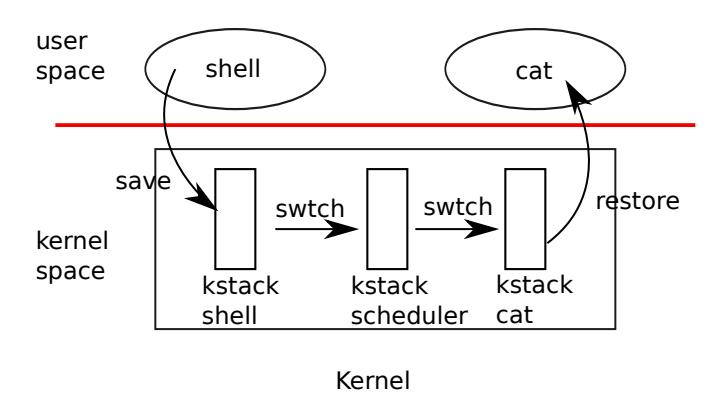

Figure 7.1: Switching from one user process to another. In this example, xv6 runs with one CPU (and thus one scheduler thread).

#### <span id="page-67-1"></span><span id="page-67-0"></span>7.2 Code: Context switching

Figure [7.1](#page-67-1) outlines the steps involved in switching from one user process to another: a user-kernel transition (system call or interrupt) to the old process's kernel thread, a context switch to the current CPU's scheduler thread, a context switch to a new process's kernel thread, and a trap return to the user-level process. The xv6 scheduler has a dedicated thread (saved registers and stack) per CPU because it is not safe for the scheduler execute on the old process's kernel stack: some other core might wake the process up and run it, and it would be a disaster to use the same stack on two different cores. In this section we'll examine the mechanics of switching between a kernel thread and a scheduler thread.

Switching from one thread to another involves saving the old thread's CPU registers, and restoring the previously-saved registers of the new thread; the fact that the stack pointer and program counter are saved and restored means that the CPU will switch stacks and switch what code it is executing.

The function swtch performs the saves and restores for a kernel thread switch. swtch doesn't directly know about threads; it just saves and restores register sets, called *contexts*. When it is time for a process to give up the CPU, the process's kernel thread calls swtch to save its own context and return to the scheduler context. Each context is contained in a struct context [\(kernel/proc.h:2\)](https://github.com/mit-pdos/xv6-riscv/blob/riscv//kernel/proc.h#L2), itself contained in a process's struct proc or a CPU's struct cpu. Swtch takes two arguments: struct context \*old and struct context \*new. It saves the current registers in old, loads registers from new, and returns.

Let's follow a process through swtch into the scheduler. We saw in Chapter [4](#page-40-0) that one possibility at the end of an interrupt is that usertrap calls yield. Yield in turn calls sched, which calls swtch to save the current context in p->context and switch to the scheduler context previously saved in cpu->scheduler [\(kernel/proc.c:509\)](https://github.com/mit-pdos/xv6-riscv/blob/riscv//kernel/proc.c#L509).

Swtch [\(kernel/swtch.S:3\)](https://github.com/mit-pdos/xv6-riscv/blob/riscv//kernel/swtch.S#L3) saves only callee-saved registers; caller-saved registers are saved on the stack (if needed) by the calling C code. Swtch knows the offset of each register's field in struct context. It does not save the program counter. Instead, swtch saves the ra register, which holds the return address from which swtch was called. Now swtch restores registers from <span id="page-68-1"></span>the new context, which holds register values saved by a previous swtch. When swtch returns, it returns to the instructions pointed to by the restored ra register, that is, the instruction from which the new thread previously called swtch. In addition, it returns on the new thread's stack.

In our example, sched called swtch to switch to cpu->scheduler, the per-CPU scheduler context. That context had been saved by scheduler's call to swtch [\(kernel/proc.c:475\)](https://github.com/mit-pdos/xv6-riscv/blob/riscv//kernel/proc.c#L475). When the swtch we have been tracing returns, it returns not to sched but to scheduler, and its stack pointer points at the current CPU's scheduler stack.

#### <span id="page-68-0"></span>7.3 Code: Scheduling

The last section looked at the low-level details of swtch; now let's take swtch as a given and examine switching from one process's kernel thread through the scheduler to another process. The scheduler exists in the form of a special thread per CPU, each running the scheduler function. This function is in charge of choosing which process to run next. A process that wants to give up the CPU must acquire its own process lock p->lock, release any other locks it is holding, update its own state (p->state), and then call sched. Yield [\(kernel/proc.c:515\)](https://github.com/mit-pdos/xv6-riscv/blob/riscv//kernel/proc.c#L515) follows this convention, as do sleep and exit, which we will examine later. Sched double-checks those conditions [\(kernel/proc.c:499-504\)](https://github.com/mit-pdos/xv6-riscv/blob/riscv//kernel/proc.c#L499-L504) and then an implication of those conditions: since a lock is held, interrupts should be disabled. Finally, sched calls swtch to save the current context in p->context and switch to the scheduler context in cpu->scheduler. Swtch returns on the scheduler's stack as though scheduler's swtch had returned The scheduler continues the for loop, finds a process to run, switches to it, and the cycle repeats.

We just saw that xv6 holds p->lock across calls to swtch: the caller of swtch must already hold the lock, and control of the lock passes to the switched-to code. This convention is unusual with locks; usually the thread that acquires a lock is also responsible for releasing the lock, which makes it easier to reason about correctness. For context switching it is necessary to break this convention because p->lock protects invariants on the process's state and context fields that are not true while executing in swtch. One example of a problem that could arise if p->lock were not held during swtch: a different CPU might decide to run the process after yield had set its state to RUNNABLE, but before swtch caused it to stop using its own kernel stack. The result would be two CPUs running on the same stack, which cannot be right.

A kernel thread always gives up its CPU in sched and always switches to the same location in the scheduler, which (almost) always switches to some kernel thread that previously called sched. Thus, if one were to print out the line numbers where xv6 switches threads, one would observe the following simple pattern: [\(kernel/proc.c:475\)](https://github.com/mit-pdos/xv6-riscv/blob/riscv//kernel/proc.c#L475), [\(kernel/proc.c:509\)](https://github.com/mit-pdos/xv6-riscv/blob/riscv//kernel/proc.c#L509), [\(kernel/proc.c:475\)](https://github.com/mit-pdos/xv6-riscv/blob/riscv//kernel/proc.c#L475), [\(ker](https://github.com/mit-pdos/xv6-riscv/blob/riscv//kernel/proc.c#L509)[nel/proc.c:509\)](https://github.com/mit-pdos/xv6-riscv/blob/riscv//kernel/proc.c#L509), and so on. The procedures in which this stylized switching between two threads happens are sometimes referred to as *coroutines*; in this example, sched and scheduler are co-routines of each other.

There is one case when the scheduler's call to swtch does not end up in sched. When a new process is first scheduled, it begins at forkret [\(kernel/proc.c:527\)](https://github.com/mit-pdos/xv6-riscv/blob/riscv//kernel/proc.c#L527). Forkret exists to release the p->lock; otherwise, the new process could start at usertrapret.

Scheduler [\(kernel/proc.c:457\)](https://github.com/mit-pdos/xv6-riscv/blob/riscv//kernel/proc.c#L457) runs a simple loop: find a process to run, run it until it yields,

<span id="page-69-1"></span>repeat. The scheduler loops over the process table looking for a runnable process, one that has p->state == RUNNABLE. Once it finds a process, it sets the per-CPU current process variable c->proc, marks the process as RUNNING, and then calls swtch to start running it [\(kernel/proc.c:470-](https://github.com/mit-pdos/xv6-riscv/blob/riscv//kernel/proc.c#L470-L475) [475\)](https://github.com/mit-pdos/xv6-riscv/blob/riscv//kernel/proc.c#L470-L475).

One way to think about the structure of the scheduling code is that it enforces a set of invariants about each process, and holds p->lock whenever those invariants are not true. One invariant is that if a process is RUNNING, a timer interrupt's yield must be able to safely switch away from the process; this means that the CPU registers must hold the process's register values (i.e. swtch hasn't moved them to a context), and c->proc must refer to the process. Another invariant is that if a process is RUNNABLE, it must be safe for an idle CPU's scheduler to run it; this means that p->context must hold the process's registers (i.e., they are not actually in the real registers), that no CPU is executing on the process's kernel stack, and that no CPU's c->proc refers to the process. Observe that these properties are often not true while p->lock is held.

Maintaining the above invariants is the reason why xv6 often acquires p->lock in one thread and releases it in other, for example acquiring in yield and releasing in scheduler. Once yield has started to modify a running process's state to make it RUNNABLE, the lock must remain held until the invariants are restored: the earliest correct release point is after scheduler (running on its own stack) clears c->proc. Similarly, once scheduler starts to convert a RUNNABLE process to RUNNING, the lock cannot be released until the kernel thread is completely running (after the swtch, for example in yield).

p->lock protects other things as well: the interplay between exit and wait, the machinery to avoid lost wakeups (see Section [7.5\)](#page-70-0), and avoidance of races between a process exiting and other processes reading or writing its state (e.g., the exit system call looking at p->pid and setting p->killed [\(kernel/proc.c:611\)](https://github.com/mit-pdos/xv6-riscv/blob/riscv//kernel/proc.c#L611)). It might be worth thinking about whether the different functions of p->lock could be split up, for clarity and perhaps for performance.

#### <span id="page-69-0"></span>7.4 Code: mycpu and myproc

Xv6 often needs a pointer to the current process's proc structure. On a uniprocessor one could have a global variable pointing to the current proc. This doesn't work on a multi-core machine, since each core executes a different process. The way to solve this problem is to exploit the fact that each core has its own set of registers; we can use one of those registers to help find per-core information.

Xv6 maintains a struct cpu for each CPU [\(kernel/proc.h:22\)](https://github.com/mit-pdos/xv6-riscv/blob/riscv//kernel/proc.h#L22), which records the process currently running on that CPU (if any), saved registers for the CPU's scheduler thread, and the count of nested spinlocks needed to manage interrupt disabling. The function mycpu [\(kernel/proc.c:60\)](https://github.com/mit-pdos/xv6-riscv/blob/riscv//kernel/proc.c#L60) returns a pointer to the current CPU's struct cpu. RISC-V numbers its CPUs, giving each a *hartid*. Xv6 ensures that each CPU's hartid is stored in that CPU's tp register while in the kernel. This allows mycpu to use tp to index an array of cpu structures to find the right one.

Ensuring that a CPU's tp always holds the CPU's hartid is a little involved. mstart sets the tp register early in the CPU's boot sequence, while still in machine mode [\(kernel/start.c:46\)](https://github.com/mit-pdos/xv6-riscv/blob/riscv//kernel/start.c#L46). usertrapret saves tp in the trampoline page, because the user process might modify tp. Finally,

<span id="page-70-1"></span>uservec restores that saved tp when entering the kernel from user space [\(kernel/trampoline.S:70\)](https://github.com/mit-pdos/xv6-riscv/blob/riscv//kernel/trampoline.S#L70). The compiler guarantees never to use the tp register. It would be more convenient if RISC-V allowed xv6 to read the current hartid directly, but that is allowed only in machine mode, not in supervisor mode.

The return values of cpuid and mycpu are fragile: if the timer were to interrupt and cause the thread to yield and then move to a different CPU, a previously returned value would no longer be correct. To avoid this problem, xv6 requires that callers disable interrupts, and only enable them after they finish using the returned struct cpu.

The function myproc [\(kernel/proc.c:68\)](https://github.com/mit-pdos/xv6-riscv/blob/riscv//kernel/proc.c#L68) returns the struct proc pointer for the process that is running on the current CPU. myproc disables interrupts, invokes mycpu, fetches the current process pointer (c->proc) out of the struct cpu, and then enables interrupts. The return value of myproc is safe to use even if interrupts are enabled: if a timer interrupt moves the calling process to a different CPU, its struct proc pointer will stay the same.

#### <span id="page-70-0"></span>7.5 Sleep and wakeup

Scheduling and locks help conceal the existence of one process from another, but so far we have no abstractions that help processes intentionally interact. Many mechanisms have been invented to solve this problem. Xv6 uses one called sleep and wakeup, which allow one process to sleep waiting for an event and another process to wake it up once the event has happened. Sleep and wakeup are often called *sequence coordination* or *conditional synchronization* mechanisms.

To illustrate, let's consider a synchronization mechanism called a *semaphore* [\[4\]](#page-104-12) that coordinates producers and consumers. A semaphore maintains a count and provides two operations. The "V" operation (for the producer) increments the count. The "P" operation (for the consumer) waits until the count is non-zero, and then decrements it and returns. If there were only one producer thread and one consumer thread, and they executed on different CPUs, and the compiler didn't optimize too aggressively, this implementation would be correct:

```
100 struct semaphore {
101 struct spinlock lock;
102 int count;
103 };
104
105 void
106 V(struct semaphore *s)
107 {
108 acquire(&s->lock);
109 s->count += 1;
110 release(&s->lock);
111 }
112
113 void
114 P(struct semaphore *s)
115 {
```

```
116 while(s->count == 0)
117 ;
118 acquire(&s->lock);
119 s->count -= 1;
120 release(&s->lock);
121 }
```

The implementation above is expensive. If the producer acts rarely, the consumer will spend most of its time spinning in the while loop hoping for a non-zero count. The consumer's CPU could find more productive work than with *busy waiting* by repeatedly *polling* s->count. Avoiding busy waiting requires a way for the consumer to yield the CPU and resume only after V increments the count.

Here's a step in that direction, though as we will see it is not enough. Let's imagine a pair of calls, sleep and wakeup, that work as follows. Sleep(chan) sleeps on the arbitrary value chan, called the *wait channel*. Sleep puts the calling process to sleep, releasing the CPU for other work. Wakeup(chan) wakes all processes sleeping on chan (if any), causing their sleep calls to return. If no processes are waiting on chan, wakeup does nothing. We can change the semaphore implementation to use sleep and wakeup (changes highlighted in yellow):

```
200 void
201 V(struct semaphore *s)
202 {
203 acquire(&s->lock);
204 s->count += 1;
205 wakeup(s);
206 release(&s->lock);
207 }
208
209 void
210 P(struct semaphore *s)
211 {
212 while(s->count == 0)
213 sleep(s);
214 acquire(&s->lock);
215 s->count -= 1;
216 release(&s->lock);
217 }
```

<span id="page-71-1"></span><span id="page-71-0"></span>P now gives up the CPU instead of spinning, which is nice. However, it turns out not to be straightforward to design sleep and wakeup with this interface without suffering from what is known as the *lost wake-up* problem. Suppose that P finds that s->count == 0 on line [212.](#page-71-0) While P is between lines [212](#page-71-0) and [213,](#page-71-1) V runs on another CPU: it changes s->count to be nonzero and calls wakeup, which finds no processes sleeping and thus does nothing. Now P continues executing at line [213:](#page-71-1) it calls sleep and goes to sleep. This causes a problem: P is asleep waiting for a V call that has already happened. Unless we get lucky and the producer calls V again, the consumer will wait forever even though the count is non-zero.

<span id="page-72-2"></span>The root of this problem is that the invariant that P only sleeps when s->count == 0 is violated by V running at just the wrong moment. An incorrect way to protect the invariant would be to move the lock acquisition (highlighted in yellow below) in P so that its check of the count and its call to sleep are atomic:

```
300 void
301 V(struct semaphore *s)
302 {
303 acquire(&s->lock);
304 s->count += 1;
305 wakeup(s);
306 release(&s->lock);
307 }
308
309 void
310 P(struct semaphore *s)
311 {
312 acquire(&s->lock);
313 while(s->count == 0)
314 sleep(s);
315 s->count -= 1;
316 release(&s->lock);
317 }
```

<span id="page-72-1"></span><span id="page-72-0"></span>One might hope that this version of P would avoid the lost wakeup because the lock prevents V from executing between lines [313](#page-72-0) and [314.](#page-72-1) It does that, but it also deadlocks: P holds the lock while it sleeps, so V will block forever waiting for the lock.

We'll fix the preceding scheme by changing sleep's interface: the caller must pass the *condition lock* to sleep so it can release the lock after the calling process is marked as asleep and waiting on the sleep channel. The lock will force a concurrent V to wait until P has finished putting itself to sleep, so that the wakeup will find the sleeping consumer and wake it up. Once the consumer is awake again sleep reacquires the lock before returning. Our new correct sleep/wakeup scheme is usable as follows (change highlighted in yellow):

```
400 void
401 V(struct semaphore *s)
402 {
403 acquire(&s->lock);
404 s->count += 1;
405 wakeup(s);
406 release(&s->lock);
407 }
408
409 void
410 P(struct semaphore *s)
411 {
412 acquire(&s->lock);
```

```
413 while(s->count == 0)
414 sleep(s, &s->lock);
415 s->count -= 1;
416 release(&s->lock);
417 }
```

The fact that P holds s->lock prevents V from trying to wake it up between P's check of c->count and its call to sleep. Note, however, that we need sleep to atomically release s->lock and put the consuming process to sleep.

#### <span id="page-73-0"></span>7.6 Code: Sleep and wakeup

Let's look at the implementation of sleep [\(kernel/proc.c:548\)](https://github.com/mit-pdos/xv6-riscv/blob/riscv//kernel/proc.c#L548) and wakeup [\(kernel/proc.c:582\)](https://github.com/mit-pdos/xv6-riscv/blob/riscv//kernel/proc.c#L582). The basic idea is to have sleep mark the current process as SLEEPING and then call sched to release the CPU; wakeup looks for a process sleeping on the given wait channel and marks it as RUNNABLE. Callers of sleep and wakeup can use any mutually convenient number as the channel. Xv6 often uses the address of a kernel data structure involved in the waiting.

Sleep acquires p->lock [\(kernel/proc.c:559\)](https://github.com/mit-pdos/xv6-riscv/blob/riscv//kernel/proc.c#L559). Now the process going to sleep holds both p->lock and lk. Holding lk was necessary in the caller (in the example, P): it ensured that no other process (in the example, one running V) could start a call to wakeup(chan). Now that sleep holds p->lock, it is safe to release lk: some other process may start a call to wakeup(chan), but wakeup will wait to acquire p->lock, and thus will wait until sleep has finished putting the process to sleep, keeping the wakeup from missing the sleep.

There is a minor complication: if lk is the same lock as p->lock, then sleep would deadlock with itself if it tried to acquire p->lock. But if the process calling sleep already holds p->lock, it doesn't need to do anything more in order to avoiding missing a concurrent wakeup. This case arises when wait [\(kernel/proc.c:582\)](https://github.com/mit-pdos/xv6-riscv/blob/riscv//kernel/proc.c#L582) calls sleep with p->lock.

Now that sleep holds p->lock and no others, it can put the process to sleep by recording the sleep channel, changing the process state to SLEEPING, and calling sched [\(kernel/proc.c:564-567\)](https://github.com/mit-pdos/xv6-riscv/blob/riscv//kernel/proc.c#L564-L567). In a moment it will be clear why it's critical that p->lock is not released (by scheduler) until after the process is marked SLEEPING.

At some point, a process will acquire the condition lock, set the condition that the sleeper is waiting for, and call wakeup(chan). It's important that wakeup is called while holding the condition lock[1](#page-73-1) . Wakeup loops over the process table [\(kernel/proc.c:582\)](https://github.com/mit-pdos/xv6-riscv/blob/riscv//kernel/proc.c#L582). It acquires the p->lock of each process it inspects, both because it may manipulate that process's state and because p->lock ensures that sleep and wakeup do not miss each other. When wakeup finds a process in state SLEEPING with a matching chan, it changes that process's state to RUNNABLE. The next time the scheduler runs, it will see that the process is ready to be run.

Why do the locking rules for sleep and wakeup ensure a sleeping process won't miss a wakeup? The sleeping process holds either the condition lock or its own p->lock or both from a

<span id="page-73-1"></span><sup>1</sup>Strictly speaking it is sufficient if wakeup merely follows the acquire (that is, one could call wakeup after the release).

<span id="page-74-1"></span>point before it checks the condition to a point after it is marked SLEEPING. The process calling wakeup holds *both* of those locks in wakeup's loop. Thus the waker either makes the condition true before the consuming thread checks the condition; or the waker's wakeup examines the sleeping thread strictly after it has been marked SLEEPING. Then wakeup will see the sleeping process and wake it up (unless something else wakes it up first).

It is sometimes the case that multiple processes are sleeping on the same channel; for example, more than one process reading from a pipe. A single call to wakeup will wake them all up. One of them will run first and acquire the lock that sleep was called with, and (in the case of pipes) read whatever data is waiting in the pipe. The other processes will find that, despite being woken up, there is no data to be read. From their point of view the wakeup was "spurious," and they must sleep again. For this reason sleep is always called inside a loop that checks the condition.

No harm is done if two uses of sleep/wakeup accidentally choose the same channel: they will see spurious wakeups, but looping as described above will tolerate this problem. Much of the charm of sleep/wakeup is that it is both lightweight (no need to create special data structures to act as sleep channels) and provides a layer of indirection (callers need not know which specific process they are interacting with).

#### <span id="page-74-0"></span>7.7 Code: Pipes

A more complex example that uses sleep and wakeup to synchronize producers and consumers is xv6's implementation of pipes. We saw the interface for pipes in Chapter [1:](#page-8-0) bytes written to one end of a pipe are copied to an in-kernel buffer and then can be read from the other end of the pipe. Future chapters will examine the file descriptor support surrounding pipes, but let's look now at the implementations of pipewrite and piperead.

Each pipe is represented by a struct pipe, which contains a lock and a data buffer. The fields nread and nwrite count the total number of bytes read from and written to the buffer. The buffer wraps around: the next byte written after buf[PIPESIZE-1] is buf[0]. The counts do not wrap. This convention lets the implementation distinguish a full buffer (nwrite == nread+PIPESIZE) from an empty buffer (nwrite == nread), but it means that indexing into the buffer must use buf[nread % PIPESIZE] instead of just buf[nread] (and similarly for nwrite).

Let's suppose that calls to piperead and pipewrite happen simultaneously on two different CPUs. Pipewrite [\(kernel/pipe.c:77\)](https://github.com/mit-pdos/xv6-riscv/blob/riscv//kernel/pipe.c#L77) begins by acquiring the pipe's lock, which protects the counts, the data, and their associated invariants. Piperead [\(kernel/pipe.c:103\)](https://github.com/mit-pdos/xv6-riscv/blob/riscv//kernel/pipe.c#L103) then tries to acquire the lock too, but cannot. It spins in acquire [\(kernel/spinlock.c:22\)](https://github.com/mit-pdos/xv6-riscv/blob/riscv//kernel/spinlock.c#L22) waiting for the lock. While piperead waits, pipewrite loops over the bytes being written (addr[0..n-1]), adding each to the pipe in turn [\(kernel/pipe.c:95\)](https://github.com/mit-pdos/xv6-riscv/blob/riscv//kernel/pipe.c#L95). During this loop, it could happen that the buffer fills [\(kernel/pipe.c:85\)](https://github.com/mit-pdos/xv6-riscv/blob/riscv//kernel/pipe.c#L85). In this case, pipewrite calls wakeup to alert any sleeping readers to the fact that there is data waiting in the buffer and then sleeps on &pi->nwrite to wait for a reader to take some bytes out of the buffer. Sleep releases pi->lock as part of putting pipewrite's process to sleep.

Now that pi->lock is available, piperead manages to acquire it and enters its critical section: it finds that pi->nread != pi->nwrite [\(kernel/pipe.c:110\)](https://github.com/mit-pdos/xv6-riscv/blob/riscv//kernel/pipe.c#L110) (pipewrite went to sleep be<span id="page-75-1"></span>cause pi->nwrite == pi->nread+PIPESIZE [\(kernel/pipe.c:85\)](https://github.com/mit-pdos/xv6-riscv/blob/riscv//kernel/pipe.c#L85)), so it falls through to the for loop, copies data out of the pipe [\(kernel/pipe.c:117\)](https://github.com/mit-pdos/xv6-riscv/blob/riscv//kernel/pipe.c#L117), and increments nread by the number of bytes copied. That many bytes are now available for writing, so piperead calls wakeup [\(ker](https://github.com/mit-pdos/xv6-riscv/blob/riscv//kernel/pipe.c#L124)[nel/pipe.c:124\)](https://github.com/mit-pdos/xv6-riscv/blob/riscv//kernel/pipe.c#L124) to wake any sleeping writers before it returns. Wakeup finds a process sleeping on &pi->nwrite, the process that was running pipewrite but stopped when the buffer filled. It marks that process as RUNNABLE.

The pipe code uses separate sleep channels for reader and writer (pi->nread and pi->nwrite); this might make the system more efficient in the unlikely event that there are lots of readers and writers waiting for the same pipe. The pipe code sleeps inside a loop checking the sleep condition; if there are multiple readers or writers, all but the first process to wake up will see the condition is still false and sleep again.

#### <span id="page-75-0"></span>7.8 Code: Wait, exit, and kill

Sleep and wakeup can be used for many kinds of waiting. An interesting example, introduced in Chapter [1,](#page-8-0) is the interaction between a child's exit and its parent's wait. At the time of the child's death, the parent may already be sleeping in wait, or may be doing something else; in the latter case, a subsequent call to wait must observe the child's death, perhaps long after it calls exit. The way that xv6 records the child's demise until wait observes it is for exit to put the caller into the ZOMBIE state, where it stays until the parent's wait notices it, changes the child's state to UNUSED, copies the child's exit status, and returns the child's process ID to the parent. If the parent exits before the child, the parent gives the child to the init process, which perpetually calls wait; thus every child has a parent to clean up after it. The main implementation challenge is the possibility of races and deadlock between parent and child wait and exit, as well as exit and exit.

Wait uses the calling process's p->lock as the condition lock to avoid lost wakeups, and it acquires that lock at the start [\(kernel/proc.c:398\)](https://github.com/mit-pdos/xv6-riscv/blob/riscv//kernel/proc.c#L398). Then it scans the process table. If it finds a child in ZOMBIE state, it frees that child's resources and its proc structure, copies the child's exit status to the address supplied to wait (if it is not 0), and returns the child's process ID. If wait finds children but none have exited, it calls sleep to wait for one of them to exit [\(kernel/proc.c:445\)](https://github.com/mit-pdos/xv6-riscv/blob/riscv//kernel/proc.c#L445), then scans again. Here, the condition lock being released in sleep is the waiting process's p->lock, the special case mentioned above. Note that wait often holds two locks; that it acquires its own lock before trying to acquire any child's lock; and that thus all of xv6 must obey the same locking order (parent, then child) in order to avoid deadlock.

Wait looks at every process's np->parent to find its children. It uses np->parent without holding np->lock, which is a violation of the usual rule that shared variables must be protected by locks. It is possible that np is an ancestor of the current process, in which case acquiring np->lock could cause a deadlock since that would violate the order mentioned above. Examining np->parent without a lock seems safe in this case; a process's parent field is only changed by its parent, so if np->parent==p is true, the value can't change unless the current process changes it.

Exit [\(kernel/proc.c:333\)](https://github.com/mit-pdos/xv6-riscv/blob/riscv//kernel/proc.c#L333) records the exit status, frees some resources, gives any children to

<span id="page-76-1"></span>the init process, wakes up the parent in case it is in wait, marks the caller as a zombie, and permanently yields the CPU. The final sequence is a little tricky. The exiting process must hold its parent's lock while it sets its state to ZOMBIE and wakes the parent up, since the parent's lock is the condition lock that guards against lost wakeups in wait. The child must also hold its own p->lock, since otherwise the parent might see it in state ZOMBIE and free it while it is still running. The lock acquisition order is important to avoid deadlock: since wait acquires the parent's lock before the child's lock, exit must use the same order.

Exit calls a specialized wakeup function, wakeup1, that wakes up only the parent, and only if it is sleeping in wait [\(kernel/proc.c:598\)](https://github.com/mit-pdos/xv6-riscv/blob/riscv//kernel/proc.c#L598). It may look incorrect for the child to wake up the parent before setting its state to ZOMBIE, but that is safe: although wakeup1 may cause the parent to run, the loop in wait cannot examine the child until the child's p->lock is released by scheduler, so wait can't look at the exiting process until well after exit has set its state to ZOMBIE [\(ker](https://github.com/mit-pdos/xv6-riscv/blob/riscv//kernel/proc.c#L386)[nel/proc.c:386\)](https://github.com/mit-pdos/xv6-riscv/blob/riscv//kernel/proc.c#L386).

While exit allows a process to terminate itself, kill [\(kernel/proc.c:611\)](https://github.com/mit-pdos/xv6-riscv/blob/riscv//kernel/proc.c#L611) lets one process request that another terminate. It would be too complex for kill to directly destroy the victim process, since the victim might be executing on another CPU, perhaps in the middle of a sensitive sequence of updates to kernel data structures. Thus kill does very little: it just sets the victim's p->killed and, if it is sleeping, wakes it up. Eventually the victim will enter or leave the kernel, at which point code in usertrap will call exit if p->killed is set. If the victim is running in user space, it will soon enter the kernel by making a system call or because the timer (or some other device) interrupts.

If the victim process is in sleep, kill's call to wakeup will cause the victim to return from sleep. This is potentially dangerous because the condition being waiting for may not be true. However, xv6 calls to sleep are always wrapped in a while loop that re-tests the condition after sleep returns. Some calls to sleep also test p->killed in the loop, and abandon the current activity if it is set. This is only done when such abandonment would be correct. For example, the pipe read and write code returns if the killed flag is set; eventually the code will return back to trap, which will again check the flag and exit.

Some xv6 sleep loops do not check p->killed because the code is in the middle of a multistep system call that should be atomic. The virtio driver [\(kernel/virtio\\_disk.c:242\)](https://github.com/mit-pdos/xv6-riscv/blob/riscv//kernel/virtio_disk.c#L242) is an example: it does not check p->killed because a disk operation may be one of a set of writes that are all needed in order for the file system to be left in a correct state. A process that is killed while waiting for disk I/O won't exit until it completes the current system call and usertrap sees the killed flag.

#### <span id="page-76-0"></span>7.9 Real world

The xv6 scheduler implements a simple scheduling policy, which runs each process in turn. This policy is called *round robin*. Real operating systems implement more sophisticated policies that, for example, allow processes to have priorities. The idea is that a runnable high-priority process will be preferred by the scheduler over a runnable low-priority process. These policies can become complex quickly because there are often competing goals: for example, the operating might also want to guarantee fairness and high throughput. In addition, complex policies may lead to unin<span id="page-77-0"></span>tended interactions such as *priority inversion* and *convoys*. Priority inversion can happen when a low-priority and high-priority process share a lock, which when acquired by the low-priority process can prevent the high-priority process from making progress. A long convoy of waiting processes can form when many high-priority processes are waiting for a low-priority process that acquires a shared lock; once a convoy has formed it can persist for long time. To avoid these kinds of problems additional mechanisms are necessary in sophisticated schedulers.

Sleep and wakeup are a simple and effective synchronization method, but there are many others. The first challenge in all of them is to avoid the "lost wakeups" problem we saw at the beginning of the chapter. The original Unix kernel's sleep simply disabled interrupts, which sufficed because Unix ran on a single-CPU system. Because xv6 runs on multiprocessors, it adds an explicit lock to sleep. FreeBSD's msleep takes the same approach. Plan 9's sleep uses a callback function that runs with the scheduling lock held just before going to sleep; the function serves as a last-minute check of the sleep condition, to avoid lost wakeups. The Linux kernel's sleep uses an explicit process queue, called a wait queue, instead of a wait channel; the queue has its own internal lock.

Scanning the entire process list in wakeup for processes with a matching chan is inefficient. A better solution is to replace the chan in both sleep and wakeup with a data structure that holds a list of processes sleeping on that structure, such as Linux's wait queue. Plan 9's sleep and wakeup call that structure a rendezvous point or Rendez. Many thread libraries refer to the same structure as a condition variable; in that context, the operations sleep and wakeup are called wait and signal. All of these mechanisms share the same flavor: the sleep condition is protected by some kind of lock dropped atomically during sleep.

The implementation of wakeup wakes up all processes that are waiting on a particular channel, and it might be the case that many processes are waiting for that particular channel. The operating system will schedule all these processes and they will race to check the sleep condition. Processes that behave in this way are sometimes called a *thundering herd*, and it is best avoided. Most condition variables have two primitives for wakeup: signal, which wakes up one process, and broadcast, which wakes up all waiting processes.

Semaphores are often used for synchronization. The count typically corresponds to something like the number of bytes available in a pipe buffer or the number of zombie children that a process has. Using an explicit count as part of the abstraction avoids the "lost wakeup" problem: there is an explicit count of the number of wakeups that have occurred. The count also avoids the spurious wakeup and thundering herd problems.

Terminating processes and cleaning them up introduces much complexity in xv6. In most operating systems it is even more complex, because, for example, the victim process may be deep inside the kernel sleeping, and unwinding its stack requires much careful programming. Many operating systems unwind the stack using explicit mechanisms for exception handling, such as longjmp. Furthermore, there are other events that can cause a sleeping process to be woken up, even though the event it is waiting for has not happened yet. For example, when a Unix process is sleeping, another process may send a signal to it. In this case, the process will return from the interrupted system call with the value -1 and with the error code set to EINTR. The application can check for these values and decide what to do. Xv6 doesn't support signals and this complexity doesn't arise.

Xv6's support for kill is not entirely satisfactory: there are sleep loops which probably should check for p->killed. A related problem is that, even for sleep loops that check p->killed, there is a race between sleep and kill; the latter may set p->killed and try to wake up the victim just after the victim's loop checks p->killed but before it calls sleep. If this problem occurs, the victim won't notice the p->killed until the condition it is waiting for occurs. This may be quite a bit later (e.g., when the virtio driver returns a disk block that the victim is waiting for) or never (e.g., if the victim is waiting from input from the console, but the user doesn't type any input).

A real operating system would find free proc structures with an explicit free list in constant time instead of the linear-time search in allocproc; xv6 uses the linear scan for simplicity.

#### <span id="page-78-0"></span>7.10 Exercises

1. Sleep has to check lk != &p->lock to avoid a deadlock [\(kernel/proc.c:558-561\)](https://github.com/mit-pdos/xv6-riscv/blob/riscv//kernel/proc.c#L558-L561). Suppose the special case were eliminated by replacing

```
if(lk != &p->lock){
      acquire(&p->lock);
      release(lk);
   }
with
   release(lk);
   acquire(&p->lock);
```

Doing this would break sleep. How?

- 2. Most process cleanup could be done by either exit or wait. It turns out that exit must be the one to close the open files. Why? The answer involves pipes.
- 3. Implement semaphores in xv6 without using sleep and wakeup (but it is OK to use spin locks). Replace the uses of sleep and wakeup in xv6 with semaphores. Judge the result.
- 4. Fix the race mentioned above between kill and sleep, so that a kill that occurs after the victim's sleep loop checks p->killed but before it calls sleep results in the victim abandoning the current system call.
- 5. Design a plan so that every sleep loop checks p->killed so that, for example, a process that is in the virtio driver can return quickly from the while loop if it is killed by another process.
- 6. Modify xv6 to use only one context switch when switching from one process's kernel thread to another, rather than switching through the scheduler thread. The yielding thread will need to select the next thread itself and call swtch. The challenges will be to prevent multiple cores from executing the same thread accidentally; to get the locking right; and to avoid deadlocks.

- 7. Modify xv6's scheduler to use the RISC-V WFI (wait for interrupt) instruction when no processes are runnable. Try to ensure that, any time there are runnable processes waiting to run, no cores are pausing in WFI.
- 8. The lock p->lock protects many invariants, and when looking at a particular piece of xv6 code that is protected by p->lock, it can be difficult to figure out which invariant is being enforced. Design a plan that is more clean by splitting p->lock into several locks.

# <span id="page-80-2"></span><span id="page-80-0"></span>Chapter 8

# File system

The purpose of a file system is to organize and store data. File systems typically support sharing of data among users and applications, as well as *persistence* so that data is still available after a reboot.

The xv6 file system provides Unix-like files, directories, and pathnames (see Chapter [1\)](#page-8-0), and stores its data on a virtio disk for persistence (see Chapter [4\)](#page-40-0). The file system addresses several challenges:

- The file system needs on-disk data structures to represent the tree of named directories and files, to record the identities of the blocks that hold each file's content, and to record which areas of the disk are free.
- The file system must support *crash recovery*. That is, if a crash (e.g., power failure) occurs, the file system must still work correctly after a restart. The risk is that a crash might interrupt a sequence of updates and leave inconsistent on-disk data structures (e.g., a block that is both used in a file and marked free).
- Different processes may operate on the file system at the same time, so the file-system code must coordinate to maintain invariants.
- Accessing a disk is orders of magnitude slower than accessing memory, so the file system must maintain an in-memory cache of popular blocks.

The rest of this chapter explains how xv6 addresses these challenges.

### <span id="page-80-1"></span>8.1 Overview

The xv6 file system implementation is organized in seven layers, shown in Figure [8.1.](#page-81-1) The disk layer reads and writes blocks on an virtio hard drive. The buffer cache layer caches disk blocks and synchronizes access to them, making sure that only one kernel process at a time can modify the data stored in any particular block. The logging layer allows higher layers to wrap updates to several blocks in a *transaction*, and ensures that the blocks are updated atomically in the face

<span id="page-81-2"></span>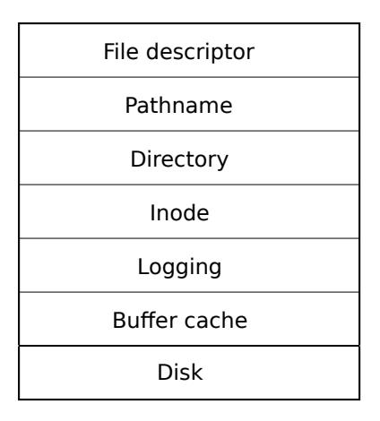

<span id="page-81-1"></span>Figure 8.1: Layers of the xv6 file system.

of crashes (i.e., all of them are updated or none). The inode layer provides individual files, each represented as an *inode* with a unique i-number and some blocks holding the file's data. The directory layer implements each directory as a special kind of inode whose content is a sequence of directory entries, each of which contains a file's name and i-number. The pathname layer provides hierarchical path names like /usr/rtm/xv6/fs.c, and resolves them with recursive lookup. The file descriptor layer abstracts many Unix resources (e.g., pipes, devices, files, etc.) using the file system interface, simplifying the lives of application programmers.

The file system must have a plan for where it stores inodes and content blocks on the disk. To do so, xv6 divides the disk into several sections, as Figure [8.2](#page-82-1) shows. The file system does not use block 0 (it holds the boot sector). Block 1 is called the *superblock*; it contains metadata about the file system (the file system size in blocks, the number of data blocks, the number of inodes, and the number of blocks in the log). Blocks starting at 2 hold the log. After the log are the inodes, with multiple inodes per block. After those come bitmap blocks tracking which data blocks are in use. The remaining blocks are data blocks; each is either marked free in the bitmap block, or holds content for a file or directory. The superblock is filled in by a separate program, called mkfs, which builds an initial file system.

The rest of this chapter discusses each layer, starting with the buffer cache. Look out for situations where well-chosen abstractions at lower layers ease the design of higher ones.

#### <span id="page-81-0"></span>8.2 Buffer cache layer

The buffer cache has two jobs: (1) synchronize access to disk blocks to ensure that only one copy of a block is in memory and that only one kernel thread at a time uses that copy; (2) cache popular blocks so that they don't need to be re-read from the slow disk. The code is in bio.c.

The main interface exported by the buffer cache consists of bread and bwrite; the former obtains a *buf* containing a copy of a block which can be read or modified in memory, and the latter writes a modified buffer to the appropriate block on the disk. A kernel thread must release a buffer by calling brelse when it is done with it. The buffer cache uses a per-buffer sleep-lock to ensure

<span id="page-82-2"></span>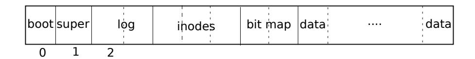

<span id="page-82-1"></span>Figure 8.2: Structure of the xv6 file system.

that only one thread at a time uses each buffer (and thus each disk block); bread returns a locked buffer, and brelse releases the lock.

Let's return to the buffer cache. The buffer cache has a fixed number of buffers to hold disk blocks, which means that if the file system asks for a block that is not already in the cache, the buffer cache must recycle a buffer currently holding some other block. The buffer cache recycles the least recently used buffer for the new block. The assumption is that the least recently used buffer is the one least likely to be used again soon.

#### <span id="page-82-0"></span>8.3 Code: Buffer cache

The buffer cache is a doubly-linked list of buffers. The function binit, called by main [\(kernel/](https://github.com/mit-pdos/xv6-riscv/blob/riscv//kernel/main.c#L27) [main.c:27\)](https://github.com/mit-pdos/xv6-riscv/blob/riscv//kernel/main.c#L27), initializes the list with the NBUF buffers in the static array buf [\(kernel/bio.c:43-52\)](https://github.com/mit-pdos/xv6-riscv/blob/riscv//kernel/bio.c#L43-L52). All other access to the buffer cache refer to the linked list via bcache.head, not the buf array.

A buffer has two state fields associated with it. The field valid indicates that the buffer contains a copy of the block. The field disk indicates that the buffer content has been handed to the disk, which may change the buffer (e.g., write data from the disk into data).

Bread [\(kernel/bio.c:93\)](https://github.com/mit-pdos/xv6-riscv/blob/riscv//kernel/bio.c#L93) calls bget to get a buffer for the given sector [\(kernel/bio.c:97\)](https://github.com/mit-pdos/xv6-riscv/blob/riscv//kernel/bio.c#L97). If the buffer needs to be read from disk, bread calls virtio\_disk\_rw to do that before returning the buffer.

Bget [\(kernel/bio.c:59\)](https://github.com/mit-pdos/xv6-riscv/blob/riscv//kernel/bio.c#L59) scans the buffer list for a buffer with the given device and sector numbers [\(kernel/bio.c:65-73\)](https://github.com/mit-pdos/xv6-riscv/blob/riscv//kernel/bio.c#L65-L73). If there is such a buffer, bget acquires the sleep-lock for the buffer. Bget then returns the locked buffer.

If there is no cached buffer for the given sector, bget must make one, possibly reusing a buffer that held a different sector. It scans the buffer list a second time, looking for a buffer that is not in use (b->refcnt = 0); any such buffer can be used. Bget edits the buffer metadata to record the new device and sector number and acquires its sleep-lock. Note that the assignment b->valid = 0 ensures that bread will read the block data from disk rather than incorrectly using the buffer's previous contents.

It is important that there is at most one cached buffer per disk sector, to ensure that readers see writes, and because the file system uses locks on buffers for synchronization. Bget ensures this invariant by holding the bache.lock continuously from the first loop's check of whether the block is cached through the second loop's declaration that the block is now cached (by setting dev, blockno, and refcnt). This causes the check for a block's presence and (if not present) the designation of a buffer to hold the block to be atomic.

It is safe for bget to acquire the buffer's sleep-lock outside of the bcache.lock critical section, since the non-zero b->refcnt prevents the buffer from being re-used for a different <span id="page-83-1"></span>disk block. The sleep-lock protects reads and writes of the block's buffered content, while the bcache.lock protects information about which blocks are cached.

If all the buffers are busy, then too many processes are simultaneously executing file system calls; bget panics. A more graceful response might be to sleep until a buffer became free, though there would then be a possibility of deadlock.

Once bread has read the disk (if needed) and returned the buffer to its caller, the caller has exclusive use of the buffer and can read or write the data bytes. If the caller does modify the buffer, it must call bwrite to write the changed data to disk before releasing the buffer. Bwrite [\(kernel/bio.c:107\)](https://github.com/mit-pdos/xv6-riscv/blob/riscv//kernel/bio.c#L107) calls virtio\_disk\_rw to talk to the disk hardware.

When the caller is done with a buffer, it must call brelse to release it. (The name brelse, a shortening of b-release, is cryptic but worth learning: it originated in Unix and is used in BSD, Linux, and Solaris too.) Brelse [\(kernel/bio.c:117\)](https://github.com/mit-pdos/xv6-riscv/blob/riscv//kernel/bio.c#L117) releases the sleep-lock and moves the buffer to the front of the linked list [\(kernel/bio.c:128-133\)](https://github.com/mit-pdos/xv6-riscv/blob/riscv//kernel/bio.c#L128-L133). Moving the buffer causes the list to be ordered by how recently the buffers were used (meaning released): the first buffer in the list is the most recently used, and the last is the least recently used. The two loops in bget take advantage of this: the scan for an existing buffer must process the entire list in the worst case, but checking the most recently used buffers first (starting at bcache.head and following next pointers) will reduce scan time when there is good locality of reference. The scan to pick a buffer to reuse picks the least recently used buffer by scanning backward (following prev pointers).

#### <span id="page-83-0"></span>8.4 Logging layer

One of the most interesting problems in file system design is crash recovery. The problem arises because many file-system operations involve multiple writes to the disk, and a crash after a subset of the writes may leave the on-disk file system in an inconsistent state. For example, suppose a crash occurs during file truncation (setting the length of a file to zero and freeing its content blocks). Depending on the order of the disk writes, the crash may either leave an inode with a reference to a content block that is marked free, or it may leave an allocated but unreferenced content block.

The latter is relatively benign, but an inode that refers to a freed block is likely to cause serious problems after a reboot. After reboot, the kernel might allocate that block to another file, and now we have two different files pointing unintentionally to the same block. If xv6 supported multiple users, this situation could be a security problem, since the old file's owner would be able to read and write blocks in the new file, owned by a different user.

Xv6 solves the problem of crashes during file-system operations with a simple form of logging. An xv6 system call does not directly write the on-disk file system data structures. Instead, it places a description of all the disk writes it wishes to make in a *log* on the disk. Once the system call has logged all of its writes, it writes a special *commit* record to the disk indicating that the log contains a complete operation. At that point the system call copies the writes to the on-disk file system data structures. After those writes have completed, the system call erases the log on disk.

If the system should crash and reboot, the file-system code recovers from the crash as follows, before running any processes. If the log is marked as containing a complete operation, then the <span id="page-84-1"></span>recovery code copies the writes to where they belong in the on-disk file system. If the log is not marked as containing a complete operation, the recovery code ignores the log. The recovery code finishes by erasing the log.

Why does xv6's log solve the problem of crashes during file system operations? If the crash occurs before the operation commits, then the log on disk will not be marked as complete, the recovery code will ignore it, and the state of the disk will be as if the operation had not even started. If the crash occurs after the operation commits, then recovery will replay all of the operation's writes, perhaps repeating them if the operation had started to write them to the on-disk data structure. In either case, the log makes operations atomic with respect to crashes: after recovery, either all of the operation's writes appear on the disk, or none of them appear.

#### <span id="page-84-0"></span>8.5 Log design

The log resides at a known fixed location, specified in the superblock. It consists of a header block followed by a sequence of updated block copies ("logged blocks"). The header block contains an array of sector numbers, one for each of the logged blocks, and the count of log blocks. The count in the header block on disk is either zero, indicating that there is no transaction in the log, or nonzero, indicating that the log contains a complete committed transaction with the indicated number of logged blocks. Xv6 writes the header block when a transaction commits, but not before, and sets the count to zero after copying the logged blocks to the file system. Thus a crash midway through a transaction will result in a count of zero in the log's header block; a crash after a commit will result in a non-zero count.

Each system call's code indicates the start and end of the sequence of writes that must be atomic with respect to crashes. To allow concurrent execution of file-system operations by different processes, the logging system can accumulate the writes of multiple system calls into one transaction. Thus a single commit may involve the writes of multiple complete system calls. To avoid splitting a system call across transactions, the logging system only commits when no file-system system calls are underway.

The idea of committing several transactions together is known as *group commit*. Group commit reduces the number of disk operations because it amortizes the fixed cost of a commit over multiple operations. Group commit also hands the disk system more concurrent writes at the same time, perhaps allowing the disk to write them all during a single disk rotation. Xv6's virtio driver doesn't support this kind of *batching*, but xv6's file system design allows for it.

Xv6 dedicates a fixed amount of space on the disk to hold the log. The total number of blocks written by the system calls in a transaction must fit in that space. This has two consequences. No single system call can be allowed to write more distinct blocks than there is space in the log. This is not a problem for most system calls, but two of them can potentially write many blocks: write and unlink. A large file write may write many data blocks and many bitmap blocks as well as an inode block; unlinking a large file might write many bitmap blocks and an inode. Xv6's write system call breaks up large writes into multiple smaller writes that fit in the log, and unlink doesn't cause problems because in practice the xv6 file system uses only one bitmap block. The other consequence of limited log space is that the logging system cannot allow a system call to <span id="page-85-1"></span>start unless it is certain that the system call's writes will fit in the space remaining in the log.

#### <span id="page-85-0"></span>8.6 Code: logging

A typical use of the log in a system call looks like this:

```
begin_op();
...
bp = bread(...);
bp->data[...] = ...;
log_write(bp);
...
end_op();
```

begin\_op [\(kernel/log.c:126\)](https://github.com/mit-pdos/xv6-riscv/blob/riscv//kernel/log.c#L126) waits until the logging system is not currently committing, and until there is enough unreserved log space to hold the writes from this call. log.outstanding counts the number of system calls that have reserved log space; the total reserved space is log.outstanding times MAXOPBLOCKS. Incrementing log.outstanding both reserves space and prevents a commit from occuring during this system call. The code conservatively assumes that each system call might write up to MAXOPBLOCKS distinct blocks.

log\_write [\(kernel/log.c:214\)](https://github.com/mit-pdos/xv6-riscv/blob/riscv//kernel/log.c#L214) acts as a proxy for bwrite. It records the block's sector number in memory, reserving it a slot in the log on disk, and pins the buffer in the block cache to prevent the block cache from evicting it. The block must stay in the cache until committed: until then, the cached copy is the only record of the modification; it cannot be written to its place on disk until after commit; and other reads in the same transaction must see the modifications. log\_write notices when a block is written multiple times during a single transaction, and allocates that block the same slot in the log. This optimization is often called *absorption*. It is common that, for example, the disk block containing inodes of several files is written several times within a transaction. By absorbing several disk writes into one, the file system can save log space and can achieve better performance because only one copy of the disk block must be written to disk.

end\_op [\(kernel/log.c:146\)](https://github.com/mit-pdos/xv6-riscv/blob/riscv//kernel/log.c#L146) first decrements the count of outstanding system calls. If the count is now zero, it commits the current transaction by calling commit(). There are four stages in this process. write\_log() [\(kernel/log.c:178\)](https://github.com/mit-pdos/xv6-riscv/blob/riscv//kernel/log.c#L178) copies each block modified in the transaction from the buffer cache to its slot in the log on disk. write\_head() [\(kernel/log.c:102\)](https://github.com/mit-pdos/xv6-riscv/blob/riscv//kernel/log.c#L102) writes the header block to disk: this is the commit point, and a crash after the write will result in recovery replaying the transaction's writes from the log. install\_trans [\(kernel/log.c:69\)](https://github.com/mit-pdos/xv6-riscv/blob/riscv//kernel/log.c#L69) reads each block from the log and writes it to the proper place in the file system. Finally end\_op writes the log header with a count of zero; this has to happen before the next transaction starts writing logged blocks, so that a crash doesn't result in recovery using one transaction's header with the subsequent transaction's logged blocks.

recover\_from\_log [\(kernel/log.c:116\)](https://github.com/mit-pdos/xv6-riscv/blob/riscv//kernel/log.c#L116) is called from initlog [\(kernel/log.c:55\)](https://github.com/mit-pdos/xv6-riscv/blob/riscv//kernel/log.c#L55), which is called from fsinit[\(kernel/fs.c:42\)](https://github.com/mit-pdos/xv6-riscv/blob/riscv//kernel/fs.c#L42) during boot before the first user process runs [\(kernel/proc.c:539\)](https://github.com/mit-pdos/xv6-riscv/blob/riscv//kernel/proc.c#L539). It reads the log header, and mimics the actions of end\_op if the header indicates that the log contains a committed transaction.

<span id="page-86-2"></span>An example use of the log occurs in filewrite [\(kernel/file.c:135\)](https://github.com/mit-pdos/xv6-riscv/blob/riscv//kernel/file.c#L135). The transaction looks like this:

```
begin_op();
ilock(f->ip);
r = writei(f->ip, ...);
iunlock(f->ip);
end_op();
```

This code is wrapped in a loop that breaks up large writes into individual transactions of just a few sectors at a time, to avoid overflowing the log. The call to writei writes many blocks as part of this transaction: the file's inode, one or more bitmap blocks, and some data blocks.

### <span id="page-86-0"></span>8.7 Code: Block allocator

File and directory content is stored in disk blocks, which must be allocated from a free pool. xv6's block allocator maintains a free bitmap on disk, with one bit per block. A zero bit indicates that the corresponding block is free; a one bit indicates that it is in use. The program mkfs sets the bits corresponding to the boot sector, superblock, log blocks, inode blocks, and bitmap blocks.

The block allocator provides two functions: balloc allocates a new disk block, and bfree frees a block. Balloc The loop in balloc at [\(kernel/fs.c:71\)](https://github.com/mit-pdos/xv6-riscv/blob/riscv//kernel/fs.c#L71) considers every block, starting at block 0 up to sb.size, the number of blocks in the file system. It looks for a block whose bitmap bit is zero, indicating that it is free. If balloc finds such a block, it updates the bitmap and returns the block. For efficiency, the loop is split into two pieces. The outer loop reads each block of bitmap bits. The inner loop checks all BPB bits in a single bitmap block. The race that might occur if two processes try to allocate a block at the same time is prevented by the fact that the buffer cache only lets one process use any one bitmap block at a time.

Bfree [\(kernel/fs.c:90\)](https://github.com/mit-pdos/xv6-riscv/blob/riscv//kernel/fs.c#L90) finds the right bitmap block and clears the right bit. Again the exclusive use implied by bread and brelse avoids the need for explicit locking.

As with much of the code described in the remainder of this chapter, balloc and bfree must be called inside a transaction.

#### <span id="page-86-1"></span>8.8 Inode layer

The term *inode* can have one of two related meanings. It might refer to the on-disk data structure containing a file's size and list of data block numbers. Or "inode" might refer to an in-memory inode, which contains a copy of the on-disk inode as well as extra information needed within the kernel.

The on-disk inodes are packed into a contiguous area of disk called the inode blocks. Every inode is the same size, so it is easy, given a number n, to find the nth inode on the disk. In fact, this number n, called the inode number or i-number, is how inodes are identified in the implementation.

The on-disk inode is defined by a struct dinode [\(kernel/fs.h:32\)](https://github.com/mit-pdos/xv6-riscv/blob/riscv//kernel/fs.h#L32). The type field distinguishes between files, directories, and special files (devices). A type of zero indicates that an on<span id="page-87-0"></span>disk inode is free. The nlink field counts the number of directory entries that refer to this inode, in order to recognize when the on-disk inode and its data blocks should be freed. The size field records the number of bytes of content in the file. The addrs array records the block numbers of the disk blocks holding the file's content.

The kernel keeps the set of active inodes in memory; struct inode [\(kernel/file.h:17\)](https://github.com/mit-pdos/xv6-riscv/blob/riscv//kernel/file.h#L17) is the in-memory copy of a struct dinode on disk. The kernel stores an inode in memory only if there are C pointers referring to that inode. The ref field counts the number of C pointers referring to the in-memory inode, and the kernel discards the inode from memory if the reference count drops to zero. The iget and iput functions acquire and release pointers to an inode, modifying the reference count. Pointers to an inode can come from file descriptors, current working directories, and transient kernel code such as exec.

There are four lock or lock-like mechanisms in xv6's inode code. icache.lock protects the invariant that an inode is present in the cache at most once, and the invariant that a cached inode's ref field counts the number of in-memory pointers to the cached inode. Each in-memory inode has a lock field containing a sleep-lock, which ensures exclusive access to the inode's fields (such as file length) as well as to the inode's file or directory content blocks. An inode's ref, if it is greater than zero, causes the system to maintain the inode in the cache, and not re-use the cache entry for a different inode. Finally, each inode contains a nlink field (on disk and copied in memory if it is cached) that counts the number of directory entries that refer to a file; xv6 won't free an inode if its link count is greater than zero.

A struct inode pointer returned by iget() is guaranteed to be valid until the corresponding call to iput(); the inode won't be deleted, and the memory referred to by the pointer won't be re-used for a different inode. iget() provides non-exclusive access to an inode, so that there can be many pointers to the same inode. Many parts of the file-system code depend on this behavior of iget(), both to hold long-term references to inodes (as open files and current directories) and to prevent races while avoiding deadlock in code that manipulates multiple inodes (such as pathname lookup).

The struct inode that iget returns may not have any useful content. In order to ensure it holds a copy of the on-disk inode, code must call ilock. This locks the inode (so that no other process can ilock it) and reads the inode from the disk, if it has not already been read. iunlock releases the lock on the inode. Separating acquisition of inode pointers from locking helps avoid deadlock in some situations, for example during directory lookup. Multiple processes can hold a C pointer to an inode returned by iget, but only one process can lock the inode at a time.

The inode cache only caches inodes to which kernel code or data structures hold C pointers. Its main job is really synchronizing access by multiple processes; caching is secondary. If an inode is used frequently, the buffer cache will probably keep it in memory if it isn't kept by the inode cache. The inode cache is *write-through*, which means that code that modifies a cached inode must immediately write it to disk with iupdate.

### <span id="page-88-1"></span><span id="page-88-0"></span>8.9 Code: Inodes

To allocate a new inode (for example, when creating a file), xv6 calls ialloc [\(kernel/fs.c:196\)](https://github.com/mit-pdos/xv6-riscv/blob/riscv//kernel/fs.c#L196). Ialloc is similar to balloc: it loops over the inode structures on the disk, one block at a time, looking for one that is marked free. When it finds one, it claims it by writing the new type to the disk and then returns an entry from the inode cache with the tail call to iget [\(kernel/fs.c:210\)](https://github.com/mit-pdos/xv6-riscv/blob/riscv//kernel/fs.c#L210). The correct operation of ialloc depends on the fact that only one process at a time can be holding a reference to bp: ialloc can be sure that some other process does not simultaneously see that the inode is available and try to claim it.

Iget [\(kernel/fs.c:243\)](https://github.com/mit-pdos/xv6-riscv/blob/riscv//kernel/fs.c#L243) looks through the inode cache for an active entry (ip->ref > 0) with the desired device and inode number. If it finds one, it returns a new reference to that inode [\(kernel/fs.c:252-256\)](https://github.com/mit-pdos/xv6-riscv/blob/riscv//kernel/fs.c#L252-L256). As iget scans, it records the position of the first empty slot [\(kernel/fs.c:257-](https://github.com/mit-pdos/xv6-riscv/blob/riscv//kernel/fs.c#L257-L258) [258\)](https://github.com/mit-pdos/xv6-riscv/blob/riscv//kernel/fs.c#L257-L258), which it uses if it needs to allocate a cache entry.

Code must lock the inode using ilock before reading or writing its metadata or content. Ilock [\(kernel/fs.c:289\)](https://github.com/mit-pdos/xv6-riscv/blob/riscv//kernel/fs.c#L289) uses a sleep-lock for this purpose. Once ilock has exclusive access to the inode, it reads the inode from disk (more likely, the buffer cache) if needed. The function iunlock [\(kernel/fs.c:317\)](https://github.com/mit-pdos/xv6-riscv/blob/riscv//kernel/fs.c#L317) releases the sleep-lock, which may cause any processes sleeping to be woken up.

Iput [\(kernel/fs.c:333\)](https://github.com/mit-pdos/xv6-riscv/blob/riscv//kernel/fs.c#L333) releases a C pointer to an inode by decrementing the reference count [\(kernel/fs.c:356\)](https://github.com/mit-pdos/xv6-riscv/blob/riscv//kernel/fs.c#L356). If this is the last reference, the inode's slot in the inode cache is now free and can be re-used for a different inode.

If iput sees that there are no C pointer references to an inode and that the inode has no links to it (occurs in no directory), then the inode and its data blocks must be freed. Iput calls itrunc to truncate the file to zero bytes, freeing the data blocks; sets the inode type to 0 (unallocated); and writes the inode to disk [\(kernel/fs.c:338\)](https://github.com/mit-pdos/xv6-riscv/blob/riscv//kernel/fs.c#L338).

The locking protocol in iput in the case in which it frees the inode deserves a closer look. One danger is that a concurrent thread might be waiting in ilock to use this inode (e.g., to read a file or list a directory), and won't be prepared to find that the inode is not longer allocated. This can't happen because there is no way for a system call to get a pointer to a cached inode if it has no links to it and ip->ref is one. That one reference is the reference owned by the thread calling iput. It's true that iput checks that the reference count is one outside of its icache.lock critical section, but at that point the link count is known to be zero, so no thread will try to acquire a new reference. The other main danger is that a concurrent call to ialloc might choose the same inode that iput is freeing. This can only happen after the iupdate writes the disk so that the inode has type zero. This race is benign; the allocating thread will politely wait to acquire the inode's sleep-lock before reading or writing the inode, at which point iput is done with it.

iput() can write to the disk. This means that any system call that uses the file system may write the disk, because the system call may be the last one having a reference to the file. Even calls like read() that appear to be read-only, may end up calling iput(). This, in turn, means that even read-only system calls must be wrapped in transactions if they use the file system.

There is a challenging interaction between iput() and crashes. iput() doesn't truncate a file immediately when the link count for the file drops to zero, because some process might still hold a reference to the inode in memory: a process might still be reading and writing to the file, because it successfully opened it. But, if a crash happens before the last process closes the file descriptor

<span id="page-89-2"></span>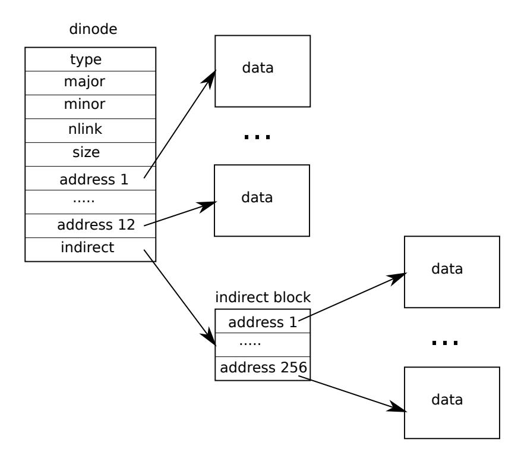

<span id="page-89-1"></span>Figure 8.3: The representation of a file on disk.

for the file, then the file will be marked allocated on disk but no directory entry will point to it.

File systems handle this case in one of two ways. The simple solution is that on recovery, after reboot, the file system scans the whole file system for files that are marked allocated, but have no directory entry pointing to them. If any such file exists, then it can free those files.

The second solution doesn't require scanning the file system. In this solution, the file system records on disk (e.g., in the super block) the inode inumber of a file whose link count drops to zero but whose reference count isn't zero. If the file system removes the file when its reference counts reaches 0, then it updates the on-disk list by removing that inode from the list. On recovery, the file system frees any file in the list.

Xv6 implements neither solution, which means that inodes may be marked allocated on disk, even though they are not in use anymore. This means that over time xv6 runs the risk that it may run out of disk space.

### <span id="page-89-0"></span>8.10 Code: Inode content

The on-disk inode structure, struct dinode, contains a size and an array of block numbers (see Figure [8.3\)](#page-89-1). The inode data is found in the blocks listed in the dinode 's addrs array. The first NDIRECT blocks of data are listed in the first NDIRECT entries in the array; these blocks are called <span id="page-90-1"></span>*direct blocks*. The next NINDIRECT blocks of data are listed not in the inode but in a data block called the *indirect block*. The last entry in the addrs array gives the address of the indirect block. Thus the first 12 kB ( NDIRECT x BSIZE) bytes of a file can be loaded from blocks listed in the inode, while the next 256 kB ( NINDIRECT x BSIZE) bytes can only be loaded after consulting the indirect block. This is a good on-disk representation but a complex one for clients. The function bmap manages the representation so that higher-level routines such as readi and writei, which we will see shortly. Bmap returns the disk block number of the bn'th data block for the inode ip. If ip does not have such a block yet, bmap allocates one.

The function bmap [\(kernel/fs.c:378\)](https://github.com/mit-pdos/xv6-riscv/blob/riscv//kernel/fs.c#L378) begins by picking off the easy case: the first NDIRECT blocks are listed in the inode itself [\(kernel/fs.c:383-387\)](https://github.com/mit-pdos/xv6-riscv/blob/riscv//kernel/fs.c#L383-L387). The next NINDIRECT blocks are listed in the indirect block at ip->addrs[NDIRECT]. Bmap reads the indirect block [\(kernel/fs.c:394\)](https://github.com/mit-pdos/xv6-riscv/blob/riscv//kernel/fs.c#L394) and then reads a block number from the right position within the block [\(kernel/fs.c:395\)](https://github.com/mit-pdos/xv6-riscv/blob/riscv//kernel/fs.c#L395). If the block number exceeds NDIRECT+NINDIRECT, bmap panics; writei contains the check that prevents this from happening [\(kernel/fs.c:490\)](https://github.com/mit-pdos/xv6-riscv/blob/riscv//kernel/fs.c#L490).

Bmap allocates blocks as needed. An ip->addrs[] or indirect entry of zero indicates that no block is allocated. As bmap encounters zeros, it replaces them with the numbers of fresh blocks, allocated on demand [\(kernel/fs.c:384-385\)](https://github.com/mit-pdos/xv6-riscv/blob/riscv//kernel/fs.c#L384-L385) [\(kernel/fs.c:392-393\)](https://github.com/mit-pdos/xv6-riscv/blob/riscv//kernel/fs.c#L392-L393).

itrunc frees a file's blocks, resetting the inode's size to zero. Itrunc [\(kernel/fs.c:410\)](https://github.com/mit-pdos/xv6-riscv/blob/riscv//kernel/fs.c#L410) starts by freeing the direct blocks[\(kernel/fs.c:416-421\)](https://github.com/mit-pdos/xv6-riscv/blob/riscv//kernel/fs.c#L416-L421), then the ones listed in the indirect block [\(kernel/fs.c:426](https://github.com/mit-pdos/xv6-riscv/blob/riscv//kernel/fs.c#L426-L429)- [429\)](https://github.com/mit-pdos/xv6-riscv/blob/riscv//kernel/fs.c#L426-L429), and finally the indirect block itself [\(kernel/fs.c:431-432\)](https://github.com/mit-pdos/xv6-riscv/blob/riscv//kernel/fs.c#L431-L432).

Bmap makes it easy for readi and writei to get at an inode's data. Readi [\(kernel/fs.c:456\)](https://github.com/mit-pdos/xv6-riscv/blob/riscv//kernel/fs.c#L456) starts by making sure that the offset and count are not beyond the end of the file. Reads that start beyond the end of the file return an error [\(kernel/fs.c:461-462\)](https://github.com/mit-pdos/xv6-riscv/blob/riscv//kernel/fs.c#L461-L462) while reads that start at or cross the end of the file return fewer bytes than requested [\(kernel/fs.c:463-464\)](https://github.com/mit-pdos/xv6-riscv/blob/riscv//kernel/fs.c#L463-L464). The main loop processes each block of the file, copying data from the buffer into dst [\(kernel/fs.c:466-474\)](https://github.com/mit-pdos/xv6-riscv/blob/riscv//kernel/fs.c#L466-L474). writei [\(kernel/fs.c:483\)](https://github.com/mit-pdos/xv6-riscv/blob/riscv//kernel/fs.c#L483) is identical to readi, with three exceptions: writes that start at or cross the end of the file grow the file, up to the maximum file size [\(kernel/fs.c:490-491\)](https://github.com/mit-pdos/xv6-riscv/blob/riscv//kernel/fs.c#L490-L491); the loop copies data into the buffers instead of out [\(kernel/fs.c:36\)](https://github.com/mit-pdos/xv6-riscv/blob/riscv//kernel/fs.c#L36); and if the write has extended the file, writei must update its size [\(kernel/fs.c:504-511\)](https://github.com/mit-pdos/xv6-riscv/blob/riscv//kernel/fs.c#L504-L511).

Both readi and writei begin by checking for ip->type == T\_DEV. This case handles special devices whose data does not live in the file system; we will return to this case in the file descriptor layer.

The function stati [\(kernel/fs.c:442\)](https://github.com/mit-pdos/xv6-riscv/blob/riscv//kernel/fs.c#L442) copies inode metadata into the stat structure, which is exposed to user programs via the stat system call.

#### <span id="page-90-0"></span>8.11 Code: directory layer

A directory is implemented internally much like a file. Its inode has type T\_DIR and its data is a sequence of directory entries. Each entry is a struct dirent [\(kernel/fs.h:56\)](https://github.com/mit-pdos/xv6-riscv/blob/riscv//kernel/fs.h#L56), which contains a name and an inode number. The name is at most DIRSIZ (14) characters; if shorter, it is terminated by a NUL (0) byte. Directory entries with inode number zero are free.

The function dirlookup [\(kernel/fs.c:527\)](https://github.com/mit-pdos/xv6-riscv/blob/riscv//kernel/fs.c#L527) searches a directory for an entry with the given name.

<span id="page-91-1"></span>If it finds one, it returns a pointer to the corresponding inode, unlocked, and sets \*poff to the byte offset of the entry within the directory, in case the caller wishes to edit it. If dirlookup finds an entry with the right name, it updates \*poff and returns an unlocked inode obtained via iget. Dirlookup is the reason that iget returns unlocked inodes. The caller has locked dp, so if the lookup was for ., an alias for the current directory, attempting to lock the inode before returning would try to re-lock dp and deadlock. (There are more complicated deadlock scenarios involving multiple processes and .., an alias for the parent directory; . is not the only problem.) The caller can unlock dp and then lock ip, ensuring that it only holds one lock at a time.

The function dirlink [\(kernel/fs.c:554\)](https://github.com/mit-pdos/xv6-riscv/blob/riscv//kernel/fs.c#L554) writes a new directory entry with the given name and inode number into the directory dp. If the name already exists, dirlink returns an error [\(kernel/fs.c:56](https://github.com/mit-pdos/xv6-riscv/blob/riscv//kernel/fs.c#L560-L564)0- [564\)](https://github.com/mit-pdos/xv6-riscv/blob/riscv//kernel/fs.c#L560-L564). The main loop reads directory entries looking for an unallocated entry. When it finds one, it stops the loop early [\(kernel/fs.c:538-539\)](https://github.com/mit-pdos/xv6-riscv/blob/riscv//kernel/fs.c#L538-L539), with off set to the offset of the available entry. Otherwise, the loop ends with off set to dp->size. Either way, dirlink then adds a new entry to the directory by writing at offset off [\(kernel/fs.c:574-577\)](https://github.com/mit-pdos/xv6-riscv/blob/riscv//kernel/fs.c#L574-L577).

#### <span id="page-91-0"></span>8.12 Code: Path names

Path name lookup involves a succession of calls to dirlookup, one for each path component. Namei [\(kernel/fs.c:661\)](https://github.com/mit-pdos/xv6-riscv/blob/riscv//kernel/fs.c#L661) evaluates path and returns the corresponding inode. The function nameiparent is a variant: it stops before the last element, returning the inode of the parent directory and copying the final element into name. Both call the generalized function namex to do the real work.

Namex [\(kernel/fs.c:626\)](https://github.com/mit-pdos/xv6-riscv/blob/riscv//kernel/fs.c#L626) starts by deciding where the path evaluation begins. If the path begins with a slash, evaluation begins at the root; otherwise, the current directory [\(kernel/fs.c:630-633\)](https://github.com/mit-pdos/xv6-riscv/blob/riscv//kernel/fs.c#L630-L633). Then it uses skipelem to consider each element of the path in turn [\(kernel/fs.c:635\)](https://github.com/mit-pdos/xv6-riscv/blob/riscv//kernel/fs.c#L635). Each iteration of the loop must look up name in the current inode ip. The iteration begins by locking ip and checking that it is a directory. If not, the lookup fails [\(kernel/fs.c:636-640\)](https://github.com/mit-pdos/xv6-riscv/blob/riscv//kernel/fs.c#L636-L640). (Locking ip is necessary not because ip->type can change underfoot—it can't—but because until ilock runs, ip->type is not guaranteed to have been loaded from disk.) If the call is nameiparent and this is the last path element, the loop stops early, as per the definition of nameiparent; the final path element has already been copied into name, so namex need only return the unlocked ip [\(kernel/fs.c:641-645\)](https://github.com/mit-pdos/xv6-riscv/blob/riscv//kernel/fs.c#L641-L645). Finally, the loop looks for the path element using dirlookup and prepares for the next iteration by setting ip = next [\(kernel/fs.c:646-651\)](https://github.com/mit-pdos/xv6-riscv/blob/riscv//kernel/fs.c#L646-L651). When the loop runs out of path elements, it returns ip.

The procedure namex may take a long time to complete: it could involve several disk operations to read inodes and directory blocks for the directories traversed in the pathname (if they are not in the buffer cache). Xv6 is carefully designed so that if an invocation of namex by one kernel thread is blocked on a disk I/O, another kernel thread looking up a different pathname can proceed concurrently. Namex locks each directory in the path separately so that lookups in different directories can proceed in parallel.

This concurrency introduces some challenges. For example, while one kernel thread is looking up a pathname another kernel thread may be changing the directory tree by unlinking a directory. A potential risk is that a lookup may be searching a directory that has been deleted by another kernel thread and its blocks have been re-used for another directory or file.

<span id="page-92-1"></span>Xv6 avoids such races. For example, when executing dirlookup in namex, the lookup thread holds the lock on the directory and dirlookup returns an inode that was obtained using iget. Iget increases the reference count of the inode. Only after receiving the inode from dirlookup does namex release the lock on the directory. Now another thread may unlink the inode from the directory but xv6 will not delete the inode yet, because the reference count of the inode is still larger than zero.

Another risk is deadlock. For example, next points to the same inode as ip when looking up ".". Locking next before releasing the lock on ip would result in a deadlock. To avoid this deadlock, namex unlocks the directory before obtaining a lock on next. Here again we see why the separation between iget and ilock is important.

#### <span id="page-92-0"></span>8.13 File descriptor layer

A cool aspect of the Unix interface is that most resources in Unix are represented as files, including devices such as the console, pipes, and of course, real files. The file descriptor layer is the layer that achieves this uniformity.

Xv6 gives each process its own table of open files, or file descriptors, as we saw in Chapter [1.](#page-8-0) Each open file is represented by a struct file [\(kernel/file.h:1\)](https://github.com/mit-pdos/xv6-riscv/blob/riscv//kernel/file.h#L1), which is a wrapper around either an inode or a pipe, plus an I/O offset. Each call to open creates a new open file (a new struct file): if multiple processes open the same file independently, the different instances will have different I/O offsets. On the other hand, a single open file (the same struct file) can appear multiple times in one process's file table and also in the file tables of multiple processes. This would happen if one process used open to open the file and then created aliases using dup or shared it with a child using fork. A reference count tracks the number of references to a particular open file. A file can be open for reading or writing or both. The readable and writable fields track this.

All the open files in the system are kept in a global file table, the ftable. The file table has functions to allocate a file (filealloc), create a duplicate reference (filedup), release a reference (fileclose), and read and write data (fileread and filewrite).

The first three follow the now-familiar form. Filealloc [\(kernel/file.c:30\)](https://github.com/mit-pdos/xv6-riscv/blob/riscv//kernel/file.c#L30) scans the file table for an unreferenced file (f->ref == 0) and returns a new reference; filedup [\(kernel/file.c:48\)](https://github.com/mit-pdos/xv6-riscv/blob/riscv//kernel/file.c#L48) increments the reference count; and fileclose [\(kernel/file.c:60\)](https://github.com/mit-pdos/xv6-riscv/blob/riscv//kernel/file.c#L60) decrements it. When a file's reference count reaches zero, fileclose releases the underlying pipe or inode, according to the type.

The functions filestat, fileread, and filewrite implement the stat, read, and write operations on files. Filestat [\(kernel/file.c:88\)](https://github.com/mit-pdos/xv6-riscv/blob/riscv//kernel/file.c#L88) is only allowed on inodes and calls stati. Fileread and filewrite check that the operation is allowed by the open mode and then pass the call through to either the pipe or inode implementation. If the file represents an inode, fileread and filewrite use the I/O offset as the offset for the operation and then advance it [\(kernel/file.c:122-](https://github.com/mit-pdos/xv6-riscv/blob/riscv//kernel/file.c#L122-L123) [123\)](https://github.com/mit-pdos/xv6-riscv/blob/riscv//kernel/file.c#L122-L123) [\(kernel/file.c:153-154\)](https://github.com/mit-pdos/xv6-riscv/blob/riscv//kernel/file.c#L153-L154). Pipes have no concept of offset. Recall that the inode functions require the caller to handle locking [\(kernel/file.c:94-96\)](https://github.com/mit-pdos/xv6-riscv/blob/riscv//kernel/file.c#L94-L96) [\(kernel/file.c:121-124\)](https://github.com/mit-pdos/xv6-riscv/blob/riscv//kernel/file.c#L121-L124) [\(kernel/file.c:163-166\)](https://github.com/mit-pdos/xv6-riscv/blob/riscv//kernel/file.c#L163-L166). The inode locking has the convenient side effect that the read and write offsets are updated atomically, so that multiple writing to the same file simultaneously cannot overwrite each other's data, though

#### <span id="page-93-1"></span><span id="page-93-0"></span>8.14 Code: System calls

With the functions that the lower layers provide the implementation of most system calls is trivial (see [\(kernel/sysfile.c\)](https://github.com/mit-pdos/xv6-riscv/blob/riscv//kernel/sysfile.c)). There are a few calls that deserve a closer look.

The functions sys\_link and sys\_unlink edit directories, creating or removing references to inodes. They are another good example of the power of using transactions. Sys\_link [\(kernel/sys](https://github.com/mit-pdos/xv6-riscv/blob/riscv//kernel/sysfile.c#L120)[file.c:120\)](https://github.com/mit-pdos/xv6-riscv/blob/riscv//kernel/sysfile.c#L120) begins by fetching its arguments, two strings old and new [\(kernel/sysfile.c:125\)](https://github.com/mit-pdos/xv6-riscv/blob/riscv//kernel/sysfile.c#L125). Assuming old exists and is not a directory [\(kernel/sysfile.c:129-132\)](https://github.com/mit-pdos/xv6-riscv/blob/riscv//kernel/sysfile.c#L129-L132), sys\_link increments its ip->nlink count. Then sys\_link calls nameiparent to find the parent directory and final path element of new [\(kernel/sysfile.c:145\)](https://github.com/mit-pdos/xv6-riscv/blob/riscv//kernel/sysfile.c#L145) and creates a new directory entry pointing at old 's inode [\(kernel/sys](https://github.com/mit-pdos/xv6-riscv/blob/riscv//kernel/sysfile.c#L148)[file.c:148\)](https://github.com/mit-pdos/xv6-riscv/blob/riscv//kernel/sysfile.c#L148). The new parent directory must exist and be on the same device as the existing inode: inode numbers only have a unique meaning on a single disk. If an error like this occurs, sys\_link must go back and decrement ip->nlink.

Transactions simplify the implementation because it requires updating multiple disk blocks, but we don't have to worry about the order in which we do them. They either will all succeed or none. For example, without transactions, updating ip->nlink before creating a link, would put the file system temporarily in an unsafe state, and a crash in between could result in havoc. With transactions we don't have to worry about this.

Sys\_link creates a new name for an existing inode. The function create [\(kernel/sysfile.c:242\)](https://github.com/mit-pdos/xv6-riscv/blob/riscv//kernel/sysfile.c#L242) creates a new name for a new inode. It is a generalization of the three file creation system calls: open with the O\_CREATE flag makes a new ordinary file, mkdir makes a new directory, and mkdev makes a new device file. Like sys\_link, create starts by caling nameiparent to get the inode of the parent directory. It then calls dirlookup to check whether the name already exists [\(kernel/sysfile.c:252\)](https://github.com/mit-pdos/xv6-riscv/blob/riscv//kernel/sysfile.c#L252). If the name does exist, create's behavior depends on which system call it is being used for: open has different semantics from mkdir and mkdev. If create is being used on behalf of open (type == T\_FILE) and the name that exists is itself a regular file, then open treats that as a success, so create does too [\(kernel/sysfile.c:256\)](https://github.com/mit-pdos/xv6-riscv/blob/riscv//kernel/sysfile.c#L256). Otherwise, it is an error [\(kernel/sysfile.c:257-258\)](https://github.com/mit-pdos/xv6-riscv/blob/riscv//kernel/sysfile.c#L257-L258). If the name does not already exist, create now allocates a new inode with ialloc [\(kernel/sysfile.c:261\)](https://github.com/mit-pdos/xv6-riscv/blob/riscv//kernel/sysfile.c#L261). If the new inode is a directory, create initializes it with . and .. entries. Finally, now that the data is initialized properly, create can link it into the parent directory [\(kernel/sysfile.c:274\)](https://github.com/mit-pdos/xv6-riscv/blob/riscv//kernel/sysfile.c#L274). Create, like sys\_link, holds two inode locks simultaneously: ip and dp. There is no possibility of deadlock because the inode ip is freshly allocated: no other process in the system will hold ip 's lock and then try to lock dp.

Using create, it is easy to implement sys\_open, sys\_mkdir, and sys\_mknod. Sys\_open [\(kernel/sysfile.c:287\)](https://github.com/mit-pdos/xv6-riscv/blob/riscv//kernel/sysfile.c#L287) is the most complex, because creating a new file is only a small part of what it can do. If open is passed the O\_CREATE flag, it calls create [\(kernel/sysfile.c:301\)](https://github.com/mit-pdos/xv6-riscv/blob/riscv//kernel/sysfile.c#L301). Otherwise, it calls namei [\(kernel/sysfile.c:307\)](https://github.com/mit-pdos/xv6-riscv/blob/riscv//kernel/sysfile.c#L307). Create returns a locked inode, but namei does not, so sys\_open must lock the inode itself. This provides a convenient place to check that directories are only opened for reading, not writing. Assuming the inode was obtained one way or the other, sys\_open allocates a file and a file descriptor [\(kernel/sysfile.c:325\)](https://github.com/mit-pdos/xv6-riscv/blob/riscv//kernel/sysfile.c#L325) and then fills in the file [\(kernel/sysfile.c:337-](https://github.com/mit-pdos/xv6-riscv/blob/riscv//kernel/sysfile.c#L337-L342) <span id="page-94-1"></span>[342\)](https://github.com/mit-pdos/xv6-riscv/blob/riscv//kernel/sysfile.c#L337-L342). Note that no other process can access the partially initialized file since it is only in the current process's table.

Chapter [7](#page-66-0) examined the implementation of pipes before we even had a file system. The function sys\_pipe connects that implementation to the file system by providing a way to create a pipe pair. Its argument is a pointer to space for two integers, where it will record the two new file descriptors. Then it allocates the pipe and installs the file descriptors.

#### <span id="page-94-0"></span>8.15 Real world

The buffer cache in a real-world operating system is significantly more complex than xv6's, but it serves the same two purposes: caching and synchronizing access to the disk. Xv6's buffer cache, like V6's, uses a simple least recently used (LRU) eviction policy; there are many more complex policies that can be implemented, each good for some workloads and not as good for others. A more efficient LRU cache would eliminate the linked list, instead using a hash table for lookups and a heap for LRU evictions. Modern buffer caches are typically integrated with the virtual memory system to support memory-mapped files.

Xv6's logging system is inefficient. A commit cannot occur concurrently with file-system system calls. The system logs entire blocks, even if only a few bytes in a block are changed. It performs synchronous log writes, a block at a time, each of which is likely to require an entire disk rotation time. Real logging systems address all of these problems.

Logging is not the only way to provide crash recovery. Early file systems used a scavenger during reboot (for example, the UNIX fsck program) to examine every file and directory and the block and inode free lists, looking for and resolving inconsistencies. Scavenging can take hours for large file systems, and there are situations where it is not possible to resolve inconsistencies in a way that causes the original system calls to be atomic. Recovery from a log is much faster and causes system calls to be atomic in the face of crashes.

Xv6 uses the same basic on-disk layout of inodes and directories as early UNIX; this scheme has been remarkably persistent over the years. BSD's UFS/FFS and Linux's ext2/ext3 use essentially the same data structures. The most inefficient part of the file system layout is the directory, which requires a linear scan over all the disk blocks during each lookup. This is reasonable when directories are only a few disk blocks, but is expensive for directories holding many files. Microsoft Windows's NTFS, Mac OS X's HFS, and Solaris's ZFS, just to name a few, implement a directory as an on-disk balanced tree of blocks. This is complicated but guarantees logarithmic-time directory lookups.

Xv6 is naive about disk failures: if a disk operation fails, xv6 panics. Whether this is reasonable depends on the hardware: if an operating systems sits atop special hardware that uses redundancy to mask disk failures, perhaps the operating system sees failures so infrequently that panicking is okay. On the other hand, operating systems using plain disks should expect failures and handle them more gracefully, so that the loss of a block in one file doesn't affect the use of the rest of the file system.

Xv6 requires that the file system fit on one disk device and not change in size. As large databases and multimedia files drive storage requirements ever higher, operating systems are de<span id="page-95-1"></span>veloping ways to eliminate the "one disk per file system" bottleneck. The basic approach is to combine many disks into a single logical disk. Hardware solutions such as RAID are still the most popular, but the current trend is moving toward implementing as much of this logic in software as possible. These software implementations typically allow rich functionality like growing or shrinking the logical device by adding or removing disks on the fly. Of course, a storage layer that can grow or shrink on the fly requires a file system that can do the same: the fixed-size array of inode blocks used by xv6 would not work well in such environments. Separating disk management from the file system may be the cleanest design, but the complex interface between the two has led some systems, like Sun's ZFS, to combine them.

Xv6's file system lacks many other features of modern file systems; for example, it lacks support for snapshots and incremental backup.

Modern Unix systems allow many kinds of resources to be accessed with the same system calls as on-disk storage: named pipes, network connections, remotely-accessed network file systems, and monitoring and control interfaces such as /proc. Instead of xv6's if statements in fileread and filewrite, these systems typically give each open file a table of function pointers, one per operation, and call the function pointer to invoke that inode's implementation of the call. Network file systems and user-level file systems provide functions that turn those calls into network RPCs and wait for the response before returning.

#### <span id="page-95-0"></span>8.16 Exercises

- 1. Why panic in balloc ? Can xv6 recover?
- 2. Why panic in ialloc ? Can xv6 recover?
- 3. Why doesn't filealloc panic when it runs out of files? Why is this more common and therefore worth handling?
- 4. Suppose the file corresponding to ip gets unlinked by another process between sys\_link 's calls to iunlock(ip) and dirlink. Will the link be created correctly? Why or why not?
- 5. create makes four function calls (one to ialloc and three to dirlink) that it requires to succeed. If any doesn't, create calls panic. Why is this acceptable? Why can't any of those four calls fail?
- 6. sys\_chdir calls iunlock(ip) before iput(cp->cwd), which might try to lock cp->cwd, yet postponing iunlock(ip) until after the iput would not cause deadlocks. Why not?
- 7. Implement the lseek system call. Supporting lseek will also require that you modify filewrite to fill holes in the file with zero if lseek sets off beyond f->ip->size.
- 8. Add O\_TRUNC and O\_APPEND to open, so that > and >> operators work in the shell.
- 9. Modify the file system to support symbolic links.

- 10. Modify the file system to support named pipes.
- 11. Modify the file and VM system to support memory-mapped files.

# <span id="page-98-0"></span>Chapter 9

# Concurrency revisited

Simultaneously obtaining good parallel performance, correctness despite concurrency, and understandable code is a big challenge in kernel design. Straightforward use of locks is the best path to correctness, but is not always possible. This chapter highlights examples in which xv6 is forced to use locks in an involved way, and examples where xv6 uses lock-like techniques but not locks.

#### <span id="page-98-1"></span>9.1 Locking patterns

Cached items are often a challenge to lock. For example, the filesystem's block cache [\(kernel/bio.c:26\)](https://github.com/mit-pdos/xv6-riscv/blob/riscv//kernel/bio.c#L26) stores copies of up to NBUF disk blocks. It's vital that a given disk block have at most one copy in the cache; otherwise, different processes might make conflicting changes to different copies of what ought to be the same block. Each cached block is stored in a struct buf [\(kernel/buf.h:1\)](https://github.com/mit-pdos/xv6-riscv/blob/riscv//kernel/buf.h#L1). A struct buf has a lock field which helps ensure that only one process uses a given disk block at a time. However, that lock is not enough: what if a block is not present in the cache at all, and two processes want to use it at the same time? There is no struct buf (since the block isn't yet cached), and thus there is nothing to lock. Xv6 deals with this situation by associating an additional lock (bcache.lock) with the set of identities of cached blocks. Code that needs to check if a block is cached (e.g., bget [\(kernel/bio.c:59\)](https://github.com/mit-pdos/xv6-riscv/blob/riscv//kernel/bio.c#L59)), or change the set of cached blocks, must hold bcache.lock; after that code has found the block and struct buf it needs, it can release bcache.lock and lock just the specific block. This is a common pattern: one lock for the set of items, plus one lock per item.

Ordinarily the same function that acquires a lock will release it. But a more precise way to view things is that a lock is acquired at the start of a sequence that must appear atomic, and released when that sequence ends. If the sequence starts and ends in different functions, or different threads, or on different CPUs, then the lock acquire and release must do the same. The function of the lock is to force other uses to wait, not to pin a piece of data to a particular agent. One example is the acquire in yield [\(kernel/proc.c:515\)](https://github.com/mit-pdos/xv6-riscv/blob/riscv//kernel/proc.c#L515), which is released in the scheduler thread rather than in the acquiring process. Another example is the acquiresleep in ilock [\(kernel/fs.c:289\)](https://github.com/mit-pdos/xv6-riscv/blob/riscv//kernel/fs.c#L289); this code often sleeps while reading the disk; it may wake up on a different CPU, which means the lock may be acquired and released on different CPUs.

Freeing an object that is protected by a lock embedded in the object is a delicate business, since owning the lock is not enough to guarantee that freeing would be correct. The problem case arises when some other thread is waiting in acquire to use the object; freeing the object implicitly frees the embedded lock, which will cause the waiting thread to malfunction. One solution is to track how many references to the object exist, so that it is only freed when the last reference disappears. See pipeclose [\(kernel/pipe.c:59\)](https://github.com/mit-pdos/xv6-riscv/blob/riscv//kernel/pipe.c#L59) for an example; pi->readopen and pi->writeopen track whether the pipe has file descriptors referring to it.

#### <span id="page-99-0"></span>9.2 Lock-like patterns

In many places xv6 uses a reference count or a flag as a kind of soft lock to indicate that an object is allocated and should not be freed or re-used. A process's p->state acts in this way, as do the reference counts in file, inode, and buf structures. While in each case a lock protects the flag or reference count, it is the latter that prevents the object from being prematurely freed.

The file system uses struct inode reference counts as a kind of shared lock that can be held by multiple processes, in order to avoid deadlocks that would occur if the code used ordinary locks. For example, the loop in namex [\(kernel/fs.c:626\)](https://github.com/mit-pdos/xv6-riscv/blob/riscv//kernel/fs.c#L626) locks the directory named by each pathname component in turn. However, namex must release each lock at the end of the loop, since if it held multiple locks it could deadlock with itself if the pathname included a dot (e.g., a/./b). It might also deadlock with a concurrent lookup involving the directory and ... As Chapter [8](#page-80-0) explains, the solution is for the loop to carry the directory inode over to the next iteration with its reference count incremented, but not locked.

Some data items are protected by different mechanisms at different times, and may at times be protected from concurrent access implicitly by the structure of the xv6 code rather than by explicit locks. For example, when a physical page is free, it is protected by kmem.lock [\(ker](https://github.com/mit-pdos/xv6-riscv/blob/riscv//kernel/kalloc.c#L24)[nel/kalloc.c:24\)](https://github.com/mit-pdos/xv6-riscv/blob/riscv//kernel/kalloc.c#L24). If the page is then allocated as a pipe [\(kernel/pipe.c:23\)](https://github.com/mit-pdos/xv6-riscv/blob/riscv//kernel/pipe.c#L23), it is protected by a different lock (the embedded pi->lock). If the page is re-allocated for a new process's user memory, it is not protected by a lock at all. Instead, the fact that the allocator won't give that page to any other process (until it is freed) protects it from concurrent access. The ownership of a new process's memory is complex: first the parent allocates and manipulates it in fork, then the child uses it, and (after the child exits) the parent again owns the memory and passes it to kfree. There are two lessons here: a data object may be protected from concurrency in different ways at different points in its lifetime, and the protection may take the form of implicit structure rather than explicit locks.

A final lock-like example is the need to disable interrupts around calls to mycpu() [\(ker](https://github.com/mit-pdos/xv6-riscv/blob/riscv//kernel/proc.c#L68)[nel/proc.c:68\)](https://github.com/mit-pdos/xv6-riscv/blob/riscv//kernel/proc.c#L68). Disabling interrupts causes the calling code to be atomic with respect to timer interrupts that could force a context switch, and thus move the process to a different CPU.

### <span id="page-99-1"></span>9.3 No locks at all

There are a few places where xv6 shares mutable data with no locks at all. One is in the implementation of spinlocks, although one could view the RISC-V atomic instructions as relying on locks <span id="page-100-1"></span>implemented in hardware. Another is the started variable in main.c [\(kernel/main.c:7\)](https://github.com/mit-pdos/xv6-riscv/blob/riscv//kernel/main.c#L7), used to prevent other CPUs from running until CPU zero has finished initializing xv6; the volatile ensures that the compiler actually generates load and store instructions. A third are some uses of p->parent in proc.c [\(kernel/proc.c:398\)](https://github.com/mit-pdos/xv6-riscv/blob/riscv//kernel/proc.c#L398) [\(kernel/proc.c:306\)](https://github.com/mit-pdos/xv6-riscv/blob/riscv//kernel/proc.c#L306) where proper locking could deadlock, but it seems clear that no other process could be simultaneously modifying p->parent. A fourth example is p->killed, which is set while holding p->lock [\(kernel/proc.c:611\)](https://github.com/mit-pdos/xv6-riscv/blob/riscv//kernel/proc.c#L611), but checked without a holding lock [\(kernel/trap.c:56\)](https://github.com/mit-pdos/xv6-riscv/blob/riscv//kernel/trap.c#L56).

Xv6 contains cases in which one CPU or thread writes some data, and another CPU or thread reads the data, but there is no specific lock dedicated to protecting that data. For example, in fork, the parent writes the child's user memory pages, and the child (a different thread, perhaps on a different CPU) reads those pages; no lock explicitly protects those pages. This is not strictly a locking problem, since the child doesn't start executing until after the parent has finished writing. It is a potential memory ordering problem (see Chapter [6\)](#page-54-0), since without a memory barrier there's no reason to expect one CPU to see another CPU's writes. However, since the parent releases locks, and the child acquires locks as it starts up, the memory barriers in acquire and release ensure that the child's CPU sees the parent's writes.

#### <span id="page-100-0"></span>9.4 Parallelism

Locking is primarily about suppressing parallelism in the interests of correctness. Because performance is also important, kernel designers often have to think about how to use locks in a way that achieves both correctness and good parallelism. While xv6 is not systematically designed for high performance, it's still worth considering which xv6 operations can execute in parallel, and which might conflict on locks.

Pipes in xv6 are an example of fairly good parallelism. Each pipe has its own lock, so that different processes can read and write different pipes in parallel on different CPUs. For a given pipe, however, the writer and reader must wait for each other to release the lock; they can't read/write the same pipe at the same time. It is also the case that a read from an empty pipe (or a write to a full pipe) must block, but this is not due to the locking scheme.

Context switching is a more complex example. Two kernel threads, each executing on its own CPU, can call yield, sched, and swtch at the same time, and the calls will execute in parallel. The threads each hold a lock, but they are different locks, so they don't have to wait for each other. Once in scheduler, however, the two CPUs may conflict on locks while searching the table of processes for one that is RUNNABLE. That is, xv6 is likely to get a performance benefit from multiple CPUs during context switch, but perhaps not as much as it could.

Another example is concurrent calls to fork from different processes on different CPUs. The calls may have to wait for each other for pid\_lock and kmem.lock, and for per-process locks needed to search the process table for an UNUSED process. On the other hand, the two forking processes can copy user memory pages and format page-table pages fully in parallel.

The locking scheme in each of the above examples sacrifices parallel performance in certain cases. In each case it's possible to obtain more parallelism using a more elaborate design. Whether it's worthwhile depends on details: how often the relevant operations are invoked, how long the code spends with a contended lock held, how many CPUs might be running conflicting operations at the same time, whether other parts of the code are more restrictive bottlenecks. It can be difficult to guess whether a given locking scheme might cause performance problems, or whether a new design is significantly better, so measurement on realistic workloads is often required.

#### <span id="page-101-0"></span>9.5 Exercises

- 1. Modify xv6's pipe implementation to allow a read and a write to the same pipe to proceed in parallel on different cores.
- 2. Modify xv6's scheduler() to reduce lock contention when different cores are looking for runnable processes at the same time.
- 3. Eliminate some of the serialization in xv6's fork().

# <span id="page-102-0"></span>Chapter 10

# Summary

This text introduced the main ideas in operating systems by studying one operating system, xv6, line by line. Some code lines embody the essence of the main ideas (e.g., context switching, user/kernel boundary, locks, etc.) and each line is important; other code lines provide an illustration of how to implement a particular operating system idea and could easily be done in different ways (e.g., a better algorithm for scheduling, better on-disk data structures to represent files, better logging to allow for concurrent transactions, etc.). All the ideas were illustrated in the context of one particular, very successful system call interface, the Unix interface, but those ideas carry over to the design of other operating systems.

# Bibliography

- <span id="page-104-5"></span>[1] The RISC-V instruction set manual: privileged architecture. [https://riscv.org/](https://riscv.org/specifications/privileged-isa/) [specifications/privileged-isa/](https://riscv.org/specifications/privileged-isa/), 2019.
- <span id="page-104-4"></span>[2] The RISC-V instruction set manual: user-level ISA. [https://riscv.org/](https://riscv.org/specifications/isa-spec-pdf/) [specifications/isa-spec-pdf/](https://riscv.org/specifications/isa-spec-pdf/), 2019.
- <span id="page-104-8"></span>[3] Hans-J Boehm. Threads cannot be implemented as a library. *ACM PLDI Conference*, 2005.
- <span id="page-104-12"></span>[4] Edsger Dijkstra. Cooperating sequential processes. [https://www.cs.utexas.edu/](https://www.cs.utexas.edu/users/EWD/transcriptions/EWD01xx/EWD123.html) [users/EWD/transcriptions/EWD01xx/EWD123.html](https://www.cs.utexas.edu/users/EWD/transcriptions/EWD01xx/EWD123.html), 1965.
- <span id="page-104-10"></span>[5] Maurice Herlihy and Nir Shavit. *The Art of Multiprocessor Programming, Revised Reprint*. 2012.
- <span id="page-104-0"></span>[6] Brian W. Kernighan. *The C Programming Language*. Prentice Hall Professional Technical Reference, 2nd edition, 1988.
- <span id="page-104-6"></span>[7] Donald Knuth. *Fundamental Algorithms. The Art of Computer Programming. (Second ed.)*, volume 1. 1997.
- <span id="page-104-9"></span>[8] L Lamport. A new solution of dijkstra's concurrent programming problem. *Communications of the ACM*, 1974.
- <span id="page-104-2"></span>[9] John Lions. *Commentary on UNIX 6th Edition*. Peer to Peer Communications, 2000.
- <span id="page-104-11"></span>[10] Paul E. Mckenney, Silas Boyd-wickizer, and Jonathan Walpole. RCU usage in the linux kernel: One decade later, 2013.
- <span id="page-104-7"></span>[11] Martin Michael and Daniel Durich. The NS16550A: UART design and application considerations. [http://bitsavers.trailing-edge.com/components/national/](http://bitsavers.trailing-edge.com/components/national/_appNotes/AN-0491.pdf) [\\_appNotes/AN-0491.pdf](http://bitsavers.trailing-edge.com/components/national/_appNotes/AN-0491.pdf), 1987.
- <span id="page-104-1"></span>[12] David Patterson and Andrew Waterman. *The RISC-V Reader: an open architecture Atlas*. Strawberry Canyon, 2017.
- <span id="page-104-3"></span>[13] Dave Presotto, Rob Pike, Ken Thompson, and Howard Trickey. Plan 9, a distributed system. In *In Proceedings of the Spring 1991 EurOpen Conference*, pages 43–50, 1991.

<span id="page-105-0"></span>[14] Dennis M. Ritchie and Ken Thompson. The UNIX time-sharing system. *Commun. ACM*, 17(7):365–375, July 1974.

# Index

| ., 92, 94               | conditional synchronization, 71 |
|-------------------------|---------------------------------|
| , 92, 94                | conflict, 58                    |
| /init, 28, 37           | contention, 58                  |
| _entry, 27              | contexts, 68                    |
|                         | convoys, 78                     |
| absorption, 86          | copy-on-write (COW) fork, 46    |
| acquire, 59, 62         | copyinstr, 45                   |
| address space, 25       | copyout, 37                     |
| argc, 37                | coroutines, 69                  |
| argv, 37                | CPU, 9                          |
| atomic, 59              | cpu->scheduler, 68, 69          |
|                         | crash recovery, 81              |
| balloc, 87, 89          | create, 94                      |
| batching, 85            | critical section, 58            |
| bcache.head, 83         | current directory, 17           |
| begin_op, 86            |                                 |
| bfree, 87               | deadlock, 60                    |
| bget, 83                | direct blocks, 91               |
| binit, 83               | direct memory access (DMA), 52  |
| bmap, 91                | dirlink, 92                     |
| bottom half, 49         | dirlookup, 91, 92, 94           |
| bread, 82, 84           | DIRSIZ, 91                      |
| brelse, 82, 84          | disk, 83                        |
| BSIZE, 91               | driver, 49                      |
| buf, 82                 | dup, 93                         |
| busy waiting, 72        |                                 |
| bwrite, 82, 84, 86      | ecall, 23, 26                   |
|                         | ELF format, 37                  |
| chan, 72, 74            | ELF_MAGIC, 37                   |
| child process, 10       | end_op, 86                      |
| commit, 84              | exception, 41                   |
| concurrency, 55         | exec, 12, 14, 27, 37, 44        |
| concurrency control, 55 | exit, 11, 70, 76                |
| condition lock, 73      | file descriptor, 13             |
|                         |                                 |

filealloc, [93](#page-92-1) fileclose, [93](#page-92-1) filedup, [93](#page-92-1) fileread, [93,](#page-92-1) [96](#page-95-1) filestat, [93](#page-92-1) filewrite, [87,](#page-86-2) [93,](#page-92-1) [96](#page-95-1) fork, [10,](#page-9-2) [12,](#page-11-0) [14,](#page-13-0) [93](#page-92-1) forkret, [69](#page-68-1) freerange, [35](#page-34-1) fsck, [95](#page-94-1) fsinit, [86](#page-85-1) ftable, [93](#page-92-1) getcmd, [12](#page-11-0) group commit, [85](#page-84-1) guard page, [33](#page-32-1) hartid, [70](#page-69-1) I/O, [13](#page-12-1) I/O concurrency, [51](#page-50-2) I/O redirection, [14](#page-13-0) ialloc, [89,](#page-88-1) [94](#page-93-1) iget, [88,](#page-87-0) [89,](#page-88-1) [92](#page-91-1) ilock, [88,](#page-87-0) [89,](#page-88-1) [92](#page-91-1) indirect block, [91](#page-90-1) initcode.S, [27,](#page-26-1) [44](#page-43-1) initlog, [86](#page-85-1) inode, [18,](#page-17-0) [82,](#page-81-2) [87](#page-86-2) install\_trans, [86](#page-85-1) interface design, [9](#page-8-2) interrupt, [41](#page-40-1) iput, [88,](#page-87-0) [89](#page-88-1) isolation, [21](#page-20-2) itrunc, [89,](#page-88-1) [91](#page-90-1) iunlock, [89](#page-88-1) kalloc, [35](#page-34-1) kernel, [9,](#page-8-2) [23](#page-22-1) kernel space, [9,](#page-8-2) [23](#page-22-1) kfree, [35](#page-34-1) kinit, [35](#page-34-1) kvminit, [33](#page-32-1) kvminithart, [34](#page-33-2) kvmmap, [33](#page-32-1) lazy allocation, [47](#page-46-0) links, [18](#page-17-0) loadseg, [37](#page-36-1) lock, [55](#page-54-1) log, [84](#page-83-1) log\_write, [86](#page-85-1) lost wake-up, [72](#page-71-2) machine mode, [23](#page-22-1) main, [33–](#page-32-1)[35,](#page-34-1) [83](#page-82-2) malloc, [13](#page-12-1) mappages, [33](#page-32-1) memory barrier, [63](#page-62-3) memory model, [63](#page-62-3) memory-mapped, [31,](#page-30-2) [49](#page-48-2) metadata, [18](#page-17-0) microkernel, [24](#page-23-3) mkdev, [94](#page-93-1) mkdir, [94](#page-93-1) mkfs, [82](#page-81-2) monolithic kernel, [21,](#page-20-2) [23](#page-22-1) multi-core, [21](#page-20-2) multiplexing, [67](#page-66-2) multiprocessor, [21](#page-20-2) mutual exclusion, [57](#page-56-2) mycpu, [70](#page-69-1) myproc, [71](#page-70-1) namei, [37,](#page-36-1) [94](#page-93-1) nameiparent, [92,](#page-91-1) [94](#page-93-1) namex, [92](#page-91-1) NBUF, [83](#page-82-2) NDIRECT, [90,](#page-89-2) [91](#page-90-1) NINDIRECT, [91](#page-90-1) O\_CREATE, [94](#page-93-1) open, [93,](#page-92-1) [94](#page-93-1) p->context, [70](#page-69-1) p->killed, [77,](#page-76-1) [101](#page-100-1) p->kstack, [26](#page-25-1) p->lock, [69,](#page-68-1) [70,](#page-69-1) [74](#page-73-2)

| p->pagetable, 26, 27          | sbrk, 13                  |
|-------------------------------|---------------------------|
| p->state, 27                  | scause, 42                |
| p->xxx, 26                    | sched, 68, 69, 74         |
| page, 29                      | scheduler, 69, 70         |
| page table entries (PTEs), 29 | semaphore, 71             |
| page-fault exception, 30, 47  | sepc, 42                  |
| paging from disk, 47          | sequence coordination, 71 |
| parent process, 10            | serializing, 58           |
| path, 17                      | sfence.vma, 34            |
| persistence, 81               | shell, 10                 |
| PGROUNDUP, 35                 | signal, 78                |
| physical address, 25          | skipelem, 92              |
| PHYSTOP, 33, 34               |                           |
| PID, 10                       | sleep, 72–74              |
| pipe, 15                      | sleep-locks, 63           |
| piperead, 75                  | SLEEPING, 74              |
| pipewrite, 75                 | sret, 27                  |
| polling, 52, 72               | sscratch, 42              |
| pop_off, 62                   | sstatus, 42               |
| printf, 12                    | stat, 91, 93              |
| priority inversion, 78        | stati, 91, 93             |
| privileged instructions, 23   | context, 68<br>struct     |
| proc_pagetable, 37            | struct<br>cpu, 70         |
|                               | dinode, 87, 90<br>struct  |
| process, 9, 24                | struct<br>dirent, 91      |
| procinit, 34                  | struct<br>elfhdr, 37      |
| programmed I/O, 52            | file, 93<br>struct        |
| PTE_R, 30                     | struct<br>inode, 88       |
| PTE_U, 30                     | pipe, 75<br>struct        |
| PTE_V, 30                     | struct<br>proc, 26        |
| PTE_W, 30                     | run, 34<br>struct         |
| PTE_X, 30                     | struct<br>spinlock, 58    |
| push_off, 62                  | stval, 47                 |
| race condition, 57            | stvec, 42                 |
| read, 93                      | superblock, 82            |
| readi, 37, 91                 | supervisor mode, 23       |
| recover_from_log, 86          | swtch, 68–70              |
| release, 59, 62               | SYS_exec, 45              |
|                               | sys_link, 94              |
| root, 17                      | sys_mkdir, 94             |
| round robin, 77               | sys_mknod, 94             |
| RUNNABLE, 70, 74, 76          | sys_open, 94              |
| satp, 30                      | sys_pipe, 95              |
|                               |                           |

sys\_sleep, [62](#page-61-2) sys\_unlink, [94](#page-93-1) syscall, [45](#page-44-1) system call, [9](#page-8-2) T\_DEV, [91](#page-90-1) T\_DIR, [91](#page-90-1) T\_FILE, [94](#page-93-1) thread, [26](#page-25-1) thundering herd, [78](#page-77-0) ticks, [62](#page-61-2) tickslock, [62](#page-61-2) time-share, [10,](#page-9-2) [21](#page-20-2) top half, [49](#page-48-2) TRAMPOLINE, [43](#page-42-1) trampoline, [26,](#page-25-1) [43](#page-42-1) transaction, [81](#page-80-2) Translation Look-aside Buffer (TLB), [34](#page-33-2) transmit complete, [50](#page-49-1) trap, [41](#page-40-1) trapframe, [26](#page-25-1) type cast, [35](#page-34-1) UART, [49](#page-48-2) unlink, [85](#page-84-1) user memory, [25](#page-24-1) user mode, [23](#page-22-1) user space, [9,](#page-8-2) [23](#page-22-1) usertrap, [68](#page-67-2) ustack, [37](#page-36-1) uvmalloc, [37](#page-36-1) valid, [83](#page-82-2) virtio\_disk\_rw, [83,](#page-82-2) [84](#page-83-1) virtual address, [25](#page-24-1) wait, [11,](#page-10-1) [12,](#page-11-0) [70,](#page-69-1) [76](#page-75-1) wait channel, [72](#page-71-2) wakeup, [61,](#page-60-1) [72,](#page-71-2) [74](#page-73-2) walk, [33](#page-32-1) walkaddr, [37](#page-36-1) write, [85,](#page-84-1) [93](#page-92-1) write-through, [88](#page-87-0) writei, [87,](#page-86-2) [91](#page-90-1) yield, [68](#page-67-2)[–70](#page-69-1) ZOMBIE, [76](#page-75-1)